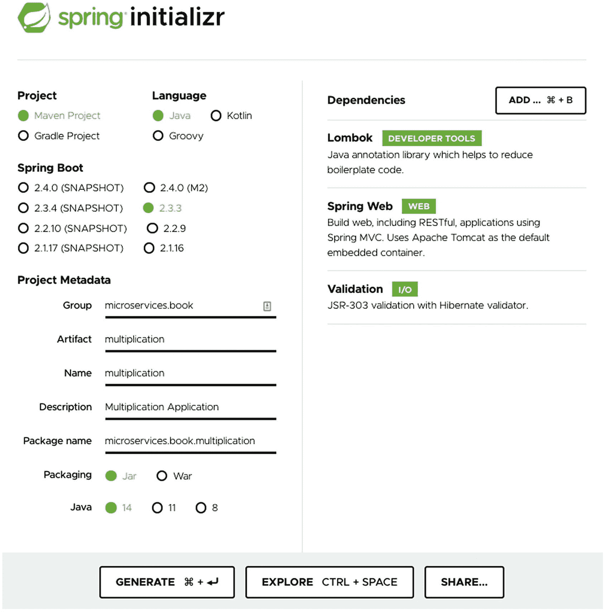
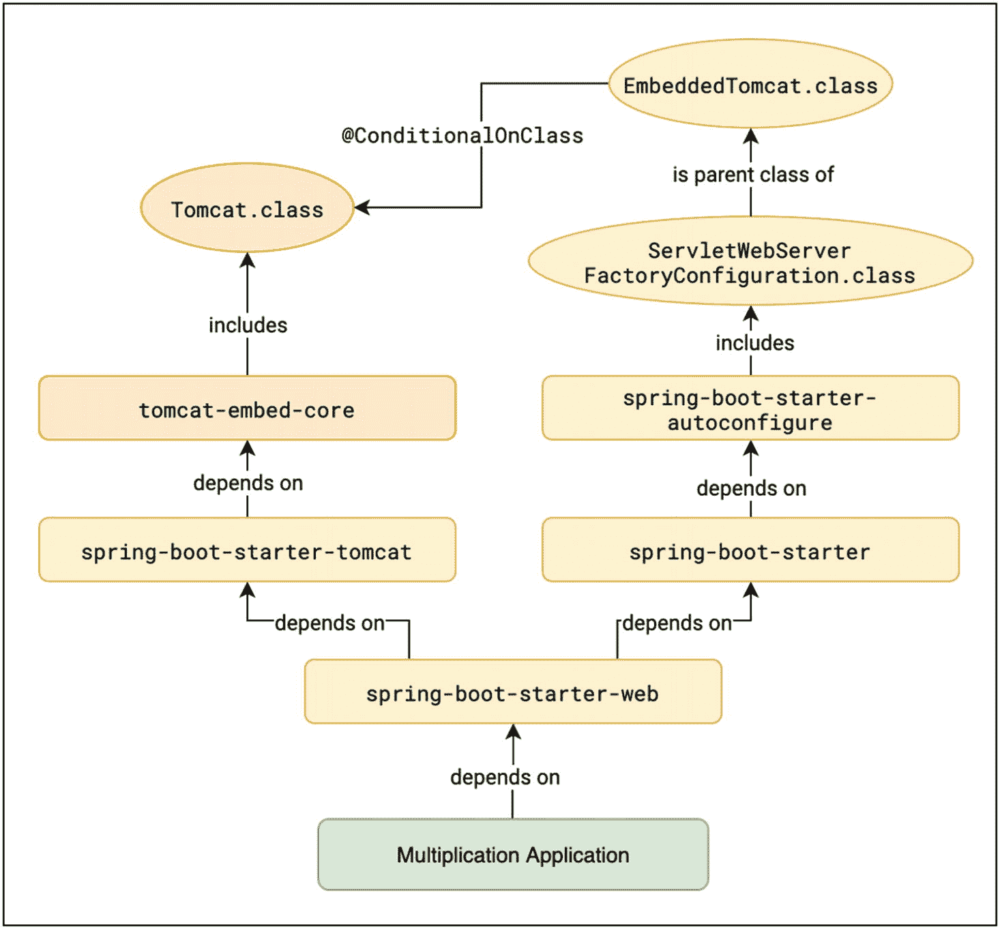
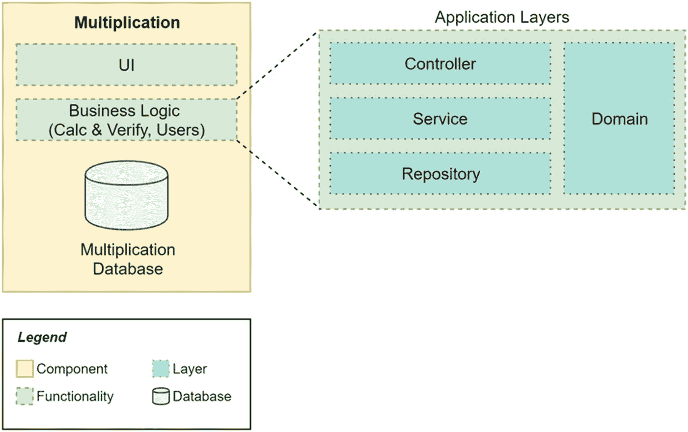
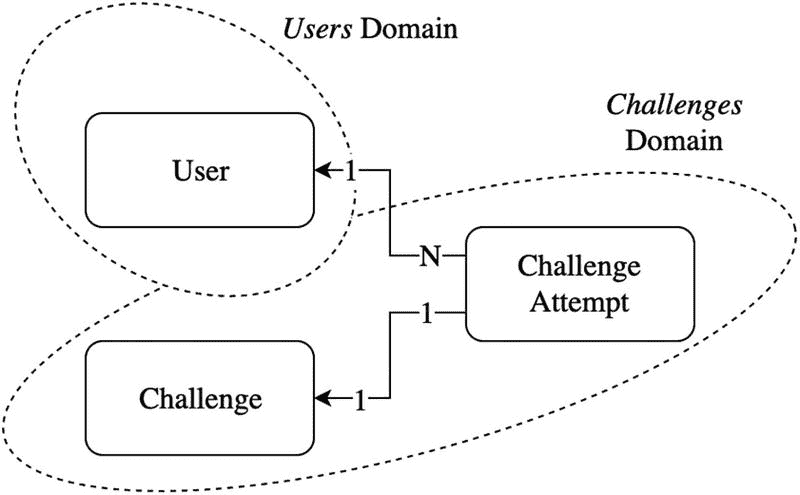
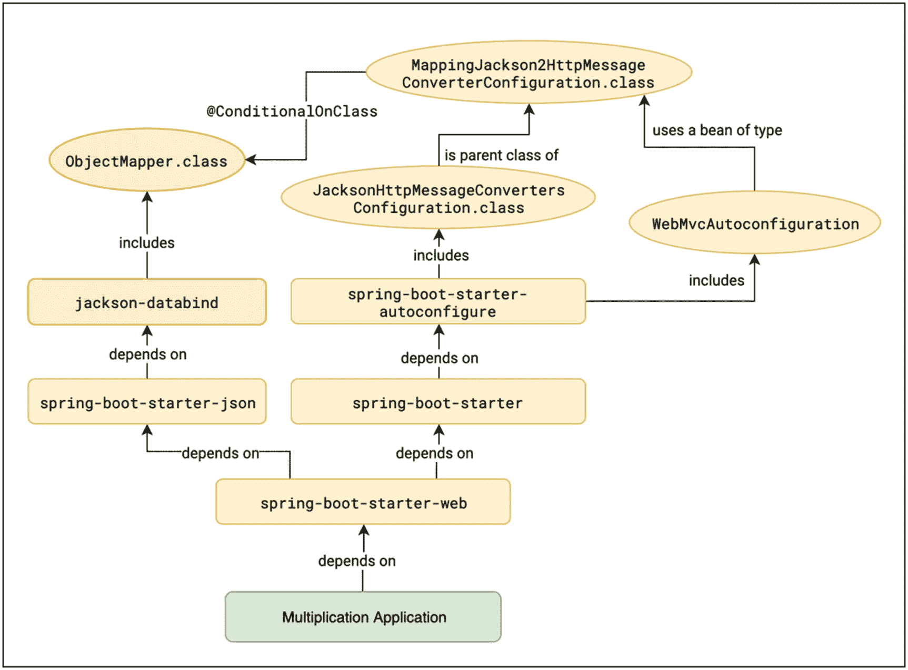
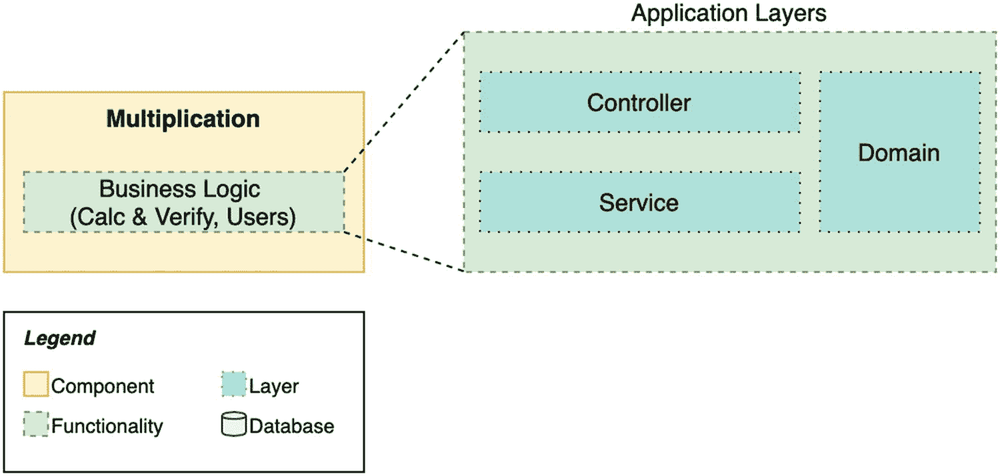

# 3.一个基本的 Spring Boot 应用

我们可以直接开始编写代码，但是，即使这样做很实用，也远远不能成为现实。相反，我们将定义一个我们想要构建的产品，并将它分成小块。这种面向需求的方法在整本书中都有使用，以使它更加实用。在现实生活中，您总是会有这些业务需求。

我们想要一个 web 应用程序来鼓励用户每天锻炼大脑。首先，我们将向用户展示两位数的乘法，每次用户访问页面时都会显示一次。他们将键入他们的别名(简称)和他们对操作结果的猜测。这个想法是他们应该只用心算。在他们发送数据后，网页会提示用户猜测是否正确。

此外，我们希望尽可能保持用户的积极性。为了实现这一点，我们将使用一些游戏化。对于每个正确的猜测，我们给用户分数，他们将在一个排名中看到自己的分数，这样他们就可以与其他人竞争。

这是我们将构建的完整应用程序的主要思想，我们的产品愿景。但我们不会一次建成。这本书将模拟一种敏捷的工作方式，在这种方式中，我们将需求分解成用户故事，即小块的功能，这些功能本身就有价值。我们将遵循这种方法，使本书尽可能贴近现实生活，因为绝大多数 IT 公司都使用敏捷。

先从简单的开始，先把重点放在乘法求解逻辑上。考虑这里的第一个用户故事。

用户故事 1

作为该应用程序的用户，我想使用心算解决一个随机乘法问题，所以我锻炼了我的大脑。

为了实现这一点，我们需要构建一个 web 应用程序的最小框架。因此，我们将把用户故事分成几个子任务。

1.  创建具有业务逻辑的基本服务。

2.  创建一个基本的 API 来访问这个服务(REST API)。

3.  创建一个基本的网页，要求用户解决计算。

在这一章中，我们将关注 1 和 2。在创建了我们的第一个 Spring Boot 应用程序的框架之后，我们将使用测试驱动开发来构建这个组件的主要逻辑:生成乘法挑战并验证用户解决这些挑战的尝试。然后，我们将添加实现 REST API 的控制器层。您将了解这种分层设计的优势。

我们的学习路径包括一些关于 Spring Boot 最重要的特性之一的推理:自动配置。我们将使用我们的实际案例来看看，例如，应用程序如何包含它自己的嵌入式 web 服务器，仅仅是因为我们向我们的项目添加了一个特定的依赖项。

## 设置开发环境

我们将在本书中使用 Java 14。确保你至少从官方下载页面( [`https://tpd.io/jdk14`](https://tpd.io/jdk14) )获得那个版本的 JDK。按照操作系统的说明安装它。

好的 IDE 也方便开发 Java 代码。如果你有更喜欢的，就用它。否则，您可以下载例如 IntelliJ IDEA 或 Eclipse 的社区版本。

在本书中，我们还将使用 HTTPie 来快速测试我们的 web 应用程序。它是一个命令行工具，允许我们与 HTTP 服务器进行交互。您可以按照 [`https://tpd.io/httpie-install`](https://tpd.io/httpie-install) 处的说明下载适用于 Linux、Mac 或 Windows 的软件。或者，如果你是一个`curl`用户，你也可以很容易地将这本书的`http`命令映射到`curl`命令。

## 框架网络应用

是时候写点代码了！Spring 提供了一种构建应用程序框架的奇妙方式:Spring Initializr。这是一个网页，允许我们选择要在我们的 Spring Boot 项目中包含哪些组件和库，它将结构和依赖项配置生成到一个我们可以下载的 zip 文件中。我们将在书中多次使用 Initializr，因为它节省了从头创建项目的时间，但是如果您喜欢，您也可以自己创建项目。

源代码:第三章

您可以在 GitHub 的`chapter03`资源库中找到本章的所有源代码。

[`https://github.com/Book-Microservices-v2/chapter03`见](https://github.com/Book-Microservices-v2/chapter03)。

我们导航到 [`https://start.spring.io/`](https://start.spring.io/) ，填写一些数据，如图 [3-1](#Fig1) 所示。



图 3-1

用 Spring Initializr 创建 Spring Boot 项目

本书中的所有代码都使用 Maven、Java 和 Spring Boot 版本 2.3.3，所以让我们坚持使用它们。如果 Spring Boot 版本不可用，您可以选择更新版本。在这种情况下，如果您想使用与书中相同的版本，记得稍后在生成的`pom.xml`文件中更改它。您也可以继续使用其他 Java 和 Spring Boot 版本，但是本书中的一些代码示例可能不适合您。查看在线图书资源( [`https://tpd.io/book-extra`](https://tpd.io/book-extra) )了解关于兼容性和升级的最新消息。

给组(`microservices.book`)和工件(`multiplication`)一些值。选择 Java 14。不要忘记从列表或搜索工具中添加依赖项 Spring Web、Validation 和 Lombok。你已经知道了 Lombok 的用途，你将在本章看到其他两个依赖项的作用。这就是我们目前所需要的。

生成项目并提取 ZIP 内容。`multiplication`文件夹包含运行应用程序所需的一切。现在您可以用您最喜欢的 IDE 打开它，通常是通过选择`pom.xml`文件。

这些是我们将在自动生成的包中找到的主要元素:

*   Maven 的`pom.xml`文件包含应用程序元数据、配置和依赖项。这是 Maven 用来构建应用程序的主文件。我们将分别检查 Spring Boot 添加的一些依赖项。在这个文件中，您还可以找到使用 Spring Boot 的 Maven 插件构建应用程序的配置，该插件也知道如何将其所有依赖项打包到一个独立的`.jar`文件中，以及如何从命令行运行这些应用程序。

*   有 Maven 包装器。这是 Maven 的独立版本，所以你不需要安装它来构建你的应用。这些是用于基于 Windows 和 UNIX 的系统的`.mvn`文件夹和`mvnw`可执行文件。

*   我们会找到一个`HELP.md`文件，里面有一些 Spring Boot 文档的链接。

*   假设我们将使用 Git 作为版本控制系统，包含的`.gitignore`有一些预定义的排除，所以我们不会将编译的类或任何 IDE 生成的文件提交到存储库中。

*   `src`文件夹遵循标准的 Maven 结构，将代码分成子文件夹`main`和`test`。两个文件夹都可能包含他们各自的`java`和`resources`孩子。在这种情况下，我们的主代码和测试都有一个源文件夹，主代码有一个资源文件夹。
    *   在我们的主源中有一个默认创建的类，`MultiplicationApplication`。它已经用`@SpringBootApplication`进行了注释，并且包含了启动应用程序的`main`方法。这是定义 Spring Boot 应用程序主类的标准方式，详见参考文档( [`https://tpd.io/sb-annotation`](https://tpd.io/sb-annotation) )。我们稍后会看一看这个类。

    *   在 resources 文件夹中，我们找到两个空的子文件夹:`static`和`templates`。您可以安全地删除它们，因为它们旨在包含我们不会使用的静态资源和 HTML 模板。

    *   `application.properties`文件是我们可以配置 Spring Boot 应用程序的地方。我们稍后将在这里添加一些配置参数。

既然我们已经了解了这个骨架的不同部分，让我们试着让它行走。要运行此应用程序，您可以使用您的 IDE 界面或使用项目根文件夹中的以下命令:

```java
multiplication $ ./mvnw spring-boot:run

```

从终端运行命令

在本书中，我们使用`$`字符来表示命令提示符。该字符之后的所有内容都是命令本身。有时，需要强调的是，您必须在工作区的给定文件夹中运行该命令。在这种情况下，您会在`$`字符前找到文件夹名称(例如`multiplication $`)。当然，你的工作空间的具体位置可能会有所不同。

还要注意，根据您使用的是基于 UNIX 的操作系统(如 Linux 或 Mac)还是 Windows，一些命令可能会有所不同。本书中显示的所有命令都使用基于 UNIX 的系统版本。

当我们运行这个命令时，我们使用了包含在项目主文件夹(`mvnw`)中的 Maven 包装器，目标是(Maven 可执行文件旁边的内容)`spring-boot:run`。这个目标是由 Spring Boot 的 Maven 插件提供的，也包含在 Initializr 网页生成的`pom.xml`文件中。Spring Boot 应用程序应该会成功启动。日志中的最后一行应该是这样的:

```java
INFO 4139 --- [main] m.b.m.MultiplicationApplication: Started MultiplicationApplication in 6.599 seconds (JVM running for 6.912)

```

太好了。我们不用写一行代码就能运行第一个 Spring Boot 应用程序！然而，我们还不能做太多的事情。这个应用程序在做什么？我们很快就会知道的。

## Spring Boot 自动配置

在我们的 skeleton 应用程序的日志中，您还可以找到这样一行日志:

```java
INFO 30593 --- [main] o.s.b.w.embedded.tomcat.TomcatWebServer: Tomcat initialized with port(s): 8080 (http)

```

由于 Spring 中的自动配置特性，当我们添加 web 依赖时，我们得到的是一个使用 Tomcat 的可独立部署的 web 应用程序。

正如我们在前一章介绍的，Spring Boot 自动设置库和默认配置。当我们依赖所有这些默认值时，这为我们节省了大量时间。其中一个约定是，当我们将 Web starter 添加到项目中时，添加一个现成的 Tomcat 服务器。

为了学习更多关于 Spring Boot 自动配置的知识，让我们一步一步地看看这个具体的例子是如何工作的。也可使用图 [3-2](#Fig2) 获得一些有用的视觉帮助。

我们自动生成的 Spring Boot 应用程序有一个用`@SpringBootApplication`注释的主类。这是一个*快捷方式*注释，因为它集合了其他几个注释，其中就有`@EnableAutoConfiguration`。顾名思义，通过这个，我们可以启用自动配置功能。因此，Spring 激活了这个智能机制，从您自己的代码和您的依赖项中找到并处理用`@Configuration`注释进行了注释的类。

我们的项目包括依赖关系`spring-boot-starter-web`。这是 Spring Boot 的主要组件之一，它拥有构建 web 应用程序的工具。在这个工件的依赖项中，Spring Boot 的开发人员添加了另一个启动器，`spring-boot-starter-tomcat`。见清单 [3-1](#PC4) 或网上来源( [`https://tpd.io/starter-web-deps`](https://tpd.io/starter-web-deps) )。

```java
plugins {
    id "org.springframework.boot.starter"
}

description = "Starter for building web, including RESTful, applications using Spring MVC. Uses Tomcat as the default embedded container"

dependencies {
    api(project(":spring-boot-project:spring-boot-starters:spring-boot-starter"))
    api(project(":spring-boot-project:spring-boot-starters:spring-boot-starter-json"))
    api(project(":spring-boot-project:spring-boot-starters:spring-boot-starter-tomcat"))
    api("org.springframework:spring-web")
    api("org.springframework:spring-webmvc")

}

Listing 3-1Web Starter Dependencies

```

正如你所看到的，Spring Boot 工件使用 Gradle(从 2.3 版本开始)，但是你不需要知道具体的语法来理解依赖关系是什么。如果我们现在检查`spring-boot-starter-tomcat`工件的依赖项(在清单 [3-2](#PC5) 或在线资源中，在 [`https://tpd.io/tomcat-starter-deps`](https://tpd.io/tomcat-starter-deps) )，我们看到它包含一个不属于 Spring 家族的库`tomcat-embed-core`。这是一个 Apache 库，我们可以用它来启动 Tomcat 嵌入式服务器。它的主要逻辑包含在一个名为`Tomcat`的类中。

```java
plugins {
    id "org.springframework.boot.starter"
}

description = "Starter for using Tomcat as the embedded servlet container. Default servlet container starter used by spring-boot-starter-web"

dependencies {
    api("jakarta.annotation:jakarta.annotation-api")
    api("org.apache.tomcat.embed:tomcat-embed-core") {
        exclude group: "org.apache.tomcat", module: "tomcat-annotations-api"
    }
    api("org.glassfish:jakarta.el")

    api("org.apache.tomcat.embed:tomcat-embed-websocket") {
        exclude group: "org.apache.tomcat", module: "tomcat-annotations-api"
    }
}

Listing 3-2Tomcat Starter Dependencies

```

回到依赖关系的层次结构，`spring-boot-starter-web`也依赖于`spring-boot-starter`(参见清单 [3-1](#PC4) 和图 [3-2](#Fig2) 获得一些上下文帮助)。那是*核心* Spring Boot 启动器，其中包括神器`spring-boot-autoconfigure`(见清单 [3-3](#PC6) 或网上来源，在 [`https://tpd.io/sb-starter`](https://tpd.io/sb-starter) )。那个 Spring Boot 工件有一整套注释有`@Configuration`的类，它们负责整个 Spring Boot 魔法的很大一部分。有一些类用于配置 web 服务器、消息代理、错误处理程序、数据库等等。在 [`https://tpd.io/auto-conf-packages`](https://tpd.io/auto-conf-packages) 查看完整的软件包列表，更好地了解支持的工具。

```java
plugins {
    id "org.springframework.boot.starter"
}

description = "Core starter, including auto-configuration support, logging and YAML"

dependencies {
    api(project(":spring-boot-project:spring-boot"))
    api(project(":spring-boot-project:spring-boot-autoconfigure"))
    api(project(":spring-boot-project:spring-boot-starters:spring-boot-starter-logging"))
    api("jakarta.annotation:jakarta.annotation-api")
    api("org.springframework:spring-core")
    api("org.yaml:snakeyaml")

}

Listing 3-3Spring Boot’s Main Starter

```

对我们来说，负责嵌入式 Tomcat 服务器自动配置的相关类是`ServletWebServerFactoryConfiguration`。查看清单 [3-4](#PC7) 显示其最相关的代码片段，或者查看在线提供的完整源代码( [`https://tpd.io/swsfc-source`](https://tpd.io/swsfc-source) )。

```java
@Configuration(proxyBeanMethods = false)
class ServletWebServerFactoryConfiguration {

    @Configuration(proxyBeanMethods = false)
    @ConditionalOnClass({ Servlet.class, Tomcat.class, UpgradeProtocol.class })
    @ConditionalOnMissingBean(value = ServletWebServerFactory.class, search = SearchStrategy.CURRENT)
    static class EmbeddedTomcat {

        @Bean
        TomcatServletWebServerFactory tomcatServletWebServerFactory(
                ObjectProvider<TomcatConnectorCustomizer> connectorCustomizers,
                ObjectProvider<TomcatContextCustomizer> contextCustomizers, 

                ObjectProvider<TomcatProtocolHandlerCustomizer<?>> protocolHandlerCustomizers) {
            TomcatServletWebServerFactory factory = new TomcatServletWebServerFactory();
            factory.getTomcatConnectorCustomizers()
                    .addAll(connectorCustomizers.orderedStream().collect(Collectors.toList()));
            factory.getTomcatContextCustomizers()
                    .addAll(contextCustomizers.orderedStream().collect(Collectors.toList()));
            factory.getTomcatProtocolHandlerCustomizers()
                    .addAll(protocolHandlerCustomizers.orderedStream().collect(Collectors.toList()));
            return factory;
        }

    }
    // ...
}

Listing 3-4ServletWebServerFactoryConfiguration Fragment

```

这个类定义了一些内部类，其中一个是`EmbeddedTomcat`。如你所见，这个注释是这样的:

```java
@ConditionalOnClass({ Servlet.class, Tomcat.class, UpgradeProtocol.class })

```

Spring 处理`@ConditionalOnClass`注释，如果在类路径中可以找到被链接的类，那么这个注释用于在上下文中加载 beans。在这种情况下，条件是匹配的，因为我们已经看到了`Tomcat`类是如何通过 starter 层次结构进入我们的类路径的。因此，Spring 加载了在`EmbeddedTomcat`中声明的 bean，结果是一个`TomcatServletWebServerFactory`。

该工厂包含在 Spring Boot 的核心工件(`spring-boot`，包含在`spring-boot-starter`中的一个依赖项)中。它用一些默认配置设置了一个 Tomcat 嵌入式服务器。这是创建嵌入式 web 服务器的逻辑最终存在的地方。



图 3-2

自动配置示例:嵌入式 Tomcat

再次重述一下，Spring 扫描我们所有的类，假设满足了`EmbeddedTomcat`中规定的条件(Tomcat 库*是*包含的依赖项)，它在上下文中加载一个`TomcatServletWebServerFactory` bean。这个 Spring Boot 类使用默认配置启动一个嵌入式 Tomcat 服务器，在端口 8080 上公开一个 HTTP 接口。

可以想象，这种相同的机制适用于数据库、web 服务器、消息代理、云原生模式、安全性等许多其他库。在 Spring Boot，您可以找到多个可以作为依赖项添加的启动器。当您这样做时，自动配置机制开始发挥作用，并且您获得了开箱即用的额外行为。许多配置类是以其他类的存在为条件的，就像我们分析的那些，但是还有其他条件类型，例如，`application.properties`文件中的参数值。

自动配置是 Spring Boot 的一个关键概念。一旦你理解了它，许多开发者认为神奇的特性对你来说就不再是秘密了。我们浏览了这些细节，因为了解这种机制非常重要，这样您就可以根据自己的需要配置它，避免出现许多您不想要或根本不需要的行为。一个好的做法是，仔细阅读您正在使用的 Spring Boot 模块的文档，并熟悉它们允许的配置选项。

如果你没有完全理解这个概念，不要担心；在本书中，我们将多次回到自动配置机制。原因是我们将向我们的应用程序添加额外的特性，为此，我们需要向我们的项目添加额外的依赖项，并分析它们引入的新行为。

## 三层，三层架构

我们实践旅程的下一步是设计如何在不同的类中构建我们的应用程序和建模我们的业务逻辑。

多层架构将为我们的应用程序提供一个更适合生产的外观。大多数现实世界的应用程序都遵循这种架构模式。在 web 应用程序中，*三层设计*是最流行的一种，并且得到了广泛的扩展。这三层如下:

*   客户层:这一层负责用户界面。通常，这就是我们所说的*前端*。

*   *应用层*:这包含所有的业务逻辑，以及与之交互的接口和持久化的数据接口。这映射到我们所说的*后端*。

*   *数据存储层*:是数据库、文件系统等。，它保存应用程序的数据。

在本书中，我们主要关注应用层，尽管我们也会用到其他两层。如果我们现在放大，应用层通常使用三层来设计。

*   *业务层*:这包括对我们的领域和业务细节建模的类。这是应用程序的智能所在。有时这一层分为两部分:领域(实体)和提供业务逻辑的应用程序(服务)。

*   *表示层*:在我们的例子中，它将由`Controller`类来表示，这些类将向 web 客户端提供功能。我们的 REST API 实现将驻留在这里。

*   *数据层*:这一层将负责将我们的实体保存在数据存储中，通常是数据库。它通常可以包括*数据访问对象* (DAO)类，它们处理直接映射到数据库中的行的对象，或者*存储库*类，它们是以域为中心的，因此它们可能需要从域表示转换到数据库结构。

我们现在的目标是将这个模式应用到乘法 web 应用程序中，如图 [3-3](#Fig3) 所示。



图 3-3

三层，三层架构应用于我们的 Spring Boot 项目

使用这种软件架构的优点都与实现松耦合有关。

*   所有层都是可互换的(例如，为文件存储解决方案更改数据库，或者从 REST API 更改为任何其他接口)。这是一项关键资产，因为它使得代码库的发展变得更加容易。此外，你可以用测试模拟来替换完整的层，这使得你的测试简单，正如我们将在本章后面看到的。

*   领域部分是孤立的，独立于其他任何东西。它没有混合接口或数据库细节。

*   有明确的职责划分:一个类处理对象的数据库存储，一个单独的类用于 REST API 实现，另一个类用于业务逻辑。

Spring 是构建这种类型架构的绝佳选择，它具有许多现成的特性，可以帮助我们轻松创建一个生产就绪的三层应用程序。它为我们的类提供了三个*原型*注释，映射到这个设计的每一层，所以我们可以使用它们来实现我们的架构。

*   `@Controller`注释用于表示层。在我们的例子中，我们将使用控制器实现一个 REST 接口。

*   `@Service`注释用于实现业务逻辑的类。

*   `@Repository`注释用于数据层，即与数据库交互的类。

当我们用这些变体注释类时，它们变成了 Spring 管理的*组件*。当初始化 web 上下文时，Spring 扫描您的包，找到这些类，并将它们作为 beans 加载到上下文中。然后，我们可以使用依赖注入来连接(或*注入*)这些 beans，例如，使用来自我们的表示层(控制器)的服务。我们将很快在实践中看到这一点。

## 为我们的领域建模

让我们从建模我们的业务领域开始，因为这将帮助我们构建我们的项目。

### 领域定义和领域驱动设计

我们的第一个 web 应用程序负责生成乘法挑战并验证用户的后续尝试。让我们定义这三个业务实体。

*   *挑战*:包含乘法挑战的两个要素

*   *用户*:识别将尝试解决挑战的人

*   *挑战尝试*:代表用户尝试通过挑战解决操作

我们可以对这些域对象及其关系进行建模，如图 [3-4](#Fig4) 所示。



图 3-4

商业模式

这些对象之间的关系如下:

*   用户和挑战是独立的实体。他们没有任何证明。

*   *挑战尝试*总是针对给定的用户和给定的挑战。从概念上讲，如果生成的挑战数量有限，则同一挑战可能会有多次尝试。此外，同一个用户可以创建多次尝试，因为他们可以根据需要多次使用 web 应用程序。

在图 [3-4](#Fig4) 中，您还可以看到我们如何将这三个对象分成两个不同的域:用户和挑战。寻找域边界(也称为有界上下文；参见 [`https://tpd.io/bounded-ctx`](https://tpd.io/bounded-ctx) )定义对象之间的关系是设计软件的基本任务。这种基于领域的设计方法被称为*领域驱动设计* (DDD)。它帮助您构建一个模块化的、可伸缩的、松散耦合的架构。在我们的例子中，用户和挑战是完全不同的概念。挑战，以及他们的尝试，都与用户有关，但它们加在一起有足够的相关性，属于他们自己的领域。

为了让 DDD 更清晰，我们可以考虑这个小系统的一个进化版本，其中其他域与用户或挑战相关。例如，我们可以通过创建域*朋友*并对用户之间的关系和交互进行建模来引入社交网络功能。如果我们将域用户和挑战混为一谈，这种演变将更难完成，因为新的域与挑战无关。

关于 DDD 的额外阅读，你可以得到 Eric Evans 的书( [`https://tpd.io/ddd-book`](https://tpd.io/ddd-book) )或者下载免费的 InfoQ 小册子( [`https://tpd.io/ddd-quickly`](https://tpd.io/ddd-quickly) )。

微服务和领域驱动设计

设计微服务时的一个常见错误是认为每个域必须立即划分到不同的微服务中。然而，这可能导致过早的优化，并且从软件项目的开始就导致指数级的复杂性增加。

我们将深入了解关于微服务和整体优先方法的更多细节。目前，重要的是建模域是一项至关重要的任务，但是分割域并不需要将代码分割成微服务。在我们的第一个应用程序中，我们将两个域放在一起，但不会混淆。我们将使用一个简单的分割策略:根级包。

### 领域类别

是时候创建类`Challenge`、`ChallengeAttempt`和`User`了。首先，我们将根包(`microservices.book.multiplication`)分成两部分:`users`和`challenges`，遵循我们为乘法应用程序确定的域。然后，我们用这两个包中选择的名称创建三个空类。见清单 [3-5](#PC9) 。

```java
+- microservices.book.multiplication.user
|  \- User.java
+- microservices.book.multiplication.challenge
|  \- Challenge.java
|  \- ChallengeAttempt.java

Listing 3-5Splitting Domains by Creating Different Root Packages

```

因为我们在创建 skeleton 应用程序时添加了 Lombok 作为依赖项，所以我们可以使用它来保持我们的域类非常小，正如上一章所描述的。请记住，您可能需要在您的 IDE 中添加一个插件，以获得与 Lombok 的完全集成；否则，你可能会从 linter 得到错误。例如，在 IntelliJ 中，您可以通过选择首选项➤插件并搜索 *Lombok* 来安装官方 Lombok 插件。

`Challenge`类保存乘法的两个因子。我们添加了 getters，一个包含所有字段的构造函数，以及`toString()`、`equals()`和`hashCode()`方法。见清单 [3-6](#PC10) 。

```java
package microservices.book.multiplication.challenge;

import lombok.*;

/**
 * This class represents a Challenge to solve a Multiplication (a * b).
 */
@Getter
@ToString
@EqualsAndHashCode
@AllArgsConstructor
public class Challenge {
    private int factorA; 

    private int factorB;
}

Listing 3-6The Challenge Class

```

`User`类具有相同的 Lombok 注释、用户标识符和友好别名(例如，用户的名字)。参见清单 [3-7](#PC11) 。

```java
package microservices.book.multiplication.user;

import lombok.*;

/**
 * Stores information to identify

the user.
 */
@Getter
@ToString
@EqualsAndHashCode
@AllArgsConstructor
public class User {
    private Long id;
    private String alias;
}

Listing 3-7The User Class

```

尝试也有一个`id`，用户输入的值(`resultAttempt`，以及是否正确。见清单 [3-8](#PC12) 。我们通过`userId`将它链接到用户。请注意，我们这里也有两个挑战因素。我们这样做是为了避免通过`challengeId`引用一个挑战，因为我们可以简单地“动态”生成新的挑战，并将它们复制到这里以保持我们的数据结构简单。因此，正如你所看到的，我们有多种选择来实现我们在图 [3-4](#Fig4) 中描述的业务模型。为了对与用户的关系进行建模，我们使用一个引用；为了模拟挑战，我们将数据嵌入到尝试中。当我们讨论数据持久性时，我们将在第 [5](5.html) 章中更详细地分析这个决定。

```java
package microservices.book.multiplication.challenge;

import lombok.*;
import microservices.book.multiplication.user.User;

/**
 * Identifies the attempt from a {@link User} to solve a challenge.
 */
@Getter
@ToString
@EqualsAndHashCode
@AllArgsConstructor
public class ChallengeAttempt {
    private Long id;
    private Long userId;
    private int factorA;
    private int factorB;
    private int resultAttempt;
    private boolean correct;
}

Listing 3-8The ChallengeAttempt Class

```

## 业务逻辑

一旦我们定义了领域模型，就该考虑业务逻辑的另一部分了:应用服务。

### 我们需要什么

查看了我们的需求后，我们需要以下内容:

*   一种产生中等复杂度乘法问题的方法。让我们把 11 到 99 之间的所有因子都做出来。

*   一些检查尝试是否正确的功能。

### 随机挑战

让我们为我们的业务逻辑将测试驱动开发付诸实践。首先，我们编写一个基本接口来生成随机挑战。参见清单 [3-9](#PC13) 。

```java
package microservices.book.multiplication.challenge;

public interface ChallengeGeneratorService {

  /**
   * @return a randomly-generated challenge with factors between 11 and 99
   */
  Challenge randomChallenge();

}

Listing 3-9The ChallengeGeneratorService Interface

```

我们也将这个接口放在`challenge`包中。现在，我们编写这个接口的一个空实现，它包装了一个 Java 的`Random`。见清单 [3-10](#PC14) 。除了无参数构造函数之外，我们还通过第二个接受随机对象的构造函数使我们的类可测试。

```java
package microservices.book.multiplication.challenge;

import org.springframework.stereotype.Service;

import java.util.Random;

@Service
public class ChallengeGeneratorServiceImpl implements ChallengeGeneratorService {

    private final Random random;

    ChallengeGeneratorServiceImpl() {
        this.random = new Random();
    }

    protected ChallengeGeneratorServiceImpl(final Random random) {
        this.random = random; 

    }

    @Override
    public Challenge randomChallenge() {
        return null;
    }
}

Listing 3-10An Empty Implementation of the ChallengeGeneratorService Interface

```

为了指示 Spring 在上下文中加载这个服务实现，我们用`@Service`来注释这个类。我们可以稍后通过使用接口而不是实现将该服务注入到其他层中。这样，我们就保持了松耦合，因为我们可以交换实现，而不需要改变其他层中的任何东西。我们将很快将依赖注入付诸实践。现在，让我们关注 TDD，让`randomChallenge()`实现保持空白。

下一步是为此编写一个测试。我们在同一个包中创建一个类，但是这次是在`test`源文件夹中。参见清单 [3-11](#PC15) 。

```java
package microservices.book.multiplication.challenge;

import org.junit.jupiter.api.BeforeEach;
import org.junit.jupiter.api.Test;
import org.junit.jupiter.api.extension.ExtendWith; 

import org.mockito.Spy;
import org.mockito.junit.jupiter.MockitoExtension;

import java.util.Random;

import static org.assertj.core.api.BDDAssertions.then;
import static org.mockito.BDDMockito.given;

@ExtendWith(MockitoExtension.class)
public class ChallengeGeneratorServiceTest {

    private ChallengeGeneratorService challengeGeneratorService;

    @Spy
    private Random random; 

    @BeforeEach
    public void setUp() {
        challengeGeneratorService = new ChallengeGeneratorServiceImpl(random);
    }

    @Test
    public void generateRandomFactorIsBetweenExpectedLimits() {
        // 89 is max - min range
        given(random.nextInt(89)).willReturn(20, 30);

        // when we generate a challenge
        Challenge challenge = challengeGeneratorService.randomChallenge();

        // then the challenge contains factors as expected
        then(challenge).isEqualTo(new Challenge(31, 41)); 

    }

}

Listing 3-11Creating the Unit Test Before the Real Implementation

```

在前一章中，我们回顾了如何使用 Mockito 用 JUnit 5 的`@Mock`注释和`MockitoExtension`类替换给定类的行为。在这个测试中，我们需要替换一个对象的行为，而不是一个类。我们用`@Spy`来存根一个对象。Mockito 扩展将有助于使用空构造函数创建一个`Random`实例，并为我们清除它以覆盖行为。这是让我们的测试工作的最简单的方法，因为实现随机生成器的基本 Java 类不能在接口上工作(我们可以简单地用*模仿*而不是*窥探*)。

通常，我们在一个用`@BeforeEach`标注的方法中初始化所有测试所需的东西，所以这发生在每个测试开始之前。这里我们构造了传递这个存根对象的服务实现。

唯一的测试方法是按照 BDD 风格用`given()`设置前提条件。生成 11 到 99 之间的随机数的方法是得到一个 0 到 89 之间的随机数，然后在上面加 11。因此，我们知道应该用`89`调用`random`来生成范围`11, 100`内的数字，所以我们在第一次调用时覆盖该调用以返回`20`，第二次调用时返回`30`。然后，当我们调用`randomChallenge()`时，我们期望它从`random`(我们的存根对象)获得随机数 20 和 30，并因此返回一个带有`31`和`41`的`Challenge`对象。

所以，我们做了一个测试，当你运行它的时候很明显会失败。我们来试试吧；您可以从项目的根文件夹中使用 IDE 或 Maven 命令。

```java
multiplication$ ./mvnw test

```

不出所料，测试会失败。参见清单 [3-12](#PC17) 中的结果。

```java
Expecting:
 <null>
to be equal to:
 <Challenge(factorA=20, factorB=30)>
but was not.
Expected :Challenge(factorA=20, factorB=30)
Actual   :null

Listing 3-12Error Output After Running the Test for the First Time

```

现在，我们只需要通过测试。在我们的例子中，解决方案非常简单，我们需要在实现测试的时候解决它。稍后，我们将看到更多有价值的 TDD 案例，但是这个案例已经帮助我们开始这种工作方式。参见清单 [3-13](#PC18) 。

```java
@Service
public class ChallengeGeneratorServiceImpl implements ChallengeGeneratorService {

    private final static int MINIMUM_FACTOR = 11;
    private final static int MAXIMUM_FACTOR = 100;

    // ...

    private int next() {
        return random.nextInt(MAXIMUM_FACTOR - MINIMUM_FACTOR) + MINIMUM_FACTOR;
    }

    @Override
    public Challenge randomChallenge() {
        return new Challenge(next(), next());

    }
}

Listing 3-13Implementing a Valid Logic to Generate Challenges

```

现在，我们再次运行测试，这次它通过了:

```java
[INFO] Tests run: 1, Failures: 0, Errors: 0, Skipped: 0

```

测试驱动开发就是这么简单。首先，您设计测试，这些测试在开始时会失败。然后，你实现你的逻辑让他们通过。在现实生活中，当您从定义需求的人那里获得构建测试用例的帮助时，您会得到最大的收获。您可以编写更好的测试，从而更好地实现您真正想要构建的东西。

### 尝试验证

为了满足业务需求的第二部分，我们实现了一个接口来验证用户的尝试。参见清单 [3-14](#PC20) 。

```java
package microservices.book.multiplication.challenge;

public interface ChallengeService {

    /**
     * Verifies if an attempt

coming from the presentation layer is correct or not.
     *
     * @return the resulting ChallengeAttempt object
     */
    ChallengeAttempt verifyAttempt(ChallengeAttemptDTO resultAttempt);

}

Listing 3-14The ChallengeService Interface

```

正如您在代码中看到的，我们将一个`ChallengeAttemptDTO`对象传递给了`verifyAttempt`方法。这个类还不存在。*数据传输对象*(dto)在系统的不同部分之间传送数据。在这种情况下，我们使用 DTO 对表示层所需的数据进行建模，以创建一个尝试。见清单 [3-15](#PC21) 。来自用户的尝试没有字段`correct`，也不需要知道用户的 ID。我们还可以使用 dto 来验证数据，我们将在构建控制器时看到这一点。

```java
package microservices.book.multiplication.challenge;

import lombok.Value;

/**
 * Attempt coming from the user
 */
@Value
public class ChallengeAttemptDTO {

    int factorA, factorB; 

    String userAlias;
    int guess;

}

Listing 3-15The ChallengeAttemptDTO Class

```

这一次我们使用 Lombok 的`@Value`，一个快捷方式注释，用一个全参数构造函数和`toString`、`equals`和`hashCode`方法创建一个不可变的类。它还会将我们的字段设置为`private final`；这就是为什么我们不需要添加这一点。继续使用 TDD 方法，我们在`ChallengeServiceImpl`接口实现中创建无为逻辑。见清单 [3-16](#PC22) 。

```java
package microservices.book.multiplication.challenge;

import org.springframework.stereotype.Service;

@Service
public class ChallengeServiceImpl implements ChallengeService {

    @Override
    public ChallengeAttempt verifyAttempt(ChallengeAttemptDTO attemptDTO) {
        return null;
    }
}

Listing 3-16An Empty ChallengeService Interface Implementation

```

现在，我们为这个类编写一个单元测试，所以我们验证它对正确和错误的尝试都有效。参见清单 [3-17](#PC23) 。

```java
package microservices.book.multiplication.challenge;

import org.junit.jupiter.api.BeforeEach;
import org.junit.jupiter.api.Test;

import static org.assertj.core.api.BDDAssertions.then; 

public class ChallengeServiceTest {

    private ChallengeService challengeService; 

    @BeforeEach
    public void setUp() {
        challengeService = new ChallengeServiceImpl();
    }

    @Test
    public void checkCorrectAttemptTest() {
        // given
        ChallengeAttemptDTO attemptDTO =
                new ChallengeAttemptDTO(50, 60, "john_doe", 3000);

        // when
        ChallengeAttempt resultAttempt =
                challengeService.verifyAttempt(attemptDTO); 

        // then
        then(resultAttempt.isCorrect()).isTrue();
    }

    @Test
    public void checkWrongAttemptTest() {
        // given
        ChallengeAttemptDTO attemptDTO =
                new ChallengeAttemptDTO(50, 60, "john_doe", 5000);

        // when
        ChallengeAttempt resultAttempt =
                challengeService.verifyAttempt(attemptDTO); 

        // then
        then(resultAttempt.isCorrect()).isFalse();
    }
}

Listing 3-17Writing the Test to Verify Challenge Attempts

```

50 和 60 相乘的结果是 3，000，因此第一个测试用例的断言期望`correct`字段为真，而第二个测试期望错误的猜测为假(5，000)。

让我们现在执行测试。您可以使用 IDE，或者使用 Maven 命令来指定要运行的测试的名称。

```java
multiplication$ ./mvnw -Dtest=ChallengeServiceTest test

```

您将看到类似如下的输出:

```java
[INFO] Results:
[INFO]
[ERROR] Errors:
[ERROR]   ChallengeServiceTest.checkCorrectAttemptTest:28 NullPointer
[ERROR]   ChallengeServiceTest.checkWrongAttemptTest:42 NullPointer
[INFO]
[ERROR] Tests run: 2, Failures: 0, Errors: 2, Skipped: 0

```

正如所预见的，两个测试都将抛出一个空指针异常。

然后，我们回到服务实现，并让它工作。参见清单 [3-18](#PC26) 。

```java
@Override
public ChallengeAttempt verifyAttempt(ChallengeAttemptDTO attemptDTO) {
    // Check if the attempt is correct
    boolean isCorrect = attemptDTO.getGuess() ==
            attemptDTO.getFactorA() * attemptDTO.getFactorB();

    // We don't use identifiers for now
    User user = new User(null, attemptDTO.getUserAlias());

    // Builds the domain object. Null id for now.
    ChallengeAttempt checkedAttempt = new ChallengeAttempt(null,
            user,
            attemptDTO.getFactorA(),
            attemptDTO.getFactorB(),
            attemptDTO.getGuess(),
            isCorrect
    );

    return checkedAttempt;
}

Listing 3-18Implementing the Logic to Verify Attempts

```

我们现在保持简单。后来，这个实现应该处理更多的任务。我们需要创建一个用户或找到一个现有的用户，将该用户连接到新的尝试，并将其存储在数据库中。

现在，再次运行测试以验证它是否通过:

```java
[INFO] Tests run: 2, Failures: 0, Errors: 0, Skipped: 0, Time elapsed: 0.083 s - in microservices.book.multiplication.challenge.ChallengeServiceTest

```

同样，我们成功地使用 TDD 构建了验证挑战尝试的逻辑。

`Users`领域在第一个用户故事的范围内不需要任何业务逻辑，所以让我们进入下一层。

## 表示层

本节将介绍表示层。

### 休息

我们没有从服务器构建 HTML，而是决定像在真正的软件项目中通常所做的那样接近表示层:在它们之间有一个 API 层。通过这样做，我们不仅可以向其他后端服务公开我们的功能，还可以保持后端和前端完全隔离。通过这种方式，我们可以从一个简单的 HTML 页面和普通的 JavaScript 开始，然后在不改变后端代码的情况下迁移到一个完整的前端框架。

在所有可能的 API 选择中，现在最流行的是表述性状态转移(REST)。它通常构建在 HTTP 之上，所以它使用 HTTP 动词来执行 API 操作:GET、POST、PUT、DELETE 等。我们将在本书中构建 RESTful web 服务，它们只是符合 REST 架构风格的 web 服务。因此，我们遵循 URL 和 HTTP 动词的一些约定，这些约定已经成为事实上的标准。见表 [3-1](#Tab1) 。

表 3-1

REST APIs 的约定

<colgroup><col class="tcol1 align-left"> <col class="tcol2 align-left"> <col class="tcol3 align-left"></colgroup> 
| 

HTTP 动词

 | 

对集合的操作，例如/挑战

 | 

对项目的操作，例如挑战/3

 |
| --- | --- | --- |
| 得到 | 获取项的完整列表 | 获取该项 |
| 邮政 | 创建新项目 | 不适用 |
| 放 | 不适用 | 更新项目 |
| 删除 | 删除整个集合 | 删除项目 |

编写 REST APIs 有几种不同的风格。表 [3-1](#Tab1) 显示了本书中最基本的操作和一些约定选择。通过 API 传输的内容还有多个方面:分页、空处理、格式(例如 JSON)、安全性、版本控制等。如果你对这些约定对于一个真实的组织来说可能变得多详细感到好奇，你可以看看 Zalando 的 API 指南( [`https://tpd.io/api-zalando`](https://tpd.io/api-zalando) )。

### 用 Spring Boot 休息 API

用 Spring 构建 REST API 是一项简单的任务。不出所料，`@Controller`原型有一个专门用于构建 REST 控制器的特性，叫做`@RestController`。

为了对不同 HTTP 动词的资源和映射进行建模，我们使用了`@RequestMapping`注释。它适用于类级别和方法级别，因此我们可以用简单的方式构建我们的 API 上下文。为了更简单，Spring 提供了类似于`@PostMapping`、`@GetMapping`等变体。，所以我们甚至不需要指定 HTTP 动词。

每当我们想要将请求的主体传递给我们的方法时，我们就使用`@RequestBody`注释。如果我们使用自定义类，Spring Boot 将尝试反序列化它，使用传递给方法的类型。默认情况下，Spring Boot 使用 JSON 序列化格式，尽管当通过`Accept` HTTP 头指定时，它也支持其他格式。在我们的 web 应用程序中，我们将使用所有的 Spring Boot 默认设置。

我们还可以用请求参数定制我们的 API，并从请求路径读取值。让我们以这个请求为例:

```java
GET http://ourhost.com/challenges/5?factorA=40

```

这些是它不同的部分:

*   `GET`是 HTTP 动词。

*   [`http://ourhost.com/`](http://ourhost.com/) 是运行 web 服务器的主机。在这个例子中，应用程序从*根上下文*、`/`提供服务。

*   `/challenges/`是由应用程序创建的 API 上下文，用于提供该领域的功能。

*   `/5`被称为*路径变量*。在这种情况下，它用标识符`5`表示`Challenge`对象。

*   `factorA=40`是一个请求参数及其值。

为了处理这个请求，我们可以创建一个控制器，将 5 作为路径变量`challengeId`，40 作为请求参数`factorA`。见清单 [3-19](#PC29) 。

```java
@RestController
@RequestMapping("/challenges")
class ChallengeAttemptController {

    @GetMapping("/{challengeId}")
    public Challenge getChallengeWithParam(@PathVariable("challengeId") Long challengeId,
                                           @RequestParam("factorA") int factorA) {...}
}

Listing 3-19An Example of Using Annotations to Map REST API URLs

```

提供的功能不止于此。我们还可以验证 REST 控制器与`javax.validation` API 集成的请求。这意味着我们可以对反序列化期间使用的类进行注释，以避免空值，或者当我们从客户端获得请求时，强制数字在给定的范围内，这只是一个例子。

不要担心引入的新概念的数量。我们将在接下来的章节中用实际的例子来介绍它们。

### 设计我们的 API

我们可以使用需求来设计我们需要在 REST API 中公开哪些功能。

*   一个接口来获得一个随机的，中等复杂度的乘法

*   从给定用户的别名发送给定乘法猜测值的端点

这些是挑战的读取操作和创建尝试的动作。请记住，乘法挑战和尝试是不同的资源，我们将 API 一分为二，并为这些动作分配相应的动词:

*   `GET /challenges/random`将返回随机生成的挑战。

*   `POST /attempts/`将是我们向端点发送解决挑战的尝试。

这两种资源都属于`challenges`域。最终，我们还需要一个`/users`映射来与我们的用户一起执行操作，但是我们将它留到以后，因为我们不需要它来完成第一个需求(用户故事)。

API 优先的方法

在实现 API 契约之前，在您的组织内定义和讨论它通常是一个好的实践。您应该包括端点、HTTP 动词、允许的参数以及请求和响应主体示例。这样，其他开发人员和客户可以验证公开的功能是否是他们需要的，并在您浪费时间实现错误的解决方案之前给出反馈。这种策略被称为 *API First* ，有行业标准来编写 API 规范，比如 OpenAPI。

如果想了解更多关于 *API 第一*和 *OpenAPI* 的内容，请看 [`https://tpd.io/apifirst`](https://tpd.io/apifirst) ，来自 Swagger，规范的最初创造者。

### 我们的第一个控制器

让我们创建一个产生随机挑战的控制器。我们在服务层中已经有了那个操作，所以我们只需要从控制器中使用那个方法。这就是我们在表示层应该做的:保持它与任何业务逻辑隔离。我们将只使用它来建模 API 和验证传递的数据。参见清单 [3-20](#PC30) 。

```java
package microservices.book.multiplication.challenge;

import lombok.RequiredArgsConstructor;
import lombok.extern.slf4j.Slf4j;
import org.springframework.web.bind.annotation.*;

/**
 * This class implements a REST API to get random challenges
 */
@Slf4j
@RequiredArgsConstructor
@RestController
@RequestMapping("/challenges")
class ChallengeController {

    private final ChallengeGeneratorService challengeGeneratorService;

    @GetMapping("/random")
    Challenge getRandomChallenge() {
        Challenge challenge = challengeGeneratorService.randomChallenge();
        log.info("Generating a random challenge: {}", challenge);
        return challenge;
    }
}

Listing 3-20The ChallengeController Class

```

`@RestController`注释告诉 Spring 这是一个建模 REST 控制器的专用组件。它是`@Controller`和`@ResponseBody`的组合，指示 Spring 将这个方法的结果作为 HTTP 响应体。在 Spring Boot，默认情况下，如果没有其他指示，响应将被序列化为 JSON 并包含在响应体中。

我们还在类级别添加了一个`@RequestMapping("/challenges")`,所以所有的映射方法都会添加这个作为前缀。

在我们的控制器中还有两个 Lombok 注释。

*   `@RequiredArgsConstructor`创建一个带有`ChallengeGeneratorService`作为参数的构造函数，因为该字段是私有的和最终的，Lombok 认为这是必需的。Spring 使用依赖注入，所以它会尝试找到实现这个接口的 bean，并将它连接到控制器。在这种情况下，它将采用唯一的候选服务`ChallengeGeneratorServiceImpl`。

*   `Slf4j`创建一个名为`log`的记录器。我们用它来打印一条消息，以控制台生成的挑战。

方法`getRandomChallenge()`有`@GetMapping("/random")`注释。这意味着该方法将处理对上下文`/challenges/random`的 GET 请求，第一部分来自类级注释。它只是返回一个`Challenge`对象。

现在让我们再次运行我们的 web 应用程序，并做一个快速的 API 测试。从 IDE 中运行`MultiplicationApplication`类，或者从控制台中使用`mvnw spring-boot:run`。

使用 HTTPie(参见第 [2 章](2.html)，我们通过在端口 8080 (Spring Boot 的默认端口)上对`localhost`(我们的机器)做一个简单的 GET 请求来尝试我们的新端点。参见清单 [3-21](#PC31) 。

```java
$ http localhost:8080/challenges/random
HTTP/1.1 200
Connection: keep-alive
Content-Type: application/json
Date: Sun, 29 Mar 2020 07:59:00 GMT
Keep-Alive: timeout=60
Transfer-Encoding: chunked

{
    "factorA": 39,
    "factorB": 36
}

Listing 3-21Making a Request to the Newly Created API

```

我们得到了一个 HTTP 响应，它包含头部和主体，这是一个 challenge 对象的良好序列化的 JSON 表示。我们做到了！我们的应用程序终于有所作为了。

### 自动序列化如何工作

在介绍自动配置在 Spring Boot 是如何工作的时候，我们看了一下 Tomcat 嵌入式服务器的例子，我们提到作为`spring-boot-autoconfigure`依赖项的一部分，还包含了更多的自动配置类。因此，这另一个*魔法*负责将`Challenge`序列化为正确的 JSON HTTP 响应，对您来说应该不再是一个谜了。无论如何，让我们看看这是如何工作的，因为它是 Spring Boot web 模块的核心概念。还有，现实生活中定制这种配置也挺常见的。

Spring Boot Web 模块的许多重要逻辑和默认值都在`WebMvcAutoConfiguration`类中(参见 [`https://tpd.io/mvcauto-source`](https://tpd.io/mvcauto-source) )。这个类将上下文中所有可用的 HTTP 消息转换器收集在一起供以后使用。在清单 [3-22](#PC32) 中可以看到这个类的一个片段。

```java
@Override
public void configureMessageConverters(List<HttpMessageConverter<?>> converters) {
    this.messageConvertersProvider
            .ifAvailable((customConverters) -> converters.addAll(customConverters.getConverters()));
}

Listing 3-22A Fragment of WebMvcAutoConfiguration Class Provided by Spring Web

```

`HttpMessageConverter`接口( [`https://tpd.io/hmc-source`](https://tpd.io/hmc-source) )包含在核心的`spring-web`工件中，它定义了转换器支持哪些媒体类型，哪些类可以相互转换，以及进行转换的`read`和`write`方法。

这些转换器来自哪里？更多自动配置类。Spring Boot 包含了一个`JacksonHttpMessageConvertersConfiguration`类( [`https://tpd.io/jhmcc-source`](https://tpd.io/jhmcc-source) )，它有一些逻辑来加载一个`MappingJackson2HttpMessageConverter`类型的 bean。这个逻辑以类路径中存在类`ObjectMapper`为条件。该类是 Jackson 库的核心类，是 Java 最流行的 JSON 序列化实现。`ObjectMapper`包含在`jackson-databind`依赖项中。该类位于类路径中，因为它的工件是包含在`spring-boot-starter-json`中的依赖项，而后者本身包含在`spring-boot-starter-web`中。

还是那句话，最好用图表来理解这一切。见图 [3-5](#Fig5) 。



图 3-5

Spring Boot Web JSON 自动配置

默认的`ObjectMapper` bean 是在`JacksonAutoConfiguration` ( [`https://tpd.io/jac-source`](https://tpd.io/jac-source) )类中配置的。那里的一切都是以灵活的方式设置的。如果我们想要定制一个特定的特性，我们不需要考虑整个层次结构。通常，这只是一个覆盖默认 beans 的问题。

例如，如果我们想将 JSON 属性命名改为 snake-case 而不是 camel-case，我们可以在应用程序配置中声明一个定制的`ObjectMapper`,它将被加载而不是默认的。这就是我们在清单 [3-23](#PC33) 中所做的。

```java
@SpringBootApplication
public class MultiplicationApplication {

    public static void main(String[] args) {
        SpringApplication.run(MultiplicationApplication.class, args);
    }

    @Bean
    public ObjectMapper objectMapper() {
        var om = new ObjectMapper();
        om.setPropertyNamingStrategy(PropertyNamingStrategy.SNAKE_CASE);
        return om;
    }
}

Listing 3-23Injecting Beans in the Context to Override Defaults in Spring Boot

```

通常，我们会将这个 bean 声明添加到一个单独的用`@Configuration`注释的类中，但是这段代码对于这个简单的例子来说已经足够好了。如果您再次运行应用程序并调用端点，您将获得 snake-case 中的因子属性。参见清单 [3-24](#PC34) 。

```java
$ http  localhost:8080/challenges/random
HTTP/1.1 200
Connection: keep-alive
Content-Type: application/json
Date: Sun, 29 Mar 2020 10:05:00 GMT
Keep-Alive: timeout=60
Transfer-Encoding: chunked

{
    "factor_a": 39,
    "factor_b": 36
}

Listing 3-24Verifying Spring Boot Configuration Changes with a New Request

```

如您所见，通过覆盖 beans 来定制 Spring Boot 配置非常容易。这种特殊情况是可行的，因为默认的`ObjectMapper`用`@ConditionalOnMissingBean`进行了注释，这使得 Spring Boot 只有在上下文中没有定义相同类型的其他 bean 时才加载该 bean。记住删除这个自定义`ObjectMapper`，因为我们现在只使用 Spring Boot 的默认设置。

您可能已经错过了这些控制器的 TDD 方法。我们首先介绍一个简单的控制器实现的原因是，在开始测试策略之前，您更容易掌握控制器在 Spring Boot 如何工作的概念。

### 用 Spring Boot 测试控制器

我们的第二个控制器将实现 REST API 来接收来自前端的解决挑战的尝试。对于这一个，是时候回到测试驱动的方法了。首先，我们创建一个新控制器的空壳。参见清单 [3-25](#PC35) 。

```java
package microservices.book.multiplication.challenge;

import lombok.RequiredArgsConstructor;
import lombok.extern.slf4j.Slf4j;
import org.springframework.web.bind.annotation.RequestMapping;
import org.springframework.web.bind.annotation.RestController;

/**
 * This class provides

a REST API to POST the attempts from users.
 */
@Slf4j
@RequiredArgsConstructor
@RestController
@RequestMapping("/attempts")
class ChallengeAttemptController {

    private final ChallengeService challengeService;

}

Listing 3-25An Empty Implementation of the ChallengeAttemptController

```

与前面的实现类似，我们使用 Lombok 添加带有服务接口的构造函数。Spring 会注入相应的 bean `ChallengeServiceImpl`。

现在让我们用预期的逻辑编写一个测试。请记住，测试控制器需要一个稍微不同的方法，因为中间有一个 web 层。有时，我们希望验证一些特性，如验证、请求映射或错误处理，这些特性由我们配置，但由 Spring Boot 提供。因此，我们通常希望单元测试不仅涵盖类本身，还涵盖它周围的所有特性。

在 Spring Boot，有多种实施控制器测试的方法:

*   而不运行嵌入式服务器。我们可以使用不带参数的`@SpringBootTest`，或者更好的是，`@WebMvcTest`来指示 Spring 有选择地只加载所需的配置，而不是整个应用程序上下文。然后，我们使用 Spring 测试模块中包含的专用工具`MockMvc`来模拟请求。

*   运行嵌入式服务器。在这种情况下，我们使用`@SpringBootTest`，其`webEnvironment`参数设置为`RANDOM_PORT`或`DEFINED_PORT`。然后，我们必须对服务器进行真正的 HTTP 调用。Spring Boot 包含了一个类`TestRestTemplate`，它有一些有用的特性来执行这些测试请求。当您想要测试一些您可能已经定制的 web 服务器配置(例如，定制 Tomcat 配置)时，此选项很有用。

最好的选择通常是第一个，并选择一个带有`@WebMvcTest`的细粒度配置。我们获得了围绕控制器的所有配置，而无需为每次测试花费额外的时间来启动服务器。如果你想获得所有这些不同选项的额外知识，请查看 [`https://tpd.io/sb-test-guide`](https://tpd.io/sb-test-guide) 。

我们可以为一个有效请求和一个无效请求编写一个测试，如清单 [3-26](#PC36) 所示。

```java
package microservices.book.multiplication.challenge;

import microservices.book.multiplication.user.User;
import org.junit.jupiter.api.Test;
import org.junit.jupiter.api.extension.ExtendWith;
import org.springframework.beans.factory.annotation.Autowired;
import org.springframework.boot.test.autoconfigure.json.AutoConfigureJsonTesters;
import org.springframework.boot.test.autoconfigure.web.servlet.WebMvcTest;
import org.springframework.boot.test.json.JacksonTester;
import org.springframework.boot.test.mock.mockito.MockBean;
import org.springframework.http.HttpStatus;
import org.springframework.http.MediaType;
import org.springframework.mock.web.MockHttpServletResponse;
import org.springframework.test.context.junit.jupiter.SpringExtension;
import org.springframework.test.web.servlet.MockMvc;

import static org.assertj.core.api.BDDAssertions.then;
import static org.mockito.ArgumentMatchers.eq;
import static org.mockito.BDDMockito.given;
import static org.springframework.test.web.servlet.request.MockMvcRequestBuilders.post;

@ExtendWith(SpringExtension.class)
@AutoConfigureJsonTesters
@WebMvcTest(ChallengeAttemptController.class)
class ChallengeAttemptControllerTest {

    @MockBean
    private ChallengeService challengeService; 

    @Autowired
    private MockMvc mvc;

    @Autowired
    private JacksonTester<ChallengeAttemptDTO> jsonRequestAttempt;
    @Autowired
    private JacksonTester<ChallengeAttempt> jsonResultAttempt;

    @Test
    void postValidResult() throws Exception {
        // given
        User user = new User(1L, "john");
        long attemptId = 5L;
        ChallengeAttemptDTO attemptDTO = new ChallengeAttemptDTO(50, 70, "john", 3500);
        ChallengeAttempt expectedResponse = new ChallengeAttempt(attemptId, user, 50, 70, 3500, true);
        given(challengeService
                .verifyAttempt(eq(attemptDTO)))
                .willReturn(expectedResponse);

        // when
        MockHttpServletResponse response = mvc.perform(
                post("/attempts").contentType(MediaType.APPLICATION_JSON)
                        .content(jsonRequestAttempt.write(attemptDTO).getJson()))
                .andReturn().getResponse();

        // then
        then(response.getStatus()).isEqualTo(HttpStatus.OK.value());
        then(response.getContentAsString()).isEqualTo(
                jsonResultAttempt.write(
                        expectedResponse
                ).getJson());
    }

    @Test
    void postInvalidResult() throws Exception {
        // given an attempt with invalid input data

        ChallengeAttemptDTO attemptDTO = new ChallengeAttemptDTO(2000, -70, "john", 1);

        // when
        MockHttpServletResponse response = mvc.perform(
                post("/attempts").contentType(MediaType.APPLICATION_JSON)
                        .content(jsonRequestAttempt.write(attemptDTO).getJson()))
                .andReturn().getResponse();

        // then
        then(response.getStatus()).isEqualTo(HttpStatus.BAD_REQUEST.value());
    }

}

Listing 3-26Testing the Expected ChallengeAttemptController Logic

```

这段代码中有一些新的注释和助手类。让我们一个一个来复习。

*   确保我们的 JUnit 5 测试加载了 Spring 的扩展，这样我们就可以使用测试上下文。

*   `@AutoConfigureJsonTesters`告诉 Spring 为我们在测试中声明的一些字段配置类型为`JacksonTester`的 beans。在我们的例子中，我们使用`@Autowired`从测试上下文中注入两个`JacksonTester`bean。当通过这个注释得到指示时，Spring Boot 负责构建这些实用程序类。一个`JacksonTester`可以用来序列化和反序列化对象，使用与应用程序在运行时相同的配置(即`ObjectMapper`)。

*   `@WebMvcTest`，以控制器类为参数，让 Spring 把这个当做表示层测试。因此，它将只加载控制器周围的相关配置:验证、序列化程序、安全性、错误处理程序等。(参见 [`https://tpd.io/test-autoconf`](https://tpd.io/test-autoconf) 获取包含的自动配置类的完整列表)。

*   附带 Spring Boot 测试模块，通过允许你模拟你没有测试的其他层和 beans 来帮助你开发合适的单元测试。在我们的例子中，我们用 mock 替换上下文中的服务 bean。我们使用`BDDMockito`的`given()`在测试方法中设置预期的返回值。

*   你可能很熟悉。这是 Spring 中的一个基本注释，让它将上下文中的 bean 注入(或连接)到字段中。它过去在所有使用 Spring 的类中都很常见，但是从 4.3 版开始，如果字段是在构造函数中初始化的，并且类只有一个构造函数，那么它可以从字段中省略。

*   当我们做一个不加载真实服务器的测试时，`MockMvc`类是我们在 Spring 中用来模拟对表示层的请求的。它是由测试上下文提供的，所以我们可以在测试中注入它。

#### 有效尝试测试

现在我们可以关注测试用例以及如何让它们通过。第一个测试为有效的尝试设置场景。它创建 DTO，作为从 API 客户端发送的数据，并带有有效的结果。它使用 BDDMockito 的`given()`来指定，当使用与 DTO 相等的参数(Mockito 的`eq`)调用服务(模拟 bean)时，它应该返回预期的`ChallengeAttempt`响应。

我们用助手类`MockMvcRequestBuilders`中包含的静态方法`post`构建 POST 请求。我们的目标是预期路径`/attempts`。内容类型设置为`application/json`，其主体为 JSON 格式的序列化 DTO。我们使用连线的`JacksonTester`进行序列化。然后，`mvc`通过`perform()`发出请求，我们得到调用`.andReturn()`的响应。如果我们也将`MockMvc`用于断言，我们也可以调用方法`andExpect()`，但是最好使用像 AssertJ 这样的专用断言库来单独完成它们。

在测试的最后一部分，我们验证 HTTP 状态代码应该是 200 OK，并且结果必须是预期响应的序列化版本。同样，我们为此使用了一个`JacksonTester`对象。

当我们执行测试时，测试失败，并显示 404 NOT FOUND。参见清单 [3-27](#PC37) 。这个请求没有实现，所以服务器不能简单地找到一个逻辑来映射 POST 映射。

```java
Expecting:
 <404>
to be equal to:
 <200>
but was not.

Listing 3-27The ChallengeAttemptControllerTest Fails

```

然后，我们回到`ChallengeAttemptController`并实现这个映射。参见清单 [3-28](#PC38) 。

```java
@Slf4j
@RequiredArgsConstructor
@RestController
@RequestMapping("/attempts")
class ChallengeAttemptController {

    private final ChallengeService challengeService;

    @PostMapping
    ResponseEntity<ChallengeAttempt> postResult(@RequestBody ChallengeAttemptDTO challengeAttemptDTO) {
        return ResponseEntity.ok(challengeService.verifyAttempt(challengeAttemptDTO));
    }
}

Listing 3-28Adding the Working Implementation to ChallengeAttemptController

```

这是一个简单的逻辑，只需要调用服务层。我们的方法用不带参数的`@PostMapping`进行了注释，因此它将处理对已经在类级别设置的上下文路径的 POST 请求。注意，这里我们使用一个`ResponseEntity`作为返回类型，而不是直接使用`ChallengeAttempt`。另一个选择也可行。我们在这里使用这种新的方式来展示使用`ResponseEntity`静态构建器构建不同类型的响应的方法。

就这样！第一个测试用例现在将通过。

#### 验证控制器中的数据

第二个测试用例`postInvalidResult()`，检查应用程序是否应该接受负数或超出范围的尝试。它期望我们的逻辑返回一个 400 错误请求，当错误发生在客户端时，这是一个很好的实践，就像这样。参见清单 [3-29](#PC39) 。

```java
// then
then(response.getStatus()).isEqualTo(HttpStatus.BAD_REQUEST.value());

Listing 3-29Verifying That the Client Gets a BAD REQUEST Status Code

```

如果您在控制器中实现我们的 POST 映射之前运行它，它会失败，并显示一个 NOT FOUND 状态代码。有了实现，它也会失败。然而，在这种情况下，结果更糟。参见清单 [3-30](#PC40) 。

```java
org.opentest4j.AssertionFailedError:
Expecting:
 <200>
to be equal to:
 <400>
but was not.

Listing 3-30Posting

an Invalid Request Returns a 200 OK Status Code

```

我们的应用程序只是接受无效的尝试并返回一个 OK 状态。这是错误的；我们不应该将这种尝试传递给服务层，而应该在表示层拒绝它。为此，我们将使用与 Spring 集成的 Java Bean 验证 API ( [`https://tpd.io/bean-validation`](https://tpd.io/bean-validation) )。

在我们的 DTO 类中，我们添加了一些 Java 验证注释来指示什么是有效的输入。见清单 [3-31](#PC41) 。所有这些注释都在`jakarta.validation-api`库中实现，可以通过`spring-boot-starter-validation`在我们的类路径中获得。该启动器是 Spring Boot Web 启动器(`spring-boot-starter-web`)的一部分。

```java
package microservices.book.multiplication.challenge;

import lombok.Value;

import javax.validation.constraints.*;

/**
 * Attempt coming from the user
 */
@Value
public class ChallengeAttemptDTO {

    @Min(1) @Max(99)
    int factorA, factorB;
    @NotBlank
    String userAlias;
    @Positive
    int guess;

}

Listing 3-31Adding Validation Constraints to Our DTO Class

```

在那个包中有很多可用的约束( [`https://tpd.io/constraints-source`](https://tpd.io/constraints-source) )。我们使用`@Min`和`@Max`来定义乘法因子的允许值的范围，`@NotBlank`来确保我们总是得到一个别名，而`@Positive`用于猜测，因为我们知道我们只处理肯定的结果(我们也可以在这里使用预定义的范围)。

让这些约束发挥作用的一个重要步骤是通过控制器方法参数中的`@Valid`注释将它们与 Spring 集成。参见清单 [3-32](#PC42) 。只有当我们添加这个时，Spring Boot 才会分析约束，如果不匹配，就会抛出一个异常。

```java
@PostMapping
ResponseEntity<ChallengeAttempt> postResult(
        @RequestBody @Valid ChallengeAttemptDTO challengeAttemptDTO) {
    return ResponseEntity.ok(challengeService.verifyAttempt(challengeAttemptDTO));
}

Listing 3-32Using the @Valid Annotation to Validate Requests

```

您可能已经猜到，当对象无效时，会有自动配置来处理错误并构建预定义的响应。默认情况下，错误处理程序构造一个带有`400 BAD_REQUEST`状态代码的响应。

从 Spring Boot 版本 2.3 开始，默认情况下，验证消息不再包含在错误响应中。这可能会让调用者感到困惑，因为他们不知道请求到底出了什么问题。不包括它们的原因是这些消息可能会将信息暴露给恶意的 API 客户端。出于我们的教育目的，我们希望启用验证消息，所以我们将向我们的`application.properties`文件添加两个设置。见清单 [3-33](#PC43) 。这些属性都列在了 Spring Boot 官方文档中( [`https://tpd.io/server-props`](https://tpd.io/server-props) )，我们很快就能看到他们是怎么做的。

```java
server.error.include-message=always
server.error.include-binding-errors=always

Listing 3-33Adding Validation Logging Configuration to the application.properties File

```

为了验证我们所有的验证配置，现在让我们再次运行测试。这一次它会过去，您会看到一些额外的日志，如清单 [3-34](#PC44) 所示。

```java
[Field error in object 'challengeAttemptDTO' on field 'factorB': rejected value [-70];
[...]
[Field error in object 'challengeAttemptDTO' on field 'factorA': rejected value [2000];
[...]

Listing 3-34An Invalid Request Causes Now the Expected Result

```

处理用户发送尝试的 REST API 调用的控制器现在正在工作。如果我们再次启动应用程序，我们可以通过 HTTPie 命令使用这个新的端点。首先，我们像以前一样要求随机挑战。然后，我们尝试解决它。参见清单 [3-35](#PC45) 。

```java
$ http -b :8080/challenges/random
{
    "factorA": 58,
    "factorB": 92
}
$ http POST :8080/attempts factorA=58 factorB=92 userAlias=moises guess=5400
HTTP/1.1 200
Connection: keep-alive
Content-Type: application/json
Date: Fri, 03 Apr 2020 04:49:51 GMT
Keep-Alive: timeout=60
Transfer-Encoding: chunked

{
    "correct": false,
    "factorA": 58,
    "factorB": 92,
    "id": null,
    "resultAttempt": 5400,
    "user": {
        "alias": "moises",
        "id": null
    }
}

Listing 3-35Running a Standard Use Case for the Application Using HTTPie Commands

```

第一个命令使用参数`-b`只打印响应的正文。如你所见，我们也可以省略`localhost`，HTTPie 会默认使用它。

为了发送尝试，我们在 URL 前使用了`POST`参数。JSON 是 HTTPie 中的默认内容类型，所以我们可以简单地传递`key=value`参数，这个工具会将其转换成合适的 JSON。不出所料，我们得到了一个序列化的`ChallengeAttempt`对象，表明结果不正确。

我们还可以尝试一个无效的请求，看看 Spring Boot 是如何处理验证错误的。参见清单 [3-36](#PC46) 。

```java
$ http POST :8080/attempts factorA=58 factorB=92 userAlias=moises guess=-400
HTTP/1.1 400
Connection: close
Content-Type: application/json
Date: Sun, 16 Aug 2020 07:30:10 GMT
Transfer-Encoding: chunked

{
    "error": "Bad Request",
    "errors": [
        {
            "arguments": [
                {
                    "arguments": null,
                    "code": "guess",
                    "codes": [
                        "challengeAttemptDTO.guess",
                        "guess"
                    ],
                    "defaultMessage": "guess"
                }
            ],
            "bindingFailure": false,
            "code": "Positive",
            "codes": [
                "Positive.challengeAttemptDTO.guess",
                "Positive.guess",
                "Positive.int",
                "Positive"
            ],
            "defaultMessage": "must be greater than 0",
            "field": "guess",
            "objectName": "challengeAttemptDTO",
            "rejectedValue": -400
        }
    ],
    "message": "Validation failed for object="challengeAttemptDTO". Error count: 1",
    "path": "/attempts",
    "status": 400,
    "timestamp": "2020-08-16T07:30:10.212+00:00"
}

Listing 3-36Error Response Including Validation Messages

```

这是一个相当冗长的回答。主要原因是所有的*绑定错误*(那些由验证约束引起的)都被添加到错误响应中。这是我们用`server.error.include-binding-errors=always`打开的。此外，root `message`字段还为客户端提供了出错原因的总体描述。默认情况下省略了这个描述，但是我们使用属性`server.error.include-message=always`启用了它。

如果这个响应进入用户界面，您需要在前端解析这个 JSON 响应，获取无效的字段，并可能显示`defaultMessage`字段。更改这个默认消息非常简单，因为您可以用约束注释覆盖它。让我们修改`ChallengeAttemptDTO`中的注释，然后用相同的无效请求再试一次。见清单 [3-37](#PC47) 。

```java
@Positive(message = "How could you possibly get a negative result here? Try again.")
int guess;

Listing 3-37Changing the Validation Message

```

在这种情况下，Spring Boot 处理错误的方式是偷偷在上下文中添加一个`@Controller`:`BasicErrorController`(参见 [`https://tpd.io/bec-source`](https://tpd.io/bec-source) )。这一个使用类`DefaultErrorAttributes` ( [`https://tpd.io/dea-source`](https://tpd.io/dea-source) )来编写错误响应。如果你想深入了解如何定制这个行为的更多细节，你可以看看 [`https://tpd.io/cust-err-handling`](https://tpd.io/cust-err-handling) 。

## 总结和成就

我们从我们将在本书中构建的应用程序的需求开始这一章。然后，我们划分了范围，选择了第一个开发项目:生成随机挑战并允许用户猜测结果的功能。

您了解了如何创建 Spring Boot 应用程序的框架，以及关于软件设计和架构的一些最佳实践:三层和三层架构、领域驱动设计、测试驱动/行为驱动开发、JUnit 5 的基本单元测试，以及 REST API 设计。在本章中，您关注了应用层，并以 REST API 的形式实现了域对象、业务层和表示层。见图 [3-6](#Fig6) 。



图 3-6

章节 [3](3.html) 后的应用状态

本章还介绍了 Spring Boot 的一个核心概念:自动配置。现在你知道大部分 Spring Boot 魔术师住在哪里了。将来，您应该能够在参考文档中找到自己的方法来覆盖任何其他配置类中的其他默认行为。

我们还在 Spring Boot 体验了其他特性，比如实现`@Service`和`@Controller`组件，用`MockMvc`测试控制器，以及通过 Java Bean Validation API 验证输入。

为了完成我们的第一个 web 应用程序，我们需要构建一个用户界面。稍后，我们还将讨论数据层，以确保我们可以持久化用户和尝试。

**章节成就:**

*   您了解了如何按照三层设计构建一个结构合理的 Spring Boot 应用程序。

*   基于两个带有支持图的实际例子:Tomcat 嵌入式服务器和 JSON 序列化默认值，您理解了 Spring Boot 的自动配置是如何工作的，这是揭示其魔力的关键。

*   您按照领域驱动的设计技术建模了一个示例业务案例。

*   您使用测试驱动开发方法开发了第一个应用程序三层中的两层(*服务*、*控制器*)。

*   您使用了最重要的 Spring MVC 注释，通过 Spring Boot 实现了 REST API。

*   您学习了如何在 Spring 中使用 MockMVC 测试控制器层。

*   您向 API 添加了验证约束，以防止无效输入。