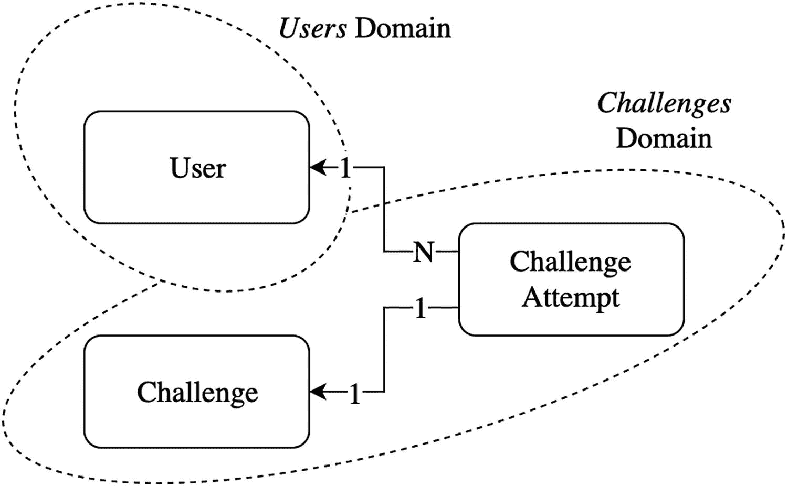
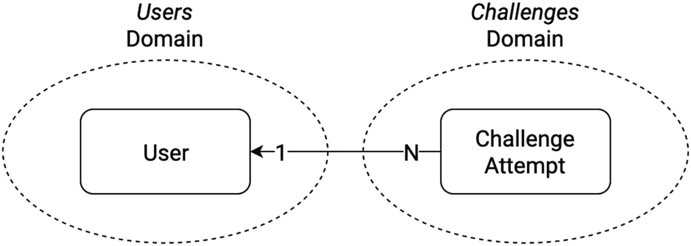
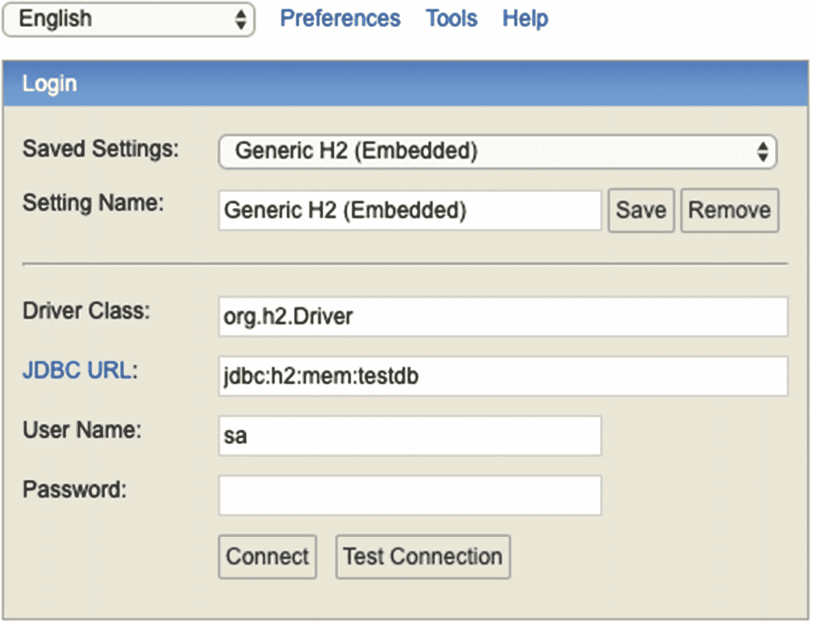
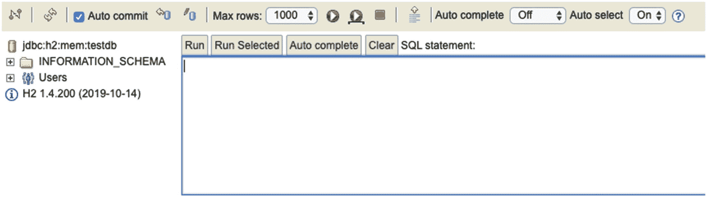
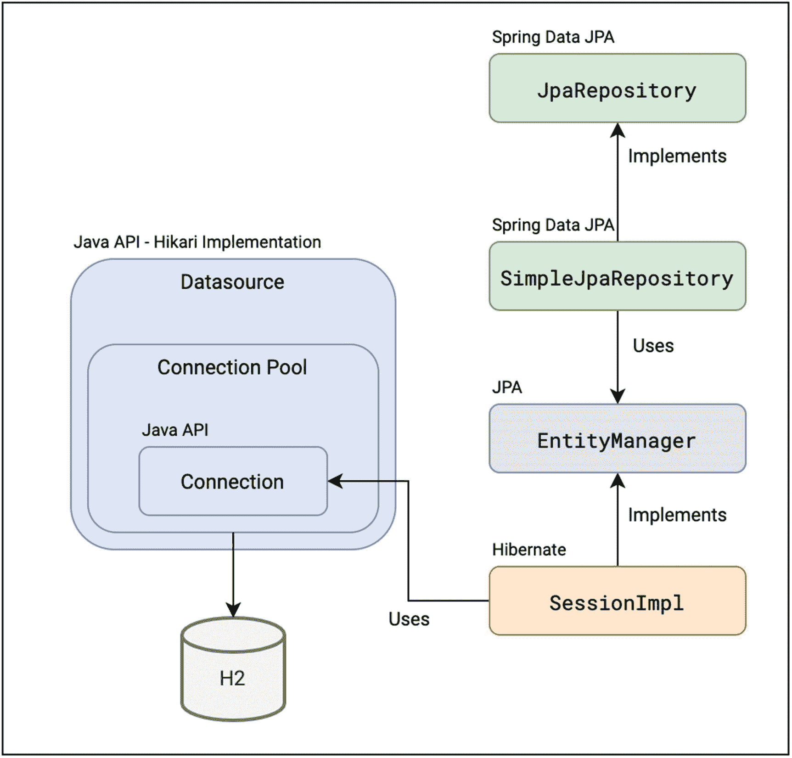
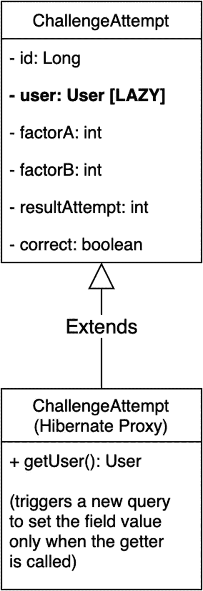
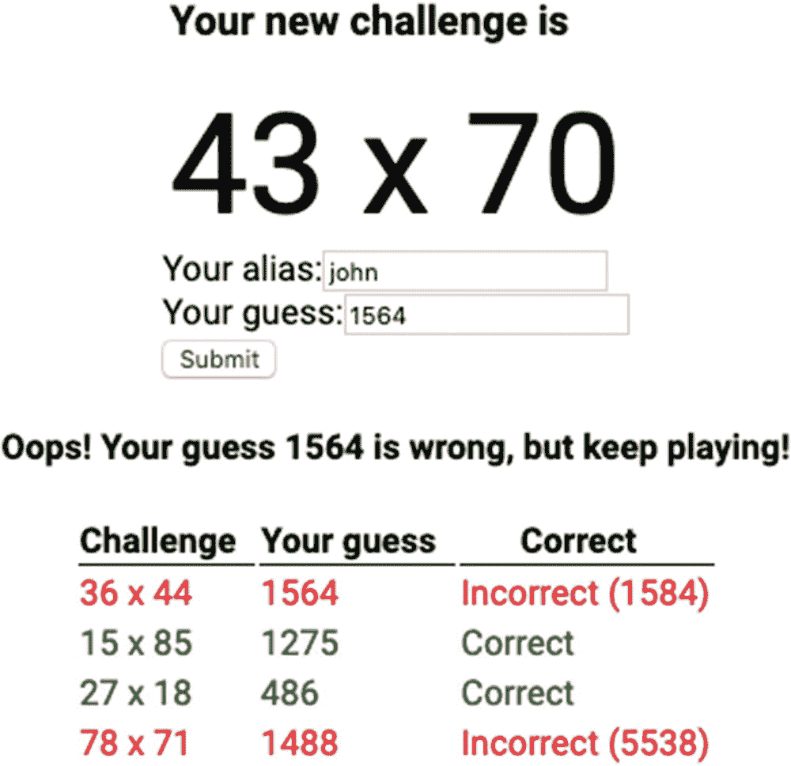
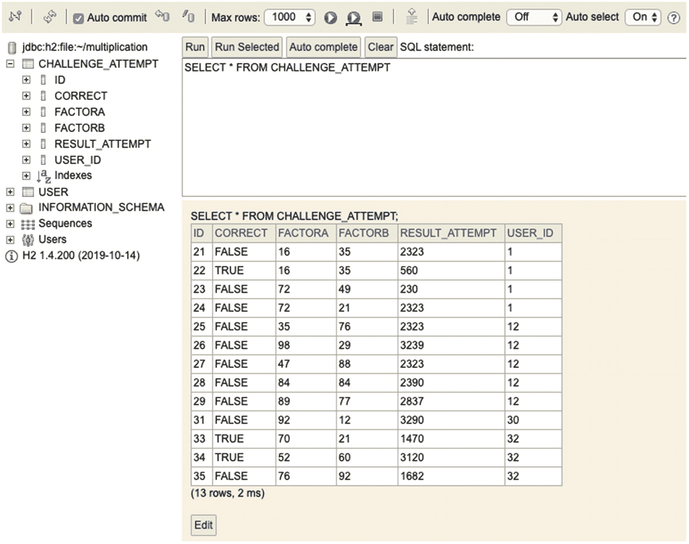
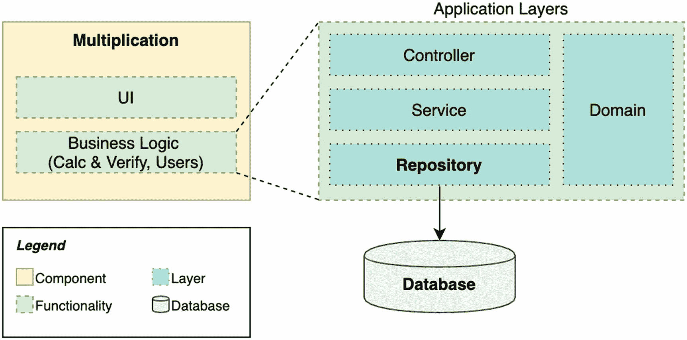

# 五、数据层

我们花了两章来完成我们的第一个用户故事。现在，我们有了一个可以试验的最小可行产品(MVP)。在敏捷中，以这种方式对需求进行切片是非常强大的。我们可以开始从一些测试用户那里收集反馈，并决定我们应该构建的下一个特性是什么。此外，如果我们的产品理念是错误的，改变一些东西还为时过早。

学习如何垂直地而不是水平地分割你的产品需求可以在构建软件时节省你很多时间。这意味着你不必等到你完成了一个完整的层再去下一层。取而代之的是，你在多个层次上开发作品，以便能够有一些作品。这也有助于你打造更好的产品或服务，因为当你能轻松做出反应时，你会得到反馈。如果你想了解更多关于故事分割的策略，请查看 [`http://tpd.io/story-splitting`](http://tpd.io/story-splitting) 。

假设我们的测试用户尝试了我们的应用程序。他们中的大多数人回来告诉我们，如果他们能够访问他们的统计数据，了解他们在一段时间内的表现，那就太好了。团队坐在一起，带回一个新的用户故事。

用户故事 2

作为该应用程序的用户，我想访问我最近的尝试，这样我就可以看到我是否随着时间的推移提高了我的大脑技能。

当将这个故事映射到技术解决方案时，我们很快注意到我们需要将尝试存储在某个地方。在这一章中，我们将介绍我们的三层应用程序架构中缺少的一层:数据层。这也意味着我们将使用三层架构的不同层:数据库。见图 [5-1](#Fig1) 。


图 5-1

我们的目标应用程序设计

我们还需要将这些新需求集成到其余的层中。总而言之，我们可以执行以下任务列表:

*   存储所有用户尝试，并有一种方法来查询每个用户。

*   公开一个新的 REST 端点来获取给定用户的最新尝试。

*   创建一个新的服务(业务逻辑)来检索这些尝试。

*   在用户发送新的尝试后，在网页上向用户显示尝试的历史记录。

## 数据模型

在我们在第 3 章[中创建的概念模型中，有三个领域对象:用户、挑战和尝试。然后，我们决定打破挑战和尝试之间的联系。相反，为了保持我们的领域简单，我们在尝试中复制了这两个因素。这使得我们在对象之间只有一种关系需要建模:尝试属于一个特定的用户。](3.html)

请注意，我们可以在简化的过程中更进一步，将用户数据(目前是别名)也包括在内。在这种情况下，我们现在需要存储的唯一对象就是尝试。然后，我们可以在同一个表中使用用户别名来查询我们的数据。但这是有代价的，比我们通过复制因素所假设的要高:我们认为用户是一个不同的领域，可能会随着时间的推移而演变，并与其他领域发生互动。在数据层中如此紧密地混合域不是一个好主意。

还有另一种设计方案。我们可以通过用三个独立的对象精确映射我们的概念域来创建我们的域类，并且在`ChallengeAttempt`和`Challenge`之间有一个链接。见图 [5-2](#Fig2) 。



图 5-2

概念模型的提醒

这可以用我们处理`User`的方式来完成。见清单 [5-1](#PC1) 。

```java
@Getter
@ToString
@EqualsAndHashCode
@AllArgsConstructor
public class ChallengeAttempt {
    private Long id;
    private User user;

    // We decided to include factors
//    private final int factorA;
//    private final int factorB;

    // This is an alternative
    private Challenge challenge;

    private int resultAttempt;
    private boolean correct;
}

Listing 5-1An Alternative Implementation of ChallengeAttempt

```

然后，在设计数据模型时，我们可以选择简化。在这种方法中，我们将拥有域类`ChallengeAttempt`的新版本，如前面的代码片段所示，以及数据层中的一个不同的类。例如，我们可以将这个类命名为`ChallengeAttemptDataObject`。其中将包括内部因素，因此我们需要在层之间实现映射器，以组合和拆分挑战和尝试。您可能已经发现，这种方法类似于我们对 DTO 模式所做的。当时，我们在表示层创建了一个新版本的`Attempt`对象，在那里我们还添加了一些验证注释。

正如在软件设计的许多其他方面一样，对于完全隔离 dto、域类和数据类，有多种支持和反对的意见。正如我们在假设案例中已经看到的，主要优势之一是我们获得了更高水平的隔离。我们可以替换数据层的实现，而不必修改服务层的代码。然而，一个很大的缺点是我们在应用程序中引入了大量的代码重复和复杂性。

在这本书里，我们遵循一种实用的方法，在应用适当的设计模式的同时，尽量让事情变得简单。我们在前一章中选择了一个域模型，现在我们可以将它直接映射到我们的数据模型。因此，我们可以为域和数据表示重用相同的类。这是一个很好的折衷解决方案，因为我们仍然保持我们的领域隔离。见图 [5-3](#Fig3) 显示了我们必须保存在数据库中的对象和关系。



图 5-3

乘法应用程序的数据模型

## 选择数据库

这一节将讨论如何根据项目的需求和我们将使用的抽象层次为我们的项目选择一个数据库。

### SQL vs. NoSQL

市场上有很多可用的数据库引擎。它们都有自己的特点，但是，大多数时候，每个人都把它们归为两类:SQL 和 NoSQL。SQL 数据库是关系型的，有固定的模式，它们允许我们进行复杂的查询。NoSQL 数据库面向非结构化数据，例如可以面向键值对、文档、图形或基于列的数据。

简而言之，我们也可以说 NoSQL 数据库更适合大量的记录，因为这些数据库是分布式的。我们可以部署多个节点(或实例)，因此它们在写入和/或读取数据时都有良好的性能。我们付出的代价是这些数据库遵循 CAP 定理( [`https://en.wikipedia.org/wiki/CAP_theorem`](https://en.wikipedia.org/wiki/CAP_theorem) )。当我们以分布式方式存储数据时，我们只需在可用性、一致性和分区容差保证中选择两个。我们通常需要分区容错，因为网络错误很容易发生，所以我们应该能够处理它们。因此，大多数情况下，我们必须在尽可能长时间提供数据和保持数据一致之间做出选择。

另一方面，关系数据库(SQL)遵循 ACID 保证:*原子性*(事务作为一个整体要么成功要么失败)；*一致性*(数据总是在有效状态之间转换)；*隔离*(确保并发性不会引起副作用)，以及*持久性*(在一个事务之后，即使在系统失败的情况下，状态也是持久的)。这些都是很棒的特性，但是为了确保它们，这些数据库不能适当地处理水平可伸缩性(多个分布式节点)，这意味着它们不能很好地伸缩。

仔细分析您的数据需求非常重要。您打算如何查询数据？您需要高可用性吗？你写了几百万张唱片吗？你需要非常快速的阅读吗？此外，请记住系统的非功能性需求。例如，在我们的特殊情况下，我们可以接受系统每年有几个小时(甚至几天)不可用。然而，如果我们为医疗保健部门开发一个 web 应用程序，在那里生命可能处于危险之中，我们将处于不同的情况。在接下来的章节中，我们将回到非功能性需求，对其中的一些进行更详细的分析。

我们的模型是*关系型*。此外，我们不打算处理数百万的并发读写。我们将为我们的 web 应用程序选择一个 SQL 数据库，以从 ACID 保证中获益。

在任何情况下，保持我们的应用程序(未来的微服务)足够小的一个优点是，我们可以在以后需要时更改数据库引擎，而不会对整个软件架构产生大的影响。

### H2、Hibernate 和 JPA

下一步是决定我们从所有的可能性中选择什么关系数据库:MySQL、MariaDB、PostgreSQL、H2、Oracle SQL 等等。在本书中，我们选择 H2 数据库引擎，因为它小巧且易于安装。它非常简单，可以嵌入到我们的应用程序中。

在关系数据库之上，我们将使用对象/关系映射(ORM)框架:Hibernate ORM。我们将使用 Hibernate 将 Java 对象映射到 SQL 记录，而不是处理表格数据和普通查询。如果你想了解更多关于 ORM 技术的知识，请查看 [`http://tpd.io/what-is-orm`](http://tpd.io/what-is-orm) 。

我们不使用 Hibernate 中的本机 API 将对象映射到数据库记录，而是使用一个抽象:Java 持久性 API (JPA)。

这就是我们的技术选择相互关联的方式:

*   在我们的 Java 代码中，我们将使用 Spring Boot JPA 注释和集成，因此我们保持代码与 Hibernate 细节的分离。

*   在实现方面，Hibernate 负责将我们的对象映射到数据库实体的所有逻辑。

*   Hibernate 支持针对不同数据库的多种 SQL 方言，H2 方言就是其中之一。

*   Spring Boot 自动配置为我们设置了 H2 和 Hibernate，但是我们也可以自定义行为。

规范和实现之间的这种松散耦合给了我们一个很大的优势:更改到不同的数据库引擎将是无缝的，因为它是由 Hibernate 和 Spring Boot 配置抽象的。

## Spring Boot 数据 JPA

让我们分析一下 Spring Boot 数据 JPA 模块提供了什么。

### 依赖性和自动配置

Spring 框架有多个模块可用于处理数据库，这些模块被归入 Spring 数据家族:JDBC、Cassandra、Hadoop、Elasticsearch 等。其中之一是 Spring Data JPA，它以基于 Spring 的编程风格，使用 Java 持久性 API 来抽象对数据库的访问。

Spring Boot 采取了额外的步骤，用一个专用的启动器使用自动配置和一些额外的工具来快速引导数据库访问:`spring-boot-starter-data-jpa`模块。它还可以自动配置嵌入式数据库，如 H2，我们的应用程序的选择。

我们在创建应用程序时没有添加这些依赖项，以尊重循序渐进的方法。现在是时候这么做了。在我们的`pom.xml`文件中，我们添加了 Spring Boot 启动器和 H2 嵌入式数据库实现。见清单 [5-2](#PC2) 。我们只需要运行时的 H2 工件，因为我们将在代码中使用 JPA 和 Hibernate 抽象。

```java
<dependencies>
[...]
    <dependency>
        <groupId>org.springframework.boot</groupId>
        <artifactId>spring-boot-starter-data-jpa</artifactId>
    </dependency>
    <dependency>
        <groupId>com.h2database</groupId>
        <artifactId>h2</artifactId>
        <scope>runtime</scope>
    </dependency>
[...]
</dependencies>

Listing 5-2Adding the Data Layer Dependencies to Our Application

```

源代码

您可以在 GitHub 的`chapter05`资源库中找到本章的所有源代码。

[`https://github.com/Book-Microservices-v2/chapter05`见](https://github.com/Book-Microservices-v2/chapter05)。

Hibernate 是 JPA 在 Spring Boot 的参考实现。这意味着 starter 将 Hibernate 依赖项带了进来。它还包括核心 JPA 工件以及与其父模块 Spring Data JPA 的依赖关系。

我们已经提到，H2 可以作为一个嵌入式数据库。因此，我们不需要自己安装、启动或关闭数据库。我们的 Spring Boot 应用程序将控制它的生命周期。然而，出于教学目的，我们也想从外部访问数据库，所以让我们在`application.properties`文件中添加一个属性来启用 H2 数据库控制台。

```java
# Gives us access to the H2 database web console
spring.h2.console.enabled=true

```

H2 控制台是一个简单的 web 界面，我们可以使用它来管理和查询数据。让我们通过再次启动我们的应用程序来验证这个新配置是否有效。我们将看到一些新的日志行，来自 Spring Boot 数据 JPA 自动配置逻辑。参见清单 [5-3](#PC4) 。

```java
INFO 33617 --- [main] o.s.web.context.ContextLoader            : Root WebApplicationContext: initialization completed in 1139 ms
INFO 33617 --- [main] com.zaxxer.hikari.HikariDataSource       : HikariPool-1 - Starting...
INFO 33617 --- [main] com.zaxxer.hikari.HikariDataSource       : HikariPool-1 - Start completed.
INFO 33617 --- [main] o.s.b.a.h2.H2ConsoleAutoConfiguration    : H2 console available at '/h2-console'. Database available at 'jdbc:h2:mem:testdb'
INFO 33617 --- [main] o.hibernate.jpa.internal.util.LogHelper  : HHH000204: Processing PersistenceUnitInfo [name: default]
INFO 33617 --- [main] org.hibernate.Version                    : HHH000412: Hibernate ORM core version 5.4.12.Final
INFO 33617 --- [main] o.hibernate.annotations.common.Version   : HCANN000001: Hibernate Commons Annotations {5.1.0.Final}
INFO 33617 --- [main] org.hibernate.dialect.Dialect            : HHH000400: Using dialect: org.hibernate.dialect.H2Dialect
INFO 33617 --- [main] o.h.e.t.j.p.i.JtaPlatformInitiator       : HHH000490: Using JtaPlatform implementation: [org.hibernate.engine.transaction.jta.platform.internal.NoJtaPlatform]
INFO 33617 --- [main] j.LocalContainerEntityManagerFactoryBean : Initialized JPA EntityManagerFactory for persistence unit 'default'

Listing 5-3Application Logs Showing Database Autoconfiguration

```

Spring Boot 在类路径中检测 Hibernate，并配置一个数据源。由于 H2 也可用，Hibernate 连接到 H2 并选择 H2 方言。它还为我们初始化了一个`EntityManagerFactory`；我们很快就会明白这意味着什么。还有一个日志行声称 H2 控制台在`/h2-console`可用，并且有一个数据库在`jdbc:h2:mem:testdb`可用。如果没有指定其他配置，Spring Boot 自动配置会创建一个名为`testdb`的现成的内存数据库。

让我们导航到`http://localhost:8080/h2-console`来看看控制台 UI。见图 [5-4](#Fig4) 。



图 5-4

H2 控制台，登录

我们可以复制并粘贴`jdbc:h2:mem:testdb`作为 JDBC 网址，其他值保持不变。然后，我们单击 Connect，我们可以访问主控制台视图。见图 [5-5](#Fig5) 。



图 5-5

H2 控制台，连接

看起来我们确实有一个名为`testdb`的内存数据库，并且我们能够使用 H2 默认的管理员凭证连接到它。这个数据库来自哪里？这是我们将很快分析的内容。

我们将在本章后面使用 H2 控制台界面来查询我们的数据。现在，让我们继续学习，探索 Spring Boot 和 Data JPA starter 附带的技术堆栈。

### Spring Boot 数据 JPA 技术堆栈

让我们从最底层开始，使用图 [5-6](#Fig6) 作为视觉支持。在包`java.sql`和`javax.sql`中有一些核心的 Java APIs 来处理 SQL 数据库。在那里，我们可以找到接口`DataSource`、`Connection`，以及其他一些用于池化资源的接口，如`PooledConnection`或`ConnectionPoolDataSource`。我们可以找到不同供应商提供的这些 API 的多种实现。Spring Boot 附带了 HikariCP ( [`http://tpd.io/hikari`](http://tpd.io/hikari) )，这是最流行的`DataSource`连接池实现之一，因为它是轻量级的，并且具有良好的性能。

Hibernate 使用这些 API(以及我们的应用程序中的 HikariCP 实现)来连接 H2 数据库。Hibernate 中用于管理数据库的 JPA 风格是`SessionImpl`类( [`http://tpd.io/h-session`](http://tpd.io/h-session) )，它包含了*大量用于执行语句、执行查询、处理会话连接等的*代码。这个类通过它的层次树实现了 JPA 接口`EntityManager` ( [`http://tpd.io/jpa-em`](http://tpd.io/jpa-em) )。这个接口是 JPA 规范的一部分。在 Hibernate 中，它的实现完成了 ORM。



图 5-6

Spring Data JPA 技术堆栈

在 JPA 的`EntityManager`之上，Spring Data JPA 定义了一个`JpaRepository`接口([在 Spring 中，`SimpleJpaRepository`类(`tpd.io/simple-jpa-repo`)是默认的实现，并在底层使用`EntityManager`。这意味着我们不需要使用纯 JPA 标准或 Hibernate 来在代码中执行数据库操作，因为我们可以使用这些 Spring 抽象。](http://tpd.io/jpa-repo)

我们将在本章后面探索 Spring 为 JPA `Repository`类提供的一些很酷的特性。

### 数据源(自动)配置

当我们使用新的依赖项再次运行我们的应用程序时，有些事情可能会让您感到惊讶。我们还没有配置数据源，那么为什么我们能够成功地打开与 H2 的连接呢？答案总是*自动配置*，但这一次它带来了一点额外的魔力。

通常，我们使用`application.properties`中的一些值来配置数据源。这些属性由 Spring Boot 自动配置依赖项中的`DataSourceProperties`类( [`http://tpd.io/dsprops`](http://tpd.io/dsprops) )定义，例如，它包含数据库的 URL、用户名和密码。像往常一样，还有一个`DataSourceAutoConfiguration`类( [`http://tpd.io/ds-autoconfig`](http://tpd.io/ds-autoconfig) )使用这些属性在上下文中创建必要的 beans。在本例中，它创建了`DataSource` bean 来连接数据库。

`sa`用户名实际上来自 Spring 的`DataSourceProperties`类中的一段代码。见清单 [5-4](#PC5) 。

```java
/**
 * Determine the username to use based on this configuration and the environment.
 * @return the username to use
 * @since 1.4.0
 */
public String determineUsername() {
    if (StringUtils.hasText(this.username)) {
        return this.username;
    }
    if (EmbeddedDatabaseConnection.isEmbedded(determineDriverClassName())) {
        return "sa";
    }
    return null;
}

Listing 5-4A Fragment of Spring Boot’s DataSourceProperties Class

```

由于 Spring Boot 开发人员知道这些惯例，他们可以准备 Spring Boot，这样我们就可以使用开箱即用的数据库。不需要传递任何配置，因为他们硬编码了用户名，默认情况下密码是空的`String`。还有其他约定，如数据库名称；这就是我们如何得到`testdb`数据库的。

我们不会使用 Spring Boot 创建的默认数据库。相反，我们在应用程序的名称后设置名称，并更改 URL 以创建存储在文件中的数据库。如果我们继续使用内存数据库，当我们关闭应用程序时，所有的尝试都将丢失。此外，我们必须添加参考文档中描述的参数`DB_CLOSE_ON_EXIT=false`(参见此 [`http://tpd.io/sb-embed-db`](http://tpd.io/sb-embed-db) )，因此我们禁用自动关闭，并让 Spring Boot 决定何时关闭数据库。请参见清单 [5-5](#PC6) 中的结果 URL，以及我们在`application.properties`文件中包含的其他更改。之后还有一些额外的解释。

*   如前所述，我们将数据源更改为使用用户主目录`~`中名为`multiplication`的文件。我们通过在 URL 中指定`:file:`来做到这一点。要了解 H2 网址的所有配置可能性，请勾选 [`http://tpd.io/h2url`](http://tpd.io/h2url) 。

*   为了简单起见，我们将让 Hibernate 为我们创建数据库模式。这个特性被称为自动数据定义语言(DDL)。我们将它设置为`update`,因为我们希望在创建或修改实体时同时创建和更新模式(正如我们将在下一节中所做的)。

*   最后，我们启用属性`spring.jpa.show-sql`,这样我们就可以在日志中看到查询。这对学习很有用。

```java
# Gives us access to the H2 database web console
spring.h2.console.enabled=true
# Creates the database in a file
spring.datasource.url=jdbc:h2:file:~/multiplication;DB_CLOSE_ON_EXIT=FALSE
# Creates or updates the schema if needed
spring.jpa.hibernate.ddl-auto=update
# For educational purposes we will show the SQL in console
spring.jpa.show-sql=true

Listing 5-5application.properties File with

New Parameters for Database Configuration

```

## 实体

从数据的角度来看，JPA 将实体调用到 Java 对象。因此，假设我们打算存储用户和尝试，我们必须使`User`和`ChallengeAttempt`类成为实体。如前所述，我们可以为数据层创建新的类并使用映射器，但是我们希望保持代码库简单，所以我们重用了域定义。

首先，我们给`User`添加一些 JPA 注释。参见清单 [5-6](#PC7) 。

```java
package microservices.book.multiplication.user;

import lombok.*;

import javax.persistence.*;

/**
 * Stores information to identify the user.
 */
@Entity
@Data
@AllArgsConstructor
@NoArgsConstructor
public class User {

    @Id
    @GeneratedValue
    private Long id;
    private String alias;

    public User(final String userAlias) {
        this(null, userAlias);
    }
}

Listing 5-6The User Class After Adding JPA Annotations

```

让我们一个接一个地了解这个更新的`User`类的特征:

*   我们添加了`@Entity`注释，将这个类标记为映射到数据库记录的对象。如果我们想用不同于缺省值的名称命名我们的表，我们可以在注释中添加一个值`user`。同样，默认情况下，通过类中的 getters 公开的所有字段都将以默认的列名保存在映射表中。我们可以通过用 JPA 的`@Transient`注释标记字段来排除它们。

*   Hibernate 的用户指南( [`http://tpd.io/hib-pojos`](http://tpd.io/hib-pojos) )声明我们应该提供 setters 或者让我们的字段可以被 Hibernate 修改。幸运的是，Lombok 有一个快捷的注释，`@Data`，它非常适合用作数据实体的类。该注释将`equals`和`hashCode`方法、`toString`、getters 和 setters 分组。Hibernate 用户指南中的另一个章节告诉我们不要使用`final`类。这样，我们允许 Hibernate 创建运行时代理，从而提高性能。我们将在本章的后面看到一个运行时代理如何工作的例子。

*   JPA 和 Hibernate 也要求我们的实体有一个默认的空构造函数(见 [`http://tpd.io/hib-constructor`](http://tpd.io/hib-constructor) )。我们可以用 Lombok 的`@NoArgsConstructor`注释快速添加。

*   我们的`id`字段被标注为`@Id`和`@GeneratedValue`。这将是唯一标识每一行的列。我们使用一个生成的值，因此 Hibernate 将为我们填充该字段，从数据库中获取序列的下一个值。

对于`ChallengeAttempt`类，我们使用了一些额外的特性。参见清单 [5-7](#PC8) 。

```java
package microservices.book.multiplication.challenge;

import lombok.*;
import microservices.book.multiplication.user.User;

import javax.persistence.*;

@Entity
@Data
@AllArgsConstructor
@NoArgsConstructor
public class ChallengeAttempt {
    @Id
    @GeneratedValue
    private Long id;
    @ManyToOne(fetch = FetchType.LAZY)
    @JoinColumn(name = "USER_ID")
    private User user;
    private int factorA;
    private int factorB;
    private int resultAttempt;
    private boolean correct;
}

Listing 5-7The ChallengeAttempt Class with JPA Annotations

```

与前面的类不同，我们的挑战尝试模型不仅有基本类型，还有一个嵌入的实体类型，`User`。Hibernate 知道如何映射它，因为我们添加了 JPA 注释，但是它不知道这两个实体之间的关系。在数据库中，我们可以将这些关系建模为*一对一*、*一对多*、*多对一*和*多对多*。

我们在这里定义了一个多对一的关系，因为我们已经倾向于避免将用户与尝试相关联，而是将尝试与用户相关联。为了在我们的数据层做出这些决定，我们还应该考虑我们计划如何查询我们的数据。在我们的例子中，我们不需要从用户到尝试的链接。如果想了解 Hibernate 中实体关系的更多信息，可以查看 Hibernate 用户指南中的关联部分( [`http://tpd.io/hib-associations`](http://tpd.io/hib-associations) )。

正如您在代码中看到的，我们正在向`@ManyToOne`注释传递一个参数:`fetch`类型。当从数据存储中收集我们的尝试时，我们必须告诉 Hibernate *when* 来收集嵌套用户的值，这些值存储在不同的表中。如果我们将它设置为`EAGER`，用户数据将被收集。使用`LAZY`，检索这些字段的查询将只在我们试图访问它们时执行。这是因为 Hibernate 为我们的实体类配置了代理类。参见图 [5-7](#Fig7) 。这些代理类扩展了我们的类；这就是为什么如果我们想让这个机制工作的话，我们不应该将它们声明为`final`。对于我们的例子，Hibernate 将传递一个代理对象，该对象仅在第一次使用访问器(getter)时触发查询来获取用户。这就是懒惰这个术语的来源——它不到最后一刻是不会这么做的。



图 5-7

休眠，拦截类

一般来说，我们应该倾向于惰性关联，以避免触发对您可能不需要的数据的额外查询。在我们的例子中，当我们收集尝试时，我们不需要用户的数据。

`@JoinColumn`注释让 Hibernate 用一个连接列链接两个表。为了保持一致性，我们传递给它的列名与代表用户索引的列名相同。这将转化为添加到`CHALLENGE_ATTEMPT`表中的新列`USER_ID`，它将存储对`USER`表中相应用户的`ID`记录的引用。

这是一个带有 JPA 和 Hibernate 的 ORM 的基本但有代表性的例子。如果您想扩展您对 JPA 和 Hibernate 所有可能性的了解，用户指南( [`http://tpd.io/hib-user-guide`](http://tpd.io/hib-user-guide) )是一个很好的起点。

将域对象作为实体重用的后果

由于 JPA 和 Hibernate 的要求，我们需要向我们的类中添加 setters 和一个丑陋的空构造函数(Lombok 隐藏了它，但它仍然在那里)。这很不方便，因为它阻止我们按照良好的实践(比如不变性)来创建类。我们可以说我们的领域类被数据需求破坏了。

当您正在构建小型应用程序并且您知道这些决策背后的原因时，这不是一个大问题。您只需避免在代码中使用 setters 或空构造函数。然而，当与一个大团队或在一个中型或大型项目中工作时，这可能会成为一个问题，因为一个新的开发人员可能会因为类允许他们这样做而试图破坏好的实践。在这种情况下，您可以考虑像前面提到的那样分割域和实体类。这将带来一些代码重复，但是您可以更好地实施良好的实践。

## 仓库

当我们描述三层架构时，我们简要解释了数据层可能包含数据访问对象(Dao)和存储库。Dao 通常是耦合到数据库结构的类，而另一方面，存储库是以领域为中心的，所以这些类可以与聚合一起工作。

假设我们遵循领域驱动的设计，我们将使用存储库来连接数据库。更具体地说，我们将使用 JPA 存储库和 Spring Data JPA 中包含的特性。

在前面关于技术栈的部分，我们介绍了 Spring 的`SimpleJpaRepository`类(参见 [`https://tpd.io/sjparepo-doc`](https://tpd.io/sjparepo-doc) )，它使用 JPA 的`EntityManager`(参见 [`https://tpd.io/em-javadoc`](https://tpd.io/em-javadoc) )来管理我们的数据库对象。Spring 抽象增加了一些特性，比如分页和排序，以及一些比普通 JPA 接口更方便使用的方法(例如，`saveAll`、`existsById`、`count`等)。).

Spring Data JPA 还附带了一个普通 JPA 没有的强大功能:查询方法(参见 [`http://tpd.io/jpa-query-methods`](http://tpd.io/jpa-query-methods) )。

让我们使用我们的代码库来演示这个功能。我们需要一个查询来获取给定用户的最后一次尝试，这样我们就可以在网页上显示统计数据。除此之外，我们需要一些基本的实体管理来创建、读取和删除尝试。清单 [5-8](#PC9) 中显示的接口提供了该功能。

```java
package microservices.book.multiplication.challenge;

import org.springframework.data.repository.CrudRepository;

import java.util.List;

public interface ChallengeAttemptRepository extends CrudRepository<ChallengeAttempt, Long> {

    /**
     * @return the last 10 attempts for a given user, identified by their alias.
     */
    List<ChallengeAttempt> findTop10ByUserAliasOrderByIdDesc(String userAlias);
}

Listing 5-8The ChallengeAttemptRepository Interface

```

我们创建的接口扩展了 Spring Data Commons 中的`CrudRepository`接口( [`http://tpd.io/crud-repo`](http://tpd.io/crud-repo) )。`CrudRepository`定义了创建、读取、更新和删除(CRUD)对象的基本方法列表。Spring Data JPA 中的`SimpleJpaRepository`类也实现了这个接口( [`http://tpd.io/simple-jpa-repo`](http://tpd.io/simple-jpa-repo) )。除了`CrudRepository`，我们还可以使用另外两种选择。

*   如果我们选择扩展普通的`Repository`，我们就得不到 CRUD 功能。然而，当我们想要微调我们想要从`CrudRepository`中公开的方法时，该接口就像一个标记，而不是默认地获取它们。见 [`http://tpd.io/repo-tuning`](http://tpd.io/repo-tuning) 了解更多关于这种技术。

*   如果我们还需要分页和排序，我们可以扩展`PagingAndSortingRepository`。如果我们必须处理大的集合，那么这是很有帮助的，大的集合最好是以块或者*页*来查询。

当我们扩展这三个接口中的任何一个时，我们必须使用 Java 泛型，正如我们在这行中所做的:

```java
... extends CrudRepository<ChallengeAttempt, Long> {

```

第一种类型指定返回实体的类，在我们的例子中是`ChallengeAttempt`。第二个类必须匹配索引的类型，在我们的存储库中是一个`Long`(`id`字段)。

我们代码中最引人注目的部分是我们添加到接口中的方法名。在 Spring 数据中，我们可以通过在方法名中使用命名约定来创建定义查询的方法。在这个特殊的例子中，我们希望通过用户别名查询尝试，按照`id`降序排列(最新的排在最前面)，并选择列表中的前 10 个。按照方法结构，我们可以将查询描述如下:find Top 10(任何匹配的`ChallengeAttempt` ) by(字段`userAlias`等于传递的参数)order by(字段`id`)降序。

Spring Data 将处理您在接口中定义的方法，寻找那些没有明确定义查询的方法，并匹配创建查询方法的命名约定。这正是我们的情况。然后，它解析方法名，将其分解成块，并构建一个符合该定义的 JPA 查询(继续阅读示例查询)。

我们可以使用 JPA 查询方法定义构建许多其他查询；详见 [`http://tpd.io/jpa-qm-create`](http://tpd.io/jpa-qm-create) 。

有时我们可能想要执行一些查询方法无法实现的查询。或者也许我们只是不习惯使用这个特性，因为方法名开始变得有点奇怪。不用担心，也可以定义我们自己的查询。在这种情况下，我们仍然可以通过用 Java 持久性查询语言(JPQL)编写查询来保持我们的实现从数据库引擎中抽象出来，JPQL 是一种 SQL 语言，也是 JPA 标准的一部分。参见清单 [5-9](#PC11) 。

```java
/**
 * @return the last attempts for a given user, identified by their alias.
 */
@Query("SELECT a FROM ChallengeAttempt a WHERE a.user.alias = ?1 ORDER BY a.id DESC")
List<ChallengeAttempt> lastAttempts(String userAlias);

Listing 5-9A Defined Query as an Alternative to a Query Method

```

如您所见，它看起来像标准的 SQL。以下是不同之处:

*   我们不用表名，而是用类名(`ChallengeAttempt`)。

*   我们将字段称为对象字段，而不是列，使用点来遍历对象结构(`a.user.alias`)。

*   我们可以使用参数占位符，比如我们示例中的`?1`来引用第一个(也是唯一一个)传递的参数。

我们将坚持使用查询方法，因为它更短，也更具描述性，但是我们需要很快为我们的其他需求编写 JPQL 查询。

这就是我们管理数据库中的尝试实体所需的全部内容。现在，我们缺少管理`User`实体的存储库。这个实现起来很简单，如清单 [5-10](#PC12) 所示。

```java
package microservices.book.multiplication.user;

import org.springframework.data.repository.CrudRepository;

import java.util.Optional;

public interface UserRepository extends CrudRepository<User, Long> {

    Optional<User> findByAlias(final String alias);

}

Listing 5-10The UserRepository Interface

```

如果匹配的话，`findByAlias`查询方法将返回一个包装在 Java `Optional`中的用户，如果没有用户匹配传递的别名，则返回一个空的`Optional`对象。这是 Spring Data 的 JPA 查询方法提供的另一个特性。

有了这两个存储库，我们就有了管理数据库实体所需的一切。我们不需要实现这些接口。我们甚至不需要添加弹簧的`@Repository`注释。使用数据模块，Spring 将找到扩展基本接口的接口，并将注入实现所需行为的 beans。这还包括处理方法名和创建相应的 JPA 查询。

## 存储用户和尝试

完成数据层之后，我们可以开始使用服务层的存储库。

首先，让我们用新的预期逻辑来扩展我们的测试用例:

*   该尝试应该被存储，不管它是否正确。

*   如果这是给定用户的第一次尝试，通过他们的别名识别，我们应该创建用户。如果别名存在，该尝试应该链接到该现有用户。

我们必须对我们的`ChallengeServiceTest`类进行一些更新。首先，我们需要为两个存储库添加两个模拟。这样，我们将单元测试集中在服务层，而不包括来自其他层的任何真实行为。正如第二章所介绍的，这是 Mockito 的优势之一。

为了在 Mockito 中使用 mocks，我们可以用`@Mock`注释对字段进行注释，并将`MockitoExtension`添加到测试类中，使它们自动初始化。有了这个扩展，我们还得到了其他的 Mockito 特性，比如检测未使用的存根，如果我们指定了一个在测试用例中没有使用的 mock 行为，就会导致测试失败。见清单 [5-11](#PC13) 。

```java
@ExtendWith(MockitoExtension.class)
public class ChallengeServiceTest {

    private ChallengeService challengeService;

    @Mock
    private UserRepository userRepository;
    @Mock
    private ChallengeAttemptRepository attemptRepository;

    @BeforeEach
    public void setUp() {
        challengeService = new ChallengeServiceImpl(
                userRepository,
                attemptRepository
        );
        given(attemptRepository.save(any()))
                .will(returnsFirstArg());
    }

    //...
}

Listing 5-11Using Mockito in the ChallengeServiceTest Class

```

此外，我们可以使用用 JUnit 的`@BeforeEach`注释的方法向所有测试添加一些常见行为。在这种情况下，我们使用服务的构造函数来包含存储库(注意，这个构造函数还不存在)。我们也添加了这一行:

```java
given(attemptRepository.save(any()))
        .will(returnsFirstArg());

```

这条指令使用`BDDMockito`的`given`方法来定义当我们在测试期间调用特定方法时，模拟类应该做什么。请记住，我们不想使用真正的类的功能，所以我们必须定义，例如，在这个假对象(或*存根*)上调用函数时返回什么。我们想要覆盖的方法作为参数传递:`attemptRepository.save(any())`。我们可以匹配传递给`save()`的特定参数，但是我们也可以通过使用来自 Mockito 的*参数匹配器*的`any()`为任何参数定义这个预定义的行为(查看 [`https://tpd.io/mock-am`](https://tpd.io/mock-am) 以获得匹配器的完整列表)。指令的第二部分使用`will()`，指定当先前定义的条件匹配时，Mockito 应该做什么。在 Mockito 的`AdditionalAnswers`类中定义了`returnsFirstArg()`实用方法，其中包含了一些我们可以使用的方便的预定义答案(参见 [`http://tpd.io/mockito-answers`](http://tpd.io/mockito-answers) )。如果需要实现更复杂的场景，您还可以声明自己的函数来提供定制的答案。在我们的例子中，我们希望`save`方法什么也不做，只返回第一个(也是唯一一个)传递的参数。这对我们来说已经足够好了，不用调用真正的存储库就可以测试这一层。

现在，我们将额外的验证添加到现有的测试用例中。参见清单 [5-12](#PC15) ，其中包括正确尝试的测试用例作为示例。

```java
@Test
public void checkCorrectAttemptTest() {
    // given
    ChallengeAttemptDTO attemptDTO =
            new ChallengeAttemptDTO(50, 60, "john_doe", 3000);

    // when
    ChallengeAttempt resultAttempt =
            challengeService.verifyAttempt(attemptDTO);

    // then
    then(resultAttempt.isCorrect()).isTrue();
    // newly added lines
    verify(userRepository).save(new User("john_doe"));
    verify(attemptRepository).save(resultAttempt);
}

Listing 5-12Verifying Stub Calls in ChallengeServiceTest

```

我们使用 Mockito 的`verify`来检查我们是否存储了一个具有空 ID 和预期别名的新用户。标识符将在数据库级别设置。我们还验证是否应该保存该尝试。验证错误尝试的测试用例也应该包含这两个新行。

为了使我们的测试更加完整，我们添加了一个新的案例来验证来自同一个用户的额外尝试不会创建新的用户实体，而是重用现有的用户实体。参见清单 [5-13](#PC16) 。

```java
@Test
public void checkExistingUserTest() {
    // given
    User existingUser = new User(1L, "john_doe");
    given(userRepository.findByAlias("john_doe"))
            .willReturn(Optional.of(existingUser));
    ChallengeAttemptDTO attemptDTO =
            new ChallengeAttemptDTO(50, 60, "john_doe", 5000);

    // when
    ChallengeAttempt resultAttempt =
            challengeService.verifyAttempt(attemptDTO);

    // then
    then(resultAttempt.isCorrect()).isFalse();
    then(resultAttempt.getUser()).isEqualTo(existingUser);
    verify(userRepository, never()).save(any());
    verify(attemptRepository).save(resultAttempt);
}

Listing 5-13Verifying That Only the First Attempt Creates the User Entity

```

在这种情况下，我们定义了`userRepository` mock 的行为来返回一个现有的用户。因为挑战 DTO 包含相同的别名，所以逻辑应该找到我们的预定义用户，并且返回的尝试必须包括它，具有相同的别名和 ID。为了使测试更加详尽，我们检查了`UserRepository`中的方法`save()`从未被调用。

此时，我们有一个不编译的测试。我们的服务应该为两个存储库提供一个构造器。当我们启动应用程序时，Spring 将通过构造函数使用依赖注入来初始化存储库。这就是 Spring 帮助我们保持层松散耦合的方式。

然后，我们还需要主逻辑来存储尝试和用户(如果还不存在的话)。关于`ChallengeServiceImpl`的新实现，请参见清单 [5-14](#PC17) 。

```java
package microservices.book.multiplication.challenge;

import lombok.RequiredArgsConstructor;
import lombok.extern.slf4j.Slf4j;
import microservices.book.multiplication.user.User;
import microservices.book.multiplication.user.UserRepository;
import org.springframework.stereotype.Service;

@Slf4j
@RequiredArgsConstructor
@Service
public class ChallengeServiceImpl implements ChallengeService {

    private final UserRepository userRepository;
    private final ChallengeAttemptRepository attemptRepository;

    @Override
    public ChallengeAttempt verifyAttempt(ChallengeAttemptDTO attemptDTO) {
        // Check if the user already exists for that alias, otherwise create it
        User user = userRepository.findByAlias(attemptDTO.getUserAlias())

                .orElseGet(() -> {
                    log.info("Creating new user with alias {}",
                            attemptDTO.getUserAlias());
                    return userRepository.save(
                            new User(attemptDTO.getUserAlias())
                    );
                });

        // Check if the attempt is correct
        boolean isCorrect = attemptDTO.getGuess() ==
                attemptDTO.getFactorA() * attemptDTO.getFactorB();

        // Builds the domain object. Null id since it'll be generated by the DB.
        ChallengeAttempt checkedAttempt = new ChallengeAttempt(null,
                user,
                attemptDTO.getFactorA(),

                attemptDTO.getFactorB(),
                attemptDTO.getGuess(),
                isCorrect
        );

        // Stores the attempt
        ChallengeAttempt storedAttempt = attemptRepository.save(checkedAttempt);

        return storedAttempt;
    }
}

Listing 5-14The Updated ChallengeServiceImpl Class

Using the Repository Layer

```

`verifyAttempt`中的第一个块使用存储库返回的`Optional`来决定是否应该创建用户。只有当传递的函数为空时，`Optional`中的方法`orElseGet`才会调用它。因此，我们只在新用户还不存在时才创建它。

当我们构造一个尝试时，我们从存储库中传递返回的`User`对象。当我们调用`save()`来存储尝试实体时，Hibernate 会负责在数据库中正确地链接它们。我们返回结果，因此它包含数据库中的所有标识符。

现在所有的测试用例都应该通过了。同样，我们使用 TDD 来创建基于我们期望的逻辑。现在很清楚单元测试如何帮助我们验证特定层的行为，而不依赖于其他层。对于我们的服务类，我们用存根替换了两个存储库，我们为存根定义了预设值。

这些测试有另一种实现方式。我们可以对存储库类使用`@SpringBootTest`风格和`@MockBean`。然而，这并没有带来任何附加值，并且需要 Spring 上下文，所以测试需要更多的时间来完成。正如我们在前一章中所说的，我们更喜欢让我们的单元测试尽可能简单。

知识库测试

我们没有为应用程序的数据层创建测试。这些测试没有多大意义，因为我们没有编写任何实现。我们将最终验证 Spring 数据实现本身。

## 显示上次尝试

我们修改了现有的服务逻辑来存储用户和尝试，但是我们仍然缺少另一半功能:检索最后的尝试并在页面上显示它们。

服务层可以简单地使用存储库中的查询方法。在控制器层，我们将公开一个新的 REST 端点，通过用户别名获取尝试列表。

锻炼

继续遵循 TDD，并在继续实现之前完成一些任务。你会在本章的代码库中找到解决方案( [`https://github.com/Book-Microservices-v2/chapter05`](https://github.com/Book-Microservices-v2/chapter05) )。

*   扩展`ChallengeServiceTest`并创建一个测试用例来验证我们可以检索最后的尝试。测试背后的逻辑是一行程序，但是最好在服务层增长时进行测试。注意，在这个测试用例中，您可能会从 Mockito 那里得到关于`save`方法不必要的存根的抱怨。这是`MockitoExtension`的特色之一。然后，您可以将这个存根移动到使用它的测试用例中。

*   更新`ChallengeAttemptController`类以包含对新端点`GET /attempts?alias=john_doe`的测试。

### 服务层

让我们给`ChallengeService`接口添加一个名为`getStatsForUser`的方法。见清单 [5-15](#PC18) 。

```java
package microservices.book.multiplication.challenge;

import java.util.List;

public interface ChallengeService {

    /**
     * Verifies if an attempt coming from the presentation layer is correct or not.
     *
     * @return the resulting ChallengeAttempt object
     */
    ChallengeAttempt verifyAttempt(ChallengeAttemptDTO attemptDTO);

    /**
     * Gets the statistics for a given user.
     *
     * @param userAlias the user's alias

     * @return a list of the last 10 {@link ChallengeAttempt}

     * objects created by the user.
     */
    List<ChallengeAttempt> getStatsForUser(String userAlias);
}

Listing 5-15Adding the getStatsForUser Method to the ChallengeService Interface

```

清单 [5-16](#PC19) 中的代码块展示了这个实现。正如预测的那样，这只是一行代码。

```java
@Slf4j
@RequiredArgsConstructor
@Service
public class ChallengeServiceImpl implements ChallengeService {

    // ...

    @Override
    public List<ChallengeAttempt> getStatsForUser(final String userAlias) {
        return attemptRepository.findTop10ByUserAliasOrderByIdDesc(userAlias);
    }
}

Listing 5-16Implementing the getStatsForUser Method

```

### 控制器层

让我们向上移动一层，看看我们如何从控制器连接服务层。这一次，我们使用了一个查询参数，但是这并没有给我们的 API 定义增加太多的复杂性。类似地，当我们在第一个方法中把请求体作为参数注入时，我们现在可以使用`@RequestParam`来告诉 Spring 给我们传递一个 URL 参数。查看参考文档( [`http://tpd.io/mvc-ann`](http://tpd.io/mvc-ann) )中您可以定义的其他方法参数(例如，会话属性或 cookie 值)。见清单 [5-17](#PC20) 。

```java
@Slf4j
@RequiredArgsConstructor
@RestController
@RequestMapping("/attempts")
class ChallengeAttemptController {

    private final ChallengeService challengeService;

    @PostMapping
    ResponseEntity<ChallengeAttempt> postResult(
            @RequestBody @Valid ChallengeAttemptDTO challengeAttemptDTO) {
        return ResponseEntity.ok(challengeService.verifyAttempt(challengeAttemptDTO));
    }

    @GetMapping
    ResponseEntity<List<ChallengeAttempt>> getStatistics(@RequestParam("alias") String alias) {
        return ResponseEntity.ok(
                challengeService.getStatsForUser(alias)

        );
    }
}

Listing 5-17Adding New Endpoint in the Controller to Retrieve Statistics

```

如果您实现了测试，它们现在应该通过了。然而，如果我们使用 HTTPie 运行一个快速测试，我们会发现一个意想不到的结果。参见清单 [5-18](#PC21) 。发送一次尝试，然后尝试检索列表会给我们一个错误。

```java
$ http POST :8080/attempts factorA=58 factorB=92 userAlias=moises guess=5303
HTTP/1.1 200
...

$ http ":8080/attempts?alias=moises"
HTTP/1.1 500
...
{
    "error": "Internal Server Error",
    "message": "Type definition error: [simple type, class org.hibernate.proxy.pojo.bytebuddy.ByteBuddyInterceptor]; nested exception is com.fasterxml.jackson.databind.exc.InvalidDefinitionException: No serializer found for class org.hibernate.proxy.pojo.bytebuddy.ByteBuddyInterceptor and no properties discovered to create BeanSerializer (to avoid exception, disable SerializationFeature.FAIL_ON_EMPTY_BEANS) (through reference chain: java.util.ArrayList[0]->microservices.book.multiplication.challenge.ChallengeAttempt[\"user\"]->microservices.book.multiplication.user.User$HibernateProxy$mk4Fwavp[\"hibernateLazyInitializer\"])",
    "path": "/attempts",
    "status": 500,
    "timestamp": "2020-04-15T05:41:53.993+0000"
}

Listing 5-18Error During Serialization of the Attempt List

```

这是一个丑陋的服务器错误。我们还可以在后端日志中找到对应的异常。什么是 a `ByteBuddyInterceptor`，为什么我们的`ObjectMapper`要连载它？结果中应该只有`ChallengeAttempt`对象，带有嵌套的`User`实例，对吗？不完全是。

我们将嵌套的`User`实体配置为在惰性模式下获取，因此不会从数据库中查询它们。我们还说过 Hibernate 在运行时为我们的类创建代理。这就是`ByteBuddyInterceptor`类背后的原因。您可以尝试将获取模式切换到 EAGER，您将不会再收到此错误。但是这不是解决这个问题的正确方法，因为这样我们会触发很多对我们不需要的数据的查询。

让我们保持懒惰获取模式，并相应地解决这个问题。我们的第一个选择是定制我们的 JSON 序列化，以便它可以处理 Hibernate 对象。幸运的是，Jackson 库的提供者 FasterXML 有一个针对 Hibernate 的特定模块，我们可以在我们的`ObjectMapper`对象中使用它:`jackson-datatype-hibernate` ( [`http://tpd.io/json-hib`](http://tpd.io/json-hib) )。要使用它，我们必须将这个依赖项添加到我们的项目中，因为 Spring Boot 初学者不包括它。见清单 [5-19](#PC22) 。

```java
<dependencies>
<!-- ... -->
    <dependency>
        <groupId>com.fasterxml.jackson.datatype</groupId>
        <artifactId>jackson-datatype-hibernate5</artifactId>
    </dependency>
<!-- ... -->
</dependencies>

Listing 5-19Adding the Jackson Module for Hibernate to Our Dependencies

```

然后我们按照 Spring Boot 有据可查的方式(参见 [`http://tpd.io/om-custom`](http://tpd.io/om-custom) )定制`ObjectMapper` s:

"任何 com . faster XML . Jackson . databind . module 类型的 beans 都会自动向自动配置的 Jackson2ObjectMapperBuilder 注册，并应用于它创建的任何 ObjectMapper 实例。当您向应用程序添加新功能时，这提供了一种提供自定义模块的全局机制。

我们为 Jackson 的新 Hibernate 模块创建了一个 bean。Spring Boot 的`Jackson2ObjectMapperBuilder`将通过自动配置使用它，我们所有的`ObjectMapper`实例将使用 Spring Boot 的默认设置和我们自己的定制。见清单 [5-20](#PC23) 展示这个新的`JsonConfiguration`级。

```java
package microservices.book.multiplication.configuration;

import com.fasterxml.jackson.databind.Module;
import com.fasterxml.jackson.datatype.hibernate5.Hibernate5Module;
import org.springframework.context.annotation.Bean;
import org.springframework.context.annotation.Configuration;

@Configuration

public class JsonConfiguration {

    @Bean
    public Module hibernateModule() {
        return new Hibernate5Module();
    }

}

Listing 5-20Loading the Jackson’s Hibernate Module to Be Picked Up by Auto-Configuration

```

现在，我们启动我们的应用程序，并验证我们可以成功地检索尝试。嵌套的`user`对象是`null`，这是完美的，因为我们不需要它作为尝试列表。见清单 [5-21](#PC24) 。我们避免了额外的询问。

```java
$ http ":8080/attempts?alias=moises"
HTTP/1.1 200
...
[
    {
        "correct": false,
        "factorA": 58,
        "factorB": 92,
        "id": 11,
        "resultAttempt": 5303,
        "user": null

    },
...
]

Listing 5-21Correct Serialization of the Attempts After Adding the Hibernate Module

```

除了添加新的依赖项和新的配置之外，还有一种方法是遵循我们收到的异常消息中的建议:

```java
...(to avoid exception, disable SerializationFeature.FAIL_ON_EMPTY_BEANS)[...]

```

让我们试试。我们可以在`application.properties`文件中直接给 Jackson serializers 添加特性(参见 [`http://tpd.io/om-custom`](http://tpd.io/om-custom) )。这是通过一些命名约定实现的，在 Jackson 属性前面加上`spring.jackson.serialization`。见清单 [5-22](#PC26) 。

```java
[...]
spring.jpa.show-sql=true
spring.jackson.serialization.fail_on_empty_beans=false

Listing 5-22Adding a Property to Avoid Serialization Errors on Empty Beans

```

如果您尝试这样做(在从以前的解决方案中删除代码之后)，然后收集尝试，您会发现一个有趣的结果。参见清单 [5-23](#PC27) 。

```java
$ http ":8080/attempts?alias=moises"
HTTP/1.1 200
...
[
    {
        "correct": false,
        "factorA": 58,
        "factorB": 92,
        "id": 11,
        "resultAttempt": 5303,
        "user": {
            "alias": "moises",
            "hibernateLazyInitializer": {},
            "id": 1
        }
    },
...
]

Listing 5-23Retrieving Attempts with fail_on_empty_beans=false

```

有两个意想不到的结果。首先，代理对象的属性`hibernateLazyInitializer`被序列化为 JSON，它是空的。这就是空 bean，它实际上是我们之前得到的错误的来源。我们可以通过忽略磁场的杰克逊配置来避免这种情况。但真正的问题是，用户的数据也在那里。序列化程序遍历代理来获取用户数据，这触发了来自 Hibernate 的额外查询来获取数据，这使得我们的惰性参数配置变得无用。我们还可以在日志中验证这一点，与之前的解决方案相比，我们得到了一个额外的查询。参见清单 [5-24](#PC28) 。

```java
Hibernate: select challengea0_.id as id1_0_, challengea0_.correct as correct2_0_, challengea0_.factora as factora3_0_, challengea0_.factorb as factorb4_0_, challengea0_.result_attempt as result_a5_0_, challengea0_.user_id as user_id6_0_ from challenge_attempt challengea0_ left outer join user user1_ on challengea0_.user_id=user1_.id where user1_.alias=? order by challengea0_.id desc limit ?
Hibernate: select user0_.id as id1_1_0_, user0_.alias as alias2_1_0_ from user user0_ where user0_.id=?

Listing 5-24Unwanted Query When Fetching Attempts with Suboptimal Configuration

```

对于 Jackson 的 Hibernate 模块，我们将坚持第一个选项，因为这是用 JSON 序列化处理延迟抓取的正确方法。

我们对这两种选择所做的分析得出的结论是，在 Spring Boot 有如此多的行为隐藏在幕后，你应该避免在没有真正理解其含义的情况下寻求快速解决方案。了解这些工具并阅读参考文档。

### 用户界面

我们堆栈中需要集成新功能来显示最后尝试的最后部分是在我们的 React 前端。和上一章一样，如果你不想深入了解 UI 的细节，可以跳过这一节。

现在让我们坚持使用一个基本的用户界面，并在页面中添加一个表格来显示用户的最后一次尝试。我们可以在发送新的尝试后发出请求，因为我们将获得用户的别名。

但是，在此之前，让我们替换预定义的 CSS，以确保所有内容都适合页面。

首先，我们直接移动`ChallengeComponent`进行渲染，没有任何包装。参见清单 [5-25](#PC29) 中的结果`App.js`文件。

```java
import React from 'react';
import './App.css';
import ChallengeComponent from './components/ChallengeComponent';

function App() {
    return <ChallengeComponent/>;
}

export default App;

Listing 5-25App.js File After Moving the Component Up

```

然后，我们删除所有预定义的 CSS，并根据我们的需要进行调整。我们可以将这些基本样式分别添加到`index.css`和`App.css`文件中。参见列表 [5-26](#PC30) 和 [5-27](#PC31) 。

```java
.display-column {
  display: flex;
  flex-direction: column;
  align-items: center;
}

.challenge {
  font-size: 4em;
}

th {
  padding-right: 0.5em;
  border-bottom: solid 1px;
}

Listing 5-27The Modified app.css File

```

```java
body {
  font-family: 'Segoe UI', Roboto, Arial, sans-serif;
}

Listing 5-26The Modified index.css File

```

我们将把`display-column`应用到主 HTML 容器中，以垂直堆叠我们的组件，并使它们居中对齐。`challenge`样式用于乘法，我们还定制了表格标题样式，使其具有一些填充并使用底线。

一旦我们为新表腾出了一些空间，我们就必须在 JavaScript 中扩展我们的`ApiClient`来检索这些尝试。像以前一样，我们使用带有默认 GET 动词的`fetch`,并构建 URL 以包含用户的别名作为查询参数。见清单 [5-28](#PC32) 。

```java
class ApiClient {

    static SERVER_URL = 'http://localhost:8080';
    static GET_CHALLENGE = '/challenges/random';
    static POST_RESULT = '/attempts';
    static GET_ATTEMPTS_BY_ALIAS = '/attempts?alias=';

    static challenge(): Promise<Response> {
        return fetch(ApiClient.SERVER_URL + ApiClient.GET_CHALLENGE);
    }

    static sendGuess(user: string,
                     a: number,
                     b: number,
                     guess: number): Promise<Response> {
        // ...
    }

    static getAttempts(userAlias: string): Promise<Response> {
        return fetch(ApiClient.SERVER_URL +
            ApiClient.GET_ATTEMPTS_BY_ALIAS + userAlias);
    }
}

export default ApiClient;

Listing 5-28ApiClient Class Update with the Method to Fetch Attempts

```

我们的下一个任务是为这个尝试列表创建一个新的`React`组件。这样，我们可以保持我们的前端模块化。这个新组件不需要有状态，因为我们将使用父组件的状态来保存最后的尝试。

我们使用一个简单的 HTML `table`来呈现通过`props`对象传递的对象。作为 UI 级别的一个很好的补充，如果结果不正确，我们将显示正确的挑战结果。此外，我们将有一个有条件的`style`属性，根据尝试是否正确，将文本颜色设置为绿色或红色。参见清单 [5-29](#PC33) 。

```java
import * as React from 'react';

class LastAttemptsComponent extends React.Component {

    render() {
        return (
            <table>
                <thead>
                <tr>
                    <th>Challenge</th>
                    <th>Your guess</th>
                    <th>Correct</th>
                </tr>
                </thead>
                <tbody>
                {this.props.lastAttempts.map(a =>
                    <tr key={a.id}
                        style={{ color: a.correct ? 'green' : 'red' }}>
                        <td>{a.factorA} x {a.factorB}</td>

                        <td>{a.resultAttempt}</td>
                        <td>{a.correct ? "Correct" :
                            ("Incorrect (" + a.factorA * a.factorB + ")")}</td>
                    </tr>
                )}
                </tbody>
            </table>
        );
    }
}

export default LastAttemptsComponent;

Listing 5-29The New LastAttemptsComponent in React

```

如代码所示，我们可以在渲染 React 组件时使用`map`来轻松迭代数组。数组的每个元素都应该使用一个`key`属性来帮助框架识别变化的元素。参见 [`http://tpd.io/react-keys`](http://tpd.io/react-keys) 了解更多关于使用唯一键渲染列表的细节。

现在我们需要将所有东西放在现有的`ChallengeComponent`类中一起工作。添加一些修改后的代码见清单 [5-30](#PC34) 。

*   一个新函数，它使用`ApiClient`来检索最后的尝试，检查 HTTP 响应是否正常，并将数组存储在状态中。

*   在我们收到对发送新尝试的请求的响应后，立即调用这个新函数。

*   该父组件的`render()`函数中组件的 HTML 标签。

*   作为改进，我们还提取了逻辑来刷新对新函数`refreshChallenge`的挑战(之前包含在`componentDidMount`中)。我们将在用户发送尝试后为他们创建一个新的挑战。

```java
import * as React from "react";
import ApiClient from "../services/ApiClient";
import LastAttemptsComponent from './LastAttemptsComponent';

class ChallengeComponent extends React.Component {

    constructor(props) {
        super(props);
        this.state = {
            a: '', b: '',
            user: '',
            message: '',
            guess: 0,
            lastAttempts: [],
        };
        this.handleSubmitResult = this.handleSubmitResult.bind(this);
        this.handleChange = this.handleChange.bind(this);
    }

    // ...

    handleSubmitResult(event) {
        event.preventDefault();
        ApiClient.sendGuess(this.state.user,
            this.state.a, this.state.b,
            this.state.guess)

            .then(res => {
                if (res.ok) {
                    res.json().then(json => {
                        if (json.correct) {
                            this.updateMessage("Congratulations! Your guess is correct");
                        } else {
                            this.updateMessage("Oops! Your guess " + json.resultAttempt +
                            " is wrong, but keep playing!");
                        }
                        this.updateLastAttempts(this.state.user); // NEW!
                        this.refreshChallenge(); // NEW!
                    });
                } else {
                   this.updateMessage("Error: server error or not available");
                }
            });
    }

    // ...

    updateLastAttempts(userAlias: string) {
        ApiClient.getAttempts(userAlias).then(res => {
            if (res.ok) {
                let attempts: Attempt[] = [];
                res.json().then(data => {
                    data.forEach(item => {
                        attempts.push(item);
                    });
                    this.setState({
                        lastAttempts: attempts
                    });
                })
            }
        })
    }

    render() {
        return (
            <div className="display-column">
                <div>
                    <h3>Your new challenge is</h3>
                    <div className="challenge">
                        {this.state.a} x {this.state.b}
                    </div>
                </div>
                <form onSubmit={this.handleSubmitResult}>
                {/* ... */}
                </form>
                <h4>{this.state.message}</h4>
                {this.state.lastAttempts.length > 0 &&
                    <LastAttemptsComponent lastAttempts={this.state.lastAttempts}/>
                }
            </div>
        );
    }
}

export default ChallengeComponent

;

Listing 5-30The Updated ChallengeComponent

to Include the LastAttemptsComponent

```

在 React 中，如果我们只将属性传递给`setState`方法，我们可以更新状态的一部分，然后该方法将合并内容。我们将新属性`lastAttempts`添加到状态中，并用后端返回的数组内容更新它。假设数组的项是 JSON 对象，我们可以使用属性名在普通的 JavaScript 中访问它的属性。

我们还在这段代码中使用了一些新东西:带有`&&`操作符的条件呈现。只有左边的条件为真，右边的内容才会被 React 渲染。参见 [`http://tpd.io/react-inline-if`](http://tpd.io/react-inline-if) 了解不同的方法。添加到组件标签的`lastAttempts` HTML 属性通过`props`对象传递给子组件的代码。

注意，我们还使用了新的样式`display-column`和`challenge`。在 React 中，我们使用了`className`属性，它将被映射到标准的 HTML `class`。

## 使用新功能

在将新的数据层和所有其他层中的逻辑添加到 UI 之后，我们就可以开始使用整个应用程序了。无论是使用 IDE 还是使用两个不同的终端窗口，我们都用清单 [5-31](#PC35) 中所示的命令运行后端和前端。

```java
/multiplication $ mvnw spring-boot:run
...
/challenges-frontend $ npm start
...

Listing 5-31Commands to Start the Back End and the Front End, Respectively

```

然后，我们导航到`http://localhost:3000`以访问在开发模式下运行的 React 前端。因为我们的新组件的呈现是有条件的，所以我们还没有看到新的表，所以让我们来玩几个挑战，看看表是如何被我们的尝试填充的。你应该会看到类似于图 [5-8](#Fig8) 的东西。



图 5-8

添加最后一次尝试功能后的应用程序

太好了，我们成功了！它不是最漂亮的前端，但很高兴看到我们的新功能启动并运行。`Challenge`组件向后端执行请求，并呈现子组件，即最后一次尝试表。

如果您对数据的外观感兴趣，我们还可以导航到后端的 H2 控制台来访问表中的数据。记住控制台位于`http://localhost:8080/h2-console`。您应该看到用户和尝试的两个表以及其中的一些内容。这个基本控制台允许您执行查询，甚至编辑数据。例如，您可以单击表的名称`CHALLENGE_ATTEMPT`，在右边的面板中将会为您生成一个 SQL 查询。然后，你可以点击运行按钮来查询数据。见图 [5-9](#Fig9) 。



图 5-9

尝试 H2 控制台中的数据

## 总结和成就

在这一章中，我们看到了如何为数据的持久性建模，并且我们使用了对象关系映射来将我们的域对象转换成数据库记录。在旅程中，我们讲述了一些 Hibernate 和 JPA 的基础知识。请参见图 [5-10](#Fig10) 了解我们应用的当前状态。



图 5-10

第 5 章后的应用

基于挑战和尝试之间的多对一用例，我们学习了如何使用 JPA 注释来映射我们的 Java 类，以及简单关联是如何工作的。此外，我们使用 Spring 数据存储库获得了许多现成的功能。在所有提供的特性中，我们看到了查询方法是如何用一些方法的命名约定来编写简单查询的强大方法。

第二个用户故事完成了。我们浏览了服务和控制器层，并在那里添加了我们的新功能。我们还在 UI 中加入了一个新的组件来可视化我们的 web 应用程序的最后尝试。

我们完成了这本书的第一部分。到目前为止，我们已经详细了解了小型 web 应用程序是如何工作的。我们花时间去理解 Spring Boot 的核心概念和不同层的一些特定模块，比如 Spring Data 和 Spring Web。我们甚至构建了一个小型的 React 前端。

现在是时候开始微服务冒险了。

**章节成就:**

*   通过引入存储库类和数据库，您对三层、三层架构的工作原理有了全面的了解。

*   您了解了如何对数据建模，考虑了查询数据和适当的域隔离的需求。

*   您了解了 SQL 和 NoSQL 之间的主要区别，以及您可以用来做出未来选择的标准。

*   您了解了 JPA 及其与 Hibernate、Spring Data 和 Spring Boot 的集成。

*   您使用 JPA 注释和 Spring 数据存储库，使用查询方法和定义的查询为应用程序开发了一个真正的持久层。

*   您将新的尝试历史功能集成到前端，改进了我们的实际案例研究。