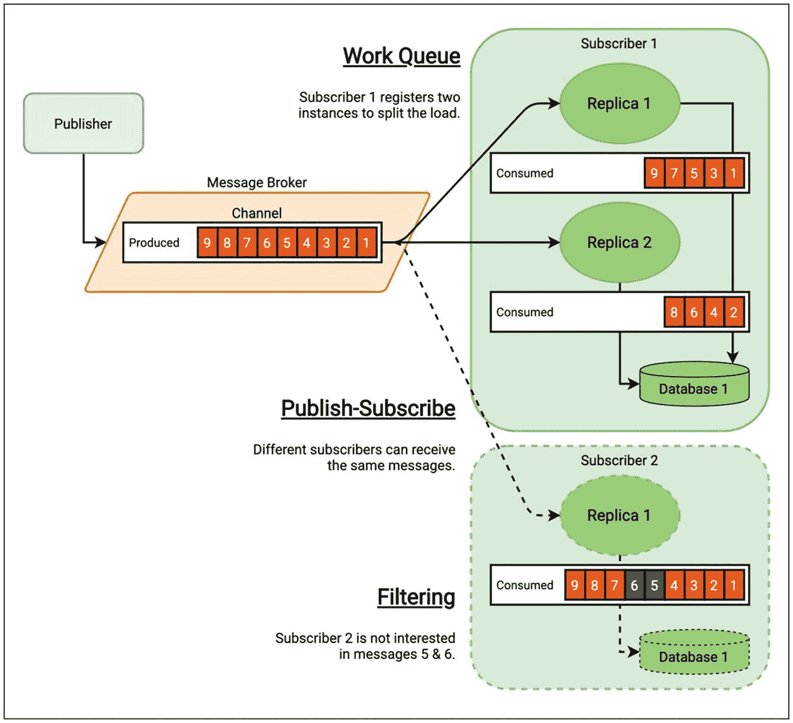
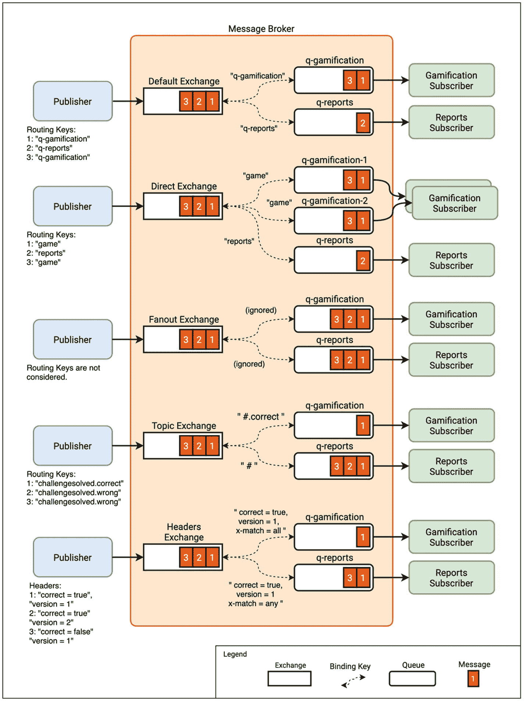
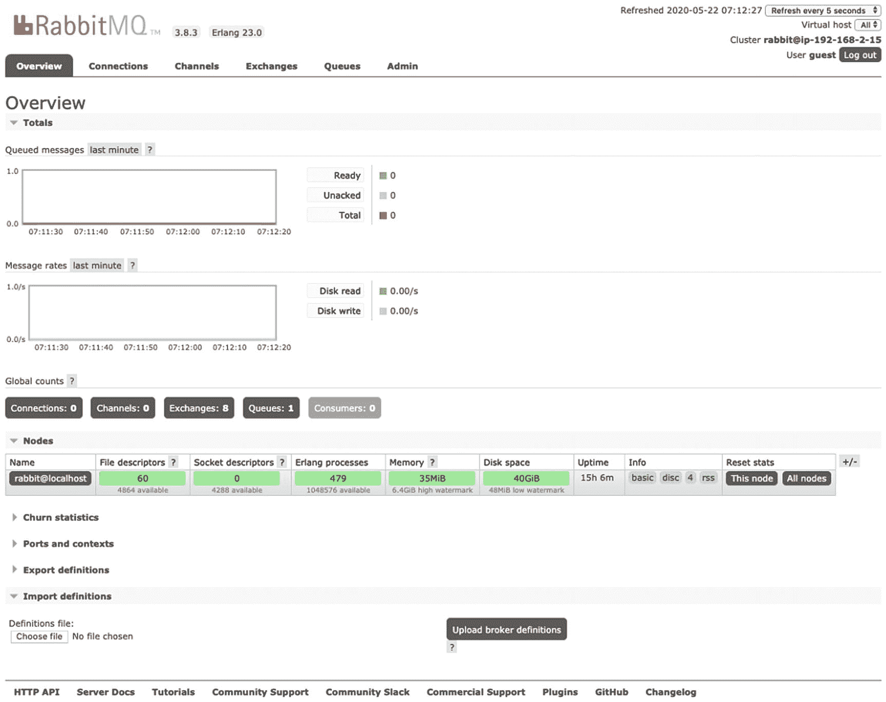

# 七、事件驱动架构

在前一章中，我们分析了微服务之间的接口如何在紧密耦合方面发挥关键作用。乘法微服务调用游戏化微服务，成为流程的编排者。如果有其他服务也需要为每次尝试检索数据，我们将需要从乘法应用向这些服务添加额外的调用，从而创建一个具有中央大脑的分布式整体。当我们检查一个假设的后端扩展时，我们详细讨论了这个问题。

在本章中，我们将基于发布-订阅模式，探讨设计这些接口的不同方式。该方法被称为*事件驱动架构*。*发布者*对事件进行分类和发送，而不知道系统中接收它们的部分，即*订阅者*，而不是将数据发送到特定的目的地。这些事件消费者也不需要知道发布者的逻辑。这种范式的改变使得我们的系统具有松耦合和可伸缩性，但也给我们的系统带来了新的挑战。

本章的目标是理解事件驱动架构的核心概念，它们的优势，以及使用它们的结果。像往常一样，我们将按照动手实践的方法将这些知识应用到我们的系统中。

## 核心概念

本节强调事件驱动架构的核心概念。

### 消息代理

事件驱动架构中的一个关键元素是*消息代理*。在这种类型的体系结构中，系统组件与代理通信，而不是直接相互连接。这就是我们如何保持它们之间的松散耦合。

消息代理通常包括路由功能。它们允许创建多个“通道”，因此我们可以根据我们的需求来分离消息。一个或多个发布者可以在这些通道的每一个中生成消息，并且这些消息可以被一个或多个订阅者(或者甚至没有订阅者)消费。在本章中，我们将更详细地了解什么是消息以及您可能想要使用的不同的消息传递拓扑。有关使用消息代理的一些典型场景的概念视图，请参见图 [7-1](#Fig1) 。


图 7-1

消息代理:高级视图

这些概念一点都不新鲜。已经活跃了一段时间的开发人员现在肯定能在企业服务总线(ESB)架构中发现类似的模式。总线模式促进了系统不同部分之间的通信，提供了数据转换和映射、消息排队和排序、路由等。

关于 ESB 体系结构和基于消息代理的体系结构之间的确切区别，仍然存在一些争议。一个被广泛接受的区别是，在 ESB 中，通道本身在系统中有更大的相关性。服务总线为通信设置协议标准，并将数据转换和路由到特定的目标。一些实现可以处理分布式事务。在某些情况下，他们甚至有一个复杂的 UI 来建模业务流程，并将这些规则转换成配置和代码。通常，ESB 架构倾向于将系统的大部分业务逻辑集中在总线内部，因此它们成为系统的编排层。见图 [7-2](#Fig2) 。


图 7-2

ESB 架构将业务逻辑集中在总线内部

将所有的业务逻辑转移到同一个组件中，并在系统中有一个中央编排器，这是容易失败的软件架构模式。遵循这一路线的系统会出现单点故障，并且随着时间的推移，它们的核心部分(在本例中是总线)变得更难维护和发展，因为整个组织都依赖于它。嵌入总线的逻辑往往会变得一塌糊涂。这是 ESB 体系结构在过去几年中名声如此之差的原因之一。

基于这些糟糕的经历，许多人现在倾向于放弃这种集中编排的、过于智能的消息传递通道，而使用消息代理实现一种更简单的方法，仅用于不同组件之间的通信。

在这一点上，您可能认为 ESB 是复杂的通道，而消息代理是简单的通道。但是，我之前提到过，有一点争议，所以并不是那么容易划那条线。一方面，您可以使用 ESB 平台，但保持业务逻辑适当隔离。另一方面，Kafka 等一些现代消息平台提供了一些工具，允许您在通道中嵌入一些逻辑。如果需要，您可以使用可能包含业务逻辑的函数来转换消息。您还可以像处理数据库一样查询通道中的数据，并且可以根据需要处理输出。例如，基于消息中包含的一些数据，您可以决定将它从特定的通道中取出，并将其移到另一个具有不同格式的通道中。因此，您可以在通常与不同架构模式(ESB/消息代理)相关联的工具之间进行切换，但仍然可以类似地使用它们。这个想法已经给了我们即将到来的章节的核心要点的早期介绍:首先你需要理解模式，然后你可以选择最适合你需求的工具。

我建议您尽可能避免在沟通渠道中包含业务逻辑。遵循领域驱动的设计方法，在分布式系统中保持逻辑的位置。这就是我们将在我们的系统中做的:我们将引入一个消息代理来保持我们的服务的松散耦合和可伸缩性，将业务流程保持在每个微服务内部。

### 事件和消息

在事件驱动的架构中，*事件*表明系统中发生了一些事情。事件由拥有发生这些事件的域的业务逻辑发布到消息通道(例如，消息代理)。架构中对给定事件类型感兴趣的其他组件订阅该通道以使用所有后续事件实例。如您所见，事件与发布-订阅模式相关，因此它们也链接到消息代理或总线。我们将使用消息代理实现一个事件驱动的架构，所以让我们把重点放在那个特定的案例上。

另一方面，*消息*是一个更通用的术语。许多人对消息和事件进行了区分，前者是直接寻址到系统组件的元素，后者是反映给定域中发生的事实的信息片段，没有特定的收件人。然而，当我们通过消息代理发送事件时，从技术角度来看，事件实际上是一条消息(因为没有事件代理这种东西)。为了简单起见，我们将在本书中使用术语*消息*来指代通过消息代理传递的一般信息，当我们指代遵循事件驱动设计的消息时，我们将使用*事件*。

请注意，没有什么可以阻止我们使用 REST APIs 对事件进行建模和发送(类似于我们在应用中所做的)。然而，这无助于减少紧耦合:生产者需要了解消费者，以便将事件指向他们。

当我们在消息代理中使用事件时，我们可以更好地隔离软件架构中的所有组件。发布者和订阅者不需要知道彼此。这非常适合微服务架构，因为我们希望尽可能保持微服务的独立性。通过这种策略，我们可以引入新的微服务来消费来自通道的事件，而无需修改发布这些事件的微服务或其他订阅者。

### 在事件中思考

请记住，消息代理和一些带后缀`Event`的类的引入不会使我们的架构自动“事件驱动”。我们必须在事件中设计我们的软件思维，如果我们不习惯，这需要努力。让我们使用我们的应用对此进行更深入的分析。

在第一个场景中，假设我们已经创建了一个游戏化 API 来为给定的用户分配分数和徽章。见图 [7-3](#Fig3) 的上部。然后，乘法微服务将调用这个 API，`updateScore`，不仅意识到这个微服务的存在，而且成为其部分业务逻辑的所有者(通过为解决的尝试分配分数)。这是人们从微服务架构开始，并来自命令式编程风格时，经常犯的错误。他们倾向于通过微服务之间的 API 调用来改变方法调用，实现远程过程调用(RPC)模式，有时甚至没有注意到这一点。为了改善微服务之间的耦合，我们可以引入一个消息代理。然后，我们将 REST API 调用替换为一条指向游戏化微服务的消息，即`UpdateScore`消息。但是，我们会通过这种改变来改进系统吗？不多。该消息仍然有一个特定的目的地，因此它不能被任何新的微服务重用。此外，系统的两个部分保持紧密耦合，并且，作为副作用，我们用异步接口替换了同步接口，引入了额外的复杂性(正如我们在前一章中看到的，这一章也将进一步阐述)。


图 7-3

命令式方法:REST 与 message

第二个场景基于我们当前的实现。见图 [7-4](#Fig4) 。我们将一个`ChallengeSolvedDTO`对象从乘法传递到游戏化，所以我们尊重我们的域边界。我们不在第一个服务中包含游戏化逻辑。然而，我们仍然需要直接解决游戏化，所以紧密耦合仍然存在。随着消息代理的引入，我们可以解决这个问题。乘法微服务可以向通用通道发送一个`ChallengeSolvedDTO`,并继续执行其逻辑。我们的第二个微服务可以订阅这个频道并处理消息(在概念上已经是一个事件)来计算新的分数和徽章。添加到系统中的新微服务可以透明地订阅该频道，如果它们也对`ChallengeSolvedDTO`消息感兴趣的话，例如，生成报告或向用户发送消息。


图 7-4

事件:休息与消息

我们的第一个场景实现了一个命令模式，其中乘法微服务指示对游戏化微服务做什么(也称为编排)。第二个场景通过发送关于已经发生的事情的通知以及上下文数据来实现事件模式。消费者将处理这些数据，这可能会触发他们的业务逻辑，结果可能会触发其他事件。这种方法有时被称为*编排*，与编排相对。当我们的软件架构基于这些事件驱动的设计时，我们称之为*事件驱动架构*。

如您所见，为了实现真正的事件驱动架构，我们必须重新思考可能以命令式表达的业务流程，并将它们定义为(重新)动作和事件。我们不仅应该使用 DDD 定义域，还应该将它们之间的交互建模为事件。如果您想了解更多有助于您开展这些设计会议的技术，请查看 [`https://tpd.io/event-storming`](https://tpd.io/event-storming) 。

在继续之前，让我再次强调一个重要的观点:您不需要改变系统中的每一个通信接口来遵循事件驱动的风格。在某些事件不适合的情况下，您可能需要实现命令和请求/响应模式。不要试图强迫一个只适合作为命令的业务需求人为地表现为一个事件。在技术方面，不要害怕在更有意义的用例中使用 REST APIs，比如需要同步响应的命令。

微服务并不总是最佳解决方案(三)

当您构建一个主要使用命令式、目标接口的微服务架构时，所有这些系统组件之间有许多硬依赖。许多人将这种场景称为*分布式单片*，因为你仍然有单片应用的缺点:紧耦合，因此修改微服务的灵活性较低。

如果您需要一些时间在您的组织中建立一个事件驱动的思维模式，您可以建立一个模块化系统，并开始跨模块实现事件模式。然后，你从一次学习一件事情并保持可控的复杂性中受益。一旦实现了松散耦合，就可以将模块拆分成微服务。

### 异步消息传递

在前一章中，我们专门用了一节来分析将同步接口改为异步接口的影响。随着消息代理作为构建事件驱动架构的工具的引入，异步消息传递的采用是不言而喻的。发布者发送事件，不等待任何事件消费者的响应。这将使我们的架构保持松散耦合和可伸缩性。见图 [7-5](#Fig5) 。


图 7-5

使用消息代理的异步流程

然而，我们也可以使用消息代理并保持流程同步。让我们再次以我们的系统为例。我们计划用消息代理替换 REST API 接口。然而，我们可以创建两个通道来接收来自游戏化微服务的响应，而不是创建一个通道来发送我们的事件。参见图 [7-6](#Fig6) 。在我们的代码中，我们可以阻塞请求的线程，并在继续处理之前等待确认。


图 7-6

使用消息代理进行同步处理

这实际上是消息代理之上的请求/响应模式。这种组合在某些用例中很有用，但是在事件驱动的方法中不推荐使用。主要原因是我们再次获得了紧密耦合:乘法微服务需要了解订户及其数量，以确保它接收到所有响应。我们仍然有一些优势，如可伸缩性(我们将在后面详述)，但是我们可以应用其他模式来提高同步接口的可伸缩性，如负载平衡器(我们将在下一章中看到)。因此，在我们的流程无论如何都需要同步的情况下，我们可以考虑使用一个更简单的同步接口，比如 REST API。参见表 [7-1](#Tab1) 总结如何结合模式和工具。请记住，这只是一个建议。正如我们已经分析过的，您可能有自己的偏好来使用不同的工具实现这些模式。

表 7-1

结合模式和工具

<colgroup><col class="tcol1 align-left"> <col class="tcol2 align-left"> <col class="tcol3 align-left"></colgroup> 
| 

模式

 | 

类型

 | 

履行

 |
| --- | --- | --- |
| 请求/回应 | 同步的 | 应用接口 |
| 需要阻止的命令 | 同步的 | 应用接口 |
| 不需要阻止的命令 | 异步的 | 消息代理 |
| 事件 | 异步的 | 消息代理 |

值得注意的是，尽管端到端的通信可以是异步的，但是我们将从我们的应用中获得与消息代理的同步接口。这是一个重要的特征。当我们发布一个消息时，我们希望在继续做其他事情之前确保代理收到了它。这同样适用于订阅者，在订阅者那里，代理在消费消息之后要求确认，以将它们标记为已处理，并转移到下一个消息。这两个步骤对于保证我们数据的安全和系统的可靠性至关重要。我们将在本章的后面用我们的实际案例来解释这些概念。

### 反应系统

*反应式*这个词可以在多种上下文中使用，根据所指的技术层有不同的含义。*反应式系统*最广为接受的定义将其描述为一套应用于软件架构的设计原则，以使系统具有响应性(及时响应)、弹性(出现故障时保持响应)、弹性(适应不同工作负载下的响应)和消息驱动(确保松散耦合和边界隔离)。这些设计原则都列在了反应宣言里( [`https://tpd.io/rmanifesto`](https://tpd.io/rmanifesto) )。在构建我们的系统时，我们将遵循这些模式，因此我们可以宣称我们正在构建一个反应式系统。

另一方面，*反应式编程*指的是编程语言中围绕未来(或承诺)、反应流、反压力等模式使用的一套技术。有一些流行的库可以帮助你用 Java 实现这些模式，比如 Reactor 或 RxJava。使用反应式编程，您可以将您的逻辑分成一组更小的块，这些块可以异步运行，然后组合或转换结果。这带来了并发性的提高，因为当你并行处理任务时，你可以走得更快。

切换到反应式编程不会使您的架构反应式。它们在不同的层次上工作:反应式编程有助于实现组件内部和并发性方面的改进。反应式系统是组件之间更高层次的变化，有助于构建松散耦合、有弹性和可伸缩的系统。参见 [`https://tpd.io/react-sys-prg`](https://tpd.io/react-sys-prg) 了解两种技术之间差异的更多细节。

## 事件驱动的利与弊

在前一章中，我们讨论了迁移到微服务的利弊。我们获得了灵活性和可伸缩性，但我们面临着新的挑战，如最终的一致性、容错和部分更新。

采用事件驱动的消息代理模式有助于应对这些挑战。让我们用实际例子简单描述一下如何实现。

*   微服务之间的松散耦合:我们已经知道如何让乘法服务不知道游戏化服务。第一个向代理发送一个事件，游戏化订阅并响应该事件，为用户更新分数和徽章。

*   可伸缩性:正如我们将在本章中看到的，添加给定应用的新实例来横向扩展我们的系统是很容易的。此外，在我们的架构中引入新的微服务也很容易。他们可以订阅事件并独立工作，例如在我们分析的假设情况下:我们可以基于现有服务触发的事件生成报告或发送电子邮件。

*   容错和最终一致性:如果我们让消息代理足够可靠，我们可以用它来保证最终的一致性，即使系统组件出现故障。如果游戏化微服务宕机一段时间，它可以在稍后恢复时赶上事件，因为代理可以持久化消息。这给了我们一些灵活性。我们将在本章末尾看到这一点。

另一方面，采用基于事件的设计模式证实了我们对最终一致性的选择。我们避免创建阻塞的、强制性的流程。相反，我们使用简单通知其他组件的异步流程。正如我们所看到的，这需要一种不同的思维方式，所以我们(可能还有我们的 API 客户端)接受数据状态可能在所有微服务中不一致。

此外，随着消息代理的引入，我们正在向系统中添加一个新的组件。我们不能简单地说消息代理没有失败，所以我们必须让系统为新的潜在错误做好准备。

*   *掉话*:可能是`ChallengeSolvedEvent`永远达不到游戏化的情况。如果你正在构建一个不应该错过事件的系统，你应该配置代理来实现*至少一次*保证。该策略确保消息至少由代理传递一次，尽管它们可能是重复的。

*   *重复消息*:在某些情况下，消息代理可能不止一次地发送一些只发布一次的消息。在我们的系统中，如果我们得到事件两次，我们将错误地增加分数。因此，我们不得不考虑让事件消费*幂等*。在计算中，如果一个操作可以被调用多次而没有不同的结果，那么它就是幂等的。在我们的情况下，一个可能的解决方案是标记我们已经在游戏化端(例如，在数据库中)处理的事件，并忽略任何重复的事件。一些像 RabbitMQ 和 Kafka 这样的经纪人也提供一个很好的*最多一次*保证，如果我们正确配置他们，这有助于防止重复。

*   *无序消息*:即使代理可以尽最大努力避免无序消息，如果出现故障或者由于我们软件中的错误，这种情况仍然会发生。我们必须编写代码来应对这种情况。如果可能的话，尽量避免假设事件将按照它们发布的时间顺序被消费。

*   *经纪人的停机时间*:在最坏的情况下，经纪人也可能变得不可用。发布者和订阅者都应该尝试处理这种情况(例如，使用重试策略或缓存)。我们也可以将服务标记为*不健康*，并停止接受新的操作(我们将在下一章讨论)。这可能意味着整个系统停机，但可能是比接受部分更新和不一致数据更好的选择。

在前面的每一个要点中提出的这些示例解决方案是*弹性模式*。其中一些可以转化为编码任务，我们应该这样做，以使我们的系统即使在失败的情况下也能工作，例如等幂、重试或健康检查。正如我们已经提到的，良好的弹性在分布式系统(如微服务架构)中非常重要，因此在设计会议期间，了解这些模式以便为不愉快的流程带来解决方案总是很方便的。

事件驱动系统的另一个缺点是*可追溯性*变得更加困难。我们调用 REST API，这可能会触发事件；然后，可能会有组件对这些事件作出反应，随后发布一些其他事件，这个链继续下去。当我们只有几个分布式进程时，知道不同微服务中的什么事件导致什么动作可能不是问题。然而，当系统增长时，在事件驱动的微服务架构中，拥有这些事件和动作链的整体视图是一个很大的挑战。我们需要这个视图，因为我们希望能够调试出错的操作，并找出我们触发给定流程的原因。幸运的是，有工具可以实现*分布式跟踪*:一种我们链接事件和动作并将它们可视化为动作/反应链的方式。例如，Spring 家族有 Spring Cloud Sleuth，这是一个在日志中自动注入一些标识符(span IDs)并在我们发出/接收 HTTP 调用、通过 RabbitMQ 发布/消费消息等时传播这些标识符的工具。然后，如果我们使用集中式日志记录，我们可以使用标识符链接所有这些进程。我们将在下一章讨论这些策略。

## 消息模式

我们可以在消息传递平台中确定几种模式，我们可以根据我们想要实现的目标来应用这些模式。让我们从一个高层次的角度来详细描述它们，而不涉及任何特定平台的实现细节。您可以使用图 [7-7](#Fig7) 作为理解这些概念的指南，这些概念将在接下来的页面中详细介绍。



图 7-7

消息模式

### 发布-订阅

在这种模式中，不同的订阅者接收相同消息的副本。例如，我们的系统中可能有多个对`ChallengeSolvedEvent`感兴趣的组件，比如游戏化微服务和假设的报告微服务。在这种情况下，重要的是配置这些订阅者，使它们接收相同的消息。每个订阅者将带着不同的目的处理事件，这样就不会导致重复的操作。

请注意，这种模式更适合事件，而不适合发送给特定服务的消息。

### 工作队列

这种模式也被称为*竞争消费者*模式。在这种情况下，我们希望在同一个应用的多个实例之间分割工作。

如图 [7-7](#Fig7) 所示，我们可以拥有同一个微服务的多个副本。然后，目的是平衡它们之间的负载。每个实例将使用不同的消息，处理它们，并可能将结果存储在数据库中。图中的数据库提醒我们，同一个组件的多个副本应该共享同一个数据层，所以拆分工作是安全的。

### 过滤

同样常见的是，有些订阅者对一个频道中发布的所有消息都感兴趣，而有些订阅者只对其中的某些消息感兴趣。这就是图 [7-7](#Fig7) 中第二个用户的情况。我们能想到的最简单的选择是，根据应用中包含的一些过滤逻辑，在它们被消费后立即丢弃它们。相反，一些消息代理还提供现成的过滤功能，因此组件可以使用给定的过滤器将自己注册为订阅者。

### 数据持久性

如果代理持久化消息，订阅者不需要一直运行来消耗所有数据。每个订阅者在代理中都有一个相关的*标记*，以了解他们消费的最后一条消息是什么。如果他们不能在给定的时间获得消息，数据流稍后可以从他们离开的地方继续。

即使在所有订户都检索到特定消息之后，您也可能希望将它存储在代理中一段时间。如果您希望新订户获得在他们存在之前发送的消息，这是很有用的。此外，如果您希望为订阅者“重置标记”,从而导致所有消息都被重新处理，则在给定时间段内保留所有消息会很有帮助。例如，这可以用于修复损坏的数据，但是当订阅者不是幂等的时，这也可能是一个有风险的操作。

在一个将所有操作建模为事件的系统中，您可以从事件持久性中获益更多。假设您清除了任何现有数据库中的所有数据。理论上，你可以从头开始重放所有事件，并重新创建相同的状态。因此，您根本不需要在数据库中保存给定实体的最后状态，因为您可以将它视为多个事件的“集合”。简而言之，这就是*活动采购*的核心理念。我们不会深入这项技术的细节，因为它增加了额外的复杂性，但是如果你想了解更多，请查看 [`https://tpd.io/eventsrc`。](https://tpd.io/eventsrcif)

## 消息代理协议、标准和工具

多年来，出现了一些与消息代理相关的消息传递协议和标准。这是一个包含一些流行示例的精简列表:

*   *高级消息队列协议(AMQP)* :这是一种有线级协议，将消息的数据格式定义为字节流。

*   *消息队列遥测传输(MQTT)* :这也是一种协议，由于它可以用很少的代码实现，并且可以在有限的带宽条件下工作，因此它已经成为物联网(IoT)设备的流行协议。

*   *面向流文本的消息协议(STOMP)* :这是一个基于文本的协议，类似于 HTTP，但面向消息中间件。

*   *Java 消息服务(JMS)* :和之前的不一样，JMS 是一个 API 标准。它关注于消息传递系统应该实现的行为。因此，我们可以找到使用不同底层协议连接到消息代理的不同 JMS 客户机实现。

下面是一些流行的软件工具，它们实现了其中的一些协议和标准，或者拥有自己的协议和标准:

*   RabbitMQ 是一个开源的消息代理实现，支持 AMQP、MQTT 和 STOMP 等协议。它还提供了 JMS API 客户端，并具有强大的路由配置。

*   Mosquitto 是一个实现 MQTT 协议的 Eclipse 消息代理，因此它是物联网系统的一个流行选择。

*   Kafka 最初是由 LinkedIn 设计的，它在 TCP 上使用自己的二进制协议。尽管 Kafka 核心特性没有提供与传统消息代理相同的功能(例如，路由)，但当对消息中间件的需求很简单时，它是一个强大的消息平台。它通常用在处理大量数据流的应用中。

在任何需要在不同工具之间进行选择的情况下，您都应该熟悉它们的文档，并分析您的需求如何从其功能中受益:您计划处理的数据量、交付保证(最少一次，最多一次)、错误处理策略、分布式设置的可能性等。当用 Java 和 Spring Boot 构建事件驱动架构时，RabbitMQ 和 Kafka 都是流行的工具。此外，Spring 框架集成了这些工具，所以从编码的角度来看，使用它们很容易。

在本书中，我们使用 RabbitMQ 和 AMQP 协议。主要原因是这种组合提供了各种各样的配置可能性，因此您可以学习其中的大多数选项，并在以后选择的任何其他消息传递平台中重用这些知识。

## AMQP 和 RabbitMQ

RabbitMQ 对 AMQP 协议版本 0.9.1 提供本地支持，并通过插件支持 AMQP 1.0 版本。我们将使用包含的 0.9.1 版本，因为它更简单，支持更好； [`https://tpd.io/amqp1`见](https://tpd.io/amqp1)。

我们现在来看看 AMQP 0.9.1 的主要概念。如果你想更详细地了解概念，我建议你参考 RabbitMQ 文档中的 [`https://tpd.io/amqp-c`](https://tpd.io/amqp-c) 。

### 总体描述

如本章前面所述，发布者是系统中向代理发布消息的组件或应用。消费者，也称为*订户*，接收并处理这些消息。


图 7-8

rabbitmq:概念

AMQP 还定义了交换、队列和绑定。参见图 [7-8](#Fig8) 以更好地理解这些概念。

*   *交换机*是发送消息的实体。它们按照交换类型和规则定义的逻辑路由到队列，称为*绑定*。如果在代理重新启动后交换仍然存在，则交换可以是持久的，如果不存在，则交换是暂时的。

*   *队列*是 AMQP 中存储要使用的消息的对象。队列可以有零个、一个或多个使用者。队列也可以是持久的或暂时的，但是请记住，持久的队列并不意味着它的所有消息都是持久的。为了使消息在代理重启后仍然存在，它们还必须作为持久性消息发布。

*   *绑定*是将发布到交易所的消息路由到特定队列的规则。因此，我们说一个队列被绑定到一个给定的交换。一些交换类型支持可选的*绑定键*，以确定发布到交换的哪些消息应该在给定的队列中结束。在这种意义上，您可以将绑定键视为过滤器。另一方面，发布者可以在发送消息时指定*路由键*，因此如果使用这些配置，可以根据绑定键对它们进行适当的过滤。路由关键字由点分隔的单词组成，如`attempt.correct`。绑定键具有类似的格式，但是它们可能包括模式匹配器，这取决于交换类型。

### 交换类型和路由

我们可以使用几种交换类型。图 [7-9](#Fig9) 显示了每种交换类型的示例，结合了由绑定关键字定义的不同路由策略，以及每条消息对应的路由关键字。



图 7-9

交换类型:示例

*   *默认交易所*由经纪人预先申报。所有创建的队列都通过与队列名称相同的绑定键绑定到此交换。从概念的角度来看，这意味着如果我们将目的地队列的名称用作路由关键字，就可以在考虑目的地队列的情况下发布消息。从技术上讲，这些消息仍然要经过交换。这种设置不常用，因为它破坏了整个路由目的。

*   *直接交换*通常用于单播路由。与默认交换的区别在于，您可以使用自己的绑定键，也可以使用相同的绑定键创建多个队列。然后，这些队列都将获得路由关键字与绑定关键字匹配的消息。从概念上讲，我们在发布消息时使用它，但我们不需要知道有多少个队列会收到消息。

*   *扇出交换*不使用路由键。它将所有消息路由到绑定到交换的所有队列，因此非常适合广播场景。

*   *话题交换*最灵活。我们可以使用一个模式，而不是使用给定的值将队列绑定到这个交换。这允许订阅者注册队列来使用一组经过过滤的消息。模式可以使用`#`匹配任何一组单词，或者使用`*`只匹配一个单词。

*   *报头交换*使用消息报头作为路由关键字，以获得更好的灵活性，因为我们可以设置一个或多个报头的匹配条件，以及全匹配或任意匹配配置。因此，标准路由关键字被忽略。

正如我们所看到的，我们在本章前面描述的发布-订阅和过滤模式适用于这些场景。图中的直接交换示例可能看起来像工作队列模式，但它不是。这个例子是为了说明，在 AMQP 0.9.1 中，负载平衡发生在同一队列的使用者之间，而不是队列之间。为了实现工作队列模式，我们通常不止一次地订阅同一个队列。参见图 [7-10](#Fig10) 。


图 7-10

AMQP 的工作队列

### 消息确认和拒绝

AMQP 为消费者应用定义了两种不同的确认模式。理解它们很重要，因为在消费者发送确认后，消息会从队列中删除。

第一种选择是使用*自动确认*。使用这种策略，当消息被发送到应用时，它们被认为是已传递的。第二个选项叫做*显式确认*，它包括等待直到应用发送一个 ACK 信号。第二个选项更能保证所有消息都得到处理。消费者可以读取消息，运行一些业务逻辑，保存相关数据，甚至在向代理发送确认信号之前触发一个后续事件。在这种情况下，只有在消息被完全处理后，才会将其从队列中删除。如果消费者在发送信号之前死亡(或者有错误)，代理将尝试将消息传递给另一个消费者，或者，如果没有，它将等到有可用的消费者。

消费者也可以*拒绝*消息。例如，假设一个消费者实例由于网络错误而无法访问数据库。在这种情况下，使用者可以拒绝该消息，指定是应该重新排队还是丢弃该消息。请注意，如果导致消息拒绝的错误持续一段时间，并且没有其他使用者可以成功处理它，我们可能会陷入 requeue-rejection 的无限循环中。

## 设置 RabbitMQ

现在我们已经学习了主要的 AMQP 概念，是时候下载并安装 RabbitMQ 代理了。

转到 RabbitMQ 下载页面( [`https://tpd.io/rabbit-dl`](https://tpd.io/rabbit-dl) )，选择适合您的操作系统的版本。在本书中，我们将使用 RabbitMQ 版本 3.8.3。RabbitMQ 是用 Erlang 编写的，所以如果您的系统的二进制安装中没有包含这个框架，您可能需要单独安装它。

一旦我们遵循下载页面上的所有说明，我们必须启动代理。您的操作系统的下载页面中也应该包括所需的步骤。例如，在 Windows 中，RabbitMQ 是作为一项服务安装的，您可以从“开始”菜单中启动/停止它。在 macOS 中，你必须从命令行运行命令。

RabbitMQ 包含了一些标准插件，但并不是所有的插件都是默认启用的。作为一个额外的步骤，我们将启用管理插件，这使我们能够访问一个 Web UI 和一个 API 来监控和管理代理。从代理安装文件夹中的`sbin`文件夹，我们必须执行以下命令:

```java
$ rabbitmq-plugins enable rabbitmq_management

```

然后，当我们重启代理时，我们应该能够导航到`http://localhost:15672`并看到一个登录页面。因为我们在本地运行，所以我们可以使用默认的用户名和密码值:`guest` / `guest`。RabbitMQ 支持定制对代理的访问控制；如果您想了解更多关于用户授权的细节，请勾选 [`https://tpd.io/rmq-ac`](https://tpd.io/rmq-ac) 。图 [7-11](#Fig11) 显示了我们登录后的 RabbitMQ 管理插件 UI。



图 7-11

rabbitmq 管理插件 UI

从这个 UI 中，我们可以监视排队的消息、处理速率、关于不同注册节点的统计数据等。工具栏使我们能够访问许多其他功能，如队列和交换的监控和管理。我们甚至可以从这个界面创建或删除这些实体。我们将改为以编程方式创建交换和队列，但是这个工具对于理解我们的应用如何与 RabbitMQ 一起工作非常有用。

在主要部分“概述”中，我们可以看到节点列表。我们只是在本地安装了它，所以只有一个名为`rabbit@localhost`的节点。我们可以通过网络添加更多的 RabbitMQ 代理实例，然后在不同的机器上建立一个分布式集群。这将为我们提供更好的可用性和容错能力，因为代理可以复制数据，所以如果节点宕机或出现网络分区，我们仍然可以运行。官方 RabbitMQ 文档中的集群指南( [`https://tpd.io/rmq-cluster`](https://tpd.io/rmq-cluster) )描述了可能的配置选项。

## 春天 AMQP 和 Spring Boot

因为我们正在用 Spring Boot 构建我们的微服务，所以我们将使用 Spring 模块连接到 RabbitMQ 消息代理。在这种情况下，春天 AMQP 项目是我们正在寻找的。这个模块包含两个工件:`spring-rabbit`，它是一组与 RabbitMQ 代理一起工作的实用程序，以及`spring-amqp`，它包含所有的 AMQP 抽象，因此我们可以使我们的实现独立于供应商。目前，Spring 只提供了 AMQP 协议的 RabbitMQ 实现。

和其他模块一样，Spring Boot 为 AMQP 提供了额外的实用程序，比如自动配置:`spring-boot-starter-amqp`。这个 starter 使用前面描述的两个构件，所以它隐含地假设我们将使用 RabbitMQ 代理(因为它是唯一可用的实现)。

我们将使用 Spring 来声明我们的交换、队列和绑定，并生成和消费消息。

## 解决方案设计

在描述本章中的概念时，我们已经快速预览了我们将要构建的内容。参见图 [7-12](#Fig12) 。该图仍然包括序列号，以表明乘法微服务对客户端的响应可能发生在游戏化微服务处理消息之前。这是一个异步的，最终一致的流程。


图 7-12

使用消息代理的异步流程

如图所示，我们将创建一个主题类型的尝试交换。在像我们这样的事件驱动架构中，这使我们能够灵活地发送带有特定路由关键字的事件，并允许消费者订阅所有事件或在其队列中设置自己的过滤器。

从概念上讲，乘法微服务拥有尝试交换。它将使用它来发布与来自用户的尝试相关的事件。原则上，它会发布正确和错误的条目，因为它不知道任何关于消费者逻辑的事情。另一方面，游戏化微服务用适合其要求的绑定键声明一个队列。在这种情况下，该路由关键字用作过滤器，只接收正确的尝试。如上图所示，我们可能有多个游戏化微服务实例在同一个队列中消费。在这种情况下，代理将在所有实例之间平衡负载。

假设有一个不同的微服务也对`ChallengeSolvedEvent`感兴趣，这个微服务需要声明自己的队列来使用相同的消息。例如，我们可以引入 Reports 微服务，它创建一个“报告”队列，并使用绑定键`attempt.*`(或`#`)来消耗正确和错误的尝试。

如您所见，我们可以很好地结合发布-订阅和工作队列模式，以便多个微服务可以处理相同的消息，并且同一个微服务的多个实例可以在它们之间分担负载。此外，通过让发布者负责交换，订阅者负责队列，我们构建了一个事件驱动的微服务架构，通过引入消息代理实现了松散耦合。

让我们创建一个完成计划所需的任务列表:

1.  将新的 starter 依赖项添加到我们的 Spring Boot 应用中。

2.  移除向游戏化和相应控制器显式发送挑战的 REST API 客户端。

3.  将`ChallengeSolvedDTO`重命名为`ChallengeSolvedEvent`。

4.  在乘法微服务上申报兑换。

5.  改变乘法微服务的逻辑，发布一个事件，而不是调用 REST API。

6.  在游戏化微服务上声明队列。

7.  包括从队列中获取事件的消费者逻辑，并将其连接到现有的服务层，以处理分数和徽章的正确尝试。

8.  相应地重构测试。

在本章的最后，我们还将尝试新的设置，体验 RabbitMQ 引入的负载平衡和容错优势。

### 添加 AMQP 启动器

为了在我们的 Spring Boot 应用中使用 AMQP 和 RabbitMQ 特性，让我们将相应的启动器添加到我们的`pom.xml`文件中。清单 7-1 展示了这种新的依赖关系。

```java
<dependencies>
    <!-- ... existing dependencies -->
    <dependency>
        <groupId>org.springframework.boot</groupId>
        <artifactId>spring-boot-starter-amqp</artifactId>
    </dependency>
</dependencies>

Listing 7-1Adding the AMQP Starter to Both Spring Boot Projects

```

源代码

您可以在 GitHub 的`chapter07`资源库中找到本章的所有源代码。

[`https://github.com/Book-Microservices-v2/chapter07`见](https://github.com/Book-Microservices-v2/chapter07)。

这个启动器包括前面提到的`spring-rabbit`和`spring-amqp`库。传递依赖`spring-boot-autoconfigure`，我们从前面的章节中知道，包括一些类，负责连接 RabbitMQ 和设置一些方便的缺省值。

在这种情况下，最有趣的一个类就是`RabbitAutoConfiguration`(见 [`https://tpd.io/rabbitautocfg`](https://tpd.io/rabbitautocfg) )。它使用了在`RabbitProperties`类中定义的一组属性(见 [`https://tpd.io/rabbitprops`](https://tpd.io/rabbitprops) )，我们可以在`application.properties`文件中覆盖这些属性。在那里，我们可以找到预定义的端口(`15672`)、用户名(`guest`)和密码(`guest`)。自动配置类为`RabbitTemplate`对象构建连接工厂和*配置器*，我们可以用它们向 RabbitMQ 发送(甚至接收)消息。我们将使用抽象接口`AmqpTemplate`(参见 [`https://tpd.io/amqp-temp-doc`](https://tpd.io/amqp-temp-doc) )。

自动配置包还包括一些默认配置，用于使用替代机制接收消息:`RabbitListener`注释。我们将在编写 RabbitMQ 订户代码时更详细地介绍这一点。

### 来自乘法的事件发布

先来关注一下我们的发行商，乘法微服务。添加新的依赖项后，我们可以包含一些额外的配置。

*   *交换名称*:在配置中有它是很有用的，以防我们需要根据我们运行应用的环境来修改它，或者在应用之间共享它，我们将在下一章中看到。

*   *日志设置*:我们添加它们是为了在 app 与 RabbitMQ 交互时查看额外的日志。为此，我们将把`RabbitAdmin`类的日志级别改为`DEBUG`。这个类与 RabbitMQ 代理交互，以声明交换、队列和绑定。

此外，我们可以删除指向游戏化服务的属性；我们不再需要直接调用它了。清单 [7-2](#PC3) 显示了所有的属性变更。

```java
# ... all properties above remain untouched

# For educational purposes we will show the SQL in console
# spring.jpa.show-sql=true <- it's time to remove this

# Gamification service URL <-- We remove this block
# service.gamification.host=http://localhost:8081

amqp.exchange.attempts=attempts.topic

# Shows declaration of exchanges, queues, bindings, etc.
logging.level.org.springframework.amqp.rabbit.core.RabbitAdmin = DEBUG

Listing 7-2Adjusting application.properties in the Multiplication Microservice

```

现在我们将交换声明添加到 AMQP 的一个单独的配置文件中。Spring 模块为此提供了一个方便的构建器`ExchangeBuilder`。我们所做的是添加一个我们想要在代理中声明的主题类型的 bean。此外，我们将使用这个配置类将预定义的序列化格式切换到 JSON。在我们开始解释之前，请参见清单 [7-3](#PC4) 。

```java
package microservices.book.multiplication.configuration;

import org.springframework.amqp.core.ExchangeBuilder;
import org.springframework.amqp.core.TopicExchange;
import org.springframework.amqp.support.converter.Jackson2JsonMessageConverter;
import org.springframework.beans.factory.annotation.Value;
import org.springframework.context.annotation.Bean;
import org.springframework.context.annotation.Configuration;

/**
 * Configures RabbitMQ via AMQP

abstraction to use events in our application.
 */
@Configuration
public class AMQPConfiguration {

    @Bean
    public TopicExchange challengesTopicExchange(
            @Value("${amqp.exchange.attempts}") final String exchangeName) {
        return ExchangeBuilder.topicExchange(exchangeName).durable(true).build();
    }

    @Bean
    public Jackson2JsonMessageConverter producerJackson2MessageConverter() {
        return new Jackson2JsonMessageConverter();
    }

}

Listing 7-3Adding AMQP Configuration Beans

```

我们使主题*持久化*，所以在 RabbitMQ 重启后，它将保留在代理中。此外，我们将其声明为主题交换，因为这是我们在事件驱动系统中设想的解决方案。由于已知的`@Value`注释，该名称从配置中提取。

通过注入类型为`Jackson2JsonMessageConverter`的 bean，我们用 JSON 对象序列化程序覆盖了默认的 Java 对象序列化程序。我们这样做是为了避免 Java 对象序列化的各种缺陷。

*   这不是一个我们可以在编程语言之间使用的标准。如果我们要引入一个不是用 Java 编写的消费者，我们必须寻找一个特定的库来执行跨语言反序列化。

*   它在消息头中使用硬编码的完全限定类型名。反序列化程序希望 Java bean 位于同一个包中，并且具有相同的名称和字段。这一点也不灵活，因为我们可能希望按照良好的域驱动设计实践，只反序列化一些属性，并保留我们自己的事件数据版本。

`Jackson2JsonMessageConverter`使用了 AMQP 春天预先配置的杰克逊的`ObjectMapper`。然后，`RabbitTemplate`实现将使用我们的 bean，这个类序列化对象并将对象作为 AMQP 消息发送给代理。在订户端，我们可以受益于 JSON 格式的流行，使用任何编程语言反序列化内容。我们也可以使用自己的对象表示，忽略消费者端不需要的属性，从而减少微服务之间的耦合。如果发布者在有效负载中包含新字段，订阅者不需要做任何更改。

JSON 不是 Spring AMQP 消息转换器支持的唯一标准。你也可以使用 XML 或者谷歌的协议缓冲区(又名 *protobuf* )。我们将在我们的系统中坚持使用 JSON，因为它是一个扩展的标准，而且它也有利于教育目的，因为有效载荷是可读的。在性能至关重要的实际系统中，您应该考虑高效的二进制格式(例如 protobuf)。数据序列化格式对比见 [`https://tpd.io/dataser`](https://tpd.io/dataser) 。

我们的下一步是移除`GamificationServiceClient`类。然后，我们还想重命名现有的`ChallengeSolvedDTO`,使其成为一个事件。我们不需要修改任何字段，只需要修改名称。见清单 [7-4](#PC5) 。

```java
package microservices.book.multiplication.challenge;

import lombok.Value;

@Value
public class ChallengeSolvedEvent {

    long attemptId;
    boolean correct;
    int factorA;
    int factorB;
    long userId;
    String userAlias;

}

Listing 7-4Renaming ChallengeSolvedDTO as ChallengeSolvedEvent

```

此处显示的命名约定是事件的良好实践。它们代表一个已经发生的事实，所以名字应该用过去式。此外，通过添加`Event`后缀，很明显我们使用的是事件驱动的方法。

接下来，我们在服务层中创建一个新组件来发布事件。这相当于我们已经移除的 REST 客户端，但是这次我们与消息代理通信。我们用`@Service`原型注释这个新类`ChallengeEventPub`，并使用构造函数注入来连接一个`AmqpTemplate`对象和交换的名称。完整的源代码见清单 [7-5](#PC6) 。

```java
package microservices.book.multiplication.challenge;

import org.springframework.amqp.core.AmqpTemplate;
import org.springframework.beans.factory.annotation.Value;
import org.springframework.stereotype.Service;

@Service
public class ChallengeEventPub {

    private final AmqpTemplate amqpTemplate;
    private final String challengesTopicExchange;

    public ChallengeEventPub(final AmqpTemplate amqpTemplate,
                             @Value("${amqp.exchange.attempts}")
                             final String challengesTopicExchange) {
        this.amqpTemplate = amqpTemplate;
        this.challengesTopicExchange = challengesTopicExchange;
    }

    public void challengeSolved(final ChallengeAttempt challengeAttempt) {
        ChallengeSolvedEvent event = buildEvent(challengeAttempt);
        // Routing Key is 'attempt.correct' or 'attempt.wrong'
        String routingKey = "attempt." + (event.isCorrect() ?
                "correct" : "wrong");
        amqpTemplate.convertAndSend(challengesTopicExchange,
                routingKey,
                event);
    }

    private ChallengeSolvedEvent buildEvent(final ChallengeAttempt attempt) {
        return new ChallengeSolvedEvent(attempt.getId(),
                attempt.isCorrect(), attempt.getFactorA(),
                attempt.getFactorB(), attempt.getUser().getId(),
                attempt.getUser().getAlias());
    }
}

Listing 7-5The ChallengeSolvedEvent’s Publisher

```

仅仅是一个定义 AMQP 标准的接口。底层实现是`RabbitTemplate`，它使用了我们之前配置的 JSON 转换器。我们计划在`ChallengeServiceImpl`类中从主挑战服务逻辑调用`challengeSolved`方法。该方法使用辅助方法`buildEvent`将域对象转换为事件对象，并使用`amqpTemplate`转换(到 JSON)和发送带有给定路由关键字的事件。这个是`attempt.correct`还是`attempt.wrong`取决于用户是否正确。

正如我们所看到的，由于提供了`AmqpTemplate` / `RabbitTemplate`和默认配置，使用 Spring 和 Spring Boot 向代理发布消息很简单，默认配置抽象了到代理的连接、消息转换、交换声明等。

我们代码中唯一缺少的部分是将质询逻辑与这个发布者的类连接起来。我们只需要用新的`ChallengeEventPub`替换我们在`ChallengeServiceImpl`中使用的注入的`GamificationServiceClient`服务，并使用新的方法调用。我们也可以重写注释来澄清我们不是在调用游戏化服务，而是为我们系统中任何可能感兴趣的组件发送一个事件。参见清单 [7-6](#PC7) 。

```java
@Slf4j
@RequiredArgsConstructor
@Service
public class ChallengeServiceImpl implements ChallengeService {

    private final UserRepository userRepository;
    private final ChallengeAttemptRepository attemptRepository;
    private final ChallengeEventPub challengeEventPub; // replaced

    @Override
    public ChallengeAttempt verifyAttempt(ChallengeAttemptDTO attemptDTO) {
        // ...

        // Stores the attempt
        ChallengeAttempt storedAttempt = attemptRepository.save(checkedAttempt);

        // Publishes an event to notify potentially interested subscribers
        challengeEventPub.challengeSolved(storedAttempt);

        return storedAttempt;
    }

    // ...
}

Listing 7-6Modifying the ChallengeServiceImpl Class to Send the New Event

```

锻炼

修改现有的`ChallengeServiceTest`来验证它使用新的服务，而不是移除的 REST 客户端。

与其把`ChallengeEventPubTest`作为一个练习放在一边，不如把它写进书里，因为它提出了一个新的挑战。我们希望检查我们将要模拟的`AmqpTemplate`是否是用期望的路由键和事件对象调用的，但是我们不能从方法外部访问这些数据。让方法返回一个带有这些值的对象看起来像是让代码过多地适应我们的测试。在这种情况下，我们可以使用 Mockito 的`ArgumentCaptor`类(参见 [`https://tpd.io/argcap`](https://tpd.io/argcap) )来*捕获*传递给 mock 的参数，这样我们可以在以后断言这些值。

此外，由于我们在访问测试的旅程中做了短暂的休息，我们将介绍 JUnit 的另一个特性:*参数化测试*(参见 [`https://tpd.io/param-tests`](https://tpd.io/param-tests) )。我们验证正确和错误尝试的测试用例是相似的，所以我们可以为这两种情况编写一个通用测试，并为断言使用一个参数。参见清单 [7-7](#PC8) 中的`ChallengeEventPubTest`源代码。

```java
package microservices.book.multiplication.challenge;

import org.junit.jupiter.api.BeforeEach;
import org.junit.jupiter.api.extension.ExtendWith;
import org.junit.jupiter.params.ParameterizedTest;
import org.junit.jupiter.params.provider.ValueSource;
import org.mockito.ArgumentCaptor;
import org.mockito.Mock;
import org.mockito.junit.jupiter.MockitoExtension;
import org.springframework.amqp.core.AmqpTemplate;

import microservices.book.multiplication.user.User;

import static org.assertj.core.api.BDDAssertions.*;
import static org.mockito.Mockito.*;

@ExtendWith(MockitoExtension.class)
class ChallengeEventPubTest {

    private ChallengeEventPub challengeEventPub;

    @Mock

    private AmqpTemplate amqpTemplate;

    @BeforeEach
    public void setUp() {
        challengeEventPub = new ChallengeEventPub(amqpTemplate,
                "test.topic");
    }

    @ParameterizedTest
    @ValueSource(booleans = {true, false})
    public void sendsAttempt(boolean correct) {
        // given
        ChallengeAttempt attempt = createTestAttempt(correct);

        // when
        challengeEventPub.challengeSolved(attempt);

        // then
        var exchangeCaptor = ArgumentCaptor.forClass(String.class);
        var routingKeyCaptor = ArgumentCaptor.forClass(String.class);
        var eventCaptor = ArgumentCaptor.forClass(ChallengeSolvedEvent.class);

        verify(amqpTemplate).convertAndSend(exchangeCaptor.capture(),
                routingKeyCaptor.capture(), eventCaptor.capture());
        then(exchangeCaptor.getValue()).isEqualTo("test.topic");
        then(routingKeyCaptor.getValue()).isEqualTo("attempt." +
                (correct ? "correct" : "wrong"));
        then(eventCaptor.getValue()).isEqualTo(solvedEvent(correct));
    }

    private ChallengeAttempt createTestAttempt(boolean correct) {
        return new ChallengeAttempt(1L, new User(10L, "john"), 30, 40,
                correct ? 1200 : 1300, correct);
    }

    private ChallengeSolvedEvent solvedEvent(boolean correct) {
        return new ChallengeSolvedEvent(1L, correct, 30, 40, 10L, "john");
    }

}

Listing 7-7A Parameterized Test to Check

Behavior for Correct and Wrong Attempts

```

### 作为订阅者的游戏化

现在我们已经完成了发布者的代码，我们转到订阅者的代码:游戏化微服务。简而言之，我们需要替换现有的接受事件订阅者尝试的控制器。这意味着创建一个 AMQP 队列，并将其绑定到我们之前在乘法微服务中声明的主题交换。

首先，让我们填写配置设置。我们在这里还删除了显示查询的属性，并为 RabbitMQ 添加了额外的日志记录。然后，我们设置新队列和交换的名称，它与我们添加到先前服务中的值相匹配。参见清单 [7-8](#PC9) 。

```java
# ... all properties above remain untouched

amqp.exchange.attempts=attempts.topic
amqp.queue.gamification=gamification.queue

# Shows declaration of exchanges, queues, bindings, etc.
logging.level.org.springframework.amqp.rabbit.core.RabbitAdmin = DEBUG

Listing 7-8Defining Queue and Exchange Names in Gamification

```

为了声明新队列和绑定，我们还将使用一个名为`AMQPConfiguration`的配置类。请记住，我们还应该在消费者一方申报交换。尽管订户在概念上并不拥有交换，但我们希望我们的微服务能够以任何给定的顺序启动。如果我们没有在游戏化微服务上声明交换，并且经纪人的实体还没有初始化，我们就被迫在之前启动乘法微服务。当我们声明队列时，交换必须在那里。自从我们使交换持久化以来，这只是第一次适用，但在代码中声明微服务需要的所有交换和队列是一个好的做法，因此它不依赖于任何其他交换和队列。注意，RabbitMQ 实体的声明是一个幂等运算；如果实体在那里，操作没有任何效果。

我们还需要在消费者端进行一些配置，以使用 JSON 反序列化消息，而不是默认的消息转换器提供的格式。让我们看看清单 [7-9](#PC10) 中配置类的完整源代码，稍后我们将详细介绍一些部分。

```java
package microservices.book.gamification.configuration;

import com.fasterxml.jackson.annotation.JsonCreator;
import com.fasterxml.jackson.module.paramnames.ParameterNamesModule;

import org.springframework.amqp.core.*;
import org.springframework.amqp.rabbit.annotation.RabbitListenerConfigurer;
import org.springframework.beans.factory.annotation.Value;
import org.springframework.context.annotation.Bean;
import org.springframework.context.annotation.Configuration;
import org.springframework.messaging.converter.MappingJackson2MessageConverter;
import org.springframework.messaging.handler.annotation.support.DefaultMessageHandlerMethodFactory;
import org.springframework.messaging.handler.annotation.support.MessageHandlerMethodFactory;

@Configuration

public class AMQPConfiguration {

    @Bean
    public TopicExchange challengesTopicExchange(
            @Value("${amqp.exchange.attempts}") final String exchangeName) {
        return ExchangeBuilder.topicExchange(exchangeName).durable(true).build();
    }

    @Bean
    public Queue gamificationQueue(
            @Value("${amqp.queue.gamification}") final String queueName) {
        return QueueBuilder.durable(queueName).build();
    }

    @Bean
    public Binding correctAttemptsBinding(final Queue gamificationQueue,
                                          final TopicExchange attemptsExchange) {
        return BindingBuilder.bind(gamificationQueue)
                .to(attemptsExchange)

                .with("attempt.correct");
    }

    @Bean
    public MessageHandlerMethodFactory messageHandlerMethodFactory() {
        DefaultMessageHandlerMethodFactory factory = new DefaultMessageHandlerMethodFactory();

        final MappingJackson2MessageConverter jsonConverter =
                new MappingJackson2MessageConverter();
        jsonConverter.getObjectMapper().registerModule(
                new ParameterNamesModule(JsonCreator.Mode.PROPERTIES));

        factory.setMessageConverter(jsonConverter);
        return factory;
    }

    @Bean

    public RabbitListenerConfigurer rabbitListenerConfigurer(
            final MessageHandlerMethodFactory messageHandlerMethodFactory) {
        return (c) -> c.setMessageHandlerMethodFactory(messageHandlerMethodFactory);
    }

}

Listing 7-9The AMQP Configuration for the Gamification Microservice

```

交换、队列和绑定的声明对于所提供的构建器来说很简单。我们声明一个持久队列，使其在代理重启后仍然存在，其名称来自配置值。Bean 对`Binding`的声明方法使用了 Spring 注入的另外两个 Bean，并将它们与值`attempt.correct`链接起来。如前所述，我们只对处理分数和徽章的正确尝试感兴趣。

接下来，我们设置了一个`MessageHandlerMethodFactory` bean 来替换默认 bean。我们实际上使用默认工厂作为基线，但是用一个`MappingJackson2MessageConverter`实例替换它的消息转换器，这个实例处理从 JSON 到 Java 类的消息反序列化。我们微调了它包含的`ObjectMapper`，并添加了`ParameterNamesModule`，以避免必须为我们的事件类使用空构造函数。注意，当通过 REST APIs 传递 d to 时(我们之前的实现),我们不需要这样做，因为 Spring Boot 在 web 层自动配置中配置这个模块。但是，它不会为 RabbitMQ 这样做，因为 JSON 不是默认选项；因此，我们需要明确地配置它。

这一次，我们不会使用`AmqpTemplate`来接收消息，因为它是基于轮询的，这会不必要地消耗网络资源。相反，我们希望代理在有消息时通知订阅者，所以我们选择异步选项。AMQP 抽象不支持这一点，但是`spring-rabbit`组件提供了两种异步使用消息的机制。最简单、最流行的是`@RabbitListener`注释，我们将使用它从队列中获取事件。为了配置监听器使用 JSON 反序列化，我们必须用一个使用我们的自定义`MessageHandlerMethodFactory`的实现来覆盖 bean `RabbitListenerConfigurer`。

我们的下一个任务是将`ChallengeSolvedDTO`重命名为`ChallengeSolvedEvent`。参见清单 [7-10](#PC11) 。从技术上讲，不需要使用相同的类名，因为 JSON 格式只指定了字段名和值。然而，这是一个很好的实践，因为这样你就可以很容易地在你的项目中找到相关的事件类。

```java
package microservices.book.gamification.challenge;

import lombok.Value;

@Value
public class ChallengeSolvedEvent {

    long attemptId;
    boolean correct;
    int factorA;
    int factorB;
    long userId;
    String userAlias;

}

Listing 7-10Renaming ChallengeSolvedDTO as ChallengeSolvedEvent in Gamification

```

遵循域驱动的设计实践，我们可以调整该事件的反序列化字段。例如，对于游戏化的业务逻辑，我们不需要`userAlias`，所以我们可以将它从消费的事件中移除。由于 Spring Boot 默认配置了`ObjectMapper`来忽略未知属性，这种策略不需要配置任何其他东西就可以工作。不在微服务之间共享这个类的代码是一个好的实践，因为它还允许松散耦合、向后兼容和独立部署。想象一下，乘法微服务将发展并存储额外的数据，例如，更难挑战的第三个因素。这个额外的因素将被添加到发布事件的代码中。好消息是，通过对每个域使用不同的事件表示，并将映射器配置为忽略未知属性，游戏化微服务在这种变化后仍将工作，而无需更新其事件表示。

现在让我们编写事件消费者的代码。如前所述，我们将为此使用`@RabbitListener`注释。我们可以将这个注释添加到方法中，使其在消息到达时充当消息的处理逻辑。在我们的例子中，我们只需要指定要订阅的队列名，因为我们已经在一个单独的配置文件中声明了所有的 RabbitMQ 实体。可以选择在这个注释中嵌入这些声明，但是代码看起来不再那么整洁了(如果你好奇的话，请看 [`https://tpd.io/rmq-listener`](https://tpd.io/rmq-listener) )。

检查清单 [7-11](#PC12) 中消费者的来源，然后我们将涵盖最相关的部分。

```java
package microservices.book.gamification.game;

import org.springframework.amqp.AmqpRejectAndDontRequeueException;
import org.springframework.amqp.rabbit.annotation.RabbitListener;
import org.springframework.stereotype.Service;

import lombok.RequiredArgsConstructor;
import lombok.extern.slf4j.Slf4j;
import microservices.book.gamification.challenge.ChallengeSolvedEvent;

@RequiredArgsConstructor
@Slf4j
@Service
public class GameEventHandler {

    private final GameService gameService;

    @RabbitListener(queues = "${amqp.queue.gamification}")
    void handleMultiplicationSolved(final ChallengeSolvedEvent event) {
        log.info("Challenge Solved Event received: {}", event.getAttemptId());
        try {
            gameService.newAttemptForUser(event);
        } catch (final Exception e) {
            log.error("Error when trying to process ChallengeSolvedEvent", e);
            // Avoids the event to be re-queued and reprocessed.
            throw new AmqpRejectAndDontRequeueException(e);
        }
    }

}

Listing 7-11The RabbitMQ Consumer’s Logic

```

如您所见，实现 RabbitMQ 订阅者所需的代码量很少。我们可以使用 configuration 属性将队列名称传递给`RabbitListener`注释。Spring 处理这个方法并分析参数。假设我们指定了一个`ChallengeSolvedEvent`类作为预期的输入，Spring 会自动配置一个反序列化器，将来自代理的消息转换成这个对象类型。它将使用 JSON，因为我们在`AMQPConfiguration`类中覆盖了默认的`RabbitListenerConfigurer`。

从消费者的代码中，你也可以推断出我们的错误处理策略是什么。默认情况下，Spring 基于`RabbitListener`注释构建的逻辑将在方法无异常完成时向代理发送确认。在 Spring Rabbit 中，这被称为`AUTO`确认模式。如果我们想在处理 ACK 信号之前就发送它，我们可以把它改成`NONE`，或者如果我们想完全控制它，我们可以把它改成`MANUAL`(然后我们必须注入一个额外的参数来发送这个信号)。我们可以在工厂级别(全局配置)或监听器级别(通过向`RabbitListener`注释传递额外的参数)设置这个参数和其他配置值。这里我们的错误策略是使用默认值`AUTO`，但是捕捉任何可能的异常，记录错误，然后重新抛出一个`AmqpRejectAndDontRequeueException`。这是 Spring AMQP 提供的一个快捷方式，用于拒绝消息并告诉代理不要重新排队。这意味着，如果游戏化的消费者逻辑出现意外错误，我们将会丢失信息。这在我们的情况下是可以接受的。如果我们想要避免这种情况，我们也可以通过重新抛出一个含义相反的异常`ImmediateRequeueAmqpException`来设置我们的代码重试几次，或者使用 Spring AMQP 中可用的一些工具，如错误处理程序或*消息恢复器*来处理这些失败的消息。更多详细信息，请参见 Spring AMQP 文档中的异常处理部分( [`https://tpd.io/spring-amqp-exc`](https://tpd.io/spring-amqp-exc) )。

我们可以用`RabbitListener`注释做很多事情。以下是一些包含的功能:

*   声明交换、队列和绑定。

*   用相同的方法从多个队列接收消息。

*   通过用`@Header`(对于单个值)或`@Headers`(对于映射)注释额外的参数来处理消息头。

*   例如，注入一个`Channel`参数，这样我们就可以控制确认。

*   通过从侦听器返回值来实现请求-响应模式。

*   将注释移动到类级别，并对方法使用`@RabbitHandler`。这种方法允许我们配置多种方法来处理来自同一个队列的不同消息类型。

有关这些用例的详细信息，请查看 Spring AMQP 文档( [`https://tpd.io/samqp-docs`](https://tpd.io/samqp-docs) )。

锻炼

为新的`GameEventHandler`类创建一个测试。检查服务是否被调用，以及其逻辑中的异常是否会导致再次引发预期的 AMQP 异常。该解决方案包含在为本章提供的源代码中。

现在我们有了订户的逻辑，我们可以安全地移除`GameController`类。然后，我们重构现有的`GameService`接口及其实现`GameServiceImpl`，以接受重命名后的`ChallengeSolvedEvent`。其余的逻辑可以保持不变。参见清单 [7-12](#PC13) 中的结果`newAttemptForUser`方法。

```java
@Override
public GameResult newAttemptForUser(final ChallengeSolvedEvent challenge) {
    // We give points only if it's correct
    if (challenge.isCorrect()) {
        ScoreCard scoreCard = new ScoreCard(challenge.getUserId(),
                challenge.getAttemptId());
        scoreRepository.save(scoreCard);
        log.info("User {} scored {} points for attempt id {}",
                challenge.getUserAlias(), scoreCard.getScore(),
                challenge.getAttemptId());
        List<BadgeCard> badgeCards = processForBadges(challenge);
        return new GameResult(scoreCard.getScore(),
                badgeCards.stream().map(BadgeCard::getBadgeType)
                        .collect(Collectors.toList()));
    } else {
        log.info("Attempt id {} is not correct. " +
                        "User {} does not get score.",
                challenge.getAttemptId(),
                challenge.getUserAlias());
        return new GameResult(0, List.of());
    }
}

Listing 7-12The Updated Newattemptforuser Method Using the Event Class

```

我们可以取消对正确尝试的检查，但这样我们会过于依赖乘法微服务上的正确路由。如果我们保留它，每个人都更容易阅读代码并知道它做什么，而不必弄清楚有一个基于路由键的过滤逻辑。我们可以从代理的路由中受益，但是请记住，我们不想在通道中嵌入太多的行为。

随着这些变化，我们完成了在微服务中切换到事件驱动架构所需的修改。请记住，更名为`ChallengeSolvedEvent`的 DTO 会影响更多的职业。我们省略了它们，因为您的 IDE 应该会自动处理这些更改。让我们再次回顾一下我们对系统所做的更改列表:

1.  我们将新的 AMQP 启动器依赖项添加到我们的 Spring Boot 应用中，以使用 AMQP 和 RabbitMQ。

2.  我们移除了 REST API 客户端(乘法中)和控制器(游戏化中)，因为我们使用 RabbitMQ 切换到了事件驱动的架构。

3.  我们把`ChallengeSolvedDTO`改名为`ChallengeSolvedEvent`。重命名导致了其他类和测试的修改，但是这些修改是不相关的。

4.  我们在两个微服务中都声明了新的话题交换。

5.  我们改变了乘法微服务的逻辑，发布一个事件，而不是调用 REST API。

6.  我们在游戏化微服务上定义了新队列。

7.  我们在游戏化微服务中实现了 RabbitMQ 消费者逻辑。

8.  我们相应地重构了测试，以使它们适应新的界面。

请记住，您可以在本书的在线资源库中找到本章中显示的所有代码。

## 情景分析

让我们用新的事件驱动系统尝试几个不同的场景。我们的目标是证明通过消息代理引入新的架构设计带来了真正的优势。

概括地说，请参见图 [7-13](#Fig13) 了解我们系统的当前状态。


图 7-13

逻辑视图

本节中的所有场景都要求我们按照以下步骤启动整个系统:

1.  请确保 RabbitMQ 服务正在运行。否则，启动它。

2.  运行两个微服务应用:乘法和游戏化。

3.  运行 React 的用户界面。

4.  从浏览器进入 RabbitMQ 管理 UI 的`http://localhost:15672/`，使用`guest` / `guest`登录。

### 快乐之花

我们还没有看到我们的系统与新的消息代理一起工作。这是我们要尝试的第一件事。在此之前，我们先查看一下游戏化微服务的日志。您应该会看到一些新的日志行，如清单 [7-13](#PC14) 所示。

```java
INFO 11686 --- [main] o.s.a.r.c.CachingConnectionFactory: Attempting to connect to: [localhost:5672]
INFO 11686 --- [main] o.s.a.r.c.CachingConnectionFactory: Created new connection: rabbitConnectionFactory#7c7e73c5:0/SimpleConnection@2bf2d6eb [delegate=amqp://guest@127.0.0.1:5672/, localPort= 63651]
DEBUG 11686 --- [main] o.s.amqp.rabbit.core.RabbitAdmin  : Initializing declarations
DEBUG 11686 --- [main] o.s.amqp.rabbit.core.RabbitAdmin  : declaring Exchange 'attempts.topic'
DEBUG 11686 --- [main] o.s.amqp.rabbit.core.RabbitAdmin  : declaring Queue 'gamification.queue'
DEBUG 11686 --- [main] o.s.amqp.rabbit.core.RabbitAdmin  : Binding destination [gamification.queue (QUEUE)] to exchange [attempts.topic] with routing key [attempt.correct]
DEBUG 11686 --- [main] o.s.amqp.rabbit.core.RabbitAdmin  : Declarations finished

Listing 7-13Spring Boot Application Logs Showing the Initialization for Rabbitmq

```

当我们使用 Spring AMQP 时，通常会记录前两行。它们表明与代理的连接是成功的。如前所述，我们不需要添加任何连接属性，如主机或凭证，因为我们使用的是默认值。因为我们将`RabbitAdmin`类的日志级别更改为`DEBUG`，所以剩下的日志行都在这里。这些是不言自明的，包括我们创建的交换、队列和绑定的值。

在乘法方面，还没有 RabbitMQ 日志。原因是只有当我们发布第一条消息时，连接和交换声明才会发生。这意味着话题交流是由游戏化微服务先声明的。还好我们准备了代码，不介意引导顺序。

我们现在可以看看 RabbitMQ UI，看看当前的状态。在“连接”选项卡上，我们将看到一个由游戏化微服务创建的连接。参见图 [7-14](#Fig14) 。


图 7-14

RabbitMQ UI:单一连接

如果我们切换到交换选项卡，我们将看到类型为`topic`的`attempts.topic`交换，并被声明为*持久的* (D)。见图 [7-15](#Fig15) 。


图 7-15

rabbitmq ui:交换列表

现在，单击 exchange 名称会将我们带到详细页面，在这里我们甚至可以看到一个显示绑定队列和相应绑定键的基本图形。参见图 [7-16](#Fig16) 。


图 7-16

rabbitq ui:exchange 详细信息

Queues 选项卡显示最近创建的队列及其名称，也配置为 durable。参见图 [7-17](#Fig17) 。


图 7-17

rabbitmq ui:伫列清单

在我们看了所有东西是如何被初始化的之后，让我们导航到我们的 UI 并发送一些正确和不正确的尝试。如果您愿意，您可以稍微欺骗一下，至少运行这个命令十次，这将产生十次正确的尝试。

```java
$ http POST :8080/attempts factorA=15 factorB=20 userAlias=test1 guess=300

```

在倍增日志中，我们现在应该看到它是如何连接到代理并声明交换的(由于它已经在那里了，所以没有任何效果)。

游戏化应用的日志应该反映事件的消耗和相应的更新分数。参见清单 [7-14](#PC16) 。

```java
INFO 11686 --- [ntContainer#0-1] m.b.gamification.game.GameEventHandler   : Challenge Solved Event received: 50
INFO 11686 --- [ntContainer#0-1] m.b.gamification.game.GameServiceImpl    : User test1 scored 10 points for attempt id 50
INFO 11686 --- [ntContainer#0-1] m.b.gamification.game.GameEventHandler   : Challenge Solved Event received: 51
INFO 11686 --- [ntContainer#0-1] m.b.gamification.game.GameServiceImpl    : User test1 scored 10 points for attempt id 51
INFO 11686 --- [ntContainer#0-1] m.b.gamification.game.GameEventHandler   : Challenge Solved Event received: 52
INFO 11686 --- [ntContainer#0-1] m.b.gamification.game.GameServiceImpl    : User test1 scored 10 points for attempt id 52
INFO 11686 --- [ntContainer#0-1] m.b.gamification.game.GameEventHandler   : Challenge Solved Event received: 53

...

Listing 7-14Logs of the Gamification Microservice After Receiving New Events

```

RabbitMQ 管理器中的 Connections 选项卡此时显示来自两个应用的连接。参见图 [7-18](#Fig18) 。


图 7-18

RabbitMQ UI:两个连接

此外，如果我们转到 Queues 选项卡并单击队列名称，我们可以看到代理中发生的一些活动。您可以在 Overview 面板上将过滤器更改为最后 10 分钟，以确保捕获所有事件。参见图 [7-19](#Fig19) 。


图 7-19

rabbitmq ui:队列详细信息

太棒了。我们的系统与消息代理完美配合。正确的尝试被路由到游戏化应用所声明的队列。该微服务也订阅该队列，因此它获取发布到交换的事件，并处理它们以分配新的分数和徽章。之后，正如在新的变化之前已经发生的那样，我们的 UI 将在下一次请求游戏化的 REST 端点检索排行榜时获得更新的统计数据。参见图 [7-20](#Fig20)


图 7-20

UI:使用消息代理的应用

### 游戏化变得不可用

我们的系统之前的实现是有弹性的，因为我们在上一章之后离开了它，如果游戏化微服务不可用，它也不会失败。但是，在这种情况下，我们会错过事件期间发送的所有尝试。让我们看看引入消息代理后会发生什么。

首先，确保你停止了游戏化微服务。然后，我们可以使用 UI 或命令行技巧再发送十次尝试。让我们使用别名`test-g-down`:

```java
$ http POST :8080/attempts factorA=15 factorB=20 userAlias=test-g-down guess=300

```

RabbitMQ UI 中的 Queue detail 视图现在显示十个排队的消息。这个数字不会像以前一样归零。这是因为队列仍然在那里，但是没有消费者将这些消息分派到那里。见图 [7-21](#Fig21)


图 7-21

rabbitmq ui:消息已清除

我们还可以检查乘法微服务的日志，验证没有错误。它向代理发布消息，并向 API 客户机返回 OK 响应。我们实现了松散耦合。乘法 app 不需要知道消费者是否有空。现在整个过程是异步的，由事件驱动的。

当我们再次恢复游戏化服务时，我们将在日志中看到它是如何在启动后立即接收到来自代理的所有事件消息的。然后，这个服务只是触发它的逻辑，分数就相应更新了。这次我们没有遗漏任何数据。清单 [7-15](#PC18) 显示了您再次启动游戏后游戏化日志的摘录。

```java
INFO 24808 --- [           main] m.b.g.GamificationApplication            : Started GamificationApplication in 3.446 seconds (JVM running for 3.989)
INFO 24808 --- [ntContainer#0-1] m.b.gamification.game.GameServiceImpl    : User test-g-down scored 10 points for attempt id 61
INFO 24808 --- [ntContainer#0-1] m.b.gamification.game.GameEventHandler   : Challenge Solved Event received: 62
INFO 24808 --- [ntContainer#0-1] m.b.gamification.game.GameServiceImpl    : User test-g-down scored 10 points for attempt id 62
INFO 24808 --- [ntContainer#0-1] m.b.gamification.game.GameEventHandler   : Challenge Solved Event received: 63
INFO 24808 --- [ntContainer#0-1] m.b.gamification.game.GameServiceImpl    : User test-g-down scored 10 points for attempt id 63
INFO 24808 --- [ntContainer#0-1] m.b.gamification.game.GameEventHandler   : Challenge Solved Event received: 64

...

Listing 7-15The Application Consumes the Pending Events After Becoming Available Again

```

您还可以验证排行榜如何再次显示用户`test-g-down`的更新分数。我们使我们的系统不仅具有弹性，而且能够在出现故障后恢复。RabbitMQ 接口中的队列细节也显示了排队消息的零计数器，因为它们都已经被使用了。

可以想象，RabbitMQ 允许我们配置消息在丢弃之前可以在队列中保留多长时间(生存时间，TTL)。如果愿意，我们还可以为队列配置最大长度。默认情况下，没有设置这些参数，但是我们可以为每个消息(在发布时)或者在声明队列时启用它们。参见清单 [7-16](#PC19) 中的示例，了解我们如何配置我们的队列，使其具有 6 小时的自定义 TTL 和 25000 条消息的最大长度。这只是一个例子，说明您熟悉代理的配置是多么重要，因此您可以根据自己的需要进行调整。

```java
@Bean
public Queue gamificationQueue(
        @Value("${amqp.queue.gamification}") final String queueName) {
    return QueueBuilder.durable(queueName)
            .ttl((int) Duration.ofHours(6).toMillis())
            .maxLength(25000)
            .build();
}

Listing 7-16An Example Queue Configuration Showing Some Extra Parameter Options

```

### 消息代理不可用

让我们更进一步，在队列中有消息等待交付时关闭代理。为了测试这个场景，我们应该遵循以下步骤:

1.  停止游戏化微服务。

2.  使用用户别名`test-rmq-down`发送几次正确的尝试，并在 RabbitMQ UI 中验证队列正在保存这些消息。

3.  停止 RabbitMQ 代理。

4.  发送一次额外的正确尝试。

5.  启动游戏化微服务。

6.  大约十秒钟后，再次启动 RabbitMQ 代理。

这个手动测试的结果是，只有我们在代理关闭时发送的尝试没有被处理。实际上，我们将从服务器得到一个 HTTP 错误响应，因为我们没有在发布者内部以及位于`ChallengeServiceImpl`的主服务逻辑中捕捉到任何潜在的异常。我们可以添加一个 try/catch 子句，这样我们仍然能够做出响应。然后，策略将是无声地抑制错误。一个可能更好的方法是实现一个定制的 HTTP 错误处理程序来返回一个特定的错误响应，比如`503 SERVICE UNAVAILABLE`,以表明当我们失去与代理的连接时，系统不可操作。如你所见，我们有多种选择。在一个真实的组织中，最好的方法是讨论这些备选方案，并选择一个更适合您的非功能性需求的方案，如*可用性*(我们希望挑战特性尽可能长时间可用)或*数据完整性*(我们希望每次发送尝试都有一个分数)。

我们测试的第二个观察结果是，当代理不可用时，两个微服务都不会崩溃。而是游戏化微服务每隔几秒就不断重试连接，乘法微服务在新的尝试请求到来时也是如此。当我们再次启动代理时，两个微服务都恢复了连接。这是 Spring AMQP 项目中包含的一个很好的特性，可以在连接不可用时尝试恢复连接。

如果您执行这些步骤，您还会看到即使在代理重新启动后，还有未完成的消息要发送时，使用者如何获得消息。游戏化微服务重新连接到 RabbitMQ，这个服务发送排队的事件。这不仅是因为我们声明了持久交换和队列，还因为 Spring 实现在发布所有消息时使用了*持久交付模式*。如果我们使用`RabbitTemplate`(而不是`AmqpTemplate`)来发布消息，这是我们也可以自己设置的消息属性之一。请参见清单 [7-17](#PC20) 中的示例，了解我们如何更改交付模式，以使我们的消息在代理重启后无法存活。

```java
MessageProperties properties = MessagePropertiesBuilder.newInstance()
        .setDeliveryMode(MessageDeliveryMode.NON_PERSISTENT)
        .build();
rabbitTemplate.getMessageConverter().toMessage(challengeAttempt, properties);
rabbitTemplate.convertAndSend(challengesTopicExchange,
        routingKey,
        event);

Listing 7-17Example of How to Change the Delivery Mode to Nonpersistent

```

这个例子也说明了为什么知道我们使用的工具的配置选项是重要的。将所有消息作为持久消息发送给我们带来了一个很好的优势，但是它在性能上有额外的代价。如果我们将 RabbitMQ 实例的集群配置为适当分布，那么整个集群宕机的可能性将会很小，因此我们可能更愿意接受潜在的消息丢失以提高性能。还是那句话，这个要看你的要求；例如，错过一些分数与错过网上商店的订单是不同的。

### 交易性

我们之前的测试暴露了一个不希望的情况，但是很难发现它。当我们在代理关闭时发送尝试时，我们得到一个带有 500 错误代码的服务器错误。这给 API 客户端留下了尝试没有被正确处理的印象。但是，它被部分处理了。

让我们再次测试这一部分，但是，这一次，我们将检查数据库条目。我们只需要乘法微服务运行，代理停止。然后，我们用一个用户别名`test-tx`发送一个尝试，以再次获得错误响应。参见清单 [7-18](#PC21) 。

```java
$ http POST :8080/attempts factorA=15 factorB=20 userAlias=test-tx guess=300
HTTP/1.1 500
[...]
{
    "error": "Internal Server Error",
    "message": "",
    "path": "/attempts",
    "status": 500,
    "timestamp": "2020-05-24T10:48:37.861+00:00"
}

Listing 7-18Error Response When the Broker Is Unreachable

```

现在，我们在`http://localhost:8080/h2-console`导航到乘法数据库的 H2 控制台。确保您使用 URL `jdbc:h2:file:~/multiplication`进行连接。然后，我们运行这个查询，从用户别名为`test-tx`的两个表中获取所有数据:

```java
SELECT * FROM USER u, CHALLENGE_ATTEMPT a WHERE u.ALIAS = 'test-tx' AND u.ID = a.USER_ID

```

查询给我们一个结果，如图 [7-22](#Fig22) 所示。这意味着即使我们得到了一个错误响应，尝试还是被存储了。这是一种不好的做法，因为 API 客户端不知道质询的结果，所以它不能显示正确的消息。然而，挑战被挽救了。然而，如果我们的代码在试图将消息发送给代理之前持久化该对象，这就是预期的结果。


图 7-22

H2 控制台:尽管出现故障，记录仍被存储

相反，我们可以将服务方法`verifyAttempt`中包含的整个逻辑视为一个*事务*。数据库事务可以回滚(不执行)。如果我们在调用存储库中的`save`方法后仍然得到一个错误，这就是我们想要的。使用 Spring 框架很容易做到这一点，因为我们只需要在代码中添加一个 Java 事务 API (JTA)注释`javax.transaction.Transactional`。见清单 [7-19](#PC23) 。

```java
@Transactional
@Override
public ChallengeAttempt verifyAttempt(ChallengeAttemptDTO attemptDTO) {
    // ...
}

Listing 7-19Adding the @Transactional Annotation to the Service Logic in Multiplication

```

如果用`@Transactional`注释的方法中有异常，事务将被回滚。如果我们需要给定服务中的所有方法都是事务性的，我们可以在类级别添加这个注释。

应用此更改后，您可以再次尝试相同的场景步骤。构建并重启乘法微服务，并在代理关闭时发送新的尝试，这一次使用不同的别名。如果您运行相应的查询来查看尝试是否被存储，您会发现这次没有。由于抛出了异常，Spring 回滚了数据库操作，所以它永远不会被执行。

Spring 还支持 RabbitMQ 事务，包括发布者端和订阅者端。当我们在用`@Transactional`注释的方法范围内用 AmqpTemplate 或它的 RabbitTemplate 实现发送消息时，并且当我们在通道(RabbitMQ)中启用事务性时，即使在发送消息的方法调用之后发生了异常，这些消息也不会到达代理。在消费者方面，也可以使用事务来拒绝已经处理过的消息。在这种情况下，需要设置队列来重新排队被拒绝的消息(这是默认行为)。Spring AMQP 文档中的事务部分详细解释了它们是如何工作的；`https://tpd.io/rmq-tx`见。

在许多像我们这样的情况下，我们可以简化事务的策略，并将其仅限于数据库。

*   在发布时，如果我们只有一个代理操作，我们可以在流程结束时发布消息。在发送消息之前或发送消息时发生的任何错误都将导致数据库操作回滚。

*   在订户端，如果有异常，消息将被默认拒绝，如果我们需要，我们可以重新排队。然后，我们还可以在我们的`newAttemptForUser`的服务方法中使用`Transactional`注释，这样数据库操作也会在出现故障时回滚。

微服务内的本地事务性对于保持数据一致性和避免域内部分完成的流程至关重要。因此，当需要多个步骤与外部组件(如数据库或消息代理)进行交互时，您应该考虑到业务逻辑中可能出错的地方。

锻炼

将`@Transactional`注释添加到`GameServiceImpl`服务中，这样要么同时存储记分卡和徽章，要么在出现问题时什么都不存储。我们已经决定如果不能处理消息就丢弃它们，所以我们不需要消息代理操作的事务性。

### 扩展微服务

到目前为止，我们一直在运行每个微服务的单个实例。正如我们在本书前面所描述的，微服务架构的主要优势之一是我们可以独立地扩展系统的各个部分。我们还将这一特性列为使用消息代理引入事件驱动方法的好处:我们可以透明地添加发布者和订阅者的更多实例。然而，我们还不能宣称我们的架构支持添加每个微服务的更多副本。

让我们关注一下为什么我们的应用不能处理多个实例的第一个原因:数据库。当我们横向扩展微服务时，所有副本应该共享数据层，并将数据存储在一个公共位置，而不是每个实例都是独立的。我们说微服务一定是无状态的。原因是不同的请求或消息可能在不同的微服务实例中结束。例如，我们不应该假设来自同一个用户的两次尝试将由同一个乘法实例来处理，因此我们不能在两次尝试之间保持任何内存状态。见图 [7-23](#Fig23)


图 7-23

向上扩展:界面问题

好消息是，我们的微服务已经是无状态的，我们独立处理每个请求或消息，结果最终保存在数据库中。然而，我们有一个技术问题。如果我们在端口 9080 上启动第二个乘法实例，它将无法启动，因为它试图创建一个新的数据库实例。这不是我们想要的，因为它应该连接到跨副本共享的公共数据库服务器。让我们重现这个错误。首先，照常运行乘法微服务(我们的第一个实例)。

要在本地启动给定服务的第二个实例，我们只需要覆盖`server.port`参数，这样可以避免端口冲突。您可以从您的 IDE 或使用乘法微服务目录中的命令行来完成此操作。

```java
$ ./mvnw spring-boot:run -Dspring-boot.run.arguments="--server.port=9080"

```

当您启动第二个复制副本时，日志会提示以下错误:

```java
[...]  Database may be already in use: null. Possible solutions: close all other connection(s); use the server mode [90020-200]

```

发生这个错误是因为我们使用了 H2 数据库引擎，默认情况下，它被设计为嵌入式进程，而不是服务器。无论如何，H2 支持*服务器模式*，正如错误消息所暗示的。我们唯一需要做的事情是向我们用来从微服务连接到数据库的两个 URL 添加一个参数。然后，引擎第一次启动时，它将允许其他实例使用同一个文件，从而使用同一个数据库。请记住将这一更改应用于乘法和游戏化微服务。见清单 [7-20](#PC26) 。

```java
# ... other properties
# Creates the database in a file (adding the server mode)
spring.datasource.url=jdbc:h2:file:~/multiplication;DB_CLOSE_ON_EXIT=FALSE;AUTO_SERVER=true;

Listing 7-20Enabling the Server Mode in H2 to Connect from Multiple Instances

```

现在，我们可以启动每个微服务的多个实例，它们将跨副本共享相同的数据层。第一个问题解决了。

我们面临的第二个挑战是负载平衡。如果我们启动每个应用的两个实例，我们如何从用户界面连接到它们？同样的问题也适用于我们在前一章结束时在两个微服务之间的 REST API 调用:我们将调用哪个游戏化实例来发送尝试？如果我们想在副本之间平衡系统的 HTTP 流量，我们需要别的东西。在下一章，我们将详细讨论 HTTP 负载平衡。

现在，让我们关注消息代理如何帮助我们实现 RabbitMQ 消息订阅者之间的负载平衡。见图 [7-24](#Fig24)


图 7-24

向上扩展:界面问题

图 [7-24](#Fig24) 中有四个编号接口。正如我们所说的，我们将在下一章看到如何实现 HTTP 负载平衡器模式，所以让我们来看看接口 3 和 4 如何处理多个副本。

像 RabbitMQ 这样的消息代理支持来自多个来源的消息发布。这意味着我们可以在同一个主题交换中发布多个倍增微服务事件。这是透明的:这些实例打开不同的连接，声明交换(只在第一次创建)，发布数据，而不需要知道还有其他发布者。在订户端，我们已经了解了 RabbitMQ 队列如何被多个消费者共享。当我们启动游戏化微服务的多个实例时，所有实例都声明相同的队列和绑定，代理足够聪明，可以在它们之间进行负载平衡。

因此，我们在消息级别解决了负载平衡问题。原来我们什么都不需要做。现在，让我们看看这在实践中是如何工作的。

按照前面场景中相同的步骤启动每个微服务、UI 和 RabbitMQ 服务的一个实例。然后，在两个单独的终端中运行清单 [7-21](#PC27) 中的命令，进行与上图 [7-23](#Fig23) 所示相同的设置，每个微服务有两个副本。请记住，您需要从每个相应的微服务的主文件夹中执行它们。

```java
multiplication $ ./mvnw spring-boot:run -Dspring-boot.run.arguments="--server.port=9080"
[... logs ...]
gamification $ ./mvnw spring-boot:run -Dspring-boot.run.arguments="--server.port=9081"
[... logs ...]

Listing 7-21Starting a Second Instance of Each Microservice

```

一旦我们启动并运行了所有实例，在 UI 中使用相同的新别名输入四次正确的尝试。请注意，这些尝试只会击中我们的乘法微服务的第一个实例，但是事件消耗在两个游戏化副本之间是平衡的。检查日志以验证每个应用应该如何处理两个事件。此外，由于数据库是跨实例共享的，所以 UI 从运行在端口 8081 的实例请求排行榜并不重要。此实例将聚合所有副本存储的所有记分卡和徽章。参见图 [7-25](#Fig25)


图 7-25

向上扩展:第一次测试

如图 [7-25](#Fig25) 所示，我们还可以验证多个发布者协同工作使用命令行向乘法微服务的第二个实例发送正确的尝试。让我们向位于端口 9080 的实例发送几个调用，并检查它们是如何被处理的。正如所料，在这种情况下，消息在订阅者之间也是平衡的。参见清单 [7-22](#PC28) 中调用第二个实例的例子。

```java
$ http POST :9080/attempts factorA=15 factorB=20 userAlias=test-multi-pub guess=300

Listing 7-22Sending a Correct Attempt to the Second Instance of Multiplication

```

这是一个伟大的成就。我们演示了 message broker 如何帮助实现良好的系统可伸缩性，并实现了一个 worker 队列模式，其中多个订阅者实例在它们之间分担负载。

因此，我们也提高了弹性。在上一节“游戏化变得不可用”中，我们停止了游戏化实例，并看到当它再次变得活跃时，它将如何赶上未决事件。随着多个实例的引入，如果其中一个实例不可用，代理将自动将所有消息定向到其他实例。你可以通过现在停止游戏化的第一个实例(运行在端口 8081 上)来尝试。然后，发送两次正确的尝试，并在日志中检查第二个实例是如何成功处理它们的。通过这个测试，您还可以验证这种弹性的改进目前仅限于事件消费者接口。UI 无法平衡负载或检测到一个副本关闭。因此，UI 不会显示排行榜，因为浏览器正在尝试访问第一个游戏化实例。我们将在下一章解决这些问题。

## 总结和成就

本章介绍了一个通常与微服务架构相关的重要概念:事件驱动的软件模式。为了给你一个完整的背景，我们首先关注我们可以用来实现它的最流行的工具之一:消息代理。

我们了解了消息代理如何帮助我们实现微服务之间的松散耦合，就像过去几年类似的模式帮助其他面向服务的架构一样。事件模式通过对一种不指向任何特定目标的消息类型进行建模，向松散耦合迈进了一步，因为它只表示特定领域中发生的事实。然后，不同的消费者可以订阅这些事件流并对其做出反应，可能触发他们自己的业务逻辑，这可能会产生其他事件，等等。我们看到了如何将事件驱动的策略与发布-订阅和工作队列模式相结合，从而在域之间形成清晰的界限，并提高系统的可伸缩性。

RabbitMQ 及其 AMQP 实现提供了一些我们用来构建新架构的工具:发布事件消息的交换、订阅事件消息的队列以及用可选过滤器链接事件消息的绑定。我们不仅学习了关于这些消息传递实体的核心概念，还学习了关于消息确认、消息拒绝和持久性的一些配置选项。请记住，您可能需要微调 RabbitMQ 配置，以适应您的功能性和非功能性需求。

多亏了 Spring Boot 抽象，本章的编码部分仍然很简单。我们通过 Spring AMQP 将 RabbitMQ 集成到我们的 Spring Boot 应用中。我们将代理实体声明为 beans，利用`AmqpTemplate`来发布消息，并使用`@RabbitListener`注释来消费它们。乘法微服务已经不知道游戏化微服务了；它只是在尝试被处理时发布一个事件。我们最终实现了与新的事件驱动软件架构的松散耦合。

本章的相关部分是最后一节，我们通过不同的场景展示了我们实现的模式确实帮助我们提高了弹性和可伸缩性，前提是我们在构建代码时考虑了这些非功能性需求。

关于本章中的概念的好消息是，一旦你掌握了它们，你就可以将它们应用到使用不同技术的其他系统中。例如，基于 Scala 和 Kafka 的事件驱动软件架构面临着同样的挑战，并且通常需要类似的模式:同一个 Kafka 主题的多个订阅者，消费者之间的负载平衡(使用消费者组)，配置交付保证，比如最少一次和最多一次，等等。请记住，使用不同的工具，您可能会得到不同的利弊。

在这个阶段，我希望您已经观察到构建一个好的软件架构的重要部分是理解设计模式以及它们如何与功能和非功能需求相关联。只有在您了解这些模式之后，您才能分析实现它们的工具和框架，比较它们提供的特征。

有时，我们可能希望构建一个事件驱动的架构，因为我们认为这是最好的技术解决方案，但它可能不是我们业务需求的最佳模式。我们应该避免这些情况，因为软件将倾向于发展以适应真实的商业案例，这可能会导致许多问题。我见过微服务架构被它们之间的同步调用所困扰，要么是因为需求没有适应最终的一致性，要么是因为根据功能需求，这甚至是不可能的。在跳入技术解决方案之前，花足够的时间分析您想要解决的问题，并且对承诺解决所有可能需求的新架构模式持怀疑态度。

当我们开发我们的系统时，我们遇到了一些我们还不能解决的新挑战。我们需要带有不可用实例检测的 HTTP 负载平衡。此外，我们的 UI 直接指向每个微服务，因此它知道后端结构。然后，我们也感觉到如何管理我们的系统在诸如启动它或在多个地方检查日志等方面变得越来越困难。微服务架构的复杂性开始变得更加明显。在下一章，我们将介绍一些帮助我们处理这种复杂性的模式和工具。

**章节成就:**

*   您学习了事件驱动架构的核心概念。为此，您已经对消息代理如何工作有了很好的了解。

*   您已经了解了事件驱动架构的优缺点，知道在未来的项目中什么时候应用这种模式是有意义的。

*   您了解了如何根据您的用例实现不同的消息传递模式。

*   在我们的实际案例中，您使用 RabbitMQ 消息代理应用了所有学到的概念。

*   您了解了 Spring Boot 如何抽象出 RabbitMQ 的许多功能，允许您只添加一些代码就可以做很多事情。

*   您重构了一个紧耦合的系统，并将其转换成一个合适的事件驱动架构。

*   您使用了这个应用来理解弹性是如何工作的，如何扩展您的消费者，以及如何处理事务性。