# 八、微服务架构中的常见模式

当然，您已经意识到，在前两章中，我们是如何从满足功能需求的解决方案过渡到不增加任何业务功能的模式实现的。然而，它们对于我们的系统更具可伸缩性、更具弹性或具有更好的性能是必不可少的。

当我们完成游戏化微服务并将其逻辑连接到 web 客户端时，我们完成了用户故事 3 中新请求的功能。然而，新的功能需求与其他非功能需求一起出现:系统容量、可用性和组织灵活性。

经过一些分析，我们决定转移到基于微服务的分布式系统架构，因为这种方法会给我们的案例研究带来优势。

我们尽可能简单地开始，通过 HTTP 同步连接服务，并将用户界面指向我们的两个微服务。然后，使用我们的实际例子，我们看到了这种方法如何破坏我们的计划，因为微服务之间的紧密耦合和无法扩展。为了解决这种情况，我们采用了异步通信和最终一致性，并引入了消息代理来实现事件驱动的架构设计。结果，我们解决了紧耦合的挑战，现在我们的微服务被很好地隔离了。我们甚至部分讨论了负载平衡，因为代理正在为事件消费者处理它。

当我们继续我们的架构时，我们简要地描述了有助于我们实现目标的其他模式，比如网关模式或 HTTP 接口的负载平衡器。除了这些明确的需求，我们还没有介绍微服务架构的其他一些基本实践:服务发现、健康检测、配置管理、日志记录、跟踪、端到端测试等。

在这一章中，我们将使用我们的系统作为例子来研究所有这些模式。这将有助于你在深入研究解决方案之前理解问题。我们对微服务常用模式和工具的探索才刚刚开始。

## 门

我们已经知道网关模式将在我们的架构中解决的一些问题。

*   我们的 React 应用需要指向多个后端微服务，以便与它们的 API 进行交互。这是错误的，因为前端应该将后端视为具有多个 API 的单个服务器。然后，我们不暴露我们的架构，从而使它更加灵活，以防我们将来想要做出改变。

*   如果我们引入后端服务的多个实例，我们的 UI 不知道如何平衡它们之间的负载。如果其中一个实例不可用，它也不知道如何将所有请求重定向到不同的后端实例。尽管在我们的 web 客户端中实现负载平衡和弹性模式在技术上是可能的，但这是我们应该放在后端的逻辑。我们只实现一次，它对任何客户端都有效。此外，我们尽可能保持前端的逻辑简单。

*   根据当前的设置，如果我们在系统中添加用户身份验证，我们将需要验证每个后端微服务中的安全凭证。将这个逻辑*放在我们后端的边缘*似乎更符合逻辑，在那里验证 API 调用，并将简单的请求传递给其他微服务。只要我们确保其余的后端服务不能从外部访问，它们就不需要考虑安全问题。

在本章的第一部分，我们将在系统中引入网关微服务来解决这些问题。网关模式集中了 HTTP 访问，并负责将请求代理到其他底层服务。通常，网关根据一些配置的规则(也称为谓词)来决定将请求路由到哪里。此外，这个路由服务可以在请求和响应通过时对其进行修改，其中包含一些被称为*过滤器*的逻辑。我们将很快在实现中使用规则和过滤器，以便更好地理解它们。请参见图 [8-1](#Fig1) 了解网关如何融入我们的系统。

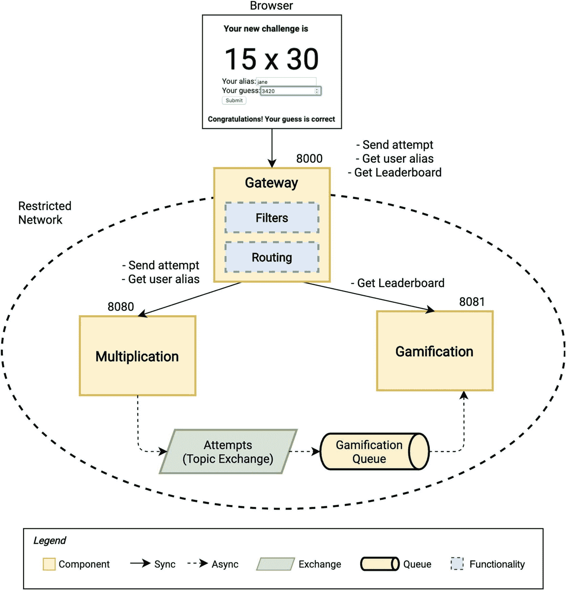

图 8-1

网关:高级概述

有时人们将网关称为*边缘服务*，因为它是其他系统访问我们后端的方式，它将外部流量路由到相应的内部微服务。如前所述，网关的引入通常会限制对其他后端服务的访问。对于本章的第一部分，我们将跳过这个限制，因为我们直接在机器上运行所有的服务。当我们引进*集装箱化*时，我们将改变这一点。

### 春云网关

Spring Cloud 是 Spring 家族中的一个独立项目组，它提供工具来快速构建分布式系统中所需的通用模式，比如我们的微服务案例。这些模式也被称为*云模式*，尽管即使您在自己的服务器中部署微服务，它们也是适用的。在本章中，我们将利用几个 Spring Cloud 项目。如果您想查看完整的列表，请查看参考文档中的概述页面( [`https://tpd.io/scloud`](https://tpd.io/scloud) )。

对于网关模式，Spring Cloud 提供了两种选择。第一种选择是使用 Spring Cloud 长期支持的集成:Spring Cloud 网飞。这是一个包括几个工具的项目，这些工具是网飞开发者多年来作为开源软件(OSS)发布和维护的。如果你想了解更多关于这些工具的信息，你可以看看网飞 OSS 网站( [`https://tpd.io/noss`](https://tpd.io/noss) )。网飞 OSS 中实现网关模式的组件是 Zuul，它与 Spring 的集成通过 Spring Cloud 网飞 Zuul 模块实现。

在这本书的第二版中，我们不会使用春云网飞。主要原因是，Spring 似乎正在远离网飞 OSS 工具集成，并用集成了替代工具的其他模块，甚至是它们自己的实现来取代它们。对这种变化的一种可能的解释是，网飞将其一些项目置于维护模式，如 Hystrix(断路)和 Ribbon(负载平衡)，因此它们不再处于积极的开发中。这个决定也会影响网飞堆栈中的其他工具，因为它们实现了经常一起使用的模式。一个例子是服务发现工具 Eureka，它依靠 Ribbon 来实现负载平衡。

我们将选择一个更新的替代方案来实现网关模式:Spring Cloud Gateway。在这种情况下，对 Zuul 的替换是一个独立的 Spring 项目，因此它不依赖于任何外部工具。

知道了模式，你就可以交换工具了

请记住，从这本书中学到的最重要的东西是微服务架构模式，以及从实用的角度介绍它们的原因。您可以使用市场上的任何其他替代产品，如 Nginx、HAProxy、Kong Gateway 等。

Spring Cloud Gateway 项目定义了一些核心概念(也如图 [8-2](#Fig2) 所示)。

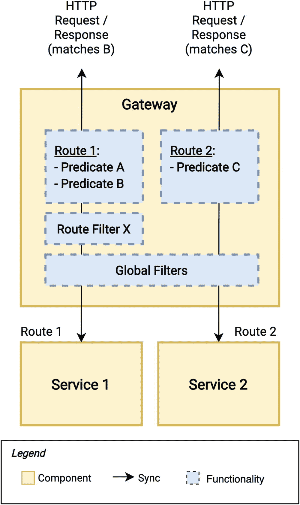

图 8-2

网关:路由、谓词和过滤器

*   *谓词*:决定将请求路由到哪里的评估条件。云网关提供了一堆基于请求路径、请求头、时间、远程主机等的条件构建器。你甚至可以把它们组合成表达式。它们也被称为*路由谓词*，因为它们总是应用于一条路由。

*   *Route* :如果请求匹配指定的谓词，它将被代理到 URI。例如，它可以向内部微服务端点发送外部请求，我们将在后面的实践中看到这一点。

*   *过滤器*:一个可选的处理器，可以连接到一个路由(路由过滤器)，也可以全局应用(全局过滤器)到所有的请求。过滤器允许修改请求(传入过滤器)和响应(传出过滤器)。Spring Cloud Gateway 中有许多内置的过滤器，因此您可以添加或删除请求中的头，限制来自给定主机的请求数量，或者在将响应返回给请求者之前转换来自代理服务的响应。

为了定义这个配置，我们使用 Spring Boot 的应用属性。然而，这一次我们将使用 YAML 格式，因为它在定义路线时可读性更强。云网关文档定义了谓词、路由和过滤器的特定符号。此外，在定义谓词和过滤器时，我们有两个选项:*快捷方式*和*完全扩展的*配置。他们两个工作一样；唯一的区别是，您可以使用单行表达式，并通过快捷方式版本避免额外的 YAML。如果你想知道它们之间的比较，可以查看文档中的“快捷符号”( [`http://tpd.io/gw-notation`](http://tpd.io/gw-notation) )一节。见清单 [8-1](#PC1) 中使用快捷符号定义两条路线的示例配置块。请继续阅读关于它们如何工作的详细解释。

```java
spring:
  cloud:
    gateway:
      routes:
        - id: old-travel-conditions
          uri: http://oldhost/travel
          predicates:
            - Before=2021-01-01T10:00:00.000+01:00[Europe/Madrid]
            - Path=/travel-in-spain/**
        - id: change-travel-conditions
          uri: http://somehost/travel-new
          predicates:
            - After=2021-01-01T10:00:00.000+01:00[Europe/Madrid]
            - Path=/travel-in-spain/**

          filters:
            - AddResponseHeader=X-New-Conditions-Apply, 2021-Jan

Listing 8-1An Example of Routing Configuration in Spring Cloud Gateway

```

假设在`http://my.travel.gateway/`网关是外部可访问的。这个示例配置定义了共享一个路径路由断言(包含在网关中)的两个路由；见 [`https://tpd.io/pathpred`](https://tpd.io/pathpred) 。任何以`http://my.travel.gateway/travel-in-spain/`开头的请求都被这个谓词定义捕获。每个路由中的附加条件分别由一个 Before ( [`https://tpd.io/befpred`](https://tpd.io/befpred) )和一个 After route ( [`https://tpd.io/aftpred`](https://tpd.io/aftpred) )谓词定义，它们决定将请求代理到哪里。

*   如果请求发生在西班牙时间 2021 年 1 月 1 日上午 10 点之前，它将被代理给`http://oldhost/travel-conditions/`。例如，请求`http://my.travel.gateway/travel-in-spain/tapas`被代理给`http://oldhost/travel/tapas`。

*   此后发生的任何请求都被`change-travel-conditions`路由捕获，因为它使用了对应的谓词`After`。在这种情况下，前面显示的相同请求将被代理到`http://somehost/travel-new/tapas`。另外，额外的`filter`将添加一个响应头`X-New-Conditions-Apply`，值为`2021-Jan`。

请记住，本例中的`http://oldhost`和`http://somehost`不需要从外部访问；它们只对我们后端的网关和其他内部服务可见。

内置的谓词和过滤器允许我们满足对网关的各种需求。在我们的应用中，我们将主要使用路径路由谓词，根据它们调用的 API，将外部请求代理到相应的微服务。

如果您想扩展关于 Spring Cloud Gateway 功能的知识，请查看参考文档( [`https://tpd.io/gwdocs`](https://tpd.io/gwdocs) )。

### 网关微服务

代码源

本章中的代码源被分成四个部分。通过这种方式，您可以更好地理解系统是如何逐步发展的。第一部分的源代码，包括网关实现，都在项目`chapter08a`中。

可以想象，Spring Boot 为 Spring Cloud Gateway 提供了一个入门包。只有将这个启动器依赖项添加到一个空的 Spring Boot 应用中，我们才能获得一个随时可用的网关微服务。实际上，Gateway 项目是建立在 Spring Boot 之上的，所以它只能在 Spring Boot 应用中工作。出于这个原因，在这种情况下，自动配置逻辑位于核心 Spring Cloud Gateway 工件中，而不是位于 Spring Boot 的`autoconfigure`包中。类名是`GatewayAutoConfiguration`(参见 [`https://tpd.io/gwautocfg`](https://tpd.io/gwautocfg) )，在其他任务中，它读取`application.yml`配置并构建相应的路由过滤器、谓词等。

我们将像往常一样，通过 Spring Initializr 的网站构建这个新的微服务(参见 [`https://tpd.io/spring-start`](https://tpd.io/spring-start) )。选择网关依赖，将工件命名为**网关**，如图 [8-3](#Fig3) 所示。

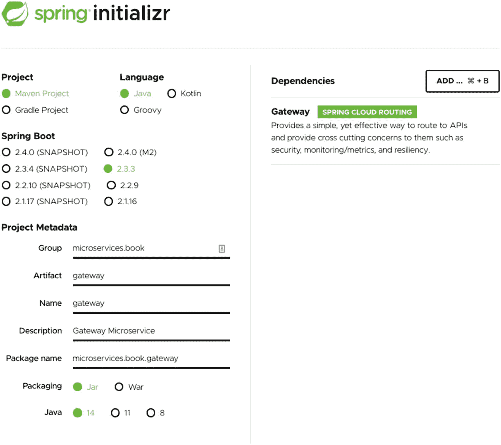

图 8-3

创建网关微服务

下载 zip 文件后，我们将它的内容复制到我们的主工作区文件夹中，与乘法和游戏化微服务处于同一级别。将项目作为一个额外的模块加载到您的工作区中，并花点时间研究一下生成的`pom.xml`文件的内容。与其他项目相比，您会看到一个新的`dependencyManagement`节点和一个新的属性供 Spring Cloud 版本使用(Hoxton)。文件的主要变化见清单 [8-2](#PC2) 。我们需要这个额外的 Maven 配置，因为 Spring Cloud 工件没有直接在 Spring Boot 的父项目中定义。

```java
<?xml version="1.0" encoding="UTF-8"?>
<project>
    <!-- ... -->
    <name>gateway</name>

    <properties>
        <spring-cloud.version>Hoxton.SR7</spring-cloud.version>
        <!-- ... -->
    </properties>

    <dependencies>
        <dependency>
            <groupId>org.springframework.cloud</groupId>
            <artifactId>spring-cloud-starter-gateway</artifactId>
        </dependency>
        <!-- ... -->
    </dependencies>

    <dependencyManagement>
        <dependencies>
            <dependency>
                <groupId>org.springframework.cloud</groupId>
                <artifactId>spring-cloud-dependencies</artifactId>
                <version>${spring-cloud.version}</version>
                <type>pom</type>
                <scope>import</scope>
            </dependency>
        </dependencies>
    </dependencyManagement>
    <!-- ... -->
</project>

Listing 8-2Spring Cloud Gateway Dependencies in Maven

```

下一步是将`application.properties`文件的扩展名更改为`application.yml`，并添加一些配置，以将属于乘法微服务的所有端点代理到该应用，对于游戏化的端点也是如此。我们还将这个新服务的服务器端口更改为 8000，以避免本地部署时的端口冲突。此外，我们将为 UI 添加一些 CORS 配置，以允许从其来源发出请求。Spring Cloud Gateway 有一个基于配置的风格( [`https://tpd.io/gwcors`](https://tpd.io/gwcors) )来使用`globalcors`属性实现这一点。在清单 [8-3](#PC3) 中可以看到所有这些变化。

```java
server:
  port: 8000

spring:
  cloud:
    gateway:
      routes:
        - id: multiplication
          uri: http://localhost:8080/
          predicates:
            - Path=/challenges/**,/attempts,/attempts/**,/users/**
        - id: gamification
          uri: http://localhost:8081/
          predicates:
            - Path=/leaders
      globalcors:
        cors-configurations:
          '[/**]':
            allowedOrigins: "http://localhost:3000"
            allowedHeaders:
              - "*"
            allowedMethods:
              - "GET"
              - "POST"
              - "OPTIONS"

Listing 8-3Gateway Configuration: First Approach

```

该文件中的路由将使网关的行为如下:

*   任何到`http://localhost:8000/attempts`或在`http://localhost:8000/attempts`下的请求将被代理到部署在本地`http://localhost:8080/`的乘法微服务。位于同一微服务中的其他 API 上下文也会发生同样的情况，比如`challenges`和`users`。

*   对`http://localhost:8000/leaders`的请求将被转换为对游戏化微服务的请求，游戏化微服务使用相同的主机(`localhost`)但端口是 8081。

或者，可以编写一个更简单的配置，不需要路由到每个微服务的端点的明确列表。我们可以通过使用网关的另一个允许捕获路径段的特性来做到这一点。如果我们得到一个 API 调用，比如`http://localhost:8000/multiplication/attempts`，我们可以提取`multiplication`作为一个值，并使用它映射到相应服务的主机和端口。然而，只有当每个微服务只包含一个 API 域时，这种方法才有效。在任何其他情况下，我们将向客户公开我们的内部架构。在我们的例子中，我们会要求客户端调用`http://localhost:8000/multiplication/users`，而我们更希望它们指向`http://localhost:8000/users`，并隐藏用户域仍然存在于乘法的可部署单元中的事实。

### 其他项目的变化

随着网关微服务的引入，我们可以将所有针对外部请求的配置保留在同一个服务中。这意味着我们不再需要向倍增和游戏化微服务添加 CORS 配置。我们可以在网关中保留这个配置，因为其他两个服务被放在这个新的代理服务之后。因此，我们可以从现有的项目文件夹中删除两个`WebConfiguration`文件。清单 [8-4](#PC4) 展示了游戏化微服务中的文件内容。记得删除的不仅是这个，还有乘法微服务里的等价类。

```java
package microservices.book.gamification.configuration;

import org.springframework.context.annotation.Configuration;
import org.springframework.web.servlet.config.annotation.CorsRegistry;
import org.springframework.web.servlet.config.annotation.WebMvcConfigurer;

@Configuration
public class WebConfiguration implements WebMvcConfigurer {

    /**
     * Enables Cross-Origin Resource Sharing (CORS)
     * More info: http://docs.spring.io/spring/docs/current/spring-framework-reference/html/cors.html
     */
    @Override
    public void addCorsMappings(final CorsRegistry registry) {
        registry.addMapping("/**").allowedOrigins("http://localhost:3000");
    }

}

Listing 8-4The WebConfiguration Class That We Can Remove

```

我们还需要更改 React 应用，使两个服务指向同一个主机/端口。参见清单 [8-5](#PC5) 和 [8-6](#PC6) 。我们还可以根据我们对 UI 结构的偏好重构`GameApiClient`和`ChallengesApiClient`类:一个服务调用所有端点，或者一个服务调用每个 API 上下文(挑战、用户等)。).我们不再需要两个不同的服务器 URL，因为 UI 现在将后端视为具有多个 API 的单个主机。

```java
class GameApiClient {
    static SERVER_URL = 'http://localhost:8000';
    static GET_LEADERBOARD = '/leaders';
    // ...
}

Listing 8-6Changing the Gamification API URL to Point to the Gateway

```

```java
class ChallengesApiClient {
    static SERVER_URL = 'http://localhost:8000';
    static GET_CHALLENGE = '/challenges/random';
    static POST_RESULT = '/attempts';
    // ...
}

Listing 8-5Changing the Multiplication API URL to Point to the Gateway

```

### 运行网关微服务

要运行我们的整个应用，我们必须在列表中添加一个额外的步骤。记住，使用 Maven 包装器，所有 Spring Boot 应用都可以从您的 IDE 或命令行执行。

1.  运行 RabbitMQ 服务器。

2.  启动乘法微服务。

3.  启动游戏化微服务。

4.  启动新的网关微服务。

5.  从`challenges-frontend`文件夹用`npm start`运行前端 app。

在本章中，这个列表将继续增长。需要强调的是，您不需要遵循前面步骤的顺序，因为您甚至可以同时运行所有这些流程。在开始阶段，系统可能不稳定，但最终会准备好的。Spring Boot 将重新尝试连接 RabbitMQ，直到它正常工作。

当您访问 UI 时，您不会注意到任何变化。排行榜已加载，您可以像往常一样发送尝试。验证请求是否被代理的一种方法是查看浏览器的开发工具中的 Network 选项卡，并选择任何请求到后端，以查看 URL 现在如何以`http://localhost:8000`开始。第二个选择是向网关添加一些跟踪日志配置，这样我们就可以看到发生了什么。请参见清单 [8-7](#PC7) 了解您可以添加到网关项目中的`application.yml`文件中的配置，以启用这些日志。

```java
# ... route config
logging:
  level:
    org.springframework.cloud.gateway.handler.predicate: trace

Listing 8-7Adding Trace-Level Logs to the Gateway

```

如果您使用这个新配置重新启动网关，您将看到网关处理的每个请求的日志。这些日志是检查所有定义的路由以查看是否有匹配请求模式的路由的结果。参见清单 [8-8](#PC8) 。

```java
TRACE 48573 --- [ctor-http-nio-2] RoutePredicateFactory: Pattern "[/challenges/**, /attempts, /attempts/**, /users/**]" does not match against value "/leaders"
TRACE 48573 --- [ctor-http-nio-2] RoutePredicateFactory: Pattern "/leaders" matches against value "/leaders"
TRACE 48573 --- [ctor-http-nio-2] RoutePredicateFactory: Pattern "/users/**" matches against value "/users/72,49,60,101,96,107,1,45"

Listing 8-8Gateway Logs with Pattern-Matching Messages

```

现在，让我们再次删除这个日志配置，以避免过于冗长的输出。

### 后续步骤

我们已经有了一些新的优势。

*   前端仍然不知道后端的结构。

*   外部请求的通用配置保持不变。在我们的例子中，这是 CORS 设置，但也可能是其他常见问题，如用户身份验证、指标等。

接下来，我们将在网关中引入负载平衡，这样它可以在每个服务的所有可用实例之间分配流量。利用这种模式，我们将为系统增加可伸缩性和冗余性。然而，要使负载平衡正常工作，我们需要一些先决条件。

*   网关需要知道给定服务的可用实例。我们的初始配置直接指向一个特定的端口，因为我们假设只有一个实例。如果有多个副本，会是什么样子呢？我们不应该在路由配置中包含硬编码列表，因为实例的数量应该是动态的:我们希望透明地增加和减少新的实例。

*   我们需要实现后端组件健康的概念。只有这样，我们才能知道一个实例何时未准备好处理流量，并切换到任何其他正常的实例。

为了满足第一个先决条件，我们需要引入服务发现模式，使用一个公共注册表，不同的分布式组件可以访问该注册表以了解可用的服务以及在哪里可以找到它们。

对于第二个先决条件，我们将使用 Spring Boot 执行器。我们的微服务将公开一个指示它们是否健康的端点，因此其他组件将会知道。这是我们接下来要做的，因为这也是服务发现的一个要求。

## 健康

在生产环境中运行的系统永远不会安全地避免错误。网络连接可能会失败，或者微服务实例可能会由于代码中的错误导致的内存不足问题而崩溃。我们决心建立一个有弹性的系统，所以我们希望通过像*冗余*(同一微服务的多个副本)这样的机制来应对这些错误，以最大限度地减少这些事件的影响。

那么，我们如何知道微服务何时不工作呢？如果它公开了一个接口(比如 REST API 或 RabbitMQ)，我们可以与一个样本探针进行交互，看看它是否对它做出反应。但是，我们在选择该探测器时应该小心，因为我们希望涵盖所有可能会使我们的微服务过渡到不健康状态(不起作用)的场景。与其将确定服务是否工作的逻辑泄露给调用者，不如提供一个标准的、简单的探测接口来判断服务是否健康。由服务的逻辑根据它使用的接口的可用性、它自己的可用性和错误的严重性来决定何时转换到不健康状态。如果服务甚至不能提供响应，调用者也可以认为它是不健康的。请参见图 [8-4](#Fig4) 了解该健康界面的高级概念视图。

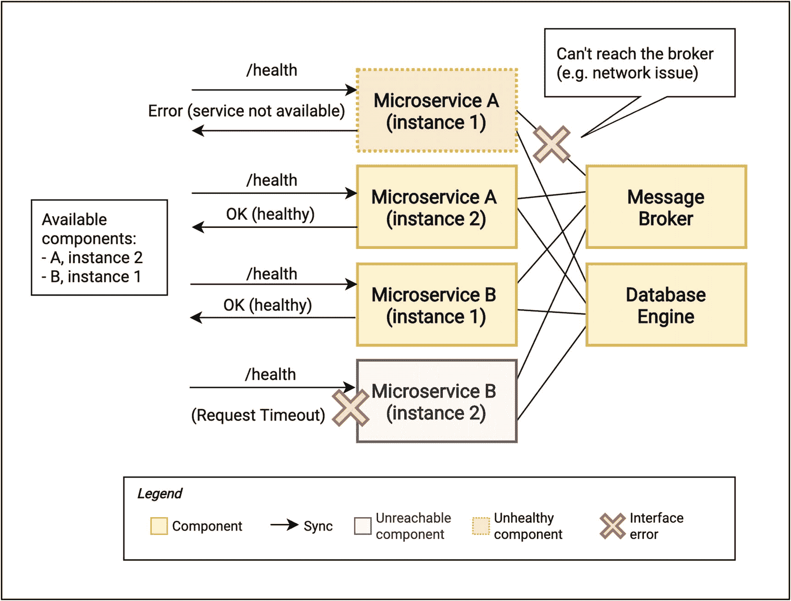

图 8-4

健康:高级概述

许多工具和框架都需要这个简单的接口约定来确定服务的健康程度(不仅仅是微服务)。例如，负载平衡器可以暂时停止将流量转移到不响应健康探测或以非就绪状态响应的实例。如果实例不正常，服务发现工具可能会将其从注册表中删除。像 Kubernetes 这样的容器平台可以决定重启一个服务，如果它在一段配置的时间内不健康的话(我们将在本章后面解释什么是容器平台)。

### Spring Boot 执行器

与我们应用的其他方面一样，Spring Boot 提供了一个开箱即用的解决方案来使我们的微服务报告其健康状态:Spring Boot 执行器。实际上，这不是 Actuator 包含的唯一特性；它还可以公开其他端点来访问关于我们的应用的不同数据，如配置的记录器、HTTP 跟踪、审计事件等。它甚至可以打开一个允许您关闭应用的管理端点。

执行器端点可以独立启用或禁用，它们不仅可以通过 web 界面使用，还可以通过 Java 管理扩展(JMX)使用。我们将把重点放在我们将用作 REST API 端点的 web 接口上。默认配置只公开两个端点:`info`和`health`。第一个目的是提供关于应用的一般信息，您可以使用贡献者( [`https://tpd.io/infocb`](https://tpd.io/infocb) )来丰富这些信息。健康端点是我们现在感兴趣的。它输出我们的应用的状态，为了解决这个问题，它使用健康指示器( [`https://tpd.io/acthealth`](https://tpd.io/acthealth) )。

有多个内置的健康指示器可以帮助了解应用的整体健康状态。这些指示器中有许多是特定于某些工具的，因此只有当我们在应用中使用这些工具时，它们才可用。这是由 Spring Boot 的自动配置控制的，我们已经知道它可以检测我们是否在使用某些类并注入一些额外的逻辑。

让我们用一个实际的例子来看看它是如何工作的:包含在 Spring Boot 执行器工件中的`RabbitHealthIndicator`类。参见清单 [8-9](#PC9) 以获得其源代码的概述(也可在 [`http://tpd.io/rhi-source`](http://tpd.io/rhi-source) 在线获得)。健康检查实现使用了一个`RabbitTemplate`对象，这是 Spring 与 RabbitMQ 服务器交互的方式。如果这段代码可以访问 RabbitMQ 服务器的版本，健康检查就通过了(它不会抛出异常)。

```java
public class RabbitHealthIndicator extends AbstractHealthIndicator {

    private final RabbitTemplate rabbitTemplate;

    public RabbitHealthIndicator(RabbitTemplate rabbitTemplate) {
        super("Rabbit health check failed");
        Assert.notNull(rabbitTemplate, "RabbitTemplate must not be null");
        this.rabbitTemplate = rabbitTemplate;
    }

    @Override
    protected void doHealthCheck(Health.Builder builder) throws Exception {
        builder.up().withDetail("version", getVersion());
    }

    private String getVersion() {
        return this.rabbitTemplate
                .execute((channel) -> channel.getConnection()
                    .getServerProperties().get("version").toString());
    }

}

Listing 8-9The RabbitHealthIndicator Included in Spring Boot Actuator

```

如果我们使用 RabbitMQ，这个指示器会自动注入到上下文中。它有助于整体健康状况。工件`spring-boot-actuator-autoconfigure`(Spring Boot 致动器依赖的一部分)中包含的`RabbitHealthContributorAutoConfiguration`类负责这一点。见清单 [8-10](#PC10) (也可在 [`http://tpd.io/rhc-autoconfig`](http://tpd.io/rhc-autoconfig) )。这个配置以一个`RabbitTemplate` bean 的存在为条件，这意味着我们正在使用 RabbitMQ 模块。它创建了一个`HealthContributor` bean，在本例中是一个`RabbitHealthIndicator`，它将被整体健康自动配置检测和聚合。

```java
@Configuration(proxyBeanMethods = false)
@ConditionalOnClass(RabbitTemplate.class)
@ConditionalOnBean(RabbitTemplate.class)
@ConditionalOnEnabledHealthIndicator("rabbit")
@AutoConfigureAfter(RabbitAutoConfiguration.class)
public class RabbitHealthContributorAutoConfiguration
        extends CompositeHealthContributorConfiguration<RabbitHealthIndicator, RabbitTemplate> {

    @Bean
    @ConditionalOnMissingBean(name = { "rabbitHealthIndicator", "rabbitHealthContributor" })
    public HealthContributor rabbitHealthContributor(Map<String, RabbitTemplate> rabbitTemplates) {
        return createContributor(rabbitTemplates);
    }

}

Listing 8-10How Spring Boot Autoconfigures the RabbitHealthContributor

```

我们将很快看到这在实践中是如何工作的，因为我们将在下一节将 Spring Boot 致动器添加到我们的微服务中。

请记住，您可以配置执行器端点的多个设置，也可以创建自己的健康指示器。如需完整的功能列表，请查阅 Spring Boot 致动器官方文档( [`https://tpd.io/sbactuator`](https://tpd.io/sbactuator) )。

### 包括微服务中的致动器

代码源

引入健康端点、服务发现和负载平衡的代码源位于存储库`chapter08b`中。

将健康端点添加到我们的应用就像将`pom.xml`文件中的依赖项添加到我们的项目:`spring-boot-starter-actuator`一样简单。参见清单 [8-11](#PC11) 。我们将这个新的工件添加到我们所有的 Spring Boot 应用中:乘法、游戏化和网关微服务。

```java
<dependency>
    <groupId>org.springframework.boot</groupId>
    <artifactId>spring-boot-starter-actuator</artifactId>
</dependency>

Listing 8-11Adding Spring Boot Actuator to Our Microservices

```

默认配置在`/actuator`上下文中公开了`health`和`info` web 端点。这对于我们来说已经足够了，但是如果需要的话，可以通过属性进行调整。重新构建并重启后端应用，以验证这一新功能。我们可以使用命令行或浏览器来轮询每个服务的健康状态，只需切换端口号即可。请注意，我们没有通过网关公开`/health`端点，因为这不是我们想要向外部公开的特性，而是我们系统内部的特性。乘法微服务的请求和响应见清单 [8-12](#PC12) 。

```java
$ http :8080/actuator/health
HTTP/1.1 200
Content-Type: application/vnd.spring-boot.actuator.v3+json

{
    "status": "UP"
}

Listing 8-12Testing the /health Endpoint for the First Time

```

如果我们的系统运行正常，我们将获得`UP`值和一个 HTTP 状态代码`200`。我们接下来要做的是停止 RabbitMQ 服务器并再次尝试同样的请求。我们已经看到，Actuator 项目包含一个健康指示器来检查 RabbitMQ 服务器，所以这个应该会失败，导致聚合健康状态切换到`DOWN`。如果我们在 RabbitMQ 服务器停止时发出请求，这确实是我们将得到的结果。参见清单 [8-13](#PC13) 。

```java
$ http :8080/actuator/health
HTTP/1.1 503
Content-Type: application/vnd.spring-boot.actuator.v3+json

{
    "status": "DOWN"
}

Listing 8-13The Status of Our App Switches to DOWN When RabbitMQ Is Unreachable

```

请注意，返回的 HTTP 状态代码也更改为 503，服务不可用。因此，调用者甚至不需要解析响应体；它可以只检查响应代码是否为 200，以确定应用是否正常。您还可以在乘法应用的输出中看到从`RabbitHealthIndicator`检索服务器版本的失败尝试的日志。参见清单 [8-14](#PC14) 。

```java
2020-08-30 10:20:04.019  INFO 59277 --- [io-8080-exec-10] o.s.a.r.c.CachingConnectionFactory       : Attempting to connect to: [localhost:5672]
2020-08-30 10:20:04.021  WARN 59277 --- [io-8080-exec-10] o.s.b.a.amqp.RabbitHealthIndicator       : Rabbit health check failed

org.springframework.amqp.AmqpConnectException: java.net.ConnectException: Connection refused
    at org.springframework.amqp.rabbit.support.RabbitExceptionTranslator.convertRabbitAccessException(RabbitExceptionTranslator.java:61) ~[spring-rabbit-2.2.10.RELEASE.jar:2.2.10.RELEASE]
[...]
Caused by: java.net.ConnectException: Connection refused
    at java.base/sun.nio.ch.Net.pollConnect(Native Method) ~[na:na]
[...]

Listing 8-14Rabbit Health Check Failing in the Multiplication Microservice

```

Spring Boot 应用仍然存在，并且可以从错误中恢复。如果我们启动 RabbitMQ 服务器并再次检查健康状态，它将切换到`UP`。应用不断尝试建立与服务器的连接，直到成功为止。这正是我们想要的健壮系统的行为:如果微服务有问题，它应该标记它，让其他组件知道；同时，它应该尝试从错误中恢复，并在可能的情况下再次切换到健康状态。

## 服务发现和负载平衡

既然我们有能力知道服务是否可用，我们就可以在系统中集成服务发现和负载平衡。

服务发现模式由两个主要概念组成。

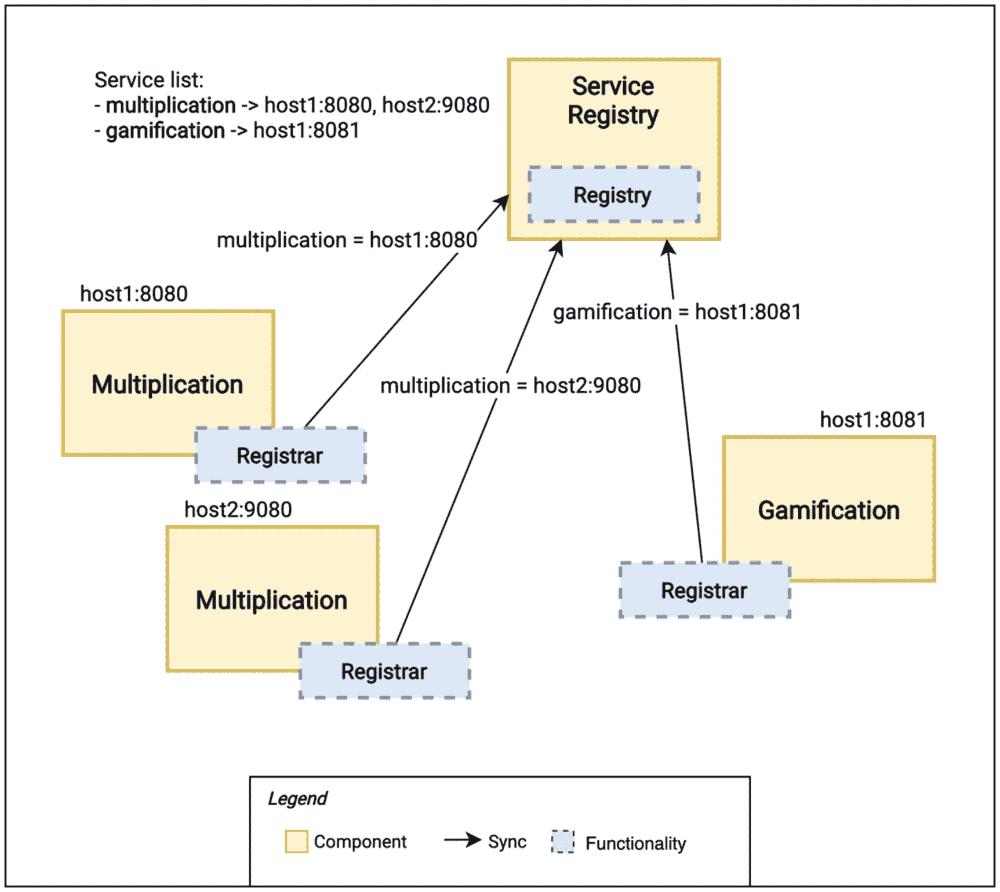

图 8-5

服务发现:模式概述

*   **服务注册中心*:一个包含可用服务列表、服务所在地址和一些额外元数据(如名称)的中心位置。它可能包含不同服务的条目，但也可能包含同一服务的多个实例。在最后一种情况下，访问注册中心的客户机可以通过查询一个*服务别名*来获得可用实例的列表。例如，乘法微服务的各种实例可以用同一个别名`multiplication`注册。然后，当查询该值时，将返回所有实例。图 [8-5](#Fig5) 所示的例子就是如此。*

**   *注册器*:负责在注册中心注册服务实例的逻辑。它可以是一个外部运行的进程，观察我们的微服务的状态，或者它可以作为一个库嵌入到服务本身中，就像我们的情况一样。* 

 *在图 [8-5](#Fig5) 中，我们看到了一个有三个服务的服务注册的例子。服务器的 DNS 地址`host1`在端口 8080 有一个乘法实例，在端口 8081 有一个游戏化实例。另一台机器`host2`有第二个乘法实例，位于端口 9080。所有这些实例都知道它们的位置，并使用注册器将它们相应的 URIs 发送到服务注册中心。然后，注册中心客户端可以使用服务的名称(例如，`multiplication`)简单地询问服务的位置，注册中心返回实例及其位置的列表(例如，`host1:8080`，`host2:9080`)。我们将很快在实践中看到这一点。

负载平衡模式与服务发现密切相关。如果多个服务在注册时使用相同的名称，这意味着有多个副本可用。我们希望平衡它们之间的流量，这样我们就可以增加系统的容量，并且由于增加了冗余，在出现错误的情况下使系统更有弹性。

其他服务可以从注册表中查询给定的服务名，检索列表，然后决定调用哪个实例。这种技术被称为*客户端发现*，它意味着客户端知道服务注册并自己执行负载平衡。请注意，在此定义中，客户端是指应用、微服务、浏览器等。，它希望对另一个服务执行 HTTP 调用。见图 [8-6](#Fig6) 。

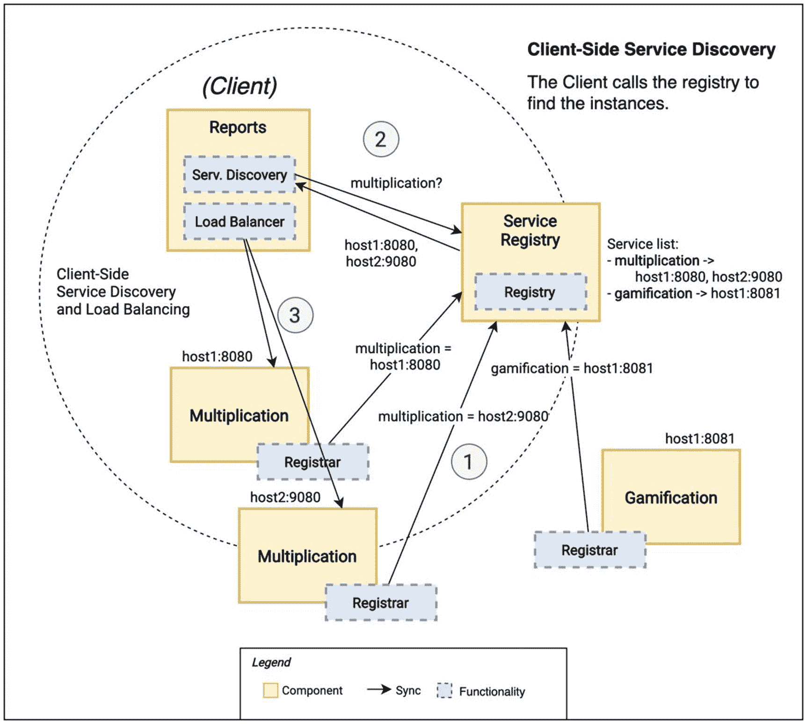

图 8-6

客户端服务发现

另一方面，*服务器端发现*通过提供一个预先知道的惟一地址，从客户端抽象出所有这些逻辑，调用者可以在这个地址找到给定的服务。当它们发出请求时，负载均衡器会截获它，它知道注册表。这个平衡器将把请求代理给其中一个副本。见图 [8-7](#Fig7) 。

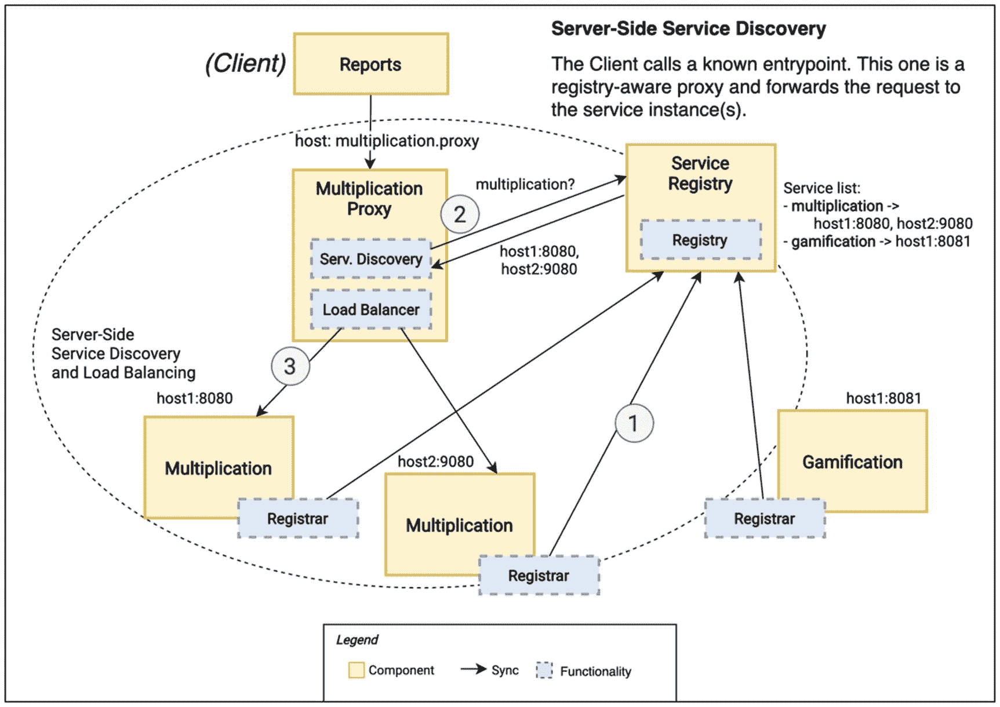

图 8-7

服务器端服务发现

通常，在微服务架构中，您会看到两种方法的结合，或者只是服务器端发现。当 API 客户端在我们的系统之外时，客户端发现不能很好地工作，因为我们不应该要求外部客户端与服务注册中心交互并自己进行负载平衡。通常，网关承担这一责任。因此，我们的 API 网关将连接到服务注册中心，并将包含一个负载平衡器，以便在实例之间分配负载。

对于我们后端中的任何其他服务到服务的通信，我们可以将它们全部连接到注册表以进行客户端发现，或者将每个服务集群(及其所有实例)抽象为具有负载平衡器的唯一地址。后者是 Kubernetes 等一些平台选择的技术，其中每个服务都被分配一个唯一的地址，不管有多少副本以及它们位于哪个节点(我们将在本章稍后回到这一点)。

我们的微服务不再互相调用，但是如果需要的话，实现客户端发现会很简单。Spring Boot 具有连接到服务注册中心和实现负载平衡器的集成(类似于我们将在网关中做的)。

正如我们已经提到的，任何到我们后端的非内部 HTTP 通信都将使用服务器端发现方法。这意味着我们的网关不仅会路由流量，还会负责负载平衡。参见图 [8-8](#Fig8) ，其中也包括我们在需要军种间通信时选择的解决方案。该图还介绍了我们将选择用来实现服务发现、Consul 的工具的名称，以及我们将添加到依赖项中的 Spring Cloud 项目，以集成该工具并包括一个简单的负载平衡器。我们很快就会了解它们。

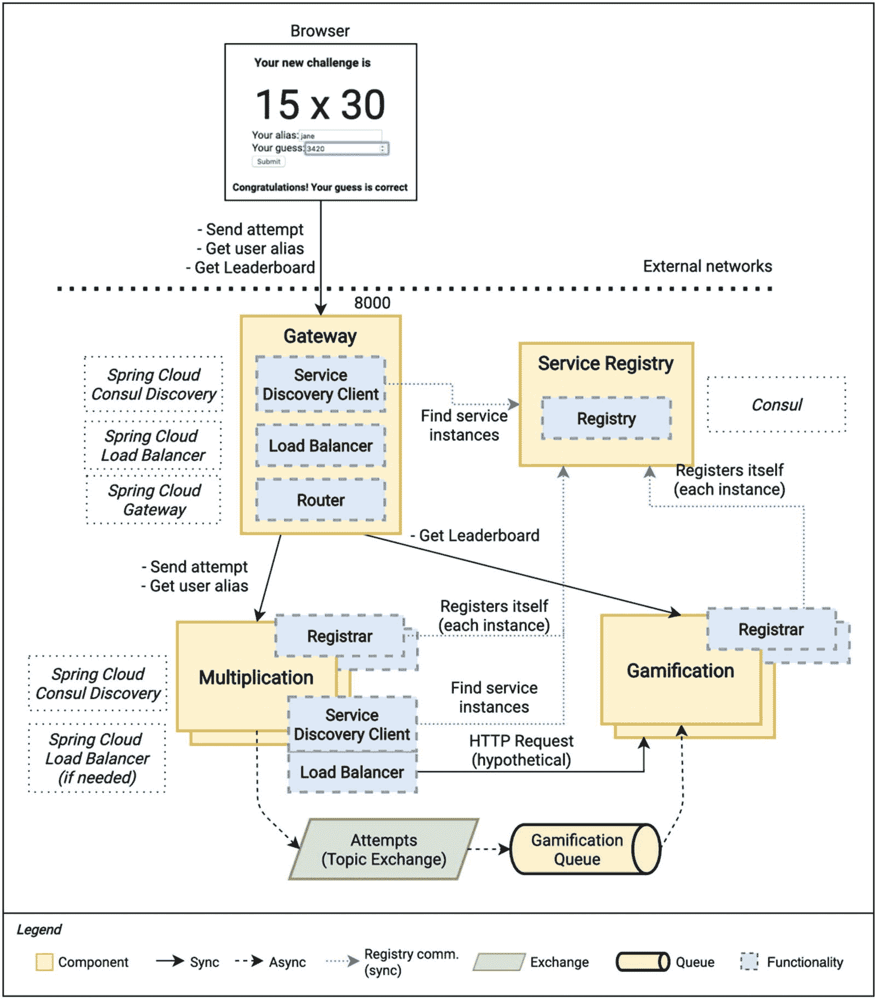

图 8-8

网关和服务发现集成

### 领事

许多工具实现了服务发现模式:Consul、Eureka、Zookeeper 等。也有完整的平台将这种模式作为其特性之一，我们将在后面描述。

在Spring生态系统中，网飞的尤里卡一直是最受欢迎的选择。然而，由于前面提到的原因(组件处于维护模式，Spring 开发人员开发的新工具)，这种偏好不再是一个合理的选择。我们将使用 Consul，这是一个提供服务发现和其他功能的工具，并且通过 Spring Cloud 模块进行了很好的集成。此外，我们将利用本章后面的其他 Consul 特性来实现微服务架构中的另一种模式，即集中式配置。

首先，让我们安装 Consul 工具，该工具在下载页面( [`https://tpd.io/dlconsul`](https://tpd.io/dlconsul) )可用于多个平台。一旦你安装了它，你可以用清单 [8-15](#PC15) 中的命令在开发模式下运行 Consul 代理。

```java
$ consul agent -node=learnmicro -dev
==> Starting Consul agent...
           Version: 'v1.7.3'
           Node ID: '0a31db1f-edee-5b09-3fd2-bcc973867b65'
         Node name: 'learnmicro'
        Datacenter: 'dc1' (Segment: '<all>')
            Server: true (Bootstrap: false)
       Client Addr: [127.0.0.1] (HTTP: 8500, HTTPS: -1, gRPC: 8502, DNS: 8600)
      Cluster Addr: 127.0.0.1 (LAN: 8301, WAN: 8302)
           Encrypt: Gossip: false, TLS-Outgoing: false, TLS-Incoming: false, Auto-Encrypt-TLS: false
...

Listing 8-15Starting the Consul Agent in Development Mode

```

日志应该显示一些关于服务器和一些启动操作的信息。我们在*开发模式*下运行代理，因为我们在本地使用它，但是一个合适的 Consul 生产设置应该包括一个具有多个数据中心的集群。这些数据中心可以运行一个或多个代理，其中每个服务器只有一个代理充当服务器代理。代理使用协议在它们之间进行通信，以同步信息并通过一致意见选举领导者。所有这些设置确保了高可用性。如果数据中心变得不可达，代理会注意到这一点，并选举新的领导者。如果您想了解更多关于在生产中部署 Consul 的信息，请查看部署指南( [`https://tpd.io/consulprod`](https://tpd.io/consulprod) )。我们将坚持本书中的开发模式，使用独立的代理。

正如我们在输出中看到的，Consul 在端口 8500 上运行一个 HTTP 服务器。它提供了一个 RESTful API，我们可以用它来进行服务注册和发现，以及其他功能。此外，它提供了一个 UI，如果我们从浏览器导航到`http://localhost:8500`，就可以访问这个 UI。参见图 [8-9](#Fig9) 。

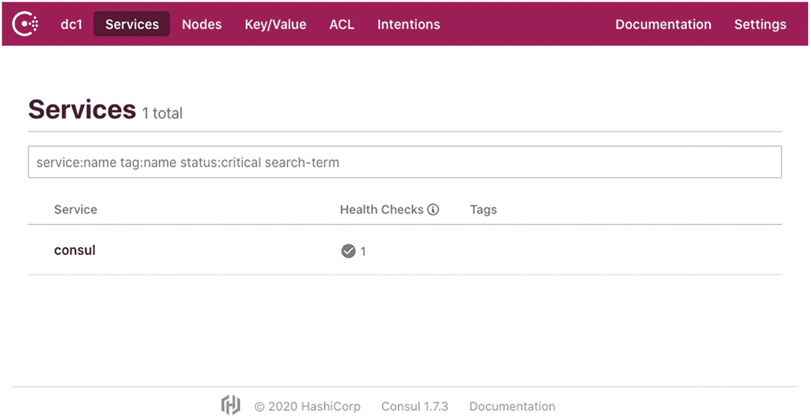

图 8-9

领事 UI

“服务”部分显示已注册服务的列表。由于我们还没有做任何事情，唯一可用的服务就是 consul 服务器。其他选项卡向我们展示了可用的 Consul 节点、我们将在本章后面使用的键/值功能，以及一些额外的 Consul 特性，如 ACL 和 intentions，这些我们在本书中不会用到。

您还可以通过 REST API 访问可用服务的列表。例如，使用 HTTPie，我们可以请求一个可用服务的列表，这会暂时输出一个空的响应体。参见清单 [8-16](#PC16) 。

```java
$ http -b :8500/v1/agent/services
{}

Listing 8-16Requesting the List of Services from Consul

```

服务 API 允许我们列出服务、查询它们的信息、了解它们是否健康、注册它们以及取消注册它们。我们不会直接使用这个 API，因为 Spring Cloud Consul 模块会为我们做这件事，我们很快会谈到。

Consul 包括验证所有服务状态的功能:健康检查特性。它提供了多种选项，我们可以使用这些选项来确定健康状况:HTTP、TCP、脚本等。可以想象，我们的计划是让 Consul 通过 HTTP 接口联系我们的微服务，更具体地说是在`/actuator/health`端点上。运行状况检查位置是在服务注册时配置的，Consul 会定期触发它们，也可以进行自定义。如果服务未能响应或以非正常状态响应(非 2XX)，Consul 会将该服务标记为不健康。我们很快就会看到一个实际的例子。如果你想知道更多关于如何配置它们的信息，请阅读 Consul 文档中的检查页面( [`https://tpd.io/consul-checks`](https://tpd.io/consul-checks) )。

### 春云领事

我们不需要使用 Consul API 来注册服务、定义健康检查或访问注册表来查找服务地址。所有这些功能都被 Spring Cloud Consul 项目抽象了，所以我们所需要的就是在我们的 Spring Boot 应用中包含相应的启动器，并且如果我们选择不使用默认值，就配置一些设置。

我们将使用的 Spring Cloud Consul 版本仍然附带网飞的 Ribbon，作为实现负载平衡器模式的一个包含依赖项。正如我们前面提到的，这个工具处于维护模式，Spring 文档不鼓励使用它(参见 [`https://tpd.io/no-ribbon`](https://tpd.io/no-ribbon) )。我们将在下一节详细介绍我们将使用的替代方案。现在，为了保持我们的项目整洁，我们将使用 Maven 来排除 Ribbon 的 starter 上的传递性依赖。参见清单 [8-17](#PC17) 。

```java
<dependency>
    <groupId>org.springframework.cloud</groupId>
    <artifactId>spring-cloud-starter-consul-discovery</artifactId>
    <exclusions>
        <exclusion>
            <groupId>org.springframework.cloud</groupId>
            <artifactId>spring-cloud-starter-netflix-ribbon</artifactId>
        </exclusion>
    </exclusions>
</dependency>

Listing 8-17Adding the Spring Cloud Consul Discovery Dependency in Maven

```

稍后，我们将把这种依赖性添加到网关项目中。对于另外两个微服务，我们首次添加了 Spring Cloud 依赖项。因此，我们需要将`dependencyManagement`节点添加到我们的`pom.xml`文件和 Spring Cloud 版本中。参见清单 [8-18](#PC18) 了解所需的添加内容。

```java
<project>
    <!-- ... -->
    <properties>
        <!-- ... -->
        <spring-cloud.version>Hoxton.SR7</spring-cloud.version>
    </properties>

    <dependencies>
        <!-- ... -->
        <dependency>
            <groupId>org.springframework.cloud</groupId>
            <artifactId>spring-cloud-starter-consul-discovery</artifactId>
            <exclusions>
                <exclusion>
                    <groupId>org.springframework.cloud</groupId>
                    <artifactId>spring-cloud-starter-netflix-ribbon</artifactId>
                </exclusion>
            </exclusions>
        </dependency>

    </dependencies>

    <dependencyManagement>
        <dependencies>
            <dependency>
                <groupId>org.springframework.cloud</groupId>
                <artifactId>spring-cloud-dependencies</artifactId>
                <version>${spring-cloud.version}</version>
                <type>pom</type>
                <scope>import</scope>
            </dependency>
        </dependencies>
    </dependencyManagement>
    <!-- ... -->
</project>

Listing 8-18Adding Consul Discovery to Multiplication and Gamification

```

Consul 包含的 Spring Boot 自动配置默认值对我们来说很好:服务器位于`http://localhost:8500`。如果您想检查这些默认值，请参见`ConsulProperties`的源代码( [`https://tpd.io/consulprops`](https://tpd.io/consulprops) )。如果我们需要更改它们，我们可以使用这些和其他在`spring.cloud.consul`前缀下可用的属性。关于您可以覆盖的设置的完整列表，请查看 Spring Cloud Consul 的参考文档( [`https://tpd.io/consulconfig`](https://tpd.io/consulconfig) )。

然而，我们的应用中需要一个新的配置属性:应用名称，由`spring.application.name`属性指定。到目前为止，我们还不需要它，但是 Spring Cloud Consul 使用它来注册具有该值的服务。这是我们必须添加到乘法项目内的`application.properties`文件中的行:

```java
spring.application.name=multiplication

```

确保将这一行也添加到游戏化微服务的配置中，这次使用值`gamification`。在网关项目中，我们使用 YAML 属性，但是变化是相似的。

```java
spring:
  application:
    name: gateway

```

现在，让我们开始乘法和游戏化微服务，看看他们如何注册自己相应的健康检查。记得启动 RabbitMQ 服务器和 Consul 代理。我们仍然需要对网关服务进行一些更改，所以我们还不需要启动它。在应用日志中，您应该会看到新的一行，如清单 [8-19](#PC21) 所示(注意，这只有一行，但是非常冗长)。

```java
INFO 53587 --- [main] o.s.c.c.s.ConsulServiceRegistry: Registering service with consul: NewService{id='gamification-8081', name="gamification", tags=[secure=false], address='192.168.1.133', meta={}, port=8081, enableTagOverride=null, check=Check{script='null', dockerContainerID="null", shell="null", interval="10s", ttl="null", http='http://192.168.1.133:8081/actuator/health', method="null", header={}, tcp="null", timeout="null", deregisterCriticalServiceAfter="null", tlsSkipVerify=null, status="null", grpc="null", grpcUseTLS=null}, checks=null}

Listing 8-19Gamification’s Log Line Showing the Consul Registration Details

```

这一行显示了应用启动时通过 Spring Cloud Consul 进行的服务注册。我们可以看到请求的内容:由服务名和端口组成的唯一 ID、可以对多个实例进行分组的服务名、本地地址，以及通过 HTTP 对 Spring Boot 执行器公开的服务健康端点的地址进行的配置健康检查。默认情况下，Consul 验证该检查的时间间隔设置为 10 秒。

在 Consul 服务器端(参见清单 [8-20](#PC22) )，日志在开发模式下被默认设置为调试级别，因此我们可以看到 Consul 是如何处理这些请求并触发检查的。

```java
[DEBUG] agent.http: Request finished: method=PUT url=/v1/agent/service/register?token=<hidden> from=127.0.0.1:54172 latency=2.424765ms
[DEBUG] agent: Node info in sync
[DEBUG] agent: Service in sync: service=gamification-8081
[DEBUG] agent: Check in sync: check=service:gamification-8081

Listing 8-20Consul Agent Logs

```

一旦我们使用这个新配置启动了两个微服务，我们就可以访问 Consul 的 UI 来查看更新后的状态。参见图 [8-10](#Fig10) 。

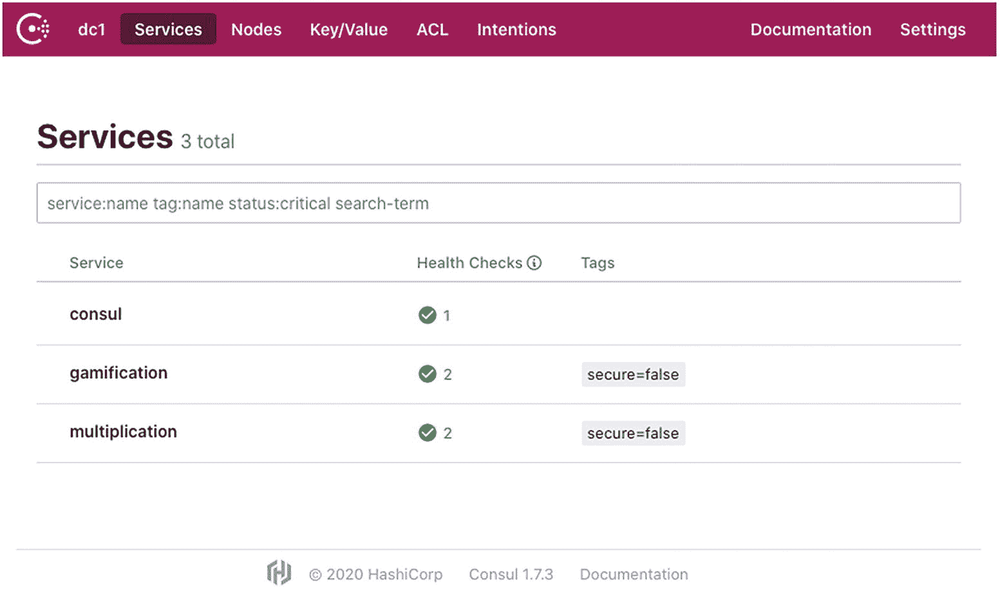

图 8-10

领事中列出的服务

现在导航到服务，单击“乘法”，然后单击显示在那里的唯一的“乘法”行。您将看到服务的运行状况检查。我们可以验证 Consul 如何从 Spring Boot 应用获得 OK 状态(200)。参见图 [8-11](#Fig11) 。

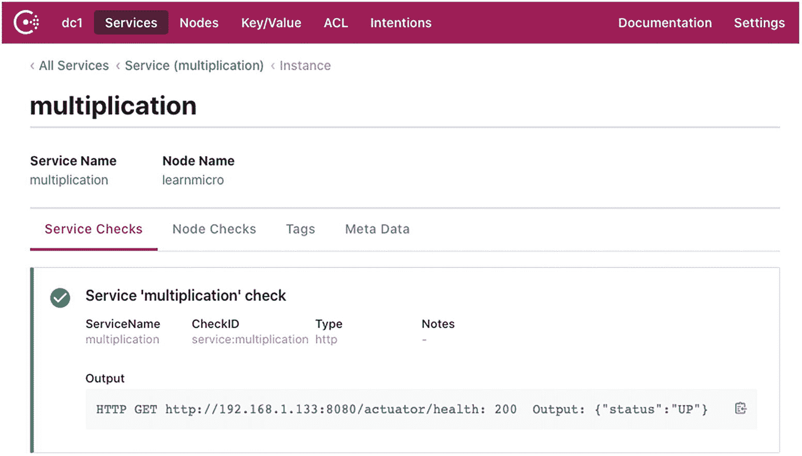

图 8-11

服务运行状况检查

我们还可以启动其中一个微服务的第二个实例，看看注册表是如何管理它的。如果您覆盖了端口，您可以从您的 IDE 或者直接从命令行来实现。参见清单 [8-21](#PC23) 中如何启动乘法微服务的第二个实例的示例。如你所见，我们可以使用 Spring Boot 的 Maven 插件覆盖服务器端口(更多细节见 [`https://tpd.io/mvn-sb-props`](https://tpd.io/mvn-sb-props) )。

```java
multiplication $ ./mvnw spring-boot:run -Dspring-boot.run.arguments="--server.port=9080"
[... logs ...]

Listing 8-21Running a Second Instance of then Multiplication Microservice from the Command Line

```

在领事注册表中，仍然会有一个单独的`multiplication`服务。如果我们单击此服务，我们将导航到 instances 选项卡。见图 [8-12](#Fig12) 。在这里，我们可以看到两个实例，每个实例都有相应的运行状况检查。请注意，当端口为默认值:`8080`时，Spring Boot 不会在 ID 中使用该端口。

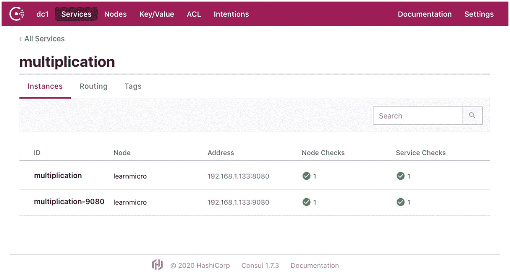

图 8-12

领事登记处有多个实例

从 Consul 获取服务列表的 API 请求现在检索这两个服务，包括关于乘法应用的两个实例的信息。请参见清单 [8-22](#PC24) 以获得简短的回应。

```java
$ http -b :8500/v1/agent/services
  {
      "gamification-8081": {
          "Address": "192.168.1.133",
          "EnableTagOverride": false,
          "ID": "gamification-8081",
          "Meta": {},
          "Port": 8081,
          "Service": "gamification",
          ...
          "Weights": {
              "Passing": 1,
              "Warning": 1
          }
      },
      "multiplication": {
          "Address": "192.168.1.133",
          "EnableTagOverride": false,
          "ID": "multiplication",
          "Meta": {},
          "Port": 8080,
          "Service": "multiplication",
          ...
          "Weights": {
              "Passing": 1,
              "Warning": 1
          }
      },
      "multiplication-9080": {
          "Address": "192.168.1.133",
          "EnableTagOverride": false,
          "ID": "multiplication-9080",
          "Meta": {},
          "Port": 9080,
          "Service": "multiplication",
          ...
          "Weights": {
              "Passing": 1,
              "Warning": 1
          }
      }
  }

Listing 8-22Retrieving Registered

Services Using the Consul API

```

你可以想象如果我们没有 Spring 抽象，我们将如何使用 Consul 作为客户端服务。首先，所有服务都需要知道 HTTP 主机和端口才能到达注册中心。然后，如果服务想要与游戏化 API 交互，它将使用 Consul 的服务 API 来获取可用实例的列表。API 还有一个端点来检索给定服务标识符的当前健康状态信息。遵循客户端发现方法，服务将应用负载平衡(例如，循环)并从列表中挑选一个健康的实例。然后，知道了请求的目标地址和端口，客户端服务就可以执行请求。我们不需要实现这个逻辑，因为 Spring Cloud Consul 已经为我们实现了，包括我们将在下一节讨论的负载平衡。

鉴于 Gateway 是我们系统中唯一调用其他服务的服务，我们将在这里实践 Consul 的服务发现逻辑。然而，在此之前，我们需要引入我们仍然缺少的模式:负载平衡器。

### Spring Cloud 负载平衡器

我们将实现一种客户端发现方法，其中后端服务查询注册表，并在有多个可用实例时决定调用哪个实例。这最后一部分是我们可以自己构建的逻辑，但是依靠工具来为我们做这件事更容易。Spring Cloud load balancer 项目是 Spring Cloud Commons 的一个组件，它与服务发现集成(Consul 和 Eureka)相集成，以提供一个简单的负载平衡器实现。默认情况下，它会自动配置一个循环负载平衡器，反复检查所有实例。

正如我们前面提到的，网飞的 Ribbon 曾经是实现负载平衡器模式的首选。因为它处于维护模式，所以让我们放弃这个选项，选择 Spring 的负载平衡器实现。Ribbon 和 Spring Cloud 负载平衡器都作为依赖项包含在 Spring Cloud Consul starter 中，但是我们可以使用配置标志或显式排除其中一个依赖项来在两者之间切换(就像我们在添加 Consul starter 时所做的那样)。

为了在两个应用之间进行负载平衡调用，我们可以在创建一个`RestTemplate`对象时简单地使用`@LoadBalanced`注释。然后，当执行对服务的请求时，我们使用服务名作为 URL 中的主机名。Spring Cloud Consul 和负载平衡器组件将完成剩下的工作，查询注册表并按顺序选择下一个实例。

在我们转向事件驱动的方法之前，我们曾经有一个从乘法服务到游戏化服务的调用，所以让我们以那个为例。清单 [8-23](#PC25) 展示了我们如何在客户端——乘法微服务中集成服务发现和负载平衡。这也在图 [8-8](#Fig8) 中进行了说明。如您所见，我们只需要声明一个用`@LoadBalanced`注释配置的`RestTemplate` bean，并使用 URL `http://gamification/attempts`。注意，您不需要指定端口号，因为在联系注册表之后，它将包含在解析的实例 URL 中。

```java
@Configuration
public class RestConfiguration {

    @LoadBalanced
    @Bean
    RestTemplate restTemplate() {
        return new RestTemplate();
    }
}

@Slf4j
@Service
public class GamificationServiceClient {

    private final RestTemplate restTemplate;

    public GamificationServiceClient(final RestTemplate restTemplate) {
        this.restTemplate = restTemplate;
    }

    public boolean sendAttempt(final ChallengeAttempt attempt) {
        try {
            ChallengeSolvedDTO dto = new ChallengeSolvedDTO(attempt.getId(),
                    attempt.isCorrect(), attempt.getFactorA(),
                    attempt.getFactorB(), attempt.getUser().getId(),
                    attempt.getUser().getAlias());
            ResponseEntity<String> r = restTemplate.postForEntity(
                    "http://gamification/attempts", dto,
                    String.class);
            log.info("Gamification service response: {}", r.getStatusCode());
            return r.getStatusCode().is2xxSuccessful();
        } catch (Exception e) {
            log.error("There was a problem sending the attempt.", e);
            return false;
        }
    }
}

Listing 8-23Example of How to Use a RestTemplate with Load Balancing Capabilities

```

我们不会走这条路，因为我们已经摆脱了微服务之间的 HTTP 调用，但是对于那些需要服务间 HTTP 交互的场景，这是一个很好的方法。通过服务发现和负载平衡，您可以降低失败的风险，因为您增加了至少有一个实例可用于处理这些同步请求的机会。

我们的计划是在网关中集成服务发现和负载平衡。参见图 [8-13](#Fig13) 。

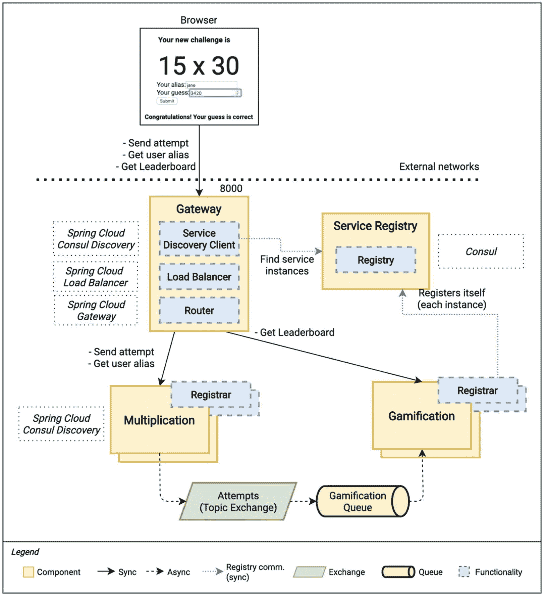

图 8-13

我们系统中的网关、服务发现和负载平衡

### 网关中的服务发现和负载平衡

在我们的应用中包含了 Spring Cloud Consul starter 之后，他们正在联系注册中心来发布他们的信息。然而，我们仍然有网关使用显式地址/端口组合来代理请求。是时候在那里集成服务发现和负载平衡了。

首先，我们将 Spring Cloud Consul 依赖项添加到 Gateway 项目中。参见清单 [8-24](#PC26) 。同样，我们排除 Ribbon，因为我们将使用 Spring Cloud 负载平衡器。

```java
<dependencies>
    <!-- ... -->
    <dependency>
        <groupId>org.springframework.cloud</groupId>
        <artifactId>spring-cloud-starter-consul-discovery</artifactId>
        <exclusions>
            <exclusion>
                <groupId>org.springframework.cloud</groupId>
                <artifactId>spring-cloud-starter-netflix-ribbon</artifactId>
            </exclusion>
        </exclusions>
    </dependency>

</dependencies>

Listing 8-24Adding Spring Cloud Consul Discovery to the Gateway

```

为了利用这些新模式，我们需要做的就是向`application.yml`文件添加一些配置。我们可以将变化分为三组。

*   *全局设置*:我们给应用命名，并确保我们使用 Spring Cloud 负载平衡器实现。此外，我们将添加一个配置参数来指示服务发现客户机只检索健康的服务。

*   *路由配置*:我们不使用显式的主机和端口，而是切换到具有 URL 模式的服务名称，这也支持负载平衡。

*   *弹性*:万一网关无法将请求代理给服务，我们希望它重试几次。我们将详细阐述这个主题。

请参见清单 [8-25](#PC27) ，获取我们新网关配置(`application.yml`)的完整源代码，包括这些更改。

```java
server:
  port: 8000

spring:
  application:
    name: gateway
  cloud:
    loadbalancer:
      ribbon:
        # Not needed since we excluded the dependency, but
        # still good to add it here for better readability

        enabled: false
    consul:
      enabled: true
      discovery:
        # Get only services that are passing the health check
        query-passing: true
    gateway:
      routes:
        - id: multiplication
          uri: lb://multiplication/
          predicates:
            - Path=/challenges/**,/attempts,/attempts/**,/users/**
        - id: gamification
          uri: lb://gamification/
          predicates:
            - Path=/leaders
      globalcors:
        cors-configurations:
          '[/**]':
            allowedOrigins: "http://localhost:3000"
            allowedHeaders:
              - "*"
            allowedMethods:
              - "GET"
              - "POST"
              - "OPTIONS"
      default-filters:
        - name: Retry

          args:
            retries: 3
            methods: GET,POST

Listing 8-25Gateway Configuration Including Load Balancing

```

当`query-passing`参数设置为`true`时，Spring 实现将使用带有过滤器的 Consul API 来检索那些通过健康检查的服务。我们只想将请求代理到健康的实例。在服务不经常轮询更新的服务列表的情况下，值`false`可能有意义。在这种情况下，最好获得完整的列表，因为我们不知道它们的最新状态，并且有处理不健康实例的机制(例如重试，我们很快就会知道)。

最相关的更改是应用于 URL 的更改。如你所见，现在我们使用类似于`lb://multiplication/`的 URL。由于我们添加了 Consul 客户端，应用将使用服务 API 将服务名`multiplication`解析为可用的实例。特殊方案`lb`告诉 Spring 应该使用负载均衡器。

除了基本配置之外，我们还添加了一个适用于所有请求的网关过滤器，因为它位于`default-filters`节点下:重试`GatewayFilter`(详见 [`https://tpd.io/gwretry`](https://tpd.io/gwretry) )。该过滤器拦截错误响应，并再次透明地重试请求。当与负载平衡器结合使用时，这意味着请求将被代理到下一个实例，因此我们很容易获得一个良好的弹性模式(重试)。我们配置这个过滤器，使我们使用的 HTTP 方法最多重试三次，这足以涵盖大多数失败情况。如果所有重试都失败，网关会向客户端返回一个错误响应(服务不可用)，因为它无法代理请求。

您可能想知道为什么需要在服务发现客户机中包含重试，尽管我们配置它只获取健康的实例。理论上，如果他们都很健康，所有的呼叫都会成功。为了理解这一点，我们必须回顾一下 Consul(以及其他典型的服务发现工具)是如何工作的。每个服务都向自己注册一个配置好的健康检查，每十秒钟轮询一次(默认值，但我们也可以更改它)。注册中心无法实时了解服务何时未准备好处理流量。可能的情况是，Consul 成功地检查了一个给定实例的健康状况，然后一个实例立即停止运行。注册中心将这个实例列为健康状态几秒钟(对于我们的配置几乎是 10 秒钟)，直到它在下一次检查中注意到它不可用。因为我们也想在这段时间内最小化请求错误，所以我们可以利用重试模式来处理这些情况。一旦注册表得到更新，网关将不会在服务列表中获得不健康的实例，因此不再需要重试。请注意，缩短检查之间的时间可以减少错误数量，但会增加网络流量。

断路器

在某些情况下，当您知道某个给定的服务失败后，您可能不想继续尝试该服务的未来请求。通过这样做，您可以节省响应超时所浪费的时间，并减轻目标服务的潜在拥塞。当没有其他合适的弹性机制(如带有健康检查的服务注册中心)时，这对于外部服务调用尤其有用。

对于这些情况，您可以使用断路器。当一切正常时，电路闭合*。在可配置的请求失败次数后，电路变为*打开*。然后，甚至不尝试请求，断路器实现返回预定义的响应。有时，电路可以切换到*半开*以再次检查目标服务是否工作。在这种情况下，电路将转换到*关闭*。如果仍然失败，它返回到*打开*状态。查看 [`https://tpd.io/cbreak`](https://tpd.io/cbreak) 了解更多关于此模式的信息。*

 *在应用新配置后，网关微服务连接到 Consul，以查找其他微服务的可用实例及其网络位置。然后，它基于 Spring Cloud 负载平衡器中包含的简单循环算法来平衡负载。再次检查图 [8-8](#Fig8) 以获得完整的概述。

鉴于我们添加了 Consul starter，网关服务也在 Consul 中注册了自己。这不是绝对必要的，因为其他服务不会调用网关，但是检查它的状态对我们来说仍然是有用的。或者，我们可以将配置参数`spring.cloud.consul.discovery.register`设置为`false`以继续使用服务发现客户端特性，但禁用网关服务的注册。

在我们的设置中，所有外部 HTTP 流量(不是微服务之间的)都通过`localhost:8000`通过网关微服务。在生产环境中，我们通常会在端口 80(或者 443，如果我们使用 HTTPS)上公开这个 HTTP 接口，并使用一个 DNS 地址(例如，`bookgame.tpd.io`)指向我们的服务器所在的 IP。然而，将有一个单一的入口供公众进入，这使得这项服务成为我们系统的一个关键部分。它必须尽可能地高度可用。如果网关服务瘫痪，我们的整个系统都会瘫痪。

为了降低风险，我们可以引入 *DNS 负载平衡*(指向多个 IP 地址的主机名)来增加网关的冗余。然而，当其中一台主机没有响应时，它依靠客户端(如浏览器)来管理 IP 地址列表和处理故障转移(参见 [`https://tpd.io/dnslbq`](https://tpd.io/dnslbq) 了解解释)。我们可以将其视为网关之上的额外一层，它增加了客户端发现(对 IP 地址列表的 DNS 解析)、负载平衡(从列表中选择一个 IP 地址)和容错(在超时或出错后尝试另一个 IP 地址)。这不是典型的方法。

亚马逊、微软或谷歌等云提供商提供路由和负载平衡模式作为具有高可用性保证的托管服务，因此这也是确保网关始终保持运行的一种替代方法。另一方面，Kubernetes 允许您在自己的网关上创建一个负载均衡器，因此您也可以向该层添加冗余。我们将在本章末尾看到更多关于平台实现的内容。

### 体验服务发现和负载平衡

让我们将服务发现和负载平衡特性付诸实践。

在运行我们的应用之前，我们将为`UserController`(乘法)和`LeaderBoardController`(游戏化)添加一个日志行，以便在日志中快速查看与它们的 API 的交互。参见清单 [8-26](#PC28) 和 [8-27](#PC29) 。

```java
@Slf4j
@RestController
@RequestMapping("/leaders")
@RequiredArgsConstructor
class LeaderBoardController {

    private final LeaderBoardService leaderBoardService;

    @GetMapping
    public List<LeaderBoardRow> getLeaderBoard() {
        log.info("Retrieving leaderboard");
        return leaderBoardService.getCurrentLeaderBoard();
    }
}

Listing 8-27Adding

a Log Line to LeaderBoardController

```

```java
@Slf4j
@RequiredArgsConstructor
@RestController
@RequestMapping("/users")
public class UserController {

    private final UserRepository userRepository;

    @GetMapping("/{idList}")
    public List<User> getUsersByIdList(@PathVariable final List<Long> idList) {
        log.info("Resolving aliases for users {}", idList);
        return userRepository.findAllByIdIn(idList);
    }
}

Listing 8-26Adding a Log Line to UserController

```

现在，让我们运行完整的系统。所需的步骤与之前相同，只是添加了运行服务注册中心的新命令:

1.  运行 RabbitMQ 服务器。

2.  在开发模式下运行 Consul 代理。

3.  启动乘法微服务。

4.  启动游戏化微服务。

5.  启动新的网关微服务。

6.  运行前端 app。

一旦我们运行了最小化设置，我们就为运行业务逻辑的每个服务添加了一个额外的实例:乘法和游戏化。请记住，您需要覆盖`server.port`属性。从一个终端，你可以在两个独立的标签或窗口中使用清单 [8-28](#PC30) 中显示的命令(注意你运行每个命令的文件夹是不同的)。

```java
multiplication $ ./mvnw spring-boot:run -Dspring-boot.run.arguments="--server.port=9080"
[... logs ...]
gamification $ ./mvnw spring-boot:run -Dspring-boot.run.arguments="--server.port=9081"
[... logs ...]

Listing 8-28Running Two Additional Instances of Multiplication and Gamification

```

所有实例都将在注册表中发布它们的详细信息(Consul)。此外，它们都可以作为注册中心客户机来检索给定服务名的不同实例的详细信息以及它们的位置。在我们的系统中，这只能从网关完成。启动图 [8-14](#Fig14) 中的两个额外实例后，查看 Consul UI 中的服务概述(节点/服务部分)。

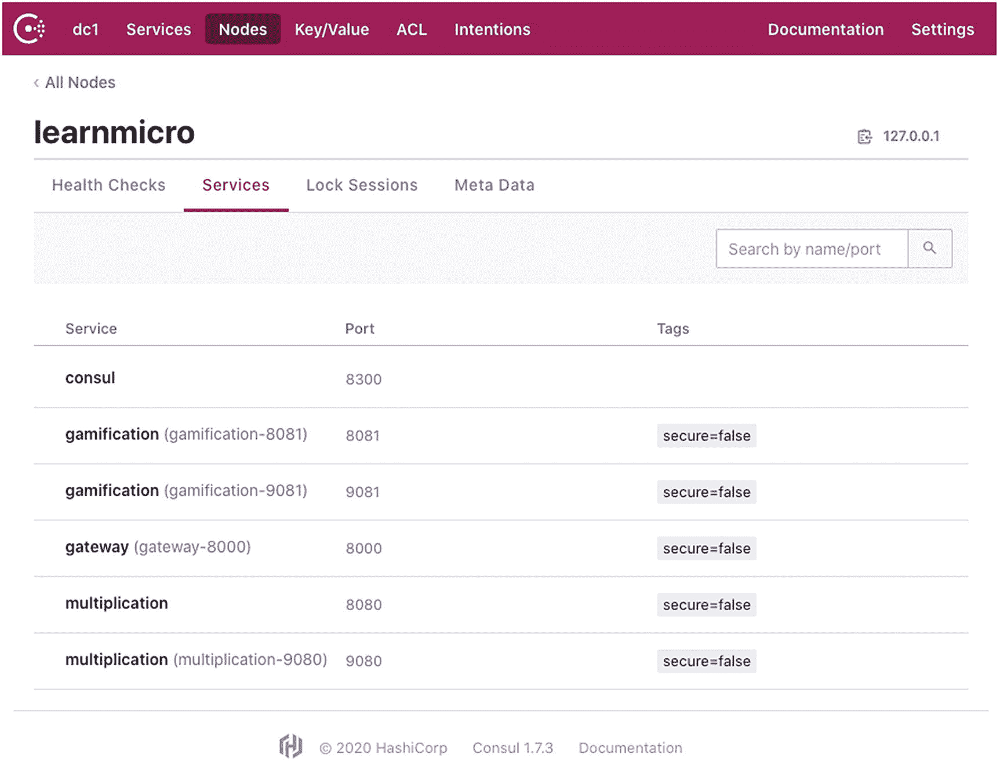

图 8-14

领事:多个实例

验证网关的负载平衡器是否工作很简单:检查两个游戏化服务实例的日志。通过新添加的日志行，您可以快速看到两者如何从 UI 获得与排行榜更新相关的交替请求。如果您刷新浏览器页面几次以强制新的质询请求，您会看到类似的行为。清单 [8-29](#PC31) 、 [8-30](#PC32) 、 [8-31](#PC33) 和 [8-32](#PC34) 显示了乘法实例和游戏化实例的日志的同一时间窗口的摘录。如您所见，请求每五秒钟在可用实例之间交替。

```java
2020-08-29 09:04:58.107  INFO 10222 --- [nio-9081-exec-4] m.b.g.game.LeaderBoardController         : Retrieving leaderboard
2020-08-29 09:05:06.927  INFO 10222 --- [nio-9081-exec-6] m.b.g.game.LeaderBoardController         : Retrieving leaderboard
2020-08-29 09:05:14.010  INFO 10222 --- [nio-9081-exec-8] m.b.g.game.LeaderBoardController         : Retrieving leaderboard

Listing 8-32Logs for Gamification, Second Instance (Port 9081)

```

```java
2020-08-29 09:05:03.208  INFO 9928 --- [nio-8081-exec-6] m.b.g.game.LeaderBoardController         : Retrieving leaderboard
2020-08-29 09:05:09.006  INFO 9928 --- [nio-8081-exec-8] m.b.g.game.LeaderBoardController         : Retrieving leaderboard
2020-08-29 09:05:19.014  INFO 9928 --- [io-8081-exec-10] m.b.g.game.LeaderBoardController         : Retrieving leaderboard

Listing 8-31Logs for Gamification, First Instance (Port 8081)

```

```java
2020-08-29 09:05:09.009  INFO 10138 --- [nio-9080-exec-7] m.b.m.challenge.ChallengeController      : Generating a random challenge: Challenge(factorA=58, factorB=96)
2020-08-29 09:05:14.040  INFO 10138 --- [nio-9080-exec-8] m.b.multiplication.user.UserController   : Resolving aliases for users [125, 49, 72, 60, 101, 1, 96, 107, 3, 45, 6, 9, 14, 123]
2020-08-29 09:05:24.042  INFO 10138 --- [io-9080-exec-10] m.b.multiplication.user.UserController   : Resolving aliases for users [125, 49, 72, 60, 101, 1, 96, 107, 3, 45, 6, 9, 14, 123]

Listing 8-30Logs for Multiplication, Second Instance (Port 9080)

```

```java
2020-08-29 09:05:06.957  INFO 9999 --- [nio-8080-exec-6] m.b.multiplication.user.UserController   : Resolving aliases for users [125, 49, 72, 60, 101, 1, 96, 107, 3, 45, 6, 9, 14, 123]
2020-08-29 09:05:09.090  INFO 9999 --- [nio-8080-exec-7] m.b.multiplication.user.UserController   : Resolving aliases for users [125, 49, 72, 60, 101, 1, 96, 107, 3, 45, 6, 9, 14, 123]
2020-08-29 09:05:19.033  INFO 9999 --- [nio-8080-exec-9] m.b.multiplication.user.UserController   : Resolving aliases for users [125, 49, 72, 60, 101, 1, 96, 107, 3, 45, 6, 9, 14, 123]

Listing 8-29Logs for Multiplication, First Instance (Port 8080)

```

这是一个伟大的成就:我们扩大了我们的系统，一切都像预期的那样工作。HTTP 流量现在在所有实例中均衡分布，类似于我们的 RabbitMQ 设置在消费者中分发消息的方式。我们刚刚顺利地将系统容量增加了一倍。

实际上，我们可以启动任意多的两个微服务实例，负载将透明地分布在所有微服务上。此外，通过网关，我们使我们的 API 客户端不知道我们的内部服务，我们可以轻松地实现跨领域的关注，如用户认证或监控。

我们还应该检查我们是否实现了其他非功能性需求:弹性、高可用性和容错。让我们开始制造一些混乱。

为了检查当服务变得意外不可用时会发生什么，我们可以通过 IDE 或者在终端中使用 Ctrl-C 信号来停止它们。然而，这并没有涵盖我们在现实生活中可能遇到的所有潜在事件。当我们这样做时，Spring Boot 应用会正常停止，因此它有机会从 Consul 中注销自己。我们想模拟一个*重大事件*，比如网络问题或服务突然终止。我们必须模仿的最佳选择是终止给定实例的 Java 进程。要知道要终止哪个进程，我们可以检查日志。默认的 Spring Boot 回退配置在每个日志行的日志级别(例如，`INFO`)后打印进程 ID。例如，这一行表示我们正在运行游戏化微服务，进程 ID 为`97817`:

```java
2020-07-19 09:10:27.279  INFO 97817 --- [main] m.b.m.GamificationApplication       : Started GamificationApplication in 5.371 seconds (JVM running for 11.054)

```

在 Linux 或 Mac 系统中，您可以使用`kill`命令终止进程，传递参数`-9`来强制立即终止。

```java
$ kill -9 97817

```

如果您正在运行 Windows，您可以使用带有`/F`标志的`taskkill`命令来强制终止它。

```java
> taskkill /PID 97817 /F

```

既然你知道了如何制造破坏，那就干掉游戏化微服务的一个实例进程。确保您在浏览器中打开了 UI，以便它不断向后端发出请求。您将看到在您杀死其中一个实例后，另一个实例如何接收所有请求并成功响应它们。用户甚至不会注意到这一点。在游戏化服务中调用 API 的排行榜仍然在工作。用户也可以发送新的挑战；所有尝试都将在唯一可用的实例中结束。这里发生的事情是，网关中的重试过滤器透明地执行第二个请求，由于负载均衡器，该请求被路由到健康的实例。参见图 [8-15](#Fig15) 。

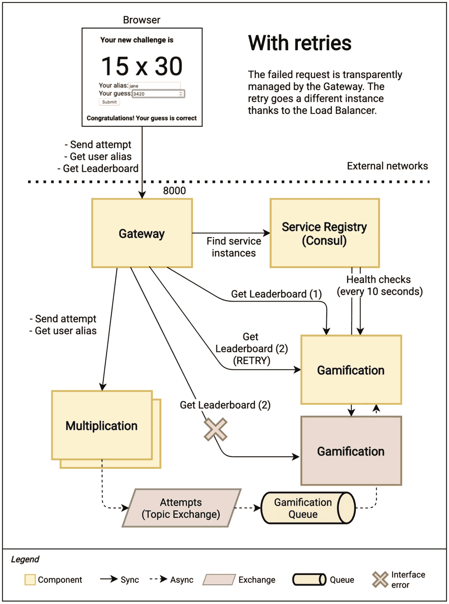

图 8-15

弹性:重试模式

我们还想验证我们引入的模式是如何协作实现这一成功结果的。为此，让我们暂时删除网关中的重试过滤器配置。参见清单 [8-33](#PC38) 。

```java
# We can comment this block of the configuration
#  default-filters:
#    - name: Retry
#      args:
#        retries: 3
#        methods: GET,POST

Listing 8-33Commenting a Block of Configuration in the Gateway

```

然后，重新构建并重启网关服务(以应用新的配置)，并重复类似的场景。确保再次启动游戏化的第二个实例，并给网关服务一些时间来开始向它路由流量。然后，在查看 UI 时，杀死它的一个实例。这次您将看到的是，其他所有请求都无法完成，导致显示排行榜时出现交替错误。发生这种情况是因为 Consul 需要一些时间(配置的健康检查间隔)来检测服务是否关闭。同时，网关仍然得到两个健康的实例，并将一些请求代理到一个失效的服务器。参见图 [8-16](#Fig16) 。我们刚刚删除的重试机制透明地处理了这个错误，并向列表中的下一个实例发出第二个请求，这个实例仍然在工作。

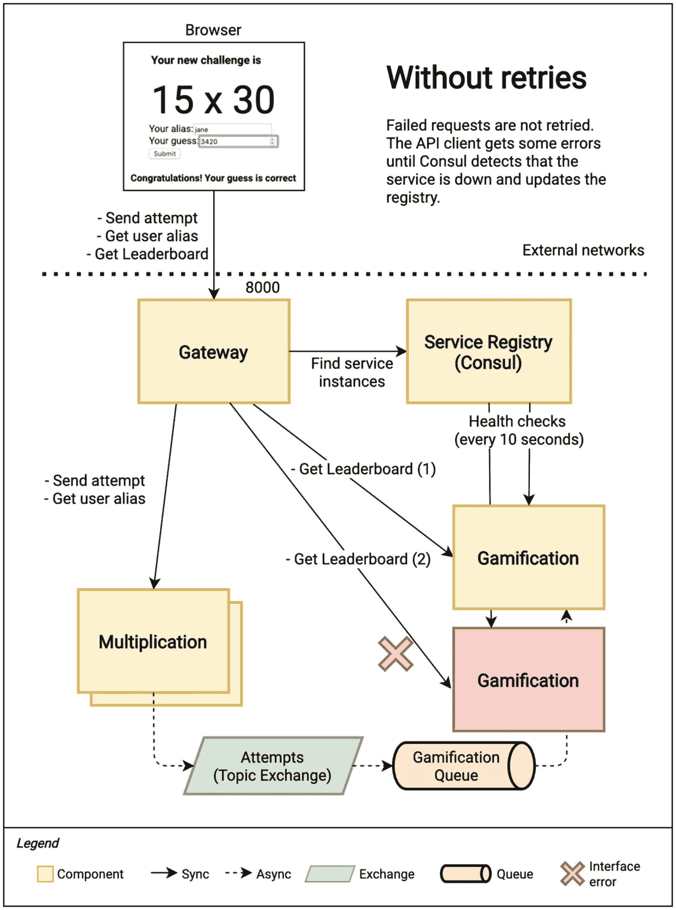

图 8-16

弹性:无重试模式

它在我的机器上工作

请注意，如果您在运行状况检查之前意外地终止了进程，Consul 将会立即注意到这个问题。在这种情况下，您可能看不到 UI 中的错误。您可以再次尝试相同的场景，或者您可以在 Spring Cloud Consul 中配置一个更长的健康检查间隔(通过应用属性)，这样您就有更大的机会重现这个错误场景。

如果我们导航到服务，Consul registry UI 也会反映出运行状况检查失败。参见图 [8-17](#Fig17) 。

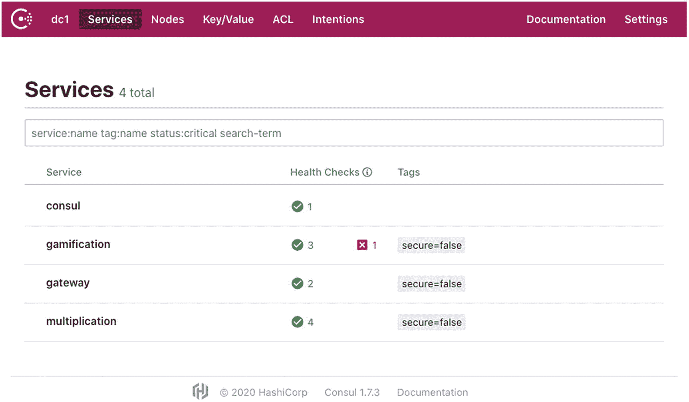

图 8-17

领事 UI:终止服务后运行状况检查失败

我们完成了学习道路上的一个重要里程碑:我们在微服务架构中实现了可伸缩性。此外，我们通过使用服务发现注册表的负载平衡器实现了适当的容错，该服务发现注册表知道我们系统中不同组件的健康状况。我希望实用的方法能帮助你理解所有这些关键概念。

## 每个环境的配置

正如在第二章中介绍的，Spring Boot 的一个主要优点是能够配置概要文件。配置文件是一组您可以根据需要启用的配置属性。例如，在本地测试时，您可以在连接到本地 RabbitMQ 服务器和在生产环境中部署真正的 RabbitMQ 服务器之间进行切换。

为了引入一个新的`rabbitprod`概要文件，我们可以创建一个名为`application-rabbitprod.properties`的文件。Spring Boot 使用`application-{profile}`命名约定(用于`properties`和 YAML 格式)来允许我们在单独的文件中定义概要文件。参见清单 [8-34](#PC39) 中我们可以包括的一些示例属性。如果我们将此配置文件用于生产环境，我们可能希望使用不同的凭证、要连接的节点集群、安全接口等。

```java
spring.rabbitmq.addresses=rabbitserver1.tpd.network:5672,rabbitserver2.tpd.network:5672
spring.rabbitmq.connection-timeout=20s
spring.rabbitmq.ssl.enabled=true
spring.rabbitmq.username=produser1

Listing 8-34Example of a Separate Properties File to Override Default Values in Production

```

当我们在目标环境中启动应用时，我们必须确保启用这个概要文件。为此，我们使用属性`spring.profiles.active`。Spring Boot 将基本配置(在`application.properties`中)与该文件中的值聚合在一起。在我们的例子中，所有额外的属性都将被添加到最终的配置中。我们可以使用 Spring Boot 的 Maven 插件命令来为乘法微服务启用这个新的配置文件:

```java
multiplication $ ./mvnw spring-boot:run -Dspring-boot.run.arguments="--spring.profiles.active=rabbitprod"

```

正如您所想象的，我们所有的微服务在每个环境中都有很多通用的配置值。不仅 RabbitMQ 的连接细节可能是相同的，而且我们还添加了一些额外的值，比如交换名(`amqp.exchange.attempts`)。这同样适用于数据库的通用配置，或者我们希望应用于所有微服务的任何其他 Spring Boot 配置。

我们可以将这些值保存在每个微服务、每个环境和每个工具的单独文件中。例如，这四个文件可能包括在登台和生产环境中对 RabbitMQ 和 H2 数据库的不同配置。

*   `application-rabbitprod.properties`

*   `application-databaseprod.properties`

*   `application-rabbitstaging.properties`

*   `application-databasestaging.properties`

然后，我们可以在任何需要的地方跨微服务复制它们。通过将配置分组到单独的概要文件中，我们可以很容易地重用这些值。

然而，保留所有这些副本仍然需要大量的维护工作。如果我们想改变这些公共配置块中的一个值，我们必须替换每个项目文件夹中的相应文件。

一个更好的方法是将这个配置放在系统中的一个公共位置，让应用在启动前同步它的内容。然后，我们为每个环境保留一个集中的配置，所以我们只需要调整一次值。参见图 [8-18](#Fig18) 。好消息是，这是一种众所周知的模式，被称为*外化*(或集中式)*配置*，因此有现成的解决方案来构建集中式配置服务器。

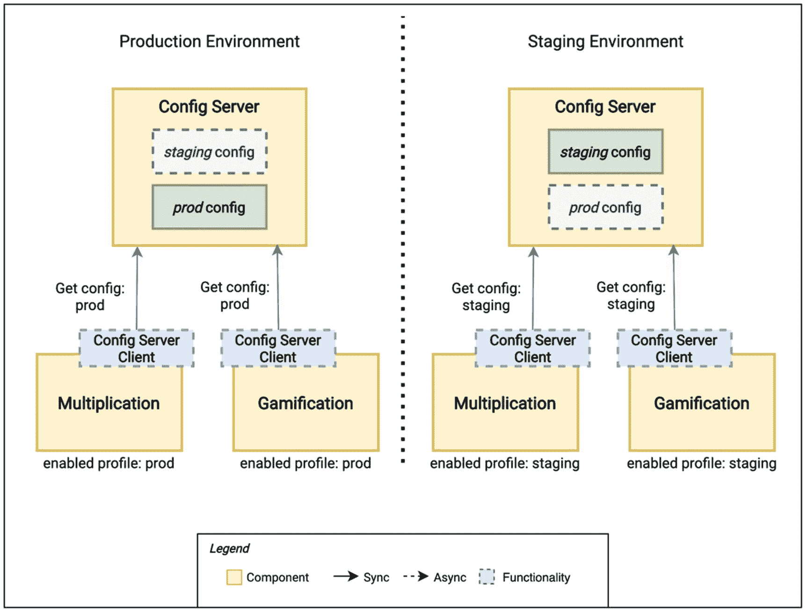

图 8-18

集中式配置:概述

在为 Spring 寻找配置服务器模式时，通过简单的 web 搜索得出的第一个解决方案是 Spring Cloud Config Server 项目。这是 Spring Cloud 家族中包含的一个原生实现，它允许您将一组配置文件分布在文件夹中，并通过 REST API 公开。在客户端，使用这种依赖关系的项目访问配置服务器并请求相应的配置资源，这取决于它们的活动概要文件。对于我们的系统来说，这个解决方案的唯一缺点是我们需要创建另一个微服务来充当配置服务器并公开集中的文件。

另一种方法是使用 Consul KV，这是默认 Consul 包中包含的一个特性，我们还没有探索它。Spring Cloud 还集成了这个工具来实现一个集中式配置服务器。我们将选择这种方法来重用组件，并使我们的系统尽可能简单，Consul 结合了服务发现、健康检查和集中配置。

### 咨询中的配置

Consul KV 是随 Consul 代理一起安装的键/值存储。与服务发现特性一样，我们可以通过 REST API 和用户界面来访问该功能。当我们将 Consul 设置为集群时，该特性也受益于复制，因此由于服务无法获取其配置而导致数据丢失或停机的风险更小。

这个简单的功能也可以从浏览器访问，因为它包含在我们已经安装的 consul 代理中。代理运行时，导航到`http://localhost:8500/ui/dc1/kv`(键/值选项卡)。现在，单击创建。您将看到编辑器创建了一个新的键/值对，如图 [8-19](#Fig19) 所示。

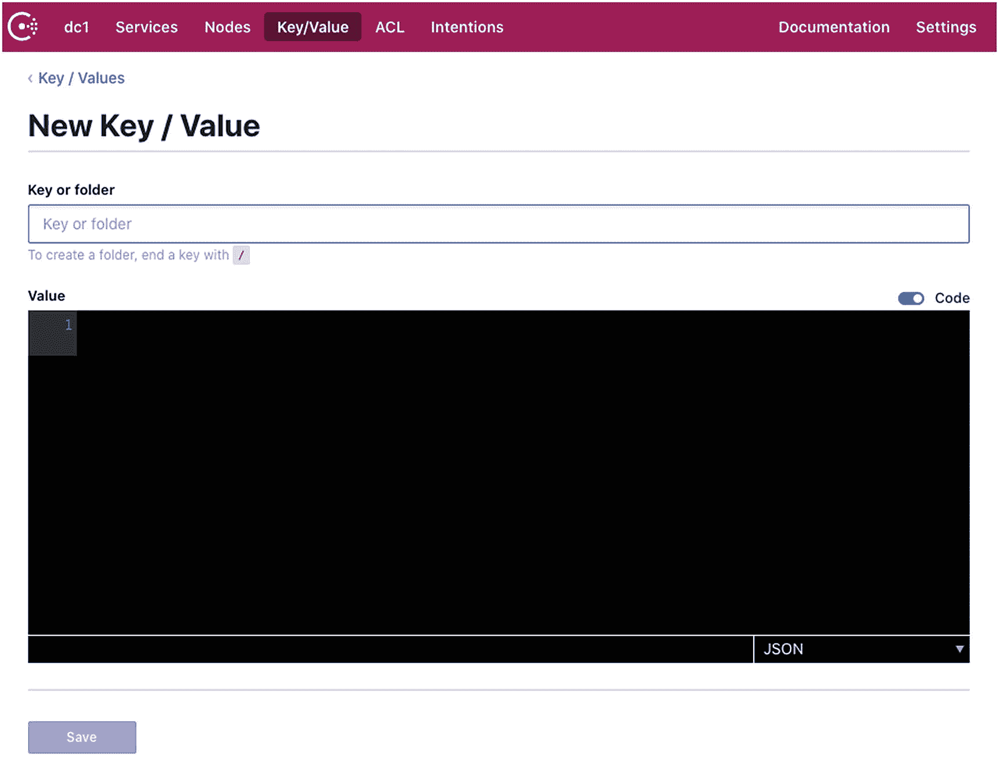

图 8-19

Consul:创建键/值对

我们可以使用 toggle 在代码和普通编辑器之间切换。代码编辑器在一些符号中支持语法着色，包括 YAML。注意，如文本字段下的图 [8-19](#Fig19) 所示，如果我们在键名末尾添加一个正斜杠字符，我们也可以创建文件夹。我们很快就会付诸实施。

Consul KV REST API 还允许我们通过 HTTP 调用创建键/值对和文件夹，并使用它们的键名检索它们。如果你想知道它是如何工作的，可以查看 [`http://tpd.io/kv-api`](http://tpd.io/kv-api) 。与服务发现特性一样，我们不需要直接与这个 API 交互，因为我们将使用一个 Spring 抽象来与 Consul KV:Spring Cloud Consul Config 通信。

### 春云领事配置

用 Consul KV 实现集中配置的春云项目是春云 Consul Config。要使用这个模块，我们需要向我们的项目添加一个新的 Spring Cloud 依赖项:`spring-cloud-starter-consul-config`。这个工件包括自动配置类，这些类在启动我们的应用的早期阶段，即特殊的“引导”阶段，试图找到 Consul 代理并读取相应的 KV 值。它使用这个阶段是因为我们希望 Spring Boot 将集中配置值应用于其初始化的其余部分(例如，连接到 RabbitMQ)。

Spring Cloud Consul Config 期望每个配置文件映射到 KV store 中的一个给定键。它的值应该是一组 YAML 或普通格式的 Spring Boot 配置值(`.properties`)。

我们可以配置一些设置来帮助我们的应用在服务器中找到相应的键。这些是最相关的:

*   前缀:这是领事 KV 中存储所有概要文件的根文件夹。默认值为`config`。

*   *格式*:指定值(Spring Boot 配置)是 YAML 还是属性语法。

*   *默认上下文*:这是所有应用作为公共属性使用的文件夹的名称。

*   *配置文件分隔符*:按键可以组合多个配置文件。在这种情况下，您可以指定想要用作分隔符的字符(例如，用逗号`prod,extra-logging`)。

*   *数据键*:这是保存属性或 YAML 内容的键的名称。

与配置服务器设置相关的所有配置值必须放在我们每个应用的单独文件中，文件名为`bootstrap.yml`或`bootstrap.properties`(取决于我们选择的格式)。见图 [8-20](#Fig20) 。

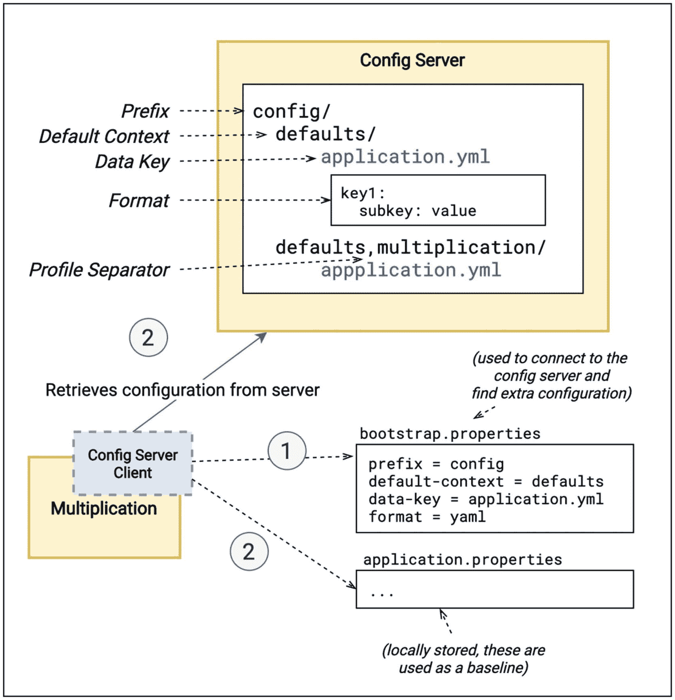

图 8-20

配置服务器属性:解释

请记住，如上图所示，连接到配置服务器的应用配置(在引导文件中)与合并本地属性(如`application.properties`)和从配置服务器下载的属性所产生的应用配置是不同的。因为第一个是元配置，它不能从服务器下载，所以我们必须在相应的`bootstrap`配置文件中跨项目复制这些值。

如果没有例子，所有这些概念都很难理解，让我们用我们的系统来解释 Consul Config 是如何工作的。

### 实施集中配置

代码源

来自 Consul 的集成集中式配置解决方案的代码源位于存储库`chapter08c`中。

首先，我们需要将新的启动器添加到乘法、游戏化和网关微服务中。参见清单 [8-35](#PC41) 。

```java
<dependencies>
    <!-- ... -->
    <dependency>
        <groupId>org.springframework.cloud</groupId>
        <artifactId>spring-cloud-starter-consul-config</artifactId>
    </dependency>

</dependencies>

Listing 8-35Adding the Spring Cloud Consul Config Dependency to Our Microservices

```

通过这样做，我们的应用将在引导阶段尝试连接到 Consul，并使用 Consul KV 自动配置中提供的缺省值从 KV 存储中获取配置文件属性。但是，我们将覆盖其中的一些设置，而不是使用默认值，因为这样会使解释更加清晰。

在乘法和游戏化项目中我们使用的是`properties`格式，所以让我们保持一致，在同一层创建一个单独的文件，命名为`bootstrap.properties`。在这两个应用中，我们将设置相同的设置。见清单 [8-36](#PC42) 。

```java
spring.cloud.consul.config.prefix=config
spring.cloud.consul.config.format=yaml
spring.cloud.consul.config.default-context=defaults
spring.cloud.consul.config.data-key=application.yml

Listing 8-36The new bootstrap.properties File in Multiplication and Gamification

```

注意，我们选择 YAML 作为远程配置的格式，但是我们的本地文件是`.properties`格式。那根本不是问题。Spring Cloud Consul Config 可以将包含在 remote `application.yml`键中的值与以不同格式存储在本地的值进行合并。

然后，我们在 Gateway 项目的一个`bootstrap.yml`文件中创建等效的设置，其中我们使用 YAML 进行应用配置。参见清单 [8-37](#PC43) 。

```java
spring:
  cloud:
    consul:
      config:
        data-key: application.yml
        prefix: config
        format: yaml
        default-context: defaults

Listing 8-37The New bootstrap.yml File in the Gateway Project

```

通过这些设置，我们的目标是将所有配置存储在 Consul KV 中名为`config`的根文件夹中。在里面，我们将有一个`defaults`文件夹，其中可能包含一个名为`application.yml`的密钥，其配置适用于我们所有的微服务。我们可以为每个应用或者我们想要使用的应用和配置文件的每个组合创建额外的文件夹，并且每个文件夹都可以包含带有应该添加或覆盖的属性的`application.yml`键。为了避免在配置服务器中混淆格式，我们将坚持使用 YAML 语法。再次回顾之前的图 [8-20](#Fig20) 以更好地理解配置的整体结构。到目前为止，我们所做的是将`bootstrap`文件添加到乘法、游戏化和网关中，这样它们就可以连接到配置服务器并找到外部化的配置(如果有的话)。为了支持这种行为，我们也向所有这些项目添加了 Spring Cloud Consul Config starter 依赖项。

举一个更有代表性的例子，我们可以创建清单 [8-38](#PC44) 中所示的层次结构，作为 Consul KV 中的文件夹和键。

```java
+- config
|  +- defaults
|      \- application.yml
|  +- defaults,production
|      \- application.yml
|  +- defaults,rabbitmq-production
|      \- application.yml
|  +- defaults,database-production
|      \- application.yml
|  +- multiplication,production
|      \- application.yml
|  +- gamification,production
|      \- application.yml

Listing 8-38An Example Configuration Structure in the Configuration Server

```

然后，如果我们使用等于`production,rabbitmq-production,database-production`的活动配置文件列表运行乘法应用，处理顺序如下(从低到高的优先级):

1.  基线值是那些包含在访问配置服务器的项目的本地`application.properties`中的值，在这个例子中是乘法。

2.  然后，Spring Boot 合并并覆盖包含在`defaults`文件夹中的`application.yml`键中的远程值，因为它适用于所有服务。

3.  下一步是合并所有活动概要文件的默认值。这意味着所有符合`defaults,{profile}`模式的文件:`defaults,production`、`defaults,rabbitmq-production`、`defaults,database-production`。请注意，如果指定了多个概要文件，则最后一个概要文件的值有效。

4.  之后，它会按照模式`{application},{profile}`为相应的应用名称和活动配置文件寻找更具体的设置。在我们的例子中，键`multiplication,production`匹配模式，所以它的配置值将被合并。优先顺序与之前相同:枚举中的最后一个配置文件胜出。

请参见图 [8-21](#Fig21) 中的直观表示，它肯定会帮助您理解所有配置文件是如何应用的。

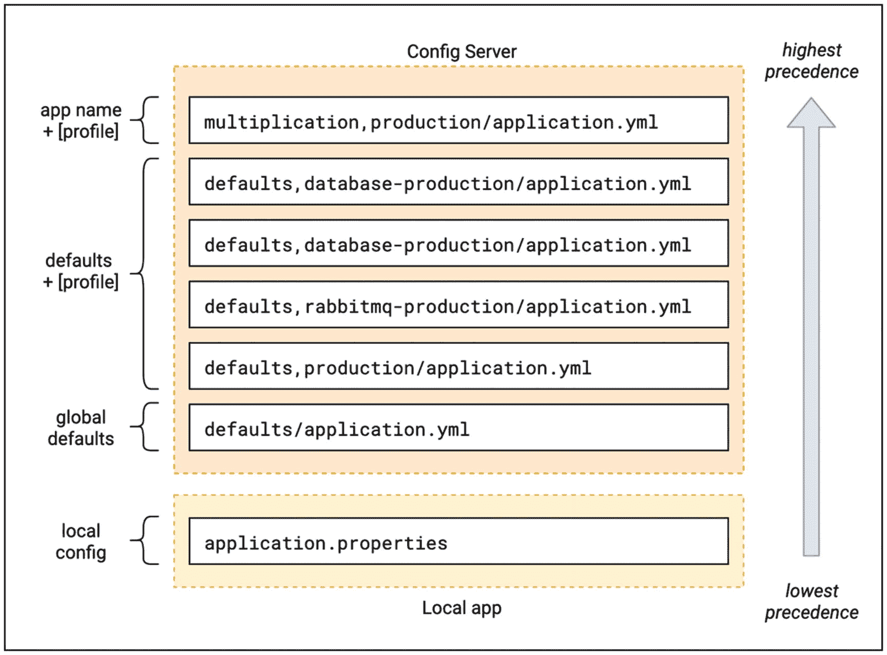

图 8-21

配置堆栈示例

因此，结构化配置值的实用方法如下:

*   当您想要为所有环境的所有应用添加全局配置时，例如定制 JSON 序列化时，请使用`defaults`。

*   使用带有代表一个`{tool}-{environment}`对的概要文件名的`defaults,{profile}`,为每个环境的给定工具设置公共值。例如，在我们的例子中，RabbitMQ 连接值可以包含在`rabbitmq-production`中。

*   使用配置文件名为`{environment}`的`{application},{profile}`，为给定环境中的应用设置特定设置。例如，我们可以使用`multiplication,production`中的属性来减少生产中乘法微服务的日志记录。

### 实践中的集中配置

在上一节中，我们将新的 starter 依赖项添加到我们的项目中，并添加了额外的`bootstrap`配置属性来覆盖一些 Consul 配置默认值。如果我们启动一个服务，它将连接到 Consul，并尝试使用 Consul 的键/值 API 检索配置。例如，在乘法应用的日志中，我们会看到一个新的行，其中包含了 Spring 试图在远程配置服务器(Consul)中找到的*属性源*的列表。参见清单 [8-39](#PC45) 。

```java
INFO 54256 --- [main] b.c.PropertySourceBootstrapConfiguration : Located property source: [BootstrapPropertySource {name='bootstrapProperties-config/multiplication/'}, BootstrapPropertySource {name='bootstrapProperties-config/defaults/'}]

Listing 8-39Multiplication Logs, Indicating the Default Configuration Sources

```

该日志行可能会产生误导，因为在打印该行时，那些属性源并没有真正定位。只是候选人名单。他们的名字符合我们之前描述的模式。假设我们在启动乘法应用时没有启用任何配置文件，它将尝试在`config/defaults`和`config/multiplication`下查找配置。正如本练习所证明的，我们不需要在 Consul 中创建匹配所有可能候选项的键。不存在的键将被忽略。

让我们开始在 Consul 中创建一些配置。在 UI 的 Key/Value 选项卡上，单击 Create 并输入`config/`来创建根文件夹，其名称与我们在设置中配置的名称相同。由于我们在最后添加了`/`字符，Consul 知道它必须创建一个文件夹。见图 [8-22](#Fig22) 。

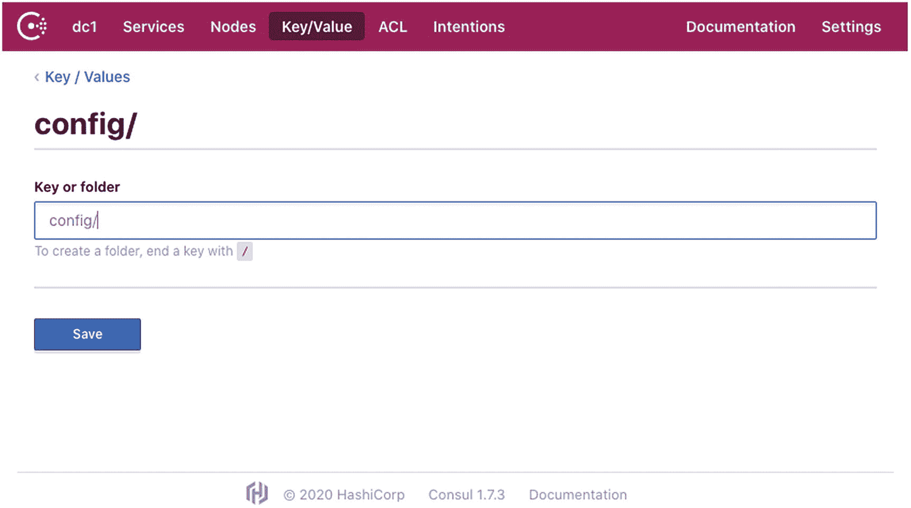

图 8-22

Consul:创建配置根文件夹

现在，通过单击新创建的项目导航到`config`文件夹，并创建一个名为`defaults`的子文件夹。见图 [8-23](#Fig23) 。

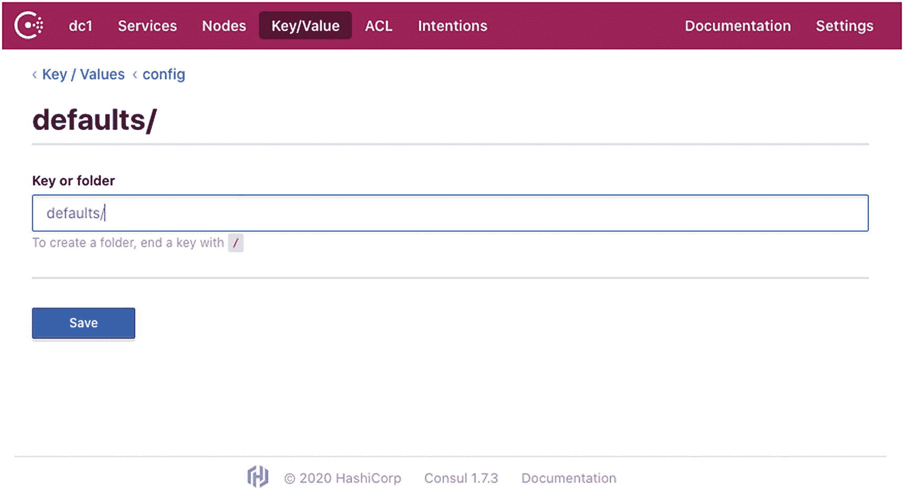

图 8-23

Consul:创建默认文件夹

再次通过单击导航到新创建的文件夹。您将会看到`config/defaults`的内容，目前是空的。在这个文件夹中，我们必须创建一个名为`application.yml`的键，并将我们希望默认应用于所有应用的值放在那里。请注意，我们决定使用一个看起来像文件名的键名，以便更好地区分文件夹和配置内容。让我们添加一些日志配置来启用 Spring 包的`DEBUG`级别，该包的类输出一些有用的环境信息。参见图 [8-24](#Fig24) 。

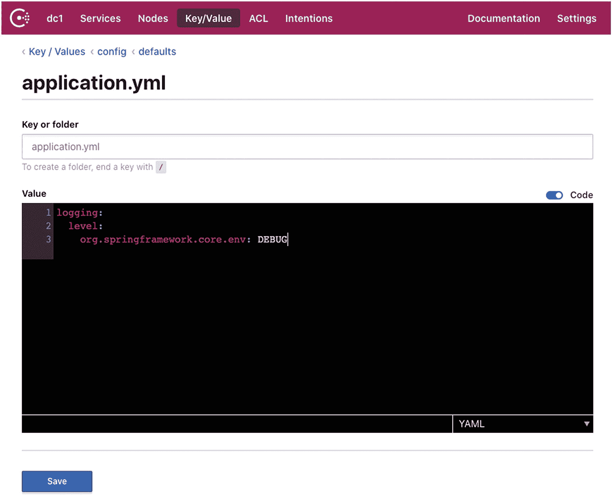

图 8-24

Consul:将配置添加到默认值

乘法应用现在应该选择这个新属性。为了验证它，我们可以重启它并检查日志，在这里我们将看到对`org.springframework.core.env`包的额外日志记录，特别是来自`PropertySourcesPropertyResolver`类的:

```java
DEBUG 61279 --- [main] o.s.c.e.PropertySourcesPropertyResolver  : Found key 'spring.h2.console.enabled' in PropertySource 'configurationProperties' with value of type String

```

这证明服务到达了集中配置服务器(Consul)并应用了包含在现有预期密钥中的设置，在本例中为`config/defaults`。

为了更有趣，让我们为乘法应用启用一些配置文件。从命令行，您可以执行以下操作:

```java
multiplication $ ./mvnw spring-boot:run -Dspring-boot.run.arguments="--spring.profiles.active=production,rabbitmq-production"

```

使用这个命令，我们用`production`和`rabbitmq-production`概要文件运行应用。日志显示了要查找的结果候选键。见清单 [8-40](#PC48) 。

```java
INFO 52274 --- [main] b.c.PropertySourceBootstrapConfiguration : Located property source: [BootstrapPropertySource {name='bootstrapProperties-config/multiplication,rabbitmq-production/'}, BootstrapPropertySource {name='bootstrapProperties-config/multiplication,production/'}, BootstrapPropertySource {name='bootstrapProperties-config/multiplication/'}, BootstrapPropertySource {name='bootstrapProperties-config/defaults,rabbitmq-production/'}, BootstrapPropertySource {name='bootstrapProperties-config/defaults,production/'}, BootstrapPropertySource {name='bootstrapProperties-config/defaults/'}]

Listing 8-40Multiplication Logs, Indicating All Candidate Property Sources After Enabling Extra Profiles

```

为了更好的可视化，让我们将属性源名称提取为一个列表。该列表遵循与日志中相同的顺序，从最高优先级到最低优先级。

1.  `config/multiplication,rabbitmq-production/`

2.  `config/multiplication,production/`

3.  `config/multiplication/`

4.  `config/defaults,rabbitmq-production/`

5.  `config/defaults,production/`

6.  `config/defaults/`

正如我们在上一节中所描述的，Spring 寻找由组合`defaults`和每个概要文件产生的键，然后它寻找应用名称和每个概要文件的组合。到目前为止，我们只添加了一个键`config/defaults`，所以这是服务选择的唯一一个键。

在现实生活中，我们可能不希望将日志添加到生产环境中的所有应用中。为了实现这一点，我们可以配置`production`概要文件来恢复我们之前所做的。因为这个配置有更高的优先级，它将覆盖以前的值。转到 Consul UI，在`config`文件夹中创建一个名为`defaults,production`的密钥。在内部，您必须创建一个键`application.yml`，它的值应该是 YAML 配置，以将包的日志级别设置回`INFO`。见图 [8-25](#Fig25) 。

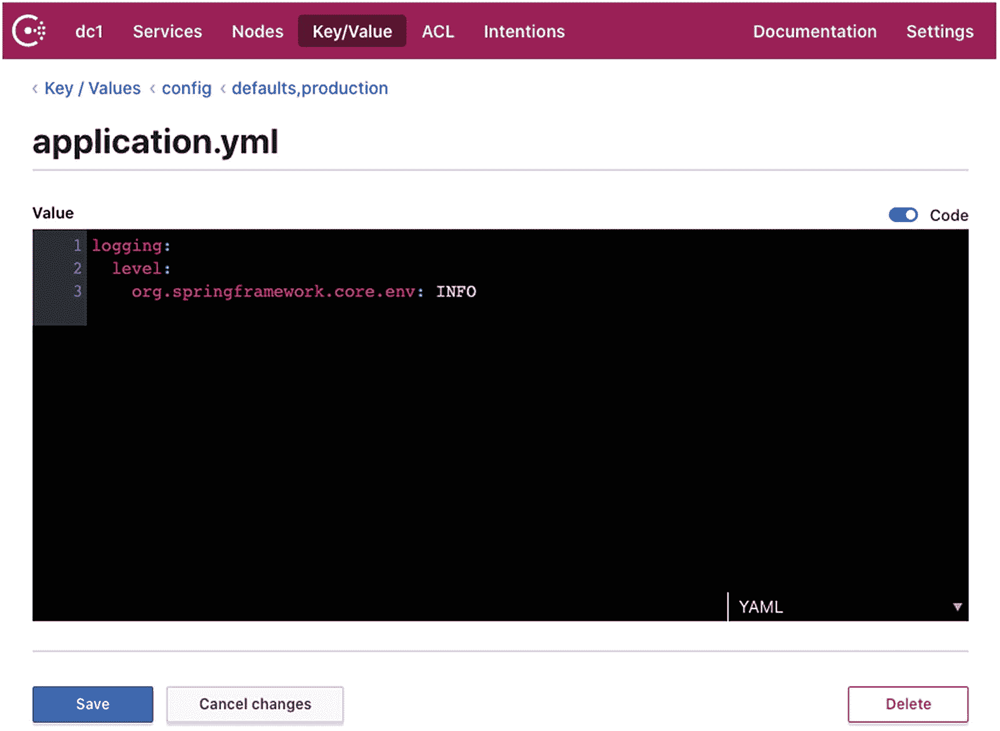

图 8-25

咨询:将配置添加到默认值，生产

当我们使用相同的最后一个命令(启用`production`概要文件)重新启动应用时，我们将看到该包的调试日志记录是如何消失的。

请记住，与我们在这个简单的日志示例中所做的一样，我们可以添加 YAML 值来调整我们的 Spring Boot 应用中的任何其他配置参数，以使它们适应`production`环境。另外，请注意我们如何使用前面列出的六种可能的组合中的任何一种来处理配置的范围，这是我们通过添加两个活动概要文件得到的。例如，我们可以在名为`defaults,rabbitmq-production`的键中添加只适用于 RabbitMQ 的值。最具体的组合是`multiplication,rabbitmq-production`和`multiplication,production`。如果需要，再次查看图 [8-21](#Fig21) 以获得一些视觉帮助。

为了证明配置不限于日志记录，让我们假设我们希望在部署到生产时在不同的端口(例如 10080)上运行乘法微服务。为了让它工作，我们只需要在 Consul 的`multiplication,production`键中添加一个`application.yml`键，并更改`server.port`属性。参见图 [8-26](#Fig26) 。

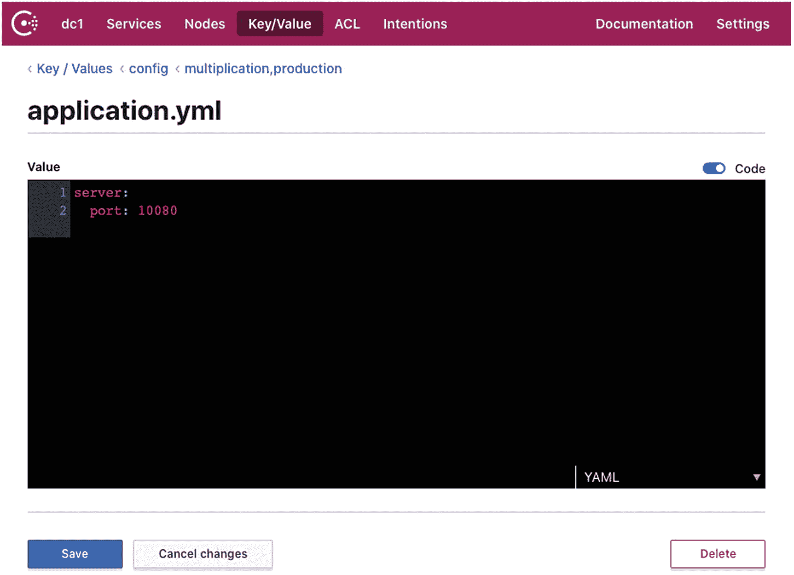

图 8-26

领事:增加配置到乘法，生产

下次我们在生产配置文件处于活动状态时启动乘法应用，我们将看到它是如何在这个新指定的端口上运行的:

```java
INFO 29019 --- [main] o.s.b.w.embedded.tomcat.TomcatWebServer  : Tomcat started on port(s): 10080 (http) with context path ''

```

通过这个练习，我们完成了对集中式配置模式的概述。现在，我们知道了如何最大限度地减少公共配置的维护，以及如何使应用适应它们运行的环境。请参见图 [8-27](#Fig27) 了解我们系统的更新架构视图，包括新的配置服务器。

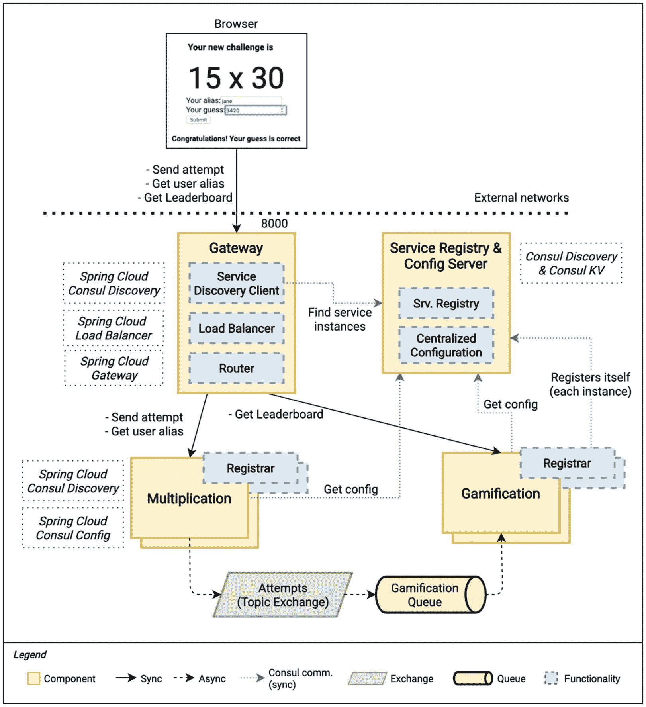

图 8-27

高级概述:配置服务器

请注意，应用现在在启动时依赖于配置服务器。幸运的是，我们可以将 Consul 配置为在生产中高度可用，正如我们在讨论服务发现模式时提到的(检查 [`https://tpd.io/consulprod`](https://tpd.io/consulprod) )。此外，Spring Cloud Consul 在默认情况下使用重试机制，所以我们的应用会在 consult 不可用时不断重试连接。这种依赖性仅在开始时存在；如果 Consul 在您的应用运行时关闭，它们会继续使用最初加载的配置。

注意:咨询配置和测试

默认情况下，我们项目中的集成测试将使用相同的应用配置。这意味着如果 Consul 没有运行，我们的控制器测试和 Initializr 创建的默认`@SpringBootTest`将会失败，因为它们一直在等待配置服务器可用。您也可以很容易地禁用测试的 Consul Config 如果你好奇的话，可以查看一下 [`https://github.com/Book-Microservices-v2/chapter08c`](https://github.com/Book-Microservices-v2/chapter08c) 。

## 集中式日志

我们的系统中已经有多个生成日志的组件(乘法、游戏化、网关、咨询和 RabbitMQ)，其中一些可能运行多个实例。大量日志输出独立运行，这使得很难获得系统活动的整体视图。如果用户报告一个错误，很难找出哪个组件或实例失败了。在单个屏幕上安排多个日志窗口暂时会有帮助，但当您的微服务实例数量增加时，这不是一个可行的解决方案。

为了正确维护像我们的微服务架构这样的分布式系统，我们需要一个中心位置，在那里我们可以访问所有的聚合日志并在它们之间进行搜索。

### 日志聚合模式

基本上，我们的想法是将应用的所有日志输出发送到系统中的另一个组件，该组件将使用它们并将它们放在一起。此外，我们希望将这些日志保存一段时间，因此这个组件应该有一个数据存储。理想情况下，我们应该能够浏览这些日志，搜索并过滤出每个微服务、实例、类等的消息。为此，许多工具都提供了连接到聚合日志存储的用户界面。参见图 [8-28](#Fig28) 。

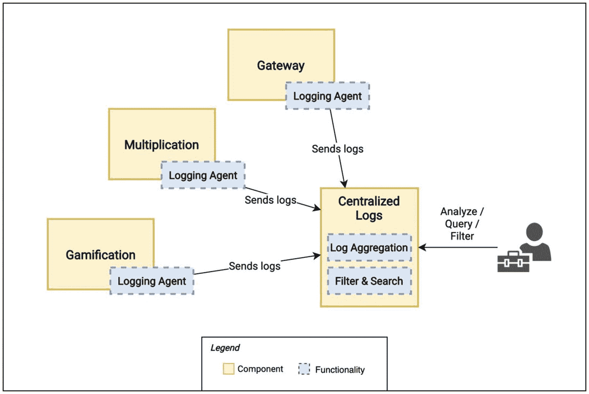

图 8-28

日志聚集:概述

在实现集中式日志记录方法时，一个常见的最佳实践是让应用逻辑不知道这种模式。服务应该使用公共接口(例如 Java 中的`Logger`)输出消息。将这些日志传送到中央聚合器的日志代理独立工作，捕获应用产生的输出。

市场上有这种模式的多种实现，包括免费的和付费的解决方案。其中最受欢迎的是 ELK stack，这是 Elastic ( [`https://tpd.io/elastic`](https://tpd.io/elastic) )产品组合的别名:Elasticsearch(具有强大文本搜索功能的存储系统)、Logstash(将来自多个来源的日志引导到 Elasticsearch 的代理)和 Kibana(管理和查询日志的 UI 工具)。

尽管随着时间的推移，设置 ELK 堆栈变得越来越容易，但这仍然不是一项简单的任务。因此，我们不会在本书中使用 ELK 实现，因为它很容易扩展到涵盖整个章节。无论如何，我建议您在阅读完这本书后查看 ELK 文档( [`https://tpd.io/elk`](https://tpd.io/elk) )，这样您就可以学习如何建立一个生产就绪的日志系统。

### 日志集中化的简单解决方案

代码源

本章的其余代码源在资源库`chapter08d`中。它包括添加集中式日志、分布式跟踪和容器化的变化。

我们要做的是建立一个新的微服务来聚合所有 Spring Boot 应用的日志。简单地说，它没有数据层来保存日志；它只是从其他服务接收日志行，并将它们一起打印到标准输出中。这个基本解决方案将帮助我们演示这个模式和下一个模式，分布式跟踪。

为了引导日志输出，我们将使用系统中已经有的工具:RabbitMQ。为了捕获应用中的每一行日志并作为 RabbitMQ 消息发送，我们将受益于 Logback，这是我们在 Spring Boot 使用的日志实现。假设这个工具是由外部配置文件驱动的，我们不需要修改应用中的代码。

在 Logback 中，将日志行写到特定目的地的逻辑部分被称为*追加器*。这个日志库包括一些内置的附加器，用于将消息打印到控制台(`ConsoleAppender`)或文件(`FileAppender`和`RollingFileAppender`)。我们不需要配置它们，因为 Spring Boot 在其依赖项中包含了一些默认的回退配置，并且还设置了打印的消息模式。

对我们来说，好消息是 Spring AMQP 提供了一个 Logback AMQP 日志附加器，它完全满足了我们的需求:它接受每个日志行，并向 RabbitMQ 中的给定交换生成一条消息，带有我们可以定制的格式和一些额外选项。

首先，让我们准备需要添加到应用中的日志返回配置。Spring Boot 允许我们通过在应用资源文件夹(`src/main/resources`)中创建一个名为`logback-spring.xml`的文件来扩展默认设置，该文件将在应用初始化时被自动提取。参见清单 [8-41](#PC50) 。在这个文件中，我们导入现有的默认值，并为所有级别为 INFO 或更高级别的消息创建和设置一个新的 appender。AMQP 附加器文档( [`https://tpd.io/amqp-appender`](https://tpd.io/amqp-appender) )列出了所有参数及其含义；让我们详细列出我们需要的。

*   `applicationId`:我们将它设置为应用名，这样我们可以在聚合日志时区分来源。

*   `host`:这是运行 RabbitMQ 的主机。由于每个环境都不同，我们将这个值连接到 Spring 属性`spring.rabbitmq.host`。Spring 允许我们通过标签`springProperty`来做到这一点。我们给这个回退属性命名为`rabbitMQHost`，并且我们使用语法`${rabbitMQHost:-localhost}`来使用属性值(如果设置了的话)或者使用默认值`localhost`(默认值是用`:-`分隔符设置的)。

*   `routingKeyPattern`:这是每条消息的路由键，如果我们想在消费者端过滤，为了更大的灵活性，我们将它设置为 applicationId 和 level(用`%p`表示)的连接。

*   `exchangeName`:我们在 RabbitMQ 中指定交易所的名称来发布消息。默认会是话题交换，所以我们可以称之为`logs.topic`。

*   `declareExchange`:我们将它设置为`true`来创建交换，如果它还不存在的话。

*   `durable`:也将此设置为`true`，这样交换就不会受到服务器重启的影响。

*   `deliveryMode`:我们将它设为`PERSISTENT`，这样日志消息会被存储起来，直到被聚合器使用。

*   `generateId`:我们将它设置为`true`，这样每条消息都有一个唯一的标识符。

*   `charset`:将它设置为`UTF-8`是一个很好的做法，以确保各方使用相同的编码。

清单 [8-41](#PC50) 显示了游戏化项目中`logback-spring.xml`文件的全部内容。请注意我们是如何将一个带有自定义`pattern`的`layout`添加到新的 appender 中的。这样，我们可以对我们的消息进行编码，不仅包括消息(`%msg`)，还包括一些额外的信息，比如时间(`%d{HH:mm:ss.SSS}`)、线程名(`[%t]`)和日志类(`%logger{36}`)。如果您对模式符号感兴趣，可以查看 Logback 的参考文档( [`https://tpd.io/logback-layout`](https://tpd.io/logback-layout) )。文件的最后一部分配置根记录器(默认的)来使用在一个包含文件中定义的`CONSOLE` appender 和新定义的`AMQP` appender。

```java
<configuration>

    <include resource="org/springframework/boot/logging/logback/defaults.xml" />
    <include resource="org/springframework/boot/logging/logback/console-appender.xml" />

    <springProperty scope="context" name="rabbitMQHost" source="spring.rabbitmq.host"/>

    <appender name="AMQP"
              class="org.springframework.amqp.rabbit.logback.AmqpAppender">
        <layout>
            <pattern>%d{HH:mm:ss.SSS} [%t] %logger{36} - %msg</pattern>
        </layout>

        <applicationId>gamification</applicationId>
        <host>${rabbitMQHost:-localhost}</host>
        <routingKeyPattern>%property{applicationId}.%p</routingKeyPattern>
        <exchangeName>logs.topic</exchangeName>
        <declareExchange>true</declareExchange>

        <durable>true</durable>
        <deliveryMode>PERSISTENT</deliveryMode>
        <generateId>true</generateId>
        <charset>UTF-8</charset>
    </appender>

    <root level="INFO">
        <appender-ref ref="CONSOLE" />
        <appender-ref ref="AMQP" />
    </root>
</configuration>

Listing 8-41New logback-spring.xml File in the Gamification Project

```

现在，我们必须确保将这个文件添加到我们的三个 Spring Boot 项目中:乘法、游戏化和网关。在其中的每一个中，我们必须相应地改变`applicationId`值。

除了这个日志生成器的基本设置之外，我们可以调整 appender 用来连接 RabbitMQ 的类的日志级别，如`WARN`。这是一个可选步骤，但是当 RabbitMQ 服务器不可用时(例如，在启动我们的系统时)，它可以避免数百个日志。由于 appender 是在引导阶段配置的，我们将根据项目将这个配置设置添加到相应的`bootstrap.properties`和`boostrap.yml`文件中。参见清单 [8-42](#PC51) 和 [8-43](#PC52) 。

```java
logging:
  level:
    org.springframework.amqp.rabbit.connection.CachingConnectionFactory: WARN

Listing 8-43Reducing RabbitMQ Logging Level in the Gateway

```

```java
logging.level.org.springframework.amqp.rabbit.connection.CachingConnectionFactory = WARN

Listing 8-42Reducing RabbitMQ Logging Level in Multiplication and Gamification

```

下次我们启动应用时，所有日志不仅会输出到控制台，还会作为消息输出到 RabbitMQ 中的`logs.topic`交换。您可以通过在`localhost:15672`访问 RabbitMQ Web UI 来验证这一点。见图 [8-29](#Fig29) 。

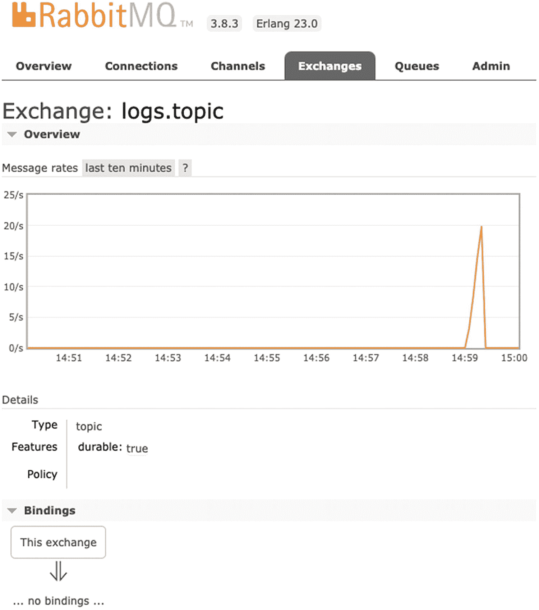

图 8-29

RabbitMQ UI:日志交换

### 使用日志并打印它们

现在，我们已经将所有日志一起发布到了一个 exchange，我们将构建消费者端:一个新的微服务，它使用所有这些消息并将它们一起输出。

首先，导航到 Spring Initializr 站点 start.spring.io ( [`https://start.spring.io/`](https://start.spring.io/) )并使用我们为其他应用选择的相同设置创建一个`logs`项目:Maven 和 JDK 14。在依赖项列表中，我们添加了 Spring for RabbitMQ、Spring Web、验证、Spring Boot 执行器、Lombok 和 Consul 配置。注意，我们不需要使这个服务可被发现，所以我们不添加 Consul 发现。见图 [8-30](#Fig30) 。

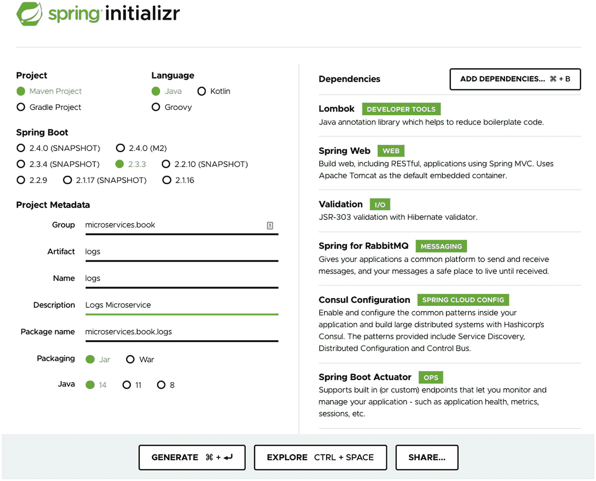

图 8-30

创建日志微服务

一旦我们将这个项目导入到我们的工作空间中，我们就添加一些配置，以便能够连接到配置服务器。我们现在不打算添加任何特定的配置，但这样做可以使它与其他微服务保持一致。在`main/src/resources`文件夹中，复制我们包含在其他项目中的`bootstrap.properties`文件的内容。此外，让我们在`application.properties`文件中设置应用名称和专用端口。参见清单 [8-44](#PC53) 。

```java
spring.application.name=logs
server.port=8580

Listing 8-44Adding Content to the application.properties File in the New Logs Application

```

我们需要一个 Spring Boot 配置类来声明交换、我们希望从中消费消息的队列，以及使用绑定键模式将队列附加到主题交换的绑定对象，以消费所有这些内容。见清单 [8-45](#PC54) 。请记住，由于我们将日志记录级别添加到了路由关键字中，所以我们也可以调整这个值，例如，只获取错误。无论如何，在我们的情况下，我们订阅所有消息(`#`)。

```java
package microservices.book.logs;

import org.springframework.amqp.core.*;
import org.springframework.context.annotation.Bean;
import org.springframework.context.annotation.Configuration;

@Configuration
public class AMQPConfiguration {

    @Bean
    public TopicExchange logsExchange() {
        return ExchangeBuilder.topicExchange("logs.topic")
                .durable(true)
                .build();
    }

    @Bean
    public Queue logsQueue() {
        return QueueBuilder.durable("logs.queue").build();
    }

    @Bean
    public Binding logsBinding(final Queue logsQueue,
                               final TopicExchange logsExchange) {
        return BindingBuilder.bind(logsQueue)
                .to(logsExchange).with("#");
    }
}

Listing 8-45AMQPConfiguration Class in the Logs Application

```

下一步是使用`@RabbitListener`创建一个简单的服务，该服务使用相应的 [`log.info`](http://log.info) `()`、`log.error()`或`log.warn()`，将作为 RabbitMQ 消息头传递的接收消息的日志记录级别映射到 Logs 微服务中的日志记录级别。注意，我们在这里使用了`@Header`注释来提取 AMQP 头作为方法参数。我们还使用日志记录`Marker`将应用名称(`appId`)添加到日志行中，而不需要将其作为消息的一部分连接起来。这是 SLF4J 标准中向日志添加上下文值的一种灵活方式。参见清单 [8-46](#PC55) 。

```java
package microservices.book.logs;

import org.springframework.amqp.rabbit.annotation.RabbitListener;
import org.springframework.messaging.handler.annotation.Header;
import org.springframework.stereotype.Service;

import org.slf4j.Marker;
import org.slf4j.MarkerFactory;

import lombok.extern.slf4j.Slf4j;

@Slf4j
@Service
public class LogsConsumer {

    @RabbitListener(queues = "logs.queue")
    public void log(final String msg,
                    @Header("level") String level,
                    @Header("amqp_appId") String appId) {
        Marker marker = MarkerFactory.getMarker(appId);
        switch (level) {
            case "INFO" -> log.info(marker, msg);
            case "ERROR" -> log.error(marker, msg);
            case "WARN" -> log.warn(marker, msg);
        }
    }
}

Listing 8-46The Consumer Class That Receives All Log Messages via RabbitMQ

```

最后，我们定制这个新的微服务产生的日志输出。因为它将聚合来自不同服务的多个日志，所以最相关的属性是应用名称。这次我们覆盖了 Spring Boot 的默认设置，在一个`logback-spring.xml`文件中为输出标记、级别和消息的`CONSOLE` appender 定义了一个简单的格式。参见清单 [8-47](#PC56) 。

```java
<configuration>

    <appender name="CONSOLE" class="ch.qos.logback.core.ConsoleAppender">
        <layout class="ch.qos.logback.classic.PatternLayout">
            <Pattern>
                [%-15marker] %highlight(%-5level) %msg%n
            </Pattern>
        </layout>
    </appender>

    <root level="INFO">
        <appender-ref ref="CONSOLE" />
    </root>
</configuration>

Listing 8-47The LogBack Configuration for the Logs Application

```

这就是我们在这个新项目中需要的所有代码。现在，我们可以构建源代码，并使用系统中的其余组件启动这个新的微服务。

1.  运行 RabbitMQ 服务器。

2.  在开发模式下运行 Consul 代理。

3.  启动乘法微服务。

4.  启动游戏化微服务。

5.  启动网关微服务。

6.  启动日志微服务。

7.  运行前端 app。

一旦我们启动这个新的微服务，它将消耗其他应用产生的所有日志消息。在实践中，你可以解决一个挑战。您将在 Logs 微服务的控制台中看到清单 [8-48](#PC57) 中所示的日志行。

```java
[multiplication ] INFO  15:14:20.203 [http-nio-8080-exec-1] m.b.m.c.ChallengeAttemptController - Received new attempt from test1
[gamification   ] INFO  15:14:20.357 [org.springframework.amqp.rabbit.RabbitListenerEndpointContainer#0-1] m.b.g.game.GameEventHandler - Challenge Solved Event received: 122
[gamification   ] INFO  15:14:20.390 [org.springframework.amqp.rabbit.RabbitListenerEndpointContainer#0-1] m.b.g.game.GameServiceImpl - User test1 scored 10 points for attempt id 122

Listing 8-48Centralized Logs in the New Logs Application

```

这个简单的日志聚合器并没有花费我们太多时间，现在我们可以在同一个源中搜索日志，并看到来自我们所有服务的近乎实时的输出流。请参见图 [8-31](#Fig31) 了解包含这一新组件的高级架构图的更新版本。

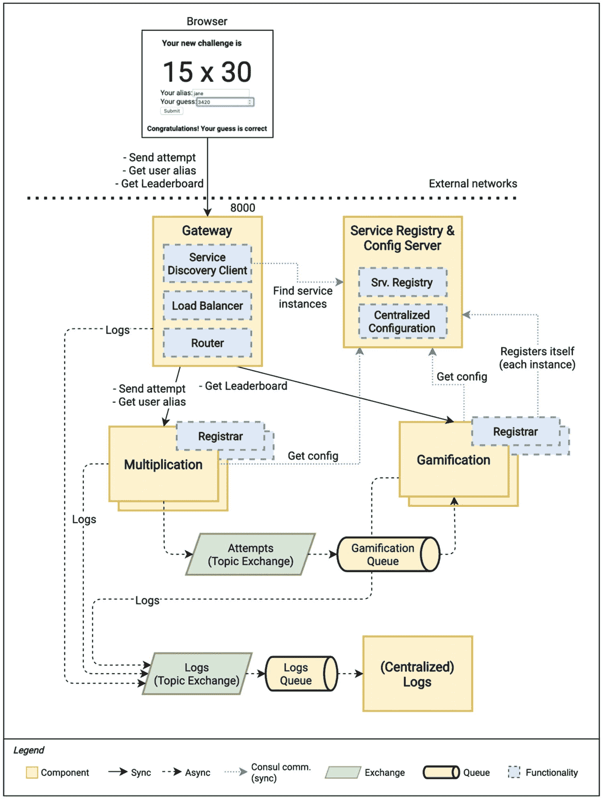

图 8-31

高级概述:集中式日志

如果我们为日志聚合选择一个现有的解决方案，整个步骤将是相似的。许多这样的工具，比如 ELK stack，可以通过定制的附加器与 Logback 集成来获取日志。然后，在非基于云的日志聚合器的情况下，我们还需要在我们的系统中部署日志服务器，就像我们对我们创建的基本微服务所做的那样。

## 分布式跟踪

将所有的日志放在一个地方是一个伟大的成就，它提高了可观察性，但是我们还没有适当的 T2 可追溯性。在前一章中，我们描述了一个成熟的事件驱动系统如何拥有跨越不同微服务的进程。了解许多并发用户和多个事件链的情况可能会成为一项不可能完成的任务，尤其是当这些事件链的分支包含触发相同操作的多种事件类型时。

为了解决这个问题，我们需要在同一个流程链中关联所有的操作和事件。一种简单的方法是在所有 HTTP 调用、RabbitMQ 消息和处理不同动作的 Java 线程中注入相同的标识符。然后，我们可以在所有相关的日志中打印这个标识符。

在我们的系统中，我们使用用户标识符。如果我们认为我们未来的所有功能都将围绕用户动作构建，我们可以在每个事件和调用中传播一个`userId`字段。然后，我们可以在不同的服务中记录日志，这样我们就可以将日志与特定用户相关联。这肯定会提高可追溯性。然而，我们也可能在短时间内发生来自同一个用户的多个动作，例如，在一秒钟内两次尝试解一个乘法(一个快用户，但是你明白这个想法)，分布在多个实例中。在这种情况下，将很难区分跨我们的微服务的单个流。理想情况下，我们应该为每个动作设置一个惟一的标识符，这个标识符是在链的起点生成的。此外，如果我们可以透明地传播它，而不必在我们的所有服务中显式地建模这种可追溯性问题，那就更好了。

正如在软件开发中多次发生的那样，我们不是第一个应对这一挑战的人。这又是一个好消息，因为这意味着我们可以毫不费力地使用解决方案。在这种情况下，在 Spring 中实现分布式跟踪的工具称为 Sleuth。

### 春云侦探

Sleuth 是 Spring Cloud 家族的一部分，它使用 Brave 库( [`https://tpd.io/brave`](https://tpd.io/brave) )来实现分布式追踪。它通过关联被称为*的工作单元跨越*来构建跨不同组件的跟踪。例如，在我们的系统中，一个 span 检查乘法微服务中的尝试，另一个 span 根据 RabbitMQ 事件添加分数和徽章。每个区间都有一个不同的唯一标识符，但是两个区间都是同一个跟踪的一部分，所以它们有相同的跟踪标识符。此外，每个 span 都链接到其父级，除了根 span，因为它是原始动作。见图 [8-32](#Fig32) 。

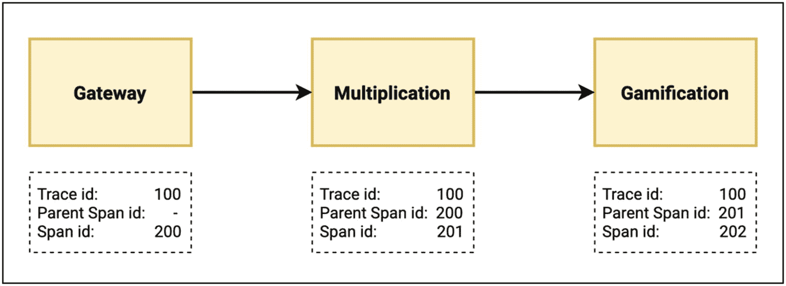

图 8-32

分布式跟踪:简单的例子

在更进化的系统中，可能存在复杂的轨迹结构，其中多个跨度具有相同的父跨度。见图 [8-33](#Fig33)

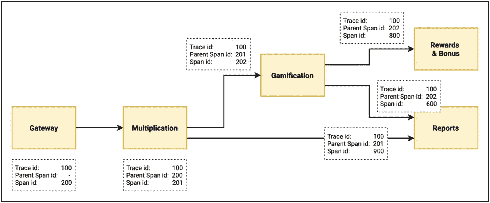

图 8-33

分布式跟踪:树示例

为了透明地注入这些值，Sleuth 使用 SLF4J 的映射诊断上下文(MDC)对象，这是一个日志上下文，其生命周期仅限于当前线程。该项目还允许我们在这个上下文中注入我们自己的字段，因此我们可以传播它们并在日志中使用这些值。

Spring Boot 在 Sleuth 中自动配置了一些内置的拦截器来自动检查和修改 HTTP 调用和 RabbitMQ 消息。它还集成了 Kafka、gRPC 和其他通信接口。这些拦截器都以类似的方式工作:对于传入的通信，它们检查是否有跟踪头添加到调用或消息中，并将它们放入 MDC 当作为客户机进行调用或发布数据时，这些拦截器从 MDC 获取这些字段，并向请求或消息添加头。

Sleuth 有时会与 Zipkin 结合使用，Zipkin 是一种使用跟踪采样来测量每个跨度以及整个链中所花费的时间的工具。这些样本可以发送到 Zipkin 服务器，该服务器公开了一个 UI，您可以使用该 UI 来查看跟踪层次结构以及每个服务完成其工作所需的时间。我们不会在本书中使用 Zipkin，因为它不会给带有 trace 和 span 标识符的集中式日志记录系统增加太多价值，如果您检查记录的时间戳，还可以知道每个服务花费的时间。无论如何，您可以按照参考文档中的说明( [`http://tpd.io/spans-zipkin`](http://tpd.io/spans-zipkin) )轻松地将 Zipkin 集成到我们的示例项目中。

### 实现分布式跟踪

如前所述，Spring Cloud Sleuth 为 REST APIs 和 RabbitMQ 消息提供了拦截器，Spring Boot 为我们自动配置了它们。在我们的系统中使用分布式跟踪并不难。

首先，让我们将相应的 Spring Cloud starter 添加到我们的网关、乘法、游戏化和日志微服务中。参见清单 [8-49](#PC58) 了解我们必须添加到`pom.xml`文件中的依赖关系。

```java
<dependency>
    <groupId>org.springframework.cloud</groupId>
    <artifactId>spring-cloud-starter-sleuth</artifactId>
</dependency>

Listing 8-49Adding Spring Cloud Sleuth to All Our Spring Boot Projects

```

只有通过添加这种依赖关系，Sleuth 才会将跟踪和跨度标识符注入到每个受支持的通信通道和 MDC 对象中。默认的 Spring Boot 日志记录模式也会自动调整为在日志中打印跟踪和跨度值。

为了使我们的日志更详细，并查看运行中的跟踪标识符，让我们向`ChallengeAttemptController`添加一个日志行，以便在每次用户发送尝试时打印一条消息。参见清单 [8-50](#PC59) 中的变更。

```java
@PostMapping
ResponseEntity<ChallengeAttempt> postResult(
        @RequestBody @Valid ChallengeAttemptDTO challengeAttemptDTO) {
    log.info("Received new attempt from {}", challengeAttemptDTO.getUserAlias());
    return ResponseEntity.ok(challengeService.verifyAttempt(challengeAttemptDTO));
}

Listing 8-50Adding a Log Line to ChallengeAttemptController

```

此外，我们还希望在集中式日志中包含跟踪和父标识符。为此，让我们手动将 MDC 上下文中的属性`X-B3-TraceId`和`X-B3-SpanId`(由 Sleuth 使用 Brave 注入)添加到 Logs 项目的`logback-spring.xml`文件中的模式中。这些头是 OpenZipkin 的 B3 传播规范的一部分(参见 [`http://tpd.io/b3-headers`](http://tpd.io/b3-headers) 了解更多细节)，它们被 Sleuth 的拦截器包含在 MDC 中。我们需要为我们的 Logs 微服务手动执行此操作，因为我们没有在此日志配置文件中使用 Spring Boot 默认值。见清单 [8-51](#PC60) 。

```java
<configuration>

    <appender name="CONSOLE" class="ch.qos.logback.core.ConsoleAppender">
        <layout class="ch.qos.logback.classic.PatternLayout">
            <Pattern>
                [%-15marker] [%X{X-B3-TraceId:-},%X{X-B3-SpanId:-}] %highlight(%-5level) %msg%n
            </Pattern>
        </layout>
    </appender>

    <root level="INFO">
        <appender-ref ref="CONSOLE" />
    </root>
</configuration>

Listing 8-51Adding Trace Fields to Each Log Line Printed by the Logs Application

```

一旦我们重启所有的后端服务，Sleuth 将会尽自己的一份力量。让我们使用终端直接向后端发送一个正确的尝试。

```java
$ http POST :8000/attempts factorA=15 factorB=20 userAlias=test-user-tracing guess=300

```

然后，我们检查日志服务的输出。我们将看到两个字段显示了跨乘法和游戏化微服务的公共跟踪标识符，`fa114ad129920dc7`。每条线也有自己的跨度 ID。参见清单 [8-52](#PC62) 。

```java
[multiplication ] [fa114ad129920dc7,4cdc6ab33116ce2d] INFO  10:16:01.813 [http-nio-8080-exec-8] m.b.m.c.ChallengeAttemptController - Received new attempt from test-user-tracing
[multiplication ] [fa114ad129920dc7,f70ea1f6a1ff6cac] INFO  10:16:01.814 [http-nio-8080-exec-8] m.b.m.challenge.ChallengeServiceImpl - Creating new user with alias test-user-tracing
[gamification   ] [fa114ad129920dc7,861cbac20a1f3b2c] INFO  10:16:01.818 [org.springframework.amqp.rabbit.RabbitListenerEndpointContainer#0-1] m.b.g.game.GameEventHandler - Challenge Solved Event received: 126
[gamification   ] [fa114ad129920dc7,78ae53a82e49b770] INFO  10:16:01.819 [org.springframework.amqp.rabbit.RabbitListenerEndpointContainer#0-1] m.b.g.game.GameServiceImpl - User test-user-tracing scored 10 points for attempt id 126

Listing 8-52Centralized Logs with Trace Identifiers

```

正如您所看到的，只需很少的努力，我们就获得了一个强大的功能，允许我们在分布式系统中辨别不同的进程。可以想象，当我们将所有日志及其跟踪和跨度输出到更复杂的集中式日志工具(如 ELK)时，效果会更好，我们可以使用这些标识符来执行过滤文本搜索。

## 集装箱化

到目前为止，我们一直在本地执行我们所有的 Java 微服务，React 前端、RabbitMQ 和 Consul。为此，我们需要安装 JDK 来编译源代码和运行 JAR 包，Node.js 来构建和运行 UI，RabbitMQ 服务器(包括 Erlang)和 Consul 的代理。随着我们架构的发展，我们可能需要引入其他工具和服务，它们肯定有自己的安装过程，可能会因操作系统及其版本的不同而有所不同。

作为一个总体目标，我们希望能够在多种环境中运行我们的后端系统，不管它们运行的是什么操作系统版本。理想情况下，我们希望受益于“一次构建，随处部署”的策略，并避免在我们希望部署系统的每个环境中重复所有的配置和安装步骤。此外，部署过程应该尽可能简单。

过去，打包整个系统以便在任何地方运行的一种常见方法是创建一个虚拟机(VM)。有几种创建和运行虚拟机的解决方案，它们被称为*虚拟机管理程序*。虚拟机管理程序的一个优势是，一台物理机可以同时运行多个虚拟机，并且它们都共享硬件资源。每个虚拟机都需要自己的操作系统，然后通过虚拟机管理程序连接到主机的 CPU、RAM、硬盘等。

在我们的例子中，我们可以从 Linux 发行版开始创建一个 VM，并在那里设置和安装运行我们的系统所需的所有工具和服务:Consul、RabbitMQ、Java 运行时、JAR 应用等。一旦我们知道虚拟机工作了，我们就可以把它转移到任何其他运行虚拟机管理程序的计算机上。因为这个包包含了它所需要的一切，所以它在不同的主机上应该是一样的。见图 [8-34](#Fig34) 。

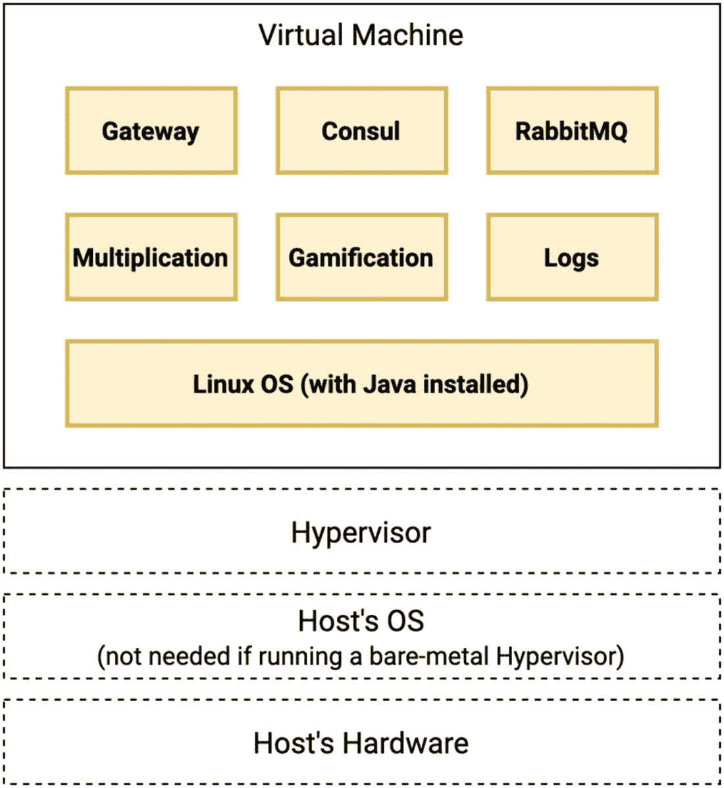

图 8-34

虚拟机部署:单一

然而，将所有东西都放在同一个虚拟机中并不太灵活。如果我们想要扩展我们的系统，我们必须进入虚拟机，添加新的实例，并确保我们分配更多的 CPU、内存等。我们需要知道一切是如何工作的，所以部署过程不再那么容易了。

更动态的方法是为每个服务和工具配备单独的虚拟机。然后，我们添加一些网络配置，以确保它们可以相互连接。由于我们使用服务发现和动态扩展，我们可以添加更多运行微服务的虚拟机实例(例如，乘法-VM)，它们将被透明地使用。这些新实例只需要使用它们的地址(在 VM 网络中)在 Consul 中注册它们自己。见图 [8-35](#Fig35) 这比单个虚拟机要好，但考虑到每个虚拟机都需要自己的操作系统，这是一种巨大的资源浪费。此外，这将在虚拟机协调方面带来许多挑战:监控虚拟机、创建新实例、配置网络、存储等。

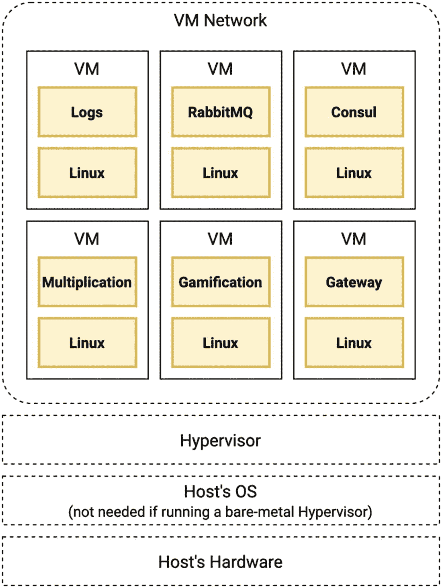

图 8-35

虚拟机部署:多个

随着容器化技术在 2010 年代初的发展，虚拟机已被淘汰，容器已成为最受欢迎的应用虚拟化方式。容器要小得多，因为不需要操作系统；它们运行在主机的 Linux 操作系统之上。

另一方面，像 Docker 这样的容器化平台的引入极大地促进了云和本地部署，使用易于使用的工具来打包应用，将它们作为容器运行，并在公共注册表中共享它们。让我们更详细地探索这个平台的特性。

### 码头工人

在本书中不可能涵盖 Docker 平台的所有概念，但是让我们尝试给出一个足够好的概述，以理解它如何促进分布式系统的部署。官网的入门页面( [`https://tpd.io/docker-start`](https://tpd.io/docker-start) )是从这里继续学习的好地方。

在 Docker 中，我们可以将我们的应用和它可能需要的任何支持组件打包成映像。这些可以基于你从 Docker 注册表中提取的其他现有图像，因此我们可以重用它们并节省大量时间。官方公开的图片注册中心是 Docker Hub ( [`https://tpd.io/docker-hub`](https://tpd.io/docker-hub) )。

例如，倍增微服务的 Docker 映像可以基于现有的 JDK 14 映像。然后，我们可以在它上面添加由 Spring Boot 打包的 JAR 文件。为了创建图像，我们需要一个`Dockerfile`，以及 Docker CLI 工具的一组指令。清单 [8-53](#PC63) 展示了乘法微服务的示例`Dockerfile`可能是什么样子。这个文件应该放在项目的根文件夹中。

```java
FROM openjdk:14
COPY ./target/multiplication-0.0.1-SNAPSHOT.jar /usr/src/multiplication/
WORKDIR /usr/src/multiplication
EXPOSE 8080
CMD ["java", "-jar", "multiplication-0.0.1-SNAPSHOT.jar"]

Listing 8-53A Basic Dockerfile to Create a Docker Image for the Multiplication Microservice

```

这些指令告诉 Docker 使用公共注册中心(Docker Hub， [`https://tpd.io/docker-jdk`](https://tpd.io/docker-jdk) )中官方`openjdk`镜像的版本`14`作为基础(`FROM`)。然后，它将可分发的`.jar`文件从当前项目复制到图像中的`/usr/src/multiplication/`文件夹(`COPY`)。第三条指令`WORKDIR`将图像的工作目录更改为这个新创建的文件夹。命令`EXPOSE`通知 Docker 这个映像公开了一个端口 8080，我们在这里服务 REST API。最后，我们定义了用`CMD`运行这个映像时要执行的命令。这只是运行一个`.jar`文件的经典 Java 命令，按照预期的语法分成三部分。您可以在`Dockerfile`中使用许多其他指令，如您在参考文档中所见( [`https://tpd.io/dockerfile-ref`](https://tpd.io/dockerfile-ref) )。

要构建映像，我们必须下载并安装标准 Docker 安装包附带的 *Docker CLI* 工具。按照 Docker 网站上的说明( [`https://tpd.io/getdocker`](https://tpd.io/getdocker) )获取适合您的操作系统的软件包。下载并启动后，Docker 守护程序应该作为后台服务运行。然后，您可以从终端使用 Docker 命令构建和部署映像。例如，清单 [8-54](#PC64) 中所示的命令基于我们之前创建的`Dockerfile`构建了`multiplication`图像。注意，作为先决条件，你必须确保在一个`.jar`文件中构建和打包应用，例如通过从项目的根文件夹运行`./mvnw clean package`。

```java
multiplication$ docker build -t multiplication:1.0.0 .

Sending build context to Docker daemon  59.31MB
Step 1/5 : FROM openjdk:14
 ---> 4fba8120f640
Step 2/5 : COPY ./target/multiplication-0.0.1-SNAPSHOT.jar /usr/src/multiplication/
 ---> 2e48612d3e40
Step 3/5 : WORKDIR /usr/src/multiplication
 ---> Running in c58cde6bda82
Removing intermediate container c58cde6bda82
 ---> 8d5457683f2c
Step 4/5 : EXPOSE 8080
 ---> Running in 7696319884c7
Removing intermediate container 7696319884c7
 ---> abc3a60b73b2
Step 5/5 : CMD ["java", "-jar", "multiplication-0.0.1-SNAPSHOT.jar"]
 ---> Running in 176cd53fe750
Removing intermediate container 176cd53fe750
 ---> a42cc81bab51
Successfully built a42cc81bab51
Successfully tagged multiplication:1.0.0

Listing 8-54Building

a Docker Image Manually

```

正如您在输出中看到的，Docker 处理文件中的每一行并创建一个名为`multiplication:1.0.0`的图像。这张图片只在本地可用，但是如果我们希望其他人使用它，我们可以*将*图片推送到一个远程位置，我们将在后面解释。

一旦构建了 Docker 映像，就可以将其作为容器运行，容器是映像的运行实例。例如，这个命令将在我们的机器上运行一个 Docker 容器:

```java
$ docker run -it -p 18080:8080 multiplication:1.0.0

```

如果图像在本地不可用，Docker 中的`run`命令会提取图像，并作为容器在 Docker 平台上执行。`-it`标志用于附加到容器的终端，所以我们可以看到命令行的输出，也可以用 Ctrl+C 信号停止容器。`-p`选项是公开内部端口 8080，因此可以从端口 18080 中的主机访问它。这些只是我们在运行容器时可以使用的几个选项；您可以从命令行使用`docker run --help`来查看它们。

当我们启动这个容器时，它将运行在 Docker 平台之上。如果您运行的是 Linux 操作系统，容器将使用主机的本地虚拟化功能。当在 Windows 或 Mac 上运行时，Docker 平台在两者之间设置了一个 Linux 虚拟化层，如果这些操作系统可用，它可能会使用这些操作系统的原生支持。

不幸的是，我们的容器不能正常工作。它不能连接 RabbitMQ 或 Consul，即使我们在*码头工人的主机*(我们的电脑)上安装并运行它们。清单 [8-55](#PC66) 显示了容器日志中这些错误的摘录。记住，默认情况下，Spring Boot 试图在`localhost`找到 RabbitMQ 主机，和 Consul 一样。在一个容器中，`localhost`指的是自己的容器，除了 Spring Boot app，没有别的。此外，容器是运行在 Docker 平台网络上的孤立单元，因此它们无论如何都不应该连接到运行在主机上的服务。

```java
2020-08-29 10:03:44.565 ERROR [,,,] 1 --- [           main] o.s.c.c.c.ConsulPropertySourceLocator    : Fail fast is set and there was an error reading configuration from consul.
2020-08-29 10:03:45.572 ERROR [,,,] 1 --- [           main] o.s.c.c.c.ConsulPropertySourceLocator    : Fail fast is set and there was an error reading configuration from consul.
2020-08-29 10:03:46.675 ERROR [,,,] 1 --- [           main] o.s.c.c.c.ConsulPropertySourceLocator    : Fail fast is set and there was an error reading configuration from consul.
[...]

Listing 8-55The Multiplication Container Can’t Reach Consul at Localhost

```

为了正确设置我们的后端系统在 Docker 中运行，我们必须将 RabbitMQ 和 Consul 部署为容器，并使用 Docker 网络在它们之间连接所有这些不同的实例。见图 [8-36](#Fig36)

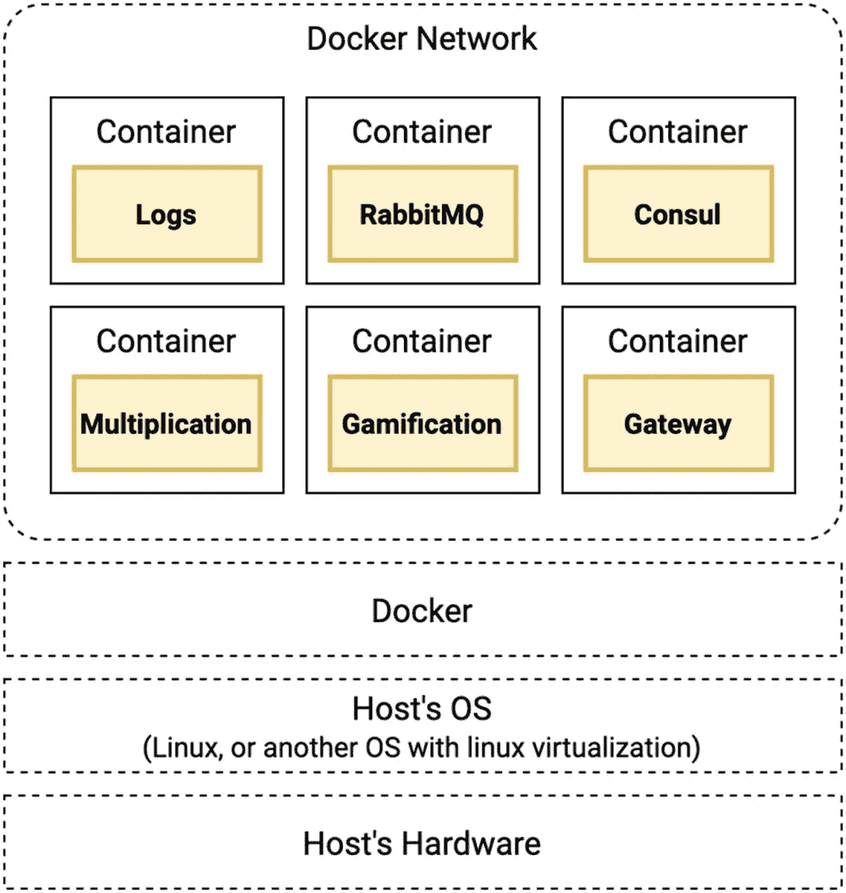

图 8-36

我们的码头集装箱后端

在学习如何实现这一点之前，让我们探索一下 Spring Boot 如何帮助我们建立 Docker 图像，这样我们就不需要自己准备`Dockerfile`了。

### Spring Boot 和构建包

从版本 2.3.0 开始，Spring Boot 的 Maven 和 Gradle 插件可以选择使用云原生构建包( [`https://tpd.io/buildpacks`](https://tpd.io/buildpacks) )来构建开放容器倡议(OCI)映像，该项目旨在帮助打包您的应用，以便将其部署到任何云提供商。您可以在 Docker 和其他容器平台中运行生成的图像。

Buildpacks 插件的一个很好的特性是，它根据项目的 Maven 配置准备一个计划，然后打包一个 Docker 映像，准备好进行部署。此外，它以某种方式在*层*中构建映像，以便它们可以被您的应用的未来版本重用，甚至可以被使用相同工具构建的其他微服务映像重用(例如，具有所有 Spring Boot 核心库的层)。这有助于加快测试和部署。

如果我们从命令行运行`build-image`目标，例如从游戏化的项目文件夹，我们可以看到构建包的运行:

```java
gamification $ ./mvnw spring-boot:build-image

```

您应该从 Maven 插件中看到一些额外的日志，它现在正在下载一些所需的图像并构建应用图像。如果一切顺利，您应该在最后看到这一行:

```java
[INFO] Successfully built image 'docker.io/library/gamification:0.0.1-SNAPSHOT'

```

Docker 标签被设置为我们在`pom.xml`文件中指定的 Maven 工件的名称和版本:`gamification:0.0.1-SNAPSHOT`。前缀`docker.io/library/`是所有公共 Docker 图像的默认前缀。我们可以为这个插件定制多个选项，你可以查看参考文档( [`https://tpd.io/buildpack-doc`](https://tpd.io/buildpack-doc) )了解所有细节。

就像我们之前为我们自己构建的图像运行容器一样，我们现在可以为这个由 Spring Boot 的 Maven 插件生成的新图像运行容器:

```java
$ docker run -it -p 18081:8081 gamification:0.0.1-SNAPSHOT

```

不出所料，容器也会输出同样的错误。请记住，应用不能连接到 RabbitMQ 和 Consul，它需要这两个服务才能正常启动。我们会尽快解决这个问题。

对于您自己的项目，您应该考虑使用云原生构建包与维护您自己的 Docker 文件的利弊。如果您计划使用这些标准 OCI 映像部署到支持它们的公共云，这可能是一个好主意，因为您可以节省大量时间。Buildpacks 还负责在可重用层中组织您的图像，因此您可以避免自己这样做。此外，您可以定制插件使用的基本构建映像，因此您可以灵活地定制这个过程。然而，如果您想要完全控制您正在构建的东西以及您想要包含在您的图像中的工具和文件，那么自己定义`Dockerfile`指令可能会更好。正如我们之前看到的，这对于一个基本的设置来说并不难。

### 在 Docker 中运行我们的系统

让我们为系统中的每个组件构建或找到一个 Docker 映像，这样我们就可以将它部署为一组容器。

*   乘法、游戏化、网关和日志微服务:我们将使用带有构建包的 Spring Boot Maven 插件来生成这些 Docker 映像。

*   *RabbitMQ* :我们可以使用包含管理插件(UI)的官方 RabbitMQ 镜像版本运行一个容器:`rabbitmq:3-management`(参见 [Docker Hub](https://tpd.io/rmq-docker) )。

*   *领事*:也有官方码头工人形象。我们将使用 Docker Hub 中的标签`consul:1.7.2`([`https://tpd.io/consul-docker`](https://tpd.io/consul-docker))。此外，我们将运行第二个容器来加载一些配置，作为集中式配置的键/值对。更多细节将在其特定部分给出。

*   *前端*:如果我们想在 Docker 中部署完整的系统，我们还需要一个 web 服务器来托管 React 构建中生成的 HTML/JavaScript 文件。我们可以用 Nginx 这样的轻量级静态服务器，用它的官方 Docker 镜像`nginx:1.19`(见 Docker Hub， [`https://tpd.io/nginx-docker`](https://tpd.io/nginx-docker) )。在这种情况下，我们将以`nginx`为基础构建我们自己的映像，因为我们也需要复制生成的文件。

因此，我们的计划需要构建六个不同的 Docker 映像，并使用两个公共映像。见图 [8-37](#Fig37) 。

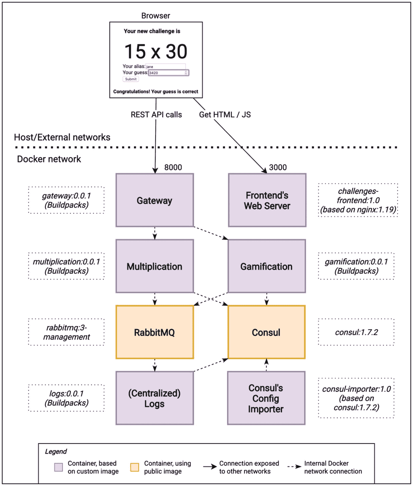

图 8-37

高级概述:集装箱化系统

### 对接微服务

首先，让我们为 Spring Boot 应用构建所有的图像。从每个项目文件夹中，我们需要运行以下命令:

```java
$ ./mvnw spring-boot:build-image

```

注意，Docker 必须在本地运行，与 Consul 和 RabbitMQ 一样，这样测试才能通过。一旦您生成了所有的图像，您可以通过运行`docker images`命令来验证它们在 Docker 中都是可用的。参见清单 [8-56](#PC71) 。

```java
$ docker images
REPOSITORY       TAG             IMAGE ID      CREATED        SIZE
logs             0.0.1-SNAPSHOT  2fae1d82cd5d  40 years ago   311MB
gamification     0.0.1-SNAPSHOT  5552940b9bfd  40 years ago   333MB
multiplication   0.0.1-SNAPSHOT  05a4d852fa2d  40 years ago   333MB
gateway          0.0.1-SNAPSHOT  d50be5ba137a  40 years ago   313MB

Listing 8-56Listing Docker Images Generated with Cloud Native Buildpacks

```

如您所见，图像是用旧日期生成的。这是 Buildpacks 的一个特性，使构建可复制:每次构建这个映像时，它们都获得相同的创建日期，并且它们也位于列表的末尾。

### 将用户界面停驻

下一步是在`challenges-frontend`文件夹中创建一个`Dockerfile`，这是 React 应用的根目录。我们只需要两条指令，一条是基本图像(Nginx ),另一条是将所有 HTML/JavaScript 文件放入图像的`COPY`命令。我们将它们复制到 Nginx web 服务器默认用来提供内容的文件夹中。参见清单 [8-57](#PC72) 。

```java
FROM nginx:1.19
COPY build /usr/share/nginx/html/

Listing 8-57A Simple Dockerfile to Create an Image for the front End’s Web Server

```

在创建 Docker 映像之前，让我们确保为前端生成最新的工件。为了编译 React 项目，我们必须执行以下命令:

```java
challenges-frontend $ npm run build

```

一旦生成了`build`文件夹，我们就可以创建 Docker 图像了。我们将分配一个名称和一个带有`-t`标志的标签，并且我们使用`.`来表示`Dockerfile`位于当前文件夹中。

```java
challenges-frontend $ docker build -t challenges-frontend:1.0 .

```

### 将配置导入程序归档

现在，让我们准备一个 Docker 映像来加载一些预定义的集中式配置。我们将有一个运行服务器的 Consul 容器，它可以直接使用官方图像。我们的计划是运行一个额外的容器来执行 Consul CLI 以加载一些 KV 数据:一个`docker`概要文件。这样，当在 Docker 中运行我们的微服务时，我们可以使用这个预加载的配置文件配置，因为它们需要不同的 RabbitMQ 主机参数，例如。

为了获得我们想要以文件格式加载的配置，我们可以在本地 Consul 服务器中创建它，并通过 CLI 命令导出它。我们使用 UI 来创建`config`根，以及一个名为`defaults,docker`的子文件夹。在内部，我们创建一个名为`application.yml`的键，其配置如清单 [8-58](#PC75) 所示。此配置执行以下操作:

*   将 RabbitMQ 的主机设置为`rabbitmq`，这将覆盖默认值`localhost`。稍后，我们将确保消息代理的容器在该地址可用。

*   覆盖分配给正在运行的服务的实例标识符，以便在服务注册中心使用。默认的 Spring Consul 配置将应用名和端口号连接在一起，但是这种方法对容器不再有效。当我们在 Docker 中运行同一个服务的多个实例(作为容器)时，它们都使用同一个内部端口，所以它们最终会有相同的标识符。为了解决这个问题，我们可以使用一个随机整数作为后缀。Spring Boot 通过特殊的`random`属性符号支持这一点(详见 [`https://tpd.io/random-properties`](https://tpd.io/random-properties) 的文档)。

```java
spring:
  rabbitmq:
    host: rabbitmq
  cloud:
    consul:
      discovery:
        instance-id: ${spring.application.name}-${random.int(1000)}

Listing 8-58The YAML Configuration to Connect Our Apps in Docker Containers to RabbitMQ

```

图 [8-38](#Fig38) 显示了通过 Consul UI 添加的内容。

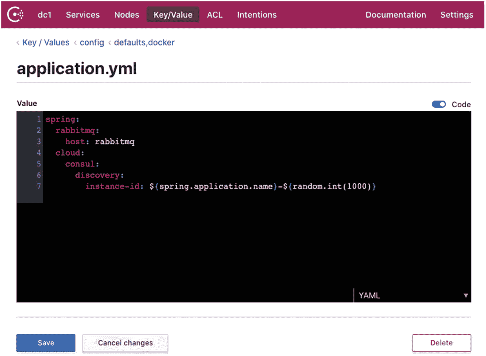

图 8-38

咨询用户界面:准备导出配置

下一步是使用不同的终端将配置导出到文件中。为此，请执行以下命令:

```java
$ consul kv export config/ > consul-kv-docker.json

```

现在，让我们在工作区的根目录下创建一个名为`docker`的新文件夹来放置我们所有的 Docker 配置。在里面，我们创建了一个名为`consul`的子文件夹。应该将使用前面的命令生成的 JSON 文件复制到那里。然后，用清单 [8-59](#PC77) 中的指令添加一个新的`Dockerfile`。

```java
FROM consul:1.7.2
COPY ./consul-kv-docker.json /usr/src/consul/
WORKDIR /usr/src/consul
ENV CONSUL_HTTP_ADDR=consul:8500
ENTRYPOINT until consul kv import @consul-kv-docker.json; do echo "Waiting for Consul"; sleep 2; done

Listing 8-59Dockerfile Contents for the Consul Configuration Loader

```

参见清单 [8-60](#PC78) 以及`docker`文件夹的结果文件结构。

```java
+- docker
|  +- consul
|     \- consul-kv-docker.json
|     \- Dockerfile

Listing 8-60Creating the Consul Docker Configuration in a Separate Folder

```

清单 [8-59](#PC77) 中的 Dockerfile 步骤使用 Consul 作为基础映像，因此 CLI 工具是可用的。JSON 文件被复制到映像中，工作目录被设置到与文件相同的位置。然后，`ENV`指令为 Consul CLI 设置一个新的环境变量，以使用远程主机访问服务器，在本例中位于`consul:8500`。这将是 Consul 服务器容器(我们将很快看到主机如何获得`consul`名称)。最后，这个容器的`ENTRYPOINT`(启动时运行的命令)是一个遵循`until [command]; do ...; sleep 2; done`模式的内联 shell 脚本。该脚本运行一个命令，直到成功为止，重试间隔为两秒钟。主命令是`consul kv import @consul-kv-docker.json`，将文件内容导入 KV 存储器。我们需要在一个循环中执行它，因为当这个 Consul 配置导入器运行时，Consul 服务器可能还没有启动。

为了在注册表中获得导入程序映像，我们必须构建它并给它一个名称。

```java
docker/consul$ docker build -t consul-importer:1.0 .

```

我们将很快详细介绍如何在 Docker 中运行这个导入器，以将配置加载到 Consul 中。

### 复合坞站

一旦我们构建了所有的映像，我们需要将我们的系统作为一组容器来运行，所以是时候学习如何一起启动所有这些容器并进行通信了。

我们可以使用单独的 Docker 命令来启动所有需要的容器，并为它们建立相互连接的网络。然而，如果我们想告诉其他人如何启动我们的系统，我们需要给他们一个脚本或文档，其中包含所有这些命令和指令。幸运的是，Docker 中有一种更好的方法来对容器配置和部署指令进行分组:Docker Compose。

使用 Compose，我们使用 YAML 文件来定义基于多个容器的应用。然后，我们使用命令`docker-compose`运行所有服务。Docker Compose 默认与 Windows 和 Mac 版本的 Docker Desktop 一起安装。如果你运行的是 Linux 或者你在 Docker 发行版中找不到它，按照 Docker 网站上的说明( [`https://tpd.io/compose-install`](https://tpd.io/compose-install) )安装它。

作为第一个例子，参见清单 [8-61](#PC80) ,了解我们需要在系统中作为容器运行的 RabbitMQ 和 Consul 服务的 YAML 定义。这个 YAML 定义必须添加到一个新文件`docker-compose.yml`中，我们可以在现有的`docker`文件夹中创建这个文件。我们将使用版本 3 的组合语法；完整参考可在 [`https://tpd.io/compose3`](https://tpd.io/compose3) 获得。请继续阅读关于该语法如何工作的高级细节。

```java
version: "3"

services:
  consul-dev:
    image: consul:1.7.2
    container_name: consul
    # The UDP port 8600 is used by Consul nodes to talk to each other, so
    # it's good to add it here even though we're using a single-node setup.
    ports:
      - '8500:8500'
      - '8600:8600/udp'
    command: 'agent -dev -node=learnmicro -client=0.0.0.0 -log-level=INFO'
    networks:
      - microservices
  rabbitmq-dev:
    image: rabbitmq:3-management
    container_name: rabbitmq
    ports:
      - '5672:5672'
      - '15672:15672'
    networks:
      - microservices

networks:
  microservices:
    driver: bridge

Listing 8-61A First Version of the docker-compose.yml File with RabbitMQ and Consul

```

在`services`部分，我们定义了其中的两个:`consul-dev`和`rabbitmq-dev`。我们可以为我们的服务使用任何名称，所以我们为这两个服务添加了`-dev`后缀，以表明我们正在开发模式下运行它们(没有集群的独立节点)。这两个服务使用不是我们创建的 Docker 映像，但是它们在 Docker Hub 中作为公共映像可用。我们第一次检查集装箱时就会发现。如果我们不指定`command`来启动容器，将使用图像中的默认。默认命令可以在用于构建图像的`Dockerfile`中指定。RabbitMQ 服务就是这样，默认情况下启动服务器。对于领事图像，我们定义了自己的命令，它类似于我们目前使用的命令。不同之处在于它还包括一个降低日志级别的标志，以及代理在 Docker 网络中工作所需的参数`client`。这些说明可以在 Docker 图像的文档中找到( [`https://tpd.io/consul-docker`](https://tpd.io/consul-docker) )。

两个服务都定义了一个`container_name`参数。这很有用，因为它设置了容器的 DNS 名称，所以其他容器可以通过这个别名找到它。在我们的例子中，这意味着应用可以使用地址`rabbitmq:5672`连接到 RabbitMQ 服务器，而不是默认的地址`localhost:5672`(它现在指向与我们在前面章节中看到的相同的容器)。每个服务中的`ports`参数允许我们以`host-port:container-port`的格式向主机系统公开端口。我们在这里包括两个服务器都使用的标准工具，所以我们仍然可以从我们的桌面访问它们(例如，分别在端口 8500 和 15672 上使用它们的 UI 工具)。请注意，我们映射到主机中的相同端口，这意味着我们不能让 RabbitMQ 和 Consul 服务器进程同时在本地运行(就像我们到目前为止一直在做的那样),因为这会导致端口冲突。

在这个文件中，我们还定义了一个名为`microservices`的类型为`bridge`的网络。该驱动程序类型是默认类型，用于连接独立容器。然后，我们使用每个服务定义中的参数`networks`将`microservices`网络设置为他们可以访问的网络。实际上，这意味着这些服务可以相互连接，因为它们属于同一个网络。Docker 网络与主机网络相隔离，所以我们不能访问任何服务，除了那些我们用`ports`参数明确公开的服务。这很好，因为这是我们在引入网关模式时所缺少的良好实践之一。

现在，我们可以使用这个新的`docker-compose.yml`文件来运行 Consul 和 RabbitMQ Docker 容器。我们只需要从终端执行`docker-compose`命令:

```java
docker $ docker-compose up

```

Docker Compose 自动获取`docker-compose.yml`而不指定名称，因为这是它期望的默认文件名。所有集装箱的输出是*附加*到当前码头和集装箱。如果我们想让它们作为*守护进程*在后台运行，我们只需要在命令中添加`-d`标志。在我们的例子中，对于`consul`和`rabbitmq`容器，我们将在终端输出中看到所有的日志。参见清单 [8-62](#PC82) 中的示例。

```java
Creating network "docker_microservices" with driver "bridge"
Creating consul   ... done
Creating rabbitmq ... done
Attaching to consul, rabbitmq
consul          | ==> Starting Consul agent...
consul          |            Version: 'v1.7.2'
consul          |            Node ID: 'a69c4c04-d1e7-6bdc-5903-c63934f01f6e'
consul          |          Node name: 'learnmicro'
consul          |         Datacenter: 'dc1' (Segment: '<all>')
consul          |             Server: true (Bootstrap: false)
consul          |        Client Addr: [0.0.0.0] (HTTP: 8500, HTTPS: -1, gRPC: 8502, DNS: 8600)
consul          |       Cluster Addr: 127.0.0.1 (LAN: 8301, WAN: 8302)
consul          |            Encrypt: Gossip: false, TLS-Outgoing: false, TLS-Incoming: false, Auto-Encrypt-TLS: false
consul          |
consul          | ==> Log data will now stream in as it occurs:
[...]
rabbitmq        | 2020-07-30 05:36:28.785 [info] <0.8.0> Feature flags: list of feature flags found:
rabbitmq        | 2020-07-30 05:36:28.785 [info] <0.8.0> Feature flags:   [ ] drop_unroutable_metric
rabbitmq        | 2020-07-30 05:36:28.785 [info] <0.8.0> Feature flags:   [ ] empty_basic_get_metric
rabbitmq        | 2020-07-30 05:36:28.785 [info] <0.8.0> Feature flags:   [ ] implicit_default_bindings
rabbitmq        | 2020-07-30 05:36:28.785 [info] <0.8.0> Feature flags:   [ ] quorum_queue
rabbitmq        | 2020-07-30 05:36:28.786 [info] <0.8.0> Feature flags:   [ ] virtual_host_metadata
rabbitmq        | 2020-07-30 05:36:28.786 [info] <0.8.0> Feature flags: feature flag states written to disk: yes
rabbitmq        | 2020-07-30 05:36:28.830 [info] <0.268.0> ra: meta data store initialised. 0 record(s) recovered
rabbitmq        | 2020-07-30 05:36:28.831 [info] <0.273.0> WAL: recovering []
rabbitmq        | 2020-07-30 05:36:28.833 [info] <0.277.0>
rabbitmq        |  Starting RabbitMQ 3.8.2 on Erlang 22.2.8
[...]

Listing 8-62Docker Compose Logs, Showing the Initialization of Both Containers

```

我们还可以验证如何在`localhost:8500`从您的浏览器访问 Consul UI。这一次，从容器中为网站提供服务。它的工作方式完全相同，因为我们将端口暴露给同一个主机的端口，并且它被 Docker 重定向。

要停止这些容器，我们可以按 Ctrl+C，但这可能会使 Docker 在两次执行之间保持某种状态。为了正确地关闭它们并删除它们在 Docker *volumes* (容器定义的存储数据的单元)中创建的任何潜在数据，我们可以从不同的终端运行清单 [8-63](#PC83) 中的命令。

```java
docker $ docker-compose down -v
Stopping consul   ... done
Stopping rabbitmq ... done
Removing consul   ... done
Removing rabbitmq ... done
Removing network docker_default
WARNING: Network docker_default not found.
Removing network docker_microservices

Listing 8-63Stopping Docker Containers and Removing Volumes with Docker Compose

```

我们的下一步是将我们为将配置加载到 Consul KV 中而创建的映像添加到 Docker Compose 文件中。参见清单 [8-64](#PC84) 。

```java
version: "3"

services:
  consul-importer:
    image: consul-importer:1.0
    depends_on:
      - consul-dev
    networks:
      - microservices
  consul-dev:
    # ... same as before
  rabbitmq-dev:
    # ... same as before

networks:
  microservices:
    driver: bridge

Listing 8-64Adding the Consul Importer Image to the docker-compose.yml File

```

这一次，图像`consul-importer:1.0`不是公开的；Docker Hub 中没有。但是，它在本地 Docker 注册表中是可用的，因为我们之前构建了它，所以 Docker 可以通过我们之前定义的名称和标签找到它。

我们可以用参数`depends_on`在组合文件中建立依赖关系。在这里，我们使用它使这个容器在运行 Consul 服务器的`consul-dev`容器之后启动。无论如何，这并不能保证在`consul-importer`运行时服务器已经准备好了。原因是 Docker 只知道容器何时启动，但不知道 consul 服务器何时启动并准备好接受请求。这就是我们向导入程序映像添加脚本的原因，该脚本会重试导入，直到成功为止(参见清单 [8-59](#PC77) )。

当您使用这个新配置再次运行`docker-compose up`时，您也将看到这个新容器的输出。最后，您应该看到加载配置的行，然后 Docker 将通知这个容器成功退出(代码为 0)。参见清单 [8-65](#PC85) 。

```java
docker $ docker-compose up
[...]
consul-importer_1  | Imported: config/
consul-importer_1  | Imported: config/defaults,docker/
consul-importer_1  | Imported: config/defaults,docker/application.yml
docker_consul-importer_1 exited with code 0
[...]

Listing 8-65Running docker-compose for the Second Time to See the Importer’s Logs

```

新容器作为一个功能运行，而不是作为一个持续运行的服务。这是因为我们替换了`consul`映像中的默认命令，该命令在它们的内部`Dockerfile`中定义为将服务器作为一个进程运行，替换为一个简单加载配置然后结束的命令(它不是一个无限运行的进程)。Docker 知道容器没什么可做的了，因为命令已经退出了，所以没有必要让容器保持活动状态。

我们还可以知道一个`docker-compose`配置的运行容器是什么。为了获得这个列表，我们可以从不同的终端执行`docker-compose ps`。见清单 [8-66](#PC86) 。

```java
docker $ docker-compose ps
          Name             Command         State    Ports
--------------------------------------------------------------------
consul                     docker-e[...]   Up       8300/tcp, [...]
docker_consul-importer_1   /bin/sh [...]   Exit 0
rabbitmq                   docker-e[...]   Up       15671/tcp, [...]

Listing 8-66Running docker-compose ps to See the Status of the Containers

```

输出(为了更好的可读性而进行了裁剪)还详细描述了容器使用的命令、其状态和公开的端口。

如果我们在`http://localhost:8500/ui`用浏览器导航到 Consul UI，我们将看到配置是如何被正确加载的，并且我们有一个`config`条目，它带有嵌套的`defaults,docker`子文件夹和相应的`application.yml`键。见图 [8-39](#Fig39) 。我们的进口商运作良好。

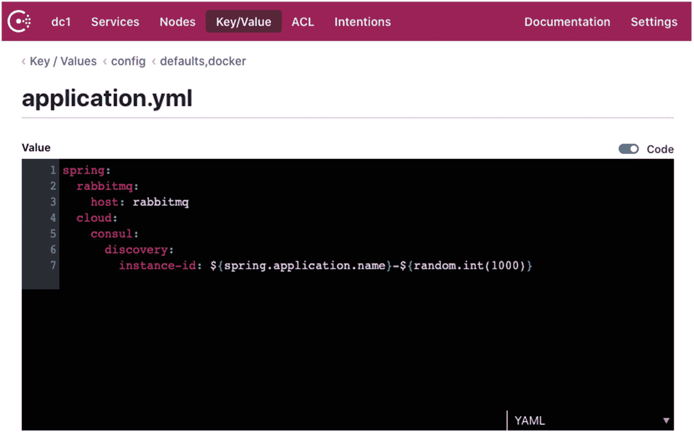

图 8-39

领事容器内的 Docker 配置

让我们继续 Docker Compose 中的前端定义。这个很容易；我们只需要添加我们基于 Nginx 构建的映像，并通过重定向到内部端口来公开端口 3000，在基本映像中默认为 80(根据 [`https://tpd.io/nginx-docker`](https://tpd.io/nginx-docker) )。参见清单 [8-67](#PC87) 。您可以更改公开的端口，但是记得相应地调整网关中的 CORS 配置(或者重构它，以便它可以通过外部属性进行配置)。

```java
version: "3"

services:
  frontend:
    image: challenges-frontend:1.0
    ports:
      - '3000:80'
  consul-importer:
    # ... same as before
  consul-dev:
    # ... same as before
  rabbitmq-dev:
    # ... same as before

networks:
  microservices:
    driver: bridge

Listing 8-67Adding the Web Server to the docker-compose.yml File

```

为了使整个系统工作，我们需要将 Spring Boot 微服务添加到 Docker 合成文件中。我们将配置它们使用我们创建的同一个网络。这些容器中的每一个都需要到达`consul`和`rabbitmq`容器才能正常工作。为此我们将使用两种不同的策略。

*   对于 Consul 设置，Spring 中的集中配置特性要求服务知道在引导阶段在哪里可以找到服务器。我们需要覆盖在本地`bootstrap.yml`中使用的属性`spring.cloud.consul.host`，并将其指向`consul`容器。我们将通过环境变量来做到这一点。在 Spring Boot，如果您设置了一个与现有属性匹配的环境变量，或者一个遵循特定命名约定的环境变量(比如`SPRING_CLOUD_CONSUL_HOST`)，那么它的值会覆盖本地配置。更多详情请参见 Spring Boot 文档中的 [`https://tpd.io/binding-vars`](https://tpd.io/binding-vars) 。

*   对于 RabbitMQ 配置，我们将使用`docker`概要文件。假设微服务将连接到 Consul，配置服务器有一个针对`defaults,docker`的预加载条目，所有微服务都将使用那里的属性。还记得我们在那个概要文件中将 RabbitMQ 主机更改为`rabbitmq`，容器的 DNS 名称。为了激活每个微服务中的`docker`概要文件，我们将使用 Spring Boot 属性来启用概要文件，通过环境变量:`SPRING_PROFILES_ACTIVE=docker`传递。

此外，对于 Compose 中 Spring Boot 容器的配置，还有一些额外的注意事项:

*   在`localhost:8000`上，除了网关服务，我们不想将后端服务直接暴露给主机。因此，我们不会在乘法、游戏化和对数中添加`ports`部分。

*   此外，我们将为后端容器使用`depends_on`参数来等待，直到`consul-importer`运行，因此在 Spring Boot 应用启动时，`docker`配置文件的 Consul 配置将可用。

*   我们还将包含`rabbitmq`作为这些服务的依赖项，但是请记住，这并不能保证 RabbitMQ 服务器在我们的应用启动之前就准备好了。Docker 只验证容器是否已经启动。幸运的是，作为一种恢复技术，Spring Boot 在默认情况下会重试连接到服务器，所以最终，系统会变得稳定。

请参见清单 [8-68](#PC88) 了解启动我们的系统所需的完整 Docker Compose 配置。

```java
version: "3"

services:
  frontend:
    image: challenges-frontend:1.0
    ports:
      - '3000:80'
  multiplication:
    image: multiplication:0.0.1-SNAPSHOT
    environment:
      - SPRING_PROFILES_ACTIVE=docker
      - SPRING_CLOUD_CONSUL_HOST=consul
    depends_on:
      - rabbitmq-dev
      - consul-importer
    networks:
      - microservices
  gamification:
    image: gamification:0.0.1-SNAPSHOT
    environment:
      - SPRING_PROFILES_ACTIVE=docker
      - SPRING_CLOUD_CONSUL_HOST=consul

    depends_on:
      - rabbitmq-dev
      - consul-importer
    networks:
      - microservices
  gateway:
    image: gateway:0.0.1-SNAPSHOT
    ports:
      - '8000:8000'
    environment:
      - SPRING_PROFILES_ACTIVE=docker
      - SPRING_CLOUD_CONSUL_HOST=consul
    depends_on:
      - rabbitmq-dev
      - consul-importer
    networks:
      - microservices
  logs:
    image: logs:0.0.1-SNAPSHOT
    environment:
      - SPRING_PROFILES_ACTIVE=docker
      - SPRING_CLOUD_CONSUL_HOST=consul

    depends_on:
      - rabbitmq-dev
      - consul-importer
    networks:
      - microservices
  consul-importer:
    image: consul-importer:1.0
    depends_on:
      - consul-dev
    networks:
      - microservices
  consul-dev:
    image: consul:1.7.2
    container_name: consul
    ports:
      - '8500:8500'
      - '8600:8600/udp'
    command: 'agent -dev -node=learnmicro -client=0.0.0.0 -log-level=INFO'
    networks:
      - microservices

  rabbitmq-dev:
    image: rabbitmq:3-management
    container_name: rabbitmq
    ports:
      - '5672:5672'
      - '15672:15672'
    networks:
      - microservices

networks:
  microservices:
    driver: bridge

Listing 8-68docker-compose.yml File with Everything Needed to Run Our Complete System

```

是时候测试我们作为 Docker 容器运行的完整系统了。像以前一样，我们运行`docker-compose up`命令。我们将在输出中看到许多日志，由同时启动的多个服务生成，或者紧接在被定义为依赖项的服务之后。

您可能注意到的第一件事是，一些后端服务在尝试连接 RabbitMQ 时会抛出异常。这是预料中的情况。如前所述，RabbitMQ 的启动时间可能比微服务应用长。在`rabbitmq`容器准备就绪后，这个问题会自动修复。

您还可能遇到由于系统中没有足够的内存或 CPU 来一起运行所有容器而导致的错误。这并不罕见，因为每个微服务容器最多可以占用 1GB 的 RAM。如果你不能运行所有这些容器，我希望书中的解释仍然有助于你理解一切是如何一起工作的。

要了解系统的状态，我们可以使用 Docker 提供的聚合日志(附加的输出)或来自`logs`容器的输出。要尝试第二个选项，我们可以从不同的终端使用另一个 Docker 命令，`docker-compose logs [container_name]`。参见清单 [8-69](#PC89) 。请注意，我们的服务名是`logs`，这解释了单词 repetition。

```java
docker $ docker-compose logs logs
[...]
logs_1             | [gamification   ] [aadd7c03a8b161da,34c00bc3e3197ff2] INFO  07:24:52.386 [main] o.s.d.r.c.DeferredRepositoryInitializationListener - Triggering deferred initialization of Spring Data repositories?
logs_1             | [multiplication ] [33284735df2b2be1,bc998f237af7bebb] INFO  07:24:52.396 [main] o.s.d.r.c.DeferredRepositoryInitializationListener - Triggering deferred initialization of Spring Data repositories?
logs_1             | [multiplication ] [b87fc916703f6b56,fd729db4060c1c74] INFO  07:24:52.723 [main] o.s.d.r.c.DeferredRepositoryInitializationListener - Spring Data repositories initialized!
logs_1             | [multiplication ] [97f86da754679510,9fa61b768e26aeb5] INFO  07:24:52.760 [main] m.b.m.MultiplicationApplication - Started MultiplicationApplication in 44.974 seconds (JVM running for 47.993)
logs_1             | [gamification   ] [5ec42be452ce0e04,03dfa6fc3656b7fe] INFO  07:24:53.017 [main] o.s.d.r.c.DeferredRepositoryInitializationListener - Spring Data repositories initialized!
logs_1             | [gamification   ] [f90c5542963e7eea,a9f52df128ac5c7d] INFO  07:24:53.053 [main] m.b.g.GamificationApplication - Started GamificationApplication in 45.368 seconds (JVM running for 48.286)
logs_1             | [gateway        ] [59c9f14c24b84b32,36219539a1a0d01b] WARN  07:24:53.762 [boundedElastic-1] o.s.c.l.core.RoundRobinLoadBalancer - No servers available for service: gamification

Listing 8-69Checking the Logs of the Logs Container

```

此外，您还可以通过查看 Consul UI 的服务列表来监控服务状态，该列表可在`localhost:8500`获得。在那里，您将看到健康检查是否通过，这意味着服务已经在提供服务并连接到 RabbitMQ。见图 [8-40](#Fig40) 。

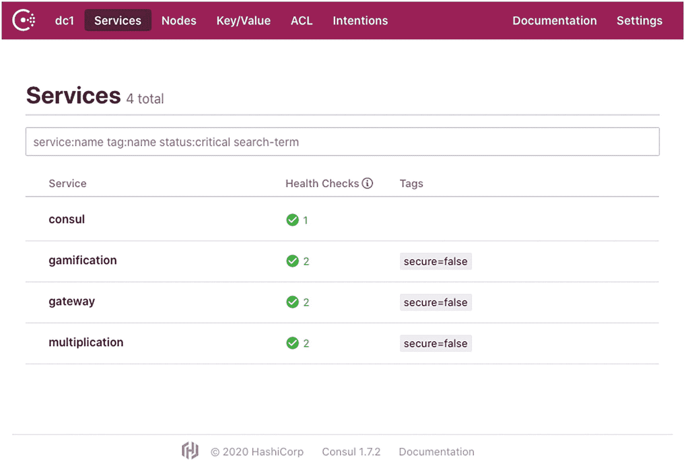

图 8-40

Consul UI:检查容器健康

如果您单击其中一个服务(例如`gamification`，您将看到主机地址现在是 docker 网络中容器的地址。见图 [8-41](#Fig41) 。这是用于服务相互连接的容器名称的替代名称。实际上，Consul 中的这种动态主机地址注册允许我们拥有一个给定服务的多个实例。如果我们使用一个`container_name`参数，我们不能启动多个实例，因为它们的地址会冲突。

在这种情况下，应用使用 Docker 的主机地址，因为 Spring Cloud 会检测应用何时在 Docker 容器上运行。然后，Consul Discovery 库在注册时使用这个值。

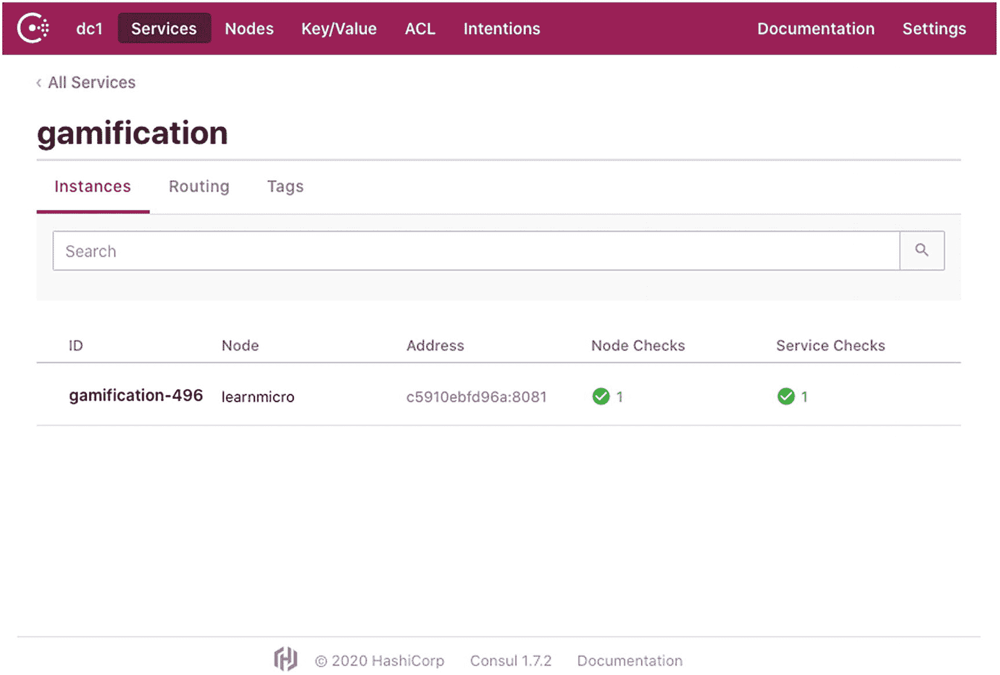

图 8-41

consular ui:dock container address(停靠容器地址)

一旦容器变成绿色，我们就可以用浏览器导航到`localhost:3000`并开始玩我们的应用。它的工作原理和以前一样。当我们解决一个挑战时，我们会在日志中看到事件是如何被游戏化消耗的，游戏化会增加分数和徽章。前端通过网关访问，这是唯一向主机公开的微服务。见图 [8-42](#Fig42) 。

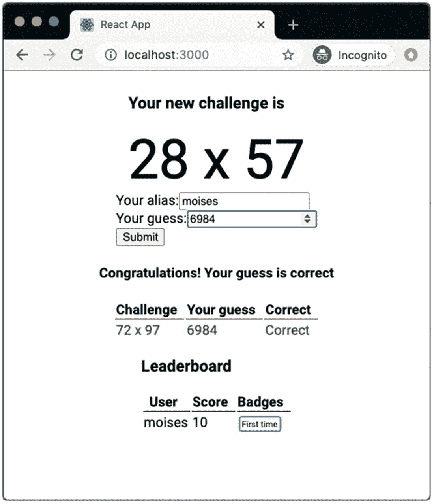

图 8-42

Docker 上运行的应用

我们没有添加任何持久性，所以当我们关闭容器时，所有的数据都将消失。如果您想扩展 Docker 和 Docker Compose 的知识，可以考虑添加*卷*来存储 DB 文件(参见 [`https://tpd.io/compose-volumes`](https://tpd.io/compose-volumes) )。此外，在执行`docker-compose down`时，不要忘记移除`-v`标志，这样卷在两次执行之间被保留。

### 使用 Docker 扩展系统

使用 Docker Compose，我们还可以通过一个命令来扩展和缩减服务。首先，让我们像以前一样启动系统。如果您已经关闭了它，请执行以下命令:

```java
docker$ docker-compose up

```

然后，从一个不同的终端，我们再次运行带有`scale`参数的命令，指示服务名和我们想要获得的实例数量。我们可以在一个命令中多次使用该参数。

```java
docker$ docker-compose up --scale multiplication=2 --scale gamification=2

```

现在，检查这个新终端的日志，看看 Docker Compose 如何为`multiplication`和`gamification`服务启动一个额外的实例。你也可以在 Consul 中验证这一点。见图 [8-43](#Fig43) 。

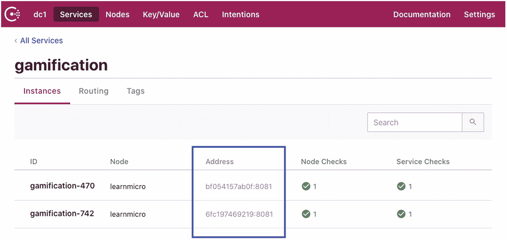

图 8-43

咨询 UI:游戏化的两个容器

感谢 Consul Discovery、我们的网关模式、Spring Cloud 负载平衡器和 RabbitMQ 消费者的负载平衡，我们将再次让我们的系统在多个实例之间正确地平衡负载。您可以通过解决一些来自 UI 的问题或者直接执行一些对网关服务的 HTTP 调用来验证这一点。如果您选择终端选项，您可以多次运行这个 HTTPie 命令:

```java
$ http POST :8000/attempts factorA=15 factorB=20 userAlias=test-docker-containers guess=300

```

在日志中，您将看到`multiplication_1`和`multiplication_2`如何处理来自 API 的请求。同样的情况也发生在`gamification_1`和`gamification_2`上，它们也从代理的队列中获取不同的消息。见清单 [8-70](#PC93) 。

```java
multiplication_1   | 2020-07-30 09:48:34.559  INFO [,85acf6d095516f55,956486d186a612dd,true] 1 --- [nio-8080-exec-8] m.b.m.c.ChallengeAttemptController       : Received new attempt from test-docker-containers
logs_1             | [multiplication ] [85acf6d095516f55,31829523bbc1d6ea] INFO  09:48:34.559 [http-nio-8080-exec-8] m.b.m.c.ChallengeAttemptController - Received new attempt from test-docker-containers
gamification_1     | 2020-07-30 09:48:34.570  INFO [,85acf6d095516f55,44508dd6f09c83ba,true] 1 --- [ntContainer#0-1] m.b.gamification.game.GameEventHandler   : Challenge Solved Event received: 7
gamification_1     | 2020-07-30 09:48:34.572  INFO [,85acf6d095516f55,44508dd6f09c83ba,true] 1 --- [ntContainer#0-1] m.b.gamification.game

.GameServiceImpl    : User test-docker-containers scored 10 points for attempt id 7
logs_1             | [gamification   ] [85acf6d095516f55,8bdd9b6febc1eda8] INFO  09:48:34.570 [org.springframework.amqp.rabbit.RabbitListenerEndpointContainer#0-1] m.b.g.game.GameEventHandler - Challenge Solved Event received: 7
logs_1             | [gamification   ] [85acf6d095516f55,247a930d09b3b7e5] INFO  09:48:34.572 [org.springframework.amqp.rabbit.RabbitListenerEndpointContainer#0-1] m.b.g.game.GameServiceImpl - User test-docker-containers scored 10 points for attempt id 7
multiplication_2   | 2020-07-30 09:48:35.332  INFO [,fa0177a130683114,f2c2809dd9a6bc44,true] 1 --- [nio-8080-exec-1] m.b.m.c.ChallengeAttemptController       : Received new attempt from test-docker-containers
logs_1             | [multiplication ] [fa0177a130683114,f5b7991f5b1518a6] INFO  09:48:35.332 [http-nio-8080-exec-1] m.b.m.c.ChallengeAttemptController - Received new attempt from test-docker-containers
gamification_2     | 2020-07-30 09:48:35.344  INFO [,fa0177a130683114,298af219a0741f96,true] 1 --- [ntContainer#0-1] m.b.gamification.game.GameEventHandler   : Challenge Solved Event received: 7
gamification_2     | 2020-07-30 09:48:35.358  INFO [,fa0177a130683114,298af219a0741f96,true] 1 --- [ntContainer#0-1] m.b.gamification.game.GameServiceImpl    : User test-docker-containers scored 10 points for attempt id 7
logs_1             | [gamification   ] [fa0177a130683114,2b9ce6cab6366dfb] INFO  09:48:35.344 [org.springframework.amqp.rabbit.RabbitListenerEndpointContainer#0-1] m.b.g.game.GameEventHandler - Challenge Solved Event received: 7
logs_1             | [gamification   ] [fa0177a130683114,536fbc8035a2e3a2] INFO  09:48:35.358 [org.springframework.amqp.rabbit.RabbitListenerEndpointContainer#0-1] m.b.g.game.GameServiceImpl - User test-docker-containers scored 10 points for attempt id 7

Listing 8-70Scalability in Action with Docker Containers

```

### 共享 Docker 图像

到目前为止，我们构建的所有图像都存储在本地机器中。这无助于我们实现“一次构建，随处部署”的战略目标。然而，我们很亲密。

我们已经知道 Docker Hub，这是一个公共注册中心，我们从这里下载了 RabbitMQ 和 Consul 的官方映像，以及我们的微服务的基础映像。因此，如果我们上传自己的图片，每个人都可以看到。如果你同意的话，你可以在`hub.docker.com`创建一个免费账户，然后开始上传(用 Docker 的术语来说就是*推送*)你的自定义图片。如果你想限制对你的图像的访问，他们还提供建立私有存储库的计划，托管在他们的云中。实际上，Docker Hub 并不是你存储 Docker 图片的唯一选择。您也可以按照“部署注册服务器”页面上的说明( [`https://tpd.io/own-registry`](https://tpd.io/own-registry) )部署自己的注册中心，或者选择不同云供应商提供的在线解决方案之一，如亚马逊的 ECR 或谷歌云的容器注册中心。

在 Docker 注册表中，您可以使用标签保存图像的多个版本。例如，我们的 Spring Boot 映像从`pom.xml`文件中获得了版本号，因此它们获得了由初始化器创建的默认版本(例如`multiplication:0.0.1-SNAPSHOT`)。我们可以在 Maven 中保留我们的版本控制策略，但是我们也可以使用`docker tag`命令手动设置标签。此外，我们可以使用多个标签来引用同一个 Docker 图像。一种常见的做法是给 Docker 图像添加标签`latest`,以指向注册表中图像的最新版本。作为 Docker 图像版本控制的示例，请参见领事图像的可用标签列表( [`https://tpd.io/consul-tags`](https://tpd.io/consul-tags) )。

为了将 Docker 的命令行工具与注册表连接起来，我们使用了`docker login`命令。如果我们想连接到私有主机，我们必须添加主机地址。否则，如果我们连接到集线器，我们可以使用普通命令。参见清单 [8-71](#PC94) 。

```java
$ docker login
Login with your Docker ID to push and pull images from Docker Hub. If you don't have a Docker ID, head over to https://hub.docker.com to create one.
Username: [your username]
Password: [your password]
Login Succeeded

Listing 8-71Logging In to Docker Hub

```

登录后，您可以将图像推送至注册表。请记住，要使它工作，您必须用您的用户名作为前缀来标记它们，因为这是 Docker Hub 的命名约定。让我们按照预期的模式更改其中一个图像的名称。此外，我们将修改版本标识符为`0.0.1`。在这个例子中，注册的用户名是`learnmicro`。

```java
$ docker tag multiplication:0.0.1-SNAPSHOT learnmicro/multiplication:0.0.1

```

现在，您可以使用`docker push`命令将这个映像推送到注册表中。参见清单 [8-72](#PC96) 中的示例。

```java
$ docker push learnmicro/multiplication:0.0.1

  The push refers to repository [docker.io/learnmicro/multiplication]
  abf6a2c86136: Pushed
  9474e9c2336c: Pushing [================================>                  ]  37.97MB/58.48MB
  9474e9c2336c: Pushing [========>                                          ]  10.44MB/58.48MB
  5cd38b221a5e: Pushed
  d12f80e4be7c: Pushed
  c789281314b6: Pushed
  2611af6e99a7: Pushing [==================================================>]   7.23MB
  02a647e64beb: Pushed
  1ca774f177fc: Pushed
  9474e9c2336c: Pushing [=================================>                 ]  39.05MB/58.48MB
  8713409436f4: Pushing [===>                                               ]  10.55MB/154.9MB
  8713409436f4: Pushing [===>                                               ]  11.67MB/154.9MB
  7fbc81c9d125: Waiting
  8713409436f4: Pushing [====>                                              ]  12.78MB/154.9MB
  9474e9c2336c: Pushed
  6c918f7851dc: Pushed
  8682f9a74649: Pushed
  d3a6da143c91: Pushed
  83f4287e1f04: Pushed
  7ef368776582: Pushed
  0.0.1: digest: sha256:ef9bbed14b5e349f1ab05cffff92e60a8a99e01c412341a3232fcd93aeeccfdc size: 4716

Listing 8-72Pushing an Image to the Public Registry, the Docker Hub

```

从这一刻起，任何能够访问注册表的人都可以提取我们的图像，并将其用作一个容器。如果我们像示例中那样使用 hub 的公共注册中心，图像就可以公开使用了。如果你很好奇，你可以通过访问 Docker Hub 的链接( [`https://hub.docker.com/r/learnmicro/multiplication`](https://hub.docker.com/r/learnmicro/multiplication) )来验证这张图片是否真的在线。见图 [8-44](#Fig44) 。

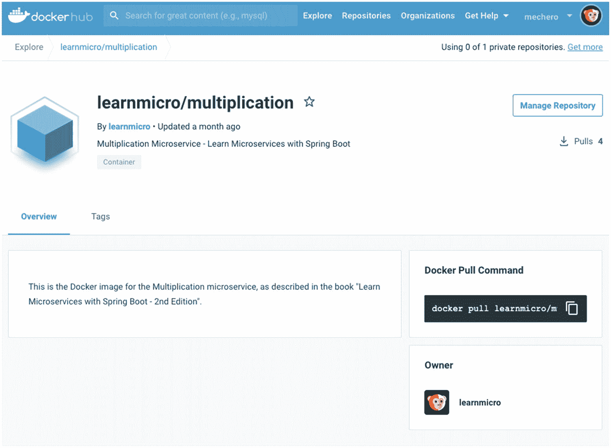

图 8-44

坞站中心中的乘法坞站图像

实际上，我们之前描述的所有 Docker 图像都已经在我的帐户下的公共注册表中可用，前缀为`learnmicro/`。所有这些第一个版本都被标记为`0.0.1`。这使得任何 Docker 用户无需构建任何东西就可以获得完整系统的版本并运行。他们只需要使用我们在清单 [8-68](#PC88) 中使用的同一个`docker-compose.yml`文件的一个版本，图像名称替换为指向公共注册表中的现有图像。所需的更改见清单 [8-73](#PC97) 。

```java
version: "3"

services:
  frontend:
    image: learnmicro/challenges-frontend:0.0.1
    # ...
  multiplication:
    image: learnmicro/multiplication:0.0.1
    # ...
  gamification:
    image: learnmicro/gamification:0.0.1
    # ...
  gateway:
    image: learnmicro/gateway:0.0.1
    # ...
  logs:
    image: learnmicro/logs:0.0.1
    # ...
  consul-importer:
    image: learnmicro/consul-importer:0.0.1
    # ...
  consul-dev:
    # same as before
  rabbitmq-dev:
    # same as before

networks:
  # ...

Listing 8-73Changing the docker-compose.yml File to Use Publicly Available Images

```

我们实现了这一部分的目标。部署我们的应用变得很容易，因为唯一的必要条件是有 Docker 支持。这为我们提供了很多可能性，因为大多数管理和编排分布式系统的平台都支持 Docker 容器部署。在下一部分，我们将学习一些关于*平台*的基础知识。

## 平台和云原生微服务

在这一章中，我们讨论了一些模式，这些模式是正确的微服务架构的基础:路由、服务发现、负载平衡、健康报告、集中日志记录、集中配置、分布式跟踪和容器化。

如果我们花一点时间来分析我们系统中的组件，我们会意识到支持三个主要功能部分变得多么复杂:Web UI 和多元化和游戏化后端域。即使我们为许多这些模式采用了流行的实现，我们仍然必须配置它们，甚至部署一些额外的组件，以使我们的系统工作。

此外，我们还没有涉及*聚类策略*。如果我们在一台机器上部署所有的应用，那么出现问题的风险很高。理想情况下，我们希望复制组件，并将它们分布在多个物理服务器上。幸运的是，我们有工具来管理和协调服务器集群中的不同组件，无论是在您自己的硬件中还是在云中。最流行的替代方法工作在容器级或应用级，我们将分别描述它们。

### 集装箱平台

首先，让我们关注像 Kubernetes、Apache Mesos 或 Docker Swarm 这样的容器平台。在这些平台中，我们要么直接部署容器，要么使用包装结构，为特定工具提供额外的配置。例如，Kubernetes 中的一个部署单元是一个 *pod* ，它的定义(为了简单起见，一个*部署*)可以定义一个要部署的 Docker 容器列表(通常只有一个)和一些额外的参数来设置分配的资源，将 pod 连接到网络，或者添加外部配置和存储。

此外，这些平台通常集成了我们应该已经熟悉的模式。同样，让我们以 Kubernetes 为例，因为它是最受欢迎的选项之一。该列表从较高的角度介绍了它的一些特性:

*   *跨构成集群的多个节点的容器编排*。当我们在 Kubernetes (pod)中部署一个工作单元时，平台决定在哪里实例化它。如果整个节点死亡或者我们正常地关闭它，Kubernetes 会根据我们对并发实例的配置，找到另一个地方来放置这个工作单元。

*   *路由* : Kubernetes 使用*入口控制器*，允许我们将流量路由到部署的服务。

*   *负载平衡*:Kubernetes 中的所有 pod 实例通常被配置为使用相同的 DNS 地址。然后，有一个名为 *kube-proxy* 的组件负责平衡各 pod 之间的负载。其他服务只需要调用一个通用的 DNS 别名，例如`multiplication.myk8scluster.io`。这是一种服务器端发现和负载平衡策略，适用于每个服务器组件。

*   *自我修复* : Kubernetes 使用 HTTP 探针来确定服务是否有效和就绪。如果它们不是，我们可以配置它来清除那些*僵尸*实例，并启动新的实例来满足我们的冗余配置。

*   *联网*:与 Docker Compose 类似，Kubernetes 使用暴露的端口，并提供我们可以配置的不同网络拓扑。

*   *集中配置*:容器平台提供了像 *ConfigMaps* 这样的解决方案，所以我们可以将配置层从应用中分离出来，因此可以根据环境进行更改。

除此之外，Kubernetes 在安全性、集群管理和分布式存储管理等方面还有其他内置功能。

因此，我们可以在 Kubernetes 中部署我们的系统，并从所有这些特性中受益。此外，我们可以去掉我们构建的一些模式，将这些责任留给 Kubernetes。

知道如何配置和管理 Kubernetes 集群的人可能永远不会建议您像我们使用 Docker Compose 那样部署裸容器；相反，他们会直接从 Kubernetes 设置开始。然而，容器编排平台引入的额外复杂性永远不应该被低估。如果我们非常了解工具，我们肯定可以快速地建立并运行我们的系统。否则，我们将不得不钻研大量带有自定义 YAML 语法定义的文档。

无论如何，我建议您学习这些容器平台中的一个是如何工作的，并尝试在那里部署我们的系统以进入实际方面。它们在许多组织中很受欢迎，因为它们从应用中抽象出了所有的基础结构层。开发人员可以专注于从编码到构建容器的过程，基础设施团队可以专注于管理不同环境中的 Kubernetes 集群。

### 应用平台

现在，让我们来介绍一种不同类型的平台:应用运行时平台。这些提供了更高层次的抽象。基本上，我们可以编写自己的代码，构建一个`.jar`文件，然后将它直接推送到一个环境中，使其随时可供使用。应用平台负责其他一切:将应用容器化(如果需要)，在集群节点上运行它，提供负载平衡和路由，保护访问等。这些平台甚至可以聚合日志，并提供其他工具，如消息代理和数据库即服务。

在这个层面上，我们可以找到类似 Heroku 或者 CloudFoundry 这样的解决方案。我们可以选择在自己的服务器中管理这些平台，但最受欢迎的选择是云提供的解决方案。原因是我们可以在几分钟内将我们的产品或服务投入使用，而无需考虑许多模式实现或基础设施方面。

### 云提供商

为了完成平台和工具的景观，我们不得不提到云解决方案，如 AWS，Google，Azure，OpenShift 等。其中许多还为我们在本章中涉及的模式提供了实现:网关、服务发现、集中式日志、容器化等。

此外，他们通常也提供托管 Kubernetes 服务。这意味着，如果我们喜欢在容器平台级别工作，我们可以不需要手动设置这个平台。当然，这意味着除了我们使用的云资源(机器实例、存储等)之外，我们还必须为这项服务付费。).

请参见图 [8-45](#Fig45) 中的第一个示例，了解我们如何在云提供商中部署像我们这样的系统。在第一种情况下，我们选择只为一些低级服务付费，比如存储和虚拟机，但是我们安装了自己的 Kubernetes、数据库和 Docker 注册表。这意味着我们避免支付额外的托管服务，但我们必须自己维护所有这些工具。

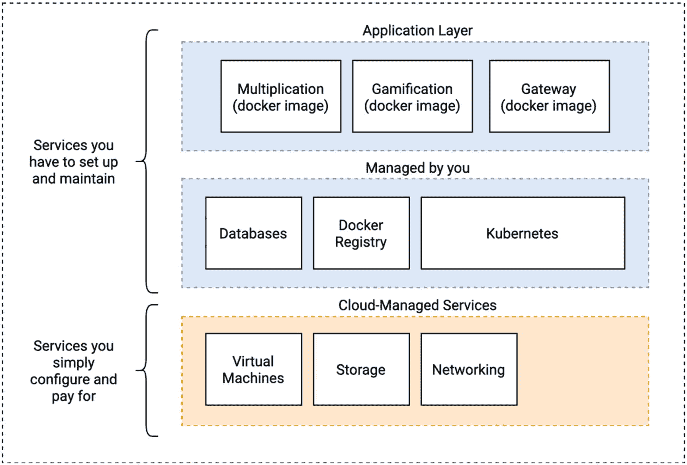

图 8-45

使用云提供商:示例 1

现在检查图 [8-46](#Fig46) 中的替代设置。在第二种情况下，我们可以使用云提供商提供的一些额外的托管服务:Kubernetes、网关、Docker 注册表等。例如，在 AWS 中，我们可以使用一个名为 Amazon API Gateway 的网关即服务解决方案将流量直接路由到我们的容器，或者我们也可以选择一个带有自己的路由实现的 Amazon Elastic Kubernetes 服务。在任何一种情况下，我们都避免了以支付更多的云计算服务为代价来实现这些模式和维护这些工具。然而，请考虑到，从长远来看，您可能会通过这种方法节省资金，因为如果您决定采用这种方法，您需要有人来维护所有的工具。

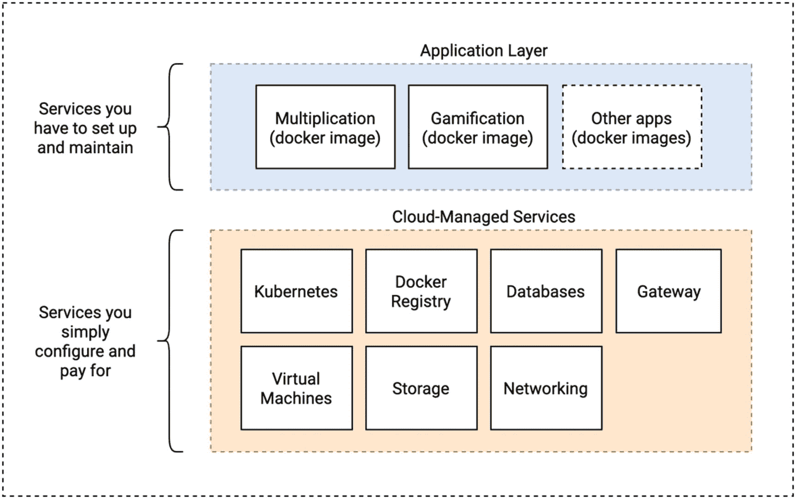

图 8-46

使用云提供商:示例 2

### 做决定

鉴于有大量的选择，我们应该针对我们的具体情况分析每个抽象层次的利弊。可以想象，高层次的抽象比我们自己在较低层次构建解决方案更昂贵。另一方面，如果我们选择最便宜的选项，我们可能会花更多的钱来设置、维护和改进它。此外，如果我们计划将我们的系统部署到云中，我们应该比较每个供应商的成本，因为可能会有很大的差异。

通常，一个好主意是使用高级解决方案开始一个项目，这转化为托管服务和/或应用平台。它们可能更贵，更难定制，但你可以更快地试用你的产品或服务。然后，如果项目进展顺利，如果在成本方面值得的话，您可以决定获得这些服务的所有权。

### 云原生微服务

无论我们选择什么选项来部署我们的微服务，我们知道我们应该尊重一些良好的实践，以确保它们在云中正常工作(嗯，理想情况下，在任何环境中):数据层隔离、无状态逻辑、可伸缩性、弹性、简单日志记录等。当我们在本书中学习新的主题时，我们已经考虑了所有这些方面。

我们遵循的许多模式通常包含在云原生微服务的不同定义中。因此，我们可以在应用上贴上这个标签。

然而，术语*云原生的*太过雄心勃勃，在我看来有时会令人困惑。它被用来包装软件开发的多个方面的一系列术语和技术:微服务、事件驱动、持续部署、基础设施即代码、自动化、容器、云解决方案等。

云原生作为应用的广泛分类的问题是，它可能会导致人们认为他们需要所有包含的模式和方法来实现预期的目标。微服务？当然，这是新标准。事件驱动？为什么不呢？基础设施作为代码？去吧。看起来只有当我们能勾选所有的框，我们才能说我们做的是云原生应用。所有这些模式和技术都有好处，但是您的服务或产品需要所有这些吗？也许不是。您可以构建一个结构良好的整体，用它制作一个容器，并在几分钟内将其部署到云中。最重要的是，你可以自动化所有的过程来建造整块石头，并把它投入生产。那是云原生的纳米石吗？您在任何地方都找不到这个定义，但这并不意味着它不是适合您的特定情况的解决方案。

## 结论

这一章引导我们经历了一次微服务模式和工具的奇妙之旅。在每一部分中，我们分析了当前实施所面临的问题。然后，我们了解了众所周知的模式，这些模式可以解决这些挑战，同时也有助于使我们的系统具有可伸缩性、弹性、更易于分析和部署等特性。

对于这些模式中的大多数，我们选择了可以很容易地与 Spring Boot 集成的解决方案，因为这是我们实际案例的选择。例如，它的自动配置特性帮助我们快速建立了与作为服务发现注册中心和集中配置服务器的 Consul 的连接。尽管如此，这些模式适用于许多不同的编程语言和框架来构建微服务，因此您可以重用所有学到的概念。

我们的微服务架构变得成熟，一切都开始协同工作:网关将流量透明地路由到我们的微服务的多个实例，这些实例可以根据我们的需求动态分配。所有的日志输出都被传送到一个中心位置，在那里我们还可以看到每个进程的完整轨迹。

我们还使用 Docker 引入了容器化，这有助于准备我们的服务，以便轻松地部署到多个环境中。此外，我们了解了诸如 Kubernetes 和基于云的服务这样的容器平台如何帮助实现我们的非功能性需求:可伸缩性、弹性等。

在这一点上，你可能会问自己，如果有更简单的方法通过容器和应用平台或云中的托管服务来实现相同的结果，我们为什么要花几乎一整章(很长的一章)来了解所有这些常见的微服务模式。原因很简单:您需要知道模式是如何工作的，以便完全理解您正在应用的解决方案。如果您直接从完整的平台或云解决方案开始，您只能获得特定于供应商的高级视图。

通过本章，我们最终完成了在第 [6](6.html) 章开始的微服务架构的实施。当时，我们决定停止在小块中包含额外的逻辑，并为游戏化领域创建一个新的微服务。这三章帮助我们理解了迁移到微服务的原因，如何正确地隔离和沟通它们，以及如果我们想要项目成功，我们应该考虑哪些模式。

**章节成就:**

*   您了解了如何使用网关将流量路由到您的微服务，并在它们的实例之间提供负载平衡。

*   您使用服务发现、HTTP 负载平衡器和 RabbitMQ 队列扩展了微服务架构。

*   您通过检查每个实例的健康状况来发现它们何时不工作，从而使系统具有弹性。此外，您引入了重试来避免丢失请求。

*   您看到了如何使用外部配置服务器覆盖每个环境的配置。

*   您实现了跨微服务分布式跟踪的集中式日志，因此您可以轻松地从头到尾跟踪一个流程。

*   您将我们的微服务架构中的所有模式与 Spring Cloud 家族的项目相集成:Spring Cloud Gateway、Spring Cloud Load Balancer、Spring Cloud Consul(发现和配置)和 Spring Cloud Sleuth。

*   您了解了如何使用 Spring Boot 2.3 和云原生构建包为我们的应用创建 Docker 映像。

*   您看到了 Docker 和 Compose 如何帮助我们在任何地方部署微服务架构。此外，您看到了使用 Docker 创建新实例是多么容易。

*   您将我们在书中遵循的方法与其他替代方法(如容器平台和应用平台)进行了比较，这些替代方法已经包含了一些分布式架构所需的模式。

*   您已经理解了为什么我们在本章的每一步中都引入了新的模式和工具。**