# 一、Hibernate OGM 入门

您可能熟悉 Hibernate ORM，这是一个强大、健壮的工具，用于在关系数据库(RDBMS)和面向对象编程语言之间转换数据。作为一个对象关系映射(ORM)框架，Hibernate ORM 使用 SQL 存储。然而，近年来，开发人员对 NoSQL 数据库产生了兴趣，这种数据库为存储和检索大量数据进行了优化。NoSQL 数据库往往是非关系的、开源的、可水平伸缩的、分布式的和无模式的。

描述 NoSQL 商店有多种方式，但它们通常按数据模型分类，尤其是以下方式:

*   文档存储(Mongo DB、RavenDB、CouchDB 等等)
*   宽列商店(Hypertable、Cassandra、HBase 等)
*   key value/元组 stores (DynamoDB、LevelDB、Redis、Ryak 等)
*   图形数据库(Neo4J、GraphBase、InfoGrid 等等)

这些也很常见:

*   多模式数据库(OrientDB、ArangoDB 等)
*   对象数据库(db4o、Versant 等等)
*   网格和云数据库(GigaSpaces、Infinispan 等等)
*   XML 数据库(eXist、Sedna 等等)

显然，NoSQL 的商店非常复杂多样。一些网站拥有庞大的用户群，而另一些则鲜为人知。每一种都有自己的优点和缺点。你甚至可以说，NoSQL 是一个非常有争议的话题，程序员谈论它的时间比他们实际使用它的时间还要多。

然而，随着最近发布的 Hibernate OGM(对象网格映射器)项目，这种情况可能会改变，该项目提供了一个完整的 Java 持久性 API (JPA)引擎，用于在 NoSQL 商店中存储数据。这个项目给了寻求利用 NoSQL 商店的 Java 开发人员一个真正的推动，因为它提供了一个公共接口——众所周知的 JPA 编程模型——作为各种 NoSQL 方法的前端。Hibernate OGM 基于 Hibernate ORM 核心引擎，重用 Java 持久性查询语言(JP-QL)作为查询存储数据的接口，并且已经提供了对三个 NoSQL 商店的支持:MongoDB、Ehcache 和 Infinispan，Apache Cassandra 将来应该会得到支持。尽管这个项目还很年轻，Hibernate OGM 团队的目标保证了它在未来有巨大的潜力——以及大量的工作要完成。

特点和期望

在撰写本书时，最新的 Hibernate OGM 发行版是 4.0.0 Beta2，它已经成功地为不同的 NoSQL 方法提供了一个通用的接口；快速扩大或缩小数据存储；独立于底层存储技术；和Hibernate搜索。以下是 Hibernate OGM 目前支持的内容:

*   在文档存储中存储数据(MongoDB)
*   将数据存储在键/值存储中(Infinispan 的数据网格和 Ehcache)
*   JPA 实体的创建、读取、更新和删除(CRUD)操作
*   多态实体(支持超类、子类等等)
*   可嵌入的对象(例如，可嵌入的类，在 JPA 中用`@Embeddable`注释；可嵌入类的实例集合，在 JPA 中用`@ElementCollection`注释
*   基本类型(如数字、`String`、`URL`、`Date`、枚举)
*   联想(`@ManyToOne`、`@OneToOne`、`@OneToMany`和`@ManyToMany`)
*   双向关联
*   集合(`Set`、`List`、`Map`等)
*   Hibernate 搜索的全文查询
*   JPA 和原生 Hibernate ORM API (Hibernate OGM 可以通过 JPA 或 Hibernate Session 引导，我将在第 3 章向您展示。)

将来，Hibernate OGM 将支持:

*   其他键/值对系统
*   其他 NoSQL 发动机
*   声明性反规格化
*   复杂的 JP-QL 查询，包括一对多连接和聚合
*   前置现有的 JPA 应用

 **注意**反规格化是一种加速读取过程的数据库技术。其思想是尽可能减少查询中的连接数量；连接降低了读取性能，因为必须从多个表中提取数据，而不能破坏它们之间的关联。虽然规范化促进了将相关数据拆分到多个关联的表中，但是反规范化鼓励添加少量冗余来限制连接。即使一些数据被复制，性能通常也会提高。

Hibernate OGM 体系结构〔t0〕

因为 Hibernate OGM 尽可能地使用现有的 Hibernate ORM 模块，所以 OGM 架构本质上是通过插入和拔出不同的组件来扩展 ORM 架构。Hibernate ORM 使用一组接口和类在关系数据库和面向对象编程语言之间转换和保存数据。其中包括 JDBC 层，用于连接数据库和发送查询， *Persister* s 和 *Loader* s 接口，负责持久化和加载实体和集合，如图[图 1-1](#Fig1) 所示。

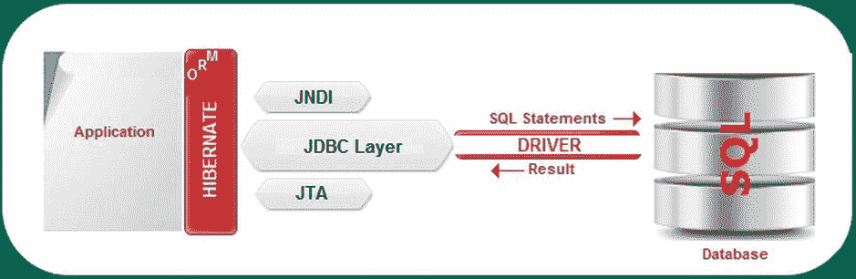

[图 1-1](#_Fig1) 。Hibernate ORM 架构

Hibernate OGM 旨在实现相同的目标，但是使用 NoSQL 商店。因此，Hibernate OGM 不再需要 JDBC 层，取而代之的是两个新元素:一个*数据存储提供者*和一个*数据存储方言*，如图[图 1-2](#Fig2) 所示。这两者都充当 Hibernate OGM Core 和 NoSQL 商店之间的适配器。(一个*数据存储库*是一个适配器，它将核心映射引擎与特定的 NoSQL 技术连接起来。)

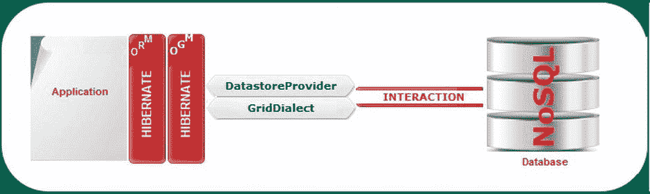

[图 1-2](#_Fig2) 。Hibernate OGM 数据存储提供者和数据存储方言

数据存储提供者负责管理到 NoSQL 存储的连接，而数据存储方言管理与 NoSQL 存储引擎的通信。实际上，这些概念体现在两个接口中，`org.hibernate.ogm.datastore.spi.DatastoreProvider`和`org.hibernate.ogm.dialect.GridDialect`。`DatastoreProvider`接口负责启动、维护和停止商店连接，而`GridDialect`接口处理 NoSQL 商店中的数据持久性。此外，`Persisters`和`Loaders`界面被重新编写以支持 NoSQL 商店的功能。

目前有四个`DatastoreProvider`的实现:

*   `EhcacheDatastoreProvider`(对于 NoSQL Encache)
*   `InfinispanDatastoreProvider`(适用于 NoSQL Infinispan)
*   `MongoDBDatastoreProvider`(适用于 NoSQL MongoDB)
*   `MapDatastoreProvider`(用于测试目的)

从特定的网格实现中抽象 Hibernate OGM 有五种实现方式:

*   `EhcacheDialect`(用于 EhCache)
*   `InfinispanDialect`(对于 Infinispan)
*   `MongoDBDialect`(用于 MongoDB)
*   `HashMapDialect`(用于测试)
*   `GridDialectLogger`(用于记录在真实方言上执行的呼叫)

 **注意**如果你决定写一个新的数据存储，你必须实现一个`DatastoreProvider`和一个`GridDialect`。在`https://community.jboss.org/wiki/HowToWriteADatastoreInHibernateOGM`可以找到更多细节。

持久数据

通过修改后的`Loader` s 和T1】s 接口，Hibernate OGM 能够将数据保存到 NoSQL 商店。但是，在这样做之前，OGM 需要在内部表示和存储数据。为此，Hibernate OGM 尽可能多地保留了关系数据库的概念，并根据自己的需要修改这些概念。一些概念，比如存储实体，完全遵循关系模型，而另一些概念，比如存储关联，部分遵循关系模型。因此，数据存储为基本类型(实体存储为元组)；仍然使用*主键*和*外键* 的概念；应用数据模型和商店数据模型的关系是通过像*表*和*列*这样的概念来抽象维护的。

OGM 使用*元组* 来表示数据的基本单位。元组意味着在概念上将实体存储为一个`Map<String, Object>`。关键字是列名(实体属性/字段或`@Column`注释值)，值是作为原始类型的列值(见[图 1-3](#Fig3) )。

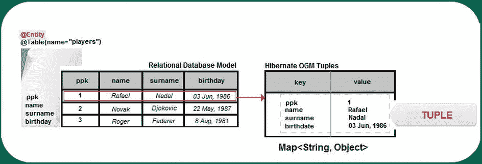

[图 1-3](#_Fig3) 。Hibernate OGM 元组

每个元组代表一个实体实例，存储在一个特定的键中。实体实例通过由表名、主键列名和主键列值组成的特定键查找来标识。参见[图 1-4](#Fig4) 。

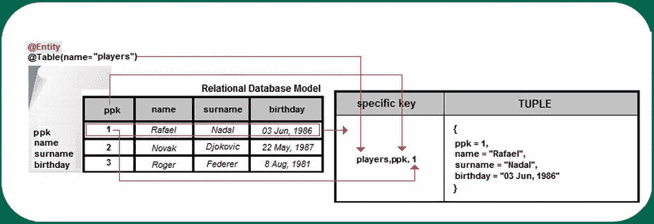

[图 1-4](#_Fig4) 。存储实体实例的 Hibernate OGM

 **注意** Java 集合被表示为一个元组列表。特定键由包含集合的表名、代表外键的列名和列值组成。

[图 1-5](#Fig5) 显示了多对多关联的关系数据库模型。

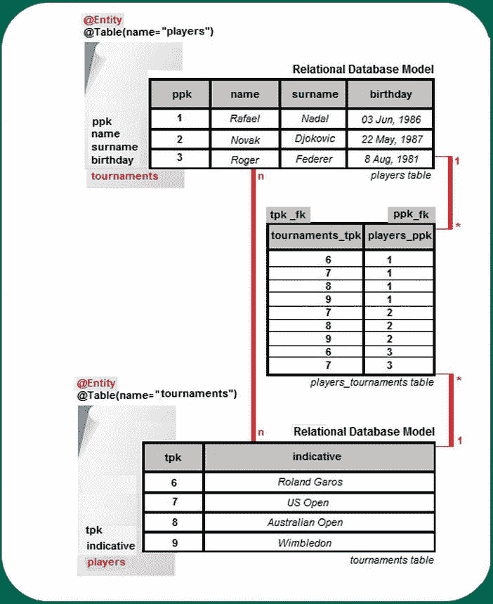

[图 1-5](#_Fig5) 。多对多关联的关系数据库模型

相比之下，Hibernate OGM 中的关联存储为类型为`Map<String, Object>`的元组集。例如，对于多对多关联，每个元组存储一对外键。Hibernate OGM 将从一个实体导航到其关联所必需的信息存储在一个特定的键中，该键由表名、列名和值组成，这些值表示我们所来自的实体的外键。这个`@ManyToMany`关联由 Hibernate OGM 内部存储，如图 [图 1-6](#Fig6) 所示。(您可以看到从第 8 行开始的关联元组。)这种方法通过键查找来促进可达数据，但是它有缺点:数据可能是冗余的，因为必须为关联双方存储信息。

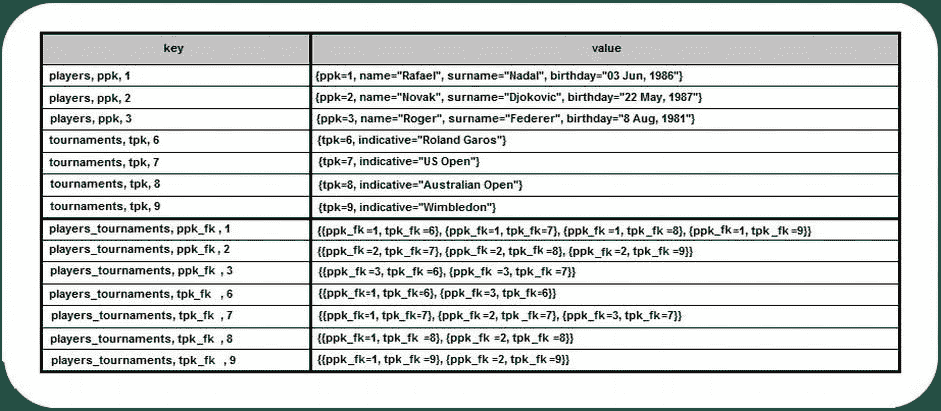

[图 1-6](#_Fig6) 。多对多关系的 Hibernate OGM 数据网格

Hibernate OGM 将 JPA 实体存储为元组，而不是可序列化的 blobs。这更接近于关系模型。序列化实体有几个缺点:

*   与其他实体相关联的实体也必须被存储，这很可能导致一个大图。
*   很难保证重复对象之间的对象同一性甚至一致性。
*   很难添加或删除一个属性或包含一个超类并处理反序列化问题。

 **注意** Hibernate OGM 将种子(当标识符需要种子时)存储在值中，该值的键由表示段的表名、列名和列值组成。

显然，这种表现并不是所有 NoSQL 商场都有的。例如，对于面向文档的商店 MongoDB 来说，情况就不同了。在这种情况下，使用`GridDialect`，它的主要任务是将这个表示转换成 NoSQL 商店的预期表示。对于 MongoDB，`MongoDBDialect`将其转换成 MongoDB 文档。

 **注意**由于 NoSQL 商店不知道*模式*的概念，Hibernate OGM 元组不绑定到模式。

查询数据

当然，Hibernate OGM 需要提供一个强大的查询数据引擎，在撰写本文时，根据查询的性质和 NoSQL 查询支持，这可以通过多种不同的方式实现。

CRUD 操作是 Hibernate ORM 引擎的责任，它们遵循一个简单的过程。独立于 JPA 或 Hibernate 原生 API，Hibernate ORM 将持久性和加载查询委托给 OGM 引擎，OGM 引擎将 CRUD 操作委托给`DatastoreProvider` / `GridDialect`，后者与 NoSQL 存储交互。[图 1-7](#Fig7) 描述了这个过程。

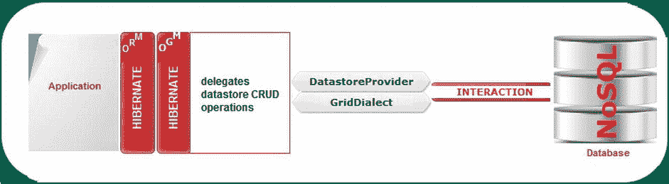

[图 1-7](#_Fig7) 。Hibernate OGM 和 CRUD 操作

因为 Hibernate OGM 想要提供整个 JPA，所以它需要支持 JP-QL 查询。这意味着复杂的查询引擎(QE)应该对特定的 NoSQL 商店查询能力和 JP-QL 查询的复杂性敏感。最乐观的例子是具有查询功能和简单的 JP-QL 查询的 NoSQL。在这种情况下，查询被委托给特定于 NoSQL 的查询翻译器，结果由 Hibernate OGM 管理，以组成特定的对象(参见图 1-8 )。

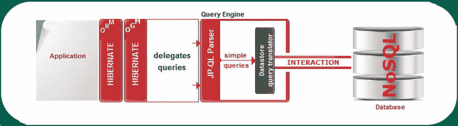

[图 1-8](#_Fig8) 。Hibernate OGM 和 JP-QL 简单查询(支持查询的 NoSQL)

当 NoSQL 商店不支持当前查询时，情况就不那么乐观了。在这种情况下，JBoss Teiid 数据虚拟化系统介入，将 JP-QL 查询拆分成可以由数据存储执行的简单查询。(更多信息见`www.jboss.org/teiid`)。Teiid 也对结果进行处理，得到最终的查询结果，如图[图 1-9](#Fig9) 所示。

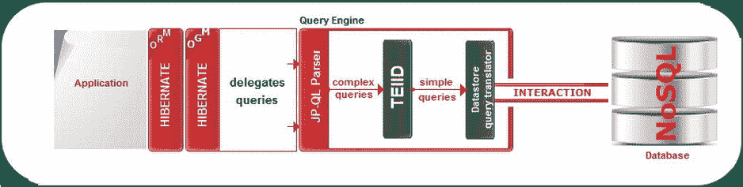

[图 1-9](#_Fig9) 。Hibernate OGM 和 JP-QL 复杂查询

最糟糕的情况是 NoSQL 商店很少或没有查询支持。由于这是一个棘手的案例，它需要重炮，就像 Hibernate Search，一个基于 Hibernate Core 和 Apache Lucene 的企业全文搜索工具。基本上，Hibernate 搜索索引引擎从 Hibernate ORM 核心接收事件，并保持实体索引过程最新，而 JP-QL 查询解析器将查询翻译委托给 Hibernate 搜索查询引擎(对于简单查询)或 Teiid(对于中级到复杂查询)，并使用 Lucene 索引执行它们(参见[图 1-10](#Fig10) )。此外，Hibernate Search 还提供了集群支持和面向对象的抽象，其中包括查询领域特定语言(DSL)。

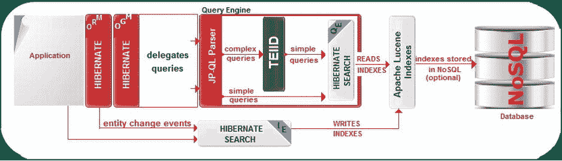

[图 1-10](#_Fig10) 。Hibernate OGM 和 JP-QL 查询(很少或没有 NoSQL 支持)

获取 Hibernate OGM 发行版

在撰写本文时，Hibernate OGM 发行版是 4.0.0.Beta2。获得完整文档、源代码和依赖项的最佳方式是访问`www.hibernate.org/subprojects/ogm.html`并下载相应的 ZIP/TGZ 归档文件。

不幸的是，这并不像看起来那么简单。由于本书的重点是 Hibernate OGM 和 MongoDB，所以您需要找到专门用于“连接”OGM 和 MongoDB 的 jar:`hibernate-ogm-mongodb-``x``.jar`和`mongo-java-driver-` `x` `.jar`。(MongoDB 对大多数编程语言都有客户端支持；这是 MongoDB 团队开发的 MongoDB Java 驱动，Hibernate OGM 用来和 MongoDB 交互)。在 Hibernate OGM 版本 4.0.0.Beta1 中，你会在`\hibernate-ogm-4.0.0.Beta1\dist\lib\mongodb`文件夹中找到这些 jar:`hibernate-ogm-mongodb-4.0.0.Beta1.jar`和`mongo-java-driver-2.8.0.jar`。在 Hibernate OGM 版本 4.0.0.Beta2 中，缺少了`\mongodb`文件夹，所以新的 jar 没有被打包。

这意味着您仍然可以在 Hibernate OGM 4.0.0.Beta2 中使用`hibernate-ogm-mongodb-4.0.0.Beta1.jar`和`mongo-java-driver-2.8.0.jar`，或者您可以编译 Hibernate OGM 4.0.0.Beta2 的源代码来获得最新的快照。要编译代码，请访问`www.sourceforge.net/projects/hibernate/files/hibernate-ogm/4.0.0.Beta2/`。我已经编译好代码，获得了 MongoDB JAR，命名为`hibernate-ogm-mongodb-4.0.0-SNAPSHOT`。

如果你看一下[图 1-11](#Fig11) 中显示的 Hibernate OGM 变更日志，你会看到 Hibernate OGM 4.0.0.Beta2 已经升级到支持 MongoDB Java Driver 2.9。`x`。这意味着如果您决定编译代码并使用 MongoDB 概要文件的结果快照，您也可以添加一个 2.9。`x` MongoDB Java 驱动，而不是 2.8。`x`。

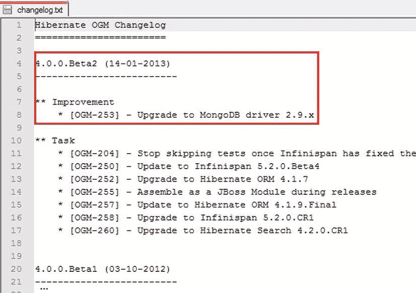

[图 1-11](#_Fig11) 。Hibernate OGM 更改日志

对于这本书，我选择使用 Hibernate OGM 4.0.0.Beta2 和 Hibernate OGM for MongoDB 4 . 0 . 0 . beta 1。

从 Maven 中央存储库获取 Hibernate OGM

也可以从 Maven 中央存储库 ( `www.search.maven.org/`)下载 Hibernate OGM。搜索“hibernate ogm”，将会返回您在[图 1-12](#Fig12) 中看到的内容。

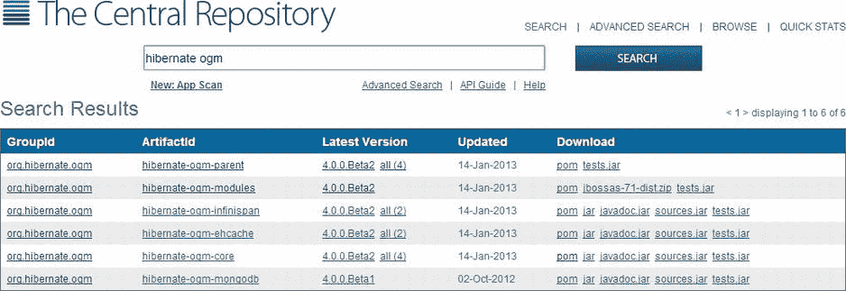

[图 1-12](#_Fig12) 。Maven 中央存储库中列出的 Hibernate OGM 发行版

如您所见，下载 Hibernate OGM 核心和概要文件非常容易，包括 MongoDB 概要文件。您可以下载 jar 或 POMs(项目对象模型)文件。

从 Maven 命令行获取 Hibernate OGM

Hibernate OGM 也可以从 Apache Maven 命令行 获得。显然，Maven 必须在您的计算机上安装和配置。首先，您必须修改您的`settings.xml`文档，它存储在 Maven 本地存储库`.m2`文件夹中(默认位置)。对于 Unix/Mac OS X 用户，这个文件夹应该是`∼/.m2`；对于 Windows 用户来说是`C:\Documents and Settings\{your username}\.m2 or C:\Users\{your username}\.m2`。如果`settings.xml`文件不存在，你应该在这个文件夹中创建它，如[清单 1-1](#list1) 所示。(如果您已经有了这个文件，只需相应地修改它的内容。)

 **注意**如果创建或修改`settings.xml`因为太冗长而显得太复杂，你可以简单地在你的`pom.xml`中使用`<repository>`和`<dependency>`标签。

[***清单 1-1。***T5】settings . XML](#_list1)

```java
<?xml version="1.0" encoding="UTF-8"?>

<settings FontName2">http://maven.apache.org/SETTINGS/1.0.0 " xmlns:xsi=" http://www.w3.org/2001/XMLSchema-instance "
          xsi:schemaLocation=" http://maven.apache.org/SETTINGS/1.0.0
                                             http://maven.apache.org/xsd/settings-1.0.0.xsd ">
 <!-- jboss.org config start -->
 <profiles>
    <profile>
      <id>jboss-public-repository</id>
      <repositories>
        <repository>
          <id>jboss-public-repository-group</id>
          <name>JBoss Public Maven Repository Group</name>
          <url> https://repository.jboss.org/nexus/content/groups/public-jboss/</url >
          <layout>default</layout>
          <releases>
            <enabled>true</enabled>
            <updatePolicy>never</updatePolicy>
          </releases>
          <snapshots>
            <enabled>true</enabled>
            <updatePolicy>never</updatePolicy>
          </snapshots>
        </repository>
      </repositories>
      <pluginRepositories>
        <pluginRepository>
          <id>jboss-public-repository-group</id>
          <name>JBoss Public Maven Repository Group</name>
          <url> https://repository.jboss.org/nexus/content/groups/public-jboss/</url >
          <layout>default</layout>
          <releases>
            <enabled>true</enabled>
            <updatePolicy>never</updatePolicy>
          </releases>
          <snapshots>
            <enabled>true</enabled>
            <updatePolicy>never</updatePolicy>
          </snapshots>
        </pluginRepository>
      </pluginRepositories>
    </profile>
    <profile>
      <id>jboss-deprecated-repository</id>
      <repositories>
        <repository>
          <id>jboss-deprecated-repository</id>
          <name>JBoss Deprecated Maven Repository</name>
          <url> https://repository.jboss.org/nexus/content/repositories/deprecated/</url >
          <layout>default</layout>
          <releases>
            <enabled>true</enabled>
            <updatePolicy>never</updatePolicy>
          </releases>
          <snapshots>
            <enabled>false</enabled>
            <updatePolicy>never</updatePolicy>
          </snapshots>
        </repository>
      </repositories>
    </profile>
    <!-- jboss.org config end -->
  </profiles>

  <!-- jboss.org config start -->
  <activeProfiles>
    <activeProfile>jboss-public-repository</activeProfile>
  </activeProfiles>
  <!-- jboss.org config end -->
</settings>
```

 **注意**你可以通过在`settings.xml`中添加标签`localRepository`来修改 Maven 本地库的默认位置，比如:`<localRepository>` `new_repository_path` `</localRepository>`。

接下来，你需要创建一个`pom.xml`文件。显然，这个文件的内容取决于您想从 Hibernate OGM 存储库中获得什么。例如，[清单 1-2](#list2) 中的`pom.xml`将下载 Hibernate OGM 核心发行版(包括依赖项)并将其本地存储在`D:/Hibernate_OGM`中(您也可以使用默认的`./m2`文件夹，但这样会更清晰、更容易导航)。

[***清单 1-2。***T5】POM . XML](#_list2)

```java
<project FontName2">http://maven.apache.org/POM/4.0.0 "
             xmlns:xsi=" http://www.w3.org/2001/XMLSchema-instance "
             xsi:schemaLocation=" http://maven.apache.org/POM/4.0.0 http://maven.apache.org/xsd/maven-4.0.0.xsd ">
    <modelVersion>4.0.0</modelVersion>
    <groupId>maven.hibernate.ogm</groupId>
    <artifactId>Maven_HOGM</artifactId>
    <version>1.0-SNAPSHOT</version>
    <packaging>pom</packaging>
    <name>Maven_HOGM</name>
    <dependencies>
        <dependency>
            <groupId>org.hibernate.ogm</groupId>
            <artifactId>hibernate-ogm-core</artifactId>
            <version>4.0.0.Beta2</version>
        </dependency>
    </dependencies>
    <build>
       <directory>D:/Hibernate_OGM</directory>
       <defaultGoal>dependency:copy-dependencies</defaultGoal>
    </build>
</project>
```

最后一步是执行 Maven `mvn`命令。为此，打开命令提示符，导航到包含`pom.xml`文件的文件夹，运行`mvn`命令(参见[图 1-13](#Fig13) )。几秒钟后，您应该在`pom.xml`文件指定的路径中找到 Hibernate OGM 二进制文件(包括依赖项)。

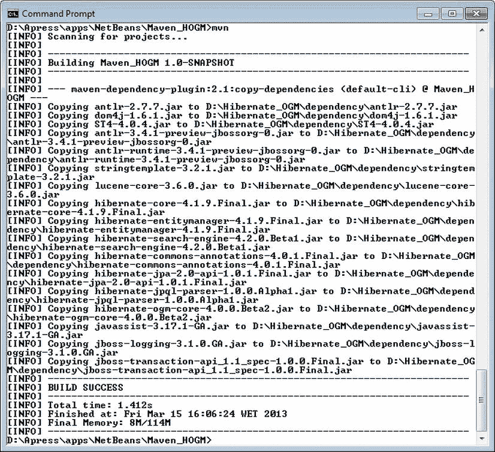

[图 1-13](#_Fig13) 。运行 mvn 命令

添加 MongoDB 工件

现在您知道了如何获得 Hibernate OGM 4.0.0.Beta2 核心(和依赖项)，但是没有任何 NoSQL 数据存储构件。目前，您可以为以下 NoSQL 商店添加工件: Ehcache、Infinispan 和 MongoDB。因为我们的重点是 Hibernate OGM 和 MongoDB，所以您需要通过将以下依赖项放入`pom.xml`文件来添加 MongoDB 工件:

```java
...
<dependency>
   <groupId>org.hibernate.ogm</groupId>
   <artifactId>hibernate-ogm-mongodb</artifactId>
   <version>4.0.0.Beta1</version>
 </dependency>
...
```

 **注意**对于 Infinispan，只需用`hibernate-ogm-infinispan`替换工件 id，对于 Ehcache 用`hibernate-ogm-ehcache`。

现在，再次运行`mvn`命令将增加两个罐子，`hibernate-ogm-mongodb-4.0.0.Beta1.jar`和`mongo-java-driver-2.8.0.jar`，如图[图 1-14](#Fig14) 所示。MongoDB 驱动程序也可以作为 jar 在`www.mongodb.org/display/DOCS/Drivers`地址下载。

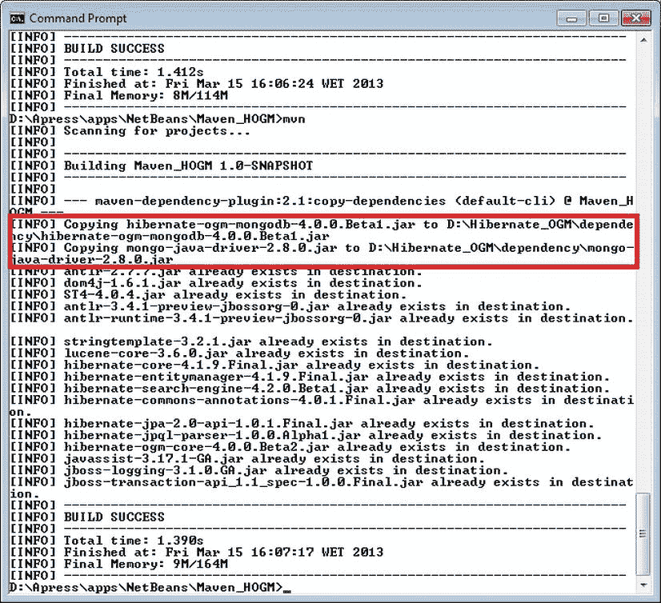

[图 1-14](#_Fig14) 。添加 MongoDB 工件后运行 mvn 命令

使用 NetBeans IDE 获得 Hibernate OGM 发行版

如果您是 NetBeans 的粉丝，从 NetBeans Maven 项目中使用 Maven 会简单得多。本节描述了创建这样一个项目的主要步骤，以获得作为 NetBeans 库的 Hibernate OGM 发行版，以便在其他项目中使用。启动 NetBeans(我在 NetBeans 7.2.1 上进行了测试),并遵循以下步骤:

1.  From the `File` menu, select the `New Project` option. In the `New Project` wizard, select `Maven` in the `Categories` list and `POM Project` in the `Projects` list, as shown in [Figure 1-15](#Fig15).

    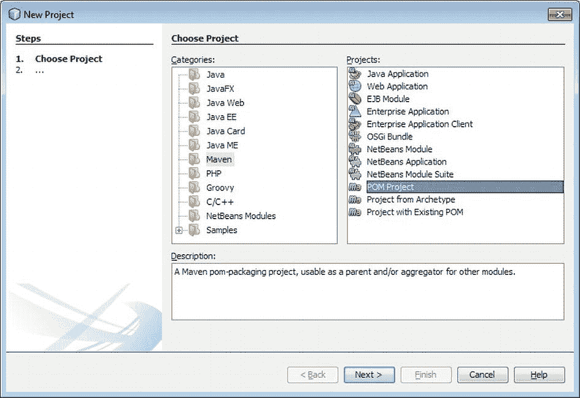

    [图 1-15](#_Fig15) 。使用 NetBeans 7 创建 POM 项目

     **注意**如果您的 NetBeans 发行版中没有 Maven，您可以按照`http://wiki.netbeans.org/InstallingAPlugin`中关于第三方插件安装的教程来安装它。

2.  Type the project name (`Maven_HOGM`), select the project location (`D:\Apress\apps\NetBeans`), type the group id (`maven.hibernate.ogm`) and the version (`1.0-SNAPSHOT`) and click `Finish` as shown in [Figure 1-16](#Fig16). (Note that I’ve used example names and locations here. Feel free to choose your own.) The empty project will be created and listed under the `Projects` panel.

    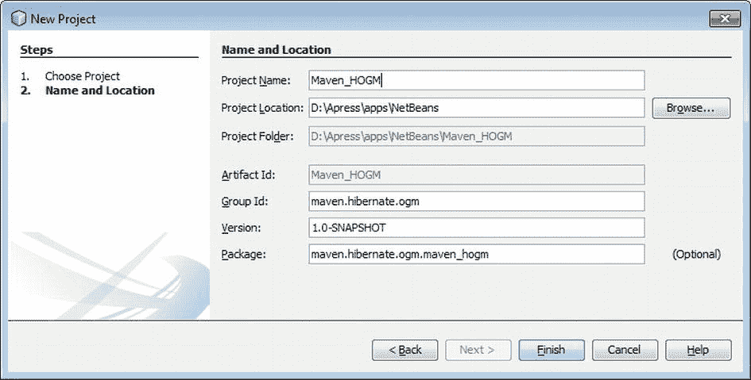

    [图 1-16](#_Fig16) 。设置项目名称和位置

3.  Expand the `Maven_HOGM | Project Files` node and locate `pom.xml` and `settings.xml`. If `settings.xml` isn’t listed, right-click on the `Project Files` node, select `Create settings.xml` (as shown in [Figure 1-17](#Fig17)), and fill the file with the appropriate content.

    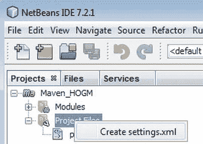

    [图 1-17](#_Fig17) 。从 NetBeans 7 创建 settings.xml 文件

4.  根据需要编辑`pom.xml`。此时，两个文件都应该准备好被 Maven 处理了。
5.  右键单击`Maven-HOGM`节点并选择`Clean and Build`。等到任务成功结束，然后展开`Maven_OGM | Dependencies`节点查看下载的 jar。
6.  Now you can create a NetBeans library. (I recommend that you create this library because the applications developed with NetBeans, in later chapters, refer to it.) From the NetBeans main menu, select `Tools | Ant Libraries`. In the `Ant Library Manager, click the New Library button`, provide a name for the library`, such as Hibernate OGM Core and MongoDB, and click `OK`. Next, click on the `Add JAR/Folder` button and navigate to the JARs (if you followed my example path, you’ll find them in `D:\Hibernate_OGM\`dependency, as shown in [Figure 1-18](#Fig18)). Select all of the JARs and add them to this library. Click `OK` to finish creating the library.

    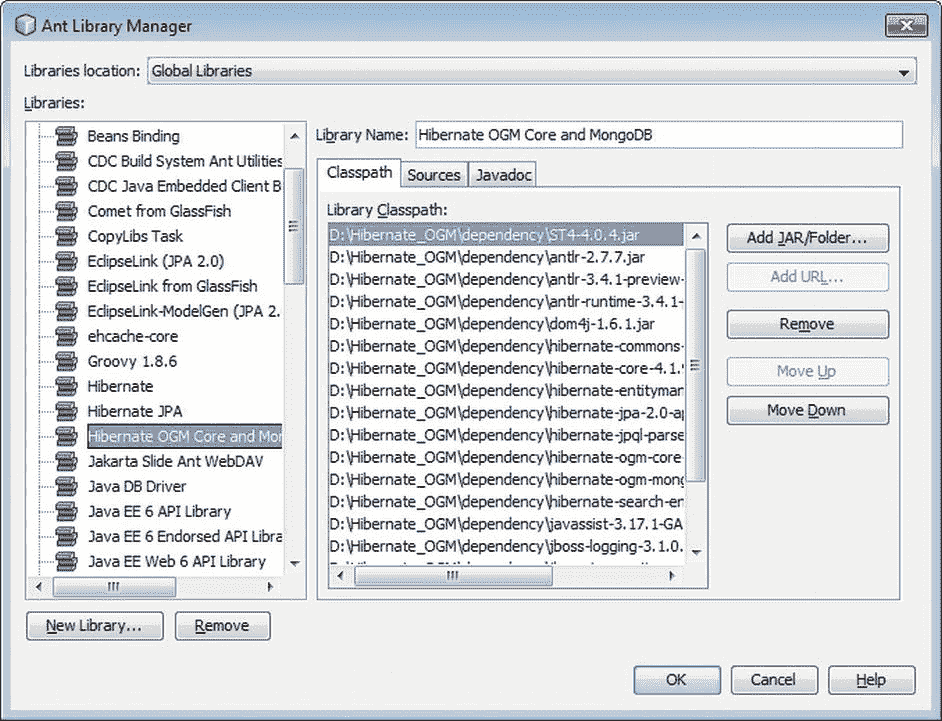

    [图 1-18](#_Fig18) 。为 Hibernate OGM 和 MongoDB 创建用户库` 

 `现在，通过将 Hibernate OGM Core/Hibernate OGM Core 和 MongoDB 库添加到您的项目库中，您可以轻松地将 Hibernate OGM/MongoDB 发行版集成到您的任何 NetBeans 项目中。

完整的应用可以在 Apress 库中找到。这是一个名为 Maven_HOGM 的 NetBeans 项目。

使用 Eclipse IDE 获得 Hibernate OGM 发行版

如果你是一个 Eclipse 粉丝，从 Eclipse Maven 项目中使用 Maven 要简单得多。本节描述了创建这样一个项目的主要步骤，以获得作为 Eclipse 库的 Hibernate OGM 发行版，以便在其他项目中使用。因此，启动 Eclipse(我们在 Eclipse JUNO 上进行了测试),并遵循以下步骤:

1.  From the `File` menu, select `New | Other`. In the `New` wizard, expand the `Maven` node and select `Maven Project`as shown in [Figure 1-19](#Fig19). Click `Next`.

    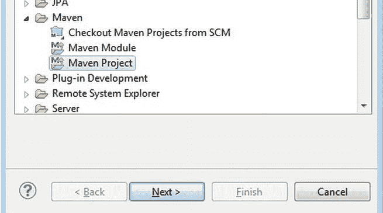

    [图 1-19](#_Fig19) 。用 Eclipse JUNO 创建一个新的 Maven 项目

    如果您的 Eclipse 发行版中没有 Maven，您可以下载一个独立的 Maven 发行版并从`Window | Preferences | Maven | Installations`安装它，或者您可以从`Eclipse Marketplace`安装 Maven for Eclipse，您可以在`Help`菜单中找到它。一旦你在市场中找到 Maven，按照向导完成安装(参见[图 1-20](#Fig20) )。

    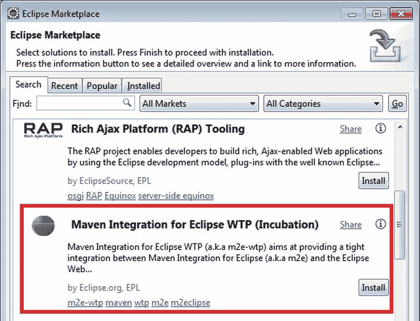

    [图 1-20](#_Fig20) 。用 Eclipse JUNO 创建一个新的 Maven 项目

2.  勾选标有`Create a simple project (skip archetype selection)`的方框。可以选择默认工作区，点击`Next`。
3.  键入组 id ( `maven.hibernate.ogm`)和工件 id ( `Maven_HOGM`)。点击`Finish`按钮，等待项目成功创建并在`Package Explorer`面板中列出。
4.  在 maven 本地存储库中手动更新或创建`settings.xml`文件。
5.  在`Maven_HOGM`项目中找到`pom.xml`并双击它。
6.  Next, in the editor, switch to the `pom.xml` tab where you’ll see a `pom.xm`l skeleton. Add to it the missing parts from your `pom.xml` and save the project (see [Figure 1-21](#Fig21)).

    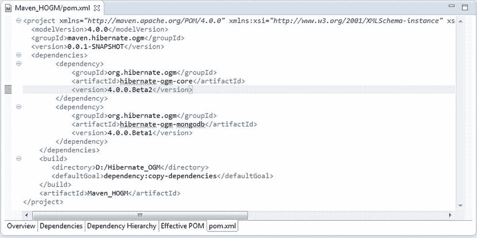

    [图 1-21](#_Fig21) 。在 Eclipse JUNO 中编辑 pom.xml 文件

7.  在`Package Explorer`面板中，右击项目名称并选择`Run As | Maven build`。当流程成功结束时，您应该会在由`pom.xml`中的`<directory>`标签定义的路径下看到 Hibernate OGM 发行版(包括依赖项)。
8.  在`Window`菜单中选择`Preferences`。在左边的树中，展开`Java | Build Path`节点，选择`User Libraries`。
9.  点击`New`按钮创建一个新的库。为新库键入一个名称，比如 Hibernate OGM Core 和 MongoDB，然后单击`OK`。
10.  单击`Add External JARs`按钮，导航到下载 Hibernate OGM 发行版的文件夹。选择所有的 jar 并将它们添加到库中。点击`OK`。

现在，通过将 Hibernate OGM Core/Hibernate OGM Core 和 MongoDB 库添加到您的项目构建路径中，您可以轻松地将 Hibernate OGM/MongoDB 发行版集成到您的任何 Eclipse 项目中。

 **注意**如果您更喜欢用 Maven 创建整个项目，只需相应地添加 Hibernate OGM 依赖项。你所要做的就是添加相应的`<repository>`和`<dependency>`标签。

完整的应用可以在 Apress 库中找到。这是一个名为 Maven_HOGM 的 Eclipse 项目。

获取 MongoDB 发行版

在写这本书的时候，推荐的 MongoDB 发行版是版本 2.2.2(我选择这个版本是因为它是 Hibernate OGM 和 OpenShift 的“首选”)。您可以在官方网站`http://www.mongodb.org/`轻松下载。您将在`http://docs.mongodb.org/manual/installation/`找到安装步骤。本书中的示例是在 64 位版本的 Windows 7 和 8 下开发和测试的，安装非常简单。

下载并安装 MongoDB 发行版后，您就可以看到 MongoDB 服务器是否启动并响应命令了。打开命令提示符，导航到`{MONGODB_HOME}/bin`文件夹并键入`mongod --dbpath ../`命令来启动服务器(`--dbpath`选项指示您按照安装指南在`{MONGODB_HOME}`文件夹中手动创建的`/data/db`文件夹的位置)。如果没有错误，打开另一个命令提示符，导航到同一个文件夹，然后键入`mongo`。如果你看到类似于图 1-22 所示的东西，那么 MongoDB 已经成功安装了。

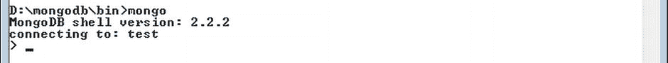

[图 1-22](#_Fig22) 。检查 MongoDB 服务器可用性

要进行更彻底的测试，请尝试`http://docs.mongodb.org/manual/tutorial/getting-started/`的入门教程中的命令。按下`CTRL-C`就可以轻松关闭 MongoDB 服务器。

摘要

在这一介绍性章节中，我们迈出了理解和使用 Hibernate OGM 的第一步。我们研究了 Hibernate OGM 的概念、特性和目标，并简要概述了 Hibernate OGM 的架构。(如果你想理解下一章，知道事情是如何在内部管理是很重要的)。

然后，您看到了如何获得作为 ZIP/TGZ、命令行 Maven 项目和基于 NetBeans/Eclipse Maven 的项目的 Hibernate OGM 发行版。最后，您学习了如何安装 MongoDB 发行版，以及如何将相应的 jar 添加到 Hibernate OGM 发行版中。`