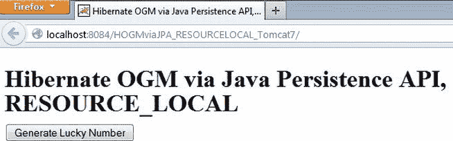

# 四、实际场景中的Hibernate OGM

到目前为止，您已经了解了 Hibernate OGM 可以通过 Java 持久性 API 或 Hibernate 本机 API 来使用。此外，您了解了实现 Hibernate OGM 引导的原理，并且已经查看了一些相关的代码片段。显然，从这些代码片段跳到真正的应用需要的不仅仅是复制和粘贴，因为您必须处理集成过程以及每个环境的特定特性和设置。

试图给出一个完全符合每个程序员需求的例子是不可救药的，但是我能做的是提供一系列使用 Hibernate OGM 的例子。在本章中，我将向您展示一些现成的 Hibernate OGM 应用，它们可以部署在 Java EE 6 服务器(如 JBoss 和 GlassFish)和 Web 服务器(如 Tomcat)上，使用 Seam 和 Spring 等框架以及 EJB 等规范。除了直接与 Hibernate OGM 交互的内核技术之外，我们还将使用一些开发工具，如 NetBeans 和 Eclipse 等 ide，以及 Maven、JBoss Forge、Ant 等，它们帮助我们以最少的工作量构建应用。把这些工具看作是我的选择，而不是必须的。您可以使用产生相同结果的任何其他工具。

整套应用共享一些简单的业务逻辑，在 MongoDB 集合中存储一个随机整数——我们称这个整数为幸运数字。正如您将看到的，存储的整数甚至不是用户请求的；它是在用户按下按钮时随机生成的(每次按下按钮都会生成并存储一个新的整数)。这个琐碎的业务逻辑的要点是尽可能保持应用代码简单，并关注 Hibernate OGM 与上下文的集成。我们真正关心的是成功地将 Hibernate OGM 绑定到应用上下文，并设置与 MongoDB 的交互。在后面的章节中，我们将有足够的时间来讨论 MongoDB 的高级设置、存储原则、JP-QL、Hibernate 搜索等等。

一般先决条件

在我们开始之前，确保您已经正确安装了 MongoDB(正如您在[第 1 章](01.html)中看到的)，并且您有可用的 Hibernate OGM JARs，包括 MongoDB 支持所需的 jar(本地或通过 Maven 工件)。其余的工具，比如应用服务器、框架、ide 等等，可以根据你的需求单独安装；你可能不会对下面所有的例子感兴趣。在任何情况下，为了测试本章中完整的应用套件，您将需要以下内容:

*   Java EE 6
*   JDK 1.7
*   GlassFish AS 3(与 NetBeans 7.2.1 或 7.3 捆绑在一起)
*   JBoss AS 7(应单独安装)
*   Apache Tomcat 7(与 NetBeans 7.2.1 或 7.3 捆绑在一起)
*   NetBeans 7.2.1 或 7.3(建议与 GlassFish AS 3 和 Tomcat 7 一起使用)
*   Eclipse JUNO (JBoss AS 7 可以通过 JBoss AS 工具在这个 Eclipse 发行版下进行配置)
*   MongoDB 2.2.2(你应该从第一章的[开始安装)](01.html)
*   Hibernate OGM 4.0.0.Beta2(来自[第 1 章](01.html)，你应该有一个名为 Hibernate OGM Core 和 MongoDB 的 NetBeans 和 Eclipse 库)
*   MongoDB Java 驱动程序 2.8.0(这存在于 Hibernate OGM 核心和 MongoDB 库中)
*   JBoss JTA 4.16.4 最终版本
*   Forge 1.0.5 或 1.3.1(独立或作为 Eclipse 插件运行)
*   Spring 3.3.1(与 NetBeans 7.2.1 或 7.3 捆绑在一起)

此外，在您开始之前，您可能会发现了解以下内容会有所帮助:

*   本章介绍的每个应用都可以从 Apress 资源库下载。每个应用都有一小段描述应用名称和测试的技术条件。换句话说，你没有必要在阅读这本书的时候重新构建每一个应用，除非你想这么做。
*   这些示例向您展示了如何在涉及多种技术的不同类型的应用中集成 MongoDB 和 Hibernate OGM。如您所知，这样的应用需要许多附加文件——XML 配置文件、XHTML 页面、servlets、托管 beans、控制器等等。我试图保持代码尽可能的干净，以便更容易理解如何集成 MongoDB 和 Hibernate OGM，所以我跳过了不相关的“意大利面条”代码。此外，我不会试图教您如何创建 servlet、会话 bean 或 XHTML 页面，或者如何编写 web.xml 文件。我假设您已经知道如何使用 NetBeans、Eclipse 或其他 IDE。不要期望看到循序渐进的 NetBeans 或 Eclipse 教程。

 **注意**对于作为 Apache Maven 项目开发的应用，不要忘记编辑`settings.xml`，就像你在[第 1 章](01.html)中看到的那样。或者，如果你认为`settings.xml`太冗长，你可以简单地在你的`pom.xml`中使用`<repository>`标签。但是请记住，缺少存储库会导致错误。

Java SE 和 MongoDB——Hello World 示例

我们将以一个例外开始我们的应用系列:第一个应用不涉及 Hibernate OGM。这个应用实际上只是一个快速测试，以确保 MongoDB 服务器正在运行并对连接尝试做出响应。考虑一下我们面向 Java-MongoDB 新手的 Hello World 应用。如果你认为这是浪费你的时间，你可以跳过它。要不，我们走吧！

这是有史以来最简单的 Java SE/MongoDB 示例——它只是将一个随机数存储到 MongoDB 集合中。

先决条件

*   MongoDB 2.2.2
*   MongoDB Java 驱动程序 2 . 8 . 0(mongo-Java-driver-2 . 8 . 0 . jar)
*   JDK 1.7
*   NetBeans 7.2.1(或 Eclipse JUNO)

发展中的

启动 NetBeans 后，创建一个由简单的 Maven Java 应用组成的新项目，并将其命名为`HelloWorld`。在`New Java Application`向导中，为`Artifact Id`键入`HelloWorld`，为`Group Id`和`Package`键入`hello.world.mongodb`。一旦您看到项目列在`Projects`窗口中，编辑`pom.xml`文件(它必须在`Project Files`节点下)。在`pom.xml`文件中，通过粘贴以下代码添加 MongoDB Java 驱动程序版本 2.8.0:

```java
<dependencies>
   <dependency>
      <groupId>org.mongodb</groupId>
      <artifactId>mongo-java-driver</artifactId>
      <version>2.8.0</version>
</dependency>
..
<dependencies>
```

现在保存项目，驱动程序 JAR 将列在`Dependencies`节点下。

 **注意**如果你不是 Maven 迷，创建一个简单的 Java 应用，从 GitHub 下载 MongoDB Java 驱动 2.8.0，`https://github.com/mongodb/mongo-java-driver/downloads`。显然，在这种情况下，你必须手动将其添加到`Libraries`节点。

现在必要的库已经可用了。接下来，编辑应用的主类。如果你没有重命名它，它会被列为`hello.world.mongodb.helloworld`包的`Source Packages`节点中的`App.java`。在`main`方法下，逐步插入以下代码:

1.  在默认端口 270127

    ```java
    Mongo mongo = new Mongo("127.0.0.1", 27017);
    ```

    上连接到本地主机(127.0.0.1)上的 MongoDB 存储
2.  创建一个名为`helloworld_db`的 MongoDB 数据库。这个数据库很可能是由 MongoDB 自动创建的，因为它并不存在。

    ```java
    DB db = mongo.getDB("helloworld_db");
    ```

3.  创建一个名为`helloworld`的 MongoDB 集合。这个集合可能会由 MongoDB 在`helloworld_db`数据库中自动创建，因为它并不存在。

    ```java
    DBCollection dbCollection = db.getCollection("helloworld");
    ```

4.  创建用于存储键/值对的文档。密钥只是文本，值是生成的数字。

    ```java
    BasicDBObject basicDBObject = new BasicDBObject();
     basicDBObject.put("Lucky number", new Random().nextInt(1000));
    ```

5.  将该对保存到`helloworld`集合:

    ```java
    dbCollection.insert(basicDBObject);
    ```

搞定了。

现在，把这五个步骤放在一起。清单 4-1 显示了结果。

[***清单 4-1。***](#_list1)Hello World 举例

```java
package hello.world.mongodb.helloworld;

import com.mongodb.BasicDBObject;
import com.mongodb.DB;
import com.mongodb.DBCollection;
import com.mongodb.Mongo;
import com.mongodb.MongoException;
import java.net.UnknownHostException;
import java.util.Random;

/**
 * Hello world!
 *
 */
public class App {

    public static void main(String[] args) {
        try {
            // connect to the MongoDB store
            Mongo mongo = new Mongo("127.0.0.1", 27017);

            // get the MongoDB database, helloworld_db
            DB db = mongo.getDB("helloworld_db");

            //get the MongoDB collection named helloworld
            DBCollection dbCollection = db.getCollection("helloworld");

            // create a document for storing a key/value pair
            BasicDBObject basicDBObject = new BasicDBObject();
            basicDBObject.put("Lucky number", new Random().nextInt(1000));

            // save the pair into helloworld collection
            dbCollection.insert(basicDBObject);

            System.out.println("MongoDB has stored the lucky number!");

        } catch (UnknownHostException e) {
            System.err.println("ERROR: " + e.getMessage());
        } catch (MongoException e) {
            System.err.println("ERROR: " + e.getMessage());
        }
    }
}
```

测试

按照[第 1 章](01.html)中的方法启动 MongoDB 服务器。接下来，由于您在 NetBeans(或 Eclipse)中，有一个`Run`按钮可以实现这一功能。`Run`应用，如果你得到消息“ *MongoDB 已经存储了幸运数字！*”，一切都完美地进行着。

打开命令提示符，键入图 4-1 所示的命令，查看您的工作结果。


[图 4-1](#_Fig1) 。查看“helloworld”收藏内容

如果您没有获得类似的结果，那么在创建下一个应用之前必须解决一个问题。

完整的 Hello World 应用可以在 Apress 存储库中获得，当然，它被命名为`HelloWorld`。它是一个 NetBeans 项目，在 JDK 1.7 和 MongoDB 2.2.2 下进行了测试。

通过 Hibernate Native API 使 OGM Hibernate

一旦您确认 MongoDB 已经准备好为您的应用提供服务，就该转向 Hibernate OGM 了。在这一节中，我们将使用 Hibernate 本机 API 开发一系列涉及 Hibernate OGM 的应用。以下是我们将开发的应用:

*   在非 JTA 环境中Hibernate OGM(JDBC 事务，Apache Tomcat 7)
*   在独立的 JTA 环境中Hibernate OGM(JBoss JTA，Apache Tomcat 7)
*   在内置的 JTA 环境中Hibernate OGM(没有 EJB，GlassFish AS 3)
*   在内置的 JTA 环境中Hibernate OGM(EJB 3/BMT，GlassFish AS 3)
*   在内置的 JTA 环境中Hibernate OGM(EJB 3/CMT，GlassFish AS 3)

非 JTA 环境中的 hibernate OGM(JDBC 事务，Apache Tomcat 7)

这个应用将通过 Hibernate Native API 在非 JTA 环境中引导 Hibernate OGM。我们将使用旧式的 JDBC 交易，而不是 JTA。实际上，我们将使用 Hibernate 的事务 API 和内置的*每请求会话*功能，而不是直接调用 JDBC API。该应用将部署在 Apache Tomcat 7 web 容器下。

 **注意**当 Hibernate OGM 在非 JTA 环境中使用时，回滚特性不能得到保证。这就是为什么 Hibernate OGM 团队不推荐在 Hibernate OGM 4.0.0.Beta2 发行版中使用这种环境，但是这种情况有望在下一个发行版中变得更加有利。因为我们使用的是不支持事务的 MongoDB，所以这不是我们所关心的。

先决条件

*   MongoDB 2.2.2
*   Hibernate OGM 4.0.0.Beta2
*   JDK 1.7
*   NetBeans 7.2.1(或 Eclipse JUNO)
*   阿帕奇雄猫 7

发展中的

启动 NetBeans 后，创建一个包含一个空 Maven web 应用的新项目，并将其命名为`HOGMviaHNAPI_JDBC_Tomcat7`。在`New Web Application`向导中，为`Group Id`和`Package`字段键入`hogm.hnapi`。不要忘记选择 Apache Tomcat 7 web 服务器来部署这个应用。一旦你看到在`Projects`窗口中列出的项目，编辑`pom.xml`文件(它必须在`Project Files`节点下)。在`pom.xml`文件中，通过粘贴以下依赖项来添加 Hibernate OGM 发行版(包括 MongoDB 支持):

```java
<dependencies>
   <dependency>
      <groupId>org.hibernate.ogm</groupId>
      <artifactId>hibernate-ogm-core</artifactId>
      <version>4.0.0.Beta2</version>
   </dependency>
   <dependency>
      <groupId>org.hibernate.ogm</groupId>
      <artifactId>hibernate-ogm-mongodb</artifactId>
      <version>4.0.0.Beta1</version>
   </dependency>
...
<dependencies>
```

现在保存项目，MongoDB Java 驱动程序 JAR 将列在 Dependencies 节点下。

编写应用代码

现在我们准备添加一些代码。我们从一个简单的 POJO 类开始，它能够表示数据库中的对象。正如你在[清单 4-2](#list2) 中看到的，该类包含一个名为`luckynumber`的字段(除了主键字段)和众所周知的 getter 和 setter 方法。

[***清单 4-2。***T5【幸运数字】Pojo 类](#_list2)

```java
package hogm.hnapi.pojo;

public class LuckyNumberPojo {

    private String id;
    private int luckynumber;

    public String getId() {
        return id;
    }

    public void setId(String id) {
        this.id = id;
    }

    public int getLuckynumber() {
        return luckynumber;
    }

    public void setLuckynumber(int luckynumber) {
        this.luckynumber = luckynumber;
    }
}
```

大多数使用 Hibernate 的应用需要一个名为`HibernateUtil,`的特殊类，它是一个助手类，提供对代码中任何地方的`SessionFactory`的访问。互联网上有很多 Hibernate ORM 的版本，比如“买者自负”演示中的那个。对于 Hibernate OGM，我们可以基于 Hibernate ORM 的最简单版本开发一个`HibernateUtil`，它通常看起来像清单 4-3 中的[所示。您可能对它很熟悉，并且在 Hibernate 3 中使用过多次。](#list3)

[***清单 4-3。***](#_list3) 一个基本的冬眠类用于冬眠 ORM

```java
import org.hibernate.SessionFactory;
import org.hibernate.cfg.Configuration;

public class HibernateUtil {

    private static final SessionFactory sessionFactory;

    static {
        try {
            sessionFactory = new
                             Configuration().configure().buildSessionFactory();
        } catch (Throwable ex) {
            System.err.println("Initial SessionFactory creation failed." + ex);
            throw new ExceptionInInitializerError(ex);
        }
    }

    public static SessionFactory getSessionFactory() {
        return sessionFactory;
    }
}
```

现在，为 Hibernate OGM 开发一个`HibernateUtil`是基于这个源代码的两个主要修改的任务。首先，我们需要实例化用于配置 Hibernate OGM 环境的`OgmConfiguration`类，而不是创建一个`Configuration`类的新实例。其次，从 Hibernate 4 开始，会话工厂必须通过传递给`buildSessionFactory`方法的服务注册中心获得。记住这些，代码可以很容易地转换成 Hibernate OGM 的`HibernateUtil`，如清单 4-4 中的[所示。](#list4)

[***清单 4-4。***](#_list4) 一个 HibernateUtil 类为 Hibernate OGM

```java
package hogm.hnapi.util.with.hibernate.cfg;

import java.util.logging.Level;
import java.util.logging.Logger;
import org.hibernate.SessionFactory;
import org.hibernate.ogm.cfg.OgmConfiguration;
import org.hibernate.service.ServiceRegistry;
import org.hibernate.service.ServiceRegistryBuilder;

public class HibernateUtil {

    private static final Logger log =
            Logger.getLogger(HibernateUtil.class.getName());
    private static final SessionFactory sessionFactory;
    private static final ServiceRegistry serviceRegistry;

    static {
        try {
            // create a new instance of OmgConfiguration
            OgmConfiguration cfgogm = new OgmConfiguration();

            // process configuration and mapping files
            cfgogm.configure();
            // create the SessionFactory
            serviceRegistry = new ServiceRegistryBuilder().
             applySettings(cfgogm.getProperties()).buildServiceRegistry();
            sessionFactory = cfgogm.buildSessionFactory(serviceRegistry);
        } catch (Throwable ex) {
            log.log(Level.SEVERE,
                    "Initial SessionFactory creation failed !", ex);
            throw new ExceptionInInitializerError(ex);
        }
    }

    public static SessionFactory getSessionFactory() {
        return sessionFactory;
    }
}
```

为了从这个`HibernateUtil,`获得有效的会话工厂，我们需要构建 Hibernate 配置文件(`hibernate.cfg.xml`)和相应的映射文件(`*.hbm.xml`)。如您所知，`hibernate.cfg.xml`文件包含了用于调整 Hibernate 环境和数据库连接的主要信息。因为我们处于非 JTA 环境中，并且遵循众所周知的 Hibernate *线程绑定*策略(Hibernate 将当前会话绑定到当前 Java 线程)，所以我们首先设置访问该策略所必需的两个属性:

```java
<property name="hibernate.transaction.factory_class">
          org.hibernate.transaction.JDBCTransactionFactory
</property>
<property name="hibernate.current_session_context_class">
          thread
</property>
```

接下来的五个属性是我们的重中之重，因为它们代表了 MongoDB 配置，所以我们指定了数据存储提供者、方言、要连接的数据库的名称、MongoDB 服务器主机和端口(我们将使用 localhost 和 MongoDB 服务器的默认端口 27017):

```java
<property name="hibernate.ogm.datastore.provider">mongodb</property>
<property name="hibernate.ogm.datastore.grid_dialect">
          org.hibernate.ogm.dialect.mongodb.MongoDBDialect</property>
<property name="hibernate.ogm.mongodb.database">tomcat_db</property>
<property name="hibernate.ogm.mongodb.host">127.0.0.1</property>
<property name="hibernate.ogm.mongodb.port">27017</property>
```

最后，我们添加映射资源，在本例中，它由单个类`LuckyNumberPojo`表示。添加最后一行:

```java
<mapping resource="/LuckyNumberPojo.hbm.xml"/>
```

到`hibernate.cfg.xml`的末尾，得到[中所示的代码，清单 4-5](#list5) 。

[***清单 4-5。***](#_list5) 一个Hibernate配置文件

```java
<?xml version="1.0" encoding="UTF-8"?>
<!DOCTYPE hibernate-configuration PUBLIC "-//Hibernate/Hibernate Configuration DTD 3.0//EN"
"http://www.hibernate.org/dtd/hibernate-configuration-3.0.dtd ">
<hibernate-configuration>
  <session-factory>
    <property name="hibernate.transaction.factory_class">
              org.hibernate.transaction.JDBCTransactionFactory</property>
    <property name="hibernate.current_session_context_class">thread</property>
    <property name="hibernate.ogm.datastore.provider">mongodb</property>
    <property name="hibernate.ogm.datastore.grid_dialect">
              org.hibernate.ogm.dialect.mongodb.MongoDBDialect</property>
    <property name="hibernate.ogm.mongodb.database">tomcat_db</property>
    <property name="hibernate.ogm.mongodb.host">127.0.0.1</property>
    <property name="hibernate.ogm.mongodb.port">27017</property>
    <mapping resource="/LuckyNumberPojo.hbm.xml"/>
  </session-factory>
</hibernate-configuration>
```

当 web 应用启动时，文件`hibernate.cfg.xml`必须位于类路径的根目录中。在一个 Maven 项目中，就像这样，它应该保存在`src/main/resources`目录中(在 NetBeans 中，这个目录可以在`Other Sources`节点中找到)。在非 Maven 应用中，将文件保存在`WEB-INF/classes`目录中。

写作是我们的下一个目标。因为我们有一个普通的 POJO，所以任务很简单。首先，我们将主键字段和生成器描述为 UUID2。(这将生成符合 IETF RFC 4122(变体 2)的 128 位 UUID。更多详情请见`www.ietf.org/rfc/rfc4122.txt`。)然后我们描述`luckynumber`场。结果如[清单 4-6](#list6) 所示。

[***清单 4-6。***](#_list6)luckynumberpojo . hbm . XML

```java
<?xml version="1.0" encoding="UTF-8"?>
<!DOCTYPE hibernate-mapping PUBLIC "-//Hibernate/Hibernate Mapping DTD 3.0//EN" " http://www.hibernate.org/dtd/hibernate-mapping-3.0.dtd ">
<hibernate-mapping>
    <class name="hogm.hnapi.pojo.LuckyNumberPojo" table="jdbc">
        <id name="id" type="string">
            <column name="id" />
            <generator class="uuid2" />
        </id>
        <property name="luckynumber" type="int">
            <column name="luckynumber"/>
        </property>
    </class>
</hibernate-mapping>
```

该文件应该放在与`hibernate.cfg.xml.`相同的文件夹中

赋值`table="jdbc"`在 MongoDB 中创建了一个名为`jdbc`的集合。如果你想创建一个名为 *XXX* `.jdbc,`的收藏，你可以像这样添加`catalog="` *XXX* `",`:

```java
<class name="hogm.hnapi.pojo.LuckyNumberPojo" table="jdbc" catalog=" *XXX* ">
```

最后，我们已经到了可以添加一些业务逻辑的时候了。我们将编写一个 DAO 类，将幸运数字保存到数据库中。这样的类通常至少包含所有 CRUD 操作的方法。然而，我们需要的只是一个持久化操作的方法。实际上，persist 有两个实现，每个打开会话策略一个。如您所知，Hibernate 提供了用于获取当前会话的`getCurrentSession`和`openSession`方法。调用`getCurrentSession`将 Hibernate 在后台绑定的“当前”会话返回到事务范围，或者在第一次调用`getCurrentSession`时打开一个新的会话。只要事务运行，该会话在代码中的任何地方都是可用的，并且当事务结束时，它会自动关闭并刷新。如果你想显式刷新和关闭会话，你必须使用`openSession`方法。[清单 4-7](#list7) 展示了我们的带有两个`persist`方法的 DAO 类，一个用于`getCurrentSession`，一个用于`openSession`。两者都使用声明性的事务边界划分，使用`org.hibernate.Session`方法，如`beginTransaction`和`commit`。

[***清单 4-7。***](#_list7) 刀法类用两种`persist`法

```java
package hogm.hnapi.dao;

import hogm.hnapi.pojo.LuckyNumberPojo;
import java.util.logging.Level;
import java.util.logging.Logger;
import org.hibernate.Session;

public class LuckyNumberDAO {

    private static final Logger log = Logger.getLogger(LuckyNumberDAO.class.getName());

     /**
     * Insert data (use getCurrentSession and POJO)
     *
     * @param transientInstance
     * @throws Exception
     */
    public void persist_cs_with_cfg(LuckyNumberPojo transientInstance) throws java.lang.Exception {

        log.log(Level.INFO, "Persisting LuckyNumberPojo instance ...");
        Session session = hogm.hnapi.util.with.hibernate.cfg.HibernateUtil.
                                      getSessionFactory().getCurrentSession();
        try {
             session.beginTransaction();
             session.persist(transientInstance);
             session.getTransaction().commit();

             log.log(Level.INFO, "Persist successful ...");
        } catch (RuntimeException re) {
            session.getTransaction().rollback();
            log.log(Level.SEVERE, "Persist failed ...", re);
            throw re;
        }
    }

    /**
     * Insert data (use openSession and POJO)
     *
     * @param transientInstance
     * @throws Exception
     */
    public void persist_os_with_cfg(LuckyNumberPojo transientInstance) throws java.lang.Exception {

        log.log(Level.INFO, "Persisting LuckyNumberPojo instance ...");
        Session session = hogm.hnapi.util.with.hibernate.cfg.HibernateUtil.
                                     getSessionFactory().openSession();

        try {
             session.beginTransaction();
             session.persist(transientInstance);
             session.flush(); // flush happens automatically anyway
             session.getTransaction().commit();

             log.log(Level.INFO, "Persist successful...");
        } catch (RuntimeException re) {
            session.getTransaction().rollback();
            log.log(Level.SEVERE, "Persist failed...", re);
            throw re;
        } finally {
            session.close();
        }
    }
}
```

 **注意**虽然这里没有列出，但是这个应用的源代码(可以在 Apress 资源库中找到)也演示了使用实体而不是 POJO，并用`HibernateUtil`类中的编程配置替换`hibernate.cfg.xml`。

我们快完成了！我们剩下要实现的就是一个简单的用户界面和一个 servlet。当用户按下界面中的一个按钮时，一个空表单被提交给 servlet，servlet 调用我们的 DAO 类(`persist_cs_with_cfg`或`persist_os_with_cfg`)将生成的幸运数字存储到数据库中。servlet 的主要代码片段如[清单 4-8](#list8) 所示。

[***清单 4-8。***](#_list8) 幸运数字 Servlet

```java
package hogm.hnapi.servlet;
...
@WebServlet(name = "LuckyNumberServlet", urlPatterns = {"/LuckyNumberServlet"})
public class LuckyNumberServlet extends HttpServlet {
 ...
 protected void processRequest(HttpServletRequest request, HttpServletResponse
 response) throws ServletException, IOException, Exception {
   ...
   LuckyNumberDAO luckyNumberDAO = new LuckyNumberDAO();
   LuckyNumberPojo luckyNumberPojo = new LuckyNumberPojo();
   luckyNumberPojo.setLuckynumber(new Random().nextInt(1000000));

   luckyNumberDAO.persist_cs_with_cfg(luckyNumberPojo);
   // luckyNumberDAO.persist_os_with_cfg(luckyNumberPojo);
   ...
  }
}
```

提交给这个 servlet 的 HTML 表单也非常简单。代码放在`index.jsp`页面上，在 NetBeans 项目中，该页面列在项目的`Web Pages`节点下)。

```java
...
<form action="./LuckyNumberServlet" method="POST">
    <input type="submit" value="Generate Lucky Number">
</form>
...
Done!
```

测试

启动 MongoDB 服务器，如你在[第 1 章](01.html)中所见。接下来，因为您处于 NetBeans/Tomcat(或 Eclipse/Tomcat)环境中，所以只需保存项目并单击`Run`(或 Eclipse 中的`Run on Server`)按钮来启动 Tomcat 并部署和运行应用。如果应用成功启动，你会在浏览器中看到类似于[图 4-2](#Fig2) 所示的东西。


[图 4-2](#_Fig2) 。运行 HOGMviaHNAPI_JDBC_Tomcat7 应用

按几次`Generate Lucky Number`按钮，将一些幸运数字保存到 MongoDB 数据库(`tomcat_db)`集合(`jdbc)`)中。打开命令提示符，输入如图 4-3 所示的命令，查看您的工作结果。这让您可以监控 Tomcat 日志消息，以防发生任何不必要的事情。


[图 4-3](#_Fig3) 。正在检查“jdbc”收集内容

这个名为`HOGMviaHNAPI_JDBC_Tomcat7`的应用的完整源代码可以在 Apress 资源库中找到。它是一个 NetBeans 项目，在 Tomcat 7 下测试过。(我用的是 NetBeans 7.2.1 捆绑的 Tomcat。)

在独立的 JTA 环境中Hibernate OGM(JBoss JTA，Apache Tomcat 7)

我们的下一个应用将在独立的 JTA 环境中通过 Hibernate Native API 引导 Hibernate OGM。正如您将看到的，Hibernate 可以在任何使用 JTA 的环境中工作，事实上，它可以自动将当前会话绑定到当前 JTA 事务。由于 Tomcat 不是 J2EE 环境，它不提供自动 JTA 事务管理器，所以我们必须选择 JTA 的独立实现。有几个开源的实现，如 JOTM，Bitronix JTA 和 Atomikos，但我更喜欢 JBoss JTA。它是著名的 JBoss TS(阿尔诸那事务服务)的一部分，附带了 JTA 和 JTS API 的一个非常健壮的实现。

现在让我们看看这个应用的先决条件是什么。

先决条件

*   MongoDB 2.2.2
*   Hibernate OGM 4.0.0.Beta2
*   JBoss JTA 4.16.4 最终版本
*   JDK 1.7
*   NetBeans 7.2.1(或 Eclipse JUNO)
*   阿帕奇雄猫 7

发展中的

启动 NetBeans 并创建一个包含一个空 Maven web 应用的新项目，并将其命名为`HOGMviaHNAPI_JTA_Tomcat7`。在`New Web Application`向导中，为`Group Id`和`Package`字段键入`hogm.hnapi`。不要忘记选择 Apache Tomcat 7 web 服务器来部署这个应用。一旦您看到项目列在`Projects`窗口中，编辑`pom.xml`文件(它必须在`Project Files`节点下)。在`pom.xml`中，通过粘贴以下依赖项来添加 Hibernate OGM 发行版(包括 MongoDB 支持)。

```java
<dependencies>
   <dependency>
      <groupId>org.hibernate.ogm</groupId>
      <artifactId>hibernate-ogm-core</artifactId>
      <version>4.0.0.Beta2</version>
   </dependency>
   <dependency>
      <groupId>org.hibernate.ogm</groupId>
      <artifactId>hibernate-ogm-mongodb</artifactId>
      <version>4.0.0.Beta1</version>
   </dependency>
...
<dependencies>
```

现在保存项目，驱动程序 JAR 将列在`Dependencies`节点下。

我们仍然需要在应用类路径中为 JBoss JTA 添加 jar，所以现在添加这个依赖项:

```java
<dependencies>
   <dependency>
      <groupId>org.jboss.jbossts</groupId>
      <artifactId>jbossjta</artifactId>
      <version>4.16.4.Final</version>
   </dependency>
...
<dependencies>
```

编写应用代码

我们现在已经有了所有必要的工件，所以是时候开始开发应用了。首先，我们将创建一个基本的实体类，它可以表示数据库中的对象。该类将只包含一个名为`luckynumber`的字段(除了主键)。您应该熟悉这类实体，从技术上讲，它们只是带注释的 POJOs。(更多细节，请参考第二章[。)](02.html)[清单 4-9](#list9) 展示了`LuckyNumberEntity`类。

[***清单 4-9。***](#_list9)lucky number entity 类

```java
package hogm.hnapi.pojo;

import java.io.Serializable;
import javax.persistence.Column;
import javax.persistence.Entity;
import javax.persistence.GeneratedValue;
import javax.persistence.Id;
import javax.persistence.Table;
import org.hibernate.annotations.GenericGenerator;

@Entity
@Table(name="jta")
public class LuckyNumberEntity implements Serializable {

    private static final long serialVersionUID = 1L;
    @Id
    @GeneratedValue(generator = "uuid")
    @GenericGenerator(name="uuid", strategy="uuid2")
    private String id;

    @Column(name="luckynumber", nullable=false)
    private int luckynumber;

    public String getId() {
        return id;
    }

    public void setId(String id) {
        this.id = id;
    }

    public int getLuckynumber() {
        return luckynumber;
    }

    public void setLuckynumber(int luckynumber) {
        this.luckynumber = luckynumber;
    }        
}
```

在前面的应用中，我们使用了一个简单的 POJO，并且我们开发了一个专门设计的`HibernateUtil`类，用于在基于`hibernate.cfg.xml`和映射文件的代码中的任何地方获得会话工厂。在这个应用中，我们将采用另一种方法——我们将使用一个实体(一个用 JDK 5 注解扩展的 POJO)和一个提供以编程方式配置的会话工厂的`HibernateUtil`。换句话说，没有`hibernate.cfg.xml`也没有映射文件。

有几个特定于我们的应用的配置属性。首先，我们通过将`hibernate.transaction.factory_class`设置为`org.hibernate.transaction.JTATransactionFactory`并将`hibernate.current_session_context_class`设置为`jta`，告诉 Hibernate 我们想要使用手动事务划分。从编程角度来说，这些属性被映射为`org.hibernate.cfg.Environment`类中的常量值:

```java
...
// create a new instance of OmgConfiguration
OgmConfiguration cfgogm = new OgmConfiguration();

cfgogm.setProperty(Environment.TRANSACTION_STRATEGY,
                                 "org.hibernate.transaction.JTATransactionFactory");
cfgogm.setProperty(Environment.CURRENT_SESSION_CONTEXT_CLASS, "jta");
...
```

接下来，我们指定 JTA 平台，JBoss JTA。为此，我们添加以下内容:

```java
cfgogm.setProperty(Environment.JTA_PLATFORM,
"org.hibernate.service.jta.platform.internal.JBossStandAloneJtaPlatform");
```

注意，我们设置了 JBoss JTA 独立发行版，而不是 JBoss AS 使用的发行版。

根据 JBoss TS 文档，为了选择本地 JBoss JTA 实现，您需要指定两个属性，`com.arjuna.ats.jta.jtaTMImplementation`和`com.arjuna.ats.jta.jtaUTImplementation`。因为这些属性不是 Hibernate 环境的一部分，所以它们在`Environment`类中没有关联。您可以像这样指定它们:

```java
cfgogm.setProperty("com.arjuna.ats.jta.jtaTMImplementation",
"com.arjuna.ats.internal.jta.transaction.arjunacore.TransactionManagerImple");
cfgogm.setProperty("com.arjuna.ats.jta.jtaUTImplementation",
"com.arjuna.ats.internal.jta.transaction.arjunacore.UserTransactionImple");
```

接下来，我们配置 MongoDB 连接:数据存储提供者、方言、要连接的数据库的名称、主机和端口(我们将使用本地主机和默认的 MongoDB 服务器端口 27017):

```java
cfgogm.setProperty("hibernate.ogm.datastore.provider", "mongodb");
cfgogm.setProperty("hibernate.ogm.datastore.grid_dialect",
                   "org.hibernate.ogm.dialect.mongodb.MongoDBDialect"); cfgogm.setProperty("hibernate.ogm.mongodb.database", "tomcat_db");
cfgogm.setProperty("hibernate.ogm.mongodb.host", "127.0.0.1");
cfgogm.setProperty("hibernate.ogm.mongodb.port", "27017");
```

最后，我们将实体添加到等式中，删除`LuckyNumberEntity.hbm.xml`映射文件:

```java
cfgogm.addAnnotatedClass(hogm.hnapi.pojo.LuckyNumberEntity.class);
```

现在将所有这些配置属性添加到特定于 OGM 发行版的`HibernateUtil`类中，以获得清单 4-10 中所示的代码。请注意，我在前面的应用中更详细地讨论了这个类。

[***清单 4-10。***](#_list10) 另一类冬眠动物

```java
package hogm.hnapi.util.without.hibernate.cfg;

import java.util.logging.Level;
import java.util.logging.Logger;
import org.hibernate.SessionFactory;
import org.hibernate.cfg.Environment;
import org.hibernate.ogm.cfg.OgmConfiguration;
import org.hibernate.service.ServiceRegistry;
import org.hibernate.service.ServiceRegistryBuilder;

public class HibernateUtil {

    private static final Logger log = Logger.getLogger(HibernateUtil.class.getName());
    private static final SessionFactory sessionFactory;
    private static final ServiceRegistry serviceRegistry;

    static {
        try {
            // create a new instance of OmgConfiguration
            OgmConfiguration cfgogm = new OgmConfiguration();

            // enable JTA strategy
            cfgogm.setProperty(Environment.TRANSACTION_STRATEGY,
                                            "org.hibernate.transaction.JTATransactionFactory");
            cfgogm.setProperty(Environment.CURRENT_SESSION_CONTEXT_CLASS, "jta");

            // specify JTA platform
            cfgogm.setProperty(Environment.JTA_PLATFORM,
                      "org.hibernate.service.jta.platform.internal.JBossStandAloneJtaPlatform");

            // in order to select the local JBoss JTA implementation it is necessary to specify these properties
            cfgogm.setProperty("com.arjuna.ats.jta.jtaTMImplementation",
                      "com.arjuna.ats.internal.jta.transaction.arjunacore.TransactionManagerImple");
            cfgogm.setProperty("com.arjuna.ats.jta.jtaUTImplementation",
                      "com.arjuna.ats.internal.jta.transaction.arjunacore.UserTransactionImple");

            //configure MongoDB connection
            cfgogm.setProperty("hibernate.ogm.datastore.provider", "mongodb");
            cfgogm.setProperty("hibernate.ogm.datastore.grid_dialect",
                      "org.hibernate.ogm.dialect.mongodb.MongoDBDialect");
//you can ignore this setting
            cfgogm.setProperty("hibernate.ogm.mongodb.database", "tomcat_db");
            cfgogm.setProperty("hibernate.ogm.mongodb.host", "127.0.0.1");
            cfgogm.setProperty("hibernate.ogm.mongodb.port", "27017");

            //add our annotated class
            cfgogm.addAnnotatedClass(hogm.hnapi.pojo.LuckyNumberEntity.class);

            // create the SessionFactory
            serviceRegistry = new ServiceRegistryBuilder().applySettings(cfgogm.getProperties()).
                                                buildServiceRegistry();
            sessionFactory = cfgogm.buildSessionFactory(serviceRegistry);
        } catch (Throwable ex) {
            log.log(Level.SEVERE, "Initial SessionFactory creation failed !", ex);
            throw new ExceptionInInitializerError(ex);
        }
    }

    public static SessionFactory getSessionFactory() {
        return sessionFactory;
    }
}
```

到目前为止，我们已经有了实体和会话工厂提供者。下一部分非常有趣，因为我们开始开发 DAO 类。这意味着使用 JBoss JTA 来划分事务，为此我们关注两个 JBoss JTA 类:

*   `com.arjuna.ats.jta.UserTransaction`—该类自动将新创建的事务与调用线程相关联，并公开了用于控制事务边界的`begin, commit,`和`rollback`等方法。它还提供了一个名为`userTransaction`的静态方法，该方法返回一个代表用户事务的`javax.transaction.UserTransaction`:

    ```java
    javax.transaction.UserTransaction tx = com.arjuna.ats.jta.UserTransaction.userTransaction();
    ```

*   `com.arjuna.ats.jta.TransactionManager`—这是一个允许应用服务器控制事务边界的接口。它还提供了像`begin, commit,`和`rollback,`这样的方法，但是它是专门为应用服务器设计的，应用服务器可以初始化事务管理器并调用它来为您划分事务。可以通过`transactionManager`的方法获得`javax.transaction.TransactionManager`，比如:

```java
javax.transaction.TransactionManager tx = com.arjuna.ats.jta.TransactionManager.transactionManager();
```

如果你更喜欢用 Hibernate `getCurrentSession`的方法来获取当前的`Session,`，你可以使用 JBoss JTA 实现一个将幸运数字保存到数据库中的 DAO 方法，如[清单 4-11](#list11) 所示。

[***清单 4-11。***](#_list11) 幸运数字道类 - `getCurrentSession`方法

```java
package hogm.hnapi.dao;
...
public class LuckyNumberDAO {
 ...
 private static final Logger log =
   Logger.getLogger(LuckyNumberDAO.class.getName());
 ...
 public void persist_cs_without_cfg(LuckyNumberEntity transientInstance) throws
 java.lang.Exception {

        log.log(Level.INFO, "Persisting LuckyNumberEntity instance ...");

        // javax.transaction.TransactionManager tx =
                                        com.arjuna.ats.jta.TransactionManager.transactionManager();
        javax.transaction.UserTransaction tx = com.arjuna.ats.jta.UserTransaction.userTransaction();

        try {
            tx.begin();
            hogm.hnapi.util.without.hibernate.cfg.HibernateUtil.getSessionFactory().
                                                    getCurrentSession().persist(transientInstance);
            tx.commit();

            log.log(Level.INFO, "Persist successful...");
        } catch (RuntimeException re) {
            tx.rollback();
            log.log(Level.SEVERE, "Persist failed...", re);
            throw re;
        }
    }
}
```

但是，如果您想自己控制会话刷新和关闭，请选择 Hibernate `openSession`方法，它可以以几乎相同的方式与 JBoss JTA 交织在一起，如清单 4-12 中的[所示。](#list12)

[***清单 4-12。***](#_list12) 幸运数字道类- `openSession`方法

```java
package hogm.hnapi.dao;
...
public class LuckyNumberDAO {
 ...
 private static final Logger log =
   Logger.getLogger(LuckyNumberDAO.class.getName());
 ...
 public void persist_os_without_cfg(LuckyNumberEntity transientInstance) throws
 java.lang.Exception {

        log.log(Level.INFO, "Persisting LuckyNumberEntity instance ...");

        // javax.transaction.TransactionManager tx =
                                        com.arjuna.ats.jta.TransactionManager.transactionManager();
        javax.transaction.UserTransaction tx = com.arjuna.ats.jta.UserTransaction.userTransaction();
        Session session = hogm.hnapi.util.without.hibernate.cfg.HibernateUtil.
                                       getSessionFactory().openSession();

        try {
            tx.begin();
            session.persist(transientInstance);
            session.flush();
            tx.commit();

            log.log(Level.INFO, "Persist successful...");
        } catch (RuntimeException re) {
            tx.rollback();
            log.log(Level.SEVERE, "Persist failed...", re);
            throw re;
        } finally {
            session.close();
        }
    }
}
```

申请快完成了。它的主要部分是可用的，我们只需要添加一个 servlet 来调用 DAO 方法，以及一个简单的用户界面来向这个 servlet 提交一个空表单。来自`LuckyNumberServlet`的主要代码片段显示在[清单 4-13](#list13) 中。

[***清单 4-13。***](#_list13)LuckyNumberServlet的一个片段

```java
package hogm.hnapi.servlet;
...
@WebServlet(name = "LuckyNumberServlet", urlPatterns = {"/LuckyNumberServlet"})
public class LuckyNumberServlet extends HttpServlet {
...

 protected void processRequest(HttpServletRequest request, HttpServletResponse
 response) throws ServletException, IOException, Exception {
  ...
  LuckyNumberDAO luckyNumberDAO = new LuckyNumberDAO();
  LuckyNumberEntity luckyNumberEntity = new LuckyNumberEntity();
  luckyNumberEntity.setLuckynumber(new Random().nextInt(1000000));

  luckyNumberDAO.persist_cs_without_cfg(luckyNumberEntity);
  // luckyNumberDAO.persist_os_without_cfg(luckyNumberEntity);
  ...
 }
}
```

下面是与这个 servlet 交互的表单(在 index.jsp 中):

```java
...
<form action="./LuckyNumberServlet" method="POST">
   <input type="submit" value="Generate Lucky Number">
</form>
...
```

搞定了。

测试

首先启动 MongoDB 服务器，如[第 1 章](01.html)所述。接下来，因为您处于 NetBeans/Tomcat(或 Eclipse/Tomcat)环境中，所以只需保存项目并单击`Run`(或 Eclipse 中的`Run on Server`)按钮来启动 Tomcat 并部署和运行应用。如果应用成功启动，你会在浏览器中看到类似于[图 4-4](#Fig4) 所示的东西。


[图 4-4](#_Fig4) 。运行 HOGMviaHNAPI_JTA_Tomcat7 应用

按几次`Generate Lucky Number`按钮，将一些幸运数字保存到 MongoDB 数据库(`tomcat_db)`集合(`jta)`)中。打开命令提示符，输入如图 4-5 所示的命令，查看您的工作结果。和以前一样，您可以监控 Tomcat 日志消息，查看是否发生了任何不需要的事情。


[图 4-5](#_Fig5) 。检查 jta 集合内容

这个名为`HOGMviaHNAPI_JTA_Tomcat7`的应用的完整源代码可以在 Apress 资源库中找到。它是 NetBeans 项目，在 Tomcat 7 下测试过(我使用了 NetBeans 7.2.1 捆绑的 Tomcat)。

在内置的 JTA 环境中Hibernate OGM(没有 EJB，GlassFish AS 3)

在前面的例子中，我们开发了一个基于独立 JTA 环境的应用。我们可以重用大部分代码来编写相同类型的应用，但是这次是基于内置的 JTA 环境提供者，比如 GlassFish v3 AS。您可能知道，这是一个完全兼容的 J2EE 应用服务器，它自动处理(通过 JTA `TransactionManager`)每个数据源的事务生命周期。换句话说，我们将开发与上一节相同的应用，但是我们将使用容器提供的 JTA 事务管理器，而不是使用和配置 JBoss JTA。请注意，我们仍然手动划分事务边界；这不是容器管理事务(CMT)策略。

先决条件

*   MongoDB 2.2.2
*   Hibernate OGM 4.0.0.Beta2
*   JDK 1.7
*   NetBeans 7.2.1(或 Eclipse JUNO)
*   玻璃鱼 3.1.2.2

正在开发

启动 NetBeans 后，创建一个包含一个空 Maven web 应用的新项目，并将其命名为`HOGMviaHNAPI_JTA_GlassFish3`。在`New Web Application`向导中，为`Group Id`和`Package`字段键入`hogm.hnapi`，并选择 GlassFish web server 来部署该应用。现在，只需遵循上一节中的场景。我们将做一些小而重要的修改。

编写应用代码

在添加 Hibernate OGM/Mongo DB jar 之后(像前面的例子一样使用 Maven)，创建相同的`LuckyNumberEntity`实体。继续编写[清单 4-14](#list14) 中所示的`HibernateUtil`类。

[***清单 4-14。***](#_list14) 一个修改过的 HibernateUtil 类

```java
package hogm.hnapi.util.without.hibernate.cfg;

import java.util.logging.Level;
import java.util.logging.Logger;
import org.hibernate.SessionFactory;
import org.hibernate.cfg.Environment;
import org.hibernate.ogm.cfg.OgmConfiguration;
import org.hibernate.service.ServiceRegistry;
import org.hibernate.service.ServiceRegistryBuilder;

public class HibernateUtil {

    private static final Logger log = Logger.getLogger(HibernateUtil.class.getName());
    private static final SessionFactory sessionFactory;
    private static final ServiceRegistry serviceRegistry;

    static {
        try {
            // create a new instance of OmgConfiguration
            OgmConfiguration cfgogm = new OgmConfiguration();

            // enable JTA strategy
            cfgogm.setProperty(Environment.TRANSACTION_STRATEGY,
                         "org.hibernate.transaction.JTATransactionFactory");
            cfgogm.setProperty(Environment.CURRENT_SESSION_CONTEXT_CLASS, "jta");

            // specify JTA platform
            cfgogm.setProperty(Environment.JTA_PLATFORM,
                         "org.hibernate.service.jta.platform.internal.SunOneJtaPlatform");

            //configure MongoDB connection
            cfgogm.setProperty("hibernate.ogm.datastore.provider", "mongodb");
            cfgogm.setProperty("hibernate.ogm.datastore.grid_dialect",
                         "org.hibernate.ogm.dialect.mongodb.MongoDBDialect");
//you can ignore this setting
            cfgogm.setProperty("hibernate.ogm.mongodb.database", "glassfish_db");
            cfgogm.setProperty("hibernate.ogm.mongodb.host", "127.0.0.1");
            cfgogm.setProperty("hibernate.ogm.mongodb.port", "27017");

            //add our annotated class
            cfgogm.addAnnotatedClass(hogm.hnapi.pojo.LuckyNumberEntity.class);

            // create the SessionFactory
            serviceRegistry = new ServiceRegistryBuilder().applySettings(cfgogm.getProperties()).
                                         buildServiceRegistry();
            sessionFactory = cfgogm.buildSessionFactory(serviceRegistry);
        } catch (Throwable ex) {
            log.log(Level.SEVERE, "Initial SessionFactory creation failed !", ex);
            throw new ExceptionInInitializerError(ex);
        }
    }

    public static SessionFactory getSessionFactory() {
        return sessionFactory;
    }
}
```

如您所见，相关代码以粗体显示:

```java
cfgogm.setProperty(Environment.JTA_PLATFORM,
             "org.hibernate.service.jta.platform.internal.SunOneJtaPlatform");
```

这段代码告诉 Hibernate 要使用的 JTA 平台。显然，我们希望使用内置的 JTA 平台，对于 GlassFish v3 来说，不需要任何库或 JAR 一切都由容器提供。通过查看第 2 章中的[可用 JTA 平台列表，您可以很容易地为其他受支持的容器(JTA 内置平台)修改该属性(`hibernate.transaction.jta.platform`)。例如，如果您在 JBoss 7 AS 下部署这个应用，内置的 JTA 平台是`org.hibernate.service.jta.platform.internal.JBossAppServerJtaPlatform;`不要将这个 JTA 与独立的 JBoss JTA 平台混淆。](02.html)

如果你决定使用`hibernate.cfg.xml`，添加 JTA 平台，就像这样:

```java
<property name="hibernate.transaction.jta.platform">
                org.hibernate.service.jta.platform.internal.SunOneJtaPlatform</property>
```

现在让我们开发 DAO 类。如果您跟踪了早期的应用，您会知道我们只关注在使用`getCurrentSession`或`openSession`方法获得的 Hibernate 会话中将对象持久化到数据库中。如您所知，Hibernate 可以自动将当前会话绑定到当前 JTA 事务，但为此我们需要控制事务本身并添加相应的分界。为了在 J2EE 环境中完成这个任务，我们可以简单地利用标准的 JNDI 子上下文`java:comp/UserTransaction.`。`javax.transaction.UserTransaction`应该在遵循 J2EE 规范的`java:comp/UserTransaction,`中可用:

```java
UserTransaction tx = (UserTransaction) new InitialContext().lookup("java:comp/UserTransaction");
```

现在，对于`getCurrentSession`方法，我们可以调用清单 4-15 中的`begin, commit,`和`rollback`方法。

[***清单 4-15。***](#_list15)`getCurrentSession`接近

```java
package hogm.hnapi.dao;
...
public class LuckyNumberDAO {
...
private static final Logger log =
   Logger.getLogger(LuckyNumberDAO.class.getName());
 ...
 public void persist_cs_without_cfg(LuckyNumberEntity transientInstance) throws
 java.lang.Exception {

        log.log(Level.INFO, "Persisting LuckyNumberEntity instance ...");

        UserTransaction tx = (UserTransaction) new
InitialContext().lookup("java:comp/UserTransaction");

        try {
            tx.begin();
            hogm.hnapi.util.without.hibernate.cfg.HibernateUtil.getSessionFactory().
                                                     getCurrentSession().persist(transientInstance);
            tx.commit();

            log.log(Level.INFO, "Persist successful...");
        } catch (RuntimeException re) {
            tx.rollback();
            log.log(Level.SEVERE, "Persist failed...", re);
            throw re;
        }
    }
}
```

或者，如果你喜欢使用清单 4-16 中的方法。

[***清单 4-16。***](#_list16)`openSession`接近

```java
package hogm.hnapi.dao;
...
public class LuckyNumberDAO {
...
private static final Logger log =
   Logger.getLogger(LuckyNumberDAO.class.getName());
 ...
 public void persist_os_without_cfg(LuckyNumberEntity transientInstance) throws
 java.lang.Exception {

        log.log(Level.INFO, "Persisting LuckyNumberEntity instance ...");

        UserTransaction tx = (UserTransaction) new InitialContext().lookup("java:comp/UserTransaction");
        Session session = hogm.hnapi.util.without.hibernate.cfg.HibernateUtil.
                                                                  getSessionFactory().openSession();

        try {
            tx.begin();
            session.persist(transientInstance);
            session.flush();
            tx.commit();

            log.log(Level.INFO, "Persist successful...");
        } catch (RuntimeException re) {
            tx.rollback();
            log.log(Level.SEVERE, "Persist failed...", re);
            throw re;
        } finally {
            session.close();
        }
    }
}
```

现在，整个 Hibernate OGM 机制已经设置好了。剩下的工作就是添加一个简单的用户界面，将一个“空”表单提交给一个与 DAO 类通信的基本 JSF bean(如果您不是 JSF 迷，可以用 servlet 代替它)。清单 4-17 显示了与 DAO 类交互的代码。

[***清单 4-17。***T5】TestManagedBean 类](#_list17)

```java
package hogm.hnapi.jsf;
 ...
 public class TestManagedBean {
 ...
 public void persistAction() throws Exception {
  ...
  LuckyNumberDAO luckyNumberDAO = new LuckyNumberDAO();
  LuckyNumberEntity luckyNumberEntity = new LuckyNumberEntity();
  luckyNumberEntity.setLuckynumber(new Random().nextInt(1000000));

  luckyNumberDAO.persist_cs_without_cfg(luckyNumberEntity);
  // luckyNumberDAO.persist_os_without_cfg(luckyNumberEntity);
 ...
 }
}
```

这里是用户表单的代码，它在`index.xhtml`页面上:

```java
...
<h:form>
   <h:commandButton action="#{bean.persistAction()}" value="Generate Lucky Number"/>
</h:form>
...
```

就这样！

测试

现在启动 MongoDB 服务器，就像你在[第 1 章](01.html)中看到的那样。接下来，因为您处于 NetBeans/GlassFish(或 Eclipse/GlassFish)环境中，所以只需保存项目并单击`Run`(或 Eclipse 中的`Run on Server`)按钮来启动 GlassFish 并部署和运行应用。如果应用成功启动，你会在浏览器中看到类似于[图 4-6](#Fig6) 所示的东西。


[图 4-6](#_Fig6) 。运行 HOGMviaHNAPI_JTA_GlassFish3 应用

按几次`Generate Lucky Number`按钮，将一些幸运数字保存到 MongoDB 数据库(`glassfish_db)`集合(`jta)`)中。打开命令提示符，键入图 4-7 中的命令，查看您的工作结果。您还可以监控 GlassFish 日志消息，以防发生任何不必要的事情。


[图 4-7](#_Fig7) 。检查 jta 集合内容

这个应用的完整源代码被命名为`HOGMviaHNAPI_JTA_GlassFish3`,可以在 Apress 存储库中找到。它是一个 NetBeans 项目，并在 GlassFish 3 下进行了测试(我使用了与 NetBeans 7.2.1 捆绑在一起的 GlassFish)。

内置 JTA 环境中的 hibernate OGM(EJB 3/BMT，GlassFish AS 3)

在前面的示例中，我们开发了一个基于 GlassFish 3 内置 JTA 环境的应用。您看到了如何通过在 JNDI 子上下文`java:comp/UserTransaction`中查找来获得当前事务，以及如何在一个普通的 DAO 类中手工划分事务边界。现在我们将开发相同类型的应用，但是这次我们将使用一个被注释为 bean 管理事务(BMT)的 EJB 组件。

先决条件

*   MongoDB 2.2.2
*   Hibernate OGM 4.0.0.Beta1
*   JDK 1.7
*   NetBeans 7.2.1(或 Eclipse JUNO)
*   玻璃鱼 3.1.2.2

正在开发

启动 NetBeans 后，创建一个包含一个空 Maven web 应用的新项目，并将其命名为`HOGMviaHNAPI_JTA_EJB_BMT_GlassFish3`。在`New Web Application`向导中，为`Group Id`和`Package`字段键入`hogm.hnapi`。不要忘记选择 GlassFish web 服务器来部署这个应用。请注意，即使我们要添加一个 EJB 组件，我们也不会创建一个企业应用来将 web 模块与 EJB 模块分开。我们更喜欢 web 应用，因为我们希望能够从 EJB 组件调用 web 组件。

编写应用代码

在添加 Hibernate OGM/Mongo DB jar 之后(像前面的例子一样使用 Maven)创建众所周知的`LuckyNumberEntity`实体(这次使用`@Table(name="bmt"),`或 POJO 版本`LuckyNumberPojo`，如果您想使用`hibernate.cfg.xml`)。继续编写`HibernateUtil`类，启用 JTA 策略并添加 GlassFish 3 内置的 JTA 平台:

```java
OgmConfiguration cfgogm = new OgmConfiguration();
...
cfgogm.setProperty(Environment.TRANSACTION_STRATEGY,
                                 "org.hibernate.transaction.JTATransactionFactory");
cfgogm.setProperty(Environment.CURRENT_SESSION_CONTEXT_CLASS, "jta");
cfgogm.setProperty(Environment.JTA_PLATFORM,
                                "org.hibernate.service.jta.platform.internal.SunOneJtaPlatform");
```

或者，如果您喜欢使用`hibernate.cfg.xml`文件，将它添加到那里(在这种情况下，不要忘记写入`LuckyNumberPojo.hbm.xml`并指定`table="bmt"` ) `:`

```java
<property name="hibernate.transaction.factory_class">
                            org.hibernate.transaction.JTATransactionFactory</property>
<property name="hibernate.current_session_context_class">jta</property>
<property name="hibernate.transaction.jta.platform">
                            org.hibernate.service.jta.platform.internal.SunOneJtaPlatform</property>
```

接下来，添加一个名为`BMTBean`的无状态 bean(一个 EJB 组件)；没有必要为它创建一个接口。因为默认情况下，EJB 方法中的代码是在事务中执行的，所以我们必须通过添加`@TransactionManagement`语句来修改它，如下所示:

```java
package hogm.hnapi.ejb;
...
@Stateless
@TransactionManagement(TransactionManagementType.BEAN)
public class BMTBean {
...
```

你可以在第 2 章中找到关于这个注释的更多细节。

现在我们控制了事务边界。我们所需要的是可以使用`@Resource`注释获得的`UserTransaction`，就像这样:

```java
@Resource
private UserTransaction userTransaction;
```

 **注**你也可以通过`EJBContext`、通过 JNDI 查找甚至通过 CDI 注入机制(`@Inject UserTransaction`)获得`UserTransaction` 。在选择您的方法之前，咨询 J2EE 实现的官方文档总是一个好主意。

现在，我们可以很容易地调用`UserTransaction.begin, commit`和`setRollbackOnly`方法，通过从`getCurrentSession`或`openSession.`获得的 Hibernate OGM 会话来控制与 MongoDB 数据库的事务(如果听起来 MongoDB 支持事务，其实并不支持。请记住，我们使用这种方法是因为 OGM 文档推荐使用事务分界，即使对于 MongoDB 也是如此。)例如，我们可以存储一个幸运数字，如[清单 4-18](#list18) 所示。注意，代码包含两种情况——使用实体和 POJO。

[***清单 4-18。***](#_list18) 存储幸运数字的两种方法——BMT 法

```java
package hogm.hnapi.ejb;

import hogm.hnapi.pojo.LuckyNumberEntity;
import hogm.hnapi.pojo.LuckyNumberPojo;
import java.util.Random;
import javax.annotation.Resource;
import javax.ejb.Stateless;
import javax.ejb.TransactionManagement;
import javax.ejb.TransactionManagementType;
import javax.inject.Named;
import javax.transaction.SystemException;
import javax.transaction.UserTransaction;
import org.jboss.logging.Logger;

@Stateless
@Named("bean")
@TransactionManagement(TransactionManagementType.BEAN)
public class BMTBean {

    @Resource
    private UserTransaction userTransaction;
    private static final Logger log = Logger.getLogger(BMTBean.class.getName());

    public void persistAction() {

        log.info("Persisting LuckyNumberEntity instance ...");

        LuckyNumberEntity luckyNumberEntity = new LuckyNumberEntity();
        luckyNumberEntity.setLuckynumber(new Random().nextInt(1000000));
        LuckyNumberPojo luckyNumberPojo = new LuckyNumberPojo();
        luckyNumberPojo.setLuckynumber(new Random().nextInt(1000000));

        try {
            // Start the transaction
            userTransaction.begin();

            hogm.hnapi.util.without.hibernate.cfg.HibernateUtil.getSessionFactory().
                                                   getCurrentSession().persist(luckyNumberEntity);
            hogm.hnapi.util.with.hibernate.cfg.HibernateUtil.getSessionFactory().
                                                   getCurrentSession().persist(luckyNumberPojo);

            //persist here through openSession method

            // Commit the transaction
            userTransaction.commit();
        } catch (Exception ex) {
            try {
                //Rollback the transaction
                userTransaction.setRollbackOnly();
            } catch (IllegalStateException ex1) {
                log.log(Logger.Level.ERROR, ex1, ex1);
            } catch (SystemException ex1) {
                log.log(Logger.Level.ERROR, ex1, ex1);
            }
        }
        log.info("Persist successful ...");
    }
}
```

为了运行这个应用，我们选择激活 JSF 框架和 CDI 支持(通过在`/WEB-INF`文件夹中添加相应的`beans.xml`)。我们已经用`@Named("bean")`注释了 EJB 组件——如代码所示——并且我们使用简单的 JSF 表单从应用起始页调用它，就像这样(`index.xhtml`):

```java
...
<h:form>
   <h:commandButton action="#{bean.persistAction()}"
                    value="Generate Lucky Number"/>            
</h:form>
...
```

测试

启动 MongoDB 服务器，如你在[第 1 章](01.html)中所见。接下来，由于您处于 NetBeans/GlassFish(或 Eclipse/GlassFish)环境中，保存项目并单击`Run`(或 Eclipse 中的`Run on Server`)按钮启动 GlassFish 并部署和运行应用。如果应用成功启动，你会在浏览器中看到类似于[图 4-8](#Fig8) 所示的内容。


[图 4-8](#_Fig8) 。运行 HOGMviaHNAPI _ JTA _ EJB _ BMT _ glassfish 3 应用

按几次`Generate Lucky Number`按钮，将一些幸运数字保存到 MongoDB 数据库(`glassfish_db)`集合，(`bmt).`)对于每一次按，插入两个新文档，一个用于 enitity，一个用于 POJO。打开命令提示符，键入图 4-9 中的命令，查看您的工作结果。您还可以监控 GlassFish 日志消息，以防发生任何不必要的事情。


[图 4-9](#_Fig9) 。查看 bmt 收藏内容

这个应用的完整源代码可以在 Apress 存储库中找到，命名为`HOGMviaHNAPI_JTA_EJB_BMT_GlassFish3`。它是一个 NetBeans 项目，并在 GlassFish 3 下进行了测试(我使用了捆绑到 NetBeans 7.2.1 的 GlassFish)。

在内置的 JTA 环境中Hibernate OGM(EJB 3/CMT，GlassFish AS 3)

在前面的示例中，我们开发了一个基于 GlassFish 3 内置 JTA 环境和 bean 管理事务(BMT)的应用。通过应用一些必要的更改，我们可以很容易地将这个应用转换成容器管理的事务(CMT)。我可以告诉你“检查前面的例子，修改这个，修改那个。。. "，但如果你对之前的申请不感兴趣，你可能不会觉得那太有吸引力。所以我会尽量在这里提供更多的信息，并要求你只从以前的应用中复制本章中重复几次的部分。

先决条件

*   MongoDB 2.2.2
*   Hibernate OGM 4.0.0.Beta1
*   JDK 1.7
*   NetBeans 7.2.1(或 Eclipse JUNO)
*   玻璃鱼 3.1.2.2

正在开发

启动 NetBeans 后，创建一个包含一个空 Maven web 应用的新项目，并将其命名为`HOGMviaHNAPI_JTA_EJB_CMT_GlassFish3`。在`New Web Application`向导中，为`Group Id`和`Package`字段键入`hogm.hnapi`。不要忘记选择 GlassFish web 服务器来部署这个应用。注意，即使我们添加了一个 EJB 组件，我们也不会创建一个企业应用来将 web 模块与 EJB 模块分开。我们更喜欢 web 应用，因为我们希望能够从 EJB 组件调用 web 组件。

编写应用代码

在添加 Hibernate OGM/MongoDB jar(像前面的例子一样使用 Maven)之后，创建众所周知的`LuckyNumberEntity`实体(这次使用`@Table(name="cmt"),`或 POJO 版本`LuckyNumberPojo`，如果您想使用`hibernate.cfg.xml`)。继续编写`HibernateUtil`类，启用 CMT 策略并添加 GlassFish 3 内置的 JTA 平台:

```java
OgmConfiguration cfgogm = new OgmConfiguration();
 ...
cfgogm.setProperty(Environment.TRANSACTION_STRATEGY,
                                 "org.hibernate.transaction.CMTTransactionFactory");
cfgogm.setProperty(Environment.JTA_PLATFORM,
                                 "org.hibernate.service.jta.platform.internal.SunOneJtaPlatform");
```

或者，如果您喜欢使用`hibernate.cfg.xml`文件，将它添加到那里(在这种情况下，不要忘记写入`LuckyNumberPojo.hbm.xml and specify table="cmt")`:

```java
<property name="hibernate.transaction.factory_class">
                              org.hibernate.transaction.CMTTransactionFactory</property>
<property name="hibernate.transaction.jta.platform">
                              org.hibernate.service.jta.platform.internal.SunOneJtaPlatform</property>
```

添加一个名为`CMTBean`的无状态 bean(一个 EJB 组件)(不需要为它创建接口)。因为默认情况下，EJB 方法中的代码是在事务中执行的，所以我们不需要干预。然而，只是为了好玩，我们可以手动提供已经默认的注释— `@TransactionManagement`和`@TransactionAttribute.`关于这个注释的更多细节可以在[第二章](02.html)中找到。

现在我们可以很容易地利用 CMT 策略，并使用从`getCurrentSession`或`openSession`方法获得的 Hibernate OGM 会话在 MongoDB 数据库中存储幸运数字，如[清单 4-19](#list19) 所示。注意，代码包含两种情况——使用实体和 POJO。

[***清单 4-19。***](#_list19) 存储幸运数字的两种方法——CMT 法

```java
package hogm.hnapi.ejb;

import hogm.hnapi.pojo.LuckyNumberEntity;  //entity case
import hogm.hnapi.pojo.LuckyNumberPojo;    //POJO case
import java.util.Random;
import javax.ejb.Stateless;
import javax.ejb.TransactionAttribute;
import javax.ejb.TransactionAttributeType;
import javax.ejb.TransactionManagement;
import javax.ejb.TransactionManagementType;
import javax.inject.Named;
import org.jboss.logging.Logger;

@Stateless
@Named("bean")
@TransactionManagement(TransactionManagementType.CONTAINER) //this is the default
public class CMTBean {

    private static final Logger log = Logger.getLogger(CMTBean.class.getName());

    @TransactionAttribute(TransactionAttributeType.REQUIRED) //this is the default
    public void persistAction() {

        log.info("Persisting LuckyNumberEntity instance ...");

        LuckyNumberEntity luckyNumberEntity = new LuckyNumberEntity();
        luckyNumberEntity.setLuckynumber(new Random().nextInt(1000000));
        LuckyNumberPojo luckyNumberPojo = new LuckyNumberPojo();
        luckyNumberPojo.setLuckynumber(new Random().nextInt(1000000));

        hogm.hnapi.util.without.hibernate.cfg.HibernateUtil.getSessionFactory().
                                              getCurrentSession().persist(luckyNumberEntity);
        hogm.hnapi.util.with.hibernate.cfg.HibernateUtil.getSessionFactory().
                                              getCurrentSession().persist(luckyNumberPojo);
        //persist here through openSession method
        log.info("Persist successful ...");
    }
}
```

为了运行这个应用，我们将激活 JSF 框架和 CDI 支持(通过在/ `WEB-INF`文件夹中添加相应的`beans.xml`)。我们已经用`@Named("bean")`注释了 EJB 组件——如代码所示——并且我们使用简单的 JSF 表单从应用起始页调用它，就像这样(`index.xhtml`):

```java
...
<h:form>
   <h:commandButton action="#{bean.persistAction()}"
                    value="Generate Lucky Number"/>
</h:form>
...
```

测试

按照[第 1 章](01.html)中的方法启动 MongoDB 服务器。接下来，因为您处于 NetBeans/GlassFish(或 Eclipse/GlassFish)环境中，所以只需保存项目并单击`Run`(或 Eclipse 中的`Run on Server`)按钮来启动 GlassFish 并部署和运行应用。如果应用成功启动，你会在浏览器中看到类似于[图 4-10](#Fig10) 所示的东西。


[图 4-10](#_Fig10) 。运行 HOGMviaHNAPI _ JTA _ EJB _ CMT _ glassfish 3 应用

按几次`Generate Lucky Number`按钮，将一些幸运数字保存到 MongoDB 数据库(`glassfish_db)`集合(`cmt).`)中。每次按下按钮，都会插入两个新文档，一个用于 enitity，一个用于 POJO。打开命令提示符，键入图 4-11 中的命令，查看您的工作结果。您可以监控 GlassFish 日志消息，以防发生任何不必要的事情。


[图 4-11](#_Fig11) 。检查“cmt”集合内容

这个应用的完整源代码被命名为`HOGMviaHNAPI_JTA_EJB_CMT_GlassFish3`,可以在 Apress 存储库中找到。它是一个 NetBeans 项目，并在 GlassFish 3 下进行了测试(我使用了捆绑到 NetBeans 7.2.1 的 GlassFish)。

通过 Java 持久性 API (JPA 2.0)Hibernate OGM

Hibernate OGM 也可以通过 JPA 引导。这非常有用，因为它不涉及任何 Hibernate ORM 知识，也不需要任何与 Hibernate 相关的代码。实际上，如果您以前使用过 JPA(不管是哪种实现)，将 Hibernate OGM 配置为您的 JPA 提供者应该是小菜一碟。

在本节中，您将看到一组应用，它们将 Hibernate OGM 作为不同架构和技术下的 JPA 提供者。您将看到它是如何工作的:

*   内置 JTA 环境(EJB 3，GlassFish AS 3)
*   内置 JTA 环境(EJB 3，JBoss AS 7)
*   独立的 JTA 环境(Apache Tomcat 7)
*   内置 JTA 环境(JBoss AS 7 和 Seam 3 应用)
*   内置 JTA 环境(GlassFish 3 和 Spring 3 应用)
*   非 JTA 环境(RESOURCE_LOCAL，Apache Tomcat 7)

在内置的 JTA 环境中Hibernate OGM(EJB 3，GlassFish AS 3)

我们从部署在 GlassFish 上的企业应用(称为 EAR—企业归档)开始。这是 Java 世界中经常使用的经典重型应用之一，通常涉及几种技术，如 JPA、JSF、Struts、EJB、Hibernate、Spring 等等。网络技术进入一个模块(战争模块)，EJB 组件进入另一个模块(EJB 模块)。WAR 模块可以访问 EJB 模块，但反之则不行。从程序员的角度来看，JPA 的核心由一个名为`persistence.xml`的 XML 文件组成，它作为配置文件放在 EJB 模块中。因此，让我们来看看 Hibernate OGM 作为 JPA 提供者时这个文件是什么样子的。

先决条件

*   MongoDB 2.2.2
*   Hibernate OGM 4.0.0.Beta2
*   JDK 1.7
*   NetBeans 7.2.1(或 Eclipse JUNO)
*   玻璃鱼 3.1.2.2

发展中的

启动 NetBeans 后，创建一个包含一个空 Maven enterprise 应用的新项目，并将其命名为`HOGMviaJPA_EE_GlassFish`。在`New Enterprise Application`向导中，为`Group Id`和`Package`字段键入`hogm`，并选择用于部署该应用的 GlassFish 应用服务器。在`Projects`窗口中看到项目后，您可以在`HOGMviaJPA_EE_GlassFish-ear`项目模块中编辑`pom.xml`文件(它必须在`Project Files`节点下)。在`pom.xml,`中，通过粘贴以下依赖项来添加 Hibernate OGM 发行版(包括 MongoDB 支持):

```java
<dependencies>
   <dependency>
      <groupId>org.hibernate.ogm</groupId>
      <artifactId>hibernate-ogm-core</artifactId>
      <version>4.0.0.Beta2</version>
   </dependency>
   <dependency>
      <groupId>org.hibernate.ogm</groupId>
      <artifactId>hibernate-ogm-mongodb</artifactId>
      <version>4.0.0.Beta1</version>
   </dependency>
...
<dependencies>
```

现在保存项目，MongoDB Java 驱动程序 JAR 将列在`Dependencies`节点下。

编写应用代码

现在，我们有了所有需要的工件，所以我们准备添加一些代码。首先，在`HOGMviaJPA_EE_GlassFish` -ejb 模块中，我们开发了一个基本的实体类，它能够表示数据库中的对象。它包含一个名为`luckynumber`的字段(除了主键字段)。(您应该熟悉这类实体，从技术上讲，它们只是带注释的 POJOs。你可以在[第二章](02.html)中找到更多细节。)[清单 4-20](#list20) 显示了 LuckyNumberEntity 类的代码。

[***清单 4-20。***](#_list20)lucky number entity 类

```java
package hogm.jpa.entities;

import java.io.Serializable;
import javax.persistence.Column;
import javax.persistence.Entity;
import javax.persistence.GeneratedValue;
import javax.persistence.GenerationType;
import javax.persistence.Id;
import javax.persistence.Table;

@Entity
@Table(name = "jpa")
public class LuckyNumberEntity implements Serializable {

    private static final long serialVersionUID = 1L;
    @Id
    @GeneratedValue(strategy = GenerationType.AUTO)
    private Long id;
    @Column(name = "luckynumber", nullable = false)
    private int luckynumber;

    public Long getId() {
        return id;
    }

    public void setId(Long id) {
        this.id = id;
    }

    public int getLuckynumber() {
        return luckynumber;
    }

    public void setLuckynumber(int luckynumber) {
        this.luckynumber = luckynumber;
    }
}
```

让我们继续我们感兴趣的要点，将 Hibernate OGM 集成为 JPA 提供者。您可以从使用 NetBeans 向导创建一个`persistence.xml`框架开始。这将为 GlassFish 默认数据源提供一个“空”的持久性单元(这是最方便的，因为我们实际上并不需要它)或者没有数据源。从 Hibernate OGM 的角度来看，这个数据源是不需要的，也从来没有使用过，但是根据具体情况，您可能需要指定一个现有的数据源，因为这是 JPA 的要求。(根据 JPA 1.0/2.0 规范，"*" JTA 的事务类型假设将提供 JTA 数据源—要么由 jta-data-source 元素指定，要么由容器提供。*))为了确定，你得自己测试一下。据我所知，没有必要指定数据源；在 NetBeans 向导中将该字段留空，您将获得一个没有数据源的`persistence.xml`框架——没有`<jta-data-source>`标签。如果出现相关错误，那么在 GlassFish 中添加默认数据源，如下所示:

```java
...
<!-- out of the box data source for GlassFish v3-->
<jta-data-source>jdbc/sample</jta-data-source>
...
```

我们还将持久性单元重命名为`HOGM_JPA_GLASSFISH_PU`，并将事务类型表示为`JTA`。这是推荐的。请记住，我们有两个可能的值:`RESOURCE_LOCAL`表示事务将由 JPA provider 实现管理，`JTA`表示事务将由应用服务器(在本例中是 GlassFish)管理。最后，我们指定由这个持久性单元管理的实体列表。

此外，我们正在添加 Hibernate OGM 作为 JPA 提供者。这非常简单快捷，因为它只需要添加`<provider>`标记，就像这样:

```java
...
<provider>org.hibernate.ogm.jpa.HibernateOgmPersistence</provider>
...
```

默认情况下，NetBeans 将自动检测实体，并将标签`<exclude-unlisted-classes>,`添加到`persistence.xml`中，该标签默认为`false`—由该持久性单元管理的归档中的所有实体 beans。您可以保持不变，或者删除该标记并显式添加实体类:

```java
...
<class>hogm.jpa.entites.LuckyNumberEntity</class>
...
```

由于我们处于 JTA 环境中，JTA 平台应该会被自动检测到并被使用，而无需我们的干预。但是，可以肯定的是，您可以相应地设置`hibernate.transaction.jta.platform`属性:

```java
...
<property name="hibernate.transaction.jta.platform" value="org.hibernate.service.jta.platform.internal.SunOneJtaPlatform"/>
...
```

我们快完成了。我们只需要配置 MongoDB 连接(提供者、方言(可选)、数据库名称、主机和端口)。一旦我们完成了这些，我们就有了完整的`persistence.xml`文件，如[清单 4-21](#list21) 所示。

[***清单 4-21。***](#_list21) persistence.xml

```java
<?xml version="1.0" encoding="UTF-8"?>
<persistence version="2.0" FontName2">http://java.sun.com/xml/ns/persistence "
xmlns:xsi=" http://www.w3.org/2001/XMLSchema-instance "
xsi:schemaLocation=" http://java.sun.com/xml/ns/persistence
http://java.sun.com/xml/ns/persistence/persistence_2_0.xsd ">

<persistence-unit name="HOGM_JPA_GLASSFISH_PU" transaction-type="JTA">
   <provider>org.hibernate.ogm.jpa.HibernateOgmPersistence</provider>
    <class>hogm.jpa.entities.LuckyNumberEntity</class>
    <properties>
      <property name="hibernate.transaction.jta.platform"
                     value="org.hibernate.service.jta.platform.internal.SunOneJtaPlatform"/>
      <property name="hibernate.ogm.datastore.provider" value="mongodb"/>
      <property name="hibernate.ogm.datastore.grid_dialect"
                      value="org.hibernate.ogm.dialect.mongodb.MongoDBDialect"/>
      <property name="hibernate.ogm.mongodb.database" value="glassfish_db"/>
      <property name="hibernate.ogm.mongodb.host" value="127.0.0.1"/>
      <property name="hibernate.ogm.mongodb.port" value="27017"/>
    </properties>
  </persistence-unit>
</persistence>
```

Hibernate OGM 现在可以作为 JPA 提供者为我们的应用提供服务了。

这是一个企业应用，所以 EJB 组件(默认情况下是事务性的)非常适合利用 OGM 提供的全新实体管理器。`CMTBean`实现了将幸运数字存储到 MongoDB 数据库的业务逻辑(不需要本地或远程接口)，如[清单 4-22](#list22) 所示。

[***清单 4-22。***](#_list22)CMT bean 类

```java
package hogm.jpa.ejb;

import hogm.jpa.entities.LuckyNumberEntity;
import java.util.Random;
import javax.ejb.Stateless;
import javax.inject.Named;
import javax.persistence.EntityManager;
import javax.persistence.PersistenceContext;

@Stateless
@Named("bean")
public class CMTBean {

    @PersistenceContext(unitName = "HOGM_JPA_GLASSFISH_PU")
    private EntityManager em;

    public void persistAction() {
        LuckyNumberEntity luckyNumberEntity = new LuckyNumberEntity();
        luckyNumberEntity.setLuckynumber(new Random().nextInt(1000000));

        em.persist(luckyNumberEntity);
    }
}
```

最后，我们需要一些粘合代码来获得一个功能应用。如您所见，EJB 组件用`@Named`进行了注释，这意味着您需要通过添加`beans.xml`文件来激活 CDI 支持。如果您按下正确的按钮，NetBeans 会为您完成这项工作，但您也可以手动添加。在一个 Maven 项目中，在`*-ejb`模块中，`beans.xml`应该放在`src/main/resources`文件夹中(在`Other Resource`节点下)。并且在`*-war`模块中，`beans.xml`要放在`/WEB-INF`文件夹中(在`Web Pages`节点下)。两处都加`beans.xml`。

通过 CDI 调用 EJB 可以从 JSF 表单中完成—您需要激活 JSF 框架:

```java
...
<h:form>
   <h:commandButton action="#{bean.persistAction()}" value="Generate Lucky Number"/>
</h:form>
...
```

完成了！

测试

启动 MongoDB 服务器，就像你在第一章中看到的那样。接下来，因为您处于 NetBeans/GlassFish(或 Eclipse/GlassFish)环境中，所以只需保存项目并选择`HOGMviaJPA_EE_GlassFish-ear`节点。单击`Run`(或 Eclipse 中的`Run on Server`)按钮启动 Glassfish 并部署和运行应用。如果应用成功启动，您将在浏览器中看到类似于图 4-12 所示的内容。


[图 4-12](#_Fig12) 。运行 HOGMviaJPA_EE_GlassFish 应用

按几次`Generate Lucky Number`按钮，将一些幸运数字保存到 MongoDB 数据库(`glassfish_db)`集合(`jpa)`)中。打开命令提示符，键入图 4-13 中的命令，查看您的工作结果。您可以监控 GlassFish 日志消息，以防发生任何不必要的事情。


[图 4-13](#_Fig13) 。正在检查 jpa 收藏内容T3】

 **注意**忽略`hibernate_sequences`收藏，因为暂时不相关。你将在第五章中了解它是如何出现的以及为什么会出现。

这个应用的完整源代码被命名为`HOGMviaJPA_EE_GlassFish`,可以在 Apress 存储库中找到。它是一个 NetBeans 项目，并在 GlassFish 3 下进行了测试(我使用了捆绑到 NetBeans 7.2.1 的 GlassFish)。

在内置的 JTA 环境中Hibernate OGM(EJB 3，JBoss AS 7)

在这一节中，您将看到如何运行上一节中开发的应用，但是使用 JBoss AS 而不是 GlassFish AS。不幸的是，它不能像在 JBoss 应用服务器下那样工作，所以您需要在应用服务器级别调整一些东西，并在`persistence.xml`文件中添加一些修改。

先决条件

*   MongoDB 2.2.2
*   Hibernate OGM 4.0.0.Beta2
*   JDK 1.7
*   日蚀朱诺
*   JBoss AS 7.1

发展中的

有一个不成文的规则，GlassFish 粉丝更喜欢 NetBeans IDE 和 JBoss，因为粉丝喜欢使用 Eclipse IDE。显然，这不是强制性的。毕竟，我们讨论的是独立于 ide 的企业应用，应该可以在任何经过认证的 EE 应用服务器下工作。不过，您很可能同意这种关联，这就是为什么我们将使用 Eclipse IDE 将 JBoss 开发为应用。因此，在启动 Eclipse 之后，创建一个新项目，它由一个名为`HOGMviaJPA_EE_JbossAS`的空`Enterprise Application Project`组成。选择 EAR 版本 6.0，JBoss AS 7.1，默认配置为目标运行时。添加 Web 和 EJB 模块，命名为`HOGMviaJPA_EE_JBossAS-web`和`HOGMviaJPA_EE_JBossAS-ejb`。

 **注意**我使用了 Eclipse JUNO 发行版，并通过 JBoss AS Tools 插件添加了 JBoss AS 7.1，因为这个应用服务器在 JUNO 中默认是不可用的(我使用的链接是`www.download.jboss.org/jbosstools/updates/development/indigo/`)。可以随意使用任何其他 Eclipse 发行版，只要它绑定到 JBoss AS 7.1。

现在，我们将让这个应用保持原样，并将注意力转移到 JBoss AS 7 模块上，因为我们需要将 Hibernate OGM JARs 配置为应用服务器内部的一个模块。没有这个模块，我们将无法成功部署包含 OGM 的 Hibernate 应用。

首先，定位三个罐子:`hibernate-ogm-core-4.0.0.Beta2.jar, hibernate-ogm-mongodb-4.0.0.Beta1.jar`和`mongo-java-driver-2.8.0.jar`。接下来，浏览`{JBOSSAS_HOME`T3 路径并创建一个名为`ogm`的新文件夹。将这三个 jar 复制到这个新文件夹中，并将清单 4-23 中的`module.xml`文件添加到这个文件夹中。

[***清单 4-23。***](#_list23) module.xml

```java
<module name="org.hibernate" slot="ogm">
    <resources>
        <resource-root path="hibernate-ogm-mongodb-4.0.0.Beta1.jar"/>
        <resource-root path="hibernate-ogm-core-4.0.0.Beta2.jar"/>
         <resource-root path="mongo-java-driver-2.8.0.jar"/>
    </resources>

    <dependencies>
        <module name="org.jboss.as.jpa.hibernate" slot="4"/>
        <module name="org.hibernate" slot="main" export="true" />
        <module name="javax.api"/>
        <module name="javax.persistence.api"/>
        <module name="javax.transaction.api"/>
        <module name="javax.validation.api"/>
        <module name="org.infinispan"/>
        <module name="org.javassist"/>
        <module name="org.jboss.logging"/>
    </dependencies>
</module>
```

保存文件。这里我们还要做一件事——在模块中添加 Hibernate 4.1.9 来代替 4.0.1。首先，定位以下 jar:`hibernate-core-4.1.9.Final.jar`和`hibernate-entitymanager-4.1.9.Final.jar`，然后浏览`{` *JBOSSAS_HOME* `}/modules/org/hibernate/main`路径。现在，把旧的罐子换成这些，或者只加这些。编辑同一文件夹中的`module.xml`文件，并相应替换旧的引用:

```java
<module name="org.hibernate">
    <resources>
        <resource-root path="hibernate-core-4.1.9.Final.jar"/>
        <resource-root path="hibernate-entitymanager-4.1.9.Final.jar"/>
        <resource-root path="hibernate-commons-annotations-4.0.1.Final.jar"/>
        <resource-root path="hibernate-infinispan-4.0.1.Final.jar"/>
        <!-- Insert resources here -->
    </resources>
...
```

搞定了。我们完成了为 Hibernate OGM 应用准备 JBoss AS 7.1 的所有必要工作。

编写应用代码

现在，我们可以切换回应用开发，更具体地说，切换到`persistence.xml`文件，该文件必须进行一些重要的修改，您将在接下来的段落中看到。要添加这个文件，您可以使用 Eclipse IDE 向导，如下所示:

*   在`Project Explorer`中，找到`HOGMviaJPA_EE_JBossAS-ejb`模块。右击它并从上下文菜单中选择`Properties`。导航到`Properties`窗口中的`Project Facets`，找到 JPA 刻面。选择它，你应该会看到类似于图 4-14 所示的东西。


[图 4-14](#_Fig14) 。添加 JPA 方面

*   我们对底部的文本`"Further configuration required ..."`(或者它可能会说`"Further configuration available ..."`)特别感兴趣。点击文本打开`Modify Faceted Project`窗口。我们必须选择 JPA 实现，它是 Hibernate OGM。在`JPA Implementation`部分选择`Generic 2.0`为`Platform`，选择`User Library`为`Type`。
*   接下来，我们必须指定 Hibernate OGM 和 MongoDB 库。如果您遵循了第 1 章中的章节“使用 Eclipse IDE 获得 Hibernate OGM 发行版”，那么您应该拥有 Hibernate OGM 核心和 MongoDB 库*。*选中后点击`OK,`，如图[图 4-15](#Fig15) 所示。如果没有这个库，现在就创建它。点击`Apply`和`OK`返回应用主界面。


[图 4-15](#_Fig15) 。选择 JPA 实现

现在，您应该在`HOGMviaJPA_EE_JBossAS-ejb | JPA Content`节点下看到一个空的`persistence.xml`叶子。在编辑器中打开这个文件，让我们添加我们需要的内容:

*   将持久化单元重命名为`HOGM_JPA_JBOSSAS_PU`，并将交易类型设置为`JTA` :

    ```java
    <persistence-unit name="HOGM_JPA_JBOSSAS_PU" transaction-type="JTA">
    ```

*   使用`<provider>`标签:

    ```java
    <provider>org.hibernate.ogm.jpa.HibernateOgmPersistence</provider>
    ```

    将 JPA 提供者指定为 Hibernate OGM
*   添加可以由持久性单元定义的`EntityManager`实例管理的实体(在我们的例子中，是一个名为`LuckyNumberEntity` :

    ```java
    <class>hogm.jpa.entities.LuckyNumberEntity</class>
    ```

    的实体)
*   Optionally, indicate the JTA platform. Normally, this is auto-detected in an EE environment. Notice that for JBoss AS 7, the correct value is:

    ```java
    org.hibernate.service.jta.platform.internal.JBossAppServerJtaPlatform
    ```

    这不是用于 JBoss JTA 单机版的值。

    ```java
    <property name="hibernate.transaction.jta.platform"
                    value="org.hibernate.service.jta.platform.internal.JBossAppServerJtaPlatform"/>
    ```

*   默认情况下，JPA 应用将使用 JBoss AS 7 集成适配器模块中配置的 Hibernate 集成类，除非您将设置为另一个值的属性`jboss.as.jpa.adapterModule`添加到您的`persistence.xml`属性列表中。该属性的值表示 Hibernate 集成类的名称，这些集成类帮助应用服务器与持久性提供者一起工作。在我们的例子中，我们需要 Hibernate 集成类 4，所以我们使用下面的设置:

    ```java
    <property name="jboss.as.jpa.adapterModule" value="org.jboss.as.jpa.hibernate:4"/>
    ```

*   我们还需要添加属性`jboss.as.jpa.providerModule`来表明我们希望使用 Hibernate OGM。这是我们在本节前面手动添加的模块:

    ```java
    <property name="jboss.as.jpa.providerModule" value="org.hibernate:ogm"/>
    ```

*   此外，我们需要禁用持久性单元的类转换器(默认情况下，类增强或重写是允许的)。为此，将`jboss.as.jpa.classtransformer`设置为`false` :

    ```java
    <property name="jboss.as.jpa.classtransformer" value="false"/>        
    ```

*   接下来，通过将`hibernate.listeners.envers.autoRegister`属性设置为`false` :

    ```java
    <property name="hibernate.listeners.envers.autoRegister" value="false"/>
    ```

    来关闭自动 Envers 事件监听器注册
*   最后，配置 MongoDB 连接(提供者、方言(可选)、数据库名称、主机和端口)。一旦你完成了，整个`persistence.xml`文件就可用了，如[清单 4-24](#list24) 所示。

[***清单 4-24。***](#_list24) persistence.xml

```java
<?xml version="1.0" encoding="UTF-8"?>
<persistence version="2.0" FontName2">http://java.sun.com/xml/ns/persistence "
xmlns:xsi=" http://www.w3.org/2001/XMLSchema-instance "
xsi:schemaLocation=" http://java.sun.com/xml/ns/persistence
http://java.sun.com/xml/ns/persistence/persistence_2_0.xsd ">

 <persistence-unit name="HOGM_JPA_JBOSSAS_PU" transaction-type="JTA">
   <provider>org.hibernate.ogm.jpa.HibernateOgmPersistence</provider>
   <class>hogm.jpa.entities.LuckyNumberEntity</class>
   <properties>
      <property name="hibernate.transaction.jta.platform"
                      value="org.hibernate.service.jta.platform.internal.JBossAppServerJtaPlatform"/>
      <property name="jboss.as.jpa.adapterModule" value="org.jboss.as.jpa.hibernate:4"/>
      <property name="jboss.as.jpa.providerModule" value="org.hibernate:ogm"/>
      <property name="jboss.as.jpa.classtransformer" value="false"/>
      <property name="hibernate.listeners.envers.autoRegister" value="false"/>
      <property name="hibernate.ogm.datastore.provider" value="mongodb"/>
      <property name="hibernate.ogm.datastore.grid_dialect"
                      value="org.hibernate.ogm.dialect.mongodb.MongoDBDialect"/>
      <property name="hibernate.ogm.mongodb.database" value="jbossas_db"/>
      <property name="hibernate.ogm.mongodb.host" value="127.0.0.1"/>
      <property name="hibernate.ogm.mongodb.port" value="27017"/>
    </properties>
 </persistence-unit>
</persistence>
```

关于没有指定数据源的事实，请记住，正如我前面指出的，Hibernate OGM 不需要数据源。然而，在某些情况下，数据源必须被指定为符合 JPA 规范。对于 JBoss AS 7.1，提供数据源的最简单方法(以防出现相关错误，但我没有)是添加现成的数据源，如下所示:

```java
...
<!-- out of the box data source for GlassFish v3-->
<jta-data-source> java:jboss/datasources/ExampleDS</jta-data-source>
...
```

在这一点上，我可以说我们尊重运行 Hibernate OGM 应用的每一个 JBoss AS 7 需求。

接下来，您必须添加前面示例中讨论的应用代码(`LuckyNumberEntity`实体、`CMTBean` EJB 组件(不要忘记将单元名称改为`HOGM_JPA_JBOSSAS_PU`)和`index.xhtml`网页)，并添加 CDI 和 JSF 设置(可以从`Project Facets`向导中选择)。完成后，您应该能够部署和运行应用，而不会出现任何不愉快的事件。为了做到这一点，我使用 JBoss 作为 Eclipse JUNO 的工具，但是您可以按照自己喜欢的方式来做。

测试

按照[第 1 章](01.html)中的方法启动 MongoDB 服务器。接下来，因为您处于 Eclipse/JBoss AS(或 NetBeans/JBoss AS)环境中，所以只需保存项目并选择`Run on Server`(或 NetBeans 中的`Run`)来部署和运行应用。如果应用成功启动，你会在浏览器中看到类似于[图 4-16](#Fig16) 所示的东西。


[图 4-16](#_Fig16) 。运行 HOGMviaJPA_EE_JBossAS 应用

按几次`Generate Lucky Number`按钮，将一些幸运数字保存到 MongoDB 数据库(`jbossas_db)`集合(`jpa)`)中。打开命令提示符，键入图 4-17 中的命令，查看您的工作结果。您可以将 JBoss 作为日志消息来监控，以防发生任何不必要的事情。


[图 4-17](#_Fig17) 。检查 jpa 收藏内容

 **注**你将会看到`hibernate_sequences`系列如何以及为什么会出现在[第五章](05.html)中。

这个应用的完整源代码被命名为`HOGMviaJPA_EE_JBossAS`,可以在 Apress 存储库中找到。它是一个 Eclipse 项目，在 JBoss AS 7.1 下测试过。

在独立的 JTA 环境中Hibernate OGM(Apache Tomcat 7)

在本章的前面，我们通过 Hibernate Native API 创建了一个 Hibernate OGM，它被部署在一个带有 Tomcat 7 web 服务器的独立 JTA 环境中。在这一节中，我们将用 Java 持久性 API 替换 Hibernate 本机 API 部分。我们将使用一个`EntityManager`来代替 Hibernate `Session,`。

先决条件

*   MongoDB 2.2.2
*   Hibernate OGM 4.0.0.Beta1
*   JDK 1.7
*   NetBeans 7.2.1(或 Eclipse JUNO)
*   阿帕奇雄猫 7

正在开发

启动 NetBeans 后，创建一个包含一个空 Maven web 应用的新项目，并将其命名为`HOGMviaJPAJTA_Tomcat7`。在`New Web Application`向导中，为`Group Id`和`Package`字段键入`hogm.hnapi`,并选择 Apache Tomcat 7 web server 来部署这个应用。当您在`Projects`窗口中看到项目时，编辑`pom.xml`文件(它必须在`Project Files`节点下)。在`pom.xml`文件中，通过粘贴以下依赖项来添加 Hibernate OGM(包括 MongoDB 支持)和 JBoss JTA(独立于 JBoss 的 JTA)发行版:

```java
<dependencies>
   <dependency>
      <groupId>org.hibernate.ogm</groupId>
      <artifactId>hibernate-ogm-core</artifactId>
      <version>4.0.0.Beta2</version>
   </dependency>
   <dependency>
      <groupId>org.hibernate.ogm</groupId>
      <artifactId>hibernate-ogm-mongodb</artifactId>
      <version>4.0.0.Beta1</version>
   </dependency>
   <dependency>
      <groupId>org.jboss.jbossts</groupId>
      <artifactId>jbossjta</artifactId>
      <version>4.16.4.Final</version>
   </dependency>
...
<dependencies>
```

现在保存项目，驱动程序 JAR 将列在`Dependencies`节点下。

编写应用代码

现在添加名为`LuckyNumberEntity.`的著名实体，您可以在前面的示例中找到它；这是一个简单的 POJO，用`@Entity, @Table(name="jpa")`进行了注释，有一个名为`id`的主键字段，类型为`String`，使用 UUID2 生成器生成，还有一个名为`luckynumber`的`int`字段。

接下来，我们将编写`persistence.xml`文件。在一个 Maven 项目中，将这个文件放在`Other Sources/src/main/resources/META-INF`文件夹中，开始时将持久性单元命名为`HOGM_JPA_JTA_TOMCAT_PU`，将事务类型命名为`JTA:`

```java
<persistence-unit name="HOGM_JPA_JTA_TOMCAT_PU" transaction-type="JTA">
...
```

通过添加`<provider>`标签，将 Hibernate OGM 设置为 JPA 提供者:

```java
<provider>org.hibernate.ogm.jpa.HibernateOgmPersistence</provider>
```

使用`<class>`属性在这个持久性单元中添加实体类:

```java
<class>hogm.hnapi.entities.LuckyNumberEntity</class>
```

接下来，我们需要指定 JTA 平台——JBoss JTA。为此，请添加以下内容:

```java
<property name="hibernate.transaction.jta.platform"
                 value="org.hibernate.service.jta.platform.internal.JBossStandAloneJtaPlatform"/>
```

注意，我们指定了 JBoss JTA 独立发行版，而不是 JBoss AS 使用的发行版。

JBoss TS 文档指出，为了选择本地 JBoss JTA 实现，您必须指定两个属性:`com.arjuna.ats.jta.jtaTMImplementation`和`com.arjuna.ats.jta.jtaUTImplementation`。我们可以这样指定它们:

```java
<property name="com.arjuna.ats.jta.jtaTMImplementation"
                value="com.arjuna.ats.internal.jta.transaction.arjunacore.TransactionManagerImple"/>
<property name="com.arjuna.ats.jta.jtaUTImplementation"
                value="com.arjuna.ats.internal.jta.transaction.arjunacore.UserTransactionImple"/>
```

现在，我们将使用数据存储提供者、方言、要连接的数据库的名称以及主机和端口来配置 MongoDB 连接(我们将使用本地主机和默认的 MongoDB 服务器端口 27017)。把所有东西放在一起，我们得到了[清单 4-25](#list25) 中所示的`persistence.xml`文件。

[***清单 4-25。***](#_list25) Persistence.xml

```java
<?xml version="1.0" encoding="UTF-8"?>
<persistence version="2.0" FontName2">http://java.sun.com/xml/ns/persistence "
xmlns:xsi=" http://www.w3.org/2001/XMLSchema-instance "
xsi:schemaLocation=" http://java.sun.com/xml/ns/persistence
http://java.sun.com/xml/ns/persistence/persistence_2_0.xsd ">
    <persistence-unit name="HOGM_JPA_JTA_TOMCAT_PU" transaction-type="JTA">
        <provider>org.hibernate.ogm.jpa.HibernateOgmPersistence</provider>
        <class>hogm.hnapi.entities.LuckyNumberEntity</class>
        <properties>
            <property name="hibernate.transaction.jta.platform"
                      value="org.hibernate.service.jta.platform.internal.JBossStandAloneJtaPlatform"/>
            <property name="com.arjuna.ats.jta.jtaTMImplementation"
                      value="com.arjuna.ats.internal.jta.transaction.arjunacore.TransactionManagerImple"/>
            <property name="com.arjuna.ats.jta.jtaUTImplementation"
                      value="com.arjuna.ats.internal.jta.transaction.arjunacore.UserTransactionImple"/>
            <property name="hibernate.ogm.datastore.provider" value="mongodb"/>
            <property name="hibernate.ogm.datastore.grid_dialect"
                      value="org.hibernate.ogm.dialect.mongodb.MongoDBDialect"/>
            <property name="hibernate.ogm.mongodb.database" value="tomcat_db"/>
            <property name="hibernate.ogm.mongodb.host" value="127.0.0.1"/>
            <property name="hibernate.ogm.mongodb.port" value="27017"/>
        </properties>
    </persistence-unit>
</persistence>
```

至此，我们有了一个实体和相应的持久性单元，所以是时候添加一个 DAO 类来将幸运数字存储到 MongoDB 数据库中了。首先，基于这个持久性单元(`HOGM_JPA_JTA_TOMCAT_PU`)，我们需要获得一个实体管理器工厂，并从这个工厂获得一个实体管理器，如下所示:

```java
private static final EntityManagerFactory emf =
                             Persistence.createEntityManagerFactory("HOGM_JPA_JTA_TOMCAT_PU");
private final EntityManager em = emf.createEntityManager();
```

现在，实体管理器已经准备好加入一个事务并对 MongoDB 数据库执行语句(在我们的例子中，是持久化语句)，但是为此我们需要获取用户事务来设置事务边界。我们在以前的应用中已经这样做了，但如果您不记得了，至少有两种方法可以做到:

*   使用静态方法`transactionManager`:

```java
javax.transaction.TransactionManager tx = com.arjuna.ats.jta.TransactionManager.transactionManager();
```

*   使用静态方法`userTransaction`:

```java
javax.transaction.UserTransaction tx = com.arjuna.ats.jta.UserTransaction.userTransaction();
```

 **注意**`TransactionManager`接口允许应用服务器代表被管理的应用控制事务边界，而`UserTransaction`接口允许应用控制事务边界。显然，当应用控制事务边界时，您可以使用这两种方法，但是当您允许应用服务器控制事务边界时，您必须使用`TransactionManager`。

现在，您可以用控制事务流的`begin, commit,`和`rollback`方法来区分持久化语句。在事务开始后(当调用`begin`方法时)，实体管理器必须通过调用`joinTransaction`方法加入它，如下所示:

```java
...
tx.begin();
em.joinTransaction();
em.persist(transientInstance);
tx.commit();
...
```

提供用于清除和关闭实体管理器的代码，一些用于监控应用流的消息，您将得到如清单 4-26 所示的 DAO 类。

[***清单 4-26。***](#_list26) 幸运数字道类

```java
package hogm.hnapi.dao;

import hogm.hnapi.entities.LuckyNumberEntity;
import java.util.logging.Level;
import java.util.logging.Logger;
import javax.persistence.EntityManager;
import javax.persistence.EntityManagerFactory;
import javax.persistence.Persistence;

public class LuckyNumberDAO {

    private static final Logger log = Logger.getLogger(LuckyNumberDAO.class.getName());
    private static final EntityManagerFactory emf =
                                 Persistence.createEntityManagerFactory("HOGM_JPA_JTA_TOMCAT_PU");
    private final EntityManager em = emf.createEntityManager();

    public void persistAction(LuckyNumberEntity transientInstance) throws java.lang.Exception {

        log.log(Level.INFO, "Persisting LuckyNumberEntity instance ...");

        javax.transaction.TransactionManager tx =
                                      com.arjuna.ats.jta.TransactionManager.transactionManager();
        // javax.transaction.UserTransaction tx = com.arjuna.ats.jta.UserTransaction.userTransaction();

        try {
            tx.begin();
            em.joinTransaction();
            em.persist(transientInstance);
            tx.commit();

            log.log(Level.INFO, "Persist successful ...");
        } catch (Exception re) {
            tx.rollback();

            log.log(Level.SEVERE, "Persist failed ...", re);
            throw re;
        }  finally {
            if (em != null) {
                em.clear();
                em.close();
            }
        }
    }
}
```

重要的部分完成了！我们只需添加一个简单的 servlet 来处理 DAO 类，如下所示:

```java
package hogm.hnapi.servlet;
...
@WebServlet(name = "LuckyNumberServlet", urlPatterns = {"/LuckyNumberServlet"})

public class LuckyNumberServlet extends HttpServlet {
...
protected void processRequest(HttpServletRequest request, HttpServletResponse response) throws ServletException, IOException, Exception {
  ...
  LuckyNumberDAO luckyNumberDAO = new LuckyNumberDAO();
  LuckyNumberEntity luckyNumberEntity = new LuckyNumberEntity();
  luckyNumberEntity.setLuckynumber(new Random().nextInt(1000000));

  luckyNumberDAO.persistAction(luckyNumberEntity);
  ...
  }
}
```

一个普通的 JSP 页面(`index.jsp`)向我们的 servlet 发送空请求:

```java
...
<form action="./LuckyNumberServlet" method="POST">
   <input type="submit" value="Generate Lucky Number">
</form>
...
```

搞定了。

测试

按照[第 1 章](01.html)中的方法启动 MongoDB 服务器。接下来，因为您处于 NetBeans/Tomcat(或 Eclipse/Tomcat)环境中，所以只需保存项目并单击`Run`(或 Eclipse 中的`Run on Server`)按钮来启动 Tomcat 并部署和运行应用。如果应用成功启动，您将在浏览器中看到类似于[图 4-18](#Fig18) 所示的内容。


[图 4-18](#_Fig18) 。运行 HOGMviaJPAJTA_Tomcat7 应用

按几次`Generate Lucky Number`按钮，将一些幸运数字保存到 MongoDB 数据库(`tomcat_db)`集合(`jpa)`)中。打开命令提示符，键入图 4-19 中的命令，查看您的工作结果。您可以监控 Tomcat 日志消息，以防发生任何不必要的事情。


[图 4-19](#_Fig19) 。检查 jpa 集合内容

这个应用的完整源代码被命名为`HOGMviaJPAJTA_Tomcat7`,可以在 Apress 存储库中找到。它是一个 NetBeans 项目，并在 GlassFish AS 3 下进行了测试。

内置 JTA 环境中的 hibernate OGM(JBoss AS 7 和 Seam 3 应用)

我在本章的最后保留了两个应用，它们涉及到 Seam 和 Spring，这两个强大而流行的 J2EE 框架。作为一个 Seam 迷，我已经看到 Seam 成为一个成熟和健壮的框架，在版本 3 中转变为"*一个为 Java EE 6 应用开发量身定制的模块和开发人员工具的集合，以 CDI 为核心。*

由于模块化框架结构和 CDI 注入机制，您可以创建仅涉及您需要的模块的 Seam 3 应用。在下一个应用中，我们使用一个名为 Seam Persistence 的 Seam 3 模块(这是最接近我们主题的模块)，它“*将事务和持久性引入托管 beans，提供一个简化的事务 API，并将事务传播事件与 CDI 事件总线挂钩。*“在 Seam 持久性的众多特性中，有两个非常突出:

*   Seam 管理的持久化上下文——这是一个内置的 Seam 组件，能够管理实体管理器(对于 JPA 它甚至可以在 SE 环境中工作，因为 Seam 持久性扩展将引导`EntityManagerFactory`和会话(`Session`代表 Hibernate)。此外，它在 EE 容器内外都提供了稳定性和健壮性。
*   声明性事务——Seam 已经升级了 EJB 3 众所周知的`@TransactionAttribute`,为普通 beans 提供声明性事务，更酷的是，这可以在 EJB 完全未知的 EE 容器之外工作。

如果你在这两个特性上再加上简单的配置和集成，你会发现 Seam 的持久性真的很棒！

因此，让我们编写一个使用 Seam 3(Seam 持久性模块)和 Hibernate OGM 作为 JPA 的应用。

先决条件

*   MongoDB 2.2.2
*   Hibernate OGM 4.0.0.Beta2
*   JDK 1.7
*   日蚀朱诺
*   伪造 1.0.5 或 1.1.3
*   JBoss AS 7

发展中的

我们首先关心的是如何开始一个 Seam 持久性项目，因为有几种可能性。例如，您可以通过 Maven 工件添加 Seam 持久性分布:

```java
<dependencies>
 <dependency>
<groupId>org.jboss.seam.persistence</groupId>
<artifactId>seam-persistence-api</artifactId>
<version>${seam.persistence.version}</version>
</dependency>
<dependency>
<groupId>org.jboss.seam.persistence</groupId>
<artifactId>seam-persistence-impl</artifactId>
<version>${seam.persistence.version}</version>
</dependency>
<dependency>
<groupId>org.jboss.seam.solder</groupId>
<artifactId>seam-solder</artifactId>
<version>${seam.solder.version}</version>
</dependency>
<dependency>
<groupId>org.jboss.seam.xml</groupId>
<artifactId>seam-xml-config</artifactId>
<version>${seam.xml.version}</version>
</dependency>
 ...
</dependencies>
```

或者，更好的是，您可以使用 JBoss Tools 用于 Eclipse，或者使用 Seam Forge Tools 用于 Eclipse(实际上 Seam Forge Tools 现在是 JBoss Tools 的子工具)。然而，对于我们的需求，决定是明确的:我们将为 Eclipse JUNO 使用 Seam Forge 工具插件(`www.forge.jboss.org/`)。你可能已经在你的 Eclipse 发行版中或者 Eclipse 之外安装了它，并且已经使用过很多次了，但是如果你是 Forge 的新手并且你想快速安装它，那么进入`Help|Install New Software`窗口，添加`JBoss Tools`库`(` `http://download.jboss.org/jbosstools/updates/development/indigo/` `)`或者从列表中选择它)，展开`Abridged JBoss Tools 3.3`节点，然后选择`Forge Tools`(参见[图 4-20](#Fig20) )。


[图 4-20](#_Fig20) 。为 Eclipse 安装锻造工具

按照向导中的步骤进行安装，然后重新启动 IDE。现在，从`Window | Show View`窗口，你可以激活`Forge | Forge Console.`最初锻造没有运行，但是可以通过按下锻造条上的绿色小三角来启动([图 4-21](#Fig21) )。


[图 4-21](#_Fig21) 。Eclipse 中的伪造控制台

使用 Forge 的最大好处是你不需要阅读大量的教程，因为它只是命令行工具和自动化的外壳。没有复杂的向导、设置、XMLs 配置或任何东西，只有一束命令，可以在几秒钟内生成整个项目，包括 Seam 和 EE。

编写应用代码

我假设你现在正在看一个 Seam Forge 控制台。(在 Eclipse 下建议这样做，因为它让您在每次键入命令后都能看到项目的创建进度。)让我们插入使用 Seam 持久性模块生成新的 Seam 3 项目所需的命令。

首先，我们需要在项目上下文之外为 Forge 安装 Seam 持久性插件(如果它不存在的话)。这可以通过以下命令轻松完成:

```java
forge install-plugin seam-persistence --version 3.1.0.Final
```

现在我们可以插入创建新项目的命令:

*   创建一个名为`HOGMviaJPA_SEAM3` :

    ```java
    new-project --named HOGMviaJPA_SEAM3
    ```

    的新项目
*   将 JavaServer Faces scaffold 添加到新项目中(对所有问题都回答是):

    ```java
    scaffold setup
    ```

*   选择要安装的 JBoss Java EE 版本。在版本列表中，找到`org.jboss.spec:jboss-javaee-6.0:pom::3.0.1.Final`并在其前面键入数字(如果没有，则选择最新的最终版本)。
*   在一堆成功消息之后，你会看到问题“*在 web-root 的哪个子目录下创建 scaffold？*”。类型`main`。
*   安装 Seam 持久模块:

    ```java
    seam-persistence setup
    ```

*   您将被要求指出要安装哪个版本。找到`org.jboss.seam.persistence:seam-persistence:::3.1.0.Final`版本，并在其前面键入编号(如果没有，选择最新的最终版本)。
*   安装 Seam 托管持久性上下文:

    ```java
    seam-persistence install-managed-persistence-context
    ```

*   系统将提示您为持久性上下文生成器指定包和类名。只需按下每个问题的`Enter`键，接受默认建议。
*   通过键入:

    ```java
    seam-persistence enable-declarative-tx
    ```

    激活声明性事务支持
*   生成一个实体类——`LuckyNumberEntity`类(通过按`Enter`键接受建议的包名):

    ```java
    entity --named LuckyNumberEntity
    ```

*   通过键入:

    ```java
    field int --named luckynumber
    ```

    将字段`luckynumber`添加到实体中
*   搞定了。我们已经拥有了所有需要的组件，所以我们准备构建我们的项目。类型:

    ```java
    build
    ```

如果构建成功结束，那么您已经做了很好的工作，项目应该在 Eclipse IDE 的`Project Explorer`选项卡下可见。不要担心标记项目有错误的红色“x”——这是因为`persistence.xml`文件是空的。(即使你没有那个红色的“x”，你仍然需要用正确的设置填充`persistence.xml`。)

让我们使用 Eclipse IDE 向导来消除这个恼人的错误。在`Project Explorer`中，找到`HOGMviaJPA_SEAM3`项目节点，右键单击并从上下文菜单中选择`Properties`。现在，按照本章中“*在内置 JTA 环境中 Hibernate OGM(EJB 3，JBoss AS 7 )* ”一节的“*编写应用*”部分的说明，获取[清单 4-27](#list27) 中显示的`persistence.xml`内容。

[***清单 4-27。***](#_list27) persistence.xml

```java
<?xml version="1.0" encoding="UTF-8" standalone="no"?>
<persistence FontName2">http://java.sun.com/xml/ns/persistence "
xmlns:xsi=" http://www.w3.org/2001/XMLSchema-instance " version="2.0"
xsi:schemaLocation=" http://java.sun.com/xml/ns/persistence
http://java.sun.com/xml/ns/persistence/persistence_2_0.xsd ">
 <persistence-unit name="HOGM_JPA_SEAM3_PU" transaction-type="JTA">

   <provider>org.hibernate.ogm.jpa.HibernateOgmPersistence</provider>
   <class>com.example.HOGMviaJPA_SEAM3.model.LuckyNumberEntity</class>
   <properties>
      <property name="hibernate.transaction.jta.platform"
                      value="org.hibernate.service.jta.platform.internal.JBossAppServerJtaPlatform"/>
      <property name="jboss.as.jpa.adapterModule" value="org.jboss.as.jpa.hibernate:4"/>
      <property name="jboss.as.jpa.providerModule" value="org.hibernate:ogm"/>
      <property name="jboss.as.jpa.classtransformer" value="false"/>
      <property name="hibernate.listeners.envers.autoRegister" value="false"/>
      <property name="hibernate.ogm.datastore.provider" value="mongodb"/>
      <property name="hibernate.ogm.datastore.grid_dialect"
                      value="org.hibernate.ogm.dialect.mongodb.MongoDBDialect"/>
      <property name="hibernate.ogm.mongodb.database" value="jbossas_db"/>
      <property name="hibernate.ogm.mongodb.host" value="127.0.0.1"/>
      <property name="hibernate.ogm.mongodb.port" value="27017"/>
   </properties>
 </persistence-unit>
</persistence>
```

 **注意**在保存和构建之前，通过添加一行`@Table(name="seam")`来编辑`LuckyNumberEntity`。

用 Forge build 命令保存并构建项目，错误就会消失。

现在我们需要添加将幸运数字持久化到 MongoDB 数据库中的业务逻辑，我认为 EJB 组件正是我们所需要的，因为我们可以很好地利用它的 CDI 特性。首先，在 Java sources ( `src/main/java`)下创建一个名为`com.example.HOGMviaJPA_SEAM3.view`的新包，里面有一个名为`CMTBean`的空无状态 bean。如果您从 Eclipse 向导创建无状态 bean，请选择 EJB 节点下的会话 Bean (EJB 3.x)叶。

现在我们将使用 Seam 管理的持久性上下文。如果您不熟悉它，您可能会认为将它粘贴到我们的 EJB 组件中会导致大量的代码。但是请记住，我们需要做的只是使用 CDI `@Inject`注释来获得 Seam managed `EntityManager`:

```java
@Inject @Forge EntityManager em;
```

`@Forge`表示一个 CDI 限定符(Seam 管理的持久性上下文工厂类和限定符类都是由 Seam Forge 生成的，并放在 Java sources src/main/java 下的包 com.example.HOGMviaJPA_SEAM3 中)。

 **注意**我们没有使用声明性事务特性(尽管我们安装了它),因为我们在 EE 环境中，EJB 默认是事务性的。

这一行代码完成了注入和管理实体管理器的所有工作。接下来，我们将使用最常见的方法来赋予持久化过程生命:

```java
...
public void persistAction() {
   LuckyNumberEntity luckyNumberEntity = new LuckyNumberEntity();
   luckyNumberEntity.setLuckynumber(new Random().nextInt(1000000));
   em.persist(luckyNumberEntity);
  }
...
```

最后，我们用`@Named`注释我们的 EJB 组件，使它在一个简单的 JSF 表单中可见。清单 4-28 显示了完整的 EJB 代码。

[***清单 4-28。***](#_list28)EJB 全集

```java
package com.example.HOGMviaJPA_SEAM3.view;

import java.io.Serializable;
import java.util.Random;
import javax.ejb.Stateful;
import javax.enterprise.context.RequestScoped;
import javax.inject.Inject;
import javax.inject.Named;
import javax.persistence.EntityManager;

import com.example.HOGMviaJPA_SEAM3.Forge;
import com.example.HOGMviaJPA_SEAM3.model.LuckyNumberEntity;

@Named("bean")
@Stateful
@RequestScoped
public class CMTBean implements Serializable
{
    private static final long serialVersionUID = 1L;

    @Inject @Forge EntityManager em;

  public void persistAction() {
      LuckyNumberEntity luckyNumberEntity = new LuckyNumberEntity();
      luckyNumberEntity.setLuckynumber(new Random().nextInt(1000000));
      em.persist(luckyNumberEntity);
  }
}
```

通过对 Seam Forge 在`src/main/webapp/main/index.xhtml`下生成的`index.xhtml`文件做一些修改，就可以很容易地用`LuckyNumberEntity`实例调用`persistAction`方法。第一个修改涉及使用 Taglib 指令导入 JSF 标记库；为此使用 XML 语法(参见粗体代码):

```java
<ui:composition FontName2">http://www.w3.org/1999/xhtml "
        xmlns:ui=" http://java.sun.com/jsf/facelets "
        template="/resources/scaffold/pageTemplate.xhtml"
       xmlns:h=" [http://java.sun.com/jsf/html](http://java.sun.com/jsf/html) " >
...
```

其次，将下一个表单放入代码中的某个地方——我将它粘贴到`<ui:define>`标签中。因为这只是一个例子，所以我保留了生成的设计:

```java
...
<ui:define name="subheader">
<h:form>
   <h:commandButton action="#{bean.persistAction()}" value="Generate Lucky Number"/>
</h:form>
</ui:define>
...
```

最后，指定应用起始页。编辑`web.xml`文件(在`src/main/webapp/WEB-INF`文件夹下),并在末尾添加以下代码:

```java
...
<welcome-file-list>
    <welcome-file>faces/main/index.xhtml</welcome-file>
</welcome-file-list>
...
```

保存并再次构建项目(使用 Forge 控制台)就这样！

测试

按照[第 1 章](01.html)中的方法启动 MongoDB 服务器。接下来，因为您处于 Eclipse/JBoss AS(或 NetBeans/JBoss AS)环境中，所以只需保存项目并单击`Run on Server`(或 NetBeans 中的`Run`)按钮来启动 JBoss AS 并部署和运行应用。如果应用成功启动，你会在浏览器中看到类似于[图 4-22](#Fig22) 所示的内容。


[图 4-22](#_Fig22) 。运行 HOGMviaJPA_SEAM3 应用

按几次`Generate Lucky Number`按钮，将一些幸运数字保存到 MongoDB 数据库(`jbossas_db)`集合(`seam)`)中。打开命令提示符并键入图 4-23 中的命令来查看您的工作结果。您可以将 JBoss 作为日志消息来监控，以防发生任何不必要的事情。


[图 4-23](#_Fig23) 。查缝收藏内容

这个应用的完整源代码被命名为`HOGMviaJPA_SEAM3`,可以在 Apress 资源库中找到。它是一个 Eclipse 项目，在 JBoss AS 7 下测试过。

内置 JTA 环境中的 hibernate OGM(GlassFish 3 和 Spring 3 应用)

市面上最好的开源 Java 企业框架之一，拥有数百万粉丝，就是 Spring，尤其是 distribution 3。在本节中，我们将开发一个通过 JPA 集成 Spring 3 和 Hibernate OGM 的应用。既然您正在阅读本节，那么您可能是 Spring 的粉丝，这个应用对您来说可能看起来非常简单。请记住，这里的重点是向您展示如何将 Hibernate OGM 添加到这个等式中。所以，让我们用 Spring 和 Hibernate OGM 来持久化一些幸运数字。

先决条件

*   MongoDB 2.2.2
*   Hibernate OGM 4.0.0.Beta2
*   JDK 1.7
*   NetBeans IDE 7.2.1(或 Eclipse JUNO)
*   Spring 3.1.1
*   玻璃鱼 3.1.2.2

发展中的

启动 NetBeans 后，创建一个由空的`Web Application`组成的新项目(注意，我们不会在这个应用中使用 Maven)，并将其命名为`HOGMviaJPA_Spring3`。选择 GlassFish AS 来部署该应用，并从 NetBeans 向导添加 Spring Web MVC 框架。

一旦在`Projects`窗口下有了项目，除了 NetBeans 自动添加的 Spring 3 . 1 . 1 jar 之外，您还需要提供几个 jar。从 Hibernate OGM/MongoDB JARs 开始，它应该在第 1 章中创建的 Hibernate OGM 核心和 MongoDB 用户库中可用。继续从网上下载两个罐子:`asm-3.1.jar` ( `http://asm.ow2.org/`)和`aopalliance.jar` ( `http://aopalliance.sourceforge.net/`)。

现在您已经有了所有必需的 jar，我们可以开始编码了。

编写应用代码

我们将从开发实体类和`persistence.xml`开始。向我们的 MongoDB 数据库提供幸运数字代码的实体类，如清单 4-29 所示，非常简单。

[***清单 4-29。***](#_list29) 实体类

```java
package hogm.spring;

import java.io.Serializable;
import javax.persistence.Column;
import javax.persistence.Entity;
import javax.persistence.GeneratedValue;
import javax.persistence.GenerationType;
import javax.persistence.Id;
import javax.persistence.Table;

@Entity
@Table(name = "spring")
public class LuckyNumberEntity implements Serializable {

    private static final long serialVersionUID = 1L;
    @Id
    @GeneratedValue(strategy = GenerationType.AUTO)
    private Long id;
    @Column(name = "luckynumber", nullable = false)
    private int luckynumber;

    public LuckyNumberEntity() {
    }

    public int getLuckynumber() {
        return luckynumber;
    }

    public void setLuckynumber(int luckynumber) {
        this.luckynumber = luckynumber;
    }

    public Long getId() {
        return id;
    }

    public void setId(Long id) {
        this.id = id;
    }
}
```

添加一个空的`persistence.xml`。`persistence.xml`包含一个持久化单元`HOGMviaJPA_SPRING3_PU`和一个定义为`JTA`的事务类型:

```java
<persistence-unit name="HOGMviaJPA_SPRING3_PU" transaction-type="JTA">
...
```

接下来，通过添加`<provider>`标记将 Hibernate OGM 指定为 JPA 提供者:

```java
<provider>org.hibernate.ogm.jpa.HibernateOgmPersistence</provider>
```

使用`<class>`属性将[清单 4-28](#list28) 中的`entity`类添加到这个持久性单元中:

```java
<class>hogm.spring.LuckyNumberEntity</class>
```

使用`hibernate.transaction.jta.platform`属性指定 JTA 平台。该属性的值可以在第 2 章的[列表中找到。对于 GlassFish AS，请使用:](02.html)

```java
...
<property name="hibernate.transaction.jta.platform" value="org.hibernate.service.jta.platform.internal.SunOneJtaPlatform"/>
...
```

我们差不多完成了；我们只需要配置 MongoDB 连接(提供者、方言(可选)、数据库名称、主机和端口)。一旦我们完成了这些，我们就有了如清单 4-30 所示的整个`persistence.xml`文件。

[***清单 4-30。***](#_list30) p `ersistence.xml`

```java
<?xml version="1.0" encoding="UTF-8"?>
<persistence version="2.0" FontName2">http://java.sun.com/xml/ns/persistence
" xmlns:xsi=" http://www.w3.org/2001/XMLSchema-instance " xsi:schemaLocation=" http://java.sun.com/xml/ns/persistence
http://java.sun.com/xml/ns/persistence/persistence_2_0.xsd ">

 <persistence-unit name="HOGMviaJPA_SPRING3_PU" transaction-type="JTA">
    <provider>org.hibernate.ogm.jpa.HibernateOgmPersistence</provider>
    <class>hogm.spring.LuckyNumberEntity</class>
    <properties>
      <property name="hibernate.transaction.jta.platform"
                      value="org.hibernate.service.jta.platform.internal.SunOneJtaPlatform"/>
      <property name="hibernate.ogm.datastore.provider" value="mongodb"/>
      <property name="hibernate.ogm.datastore.grid_dialect"
                      value="org.hibernate.ogm.dialect.mongodb.MongoDBDialect"/>
      <property name="hibernate.ogm.mongodb.database" value="glassfish_db"/>
      <property name="hibernate.ogm.mongodb.host" value="127.0.0.1"/>
      <property name="hibernate.ogm.mongodb.port" value="27017"/>
    </properties>
  </persistence-unit>
</persistence>
```

现在，我们准备添加一些 DAO 业务逻辑来利用 JPA 设置。为此，我们可以编写一个简单的 Spring 组件(用`@Component`注释该类),它注入一个`EntityManager`并实现一个事务性的`persist`方法，如下所示:

```java
package hogm.spring;

import javax.persistence.EntityManager;
import javax.persistence.PersistenceContext;
import org.springframework.stereotype.Component;
import org.springframework.transaction.annotation.Transactional;

@Component
public class LuckyNumberDAO {

    @PersistenceContext
    private EntityManager em;

    @Transactional
    public void persist(LuckyNumberEntity luckyNumberEntity) {
        em.persist(luckyNumberEntity);
    }
}
```

注意，我们使用了`@Transactional`注释，因为我们希望 Spring 在事务中包装该方法。

为了创建一个经典的 Spring 应用，我们需要一个 Spring 控制器(用`@Controller`注释这个类),它能够接收来自多个用户的 HTTP 请求，并且能够参与 MVC 工作流。我们的控制器将接收用户的 HTTP GET 请求，并为每个请求生成一个新的幸运数字，该数字将成为传递给 DAO `persist`方法的参数。为此，我们使用了让容器自动连接 bean 的`@Autowired`注释——在我们的例子中，是在[清单 4-31](#list31) 中显示的`LuckyNumberDAO` bean。

[***清单 4-31。***T5【幸运数字】刀豆](#_list31)

```java
package hogm.spring;

import java.util.Random;
import org.springframework.beans.factory.annotation.Autowired;
import org.springframework.stereotype.Controller;
import org.springframework.ui.ModelMap;
import org.springframework.web.bind.annotation.RequestMapping;
import org.springframework.web.bind.annotation.RequestMethod;

@Controller
public class LuckyNumberController {

    @Autowired
    private LuckyNumberDAO luckyNumberDao;

    @RequestMapping(value = "/", method = RequestMethod.GET)
    public String index(ModelMap map) {
        LuckyNumberEntity luckyNumberEntity = new LuckyNumberEntity();
        luckyNumberEntity.setLuckynumber(new Random().nextInt(1000000));

        luckyNumberDao.persist(luckyNumberEntity);

        return "index";
    }
}
```

用户可以使用我们添加到`WEB-INF/jsp/index.jsp`页面的 Spring 表单发出 HTTP GET 请求。我们使用 Taglib 指令来导入 Spring 标签库:

```java
<%@ taglib prefix="form" uri=" http://www.springframework.org/tags/form " %>
...
<form:form method="GET" commandName="/">
   <input type="submit" value="Generate Lucky Number" />
</form:form>
...
```

快好了。再有两个 XML 配置文件，我们就可以运行应用了。清单 4-32 中的[所示的众所周知的`dispatcher-servlet.xml,`，需要包含几个设置，例如启用 Spring MVC `@Controller`编程模型，定义实体管理器工厂(注意我们指明了我们的 Hibernate OGM 持久性单元名称)和 Spring JTA 事务管理器(它应该放在`WEB-INF`文件夹中)。](#list32)

[***清单 4-32。***](#_list32) d `ispatcher-servlet.xml`

```java
<?xml version="1.0" encoding="UTF-8"?>
<beans FontName2">http://www.springframework.org/schema/beans "
       xmlns:xsi=" http://www.w3.org/2001/XMLSchema-instance "
       xmlns:p=" http://www.springframework.org/schema/p "
       xmlns:mvc=" http://www.springframework.org/schema/mvc "
       xmlns:tx=" http://www.springframework.org/schema/tx "
       xmlns:context=" http://www.springframework.org/schema/context "
       xsi:schemaLocation=" http://www.springframework.org/schema/beans
        http://www.springframework.org/schema/beans/spring-beans-3.0.xsd
        http://www.springframework.org/schema/tx
        http://www.springframework.org/schema/tx/spring-tx-3.0.xsd
        http://www.springframework.org/schema/context
        http://www.springframework.org/schema/context/spring-context-3.0.xsd
        http://www.springframework.org/schema/mvc
        http://www.springframework.org/schema/mvc/spring-mvc-3.0.xsd ">

    <context:component-scan base-package="hogm.spring" />
    <context:annotation-config/>
    <mvc:annotation-driven />
    <tx:annotation-driven transaction-manager="txManager" />

    <bean id="jspViewResolver"
            class="org.springframework.web.servlet.view.InternalResourceViewResolver">
            <property name="viewClass"
                    value="org.springframework.web.servlet.view.JstlView" />
            <property name="prefix" value="/WEB-INF/jsp/" />
            <property name="suffix" value=".jsp" />
    </bean>

    <bean id="entityManagerFactory"
               class="org.springframework.orm.jpa.LocalEntityManagerFactoryBean">
            <property name="persistenceUnitName" value="HOGMviaJPA_SPRING3_PU"/>
    </bean>

    <bean id="txManager" class="org.springframework.transaction.jta.JtaTransactionManager">
    </bean>
</beans>
```

最后，生成的`web.xml`要做相应的调整，如[清单 4-33](#list33) 所示。应该放在`WEB-INF`文件夹里。

[***清单 4-33。***](#_list33) 网`.xml`

```java
<?xml version="1.0" encoding="UTF-8"?>
<web-app    version="3.0"
     FontName2">http://java.sun.com/xml/ns/javaee "
     xmlns:xsi=" http://www.w3.org/2001/XMLSchema-instance "
     xsi:schemaLocation=" http://java.sun.com/xml/ns/javaee
     http://java.sun.com/xml/ns/javaee/web-app_3_0.xsd ">
    <context-param>
        <param-name>contextConfigLocation</param-name>
        <param-value>/WEB-INF/dispatcher-servlet.xml</param-value>
    </context-param>
    <listener>
        <listener-class>org.springframework.web.context.ContextLoaderListener</listener-class>
    </listener>
    <servlet>
        <servlet-name>dispatcher</servlet-name>
        <servlet-class>org.springframework.web.servlet.DispatcherServlet</servlet-class>
        <load-on-startup>2</load-on-startup>
    </servlet>
    <servlet-mapping>
        <servlet-name>dispatcher</servlet-name>
        <url-pattern>/</url-pattern>
    </servlet-mapping>
    <session-config>
        <session-timeout>
            30
        </session-timeout>
    </session-config>
    <welcome-file-list>
        <welcome-file>/</welcome-file>
    </welcome-file-list>
</web-app>
```

搞定了。

 **注意** Spring 也支持 NoSQL 数据存储，像 MongoDB，没有 Hibernate OGM。更多详情，请访问`www.springsource.org/spring-data/mongodb`。

测试

启动 MongoDB 服务器，如你在[第 1 章](01.html)中所见。接下来，因为您处于 NetBeans/GlassFish(或 Eclipse/GlassFish)环境中，所以只需保存项目并单击`Run`(或 Eclipse 中的`Run on Server`)按钮来启动 GlassFish 并部署和运行应用。如果应用成功启动，你会在浏览器中看到类似于[图 4-24](#Fig24) 所示的内容。


[图 4-24](#_Fig24) 。运行 HOGMviaJPA_SPRING3 应用

按几次`Generate Lucky Number`按钮，将一些幸运数字保存到 MongoDB 数据库(`glassfish_db)`集合(`spring)`)中。打开命令提示符并键入图 4-25 中的命令来查看您的工作结果。您可以监控 GlassFish 日志消息，以防发生任何不必要的事情。


[图 4-25](#_Fig25) 。查看Spring收藏内容

这个应用的完整源代码被命名为`HOGMviaJPA_SPRING3`,可以在 Apress 存储库中找到。它是一个 NetBeans 项目，并且是在 GlassFish AS 3 下测试的。

在非 JTA 环境中Hibernate OGM(RESOURCE _ LOCAL，Apache Tomcat 7)

在这一节中，我们将开发一个 Hibernate OGM 应用，它将在不推荐的条件和环境中运行——这就是为什么我们把它放在最后。基本思想是，我们将在非 EE 环境中(在 Tomcat web 容器中)使用类型为`RESOURCE_LOCAL`的事务。换句话说，我们将让 JPA provider 实现管理非 JTA 容器中的事务(它不提供 JTA 实现，因此它显然不提供自动事务管理)。

Hibernate OGM 文档不建议在 JTA 环境之外使用 OGM(内置或独立)。但是，不推荐并不意味着它不起作用(特别是对于不支持事务的 MongoDB)。因此，我们可以尝试一下，并得出一些结论。

先决条件

*   MongoDB 2.2.2
*   Hibernate OGM 4.0.0.Beta2
*   JDK 1.7
*   NetBeans 7.2.1(或 Eclipse JUNO)
*   阿帕奇雄猫 7

发展中的

启动 NetBeans 后，创建一个包含一个空 Maven web 应用的新项目，并将其命名为`HOGMviaJPA_RESOURCELOCAL_Tomcat7`。在`New Web Application`向导中，为`Group Id`和`Package`字段键入`hogm.hnapi`,并选择 Tomcat 应用服务器来部署这个应用。一旦你看到项目列在`Projects`窗口中，你需要编辑`pom.xml`文件(它必须在`Project Files`节点下)。在`pom.xml`文件中，通过粘贴众所周知的依赖项来添加 Hibernate OGM 发行版(包括 MongoDB 支持)。

编写应用代码

我们从开发实体类和`persistence.xml`开始。为我们的 MongoDB 数据库提供幸运数字代码的实体类(`LuckyNumberEntity`)非常简单，我们几乎在前面所有的例子中都使用过它。因此，我们可以跳过这里的列表(只要记住使用`@Table(name="jpa_rl"`)。接下来，我们关注放在`Other Sources/src/main/resources/META-INF)`文件夹中的`persistence.xml,`。正如你在[清单 4-34](#list34) 中看到的，它没有指定 JTA 平台，没有特殊设置，只有设置为`RESOURCE_LOCAL`的`transaction-type`和 MongoDB 连接设置。

[***清单 4-34。***](#_list34) persistence.xml

```java
<?xml version="1.0" encoding="UTF-8"?>
<persistence version="2.0" FontName2">http://java.sun.com/xml/ns/persistence "
xmlns:xsi=" http://www.w3.org/2001/XMLSchema-instance "
xsi:schemaLocation=" http://java.sun.com/xml/ns/persistence
http://java.sun.com/xml/ns/persistence/persistence_2_0.xsd ">
   <persistence-unit name="HOGM_JPA_RESOURCE_LOCAL_PU" transaction-
                                type="RESOURCE_LOCAL">
        <provider>org.hibernate.ogm.jpa.HibernateOgmPersistence</provider>
        <class>hogm.hnapi.entities.LuckyNumberEntity</class>
        <properties>
            <property name="hibernate.ogm.datastore.provider" value="mongodb"/>
            <property name="hibernate.ogm.datastore.grid_dialect"
                            value="org.hibernate.ogm.dialect.mongodb.MongoDBDialect"/>
            <property name="hibernate.ogm.mongodb.database" value="tomcat_db"/>
            <property name="hibernate.ogm.mongodb.host" value="127.0.0.1"/>
            <property name="hibernate.ogm.mongodb.port" value="27017"/>
        </properties>
    </persistence-unit>
</persistence>
```

现在我们开发负责在 MongoDB 数据库中保存幸运数字的 DAO 类，如清单 4-35 所示。如您所见，我们需要一些管道代码，因为我们使用的是 JPA 提供者提供的事务机制，在我们的例子中是 Hibernate OGM。交易方式`begin, commit,`和`rollback`通过`EntityManager`提供。

[***清单 4-35。***T5【幸运数字】道类](#_list35)

```java
package hogm.hnapi.dao;

import hogm.hnapi.entities.LuckyNumberEntity;
import java.util.logging.Level;
import java.util.logging.Logger;
import javax.persistence.EntityManager;
import javax.persistence.EntityManagerFactory;
import javax.persistence.Persistence;

public class LuckyNumberDAO {

    private static final Logger log = Logger.getLogger(LuckyNumberDAO.class.getName());
    private static EntityManagerFactory emf = Persistence.createEntityManagerFactory("HOGM_JPA_RESOURCE_LOCAL_PU");
    private EntityManager em = emf.createEntityManager();

    public void persistAction(LuckyNumberEntity transientInstance) throws java.lang.Exception {

        log.log(Level.INFO, "Persisting LuckyNumberEntity instance ...");

        try {
            em.getTransaction().begin();
            em.persist(transientInstance);
            em.getTransaction().commit();

            log.log(Level.INFO, "Persist successful...");
        } catch (Exception re) {
            em.getTransaction().rollback();

            log.log(Level.SEVERE, "Persist failed...", re);
            throw re;
        } finally {
            if (em != null) {
                em.clear();
                em.close();
            }
        }
    }
}
```

现在假设我们有一段代码将用户与 DAO 类(一个 servlet 和一个简单的 XHTML 页面)连接起来，我们运行应用时看到一个错误，如下所示:

```java
Caused by: java.lang.ClassNotFoundException: Could not load requested class : com.arjuna.ats.jta.TransactionManager
```

这个错误包含两个提示:第一，JPA 提供者没有找到任何 JTA 实现(正常，因为我们在一个非 JTA 环境中),第二，默认情况下，JPA 提供者正在寻找 JBoss JTA 实现。因此，我们需要添加 JBoss JTA JARs，并且我们必须在`pom.xml`文件中添加相应的 Maven 工件:

```java
<dependency>
    <groupId>org.jboss.jbossts</groupId>
    <artifactId>jbossjta</artifactId>
    <version>4.16.4.Final</version>
</dependency>
```

现在，再次运行应用，一切都将正常工作(不要忘记 web 页面和 servlet——您可以从以前的项目中复制它们，或者直接从 Apress 存储库中下载应用)。

测试

启动 MongoDB 服务器，如你在[第 1 章](01.html)中所见。接下来，因为您处于 NetBeans/Tomcat(或 Eclipse/Tomcat)环境中，所以只需保存项目并单击`Run`(或 Eclipse 中的`Run on Server`)按钮来启动 Tomcat 并部署和运行应用。如果应用成功启动，你会在浏览器中看到类似于[图 4-26](#Fig26) 所示的内容。



[图 4-26](#_Fig26) 。运行 HOGMviaJPA _ resource local _ Tomcat 7 应用

按几次生成幸运数字按钮，将一些幸运数字保存到 MongoDB 数据库(`tomcat_db)`集合(`jpa_rl).`)打开命令提示符，键入来自[图 4-27](#Fig27) 的命令，查看您的工作结果。您可以监控 Tomcat 日志消息，以防发生任何不必要的事情。


[图 4-27](#_Fig27) 。检查 jpa_rl 收藏内容

这个应用的完整源代码被命名为`HOGMviaJPA_RESOURCELOCAL_Tomcat7`,可以在 Apress 资源库中找到。它是一个 NetBeans 项目，在 Tomcat 7 下进行了测试。

在这个例子中，我们通过 Hibernate Native API 和 JPA 完成了基于 bootstrapping Hibernate OGM 的应用集。

如果您不是 Maven 爱好者，但仍然想测试这些应用，您可以在`Libraries`节点下手动添加所需的 jar(在 NetBeans/Eclipse 中)并使用 NetBeans/Eclipse 接口工具编译和运行应用(正如在[第 1 章](01.html)中关于在本地获取 Hibernate OGM 和 MongoDB JARs 的章节中所讨论的)。

如果您也不喜欢 ide，您可以在您最喜欢的编辑器中编辑源代码，甚至是记事本，并从命令行使用 Ant 手动编译应用。例如，[清单 4-36](#list36) 中的 Ant 脚本(`build.xml`)可以用来编译部署在 Tomcat 下的应用。只需安装 Ant ( `http://ant.apache.org/`)并将其放在您的类路径中。将 Ant 脚本放在应用根文件夹中，打开命令提示符，导航到该文件夹并键入`build.`。这将编译应用并构建应用 WAR:

[***清单 4-36。***](#_list36) build.xml

```java
<project name="hibernate" default="war">

<property name="sourcedir" value="${basedir}/WEB-INF/src"/>
<property name="targetdir" value="${basedir}/WEB-INF/classes"/>
<property name="librarydir" value="${basedir}/WEB-INF/lib"/>
<property name="builddir" value="${basedir}/build"/>

<path id="libraries">
      <fileset dir="${librarydir}">
          <include name="*.jar"/>
      </fileset>
</path>

<target name="clean">
     <delete dir="${targetdir}"/>
     <mkdir dir="${targetdir}"/>
     <delete dir="${builddir}"/>
     <mkdir dir="${builddir}"/>
</target>

<target name="compile" depends="clean, copy-resources">
    <javac srcdir="${sourcedir}"
           destdir="${targetdir}"
           classpathref="libraries"/>
</target>

<target name="copy-resources">
    <copy todir="${targetdir}">
        <fileset dir="${sourcedir}">
              <exclude name="**/*.java"/>
        </fileset>
    </copy>
</target>

<target name="war" depends="compile">
  <jar jarfile="${builddir}/{ *app_name* }.war" basedir="${basedir}"/>
 </target>

</project>
```

显然，您必须处理应用服务器和浏览器的启动/停止操作。

合成

开发和测试这些应用产生了这个部分。在分析了这些应用之后，我们可以得出一些关于 Hibernate OGM 和 MongoDB 在不同应用环境中集成的一般性结论。显然，Hibernate OGM 能够在许多不同的环境和架构中运行，并且可以与许多框架和工具一起使用。

此外，根据环境(尤其是 EE 和 JTA 单机版)和引导(通过 Hibernate Native API 或 JPA)，我们可以提取 Hibernate OGM 正确服务 Java 应用所需的一系列强制和/或推荐设置。

在 EE 容器中通过 JPA Hibernate OGM

当您在 EE 容器中通过 JPA 使用 Hibernate OGM 时，您会希望在`persistence.xml`文件中包含以下设置:

*   使用`persistence-unit`标签的`transaction-type` JTA 属性将交易类型设置为 JTA。
*   使用`hibernate.transaction.jta.platform`属性将 JTA 平台设置为正确的 EE 容器。
*   指定 JTA 数据源。这应该进行测试，在某些情况下可以跳过。对于 GlassFish，您可以使用内置数据源`jdbc/sample`(这是相关的 JNDI 名称)，对于 JBoss，您可以使用`java:/DefaultDS`(7 版之前)或`java:jboss/datasources/ExampleDS`(7 版及更高版本)。使用`jta-data-source`标签指定数据源。

通过 EE 容器中的 Hibernate Native API 来Hibernate OGM

当您通过 EE 容器中的 Hibernate Native API 使用 Hibernate OGM 时，您应该在`hibernate.cfg.xml`文件(或其编程版本)中包含以下设置:

*   如果手动划分事务边界，则将属性`hibernate.transaction.factory_class`设置为`org.hibernate.transaction.JTATransactionFactory`，如果使用声明性事务划分，则设置为`org.hibernate.transaction.CMTTransactionFactory`。
*   将属性`hibernate.current_session_context_class`设置为`jpa`,以指示用于确定“当前”`Session`实例范围的策略。
*   使用`hibernate.transaction.jta.platform`属性将 JTA 平台设置为正确的 EE 容器

在独立的 JTA 中通过 JPA Hibernate OGM

当您在非 EE 容器(独立的 JTA，如 Tomcat)中通过 JPA 使用 Hibernate OGM 时，您应该在`persistence.xml`文件中包含以下设置:

*   使用`persistence-unit`标签的`transaction-type` JTA 属性将交易类型设置为 JTA。
*   使用`hibernate.transaction.jta.platform`属性设置 JTA 平台(这是独立的 JTA——JOTM、JBoss JTA、Bitronix 等等——不是 JTA 内置的容器)。
*   请查看特定于所选独立 JTA 的文档，因为它可能需要设置一些特定的属性。

通过独立 JTA 中的 Hibernate Native API 来 Hibernate OGM

当您在非 EE 容器(独立的 JTA，如 Tomcat)中通过 Hibernate Native API 使用 Hibernate OGM 时，您应该在`hibernate.cfg.xml`文件(或其编程版本)中包含以下设置:

*   如果手动划分事务边界，则将属性`hibernate.transaction.factory_class`设置为`org.hibernate.transaction.JTATransactionFactory`，如果使用声明性事务划分，则设置为`org.hibernate.transaction.CMTTransactionFactory`。
*   将属性`hibernate.current_session_context_class`设置为`jpa`,以指示确定当前`Session`实例范围的策略。
*   使用`hibernate.transaction.jta.platform property`设置 JTA 平台(这是独立的 JTA——JOTM、JBoss JTA、Bitronix 等等——不是 JTA 内置的容器)。
*   请查看特定于所选独立 JTA 的文档，因为它可能需要设置一些特定的属性。

非 JTA 中 JPA 的 OGM 冬眠

当您在非 JTA 环境(如 Tomcat)中通过 JPA 使用 Hibernate OGM 时，您应该在`persistence.xml`文件中包含以下设置:

*   使用`persistence-unit`标签的`transaction-type` JTA 属性将交易类型设置为`RESOURCE_LOCAL`。
*   不要指定任何 JTA 平台，而是向应用提供 JBoss JTA JARs。
*   自己管理`EntityManager`及其 JTA 交易。

通过非 JTA 的 Hibernate Native API 来 Hibernate OGM

当您在非 JTA 环境(如 Tomcat)中通过 Hibernate Native API 使用 Hibernate OGM 时，您应该在`hibernate.cfg.xml`文件(或其编程版本)中包含以下设置:

*   将属性`hibernate.transaction.factory_class`设置为`org.hibernate.transaction.JDBCTransactionFactory.`
*   将属性`hibernate.current_session_context_class`设置为`thread.`
*   使用 Hibernate 的事务和内置的*每请求会话*功能，而不是调用 JDBC API。

 **注意:`hibernate.transaction.jta.platform`属性(表示 JTA 平台)接受的**值可在[第 2 章](02.html)的“*Bootstrap Hibernate OGM Using JPA*”一节中找到。

摘要

在本章中，您看到了如何通过改变容器环境、引导过程以及相关的框架和工具，将 Hibernate OGM 与不同种类的应用集成在一起。本章介绍的应用列表包括:

*   Java SE 和 Mongo DB—hello world 示例
*   在非 JTA 环境(JDBC 事务，Tomcat 7)中 Hibernate OGM(通过 Hibernate Native API)
*   在独立的 JTA 环境(JBoss JTA，Tomcat 7)中 Hibernate OGM(通过 Hibernate Native API)
*   在内置的 JTA 环境(没有 EJB，GlassFish 3)中 Hibernate OGM(通过 Hibernate Native API)
*   在内置的 JTA 环境(EJB/BMT，GlassFish 3)中 Hibernate OGM(通过 Hibernate Native API)
*   在内置的 JTA 环境(EJB/CMT，GlassFish 3)中 Hibernate OGM(通过 Hibernate Native API)
*   在内置的 JTA 环境(GlassFish AS 3)中Hibernate OGM(通过 JPA)
*   在内置的 JTA 环境(JBoss AS 7)中Hibernate OGM(通过 JPA)
*   在内置的 JTA 环境(JBoss AS 7 和 Seam 应用)中 Hibernate OGM(通过 JPA)
*   在内置的 JTA 环境(GlassFish 和 Spring 应用)中Hibernate OGM(通过 JPA)
*   在独立的 JTA 环境中Hibernate OGM(通过 JPA)JPA/JTA(Tomcat)
*   在非 JTA 环境中Hibernate OGM(RESOURCE _ LOCAL，Apache Tomcat 7)