第五章


Hibernate OGM 和 JPA 2.0 注释

在 Hibernate OGM 中映射 Java 实体可以分为支持的和不支持的注释。实际上，Hibernate OGM 支持像`@Entity`和`@Id,`这样的强制注释，以及像`@Table`和`@Column`这样的所有常用注释。然而，在 4.0.0.Beta2 版本中，它不支持一些“自命不凡”的注释，如`@Inheritance`和`@DiscriminatorColumn`。不支持的注释可能会导致错误或工作不正常，或者可能被完全忽略。

Hibernate OGM 按照官方规范翻译每个实体，但是适应 MongoDB 功能。这意味着一些注释将完全按照预期工作，而另一些则有一些限制，还有一些可能根本不工作。由于 Hibernate OGM 负责创建 JPA 注释和 MongoDB 存储之间的共生关系，所以毫不奇怪，要使这种共生关系在实践中顺利运行，需要更多的时间和版本。

我将从 OGM 中 Java 支持的类型的简短讨论开始，然后继续讨论急切/延迟加载机制和级联设施。然后，我们将按照一个简单的场景来探索注释:一个简短的概述，对 OGM 支持的一个观察，一些案例研究，最后，在通过 Hibernate OGM 之后，在 MongoDB 中注释的结果。在前面的章节中，尤其是在第 4 章中，你看到了一些 Java 实体和一些支持的注释。在这一章中，我们将仔细研究这些以及更多的注释，如`@Id`、`@Column`、`@Table`、`@Embedded`、`@Enumerated`、`@Temporal`。最后，我们将深入研究关联注释。

Java 支持的类型

Java 实体与 Java 类型密切相关，因为它们封装了所有类型的数据:数字、字符串、URL、对象、自定义类型等等。实际上，一个实体的每个持久化字段都由一个 Java 类型来表征，并且必须在 MongoDB 文档字段中表示。因此，Hibernate OGM 的主要关注点之一是(现在也是)为 Java 类型提供尽可能多的支持。

根据官方文档，Hibernate OGM 4 . 0 . 0 . beta 2 支持以下 Java 类型(尽管该列表在未来的版本中可能会有所变化):

*   布尔代数学体系的
*   字节
*   日历(可能会改变)
*   类别(可能会改变)
*   日期(可能会改变)
*   两倍
*   整数
*   长的
*   字节数组
*   线

这些类型是本机支持的。其他支持的类型，如`BigDecimal`、`BigInteger`、`URL,`和`UUID,`都以字符串的形式存储在 MongoDB 中。

急切和懒惰加载注意事项

您可能知道，JPA 可以急切地(立即获取)或懒洋洋地(在需要时获取)从数据库加载数据。当两个(或多个)实体参与一个协会时，这些概念通常会发挥作用。例如，如果一个实体是父实体，而另一个是子实体(这意味着父实体定义了一个子实体集合)，可能的情况是:

*   急切加载-在提取父代时提取子代。
*   惰性加载——只有当你试图访问一个子节点时，才会获取它。

急切加载在所有 JPA 实现中都是本地支持的，而延迟加载以不同的方式实现或者不被支持。Hibernate(包括 Hibernate OGM)使用代理对象代替实体类的实例来支持延迟加载。

Hibernate 使用代理作为一种解决方案，将从数据库接收的互连数据“分解”成更小的片段，以便于存储在内存中。了解 Hibernate 为延迟加载的对象动态生成代理可能是有用的。很有可能，您并不知道代理对象，直到您得到一些类型为`LazyInitializationException,`的异常，或者直到您尝试在调试器中测试延迟加载并注意到一些具有空属性的非空对象的存在。不知道何时“工作”在代理对象而不是实体对象上会导致奇怪的结果或异常。我们将在本章后面详细讨论这一点。

可级联操作注意事项

从 1.0 版本开始，JPA 支持可级联操作。简而言之，如果您将一些操作应用到一个实体，并且这些操作可以传播到一个关联的实体，那么这些操作就是可级联的。JPA 有五个可级联的操作:`persist`、`merge`、`remove`、`refresh`和`detach`(最后一个是在 JPA 2.0 中添加的)。

通过编程，您可以使用 Java enum `CascadeType (` `http://docs.oracle.com/javaee/6/api/javax/persistence/CascadeType.html`来指示哪些操作应该被持久化。例如，您可以指示`persist`和`merge`操作应该在一对多关联中持久化:

```java
...
@OneToMany(cascade = { CascadeType.PERSIST,CascadeType.MERGE },
           mappedBy = "...")
    public Set<...> get...() {
        return this...;
    }
...
```

当所有五个操作都应该传播时，使用`CascadeType.ALL`:

```java
...
@OneToMany(cascade = { CascadeType.ALL },
           mappedBy = "...")
    public Set<...> get...() {
        return this...;
    }
...
```

Hibernate OGM 支持所有可级联的操作，一切都按预期运行。在这一章中，你会看到几个例子，你可能会受到启发，自己去探索这些例子中的层叠技术。

实体映射

现在让我们看看 Hibernate OGM 中的实体映射。更具体地说，让我们看看 Hibernate OGM 如何映射 JPA 2.0 注释，包括持久类的注释和字段及关系的注释。我不会遵循严格的 JPA 2.0 注释分类，而是一种允许我逐个引入注释的方法，这样我就可以只根据我们已经看到的注释在每个步骤测试实体。

 **注意**为了测试，我使用了一个名为`mapping_entities_db`的 MongoDB 数据库。在执行每个测试之前，您应该从这个数据库中删除所有现有的集合(您可以使用`db.dropDatabase`命令)。否则，根据测试的不同，您可能会得到各种错误。

开始吧！

@实体标注

由`javax.persistence.Entity`注释映射。

官方文件:`http://docs.oracle.com/javaee/6/api/javax/persistence/Entity.html`。

简要概述

将一个类标记为一个实体。默认情况下，实体名与带注释的非限定类名相同，但是可以用 name 元素替换(例如，`@Entity(name="MyEntityName"))`)。

OGM 支持

Hibernate OGM 和任何其他实体消费者一样，只是将这个注释作为识别实体类的标志，所以它对持久层(在我们的例子中是 MongoDB)没有直接影响。

例子

```java
import javax.persistence.Entity;
...

@Entity
public class PlayerEntity implements Serializable {
...
```

在这种情况下，实体名称是`PlayerEntity`。

@Id 标注

由`javax.persistence.Id`注释映射。

官方文档:`http://docs.oracle.com/javaee/6/api/javax/persistence/Id.html` `.`

简要概述

将`@Id`注释应用于实体字段(或属性),以将其标记为该实体的主键。主键值是显式设置的，或者使用生成器(专用算法)自动设置，以保证唯一性、一致性和可伸缩性。通常，主键类型表示为数字或字符串，但也可以是日期。

MongoDB 知道主键，并为它们保留了一个字段，`_id (`正如你从[第 2 章](02.html)中所知道的。如果没有指定`_id`值，MongoDB 会自动用“MongoDB Id Object”填充。但是您可以在这个字段中输入任何唯一的信息(数字、时间戳、字符串等等)。

OGM 支持〔t0〕

Hibernate OGM 支持`@Id`注释和一组一致的生成器，包括四个标准的 JPA 生成器。一些 Hibernate 生成器也是可用的，通过一个通用的生成器；它们将在后面列出。为了获得最大的可伸缩性，Hibernate OGM 推荐基于 UUID 的生成器(或者是`uuid`或者是`uuid2`)。您还将在 MongoDB 中看到一些受支持的 id 生成器及其效果，但是，显然，不可能涵盖所有类型的生成器。记得测试您自己的生成器(例如，定制的生成器)。我在这里省略了一个生成器，这并不意味着它受支持或不受支持。

简单@Id 的例子

我说的“简单的`@Id`”是指没有显式生成器的主键。在这种情况下，您必须为需要持久化的每个实体实例手动设置一个惟一的 id 值，否则持久化操作将导致"*org . hibernate . hibernate exception:试图插入一个已经存在的实体*"类型的错误。

只要您正确设置了主键，一切都可以完美地工作，并且可以在 MongoDB 中找到数据。例如，下面的`Players`实体使用了一个简单的`@Id`类型的`int`:

```java
import javax.persistence.Id;
...

@Entity
public class Players implements Serializable {

    @Id
    private int id;
    private String name;
    private String surname;
    private int age;

    //constructors, getters and setters
...
}
```

接下来，我创建三个`Players`并使用`setId`方法手动指定 ids 1、2 和 3。将这些`Players`持久化到一个 MongoDB 集合中，你将获得三个文档，如图[图 5-1](#Fig1) 所示。

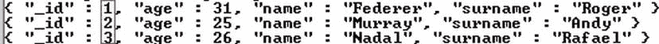

[图 5-1](#_Fig1) 。将三个玩家实例持久化到一个 MongoDB 集合中

@Id 和自动策略的示例

JPA 提供了四种可以应用于主键生成的策略:`AUTO`、`IDENTITY`、`SEQUENCE`和`TABLE`。`AUTO`让持久性提供者选择关于数据库(表、序列或身份)的正确策略。通常，这是数据库默认的主键生成策略。因此，如果您使用了`AUTO`，Hibernate OGM 应该根据底层数据库—MongoDB(在本例中是 sequence)选择合适的策略。这种策略的优点是使代码非常具有可移植性，尽管数据库迁移可能会成为一个问题。

您可以使用`@GeneratedValue`注释设置`AUTO`策略，如下所示:

```java
import javax.persistence.GeneratedValue;
import javax.persistence.GenerationType;
import javax.persistence.Id;
...

@Entity
public class Players implements Serializable {

    @Id
    @GeneratedValue(strategy=GenerationType.AUTO)
    private int id;
    private String name;
    private String surname;
    private int age;

    //constructors, getters and setters
...
}
```

我现在将使用 Hibernate OGM 持久化这个实体的一些实例，在 MongoDB 中的结果如图 5-2 所示。

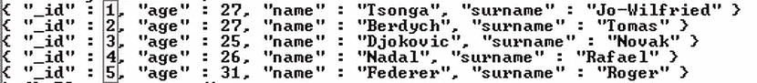

[图 5-2](#_Fig2) 。将几个播放器实例持久化到 MongoDB 集合中

注意，当文档被持久化时，Hibernate OGM 告诉数据库使用一个名为`hibernate_sequences`的幕后集合插入一个顺序生成的数字。插入五个文档(记录)后，`hibernate_sequences`的内容类似于您在[图 5-3](#Fig3) 中看到的内容。如您所见，它存储了下一次插入的 id 值。

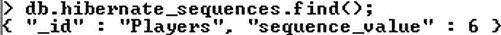

[图 5-3](#_Fig3) 。hibernate_sequences 集合内容

@Id 和身份策略示例

`IDENTITY`策略要求持久性提供者使用数据库标识列为实体分配主键(类型为`short (Short)`、`int (Integer)`或`long (Long)`)。在关系数据库(MySQL、Microsoft SQL Server、IBM DB2、HypersonicSQL 和 Sybase)中，表通常包含一个自动递增的列，告诉数据库在插入记录时插入一个顺序生成的数字。将`IDENTITY`策略附加到 auto-increment 列使实体能够在插入数据库时自动生成一个序列号作为主键。在 MongoDB 世界中，您实际上是利用 MongoDB 生成的`_id`作为持久化对象的主键。

Hibernate OGM 支持这种策略，但是由于它的行为与`AUTO`策略完全一样，OGM 不使用 MongoDB 生成的`_id`作为持久化对象的主键。无论如何，众所周知，这种策略存在一些问题，尤其是在可移植性和性能方面。

可以使用`@GeneratedValue`注释来设置`IDENTITY`策略，如下所示:

```java
import javax.persistence.GeneratedValue;
import javax.persistence.GenerationType;
import javax.persistence.Id;
...

@Entity
public class Players implements Serializable {

    @Id
    @GeneratedValue(strategy=GenerationType.IDENTITY)
    private Long id;
    private String name;
    private String surname;
    private int age;

    //constructors, getters and setters
...
}
```

如果你使用 Hibernate OGM 持久化了`Players`实体的几个实例，MongoDB 将显示`Players`集合，如图[图 5-4](#Fig4) 所示。

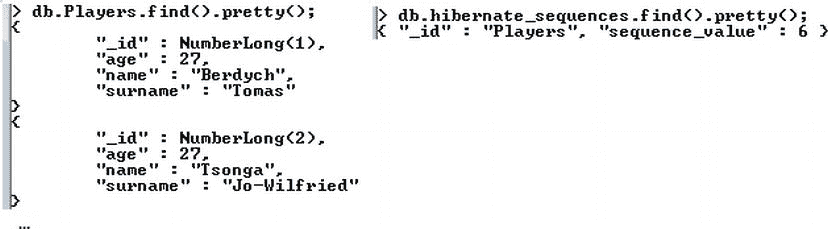

[图 5-4](#_Fig4) 。使用身份策略将几个玩家实例持久化到 MongoDB 集合中

事实上，我期待看到更多类似的东西(没有`hibernate_sequences`系列):

```java
{ "_id" : ObjectId("4eaafff900694710bfb8fa5b"),
  "id" : NumberLong(1),
   ...
}
```

或者，更好的是:

```java
{ "_id" : ObjectId("4eaafff900694710bfb8fa5b"),
   ...
}
```

 **注意**关于 ObjectId 及其生成方式的更多细节可以在 MongoDB 官方文档中找到:`http://docs.mongodb.org/manual/reference/object-id/`

@Id 和序列策略的示例

`SEQUENCE`策略(在 Hibernate 中称为`seqhilo`)要求持久性提供者使用数据库序列为实体分配主键(类型为`short`、`int,`或`long`)。该策略不是在提交期间生成主键值，而是在提交之前生成多组主键值，这在较早需要主键值时非常有用。(给定分配中的一些 id 可能不会被使用，这可能会导致序列值中的间隙。)

Hibernate OGM 通过将序列信息保存在名为`hibernate_sequences`的集合中来支持这种策略。为了展示这种策略是如何工作的，我使用`@SequenceGenerator`注释配置了一个序列生成器，初始值为 5，大小分配(一个组中主键的数量)为 2，如下所示:

```java
@SequenceGenerator(name="mongodb_sequence", initialValue=5, allocationSize=2)
```

接下来，我定义了一个`int`主键并指明了`SEQUENCE`策略:

```java
import javax.persistence.GeneratedValue;
import javax.persistence.GenerationType;
import javax.persistence.Id;
import javax.persistence.SequenceGenerator;
...

@Entity
@SequenceGenerator(name="mongodb_sequence", initialValue=5, allocationSize=2)
public class Players implements Serializable {

    @Id
    @GeneratedValue(strategy=GenerationType.SEQUENCE, generator="mongodb_sequence")
    private int id;
    private String name;
    private String surname;
    private int age;

    //constructors, getters and setters
...
}
```

在持久化第一个对象之后，`hibernate_sequences`和`Players`集合看起来就像图 5-5 中的[所示。](#Fig5)

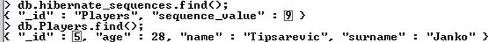

[图 5-5](#_Fig5) 。使用序列策略将一个玩家实例持久化到 MongoDB 集合中

注意，第一个对象(文档)的 id 是生成序列的初始值，而生成序列分配大小的计算方法是(分配大小* 2) +初始值，即(2*2) + 5 = 9 (sequence_value 字段)。

然后我又保存了三个对象，结果如图 5-6 所示。

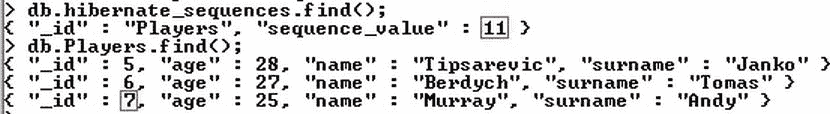

[图 5-6](#_Fig6) 。使用序列策略将另外三个玩家实例持久化到 MongoDB 集合中

因此，当我持久化一个 id 等于 7 的对象时，序列会随着分配大小值—2 而自动增加。这里的过程是多余的。

请注意，您可以将可选的`catalog`元素添加到序列生成器中:

```java
@SequenceGenerator(name="mongodb_sequence",catalog="MONGO",
                                      initialValue=5, allocationSize=2)
```

现在，`hibernate_sequences`收藏名称变成了`MONGO.hibernate_sequences`。

此外，如果添加一个`schema`元素，就像这样:

```java
@SequenceGenerator(name="mongodb_sequence", catalog="MONGO",
                                      schema="MONGOSEQ", initialValue=5, allocationSize=2)
```

然后，`hibernate_sequences`收藏名称变为`MONGO.MONGOSEQ.hibernate_sequences`。

一切似乎都在按预期运行！

@Id 和表策略的示例

`TABLE`策略(在 Hibernate 中称为`MultipleHiLoPerTableGenerator`)要求持久性提供者使用底层数据库表为实体分配主键(类型为`short`、`int`或`long`)。由于出色的性能、可移植性和集群性，这种策略被广泛使用。JPA 提供者可以自由决定使用哪种方法来完成这项任务。可以使用标准的`@TableGenerator`注释来配置生成器。

Hibernate OGM 通过为 MongoDB 创建一个名为`hibernate_sequences;`的集合来支持这种策略，底层表就是一个集合。为了展示这种策略是如何工作的，我使用`@TableGenerator`注释配置了一个表生成器，初始值为 5，大小分配(一个组中主键的数量)为 2，如下所示:

```java
@TableGenerator(name="mongodb_table", initialValue=5, allocationSize=2)
```

接下来，我定义了一个`int`主键并指明了`TABLE`策略，如[清单 5-1](#list1) 所示。

[***清单 5-1。***](#_list1) 运用表策略

```java
import javax.persistence.GeneratedValue;
import javax.persistence.GenerationType;
import javax.persistence.Id;
import javax.persistence.TableGenerator;
...

@Entity
@TableGenerator(name="mongodb_table", initialValue=5, allocationSize=2)
public class Players implements Serializable {

    @Id
    @GeneratedValue(strategy=GenerationType.TABLE, generator="mongodb_table")
    private int id;
    private String name;
    private String surname;
    private int age;

    //constructors, getters and setters
...
}
```

持久化第一个对象后，`hibernate_sequences`和`Players`集合的内容如图[图 5-7](#Fig7) 所示。

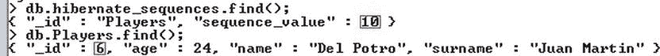

[图 5-7](#_Fig7) 。使用表策略将一个玩家实例持久化到 MongoDB 集合中

请注意，第一个对象(文档)的 id 是初始值+ 1，而序列分配大小的计算方法是(分配大小* 2) +初始值+ 1，即(2*2) + 5 + 1= 10 (sequence_value 字段)。

接下来，我保存了另外三个对象，得到了如图 5-8 所示的结果:

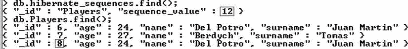

[图 5-8](#_Fig8) 。使用表策略将另外三个玩家实例持久化到 MongoDB 集合中

因此，当我持久化 id 等于 8 的对象时，序列自动增加 1 +分配大小值，增加 3。为此，该过程是多余的。

注意，您可以通过在表格生成器中添加`table`元素来更改`hibernate_sequences`的名称:

```java
@TableGenerator(name="mongodb_table", table="pk_table" , initialValue=5, allocationSize=2)
```

@Id 和泛型生成器的示例—UUID 和 UUID2

除了四个标准的 JPA 生成器之外，UUID 和 UUID2 是 Hibernate 提供的许多生成器中的两个。UUID 基于自定义算法生成 128 位 UUID，而 UUID2 生成符合 IETF RFC 4122(变体 2)的 128 位 UUID。对于 MongoDB，这些种类的主键被表示为字符串。

Hibernate OGM 支持这两种生成器，但是在某些环境中，UUID 会生成一些警告。例如，在 GlassFish 中，使用 UUID 生成器会抛出以下警告:" *WARN: HHH000409:使用 org . hibernate . id . uuidhexgenerator，它不会生成符合 IETF RFC 4122 的 UUID 值；考虑使用 org.hibernate.id.UUIDGenerator 代替*”。简单翻译就是“用 UUID2”。所以最好使用 UUID2，如[清单 5-2](#list2) 所示。

[***清单 5-2。***](#_list2) 使用 UUID2

```java
import javax.persistence.GeneratedValue;
import javax.persistence.Id;
import org.hibernate.annotations.GenericGenerator;
...

@Entity
@GenericGenerator(name="mongodb_uuidgg", strategy="uuid2")
public class Players implements Serializable {

    @Id
    @GeneratedValue(generator="mongodb_uuidgg")
    private String id;
    private String name;
    private String surname;
    private int age;

    //constructors, getters and setters
...
}
```

如果我现在使用 Hibernate OGM 持久化几个`Players`实体的实例，MongoDB 将显示如图[图 5-9](#Fig9) 所示的`Players`集合。

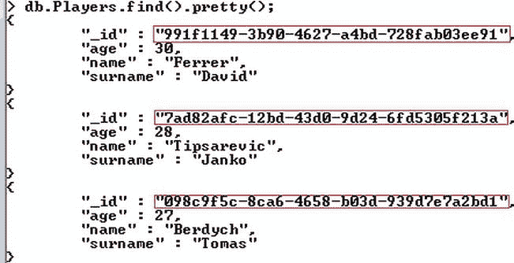

[图 5-9](#_Fig9) 。使用 UUID2 策略将几个玩家实例持久化到 MongoDB 集合中

@Id 和自定义生成器的示例

有时，世界上所有的主键生成器都不足以满足应用程序的需求。在这种情况下，定制生成器变得必不可少，但是在编写之前，您需要知道您的持久性环境是否支持它。在这种情况下，Hibernate OGM 和 MongoDB 与我的定制生成器配合得非常好，您将看到这一点。

如果遵循以下步骤，创建一个新的 Hibernate 定制生成器是一个非常简单的任务:

*   创建一个实现`org.hibernate.id.IdentifierGenerator`接口的新类
*   覆盖`IdentifierGenerator.generate`方法；提供生成器业务逻辑，并将新的主键作为一个`Serializable`对象返回

基于这两个步骤，我编写了一个自定义生成器来创建主键类型: *XXXX* _long-number(例如，SFGZ_3495832849584739405)。[清单 5-3](#list3) 显示了定制的生成器。

[***清单 5-3。***](#_list3) 自定义主键生成器

```java
package hogm.mongodb.generator;

import java.io.Serializable;
import java.util.Random;
import org.hibernate.HibernateException;
import org.hibernate.engine.spi.SessionImplementor;
import org.hibernate.id.IdentifierGenerator;

public class CustomGenerator implements IdentifierGenerator {

    @Override
    public Serializable generate(SessionImplementor sessionImplementor,
            Object object) throws HibernateException {

        Random rnd = new Random();
        String str = "";

        for (int i = 0; i <= 3; i++) {
            str = str + (char) (rnd.nextInt(26) + 'a');
        }

        str = str + "_";
        str = str + String.valueOf(rnd.nextLong());
        str=str.toUpperCase();

        return str;
    }
}
```

测试定制的生成器 非常简单。首先，我使用了`@GenericGenerator`注释，并将定制生成器的全限定类名指定为生成器策略:

```java
@GenericGenerator(name="mongodb_custom_generator",
                                  strategy="hogm.mongodb.generator.CustomGenerator")
```

接下来，我定义一个`String`主键字段，并使用[清单 5-4](#list4) 中所示的`@GeneratedValue`注释。

[***清单 5-4。***](#_list4) 使用 GeneratedValue 标注

```java
import javax.persistence.GeneratedValue;
import javax.persistence.Id;
import org.hibernate.annotations.GenericGenerator;
...

@Entity
@GenericGenerator(name="mongodb_custom_generator",
                                    strategy="hogm.mongodb.generator.CustomGenerator")

public class Players implements Serializable {

    @Id
    @GeneratedValue(generator="mongodb_custom_generator")
    private String id;
    private String name;
    private String surname;
    private int age;

    //constructors, getters and setters
...
}
```

同样，我使用 Hibernate OGM 持久化了`Players`实体的几个实例，MongoDB 显示了[图 5-10](#Fig10) 中的`Players`集合。

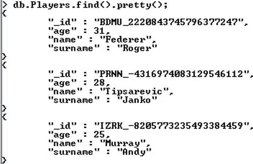

[图 5-10](#_Fig10) 。使用定制生成器将几个播放器实例持久化到 MongoDB 集合中

演示`@Id`注释的完整应用程序可以在 Apress 存储库中获得，并被命名为`HOGM_MONGODB_Id`。它是一个 NetBeans 项目，并在 GlassFish 3 AS 下进行了测试。

@EmbeddedId 批注

由`javax.persistence.EmbeddedId`注释映射。

官方文件:`http://docs.oracle.com/javaee/6/api/javax/persistence/EmbeddedId.html`。

简要概述

`@EmbeddedId`注释表示一个组合主键，它是一个可嵌入的类。你不得不写一个新的可序列化的类，这个类必须:用`@Embeddable`注解(这个类不需要`@Entity`或其他注解)；定义主键字段；并为主键字段定义 getters 和 setters。`@Embeddable`允许您指定一个类，该类的实例存储为拥有实体的固有部分。实体本身必须定义一个用`@Embeddable`注释的类的主键字段。该字段应标注`@EmbeddedId`。

如果您喜欢这种组合键，就不再需要指定`@Id`注释了。对于 MongoDB，组合键应该作为嵌入式文档存储在`_id`字段中。

OGM 支持

Hibernate OGM 支持用`@EmbeddedId`注释定义的组合键。它将 Java 组合键转换成 MongoDB 的`_id`字段中的嵌入式文档，主键字段变成嵌入式文档字段。

例子

创建这种组合键包括两个主要步骤:首先，编写可序列化的主键类并用`@Embeddable`对其进行注释，其次，选择将成为组合主键的适当的实体属性或持久性字段并用`@EmbeddedId`对其进行注释。例如，假设您有一个主键类:

```java
import javax.persistence.Embeddable;
...

@Embeddable
public class RankingAndPrizeE implements Serializable {

    private int ranking;
    private String prize;

    //constructors, getters and setters
...
}
```

然后，在`Players`实体中，创建一个复合主键字段:

```java
import javax.persistence.EmbeddedId;
...

@Entity
public class Players implements Serializable {

   @EmbeddedId
    private RankingAndPrizeE id;
    private String name;
    private String surname;
    private int age;

    //constructors, getters and setters
...
}
```

现在使用 Hibernate OGM 持久化`Players`实体的几个实例，MongoDB 将显示如图[图 5-11](#Fig11) 所示的`Players`集合。

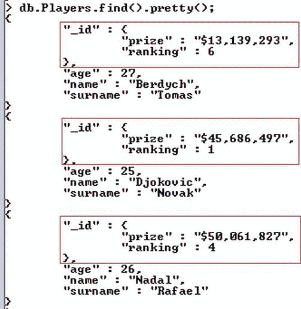

[图 5-11](#_Fig11) 。使用@EmbeddedId 定义组合键

演示`@EmbeddedId`注释的完整应用程序可以在 Apress 存储库中获得，并被命名为`HOGM_MONGODB_Id`。它是一个 NetBeans 项目，并在 GlassFish 3 AS 下进行了测试。

@IdClass Annotation

由`javax.persistence.IdClass`注释映射。

官方文件:`http://docs.oracle.com/javaee/6/api/javax/persistence/IdClass.html`。

简要概述

`@IdClass`注释表示映射到实体的多个字段或属性的复合主键。这种方法迫使您编写一个新的可序列化的类，该类定义主键字段并覆盖`equals`和`hashCode`方法。主键类中定义的主键字段也必须以完全相同的方式出现在实体类中，只是它们必须具有 getter 和 setter 方法。而且，实体类用`@IdClass`标注。

如果您更喜欢这种组合键，那么在实体中会有多个`@Id`注释——每个主键字段一个。对于 MongoDB，组合键应该作为嵌入式文档存储在`_id`字段中。

OGM 支持

Hibernate OGM 支持用`@IdClass`注释定义的组合键。它将 Java 组合键转换成 MongoDB `_id`字段中的嵌入式文档，主键字段变成嵌入式文档字段。

例子

创建这种组合键包括两个主要步骤:首先，编写可序列化的主键类，其次，用`@IdClass`注释实体类，并像在主键类中一样定义主键字段。第一步如清单 5-5 所示。

[***清单 5-5。***](#_list5) 可序列化主键类

```java
package hogm.mongodb.entity;

import java.io.Serializable;

public class RankingAndPrizeC implements Serializable {

    private int ranking;
    private String prize;

    public RankingAndPrizeC() {
    }

    @Override
    public boolean equals(Object arg0) {

        //implement equals here
        return false;
    }

    @Override
    public int hashCode() {

        //implement hashCode here
        return 0;
    }
}
```

而第二步如[清单 5-6](#list6) 所示。

[***清单 5-6。***](#_list6) 定义主键字段

```java
import javax.persistence.Id;
import javax.persistence.IdClass;
...

@Entity
@IdClass(hogm.mongodb.entity.RankingAndPrizeC.class)
public class Players implements Serializable {

    @Id
    private int ranking;
    @Id
    private String prize;
    private String name;
    private String surname;
    private int age;

    //constructors, getters and setters
...
```

现在使用 Hibernate OGM 持久化几个`Players`实体的实例。MongoDB 将显示如图[图 5-12](#Fig12) 所示的`Players`集合。

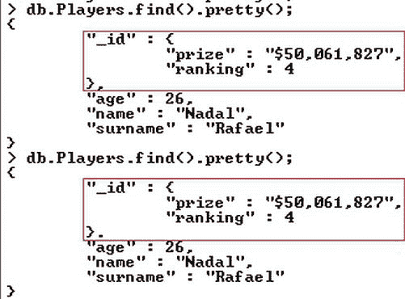

[图 5-12](#_Fig12) 。使用@IdClass 定义一个组合键

演示`@IdClass`注释的完整应用程序可以在 Apress 存储库中获得，并被命名为`HOGM_MONGODB_Id`。它是一个 NetBeans 项目，并在 GlassFish 3 AS 下进行了测试。

@表格注释

由`javax.persistence.Table`注释映射。

官方文件:`http://docs.oracle.com/javaee/6/api/javax/persistence/Table.html`。

简要概述

在关系数据库中，每个实体被表示为一个表(称为主表)，默认情况下，其名称与实体相同(非限定的实体类名)。如果您想为一个表设置另一个名称，您可以使用`@Table`注释和`name`元素。您还可以通过添加`catalog`和`schema`元素来指定一个目录和一个模式。

MongoDB 将表的概念与集合联系起来。默认集合名称与映射的实体相同。

OGM 支持

Hibernate OGM 支持`@Table`注释。它将提供`name`元素值作为相应集合的名称。此外，如果还指定了`catalog`元素，Hibernate OGM 会将目录值作为前缀添加到模式名(或者集合名，如果缺少模式的话)中，并用点号将其与模式名(或者集合名)分开。如果指定了`schema`元素，Hibernate OGM 将在目录名(如果存在的话)和集合名之间添加模式值，用点分隔。正如您所看到的，当目录、模式和集合名称存在时，Hibernate OGM 根据关系模型层次结构连接最终名称:目录包含模式，模式包含表。

例子

测试 `@Table`注释是一项简单的任务，因为您需要做的只是在类级别添加这个注释，然后看看会发生什么。下面是用`@Table`标注的`Players`实体:

```java
import javax.persistence.Table;
...

@Entity
@Table(catalog="ATP", schema="public", name="atp_players")
public class Players implements Serializable {

    @Id
    @GeneratedValue(strategy=GenerationType.AUTO)
    private int id;
    private String name;
    private String surname;
    private int age;

    //constructors, getters and setters
    ...
}
```

[图 5-13](#Fig13) 显示了 MongoDB 上`@Table`注释的效果:

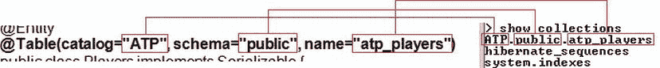

[图 5-13](#_Fig13) 。在 MongoDB 中映射@Table 注释

演示`@Table`注释的完整应用程序可以在 Apress 存储库中获得，并被命名为`HOGM_MONGODB_TableColumn`。它是一个 NetBeans 项目，并且是在 GlassFish 3 AS 下测试的。

@栏目注释

由`javax.persistence.Column`注释映射。

官方文件:`http://docs.oracle.com/javaee/6/api/javax/persistence/Column.html`。

简要概述

在关系数据库中，每个实体的持久属性或字段在数据库中表示为相应表的一列，字段名提供列名。您可以显式地提供一个列名(不同于字段名),方法是用`@Column`注释对其字段进行注释，并将所需的名称指定为`name`元素的值。此外，`@Column`元素允许您设置一些数据限制，比如长度(使用`length`元素)，数据库列是否可以为空(`nullable`元素)，等等。官方文档中列出了所有受支持的元素。

MongoDB 将每个实体实例存储为一个文档。每个文档都由文档的字段组成，这些字段以名称和值为特征。除了保留的`_id`字段，文档的其余字段名反映了实体持久性属性或字段名(或者，从关系模型的角度来看，反映了列名)。

OGM 支持

Hibernate OGM 支持`@Column`注释。它将提供每个`name`元素值作为相应文档字段的名称。除了`name`，其余的`@Column`元素似乎都被忽略了。此外，向主键持久字段添加一个`@Column`注释将被忽略，取而代之的是 MongoDB `_id`字段名，因此您可以为实体中的主键字段使用任何您喜欢的名称。

例子

测试`@Column`注释是一项简单的任务，因为您需要做的只是在字段(或属性)级别添加注释，然后看看会发生什么。下面是用`@Column`标注的`Players`实体:

```java
import javax.persistence.Column;
...

@Entity
@Table(catalog="ATP", schema="public", name="atp_players")
public class Players implements Serializable {

    @Id
    @GeneratedValue(strategy=GenerationType.AUTO)
    private int id;
    @Column(name="player_name")
    private String name;
    @Column(name="player_surname")
    private String surname;
    @Column(name="player_age")
    private int age;

    //constructors, getters and setters
    ...
}
```

[图 5-14](#Fig14) 展示了`@Column`标注在 MongoDB 上的效果。

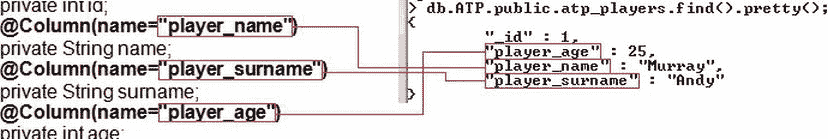

[图 5-14](#_Fig14) 。在 MongoDB 中映射@Column 注释

演示`@Column`注释的完整应用程序可以在 Apress 存储库中获得，命名为`HOGM_MONGODB_TableColumn`。它是一个 NetBeans 项目，并在 GlassFish 3 AS 下进行了测试。

@时态标注

由`javax.persistence.Temporal`注释映射。

官方文件:`http://docs.oracle.com/javaee/6/api/javax/persistence/Temporal.html`。

简要概述

`@Temporal`注释指示表示日期、时间或日期-时间(时间戳)值的持久性字段或属性。支持的值属于类型`java.util.Date`和`java.util.Calendar`。映射`java.util.Date`或`java.util.Calendar`时使用的类型可以用`TemporalType`表示为`DATE`(映射为`java.sql.Date`)、`TIME`(映射为`java.sql.Time`)或`TIMESTAMP`(映射为`java.sql.Timestamp`)。

MongoDB 在其文档中支持日期/时间字段。MongoDB 日期遵循 BSON 官方文档定义的格式(参见`http://bsonspec.org/#/specification`)，可以在 MongoDB shell 中使用`Date`或`ISODate`构造函数创建，如下所示:

```java
var mydate = new Date()
var mydate = new Date("Sun Feb 16 2013")
var mydate = new Date("Sun Feb 16 2013 08:22:05")
var mydate_iso = ISODate()
var mydate_iso = ISODate("2013-02-16T08:22:05")
```

OGM 支持

Hibernate OGM 支持`@Temporal`注释。每个时态字段(与其类型无关)都将被转换成由年、月、日、小时、分钟和秒组成的 MongoDB ISO 日期(year-month-day thour:minute:second)。例如，使用公历定义的 Java 日期如下所示:

```java
private static final Calendar calendar = GregorianCalendar.getInstance();
calendar.clear();
calendar.set(1987, Calendar.MAY, 22); //22.05.1987
```

这个日期在 MongoDB 中是这样表示的:

```java
ISODate("1987-05-22T00:00:00Z")
```

注意，在这个例子中，我没有指出小时、分钟和秒。添加样本时间会将日历设置转换为:

```java
calendar.set(1987, Calendar.MAY, 22, 12, 40, 01); //22.05.1987 12:40:01
```

MongoDB 的表示变成了:

```java
ISODate("1987-05-22T12:40:01Z")
```

如果您没有通过调用`clear`方法清除日历设置，并且没有指定时间(小时、分钟和秒)，将自动设置当前时间。

例子

首先，我在实体中定义了一个代表每个玩家生日的`java.util.Date`字段。然后我用`@Temporal (javax.persistence.TemporalType.DATE),`来注释它，正如你在[清单 5-7](#list7) 中看到的。

[***清单 5-7。***](#_list7) 定义一个字段来代表每个玩家的生日

```java
import java.util.Date;
import javax.persistence.Temporal;
...

@Entity
@Table(catalog="ATP", schema="public", name="atp_players")
public class Players implements Serializable {

    @Id
    @GeneratedValue(strategy=GenerationType.AUTO)
    private int id;
    @Column(name="player_name")
    private String name;
    @Column(name="player_surname")
    private String surname;
    @Column(name="player_age")
    private int age;
    @Temporal(javax.persistence.TemporalType.DATE)
    private Date birth;

    //constructors, getters and setters
...
}
```

第二，我使用公历定义了玩家的生日，如下所示:

```java
private static final Calendar calendar = GregorianCalendar.getInstance();
calendar.clear();
calendar.set(1987, Calendar.MAY, 22);   //22.05.1987
calendar.clear();
calendar.set(1981, Calendar.AUGUST, 8); //08.08.1981
...
```

现在，我将使用 Hibernate OGM 持久化`Players`实体的几个实例。MongoDB 将显示图 5-15 中的[集合。注意`birth`文档字段。](#Fig15)

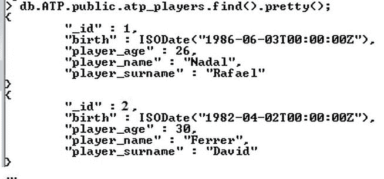

[图 5-15](#_Fig15) 。在 MongoDB 中映射@Temporal 注释

演示`@Temporal`注释的完整应用程序可以在 Apress 存储库中获得，命名为`HOGM_MONGODB_Temporal`。它是一个 NetBeans 项目，并且是在 GlassFish 3 AS 下测试的。

@瞬态注释

由`javax.persistence.Transient`注释映射。

官方文档:`http://docs.oracle.com/javaee/6/api/javax/persistence/Transient.html` `.`

简要概述

首先，提醒一句:如果您不熟悉`@Transient`注释，小心不要将其与 Java `transient`关键字混淆。`transient`关键字用于指示不可序列化的字段，而`@Transient`注释是特定于 JPA 的，用于指示不能保存到底层数据库的字段。此外，这个注释并不意味着来自数据库的任何支持；只有 JPA 提供者应该知道如何处理它。

OGM 支持

Hibernate OGM 支持`@Transient`注释。当一个实体类被传递给 OGM 时，它只保存没有用`@Transient`注释的字段。

例子

这里我用`@Transient`注释了一些`Players`实体字段，如下所示:

```java
import javax.persistence.Transient;
...

@Entity
@Table(catalog="ATP", schema="public", name="atp_players")
public class Players implements Serializable {

    @Id
    @GeneratedValue(strategy=GenerationType.AUTO)
    private int id;
    @Column(name="player_name")
    private String name;
    @Column(name="player_surname")
    private String surname;
    @Column(name="player_age")
    @Transient
    private int age;
    @Temporal(javax.persistence.TemporalType.DATE)
    @Transient
    private Date birth;

    //constructors, getters and setters
...
}
```

如果您使用 Hibernate OGM 持久化了`Players`实体的几个实例，MongoDB 将显示出如图 5-16 所示的`Players`集合。注意，`age`和`birth`文档字段丢失了，这意味着 OGM 不会基于`@Transient`状态持久化它们。

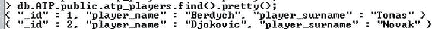

[图 5-16](#_Fig16) 。在 MongoDB 中映射@Transient 注释

演示`@Transient`注释的完整应用程序可以在 Apress 存储库中获得，命名为`HOGM_MONGODB_Transient`。它是一个 NetBeans 项目，并在 GlassFish 3 AS 下进行了测试。

@Embedded 和@ Embedded AnnotationsT2】

由`javax.persistence.Embedded`和`javax.persistence.Embeddable`标注映射。

正式文件:`http://docs.oracle.com/javaee/6/api/javax/persistence/Embedded.html`

```java
http://docs.oracle.com/javaee/6/api/javax/persistence/Embeddable.html
```

简要概述

当持久性字段或属性用`@Embedded`标注时，这表示一个可嵌入类的实例。此类不是实体，没有 id 或表；它只是包含嵌入字段的实体的一个逻辑部分，并且在类级别使用`@Embeddable`注释有意地将其分离并标记为可嵌入的。分离的原因各不相同，从希望拥有简单的代码到不想持久化可嵌入部分，并因此使用`@Transient`注释将其字段标记为瞬态的。默认情况下，嵌入对象的每个非瞬态属性或字段都映射到实体的数据库表。

从 MongoDB 的角度来看，可嵌入对象作为嵌套文档存储在实体的文档中。

OGM 支持

Hibernate OGM 支持`@Embedded`和`@Embeddable`注释。此外，正如您在这里看到的，Hibernate OGM 还支持可嵌入字段的`@Transient`注释(由`javax.persistence.Transient,`映射，更多细节请见`http://docs.oracle.com/javaee/6/api/javax/persistence/Transient.html`)。OGM 知道如何将可嵌入类的每个实例转换成表示每个所有者实体实例的嵌套文档。被注释为瞬态的可嵌入类的任何字段都不会在嵌套文档中持久化。

不要试图使用`@SecondaryTable`注释(`javax.persistence.SecondaryTable`)，因为 OGM 不支持它。

例子

首先，我定义了一个可嵌入的类，它包含每个玩家的一些细节:出生地、居住地、身高、体重等等。这个类非常简单，但是`@Embeddable`注释使它很特别:

```java
import javax.persistence.Embeddable;
...

@Embeddable
public class Details implements Serializable {

    private String birthplace;
    private String residence;
    private String height;
    private String weight;
    private String plays;
    private int turnedpro;
    private String coach;
    private String website;

    //constructors, getters and setters
...
}
```

接下来，在`Players`实体中，我创建了一个类型为`Details`的字段，并将其标注为`@Embedded,`，如[清单 5-8](#list8) 所示。

[***清单 5-8。***](#_list8) 创建嵌入明细字段

```java
import javax.persistence.Embedded;
...

@Entity
@Table(catalog="ATP", schema="public", name="atp_players")
public class Players implements Serializable {

    private static final long serialVersionUID = 1L;

    @Id
    @GeneratedValue(strategy=GenerationType.AUTO)
    private int id;
    @Column(name="player_name")
    private String name;
    @Column(name="player_surname")
    private String surname;
    @Column(name="player_age")
    private int age;
    @Temporal(javax.persistence.TemporalType.DATE)
    private Date birth;
    @Embedded
    private Details details;

   //constructors, getters and setters
...
}
```

如果您现在使用 Hibernate OGM 持久化了`Players`实体的几个实例，MongoDB 将显示出如图[图 5-17](#Fig17) 所示的`Players`集合。注意嵌套的文档。

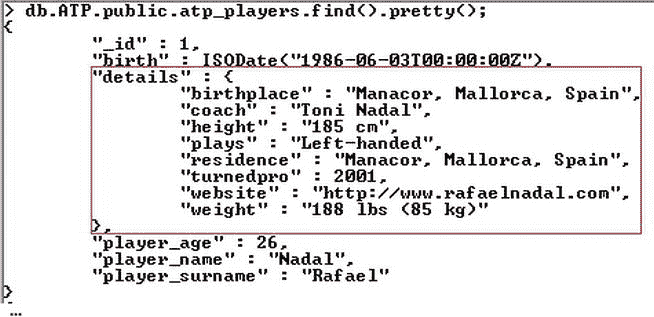

[图 5-17](#_Fig17) 。在 MongoDB 中映射@Embedded 和@ Embedded 注释

我还将可嵌入字段“出生地”和“居住地”标注为瞬态:

```java
import javax.persistence.Transient;
...

@Embeddable
public class Details implements Serializable {

    @Transient
    private String birthplace;
    @Transient
    private String residence;
...
}
```

我坚持了更多的球员和 Hibernate OGM 完美地工作。瞬态字段没有被持久化，正如你在图 5-18 中看到的。

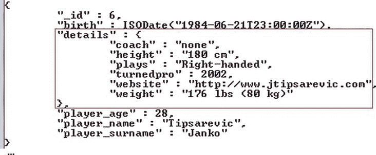

[图 5-18](#_Fig18) 。对一些可嵌入的字段(或属性)使用@Transient

为了完整起见，值得注意的是，如果您将所有可嵌入字段都标注为瞬态的，OGM 将完全跳过嵌套文档，正如您在[图 5-19](#Fig19) 中看到的。

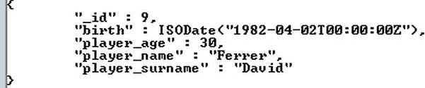

[图 5-19](#_Fig19) 。对所有可嵌入的字段(或属性)使用@Transient

演示了`@Embeddable`和`@Embedded`注释的完整应用程序可以在 Apress 存储库中获得，并被命名为`HOGM_MONGODB_Embedded`。它是一个 NetBeans 项目，并在 GlassFish 3 AS 下进行了测试。

 **注意**一个可嵌入的对象可以在多个类之间共享。在关系模型中，通过允许每个嵌入映射覆盖可嵌入映射中使用的列来支持这个特性，这是通过使用`@AttributeOverride`注释来实现的。在 MongoDB 和 Hibernate OGM 中，不需要覆盖列。不需要任何特殊处理，一切都会按预期工作；只需在每个你想要嵌入相同可嵌入类的类中使用`@Embedded`。

@枚举注释

由`javax.persistence.Enumerated`注释映射。

官方文件:`http://docs.oracle.com/javaee/6/api/javax/persistence/Enumerated.html`。

简要概述

有时 Java 枚举类型可能适合于表示数据库中的列。JPA 通过`@Enumerated`注释提供数据库列和 Java 枚举类型之间的转换。默认情况下，枚举类型是序数；它将枚举的类型属性或字段作为一个整数保存，但是也可以通过将`EnumType`值设置为`STRING`来使其成为一个字符串。

MongoDB 将存储 Java enum 类型值的列视为普通的文档字段。

OGM 支持

Hibernate OGM 支持`@Enumerated`注释。它知道如何将 Java enum 类型转换成 MongoDB 文档字段，以及如何恢复它。支持`EnumType.ORDINAL`和`EnumType.STRING`。OGM 将`STRING`值存储在 MongoDB 的引号中，以表示字符串值。`ORDINAL`另一方面，值存储时不带引号，表示数值。

例子

首先，我定义了一个 Java enum 类型，表示我们的球员在 ATP 世界巡回赛历史上的最高排名。然后我定义了 Hibernate OGM 将持久化或恢复的相应字段，并用`@Enumerated`注释对其进行了标记。清单 5-9 展示了实体的部分代码。

[***清单 5-9。***](#_list9) 一个 Java 枚举类型

```java
import javax.persistence.EnumType;
import javax.persistence.Enumerated;
...

@Entity
@Table(catalog="ATP", schema="public", name="atp_players")
public class Players implements Serializable {

    public static enum Ratings {

        FIRST,
        SECOND,
        THIRD,
        FOURTH,
        FIFTH,
        SIXTH,
        SEVENTH,
        EIGHTH,
        NINTH,
        TENTH
    }

    @Id
    @GeneratedValue(strategy=GenerationType.AUTO)
    private int id;
    @Column(name="player_name")
    private String name;
    @Column(name="player_surname")
    private String surname;
    @Column(name="player_age")
    private int age;
    @Temporal(javax.persistence.TemporalType.DATE)
    private Date birth;
    @Column(name="player_best_rating")
    @Enumerated(EnumType.STRING)
    private Ratings best_rating;

//constructors, getters and setters
...
}
```

像往常一样，我现在使用 Hibernate OGM 持久化了`Players`实体的几个实例，MongoDB 显示了如图[图 5-20](#Fig20) 所示的`Players`集合。

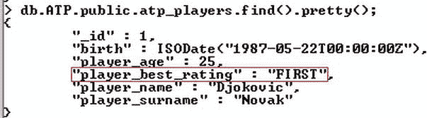

[图 5-20](#_Fig20) 。MongoDB 中的映射@枚举

演示`@Enumerated`注释的完整应用程序可以在 Apress 存储库中获得，并被命名为`HOGM_MONGODB_Enumerated`。它是一个 NetBeans 项目，并在 GlassFish 3 AS 下进行了测试。

@可缓存注释

由`javax.persistence.Cacheable`注释映射。

官方文件:`http://docs.oracle.com/javaee/6/api/javax/persistence/Cacheable.html`。

简要概述

缓存是提高性能的最重要的方法之一，它可以减少执行查询、连接等操作时的数据库流量。您可能知道，JPA 2.0 包含两级缓存:

*   The *first-level cache* is not directly related to performance and is meant for reducing the number of queries in transactions. It’s also known as the *persistent context cache* and it lives as long as the persistence context lives, usually until the end of transaction. When the persistent context is closed, the first-level cache is cleared, and further queries must use the database again. See [Figure 5-21](#Fig21).

    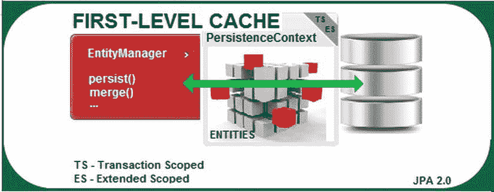

    [图 5-21](#_Fig21) 。JPA 2.0 一级缓存

*   The *second-level cache* is directly related to performance. In this case, the caching mechanism is placed between the persistence context and the database and it acts a server-side device to keep objects loaded into memory. With this approach, the objects are available for the entire application directly from memory without involving the database. The JPA provider is responsible for implementing the second-level cache, but the implementation itself is pretty subjective, because the specification is not very clear. Therefore, each implementation is free to decide how to implement caching capabilities and how sophisticated they will be. See [Figure 5-22](#Fig22).

    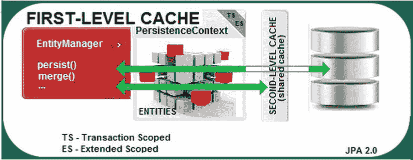

    [图 5-22](#_Fig22) 。JPA 2.0 二级缓存

默认情况下，实体不是二级缓存的一部分。JPA 2.0 提供了`@Cacheable`注释，可以用来明确地通知 JPA 提供者关于可缓存或不可缓存的实体。`@Cacheable`注释采用一个布尔值(`true`是可缓存实体的默认值；`false,`对于不可缓存的实体)。在将`@Cacheable`注释传播到所需的实体之后，您必须告诉 JPA 提供者使用哪种缓存机制，为此，您必须将`shared-cache-mode`标签添加到`persistence.xml`文件中。支持的值有:

*   `NONE` -无缓存
*   `ENABLE_SELECTIVE`—缓存所有标注有`@Cacheable(true)`的实体
*   `DISABLE_SELECTIVE`—缓存除了用`@Cacheable(false)`标注的实体之外的所有实体
*   `ALL`—缓存所有实体
*   `UNSPECIFIED`—未定义的行为(可能是 JPA 提供程序的默认选项)

OGM 支持

Hibernate OGM 支持`@Cacheable`注释和`shared-cache-mode`标签。您可能知道，Hibernate 有几个二级缓存提供者，比如 EHCache、OSCache 和 Infinispan。这些高速缓存提供者中的每一个都有一些特定的设置和特定的特性，具有优点和差距，并提供更好或更差的性能。但是这里我们不关注不同的缓存提供者，所以我们随意选择 EHCache 来测试 Hibernate OGM 对`@Cacheable`注释和`shared-cache-mode`标记的支持。请随意使用任何其他受支持的二级缓存提供程序。

例子

您可能只对最终的结果和结论感兴趣，但是，如果您想重现相同的测试，下面是设置 EHCache 二级缓存的主要步骤。(如果您从未使用过 Hibernate OGM 和二级缓存，这是一个尝试它们的好机会。)

1.  为了将 EHCache 与 Hibernate OGM 和 MongoDB 一起使用，除了 Hibernate OGM 发行版和 MongoDB 驱动程序之外，还需要向应用程序的库中添加几个 jar。额外的 jar 有:`ehcache-core-2.4.3.jar`、`hibernate-ehcache-4.1.4.Final.jar`、`slf4j-api-1.6.1.jar`(都可以在 Hibernate 4.1.4 最终发行版的可选 jar 集中找到)和`slf4j-simple-1.6.1.jar`(可以从`http://www.java2s.com/Code/Jar/s/Downloadslf4jsimple161jar.htm`下载)。
2.  接下来，你要写`persistence.xml` 文件。你必须:

*   将`shared-cache-mode`设置为`ENABLE_SELECTIVE`(只有标注为`@Cacheable(true)`的实体才会被缓存)。
*   打开二级缓存和查询缓存。
*   指示二级缓存提供程序类。
*   设置区域工厂类。
*   指定高速缓存提供者/区域工厂使用的 EHCache 配置文件的位置`ehcache.xml`(`ehcache.xml`内容实际上并不相关，所以我不会在这里列出它。您可以在名为`HOGM_MONGODB_Cache`的应用程序下的 Apress 存储库中查看它。
*   设置 JTA 平台。
*   添加用于配置 MongoDB 连接的特定属性。

如果你完成了这些步骤，你将得到一个`persistence.xml`文件，就像清单 5-10 中的[一样。](#list10)

[***清单 5-10。***](#_list10) Persistence.xml

```java
<?xml version="1.0" encoding="UTF-8"?>
<persistence version="2.0" FontName2">http://java.sun.com/xml/ns/persistence " xmlns:xsi=" http://www.w3.org/2001/XMLSchema-instance " xsi:schemaLocation=" http://java.sun.com/xml/ns/persistence http://java.sun.com/xml/ns/persistence/persistence_2_0.xsd ">
    <persistence-unit name="HOGM_MONGODB_L2Cache-ejbPU" transaction-type="JTA">
        <provider>org.hibernate.ogm.jpa.HibernateOgmPersistence</provider>
        <class>hogm.mongodb.entity.Players</class>
        <class>hogm.mongodb.entity.Tournaments</class>
        <shared-cache-mode>ENABLE_SELECTIVE</shared-cache-mode>
        <properties>
            <property name="hibernate.cache.use_second_level_cache" value="true"/>
            <property name="hibernate.cache.use_query_cache" value="true"/>
            <property name="hibernate.cache.provider_class"
                            value="org.hibernate.cache.EhCacheProvider"/>
            <property name="hibernate.cache.region.factory_class"
                            value="org.hibernate.cache.ehcache.SingletonEhCacheRegionFactory"/>
            <property name="hibernate.cache.provider_configuration_file_resource_path"
                            value="ehcache.xml"/>
            <property name="hibernate.transaction.jta.platform"
                            value="org.hibernate.service.jta.platform.internal.SunOneJtaPlatform"/>
            <property name="hibernate.ogm.datastore.provider" value="mongodb"/>
            <property name="hibernate.ogm.datastore.grid_dialect"
                            value="org.hibernate.ogm.dialect.mongodb.MongoDBDialect"/>
            <property name="hibernate.ogm.mongodb.database" value="mapping_entities_db"/>
            <property name="hibernate.ogm.mongodb.host" value="127.0.0.1"/>
            <property name="hibernate.ogm.mongodb.port" value="27017"/>
        </properties>
    </persistence-unit>
</persistence>
```

注意在`persistence.xml`文件中指定了两个实体— `Players`和`Tournaments`。为了测试`ENABLE_SELECTIVE`缓存机制，我用`@Cacheable(true)`注释了`Players`实体，用`@Cacheable(false).`注释了`Tournaments`实体。我们的测试将检查以确保`Players`对象是可缓存的，而`Tournaments`对象不应该是可缓存的。下面是`Players`实体的清单:

```java
import javax.persistence.Cacheable;
...

@Entity
@Cacheable(true)
@Table(catalog = "ATP", schema = "public", name = "atp_players")
public class Players implements Serializable {

   //fields declaration
   //constructors, getters and setters
...
}
```

并且，`Tournaments`实体的列表是:

```java
import javax.persistence.Cacheable;

@Entity
@Cacheable(false)
public class Tournaments implements Serializable {

   //fields declaration
   //constructors, getters and setters
...
}
```

在开始编写测试之前，您需要用至少五个文档填充与这两个实体相关联的 MongoDB 集合，每个文档具有 ids 1、2、3、4 和 5(您将在测试部分看到为什么我们需要五个文档)。完成后，您就可以编写一个简单的 JUnit 测试来检查二级缓存是否工作正常。要做到这一点，您需要使用二级缓存 API，这个 API 很差，但至少它允许我们使用`javax.persistence.Cache`接口查询和删除缓存中的实体。它提供了检查缓存中是否包含给定实体的数据的方法`contains`，以及从缓存中移除数据的两种方法:`evict`用于移除特定实体，而`evictAll`用于清除缓存`.`

所以，我们已经准备好编写测试了。我们只需要一个简单的场景来描述`Players` 和`Tournaments`实体，如下所示:

*   使用`contains`方法检查`Players`对象是否在缓存中(这将返回`false`)。
*   使用`EntityManager find`方法查询`Players`对象(这个查询是针对 MongoDB 数据库执行的，由于`ENABLE_SELECTIVE`效应，提取的对象应该放在二级缓存中)。
*   再次调用`contains`方法来检查`Players`对象是否在缓存中(这将返回`true`)。
*   使用`evict`方法从缓存中移除`Players`对象。
*   再次调用 contains 方法时，检查是否从缓存中删除了`Players`对象(这将返回 false)。

`Tournaments` 的场景如下:

*   使用`contains`方法检查`Tournaments`对象是否在缓存中(这将返回`false`)。
*   使用`EntityManager find`方法查询`Tournaments`对象(这个查询是针对 MongoDB 数据库执行的，由于`ENABLE_SELECTIVE`效应，提取的对象不应该放在二级缓存中)。
*   再次调用`contains`方法来检查`Tournaments`对象是否在缓存中(这将返回`false`)。
*   通过调用`evictAll`方法清除缓存。

最后，将这个场景翻译成一个 JUnit 测试，就像清单 5-11 中的测试一样。

[***清单 5-11。***](#_list11) 一次 JUnit 测试

```java
package tests;

import hogm.mongodb.entity.Players;
import hogm.mongodb.entity.Tournaments;
import javax.persistence.Cache;
import javax.persistence.CacheRetrieveMode;
import javax.persistence.CacheStoreMode;
import javax.persistence.EntityManager;
import javax.persistence.EntityManagerFactory;
import javax.persistence.Persistence;
import org.junit.After;
import org.junit.AfterClass;
import static org.junit.Assert.*;
import org.junit.Before;
import org.junit.BeforeClass;
import org.junit.Test;

public class CacheTest {

    private static EntityManagerFactory emf;
    private EntityManager em;

    public CacheTest() {
    }

    @BeforeClass
    public static void setUpClass() {
    }

    @AfterClass
    public static void tearDownClass() {
    }

    @Before
    public void setUp() {
        emf = Persistence.createEntityManagerFactory("HOGM_MONGODB_L2Cache-ejbPU");
        em = emf.createEntityManager();

        em.setProperty("javax.persistence.cache.retrieveMode", CacheRetrieveMode.USE);
        em.setProperty("javax.persistence.cache.storeMode", CacheStoreMode.USE);
    }

    @After
    public void tearDown() {
        if (em != null) {
            em.clear();
            em.close();
        }
    }

    @Test
    public void testCache_ENABLE_SELECTIVE() {

        Cache cache = em.getEntityManagerFactory().getCache();

        //TESTING PLAYERS OBJECT CACHING

        // players objects shouldn't be in second-level cache at this moment
        for (int i = 1; i < 5; i++) {
            assertFalse(cache.contains(Players.class, i));
        }

        // finding the players objects should place them into second-level cache
        for (int i = 1; i < 5; i++) {
            em.find(Players.class, i);
        }

        // players objects should be in second-level cache at this moment,
        // but we delete them from cache one by one
        for (int i = 1; i < 5; i++) {
            assertTrue(cache.contains(Players.class, i));
            cache.evict(Players.class, i);
        }

        // players objects shouldn't be in second-level cache at this moment
        for (int i = 1; i < 5; i++) {
            assertFalse(cache.contains(Players.class, i));
        }

        //TESTING TOURNAMENTS OBJECT CACHING

        // tournaments objects shouldn't be in second-level cache at this moment
        for (int i = 1; i < 5; i++) {
            assertFalse(cache.contains(Tournaments.class, i));
        }

        // finding the tournaments objects shouldn't place them into second-level cache
        for (int i = 1; i < 5; i++) {
            em.find(Tournaments.class, i);
        }

        // players objects shouldn't be in second-level cache at this moment either
        for (int i = 1; i < 5; i++) {
            assertFalse(cache.contains(Tournaments.class, i));
        }

        cache.evictAll();
    }
}
```

测试结果 100%令人满意，如图[图 5-23](#Fig23) 所示，这意味着 Hibernate OGM 支持`@Cacheable`和`shared-cache-mode`。

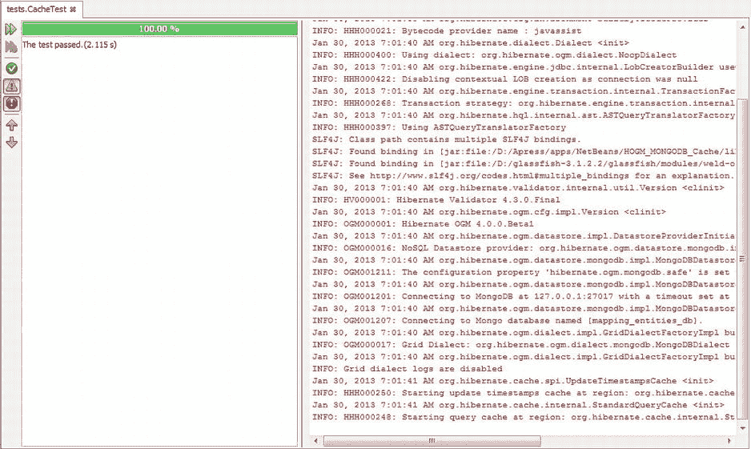

[图 5-23](#_Fig23) 。测试@Cacheable 注释

此外，您可以通过编写自己的场景来轻松测试`DISABLE_SELECTIVE`和`ALL`。

请注意，您可以通过设置以下`EntityManager`属性(在`setUp`方法中，如[清单 5-11](#list11) )以编程方式控制检索和存储实体的缓存行为。为了完整起见，我将它们设置为默认值(使用)，但是我也测试了`BYPASS`和`REFRESH`值，一切都如预期的那样工作:

*   `javax.persistence.cache.retrieveMode`控制如何从调用`EntityManager.find`方法的缓存和查询中读取数据。它默认为值`USE`，这意味着从二级缓存中检索数据(如果可用的话)。如果不可用，则从数据库中检索数据。通过指定值`BYPASS`，可以轻松绕过二级缓存，直接进入数据库。
*   `javax.persistence.cache.storeMode`控制数据如何存储在缓存中。它默认为`USE`值，这意味着当从数据库读取数据或向数据库提交数据时，会创建或更新缓存数据，而不会在数据库读取时刷新缓存。通过设置`REFRESH`值可以强制刷新。最后，您可以通过设置`BYPASS`值来保持缓存不变。

理解 JPA 2.0 二级缓存 API 所需的一切都很好地浓缩在 Java EE 6 教程中，可从`http://docs.oracle.com/javaee/6/tutorial/doc/gkjia.html`获得。

演示`@Cacheable`注释的完整应用程序可以在 Apress 存储库中获得，命名为`HOGM_MONGODB_Cache`。它是一个 NetBeans 项目，并且是在 GlassFish 3 AS 下测试的。

@ mapped super class annotation

由`javax.persistence.MappedSuperclass`注释映射。

官方文件:`http://docs.oracle.com/javaee/6/api/javax/persistence/MappedSuperclass.html`。

简要概述

映射超类的作用域是为它的子类提供通用的行为和属性或字段映射。它类似于每类继承的*表，但是不允许查询、持久化或者与超类的关系(这是这种方法的最大缺点)。也被称为*具体类*，映射超类不是一个实体，它在数据库中没有单独的表。可以使用`AttributeOverride`和`AssociationOverride`注释(或相应的 XML 元素)在相应的子类中覆盖映射信息。子类是实体，所以它们负责定义表。*

MongoDB 将为每个实体(每个子类)包含一个集合，文档看起来将与实体中声明的字段完全一样(包括继承的字段)。如果您查看一个集合的内容，没有什么会泄露映射超类的存在。

OGM 支持

Hibernate OGM 支持`@MappedSuperclass`注释。它知道如何将每个子类转换成 MongoDB 集合，并用包含统一字段(继承字段+实体字段)的文档填充它。

例子

我的例子基于一个简单、常见的场景。我从某种通用或抽象的对象开始，比如玩家。“运动员”是一个非常通用的概念，因为运动员有很多种——网球运动员、棒球运动员等等。所有玩家都有一些共同的特征，比如名字、姓氏、年龄和生日，以及一些特定于他们的学科(类别)的特殊特征。

我们可以将它们放在一个超类中，一个用`@MappedSuperclass`标注的抽象类，而不是重复每种玩家实体的共同特征。然后，对于每个类别的玩家，我们可以定义一个从超类继承共同特征的实体，并提供更具体的特征。

因此，映射的超类被称为`Players`，看起来像这样:

```java
import javax.persistence.MappedSuperclass;
...

@MappedSuperclass
public abstract class Players implements Serializable {

    @Id
    @GeneratedValue(strategy=GenerationType.AUTO)
    protected int id;
    @Column(name="player_name")
    protected String name;
    @Column(name="player_surname")
    protected String surname;
    @Column(name="player_age")
    protected int age;
    @Temporal(javax.persistence.TemporalType.DATE)
    protected Date birth;

    //getters and setters
...
}
```

接下来，我们设置两类球员:网球运动员和棒球运动员。网球运动员的一个显著特征可能是他或她用哪只手打球。对于一个棒球运动员来说，它可能是队中的位置。因此，我们可以编写`TennisPlayers`实体来继承超类字段并创建一个新的，如下所示:

```java
import javax.persistence.AttributeOverride;
...

@Entity
@AttributeOverride(name="age", column=@Column(name="tenis_player_age"))
public class TennisPlayers extends Players implements Serializable {

    protected String handplay;

    //constructors, getters and setters
...
}
```

根据该规则，下面列出了`BaseballPlayers`实体:

```java
import javax.persistence.AttributeOverride;
...

@Entity
@AttributeOverride(name="age", column=@Column(name="baseball_player_age"))
public class BaseballPlayers extends Playersimplements Serializable {

    protected String position;

    //constructors, getters and setters
...
}
```

现在使用 Hibernate OGM 持久化几个`TennisPlayers`和`BaseballPlayers`实体的实例。MongoDB 将显示`TennisPlayers`和`BaseballPlayers`集合，如图[图 5-24](#Fig24) 所示。注意继承的字段和新字段一起出现在文档中，以及`@AttributeOverride`注释的效果:

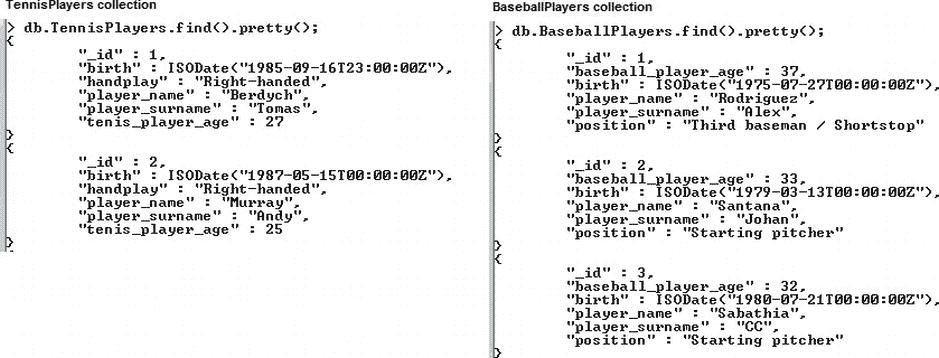

[图 5-24](#_Fig24) 。在 MongoDB 中测试@MappedSuperclass 注释

演示`@MappedSuperclass`注释的完整应用程序可以在 Apress 存储库中获得，并被命名为`HOGM_MONGODB_MappedSuperclass`。它是一个 NetBeans 项目，并且是在 GlassFish 3 AS 下测试的。

@ElementCollection 注释

由`javax.persistence.ElementCollection`注释映射。

正式文件:`http://docs.oracle.com/javaee/6/api/javax/persistence/ElementCollection.html`

简要概述

`@ElementCollection`注释用于表示实例的集合(一个基本的 Java 类型或可嵌入的类)。不要混淆 Java 集合和 MongoDB 集合。Java 集合数据存储在一个单独的表中(*集合表)*,可以使用`@CollectionTable`注释指定该表，该注释指示集合表名称和任何连接。由于数据存储在一个单独的表中，这与嵌入源对象表中的`@Embeddable`对象不同。更像是一对多的可嵌入关系。 `@ElementCollection`的一个关键特性是它能够轻松定义简单值(对象)的集合，而无需定义新的类，而是为它们创建单独的表。缺点是您不能控制持久化、合并或删除数据的传播级别，因为目标对象与源对象严格相关，并且它们作为一个整体。然而，获取类型(`EAGER`和`LAZY`)是可用的，因此您可以加载源对象而不加载目标对象。

OGM 支持

Hibernate OGM 为`@ElementCollection`注释提供了部分支持。尽管我在测试中没有遇到任何错误或缺陷，但它并没有真正做到规范所说的那样。不支持`@CollectionTable`注释，Java 集合数据作为实体集合中的嵌套集合存储在 MongoDB 中，而不是存储在单独的集合中。

例子

为了演示一组可嵌入的类实例，我定义了一个简单的类，代表每个玩家在 2012 年赢得的锦标赛或决赛的列表:

```java
import javax.persistence.Embeddable;
...

@Embeddable
public class Wins2012 implements Serializable {

   private String titlesfinals;

   //constructors, getters and setters
...
}
```

通常，这样的类会包含不止一个字段，但是出于测试的目的，没有必要添加更多的字段。

此外，对于一个简单对象的集合，我使用了一个`List<String>`来保存每个球员在 2008 年到 2012 年之间的排名历史。

两个集合都是在`Players`实体中定义的，如[清单 5-12](#list12) 所示(像`targetClass` (" *集合的元素类型的基本或可嵌入类*)和`fetch` (" *集合是应该延迟加载还是必须立即获取*)这样的元素是可选的)。

[***清单 5-12。***](#_list12) 定义两个系列

```java
import javax.persistence.AttributeOverride;
import javax.persistence.AttributeOverrides;
import javax.persistence.FetchType;
...

@Entity
@Table(catalog = "ATP", schema = "public", name = "atp_players")
public class Players implements Serializable {

    private static final long serialVersionUID = 1L;
    @Id
    @GeneratedValue(strategy = GenerationType.AUTO)
    private int id;
    @Column(name = "player_name")
    private String name;
    @Column(name = "player_surname")
    private String surname;
    @Column(name = "player_age")
    private int age;
    @Temporal(javax.persistence.TemporalType.DATE)
    private Date birth;
    @ElementCollection(targetClass=hogm.mongodb.entity.Wins2012.class,
                                        fetch = FetchType.EAGER)
    @CollectionTable(name = "EC_TABLE")  //not supported by OGM
    @AttributeOverrides({
        @AttributeOverride(name = "titlesfinals",
        column = @Column(name = "EC_titlesfinals"))
    })
    private List<Wins2012> wins = new ArrayList<Wins2012>();
    @ElementCollection(targetClass=java.lang.String.class,
                                        fetch = FetchType.LAZY)
    @CollectionTable(name = "RANKING_TABLE")  //not supported by OGM
    private List<String> rankinghistory08_12 = new ArrayList<String>();

//constructors, getters and setters
...
}
```

接下来，我持久化几个`Players`实例，结果如图[图 5-25](#Fig25) 所示。注意，这两个 Java 集合没有单独的 MongoDB 集合——`@AttributeOverrides`工作得非常好。

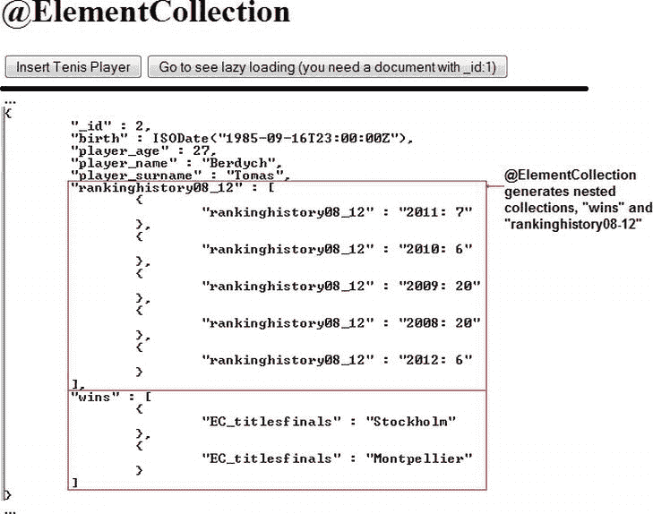

[图 5-25](#_Fig25) 。在 MongoDB 中测试@ElementCollection 注释

演示`@ElementCollection`注释的完整应用程序可以在 Apress 存储库中获得，命名为`HOGM_MONGODB_ElementCollection`。它是一个 NetBeans 项目，并在 GlassFish 3 AS 下进行了测试。在继续本节之前，请下载相应的 NetBeans 项目，并确保您可以在 GlassFish AS 3 下成功运行该应用程序。

在测试过程中，您可能已经注意到了 web 阿桂中的标签为“查看延迟加载(您需要一个 id 为 1 的文档)”的按钮如果你按下这个按钮，`wins`集合使用急切机制加载，`rankinghistory08_12`集合使用懒惰机制加载(对于单个玩家，id:1)。结果将类似于[图 5-26](#Fig26) 所示。

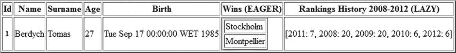

[图 5-26](#_Fig26) 。在 MongoDB 中测试 @ElementCollection 注释的延迟加载

图 5-26 中的结果引出了一个明显的问题:我怎么知道 wins 集合被急切地加载了，而`rankinghistory08_12`被延迟地加载了？换句话说，我怎么知道延迟加载起作用了呢？

嗯，当涉及 Hibernate(包括 Hibernate OGM) JPA 时，这样的问题很常见，因为 Hibernate 在幕后使用的代理对象可能会令人困惑。然而，惰性加载是否有效的问题可以用几种方法来解决。您可以选择编写 JUnit 测试来监控数据库传输或任何其他复杂的解决方案，或者您可以创建一个简单的测试，就像我将要描述的那样。请注意，该测试是在 NetBeans IDE 中执行的，并且特定于本节中介绍的示例，但是可以很容易地调整到其他情况。测试步骤如下:

*   为两个集合设置`FetchType.EAGER`、`wins`和`rankinghistory08_12`。
*   在`hogm.mongodb.ejb.SampleBean`无状态 bean 中，找到方法`loadAction`中的以下代码行:

    ```java
    Players p = em.find(Players.class, 1);
    ```

*   After this line, place a NetBeans line breakpoint as shown in [Figure 5-27](#Fig27).

    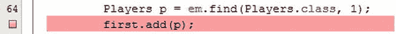

    [图 5-27](#_Fig27) 。在 NetBeans 中添加行断点

*   在调试模式下部署并启动应用程序(按 NetBeans 工具栏上的“调试项目”按钮)。
*   应用程序启动后，按下标签为“去看懒加载(需要一个 _id:1 的文档)”的按钮。这将导致调试器执行代码，直到该行断点，并使应用程序在该点挂起。
*   The `Players` instance is loaded and the `p` variable is listed in NetBeans debugger (see the `Variables` window in [Figure 5-28](#Fig28)). Don’t expand the `p` tree node, since this will be interpreted as an explicit request to see the `p` content.

    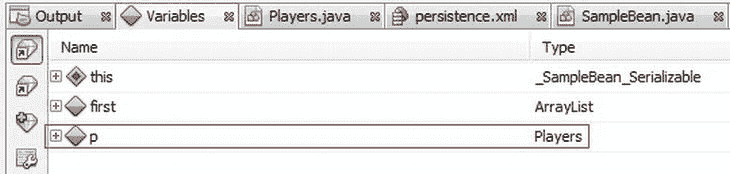

    [图 5-28](#_Fig28) 。NetBeans 中的“变量”窗口

*   接下来，关闭 MongoDB 服务器(可以在服务器 shell 中按 Ctrl+C)。
*   Now you can expand the `p` node and the `wins` and `rankinghistory08_12` sub-nodes as shown in [Figure 5-29](#Fig29). Since the MongoDB server is closed, and the collections data is available, we can conclude that the data was eagerly loaded.

    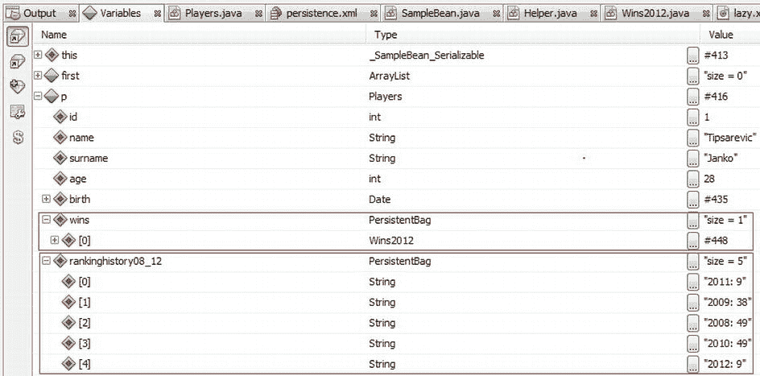

    [图 5-29](#_Fig29) 。展开“p”节点

*   接下来，关闭应用程序，停止调试器并重启 MongoDB 服务器。
*   为`rankinghistory08_12`集合设置`FetchType.LAZY`，为`wins`集合设置`FetchType.EAGER`。
*   再次以调试模式启动应用程序。
*   应用程序启动后，按下标签为“去看懒加载(需要一个 _id:1 的文档)”的按钮。
*   在 NetBeans `Variables`窗口中，您应该会看到一个代表`p`变量的折叠树节点。不要展开节点。
*   再次关闭 MongoDB 服务器。
*   现在，展开`p`节点以及`wins`和`rankinghistory08_12`子节点，如图[图 5-30](#Fig30) 所示。注意，`wins`集合包含数据，因为它被急切地加载，但是`rankinghistory08_12`节点显示一个错误，表明它不能连接到 MongoDB 服务器。这意味着`rankinghistory08_12`集合的数据没有被急切地加载，应该在显式展开`rankinghistory08_12`节点时加载。因此，惰性加载在 Hibernate OGM 中是有效的。

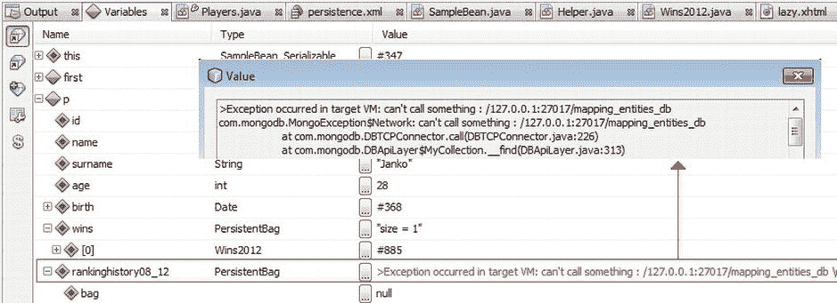

[图 5-30](#_Fig30) 。展开“p”节点

您可以很容易地对其他情况执行类似的测试，比如关联。

JPA 生命周期事件@EntityListeners ，@ ExcludeDefaultListeners，@ ExcludeSuperclassListeners 注释

由`the javax.persistence.EntityListeners, javax.persistence.ExcludeDefaultListeners`和`javax.persistence.ExcludeSuperclassListeners`标注映射。

官方文件:

```java
http://docs.oracle.com/javaee/6/api/javax/persistence/EntityListeners.html
http://docs.oracle.com/javaee/6/api/javax/persistence/ExcludeDefaultListeners.html
http://docs.oracle.com/javaee/6/api/javax/persistence/ExcludeSuperclassListeners.html
```

简要概述

JPA 附带了一组反映实体生命周期的*回调方法* 。实际上，一个实体的生命周期由一系列事件组成，比如持久化、更新、删除等等。对于每个事件，JPA 允许您定义一个受支持的回调方法，当事件被触发时，JPA 会自动调用相应的回调方法。您负责编写回调方法实现。

当回调方法在实体体内定义时，它们是内部回调方法，当它们在实体体外定义时，在单独的类中，它们是外部回调方法。此外，默认回调方法是可以默认应用于所有实体类的侦听器。为了将这些概念与注释联系起来，下面是一些典型情况:

*   内部回调方法不需要注释。回调方法简单地定义在实体体或映射的超类中。
*   外部回调方法不需要注释。但是，使用这些方法的实体和映射超类需要用`@EntityListeners({` `ExternalListener_1.class, ExternalListeners_2.class, ...}).`进行注释
*   默认的回调方法不需要注释。实际上，这些回调没有注释；这就是为什么默认的监听器被定义在一个名为`orm.xml,`的 XML 文件中，这个文件和`persistence.xml`在同一个位置，或者在`persistence.xml`中指定的任何其他位置。
*   默认情况下，默认侦听器应用于所有实体类。您可以通过用`@ExcludeDefaultListeners`对实体进行注释来关闭实体的这种行为。
*   默认情况下，实体从它们映射的超类继承回调方法(超类侦听器的调用在实体类中继承)。用`@ExcludeSuperclassListeners`标注实体类可以获得相反的效果。此外，您可以在子类中覆盖映射的超类回调方法。

内部回调方法可以用以下注释进行标记:

*   `@PrePersist`在新实体持久化之前执行(添加到`EntityManager`)。
*   `@PostPersist`在数据库中存储新实体后执行(在提交或刷新期间)。
*   从数据库中检索到实体后，执行`@PostLoad`。
*   当实体被`EntityManager`识别为已修改时，执行`@PreUpdate`。
*   `@PostUpdate`在更新数据库中的实体后执行(在提交或刷新期间)。
*   当一个实体在`EntityManager`中被标记为删除时，执行`@PreRemove`。
*   `@PostRemove`在从数据库中删除实体后执行(在提交或刷新期间)。

外部回调方法和默认回调方法是相同的，只是它们采用一个参数来指定作为生命周期事件源的实体。

注意，当所有侦听器出现在应用程序中时，调用有严格的顺序。默认回调方法首先发生，外部回调方法其次，内部回调方法最后执行。

OGM 支持

Hibernate OGM 支持`@EntityListeners, @ExcludeDefaultListeners,`和`@ExcludeSuperclassListeners`注释。它还支持实体和映射超类的监听器。

例子

对于这个例子，我使用了关于映射超类一节中定义的类——抽象映射超类`Players`，以及两个实体`TennisPlayers`和`BaseballPlayers`。有了这三个类，我可以很好地测试监听器。注意，回调方法只通过一些日志消息来标记它们的存在。

按照调用的顺序，我首先在`orm.xml` 文件中定义了一个默认监听器(不要忘记将这个文件保存在与`persistence.xml`相同的位置):

```java
<entity-mappings FontName2">http://java.sun.com/xml/ns/persistence/orm "
 xmlns:xsi=" http://www.w3.org/2001/XMLSchema-instance "
 xsi:schemaLocation=" http://java.sun.com/xml/ns/persistence/orm
 http://java.sun.com/xml/ns/persistence/orm_1_0.xsd " version="1.0">
  <persistence-unit-metadata>
    <persistence-unit-defaults>
      <entity-listeners>
        <entity-listener class="hogm.mongodb.listeners.DefaultListener" />
      </entity-listeners>
    </persistence-unit-defaults>
  </persistence-unit-metadata>
</entity-mappings>
```

`hogm.mongodb.listeners.DefaultListener`只实现了`onPrePersist`和`onPostPersist`方法，如[清单 5-13](#list13) 所示。

[***清单 5-13。***](#_list13)onprerist 和 onPostPersist 方法

```java
package hogm.mongodb.listeners;

import java.util.logging.Level;
import java.util.logging.Logger;
import javax.persistence.PostPersist;
import javax.persistence.PrePersist;

public class DefaultListener {

    @PrePersist
    void onPrePersist(Object o) {
        Logger.getLogger(DefaultListener.class.getName()).
                                        log(Level.INFO, "PREPARING THE PERSIST SOME OBJECT ...");
    }

    @PostPersist
    void onPostPersist(Object o) {
        Logger.getLogger(DefaultListener.class.getName()).
                                        log(Level.INFO, "AN OBJECT WAS PERSISTED ...");
    }
}
```

默认情况下，当一个对象被持久化时，将为所有三个实体调用这些方法。

我还定义了两个外部侦听器，一个用于实现特定于更新操作的回调方法，另一个用于删除操作。使用`@EntityListeners`注释，这些监听器仅对`BaseballPlayers`实体可用。第一个监听器如[清单 5-14](#list14) 所示。

[***清单 5-14。***](#_list14) 更新监听器

打包 hogm . MongoDB . listeners；

```java
import java.util.logging.Level;
import java.util.logging.Logger;
import javax.persistence.PostUpdate;
import javax.persistence.PreUpdate;

public class BaseballExternalUpdateListeners {

    @PreUpdate
    void onPreUpdate(Object o) {
        Logger.getLogger(BaseballExternalUpdateListeners.class.getName()).log(Level.INFO,
             "PREPARING THE UPDATE THE FIRST BASEBALL PLAYER OBJECT ...{0}", o.toString());
    }

    @PostUpdate
    void onPostUpdate(Object o) {
        Logger.getLogger(BaseballExternalUpdateListeners.class.getName()).log(Level.INFO,
             "THE FIRST BASEBALL PLAYER OBJECT WAS UPDATED...{0}", o.toString());
    }
}
```

而第二个在[清单 5-15](#list15) 中。

[***清单 5-15。***](#_list15) 删除监听器

打包 hogm . MongoDB . listeners；

```java
import java.util.logging.Level;
import java.util.logging.Logger;
import javax.persistence.PostRemove;
import javax.persistence.PreRemove;

public class BaseballExternalRemoveListeners {

    @PreRemove
    void onPreRemove(Object o) {
        Logger.getLogger(BaseballExternalRemoveListeners.class.getName()).log(Level.INFO,
         "PREPARING THE DELETE FOR THE FIRST BASEBALL PLAYER OBJECT ...{0}", o.toString());
    }

    @PostRemove
    void onPostRemove(Object o) {
        Logger.getLogger(BaseballExternalRemoveListeners.class.getName()).log(Level.INFO,
         "THE FIRST TENNIS PLAYER OBJECT WAS REMOVED ...{0}", o.toString());
    }
}
```

映射的超类`Players`将拒绝默认侦听器，并实现三个内部回调方法:`onPrePersist`、`onPostPersist`和`onPostLoad`。这些侦听器只由`BaseballPlayers`实体继承，因为`TennisPlayers`实体将用`@ExcludeSuperclassListeners`进行注释。`Players`映射的超类如[清单 5-16](#list16) 所示。

[***清单 5-16。***](#_list16)`Players`映射的超类

```java
package hogm.mongodb.entity;

import java.io.Serializable;
import java.util.Date;
import java.util.logging.Level;
import java.util.logging.Logger;
import javax.persistence.Column;
import javax.persistence.ExcludeDefaultListeners;
import javax.persistence.GeneratedValue;
import javax.persistence.GenerationType;
import javax.persistence.Id;
import javax.persistence.MappedSuperclass;
import javax.persistence.PostLoad;
import javax.persistence.PostPersist;
import javax.persistence.PrePersist;
import javax.persistence.Temporal;

@MappedSuperclass
@ExcludeDefaultListeners
public abstract class Players implements Serializable {

    @Id
    @GeneratedValue(strategy = GenerationType.AUTO)
    protected int id;
    @Column(name = "player_name")
    protected String name;
    @Column(name = "player_surname")
    protected String surname;
    @Column(name = "player_age")
    protected int age;
    @Temporal(javax.persistence.TemporalType.DATE)
    protected Date birth;

    @PrePersist
    void onPrePersist() {
        Logger.getLogger(Players.class.getName()).log(Level.INFO,
           "PREPARING THE PERSIST A (BASEBALL) PLAYER OBJECT ...");
    }

    @PostPersist
    void onPostPersist() {
        Logger.getLogger(Players.class.getName()).log(Level.INFO,
            "THE (BASEBALL) PLAYER OBJECT WAS PERSISTED ...");
    }

    @PostLoad
    void onPostLoad() {
        Logger.getLogger(Players.class.getName()).log(Level.INFO,
            "THE FIRST (BASEBALL) PLAYER OBJECT WAS LOADED ...");
    }

   //constructors, getters and setters
...
}
```

接下来是`TennisPlayers`实体，如[清单 5-17](#list17) 所示。它将实现所有内部侦听器，并接受默认侦听器，但不接受超类侦听器(注意`@ExcludeSuperclassListeners`注释的存在:

[***清单 5-17。***](#_list17)`TennisPlayers`实体

```java
import java.io.Serializable;
import java.util.logging.Level;
import java.util.logging.Logger;
import javax.persistence.AttributeOverride;
import javax.persistence.Column;
import javax.persistence.Entity;
import javax.persistence.ExcludeSuperclassListeners;
import javax.persistence.PostLoad;
import javax.persistence.PostPersist;
import javax.persistence.PostRemove;
import javax.persistence.PostUpdate;
import javax.persistence.PrePersist;
import javax.persistence.PreRemove;
import javax.persistence.PreUpdate;

@Entity
@ExcludeSuperclassListeners
@AttributeOverride(name = "age", column =
@Column(name = "tenis_player_age"))
public class TennisPlayers extends Players implements Serializable {

    protected String handplay;

    @PrePersist
    @Override
    void onPrePersist() {
        Logger.getLogger(TennisPlayers.class.getName()).log(Level.INFO,
           "PREPARING THE PERSIST A TENNIS PLAYER OBJECT ...");
    }

    @PostPersist
    @Override
    void onPostPersist() {
        Logger.getLogger(TennisPlayers.class.getName()).log(Level.INFO,
           "THE TENNIS PLAYER OBJECT WAS PERSISTED ...");
    }

    @PostLoad
    @Override
    void onPostLoad() {
        Logger.getLogger(TennisPlayers.class.getName()).log(Level.INFO,
            "THE FIRST TENNIS PLAYER OBJECT WAS LOADED ...");
    }

    @PreUpdate
    void onPreUpdate() {
        Logger.getLogger(TennisPlayers.class.getName()).log(Level.INFO,
           "PREPARING THE UPDATE THE FIRST TENNIS PLAYER OBJECT ...");
    }

    @PostUpdate
    void onPostUpdate() {
        Logger.getLogger(TennisPlayers.class.getName()).log(Level.INFO,
            "THE FIRST TENNIS PLAYER OBJECT WAS UPDATED...");
    }

    @PreRemove
    void onPreRemove() {
        Logger.getLogger(TennisPlayers.class.getName()).log(Level.INFO,
           "PREPARING THE DELETE FOR THE FIRST TENNIS PLAYER OBJECT ...");
    }

    @PostRemove
    void onPostRemove() {
        Logger.getLogger(TennisPlayers.class.getName()).log(Level.INFO,
            "THE FIRST TENNIS PLAYER OBJECT WAS REMOVED ...");
    }

    public String getHandplay() {
        return handplay;
    }

   //constructors, getters and setters
...
}
```

最后，`BaseballPlayers`实体显示在[清单 5-18](#list18) 中。它没有定义任何内部侦听器。它使用定义的外部侦听器，使用`@EntityListeners`注释指定，并从映射的超类继承侦听器。它不接受默认侦听器，因为映射的超类不包括默认侦听器。

[***清单 5-18。***](#_list18)`BaseballPlayers`实体

```java
package hogm.mongodb.entity;

import hogm.mongodb.listeners.BaseballExternalRemoveListeners;
import hogm.mongodb.listeners.BaseballExternalUpdateListeners;
import java.io.Serializable;
import javax.persistence.AttributeOverride;
import javax.persistence.Column;
import javax.persistence.Entity;
import javax.persistence.EntityListeners;

@Entity
@EntityListeners({BaseballExternalUpdateListeners.class,
                                BaseballExternalRemoveListeners.class})
@AttributeOverride(name = "age", column =
@Column(name = "baseball_player_age"))
public class BaseballPlayers extends Players implements Serializable {

    protected String position;

    //constructors, getters and setters
...
```

搞定了。我知道这令人困惑，但是在一个应用程序中测试实体和映射超类的所有三种注释是非常复杂的。在实际应用中，你不会把所有这些东西混合在一起。[图 5-31](#Fig31) 应该有助于澄清事情。

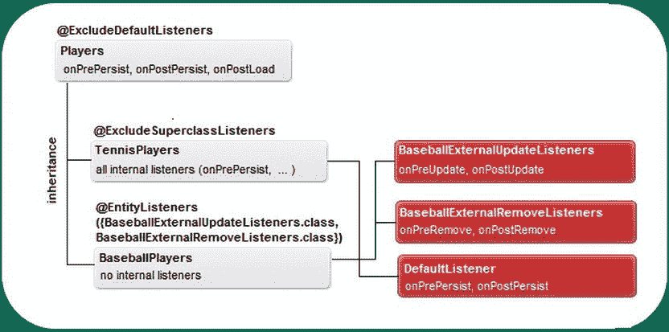

[图 5-31](#_Fig31) 。测试 JPA 监听器

下面是我测试的简单场景:

*   插入两个网球运动员和一个棒球运动员。
*   装载第一个网球运动员。
*   更新第一个网球运动员。
*   删除第一个网球运动员。
*   更新第一个棒球运动员。
*   装载第一个棒球运动员。
*   删除第二名网球运动员。
*   删除第一个棒球运动员。

在[图 5-32](#Fig32) 中，你可以从听者的调用角度看到每一步。看起来 Hibernate OGM 做了很好的工作，一切都如预期的那样工作，每个回调方法都在适当的时候被调用。

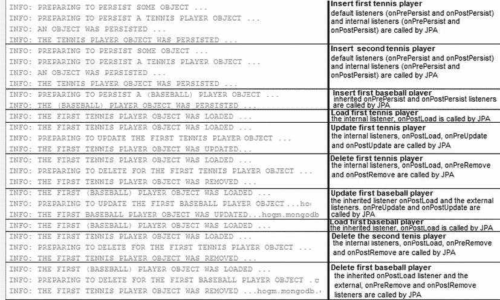

[图 5-32](#_Fig32) 。测试 JPA 监听器的结果

演示 JPA 监听器的完整应用程序可以在 Apress 存储库中获得，命名为`HOGM_MONGODB_Listeners`。它是一个 NetBeans 项目，并在 GlassFish 3 AS 下进行了测试。

@版本注释

由`javax.persistence.Version`注释映射。

正式文件:`http://docs.oracle.com/javaee/6/api/javax/persistence/Version.html`

简要概述

一个`@Version`字段或属性有双重作用:在执行合并操作(更新)时保证数据完整性，并提供乐观并发控制。版本字段(每个实体类只允许一个版本字段)与 JPA *乐观锁定* 配合得很好，乐观锁定应用于事务提交，负责检查每个要更新或删除的对象。目标是避免当 JPA 处理两个并发线程(用户)对相同数据的同时更新时可能发生的冲突。当冲突发生时，持久提供者抛出异常。换句话说，乐观锁定假设数据在读写数据操作之间不会被修改。

用`@Version`标注的字段被保存到数据库中，初始值通常为 0，并且对于每次更新操作(调用`merge`方法)它会自动递增(通常为 1)。实际上，当 JPA“烘烤”一个实体更新语句时，除了更新范围之外，它还向`WHERE`子句添加了正确的“单词”,用于递增版本字段和匹配旧版本值(读取值):

```java
UPDATE *table_name* SET field_1 = *value_1, ... field_n = value_n* , version = (version + 1)
WHERE id = *some_id*  and version = *read_version*
```

同时，如果同一个实体被另一个用户(线程)更新，持久性提供者将抛出一个`OptimisticLockException`，因为它不能定位正确的旧版本值。乐观锁定可以提供更好的可伸缩性，但缺点是用户/应用程序必须刷新并重试失败的更新。

乐观锁定是 JPA 1.0 特有的，也是最常见的锁定方式(使用和推荐)。JPA 2.0 还附带了*悲观锁定*，它在数据被读取或写入时锁定数据库行。但是，这很少使用，因为它会阻碍可伸缩性并导致死锁和风险状态。乐观锁定和悲观锁定都位于`@Version`注释之上，并且可以通过 JPA API 进行控制。

关于 JPA 2.0 锁定的更多细节可以在这篇优秀的文章中找到，“ *JPA 2.0 并发和锁定”* ( `https://blogs.oracle.com/carolmcdonald/entry/jpa_2_0_concurrency_and` `)`)。

OGM 支持

Hibernate OGM 支持`@Version`注释，用`@Version`注释的字段像其他字段一样存储在 MongoDB 中。您还可以使用`EntityManager find, refresh,`和`lock`方法控制锁定机制。因为 OGM 不支持本地查询或命名查询，所以不能使用`Query`和`NamedQuery`锁定方法。

例子

首先，我在`Players`实体中定义了一个`@Version`字段，如[清单 5-19](#list19) 所示。我把它命名为`version`，设置为类型`Long`(可以从`int`、`Integer`、`short`、`Short`、`long`、`java.sql.Timestamp`中选择)。

[***清单 5-19。***](#_list19) 定义了`@Version`字段

```java
import javax.persistence.Version;
...

@Entity
@Table(name = "atp_players")
public class Players implements Serializable {

    private static final long serialVersionUID = 1L;
    @Id
    @GeneratedValue(strategy = GenerationType.AUTO)
    private int id;
    @Version
    private Long version;
    @Column(name = "player_name")
    private String name;
    @Column(name = "player_surname")
    private String surname;
    @Column(name = "player_age")
    private int age;
    private int facade; //used for simulating updated

    public Long getVersion() {
        return version;
    }

    protected void setVersion(Long version) {
        this.version = version;
    }

    //constructors, getters and setters
...
}
```

注意，因为应用程序通常不应该修改`@Version`字段，所以相应的 setter 方法被声明为`protected`。

现在，让我们检查一下`@Version`字段是否在每次更新操作时自动递增。为此，持久化一些玩家，找个理由调用几次`merge`方法，比如用一些随机数更新`facade`字段。在合并的同时，在 MongoDB shell 中监视`atp_players`集合文档。在[图 5-33](#Fig33) 中，左侧在第一次调用`merge`之前呈现文件`(_id:1)`。在右边，注意在我调用了三次`merge`之后，版本字段的值从 0 增长到了 3。

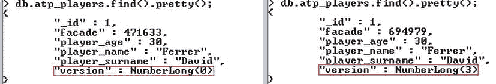

[图 5-33](#_Fig33) 。调用合并方法时监视版本字段增量

因此，OGM 在每次调用`merge`时都成功地增加了版本字段。

 **注意**如果您无法获得带有`_id:1,`的文档，您应该删除`hibernate_sequences`集合并重复持久化操作。您需要这个`_id:1`,因为在下一个测试中，我们将使用带有这个 id 的`EntityManager find`方法。我意识到像这样使用自动生成的键和`find`方法是不寻常的，也是不现实的，但这只是为了教学的目的。

测试乐观锁是否真的在工作(`LockModeType.OPTIMISTIC`)并不简单；它通常需要编写一个 JUnit 测试来模拟并发事务。然而，我更喜欢一种不同的方法，我想根据下面的场景塑造一个有状态的 bean:

*   声明一个有状态 bean 并注入 OGM`EntityManager`；作为会话 bean，它将在多个请求中保持对话状态:

    ```java
    @Named("bean")
    @Stateful
    @SessionScoped
    public class SampleBean {

        @PersistenceContext(unitName = " *PU_name* ")
        private EntityManager em;
    ...
    ```

*   声明两个`Players`对象，`p1`和`p2`:T3
*   创建一个业务方法，用数据库中的第一个玩家填充`p1`，并显示 read `version`字段。注意，我将锁定模式指定为`OPTIMISTIC`(这是默认设置):

    ```java
    public void read_OPTIMISTIC_Action_1() {
            p1 = em.find(Players.class, 1, LockModeType.OPTIMISTIC);
            Logger.getLogger(SampleBean.class.getName()).
                         log(Level.INFO, "READ 1, version={0}", p1.getVersion());
        }
    ```

*   对`p2` :

    ```java
    public void read_OPTIMISTIC_Action_2() {
            p2 = em.find(Players.class, 1, LockModeType.OPTIMISTIC);
            Logger.getLogger(SampleBean.class.getName()).
                         log(Level.INFO, "READ 2, version={0}", p2.getVersion());
        }
    ```

    重复上述步骤
*   创建用于更新`p1`的业务方法。更新后，再次读取`p1`并显示`version.`，该值增加 1，更新成功完成，因为文档在读写操作之间没有被修改:

    ```java
    public void update_OPTIMISTIC_Action_1() {
            p1.setFacade(new Random().nextInt(1000000));
            em.merge(p1);
            em.flush();
            p1 = em.find(Players.class, 1, LockModeType.OPTIMISTIC);
            Logger.getLogger(SampleBean.class.getName()).
                        log(Level.INFO, "UPDATE 1, version={0}",   p1.getVersion());
        }
    ```

*   写一个更新`p2`的商业方法。在调用`merge,`之前显示读取的`version.`这个值应该小于数据库中的当前版本，表明在`p2`读写操作之间，另一个线程已经修改了文档。因此，当调用`merge`方法时，我将得到一个`OptimisticLockException:`

    ```java
    public void update_OPTIMISTIC_Action_2() {
            Logger.getLogger(SampleBean.class.getName()).
                        log(Level.INFO, "UPDATE 2, version={0}", p2.getVersion());
            p2.setFacade(new Random().nextInt(1000000));
            em.merge(p2);
            em.flush();
            //there is no need to check version,
            // now the OptimisticLockException exception should be on screen
        }
    ```

为了一个成功的测试，我需要精确地按顺序调用这四个方法:`read_OPTIMISTIC_Action_1(), read_OPTIMISTIC_Action_2(), update_OPTIMISTIC_Action_1()`和`update_OPTIMISTIC_Action_2()`。GlassFish 日志的输出如图[图 5-34](#Fig34) 所示。

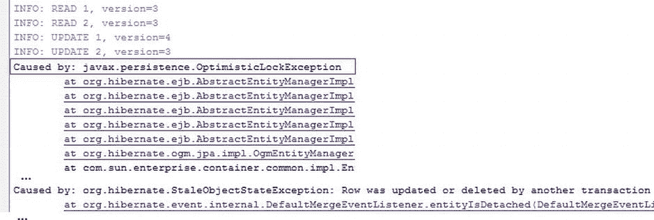

[图 5-34](#_Fig34) 。获取 LockModeType 的 OptimisticLockException。乐观的

如果我把`LockModeType.OPTIMISTIC`改成`LockModeType.OPTIMISTIC_FORCE_INCREMENT,`，我可以很容易地测试乐观的力增量机制。如果您运行了前面的测试，删除所有的`atp_players`集合，并再次持久化一个`Players`实例。然后使用下面两个方法调用序列中的一个:`read_OPTIMISTIC_Action_1, read_OPTIMISTIC_Action_2`、`update_OPTIMISTIC_Action_1`或 r `ead_OPTIMISTIC_Action_1, read_OPTIMISTIC_Action_2, update_OPTIMISTIC_Action_2, update_OPTIMISTIC_Action_1.`，因为版本字段在每次提交之前都会递增，而不仅仅是更新提交，您会看到类似于图 5-35 所示的内容(第一个调用序列)。

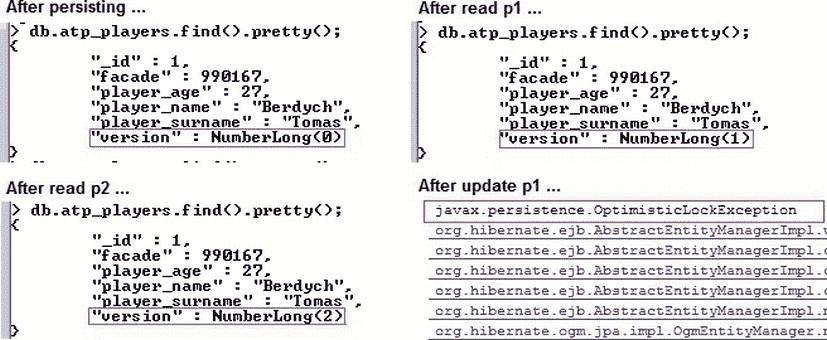

[图 5-35](#_Fig35) 。获取 LockModeType 的 OptimisticLockException。乐观 _ 力量 _ 增量

演示`@Version`注释的完整应用程序可以在 Apress 存储库中获得，并被命名为`HOGM_MONGODB_Version`。它是一个 NetBeans 项目，并在 GlassFish 3 AS 下进行了测试。

@Access 注释

由`javax.persistence.Access`注释映射

正式文件:`http://docs.oracle.com/javaee/6/api/javax/persistence/Access.html`

简要概述

默认情况下，实体通过其持久字段提供要持久化的数据。此外，当从数据库中提取数据时，它会填充相同的持久字段。用注解的术语来说，这就是`@Access(AccessType.FIELD).`另一种方法是使用`get`方法，通过间接访问字段作为属性来获取持久化的数据。类似地，提取的数据通过`set`方法填充实体。用注释术语来说，这就是`@Access(AccessType.PROPERTY).`

在 JPA 1.x 中，访问类型被限制为基于实体层次结构的字段或属性。从 JPA 2.0 开始，可嵌入类的访问类型可以不同于它所嵌入的实体的访问类型。

OGM 支持

根据 JPA 2.0 规范，Hibernate OGM 支持`@Access`注释。它可以通过一种访问类型从可嵌入的类中提取数据，并通过另一种访问类型从实体中提取数据。当然，我说的是嵌入可嵌入类的实体。

例子

对于这个例子，我定义了一个可嵌入的类，名为`Details`:

```java
import javax.persistence.Access;
import javax.persistence.AccessType;
...

@Embeddable
@Access(AccessType.FIELD)
public class Details implements Serializable {

    private String birthplace;
    private String residence;
    private String height;
    private String weight;
    private String plays;
    private int turnedpro;
    private String coach;
    private String website;

    //constructors, getters and setters
...
}
```

注意`@Access`注释。(我任意选择使用访问类型`FIELD`)。现在，名为`Players`的实体被注释为`@Access(AccessType.PROPERTY).`，为了使用属性访问，我需要为非瞬态字段提供基于 Java bean 属性约定的`get`和`set`方法。我还必须将所有 JPA 注释从字段级移动到它们的 getters 中。[清单 5-20](#list20) 显示了`Players`实体的完整清单。

[***清单 5-20。***](#_list20) 完整的`Players`实体

```java
import javax.persistence.Access;
import javax.persistence.AccessType;
...

@Entity
@Access(AccessType.PROPERTY)
@Table(catalog = "ATP", schema = "public", name = "atp_players")
public class Players implements Serializable {

    private int id;
    private String name;
    private String surname;
    private int age;
    private Date birth;
    private Details details;

    @Column(name = "player_name")
    public String getName() {
        return name;
    }

    public void setName(String name) {
        this.name = name;
    }

    @Column(name = "player_surname")
    public String getSurname() {
        return surname;
    }

    public void setSurname(String surname) {
        this.surname = surname;
    }

    @Column(name = "player_age")
    public int getAge() {
        return age;
    }

    public void setAge(int age) {
        this.age = age;
    }

    @Temporal(javax.persistence.TemporalType.DATE)
    public Date getBirth() {
        return birth;
    }

    public void setBirth(Date birth) {
        this.birth = birth;
    }

    @Embedded
    public Details getDetails() {
        return details;
    }

    public void setDetails(Details details) {
        this.details = details;
    }

    @Id
    @GeneratedValue(strategy = GenerationType.AUTO)
    public int getId() {
        return id;
    }

    public void setId(int id) {
        this.id = id;
    }
}
```

现在，实体类具有`PROPERTY`访问类型，可嵌入类具有`FIELD`访问类型。这在 JPA 2.0 之前是不可能的，因为可嵌入对象的访问类型是由声明它的实体类的访问类型决定的。

搞定了。通过持久化几个实体实例来确保一切按预期工作。

演示`@Access`注释的完整应用程序可以在 Apress 存储库中获得，并被命名为`HOGM_MONGODB_Access`。它是一个 NetBeans 项目，并在 GlassFish 3 AS 下进行了测试。

 **注意**显然，您并不总是需要显式指定访问类型，但有时您需要这样做以避免映射问题。例如，您可能有两个定义不同访问类型的实体，但是它们都嵌入了相同的可嵌入类。在这种情况下，您必须显式设置可嵌入类的访问类型。继承也会出现同样的情况——每个实体从其父实体继承访问类型，这可能并不总是令人满意的。从 JPA 2.0 开始，您可以在继承涉及的任何实体中本地显式覆盖访问类型。

关于 Hibernate 中的访问类型`FIELD`有一些误解。为了避免某些“陷阱”，您应该知道当设置了这种访问类型时，Hibernate 完全能够填充实体。当您需要从代码中访问这些值时，可能会出现问题，因为在这种情况下，Hibernate 需要专用的方法。这是众所周知的 Hibernate 代理陷阱之一。要了解细节，最好从`http://blog.xebia.com/2008/03/08/advanced-hibernate-proxy-pitfalls/`开始。

联合

在第 2 章的[中，您看到了 OGM 如何使用`IN_ENTITY, GLOBAL_COLLECTION,`或`COLLECTION`策略存储关联。现在我将讨论 OGM 如何存储一种不同的数据库关联。对于大多数例子，我将使用`IN_ENTITY`。有几种类型的数据库关联:](02.html)

*   一对一
*   一对多和多对一
*   多对多

实体关联中的方向

我想在这里对实体关联的方向做一个简短的概述，因为我认为这对本章的最后一部分会很有用。实体关联具有以下特征:

*   关联的方向性可以来自关系的一侧(单向)或两侧(双向)。
*   在单向关联中，其中一方被定义为拥有方；对面不知道有关联。
*   在双向关联中，双方都有对另一方的引用。
*   在双向关联中，一方被定义为拥有方(*拥有者*)，另一方被定义为拥有方(*非拥有者*)。
*   从编程角度来说，在双向关联中，声明是不对称的，这意味着只有一方通过在特定于关联的注释中设置`mappedBy`元素来提供关于方向性的信息。在双向一对一和多对多关联中，任何一方都可以使用`mappedBy`元素，而在双向一对多关联中，`mappedBy`不能在多对一方声明。
*   注释元素的值是引用拥有方实体的关联拥有方的字段(或属性)的名称。

@OneToOne 注释

由`javax.persistence.OneToOne`注释映射。

正式文件:`http://docs.oracle.com/javaee/6/api/javax/persistence/OneToOne.html`

简要概述

在关系数据库术语中，当一个表中正好有一条记录对应于相关表中的一条记录时，就发生了一对一的关联；两个表包含相同数量的记录，并且第一个表的每一行都链接到第二个表的另一行。JPA 使用`@OneToOne`注释映射单向和双向一对一关联。在双向关联中，非拥有方必须使用`@OneToOne`注释的`mappedBy`元素来指定拥有方的关联字段或属性(任何一方都可以是所有者)。这种关联支持抓取(急切或懒惰)、级联和孤儿移除。

OGM 支持

Hibernate OGM 支持符合 JPA 2.0 规范的`@OneToOne`注释。如您所知，默认情况下，OGM 使用`IN_ENTITY`策略在 MongoDB 中存储数据，这并不意味着任何额外的集合`—`每个实体类都由一个集合表示。很容易区分以下情况:

*   对于单向的一对一关联，OGM 将关联的导航信息存储在代表关联所有者的集合中。该集合中的每个文档都包含一个用于存储相应外键的字段。参见[图 5-36](#Fig36) 。

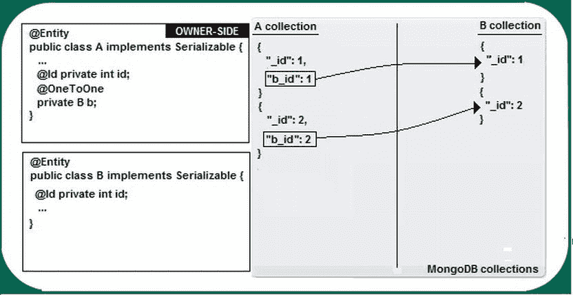

[图 5-36](#_Fig36) 。IN_ENTITY:一对一单向关联

*   对于双向的一对一关联，导航信息是这样存储的:表示使用`mappedBy`的实体的集合(关联的非所有者端)包含为每个嵌入集合存储一个外键的字段，而表示关联的所有者端的集合在每个文档中包含一个存储相应外键的字段。参见[图 5-37](#Fig37) 。

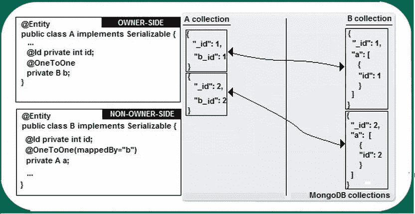

[图 5-37](#_Fig37) 。IN_ENTITY:一对一双向关联

对于`GLOBAL_COLLECTION`策略 ，也有一些直截了当的案例:

*   对于单向的一对一关联，`GLOBAL_COLLECTION`没有影响(类似于`IN_ENTITY`)。
*   对于双向一对一关联，导航信息是这样存储的:表示使用`mappedBy`(非所有者端)的实体的集合不包含导航信息；它存储在全局`Associations`集合中。代表关联所有者端的集合在每个文档中都包含一个存储相应外键的字段。参见[图 5-38](#Fig38) 。

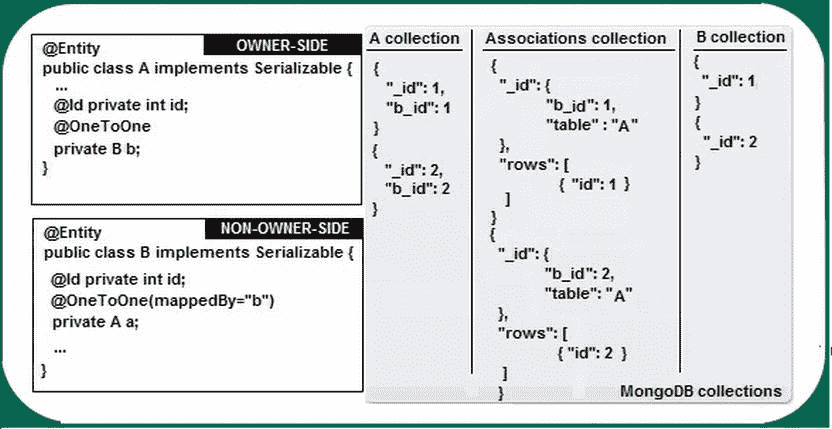

[图 5-38](#_Fig38) 。GLOBAL_COLLECTION:一对一双向关联

对于`COLLECTION`策略，以下是可能性:

*   对于单向的一对一关联，`COLLECTION`没有影响(类似于`IN_ENTITY`)。
*   对于双向一对一关联，导航信息是这样存储的:表示使用`mappedBy`(关联的非所有者方)的实体的集合不包含导航信息；它存储在一个单独的集合中，前缀为单词`associations`(每个这样的关联都有一个单独的集合)。代表关联所有者方的集合将在每个文档中包含一个存储相应外键的字段。参见[图 5-39](#Fig39) 。

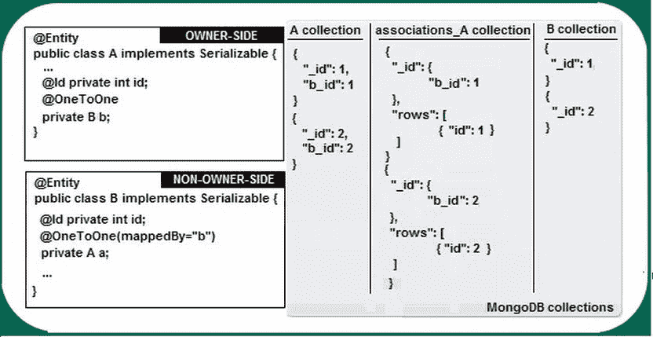

[图 5-39](#_Fig39) 。集合:一对一双向关联

总结一下一对一关联的主要支持方面，有对单向和双向关联的支持；使用`@JoinColumn`指定用于加入实体关联或元素集合`(`的列的能力，使用`@JoinTable`和`@JoinColumns`以及`GLOBAL_COLLECTION`和`COLLECTION`策略支持从可嵌入类到另一个实体的一对一关联，级联(全部)和孤儿移除。此外，OGM 支持使用延迟加载进行抓取。

例子

为了说明一对一的关联(单向和双向)，我需要两个逻辑上适合这个目的的实体。例如，网球运动员实体及其网站地址将具有这样的关联。因此，我可以创建映射网站地址的实体:

```java
import java.io.Serializable;
...

@Entity
@Table(name = "players_websites")
public class Websites implements Serializable {

    @Id
    @GeneratedValue(strategy = GenerationType.AUTO)
    private int id;
    private String http_address;
    //constructors, getters and setters
...
}
```

接下来，我创建了`Players`实体并定义了一个单向的一对一关联:

```java
import javax.persistence.JoinColumn;
import javax.persistence.OneToOne;
...

@Entity
@Table(name = "atp_players")
public class Players implements Serializable {

    private static final long serialVersionUID = 1L;
    @Id
    @GeneratedValue(strategy = GenerationType.AUTO)
    private int id;
    @Column(name = "player_name")
    private String name;
    @Column(name = "player_surname")
    private String surname;
    @Column(name = "player_age")
    private int age;
    @Temporal(javax.persistence.TemporalType.DATE)
    @Column(name = "player_birth")
    private Date birth;
    @OneToOne(cascade = {CascadeType.PERSIST, CascadeType.REMOVE})
    @JoinColumn(name = "website_fk", unique = true, nullable = false, updatable = false)
    private Websites website;

    //constructors, getters and setters
...
}
```

现在我将保存几个玩家和他们的网址，得到如图[图 5-40](#Fig40) 所示的东西。注意，`atp_players`集合中的每个文档都包含一个名为`website_pk`的字段，该字段存储来自`players_websites`集合的外键。这就是 OGM 如何使用`IN_ENTITY`策略映射一对一的单向关联。

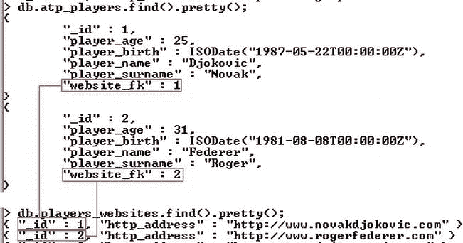

[图 5-40](#_Fig40) 。一对一单向关联

此外，通过修改`Websites`实体，添加`@OneToOne`注释和`mappedBy`元素，我可以很容易地将这种关联转换成双向关联:

```java
import javax.persistence.OneToOne;
...

@Entity
@Table(name = "players_websites")
public class Websites implements Serializable {

    @Id
    @GeneratedValue(strategy = GenerationType.AUTO)
    private int id;
    private String http_address;
    @OneToOne(mappedBy = "website")
    private Players player_website;

    //constructors, getters and setters
...
}
```

这次，`atp_players`和`players_websites`系列如图[图 5-41](#Fig41) 所示。如您所见，关联的所有者`atp_players`仍然包含存储外键的字段，而非所有者方`players_websites`将外键存储在嵌入式集合中。

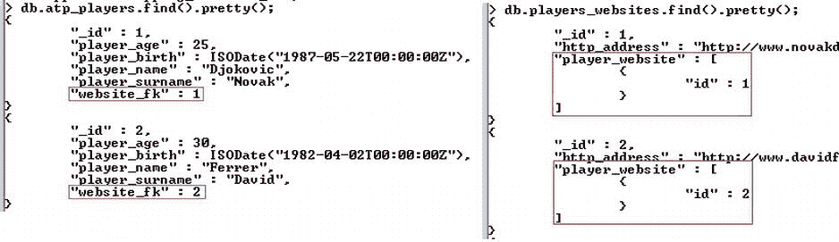

[图 5-41](#_Fig41) 。一对一双向关联

我的下一个目标是创建一个从可嵌入类到另一个实体的一对一关联。为此，我需要一个存储一些玩家细节的可嵌入类和一个存储更多细节的实体。可嵌入的类将为这个实体定义一个一对一的关联。下面是可嵌入的类，它被命名为`Details`:

```java
import javax.persistence.Embeddable;
import javax.persistence.OneToOne;
...

@Embeddable
@Table(name = "player_details")
public class Details implements Serializable {

    private String birthplace;
    private String residence;
    private String height;
    private String weight;
    private String plays;
    private int turnedpro;
    private String coach;
    @OneToOne(cascade={CascadeType.PERSIST, CascadeType.REMOVE})
    private MoreDetails more;

    //constructors, getters and setters
...
}
```

`MoreDetails`字段引用以下实体:

```java
import java.io.Serializable;
...

@Entity
@Table(name = "player_more_details")
public class MoreDetails implements Serializable {

    @Id
    @GeneratedValue(strategy = GenerationType.AUTO)
    private int id;
    private int ranking;
    private String prizes;
   //constructors, getters and setters
...
}
```

最后一步是在`Players`实体中添加可嵌入的类:

```java
import javax.persistence.Embedded;

@Entity
@Table(name = "atp_players")
public class Players implements Serializable {

    @Id
    @GeneratedValue(strategy = GenerationType.AUTO)
    private int id;
    ...
    @Embedded
    private Details details;

    //constructors, getters and setters
...
}
```

现在，MongoDB 将揭示两个集合，`atp_players`和`player_more_details`，如图[图 5-42](#Fig42) 所示。注意，用于存储可嵌入类的`atp_players`嵌套文档(`details`字段)包含一个名为`more_id`的字段，该字段存储引用`player_more_details`文档的外键。

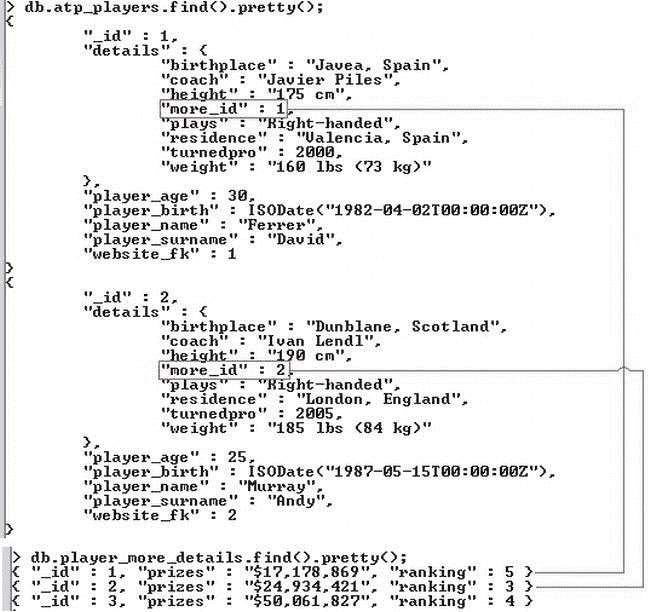

[图 5-42](#_Fig42) 。一对一关联和可嵌入类

我对存储、检索和删除一些`Players`实例的一对一关联做了一些尝试。在图 5-43 中，您可以看到一个简单场景产生的 GlassFish 日志消息示例:插入一个播放器，列出它，删除它，然后再次列出它。(注意持久化和移除的级联效应)。

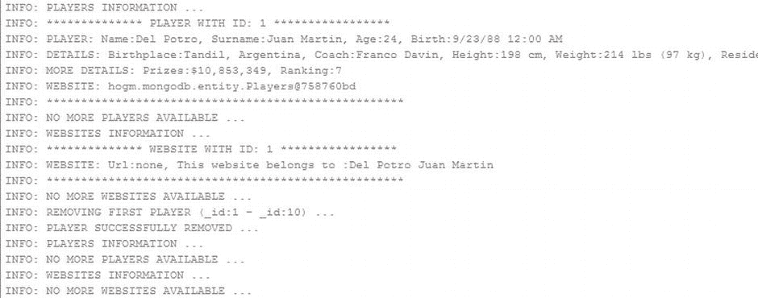

[图 5-43](#_Fig43) 。测试一对一关联(持久化、检索、列出和删除)

演示`@OneToOne`注释的完整应用程序可以在 Apress 存储库中获得，并被命名为*HOGM _ 蒙戈 DB_OneToOne* 。它是一个 NetBeans 项目，并在 GlassFish 3 AS 下进行了测试。

@OneToMany 和@ManyToOne 注释

由`javax.persistence.OneToMany`和`javax.persistence.ManyToOne`标注映射

正式文件:`http://docs.oracle.com/javaee/6/api/javax/persistence/OneToMany.html`

```java
http://docs.oracle.com/javaee/6/api/javax/persistence/ManyToOne.html
```

简要概述

在关系数据库术语中，当一个表中的每条记录对应于相关表中的多条记录时，就会发生一对多关联。这两个表包含的记录数量不同，第一个表中的每一行都链接到第二个表中的更多行。JPA 使用`@OneToMany`注释来映射这种关联。

当第二个表中的行与第一个表反向关联时，这是一个双向关联，由`@ManyToOne`注释表示。在双向关联中，`mappedBy`元素必须用于指定关联字段或关联所有者实体的属性。

在可嵌入类中，`@OneToMany`和`@ManyToOne`都可以用来指定与实体集合的关联，或者指定从可嵌入类到实体类的关联。

这样的关联支持抓取(急切或懒惰)、级联和孤儿移除(只在`@OneToMany`上，不在`@ManyToOne`上)。

OGM 支持

Hibernate OGM 支持`@OneToMany`和`@ManyToOne`注释。如您所知，默认情况下，OGM 使用`IN_ENTITY`策略在 MongoDB 中存储数据，这并不意味着任何额外的集合——每个实体类都由一个集合表示。我们可以很容易地区分以下几种情况:

*   对于单向的一对多关联，OGM 将关联的导航信息存储在代表关联所有者的集合中，存储在存储嵌入集合中的外键的字段中。参见[图 5-44](#Fig44) 。

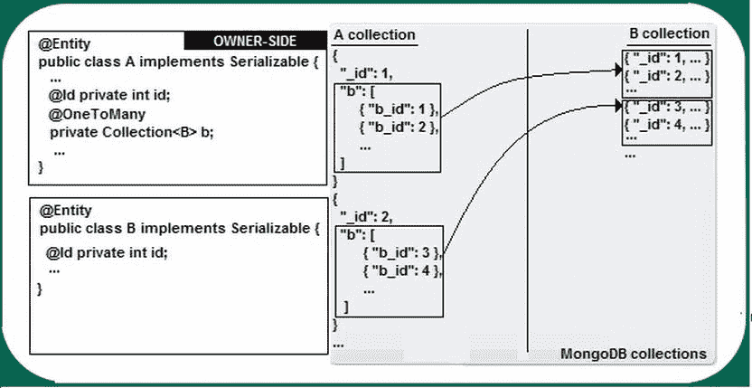

[图 5-44](#_Fig44) 。IN_ENTITY:一对多单向关联

*   对于单向的多对一关联，OGM 将导航信息存储在代表关联所有者方的集合中；每个文档将包含一个用于存储相应外键的字段。参见[图 5-45](#Fig45) 。

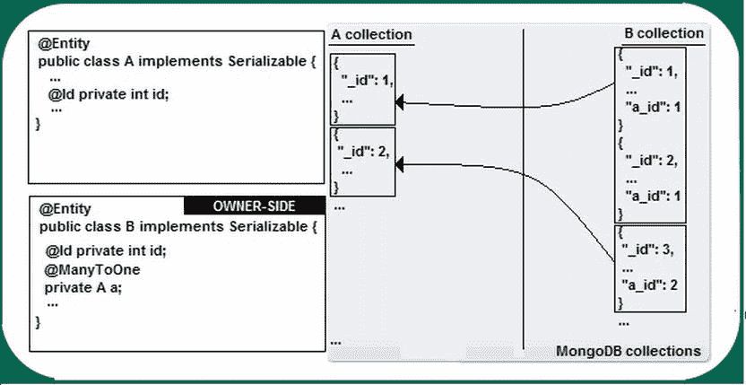

[图 5-45](#_Fig45) 。IN_ENTITY:多对一单向关联

*   对于双向的一对多关联，导航信息是这样存储的:表示使用`mappedBy`的实体(关联的非所有者方)的集合将包含存储嵌入集合中的外键的字段。代表关联所有者方的集合将在每个文档中包含一个存储相应外键的字段。参见[图 5-46](#Fig46) 。

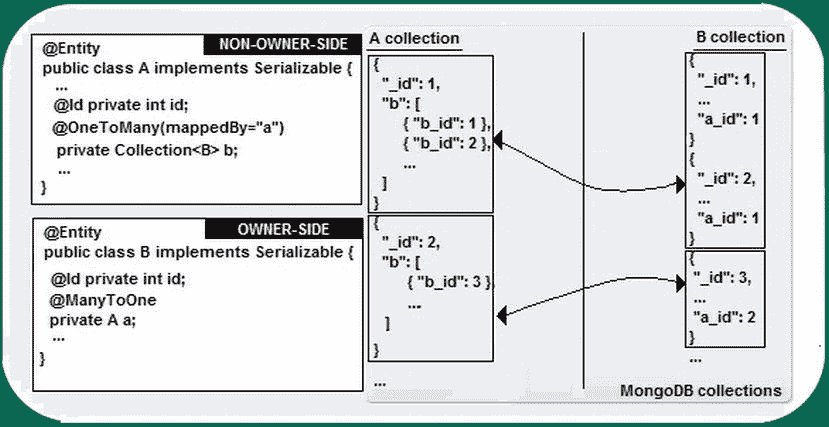

[图 5-46](#_Fig46) 。IN_ENTITY:一对多双向关联

对于`GLOBAL_COLLECTION`策略 ，也有一些直截了当的情况:

*   对于单向的一对多关联，OGM 将关联的导航信息存储在名为`Associations`的全局集合中。表示关联所有者的集合不包含任何导航信息。参见[图 5-47](#Fig47) 。

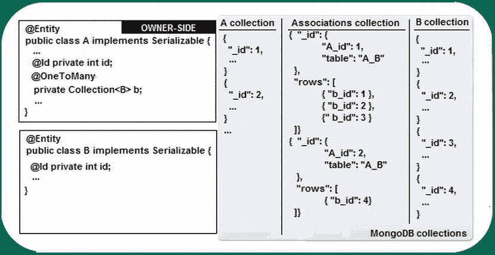

[图 5-47](#_Fig47) 。GLOBAL _ COLLECION:一对多单向关联

*   对于单向的多对一关联，`GLOBAL_COLLECTION`没有任何作用。参见[图 5-48](#Fig48) 。

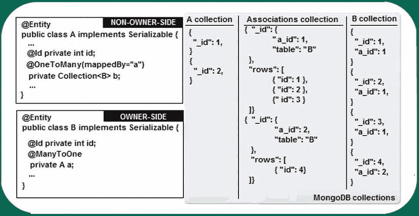

[图 5-48](#_Fig48) 。GLOBAL_COLLECTION:一对多双向关联

*   对于双向一对多关联，导航信息是这样存储的:表示使用`mappedBy`的实体(非拥有`@OneToMany`实体)的集合将不包含导航信息。这些信息现在保存在`Associations`收藏中。另一方(所有者)将在每个文档中包含一个存储相应外键的字段。

对于`COLLECTION`策略 ，我们有:

*   对于单向的一对多关联，OGM 将关联的导航信息存储在以单词`associations`为前缀的新集合中。表示关联所有者的集合不包含导航信息。参见[图 5-49](#Fig49) 。

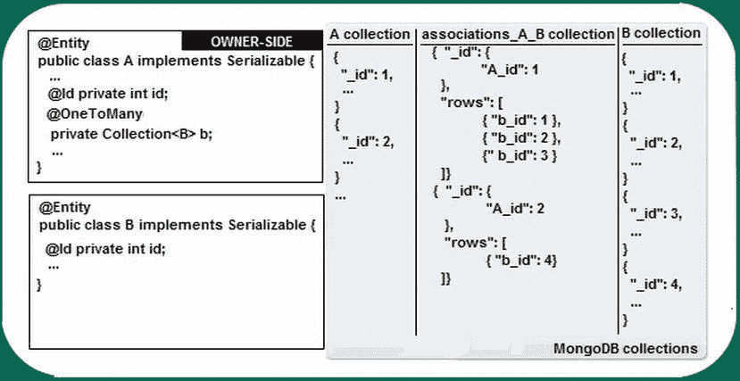

[图 5-49](#_Fig49) 。集合:一对多单向关联

*   对于单向的多对一关联，`COLLECTION`没有任何作用
*   对于双向一对多关联，导航信息是这样存储的:表示使用`mappedBy`的实体(非拥有@ `OneToMany`实体)的集合不包含导航信息。这些信息被存储在一个以`associations`为前缀的新集合中。另一方(所有者)将在每个文档中包含一个存储相应外键的字段。参见[图 5-50](#Fig50) 。

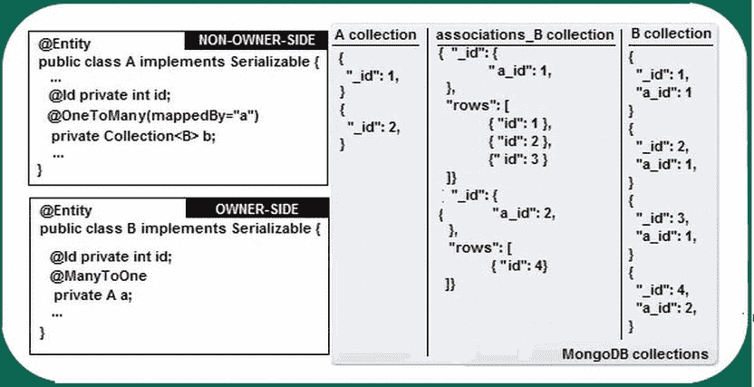

[图 5-50](#_Fig50) 。集合:一对多双向关联

对于这些关联的主要方面，有对单向和双向关联的支持，指定用于加入实体关联或元素集合(`@JoinColumn`)的列的能力，对从一个可嵌入类到另一个实体或实体集合的一对多/多对一关联的支持，`@JoinTable`和`@JoinColumns`与`GLOBAL_COLLECTION`和`COLLECTION`策略，级联(全部)，孤立移除，以及通过延迟加载进行提取。

例子

作为一个一对多关联(单向和双向)的例子，我需要两个逻辑上适合这个目的的实体。当我们存储球员和他的照片时，一个拥有很多照片的网球运动员可以作为一对多关联的一个很好的测试案例。照片可以映射到`Photos`实体中，就像这样:

```java
import java.io.Serializable;
...

@Entity
@Table(name = "players_photos")
public class Photos implements Serializable {

    @Id
    @GeneratedValue(strategy = GenerationType.AUTO)
    private int id;
    private String photo;

    //constructors, getters and setters
...
}
```

现在，每个玩家都有一个`Photos`的集合，所以`Players`实体应该定义一个`@OneToMany`关联，就像这样:

```java
import javax.persistence.CascadeType;
import javax.persistence.OneToMany;
...

@Entity
@Table(name = "atp_players")
public class Players implements Serializable {

    @Id
    @GeneratedValue(strategy = GenerationType.AUTO)
    private int id;
     ...

    @OneToMany(cascade=CascadeType.ALL)
    private Collection<Photos> photos;

    //constructors,getters and setters
...
}
```

坚持几个玩家和他们的照片，得到类似于[图 5-51](#Fig51) 所示的东西。注意，`atp_players`集合中的每个文档都包含一个名为`photos`的字段，该字段存储(在嵌套集合中)来自`players_photos`集合的相应外键。这就是 OGM 如何使用`IN_ENTITY`策略映射一对多单向关联。

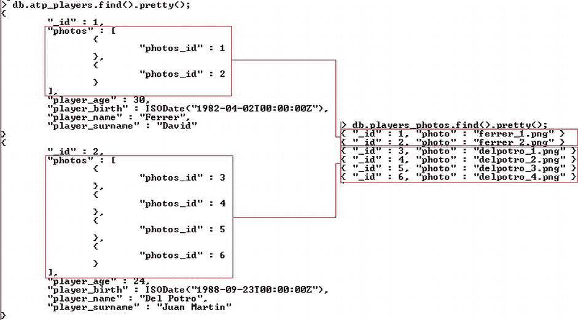

[图 5-51](#_Fig51) 。单向一对多关联

因为我使用了泛型来指定元素类型，所以没有指定相关的目标实体类型。当不使用泛型时，我需要使用`targetEntity`元素指定目标实体类。例如，我可以重新定义`@OneToMany`关联，如下所示:

```java
...
@OneToMany(targetEntity=hogm.mongodb.entity.Photos.class, cascade=CascadeType.ALL)
    private Collection photos;
...
```

如果从相反的方向去思考关联，很多照片属于同一个玩家，描述的是一种单向的多对一的关联。实现这样的关联意味着我们像这样编写实体:

```java
import java.io.Serializable;
...

@Entity
@Table(name = "atp_players")
public class Players implements Serializable {

    @Id
    @GeneratedValue(strategy = GenerationType.AUTO)
    private int id;
    @Column(name = "player_name")
    private String name;
    @Column(name = "player_surname")
    private String surname;
    @Column(name = "player_age")
    private int age;
    @Temporal(javax.persistence.TemporalType.DATE)
    @Column(name = "player_birth")
    private Date birth;

   //constructors, getters and setters
...
}
```

此外，`Photos`实体必须定义一个`@ManyToOne`字段(或属性)，如下所示:

```java
import javax.persistence.JoinColumn;
import javax.persistence.ManyToOne;
...

@Entity
@Table(name = "players_photos")
public class Photos implements Serializable {

    @Id
    @GeneratedValue(strategy = GenerationType.AUTO)
    private int id;
    private String photo;
    @ManyToOne
    @JoinColumn(name = "player_fk", unique = true, nullable = false, updatable = false)
    private Players player_photos;

   //constructors, getters and setters
...
}
```

坚持几个玩家和他们的照片，得到类似[图 5-52](#Fig52) 所示的东西。注意，`players_photos`集合中的每个文档都包含一个名为`player_pk`的字段，该字段存储来自`atp_players`集合的相应外键。这就是 OGM 如何使用`IN_ENTITY` 策略映射多对一单向关联。

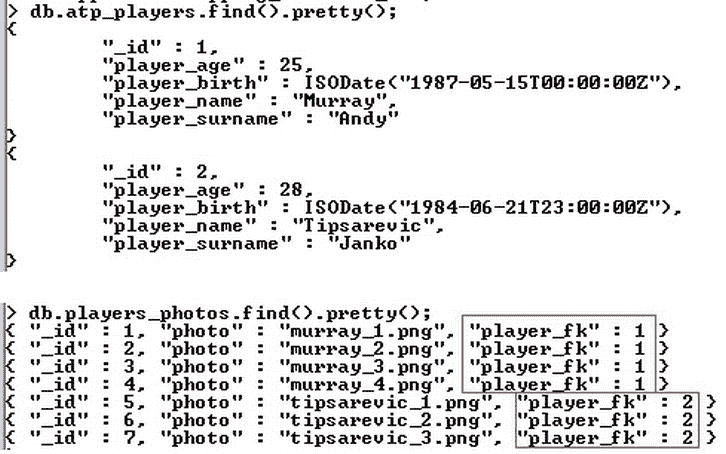

[图 5-52](#_Fig52) 。单向多对一关联

我可以通过调整`Players`实体(`Photos`不变)，轻松地将单向的一对多、多对一关联变成双向的。我需要指定作为关系所有者的实体的关联字段。因此，在`Players`实体中，我做了如下调整:

```java
...
@OneToMany(cascade=CascadeType.ALL,mappedBy = "player_photos")
    private Collection<Photos> photos;
...
```

这次，`atp_players`和`players_photos`系列如图[图 5-53](#Fig53) 所示。

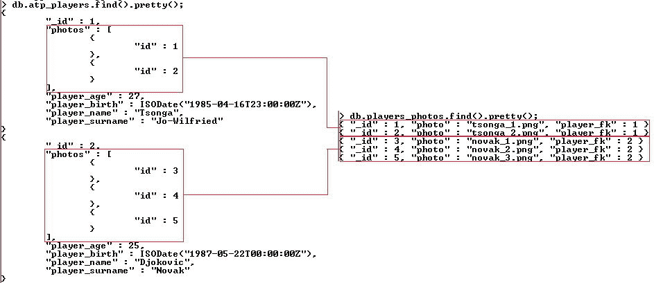

[图 5-53](#_Fig53) 。双向一对多关联

最后，我用这些关联来存储、检索和删除一些`Players`实例。在图 5-54 中，你可以看到一个简单场景下的 GlassFish 日志消息示例:插入一个播放器，列出它，删除它，然后再次列出它。(请注意“保留”和“删除”的级联效应。)

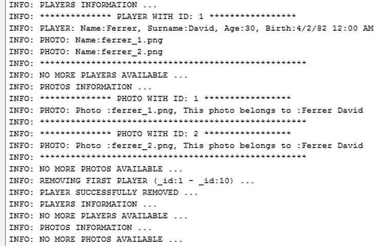

[图 5-54](#_Fig54) 。测试一对多关联

演示`@OneToMany/@ManyToOne`注释的完整应用程序可以在 Apress 存储库中获得，命名为`HOGM_MONGODB_OneToMany`。它是一个 NetBeans 项目，并在 GlassFish 3 AS 下进行了测试。

@ManyToManyAnnotation

由`javax.persistence.ManyToMany`注释映射。

正式文件:`http://docs.oracle.com/javaee/6/api/javax/persistence/ManyToMany.html`

简要概述

在关系数据库术语中，当一个表中的许多记录都对应于相关表中的许多记录时，就会发生多对多关联。JPA 使用`@ManyToMany`注释来映射这种关联。

当第二个表中的行与第一个表反向关联时，这是双向关联。在双向多对多关联中，关系模型通常使用三个表，两个表用于数据，另一个表称为*连接表*，它保存由两个字段组成的组合键:两个外键字段引用第一个和第二个表的主键。同一对外键只能出现一次。在 JPA 中，可以在拥有方使用`@JoinTable`注释来指定连接表，拥有方可以是任何一方。

实际上，在 JPA 中，`@ManyToMany`和`@OneToMany`的主要区别在于，`@ManyToMany`总是利用这个中间关系连接表来存储关联，而`@OneToMany`可以使用一个连接表或者引用源对象表主键的目标对象表中的外键。非拥有方(可以是双方中的任何一方)应该使用`mappedBy`元素来指定拥有方的关联字段或属性。从技术上来说，如果您只从拥有方添加或删除，那么`mappedBy`将保持数据库正确更新，但是这会导致一些问题，比如必须从应用程序代码中删除的孤儿(没有链接的记录)。如果没有`mappedBy`，连接表中可能会出现重复的记录，因为您将有两个不同的关联。在双向多对多关联中，建议您从两端添加数据。

`@ManyToMany`可以在一个可嵌入的类中用来指定一个实体集合的关联。这种关联支持抓取(急切的或懒惰的)和级联，但不支持孤立移除，这种移除只允许在源端具有单一基数的关联。

OGM 支持

Hibernate OGM 支持`@ManyToMany`注释。如您所知，默认情况下，OGM 使用`IN_ENTITY`策略在 MongoDB 中存储数据，这并不意味着任何额外的集合，只是实体集合。对于单向的多对多关联，OGM 将关联的导航信息存储在所有者集合中，存储在嵌入集合中存储外键的字段中。如果关联是双向的，那么双方都将包含用于存储相应导航信息(外键)的嵌入式集合。对于`GLOBAL_COLLECTION`和`COLLECTION`策略，将使用第三个集合，如[第 2 章](02.html)中的“*关联存储”一节所述。*“在`COLLECTION`策略的情况下，如果没有指定`mappedBy`，则假设有两个差异关联，您将获得两个连接集合(每个关联一个)。

这些关联的主要方面包括支持单向和双向关联，能够指定一个列来加入一个实体关联或元素集合`(@JoinColumn`，支持从一个可嵌入类到另一个实体集合的一对多/多对一关联，`@JoinTable`和`@JoinColumns`与`GLOBAL_COLLECTION`和`COLLECTION`策略，以及级联(all)。此外，OGM 支持延迟加载抓取。

例子

为了演示多对多的关联，我需要两个逻辑上适合这个目的的实体。例如，一名网球运动员可能会参加几场比赛，而每场比赛都包含几名运动员。当我们存储球员、比赛和关联时，这可以是多对多关联的一个很好的测试用例。首先，让我们假设只有玩家知道锦标赛。换句话说，让我们实现一个单向的多对多关联。

为此，`Players`实体必须定义一个`@ManyToMany`关联，如下所示:

```java
import javax.persistence.ManyToMany;
...

@Entity
@Table(name = "atp_players")
public class Players implements Serializable {

    @Id
    @GeneratedValue(strategy = GenerationType.AUTO)
    private int id;
    @Column(name = "player_name")
    private String name;
    @Column(name = "player_surname")
    private String surname;
    @Column(name = "player_age")
    private int age;
    @Temporal(javax.persistence.TemporalType.DATE)
    @Column(name = "player_birth")
    private Date birth;
    @ManyToMany(cascade = CascadeType.PERSIST)
    Collection<Tournaments> tournaments;

    //constructors, getters and setters
...
}
```

`Tournaments`实体非常简单:

```java
import java.io.Serializable;
...

@Entity
@Table(name = "atp_tournaments")
public class Tournaments implements Serializable {

    @Id
    @GeneratedValue(strategy = GenerationType.AUTO)
    private int id;
    private String tournament;

    //constructors, getters and setters
...
}
```

坚持几个玩家和比赛，并定义一些从玩家到比赛的链接，得到类似于[图 5-55](#Fig55) 所示的东西。注意，`atp_players`集合中的每个文档都包含一个名为`tournaments`的字段，该字段存储(在嵌套集合中)来自`atp_tournaments`集合的相应外键。这就是 OGM 如何使用`IN_ENTITY`策略映射多对多单向关联。

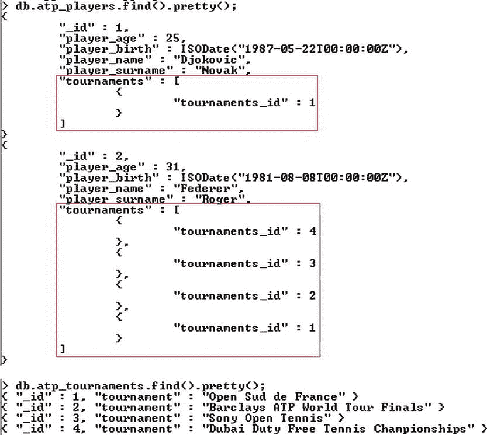

[图 5-55](#_Fig55) 。单向多对多关联

通过将@ `ManyToMany`注释从`Players`实体翻译到`Tournaments`实体，并为`Tournaments`提供`Players`，而不是为`Players`提供`Tournaments`，可以从`Tournaments`角度定义相同类型的关联。

您可以轻松地将这种单向的多对多关联转换为双向关联。当`Players`实体保持不变时，`Tournaments`实体应该修改如下:

```java
import javax.persistence.ManyToMany;
...

@Entity
@Table(name = "atp_tournaments")
public class Tournaments implements Serializable {

    @Id
    @GeneratedValue(strategy = GenerationType.AUTO)
    private int id;
    private String tournament;
    @ManyToMany(mappedBy = "tournaments")
    Collection<Players> players;

     //constructors, getters and setters
...
}
```

现在，MongoDB 将在两个实体集合`atp_players`和`atp_tournaments`中包含嵌套集合。每个嵌套集合将存储另一端的外键。参见[图 5-56](#Fig56) 。

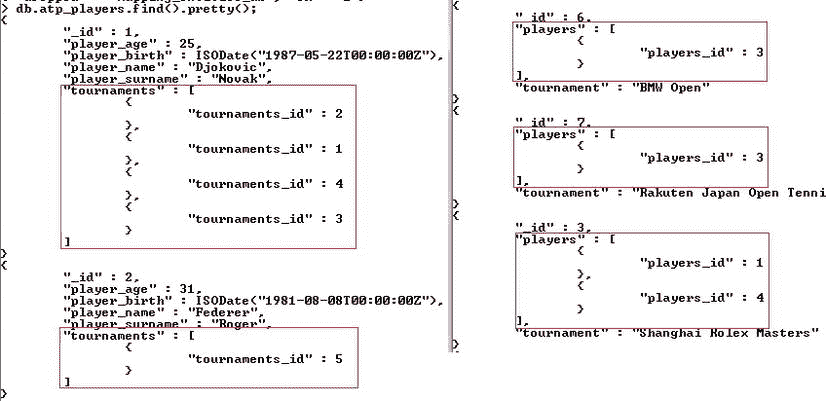

[图 5-56](#_Fig56) 。双向多对多关联

注意，在前面的例子中，我使用了泛型，所以我没有指定相关的目标实体类型。当不使用泛型时，您需要使用`targetEntity`元素指定目标实体类。例如，我可以这样重新定义`@ManyToMany`关联:

```java
...
//in Players entity
@ManyToMany(targetEntity = hogm.mongodb.entity.Tournaments.class,cascade = CascadeType.PERSIST)
    Collection tournaments;
...
...
//in Tournaments entity
@ManyToMany(targetEntity = hogm.mongodb.entity.Players.class, mappedBy = "tournaments")
    Collection players;
...
```

当首选`GLOBAL_COLLECTION`或`COLLECTION`策略时，我可以在关联的拥有方使用`@JoinTable`(包括`@JoinColumn`)来表示关联表和列的名称。对于`GLOBAL_COLLECTION`，我可以用:

```java
...
@ManyToMany(targetEntity = hogm.mongodb.entity.Tournaments.class,
                          cascade = CascadeType.PERSIST)
    @JoinTable(name = "PLAYERS_AND_TOURNAMENTS", joinColumns =
    @JoinColumn(name = "PLAYER_ID", referencedColumnName = "id"),
    inverseJoinColumns =
    @JoinColumn(name = "TOURNAMENT_ID", referencedColumnName = "id"))
    Collection tournaments;
...
```

结果如图[图 5-57](#Fig57) 所示。

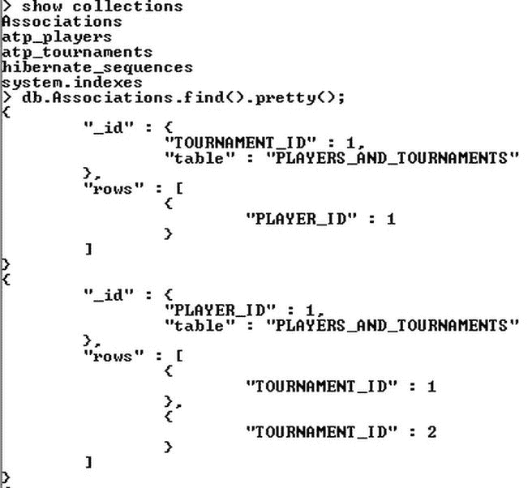

[图 5-57](#_Fig57) 。GLOBAL_COLLECTION 和@JoinTable

对于`COLLECTION`，结果如[图 5-58](#Fig58) 所示。

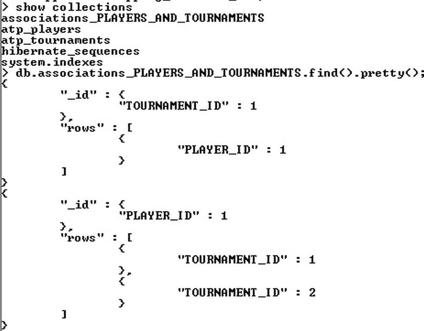

[图 5-58](#_Fig58) 。集合和@JoinTable

最后，我用这些关联来存储、检索和删除一些`Players`和`Tournaments`实例。您可以通过从 Apress 库下载整个应用程序来测试它；这是`HOGM_MONGODB_ManyToMany`应用程序(注意，该应用程序不提供孤儿移除)。它是一个 NetBeans 项目，并在 GlassFish 3 AS 下进行了测试。

不支持的 JPA 2.0 注释

根据 Hibernate OGM Beta 4.0.0Beta 2 文档，以下内容不受支持:

*   传承策略:`@Inheritance`也不`@DiscriminatorColumn`。
*   二级表:`@SecondaryTables`，`@SecondaryTable`
*   命名查询
*   本地查询

摘要

在本章中，您看到了 Hibernate OGM 如何实现 JPA 2.0 注释来处理 MongoDB 存储。我讨论了主要的 JPA 2.0 注释，并重点讨论了受支持的注释:

*   `@Entity`
*   `@Id`
*   `@EmbeddedId`
*   `@IdClass`
*   `@Table`
*   `@Column`
*   `@Temporal`
*   `@Transient`
*   `@Embedded and @Embeddable`
*   `@Enumerated`
*   `@Cacheable`
*   `@MappedSuperclass`
*   `@ElementCollection`
*   `@EntityListeners, @ExcludeDefaultListeners, @ExcludeSuperclassListeners`
*   `@Version`
*   `@Access`
*   `@OneToOne, @OneToMany, @ManyToOne, @ManyToMany`

不支持的注释列表很短，在下一个版本中可能会减少到零。