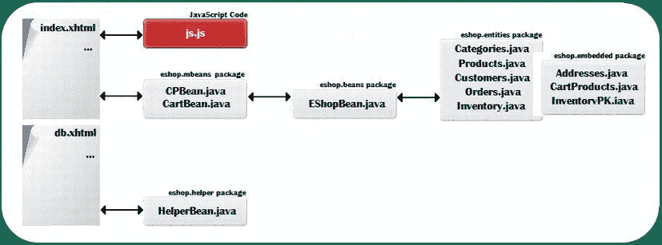
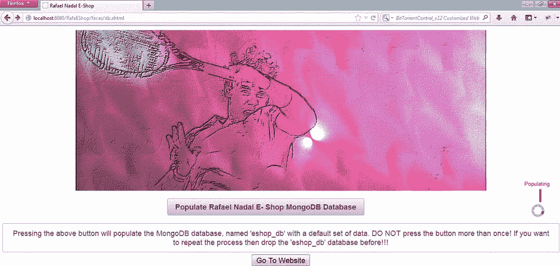
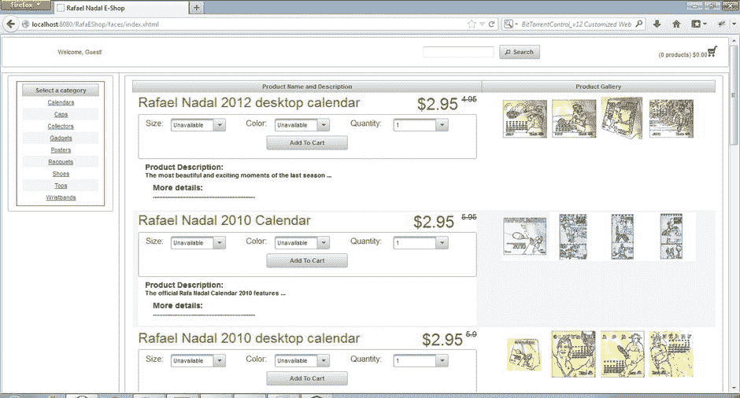
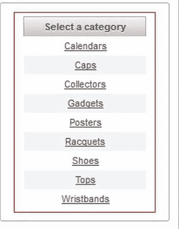
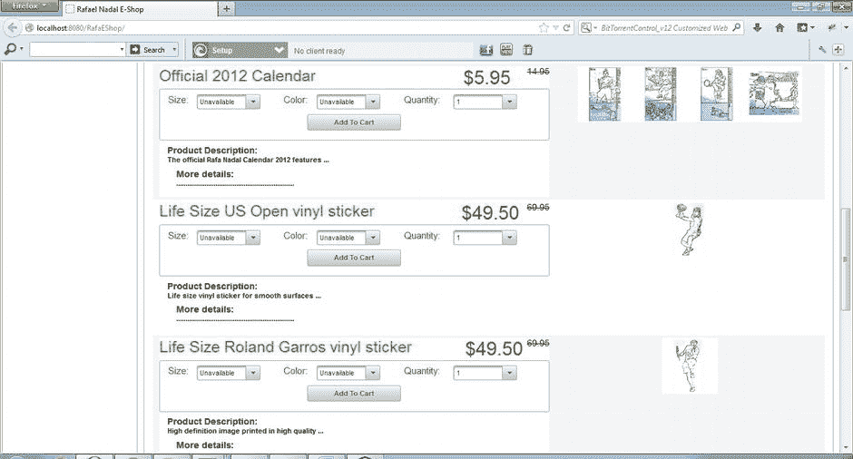
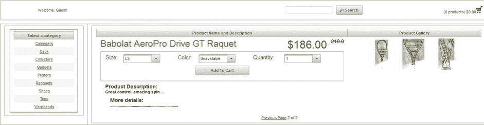
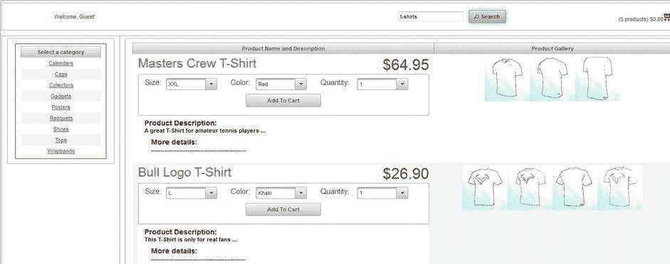
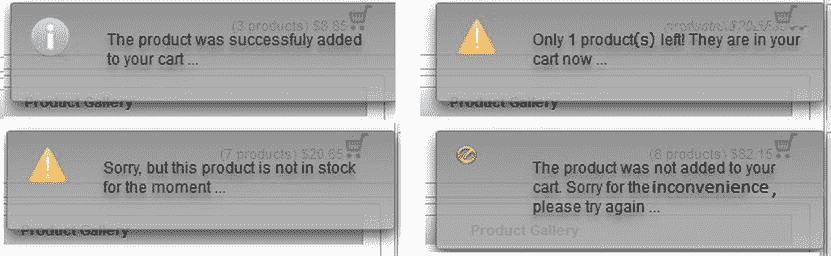
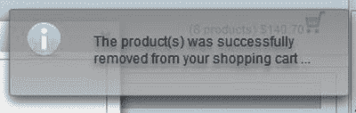

# 八、MongoDB 电子商务数据库查询

在第 7 章中，我们为一个电子商务应用开发了一个 MongoDB 数据库模型。现在，我们将编写使用数据库的必要查询，并了解如何执行电子商务平台的常见任务，包括:

*   显示产品类别。
*   展示促销产品。
*   显示一个类别中的产品(带分页)。
*   按名称(或名称中的单词)搜索产品。
*   查找客户(用于登录、编辑配置文件、保存订单等)。
*   保存订单，以便将购物车与数据库同步。
*   检查特定产品和数量的库存。
*   从购物车中移除产品时恢复数量。

这些任务中的每一项都将在 Hibernate Search/Apache Lucene 查询中完成(由于 JP-QL 还不够完善，我们需要使用 Apache 提供的全文搜索引擎)。Hibernate 搜索查询将以 JPA 风格编写。

为了测试数据库，我开发了一个电子商务网站，灵感来自网球运动员拉斐尔·纳达尔(`www.rafaelnadal-shop.com/en`)的官方电子商店。网站基于:

*   Java EE 6 (EJB 3.0，JSF 2.0)
*   Hibernate OGM 4.0.0 Beta2
*   MongoDB 2.2.2
*   MongoDB Java 驱动程序 2.8.0
*   Hibernate搜索 4.2.0 Beta 1
*   Apache Lucene 3.6.0
*   原始面孔 3.4.2

如果你不熟悉 JSF 或超级面孔，也不用担心。没有它们，您也可以使用 JSP 和 servlet等其他方法实现相同的功能。此外，您可以放弃 EJB，按照自己的意愿实现业务层。也可以使用 Hibernate 原生 API 来代替 JPA。这些技术并不是必需的，只要您理解了电子商务数据库模型和我们将要讨论的查询，您就可以使用您喜欢的技术将所有东西粘合到电子商务应用中。

您将在 Apress 资源库中找到名为`RafaEShop`的应用的完整源代码。该应用是作为 NetBeans 7.2.1 项目开发的，并在 GlassFish v3 下进行了测试。[图 8-1](#Fig1) 显示了这些类的交互。



[图 8-1](#_Fig1) 。RafaEShop 应用中的类的交互

出于本地主机测试的目的，遵循以下步骤(假设应用已经部署并且 MongoDB 服务器正在运行):

1.  确保在 MongoDB 中没有名为`eshop_db`的数据库。
2.  Access the page `http://localhost:8080/RafaEShop/faces/db.xhtml`, as shown in [Figure 8-2](#Fig2). (Obviously, you need to adjust the address and port to reflect your application server).

    

    [图 8-2](#_Fig2) 。用于填充 eshop_db 数据库的用户界面

3.  仅按一次标记为“*的按钮，填充拉斐尔·纳达尔电子商店 MongoDB 数据库；*“多次按下按钮会导致错误。
4.  通过按标有“*转到网站”的按钮导航到网站。*"此按钮导航到网站起始页。

现在你应该会看到类似于图 8-3 所示的东西。



[图 8-3](#_Fig3) 。拉斐尔·纳达尔电子商店 GUI

如果您需要恢复数据库(无论出于什么原因)，请遵循以下步骤:

1.  删除`eshop_db`数据库。您可以从 MongoDB shell 中这样做，就像这样:

    ```java
    mongo eshop_db
    db.dropDatabase()
    ```

2.  导航到`D root`文件夹并删除`eshop`文件夹(这是 Lucene 索引数据的地方)。
3.  从上面开始重复步骤 1-4。

现在让我们根据 Lucene 查询来“剖析”图 8-2 。

显示产品类别

第一个查询将从`categories_c`集合(`Categories`实体)中提取类别名称和 id。名称对用户可见，id 有助于识别类别，以便检索其产品；我们显示按名称排序的类别。你可以在`EshopBean.java`中找到这段代码，如[清单 8-1](#list1) 所示。

***[清单 8-1](#_list1) 。***EshopBean.java

```java
package eshop.beans;
...
public class EShopBean {
...
public List<String> extractCategories() {

   FullTextEntityManager fullTextEntityManager =
                                        org.hibernate.search.jpa.Search.getFullTextEntityManager(em);

   QueryBuilder queryBuilder = fullTextEntityManager.getSearchFactory().buildQueryBuilder().
                                        forEntity(Categories.class).get();

        org.apache.lucene.search.Query query = queryBuilder.all().createQuery();

        FullTextQuery fullTextQuery = fullTextEntityManager
.createFullTextQuery(query, Categories.class);
        fullTextQuery.setProjection(FullTextQuery.ID, "category");
        Sort sort = new Sort(new SortField("category", SortField.STRING));
        fullTextQuery.setSort(sort);

        fullTextQuery.initializeObjectsWith(ObjectLookupMethod.SKIP,
                                        DatabaseRetrievalMethod.FIND_BY_ID);

        List<String> results = fullTextQuery.getResultList();

        return results;
    }
}
```

这个查询非常简单。我们通过投射类别名称和 id来提取所有的`Categories`实例(按照类别名称排序)。在[图 8-4](#Fig4) 中，你可以看到类别是如何在浏览器中列出的。



[图 8-4](#_Fig4) 。显示产品类别

展示促销产品

除了类别名称，我们网站的第一页还包含促销产品列表；这些产品可以属于不同的类别。这是许多电子商务网站的常见做法，但你也可以展示最新的产品或畅销书。在这种情况下，通过检查`products_c`集合(`Products`实体)中文档的 MongoDB 字段`product_old_price`(*产品*实体中的`old_price`)很容易识别促销产品。所有旧价格大于 0 的产品都被认为是促销产品。因此，该查询看起来像清单 8-2 中的代码。

***[清单 8-2](#_list2) 。*** 查询用于展示的促销产品

```java
package eshop.beans;
...
public class EShopBean {
...
public List<Products> extractPromotionalProducts() {

        FullTextEntityManager fullTextEntityManager = org.hibernate.search.jpa.Search.getFullTextEntityManager(em);

        org.apache.lucene.search.Query query = NumericRangeQuery
.newDoubleRange("old_price", 0.0d, 1000d, false, true);
        FullTextQuery fullTextQuery = fullTextEntityManager
.createFullTextQuery(query, Products.class);
        Sort sort = new Sort(new SortField("price", SortField.DOUBLE));
        fullTextQuery.setSort(sort);

        fullTextQuery.initializeObjectsWith(ObjectLookupMethod.SKIP,                                           DatabaseRetrievalMethod.FIND_BY_ID);

        List results = fullTextQuery.getResultList();

        return results;
    }
}
```

请注意，促销产品是按价格升序显示的。显然，您可以用多种不同的方式在 web 浏览器中展示产品。在[图 8-5](#Fig5) 中，你可以看到我们的定制设计。请注意，促销产品的旧价格位于当前价格的右侧。



[图 8-5](#_Fig5) 。展示促销产品

如你所见，我们还没有为促销产品提供分页。接下来，我们将研究如何在显示选定类别的产品时提供分页，您可以在这里采用相同的机制。

显示某一类别的产品

当用户选择一个类别时，我们需要提供该类别下的产品列表。既然我们有了类别 id，提取产品就很容易了，如清单 8-3 所示。

***[清单 8-3](#_list3) 。*** 提取产品

```java
package eshop.beans;
...
public class EShopBean {
...
public Map<Integer, List<Products>> extractProducts(String id, int page) {

        FullTextEntityManager fullTextEntityManager =
                                     org.hibernate.search.jpa.Search.getFullTextEntityManager(em);

        QueryBuilder queryBuilder = fullTextEntityManager.getSearchFactory().
                                             buildQueryBuilder().forEntity(Products.class).get();
        org.apache.lucene.search.Query query = queryBuilder.keyword().
                                             onField("category.id").matching(id).createQuery();

        FullTextQuery fullTextQuery = fullTextEntityManager
.createFullTextQuery(query, Products.class);
        Sort sort = new Sort(new SortField("price", SortField.DOUBLE));
        fullTextQuery.setSort(sort);

        fullTextQuery.initializeObjectsWith(ObjectLookupMethod.SKIP,
                                             DatabaseRetrievalMethod.FIND_BY_ID);

        fullTextQuery.setFirstResult(page * 3);
        fullTextQuery.setMaxResults(3);
        List<Products> results = fullTextQuery.getResultList();

        Map<Integer, List<Products>> results_and_total = new HashMap<Integer, List<Products>>();
        results_and_total.put(fullTextQuery.getResultSize(), results);

        return results_and_total;
    }
}
```

返回类型`Map<Integer, List<Products>>`可能看起来很奇怪，但实际上理解起来非常简单。由于一个类别可能包含许多产品，我们需要实现分页机制，并且每次查询只从数据库加载一个页面(页面大小设置为三个产品)。为了计算页面数量，我们需要知道所选类别中的产品数量，即使我们只提取其中的一部分。Lucene 能够返回产品的总数，即使你只查询一些产品。产品总数存储为返回的映射的键，而产品列表是该映射的值。下面是它的代码:

*   `fullTextQuery.setFirstResult(int n);`设置检索数据的第一个结果的位置，或者换句话说，它跳过结果集中的前“n”个元素。`fullTextQuery.setMaxResults(int n);, which is`用于设置从第一个结果开始检索的结果数。
*   返回与查询匹配的所有结果的数量，即使我们只检索结果的子集。

例如，在图 8-6 中，你可以看到`Racquets`类别中的最后一个产品。在产品列表下，您可以看到上一页的导航链接和类型`current_page of total_pages`的分页状态:



图 8-6。使用分页显示某个类别的产品

按名称搜索产品

电子商务网站必须执行的一项任务是提供一种简单的方法来搜索特定产品或大量产品，而无需浏览产品的类别和页面。通常，用户知道产品名称或者知道他在找什么。例如，他可能知道产品名为“ *Babolat AeroPro Drive GT 球拍，*”，或者他可能只知道他正在寻找一款“*球拍。*“最难的是用户只知道应该出现在产品名称中的关键词。

许多查询引擎用自定义查询来处理这样的问题，但是 Lucene 是专门为在文本中搜索而设计的，所以在文本中搜索关键字是小菜一碟。完成这种搜索最简单的方法是激活`Products`实体(set `analyze = Analyze.YES`)中产品字段的默认分析器。对于复杂的搜索，您可以编写自己的分析器，或者混合分析器等等。如果需要对关键字进行更细粒度的控制，可以使用通配符。

清单 8-4 中的代码定位名称中包含一个关键字(或由空格分隔的关键字列表)的产品(或一组产品)。(我武断地选择不对结果进行排序。)

***[清单 8-4](#_list4) 。*** 通过关键字定位产品

```java
package eshop.beans;
...
public class EShopBean {
...
public List<Products> searchProducts(String search) {

        FullTextEntityManager fullTextEntityManager =
                                       org.hibernate.search.jpa.Search.getFullTextEntityManager(em);

        QueryBuilder queryBuilder = fullTextEntityManager.getSearchFactory().
                                             buildQueryBuilder().forEntity(Products.class).get();
        org.apache.lucene.search.Query query = queryBuilder.keyword().
                                             onField("product").matching(search).createQuery();

        FullTextQuery fullTextQuery = fullTextEntityManager
.createFullTextQuery(query, Products.class);

        fullTextQuery.initializeObjectsWith(ObjectLookupMethod.SKIP,
                                             DatabaseRetrievalMethod.FIND_BY_ID);
        fullTextQuery.setMaxResults(3);

        List results = fullTextQuery.getResultList();

        return results;
    }
}
```

我们搜索的一个限制是它最多返回三个结果(前三个)。如果您想返回更多，甚至全部，您将需要实现分页机制，以避免在单个查询中返回太多数据。

例如，我测试了关键词“ *t 恤衫*的搜索，得到了如图 8-7 所示的结果[。](#Fig7)



[图 8-7](#_Fig7) 。通过关键字搜索产品

通过电子邮件和密码找到客户

每个客户必须有一个唯一的帐户，在`Customers`实体(`customers_c`集合)中包含他的名字、姓氏、电子邮件地址、密码等等。当客户登录网站、查看或修改他的个人资料、下订单或采取其他行动时，我们需要能够从数据库中提取客户详细信息。[清单 8-5](#list5) 中的查询通过电子邮件地址和密码在`customers_c`集合中定位一个客户。

***[清单 8-5](#_list5) 。*** 寻找客户

```java
package eshop.beans;
...
public class EShopBean {
...
public Customers extractCustomer(String email, String password) {

        FullTextEntityManager fullTextEntityManager =
                                       org.hibernate.search.jpa.Search.getFullTextEntityManager(em);

        QueryBuilder queryBuilder = fullTextEntityManager.getSearchFactory().buildQueryBuilder().
                                             forEntity(Customers.class).get();
        org.apache.lucene.search.Query query = queryBuilder.bool().must(queryBuilder.keyword()
                                            .onField("email").matching(email).createQuery()).
                                            must(queryBuilder.keyword()
                                            .onField("password").matching(password).createQuery()).createQuery();

        FullTextQuery fullTextQuery = fullTextEntityManager
.createFullTextQuery(query, Customers.class);

        fullTextQuery.initializeObjectsWith(ObjectLookupMethod.SKIP,
                                            DatabaseRetrievalMethod.FIND_BY_ID);

        List results = fullTextQuery.getResultList();

        if (results.isEmpty()) {
            return null;
        }

        return (Customers) results.get(0);
    }
}
```

定购

这个查询不需要 Lucene。当客户下订单时，应用应该有客户(因为他或她已登录)；送货地址(由客户提供)；和购物车(存储在客户的会话中)。有了这些，保持订单就非常容易了，就像这样:

```java
package eshop.beans;
...
public class EShopBean {
...
private EntityManager em;
...
Orders new_order = new Orders();
...
//for each product
new_order.getCart().add( *cart_product*);
...
new_order.setShipping_address( *shipping_address*);
new_order.setCustomer( *customer*);

new_order.setOrderdate(Calendar.getInstance().getTime());
new_order.setSubtotal( *payment*);
new_order.setStatus("PURCHASED");

...
em.persist(new_order);
...
}
```

这个查询只影响单个文档，提供了原子性。

检查库存

只有在仓库库存中有产品时，客户才能将产品添加到购物车中。从程序上讲，这意味着我们需要知道产品细节和所需数量；检查它在库存中是否可用；如果是，从库存中删除该数量。

然而，从库存中删除会导致数据不一致，这显然是不可取的。这可以通过使用乐观锁定(甚至悲观锁定)来避免，但是当抛出乐观锁定异常时，这是要付出代价的。一个简单的解决方案是提供一条消息，如“*产品未添加到您的购物车。抱歉给您带来不便，请再试一次。。。*"，或者等待几秒钟，重复查询一定次数，或者直到库存中不再有该产品。第一个解决方案给客户一个快速的响应，而第二个解决方案则让他等待。我选择返回一条消息，敦促用户再试一次。代码如[清单 8-6](#list6) 所示。

***[清单 8-6](#_list6) 。*** 盘点库存

```java
package eshop.beans;
...
public class EShopBean {
...
public int checkInventory(String sku, String color, String size, int quantity) {

        InventoryPK pk = new InventoryPK(sku, color, size);

        Inventory inventory = em.find(Inventory.class, pk, LockModeType.OPTIMISTIC);
        int amount = inventory.getInventory();
        if (amount > 0) {
            if (amount >= quantity) {
                amount = amount - quantity;
                inventory.setInventory(amount);
                try {
                    em.merge(inventory);
                } catch (OptimisticLockException e) {
                    return -9999;
                }

                return quantity;
            } else {
                inventory.setInventory(0);
                try {
                    em.merge(inventory);
                } catch (OptimisticLockException e) {
                    return -9999;
                }

                return amount;
            }
        } else {
            return amount;
        }
    }
}
```

当库存包含的产品少于所需数量时，我们只将可用的数量添加到购物车中，并通过消息通知用户。[图 8-8](#Fig8) 显示了当用户试图将产品添加到购物车时可能出现的消息。



[图 8-8](#_Fig8) 。将产品添加到购物车时可能出现的消息

当然，有许多方法可以改善这一点，例如在每个产品旁边显示一条消息，说明“*有货*或“*无货*”，并为后者取消激活`Add to Cart`按钮。

恢复库存

客户可以在下订单之前从购物车中放下产品，或者如果用户分心而没有及时完成订单，会话可能会过期(我们的应用没有实现这种情况)。当这种情况发生时，我们需要通过将丢弃的产品添加回库存来恢复库存。实际上，该过程与从库存中移除产品相反，因此可能会出现相同的数据不一致问题。乐观锁定(或悲观锁定)可以解决这个问题，但是，我们必须再次处理一个可能的乐观锁定异常。很明显，你不能给顾客回复一条信息说，“*抱歉，我们不能从你的购物车中删除产品。。。*“因为那样会很烦。在我们的例子中，我们只是从购物车中删除产品(因为它存储在会话中),并且只尝试一次恢复库存。但是您可以重复查询，将数量存储在其他地方，稍后再尝试恢复它；或者您可以使用内存中的二级库存；或者找到任何其他符合您需求的方法。

下面是恢复库存的代码:

```java
package eshop.beans;
...
public class EShopBean {
...
public int refreshInventory(String sku, String color, String size, int quantity) {

        InventoryPK pk = new InventoryPK(sku, color, size);

        Inventory inventory = em.find(Inventory.class, pk, LockModeType.OPTIMISTIC);
        int amount = inventory.getInventory();

        amount = amount + quantity;

        inventory.setInventory(amount);

        try {
            em.merge(inventory);
        } catch (OptimisticLockException e) {
            return -9999;
        }

        return quantity;
    }
}
```

当产品从购物车中移除时(即使库存实际上无法恢复)，用户应该会看到类似于图 8-9 中的消息。



[图 8-9](#_Fig9) 。指示从购物车中移除产品成功的消息

此时，我们有了一组与许多电子商务网站相当的查询。显然，还可以添加许多其他的，或者使用这个数据库模型，或者通过修改模型本身。

开发管理 GUI 的注意事项

到目前为止，我们只从一个客户(用户)的角度谈论了电子商务平台。但行政方面对电子商务平台也很重要。只需编写适当的查询，您就可以基于我们的数据库模型开发一个强大的管理 GUI。例如，我们的数据库模型简化了管理员必须完成的最常见的任务:

*   您可以轻松地创建一个新的类别，重命名或删除现有的类别，等等。
*   您可以在类别中插入新产品、删除现有产品或修改产品特征。
*   您可以查看或修改客户资料和订单。
*   您可以轻松地填充库存和跟踪状态。
*   您可以创建几个关于销售、畅销书等的统计数据。

所有这些任务都可以自动完成(每个查询只影响一个文档)。

摘要

在本章中，您学习了如何查询在[第 7 章](07.html)中建模的 MongoDB 电子商务数据库。您看到了编写 Lucene 查询来实现电子商务平台的主要功能并避免交易是多么容易。使用 MongoDB 每个文档的原子性、嵌入式集合、嵌套文档和一些棘手的查询，我们能够创建一个电子商务站点，它提供了真正的电子商务平台的大多数公共设施。此时，您可以轻松地编写一个管理端，添加一个强大的登录机制，修改某些参数，比如产品页面大小等等。