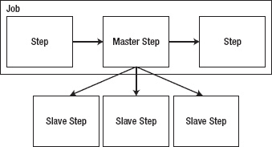
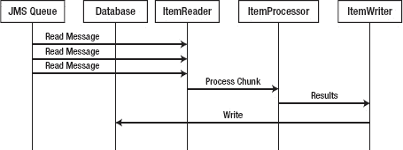
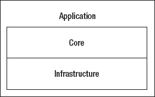
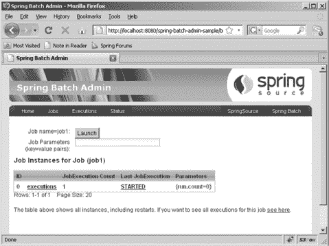

## C H A P T E R 1

## 批量和Spring

2001 年，当我从北伊利诺伊大学毕业，花了两年时间研究 COBOL、大型机汇编程序和作业控制语言(JCL)之后，我找到了一份学习 Java 的顾问工作。我特别选择了那个职位，因为在 Java 还是热门新事物的时候，我有机会学习它。我做梦也没想到我会回来写批处理。我相信大多数 Java 开发人员也不会考虑批处理。他们考虑最新的 web 框架或 JVM 语言。他们考虑面向服务的架构，以及 REST 与 SOAP 之类的东西，或者当时流行的任何字母汤。

但事实是，商业世界是批量运行的。您的银行和 401k 报表都是通过批处理生成的。你从最喜欢的商店收到的带有优惠券的电子邮件？可能通过批处理发送。就连修理工来你家修你洗衣机的顺序都是批量处理决定的。在一个我们从 Twitter 获取新闻的时代，谷歌认为等待页面刷新需要太长时间来提供搜索结果，而 YouTube 可以让某人一夜之间家喻户晓，为什么我们需要批处理呢？

有几个很好的理由:

*   您并不总是能立即获得所有需要的信息。批处理允许您在开始所需的处理之前收集给定处理所需的信息。以你每月的银行对账单为例。在每次交易后为打印的报表生成文件格式有意义吗？更有意义的做法是等到月底，回头看看经过审核的交易清单，以此来构建报表。
*   有时候这是很好的商业意识。虽然大多数人喜欢在他们点击购买的第二秒就把他们在网上购买的东西放在送货卡车上，但这可能不是零售商的最佳行动方案。如果客户改变主意，想要取消订单，如果订单还没有发货，取消会便宜很多。给顾客几个小时的额外时间，一起分批发货，可以为零售商节省大量资金
*   它可以更好地利用资源。闲置大量处理能力的成本很高。让一组预定的进程以一个恒定的、可预测的速率一个接一个地运行，充分发挥机器的潜力，这样更划算。

这本书是关于用 Spring Batch 框架进行批处理的。本章回顾了批处理的历史，指出了开发批处理作业的挑战，提出了使用 Java 和 Spring Batch 开发批处理的案例，最后提供了框架及其特性的高级概述。

### 批量处理的历史

要看批处理的历史，你真的需要看计算本身的历史。

时间是 1951 年。UNIVAC 成为第一台商业化生产的计算机。在此之前，计算机都是为特定功能设计的独特的定制机器(例如，在 1946 年，军方委托一台计算机来计算炮弹的轨迹)。UNIVAC 由 5200 个真空管组成，重量超过 14 吨，速度高达 2.25MHz(相比之下，iPhone 4 的处理器为 1GHz)，运行从磁带驱动器加载的程序。在当时，UNIVAC 被认为是第一个商业化的批处理机。

在深入历史之前，我应该定义一下批处理到底是什么。你开发的大多数应用都有用户交互的一面，无论是用户点击 web 应用中的链接，在胖客户端的表单中输入信息，还是在手机和平板电脑应用上点击。批处理与那些类型的应用完全相反。*批处理*，在本书中，被定义为没有交互或中断的数据处理。一旦开始，批处理运行到某种形式的完成，没有任何干预。

在计算机和数据处理的发展中，下一个大的变化:高级语言，已经过去了四年。它们最初是在 IBM 704 上与 Lisp 和 Fortran 一起引入的，但后来成为批处理世界中 800 磅重的大猩猩的是通用面向业务语言(COBOL)。COBOL 于 1959 年开发，并在 1968 年、1974 年和 1985 年进行了修订，它仍然在现代商业中运行批处理。Gartner 的一项研究 [1](#CHP-1-FN-1) 估计，全球 60%的代码和 85%的商业数据都是用这种语言编写的。换个角度来看，如果你把所有的代码都打印出来，然后把打印出来的东西堆起来，你会得到一堆 227 英里高的东西。但这正是创新停滞的地方。

COBOL 在四分之一个世纪里没有经历过重大的修改。教授 COBOL 及其相关技术的学校数量已经明显下降，取而代之的是像 Java 和. NET 这样的新技术。硬件很昂贵，资源也越来越稀缺。

大型计算机不是批处理发生的唯一地方。我之前提到的那些电子邮件是通过批处理发送的，而这些批处理可能不会在大型机上运行。从你最喜欢的快餐连锁店的销售点终端下载数据也是批量的。但是，您在大型机上发现的批处理进程和那些通常为其他环境编写的批处理进程(例如，C++和 UNIX)之间有一个显著的区别。这些批处理过程都是定制开发的，它们几乎没有共同点。自从被 COBOL 接管后，新的工具和技术就很少了。是的，cron 作业已经在 UNIX 服务器上启动了定制开发的进程，在 Microsoft Windows 服务器上启动了计划任务，但是还没有新的行业认可的工具来执行批处理。

直到现在。2007 年，埃森哲宣布它正与 interface 21(Spring 框架的最初作者，现在的 SpringSource)合作开发一个开源框架，用于创建企业批处理流程。作为埃森哲首次正式进军开源世界，它选择将其在批处理方面的专业知识与 Spring 的流行和功能集结合起来，创建一个健壮、易用的框架。2008 年 3 月底，Spring Batch 1.0.0 发布版向公众开放；它代表了 Java 世界中第一个基于标准的批处理方法。一年多以后，在 2009 年 4 月，Spring Batch 升级到了 2.0.0，增加了一些特性，比如用 JDK 1.5+取代了对 JDK 1.4 的支持，基于块的处理，改进的配置选项，以及对框架内可伸缩性选项的显著增加。

__________

1[http://www . Gartner . com/web letter/merant/article 1/article 1 . html](http://www.gartner.com/webletter/merant/article1/article1.html)

在 COBOL 2002 和面向对象的 COBOL 中有一些修订，但是它们的采用比以前的版本少得多。

### 批量挑战

毫无疑问，您熟悉基于 GUI 编程的挑战(胖客户端和 web 应用都是如此)。安全问题。数据验证。用户友好的错误处理。不可预测的使用模式会导致资源利用率激增(让您的一篇博客文章出现在 Slashdot 的首页，以了解我在这里的意思)。所有这些都是同一件事的副产品:用户与你的软件交互的能力。

但是，批次不同。我在前面说过，批处理是一个不需要额外的交互就可以运行的过程。因此，GUI 应用的大多数问题都不再有效。是的，存在安全问题，并且需要数据验证，但是使用和友好的错误处理的峰值要么是可预测的，要么甚至可能不适用于您的批处理过程。您可以预测流程中的负载，并据此进行设计。如果只有可靠的日志记录和通知作为反馈，您可能会很快失败，因为技术资源可以解决任何问题。

所以批处理世界中的一切都是小菜一碟，没有挑战，对吗？很抱歉打破您的幻想，但是批处理在许多常见的软件开发挑战中呈现出它自己独特的变化。软件架构通常包括许多*要素*。可维护性。可用性。可扩展性。这些和其他能力都与批处理相关，只是方式不同。

前三个能力——可用性、可维护性和可扩展性——是相关的。有了 batch，你就不用担心用户界面了，所以可用性不是漂亮的图形用户界面和酷的动画。不，在批处理过程中，可用性是关于代码的:错误处理和可维护性。你能很容易地扩展通用组件来添加新特性吗？它在单元测试中被很好地覆盖了吗，这样当你改变一个已存在的组件时，你就可以知道对整个系统的影响了吗？当作业失败时，您是否知道何时、何地以及为什么失败，而无需花费很长时间进行调试？这些都是对批处理有影响的可用性的方面。

接下来是可扩展性。检查现实的时间到了:你最后一次在一个网站上工作是什么时候，这个网站每天有一百万的访问者？10 万怎么样？实话实说:大公司开发的大多数网站都不会被浏览很多次。然而，拥有一个需要在一个晚上处理 10 万到 50 万笔交易的批处理过程并不是一件难事。让我们把 4 秒钟加载一个网页看作一个稳定的平均值。如果通过批处理处理一个交易需要这么长时间，那么处理 100，000 个交易将需要四天以上的时间(对于 100 万个交易，则需要一个半月)。在当今的企业环境中，这对于任何系统都是不切实际的。底线是批处理需要能够处理的规模通常比您过去开发的 web 或胖客户端应用大一个或多个数量级。

第三是可用性。同样，这不同于您可能习惯的 web 或胖客户端应用。批处理通常不是全天候的。事实上，他们通常都有预约。大多数企业在知道所需的资源(硬件、数据等)可用时，会将作业安排在给定的时间运行。例如，需要为退休帐户建立报表。虽然您可以在一天中的任何时间运行该作业，但最好是在市场收盘后运行，这样您就可以使用收盘基金价格来计算余额。需要的时候能跑吗？你能在分配的时间内完成工作，不影响其他系统吗？这些问题和其他问题会影响批处理系统的可用性。

最后，您必须考虑安全性。通常，在批处理世界中，安全性并不围绕人们侵入系统和破坏东西。批处理在安全方面的作用是保护数据安全。敏感的数据库字段加密了吗？你是偶然记录个人信息的吗？对外部系统的访问如何？他们需要凭据吗？您是否以适当的方式保护这些凭据？数据验证也是安全性的一部分。通常，正在处理的数据已经过审查，但是您仍然应该确保遵守规则。

如您所见，在开发批处理过程中涉及到大量的技术挑战。从大多数系统的大规模到安全性，batch 都有。这是开发批处理过程的部分乐趣:你可以更专注于解决技术问题，而不是在 web 应用上将表单字段向右移动三个像素。问题是，在大型机现有基础设施和采用新平台的所有风险的情况下，为什么要用 Java 进行批处理呢？

### 为什么要用 Java 做批处理？

面对刚刚列出的所有挑战，为什么要选择 Java 和 Spring Batch 这样的开源工具来开发批处理呢？我能想到在你的批处理中使用 Java 和开源的六个原因:可维护性、灵活性、可伸缩性、开发资源、支持和成本。

可维护性第一。当您考虑批处理时，您必须考虑维护。这段代码通常比其他应用有更长的生命周期。这是有原因的:没有人看到批处理代码。与必须跟上当前趋势和风格的 web 或客户端应用不同，批处理是用来处理数字和构建静态输出的。只要它完成了它的工作，大多数人只是享受他们工作的成果。正因为如此，您需要以这样一种方式构建代码，使得它可以被容易地修改而不会招致大的风险。

进入 Spring 框架。Spring 是为你可以利用的一些东西而设计的:可测试性和抽象性。Spring 框架通过依赖注入和 Spring 提供的额外测试工具来鼓励对象的解耦，这允许您构建一个健壮的测试套件来最小化后续维护的风险。在没有深入探究 Spring 和 Spring 批处理工作方式的情况下，Spring 提供了以声明方式处理文件和数据库 I/O 的工具。你不必写 JDBC 代码或管理 Java 中文件 I/O API 的噩梦。像事务和提交计数之类的事情都由框架来处理，所以您不必管理您在流程中的位置以及当出现问题时该做什么。这些只是 Spring Batch 和 Java 为您提供的可维护性优势的一部分。

Java 和 Spring Batch 的灵活性是使用它们的另一个原因。在大型机领域，您有一个选择:在大型机上运行 COBOL。就这样。另一个常见的批处理平台是 UNIX 上的 C++。这最终成为一个非常定制的解决方案，因为没有业界接受的批处理框架。无论是大型机还是 C++/UNIX 方法都无法提供 JVM 部署的灵活性和 Spring Batch 的特性集。想要在装有*nix 或 Windows 的服务器、台式机或大型机上运行批处理？没关系。需要将您的流程扩展到多台服务器？无论如何，大多数 Java 都是在廉价的商用硬件上运行的，在机架上增加一台服务器并不像购买一台新的大型机那样是资本支出。事实上，为什么要拥有服务器呢？云是运行批处理的好地方。您可以随心所欲地扩展，并且只需为您使用的 CPU 周期付费。我想不出比批处理更好的利用云资源的方法。

然而，Java 的“一次编写，随处运行”的特性并不是 Spring 批处理方法带来的唯一灵活性。灵活性的另一个方面是能够在系统间共享代码。您可以在批处理过程中使用已经在 web 应用中测试和调试过的相同服务。事实上，能够访问曾经被锁在其他平台上的业务逻辑是迁移到这个平台的最大优势之一。通过使用 POJOs 来实现您的业务逻辑，您可以在您的 web 应用中、在您的批处理过程中使用它们——几乎可以在任何使用 Java 进行开发的地方使用它们。

Spring Batch 的灵活性还在于它能够扩展用 Java 编写的批处理过程。让我们看看扩展批处理过程的选项:

*   *大型机:*大型机在可扩展性方面的额外容量有限。并行完成任务的唯一真正方法是在单一硬件上并行运行完整的程序。这种方法受到以下事实的限制:您需要编写和维护代码来管理并行处理以及与之相关的困难，例如跨程序的错误处理和状态管理。此外，您受到单台机器资源的限制。
*   *自定义处理:*从头开始，即使是在 Java 中，也是一项令人望而生畏的任务。为大量数据获得正确的可伸缩性和可靠性是非常困难的。同样，您也面临着为负载平衡而编码的问题。当您开始跨物理设备或虚拟机进行分布时，您还会面临巨大的基础架构复杂性。你必须关心片段之间的通信是如何工作的。你还有数据可靠性的问题。当你的一个定制工人倒下时会发生什么？名单还在继续。我不是说做不到；我是说，你的时间可能更好地用于编写业务逻辑，而不是重新发明轮子。
*   *Java 和 Spring Batch:* 虽然 Java 本身就有处理前一项中的大部分元素的工具，但是以一种可维护的方式将这些部分组合在一起是非常困难的。春批帮你搞定了。想要在单个服务器上的单个 JVM 中运行批处理吗？没问题。您的企业正在成长，现在需要将账单计算工作分配到五台不同的服务器上，以便在一夜之间全部完成？你被保护了。数据可靠性？只需进行一些配置并记住一些关键原则，就可以完全处理事务回滚和提交计数。

正如您在深入研究 Spring Batch 框架时所看到的，困扰先前批处理选项的问题可以通过设计良好且经过测试的解决方案得到缓解。到目前为止，本章已经讨论了为您的批处理选择 Java 和开源的技术原因。然而，技术问题并不是做出这种决定的唯一原因。找到合格的开发资源来编码和维护系统的能力是很重要的。如前所述，批处理过程中的代码往往比您现在正在开发的 web 应用具有更长的生命周期。因此，找到了解相关技术的人和技术本身的能力一样重要。Spring Batch 基于非常流行的 Spring 框架。它遵循 Spring 的惯例，使用 Spring 的工具以及任何其他基于 Spring 的应用。因此，任何有 Spring 经验的开发人员都能够以最小的学习曲线掌握 Spring Batch。但是你能找到 Java，特别是 Spring 资源吗？

用 Java 做很多事情的一个理由是社区的支持。Spring 框架家族通过他们的论坛在网上拥有一个非常活跃的大型社区。该家族的 Spring Batch 项目是迄今为止 Spring 项目中发展最快的论坛之一。除此之外，还拥有强大的优势，如有需要，可以访问源代码并购买支持服务，所有支持基础都包含在此选项中。

最后你来成本。许多成本都与任何软件项目有关:硬件、软件许可、工资、咨询费、支持合同等等。然而，Spring Batch 解决方案不仅最划算，而且总体上也是最便宜的。使用商用硬件和开源操作系统和框架(Linux、Java、Spring Batch 等)，唯一的经常性成本是开发工资、支持合同和基础设施——远远低于与其他选项相关的经常性许可成本和硬件支持合同。

我认为证据很清楚。使用 Spring Batch 不仅是技术上最合理的途径，而且也是最具成本效益的方法。推销已经说得够多了:让我们开始了解到底什么是Spring批次。

### 其他用途为Spring批

我敢打赌，现在您一定在想，Spring Batch 是否只适合替换大型机。当你考虑你正在进行的项目时，你并不是每天都在翻出 COBOL 代码。如果这就是这个框架的全部优点，那么它就不是一个非常有用的框架。然而，这个框架可以帮助您处理许多其他用例。

最常见的用例是数据迁移。当您重写系统时，通常会将数据从一种形式迁移到另一种形式。风险在于，您可能会编写出测试不佳的一次性解决方案，并且不具备常规开发所具备的数据完整性控制。然而，当你想到 Spring Batch 的特性时，它似乎是一个自然的选择。您不必编写大量代码来启动和运行一个简单的批处理作业，但是 Spring Batch 提供了提交计数和回滚功能，这些功能是大多数数据迁移应该包括的，但很少做到。

Spring Batch 的第二个常见用例是任何需要并行处理的流程。随着芯片制造商接近摩尔定律的极限，开发人员意识到继续提高应用性能的唯一方法不是更快地处理单个事务，而是并行处理更多事务。最近发布了许多有助于并行处理的框架。Apache Hadoop 的 MapReduce 实现 GridGain 和其他实现在最近几年出现，试图利用多核处理器和通过云可用的众多服务器。然而，像 Hadoop 这样的框架要求您修改代码和数据，以适应它们的算法或数据结构。Spring Batch 提供了跨多个内核或服务器扩展您的流程的能力(如图 1-1 所示，带有主/从步骤配置),并且仍然能够使用您的 web 应用使用的相同对象和数据源。

***图 1-1。**简化并行处理*

最后，您会看到持续或 24/7 处理。在许多使用案例中，系统接收恒定或接近恒定的数据馈送。虽然接受数据的速度对于防止积压是必要的，但是当你查看数据的处理时，将数据分成一次处理的块可能更有效(如图[图 1-2](#fig_1_2) 所示)。Spring Batch 提供了一些工具，可以让您以一种可靠的、可伸缩的方式进行这种类型的处理。使用该框架的特性，您可以做一些事情，比如从队列中读取消息，将它们分批成块，并在一个永无止境的循环中一起处理它们。因此，您可以在高容量的情况下增加吞吐量，而不必理解从头开发这样一个解决方案的复杂细微差别。

***图 1-2。**批处理 JMS 处理以提高吞吐量*

正如您所看到的，Spring Batch 是一个框架，虽然它是为类似大型机的处理而设计的，但可以用来简化各种开发问题。了解了 batch 是什么以及为什么应该使用 Spring Batch 之后，让我们最终开始看看框架本身。

### 春批框架

Spring Batch 框架(Spring Batch)是 Accenture 和 SpringSource 合作开发的，作为一种基于标准的方法来实现常见的批处理模式和范例。

Spring Batch 实现的特性包括数据验证、输出格式化、以可重用方式实现复杂业务规则的能力，以及处理大型数据集的能力。当你仔细阅读本书中的例子时，你会发现，如果你对 Spring 很熟悉，Spring Batch 是有意义的。

让我们从框架的 30000 英尺视图开始，如图[图 1-3](#fig_1_3) 所示。

***图 1-3。**春批建筑*

Spring Batch 由分层配置的三层组成。顶部是*应用层*，它由所有定制代码和配置组成，用于构建您的批处理过程。您的业务逻辑、服务等等，以及如何组织作业的配置，都被视为应用。请注意，应用层并不位于核心层和基础设施层之上，而是包裹着另外两层。原因是，尽管您开发的大部分内容都是由与核心层一起工作的应用层组成的，但有时您会编写定制的基础结构，如定制的读取器和写入器。

应用层大部分时间都在与下一层——核心层——互动。*核心层*包含定义批处理域的所有部分。核心组件的元素包括作业和步骤接口，以及用于执行作业的接口:JobLauncher 和 JobParameters。

在这一切之下是*基础设施层*。为了进行任何处理，您需要读取和写入文件、数据库等等。您必须能够处理失败后重试作业时要做的事情。这些部分被认为是公共基础设施，存在于框架的基础设施组件中。

 **注意**一个常见的误解是 Spring Batch 是或者有一个调度器。它没有。在框架中没有办法安排作业在给定的时间或基于给定的事件运行。启动作业的方式有很多种，从简单的 cron 脚本到 Quartz，甚至是像 UC4 这样的企业调度程序，但是没有一种方式是在框架本身之内。[第 6 章](06.html#ch6)介绍了如何启动一项工作。

让我们浏览一下 Spring Batch 的一些功能。

#### 用 Spring 定义工作

批处理有许多不同的特定于领域的概念。一个*任务*是一个由许多步骤组成的过程。每一步都可能有输入和输出。当一个步骤失败时，它可能是也可能不是可重复的。作业的流程可能是有条件的(例如，仅当收入计算步骤返回的收入超过 1，000，000 美元时，才执行奖金计算步骤)。Spring Batch 提供了定义这些概念的类、接口和 XML 模式，使用 POJOs 和 XML 来适当地划分关注点，并以使用过 Spring 的人熟悉的方式将它们连接在一起。[例如，清单 1-1](#list_1_1) 显示了一个用 XML 配置的基本 Spring 批处理作业。其结果是一个批处理框架，只需对 Spring 有一个基本的了解就可以很快上手。

***清单 1-1。**样本Spring批量作业定义*

`<bean id="accountTasklet"
  class="com.michaelminella.springbatch.chapter1.AccountTasklet"/>

<job id="accountJob">
  <step id="accountStep">
    <tasklet ref="accountTasklet"/>
  </step>
</job>`

#### 管理工作

能够编写一个处理一些数据一次就不再运行的 Java 程序是一回事。但是任务关键型流程需要更强大的方法。保留作业状态以供重新执行、在作业失败时通过事务管理维护数据完整性以及保存过去作业执行的性能指标以供趋势分析，这些都是您在企业批处理系统中所期望的功能。这些功能 Spring Batch 都有，默认大部分都是开启的；在开发过程中，它们只需要对性能和需求进行最小的调整。

#### 本地和远程并行

如前所述，批处理作业的规模以及能够扩展它们的需求对于任何企业批处理解决方案都至关重要。Spring Batch 提供了以多种不同方式实现这一点的能力。从一个简单的基于线程的实现，其中每个提交时间间隔在线程池的自己的线程中处理；并行运行完整的步骤；涉及通过分区配置从远程主机获得工作单元的工作者网格；Spring Batch 提供了一组不同的选项，包括并行块/步骤处理、远程块处理和分区。

#### 标准化输入/输出

从具有复杂格式的平面文件、XML 文件(XML 是流式的，从不作为一个整体加载)甚至数据库中读入，或者写入文件或 XML，都可以只通过 XML 配置来完成。从代码中抽象出文件和数据库输入输出等内容的能力是 Spring Batch 中编写的作业的可维护性的一个属性。

#### Spring批量管理项目

编写自己的批处理框架并不意味着必须重新开发 Spring Batch 现成的性能、可伸缩性和可靠性特性。您还需要开发某种形式的管理工具集来完成启动和停止进程之类的工作，并查看以前作业运行的统计数据。然而，如果您使用 Spring Batch，它包括所有的功能以及一个更新的附加项目:Spring Batch Admin 项目。Spring Batch Admin 项目提供了一个基于 web 的控制中心，它为您的批处理过程提供控制(比如启动一个作业，如图 1-4 所示)以及随着时间的推移监控您的过程的性能的能力。

***图 1-4。**Spring批量管理项目用户界面*

#### 和Spring的所有特征

尽管 Spring Batch 包含了一系列令人印象深刻的功能，但最重要的是它是基于 Spring 构建的。Spring 为任何 Java 应用提供了详尽的特性列表，包括依赖注入、面向方面编程(AOP)、事务管理和大多数常见任务的模板/助手(JDBC、JMS、电子邮件等等)，在 Spring 框架上构建企业批处理几乎提供了开发人员需要的一切。

如您所见，Spring Batch 为开发人员带来了很多好处。Spring 框架的成熟开发模型、可伸缩性和可靠性特性以及管理应用都可以让您使用 Spring Batch 快速运行批处理过程。

### 这本书是如何工作的

在了解了批处理和 Spring Batch 的内容和原因之后，我相信您已经迫不及待地想要深入研究一些代码，并了解用这个框架构建批处理是怎么回事了。[第 2 章](02.html#ch2)回顾了批处理作业的领域，定义了一些我已经开始使用的术语(*作业*、*步骤*等等)，并带您建立您的第一个 Spring 批处理项目。你通过写一句“你好，世界！”来尊敬众神批处理作业，看看运行时会发生什么。

我写这本书的一个主要目标是，不仅深入研究 Spring Batch 框架是如何工作的，而且向您展示如何在一个实际的例子中应用这些工具。第 3 章为您在[第 10 章](10.html#ch10)中实施的项目提供需求和技术架构。

### 总结

本章回顾了批处理的历史。它涵盖了批处理开发人员面临的一些挑战，并证明了使用 Java 和开源技术来克服这些挑战的合理性。最后，通过研究 Spring Batch 框架的高级组件和特性，开始了对它的概述。到目前为止，您应该对所面临的情况有了一个很好的认识，并且理解 Spring Batch 中存在应对挑战的工具。现在，你需要做的就是学会如何做。我们开始吧。