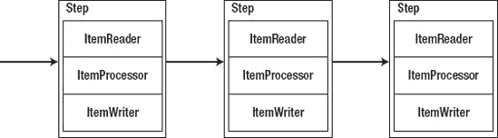
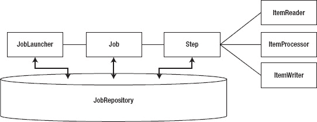
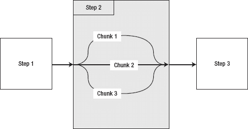
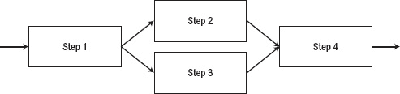
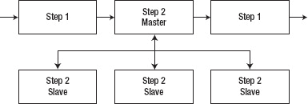

## C H A P T E R 2

## **春批 101**

Java 世界充满了开源框架。每一个都有自己的学习曲线，但是当你学习大多数新的框架时，你至少理解了这个领域。例如，当您学习 Struts 或 Spring MVC 时，您可能以前开发过基于 web 的应用程序。有了以前的经验，将您的定制请求处理转换成给定框架处理它的方式实际上只是学习一种新语法的问题。

然而，学习一个全新领域的框架有点困难。你会遇到诸如*作业*、*步骤*和*项目处理器*这样的术语，就好像它们在你所处的上下文中有意义一样。事实是，它可能不会。所以，我选择这一章作为批处理 101。本章涵盖以下主题:

*   *批处理的架构:*这一节开始深入探究批处理的组成，并定义了在本书的其余部分将会看到的术语。
*   *项目设置:*我边做边学。这本书的编排方式向您展示了 Spring Batch 框架如何工作的例子，解释了它为什么会这样工作，并为您提供了编码的机会。本节涵盖了基于 Maven 的 Spring 批处理项目的基本设置。
*   你好，世界！热力学第一定律讲能量守恒。运动第一定律是关于静止物体如何保持静止，除非受到外力作用。不幸的是，计算机科学的第一定律似乎是，无论你学习什么新技术，你都必须写一句“你好，世界！”使用所述技术的程序。在这里你遵守法律。
*   *运行作业:*如何执行您的第一个作业可能不会立即显现出来，因此我将带您了解作业是如何执行的，以及如何传入基本参数。
*   *作业结果:*您可以通过查看作业的完成情况来完成。本节介绍了什么是状态，以及它们如何影响 Spring Batch 的功能。

考虑到所有这些，工作到底是什么？

### 批量架构

最后一章花了一些时间讨论 Spring Batch 框架的三层:应用层、核心层和基础设施层。应用层代表您开发的代码，它在很大程度上与核心层接口。核心层由构成批处理域的实际组件组成。最后，基础设施层包括项目读取器和写入器，以及解决可重启性等问题所需的类和接口。

本节将深入 Spring Batch 的架构，并定义上一章中提到的一些概念。然后，您将了解一些对批处理至关重要的可伸缩性选项，以及是什么让 Spring Batch 如此强大。最后，本章讨论了大纲管理选项以及在文档中哪里可以找到关于 Spring Batch 的问题的答案。您从批处理的架构开始，查看核心层的组件。

#### 检查工作和步骤

[图 2-1](#fig_2_1) 展示了一项工作的本质。通过 XML 配置，批处理*作业*是按照特定顺序执行的步骤集合，作为预定义流程的一部分。让我们以用户银行账户的夜间处理为例。步骤 1 可以是加载从另一个系统接收的事务文件。第二步将所有的存款存入账户。最后，第 3 步将把所有的借方记入账户。该作业代表将交易应用到用户帐户的整个过程。

***图 2-1。**一个批处理作业*

当您深入观察时，在单个步骤中，您会看到一个独立的工作单元，它是工作的主要组成部分。每个步骤最多有三个部分:ItemReader、ItemProcessor 和 ItemWriter。请注意，这些元素(ItemReader、ItemProcessor 和 ItemWriter)的名称都是单数。那是故意的。这些代码中的每一段都在要处理的每条记录上执行。读取器读入单个记录，并将其传递给项目处理器进行处理，然后将其发送给项目写入器以某种方式持久化。

我说过一个步骤有三个部分。一个步骤不一定要有 ItemProcessor..让一个步骤只包含一个 ItemReader 和一个 ItemWriter(在数据迁移作业中很常见)或者只包含一个 tasklet(当您没有任何数据要读取或写入时，相当于一个 ItemProcessor)是可以的。表 2-1 展示了 Spring Batch 提供的表示这些概念的接口。

***表 2-1。**组成批处理作业的接口*

<colgroup><col align="left" valign="top" width="35%"> <col align="left" valign="top" width="55%"></colgroup> 
| **界面** | **描述** |
| :-- | :-- |
| `org.springframework.batch.core.Job` | 表示作业的对象，在作业的 XML 文件中配置。还提供执行作业的能力。 |
| 

*   `org.springframework.batch.core.Step`

 | 与作业一样，表示 XML 中配置的步骤，并提供执行步骤的能力。 |
| 

*   `org.springframework.batch.item.ItemReader<T>`

 | 提供输入项目能力的策略界面。 |
| 

*   `org.springframework.batch.item.ItemProcessor<T>`

 | 将业务逻辑应用于所提供的单个项目的工具。 |
| 

*   `org.springframework.batch.item.ItemWriter<T>`

 | 提供输出项目列表能力的策略界面。 |

Spring 构建作业的方式的一个优点是，它将每一步解耦到自己独立的处理器中。每一步都负责获取自己的数据，将所需的业务逻辑应用于数据，然后将数据写入适当的位置。这种分离提供了许多特性:

*   灵活性:仅仅通过修改 XML 就能改变处理顺序的能力是许多框架都在谈论的，但很少有人实现。春季批次是一个交付。想想之前的银行账户例子。，如果您想在贷记之前应用借记，唯一需要的更改是重新排序作业 XML 中的步骤([第 4 章](04.html#ch4)给出了一个例子)。您还可以跳过一个步骤，根据上一个步骤的结果有条件地执行一个步骤，甚至只需调整 XML 就可以并行运行多个步骤。
*   *可维护性:*由于每个步骤的代码都与之前和之后的步骤相分离，所以这些步骤很容易进行单元测试、调试和更新，而对其他步骤几乎没有影响。分离的步骤还使得在多个任务中重用步骤成为可能。正如您将在接下来的章节中看到的，steps 只不过是 Spring beans，可以像 Spring 中的任何其他 bean 一样重用。
*   *可扩展性:*工作中的分离步骤提供了许多选项来扩展您的工作。您可以并行执行各个步骤。您可以将一个步骤中的工作划分到多个线程中，并并行执行单个步骤的代码(您将在本章后面看到更多相关内容)。这些能力中的任何一种都可以让您满足业务的可伸缩性需求，同时对代码的直接影响最小。
*   *可靠性:*通过将每一步和每一步中的每一部分解耦，你可以构建作业，使它们可以在流程中的某个给定点重新启动。如果在第 3 步(共 7 步)中处理了 1000 万条记录中的 50，000 条记录后作业失败，您可以从它停止的地方重新启动它。

#### 工作执行

让我们看看当一个作业运行时，组件及其关系会发生什么。注意图 2-2 中大多数组件共享的部分是 JobRepository。这是一个数据存储(在内存或数据库中)，用于保存有关作业和步骤执行的信息。一个*作业执行*或T5】步骤执行是关于作业或步骤的单次运行的信息。在本章后面的章节和第 5 章[中，你会看到更多关于执行和存储库的细节。](05.html#ch5)

***图 2-2。**工作组成及其关系*

运行作业从 JobLauncher 开始。JobLauncher 通过检查 JobRepository 来验证作业以前是否运行过，验证传递给作业的参数，最后执行作业。

作业和步骤的处理非常相似。一个作业遍历它被配置运行的步骤列表，执行每一个步骤。当一个项目块完成时，Spring Batch 用执行结果更新存储库中的 JobExecution 或 StepExecution。一个步骤遍历 ItemReader 读入的项目列表。当步骤处理每个项目块时，存储库中的步骤执行会随着它在步骤中的位置而更新。像当前提交计数、开始和结束时间以及其他信息都存储在存储库中。当作业或步骤完成时，相关的执行会在存储库中更新为最终状态。

Spring Batch 从版本 1 到版本 2 的变化之一是增加了分块处理。在版本 1 中，一次读入、处理和写出一条记录。这样做的问题是，它没有利用 Java 的文件和数据库 I/O 提供的批量写功能(缓冲写和批量更新)。在 Spring Batch 的版本 2 和更高版本中，框架已经更新。阅读和处理仍然是单一的操作；如果数据无法处理，就没有理由将大量数据加载到内存中。但是现在，只有在出现提交计数间隔时，才会发生写入。这允许更高性能的记录写入以及更强大的回滚机制。

#### 并行化

一个简单的批处理的体系结构由一个单线程进程组成，该进程从头到尾依次执行一个作业的各个步骤。然而，Spring Batch 提供了许多并行化选项，您在前进的过程中应该了解这些选项。([第 11 章](11.html#ch11)详细介绍了这些选项。)有四种不同的方法来并行化您的工作:通过多线程步骤划分工作、完整步骤的并行执行、远程分块和分区。

##### 多线程步骤

实现并行化的第一种方法是通过多线程步骤进行分工。在 Spring Batch 中，一个作业被配置为处理被称为 *chunks* 的块中的工作，在每个块之后提交一次。通常，每个块都是连续处理的。如果您有 10，000 条记录，并且提交计数设置为 50 条记录，您的作业将处理记录 1 到 50 然后提交，处理记录 51 到 100 然后提交，依此类推，直到处理完所有 10，000 条记录。Spring Batch 允许您并行执行大量工作以提高性能。有了三个线程，你可以增加三倍的吞吐量，如图[图 2-3](#fig_2_3) 所示。T5 1T7】

***图 2-3。**多线程步骤*

##### 并行步骤

并行化的下一个方法是并行执行步骤的能力，如图 2-4 所示。假设您有两个步骤，每个步骤将一个输入文件加载到您的数据库中；但是步骤之间没有关系。在加载下一个文件之前必须等待一个文件已经加载，这有意义吗？当然不是，这就是为什么这是一个何时使用并行处理步骤能力的经典例子。

***图 2-4。**平行步进加工*

_________

1 这是理论上的吞吐量增加。许多因素会阻止进程实现这样的线性并行化。

##### 远程分块

最后两种并行化方法允许您将处理分散到多个 JVM 上。在以前的所有情况下，处理都是在单个 JVM 中执行的，这会严重阻碍可伸缩性选项。当您可以跨多个 JVM 水平扩展流程的任何部分时，满足大量需求的能力就会提高。

第一个远程处理选项是*远程分块*。在这种方法中，使用主节点中的标准 ItemReader 执行输入；然后，输入通过一种持久通信的形式(例如 JMS)发送到一个远程从属 ItemProcessor，它被配置为消息驱动的 POJO。当处理完成时，从机将更新的项目发送回主机进行写入。因为这种方法在主设备上读取数据，在从设备上处理数据，然后再发送回来，所以需要注意的是，它可能会占用大量网络资源。这种方法适用于 I/O 成本比实际处理成本低的情况。

##### 分区

Spring Batch 中并行化的最后一种方法是分区，如图 2-5 所示。同样，您使用主/从配置；但是这一次您不需要持久的通信方法，主服务器只作为一组从服务器步骤的控制器。在这种情况下，您的每个从属步骤都是独立的，其配置与本地部署的相同。唯一的区别是从属步骤从主节点而不是从作业本身接收工作。当所有的从机都完成了它们的工作，主步骤就被认为完成了。这种配置不需要具有保证交付的持久通信，因为 JobRepository 保证没有重复的工作，并且所有工作都已完成——不像远程分块方法，在远程分块方法中，JobRepository 不知道分布式工作的状态。

***图 2-5。**分区工作*

#### 批量管理

任何企业系统都必须能够启动和停止流程，监控它们的当前状态，甚至查看结果。对于 web 应用程序，这很容易:在 web 应用程序中，您可以看到您请求的每个操作的结果，而像 Google Analytics 这样的工具提供了关于您的应用程序如何被使用和执行的各种指标。

然而，在批处理世界中，可能有一个 Java 进程在服务器上运行了八个小时，除了日志文件和该进程正在处理的数据库之外，没有任何输出。这种情况很难控制。出于这个原因，Spring 开发了一个名为 Spring Batch Admin 的 web 应用程序，它允许您启动和停止作业，并提供每个作业执行的详细信息。

#### 文档

Spring Batch 的优势之一是真正的开发人员编写了它，他们拥有在各种企业中开发批处理的经验。从这一经历中不仅得到了一个全面的框架，还得到大量的文档。Spring Batch 网站包含了我曾经工作过的开源项目的最好的文档集合之一。除了正式文档，JavaDoc 对于 API 细节也很有用。最后，Spring Batch 提供了 19 个不同的示例作业，供您在开发自己的批处理应用程序时参考(参见[表 2-2](#tab_2_2) )。

***表 2-2。**样本批处理作业*

<colgroup><col align="left" valign="top" width="40%"> <col align="left" valign="top" width="50%"></colgroup> 
| **批处理作业** | **描述** |
| :-- | :-- |
| adhocLoopJob | 一个无限循环，用于演示通过 JMX 公开元素以及在后台线程(而不是主 JobLauncher 线程)中运行作业。 |
| beanwrappermapperssamplejob | 一种包含两个步骤的作业，用于演示文件字段到域对象的映射以及基于文件的输入的验证。 |
| compositeItemWriterSampleJob | 一个步骤只能有一个读取器和写入器。CompositeWriter 是解决这个问题的方法。这个示例作业演示了如何操作。 |
| 客户过滤作业 | 使用 ItemProcessor 过滤掉无效的客户。该作业还会更新步骤执行的过滤器计数字段。 |
| 委派工作 | 使用 ItemReaderAdapter，将输入的读取委托给 POJO 的已配置方法。 |
| 足球工作 | 足球统计工作。在加载两个输入文件(一个包含玩家数据，另一个包含游戏数据)后，该作业为玩家和游戏生成一组摘要统计信息，并将它们写入日志文件。 |
| groovyJob | 使用 Groovy(一种动态 JVM 语言)编写文件的解压缩脚本。 |
| headerFooterSample 示例 | 使用回调，添加了在输出中呈现页眉和页脚的功能。 |
| 休眠作业 | 默认情况下，Spring 批处理读取器和写入器不使用 Hibernate。这份工作展示了如何将 Hibernate 集成到您的工作中。 |
| 无限循环作业 | 只是一个无限循环的作业，用于演示停止和重启场景 |
| 广泛的工作 | 提供了许多不同 I/O 选项的示例，包括带分隔符和固定宽度的文件、多行记录、XML、JDBC 和 iBATIS 集成。 |
| jobSampleJob | 演示从另一个作业执行一个作业。 |
| loopFlowSample | 使用 decision 标记，演示如何以编程方式控制执行流。 |
| 邮件作业 | 使用 SimpleMailMessageItemWriter 将电子邮件作为每个项目的输出形式发送。 |
| 多重作业 | 将文件记录组视为代表单个项目的列表。 |
| 多重排序 | 作为多行输入概念的扩展，使用自定义读取器读取包含多行嵌套记录的文件。使用标准编写器，输出也是多行的。 |
| 平行作业 | 将记录读入临时表，多线程步骤在临时表中处理这些记录。 |
| 分区文件作业 | 使用 MultiResourcePartitioner 并行处理文件集合。 |
| 分区 JdbcJob | 不是查找多个文件并并行处理每个文件，而是划分数据库中的记录数进行并行处理。 |
| restartSampleJob | 处理开始时抛出一个假异常，以展示重新启动出错的作业并从停止的地方重新开始的能力。 |
| 重新取样 | 使用一些有趣的逻辑，展示了 Spring Batch 如何在放弃并抛出错误之前多次尝试处理一个项目。 |
| skipSampleJob | 基于 tradeJob 示例。但是，在此作业中，有一条记录未通过验证并被跳过。 |
| 任务作业 | Spring Batch 最基本的用途是微线程。此示例显示了如何通过 MethodInvokingTaskletAdapter 将任何现有方法用作微线程。 |
| 贸易工作 | 模拟真实世界的场景。这一分三步的工作将交易信息导入数据库，更新客户账户，并生成报告。 |

### 项目设置

到目前为止，您已经了解了为什么要使用 Spring Batch，并研究了框架的组件。然而，看图表和学习新的行话只会让你到此为止。在某些时候，你需要钻研代码:所以，拿起编辑器，让我们开始钻研吧。

在本节中，您将构建您的第一个批处理作业。您将逐步完成 Spring 批处理项目的设置，包括从 Spring 获取所需的文件。然后，您配置一个作业并编写代码“Hello，World！”春批版本。最后，您将学习如何从命令行启动批处理作业。

#### 获得春批

在开始编写批处理流程之前，您需要获得 Spring Batch 框架。有三种方法可以做到这一点:使用 SpringSource 工具套件(STS)，下载 zip 发行版，或者使用 Maven 和 Git。

##### 使用 SpringSource 工具套件

SpringSource(Spring 框架及其所有衍生物的维护者)已经将一个 Eclipse 发行版与一组专门为 Spring 开发设计的插件放在了一起。特性包括创建 Spring 项目、XML 文件和 beans 的向导，远程部署应用程序的能力，以及 OSGi 管理。你可以从 SpringSource 网站下载。

##### 下载 Zip 发行版

Spring Batch 框架也可以通过从 SpringSource 网站下载 zip 文件获得，有两个选项:所有依赖项或无依赖项(如文件名中的*-无依赖项*所示)。鉴于该项目是为 Maven 使用而设置的(尽管为使用 Ant 的人提供了一个 build.xml 文件)，下载无依赖性选项是一个更好的选择。

zip 文件包含两个目录:dist 和 samples。dist 包含发布 jar 文件:两个用于核心，两个用于基础设施，两个用于测试(各有一个源代码和编译)。在 samples 目录中，您可以找到一个 samples 项目(spring-batch-samples ),其中包含了您在本章前面看到的所有示例批处理作业；一个项目 shell (spring-batch-simple-cli ),可用作任何 spring 批处理项目的起点；以及两者的 Maven 父项目。这个模板项目是您开始使用 Spring Batch 的最简单的方式，并且将是您构建我们的项目前进的方式。

##### 从 Git 结账

获取 Spring Batch 代码的最后一种方法是从 SpringSource 使用的源代码库 Github 中获取。Git 版本控制系统是一个分布式版本控制系统，它允许您在本地使用存储库的完整副本..

***清单 2-1。**从 Github 查看项目*

`$ git clone git://github.com/SpringSource/spring-batch.git`

该命令导出 Spring Batch 项目的源代码，包括项目的外壳、示例应用程序和所有 Spring Batch 框架的源代码。清单 2-1 中的命令将获得整个 Spring 批处理 Git 库。为了获得一个特定的版本，从你的检出库中执行清单 2-2 中的命令。

***清单 2-2。**获取 Spring Batch 的特定版本*

`$ git checkout 2.1.7.RELEASE`

##### 配置 Maven

为了在您的构建中使用 Maven，您需要稍微调整一下本地 Maven 安装。作为 Spring 项目下载发行版的一部分提供的项目对象模型(POM)文件中没有配置 Spring Maven 存储库。因此，您应该将它们添加到 settings.xml 文件中。清单 2-3 显示了您需要的附加配置。

***清单 2-3。**从 SVN 获取仓库 DDL*

`<pluginRepositories>
    <pluginRepository>
        <id>com.springsource.repository.bundles.release</id>
        <name>SpringSource Enterprise Bundle Repository</name>
        <url>http://repository.springsource.com/maven/bundles/release</url>
    </pluginRepository>
</pluginRepositories>`

创建了项目 shell 并配置了 Maven 之后，您可以通过运行一个快速的`mvn clean install`来测试配置。构建成功后，您就可以开始第一个批处理作业了。

### 是法律:你好，世界！

计算机科学的法则很清楚。任何时候你学习一项新技术，你必须创造一个“你好，世界！”程序使用所说的技术，所以让我们开始吧。不要觉得你需要理解这个例子的所有活动部分。未来的章节将更详细地讨论每一部分。

在深入研究新代码之前，您应该清理一些不需要的文件和对它们的引用。这些文件虽然是作为示例提供的，但并不保存在典型的 Spring 批处理项目中。首先，我们可以删除所有的 java 源代码和测试。它们位于 src/main/java 和 src/test/java 目录中。一旦删除了这些，我们就可以删除 module-context.xml 文件了。这是一个示例作业配置，您的项目中不需要它。最后，因为您删除了项目配置中引用的几个 java 文件，所以也需要更新。在 src/main/resources/launch-context . XML 文件中，您需要删除 module-context.xml 顶部的导入以及文件底部的 dataSourceInitializer bean。dataSourceIntializer 将在第 12 章中进一步讨论。

如前所述，作业是用 XML 配置的。创造你的“你好，世界！”job，在 src/main/resources 中新建一个名为 jobs 的目录；在新目录中，创建一个名为 helloWorld.xml 的 XML 文件，如[清单 2-4](#list_2_4) 所示。

***清单 2-4。**那个“你好，世界！”工作*

`<?xml version="1.0" encoding="UTF-8"?>
<beans:beans xmlns ="http://www.springframework.org/schema/batch"
       xmlns:beans="http://www.springframework.org/schema/beans"
       xmlns:xsi="http://www.w3.org/2001/XMLSchema-instance"
       xsi:schemaLocation="http://www.springframework.org/schema/beans
                    http://www.springframework.org/schema/beans/spring-beans-3.0.xsd
                    http://www.springframework.org/schema/batch
                    http://www.springframework.org/schema/batch/spring-batch-2.1.xsd">

    <beans:import resource="../launch-context.xml"/>

    <beans:bean id="helloWorld"
                         class="com.apress.springbatch.chapter2.HelloWorld"/>

    <step id="helloWorldStep">
        <tasklet ref="helloWorld"/>
    </step>

    <job id="helloWorldJob">
        <step id="step1" parent="helloWorldStep"/>
    </job>
</beans:beans>`

如果这看起来有点眼熟，它应该。这是前面讨论过的高级分解，只是以 XML 的形式。

 **注意**尽管大多数 Spring 都为 XML 配置选项添加了注释等价物，但 Spring Batch 没有。作为 2.0 版本的一部分，Spring 添加了一个名称空间来帮助管理 XML。

如果您完成了这个过程，有四个主要部分:launch-context.xml 的导入、bean 声明、步骤定义和作业定义。Launch-context.xml 是一个包含在 shell 项目中的文件，该项目包含许多为您的作业配置的基础设施。像 datasource、JobLauncher 和项目中所有作业通用的其他元素都可以在这里找到。第 3 章更详细地介绍了这个文件。目前，默认设置有效。

bean 声明应该看起来像任何其他 Spring bean，这是有原因的:它就像任何其他 Spring bean 一样。HelloWorld bean 是一个小任务，它完成这项工作。一个*小任务*是一种特殊类型的步骤，用于在没有读取器或写入器的情况下执行一个功能。通常，一个微线程用于一个单一的功能，比如执行一些初始化，调用一个存储过程，或者发送一封电子邮件通知您任务已经完成。[第 4 章](04.html#ch4)讲述了微线程和其他步骤类型的语义细节。

下一块是台阶。如前所述，作业由一个或多个步骤组成。在 HelloWorld 作业中，您从执行您的小任务的单个步骤开始。Spring Batch 提供了一种使用批处理 XSD 配置步骤的简单方法。您使用 tasklet 标记创建一个小任务，并引用您之前定义的小任务。然后将它包装在一个只有 id 的步骤标签中。这定义了一个可重用的步骤，您可以根据需要在工作中多次引用它。

最后，你定义你的工作。这项工作实际上只不过是要执行的步骤的有序列表。在这种情况下，你只有一步。如果您想知道作业定义中的步骤标记是否与您在作业定义中使用的标记类型相同，那么它是相同的。如果愿意，您可以内联声明这些步骤。但是，在本例中，我在作业之外创建了一个步骤，并将其作为作业内步骤的父步骤。 [2](#CHP-2-FN-2) 我这样做有两个原因:保持 XML 的整洁，并且如果需要的话，可以方便地将步骤提取到其他 XML 文件中。您将在以后的章节中看到，XML for 步骤会变得非常冗长；这里展示的方法有助于保持作业的可读性。

您的作业已经配置好了，但是您的配置中有一个不存在的类:HelloWorld tasklet。在 src/main/Java/com/a press/spring batch/chapter 2 目录中创建 tasklet。正如您所猜测的，代码非常简单；参见[清单 2-5](#list_2_5) 。

***清单 2-5。** HelloWorld 小任务*

`package com.apress.springbatch.chapter2;

import org.springframework.batch.core.StepContribution;
import org.springframework.batch.core.scope.context.ChunkContext;
import org.springframework.batch.core.step.tasklet.Tasklet;
import org.springframework.batch.repeat.RepeatStatus;

public class HelloWorld implements Tasklet {

     private static final String HELLO_WORLD = "Hello, world!";

     public RepeatStatus execute( StepContribution arg0, ChunkContext arg1 ) throws Exception
{
          System.out.println( HELLO_WORLD );
          return RepeatStatus.FINISHED;
     }
}`

要创建 HelloWorld tasklet，您需要实现 tasklet 接口的单一方法:execute。StepContribution 和 ChunkContext 表示该小任务正在执行的步骤(提交计数、跳过计数等)的上下文。未来的章节将更详细地讨论这些问题。

### 管理你的工作

真的是这样。让我们尝试构建和运行作业。要编译它，从项目的根目录运行`mvn clean compile`。当构建成功时，运行作业。Spring Batch 自带了名为 CommandLineJobRunner 的作业运行器。正如您所猜测的，它是打算从…命令行运行的！在本书中，您将从项目的目标目录中执行作业，这样就不需要设置类路径。CommandLineJobRunner 接受两个或更多参数:包含作业配置的 XML 文件的路径、要执行的作业的名称和作业参数列表。对于 HelloWorldJob，只需传递前两个参数。要执行作业，运行清单 2-6 中的命令。

***清单 2-6。**执行 HelloWorld 作业*

`java -jar hello-world-0.0.1-SNAPSHOT.jar jobs/helloWorld.xml helloWorldJob`

_________

2 第 4 章详细介绍了步骤的父属性。

运行完作业后，请注意，在传统的 Spring 风格中，一个简单的“Hello，World！”但是如果您仔细观察(在输出的第 33 行周围)，就会发现:

* * *

`2010-12-01 23:15:42,442 DEBUG
org.springframework.batch.core.launch.support.CommandLineJobRunner.main()
[org.springframework.batch.core.scope.context.StepContextRepeatCallback] - <Chunk execution
starting: queue size=0>

**Hello, world!**

2010-12-01 23:15:42,443 DEBUG
org.springframework.batch.core.launch.support.CommandLineJobRunner.main()
[org.springframework.batch.core.step.tasklet.TaskletStep] - <Applying contribution:
[StepContribution: read=0, written=0, filtered=0, readSkips=0, writeSkips=0, processSkips=0, exitStatus=EXECUTING]>`

* * *

恭喜你！你刚刚运行了你的第一个春季批处理作业。那么，到底发生了什么？正如本章前面所讨论的，当 Spring Batch 运行一个作业时，作业运行器(在本例中是 CommandLineJobRunner)加载要运行的作业的应用程序上下文和配置(由传入的前两个参数指定)。从那里，作业运行器将 JobInstance 传递给执行作业的 JobLauncher。在这种情况下，执行作业的单个步骤，并相应地更新 JobRepository。

### 探索作业知识库

等等。JobRepository？这在你的 XML 中没有说明。这些信息都去哪里了？它进入了作业存储库，这是应该的。问题是 Spring Batch 被配置为默认使用 HSQLDB，所以所有这些元数据虽然在作业执行期间存储在内存中，但现在都不见了。让我们通过切换到 MySQL 来解决这个问题，这样您就可以更好地管理元数据，并看看当您运行作业时会发生什么。在这一节中，您将了解如何配置 JobRepository 来使用 MySQL，并通过运行 HelloWorldJob 探索 Spring Batch 向数据库中记录了什么。

#### 作业储存库配置

要更改 Spring Batch 存储数据的位置，需要做三件事:更新 batch.properties 文件，更新 pom，并在数据库中创建批处理模式。 [3](#CHP-2-FN-3) 让我们首先修改位于项目的/src/main/resources 目录中的 batch.properties 文件。属性应该非常简单。[清单 2-7](#list_2_7) 显示了我的清单中的内容。

***清单 2-7。** batch.properties 文件*

`batch.jdbc.driver=com.mysql.jdbc.Driver
batch.jdbc.url=jdbc:mysql://localhost:3306/spring_batch_test
# use this one for a separate server process so you can inspect the results
# (or add it to system properties with -D to override at run time).
batch.jdbc.user=root
batch.jdbc.password=p@ssw0rd
batch.schema=spring_batch_test
#batch.schema.script=schema-mysql.sql`

_________

3 我假设你已经安装了 MySQL。如果没有，请前往`[www.mysql.com](http://www.mysql.com)`下载并获取安装说明。

请注意，我注释掉了 batch.schema.script 行。当您运行作业时，dataSourceIntializer 会执行指定的脚本。当您从事开发工作时，这很有帮助，但是如果您想要持久化数据，这就没那么有用了。

现在属性文件指向 MySQL 的本地实例，您需要更新 POM 文件，以便在类路径中包含 MySQL 驱动程序。为此，找到 HSQLDB 依赖项，并如清单 2-8 所示更新它。

***清单 2-8。** Maven MySQL 依赖*

`<dependency>
    <groupId>mysql</groupId>
    <artifactId>mysql-connector-java</artifactId>
    <version>5.1.3</version>
</dependency>`

在这个依赖关系中，5.1.3 是 MySQL 在本地运行的版本。

配置好数据库连接后，Spring Batch 需要您创建模式。使用 MySQL，您可以创建如清单 2-9 所示的模式。

***清单 2-9。**创建数据库模式*

`mysql> create database spring_batch_test;
Query OK, 1 row affected (0.00 sec)
mysql> use spring_batch_test;
Database changed
mysql> source ~/spring_batch/src/main/resources/org/springframework/batch/core/schema-mysql.sql`

就这样。让我们再次运行作业(确保首先执行`mvn clean compile`，将更新后的 batch.properties 文件复制到目标)。使用与前面相同的命令，您应该会看到相同的输出。不同的是，这一次，春批留下了一些东西。我们来看看数据库。

#### 作业知识库表

Spring Batch 使用数据库来维护单次执行期间以及执行之间的状态。记录了有关作业实例、传入的参数、执行结果以及每个步骤的结果的信息。下面是作业存储库中的六个表；下面几节描述它们的关系: [4](#CHP-2-FN-4)

_________

使用 MySQL 和其他一些数据库的用户可能会看到另外三个“表”:batch_job_execution_seq、batch_job_seq 和 batch_step_execution_seq。这些用于维护数据库顺序，这里不讨论。

*   批处理 _ 作业 _ 实例
*   批处理作业参数
*   批处理 _ 作业 _ 执行
*   批处理作业执行上下文
*   批处理 _ 步骤 _ 执行
*   批处理 _ 步骤 _ 执行 _ 上下文

##### 批处理 _ 作业 _ 实例

让我们从 BATCH_JOB_INSTANCE 表开始。如前所述，在创建作业时会创建一个作业实例。这就像给新来的打电话一样。但是，作业实例实际上是作业实例本身和作业参数(存储在 BATCH_JOB_PARAMS 表中)的组合。此组合只能执行一次才能成功。让我再说一遍:一个作业只能用相同的参数运行一次。我不会长篇大论地解释为什么我不喜欢这个特性，但是我要说的是，通常将运行的日期和时间作为作业参数来传递，以避开这个问题。运行 HelloWorld 作业后，BATCH_JOB_INSTANCE 表看起来类似于[表 2-3](#tab_2_3) 中所示。

***表 2-3。**批处理 _ 作业 _ 实例表*

<colgroup><col align="left" valign="top" width="30%"> <col align="left" valign="top" width="35%"> <col align="left" valign="top" width="30%"></colgroup> 
| **字段** | **描述** | **值** |
| :-- | :-- | :-- |
| 作业实例标识 | 表的主键 | one |
| 版本 | 版本 [5](#CHP-2-FN-5) 备案 | Zero |
| 作业名称 | 执行的作业的名称 | helloWorldJob |
| 驾驶 | 用于唯一标识作业实例的作业名称和参数的散列 | d 41 D8 CD 98 f 00 b 204 e 980098 ECF 8427 e |

##### 批处理作业参数

BATCH_JOB_PARAMS 表包含传递给作业的所有参数，这不足为奇。如前一节所述，参数是 Spring Batch 用来标识作业运行的一部分。在这种情况下，BATCH_JOB_PARAMS 表为空，因为您没有向作业传递任何参数。然而，BATCH_JOB_PARAMS 表中的字段显示在[表 2-4](#tab_2_4) 中。

_________

要了解更多关于领域驱动设计的版本和实体，请阅读 Eric Evans (Addison-Wesley，2003)的*领域驱动设计*。

***表 2-4。**批处理 _ 作业 _ 参数表*

<colgroup><col align="left" valign="top" width="30%"> <col align="left" valign="top" width="35%"> <col align="left" valign="top" width="30%"></colgroup> 
| **字段** | **描述** |
| :-- | :-- |
| 作业实例标识 | BATCH_JOB_INSTANCE 表的外键 |
| 类型 _CD | 存储的值的类型(字符串、日期、长整型或双精度型) |
| KEY_NAME | 参数键(作业参数作为键/值对传入) |
| STRING_VAL | 如果参数类型是字符串，则为值 |
| 日期 _VAL | 日期参数 |
| 长 _VAL | 长参数 |
| 双精度浮点型 | 双精度或浮点参数 |

##### 批处理 _ 作业 _ 执行和批处理 _ 步骤 _ 执行

创建作业实例后，它将被执行。作业执行的状态保存在 BATCH_JOB_EXECUTION 表中，您猜对了。开始时间、结束时间和上次执行的结果都存储在这里。我知道你在想什么:如果一个参数相同的作业只能运行一次，那么 BATCH_JOB_EXECUTION 表有什么意义呢？作业和参数的组合只能运行一次才能成功。如果一个作业运行并且*失败*(假设它被配置为能够重新运行)，它可以根据需要再次运行任意多次，直到它成功。当处理超出您控制的数据时，这在批处理世界中是很常见的。当作业处理数据时，它可以找到导致进程抛出错误的坏数据。有人修复了数据并重新启动了作业。

BATCH_STEP_EXECUTION 表的作用与 BATCH_JOB_EXECUTION 表相同。BATCH_STEP_EXECUTION 中维护开始时间、结束时间、提交次数以及与步骤状态相关的其他参数。

执行 HelloWorld 作业后，BATCH_JOB_EXECUTION 表中只有一条记录。注意[表 2-5](#tab_2_5) 中的时间都是一样的:因为`System.out.println(HELLO_WORLD);`不需要很长时间。

***表 2-5。**批处理 _ 作业 _ 执行表*

<colgroup><col align="left" valign="top" width="30%"> <col align="left" valign="top" width="35%"> <col align="left" valign="top" width="30%"></colgroup> 
| **字段** | **描述** | **值** |
| :-- | :-- | :-- |
| 作业执行标识 | 表的主键 | one |
| 版本 | 记录的版本 | Two |
| 作业实例标识 | BATCH_JOB_INSTANCE 表的外键 | one |
| 创建时间 | 创建作业执行的时间 | 2010-10-25 18:08:30 |
| 开始时间 | 作业执行的开始时间 | 2010-10-25 18:08:30 |
| 结束时间 | 不管成功与否，执行的结束时间 | 2010-10-25 18:08:30 |
| 状态 | 返回到工单的状态 | 完成 |
| 退出代码 | 返回给作业的退出代码 | 完成 |
| 退出 _ 消息 | 返回给作业的任何退出消息 |  |
| 上次更新时间 | 上次更新此记录的时间 | 2010-10-25 18:08:30 |

您的 BATCH_STEP_EXECUTION 表也只包含一条记录，因为您的作业只有一个步骤。[表 2-6](#tab_2_6) 列出了执行后表格中的列和值。

T2】

##### 作业和步骤执行上下文表

剩下两个上下文表，BATCH_JOB_EXECUTION_CONTEXT 和 BATCH_STEP_EXECUTION_CONTEXT。这些表是与作业或步骤相关的 ExecutionContext 的持久版本。ExecutionContext 是 Spring 批处理，类似于 web 应用程序中的 servlet 上下文或会话，因为它是存储信息的全局位置。它本质上是一个键/值对的映射，其范围要么是作业，要么是步骤。作业或步骤执行上下文用于在给定范围内传递信息；对于作业，它用于在步骤之间传递信息，对于步骤，它用于在多个记录的处理过程中传递信息。

表 BATCH_JOB_EXECUTION_CONTEXT 和 BATCH_STEP_EXECUTION_CONTEXT 是这些映射的序列化版本。在这种情况下，它们都包含相同的数据，只有外键(这是表的主键)不同(BATCH_STEP_EXECUTION_CONTEXT 引用到 BATCH_STEP_EXECUTION 表，BATCH_JOB_EXECUTION_CONTEXT 引用 BATCH_JOB_EXECUTION 表)。表 2-7 显示了表格包含的内容。

***表 2-7。**批处理 _ 作业 _ 执行 _ 上下文和批处理 _ 步骤 _ 执行 _ 上下文表*

<colgroup><col align="left" valign="top" width="30%"> <col align="left" valign="top" width="35%"> <col align="left" valign="top" width="30%"></colgroup> 
| **字段** | **描述** | **值** |
| :-- | :-- | :-- |
| 作业执行标识/步骤执行标识 | 批处理作业执行/批处理步骤执行表的外键 | one |
| 简短上下文 | 上下文的字符串表示形式 | {"map":""} |
| 序列化上下文 | 供将来重试时使用的序列化执行上下文，依此类推 | 空 |

### 总结

在这一章中，你用 Spring Batch 弄湿了你的脚。您浏览了 batch 域，涵盖了什么是作业和步骤，以及它们如何通过作业存储库进行交互。您了解了该框架的不同特性，包括在 XML 中映射批处理概念的能力、健壮的并行化选项、正式文档(包括可用示例作业的列表)以及管理应用程序 Spring Batch Admin。

从那里，你写出了春批版的《你好，世界！。您了解了获取 Spring Batch 框架的不同方法，包括从 g it 中检出它、使用 SpringSource 工具套件以及下载 zip 发行版。当您设置好项目后，您用 XML 创建了作业，编写了一个小任务，并执行了作业。最后，您探索了 Spring Batch 用来维护其运行的作业信息的作业存储库。

我想指出的是，您几乎没有看到 Spring Batch 能做什么。下一章将介绍一个示例应用程序的设计，您将在本书的后面部分构建该应用程序，并概述 Spring Batch 如何解决您在没有它的情况下必须自己处理的问题。