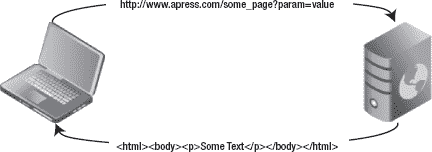
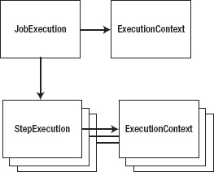
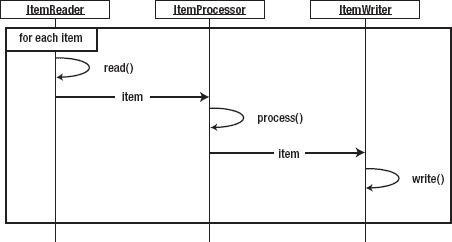
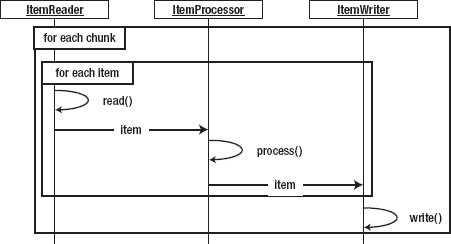

## T1】C H A P T E R 4

## 了解作业和步骤

在[第 2 章](02.html#ch2)中，你创建了自己的第一份工作。您完成了作业和步骤的配置，执行了作业，并配置了一个数据库来存储您的作业存储库。在那个“你好，世界！”例如，您开始对 Spring Batch 中的作业和步骤有所了解。本章继续深入探讨工作和步骤。您首先要学习什么是与 Spring Batch 框架相关的作业和步骤。

从那里，您可以深入了解执行作业或步骤时会发生什么，从加载它们并验证它们的有效性，一直到完成它们。然后，您钻研一些代码，查看您可以配置的作业和步骤的各个部分，并在此过程中学习最佳实践。最后，您将看到批处理难题的不同部分如何通过 Spring 批处理过程中涉及的各种作用域相互传递数据。

尽管您在本章中深入研究了各个步骤，但是一个步骤中最大的部分是它们的读者和作者，这里没有涉及。[第 7 章](07.html#ch7)和 [9](09.html#ch9) 探讨 Spring Batch 中可用的输入和输出功能。本章尽可能简化每个步骤的 I/O 方面，以便您可以专注于工作中复杂的步骤。

### 介绍工作

随着 web 应用的激增，您可能已经习惯了将应用分成请求和响应的想法。每个请求包含发生的单个独特处理的数据。请求的结果通常是返回给用户的某种视图。一个 web 应用可以由几十到几百个这样的独特交互组成，每个都以相同的方式构建，如图 4-1 所示。

***图 4-1。**网络应用的请求/响应处理*

然而，当您考虑批处理作业时，您实际上是在谈论一组操作。术语*[1](#CH-04-FN-1)是描述一份工作的好方法。再次使用 web 应用示例，考虑购物车应用的结帐过程是如何工作的。当您点击购物车中的商品结账时，您将经历一系列步骤:注册或登录、确认送货地址、输入账单信息、确认订单、提交订单。这个流程类似于什么是工作。*

 *就本书而言，作业被定义为一个独特的、有序的步骤列表，可以从头到尾独立执行。让我们来分解一下这个定义，这样你就能更好地理解你在做什么:

*   *独特:*Spring Batch 中的作业是通过 XML 配置的，类似于使用核心 Spring 框架配置 beans 的方式，因此是可重用的。对于相同的配置，您可以根据需要多次执行作业。因此，没有理由多次定义同一个职务。
*   *有序步骤列表:* [2](#CH-04-FN-2) 回到结账流程示例，步骤的顺序很重要。如果您一开始就没有注册，就无法验证您的送货地址。如果您的购物车是空的，您将无法执行结账流程。工作中的步骤顺序很重要。在客户的交易被导入到您的系统之前，您不能生成客户对帐单。在计算完所有费用之前，您无法计算帐户余额。您可以按照允许所有步骤按逻辑顺序执行的顺序来组织作业。
*   *可以从头到尾执行:* [第 1 章](01.html#ch1)将批处理定义为一个不需要与某种形式的完成进行额外交互就可以运行的过程。作业是一系列无需外部依赖即可执行的步骤。您不会构建一个作业，以便第三步是等待，直到文件被发送到一个目录进行处理。相反，当文件到达时，您有一个作业开始。
*   *独立*:每个批处理作业应该能够在没有外部依赖影响的情况下执行。这并不意味着一个作业不能有依赖关系。相反，没有多少实际工作(除了“你好，世界”)是没有外部依赖性的。但是，该作业应该能够管理这些依赖关系。如果文件不存在，它会优雅地处理错误。它不等待文件被传递(那是调度程序的责任，等等)。一个作业可以处理它被定义要做的过程的所有元素。

作为比较，[图 4-2](#fig_4_2) 显示了批处理过程与[图 4-1](#fig_4_1) 中的 web 应用的执行情况。

__________

对于那些熟悉 Spring Web Flow 框架的人来说，工作在结构上与 Web 应用中的流程非常相似。

虽然大多数作业由有序的步骤列表组成，但是 Spring Batch 确实支持并行执行步骤的能力。这个特性将在后面讨论。

***图 4-2。**批处理过程中的数据流*

正如你在图 4-2 中看到的，批处理过程在运行时，所有的输入都是可用的。没有用户交互。在执行下一步之前，对数据集执行每一步直到完成。在深入研究如何在 Spring Batch 中配置作业的各种特性之前，我们先来讨论一下作业的执行生命周期。

#### 跟踪作业的生命周期

当一个作业被执行时，它会经历一个生命周期。了解这一生命周期非常重要，因为您需要构建自己的作业，并了解作业运行时发生了什么。当您用 XML 定义作业时，您实际上是在为作业提供蓝图。就像为 Java 类编写代码就像为 JVM 定义一个创建实例的蓝图一样，作业的 XML 定义是 Spring Batch 创建作业实例的蓝图。

作业的执行从作业运行器开始。作业运行程序旨在使用传递的参数执行 name 请求的作业。Spring Batch 提供了两个作业运行器:

*   `CommandLineJobRunner`:该作业运行器旨在从脚本或直接从命令行使用。使用时，`CommandLineJobRunner` bootstraps 启动并执行所请求的任务，并传递参数。
*   当使用类似 Quartz 或 JMX 钩子的调度程序来执行一个任务时，通常 Spring 是自举的，Java 进程在任务执行之前是活动的。在这种情况下，Spring 被引导时会创建一个`JobRegistry`,其中包含可运行的作业。`JobRegistryBackgroundJobRunner`用于创建`JobRegistry`。

`CommandLineJobRunner`和`JobRegistryBackgroundJobRunner`(都位于`org.springframework.batch.core.launch.support`包中)是框架提供的两个作业运行器。你用[第二章](02.html#ch2)里的`CommandLineJobRunner`来运行“你好，世界！”job，你会在整本书中继续使用它。

虽然 job runner 是用来与 Spring Batch 接口的，但它不是框架的标准部分。没有`JobRunner`接口，因为每个场景需要不同的实现(尽管 Spring Batch 提供的两个作业运行器都使用 main 方法来启动)。相反，真正进入框架执行的是`org.springframework.batch.core.launch.JobLauncher`接口的实现。

Spring Batch 提供了单个`JobLauncher`、`org.springframework.batch.core.launch.support.SimpleJobLauncher`。这个类使用 Core Spring 的`TaskExecutor`接口来执行请求的作业。您可以看到这是如何配置的，但是需要注意的是，在 Spring 中有多种方式来配置`org.springframework.core.task.TaskExecutor`。如果使用了`org.springframwork.core.task.SyncTaskExecutor`，作业将在与`JobLauncher`相同的线程中执行。任何其他选项都在自己的线程中执行作业。

***图 4-3。**一个`Job`、`JobInstance`、`JobExecution`和*的关系

运行批处理作业时，会创建一个`org.springframework.batch.core.JobInstance`。一个`JobInstance`表示作业的一次逻辑运行，由作业名和这次运行传递给作业的参数来标识。作业的运行不同于执行作业的尝试。如果您有一个预期每天运行的作业，那么您应该在 XML 中配置一次(定义蓝图)。每天您都会有一次新的运行或`JobInstance`,因为您向作业传递了一组新的参数(其中一个是日期)。当每个`JobInstance`尝试一次或`JobExecution`成功完成时，它将被视为完成。

 **注意**一个`JobInstance`只能执行一次才能成功完成。因为`JobInstance`是由作业名和传入的参数标识的，这意味着您只能使用相同的参数运行一次作业。

您可能想知道 Spring Batch 如何从一次尝试到另一次尝试知道一个`JobInstance`的状态。在第 2 章的[中，您查看了作业存储库，其中有一个`batch_job_instance`表。此表是所有其他表派生的基础。是`batch_job_instance`和`batch_job_params`标识了一个`JobInstance`(`batch_job_instance.job_key`实际上是名称和参数的散列)。](02.html#ch2)

是运行作业的实际尝试。如果一个任务第一次从开始运行到结束，只有一个`JobExecution`与给定的`JobInstance`相关。如果一个任务在第一次运行后以错误状态结束，那么每次试图运行`JobInstance`时，都会创建一个新的`JobExecution`(通过向同一个任务传递相同的参数)。对于 Spring Batch 为您的作业创建的每个`JobExecution`，都会在`batch_job_execution`表中创建一条记录。当`JobExecution`执行时，它的状态也被保存在`batch_job_execution_context`中。这允许 Spring Batch 在发生错误时在正确的点重新启动作业。

### 配置作业

理论说够了。让我们进入一些代码。本节深入探讨了配置作业的各种方法。正如在第 2 章中提到的，和所有的 Spring 一样，Spring 批量配置是通过 XML 完成的。考虑到这一点，Spring Batch 2 中添加的一个非常受欢迎的特性是添加了一个批处理 XSD，使批处理作业的配置更加简洁。

 **注意**一个好的最佳实践是在以任务名称命名的 XML 文件中配置每个任务。

#### 基本作业配置

清单 4-1 显示了一个基本 Spring 批处理作业的外壳。根据记录，这不是一个有效的工作。Spring Batch 中的作业需要至少有一个步骤或被声明为抽象。 [3](#CH-04-FN-3) 在任何情况下，这里的重点都是工作而不是步骤，所以你要在本章后面的工作中添加步骤。

你在[第二章](02.html#ch2)的“你好，世界！”中使用了这种格式 job，对于以前使用过 Spring 的人来说应该很熟悉。就像 Spring 框架的大多数其他扩展一样，您可以像 Spring 的任何其他用途一样配置 beans，并拥有一个定义特定于域的标记的 XSD。在这种情况下，您在`beans`标签中包含 Spring Batch 的 XSD。

***清单 4-1。**T4`basicJob.xml`*

`<?xml version="1.0" encoding="UTF-8"?>
<beans xmlns:batch="http://www.springframework.org/schema/batch"

       xmlns:xsi="http://www.w3.org/2001/XMLSchema-instance"
       xsi:schemaLocation="http://www.springframework.org/schema/beans
           http://www.springframework.org/schema/beans/spring-beans-3.0.xsd
           http://www.springframework.org/schema/batch
           http://www.springframework.org/schema/batch/spring-batch-2.1.xsd">

    <import resource="../launch-context.xml"/>

    <batch:job id="basicJob">
        ...
    </batch:job>
</beans>`

标签之后的第一个文件是 T2 文件的导入，它位于项目的 T3 目录中。你在第 2 章中使用了这个文件，但并没有真正深入进去，所以现在让我们来看看它。[清单 4-2](#list_4_2) 显示了`launch-context.xml`。请注意，这个`launch-context.xml`是 zip 文件的一个显著精简版本。本书讨论了文件的其余部分，因为您将在以后的章节中使用它的各个部分。现在，让我们把重点放在让 Spring Batch 工作所需的部件上。

***清单 4-2。**T4`launch-context.xml`*

`<?xml version="1.0" encoding="UTF-8"?>
<beans
       xmlns:p="http://www.springframework.org/schema/p"
       xmlns:xsi="http://www.w3.org/2001/XMLSchema-instance"
       xsi:schemaLocation="http://www.springframework.org/schema/beans
           http://www.springframework.org/schema/beans/spring-beans-3.0.xsd">

    <bean id="dataSource" class="org.apache.commons.dbcp.BasicDataSource">
        <property name="driverClassName" value="${batch.jdbc.driver}" />
        <property name="url" value="${batch.jdbc.url}" />
        <property name="username" value="${batch.jdbc.user}" />` `<property name="password" value="${batch.jdbc.password}" />
    </bean>

    <bean id="transactionManager"
    class="org.springframework.jdbc.datasource.DataSourceTransactionManager"
    lazy-init="true">
        <property name="dataSource" ref="dataSource" />
    </bean>

    <bean id="placeholderProperties"
class="org.springframework.beans.factory.config.PropertyPlaceholderConfigure”
>
        <property name="location" value="classpath:batch.properties" />
        <property name="systemPropertiesModeName"    
            value="SYSTEM_PROPERTIES_MODE_OVERRIDE" />
        <property name="ignoreUnresolvablePlaceholders" value="true" />
        <property name="order" value="1" />
    </bean>

    <bean id="jobRepository"
class="org.springframework.batch.core.repository.support.JobRepositoryFactoryBean"
p:dataSource-ref="dataSource" p:transactionManager-ref="transactionManager" />

    <bean id="jobLauncher"
    class="org.springframework.batch.core.launch.support.SimpleJobLauncher">
        <property name="jobRepository" ref="jobRepository" />
    </bean>
</beans>`

__________

3 之后，本章着眼于抽象的工作。

`launch-context.xml`拥有上一节中讨论的大部分元素及其依赖关系。它从一个数据源开始。您可以使用标准的 Spring 配置来配置一个数据源，Spring Batch 使用该数据源来访问作业存储库，并且该数据源也可用于批处理过程可能需要的任何其他数据库访问。值得注意的是，Spring Batch 为`JobRepository`使用的数据库不需要与用于业务处理的模式相同。

`transactionManager`也在这个文件中配置。事务处理在批处理作业中非常重要，因为您要分块处理大量数据，并且每个数据块都是一次提交的。这也是使用核心弹簧部件的标准配置。

请注意，您正在使用属性来指定可能因环境而异的值。在`transactionManager`之后，您配置 Spring 的`PropertyPlaceholderConfigurer`来在运行时处理这些属性的填充。您正在使用`batch.properties`文件来指定值，它包含在 zip 文件提供的源代码中。

接下来是`jobRepository`。这是您将在`launch-context.xml`文件中配置的第一个 Spring 批处理组件。`jobRepository`用于维护作业的状态，并对每一步进行春批。在这种情况下，您正在配置框架用来在数据库上执行 CRUD 操作的句柄。[第 5 章](05.html#ch5)讲述了`jobRepository`的一些高级配置，包括改变模式前缀等等。这个示例配置提供了两个必需的依赖项:一个数据源和一个事务管理器。

这里最后一块`launch-context.xml`是`jobLauncher`豆。如前一节所述，从执行的角度来看，作业启动器是进入 Spring Batch framework 的门户。它被配置为依赖于`jobRepository`。

定义了通用组件后，让我们回到`basicJob.xml`。关于配置，90%的作业配置是步骤的有序定义，这将在本章后面介绍。关于`basicJob`请注意，您还没有配置任何对作业存储库或事务管理器的引用。这是因为默认情况下，Spring 使用名为`jobRepository`的`jobRepository`和名为`transactionManager`的事务管理器。你会在第 5 章中看到如何具体配置这些元素，其中讨论了如何使用`JobRepository`及其元数据。

#### 工作继承

与配置作业相关的大多数选项都与执行相关，因此您将在稍后讲述作业执行时看到这些选项。然而，有一个实例可以改变作业配置，在这里讨论是有意义的:继承的使用。

像大多数其他面向对象的编程方面一样，Spring Batch 框架允许您一次性配置作业的公共方面，然后用其他作业扩展基本作业。那些其他作业继承它们正在扩展的作业的属性。但是 Spring Batch 中的继承有一些需要注意的地方。Spring Batch 允许从一个作业到另一个作业继承所有作业级配置。这是很重要的一点。您不能定义具有可以继承的通用步骤的作业。允许您继承的是重新启动作业的能力、作业监听器和任何传入参数的验证器。为此，您需要做两件事:声明父作业抽象，并将其指定为任何想要继承其功能的作业中的父作业。

[清单 4-3](#list_4_3) 将父作业配置为可重启 [4](#CH-04-FN-4) ，然后用`sampleJob`扩展它。因为`sampleJob`扩展了`baseJob`，所以也是可重启的。清单 4-4 展示了如何配置一个配置了参数验证器的抽象作业，并扩展它来继承验证器。

***清单 4-3。** `inheritanceJob.xml`同职务继承*

`<job id="baseJob" abstract="true" restartable="true">
</job>

<job id="inheritanceJob" parent="baseJob">
    ...
</job>`

***清单 4-4。**参数验证器继承*

`<job id="baseJob" abstract="true" restartable="true">
    <validator ref="myParameterValidator"/>
</job>

<job id="sampleJob1" parent="baseJob">
    ...
</job>`

虽然作业的大部分配置可以从父作业继承，但并不是全部都可以。以下是您可以在父作业中定义并由其子作业继承的内容列表:

*   *可重启:*指定作业是否可重启
*   *一个参数增量器:*每增加一个`JobExecution`就增加一个作业参数
*   *监听器:*任何作业级别的监听器
*   *作业参数验证器:*验证传递给作业的参数是否满足任何要求

__________

4 可重启性在[第 6 章](06.html#ch6)中有更详细的介绍。

所有这些概念都是新的，将在本章后面讨论。现在，您需要知道的是，当在抽象作业上设置这些值时，任何扩展父作业的作业都会继承它们。孩子不能继承的东西包括步骤配置、步骤流程和决策。这些必须在使用它们的任何作业中定义。

继承不仅有助于巩固公共属性的配置，而且有助于标准化某些事情是如何完成的。因为上一个例子开始关注参数和它们的验证，这看起来像是一个合乎逻辑的下一个主题。

#### 工作参数

您已经读到过几次`JobInstance`是由作业名和传递给作业的参数来标识的。您还知道，正因为如此，您不能使用相同的参数多次运行相同的作业。如果你这样做了，你会收到一个`org.springframework.batch.core.launch.JobInstanceAlreadyCompleteException`，告诉你如果你想再次运行这个任务，你需要改变参数(如[清单 4-5](#list_4_5) 所示)。

***清单 4-5。**当您尝试使用相同的参数运行一个作业两次时会发生什么情况*

`2010-11-28 21:06:03,598 ERROR
org.springframework.batch.core.launch.support.CommandLineJobRunner.main()
[org.springframework.batch.core.launch.support.CommandLineJobRunner] - <Job Terminated in
error: A job instance already exists and is complete for parameters={}.  If you want to run
this job again, change the parameters.>
org.springframework.batch.core.repository.JobInstanceAlreadyCompleteException: A job instance
already exists and is complete for parameters={}.  If you want to run this job again, change
the parameters.
       at
org.springframework.batch.core.repository.support.SimpleJobRepository.createJobExecution(Simpl
eJobRepository.java:122)
       at sun.reflect.NativeMethodAccessorImpl.invoke0(Native Method)
...`

那么，如何将参数传递给作业呢？Spring Batch 不仅允许您向作业传递参数，还允许您在作业运行之前自动递增参数 [5](#CH-04-FN-5) 或验证参数。首先，看看如何将参数传递给作业。

向作业传递参数取决于您如何调用作业。作业运行器的功能之一是创建一个`org.springframework.batch.core.JobParameters`的实例，并将其传递给`JobLauncher`执行。这是有意义的，因为如果您从命令行启动一个作业，那么您传递参数的方式与从 Quartz 调度程序启动作业的方式是不同的。因为到目前为止您一直在使用`CommandLineJobRunner`，所以让我们从那里开始。

__________

5 对于每个`JobInstance`来说，增加一个参数是有意义的。例如，如果作业的运行日期是其参数之一，这可以通过参数增量器自动解决。

向`CommandLineJobRunner`传递参数就像在命令行上传递`key=value`对一样简单。[清单 4-6](#list_4_6) 展示了如何使用到目前为止你调用作业的方式将参数传递给作业。

***清单 4-6。**将参数传递给`CommandLineJobRunner`*

`java –jar sample-application-0.0.1-SNAPSHOT.jar jobs/sampleJob.xml sampleJob name=Michael`

在[清单 4-6](#list_4_6) 中，您传递了一个参数`name`。当您将 parameter 传递到批处理作业中时，您的作业运行器会创建一个`JobParameters`的实例，作为作业接收的所有参数的容器。

`JobParameters`不过是一个`java.util.Map<String, JobParameter>`对象的包装器。注意，虽然在这个例子中你传入了`String` s，但是`Map`的值是一个 org . spring framework . batch . core .`JobParameter`实例。原因在于类型。Spring Batch 提供了参数的类型转换，并且在`JobParameter`类上提供了特定于类型的访问器。如果您将参数的类型指定为`long`，它可以作为`java.lang.Long`使用。`String`、`Double`和`java.util.Date`均可开箱转换。为了利用转换，你告诉 Spring Batch 参数名后面括号中的参数类型，如清单 4-7 所示。注意，Spring Batch 要求每个的名称都是小写的。

***清单 4-7。**指定参数的类型*

`java –jar sample-application-0.0.1-SNAPSHOT.jar jobs/sampleJob.xml sampleJob
param1(string)=Spring param2(long)=33`

要查看传递到作业中的参数，可以查看作业存储库。[第 2 章](02.html#ch2)注意到有一个作业参数表叫做`batch_job_params`，但是因为你没有传递任何参数给你的作业，所以它是空的。如果您在执行了[清单 4-6](#list_4_6) 和 [4-7](#list_4_7) 中的示例后浏览该表，您应该会看到[表 4-1](#tab_4_1) 中显示的内容。

T2】

既然您已经知道了如何将参数放入批处理作业，那么一旦有了参数，如何访问它们呢？如果您快速查看一下`ItemReader`、`ItemProcessor`、`ItemWriter`和`Tasklet`接口，您会很快注意到所有感兴趣的方法都没有将`JobParameters`实例作为它们的参数之一。根据您尝试访问参数的位置，有几个不同的选项:

*   `ChunkContext`:如果您查看一下`HelloWorld`小任务，您会看到`execute`方法接收了两个参数。第一个参数是`org.springframework.batch.core.StepContribution`，它包含关于您在该步骤中所处位置的信息(写计数、读计数等等)。第二个参数是`ChunkContext`的一个实例。它提供了作业在执行时的状态。如果你在一个小任务中，它包含了你正在处理的程序块的所有信息。关于该块的信息包括关于步骤和作业的信息。正如你可能猜到的，`ChunkContext`有一个对`org.springframework.batch.core.scope.context.StepContext`的引用，其中包含了你的`JobParameters`。
*   *后期绑定:*对于任何不是微线程的框架，获取参数的最简单方法是通过 Spring 配置注入它。鉴于`JobParameters`是不可变的，在引导过程中绑定它们非常有意义。

[清单 4-8](#list_4_8) 显示了一个更新的`HelloWorld`小任务，它利用输出中的`name`参数作为如何从`ChunkContext`访问参数的例子。

***清单 4-8。**在微线程*中访问`JobParameters`

`package com.apress.springbatch.chapter4;

import org.springframework.batch.core.StepContribution;
import org.springframework.batch.core.scope.context.ChunkContext;
import org.springframework.batch.core.step.tasklet.Tasklet;
import org.springframework.batch.repeat.RepeatStatus;
import org.springframework.batch.item.ExecutionContext;

 public class HelloWorld implements Tasklet {
    private static final String HELLO_WORLD = "Hello, %s";` `public RepeatStatus execute( StepContribution step,
                                 ChunkContext context ) throws Exception {
        String name =
            (String) context.getStepContext().getJobParameters().get("name");
        System.out.println( String.format(HELLO_WORLD, name) );
        return RepeatStatus.FINISHED;
     }
}`

尽管 Spring Batch 将作业参数存储在`JobParameter`类的一个实例中，但是当您以这种方式获取参数时，`getJobParameters()`会返回一个`Map<String, Object>`。因此，需要以前的造型。

[清单 4-9](#list_4_9) 展示了如何使用 Spring 的后期绑定将作业参数注入到组件中，而不必引用任何`JobParameters`代码。除了使用 Spring 的 EL(表达式语言)来传递值之外，任何将要配置后期绑定的 bean 都需要将范围设置为`step`。

***清单 4-9。**通过后期绑定获取作业参数*

`<bean id="helloWorld" class="com.apress.springbatch.chapter4.HelloWorld"
    scope="step">
    <property name="name" value="#{jobParameters[name]}"/>
</bean>`

值得注意的是，为了让清单 4-9 中的配置能够工作，`HelloWorld`类需要被更新以接受新的参数。[清单 4-10](#list_4_10) 显示了这种参数关联方法的更新代码。

***清单 4-10。**更新`HelloWorld`小任务*

`package com.apress.springbatch.chapter4;

import org.springframework.batch.core.StepContribution;
import org.springframework.batch.core.scope.context.ChunkContext;
import org.springframework.batch.core.step.tasklet.Tasklet;
import org.springframework.batch.repeat.RepeatStatus;
import org.springframework.batch.item.ExecutionContext;

public class HelloWorld implements Tasklet {

    private static final String HELLO_WORLD = "Hello, %s";

    private String name;

    public RepeatStatus execute( StepContribution step,
                                 ChunkContext context ) throws Exception {
        String name =
           (String) context.getStepContext().getJobParameters().get("name");
        System.out.println( String.format(HELLO_WORLD, name) );
        return RepeatStatus.FINISHED;
    }` `public void setName(String newName) {
        name = newName;
    }

    public String getName() {
        return name;
    }
}`

由于能够将参数传递到作业中并投入使用，本章接下来讨论的 Spring Batch 框架中内置了两个特定于参数的功能:参数验证和每次运行增加给定参数的能力。让我们从参数验证开始，因为在前面的例子中已经提到过了。

##### 验证工作参数

每当一个软件获得外部输入时，确保输入对你所期望的是有效的是一个好主意。网络世界使用客户端 JavaScript 和各种服务器端框架来验证用户输入，批处理参数的验证也不例外。幸运的是，Spring 使得验证作业参数变得非常容易。为此，您只需要实现`org.springframework.batch.core.JobParametersValidator`接口，并在您的工作中配置您的实现。清单 4-11 展示了 Spring Batch 中一个作业参数验证器的例子。

***清单 4-11。**验证参数名的参数验证器是一个`String`*

`package com.apress.springbatch.chapter4;

import java.util.Map;
import org.springframework.batch.core.*;
import org.apache.commons.lang.StringUtils;

public class ParameterValidator implements JobParametersValidator{

    public void validate(JobParameters params) throws
        JobParametersInvalidException {
        String name = params.getString("name");
        if(!StringUtils.isAlpha(name)) {
            throw new
                JobParametersInvalidException("Name is not alphabetic");
        }
    }
}`

如你所见，结果方法是`validate`方法。因为这个方法是无效的，只要没有抛出`JobParametersInvalidException`，就认为验证通过。在本例中，如果您传递名称 4566，就会抛出异常，作业以状态`COMPLETED`完成。这一点值得注意。您传入的参数无效并不意味着作业没有正确完成。在传递无效参数的情况下，作业被标记为`COMPLETED`，因为它对接收到的输入进行了所有有效的处理。当你思考这个问题的时候，它是有意义的。一个`JobInstance`由作业名和传入作业的参数来标识。如果您传入了无效的参数，您不希望重复这样的操作，所以可以声明作业已完成。

除了像前面一样实现您自己的定制参数验证器之外，Spring Batch 还提供了一个验证器来确认所有必需的参数都已被传递:`org.springframework.batch.core.job.DefaultJobParametersValidator`。要使用它，您可以像配置您的定制验证器一样配置它。`DefaultJobParametersValidator`有两个可选依赖:`requiredKeys`和`optionalKeys`。两者都是`String`数组，接受一个参数名列表，这些参数名要么是必需的，要么是唯一允许的可选参数。清单 4-12 显示了`DefaultJobParametersValidator`的两种配置，以及如何将其添加到您的工作中。

***清单 4-12。** `DefaultJobParametersValidator`配置在`parameterValidatorJob.xml`*

`<beans:bean id="requiredParamValidator"
    class="org.springframework.batch.core.job.DefaultJobParametersValidator">
    <beans:property name="requiredKeys" value="batch.name,batch.runDate"/>
</beans:bean>

<beans:bean id="optionalParamValidator"
    class="org.springframework.batch.core.job.DefaultJobParametersValidator">
    <beans:property name="requiredKeys" value="batch.name,batch.runDate"/>
    <beans:property name="optionalKeys" value="batch.address"/>
</beans:bean>

<job id="parameterValidatorJob">
    ...
    <validator ref="requiredParamValidator"/>
</job>`

如果您使用`requiredParamValidator`，如果您没有传递参数`batch.name`和`batch.runDate`，您的作业将抛出一个异常。如果需要，可以传入更多的参数，但这两个参数不能为空。另一方面，如果使用`optionalParamValidator`，如果`batch.name`和`batch.runDate`没有传递给作业，作业再次抛出异常，但是如果传递了除`batch.address`之外的任何参数，作业也会抛出异常。这两个验证器的区别在于，第一个验证器可以接受除必需参数之外的任何参数。第二个只能接受指定的三个。在这两种情况下，如果无效的场景发生，就会抛出一个`JobParametersInvalidException`并将作业标记为已完成，如前所述。

##### 递增工作参数

到目前为止，您一直在一个作业只能用一组给定的参数运行一次的限制下运行。如果你一直跟着例子走，你可能已经想到了如果你试图用相同的参数运行相同的作业两次会发生什么，如清单 4-5 中的[所示。不过有个小漏洞:使用`JobParametersIncrementer`。](#list_4_5)

`org.springframework.batch.core.JobParametersIncrementer`是 Spring Batch 提供的一个接口，允许您为给定的作业唯一地生成参数。您可以为每次运行添加时间戳。您可能有一些其他的业务逻辑需要一个参数随着每次运行而递增。该框架提供了该接口的一个实现，它增加了一个长参数，默认名称为`run.id`。

[清单 4-13](#list_4_13) 展示了如何通过添加对作业的引用来为您的作业配置一个`JobParametersIncrementer`。

***清单 4-13。**在工作中使用`JobParametersIncrementer`*

`<beans:bean id="idIncrementer"
    class="org.springframework.batch.core.launch.support.RunIdIncrementer"/>

<job id="baseJob" incrementer="idIncrementer">
    ...
</job>`

一旦您配置了`JobParametersIncrementer`(在这种情况下，框架提供了`org.springframework.batch.core.launch.support.RunIdIncrementer`)，您还需要做两件事情来完成这项工作。首先，您需要为一个`JobExplorer`实现添加配置。[第 5 章](05.html#ch5)详细介绍了什么是`JobExplorer`以及如何使用。目前，只知道 Spring Batch 需要它来增加参数。[清单 4-14](#list_4_14) 显示了配置，但是它已经在包含在 zip 文件发行版中的`launch-context.xml`中配置好了。

***清单 4-14。**配置为`JobExplorer`*

`<bean id="jobExplorer"
class="org.springframework.batch.core.explore.support.JobExplorerFactoryBean">
    <property name="dataSource" ref="dataSource"/>
</bean>`

使用`JobParametersIncrementer`的最后一块拼图会影响你如何称呼你的工作。当你想增加一个参数的时候，你需要在调用你的作业的时候把参数`–next`加到命令里。这告诉 Spring Batch 根据需要使用增量器。

现在，当你用清单 4-15 中的命令运行你的作业时，你可以用相同的参数运行它任意多次。

***清单 4-15。**命令运行一个作业并增加参数*

`java –jar sample-application-0.0.1-SNAPSHOT.jar jobs/sampleJob.xml
sampleJob name=Michael -next`

事实上，去试一试吧。当您运行 sampleJob 三四次后，查看`batch_job_params`表，看看 Spring Batch 是如何使用两个参数执行您的作业的:一个名为`name`的`String`，值为*迈克尔*，另一个名为`run.id`的`long`。`run.id`的值每次都会改变，每次执行增加 1。

您在前面已经看到，您可能希望在每次运行作业时将一个参数作为时间戳。这在每天运行一次的作业中很常见。为此，您需要创建自己的`JobParametersIncrementer`实现。配置和执行与之前相同。然而，你没有使用`RunIdIncrementer`，而是使用了`DailyJobTimestamper`，其代码在[清单 4-16](#list_4_16) 中。

***清单 4-16。**T4`DailyJobTimestamper.java`*

`package com.apress.springbatch.chapter4;

import org.springframework.batch.core.JobParameters;
import org.springframework.batch.core.JobParametersBuilder;
import org.springframework.batch.core.JobParametersIncrementer;

import java.util.Date;

import org.apache.commons.lang.time.DateUtils;` `public class DailyJobTimestamper implements JobParametersIncrementer {

/**
* Increment the current.date parameter.
*/
public JobParameters getNext( JobParameters parameters ) {
Date today = new Date();

if ( parameters != null && !parameters.isEmpty() ) {
Date oldDate = parameters.getDate( "current.date", new Date() );
today = DateUtils.addDays(oldDate, 1);
}

return new JobParametersBuilder().addDate( "current.date", today )
                                 .toJobParameters();
}
}`

很明显，工作参数是框架的重要组成部分。它们允许您在运行时为作业指定值。它们还用于唯一标识您的作业运行。在整本书中，您更多地使用它们来配置运行作业的日期和重新处理错误文件。现在，让我们看看作业级别的另一个强大特性:作业监听器。

#### 使用工作监听器

当您使用 web 应用时，反馈对用户体验至关重要。用户单击一个链接，页面会在几秒钟内刷新。然而，正如您所看到的，批处理并没有提供太多的反馈。你启动一个过程，它就会运行。就这样。是的，您可以查询作业存储库来查看作业的当前状态，还有 Spring Batch Admin web 应用，但是很多时候您可能希望在作业中的某个给定点发生一些事情。假设您希望在作业失败时发送电子邮件。也许您希望将每个作业的开始和结束记录到一个特殊的文件中。您希望在作业开始时(一旦`JobExecution`被创建并持久化，但在执行第一步之前)或结束时发生的任何处理都是通过作业监听器来完成的。

有两种方法可以创建作业监听器。第一种是通过实现`org.springframework.batch.core.JobExecutionListener`接口。这个接口有两个方法的结果:`beforeJob`和`afterJob`。每一个都将`JobExecution`作为一个参数，它们分别在作业执行之前和之后被执行——你猜对了。关于`afterJob`方法需要注意的一件重要事情是，不管作业结束时的状态如何，它都会被调用。因此，您可能需要评估作业结束时的状态，以确定要做什么。清单 4-17 给出了一个简单监听器的例子，它打印出一些关于作业运行前后的信息，以及作业完成时的状态。

***清单 4-17。**T4`JobLoggerListener.java`*

`package com.apress.springbatch.chapter4;

import org.springframework.batch.core.JobExecution;
import org.springframework.batch.core.JobExecutionListener;

public class JobLoggerListener implements JobExecutionListener {` `public void beforeJob(JobExecution jobExecution) {
        System.out.println(jobExecution.getJobInstance().getJobName()
                + " is beginning execution");
    }

    public void afterJob(JobExecution jobExecution) {
        System.out.println(jobExecution.getJobInstance()
                                       .getJobName()
                                       + " has completed with the status " +  
                                       jobExecution.getStatus());
    }
}`

如果你还记得的话，这本书之前说过 Spring Batch 的配置还不支持注释。那是谎言。支持少量注释，`@BeforeJob`和`@AfterJob`是其中两个。当使用注释时，唯一的区别，如清单 4-18 所示，是你不需要实现`JobExecutionListener`接口。

***清单 4-18。**T4`JobLoggerListener.java`*

`package com.apress.springbatch.chapter4;

import org.springframework.batch.core.JobExecution;
import org.springframework.batch.core.JobExecutionListener;
import org.springframework.batch.core.annotation.AfterJob;
import org.springframework.batch.core.annotation.BeforeJob;

public class JobLoggerListener {

    @BeforeJob
    public void beforeJob(JobExecution jobExecution) {
        System.out.println(jobExecution.getJobInstance().getJobName()
                + " is beginning execution");
    }

    @AfterJob
    public void afterJob(JobExecution jobExecution) {
        System.out.println(jobExecution.getJobInstance()
                                       .getJobName()
                                       + " has completed with the status " +  
                                       jobExecution.getStatus());
    }
}`

在这两种情况下，这两个选项的配置是相同的。回到 XML 的世界，您可以在工作中配置多个监听器，如清单 4-19 所示。

***清单 4-19。**在`listenerJob.xml`* 中配置作业监听器

`<beans:bean id="loggingListener"
    class="com.apress.springbatch.chapter4.JobLoggerListener"/>

<job id="listenerJob" incrementer="idIncrementer">
    ...
    <listeners>
        <listener ref="loggingListener"/>
    </listeners>
</job>`

前面，本章讨论了作业继承。这种继承会对您在工作中如何配置侦听器产生影响。当一个作业有侦听器，并且它的父作业也有侦听器时，您有两种选择。第一种选择是让子侦听器覆盖父侦听器。如果这是你想要的，那么你没有什么不同。然而，如果你希望父的和子的监听器都被执行，那么当你配置子的监听器列表时，你使用`merge`属性，如[清单 4-20](#list_4_20) 所示。

***清单 4-20。**合并父子作业中配置的监听器*

`<beans:bean id="loggingListener"
    class="com.apress.springbatch.chapter4.JobLoggerListener"/>

<beans:bean id="theEndListener"
    class="com.apress.springbatch.chapter4.JobEndingListener"/>

<job id="baseJob">
    ...
    <listeners>
        <listener ref="loggingListener"/>
    </listeners>
</job>

<job id="listenerJob" parent="baseJob">
    ...
    <listeners merge="true">
        <listener ref="theEndListener"/>
    </listeners>
</job>`

侦听器是一个有用的工具，能够在工作的某些点上执行逻辑。侦听器也可用于批处理难题的许多其他部分，例如步骤、读取器、编写器等等。在本书后面的章节中，您会看到它们各自的组件。现在，还有一个与乔布斯有关的话题。

#### 执行上下文

批处理本质上是有状态的。他们需要知道自己正处于哪一步。他们需要知道他们在该步骤中处理了多少记录。这些和其他有状态的元素不仅对于任何批处理的正在进行的处理是至关重要的，而且对于重新启动之前失败的进程也是至关重要的。例如，假设一个每晚处理 100 万笔交易的批处理过程在处理了 90 万笔记录后停止。即使是周期性的提交，当您重启时，您如何知道从哪里恢复呢？重建执行状态的想法可能令人望而生畏，这就是 Spring Batch 为您处理它的原因。

您之前已经了解了`JobExecution`如何表示执行作业的实际尝试。正是这一级别的域需要维护状态。当`JobExecution`通过一个作业或步骤时，状态会改变。这种状态在`ExecutionContext`保持着。

如果您考虑 web 应用如何存储状态，通常是通过`HttpSession`。 [6](#CH-04-FN-6) `ExecutionContext`本质上是批处理作业的会话。除了简单的`key-value`对，`ExecutionContext`提供了一种安全存储作业状态的方法。web 应用的会话和`ExecutionContext`的一个区别是，在你的工作过程中，你实际上有多个`ExecutionContext`。`JobExecution`有一个`ExecutionContext`，每个`StepExecution`也有一个`ExecutionContext`(你将在本章后面看到)。这允许在适当的级别确定数据的范围(特定于步骤的数据或整个作业的全局数据)。[图 4-4](#fig_4_4) 显示了这些元素之间的关系。

***图 4-4。**关系`ExecutionContext`年代*

`ExecutionContext`提供了一种“安全”的方式来存储数据。存储是安全的，因为进入`ExecutionContext`的所有内容都保存在作业存储库中。你简要地看了一下[第二章](02.html#ch2)中的`batch_job_execution_context`和`batch_step_execution_context`表，但是它们当时并没有包含任何有意义的数据。让我们看看如何向`ExecutionContext`添加数据和从中检索数据，以及这样做时它在数据库中是什么样子。

#### 操纵执行上下文

如前所述，`ExecutionContext`是`JobExecution`或`StepExecution`的一部分。正因为如此，要获得对`ExecutionContext`的控制，你需要根据你想要使用的`JobExecution`或`StepExecution`来获得它。[清单 4-21](#list_4_21) 展示了如何在`HelloWorld`小任务中获得`ExecutionContext`的句柄，并在上下文中添加你正在打招呼的人的名字。

__________

本章忽略了以某种客户端形式(cookies、胖客户端等等)维护状态的 web 框架。

***清单 4-21。**向作业的`ExecutionContext`* 添加名称

`package com.apress.springbatch.chapter4;

import org.springframework.batch.core.StepContribution;
import org.springframework.batch.core.scope.context.ChunkContext;
import org.springframework.batch.core.step.tasklet.Tasklet;
import org.springframework.batch.repeat.RepeatStatus;
import org.springframework.batch.item.ExecutionContext;

public class HelloWorld implements Tasklet {
    private static final String HELLO_WORLD = "Hello, %s";

    public RepeatStatus execute( StepContribution step,
                                 ChunkContext context ) throws Exception {
        String name =
            (String) context.getStepContext()
                            .getJobParameters()
                            .get("name");

        ExecutionContext jobContext = context.getStepContext()
                                             .getStepExecution()
                                             .getJobExecution()
                                             .getExecutionContext();
        jobContext.put(“user.name", name);

        System.out.println( String.format(HELLO_WORLD, name) );
        return RepeatStatus.FINISHED;
     }
}`

注意，您必须做一些遍历才能到达作业的`ExecutionContext`。在这种情况下，您所做的就是从块到作业的步骤，沿着作用域树向上移动。如果你看一下`StepContext`的 API，你会发现有一个`getJobExecutionContext()`方法。该方法返回一个代表作业的`ExecutionContext`的当前状态的`Map<String, Object>`。尽管这是一种访问当前值的便捷方式，但它的使用有一个限制因素:对由`StepContext.getJobExecutionContext()`方法返回的`Map`所做的更新不会持久保存到实际的`ExecutionContext`。因此，如果出现错误，您对那个`Map`所做的任何更改，如果没有对真正的`ExecutionContext`所做的更改，都将丢失。

[清单 4-21](#list_4_21) 的例子显示了使用作业的`ExecutionContext`，但是获取和操作步骤的`ExecutionContext`的能力以同样的方式工作。那样的话，你直接从`StepExecution`那里得到`ExecutionContext`，而不是`JobExecution`。[清单 4-22](#list_4_22) 显示了更新后使用步骤的`ExecutionContext`而不是作业的代码。

***清单 4-22。**向作业的`ExecutionContext`添加名称*

`package com.apress.springbatch.chapter4;

import org.springframework.batch.core.StepContribution;
import org.springframework.batch.core.scope.context.ChunkContext;
import org.springframework.batch.core.step.tasklet.Tasklet;` `import org.springframework.batch.repeat.RepeatStatus;
import org.springframework.batch.item.ExecutionContext;

public class HelloWorld implements Tasklet {
    private static final String HELLO_WORLD = "Hello, %s";

    public RepeatStatus execute( StepContribution step,
                                 ChunkContext context ) throws Exception {
        String name =
            (String) context.getStepContext()
                            .getJobParameters()
                            .get("name");

        ExecutionContext jobContext = context.getStepContext()
                                             .getStepExecution()
                                             .getExecutionContext();
        jobContext.put(“user.name", name);

        System.out.println( String.format(HELLO_WORLD, name) );
        return RepeatStatus.FINISHED;
     }
}`

##### 执行上下文持久性

随着作业的处理，Spring Batch 会将您的状态持久化，作为提交每个块的一部分。这种持久性的一部分是保存作业和当前步骤的`ExecutionContext` s. [第 2 章](02.html#ch2)查看了表的布局。让我们继续执行带有来自[清单 4-21](#list_4_21) 的更新的`sampleJob`作业，看看数据库中保存的值是什么样的。[表 4-2](#tab_4_2) 显示了`name`参数设置为`Michael`时，单次运行后`batch_job_execution_context`表的内容。

***表 4-2。**`BATCH_JOB_EXECUTION_CONTEX``T`*的内容

<colgroup><col align="left" valign="top" width="25%"> <col align="left" valign="top" width="50%"> <col align="left" valign="top" width="20%"></colgroup> 
| **作业执行标识** | **SHORT_CONTEXT** | **序列化 _ 上下文** |
| :-- | :-- | :-- |
| `1` | `{"map":{"entry":{"string":["user.name",
"Michael"]}}}` | `NULL` |

[表 4-2](#tab_4_2) 由三列组成。第一个是对与这个`ExecutionContext`相关的`JobExecution`的引用。第二个是`Job`的`ExecutionContext`的 JSON 表示。该字段随着处理的进行而更新。最后，`SERIALIZED_CONTEXT`字段包含一个序列化的 Java 对象。`SERIALIZED_CONTEXT`仅在作业运行或失败时被填充。

本章的这一节介绍了 Spring Batch 中作业的不同部分。然而，为了使一个作业有效，它至少需要一个步骤，这就把您带到了 Spring Batch 框架的下一个主要部分:步骤。

### 工作步骤

如果一个作业定义了整个过程，那么一个步骤就是一个作业的组成部分。这是一个独立的顺序批处理机。我称之为批处理机是有原因的。一个步骤包含一项工作所需的所有部分。它处理自己的输入。它有自己的处理器。它处理自己的输出。事务在一个步骤中是独立的。从设计上来说，这些步骤是不连贯的。这允许您作为开发人员根据需要自由地组织您的工作。

在本节中，您将采用与上一节中对 jobs 所做的相同的方式深入探讨各个步骤。您将了解 Spring Batch 如何一步一步地将处理分解，以及由于以前版本的框架，这种方式发生了怎样的变化。您还将看到许多关于如何配置工作中的步骤的示例，包括如何控制步骤之间的流程以及有条件的步骤执行。最后，配置语句作业所需的步骤。记住所有这些，让我们通过看步骤如何处理数据来开始看步骤。

#### 组块与项目处理

批处理通常是关于处理数据的。当您考虑要处理的数据单元是什么时，有两种选择:单个项目或一大块项目。单个项由单个对象组成，该对象通常代表数据库或文件中的一行。因此，基于项目的处理是一次一行、一条记录或一个对象地读取、处理然后写入数据，如图 4-5 所示。

***图 4-5。**基于项目的处理*

可以想象，这种方法会有很大的开销。当您知道将向数据库提交大量行或将它们写入文件时，写入单个行的低效率是巨大的。

当 Spring Batch 1.x 在 2008 年问世时，基于项目的处理是记录的处理方式。从那以后，SpringSource 和 Accenture 的人升级了这个框架，在 Spring Batch 2 中，他们引入了基于组块处理的概念。批处理世界中的*块*是需要处理的记录或行的子集，通常由提交间隔定义。在 Spring Batch 中，当您处理一个数据块时，它是由每次提交之间处理的行数定义的。

[图 4-6](#fig_4_6) 显示了为块处理而设计的批处理过程中，数据是如何流动的。在这里，您可以看到，尽管每一行仍然是单独读取和处理的，但是在提交时，对单个块的所有写入都是同时发生的。这种处理上的小调整带来了巨大的性能提升，并为许多其他处理能力开辟了天地。

***图 4-6。**基于组块的处理*

基于块的处理允许您做的事情之一是远程处理块。当你考虑到像网络开销这样的事情时，远程处理单个项目的成本太高了。但是，如果您可以一次将整个数据块发送到远程处理器，那么它不但不会降低性能，还会显著提高性能。

随着您在本书中对步骤、读者、作者和可伸缩性的了解越来越多，请记住 Spring Batch 所基于的基于块的处理。让我们继续深入研究如何配置您的工作的构建块:步骤。

#### 步进配置

到目前为止，您已经认识到工作实际上只不过是要执行的有序步骤列表。因此，通过在作业中列出步骤来配置步骤。让我们来看看如何配置一个步骤以及您可以使用的各种选项。

##### 基本步骤

当您考虑 Spring Batch 中的步骤时，有两种不同的类型:基于块的处理步骤和小任务步骤。虽然您在前面的“Hello，World！”约伯，稍后你会看到更多细节。现在，我们从如何配置基于块的步骤开始。

正如您前面看到的，块是由它们的提交间隔定义的。如果提交间隔设置为 50 项，那么您的作业读入 50 项，处理 50 项，然后一次写出 50 项。因此，事务管理器在基于块的步骤的配置中起着关键作用。清单 4-23 显示了如何为面向块的处理配置一个基本步骤。

***清单 4-23。**`stepJob.xml`T5】*

`<?xml version="1.0" encoding="UTF-8"?>
<beans:beans
    xmlns:beans="http://www.springframework.org/schema/beans"
    xmlns:xsi="http://www.w3.org/2001/XMLSchema-instance"
    xsi:schemaLocation="http://www.springframework.org/schema/beans
        http://www.springframework.org/schema/beans/spring-beans-3.0.xsd
        http://www.springframework.org/schema/batch
        http://www.springframework.org/schema/batch/spring-batch-2.1.xsd">

    <beans:import resource="../launch-context.xml"/>

    <beans:bean id="inputFile"
        class="org.springframework.core.io.FileSystemResource" scope="step">
        <beans:constructor-arg value="#{jobParameters[inputFile]}"/>
    </beans:bean>

    <beans:bean id="outputFile"
        class="org.springframework.core.io.FileSystemResource" scope="step">
        <beans:constructor-arg value="#{jobParameters[outputFile]}"/>
    </beans:bean>

    <beans:bean id="inputReader"
        class="org.springframework.batch.item.file.FlatFileItemReader">
        <beans:property name="resource" ref="inputFile"/>
        <beans:property name="lineMapper">
            <beans:bean
  class="org.springframework.batch.item.file.mapping.PassThroughLineMapper"/>
        </beans:property>
    </beans:bean>

    <beans:bean id="outputWriter"
        class="org.springframework.batch.item.file.FlatFileItemWriter">
        <beans:property name="resource" ref="outputFile"/>
        <beans:property name="lineAggregator">
            <beans:bean
class="org.springframework.batch.item.file.transform.PassThroughLineAggregator"/>
        </beans:property>
    </beans:bean>

    <job id="stepJob">
        <step id="step1">
            <tasklet>
                <chunk reader="inputReader" writer="outputWriter"
                       commit-interval="50"/>
            </tasklet>
        </step>
    </job>
</beans:beans>`

[清单 4-23](#list_4_23) 可能看起来有些吓人，但让我们把注意力放在最后的工作和步骤配置上。文件的其余部分是一个基本的`ItemReader`和`ItemWriter`的配置，分别在第 7 章和第 9 章中介绍。当你浏览清单 4-23 中的作业时，你会看到这个步骤是从`step`标签开始的。与任何其他 Spring Bean 一样，所需要的只是 id 或名称。在`step`标签内是一个`tasklet`标签。`org.springframework.batch.core.step.tasklet.Tasklet`界面实际上是针对您将要执行的步骤类型的策略界面。在这种情况下，您正在配置`org.springframework.batch.core.step.item.ChunkOrientedTasklet<I>`。您不必担心在这里专门配置类；请注意，也可以使用其他类型的微线程。示例步骤的最后一部分是`chunk`标记。在这里，您定义了您的步骤的块是什么。您说使用`inputReader`bean(`ItemReader`接口的实现)作为读取器，使用`outputWriter`bean(`ItemWriter`接口的实现)作为写入器，一个块包含 50 个条目。

 **注意**当你用 Spring 配置 beans 时，最好使用`id`属性而不是`name`属性。为了让 Spring 工作，它们都必须是唯一的，但是使用`id`属性允许 XML 验证器强制执行。

注意`commit-interval`属性很重要。在示例中设置为 50。这意味着在读取和处理 50 条记录之前，不会写入任何记录。如果在处理 49 个项目后出现错误，Spring Batch 将回滚当前块(事务)并将作业标记为失败。如果您将 commit-interval 值设置为 1，您的作业将读入一个项目，处理该项目，然后写入该项目。本质上，您将回到基于项目的处理。这样做的问题是，在提交时间间隔内，不仅仅只有一个项目被持久化。作业的状态也在作业存储库中更新。您将在本书的后面实验提交间隔，但是您现在需要知道将`commit-interval`设置得尽可能高是很重要的。

#### 了解其他类型的微线程

尽管您的大多数步骤都是基于块的处理，因此使用了`ChunkOrientedTasklet`，但这不是唯一的选择。Spring Batch 提供了另外三个`Tasklet`接口的实现:`CallableTaskletAdapter`、`MethodInvokingTaskletAdapter`和`SystemCommandTasklet`。先来看`CallableTaskletAdapter`。

##### CallableTaskletAdapter

org . spring framework . batch . core . step . tasklet .`CallableTaskletAdapter`是一个适配器，允许您配置`java.util.concurrent.Callable<RepeatStatus>`接口的实现。如果你不熟悉这个新的接口，`Callable<V>`接口与`java.lang.Runnable`接口相似，都是为了在一个新线程中运行。然而，不像`Runnable`接口不返回值，也不能抛出检查过的异常，而`Callable`接口可以返回值(本例中为`RepeatStatus`)并抛出检查过的异常。

该适配器的实现实际上非常简单。它在你的`Callable`对象上调用`call()`方法，并返回`call()`方法返回的值。就是这样。显然，如果您想在另一个线程中执行您的步骤的逻辑，而不是在执行该步骤的线程中，您会使用这个方法。如果你查看清单 4-24 中的[，你会发现要使用这个适配器，你需要将`CallableTaskletAdapter`配置成一个普通的 Spring bean，然后在`tasklet`标签中引用它。在](#list_4_24)[清单 4-24](#list_4_24) 所示的`CallableTaskletAdapter` bean 的配置中，`CallableTaskletAdapter`包含一个单一的依赖:可调用对象本身。

***清单 4-24。**使用`CallableTaskletAdapter`*

`<?xml version="1.0" encoding="UTF-8"?>
<beans:beans
xmlns:beans="http://www.springframework.org/schema/beans"
    xmlns:xsi="http://www.w3.org/2001/XMLSchema-instance"
    xsi:schemaLocation="http://www.springframework.org/schema/beans
        http://www.springframework.org/schema/beans/spring-beans-3.0.xsd
        http://www.springframework.org/schema/batch
        http://www.springframework.org/schema/batch/spring-batch-2.1.xsd">

    <beans:import resource="../launch-context.xml"/>

    <beans:bean id="callableObject"
        class="com.apress.springbatch.chapter4.CallableLogger"/>

    <beans:bean id="callableTaskletAdapter"
  class="org.springframework.batch.core.step.tasklet.CallableTaskletAdapter">
        <beans:property name="callable" ref="callableObject"/>
    </beans:bean>

    <job id="callableJob">
        <step id="step1">
            <tasklet ref="callableTaskletAdapter"/>
        </step>
    </job>
</beans:beans>`

关于`CallableTaskletAdapter`需要注意的一点是，尽管小任务是在不同于步骤本身的线程中执行的，但这并不会使步骤的执行并行化。直到`Callable`对象返回一个有效的`RepeatStatus`对象，这一步的执行才算完成。在此步骤被认为完成之前，配置了此步骤的流程中的其他步骤将不会执行。在本书的后面，您将看到如何以多种方式并行处理，包括并行执行步骤。

##### method vokingtaskletadapter

下一个`Tasklet`实现是`org.springframework.batch.core.step.tasklet.MethodInvokingTaskletAdapter`。这个类类似于 Spring 框架中许多可用的实用程序类。它允许你在另一个类上执行一个预先存在的方法，作为你工作的一部分。比方说，您已经有了一个服务，它执行您想要在批处理作业中运行一次的逻辑。您可以使用`MethodInvokingTaskletAdapter`来调用方法，而不是编写真正包装该方法调用的`Tasklet`接口的实现。[清单 4-25](#list_4_25) 显示了`MethodInvokingTaskletAdapter`的配置示例。

***清单 4-25。**使用`MethodInvokingTaskletAdapter`*

`<?xml version="1.0" encoding="UTF-8"?>
<beans:beans
    xmlns:beans="http://www.springframework.org/schema/beans"
    xmlns:xsi="http://www.w3.org/2001/XMLSchema-instance"
    xsi:schemaLocation="http://www.springframework.org/schema/beans
        http://www.springframework.org/schema/beans/spring-beans-3.0.xsd
        http://www.springframework.org/schema/batch
        http://www.springframework.org/schema/batch/spring-batch-2.1.xsd">

    <beans:import resource="../launch-context.xml"/>

    <beans:bean id="service"
        class="com.apress.springbatch.chapter4.ChapterFourService"/>

    <beans:bean id="methodInvokingTaskletAdapter"
class="org.springframework.batch.core.step.tasklet.MethodInvokingTaskletAdapter">
        <beans:property name="targetObject" ref="service"/>
        <beans:property name="targetMethod" value="serviceMethod"/>
    </beans:bean>

    <job id="methodInvokingJob">
        <step id="step1">
            <tasklet ref="methodInvokingTaskletAdapter"/>
        </step>
    </job>
</beans:beans>`

清单 4-25 所示的例子指定了一个对象和一个方法。使用这种配置，适配器调用不带参数的方法并返回一个`ExitStatus.COMPLETED`结果，除非指定的方法也返回类型`org.springframework.batch.core.ExitStatus`。如果它确实返回了一个`ExitStatus`，那么该方法返回的值将从微线程返回。如果你想配置一组静态参数，你可以使用在本章前面读到的传递作业参数的后期绑定方法，如清单 4-26 所示。

***清单 4-26。**使用`MethodInvokingTaskletAdapter`和参数*

`beans:bean id="methodInvokingTaskletAdapter"
class="org.springframework.batch.core.step.tasklet.MethodInvokingTaskletAdapter"
        scope="step">
        <beans:property name="targetObject" ref="service"/>
        <beans:property name="targetMethod" value="serviceMethod"/>
        <beans:property name="arguments" value="#{jobParameters[message]}"/>
    </beans:bean>

    <job id="methodInvokingJob">
        <step id="step1">
            <tasklet ref="methodInvokingTaskletAdapter"/>
        </step>
    </job>` `</beans:beans>`

##### 系统命令任务板

Spring Batch 提供的最后一类`Tasklet`实现是`org.springframework.batch.core.step.tasklet.SystemCommandTasklet`。这个小任务用来——你猜对了——执行一个系统命令！指定的系统命令异步执行。因此，清单 4-27 中的[所示的超时值(以毫秒为单位)非常重要。清单中的`interruptOnCancel`属性是可选的，但是它向 Spring Batch 表明，如果作业异常退出，是否要终止与系统进程相关联的线程。](#list_4_27)

***清单 4-27。**使用`SystemCommandTasklet`*

`<?xml version="1.0" encoding="UTF-8"?>
<beans:beans
             xmlns:beans="http://www.springframework.org/schema/beans"
             xmlns:xsi=http://www.w3.org/2001/XMLSchema-instance
             xsi:schemaLocation="http://www.springframework.org/schema/beans
           http://www.springframework.org/schema/beans/spring-beans-3.0.xsd
           http://www.springframework.org/schema/batch
           http://www.springframework.org/schema/batch/spring-batch-2.1.xsd">

    <beans:import resource="../launch-context.xml" />

    <beans:bean id="tempFileDeletionCommand"
    class="org.springframework.batch.core.step.tasklet.SystemCommandTasklet">
        <beans:property name="command" value="rm – rf /temp.txt " />
        <beans:property name="timeout" value="5000" />
        <beans:property name="interruptOnCancel" value="true" />
    </beans:bean>

    <job id="systemCommandJob">
        <step id="step1">
            <tasklet ref="tempFileDeletionCommand" />
        </step>
    </job>
</beans:beans>`

`SystemCommandTasklet`允许您配置一些可能影响系统命令执行方式的参数。清单 4-28 显示了一个更健壮的例子。

***清单 4-28。**使用`SystemCommandTasklet`与全环境配置*

`<beans:bean id="touchCodeMapper"
class="org.springframework.batch.core.step.tasklet.SimpleSystemProcessExitCodeMapper"/>

    <beans:bean id="taskExecutor"  
        class="org.springframework.core.task.SimpleAsyncTaskExecutor"/>

    <beans:bean id="robustFileDeletionCommand"
    class="org.springframework.batch.core.step.tasklet.SystemCommandTasklet">` `<beans:property name="command" value="touch temp.txt" />
        <beans:property name="timeout" value="5000" />
        <beans:property name="interruptOnCancel" value="true" />
        <beans:property name="workingDirectory"
            value="/Users/mminella/spring-batch" />
        <beans:property name="systemProcessExitCodeMapper"
            ref="touchCodeMapper"/>
        <beans:property name="terminationCheckInterval" value="5000" />
        <beans:property name="taskExecutor" ref="taskExecutor" />
        <beans:property name="environmentParams"
            value="JAVA_HOME=/java,BATCH_HOME=/Users/batch" />
    </beans:bean>

    <job id="systemCommandJob">
        <step id="step1">
            <tasklet ref="robustFileDeletionCommand" />
        </step>
    </job>
</beans:beans>`

[清单 4-28](#list_4_28) 包括配置中的五个可选参数:

> `workingDirectory`:这是执行命令的目录。在本例中，这相当于在执行实际命令之前先执行`cd ˜/spring-batch`。
> 
> 根据你正在执行的命令，系统代码可能有不同的含义。该属性允许您使用`org.springframework.batch.core.step.tasklet.SystemProcessExitCodeMapper`接口的实现来映射什么系统返回代码与什么 Spring 批处理状态值。默认情况下，Spring 提供了该接口的两个实现:`org.springframework.batch.core.step.tasklet.ConfigurableSystemProcessExitCodeMapper`，它允许您在 XML 配置中配置映射；以及`org.springframework.batch.core.step.tasklet.SimpleSystemProcessExitCodeMapper`，如果返回代码是 0，则返回`ExitStatus.FINISHED`，如果是其他代码，则返回`ExitStatus.FAILED`。
> 
> `terminationCheckInterval`:因为默认情况下系统命令是以异步方式执行的，所以小任务会定期检查是否已经完成。默认情况下，该值设置为一秒，但是您可以将其配置为以毫秒为单位的任何值。
> 
> `taskExecutor` *:* 这允许你配置你自己的`TaskExecutor`来执行系统命令。我们不鼓励您配置同步任务执行器，因为如果系统命令导致问题，可能会锁定您的作业。
> 
> `environmentParams` *:* 这是在执行命令之前可以设置的环境参数列表。

在上一节中，您已经看到了 Spring Batch 中有许多不同的小任务类型。然而，在离开主题之前，还有一个小任务类型需要讨论:小任务步骤。

##### 小任务步骤

tasklet 步骤与您看到的其他步骤不同。但它应该是你最熟悉的，因为它是你在《你好，世界！工作。不同之处在于，在这种情况下，您编写自己的代码作为微线程执行。使用`MethodInvokingTaskletAdapter`是定义小任务步骤的一种方式。在这种情况下，您允许 Spring 将处理转发到您的代码。这让您可以开发常规的 POJOs，并将它们用作步骤。

创建小任务步骤的另一种方法是实现`Tasklet`接口，就像在第 2 章的[中创建`HelloWorld`小任务一样。在那里，您实现了接口中所需的`execute`方法，并返回一个`RepeatStatus`对象来告诉 Spring Batch 在您完成处理后要做什么。](02.html#ch2)[清单 4-29](#list_4_29) 有你在[第 2 章](02.html#ch2)中构建的`HelloWorld`小任务代码。

***清单 4-29。** `HelloWorld`小任务*

`package com.apress.springbatch.chapter2;

import org.springframework.batch.core.StepContribution;
import org.springframework.batch.core.scope.context.ChunkContext;
import org.springframework.batch.core.step.tasklet.Tasklet;
import org.springframework.batch.repeat.RepeatStatus;

public class HelloWorld implements Tasklet {

    private static final String HELLO_WORLD = "Hello, world!";

    public RepeatStatus execute( StepContribution arg0,
                                 ChunkContext arg1 ) throws Exception {
        System.out.println( HELLO_WORLD );
        return RepeatStatus.FINISHED;
    }
}`

当您的`Tasklet`实现中的处理完成时，您返回一个`org.springframework.batch.repeat.RepeatStatus`对象。这里有两个选项:`RepeatStatus.CONTINUABLE`和`RepeatStatus.FINISHED`。乍一看，这两个值可能会混淆。如果你返回`RepeatStatus.CONTINUABLE`，你不是说工作可以继续。您告诉 Spring Batch 再次运行 tasklet。例如，假设您希望在一个循环中执行一个特定的小任务，直到满足给定的条件，但是您仍然希望使用 Spring Batch 来跟踪该小任务执行了多少次、事务等等。您的微线程可以返回`RepeatStatus.CONTINUABLE`，直到条件满足。如果您返回`RepeatStatus.FINISHED`，这意味着这个小任务的处理已经完成(不管成功与否),并继续下一个处理。

您可以像配置任何其他小任务类型一样配置小任务步骤。[清单 4-30](#list_4_30) 显示了使用`HelloWorld`微线程配置的`HelloWorldJob`。

***清单 4-30。**`HelloWorldJob`T5】*

`<beans:bean id="helloWorld" class="com.apress.springbatch.chapter2.HelloWorld/>

    <job id="helloWorldJob">
        <step id="helloWorldStep">
            <tasklet ref="helloWorld"/>
        </step>
    </job>
…`

你可能很快会指出这个列表与第二章中的不一样，你可能是对的。原因是你还没有看到[第二章](02.html#ch2)中使用的另一个特性:分步继承。

##### 分步继承

像作业一样，步骤可以相互继承。不像乔布斯，步骤不一定要抽象才能继承。Spring Batch 允许您在配置中配置完全定义的步骤，然后让其他步骤继承它们。让我们通过查看在第二章的[中使用的例子，清单 4-31](02.html#ch2) 中的`HelloWorldJob`来开始讨论步骤继承。

***清单 4-31。**T4`HelloWorldJob`*

`<beans:bean id="helloWorld"  
    class="com.apress.springbatch.chapter2.HelloWorld"/>

<step id="helloWorldStep">
    <tasklet ref="helloWorld"/>
</step>

<job id="helloWorldJob">
    <step id="step1" parent="helloWorldStep"/>
</job>`

在清单 4-31 的[中，您配置了小任务实现(`helloWorld` bean)，然后您配置了引用小任务的步骤(`helloWorldStep`)。Spring Batch 不要求`step`元素嵌套在`job`标签中。一旦您定义了您的步骤`helloWorldStep`，那么当您在实际工作中按顺序声明步骤时，您可以继承它`helloWorldJob`。你为什么要这么做？](#list_4_31)

在这个简单的例子中，这种方法没有什么好处。然而，随着步骤变得越来越复杂，经验表明，最好在工作范围之外配置您的步骤，然后用工作中的步骤继承它们。这使得实际的作业声明更具可读性和可维护性。

显然，可读性不是使用继承的唯一原因，即使在这个例子中也不是这样。让我们潜入更深的地方。在这个例子中，您在`step1`中真正做的是继承步骤`helloWorldStep`及其所有属性。然而，`step1`选择不覆盖其中任何一个。

步骤继承提供了比作业继承更完整的继承模型。在步骤继承中，您可以完全定义一个步骤，继承该步骤，然后添加或覆盖您希望的任何值。您也可以将一个步骤声明为抽象的，只在那里放置公共属性。

[清单 4-32](#list_4_32) 显示了步骤如何添加和覆盖其父级中配置的属性的例子。您从父步骤`vehicleStep`开始，它声明了读取器、写入器和提交间隔。然后创建两个继承自`vehicleStep`的步骤:`carStep`和`truckStep`。每个都使用已经在`vehicleStep`中配置的相同的读取器和写入器。在每种情况下，他们都添加了一个做不同事情的项目处理器。`carStep`选择使用继承的 50 个项目的提交间隔，而`truckStep`覆盖了提交间隔并将其设置为 5 个项目。

***清单 4-32。**在步骤继承中添加属性*

`<step id="vehicleStep">
<tasklet>
<chunk reader="vehicleReader" writer="vehicleWriter" commit-interval="50"/>
</tasklet>
</step>

<step id="carStep" parent="vehicleStep">
<tasklet>
<chunk processor="carProcessor"/>
</tasklet>
</step>

<step id="truckStep" parent="vehicleStep">
<tasklet>
<chunk processor="truckProcessor" commit-interval="5"/>
</tasklet>
</step>

<job id="exampleJob">
<step id="step1" parent="carStep" next="step2"/>
<step id="step2" parent="truckStep"/>
</job>`

通过声明一个抽象的步骤，就像在 Java 中一样，你可以省略掉原本需要的东西。在一个抽象步骤中，如[清单 4-33](#list_4_33) ，你可以省略`reader`、`writer`、`processor`和`tasklet`属性。这通常会在 Spring 试图构建该步骤时导致初始化错误；但是因为它被声明为抽象的，Spring 知道这些将被继承它的步骤填充。

***清单 4-33。**一个抽象步骤及其实现*

`<beans:bean id="inputFile"
        class="org.springframework.core.io.FileSystemResource" scope="step">
        <beans:constructor-arg value="#{jobParameters[inputFile]}"/>
    </beans:bean>

    <beans:bean id="outputFile"
        class="org.springframework.core.io.FileSystemResource" scope="step">
        <beans:constructor-arg value="#{jobParameters[outputFile]}"/>
    </beans:bean>

    <beans:bean id="inputReader"
        class="org.springframework.batch.item.file.FlatFileItemReader">
        <beans:property name="resource" ref="inputFile"/>
        <beans:property name="lineMapper">` `<beans:bean
 class="org.springframework.batch.item.file.mapping.PassThroughLineMapper"/>
        </beans:property>
    </beans:bean>

    <beans:bean id="outputWriter"
        class="org.springframework.batch.item.file.FlatFileItemWriter">
        <beans:property name="resource" ref="outputFile"/>
        <beans:property name="lineAggregator">
            <beans:bean class="org.springframework.batch.item.file.transform.PassThroughLineAggregator"/>
        </beans:property>
    </beans:bean>

    <step id="commitIntervalStep" abstract="true">
        <tasklet>
            <chunk commit-interval="15"/>
        </tasklet>
    </step>

    <step id="copyStep" parent="commitIntervalStep">
        <tasklet>
            <chunk reader="inputReader" writer="outputWriter" />
        </tasklet>
    </step>

    <job id="stepInheritanceJob">
        <step id="step1" parent="copyStep" />
    </job>
</beans:beans>`

在[清单 4-33](#list_4_33) ，`commitIntervalStep`是一个抽象步骤，用于为扩展该步骤的任何步骤配置提交间隔。您在扩展抽象步骤`copyStep`的步骤中配置所需的元素。您可以在这里指定读者和作者。`copyStep`与`commitIntervalStep`具有相同的提交间隔 15，无需重复配置。

步骤继承允许您配置可以在各个步骤中重用的公共属性，并以可维护的方式构建 XML 配置。本节的最后一个例子使用了几个特定于块的属性。为了更好地理解它们，让我们回顾一下如何使用 Spring Batch 在基于块的处理中提供的不同特性。

##### 块大小配置

因为基于块的处理是 Spring Batch 2 的基础，所以理解如何配置它的各种选项以充分利用这一重要特性非常重要。本节涵盖了配置块大小的两个选项:静态提交计数和`CompletionPolicy`实现。所有其他块配置选项都与错误处理相关，将在该部分中讨论。

开始看块配置，[清单 4-34](#list_4_34) 有一个基本的例子，只不过是配置了一个读取器、写入器和提交间隔。读取器是`ItemReader`接口的实现，编写器是`ItemWriter`的实现。在本书后面的章节中，每个接口都有自己的专用章节，所以本节不详细介绍它们。所有你需要知道的是他们分别为这个步骤提供输入和输出。commit-interval 定义了一个块中有多少项(在本例中是 50 项)。

***清单 4-34。**一个基本的组块配置*

`<?xml version="1.0" encoding="UTF-8"?>
<beans:beans
             xmlns:beans="http://www.springframework.org/schema/beans"
             xmlns:xsi="http://www.w3.org/2001/XMLSchema-instance"
             xsi:schemaLocation="http://www.springframework.org/schema/beans
             http://www.springframework.org/schema/beans/spring-beans-3.0.xsd
             http://www.springframework.org/schema/batch
           http://www.springframework.org/schema/batch/spring-batch-2.1.xsd">

    <beans:import resource="../launch-context.xml" />

    <beans:bean id="inputFile"
        class="org.springframework.core.io.FileSystemResource" scope="step">
        <beans:constructor-arg value="#{jobParameters[inputFile]}"/>
    </beans:bean>

    <beans:bean id="outputFile"
        class="org.springframework.core.io.FileSystemResource" scope="step">
        <beans:constructor-arg value="#{jobParameters[outputFile]}"/>
    </beans:bean>

    <beans:bean id="inputReader"
        class="org.springframework.batch.item.file.FlatFileItemReader">
        <beans:property name="resource" ref="inputFile"/>
        <beans:property name="lineMapper">
            <beans:bean class="org.springframework.batch.item.file.mapping.PassThroughLineMapper"/>
        </beans:property>
    </beans:bean>

    <beans:bean id="outputWriter"
        class="org.springframework.batch.item.file.FlatFileItemWriter">
        <beans:property name="resource" ref="outputFile"/>
        <beans:property name="lineAggregator">
            <beans:bean
class="org.springframework.batch.item.file.transform.PassThroughLineAggregator"/>
        </beans:property>
    </beans:bean>

    <step id="copyStep">
        <tasklet>
            <chunk reader="inputReader" writer="outputWriter"
                commit-interval="50"/>
        </tasklet>
    </step>

    <job id="chunkConfigurationJob">` `<step id="step1" parent="copyStep" />
    </job>
</beans:beans>`

尽管通常你是根据一个硬数字来定义块的大小，这个硬数字是用[清单 4-34](#list_4_34) 中的`commit-interval`属性配置的，但这并不总是一个足够健壮的选项。假设您有一项工作需要处理大小不同的块(例如，在一个事务中处理一个帐户的所有事务)。Spring Batch 提供了通过实现`org.springframework.batch.repeat.CompletionPolicy`接口以编程方式定义块何时完成的能力。

`CompletionPolicy`接口允许决策逻辑的实现来决定一个给定的块是否完整。Spring Batch 附带了这个接口的许多实现。默认情况下，它使用`org.springframework.batch.repeat.policy.SimpleCompletionPolicy`，它计算处理的项目数，并在达到配置的阈值时标记块完成。另一个开箱即用的实现是`org.springframework.batch.repeat.policy.TimeoutTerminationPolicy`。这允许您在块上配置超时，以便它可以在给定的时间后优雅地退出。“优雅地退出”在这个上下文中是什么意思？这意味着该块被认为是完整的，所有事务处理正常继续。

正如您无疑可以推断的那样，很少有时候超时本身就足以决定一个处理块何时完成。`TimeoutTerminationPolicy`更有可能被用作`org.springframework.batch.repeat.policy.CompositeCompletionPolicy`的一部分。此策略允许您配置多个策略来确定区块是否已完成。当您使用`CompositeCompletionPolicy`时，如果任何策略认为一个块是完整的，那么这个块被标记为完整的。[清单 4-35](#list_4_35) 显示了一个使用 3 毫秒的超时和 200 个项目的正常提交计数来确定块是否完成的例子。

***清单 4-35。**使用超时和常规提交计数*

`<?xml version="1.0" encoding="UTF-8"?>
<beans:beans

    xmlns:beans="http://www.springframework.org/schema/beans"
    xmlns:util="http://www.springframework.org/schema/util"
    xmlns:xsi="http://www.w3.org/2001/XMLSchema-instance"
    xsi:schemaLocation="http://www.springframework.org/schema/beans
        http://www.springframework.org/schema/beans/spring-beans-3.0.xsd
        http://www.springframework.org/schema/util
        http://www.springframework.org/schema/util/spring-util.xsd
        http://www.springframework.org/schema/batch
        http://www.springframework.org/schema/batch/spring-batch-2.1.xsd">

    <beans:import resource="../launch-context.xml" />

    <beans:bean id="inputFile"
        class="org.springframework.core.io.FileSystemResource" scope="step">
        <beans:constructor-arg value="#{jobParameters[inputFile]}" />
    </beans:bean>

    <beans:bean id="outputFile"
        class="org.springframework.core.io.FileSystemResource" scope="step">
        <beans:constructor-arg value="#{jobParameters[outputFile]}" />
    </beans:bean>` `<beans:bean id="inputReader"
        class="org.springframework.batch.item.file.FlatFileItemReader">
        <beans:property name="resource" ref="inputFile" />
        <beans:property name="lineMapper">
            <beans:bean class="org.springframework.batch.item.file.mapping.PassThroughLineMapper" />
        </beans:property>
    </beans:bean>

    <beans:bean id="outputWriter"
        class="org.springframework.batch.item.file.FlatFileItemWriter">
        <beans:property name="resource" ref="outputFile" />
        <beans:property name="lineAggregator">
            <beans:bean class="org.springframework.batch.item.file.transform.PassThroughLineAggregator" />
        </beans:property>
    </beans:bean>

    <beans:bean id="chunkTimeout"
    class="org.springframework.batch.repeat.policy.TimeoutTerminationPolicy">
        <beans:constructor-arg value="3" />
    </beans:bean>

    <beans:bean id="commitCount"
      class="org.springframework.batch.repeat.policy.SimpleCompletionPolicy">
        <beans:property name="chunkSize" value="200" />
    </beans:bean>

    <beans:bean id="chunkCompletionPolicy"
   class="org.springframework.batch.repeat.policy.CompositeCompletionPolicy">
        <beans:property name="policies">
            <util:list>
                <beans:ref bean="chunkTimeout" />
                <beans:ref bean="commitCount" />
            </util:list>
        </beans:property>
    </beans:bean>

    <step id="copyStep">
        <tasklet>
            <chunk reader="inputReader" writer="outputWriter"
                    chunk-completion-policy="chunkCompletionPolicy"/>
        </tasklet>
    </step>

    <job id="chunkConfigurationJob">
        <step id="step1" parent="copyStep" />
    </job>
</beans:beans>`

使用`CompletionPolicy`接口的实现并不是确定一个块有多大的唯一选择。也可以自己实现。在您查看实现之前，让我们先看一下接口。

`CompletionPolicy`接口需要四个方法:两个版本的`isComplete`、`start`和`update`。如果从类的生命周期来看，首先是调用了`start`方法。该方法初始化策略，以便它知道块正在启动。重要的是要注意到，`CompletionPolicy`接口的实现是有状态的，并且应该能够通过它自己的内部状态来确定块是否已经完成。`start`方法在程序块开始时将这个内部状态重置为实现所需的状态。以`SimpleCompletionPolicy`为例，`start`方法在块开始时将内部计数器重置为 0。对于每一个已经被处理的条目，调用一次`update`方法来更新内部状态。回到`SimpleCompletionPolicy`的例子，`update`每增加一项，内部计数器就加 1。最后，还有两个`isComplete`方法。第一个`isComplete`方法签名接受一个`RepeatContext`作为它的参数。该实现旨在使用其内部状态来确定块是否已经完成。第二个签名将`RepeatContext`和`RepeatStatus`作为参数。该实现被期望基于状态来确定块是否已经完成。[清单 4-36](#list_4_36) 显示了一个`CompletionPolicy`实现的例子，一旦处理了少于 20 个的任意数量的项目，就认为块完成；[清单 4-37](#list_4_37) 显示了配置。

***清单 4-36。**随机块大小`CompletionPolicy`实现*

`package com.apress.springbatch.chapter4;

import java.util.Random;

import org.springframework.batch.repeat.CompletionPolicy;
import org.springframework.batch.repeat.RepeatContext;
import org.springframework.batch.repeat.RepeatStatus;

public class RandomChunkSizePolicy implements CompletionPolicy {

    private int chunkSize;
    private int totalProcessed;

    public boolean isComplete(RepeatContext context) {
        return totalProcessed >= chunkSize;
    }

    public boolean isComplete(RepeatContext context, RepeatStatus status) {
        if (RepeatStatus.FINISHED == status) {
            return true;
        } else {
            return isComplete(context);
        }
    }

    public RepeatContext start(RepeatContext context) {
        Random random = new Random();

        chunkSize = random.nextInt(20);` `totalProcessed = 0;

        System.out.println("The chunk size has been set to " + chunkSize);

        return context;
    }

    public void update(RepeatContext context) {
        totalProcessed++;
    }
}`

***清单 4-37。**配置`RandomChunkSizePolicy`*

`<beans:bean id="randomChunkSizer"
    class="com.apress.springbatch.chapter4.RandomChunkSizePolicy" />

<step id="copyStep">
    <tasklet>
        <chunk reader="inputReader" writer="outputWriter"    
            chunk-completion-policy="randomChunkSizer" />
    </tasklet>
</step>

<job id="chunkConfigurationJob">
    <step id="step1" parent="copyStep" />
</job>`

当您进行错误处理时，您将探索块配置的其余部分。这一节介绍了重试和跳过逻辑，其余大多数选项都围绕着这一点。本章讨论的下一步元素也是从工作中延续下来的:听众。

##### 步骤监听器

在本章前面，当您查看作业侦听器时，您看到了它们可以触发的两个事件:作业的开始和结束。步骤侦听器涵盖相同类型的事件(开始和结束)，但是针对单个步骤，而不是整个作业。本节涵盖了`org.springframework.batch.core.StepExecutionListener`和`org.springframework.batch.core.ChunkListener`接口，这两个接口分别允许在一个步骤和程序块的开始和结束时处理逻辑。注意，该步骤的侦听器被命名为`StepExecutionListener`，而不仅仅是`StepListener`。实际上有一个`StepListener`接口，不过它只是一个标记接口，所有与步骤相关的侦听器都会扩展它。

`StepExecutionListener`和`ChunkListener`都提供了类似于`JobExecutionListener`接口中的方法。`StepExecutionListener`有一个`beforeStep`和一个`afterStep`，而`ChunkListener`有一个`beforeChunk`和一个`afterChunk`，正如你所料。这些方法除了`afterStep`都是无效的。`afterStep`返回一个`ExitStatus`,因为监听器被允许在步骤返回到作业之前修改步骤本身返回的`ExitStatus`。当作业不仅仅需要知道操作是否成功来确定处理是否成功时，此功能非常有用。例如，在导入文件后进行一些基本的完整性检查(是否将正确数量的记录写入数据库，等等)。通过注释配置监听器的能力也保持一致，Spring Batch 提供了 `@BeforeStep`、`@AfterStep`、`@BeforeChunk`和`@AfterChunk`注释来简化实现。[清单 4-38](#list_4_38) 显示了一个`StepListener`，它使用注释来标识方法。

***清单 4-38。**日志记录步骤开始和停止监听器*

`package com.apress.springbatch.chapter4;

import org.springframework.batch.core.ExitStatus;
import org.springframework.batch.core.StepExecution;
import org.springframework.batch.core.annotation.AfterStep;
import org.springframework.batch.core.annotation.BeforeStep;

public class LoggingStepStartStopListener {

    @BeforeStep
    public void beforeStep(StepExecution execution) {
        System.out.println(execution.getStepName() + “ has begun!");
    }

    @AfterStep
    public ExitStatus afterStep(StepExecution execution) {
        System.out.println(execution.getStepName() + “ has ended!");

       return execution.getExitStatus();
    }
}`

在步骤配置中，所有步骤侦听器的配置被合并到一个列表中。与作业监听器相似，继承也以同样的方式工作，允许您覆盖列表或将它们合并在一起。[清单 4-39](#list_4_39) 配置您之前编码的`LoggingStepStartStopListener`。

***清单 4-39** 。配置`LoggingStepStartStopListener`*

`...
<beans:bean id="loggingStepListener"    
    class="com.apress.springbatch.chapter4.LoggingStepStartStopListener"/>

<job id="stepListenerJob">
    <step id="step1">
        <tasklet>
            <chunk reader="inputReader" writer="outputWriter"
                commit-interval="50"/>
            <listeners>
                <listener ref="loggingStepListener"/>
            </listeners>
        </tasklet>
    </step>
</job>
...`

正如您所看到的，监听器几乎在 Spring Batch 框架的每一层都可用，允许您挂起批处理作业的处理。它们通常不仅用于在组件之前执行某种形式的预处理或评估组件的结果，还用于错误处理，正如您在一点中看到的。

下一节将介绍这些步骤的流程。尽管到目前为止所有的步骤都是按顺序处理的，但这并不是 Spring Batch 的要求。您将学习如何执行简单逻辑来确定下一步要执行的步骤，以及如何将流外部化以便重用。

#### 步骤流程

单行:这就是你的工作到目前为止的样子。您已经排列了这些步骤，并使用`next`属性允许它们一个接一个地执行。然而，如果这是执行步骤的唯一方式，Spring Batch 将会非常有限。相反，该框架的作者提供了一个强大的选项集合，用于定制您的作业流。

首先，让我们看看如何决定下一步执行什么步骤，或者是否执行给定的步骤。这是使用 Spring Batch 的条件逻辑实现的。

##### 条件逻辑

在 Spring Batch 的一个作业中，步骤按照您使用`step`标签的`next`属性指定的顺序执行。唯一的要求是将第一步配置为作业中的第一步。如果你想以不同的顺序执行步骤，这很容易:你需要做的就是使用`next`标签。如[清单 4-40](#list_4_40) 所示，如果一切顺利，你可以使用`next`标签来指示一个任务从`step1`转到`step2a`，或者如果`step1`返回`FAILED`的`ExitStatus`则转到`step2b`。

***清单 4-40。** `If` / `Else`逻辑步进执行*

`<?xml version="1.0" encoding="UTF-8"?>
<beans:beans
    xmlns:beans="http://www.springframework.org/schema/beans"
    xmlns:xsi="http://www.w3.org/2001/XMLSchema-instance"
    xsi:schemaLocation="http://www.springframework.org/schema/beans
        http://www.springframework.org/schema/beans/spring-beans-3.0.xsd
        http://www.springframework.org/schema/batch
        http://www.springframework.org/schema/batch/spring-batch-2.1.xsd">

    <beans:import resource="../launch-context.xml"/>

    <beans:bean id="passTasklet"
        class="com.apress.springbatch.chapter4.LogicTasklet">
        <beans:property name="success" value="true"/>
    </beans:bean>

    <beans:bean id="successTasklet"
        class="com.apress.springbatch.chapter4.MessageTasklet">
        <beans:property name="message" value="The step succeeded!"/>
    </beans:bean>

    <beans:bean id="failTasklet"
        class="com.apress.springbatch.chapter4.MessageTasklet">
        <beans:property name="message" value="The step failed!"/>
    </beans:bean>` `<job id="conditionalStepLogicJob">
        <step id="step1">
            <tasklet ref="passTasklet"/>
            <next on="*" to="step2a"/>
            <next on="FAILED" to="step2b"/>
        </step>
        <step id="step2a">
            <tasklet ref="successTasklet"/>
        </step>
        <step id="step2b">
            <tasklet ref="failTasklet"/>
        </step>
    </job>
</beans:beans>`

`next`标签使用`on`属性来评估步骤的`ExitStatus`并决定做什么。值得注意的是，在本章的课程中，你已经看到了`org.springframework.batch.core.ExitStatus`和`org.springframework.batch.core.BatchStatus`。`BatchStatus`是`JobExecution`或`StepExecution`的一个属性，用于识别作业或步骤的当前状态。`ExitStatus`是在作业或步骤结束时返回到 Spring Batch 的值。`on`属性评估`ExitStatus`的决策。因此，[清单 4-40](#list_4_40) 中的例子相当于这样的 XML 语句:“如果`step1`的退出代码不等于`FAILED`，则转到`step2a`，否则转到`step2b`”

因为`ExitStatus`的值实际上只是`String`的值，所以使用通配符的能力可以让事情变得有趣。Spring Batch 允许在`on`标准中使用两个通配符:

*   `*`匹配零个或多个字符。比如`C*`匹配 *C* ，*完成*，*正确*。
*   `?`匹配单个字符。在这种情况下，`?AT`与*猫*或*猫*匹配，但与不匹配。

虽然评估`ExitStatus`让你开始决定下一步做什么，但它可能不会带你走完全程。例如，如果您跳过了当前步骤中的任何记录，而不想执行某个步骤，该怎么办？光从`ExitStatus`你是不会知道的。

 **注意** Spring Batch 在配置转换时会帮到你。它自动将转换从最严格到最不严格排序，并按此顺序应用它们。

Spring Batch 提供了一种确定下一步做什么的编程方式。您可以通过创建一个`org.springframework.batch.core.job.flow.JobExecutionDecider`接口的实现来做到这一点。这个接口有一个方法`decide`，它接受`JobExecution`和`StepExecution`并返回一个`FlowExecutionStatus`(一个`BatchStatus` / `ExitStatus`对的包装)。有了`JobExecution`和`StepExecution`可供评估，你就应该可以获得所有的信息，以便对你的工作下一步该做什么做出适当的决定。[清单 4-41](#list_4_41) 显示了随机决定下一步应该做什么的`JobExecutionDecider`的实现。

***清单 4-41。**T4`RandomDecider`*

`package com.apress.springbatch.chapter4;

import java.util.Random;

import org.springframework.batch.core.JobExecution;
import org.springframework.batch.core.StepExecution;
import org.springframework.batch.core.job.flow.FlowExecutionStatus;
import org.springframework.batch.core.job.flow.JobExecutionDecider;

public class RandomDecider implements JobExecutionDecider {

    private Random random = new Random();

    public FlowExecutionStatus decide(JobExecution jobExecution,
            StepExecution stepExecution) {

        if (random.nextBoolean()) {
            return new  
                FlowExecutionStatus(FlowExecutionStatus.COMPLETED.getName());
        } else {
            return new
                FlowExecutionStatus(FlowExecutionStatus.FAILED.getName());
        }
    }
}`

要使用`RandomDecider`，您需要在您的步骤上配置一个额外的属性，称为`decider`。这个属性指的是实现`JobExecutionDecider`的 Spring bean。[清单 4-42](#list_4_42) 显示了`RandomDecider`的配置。您可以看到配置将您在决策器中返回的值映射到可执行的步骤。

*清单 4-42**。** `If` / `Else`逻辑步进执行*

`...
<beans:bean id="decider"
    class="com.apress.springbatch.chapter4.RandomDecider"/>

<beans:bean id="successTasklet"
    class="com.apress.springbatch.chapter4.MessageTasklet">
    <beans:property name="message" value="The step succeeded!"/>
</beans:bean>

<beans:bean id="failTasklet"
    class="com.apress.springbatch.chapter4.MessageTasklet">
    <beans:property name="message" value="The step failed!"/>
</beans:bean>

<job id="conditionalLogicJob">
    <step id="step1" next="decision">
        <tasklet>
            <chunk reader="inputReader" writer="outputWriter"
                commit-interval="20"/>` `</tasklet>
    </step>
    <decision decider="decider" id="decision">
        <next on="*" to="step2a"/>
        <next on="FAILED" to="step2b"/>
    </decision>
    <step id="step2a">
        <tasklet ref="successTasklet"/>
    </step>
    <step id="step2b">
        <tasklet ref="failTasklet"/>
    </step>
</job>
...`

因为您现在知道了如何按顺序或通过逻辑来指导您的处理，所以您不会总是想直接进入另一个步骤。您可能希望结束或暂停作业。下一节将介绍如何处理这些场景。

##### 结束工作

您在前面已经了解到，一个`JobInstance`不能被多次执行直到成功完成，并且一个`JobInstance`由作业名和传递给它的参数来标识。因此，如果以编程方式完成作业，您需要知道作业结束时的状态。实际上，在 Spring Batch 中，有三种状态可以通过编程结束作业:

> *Completed:* 这个结束状态告诉 Spring Batch 处理已经成功结束。当`JobInstance`完成时，不允许使用相同的参数重新运行。
> 
> *失败:*在这种情况下，作业没有成功运行完成。Spring Batch 允许使用相同的参数重新运行处于失败状态的作业。
> 
> *停止:*在停止状态下，作业可以重新启动。停止的作业的有趣之处在于，尽管没有发生错误，但作业可以从停止的地方重新启动。在步骤之间需要人工干预或其他检查或处理的情况下，这种状态非常有用。

值得注意的是，这些状态是通过 Spring Batch 评估步骤的`ExitStatus`来确定在`JobRepository`中持久化什么`BatchStatus`来识别的。`ExitStatus`可以从步骤、程序块或作业中返回。`BatchStatus`保持在`StepExecution`或`JobExecution`并持续在`JobRepository`。让我们开始看看如何用 completed 状态结束每个状态中的作业。

要根据某个步骤的退出状态配置作业以完成状态结束，可以使用`end`标记。在这种状态下，您不能使用相同的参数再次执行相同的作业。[清单 4-43](#list_4_43) 显示了`end`标签有一个属性，它声明了触发作业结束的`ExitStatus`值。

***清单 4-43。**结束处于完成状态的作业*

`<?xml version="1.0" encoding="UTF-8"?>
<beans:beans
    xmlns:beans="http://www.springframework.org/schema/beans"
    xmlns:xsi="http://www.w3.org/2001/XMLSchema-instance"` `xsi:schemaLocation="http://www.springframework.org/schema/beans
        http://www.springframework.org/schema/beans/spring-beans-3.0.xsd
        http://www.springframework.org/schema/batch
        http://www.springframework.org/schema/batch/spring-batch-2.1.xsd">

    <beans:import resource="../launch-context.xml"/>

    <beans:bean id="passTasklet"
        class="com.apress.springbatch.chapter4.LogicTasklet">
        <beans:property name="success" value="false"/>
    </beans:bean>

    <beans:bean id="successTasklet"
        class="com.apress.springbatch.chapter4.MessageTasklet">
        <beans:property name="message" value="The step succeeded!"/>
    </beans:bean>

    <beans:bean id="failTasklet"
        class="com.apress.springbatch.chapter4.MessageTasklet">
        <beans:property name="message" value="The step failed!"/>
    </beans:bean>

    <job id="conditionalStepLogicJob">
        <step id="step1">
            <tasklet ref="passTasklet"/>
            <end on="*"/>
            <next on="FAILED" to="step2b"/>
        </step>
        <step id="step2b">
            <tasklet ref="failTasklet"/>
        </step>
    </job>
</beans:beans>`

一旦运行了`conditionalStepLogicJob`，如您所料，`batch_step_execution`表包含了该步骤返回的`ExitStatus`，而`batch_job_execution`包含了`COMPLETED`,与所采用的路径无关。

对于失败状态，允许您使用相同的参数重新运行作业，配置看起来类似。不使用`end`标签，而是使用`fail`标签。[清单 4-44](#list_4_44) 显示了`fail`标签有一个额外的属性:`exit-code`。它允许您在导致作业失败时添加额外的详细信息。

***清单 4-44。**在失败状态下结束作业*

`<?xml version="1.0" encoding="UTF-8"?>
<beans:beans
    xmlns:beans="http://www.springframework.org/schema/beans"
    xmlns:xsi="http://www.w3.org/2001/XMLSchema-instance"
    xsi:schemaLocation="http://www.springframework.org/schema/beans
        http://www.springframework.org/schema/beans/spring-beans-3.0.xsd
        http://www.springframework.org/schema/batch
        http://www.springframework.org/schema/batch/spring-batch-2.1.xsd">` `<beans:import resource="../launch-context.xml"/>

    <beans:bean id="passTasklet"
        class="com.apress.springbatch.chapter4.LogicTasklet">
        <beans:property name="success" value="true"/>
    </beans:bean>

    <beans:bean id="successTasklet"
        class="com.apress.springbatch.chapter4.MessageTasklet">
        <beans:property name="message" value="The step succeeded!"/>
    </beans:bean>

    <beans:bean id="failTasklet"
        class="com.apress.springbatch.chapter4.MessageTasklet">
        <beans:property name="message" value="The step failed!"/>
    </beans:bean>

    <job id="conditionalStepLogicJob">
        <step id="step1">
            <tasklet ref="passTasklet"/>
            <next on="*" to="step2a"/>
            <fail on="FAILED" exit-code="STEP-1-FAILED"/>
        </step>
        <step id="step2a">
            <tasklet ref="successTasklet"/>
        </step>
    </job>
</beans:beans>`

当你用清单 4-44 中的配置重新运行`conditionalStepLogicJob`时，结果会有点不同。这一次，如果`step1`以`ExitStatus` `FAILURE`结束，作业在`jobRepository`中被识别为失败，这允许它以相同的参数重新执行。

当以编程方式结束作业时，作业可以处于的最后一种状态是停止状态。在这种情况下，您可以重新启动作业；当您这样做时，它会在您配置的步骤重新启动。清单 4-45 显示了一个例子。

***清单 4-45。**在停止状态下结束作业*

`<?xml version="1.0" encoding="UTF-8"?>
<beans:beans
    xmlns:beans="http://www.springframework.org/schema/beans"
    xmlns:xsi="http://www.w3.org/2001/XMLSchema-instance"
    xsi:schemaLocation="http://www.springframework.org/schema/beans
        http://www.springframework.org/schema/beans/spring-beans-3.0.xsd
        http://www.springframework.org/schema/batch
        http://www.springframework.org/schema/batch/spring-batch-2.1.xsd">

    <beans:import resource="../launch-context.xml"/>

    <beans:bean id="passTasklet"
        class="com.apress.springbatch.chapter4.LogicTasklet">
        <beans:property name="success" value="true"/>` `</beans:bean>

    <beans:bean id="successTasklet"
        class="com.apress.springbatch.chapter4.MessageTasklet">
        <beans:property name="message" value="The step succeeded!"/>
    </beans:bean>

    <beans:bean id="failTasklet"
        class="com.apress.springbatch.chapter4.MessageTasklet">
        <beans:property name="message" value="The step failed!"/>
    </beans:bean>

    <job id="conditionalStepLogicJob">
        <step id="step1">
            <tasklet ref="passTasklet"/>
            <next on="*" to="step2a"/>
            <stop on="FAILED" restart="step2a"/>
        </step>
        <step id="step2a">
            <tasklet ref="successTasklet"/>
        </step>
    </job>
</beans:beans>`

使用这个最终配置执行`conditionalStepLogicJob`，如清单 4-45 中的[，允许您使用相同的参数重新运行作业。然而，这一次，如果选择了`FAILURE`路径，当作业重新启动时，执行从`step2a`开始。](#list_4_45)

从一个步骤到下一个步骤的流程不仅仅是您添加到潜在复杂工作配置中的另一层配置；它也可以在一个可重用的组件中配置。下一节讨论如何将步骤流封装成可重用的组件。

##### 外部化流程

您已经认识到一个步骤不需要在 XML 的`job`标记中配置。这让您可以从给定的作业中将步骤的定义提取到可重用的组件中。步骤的顺序也是如此。在 Spring Batch 中，对于如何外部化步骤的顺序，有三个选项。首先是创建一个流程，这是一个独立的步骤序列。二是用流水步；虽然配置非常相似，但是`JobRepository`中的状态持久性略有不同。最后一种方法是从您的作业中调用另一个作业。本节将介绍这三个选项的工作原理。

流程看起来很像一项工作。它以同样的方式配置，但是用一个`flow`标签代替了一个`job`标签。[清单 4-46](#list_4_46) 展示了如何使用`flow`标签定义一个流，给它一个 id，然后在你的工作中使用`flow`标签引用它。

***清单 4-46。**定义流程*

`<?xml version="1.0" encoding="UTF-8"?>
<beans:beans
    xmlns:beans="http://www.springframework.org/schema/beans"
    xmlns:xsi="http://www.w3.org/2001/XMLSchema-instance"
    xsi:schemaLocation="http://www.springframework.org/schema/beans` `http://www.springframework.org/schema/beans/spring-beans-3.0.xsd
        http://www.springframework.org/schema/batch
        http://www.springframework.org/schema/batch/spring-batch-2.1.xsd">

    <beans:import resource="../launch-context.xml"/>

    <beans:bean id="loadStockFile"
        class="com.apress.springbatch.chapter4.MessageTasklet">
        <beans:property name="message"
            value="The stock file has been loaded"/>
    </beans:bean>

    <beans:bean id="loadCustomerFile"
        class="com.apress.springbatch.chapter4.MessageTasklet">
        <beans:property name="message"
            value="The customer file has been loaded" />
    </beans:bean>

    <beans:bean id="updateStart"
        class="com.apress.springbatch.chapter4.MessageTasklet">
        <beans:property name="message"
            value="The stock file has been loaded" />
    </beans:bean>

    <beans:bean id="runBatchTasklet"
        class="com.apress.springbatch.chapter4.MessageTasklet">
        <beans:property name="message" value="The batch has been run" />
    </beans:bean>

    <flow id="preProcessingFlow">
        <step id="loadFileStep" next="loadCustomerStep">
            <tasklet ref="loadStockFile"/>
        </step>
        <step id="loadCustomerStep" next="updateStartStep">
            <tasklet ref="loadCustomerFile"/>
        </step>
        <step id="updateStartStep">
            <tasklet ref="updateStart"/>
        </step>
    </flow>

    <job id="flowJob">
        <flow parent="preProcessingFlow" id="step1" next="runBatch"/>
        <step id="runBatch">
            <tasklet ref="runBatchTasklet"/>
        </step>
    </job>
</beans:beans>`

当您将流程作为作业的一部分执行并查看`jobRepository`时，您会看到流程中的步骤被记录为作业的一部分，就好像它们是在第一个位置配置的一样。最后，从`JobRepository`的角度来看，使用流程和在工作本身中配置步骤没有区别。

外部化步骤的下一个选项是使用流程步骤。使用这种技术，流的配置是相同的。但是您没有使用`flow`标签将流程包含在您的作业中，而是使用了一个`step`标签及其`flow`属性。[清单 4-47](#list_4_47) 演示了如何使用一个流程步骤来配置与清单 4-46 所使用的相同的示例[。](#list_4_46)

***清单 4-47。**使用流程步骤*

`...
<flow id="preProcessingFlow">
    <step id="loadFileStep" next="loadCustomerStep">
        <tasklet ref="loadStockFile"/>
    </step>
    <step id="loadCustomerStep" next="updateStartStep">
        <tasklet ref="loadCustomerFile"/>
    </step>
    <step id="updateStartStep">
        <tasklet ref="updateStart"/>
    </step>
</flow>

<job id="flowJob">
    <step id="initializeBatch" next="runBatch">
        <flow parent="preProcessingFlow"/>
    </step>
    <step id="runBatch">
        <tasklet ref="runBatchTasklet"/>
    </step>
</job>
...`

使用`flow`标签和 flow step 有什么区别？这取决于在`JobRepository`中发生了什么。使用`flow`标签的结果与您在工作中配置步骤的结果相同。使用流程步骤会添加一个附加条目。当您使用流程步骤时，Spring Batch 会将包含流程的步骤记录为一个单独的步骤。为什么这是一件好事？主要好处是用于监控和报告目的。使用流程步骤允许您从整体上查看流程的影响，而不必汇总各个步骤。

将步骤发生的顺序外部化的最后一种方法是根本不要将它们外部化。在这种情况下，您不是创建流，而是从另一个作业中调用一个作业。与流程步骤相似，流程步骤为流程和流程中的每个步骤的执行创建一个`StepExecutionContext`，作业步骤为调用外部作业的步骤创建一个`JobExecutionContext`。[清单 4-48](#list_4_48) 显示了一个工作步骤的配置。

***清单 4-48。**使用作业步骤*

`<job id="preProcessingJob">
    <step id="step1" parent="loadStockFile" next="step2"/>
    <step id="step2" parent="loadCustomerFile" next="step3"/>
    <step id="step3" parent="updateStartOfBatchCycle"/>
</job>

<beans:bean id="jobParametersExtractor"
class="org.springframework.batch.core.step.job.DefaultJobParametersExtractor">` `<beans:property name="keys" value="job.stockFile,job.customerFile"/>
</beans:bean>

<job id="subJobJob">
    <step id="step0" next="step4 ">
        <job ref="preProcessingJob"
            job-parameters-extractor="jobParametersExtractor "/>
    </step>
    <step id="step4" parent="runBatch"/>
</job>`

您可能想知道清单 4-48 中的`jobParametersExtractor` bean。启动作业时，它由作业名称和作业参数来标识。在这种情况下，您没有手工将参数传递给子作业`preProcessingJob`。相反，您定义一个类来从父作业的`JobParameters`或`ExecutionContext`(`DefaultJobParameterExtractor`检查两个地方)中提取参数，并将这些参数传递给子作业。您的提取器从`job.stockFile`和`job.customerFile`作业参数中提取值，并将这些值作为参数传递给`preProcessingJob`。

当`preProcessingJob`执行时，它在`JobRepository`中被识别，就像任何其他作业一样。它有自己的作业实例、执行上下文和相关的数据库记录。

关于使用作业步骤方法的一个警告:这似乎是处理作业依赖的一个好方法。创建单个作业，然后将它们与主作业连接在一起，这是一个强大的功能。然而，这可能会严重限制流程执行时的控制。在现实世界中，基于外部因素需要暂停批处理周期或跳过作业的情况并不少见(另一个部门无法及时为您获取文件以在要求的窗口内完成流程，等等)。但是，管理作业的能力存在于单个作业级别。管理使用此功能创建的整个作业树是有问题的，应该避免。以这种方式将作业链接在一起并作为一个主作业执行会严重限制处理这类情况的能力，因此也应该避免。

流难题的最后一块是 Spring Batch 提供的并行执行多个流的能力，这将在接下来讨论。

##### 流程并行化

虽然您将在本书后面学习并行化，但是本节将介绍并行执行步骤流的 Spring 批处理功能。使用 Java 进行批处理和 Spring Batch 提供的工具的优势之一是能够以标准化的方式将多线程处理引入批处理世界。并行执行步骤的最简单方法之一是在您的作业中拆分它们。

分割流是一个允许您列出想要并行执行的流的步骤。每个流同时启动，直到其中的所有流都完成了，这个步骤才算完成。如果任何一个流失败，则分流被认为已经失败。要了解分割步骤是如何工作的，请看清单 4-49 。

***清单 4-49。**使用分割步骤的并行流*

`<job id="flowJob">
    <split id="preprocessingStep" next="batchStep">
        <flow>
            <step id="step1" parent="loadStockFile" next="step2"/>
            <step id="step2" parent="loadCustomerFile"/>` `</flow>
        <flow>
            <step id="step3" parent="loadTransactionFile"/>
        </flow>
    </split>
    <step id="batchStep" parent="runBatch"/>
</job>`

在[清单 4-49](#list_4_49) 中，你识别出两个独立的流:一个加载两个文件，一个加载一个文件。这些流程中的每一个都是并行执行的。三个步骤(`step1`、`step2`、`step3`全部完成后，Spring Batch 执行`batchStep`。

就这样。令人惊讶的是，使用 Spring Batch 进行基本并行化是如此简单，如本例所示。鉴于潜在的性能提升， [7](#CH-04-FN-7) 您可以开始明白为什么 Spring Batch 可以成为高性能批处理中非常有效的工具。

后面的章节涵盖了各种错误处理场景，包括从整个作业级别到事务级别的错误处理。但是因为步骤都是关于处理大块的项目，所以下一个主题是处理单个项目时可用的一些错误处理策略。

#### 物品错误处理

Spring Batch 2 基于基于块的处理的概念。因为块是基于事务提交边界的，所以本书在第`ItemReader`和`ItemWriter`章讨论了如何处理块的错误。然而，个别项目通常是错误的原因，Spring Batch 提供了一些项目级的错误处理策略供您使用。具体来说，Spring Batch 允许您跳过某个项目的处理，或者在失败后再次尝试处理某个项目。

让我们从在你通过跳过放弃一个项目之前重试处理它开始。

##### 项目重试

当您处理大量数据时，由于不需要人工干预的事情而出现错误并不罕见。如果跨系统共享的数据库出现死锁，或者 web 服务调用由于网络故障而失败，那么停止处理数百万个项目是处理这种情况的一种非常激烈的方式。更好的方法是允许您的作业再次尝试处理给定的项目。

在 Spring Batch 中实现重试逻辑有三种方式:配置重试次数，使用`RetryTemplate`，使用 Spring 的 AOP 特性。第一种方法让 Spring Batch 定义一些允许的重试尝试和触发新尝试的异常。[清单 4-50](#list_4_50) 显示了在执行`remoteStep`的过程中抛出`RemoteAccessException`时，项目的基本重试配置。

__________

7 并非所有的并行化都会带来性能的提升。在不正确的情况下，并行执行步骤会对您的工作性能产生负面影响。

***清单 4-50。**基本重试配置*

`<job id="flowJob">
    <step id="retryStep">
        <tasklet>
            <chunk reader="itemReader" writer="itemWriter"
                processor="itemProcessor" commit-interval="20"
                retry-limit="3">
                <retryable-exception-classes>
                    <include
                class="org.springframework.remoting.RemoteAccessException"/>
                </retryable-exception-classes>
            </chunk>
        </tasklet>
    </step>
</job>`

在`flowJob`的`retryStep`中，当步骤(`itemReader`、`itemWriter`或`itemProcessor`)中的任何组件抛出`RemoteAccessException`时，该项目在步骤失败前最多重试三次。

向批处理作业添加重试逻辑的另一种方式是通过`org.springframework.batch.retry.RetryTemplate`自己完成。像 Spring 中提供的大多数其他模板一样，这个模板通过提供一个简单的 API 将可重试的逻辑封装在一个方法中，然后由 Spring 管理，从而简化了重试逻辑的开发。在`RetryTemplate`的情况下，你需要开发两个部分:`org.springframework.batch.retry.RetryPolicy`接口和`org.springframework.batch.retry.RetryCallback`接口。`RetryPolicy`允许您定义在什么条件下重试项目的处理。Spring 提供了许多实现，包括基于抛出异常的重试(在清单 4-50 中默认使用)、超时等等。编码重试逻辑的另一部分是使用`RetryCallback`接口。这个接口提供了一个方法`doWithRetry(RetryContext context)`，它封装了要重试的逻辑。当使用`RetryTemplate`时，如果要重试一个项目，只要`RetryPolicy`指定重试，就会调用`doWithRetry`方法。我们来看一个例子。

[清单 4-51](#list_4_51) 显示了使用 30 秒超时策略重试数据库调用的代码。这意味着它将继续尝试执行数据库调用，直到它工作或直到 30 秒过去。

***清单 4-51。**使用`RetryTemplate`和`RetryCallback`T5】*

`package com.apress.springbatch.chapter4;

import java.util.List;
import org.springframework.batch.item.ItemWriter;
import org.springframework.batch.retry.support.RetryTemplate;
import org.springframework.batch.retry.RetryCallback;
import org.springframework.batch.retry.RetryContext;

public class RetryItemWriter implements ItemWriter<Customer> {

    private CustomerDAO customerDao;
    private RetryTemplate retryTemplate;

    public void write(List<? extends Customer> customers) throws Exception {` `for (Customer customer : customers) {
            final Customer curCustomer = customer;

            retryTemplate.execute(new RetryCallback<Customer>() {
                public Customer doWithRetry(RetryContext retryContext) {
                    return customerDao.save(curCustomer);
                }
            });
        }
    }
   ...
}`

清单 4-51 中的代码很大程度上依赖于需要注入的元素(例子中省略了 getters 和 setters)。为了更好地了解这里发生了什么，[清单 4-52](#list_4_52) 显示了这个例子的配置。

***清单 4-52。**重试`CustomerDao`的配置*

`<beans:bean id="timeoutPolicy"
    class="org.springframework.batch.retry.policy.TimeoutRetryPolicy">
    <beans:property name="timeout" value="30000"/>
</beans:bean>

<beans:bean id="timeoutRetryTemplate"
    class="org.springframework.batch.retry.support.RetryTemplate">
    <beans:property name="retryPolicy" ref="timeoutPolicy"/>
</beans:bean>

<beans:bean id="retryItemWriter"
    class="com.apress.springbatch.chapter4.RetryItemWriter">
    <beans:property name="customerDao" ref="customerDao"/>
    <beans:property name="retryTemplate" ref="timeoutRetryTemplate"/>
</beans:bean>

<job id="flowJob">
    <step id="retryStep">
        <tasklet>
            <chunk reader="itemReader" writer="retryItemWriter"
                    processor="itemProcessor" commit-interval="20"/>
        </tasklet>
    </step>
</job>`

清单 4-52 中的大多数配置应该是简单明了的。您将`org.springframework.batch.retry.policy.TimeoutRetryPolicy` bean 的超时值设置为 30 秒；您将它作为`retryPolicy`注入到`RetryTemplate`中，并将模板注入到您为清单 4-51 中的[编写的`ItemWriter`中。然而，关于这个重试的配置，有趣的一点是，作业中没有重试配置。因为您编写了自己的重试逻辑，所以不会在块配置中使用重试限制等。](#list_4_51)

配置项目重试逻辑的最后一种方法是使用 Spring 的 AOP 工具和 Spring Batch 的`org.springframework.batch.retry.interceptor.RetryOperationsInterceptor`来声明性地将重试逻辑应用于批处理作业的元素。[清单 4-53](#list_4_53) 显示了如何声明方面的配置，以将重试逻辑应用于任何`save`方法。

***清单 4-53。**使用 AOP 应用重试逻辑*

`<aop:config>
    <aop:pointcut id="saveRetry"
    expression="execution(* com.apress.springbatch.chapter4.*.save(..))"/>
    <aop:advisor pointcut-ref="saveRetry" advice-ref="retryAdvice"
        order="-1"/>
</aop:config>

<beans:bean id="retryAdvice"
    class="org.springframework.batch.retry.interceptor.RetryOperationsInterceptor"/>`

这个配置省略了重试次数的定义，等等。要添加这些，您需要做的就是将适当的`RetryPolicy`配置到`RetryOperationsInterceptor`(它对`RetryPolicy`实现有一个可选的依赖)。

`RetryPolicy`类似于前面的`CompletionPolicy`,因为它允许您以编程方式决定某事——在本例中，何时重试。在 AOP 拦截器或常规重试方法中使用的`org.springbatch.retry.RetryPolicy`很重要，但是有一点要注意，如果它不起作用，您可能不想一次又一次地重试。例如，当谷歌的 Gmail 无法连接回服务器时，它首先尝试立即重新连接，然后等待 15 秒，然后 30 秒，以此类推。这种方法可以防止多次重试互相影响。幸运的是，Spring Batch 提供了一个`BackoffPolicy`接口来实现这种类型的衰减。你可以通过实现`BackoffPolicy`接口或者使用框架提供的`ExponentialBackOffPolicy`来自己实现算法。[清单 4-54](#list_4_54) 显示了`BackOffPolicy`所需的配置。

***清单 4-54。**使用 AOP 应用重试逻辑*

`<beans:bean id="timeoutPolicy"
    class="org.springframework.batch.retry.policy.TimeoutRetryPolicy">
    <beans:property name="timeout" value="30000"/>
</beans:bean>

<beans:bean id="backoutPolicy"
                     class="org.springframework.batch.retry.backoff.ExponentialBackOffPolicy"/>

<beans:bean id="timeoutRetryTemplate"
    class="org.springframework.batch.retry.support.RetryTemplate">
    <beans:property name="retryPolicy" ref="timeoutPolicy"/>
    <beans:property name="backOffPolicy" ref="backOffPolicy"/>
</beans:bean>

<beans:bean id="retryItemWriter"    
    class="com.apress.springbatch.chapter4.RetryItemWriter">
    <beans:property name="customerDao" ref="customerDao"/>
    <beans:property name="retryTemplate" ref="timeoutRetryTemplate"/>
</beans:bean>

<job id="flowJob">` `<step id="retryStep">
        <tasklet>
            <chunk reader="itemReader" writer="retryItemWriter"
                    processor="itemProcessor"
                     commit-interval="20"/>
        </tasklet>
    </step>
</job>`

重试逻辑的最后一个方面是，像 Spring Batch 中的大多数可用事件一样，retry 能够在重试项目时向注册侦听器。然而，在所有其他听众和`org.springframework.batch.retry.RetryListener`之间有两个不同之处。首先，`RetryListener`没有与接口等价的注释，所以如果您想在重试逻辑上注册一个监听器，您必须实现`RetryListener`接口。另一个区别是，这个接口中有三个方法，而不是两个方法用于开始和结束。在`RetryListener`中，`open`方法在重试块即将被调用时被调用，`onError`在每次重试时被调用一次，而`close`在整个重试块完成时被调用。

这就涵盖了重试逻辑。另一种处理特定于项的错误的方法是完全跳过该项。

##### 项目跳过

Spring Batch 最伟大的事情之一是能够跳过导致问题的项目。如果项目可以在第二天解决，此功能可以轻松防止半夜打电话处理生产问题。配置跳过项目的能力类似于配置重试逻辑。您所需要做的就是使用`chunk`标签上的`skip-limit`属性，并指定应该导致项目被跳过的异常。清单 4-55 展示了如何配置一个步骤，允许通过`skip-limit`跳过最多 10 个项目。然后声明任何导致除了`java.lang.NullPointerException`之外的`java.lang.Exception`的子类的项目都被允许跳过。任何抛出`NullPointerException`的项目都会导致该步骤错误结束。

***清单 4-55。**跳过逻辑配置*

`<job id="flowJob">
    <step id="retryStep">
        <tasklet>
            <chunk reader="itemReader" writer="itemWriter"
                processor="itemProcessor" commit-interval="20"
                skip-limit="10">
                <skippable-exception-classes>
                    <include class="java.lang.Exception"/>
                    <exclude class="java.lang.NullPointerException"/>
                </skippable-exception-classes>
            </chunk>
        </tasklet>
    </step>
</job>`

当使用基于项的错误处理时，无论是重试处理一个项还是跳过它，都会有事务性的影响。当本书进入第 7 章 & [和第 9 章](09.html#ch9)的阅读和写作项目时，你会学到这些是什么以及如何解决它们。

### 总结

这一章涵盖了大量的材料。你了解了什么是工作，也看到了它的生命周期。您了解了如何配置作业以及如何通过作业参数与作业进行交互。您编写并配置了监听器，以便在作业的开始和结束时执行逻辑，并且使用`ExecutionContext`来处理作业和步骤。

你开始关注一项工作的组成部分:它的步骤。在查看步骤时，您探索了 Spring Batch 中最重要的概念之一:基于块的处理。您了解了如何配置块以及控制它们的一些更高级的方法(通过策略之类的东西)。您了解了侦听器以及如何在一个步骤的开始和结束时使用它们来执行逻辑。您演练了如何使用基本排序或逻辑来对步骤进行排序，以确定下一步要执行的步骤。本章简要介绍了使用`split`标签的并行化，并通过介绍基于项目的错误处理(包括跳过和重试逻辑)结束了对步骤的讨论。

作业和步骤是 Spring 批处理框架的结构组件。它们被用来规划一个过程。从这里开始，本书的大部分内容涵盖了所有不同的东西，这些东西被放入了这些作品的结构中。*