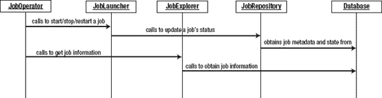
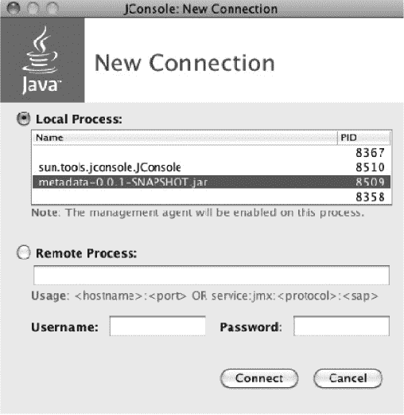
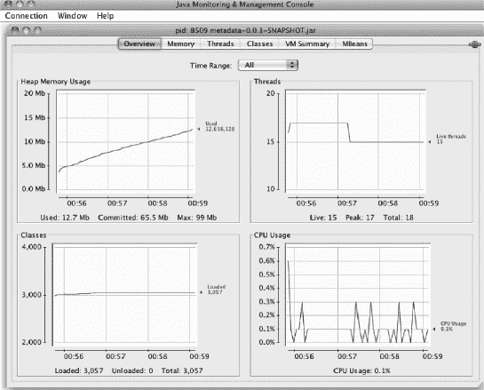
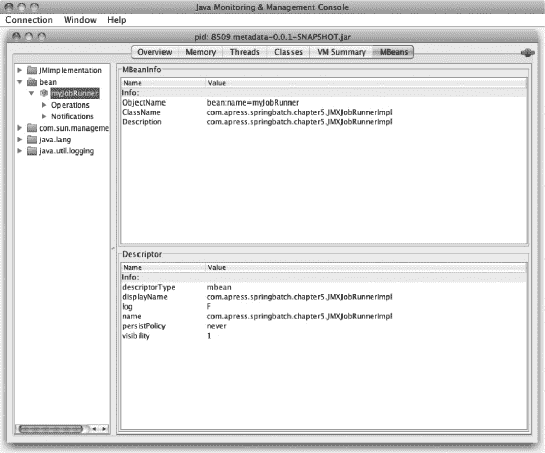
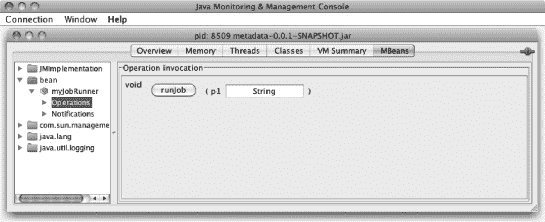

## T1】C H A P T E R 5

## 作业存储库和元数据

当您考虑编写批处理过程时，以独立的方式执行没有 UI 的过程并不困难。当您深入研究 Spring Batch 时，作业的执行只不过是使用 Spring 的 TaskExecutor 的一个实现来运行一个单独的任务。你不需要春批做到这一点。

然而，事情变得有趣的地方是事情出错的时候。如果您的批处理作业正在运行并出现错误，您如何恢复？当错误发生时，您的作业如何知道它在处理中的位置，以及当作业重新启动时应该发生什么？状态管理是处理大量数据的重要部分。这是 Spring Batch 带来的关键特性之一。如本书前面所讨论的，Spring Batch 在作业存储库中执行时维护作业的状态。然后，当重新启动作业或重试某个项目时，它会使用此信息来确定如何继续。这个功能的强大是不言而喻的。

作业存储库有助于批处理的另一个方面是监视。在企业环境中，能够查看作业的处理进度以及趋势元素(如操作需要多长时间或由于错误重试了多少项)至关重要。Spring Batch 为您收集数字的事实使这种类型的趋势分析变得更加容易。

本章详细介绍了作业存储库。它介绍了使用数据库或内存存储库为大多数环境配置作业存储库的方法。您还将简要了解对作业存储库配置的性能影响。配置作业存储库后，您将学习如何使用 JobExplorer 和 JobOperator 来使用作业存储库存储的作业信息。

### 配置作业储存库

为了让 Spring Batch 能够维护状态，作业存储库需要可用。默认情况下，Spring 提供了两种选择:内存存储库和数据库中的持久存储库。本节将介绍如何配置这些选项，以及这两个选项对性能的影响。让我们从更简单的选项开始，内存中的作业存储库。

#### 使用内存中的作业库

本章的开头几段列出了作业存储库的一系列好处，比如从一次执行到另一次执行维护状态的能力，以及从一次运行到另一次运行的趋势运行统计。然而，由于这些原因，您几乎不会使用内存中的存储库。这是因为当这个过程结束时，所有的数据都会丢失。那么，为什么要使用内存存储库呢？

答案是有时候不需要持久化数据。例如，在开发中，通常使用内存存储库来运行作业，这样您就不必担心在数据库中维护作业模式。这也允许您使用相同的参数多次执行相同的作业，这是开发中的必备功能。出于性能原因，您也可以使用内存中的存储库来运行作业。在可能不需要的数据库中维护作业状态是有成本的。例如，假设您正在使用 Spring Batch 进行数据迁移，将数据从一个数据库表移动到另一个数据库表；开始时目标表是空的，您有少量数据要迁移。在这种情况下，设置和使用 Spring 批处理模式的开销可能没有意义。不需要 Spring Batch 来管理重启等情况可以使用内存中选项。

您目前使用的 JobRepository 是在`launch-context.xml`文件中配置的。在前面的例子中，您已经使用 MySQL 配置了作业存储库。要配置您的作业使用内存中的存储库，您可以使用`org.springframework.batch.core.repository.support.MapJobRepositoryFactoryBean`，如清单 5-1 中的[所示。请注意，仍然需要事务管理器。这是因为 JobRepository 存储的数据仍然依赖于事务语义(回滚等)，业务逻辑也可能依赖于事务存储。清单中配置的事务管理器`org.springframework.batch.support.transaction.ResourcelessTransactionManager`，实际上并不处理事务；它是一个提供虚拟事务的虚拟事务管理器。](#list_5_1)

***清单 5-1。**配置内存中的作业库*

`<?xml version="1.0" encoding="UTF-8"?>
<beans:beans
    xmlns:beans="http://www.springframework.org/schema/beans"
    xmlns:xsi="http://www.w3.org/2001/XMLSchema-instance"
    xsi:schemaLocation="http://www.springframework.org/schema/beans
        http://www.springframework.org/schema/beans/spring-beans-3.0.xsd
        http://www.springframework.org/schema/batch
        http://www.springframework.org/schema/batch/spring-batch-2.1.xsd">
    <beans:bean id="transactionManager"
class="org.springframework.batch.support.transaction.
ResourcelessTransactionManager"/>

    <beans:bean id="jobRepository"
class="org.springframework.batch.core.repository.support.
MapJobRepositoryFactoryBean" p:transactionManager-ref="transactionManager" />
...`

如果您从第 2 章的[中获取 HelloWorld 示例，并将其配置为使用](02.html#ch2)[清单 5-1](#list_5_1) 中的内存元素，您会发现您可以一遍又一遍地运行作业，而不会因为多次使用相同的参数运行相同的作业而引发 Spring Batch 异常。

使用内存中的作业存储库时，您应该记住一些限制。首先，如前所述，因为数据存储在内存中，一旦 JVM 重启，数据就会丢失。其次，因为同步发生在特定 JVM 的内存空间中，所以不能保证在两个 JVM 中执行相同的作业时，不会使用相同的给定参数来执行给定的作业。最后，如果您的工作正在使用 Spring Batch 提供的任何多线程选项(多线程步骤、并行流等等)，这个选项将不起作用。

这就是内存选项。通过对配置做一点小小的调整，您可以避免设置数据库来运行批处理作业。然而，考虑到这种方法的局限性和持久作业存储库提供的特性，大多数情况下您将使用数据库来支持您的作业存储库。记住这一点，让我们看看如何在数据库中配置作业存储库。

#### 数据库

使用数据库存储库是配置作业存储库的主要方式。它允许您利用持久性存储的所有好处，而对您的工作的整体性能几乎没有影响。稍后，这一章看一些硬数字来说明使用数据库的成本。

但是现在，让我们从查看示例中使用的 MySQL 配置开始。你可以在[清单 5-2](#list_5_2) 中看到配置。在这种情况下，您从数据源开始。这个例子使用 Apache Commons 提供的`org.apache.commons.dbcp.BasicDataSource`,但是您想要使用的任何数据源都可以。[清单 5-2](#list_5_2) 通过`batch.properties`文件中的属性设置各种属性(驱动程序类、数据库 URL、用户名和密码)的值。这允许您配置那些特定于您正在工作的环境的属性(您的生产环境与您的测试环境具有不同的值，测试环境与您的本地开发具有不同的值)。

***清单 5-2。**使用数据库*在`launch-context.xml`中配置作业储存库

`<beans:bean id="dataSource" class="org.apache.commons.dbcp.BasicDataSource">
    <beans:property name="driverClassName" value="${batch.jdbc.driver}" />
    <beans:property name="url" value="${batch.jdbc.url}" />
    <beans:property name="username" value="${batch.jdbc.user}" />
    <beans:property name="password" value="${batch.jdbc.password}" />
</beans:bean>

<beans:bean id="transactionManager"
    class="org.springframework.jdbc.datasource.DataSourceTransactionManager"
    lazy-init="true">
    <beans:property name="dataSource" ref="dataSource" />
</beans:bean>

<job-repository id="jobRepository" data-source="dataSource"
    transaction-manager="transactionManager"/>`

接下来要配置的是事务管理器。同样，这里通过使用 Spring 提供的基本`DataSourceTransactionManager`来保持简单，但是任何事务管理器都可以。`DataSourceTransactionManager`只有一个依赖项:一个您已经配置的实际数据源。事务管理器的最后一个方面是它被配置为惰性初始化 [1](#CHP-05-FN-1) ，根据 Spring 文档这是可选的，但是因为 Spring Batch 的 shell 项目已经这样配置了它，所以没有理由更改它。

____________________________

默认情况下，Spring 在启动时实例化所有单例 beans。因为您不知道会发生什么，所以如果不会使用事务管理器，就没有理由去创建它。

最后你来到了工作仓库工厂。关于这种配置，首先要指出的是，您没有使用常规的`bean`标记。相反，Spring Batch 提供了一个特定于配置作业存储库的标签。为了以这种方式配置作业存储库，您需要像在[清单 5-1](#list_5_1) 中所做的那样，向`launch-context.xml`添加对 Spring 批处理 XSD 的引用，因为默认情况下不包括它。对于`job-repository`标签，唯一需要的属性是`id`。默认情况下，Spring 自动将`JobRepositoryFactoryBean`的`data-source`和`transaction-manager`属性分别与名为`dataSource`和`transactionManager`的 beans 关联起来。

在任一配置中，使用`bean`标签或`job-repository`标签，您可以引用 Spring Batch 提供的两个作业存储库工厂中的第二个。第一个是`org.springframework.batch.core.repository.support.MapJobRepositoryFactoryBean`，用于内存中的作业存储库。第二个是`org.springframework.batch.core.repository.support.JobRepositoryFactoryBean`。这个配置演示的`JobRepositoryFactoryBean`使用数据库作为维护作业存储库中状态的方法。要访问底层数据库，您需要满足它的两个依赖关系:一个数据源和一个事务管理器，这两者都在[清单 5-2](#list_5_2) 中配置。

##### 数据库模式配置

Spring 在允许您灵活配置方面做得很好。Spring Batch 允许您修改的内容之一是表前缀。默认情况下，每个表都以 *BATCH_* 为前缀，但这可能不是您或您的企业想要的。考虑到这一点，Spring Batch 的开发人员允许您为作业存储库中的表配置表前缀。为此，使用`job-repository`标签的`table-prefix`属性，如[清单 5-3](#list_5_3) 所示。随着配置的更新，Spring Batch 希望表被命名为 SAMPLE_JOB_EXECUTION，依此类推。

***清单 5-3。**改变表格前缀*

`<job-repository id="jobRepository" data-source="dataSource"
    transaction-manager="transactionManager" table-prefix="SAMPLE_"/>`

 **注意** Spring Batch 只让你配置表格前缀。您不能更改表名或列名的完整名称。

Spring Batch 允许您配置的数据库模式的另一个方面是`varchar`数据类型的最大长度。默认情况下，Spring Batch 中的模式脚本将较大的`varchar`列的长度设置为 2500(执行表中的 EXIT_MESSAGE 列和执行上下文表中的 SHORT_CONTEXT 列)。如果您正在使用一个字符使用多于一个字节的字符集，或者修改模式，您可以使用它来允许 Spring Batch 存储更大的值。[清单 5-4](#list_5_4) 显示了作业存储库被配置为最大 3000 个。

***清单 5-4。**配置最大`varchar`长度*

`<job-repository id="jobRepository" data-source="dataSource"
    transaction-manager="transactionManager" max-varchar-length="3000"/>`

重要的是要注意清单 5-4 中的[配置并没有真正改变数据库。相反，它会截断所有太长而不适合 EXIT_MESSAGE 列的消息。配置作业存储库的最后一部分，也可能是最重要的一部分，是如何配置事务，接下来我们将讨论这一部分。](#list_5_4)

##### 交易配置

作业存储库的使用基于事务。当每个处理块完成时，存储库被更新，这触发了事务的结束。您已经看到有两种方式来配置作业存储库，一种是使用常规的 Spring `bean`标签，另一种是使用 Spring Batch 名称空间的`job-repository`标签。如何配置事务取决于您选择这些选项中的哪一个。

当您使用 Spring Batch 名称空间中的`job-repository`标记时，Spring Batch 使用 Spring 的 AOP 特性将存储库包装成一个事务。使用这种方法时，唯一需要配置的是作业存储库接口的`createJobExecution`方法的事务隔离级别。这种配置的目的是防止一个`JobInstance`同时被多次执行。为了解决这个问题，默认情况下，Spring Batch 将事务的隔离级别设置为其最激进的值`SERIALIZABLE`。然而，您的环境可能不需要这么激进的级别，所以 Spring Batch 允许您用`job-repository`标记的`isolation-level-for-create`属性为`createJobExecution`方法配置事务级别。[清单 5-5](#list_5_5) 显示了使用`job-repository`标签时如何降低隔离级别。

***清单 5-5。**设置创建交易级别*

`<job-repository id="jobRepository" transaction-manager="transactionManager"
    data-source="dataSource" isolation-level-for-create="READ_COMMITTED"/>`

如果像使用内存选项一样使用 Spring `bean`标签配置作业存储库，框架不会为您处理任何事务。在这种情况下，您需要手工配置事务性通知，如清单 5-6 所示。这里，您使用 Spring 的 AOP 名称空间来配置事务通知，并将其应用于作业存储库接口中的所有方法。

***清单 5-6。**手动配置作业存储库事务*

`<beans:bean id="dataSource" class="org.apache.commons.dbcp.BasicDataSource">
    <beans:property name="driverClassName" value="${batch.jdbc.driver}" />
    <beans:property name="url" value="${batch.jdbc.url}" />
    <beans:property name="username" value="${batch.jdbc.user}" />
    <beans:property name="password" value="${batch.jdbc.password}" />
</beans:bean>

<beans:bean id="transactionManager"
   class="org.springframework.jdbc.datasource.DataSourceTransactionManager"/>

<aop:config>
    <aop:advisor
pointcut="execution(*org.springframework.batch.core.repository..*Repository+.*(..))"/>
    <advice-ref="txAdvice" />
</aop:config>

<tx:advice id="txAdvice" transaction-manager="transactionManager">
    <tx:attributes>
        <tx:method name="*" />
    </tx:attributes>
</tx:advice>`

`<beans:bean id="jobRepository"
class="org.springframework.batch.core.repository.support.JobRepositoryFactoryBean"
p:transactionManager-ref="transactionManager" p:dataSource-ref="dataSource" />`

作业存储库是 Spring Batch 为您的处理提供的安全网的核心部分。然而，它不仅仅是 Spring Batch 框架自己使用的工具。您可以像框架一样访问数据，还可以操作数据。下一节将向您展示。

### 使用作业元数据

尽管 Spring Batch 通过一组 Dao 来访问作业存储库表，但是它们为框架的使用和您的使用提供了一个更加实用的 API。在这一节中，您将看到 Spring Batch 在作业存储库中公开数据的两种方式。首先，您将看到 JobExplorer，一个您在上一章中配置的项目，如何配置它并使用它从存储库中读取数据。从这里，您可以转到 JobOperator。您将看到如何配置操作符，以及如何使用它来操作作业存储库中包含的数据。让我们从 JobExplorer 开始。

#### 求职者

`org.springframework.batch.core.explore.` JobExplorer 界面是所有访问作业库中历史和活动数据的起点。[图 5-1](#fig_5_1) 显示，虽然大部分框架通过 JobRepository 访问存储的关于作业执行的信息，但是 JobExplorer 直接从数据库本身访问。

***图 5-1。**作业管理组件之间的关系*

JobExplorer 的基本目的是提供对作业存储库中数据的只读访问。该接口提供了七种方法，可用于获取有关作业实例和执行的信息。表 5-1 列出了可用的方法及其用途。

***表 5-1。**求职者的方法*

<colgroup><col align="left" valign="top" width="70%"> <col align="left" valign="top" width="27%"></colgroup> 
| **方法** | **描述** |
| :-- | :-- |
| `java.util.Set<JobExecution>findRunningjobExecutions(java.lang.String jobName)` | 返回所有没有结束时间的作业执行。 |
| `JobExecution getJobExecution(java.lang.Long executionId)` | 如果没有找到，返回由提供的 id 和`null`标识的 JobExecution。 |
| `java.util.List<JobExecution> getJobExecutions( JobInstance instance)` | 返回与所提供的 JobInstance 相关的所有 JobExecutions 的列表。 |
| `JobInstance getJobInstance(java.lang.Long instanceId)` | 返回由提供的 id 标识的 JobInstance，如果没有找到，则返回`null`。 |
| `java.util.List<JobInstance> getJobInstances( java.lang.String jobName, int start, int count)` | 从指定的索引(`start`参数)开始返回一系列作业实例。最后一个参数指定要返回的 JobInstances 的最大数量。 |
| `java.util.List<java.lang.String> getJobNames()` | 按字母顺序返回作业库中所有唯一的作业名称。 |
| `StepExecution getStepExecution(java.lang.Long jobExecutionId, java.lang.Long stepExecutionId)` | 根据 StepExecution 的 id 及其父 JobExecution 的 id 返回指定的 StepExecution。 |

如您所见，通过 JobExplorer 接口公开的方法可以获得整个作业存储库。但是，在使用 JobExplorer 之前，您需要对其进行配置。[清单 5-7](#list_5_7) 显示了如何在`launch-context.xml`文件中配置 JobExplorer。

***清单 5-7。** JobExplorer 配置*

`<beans:bean id="jobExplorer"
class="org.springframework.batch.core.explore.support.JobExplorerFactoryBean"
p:dataSource-ref="dataSource" />`

JobExplorer 的配置就像任何其他 Spring bean 一样，只有一个依赖项——一个数据源——因此它可以被注入到任何其他元素中。注意，与您配置的大多数其他依赖于 JobRepository 的 Spring Batch 组件不同，这个组件依赖于一个数据源。原因是，如前所述，JobExplorer 不从 JobRepository 获取信息。相反，它直接进入数据库获取信息。

要查看 JobExplorer 是如何工作的，您可以将它注入到前面示例中的`HelloWorld` tasklet 中。从那里，您可以看到您可以使用 JobExplorer 做什么。在[清单 5-8](#list_5_8) 中，您配置了注入了 JobExplorer 的`HelloWorld`微线程。

***清单 5-8。**微线程`HelloWorld`和作业浏览器*的配置

`<?xml version="1.0" encoding="UTF-8"?>
<beans xmlns:batch="http://www.springframework.org/schema/batch"

    xmlns:xsi="http://www.w3.org/2001/XMLSchema-instance"
    xsi:schemaLocation="http://www.springframework.org/schema/beans
        http://www.springframework.org/schema/beans/spring-beans-3.0.xsd
        http://www.springframework.org/schema/batch
        http://www.springframework.org/schema/batch/spring-batch-2.1.xsd">

    <import resource="../launch-context.xml"/>

    <bean id="helloWorld"
        class="com.apress.springbatch.chapter5.HelloWorld">
        <property name="explorer" ref="jobExplorer"/>
    </bean>

    <batch:step id="helloWorldStep">
        <batch:tasklet ref="helloWorld"/>
    </batch:step>

    <batch:job id="helloWorldJob">
        <batch:step id="step1" parent="helloWorldStep"/>
    </batch:job>
</beans>`

配置了 JobExplorer 后，您可以使用它做许多事情。在 Spring Batch 框架中，您可以使用在[第 4 章](04.html#ch4)中查看的`RunIdIncrementer`中的 JobExplorer 来查找之前的`run.id`参数值。它的另一个用途是在 Spring Batch Admin web 应用中，在启动一个新实例之前确定一个作业当前是否正在运行。在示例中，您使用它来确定这是否是您第一次运行这个 JobInstance。如果是，你打印消息“你好，迈克尔！”其中迈克尔是传入的值。如果这不是您第一次运行该作业，您可以将消息更新为“欢迎回来 Michael！”[清单 5-9](#list_5_9) 有这个小任务的更新代码。

***清单 5-9。**更新`HelloWorld`小任务*

`package com.apress.springbatch.chapter5;

import java.util.List;

import org.springframework.batch.core.JobInstance;
import org.springframework.batch.core.StepContribution;
import org.springframework.batch.core.explore.JobExplorer;
import org.springframework.batch.core.scope.context.ChunkContext;
import org.springframework.batch.core.step.tasklet.Tasklet;
import org.springframework.batch.repeat.RepeatStatus;

public class HelloWorld implements Tasklet {

private static final String HELLO = "Hello, %s!";
    private static final String WELCOME = "And then we have %s!";
    private static final String JOB_NAME = "helloWorldJob";

    private JobExplorer explorer;

    public RepeatStatus execute(StepContribution stepContribution,
                                ChunkContext chunkContext) throws Exception {
        List<JobInstance>instances =
            explorer.getJobInstances(JOB_NAME, 0, Integer.MAX_VALUE);

        String name = (String) chunkContext.getStepContext()
                                           .getJobParameters()
                                           .get("name");

        if (instances != null && instances.size() > 1) {
            System.out.println(String.format(WELCOME, name));
        } else {
            System.out.println(String.format(HELLO, name));
        }

        return RepeatStatus.FINISHED;
    }

    public void setExplorer(JobExplorer explorer) {
        this.explorer = explorer;
    }
}`

清单 5-9 中的代码从获取`helloWorldJob`的所有作业实例开始。一旦有了列表，它就确定该作业以前是否运行过。如果有，你就用“欢迎回来”的信息。如果这是作业第一次运行，您可以使用“Hello”消息。

代码和配置就绪后，运行作业两次，这样您就可以看到`if`语句执行的两个部分。清单 5-10 显示了每项工作的重要输出。

***清单 5-10。**两次运行的全球工作输出*

* * *

`**Run 1 executed with the command java -jar metadata-0.0.1-SNAPSHOT.jar name=Michael**
2010-12-17 22:42:50,613 DEBUG org.springframework.batch.core.launch.support.CommandLineJobRunner.main()
[org.springframework.batch.core.scope.context.StepContextRepeatCallback] - <Chunk execution
starting: queue size=0>

**Hello, Michael!**

2010-12-17 22:42:50,619 DEBUG
org.springframework.batch.core.launch.support.CommandLineJobRunner.main()
[org.springframework.batch.core.step.tasklet.TaskletStep] - <Applying contribution:
[StepContribution: read=0, written=0, filtered=0, readSkips=0, writeSkips=0, processSkips=0,
exitStatus=EXECUTING]>

**Run 2 executed with the command java -jar metadata-0.0.1-SNAPSHOT.jar name=John**
2010-12-17 22:44:49,960 DEBUG
org.springframework.batch.core.launch.support.CommandLineJobRunner.main()
[org.springframework.batch.core.scope.context.StepContextRepeatCallback] - <Chunk execution
starting: queue size=0>

**And then we have John!**

2010-12-17 22:44:49,965 DEBUG
org.springframework.batch.core.launch.support.CommandLineJobRunner.main()
[org.springframework.batch.core.step.tasklet.TaskletStep] - <Applying contribution:
[StepContribution: read=0, written=0, filtered=0, readSkips=0, writeSkips=0, processSkips=0,
exitStatus=EXECUTING]>`

* * *

本节讨论了如何通过 JobExplorer 访问作业存储库中的数据。您使用像 JobExplorer 这样的 API 来访问数据，以便以安全的方式使用数据。尽管直接操作作业存储库并不是好的做法，但这并不意味着它维护的数据不受干预。事实上，您可以通过操作作业存储库，以编程方式控制作业中发生的事情。使用 JobOperator 可以做到这一点。

#### 作业员

当您查看方法名称时，JobOperator 与 JobExplorer 非常相似。然而，尽管 JobExplorer 提供了对作业存储库中数据的只读查看，但 JobOperator 只公开对其采取操作所需的内容。`org.springframework.batch.core.launch.` JobOperator 接口允许您在作业中以编程方式执行基本的管理任务。

JobOperator 的界面由 11 种方法组成，在[表 5-2](#tab_5_2) 中概述。

***表 5-2** 。作业操作器上可用的方法*

<colgroup><col align="left" valign="top" width="50%"> <col align="left" valign="top" width="47%"></colgroup> 
| **方法** | **描述** |
| :-- | :-- |
| `java.util.List<java.lang.Long> getExecutions( long instanceId )` | 返回与所标识的 JobInstance 关联的 JobExecution `id`的有序列表。按照从最新到最早的创建/执行顺序排列的列表。 |
| `java.util.List<java.lang.Long> getJobInstances( java.lang.String jobName, int start, int count)` | 从通过`start`参数提供的索引开始，按时间倒序(从最新到最早)返回所请求作业名称的每个 JobInstance 的`id`。计数是返回的`id`的最大数量。 |
| `java.util.Set<java.lang.String> getJobNames()` | 返回所有可通过`JobOperator.start`方法执行的作业名称。 |
| `java.lang.String getParameters(long executionId)` | 以可读字符串的形式返回用于请求的 JobExecution 的作业参数。 |
| `java.util.Set<java.lang.Long> getRunningExecutions( java.lang.String jobName )` | 返回名称已传递的作业的所有当前正在运行(无结束时间)的作业执行的`id`。 |
| `java.util.Map<java.lang.Long, java.lang.String> getStepExecutionSummaries( long executionId )` | 提供与指定的作业执行相关的每个步骤执行的摘要(状态、开始和结束时间等)。 |
| `java.lang.String getSummary( long executionId )` | 返回指定作业执行的摘要(状态、开始和结束时间等)。 |
| `java.lang.Long restart( long executionId )` | 在`FAILED`或`STOPPED`状态下重启作业执行。 |
| `java.lang.Long start(java.lang.String jobName, java.lang.String parameters)` | 启动用传递的参数指定的作业的新作业实例。 |
| `java.lang.Long startNextInstance (java.lang.String jobName )` | 执行等同于使用配置的`–next`参数和`JobParametersIncrementer`运行作业的程序。 |
| `boolean stop( long executionId )` | 向识别的作业执行发送停止信号。需要注意的是，这并不意味着作业已经停止，只是停止的请求已经发出。 |

到目前为止，这本书一直使用一个基本的 java 命令行命令来启动 Spring Batch 的`CommandLineJobRunner`来运行作业。为了查看 JobOperator 的运行情况，您创建了一个 JMX JobRunner，它允许您通过 JMX 控制台执行作业。首先，您必须编写一个`main`方法，让 Spring 应用保持运行，而不需要实际做任何事情。[清单 5-11](#list_5_11) 展示了你是如何做到的。

***清单 5-11。**启动一个 Spring 应用*

`package com.apress.springbatch.chapter5;

import org.springframework.context.ApplicationContext;
import org.springframework.context.support.ClassPathXmlApplicationContext;

public class Batch {

    @SuppressWarnings("unused")
    public static void main(String[] args) {
        try {
            ApplicationContext context =
                new ClassPathXmlApplicationContext("launch-context.xml");

            Object lock = new Object();

            synchronized (lock) {
                lock.wait();
            }
        } catch (Exception e) {
            e.printStackTrace();
        }
    }
}`

当您编写了启动 Spring 应用并保持其运行的代码后，您可以编写`JMXJobRunner`。为此，您只需编写一个 POJO，它根据传入的作业名启动一个作业。正如你在[清单 5-12](#list_5_12) 中看到的，完成这个的代码只不过是一个 JobOperator 实例的包装器。

***清单 5-12。**T4`JMXJobRunner`*

`package com.apress.springbatch.chapter5;

import org.springframework.batch.core.JobParametersInvalidException;
import org.springframework.batch.core.launch.JobInstanceAlreadyExistsException;
import org.springframework.batch.core.launch.JobOperator;
import org.springframework.batch.core.launch.NoSuchJobException;`

`public class JMXJobRunner {

    private JobOperator operator;

    public void runJob(String name) throws NoSuchJobException,
                                           JobInstanceAlreadyExistsException,
                                           JobParametersInvalidException {
        operator.start(name, null);
    }
    public void setOperator(JobOperator operator) {
        this.operator = operator;
    }
}`

在[清单 5-12](#list_5_12) 中，您使用`JobOperator.start`方法来启动一个带有提供的名称且不带参数的作业；作业在先前加载的`ApplicationContext`中进行配置。写完`JMXJobRunner`和`Batch`类后，剩下的唯一事情就是用 Spring 连接它们。这些元素的所有配置都在`launch-context.xml`中，如[清单 5-13](#list_5_13) 所示。

***清单 5-13。**T4`launch-context.xml`*

`<?xml version="1.0" encoding="UTF-8"?>
<beans:beans xmlns:beans="http://www.springframework.org/schema/beans"

    xmlns:p="http://www.springframework.org/schema/p"
    xmlns:xsi="http://www.w3.org/2001/XMLSchema-instance"
    xsi:schemaLocation="http://www.springframework.org/schema/beans
        http://www.springframework.org/schema/beans/spring-beans-3.0.xsd
        http://www.springframework.org/schema/batch
        http://www.springframework.org/schema/batch/spring-batch-2.1.xsd">

    <beans:bean id="jobOperator"
      class="org.springframework.batch.core.launch.support.SimpleJobOperator"
      p:jobLauncher-ref="jobLauncher" p:jobExplorer-ref="jobExplorer"
      p:jobRepository-ref="jobRepository" p:jobRegistry-ref="jobRegistry" />

    <beans:bean id="jobExplorer"
class="org.springframework.batch.core.explore.support.JobExplorerFactoryBean"
        p:dataSource-ref="dataSource" />

    <beans:bean id="taskExecutor"
        class="org.springframework.core.task.SimpleAsyncTaskExecutor" />

    <beans:bean id="jobLauncher"
     class="org.springframework.batch.core.launch.support.SimpleJobLauncher">
        <beans:property name="jobRepository" ref="jobRepository" />
        <beans:property name="taskExecutor" ref="taskExecutor" />
    </beans:bean>

    <job-repository id="jobRepository"
        data-source="dataSource" transaction-manager="transactionManager" />`

`    <beans:bean id="jobRegistry"
class="org.springframework.batch.core.configuration.support.MapJobRegistry" />

    <beans:bean
class="org.springframework.batch.core.configuration.support.AutomaticJobRegistrar">
        <beans:property name="applicationContextFactories">
            <beans:bean
class="org.springframework.batch.core.configuration.support.
ClasspathXmlApplicationContextsFactoryBean">
                <beans:property name="resources"
                    value="classpath*:/jobs/helloWorld.xml" />
            </beans:bean>
        </beans:property>
        <beans:property name="jobLoader">
            <beans:bean
                class="org.springframework.batch.core.configuration.support.DefaultJobLoader">
                <beans:property name="jobRegistry" ref="jobRegistry" />
            </beans:bean>
        </beans:property>
    </beans:bean>

    <beans:bean id="jobRunner"
        class="com.apress.springbatch.chapter5.JMXJobRunnerImpl"
        p:operator-ref="jobOperator" />

    <beans:bean id="exporter"
        class="org.springframework.jmx.export.MBeanExporter"
        lazy-init="false">
        <beans:property name="beans">
            <map>
                <entry key="bean:name=myJobRunner" value-ref="jobRunner" />
            </map>
        </beans:property>
        <beans:property name="assembler" ref="assembler" />
    </beans:bean>

    <beans:bean id="assembler"
        class="org.springframework.jmx.export.assembler.
        InterfaceBasedMBeanInfoAssembler">
        <beans:property name="managedInterfaces">
            <list>
                <value>com.apress.springbatch.chapter5.JMXJobRunner
                </value>
            </list>
        </beans:property>
    </beans:bean>

    <beans:bean id="registry"
        class="org.springframework.remoting.rmi.RmiRegistryFactoryBean">
        <beans:property name="port" value="1099" />
    </beans:bean>`

`    <beans:bean id="dataSource"
        class="org.apache.commons.dbcp.BasicDataSource">
        <beans:property name="driverClassName"
            value="${batch.jdbc.driver}" />
        <beans:property name="url" value="${batch.jdbc.url}" />
        <beans:property name="username" value="${batch.jdbc.user}" />
        <beans:property name="password" value="${batch.jdbc.password}" />
    </beans:bean>

<beans:bean id="transactionManager"
    class="org.springframework.jdbc.datasource.DataSourceTransactionManager"
    lazy-init="true">
        <beans:property name="dataSource" ref="dataSource" />
    </beans:bean>

    <beans:bean id="placeholderProperties"
        class="org.springframework.beans.factory.config.
        PropertyPlaceholderConfigurer">
        <beans:property name="location" value="classpath:batch.properties" />
        <beans:property name="systemPropertiesModeName"
            value="SYSTEM_PROPERTIES_MODE_OVERRIDE" />
        <beans:property name="ignoreUnresolvablePlaceholders"
            value="true" />
        <beans:property name="order" value="1" />
    </beans:bean>
</beans:beans>`

这个`launch-context.xml`文件有很多内容，我们从头开始吧。为了让`JMXJobLauncher`能够启动一个作业，您需要一个对 JobOperator 的引用。该文件中的第一个 bean 是配置。`SimpleJobOperator`是 Spring Batch 框架提供的`JobOperator`接口的唯一实现。您将其配置为可以访问 JobExplorer、JobLauncher、JobRepository 和 JobRegistry。考虑到 JobOperator 可以做什么，这些依赖项都是需要的。

接下来是 JobExplorer，为该配置中的许多对象提供对 JobRepository 的只读访问。在 JobExplorer 之后是一个 TaskExecutor 配置以及由 JobOperator 使用的 JobLauncher。JobLauncher 执行启动作业的工作，并由您的环境的 JobOperator 管理。接下来配置 JobRepository 如前所述，Spring Batch 使用它来维护作业的状态。

JobRegistry 是配置的下一个 bean。Spring Batch 提供了在 JobRegistry 中注册一组按需执行的作业的能力。JobRegistry 包含有资格在此 JVM 中运行的所有作业。在这种配置的情况下，您使用 Spring Batch 的`MapJobRegistry`，它是可运行的作业的`Map`。为了在启动时填充 JobRegistry，需要配置一个`AutomaticJobRegistrar`的实例。这个类，如[清单 5-13](#list_5_13) 中所配置的，读取`/jobs/helloWorldJob.xml`文件中配置的所有作业，并将它们加载到 JobRegistry 中以备将来使用。

这个`launch-context.xml`文件中 Spring Batch 透视图的最后一部分是`JMXJobLauncher`本身的配置。该文件中的其余配置包括数据源、事务管理器、属性加载器以及将`JMXJobLauncher`公开为 MBean 所需的元素。

完成所有配置和编码后，您现在可以运行主类`Batch`，并使用 JDK 提供的 JConsole 应用查看通过 JMX 公开的 beans。然而，要启动`Batch`程序，您需要做最后一点调整。当你使用 Spring Batch 的`simple-cli-archetype`创建一个 shell 项目时， *cli* 代表命令行界面。这个项目中的项目对象模型 (POM)被预先配置为创建一个 jar 文件，默认情况下`CommandLineJobRunner`被定义为主类。对于这个例子，你更新 POM 来使用清单 5-11 中的`Batch`类作为你的 jar 的主要方法。清单 5-14 显示了需要更新的代码片段。

***清单 5-14。** Maven Jar 插件配置为运行批处理*

`<plugin>
    <groupId>org.apache.maven.plugins</groupId>
    <artifactId>maven-jar-plugin</artifactId>
    <configuration>
        <archive>
            <index>false</index>
            <manifest>
                <mainClass>com.apress.springbatch.chapter5.Batch</mainClass>
                <addClasspath>true</addClasspath>
                <classpathPrefix>lib/</classpathPrefix>
            </manifest>
            <manifestFile>
                ${project.build.outputDirectory}/META-INF/MANIFEST.MF
            </manifestFile>
        </archive>
    </configuration>
</plugin>`

POM 更新后，您可以使用与过去相同的命令来启动程序:`java –jar metadata-0.0.1-SNAPSHOT.jar.`

请注意，当您运行该程序时，输出完全不同。这一次，没有运行任何作业。相反，您会看到 Spring bootstrap 并从`helloWorld.xml`文件中注册作业`helloWorldJob`，如[清单 5-16](#list_5_16) 所示。

***清单 5-16。helloWorld 工作的注册。**T3】*

* * *

`2010-12-16 21:17:41,390 DEBUG com.apress.springbatch.chapter5.Batch.main()
[org.springframework.batch.core.configuration.support.DefaultJobLoader] - <Registering job:
helloWorldJob1 from context: file:/Users/mminella/Documents/SpringBatch/Chapter5/batch-
test/target/classes/jobs/helloWorld.xml>`

* * *

随着批处理的运行，您可以使用 Java 的 JConsole 查看通过 JMX 公开的 beans。JConsole 是 JDK 提供的免费 Java 监控和管理工具。它允许您以多种方式监控 JVM，包括 CPU 利用率和内存分配，并允许您执行管理任务，包括与 JMX bean 交互。当您启动 JConsole 时，会出现一个屏幕，询问您想要连接到哪个 Java 进程，如[图 5-2](#fig_5_2) 所示。

***图 5-2。**JConsole 主屏幕*

在这种情况下，选择名为`org.codehaus.classworlds.Launcher "exec:java"`的本地进程(也可以使用 JConsole 来管理远程 Java 进程)。这是您用清单 5-15 中的`maven`命令启动的 Java 进程。单击 connect 允许 JConsole 连接到 JVM。

连接后，JConsole 向您显示一个类似于图 5-3 中的屏幕。顶部是六个选项卡:概述、内存、线程、类、虚拟机摘要和 MBeans。在选项卡下面，JConsole 允许您选择显示概览数据的时间范围。最后，有四个象限的数据:JVM 堆内存使用量、正在使用的线程数、JVM 当前加载的类数以及所选时间内的 CPU 使用量。您感兴趣的选项卡是 MBeans。

***图 5-3。**JVM 概述*

当您选择 MBeans 选项卡时，您会在左侧看到一个树导航，在窗口的其余部分看到一个主面板。在[清单 5-13](#list_5_13) 中，您将 bean 配置在名称空间`bean`中，并命名为`myJobRunner`。果然，[图 5-4](#fig_5_4) 显示了树导航中的`bean`名称空间和一个可用的 bean `myJobRunner`。

***图 5-4。** `JMXJobRunner`在 JConsole 曝光*

对于任何公开的 bean，最多有三个部分:允许您修改公共属性的属性(在本例中没有)；操作，它允许您执行公共方法；和通知，向您显示任何 JMX 通知(从 bean 发送到任何通过 JMX 收听的人的消息)。要运行批处理作业，进入操作，如图[图 5-5](#fig_5_5) 所示。在这里，您可以看到`JMXJobRunner` : `runJob`上唯一的公共方法。它是空的，只有一个参数。要调用作业，只需在框中输入作业名，然后单击 Runjob。

***图 5-5。**JConsole*中暴露的`JMXJobRunner.runJob`方法

当您单击 Runjob 按钮时，您会在当前运行 Java 进程的控制台中看到作业正在运行，并使用`helloWorldJob`给出您期望的输出。

* * *

`2010-12-17 17:06:09,444 DEBUG RMI TCP Connection(1)-192.168.1.119
[org.springframework.batch.core.scope.context.StepContextRepeatCallback] - <Chunk execution
starting: queue size=0>

**Hello, World!**

2010-12-17 17:06:09,450 DEBUG RMI TCP Connection(1)-192.168.1.119
[org.springframework.batch.core.step.tasklet.TaskletStep] - <Applying contribution:
[StepContribution: read=0, written=0, filtered=0, readSkips=0, writeSkips=0, processSkips=0,
exitStatus=EXECUTING]>`

* * *

在这个例子中，您编写了一个可以通过 JMX 公开的 job runner。其他用途是开发一个基于给定条件停止作业的步骤监听器。在第 6 章的[中，您扩展了这个例子以接受参数并使用 JobOperator 以编程方式停止和重启作业。](06.html#ch6)

### 总结

Spring Batch 管理关于作业的元数据以及在作业运行时维护作业状态以进行错误处理的能力是使用 Spring Batch 进行企业批处理的主要原因之一，如果不是主要原因的话。它不仅提供了健壮的错误处理能力，还允许流程根据作业中其他地方发生的事情来决定要做什么。在下一章中，您将深入了解如何在各种环境中启动、停止和重启作业，从而进一步使用这些元数据以及 JobOperator。