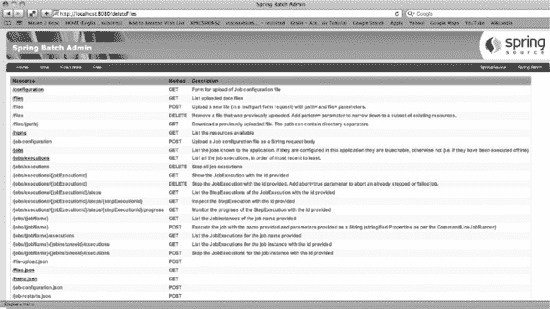
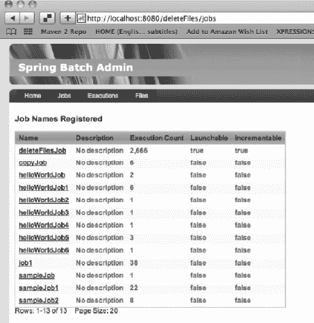
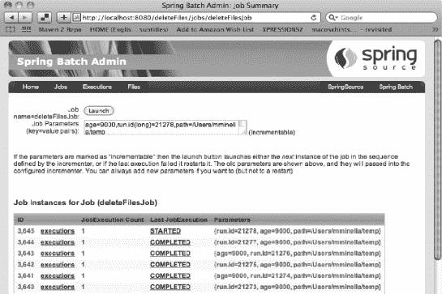
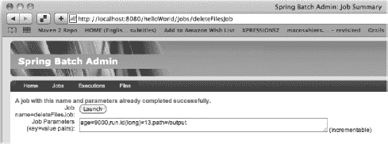
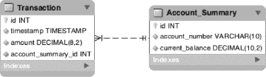
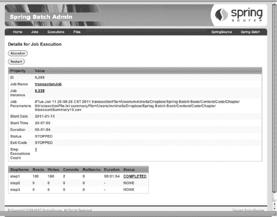
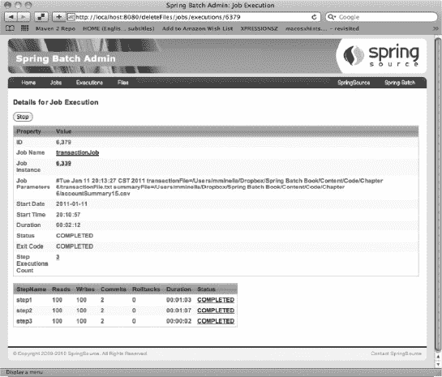
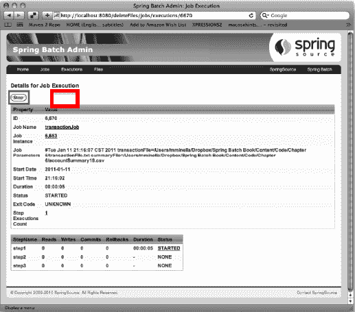
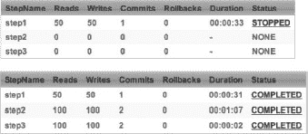
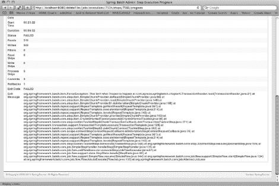

## C H A P T E R 6

## 运行作业

通常情况下，你不必考虑如何用 Java 运行一个应用程序。如果您有一个 web 应用程序，您可以在某种形式的容器中运行它。要运行应用程序，您需要启动容器，容器会启动应用程序。如果想运行一个独立的 Java 程序，要么创建一个可执行的 jar 文件，要么直接调用这个类。在这两种情况下，您都可以编写一个 shell 脚本来启动这个过程。

但是，运行批处理作业是不同的。这部分是因为批处理作业既可以作为现有进程中的一个线程运行(到目前为止一直如此)，也可以在主执行线程中运行。它可以在容器中运行，也可以作为独立的进程运行。你可以在每次执行时启动一个 JVM，或者你可以加载一个 JVM 并通过类似 JMX 的东西调用它来启动作业(就像你在第五章中所做的那样)。

你也要考虑到当事情出错，你的工作停止时会发生什么。整个作业是否需要重新运行，或者您是否可以从它停止的那一步开始？如果该步骤要处理一百万行，那么它们是否都需要重新处理，或者可以从发生错误的地方重新开始？

在运行批处理作业时要考虑所有这些因素，本章将介绍如何在各种环境中启动作业。它讨论了 Spring Batch framework 提供的不同作业运行器，以及将作业的启动和运行与 Tomcat 之类的容器和 Quartz 之类的调度器集成在一起。

经营一份工作并不是你在这里学到的全部。您还将看到如何以编程方式在作业开始后以允许重新启动的方式停止它。最后，您将通过了解重新启动作业的条件来结束本章。

### 开始一项工作

在到目前为止的章节中，每次启动 JVM 时，您几乎都在专门运行一个作业。然而，当你像使用`SimpleJobLauncher`一样执行一项任务时，事情会比看起来要复杂一些。本节介绍通过`SimpleJobLauncher`启动作业时会发生什么。然后，您将详细查看 Spring Batch 提供的所有作业运行器和启动器。您将看到如何在各种环境中执行作业，包括在 servlet 容器中，使用 Spring Batch Admin 管理应用程序并通过开源调度程序 Quartz。

#### 工作执行

当您考虑在 Spring Batch 中启动批处理作业时，您可能会认为正在发生的事情是 Spring Batch 作为主执行线程的一部分执行作业。当它完成时，该过程结束。然而，事情没那么简单。负责启动作业的接口可以通过多种方式实现，公开任意数量的执行选项(web、JMX、命令行等等)。

因为`JobLauncher`接口不保证一个作业是同步运行还是异步运行，`SimpleJobLauncher`(Spring Batch 提供的唯一的`JobLauncher`实现)通过在 Spring 的`TaskExecutor`中运行作业，把它留给开发者。默认情况下，`SimpleJobLauncher`使用 Spring 的`SyncTaskExecutor`，它在当前线程中执行任务。虽然在许多情况下这是可以的，但是对于在单个 JVM 中运行的作业数量来说，这个选项是一个限制因素。

我们来看看`SimpleJobLauncher`是如何配置的。[清单 6-1](#list_6_1) 显示了设置了可选的`taskExecutor`属性的配置。如前所述，该属性允许您指定用于启动作业的算法。在这种情况下，您使用 Spring 的`SimpleAsyncTaskExecutor`在一个新线程中启动作业。然而，您可以很容易地将其配置为使用`ThreadPoolTaskExecutor`来控制可用线程的数量

***清单 6-1。** `SimpleJobLauncher`配置有任务执行人*

`<bean id="taskExecutor"
    class="org.springframework.core.task.SimpleAsyncTaskExecutor"/>

<bean id="jobLauncher"
    class="org.springframework.batch.core.launch.support.SimpleJobLauncher">
    <property name="jobRepository" ref="jobRepository" />
    <property name="taskExecutor" ref="taskExecutor"/>
</bean>`

虽然 JobLauncher 启动了作业并定义了它的运行方式(同步、异步、在线程池中等等)，但是当您想要启动作业时，它是您要与之交互的作业运行器(就像您在上一章的 JMX 作业运行器中所做的那样)。接下来您将看到 Spring Batch 提供的两个现成的作业运行器:`CommandLineJobRunner`和`JobRegistryBackgroundJobRunner`。

#### 春季批量作业运行程序

当您查看 Spring Batch API 时，尽管理论上有许多方法可以运行一个作业(通过 servlet、命令行、JMX 等等启动它)，但是框架只提供了两个运行器`org.springframework.batch.core.launch.support.CommandLineJobRunner`和`org.springframework.batch.core.launch.support.JobRegistryBackgroundJobRunner`。所有其他选项——servlet、JMX 等等——必须定制开发。让我们从`CommandLineJobRunner`开始，看看`CommandLineJobRunner`和`JobRegistryBackgroundJobRunner`是怎么用的，为什么。

##### CommandLineJobRunner

`CommandLineJobRunner`是您到目前为止一直使用的跑步者。它通过命令行充当批处理的界面。这对于从终端或更常见的 shell 脚本调用作业非常有用。它提供了四个功能:

*   基于传递的参数加载适当的`ApplicationContext`
*   将命令行参数解析成一个`JobParameters`对象
*   根据传递的参数找到请求的作业
*   使用配置的 JobLauncher 执行请求的作业

从命令行或脚本调用`CommandLineJobRunner`时，有三个必需参数和四个可选参数，详见[表 6-1](#tab_6_1) 。

***表 6-1。**参数`CommandLineJobRunner`参数*

<colgroup><col align="left" valign="top" width="20%"> <col align="left" valign="top" width="70%"></colgroup> 
| **参数** | **使用** |
| :-- | :-- |
| `jobPath` | 提供包含作业配置的`ApplicationContext`配置的路径。 |
| `-restart` | 告诉 Spring Batch 执行已识别作业的最后一次失败执行 |
| `-stop` | 停止已经运行的`JobExecution` |
| `-abandon` | 告诉 Spring Batch 放弃之前停止的执行 |
| `-next` | 按指定作业的`JobParametersIncrementer`配置的顺序增加所需参数 |
| `jobIdentifier` | 给出在`ApplicationContext`中指定的作业名称或 id。(与`–stop`、`-abandon`和`-restart`参数一起使用) |
| `jobParameters` | 指定要作为`JobParameters`传递到作业中的`key=value`对列表 |

尽管到目前为止您几乎只使用了`CommandLineJobRunner`来执行任务，但是正如您所看到的，这个小工具可以为您做更多的事情。到您的作业的 XML 文件的路径，以及`-next`和作业参数选项应该都很熟悉，因为它们在前面已经介绍过了。

您一直使用的包含在`simple-cli`中的项目对象模型(POM)的构建过程构建了一个 jar 文件，其中`CommandLineJobRunner`被配置为主类。要使用它，您需要将 jar 文件放在一个目录中，其中有一个包含所有依赖项的`lib`文件夹。如果您查看`<project_home>/target/`目录，您会看到 jar 文件已经与`lib`目录一起构建，并具有所需的依赖关系；不过名字可能不是最直观的(比如`spring-batch-simple-cli-2.1.3.RELEASE.jar`)。为了更新构建过程以构建一个更合适的 jar 名称，您可以更改 POM 文件以生成具有合适名称的工件。[清单 6-2](#list_6_2) 显示了 POM 更新，将 jar 的名称改为`helloWorld.jar`。

***清单 6-2。**将 Maven 神器重命名为`helloWorld.jar`*

`...
<build>
    <finalName>helloWorld</finalName>
    ...
</build>
...`

将 jar 文件命名为对您的应用程序有意义的名称(在本例中为`helloWorld`)，您可以使用来自`<project_home>/target`目录的 jar 文件本身运行作业。[清单 6-3](#list_6_3) 展示了一个如何使用 Java 命令运行到目前为止一直在运行的`HelloWorld`作业的例子。

***清单 6-3。**基本调用到`CommandLineJobRunner`中包含的`helloWorld.jar`到*

`java –jar helloWorld.jar jobs/helloWorld.xml helloWorldJob`

您可以传入两个参数:作业配置的路径和要运行的作业的名称。使用`–next`参数(来自[第四章](04.html#ch4)，如[清单 6-4](#list_6_4) 所示，调用任何已配置的`JobParametersIncrementers`。

***清单 6-4。**使用`–next`参数*

`java –jar helloWorld.jar jobs/helloWorld.xml helloWorldJob -next`

虽然[表 6-1](#tab_6_1) 显示`CommandLineJobRunner`有七个参数可用，但本章只涵盖你目前拥有的四个。在本章的后面，您将再次访问`CommandLineJobRunner`,并了解如何使用它来停止、放弃和重启作业。现在，您可以转到 Spring Batch 提供的另一个求职者:`JobRegistryBackgroundJobRunner`。

##### 工作注册背景工作流

实际上根本不是一个求职者。您不像`CommandLineJobRunner`那样通过这个 runner 执行作业。相反，这个类旨在用于引导 Spring 并构建一个 JobRegistry 供其他人使用。在第五章的[中，你为`JMXJobRunner`编写了你自己版本的类，该类的功能类似于 bootstrap Spring 和你的作业。](05.html#ch5)

但你没必要自己写。
`org.springframework.batch.core.launch.support.JobRegistryBackgroundJobRunner`是命令行界面，和`CommandLineJobRunner`一样。但是，这个作业运行器不是运行指定的作业，而是获取一个配置文件列表。一旦配置文件已经被引导，`JobRegistryBackgroundJobRunner`暂停直到一个键被按下。

让我们来看一个例子。首先，回到第 5 章中[的`JMXJobRunner`示例。到目前为止，您已经将作业 XML 文件(`<project_home>/src/main/resources/jobs/helloWorld.xml`)与主或父应用程序上下文(`<project_home>/src/main/resources/launch-context.xml`)链接起来。然而，当使用 JobRegistry 时，通常不是这种情况。原因是当加载 JobRegistry 时，作业不会立即执行。相反，您将所有可能执行的作业加载到一个`Map`中，这样它们就可以在任何时候启动。为了正确地配置您的作业，您需要删除一行:在`helloWorld.xml`文件中导入`launch-context.xml`文件。这样做是为了防止循环引用。如果您在`helloWorld.xml`文件中保留对`launch-context.xml`文件的引用，`JobRegistryBackgroundJobRunner`将加载`launch-context.xml`，然后加载`helloWorld.xml`中的作业。因为`launch-context.xml`已经在该点加载，所以你不想或者不需要再次加载。](05.html#ch5)

您需要做的另一个修改是从`launch-context.xml`中移除`AutomaticJobRegistrar` bean。`JobRegistryBackgroundJobRunner`从命令行接受两个参数:一个基本配置(称为*父*)，包含所有常规组件，如`JobRepository`、`JobLauncher`等等；以及包含要运行的作业的配置文件列表。`JobRegistryBackgroundJobRunner`注册它在你传递的配置中找到的作业，所以不需要`AutomaticJobRegistrar`。

 **注意**传入一个已经被引用了作业的配置会导致抛出`DuplicateJobException`。

您使用`JobRegistryBackgroundJobRunner`来引导您的作业，而不是使用您在前一章中编写的`Batch`类。因为`JobRegistryBackgroundJobRunner`包含在`spring-batch-core` jar 文件中(主要的 Spring 批处理依赖项)，所以要执行带有`JobRegistryBackgroundJobRunner`的 jar 文件，您需要做的唯一更改是将 POM 文件改为引用`JobRegistryBackgroundJobRunner`作为主类。清单 6-5 突出了这一变化。

***清单 6-5。**改变`pom.xml`中的主类*

`<plugin>
    <groupId>org.apache.maven.plugins</groupId>
    <artifactId>maven-jar-plugin</artifactId>
    <configuration>
        <archive>
            <index>false</index>
            <manifest>
                <mainClass>
**org.springframework.batch.core.launch.support.JobRegistryBackgroundJobRunner**
                </mainClass>
                <addClasspath>true</addClasspath>
                <classpathPrefix>lib/</classpathPrefix>
            </manifest>
            <manifestFile>
                ${project.build.outputDirectory}/META-INF/MANIFEST.MF
            </manifestFile>
        </archive>
    </configuration>
</plugin>`

为了能够使用`JobRegistryBackgroundJobRunner`执行 jar 文件，您只需要对`pom.xml`做一点小小的修改。当 jar 文件被重建时，您可以用[清单 6-6](#list_6_6) 中的命令来执行它。

***清单 6-6。**正在执行`JobRegistryBackgroundJobRunner`*

`java -jar helloWorld.jar launch-context.xml jobs/helloWorld.xml`

请注意，您没有像过去那样在命令行上指定要运行的作业的名称。原因是您只是用这个命令引导 Spring 和 Spring Batch，而不是启动一个作业的执行。当您执行 jar 时，您会看到正常的 Spring bootstrap 输出，以清单 6-7 所示的内容结束，然后应用程序等待。等待着。它会继续运行，直到被终止或者以编程方式调用了`JobRegistryBackgroundJobRunner.stop()`方法。现在流程已经运行，您可以像在第 5 章中一样使用 JConsole 来执行任务。

***清单 6-7。**从`JobRegistryBackgroundJobRunner`输出*

* * *

`2011-04-30 01:36:24,105 DEBUG main
[org.springframework.batch.core.configuration.support.ClassPathXmlApplication
ContextFactory$ResourceXmlApplicationContext] - <Unable to locate
LifecycleProcessor with name 'lifecycleProcessor': using default
[org.springframework.context.support.DefaultLifecycleProcessor@d3ade7]>

2011-04-30 01:36:24,106 DEBUG main
[org.springframework.batch.core.configuration.support.DefaultJobLoader] –
<Registering job: helloWorldJob from context:
org.springframework.batch.core.configuration.support.ClassPathXmlApplicationC
ontextFactory$ResourceXmlApplicationContext@1c6a99d>

Started application. Interrupt (CTRL-C) or call
JobRegistryBackgroundJobRunner.stop() to exit.`

* * *

是一个有用的工具，可以从命令行引导 Spring 和你的作业，而不用立即执行它们。这是在类似生产的环境中发现的更典型的场景。然而，大多数生产环境不会启动 Java 进程，让它运行并手动启动作业。相反，作业是有计划的。为了部署的一致性，它们可以在 servlet 容器中运行，并且可能需要由 Spring Admin 项目来管理。下一节将介绍如何做到这一切。

#### 第三方集成

Spring Batch 是开发批处理过程的优秀工具，但是它很少单独管理。企业需要由运营团队管理批处理作业的能力。他们需要能够以一致的方式为企业部署作业。他们需要能够以不需要编程的方式启动、停止和调度作业(通常通过某种企业调度程序)。本节将介绍如何使用开源调度器 Quartz 调度批处理作业，如何在 Tomcat servlet 容器中部署 Spring 批处理作业，以及如何使用管理工具 Spring Batch Admin 启动作业。

##### 用石英调度

许多企业调度程序是可用的。从粗糙但非常有效的 crontab 到价值数百万美元的企业自动化平台。这里使用的调度器是一个开源调度器，名为 Quartz ( `[www.quartz-scheduler.org/](http://www.quartz-scheduler.org/)`)。这个调度器通常用于各种规模的 Java 环境中。除了其强大的功能和坚实的社区支持之外，它还拥有 Spring integration 的历史，这有助于执行作业。

考虑到 Quartz 的范围，本书不会在这里涵盖所有内容。但是，有必要简单介绍一下它是如何工作的，以及它是如何与 Spring 集成的。[图 6-1](#fig_6_1) 显示了石英的成分及其相互关系。

***图 6-1。**石英调度器*

如您所见，Quartz 有三个主要组件:一个调度器、一个作业和一个触发器。从`SchedulerFactory`获得的调度程序充当`JobDetails`(对 Quartz 作业的引用)的注册表，并在相关触发器触发时触发和负责执行作业。一个*任务*是一个可以被执行的工作单元。一个*触发器*定义何时运行一个任务。当一个触发器触发时，告诉 Quartz 执行一个任务，一个`JobDetails`对象被创建来定义任务的单独执行。

这听起来熟悉吗？应该的。定义作业和`JobDetails`对象的模型与 Spring Batch 定义作业和`JobInstance`的方式非常相似。为了将 Quartz 集成到 Spring 批处理过程中，您需要执行以下操作:

*   将所需的依赖项添加到您的`pom.xml`文件中。
*   使用 Spring 的`QuartzJobBean`编写您自己的 Quartz 作业来启动您的作业。
*   配置一个由 Spring 提供的`JobDetailBean`来创建一个石英`JobDetail`。
*   配置触发器以定义作业应该运行的时间。

为了展示如何使用 Quartz 定期执行一个作业，让我们创建一个新的作业`deleteFilesJob`，它在每次运行时清空一个目录。这是批处理作业或任何存储数据并需要定期删除数据的实例(数据库清除等)的常见做法。在这种情况下，您将删除临时目录中的所有文件。

首先将所需的依赖项添加到 POM 文件中。在这种情况下，有三个新的依赖项。首先是石英框架本身。您添加的第二个依赖项是针对`spring-context-support`工件的。Spring 的这个包提供了将 Quartz 与 Spring 轻松集成所需的类。最后，为了帮助解决本例中遇到的一些配置问题，您包括了 Apache Commons Collections 库。依赖关系的配置可以在[清单 6-8](#list_6_8) 中找到。

***清单 6-8。**向 POM 添加与 Quartz 相关的依赖项*

`<dependency>
    <groupId>org.springframework</groupId>
    <artifactId>spring-context-support</artifactId>
    <version>${spring.framework.version}</version>
</dependency>
<dependency>
    <groupId>org.quartz-scheduler</groupId>
    <artifactId>quartz</artifactId>
    <version>1.8.3 /version>
</dependency>
<dependency>
    <groupId>commons-collections</groupId>
    <artifactId>commons-collections</artifactId>
    <version>3.2.1</version>
</dependency>`

清单 6-8 中的配置假设您使用的是 Spring 批处理项目中包含的 POM 文件。如果不是，则需要包含版本号来代替所提供的属性。

有了类路径中现在可用的适当代码，您就可以编写`SpringBatchQuartzJobLauncher`。然而，在你写代码之前，让我们先讨论一下它要做什么。在这种情况下，`SpringBatchQuartzJobLauncher`取代了[第五章](05.html#ch5)中的`JMXJobLauncher`等等。`JMXJobLauncher`不接受任何作业参数作为作业执行的一部分。对于这个示例，您的作业需要两个参数:您希望清空的目录的路径和您希望删除的文件的期限。为了简单起见，您删除了在给定时间段内没有修改的所有文件。

您的 Quartz 作业运行器不仅可以接受传入的参数，而且为了防止作业无法多次运行，您可以使用 Spring Batch 的参数增量器功能(在第 4 章的[中讨论)为每次运行提供一组唯一的参数。清单 6-9](04.html#ch4) 完整地展示了`SpringBatchQuartzJobLauncher`。

***清单 6-9。**T4`SpringBatchQuartzJobLauncher`*

`package com.apress.springbatch.chapter6;

import java.util.List;
import java.util.Map;

import org.quartz.JobExecutionContext;
import org.quartz.JobExecutionException;
import org.slf4j.Logger;
import org.slf4j.LoggerFactory;
import org.springframework.batch.core.Job;
import org.springframework.batch.core.JobInstance;
import org.springframework.batch.core.JobParameter;
import org.springframework.batch.core.JobParameters;
import org.springframework.batch.core.JobParametersBuilder;
import org.springframework.batch.core.JobParametersIncrementer;
import org.springframework.batch.core.configuration.JobLocator;
import org.springframework.batch.core.explore.JobExplorer;
import org.springframework.batch.core.launch.JobLauncher;
import org.springframework.batch.core.launch.JobParametersNotFoundException;
import org.springframework.scheduling.quartz.QuartzJobBean;

public class SpringBatchQuartzJobLauncher extends QuartzJobBean {

    private JobLauncher jobLauncher;
    private JobLocator jobLocator;
    private JobExplorer jobExplorer;
    private Map<String, String> jobParameters;
    public static final String JOB_NAME = "jobName";

    private static final Logger log = LoggerFactory
            .getLogger(SpringBatchQuartzJobLauncher.class);

    @Override
    @SuppressWarnings("unchecked")
    protected void executeInternal(JobExecutionContext context)` `throws JobExecutionException {
        Map<String, Object> jobDataMap = context.getMergedJobDataMap();
        String jobName = (String) jobDataMap.get(JOB_NAME);

        try {
            Job job = jobLocator.getJob(jobName);
            JobParameters allParams = translateParams(job, jobParameters);

            jobLauncher.run(job, allParams);
        } catch (Exception e) {
            log.error("Could not execute job.", e);
        }
    }

    private JobParameters translateParams(Job job,
                                          Map<String, String> params)
                                          throws Exception {
        JobParametersBuilder builder = new JobParametersBuilder();

        JobParameters incrementedParams = getNextJobParameters(job);

        for (Map.Entry<String, JobParameter> param :
                incrementedParams.getParameters().entrySet()) {
            builder.addParameter(param.getKey(), param.getValue());
        }

        for (Map.Entry<String, String> param : params.entrySet()) {
            builder.addString(param.getKey(), param.getValue());
        }

        return builder.toJobParameters();
    }

    private JobParameters getNextJobParameters(Job job)
            throws JobParametersNotFoundException {
        String jobIdentifier = job.getName();
        JobParameters jobParameters;
        List<JobInstance> lastInstances =
            jobExplorer.getJobInstances(jobIdentifier, 0, 1);

        JobParametersIncrementer incrementer =
            job.getJobParametersIncrementer();
        if (incrementer == null) {
            throw new JobParametersNotFoundException(` `"No job parameters incrementer found for job="
                            + jobIdentifier);
        }

        if (lastInstances.isEmpty()) {
            jobParameters = incrementer.getNext(new JobParameters());` `            if (jobParameters == null) {
                throw new JobParametersNotFoundException(
                    "No bootstrap parameters found from incrementer for job="
                                + jobIdentifier);
            }
        } else {
            jobParameters = incrementer.getNext(lastInstances.get(0)
                                       .getJobParameters());
        }
        return jobParameters;
    }

    public void setJobLauncher(JobLauncher jobLauncher) {
        this.jobLauncher = jobLauncher;
    }

    public void setJobLocator(JobLocator jobLocator) {
        this.jobLocator = jobLocator;
    }

    public void setJobParameters(Map<String, String> jobParameters) {
        this.jobParameters = jobParameters;
    }

    public void setJobExplorer(JobExplorer jobExplorer) {
        this.jobExplorer = jobExplorer;
    }
}`

查看这段代码时，请注意 Quartz 和 Spring Batch 之间的类名有很多冲突。为了理解发生了什么，让我们从查看执行环境的结构开始。你有一个扩展 Spring 的`QuartzJobBean`的类。Quartz 的`org.quartz.Job`接口的这个实现是一个有用的类，它允许您只实现与您的工作相关的逻辑部分，而将调度器等操作留给 Spring。在这种情况下，您将覆盖执行作业的`executeInternal`方法。

在`executeInternal`方法中，首先获取`JobDataMap`，这是一个通过 Spring 配置传递给 Quartz 作业的参数的`Map`(在学习完这个类后，您将看到配置)。这个`Map`包含了注入到`SpringBatchQuartzJobLauncher`类中的所有依赖项，以及您可能想要引用的任何附加参数。在这种情况下，您希望引用另一个参数:作业的名称。

获得作业的名称后，使用`JobLocator`从`JobRegistry`中检索 Spring 批处理作业。在执行作业之前，您需要将通过 Spring 作为`<String, String>`的`Map`传递的参数转换成 Spring 批处理`JobParameters`集合。完成后，您可以使用`JobLauncher`执行作业。

注意，这个类中作业的实际执行并不需要太多代码。这个类的绝大部分致力于作业参数的转换和递增。另外两个方法，`translateParams`和`getNextJobParameters`用于将从 Spring 接收的参数翻译成`JobParameters`，并调用配置的参数增量器。

`translateParams`首先创建 Spring Batch 的`org.springframework.batch.core.JobParametersBuilder`实例。这个类用于获取键值对，并将它们转换成`JobParameter`实例。要开始转换，您需要调用`getNextJobParameters` [1](#CHP-06-FN-1) 方法来增加任何需要增加的参数。因为该流程返回一个`JobParameters`实例，所以您可以将这些参数添加到您当前正在使用的`JobParametersBuilder`中。添加了递增的参数后，您可以添加弹簧传递的参数。在这种情况下，您知道它们都是`String` s，您可以相应地简化代码。

写完之后，你可以继续写这个工作的基础。在这种情况下，您有一个简单的小任务(类似于您在《T2》第二章中编写的`HelloWorld`小任务),它删除指定目录中超过给定时间没有修改的所有文件。[清单 6-10](#list_6_10) 显示了实现这一点的代码。

***清单 6-10。**T4`DeleteFilesTasklet`*

`package com.apress.springbatch.chapter6;

import java.io.File;
import java.util.Date;
import java.util.Map;

import org.springframework.batch.core.StepContribution;
import org.springframework.batch.core.scope.context.ChunkContext;
import org.springframework.batch.core.step.tasklet.Tasklet;
import org.springframework.batch.repeat.RepeatStatus;

public class DeleteFilesTasklet implements Tasklet {

    public RepeatStatus execute(StepContribution step, ChunkContext chunk)
            throws Exception {
        Map<String, Object> params =
            chunk.getStepContext().getJobParameters();
        String path = (String) params.get("path");
        Long age = Long.valueOf((String) params.get("age"));

        File tempDirectory = new File(path);

        File[] files = tempDirectory.listFiles();

        Date now = new Date();
        long oldesttime = now.getTime() - age;

        for (File file : files) {
            if (file.lastModified() < oldesttime) {
                file.delete();
            }
        }

        return RepeatStatus.FINISHED;
    }
}`

__________

1`getNextJobParameters`方法的源代码来自 Spring Batch 的`CommandLineJobRunner`。不幸的是，没有标准的方式来启动需要参数和增量参数的作业(JobOperator 调用 incrementer 但不接受参数，JobLauncher 接受参数但不调用 incrementer)。

清单 6-10 中`DeleteFilesTasklet`的代码不应该让人感到惊讶。在实现`Tasklet`接口时，您实现了`execute`方法来完成您的所有工作。对于`DeleteFilesTasklet`的工作来说，你需要知道文件从哪里删除，以及它们闲置了多长时间。有了这些信息后，您就可以继续删除文件了。

`execute`方法的前三行检索作业参数，这样您就可以获得要删除文件的目录的路径(`path`)和文件未被修改的时间(毫秒)(`age`)。当您拥有作业参数时，您可以打开一个目录并删除所有符合您要求的文件或目录。处理完成后，您返回`RepeatStatus.FINISHED`来告诉 Spring Batch 该步骤已经完成。

要做到这一点，您需要做的就是进行配置。同样，您使用的是`JobRegistryBackgroundJobRunner`，所以配置文件是分开的:`launch-context.xml`位于`<project_home>/src/main/resources`目录中，`deleteFilesJob.xml`位于`<project_home>/src/main/resources/jobs`目录中。首先看一下`deleteFilesJob.xml`文件，在[清单 6-11](#list_6_11) 中，显示了作业本身的配置。

***清单 6-11。**T4`deleteFilesJob.xml`*

`<?xml version="1.0" encoding="UTF-8"?>
<beans:beans
    xmlns:beans="http://www.springframework.org/schema/beans"
    xmlns:xsi="http://www.w3.org/2001/XMLSchema-instance"
    xsi:schemaLocation="http://www.springframework.org/schema/beans
        http://www.springframework.org/schema/beans/spring-beans-3.0.xsd
        http://www.springframework.org/schema/batch
        http://www.springframework.org/schema/batch/spring-batch-2.1.xsd">

    <beans:bean id="deleteFilesTasklet"
        class="com.apress.springbatch.chapter6.DeleteFilesTasklet" />

    <step id="deleteFilesStep">
        <tasklet ref="deleteFilesTasklet" />
    </step>

    <beans:bean id="idIncrementer"
     class="org.springframework.batch.core.launch.support.RunIdIncrementer"/>

    <job id="deleteFilesJob" incrementer="idIncrementer">
        <step id="step1" parent="deleteFilesStep" />
    </job>
</beans:beans>`

与您的其他作业一样，您定义了微线程本身，然后有一个使用微线程的步骤，然后以作业的定义结束，这是一个在作业运行时删除文件的单一步骤。这个作业得到的唯一附加配置是添加了`RunIdIncrementer`，如第 4 章中的[所述，因此您可以通过 Quartz 多次运行这个作业，而不必更改作业参数。](04.html#ch4)

`launch-context.xml`主要由通常的春批嫌疑人组成，如[清单 6-12](#list_6_12) 所示。您只需要添加三个 beans 来使 Quartz 交互工作:`jobDetail`、`cronTrigger`和`schedule`。

***清单 6-12。**更新为`launch-context.xml`*

`...

<bean id="jobDetail"
    class="org.springframework.scheduling.quartz.JobDetailBean">
    <property name="jobClass"
       value="com.apress.springbatch.chapter6.SpringBatchQuartzJobLauncher"/>
    <property name="jobDataAsMap">
        <map>
            <entry key="jobName" value="deleteFilesJob" />
            <entry key="jobLocator" value-ref="jobRegistry" />
            <entry key="jobLauncher" value-ref="jobLauncher" />
            <entry key="jobExplorer" value-ref="jobExplorer"/>
            <entry key="jobParameters">
                <map>
                    <entry key="path" value="${batch.temp.dir}" />
                    <entry key="age" value="${batch.temp.age}" />
                </map>
            </entry>
        </map>
    </property>
</bean>

<bean id="cronTrigger"
    class="org.springframework.scheduling.quartz.CronTriggerBean">
    <property name="jobDetail" ref="jobDetail" />
    <property name="cronExpression" value="0/10 * * * * ?" />
</bean>

<bean id="schedule"
    class="org.springframework.scheduling.quartz.SchedulerFactoryBean">
    <property name="triggers" ref="cronTrigger"/>
</bean>
...`

在石英示例的`launch-context.xml`中，第一个重要的 bean 是`jobDetail` bean。这里是你配置`SpringBatchQuartzJobLauncher`的地方。注意如何使用 Spring 的`JobDetailBean`和`SpringBatchQuartzJobLauncher` bean 之间的关系是很重要的。您在`launch-context.xml`中将一个`JobDetailBean`配置为一个弹簧 bean。每次执行 Quartz 作业时，`JobDetailBean`都会创建一个新的`SpringBatchQuartzJobLauncher`实例。当配置`JobDetailBean`、`jobDetail`时，您设置了两个属性:

*   `jobClass`:这是每次 Quartz 作业运行时被实例化和执行的类。
*   `jobDataAsMap`:这个`Map`是注入到`SpringBatchQuartzJobLauncher`中的所有对象的集合，以及 Quartz 作业运行所需的任何其他参数(要删除的文件的位置以及它们需要多长时间)。

当 Quartz 作业被触发并且 Spring 创建了一个新的`SpringBatchQuartzJobLauncher`实例时，Spring 使用`jobDataAsMap`根据需要注入任何需要的依赖项。在这种情况下，您输入要删除的文件的位置以及它们需要多长时间。

在`launch-context.xml`中要查看的第二个 bean 是`cronTrigger` bean。您之前看到了 Quartz 如何使用触发器来确定何时执行作业。这里使用的触发器根据 cron 字符串决定何时运行。为了配置触发器，您创建一个具有两个依赖项的`org.springframework.scheduling.quartz.CronTriggerBean`:`jobDetail`引用作业`Detail` bean，而`cronExpression`是用于确定作业何时运行的 cron 字符串。在这种情况下，您每 10 秒执行一次`deleteFilesJob`。

要配置的最后一个 bean 是完成所有工作的 bean:调度程序。使用 Spring 的`org.springframework.scheduling.quartz.SchedulerFactoryBean`，向调度程序注册您的触发器。接下来，Spring 和 Quartz 会处理剩下的事情。

为了让事情开始，使用`JobRegistryBackgroundJobRunner`来引导这个过程。使用[清单 6-13](#list_6_13) 中的命令启动这个过程，引导 Spring，在 JobRegistry 中注册`deleteFilesJob`，并启动 Quartz。在 Quartz 运行的情况下，作业按照配置每 10 秒执行一次。

***清单 6-13。**通过石英*执行工作

`java -jar deleteFiles.jar launch-context.xml jobs/deleteFilesJob.xml`

通过 Quartz 或其他调度程序运行作业是企业中管理批处理的常见方式。在企业中运行作业的另一个常见方面是它们的部署方式。鉴于许多企业将所有或大多数 Java 应用程序部署到某种容器中，您应该看看 Spring 批处理是如何在容器中运行的。

##### 在容器中运行

与 web 应用程序不同，批处理不需要容器来执行。您可以使用数据库连接池、事务管理和 JMS 等现成的框架来构建健壮且完全独立的批处理作业，而不需要应用服务器或 servlet 容器。尽管如此，在容器中运行作业的理由和不在容器中运行作业的理由一样多。

在企业中，围绕基于容器的应用程序的配置和部署通常有一个更强大的专业基础，其中部署为 jar 文件集合的普通 Java 应用程序可能会导致一些操作团队暂停。此外，像数据库连接(及其安全性)、JMS 队列等资源可能更容易通过容器中的标准化配置来管理。让我们看看如何从 Tomcat 内部部署和执行作业。

虽然使用 Spring 可以通过应用服务器配置大量资源，但是它们的配置超出了本书的范围。相反，您关注于用所需的作业引导 Spring Batch JobRegistry 并触发它们的执行。

从一个容器中引导作业注册比您到目前为止所做的更容易。Tomcat 不是依赖于`CommandLineJobRunner`或`JobRegistryBackgroundJobRunner`的`main`方法来引导您的进程，而是作为启动 Java 进程的手段，您可以使用标准的 web 技术在您的容器中引导 Spring Batch。

让我们看看如何将`deleteFilesJob`部署到 Tomcat。有四个步骤:

1.  将 POM 文件作为 war 文件而不是 jar 文件更新到包应用程序。
2.  将所需的 Spring web 相关依赖项添加到 POM 文件中。
3.  用`ContextLoaderListener`在新目录`<project_home>/src/main/webapp/WEB-INF`中创建`web.xml`来引导 Spring。
4.  配置`AutomaticJobRegistrar`向 JobRegistry 注册作业。

从更新 POM 文件开始。为了让 Spring 在像 Tomcat 这样的 servlet 容器中引导，您需要添加 Spring 框架的 web 依赖项。清单 6-14 显示了如何配置这项工作所需的附加依赖项，包括 Spring 的 web 模块、SLF4J 和 log4j。

***清单 6-14。**附加依赖关系为`pom.xml`*

`<dependency>
    <groupId>org.springframework</groupId>
    <artifactId>spring-web</artifactId>
    <version>${spring.framework.version}</version>
</dependency>
<dependency>
    <groupId>org.slf4j</groupId>
    <artifactId>slf4j-log4j12</artifactId>
    <version>1.5.8</version>
</dependency>
<dependency>
    <groupId>log4j</groupId>
    <artifactId>log4j</artifactId>
    <version>1.2.14</version>
</dependency>`

您希望创建一个可以部署到 Tomcat 的 war 文件，而不是创建一个 jar 文件供您独立执行。为此，您需要将 POM 文件中的打包从 jar 更新到 war。您还可以用`maven-war-plugin`替换对`maven-jar-plugin`的引用。[清单 6-15](#list_6_15) 展示了如何配置 POM 文件，以便你的应用程序被正确打包。

***清单 6-15。**修改后的`pom.xml`*

`<plugin>
    <artifactId>maven-war-plugin</artifactId>
    <version>2.1-beta-1</version>
    <configuration>
        <attachClasses>true</attachClasses>
        <warName>deleteFiles</warName>
    </configuration>
</plugin>`

如清单 6-15 所示，配置 Maven 来生成你的 war 文件是非常容易的。不幸的是，在您创建一个`web.xml`文件并将其放在正确的位置之前，对`pom.xml`文件的更改不会生效。对于`web.xml`，您配置了一个监听器，Spring 的`org.springframework.web.context.ContextLoaderListener`。它为你启动 Spring 和 JobRegistry。[清单 6-16](#list_6_16) 显示了`web.xml`文件。

***清单 6-16。**`web.xml`T5】*

`<?xml version="1.0" encoding="UTF-8"?>
<!DOCTYPE web-app PUBLIC
    "-//Sun Microsystems, Inc.//DTD Web Application 2.3//EN"
    "http://java.sun.com/dtd/web-app_2_3.dtd">
<web-app>
    <display-name>Spring Batch Webapp</display-name>
    <description>A web application that wraps Spring Batch jobs</description>

    <context-param>
        <param-name>contextConfigLocation</param-name>
        <param-value>classpath:launch-context.xml</param-value>
    </context-param>

    <listener>
        <listener-class>
            org.springframework.web.context.ContextLoaderListener
        </listener-class>
    </listener>
</web-app>`

`web.xml`文件存在于`<project_home>/src/main/webapp/WEB-INF/`目录中。POM 文件更新后，在正确的位置定义了`web.xml`文件，您可以使用标准的`mvn clean install`生成一个 war 文件。

现在您已经有了一个工作 war 文件，让我们配置`AutomaticJobRegistrar`在启动时在 JobRegistry 中注册作业。正如前面的例子一样，`AutomaticJobRegistrar`被配置为注册类路径的`/jobs/`目录中列出的所有作业。从那里，您可以像在本章前面所做的那样使用 Quartz 来启动作业。[清单 6-17](#list_6_17) 显示了配置有先前石英配置和`AutomaticJobRegistrar`的`launch-context.xml`。

***清单 6-17。**更新为`launch-context.xml`*

`...
<bean
    class="org.springframework.batch.core.configuration.support.
AutomaticJobRegistrar">
    <property name="applicationContextFactories">
        <bean
            class="org.springframework.batch.core.configuration.support.
ClasspathXmlApplicationContextsFactoryBean">
            <property name="resources"
                value="classpath*:/jobs/deleteFilesJob.xml" />
        </bean>
    </property>
    <property name="jobLoader">
        <bean class="org.springframework.batch.core.configuration.support.
DefaultJobLoader">
            <property name="jobRegistry" ref="jobRegistry" />
        </bean>
    </property>` `</bean>
...`

配置并构建好作业后，您需要做的就是将它部署到 Tomcat 服务器上。当您将 war 文件复制到`<TOMCAT_HOME>/webapps`并通过执行`<TOMCAT_HOME>/bin`中的`./startup.sh`命令来启动服务器时，应用程序启动，作业通过 Quartz 每 10 秒执行一次。你怎么知道它在跑？您可以确认文件正在按预期删除，并验证`<TOMCAT_HOME>/logs/catalina.out`文件中的输出，如[清单 6-18](#list_6_18) 所示。

***清单 6-18。**`catalina.out`*中的作业输出

* * *

`2011-01-04 21:07:50,103 DEBUG SimpleAsyncTaskExecutor-2
[org.springframework.batch.core.job.AbstractJob] - <Job execution complete:
JobExecution: id=151, startTime=Tue Jan 04 21:07:50 CST 2011, endTime=null,
lastUpdated=Tue Jan 04 21:07:50 CST 2011, status=COMPLETED,
exitStatus=exitCode=COMPLETED;exitDescription=, job=[JobInstance: id=144,
JobParameters=[{age=9000, run.id=49, path=/Users/mminella/temp}],
Job=[deleteFilesJob]]>

2011-01-04 21:07:50,105 INFO SimpleAsyncTaskExecutor-2
[org.springframework.batch.core.launch.support.SimpleJobLauncher] - <Job:
[FlowJob: [name=deleteFilesJob]] completed with the following parameters:
[{age=9000, run.id=49, path=/Users/mminella/temp}] and the following status:

[COMPLETED]>`

* * *

在容器中运行 Spring 批处理作业在企业环境中提供了许多优势，包括标准化的打包和部署以及更健壮的管理选项。在企业环境中运行作业的另一个方面是通过操作监控和管理作业的能力。让我们看看如何使用 Spring Batch Admin 项目来启动作业。

##### 使用 Spring Batch Admin 启动

Spring Batch Admin 是 Spring Batch 工作原理的最新补充。与其说它是一个管理工具，不如说它是一个管理框架。在 2010 年初推出 1.0 版本后，它的功能和在 Spring 家族中的角色仍在不断发展。然而，它是一个有用的工具，不仅可以将 web 界面放到 JobRepository 上，还允许通过 web 界面执行作业。

要查看 Spring Batch Admin，请将其添加到现有的`deleteFiles`应用程序中。因为您已经有了通过 Tomcat 部署作业的结构，所以添加 Spring Batch Admin 为您查看 JobRepository 以及管理作业(启动、停止等)提供了一个 web 界面。值得注意的是，您不需要用 Spring Batch Admin 打包作业就可以浏览 Spring Batch 的 job repository——您只需要管理它们的执行。

要将 Spring Batch Admin 添加到您的应用程序中，请执行以下操作:

1.  更新 POM 文件，在 war 文件中包含所需的 jar 文件。
2.  更新`web.xml`以包含引导 Spring Batch Admin 所需的元素。
3.  移动`launch-context.xml`文件，以便 Spring Batch Admin 使用它来覆盖它的组件。

对于 Spring Batch，如果您还没有注意到的话，您一直在使用的示例项目附带的 POM 文件是用 Spring 2 . 5 . 6 版构建的。显然，这是一个老版本的 Spring。Spring Batch 在较新的 Spring 3.0.x 上运行良好；因为 Spring Batch Admin 需要较新版本的 Spring，所以对 POM 文件的第一次更新是将您正在使用的 Spring 版本更新到 3.0.5.RELEASE，如[清单 6-19](#list_6_19) 所示。

***清单 6-19。**更新了`pom.xml`中的属性*

`...
<properties>
**<maven.test.failure.ignore>true</maven.test.failure.ignore><spring.framework.version>3.0.**
**5.RELEASE</spring.framework.version>**
    <spring.batch.version>2.1.2.RELEASE</spring.batch.version>
    <dependency.locations.enabled>false</dependency.locations.enabled>
</properties>
...`

您需要对 AspectJ 依赖项进行另一个版本的更改。您需要使用更新的 1.6.6 版本，而不是您的 shell 附带的 1.5.4 依赖项。最后，将依赖项添加到 Spring Batch 管理 jar 文件中。[清单 6-20](#list_6_20) 显示了`pom.xml`中新的和更新的依赖关系。

***清单 6-20。**新增和更新的依赖关系*

`...
<dependency>
    <groupId>org.aspectj</groupId>
    <artifactId>aspectjrt</artifactId>
    <version>1.6.6</version>
</dependency>
<dependency>
    <groupId>org.aspectj</groupId>
    <artifactId>aspectjweaver</artifactId>
    <version>1.6.6</version>
</dependency>
<dependency>
    <groupId>org.springframework.batch</groupId>
    <artifactId>spring-batch-admin-manager</artifactId>
    <version>1.2.0.RELEASE</version>
</dependency>
<dependency>
    <groupId>org.springframework.batch</groupId>
    <artifactId>spring-batch-admin-resources</artifactId>
    <version>1.2.0.RELEASE</version>
</dependency>
<dependency>
    <groupId>org.springframework.batch</groupId>
    <artifactId>spring-batch-integration</artifactId>
    <version>1.2.0.RELEASE</version>` `</dependency>
...`

现在项目已经有了正确的依赖项和版本，您可以更新`web.xml`。对于您之前使用的`deleteFilesJob`，您有一个监听器，Spring 的`ContextLoaderListener`，用于引导 Spring 配置。对于 Spring Batch Admin，您还需要一些东西，如清单 6-21 中的[所示。](#list_6_21)

***清单 6-21。**更新`web.xml`*

`<?xml version="1.0" encoding="UTF-8"?>
<!DOCTYPE web-app PUBLIC
    "-//Sun Microsystems, Inc.//DTD Web Application 2.3//EN"
    "http://java.sun.com/dtd/web-app_2_3.dtd">
<web-app>
    <display-name>Spring Batch Webapp</display-name>
    <description>A web application that wraps Spring Batch jobs</description>

    <context-param>
        <param-name>contextConfigLocation</param-name>
        <param-value>
  classpath*:/org/springframework/batch/admin/web/resources/webapp-config.xml
        </param-value>
    </context-param>

    <filter>
        <filter-name>hiddenHttpMethodFilter</filter-name>
        <filter-class>
            org.springframework.web.filter.HiddenHttpMethodFilter
        </filter-class>
    </filter>

    <filter-mapping>
        <filter-name>hiddenHttpMethodFilter</filter-name>
        <url-pattern>/*</url-pattern>
    </filter-mapping>

    <listener>
        <listener-class>
            org.springframework.web.context.ContextLoaderListener
        </listener-class>
    </listener>

    <servlet>
        <servlet-name>Batch Servlet</servlet-name>
        <servlet-class>
            org.springframework.web.servlet.DispatcherServlet
        </servlet-class>
        <init-param>
            <param-name>contextConfigLocation</param-name>
            <param-value>
 classpath*:/org/springframework/batch/admin/web/resources/servlet-config.xml
            </param-value>` `        </init-param>
        <load-on-startup>1</load-on-startup>
    </servlet>

    <servlet-mapping>
        <servlet-name>Batch Servlet</servlet-name>
        <url-pattern>/*</url-pattern>
    </servlet-mapping>
</web-app>`

从清单 6-21 中的[所示的`web.xml`文件开始，你就有了应用程序的显示名称和描述。之后，配置基本 Spring 上下文配置的位置。在本例中，您使用的是包含在`spring-batch-admin-resources-1.2.0.RELEASE` jar 文件`webapp-config.xml`中的一个。该文件包含 Spring Batch Admin 运行所需的 beans，还为您提供了一个覆盖和扩展任何组件的工具。](#list_6_21)

接下来的两个配置`hiddenHttpMethodFilter`的元素，被用作不支持所有标准 HTTP 方法的浏览器的变通方法。 [2](#CHP-06-FN-2) 因为 Spring Batch Admin 通过 RESTful API 公开了许多特性，所以它使用这个过滤器来支持一种通用的技术，用于指示通过请求头调用的 HTTP 方法。

像在任何普通的基于 Spring 的 web 应用程序中一样，在 bootstrap Spring 旁边配置`ContextLoaderListener`。最后，您有一个为 Spring Batch 管理应用程序做繁重工作的 servlet。与大多数基于 Spring 的 web 应用程序一样，您使用`org.springframework.web.servlet.DispatcherServlet`根据配置将请求定向到 beans。在这种情况下，Spring Batch Admin 附带了一个包含所需映射的配置(也可以在`spring-batch-admin-resources -1.2.0.RELEASE.jar` ) `servlet-config.xml`中找到)。

Spring 批处理管理难题的最后一块是移动`launch-context.xml`。您可能想知道为什么需要移动它。原因是 Spring Batch Admin 应用程序有一个针对许多 beanss 的嵌入式配置，这些 bean 是您已经默认配置好的(`JobExplorer`、`JobRepository`、一个数据源等等)。但是，它还提供了通过将覆盖配置放在 war 文件的`<WAR_ROOT>/META-INF/spring/batch/override`目录中来覆盖这些配置的能力。在这种情况下，处理您想要的覆盖的简单方法是将`launch-context.xml`从`<PROJECT_ROOT>/src/main/resources`目录移动到`<PROJECT_ROOT>/src/main/resources/META-INF/spring/batch/override`目录。当 Spring Batch Admin 启动时，它使用您的配置而不是提供的默认配置。

剩下的工作就是构建您的 war 文件，并像以前一样将其部署到 Tomcat。使用`mvn clean install`命令，您最终会得到一个 war 文件，您可以将它放入 Tomcat 的`webapps`目录并启动 Tomcat。运行 Tomcat，启动浏览器并导航到`[http://localhost:8080/deleteFiles](http://localhost:8080/deleteFiles)`查看管理应用程序，如图[图 6-2](#fig_6_2) 所示。

__________

2 大多数现代浏览器只支持 HTTP `POST`和`GET`，但是真正的 RESTful 实现也需要`PUT`和`DELETE`的支持。

***图 6-2。**Spring 批处理管理应用程序的主页*

Spring Batch Admin 应用程序的主页显示了可用的 REST APIs 列表。顶部的选项卡允许您访问已经在 JobRepository 中执行的作业，查看已经执行或当前正在运行的作业，以及上传新的配置文件。

要查看您过去运行的作业以及您可以从 Spring Batch Admin 管理的任何作业，请点按“作业”标签。这样做会将你带到如图[图 6-3](#fig_6_3) 所示的页面。

***图 6-3。**作业库中的作业列表*

“作业”页面列出了作业存储库中出现的所有作业。每个作业已经执行的次数，该作业是否可以通过当前配置执行，以及是否配置了`JobParametersIncrementer`都显示在该页面上。注意在这个例子中,`deleteFilesJob`已经被执行了 2666 次(每 10 秒钟快速累加一次)。`deleteFilesJob`也是唯一可启动的作业，所以单击该链接查看如何执行它。

在[图 6-4](#fig_6_4) 中显示的`deleteFilesJob`页面，从执行作业所需的控件开始，包括一个启动作业的按钮和一个填充有上次运行的作业参数的文本框。在`deleteFilesJob`的例子中，因为它配置了一个`JobParametersIncrementer`，所以您可以将相同的参数传递给作业；Spring Batch 处理递增的`run.id`参数，因此您有一个惟一的 JobInstance。

***图 6-4。**求职页面为`deleteFilesJob`*

要从该页面执行`deleteFilesJob`,您只需点击启动按钮。Spring Batch 执行`JobParametersIncrementer`以便一切正常。如果您使用一组重复的参数启动一个作业，则会显示一个错误，并且不会创建任何作业实例或作业执行，如图[图 6-5](#fig_6_5) 所示。

***图 6-5。**运行重复的作业实例*

正如您所看到的，有许多方法可以启动 Spring 批处理作业:通过命令行的`CommandLineJobRunner`，使用另一个协议，如 JMX 和您在[第 5 章](05.html#ch5)中看到的自定义作业运行器，使用 Quartz 之类的调度程序，甚至使用 Spring Batch Admin web 应用程序。然而，原谅我的双关语，开始工作只是一个开始。一项工作如何结束会对很多事情产生很大的影响。下一节将介绍 Spring 批处理作业的不同结束方式，以及这些场景如何影响您配置或执行作业的方式。

### 停止工作

一个作业可能因为许多原因而停止，每一个原因都对接下来发生的事情有自己的影响。它可以自然地运行到完成(到目前为止所有的例子都是如此)。出于某种原因，您可以在处理过程中以编程方式停止作业的执行。您可以从外部停止作业(例如，有人意识到有问题，他们需要停止作业来修复它)。当然，尽管您可能永远不会承认，但是可能会发生导致作业停止执行的错误。这一节将介绍如何使用 Spring Batch 来处理这些场景，以及在每种情况发生时应该做些什么。让我们从最基本的开始:一个运行到自然完成的作业。

#### 自然结束

到目前为止，您的所有作业都已运行到自然完成状态。也就是说，每个作业已经运行了它的所有步骤，直到它们返回了一个`COMPLETED`状态，并且作业本身返回了一个退出代码`COMPLETED`。这对一份工作意味着什么？

正如您所看到的，一个作业不能使用相同的参数值多次成功执行。这是那句话的*成功*部分。当作业运行到`COMPLETED`退出代码时，不能再次使用相同的作业参数创建新的作业实例。这一点很重要，因为它决定了如何执行作业。您已经使用了`JobParametersIncrementer`来增加基于运行的参数，这是一个好主意，尤其是在基于某种调度运行的作业中。例如，如果您有一个每天运行的作业，开发一个将时间戳作为参数递增的`JobParametersIncrementer`实现是有意义的。这样，每次通过调度执行作业时，您都可以使用`–next`标志来相应地增加作业。如果发生了导致作业无法正常完成的事情，您可以在没有`–next`标志的情况下执行作业，提供相同的参数(您将在本章后面看到如何重新启动作业)。

并不是所有的作业每次都能自然结束。有些情况下，您希望根据处理过程中发生的事情停止作业(例如，步骤结束时的完整性检查失败)。在这种情况下，您希望以编程方式停止作业。下一节将介绍这种技术。

#### 纲领性结局

批处理需要一系列的检查和平衡才能有效。当您处理大量数据时，您需要能够验证在处理过程中发生了什么。用户在 web 应用程序上用错误的地址更新个人资料是一回事。影响一个用户。但是，如果您的工作是导入一个包含 100 万条记录的文件，而导入步骤只导入了 10，000 条记录就完成了，该怎么办呢？出了问题，您需要在工作继续进行之前解决它。本节介绍如何以编程方式停止作业。首先你看一个更真实的例子，使用在第四章中介绍的`<stop>`标签；为了重新启动作业，您使用了一些新的属性。您还将了解如何设置结束作业的标志。

##### 使用<停止>标签

首先，让我们看一下构造一个被配置为停止使用<stop>标签的作业，以及如何解决在哪里重启的问题。让我们创建一个包含三个步骤的作业来处理文件:</stop>

1.  导入一个简单的交易文件(`transaction.csv`)。每笔交易都由一个账号、一个时间戳和一个金额组成(正数是贷方，负数是借方)。文件以包含文件中记录数量的单个摘要记录结束。
2.  将交易导入交易表后，将它们应用于由帐号和当前帐户余额组成的单独的帐户汇总表。
3.  生成一个摘要文件(`summary.csv`)，列出每个账户的账号和余额。

从设计的角度来看这些步骤，您希望在将交易应用到每个用户的帐户之前，验证您导入的记录数是否与摘要文件相匹配。在处理大量数据时，这种完整性检查可以为您节省大量的恢复和重新处理时间。

要开始这项工作，让我们看看文件格式和数据模型。此作业的文件格式是简单的逗号分隔值(CSV)文件。这让您无需代码就可以轻松配置适当的读取器和写入器。[清单 6-22](#list_6_22) 显示了您正在使用的两个文件的示例记录格式(分别为`transaction.csv`和`summary.csv`)。

***清单 6-22。**两个文件各自的样本记录*

`Transaction file:
3985729387,2010-01-08 12:15:26,523.65
3985729387,2010-01-08 1:28:58,-25.93
2

Summary File:
3985729387,497.72`

对于本例，您还保持了简单的数据模型，只包含两个表:Transaction 和 Account_Summary。[图 6-6](#fig_6_6) 显示了数据模型。

***图 6-6。**交易数据模型*

要创建这个作业，从 zip 发行版中的 Spring Batch shell 的一个新副本开始，如前几章所述。设置好项目后，配置`batch.properties`使用您的 MySQL 实例，就像您到目前为止所做的那样。

当样板 shell 准备就绪时，您就可以配置作业了。在`<PROJECT_HOME>/src/main/resources/jobs`目录下创建一个新文件`transactionJob.xml`，如[清单 6-23](#list_6_23) 所示配置作业。

***清单 6-23。**T4`transactionJob.xml`*

`<?xml version="1.0" encoding="UTF-8"?>
<beans:beans` `xmlns:beans="http://www.springframework.org/schema/beans"
    xmlns:util="http://www.springframework.org/schema/beans"
    xmlns:xsi="http://www.w3.org/2001/XMLSchema-instance"
    xsi:schemaLocation="http://www.springframework.org/schema/beans
        http://www.springframework.org/schema/beans/spring-beans-3.0.xsd
        http://www.springframework.org/schema/util
        http://www.springframework.org/schema/util/spring-util.xsd
        http://www.springframework.org/schema/batch
        http://www.springframework.org/schema/batch/spring-batch-2.1.xsd">

    <beans:import resource="../launch-context.xml"/>

    <beans:bean id="transactionFile"
        class="org.springframework.core.io.FileSystemResource" scope="step">
        <beans:constructor-arg value="#{jobParameters[transactionFile]}"/>
    </beans:bean>

    <beans:bean id="transactionFileReader"
        class="com.apress.springbatch.chapter6.TransactionReader">
        <beans:property name="fieldSetReader" ref="fileItemReader"/>
    </beans:bean>

    <beans:bean id="fileItemReader"
        class="org.springframework.batch.item.file.FlatFileItemReader">
        <beans:property name="resource" ref="transactionFile" />
        <beans:property name="lineMapper">
            <beans:bean
               class="org.springframework.batch.item.file.mapping.
DefaultLineMapper">
                <beans:property name="lineTokenizer">
                    <beans:bean
                        class="org.springframework.batch.item.file.transform.
DelimitedLineTokenizer">
                        <beans:property name="delimiter" value=","/>
                    </beans:bean>
                </beans:property>
                <beans:property name="fieldSetMapper">
                    <beans:bean
                        class="org.springframework.batch.item.file.mapping.
PassThroughFieldSetMapper" />
                </beans:property>
            </beans:bean>
        </beans:property>
    </beans:bean>

    <beans:bean id="transactionWriter"
        class="org.springframework.batch.item.database.JdbcBatchItemWriter">
        <beans:property name="assertUpdates" value="true" />
        <beans:property name="itemSqlParameterSourceProvider">
            <beans:bean class="org.springframework.batch.item.database.
BeanPropertyItemSqlParameterSourceProvider" />
        </beans:property>` `        <beans:property name="sql" value="INSERT INTO TRANSACTION
(ACCOUNT_SUMMARY_ID, TIMESTAMP, AMOUNT) VALUES ((SELECT ID FROM
ACCOUNT_SUMMARY WHERE ACCOUNT_NUMBER = :accountNumber), :timestamp, :amount)"
/>
        <beans:property name="dataSource" ref="dataSource" />
    </beans:bean>

    <step id="importTransactionFileStep">
        <tasklet allow-start-if-complete="true">
            <chunk reader="transactionFileReader" writer="transactionWriter"
                commit-interval="100">
                <streams>
                    <stream ref="fileItemReader"/>
                </streams>
            </chunk>
            <listeners>
                <listener ref="transactionFileReader"/>
            </listeners>
        </tasklet>
    </step>
...`

这项工作的第一步包括输入文件、两个 ItemReaders(一个完成实际的文件工作，另一个应用一些解释)和一个 ItemWriter。配置从输入文件的定义开始，一个用于读取文件本身的`FlatFileItemReader`包装器和相关的`FlatFileItemReader`。([第 7 章](07.html#ch7)和[第 9 章](09.html#ch9)分别介绍了 ItemReaders 和 ItemWriters。)对于这个例子，您需要担心的是这是输入文件的配置以及您读取它的方式。包装的原因有两个。首先，它用于确定记录是常规事务记录还是文件末尾的汇总记录。其次，它被用作一个`StepListener`,以确定是否处理了正确的记录数。如果是，则不改变`ExitStatus`。如果记录的数量与您的文件的摘要记录不匹配，`ExitStatus`改变为返回`STOPPED`。本节稍后将介绍这方面的代码。值得注意的是，这个步骤的微线程是用设置为`true`的`allow-start-if-complete`属性配置的。通过以这种方式配置该步骤，当作业由于任何原因停止时，即使它已经成功完成，作业也可以重新执行该步骤。默认情况下，这个值是`false`；如果该步骤成功完成，重试时将被跳过。

`transactionJob`的配置在[清单 6-24](#list_6_24) 中继续，在这里您配置第二步(`applyTransactionStep`)及其组件。

***清单 6-24。**`applyTransactionStep`及其部件*的配置

`...
<beans:bean id="accountSummaryReader"
    class="org.springframework.batch.item.database.JdbcCursorItemReader">
    <beans:property name="dataSource" ref="dataSource"/>
    <beans:property name="sql" value="select account_number, current_balance
from account_summary a where a.id in (select distinct t.account_summary_id
from transaction t) order by a.account_number"/>
    <beans:property name="rowMapper">
        <beans:bean
            class="com.apress.springbatch.chapter6.AccountSummaryRowMapper"/>
    </beans:property>` `</beans:bean>

<beans:bean id="transactionDao"
    class="com.apress.springbatch.chapter6.TransactionDaoImpl">
    <beans:property name="dataSource" ref="dataSource"/>
</beans:bean>

<beans:bean id="transactionApplierProcessor"
    class="com.apress.springbatch.chapter6.TransactionApplierProcessor">
    <beans:property name="transactionDao" ref="transactionDao"/>
</beans:bean>

<beans:bean id="accountSummaryUpdater"
    class="org.springframework.batch.item.database.JdbcBatchItemWriter">
    <beans:property name="assertUpdates" value="true" />
    <beans:property name="itemSqlParameterSourceProvider">
        <beans:bean class="org.springframework.batch.item.database.
BeanPropertyItemSqlParameterSourceProvider" />
    </beans:property>
    <beans:property name="sql" value="UPDATE ACCOUNT_SUMMARY SET
CURRENT_BALANCE = :currentBalance WHERE ACCOUNT_NUMBER = :accountNumber" />

<step id="applyTransactionsStep">
    <tasklet>
        <chunk reader="accountSummaryReader"
            processor="transactionApplierProcessor"
            writer="accountSummaryUpdater" commit-interval="100"/>
    </tasklet>
</step>
...`

这项工作的第二步是将交易应用到用户的帐户。这一步的配置从 ItemReader 开始，您使用它从数据库中读取帐户摘要记录。当读取每个项目时，您用在前面的步骤中导入的每个交易在`transactionApplierProcessor`中更新 currentBalance 字段。这个 ItemProcessor 使用一个数据访问对象(DAO)在处理交易时查找帐户的交易。最后，使用`accountSummaryUpdater` ItemWriter 用新的 currentBalance 值更新帐户。在[清单 6-24](#list_6_24) 的末尾，步骤本身的配置将 ItemReader、ItemProcessor 和 ItemWriter 链接在一起。

作业中的最后一步`generateAccountSummaryStep`，由在[清单 6-24](#list_6_24) 中配置的相同的`accountSummaryReader`组成，但是它添加了一个新的 ItemWriter 来编写摘要文件。[清单 6-25](#list_6_25) 显示了新 ItemWriter 的配置和相关步骤。

***清单 6-25。** `generateAccountSummaryStep`配置*

`…
<beans:bean id="summaryFile"
    class="org.springframework.core.io.FileSystemResource" scope="step">
    <beans:constructor-arg value="#{jobParameters[summaryFile]}"/>
</beans:bean>

<beans:bean id="accountSummaryWriter"
    class="org.springframework.batch.item.file.FlatFileItemWriter"` `    scope="step">
    <beans:property name="lineAggregator">
        <beans:bean
            class="org.springframework.batch.item.file.transform.
DelimitedLineAggregator">
            <beans:property name="delimiter" value=","/>
            <beans:property name="fieldExtractor">
                <beans:bean
                    class="org.springframework.batch.item.file.transform.
BeanWrapperFieldExtractor">
                    <beans:property name="names"
                        value="accountNumber,currentBalance"/>
                </beans:bean>
            </beans:property>
        </beans:bean>
    </beans:property>
    <beans:property name="resource" ref="summaryFile" />
</beans:bean>

<step id="generateAccountSummaryStep">
    <tasklet>
        <chunk reader="accountSummaryReader" writer="accountSummaryWriter"
            commit-interval="100"/>
    </tasklet>
</step>
…`

配置完所有步骤后，您最终可以配置作业本身。在该作业中，您将按照讨论的方式配置这三个步骤。但是，对于`step1`，如果步骤返回`STOPPED`，则停止作业。如果作业重新启动，它会重新执行`step1`。如果`step1`返回任何其他成功的值，则作业继续进行`step2`，最后是`step3`。[清单 6-26](#list_6_26) 显示了使用`<stop>`标签的逻辑配置。

***清单 6-26。使用`<stop>`标签***配置作业

`…
    <job id="transactionJob">
        <step id="step1" parent="importTransactionFileStep">
            <stop on="STOPPED" restart="step1"/>
            <next on="*" to="step2"/>
        </step>
        <step id="step2" parent="applyTransactionsStep" next="step3"/>
        <step id="step3" parent="generateAccountSummaryStep"/>
    </job>
</beans:beans>`

如何执行检查以确保读入正确的记录数？在这种情况下，您可以开发一个自定义读取器，它也可以用作步骤侦听器。清单 6-27 中的代码展示了阅读器如何读入所有记录，并记录有多少被读入。当该步骤完成时，监听器验证读入的记录数是否与预期的记录数相匹配。如果它们匹配，则返回由常规处理确定的`ExitStatus`。如果它们不匹配，您可以通过返回自己的`ExitStatus.STOPPED`值来覆盖`ExitStatus`。

***清单 6-27。**`TransactionReader.java`T5】*

`package com.apress.springbatch.chapter6;

import org.springframework.batch.core.ExitStatus;
import org.springframework.batch.core.StepExecution;
import org.springframework.batch.core.annotation.AfterStep;
import org.springframework.batch.item.ItemReader;
import org.springframework.batch.item.NonTransientResourceException;
import org.springframework.batch.item.ParseException;
import org.springframework.batch.item.UnexpectedInputException;
import org.springframework.batch.item.file.transform.FieldSet;

public class TransactionReader implements ItemReader<Object> {

    private ItemReader<FieldSet> fieldSetReader;
    private int recordCount = 0;
    private int expectedRecordCount = 0;

    public Object read() throws Exception,
                                UnexpectedInputException,
                                ParseException,
                                NonTransientResourceException {
        Transaction record = process(fieldSetReader.read());

        return record;
    }

    private Transaction process(FieldSet fieldSet) {
        Transaction result = null;

        if(fieldSet.getFieldCount() > 1) {
            result = new Transaction();
            result.setAccountNumber(fieldSet.readString(0));
            result.setTimestamp(fieldSet.readDate(1, "yyyy-MM-DD HH:mm:ss"));
            result.setAmount(fieldSet.readDouble(2));

            recordCount++;
        } else {
            expectedRecordCount = fieldSet.readInt(0);
        }

        return result;
    }

    public void setFieldSetReader(ItemReader<FieldSet> fieldSetReader) {
        this.fieldSetReader = fieldSetReader;
    }

    @AfterStep
    public ExitStatus afterStep(StepExecution execution) {
        if(recordCount == expectedRecordCount) {` `            return execution.getExitStatus();
        } else {
            return ExitStatus.STOPPED;
        }
    }
}`

对于要执行的作业，需要另外四个类:`Transaction`、`AccountSummary`、`TransactionApplierProcessor`和`TransactionDaoImpl`。前两个，`Transaction`和`AccountSummary`，只不过是用来表示两种记录格式的 POJOs。`Transaction`有四个字段来表示交易输入文件记录格式及其相关的交易数据库表格格式。`Transaction`类中表示的字段如下:

*   `id`:表示数据库主键的`int`
*   `accountNumber`:表示在交易输入文件中找到的交易账号的`String`
*   `timestamp`:表示在交易输入文件中找到的时间戳的`java.util.Date`
*   `amount`:表示在交易输入文件中找到的交易金额的`double`

`AccountSummary`类表示 Account_Summary 数据库表的格式以及后续的`accountSummary`输出文件。在`AccountSummary`类中找到的字段(带有适当的 getters 和 setters)如下:

*   `id`:表示 Account_Summary 数据库表主键的`int`
*   `accountNumber`:表示账号的`String`
*   `currentBalance`:表示账户当前余额的`double`

另外两个类与工作的`step2`相关。这一步将每一笔交易应用于其适当的账户余额。为此，该步骤读取每个具有相关事务的帐户，加载所有相关事务，更新记录，并将更新后的记录写入数据库。这个步骤的读取器和写入器在来自[清单 6-19](#list_6_19) 的 XML 中声明，但是处理器是你必须自己编写的东西。[清单 6-28](#list_6_28) 显示了项目处理器`TransactionApplierProcessor`。

***清单 6-28。**T4`TransactionApplierProcessor`*

`package com.apress.springbatch.chapter6;

import java.util.List;

import org.springframework.batch.item.ItemProcessor;

public class TransactionApplierProcessor implements
        ItemProcessor<AccountSummary, AccountSummary> {

    private TransactionDao transactionDao;` `    public AccountSummary process(AccountSummary summary) throws Exception {
        List<Transaction> transactions = transactionDao
                .getTransactionsByAccountNumber(summary.getAccountNumber());

        for (Transaction transaction : transactions) {
            summary.setCurrentBalance(summary.getCurrentBalance()
                    + transaction.getAmount());
        }
        return summary;
    }

    public void setTransactionDao(TransactionDao transactionDao) {
        this.transactionDao = transactionDao;
    }
}`

如[清单 6-28](#list_6_28) 所示，为了将交易应用于每个账户摘要记录，您加载所有与`AccountSummary`的账号相关的`Transaction`。从这里开始，您遍历`Transaction`，在返回要在数据库中更新的`AccountSummary`之前，根据每笔交易的金额调整当前余额。

这项工作的最后一块拼图是`TransactionDaoImpl`，如清单 6-29 中的[所示。使用 Spring 的`org.springframework.jdbc.core.JdbcTemplate`，查询交易表中与所请求的账号相关联的`Transaction`记录。](#list_6_29)

***清单 6-29。**T4`TransactionDaoImpl`*

`package com.apress.springbatch.chapter6;

import java.sql.ResultSet;
import java.sql.SQLException;
import java.util.List;

import org.springframework.jdbc.core.JdbcTemplate;
import org.springframework.jdbc.core.RowMapper;

public class TransactionDaoImpl extends JdbcTemplate implements TransactionDao {

    @SuppressWarnings("unchecked")
    @Override
    public List<Transaction> getTransactionsByAccountNumber(
                                                    String accountNumber) {
        return query(
                "select t.id, t.timestamp, t.amount from transaction t " +
                "inner join account_summary a on a.id = t.account_summary_" +
                "id where a.account_number = ?",
                new Object[] { accountNumber },
                new RowMapper() {
                    public Object mapRow(ResultSet rs, int rowNum)
                                                    throws SQLException{
                        Transaction trans = new Transaction();
                        trans.setAmount(rs.getDouble("amount"));` `                        trans.setTimestamp(rs.getDate("timestamp"));
                        return trans;
                    }
                }
        );
    }
}`

现在，执行作业两次。第一次，使用具有无效完整性记录的`transaction.csv`执行作业。换句话说，运行作业时，输入文件包含 100 条记录，最后还有一条完整性记录。完整性记录是除 100 之外的任何数字；这里你用数字 20。当作业执行时，StepListener 验证您读入的记录数(100)与预期的记录数(20)不匹配，并返回值`ExitStatus.STOPPED`，停止作业。您可以在[图 6-7](#fig_6_7) 中通过 Spring Batch Admin 看到第一次运行的结果。

***图 6-7。**`transactionJob`*第一次运行结果

当作业停止时，删除事务表的内容，并更新您的事务文件，使其包含 100 条记录和一条完整性记录，比如 100 条。这一次，当您执行作业时，如[图 6-8](#fig_6_8) 所示，它成功运行到完成。

***图 6-8。**`transactionJob`*第二次运行结果

使用`<stop>`标签并配置重新执行作业中的步骤的能力是一种有效的方式，允许基于作业执行中的检查来修复问题。在下一节中，您将重构侦听器，使用`StepExecution.setTerminateOnly()`方法与 Spring Batch 通信以结束作业。

##### 停止单步执行

在`transactionJob`示例中，您通过使用 StepListener 的`ExitStatus`和作业中配置的转换来手动处理停止作业。尽管这种方法可行，但它需要您专门配置作业的转换，并覆盖步骤的`ExitStatus`。

有一种稍微干净的方法。在 StepListener 中，可以访问 StepExecution。这样，正如你在清单 6-30 中看到的，你可以调用`StepExecution.setTerminateOnly()`方法。该方法设置一个标志，告知 Spring Batch 在步骤完成后结束。

***清单 6-30。**用`setTerminateOnly()`称呼*

`package com.apress.springbatch.chapter6;` `import org.springframework.batch.core.ExitStatus;
import org.springframework.batch.core.StepExecution;
import org.springframework.batch.core.annotation.AfterStep;
import org.springframework.batch.item.ItemReader;
import org.springframework.batch.item.NonTransientResourceException;
import org.springframework.batch.item.ParseException;
import org.springframework.batch.item.UnexpectedInputException;
import org.springframework.batch.item.file.transform.FieldSet;

public class TransactionReader implements ItemReader<Object> {

    private ItemReader<FieldSet> fieldSetReader;
    private int recordCount = 0;
    private int expectedRecordCount = 0;

    public Object read() throws Exception, UnexpectedInputException,
                              ParseException, NonTransientResourceException {
        Transaction record = process(fieldSetReader.read());

        return record;
    }

    private Transaction process(FieldSet fieldSet) {
        Transaction result = null;

        if(fieldSet.getFieldCount() > 1) {
            result = new Transaction();
            result.setAccountNumber(fieldSet.readString(0));
            result.setTimestamp(fieldSet.readDate(1, "yyyy-MM-DD HH:mm:ss"));
            result.setAmount(fieldSet.readDouble(2));

            recordCount++;
        } else {
            expectedRecordCount = fieldSet.readInt(0);
        }

        return result;
    }

    public void setFieldSetReader(ItemReader<FieldSet> fieldSetReader) {
        this.fieldSetReader = fieldSetReader;
    }

**    @AfterStep**
**    public ExitStatus afterStep(StepExecution execution) {**` `**        if(recordCount != expectedRecordCount) {**
**            execution.setTerminateOnly();**
**        }**

**        return execution.getExitStatus();**
**    }**` `**}**`

虽然代码只是稍微干净了一些(您删除了`else`语句——就是这样),但是通过允许您删除转换所需的配置，配置也变得更干净了。[清单 6-31](#list_6_31) 显示了更新后的作业配置。

***清单 6-31。**重新配置`transactionJob`*

`…
<job id="transactionJob">
    <step id="step1" parent="importTransactionFileStep" next="step2"/>
    <step id="step2" parent="applyTransactionsStep" next="step3"/>
    <step id="step3" parent="generateAccountSummaryStep"/>
</job>
…`

现在，您可以使用相同的测试再次执行作业(第一次使用事务文件中不正确的记录数运行作业，第二次使用正确的记录数运行作业)，并看到相同的结果。唯一的区别是控制台上的作业输出。不是作业返回一个`STOPPED`状态，而是 Spring Batch 抛出一个`JobInterruptedException`，如[清单 6-32](#list_6_32) 所示。

***清单 6-32。**第一次执行更新作业的结果*

* * *

`2011-01-11 20:08:04,724 ERROR
[org.springframework.batch.core.job.AbstractJob] - <Encountered interruption
executing job>

org.springframework.batch.core.JobInterruptedException: Step requested
termination: StepExecution: id=6379, version=4, name=step1, status=COMPLETED,
exitStatus=COMPLETED, readCount=100, filterCount=0, writeCount=100
readSkipCount=0, writeSkipCount=0, processSkipCount=0, commitCount=2,
rollbackCount=0, exitDescription=
       at
org.springframework.batch.core.job.flow.JobFlowExecutor.executeStep(JobFlowExecutor.java:67)
       at
org.springframework.batch.core.job.flow.support.state.StepState.handle(StepState.java:60)
       at
org.springframework.batch.core.job.flow.support.SimpleFlow.resume(SimpleFlow.java:144)
       at
org.springframework.batch.core.job.flow.support.SimpleFlow.start(SimpleFlow.java:124)
       at org.springframework.batch.core.job.flow.FlowJob.doExecute(FlowJob.java:135)
       at org.springframework.batch.core.job.AbstractJob.execute(AbstractJob.java:281)
       at
org.springframework.batch.core.launch.support.SimpleJobLauncher$1.run(SimpleJ
obLauncher.java:120)
       at org.springframework.core.task.SyncTaskExecutor.execute(SyncTaskExecutor.java:49)
       at
org.springframework.batch.core.launch.support.SimpleJobLauncher.run(SimpleJob
Launcher.java:114)
       at
org.springframework.batch.core.launch.support.CommandLineJobRunner.start(Comm` `andLineJobRunner.java:348)
       at
org.springframework.batch.core.launch.support.CommandLineJobRunner.main(Comma
ndLineJobRunner.java:565)

2011-01-11 20:08:04,727 INFO
[org.springframework.batch.core.launch.support.SimpleJobLauncher] - <Job:
[FlowJob: [name=transactionJob]] completed with the following parameters:
[{transactionFile=/Users/mminella/Dropbox/Spring Batch
Book/Content/Code/[Chapter 6](#ch6)/transactionFile.txt,
summaryFile=/Users/mminella/Dropbox/Spring Batch Book/Content/Code/Chapter
6/accountSummary15.csv}] and the following status: [STOPPED]>`

* * *

设计批处理作业时，以编程方式停止作业是一个重要的工具。不幸的是，并非所有批处理作业都是完美的，有时您需要在作业运行时将其关闭。下一节将讨论停止 Spring 批处理作业而不在流程上执行`kill -9`的方法。

#### 外部中断

没有太多更糟糕的感觉。你已经做了功课。你已经做了测试，一切正常。你开始工作，你知道这将需要几个小时才能完成。仅仅几分钟后，你意识到你犯了一个错误，你需要停止这项工作——但是你不能就这样结束它。您需要它优雅地结束，以便您的数据库和处理处于可以重新启动的状态。幸运的是，Spring Batch 的作者已经经历了您的痛苦，并开发了一些方法来停止已经在运行的作业。您在这里看到的两个正在使用 Spring Batch Admin 和`CommandLineJobRunner`。让我们从 Spring 批处理管理开始。

##### 通过 Spring 批处理管理停止

让 Spring Batch Admin 的一个实例指向您的 JobRepository 是目前为止停止作业最简单的方法。要看到这一点，从一个大的事务文件(本例中有 100 条记录)开始`transactionJob`作业。当作业正在运行时，如果您进入作业执行页面，如图 6-9 中的[所示，您会在左上角看到一个停止按钮。](#fig_6_9)

***图 6-9。**通过春季批处理管理停止作业*

当您单击停止按钮时，Spring Batch 抛出一个`JobInterruptedException`，停止作业。注意这里发生的事情很重要。使用您配置作业的方式，当单击 Stop 按钮时，当前正在处理的块被回滚。当作业重启时，Spring Batch 使用前一个作业的各种`ExecutionContext`(作业和步骤)来确定它在`step1`处理中的位置，并从它停止的地方重启。[图 6-10](#fig_6_10) 显示了第一次执行作业时，`step1`处理了 50 条记录；第二次执行作业时，处理了第二批 50 条记录。

***图 6-10。**两次执行`transactionJob`* 的结果

点击按钮。很难想出比这更简单的停止工作的方法了。下一项技术虽然不那么容易，但它不需要您部署任何其他东西就能工作。

##### 停止使用 CommandLineJobRunner

在本章的前面，您已经看到了许多您还没有探索过的命令行选项。其中两个与停止和重新启动作业有关。本节介绍如何使用`CommandLineJobRunner`停止和重启作业。

当您通过`CommandLineJobRunner`执行作业时，您构建了一个 jar 文件，并通过标准的 Java `–jar`命令执行它，如前所述。当一个作业正在运行时，你可以通过执行[清单 6-33](#list_6_33) 中所示的命令来优雅地停止它。

***清单 6-33。**调用`CommandLineJobRunner`停止作业*

`java -jar transactionJob.jar jobs/transactionJob.xml 7007 –stop`

该命令看起来应该与您使用过的所有其他命令相似。您调用可执行的 jar 文件(在本例中是 T0)，它在`META-INF`中将`CommandLineJobRunner`配置为它的主类。`CommandLineJobRunner`需要两个参数:定义一个作业的 XML 文件的路径，或者是一个作业名(到目前为止一直这么叫)或者是一个作业执行 id。在这种情况下，您向它传递作业执行 id (7007 是这次执行的 id，可以在 BATCH_JOB_EXECUTION 表中找到，或者通过 Spring Batch Admin 找到)来指定停止哪个作业执行。如果您在这种情况下选择传入作业名称，所有正在运行的作业实例都将停止。

以这种方式停止作业后，如何重新启动它？`CommandLineJobRunner`的另一个选项应该会给你一个提示。有一个`–restart`选项你还没见过。正如您所猜测的，您可以用停止执行的命令重新开始执行，只需将`–stop`改为`–restart`，如[清单 6-34](#list_6_34) 所示。

***清单 6-34。**调用`CommandLineJobRunner`重新启动停止的作业*

`java -jar transactionJob.jar jobs/transactionJob.xml 7007 –restart`

从命令行启动、停止和重新启动作业是常见的事情。到目前为止，本章已经讨论了以您选择的方式停止作业:您选择以编程方式停止作业，或者您选择通过 Spring Batch Admin 停止作业。然而，有些情况是你无法控制的。出现错误。下一节将讨论在抛出异常时如何停止作业。

#### 错误处理

没有一份工作是完美的——即使是你的。错误时有发生。您可能会收到错误的数据。在最坏的情况下，您可能会忘记一个导致`NullPointerException`的空检查。如何使用 Spring Batch 处理错误很重要。本节讨论了批处理作业中出现异常时应采取的措施以及如何实施这些措施。

##### 停止工作

Spring Batch 的默认行为可能是最安全的，这不足为奇:停止作业并回滚当前块。这是基于块的处理的驱动概念之一。它允许您提交已经成功完成的工作，并在重新启动时从中断的地方继续。

默认情况下，Spring Batch 在抛出任何异常时都认为步骤和作业失败。你可以通过调整清单 6-35 中的[来看到这一点。在这种情况下，您在读取 510 条记录后抛出一个`org.springframework.batch.item.ParseException`，将作业停止在`Failed`状态。](#list_6_35)

***清单 6-35。** `Transaction`阅读器设置抛出异常*

`package com.apress.springbatch.chapter6;

import org.springframework.batch.core.ExitStatus;
import org.springframework.batch.core.StepExecution;
import org.springframework.batch.core.annotation.AfterStep;
import org.springframework.batch.item.ItemReader;
import org.springframework.batch.item.NonTransientResourceException;
import org.springframework.batch.item.ParseException;
import org.springframework.batch.item.UnexpectedInputException;
import org.springframework.batch.item.file.transform.FieldSet;

public class TransactionReader implements ItemReader<Object> {

    private ItemReader<FieldSet> fieldSetReader;
    private int recordCount = 0;

    public Object read() throws Exception, UnexpectedInputException,
                            ParseException, NonTransientResourceException {

        if(recordCount == 510) {
            throw new ParseException("This isn't what I hoped to happen");
        }

        Transaction record = process(fieldSetReader.read());

        return record;
    }

    private Transaction process(FieldSet fieldSet) {
        Transaction result = null;

        result = new Transaction();
        result.setAccountNumber(fieldSet.readString(0));
        result.setTimestamp(fieldSet.readDate(1, "yyyy-MM-DD HH:mm:ss"));
        result.setAmount(fieldSet.readDouble(2));

        recordCount++;

        return result;
    }

    public void setFieldSetReader(ItemReader<FieldSet> fieldSetReader) {
        this.fieldSetReader = fieldSetReader;` `    }

    @AfterStep
    public ExitStatus afterStep(StepExecution execution) {
        return execution.getExitStatus();
    }
}`

与之前的运行相比，没有其他配置更改，当您执行`transactionJob`时，它在读取事务文件的记录 510 后抛出一个`ParseException`。抛出这个异常后，Spring Batch 认为步骤和作业失败了。如果您在 Spring Batch Admin 中查看作业执行，并单击`step1`的失败状态，您会看到作业运行时的统计数据以及导致失败的异常。[图 6-11](#fig_6_11) 显示了这次执行的结果。

***图 6-11。**一次失败的工作*

通过 StepExecution 停止和通过异常停止作业的例子之间有很大的区别。这种差异就是工作所处的状态。在 StepExecution 示例中，作业在`STOPPED` `ExitStatus`中的一个步骤完成后停止。在例外情况下，该步骤没有完成。事实上，当抛出异常时，它已经执行了一部分。正因为如此，步骤和作业都标有`ExitStatus` `FAILED`。

当一个步骤被标识为`FAILED`时，Spring Batch 不会从头开始该步骤。相反，Spring Batch 足够聪明，可以记住抛出异常时你在哪个块上。当您重新启动作业时，Spring Batch 从它停止的那部分开始。例如，假设作业是处理 10 个块中的第 5 个，每个块由 5 个项目组成。第二个块的第四个项目会引发异常。当前块的第 1-4 项被回滚，当您重新启动时，Spring Batch 会跳过块 1 和块 2。

尽管 Spring Batch 处理异常的默认方法是在失败状态下停止作业，但是还有其他选择。因为其中大部分依赖于特定的输入/输出场景，所以接下来的几章将把它们和 I/O 一起讨论。

### 控制重启

如您所见，Spring Batch 提供了许多工具来处理停止和重启作业的问题。但是，由您来决定什么可以重启，什么不可以重启。如果您有一个在第一步导入文件的批处理，而该作业在第二步失败，您可能不想重新导入该文件。有些情况下，您可能只想对某个步骤重试给定的次数。本节介绍如何将作业配置为可重启，以及如何控制其重启方式。

#### 防止任务重新运行

如果失败或停止，到目前为止的所有作业都可以再次执行。这是 Spring Batch 的默认行为。但是如果您有一个无法重新运行的作业呢？你试了一次，如果成功了，那就太好了。如果没有，就不要再运行了。Spring Batch 提供了使用`job`标记的`restartable`属性将作业配置为不可重启的能力。

如果你看一下`transactionJob`配置，默认情况下`restartable`属性是`true`。但是，如果您选择将其配置为`false`，如[清单 6-36](#list_6_36) 所示，那么当作业失败或由于任何原因停止时，您将无法重新执行它。

***清单 6-36。** `transactionJob`配置为不可重启*

`...
<job id="transactionJob" **restartable="false">**
    <step id="step1" parent="importTransactionFileStep" next="step2"/>
    <step id="step2" parent="applyTransactionsStep" next="step3"/>
    <step id="step3" parent="generateAccountSummaryStep"/>
</job>
...`

现在，如果您试图在失败后运行作业，Spring Batch 会告诉您 JobInstance 已经存在并且不可重启，如清单 6-37 所示。

***清单 6-37。**重新执行不可重启作业的结果*

* * *

`2011-01-13 19:50:30,559 ERROR
[org.springframework.batch.core.launch.support.CommandLineJobRunner] - <Job
Terminated in error: JobInstance already exists and is not restartable>

org.springframework.batch.core.repository.JobRestartException: JobInstance
already exists and is not restartable
       at org.springframework.batch.core.launch.support.SimpleJobLauncher.run(SimpleJob
Launcher.java:97)
       at org.springframework.batch.core.launch.support.CommandLineJobRunner.start(Comm
andLineJobRunner.java:348)
       at org.springframework.batch.core.launch.support.CommandLineJobRunner.main(Comma
ndLineJobRunner.java:565)`

* * *

对于某些场景，能够执行一次作业可能有点极端。Spring Batch 还允许您配置作业可以运行的次数，如下所示。

#### 配置重启次数

有些情况下，由于某些超出您控制范围的原因，作业无法成功运行。例如，假设作业的一个步骤是从网站下载文件，而网站关闭了。如果第一次下载失败，10 分钟后再试可能会成功。但是，您可能不想无限期地尝试下载。因此，您可能希望配置该作业，使其只能执行五次。第五次之后，就不能再重新运行了。

Spring Batch 在步骤级别而不是作业级别提供了这种功能。再看一下`transactionJob`的例子，如果你只想尝试导入一个输入文件两次，你可以修改步骤配置，如清单 6-38 中的[所示。](#list_6_38)

***清单 6-38。**允许文件导入仅尝试一次*

`…
<step id="importTransactionFileStep">
    <tasklet start-limit="2">
        <chunk reader="transactionFileReader" writer="transactionWriter"
            commit-interval="10">
            <streams>
                <stream ref="fileItemReader"/>
            </streams>
        </chunk>
        <listeners>
            <listener ref="transactionFileReader"/>
        </listeners>
    </tasklet>
</step>…`

在这种情况下，如果您尝试多次重新启动该作业，因为`start-limit`属性已被配置为`2`，您将无法重新执行该作业。第一次运行需要一次尝试，允许你再试一次。如果您试图再次执行作业，您会收到一个`org.springframework.batch.core.StartLimitExceededException`，如清单 6-39 中的[所示。](#list_6_39)

***清单 6-39。**重新执行`transactionJob More Than Once`的结果*

* * *

`2011-01-13 20:10:05,127 ERROR
[org.springframework.batch.core.job.AbstractJob] - <Encountered fatal error
executing job>

org.springframework.batch.core.JobExecutionException: Flow execution ended
unexpectedly
       at org.springframework.batch.core.job.flow.FlowJob.doExecute(FlowJob.java:141)
       at org.springframework.batch.core.job.AbstractJob.execute(AbstractJob.java:281)
       at
org.springframework.batch.core.launch.support.SimpleJobLauncher$1.run(SimpleJ
obLauncher.java:120)
       at org.springframework.core.task.SyncTaskExecutor.execute(SyncTaskExecutor.java:49)
       at
org.springframework.batch.core.launch.support.SimpleJobLauncher.run(SimpleJob` `Launcher.java:114)
       at
org.springframework.batch.core.launch.support.CommandLineJobRunner.start(Comm
andLineJobRunner.java:348)
       at
org.springframework.batch.core.launch.support.CommandLineJobRunner.main(Comma
ndLineJobRunner.java:565)
Caused by: org.springframework.batch.core.job.flow.FlowExecutionException:
Ended flow=transactionJob at state=transactionJob.step1 with exception
       at
org.springframework.batch.core.job.flow.support.SimpleFlow.resume(SimpleFlow.
java:152)
       at
org.springframework.batch.core.job.flow.support.SimpleFlow.start(SimpleFlow.j
ava:124)
       at
org.springframework.batch.core.job.flow.FlowJob.doExecute(FlowJob.java:135)
       ... 6 more
Caused by: org.springframework.batch.core.StartLimitExceededException:
Maximum start limit exceeded for step: step1StartMax: 1
       at
org.springframework.batch.core.job.SimpleStepHandler.shouldStart(SimpleStepHa
ndler.java:216)
       at
org.springframework.batch.core.job.SimpleStepHandler.handleStep(SimpleStepHan
dler.java:117)
       at
org.springframework.batch.core.job.flow.JobFlowExecutor.executeStep(JobFlowEx
ecutor.java:61)
       at
org.springframework.batch.core.job.flow.support.state.StepState.handle(StepSt
ate.java:60)
       at
org.springframework.batch.core.job.flow.support.SimpleFlow.resume(SimpleFlow.
java:144)
       ... 8 more`

* * *

在确定批处理作业重新执行时应该发生什么时，您可以使用的最后一个配置方面，您以前已经看到过:`allow-start-if-complete`属性。

#### 重新运行完整的步骤

Spring Batch 的一个特性(或者说缺点，取决于你选择如何看待它)是，这个框架只允许你使用相同的参数成功地执行一次作业。这是没有办法的。然而，这个规则不一定适用于步骤。

您可以覆盖框架的默认配置，并执行已经多次完成的步骤。您之前已经使用`transactionJob`完成了。为了告诉框架您希望能够重新执行一个步骤，即使它已经完成，您可以使用 tasklet 的`allow-start-if-complete`属性。[清单 6-40](#list_6_40) 显示了一个例子。

***清单 6-40。**配置完成后重新执行的步骤*

`…
<step id="importTransactionFileStep">
    <tasklet allow-start-if-complete="true">
        <chunk reader="transactionFileReader" writer="transactionWriter"
            commit-interval="10">
            <streams>
                <stream ref="fileItemReader"/>
            </streams>
        </chunk>
        <listeners>
            <listener ref="transactionFileReader"/>
        </listeners>
    </tasklet>
</step>`

在这种情况下，当该步骤在上次执行失败或停止的作业中第二次执行时，该步骤将重新开始。因为它完成了前一次，所以没有中间地带可以重新开始，这就是为什么它又从头开始了。

 **注意**如果作业的`ExitStatus`为`COMPLETE`，那么无论您是否将所有步骤配置为`allow-start-if-complete="true"`，JobInstance 都无法重新运行。

当您配置批处理进程时，Spring Batch 为停止和重启作业提供了许多不同的选项。某些情况下可以重新执行整个作业。其他的可以再试一次，但是只有一定的次数。而有些根本无法重启。但是，开发人员必须以对您的场景安全的方式设计您的批处理作业。

### 总结

启动或停止一个程序通常不会成为媒体关注的话题。但是正如您所看到的，控制 Spring 批处理的执行提供了许多选项。当您考虑批处理必须支持的各种场景时，这些选项是有意义的。

本书的下一部分将介绍框架的核心:项目阅读器、项目处理器和项目编写器。