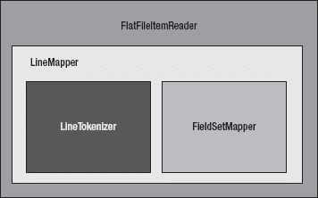
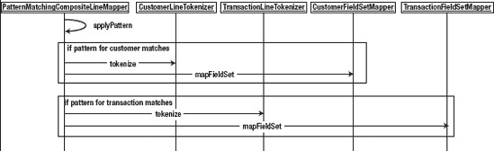
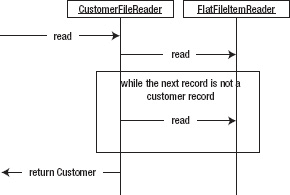
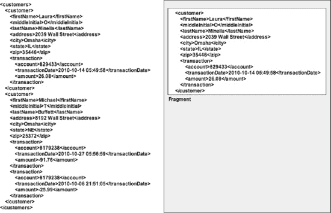
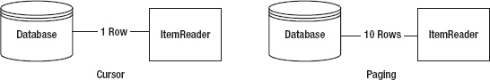
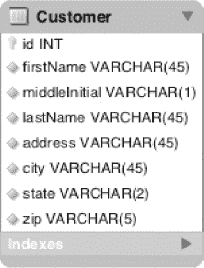

# 七、读取器

阅读、写作和算术被认为是孩子们在学校学习技能的基础。仔细想想，这些相同的概念也适用于软件。任何程序的基础——无论是 web 应用、批处理作业还是任何其他程序——都是数据的输入、以某种方式对数据的处理以及数据的输出。

这个概念并不比使用 Spring Batch 时更明显。每个步骤都由一个 ItemReader、一个 ItemProcessor 和一个 ItemWriter 组成。然而，在任何系统中阅读并不总是一帆风顺的。有许多不同的格式可以提供输入；平面文件、XML 和数据库只是一些潜在的输入源。

Spring Batch 提供了标准的方法来处理大多数形式的输入，而不需要编写代码，并且能够为不支持的格式开发自己的阅读器，比如读取 web 服务。本章将介绍 ItemReaders 在 Spring Batch 框架中提供的不同特性。

### ItemReader 接口

到本章为止，我们已经漫无边际地讨论了 ItemReader 的概念，但是我们还没有看到 Spring Batch 用来定义输入操作的接口。`org.springframework.batch.item.ItemReader<T>`接口定义了一个方法，read，用于为一个步骤提供输入。清单 7-1 显示了 ItemReader 接口。

***清单 7-1。**org . spring framework . batch . item . item reader<T>*

`package org.springframework.batch.item;

public interface ItemReader<T> {

    T read() throws Exception, UnexpectedInputException, ParseException,
                    NonTransientResourceException;
}`

清单 7-1 中的 ItemReader 接口是一个策略接口。Spring Batch 基于要处理的输入类型提供了许多实现。平面文件、数据库、JMS 资源和其他输入源都有 Spring Batch 提供的实现。您还可以通过实现 ItemReader 或它的任何一个子接口来实现自己的 ItemReader。

当 Spring Batch 调用 ItemReader 接口的 read 方法时，它会返回一个要由您的步骤处理的项。这一项是您的步骤将计算的，因为它维护了一个块中已经处理了多少项。在作为块的一部分发送到 ItemWriter 之前，该项将被传递到任何已配置的 ItemProcessor。

理解如何使用 ItemReader 接口的最好方法是使用它。在下一节中，通过使用 FlatFileItemReader，您将开始了解 Spring Batch 提供的许多 ItemReader 实现。

### 文件输入

一想到 Java 里的 file IO，我就忍不住畏缩。IO 的 API 比用这种语言处理日期的 API 稍微好一点，你们都知道它有多好。幸运的是，Spring Batch 的人已经解决了大部分问题，他们提供了许多声明性的阅读器，允许你声明将要阅读的内容的格式，剩下的由他们来处理。在这一节中，您将看到 Spring Batch 提供的声明性读取器，以及如何为基于文件的 IO 配置它们。

#### 平面文件

当我在批处理的情况下谈论平面文件时，我指的是具有一个或多个记录的任何文件。每条记录可以占用一行或多行。平面文件和 XML 文件的区别在于文件中的数据是非描述性的。换句话说，文件本身没有元信息来定义数据的格式或含义。相比之下，在 XML 中，您使用标签来赋予数据意义。

在开始为平面文件实际配置 ItemReader 之前，让我们看一下在 Spring Batch 中读取文件的步骤。该框架的写入器在创建一个有意义的 API 方面做得很好，并且可以很容易地与我们大多数人已经知道的概念相关联。

[图 7-1](#fig_7_1) 显示了 FlatFileItemReader 的组件。`org.springframework.batch.item.file.FlatFileItemReader`由两个主要组件组成:一个代表要读取的文件的 Spring 资源和一个`org.springfamework.batch.item.file.LineMapper`接口的实现。LineMapper 的功能与 JDBC Spring的 RowMapper 类似。在 Spring JDBC 中使用行映射器时，会提供一个表示字段集合的结果集，供您映射到对象。

***图 7-1。** FlatFileItemReader 件*

FlatFileItemReader 允许您配置正在读取的文件的许多属性。表 7-1 显示了你可能会用到的选项，并解释了它们的含义。

***表 7-1。** FlatFileItemReader 配置选项*

<colgroup><col align="left" valign="top" width="22%"> <col align="left" valign="top" width="22%"> <col align="left" valign="top" width="22%"> <col align="left" valign="top" width="31%"></colgroup> 
| [计]选项 | 类型 | 默认 | 描述 |
| :-- | :-- | :-- | :-- |
| 评论 | 字符串[] | 空 | 这个字符串数组指示在文件解析期间哪些前缀将被视为行注释并被跳过。 |
| 编码 | 线 | 国际标准化组织 8859-1 | 文件的字符编码。 |
| 线条测绘仪 | 线条测绘仪 | 空(必需) | 这个类将把文件的每一行作为一个字符串，并把它转换成一个域对象(item)进行处理。 |
| **线跳转** | **int** | **0** | 运行作业时，可以将 FlatFileItemReader 配置为在解析之前跳过文件开头的行。这个数字表示有多少。 |
| 记录分离策略 | 记录分离策略 | 默认记录分离策略 | 用于确定每条记录的结束。默认情况下，行尾字符表示记录的结束；然而，这可以用来确定如何处理像跨行引用字符串这样的事情。 |
| 资源 | 资源 | 空(必需) | 要读取的资源。 |
| skippedLinesCallback | LineCallbackHandler | 空 | 跳过行调用回调接口。跳过的每一行都将被传递给这个回调函数。 |
| 严格的 | 布尔 | 错误的 | 如果在严格模式下找不到资源，将会抛出异常。 |

通过 Spring Batch 的 LineMapper 接口，提供了一个字符串，表示文件中的单个记录。使用文件中的原始字符串，有一个两步过程可以将它传递给稍后要使用的域对象。这两个步骤由 LineTokenizer 和 FieldSetMapper 处理。

*   LineTokenizer 实现将该行解析成一个`org.springframework.batch.item.file.FieldSet`。提供的字符串表示文件中的整行。为了能够将每个记录的单个字段映射到您的域对象，您需要将该行解析为一个字段集合。Spring Batch 中的字段集表示单行的字段集合。
*   FieldSetMapper 实现将字段集映射到一个域对象。将该行划分为单独的字段后，现在可以将每个输入字段映射到域对象的字段，就像行映射器将结果集行映射到域对象一样。

听起来很简单不是吗？确实如此。复杂之处在于如何解析行，以及当您查看由文件中的多条记录构建的对象时。我们先来看看读取固定宽度记录的文件。

##### 定宽文件

在处理遗留大型机系统时，由于 COBOL 和其他技术声明其存储的方式，通常必须使用固定宽度的文件。因此，你需要能够处理固定的文件。

您可以使用客户文件作为固定宽度的文件。由客户的姓名和地址组成，表 7-2 概述了您的客户文件的格式。

***表 7-2。**客户文件格式*

<colgroup><col align="left" valign="top" width="25%"> <col align="left" valign="top" width="20%"> <col align="left" valign="top" width="45%"></colgroup> 
| 田 | 长度 | 描述 |
| :-- | :-- | :-- |
| 西方人名的第一个字 | Ten | 您客户的名字。 |
| 中间的首字母 | one | 客户的中间名首字母。 |
| 姓 | Ten | 客户的姓氏。 |
| 地址号码 | six | 客户地址的街道号码部分。 |
| 街道 | Twenty | 客户居住的街道名称。 |
| 城市 | Ten | 客户来自的城市。 |
| 状态 | Two | 两个字母的国家缩写。 |
| 邮政区码 | five | 客户的邮政编码。 |

定义 fixed with 文件的格式很重要。带分隔符的文件用其分隔符描述其字段。给定标签提供的元数据，XML 或其他结构化文件是自描述的。数据库数据具有来自描述它的数据库的元数据。但是，固定宽度的文件是不同的。它们不提供元数据来描述它们的格式。如果你看一下清单 7-1 中的[，你可以看到前面的描述作为你的输入文件的例子。](#list_7_1a)

***清单 7-1。** customer.txt，定宽文件*

`Michael   TMinella   123   4th Street          Chicago  IL60606
Warren    QGates     11    Wall Street         New York NY10005
Ann       BDarrow    350   Fifth Avenue        New York NY10118
Terrence  HDonnelly  4059  Mt. Lee Drive       HollywoodCA90068`

为了演示每个读取器是如何工作的，您将创建一个单步作业，读入一个文件并将其写回。对于这个作业 copyJob，您将使用以下 beans 创建一个`copyJob.xml`文件:

*   *customerFile* :输入文件。
*   *outputFile* :将输入文件复制到的文件。
*   *customer reader*:flat file item reader。
*   *output writer*:flat file item writer。
*   *复印步骤*:作业的步骤定义。
*   *复印作业*:作业定义。

您的 customerFile 和 outputFile beans 将只不过是 Spring 的`org.springframework.core.io.FileSystemResource`bean。每个与文件相关的 bean 都有一个作用域步骤，因为它们在步骤开始之前不能被绑定(不像普通的 Spring beans，它们在应用启动时被实例化和连接) [1](#CHP-7-FN-1) 。customerReader 是 FlatFileItemReader 的一个实例。如前所述，FlatFileItemReader 由两部分组成，一部分是要读入的资源(在本例中是 customerFile ),另一部分是映射文件每一行的方法(LineMapper 实现)。

 **注**“step”作用域是 Spring Batch 提供的一个新的 bean 作用域。这个作用域允许在执行步骤时设置 bean 属性，而不是在应用启动时设置(这是 Spring 的默认设置)。

___________

1 作业参数的后期绑定在[第 4 章](04.html#ch4)中讨论。

对于 LineMapper 实现，您将使用 Spring Batch 的`org.springframework.batch.item.file.DefaultLineMapper`。这个 LineMapper 实现旨在实现将行映射到您之前讨论过的域对象的两步过程:将行解析为一个字段集，然后将字段集的字段映射到一个域对象，在您的例子中就是`Customer`对象。

为了支持两步映射过程，DefaultLineMapper 采用了两个依赖项:一个是 LineTokenizer 实现，它将把从文件中读入的字符串解析到字段集中；另一个是 FieldSetMapper 实现，它将字段集中的字段映射到域对象中的字段。清单 7-2 显示了 customerFile 和 customerReader bean 的定义。

***清单 7-2。**T4`copyJob.xml`的 customerFile 和 customerReader*

`<?xml version="1.0" encoding="UTF-8"?>
<beans:beans
    xmlns:beans="http://www.springframework.org/schema/beans"
    xmlns:util="http://www.springframework.org/schema/beans"
    xmlns:xsi="http://www.w3.org/2001/XMLSchema-instance"
    xsi:schemaLocation="http://www.springframework.org/schema/beans
        http://www.springframework.org/schema/beans/spring-beans-3.0.xsd
        http://www.springframework.org/schema/util
        http://www.springframework.org/schema/util/spring-util.xsd
        http://www.springframework.org/schema/batch
        http://www.springframework.org/schema/batch/spring-batch-2.1.xsd">

  <beans:import resyource="../launch-context.xml"/>

  <beans:bean id="customerFile"
    class="org.springframework.core.io.FileSystemResyource" scope="step">
    <beans:constructor-arg value="#{jobParameters[customerFile]}"/>
  </beans:bean>

  <beans:bean id="customerReader"
    class="org.springframework.batch.item.file.FlatFileItemReader">
    <beans:property name="resyource" ref="customerFile" />
    <beans:property name="lineMapper">
      <beans:bean
        class="org.springframework.batch.item.file.mapping.
DefaultLineMapper">
        <beans:property name="lineTokenizer">
          <beans:bean
            class="org.springframework.batch.item.file.transform.
FixedLengthTokenizer">
            <beans:property name="names"
              value="firstName,middleInitial,lastName,addressNumber,street,
city,state,zip"/>
            <beans:property name="columns"
              value="1-10,11,12-21,22-27,28-47,48-56,57-58,59-63"/>
          </beans:bean>
        </beans:property>
        <beans:property name="fieldSetMapper">
          <beans:bean` `            class="org.springframework.batch.item.file.mapping.
BeanWrapperFieldSetMapper">
            <beans:property name="prototypeBeanName" value="customer"/>
          </beans:bean>
        </beans:property>
      </beans:bean>
    </beans:property>
  </beans:bean>

  <beans:bean id="customer" class="com.apress.springbatch.chapter7.Customer"
    scope="prototype"/>
…`

清单 7-2 以 customerFile 开始，它是对 customerReader 将要读取的文件的引用。请注意，客户文件的实际名称将在运行时作为作业参数传入。

从那里你就有了你的客户阅读器。如前所述，读取器由两部分组成:要读入的文件和 LineMapper 实例。当你查看 LineMapper 接口时，如清单 7-3 所示，你可以看到它与 Spring 的 RowMapper 几乎相同。

***清单 7-3。**线路映射器接口*

`package org.springframework.batch.item.file;

import org.springframework.batch.item.file.mapping.FieldSetMapper;
import org.springframework.batch.item.file.transform.LineTokenizer;

public interface LineMapper<T> {

        T mapLine(String line, int lineNumber) throws Exception;
}`

对于文件中的每一行，Spring Batch 将调用配置的 LineMapper 实现的`mapLine`方法。在您的情况下，该方法将做两件事；首先，它将使用`org.springframework.batch.item.file.transform.FixedLengthTokenizer`根据您配置的列将字符串分成一个字段集。然后，它将把字段集传递给`org.springframework.batch.item.file.mapping.BeanWrapperFieldSetMapper`，后者将使用每个字段的名称将字段映射到您请求的 bean(在本例中为 Customer)。

当处理固定宽度的文件时，使用 FixedLengthTokenizer 将记录解析为字段集。LineTokenizer 接口的这个实现有三个参数:

*   *列(必选)*:定义每个字段的列号范围。
*   *names(可选)*:与列列表中指定的每个范围相关联的名称。
*   *strict(可选)*:一个布尔值，告诉读取器如果传入了一个长度无效的行，是否应该抛出异常(固定宽度的文件应该让所有记录长度相同)。

配置好 LineTokenizer 后，您就有办法将您的行解析成一个字段集。现在您需要将字段集映射到您的域对象的字段中。在这种情况下，您将使用 BeanWrapperFieldSetMapper。FieldSetMapper 接口的这个实现使用 bean 规范按名称将字段集中的字段映射到域对象中的字段(`Customer`对象将有一个`getFirstName()`和一个`setFirstName(String name)`，等等)。您唯一需要为 BeanWrapperFieldSetMapper 提供的是对它将使用的 bean 的引用，在您的例子中，它是对客户 bean 的引用。

**注意**FixedLengthTokenizer 不修剪每个字段中的任何前导或尾随字符(空格、零等)。为此，您必须实现自己的 LineTokenizer，或者您可以在自己的 FieldSetMapper 中进行裁剪。

要使用您的阅读器，您需要配置您的步骤和作业。您还需要配置一个 writer，这样您就可以看到一切正常。你将在下一章深入讨论编写器，所以你可以保持这个例子的编写器简单。清单 7-4 展示了如何配置一个简单的编写器来输出域对象到一个文件。

***清单 7-4。**一个简单的作家*

`…
<beans:bean id="outputFile"
  class="org.springframework.core.io.FileSystemResyource" scope="step">
  <beans:constructor-arg value="#{jobParameters[outputFile]}"/>
</beans:bean>

<beans:bean id="outputWriter"
  class="org.springframework.batch.item.file.FlatFileItemWriter">
  <beans:property name="resource" ref="outputFile" />
  <beans:property name="lineAggregator">
    <beans:bean class="org.springframework.batch.item.file.transform.
FormatterLineAggregator">
      <beans:property name="fieldExtractor">
        <beans:bean class="org.springframework.batch.item.file.transform.
BeanWrapperFieldExtractor">
          <beans:property name="names" value="firstName,middleInitial,
lastName,addressNumber,street,city,state,zip" />
        </beans:bean>
      </beans:property>
      <beans:property name="format" value=" %s %s. %s, %s %s, %s %s %s" />
    </beans:bean>
  </beans:property>
</beans:bean>
…`

查看清单 7-4 中的输出文件资源和编写器，您可以看到读取器和编写器之间的模式。编写器有两个依赖项:要写入的文件资源和 lineAggregator。lineAggregator 用于获取一个对象，并将其转换为将要写入文件的字符串。

你的工作配置很简单。如[清单 7-5](#list_7_5) 所示，您所需要的只是一个简单的步骤，包括提交计数为 10 条记录的读取器和写入器。你的工作需要这一步。

***清单 7-5。**复制文件步骤和复制文件作业*

`…
  <step id="copyFileStep">
    <tasklet>
      <chunk reader="customerFileReader" writer="outputWriter"
        commit-interval="10"/>
    </tasklet>
  </step>

  <job id="copyJob">
    <step id="step1" parent="copyFileStep"/>
  </job>
</beans:beans>`

有趣的是，读写这个文件只需要很少的代码。在这个例子中，您需要编写的唯一代码是域对象本身(Customer)。一旦你构建了你的应用，你可以用清单 7-6 中的命令来执行它。

***清单 7-6。**执行复印作业*

`java -jar copyJob.jar jobs/copyJob.xml copyJob customerFile=/input/customer.txt outputFile=/output/output.txt`

作业的输出是根据编写器的格式字符串格式化的输入文件的相同内容，如[清单 7-7](#list_7_7) 所示。

***清单 7-7。**复印作业的结果*

* * *

`Michael T. Minella, 123 4th Street, Chicago IL 60606
Warren Q. Gates, 11 Wall Street, New York NY 10005
Ann B. Darrow, 350 Fifth Avenue, New York NY 10118
Terrence H. Donnelly, 4059 Mt. Lee Drive, Hollywood CA 90068`

* * *

固定宽度文件是为许多企业中的批处理提供的一种输入形式。正如您所看到的，通过 FlatFileItemReader 和 FixedLengthTokenizer 将文件解析为对象使这个过程变得很容易。在下一节中，您将看到一种文件格式，它提供了少量的元数据来告诉我们如何解析文件。

##### 分隔文件

分隔文件是在文件中提供少量元数据来告诉我们文件的格式的文件。在这种情况下，字符充当记录中每个字段之间的分隔符。这种元数据使我们能够不必知道是什么定义了每个单独的字段。相反，该文件通过用分隔符分隔每个记录来指示使用每个字段包含的内容。

对于固定宽度的记录，读取分隔记录的过程是相同的。该记录将首先由 LineTokenizer 标记为一个字段集。从那里，FieldSetMapper 会将该字段集映射到您的域对象中。由于过程是相同的，所以您所需要做的就是更新 LineTokenizer 实现，该实现用于根据分隔符而不是预先映射的列来解析文件。让我们首先来看一个更新的 customerFile，它是定界的，而不是固定宽度的。清单 7-8 显示了你的新输入文件。

***清单 7-8。**一个分隔的客户文件*

`Michael,T,Minella,123,4th Street,Chicago,IL,60606
Warren,Q,Gates,11,Wall Street,New York,NY,10005
Ann,B,Darrow,350,Fifth Avenue,New York,NY,10118
Terrence,H,Donnelly,4059,Mt. Lee Drive,Hollywood,CA,90068`

您会马上注意到在新文件和旧文件之间有两个变化。首先，使用逗号分隔字段。其次，您已经修剪了所有的字段。通常，当使用分隔文件时，每个字段不会像在固定宽度文件中那样填充到固定宽度。因此，与固定宽度的记录长度不同，记录长度可以变化。

如前所述，使用新文件格式所需的唯一配置更新是如何解析每条记录。对于固定宽度的记录，您使用 FixedLengthTokenizer 来解析每一行。对于新的分隔记录，您将使用`org.springframework.batch.item.file.transform.DelimitedLineTokenizer`将记录解析到一个字段集中。[清单 7-9](#list_7_9) 显示了用 DelimitedLineTokenizer 更新的阅读器的配置。

***清单 7-9。**带定界符的 customerFileReader】*

`…
<beans:bean id="customerFile"
  class="org.springframework.core.io.FileSystemResyource" scope="step">
  <beans:constructor-arg value="#{jobParameters[customerFile]}"/>
</beans:bean>

<beans:bean id="customerFileReader"
  class="org.springframework.batch.item.file.FlatFileItemReader">
  <beans:property name="resyource" ref="customerFile" />
  <beans:property name="lineMapper">
    <beans:bean
      class="org.springframework.batch.item.file.mapping.DefaultLineMapper">
      <beans:property name="lineTokenizer">
              **<beans:bean**
**class="org.springframework.batch.item.file.transform.DelimitedLineTokenizer">**
**                <beans:property name="names"**
**value="firstName,middleInitial,lastName,addressNumber,street,city,state,zip"/>**
**                <beans:property name="delimiter" value=","/>**
**              </beans:bean>**
**      </beans:property>**
      <beans:property name="fieldSetMapper">
        <beans:bean class="org.springframework.batch.item.file.mapping.
BeanWrapperFieldSetMapper">
          <beans:property name="prototypeBeanName" value="customer"/>
        </beans:bean>
      </beans:property>
    </beans:bean>
  </beans:property>
</beans:bean>` `<beans:bean id="customer" class="com.apress.springbatch.chapter7.Customer"
  scope="prototype"/>
…`

DelimitedLineTokenizer 提供了两个非常有用的选项。首先是配置分隔符的能力。逗号是默认值；但是，可以使用任何单个字符。第二个选项是能够配置什么值将被用作引号字符。使用此选项时，将使用该值而不是"作为表示引号的字符。这个角色也将能够逃脱自己。清单 7-10 展示了当你使用#字符作为引用字符时，一个字符串是如何被解析的。

***清单 7-10。**解析配置了引号字符的分隔文件*

`Michael,T,Minella,#123,4th Street#,Chicago,IL,60606
Is parsed as
Michael
T
Minella
123,4th Street
Chicago
IL
60606`

尽管这就是处理分隔文件所需的全部内容，但这并不是唯一的选择。当前示例将地址号码和街道映射到两个不同的字段。然而，如果您想将它们一起映射到一个字段中，如清单 7-11 中的域对象所示，该怎么办呢？

***清单 7-11。**只有一个街道地址字段的客户*

`package com.apress.springbatch.chapter7;

public class Customer {
    private String firstName;
    private String middleInitial;
    private String lastName;
    private String addressNumber;
    private String street;
    private String city;
    private String state;
    private String zip;

    // Getters & setters go here
…
}`

使用新的对象格式，您需要更新字段集映射到域对象的方式。为此，您将创建自己的`org.springframework.batch.item.file.mapping.FieldSetMapper`接口实现。如[清单 7-12](#list_7_12) 所示，FieldSetMapper 接口由一个方法`mapFieldSet`组成，该方法允许您将从 LineTokenizer 返回的字段集映射到域对象字段。

***清单 7-12。**fieldset mapper 接口*

`package org.springframework.batch.item.file.mapping;

import org.springframework.batch.item.file.transform.FieldSet;
import org.springframework.validation.BindException;

public interface FieldSetMapper<T> {

    T mapFieldSet(FieldSet fieldSet) throws BindException;
}`

要创建您自己的映射器，您将使用定义为 Customer 的类型实现 FieldSetMapper 接口。从那里，如清单 7-13 所示，您可以将字段集中的每个字段映射到域对象，根据您的需求将 addressNumber 和 street 字段连接成一个地址字段。

***清单 7-13。**将字段从字段集映射到`Customer`对象*

`package com.apress.springbatch.chapter7;

import org.springframework.batch.item.file.mapping.FieldSetMapper;
import org.springframework.batch.item.file.transform.FieldSet;
import org.springframework.validation.BindException;

public class CustomerFieldSetMapper implements FieldSetMapper<Customer> {

    public Customer mapFieldSet(FieldSet fieldSet) throws BindException {
        Customer customer = new Customer();

        customer.setAddress(fieldSet.readString("addressNumber") +
                            " " + fieldSet.readString("street"));
        customer.setCity(fieldSet.readString("city"));
        customer.setFirstName(fieldSet.readString("firstName"));
        customer.setLastName(fieldSet.readString("lastName"));
        customer.setMiddleInitial(fieldSet.readString("middleInitial"));
        customer.setState(fieldSet.readString("state"));
        customer.setZip(fieldSet.readString("zip"));

        return customer;
    }
}`

字段集方法非常类似于 JDBC 领域的结果集方法。Spring 为每种原始数据类型提供了一种方法，`String`(修剪或未修剪)、`BigDecimal`和`java.util.Date`。每种不同的方法都有两种不同的变种。第一个将一个整数作为参数，该整数表示要在记录中检索的字段的索引。另一个版本，如清单 7-14 中的[所示，采用字段的名称。尽管这种方法要求您在作业配置中命名字段，但从长远来看，这是一种更易于维护的模型。](#list_7_14)[清单 7-14](#list_7_14) 显示了字段集接口。

***清单 7-14。**字段集接口*

`package org.springframework.batch.item.file.transform;

import java.math.BigDecimal;
import java.sql.ResultSet;
import java.util.Date;
import java.util.Properties;

public interface FieldSet {

        String[] getNames();
        boolean hasNames();
        String[] getValues();
        String readString(int index);
        String readString(String name);
        String readRawString(int index);
        String readRawString(String name);
        boolean readBoolean(int index);
        boolean readBoolean(String name);
        boolean readBoolean(int index, String trueValue);
        boolean readBoolean(String name, String trueValue);
        char readChar(int index);
        char readChar(String name);
        byte readByte(int index);
        byte readByte(String name);
        short readShort(int index);
        short readShort(String name);
        int readInt(int index);
        int readInt(String name);
        int readInt(int index, int defaultValue);
        int readInt(String name, int defaultValue);
        long readLong(int index);
        long readLong(String name);
        long readLong(int index, long defaultValue);
        long readLong(String name, long defaultValue);
        float readFloat(int index);
        float readFloat(String name);
        double readDouble(int index);
        double readDouble(String name);
        BigDecimal readBigDecimal(int index);
        BigDecimal readBigDecimal(String name);
        BigDecimal readBigDecimal(int index, BigDecimal defaultValue);
        BigDecimal readBigDecimal(String name, BigDecimal defaultValue);
        Date readDate(int index);
        Date readDate(String name);
        Date readDate(int index, Date defaultValue);
        Date readDate(String name, Date defaultValue);
        Date readDate(int index, String pattern);
        Date readDate(String name, String pattern);
        Date readDate(int index, String pattern, Date defaultValue);` `        Date readDate(String name, String pattern, Date defaultValue);
        int getFieldCount();
        Properties getProperties();
}`

 **注意**与从 1 开始索引列的 JDBC 结果集不同，Spring Batch 的字段集使用的索引是从零开始的。

要使用 CustomerFieldSetMapper，您需要更新配置以使用它。用您自己的 bean 引用替换 BeanWrapperFieldSetMapper 引用，如清单 7-15 所示。

***清单 7-15。**用 CustomerFieldSetMapper 配置的 customerFileReader】*

`…
<beans:bean id="customerFile"
  class="org.springframework.core.io.FileSystemResource" scope="step">
  <beans:constructor-arg value="#{jobParameters[customerFile]}"/>
</beans:bean>

<beans:bean id="customerFileReader"
  class="org.springframework.batch.item.file.FlatFileItemReader">
  <beans:property name="resource" ref="customerFile" />
  <beans:property name="lineMapper">
    <beans:bean
      class="org.springframework.batch.item.file.mapping.DefaultLineMapper">
      <beans:property name="lineTokenizer">
        <beans:bean class="org.springframework.batch.item.file.transform.
DelimitedLineTokenizer">
          <beans:property name="names"
            value="firstName,middleInitial,lastName,addressNumber,street,
city,state,zip"/>
          <beans:property name="delimiter" value=","/>
        </beans:bean>
      </beans:property>
      <beans:property name="fieldSetMapper">
        <beans:bean
          class="com.apress.springbatch.chapter7.CustomerFieldSetMapper"/>
      </beans:property>
    </beans:bean>
  </beans:property>
</beans:bean>
…`

注意，使用新的 CustomerFieldSetMapper，您不需要配置对客户 bean 的引用。因为您自己处理实例化，所以不再需要这样做。

正如您所展示的，用标准的 Spring 批处理解析器解析文件只需要几行 XML。然而，并不是所有的文件都由 Unicode 字符组成，这些字符以一种 Java 容易理解的格式排列。在处理遗留系统时，经常会遇到需要定制解析的数据存储技术。在下一节中，您将了解如何实现自己的 LineTokenizer，以便能够处理自定义文件格式。

##### 自定义记录解析

在上一节中，您了解了如何通过创建一个定制的 FieldSetMapper 实现来调整文件中的字段到域对象的字段的映射。然而，这不是唯一的选择。相反，您可以创建自己的 LineTokenizer 实现。这将允许您根据需要解析每条记录。

与 FieldSetMapper 接口一样，`org.springframework.batch.item.file.transform.LineTokenizer`接口也只有一个方法:`tokenize`。[清单 7-16](#list_7_16) 显示了 LineTokenizer 接口。

***清单 7-16。** LineTokenizer 接口*

`package org.springframework.batch.item.file.transform;

public interface LineTokenizer {

    FieldSet tokenize(String line);
}`

对于这种方法，您将使用与先前相同的分隔输入文件；但是，由于域对象将地址号码和街道合并到一个字段中，所以您将把这两个标记合并到字段集中的一个字段中。[清单 7-17](#list_7_17) 显示了 CustomerFileLineTokenizer。

***清单 7-17。**CustomerFileLineTokenizer*

`package com.apress.springbatch.chapter7;

import java.util.ArrayList;
import java.util.List;

import org.springframework.batch.item.file.transform.DefaultFieldSetFactory;
import org.springframework.batch.item.file.transform.FieldSet;
import org.springframework.batch.item.file.transform.FieldSetFactory;
import org.springframework.batch.item.file.transform.LineTokenizer;

public class CustomerFileLineTokenizer implements LineTokenizer {

    private String delimiter;
    private String names;
    private FieldSetFactory fieldSetFactory = new DefaultFieldSetFactory();

    public FieldSet tokenize(String record) {

        String[] fields = record.split(delimiter);

        List<String> parsedFields = new ArrayList<String>();` `        for (int i = 0; i < fields.length; i++) {
            if (i == 4) {
                parsedFields.set(i - 1,
                                 parsedFields.get(i - 1) + " " + fields[i]);
            } else {
                parsedFields.add(fields[i]);
            }
        }

        FieldSet fieldSet =
            fieldSetFactory.create(parsedFields.toArray(new String [0]),
                                   names.split(","));

        return fieldSet;
    }

    public void setDelimiter(String delimiter) {
        this.delimiter = delimiter;
    }

    public void setNames(String names) {
        this.names = names;
    }
}`

CustomerFileLineTokenizer 的`tokenize`方法获取每条记录，并根据用 Spring 配置的分隔符将其拆分。您循环遍历这些字段，将第三个和第四个字段组合在一起，使它们成为一个字段。然后，使用 DefaultFieldSetFactory 创建一个字段集，向其传递一个必需参数(作为字段的值数组)和一个可选参数(字段名称数组)。这个 LineTokenizer 命名您的字段，以便您可以使用 BeanWrapperFieldSetMapper 来进行字段集到域对象的映射，而无需任何额外的代码。

配置 CustomerFileLineTokenizer 与配置 DelimitedLineTokenizer 完全相同，只有类名需要更改。[清单 7-18](#list_7_18) 显示了更新后的配置。

***清单 7-18。**配置 CustomerFileLineTokenizer*

`…
<beans:bean id="customerFile"
  class="org.springframework.core.io.FileSystemResyource" scope="step">
  <beans:constructor-arg value="#{jobParameters[customerFile]}"/>
</beans:bean>

<beans:bean id="customerFileReader"
  class="org.springframework.batch.item.file.FlatFileItemReader">
  <beans:property name="resource" ref="customerFile" />
  <beans:property name="lineMapper">
    <beans:bean
      class="org.springframework.batch.item.file.mapping.DefaultLineMapper">
      <beans:property name="lineTokenizer">
              <beans:bean class="com.apress.springbatch.chapter7.CustomerFileLineTokenizer">
**                 <beans:property name="names"**
**                   value="firstName,middleInitial,lastName,address,city,state,zip"/>**
**                 <beans:property name="delimiter" value=","/>**
**               </beans:bean>**
      </beans:property>
      <beans:property name="fieldSetMapper">
        <beans:bean class="org.springframework.batch.item.file.mapping.
BeanWrapperFieldSetMapper">
          <beans:property name="prototypeBeanName" value="customer"/>
        </beans:bean>
      </beans:property>
    </beans:bean>
  </beans:property>
</beans:bean>

<beans:bean id="customer" class="com.apress.springbatch.chapter7.Customer"
  scope="prototype"/>
…`

您可以使用自己的 LineTokenizer 和 FieldSetMapper 进行无限的工作。自定义 LineTokenizers 的其他用途包括:

*   解析遗留文件编码，如 EBCDIC。
*   解析第三方文件格式，如微软的 Excel 工作表。
*   处理特殊类型转换需求。

然而，并不是所有的文件都像您处理过的客户文件一样简单。如果您的文件包含多种记录格式，该怎么办？下一节将讨论 Spring Batch 如何选择合适的 LineTokenizer 来解析它遇到的每条记录。

##### 多种记录格式

到目前为止，您一直在查看一个包含客户记录集合的客户文件。文件中的每条记录都有完全相同的格式。但是，如果您收到一个包含客户信息和交易信息的文件，该怎么办呢？是的，您可以实现一个单独的自定义 LineTokenizer。然而，这种方法有两个问题。

1.  *复杂性*:如果一个文件有三种、四种、五种或更多的行格式——每一种都有大量的字段——那么这个类很快就会失控。
2.  *关注点分离*:line tokenizer 用于解析记录。就这样。它应该不需要在解析之前确定记录类型。

考虑到这一点，Spring Batch 提供了另一个 LineMapper 实现:`org.springframework.batch.item.file.mapping.PatternMatchingCompositeLineMapper`。前面的示例使用了 DefaultLineMapper，它提供了使用单个 LineTokenizer 和单个 FileSetMapper 的能力。使用 PatternMatchingCompositeLineMapper，您将能够定义一个 LineTokenizers 映射和一个相应的 FieldSetMappers 映射。每个映射的键将是一个模式，LineMapper 将使用该模式来标识使用哪个 LineTokenizer 来解析每个记录。

让我们从查看更新后的输入文件开始这个例子。在这种情况下，您仍然拥有相同的客户记录。但是，散布在每个客户记录之间的是随机数量的交易记录。为了帮助识别每条记录，您为每条记录添加了一个前缀。[清单 7-19](#list_7_19) 显示了更新后的输入文件。

***清单 7-19。**更新后的客户输入文件*

`CUST,Warren,Q,Darrow,8272 4th Street,New York,IL,76091
TRANS,1165965,2011-01-22 00:13:29,51.43
CUST,Ann,V,Gates,9247 Infinite Loop Drive,Hollywood,NE,37612
CUST,Erica,I,Jobs,8875 Farnam Street,Aurora,IL,36314
TRANS,8116369,2011-01-21 20:40:52,-14.83
TRANS,8116369,2011-01-21 15:50:17,-45.45
TRANS,8116369,2011-01-21 16:52:46,-74.6
TRANS,8116369,2011-01-22 13:51:05,48.55
TRANS,8116369,2011-01-21 16:51:59,98.53`

在清单 7-19 所示的文件中，有两种逗号分隔的格式。第一个由您到目前为止一直在使用的标准客户格式组成，其中连接了地址号码和街道。这些记录用前缀 CUST 表示。其他记录是交易记录；这些记录中的每一条都以 TRANS，前缀为前缀，也以逗号分隔，具有以下三个字段:

1.  *账号*:客户的账号。
2.  *日期*:交易发生的日期。交易可能按日期顺序，也可能不按日期顺序。
3.  *金额*:交易的美元金额。负值表示借项，正值表示贷项。

清单 7-20 显示了`Transaction`域对象的代码。

***清单 7-20。** `Transaction`域对象代码*

`package com.apress.springbatch.chapter7;

import java.text.DateFormat;
import java.text.SimpleDateFormat;
import java.util.Date;

public class Transaction {

    private String accountNumber;
    private Date transactionDate;
    private Double amount;

    private DateFormat formatter = new SimpleDateFormat("MM/dd/yyyy");

    public String getAccountNumber() {
        return accountNumber;
    }
    public void setAccountNumber(String accountNumber) {
        this.accountNumber = accountNumber;
    }
    public Date getTransactionDate() {
        return transactionDate;
    }
    public void setTransactionDate(Date transactionDate) {
        this.transactionDate = transactionDate;
    }
    public Double getAmount() {
        return amount;
    }
    public void setAmount(Double amount) {
        this.amount = amount;
    }
    public String getDateString() {
        return formatter.format(transactionDate);
    }

}`

有了确定的记录格式，就可以看阅读器了。[清单 7-21](#list_7_21) 显示了更新后的 customerFileReader 的配置。如上所述，使用 PatternMatchingCompositeLineMapper，可以映射 DelimitedLineTokenizer 的两个实例，每个实例都配置了正确的记录格式。您会注意到，每个 LineTokenizers 都有一个名为 prefix 的附加字段。这是为了处理每个记录(CUST 和 TRANS)开头的字符串。Spring Batch 将解析前缀，并在字段集中将其命名为 prefix；但是，由于您的两个域对象中都没有前缀字段，因此它将在映射中被忽略。

***清单 7-21** 。用多种记录格式配置客户文件阅读器*

`…
<beans:bean id="customerFile"
  class="org.springframework.core.io.FileSystemResyource" scope="step">
  <beans:constructor-arg value="#{jobParameters[customerFile]}"/>
</beans:bean>

<beans:bean id="customerFileReader"
  class="org.springframework.batch.item.file.FlatFileItemReader">
  <beans:property name="resyource" ref="customerFile" />
  <beans:property name="lineMapper">
    <beans:bean class="org.springframework.batch.item.file.mapping.
PatternMatchingCompositeLineMapper">
      <beans:property name="tokenizers">
        <beans:map>
          <beans:entry key="CUST*" value-ref="customerLineTokenizer"/>
          <beans:entry key="TRANS*" value-ref="transactionLineTokenizer"/>
        </beans:map>
      </beans:property>
      <beans:property name="fieldSetMappers">
        <beans:map>
          <beans:entry key="CUST*" value-ref="customerFieldSetMapper"/>
          <beans:entry key="TRANS*" value-ref="transactionFieldSetMapper"/>
        </beans:map>
      </beans:property>
    </beans:bean>
  </beans:property>
</beans:bean>

<beans:bean id="customerLineTokenizer"
  class="org.springframework.batch.item.file.transform.
DelimitedLineTokenizer">
  <beans:property name="names"
    value="prefix,firstName,middleInitial,lastName,address,city,state,zip"/>
  <beans:property name="delimiter" value=","/>
</beans:bean>

<beans:bean id="transactionLineTokenizer"
  class="org.springframework.batch.item.file.transform.
DelimitedLineTokenizer">
  <beans:property name="names"
    value="prefix,accountNumber,transactionDate,amount"/>
  <beans:property name="delimiter" value=","/>
</beans:bean>

<beans:bean id="customerFieldSetMapper"
  class="org.springframework.batch.item.file.mapping.
BeanWrapperFieldSetMapper">
  <beans:property name="prototypeBeanName" value="customer"/>
  <beans:property name="strict" value="false"/>` `</beans:bean>

<beans:bean id="transactionFieldSetMapper"
  class="com.apress.springbatch.chapter7.TransactionFieldSetMapper"/>

<beans:bean id="customer" class="com.apress.springbatch.chapter7.Customer"
  scope="prototype"/>
…`

customerFileReader 的配置开始变得有点冗长。让我们来看看当这个阅读器被执行时，实际上会发生什么。如果你看一下图 7-2 ，你可以理解 customerFileReader 是如何处理每一行的。

***图 7-2。**多种记录格式的处理流程。*

如图 7-2 所示，PatternMatchingCompositeLineMapper 会查看文件的每一条记录，并将你的模式应用于它。如果记录以 CUST *开头(其中*是零个或多个字符)，它会将记录传递给 customerLineTokenizer 进行解析。一旦记录被解析为字段集，它将被传递给 customerFieldSetMapper 以映射到域对象。但是，如果记录以 TRANS *开头，它将被传递给 transactionLineTokenizer 进行解析，结果字段集将被传递给自定义 transactionFieldSetMapper。

但是为什么需要自定义的 FieldSetMapper 呢？这是自定义类型转换所必需的。默认情况下，BeanWrapperFieldSetMapper 不进行任何特殊的类型转换。`Transaction`域对象由 accountNumber 字段组成，是一个字符串；但是，另外两个字段 transactionDate 和 amount 分别是 java.util.Date 和 Double。因此，您需要创建一个自定义的 FieldSetMapper 来进行所需的类型转换。清单 7-22 显示了 TransactionFieldSetMapper。

***清单 7-22。**TransactionFieldSetMapper*

`package com.apress.springbatch.chapter7;

import org.springframework.batch.item.file.mapping.FieldSetMapper;
import org.springframework.batch.item.file.transform.FieldSet;
import org.springframework.validation.BindException;

public class TransactionFieldSetMapper implements FieldSetMapper<Transaction> {

    public Transaction mapFieldSet(FieldSet fieldSet) throws BindException {
        Transaction trans = new Transaction();` `        trans.setAccountNumber(fieldSet.readString("accountNumber"));
        trans.setAmount(fieldSet.readDouble("amount"));
        trans.setTransactionDate(fieldSet.readDate("transactionDate",
                                                   "yyyy-MM-dd HH:mm:ss"));

        return trans;
    }
}`

如您所见，与 JDBC 世界的 ResultSet 接口一样，FieldSet 接口为每种数据类型提供了自定义方法。对于`Transaction`域对象，使用`readDouble`方法将文件中的字符串转换成 Java.lang.Double，使用`readDate`方法将文件中包含的字符串解析成 Java.util.Date。

不幸的是，现在该步骤同时处理两种不同的项目类型，您将无法使用到目前为止的同一个 ItemWriter。我很乐意告诉您，Spring Batch 在编写器端和读取器端以及 PatternMatchingCompositeLineMapper 方面具有等效的委托器。不幸的是，事实并非如此。相反，您将需要创建一个定制的 ItemWriter，它将根据要打印的项目的类型委托给适当的编写器。第 9 章涵盖了这个 writer 实现的细节。然而，为了能够看到作业的结果，[清单 7-23](#list_7_23) 显示了 LineAggregator 接口的实现，它将相应地委托项目。

***清单 7-23。**客户线聚合器*

`package com.apress.springbatch.chapter7;

import org.springframework.batch.item.file.transform.LineAggregator;

public class CustomerLineAggregator implements LineAggregator<Object> {

    private LineAggregator<Customer> customerLineAggregator;
    private LineAggregator<Transaction> transactionLineAggregator;

    public String aggregate(Object record) {
        if(record instanceof Customer) {
            return customerLineAggregator.aggregate((Customer) record);
        } else {
            return transactionLineAggregator.aggregate((Transaction) record);
        }
    }

    public void setCustomerLineAggregator(
            LineAggregator<Customer> customerLineAggregator) {
        this.customerLineAggregator = customerLineAggregator;
    }

    public void setTransactionLineAggregator(
            LineAggregator<Transaction> transactionLineAggregator) {
        this.transactionLineAggregator = transactionLineAggregator;` `    }

}`

清单 7-23 中的 LineAggregator 实现非常简单。它获取一个项，确定其类型，并根据类型将该项传递给适当的 LineAggregator 实现。先前线性聚合器的配置如[清单 7-24](#list_7_24) 所示。

***清单 7-24。** outputWriter 配置*

`…
<beans:bean id="outputFile"
  class="org.springframework.core.io.FileSystemResource" scope="step">
  <beans:constructor-arg value="#{jobParameters[outputFile]}"/>
</beans:bean>

<beans:bean id="outputWriter"
  class="org.springframework.batch.item.file.FlatFileItemWriter">
  <beans:property name="resource" ref="outputFile" />
  <beans:property name="lineAggregator">
    <beans:bean
      class="com.apress.springbatch.chapter7.CustomerLineAggregator">
      <beans:property name="customerLineAggregator"
        ref="customerLineAggregator" />
      <beans:property name="transactionLineAggregator"
        ref="transactionLineAggregator" />
    </beans:bean>
  </beans:property>
</beans:bean>

<beans:bean id="customerLineAggregator"
  class="org.springframework.batch.item.file.transform.
FormatterLineAggregator">
  <beans:property name="fieldExtractor">
    <beans:bean class="org.springframework.batch.item.file.transform.
BeanWrapperFieldExtractor">
      <beans:property name="names" value="firstName,middleInitial,lastName,
address,city,state,zip" />
    </beans:bean>
  </beans:property>
  <beans:property name="format" value="%s %s. %s, %s, %s %s %s" />
</beans:bean>

<beans:bean id="transactionLineAggregator" class="org.springframework.batch.
item.file.transform.FormatterLineAggregator">
  <beans:property name="fieldExtractor">
    <beans:bean class="org.springframework.batch.item.file.transform.
BeanWrapperFieldExtractor">
      <beans:property name="names" value="accountNumber,amount,dateString" />
    </beans:bean>
  </beans:property>
  <beans:property name="format" value="%s had a transaction of %.2f on %s" />` `</beans:bean>
…`

正如您在[清单 7-24](#list_7_24) 中看到的，配置 CustomerLineAggregator 委托的两个线性聚合器中的每一个都基于您之前使用的相同配置。唯一的区别是你在他们面前有一个授权步骤。

当您执行作业时，您能够读入两种不同的记录格式，将它们解析成各自的域对象，并将其打印成两种不同的记录格式。这项工作的结果示例如清单 7-25 中的[所示。](#list_7_25)

***清单 7-25。**使用多种记录格式运行复印作业的结果*

* * *

`Warren Q. Darrow, 8272 4th Street, New York IL 76091
1165965 had a transaction of 51.43 on 01/22/2011
Ann V. Gates, 9247 Infinite Loop Drive, Hollywood NE 37612
Erica I. Jobs, 8875 Farnam Street, Aurora IL 36314
8116369 had a transaction of -14.83 on 01/21/2011
8116369 had a transaction of -45.45 on 01/21/2011
8116369 had a transaction of -74.60 on 01/21/2011
8116369 had a transaction of 48.55 on 01/22/2011
8116369 had a transaction of 98.53 on 01/21/2011`

* * *

在批处理中，处理单个文件中的多条记录的能力是一个常见的需求。然而，这个例子假设不同的记录之间没有真正的关系。如果有呢？下一节将研究如何将多行记录读入单个条目。

##### 多行记录

在上一个例子中，您看到了将两种不同的记录格式处理成两个不同的、不相关的项目。但是，如果您仔细查看您正在使用的文件格式，您会发现您正在读取的记录实际上是相关的(如作业的输出所示)。虽然与文件中的字段无关，但交易记录是其上面的客户记录的交易记录。与其单独处理每条记录，不如用一个包含一组`Transaction`对象的`Customer`对象更有意义？

要做到这一点，你需要耍一点小花招。Spring Batch 提供的示例使用页脚记录来标识记录的真正结尾。虽然很方便，但许多批量查看的文件没有该预告片记录。对于您的文件格式，如果不读取下一行，您会遇到不知道记录何时完成的问题。为了解决这个问题，您可以实现您自己的 ItemReader，围绕您在上一节中配置的 customerFileReader 添加一些逻辑。图 7-3 显示了您将在自定义 ItemReader 中使用的逻辑流程。

***图 7-3。**客户文件阅读器流程*

如图[图 7-3](#fig_7_3) 所示，你的`read`方法将从确定一个`Customer`对象是否已经被读取开始。如果没有，它将尝试从 FlatFileItemReader 中读取一个。假设您读取了一条记录(一旦到达文件末尾，您就不会再读取了)，您将在`Customer`对象上初始化事务列表。当您读取的下一条记录是一个事务时，您将把它添加到`Customer`对象中。清单 7-26 显示了 CustomerFileReader 的实现。

***清单 7-26。**客户文件阅读器*

`package com.apress.springbatch.chapter7;

import Java.util.ArrayList;

import org.springframework.batch.item.ExecutionContext;
import org.springframework.batch.item.ItemStreamException;
import org.springframework.batch.item.ItemStreamReader;
import org.springframework.batch.item.ParseException;
import org.springframework.batch.item.UnexpectedInputException;

public class CustomerFileReader implements ItemStreamReader<Object> {

    private Object curItem = null;

    private ItemStreamReader<Object> delegate;

    public Object read() throws Exception {
        if(curItem == null) {
            curItem = (Customer) delegate.read();
        }

        Customer item = (Customer) curItem;
        curItem = null;

        if(item != null) {
            item.setTransactions(new ArrayList<Transaction>());

            while(peek() instanceof Transaction) {` `                item.getTransactions().add((Transaction) curItem);
                curItem = null;
            }
        }

        return item;
    }

    public Object peek() throws Exception, UnexpectedInputException,
            ParseException {
        if (curItem == null) {
            curItem = delegate.read();
        }
        return curItem;
    }

    public void setDelegate(ItemStreamReader<Object> delegate) {
        this.delegate = delegate;
    }

    public void close() throws ItemStreamException {
        delegate.close();
    }

    public void open(ExecutionContext arg0) throws ItemStreamException {
        delegate.open(arg0);
    }

    public void update(ExecutionContext arg0) throws ItemStreamException {
        delegate.update(arg0);
    }
}`

CustomerFileReader 有两个您应该关注的关键方法。首先是`read()`法。该方法负责实现读取和组装单个客户项目(包括其子事务记录)所涉及的逻辑。它通过从您正在阅读的文件中读入客户记录来实现这一点。然后，它读取相关的交易记录，直到下一个记录是下一个客户记录。一旦找到下一个客户记录，当前客户就被认为是完整的，并由 ItemReader 返回。这种类型的逻辑被称为控制中断逻辑。

另一种方法是`peak`方法。此方法用于在处理当前客户时进行预读。它缓存当前记录。如果记录已被读取但未被处理，它将再次返回相同的记录。如果记录已经被处理(通过将 curItem 设置为 null 来指示该方法)，它将读入下一条记录 [2](#CHP-7-FN-2) 。

您应该注意到，您的自定义 ItemReader 没有实现 ItemReader 接口。相反，它实现它的一个子接口 ItemStreamReader 接口。这样做的原因是，当使用 Spring Batch ItemReader 实现之一时，它们处理正在读取的资源的打开和关闭，并在读取记录时维护 ExecutionContext。然而，如果你实现了你自己的，你需要自己管理它。因为您只是包装了一个 Spring Batch ItemReader(FlatFileItemReader)，所以可以用它来维护这些资源。

___________

需要注意的是，有一个 ItemReader 子接口叫做 org . spring framework . batch . item . peekableitemreader<T>。因为 CustomerFileReader 不能完全满足该接口定义的契约，所以我们没有实现它。

要配置 CustomerFileReader，您拥有的唯一依赖项是委托。在这种情况下，委托是将为您执行实际读取和解析工作的读取器。[清单 7-27](#list_7_27) 显示了客户文件阅读器的配置。

***清单 7-27。**客户文件阅读器配置*

`…
<beans:bean id="customerFile"
  class="org.springframework.core.io.FileSystemResyource" scope="step">
  <beans:constructor-arg value="#{jobParameters[customerFile]}"/>
</beans:bean>

**<beans:bean id="customerFileReader" class="com.apress.springbatch.chapter7.CustomerFileReader">**
**  <beans:property name="delegate" ref="trueCustomerFileReader"/>**
**</beans:bean>**

**<beans:bean id="trueCustomerFileReader"**
  class="org.springframework.batch.item.file.FlatFileItemReader">
  <beans:property name="resource" ref="customerFile" />
  <beans:property name="lineMapper">
    <beans:bean class="org.springframework.batch.item.file.mapping.
PatternMatchingCompositeLineMapper">
      <beans:property name="tokenizers">
        <beans:map>
          <beans:entry key="CUST*" value-ref="customerLineTokenizer"/>
          <beans:entry key="TRANS*" value-ref="transactionLineTokenizer"/>
        </beans:map>
      </beans:property>
      <beans:property name="fieldSetMappers">
        <beans:map>
          <beans:entry key="CUST*" value-ref="customerFieldSetMapper"/>
          <beans:entry key="TRANS*" value-ref="transactionFieldSetMapper"/>
        </beans:map>
      </beans:property>
    </beans:bean>
  </beans:property>
</beans:bean>

<beans:bean id="customerLineTokenizer"
  class="org.springframework.batch.item.file.transform.
DelimitedLineTokenizer">
  <beans:property name="names" value="prefix,firstName,middleInitial,
lastName,address,city,state,zip"/>
  <beans:property name="delimiter" value=","/>
</beans:bean>

<beans:bean id="transactionLineTokenizer"
  class="org.springframework.batch.item.file.transform.` `DelimitedLineTokenizer">
  <beans:property name="names"
    value="prefix,accountNumber,transactionDate,amount"/>
  <beans:property name="delimiter" value=","/>
</beans:bean>

<beans:bean id="customerFieldSetMapper"
  class="org.springframework.batch.item.file.mapping.
BeanWrapperFieldSetMapper">
  <beans:property name="prototypeBeanName" value="customer"/>
</beans:bean>

<beans:bean id="transactionFieldSetMapper"
  class="com.apress.springbatch.chapter7.TransactionFieldSetMapper"/>

<beans:bean id="customer" class="com.apress.springbatch.chapter7.Customer"
  scope="prototype"/>
…`

清单 7-27 中的配置看起来应该很熟悉。它本质上与你用于多种记录格式的配置完全相同(见[清单 7-19](#list_7_19) )。唯一增加的内容(以粗体突出显示)是新 CustomerFileReader 的配置，它引用了旧的 ItemReader 并重命名了旧的 ItemReader。

有了更新后的对象模型，先前写入输出文件的方法将不适用于本例。因此，我选择使用 Spring Batch 的 PassThroughLineAggregator 来编写本例的输出。它调用该项的`toString()`方法，并将输出写入输出文件。清单 7-28 显示了更新后的 ItemWriter 配置。

***清单 7-28。**更新了 outputWriter 配置*

`…
<beans:bean id="outputFile"
  class="org.springframework.core.io.FileSystemResyource" scope="step">
  <beans:constructor-arg value="#{jobParameters[outputFile]}"/>
</beans:bean>

<beans:bean id="outputWriter"
  class="org.springframework.batch.item.file.FlatFileItemWriter">
  <beans:property name="resource" ref="outputFile" />
  <beans:property name="lineAggregator">
    <beans:bean class="org.springframework.batch.item.file.transform.
PassThroughLineAggregator"/>
  </beans:property>
</beans:bean>
…`

对于每个`Customer`对象，它将打印用户有多少交易。这将为你提供足够的细节来验证你的阅读是否正确。通过这样配置 PassThroughLineAggregator，您只需要覆盖客户的`toString()`方法来格式化输出。[清单 7-29](#list_7_29) 显示了更新后的方法。

***清单 7-29。**客户的`toString()`方法*

`…
    @Override
    public String toString() {
        StringBuilder output = new StringBuilder();

        output.append(firstName);
        output.append(" ");
        output.append(middleInitial);
        output.append(". ");
        output.append(lastName);

        if(transactions != null&& transactions.size() > 0) {
            output.append(" has ");
            output.append(transactions.size());
            output.append(" transactions.");
        } else {
            output.append(" has no transactions.");
        }

        return output.toString();
    }
…`

随着作业的运行，您可以看到您的每个客户以及您读入的交易记录的数量。需要注意的是，当以这种方式读取记录时，客户记录和所有后续的交易记录都被视为一个项目。这是因为 Spring Batch 认为 item 是 ItemReader 返回的任何对象。在这种情况下，`Customer`对象是 ItemReader 返回的对象，因此它是用于提交计数等的项目。每个`Customer`对象将由您添加的任何已配置的 ItemProcessor 处理一次，由任何已配置的 ItemWriter 处理一次。配置了新 ItemReaders 的作业的输出可以在[清单 7-30](#list_7_30) 中看到。

***清单 7-30。**多行作业的输出*

* * *

`Warren Q. Darrow has 1 transactions.
Ann V. Gates has no transactions.
Erica I. Jobs has 5 transactions.`

* * *

多行记录是批处理中的常见元素。尽管它们比基本的记录处理稍微复杂一点，但是从这个例子中可以看出，仍然只需要编写最少量的实际代码来处理这些健壮的情况。

平面文件难题的最后一部分是查看从多个文件读入的输入情况。这是批处理世界中的一个常见需求，将在下一节中介绍。

##### 多种来源

到目前为止，示例都是基于每个客户的交易的客户文件。许多公司都有多个销售部门或地点。举个例子，一个在全国都有餐厅的连锁餐厅。每个位置可以贡献一个相同格式的文件进行处理。如果像现在这样用单独的编写器来处理每一个，那么从性能到可维护性都会有很多问题。那么 Spring Batch 是如何提供读入多个相同格式文件的能力的呢？

使用与多行记录示例中类似的模式，Spring Batch 提供了一个名为 MultiResourceItemReader 的 ItemReader。此读取器像 CustomerFileItemReader 一样包装另一个 ItemReader 但是，不是将要读取的资源定义为子 ItemReader 的一部分，而是将定义所有要读取的文件的模式定义为 MultiResourceItemReader 的依赖项。让我们来看看。

您可以使用与您在多记录示例中相同的文件格式(如清单 7-19 中的[所示)，这将允许您使用您在多行示例中创建的相同的 ItemReader 配置。然而，如果您有五个文件名分别为`customerFile1.txt`、`customerFile2.txt`、`customerFile3.txt`、`customerFile4.txt`和`customerFile5.txt`的文件，那么您需要做两个小的更新。首先是配置。您需要调整您的配置，以使用具有正确资源模式的 MultiResyourceItemReader。您还将从您目前使用的 FlatFileItemReader 中删除对输入资源(`<beans:property name="resource" ref="customerFile" />`)的引用。](#list_7_19)[清单 7-31](#list_7_31) 显示了更新后的配置。

***清单 7-31。**处理多个客户文件的配置*

`…
**<beans:bean id="customerFileReader"**
**  class="org.springframework.batch.item.file.MultiResourceItemReader">**
**  <beans:property name="resources" value="file:/Users/mminella/temp/customerFile*.csv"/>**
**  <beans:property name="delegate" ref="fullCustomerFileReader"/>**
**</beans:bean>**

<beans:bean id=**"fullCustomerFileReader"**
  class="com.apress.springbatch.chapter7.CustomerFileReader">
  <beans:property name="delegate" ref="trueCustomerFileReader"/>
</beans:bean>

<beans:bean id="trueCustomerFileReader"
  class="org.springframework.batch.item.file.FlatFileItemReader">
  <beans:property name="lineMapper">
    <beans:bean
      class="org.springframework.batch.item.file.mapping.
PatternMatchingCompositeLineMapper">
      <beans:property name="tokenizers">
        <beans:map>
          <beans:entry key="CUST*" value-ref="customerLineTokenizer"/>
          <beans:entry key="TRANS*" value-ref="transactionLineTokenizer"/>
        </beans:map>
      </beans:property>
      <beans:property name="fieldSetMappers">
        <beans:map>
          <beans:entry key="CUST*" value-ref="customerFieldSetMapper"/>
          <beans:entry key="TRANS*" value-ref="transactionFieldSetMapper"/>
        </beans:map>
      </beans:property>
    </beans:bean>
  </beans:property>` `</beans:bean>

<beans:bean id="customerLineTokenizer"
  class="org.springframework.batch.item.file.transform.
DelimitedLineTokenizer">
  <beans:property name="names" value="prefix,firstName,middleInitial,
lastName,address,city,state,zip"/>
  <beans:property name="delimiter" value=","/>
</beans:bean>

<beans:bean id="transactionLineTokenizer"
  class="org.springframework.batch.item.file.transform.
DelimitedLineTokenizer">
  <beans:property name="names"
    value="prefix,accountNumber,transactionDate,amount"/>
  <beans:property name="delimiter" value=","/>
</beans:bean>

<beans:bean id="customerFieldSetMapper"
  class="org.springframework.batch.item.file.mapping.
BeanWrapperFieldSetMapper">
  <beans:property name="prototypeBeanName" value="customer"/>
  <beans:property name="strict" value="false"/>
</beans:bean>

<beans:bean id="transactionFieldSetMapper"
  class="com.apress.springbatch.chapter7.TransactionFieldSetMapper"/>

<beans:bean id="customer" class="com.apress.springbatch.chapter7.Customer"
  scope="prototype"/>
…`

您需要做的另一个更改是对 CustomerFileReader 代码的更改。以前，您可以使用 ItemStreamReader 接口作为您实现的接口和委托的类型。然而，这一次不够具体。相反，您将需要使用 ItemStreamResource 的一个子接口。ResourceAwareItemReaderItemStream 接口适用于任何从资源中读取其输入的 ItemReader。您希望进行这两项更改的原因是，您需要能够将多个资源注入到 ItemReader 中。

通过实现`org.springframework.batch.item.file.ResourceAwareItemStreamItemReader`，您将需要添加一个额外的方法:`setResource`。像 ItemStreamReader 接口的`open`、`close`和`update`方法一样，您只需在实现中调用委托上的`setResource`方法。您需要做的另一个更改是让您的委托成为 ResourceAwareItemStreamItemReader 类型。因为您使用 FlatFileItemReader 作为您的委托，所以不需要使用不同的 ItemReader 作为委托。更新后的代码在[清单 7-32](#list_7_32) 中列出。

***清单 7-32。**客户文件阅读器*

`package com.apress.springbatch.chapter7;

import java.util.ArrayList;

import org.springframework.batch.item.ExecutionContext;
import org.springframework.batch.item.ItemStreamException;
import org.springframework.batch.item.ParseException;
import org.springframework.batch.item.UnexpectedInputException;
import org.springframework.batch.item.file.ResourceAwareItemReaderItemStream;
import org.springframework.core.io.Resource;

**public class CustomerFileReader implements**
**        ResourceAwareItemReaderItemStream<Object> {**

    private Object curItem = null;

**    private ResourceAwareItemReaderItemStream<Object> delegate;**

    public Object read() throws Exception {
        if (curItem == null) {
            curItem = (Customer) delegate.read();
        }

        Customer item = (Customer) curItem;
        curItem = null;

        if (item != null) {
            item.setTransactions(new ArrayList<Transaction>());

            while (peek() instanceof Transaction) {
                item.getTransactions().add((Transaction) curItem);
                curItem = null;
            }
        }

        return item;
    }

    public Object peek() throws Exception, UnexpectedInputException,
            ParseException {
        if (curItem == null) {
            curItem = delegate.read();
        }
        return curItem;
    }

    public void setDelegate(
        ResourceAwareItemReaderItemStream<Object> delegate) {
        this.delegate = delegate;` `    }

    public void close() throws ItemStreamException {
        delegate.close();
    }

    public void open(ExecutionContext arg0) throws ItemStreamException {
        delegate.open(arg0);
    }

    public void update(ExecutionContext arg0) throws ItemStreamException {
        delegate.update(arg0);
    }

**    public void setResource(Resyource arg0) {**
**        delegate.setResource(arg0);**
**    }**
}`

从处理的角度来看，清单 7-33 中显示的内容和你最初在清单 7-26 中编写的内容之间的唯一区别是注入资源的能力。这允许 Spring Batch 根据需要创建每个文件，并将它们注入到 ItemReader 中，而不是由 ItemReader 本身负责文件管理。

当您运行这个示例时，Spring Batch 将遍历所有与您提供的模式匹配的资源，并为每个文件执行您的阅读器。这个作业的输出只不过是多行记录示例输出的一个放大版本。

***清单 7-33。**多行作业的输出*

* * *

`Warren Q. Darrow has 1 transactions.
Ann V. Gates has no transactions.
Erica I. Jobs has 5 transactions.
Joseph Z. Williams has 2 transactions.
Estelle Y. Laflamme has 3 transactions.
Robert X. Wilson has 1 transactions.
Clement A. Blair has 1 transactions.
Chana B. Meyer has 1 transactions.
Kay C. Quinonez has 1 transactions.
Kristen D. Seibert has 1 transactions.
Lee E. Troupe has 1 transactions.
Edgar F. Christian has 1 transactions.`

* * *

值得注意的是，当处理像这样的多个文件时，Spring Batch 并没有在重启方面提供额外的安全性。所以在这个例子中，如果您的作业以文件`customerFile1.csv`、`customerFile2.csv`和`customerFile3.csv`开始，并且在处理`customerFile2.csv`之后失败，并且您在重述之前添加了一个`customerFile4.csv`，那么`customerFile4.csv`将作为这次运行的一部分被处理，即使它在作业第一次执行时并不存在。为了防止这种情况，通常的做法是为每个批处理运行创建一个目录。要为运行处理的所有文件都进入适当的目录并得到处理。任何新文件都进入一个新目录，这样它们就不会影响当前运行的执行。

我已经介绍了许多涉及平面文件的场景——从固定宽度记录、分隔记录、多行记录，甚至从多个文件输入。但是，平面文件并不是您可能看到的唯一文件类型。您已经花了本书的大部分篇幅(还会花更多的篇幅)来研究 XML，但是您甚至还没有研究 Spring Batch 是如何处理它的。让我们看看当您面对 XML 文件时，Spring Batch 能为您做些什么。

#### XML

当我在本章开始谈论基于文件的处理时，我谈到了不同的文件格式具有不同数量的描述文件格式的元数据。我说过固定宽度的记录的元数据最少，需要预先知道关于记录格式的最多信息。XML 是另一个极端。XML 使用标记来描述文件中的数据，提供它所包含的数据的完整描述。

通常使用两种 XML 解析器:DOM 和 SAX。DOM 解析器将整个文件以树形结构加载到内存中，以便导航节点。由于性能问题，这种方法对批处理没有用。这就剩下 SAX 解析器了。SAX 是一个基于事件的解析器，当找到某些元素时会触发事件。

在 Spring Batch 中，使用 StAX 解析器。虽然这是一个类似于 SAX 的基于事件的解析器，但是它的优点是能够独立解析文档的各个部分。这与你所做的面向项目的阅读直接相关。SAX 解析器可以在一次运行中解析整个文件；StAX 解析器允许您一次读取一个文件中代表一个要处理的项目的每个部分。

在了解如何使用 Spring Batch 解析 XML 之前，我们先来看一个示例输入文件。要了解 XML 解析如何与 Spring Batch 一起工作，您将使用相同的输入:您的客户文件。但是，您将通过 XML 来构造数据，而不是平面文件格式的数据。清单 7-34 显示了一个输入的例子。

***清单 7-34。**客户 XML 文件样本*

`<customers>
  <customer>
    <firstName>Laura</firstName>
    <middleInitial>O</middleInitial>
    <lastName>Minella</lastName>
    <address>2039 Wall Street</address>
    <city>Omaha</city>
    <state>IL</state>
    <zip>35446</zip>` `    <transaction>
      <account>829433</account>
      <transactionDate>2010-10-14 05:49:58</transactionDate>
      <amount>26.08</amount>
    </transaction>
  </customer>
  <customer>
    <firstName>Michael</firstName>
    <middleInitial>T</middleInitial>
    <lastName>Buffett</lastName>
    <address>8192 Wall Street</address>
    <city>Omaha</city>
    <state>NE</state>
    <zip>25372</zip>
    <transaction>
      <account>8179238</account>
      <transactionDate>2010-10-27 05:56:59</transactionDate>
      <amount>-91.76</amount>
    </transaction>
    <transaction>
      <account>8179238</account>
      <transactionDate>2010-10-06 21:51:05</transactionDate>
      <amount>-25.99</amount>
    </transaction>
  </customer>
</customers>`

客户文件的结构是客户部分的集合。其中每一个都包含一个事务部分的集合。Spring Batch 将平面文件中的行解析成字段集。在处理 XML 时，Spring Batch 会将您定义的 XML 片段解析到您的域对象中。什么是碎片？如图 7-4 所示，XML 片段是从开始到结束标签的一个 XML 块。每当文件中存在指定的片段时，它将被视为一条记录，并被转换为要处理的项。

***图 7-4。**Spring Batch 看到的 XML 片段*

在客户输入文件中，您在客户级别有相同的数据。每个客户中还有一个事务元素的集合，代表您在前面的多行示例中放在一起的事务列表。

为了解析 XML 输入文件，您将使用 Spring Batch 提供的`org.springframework.batch.item.xml.StaxEventItemReader`。要使用它，您需要定义一个片段根元素名，它标识了每个片段的根元素，每个片段被认为是 XML 中的一项。在您的情况下，这将是客户标签。它还需要一个资源，该资源与以前的 customerFile bean 相同。最后，它需要一个`org.springframework.oxm.Unmarshaller`实现。这将用于将 XML 转换为您的域对象。[清单 7-35](#list_7_35) 显示了使用 StaxEventItemReader 实现的 customerFileReader 的配置。

***清单 7-35。**用 StaxEventItemReader 配置的 customerFileReader】*

`…
<beans:bean id="customerFile"
  class="org.springframework.core.io.FileSystemResource" scope="step">
  <beans:constructor-arg value="#{jobParameters[customerFile]}"/>
</beans:bean>

<beans:bean id="customerFileReader"
  class="org.springframework.batch.item.xml.StaxEventItemReader">
  <beans:property name="fragmentRootElementName" value="customer" />
  <beans:property name="resource" ref="customerFile" />
  <beans:property name="unmarshaller" ref="customerMarshaller" />
</beans:bean>
…` 

Spring Batch 对您选择使用的 XML 绑定技术并不挑剔。Spring 在其 oxm 包中提供了使用 Castor、JAXB、JiBX、XMLBeans 和 XStream 的解组器实现。对于这个例子，您将使用 XStream 绑定框架。

对于您的 customerMarshaller 配置，您将使用 Spring 提供的`org.springframework.oxm.xstream.XStreamMarshaller`实现。要解析您的客户文件，您需要在 XStreamMarshaller 实例上配置三样东西。

1.  *别名*:这是标签名到完全限定类名的映射，告诉解组器每个标签映射到什么。
2.  *implicitCollection* :这是一个字段到完全限定类的映射，指示指定类上的哪些字段是由另一种类型组成的集合。
3.  *Converters* :虽然 XStream 非常聪明，能够解决如何将大部分 XML 文件从文件中看到的字符串转换成对象中所需的数据类型，但是在事务处理日期，您需要帮助它。为了让 XStream 能够解析事务日期，您需要提供一个用正确的日期格式配置的 DateConverter 实例。

清单 7-36 展示了如何用这些依赖关系来配置你的 XStreamMarshaller。

***清单 7-36。**客户经理配置*

`…
<beans:bean id="customerMarshaller"
  class="org.springframework.oxm.xstream.XStreamMarshaller">
  <beans:property name="aliases">
    <beans:map>` `      <beans:entry key="customer"
        value="com.apress.springbatch.chapter7.Customer" />
      <beans:entry key="transaction"
        value="com.apress.springbatch.chapter7.Transaction" />
      <beans:entry key="account" value="java.lang.String"/>
      <beans:entry key="zip" value="java.lang.String"/>
    </beans:map>
  </beans:property>
  <beans:property name="implicitCollection">
    <beans:map>
      <beans:entry key="transactions"
        value="com.apress.springbatch.chapter7.Customer"/>
    </beans:map>
  </beans:property>
  <beans:property name="converters">
    <beans:list>
      <beans:ref local="dateConverter"/>
    </beans:list>
  </beans:property>
</beans:bean>

<beans:bean id="dateConverter"
  class="com.thoughtworks.xstream.converters.basic.DateConverter">
  <beans:constructor-arg value="yyyy-MM-dd HH:mm:ss"/>
  <beans:constructor-arg value="yyyy-MM-dd HH:mm:ss"/>
</beans:bean>
…`

正如你在[清单 7-36](#list_7_36) 中看到的，你配置别名来告诉你的解析器每个标签映射到什么。请注意，您不需要映射每个标签，因为解析器可以找出大多数字符串。但是，对于邮政编码和帐号，您需要让 XStream 知道它们不是任何类型的数字字段。您还可以让解析器知道两个根标记分别映射到什么:transaction 映射到 Transaction 类，customer 映射到 Customer 类。implicitCollection 依赖关系标识出`Customer`对象上的字段事务是一个集合。最后，当 XStream 发现默认情况下无法解析的类型时，提供一个转换器列表供 XStream 使用。在您的例子中，您为`com.thoughtworks.xstream.converters.basic.DateConverter`提供了文件中日期的正确格式。

这就是在 Spring Batch 中将 XML 解析为条目所需的全部内容！通过运行该作业，您将获得与多行记录作业相同的输出。

在本节的课程中，您已经学习了大量的输入格式。如您所见，固定长度文件、分隔文件和各种记录配置以及 XML 都可以通过 Spring Batch 处理，无需编码或编码非常有限。然而，并非所有的输入都来自文件。关系数据库将为您的批处理过程提供大量的输入。下一节将介绍 Spring Batch 为数据库输入提供的工具。

### 数据库输入

出于多种原因，数据库是批处理的重要输入来源。它们提供内置的事务性，通常性能更高，比平面文件的伸缩性更好。它们还提供了比大多数其他输入格式更好的现成恢复功能。当您考虑到上述所有情况以及大多数企业数据首先存储在关系数据库中的事实时，您的批处理流程将需要能够处理来自数据库的输入。在这一节中，您将看到 Spring Batch 提供的一些现成的工具，用于处理从数据库中读取输入数据，包括 JDBC、Hibernate 和 JPA。

#### JDBC

在 Java 世界中，数据库连接始于 JDBC。当我们学习 JDBC 连接代码时，我们都经历过编写它的痛苦，然后当我们意识到大多数框架为我们处理像连接这样的事情时，很快就忘记了那些行。Spring 框架的优势之一是封装了像 JDBC 这样的痛点，允许开发人员只关注特定于业务的细节。

按照这种传统，Spring Batch 框架的开发人员扩展了 Spring 框架的 JDBC 功能，增加了 Batch 领域所需的特性。但是这些特性是什么，Spring Batch 是如何解决这些问题的？

在使用批处理时，通常需要处理大量数据。如果您有一个返回数百万条记录的查询，您可能不希望将所有数据一次加载到内存中。然而，如果您使用 Spring 的 JdbcTemplate，这正是您将得到的结果。JdbcTemplate 遍历整个结果集，将每一行映射到内存中所需的域对象。

相反，Spring Batch 提供了两种不同的方法在处理记录时一次加载一条记录:游标和分页。游标实际上是 JDBC 结果集的默认功能。当打开一个结果集时，每次调用`next()`方法都会从数据库返回一条记录。这允许按需从数据库中流出记录，这是游标需要的行为。

另一方面，分页需要更多的工作。分页的概念是以称为页面的块的形式从数据库中检索记录。当您阅读每一页时，会从数据库中读取新的一页。图 7-5 显示了两种方法之间的区别。

***图 7-5。**光标与分页*

正如你在图 7-5 中看到的，光标的第一次读取返回一条记录，并把你指向的记录推进到下一条记录，一次流一条记录，而在分页方法中，你一次从数据库中接收 10 条记录。您将看到每种数据库技术的两种方法(游标实现和分页)。让我们从 JDBC 开始。

##### JDBC 光标处理

对于本例，您将使用一个客户表。使用您到目前为止一直在使用的相同字段，您将创建一个数据库表来保存数据。[图 7-6](#fig_7_6) 显示了新客户表的数据库模型。

***图 7-6。**客户数据模型*

要实现 JDBC 读取器(基于光标或基于页面)，您需要做两件事:配置读取器以执行所需的查询，并创建一个 RowMapper 实现，就像 Spring JdbcTemplate 需要将 ResultSet 映射到域对象一样。由于每种方法的 RowMapper 实现都是相同的，所以您可以从那里开始。

行映射器就像它听起来的那样。它从结果集中提取一行，并将字段映射到一个域对象。在您的例子中，您将把 Customer 表的字段映射到`Customer`域对象。[清单 7-37](#list_7_37) 显示了您将用于您的 JDBC 实现的 CustomerRowMapper。

***清单 7-37。**顾客地图*

`package com.apress.springbatch.chapter7;

import java.sql.ResultSet;
import java.sql.SQLException;

import org.springframework.jdbc.core.RowMapper;

public class CustomerRowMapper implements RowMapper {

    public Customer mapRow(ResultSet resultSet, int rowNumber) throws
        SQLException {
        Customer customer = new Customer();

        customer.setId(resultSet.getLong("id"));
        customer.setAddress(resultSet.getString("address"));
        customer.setCity(resultSet.getString("city"));
        customer.setFirstName(resultSet.getString("firstName"));
        customer.setLastName(resultSet.getString("lastName"));
        customer.setMiddleInitial(resultSet.getString("middleInitial"));
        customer.setState(resultSet.getString("state"));
        customer.setZip(resultSet.getString("zip"));

        return customer;
    }
}`

有了将查询结果映射到域对象的能力，您需要能够通过打开游标按需返回结果来执行查询。为此，您将使用 Spring Batch 的`org.springframework.batch.item.database.JdbcCursorItemReader`。每次 Spring Batch 调用`read`方法时，ItemReader 打开一个游标(通过创建一个 ResultSet)并让一行映射到一个域对象。要配置 JdbcCursorItemReader，至少需要提供三个依赖项:数据源、要运行的查询和行映射器实现。[清单 7-38](#list_7_38) 显示了 customerItemReader 的配置。

***清单 7-38。** JDBC 基于光标的 customerItemReader*

`…
<beans:bean id="customerItemReader"
  class="org.springframework.batch.item.database.JdbcCursorItemReader">
  <beans:property name="dataSource" ref="dataSource"/>
  <beans:property name="sql" value="select * from customer"/>
  <beans:property name="rowMapper" ref="customerRowMapper"/>
</beans:bean>

<beans:bean id="customerRowMapper"
  class="com.apress.springbatch.chapter7.CustomerRowMapper"/>
…`

我应该指出，虽然作业的其余配置不需要更改(相同的 ItemWriter 也可以)，但您需要在 work fine 步骤中更新对 customerFileReader 的引用，以引用新的 customerItemReader。

对于本例，您将忽略在前面的例子中使用的事务数据。因此，您需要更新客户的 toString 来打印出有效的输出。您将打印每个客户的格式化地址，而不是打印每个客户的交易数量。[清单 7-39](#list_7_39) 显示了您可以使用的更新的`toString`方法。

***清单 7-39。** Customer.toString*

`…
    @Override
    public String toString() {
        StringBuilder output = new StringBuilder();

        output.append(firstName + " " +
                      middleInitial + ". " +
                      lastName + "\n");
        output.append(address + "\n");
        output.append(city + ", " + state + "\n");
        output.append(zip);

        return output.toString();
    }
…`

有了现在的配置，每次 Spring Batch 调用 JdbcCursorItemReader 上的`read()`方法时，数据库都会返回一行来映射到您的域对象并进行处理。

要运行您的作业，您可以使用您一直在使用的命令:`Java –jar copyJob.jar jobs/copyJob.xml copyJob outputFile=/output/jdbcOutput.txt`。该命令将执行您的作业，生成与您在前面的示例中相同类型的输出。

尽管这个例子很好，但它缺少一个关键的因素。SQL 是硬编码的。我能想到的 SQL 不需要参数的例子很少。使用 JdbcCursorItemReader，您可以使用与使用 JdbcTemplate 和 PreparedStatement 相同的功能来设置 SQL 中的参数。为此，您需要编写一个`org.springframework.jdbc.core.PreparedStatementSetter`实现。PreparedStatementSetter 类似于 RowMapper 但是，不是将结果集行映射到域对象，而是将参数映射到 SQL 语句。如果您想获得给定城市中的所有客户，您的配置应该类似于清单 7-40 。

***清单 7-40。**只处理给定城市的客户*

`<beans:bean id="customerItemReader"
  class="org.springframework.batch.item.database.JdbcCursorItemReader">
  <beans:property name="dataSource" ref="dataSource"/>
  <beans:property name="sql" value="select * from customer where city = ?"/>
  <beans:property name="rowMapper" ref="customerRowMapper"/>
  <beans:property name="preparedStatementSetter" ref="citySetter"/>
</beans:bean>` `<beans:bean id="citySetter"
  class="com.apress.springbatch.chapter7.CitySetter" scope="step">
  <beans:property name="city" value="#{jobParameters[city]}"/>
</beans:bean>

<beans:bean id="customerRowMapper"
  class="com.apress.springbatch.chapter7.CustomerRowMapper"/>`

注意，在 SQL 中，有一个？你的参数会去哪里。这只不过是一个标准的 PreparedStatement。Spring Batch 将使用您的 CitySetter 来设置要处理的城市的值。这与 Spring Core 中的 JdbcTemplate 使用的处理范式相同。清单 7-41 展示了你的 CitySetter 实现。

***清单 7-41。**城市设定者*

`package com.apress.springbatch.chapter7;

import java.sql.PreparedStatement;
import java.sql.SQLException;

import org.springframework.jdbc.core.PreparedStatementSetter;

public class CitySetter implements PreparedStatementSetter {

    private String city;

    public void setValues(PreparedStatement ps) throws SQLException {
        ps.setString(1, city);
    }

    public void setCity(String city) {
        this.city = city;
    }
}`

这个作业实际上是使用与上一个示例相同的命令来执行的。唯一不同的是增加了城市参数:`java –jar copyJob.jar jobs/copyJob.xml copyJob outputFile=/output/jdbcOutput.txt city=”Carol Stream”`。

这种方法不仅能够从数据库中传输项目，还能够将参数注入到查询中，因此在现实世界中非常有用。这种方法有好有坏。在某些情况下，流式记录可能是一件好事；但是，当处理一百万行时，每个请求的单独网络开销会增加，这就导致了另一个选择，分页。

##### JDBC 分页处理

当使用分页方法时，Spring Batch 以称为页面的块的形式返回结果集。每页都是数据库返回的预定义数量的记录。请务必注意，使用页面时，您的作业将处理的项目仍将被单独处理。记录的处理没有区别。不同之处在于从数据库中检索它们的方式。分页本质上是缓存一页，直到需要处理它们，而不是一次检索一条记录。在本节中，您将更新您的配置，以便在一页中返回一页 10 条记录。

为了使分页工作，您需要能够基于页面大小和页码(要返回的记录数和您当前正在处理的页面)进行查询。例如，如果您的记录总数是 10，000 条，页面大小是 100 条记录，那么您需要能够指定您请求的是 100 条记录的第 20 页(或者记录 2，000 到 2100)。为此，您需要为 JdbcPagingItemReader 提供一个`org.springframework.batch.item.database.PagingQueryProvider`接口的实现。PagingQueryProvider 接口提供了导航分页结果集所需的所有功能。

不幸的是，每个数据库都提供了自己的分页实现。因此，您有以下两种选择:

1.  配置 PagingQueryProvider 的特定于数据库的实现。在撰写本文时，Spring Batch 提供了 DB2、Derby、H2、HSql、MySql、Oracle、Postgres、SqlServer 和 Sybase 的实现。
2.  将您的阅读器配置为使用`org.springframework.batch.item.database.support.SqlPagingQueryProviderFactoryBean`。这个工厂检测使用什么数据库实现。

虽然更容易的方法肯定是 SqlPagingQueryProviderFactoryBean，但是需要注意的是，每个不同的数据库都以不同的方式实现分页。因此，在优化作业时，您可能希望使用特定于数据库的选项。鉴于对每种数据库类型的分析超出了本书的范围，您将使用 SqlPagingQueryProviderFactoryBean 作为示例。

要配置 JdbcPagingItemReader，您有四个依赖项:数据源、PagingQueryProvider 实现、行映射器实现和页面大小。您还有机会配置由 Spring 注入的 SQL 语句的参数。清单 7-42 显示了 JdbcPagingItemReader 的配置。

***清单 7-42。** JdbcPagingItemReader 配置*

`…
<beans:bean id="customerItemReader"
  class="org.springframework.batch.item.database.JdbcPagingItemReader"
  scope="step">
  <beans:property name="dataSource" ref="dataSource"/>
  <beans:property name="queryProvider">
    <beans:bean class="org.springframework.batch.item.database.support.
SqlPagingQueryProviderFactoryBean">
      <beans:property name="selectClause" value="select *"/>
      <beans:property name="fromClause" value="from Customer"/>
      <beans:property name="whereClause" value="where city = :city"/>
      <beans:property name="sortKey" value="lastName"/>
      <beans:property name="dataSource" ref="dataSource"/>
    </beans:bean>
  </beans:property>
  <beans:property name="parameterValues">
    <beans:map>
      <beans:entry key="city" value="#{jobParameters[city]}"/>
    </beans:map>
  </beans:property>
  <beans:property name="pageSize" value="10"/>
  <beans:property name="rowMapper" ref="customerRowMapper"/>` `</beans:bean>

<beans:bean id="customerRowMapper"
  class="com.apress.springbatch.chapter7.CustomerRowMapper"/>`

如您所见，要配置 JdbcPagingItemReader，您需要为其提供一个数据源、PagingQueryProvider、要注入到 SQL 中的参数、每个页面的大小以及将用于映射结果的 RowMapper 实现。

在 PagingQueryProvider 的配置中，您提供了五条信息。前三个是 SQL 语句的不同部分:语句的 select 子句、from 子句和 where 子句。您设置的下一个属性是排序键。在分页时对结果进行排序是很重要的，因为分页方法通常会为每个页面执行一个查询，而不是执行单个查询并传输结果。为了在查询执行中保证记录顺序，建议使用 order by，并将其应用于为 sortKey 中列出的任何字段生成的 SQL 语句。最后，您有一个数据源引用。您可能想知道为什么需要在 SqlPagingQueryProviderFactoryBean 和 JdbcPagingItemReader 中配置它。SqlPagingQueryProviderFactoryBean 使用 dataSource 来确定它所使用的数据库类型。从那里，它为您的读取器提供了 PagingQueryProvider 的适当实现。

参数在分页上下文中的使用与在前面的游标示例中不同。您不是创建一个带问号作为参数占位符的 SQL 语句，而是分段构建您的 SQL 语句。在 whereClause 字符串中，您可以选择使用标准的问号占位符，也可以使用命名参数，就像我在清单 7-42 中的 customerItemReader 中所做的那样。从那里，您可以在您的配置中注入要设置为映射的值。在这种情况下，parameterValues 映射中的 city 条目映射到 whereClause 字符串中的命名参数 city。如果希望使用问号而不是名称，可以使用问号的编号作为每个参数的键。有了所有的部分，Spring Batch 将在每次需要时为每个页面构造适当的查询。

正如您所看到的，直接与数据库进行 JDBC 交互以读取要处理的项目实际上非常简单。只需几行 XML，您就可以拥有一个高性能的 ItemReader，允许您向作业输入数据。然而，JDBC 并不是访问数据库记录的唯一途径。Hibernate 和 MyBatis 等对象关系映射(ORM)技术已经成为数据访问的流行选择，因为它们提供了将关系数据库表映射到对象的良好解决方案。接下来您将了解如何使用 Hibernate 进行数据访问。

#### 冬眠

Hibernate 是当今 Java 中领先的 ORM 技术。由 Gaven King 在 2001 年编写的 Hibernate 提供了将应用中使用的面向对象模型映射到关系数据库的能力。Hibernate 使用 XML 文件或注释来配置对象到数据库表的映射；它还提供了一个按对象查询数据库的框架。这提供了基于对象结构编写查询的能力，而很少或没有底层数据库结构的知识。在这一节中，您将了解如何使用 Hibernate 作为从数据库中读取项目的方法。

在批处理中使用 Hibernate 不像在 web 应用中那样简单。对于 web 应用，典型的场景是使用视图模式中的会话。在这个模式中，当一个请求进入服务器时，会话被打开，所有的处理都使用同一个会话完成，然后当视图返回到客户机时，会话被关闭。虽然这对于通常具有小的独立交互的 web 应用来说很有效，但是批处理是不同的。

对于批处理，如果您使用 Hibernate 时比较幼稚，那么您会使用普通的有状态会话实现，在处理项目时读取它，在完成处理时写入它，一旦步骤完成就关闭会话。然而，如上所述， Hibernate 中的标准会话是有状态的。如果您正在读取一百万个项目，处理它们，然后写入同样的一百万个项目，Hibernate 会话将在读取这些项目时缓存它们，并将发生 out of memory 异常。

使用 Hibernate 作为批处理的持久性框架的另一个问题是，Hibernate 比直接的 JDBC 带来更大的开销。在处理数百万条记录时，每一毫秒都会产生很大的影响 [3](#CHP-7-FN-3) 。

我并不是试图说服您不要使用 Hibernate 进行批处理。在已经为另一个系统映射了 Hibernate 对象的环境中，这可能是一种很好的启动和运行方式。此外，Hibernate 确实以一种非常健壮的方式解决了将对象映射到数据库表的基本问题。由您和您的需求来决定 Hibernate 或任何 ORM 工具是否适合您的工作。

##### 用 Hibernate 处理光标

要使用 Hibernate 和游标，您需要配置 sessionFactory、您的客户映射、HibernateCursorItemReader，并将 Hibernate 依赖项添加到您的`pom.xml`文件中。让我们从更新您的`pom.xml`文件开始。

在您的工作中使用 Hibernate 将需要在 POM 中添加三个额外的依赖项。[清单 7-43](#list_7_43) 显示了添加到`pom.xml`的 hibernate-core、hibernate-entity manager 和 hibernate-annotations。

***清单 7-43。** Hibernate 依赖于 POM*

`…
<dependency>
  <groupId>org.hibernate</groupId>
  <artifactId>hibernate-core</artifactId>
  <version>3.3.0.SP1</version>
</dependency>
<dependency>
  <groupId>org.hibernate</groupId>
  <artifactId>hibernate-entitymanager</artifactId>
  <optional>true</optional>
  <version>3.3.2.GA</version>
</dependency>
<dependency>
  <groupId>org.hibernate</groupId>
  <artifactId>hibernate-annotations</artifactId>
  <optional>true</optional>
  <version>3.4.0.GA</version>
</dependency>
<dependency>
  <groupId>org.springframework</groupId>
  <artifactId>spring-orm</artifactId>
  <version>${spring.framework.version}</version>` `</dependency>
…`

___________

在一百万个项目的过程中，每个项目增加一毫秒，可能会使单个步骤增加超过 15 分钟的处理时间。

将 Hibernate 框架添加到您的项目后，您可以将您的`Customer`对象映射到数据库中的 Customer 表。为了简单起见，您将使用 Hibernate 的注释来配置映射。[清单 7-44](#list_7_44) 显示了映射到客户表的更新后的`Customer`对象。

***清单 7-44。** `Customer`对象通过 Hibernate 注释映射到客户表*

`package com.apress.springbatch.chapter7;

import java.util.List;

import javax.persistence.Entity;
import javax.persistence.Id;
import javax.persistence.Table;

@Entity
@Table(name="customer")
public class Customer {
    @Id private long id;
    private String firstName;
    private String middleInitial;
    private String lastName;
    private String address;
    private String city;
    private String state;
    private String zip;
    @Transient
    List<Transaction> transactions;

    // Accessors go here
    …

    @Override
    public String toString() {
        StringBuilder output = new StringBuilder();

        output.append(firstName + " " +
                      middleInitial + ". " +
                      lastName + "\n");
        output.append(address + "\n");
        output.append(city + ", " + state + "\n");
        output.append(zip);

        return output.toString();
    }
}`

`Customer`类的映射包括使用 JPA 注释`@Entity`将对象标识为实体，使用`@Tab` le 注释指定实体映射到的表，最后使用`@Id`标签标识表的 ID。因为您已经将数据库中的列命名为与对象中的属性相同，所以`Customer`上的所有其他属性将由 Hibernate 自动映射。为了简单起见，您将把`Transaction`属性标记为`@Transient`，以便 Hibernate 忽略它。

一旦您将 Hibernate 作为项目的一部分并映射了您的类，您就可以配置 Hibernate 了。要配置 Hibernate，您需要配置一个 SessionFactory，更新您的事务管理器，并创建一个`hibernate.cfg.xml`来告诉 Hibernate 在哪里可以找到域对象。让我们先看看对`launch-context.xml`文件的更新。在这里，您将添加会话工厂，并将事务管理器更改为使用 Spring 的 HibernateTransactionManager。[清单 7-45](#list_7_45) 显示了对`launch-context.xml`的更新。

***清单 7-45。** Launch-config.xml 更新*

`…
<bean id="sessionFactory"
  class="org.springframework.orm.hibernate3.LocalSessionFactoryBean">
  <property name="dataSyource" ref="dataSyource" />
  <property name="configLocation">
    <value>classpath:hibernate.cfg.xml</value>
  </property>
  <property  name="configurationClass">
    <value>org.hibernate.cfg.AnnotationConfiguration</value>
  </property>
  <property name="hibernateProperties">
    <props>
      <prop key="hibernate.show_sql">true</prop>
      <prop key="hibernate.format_sql">true</prop>
    </props>
  </property>
</bean>

<bean id="transactionManager"
  class="org.springframework.orm.hibernate3.HibernateTransactionManager"
  lazy-init="true">
  <property name="sessionFactory" ref="sessionFactory" />
</bean>
…`

您正在使用的 SessionFactory 需要三样东西:一个为它创建的 Hibernate 会话提供数据库连接的 dataSource，Hibernate 配置文件的位置(在本例中是在您的类路径的根目录中)，以及，因为您正在使用 Hibernate 的注释来映射您的域对象，所以 Hibernate 的`org.hibernate.cfg.AnnotationConfiguration`类能够读取映射。您为 SessionFactory 提供的唯一其他依赖项是配置 Hibernate 来记录和格式化它通过 hibernateProperties 生成的 SQL。

您对`launch-context.xml`文件所做的另一个更改是更改您正在使用的 transactionManager 实现。你将使用 Spring 的`org.springframework.orm.hibernate.HibernateTransactionManager`，而不是你到目前为止一直使用的`org.springframework.jdbc.datasource.DataSourceTransactionManager`。

要配置 Hibernate 本身，您需要在类路径的根目录中提供一个`hibernate.cfg.xml`文件。为此，您在`<myprojectname>/src/main/resources`中创建了一个名为`hibernate.cfg.xml`的新文件。清单 7-46 显示了它在你的例子中的唯一用途是为 Hibernate 列出你的域类。

***清单 7-46。** hibernate.cfg.xml*

`<!DOCTYPE hibernate-configuration PUBLIC
"-//Hibernate/Hibernate Configuration DTD 3.0//EN"
"http://hibernate.sourceforge.net/hibernate-configuration-3.0.dtd">

<hibernate-configuration>
  <session-factory>
    <mapping class="com.apress.springbatch.chapter7.Customer"/>
  </session-factory>
</hibernate-configuration>`

最后但同样重要的是，您需要实际配置`org.springframework.batch.item.database.HibernateCusorItemReader`。这个 ItemReader 实现可能是这个难题中最简单的一块，它只需要两个依赖项:一个 Hibernate SessionFactory 和要执行的 HQL 字符串。[清单 7-47](#list_7_47) 显示了 HibernateCusorItemReader 的配置，包括了这两个依赖项，并以与本章前面在 JdbcPagingItemReader 中相同的方式注入了查询参数。

***清单 7-47。**配置 HibernateCursorItemReader*

`…
<beans:bean id="customerItemReader"
  class="org.springframework.batch.item.database.HibernateCursorItemReader"
  scope="step">
  <beans:property name="sessionFactory" ref="sessionFactory"/>
  <beans:property name="queryString"
    value="from Customer where city = :city"/>
  <beans:property name="parameterValues">
    <beans:map>
      <beans:entry key="city" value="#{jobParameters[city]}"/>
    </beans:map>
  </beans:property>
</beans:bean>
…`

在本例中，您使用 HQL 查询作为查询数据库的方法。还有另外两种方法来指定要执行的查询。表 7-3 涵盖了所有三个选项。

***表 7-3。**休眠查询选项*

<colgroup><col align="left" valign="top" width="30%"> <col align="left" valign="top" width="20%"> <col align="left" valign="top" width="40%"></colgroup> 
| [计]选项 | 类型 | 描述 |
| :-- | :-- | :-- |
| 查询名称 | 线 | 这引用了 Hibernate 配置中配置的命名 Hibernate 查询。 |
| 参数 | 线 | 这是在 Spring 配置中指定的 HQL 查询。 |
| 查询提供程序 | HibernateQueryProvider | 这提供了以编程方式构建 Hibernate 查询的能力。 |

这就是实现等同于 JdbcCursorItemReader 的 Hibernate 所需的全部内容。执行此作业将输出与上一个作业相同的输出。

##### 使用 Hibernate 进行分页数据库访问

和 JDBC 一样，Hibernate 支持游标数据库访问和分页数据库访问。唯一需要的更改是在您的`copyJob.xml`文件中指定 HibernatePagingItemReader 而不是 HibernateCursorItemReader，并为您的 ItemReader 指定一个页面大小。[清单 7-48](#list_7_48) 显示了更新后的 ItemReader 使用 Hibernate 的分页数据库访问。

***清单 7-48。**用 Hibernate 分页访问数据库*

`…
<beans:bean id="customerItemReader"
  class="org.springframework.batch.item.database.HibernatePagingItemReader"
  scope="step">
  <beans:property name="sessionFactory" ref="sessionFactory"/>
  <beans:property name="queryString"
    value="from Customer where city = :city"/>
  <beans:property name="parameterValues">
    <beans:map>
      <beans:entry key="city" value="#{jobParameters[city]}"/>
    </beans:map>
  </beans:property>
  <beans:property name="pageSize" value="10"/>
</beans:bean>
…`

在映射已经存在的情况下，使用 Hibernate 可以加速批处理的开发，并简化关系数据到域对象的映射。然而，Hibernate 并不是 ORM 块中唯一的孩子。Java 持久性 API(简称 JPA)是 ORM 持久性的本地 Java 实现。接下来你会看到。

#### JPA

在过去的几年里，Java 世界的大部分创新都是在开源领域。Spring，Hibernate，各种各样的 JVM 语言，比如 Clojure，Scala 和 JRuby 已经出现。所有这些都是开源运动的产物。由于这些产品已经显示了它们的实用性，Sun(现在的 Oracle)已经将类似的方法集成到本地 Java API 中。JPA 就是这样一个例子。在这种情况下，加文·金(Hibernate 的原写入器)是 JSR 220 开发的驱动力之一。在本节中，您将了解如何使用 JPA 作为批处理过程的数据库访问方法。

虽然，正如您将看到的，JPA 与 Hibernate 有许多相似之处，但它不是一个简单的替代品。Hibernate 支持的 JPA 功能中缺少的一个显著特性是使用游标访问数据库的能力。JPA 支持分页，但不支持光标驱动的访问。在这个例子中，您将使用 JPA 来提供分页数据库访问，类似于您之前使用的 Hibernate 分页例子。

要配置 JPA，您需要创建 JPA 版本的`hibernate.cfg.xml`、`persistence.xml`以及更新`launch-context.xml`和`copyJob.xml`。值得注意的是，因为在 Hibernate 示例中使用了 JPA 注释，所以不需要修改`Customer`对象本身。让我们从创建`persistence.xml`文件开始。

根据 Java 规范，`persistence.xml`文件必须位于您构建的 jar 文件的`META-INF`文件夹中。要到达那里，您将在`<project_root>/src/main/resources/META-INF`目录中创建您的文件。当您稍后构建 jar 文件时，Maven 会负责将这个目录放在 jar 文件的正确位置。您的`persistence.xml`文件的内容非常简单。您唯一需要它的是定义您的持久性单元(一个客户对象)并将其与正确的类(您的`Customer`类)相关联。[清单 7-49](#list_7_49) 显示了您将使用的`persistence.xml`文件。

***清单 7-49。**T4`persistence.xml`*

`<persistence
  xmlns:xsi="http://www.w3.org/2001/XMLSchema-instance"
  xsi:schemaLocation="http://java.sun.com/xml/ns/persistence
    http://java.sun.com/xml/ns/persistence/persistence_1_0.xsd"
  version="1.0">

  <persistence-unit name="customer" transaction-type="RESOURCE_LOCAL">
    <class>com.apress.springbatch.chapter7.Customer</class>
  </persistence-unit>
</persistence>`

配置好`persistence.xml`文件后，您可以更新您的`launch-context.xml`来使用 Spring 的`org.springframework.orm.jpa.JpaTransactionManager`及其 EntityManager，并更新 jobRepository。JpaTransactionManager 和 EntityManager 的配置应该看起来非常熟悉。它们分别与 HibernateTransactionManager 和 SessionFactory 的 Hibernate 配置几乎相同。您需要对 jobRepository 实现进行的小调整是，您需要定义事务隔离级别来创建 ISOLATION_DEFAULT。[清单 7-50](#list_7_50) 显示了配置为使用 JPA 进行持久化的 launch-context.xml。

***清单 7-50。**T4`launch-context.xml`*

`<?xml version="1.0" encoding="UTF-8"?>
<beans
  xmlns:p="http://www.springframework.org/schema/p"` `xmlns:xsi="http://www.w3.org/2001/XMLSchema-instance"
  xsi:schemaLocation="http://www.springframework.org/schema/beans
    http://www.springframework.org/schema/beans/spring-beans-3.0.xsd">` `  <bean id="jobOperator"
    class="org.springframework.batch.core.launch.support.SimpleJobOperator"
    p:jobLauncher-ref="jobLauncher" p:jobExplorer-ref="jobExplorer"
    p:jobRepository-ref="jobRepository" p:jobRegistry-ref="jobRegistry" />

  <bean
    id="jobExplorer"class="org.springframework.batch.core.explore.support.
JobExplorerFactoryBean" p:dataSource-ref="dataSource" />

  <bean
    id="jobRegistry"class="org.springframework.batch.core.configuration.
support.MapJobRegistry" />

  <bean class="org.springframework.batch.core.configuration.support.
JobRegistryBeanPostProcessor">
    <property name="jobRegistry" ref="jobRegistry"/>
  </bean>

  <bean id="jobLauncher"
    class="org.springframework.batch.core.launch.support.SimpleJobLauncher">
    <property name="jobRepository" ref="jobRepository" />
  </bean>

  <bean id="dataSource" class="org.apache.commons.dbcp.BasicDataSource">
    <property name="driverClassName" value="${batch.jdbc.driver}" />
    <property name="url" value="${batch.jdbc.url}" />
    <property name="username" value="${batch.jdbc.user}" />
    <property name="password" value="${batch.jdbc.password}" />
  </bean>

**  <bean id="transactionManager" class="org.springframework.orm.jpa.JpaTransactionManager">**
**    <property name="entityManagerFactory" ref="entityManagerFactory" />**
**  </bean>**

**  <bean id="entityManagerFactory"**
**    class="org.springframework.orm.jpa.LocalContainerEntityManagerFactoryBean">**
**    <property name="dataSource" ref="dataSource" />**
**    <property name="persistenceUnitName" value="customer" />**
**    <property name="jpaVendorAdapter">**
**      <bean class="org.springframework.orm.jpa.vendor.HibernateJpaVendorAdapter">**
**        <property name="showSql" value="false" />**
**      </bean>**
**    </property>**
**    <property name="jpaDialect">**
**      <bean class="org.springframework.orm.jpa.vendor.HibernateJpaDialect" />**
**    </property>**
**  </bean>**

  <bean id="jobRepository"
    class="org.springframework.batch.core.repository.support.
JobRepositoryFactoryBean">
**    <property name="isolationLevelForCreate" value="ISOLATION_DEFAULT" />**
    <property name="dataSource" ref="dataSource" />
    <property name="transactionManager" ref="transactionManager" />
  </bean>

  <bean id="placeholderProperties"
    class="org.springframework.beans.factory.config.
PropertyPlaceholderConfigurer">
    <property name="location" value="classpath:batch.properties" />
    <property name="systemPropertiesModeName"
      value="SYSTEM_PROPERTIES_MODE_OVERRIDE" />
    <property name="ignoreUnresolvablePlaceholders" value="true" />
    <property name="order" value="1" />
  </bean>
</beans>`

transactionManager 与 entityManagerFactoryBean 的关系与 HibernateTransactionManager 和 SessionFactory 之间的 Hibernate 关系相同。对于 EntityManager 配置，您可以像在 Hibernate 中一样指定一个数据源；然而，由于 JPA 规范定义了在哪里寻找`persistence.xml`文件(在`META-INF`目录中)，您不需要进行配置。您确实需要告诉 EntityManager 持久性单元的名称，并配置供应商实现。因为 Hibernate 实现了 JPA 规范，所以您将在本例中使用它。

JPA 难题的最后一部分是配置您的 ItemReader。如上所述，JPA 不支持游标数据库访问，但是它支持分页数据库访问。ItemReader 将是使用三个依赖项的`org.springframework.batch.item.database.JpaPagingItemReader`:您在`launch-context.xml`中配置的 entityManager，一个要执行的查询，在您的情况下，您的查询有一个参数，因此您也将注入参数的值。[清单 7-51](#list_7_51) 显示了为 JPA 数据库访问配置的 customerItemReader。

***清单 7-51。**带 JPA 的 customerItemReader】*

`…
<beans:bean id="customerItemReader"
  class="org.springframework.batch.item.database.JpaPagingItemReader"
  scope="step">
  <beans:property name="entityManagerFactory" ref="entityManagerFactory" />
  <beans:property name="queryString"
    value="select c from Customer c where c.city = :city" />
  <beans:property name="parameterValues">
    <beans:map>
      <beans:entry key="city" value="#{jobParameters[city]}"/>
    </beans:map>
  </beans:property>
</beans:bean>
…`

按照当前的配置执行作业将输出一个文件，其中包含命令行中指定的城市中所有客户的姓名和地址。在 JPA 中还有另一种方式来指定查询:即`Query`对象。要使用 JPA 的查询 API，需要实现`org.springframework.batch.item.database.orm.JpaQueryProvider`接口。该接口由一个`createQuery()`方法和一个`setEntityManager(EntityManager em)`方法组成，由 JpaPagingItemReader 用来获取需要执行的`Query`。为了让事情变得更简单，Spring batch 提供了一个抽象基类供你扩展，即`org.springframework.batch.item.database.orm.AbstractJpaQueryProvider`。[清单 7-52](#list_7_52) 显示了返回相同查询的实现(如[清单 7-51](#list_7_51) 中所配置的)的样子。

***清单 7-52。**CustomerByCityQueryProvider*

`package com.apress.springbatch.chapter7;

import javax.persistence.EntityManager;
import javax.persistence.Query;

import org.springframework.batch.item.database.orm.AbstractJpaQueryProvider;
import org.springframework.util.Assert;

public class CustomerByCityQueryProvider extends AbstractJpaQueryProvider {

    private String cityName;

    public Query createQuery() {
        EntityManager manager = getEntityManager();

        Query query =
            manager.createQuery("select c from Customer " +
                                "c where c.city = :city");
        query.setParameter("city", cityName);

        return query;
    }

    public void afterPropertiesSet() throws Exception {
        Assert.notNull(cityName);
    }

    public void setCityName(String cityName) {
        this.cityName = cityName;
    }
}`

对于 CustomerByCityQueryProvider，您使用`AbstractJpaQueryProvider`基类来处理获取 EntityManager。从那里，您创建 JPA 查询，填充查询中的任何参数，并将其返回给 Spring Batch 执行。要将 ItemReader 配置为使用 CustomerByCityQueryProvider 而不是您之前提供的查询字符串，您只需将 query string 参数与 QueryProvider 参数交换，如清单 7-53 所示。

***清单 7-53。**使用 JpaQueryProvider*

`…
<beans:bean id="customerItemReader"` `  class="org.springframework.batch.item.database.JpaPagingItemReader"
  scope="step">
  <beans:property name="entityManagerFactory" ref="entityManagerFactory" />
  <beans:property name="queryProvider">
    <beans:bean
      class="com.apress.springbatch.chapter7.CustomerByCityQueryProvider">
      <beans:property name="cityName" value="#{jobParameters[city]}"/>
    </beans:bean>
  </beans:property>
</beans:bean>
…`

使用 JPA 可以限制应用对第三方库的依赖，同时仍然提供像 Hibernate 这样的 ORM 库的许多好处。

至此，您已经了解了文件和数据库输入源，以及从它们获取输入数据的各种方法。然而，一个常见的场景涉及提供您需要的数据的现有 Java 服务。在下一节中，您将讨论如何从现有的 Java 服务中获取数据。

### 现有服务

许多公司目前都在生产 Java 应用(web 或其他)。这些应用经历了大量的分析、开发、测试和错误修复。组成这些应用的代码经过了实战测试，证明是可行的。

那么为什么不能在批处理过程中使用这些代码呢？让我们以您的批处理过程需要您读入客户对象为例。然而，与迄今为止映射到单个表或文件的`Customer`对象不同，您的客户数据分布在多个数据库的多个表中。此外，你永远不会删除客户；相反，您将它们标记为已删除。用于检索客户对象的服务已经存在于您的基于 web 的应用中。您如何在批处理过程中使用它？在这一节中，您将了解如何调用现有的 Spring 服务来为您的 ItemReader 提供数据。

回到第 4 章的[，你已经了解了 Spring Batch 为微线程提供的一些适配器，它们可以做不同的事情，特别是`org.springframework.batch.core.step.tasklet.CallableTaskletAdapter`、`org.springframework.batch.core.step.tasklet.MethodInvokingTaskletAdapter`和`org.springframework.batch.core.step.tasklet.SystemCommandTasklet`。所有这三个都用于以 Spring Batch 可以与之交互的方式包装其他元素。要在 Spring Batch 中使用现有的服务，可以使用相同的模式。](04.html#ch4)

在这种情况下，您将使用`org.springframework.batch.item.adapter.ItemReaderAdapter`。这个类在配置时有两个依赖项:对要调用的服务的引用和要调用的方法的名称。使用 ItemReaderAdapter 时，您需要记住以下两点:

1.  每次调用返回的对象是 ItemReader 将返回的对象。如果您的服务返回一个客户，那么这个对象将被传递到 ItemProcessor 和 ItemWriter。如果服务返回了一个`Customer`对象的集合，那么它将作为一个单独的条目被传递给 ItemProcessor 和 ItemWriter，而迭代这个集合将是您的责任。
2.  一旦输入用尽，服务方法必须返回一个空值。这向 Spring Batch 表明该步骤的输入已经用尽。

对于这个例子，您将使用一个硬编码的服务为每个调用返回一个`Customer`对象，直到列表中的所有调用结束。一旦列表用尽，之后的每次调用都将返回 null。[清单 7-54](#list_7_54) 中的 CustomerService 生成一个随机的`Customer`对象列表供您使用。

***清单 7-54。**客服*

`package com.apress.springbatch.chapter7;

import Java.util.ArrayList;
import Java.util.List;
import Java.util.Random;

public class CustomerService {

    private List<Customer> customers;
    private int curIndex;

    private String [] firstNames = {"Michael", "Warren", "Ann", "Terrence",
                                    "Erica", "Laura", "Steve", "Larry"};
    private String middleInitial = "ABCDEFGHIJKLMNOPQRSTUVWXYZ";
    private String [] lastNames = {"Gates", "Darrow", "Donnelly", "Jobs",
                                   "Buffett", "Ellison", "Obama"};
    private String [] streets = {"4th Street", "Wall Street", "Fifth Avenue",
                                 "Mt. Lee Drive", "Jeopardy Lane",
                                 "Infinite Loop Drive", "Farnam Street",
                                 "Isabella Ave", "S. Greenwood Ave"};
    private String [] cities = {"Chicago", "New York", "Hollywood", "Aurora",
                                "Omaha", "Atherton"};
    private String [] states = {"IL", "NY", "CA", "NE"};

    private Random generator = new Random();

    public CustomerService() {
        curIndex = 0;

        customers = new ArrayList<Customer>();

        for(int i = 0; i < 100; i++) {
            customers.add(buildCustomer());
        }
    }

    private Customer buildCustomer() {
        Customer customer = new Customer();

        customer.setFirstName(
            firstNames[generator.nextInt(firstNames.length - 1)]);
        customer.setMiddleInitial(
            String.valueOf(middleInitial.charAt(` `                generator.nextInt(middleInitial.length() - 1))));
        customer.setLastName(
            lastNames[generator.nextInt(lastNames.length - 1)]);
        customer.setAddress(generator.nextInt(9999) + " " +
                            streets[generator.nextInt(streets.length - 1)]);
        customer.setCity(cities[generator.nextInt(cities.length - 1)]);
        customer.setState(states[generator.nextInt(states.length - 1)]);
        customer.setZip(String.valueOf(generator.nextInt(99999)));

        return customer;
    }

    public Customer getCustomer() {
        Customer cust = null;

        if(curIndex < customers.size()) {
            cust = customers.get(curIndex);
            curIndex++;
        }

        return cust;
    }
}`

最后，要使用您在[清单 7-54](#list_7_54) 中开发的服务，使用 ItemReaderAdapter，您配置您的 customerItemReader 为每个项目调用`getCustomer`方法。[清单 7-55](#list_7_55) 显示了它的配置。

***清单 7-55。**配置 ItemReaderAdapter 调用 CustomerService*

`…
<beans:bean id="customerItemReader"
  class="org.springframework.batch.item.adapter.ItemReaderAdapter">
  <beans:property name="targetObject" ref="customerService"/>
  <beans:property name="targetMethod" value="getCustomer"/>
</beans:bean>

<beans:bean id="customerService"
  class="com.apress.springbatch.chapter7.CustomerService"/>
…`

这就是使用现有服务之一作为批处理作业数据源所需的全部内容。使用现有的服务可以让您重用经过测试和验证的代码，而不是冒着通过重写现有流程引入新错误的风险。

Spring Batch 提供了大量的 ItemReader 实现，到目前为止您已经介绍了其中的许多。然而，现在框架的开发者可以为每一个可能的场景做计划。因此，它们为您创建自己的 ItemReader 实现提供了便利。下一节将介绍如何实现您自己的定制 ItemReader。

### 自定义输入

Spring Batch 为 Java 应用通常面对的几乎所有类型的输入提供了阅读器，但是如果您使用的是 Spring Batch 提供的 ItemReader 输入形式，您将需要自己创建一个。实现 ItemReader 接口的`read()`方法是比较容易的部分。然而，当你需要重启阅读器时会发生什么呢？如何跨执行维护状态？本节将研究如何实现一个可以跨执行处理状态的 ItemReader。

如前所述，实现 Spring Batch 的 ItemReader 接口实际上非常简单。事实上，只需稍加调整，就可以将前一节中使用的 CustomerService 转换为 ItemReader。您需要做的就是实现接口，并将方法`getCustomer()`重命名为`read()`。[清单 7-56](#list_7_56) 显示了更新后的代码。

***清单 7-56。** CustomerItemReader*

`package com.apress.springbatch.chapter7;

import java.util.ArrayList;
import java.util.List;
import java.util.Random;

import org.springframework.batch.item.ItemReader;

**public class CustomerItemReader implements ItemReader<Customer> {**

    private List<Customer> customers;
    private int curIndex;

    private String [] firstNames = {"Michael", "Warren", "Ann", "Terrence",
                                    "Erica", "Laura", "Steve", "Larry"};
    private String middleInitial = "ABCDEFGHIJKLMNOPQRSTUVWXYZ";
    private String [] lastNames = {"Gates", "Darrow", "Donnelly", "Jobs",
                                   "Buffett", "Ellison", "Obama"};
    private String [] streets = {"4th Street", "Wall Street", "Fifth Avenue",
                                 "Mt. Lee Drive", "Jeopardy Lane",
                                 "Infinite Loop Drive", "Farnam Street",
                                 "Isabella Ave", "S. Greenwood Ave"};
    private String [] cities = {"Chicago", "New York", "Hollywood", "Aurora",
                                "Omaha", "Atherton"};
    private String [] states = {"IL", "NY", "CA", "NE"};

    private Random generator = new Random();

    public CustomerItemReader () {
        curIndex = 0;

        customers = new ArrayList<Customer>();

        for(int i = 0; i < 100; i++) {
            customers.add(buildCustomer());
        }
    }` `    private Customer buildCustomer() {
        Customer customer = new Customer();

        customer.setFirstName(
            firstNames[generator.nextInt(firstNames.length - 1)]);
        customer.setMiddleInitial(
            String.valueOf(middleInitial.charAt(
                generator.nextInt(middleInitial.length() - 1))));
        customer.setLastName(
            lastNames[generator.nextInt(lastNames.length - 1)]);
        customer.setAddress(generator.nextInt(9999) + " " +
                            streets[generator.nextInt(streets.length - 1)]);
        customer.setCity(cities[generator.nextInt(cities.length - 1)]);
        customer.setState(states[generator.nextInt(states.length - 1)]);
        customer.setZip(String.valueOf(generator.nextInt(99999)));

        return customer;
    }

**    public Customer read() {**
        Customer cust = null;

        if(curIndex < customers.size()) {
            cust = customers.get(curIndex);
            curIndex++;
        }

        return cust;
    }
}`

即使您忽略了 CustomerItemReader 在每次运行时都会构建一个新列表的事实，CustomerItemReader 也会在每次执行作业时从列表的开始处重新开始。虽然在许多情况下这将是您想要的行为，但情况并不总是如此。相反，如果在处理 100 万条记录中的 50 万条后出现错误，您会希望在同一个块中重新开始。

为了让 Spring Batch 能够在 jobRepository 中维护阅读器的状态，并从停止的地方重新启动阅读器，您需要实现一个额外的接口，ItemStream 接口。如[清单 7-57](#list_7_57) 所示，ItemStream 接口由三个方法组成:`open`、`update`、`close`。

***清单 7-57。**项目流接口*

`package org.springframework.batch.item;

public interface ItemStream {

  void open(ExecutionContext executionContext) throws ItemStreamException;
  void update(ExecutionContext executionContext) throws ItemStreamException;
  void close() throws ItemStreamException;
}`

ItemStream 接口的三个方法都是在执行一个步骤的过程中被 Spring Batch 调用的。调用`open`来初始化 ItemReader 中任何需要的状态。这包括打开任何文件或数据库连接，以及重新启动作业。`open`方法可用于重新加载已处理的记录数，以便在第二次执行时跳过它们。当处理发生时，Spring Batch 使用`update`来更新状态。跟踪已经处理了多少记录或块是使用`update`方法。最后，`close`方法用于关闭任何需要的资源(关闭文件等)。

您会注意到,`open`和`update`提供了对 ExecutionContext 的访问，而您在 ItemReader 实现中没有处理这些内容。这是因为 Spring Batch 将在作业重启时使用`open`方法来重置读取器的状态。它还将使用`update`方法在处理每个项目时了解阅读器的当前状态(您当前所在的记录)。最后，使用`close`方法清理项目流中使用的任何资源。

现在您可能想知道，如果 ItemReader 没有`read`方法，您如何为它使用 ItemStream 接口。简而言之:你没有。相反，您将使用一个实用程序接口`org.springframework.batch.item.ItemStreamReader`，它扩展了 ItemStream 和 ItemReader 接口。这将允许您实现 ItemReader 功能，并通过 Spring Batch 维护读取器的状态。[清单 7-58](#list_7_58) 显示了你的 CustomerItemReader 被更新以实现 ItemStreamReader 接口。

***清单 7-58。** CustomerItemReader 实现 ItemStreamReader 接口*

`package com.apress.springbatch.chapter7;

import java.util.ArrayList;
import java.util.List;
import java.util.Random;

import org.springframework.batch.item.ExecutionContext;
import org.springframework.batch.item.ItemStreamException;
import org.springframework.batch.item.ItemStreamReader;

**public class CustomerItemReader implements ItemStreamReader<Customer> {**

    private List<Customer> customers;
    private int curIndex;
    private String INDEX_KEY = "current.index.customers";

    private String [] firstNames = {"Michael", "Warren", "Ann", "Terrence",
                                    "Erica", "Laura", "Steve", "Larry"};
    private String middleInitial = "ABCDEFGHIJKLMNOPQRSTUVWXYZ";
    private String [] lastNames = {"Gates", "Darrow", "Donnelly", "Jobs",
                                   "Buffett", "Ellison", "Obama"};
    private String [] streets = {"4th Street", "Wall Street", "Fifth Avenue",
                                 "Mt. Lee Drive", "Jeopardy Lane",
                                 "Infinite Loop Drive", "Farnam Street",
                                 "Isabella Ave", "S. Greenwood Ave"};
    private String [] cities = {"Chicago", "New York", "Hollywood", "Aurora",
                                "Omaha", "Atherton"};
    private String [] states = {"IL", "NY", "CA", "NE"};` `private Random generator = new Random();

    public CustomerItemReader() {
        customers = new ArrayList<Customer>();

        for(int i = 0; i < 100; i++) {
            customers.add(buildCustomer());
        }
    }
    private Customer buildCustomer() {
        Customer customer = new Customer();

        customer.setFirstName(
            firstNames[generator.nextInt(firstNames.length - 1)]);
        customer.setMiddleInitial(
            String.valueOf(middleInitial.charAt(
                generator.nextInt(middleInitial.length() - 1))));
        customer.setLastName(
            lastNames[generator.nextInt(lastNames.length - 1)]);
        customer.setAddress(generator.nextInt(9999) + " " +
                            streets[generator.nextInt(streets.length - 1)]);
        customer.setCity(cities[generator.nextInt(cities.length - 1)]);
        customer.setState(states[generator.nextInt(states.length - 1)]);
        customer.setZip(String.valueOf(generator.nextInt(99999)));

        return customer;
    }

    public Customer read() {
        Customer cust = null;

**        if(curIndex == 50) {**
**            throw new RuntimeException("This will end your execution");**
        }

        if(curIndex < customers.size()) {
            cust = customers.get(curIndex);
            curIndex++;
        }

        return cust;
    }

**    public void close() throws ItemStreamException {**
**    }**

**    public void open(ExecutionContext executionContext) throws ItemStreamException {**
**        if(executionContext.containsKey(INDEX_KEY)) {**
**            int index = executionContext.getInt(INDEX_KEY);**

**            if(index == 50) {**` `**                curIndex = 51;**
**            } else {**
**                curIndex = index;**
**            }**
**        } else {**
**            curIndex = 0;**
**        }**
**    }**

**    public void update(ExecutionContext executionContext) throws ItemStreamException {**
**        executionContext.putInt(INDEX_KEY, curIndex);**
**    }**
**}**`

清单 7-58 的粗体部分显示了对 CustomerItemReader 的更新。首先，该类被更改为实现 ItemStreamReader 接口。然后添加了`close`、`open`和`update`方法。在`update`方法中，您将一个键值对添加到 executionContext 中，指示当前正在处理的记录。`open`方法将检查该值是否已被设置。如果已经设置，这意味着这是您的作业的重新启动。在`run`方法中，为了强制结束作业，您添加了代码以在第 50 个客户之后抛出 RuntimeException。在`open`方法中，如果被恢复的索引是 50，您将知道这是由于您之前的代码，所以您将跳过那个记录。否则，你会再试一次。

您需要做的另一件事是配置新的 ItemReader 实现。在这种情况下，您的 ItemReader 没有依赖项，所以您需要做的就是用正确的名称定义 bean(这样它就可以在您现有的 copyJob 中被引用)。[清单 7-59](#list_7_59) 显示了 CustomerItemReader 的配置。

***清单 7-59。** CustomerItemReader 配置*

`…
<beans:bean id="customerItemReader"
  class="com.apress.springbatch.chapter7.CustomerItemReader"/>
…`

真的是这样。现在，如果您执行作业，在处理完 50 条记录后，CustomerItemReader 将抛出一个异常，导致作业失败。但是，如果您查看 jobRepository 的 BATCH_STEP_EXECUTION_CONTEXT 表，您会很高兴看到清单 7-60 中列出的内容。

***清单 7-60。**步骤执行上下文*

* * *

`mysql> select * from BATCH_STEP_EXECUTION_CONTEXT where STEP_EXECUTION_ID = 8495;
+-------------------+-------------------------------------------------------------
-----+------------------------+
| STEP_EXECUTION_ID | SHORT_CONTEXT                                                                             | SERIALIZED_CONTEXT |
+-------------------+-------------------------------------------------------------
-----+------------------------+
|              8495 | {"map":{"entry":[{"string":"FlatFileItemWriter.current.count","long":2655},{"string":"FlatFi
leItemWriter.written","long":50},**{"string":"current.index.customers","int":50}**]}} | NULL
|`

* * *

虽然有点难以理解，但是您会注意到 Spring Batch 已经将您的提交计数保存在了 jobRepository 中。由于这个原因，以及您第二次跳过第 50 个客户的逻辑，您可以重新执行您的作业，因为您知道 Spring Batch 将从它停止的地方开始，并且您的编写器将跳过导致错误的项目。

文件、数据库、服务甚至您自己的定制 item readers——Spring Batch 为您提供了大量的输入选项，在这里您实际上只是触及了其中的皮毛。不幸的是，并不是你在现实世界中处理的所有数据都像你在这里处理的数据一样原始。然而，并不是所有的错误都需要停止处理。在下一节中，您将看到 Spring Batch 允许您处理输入错误的一些方法。

### 错误处理

Spring 批处理应用的任何部分都可能出错——启动时、读取输入、处理输入或写入输出时。在这一节中，您将看到处理批处理过程中可能出现的不同错误的方法。

#### 跳过记录

当从输入中读取记录出错时，您有几个不同的选项。首先，可能会引发异常，导致处理停止。根据需要处理的记录数量以及不处理这一条记录的影响，这可能是一个激进的解决方案。相反，Spring Batch 提供了在抛出特定异常时跳过记录的能力。本节将研究如何使用这种技术来根据特定的异常跳过记录。

选择何时跳过一个记录涉及两个方面。第一个是在什么条件下跳过记录，特别是您将忽略哪些异常。当读取过程中出现任何错误时，Spring Batch 都会抛出异常。为了确定要跳过什么，您需要确定要跳过什么异常。

跳过输入记录的第二部分是，在认为步骤执行失败之前，允许步骤跳过多少记录。如果你从一百万张唱片中跳过一两张，没什么大不了的；然而，从一百万中跳过五十万可能是错误的。确定门槛是你的责任。

要真正跳过记录，您需要做的就是调整您的配置，指定您想要跳过的异常以及可以这样做的次数。假设您想跳过抛出任何`org.springframework.batch.item.ParseException`的前 10 条记录。清单 7-61 显示了这种情况下的配置。

***清单 7-61。**配置跳过 10 秒异常*

`<step id="copyFileStep">
  <tasklet>
    <chunk reader="customerItemReader" writer="outputWriter"
      commit-interval="10" skip-limit="10">
      <skippable-exception-classes>
        <include class="org.springframework.batch.item.ParseException"/>
      </skippable-exception-classes>
    </chunk>
  </tasklet>
</step>`

在这种情况下，您希望能够跳过一个异常。然而，有时这可能是一个相当详尽的列表。清单 7-61 中的配置允许跳过一个特定的异常，但是配置你不想跳过的可能比配置你想跳过的更容易。要做到这一点，你可以使用 include 标签和 exclude 标签的组合，比如清单 7-61 中的[。清单 7-62](#list_7_61) 显示了如何配置与上一个例子相反的例子(跳过除 ParseException 之外的所有异常)。

***清单 7-62。**配置跳过除 ParseException 之外的所有异常*

`<step id="copyFileStep">
  <tasklet>
    <chunk reader="customerItemReader" writer="outputWriter"
      commit-interval="10" skip-limit="10">
      <skippable-exception-classes>
        <include class="java.lang.Exception"/>
        <exclude class="org.springframework.batch.item.ParseException"/>
      </skippable-exception-classes>
    </chunk>
  </tasklet>
</step>`

[清单 7-62](#list_7_62) 中的配置规定，除了`org.springframework.batch.item.ParseException`之外，任何扩展`java.lang.Exception`的异常都将被跳过 10 次。

还有第三种方法来指定跳过哪些异常以及跳过多少次。Spring Batch 提供了一个名为`org.springframework.batch.core.step.skip.SkipPolicy`的接口。这个接口有一个方法`shouldSkip`，它接受抛出的异常和记录被跳过的次数。由此，任何实现都可以确定应该跳过哪些异常以及跳过多少次。清单 7-63 显示了一个 SkipPolicy 实现，它不允许跳过一个`java.io.FileNotFoundException`，但是允许跳过 10 个 ParseExceptions。

***清单 7-63。** FileVerificationSkipper*

`package com.apress.springbatch.chapter7;

import java.io.FileNotFoundException;

import org.springframework.batch.core.step.skip.SkipLimitExceededException;
import org.springframework.batch.core.step.skip.SkipPolicy;
import org.springframework.batch.item.ParseException;

public class FileVerificationSkipper implements SkipPolicy {

    public boolean shouldSkip(Throwable exception, int skipCount)
        throws SkipLimitExceededException {

        if(exception instanceof FileNotFoundException) {
            return false;
        } else if(exception instanceof ParseException && skipCount <= 10) {
            return true;
        } else {
            return false;
        }` `    }
}`

跳过记录是批处理中的常见做法。它允许通常比单个记录大得多的过程以最小的影响继续进行。一旦您可以跳过一个有错误的记录，您可能想要做一些额外的事情，比如记录它以便将来评估。下一节将讨论一种方法。

#### 记录无效记录

虽然跳过有问题的记录是一个有用的工具，但它本身会引发一个问题。在某些情况下，跳过记录的能力是可以的。假设你正在挖掘数据，遇到了你无法解决的问题；跳过它可能没问题。然而，当您遇到涉及金钱的情况时，比如处理交易时，仅仅跳过一个记录可能不是一个足够健壮的解决方案。在这种情况下，能够记录导致错误的记录是很有帮助的。在本节中，您将看到如何使用 ItemListener 来记录无效的记录。

ItemReadListener 接口由三个方法组成:beforeRead、afterRead 和 onReadError。对于在读入无效记录时记录它们的情况，可以使用 ItemListenerSupport 类并重写 onReadError 来记录发生的情况。需要指出的是，Spring Batch 在构建文件解析的异常方面做得很好，它会通知您发生了什么以及为什么会发生。在数据库方面，由于大多数实际的数据库工作都是由其他框架(Spring 本身、Hibernate 等)完成的，所以框架掌握的东西要少一些。当您开发自己的处理(自定义 ItemReaders、RowMappers 等)时，包含足够的细节以便从异常本身诊断问题是很重要的。

在本例中，您将从本章开头的客户文件中读入数据。当在输入过程中抛出异常时，您将记录导致异常的记录和异常本身。为此，CustomerItemListener 将获取抛出的异常，如果是 FlatFileParseException，您将可以访问导致问题的记录以及有关出错原因的信息。[清单 7-64](#list_7_64) 显示了 CustomerItemListener。

***清单 7-64。** CustomerItemListener*

`package com.apress.springbatch.chapter7;

import org.apache.log4j.Logger;
import org.springframework.batch.core.listener.ItemListenerSupport;
import org.springframework.batch.item.file.FlatFileParseException;

public class CustomerItemListener extends
    ItemListenerSupport<Customer, Customer> {

    private Logger logger = Logger.getLogger(CustomerItemListener.class);

    @Override
    public void onReadError(Exception e) {
        if(e instanceof FlatFileParseException) {
            FlatFileParseException ffpe = (FlatFileParseException) e;

            StringBuilder errorMessage = new StringBuilder();
            errorMessage.append("An error occured while processing the " +
                                ffpe.getLineNumber() +` `                                " line of the file.  Below was the faulty " +
                                "input.\n");
            errorMessage.append(ffpe.getInput() + "\n");

            logger.error(errorMessage.toString(), ffpe);
        } else {
            logger.error("An error has occured", e);
        }
    }
}`

配置您的监听器需要您更新读取文件的步骤。在你的案例中，你的复制工作只有一步。清单 7-65 显示了这个监听器的配置。

***清单 7-65。**配置 CustomerItemListener*

`…
<beans:bean id="customerItemLogger"
    class="com.apress.springbatch.chapter7.CustomerItemListener"/>

<job id="copyJob">
    <step id="copyFileStep">
        <tasklet>
            <chunk reader="customerFileReader" writer="outputWriter"
                commit-interval="10" skip-limit="100">
                <skippable-exception-classes>
                    <include class="java.lang.Exception"/>
                </skippable-exception-classes>
            </chunk>
            <listeners>
                <listener ref="customerItemLogger"/>
            </listeners>
        </tasklet>
    </step>
</job>
…`

如果您使用固定长度记录作业作为示例，并使用包含超过 63 个字符的输入记录的文件来执行该作业，将会引发异常。但是，由于您已将作业配置为跳过所有扩展异常的异常，因此异常不会影响作业的结果，但将会调用 customerItemLogger 并根据需要记录项目。当您执行这个作业时，您会看到两件事。第一个是每个无效记录的 FlatFileParseException。第二个是您的日志消息。清单 7-66 显示了一个你的作业在出错时生成的日志消息的例子。

***清单 7-66。**CustomerItemLogger 的输出*

* * *

`2011-05-03 23:49:22,148 ERROR main [com.apress.springbatch.chapter7.CustomerItemListener] -
<An error occured while processing the 1 line of the file.  Below was the faulty input.
Michael   TMinella   123   4th Street          Chicago  IL60606ABCDE
>`

* * *

仅仅使用 log4j，您就可以从 FlatFileParseException 获得解析失败的输入，并将其记录到您的日志文件中。但是，这本身并不能实现将错误记录记录到文件中并继续的目标。在这种情况下，您的作业将记录导致问题和失败的记录。在最后一节中，您将看到如何处理作业运行时没有输入的情况。

#### 处理无输入

不返回任何行的 SQL 查询并不少见。空文件存在于许多情况下。但是它们对您的批处理过程有意义吗？在这一节中，您将看到 Spring Batch 如何处理读取没有数据的输入源。

当读取器尝试从输入源读取数据并且第一次返回空值时，默认情况下，这与读取器接收到空值的任何其他时间一样；它认为该步骤已经完成。虽然这种方法在大多数情况下都可行，但是您可能需要知道给定的查询何时返回零行或者文件何时为空。

如果您想在没有输入被读取时导致您的步骤失败或采取任何其他操作(发送电子邮件等)，您可以使用 StepListener。在第 4 章中，您使用了一个步骤监听器来记录您的步骤的开始和结束。在这种情况下，您可以使用 StepListener 的@AfterStep 方法来查看读取了多少条记录，并做出相应的反应。[清单 7-67](#list_7_67) 显示了如果没有记录被读取，你将如何标记一个步骤失败。

***清单 7-67。** EmptyInputStepFailer*

`package com.apress.springbatch.chapter7;

import org.springframework.batch.core.ExitStatus;
import org.springframework.batch.core.StepExecution;
import org.springframework.batch.core.annotation.AfterStep;

public class EmptyInputStepFailer {

    @AfterStep
    public ExitStatus afterStep(StepExecution execution) {
        if(execution.getReadCount() > 0) {
            return execution.getExitStatus();
        } else {
            return ExitStatus.FAILED;
        }
    }
}`

要配置您的侦听器，您可以像配置任何其他 StepListener 一样配置它。清单 7-68 涵盖了这种情况下的配置。

***清单 7-68。**配置 EmptyInputStepFailer*

`…
<beans:bean id="emptyFileFailer"
  class="com.apress.springbatch.chapter7.EmptyInputStepFailer"/>

<step id="copyFileStep">` `  <tasklet>
    <chunk reader="customerItemReader" writer="outputWriter"
      commit-interval="10"/>
    <listeners>
      <listener ref="emptyFileFailer"/>
    </listeners>
  </tasklet>
</step>
…`

通过运行配置了此步骤的作业，如果找不到输入，作业将不会以“已完成”状态结束，而是会失败，从而允许您获得预期的输入并重新运行作业。

### 总结

读写占据了批处理过程的绝大部分，因此是 Spring Batch 框架中最重要的部分之一。在这一章中，你对框架中的 ItemReader 选项进行了全面(但不是详尽)的研究。现在您可以读取一个项目，您需要能够用它做一些事情。使事情发生的项目处理器将在下一章中介绍。