## C H A P T E R 9

## 项目作者

计算机能做的事情令人吃惊。他们能处理的数字。他们能处理的图像。然而，除非计算机能够通过其输出来传达它所做的事情，否则它没有任何意义。ItemWriters 是 Spring Batch 的输出工具。当您需要一种格式来输出 Spring 批处理的结果时，Spring Batch 可以提供。在这一章中，您将看到 Spring Batch 提供的不同类型的 item writer，以及如何开发更符合您需求的 item writer。讨论的主题包括以下内容:

*   *ItemWriters 简介:*类似于步骤执行另一端的 ItemReaders，item writers 有自己特殊的细微差别。这一章从高层次上讨论了条目作者是如何工作的。
*   基于文件的项目编写器:基于文件的输出是最容易设置的方法，也是批处理中最常用的形式之一。因此，您可以通过查看如何写入平面文件和 XML 文件来开始探索 ItemWriters。
*   *数据库条目作者:*就数据存储而言，关系数据库是企业中的王者。然而，当您处理大量数据时，数据库会带来独特的挑战。您将看到 Spring Batch 如何用其独特的架构处理这些挑战。
*   *备选输出目标条目作者:*文件和数据库不是企业软件输出的唯一媒介。系统通过其他系统发送电子邮件、写入 JMS 端点和保存数据。这一节将介绍 Spring Batch 支持的一些不太常用但仍然非常有用的输出方法。
*   Multipart ItemWriters:与数据通常来自单一来源的 reading 不同，向多个来源发送输出是很常见的。Spring Batch 提供了写入多个系统的方法，以及将单个 ItemWriter 构造为多个 item writer 的协作成果。本节将介绍负责处理多种资源或多种输出格式的 ItemWriters。
*   *语句编写器:*本章通过实现每个步骤所需的编写器来完成语句作业的开发。

从 ItemWriters 开始，让我们看看它们是如何工作的，以及它们如何适应一个步骤。

### 项目作者简介

ItemWriter 是 Spring Batch 中使用的输出机制。Spring Batch 刚出来的时候，ItemWriters 和 ItemReaders 本质上是一样的。他们在加工时把每一项都写了出来。然而，随着 Spring Batch 2 和基于块的处理的引入，ItemWriter 的角色发生了变化。在处理过程中写出每一项不再有意义。

使用基于分块的处理，ItemWriter 不写单个项目:它写一大块项目。因此，`org.springframework.batch.item.ItemWriter`接口与 ItemReader 接口略有不同。[清单 9-1](#list_9_1) 显示 ItemWriter 的`write`方法接受一个条目列表，而你在第 7 章中看到的 ItemReader 接口只从`read`方法返回一个条目。

***清单 9-1。** ItemWriter*

`package org.springframework.batch.item;

import java.util.List;

public interface ItemWriter<T> {
    void write(List<? extends T> items) throws Exception;
}`

为了说明 ItemWriter 如何适应步骤的流程，[图 9-1](#fig_9_1) 显示了一个在一个步骤中完成处理的序列图。该步骤通过 ItemReader 单独读取每个项目，并将其传递给 ItemProcessor 进行处理。这种交互一直持续到块中的项目数被处理完。随着块处理的完成，条目被传递到 ItemWriter 中进行相应的写入。

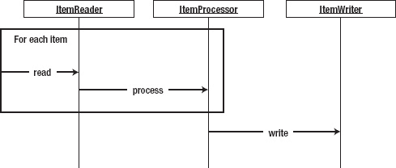

***图 9-1。**与项目作者的步骤交互*

自从引入了基于块的处理之后，调用 ItemWriter 的次数比以前少了很多。然而，您需要以稍微不同的方式处理事情。以处理像文件这样的非事务性资源为例。如果写入文件失败，则无法回滚已经写入的内容。因此，如果您编写自定义编写器，您应该缓冲输出并一次全部刷新到文件中，以防止某个项被写入一半，从而使文件处于不一致的状态。

Spring Batch 提供了许多编写器来处理绝大多数输出场景。让我们从作者开始，就像你从读者开始一样:`FlatFileItemWriter`。

### 基于文件的项目编写器

在企业批处理中，大量数据通过文件移动。这是有原因的:文件简单可靠。备份很容易。如果你需要重新开始，恢复也是如此。本节介绍如何生成各种格式的平面文件，包括格式化记录(固定宽度或其他格式)和分隔文件，以及 Spring Batch 如何处理文件创建问题。

#### FlatFileItemWriter

`org.springframework.batch.item.file.FlatFileItemWriter`是 ItemWriter 实现，用于生成文本文件输出。在许多方面与`FlatFileItemReader`相似，这个类用一个干净、一致的接口来解决 Java 中基于文件的输出问题。[图 9-2](#fig_9_2) 显示了`FlatFileItemWriter`的构造。

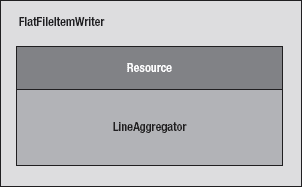

***图 9-2。** `FlatFileItemWriter`棋子*

`FlatFileItemWriter`，如图[所示，图 9-2](#fig_9_2) 由一个要写入的资源和一个`LineAggregator`实现组成。`org.springframework.batch.item.file.transform.LineAggregator`接口取代了[第 7 章](07.html#ch7)中讨论的 FlatFileItemReader 的`LineMapper`。这里，`LineAggregator`负责基于对象生成输出`String`，而不是像`LineMapper`负责的那样将`String`解析成对象。

在前面的许多例子中，您使用了`PassThroughLineAggregator`来生成输出文件。接口的这个特殊实现只是调用项目的`toString()`方法来生成输出。但是在接下来的部分中，您还会看到其他的实现。

`FlatFileItemWriter`有许多有趣的配置选项，见[表 9-1](#tab_9_1) 。

***表 9-1。** `FlatFileItemWriter`配置选项*

<colgroup><col align="left" valign="top" width="25%"> <col align="left" valign="top" width="25%"> <col align="left" valign="top" width="25%"> <col align="left" valign="top" width="27%"></colgroup> 
| **选项** | **类型** | **默认** | **描述** |
| :-- | :-- | :-- | :-- |
| `encoding` | `String` | UTF-8 | 文件的字符编码。 |
| `footerCallback` | `FlatFileFooterCallback` | `null` | 在文件的最后一项写入后执行。 |
| `headerCallback` | `FlatFileHeaderCallback` | `null` | 在写入文件的第一项之前执行。 |
| `lineAggregator` | `LineAggregator` | `null`(必需) | 用于将单个项目转换为`String`输出。 |
| `lineSeparator` | `String` | 系统的`line.separator` | 生成文件的换行符。 |
| `resource` | `Resource` | `null`(必需) | 要写入的文件或流。 |
| `saveState` | `boolean` | `true` | 确定在处理发生时，写入器的状态是否应存储在`ExecutionContext`中。 |
| `shouldDeleteIfEmpty` | `boolean` | `false` | 如果`true`没有记录被写入(不包括页眉/页脚记录)，文件在阅读器关闭时被删除。 |
| `appendAllowed` | `boolean` | `false` | 如果`true`和要写入的文件已经存在，输出将附加到该文件上，而不是替换该文件。如果`true`，`shouldDeleteIfExists`自动设置为`false`。 |
| `shouldDeleteIfExists` | `boolean` | `true` | 如果`true`和要写入的文件在任务运行前存在，则删除该文件并创建一个新文件。 |
| `transactional` | `boolean` | `true` | 如果`true`并且事务当前是活动的，则数据到文件的写入被延迟直到事务被提交。 |

与`FlatFileItemReader`的`LineMapper`不同，`LineAggregator`没有任何硬性依赖。但是，需要注意的一个相关接口是`org.springframework.batch.item.file.transform.FieldExtractor`。这个接口用在大多数提供的`LineAggregator`实现中，作为一种从给定项目访问必需字段的方式。Spring Batch 提供了`FieldExtractor`接口的两个实现:`org.springframework.batch.item.file.transform.BeanWrapperFieldExtractor`，它使用类上的 getters 来根据 JavaBean 规范访问属性，以及`org.springframework.batch.item.file.transform.PassThroughFieldExtractor`，它返回项目(例如，对于仅仅是`String`的项目很有用)。

在本节的剩余部分，您将看到一些`LineAggregator`实现。让我们从使用`FlatFileItemWriter`和`FormatterLineAggregator`创建格式化文件开始。

##### 格式化的文本文件

当从输入端看文本文件时，有三种不同的类型:固定宽度、分隔和 XML。从输出端来看，仍然有 delimited 和 XML，但是固定宽度不仅仅是固定宽度。在这种情况下，它实际上是一个格式化的记录。本节介绍如何将批处理输出构造为格式化的文本文件。

为什么固定宽度的输入文件和格式化的输出文件有区别？嗯，技术上来说没有区别。它们都是包含某种固定格式记录的文件。然而，通常输入文件的记录只包含数据，并且是通过列定义的，而输出文件可以是固定宽度的，也可以是更健壮的(正如您在本章后面的语句 job 中看到的)。

此示例生成一个客户及其居住地点的列表。首先，让我们看看您正在处理的输入。清单 9-2 显示了一个`customer.csv`文件的例子。

***清单 9-2。**T4`customer.csv`*

`Richard,N,Darrow,5570 Isabella Ave,St. Louis,IL,58540
Warren,L,Darrow,4686 Mt. Lee Drive,St. Louis,NY,94935
Barack,G,Donnelly,7844 S. Greenwood Ave,Houston,CA,38635
Ann,Z,Benes,2447 S. Greenwood Ave,Las Vegas,NY,55366
Erica,Z,Gates,3141 Farnam Street,Omaha,CA,57640
Warren,M,Williams,6670 S. Greenwood Ave,Hollywood,FL,37288
Harry,T,Darrow,3273 Isabella Ave,Houston,FL,97261
Steve,O,Darrow,8407 Infinite Loop Drive,Las Vegas,WA,90520`

如清单 9-2 所示，您正在使用的文件与您在本书中一直使用的客户文件相似。但是，该作业的输出会略有不同。在这种情况下，您希望为每个客户输出一个完整的句子:“理查德·律界英豪住在伊利诺伊州圣路易斯市伊莎贝拉大街 5570 号。”[清单 9-3](#list_9_3) 展示了一个输出文件的例子。

***清单 9-3。**格式化的客户输出*

`Richard N Darrow lives at 5570 Isabella Ave in St. Louis, IL.
Warren L Darrow lives at 4686 Mt. Lee Drive in St. Louis, NY.
Barack G Donnelly lives at 7844 S. Greenwood Ave in Houston, CA.
Ann Z Benes lives at 2447 S. Greenwood Ave in Las Vegas, NY.
Laura 9S Minella lives at 8177 4th Street in Dallas, FL.
Erica Z Gates lives at 3141 Farnam Street in Omaha, CA.
Warren M Williams lives at 6670 S. Greenwood Ave in Hollywood, FL.
Harry T Darrow lives at 3273 Isabella Ave in Houston, FL.
Steve O Darrow lives at 8407 Infinite Loop Drive in Las Vegas, WA.
Erica Z Minella lives at 513 S. Greenwood Ave in Miami, IL.`

你是怎么做到的？对于本例，您将使用单步作业，读入输入文件并将其写入输出文件；您不需要 ItemProcessor。因为你唯一需要写的代码是，对于`Customer`类，你可以从那里开始；参见[清单 9-4](#list_9_4) 。

***清单 9-4。**T4`Customer.java`*

`package com.apress.springbatch.chapter9;

import java.io.Serializable;

public class Customer implements Serializable {
    private static final long serialVersionUID = 1L;

    private long id;
    private String firstName;
    private String middleInitial;
    private String lastName;
    private String address;
    private String city;
    private String state;
    private String zip;

    // Accessors go here
    ...
}`

正如您在清单 9-4 中看到的,`Customer`对象的字段映射到`customer.csv`文件中的字段。 [1](#CH-9-FN-1) 通过项目编码，您可以开始配置作业。 [2](#CH-9-FN-2) 输入侧应该从第 7 章的[中熟悉。](07.html#ch7)[清单 9-5](#list_9_5) 显示了作为资源的输入文件的配置(该值通过一个`job`参数传入)、`FlatFileItemReader`配置以及所需的对`Customer`对象的引用。

___________

1`Customer`对象有一个 id 属性，你以后用；它在文件中没有数据。

2 与本书中所有之前的例子一样，这个项目的`batch.properties`与它在[第 2 章](02.html#ch2)中使用 MySQL 是一样的。此外，除非另有说明，`launch-context.xml`也是如此。

***清单 9-5。**配置格式作业的输入*

`…
<beans:bean id="customerFile" 
  class="org.springframework.core.io.FileSystemResource" scope="step">
  <beans:constructor-arg value="#{jobParameters[customerFile]}"/>
</beans:bean>

<beans:bean id="customerFileReader"
  class="org.springframework.batch.item.file.FlatFileItemReader">
  <beans:property name="resource" ref="customerFile"/>
  <beans:property name="lineMapper">
    <beans:bean 
      class="org.springframework.batch.item.file.mapping.DefaultLineMapper">
      <beans:property name="lineTokenizer">
        <beans:bean
          class="org.springframework.batch.item.file.transform.
DelimitedLineTokenizer">
          <beans:property name="names"
            value="firstName,middleInitial,lastName,address,city,state,zip"/>
          <beans:property name="delimiter" value=","/>
        </beans:bean>
      </beans:property>
      <beans:property name="fieldSetMapper">
        <beans:bean class="org.springframework.batch.item.file.mapping.
BeanWrapperFieldSetMapper">
          <beans:property name="prototypeBeanName" value="customer"/>
        </beans:bean>
      </beans:property>
    </beans:bean>
  </beans:property>
</beans:bean>

<beans:bean id="customer" class="com.apress.springbatch.chapter9.Customer"
  scope="prototype"/>
…`

在[清单 9-4](#list_9_4) 中的配置应该不会有太多惊喜。首先将`customerFile`配置为 ItemReader 读取的资源。接下来是`customerFileReader`，由一个`FlatFileItemReader`组成。`customerFileReader`引用`customerFile`以及一个`LineMapper`实现，将文件的每条记录转换成一个`Customer`对象。因为您正在处理一个基本的 CSV 文件，所以您能够使用`DelimitedLineTokenizer`解析每个记录，使用`BeanWrapperFieldSetMapper`获取结果`FieldSet`并填充一个客户实例。输入配置的最后一部分是对 ItemReader 用来创建新的`Customer`对象的`Customer`对象的引用。

对于输出端的东西，你需要配置输出文件，`FlatFileItemWriter`，和一个`LineAggregator`。这个例子使用了 Spring Batch 提供的`org.springframework.batch.itemfile.transform.FormatterLineAggregator`。[清单 9-6](#list_9_6) 显示了作业输出的配置。

***清单 9-6。**格式化作业的输出配置*

`…
<beans:bean id="outputFile"
  class="org.springframework.core.io.FileSystemResource" scope="step">
  <beans:constructor-arg value="#{jobParameters[outputFile]}"/>
</beans:bean>

<beans:bean id="flatFileOutputWriter"
  class="org.springframework.batch.item.file.FlatFileItemWriter">
  <beans:property name="resource" ref="outputFile"/>
  <beans:property name="lineAggregator" ref="formattedLineAggregator"/>
</beans:bean>

<beans:bean id="formattedLineAggregator"
  class="org.springframework.batch.item.file.transform.
FormatterLineAggregator">
  <beans:property name="fieldExtractor">
    <beans:bean class="org.springframework.batch.item.file.transform.
BeanWrapperFieldExtractor">
      <beans:property name="names" 
        value="firstName,lastName,address,city,state,zip"/>
    </beans:bean>
  </beans:property>
  <beans:property name="format" value="%s %s lives at %s %s in %s, %s."/>
</beans:bean>
…`

如清单 9-6 所示，这一步输出端的配置实际上小于输入端。首先配置输出文件；同样，文件名作为作业参数传入。接下来是`FlatFileItemWriter`的配置。`flatFileOutputWriter`有两个依赖项:资源(要写入的文件)和`LineAggregator`实现。输出难题的最后一块是`LineAggregator`实现:在本例中是`FormatterLineAggregator`。它有两个依赖项:一个`FieldExtractor`实现和一个格式。

`org.springframework.batch.item.file.transform.FieldExtractor`接口旨在抽象获取对象树的字段并将它们转换成一个`Object`数组的过程。将对象写入数组后，`FormatterLineAggregator`使用 Java 的`String.format()`方法和格式依赖项中提供的字符串来生成要写入文件的格式化的`String`。在这种情况下，`BeanWrapperFieldExtractor`为每个定义的属性使用 getters，并在一个`Object`数组中按顺序返回结果，以便根据格式字符串进行格式化。在[清单 9-6](#list_9_6) 的例子中，您从每个条目中提取了`firstName`、`lastName`、`address`、`city`、`state`和`zip`。值得注意的是，在格式化过程中没有键/值配对。如果您希望一个 bean 属性在格式化的`String`中出现两次，您需要在 names 列表中按顺序包含它两次。

配置好所有的输入和输出后，您需要做的就是配置步骤和作业。[清单 9-7](#list_9_7) 显示了`formatJob`的完整配置，包括之前的输入和输出。

***清单 9-7。**`formatJob.xml`T5】*

`<?xml version="1.0" encoding="UTF-8"?>
<beans:beans
  xmlns:beans="http://www.springframework.org/schema/beans"
  xmlns:xsi="http://www.w3.org/2001/XMLSchema-instance"
  xsi:schemaLocation="http://www.springframework.org/schema/beans
    http://www.springframework.org/schema/beans/spring-beans-3.0.xsd
    http://www.springframework.org/schema/batch
    http://www.springframework.org/schema/batch/spring-batch-2.1.xsd">

  <beans:import resource="../launch-context.xml"/>

  <beans:bean id="customerFile" 
    class="org.springframework.core.io.FileSystemResource" scope="step">
    <beans:constructor-arg value="#{jobParameters[customerFile]}"/>
  </beans:bean>

  <beans:bean id="customerFileReader" 
    class="org.springframework.batch.item.file.FlatFileItemReader">
    <beans:property name="resource" ref="customerFile"/>
    <beans:property name="lineMapper">
      <beans:bean 
       class="org.springframework.batch.item.file.mapping.DefaultLineMapper">
        <beans:property name="lineTokenizer">
          <beans:bean class="org.springframework.batch.item.file.transform.
DelimitedLineTokenizer">
            <beans:property name="names"
            value="firstName,middleInitial,lastName,address,city,state,zip"/>
            <beans:property name="delimiter" value=","/>
          </beans:bean>
        </beans:property>
        <beans:property name="fieldSetMapper">
          <beans:bean class="org.springframework.batch.item.file.mapping.
BeanWrapperFieldSetMapper">
            <beans:property name="prototypeBeanName" value="customer"/>
          </beans:bean>
        </beans:property>
      </beans:bean>
    </beans:property>
  </beans:bean>

  <beans:bean id="customer" class="com.apress.springbatch.chapter9.Customer" 
    scope="prototype"/>

  <beans:bean id="outputFile"
    class="org.springframework.core.io.FileSystemResource" scope="step">
    <beans:constructor-arg value="#{jobParameters[outputFile]}"/>
  </beans:bean>

  <beans:bean id="flatFileOutputWriter"` `    class="org.springframework.batch.item.file.FlatFileItemWriter">
    <beans:property name="resource" ref="outputFile"/>
    <beans:property name="lineAggregator" ref="formattedLineAggregator"/>
  </beans:bean>

  <beans:bean id="formattedLineAggregator"
    class="org.springframework.batch.item.file.transform.
FormatterLineAggregator">
    <beans:property name="fieldExtractor">
      <beans:bean class="org.springframework.batch.item.file.transform.
BeanWrapperFieldExtractor">
        <beans:property name="names" 
          value="firstName,lastName,address,city,state,zip"/>
      </beans:bean>
    </beans:property>
    <beans:property name="format" value="%s %s lives at %s %s in %s, %s."/>
  </beans:bean>

  <step id="formatStep">
    <tasklet>
      <chunk reader="customerFileReader" writer="flatFileOutputWriter"
        commit-interval="10"/>
    </tasklet>
  </step>

  <job id="formatJob">
    <step id="step1" parent="formatStep"/>
  </job>
</beans:beans>`

在您使用 Maven 的`mvn clean install`命令构建项目之后，您可以使用`CommandLineJobRunner`和[清单 9-8](#list_9_8) 中所示的命令来执行这个示例。

***清单 9-8。**如何从命令行执行`formatJob`*

`java -jar itemWriters-0.0.1-SNAPSHOT.jar jobs/formatJob.xml formatJob
customerFile=/input/customer.csv outputFile=/output/formattedCustomers.txt`

当您用清单 9-2 中的[指定的输入运行作业时，结果是一个新文件`formattedCustomers.txt`，其内容在清单 9-9](#list_9_2) 中的[中列出。](#list_9_9)

***清单 9-9。**T4`formattedCustomers.txt`*

* * *

`Richard Darrow lives at 5570 Isabella Ave St. Louis in IL, 58540.
Warren Darrow lives at 4686 Mt. Lee Drive St. Louis in NY, 94935.
Barack Donnelly lives at 7844 S. Greenwood Ave Houston in CA, 38635.
Ann Benes lives at 2447 S. Greenwood Ave Las Vegas in NY, 55366.
Erica Gates lives at 3141 Farnam Street Omaha in CA, 57640.
Warren Williams lives at 6670 S. Greenwood Ave Hollywood in FL, 37288.
Harry Darrow lives at 3273 Isabella Ave Houston in FL, 97261.
Steve Darrow lives at 8407 Infinite Loop Drive Las Vegas in WA, 90520.`

* * *

这种格式化输出的方法可用于许多不同的需求。无论是像您在这里所做的那样将项目格式化为人类可读的输出，还是像您在第 7 章的[中用于输入那样将它们格式化为固定宽度的文件，所有需要改变的就是您为`LineAggregator`配置的格式`String`。](07.html#ch7)

您经常看到的另一种主要类型的平面文件是分隔文件。例如,`customer.csv`是逗号分隔的文件。下一节将讨论如何输出包含分隔输出的文件。

##### 分隔文件

与您在上一节中看到的格式化文件不同，带分隔符的文件没有单一的预定义格式。相反，带分隔符的文件由一系列用预定义的分隔符分隔的值组成。本节介绍如何使用 Spring Batch 生成一个带分隔符的文件。

要了解如何生成带分隔符的文件，您可以在这个作业中使用相同的输入。对于输出，您重构 ItemWriter 以生成新的带分隔符的输出。在这种情况下，您可以更改字段的顺序，并将分隔符从逗号(，)更改为分号(；).[清单 9-10](#list_9_10) 显示了更新后的`formatJob`的一些示例输出。

***清单 9-10。**输出为定界`formatJob`*

`58540;IL;St. Louis;5570 Isabella Ave;Darrow;Richard
94935;NY;St. Louis;4686 Mt. Lee Drive;Darrow;Warren
38635;CA;Houston;7844 S. Greenwood Ave;Donnelly;Barack
55366;NY;Las Vegas;2447 S. Greenwood Ave;Benes;Ann
57640;CA;Omaha;3141 Farnam Street;Gates;Erica
37288;FL;Hollywood;6670 S. Greenwood Ave;Williams;Warren
97261;FL;Houston;3273 Isabella Ave;Darrow;Harry
90520;WA;Las Vegas;8407 Infinite Loop Drive;Darrow;Steve`

要生成清单 9-10 中的输出，你需要做的就是更新`LineAggregator`的配置。不使用`FormatterLineAggregator`，而是使用 Spring Batch 的`org.springframework.batch.item.file.transform.DelimitedLineAggregator`实现。使用同一个`BeanWrapperFieldExtractor`来提取一个`Object`数组，`DelimitedLineAggregator`用每个元素之间配置的分隔符连接数组的元素。[清单 9-11](#list_9_11) 显示了 ItemWriter 的更新配置。

***清单 9-11。** `flatFileOutputWriter`配置*

`…
<beans:bean id="flatFileOutputWriter" 
  class="org.springframework.batch.item.file.FlatFileItemWriter">
  <beans:property name="resource" ref="outputFile"/>
  <beans:property name="lineAggregator" ref="delimitedLineAggregator"/>
</beans:bean>

<beans:bean id="delimitedLineAggregator"
  class="org.springframework.batch.item.file.transform.
DelimitedLineAggregator">
  <beans:property name="fieldExtractor">
    <beans:bean class="org.springframework.batch.item.file.transform.
BeanWrapperFieldExtractor">` `      <beanand operty name="names" 
        value="zip,state,city,address,lastName,firstName"/>
    </beans:bean>
  </beans:property>
  <beans:property name="delimiter" value=";"/>
</beans:bean>
…`

通过将`FormatterLineAggregator`的配置更改为使用 Spring Batch 的`DelimitedLineAggregator`，您必须做的唯一其他更改是移除格式依赖并包含分隔符的定义。在使用您之前使用的相同的`mvn clean install`构建项目之后，您可以使用清单 9-12 中的[命令运行作业。](#list_9_12)

***清单 9-12。**运行`formatJob`生成分隔输出*

`java -jar itemWriters-0.0.1-SNAPSHOT.jar jobs/formatJob.xml formatJob
customerFile=/input/customer.csv outputFile=/output/delimitedCustomers.txt`

带有更新配置的`formatJob`的结果显示在[列表 9-13](#list_9_13) 中。

***清单 9-13。** `formatJob`分隔文件写入结果*

* * *

`58540;IL;St. Louis;5570 Isabella Ave;Darrow;Richard
94935;NY;St. Louis;4686 Mt. Lee Drive;Darrow;Warren
38635;CA;Houston;7844 S. Greenwood Ave;Donnelly;Barack
55366;NY;Las Vegas;2447 S. Greenwood Ave;Benes;Ann
57640;CA;Omaha;3141 Farnam Street;Gates;Erica
37288;FL;Hollywood;6670 S. Greenwood Ave;Williams;Warren
97261;FL;Houston;3273 Isabella Ave;Darrow;Harry
90520;WA;Las Vegas;8407 Infinite Loop Drive;Darrow;Steve`

* * *

使用 Spring Batch 很容易创建平面文件。在域对象之外没有任何代码行，您可以读入一个文件并将其格式转换为格式化文件或分隔文件。平面文件处理的两个示例都假设该文件是每次都要创建的新文件。下一节将介绍 Spring Batch 提供的一些更高级的选项，用于处理要写入的文件。

##### 文件创建选项

与从输入文件中读取不同，在输入文件中文件必须存在或被认为是错误条件，输出文件可能存在也可能不存在，这可能是也可能不是。Spring Batch 提供了根据您的需求配置如何处理这些场景的能力。本节着眼于如何配置`FlatFileItemWriter`来处理多个文件创建场景。

在[表 9-1](#tab_9_1) 中，关于文件创建的`FlatFileItemWriter`有两个选项:`shouldDeleteIfEmpty`和`shouldDeleteIfExists`。`shouldDeleteIfEmpty`实际上是处理一个步骤完成后该做什么。默认设置为`false`。如果一个步骤执行时，没有项目被写入(可能有一个标题和一个页脚，但是没有项目记录被写入)，并且`shouldDeleteIfEmpty`被设置为`true`，文件在该步骤完成时被删除。默认情况下，文件被创建并保留为空。您可以使用您在上一节中运行的`formatJob`来查看这一行为。通过更新`flatFileOutputWriter`的配置，将`shouldDeleteIfEmpty`设置为`true`，如[清单 9-14](#list_9_14) 所示，您可以处理一个空文件，并且不会留下任何输出文件。

***清单 9-14。**配置`formatJob`删除输出文件，如果没有项目被写入*

`…
<beans:bean id="flatFileOutputWriter"
  class="org.springframework.batch.item.file.FlatFileItemWriter">
  <beans:property name="resource" ref="outputFile"/>
  <beans:property name="lineAggregator" ref="delimitedLineAggregator"/>
  <beans:property name="shouldDeleteIfEmpty" value="true"/>
</beans:bean>
…`

如果使用更新后的文件执行`formatJob`,并传递一个空的`customer.csv`文件作为输入，那么不会留下任何输出。需要注意的是，文件仍然是被创建、打开和关闭的。事实上，如果步骤被配置为在文件中写入页眉和/或页脚，那么也写入了。但是，如果写入文件的项数为零，则该文件将在该步骤结束时被删除。

与文件创建/删除相关的下一个配置参数是`shouldDeleteIfExists`标志。该标志默认设置为`true`，删除与步骤要写入的输出文件同名的文件。例如，如果您要运行一个写入文件`/output/jobRun.txt`的作业，并且该文件在作业开始时已经存在，Spring Batch 会删除该文件并创建一个新文件。如果这个文件存在，并且标志被设置为`false`，当该步骤试图创建新文件时，会抛出一个`org.springframework.batch.item.ItemStreamException`。[清单 9-15](#list_9_15) 显示了`formatJob`的`flatFileOutputWriter`被配置为不删除输出文件，如果它存在的话。

***清单 9-15。**配置`formatJob`不删除已经存在的输出文件*

`…
<beans:bean id="flatFileOutputWriter"
  class="org.springframework.batch.item.file.FlatFileItemWriter">
  <beans:property name="resource" ref="outputFile"/>
  <beans:property name="lineAggregator" ref="delimitedLineAggregator"/>
  <beans:property name="shouldDeleteIfExists" value="false"/>
</beans:bean>
…`

通过按照清单 9-15 中的[配置运行作业，您会收到前面提到的`ItemStreamException`，如清单 9-16](#list_9_15) 中的[所示。](#list_9_16)

***清单 9-16。**写入不应该存在的现有文件的作业的结果*

* * *

`2011-03-06 12:32:51,006 DEBUG main
[org.springframework.batch.core.scope.StepScope] - <Creating object in
scope=step, name=scopedTarget.outputFile>
2011-03-06 12:32:51,065 ERROR main
[org.springframework.batch.core.step.AbstractStep] - <Encountered an error
executing the step>` `org.springframework.batch.item.ItemStreamException: File already exists:
[/output/overwriteThisFile.txt]
      at org.springframework.batch.item.util.FileUtils.setUpOutputFile(FileUtils.java:62)
        at
org.springframework.batch.item.file.FlatFileItemWriter$OutputState.initialize
BufferedWriter(FlatFileItemWriter.java:497)
        at
org.springframework.batch.item.file.FlatFileItemWriter$OutputState.access$000
(FlatFileItemWriter.java:354)
        at
org.springframework.batch.item.file.FlatFileItemWriter.doOpen(FlatFileItemWri
ter.java:291)
        at
org.springframework.batch.item.file.FlatFileItemWriter.open(FlatFileItemWrite
r.java:281)
        at
org.springframework.batch.item.support.CompositeItemStream.open(CompositeItem
Stream.java:98)
        at
org.springframework.batch.core.step.tasklet.TaskletStep.open(TaskletStep.java
:288)
      at org.springframework.batch.core.step.AbstractStep.execute(AbstractStep.java:193)
        at
org.springframework.batch.core.job.SimpleStepHandler.handleStep(SimpleStepHan
dler.java:135)
        at
org.springframework.batch.core.job.flow.JobFlowExecutor.executeStep(JobFlowEx
ecutor.java:61)`

* * *

在您希望保留每次运行的输出的环境中，使用此参数是一个好主意。这可以防止旧文件被意外覆盖。

与文件创建相关的最后一个选项是`appendAllowed`参数。当该标志(默认为`false`)设置为`true`时，Spring Batch 会自动将`shouldDeleteIfExists`标志设置为`false`，如果不存在文件，则创建一个新文件，如果存在，则追加数据。如果您有一个需要从多个步骤写入的输出文件，此选项会很有用。[清单 9-17](#list_9_17) 显示了`formatJob`被配置为在文件存在时追加数据。

***清单 9-17。**如果输出文件存在，追加数据*

`…
<beans:bean id="flatFileOutputWriter"
  class="org.springframework.batch.item.file.FlatFileItemWriter">
  <beans:property name="resource" ref="outputFile"/>
  <beans:property name="lineAggregator" ref="delimitedLineAggregator"/>
  <beans:property name="appendAllowed" value="true"/>
</beans:bean>
…`

使用这种配置，您可以使用相同的输出文件(使用不同的输入文件)多次运行作业，Spring Batch 会将当前作业的输出附加到现有输出文件的末尾。

正如您所看到的，有许多选项可用于处理基于平面文件的输出，从能够以您想要的任何方式格式化您的记录到生成分隔文件，甚至为 Spring Batch 如何处理已经存在的文件提供选项。然而，平面文件并不是唯一的文件输出类型。XML 是 Spring Batch 提供的另一种文件输出类型，接下来您将看到它。

#### 固相萃取器

当您在第 7 章回顾阅读 XML 时，您探索了 Spring Batch 如何以片段的形式查看 XML 文档。这些片段中的每一个都是要处理的单个项目的 XML 表示。在 ItemWriter 端，存在相同的概念。Spring Batch 为 ItemWriter 接收的每个项目生成一个 XML 片段，并将片段写入文件。这一节介绍 Spring Batch 如何将 XML 作为输出媒介来处理。

要使用 Spring Batch 编写 XML，可以使用`org.springframework.batch.item.xml.StaxEventItemWriter`。就像 ItemReader 一样，Streaming API for XML (StAX)实现允许 Spring Batch 在处理每个块时写入 XML 片段。就像`FlatFileItemWriter`，`StaxEventItemWriter`一次生成一大块 XML，并在提交本地事务后将其写入文件；这可以防止在写入文件时出现回滚问题。

`StaxEventItemReader`的配置包括一个资源(要读取的文件)、一个根元素名(每个片段的根标签)和一个能够将 XML 输入转换成对象的解组器。`StaxEventItemWriter`的配置几乎是相同的，有一个要写入的资源、一个根元素名(您生成的每个片段的根标签)和一个将每个项目转换成 XML 片段的编组器。

`StaxEventItemWriter`有一组可配置的属性，这些属性包含在[表 9-2](#tab_9_2) 中。

***表 9-2。**属性在`StaxEventItemWriter`中可用*

<colgroup><col align="left" valign="top" width="25%"> <col align="left" valign="top" width="25%"> <col align="left" valign="top" width="25%"> <col align="left" valign="top" width="25%"></colgroup> 
| **选项** | **类型** | **默认** | **描述** |
| :-- | :-- | :-- | :-- |
| `encoding` | `String` | UTF-8 | 文件的字符编码。 |
| `footerCallback` | `StaxWriterCallback` | `null` | 在文件的最后一项写入后执行。 |
| `headerCallback` | `StaxWriterCallback` | `null` | 在写入文件的第一项之前执行。 |
| `marshaller` | `Marshaller` | `null`(必需) | 用于将单个项转换为 XML 片段以便输出。 |
| `overwriteOutput` | `boolean` | `true` | 默认情况下，如果输出文件已经存在，该文件将被替换。如果设置为`true`并且文件存在，则抛出一个`ItemStreamException`。 |
| `resource` | `Resource` | `null`(必需) | 要写入的文件或流。 |
| `rootElementAttributes` | `Map<String, String>` | `null` | 这个键/值对被附加到每个片段的根标签上，键作为属性名，值作为它们的值。 |
| `rootTagName` | `String` | `null`(必需) | 定义 XML 文档的根 XML 标记。 |
| `saveState` | `boolean` | `true` | 确定 Spring Batch 是否跟踪 ItemWriter 的状态(写入的项目数等)。 |
| `transactional` | `boolean` | `true` | 如果`true`，输出的写入被延迟，直到事务被提交，以防止回滚问题。 |
| `version` | `String` | `"1.0"` | 写入文件的 XML 版本。 |

为了了解`StaxEventItemWriter`是如何工作的，让我们更新`formatJob`来输出 XML 格式的客户输出。使用前面例子中的相同输入，[清单 9-18](#list_9_18) 显示了更新作业时创建的新输出。

***清单 9-18。**T4`customer.xml`*

`<?xml version="1.0" encoding="UTF-8"?>
<customers>
  <customer>
    <id>0</id>
    <firstName>Richard</firstName>
    <middleInitial>N</middleInitial>
    <lastName>Darrow</lastName>
    <address>5570 Isabella Ave</address>
    <city>St. Louis</city>
    <state>IL</state>
    <zip>58540</zip>
  </customer>
    ...
</customers>`

为了生成清单 9-18 中的[所示的输出，您重用了`formatJob`配置，但是用一个新的`xmlOutputWriter`替换了`flatFileOutputWriter`，这个新的【】使用了`StaxEventItemWriter` ItemWriter 实现。要配置新的 ItemWriter，您需要提供三个依赖项，如清单 9-19](#list_9_18) 所示:一个要写入的资源，一个对`org.springframework.oxm.Marshaller`实现的引用，以及一个根标记名(本例中为`customer`)。

***清单 9-19。**配置为`formatJob`带`StaxEventItemWriter`带*

`<?xml version="1.0" encoding="UTF-8"?>
<beans:beans
  xmlns:beans="http://www.springframework.org/schema/beans"
  xmlns:util="http://www.springframework.org/schema/beans"
  xmlns:xsi="http://www.w3.org/2001/XMLSchema-instance"
  xsi:schemaLocation="http://www.springframework.org/schema/beans
    http://www.springframework.org/schema/beans/spring-beans-3.0.xsd
    http://www.springframework.org/schema/util
    http://www.springframework.org/schema/util/spring-util.xsd
    http://www.springframework.org/schema/batch
    http://www.springframework.org/schema/batch/spring-batch-2.1.xsd">

  <beans:import resource="../launch-context.xml"/>

  <beans:bean id="customerFile"
    class="org.springframework.core.io.FileSystemResource" scope="step">
    <beans:constructor-arg value="#{jobParameters[customerFile]}"/>
  </beans:bean>

  <beans:bean id="customerFileReader"
    class="org.springframework.batch.item.file.FlatFileItemReader">
    <beans:property name="resource" ref="customerFile"/>
    <beans:property name="lineMapper">
      <beans:bean
       class="org.springframework.batch.item.file.mapping.DefaultLineMapper">
        <beans:property name="lineTokenizer">
          <beans:bean class="org.springframework.batch.item.file.transform.
DelimitedLineTokenizer">
            <beans:property name="names"
            value="firstName,middleInitial,lastName,address,city,state,zip"/>
            <beans:property name="delimiter" value=","/>
          </beans:bean>
        </beans:property>
        <beans:property name="fieldSetMapper">
          <beans:bean class="org.springframework.batch.item.file.mapping.
BeanWrapperFieldSetMapper">
            <beans:property name="prototypeBeanName" value="customer"/>
          </beans:bean>
        </beans:property>
      </beans:bean>
    </beans:property>
  </beans:bean>

  <beans:bean id="customer" class="com.apress.springbatch.chapter9.Customer"
    scope="prototype"/>

  <beans:bean id="outputFile"
    class="org.springframework.core.io.FileSystemResource" scope="step">
    <beans:constructor-arg value="#{jobParameters[outputFile]}"/>` `  </beans:bean>

  <beans:bean id="xmlOutputWriter"
    class="org.springframework.batch.item.xml.StaxEventItemWriter">
    <beans:property name="resource" ref="outputFile" />
    <beans:property name="marshaller" ref="customerMarshaller" />
    <beans:property name="rootTagName" value="customers" />
  </beans:bean>

  <beans:bean id="customerMarshaller" 
    class="org.springframework.oxm.xstream.XStreamMarshaller">
    <beans:property name="aliases">
      <util:map>
        <beans:entry key="customer" 
          value="com.apress.springbatch.chapter9.Customer" />
      </util:map>
    </beans:property>
  </beans:bean>

  <step id="formatStep">
    <tasklet>
      <chunk reader="customerFileReader" writer="xmlOutputWriter"
        commit-interval="10"/>
    </tasklet>
  </step>

  <job id="formatJob">
    <step id="step1" parent="formatStep"/>
  </job>
</beans:beans>`

如清单 9-7 中的[所示，在配置原始的`formatJob`所用的 69 行 XML 中，清单 9-19](#list_9_7) 中的`formatJob`只改变了 14 行(将文件整体缩短了一行)。变化从一个新的条目作者`xmlOutputWriter`的定义开始。这个 bean 是对本节一直在讨论的`StaxEventItemWriter`的引用，它定义了三个依赖项:要写入的资源、`Marshaller`实现和`Marshaller`将生成的每个 XML 片段的根标记名。

在`xmlOutputWriter`的正下方是`customerMarshaller`。这个 bean 用于为作业处理的每个项目生成一个 XML 片段。使用 Spring 的`org.springframework.oxm.xtream.XStreamMarshaller`类，您需要提供的唯一进一步的配置是一个`Map`别名，用于编组器遇到的每种类型。默认情况下，封送拆收器使用属性的名称作为标记名，但是您要为`Customer`类提供一个别名，因为`XStreamMarshaller`默认情况下使用该类的完全限定名作为每个片段的根标记(`com.apress.springbatch.chatper8.Customer`而不仅仅是 customer)。

为了使作业能够编译和运行，您需要再进行一次更新。POM 文件需要一个新的依赖项来处理 XML，这是对 Spring 的对象/XML 映射(OXM)库的引用。[清单 9-20](#list_9_20) 显示了所需的 POM 更新。

***清单 9-20。**春天的 OXM 图书馆美文属地*

`…
<dependency>
  <groupId>org.springframework.ws</groupId>
  <artifactId>spring-oxm</artifactId>
  <version>1.5.9</version>
</dependency>
…`

 **注意**尽管 Spring Batch 认为自己与 Spring 3 兼容，并且本书中的所有例子都使用 Spring 3，但这是它不兼容的一个方面，它依赖于 OXM 的旧版本。

随着 POM 的更新和作业的配置，您已经准备好构建并运行`formatJob`来生成 XML 作为输出。从命令行运行一个`mvn clean install`后，你可以使用[清单 9-21](#list_9_21) 中列出的命令来执行作业。

***清单 9-21。**执行`formatJob`生成 XML*

`java -jar itemWriters-0.0.1-SNAPSHOT.jar jobs/formatJob.xml formatJob
customerFile=/input/customer.csv outputFile=/output/xmlCustomer.xml`

当您查看 XML 的结果时，请注意它显然是由库生成的，因为没有应用任何格式。但是通过 XML Tidy 运行它，您可以清楚地看到输出是您所期望的。清单 9-22 显示了生成的输出 XML 的一个例子。

***清单 9-22。** `formatJob` XML 结果*

`<?xml version="1.0" encoding="UTF-8"?>
<customers>
<customer>
<id>0</id>
<firstName>Richard</firstName>
<middleInitial>N</middleInitial>
<lastName>Darrow</lastName>
<address>5570 Isabella Ave</address>
<city>St. Louis</city>
<state>IL</state>
<zip>58540</zip>
</customer>
    ...
</customers>`

只需几行 XML，您就可以轻松地生成 XML 输出，充分发挥任何 Spring 支持的 XML 封送拆收器的功能。

在当今的企业环境中，将 XML 作为输入和输出进行处理的能力非常重要，处理平面文件的能力也是如此。然而，尽管文件在批处理中起着很大的作用，但在当今企业的其他处理中，它们并不普遍。相反，关系数据库已经取而代之。因此，批处理必须不仅能够从数据库中读取数据(正如你在第 7 章中看到的),还能够写入数据。下一节将讨论使用 Spring Batch 处理数据库写入的更常见的方法。

### 基于数据库的条目编写器

与基于文件的输出相比，写入数据库提供了一组不同的约束。首先，数据库是事务性资源，不像文件。因此，您可以将物理写入作为事务的一部分，而不是像基于文件的处理那样将其分段。此外，对于如何访问数据库，有许多不同的选项。JDBC、Java 持久性 API (JPA)和 Hibernate 都为处理数据库写入提供了独特而引人注目的模型。本节将介绍如何使用 JDBC、Hibernate 和 JPA 将批处理的输出写入数据库。

#### JdbcBatchItemWriter

写入数据库的第一种方式是大多数人学习如何通过 JDBC 用 Spring 访问数据库的方式。Spring Batch 的`JdbcBatchItemWriter`使用`JdbcTemplate`及其批处理 SQL 执行功能一次执行一个块的所有 SQL。这一节将介绍如何使用`JdbcBatchItemWriter`将一个步骤的输出写到数据库中。

`org.springframework.batch.item.database.JdbcBatchItemWriter`只不过是 Spring 的`org.springframework.jdbc.support.JdbcTemplate`的一层薄薄的包装，使用了`JdbcTemplate.batchUpdate`或`JdbcTemplate.execute`方法，这取决于 SQL 中是否使用了命名参数来执行大规模数据库插入/更新。需要注意的重要一点是，Spring 使用`PreparedStatement`的批量更新功能来一次执行一个块的所有 SQL 语句，而不是使用多个调用。这极大地提高了性能，同时仍然允许所有执行在当前事务中执行。

为了看一下`JdbcBatchItemWriter`是如何工作的，再次使用与基于文件的编写器相同的输入，但是使用它来填充客户数据库表，而不是编写文件。[图 9-3](#fig_9_3) 显示了您正在插入客户信息的表格的设计。

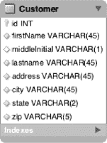

***图 9-3。**客户表设计*

如图 9-3 中的[所示，客户表的列实际上与`customer.csv`文件中的元素一一对应。唯一的区别是 id 字段，这是数据库为您填充的。为了将值插入到表中，您需要以两种](#fig_9_3)方式构建 SQL:使用问号(`?` )作为值的占位符，或者使用命名参数(【例如】)作为占位符。这两个选项中的每一个在填充值时都需要稍微不同的方法。从问号开始，如清单 9-23 中的示例 SQL 语句所示。

***清单 9-23。**准备插入客户表的语句*

`insert into customer (firstName, middleInitial, lastName, address, city,
state, zip) values (?, ?, ?, ?, ?, ?, ?)`

如你所见，准备好的声明没有什么不寻常的。然而，提供 SQL 语句只是`JdbcBatchItemWriter`的配置选项之一。[表 9-3](#tab_9_3) 列出了所有的配置选项。

***表 9-3。** `JdbcBatchItemWriter`配置选项*

<colgroup><col align="left" valign="top" width="25%"> <col align="left" valign="top" width="25%"> <col align="left" valign="top" width="20%"> <col align="left" valign="top" width="27%"></colgroup> 
| **选项** | **类型** | **默认** | **描述** |
| :-- | :-- | :-- | :-- |
| `assertUpdates` | `boolean` | `true` | 如果为真，则导致`JdbcBatchItemWriter`验证每个项目都导致了插入或更新。如果任何项目没有触发记录的插入或更新，就会抛出一个`EmptyResultDataAccessException`。 |
| `dataSource` | `DataSource` | `null`(必需) | 提供对所需数据库的访问。 |
| `itemPreparedStatementSetter` | `ItemPreparedStatement
Setter` | `null` | 如果提供了标准的`PreparedStatement`(使用`?`作为参数)，`JdbcBatchItemWriter`使用这个类来填充参数值。 |
| `itemSqlParameterSourceProvider` | `ItemSqlParameter
SourceProvider` | `null` | 如果在提供的 SQL 中使用了命名参数，`JdbcBatchItemWriter`使用这个类来填充参数值。 |
| `simpleJdbcTemplate` | `SimpleJdbcTemplate` | `null` | 允许你注入一个`SimpleJdbcOperations`接口的实现。 |
| `sql` | `String` | `null`(必需) | 为每个项目执行的 SQL。 |

为了在`formatJob`中使用`JdbcBatchItemWriter`，你用一个新的`jdbcBatchWriter` bean 替换`xmlOutputWriter`。因为您从查询的标准`PreparedStatement`语法开始(使用问号)，所以您需要为它提供一个`dataSource`、要执行的 SQL 和一个`org.springframework.batch.item.database.ItemPreparedStatementSetter`接口的实现。是的，如果你意识到你将不得不写一些代码来使这个工作，你是正确的。

`ItemPreparedStatementSetter`是一个简单的接口，用于从每个项目中提取值，并在`PreparedStatement`上设置它们。它包含一个单独的方法，如[清单 9-24](#list_9_24) 所示。

***清单 9-24。** `ItemPreparedStatementSetter`界面*

`package org.springframework.batch.item.database;

import java.sql.PreparedStatement;
import java.sql.SQLException;

import org.springframework.jdbc.core.RowMapper;

public interface ItemPreparedStatementSetter<T> {
    void setValues(T item, PreparedStatement ps) throws SQLException;
}`

要实现`ItemPreparedStatementSetter`接口，您需要创建自己的`CustomerItemPreparedStatementSetter`。这个类实现了`ItemPreparedStatementSetter`接口所需的单个`setValues`方法，方法是使用普通的`PreparedStatement` API 用项目中的适当值填充`PreparedStatement`的每个值。清单 9-25 显示了`CustomerItemPreparedStatementSetter`的代码。

***清单 9-25。**`CustomerItemPreparedStatementSetter.java`T5】*

`package com.apress.springbatch.chapter9;

import java.sql.PreparedStatement;
import java.sql.SQLException;

import org.springframework.batch.item.database.ItemPreparedStatementSetter;

public class CustomerItemPreparedStatementSetter implements
        ItemPreparedStatementSetter<Customer> {

    public void setValues(Customer customer, PreparedStatement ps)
            throws SQLException {

        ps.setString(1, customer.getFirstName());
        ps.setString(2, customer.getMiddleInitial());
        ps.setString(3, customer.getLastName());
        ps.setString(4, customer.getAddress());
        ps.setString(5, customer.getCity());
        ps.setString(6, customer.getState());
        ps.setString(7, customer.getZip());
    }
}`

如[清单 9-25](#list_9_25) 所示，设置每个`PreparedStatement`的值并不需要什么魔法。使用这段代码，您可以更新`formatJob`的配置，将其输出写入数据库。[清单 9-26](#list_9_26) 显示了新 ItemWriter 的配置。

***清单 9-26。** `jdbcBatchWriter`的配置*

`…
<beans:bean id="jdbcBatchWriter"
  class="org.springframework.batch.item.database.JdbcBatchItemWriter">
  <beans:property name="dataSource" ref="dataSource"/>
  <beans:property name="sql" value="insert into customer (firstName,
middleInitial, lastName, address, city, state, zip) values (?, ?, ?, ?, ?, ?,
?)"/>
  <beans:property name="itemPreparedStatementSetter" 
    ref="preparedStatementSetter"/>
</beans:bean>

<beans:bean id="preparedStatementSetter"
class="com.apress.springbatch.chapter9.CustomerItemPreparedStatementSetter"/>
…`

正如您在[清单 9-26](#list_9_26) 中看到的，新的`jdbcBatchItemWriter`引用了来自`launch-context.xml`文件的`dataSource`bean(customer 表与您用于 JobRepository 的 Spring 批处理表在同一模式中)。SQL 值与您之前在[清单 9-23](#list_9_23) 中定义的 SQL 语句相同。您提供的最后一个依赖项是对`CustomerItemPreparedStatementSetter`的引用。

配置新的 ItemWriter 的最后一步是更新步骤的配置，以引用新的 ItemWriter。要做到这一点，您所需要做的就是更新`formatStep`的配置来引用`jdbcBatchWriter` bean，代替它当前对前一节中的`xmlOutputWriter`的引用。[清单 9-27](#list_9_27) 显示了配置写入数据库的`formatJob.xml`的完整清单。

***清单 9-27。** `formatJob.xml`为 JDBC 数据库写配置*

`<?xml version="1.0" encoding="UTF-8"?>
<beans:beans
  xmlns:beans="http://www.springframework.org/schema/beans"
  xmlns:util="http://www.springframework.org/schema/beans"
  xmlns:xsi="http://www.w3.org/2001/XMLSchema-instance"
  xsi:schemaLocation="http://www.springframework.org/schema/beans
    http://www.springframework.org/schema/beans/spring-beans-3.0.xsd
    http://www.springframework.org/schema/util
    http://www.springframework.org/schema/util/spring-util.xsd
    http://www.springframework.org/schema/batch
    http://www.springframework.org/schema/batch/spring-batch-2.1.xsd">

  <beans:import resource="../launch-context.xml"/>

  <beans:bean id="customerFile"
    class="org.springframework.core.io.FileSystemResource" scope="step">
    <beans:constructor-arg value="#{jobParameters[customerFile]}"/>
  </beans:bean>

  <beans:bean id="customerFileReader"
    class="org.springframework.batch.item.file.FlatFileItemReader">
    <beans:property name="resource" ref="customerFile"/>
    <beans:property name="lineMapper">
      <beans:bean 
       class="org.springframework.batch.item.file.mapping.DefaultLineMapper">
        <beans:property name="lineTokenizer">
          <beans:bean class="org.springframework.batch.item.file.transform.
DelimitedLineTokenizer">
            <beans:property name="names"
            value="firstName,middleInitial,lastName,address,city,state,zip"/>
            <beans:property name="delimiter" value=","/>
          </beans:bean>
        </beans:property>
        <beans:property name="fieldSetMapper">
          <beans:bean class="org.springframework.batch.item.file.mapping.
BeanWrapperFieldSetMapper">
            <beans:property name="prototypeBeanName" value="customer"/>
          </beans:bean>
        </beans:property>
      </beans:bean>
    </beans:property>
  </beans:bean>

  <beans:bean id="customer" class="com.apress.springbatch.chapter9.Customer"
    scope="prototype"/>

  <beans:bean id="jdbcBatchWriter"` `    class="org.springframework.batch.item.database.JdbcBatchItemWriter">
    <beans:property name="dataSource" ref="dataSource"/>
    <beans:property name="sql" value="insert into customer (firstName,
middleInitial, lastName, address, city, state, zip) values (?, ?, ?, ?, ?, ?,
?)"/>
    <beans:property name="itemPreparedStatementSetter" 
      ref="preparedStatementSetter"/>
  </beans:bean>

  <beans:bean id="preparedStatementSetter"
    class="com.apress.springbatch.chapter9.
CustomerItemPreparedStatementSetter"/>

  <step id="formatStep">
    <tasklet>
      <chunk reader="customerFileReader" writer="jdbcBatchWriter"
        commit-interval="10"/>
    </tasklet>
  </step>

  <job id="formatJob">
    <step id="step1" parent="formatStep"/>
  </job>
</beans:beans>`

因为您已经在 POM 中配置了 JDBC 驱动程序，并且为`JobRepository`配置了`dataSource`，所以您需要做的就是执行一个`mvn clean install`并执行[清单 9-28](#list_9_28) 中的命令来查看更新后的`formatJob`的结果。

***清单 9-28。**命令执行`formatJob`*

`java -jar itemWriters-0.0.1-SNAPSHOT.jar jobs/formatJob.xml formatJob
customerFile=/input/customer.csv`

这次这个作业的输出不在文件中，而是在数据库中。您可以通过两种方式确认执行。第一种是通过数据库来验证输入。[清单 9-29](#list_9_29) 显示了数据库中作业的结果。

***清单 9-29。**作业结果同`jdbcBatchWriter`*

* * *

`mysql> select * from customer;
+------+-----------+---------------+----------+--------------------------+---
--------+-------+-------+
| id   | firstName | middleInitial | lastName | address                  |
city      | state | zip   |
+------+-----------+---------------+----------+--------------------------+---
--------+-------+-------+
| 1607 | Richard   | N             | Darrow   | 5570 Isabella Ave        |
St. Louis | IL    | 58540 |
| 1608 | Warren    | L             | Darrow   | 4686 Mt. Lee Drive       |
St. Louis | NY    | 94935 |
| 1609 | Barack    | G             | Donnelly | 7844 S. Greenwood Ave    |` `Houston   | CA    | 38635 |
| 1610 | Ann       | Z             | Benes    | 2447 S. Greenwood Ave    |
Las Vegas | NY    | 55366 |
| 1612 | Erica     | Z             | Gates    | 3141 Farnam Street       |
Omaha     | CA    | 57640 |
| 1613 | Warren    | M             | Williams | 6670 S. Greenwood Ave    |
Hollywood | FL    | 37288 |
| 1614 | Harry     | T             | Darrow   | 3273 Isabella Ave        |
Houston   | FL    | 97261 |
| 1615 | Steve     | O             | Darrow   | 8407 Infinite Loop Drive |
Las Vegas | WA    | 90520 |`

* * *

检查作业输出的另一种方法是通过 Spring Batch Admin 应用查看结果。[图 9-4](#fig_9_4) 显示了 Spring Batch Admin 显示的结果。

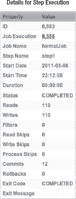

***图 9-4。** Spring Batch Admin 显示步骤*的结果

考虑到大多数 Java 开发人员对符号的熟悉程度，`PreparedStatement`符号非常有用。然而，Spring 的`JdbcTemplate`提供的命名参数方法是一种更安全的方法，也是大多数 Spring 环境中填充参数的首选方法。记住这一点，您可以通过对配置进行两个小的更新来使用这个特性:

1.  更新配置，删除您编写的`ItemPreparedStatementSetter`实现，并替换为`ItemSqlParameterSourceProvider`接口的实现。
2.  更新 SQL 以使用命名参数，而不是参数的问号。

`org.springframework.batch.item.database.ItemSqlParameterSourceProvider`接口与`ItemPreparedStatementSetter`接口略有不同，因为它不设置要执行的语句的参数。相反，`ItemSqlParameterSourceProvider`职责的一个实现是从一个项目中提取参数值，并将其作为一个`org.springframework.jdbc.core.namedparam.SqlParameterSource`对象返回。

这种方法的好处在于，它不仅是更安全的方法(不用担心需要保持 XML 文件中的 SQL 与`ItemPreparedStatementSetter`实现的代码同步),而且 Spring Batch 提供了这种接口的实现，允许您使用约定而不是代码来从项目中提取值。在这个例子中，您使用 Spring Batch 的`BeanPropertyItemSqlParameterSourceProvider`(试着说快三倍)从要填充到 SQL 中的项目中提取值。[清单 9-30](#list_9_30) 显示了这次变更的更新后的`jdbcBatchWriter`配置。

***清单 9-30。** `jdbcBatchWriter`利用`BeanPropertyItemSqlParameterSourceProvider`*

`…
<beans:bean id="jdbcBatchWriter"
  class="org.springframework.batch.item.database.JdbcBatchItemWriter">
  <beans:property name="dataSource" ref="dataSource"/>
  <beans:property name="sql" value="insert into customer (firstName, middleInitial, lastName, address, city, state, zip) values (:firstName, :middleInitial, :lastName, :address, :city, :state, :zip)"/>
  <beans:property name="itemSqlParameterSourceProvider">
    <beans:bean
      class="org.springframework.batch.item.database.
BeanPropertyItemSqlParameterSourceProvider"/>
  </beans:property>
</beans:bean>
…`

你可以很快注意到在清单 9-30 中没有对`ItemPreparedStatementSetter`实现的引用。通过使用这种配置，您不需要任何定制代码。然而结果是一样的。

尽管 JDBC 以其速度而闻名于其他基于它的持久性框架，但其他框架在企业中也很流行。接下来，您将看到如何使用最流行的工具来编写数据库:Hibernate。

#### 冬眠作家

当您已经用 Hibernate 映射了大部分数据库表和应用时，重用所有这些是开始的合理选择。在第 7 章中，你看到了 Hibernate 如何作为一个合格的读者工作。这一节将介绍如何使用`HibernateItemWriter`将更改写入数据库。

像`JdbcBatchItemWriter`，`org.springframework.batch.item.database.HibernateItemWriter`是春天的`org.springframework.orm.hibernate3.HibernateTemplate`的一层薄薄的包装纸。当一个块完成时，条目列表被传递给`HibernateItemWriter`，在那里为每个条目调用`HibernateTemplate`的`saveOrUpdate`方法。当所有的项目都被保存或更新后，`HibernateItemWriter`对`HibernateTemplate`的`flush`方法进行一次调用，立刻执行所有的更改。这个提供了类似于`JdbcBatchItemWriter`实现的批处理功能，而不直接处理 SQL。

配置`HibernateItemWriter`很简单。除了实际 ItemWriter 的配置之外，其他都应该很熟悉，因为它与您为 Hibernate 支持的 ItemReaders 所做的配置和编码是一样的。要修改`formatJob`以使用 Hibernate，您需要更新以下内容:

*   pom 需要包含 Hibernate 依赖项。
*   `Customer.java`:您使用注释来配置`Customer`对象的映射，因此您需要将它们添加到`Customer`类中。
*   `SessionFactory`:你需要配置`SessionFactory`和一个新的`TransactionManager`来支持休眠。
*   `HibernateItemWriter`:您可以使用`HibernateItemWriter`配置新的 ItemWriter。

让我们从 POM 更新开始。为了让 Hibernate 与 Spring Batch 一起工作，您需要包含 Hibernate 依赖项以及 Spring 的 ORM 支持依赖项。清单 9-31 显示了你需要添加到 POM 中的内容。

***清单 9-31。**支持休眠的 Pom 新增功能*

`…
<dependency>
  <groupId>org.hibernate</groupId>
  <artifactId>hibernate-core</artifactId>
  <version>3.3.0.SP1</version>
</dependency>
<dependency>
  <groupId>org.hibernate</groupId>
  <artifactId>hibernate-entitymanager</artifactId>
  <optional>true</optional>
  <version>3.3.2.GA</version>
</dependency>
<dependency>
  <groupId>org.hibernate</groupId>
  <artifactId>hibernate-annotations</artifactId>
  <optional>true</optional>
  <version>3.4.0.GA</version>
</dependency>
<dependency>
  <groupId>org.springframework</groupId>
  <artifactId>spring-orm</artifactId>
  <version>${spring.framework.version}</version>
</dependency>
<dependency>
  <groupId>org.springframework</groupId>
  <artifactId>spring-context-support</artifactId>
  <version>${spring.framework.version}</version>
</dependency>
…`

现在你可以开始更新`formatJob`。让我们从您需要编写的唯一代码开始:您添加到`Customer`类的注释，用于将它映射到数据库。[清单 9-32](#list_9_32) 显示了更新后的`Customer`类。

***清单 9-32。** `Customer.java`映射到客户表*

`package com.apress.springbatch.chapter9;

import java.io.Serializable;

import javax.persistence.Entity;
import javax.persistence.GeneratedValue;
import javax.persistence.GenerationType;
import javax.persistence.Id;
import javax.persistence.Table;

@Entity
@Table(name="customer")
public class Customer implements Serializable {
    private static final long serialVersionUID = 1L;

    @Id
    @GeneratedValue(strategy = GenerationType.IDENTITY)
    private long id;
    private String firstName;
    private String middleInitial;
    private String lastName;
    private String address;
    private String city;
    private String state;
    private String zip;

    // Accessors go here
    ....
}`

你在这里使用的注释和你在[第 7 章](07.html#ch7)的 ItemReader 例子中使用的注释是一样的。`Customer`类的映射非常简单，因为 Customer 表的列名与`Customer`类的列名相匹配。另一件要注意的事情是，您没有使用任何特定于 Hibernate 的注释。这里使用的所有注释都是 JPA 支持的注释，这允许您从 Hibernate 切换到任何 JPA 支持的实现，如果您选择不需要修改代码的话。

接下来，您可以继续配置`SessionFactory`。同样，这里的配置与您在第 7 章中用于 Hibernate 的 ItemReader 实现的配置相同。您在`launch-context.xml`文件中配置了`SessionFactory`和 Hibernate 支持的事务管理器。此外，将一个`hibernate.cfg.xml`文件添加到`resources`目录的根目录下。[清单 9-33](#list_9_33) 显示了您需要对`launch-context.xml`文件进行的配置更新。

***清单 9-33。** `Launch-context.xml`配置为支持休眠*

`…
<bean id="sessionFactory"
  class="org.springframework.orm.hibernate3.LocalSessionFactoryBean">
  <property name="dataSource" ref="dataSource" />
  <property name="configLocation">
    <value>classpath:hibernate.cfg.xml</value>
  </property>
  <property  name="configurationClass">
    <value>org.hibernate.cfg.AnnotationConfiguration</value>
  </property>
  <property name="hibernateProperties">
    <props>
      <prop key="hibernate.show_sql">true</prop>
      <prop key="hibernate.format_sql">true</prop>
    </props>
  </property>
</bean>

<bean id="transactionManager"
  class="org.springframework.orm.hibernate3.HibernateTransactionManager"
  lazy-init="true">
  <property name="sessionFactory" ref="sessionFactory" />
</bean>
…`

同样，这个配置应该是熟悉的，因为它与你在《T4》第七章中使用的相匹配。用`SessionFactory`开始配置。它依赖于一个`dataSource`(你回收到现在一直在用的同一个)；配置的位置，在本例中是类路径根目录下的一个`hibernate.cfg.xml`文件；和一个`configurationClass`来标识您正在使用 Hibernate 的注释支持来处理映射。最后，您希望看到正在执行的 SQL，所以您添加了一些属性来告诉 Hibernate 记录和格式化它生成的所有 SQL。

清单 9-33 中配置的第二部分是 Hibernate 的事务管理器的配置。重要的是要注意，当你使用 Hibernate 的事务管理器时，你要删除你到目前为止一直使用的那个(这包含在`launch-context.xml`中)。这允许 Spring Batch 和 Hibernate 代码使用同一个事务管理器。

`SessionFactory`配置的第二部分是在`<PROJECT_HOME>/src/main/resources`目录中添加一个`hibernate.cfg.xml`文件。[清单 9-34](#list_9_34) 显示了这个文件的内容。

***清单 9-34。**T4`hibernate.cfg.xml`*

`<!DOCTYPE hibernate-configuration PUBLIC
  "-//Hibernate/Hibernate Configuration DTD 3.0//EN"
  "http://hibernate.sourceforge.net/hibernate-configuration-3.0.dtd">

<hibernate-configuration>
  <session-factory>
    <mapping class="com.apress.springbatch.chapter9.Customer"/>
  </session-factory>
</hibernate-configuration>`

在[清单 9-34](#list_9_34) 中显示的非常简单的`hibernate.cfg.xml`文件只是用来告诉 Hibernate 在哪里寻找被标注为实体的类。

最后你可以配置`HibernateItemWriter`。鉴于其他组件和 Hibernate 框架完成了所有工作，这可能是最容易配置的 ItemWriter。`HibernateItemWriter`需要一个依赖项，有一个可选依赖项。所需的依赖项是对您之前在清单 9-31 中配置的`SessionFactory`的引用。可选依赖项(在本例中没有使用)是通过属性`hibernateTemplate`对`HibernateOperations`实现的引用。 [3](#CH-9-FN-3) 清单 9-35 显示了使用新`HibernateItemWriter`配置完成的作业配置。

***清单 9-35。** `formatJob`。使用 Hibernate 的 XML*

`<?xml version="1.0" encoding="UTF-8"?>
<beans:beans
  xmlns:beans="http://www.springframework.org/schema/beans"
  xmlns:util="http://www.springframework.org/schema/beans"
  xmlns:xsi="http://www.w3.org/2001/XMLSchema-instance"
  xsi:schemaLocation="http://www.springframework.org/schema/beans
    http://www.springframework.org/schema/beans/spring-beans-3.0.xsd
    http://www.springframework.org/schema/util
    http://www.springframework.org/schema/util/spring-util.xsd
    http://www.springframework.org/schema/batch
    http://www.springframework.org/schema/batch/spring-batch-2.1.xsd">

  <beans:import resource="../launch-context.xml"/>

  <beans:bean id="customerFile"
    class="org.springframework.core.io.FileSystemResource" scope="step">
    <beans:constructor-arg value="#{jobParameters[customerFile]}"/>
  </beans:bean>

  <beans:bean id="customerFileReader"
    class="org.springframework.batch.item.file.FlatFileItemReader">
    <beans:property name="resource" ref="customerFile"/>
    <beans:property name="lineMapper">
      <beans:bean 
       class="org.springframework.batch.item.file.mapping.DefaultLineMapper">
        <beans:property name="lineTokenizer">
          <beans:bean class="org.springframework.batch.item.file.transform.
DelimitedLineTokenizer">
            <beans:property name="names"
            value="firstName,middleInitial,lastName,address,city,state,zip"/>
            <beans:property name="delimiter" value=","/>
          </beans:bean>
        </beans:property>
        <beans:property name="fieldSetMapper">
          <beans:bean class="org.springframework.batch.item.file.mapping.
BeanWrapperFieldSetMapper">` `            <beans:property name="prototypeBeanName" value="customer"/>
          </beans:bean>
        </beans:property>
      </beans:bean>
    </beans:property>
  </beans:bean>

  <beans:bean id="customer" class="com.apress.springbatch.chapter9.Customer"
    scope="prototype"/>

  <beans:bean id="hibernateBatchWriter"
    class="org.springframework.batch.item.database.HibernateItemWriter">
    <beans:property name="sessionFactory" ref="sessionFactory"/>
  </beans:bean>

  <step id="formatStep">
    <tasklet>
      <chunk reader="customerFileReader" writer="hibernateBatchWriter"
        commit-interval="10"/>
    </tasklet>
  </step>

  <job id="formatJob">
    <step id="step1" parent="formatStep"/>
  </job>
</beans:beans>`

___________

3 这个选项很少使用。通常，它仅用于测试目的。

该任务的配置仅随着`hibernateBatchWriter`的配置及其在`formatStep`中的引用而改变。正如您之前看到的，`HibernateItemWriter`只需要引用一个`SessionFactory`，它是通过`launch-context.xml`中的配置提供的。执行该作业将返回与前面的`JdbcBatchItemWriter`示例相同的结果。

当其他框架完成所有繁重的工作时，Spring 批处理配置非常简单，如这个 Hibernate 示例所示。Hibernate 的官方规范表兄弟 JPA 是另一个可以用来写数据库的数据库访问框架。

#### jpaiemwriter

Java Persistence API (JPA)提供了非常相似的功能，并且需要与 Hibernate 完全相同的配置。与 Hibernate 一样，它在向数据库写入数据的情况下承担了繁重的工作，所以 Spring 批处理块非常小。本节介绍如何配置 JPA 来执行数据库写入。

当你看着`org.springframework.batch.item.writer.JpaItemWriter`时，它就像 JPA 的`javax.persistence.EntityManager`周围的一层薄薄的包装纸。当一个块完成时，块中的条目列表被传递给`JpaItemWriter`。编写器循环遍历列表中的条目，在所有条目保存后调用`flush`之前，对每个条目调用`EntityManager`的`merge`方法。

为了查看`JpaItemWriter`的运行情况，您使用与前面相同的客户输入，并将其插入到同一个客户表中。要将 JPA 与工作挂钩，您需要做以下四件事:

1.  添加一个`persistence.xml`文件。JPA 中的`persistence.xml`文件用于配置`EntityManager`。为了能够使用 JPA，您需要在项目中添加一个。
2.  配置`EntityManagerFactory`和 JPA 事务管理器。`EntityManagerFactory`是工作的`EntityManager`的来源。它和 JPA 支持的事务管理器是必需的。
3.  映射`Customer`类。您使用注释来配置`Customer`类到 Customer 表的映射。
4.  配置`JpaItemWriter`。最后一步是配置新的 ItemWriter 来保存作业中读取的项目。

让我们从`persistence.xml`文件开始，它显示在[清单 9-36](#list_9_36) 中。根据 JPA 规范，这个文件需要保存在名为`persistence.xml`的`<PROJECT_HOME>/src/main/resources/META-INF/`目录中。

***清单 9-36。**T4`persistence.xml`*

`<persistence
  xmlns:xsi="http://www.w3.org/2001/XMLSchema-instance"
  xsi:schemaLocation="http://java.sun.com/xml/ns/persistence
    http://java.sun.com/xml/ns/persistence/persistence_1_.xsd"
    version="1.0">

  <persistence-unit name="customer" transaction-type="RESOURCE_LOCAL">
    <class>com.apress.springbatch.chapter9.Customer</class>
  </persistence-unit>
</persistence>`

本例所需的`persistence.xml`文件非常简单。持久性单元被命名为`customer`，由应用控制事务。您有一个用注释映射的类，即`Customer`类。要开始使用 JPA，这就是一个`persistence.xml`文件所需要的全部内容。

接下来你可以用一个`EntityManagerFactory`和 Spring 的`JpaTransactionManager`来更新`launch-context.xml`文件。[清单 9-37](#list_9_37) 显示了你需要添加到一个基本`launch-context.xml`文件中来合并 JPA 组件。

***清单 9-37。**`Launch-context.xml`JPA 的更新*

`…
<bean id="entityManagerFactory"
  class="org.springframework.orm.jpa.LocalContainerEntityManagerFactoryBean">
  <property name="dataSource" ref="dataSource" />
  <property name="persistenceUnitName" value="customer" />
  <property name="jpaVendorAdapter">
    <bean
      class="org.springframework.orm.jpa.vendor.HibernateJpaVendorAdapter">
      <property name="showSql" value="true" />
    </bean>
  </property>
  <property name="jpaDialect">
    <bean class="org.springframework.orm.jpa.vendor.HibernateJpaDialect" />
  </property>
</bean>` `<bean id="transactionManager"
  class="org.springframework.orm.jpa.JpaTransactionManager">
  <property name="entityManagerFactory" ref="entityManagerFactory" />
</bean>
…`

您开始查看带有`EntityManagerFactory`的`launch-context.xml`的配置。配置 Spring 的`org.springframework.orm.jpa.LocalContainerEntityManagerFactoryBean`需要四个依赖项:

*   *数据源:*`EntityManager`用它来连接数据库。
*   *一个持久化单元名*:这为`EntityManager`定义了一组持久化类。
*   JPA 只是一个规范，就像 JDBC 或者 JavaServer Faces (JSF)一样。为了让你使用它，需要有人实现这个规范。在这个例子中，您使用的是 Hibernate 的 JPA 实现。
*   这给了你一种依赖于供应商的方式来处理 JPA 没有提供的事情(例如，访问底层数据库连接)。

接下来，您配置 Spring 的`org.springframework.orm.jpa.JpaTransactionManager`及其单一依赖项，即您刚刚配置的`EntityManagerFactory`。

JPA 难题的下一部分是将`Customer`对象映射到 Customer 表。您可以像过去一样使用注释。您之前映射`Customer`类的方式的好处在于，您为 Hibernate 示例使用了所有 JPA 注释。这允许您为 JPA 重用不变的`Customer`对象。[清单 9-38](#list_9_38) 显示了使用 JPA 注释映射的`Customer`类。

***清单 9-38。** `Customer.java`用 JPA 标注映射*

`package com.apress.springbatch.chapter9;

import java.io.Serializable;

import javax.persistence.Entity;
import javax.persistence.GeneratedValue;
import javax.persistence.GenerationType;
import javax.persistence.Id;
import javax.persistence.Table;

@Entity
@Table(name="customer")
public class Customer implements Serializable {
    private static final long serialVersionUID = 1L;

    @Id
    @GeneratedValue(strategy = GenerationType.IDENTITY)
    private long id;
    private String firstName;
    private String middleInitial;
    private String lastName;` `    private String address;
    private String city;
    private String state;
    private String zip;

    // Accessors go here
    ...
}`

清单 9-38 中的代码与[清单 9-32](#list_9_32) 中的代码相同。通过避免前一个例子中的 Hibernate 注释，您可以看到如何切换持久性框架而不需要修改代码。

配置作业使用 JPA 的最后一个方面是配置`JpaItemWriter`。它只需要一个依赖项——对`EntityManagerFactory`的引用——这样它就可以获得一个`EntityManager`来使用。[清单 9-39](#list_9_39) 显示了新 ItemWriter 的配置和更新后使用它的作业。

***清单 9-39。** `formatJob`配置为使用`JpaItemWriter`*

`...
<beans:bean id="jpaBatchWriter"
  class="org.springframework.batch.item.database.JpaItemWriter">
  <beans:property name="entityManagerFactory" ref="entityManagerFactory"/>
</beans:bean>

<step id="formatFileStep">
  <tasklet>
    <chunk reader="customerFileReader" writer="jpaBatchWriter"
      commit-interval="10"/>
  </tasklet>
</step>

<job id="formatJob">
  <step id="step1" parent="formatFileStep"/>
</job>
...`

现在，您可以通过一个快速的`mvn clean install`来构建作业。要执行这个作业，使用清单 9-40 中的命令，它会返回您在其他数据库示例中看到的结果。

***清单 9-40。**配置了 JPA 的*执行`formatJob`的命令

`java -jar itemWriters-0.0.1-SNAPSHOT.jar jobs/formatJob.xml formatJob
customerFile=/input/customer.csv`

现代企业中的关系数据库规则，不管是好是坏。如您所见，使用 Spring Batch 将作业结果写入数据库很容易。但是文件和数据库并不是 Spring Batch 提供的或者企业需要的唯一输出形式。下一节将介绍 Spring Batch 提供的各种输出选项的其他例子。

### 备选输出目标项目编写器

文件和数据库并不是传达正在处理的项目的最终结果的唯一方式。企业使用许多其他方法来存储处理后的项目。在第 7 章中，您看到了 Spring Batch 调用现有 Spring 服务来获取数据的能力。那么框架在写作端提供类似的功能就不足为奇了。Spring Batch 还用一个`JmsItemWriter`暴露了 Spring 强大的 JMS 交互。最后，如果您需要通过批处理发送电子邮件，Spring Batch 也可以处理。这一节将介绍如何调用现有的 Spring 服务，写入 JMS 目的地，以及使用提供的 Spring Batch ItemWriters 发送电子邮件。

#### item writeradadapter

在大多数使用 Spring 的企业中，有许多已经编写好并在生产中经过实战检验的现有服务。没有理由不能在您的批处理过程中重用它们。在第 7 章中，你看到了如何使用它们作为工作的输入来源。这一节介绍了`ItemWriterAdapter`如何允许您将现有的 Spring 服务用作 ItemWriters。

只不过是你所配置的服务的一层薄薄的包装。与任何其他 ItemWriter 一样，`write`方法接收要写入的项目列表。`ItemWriterAdapter`遍历列表，调用为列表中每一项配置的服务方法。需要注意的是，`ItemWriterAdapter`调用的方法只能接受正在处理的项目类型。例如，如果该步骤正在处理`Car`对象，那么被调用的方法必须接受一个类型为`Car`的参数。

要配置`ItemWriterAdapter`，需要两个依赖关系:

*   `targetObject`:包含要调用的方法的 Spring bean
*   `targetMethod`:每个项目要调用的方法

 **注意**`ItemWriterAdapter`调用的方法必须接受当前步骤正在处理的类型的单个参数。

让我们来看一个`ItemWriterAdapter`的例子。[清单 9-41](#list_9_41) 显示了将`Customer`项记录到`System.out`的服务代码。

***清单 9-41。**T4`CustomerServiceImpl.java`*

`package com.apress.springbatch.chapter9;

public class CustomerServiceImpl {

public void logCustomer(Customer cust) {
        System.out.println("I just saved " + cust);
    }
}`

正如你在[清单 9-41](#list_9_41) 中看到的，`CustomerServiceImpl`简短、甜蜜、切题。但是它符合这个例子的目的。为了让这个服务在`formatJob`中工作，您可以将其配置为新的`ItemWriterAdapter`的目标。使用你在本章其他作业中使用的相同输入配置，[清单 9-42](#list_9_42) 显示了使用`CustomerServiceImpl`的`logCustomer`方法和引用它的作业的 ItemWriter 的配置。

***清单 9-42。** `ItemWriterAdapter`配置*

`    ...
<beans:bean id="customerService"
  class="com.apress.springbatch.chapter9.CustomerServiceImpl"/>

<beans:bean id="itemWriterAdapter"
  class="org.springframework.batch.item.adapter.ItemWriterAdapter">
  <beans:property name="targetObject" ref="customerService"/>
  <beans:property name="targetMethod" value="logCustomer"/>
</beans:bean>

<step id="formatFileStep">
  <tasklet>
    <chunk reader="customerFileReader" writer="itemWriterAdapter"
      commit-interval="10"/>
  </tasklet>
</step>

<job id="formatJob">
  <step id="step1" parent="formatFileStep"/>
</job>
…`

清单 9-42 从`customerService`的配置开始。ItemWriter 是下一个`itemWriterAdapter`。它使用的两个依赖项是对`customerService`的引用和`logCustomer`方法的名称。最后，您在作业要使用的步骤中引用`itemWriterAdapter`。

要执行这个作业，您需要像所有作业一样，从命令行用一个`mvn clean install`来构建它。构建好作业后，您可以像过去一样通过执行 jar 文件来执行它。清单 9-43 中显示了这个作业的输出示例。

***清单 9-43。** `ItemWriterAdapter`输出*

* * *

`2011-03-09 22:43:56,526 DEBUG main
[org.springframework.batch.repeat.support.RepeatTemplate] - <Repeat operation
about to start at count=10>
2011-03-09 22:43:56,526 DEBUG main
[org.springframework.batch.repeat.support.RepeatTemplate] - <Repeat is
complete according to policy and result value.>
I just saved Richard N. Darrow
5570 Isabella Ave
St. Louis, IL
58540
I just saved Warren L. Darrow
4686 Mt. Lee Drive` `St. Louis, NY
94935`

* * *

如您所料，使用 Spring Batch 可以轻松地使用您在步骤中处理的项目调用现有服务。然而，如果您的服务不接受您正在处理的相同对象呢？如果您希望能够从项目中提取值并将其传递给服务，Spring Batch 可以满足您的需求。(是的，这确实是它的名字)是下一个。

#### propertiestringdelegatingitemwriter

`ItemWriterAdapter`的用例非常简单。获取正在处理的项目，并将其传递给现有的 Spring 服务。然而，软件很少这么简单。因此，Spring Batch 提供了一种机制来从项目中提取值，并将它们作为参数传递给服务。这一节着眼于`PropertyExtractingDelegatingItemWriter`以及如何在现有服务中使用它。

虽然它有一个很长的名字，`org.springframework.batch.item.adapter.PropertyExtractingDelegatingItemWriter`很像`ItemWriterAdapter`。就像`ItemWriterAdapter`一样，它在引用的 Spring 服务上调用指定的方法。不同之处在于，`PropertyExtractingDelegatingItemWriter`不是盲目地传递步骤正在处理的项目，而是只传递被请求的项目的属性。例如，如果您有一个类型为`Product`的项目，它包含数据库 id、名称、价格和 SKU 号码的字段，那么您需要像传递`ItemWriterAdapter`一样将整个`Product`对象传递给服务方法。但是使用`PropertyExtractingDelegatingItemWriter`，您可以指定只希望将数据库 id 和价格作为参数传递给服务。

作为一个例子，您可以使用您现在已经熟悉的相同的客户输入。您向`CustomerService` Impl 添加一个方法，允许您记录正在处理的`Customer`项的地址，并使用`PropertyExtractingDelegatingItemWriter`调用新方法。让我们先来看看更新后的`CustomerServiceImpl`(见[清单 9-44](#list_9_44) )。

*清单 9-44**。** `CustomerServiceImpl`同`logAddress()`*

`package com.apress.springbatch.chapter9;

public class CustomerServiceImpl {

    public void logCustomer(Customer cust) {
        System.out.println("I just saved " + cust);
    }

    public void logAddress(String address,
                           String city,
                           String state,
                           String zip) {
        System.out.println("I just saved the address:\n" + address + "\n" +
                           city + ", " + state + "\n" + zip);
    }
}`

正如您在[清单 9-44](#list_9_44) 中看到的那样，`logAddress`方法没有带`Customer`项。取而代之的是你拥有的价值观。要使用这种方法，您可以使用`PropertyExtractingDelegatingItemWriter`从每个`Customer`条目中提取地址字段(地址、城市、州和邮政编码),并使用它接收的值调用服务。要配置这个 ItemWriter，您需要在一个有序的属性列表中传递,以便从项目中提取目标对象和要调用的方法。您传入的列表与属性所需参数的顺序相同；Spring 确实支持点符号(【例如】 )以及索引属性(`e-mail[5]`)。就像`ItemWriterAdapter`一样，这个 ItemWriter 实现也公开了一个`arguments`属性，因为参数是由编写器动态提取的，所以没有使用这个属性。[清单 9-45](#list_9_45) 显示了更新后的作业调用`logAddress`方法，而不是处理整个`Customer`项目。

***清单 9-45。** `formatJob`配置为调用`CustomerServiceImpl`上的`logAddress`方法*

`    ...
<beans:bean id="parameterizedItemWriterAdapter"
  class="org.springframework.batch.item.adapter.
PropertyExtractingDelegatingItemWriter">
  <beans:property name="targetObject" ref="customerService"/>
  <beans:property name="targetMethod" value="logAddress"/>
  <beans:property name="fieldsUsedAsTargetMethodArguments"
    value="address,city,state,zip"/>
</beans:bean>

<step id="formatFileStep">
  <tasklet>
    <chunk reader="customerFileReader"
      writer="parameterizedItemWriterAdapter" commit-interval="10"/>
  </tasklet>
</step>

<job id="formatJob">
  <step id="step1" parent="formatFileStep"/>
</job>
…`

当您运行作业时，它的输出包含一个用格式化地址写入`System.out`的句子。清单 9-46 展示了一个你可以期待的输出样本。

***清单 9-46。**使用`PropertyExtractingDelegatingItemWriter`* 输出`formatJob`

* * *

`2011-03-10 22:14:46,744 DEBUG main
[org.springframework.batch.repeat.support.RepeatTemplate] - <Repeat operation
about to start at count=9>
2011-03-10 22:14:46,744 DEBUG main
[org.springframework.batch.repeat.support.RepeatTemplate] - <Repeat operation
about to start at count=10>
2011-03-10 22:14:46,745 DEBUG main
[org.springframework.batch.repeat.support.RepeatTemplate] - <Repeat is
complete according to policy and result value.>
I just saved the address:
5570 Isabella Ave
St. Louis, IL
58540
I just saved the address:
4686 Mt. Lee Drive` `St. Louis, NY
94935`

* * *

Spring Batch 提供了重用您作为 ItemWriter 创建的任何现有 Spring 服务的能力，这是有道理的。您的企业拥有的代码在生产中经过了实战测试，重用它不太可能引入新的错误，还可以加快开发时间。下一节将介绍如何使用 JMS 资源作为在一个步骤中处理的项目的目的地。

#### 网站作者

Java 消息服务(JMS)是两个或多个端点之间面向消息的通信方法。通过使用点对点通信(JMS 队列)或发布-订阅模型(JMS 主题)，Java 应用可以与能够与消息传递实现接口的任何其他技术进行通信。本节介绍如何使用 Spring Batch 的`JmsItemWriter`将消息放入 JMS 队列。

Spring 在简化一些常见的 Java 概念方面取得了很大的进步。JDBC 和与各种 ORM 框架的集成就是例子。但是 Spring 在简化 JMS 资源接口方面的工作同样令人印象深刻。为了使用 JMS，您需要使用 JMS 代理。这个例子使用了 Apache 的 ActiveMQ。

Apache ActiveMQ 是可用的最流行和最强大的开源 JMS 实现之一。它能够与许多不同的语言(Java、C、C++、C#、Ruby 等)进行交互，提供完整的 JMS 1.1 实现，并且仍然是最容易使用的消息代理之一。

在使用 ActiveMQ 之前，您需要将它的依赖项和 Spring 的 JMS 依赖项添加到 POM 中，以便它可用。这个例子使用 ActiveMQ 版本 5.4.2，这是撰写本文时的最新版本。清单 9-47 显示了你需要添加到 POM 中的依赖关系。

***清单 9-47。【ActiveMQ 和 Spring JMS 的依赖关系***

`…
<dependency>
  <groupId>org.apache.activemq</groupId>
  <artifactId>activemq-core</artifactId>
  <version>5.4.2</version>
  <exclusions>
    <exclusion>
      <groupId>org.apache.activemq</groupId>
      <artifactId>activeio-core</artifactId>
    </exclusion>
  </exclusions>
</dependency>
<dependency>
  <groupId>org.springframework</groupId>
  <artifactId>spring-jms</artifactId>
  <version>${spring.framework.version}</version>
</dependency>
…`

现在您可以开始让 ActiveMQ 工作了。但是，在开始编写代码之前，让我们先来看看这个作业的处理过程，因为它与以前略有不同。

在本章前面的例子中，你有一个单独的步骤，读入`customer.csv`文件，并使用适当的 ItemWriter 将其写出。然而，对于这个例子来说，这还不够。如果您读入项目并将它们写入 JMS 队列，您不会知道所有内容都正确地进入了队列，因为您看不到队列中有什么。相反，如图 9-5 所示，你用两个步骤来完成这项工作。第一个函数读取`customer.csv`文件，并将其写入 ActiveMQ 队列。第二步从队列中读取并将记录写出到 XML 文件中。

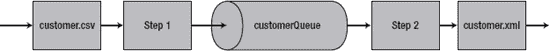

***图 9-5。**加工为`jmsFormatJob`*

需要注意的是，您不希望在实际的生产环境中这样做，因为在所有消息都被放入队列之前，不会将消息从队列中取出。根据队列的配置和可用资源，这可能会导致队列空间不足。然而，对于这个例子，考虑到您正在处理的客户数量很少，这种方法证明了这一点。

要开始使用`org.springframework.batch.item.jms.JmsItemWriter`，您需要在`launch-context.xml`中配置几个与 JMS 相关的 beans。幸运的是，春天让这变得非常容易。T3】4T5】你需要配置三种豆子:

*   这是`JmsItemWriter`的目的地。它是由 ActiveMQ 提供的队列。
*   *连接工厂:*作业需要能够获得到队列的连接(类似于到数据库的连接)。
*   *A* `JmsTemplate`:这是弹簧组件，它会帮你完成所有繁重的工作。

让我们从队列开始。尽管 ActiveMQ 提供了许多配置队列的选项，但它允许您通过 Spring 配置 JMS 队列，从而简化了启动和运行的过程。您将把队列配置为在启动时动态创建，并作为目的地。

配置好队列本身后，您可以配置连接工厂来访问它。就像队列本身一样，ActiveMQ 公开了一个允许您通过 Spring 配置连接工厂的类。为此，您需要做的就是定义一个 URL，连接工厂可以在其中找到代理。在这种情况下，您告诉它查看本地 JVM。

最后你可以创建`JmsTemplate`。这是 Spring 以一种易于使用和理解的方式公开 JMS 功能的方式。要在这里使用它，您需要提供三个依赖项:一个对连接工厂的引用、一个对队列的引用和一个超时值，该值表示读取器在侦听消息时将等待多长时间。[清单 9-48](#list_9_48) 显示了`launch-context.xml`中 JMS 资源的配置。

___________

整本书都致力于 JMS 主题，更不用说关于 Spring 与 JMS 集成主题的书了。这本书保持事情简单，以强调 Spring Batch 和 JMS 的集成。有关 Spring 和 JMS 的更多信息，请查看*Pro Spring Integration*(a press，2011)。

***清单 9-48。** JMS 资源配置在`launch-context.xml`*

`…
<bean id="destination" class="org.apache.activemq.command.ActiveMQQueue">
  <constructor-arg value="customerQueue"/>
</bean>

<bean id="jmsConnectionFactory"
  class="org.apache.activemq.ActiveMQConnectionFactory">
  <property name="brokerURL" value="vm://localhost"/>
</bean>

<bean id="jmsTemplate" class="org.springframework.jms.core.JmsTemplate">
  <property name="connectionFactory" ref="jmsConnectionFactory"/>
  <property name="defaultDestination" ref="destination"/>
  <property name="receiveTimeout" value="5000"/>
</bean>
…`

现在您可以配置作业了。在第一步中，您使用本章到目前为止所使用的同一读取器，在第二步中，您使用本章前面的 XML 示例中所使用的同一编写器。它们的配置可以在[清单 9-49](#list_9_49) 中找到。

***清单 9-49。**`jmsFormatJob`*的输入输出

`<beans:bean id="customerFile"
  class="org.springframework.core.io.FileSystemResource" scope="step">
  <beans:constructor-arg value="#{jobParameters[customerFile]}"/>
</beans:bean>

<beans:bean id="customerFileReader"
  class="org.springframework.batch.item.file.FlatFileItemReader">
  <beans:property name="resource" ref="customerFile"/>
  <beans:property name="lineMapper">
    <beans:bean 
      class="org.springframework.batch.item.file.mapping.DefaultLineMapper">
      <beans:property name="lineTokenizer">
        <beans:bean class="org.springframework.batch.item.file.transform.
DelimitedLineTokenizer">
          <beans:property name="names"
            value="firstName,middleInitial,lastName,address,city,state,zip"/>
          <beans:property name="delimiter" value=","/>
        </beans:bean>
      </beans:property>
      <beans:property name="fieldSetMapper">
        <beans:bean class="org.springframework.batch.item.file.mapping.
BeanWrapperFieldSetMapper">
          <beans:property name="prototypeBeanName" value="customer"/>
        </beans:bean>
      </beans:property>
    </beans:bean>
  </beans:property>
</beans:bean>` `<beans:bean id="customer" class="com.apress.springbatch.chapter9.Customer"
  scope="prototype"/>

<beans:bean id="outputFile"
  class="org.springframework.core.io.FileSystemResource" scope="step">
  <beans:constructor-arg value="#{jobParameters[outputFile]}"/>
</beans:bean>

<beans:bean id="xmlOutputWriter"
  class="org.springframework.batch.item.xml.StaxEventItemWriter">
  <beans:property name="resource" ref="outputFile" />
  <beans:property name="marshaller" ref="customerMarshaller" />
  <beans:property name="rootTagName" value="customers" />
</beans:bean>

<beans:bean id="customerMarshaller"
  class="org.springframework.oxm.xstream.XStreamMarshaller">
  <beans:property name="aliases">
    <util:map>
      <beans:entry key="customer"
        value="com.apress.springbatch.chapter9.Customer" />
    </util:map>
  </beans:property>
</beans:bean>
…`

`JmsReader`和`JmsWriter`的配置方式相同。它们都是基本的 Spring beans，引用了在[清单 9-48](#list_9_48) 中配置的`JmsTemplate`。在[清单 9-50](#list_9_50) 中，您可以看到`JmsItemReader`、`JmsItemWriter`的配置，以及让所有读者/作者工作的任务。

***清单 9-50。** `JmsItemReader`和`JmsItemWriter`以及使用它们的作业*

`...
<beans:bean id="jmsReader" 
  class="org.springframework.batch.item.jms.JmsItemReader">
  <beans:property name="jmsTemplate" ref="jmsTemplate"/>
</beans:bean>

<beans:bean id="jmsWriter"
  class="org.springframework.batch.item.jms.JmsItemWriter">
  <beans:property name="jmsTemplate" ref="jmsTemplate"/>
</beans:bean>

<step id="formatFileInputStep">
  <tasklet>` `    <chunk reader="customerFileReader" writer="jmsWriter"
      commit-interval="10"/>
  </tasklet>
</step>

<step id="formatFileOutputStep">
  <tasklet>
    <chunk reader="jmsReader" writer="xmlOutputWriter" commit-interval="10"/>
  </tasklet>
</step>

<job id="formatJob">
  <step id="step1" parent="formatFileInputStep" next="step2"/>
  <step id="step2" parent="formatFileOutputStep"/>
</job>
…`

这就够了！配置好所有资源后，构建和运行这个作业与您执行的任何其他作业没有什么不同。但是，当您运行这个作业时，请注意，在第二步执行之前，除了查看 JobRepository 或浏览队列之外，第一步没有输出任何明显的信息来告诉您发生了什么。当您查看步骤 2 中生成的 XML 时，可以看到消息已经成功地通过了队列，如预期的那样。清单 9-51 显示了这个作业生成的 XML 样本。

***清单 9-51。**从 JMS 版本`formatJob`输出的示例*

`<?xml version="1.0" encoding="UTF-8"?>
<customers>
<customer>
<id>0</id>
<firstName>Richard</firstName>
<middleInitial>N</middleInitial>
<lastName>Darrow</lastName>
<address>5570 Isabella Ave</address>
<city>St. Louis</city>
<state>IL</state>
<zip>58540</zip>
</customer>
<customer>
<id>0</id>
<firstName>Warren</firstName>
<middleInitial>L</middleInitial>
<lastName>Darrow</lastName>
<address>4686 Mt. Lee Drive</address>
<city>St. Louis</city>
<state>NY</state>
<zip>94935</zip>
</customer>
    ...
</customers>`

通过使用 Spring 的`JmsTemplate`，Spring Batch 以最小的工作量向批处理进程展示了 Spring JMS 处理能力的全部威力。下一节介绍一个您可能没有想到过的编写器:它允许您从批处理中发送电子邮件。

#### SimpleMailMessageItemWriter

发送电子邮件的能力听起来可能非常有用。见鬼，当一项工作完成时，收到一封电子邮件告知事情圆满结束可能会很方便。然而，这并不是这个 ItemWriter 的目的。它是一个 ItemWriter，这意味着在使用它的步骤中，它会为每个处理的项目调用一次。如果你想运行自己的垃圾邮件操作，这是你的 ItemWriter！这一节将介绍如何使用 Spring Batch 的`SimpleMailMessageItemWriter`从作业中发送电子邮件。

虽然您可能不会使用这个 ItemWriter 来编写垃圾邮件处理程序，但是您也可以将它用于其他用途。假设到目前为止您一直在处理的客户文件实际上是一个客户导入文件；导入所有新客户后，您希望向每个客户发送一封欢迎电子邮件。使用`org.springframework.batch.item.mail.SimpleMailMessageItemWriter`是一个完美的方法。

对于本例，您有一个与 JMS 示例中一样的两步流程。第一步将`customer.csv`文件导入到客户数据库表中。第二步读取所有已经导入的客户，并向他们发送欢迎电子邮件。图 9-6 显示了这项工作的流程。

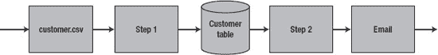

***图 9-6。**工作`customerImport`的流程*

在你开始编码之前，让我们看看`SimpleMailMessageItemWriter`。像所有其他 ItemWriter 一样，它通过执行一个接受对象列表的`write`方法来实现 item writer 接口。然而，与您到目前为止所看到的项目作者不同，`SimpleMailMessageItemWriter`不接受任何项目。发送电子邮件需要比电子邮件正文更多的信息。它需要一个主题、一个收件人地址和一个发件人地址。正因为如此，`SimpleMailMessageItemWriter`要求它接受的对象列表包含扩展 Spring 的`SimpleMailMessage`的对象。通过这样做，`SimpleMailMessageItemWriter`获得了构建电子邮件所需的所有信息。

但这是否意味着你读到的任何条目都必须扩展`SimpleMailMessage`？这似乎是将电子邮件功能从业务逻辑中分离出来的一个糟糕的工作——这就是为什么你不必这样做。如果你还记得的话，第 8 章谈到了 ItemProcessors 不需要返回他们接收到的相同类型的对象。例如，您可以接收一个`Car`对象，但返回一个类型为`House`的对象。在这种情况下，您创建一个 ItemProcessor，它接受`Customer`对象并返回所需的`SimpleMailMessage`。

为了实现这一点，您可以重用相同的输入文件格式，在末尾附加一个字段:客户的电子邮件地址。清单 9-52 显示了一个你正在处理的输入文件的例子。

***清单 9-52。**T4`customerWithEmail.csv`*

`Ann,A,Smith,2501 Mt. Lee Drive,Miami,NE,62935,ASmith@yahoo.com
Laura,B,Jobs,9542 Isabella Ave,Aurora,FL,62344,LJobs@yahoo.com
Harry,J,Williams,1909 4th Street,Seatle,TX,48548,HWilliams@hotmail.com
Larry,Y,Minella,7839 S. Greenwood Ave,Miami,IL,65371,LMinella@hotmail.com
Richard,Q,Jobs,9732 4th Street,Chicago,NV,31320,RJobs@gmail.com
Ann,P,Darrow,4195 Jeopardy Lane,Aurora,CA,24482,ADarrow@hotmail.com
Larry,V,Williams,3075 Wall Street,St. Louis,NY,34205,LWilliams@hotmail.com
Michael,H,Gates,3219 S. Greenwood Ave,Boston,FL,24692,MGates@gmail.com
Harry,H,Johnson,7520 Infinite Loop Drive,Hollywood,MA,83983,HJohnson@hotmail.com
Harry,N,Ellison,6959 4th Street,Hollywood,MO,70398,HEllison@gmail.com`

为了满足每个客户对电子邮件地址的需求，您还需要向`Customer`对象添加一个电子邮件字段。[清单 9-53](#list_9_53) 显示了更新后的`Customer`类。

***清单 9-53。** `Customer.java`用电子邮件字段更新*

`package com.apress.springbatch.chapter9;

import java.io.Serializable;

import javax.persistence.Entity;
import javax.persistence.GeneratedValue;
import javax.persistence.GenerationType;
import javax.persistence.Id;
import javax.persistence.Table;

@Entity
@Table(name="customer")
public class Customer implements Serializable {
    private static final long serialVersionUID = 1L;

    @Id
    @GeneratedValue(strategy = GenerationType.IDENTITY)
    private long id;
    private String firstName;
    private String middleInitial;
    private String lastName;
    private String address;
    private String city;
    private String state;
    private String zip;
    private String email;

    // Accessors go here
    ...
}`

因为工作是在数据库中存储客户信息，所以让我们快速地看一下交互是如何工作的。首先，[图 9-7](#fig_9_7) 有你在这个例子中使用的客户表的数据模型。

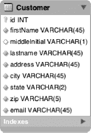

***图 9-7。**客户表*

要写入数据库，您可以像本章前面所做的那样使用`JdbcBatchItemWriter`。如果您还记得，`JdbcBatchItemWriter`依赖于三件事:一个数据源、一个准备好的语句和一个用来自`Customer`项的值填充准备好的语句的`ItemPreparedStatementSetter`接口的实现。清单 9-54 中有`CustomerItemPreparedStatementSetter`的代码。

***清单 9-54。**T4`CustomerItemPreparedStatementSetter.java`*

`package com.apress.springbatch.chapter9;

import java.sql.PreparedStatement;
import java.sql.SQLException;

import org.springframework.batch.item.database.ItemPreparedStatementSetter;

public class CustomerItemPreparedStatementSetter implements
        ItemPreparedStatementSetter<Customer> {

    public void setValues(Customer customer, PreparedStatement ps)
            throws SQLException {

        ps.setString(1, customer.getFirstName());
        ps.setString(2, customer.getMiddleInitial());
        ps.setString(3, customer.getLastName());
        ps.setString(4, customer.getAddress());
        ps.setString(5, customer.getCity());
        ps.setString(6, customer.getState());
        ps.setString(7, customer.getZip());
        ps.setString(8, customer.getEmail());

    }
}`

另一方面，在将`Customer`项导入数据库后，您需要在第二步中再次读取它们。对于这一步，你使用第 7 章中讨论过的`JdbcCursorItemReader`。和`JdbcBatchItemWriter`一样，`JdbcCursorItemReader`也依赖于一个数据源。然而，这个 ItemReader 只需要一个 SQL 语句而不是一个准备好的语句，并且它需要一个`RowMapper`实现来将返回的`ResultSet`映射到您可以处理的项目中。清单 9-55 中显示了`CustomerRowMapper`的实现。

***清单 9-55。**T4`CustomerRowMapper.java`*

`package com.apress.springbatch.chapter9;

import java.sql.ResultSet;
import java.sql.SQLException;

import org.springframework.jdbc.core.RowMapper;

public class CustomerRowMapper implements RowMapper<Customer> {` `    @Override
    public Customer mapRow(ResultSet rs, int arg1) throws SQLException {
        Customer customer = new Customer();

        customer.setAddress(rs.getString("address"));
        customer.setCity(rs.getString("city"));
        customer.setEmail(rs.getString("email"));
        customer.setFirstName(rs.getString("firstName"));
        customer.setId(rs.getLong("id"));
        customer.setLastName(rs.getString("lastName"));
        customer.setMiddleInitial(rs.getString("middleInitial"));
        customer.setState(rs.getString("state"));
        customer.setZip(rs.getString("zip"));

        return customer;
    }
}`

既然`Customer`类可以处理电子邮件，那么在连接它之前，您需要为这项工作编写一段代码。如前所述，这个任务需要一个 ItemProcessor 来将`Customer`对象转换成所需的`SimpleMailMessage`[。清单 9-56](#list_9_56) 显示了你使用的简单转换器。

***清单 9-56。**T4`CustomerEmailConverter.java`*

`package com.apress.springbatch.chapter9;

import org.springframework.batch.item.ItemProcessor;
import org.springframework.mail.SimpleMailMessage;

public class CustomerEmailConverter implements
    ItemProcessor<Customer, SimpleMailMessage> {

    private static final String EMAIL_TEMPLATE =
        "Welcome %s,\nYou were imported into the system using Spring Batch!";

    @Override
    public SimpleMailMessage process(Customer customer) throws Exception {
        SimpleMailMessage mail = new SimpleMailMessage();

        mail.setFrom("prospringbatch@gmail.com");
        mail.setTo(customer.getEmail());
        mail.setSubject("Welcome!");
        mail.setText(String.format(EMAIL_TEMPLATE,
            new Object[] {customer.getFirstName(), customer.getLastName()}));

        return mail;
    }
}`

这就是你需要编写的所有代码！然而，要编译它，您需要更新 POM 文件以包含 Java 邮件依赖项。清单 9-57 显示了构建更新项目所需的附加内容。

***清单 9-57。** Java 邮件依赖*

`…
<dependency>
    <groupId>javax.mail</groupId>
    <artifactId>mail</artifactId>
    <version>1.4</version>
</dependency>
…`

要连接所有这些，首先要配置 Spring，使其能够发送电子邮件。使用 Spring 的`org.springframework.mail.javamail.JavaMailSenderImpl`可以让您配置 SMTP 服务器的位置和适当的值。[清单 9-58](#list_9_58) 显示了这个 bean 在`launch-context.xml`中的配置。

***清单 9-58。**配置`JavaMailSenderImpl`*

`…
<bean id="javaMailSender"
  class="org.springframework.mail.javamail.JavaMailSenderImpl">
  <property name="host" value="smtp.gmail.com"/>
  <property name="port" value="587"/>
  <property name="username" value="someusername"/>
  <property name="password" value="somepassword"/>
  <property name="javaMailProperties">
    <props>
      <prop key="mail.smtp.auth">true</prop>
      <prop key="mail.smtp.starttls.enable">true</prop>
    </props>
  </property>
</bean>
…`

为了能够测试电子邮件发送功能，您使用 Google 的 Gmail SMTP 功能作为邮件服务器。清单 9-58 显示了所需的配置。您只需将用户名和密码替换为您的 Gmail 用户名和密码。 [5](#CH-9-FN-5)

接下来，您可以继续配置作业来处理新客户。要配置第一步的输入，您需要配置一个从命令行读取的资源，以及一个读入`customerWithEmail.csv`文件的`FlatFileItemReader`。步骤 1 的编写器包括前面提到的使用`dataSource`的`JdbcBatchItemWriter`，一个提供的`preparedStatement`，以及在[清单 9-54](#list_9_54) 中编码的`CustomerItemPreparedStatementSetter`。清单 9-59 显示了你如何为工作的第一步做准备。

___________

5 与企业使用的大多数 SMTP 服务器不同，本例中使用的 Gmail 服务器在发送电子邮件时会忽略邮件的`from`属性，并使用您登录时使用的帐户名称来替换它。

***清单 9-59。**步骤 1 的 ItemReader 和 itemrewriter*

`…
<beans:bean id="customerFile"
  class="org.springframework.core.io.FileSystemResource" scope="step">
  <beans:constructor-arg value="#{jobParameters[customerFile]}"/>
</beans:bean>

<beans:bean id="customerFileReader"
  class="org.springframework.batch.item.file.FlatFileItemReader">
  <beans:property name="resource" ref="customerFile"/>
  <beans:property name="lineMapper">
  <beans:bean 
    class="org.springframework.batch.item.file.mapping.DefaultLineMapper">
    <beans:property name="lineTokenizer">
      <beans:bean class="org.springframework.batch.item.file.transform.
DelimitedLineTokenizer">
        <beans:property name="names"
          value="firstName,middleInitial,lastName,address,city,state,zip,
email"/>
        <beans:property name="delimiter" value=","/>
      </beans:bean>
    </beans:property>
    <beans:property name="fieldSetMapper">
        <beans:bean class="org.springframework.batch.item.file.mapping.
BeanWrapperFieldSetMapper">
          <beans:property name="prototypeBeanName" value="customer"/>
        </beans:bean>
      </beans:property>
    </beans:bean>
  </beans:property>
</beans:bean>

<beans:bean id="customer" class="com.apress.springbatch.chapter9.Customer"
  scope="prototype"/>

<beans:bean id="jdbcBatchWriter"
  class="org.springframework.batch.item.database.JdbcBatchItemWriter">
  <beans:property name="dataSource" ref="dataSource"/>
  <beans:property name="sql" value="insert into customer (firstName, middleInitial, lastName, address, city, state, zip, email) values (?, ?, ?, ?, ?, ?, ?, ?)"/>
  <beans:property name="itemPreparedStatementSetter" 
    ref="preparedStatementSetter"/>
</beans:bean>

<beans:bean id="preparedStatementSetter"
  class="com.apress.springbatch.chapter9.
CustomerItemPreparedStatementSetter"/>
…`

清单 9-59 中的[配置不应该是新的，因为你以前已经看过了。当您配置第 2 步时，新部件就会出现。对于第 2 步，您使用一个带有您在](#list_9_59)[清单 9-55](#list_9_55) 中编码的 `CustomerRowMapper`的`JdbcCursorItemReader`，以及来自[清单 9-56](#list_9_56) 的`CustomerEmailConverter`作为 ItemProcessor，最后`SimpleMailMessageItemWriter`作为 ItemWriter。[清单 9-60](#list_9_60) 显示了步骤 2 所需的 beans 配置以及作业配置。

***清单 9-60。**步骤 2 和作业配置*

`…
<beans:bean id="customerItemReader"
  class="org.springframework.batch.item.database.JdbcCursorItemReader">
  <beans:property name="dataSource" ref="dataSource"/>
  <beans:property name="sql" value="select * from customer"/>
  <beans:property name="rowMapper" ref="customerRowMapper"/>
</beans:bean>

<beans:bean id="customerRowMapper"
  class="com.apress.springbatch.chapter9.CustomerRowMapper"/>

<beans:bean id="simpleEmailWriter"
  class="org.springframework.batch.item.mail.SimpleMailMessageItemWriter">
  <beans:property name="mailSender" ref="javaMailSender"/>
</beans:bean>

<beans:bean id="emailConverter"
  class="com.apress.springbatch.chapter9.CustomerEmailConverter"/>

<step id="importFileStep">
  <tasklet>
    <chunk reader="customerFileReader" writer="jdbcBatchWriter"
      commit-interval="10"/>
  </tasklet>
</step>

<step id="emailCustomersStep">
  <tasklet>
    <chunk reader="customerItemReader" processor="emailConverter"
      writer="simpleEmailWriter" commit-interval="10"/>
  </tasklet>
</step>

<job id="formatJob">
  <step id="step1" parent="importFileStep" next="step2"/>
  <step id="step2" parent="emailCustomersStep"/>
</job>
…`

仅此而已！您可以从命令行用`mvn clean install`构建这个任务，并使用清单 9-61 中列出的命令运行它，以处理输入文件并发送电子邮件。

***清单 9-61。**执行电子邮件作业*

`java -jar itemWriters-0.0.1-SNAPSHOT.jar jobs/emailFormatJob.xml formatJob
customerFile=/input/customerWithEmail.csv`

当工作完成时，您可以查看您的电子邮件收件箱，如图[图 9-8](#fig_9_8) 所示，查看客户是否已经成功收到他们的电子邮件。

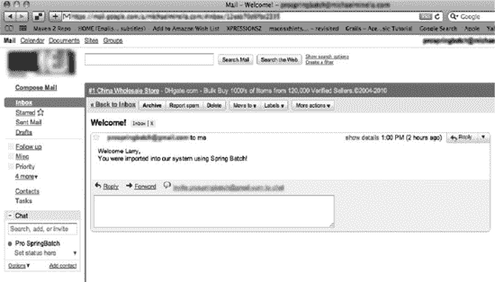

***图 9-8。**电子邮件作业的结果*

Spring Batch 提供了完整的 ItemWriters 集合来处理您需要能够处理的绝大多数输出处理。下一节将讨论如何将每个 ItemWriters 的特性结合起来使用，以处理更复杂的输出场景，比如基于多个场景写入多个位置。

### 多部分条目编写器

作为新系统的一部分，您需要将客户数据提取为两种不同的格式。销售部门的客户关系管理(CRM)应用需要一个 XML 文件。您还需要一个用于计费部门数据库导入系统的 CSV。问题是，你期望吸引一百万顾客。

使用到目前为止所讨论的工具，您将陷入两次遍历一百万个项目的困境(一次用于输出 XML 文件的步骤，另一次用于输出 CSV 文件的步骤),或者创建一个定制的 ItemWriter 实现，以便在处理项目时写入每个文件。这两个选项都不是你想要的。第一个会花费太长时间，占用资源；另一个要求你编码和测试框架应该已经提供的东西。幸运的是，确实如此。本节介绍如何使用 Spring Batch 中的各种复合 ItemWriters 来处理更复杂的输出场景。

#### multi source item writer

[第 7 章](07.html#ch7)介绍了 Spring Batch 一步读取多个相同格式文件的能力。Spring Batch 在 ItemWriter 端也提供了类似的特性。本节介绍如何根据写入文件的项数生成多个资源。

Spring Batch 提供了在处理完给定数量的记录后创建新资源的能力。假设您想提取所有的客户记录并将其写入 XML 文件，每个文件只有 10 个客户。为此，您可以使用`MultiResourceItemWriter`。

`MultiResourceItemWriter`根据已处理的记录数量动态创建输出资源。它将处理的每个项目传递给一个委托编写器，以便在那里处理实际的编写部分。所有的`MultiResourceItemWriter`负责维护当前的计数，并在处理项目时创建新的资源。[图 9-9](#fig_9_9) 显示了使用`org.springframework.batch.item.file.MultiResourceItemWriter`的一个步骤的流程。

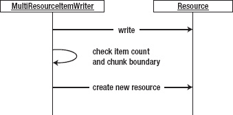

***图 9-9。**加工使用`MultiResourceItemWriter`*

当调用`MultiResourceItemWriter`上的`write`方法时，它验证当前资源是否已经创建并打开(如果没有，它创建并打开一个新文件),并将项目传递给委托 ItemWriter。写入项目后，它会检查写入文件的项目数量是否达到了为新资源配置的阈值。如果有，当前文件被关闭。

需要注意的是，当`MultiResourceItemWriter`正在处理时，它不会在中间创建新的资源。在创建新资源之前，它会等待块的末尾。例如，如果编写器被配置为在处理了 15 个项目之后滚动文件，但是块大小被配置为 20，`MultiResourceItemWriter`在创建新资源之前在块中写入 20 个项目。

`MultiResourceItemWriter`有五个可以配置的依赖项。[表 9-4](#tab_9_4) 显示了每一项及其使用方法。

***表 9-4。** `MultiResourceItemWriter`配置选项*

<colgroup><col align="left" valign="top" width="25%"> <col align="left" valign="top" width="25%"> <col align="left" valign="top" width="20%"> <col align="left" valign="top" width="27%"></colgroup> 
| **选项** | **类型** | **默认** | **描述** |
| :-- | :-- | :-- | :-- |
| `delegate` | `ResourceAwareItemWriterItemStream` | `null`(必需) | `MultiResourceItemWriter`用来写每一项的委托 ItemWriter。 |
| `itemCountLimitPerResource` | `int` | `Integer.MAX_VALUE` | 要写入每个资源的项目数。 |
| `resource` | `Resource` | `null`(必需) | 由`MultiResourceItemWriter`创建的资源原型。 |
| `resourceSuffixCreator` | `ResourceSuffix
Creator` | `null` | 可选地，`MultiResourceItemWriter`可以使用这个类在它创建的文件名后面附加一个后缀。 |
| `saveState` | `Boolean` | `true` | 如果为`false`，则 ItemWriter 的状态不会在 JobRepository 中维护。 |

要了解这是如何工作的，您需要从数据库中提取客户并创建 XML 文件，每个文件包含 10 个客户。要实现这一点，您不需要开发任何新代码(您创建了 XML)。你需要做的就是把所有东西都连接起来。让我们从查看作业的配置开始这个示例。

清单 9-62 显示了本例中 ItemReader 的配置。在这种情况下，只需简单地将`JdbcCursorItemReader`配置为选择所有客户。从那里，您将从数据库接收的客户传递给下一步配置的 ItemWriter。

***清单 9-62。**`multiResource``formatJob`的 ItemReader*

`…
<beans:bean id="customerItemReader"
  class="org.springframework.batch.item.database.JdbcCursorItemReader">
  <beans:property name="dataSource" ref="dataSource"/>
  <beans:property name="sql" value="select * from customer"/>
  <beans:property name="rowMapper" ref="customerRowMapper"/>
</beans:bean>

<beans:bean id="customerRowMapper"
  class="com.apress.springbatch.chapter9.CustomerRowMapper"/>
…`

此 ItemWriter 的配置位于层中。首先，配置用于 XML 生成的`StaxEventItemWriter`。配置好之后，你在顶层放置`MultiResourceItemWriter`来生成`StaxEventItemWriter`写入的多个资源。[列表 9-63](#list_9_63) 显示了工作输出一半的配置以及步骤和工作配置。

***清单 9-63。**条目编写者和步骤及作业配置*

`...
<beans:bean id="outputFile"
  class="org.springframework.core.io.FileSystemResource" scope="step">
  <beans:constructor-arg value="#{jobParameters[outputFile]}"/>
</beans:bean>

<beans:bean id="xmlOutputWriter"` `  class="org.springframework.batch.item.xml.StaxEventItemWriter">
  <beans:property name="marshaller" ref="customerMarshaller" />
  <beans:property name="rootTagName" value="customers" />
</beans:bean>

<beans:bean id="customerMarshaller"
  class="org.springframework.oxm.xstream.XStreamMarshaller">
  <beans:property name="aliases">
    <util:map>
      <beans:entry key="customer"
        value="com.apress.springbatch.chapter9.Customer" />
    </util:map>
  </beans:property>
</beans:bean>

<beans:bean id="multiResourceItemWriter"
  class="org.springframework.batch.item.file.MultiResourceItemWriter">
  <beans:property name="resource" ref="outputFile"/>
  <beans:property name="delegate" ref="xmlOutputWriter"/>
  <beans:property name="itemCountLimitPerResource" value="10"/>
</beans:bean>

<step id="formatFileStep">
  <tasklet>
    <chunk reader="customerItemReader" writer="multiResourceItemWriter"
      commit-interval="10"/>
  </tasklet>
</step>

<job id="formatJob">
  <step id="step1" parent="formatFileStep"/>
</job>
…`

正如您之前看到的，这个作业的输出配置从`outputFile`配置开始。虽然文件是由`MultiResourceItemWriter`生成的，`MultiResourceItemWriter`用它作为每个新文件的模板(具体是文件位置和文件名)。在这种情况下，清单 9-63 中的`outputFile` bean 充当输出文件定义的模板。配置好文件名后，您可以根据需要配置`xmlOutputWriter`和`customerMarshaller`来生成 XML。虽然类似，但需要注意的是`xmlOutputWriter`没有对输出文件的直接引用。相反，`multiResourceItemWriter`在需要的时候提供。

在这个例子中，`multiResourceItemWriter`使用了三个依赖项:您之前配置的资源，对它创建的文件进行实际写入工作的`xmlOutputWriter`，以及 ItemWriter 为每个文件写入的客户数量(`itemCountLimitPerResource` )—在本例中为 10。这项工作的最后一部分是配置步骤和工作，以便使用它们。作业本身的配置很简单，如清单 9-63 所示。要使用这项工作，您可以使用清单 9-64 中的[命令。](#list_9_64)

***清单 9-64。**用于执行`multiResource`工作*的命令

`java -jar itemWriters-0.0.1-SNAPSHOT.jar jobs/multiResourceFormatJob.xml
formatJob outputFile=/output/custOutputs`

当您查看这个作业的输出时，您会发现在`/output`目录中，数据库中当前加载的每 10 个客户就有一个文件。但是，春批做了一件有趣的事情。首先，请注意，您没有在传递给作业的`outputFile`参数上传递文件扩展名。这是有原因的。如果您查看清单 9-65 中的目录清单，您会看到`MultiResourceItemWriter`为每个文件添加了一个`.X`，其中 *X* 是被创建文件的编号。

***清单 9-65。**作业创建的文件名*

* * *

`michael-minellas-macbook-pro:temp mminella$ ls /output/
custOutputs.1custOutputs.2custOutputs.4custOutputs.6custOutputs.8
custOutputs.10  custOutputs.3custOutputs.5custOutputs.7custOutputs.9`

* * *

尽管您需要区分每个文件名是有意义的，但对于如何命名文件，这可能是也可能不是一个可行的解决方案(默认情况下，它们不能用您最喜欢的编辑器很好地打开)。因此，Spring Batch 允许您为创建的每个文件配置后缀。您可以通过实现`org.springframework.batch.item.file.ResourceSuffixCreator`接口并将其作为依赖项添加到`multiResourceItemWriter` bean 来实现。当`MultiResourceItemWriter`创建一个新文件时，它使用`ResourceSuffixCreator`生成一个后缀，附加在新文件名的末尾。[清单 9-66](#list_9_66) 显示了例子中的后缀创建器。

***清单 9-66。**T4`CustomerOutputFileSuffixCreator`*

`package com.apress.springbatch.chapter9;

import org.springframework.batch.item.file.ResourceSuffixCreator;

public class CustomerOutputFileSuffixCreator implements ResourceSuffixCreator {

    @Override
    public String getSuffix(int arg0) {
        return arg0 + ".xml";
    }
}`

在[清单 9-66](#list_9_66) 中，您实现了`ResourceSuffixCreator`的唯一方法`getSuffix`，并返回所提供数字的后缀和一个`.xml`扩展名。提供的编号是正在创建的编号文件。如果您要重新创建与默认扩展名相同的扩展名，您将返回一个点加上所提供的数字。

要使用`CustomerOutputFileSuffixCreator`，需要将其配置为一个 bean，并使用属性`resourceSuffixCreator`将其作为依赖项添加到`multiResourceItemWriter` bean 中。[清单 9-67](#list_9_67) 显示了添加的配置。

***清单 9-67。**配置`CustomerOutputFileSuffixCreator`*

`…
<beans:bean id="customerSuffixCreator"
  class="com.apress.springbatch.chapter9.CustomerOutputFileSuffixCreator"/>

<beans:bean id="multiResourceItemWriter"
  class="org.springframework.batch.item.file.MultiResourceItemWriter">
  <beans:property name="resource" ref="outputFile"/>` `  <beans:property name="delegate" ref="xmlOutputWriter"/>
  <beans:property name="itemCountLimitPerResource" value="10"/>
  <beans:property name="resourceSuffixCreator" ref="customerSuffixCreator"/>
</beans:bean>
…`

通过使用[清单 9-67](#list_9_67) 中提供的额外配置再次运行该作业，您会得到稍微不同的结果，如[清单 9-68](#list_9_68) 所示。

***清单 9-68。**结果使用`ResourceSuffixCreator`*

* * *

`michael-minellas-macbook-pro:output mminella$ ls /output/
custOutputs1.xml      custOutputs2.xml    custOutputs4.xml    custOutputs6.xml
custOutputs8.xml
custOutputs10.xml    custOutputs3.xml    custOutputs5.xml    custOutputs7.xml
custOutputs9.xml`

* * *

你肯定同意清单 9-68 中的文件名更像你在生成 XML 文件时所期望的。

##### 页眉和页脚 XML 片段

创建文件时，无论是步骤/作业的单个文件，还是您在前面的示例中看到的多个文件，通常都需要能够在文件上生成页眉或页脚。您可以使用标题来定义平面文件的格式(文件中存在哪些字段或以什么顺序存在)，或者在 XML 文件中包含一个单独的、与项目无关的部分。页脚可以包括文件中处理的记录数或总数，以便在文件处理后进行完整性检查。这一节将介绍如何使用 Spring Batch 的回调函数来生成页眉和页脚记录。

当打开或关闭文件时，Spring Batch 提供了向文件添加页眉或页脚(视情况而定)的能力。根据文件是平面文件还是 XML 文件，向文件添加页眉或页脚有不同的含义。对于平面文件，添加标题意味着在文件的顶部或底部添加一条或多条记录。对于 XML 文件，您可能希望在文件的顶部或底部添加一个 XML 段。因为为平面文件生成纯文本不同于为 XML 文件生成 XML 段，所以 Spring Batch 提供了两个不同的接口来实现这一点。让我们从查看 XML 回调接口`org.springframework.batch.item.xml.StaxWriterCallback`开始。

`StaxWriterCallback`接口由一个单独的`write`方法组成，用于将 XML 添加到当前的 XML 文档中。Spring Batch 在文件的头部或尾部执行一次配置好的回调(基于配置)。为了了解这是如何工作的，在本例中，您编写了一个`StaxWriterCallback`实现，它添加了一个 XML 片段，其中包含了写作业的人(我)的名字。清单 9-69 显示了实现的代码。

***清单 9-69。**T4`CustomerXmlHeaderCallback`*

`package com.apress.springbatch.chapter9;

import java.io.IOException;

import javax.xml.stream.XMLEventFactory;
import javax.xml.stream.XMLEventWriter;` `import javax.xml.stream.XMLStreamException;

import org.springframework.batch.item.xml.StaxWriterCallback;

public class CustomerXmlHeaderCallback implements StaxWriterCallback {

    @Override
    public void write(XMLEventWriter writer) throws IOException {
        XMLEventFactory factory = XMLEventFactory.newInstance();

        try {
            writer.add(factory.createStartElement("", "", "identification"));
            writer.add(factory.createStartElement("", "", "author"));
            writer.add(factory.createAttribute("name", "Michael Minella"));
            writer.add(factory.createEndElement("", "", "author"));
            writer.add(factory.createEndElement("", "", "identification"));
        } catch (XMLStreamException xmlse) {
            System.err.println("An error occured: " + xmlse.getMessage());
            xmlse.printStackTrace(System.err);
        }
    }
}`

清单 9-69 显示了`CustomerXmlHeaderCallback`。在回调中，向 XML 文件添加两个标记:一个标识部分和一个作者部分。作者部分包含一个名为`name`的属性，其值为`Michael Minella`。要创建一个标签，可以使用`javax.xml.stream.XMLEventFactory`的`createStartElement`和`createEndElement`方法。这些方法中的每一个都有三个参数:前缀、名称空间和标记名。因为没有使用前缀或名称空间，所以为它们传入空字符串。要使用这个实现，您需要配置`StaxEventItemWriter`来调用回调作为`headerCallback`。清单 9-70 显示了这个例子的配置。

***清单 9-70。** XML 配置为`CustomerXmlHeaderCallback`*

`...
<beans:bean id="xmlOutputWriter"
  class="org.springframework.batch.item.xml.StaxEventItemWriter">
  <beans:property name="marshaller" ref="customerMarshaller" />
  <beans:property name="rootTagName" value="customers" />
  <beans:property name="headerCallback" ref="customerHeaderCallback"/>
</beans:bean>

<beans:bean id="customerHeaderCallback"
  class="com.apress.springbatch.chapter9.CustomerXmlHeaderCallback"/>
...`

当您使用[清单 9-70](#list_9_70) 中的标题配置执行前一个示例中的多源作业时，每个输出文件都以如[清单 9-71](#list_9_71) 中所示的 XML 片段开始。

***清单 9-71。** XML 头*

`<?xml version="1.0" encoding="UTF-8"?>
<customers>
<identification>
<author name="Michael Minella"/>
</identification>
<customer>
    ...`

如您所见，在 XML 文件的开头或结尾添加 XML 片段非常容易。实现`StaxWriterCallback`接口并配置 ItemWriter，将其作为页眉或页脚调用，就大功告成了！

##### 平面文件中的页眉和页脚记录

接下来，您可以看看如何向平面文件添加页眉和页脚。与使用相同接口生成 XML 页眉和页脚不同，在平面文件中编写页眉需要实现与页脚不同的接口。对于 header，您实现了`org.springframework.batch.item.file.FlatFileHeaderCallback`接口；对于页脚，您实现了`org.springframework.batch.item.file.FlatFileFooterCallback`接口。两者都由一个方法组成:分别是`writeHeader`和`writeFooter`。让我们看看如何编写一个页脚，它记录了当前文件中已处理的记录数。

对于这个例子，您使用`MultiResourceItemWriter`来编写文件，每个文件中有 10 个格式化的记录，外加一个页脚记录，说明每个文件中写入了多少个记录。为了能够记录已经写入文件的项数，需要用适当的功能来修饰编写器。[图 9-10](#fig_9_10) 显示了示例所需的 ItemWriters 的分层。

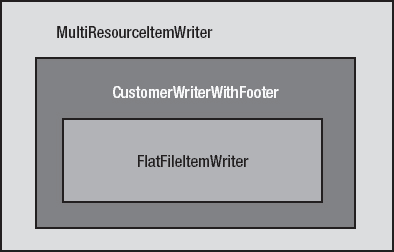

***图 9-10。**使用多层项目编辑器完成页脚的编写*

如图[图 9-10](#fig_9_10) 所示，在这个例子中承担重任的作者是一个普通的`FlatFileItemWriter`。但是您用自己的实现来修饰 ItemWriter，该实现跟踪已经编写的条目的数量，并实现了`FlatFileFooterCallback`接口。最后，您使用`MultiResourceItemWriter`来创建所需的资源。

因为您需要为这个示例编写的唯一代码是`CustomerWriterWithFooter`类，所以您可以从那里开始。这个类实现了两个接口:`FlatFileFooterCallback`和`org.springframework.batch.item.file.ResourceAwareItemWriterItemStream`。您实现了`FlatFileFooterCallback`，这样您就可以在编写条目时使用编译的数据来编写页脚。实现了`ResourceAwareItemWriterItemStream`接口，因此`MultiResourceItemWriter`可以在创建 ItemWriter 时将资源注入其中。如果您不使用这个接口，您将被要求在启动时注入一个单独的资源，这不是您所需要的。实际上，`ResourceAwareItemWriterItemStream`接口所需的方法只是传递给它所包装的`FlatFileItemWriter`。[清单 9-72](#list_9_72) 显示了`CustomerWriterWithFooter`类的实现。

***清单 9-72。**`CustomerWriterWithFooter`T5】*

`package com.apress.springbatch.chapter9;

import java.io.IOException;
import java.io.Writer;
import java.util.List;

import org.springframework.batch.item.ExecutionContext;
import org.springframework.batch.item.ItemStreamException;
import org.springframework.batch.item.file.FlatFileFooterCallback;
import org.springframework.batch.item.file.ResourceAwareItemWriterItemStream;
import org.springframework.core.io.Resource;

public class CustomerWriterWithFooter implements
    ResourceAwareItemWriterItemStream<Customer>, FlatFileFooterCallback {

    private ResourceAwareItemWriterItemStream<Customer> delegate;
    private int itemsProcessedSoFar = 0;

    @Override
    public void writeFooter(Writer writer) throws IOException {
        writer.write("At the end of this file, you have written " +
                     itemsProcessedSoFar + " items");
    }

    @Override
    public void write(List<? extends Customer> items) throws Exception {
        itemsProcessedSoFar += items.size();

        delegate.write(items);
    }

    public void setDelegate(
        ResourceAwareItemWriterItemStream<Customer> delegate) {
        this.delegate = delegate;
    }

    @Override
    public void close() throws ItemStreamException {
        delegate.close();
    }

    @Override
    public void open(ExecutionContext executionContext)
        throws ItemStreamException {
        if(executionContext.containsKey(“records.processed”)) {
            itemsProcessedSoFar = Integer.parseInt(executionContext
                                       .get(“records.processed”).toString());
        }` `        delegate.open(executionContext);
    }

    @Override
    public void update(ExecutionContext executionContext)
        throws ItemStreamException {
        executionContext.put("records.processed", itemsProcessedSoFar);
        delegate.update(executionContext);
    }

    @Override
    public void setResource(Resource arg0) {
        itemsProcessedSoFar = 0;
        delegate.setResource(arg0);
    }
}`

正如你在[清单 9-72](#list_9_72) 中看到的，当一个资源被设置在 ItemWriter 上时，计数器(`itemsProcessedSoFar`)被设置为 0。当通过`write`方法写入项目时，计数器相应地递增。当调用`writeFooter`方法时，在页脚输出中使用计数器来列出正在关闭的文件中的记录数。

在这个实现中，还有另外三种方法需要注意:`open`、`update`和`close`。`open`和`update`方法最终不仅仅是使这个 ItemWriter 可重启的传递。因为 ItemWriter 有自己的状态(当前文件中已处理的记录数)，所以您希望将其保存在`ExecutionContext`中，以防作业失败。`update`方法用于在处理过程中保存该值。`open`方法用于在作业重启时重置您停止的位置。`close`方法只作为代理的一个通道，这样它就可以根据需要关闭文件。

为了配置本例所需的各种 ItemWriters，[清单 9-73](#list_9_73) 显示了所需的 XML。从输入开始，从 customer 表中读取客户记录。从这里，您可以配置三个 ItemWriter 实现。第一个是`FlatFileItemWriter`及其所需的`LineAggregator`。在那里，您配置`customerWriter`，它是清单 9-72 中 ItemWriter 的实现(`ResourceAwareItemReaderItemStream`是 ItemReader 接口的子接口)。最后，您有了之前使用过的`multiResourceItemWriter`。[清单 9-73](#list_9_73) 完成步骤和作业的配置。

***清单 9-73。**T4`customerFooterFormatJob.xml`*

`<?xml version="1.0" encoding="UTF-8"?>
<beans:beans
  xmlns:beans="http://www.springframework.org/schema/beans"
  xmlns:util="http://www.springframework.org/schema/beans"
  xmlns:xsi="http://www.w3.org/2001/XMLSchema-instance"
  xsi:schemaLocation="http://www.springframework.org/schema/beans
    http://www.springframework.org/schema/beans/spring-beans-3.0.xsd
    http://www.springframework.org/schema/util
    http://www.springframework.org/schema/util/spring-util.xsd
    http://www.springframework.org/schema/batch
    http://www.springframework.org/schema/batch/spring-batch-2.1.xsd">

  <beans:import resource="../launch-context.xml"/>` `<beans:bean id="customerItemReader"
    class="org.springframework.batch.item.database.JdbcCursorItemReader">
    <beans:property name="dataSource" ref="dataSource"/>
    <beans:property name="sql" value="select * from customer"/>
    <beans:property name="rowMapper" ref="customerRowMapper"/>
  </beans:bean>

  <beans:bean id="customerRowMapper"
    class="com.apress.springbatch.chapter9.CustomerRowMapper"/>

  <beans:bean id="outputFile"
    class="org.springframework.core.io.FileSystemResource" scope="step">
    <beans:constructor-arg value="#{jobParameters[outputFile]}"/>
  </beans:bean>

  <beans:bean id="flatFileOutputWriter" 
    class="org.springframework.batch.item.file.FlatFileItemWriter">
    <beans:property name="lineAggregator" ref="formattedLineAggregator"/>
    <beans:property name="appendAllowed" value="true"/>
    <beans:property name="footerCallback" ref="customerWriter"/>
  </beans:bean>

  <beans:bean id="formattedLineAggregator"
    class="org.springframework.batch.item.file.transform.
FormatterLineAggregator">
    <beans:property name="fieldExtractor">
      <beans:bean class="org.springframework.batch.item.file.transform.
BeanWrapperFieldExtractor">
        <beans:property name="names" 
          value="firstName,lastName,address,city,state,zip"/>
      </beans:bean>
    </beans:property>
    <beans:property name="format" value="%s %s lives at %s %s in %s, %s."/>
  </beans:bean>

  <beans:bean id="customerWriter" 
    class="com.apress.springbatch.chapter9.CustomerWriterWithFooter">
    <beans:property name="delegate" ref="flatFileOutputWriter"/>
  </beans:bean>

  <beans:bean id="multiResourceItemWriter"
    class="org.springframework.batch.item.file.MultiResourceItemWriter">
    <beans:property name="resource" ref="outputFile"/>
    <beans:property name="delegate" ref="customerWriter"/>
    <beans:property name="itemCountLimitPerResource" value="10"/>
  </beans:bean>

  <step id="formatFileStep">
    <tasklet>
      <chunk reader="customerItemReader" writer="multiResourceItemWriter"
        commit-interval="10"/>
    </tasklet>` `  </step>

  <job id="formatJob">
    <step id="step1" parent="formatFileStep"/>
  </job>
</beans:beans>`

使用`MultiResourceItemWriter`可以很容易地根据每个文件的记录数写入多个文件。Spring 添加页眉和/或页脚记录的能力也通过使用适当的接口和配置以简单实用的方式进行管理。下一节将介绍如何在不添加任何代码的情况下将同一项写入多个编写器。

#### 作曲者

虽然看起来不像，但是到目前为止，你在本章中复习的例子都很简单。一个步骤写入单个输出位置。该位置可能是数据库、文件、电子邮件等等，但是它们都写入了一个端点。然而，事情并不总是那么简单。企业可能需要写入 web 应用使用的数据库以及数据仓库。在处理项目时，可能需要记录各种业务指标。Spring Batch 允许您在处理一个步骤中的每个项目时写入多个位置。这一节看一下`CompositeItemWriter`如何让一个步骤向多个 ItemWriters 写入条目。

像 Spring Batch 中的大多数东西一样，为您处理的每个项目调用多个 ItemWriters 的能力非常容易。不过，在开始编写代码之前，让我们先来看看用同一项向多个 ItemWriters 写入的流程。[图 9-11](#fig_9_11) 显示了该过程的顺序图。

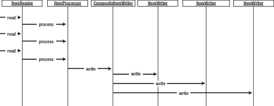

***图 9-11。**向多个项目写入器写入的顺序图*

如[图 9-11](#fig_9_11) 所示，读入一次发生一个，加工也是如此。然而，该图还显示，正如您所预期的那样，写入是以块的形式发生的，按照当前块中项目的配置顺序调用每个 ItemWriter。

为了查看这个特性是如何工作的，您创建了一个作业，它从本章前面的`customerWithEmail.csv`文件中读取数据。让我们从输入开始。[清单 9-74](#list_9_74) 显示了在`customerWithEmail.csv`文件中读取的配置。

***清单 9-74。**在`customerWithEmail.csv`文件中读取*

`...
<beans:bean id="customerFile"
  class="org.springframework.core.io.FileSystemResource" scope="step">
  <beans:constructor-arg value="#{jobParameters[customerFile]}"/>
</beans:bean>

<beans:bean id="customerFileReader"
  class="org.springframework.batch.item.file.FlatFileItemReader">
  <beans:property name="resource" ref="customerFile"/>
  <beans:property name="lineMapper">
    <beans:bean
      class="org.springframework.batch.item.file.mapping.DefaultLineMapper">
      <beans:property name="lineTokenizer">
        <beans:bean class="org.springframework.batch.item.file.transform.
DelimitedLineTokenizer">
          <beans:property name="names"
            value="firstName,middleInitial,lastName,address,city,state,zip,
email"/>
          <beans:property name="delimiter" value=","/>
        </beans:bean>
      </beans:property>
      <beans:property name="fieldSetMapper">
        <beans:bean class="org.springframework.batch.item.file.mapping.
BeanWrapperFieldSetMapper">
          <beans:property name="prototypeBeanName" value="customer"/>
        </beans:bean>
      </beans:property>
    </beans:bean>
  </beans:property>
</beans:bean>

<beans:bean id="customer" class="com.apress.springbatch.chapter9.Customer"
  scope="prototype"/>
...`

清单 9-74 中没有什么是不熟悉的。您使用的输入文件与本章前面的例子中使用的相同。该配置由文件引用(`Resource`)、使用`DelimitedLineTokenizer`和`BeanWrapperFieldSetMapper`读取文件的`FlatFileItemReader`的配置以及根据需要创建它们的对`Customer` bean 的引用组成。

在输出端，您需要创建三个 item writer:XML writer 及其依赖项，JDBC writer 及其依赖项，以及包装其他两个 writer 的`CompositeItemWriter`。[清单 9-75](#list_9_75) 显示了该步骤的输出配置以及该步骤和作业的配置。

***清单 9-75。**输出、步进和工作配置*

`...
<beans:bean id="outputFile"
  class="org.springframework.core.io.FileSystemResource" scope="step">` `<beans:constructor-arg value="#{jobParameters[outputFile]}"/>
</beans:bean>

<beans:bean id="xmlOutputWriter"
  class="org.springframework.batch.item.xml.StaxEventItemWriter">
  <beans:property name="resource" ref="outputFile" />
  <beans:property name="marshaller" ref="customerMarshaller" />
  <beans:property name="rootTagName" value="customers" />
</beans:bean>

<beans:bean id="customerMarshaller"
  class="org.springframework.oxm.xstream.XStreamMarshaller">
  <beans:property name="aliases">
    <util:map>
      <beans:entry key="customer"
        value="com.apress.springbatch.chapter9.Customer" />
    </util:map>
  </beans:property>
</beans:bean>

<beans:bean id="jdbcBatchWriter"
  class="org.springframework.batch.item.database.JdbcBatchItemWriter">
  <beans:property name="dataSource" ref="dataSource"/>
  <beans:property name="sql" value="insert into customer (firstName, middleInitial, lastName, address, city, state, zip, email) values (?, ?, ?, ?, ?, ?, ?, ?)"/>
  <beans:property name="itemPreparedStatementSetter"
    ref="preparedStatementSetter"/>
</beans:bean>

<beans:bean id="preparedStatementSetter"
  class="com.apress.springbatch.chapter9.
CustomerItemPreparedStatementSetter"/>

<beans:bean id="customerCompositeWriter"
  class="org.springframework.batch.item.support.CompositeItemWriter">
  <beans:property name="delegates">
    <util:list>
      <util:ref bean="xmlOutputWriter"/>
      <util:ref bean="jdbcBatchWriter"/>
    </util:list>
  </beans:property>
</beans:bean>

<step id="formatFileStep">
  <tasklet>
    <chunk reader="customerFileReader" writer="customerCompositeWriter"
      commit-interval="10"/>
  </tasklet>
</step>

<job id="formatJob">
  <step id="step1" parent="formatFileStep"/>` `</job>
…`

ItemWriters 的配置与您预期的差不多。您从输出文件(`outputFile`)的配置开始配置。从这里开始，您使用的 XML 编写器(`xmlOutputWriter`)按照本章前面的例子进行配置。接下来是 JDBC ItemWriter，它配置了准备好的语句和一个用于将值设置到`PreparedStatement`上的`ItemPreparedStatementSetter`。最后你得到了`CompositeItemWriter`的定义(`customerCompositeWriter`)。对于`customerCompositeWriter`，您为包装器配置一个 ItemWriters 列表以供调用。需要注意的是，ItemWriters 是按照块中所有项目的配置顺序调用的。因此，如果一个块中有 10 个项目，那么调用第一个 ItemWriter 时会包含所有 10 个项目，然后是下一个 ItemWriter，依此类推。需要注意的是，虽然写操作是串行执行的(一次一个写操作)，但是所有 ItemWriters 上的所有写操作都发生在同一个事务中。因此，如果一个条目在块中的任何一点写入失败，整个块都将被回滚。

当您按照通过命令`java -jar itemWriters-0.0.1-SNAPSHOT.jar jobs/formatJob.xml formatJob customerFile=/input/customerWithEmail.csv outputFile=/output/xmlCustomer.xml`配置的方式运行这个作业时，您可以看到输出包含所有写入数据库和 XML 文件的记录。您可能会认为，如果文件中有 100 个客户，Spring Batch 会认为这是 200 次写入。但是如果你看看 JobRepository 中记录的 Spring Batch，它说执行了 100 次写操作，如图 9-12 所示。

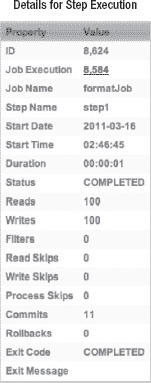

***图 9-12。**春季批量写 100 个客户的管理记录*

理由是 Spring Batch 正在计算被写入的项目数。它不在乎你写了多少个地方。如果作业失败，重启点取决于您读取和处理了多少项，而不是您向每个位置写入了多少项(因为无论如何这些都会回滚)。

`CompositeItemWriter`使得将所有项目写入多个位置变得容易。但是有时候你想把一些东西写到一个地方，一些东西写到另一个地方。本章中你看到的最后一个 ItemWriter 是`ClassifierCompositeItemWriter`，它处理的就是这个。

#### ClassifierCompositeItemWriter

在第 7 章中，您看到了一个包含多种记录类型的文件的场景。处理将不同类型的行映射到不同的解析器和映射器的能力，从而使每一行都最终出现在正确的对象中，这不是一项简单的任务。但在写作方面，Spring Batch 让生活变得轻松了一些。这一节看看`ClassifierCompositeItemWriter`如何让你根据预先确定的标准选择在哪里写条目。

`org.springframework.batch.item.support.ClassifierCompositeItemWriter`用于查看不同类型的项目，确定它们应该写入哪个 ItemWriter，并相应地转发它们。这个功能基于两件事:`ClassifierCompositeItemWriter`和一个`org.springframework.batch.classify.Classifier`接口的实现。我们先来看一下`Classifier`界面。

清单 9-76 中显示的`Classifier`接口由一个方法`classify`组成。在`ClassifierCompositeItemWriter`使用`Classifier`实现的情况下，`classify`方法接受一个条目作为输入，并返回 ItemWriter 来写入条目。本质上，`Classifier`实现充当了一个上下文，而 ItemWriters 则充当了策略实现。

***清单 9-76。**`Classifier`界面*

`package org.springframework.batch.classify;

public interface Classifier<C, T> {

    T classify(C classifiable);
}`

`ClassifierCompositeItemWriter`接受一个单一的依赖，一个`Classifier`接口的实现。在处理每个项目时，它从那里获取每个项目所需的 ItemWriter。

与常规的将所有条目写入所有条目编写器的`CompositeItemWriter`不同，`ClassifierCompositeItemWriter`最终会将不同数量的条目写入每个条目编写器。让我们来看一个例子，您将居住在以字母 *A* 到 *M* 开头的州的所有客户写入一个平面文件，并将州名以字母 *N* 到 *Z* 开头的项目写入数据库。

正如您可能已经收集到的那样，`Classifier`实现是使`CompositeItemWriter`工作的关键，所以这是您开始的地方。如清单 9-77 所示，要实现这个`Classifier`，你需要一个`Customer`对象作为`classify`方法的唯一参数。然后，使用正则表达式来确定是将它写入平面文件还是数据库，并根据需要返回 ItemWriter。

***清单 9-77。**T4`CustomerClassifier`*

`package com.apress.springbatch.chapter9;

import org.springframework.batch.classify.Classifier;` `import org.springframework.batch.item.ItemWriter;

public class CustomerClassifier implements
    Classifier<Customer, ItemWriter<Customer>> {

    private ItemWriter<Customer> fileItemWriter;
    private ItemWriter<Customer> jdbcItemWriter;

    @Override
    public ItemWriter<Customer> classify(Customer customer) {
        if(customer.getState().matches("^[A-M].*")) {
            return fileItemWriter;
        } else {
            return jdbcItemWriter;
        }
    }

    public void setFileItemWriter(ItemWriter<Customer> fileItemWriter) {
        this.fileItemWriter = fileItemWriter;
    }

    public void setJdbcItemWriter(ItemWriter<Customer> jdbcItemWriter) {
        this.jdbcItemWriter = jdbcItemWriter;
    }
}`

使用编码的`CustomerClassifier`,您可以配置作业和条目编写者。您重用了在上一节的`CompositeItemWriter`示例中使用的相同的输入和单个 ItemWriters，只留下`ClassifierCompositeItemWriter`来配置。`ClassifierCompositeItemWriter`和`CustomerClassifier`的配置如[清单 9-78](#list_9_78) 所示。

***清单 9-78。**`ClassifierCompositeItemWriter`和*的配置

`...
<beans:bean id="customerClassifier"
  class="com.apress.springbatch.chapter9.CustomerClassifier">
  <beans:property name="fileItemWriter" ref="xmlOutputWriter"/>
  <beans:property name="jdbcItemWriter" ref="jdbcBatchWriter"/>
</beans:bean>

<beans:bean id="classifierWriter" class="org.springframework.batch.item.
support.ClassifierCompositeItemWriter">
  <beans:property name="classifier" ref="customerClassifier"/>
</beans:bean>

<step id="formatFileStep">
  <tasklet>
    <chunk reader="customerFileReader" writer="classifierWriter"
      commit-interval="10"/>
  </tasklet>
</step>` `<job id="classifierFormatJob">
  <step id="step1" parent="formatFileStep"/>
</job>
…`

当您通过语句`java -jar itemWriters-0.0.1-SNAPSHOT.jar jobs/formatJob.xml formatJob customerFile=/input/customerWithEmail.csv outputFile=/output/xmlCustomer.xml`构建并运行`classifierFormatJob`时，您会感到有点惊讶。没用的。Spring 的正常输出不是告诉你任务如预期完成，而是遇到了一个异常，如[清单 9-79](#list_9_79) 所示。

***清单 9-79。**`classifierFormatJob`结果*

* * *

`2011-03-15 22:46:53,647 DEBUG main [org.springframework.batch.core.step.tasklet.TaskletStep]
- <Applying contribution: [StepContribution: read=10, written=0, filtered=0, readSkips=0, writeSkips=0, processSkips=0, exitStatus=EXECUTING]>

2011-03-15 22:46:53,647 DEBUG main
[org.springframework.batch.core.step.tasklet.TaskletStep] - <Rollback for
RuntimeException: java.lang.IllegalArgumentException: StaxResult contains
neither XMLStreamWriter nor XMLEventConsumer>
2011-03-15 22:46:53,648 DEBUG main
[org.springframework.batch.repeat.support.RepeatTemplate] - <Handling
exception: java.lang.IllegalArgumentException, caused by:
java.lang.IllegalArgumentException: StaxResult contains neither
XMLStreamWriter nor XMLEventConsumer>
2011-03-15 22:46:53,648 DEBUG main
[org.springframework.batch.repeat.support.RepeatTemplate] - <Handling fatal
exception explicitly (rethrowing first of 1):
java.lang.IllegalArgumentException: StaxResult contains neither
XMLStreamWriter nor XMLEventConsumer>
2011-03-15 22:46:53,649 ERROR main
[org.springframework.batch.core.step.AbstractStep] - <Encountered an error
executing the step>
java.lang.IllegalArgumentException: StaxResult contains neither
XMLStreamWriter nor XMLEventConsumer
        at
org.springframework.oxm.AbstractMarshaller.marshalStaxResult(AbstractMarshall
er.java:217)
     at org.springframework.oxm.AbstractMarshaller.marshal(AbstractMarshaller.java:91)
     at org.springframework.batch.item.xml.StaxEventItemWriter.write(StaxEventItemWri
ter.java:573)
        at
org.springframework.batch.item.support.ClassifierCompositeItemWriter.write(Cl
assifierCompositeItemWriter.java:65)
        at
org.springframework.batch.core.step.item.SimpleChunkProcessor.writeItems(Simp
leChunkProcessor.java:171)
      at org.springframework.batch.core.step.item`

* * *

哪里出了问题？您所做的只是用新的`ClassifierCompositeItemWriter`替换了您在上一节中使用的`CompositeItemWriter`。问题集中在`ItemStream`界面上。

##### ItemStream 接口

`ItemStream`接口作为能够定期存储和恢复状态的契约。由三个方法组成，`open`、`update`和`close`,`ItemStream`接口由任何有状态的 ItemReader 或 ItemWriter 实现。例如，在输入或输出中涉及到一个文件的情况下，`open`方法打开所需的文件，而`close`方法关闭所需的文件。`update`方法记录每个块完成时的当前状态(写入的记录数量，等等)。

`CompositeItemWriter`和`ClassifierCompositeItemWriter`不同的原因是`CompositeItemWriter`实现了`org.springframework.batch.item.ItemStream`接口。在`CompositeItemWriter`中，`open`方法遍历委托项编写器，并根据需要对它们中的每一个调用`open`方法。`close`和`update`方法的工作方式相同。然而，`ClassifierCompositeItemWriter`并没有实现`ItemStream`方法。因此，XML 文件永远不会被打开或`XMLEventFactory`(或底层 XML 编写)被创建，抛出如[清单 9-79](#list_9_79) 所示的异常。

如何修复这个错误？Spring Batch 提供了手动注册要在一个步骤中处理的`ItemStream`的能力。如果 ItemReader 或 ItemWriter 实现了`ItemStream`，那么这些方法就会被处理。如果没有(就像在`ClassifierCompositeItemWriter`的情况下)，你需要将 ItemReader 或 ItemWriter 注册为一个流，以便能够在它维护状态的情况下使用它。[清单 9-80](#list_9_80) 显示了作业的更新配置，将`xmlOutputWriter`注册为一个项目流。 [6](#CH-9-FN-6)

***清单 9-80。**更新配置，注册适当的`ItemStream`进行处理*

`    ...
<step id="formatFileStep">
  <tasklet>
    <chunk reader="customerFileReader" writer="classifierWriter"
      commit-interval="10">
      <streams>
        <stream ref="xmlOutputWriter"/>
      </streams>
    </chunk>
  </tasklet>
</step>

<job id="formatJob">
  <step id="step1" parent="formatFileStep"/>
</job>
…`

如果使用更新后的配置重建并重新运行作业，您会看到所有记录都按预期进行了处理。

__________

6 你只需要将`xmlOutputWriter`注册为一个流。`JdbcBatchItemWriter`没有实现`ItemStream`接口，因为它没有维护任何状态。

### 总结

Spring Batch 的 ItemWriters 提供了广泛的输出选项。从写入一个简单的平面文件到动态选择将哪些项目写入哪些 ItemWriters，Spring Batch 提供的现成组件几乎涵盖了所有场景。

本章涵盖了 Spring Batch 中可用的大多数项目编写器。您还了解了如何使用框架提供的 ItemWriters 来完成示例应用。在下一章中，您将看到如何使用框架的可伸缩特性来允许作业根据需要进行伸缩和执行。