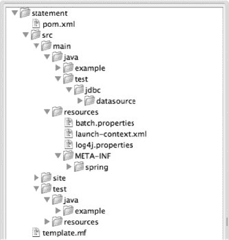
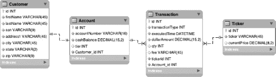
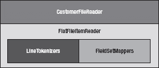
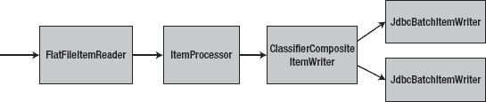
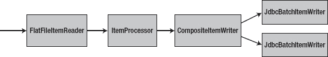

## 10

## 示例应用程序

你在互联网上找到的技术教程可能很有趣。大多数人很少超越一句“你好，世界！”任何新概念的复杂程度。虽然这对于基本理解一项技术来说可能很棒，但是你知道生活从来没有教程描述的那么简单。因此，在本章中，您将看到一个更真实的 Spring 批处理作业示例。

本章包括以下内容:

*   *回顾陈述工作*:在开发任何新功能之前，你要回顾要开发的工作的目标，如[第 3 章](03.html#ch3)所述。
*   *项目设置*:您从 Spring 的发行版创建了一个全新的 Spring 批处理项目。
*   *工作发展:*你将经历[第 3 章](03.html#ch3)中概述的陈述工作的整个发展过程。
*   工作测试:你为这项工作开发一整套测试，包括单元测试、集成测试和功能测试。

让我们从回顾你开发的语句工作需要做什么开始。

### 审核陈述工作

你在这一章的工作是为一家名为普勒斯投资公司的虚构投资公司。Apress Investments 有大量客户通过该公司的个人交易账户进行股票交易。在每个月底，根据客户在一个月内的交易量向他们收取费用(交易越多，费用越低)。从他们账户的当前现金余额中扣除相关的交易费用，并且发出包含他们所有投资的当前价值以及他们账户的当前现金余额的报表。

为了完成这些要求，你需要创建一个包含六个步骤的任务，如图 10-1 所示。

***图 10-1。**报表作业流程*

工作从步骤 1 开始，导入客户和交易数据。因为数据包含在同一个文件中，所以只需一步即可完成。在交易数据被导入后，您可以在步骤 2 中使用它来获取您的客户当前拥有的股票列表，并从互联网上为他们下载最新的股票价格。然后，您可以在步骤 3 中用最新的值更新客户的帐户，以便您可以计算他们的帐户值多少钱。您通过在作业的步骤 4 和 5 中计算客户的费用并在步骤 6 中打印报表本身来完成作业。本章的其余部分将详细介绍这些步骤是如何实现的以及为什么要实现。

要启动任何项目，您需要从创建一个新的项目外壳开始。下一节将介绍如何获取 Spring Batch 提供的 shell，并对其进行清理以包含您需要的内容。

### 建立新项目

要开始语句作业，您需要从一个新的项目 shell 开始。这个项目 shell 由 Maven 项目结构、一个满足您的构建需求的 POM 文件以及根据需要配置的基础设施组成。要创建一个新项目，就像您过去所做的那样，下载 Spring Batch 的 zip 发行版，并将<zip_root>/samples/Spring-Batch-simple-CLI 目录复制到您的工作区 renaming it 语句中。[图 10-2](#fig_10_2) 显示了它提供给你的目录结构。</zip_root>

***图 10-2。**模板目录结构*

zip 文件提供的目录结构是你需要使用的，它包含的 POM 文件是一个很好的开始，但是你应该清理一些你不使用的东西。要删除的文件如下:

*   `<project_home>/src/main/java/example`:这个目录包含了你在这个项目中不需要的示例阅读器和编写器。
*   `<project_home>/src/main/java/test`:您没有使用`DataSourceInitializer`来初始化这个项目的数据库模式，并且不建议在生产中使用。
*   `<project_home>/src/main/resources/META-INF/spring`:正如您在整本书中所看到的，您在目录`<project_home>/src/main/resources/jobs`中配置了作业 XML 文件，因此不需要这个目录及其内容。
*   `<project_home>/src/test/java/example`:因为您删除了 shell 中包含的示例 ItemReader 和 ItemWriter，所以不需要它们的单元测试。
*   `<project_home>/src/test/resources/test-context.xml`:您为单元测试所做的配置与使用这个文件略有不同，所以不需要它。

随着项目现在更加精简，您仍然需要做更多的修剪。具体来说，`launch-context.xml`文件有一个对`DataSourceInitializer`的引用，现在您的项目不再包含该类，您需要删除它。

在删除了不会在项目中使用的部分后，您应该更新一些剩余的文件。具体来说，您应该更新 POM 文件以使用 Spring 3 并添加 MySQL 驱动程序依赖项。您还需要从`launch-context.xml`文件中删除对`DataSourceInitializer`的引用，因为您之前已经删除了它。

让我们从 POM 文件更新开始。Spring 在抽象您正在使用的框架的版本方面做得很好，因此更改您正在使用的 Spring 版本需要您更新位于 POM 文件顶部附近的`spring.framework.version`属性。清单 10-1 显示了您需要做的更新。

***清单 10-1。**将 Spring 版本更新到 Spring 3*

`…
<properties>
  <maven.test.failure.ignore>true</maven.test.failure.ignore>
  <spring.framework.version>**3.0.5.RELEASE**</spring.framework.version>
  <spring.batch.version>2.1.7.RELEASE</spring.batch.version>
  <dependency.locations.enabled>false</dependency.locations.enabled>
</properties>
…`

您还需要将 MySQL 驱动程序添加到 POM 文件中，因为如前所述，您将 MySQL 用于该项目。清单 10-2 显示了您需要添加到 POM 文件中的 Maven 依赖项。

***清单 10-2。** MySQL Maven 依赖*

`…
<dependency>
  <groupId>mysql</groupId>
  <artifactId>mysql-connector-java</artifactId>
  <version>5.1.3</version>`

`</dependency>
…`

因为您将 MySQL 驱动程序添加到了 POM 文件中，所以接下来让我们配置到数据库的连接。如第 2 章中的[所述，您在`statement/src/main/resources/batch.properties`文件中为 JobRepository 和应用程序的数据库配置数据库连接。](02.html#ch2)[清单 10-3](#list_10_3) 显示了为语句作业配置的文件内容。

***清单 10-3。**T4`batch.properties`*

`# Values to connect to my local
batch.jdbc.driver=com.mysql.jdbc.Driver
batch.jdbc.url=jdbc:mysql://localhost:3306/statement
# use this one for a separate server process so you can inspect the results
# (or add it to system properties with -D to override at run time).
# batch.jdbc.url=jdbc:hsqldb:hsql://localhost:9005/samples
batch.jdbc.user=root
batch.jdbc.password=password
batch.schema=statement`

`batch.properties`文件中的值是`launch-context.xml`中要求的值:

*   `batch.jdbc.driver`:您正在使用的数据库的 JDBC 驱动程序的全限定类名。在这里，您使用 MySQL 的驱动程序:com.mysql.jdbc.Driver。
*   `batch.jdbc.url`:您正在连接的 JobRepository 数据库的 URL。对于示例应用程序，所有表使用一个数据库模式。
*   `batch.jdbc.user`:你正在连接的数据库的用户名。
*   `batch.jdbc.password`:数据库的密码。
*   在 MySQL 的情况下，你正在使用的数据库。

项目设置的最后一部分是更新`launch-context.xml`文件，删除这项工作不需要的 beans，并更新 xsd 以使用 Spring 3 而不是 Spring 2.5(它们被配置为使用 Spring 2.5)。[清单 10-4](#list_10_4) 显示了更新后的`statement/src/main/resources/launch-context.xml`文件。

***清单 10-4。**T4`launch-context.xml`*

`<?xml version="1.0" encoding="UTF-8"?>
<beans
  xmlns:p="http://www.springframework.org/schema/p"
  xmlns:xsi="http://www.w3.org/2001/XMLSchema-instance"
  xsi:schemaLocation="http://www.springframework.org/schema/beans
    http://www.springframework.org/schema/beans/spring-beans-3.0.xsd">

  <bean id="jobExplorer"
    class="org.springframework.batch.core.explore.support.JobExplorerFactoryBean"
    p:dataSource-ref="dataSource" />`

`  <bean id="jobLauncher"

    class="org.springframework.batch.core.launch.support.SimpleJobLauncher">
    <property name="jobRepository" ref="jobRepository" />
  </bean>

  <bean id="jobRepository"
    class="org.springframework.batch.core.repository.support.JobRepositoryFactoryBean"
    p:dataSource-/ref="dataSource" p:transactionManager-ref="transactionManager" />

  <bean id="dataSource" class="org.apache.commons.dbcp.BasicDataSource">
    <property name="driverClassName" value="${batch.jdbc.driver}" />
    <property name="url" value="${batch.jdbc.url}" />
    <property name="username" value="${batch.jdbc.user}" />
    <property name="password" value="${batch.jdbc.password}" />
  </bean>

  <bean id="transactionManager"
    class="org.springframework.jdbc.datasource.DataSourceTransactionManager"
    lazy-init="true">
    <property name="dataSource" ref="dataSource" />
  </bean>

  <bean id="placeholderProperties"
    class="org.springframework.beans.factory.config.PropertyPlaceholderConfigurer">
    <property name="location" value="classpath:batch.properties" />
    <property name="systemPropertiesModeName"
      value="SYSTEM_PROPERTIES_MODE_OVERRIDE" />
    <property name="ignoreUnresolvablePlaceholders" value="true" />
    <property name="order" value="1" />
  </bean>
</beans>`

快速浏览一下这个文件，它看起来像是 Spring 的一个普通的`applicationContext.xml`文件，因为…它是 Spring 的一个普通的`applicationContext.xml`文件。从文件的标准 XML 名称空间声明开始。在这里，您定义了六个 beans:

*   *job explorer*:Spring Batch 使用这个 bean 以只读模式访问 JobRepository。JobExplorer 的唯一依赖项是数据源。
*   *JobLauncher* :为了用 Spring Batch 运行一个作业，需要一个 JobLauncher。这里你保持事情简单，使用框架提供的`SimpleJobLauncher`。虽然您可以用多种方式管理这个作业，但是在大多数企业中，作业都是由外部调度程序管理的，所以没有理由在这里花心思。JobLauncher 将 JobRepository 作为其唯一的依赖项。
*   *job repository*:job repository 为 Spring Batch 提供 CRUD 操作，以持久化每个作业运行的状态和其他元数据。因为您使用的是持久性 JobRepository，所以它需要一个数据源和一个事务管理器来进行处理。
*   *数据源*:Spring 有很多种获取数据源的方法。在这种情况下，使用 Spring 的`BasicDataSource`定义一个就足够了。JDBC 连接的值存储在`batch.properties`文件中，您接下来将更新该文件。
*   *TransactionManager* :当您开始从数据库读取数据和向数据库写入数据时，这就成为 Spring Batch 难题中更重要的一块。因为这是在本地运行的，并且只有一个数据源，所以 Spring JDBC 的`DataSourceTransactionManager`做得很好。
*   *PlaceholderProperties* :这个 bean 处理您选择提取到您的`batch.properties`文件中的任何属性的加载和填充。目前，您唯一需要配置的是 JDBC 连接值。

至此，语句作业的项目设置完成。现在您有了一个空的 Spring 批处理项目:数据库被配置为指向您的数据库，并且包含的所有示例代码都已被删除。

因为 Spring 批处理作业被设计为由彼此独立的步骤组成，所以您可以独立地开发它们的整体。在本章余下的课程中，您将使用您刚刚配置的项目结构、本章前面和第 3 章中讨论的需求以及您在本书课程中学到的知识来开发语句作业。这项工作的第一步是导入客户和交易数据，这将在下面介绍。

### 导入客户和交易数据

当作业开始时，它从另一个部门接收一个文件，其中包含有关您的客户及其交易的信息。两种类型的数据都包含在同一个 CSV 文件中。本节介绍如何配置将客户和交易数据导入数据库的步骤。

然而，在开始编写代码之前，让我们回顾一下用于这项工作的数据模型。该作业的数据模型由四个表组成。Customer 表包含所有与客户相关的数据，包括姓名、地址和社会保险号。每个客户都与帐户表中的一个帐户相关联。帐户表包含有关客户帐户中有多少现金的信息，以及他们被计算为该月的一部分的定价等级。如您所料，帐户与交易表有一对多的关系。客户的每笔交易在交易表中都有记录。交易表包含交易本身的信息:交易的股票、交易的股票数量、费用等等。最后一个表是 Ticker 表。该表用于提取每只股票的当前价值。[图 10-3](#fig_10_3) 显示了语句作业的数据模型。

***图 10-3。**报表作业的数据模型*

为了导入您收到的数据，您需要了解您配置的文件的格式。该文件由两种记录格式组成:一种用于客户，一种用于交易。清单 10-5 展示了一个文件格式的例子。

***清单 10-5。**`customerTransaction.csv`文件的样本*

`205866465,Joshua,Thompson,3708 Park,Fairview,LA,58517,3276793917668488
3276793917668488,SKT,5534,416811,2011-03-30 00:15:18
3276793917668488,KSS,5767,7074247,2011-04-02 07:00:08
3276793917668488,CSR,3887,6315693,2011-03-14 20:29:20
3276793917668488,EMD,8209,6445091,2011-03-19 18:52:56
3276793917668488,SYY,7980,9524343,2011-03-24 17:26:00
3276793917668488,BYM,4011,6870023,2011-03-05 09:35:18`

此示例由单个客户的记录组成。您为示例处理的文件包含许多客户的记录。初始客户记录由八个字段组成:

*   *社会安全号*:这个税号对每个客户都是唯一的。虽然它不是 Customer 表的主键，但可以用来查找唯一的客户。
*   *名字:*客户的名字。
*   *姓氏:*客户的姓氏。
*   *地址:*客户的街道地址。
*   *城市:*客户居住的城市。
*   *州:*客户居住的州。
*   *邮政编码:*客户的邮政编码。
*   *账号:*客户账户的识别号。

需要注意的是，出于处理目的，您处理的客户已经存在于您的数据库中。该文件仅用于更新现有客户和账户。不存在的客户的任何记录(通过他们的社会安全号码识别)都是无效的。

一个客户记录之后和下一个客户记录之前的记录是它们之前的客户的交易记录。每个交易记录由五个字段组成:

*   *账号*:交易所属的账号。这应该与先前客户记录的账号相匹配。
*   *股票代码:*本次交易的股票代码。这在以后用于获得股票的当前价格。
*   *价格:*股票交易时的价格。
*   *数量:*交易的股票数量。正数意味着股票被购买；负数表示它们已经售出。
*   *时间戳:*交易执行的日期和时间。

要处理这个文件，首先要定义作业及其第一步。该作业配置与您在本书中完成的所有作业配置一样，位于名为`statementJob`的文件中的`statement/src/main/resources/jobs` 目录中。该文件目前包含单个作业(`statementJob`)的配置，并配置了第一步。[清单 10-6](#list_10_6) 显示了开始时的配置。

***清单 10-6。**T4`statementJob.xml`*

`<?xml version="1.0" encoding="UTF-8"?>
<beans:beans
  xmlns:beans="http://www.springframework.org/schema/beans"
  xmlns:xsi="http://www.w3.org/2001/XMLSchema-instance"
  xmlns:util="http://www.springframework.org/schema/beans"
  xsi:schemaLocation="http://www.springframework.org/schema/beans
    http://www.springframework.org/schema/beans/spring-beans-3.0.xsd
    http://www.springframework.org/schema/util
    http://www.springframework.org/schema/util/spring-util.xsd
    http://www.springframework.org/schema/batch
    http://www.springframework.org/schema/batch/spring-batch-2.1.xsd">

  <beans:import resource="../launch-context.xml"/>

  <step id="importCustomerAndTransactionData">
    <tasklet>
      <chunk reader="customerTransactionReader" processor="customerLookupItemProcessor"
        writer="customerTransactionItemWriter" commit-interval="100"/>
    </tasklet>
  </step>

  <job id="statementJob">
    <step id="step1" parent="importCustomerAndTransactionData"/>
  </job>
</beans:beans>`

有几件事需要马上注意。首先是[清单 10-6](#list_10_6) 中的文件不会自己运行。如您所见，您将步骤`importCustomerAndTransactionData`配置为使用 ItemReader ( `customerTransactionReader`)、ItemProcessor ( `customerLookupItemProcessor`)和 ItemWriter ( `customerTransactionWriter`)。如果没有配置这些 beans，作业将无法运行。另一件要注意的事情是，您定义的 xsd 比当前使用的多一些。放心，到这一章结束的时候，都会用到。

到目前为止，作业的配置包括`launch-context.xml`文件，您在[清单 10-4](#list_10_4) 中看到了该文件，以及第一步(`importCustomerAndTransactionData`)的定义及其读取器、处理器和写入器。最后，它有工作本身的定义，即`statementJob`。为了开始开发，让我们首先创建 ItemReader，`customerTransactionReader`。

#### 创建客户交易阅读器

当你考虑这个步骤的输入文件时，如清单 10-5 中的[所示，以及你需要将数据转换成的数据模型，很快就会发现`customerTransactionReader`不是一个简单的`FlatFileItemReader`。相反，这个 ItemReader 是由许多不同的组件组装而成的。这一节着眼于如何读入`importCustomerAndTransactionData`步骤的输入。](#list_10_5)

思考`customerTransactionReader`的最好方式是将层想象成与你的对象模型相似。客户对象有一个账户对象，账户对象在下有很多交易。为了能够有效地将输入文件映射到表示该数据模型的对象模型，您需要使用分层方法来构建您的阅读器。[图 10-4](#fig_10_4) 显示了这些层是如何堆叠起来的。

***图 10-4。**如何构建`CustomerFileReader`*

对于这个读者来说，有两个基本的层次。第一个主要层是 FlatFileItemReader，它处理组成读入文件的字符串。这一层负责将每个记录解析成可以在批处理中使用的对象。另一层由 CustomerFileReader 表示，负责以正确的方式关联对象。当你在[第 7 章](07.html#ch7)中检查分隔文件和多记录格式文件时，你已经看到了这些不同类型的阅读器。让我们从解析基础开始(`Customer`和`Transaction`)。从那里，您可以添加`Account`和`Address`对象的抽象，并将它们关联在一起。

该阅读器的第一层处理解析记录，与[第 7 章](07.html#ch7)中多记录格式的例子非常相似。在开始解析记录之前，[清单 10-7](#list_10_7) 显示了解析记录的`Customer`和`Transaction`域对象。

*清单 10-7**。** `Customer`和`Transaction`*

`package com.apress.springbatch.statement.domain;

public class Customer {

    private long id = -1l;
    private String firstName;
    private String lastName;
    private Address address;
    private Account account;
    private String taxId;

    // Accessors removed
    …

    @Override
    public String toString() {
        String output = "Customer number " + id + ", " + firstName + " " + lastName;

        if(address != null) {
            output = output + " who lives in "
                + address.getCity() + "," + address.getState();
        }

        if(account != null && account.getTransactions() != null) {
            output = output + " has "`
`            + account.getTransactions().size() + " transactions.";
        }

        return output;
}

package com.apress.springbatch.statement.domain;

import java.math.BigDecimal;
import java.util.Date;

public class Transaction {

    private long id;
    private long accountId;
    private String accountNumber;
    private String ticker;
    private long tickerId;
    private long quantity;
    private Date tradeTimestamp;
    private BigDecimal dollarAmount;
    private TransactionType type;

    // Accessors removed
    …
    @Override
    public String toString() {
        return "Sold " + quantity + " of " + ticker;
    }
}`

您应该立即注意到在`Customer`和`Transaction`类中，它们都包含各种数据类型，包括一个`Address`对象和一个用于`Customer`对象的`Account`对象。清单 10-8 显示了那些额外的域对象的代码。

*清单 10-8**。** `Account`和`Address`*

`package com.apress.springbatch.statement.domain;

import java.math.BigDecimal;
import java.util.List;

public class Account {

    private long id = -1;
    private String accountNumber;
    private Customer cust;
    private BigDecimal cashBalance;
    private PricingTier tier;
    private List<Transaction> transactions;`

`    // Accessors removed

    …
}

package com.apress.springbatch.statement.domain;

public class Address {
    private String address1;
    private String city;
    private String state;
    private String zip;

    // Accessors removed
    …
}`

事实上，`Customer`和`Transaction`域对象有许多不同的数据类型，这带来了一个有趣的问题。虽然这在对象的世界中是好的，但它应该立即向您发出信号，您需要为每个对象编写自定义的 FieldSetMappers，以处理所需的适当的数据类型转换。因为`Transaction`的 FieldSetMapper 更简单，所以您先看一下[清单 10-9](#list_10_9) 中的那个。

***清单 10-9。**T4`TransactionFieldSetMapper`*

`package com.apress.springbatch.statement.reader;

import org.springframework.batch.item.file.mapping.FieldSetMapper;
import org.springframework.batch.item.file.transform.FieldSet;
import org.springframework.validation.BindException;

import com.apress.springbatch.statement.domain.Transaction;

public class TransactionFieldSetMapper implements FieldSetMapper<Transaction> {

    public Transaction mapFieldSet(FieldSet fieldSet) throws BindException {
        Transaction trans = new Transaction();

        trans.setAccountNumber(fieldSet.readString("accountNumber"));
        trans.setQuantity(fieldSet.readLong("quantity"));
        trans.setTicker(fieldSet.readString("stockTicker"));
        trans.setTradeTimestamp(fieldSet.readDate("timestamp", "yyyy-MM-dd HH:mm:ss"));
        trans.setDollarAmount(fieldSet.readBigDecimal("price"));

        return trans;
    }
}`

正如您在[清单 10-9](#list_10_9) 中看到的，您使用 FieldSet 实现的数据类型转换特性将从文件中读入的字符串转换成所需的数据类型。在这种情况下，您将字符串转换为一个`long`和一个`date`(通过为日期指定正确的模式)。你需要的另一个 FieldSetMapper 是用于`Customer`对象的(见[清单 10-10](#list_10_10) )。

***清单 10-10。**`CustomerFieldSetMapper`T5】*

`package com.apress.springbatch.statement.reader;

import org.springframework.batch.item.file.mapping.FieldSetMapper;
import org.springframework.batch.item.file.transform.FieldSet;
import org.springframework.validation.BindException;

import com.apress.springbatch.statement.domain.Account;
import com.apress.springbatch.statement.domain.Address;
import com.apress.springbatch.statement.domain.Customer;

public class CustomerFieldSetMapper implements FieldSetMapper<Customer> {

    public Customer mapFieldSet(FieldSet fieldSet) throws BindException {
        Customer customer = new Customer();

        customer.setFirstName(fieldSet.readString("firstName"));
        customer.setLastName(fieldSet.readString("lastName"));
        customer.setTaxId(fieldSet.readString("taxId"));
        customer.setAddress(buildAddress(fieldSet));
        customer.setAccount(buildAccount(fieldSet, customer));

        return customer;
    }

    private Account buildAccount(FieldSet fieldSet, Customer cust) {
        Account account = new Account();

        account.setAccountNumber(fieldSet.readString("accountNumber"));
        account.setCust(cust);

        return account;
    }

    private Address buildAddress(FieldSet fieldSet) {
        Address address = new Address();

        address.setAddress1(fieldSet.readString("address"));
        address.setCity(fieldSet.readString("city"));
        address.setState(fieldSet.readString("state"));
        address.setZip(fieldSet.readString("zip"));

        return address;
    }
}`

`CustomerFieldSetMapper`负责将客户记录分成三个对象:`Customer`、`Address`和`Account`。正如您在[清单 10-10](#list_10_10) 中所看到的，除了将适当的字段移动到适当的对象中并手动建立关系之外，没有什么其他的了。现在您已经能够将字段集映射到它们各自的对象，您需要能够将文件中的行标记到字段集中。不幸的是，在这种情况下，事情没那么简单。

在第 7 章的例子中，你使用了一个每行都有前缀的文件。这允许您使用 Spring Batch 的 PatternMatchingCompositeLineMapper 来指定一个模式，该模式标识 LineTokenizer 用来解析记录的每个。但是，PatternMatchingCompositeLineMapper 的模式匹配能力有限。它只允许验证字符串和两种通配符(`?`代表单个字符，`*`代表一个或多个字符)。输入文件中包含的记录太复杂，无法使用这种形式的模式匹配进行映射。因此，您需要创建自己版本的 PatternMatchingCompositeLineMapper，它将一个真正的正则表达式应用于每一行，以确定使用哪个 LineTokenizer(以及随后的哪个 FieldSetMapper)。[清单 10-11](#list_10_11) 显示`RegularExpressionLineMapper`。

***清单 10-11。**T4`RegularExpressionLineMapper`*

`package com.apress.springbatch.statement.reader;

import java.util.HashMap;
import java.util.Map;
import java.util.Map.Entry;
import java.util.regex.Matcher;
import java.util.regex.Pattern;

import org.springframework.batch.item.ParseException;
import org.springframework.batch.item.file.LineMapper;
import org.springframework.batch.item.file.mapping.FieldSetMapper;
import org.springframework.batch.item.file.transform.FieldSet;
import org.springframework.batch.item.file.transform.LineTokenizer;
import org.springframework.beans.factory.InitializingBean;

public class RegularExpressionLineMapper implements LineMapper<Object>, InitializingBean {

    private Map<String, LineTokenizer> tokenizers;
    private Map<String, FieldSetMapper<Object>> mappers;
    private Map<Pattern, LineTokenizer> patternTokenizers;
    private Map<LineTokenizer, FieldSetMapper<Object>> patternMappers;

    public Object mapLine(String input, int rowCount) throws Exception {

        LineTokenizer tokenizer = findTokenizer(input);
        FieldSet fields = tokenizer.tokenize(input);
        FieldSetMapper<Object> mapper = patternMappers.get(tokenizer);

        if(mapper != null) {
            return mapper.mapFieldSet(fields);
        }

        throw new ParseException("Unable to parse the input " + input);
    }

    private LineTokenizer findTokenizer(String input) {
        LineTokenizer tokenizer = null;`

`        for (Entry<Pattern, LineTokenizer> entry : patternTokenizers.entrySet()) {

            Matcher matcher = entry.getKey().matcher(input);
            if(matcher.find()) {
                tokenizer = entry.getValue();
                break;
            }
        }

        if(tokenizer != null) {
            return tokenizer;
        } else {
            throw new ParseException("Unable to locate a tokenizer for " + input);
        }
    }

    public void afterPropertiesSet() throws Exception {
        patternTokenizers = new HashMap<Pattern, LineTokenizer>();
        patternMappers = new HashMap<LineTokenizer, FieldSetMapper<Object>>();

        for (Map.Entry<String, LineTokenizer> entry : tokenizers.entrySet()) {
            Pattern pattern = Pattern.compile(entry.getKey());
            patternTokenizers.put(pattern, entry.getValue());
            patternMappers.put(entry.getValue(), mappers.get(entry.getKey()));
        }
    }

    public void setLineTokenizers(Map<String, LineTokenizer> lineTokenizers) {
        this.tokenizers = lineTokenizers;
    }

    public void setFieldSetMappers(Map<String, FieldSetMapper<Object>> fieldSetMappers) {
        this.mappers = fieldSetMappers;
    }
}`

`RegularExpressionLineMapper`是 LineMapper 接口的基本实现。它实现了一个必需的方法`mapLine`，将从平面文件读入的`String`转换成一个对象。`mapLine`方法首先获得一个 LineTokenizer 实现，该实现基于该方法作为输入接收的`String`(稍后将详细介绍)。然后，它使用 LineTokenizer 实现将`String`解析成一个字段集。随着`String`被划分为单独的字段，适当的 FieldSetMapper 被检索，这些字段被映射到所需对象的一个新实例中。然后返回新的对象。

要确定使用哪个 LineTokenizer，需要做两件事。首先，`afterPropertiesSet`方法(来自 InitializerBean 接口)创建两个`Map`,第一个由 LineTokenizer 值的正则表达式键组成。第二个由 FieldSetMapper 值的 LineTokenizer 键组成。这两个`Map`用于委托给适当的实现。您可以通过遍历`patternTokenizers` `Map`的键来使用这些映射，将每个正则表达式应用于您试图解析的`String`。当找到匹配的正则表达式时，使用相关的 LineTokenizer 来解析`String`。上一步中的 LineTokenizer 允许您从`patternMappers` `Map`中获取正确的字段集映射器，并将字段集映射到正确的对象。如果由于某种原因找不到 LineTokenizer 或fieldset mapper，就会抛出一个`ParseException`来表明记录无法被解析。

解析难题的最后一部分是配置所有部分。您需要配置两个 FieldSetMappers、两个 LineTokenizers 和一个`LineMapper and ItemReader all`以便您的步骤可以使用它们。[清单 10-12](#list_10_12) 包含了到目前为止你已经定义的部件的配置。

***清单 10-12。**配置`customerTransaction`文件的解析*

`…
<beans:bean id="customerTransactionFile" class="org.springframework.core.io.FileSystemResource">
  <beans:constructor-arg value="/input/customerTransaction.csv"/>
</beans:bean>

<beans:bean id="customerLineTokenizer"
  class="org.springframework.batch.item.file.transform.DelimitedLineTokenizer">
  <beans:property name="names"
    value="taxId,firstName,lastName,address,city,state,zip,accountNumber"/>
  <beans:property name="delimiter" value=","/>
</beans:bean>

<beans:bean id="transactionLineTokenizer"
  class="org.springframework.batch.item.file.transform.DelimitedLineTokenizer">
  <beans:property name="names" value="accountNumber,stockTicker,price,quantity,timestamp"/>
  <beans:property name="delimiter" value=","/>
</beans:bean>

<beans:bean id="customerFieldSetMapper"  
  class="com.apress.springbatch.statement.reader.CustomerFieldSetMapper"/>

<beans:bean id="transactionFieldSetMapper"
  class="com.apress.springbatch.statement.reader.TransactionFieldSetMapper"/>

<beans:bean id="customerTransactionLineMapper"
  class="com.apress.springbatch.statement.reader.RegularExpressionLineMapper">
  <beans:property name="lineTokenizers">
    <beans:map>
      <beans:entry key="^\d+,[A-Z][a-zA-Z]+,[A-Z][a-zA-Z]+,.*"
        value-ref="customerLineTokenizer"/>
      <beans:entry key="^\d+,[A-Z\.\ ]+,\d+.*"
        value-ref="transactionLineTokenizer"/>
    </beans:map>
  </beans:property>
  <beans:property name="fieldSetMappers">
    <beans:map>
      <beans:entry key="^\d+,[A-Z][a-zA-Z]+,[A-Z][a-zA-Z]+,.*"
        value-ref="customerFieldSetMapper"/>
      <beans:entry key="^\d+,[A-Z\.\ ]+,\d+.*"
        value-ref="transactionFieldSetMapper"/>
    </beans:map>
  </beans:property>`
`</beans:bean>

<beans:bean id="customerTransactionReader"
  class="org.springframework.batch.item.file.FlatFileItemReader">
  <beans:property name="resource" ref="customerTransactionFile"/>
  <beans:property name="lineMapper" ref="customerTransactionLineMapper"/>
</beans:bean>
…`

在[清单 10-12](#list_10_12) 中，您从输入文件配置开始配置。它是一个 FileSystemResource，就像所有平面文件一样；您可以指定要处理的文件的路径。在这里，您可以配置客户和事务线令牌化器。这些是由框架提供的简单的 DelimitedLineTokenizers，用于解析您之前定义的逗号分隔的记录格式。接下来是客户和交易字段集映射器。这是你写的两个。因为它们没有依赖关系，所以它们只由 bean 定义组成。下一个(也是最大的)配置是`RegularExpressionLineMapper`。它有两个依赖项:一个是正则表达式到 LineTokenizers 的映射，另一个是相同的正则表达式到 FieldSetMappers 的映射。对于每种记录类型，每个映射都包含一个条目。XML 中的 ItemReader 如下。在这种情况下，使用一个常规的 FlatFileItemReader 来实现，向它传递一个对输入文件的引用和一个对 LineMapper 的引用(`RegularExpressionLineMapper`)。

这就是读取`customerTransaction.csv`文件所需输入的全部内容。但是阅读只是过程的一半。这一步的目标是将数据放入数据库。要做到这一点，您需要用一些 id 来更新每一项，以使引用完整性起作用。在下一节中，您将看到负责这些更新的 ItemProcessor。

#### 寻找 Ip Ids

虽然第一步的目标是从`customerTransaction.csv`文件中读取数据并将其写入数据库，但是在您可以进行写入之前，客户和交易数据需要一些处理。根据第三章中的要求，如果客户目前不在数据库中，您需要插入他们，如果他们在数据库中，您需要更新他们。在本节中，您将编写一个 ItemProcessor 来更新数据库中存在的客户项目。

你从`customerTransactionReader`得到的物品可以是`Customer`物品，也可以是`Transaction`物品。因此，ItemProcessor 需要确定它是哪种类型，如果是交易，就更新 ticker id 和 account id，或者通过社会保险号查找客户以获得数据库 id，从而在传递之前更新`Customer`对象。清单 10-13 有`CustomerLookupItemProcessor`的代码。

***清单 10-13。**T4`CustomerLookupItemProcessor`*

`package com.apress.springbatch.statement.processor;

import org.springframework.batch.item.ItemProcessor;

import com.apress.springbatch.statement.dao.AccountDao;
import com.apress.springbatch.statement.dao.CustomerDao;
import com.apress.springbatch.statement.dao.TickerDao;
import com.apress.springbatch.statement.domain.Account;
import com.apress.springbatch.statement.domain.Customer;
import com.apress.springbatch.statement.domain.Ticker;
import com.apress.springbatch.statement.domain.Transaction;`
`import com.apress.springbatch.statement.domain.TransactionType;
import com.apress.springbatch.statement.exception.InvalidItemException;

public class CustomerLookupItemProcessor implements ItemProcessor<Object, Object> {

    private CustomerDao customerDao;
    private TickerDao tickerDao;
    private AccountDao accountDao;

    public Object process(Object curItem) throws Exception {
        if(curItem instanceof Customer) {
            doCustomerUpdate((Customer) curItem);
        } else if(curItem instanceof Transaction){
            doTransactionUpdate((Transaction) curItem);
        } else {
            throw new InvalidItemException("An invalid item was received: " + curItem);
        }

        return curItem;
    }

    private void doTransactionUpdate(Transaction curItem) {
        updateTicker(curItem);
        updateAccount(curItem);

        curItem.setType(TransactionType.STOCK);
    }

    private void updateAccount(Transaction curItem) {
        Account account = accountDao.findAccountByNumber(curItem.getAccountNumber());`

`        curItem.setAccountId(account.getId());
    }

    private void updateTicker(Transaction curItem) {
        Ticker ticker = tickerDao.findTickerBySymbol(curItem.getTicker());

        if(ticker == null) {
            Ticker newTicker = new Ticker();
            newTicker.setTicker(curItem.getTicker());

            tickerDao.saveTicker(newTicker);
            ticker = tickerDao.findTickerBySymbol(curItem.getTicker());
        }

        curItem.setTickerId(ticker.getId());
    }

    private void doCustomerUpdate(Customer curCustomer) {
        Customer storedCustomer = customerDao.findCustomerByTaxId(curCustomer.getTaxId());
        Account account = accountDao.findAccountByNumber(curCustomer.getAccount().getAccountNumber());

        curCustomer.setId(storedCustomer.getId());
        curCustomer.setAccount(account);
    }

    public void setCustomerDao(CustomerDao customerDao) {
        this.customerDao = customerDao;
    }

    public void setTickerDao(TickerDao tickerDao) {
        this.tickerDao = tickerDao;
    }

    public void setAccountDao(AccountDao accountDao) {
        this.accountDao = accountDao;
    }
}`

[清单 10-13](#list_10_13) 看起来发生了不少事情，但其实没那么糟糕。像任何 ItemProcessor 一样，逻辑从`process`方法开始。在这里，您确定正在处理的项目的类型，并将其传递给适当的方法来更新该类型。

对于一个`Customer`对象，您查找客户的数据库 id 并用它更新`Customer`对象。在将客户的`Account`对象返回进行编写之前，您也要做同样的事情。对于一个`Transaction`对象，如果 ticker 已经在数据库中，就更新`ticker`对象的 id。如果不是，您将它保存到数据库中，供将来的对象引用。您还需要更新`Transaction`对象上的帐户 id，并在返回之前识别事务的类型。

需要一些数据访问对象(Dao)来查找您填充的 id。第一个是`CustomerDaoJdbc`，它查找客户的 id(参见[清单 10-14](#list_10_14) )。

***清单 10-14。**T4`CustomerDaoJdbc`*

`package com.apress.springbatch.statement.dao.impl;

import java.sql.ResultSet;
import java.sql.SQLException;
import java.util.List;

import org.springframework.jdbc.core.JdbcTemplate;
import org.springframework.jdbc.core.RowMapper;

import com.apress.springbatch.statement.dao.CustomerDao;
import com.apress.springbatch.statement.domain.Address;
import com.apress.springbatch.statement.domain.Customer;

public class CustomerDaoJdbc extends JdbcTemplate implements CustomerDao {

    private static final String FIND_BY_TAX_ID = "select * from customer c where ssn = ?";

    @SuppressWarnings("unchecked")
    public Customer findCustomerByTaxId(String taxId) {
        List<Customer> customers = query(FIND_BY_TAX_ID,
                new Object[] { taxId }, new RowMapper() {`

`                    public Object mapRow(ResultSet rs, int arg1)

                            throws SQLException {
                        Customer customer = new Customer();

                        customer.setId(rs.getLong("id"));
                        customer.setFirstName(rs.getString("firstName"));
                        customer.setLastName(rs.getString("lastName"));
                        customer.setTaxId(rs.getString("ssn"));
                        customer.setAddress(buildAddress(rs));

                        return customer;
                    }

                    private Address buildAddress(ResultSet rs)
                            throws SQLException {
                        Address address = new Address();

                        address.setAddress1(rs.getString("address1"));
                        address.setCity(rs.getString("city"));
                        address.setState(rs.getString("state"));
                        address.setZip(rs.getString("zip"));

                        return address;
                    }
                });

        if (customers != null && customers.size() > 0) {
            return customers.get(0);
        } else {
            return null;
        }
    }
}`

清单 10-14 中的`CustomerDaoJdbc`绝对比它需要的更加健壮。如您所见，`findCustomerByTaxId`方法映射了一个完整的`Customer`对象，而您实际上只需要它的 id。然而，从长远来看，这种方法使得 DAO 更具可重用性。

Dao 名单上的下一个是`AccountDaoJdbc`。这和你刚才看的`Customer`刀的情况是一样的。这个 DAO 提供了通过帐号查找一个`Account`的能力，并返回一个完整的`Account`对象，包括交易。[清单 10-15](#list_10_15) 显示了代码。

***清单 10-15。**T4`AccountDaoJdbc`*

`package com.apress.springbatch.statement.dao.impl;

import java.sql.ResultSet;
import java.sql.SQLException;
import java.util.ArrayList;
import java.util.List;

import org.springframework.jdbc.core.JdbcTemplate;`
`import org.springframework.jdbc.core.RowMapper;

import com.apress.springbatch.statement.dao.AccountDao;
import com.apress.springbatch.statement.domain.Account;
import com.apress.springbatch.statement.domain.Address;
import com.apress.springbatch.statement.domain.Customer;
import com.apress.springbatch.statement.domain.PricingTier;
import com.apress.springbatch.statement.domain.Transaction;
import com.apress.springbatch.statement.domain.TransactionType;

public class AccountDaoJdbc extends JdbcTemplate implements AccountDao {

    private static final String FIND_BY_ACCOUNT_NUMBER = "select a.id, " +
        "a.accountNumber, a.cashBalance, a.tier, a.customer_id, c.firstName, " +
        "c.lastName, c.ssn, c.address1, c.city, c.state, c.zip, t.id as transaction_id, " +
        "t.transactionType, t.executedTime, t.dollarAmount, t.qty, t.tickerId, t.fee  " +
        "from account a inner join customer c on a.customer_id = c.id left outer join " +
        "transaction t on a.id = t.account_id where accountNumber = ?";

    private final class AccountRowMapper implements RowMapper {
        public Object mapRow(ResultSet rs, int arg1)
                throws SQLException {
            Account account = new Account();

            account.setAccountNumber(rs.getString("accountNumber"));
            account.setCashBalance(rs.getBigDecimal("cashBalance"));
            account.setTier(PricingTier.convert(rs.getInt("tier")));
            account.setId(rs.getLong("id"));
            account.setCust(buildCustomer(rs));
            account.setTransactions(buildTransactions(rs));

            return account;
        }

        private List<Transaction> buildTransactions(ResultSet rs) throws SQLException {
            List<Transaction> transactions = new ArrayList<Transaction>();

            do {
                if(rs.getLong("transaction_id") >= 0) {
                    Transaction curTransaction = new Transaction();
                    curTransaction.setAccountId(rs.getLong("id"));
                    curTransaction.setAccountNumber(rs.getString("accountNumber"));
                    curTransaction.setDollarAmount(rs.getBigDecimal("dollarAmount"));
                    curTransaction.setId(rs.getLong("transaction_id"));
                    curTransaction.setQuantity(rs.getLong("qty"));
                    curTransaction.setTickerId(rs.getLong("tickerId"));
                    curTransaction.setTradeTimestamp(rs.getDate("executedTime"));

curTransaction.setType(TransactionType.fromIntValue(rs.getInt("transactionType")));

                    transactions.add(curTransaction);
                }`

`            } while(rs.next());

            if(transactions.size() > 0) {
                rs.previous();
            }

            return transactions;
        }

        private Customer buildCustomer(ResultSet rs) throws SQLException {
            Customer customer = new Customer();

            customer.setId(rs.getLong("customer_id"));
            customer.setFirstName(rs.getString("firstName"));
            customer.setLastName(rs.getString("lastName"));
            customer.setTaxId(rs.getString("ssn"));
            customer.setAddress(buildAddress(rs));

            return customer;
        }

        private Address buildAddress(ResultSet rs)
                throws SQLException {
            Address address = new Address();

            address.setAddress1(rs.getString("address1"));
            address.setCity(rs.getString("city"));
            address.setState(rs.getString("state"));
            address.setZip(rs.getString("zip"));

            return address;
        }
    }

    @SuppressWarnings("unchecked")
    public Account findAccountByNumber(String accountNumber) {
        List<Account> accounts = query(FIND_BY_ACCOUNT_NUMBER,
                new Object[] { accountNumber }, new AccountRowMapper());

        if (accounts != null && accounts.size() > 0) {
            return accounts.get(0);
        } else {
            return null;
        }
    }
}`

您需要实现的最后一个 DAO 是 ticker DAO。这个需要提供更多的功能。当您在 ItemProcessor 中处理每一个事务时，您尝试用销售中涉及的 ticker 的 id 来更新`Transaction`对象。但是，如果没有找到 ticker，您将保存它的一个新副本，并将`Transaction`对象与那个新的`Ticker`对象相关联。因此，您不仅需要实现查找功能，还需要实现保存功能。清单 10-16 显示了`TickerDaoJdbc`的代码。

***清单 10-16。**T4`TickerDaoJdbc`*

`package com.apress.springbatch.statement.dao.impl;

import java.math.BigDecimal;
import java.sql.ResultSet;
import java.sql.SQLException;
import java.util.List;

import org.springframework.jdbc.core.JdbcTemplate;
import org.springframework.jdbc.core.RowMapper;

import com.apress.springbatch.statement.dao.TickerDao;
import com.apress.springbatch.statement.domain.Ticker;
import com.apress.springbatch.statement.domain.Transaction;

public class TickerDaoJdbc extends JdbcTemplate implements TickerDao {

    private static final String FIND_BY_SYMBOL = "select * from ticker t where ticker = ?";
    private static final String SAVE_TICKER = "insert into ticker (ticker, currentPrice) values (?,?)";

    @SuppressWarnings("unchecked")
    public Ticker findTickerBySymbol(String symbol) {
        List<Ticker> tickers = query(FIND_BY_SYMBOL, new Object [] {symbol}, new RowMapper() {

            public Object mapRow(ResultSet rs, int arg1) throws SQLException {
                Ticker ticker = new Ticker();

                ticker.setId(rs.getLong("id"));
                ticker.setPrice(rs.getBigDecimal("currentPrice"));
                ticker.setTicker(rs.getString("ticker"));

                return ticker;
            }
        });

        if(tickers != null && tickers.size() > 0) {
            return tickers.get(0);
        } else {
            return null;
        }
    }

    public void saveTicker(Ticker ticker) {
        update(SAVE_TICKER, new Object [] {ticker.getTicker(), ticker.getPrice()});
    }
}`

通过在 ItemProcessor 中查找客户，并在将项目传递给编写器之前用数据库 id 更新项目，您允许编写器保持沉默，只做典型的保存或更新风格的操作。如果没有这一点，您的 ItemWriter 将需要同时执行查找和插入，这不是您在 ItemWriter 中想要的行为。

需要更新作业的配置，以包含新的 ItemProcessor。要配置 ItemProcessor，需要将它添加到`statementJob.xml`文件以及 ItemProcessor 所依赖的 Dao 中。[清单 10-17](#list_10_17) 显示了添加到`statementJob.xml`文件中的配置。

***清单 10-17。**配置为`customerLookupItemProcessor`*

`…
<beans:bean id="customerLookupItemProcessor"  
  class="com.apress.springbatch.statement.processor.CustomerLookupItemProcessor">
  <beans:property name="customerDao" ref="customerDao"/>
  <beans:property name="tickerDao" ref="tickerDao"/>
  <beans:property name="accountDao" ref="accountDao"/>
</beans:bean>

<beans:bean id="customerDao"
  class="com.apress.springbatch.statement.dao.impl.CustomerDaoJdbc">
  <beans:property name="dataSource" ref="dataSource"/>
</beans:bean>

<beans:bean id="tickerDao"
  class="com.apress.springbatch.statement.dao.impl.TickerDaoJdbc">
  <beans:property name="dataSource" ref="dataSource"/>
</beans:bean>

<beans:bean id="accountDao"
  class="com.apress.springbatch.statement.dao.impl.AccountDaoJdbc">
  <beans:property name="dataSource" ref="dataSource"/>
</beans:bean>
…`

清单 10-17 中的[所示的添加配置从`CustomerLookupItemProcessor`本身的配置开始。ItemProcessor 仅依赖于您在本节中编写的 Dao，这些 Dao 也被配置为接下来的三个 beans 每个都只需要一个对数据源的引用。](#list_10_17)

导入客户和交易数据的最后一步是将数据写入数据库。所需的条目编写器将在下一节中介绍。

#### 写入客户和交易数据

导入客户和交易数据的最后一步是用新读取的项目更新数据库。本节着眼于如何写入在这一步中处理的`Customer`项和`Transaction`项。

Spring Batch 提供了一个很好的工具来处理这一步的编写:ClassifierCompositeItemWriter。它能够根据与 Spring Batch 的 SubclassClassifier 配对的分类器来确定使用哪个 writer，这允许您定义类到 ItemWriter 的关联，它非常适合这种类型的问题。[图 10-5](#fig_10_5) 显示了`importCustomerAndTransaction`步骤的整体结构。

***图 10-5。**结构中的`importCustomerAndTransaction`步骤*

图 10-5 显示你有了 FlatFileItemReader 和你的 ItemProcessor ( `CustomerLookupItemProcessor`)的实现。它还显示了您为这个步骤定义了三个 ItemWriters】作为一个 JdbcBatchItemWriter 其次是`transactionImportWriter`，也是一个 JdbcBatchItemWriter 以及由 bean `customerTransactionItemWriter`定义的 ClassifierCompositeItemWriter，它包装了这两个 ItemWriter。这将`Customer`项目映射到一个作家，而`Transaction`项目映射到另一个作家。

这个步骤的作者的好处是他们不需要任何代码。除了所使用的 SQL 之外，这两个 JdbcBatchItemWriters 看起来是一样的。对于`customerImportWriter`，您使用一个`update`语句，因为这一步只更新现有客户的信息，而不添加新客户。然而，对于`transactionImportWriter`，您插入每个新的，所以它使用了一个`insert`语句。[清单 10-18](#list_10_18) 显示了这一步的所有三个条目编写者的配置。

***清单 10-18。**在`statementJob.xml`* 中配置的客户和交易导入的项目编写器

`…
<beans:bean id="customerImportWriter"
  class="org.springframework.batch.item.database.JdbcBatchItemWriter">
  <beans:property name="dataSource" ref="dataSource"/>
  <beans:property name="sql"
    value="update customer set firstName = :firstName, lastName = :lastName, address1 = :address.address1, city = :address.city, state = :address.state, zip = :address.zip where ssn = :taxId"/>
  <beans:property name="itemSqlParameterSourceProvider">
    <beans:bean

class="org.springframework.batch.item.database.BeanPropertyItemSqlParameterSourceProvider"/>
  </beans:property>
</beans:bean>

<beans:bean id="transactionImportWriter"
  class="org.springframework.batch.item.database.JdbcBatchItemWriter">
  <beans:property name="dataSource" ref="dataSource"/>
  <beans:property name="sql"
    value="insert into transaction (transactionType, executedTime, dollarAmount, qty,
tickerId, account_id) values (:type.intValue, :tradeTimestamp, :dollarAmount, :quantity, :tickerId, :accountId)"/>
  <beans:property name="itemSqlParameterSourceProvider">
    <beans:bean
class="org.springframework.batch.item.database.BeanPropertyItemSqlParameterSourceProvider"/>
  </beans:property>`
`</beans:bean>

<beans:bean id="customerTransactionItemWriter"
  class="org.springframework.batch.item.support.ClassifierCompositeItemWriter">
  <beans:property name="classifier">
    <beans:bean class="org.springframework.batch.classify.SubclassClassifier">
      <beans:property name="typeMap">
        <beans:map>
          <beans:entry key="com.apress.springbatch.statement.domain.Customer"
            value-ref="customerImportWriter"/>
          <beans:entry key="com.apress.springbatch.statement.domain.Transaction"
            value-ref="transactionImportWriter"/>
        </beans:map>
      </beans:property>
    </beans:bean>
  </beans:property>
</beans:bean>
…`

如[清单 10-18](#list_10_18) 所示的每个 JdbcBatchItemWriters 都提供了相同的三个依赖项。首先，它们提供了一个能够连接到数据库的数据源。其次，它们提供了为每一项执行的 SQL。在这两种情况下，都使用命名参数提供语句。这允许您使用`BeanPropertyItemSqlParameterSourceProvider`作为第三个依赖项来设置`PreparedStatement`的值。

 **注意**`BeanPropertyItemSqlParameterSourceProvider`在引用您的 SQL 中要设置的属性时支持点符号，比如`address.city``address.state`。

这一步配置的最后一个元素是 ItemWriters 的驱动程序，`customerTransactionItemWriter`。这个 ItemWriter 将所有类型为`Customer`的项目发送给`customerImportWriter`，并将所有类型为`Transaction`的项目发送给作者`transactionImportWriter`。尽管在本例中没有使用，但 SubclassClassifier 确实做到了它所说的，它不仅通过类型，还通过子类型进行标识。如果您有扩展了`Customer`(例如`VIPCustomer`)的项目，这些项目也会被路由到`customerImportWriter`。

信不信由你，这就是导入客户交易文件所需的全部内容。如果您现在从项目的根目录使用`mvn clean install`命令构建项目，然后执行它，您会看到您的客户记录被更新，交易被导入，并且所有已交易的股票在 Ticker 表中只有一个记录。

下一节着眼于下一步，包括下载刚才导入的每只股票的当前价格。

### 下载当前股票价格

导入交易后，您可以获得客户当前持有的所有股票的当前价格。这使您能够生成一份准确显示客户当前投资价值的报表。本节介绍如何下载客户所持股票的当前价格。

#### 读取跑马灯

有几种不同的方法可以下载你需要的当前股票价格:

*   您可以使用 ItemReader 返回一个表示您需要获取其价格的股票代码的项目。从那里，您可以获得每个股票报价机的价格，并将其写入一个文件以便以后导入。
*   您可以使用 ItemReader 从 web 服务中读取单个流，一次获得所有的股票价格。

虽然第一个选项更适合 Spring Batch 的组件，但是让我们考虑一下您正在尝试做什么。纽约证券交易所(NYSE)有 2000 多种上市股票，更不用说债券、共同基金和其他证券了。逐一遍历这些金融产品并调用 web 服务来获取一个数字(股票的收盘价)并不是处理这些数据的实用方法。因此，本例使用选项 2。

这打开了另一个难题。尽管 Spring Batch 提供了一组很好的 ItemReader 实现，但它没有提供从 URL 读取的实现。要实现这个功能，您必须创建自己的自定义 URL 阅读器。这个阅读器加载您的客户当前持有的所有股票，调用一个 web 服务来获取每个股票的收盘价，并将响应作为一个字符串返回，由编写器写成一个文件。

首先，让我们创建一个 DAO 来获取您的客户当前拥有的所有股票报价机的列表。为此，您需要向 ticker DAO 添加一个方法来返回您需要获取价格的 ticker 列表。[清单 10-19](#list_10_19) 显示了用新方法更新的`TickerDaoJdbc`。

***清单 10-19。** `TickerDao` Jdbc*

`package com.apress.springbatch.statement.dao.impl;

import java.math.BigDecimal;
import java.sql.ResultSet;
import java.sql.SQLException;
import java.util.List;

import org.springframework.jdbc.core.JdbcTemplate;
import org.springframework.jdbc.core.RowMapper;

import com.apress.springbatch.statement.dao.TickerDao;
import com.apress.springbatch.statement.domain.Ticker;
import com.apress.springbatch.statement.domain.Transaction;

public class TickerDaoJdbc extends JdbcTemplate implements TickerDao {

    private static final String FIND_BY_SYMBOL = "select * from ticker t where ticker = ?";
    private static final String SAVE_TICKER =
      "insert into ticker (ticker, currentPrice) values (?,?)";
    private static final String FIND_ALL =
      select distinct ticker from ticker order by ticker limit ?, ?";

    @SuppressWarnings("unchecked")
    public Ticker findTickerBySymbol(String symbol) {
        List<Ticker> tickers = query(FIND_BY_SYMBOL, new Object [] {symbol}, new RowMapper() {`

`            public Object mapRow(ResultSet rs, int arg1) throws SQLException {

                Ticker ticker = new Ticker();

                ticker.setId(rs.getLong("id"));
                ticker.setPrice(rs.getBigDecimal("currentPrice"));
                ticker.setTicker(rs.getString("ticker"));

                return ticker;
            }
        });

        if(tickers != null && tickers.size() > 0) {
            return tickers.get(0);
        } else {
            return null;
        }
    }

    public void saveTicker(Ticker ticker) {
        update(SAVE_TICKER, new Object [] {ticker.getTicker(), ticker.getPrice()});
    }

    @SuppressWarnings("unchecked")
    public List<String> getTickersPaged(int page, int pageSize) {
        return queryForList(FIND_ALL,
                            new Object [] {(page * pageSize), pageSize},
                            String.class);
    }
}`

新方法`getTickersPaged`返回股票报价机列表。请注意，您正在对结果进行分页。原因是你使用的网络服务不能一次获取大量的股票报价，所以你把列表分开。

从 Transactions 表中获取股票报价器后，就可以创建 web 服务调用了。在这种情况下，您不需要使用 web 服务客户端。您所需要做的就是发出一个简单的 HTTP `GET`请求并获得`String`响应。为此，您可以使用 Apache Commons 的 HttpClient。要使用它，您必须将库添加到您的 POM 文件中。[清单 10-20](#list_10_20) 列出了所需的依赖关系。

***清单 10-20。** HttpClient 依赖关系*

`…
<dependency>
  <groupId>org.apache.httpcomponents</groupId>  
  <artifactId>httpclient</artifactId>
  <version>4.1</version>
</dependency>
…`

解决了依赖关系后，您就可以编写您的阅读器了。这个读取器包括格式化 URL、发出获取股票价格的请求并返回`String`响应。您需要关心的唯一逻辑是在第一次返回结果之前存储它们，因为您只希望在导入失败的情况下发出一次请求。如果您已经检索了结果，那么下一次您通过时，您可以返回`null`来表明输入已经用尽。[清单 10-21](#list_10_21) 显示`UrlReader`。

***清单 10-21。**T4`UrlReader`*

`package com.apress.springbatch.statement.reader;

import java.net.URI;
import java.util.List;

import org.apache.commons.io.IOUtils;
import org.apache.commons.lang.StringUtils;
import org.apache.http.HttpEntity;
import org.apache.http.HttpResponse;
import org.apache.http.client.HttpClient;
import org.apache.http.client.methods.HttpGet;
import org.apache.http.impl.client.DefaultHttpClient;
import org.springframework.batch.item.ExecutionContext;
import org.springframework.batch.item.ItemStreamException;
import org.springframework.batch.item.ItemStreamReader;
import org.springframework.batch.item.ParseException;
import org.springframework.batch.item.UnexpectedInputException;

import com.apress.springbatch.statement.dao.TickerDao;

public class UrlReader implements ItemStreamReader<String> {

    private String host;
    private String path;
    private int curPage = -1;
    private int pageSize = 200;
    private TickerDao tickersDao;

    public String read() throws Exception, UnexpectedInputException,
            ParseException {

        HttpClient client = new DefaultHttpClient();

        String buildQueryString = buildQueryString();

        if(buildQueryString == null) {
            return null;
        }

        URI uri = new URI("http", host, path, buildQueryString, null);

        HttpGet get = new HttpGet(uri);

        HttpResponse response = client.execute(get);`

`        HttpEntity entity = response.getEntity();

        String stockPrices = IOUtils.toString(entity.getContent());
        stockPrices = StringUtils.strip(stockPrices);

        if(stockPrices != null && stockPrices.length() > 0) {
            return stockPrices;
        } else {
            return null;
        }
    }

    private String buildQueryString() throws Exception {
        List<String> tickers = tickersDao.getTickersPaged(curPage, pageSize);

        if(tickers == null || tickers.size() == 0) {
            return null;
        }

        StringBuilder tickerList = new StringBuilder("s=");

        for (String ticker : tickers) {
            tickerList.append(ticker + "+");
        }

        tickerList = new StringBuilder(tickerList.substring(0, tickerList.length() - 1));
        return tickerList.append("&f=sl1").toString();
    }

    public void close() throws ItemStreamException {
    }

    public void open(ExecutionContext executionContext) throws ItemStreamException {
        if(executionContext.containsKey("step2.tickers.page")) {
            curPage = (Integer) executionContext.get("step2.tickers.page");
        } else {
            executionContext.put("step2.tickers.page", curPage);
        }
    }

    public void update(ExecutionContext executionContext) throws ItemStreamException {
        executionContext.put("step2.tickers.page", curPage);
        curPage++;
    }

    public void setTickersDao(TickerDao tickersDao) {
        this.tickersDao = tickersDao;
    }

    public void setHost(String host) {
        this.host = host;
    }`

`    public void setPath(String path) {
        this.path = path;
    }

    public void setPageSize(int pageSize) {
        this.pageSize = pageSize;
    }
}`

与任何 ItemReader 一样，`UrlReader`类以`read`方法开始。在其中，您构建一个查询字符串，然后使用 HttpClient 向 web 服务发送一个 HTTP `GET`请求。你得到的结果都是 CSV 格式: *`ticker`* ， *`price`* 。

要创建查询字符串，您需要调用 ticker DAO 来获取当前页面的股票报价。这个阅读器是有状态的，所以它通过页码跟踪它在股票列表中的位置。您使用 ItemStream 的`open`和`update`方法分别在重启时重置页面计数和更新您正在处理的当前页面。

使用这个阅读器的最后一步是配置它和您的 DAO。DAO 有一个对 datasource 的依赖。接受三个依赖项:主机名、路径和对 DAO 的引用。最后，您可以添加第二步`retrieveStockPrices`，引用您的读者。这些部件的配置如[清单 10-22](#list_10_22) 所示。

***清单 10-22。**配置`retrieveStockPrices`步骤*

`…
<beans:bean id="stockPriceWebServiceReader"  
  class="com.apress.springbatch.statement.reader.UrlReader">
  <beans:property name="host" value="download.finance.yahoo.com"/>
  <beans:property name="path" value="/d/quotes.csv"/>
  <beans:property name="tickersDao" ref="tickerDao"/>
</beans:bean>

<step id="retrieveStockPrices">
  <tasklet>
    <chunk reader="stockPriceWebServiceReader" writer="stockFileWriter" commit-interval="1"/>
  </tasklet>
</step>
…
<job id="statementJob">
  <step id="step1" parent="importCustomerAndTransactionData" next="step2"/>
  <step id="step2" parent="retrieveStockPrices"/>
</job>
…`

完成第 2 步的输入后，让我们来看看如何将从 web 服务获得的值写入文件。使用 Spring Batch 的声明性 ItemWriters 再简单不过了。

#### 编写股票文件

因为当您收到 web 服务的输出时，它是 CSV 格式的，所以您需要做的只是一些简单的清理(删除每个块开头和结尾的空白，这是在您的 UrlReader 中完成的),然后您就可以传递它了。您从 Yahoo！已经是 CSV 格式了，所以您的 ItemWriter 变得非常简单。在这种情况下，因为您的项目是一个`String`，所以使用带有 PassThroughLineAggregator 的 FlatFileItemWriter 可以很好地工作。[清单 10-23](#list_10_23) 显示了这个 ItemWriter 的配置。

***清单 10-23。**`stockFileWriter`配置*

`…
<beans:bean id="stockFile" class="org.springframework.core.io.FileSystemResource">
  <beans:constructor-arg value="/output/stockFile.csv"/>
</beans:bean>

<beans:bean id="stockFileWriter"
  class="org.springframework.batch.item.file.FlatFileItemWriter">
  <beans:property name="resource" ref="stockFile" />
  <beans:property name="lineAggregator">
    <beans:bean
      class="org.springframework.batch.item.file.transform.PassThroughLineAggregator"/>
  </beans:property>
</beans:bean>
…`

对于一个条目作者来说，你不能得到更简单的了。通过提供一个要写入的文件并使用一个`String`作为条目，Spring Batch 除了将`String`写入文件之外没有其他事情要做。简短，甜蜜，切中要害。

当您在只有第一步和第二步完全起作用的情况下构建和运行作业时，第二步的最终结果是一个 CSV 文件，如清单 10-24 所示。

***清单 10-24。**第二步的输出*

* * *

`"A",42.94
"AA",16.11
"AAI",7.30
"AAP",64.80
"AAR",24.04
"AAV",8.31
"AB",21.57
"ABA",25.6231
"ABB",23.14`

* * *

如您所见，该文件由股票代码和前一天的收盘价组成。下一节将介绍将这个文件导入 Ticker 表的过程。

### 导入当前股票价格

在上一步中，您读取了 web 服务调用的结果，并将其写入磁盘进行导入。您可能想知道，为什么不直接将它读入数据库呢？主要原因是，如果导入步骤出错(在您成功下载股票价格之后)，您不必重新请求价格。成功接收股票价格后，如果导入失败，可以跳过第 2 步。

因此，第三步专门读取上一步生成的文件，并用其内容更新数据库。这一节着眼于如何编写适用于股票价格文件导入的读取器和编写器。

#### 读取股票价格文件

与第二步中的阅读器不同，第二步中的阅读器并不是您每天都需要编写的 ItemReader，这个 ItemReader 是现成的。为此，您使用 FlatFileItemReader 和 DelimitedLineTokenizer 读取每个股票报价器，并将其解析为一个`Ticker`项。您在这个步骤中使用的域对象`Ticker`只包含两个字段，ticker 和 price。[清单 10-25](#list_10_25) 显示了`Ticker`类。

***清单 10-25。**T4`Ticker`*

`package com.apress.springbatch.statement.domain;

import java.math.BigDecimal;

public class Ticker {

    private long id;
    private String ticker;
    private BigDecimal price;

    // Accessors go here
   …

    @Override
    public String toString() {
        return ticker + " closed at " + price;
    }
}`

对于 ItemReader，您用一个资源(步骤 2 的输出文件)和一个 LineMapper 定义了一个 FlatFileItemReader。因为您从步骤 2 得到的输出是逗号分隔的，如清单 10-24 中的[所示，所以您使用 DefaultLineMapper 和 DelimitedLineTokenizer 来分割行，并使用 Spring Batch 的 BeanWrapperFieldSetMapper 按照命名约定将字段集映射到您的域对象。你的 ItemReader 和`importStockPrices`步骤的配置在](#list_10_24)[清单 10-26](#list_10_26) 中。

***清单 10-26。**配置`stockFileReader`和`importStockPrices`步骤*

`…
<beans:bean id="stockFileReader" class="org.springframework.batch.item.file.FlatFileItemReader">
  <beans:property name="resource" ref="stockFile" />
  <beans:property name="lineMapper">
    <beans:bean class="org.springframework.batch.item.file.mapping.DefaultLineMapper">
      <beans:property name="lineTokenizer">
        <beans:bean class="org.springframework.batch.item.file.transform.DelimitedLineTokenizer">
          <beans:property name="names"value="ticker,price"/>`
`          <beans:property name="delimiter" value=","/>
        </beans:bean>
      </beans:property>
      <beans:property name="fieldSetMapper">
        <beans:bean
          class="org.springframework.batch.item.file.mapping.BeanWrapperFieldSetMapper">
          <beans:property name="prototypeBeanName" value="stock"/>
        </beans:bean>
      </beans:property>
    </beans:bean>
  </beans:property>
</beans:bean>

<beans:bean id="stock" class="com.apress.springbatch.statement.domain.Ticker"
  scope="prototype"/>

<step id="importStockPrices">
  <tasklet>
    <chunk reader="stockFileReader" writer="tickerUpdateWriter" commit-interval="100"/>
  </tasklet>
</step>

<job id="statementJob" incrementer="idIncrementer">
  <step id="step1" parent="importCustomerAndTransactionData" next="step2"/>
  <step id="step2" parent="retrieveStockPrices" next="step3"/>
  <step id="step3" parent="importStockPrices"/>
</job>
…`

配置了这个阅读器后，您现在可以获得客户当前持有的所有股票的收盘价，并读取从 web 服务接收到的输出，以便将其导入数据库。在下一节中，您将看到如何用在步骤 2 中收到的股票价格更新数据库。

#### 将股票价格写入数据库

在配置了从文件中读取股票价格的能力后，您可以使用读取的值更新数据库。这一节将介绍导入您在步骤 2 中下载的股票价格所需的 ItemWriter 的配置。

在上一节中，您使用了一个 FlatFileItemReader 来读取步骤 2 中生成的 CSV。为了更新作为步骤 1 中更新`Transaction`过程的一部分而存储的 Ticker，您再次使用一个简单的 JdbcBatchItemWriter 来更新 Ticker 表的 currentPrice 列。清单 10-27 显示了这一步所需的 ItemWriter 的配置。

***清单 10-27。** `tickerUpdateItemWriter`配置*

`…
<beans:bean id="tickerUpdateWriter"
  class="org.springframework.batch.item.database.JdbcBatchItemWriter">
  <beans:property name="dataSource" ref="dataSource"/>
  <beans:property name="sql"`
`    value="update ticker set currentPrice = :price where ticker = :ticker"/>
  <beans:property name="itemSqlParameterSourceProvider">
    <beans:bean

class="org.springframework.batch.item.database.BeanPropertyItemSqlParameterSourceProvider"/>
  </beans:property>
</beans:bean>
…`

随着代码的更新，数据导入完成。从这里，您可以根据需要应用业务规则，并最终输出您的客户报表。为这项工作应用业务逻辑的第一步是确定每个客户所属的定价层。下一节将介绍如何将这种逻辑应用到您的客户账户中。

### 计算定价等级

Apress 投资公司对客户选择通过它进行的每笔交易收费。然而，Apress Investments 根据客户一个月的交易量给予折扣。顾客交易越多，公司收费越低。定价分为四个等级。客户在一个月内完成的交易数量表示每个等级。客户的定价基于他们所处的层级。在本节中，您将创建一个 ItemProcessor 来计算每个客户在该月所处的级别。

在进入计算的技术方面之前，[表 10-1](#tab_10_1) 显示了如何定义每一层以及基于该层收取的每笔交易的相关价格。

***表 10-1。**定价层级*

<colgroup><col align="left" valign="top" width="30%"> <col align="left" valign="top" width="30%"> <col align="left" valign="top" width="30%"></colgroup> 
| **层** | **交易** | **每笔交易费用** |
| :-- | :-- | :-- |
| 我 | <=1,000 | 9 美元+购买价格的 0.1% |
| 二 | 1,001: 100,000 | $3 |
| 罗马数字 3 | 100,001: 1,000,000 | $2 |
| 静脉的 | > 1,000,000 | $1 |

您可能想知道为什么您需要在计算费用之前计算层级，为什么您不能一步到位。原因是双重的。首先，处理这些层只需要客户在一个月内执行的交易数量，而不是交易本身。因此，您不需要加载所有事务来进行计算。其次，因为知道层级是计算费用的先决条件，所以在一个步骤中完成这种类型的计算需要大量的状态管理，并且对于大量的交易来说，这样做是不切实际的。最后，这种方法还为您提供了更安全的实现，因为这一步可能会失败，但不会影响交易的定价。

要实现这部分功能，您需要使用一个基于 JDBC 的 ItemReader 来读取确定定价层所需的数据。一旦每个帐户的数据被读入，它就被传递给 ItemProcessor，以计算客户的帐户属于哪一级。最后，使用一个基于 JDBC 的 ItemWriter 来更新用户的帐户记录。本节介绍如何编码和配置所需的组件来实现定价层的计算。

#### 读取客户有多少笔交易

有两种方法可以获得每个帐户的交易数量:

1.  您可以加载每个帐户及其事务列表(类似于 Hibernate 的做法),并获得事务列表的大小。
2.  您可以创建一个自定义对象，只查询帐号和帐户的交易次数。

第一个选项的问题是它不能很好地扩展。随着客户积累越来越多的交易，这种方法可能适用于数以千计的计数；但是当你的客户每月进行数百万笔交易时，这种方法就会以一种痛苦的方式失败。相反，在本例中，您选择了第二个选项。

对于这个选择，您需要为这个步骤创建一个特殊的域对象。它包含帐号和帐户在给定期间的交易次数。清单 10-28 显示了`AccountTransactionQuantity`域对象的代码。

***清单 10-28。**T4`AccountTransactionQuantity`*

`package com.apress.springbatch.statement.domain;

public class AccountTransactionQuantity {

    private String accountNumber;
    private long transactionCount;
    private PricingTier tier;

    // Accessors go here
    ..

    @Override
    public String toString() {
        return accountNumber + " has " + transactionCount +
            " transactions this month wich falls into tier " + tier;
    }
}`

如果你还记得第七章关于 JDBC 项目阅读器的讨论，有两种可能的方法:基于光标的和基于页面的。对于这个阅读器，您需要一个基于光标的实现。原因是这是 Spring Batch 的默认行为，从两种方法的性能角度来看，在这种情况下没有任何改进。

要创建 ItemReader，您需要创建一个 RowMapper 实现，并配置 RowMapper 和 JdbcCursorItemReader。清单 10-29 有行映射器的代码。

___________________

像这样的客户通常被称为算法交易者。这些客户使用计算机模型自动触发交易，无需人工干预。

***清单 10-29。**`AccountTransactionQuantityRowMapper`T5】*

`package com.apress.springbatch.statement.reader;

import java.sql.ResultSet;
import java.sql.SQLException;

import org.springframework.jdbc.core.RowMapper;

import com.apress.springbatch.statement.domain.AccountTransactionQuantity;

public class AccountTransactionQuantityRowMapper implements RowMapper {

    public AccountTransactionQuantity mapRow(ResultSet resultSet, int arg1)
      throws SQLException {
        AccountTransactionQuantity qty = new AccountTransactionQuantity();

        qty.setAccountNumber(resultSet.getString("accountNumber"));
        qty.setTransactionCount(resultSet.getLong("qty"));

        return qty;
    }
}`

要配置`AccountTransactionQuantityRowMapper`(哇，好拗口)和 JdbcCursorItemReader 非常容易。JdbcCursorItemReader 是惟一具有依赖关系的东西，在这里您只需要配置基本的东西:一个数据源、一个行映射器和要执行的 SQL 语句。[清单 10-30](#list_10_30) 包含了这个 ItemReader 和`calculateTiers`步骤的配置。

***清单 10-30。** `calculateTiers`用 ItemReader 进行步骤配置*

`…
<beans:bean id="accountTransactionQtyItemReader"    
  class="org.springframework.batch.item.database.JdbcCursorItemReader">
  <beans:property name="dataSource" ref="dataSource"/>
  <beans:property name="sql"
    value="select a.accountNumber, count(*) as qty from account a inner join transaction t on t.account_id = a.id group by a.accountNumber"/>
  <beans:property name="rowMapper" ref="accountTransactionQtyRowMapper"/>
</beans:bean>

<beans:bean id="accountTransactionQtyRowMapper"  
  class="com.apress.springbatch.statement.reader.AccountTransactionQuantityRowMapper"/>

<step id="calculateTiers">
  <tasklet>
    <chunk reader="accountTransactionQtyItemReader" processor="pricingTiersItemProcessor"
      writer="tiersUpdateWriter" commit-interval="10"/>
  </tasklet>
</step>`

`<job id="statementJob" incrementer="idIncrementer">
  <step id="step1" parent="importCustomerAndTransactionData" next="step2"/>
  <step id="step2" parent="retrieveStockPrices" next="step3"/>
  <step id="step3" parent="importStockPrices" next="step4"/>
  <step id="step4" parent="calculateTiers"/>
</job>
…`

[清单 10-30](#list_10_30) 中的配置以`accountTransactionQtyItemReader`的定义开始，即 JdbcCursorItemReader 及其三个依赖项:一个数据源、获取每个账号和该账号的交易数量的`select`语句，以及对您开发的 RowMapper 实现的引用。接下来是这个 RowMapper 的配置，接下来是配置为使用 ItemReader 的步骤。

既然您可以读取客户的交易历史，您就可以计算他们所处的定价等级。在下一节中，您将看到用于进行计算的 ItemProcessor。

#### 计算定价等级

在上一节中，您定义了一个`AccountTransactionQuantity`对象，用作阅读器读取数据的对象。它包含两个字段:一个账号和一个交易次数(客户在一个月内进行的交易次数)。为了计算层，您添加一个对`AccountTransactionQuantity`对象的`PricingTier`引用。[清单 10-31](#list_10_31) 显示了更新后的`AccountTransactionQuantity`对象和相关的`PricingTier`T5。

*清单 10-31**。** `AccountTransactionQuantity`和`PricingTier`*

`package com.apress.springbatch.statement.domain;

public class AccountTransactionQuantity {

    private String accountNumber;
    private long transactionCount;
    private PricingTier tier;

    // Accessors go here
    …

    @Override
    public String toString() {
        return accountNumber + " has " + transactionCount +
          " transactions this month wich falls into tier " + tier;
    }
}

package com.apress.springbatch.statement.domain;

public enum PricingTier {
   UNDEFINED(0), I(1), II(2), III(3), IV(4);

   private int value;`

`   PricingTier(int value) {
       this.value = value;
   }

   public int getValue() {
       return value;
   }

   public static PricingTier convert(Integer i) {
       if(i != null && i >= 0) {
           return values()[i];
       } else {
           return UNDEFINED;
       }
   }

   public String toString() {
       return name();
   }
}`

现在您可以创建您的 ItemProcessor 了。在这种情况下，根据 transactionCount 字段的值分配`PricingTier`。有了这个简单的逻辑，[清单 10-32](#list_10_32) 就有了新`PricingTierItemProcessor`的代码。

***清单 10-32。**T4`PricingTierItemProcessor`*

`package com.apress.springbatch.statement.processor;

import java.util.ArrayList;
import java.util.List;

import org.springframework.batch.item.ItemProcessor;

import com.apress.springbatch.statement.domain.AccountTransactionQuantity;
import com.apress.springbatch.statement.domain.PricingTier;

public class PricingTierItemProcessor implements ItemProcessor<AccountTransactionQuantity,
AccountTransactionQuantity> {

    private List<Integer> accountsProcessed = new ArrayList<Integer>();

    public AccountTransactionQuantity process(AccountTransactionQuantity atq)
            throws Exception {

        if(atq.getTransactionCount() <= 1000) {
            atq.setTier(PricingTier.I);
        } else if(atq.getTransactionCount() > 1000 &&
                  atq.getTransactionCount() <= 100000) {
            atq.setTier(PricingTier.II);`
`        } else if(atq.getTransactionCount() > 100000 && atq.getTransactionCount() <= 1000000) {
            atq.setTier(PricingTier.III);
        } else {
            atq.setTier(PricingTier.IV);
        }

return atq;
    }
}`

与批处理的每个组件一样，您需要对其进行配置。这个 ItemProcessor 显然没有任何依赖项，所以配置只涉及一个 bean 定义和更新您的步骤以引用 bean。[清单 10-33](#list_10_33) 显示了`calculateTiers`步骤的更新配置。

***清单 10-33。** `calculateTiers`步配置*

`…
<beans:bean id="pricingTiersItemProcessor"
  class="com.apress.springbatch.statement.processor.PricingTierItemProcessor"/>
…`

计算完价格等级后，您需要用您计算的值更新数据库。数据库更新将在下一节中进行。

#### 用计算出的层更新数据库

与到目前为止主要是移动数据的步骤不同，步骤 4 是将业务规则应用到您已经拥有的数据的第一步。正因为如此，ItemReader 和 ItemWriter 都过于简单。这个步骤的逻辑驻留在 ItemProcessor 中。本节将介绍层处理步骤所需的 ItemWriter。

因为这一步的大部分工作都是在 ItemProcessor 中完成的，所以这一步的 ItemWriter 非常简单也就不足为奇了。它的责任仅仅是用你计算出的等级来更新正在处理的账户。使用 JdbcBatchItemWriter，您可以执行所需的更新。清单 10-34 显示了新 ItemWriter 的配置。

***清单 10-34。**配置为`tiersUpdateWriter`*

`…
<beans:bean id="tiersUpdateWriter"
  class="org.springframework.batch.item.database.JdbcBatchItemWriter">
  <beans:property name="dataSource" ref="dataSource"/>
  <beans:property name="sql"
    value="update account set tier = :tier.value where accountNumber = :accountNumber"/>
  <beans:property name="itemSqlParameterSourceProvider">
    <beans:bean
class="org.springframework.batch.item.database.BeanPropertyItemSqlParameterSourceProvider"/>
  </beans:property>
</beans:bean>
…`

您可能想知道本例中 SQL 中定义的`:tier.value`参数。因为您在`PricingTier` `enum`上定义了一个`getValue`方法，所以您可以使用点符号并将层的值保存为它的整数值。这种情况下纯粹是个人喜好。

press Investments 并不是靠移动数据赚钱的。它通过收取每笔交易的费用来赚钱。在下一节中，您将看到这些费用是如何计算的。

### 计算交易费用

定价层确定后，您可以计算每笔交易的成本。为此，您需要两条信息:购买的价格和您在上一步中计算的定价等级。本节介绍如何计算费用并相应地更新交易。

#### 读取交易

就像上一步一样，在这一步中使用一个新的域对象。在这种情况下，您有一个扩展了`Transaction`的类，但是添加了几个您需要的`Account`字段(特别是定价层)来进行计算。[清单 10-35](#list_10_35) 显示了新的域对象。

***清单 10-35。**T4`AccountTransaction`*

`package com.apress.springbatch.statement.domain;

import java.math.BigDecimal;

public class AccountTransaction extends Transaction {

    private String accountNumber;
    private PricingTier tier;
    private BigDecimal fee;
    private long quantity;
    private BigDecimal price;

    // Accessors go here
    …

    @Override
    public String toString() {
        return getId() + ":" + accountNumber + ":" + getTicker() +
            ":" + getTradeTimestamp().getTime() + ":" + fee;
    }
}`

每个`AccountTransaction`代表一个需要计算费用的交易。计算完费用后，ItemWriter 会更新交易。创建这个 ItemReader 的过程与创建上一节中介绍的过程没有什么不同。您有一个 JdbcCursorItemReader，它执行您配置的 SQL 查询，并使用您配置的 RowMapper 将结果映射到`AccountTransaction`对象。[清单 10-36](#list_10_36) 显示了行映射器所需的代码。

***清单 10-36。**`AccountTransactionRowMapper`T5】*

`package com.apress.springbatch.statement.reader;

import java.sql.ResultSet;
import java.sql.SQLException;

import org.springframework.jdbc.core.RowMapper;

import com.apress.springbatch.statement.domain.AccountTransaction;
import com.apress.springbatch.statement.domain.PricingTier;

public class AccountTransactionRowMapper implements RowMapper {

    public Object mapRow(ResultSet resultSet, int arg1) throws SQLException {
        AccountTransaction accountTransaction = new AccountTransaction();

        accountTransaction.setAccountId(resultSet.getLong("accountId"));
        accountTransaction.setAccountNumber(resultSet.getString("accountNumber"));
        accountTransaction.setId(resultSet.getLong("transactionId"));
        accountTransaction.setQuantity(resultSet.getLong("qty"));
        accountTransaction.setTicker(resultSet.getString("ticker"));
        accountTransaction.setTier(PricingTier.convert(resultSet.getInt("tier")));
        accountTransaction.setTradeTimestamp(resultSet.getDate("executedTime"));
        accountTransaction.setPrice(resultSet.getBigDecimal("dollarAmount"));

        return accountTransaction;
    }
}`

定义了域对象并编写了行映射程序后，剩下的工作就是配置 ItemReader 和用于计算事务费用的作业步骤。对于配置，您使用与上一步几乎完全相同的配置。唯一的区别是 SQL 语句和 ItemReader 对 RowMapper 实现的引用。清单 10-37 显示了 ItemReader 的配置步骤。

***清单 10-37。**配置`calculateTransactionFees`步骤和依赖关系*

`…
<beans:bean id="transactionPricingItemReader"
  class="org.springframework.batch.item.database.JdbcCursorItemReader" scope="step">
  <beans:property name="dataSource" ref="dataSource"/>
  <beans:property name="sql"
    value="select a.id as accountId, a.accountNumber, t.id as transactionId, t.qty, tk.ticker, a.tier, t.executedTime, t.dollarAmount from account a inner join transaction t on a.id = t.account_id inner join ticker tk on t.tickerId = tk.id and t.processed = false and t.jobId = #{jobParameters[run.id]} order by t.executedTime"/>
  <beans:property name="rowMapper" ref="transactionPricingRowMapper"/>
</beans:bean>`

`<beans:bean id="transactionPricingRowMapper"
  class="com.apress.springbatch.statement.reader.AccountTransactionRowMapper"/>

<step id="calculateTransactionFees">
  <tasklet task-executor="taskExecutor">
    <chunk reader="transactionPricingItemReader" processor="feesItemProcessor"
      writer="applyFeeWriter" commit-interval="100"/>
  </tasklet>
</step>

<job id="statementJob" incrementer="idIncrementer">
  <step id="step1" parent="importCustomerAndTransactionData" next="step2"/>
  <step id="step2" parent="retrieveStockPrices" next="step3"/>
  <step id="step3" parent="importStockPrices" next="step4"/>
  <step id="step4" parent="calculateTiers" next="step5"/>
  <step id="step5" parent="calculateTransactionFees"/>
</job>
…`

在[清单 10-37](#list_10_37) 中显示的`calculateTransactionFees`步骤的配置从 ItemReader 的定义开始——在本例中是一个 JdbcCursorItemReader。`transactionPricingItemReader`需要三个依赖项:一个数据源、SQL 和一个对您在[清单 10-36](#list_10_36) 中编码的 RowMapper 实现的引用。配置完 ItemReader 后，您可以配置 ItemReader 所处理的数据集所需的 RowMapper 实例。最后，提供了您的步骤的配置。然而，正如您在前面配置的步骤中一样，在此操作开始之前，您还需要做更多的工作。首先，您需要编码和配置 ItemProcessor，这将在下一节中介绍。

##### 计算交易价格

表 10-1 显示，第二层到第四层都有固定费用，但第一层的费用包括 9.00 美元的固定费用和交易总成本的 0.1%。例如，如果交易包括 20 股 HD 股票，每股 40.00 美元，费用计算如下

`($40.00 × 20 shares)0.001 = $0.80`

为了计算客户进行的每笔交易的费用，您实现了一个 ItemProcessor 来应用该逻辑。本节介绍如何开发和配置计算客户交易费用所需的 ItemProcessor。

这个 ItemProcessor 的代码很简单；清单 10-37 有`FeesItemProcessor`的代码。

***清单 10-37。**T4`FeesItemProcessor`*

`package com.apress.springbatch.statement.processor;

import java.math.BigDecimal;

import org.springframework.batch.item.ItemProcessor;

import com.apress.springbatch.statement.domain.AccountTransaction;`
`import com.apress.springbatch.statement.domain.PricingTier;

public class FeesItemProcessor implements
        ItemProcessor<AccountTransaction, AccountTransaction> {

    public AccountTransaction process(AccountTransaction transaction)
            throws Exception {
        if (transaction.getTier() == PricingTier.I) {
            priceTierOneTransaction(transaction);
        } else if (transaction.getTier() == PricingTier.II) {
            priceTierTwoTransaction(transaction);
        } else if (transaction.getTier() == PricingTier.II) {
            priceTierThreeTransaction(transaction);
        } else {
            priceTierFourTransaction(transaction);
        }

        return transaction;
    }

    private void priceTierFourTransaction(AccountTransaction transaction) {
        transaction.setFee(new BigDecimal(1.00));
    }

    private void priceTierThreeTransaction(AccountTransaction transaction) {
        transaction.setFee(new BigDecimal(2.00));
    }

    private void priceTierTwoTransaction(AccountTransaction transaction) {
        transaction.setFee(new BigDecimal(3.00));
    }

    private void priceTierOneTransaction(AccountTransaction transaction) {
        BigDecimal fee = transaction.getPrice()
                .multiply(new BigDecimal(.001));

        fee = fee.add(new BigDecimal(9.00));

        transaction.setFee(fee);
    }
}`

`FeesItemProcessor`确定每笔交易的账户被计算到哪一层。从那里，它调用适当的方法来计算价格。要配置这个 ItemProcessor，您可以使用与`pricingTiersItemProcessor`几乎相同的配置。[清单 10-39](#list_10_39) 具有`feesItemProcessor`的配置。

***清单 10-39。**步骤`calculateTransactionFees`的配置*

`…
<beans:bean id="feesItemProcessor"`
`  class="com.apress.springbatch.statement.processor.FeesItemProcessor"/>
…`

当您计算完每笔交易的费用后，您需要将它们保存到数据库中，如下图所示。

#### 保存交易费用到数据库

计算出交易的费用后，您需要做两件事:更新交易记录和更新帐户的现金余额，扣除费用。本节将介绍向客户账户收取交易费所需的项目编写者。

在这一步的`feesItemProcessor`中，您有一个包含需要应用到两个不同位置的信息的项目。它需要应用的第一个位置是事务表。每笔交易存储适用于它的费用。第二个需要应用物品信息的地方是账户的现金余额，在这里您需要扣除费用的金额。

为此，Spring Batch 提供了使用 CompositeItemWriter 用多个 ItemWriter 处理单个项目的能力，正如您在前面的第 9 章中看到的。CompositeItemWriter 是处理这种情况的完美工具。[图 10-6](#fig_10_6) 显示了该步骤的整体结构。

***图 10-6。** `calculateTransactionFees`阶梯结构*

[图 10-6](#list_10_6) 显示你用`transactionPricingItemReader (the FlatFileItemReader)`读入每笔交易，用`feesItemProcessor (the ItemProcessor)`处理。但是，使用 CompositeItemWriter，您将事务应用到带有`feesUpdateWriter`的事务表和带有`cashBalanceUpdateWriter`的帐户表。清单 10-40 显示了这一步所需的三个项目编写器的配置。

***清单 10-40。**第 5 步的 ItemWriter 配置*

`…
<beans:bean id="feesUpdateWriter"
  class="org.springframework.batch.item.database.JdbcBatchItemWriter">
  <beans:property name="dataSource" ref="dataSource"/>
  <beans:property name="sql" value="update transaction set fee = :fee where id = :id"/>
  <beans:property name="itemSqlParameterSourceProvider">
    <beans:bean
class="org.springframework.batch.item.database.BeanPropertyItemSqlParameterSourceProvider"/>
  </beans:property>
</beans:bean>

<beans:bean id="cashBalanceUpdateWriter"
  class="org.springframework.batch.item.database.JdbcBatchItemWriter">
  <beans:property name="dataSource" ref="dataSource"/>`
`  <beans:property name="sql"
    value="update account set cashBalance = (cashBalance - :fee) where accountNumber =
:accountNumber"/>
  <beans:property name="itemSqlParameterSourceProvider">
    <beans:bean
class="org.springframework.batch.item.database.BeanPropertyItemSqlParameterSourceProvider"/>
  </beans:property>
</beans:bean>

<beans:bean id="applyFeeWriter"  
  class="org.springframework.batch.item.support.CompositeItemWriter">
  <beans:property name="delegates">
    <util:list>
      <util:ref bean="feesUpdateWriter"/>
      <util:ref bean="cashBalanceUpdateWriter"/>
    </util:list>
  </beans:property>
</beans:bean>
…`

与步骤 1 中使用的分类 ItemWriter 一样，步骤 5 中使用的 CompositeItemWriter 有两个实际上相同的 ItemWriter 委托给它。两者都是 JdbcBatchItemWriters，只有 SQL 是两者之间的区别。

`applyFeeWriter`在这一步中，将条目委托给每个注册的条目作者。在这种情况下，它对当前块中的所有项目执行`feesUpdateWriter`，然后继续执行`cashBalanceUpdateWriter`。正如在第 9 章的[中提到的，每个 ItemWriter 一次按顺序处理块中的所有条目。](09.html#ch9)

当步骤 5 完成后，所有的业务处理就完成了。最后一步是生成客户报表，这将在下面介绍。

### 生成月结单

这个批处理作业的最终目标是为每个客户生成一个包含其帐户摘要的报表。到目前为止，所有的处理都是关于更新和准备编写语句。第 6 步是你做这项工作的地方。本节着眼于编写语句所涉及的处理。

#### 读取报表数据

当您查看最后一步的预期输出时，您会很快意识到需要提取大量数据来生成语句。在开始如何提取数据之前，让我们先来看看用来表示数据的域对象:`Statement`对象(参见列出 10-41 的[)。](#list_10_41)

***列举 10-41。**T4`Statement.java`*

`package com.apress.springbatch.statement.domain;

import java.math.BigDecimal;
import java.util.List;`

`public class Statement {
    private Customer customer;
    private BigDecimal securityTotal;
    private List<Transaction> stocks;

    // Accessors go here
    …
}`

`Statement`对象由显示在报表上的客户信息组成。它还包括客户当前持有的所有股票的总价值(在数据库中获取总价值比在处理报表时计算总价值更容易)。最后，它包含客户当前持有的股票清单。需要注意的是，`Transaction`对象的列表并不是所有客户实际交易的列表——您只是重用了一个现有的域对象，因为格式是相似的。

因为您现在知道了需要填充什么，所以您可以开始研究如何填充它。当您设计这样一个复杂的 ItemReader 结构时，首先要考虑项目是什么。在这种情况下，要处理的项目或单个单元就是语句。因此，您的 ItemReader 返回一个`Statement`对象。

通过查看列出 10-41 的[中的`Statement`类，您可以知道考虑到数据的复杂性，使用单一的 ItemReader 是不实际的。相反，为了读取语句数据，您可以像过去一样对 ItemReaders 进行分层。您使用常规的 JDBC ItemReader 来读取客户数据。尽管您可以使用 DAO，因为无论如何每个语句都是基于一个`Customer`的，但是使用 ItemReader 更有意义。从那里，您可以使用 DAOs 来填充相关的数据。](#list_10_41)

但是，请注意，`Statement`没有数据。一切都与`Statement`有关，但没有什么是`Statement`特有的。因此，您使用一个定制的 ItemReader 来聚合所有的数据源。首先，让我们看一下定制 ItemReader 的代码，`CustomerStatementReader`(参见[清单 10-42](#list_10_42) )。

***清单 10-42。**T4`CustomerStatementReader`*

`package com.apress.springbatch.statement.reader;

import org.springframework.batch.item.ItemReader;
import org.springframework.batch.item.ParseException;
import org.springframework.batch.item.UnexpectedInputException;

import com.apress.springbatch.statement.dao.TickerDao;
import com.apress.springbatch.statement.domain.Customer;
import com.apress.springbatch.statement.domain.Statement;

public class CustomerStatementReader implements ItemReader<Statement> {

    private ItemReader<Customer> customerReader;
    private TickerDao tickerDao;

    public Statement read() throws Exception, UnexpectedInputException,
            ParseException {

        Customer customer = customerReader.read();`

`        if(customer == null) {
            return null;
        } else {
            Statement statement = new Statement();

            statement.setCustomer(customer);
            statement.setSecurityTotal(tickerDao.getTotalValueForCustomer(customer.getId()));
            statement.setStocks(tickerDao.getStocksForCustomer(customer.getId()));

            return statement;
        }
    }

    public void setCustomerReader(ItemReader<Customer> customerReader) {
        this.customerReader = customerReader;
    }

    public void setTickerDao(TickerDao tickerDao) {
        this.tickerDao = tickerDao;
    }
}`

`CustomerStatementReader`在`read`方法中开始处理。您从您配置的 ItemReader 中读入一个客户。如果没有找到，就认为所有的输入都用完了，并通过返回`null`告诉 Spring Batch。如果客户被返回，您通过`TickerDaoJdbc`为他们创建一个新的`Statement`对象，包括您刚刚收到的客户以及相关的其他数据。

`TickerDao`因为这一步需要两个新的方法:`getTotalValueForCustomer`，返回客户当前持有证券总价值的一个`BigDecimal`值，`getStocksForCustomer`，返回代表客户当前股票持有量的`Transaction`项的一个`List`。清单 10-43 显示了更新后的`TickerDao`的新方法。

***清单 10-43。**T4`TickerDaoJdbc`*

`package com.apress.springbatch.statement.dao.impl;

import java.math.BigDecimal;
import java.sql.ResultSet;
import java.sql.SQLException;
import java.util.List;

import org.springframework.jdbc.core.JdbcTemplate;
import org.springframework.jdbc.core.RowMapper;

import com.apress.springbatch.statement.dao.TickerDao;
import com.apress.springbatch.statement.domain.Ticker;
import com.apress.springbatch.statement.domain.Transaction;

public class TickerDaoJdbc extends JdbcTemplate implements TickerDao {

    private static final String FIND_BY_SYMBOL = "select * from ticker t where ticker = ?";`

`    private static final String SAVE_TICKER =
      "insert into ticker (ticker, currentPrice) values (?,?)";
    private static final String FIND_ALL =
      "select distinct ticker from ticker order by ticker limit ?, ?";
    private static final String TOTAL_VALUE =
      "select SUM(value) as totalValue " +
      "from (select ticker, qty * currentPrice as value " +
      "from (select tk.ticker, SUM(ts.qty) as qty, tk.currentPrice " +
      "from transaction ts inner join " +
      "ticker tk on ts.tickerId = tk.id inner join " +
      "account a on ts.account_id = a.id inner join " +
      "customer c on c.id = a.customer_id " +
      "where c.id = ? " +
      "group by tk.ticker, tk.currentPrice) as stocks) as total";
    private static final String STOCKS_BY_CUSTOMER =
      "select ticker, qty, qty * currentPrice as value " +
      "from (select tk.ticker, SUM(ts.qty) as qty, tk.currentPrice " +
      "from transaction ts inner join  " +
      "ticker tk on ts.tickerId = tk.id inner join  " +
      "account a on ts.account_id = a.id inner join " +
      "customer c on c.id = a.customer_id " +
      "where c.id = ? " +
      "group by tk.ticker, tk.currentPrice) as stocks";

    @SuppressWarnings("unchecked")
    public Ticker findTickerBySymbol(String symbol) {
        List<Ticker> tickers = query(FIND_BY_SYMBOL, new Object [] {symbol}, new RowMapper() {

            public Object mapRow(ResultSet rs, int arg1) throws SQLException {
                Ticker ticker = new Ticker();

                ticker.setId(rs.getLong("id"));
                ticker.setPrice(rs.getBigDecimal("currentPrice"));
                ticker.setTicker(rs.getString("ticker"));

                return ticker;
            }
        });

        if(tickers != null && tickers.size() > 0) {
            return tickers.get(0);
        } else {
            return null;
        }
    }`

`    public void saveTicker(Ticker ticker) {
        update(SAVE_TICKER, new Object [] {ticker.getTicker(), ticker.getPrice()});
    }

    @SuppressWarnings("unchecked")
    public List<String> getTickersPaged(int page, int pageSize) {
        return queryForList(FIND_ALL,
                            new Object [] {(page * pageSize), pageSize},
                            String.class);
    }

    public BigDecimal getTotalValueForCustomer(long id) {
        BigDecimal result = (BigDecimal) queryForObject(TOTAL_VALUE,
                             new Object [] {id},
                             BigDecimal.class);

        if(result == null) {
            result = new BigDecimal("0");
        }

        return result;
    }

    @SuppressWarnings("unchecked")
    public List<Transaction> getStocksForCustomer(long id) {
        return query(STOCKS_BY_CUSTOMER, new Object [] {id}, new RowMapper() {

            public Object mapRow(ResultSet rs, int arg1) throws SQLException {
                Transaction transaction = new Transaction();

                transaction.setDollarAmount(rs.getBigDecimal("value"));
                transaction.setQuantity(rs.getLong("qty"));
                transaction.setTicker(rs.getString("ticker"));

                return transaction;
            }
        });
    }
}`

`TickerDaoJdbc`中最难的部分不是处理，而是 SQL。SQL 的执行和结果到对象的映射只不过是 Spring 的 JdbcTemplate 的标准用法。

为了让这三个部分工作(客户阅读器、`CustomerStatementReader`和`TickerDaoJdbc`)，您需要更新您的配置。[清单 10-44](#list_10_44) 显示了这三个组件的配置。

***清单 10-44。**配置`generateMonthlyStatement`步骤*

`…
<beans:bean id="customerReader"
  class="org.springframework.batch.item.database.JdbcCursorItemReader">`
`  <beans:property name="dataSource" ref="dataSource"/>
  <beans:property name="sql"
    value="select a.id as account_id, a.accountNumber, a.cashBalance, a.tier, c.address1 as address, c.city, c.state, c.zip, c.id as customer_id, c.firstName, c.lastName from customer c left outer join account a on a.customer_id = c.id order by c.id"/>
  <beans:property name="rowMapper" ref="customerStatementRowMapper"/>
</beans:bean>

<beans:bean id="customerStatementRowMapper"
  class="com.apress.springbatch.statement.reader.CustomerStatementRowMapper"/>

<beans:bean id="customerStatementReader"
  class="com.apress.springbatch.statement.reader.CustomerStatementReader">
  <beans:property name="customerReader" ref="customerReader"/>
  <beans:property name="tickerDao" ref="tickerDao"/>
</beans:bean>

<step id="generateMonthlyStatements">
  <tasklet>
    <chunk reader="customerStatementReader" writer="statementsWriter"
      commit-interval="1">
      <streams>
        <stream ref="customerReader"/>
      </streams>
    </chunk>
  </tasklet>
</step>

<job id="statementJob" incrementer="idIncrementer">
  <step id="step1" parent="importCustomerAndTransactionData" next="step2"/>
  <step id="step2" parent="retrieveStockPrices" next="step3"/>
  <step id="step3" parent="importStockPrices" next="step4"/>
  <step id="step4" parent="calculateTiers" next="step5"/>
  <step id="step5" parent="calculateTransactionFees" next="step6"/>
  <step id="step6" parent="generateMonthlyStatements"/>
</job>
…`

清单 10-44 中的配置从用于读取客户数据的 JdbcCursorItemReader 的定义开始。与任何 JdbcCursorItemReader 配置一样，您提供了一个数据源、SQL 和一个行映射器实现(`customerStatementReader`行映射器)。列表中下一个是`customerReader`所依赖的行映射器的配置。接下来配置`CustomerStatementReader`配置。它只有两个依赖项，`customerReader`和对`TickerDaoJdbc`的引用都被提供。

清单 10-44 的最后一部分是作业最后一步的配置。虽然它看起来像一个正常的步骤，但它有两个方面是独特的。首先是将`customerReader`注册为一个流。正如您在[第 7 章](07.html#ch7)中看到的，如果需要打开一个 ItemReader，并且没有直接配置为该步骤的 ItemReader，您需要将其注册为一个流，这样 Spring Batch 就会为您调用`open`方法。这一步的第二个有趣部分是提交计数:它被设置为 1。原因在于您使用的 ItemWriter，如下所示。

#### 撰写报表

当您看到这一步的预期输出时，您可能会认为必须使用一个非常复杂的 ItemWriters 系统。但是没有什么比这更偏离事实了。相反，您只需使用一个 MultiResourceItemWriter(为每个客户生成一个文件),该文件委托给一个带有头回调的常规 FlatFileItemWriter。通过实现自己的 LineAggregator 来生成所需的输出，可以获得复杂的格式。为了查看所涉及的部分，让我们从您需要首先编写的代码开始:LineAggregator 实现和 FlatFileHeaderCallback 实现。

第 9 章讨论了 LineAggregator 接口如何类似于 ItemReader 端的 LineMapper 接口。LineAggregator 的职责是从每个项目中提取所需的字段，并将它们格式化为由 FlatFileItemWriter 写入的记录。清单 10-45 显示了`StatementFormatter`的代码。

***清单 10-45。**T4`StatementFormatter`*

`package com.apress.springbatch.statement.writer;

import java.text.NumberFormat;

import org.springframework.batch.item.file.transform.LineAggregator;

import com.apress.springbatch.statement.domain.Customer;
import com.apress.springbatch.statement.domain.Statement;
import com.apress.springbatch.statement.domain.Transaction;

public class StatementFormatter implements LineAggregator<Statement> {

    private static final String ADDRESS_FORMAT = "%s %s\n%s\n%s, %s %s\n\n";
    private static final String SUMMARY_HEADER_FORMAT = "Account Number   %s\n"
            + "\nYour Account Summary\n\n";
    private static final String SUMMARY_FORMAT =
            "Market Value of Current Securities" +
            "                             %s\nCurrent Cash Balance                   " +
            "                             %s\nTotal Account Value                     " +
            "                       %s\n\n";
    private static final String CASH_DETAIL_FORMAT =
            "Account Detail\n\nCash        " +
            "                                              %s\n\nSecurities\n\n";
    private static final String SECURITY_HOLDING_FORMAT =
            "     %s                  " +
            "     %s                           %s\n";
    private static NumberFormat moneyFormatter = NumberFormat
            .getCurrencyInstance();

    public String aggregate(Statement statement) {
        StringBuilder output = new StringBuilder();

        formatAddress(statement, output);
        formatSummary(statement, output);
        formatDetails(statement, output);`

`        return output.toString();
    }

    private void formatDetails(Statement statement, StringBuilder output) {
        output.append(String.format(CASH_DETAIL_FORMAT,
                new Object[] { statement.getCustomer().getAccount()
                        .getCashBalance() }));
        for (Transaction transaction : statement.getStocks()) {
            output.append(String.format(SECURITY_HOLDING_FORMAT, new Object[] {
                    transaction.getTicker(), transaction.getQuantity(),
                    moneyFormatter.format(transaction.getDollarAmount()) }));
        }
    }

    private void formatSummary(Statement statement, StringBuilder output) {
        output.append(String.format(SUMMARY_HEADER_FORMAT,
                new Object[] { statement.getCustomer().getAccount()
                        .getAccountNumber() }));
        output.append(String.format(
                SUMMARY_FORMAT,
                new Object[] {
                        moneyFormatter.format(statement.getSecurityTotal()),
                        moneyFormatter.format(statement.getCustomer()
                                .getAccount().getCashBalance()),
                        moneyFormatter.format(statement.getCustomer()
                                .getAccount().getCashBalance().doubleValue()
                                + statement.getSecurityTotal().doubleValue()) }));
    }

    private void formatAddress(Statement statement, StringBuilder output) {
        Customer customer = statement.getCustomer();

        output.append(String.format(ADDRESS_FORMAT,
                new Object[] { customer.getFirstName(), customer.getLastName(),
                        customer.getAddress().getAddress1(),
                        customer.getAddress().getCity(),
                        customer.getAddress().getState(),
                        customer.getAddress().getZip() }));
    }
}`

虽然这里有相当多的代码，但是您可以很快看到它只包含对您正在处理的各种类型的对象的多次调用。当 FlatFileItemWriter 调用 LineAggregator 上的 aggregate 方法时，它会获取整个语句，并对其进行格式化，以准备写入您的文件。

语句的主要部分已经格式化，但是您仍然需要编写一小段代码。每个报表都有一个简单的标题，由报表名称、经纪地址和客户协助电话号码组成。要将该信息添加到每个语句的顶部，可以使用 Spring Batch 的 FlatFileHeaderCallback(参见清单 10-46 )。

***清单 10-46。**`StatementHeaderCallback`T5】*

`package com.apress.springbatch.statement.writer;

import java.io.IOException;
import java.io.Writer;

import org.springframework.batch.item.file.FlatFileHeaderCallback;

public class StatementHeaderCallback implements FlatFileHeaderCallback {

    public void writeHeader(Writer writer) throws IOException {
        writer.write("                                             " +
                "                         Brokerage Account Statement\n");
        writer.write("\n\n");
        writer.write("Apress Investment Company                     " +
                "                        Customer Service Number\n");
        writer.write("1060 W. Addison St.                            " +
                "                       (800) 876-5309\n");
        writer.write("Chicago, IL 60613                              " +
                "                       Available 24/7\n");
        writer.write("\n\n");
    }
}`

向每个文件中写入一些静态文本。因为 Spring Batch 负责调用它，所以这项工作相当容易。

语句作业需要编写的最后一段代码是一个后缀生成器。Spring Batch 将使用这个类来追加一个数字和。生成的语句文件的. txt 扩展名。清单 4-47 显示了 StatementSuffixGenerator 的代码。

**清单 4-47。***StatementSuffixGenerator。*

`package com.apress.springbatch.statement.writer;

import org.springframework.batch.item.file.ResourceSuffixCreator;

public class StatementSuffixGenerator implements ResourceSuffixCreator {

    public String getSuffix(int arg0) {
        return arg0 + ".txt";
    }
}`

这就是输出所需的健壮语句所需的全部代码。配置看起来也很简单。它由输出资源、一个后缀生成器(这样您的文件就有一个好听的文件名，`StatementFormatter`)、语句编写器和用于为每个客户创建新文件的 MultiResourceItemWriter 组成。完整的配置如清单 10-48 所示。

***清单 10-48。**语句编写器组件的配置*

`…
<beans:bean id="statementFiles"
  class="org.springframework.core.io.FileSystemResource">
  <beans:constructor-arg value="/output/statement"/>
</beans:bean>

<beans:bean id="statementSuffixGenerator"
  class="com.apress.springbatch.statement.writer.StatementSuffixGenerator"/>

<beans:bean id="statementFormatter"
  class="com.apress.springbatch.statement.writer.StatementFormatter"/>

<beans:bean id="statementWriter"
  class="org.springframework.batch.item.file.FlatFileItemWriter">
  <beans:property name="headerCallback">
    <beans:bean class="com.apress.springbatch.statement.writer.StatementHeaderCallback"/>
  </beans:property>
  <beans:property name="lineAggregator" ref="statementFormatter"/>
</beans:bean>

<beans:bean id="statementsWriter"  
  class="org.springframework.batch.item.file.MultiResourceItemWriter">
  <beans:property name="resource" ref="statementFiles"/>
  <beans:property name="resourceSuffixCreator" ref="statementSuffixGenerator"/>
  <beans:property name="itemCountLimitPerResource" value="1"/>
  <beans:property name="delegate" ref="statementWriter"/>
</beans:bean>
…`

如[清单 10-48](#list_10_48) 所示，这一步的写作没有什么奢侈的。首先定义每个文件所基于的模板资源。在那里，您为`statementSuffixGenerator`定义配置，它在每个文件名的末尾附加一个`number.txt`。`StatementFormatter`是下一步配置，不需要任何依赖项。最后，配置两个相关的 ItemWriters。

FlatFileItemWriter 使用两个依赖项:对标头回调的引用和对 LineAggregator 的引用。这个作者为您的输出做了大部分繁重的工作。此步骤中涉及的最后一个 ItemWriter 是 MultiResourceItemWriter。它使用对您的资源的引用来创建类似的文件，它使用后缀生成器来使文件名可接受，并且它将语句的编写委托给您之前定义的`statementWriter`。需要注意的是，对于这个配置，`itemCountLimitPerResource`(您编写的每个文件的项数)被设置为 1。因为`StatementFormatter`被设计用来写一个完整的语句，所以你应该每个文件只写一个。

代码被编写和配置。当您构建并运行作业时，您会为每个客户留下一个文件，并完成客户的陈述。清单 10-49 显示了一个生成的语句的例子。

***清单 10-49。**样本报表*

* * *

`  Brokerage Account Statement`

* * *

* * *

`Apress Investment Company                         Customer Service Number
1060 W. Addison St.                                                (800) 876-5309
Chicago, IL 60613                                                    Available 24/7

Joshua Thompson
3708 Park
Fairview, LA 58517

Account Number   3276793917668488

Your Account Summary

Market Value of Current Securities                           $26,193,904,052.27
Current Cash Balance                                                ($138,274.56)
Total Account Value                                                $26,193,765,777.71

Account Detail

Cash                                                    $(138274.56)

Securities

     ABT                       9004084                           $432,466,154.52
ABX                       9392107                           $472,610,824.24
     ADI                       6493573                           $247,535,002.76`

* * *

### 总结

学习如何在没有背景的情况下做一些事情，会让你很难将学到的东西应用到现实世界中。本章采用了 Spring 批处理框架的常用元素，并将它们放在一个批处理作业的实际例子中。

在介绍了基础知识之后，我们将在接下来的章节中深入探讨 Spring Batch 的更高级的主题。在第 11 章的[中，你将会看到如何扩展批处理作业，使之超越你到目前为止所使用的单线程执行。](11.html#ch11)