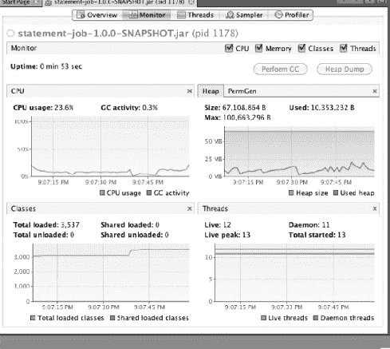

# 十一、扩容和调整

美国国税局在 2010 年处理了超过 2 . 36 亿份纳税申报表。亚特兰大的哈兹菲尔德-杰克逊机场在 2010 年接待了近 9000 万名乘客。脸书每天有超过 4500 万条状态更新。苹果公司在 iPhone 4ss 上市的前三天售出了超过 170 万部 iPhone 4。世界每天产生的数据量是惊人的。过去，随着数据的增加，处理数据的处理器也会增加。如果你的应用不够快，你可以等一年，买一个新的服务器，一切都会好的。

但现在情况不同了。CPU 的速度不再像以前那样快了。相反，通过向单个内核添加内核而不是晶体管，CPU 在并行处理方面变得更好，而不是在单个任务上变得更快。Spring Batch 背后的开发人员理解这一点，并将并行处理作为框架的主要焦点之一。本章着眼于以下内容:

*   *分析批处理作业:*您会看到一个分析批处理作业的过程，这样您做出的优化决策会对您的性能产生积极影响，而不是相反。
*   *评估 Spring Batch 中的每个可伸缩性选项:* Spring Batch 提供了许多不同的可伸缩性选项，我们将详细介绍每一个选项。

### 分析您的批处理过程

迈克尔·杰克逊在他 1975 年的书《程序设计的原则》中提出了两个最佳优化规则:

第一条规则。别这么做。

第二条规则(仅适用于专家)。先别做。

这背后的想法很简单。软件在其开发过程中会发生变化。正因为如此，在系统开发出来之前，几乎不可能对如何设计系统做出准确的决定。系统开发完成后，您可以测试它的性能瓶颈，并根据需要解决这些问题。如果不采用这种方法，你可能会被我第二喜欢的关于优化的引用所描述，这个引用来自 W. A. Wulf:

> 更多的计算犯罪是以效率的名义犯下的(不一定能实现)，而不是因为任何其他原因——包括盲目的愚蠢。

要分析任何 Java 应用，有许多选择，从免费到非常昂贵。然而，Java 虚拟机(JVM)中包含了一个最好的免费选项:VisualVM。这是可用于分析批处理作业的工具。在开始分析作业之前，让我们快速浏览一下 VisualVM 工具。

#### VisualVM 之旅

Oracle 的 VisualVM 是一个工具，可以让您深入了解 JVM 中正在发生的事情。作为 JConsole 的老大哥，VisualVM 不仅像 JConsole 一样提供 JMX 管理，还提供关于 CPU 和内存使用、方法执行时间以及线程管理和垃圾收集的信息。这一部分着眼于 VisualVM 工具的功能。

在你尝试 VisualVM 之前，你必须安装它。如果您运行的是高于版本 6 update 7 的 JDK 版本的 Oracle 发行版，那么您已经安装了它，因为它是 JDK 附带的。如果你运行的是不同版本的 Java，你可以在 http://visualvm.java.net/download.html 直接从甲骨文获得 VisualVM。

安装 VisualVM 后，您可以启动它。VisualVM 用左边的菜单和右边的起始页来迎接你，如图[图 11-1](#fig_11_1) 所示。

***图 11-1。**visual VM 的开始屏幕*

左侧的菜单分为四个部分:本地和远程是您可以找到的应用，您可以连接到配置文件。当您启动 VisualVM 时，因为它本身是一个 Java 应用，所以它出现在本地部分。在本地和远程部分的下面，您可以加载之前收集的想要分析的 Java VM 核心转储；或快照，是虚拟机在某个时间点的状态，您可以使用 VisualVM 捕获。为了查看 VisualVM 工具的一些功能，让我们将 VisualVM 连接到 Eclipse 的一个实例。

当你第一次连接到一个正在运行的 JVM 时，VisualVM 显示如图[图 11-2](#fig_11_2) 所示的屏幕。

***图 11-2。**连接到 Java 进程*

屏幕顶部有五个选项卡:

*   *Overview:* 提供正在运行的 Java 应用的概述，包括主类、应用名、进程 id 和启动时传递给 JVM 的参数。
*   *Monitor:* 显示图表，显示 CPU 利用率、内存利用率(堆和 PermGen)、加载的类的数量以及活动线程和守护线程的数量。Monitor 选项卡还允许您执行垃圾收集以及生成堆转储以供以后分析。
*   *Threads:* 显示应用已经启动的所有线程的信息，以及它们正在做什么(运行、睡眠、等待或监控)。这些数据以时间线、表格或详细信息的形式显示。
*   *Sampler:* 允许您对应用的 CPU 利用率和内存分配进行采样，并拍摄快照。CPU 显示哪些方法运行了多长时间。内存利用率显示了哪些类占用了多少内存。
*   *Profiler:* 看起来和感觉上类似于 Sampler 选项卡，但是允许您分析 CPU 和内存的使用情况，以及保存这两个资源当前所处状态的快照。您还可以比较多个快照。

除了选项卡之外，Overview 还显示了正在分析的当前 Java 进程的信息，包括进程 id、运行该进程的主机、JVM 参数以及 JVM 知道的系统属性的完整列表。

第二个页签是监控器页签，如图[图 11-3](#fig_11_3) 所示。

***图 11-3。**Eclipse 实例的 Monitor 选项卡*

Monitor 选项卡是从内存和 CPU 的角度整体查看 JVM 状态的地方。当您确定 Monitor 选项卡中确定的问题的原因时，其他选项卡会更有用(如果您一直内存不足或 CPU 由于某种原因而停滞)。“监控器”选项卡上的所有图表都可以调整大小，并且可以根据需要隐藏。

VisualVM 中可用的下一个选项卡是线程选项卡，显示在[图 11-4](#fig_11_4) 中。

***图 11-4。**visual VM 中的线程标签*

所有的 Java 应用都是多线程的。至少，您有一个主执行线程和一个额外的垃圾收集线程。然而，由于各种原因，大多数 Java 应用都会产生许多额外的线程。此选项卡允许您查看应用产生的各种线程的信息以及它们正在做什么。[图 11-4](#fig_11_4) 以时间线的形式显示了数据，但是数据也可以以表格和每个线程的详细图表的形式提供。

最后两个选项卡非常相似。如图[图 11-5](#fig_11_5) 所示，第一个是采样器选项卡。

***图 11-5。** VisualVM 的采样器标签*

在这两个选项卡中，你会看到相同的屏幕，包括 CPU 和内存按钮以及停止按钮。要开始按方法对 CPU 执行进行采样或按类对内存占用进行采样，请单击相应的按钮。这些表会根据 VisualVM 正在研究的虚拟机的当前状态定期更新。这两个选项卡的区别在于，Profiler 选项卡可以执行垃圾收集并保存收集到的数据，而 sampler 选项卡则不能。

VisualVM 是一个强大且可扩展的工具。许多插件可用来扩展现成的特性集。您可以添加一些功能，例如使用 Thread Inspector 插件查看当前正在执行的线程的堆栈跟踪，使用 Visual GC 插件进行可视化垃圾收集，以及通过 MBean 浏览器访问 MBean，以扩展 VisualVM 已经非常强大的工具套件。

现在，您已经了解了 Oracle 的 VisualVM 可以做什么，让我们看看如何使用它来分析 Spring 批处理应用。

#### 剖析 Spring 批处理应用

当您分析您的应用时，您通常会查看两件事情中的一件:CPU 的工作强度和工作位置，以及使用了多少内存和使用了哪些内存。第一个问题，CPU 工作有多努力，在哪里工作，与你的 CPU 在做什么有关。你的工作在计算上有困难吗？您的 CPU 是否将大量精力用在了业务逻辑之外的地方——例如，它花在解析文件上的时间是否比实际进行您想要的计算多？第二组问题围绕着记忆。您是否使用了大部分(如果不是全部)可用内存？如果是，是什么占用了所有的内存？您是否有一个 Hibernate 对象没有延迟加载集合，从而导致了这些问题？这一节将介绍如何在 Spring 批处理应用中查看资源的使用情况。

##### CPU 剖析

在分析应用时，最好有一个简单明了的检查清单。但这并不容易。有时候，剖析应用更像是一门艺术，而不是一门科学。本节将介绍如何获取与应用性能及其 CPU 利用率相关的数据。

当您查看 CPU 在您的应用中的性能时，通常会使用时间度量来确定热点(性能未达到预期的区域)。CPU 工作最多的是哪些领域？例如，如果你的代码中有一个无限循环，在它被触发后，CPU 会在那里花费大量的时间。然而，如果一切都运行良好，您可以预期看到没有瓶颈或者出现了您预期的瓶颈(I/O 通常是大多数现代系统的瓶颈)。

要查看工作中的 CPU 分析功能，让我们使用您在上一章中完成的语句作业。这项工作包括六个步骤，并与互联网、文件和数据库进行交互。[图 11-6](#fig_11_6) 从较高的层面显示了当前配置下的作业。

***图 11-6。**声明工作*

要执行作业，您可以使用命令`java -jar statement-job-1.0.0-SNAPSHOT.jar jobs/statementJob.xml statementJob –next`。启动作业后，它会出现在本地下方左侧的 VisualVM 菜单中。要连接到它，你只需要双击它。

现在，您已经连接到运行语句作业，您可以开始查看它是如何工作的。让我们先来看看 Monitor 选项卡，看看 CPU 有多忙。在使用包含 100 个客户和 20，000 多个事务的客户事务文件运行语句作业后，您可以看到该作业的 CPU 利用率极低。[图 11-7](#fig_11_7) 显示了作业运行后监控器选项卡中的图表。

***图 11-7。**报表作业的资源利用率*

如图 11-7 所示，语句作业不是一个 CPU 密集型的过程。事实上，如果您查看内存配置文件，该作业也不是非常占用内存。然而，你可以很容易地改变这一点。如果你在第 4 步使用的 ItemProcessor】)中添加一个小循环，你可以很快让你的 CPU 忙碌起来。[清单 11-1](#list_11_1) 显示了你添加的循环。

***清单 11-1。**用`PricingTiersItemProcessor`计算质数*

`package com.apress.springbatch.statement.processor;

import java.math.BigInteger;

import org.springframework.batch.item.ItemProcessor;

import com.apress.springbatch.statement.domain.AccountTransactionQuantity;
import com.apress.springbatch.statement.domain.PricingTier;

public class PricingTierItemProcessor implements
    ItemProcessor<AccountTransactionQuantity, AccountTransactionQuantity> {

    public AccountTransactionQuantity process(AccountTransactionQuantity atq)
            throws Exception {` 
`        for(int i = 0; i < 1000000; i++){
            new BigInteger(String.valueOf(i)).isProbablePrime(0);
        }

        if(atq.getTransactionCount() <= 1000) {
            atq.setTier(PricingTier.I);
        } else if(atq.getTransactionCount() > 1000 &&
                    atq.getTransactionCount() <= 100000) {
            atq.setTier(PricingTier.II);
        } else if(atq.getTransactionCount() > 100000 &&
                    atq.getTransactionCount() <= 1000000) {
            atq.setTier(PricingTier.III);
        } else {
            atq.setTier(PricingTier.IV);
        }

        return atq;
    }
}`

显然，你添加的用于计算 0 到 100 万之间所有质数的循环(如清单 11-1 所示)不太可能出现在你的代码中。但正是这种意外循环可能会在处理数百万个事务的过程中对批处理作业的性能造成灾难性的影响。[根据 VirtualVM，图 11-8](#fig_11_8) 显示了这个小循环对 CPU 利用率的影响。

***图 11-8。**更新后的语句作业的 CPU 利用率*

对于三行代码来说，这是一个相当大的峰值。这项工作从几乎不使用 CPU 发展到将 CPU 利用率提高到 50%。但是如果你不知道是什么导致了这个峰值，你下一步会去哪里找呢？

像这样识别出一个尖峰后，下一步要看的是采样器标签。通过在相同的条件下重新运行作业，您可以看到哪些单独的方法在作业的执行中显示为热点。在这种情况下，在您开始运行作业后，立即突出的方法是`com.mysql.jdbc.util.ReadAheadInputStream.fill()`。MySQL 驱动程序使用这个类从数据库中读取数据。正如您之前看到的，I/O 通常是当今业务系统中的主要处理瓶颈，因此看到这个类占用了大部分 CPU 并不奇怪。然而，在 Monitor 选项卡上的峰值开始的同时，一个新的类在使用大量 CPU 的方法列表中快速攀升:`com.apress.springbatch.statement.processor.PricingTierItemProcessor.process()`。在作业结束时，该方法已经占用了执行该作业所需的全部 CPU 时间的 32.6%，如图[图 11-9](#fig_11_9) 所示。

***图 11-9。**`PricingTierItemProcessor`占用了相当多的 CPU。*

当您遇到这样的场景时，查看是什么在消耗 CPU 执行时间的一个更好的方法是通过您的代码所使用的包名来过滤列表。在这种情况下，您可以过滤`com.apress.springbatch.statement`上的列表，查看哪些类占用了总 CPU 利用率的多少百分比。在这个过滤器下，这个例子中的罪魁祸首变得非常清楚:这个`PricingTierItemProcessor.process() method and the 32.6% of the CPU time it takes up.`。第二高的占 0.3% ( `com.apress.springbatch.statement.domain.PricingTier.values()`)。此时，您已经从工具中获得了所有的信息，是时候开始挖掘代码来确定`PricingTierItemProcessor.process()`中的什么使用了这么多的 CPU 了。

很简单，不是吗？不完全是。虽然这里使用的过程是您在任何系统中用来缩小问题范围的过程，但是问题很少这么容易跟踪。但是，使用 VisualVM，您可以逐步缩小工作中的问题范围。CPU 利用率不是唯一的性能指标。下一节将介绍如何使用 VisualVM 分析内存。

##### 记忆剖析

虽然 CPU 利用率可能看起来像是您最有可能看到问题的地方，但事实是，根据我的经验，内存问题更有可能出现在您的软件中。原因是您使用了许多在幕后做事情的框架。当您不正确地使用这些框架时，可能会创建大量的对象，而没有任何迹象表明它已经发生，直到您完全耗尽内存。本节介绍如何使用 VisualVM 分析内存使用情况。

为了了解如何分析内存，让我们调整一下之前的`PricingTierItemProcessor`。但是，这次不是占用处理时间，而是对其进行更新，以模拟创建一个失控的集合。虽然这个代码示例可能不是您在现实系统中看到的，但意外创建比您预期的更大的集合是内存问题的一个常见原因。[清单 11-2](#list_11_2) 显示了更新后的`PricingTierItemProcessor`的代码。

***清单 11-2。** `PricingTierItemProcessor`出现内存泄漏*

`package com.apress.springbatch.statement.processor;

import java.util.ArrayList;
import java.util.List;

import org.springframework.batch.item.ItemProcessor;

import com.apress.springbatch.statement.domain.AccountTransactionQuantity;
import com.apress.springbatch.statement.domain.PricingTier;

public class PricingTierItemProcessor implements
    ItemProcessor<AccountTransactionQuantity, AccountTransactionQuantity> {

    private List<PricingTier> accountsProcessed = new ArrayList<PricingTier>();

    public AccountTransactionQuantity process(AccountTransactionQuantity atq)
            throws Exception {

        if(atq.getTransactionCount() <= 1000) {
            atq.setTier(PricingTier.I);
        } else if(atq.getTransactionCount() > 1000 && atq.getTransactionCount() <= 100000) {
            atq.setTier(PricingTier.II);
        } else if(atq.getTransactionCount() > 100000 &&
                  atq.getTransactionCount() <= 1000000) {
            atq.setTier(PricingTier.III);
        } else {
            atq.setTier(PricingTier.IV);
        }

        for(int i = 0; i <atq.getTransactionCount() * 750; i++) {
            accountsProcessed.add(atq.getTier());
        }

        return atq;
    }
}`

在[清单 11-2](#list_11_2) 所示的版本中，您正在创建一个对象的`List`，它将存在于当前正在处理的块之后。在正常处理下，当块完成时，给定块中涉及的大多数对象都被垃圾收集，从而控制内存占用。通过像本例中这样的操作，您会发现内存占用会失控。

当您带着这个 bug 运行语句作业并使用 VisualVM 对其进行剖析时，您可以看到从内存角度来看事情很快就失控了；在步骤中途抛出一个`OutOfMemoryException`。[图 11-10](#fig_11_10) 显示了带有内存泄漏的语句作业的运行。

***图 11-10。**内存泄漏语句作业的监控结果*

注意在[图 11-10](#fig_11_10) 右上角的内存图的最末端，内存使用达到峰值，导致`OutOfMemoryException`。但是你怎么知道是什么导致了峰值呢？如果你不知道，采样器标签可能会透露一些信息。

您之前已经看到过，Sampler 选项卡可以显示哪些方法调用占用了 CPU，但它也可以告诉您哪些对象占用了宝贵的内存。要看到这一点，从像以前一样执行你的工作开始。当它运行时，使用 VisualVM 连接到进程并转到 Sampler 选项卡。要确定内存泄漏的原因，您需要确定随着内存使用量的增加会发生什么变化。例如在[图 11-11](#fig_11_11) 中，每个块代表一个类实例。每列中的块堆叠得越高，内存中的实例就越多。每一列代表 JVM 中的一个时间快照。当程序开始时，创建的实例数量很少(本例中只有一个)；随着时间的推移，这个数字会慢慢上升，当垃圾收集发生时，这个数字偶尔会下降。最后，它在最后达到 9 个实例。这是您在 VisualVM 中寻找的内存使用增加的类型。

***图 11-11。**程序生命周期中的内存利用率*

要在批处理作业中查看这种类型的更改，可以使用 VisualVM 的快照功能。当作业运行时，单击屏幕中间的快照按钮。当您拍摄快照时，VisualVM 会记录 JVM 的确切状态。您可以将此快照与其他快照进行比较，以确定哪些更改。通常，这种变化表示问题的位置。如果它不是确凿的证据，那它绝对是你应该开始寻找的地方。

正如本章前面几节所讨论的，扩展批处理作业的能力并不是解决性能错误的必要条件。相反，无论您做什么，具有上述缺陷的工作通常都不会扩展。相反，在应用 Spring Batch 或任何框架提供的可伸缩性特性之前，您需要解决应用中的问题。当您的系统不存在这些问题时，Spring Batch 提供的超越单线程、单 JVM 方法的特性是所有框架中最强的。在本章的剩余部分，您将了解如何使用 Spring Batch 的可伸缩性特性。

### 扩容工作

在企业中，当事情进展顺利时，数据就会变大。更多的顾客。更多交易。更多的网站点击率。更多，更多，更多。您的批处理作业需要能够跟上。Spring Batch 从一开始就被设计成高度可伸缩的，以满足小型批处理作业和大型企业级批处理基础设施的需求。本节将介绍 Spring Batch 在扩展默认流程之外的批处理作业时采用的四种不同方法:多线程步骤、并行步骤、远程分块和分区。

#### 多线程步骤

当一个步骤被处理时，默认情况下它是在一个单独的线程中处理的。虽然多线程步骤是并行化作业执行的最简单的方法，但与所有多线程环境一样，使用它时需要考虑一些方面。这一节将介绍 Spring Batch 的多线程步骤，以及如何在批处理作业中安全地使用它。

Spring Batch 的多线程步骤概念允许一个批处理作业使用 Spring 的`org.springframework.core.task.TaskExecutor`抽象在自己的线程中执行每个块。[图 11-12](#fig_11_12) 显示了使用多线程步骤时处理如何工作的一个例子。

***图 11-12。**多线程单步处理*

如图 11-12 所示，一个任务中的任何步骤都可以被配置成在一个线程池中执行，独立地处理每个块。在处理程序块时，Spring Batch 会跟踪相应的操作。如果在任何一个线程中出现错误，作业的处理将按照常规的 Spring 批处理功能回滚或终止。

要配置一个以多线程方式执行的步骤，您需要做的就是为给定的步骤配置一个对 TaskExecutor 的引用。如果以语句作业为例，[清单 11-3](#list_11_3) 展示了如何将`calculateTransactionFees`步骤(步骤 5)配置为多线程步骤。

***清单 11-3。** `calculateTransactionFees`作为多线程步骤*

…
`<step id="calculateTransactionFees">
  <tasklet task-executor="taskExecutor">
    <chunk reader="transactionPricingItemReader" processor="feesItemProcessor"
      writer="applyFeeWriter" commit-interval="100"/>
  </tasklet>
</step>

<beans:bean id="taskExecutor"
  class="org.springframework.core.task.SimpleAsyncTaskExecutor">
  <beans:property name="concurrencyLimit" value="10"/>
</beans:bean>
…`

如清单 11-3 所示，将 Spring 的多线程能力添加到工作中的一个步骤所需要的就是定义一个 TaskExecutor 实现(在本例中使用`org.springframework.core.task.SimpleAsyncTaskExecutor`)并在步骤中引用它。当您执行语句作业时，Spring 会创建一个 10 个线程的线程池，在不同的线程中执行每个块，或者并行执行 10 个块。你可以想象，这对大多数工作来说都是一个强有力的补充。

但是使用多线程步骤时有一个问题。Spring Batch 提供的大多数 ItemReaders 都是有状态的。Spring Batch 在重新启动作业时使用这种状态，因此它知道处理是从哪里停止的。但是，在多线程环境中，以多线程可访问的方式维护状态的对象(不同步等)可能会遇到线程覆盖彼此状态的问题。

为了绕过状态问题，您使用了 *staging* 在批处理运行中要处理的记录的概念。这个概念很简单。在该步骤开始之前，使用 StepListener 以某种方式标记所有记录，将它们标识为要在当前批处理运行(或 JobInstance)中处理的记录。可以通过更新数据库字段上的一个或多个特殊列或者将记录复制到临时表中来进行标记。然后，ItemReader 正常地读取在步骤开始时被标记为的记录。当每个块完成时，使用 ItemWriteListener 将刚刚处理的记录更新为已被处理。

为了将这个概念应用到语句作业的`calculateTransactionFees`步骤中，首先向事务表中添加两列:jobId 和 processed。jobId 存储语句作业当前运行的 run.id。第二列是一个布尔值，如果记录已被处理，则值为 true 如果记录未被处理，则值为 false。[图 11-13](#fig_11_13) 显示了更新后的表格定义。

***图 11-13。**更新了包含暂存列的交易表的数据模型*

为了使用这些列，您需要创建一个 StepListener 来更新您用 jobId 处理的记录，并将您处理的记录的 processed 标志设置为 false。为此，您创建了一个名为`StagingStepListener`的 StepListener，它更新您配置的任何表上的这些列，并为其他表重用它。[清单 11-4](#list_11_4) 显示了`StagingStepListener`的代码。

***清单 11-4。**T4`StagingStepListener`*

`package com.apress.springbatch.statement.listener;
import org.springframework.batch.core.StepListener;
import org.springframework.batch.core.annotation.BeforeStep;
import org.springframework.jdbc.core.JdbcTemplate;

public class StagingStepListener extends JdbcTemplate implements StepListener {

    private String SQL = " set jobId = ?, processed = false ";
    private String tableName;
    private String whereClause = "";
    private long jobId;

    @BeforeStep
    public void stageRecords() {
        update("update " + tableName + SQL + whereClause, new Object [] {jobId});
    }

    public void setTableName(String tableName) {
        this.tableName = tableName;
    }` 
`    public void setJobId(long jobId) {
        this.jobId = jobId;
    }

    public void setWhereClause(String whereClause) {
        if(whereClause != null) {
            this.whereClause = whereClause;
        }
    }
}`

如您所见，[清单 11-4](#list_11_4) 中的 StepListener 更新了您用作业 id 标识的所有记录，这些记录将由您的步骤处理。台阶的另一端是`ItemWriteListener`。这个侦听器接口在块被写入之前或之后(这里是之后)被调用。方法`afterWrite`采用 ItemWriter 先前编写的相同的条目列表。使用此功能，您可以更新要标记为已处理的暂存记录。[清单 11-5](#list_11_5) 显示了这个监听器的代码。

***清单 11-5。**T4`StagingChunkUpdater`*

`package com.apress.springbatch.statement.listener;

import java.util.List;

import org.springframework.batch.core.ItemWriteListener;
import org.springframework.jdbc.core.JdbcTemplate;

import com.apress.springbatch.statement.domain.AccountTransaction;

public class StagingChunkUpdater extends JdbcTemplate implements
    ItemWriteListener<AccountTransaction> {

    private String SQL = " set processed = true ";
    private String tableName;
    private String whereClause = "";

    public void beforeWrite(List<? extends AccountTransaction> items) {
    }

    public void afterWrite(List<? extends AccountTransaction> items) {
        for (AccountTransaction accountTransaction : items) {
            update("update " + tableName + SQL + whereClause,
                         new Object[] {accountTransaction.getId()});
        }
    }

    public void onWriteError(Exception exception,
            List<? extends AccountTransaction> items) {
    }

    public void setTableName(String tableName) {
        this.tableName = tableName;` `    }

    public void setWhereClause(String whereClause) {
        this.whereClause = whereClause;
    }
}`

当块被处理时，不管线程是什么，`StagingChunkUpdater`更新被标记为已处理的项目。你还需要做两件事。首先，您需要更新配置以使用新的侦听器；其次，您需要更新用于该步骤的 ItemReader 的查询，以便在其标准中包含 jobId 和 processed 标志。[清单 11-6](#list_11_6) 显示了更新后的配置，包括更新后的 ItemReader、新的登台监听器和更新后的`calculateTransactionFees`步骤。

***清单 11-6。**使用分段监听器的多线程步骤的配置*

…
`<beans:bean id="transactionPricingItemReader"
  class="org.springframework.batch.item.database.JdbcCursorItemReader" scope="step">
  <beans:property name="dataSource" ref="dataSource"/>
  <beans:property name="sql" value="select a.id as accountId, a.accountNumber,
     t.id as transactionId, t.qty, tk.ticker, a.tier, t.executedTime, t.dollarAmount from
     account a inner join transaction t on a.id = t.account_id inner join ticker tk on
     t.tickerId = tk.id and t.processed = false and t.jobId = #{jobParameters[run.id]}
     order by t.executedTime"/>
  <beans:property name="rowMapper" ref="transactionPricingRowMapper"/>
</beans:bean>

<beans:bean id="transactionPricingRowMapper"
  class="com.apress.springbatch.statement.reader.AccountTransactionRowMapper"/>

<step id="calculateTransactionFees">
  <tasklet task-executor="taskExecutor">
    <chunk reader="transactionPricingItemReader" processor="feesItemProcessor"
      writer="applyFeeWriter" commit-interval="100"/>
    <listeners>
      <listener ref="stagingStepListener"/>
      <listener ref="stagingChunkUpdater"/>
    </listeners>
  </tasklet>
</step>

<beans:bean id="stagingStepListener"
  class="com.apress.springbatch.statement.listener.StagingStepListener" scope="step">` `  <beans:property name="dataSource" ref="dataSource"/>
  <beans:property name="tableName" value="transaction"/>
  <beans:property name="whereClause"
    value="where jobId is null and processed is null"/>
  <beans:property name="jobId" value="#{jobParameters[run.id]}"/>
</beans:bean>

<beans:bean id="stagingChunkUpdater"
  class="com.apress.springbatch.statement.listener.StagingChunkUpdater" scope="step">
  <beans:property name="dataSource" ref="dataSource"/>
  <beans:property name="tableName" value="transaction"/>
  <beans:property name="whereClause" value="where id = ?"/>
</beans:bean>

<beans:bean id="taskExecutor"
  class="org.springframework.core.task.SimpleAsyncTaskExecutor">
  <beans:property name="concurrencyLimit" value="10"/>
</beans:bean>
…`

通过采用分段记录的方法，您可以让 Spring Batch 不必担心步骤的状态，因为它是单独维护的。不幸的是，这种解决方案仍然不完美，因为它只在使用可以这样管理的输入源时才实用(数据库是典型的用例)。平面文件不能以分阶段的方式管理。然而，最终大多数输入情况都可以通过允许多线程处理的方式来解决。

#### 并行步骤

多线程步骤提供了在作业的同一步骤中并行处理大量项目的能力，但有时并行执行整个步骤也很有帮助。以导入多个彼此没有关系的文件为例。一个导入没有理由需要等待另一个导入完成后才开始。Spring Batch 并行执行步骤甚至流程(可重用的步骤组)的能力允许您提高一个任务的总吞吐量。这一节将介绍如何使用 Spring Batch 的并行步骤和流程来提高作业的整体性能。

如果你想在网上提交一份订单，在物品被放入箱子并交给邮递员送到你家门口之前，需要做一些事情。你需要保存订单。付款需要确认。库存需要验证。需要为要从仓库获取并包装的物料生成提货清单。但并非所有这些工作都需要按顺序执行。作为并行处理的一个例子，让我们看一个作业，它接收一个订单，将其导入数据库，然后并行地验证付款和库存。如果两者都可用，则处理订单。[图 11-14](#fig_11_14) 显示了该示例作业的流程图。

***图 11-14。**订单处理作业的流程*

这是一个分四步走的工作。步骤 1 用步骤 2 中要读取的数据预填充 JMS 队列。 [1](#CHP-11-FN-1) 虽然可以使用任意数量的输入选项，但是使用 JMS 进行订单交付对于现实世界来说是一个现实的选项；所以，这个例子使用了它。第 2 步从 JMS 队列中读取并保存数据库，这样如果在以后的处理过程中出现问题，您就不会丢失订单。从那里，您并行执行两个不同的步骤。一个步骤是验证资金是否可用于购买。第二种是用库存系统核实库存。如果这两个检查都成功，则处理订单并生成仓库的挑库单。

要开始完成这项工作，让我们看一下对象模型。具体有三个域类:`Customer`、`Order`、`OrderItem`，如图[图 11-15](#fig_11_15) 所示。

***图 11-15。**并行处理作业的类图*

一个`Order`，如图[图 11-15](#fig_11_15) 所示，由一个`Customer`、订单特定信息(主要是付款信息)和一个`OrderItem`列表组成。客户购买的每件商品在列表中都有一个`OrderItem`条目，包含商品特定信息，包括商品编号和订购数量。

为了完成这项工作，您需要编写少量代码。具体来说:

*   为您的工作生成样本订单的 ItemReader
*   `CreditService/InventoryService`:作为项目处理器的服务，用于验证用户的信用，并验证您是否有库存来处理订单
*   `PickListFormatter`:生成您生成的选择列表所需格式的行聚合器

____________

从全局来看，这第一步可能没什么意义。它显然不会进入你的生产工作。相反，这是在执行作业之前构建测试数据的好方法。

由于没有要处理的订单，你什么也做不了，所以你工作的第一步是生成要处理的订单。下一节将讨论实现这一点所需的代码和配置。

##### 预加载数据进行处理

没有店面卖东西，就需要自己建立订单进行加工。为此，您将创建一个基于硬编码数据生成随机订单的 ItemReader 实现。虽然您不会在生产中这样做，但它将允许您设置测试其余工作所需的数据。在这一节中，我们将对生成测试数据所需的组件进行编码和配置。

让我们从查看`OrderGenerator` ItemReader 实现开始。为了给本书中的大部分工作生成测试文件，我编写了 Ruby 脚本(包含在本书的源代码中)来生成数据，这比我手工编写要快得多。这个类只不过是那些 Ruby 脚本的 Java 等价物。[清单 11-7](#list_11_7) 显示了`OrderGenerator`的代码。

***清单 11-7。**T4`OrderGenerator`*

`package com.apress.springbatch.chapter11processor;

import java.math.BigDecimal;
import java.text.DateFormat;
import java.text.SimpleDateFormat;
import java.util.ArrayList;
import java.util.Date;
import java.util.List;
import java.util.Random;

import org.springframework.batch.item.ItemReader;

import com.apress.springbatch.chapter11.domain.Customer;
import com.apress.springbatch.chapter11.domain.Order;
import com.apress.springbatch.chapter11.domain.OrderItem;

public class OrderGenerator implements ItemReader<Order> {

    private static final String [] STREETS = {"Second", "Third", "Fourth", "Park", "Fifth"};
    private static final String[] CITIES = {"Franklin", "Clinton", "Springfield",
        "Greenville"};
    private static final String[] FIRST_NAME = {"Jacob", "Ethan", "Michael", "Alexander"};
    private static final String[] LAST_NAME = {"Smith", "Jones", "Thompson", "Williams"};
    private static final String[] STATES = {"AL", "AK", "AZ", "AR", "CA", "CO", "CT", "DE"};

    private Random generator = new Random();
    private DateFormat formatter = new SimpleDateFormat("MM/yy");
    private int counter = 0;

    public Order read() throws Exception {
        if(counter < 100) {
            Order curOrder = new Order();

            curOrder.setCreditCardNumber(String.valueOf(generator.nextLong()));` `            curOrder.setCustomer(buildCustomer());
            curOrder.setExpirationDate(formatter.format(new Date()));
            curOrder.setPlacedOn(new Date());
            curOrder.setItems(buildItems(curOrder));

            counter ++;

            return curOrder;
        } else {
            return null;
        }
    }

    private List<OrderItem> buildItems(Order order) {
        List<OrderItem> items = new ArrayList<OrderItem>();
        int total = 0;

        while(total <= 0) {
            total = generator.nextInt(10);
        }

        for(int i = 0; i < total; i++) {
            OrderItem item = new OrderItem();

            item.setItemNumber(String.format("%09d", generator.nextLong()));
            item.setPrice(BigDecimal.valueOf(generator.nextDouble()));
            item.setQty(generator.nextInt(5));
            item.setOrder(order);

            items.add(item);
        }

        return items;
    }

    private Customer buildCustomer() {
        Customer customer = new Customer();

        customer.setAddress(generator.nextInt(999) + " " +
                            STREETS[counter % STREETS.length]);
        customer.setCity(CITIES[counter % CITIES.length]);
        customer.setCustomerName(FIRST_NAME[counter % FIRST_NAME.length] + " " +
                                 LAST_NAME[counter % LAST_NAME.length]);
        customer.setState(STATES[counter % STATES.length]);
        customer.setZip(String.format("%05d", generator.nextInt(99999)));

        return customer;
    }
}`

代码非常简单。您构建一个`Order`对象，填充`Customer`并生成几个`OrderItem`，然后发送它。当您使用 Spring Batch 像这样设置数据时，您可以轻松地运行各种测试场景。

要使用这个类，你需要开始构建你的工作。因为第一步只包括使用`OrderGenerator`生成`Order`并将它们写入 JMS 队列，所以您可以将所有这些连接起来并进行测试，而不需要做任何进一步的工作。[清单 11-8](#list_11_8) 显示了作业的配置，它是一个单步作业，生成数据并将其放入队列中，供以后的步骤提取。

***清单 11-8。**配置了第一步*的`parallelJob.xml`中配置的并行作业

`<?xml version="1.0" encoding="UTF-8"?>
<beans:beans
  xmlns:beans="http://www.springframework.org/schema/beans"
  xmlns:util="http://www.springframework.org/schema/beans"
  xmlns:xsi="http://www.w3.org/2001/XMLSchema-instance"
  xsi:schemaLocation="http://www.springframework.org/schema/beans
     http://www.springframework.org/schema/beans/spring-beans-3.0.xsd
    http://www.springframework.org/schema/util
    http://www.springframework.org/schema/util/spring-util.xsd
    http://www.springframework.org/schema/batch
    http://www.springframework.org/schema/batch/spring-batch-2.1.xsd">

  <beans:import resource="../launch-context.xml"/>

  <beans:bean id="jmsWriter" class="org.springframework.batch.item.jms.JmsItemWriter">
    <beans:property name="jmsTemplate" ref="jmsTemplate"/>
  </beans:bean>

  <beans:bean id="dataGenerator"    
    class="com.apress.springbatch.chapter11.processor.OrderGenerator"/>

  <step id="preloadDataStep">
    <tasklet>
      <chunk reader="dataGenerator" writer="jmsWriter" commit-interval="10"/>
    </tasklet>
  </step>

  <job id="parallelJob">
    <step id="step1" parent="preloadDataStep"/>
  </job>
</beans:beans>`

虽然任务本身现在已经配置好了，但是您需要对这个任务的`launch-context.xml`和您的 POM 文件做一些小的调整。具体来说，您需要在`launch-context.xml`中配置 JMS 支持和 Hibernate 支持(您使用 Hibernate 来简化对象层次结构的存储),并将适当的依赖项添加到 POM 文件中。 [2](#CHP-11-FN-2)

让我们首先更新 POM 文件。清单 11-9 显示了 ActiveMQ 和 Spring 的 JMS 支持的附加依赖，以及 Hibernate 依赖和 Spring 的 ORM 支持模块。

____________

参见[第 7 章](07.html#ch7)和[第 9 章](09.html#ch9)，了解更多关于在工作中使用 Hibernate 和 JMS 的信息。

***清单 11-9。**更新 POM 文件以支持 JMS 和 Hibernate*

`...
<dependency>
  <groupId>org.springframework</groupId>
  <artifactId>spring-jms</artifactId>
  <version>${spring.framework.version}</version>
</dependency>
<dependency>
  <groupId>org.springframework</groupId>
  <artifactId>spring-orm</artifactId>
  <version>${spring.framework.version}</version>
</dependency>
<dependency>
  <groupId>org.hibernate</groupId>
  <artifactId>hibernate-core</artifactId>
  <version>3.3.0.SP1</version>
</dependency>
<dependency>
  <groupId>org.hibernate</groupId>
  <artifactId>hibernate-entitymanager</artifactId>
  <optional>true</optional>
  <version>3.3.2.GA</version>
</dependency>
<dependency>
  <groupId>org.hibernate</groupId>
  <artifactId>hibernate-annotations</artifactId>
  <optional>true</optional>
  <version>3.4.0.GA</version>
</dependency>
<dependency>
  <groupId>org.apache.activemq</groupId>
  <artifactId>activemq-core</artifactId>
  <version>5.4.2</version>
  <exclusions>
    <exclusion>
      <groupId>org.apache.activemq</groupId>
      <artifactId>activeio-core</artifactId>
    </exclusion>
  </exclusions>
</dependency>
    ...`

POM 文件更新后，您可以更新`launch-context.xml`。所需的更新是 JMS 资源(连接工厂、目的地和`JmsTemplate`)以及 Hibernate 资源(一个`SessionFactory`和更新的事务管理器)的配置。[清单 11-10](#list_11_10) 显示了这个任务的`launch-context.xml`文件。

***清单 11-10。**T4`launch-context.xml`*

`<?xml version="1.0" encoding="UTF-8"?>
<beans
  xmlns:p="http://www.springframework.org/schema/p"
  xmlns:xsi="http://www.w3.org/2001/XMLSchema-instance"
  xsi:schemaLocation="http://www.springframework.org/schema/beans` `http://www.springframework.org/schema/beans/spring-beans-3.0.xsd">

  <bean id="jobOperator" class="org.springframework.batch.core.launch.support.SimpleJobOperator"
    p:jobLauncher-ref="jobLauncher" p:jobExplorer-ref="jobExplorer"
    p:jobRepository-ref="jobRepository" p:jobRegistry-ref="jobRegistry" />

  <bean id="jobExplorer"
    class="org.springframework.batch.core.explore.support.JobExplorerFactoryBean"
    p:dataSource-ref="dataSource" />

  <bean id="jobRegistry"
     class="org.springframework.batch.core.configuration.support.MapJobRegistry" />

  <bean class="org.springframework.batch.core.configuration.support.JobRegistryBeanPostProcessor">
    <property name="jobRegistry" ref="jobRegistry"/>
  </bean>

  <bean id="jobLauncher" class="org.springframework.batch.core.launch.support.SimpleJobLauncher">
    <property name="jobRepository" ref="jobRepository" />
  </bean>

  <bean id="jobRepository"
    class="org.springframework.batch.core.repository.support.JobRepositoryFactoryBean"
    p:dataSource-ref="dataSource" p:transactionManager-ref="transactionManager" />

  <bean id="jmsConnectionFactory" class="org.apache.activemq.ActiveMQConnectionFactory">
    <property name="brokerURL" value="vm://localhost"/>
  </bean>

  <bean id="jmsTemplate" class="org.springframework.jms.core.JmsTemplate">
    <property name="connectionFactory" ref="jmsConnectionFactory"/>
    <property name="defaultDestination" ref="destination"/>
    <property name="receiveTimeout" value="5000"/>
  </bean>

  <bean id="destination" class="org.apache.activemq.command.ActiveMQQueue">
    <constructor-arg value="orderQueue"/>
  </bean>

  <bean id="dataSource" class="org.apache.commons.dbcp.BasicDataSource">
    <property name="driverClassName" value="${batch.jdbc.driver}" />
    <property name="url" value="${batch.jdbc.url}" />
    <property name="username" value="${batch.jdbc.user}" />
    <property name="password" value="${batch.jdbc.password}" />
  </bean>

  <bean id="sessionFactory" class="org.springframework.orm.hibernate3.LocalSessionFactoryBean">` `    <property name="dataSource" ref="dataSource" />
    <property name="configLocation">
      <value>classpath:hibernate.cfg.xml</value>
    </property>
    <property  name="configurationClass">
      <value>org.hibernate.cfg.AnnotationConfiguration</value>
    </property>
    <property name="hibernateProperties">
      <props>
        <prop key="hibernate.show_sql">false</prop>
        <prop key="hibernate.format_sql">false</prop>
        <prop key="hibernate.hbm2ddl.auto">update</prop>
        <prop key="hibernate.dialect">org.hibernate.dialect.MySQLDialect</prop>
      </props>
    </property>
  </bean>

  <bean id="transactionManager"
    class="org.springframework.orm.hibernate3.HibernateTransactionManager"
    lazy-init="true">
    <property name="sessionFactory" ref="sessionFactory" />
  </bean>

  <bean id="placeholderProperties"
    class="org.springframework.beans.factory.config.PropertyPlaceholderConfigurer">
    <property name="location" value="classpath:batch.properties" />
    <property name="systemPropertiesModeName"
      value="SYSTEM_PROPERTIES_MODE_OVERRIDE" />
    <property name="ignoreUnresolvablePlaceholders" value="true" />
    <property name="order" value="1" />
  </bean>
</beans>`

如你所见，绝大多数的`launch-context.xml`是默认的。主要的变化是在最后添加了 JMS 资源和 Hibernate 资源。请注意，默认配置的`TransactionManager`已经被替换为您在此工作中使用的那个。

为了让这项工作的各个部分协同工作，您需要做的最后一项配置是`hibernate.cfg.xml`文件。因为您使用注释来进行映射，所以`hibernate.cfg.xml`文件只不过是被映射的类的列表。[清单 11-11](#list_11_11) 包含了这个例子的文件源。

***清单 11-11。**`hibernate.cfg.xml`T5】*

`<!DOCTYPE hibernate-configuration PUBLIC
  "-//Hibernate/Hibernate Configuration DTD 3.0//EN"
  "http://hibernate.sourceforge.net/hibernate-configuration-3.0.dtd">

<hibernate-configuration>
  <session-factory>
    <mapping class="com.apress.springbatch.chapter11.domain.Customer"/>
    <mapping class="com.apress.springbatch.chapter11.domain.Order"/>
    <mapping class="com.apress.springbatch.chapter11.domain.OrderItem"/>
  </session-factory>
</hibernate-configuration>`

当您按原样构建和运行作业时，您可以直接使用 JobRepository 或检查 Spring Batch Admin 来确认 100 个项目被读取，100 个项目被写入(如在`OrderGenerator`类中指定的)到您的 JMS 队列。无论是哪种情况，您都可以开始构建完成工作的批处理作业。

##### 将订单载入数据库

作业的第一步(实际上是第二步)从 JMS 队列中读取订单，并将它们存储在数据库中以供进一步处理。像以前的许多步骤一样，这一步只包含 XML 配置。您需要配置一个`JMSItemReader`来从队列中获取订单，配置一个`HibernateItemWriter`来将对象存储在数据库中。然而，在查看 ItemReader 和 ItemWriter 的配置之前，[清单 11-12](#list_11_12) 中有`Customer`、`Order`和`OrderItem`对象的代码，显示了它们的 Hibernate 映射。

***清单 11-12。**休眠映射为`Customer`、`Order`和`OrderItem`、T6】*

`**Customer**
package com.apress.springbatch.chapter11.domain;

import java.io.Serializable;

import javax.persistence.Entity;
import javax.persistence.GeneratedValue;
import javax.persistence.GenerationType;
import javax.persistence.Id;
import javax.persistence.Table;
import javax.persistence.Version;

@Entity
@Table(name="customers")
public class Customer implements Serializable{

    private static final long serialVersionUID = 1L;

    @Id` `@GeneratedValue(strategy = GenerationType.IDENTITY)
    private long id;
    @Version
    private long version;
    private String customerName;
    private String address;
    private String city;
    private String state;
    private String zip;

    // Accessors go here
    ...
}

**Order**
package com.apress.springbatch.chapter11.domain;

import java.io.Serializable;
import java.util.Date;
import java.util.List;

import javax.persistence.CascadeType;
import javax.persistence.Entity;
import javax.persistence.FetchType;
import javax.persistence.GeneratedValue;
import javax.persistence.GenerationType;
import javax.persistence.Id;
import javax.persistence.ManyToOne;
import javax.persistence.OneToMany;
import javax.persistence.Table;
import javax.persistence.Version;

@Entity
@Table(name="orders")
public class Order implements Serializable{

    private static final long serialVersionUID = 1L;

    @Id
    @GeneratedValue(strategy = GenerationType.IDENTITY)
    private long id;
    @Version
    private long version;

    @ManyToOne(cascade = CascadeType.ALL)
    private Customer customer;
    private String creditCardNumber;
    private String expirationDate;

    @OneToMany(cascade = CascadeType.ALL, mappedBy="order", fetch = FetchType.LAZY)
    private List<OrderItem> items;` `    private Date placedOn;
    private Boolean creditValidated;

    // Accessors go here
    ...
}

**OrderItem**
package com.apress.springbatch.chapter11.domain;

import java.io.Serializable;
import java.math.BigDecimal;

import javax.persistence.Entity;
import javax.persistence.GeneratedValue;
import javax.persistence.GenerationType;
import javax.persistence.Id;
import javax.persistence.ManyToOne;
import javax.persistence.Table;
import javax.persistence.Version;

@Entity
@Table(name="orderItems")
public class OrderItem implements Serializable{

    private static final long serialVersionUID = 1L;

    @Id
    @GeneratedValue(strategy = GenerationType.IDENTITY)
    private long id;
    @Version
    private long version;
    private String itemNumber;
    private int qty;
    private BigDecimal price;
    private Boolean inventoryValidated;
    @ManyToOne
    private Order order;

    // Accessors go here
    ...
}`

注释是 JMS 和数据库资源基线配置的最后一部分。现在，您可以配置作业的第 2 步，从 JMS 队列中读取订单，并将它们保存在数据库中。[清单 11-13](#list_11_13) 显示了并行作业第二步的配置。

***清单 11-13。**`ParallelJob`的第二步*

`...
<beans:bean id="jmsReader" class="org.springframework.batch.item.jms.JmsItemReader">
  <beans:property name="jmsTemplate" ref="jmsTemplate"/>
</beans:bean>

<beans:bean id="orderWriter"
  class="org.springframework.batch.item.database.HibernateItemWriter">
  <beans:property name="sessionFactory" ref="sessionFactory"/>
</beans:bean>

<step id="batchOrderProcessingStep">
  <tasklet>
    <chunk reader="jmsReader" writer="orderWriter" commit-interval="10"/>
  </tasklet>
</step>

<job id="parallelJob">
  <step id="step1" parent="preloadDataStep" next="step2"/>
  <step id="step2" parent="batchOrderProcessingStep"/>
</job>
...`

接下来，您需要验证客户的信用卡是否可以使用，以及您是否有库存来完成订单。因为这些功能并不直接相关，所以您可以并行执行它们来提高作业的整体吞吐量。接下来您将看到这些步骤是如何配置的。

##### 配置并行步骤

为了并行执行步骤，Spring Batch 再次使用 Spring 的 TaskExecutor。在这种情况下，每个流都在自己的线程中执行，从而允许您并行执行多个流。要对此进行配置，可以使用 Spring Batch 的`split`标签。`split`标签有三个必需的属性:

*   `id`:元素的 id。
*   `task-executor`:对 Spring Batch 用来管理用于并行处理的线程的 TaskExecutor 实现的引用。
*   `next`:告诉 Spring Batch 在所有流程成功完成后执行哪个步骤。一个`split`标签将多个步骤包装成一个伪步骤；如果任何流在执行中失败，同时运行的其他步骤完成，然后当并行处理结束时作业失败。

需要注意的是，使用`split`的作业的执行顺序类似于常规作业的执行顺序。在常规作业中，一个步骤直到该步骤的所有项目都被处理后才完成，下一个步骤直到上一个步骤完成后才开始。使用`split`，直到分割中配置的所有流都已完成，才执行分割后的步骤。

 **注意**拆分后的步骤直到一个拆分内的所有流程完成后才执行。

为了做这项工作所需的信用验证和库存检查，您可以开发一些高科技服务来为您执行检查。在您的步骤中，您将这些服务中的每一个都用作项目处理器。首先我们来看`CreditServiceImpl`，它负责验证客户的信用卡是否会通过。清单 11-14 显示了与这个过程相关的代码。

***清单 11-14。**T4`CreditServiceImpl`*

`package com.apress.springbatch.chapter11.service.impl;

import com.apress.springbatch.chapter11.domain.Order;
import com.apress.springbatch.chapter11.service.CreditService;

public class CreditServiceImpl implements CreditService {

@Override    
public Order validateCharge(Order order) {
        if(order.getId() % 3 == 0) {
            order.setCreditValidated(true);
        } else {
            order.setCreditValidated(false);
        }

        return order;
    }
}`

因为您在这里实际上不处理订单，所以验证信用卡通过没有多大意义。相反，该服务批准了三分之一的订单。因为`CreditServiceImpl`有一个简单的方法来验证资金，你可以想象`InventoryServiceImpl`有一个类似的方法来确保你手头有产品来完成订单。[清单 11-15](#list_11_15) 显示了验证每个`OrderItem`的库存的代码。

***清单 11-15。**T4`InventoryServiceImpl`*

`package com.apress.springbatch.chapter11.service.impl;

import com.apress.springbatch.chapter11.domain.OrderItem;
import com.apress.springbatch.chapter11.service.InventoryService;

public class InventoryServiceImpl implements InventoryService {

    @Override
    public OrderItem validateInventory(OrderItem item) {
        if(item.getId() % 2 == 0) {
            item.setInventoryValidated(true);
        } else {` `            item.setInventoryValidated(false);
        }

        return item;
    }
}`

现在已经编写了业务处理，让我们配置这两个服务并行运行。为此，如前所述，您使用 Spring Batch 的`split`标签和 Spring 提供的`SimpleAsyncTaskExecutor`来处理线程管理。[清单 11-16](#list_11_16) 显示了您并行运行的步骤的配置。

***清单 11-16。**并行步骤的配置*

`…
<beans:bean id="taskExecutor"
  class="org.springframework.core.task.SimpleAsyncTaskExecutor"/>

<beans:bean id="orderItemReader"
  class="org.springframework.batch.item.database.HibernateCursorItemReader"
  scope="step">
  <beans:property name="sessionFactory" ref="sessionFactory"/>
  <beans:property name="queryString" value="from OrderItem where inventoryValidated is null"/>
</beans:bean>

<beans:bean id="orderReader"
  class="org.springframework.batch.item.database.HibernateCursorItemReader"
  scope="step">
  <beans:property name="sessionFactory" ref="sessionFactory"/>
  <beans:property name="queryString" value="from Order where creditValidated is null"/>
</beans:bean>

<beans:bean id="orderWriter"
  class="org.springframework.batch.item.database.HibernateItemWriter">
  <beans:property name="sessionFactory" ref="sessionFactory"/>
</beans:bean>

<beans:bean id="creditService"
  class="com.apress.springbatch.chapter11.service.impl.CreditServiceImpl"/>

<beans:bean id="creditVerificationProcessor"
  class="org.springframework.batch.item.adapter.ItemProcessorAdapter">
  <beans:property name="targetObject" ref="creditService"/>` `  <beans:property name="targetMethod" value="validateCharge"/>
</beans:bean>

<beans:bean id="inventoryService"
  class="com.apress.springbatch.chapter11.service.impl.InventoryServiceImpl"/>

<beans:bean id="inventoryVerificationProcessor"
  class="org.springframework.batch.item.adapter.ItemProcessorAdapter">
  <beans:property name="targetObject" ref="inventoryService"/>
  <beans:property name="targetMethod" value="validateInventory"/>
</beans:bean>

<step id="creditVerificationStep">
  <tasklet>
    <chunk reader="orderReader" processor="creditVerificationProcessor"
      writer="orderWriter" commit-interval="10"/>
  </tasklet>
</step>

<step id="inventoryVerificationStep">
  <tasklet>
    <chunk reader="orderItemReader" processor="inventoryVerificationProcessor"
      writer="orderWriter" commit-interval="10"/>
  </tasklet>
</step>

<job id="parallelJob">
  <step id="step1" parent="preloadDataStep" next="step2"/>
  <step id="step2" parent="batchOrderProcessingStep" next="parallelProcessing"/>
  <split id="parallelProcessing" task-executor="taskExecutor">
    <flow>
      <step id="step3" parent="creditVerificationStep"/>
    </flow>
    <flow>
      <step id="step4" parent="inventoryVerificationStep"/>
    </flow>
  </split>
</job>
…`

[清单 11-16](#list_11_16) 显示了你所期望的所需的项目阅读器和项目写入器的配置，以及`creditService`和`inventoryService`。您使用`ItemProcessorAdapter`将您的服务转换成项目处理器，并最终连接每个步骤。对于这个例子来说，有趣的是工作本身。

在`parallelJob`中，您从步骤 1 开始，它指向步骤 2(通过`next`属性)。然而，步骤 2 并没有指向`next`属性中的一个步骤。相反，它指向`split`标签。在`split`标签中，您定义了两个流:一个用于信用卡验证(使用`creditVerificationStep`)，一个用于库存验证(使用`inventoryVerificationStep`)。这两个流程同时执行。当两个步骤都完成时，就认为`parallelProcessing`“步骤”完成了。

这就是作业的并行处理方面。一旦分割伪步骤完成，就执行最后一步，即生成选择列表。在下一节中，您将看到该步骤所需的代码以及该步骤是如何配置的。

##### 构建选择列表

这项工作的最后一个难题是为仓库写出提取商品的选择列表。在这种情况下，您为通过信用验证步骤(`creditValidated` = `true`)的每个订单生成一个选择列表，并且订单中的所有`OrderItem`都通过了库存检查(`inventoryValidated` = `true`)。为此，您有一个`HibernateCursorItemReader`,它只读取适当的订单，并将它们传递给`MultiResourceItemWriter`,这样每个选择列表都包含在自己的文件中。对于这最后一步，您需要为编写器在`LineAggregator`中编写少量代码，因为您需要按顺序循环遍历`OrderItem`。[清单 11-17](#list_11_17) 显示了`LineAggregator`、`PickListFormatter`的代码。

***清单 11-17。**T4`PickListFormatter`*

`package com.apress.springbatch.chapter11.writer;

import org.springframework.batch.item.file.transform.LineAggregator;

import com.apress.springbatch.chapter11.domain.Order;
import com.apress.springbatch.chapter11.domain.OrderItem;

public class PickListFormatter implements LineAggregator<Order> {

    public String aggregate(Order order) {
        StringBuilder builder = new StringBuilder();

        builder.append("Items to pick\n");

        if(order.getItems() != null) {
            for (OrderItem item : order.getItems()) {
                builder.append(item.getItemNumber() + ":" + item.getQty() + "\n");
            }
        } else {
            builder.append("No items to pick");
        }

        return builder.toString();
    }
}`

因为您需要做的只是写一个小标题(“要挑选的物品”)，然后列出物品编号和要挑选的数量，所以这个`LineAggregator`的编码非常简单。最后一个步骤的配置包括向作业添加新步骤，并在两个流程完成后将`split`标记指向该步骤。[清单 11-18](#list_11_18) 显示了最后一步的配置和完成的工作。

***清单 11-18。**已完成的`parallelJob`配置*

`…
<beans:bean id="validatedOrderItemReader"
  class="org.springframework.batch.item.database.HibernateCursorItemReader"
  scope="step">
  <beans:property name="sessionFactory" ref="sessionFactory"/>
  <beans:property name="queryString"
    value="from Order as o where o.creditValidated = true and not exists
(from OrderItem oi where oi.order = o and oi.inventoryValidated = false)"/>
  <beans:property name="useStatelessSession" value="false"/>
</beans:bean>` 
`<beans:bean id="outputFile" class="org.springframework.core.io.FileSystemResource"
  scope="step">
  <beans:constructor-arg value="#{jobParameters[outputFile]}"/>
</beans:bean>

<beans:bean id="pickListFormatter"
  class="com.apress.springbatch.chapter11.writer.PickListFormatter"/>

<beans:bean id="pickListOutputWriter"
  class="org.springframework.batch.item.file.FlatFileItemWriter">
  <beans:property name="lineAggregator" ref="pickListFormatter"/>
</beans:bean>

<beans:bean id="pickListWriter"
  class="org.springframework.batch.item.file.MultiResourceItemWriter">
  <beans:property name="resource" ref="outputFile"/>
  <beans:property name="delegate" ref="pickListOutputWriter"/>
  <beans:property name="itemCountLimitPerResource" value="1"/>
</beans:bean>

<step id="processOrderStep">
  <tasklet>
    <chunk reader="validatedOrderItemReader" writer="pickListWriter"
      commit-interval="1"/>
  </tasklet>
</step>

<job id="parallelJob">
  <step id="step1" parent="preloadDataStep" next="step2"/>
  <step id="step2" parent="batchOrderProcessingStep" next="parallelProcessing"/>
  <split id="parallelProcessing" task-executor="taskExecutor" next="step5">
    <flow>
      <step id="step3" parent="creditVerificationStep"/>
    </flow>
    <flow>
      <step id="step4" parent="inventoryVerificationStep"/>
    </flow>
  </split>
  <step id="step5" parent="processOrderStep"/>
</job>
…`

显然，当您运行这个作业时，由于订单是随机生成的，所以输出会有所不同。但是，对于任何给定的运行，都会生成几个选项列表。[清单 11-19](#list_11_19) 显示了批处理作业生成的选择列表的输出。

***清单 11-19。**选项列表输出*

* * *

`Items to pick
5837232417899987867:1`

* * *

如您所见，使用 Spring Batch 开发使用并行处理的作业通常就像更新一些 XML 一样简单。然而，这些方法都有局限性。到目前为止，您只使用了一个 JVM。因此，您受到启动作业的机器上可用的 CPU 和内存的限制。但是，对于计算难度更大的更复杂的场景呢？您如何利用服务器集群来提高吞吐量？接下来的两节将讨论如何在单个 JVM 上扩展 Spring 批处理作业。

#### 远程分块

Java 的多线程能力允许开发非常高性能的软件。但是任何单个 JVM 所能做的事情都是有限的。让我们开始研究如何将一个给定任务的处理分散到多台计算机上。这种类型的分布式计算的最大例子是 SETI@home 项目。SETI(搜寻外星智能)从射电望远镜中获取记录的信号，并将它们分成小块工作。为了分析这项工作，SETI 提供了一个屏幕保护程序，任何人都可以下载到他们的电脑上。屏保分析 SETI 下载的数据并返回结果。在撰写本书时，SETI@home 项目已经有超过 520 万的参与者，提供了超过 200 万年的累计计算时间。像这样扩大规模的唯一方法是让更多的计算机参与进来。

虽然您可能不需要扩展到 SETI@home 的级别，但事实仍然是，您需要处理的数据量可能至少会超过单个 JVM 的极限，并且可能会大到在您的时间窗口内无法处理。本节将介绍如何使用 Spring Batch 的远程分块功能来扩展处理能力，使之超越单个 JVM 所能做到的。

Spring Batch 提供了两种超越单个 JVM 的方法。*远程分块*在本地读取数据，将其发送到远程 JVM 进行处理，然后将结果接收回原始 JVM 进行写入。只有当项目处理成为流程中的瓶颈时，这种在单个 JVM 之外的扩展才有用。如果输入或输出是瓶颈，这种扩展只会让事情变得更糟。在使用远程分块作为扩展批处理的方法之前，有几件事情需要考虑:

*   *处理需要成为瓶颈:*因为读取和写入是在主 JVM 中完成的，为了让远程分块有任何好处，将数据发送到从 JVM 进行处理的成本必须小于并行处理所带来的好处。
*   *需要有保证的交付:*因为 Spring Batch 不维护任何类型的关于谁在处理什么的信息，如果其中一个从机在处理期间出现故障，Spring Batch 就没有办法知道什么数据在起作用。因此，需要一种持久的通信形式(通常是 JMS)。

远程分块利用了另外两个 Spring 项目。Spring Integration 项目是 Spring 项目的扩展，旨在提供 Spring 应用中的轻量级消息传递，以及通过消息传递与远程应用交互的适配器。在远程分块的情况下，您使用它的适配器通过 JMS 与从属节点进行交互。远程分块所依赖的另一个项目是 Spring Batch 集成项目。Spring Batch Admin 项目的这个子项目包含实现一些特性的类，这些特性包括远程分块和分区以及其他仍在开发中的集成模式。虽然 Spring Batch Integration 目前是 Spring Batch Admin 项目的一个子项目，但是长期的目标是在社区足够大的时候将其打破。

要在您的作业中实现远程分块，您可以使用 Spring Batch Admin 中包含的名为 Spring Batch Integration 的助手项目。这个项目还很年轻，正在社区中成长。一旦它足够成熟，就会分支成自己独立的项目。在此之前，它提供了许多有助于满足您的可伸缩性需求的资源。

要使用远程分块来配置作业，您需要从一个正常配置的作业开始，该作业包含一个您想要远程执行的步骤。Spring Batch 允许您在不改变作业本身配置的情况下添加该功能。相反，您劫持要远程处理的步骤的 ItemProcessor，并插入 ChunkHandler 实现的实例(由 Spring Batch Integration 提供)。`org.springframework.batch.integration.chunk.ChunkHandler`接口只有一个方法`handleChunk`，它的工作方式就像 ItemProcessor 接口一样。然而，ChunkHandler 实现并没有真正为给定的项做工作，而是发送要远程处理的项并监听响应。当条目返回时，它通常由本地条目编写器编写。[图 11-16](#fig_11_16) 显示了使用远程分块的步骤的结构。

***图 11-16。**使用远程分块的一个步骤的结构*

如图 11-16 所示，作业中的任何一个步骤都可以通过远程分块进行配置。当您配置一个给定的步骤时，该步骤的 ItemProcessor 被 ChunkHandler 替换，如前所述。ChunkHandler 的实现使用一个特殊的 writer ( `org.springframework.batch.integration.chunk.ChunkMessageChannelItemWriter`)将项目写入队列。奴隶只不过是执行业务逻辑的消息驱动的 POJOs。当处理完成时，ItemProcessor 的输出被发送回 ChunkHandler 并传递给真正的 ItemWriter。

对于这个例子，您用每个客户在文件上的地址的经度和纬度来更新客户信息表。这些坐标对于使用 Web 上的大多数地图 API 来显示给定点的标记非常有用。为了获得客户的地理编码，您调用一个 web 服务，向它发送地址信息并接收要保存的客户的经度和纬度。

当您调用不受您控制的 web 服务时，存在潜在的瓶颈，因此您使用远程分块来处理这个步骤。首先，让我们列出你在这项工作中需要解决的事项:

1.  *为这项工作编写 Java:*这项工作只需要少量代码。具体来说，您需要开发一个域对象(`Customer`)、一个将从数据库中检索的客户数据作为输入映射到客户对象的 RowMapper 实现、一个处理 web 服务调用的 ItemProcessor 和一个带有`main`方法的类(稍后讨论)。
2.  *配置基本作业:*使用远程分块不需要对作业的配置方式进行任何更改，因此您应该在添加远程分块之前创建一个完全可操作的作业。
3.  *用集成依赖项更新 POM 文件:*因为远程分块需要几个额外的依赖项，所以您需要更新您的 POM 文件来包含它们。
4.  *配置远程分块:*最后，您配置作业，让远程工作人员帮助处理您的客户。

在开始编写代码之前，让我们回顾一下这个例子的数据模型。Customers 表与本书中其他各种示例中使用的表相同。唯一增加的是经度和纬度这两个新列。[图 11-17](#fig_11_17) 显示了更新后的表格格式。

***图 11-17。**客户表*

定义了数据模型之后，让我们看看所需的 Java 代码。没有任何代码包含任何特定于远程分块的内容，这是由设计决定的。添加远程分块是你可以做的事情，不会影响你的工作发展。这个项目的域对象`Customer`，包含了您所期望的所有字段；见清单 11-20 。

***清单 11-20。**T4`Customer.java`*

`package com.apress.springbatch.chapter11.domain;

import java.io.Serializable;

public class Customer implements Serializable{` 
`    private static final long serialVersionUID = 1L;
    private long id;
    private String firstName;
    private String lastName;
    private String address;
    private String city;
    private String state;
    private String zip;
    private Double longitude;
    private Double latitude;

    // Accessors go here
    ...

    @Override
    public String toString() {
        return firstName + " " + lastName + " lives at " +
                  address + "," + city + " " + state + "," + zip;
    }
}`

关于`Customer`类需要注意的两件事是，它实现了`java.io.Serializable`接口，这样它就可以被序列化并通过您正在使用的 JMS 队列发送，并且您用一些有用的东西覆盖了`toString`方法，这样您就可以看到谁被哪个从属节点处理了。

下一个要编码的对象是 RowMapper 实现，它将来自[图 11-17](#fig_11_17) 中的 Customers 表的数据映射到`Customer`对象。[清单 11-21](#list_11_21) 显示了`CustomerRowMapper`的代码。

***清单 11-21。**T4`CustomerRowMapper`*

`package com.apress.springbatch.chapter11.jdbc;

import java.sql.ResultSet;
import java.sql.SQLException;

import org.springframework.jdbc.core.RowMapper;

import com.apress.springbatch.chapter11.domain.Customer;

public class CustomerRowMapper implements RowMapper<Customer> {

    public Customer mapRow(ResultSet rs, int arg1) throws SQLException {
        Customer cust = new Customer();

        cust.setAddress(rs.getString("address"));
        cust.setCity(rs.getString("city"));
        cust.setFirstName(rs.getString("firstName"));
        cust.setId(rs.getLong("id"));
        cust.setLastName(rs.getString("lastName"));
        cust.setState(rs.getString("state"));
        cust.setZip(rs.getString("zip"));
        cust.setLongitude(rs.getDouble(“longitude”));
        cust.setLatitude(rs.getDouble(“latitude”));` 
`        return cust;
    }
}`

因为对象和表都很简单，所以 RowMapper 只不过是将结果集中的每一列移动到其相关的 customer 属性中。

这项工作的最后一部分是 ItemProcessor，用于调用 web 服务和对客户的地址进行地理编码。该代码的大部分与您之前在语句作业中用来获取股票价格的代码相匹配。使用`HttpClient`，构建一个`GET`请求，并将逗号分隔的结果解析为客户的纬度和经度。清单 11-22 显示了`GeocodingItemProcessor`的代码。

***清单 11-22。**T4`GeocodingItemProcessor`*

`package com.apress.springbatch.chapter11.processor;

import java.net.URLEncoder;

import org.apache.commons.io.IOUtils;
import org.apache.commons.lang.StringUtils;
import org.apache.http.HttpEntity;
import org.apache.http.HttpResponse;
import org.apache.http.client.HttpClient;
import org.apache.http.client.methods.HttpGet;
import org.apache.http.impl.client.DefaultHttpClient;
import org.springframework.batch.item.ItemProcessor;

import com.apress.springbatch.chapter11.domain.Customer;

public class GeocodingItemProcessor implements ItemProcessor<Customer, Customer> {

    private static final String COMMA = ",";
    private static final String UTF_8 = "UTF-8";
    private String url;

    public Customer process(Customer customer) throws Exception {
        System.out.println("******** I'm going to process " + customer);
        HttpClient client = new DefaultHttpClient();

        String address = buildAddress(customer);

        if(address == null) {
            return null;
        }

        HttpGet get = new HttpGet(url + "?q=" + address);

        HttpResponse response = client.execute(get);

        HttpEntity entity = response.getEntity();

        String coordinantes = IOUtils.toString(entity.getContent());` `        coordinantes = StringUtils.strip(coordinantes);

        if(coordinantes.length() > 0) {
            String [] values = coordinantes.split(COMMA);
            customer.setLongitude(Double.valueOf(values[0]));
            customer.setLatitude(Double.valueOf(values[1]));
        }

        return customer;
    }

    private String buildAddress(Customer customer) throws Exception {
        if(customer.getCity() == null && customer.getZip() == null) {
            return null;
        } else {
            StringBuilder address = new StringBuilder();

            address.append(
                StringUtils.defaultIfEmpty(
                    URLEncoder.encode(customer.getCity(), UTF_8) + COMMA, ""));
            address.append(
                StringUtils.defaultIfEmpty(
                    URLEncoder.encode(customer.getState(), UTF_8) + COMMA, ""));
            address.append(
                StringUtils.defaultIfEmpty(
                    URLEncoder.encode(customer.getZip(), UTF_8) + COMMA, ""));

            return address.substring(0, address.length() - 1);
        }
    }

    public void setUrl(String url) {
        this.url = url;
    }
}`

虽然`GeocodingItemProcessor`没有包含任何您还没有见过的真正不寻常的东西，但是请看一下`process`方法的第一行。您对每个客户调用`System.out.println`，这样当您运行作业时，您可以看到每个客户在哪里被处理。这样，您可以在每个控制台的输出中看到谁处理了哪些项目。

代码的其余部分由构造 HTTP `GET`请求组成，您发送该请求以获取每个客户的经度和纬度。这就是批处理作业需要完成的所有编码。你需要另一个类来实现远程分块，但是你很快就会看到。现在，在您尝试处理远程分块增加的复杂性之前，让我们配置作业并确保它能够工作。

要配置这个作业，首先要用一个`JdbcCursorItemReader`来选择经度或纬度为`null`的所有客户。该读取器需要一个 RowMapper，这是接下来配置的。然后，您配置 ItemProcessor 来完成确定客户坐标的繁重工作。用于对地址进行地理编码的服务称为 TinyGeocoder。您提供服务的 URL 作为 ItemProcessor 的唯一依赖项。接下来是 ItemWriter，这份工作中的一个`JdbcBatchItemWriter`。在这种情况下，您更新客户记录，根据需要设置每个商品的经度和纬度。组装这些元素的作业配置包装了配置。[清单 11-23](#list_11_23) 显示了这项工作的配置。

*清单 11-23**。**配置为`geocodingJob.xml`* 中的`geocodingJob`

`<?xml version="1.0" encoding="UTF-8"?>
<beans:beans
  xmlns:beans="http://www.springframework.org/schema/beans"
  xmlns:xsi="http://www.w3.org/2001/XMLSchema-instance"
  xsi:schemaLocation="http://www.springframework.org/schema/beans
    http://www.springframework.org/schema/beans/spring-beans-3.0.xsd
    http://www.springframework.org/schema/batch
    http://www.springframework.org/schema/batch/spring-batch-2.1.xsd">

  <beans:import resource="../launch-context.xml"/>

  <beans:bean id="customerReader"
    class="org.springframework.batch.item.database.JdbcCursorItemReader">
    <beans:property name="dataSource" ref="dataSource"/>
    <beans:property name="sql"
      value="select * from customers where longitude is null or latitude is null"/>
    <beans:property name="rowMapper" ref="customerRowMapper"/>
  </beans:bean>

  <beans:bean id="customerRowMapper"
    class="com.apress.springbatch.chapter11.jdbc.CustomerRowMapper"/>

  <beans:bean id="geocoder"
    class="com.apress.springbatch.chapter11.processor.GeocodingItemProcessor">
    <beans:property name="url" value="http://tinygeocoder.com/create-api.php"/>
  </beans:bean>` 
`  <beans:bean id="customerImportWriter"
    class="org.springframework.batch.item.database.JdbcBatchItemWriter">
    <beans:property name="dataSource" ref="dataSource"/>
    <beans:property name="sql" value="update customers set longitude = :longitude,
latitude = :latitude where id = :id"/>
    <beans:property name="itemSqlParameterSourceProvider">
      <beans:bean class="org.springframework.batch.item.database.
BeanPropertyItemSqlParameterSourceProvider"/>
    </beans:property>
  </beans:bean>

  <job id="geocodingJob">
    <step id="step1">
      <tasklet>
        <chunk reader="customerReader" processor="geocoder" writer="customerImportWriter"
          commit-interval="1"/>
      </tasklet>
    </step>
  </job>
</beans:beans>`

此时，您可以像构建和执行任何其他作业一样构建和执行该作业，并且它运行良好。但是，因为您希望将远程分块添加到这项工作中，所以需要对项目进行一些补充。如前所述，您需要向 POM 文件添加依赖项，再编写一个 Java 类，并配置远程分块所需的部分。

首先，让我们将新的依赖项添加到 POM 文件中。这些依赖项是针对 Spring Integration 项目(`[www.springsource.org/spring-integration](http://www.springsource.org/spring-integration)`)；Spring Integration 的 JMS 模块；Spring 批量集成子项目(`[http://static.springsource.org/spring-batch/trunk/spring-batch-integration/](http://static.springsource.org/spring-batch/trunk/spring-batch-integration/)`)；Apache HttpClient 项目(`[http://hc.apache.org/httpcomponents-client-ga/](http://hc.apache.org/httpcomponents-client-ga/)`)来处理您的 web 服务调用；和 ActiveMQ，它充当该作业的 JMS 实现。[清单 11-24](#list_11_24) 显示了添加到 POM 文件中的附加依赖关系 [3](#CHP-11-FN-3) 。

***清单 11-24。**远程分块的附加依赖*

`...
…
<dependency>
  <groupId>org.springframework.integration</groupId>
  <artifactId>spring-integration-core</artifactId>
  <version>${spring.integration.version}</version>
</dependency>
<dependency>
  <groupId>org.springframework.integration</groupId>
  <artifactId>spring-integration-jms</artifactId>
  <version>${spring.integration.version}</version>
</dependency>
<dependency>
  <groupId>org.springframework.batch</groupId>
  <artifactId>spring-batch-integration</artifactId>
  <version>${spring.batch-integration.version}</version>
</dependency>
<dependency>
  <groupId>org.apache.httpcomponents</groupId>
  <artifactId>httpclient</artifactId>
  <version>4.1</version>
</dependency>
<dependency>
  <groupId>org.apache.activemq</groupId>
  <artifactId>activemq-core</artifactId>
  <version>5.4.2</version>
  <exclusions>
    <exclusion>
      <groupId>org.apache.activemq</groupId>
      <artifactId>activeio-core</artifactId>
    </exclusion>
  </exclusions>
</dependency>
...`

____________

对于这个例子，你使用的是 Spring 3.0.5.RELEASE、Spring Batch 2.1.7.RELEASE、Spring Batch Integration 1 . 2 . 0 . release 和 Spring Integration 2.0.3.RELEASE。

你还需要做一件事。这个项目有两个工件:运行作业的普通 jar 文件和为每个从属 JVM 启动的 jar 文件。两者之间唯一的区别是你使用的主类。默认情况下，创建 jar 文件时将`CommandLineJobRunner`定义为主类，这对于执行作业的 jar 文件来说很好。然而，在其他 JVM 中，您不想执行作业；相反，您希望引导 Spring 并注册您的侦听器，以便能够处理它们遇到的任何项目。对于另一个 jar 文件，您创建一个主类，它为您引导 Spring，然后阻塞它，使它不会关闭。

但是这个新的 jar 文件与您的 POM 文件有什么关系呢？因为 POM 文件指定了 jar 文件被配置为执行的主类，所以您希望使它更加通用，以便生成两个 jar 文件。为此，您需要定义两个概要文件:您生成的两个工件各一个。您使用这些概要文件来定义为您生成的每个 jar 文件配置的主类。创建这些概要文件包括两个步骤:在 POM 文件的 build 部分删除对`maven-jar-plugin`的引用，然后添加您的概要文件。一个名为*监听器*，用于为您的从属 JVM 构建 jar 文件。另一个名为*批处理*，是默认的概要文件，配置 jar 文件使用`CommandLineJobRunner`作为 jar 文件的主类。清单 11-25 显示了新的剖面配置。

***清单 11-25。** Maven 概要文件用于生成两个必需的工件*

`…
<profiles>
  <profile>
    <id>listener</id>
    <build>
      <finalName>remote-chunking-1.0-listener-SNAPSHOT</finalName>
      <plugins>
        <plugin>
          <groupId>org.apache.maven.plugins</groupId>
          <artifactId>maven-jar-plugin</artifactId>
          <configuration>
            <archive>
              <index>false</index>
              <manifest>
                <mainClass>com.apress.springbatch.chapter11.main.Geocoder</mainClass>
                <addClasspath>true</addClasspath>
                <classpathPrefix>lib/</classpathPrefix>
              </manifest>
              <manifestFile>${project.build.outputDirectory}/META-INF/MANIFEST.MF</manifestFile>
            </archive>
          </configuration>
        </plugin>
      </plugins>
    </build>
  </profile>
  <profile>
    <id>batch</id>
    <activation>
      <activeByDefault>true</activeByDefault>
    </activation>` `    <build>
      <plugins>
        <plugin>
          <groupId>org.apache.maven.plugins</groupId>
          <artifactId>maven-jar-plugin</artifactId>
          <configuration>
            <archive>
              <index>false</index>
              <manifest>
                <mainClass>
                  org.springframework.batch.core.launch.support.CommandLineJobRunner
                </mainClass>
                <addClasspath>true</addClasspath>
                <classpathPrefix>lib/</classpathPrefix>
              </manifest>
              <manifestFile>${project.build.outputDirectory}/META-INF/MANIFEST.MF</manifestFile>
            </archive>
          </configuration>
        </plugin>
      </plugins>
    </build>
  </profile>
</profiles>
…`

要构建您的工件，您可以对主 jar 文件使用标准的`mvn clean install`命令，因为批处理概要文件已经被配置为默认激活。要构建从 jar 文件，使用`mvn clean install -P listener`命令调用监听器概要文件。然而，为了让监听器概要工作，您需要编写`Geocoder`类；参见清单 11-26 。

***清单 11-26。**T4`Geocoder`*

`package com.apress.springbatch.chapter11.main;

import org.springframework.context.support.ClassPathXmlApplicationContext;

public class Geocoder {

    /**
     * @param args
     */
    public static void main(String[] args) throws Exception {
        new ClassPathXmlApplicationContext("/jobs/geocodeJob.xml");
        System.in.read();
    }
}`

正如你在[清单 11-26](#list_11_26) 中看到的，`Geocoder`类所做的只是加载你的上下文，并通过调用`System.in.read()`来阻塞。这将保持应用正常运行，直到您决定终止它。因为此时您可以构建两个 jar 文件，所以让我们看看如何将远程分块添加到应用中。

附加配置包括将以下九个新 beans 添加到`geocodeJob.xml`文件中:

*   `chunkHandler`:这是一个工厂 bean，用于创建 ChunkHandler，它取代了正在讨论的步骤中的 ItemProcessor。它也替你做了替换。
*   `chunkWriter`:这个 bean 是一个特殊的编写器，用于将项目发送到监听的从节点进行处理。它还侦听响应，并将它们从 ItemWriter 的入站队列中取出，以完成处理。
*   `messageGateway`:这是 Spring Integration 中的 MessagingTemplate，chunkWriter 使用它来进行 JMS 调用。
*   `requests` *和* `incoming`:这是 chunkWriter 的传入和传出消息通道。
*   *JMS 出站通道适配器*:这个 bean 使您的 Spring Integration 通道适应物理出站请求的 JMS 队列。
*   `headerExtractor`:因为 Spring Integration 通道是内存中的概念，如果其中一个端点出现故障，您就有丢失消息的风险。Spring Integration 通过实现一个重新交付系统来解决这个问题。这个头提取器提取相关的头，并将其设置在`org.springframework.batch.integration.chunk.ChunkResponse`上，以便您的作业知道这是否是原始响应。
*   `replies`:这是 Spring Integration 通道，用于将已处理的项目从从节点发送回主作业。
*   `listenerContainer`:这是消息监听器的定义，它作为从属元素，处理主任务发出的每条消息。

正如您所看到的，这个例子包括了许多移动部件。虽然看起来清单很长，但配置并没有那么差。[清单 11-27](#list_11_27) 显示了`geocodingJob`的配置。

***清单 11-27。** `gecodingJob`配置有远程分块*

`<?xml version="1.0" encoding="UTF-8"?>
<beans:beans
  xmlns:beans="http://www.springframework.org/schema/beans"
  xmlns:int-jms="http://www.springframework.org/schema/integration/jms"
  xmlns:int="http://www.springframework.org/schema/integration"
  xmlns:jms="http://www.springframework.org/schema/jms"
  xmlns:xsi="http://www.w3.org/2001/XMLSchema-instance"
  xsi:schemaLocation="http://www.springframework.org/schema/beans
    http://www.springframework.org/schema/beans/spring-beans-3.0.xsd
    http://www.springframework.org/schema/integration/jms
    http://www.springframework.org/schema/integration/jms/spring-integration-jms.xsd
    http://www.springframework.org/schema/integration
    http://www.springframework.org/schema/integration/spring-integration-2.0.xsd
    http://www.springframework.org/schema/jms
    http://www.springframework.org/schema/jms/spring-jms-3.0.xsd
    http://www.springframework.org/schema/batch` `    http://www.springframework.org/schema/batch/spring-batch-2.1.xsd">

    ...

  <beans:bean id="chunkHandler"
    class="org.springframework.batch.integration.chunk.RemoteChunkHandlerFactoryBean">
    <beans:property name="chunkWriter" ref="chunkWriter" />
    <beans:property name="step" ref="step1" />
  </beans:bean>

  <beans:bean id="chunkWriter"
    class="org.springframework.batch.integration.chunk.ChunkMessageChannelItemWriter"
    scope="step">
    <beans:property name="messagingOperations" ref="messagingGateway" />
    <beans:property name="replyChannel" ref="replies" />
    <beans:property name="maxWaitTimeouts" value="10"/>
</beans:bean>

  <beans:bean id="messagingGateway"
    class="org.springframework.integration.core.MessagingTemplate">
    <beans:property name="defaultChannel" ref="requests"/>
    <beans:property name="receiveTimeout" value="1000"/>
  </beans:bean>

  <int:channel id="requests" />
  <int:channel id="incoming" />
  <int-jms:outbound-channel-adapter connection-factory="connectionFactory"
    channel="requests" destination-name="requests" />

  <int:transformer input-channel="incoming" output-channel="replies"
    ref="headerExtractor" method="extract" />

  <beans:bean id="headerExtractor"
    class="org.springframework.batch.integration.chunk.JmsRedeliveredExtractor" />

  <int:channel id="replies">
    <int:queue />
    <int:interceptors>
      <beans:bean id="pollerInterceptor"
        class="org.springframework.batch.integration.chunk.MessageSourcePollerInterceptor">
        <beans:property name="messageSource">
          <beans:bean class="org.springframework.integration.jms.JmsDestinationPollingSource">
            <beans:constructor-arg>
              <beans:bean class="org.springframework.jms.core.JmsTemplate">
                <beans:property name="connectionFactory" ref="connectionFactory" />
                <beans:property name="defaultDestinationName" value="replies" />
                <beans:property name="receiveTimeout" value="1000" />
              </beans:bean>
            </beans:constructor-arg>
          </beans:bean>
        </beans:property>
        <beans:property name="channel" ref="incoming" />
      </beans:bean>
    </int:interceptors>
  </int:channel>

  <jms:listener-container connection-factory="connectionFactory"
    transaction-manager="transactionManager" acknowledge="transacted">
    <jms:listener destination="requests" ref="chunkHandler"
      response-destination="replies" method="handleChunk"/>
  </jms:listener-container>
</beans:beans>`

示例中远程分块的配置从 ChunkHandler 开始。它被配置为`org.springframework.batch.integration.chunk.RemoteChunkHandlerFactoryBean`的一个实例，该实例创建一个 ChunkHandler 的实例，并将其注入到您配置为其 ItemProcessor 的步骤中。`RemoteChunkHandler`的另一个依赖项是 ChunkWriter，这是下一个配置的 bean。

正如您在前面看到的，ChunkWriter 是一个专门创建的编写器，用于将项目发送到从属侦听器进行处理，并在处理完成时侦听返回的项目。该类需要三个依赖项:对执行所需 JMS 功能的 MessageTemplate 的引用、回复通道的名称(因为请求通道是 MessageTemplate 的默认通道)，以及在认为作业失败之前它可以接受的最大超时错误(在本例中为 10)。如果在作业执行过程中达到您配置的超时次数，该步骤将被标记为失败。

`messageGateway` bean 是 Spring Integration 的`org.springframework.integration.core.MessageTemplate`的一个实例，用于在远程分块中完成与 JMS 功能相关的繁重工作。您将传出通道(请求)定义为`defaultChannel`，并指定一个超时值，指定在侦听回复时要等待多长时间。

请求通道是队列的内存表示。Spring Integration 使用通道从应用中抽象出消息传递的概念，让您可以使用真正的 JMS 队列或轻量级内存消息传递。在这种情况下，您可以稍后在配置中用一个真实的 JMS 队列来备份它。正如请求通道从作业向从属节点发送项目一样，传入通道接收结果。

要使用真正的 JMS 队列来备份请求通道，可以使用 Spring Integration 的出站通道适配器。该适配器接受与通道完成的所有交互，并将它们保存到您配置的队列中。为了让它工作，您需要为它指定一个连接工厂来连接您的 JMS 队列，告诉它从哪个通道获取项目，并指定要放入它的队列的名称。

当您处理来自远程服务器的消息时，可能会发生许多事情，比如超时或各种节点关闭。因此，如果某个项目因任何原因被投递了多次，它将被标记为重新投递。您在那里用它做什么取决于许多业务条件(是否重启，等等)。然而，要获得重新交付的标志，您需要使用一个 Spring Integration*转换器*。这个转换器从一个通道(传入)获取消息，应用某种形式的逻辑(在本例中是`headerExtractor` bean 的`extract`方法)，然后将它们放到另一个通道(在本例中是回复)。

配置好所有的通信和工作中使用的组件后，剩下唯一需要配置的就是从属工作器了。在这种情况下，每个从节点只不过是一个消息驱动的 POJO，使用 Spring Integration 的侦听器容器和侦听器进行配置。侦听器容器用于将消息从队列中取出，并将回复放回队列中。对于收到的每条消息，侦听器本身都会被调用。

就是这样！这个解释看起来有点让人不知所措，但是要运行这个例子，您需要构建前面讨论过的两个工件:一个用于从属 JVM，一个用于作业。为了测试所有的部分，你至少需要做三件事:

*   *ActiveMQ:* 为了让您的 JVM 相互通信，您需要运行 ActiveMQ 服务器。可以从`[http://apache.activemq.org](http://apache.activemq.org)`下载。从 ActiveMQ 的`bin`目录中，执行`activeMq`脚本来启动服务器。
*   *Slave JVM:*你可以随意启动这些 JVM。这些 JVM 对从队列中读取的每个项目执行 ItemProcessor。要启动从 JVM，对您希望运行的每个从 JVM 执行命令`java –jar remote-chunking-0.0.1-listener-SNAPSHOT.jar`。
*   *作业:*启动该作业的最后一步是执行配置为执行该作业的 jar 文件。您可以像执行任何其他作业一样，使用命令`java –jar remote-chunking-0.0.1-SNAPSHOT.jar jobs/geocodeJob.xml geocodingJob`来执行它。

剩下的就交给 SpringBatch 了！

但是你怎么知道你的奴隶做了一些工作呢？证据就在输出中。首先要查看的是数据库，其中应该填充了每个客户的经度和纬度。除此之外，每个从节点以及运行作业的 JVM 都有输出语句，显示每个节点上处理的是谁。清单 11-28 显示了一个从站输出的例子。

***清单 11-28。**`geocodingJob`结果*

* * *

`2011-04-11 21:49:31,668 DEBUG
org.springframework.jms.listener.DefaultMessageListenerContainer#0-1
[org.springframework.batch.integration.chunk.ChunkProcessorChunkHandler] - <Handling chunk:
ChunkRequest: jobId=8573, sequence=9, contribution=[StepContribution: read=0, written=0,
filtered=0, readSkips=0, writeSkips=0, processSkips=0, exitStatus=EXECUTING], item count=1>

("******** I'm going to process Merideth Gray lives at 303 W Comstock Street,Seattle WA,98119
2011-04-11 21:49:31,971 DEBUG
org.springframework.jms.listener.DefaultMessageListenerContainer#0-1
[org.springframework.batch.item.database.JdbcBatchItemWriter] - <Executing batch with 1
items.>` 

* * *

您可能会注意到，不仅从节点在处理您的项目，执行作业的本地 JVM 也在处理项目。原因在于你的配置。因为作业的配置包含监听器的信息，所以本地 JVM 有一个监听器处理项目，就像任何其他从机一样。这是一件好事，因为当执行批处理作业的 JVM 除了监听结果之外什么也不做时，很少有理由将所有处理完全卸载给其他节点。

远程分块是将处理项目的成本分散到多个 JVM 上的一个好方法。它的好处是不需要修改您的作业配置，并且使用哑工人(不了解 Spring Batch 或您的作业数据库的工人，等等)。但是请记住，像 JMS 这样持久的通信是必需的，这种方法不能为瓶颈存在于步骤的输入或输出阶段的作业提供任何好处。

在仅仅卸载 ItemProcessor 的工作还不够的情况下(例如，I/O 成为瓶颈的情况)，Spring Batch 还有另外一个选择:分区。在下一节中，您将看到分区以及如何使用它来扩展您的作业。

#### 分区

虽然远程分块在处理项目过程中有瓶颈的流程时很有用，但大多数时候瓶颈存在于输入和输出中。与数据库交互或读取文件通常是性能和可伸缩性问题发挥作用的地方。为了帮助解决这个问题，Spring Batch 为多个工作人员提供了执行完整步骤的能力。整个 ItemReader、ItemProcessor 和 ItemWriter 交互可以卸载给从属工作器。这一节讨论什么是分区，以及如何配置作业来利用这个强大的 Spring 批处理特性。

分区的概念是，主步骤将工作外包给任意数量的监听从步骤进行处理。这听起来可能非常类似于远程分块(确实如此)，但是有一些关键的区别。首先，从节点不像远程分块那样是消息驱动的 POJOs。分区中的从属步骤是 Spring 批处理步骤，每个步骤都有自己的读取器、处理器和写入器。因为它们是完整的 Spring 批处理步骤，所以分区提供了一些优于远程分块实现的独特优势。

与远程分块相比，分区的第一个优势是您不需要有保证的交付系统(例如 JMS)。就像任何其他 Spring 批处理步骤一样，每个步骤都保持自己的状态。目前，Spring Batch Integration 项目使用 Spring Integration 的通道来抽象出通信机制，因此您可以使用 Spring Integration 支持的任何东西。

第二个好处是不需要开发定制组件。因为 slave 是一个常规的 Spring 批处理步骤，所以您几乎不需要编写任何特殊的代码(有一个额外的类，稍后您将看到一个 Partitioner 实现)。

但是即使有这些优势，你也需要记住一些事情。首先，远程步骤需要能够与您的作业存储库通信。因为每个从步骤都是一个真正的 Spring 批处理步骤，所以它有自己的 StepExecution，并像任何其他步骤一样在数据库中维护其状态。此外，输入和输出需要可以从所有从节点访问。通过远程分块，主机处理所有输入和输出，因此数据可以集中。但是有了分区，从设备负责自己的输入和输出。因此，一些形式的 I/O 比其他的更适合于分区(例如，数据库通常比文件更容易)。

为了了解远程分块和分区之间的结构差异，[图 11-18](#fig_11_18) 显示了使用分区的作业是如何构成的。

***图 11-18。**一个分区作业*

如您所见，主作业步骤负责将工作划分为分区，由每个从作业处理。然后，它发送一条消息，其中包含一个将由从属服务器使用的 StepExecution 这描述了要处理的内容。与远程分块不同，在远程分块中，数据是远程发送的，只有*分区描述了*要由从机处理的数据。例如，主步骤可以为每个分区确定要处理的数据库 id 的范围，并将其发送出去。一旦每个从机完成了所请求的工作，它将返回 StepExecution，并更新该步骤的结果，以供主机解释。当所有分区都成功完成时，该步骤就被认为完成了，作业继续进行。如果任何分区失败，该步骤将被视为失败，作业将停止。

为了了解分区在作业中是如何工作的，让我们重用您在远程分块示例中使用的地理编码作业，但是将其重构为使用分区。它的单个步骤现在在许多 JVM 中远程执行。因为大部分代码都是相同的，所以让我们先来看看分区需要的一个新类:Partitioner 接口的实现。

`org.springframework.batch.core.partition.support.Partitioner`接口有一个方法`partition(int gridSize)`，它返回一个分区名的`Map`作为键，返回一个 StepExecution 作为值。`Map`中的每个步骤执行包含从属步骤需要的信息，以便知道该做什么。在这种情况下，在 StepExecution 中为每个从属服务器存储两个属性:要处理的客户的起始 id 和结束 id。清单 11-29 显示了`ColumnRangePartitioner`的代码。

***清单 11-29。**T4`ColumnRangePartitioner`*

`package com.apress.springbatch.chapter11.partition;

import java.util.HashMap;
import java.util.Map;

import org.springframework.batch.core.partition.support.Partitioner;
import org.springframework.batch.item.ExecutionContext;` `import org.springframework.jdbc.core.JdbcTemplate;

public class ColumnRangePartitioner extends JdbcTemplate implements Partitioner {

    private String column;
    private String table;
    private int gridSize;

    public Map<String, ExecutionContext> partition(int arg0) {
        int min = queryForInt("SELECT MIN(" + column + ") from "
                + table);
        int max = queryForInt("SELECT MAX(" + column + ") from "
                + table);
        int targetSize = (max - min) / gridSize;

        Map<String, ExecutionContext> result = new HashMap<String, ExecutionContext>();
        int number = 0;
        int start = min;
        int end = start + targetSize - 1;

        while (start <= max) {

            ExecutionContext value = new ExecutionContext();
            result.put("partition" + number, value);

            if (end >= max) {
                end = max;
            }
            value.putInt("minValue", start);
            value.putInt("maxValue", end);

            start += targetSize;
            end += targetSize;
            number++;
        }

        return result;
    }

    public void setColumn(String column) {
        this.column = column;
    }

    public void setTable(String table) {
        this.table = table;
    }

    public void setGridSize(int gridSize) {
        this.gridSize = gridSize;
    }
}`

`partition`方法获取 Customers 表中的最小和最大 id(在 XML 中配置表名和列名)。从这里开始，您根据您拥有的从属服务器的数量来划分这个范围，并使用要处理的最小和最大 id 创建一个 StepExecution。当所有的分步执行都被创建并保存在`Map`中时，您返回`Map`。

是您在工作中使用分区所需要编写的唯一一个新类。其他需要更改的是配置。在查看配置之前，让我们先讨论一下消息流是如何发生的。[图 11-19](#fig_11_19) 显示了每个消息是如何被处理的。

***图 11-19。**使用分区作业的消息处理*

作业配置了新类型的步骤。到目前为止，您一直使用 tasklet 步骤来执行代码。对于要分割的步骤，您使用一个*分割步骤*。这种类型的步骤与配置处理块的小任务步骤不同，它配置如何划分步骤(通过划分器实现)和负责向从设备发送消息并接收响应的处理程序。

 **注意**在分区处理中，与远程工作人员的通信不需要是事务性的，也不需要保证交付。

Spring Batch Integration 项目提供了一个名为`MessageChannelPartitionHandler`的 PartitionHandler 接口的实现。这个类使用 Spring Integration 通道作为通信的形式，以消除对特定通信类型的依赖。对于这个例子，您使用 JMS。该通信由三个队列组成:主步骤发送工作请求的请求队列、从步骤回复的暂存队列，以及将合并的回复发送回主步骤的回复队列。在返回的路上有两个队列，因为每个步骤都用来自该步骤的步骤 Execution 进行回复。您使用一个聚合器将所有响应合并到一个 StepExecutions 列表中，这样就可以一次处理它们。

让我们看看使用分区的`geocodingJob`的配置；见清单 11-30 。

***清单 11-30。** `geocodingJob`使用在`geocodeJob.xml`* 中配置的分区

`<?xml version="1.0" encoding="UTF-8"?>
<beans:beans
  xmlns:beans="http://www.springframework.org/schema/beans"
  xmlns:int-jms="http://www.springframework.org/schema/integration/jms"
  xmlns:int="http://www.springframework.org/schema/integration"
  xmlns:jms="http://www.springframework.org/schema/jms"
  xmlns:xsi="http://www.w3.org/2001/XMLSchema-instance"
  xmlns:task="http://www.springframework.org/schema/task"
  xsi:schemaLocation="http://www.springframework.org/schema/beans
    http://www.springframework.org/schema/beans/spring-beans-3.0.xsd
    http://www.springframework.org/schema/integration/jms
    http://www.springframework.org/schema/integration/jms/spring-integration-jms-2.0.xsd
    http://www.springframework.org/schema/integration
    http://www.springframework.org/schema/integration/spring-integration-2.0.xsd
    http://www.springframework.org/schema/jms
    http://www.springframework.org/schema/jms/spring-jms-3.0.xsd
    http://www.springframework.org/schema/task
    http://www.springframework.org/schema/task/spring-task-3.0.xsd
    http://www.springframework.org/schema/batch
    http://www.springframework.org/schema/batch/spring-batch-2.1.xsd">

  <beans:import resource="../launch-context.xml"/>

  <job id="geocodingJob">
    <step id="step1.master">
      <partition partitioner="partitioner" handler="partitionHandler"/>
    </step>
  </job>

  <beans:bean id="partitioner"
    class="com.apress.springbatch.chapter11.partition.ColumnRangePartitioner">
    <beans:property name="dataSource" ref="dataSource"/>
    <beans:property name="column" value="id"/>
    <beans:property name="table" value="customers"/>
    <beans:property name="gridSize" value="3"/>
  </beans:bean>

  <step id="step1">
    <tasklet>
      <chunk reader="customerReader" processor="geocoder" writer="customerImportWriter"
        commit-interval="1"/>
    </tasklet>
  </step>

  <beans:bean id="customerReader"
    class="org.springframework.batch.item.database.JdbcCursorItemReader" scope="step">
    <beans:property name="dataSource" ref="dataSource"/>
    <beans:property name="sql">
      <beans:value><![CDATA[` `select * from customers where id >= ? and id <=  ?
      ]]></beans:value>
    </beans:property>
    <beans:property name="preparedStatementSetter">
      <beans:bean
        class="org.springframework.batch.core.resource.ListPreparedStatementSetter">
        <beans:property name="parameters">
          <beans:list>
            <beans:value>#{stepExecutionContext[minValue]}</beans:value>
            <beans:value>#{stepExecutionContext[maxValue]}</beans:value>
          </beans:list>
        </beans:property>
      </beans:bean>
    </beans:property>
    <beans:property name="rowMapper" ref="customerRowMapper"/>
  </beans:bean>

  <beans:bean id="customerRowMapper"
    class="com.apress.springbatch.chapter11.jdbc.CustomerRowMapper"/>

  <beans:bean id="geocoder"
    class="com.apress.springbatch.chapter11.processor.GeocodingItemProcessor">
    <beans:property name="url" value="http://tinygeocoder.com/create-api.php"/>
  </beans:bean>

  <beans:bean id="customerImportWriter"
    class="org.springframework.batch.item.database.JdbcBatchItemWriter">
    <beans:property name="dataSource" ref="dataSource"/>
    <beans:property name="sql"
      value="update customers set longitude = :longitude, latitude = :latitude where id = :id"/>
    <beans:property name="itemSqlParameterSourceProvider">
      <beans:bean class="org.springframework.batch.item.database.
BeanPropertyItemSqlParameterSourceProvider"/>
    </beans:property>
  </beans:bean>

  <beans:bean id="partitionHandler" class="org.springframework.batch.integration.partition.
MessageChannelPartitionHandler">
    <beans:property name="stepName" value="step1"/>
    <beans:property name="gridSize" value="3"/>
    <beans:property name="replyChannel" ref="outbound-replies"/>
    <beans:property name="messagingOperations">
      <beans:bean class="org.springframework.integration.core.MessagingTemplate">
        <beans:property name="defaultChannel" ref="outbound-requests"/>
        <beans:property name="receiveTimeout" value="100000"/>
      </beans:bean>
    </beans:property>
  </beans:bean>

  <int:channel id="outbound-requests"/>
  <int-jms:outbound-channel-adapter connection-factory="connectionFactory"` `    destination="requestsQueue" channel="outbound-requests"/>

  <int:channel id="inbound-requests"/>
  <int-jms:message-driven-channel-adapter connection-factory="connectionFactory"
    destination="requestsQueue" channel="inbound-requests"/>

  <beans:bean id="stepExecutionRequestHandler"
    class="org.springframework.batch.integration.partition.StepExecutionRequestHandler">
    <beans:property name="jobExplorer" ref="jobExplorer"/>
    <beans:property name="stepLocator" ref="stepLocator"/>
  </beans:bean>

  <int:service-activator ref="stepExecutionRequestHandler"
    input-channel="inbound-requests" output-channel="outbound-staging"/>

  <int:channel id="outbound-staging"/>
  <int-jms:outbound-channel-adapter connection-factory="connectionFactory"
    destination="stagingQueue" channel="outbound-staging"/>

  <int:channel id="inbound-staging"/>
  <int-jms:message-driven-channel-adapter connection-factory="connectionFactory"
    destination="stagingQueue" channel="inbound-staging"/>

  <int:aggregator ref="partitionHandler" input-channel="inbound-staging"
    output-channel="outbound-replies"/>

  <int:channel id="outbound-replies">
    <int:queue />
  </int:channel>
</beans:beans>`

作业的配置从作业本身开始。虽然这里的名称和步骤的名称与远程分块示例中的名称相同，但是这个步骤做的事情完全不同。`Step1.master`作为主步骤，将工作分配给从步骤，并汇总结果状态以确定该步骤是否成功。`step1.master`的分区步骤需要两个依赖项:一个是分区器接口的实现，用于将工作分成多个分区；另一个是 PartitionHandler，用于将消息发送给从设备并接收结果。

`ColumnRangePartitioner`是您在本例中使用的分区器接口的实现。正如您在[清单 11-29](#list_11_29) ，`ColumnRangePartitioner`扩展了 Spring 的`JdbcTemplate`，因此它依赖于一个数据源实现以及用于分区所需的表和列以及从服务器的数量(`gridSize`)，因此您可以适当地划分工作。

在划分器之后配置的步骤与远程分块示例中使用的步骤完全相同。但是这一步是作为您的从属工写入器运行的，而不是在作业的上下文中运行。随着步骤的配置，您配置了它的 ItemReader 和所需的 RowMapper 实现(`customerReader`和`customerRowMapper`)、ItemProcessor ( `geocoder`)和 ItemWriter ( `customerImportWriter`)。

接下来，您将继续进行与分区相关的 beans 的配置。因为 PartitionHandler 是分区步骤的处理中心，所以让我们从它开始。`org.springframework.batch.integration.partition.MessageChannelPartitionHandler`需要四个依赖项:

*   `stepName`:从进程远程执行的步骤名称。在这种情况下，是第`step1`步。
*   `gridSize`:参与分区步骤处理的从机数量。您运行三个 JVM，所以您有三个从机。
*   `replyChannel`:其中`MessageChannelPartitionHandler`监听来自远程执行步骤的输入回复。
*   `messagingOperations`:message template，将请求队列配置为默认通道。`MessageChannelPartitionHandler`使用它向从属 JVM 发送传出消息，并监听传入消息。

在`MessageChannelPartitionHandler`之后，您配置用于通信的通道。本例中涉及五个通道:两个队列中的一个入站和一个出站通道，以及一个用于最终聚合消息的通道。每个出站通道将消息放入队列中；入站通道从每个队列接收消息。为此作业配置了以下通道和适配器:

*   `outbound-requests`:这个通道将每个分区的请求放在请求队列中。您使用 JMS 出站通道适配器从 Spring Integration 通道获取消息，并将它们放在 JMS 队列中。
*   `inbound-requests`:该通道接收请求队列中的消息。消息驱动的通道适配器将消息从 JMS 队列中取出，并放入该通道中。
*   `outbound-staging`:当一个步骤被处理后，来自单个步骤的响应被暂存在该通道中，然后被保存到暂存队列中。同样，JMS 出站通道适配器将消息保存到 JMS 暂存队列中。
*   `inbound-staging`:从暂存队列接收到的消息通过消息驱动的通道适配器放在该通道中，聚合成一条消息，由`MessageChannelPartitionHandler`处理。
*   `outbound-replies`:这是用于将汇总的步骤结果传输回`MessageChannelPartitionHandler`的单一通道。

您已经将消息放入出站请求通道，并通过带有`MessageChannelPartitionHandler`的出站回复通道接收它们。要在收到消息时执行作业，可以使用配置的下一个 bean:`StepExecutionRequestHandler`。

`StepExecutionRequestHandler`获取您在`ColumnRangePartitioner`中创建的 StepExecution，并执行您用该 StepExecution 请求的步骤。因为它是一个消息驱动的 POJO，所以您使用 Spring Integration 的服务激活器在收到消息时执行它。配置`StepExecutionRequestHandler`的两个依赖项是对 JobExplorer 和 StepLocator 的引用。两者都用于定位和执行步骤。

最后要配置的是一个 Spring Integration 聚合器。您使用它是因为`MessageChannelPartitionHandler`期望一个包含步骤执行列表的消息，作为将所有单独的步骤执行发送给工作 JVM 的回报。因为`MessageChannelPartitionHandler`需要合并的输入，所以它提供了进行聚合的方法，正如您在配置中看到的。

在您认为配置已经完成之前，让我们检查一下`launch-context.xml`文件中的几个元素，如[清单 11-31](#list_11_31) 所示。

***清单 11-31。**`launch-context.xml`T5】*

`<?xml version="1.0" encoding="UTF-8"?>
<beans
  xmlns:p="http://www.springframework.org/schema/p"
  xmlns:xsi="http://www.w3.org/2001/XMLSchema-instance"
  xmlns:amq="http://activemq.apache.org/schema/core"
  xsi:schemaLocation="http://www.springframework.org/schema/beans
    http://www.springframework.org/schema/beans/spring-beans-3.0.xsd
    http://activemq.apache.org/schema/core
    http://activemq.apache.org/schema/core/activemq-core-5.4.2.xsd ">

  <bean id="jobOperator"
    class="org.springframework.batch.core.launch.support.SimpleJobOperator"
    p:jobLauncher-ref="jobLauncher" p:jobExplorer-ref="jobExplorer"
    p:jobRepository-ref="jobRepository" p:jobRegistry-ref="jobRegistry" />

  <bean id="jobExplorer"
    class="org.springframework.batch.core.explore.support.JobExplorerFactoryBean"
    p:dataSource-ref="dataSource" />

  <bean id="jobRegistry"
    class="org.springframework.batch.core.configuration.support.MapJobRegistry" />

  <bean` `    class="org.springframework.batch.core.configuration.support.JobRegistryBeanPostProcessor">
    <property name="jobRegistry" ref="jobRegistry"/>
  </bean>

  <bean id="jobLauncher"
    class="org.springframework.batch.core.launch.support.SimpleJobLauncher">
    <property name="jobRepository" ref="jobRepository" />
  </bean>

  <bean id="stepLocator"    
    class="org.springframework.batch.integration.partition.BeanFactoryStepLocator" />

  <bean id="jobRepository"
    class="org.springframework.batch.core.repository.support.JobRepositoryFactoryBean"
    p:dataSource-ref="dataSource" p:transactionManager-ref="transactionManager" />

  <bean id="jmsConnectionFactory" class="org.apache.activemq.ActiveMQConnectionFactory">
    <property name="brokerURL" value="vm://localhost"/>
  </bean>

  <bean id="jmsTemplate" class="org.springframework.jms.core.JmsTemplate">
    <property name="connectionFactory" ref="jmsConnectionFactory"/>
    <property name="defaultDestination" ref="destination"/>
    <property name="receiveTimeout" value="5000"/>
  </bean>

  <bean id="destination" class="org.apache.activemq.command.ActiveMQQueue">
    <constructor-arg value="orderQueue"/>
  </bean>

  <bean id="dataSource" class="org.apache.commons.dbcp.BasicDataSource">
    <property name="driverClassName" value="${batch.jdbc.driver}" />
    <property name="url" value="${batch.jdbc.url}" />
    <property name="username" value="${batch.jdbc.user}" />
    <property name="password" value="${batch.jdbc.password}" />
  </bean>

  <bean id="sessionFactory"
    class="org.springframework.orm.hibernate3.LocalSessionFactoryBean">
    <property name="dataSource" ref="dataSource" />
    <property name="configLocation">
      <value>classpath:hibernate.cfg.xml</value>
    </property>
    <property  name="configurationClass">
      <value>org.hibernate.cfg.AnnotationConfiguration</value>
    </property>        
    <property name="hibernateProperties">
      <props>
        <prop key="hibernate.show_sql">false</prop>
        <prop key="hibernate.format_sql">false</prop>
        <prop key="hibernate.hbm2ddl.auto">update</prop>
        <prop key="hibernate.dialect">org.hibernate.dialect.MySQLDialect</prop>
      </props>
    </property>
  </bean>

  <bean id="transactionManager"    
    class="org.springframework.orm.hibernate3.HibernateTransactionManager"
    lazy-init="true">
    <property name="sessionFactory" ref="sessionFactory" />
  </bean>

  <amq:queue id="requestsQueue"  
    physicalName="com.apress.springbatch.chapter11.partition.requests"/>
  <amq:queue id="stagingQueue"  
    physicalName="com.apress.springbatch.chapter11.partition.staging"/>
  <amq:queue id="repliesQueue"  
    physicalName="com.apress.springbatch.chapter11.partition.replies"/>

  <bean id="placeholderProperties"
    class="org.springframework.beans.factory.config.PropertyPlaceholderConfigurer">
    <property name="location" value="classpath:batch.properties" />
    <property name="systemPropertiesModeName"
      value="SYSTEM_PROPERTIES_MODE_OVERRIDE" />
    <property name="ignoreUnresolvablePlaceholders" value="true" />
    <property name="order" value="1" />
  </bean>
</beans>`

从其他例子来看，`launch-context.xml`文件的大部分应该看起来很熟悉。不过，还是具体叫出几个豆子吧。首先是`stepLocator`。这个`BeanFactoryStepLocator`实例用于在当前 bean 工厂中查询任何类型为`Step`的 bean。对于分区，Spring Batch 使用它来查找位于远程 Spring 容器中的远程步骤配置。

您需要查看的`launch-context.xml`文件的另一部分是队列本身的配置。这个例子使用了三个 ActiveMQ JMS 队列。幸运的是，ActiveMQ XSD 使得配置它们变得很容易。您需要做的就是为每个队列配置 bean id 和物理名称。

现在配置完成了。正如在远程分块示例中一样，您使用两个 Maven 概要文件来构建这个示例所需的两个 jar 文件。首先，使用`mvn clean install –P listener`命令创建每个工作 JVM 使用的 jar 文件。要构建用于执行作业的 jar 文件，请通过`mvn clean install`使用默认概要文件。

要执行该作业，您需要执行三个 Java 进程。前两个充当作业的从节点；通过使用您用`–P`监听器选项创建的 jar 运行`java –jar partitioning-0.0.1-listener-SNAPSHOT.jar`来执行它们。在这两个节点都运行的情况下，您可以使用命令`java –jar partitioning-0.0.1-SNAPSHOT.jar jobs/geocodeJob.xml geocodingJob`运行作业。当作业完成时，您可以通过查看数据库中的 Customers 表来验证结果，并验证表中的每个人都保存了经度和纬度值。

使用分区作为扩展 Spring 批处理作业的一种方式是利用多服务器计算能力的一种很好的方式。这种方法不同于远程分块，但它为远程处理提供了自己的一套好处。

### 总结

使用 Spring Batch 的一个主要原因是它能够在不影响现有代码库的情况下进行扩展。尽管您可以自己编写这些特性，但是它们都不容易很好地实现，并且没有必要重新发明轮子。Spring Batch 提供了一组很好的方法来扩展带有许多选项的作业。

本章介绍了如何分析作业以获得瓶颈所在的信息。然后，您研究了 Spring Batch 为可伸缩性提供的四个选项中的每个选项的示例:并行步骤、多线程步骤、远程分块和分区。