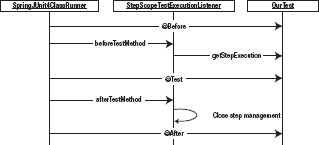

## 12

## 测试批处理过程

测试:每个人都喜欢的编程部分。有趣的是，就像生活中的大多数事情一样，一旦你擅长于此，测试实际上是有趣的。它让你更有效率。它为你尝试新事物提供了一个安全网。编程测试也给了你一个测试新技术的平台(如果你想在测试中尝试新的东西，大多数公司不会介意，但是如果你在即将投入生产的代码中尝试，他们会非常介意)。您已经花了前 10 章编写代码，却没有能力证明这些代码是有效的。这一章着眼于如何以各种方式运行你的代码，这样你不仅可以证明它如设计的那样工作，还可以在你修改它时提供一个安全网。

本章涵盖以下主题:

*   使用 JUnit 和 Mockito 进行单元测试:首先从 JUnit 和 Mockito 框架的高级概述开始。虽然在本章后面的部分中，您已经了解了 JUnit 的基本功能，但是 Spring 集成到其测试设备中的概念是基于 JUnit 约定的，所以了解这些概念有助于您理解更高级的测试中正在发生的事情。本章还介绍了模拟对象框架 Mockito 如何帮助您对您为批处理开发的组件进行单元测试。
*   与 Spring 测试框架的集成测试:Spring 已经对大多数其他较难的 Java 任务做了测试:使它变得容易。它提供了一组类，允许您以最小的开销轻松测试与各种资源(数据库、文件等)的交互。您将学习如何使用 Spring 测试组件来测试 Spring 批处理作业的各个方面。

测试最基本的方面从单元测试开始，所以讨论从那里开始。

### 用 JUnit 和 Mockito 进行单元测试

单元测试可能是最容易编写的，也可能是最有价值的，是最容易被忽视的测试类型。尽管由于一些原因，本书中的开发没有采用测试驱动的方法，但是鼓励您在自己的开发中这样做。作为一种已被证明的方法，它不仅可以提高你开发的软件的质量，还可以提高任何一个开发人员和整个团队的整体生产力，这些测试中包含的代码是你所能开发的最有价值的代码。本节将介绍如何使用 JUnit 和 Mockito 对您为批处理开发的组件进行单元测试。

什么是单元测试？这是以可重复的方式对单个隔离组件的测试。让我们来分解一下这个定义，以了解它是如何应用于您要做的事情的:

*   *单个的测试:*一个。单元测试旨在测试应用的最小构建块。单一方法通常是单元测试的范围。
*   *孤立:*依赖会对系统的测试造成严重破坏。然而，所有系统都有依赖关系。单元测试的目标不是测试你与这些依赖项的集成，而是测试你的组件如何独立工作。
*   *以可重复的方式:*当你打开浏览器点击你的应用时，这不是一个可重复的练习。您每次可以输入不同的数据。您可以按稍微不同的顺序单击按钮。单元测试应该能够一次又一次地重复完全相同的场景。这允许您在对系统进行更改时使用它们进行回归测试。

用于以可重复的方式执行组件隔离测试的框架有 JUnit、Mockito 和 Spring 框架。前两个是常见的多用途框架，对于为代码创建单元测试非常有用。Spring test 实用程序有助于测试更广泛的问题，包括不同层的集成，甚至端到端的测试作业执行(从服务或 Spring 批处理组件到数据库，然后返回)。

#### 六月

被认为是测试 Java 框架的黄金标准， [1](#CHP-12-FN-1) JUnit 是一个简单的框架，它提供了以标准方式对 Java 类进行单元测试的能力。尽管您使用的大多数框架都需要像 IDE 和构建过程这样的附加组件，但是 Maven 和大多数 Java IDEs 都内置了 JUnit 支持，不需要额外的配置。关于测试和使用像 JUnit 这样的框架的主题已经写了整本书，但是快速回顾这些概念是很重要的。本节着眼于 JUnit 及其最常用的特性。

在撰写本书时，JUnit 的当前版本是 JUnit 4.8.2。尽管每个修订版都包含少量的改进和 bug 修复，但是框架的最后一个主要修订版是从 JUnit 3 迁移到 JUnit 4，引入了注释来配置测试用例。测试用例？让我们回顾一下 JUnit 测试是如何构建的。

##### JUnit 生命周期

JUnit 测试被分解成所谓的*测试用例*。每个测试用例都旨在测试一个特定的功能，公约数在类的层次上。通常的做法是每个类至少有一个测试用例。测试用例只不过是一个配置了 JUnit 注释的 Java 类，由 JUnit 执行。在一个测试用例中，既有测试方法，也有在每个测试或每组测试后设置先决条件和清理后置条件的方法。[清单 12-1](#list_12_1) 展示了一个非常基本的 JUnit 测试用例。

***清单 12-1。**一个基本的 JUnit 测试用例*

`package com.apress.springbatch.chapter12;

import org.junit.Test;
import static org.junit.Assert.*;

public class StringTest {

    @Test
    public void testStringEquals() {
        String michael = "Michael";
        String michael2 = michael;
        String michael3 = new String("Michael");
        String michael4 = "Michael";

        assertTrue(michael == michael2);
        assertFalse(michael == michael3);
        assertTrue(michael.equals(michael2));
        assertTrue(michael.equals(michael3));
        assertTrue(michael == michael4);
        assertTrue(michael.equals(michael4));
    }
}`

___________________

或者至少它在 Betamax 与 VHS 的战争中赢得了对 TestNG 等框架的胜利。

清单 12-1[中的单元测试并没有什么奇特之处。它所做的只是证明在比较`String` s 时使用`==`和使用`.equals`方法是不一样的。然而，让我们浏览一下测试的不同部分。首先，JUnit 测试用例是一个常规的 POJO。您不需要扩展任何特定的类，JUnit 对您的类的唯一要求是它有一个无参数构造函数。](#list_12_1)

在每个测试中，您有一个或多个测试方法(在本例中是一个)。每个测试方法都必须是公共的、无效的，并且没有参数。为了表明一个方法是要由 JUnit 执行的测试方法，您使用了`@Test`注释。在给定测试的执行过程中，JUnit 执行一次用`@Test`注释注释的每个方法。

最后一部分`StringTest`是测试方法中使用的 assert 方法。该测试方法流程简单。它首先设置测试所需的条件，然后执行测试，同时使用 JUnit 的 assert 方法验证结果。`org.junit.Assert`类的方法用于验证给定测试场景的结果。在[清单 12-1](#list_12_1) 中的`StringTest`的例子中，您验证了在`String`对象上调用`.equals`方法比较字符串的内容，而使用`==`来比较两个字符串验证了它们只是同一个实例。

虽然这个测试很有帮助，但是在使用 JUnit 时，您还应该了解一些其他有用的注释。前两个与 JUnit 测试生命周期相关。JUnit 允许您配置在每个测试方法之前和之后运行的方法，这样您就可以设置通用的前提条件，并在每次执行之后进行基本的清理。要在每个测试方法之前执行一个方法，您可以使用`@Before`注释；`@After`表示该方法应在每个测试方法之后执行。 [2](#CHP-12-FN-2) 就像任何测试方法一样，`@Before` ( `setUp`)和`@After` ( `tearDown`)标记的方法都要求是公开的、无效的、不带参数的。通常，您会在标有`@Before`的方法中创建一个要测试的对象的新实例，以防止一个测试的任何残余影响到另一个测试。[图 12-1](#fig_12_1) 显示了使用`@Before`、`@Test`和`@After`注释的 JUnit 测试用例的生命周期。

___________________

在以前版本的 JUnit 中，这些方法被称为 setUp 和 tearDown。

***图 12-1。** JUnit 生命周期*

如图 12-1 所示，JUnit 为每个用`@Test`标注标识的方法依次执行这三个方法，直到测试用例中的所有测试方法都被执行。[清单 12-2](#list_12_2) 展示了一个使用所有三个讨论过的注释的测试用例。

***清单 12-2。**`Foo`的考验*

`package com.apress.springbatch.chapter12;

import static org.junit.Assert.assertEquals;
import static org.junit.Assert.assertNotNull;

import org.junit.After;
import org.junit.Before;
import org.junit.Test;

public class FooTest {

    private Foo fooInstance;

    @Before
    public void setUp() {
        fooInstance = new Foo();
    }

    @Test
    public void testBar() {
        String results = fooInstance.bar();

        assertNotNull("Results were null", results);
        assertEquals("The test was not a success", "success", results);
    }

    @After
    public void tearDown() {
        fooInstance.close();
    }
}`

JUnit 在这些特性上提供了许多其他变体，包括`@BeforeClass`为给定测试类中的所有测试方法执行一次性设置，`@Ignore`指示要跳过的测试方法和类，`@RunWith`指示运行测试用例的类，而不是 JUnit 使用的默认类。然而，这些超出了本书的范围。本节的目标是为您提供测试批处理过程所需的工具。仅使用`@Before`、`@Test`和`@After`注释以及 JUnit 的`Assert`类中可用的 assert 方法，就可以测试所需的绝大多数场景。

但是有一个小问题。早期的单元测试定义认为单元测试是孤立的组件测试。当数据访问对象(DAO)依赖于 JDBC 和数据库时，如何使用 JUnit 测试它呢？测试一个 ItemStream 怎么样，它要求您使用 Spring Batch 组件作为它的一些参数？模拟对象填补了这个空白，接下来您将看到这些对象。

#### 模拟物体

编写像前面测试的 String 对象这样的软件是非常容易的，它没有依赖性。然而，大多数系统都很复杂。批处理作业可能需要几十个或更多的类，并且依赖于外部系统，包括应用服务器、JMS 中间件和数据库等等。所有这些移动的部分可能很难管理，并且提供超出单元测试范围的交互。例如，当您想要测试您的一个 ItemProcessors 的业务逻辑时，您真的需要测试 Spring Batch 是否将上下文正确地保存到您的数据库中吗？这超出了单元测试的范围。不要误解——这确实需要测试，您将在本章的后面看到它。然而，为了测试您的业务逻辑，您不需要练习您的生产系统与之交互的各种依赖关系。您可以使用模拟对象来替换测试环境中的这些依赖项，并在不受外部依赖项影响的情况下练习您的业务逻辑。

 **注意**存根不是模拟对象。存根是在测试中使用的硬编码实现，其中模拟对象是可重用的结构，允许在运行时定义所需的行为。

让我们花一点时间来说明模拟对象不是存根。 *Stubs* 是您编写的用来替换应用各个部分的实现。存根包含硬编码的逻辑，旨在模拟执行期间的特定行为。它们不是模拟对象(不管它们在你的项目中被命名为什么)！

模拟对象是如何工作的？大多数模拟对象框架主要采用两种不同的方法:基于代理的方法和类重映射方法。因为基于代理的模拟对象不仅最受欢迎，而且最容易使用，所以让我们先来看看它们。

一个*代理对象*是一个用来代替真实对象的对象。在模拟对象的情况下，代理对象用于模拟您的代码所依赖的真实对象。使用 mocking 框架创建一个代理对象，然后使用 setter 或构造函数在对象上设置它。这指出了使用代理对象模仿的一个固有问题:您必须能够通过外部方式设置依赖关系。换句话说，您不能通过在您的方法中调用`new MyObject()`来创建依赖，因为没有办法模仿通过调用`new MyObject()`创建的对象。这是像 Spring 这样的依赖注入框架起飞的原因之一——它们允许你在不修改任何代码的情况下注入代理对象。

___________________

这并不是 100%真实的。PowerMock 允许您模拟新的操作符。你可以在 http://code.google.com/p/powermock/的[找到更多关于 PowerMock 的信息。](http://code.google.com/p/powermock/)

模仿的第二种形式是在类加载器中重新映射类文件。模仿框架 JMockit 是我所知道的唯一一个为模仿对象开发这种能力的框架。这个概念相对较新(因为 JDK 1.5，尽管 JMockit 也通过其他方式支持 JDK 1.4)，由新的`java.lang.instrument.Insturmentation`接口提供。您告诉类加载器将引用重新映射到它加载的类文件。所以，假设你有一个类`MyDependency`和相应的`.class`文件`MyDependency.class`，你想模仿它使用`MyMock`来代替。通过使用这种类型的模拟对象，您实际上在类加载器中重新映射了从`MyDependency`到`MyMock.class`的引用。这允许您模仿使用`new`操作符创建的对象。虽然这种方法比代理-对象方法提供了更多的功能，因为它能够将几乎任何实现注入到类加载器中，但是考虑到您需要了解类加载器才能使用它的所有特性，这种方法也更加困难和混乱。

Mockito 是一个流行的基于代理的模拟对象框架，它提供了很大的灵活性和丰富的语法。它允许您相对容易地创建易于理解的单元测试。让我们来看看。

#### 莫基托

大约在 2008 年，EasyMock 作为主要的嘲讽框架，几个人看了一下这个框架并问了一些问题。EasyMock 是一个基于代理的模拟对象框架，需要模型、记录、播放和验证。首先你记录下你需要的行为。然后您执行被测试的功能，最后您验证您先前记录的所有执行。但是，为什么需要定义一个对象要经历的所有可能的交互？为什么您需要确认所有的交互都发生了？Mockito 允许你嘲笑你关心的行为，只验证那些重要的行为。在这一节中，您将看到 Mockito 提供的一些功能，并使用它来测试 Spring Batch 组件。

尽管在任何时候使用 Maven 作为构建系统时，默认情况下都会包含 JUnit，但是要使用 Mockito，您需要添加它的依赖项。清单 12-3 显示了 Mockito 所需的依赖关系。

***清单 12-3。** Maven 对 Mocktio 的依赖性*

`…
<dependency>
    <groupId>org.mockito</groupId>
    <artifactId>mockito-all</artifactId>
    <version>1.8.5</version>
    <scope>test</scope>
</dependency>
…`

为了了解 Mockito 是如何工作的，让我们看看你为第 10 章中的语句工作开发的一个类。您为构建语句对象而创建的`CustomerStatementReader`是使用模拟对象的主要候选对象，它依赖于外部 ItemReader 和 DAO。为了提醒您，清单 12-4 展示了来自 ItemReader 的代码。

***清单 12-4。**T4`CustomerStatementReader`*

`package com.apress.springbatch.statement.reader;

import org.springframework.batch.item.ItemReader;` `import org.springframework.batch.item.ParseException;
import org.springframework.batch.item.UnexpectedInputException;

import com.apress.springbatch.statement.dao.TickerDao;
import com.apress.springbatch.statement.domain.Customer;
import com.apress.springbatch.statement.domain.Statement;

public class CustomerStatementReader implements ItemReader<Statement> {

    private ItemReader<Customer> customerReader;
    private TickerDao tickerDao;

    public Statement read() throws Exception, UnexpectedInputException,
            ParseException {

        Customer customer = customerReader.read();

        if(customer == null) {
            return null;
        } else {
            Statement statement = new Statement();

            statement.setCustomer(customer);
            statement.setSecurityTotal(
                tickerDao.getTotalValueForCustomer(customer.getId()));
            statement.setStocks(tickerDao.getStocksForCustomer(customer.getId()));

            return statement;
        }
    }

    public void setCustomerReader(ItemReader<Customer> customerReader) {
        this.customerReader = customerReader;
    }

    public void setTickerDao(TickerDao tickerDao) {
        this.tickerDao = tickerDao;
    }
}`

你为这个类测试的方法显然是`read()`。这个方法需要两个外部依赖项:一个 ItemReader 的实例(记住，您在实际工作中使用了 JdbcCursorItemReader)和一个对您的`TickerDao`的引用。为了测试这个方法，您有两个测试方法，分别用于方法的两个执行分支(一个用于客户是`null`时，另一个用于客户不是【】时)。

为了开始这个测试，让我们创建测试用例类和`@Before`方法，以便构建您的对象供以后使用。[清单 12-5](#list_12_5) 显示了用`@Before`注释和三个类属性标识的`setup`方法的测试用例。

***清单 12-5。**T4`CustomerStatementReaderTest`*

`package com.apress.springbatch.statement.reader;` `import static org.junit.Assert.assertEquals;
import static org.junit.Assert.assertNull;
import static org.mockito.Mockito.when;

import java.math.BigDecimal;
import java.util.ArrayList;

import org.junit.Before;
import org.junit.Test;
import org.mockito.Mock;
import org.mockito.MockitoAnnotations;
import org.springframework.batch.item.ItemReader;

import com.apress.springbatch.statement.dao.TickerDao;
import com.apress.springbatch.statement.domain.Customer;
import com.apress.springbatch.statement.domain.Statement;
import com.apress.springbatch.statement.domain.Transaction;

public class CustomerStatementReaderTest {

    private CustomerStatementReader reader;
    @Mock
    private TickerDao tickerDao;
    @Mock
    private ItemReader<Customer> customerReader;

    @Before
    public void setUp() {
        MockitoAnnotations.initMocks(this);

        reader = new CustomerStatementReader();
        reader.setCustomerReader(customerReader);
        reader.setTickerDao(tickerDao);
    }
    ...
}`

测试类的三个属性是被测试的类(`CustomerStatementReader`)和两个依赖项(`TickerDao`和 ItemReader)。通过使用`@Mock`注释，您告诉 Mockito 这些属性应该在您的测试中被模拟。当测试被执行时，Mockito 为其中的每一个创建一个代理供您的测试使用。

在`setup`方法中，你做两件事。首先用 Mockito 的`MockitoAnnotations.initMocks`方法初始化模拟。这个方法用一个供您使用的模拟对象来初始化您之前指定的所有对象。这是一种快速简单的方法来创建您将来需要的模拟对象。

在`setup`方法中您要做的下一件事是创建一个要测试的类的新实例。通过在这里创建这个类，您可以确保每个测试方法都包含一个被测试类的干净实例。这可以防止一个方法的测试对象中的任何残留状态对您的其他测试方法产生影响。在创建了`CustomerStatementReader`之后，注入模拟对象，就像 Spring 在引导应用时为您做的一样。

因为您现在有了一个被测试对象的新实例和一组新的模拟对象来满足您对 Spring Batch 框架以及数据库的依赖，所以您可以编写您的测试方法。第一个测试没有客户从委托返回，非常简单；见清单 12-6 。

***清单 12-6。**T4`testReadNoCustomers()`*

`…    
@Test
public void testReadNoCustomers() throws Exception {
        assertNull(reader.read());
    }
…`

等等，就这样？发生了什么事？在这种极其简单的测试方法背后，发生的事情比看上去要多得多。当你执行这个方法时，`CustomerStatementReader`的`read`方法被调用。在那里，当在第 40 行调用 mock ItemReader 的`read`方法时，Mockito 返回`null`。默认情况下，如果在模拟对象上调用方法时不告诉 Mockito 返回什么，它将返回一个适合类型的值(`null`表示对象，`false`表示`boolean` s，`-1`表示`int` s，依此类推)。因为您希望您的模拟对象为这个测试返回`null`，所以您不需要告诉 Mockito 为您做任何事情。在 Mockito 从您注入的 ItemReader 返回`null`之后，逻辑根据需要返回`null`。您的测试验证了阅读器使用 JUnit 的`Assert.assertNull`方法返回`null`。

您需要为`CustomerStatementReader`的`read`方法编写的第二个测试方法测试当客户返回时`Statement`对象是否被正确构建。在这个场景中，因为您没有使用数据库，所以您需要告诉 Mockito 当用客户 id 调用`tickerDao.getTotalValueForCustomer`和`tickerDao.getStocksForCustomer`时返回什么。清单 12-7 显示了`testReadWithCustomer`方法的代码。

***清单 12-7。** testReadWtihCustomer*

`…    
@SuppressWarnings("serial")
@Test
    public void testReadWithCustomer() throws Exception {
        Customer customer = new Customer();
        customer.setId(5l);

        when(customerReader.read()).thenReturn(customer);
        when(tickerDao.getTotalValueForCustomer(5l)).thenReturn(
                new BigDecimal("500.00"));
        when(tickerDao.getStocksForCustomer(5l)).thenReturn(
                new ArrayList<Transaction>() {
                    {
                        add(new Transaction());
                    }
                });

        Statement result = reader.read();

        assertEquals(customer, result.getCustomer());
        assertEquals(500.00, result.getSecurityTotal().doubleValue(), 0);
        assertEquals(1, result.getStocks().size());
    }
…`

testReadWithCustomer 方法是如何使用 Mockito 的一个很好的例子。首先，创建您需要的任何数据。在这种情况下，创建模拟对象返回的`Customer`对象。然后你告诉莫奇托你关心的每个调用要返回什么:对`customerReader.read()`的调用和对`tickerDao`的两个调用。在清单中，您将客户 id 设置为 5，并告诉 Mockito 期望 5 是传递给两个`tickerDao`调用的客户 id。要把这个告诉莫奇托，你用`Mockito.when`方法记录下你关心的方法叫什么。只有当这些场景发生时，Mockito 才会返回您在`thenReturn`调用中指定的内容。

使用 mocks 设置，然后执行正在测试的方法(在本例中为`reader.read()`)。根据从该方法调用中得到的结果，您可以验证您的`Statement`对象是根据它收到的数据按照您的期望构建的。

这如何为你提供一个安全网？很简单。假设您更改`CustomerStatementReader`来将帐户的 id 而不是客户的 id 传递给其中一个`tickerDao`调用。如果出现这种情况，测试就失败了，这表明与您的期望不一致的变化已经发生，需要解决。

单元测试是一个可靠系统的基础。它们不仅提供了进行您所需要的更改的能力，而且还迫使您保持代码简洁，并作为您的系统的可执行文档。但是，你建立一个基金会不仅仅是为了看看。你在它上面建造。在下一部分中，您将扩展您的测试能力。

### 与 Spring 类的集成测试

上一节讨论了单元测试及其好处。单元测试，无论多么有用，都有其局限性。集成测试通过引导您的应用并使用您之前努力提取的相同依赖项来运行它，将您的自动化测试带到了一个新的层次。这一节将介绍如何使用 Spring 的集成测试工具来测试与各种 Spring beans、数据库以及批处理资源的交互。

#### 使用 Spring 的一般集成测试

集成测试是关于测试不同部分之间的对话。DAO 连接正确吗，Hibernate 映射正确吗，这样您就可以保存您需要的数据了吗？您的服务从给定的工厂中检索正确的 beans 吗？当您编写集成测试时，会测试这些和其他情况。但是，如果不设置所有的基础设施并确保基础设施在您想要运行这些测试的任何地方都可用，您如何做到这一点呢？幸运的是，你不必这样做。

使用核心 Spring 集成测试工具进行集成测试的两个主要用例是测试数据库交互和测试 Spring bean 交互(服务连接是否正确，等等)。为了测试这一点，让我们看看您在之前的单元测试中嘲笑的`TickerDao`(`CustomerStatementReader`)。然而，这一次，您让 Spring 连接`TickerDao`本身，并且您使用 HSQLDB [4](#CHP-12-FN-4) 的内存实例作为您的数据库，以便您可以随时随地执行测试。HSQLDB 是一个 100%由 Java 实现的数据库，非常适合集成测试，因为它可以轻量级地运行一个实例。首先，让我们看看如何配置您的测试环境。

___________________

4 需要注意的是，由于数据库之间在实现 SQL 方面的差异，使用 JDBC 和切换数据库类型可能会很困难。在这种情况下，唯一的区别应该是 create 语句，对于这些语句，您可以使用单独的脚本。

##### 配置测试环境

为了将您的测试执行与外部资源需求(特定的数据库服务器，等等)隔离开来，您应该配置一些东西。具体来说，您应该为数据库使用一个测试配置，该配置会在内存中为您创建一个 HSQLDB 实例。为此，您需要执行以下操作:

1.  更新 POM 文件以包含 HSQLDB 数据库驱动程序。
2.  重构 Spring 上下文文件的包含，以便更容易地覆盖测试配置。
3.  配置特定于测试的属性。

让我们从将 HSQLDB 驱动程序添加到 POM 文件开始。 [5](#CHP-12-FN-5) 您需要添加的具体依赖关系如[清单 12-8](#list_12_8) 所示。

***清单 12-8。** HSQLDB 的数据库驱动依赖*

`…
<dependency>
    <groupId>hsqldb</groupId>
    <artifactId>hsqldb</artifactId>
    <version>1.8.0.7</version>
</dependency>
…`

下一步是做一些重构。到目前为止，您已经以一种非常适合批处理作业的方式构建了 Spring 配置文件。您已经将通用组件放在了`launch-context.xml`文件中，之后每个作业都有一个特定于作业的 XML 文件。然而，您在这里遇到了一个问题:您当前在`launch-context.xml`中将属性硬编码为`batch.properties`，这是为 MySQL 配置的。

为了使这更灵活，您重新构造了 XML 文件，这样就有三个而不是两个。第一个是没有`placeholderProperties` bean 的普通`launch-context.xml`文件。第二个是普通的`statementJob.xml`文件，没有`launch-context.xml`文件的`import`语句。您创建的新文件连接这三个文件并配置属性文件的位置。清单 12-9 显示了新配置文件`job-context.xml`的内容。

***清单 12-9。**T4`job-context.xml`*

`<?xml version="1.0" encoding="UTF-8"?>
<beans      
  xmlns:xsi="http://www.w3.org/2001/XMLSchema-instance"
  xmlns:context="http://www.springframework.org/schema/context"
  xsi:schemaLocation="http://www.springframework.org/schema/beans
    http://www.springframework.org/schema/beans/spring-beans-3.0.xsd
    http://www.springframework.org/schema/context` `    http://www.springframework.org/schema/context/spring-context-3.0.xsd">

  <import resource="classpath*:/launch-context.xml"/>
  <import resource="classpath*:/jobs/statementJob.xml"/>

  <bean id="placeholderProperties"
    class="org.springframework.beans.factory.config.PropertyPlaceholderConfigurer">
    <property name="location" value="classpath:batch.properties" />
    <property name="systemPropertiesModeName"
      value="SYSTEM_PROPERTIES_MODE_OVERRIDE" />
    <property name="ignoreUnresolvablePlaceholders" value="true" />
    <property name="order" value="1" />
  </bean>

  <bean id="dataSourceInitializer"
    class="org.springframework.jdbc.datasource.init.DataSourceInitializer">
    <property name="dataSource" ref="dataSource"/>
    <property name="enabled" value="true"/>
    <property name="databasePopulator">
      <bean class="org.springframework.jdbc.datasource.init.ResourceDatabasePopulator">
        <property name="continueOnError" value="false"/>
        <property name="ignoreFailedDrops" value="false"/>
        <property name="sqlScriptEncoding" value="UTF-8"/>
        <property name="scripts">
          <list>
            <value type="org.springframework.core.io.Resource">classpath:schema.sql</value>
          </list>
        </property>
      </bean>
    </property>
  </bean>
</beans>`

___________________

根据记录，如果您使用的是 Spring Batch CLI 原型附带的 POM 文件，您不需要这样做——Spring Batch 自己的测试已经包含了这些驱动程序。然而，因为到目前为止所有的例子都使用了 MySQL，所以您可能需要将它们添加回来。

这种配置结构的优点是您可以在测试中覆盖它。`job-context.xml`文件位于您的`<PROJECT>/src/main/resources directory`中。在`<PROJECT>/src/test/resources`中，您创建了一个名为`test-context.xml`的相同文件。然而，你没有提到`batch.properties`的位置，而是提到了`test-batch.properties`。对`test-context.xml`文件的另一个补充是 Spring 3 附带的实用程序的配置，这对集成测试有很大的帮助:`DataSourceIntializer`。

前面提到的`test-batch.properties`文件包含 HSQLDB 实例所需的信息，与`test-context.xml`位于同一个目录中。[清单 12-10](#list_12_10) 显示了`test-batch.properties`的内容。

***清单 12-10。**T4`test-batch.properties`*

`batch.jdbc.driver=org.hsqldb.jdbcDriver
batch.jdbc.url=jdbc:hsqldb:mem:testdb;sql.enforce_strict_size=true
batch.jdbc.user=sa
batch.jdbc.password=
batch.schema=
batch.schema.script=org/springframework/batch/core/schema-hsqldb.sql`

`test-batch.properties`文件定义了数据源用来连接到数据库的信息，以及启动时要执行的脚本列表。在这种情况下，HSQLDB 连接信息非常简单，您有两个脚本在启动时运行:`schema-hsqldb.sql`为您创建 Spring 批处理表，`schema.sql`创建语句表。

配置好测试环境后，您就可以开始编写您的第一个集成测试了。下一节看如何为`TickerDao`编写集成测试。

##### 编写集成测试

用 Spring 编写集成测试非常简单。你需要做三件事:

1.  告诉 Spring 加载上下文的位置。
2.  扩展`AbstractTransactionalJUnit4SpringContextTests`(是的，这确实是类的名字)来获得 Spring 提供的事务帮助。
3.  告诉 Spring 连接什么值。

完成这三件事之后，您就可以像在应用中一样使用代码了。让我们从告诉 Spring 加载上下文的位置开始。为此，您在类级别使用 Spring 的`@ContextConfiguration`注释。出于您的目的，这个注释接受一个属性`location`，它告诉 Spring 在哪里可以找到`test-context.xml`文件。

使用 Spring 测试基础设施的主要优势之一是它提供的事务好处。能够在一个事务中运行一个测试是非常有帮助的，这个事务在每个测试方法被执行之后回滚。这样，您的数据库以完全相同的状态开始和结束每个测试用例。通过扩展 Spring 的`AbstractTransactionalJUnit4SpringContextTests`类，您无需做进一步的工作就可以获得该功能。[清单 12-11](#list_12_11) 显示了配置了上下文位置的集成测试外壳，以及扩展了正确类的外壳。

***清单 12-11。** `TickerDaoIntegrationTest`炮弹*

`package com.apress.springbatch.statement.dao;

import org.springframework.beans.factory.annotation.Autowired;
import org.springframework.test.context.ContextConfiguration;
import
  org.springframework.test.context.junit4.AbstractTransactionalJUnit4SpringContextTests;

@ContextConfiguration(locations = {"/test-context.xml"})
public class TickerDaoIntegrationTest extends
    AbstractTransactionalJUnit4SpringContextTests {

    ...
}`

现在，因为您要测试`TickerDao`(确切地说是`TickerDaoJdbc`类)，您需要 Spring 连接它并将其注入到您的测试中，这样它就可用了。为此，您使用 Spring 的`@Autowired`注释来标识您希望 Spring 为您连接的任何类属性。因为这个测试需要的只是`TickerDao`本身的连线，这就是你需要向 Spring 指示的。

Spring 集成测试的其余部分与单元测试是一样的。您准备测试所需的任何数据，执行被测试的代码，最后使用 JUnit 的断言来验证发生了什么。清单 12-12 中的代码使用`TickerDao`测试了 ticker 的保存和检索。

***清单 12-12。**使用`TickerDao`* 测试 Ticker 的保存和检索

`package com.apress.springbatch.statement.dao;

import static org.junit.Assert.assertEquals;
import static org.junit.Assert.assertNotNull;
import static org.junit.Assert.assertTrue;

import java.math.BigDecimal;

import org.junit.Test;
import org.springframework.beans.factory.annotation.Autowired;
import org.springframework.test.context.ContextConfiguration;
import
  org.springframework.test.context.junit4.AbstractTransactionalJUnit4SpringContextTests;

import com.apress.springbatch.statement.domain.Ticker;

@ContextConfiguration(locations = {"/test-context.xml"})
public class TickerDaoIntegrationTest extends
    AbstractTransactionalJUnit4SpringContextTests {

    @Autowired
    private TickerDao tickerDao;

    @Test
    public void testTickerSaveRoundTrip() {
        Ticker ticker = new Ticker();
        ticker.setPrice(new BigDecimal("222.22"));
        ticker.setTicker("MTM");

        tickerDao.saveTicker(ticker);

        Ticker result = tickerDao.findTickerBySymbol("MTM");

        assertNotNull(result);
        assertEquals(222.22, result.getPrice().doubleValue(), 0);
        assertEquals("MTM", result.getTicker());
        assertTrue(result.getId() >= 0);
    }
}`

清单 12-12 所示的测试从创建一个新的要保存的`Ticker`对象开始。然后使用 Spring 提供的`tickerDao`来保存它，并随后检索它。最后，验证您保存的数据是否与检索到的数据相匹配，并且设置了 id，表明它确实保存到了数据库中。

当您执行这个测试时，HSQLDB 的一个新实例被启动，数据库模式被创建，您的对象被引导和注入，所有这些都在测试方法执行之前。测试方法在其自己的事务中执行，该事务在测试结束时回滚，为下一个要执行的测试方法保留原始数据库。

当你开发一个系统时，像`testTickerSaveRoundTrip`这样的集成测试会非常有价值。当您处理复杂系统时，确定事物是否正确连接、SQL 是否正确，甚至系统组件之间的操作顺序是否正确的能力可以提供相当大的安全性。

Spring Batch 测试的最后一部分是测试 Spring Batch 组件本身。可以用 Spring 提供的工具测试 ItemReaders、步骤甚至整个作业。本章的最后一节将介绍如何使用这些组件和批处理过程的测试部分。

#### 测试Spring批次

尽管在处理健壮的批处理作业时，测试组件(如 DAO 或服务)的能力是绝对需要的，但是使用 Spring Batch 框架会在代码中引入一些额外的复杂性，为了构建健壮的测试套件，需要解决这些复杂性。这一节将介绍如何处理特定于 Spring Batch 的组件的测试，包括依赖于定制范围的元素、Spring Batch 步骤，甚至是完整的作业。

##### 测试步骤范围的 Beans

正如您在本书的许多例子中看到的，Spring Batch 为 Spring Beans 定义的步骤范围是一个非常有用的工具。然而，当您为使用 step 范围的组件编写集成测试时，您会遇到一个问题:如果您在一个步骤的范围之外执行这些组件，这些依赖关系是如何解决的？在这一节中，您将看到 Spring Batch 提供的两种方式来模拟 bean 在步骤范围内的执行。

在过去，您已经看到了使用 step 作用域如何允许 Spring Batch 将运行时值从作业和/或步骤上下文注入到 beans 中。前面的例子包括输入或输出文件名的注入，或者特定数据库查询的标准。在每个例子中，Spring Batch 从 JobExecution 或 StepExecution 中获取值。如果您不是在一个步骤中运行作业，那么您就没有这两个执行。Spring Batch 提供了两种不同的方法来模拟一个步骤中的执行，以便可以注入这些值。第一种方法使用 TestExecutionListener。

TestExecutionListener 是一个 Spring API，它允许您定义在测试方法之前或之后发生的事情。与使用 JUnit 的`@Before`和`@After`注释不同，使用 Spring 的 TestExecutionListener 允许您以更可重用的方式在测试用例中的所有方法之间注入行为。虽然 Spring 提供了 TestExecutionListener 接口的三个有用的实现(dependencyinijectiontestexecutionlistener、dirtiescotexttestexecutionlistener 和 TransactionalTestExecutionListener)，但是 Spring Batch 提供了一个处理您正在寻找的内容的实现:StepScopeTestExecutionListener。

StepScopeTestExecutionListener 提供了您需要的两个特性。首先，它使用测试用例中的工厂方法来获得 StepExecution，并使用返回的方法作为当前测试方法的上下文。第二，它为每个测试方法的生命周期提供了一个 StepContext。图 12-2 显示了使用 StepScopeTestExecutionListener 执行测试的流程。

***图 12-2。**使用 StepScopeTestExecutionListener*测试执行

正如您所看到的，您在测试用例(`getStepExecution`)中创建的工厂方法在每个测试方法之前被调用，以获得新的 StepExecution。如果没有工厂方法，Spring Batch 使用默认的 StepExecution。

为了测试这一点，您需要配置一个 FlatFileItemReader 来获取要从`jobParameters`中读取的文件的位置。首先让我们看看要测试的 ItemReader 的配置和你使用的资源(见[清单 12-13](#list_12_13) )。

***清单 12-13。**汽车文件的 ItemReader 配置*

`…
<beans:bean id="carFileReader"
  class="org.springframework.batch.item.file.FlatFileItemReader" scope="step">
  <beans:property name="resource" value="#{jobParameters[carFile]}"/>
  <beans:property name="lineMapper">
    <beans:bean
      class="org.springframework.batch.item.file.mapping.PassThroughLineMapper"/>
  </beans:property>
</beans:bean>
…`

[清单 12-13](#list_12_13) 是一个简单的 FlatFileItemReader，它被配置为使用 step 作用域，因此您可以在运行时通过作业参数设置输入文件的名称。为了测试这个 ItemReader，您可以用与使用`TickerDaoIntegrationTest`相同的方式开始，通过使用`@ContextConfiguration`注释告诉 Spring 上下文配置的位置。但是，在这个测试中，您将注释的使用扩展到包括以下内容:

*   使用 dependencyinijectontestexecutionlistener 消除了从 Spring 扩展任何特定类来获得通过 Spring 连接和注入 beans 的能力的需要。StepScopeTestExecutionListener 调用`getStepExecution`来获得一个 StepExecution complete，其中包含 Spring Batch 将为您注入的任何参数。
*   `@RunWith` *:* 上一项中的监听器是 JUnit 未知的 Spring 概念。因此，您需要使用 Spring 的测试运行程序，而不是标准的 JUnit 运行程序。

为了让这个测试工作，您需要一个测试文件供 ItemReader 读取。出于测试的目的，在`<PROJECT>/src/test/resources`目录中包含任何测试文件是一个好主意，这样无论测试在哪里运行，它们都是可用的。在这种情况下，您在目录`<project_home>/src/test/resources/data`中包含一个名为`carfile.csv`的 CSV 文件。文件的内容如[清单 12-14](#list_12_14) 所示。

***清单 12-14。**T4`carFile.csv`*

`1987,Nissan,Sentra
1991,Plymouth,Laser
1995,Mercury,Cougar
2000,Infiniti,QX4
2001,Infiniti,QX4`

使用您在上一个示例中使用的相同上下文配置环境，配置新的 ItemReader，以及为测试提供一个样本输入文件，您可以将集成测试放在一起。这个集成测试遍历文件，读取每一行，直到文件完成(在本例中是五次)。您验证每条记录都被返回，直到对读取器的最后一次(第六次)调用是`null`，这表明输入已经用尽。清单 12-15 展示了集成测试。

***清单 12-15。**`CarFileReaderIntegrationTest`T5】*

`package com.apress.springbatch.chapter12;

import static org.junit.Assert.assertEquals;
import static org.junit.Assert.assertNull;

import java.util.ArrayList;
import java.util.List;

import org.junit.Test;
import org.junit.runner.RunWith;
import org.springframework.batch.core.JobParameters;
import org.springframework.batch.core.JobParametersBuilder;
import org.springframework.batch.core.StepExecution;
import org.springframework.batch.item.ExecutionContext;
import org.springframework.batch.item.ItemReader;
import org.springframework.batch.item.ItemStream;
import org.springframework.batch.test.MetaDataInstanceFactory;
import org.springframework.batch.test.StepScopeTestExecutionListener;
import org.springframework.beans.factory.annotation.Autowired;
import org.springframework.test.context.ContextConfiguration;
import org.springframework.test.context.TestExecutionListeners;
import org.springframework.test.context.junit4.SpringJUnit4ClassRunner;
import org.springframework.test.context.support.DependencyInjectionTestExecutionListener;

@ContextConfiguration(locations = { "/test-context.xml" })
@TestExecutionListeners({ DependencyInjectionTestExecutionListener.class,
        StepScopeTestExecutionListener.class })
@RunWith(SpringJUnit4ClassRunner.class)
public class CarFileReaderIntegrationTest {

    @Autowired
    private ItemReader<String> carFileReader;

    @SuppressWarnings("serial")
    private List<String> records = new ArrayList<String>() {{
        add("1987,Nissan,Sentra");
        add("1991,Plymouth,Laser");
        add("1995,Mercury,Cougar");
        add("2000,Infiniti,QX4");
        add("2001,Infiniti,QX4");
    }};

    public StepExecution getStepExecution() {
        JobParameters jobParams = new JobParametersBuilder().addString(
                "carFile", "classpath:/data/carfile.txt").toJobParameters();

        return MetaDataInstanceFactory.createStepExecution(jobParams);
    }` `    @Test
    public void testCarFileReader() throws Exception {
        ((ItemStream) carFileReader).open(new ExecutionContext());

        for(int i = 0; i < 5; i++) {
            assertEquals(carFileReader.read(), records.get(i));
        }

        assertNull(carFileReader.read());
    }
}`

使用一种你至今还没见过的设施。`MetaDataInstanceFactory`是 Spring Batch 提供的一个类，用于创建 Spring Batch 域对象的模型。在大多数情况下，我强烈建议只使用 Mockito 来限制单元测试和 Spring 之间的耦合；但在这种情况下，事情有点不同。

Spring Batch 需要 StepExecution 对象。然而，它用它来做什么是相当复杂的，用 Mockito 来模拟它需要你了解 Spring Batch 的内部工作原理。您不希望使用 Mockito 来模拟这种情况，所以您可以使用 Spring 的 MetaDataInstanceFactory 来创建模拟。

如前所述，有两种方法可以测试 step 范围中定义的 Spring 批处理组件。第一种是您刚刚看到的监听器方法，它是非侵入性的，允许您将 step 范围应用到测试用例中的所有测试方法。但是如果您只需要在您的测试用例中的一两个测试方法中使用它，Spring Batch 提供了一个实用程序来将您的执行打包在一个步骤中。测试同一个组件，`carFileReader`，可以使用`StepScopeTestUtils`在一个步骤的范围内执行。[清单 12-16](#list_12_16) 展示了更新后的单元测试，使用`StepScopeTestUtils`代替监听器来模拟一个步骤。

***清单 12-16。**使用 StepScopeTestUtils*

`package com.apress.springbatch.chapter12;

import static org.junit.Assert.assertEquals;

import java.util.concurrent.Callable;

import org.junit.Test;
import org.junit.runner.RunWith;
import org.springframework.batch.core.JobParameters;
import org.springframework.batch.core.JobParametersBuilder;
import org.springframework.batch.core.StepExecution;
import org.springframework.batch.item.ExecutionContext;
import org.springframework.batch.item.ItemReader;
import org.springframework.batch.item.ItemStream;
import org.springframework.batch.test.MetaDataInstanceFactory;
import org.springframework.batch.test.StepScopeTestUtils;
import org.springframework.beans.factory.annotation.Autowired;
import org.springframework.test.context.ContextConfiguration;
import org.springframework.test.context.TestExecutionListeners;
import org.springframework.test.context.junit4.SpringJUnit4ClassRunner;
import
  org.springframework.test.context.support.DependencyInjectionTestExecutionListener;` `@ContextConfiguration(locations = { "/test-context.xml" })
@TestExecutionListeners({ DependencyInjectionTestExecutionListener.class })
@RunWith(SpringJUnit4ClassRunner.class)
public class CarFileReaderIntegrationTest {

    @Autowired
    private ItemReader<String> carFileReader;

    public StepExecution getStepExecution() {
        JobParameters jobParams = new JobParametersBuilder().addString(
                "carFile", "classpath:/data/carfile.txt").toJobParameters();

        return MetaDataInstanceFactory.createStepExecution(jobParams);
    }

    @Test
    public void testCarFileReader() throws Exception {
        StepExecution execution = getStepExecution();

        Integer readCount =
            StepScopeTestUtils.doInStepScope(execution, new Callable<Integer>() {

            @Override
            public Integer call() throws Exception {
                ((ItemStream) carFileReader).open(new ExecutionContext());

                int i = 0;

                while(carFileReader.read() != null) { i++; }

                return i;
            }
        });

        assertEquals(readCount.intValue(), 5);
    }
}`

`StepScopeTestUtils`对象包含一个名为`doInStepScope`的实用方法，如清单 12-16 中的[所示。此方法接受 StepExecution 和可调用的实现。当测试被执行时，`StepScopeTestUtils`处理运行时注入，就像 Spring Batch 通常会做的那样，然后执行可调用的实现，返回结果。在这种情况下，可调用的实现计算测试文件中的记录数，并返回该数字供您验证其正确性。](#list_12_16)

这种性质的集成测试对于测试定制开发的组件非常有用，比如定制的 ItemReaders 和 ItemWriters。然而，正如您所看到的，测试 Spring Batch 自身组件的价值充其量是微乎其微的。请放心，它对这些事情都有测试覆盖。相反，通过执行整个步骤来测试批处理作业可能更有用。下一节将介绍 Spring Batch 为实现这一点而提供的工具。

##### 测试一个步骤

工作被分成几个步骤。这本书已经证实了这一点。每个步骤都是一个独立的功能，可以在对其他步骤影响最小的情况下执行。由于步骤与批处理作业的内在分离，步骤成为测试的主要候选。在本节中，您将看到如何完整地测试 Spring 批处理步骤。

在上一节中基于 step 范围的示例中，您测试了一个作业的 ItemReader，该作业读入一个文件并写出完全相同的文件。这个单步作业就是您现在用来演示如何在 Spring Batch 中测试单步执行的作业。首先，让我们看看作业的配置；清单 12-17 有整个`carJob`的 XML。

***清单 12-17。**T4`carJob.xml`*

`<?xml version="1.0" encoding="UTF-8"?>
<beans:beans
  xmlns:beans="http://www.springframework.org/schema/beans"
  xmlns:util="http://www.springframework.org/schema/beans"
  xmlns:xsi="http://www.w3.org/2001/XMLSchema-instance"
  xsi:schemaLocation="http://www.springframework.org/schema/beans
    http://www.springframework.org/schema/beans/spring-beans-3.0.xsd
    http://www.springframework.org/schema/util
    http://www.springframework.org/schema/util/spring-util.xsd
    http://www.springframework.org/schema/batch
    http://www.springframework.org/schema/batch/spring-batch-2.1.xsd">

  <beans:bean id="carFileReader"
    class="org.springframework.batch.item.file.FlatFileItemReader" scope="step">
    <beans:property name="resource" value="#{jobParameters[carFile]}"/>
    <beans:property name="lineMapper">
      <beans:bean
        class="org.springframework.batch.item.file.mapping.PassThroughLineMapper"/>
    </beans:property>
  </beans:bean>

  <beans:bean id="carFileWriter"
    class="org.springframework.batch.item.file.FlatFileItemWriter" scope="step">
    <beans:property name="resource" value="#{jobParameters[outputFile]}"/>
    <beans:property name="lineAggregator">
      <beans:bean     
        class="org.springframework.batch.item.file.transform.PassThroughLineAggregator"/>
    </beans:property>
  </beans:bean>

  <job id="carJob">
    <step id="carProcessingStep">
      <tasklet>
        <chunk reader="carFileReader" writer="carFileWriter" commit-interval="10"/>
      </tasklet>
    </step>
  </job>
</beans:beans>`

`carJob`使用 FlatFileItemReader 读入一个文件，该文件的位置在运行时通过作业参数传递。它将输入传递给 FlatFileItemWriter，后者将输出写入一个文件，该文件的位置也是在运行时通过作业参数提供的。这两个组件在一个步骤中就可以完成您的工作。

为了通过集成测试执行这个步骤，测试的结构非常类似于[清单 12-17](#list_12_17) 中的`CarFileReaderIntegrationTest`。您使用注释来告诉 Spring 在哪里可以找到您的上下文配置文件以及要注入什么，并且您配置测试通过 SpringJUnit4ClassRunner 来执行。您甚至可以构建自己的`JobParameters`对象来传递给作业。但相似之处也仅限于此。

要执行一个步骤，您需要使用 Spring Batch 提供的另一个实用程序:`JobLauncherTestUtils`。这个实用程序类提供了许多方法，用于以各种方式(带参数、不带参数、带执行上下文、不带等等)启动步骤和作业。当您执行一个步骤时，您会收到 JobExecution 返回，在其中您可以检查作业中发生了什么。[清单 12-18](#list_12_18) 有测试`carProcessingStep`的代码。

***清单 12-18。**测试`carProcessingStep`*

`package com.apress.springbatch.chapter12;

import static org.junit.Assert.assertEquals;
import static org.springframework.batch.test.AssertFile.assertFileEquals;

import org.junit.Test;
import org.junit.runner.RunWith;
import org.springframework.batch.core.BatchStatus;
import org.springframework.batch.core.ExitStatus;
import org.springframework.batch.core.JobExecution;
import org.springframework.batch.core.JobParameters;
import org.springframework.batch.core.JobParametersBuilder;
import org.springframework.batch.core.StepExecution;
import org.springframework.batch.test.JobLauncherTestUtils;
import org.springframework.beans.factory.annotation.Autowired;
import org.springframework.core.io.ClassPathResource;
import org.springframework.core.io.FileSystemResource;
import org.springframework.test.context.ContextConfiguration;
import org.springframework.test.context.TestExecutionListeners;
import org.springframework.test.context.junit4.SpringJUnit4ClassRunner;
import
  org.springframework.test.context.support.DependencyInjectionTestExecutionListener;

@ContextConfiguration(locations = { "/test-context.xml" })
@TestExecutionListeners({ DependencyInjectionTestExecutionListener.class })
@RunWith(SpringJUnit4ClassRunner.class)
public class CarProcessingStepIntegrationTest {

    private static final String OUTPUT_FILE = "/"
            + System.getProperty("java.io.tmpdir") + "carOutput.txt";
    private static final String INPUT_FILE = "/data/carfile.txt";
    @Autowired
    private JobLauncherTestUtils jobLauncherUtils;` `    @Test
    public void testCarProcessingStep() throws Exception {
        assertEquals(BatchStatus.COMPLETED,
                jobLauncherUtils.launchStep("carProcessingStep", getParams())
                        .getStatus());

        assertFileEquals(new ClassPathResource(INPUT_FILE),
                new FileSystemResource(OUTPUT_FILE));
    }

    private JobParameters getParams() {
        return new JobParametersBuilder().addString("carFile", INPUT_FILE)
                .addString("outputFile", "file:/" + OUTPUT_FILE)
                .toJobParameters();
    }
}`

如前所述，这个测试的结构应该是熟悉的。和你之前几次测试用的一样。然而，这个测试有几个方面很有趣。首先是比恩`jobLauncherUtils`。这就是前面提到的实用程序类。Spring 将它自动连接到您的测试中，并将它自己的依赖项自动连接到诸如数据源和作业启动器之类的东西。因为`JobLauncherTestUtils`需要自动连线，你需要确保将它添加到你的`test-context.xml`文件中。[清单 12-19](#list_12_19) 显示了这个测试的`test-context.xml`文件的内容。

***清单 12-19。**T4`test-context.xml`*

`<?xml version="1.0" encoding="UTF-8"?>
<beans
  xmlns:xsi="http://www.w3.org/2001/XMLSchema-instance"
  xmlns:context="http://www.springframework.org/schema/context"
  xmlns:util="http://www.springframework.org/schema/beans"
  xsi:schemaLocation="http://www.springframework.org/schema/beans     
    http://www.springframework.org/schema/beans/spring-beans-3.0.xsd
    http://www.springframework.org/schema/util
    http://www.springframework.org/schema/util/spring-util.xsd
    http://www.springframework.org/schema/context
    http://www.springframework.org/schema/context/spring-context-2.5.xsd">

  <import resource="launch-context.xml"/>
  <import resource="jobs/carJob.xml"/>

  <bean id="placeholderProperties"
    class="org.springframework.beans.factory.config.PropertyPlaceholderConfigurer">
    <property name="location" value="classpath:test-batch.properties" />
    <property name="systemPropertiesModeName"
      value="SYSTEM_PROPERTIES_MODE_OVERRIDE" />
    <property name="ignoreUnresolvablePlaceholders" value="true" />
    <property name="order" value="1" />
  </bean>

  <bean id="jobLauncherUtils" class="org.springframework.batch.test.JobLauncherTestUtils"/>` `  <bean id="dataSourceInitializer"
    class="org.springframework.jdbc.datasource.init.DataSourceInitializer">
    <property name="dataSource" ref="dataSource"/>
    <property name="enabled" value="true"/>
    <property name="databasePopulator">
      <bean class="org.springframework.jdbc.datasource.init.ResourceDatabasePopulator">
        <property name="continueOnError" value="false"/>
        <property name="ignoreFailedDrops" value="false"/>
        <property name="sqlScriptEncoding" value="UTF-8"/>
        <property name="scripts">
          <list>
            <value type="org.springframework.core.io.Resource">
              ${batch.schema.script}
            </value>
          </list>
        </property>
      </bean>
    </property>
  </bean>
</beans>`

连接好`JobLauncherTestUtils`后，您可以用它来执行测试的`testCarProcessingStep`方法中的步骤。在执行完该步骤后，您要验证两件事:使用常规的 JUnit 断言，您要验证该步骤是否成功完成；并验证创建的文件与读入的文件是否相同。使用 JUnit 做这样的事情将是一个非常痛苦的练习；但是因为文件操作是 Spring Batch 框架的核心，Spring Batch 包含了断言两个文件相同的能力。`AssertFile`实用程序类可以让你比较两个文件的整体或者仅仅是两个文件的行数。这是测试工具中非常有用的工具。

剩下的唯一可以测试的就是整个工作。在下一节中，您将转向真正的功能测试，并从头到尾测试一个批处理作业。

##### 测试一项工作

测试整个工作可能是一项艰巨的任务。如您所见，有些工作可能相当复杂，需要的设置也不容易。然而，能够自动化执行和结果验证的好处是不容忽视的。因此，强烈建议您尽可能在这个级别尝试自动化测试。这一节着眼于如何使用`JobLauncherTestUtils`来执行整个测试任务。

在本例中，您使用与上一节相同的`carJob`,但是这次您测试的是整个作业，而不是包含的步骤。为此，`JobLauncherTestUtils`类再次成为你的朋友，完成所有的艰苦工作。因为在您的上下文中只配置了一个作业，所以您需要做的就是调用`JobLauncherTestUtils` ' `launchJob()`方法来执行该作业。在这种情况下，您调用接受一个`JobParameters`对象的变量，这样您就可以传入您希望处理的输入和输出文件的位置。

`launchJob()`方法返回一个 JobExecution 对象。正如你在第四章中所知道的，这可以让你了解你工作期间发生的所有事情。可以检查作业和每一步的`ExitStatus`，可以验证每一步读取、处理、写入、跳过的项数等等。名单还在继续。能够用 Spring Batch 提供的便利以编程方式在这个级别测试作业的重要性怎么强调都不为过。清单 12-20 显示了整体测试`carJob`的测试方法。

***清单 12-20。**测试`carJob`*

`…   
    @Test
    public void testCarJob() throws Exception {
        JobExecution execution = jobLauncherUtils.launchJob(getParams());

        assertEquals(ExitStatus.COMPLETED, execution.getExitStatus());

        StepExecution stepExecution =
            execution.getStepExecutions().iterator().next();
        assertEquals(ExitStatus.COMPLETED, stepExecution.getExitStatus());
        assertEquals(5, stepExecution.getReadCount());
        assertEquals(5, stepExecution.getWriteCount());

        assertFileEquals(new ClassPathResource(INPUT_FILE),
                new FileSystemResource(OUTPUT_FILE));
    }

    private JobParameters getParams() {
        return new JobParametersBuilder().addString("carFile", INPUT_FILE)
                .addString("outputFile", "file:/" + OUTPUT_FILE)
                .toJobParameters();
    }
…`

如清单 12-20 所示，执行你的工作只需要一行代码。从那里，您能够验证作业的`ExitStatus`、作业中的任何步骤以及这些步骤的读和写计数，并且断言作业的结果与您预期的相匹配。

### 总结

从对系统中任何组件的单个方法进行单元测试，一直到以编程方式执行批处理作业，您已经涵盖了作为批处理程序员可能遇到的绝大多数测试场景。本章首先概述了 JUnit 测试框架和用于单元测试的 Mockito 模拟对象框架。然后，您探索了使用 Spring 提供的类和注释进行集成测试，包括在事务中执行测试。最后，您通过执行步骤范围中定义的组件、作业中的单个步骤，以及最后整个作业，查看了特定于 Spring 批处理的测试。