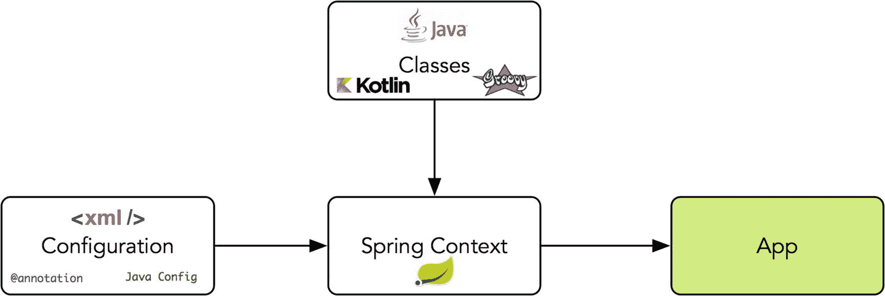
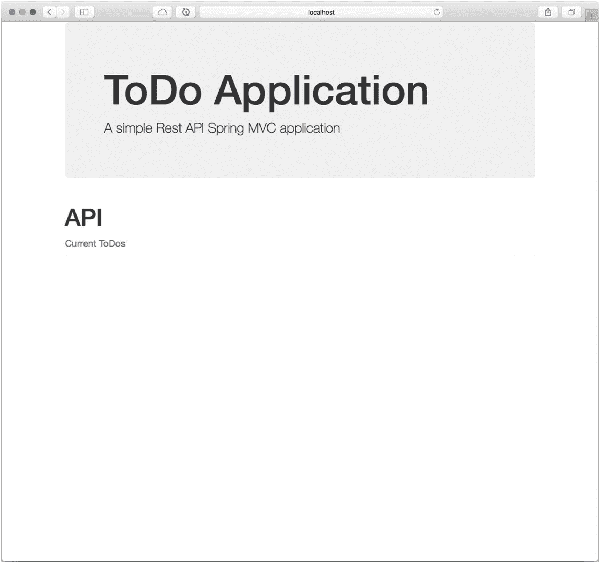
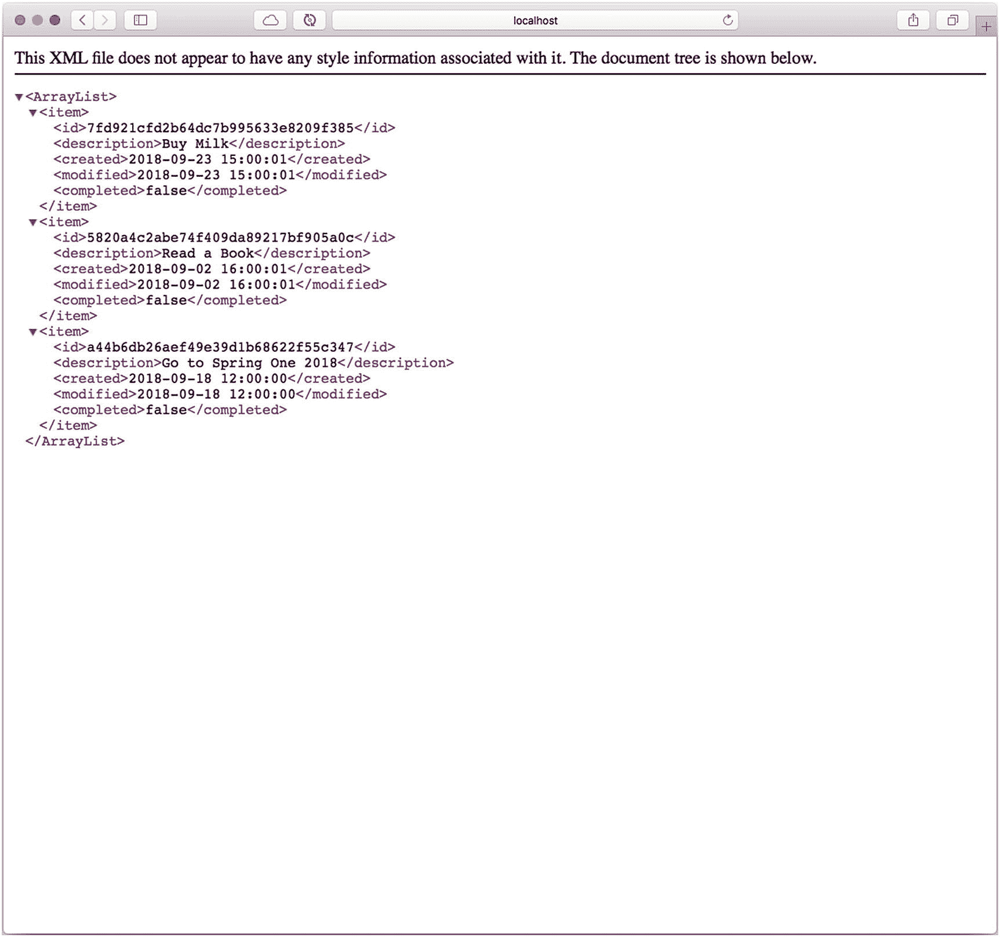

# 一、Spring框架 5

欢迎阅读本书的第一章，在这一章中，我将向您介绍 Spring 框架，一点历史，以及它自诞生以来是如何发展的。本章适用于不熟悉 Spring 框架的开发人员。如果你是一个有经验的 Spring 框架开发者，你可以跳过这一章。

也许你在想，“我想学 Spring Boot。为什么我需要了解 Spring Framework？”嗯，让我告诉你，Spring Boot 的Spring是。Spring Boot 有不同的机制来运行 Spring 应用；要理解 Spring Boot 真正是如何工作的，有必要了解更多关于 Spring 框架的知识。

## 一点历史

Spring 框架是 Rod Johnson 在 2003 年创建的，他是《没有 EJB 的 J2EE 发展》一书的作者。Spring 框架是对当时 J2EE 规范的所有复杂性的回应。今天，它已经得到改善，但你需要有一个完整的基础设施来运行 J2EE 生态系统的某些方面。

我们可以说 Spring 是 Java EE 的补充技术。Spring 框架集成了几种技术，如 Servlet API、WebSocket API、并发实用程序、JSON 绑定 API、bean 验证、JPA、JMS 和 JTA/JCA。

Spring 框架支持*依赖注入*和*公共注释*规范，使得开发更加容易。

本章说明了 Spring Framework 版本 5.x 至少需要 Java EE 7 级别(Servlet 3.1+和 JPA 2.1)。Spring 仍然支持 Tomcat 8 和 9、WebSphere 8 和 JBoss EAP 7。此外，我还向您展示了 Spring Framework 5 的新特性——反应式支持！

如今，Spring 是 Java 社区中使用最多、最受认可的框架之一，不仅因为它能够工作，还因为它继续与其他令人惊叹的项目一起创新，包括 Spring Boot、Spring Security、Spring Data、Spring Cloud、Spring Batch 和 Spring Integration 等等。

## 设计原则和模式

要了解 Spring Boot，你需要了解一个框架；重要的是不仅要知道它做什么，还要知道它遵循哪些原则。以下是 Spring 框架的一些原则。

*   *在每个级别提供选择*。Spring 允许您尽可能推迟设计决策。例如，您可以通过配置切换持久性提供者，而无需更改代码。许多其他基础设施问题以及与第三方 API 的集成也是如此。您将会看到，这甚至会在您将应用部署到云中时发生。

*   *容纳不同的观点*。Spring 拥抱灵活性，对事情应该如何做并不固执己见。它从不同的角度支持广泛的应用需求。

*   *保持强大的向后兼容性*。Spring 的发展已经被小心地管理，使得版本之间几乎没有突破性的变化。Spring 支持精心选择的一系列 JDK 版本和第三方库，以便于维护依赖于 Spring 的应用和库。

*   *关心 API 设计*。Spring 团队投入了大量的思想和时间来制作直观的、跨多个版本和多年的 API。

*   *为代码质量设定高标准*。Spring 框架非常强调有意义的、当前的和准确的 Javadocs。这是极少数可以宣称代码结构清晰，包之间没有循环依赖的项目之一。

那么，运行 Spring 应用需要什么呢？Spring 使用普通的旧 Java 对象(POJOs ),使其易于扩展。Spring 是非侵入性的，使您的应用企业就绪；但是你需要通过添加一个配置来帮助 Spring 连接所有的依赖项，并注入创建 Spring*bean*来执行你的应用所需要的东西(见图 [1-1](#Fig1) )。



图 1-1

Spring语境

图 [1-1](#Fig1) 显示了创建所有 Spring beans 的 Spring 上下文——感谢引用您的类的配置，这使得您的应用运行。您将在接下来的小节中找到更多信息，在这些小节中，您将创建一个完整的 REST API 应用。

## Spring框架 5

Spring 使得创建 Java 企业应用变得容易，因为它提供了开发人员在企业环境中使用 Java 语言所需的一切。它在 JVM (Java 虚拟机)上提供了对 Groovy 和 Kotlin 作为替代语言的出色支持。

Spring Framework 5 需要 JDK 8+版本，并为 Java 开发工具包(JDK) 9、10 和 11 提供现成的支持。Spring 团队对 11 和 17 版本有相同的长期维护支持，这与 JDK 团队相关。这个新版本于 2017 年推出，采用了一种新的方法来使用反应式流进行函数式编程。

Spring Web MVC 是为 Servlet API 和 Servlet 容器服务的。这是可以的，直到有更多的服务需求，这发现了一个特殊的问题:每个请求都有一些阻塞；随着高需求，有必要做些别的事情。结果是:反应器，一个网络框架。在版本 5 中引入了 *Spring WebFlux* 模块，具有完全非阻塞的堆栈，支持反应流背压，并运行在 Netty、Undertow 和 Servlet 3.1+容器等服务器上。这是用少量线程处理并发性的非阻塞堆栈的部分答案，这些线程可以用更少的硬件进行扩展。

WebFlux 模块依赖于另一个 Spring 项目:*项目反应器*。Reactor 是 Spring WebFlux 的反应库选择。它提供了 Mono 和 Flux API 类型，通过与操作符的*react vex*词汇表一致的一组丰富的操作符来处理`0..1`和`0..N`的数据序列。Reactor 是一个反应流库，因此，它的所有操作符都支持非阻塞背压。Reactor 非常关注服务器端 Java。它是与 Spring 密切合作开发的。

我不想深入讨论 Spring 的很多特性，因为我可以用一个简单的 web 应用来展示它们。你怎么想呢?所有这些很酷的 WebFlux 特性都在它自己的章节中进行了回顾。

## 简单的 Spring Web 应用

让我们首先创建一个 Spring web 应用——一个 ToDo 应用，它提供了一个可以执行 CRUD(创建、读取、更新和删除)的 REST API。要创建一个新的 Spring 应用，您需要安装 Maven。在接下来的章节中，你可以选择 Maven 或者 Gradle。

### 使用 Maven 创建项目

让我们从使用 Maven 中的以下命令创建 ToDo Spring 项目开始。

```java
$ mvn archetype:generate -DgroupId=com.apress.todo -DartifactId=todo -Dversion=0.0.1-SNAPSHOT -DinteractiveMode=false -DarchetypeArtifactId=maven-archetype-webapp

```

该命令为 web 应用生成基本模板和结构。通常，它会生成`webapp`和`resources`文件夹，但不会生成`java`文件夹，后者需要手动创建。

```java
todo
├── pom.xml
└── src
    └── main
        ├── resources
        └── webapp
            ├── WEB-INF
            │   └── web.xml
            └── index.jsp

```

您可以在您喜欢的 IDE 中导入代码；这将使识别任何问题变得更加容易。

### 添加依赖关系

打开`pom.xml`，用清单 [1-1](#PC3) 替换所有内容。

```java
<project xmlns:="http://maven.apache.org/POM/4.0.0" xmlns:xsi="http://www.w3.org/2001/XMLSchema-instance"
         xsi:schemaLocation="http://maven.apache.org/POM/4.0.0 http://maven.apache.org/maven-v4_0_0.xsd">
    <modelVersion>4.0.0</modelVersion>
    <groupId>com.apress.todo</groupId>
    <artifactId>todo</artifactId>
    <packaging>war</packaging>
    <version>0.0.1-SNAPSHOT</version>
    <name>todo Webapp</name>

    <properties>

        <!-- Generic properties -->
        <java.version>1.8</java.version>

        <!-- Web -->
        <jsp.version>2.2</jsp.version>
        <jstl.version>1.2</jstl.version>
        <servlet.version>3.1.0</servlet.version>
        <bootstrap.version>3.3.7</bootstrap.version>
        <jackson.version>2.9.2</jackson.version>
        <webjars.version>0.32</webjars.version>

        <!-- Spring -->
        <spring-framework.version>5.0.3.RELEASE</spring-framework.version>

        <!-- JPA -->
        <spring-data-jpa>1.11.4.RELEASE</spring-data-jpa>
        <hibernate-jpa.version>1.0.0.Final</hibernate-jpa.version>
        <hibernate.version>4.3.11.Final</hibernate.version>

        <!-- Drivers -->
        <h2.version>1.4.197</h2.version>

        <!-- Logs -->
        <slf4j.version>1.7.25</slf4j.version>
        <logback.version>1.2.3</logback.version>
    </properties>

    <dependencies>
        <!-- Spring MVC -->
        <dependency>
            <groupId>org.springframework</groupId>
            <artifactId>spring-webmvc</artifactId>
            <version>${spring-framework.version}</version>
        </dependency>

        <!-- Spring Data JPA -->
        <dependency>
            <groupId>org.springframework.data</groupId>
            <artifactId>spring-data-jpa</artifactId>
            <version>${spring-data-jpa}</version>
        </dependency>
        <dependency>
            <groupId>org.hibernate.javax.persistence</groupId>
            <artifactId>hibernate-jpa-2.1-api</artifactId>
            <version>${hibernate-jpa.version}</version>
        </dependency>
        <dependency>
            <groupId>org.hibernate</groupId>
            <artifactId>hibernate-core</artifactId>
            <version>${hibernate.version}</version>
        </dependency>
        <dependency>
            <groupId>org.hibernate</groupId>
            <artifactId>hibernate-entitymanager</artifactId>
            <version>${hibernate.version}</version>
        </dependency>

        <!-- Logs -->
        <dependency>
            <groupId>org.slf4j</groupId>
            <artifactId>jcl-over-slf4j</artifactId>
            <version>${slf4j.version}</version>
        </dependency>
        <dependency>
            <groupId>ch.qos.logback</groupId>
            <artifactId>logback-classic</artifactId>
            <version>${logback.version}</version>
        </dependency>

        <!-- Drivers -->
        <dependency>
            <groupId>com.h2database</groupId>
            <artifactId>h2</artifactId>
            <version>${h2.version}</version>
            <scope>runtime</scope>
        </dependency>

        <!-- Java EE Web dependencies -->
        <dependency>
            <groupId>javax.servlet</groupId>
            <artifactId>jstl</artifactId>
            <version>${jstl.version}</version>
        </dependency>
        <dependency>
            <groupId>javax.servlet</groupId>
            <artifactId>javax.servlet-api</artifactId>
            <version>${servlet.version}</version>
            <scope>provided</scope>
        </dependency>
        <dependency>
            <groupId>javax.servlet.jsp</groupId>
            <artifactId>jsp-api</artifactId>
            <version>${jsp.version}</version>
            <scope>provided</scope>
        </dependency>

        <!-- Web UI -->
        <dependency>
            <groupId>org.webjars</groupId>
            <artifactId>webjars-locator</artifactId>
            <version>${webjars.version}</version>
        </dependency>

        <dependency>
            <groupId>org.webjars</groupId>
            <artifactId>bootstrap</artifactId>
            <version>${bootstrap.version}</version>
        </dependency>

        <!-- Web - JSON/XML Response -->
        <dependency>
            <groupId>com.fasterxml.jackson.core</groupId>
            <artifactId>jackson-databind</artifactId>
            <version>${jackson.version}</version>
        </dependency>

        <dependency>
            <groupId>com.fasterxml.jackson.datatype</groupId>
            <artifactId>jackson-datatype-joda</artifactId>
            <version>${jackson.version}</version>
        </dependency>

        <dependency>
            <groupId>com.fasterxml.jackson.dataformat</groupId>
            <artifactId>jackson-dataformat-xml</artifactId>
            <version>${jackson.version}</version>
        </dependency>
    </dependencies>

    <build>
        <finalName>todo</finalName>
        <plugins>
            <plugin>
                <groupId>org.apache.maven.plugins</groupId>
                <artifactId>maven-compiler-plugin</artifactId>
                <configuration>
                    <source>1.8</source>
                    <target>1.8</target>
                </configuration>
            </plugin>
        </plugins>
    </build>
</project>

Listing 1-1todo/pom.xml

```

清单 [1-1](#PC3) 显示了`pom.xml`文件以及创建一个简单的 Spring web 应用所需的所有依赖项。

### Spring腹板配置

接下来，我们从Spring配置开始。Spring 需要开发人员决定类在哪里，它们如何相互交互，以及 web 应用的一些额外配置。

让我们从修改`web.xml`文件开始，如清单 [1-2](#PC4) 所示。

```java
<?xml version="1.0" encoding="UTF-8"?>
<web-app xmlns:="http://java.sun.com/xml/ns/javaee" xmlns:xsi="http://www.w3.org/2001/XMLSchema-instance"
         xsi:schemaLocation="http://java.sun.com/xml/ns/javaee
         http://java.sun.com/xml/ns/javaee/web-app_2_5.xsd"
         version="2.5">
    <display-name>ToDo Web Application</display-name>
    <servlet>
        <servlet-name>dispatcherServlet</servlet-name>
        <servlet-class>org.springframework.web.servlet.DispatcherServlet</servlet-class>
        <load-on-startup>1</load-on-startup>
    </servlet>

    <servlet-mapping>
        <servlet-name>dispatcherServlet</servlet-name>
        <url-pattern>/</url-pattern>
    </servlet-mapping>
</web-app>

Listing 1-2todo/src/main/webapp/WEB-INF/web.xml

```

需要设置`DispatcherServlet`，它是任何 Spring web app 的主要入口。这个类根据上下文配置连接所有东西。如您所见，这是一个非常简单的配置。

接下来，让我们通过创建一个`dispatcherServlet-servlet.xml`文件来配置 Spring 上下文。有一个命名约定；如果 servlet 在`web.xml`文件中被命名为`todo`，那么 Spring 上下文文件应该被命名为`todo-servlet.xml`。在本例中，servlet 被命名为`dispatcherServlet`，因此它寻找一个`dispatcherServlet-servlet.xml`文件(参见清单 [1-3](#PC5) )。

```java
<?xml version="1.0" encoding="UTF-8"?>
<beans xmlns:="http://www.springframework.org/schema/beans"
       xmlns:xsi="http://www.w3.org/2001/XMLSchema-instance"
       xmlns:context="http://www.springframework.org/schema/context"
       xmlns:mvc="http://www.springframework.org/schema/mvc"
       xmlns:jpa="http://www.springframework.org/schema/data/jpa"
       xmlns:jdbc="http://www.springframework.org/schema/jdbc"
       xmlns:tx="http://www.springframework.org/schema/tx"
       xsi:schemaLocation="http://www.springframework.org/schema/jdbc http://www.springframework.org/schema/jdbc/spring-jdbc-4.3.xsd
            http://www.springframework.org/schema/mvc http://www.springframework.org/schema/mvc/spring-mvc-4.3.xsd
            http://www.springframework.org/schema/beans http://www.springframework.org/schema/beans/spring-beans.xsd
            http://www.springframework.org/schema/context http://www.springframework.org/schema/context/spring-context-4.3.xsd
            http://www.springframework.org/schema/data/jpa http://www.springframework.org/schema/data/jpa/spring-jpa-1.8.xsd
            http://www.springframework.org/schema/tx http://www.springframework.org/schema/tx/spring-tx-4.3.xsd">

    <context:component-scan base-package="com.apress.todo" />

    <mvc:annotation-driven>
        <mvc:message-converters>
            <bean class="org.springframework.http.converter.json.MappingJackson2HttpMessageConverter">
                <property name="objectMapper" ref="jsonMapper"/>
            </bean>
            <bean class="org.springframework.http.converter.xml.MappingJackson2XmlHttpMessageConverter">
                <property name="objectMapper" ref="xmlMapper"/>
            </bean>

        </mvc:message-converters>
    </mvc:annotation-driven>

    <bean id="jsonMapper" class="org.springframework.http.converter.json.Jackson2ObjectMapperFactoryBean">
        <property name="simpleDateFormat" value="yyyy-MM-dd HH:mm:ss" />
    </bean>

    <bean id="xmlMapper" parent="jsonMapper">
        <property name="createXmlMapper" value="true"/>
    </bean>

    <mvc:resources mapping="/webjars/**" location="classpath:META-INF/resources/webjars/" />

    <jpa:repositories base-package="com.apress.todo.repository" />

    <jdbc:embedded-database id="dataSource" type="H2">
        <jdbc:script location="classpath:META-INF/sql/schema.sql" />
        <jdbc:script location="classpath:META-INF/sql/data.sql" />
    </jdbc:embedded-database>

    <bean id="jpaVendorAdapter"
          class="org.springframework.orm.jpa.vendor.HibernateJpaVendorAdapter">
        <property name="showSql" value="true" />
    </bean>

    <bean id="entityManagerFactory"
          class="org.springframework.orm.jpa.LocalContainerEntityManagerFactoryBean">
        <property name="dataSource" ref="dataSource" />
        <property name="jpaVendorAdapter" ref="jpaVendorAdapter"/>
    </bean>

    <bean id="transactionManager"
          class="org.springframework.orm.jpa.JpaTransactionManager">
        <property name="entityManagerFactory" ref="entityManagerFactory"/>
    </bean>

    <tx:annotation-driven transaction-manager="transactionManager" />

    <bean
            class="org.springframework.web.servlet.view.InternalResourceViewResolver">
        <property name="prefix" value="/WEB-INF/views/" />
        <property name="suffix" value=".jsp" />
    </bean>

    <bean id="h2WebServer" class="org.h2.tools.Server" factory-method="createWebServer"
          init-method="start" destroy-method="stop">
        <constructor-arg value="-web,-webAllowOthers,-webDaemon,-webPort,8082" />
    </bean>

</beans>

Listing 1-3todo/src/main/webapp/WEB-INF/dispatcherServlet-servlet.xml

```

清单 [1-3](#PC5) 显示了 Spring web 配置。看看它使用的所有 XML 名称空间。这很有帮助，因为如果您使用带有代码完成功能的 IDE，它会为您提供每个条目的组件及其属性。我们来分析一下。

*   `<context:component-scan/>`。这个标签告诉 *Spring 容器*它需要扫描所有的类；它寻找注释，包括`@Service`和`@Configuration`。这有助于 Spring 连接所有的 Spring beans，以便您的应用可以运行。在这种情况下，它在`com.apress.todo.*`包级别扫描标记的类和所有的子包。

*   `<mvc:annotation-driven/>`。这个标签告诉 Spring 容器这是一个 web 应用，它需要寻找每一个`@Controller`和`@RestController`类及其具有`@RequestMapping`或其他 Spring MVC 注释的方法，因此它可以创建必要的 MVC beans 来接受来自用户的请求。

*   `<mvc:message-converters/>`。这个标签通知 MVC beans 在有请求时使用什么来进行消息转换。例如，如果有一个带有 HTTP 头`Accept: application/xml`的请求，它会以 XML 的形式响应，就像带有`application/json`一样。

*   `jsonMapper`和`xmlMapper`豆。这些类是 Spring beans，帮助格式化数据和创建正确的映射器。

*   `<mvc:resources/>`。这个标签告诉 Spring MVC 使用哪些资源，以及在哪里可以找到它们。在这种情况下，这个应用正在使用 *WebJars* (在`pom.xml`文件中声明)。

*   `<jpa:repositories/>`。这个标签告诉 Spring 容器和 Spring Data模块扩展`CrudRepository`接口的接口在哪里。在这种情况下，它会在`com.apress.todo.repository`中寻找它们。*包装级别。

*   `<jdbc:embedded-database/>`。因为这个应用使用 JPA 和内存数据库的 H2 驱动程序，所以这个标记只是一个声明，使用一个可以在启动时执行 SQL 脚本的实用程序；在本例中，它创建了`todo`表并插入了一些记录。

*   `jpaVendorAdapter`比恩。使用 JPA 实现需要这个 bean 声明；在本例中，它是 Hibernate(在`pom.xml`文件中使用的一个依赖项)。换句话说，Hibernate 框架被用作 Java 持久性 API (JPA)的实现。

*   `EntityManagerFactory`比恩。对于每个 JPA 实现，有必要创建一个实体管理器来保存所有会话，并代表应用执行所有 SQL 语句。

*   `TransactionManager`比恩。应用需要有一个交易，因为我们不想有重复或坏数据，对不对？我们需要应用并符合 ACID(原子性、一致性、隔离性、持久性)，所以我们需要事务。

*   `<tx:annotation-driven/>`。这个注释基于前面的声明设置所有的事务。

*   `viewResolver`比恩。有必要说明 web 应用将使用哪种视图引擎，因为有很多选项，比如 Java Server Faces、JSP 等等。

*   `h2WebServer`比恩。这个 bean 设置 H2 引擎，以便可以在应用中访问它。

正如你所看到的，这部分需要一点关于如何装配Spring的知识。如果你想了解更多，我推荐几本出版社的书，包括 I. Cosmina 等人的《Pro Spring 5 》。

我想向您展示运行一个更简单的 REST API 需要做些什么；相信我，如果你认为这太多了，试着用 Java EE 做同样的事情，用这个应用的所有特性(MVC，JPA，SQL 初始化，JSP，事务)。

让我们回顾一下启动时执行的 SQL 脚本。在`resources/META-INF/sql`文件夹中创建两个文件(参见清单 [1-4](#PC6) 和清单 [1-5](#PC7) )。

```java
create table todo (
  id varchar(36) not null,
  description varchar(255) not null,
  created timestamp,
  modified timestamp,
  completed boolean,
  primary key (id)
);

Listing 1-4todo/src/main/resources/META-INF/sql/schema.sql

```

如您所见，创建 SQL 表非常简单。

```java
insert into todo values ('7fd921cfd2b64dc7b995633e8209f385','Buy Milk','2018-09-23 15:00:01','2018-09-23 15:00:01',false);
insert into todo values ('5820a4c2abe74f409da89217bf905a0c','Read a Book','2018-09-02 16:00:01','2018-09-02 16:00:01',false);
insert into todo values ('a44b6db26aef49e39d1b68622f55c347','Go to Spring One 2018','2018-09-18 12:00:00','2018-09-18 12:00:00',false);

Listing 1-5todo/src/main/resources/META-INF/sql/data.sql

```

当然，还有一些 SQL 语句和 ToDo。

重要的是要知道 JPA 需要一个持久性单元，您可以在其中配置一些东西，比如哪些托管类是持久性单元的一部分、类如何映射到数据库表、数据源连接等等。因此，有必要创建一个。您可以在`resources/META-INF/`文件夹中创建`persistence.xml`文件(参见清单 [1-6](#PC8) )。

```java
<?xml version="1.0" encoding="UTF-8" ?>
<persistence xmlns:="http://java.sun.com/xml/ns/persistence"
             xmlns:xsi="http://www.w3.org/2001/XMLSchema-instance"
             xsi:schemaLocation="http://java.sun.com/xml/ns/persistence
 http://java.sun.com/xml/ns/persistence/persistence_1_0.xsd" version="1.0">
    <persistence-unit name="toDo">
        <description>My Persistence Unit</description>
    </persistence-unit>
</persistence>

Listing 1-6todo/src/main/resources/META-INF/persistence.xml

```

这里没有必要声明映射的类或连接，因为 Spring Data模块会处理它；你只需要声明一个`persistence-unit`名。

接下来，重要的是必须为应用登录，不仅是为了调试，而且你可以用它来了解你的应用正在发生什么。在`resources`文件夹中创建`logback.xml`文件(参见清单 [1-7](#PC9) )。

```java
<?xml version="1.0" encoding="UTF-8"?>
<configuration xmlns:="http://ch.qos.logback/xml/ns/logback"
               xmlns:xsi="http://www.w3.org/2001/XMLSchema-instance"
               xsi:schemaLocation="http://ch.qos.logback/xml/ns/logback http://ch.qos.logback/xml/ns/logback/logback.xsd">

    <appender name="STDOUT" class="ch.qos.logback.core.ConsoleAppender">
        <layout class="ch.qos.logback.classic.PatternLayout">
            <Pattern>
                %d{yyyy-MM-dd HH:mm:ss} %-5level %logger{36} - %msg%n
            </Pattern>
        </layout>
    </appender>

    <logger name="org.springframework" level="info" additivity="false">
        <appender-ref ref="STDOUT" />
    </logger>

    <logger name="org.springframework.jdbc" level="debug" additivity="false">
        <appender-ref ref="STDOUT" />
    </logger>

    <logger name="com.apress.todo" level="debug" additivity="false">
        <appender-ref ref="STDOUT" />
    </logger>

    <root level="error">
        <appender-ref ref="STDOUT" />
    </root>

</configuration>

Listing 1-7todo/src/main/resources/logback.xml

```

再说一次，这里没什么特别的。请注意，`com.apress.todo`的记录级别被设置为`DEBUG`。

### 班级

接下来，是时候为 ToDo REST API 创建实际代码了。让我们从创建域模型开始:`ToDo`域类。在`src/main/java`文件夹中创建类。请记住，Maven 工具并没有创建这种结构；我们需要手动创建它(参见清单 [1-8](#PC10) )。

```java
package com.apress.todo.domain;

import org.hibernate.annotations.GenericGenerator;

import javax.persistence.Entity;
import javax.persistence.GeneratedValue;
import javax.persistence.Id;
import java.sql.Timestamp;

@Entity

public class ToDo {

    @Id
    @GeneratedValue(generator = "system-uuid")
    @GenericGenerator(name = "system-uuid", strategy = "uuid")
    private String id;
    private String description;

    private Timestamp created;
    private Timestamp modified;

    private boolean completed;

    public ToDo() {
    }

    public String getId() {
        return id;
    }

    public void setId(String id) {
        this.id = id;
    }

    public String getDescription() {
        return description;
    }

    public void setDescription(String description) {
        this.description = description;
    }

    public Timestamp getCreated() {
        return created;
    }

    public void setCreated(Timestamp created) {
        this.created = created;
    }

    public Timestamp getModified() {
        return modified;
    }

    public void setModified(Timestamp modified) {
        this.modified = modified;
    }

    public boolean isCompleted() {
        return completed;
    }

    public void setCompleted(boolean completed) {
        this.completed = completed;
    }
}

Listing 1-8todo/src/main/java/com/apress/todo/domain/ToDo.java

```

正如你所看到的，它只是一个普通的 Java 类，但是因为这个应用持久化数据(在本例中是 ToDo ),所以有必要用`@Entity`注释标记这个类，并用`@Id`注释声明*主键*。这个类还使用额外的注释为主键生成一个 36 个随机字符的 GUID。

接下来，让我们创建一个包含所有 CRUD 操作的存储库。在这里，应用使用了 Spring Data模块的强大功能，它隐藏了所有带有表和 keep 会话的样板映射类，甚至还进行事务处理。Spring Data实现了所有的 CRUD 换句话说，您不需要担心如何保存、更新、删除和查找记录。

创建从`CrudRepository`接口扩展而来的`ToDoRepository`接口(参见清单 [1-9](#PC11) )。

```java
package com.apress.todo.repository;

import com.apress.todo.domain.ToDo;
import org.springframework.data.repository.CrudRepository;

public interface ToDoRepository extends CrudRepository<ToDo,String> {
}

Listing 1-9todo/src/main/java/com/apress/todo/repository/ToDoRepository.java

```

清单 [1-9](#PC11) 显示了一个接口。这个`ToDoRepository`接口从`CrudRepository<T,K>`扩展而来，是一个通用接口。`CrudRepository`需要一个域类和主键类型；在这种情况下，域类是`ToDo`类，主键类型是`String`(标有`@Id`注释的那个)。

在 XML 配置中，您使用了`<jpa:repositories/>`标签。该标签指向`ToDoRepository`包，这意味着 Spring Data保持记录，并且它连接了与扩展`CrudRepository`接口的接口相关的一切。

接下来，让我们创建接受用户请求的 web 控制器。创建`ToDoController`类(参见清单 [1-10](#PC12) )。

```java
package com.apress.todo.controller;

import com.apress.todo.domain.ToDo;
import com.apress.todo.repository.ToDoRepository;
import org.springframework.beans.factory.annotation.Autowired;
import org.springframework.http.HttpHeaders;
import org.springframework.http.HttpStatus;
import org.springframework.http.MediaType;
import org.springframework.http.ResponseEntity;
import org.springframework.stereotype.Controller;
import org.springframework.web.bind.annotation.GetMapping;
import org.springframework.web.bind.annotation.RequestHeader;
import org.springframework.web.bind.annotation.RequestMapping;
import org.springframework.web.bind.annotation.RequestMethod;
import org.springframework.web.servlet.ModelAndView;

import javax.servlet.http.HttpServletRequest;

@Controller
@RequestMapping("/")
public class ToDoController {

    private ToDoRepository repository;

    @Autowired
    public ToDoController(ToDoRepository repository) {
        this.repository = repository;
    }

    @GetMapping
    public ModelAndView index(ModelAndView modelAndView, HttpServletRequest request) {
        modelAndView.setViewName("index");
        return modelAndView;
    }

    @RequestMapping(value = "/toDos", method = { RequestMethod.GET }, produces = {
            MediaType.APPLICATION_JSON_UTF8_VALUE, MediaType.APPLICATION_XML_VALUE, MediaType.TEXT_XML_VALUE})
    public ResponseEntity<Iterable<ToDo>> getToDos(@RequestHeader HttpHeaders headers) {
        return new ResponseEntity<Iterable<ToDo>>(this.repository.findAll(), headers, HttpStatus.OK);
    }

}

Listing 1-10todo/src/main/java/com/apress/todo/controller/ToDoController.java

```

清单 [1-10](#PC12) 显示了网络控制器。花点时间复习一下。这里我们需要一整本书来描述所有的 Spring MVC 模块和每个特性。

这里重要的是这个类用`@Controller`注释进行了标记。还记得`<mv:annotation-driven/>`标签吗？该标签查找每个标记为`@Controller`的类，并向所有具有`@GetMapping`、`@RequestMapping`和`@PostMapping`注释的方法注册控制器，以基于定义的路径接受请求。在这种情况下，仅定义了`/`和`/toDos`路径。

这个类使用了一个将`ToDoRepository`作为参数的构造函数。这是由 Spring 容器通过`@Autowired`注释注入的。如果您使用的是 Spring 4.3 版本，可以省略这个注释；默认情况下，Spring container 识别出构造函数需要依赖项，并自动注入它们。这就像说，“嘿，Spring container，我需要注入`ToDoRepository`豆，因为我将使用它*。*“这就是 Spring 使用依赖注入的方式(还有方法注入、字段注入和 setter 注入)。

`@GetMapping` ( `@RequestMapping`默认情况下也是如此)响应`/`路径和视图名称；在这种情况下，它返回对应于`the WEB-INF/view/index.jsp` JSP 页面的索引名。`@RequestMapping`是做同样事情的另一种方式`(@GetMapping`，但是这次它声明的是`/toDos`路径。这个方法响应取决于请求者发送的头的种类，比如`application/json`或`application/xml`。它使用`ResponseEntity`作为响应；它使用存储库实例来调用从数据库返回所有 ToDo 的`findAll`方法，因为在 JSON 和 XML 映射器中声明的配置表明引擎会处理这种转换。

再次，花时间分析正在发生的事情。运行应用后，您可以使用所有这些注释。

接下来，让我们创建视图，这是在请求`/`路径时调用的 JSP。在`WEB-INF/views`文件夹中创建`index.jsp`(参见清单 [1-11](#PC13) )。

```java
<%@ taglib prefix="c" uri="http://java.sun.com/jsp/jstl/core"%>
<!doctype html>
<html>
<head>
    <meta charset="UTF-8">
    <title>Simple Directory Web App</title>
    <link rel="stylesheet" type="text/css"
          href="webjars/bootstrap/3.3.7/css/bootstrap.min.css">
    <link rel="stylesheet" type="text/css"
          href="webjars/bootstrap/3.3.7/css/bootstrap-theme.min.css">
</head>
<body>
<div class="container theme-showcase" role="main">
    <div class="jumbotron">
        <h1>ToDo Application</h1>
        <p>A simple Rest API Spring MVC application</p>
    </div>

    <div class="page-header">
        <h1>API</h1>
        <a href="toDos">Current ToDos</a>
    </div>

</div>
</body>
</html>

Listing 1-11todo/src/main/webapp/WEB-INF/views/index.jsp

```

我认为这里唯一需要注意的是资源的使用，比如 WebJars。该应用正在使用引导 CSS。但是这些资源从哪里来呢？首先，声明`pom.xml`中的`org.webjars:bootstrap`依赖项。其次，在配置中使用了`<mvc:resources/>`标签来说明在哪里可以找到这些资源。

### 运行应用

您已经完成了运行应用所需的所有配置和代码。现在，是应用服务器的时候了。要运行该应用，请按照下列步骤操作。

1.  打开一个终端，转到您的根项目(`todo/`)。执行下一个 maven 命令。

    ```java
    $ mvn clean package

    ```

    该命令将您的应用打包到一个 WAR 文件(web 归档文件)中，准备在应用服务器中部署。文件在`target/`文件夹中，命名为`todo.war`。



图 1-2

*http://localhost:8080/all/*

1.  下载 Tomcat 应用服务器。(运行这个 app 不需要很重的应用服务器；一只轻盈的雄猫就可以了)。可以从 [`https://tomcat.apache.org/download-90.cgi`](https://tomcat.apache.org/download-90.cgi) 下载。

2.  解压并安装在任何目录下。

3.  将`target/todo.war`复制到`<tomcat-installation>/webapps/`文件夹中。

4.  运行你的雄猫。进入浏览器，点击`http://localhost:8080/todo`网址(见图 [1-2](#Fig2) )。

如果你点击链接，你应该有一个 XML 响应(见图 [1-3](#Fig3) )。



图 1-3

*http://localhost:8080/all/all*

如何获得 JSON 响应？打开终端并执行以下命令。

```java
$ curl -H "Accept: application/json" localhost:8080/todo/toDos
[ {
  "id" : "7fd921cfd2b64dc7b995633e8209f385",
  "description" : "Buy Milk",
  "created" : "2018-09-23 15:00:01",
  "modified" : "2018-09-23 15:00:01",
  "completed" : false
}, {
  "id" : "5820a4c2abe74f409da89217bf905a0c",
  "description" : "Read a Book",
  "created" : "2018-09-02 16:00:01",
  "modified" : "2018-09-02 16:00:01",
  "completed" : false
}, {
  "id" : "a44b6db26aef49e39d1b68622f55c347",
  "description" : "Go to Spring One 2018",
  "created" : "2018-09-18 12:00:00",
  "modified" : "2018-09-18 12:00:00",
  "completed" : false
} ]

```

你可以用`application/xml`来测试，看到和浏览器一样的结果。

恭喜你！您已经创建了第一个 Spring MVC REST API 应用。

### 使用 Java 配置

您可能认为 XML 对于创建配置来说太冗长了。嗯，有时候可以，但是 Spring 有另一种方式来配置 Spring 容器，那就是通过注释和 Java config 类。

如果您想尝试一下，您可以创建`ToDoConfig`类并添加清单 [1-12](#PC16) 中所示的代码。

```java
package com.apress.todo.config;

import org.springframework.context.annotation.Bean;
import org.springframework.context.annotation.Configuration;
import org.springframework.data.jpa.repository.config.EnableJpaRepositories;
import org.springframework.http.converter.HttpMessageConverter;
import org.springframework.http.converter.json.Jackson2ObjectMapperBuilder;
import org.springframework.http.converter.json.MappingJackson2HttpMessageConverter;
import org.springframework.http.converter.xml.MappingJackson2XmlHttpMessageConverter;
import org.springframework.jdbc.datasource.embedded.EmbeddedDatabaseBuilder;
import org.springframework.jdbc.datasource.embedded.EmbeddedDatabaseType;
import org.springframework.orm.jpa.JpaTransactionManager;
import org.springframework.orm.jpa.LocalContainerEntityManagerFactoryBean;
import org.springframework.orm.jpa.vendor.HibernateJpaVendorAdapter;
import org.springframework.transaction.PlatformTransactionManager;
import org.springframework.transaction.annotation.EnableTransactionManagement;
import org.springframework.web.servlet.config.annotation.EnableWebMvc;
import org.springframework.web.servlet.config.annotation.ResourceHandlerRegistry;
import org.springframework.web.servlet.config.annotation.WebMvcConfigurer;
import org.springframework.web.servlet.resource.WebJarsResourceResolver;
import org.springframework.web.servlet.view.InternalResourceViewResolver;

import javax.sql.DataSource;
import java.text.SimpleDateFormat;
import java.util.List;

@Configuration

@EnableJpaRepositories(basePackages="com.apress.todo.repository")

@EnableTransactionManagement

@EnableWebMvc

public class ToDoConfig implements WebMvcConfigurer {

      @Override
    public void addResourceHandlers(ResourceHandlerRegistry registry) {
        registry
          .addResourceHandler("/webjars/**")
          .addResourceLocations("classpath:/META-INF/resources/webjars/","/resources/","/webjars/")
              .resourceChain(true).addResolver(new WebJarsResourceResolver());
    }

      @Override
      public void configureMessageConverters(List<HttpMessageConverter<?>> converters) {
            Jackson2ObjectMapperBuilder builder = new Jackson2ObjectMapperBuilder();
            builder.indentOutput(true).dateFormat(new SimpleDateFormat("yyyy-MM-dd HH:mm:ss"));
            converters.add(new MappingJackson2HttpMessageConverter(builder.build()));
            converters.add(new MappingJackson2XmlHttpMessageConverter(builder.createXmlMapper(true).build()));
      }

      @Bean
    public InternalResourceViewResolver jspViewResolver() {
        InternalResourceViewResolver bean = new InternalResourceViewResolver();
        bean.setPrefix("/WEB-INF/views/");
        bean.setSuffix(".jsp");
        return bean;
    }

      @Bean
      public DataSource dataSource() {
            EmbeddedDatabaseBuilder builder = new EmbeddedDatabaseBuilder();
            return builder.setType(EmbeddedDatabaseType.H2).addScript("META-INF/sql/schema.sql")
                        .addScript("META-INF/sql/data.sql").build();
      }

      @Bean
      public LocalContainerEntityManagerFactoryBean entityManagerFactory() {

            HibernateJpaVendorAdapter vendorAdapter = new HibernateJpaVendorAdapter();
            vendorAdapter.setShowSql(true);

            LocalContainerEntityManagerFactoryBean factory = new LocalContainerEntityManagerFactoryBean();
            factory.setJpaVendorAdapter(vendorAdapter);
            factory.setDataSource(dataSource());
            return factory;
      }

      @Bean
      public PlatformTransactionManager transactionManager() {
            JpaTransactionManager txManager = new JpaTransactionManager();
            txManager.setEntityManagerFactory(entityManagerFactory().getNativeEntityManagerFactory());
            return txManager;
      }
}

Listing 1-12todo/src/main/java/com/apress/todo/config/ToDoConfig.java

```

清单 [1-12](#PC16) 实际上与 XML 配置相同，但是这一次，它使用了 Java `Config`类，其中我们以编程方式声明了 Spring beans，并且有必要覆盖一些 web 配置。

如果你想运行它来测试这个`JavaConfig`类，你需要做一些事情。打开`dispatcherServlet-servlet.xml`，应该如下图。

```java
<?xml version="1.0" encoding="UTF-8"?>
<beans xmlns:="http://www.springframework.org/schema/beans"
       xmlns:xsi="http://www.w3.org/2001/XMLSchema-instance"
       xmlns:context="http://www.springframework.org/schema/context"
       xsi:schemaLocation="
        http://www.springframework.org/schema/beans http://www.springframework.org/schema/beans/spring-beans.xsd
            http://www.springframework.org/schema/context http://www.springframework.org/schema/context/spring-context-4.3.xsd">

    <context:component-scan base-package="com.apress.todo" />

</beans>

```

最后，需要告诉 Spring 在哪里可以找到`@Configuration`标记的类(另一个替代方法是使用`WebApplicationInitializer`类)；一旦找到它，它就根据 Java `Config`类的声明连接一切。

记得用`mvn clean`包清理并重新打包你的应用，再次生成`WAR`文件。您可以运行它，并获得与使用 XML 配置相同的结果。

那么，你觉得 Spring 框架怎么样？是的，你需要了解发生了什么。您需要知道 Spring beans 生命周期是如何工作的，以及依赖注入是如何使用的。此外，了解一点 AOP(面向方面编程)也很重要，因为这是连接一切为我们工作的魔法的一部分。

你认为这太过分了吗？好吧，如果你试图用一个普通的 Java 2 EE 概要文件来制作同一个应用，那就更麻烦了。记住，它不仅仅是公开一个 REST API，而是使用数据库、事务、消息转换器、视图解析器等等；这就是为什么使用 Spring，web 应用更容易创建。

但是你猜怎么着？Spring Boot 为你做了所有的样板配置，通过创建企业 Spring 应用加快了开发速度！

### 注意

记住你可以从 Apress 网站或者 GitHub 的 [`https://github.com/Apress/pro-spring-boot-2`](https://github.com/Apress/pro-spring-boot-2) 获得这本书的源代码。

## 摘要

关于 Spring 框架以及它在 Spring Boot 中扮演的角色，还有很多需要学习的地方。一章是不够的。所以，如果你想了解更多，我鼓励你在 [`https://docs.spring.io/spring-framework/docs/current/spring-framework-reference/`](https://docs.spring.io/spring-framework/docs/current/spring-framework-reference/) 查阅 Spring 文档。

在下一章中，我们从 Spring Boot 开始，了解创建与本章相同的应用是多么容易，只是“需要启动”