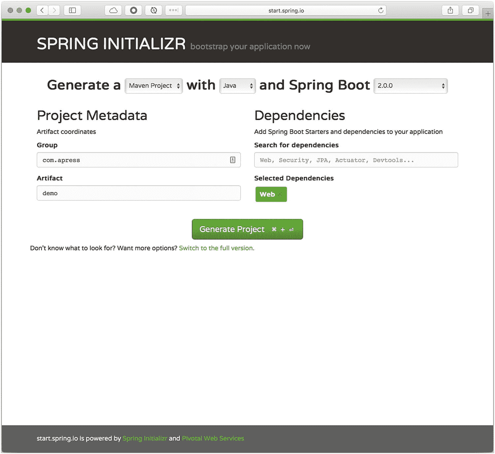

# 二、Spring Boot 简介

在前一章中，我向您展示了什么是 Spring 框架，它的一些主要特性(比如依赖注入设计模式的实现)，以及如何使用它(通过创建一个简单的 web/数据应用并将其部署到 Tomcat 服务器)。我还向您展示了创建 Spring 应用所需的每个步骤(例如，添加各种 XML 文件的配置选项，以及如何运行应用)。

在这一章中，我将向您展示什么是 Spring 它的主要组件，如何使用它来创建 Spring 应用，以及如何运行或部署它。这是创建 Spring 应用的一种更简单的方式。本书的其余部分涵盖了更多的细节；这只是对 Spring Boot 技术的一个小介绍。

## Spring Boot

我可以说 Spring Boot 是 Spring 框架的下一个篇章，但是不要误解我:Spring Boot 不会取代 Spring 框架，因为 Spring Boot *是 Spring 框架的*！您可以将 Spring Boot 视为轻松创建 Spring 应用的新方法。

Spring Boot 简化了我们的开发方式，因为它使创建生产就绪的基于 Spring 的应用变得容易，您可以“直接运行”你会发现，使用 Spring Boot，你可以创建带有嵌入式服务器的独立应用(默认情况下是 Tomcat，如果你使用新的 *web-reactive* 模块，则是 Netty)，使它们 100%可运行和可部署。应用。

Spring Boot 最重要的特性之一是一个*固执己见的*运行时，它帮助你遵循创建健壮的、可扩展的、可伸缩的 Spring 应用的最佳实践。

你可以在 [`https://projects.spring.io/spring-boot/`](https://projects.spring.io/spring-boot/) 找到 Spring Boot 项目。非常广泛的文档在 [`https://docs.spring.io/spring-boot/docs/current/reference/htmlsingle/`](https://docs.spring.io/spring-boot/docs/current/reference/htmlsingle/) 。Spring Boot 主页如图 [2-1](#Fig1) 所示。


图 2-1

Spring Boot 首页( [`http://projects.spring.io/spring-boot/`](http://projects.spring.io/spring-boot/) )

### Spring Boot 来了

要创建 Spring 应用，您需要了解所有的配置技术和/或技术需求。运行最简单的 Spring 应用也需要很多步骤。四年前，Spring 团队推出了第一个测试版，我有幸测试了它。结果是惊人的。现在，随着更多的特性加入到技术中，它已经真正成为创建 Spring 应用的“事实上的”方式。Spring Boot 让创建企业级应用变得更加容易。

如果你看一下 Spring Boot 项目的网页，会发现这样一句话:*绝对不需要代码生成，也不需要 XML 配置*。也许您想知道如何创建 Spring 应用并在没有任何配置的情况下运行它们。Spring 容器至少需要知道如何连接你的类，对吗？或者 Spring 容器需要知道如何使用你添加到应用中的技术。别担心。我会告诉你这项惊人技术背后的所有秘密。但是首先，让我们尽可能创建最简单的 Spring web 应用(参见清单 [2-1](#PC1) )。

```java
@RestController
class WebApp{
      @GetMapping("/")
      String welcome(){
        "<h1><font face="verdana">Spring Boot Rocks!</font></h1>"
     }
}

Listing 2-1
app.groovy

```

清单 [2-1](#PC1) 是一个 Groovy 应用，也是最简单的 Spring web 应用。为什么这么棒？我总是告诉我的学生，如果你懂 Java，那么你就懂 Groovy。Groovy 去掉了所有的 Java 样板文件，加上几行代码，你就有了一个 web app(不过不用担心，这本书大部分都是讲 Java 的；除了在最后一章我谈到了 Groovy 和 Kotlin，这是 Spring 语言支持的一个新的补充。你是怎么经营的？就像执行一样简单

```java
$ spring run app.groovy

```

然后，您应该会看到带有 Spring Boot 标语的输出日志、Tomcat 容器初始化以及应用已经在端口 8080 上启动的提示。如果你打开浏览器并点击`http://localhost:8080`，那么你应该会看到文本 **Spring Boot 摇滚！**

你可能会说，“等一下！这个`spring run`命令是什么？怎么安装？我还需要什么？这是 Spring Boot 吗？”这是创建和运行 Spring 应用的众多方法之一。这是我第一次尝试展示这项技术的威力(四年前)，一个简单的脚本可以运行一个完整的 Spring web 应用。Spring Boot 团队创建了 *Spring Boot CLI* 。

### Spring Boot 命令行界面

Spring Boot CLI(命令行界面)是创建 Spring 应用的许多方法之一，但这种方法通常用于原型应用。你可以把它当成 Spring Boot 的游乐场。参考模型将在以下章节中介绍。我只是想使用简单的 Groovy 或 Java 脚本让您感受一下 Spring Boot 的强大。对我来说，Spring Boot CLI 是 Spring Boot 生态系统的重要组成部分。

现在，让我们回到前面的代码。您是否注意到清单 [2-1](#PC1) 中没有导入？Spring Boot CLI 如何了解 web 应用以及如何运行它？

Spring Boot CLI 检查您的代码，并基于 Spring MVC 注释(`@RestController`和`@GetMapping`)，它尝试使用嵌入式 Tomcat 服务器将您的代码作为 web 应用执行，并从内部运行 web 应用。幕后的神奇之处在于，Groovy 编程语言提供了一种简单的方法，通过使用 AST(抽象语法树)来截取语句和创建动态代码；因此，很容易注入缺失的 Spring 代码并运行它。换句话说，Spring Boot CLI 发现了您的应用，并注入了缺失的部分，以使一个完整的 Spring web 应用启动并运行。

还记得我说过它也可以运行 Java 脚本吗？让我们看一下同一个 web 应用的 Java 版本。我将暂时向您展示代码；如果你想运行这些应用，你可以阅读附录，在那里我解释了如何安装 Spring Boot CLI 及其特性(见清单 [2-2](#PC3) )。

```java
package com.apress.spring;

import org.springframework.boot.SpringApplication;
import org.springframework.boot.autoconfigure.SpringBootApplication;
import org.springframework.web.bind.annotation.GetMapping;
import org.springframework.web.bind.annotation.RestController;

@RestController
@SpringBootApplication
public class SimpleWebApp {

    public static void main(String[] args) {
        SpringApplication.run(SimpleWebApp.class, args);
    }

    @RequestMapping("/")
    public String greetings(){
        return "<h1>Spring Boot Rocks in Java too!</h1>";
    }
}

Listing 2-2
SimpleWebApp.java

```

清单 [2-2](#PC3) 显示了 Java 中 Spring Boot 应用的入口点。首先，它在执行应用的 main 方法中使用了一个`@SpringBootApplication`注释和`SpringApplication` singleton 类。`SpringApplication.run`方法调用接受两个参数。第一个参数是包含`@Configuration`注释的主配置类(恰好是这个类的名字；但稍后将对此进行更多讨论)。第二个参数是应用参数(我们将在后面的章节中讨论)。从这个 Java 版本中可以看出，我们使用了 Spring MVC 注释:`@RestController`和`@GetMapping`。

您可以通过执行以下命令来运行此示例

```java
$ spring run SimpleWebApp.java

```

如果你打开浏览器，点击`http://localhost:8080/`，你会看到“Spring Boot 也用 Java 摇滚了！”。

如果您想设置您的 Spring Boot CLI，您可以跳转到附录，在那里我包括一个分步安装，其所有功能，以及 Spring Boot CLI 的好处。对于 Spring 云应用的快速原型，Spring Boot CLI 是完美的播放器；这就是我在本书中包含 Spring Boot CLI 的原因。

## Spring Boot 应用模型

Spring Boot 定义了一种轻松创建 Spring 应用的方法，以及一种遵循 Spring 应用最佳实践的编程模型。要创建 Spring Boot 应用，您需要以下组件:

*   一个构建/依赖管理工具，比如 Maven 或者 Gradle (Spring Boot 也支持 *Ant* 和*Ivy*；在本书中，每个例子只需要 Maven 或 Gradle)。

*   构建工具中正确的依赖管理和插件。如果你使用 Maven，需要一个`<parent/>`标签(当然，有更多的方法来配置 Spring Boot，但是添加一个`<parent/>`标签是最简单的)和`spring-boot-maven-plugin`。如果你正在使用 Gradle，你需要应用`org.springframework.boot`和`io.spring.dependency-management`插件。
    *   使用`spring-boot-starters` *添加所需的依赖项。*

*   创建包含以下内容的主类
    *   `@SpringBootApplication`注解

    *   main 方法中的`SpringApplication.run`语句。

在下一节中，我们将创建我们的第一个 Spring Boot 应用，我将解释所有前面的组件。这非常简单，但是我们如何开始呢？有什么工具可以帮助我们开始一个 Spring Boot 项目吗？答案是肯定的！我们实际上可以使用 Spring Boot CLI，因为它提供了一种创建 Spring Boot 项目的方法。我们还有 ide(集成开发环境)，比如*STS*(Spring Tool Suite[`https://spring.io/tools`](https://spring.io/tools))、来自 JetBrains([`https://www.jetbrains.com/idea/`](https://www.jetbrains.com/idea/))*NetBeans*([`https://netbeans.org`](https://netbeans.org))、GitHub*Atom*([`https://atom.io`](https://atom.io))、微软 *VSCode* ( [`https://code.visualstudio.com`](https://code.visualstudio.com) )。Atom 和 VSCode 都有插件，可以以非常简单的方式处理 Spring Boot 应用；但是*Spring Initializr*([`http://start.spring.io`](http://start.spring.io))是我启动 Spring Boot 项目的偏好。在本书中，我使用 IntelliJ IDEA。

让我们通过创建第一个 Spring Boot 应用来看看如何使用 Spring Boot Initializr web 服务。

### 我的第一份 Spring Boot 申请

要创建我们的第一个 Spring Boot 应用，打开您的浏览器并进入 [`http://start.spring.io`](http://start.spring.io) (见图 [2-2](#Fig2) )。



图 2-2

[T2`http://start.spring.io`](http://start.spring.io)

图 [2-2](#Fig2) 显示了 Spring Boot Initializr 的主页，这是 Pivotal 提供的一项网络服务，可以帮助您轻松创建 Spring Boot 项目。

1.  Let’s start by filling out the fields.
    *   组:`com.apress`

    *   神器:`demo`

    *   依赖关系:`web`

    您可以选择 Maven 或 Gradle 项目类型。您可以选择编程语言(Java、Groovy 或 Kotlin)和 Spring Boot 版本。在 Generate Project 按钮下面，有一个链接，上面写着“切换到完整版本”链接，它显示了您需要的依赖项。在这种情况下，您可以在依赖项字段中输入 **Web** 并点击回车，如图 [2-2](#Fig2) 所示。

1.  单击 Generate Project 按钮保存一个名为`demo.zip`的文件。

2.  解压缩`demo.zip`文件并将项目导入到您喜欢的 IDE 中(我使用 IntelliJ IDEA)。如果你仔细观察，你会发现。zip 文件有一个包装器，这取决于您选择的项目类型。如果是 Gradle 项目，那么有一个*grad le*(grad le wrapper)；如果它是一个 Maven 项目，那么它应该是一个 *mvnw* (Maven 包装器)。这意味着你不需要安装任何这些构建/管理工具，因为 Spring Boot Initializr 会把它们带给你。

3.  检查构建/依赖项管理文件。打开`pom.xml`或`build.gradle`文件。

    如果您选择了 Maven，请参见清单 [2-3](#PC5) 。

```java
<?xml version="1.0" encoding="UTF-8"?>
<project xmlns:="http://maven.apache.org/POM/4.0.0" xmlns:xsi="http://www.w3.org/2001/XMLSchema-instance"
      xsi:schemaLocation="http://maven.apache.org/POM/4.0.0 http://maven.apache.org/xsd/maven-4.0.0.xsd">
      <modelVersion>4.0.0</modelVersion>

      <groupId>com.apress</groupId>
      <artifactId>demo</artifactId>
      <version>0.0.1-SNAPSHOT</version>
      <packaging>jar</packaging>

      <name>demo</name>
      <description>Demo project for Spring Boot</description>

      <parent>
         <groupId>org.springframework.boot</groupId>
         <artifactId>spring-boot-starter-parent</artifactId>
         <version>2.0.0.RELEASE</version>
         <relativePath/> <!-- lookup parent from repository -->
      </parent>

      <properties>
        <project.build.sourceEncoding>UTF-8</project.build.sourceEncoding>
        <project.reporting.outputEncoding>UTF-8</project.reporting.outputEncoding>
        <java.version>1.8</java.version>
      </properties>

      <dependencies>
        <dependency>
            <groupId>org.springframework.boot</groupId>
            <artifactId>spring-boot-starter-web</artifactId>
        </dependency>

        <dependency>
            <groupId>org.springframework.boot</groupId>
            <artifactId>spring-boot-starter-test</artifactId>
            <scope>test</scope>
        </dependency>
      </dependencies>

      <build>
        <plugins>
            <plugin>
              <groupId>org.springframework.boot</groupId>
              <artifactId>spring-boot-maven-plugin</artifactId>
            </plugin>
        </plugins>
      </build>
</project>

Listing 2-3
Maven pom.xml

```

如您所见，我们拥有主要组件的一部分:`<parent/>`标签、`spring-boot-starter-web`依赖项和`spring-boot-maven-plugin`。

如果您选择了 Gradle，请参见清单 [2-4](#PC6) 。

```java
buildscript {

      ext {
            springBootVersion = '2.0.0.RELEASE'
      }
      repositories {
            mavenCentral()
      }
      dependencies {
            classpath("org.springframework.boot:spring-boot-gradle-plugin:${springBootVersion}")
      }

}

apply plugin: 'java'
apply plugin: 'eclipse'

apply plugin: 'org.springframework.boot'

apply plugin: 'io.spring.dependency-management'

group = 'com.apress'
version = '0.0.1-SNAPSHOT'
sourceCompatibility = 1.8

repositories {
      mavenCentral()
}

dependencies {
   compile('org.springframework.boot:spring-boot-starter-web')
   testCompile('org.springframework.boot:spring-boot-starter-test')
}

Listing 2-4
build.gradle

```

`build.gradle`文件显示了一些必需的组件:`org.springframework.boot`和`io.spring.dependency-management`插件，以及`spring-boot-starter-web`依赖项。

1.  打开`com.apress.demo.DemoApplication.java`类(参见清单 [2-5](#PC7) )。

```java
package com.apress.demo;

import org.springframework.boot.SpringApplication;
import org.springframework.boot.autoconfigure.SpringBootApplication;

@SpringBootApplication

public class DemoApplication {

      public static void main(String[] args) {
            SpringApplication.run(DemoApplication.class, args);
      }
}

Listing 2-5com.apress.demo.DemoApplication.java

```

如您所见，我们有运行应用的其他组件:`@SpringBootApplication`注释和`SpringApplication.run`语句。

1.  为 web 控制器添加一个显示为文本的新类。创建`com.apress.demo.WebController.java`类(参见清单 [2-6](#PC8) )。

```java
package com.apress.demo;

import org.springframework.web.bind.annotation.GetMapping;
import org.springframework.web.bind.annotation.RestController;

@RestController
public class WebController {

    @GetMapping
    public String index(){
        return "Hello Spring Boot";
    }
}

Listing 2-6com.apress.demo.WebController.java

```

这与脚本非常相似——一个简单的返回字符串的`@RestController`。

1.  要运行您的应用，您可以使用 IDE，也可以转到项目的根目录并执行以下命令。对于 maven: `./mvnw spring-boot:run`，对于 Gradle: `./gradlew bootRun`。

然后你可以去你的浏览器点击`http://localhost:8080`。你会看到“你好，Spring Boot”的短信。

恭喜你！您刚刚创建了第一个 Spring Boot 应用。

### 注意

这本书的所有配套代码都在 press 网站上。在本例中，我创建了两个项目:一个用 Maven，另一个用 Gradle。

## 为什么是 Spring Boot？

我们为什么要用 Spring Boot？这是一项令人惊叹的技术，适用于

*   遵循网飞工程团队开发的 12 个因素模式的云原生应用( [`http://12factor.net`](http://12factor.net) )

*   通过减少开发和部署时间提高生产效率。

*   企业生产就绪的 Spring 应用。

*   非功能性需求，如 Spring Boot 执行器(一个模块，提供与新平台无关的*千分尺* ( [`https://micrometer.io`](https://micrometer.io) )、健康检查和管理)和用于运行 web 应用的嵌入式容器(Tomcat、Netty、Undertow、Jetty 等)。).

*   微服务，它因创建可伸缩、高可用性和健壮的应用而受到关注。Spring Boot 允许开发人员只关注业务逻辑，把重担留给 Spring 框架。

### Spring Boot 特色

Spring Boot 有很多特色，我会在接下来的章节中向你展示，但我可以在这一节描述其中的一些。

Spring Boot

*   提供了`SpringApplication`类。我向您展示了在 Java Spring Boot 应用中，main 方法执行这个单例类。这个特殊的类提供了一种便捷的方式来启动 Spring 应用。

*   允许您创建应用，而不需要任何 XML 配置。Spring Boot 不做任何代码生成。

*   通过`SpringApplicationBuilder` singleton 类提供了一个 fluent builder API，它允许您创建具有多个应用上下文的层次结构。这个特性与 Spring 框架及其内部工作方式更相关。如果你是一个 Spring 开发者，我会在接下来的章节中解释这个特性，但是如果你是 Spring 和 Spring Boot 的新手，那么你只需要知道你可以扩展 Spring Boot 来获得对你的应用更多的控制。

*   提供了更多配置 Spring 应用事件和监听器的方法。

*   提供“固执己见”的技术；这个特性试图创建正确类型的应用，既可以是 web 应用(嵌入式 Tomcat、Netty、Undertow 或 Jetty 容器)，也可以是单个应用。

*   提供了`org.springframework.boot.ApplicationArguments`接口，允许访问任何应用参数。当您尝试使用参数运行应用时，这是一个有用的特性。

*   允许您在应用启动后执行代码。你唯一需要做的就是实现`CommandLineRunner`接口，并提供`run(String ...args)`方法的实现。一个特殊的例子是在启动时初始化数据库中的记录，或者您可能希望在应用执行之前检查服务是否正在运行。

*   允许您通过使用`application.properties`或`application.yml`文件来具体化配置。在接下来的章节中会有更多的介绍。

*   允许您通过启用`application.properties or application.yml`文件中的`spring.application.admin.enabled`属性来添加与管理相关的功能，通常是通过 JMX。

*   允许您拥有*配置文件*，帮助您的应用在不同的环境中运行。

*   允许您以非常简单的方式配置和使用日志记录。

*   通过使用 starter poms，提供了一种配置和管理依赖项的简单方法。换句话说，如果你要创建一个 web 应用，你只需要在你的 Maven `pom.xml`或`build.gradle`文件中包含`spring-boot-start-web`依赖项。

*   通过使用具有新的测微计平台无关框架的 Spring Boot 致动器，提供开箱即用的非功能性要求，这允许您对您的应用进行仪器化。

*   提供`@Enable<feature>`注释，帮助您包含、配置和使用数据库(SQL 和 NoSQL)、缓存*、*调度*、*消息传递*、* Spring 集成*、* Spring 批处理*、* Spring Cloud 等等技术。

Spring Boot 拥有所有这些特征，甚至更多。我将在接下来的章节中详细介绍这些特性。现在，是时候通过了解 Spring Boot 的内部运作来开始了解它了。

## 摘要

在这一章中，我向您简要介绍了 Spring Boot 技术，该技术专门用于轻松创建 Spring 企业级应用。

在接下来的章节中，我将向您展示 Spring Boot 的内部原理，以及根据您的依赖项和代码创建正确应用的幕后魔术。当你创建不同的项目时，我会谈到 Spring Boot 所有的酷功能。