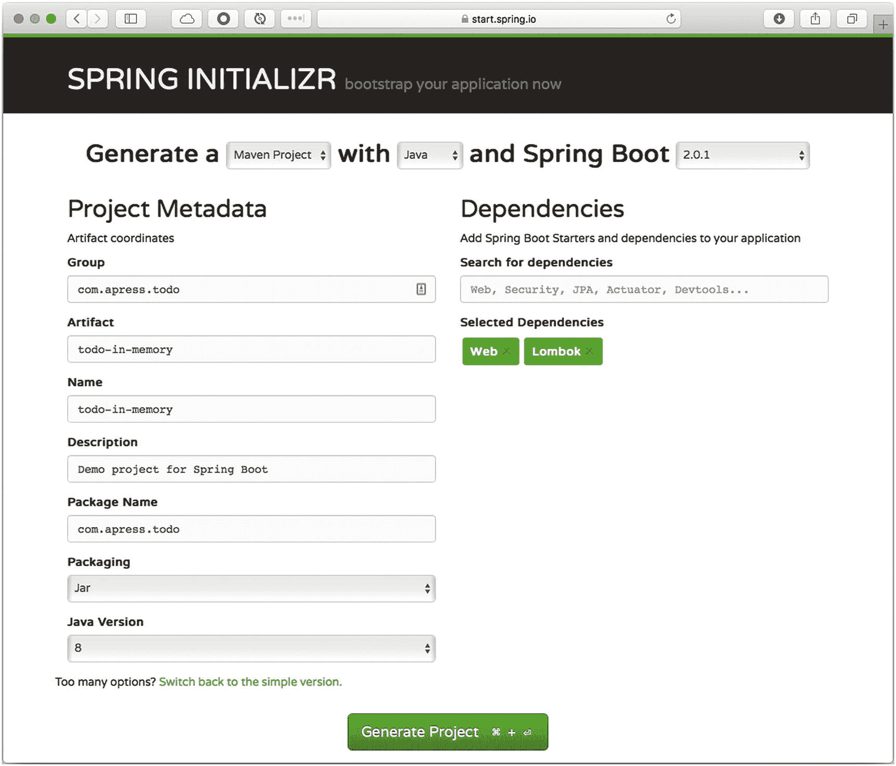

# 4.Spring Boot 的网络应用

如今，web 是任何类型应用的主要渠道，从桌面到移动设备，从社交和商业应用到游戏，从简单内容到流数据。有了这个想法，Spring Boot 可以帮助您轻松开发下一代网络应用。

本章向您展示了如何轻松创建 Spring Boot web 应用。通过前面章节中的一些例子，你已经了解了你可以用网络做什么。您了解了 Spring Boot 使得用几行代码创建 web 应用变得更加容易，并且您不需要担心配置文件或寻找应用服务器来部署您的 web 应用。通过使用 Spring Boot 及其自动配置，您可以拥有一个嵌入式应用服务器，如 Tomcat、Netty、Undertow 或 Jetty，这使得您的应用非常易于分发和移植。

## 的实现

让我们开始谈论 Spring MVC 技术和它的一些特性。请记住，Spring 框架由大约 20 个模块或技术组成，web 技术是其中之一。对于 web 技术，Spring 框架有`spring-web`、`spring-webmvc`、`spring-webflux`和`spring-websocket`模块。

`spring-web`模块具有基本的 web 集成特性，比如多部分文件上传功能、Spring 容器的初始化(通过使用 servlet 监听器)以及面向 web 的应用上下文。`spring-mvc`模块(也称为 web 服务器模块)包含 web 应用的所有 Spring MVC(模型-视图-控制器)和 REST 服务实现。这些模块提供了许多特性，比如非常强大的 JSP 标记库、可定制的绑定和验证、灵活的模型传输、可定制的处理程序和视图解析等等。

Spring MVC 是围绕`org.springframework.web.servlet.DispatcherServlet`类设计的。这个 servlet 非常灵活，并且具有非常健壮的功能，这在其他任何 MVC web 框架中都是找不到的。使用`DispatcherServlet`，您有几个现成的解析策略，包括视图解析器、区域解析器、主题解析器和异常处理程序。换句话说，`DispatcherServlet`接受一个 HTTP 请求，并将其重定向到正确的处理程序(用`@Controller`或`@RestController`标记的类以及使用`@RequestMapping`注释的方法)和正确的视图(您的 JSP)。

## Spring Boot MVC 自动配置

通过将`spring-boot-starter-web`依赖项添加到您的`pom.xml`或`build.gradle`文件中，可以很容易地创建 Web 应用。这个依赖项提供了所有必需的`spring-web`jar 和一些额外的 jar，比如`tomcat-embed*`和`jackson`(用于 JSON 和 XML)。这意味着 Spring Boot 使用 Spring MVC 模块的能力，并提供所有必要的*自动配置*来创建正确的 web 基础设施，例如配置`DispatcherServlet`，提供默认值(除非您覆盖它)，设置嵌入式 Tomcat 服务器(这样您就可以在没有任何应用容器的情况下运行您的应用)，等等。

自动配置为您的 web 应用添加了以下功能。

*   *静态内容支持*。这意味着您可以在名为`/static`(默认情况下)或`/public`、`/resources`或/ `META-INF/resources`的目录中添加静态内容，比如 HTML、JavaScript、CSS、media 等等，这些目录应该在您的类路径或当前目录中。Spring Boot 拿起它，并应要求为他们服务。您可以通过修改`spring.mvc.static-path-pattern`或`spring.resources.static-locations`属性来轻松改变这一点。Spring Boot 和 web 应用的一个很酷的特性是，如果你创建一个`index.html`文件，Spring Boot 会自动提供它，不需要注册任何其他 bean，也不需要额外的配置。

*   *HttpMessageConverters* 。如果您正在使用常规的 Spring MVC 应用，并且想要获得 JSON 响应，那么您需要为`HttpMessageConverters` bean 创建必要的配置(XML 或 JavaConfig)。Spring Boot 默认添加了这种支持，所以你不必这么做；这意味着默认情况下您会得到 JSON 格式(由于 Jackson 库，`spring-boot-starter-web`提供了依赖项)。如果 Spring Boot 自动配置发现您的类路径中有 Jackson XML 扩展，它会将一个 XML `HttpMessageConverter`聚合到转换器，这意味着您的应用可以基于您的`content-type`请求，或者是`application/json`或者是`application/xml`提供服务。

*   *JSON 序列化器和反序列化器*。如果你想对 JSON 的序列化/反序列化有更多的控制，Spring Boot 提供了一个简单的方法来创建你自己的，从`JsonSerializer<T>`和/或`JsonDeserializer<T>`扩展，用`@JsonComponent`注释你的类，这样它就可以注册使用了。Spring Boot 的另一个特点是杰克逊的支持；默认情况下，Spring Boot 将日期字段序列化为`2018-05-01T23:31:38.141+0000`，但是您可以通过更改`spring.jackson.date-format=yyyy-MM-dd`属性来更改这种默认行为(您可以应用任何日期格式模式)；前一个值生成输出，如`2018-05-01`。

*   *路径匹配和内容协商*。Spring MVC 应用实践之一是能够响应任何后缀来表示*内容类型*响应及其内容协商。如果你有类似`/api/todo.json`或者`/api/todo.pdf`的东西，那么`content-type`设置为`application/json`和`application/pdf`；所以响应分别是 JSON 格式或 PDF 文件。换句话说，Spring MVC 进行`.*`后缀模式匹配，比如`/api/todo.*`。默认情况下，Spring Boot 禁用此功能。通过使用`spring.mvc.contentnegotiation.favor-parameter=true`属性(默认为`false`，您仍然可以使用一个可以添加参数的特性；所以你可以做一些类似`/api/todo?format=xml`的事情。(`format`是默认的参数名；当然可以用`spring.mvc.contentnegotiation.parameter-name=myparam`来改。这将触发`content-type`至`application/xml`。

*   *错误处理*。Spring Boot 使用`/error`映射创建一个白色标签页面来显示所有的全局错误。您可以通过创建自己的自定义页面来更改行为。您需要在`src/main/resources/public/error/`位置创建您的定制 HTML 页面，这样您就可以创建`500.html`或`404.html`页面。如果你正在创建一个 RESTful 应用，Spring Boot 以 JSON 格式响应。Spring Boot 还支持 Spring MVC 来处理使用`@ControllerAdvice`或`@ExceptionHandler`注释时的错误。您可以通过实现`ErrorPageRegistrar`并将其声明为 Spring bean 来注册自定义`ErrorPages`。

*   *模板引擎* *支持*。Spring Boot 支持 FreeMarker，Groovy 模板，百里香叶和小胡子。当包含`spring-boot-starter-<template engine>`依赖项时，Spring Boot 自动配置对于启用和添加所有必要的视图解析器和文件处理程序是必要的。默认情况下，Spring Boot 会查看`src/main/resources/templates/`路径。

还有许多其他功能，Spring Boot 网站自动配置提供。现在，我们只关注了 *Servlet 技术*，但是很快我们就会进入 Spring Boot 家族的最新成员: *WebFlux* 。

## Spring Boot Web:所有应用

为了更好地理解 Spring Boot 如何使用 web 应用以及 Spring MVC 模块的强大功能，您将创建一个 ToDo 应用来公开一个 RESTful API。这些是要求:

*   创建具有以下字段和类型的 ToDo 域模型:`id`(字符串)、`description`(字符串)、`completed`(布尔)、`created`(日期和时间)、`modified`(日期和时间)。

*   创建一个 RESTful API，提供基本的 CRUD(创建、读取、更新、删除)操作。使用最常见的 HTTP 方法:POST、PUT、PATCH、GET 和 DELETE。

*   创建一个存储库来处理多个待办事项的状态。目前，内存中的存储库就足够了。

*   当有错误请求或提交新的 ToDo 没有必需字段时，添加错误处理程序。唯一的必填字段是描述。

*   所有的请求和响应都应该是 JSON 格式。

### 所有应用

打开你的浏览器，进入 [`https://start.spring.io`](https://start.spring.io) ，使用以下值创建你的待办事宜应用(另见图 [4-1](#Fig1) )。



图 4-1

[`https://start.spring.io`](https://start.spring.io) 所有应用

*   组:`com.apress.todo`

*   神器:`todo-in-memory`

*   名称:`todo-in-memory`

*   包名:`com.apress.todo`

*   依赖关系:`Web`，`Lombok`

选择 Lombok 依赖项有助于轻松创建域模型类，并消除样板文件 setters、getters 和其他覆盖。

### 注意

如果您需要更多关于龙目岛的信息，请参见 [`https://projectlombok.org`](https://projectlombok.org) 的参考文件。

您可以选择 Maven 或 Gradle 作为项目类型；在本书中，我们不加区分地使用这两个词。按下 Generate Project 按钮并下载 ZIP 文件。将其解压缩并导入到您最喜欢的 IDE 中。一些最好的 ide 是 STS ( [`https://spring.io/tools/sts/all`](https://spring.io/tools/sts/all) )、IntelliJ IDEA ( [`www.jetbrains.com/idea/`](http://www.jetbrains.com/idea/) )和 VSCode ( [`https://code.visualstudio.com/`](https://code.visualstudio.com/) )。我为代码完成特性推荐这些 ide 中的一个，它可以帮助您看到要添加到代码中的方法或参数。

#### 域模型:ToDo

根据需求，您需要创建一个`ToDo`域模型类(参见清单 [4-1](#PC1) )。

```java
package com.apress.todo.domain;

import lombok.Data;

import javax.validation.constraints.NotBlank;
import javax.validation.constraints.NotNull;
import java.time.LocalDateTime;
import java.util.UUID;

@Data
public class ToDo {

    @NotNull
    private String id;
    @NotNull
    @NotBlank
    private String description;
    private LocalDateTime created;
    private LocalDateTime modified;
    private boolean completed;

    public ToDo(){
        LocalDateTime date = LocalDateTime.now();
        this.id = UUID.randomUUID().toString();
        this.created = date;
        this.modified = date;
    }

    public ToDo(String description){
        this();
        this.description = description;
    }
}

Listing 4-1com.apress.todo.domain.ToDo.java

```

清单 [4-1](#PC1) 向您展示了`ToDo`类，它拥有所有必需的字段。它还使用了`@Data`注释，这是一个 Lombok 注释，生成一个默认的构造函数(如果你没有的话)和所有的设置器、获取器和覆盖，比如`toString`方法，使类更干净。还要注意，该类在一些字段中有`@NotNull`和`@NotBlank`注释；这些注释用于我们稍后进行的验证。默认的构造函数有字段初始化，所以很容易创建一个`ToDo`实例。

#### 流畅的 API: ToDoBuilder

接下来，让我们创建一个流畅的 API 类来帮助创建一个`ToDo`实例。您可以看到这个类是一个工厂，它创建一个带有描述或特定 ID 的 ToDo(参见清单 [4-2](#PC2) )。

```java
package com.apress.todo.domain;

public class ToDoBuilder {

    private static ToDoBuilder instance = new ToDoBuilder();
    private String id = null;
    private String description = "";

    private ToDoBuilder(){}

    public static ToDoBuilder create() {
        return instance;
    }

    public ToDoBuilder withDescription(String description){
        this.description = description;
        return instance;
    }

    public ToDoBuilder withId(String id){
        this.id = id;
        return instance;
    }

    public ToDo build(){
        ToDo result = new ToDo(this.description);
        if(id != null)
            result.setId(id);
        return result;
    }

}

Listing 4-2com.apress.todo.domain.ToDoBuilder.java

```

清单 [4-2](#PC2) 是一个简单的工厂类，它创建了一个`ToDo`实例。您将在接下来的章节中扩展它的功能。

#### 存储库:公共存储库

接下来，创建一个具有通用持久性操作的接口。这个接口是通用的，所以很容易使用任何其他实现，使回购成为一个可扩展的解决方案(参见清单 [4-3](#PC3) )。

```java
package com.apress.todo.repository;

import java.util.Collection;

public interface  CommonRepository<T> {
    public T save(T domain);
    public Iterable<T> save(Collection<T> domains);
    public void delete(T domain);
    public T findById(String id);
    public Iterable<T> findAll();
}

Listing 4-3com.apress.todo.repository.CommonRepository<T>.java

```

清单 [4-3](#PC3) 是一个通用接口，可以用作任何其他持久性实现的基础。当然，您可以随时更改这些签名。这只是一个如何创建可扩展的东西的例子。

#### 存储库:ToDoRepository

让我们创建一个实现`CommonRepository<T>`接口的具体类。记住规范；现在，只需要在内存中保存待办事项(参见清单 [4-4](#PC4) )。

```java
package com.apress.todo.repository;

import com.apress.todo.domain.ToDo;
import org.springframework.stereotype.Repository;

@Repository
public class ToDoRepository implements CommonRepository<ToDo> {

    private Map<String,ToDo> toDos = new HashMap<>();

    @Override
    public ToDo save(ToDo domain) {
        ToDo result = toDos.get(domain.getId());
        if(result != null) {
            result.setModified(LocalDateTime.now());
            result.setDescription(domain.getDescription());
            result.setCompleted(domain.isCompleted());
            domain = result;
        }
        toDos.put(domain.getId(), domain);
        return toDos.get(domain.getId());

    }

    @Override
    public Iterable<ToDo> save(Collection<ToDo> domains) {
        domains.forEach(this::save);
        return findAll();
    }

    @Override
    public void delete(ToDo domain) {
        toDos.remove(domain.getId());
    }

    @Override
    public ToDo findById(String id) {
        return toDos.get(id);
    }

    @Override
    public Iterable<ToDo> findAll() {
        return toDos.entrySet().stream().sorted(entryComparator).map(Map.Entry::getValue).collect(Collectors.toList());
    }

    private Comparator<Map.Entry<String,ToDo>> entryComparator = (Map.Entry<String, ToDo> o1, Map.Entry<String, ToDo> o2) -> {
        return o1.getValue().getCreated().compareTo(o2.getValue().getCreated());
    };
}

Listing 4-4com.apress.todo.repository.ToDoRepository.java

```

清单 [4-4](#PC4) 展示了`CommonRepository<T>`接口的实现。审查代码并进行分析。此类正在使用保存所有待办事项的哈希。由于 hash 的性质，所有的操作都得到了简化，使其易于实现。

#### 验证:ToDoValidationError

接下来，让我们创建一个验证类，暴露应用中任何可能的错误，比如没有描述的 ToDo。记住，在`ToDo`类中，ID 和描述字段被标记为`@NotNull`。描述字段有一个额外的`@NotBlank`注释，以确保它从不为空(参见清单 [4-5](#PC5) )。

```java
package com.apress.todo.validation;

import com.fasterxml.jackson.annotation.JsonInclude;

import java.util.ArrayList;
import java.util.List;

public class ToDoValidationError {

    @JsonInclude(JsonInclude.Include.NON_EMPTY)
    private List<String> errors = new ArrayList<>();

    private final String errorMessage;

    public ToDoValidationError(String errorMessage) {
        this.errorMessage = errorMessage;
    }

    public void addValidationError(String error) {
        errors.add(error);
    }

    public List<String> getErrors() {
        return errors;
    }

    public String getErrorMessage() {
        return errorMessage;
    }
}

Listing 4-5com.apress.todo.validation.ToDoValidationError.java

```

清单 [4-5](#PC5) 显示了`ToDoValidationError`类，它保存任何请求产生的任何错误。它使用了一个额外的`@JsonInclude`注释，这意味着即使 errors 字段为空，也必须包含它。

#### 验证:ToDoValidationErrorBuilder

让我们创建另一个帮助构建`ToDoValidationError`实例的工厂(参见清单 [4-6](#PC6) )。

```java
package com.apress.todo.validation;

import org.springframework.validation.Errors;
import org.springframework.validation.ObjectError;

public class ToDoValidationErrorBuilder {

    public static ToDoValidationError fromBindingErrors(Errors errors) {
        ToDoValidationError error = new ToDoValidationError("Validation failed. " + errors.getErrorCount() + " error(s)");
        for (ObjectError objectError : errors.getAllErrors()) {
            error.addValidationError(objectError.getDefaultMessage());
        }
        return error;
    }
}

Listing 4-6com.apress.todo.validation.ToDoValidationErrorBuilder.java

```

清单 [4-6](#PC6) 是另一个`Factory`类，它可以用所有必要的信息轻松创建一个`ToDoValidationError`实例。

#### 控制器:ToDoController

现在，是时候创建 RESTful API 并使用所有以前的类了。您创建了`ToDoController`类，在其中您可以看到所有的 Spring MVC 特性、注释、配置端点的方式以及如何处理错误。让我们回顾一下清单 [4-7](#PC7) 中的代码。

```java
package com.apress.todo.controller;

import com.apress.todo.domain.ToDo;
import com.apress.todo.domain.ToDoBuilder;
import com.apress.todo.repository.CommonRepository;
import com.apress.todo.validation.ToDoValidationError;
import com.apress.todo.validation.ToDoValidationErrorBuilder;
import org.springframework.beans.factory.annotation.Autowired;
import org.springframework.http.HttpStatus;
import org.springframework.http.ResponseEntity;
import org.springframework.validation.Errors;
import org.springframework.web.bind.annotation.*;
import org.springframework.web.servlet.support.ServletUriComponentsBuilder;

import javax.validation.Valid;
import java.net.URI;

@RestController

@RequestMapping("/api")

public class ToDoController {

    private CommonRepository<ToDo> repository;

    @Autowired
    public ToDoController(CommonRepository<ToDo> repository) {
        this. repository = repository;
    }

    @GetMapping("/todo")
    public ResponseEntity<Iterable<ToDo>> getToDos(){
        return ResponseEntity.ok(repository.findAll());
    }

    @GetMapping("/todo/{id}")
    public ResponseEntity<ToDo> getToDoById(@PathVariable String id){
        return ResponseEntity.ok(repository.findById(id));
    }

    @PatchMapping("/todo/{id}")
    public ResponseEntity<ToDo> setCompleted(@PathVariable String id){
        ToDo result = repository.findById(id);
        result.setCompleted(true);
        repository.save(result);
        URI location = ServletUriComponentsBuilder.fromCurrentRequest()
                .buildAndExpand(result.getId()).toUri();

        return ResponseEntity.ok().header("Location",location.toString()).build();
    }

    @RequestMapping(value="/todo", method = {RequestMethod.POST,RequestMethod.PUT})
    public ResponseEntity<?> createToDo(@Valid @RequestBody ToDo toDo, Errors errors){
        if (errors.hasErrors()) {
            return ResponseEntity.badRequest().body(ToDoValidationErrorBuilder.fromBindingErrors(errors));
        }

        ToDo result = repository.save(toDo);
        URI location = ServletUriComponentsBuilder.fromCurrentRequest().path("/{id}")
                .buildAndExpand(result.getId()).toUri();
        return ResponseEntity.created(location).build();
    }

    @DeleteMapping("/todo/{id}")
    public ResponseEntity<ToDo> deleteToDo(@PathVariable String id){
        repository.delete(ToDoBuilder.create().withId(id).build());
        return ResponseEntity.noContent().build();
    }

    @DeleteMapping("/todo")
    public ResponseEntity<ToDo> deleteToDo(@RequestBody ToDo toDo){
        repository.delete(toDo);
        return ResponseEntity.noContent().build();
    }

  @ExceptionHandler
    @ResponseStatus(value = HttpStatus.BAD_REQUEST)
    public ToDoValidationError handleException(Exception exception) {
        return new ToDoValidationError(exception.getMessage());
    }

}

Listing 4-7com.apress.todo.controller.ToDoController.java

```

清单 [4-7](#PC7) 是`ToDoController`类。我们来复习一下。

*   `@RestController`。Spring MVC 提供了`@Controller`和`@RestController`来表达请求映射、请求输入、异常处理等等。所有的功能都依赖于这些注释，因此不需要扩展或实现接口特定的接口。

*   `@RequestMapping`。这个注释将请求映射到控制器方法。有几个属性来匹配 URL、HTTP 方法(GET、PUT、DELETE 等。)、请求参数、报头和媒体类型。它可以在类级(共享映射)使用，也可以在方法级用于特定端点映射。在这种情况下，用`"/api"`标记，意味着所有的方法都有这个前缀。

*   `@Autowired`。构造函数用`@Autowired`进行了注释，这意味着它注入了`CommonRepository<ToDo>`实现。此注释可以省略；从版本 4.3 开始，Spring 会自动注入任何声明的依赖项。

*   `@GetMapping`。这是`@RequestMapping`注释的快捷变体，对`HTTP GET`方法有用。`@GetMapping`相当于`@RequestMapping(value="/todo", method = {RequestMethod.GET})`。

*   `@PatchMapping`。这是`@RequestMapping`注释的快捷方式变体；在这个类中，它将 ToDo 标记为已完成。

*   `@DeleteMapping`。这是`@RequestMapping`注释的快捷方式变体；它用于删除待办事项。有两个重载方法:`deleteToDo`，一个接受字符串，另一个接受`ToDo`实例。

*   `@PathVariable`。当您声明包含 URL 表达式模式的终结点时，此批注非常有用；在本例中是`"/api/todo/{id}"`，其中 ID 必须与方法参数的名称相匹配。

*   `@RequestBody`。这个注释发送一个带有主体的请求。通常，当你提交一个表单或一个特定的内容时，这个类接收一个 JSON 格式的`ToDo`，然后`HttpMessageConverter`将 JSON 反序列化成一个`ToDo`实例；多亏了 Spring Boot 和它的自动配置，这是自动完成的，因为它默认注册了`MappingJackson2HttpMessageConverter`。

*   `ResponseEntity<T>`。这个类返回一个完整的响应，包括 HTTP 头，主体通过`HttpMessageConverters`转换并写入 HTTP 响应。`ResponseEntity<T>`类支持流畅的 API，因此创建响应很容易。

*   `@ResponseStatus`。通常，当方法具有 void 返回类型(或 null 返回值)时，使用此注释。该注释发回响应中指定的 HTTP 状态代码。

*   `@Valid`。该注释验证传入的数据，并用作方法的参数。要触发一个验证器，需要用`@NotNull`、`@NotBlank`和其他注释来注释您想要验证的数据。在这种情况下，`ToDo`类在 ID 和 description 字段中使用这些注释。如果验证器发现错误，它们被收集在`Errors`类中(在本例中，一个`spring-webmvc` jars 附带的 *hibernate 验证器*被注册并用作全局验证器；您可以创建自己的自定义验证并覆盖 Spring Boot 的默认值)。然后，您可以检查并添加必要的逻辑来发回错误响应。

*   `@ExceptionHandler`。Spring MVC 自动声明内置的异常解析器，并为该注释添加支持。在这种情况下，`@ExceptionHandler`在这个控制器类中声明(或者您可以在`@ControllerAdvice`拦截器中使用它),任何异常都被重定向到`handleException`方法。如果需要，您可以说得更具体一些。例如，你可以有一个`DataAccessException`，并通过一个方法来处理。

    ```java
        @ExceptionHandler
        @ResponseStatus(value = HttpStatus.BAD_REQUEST)
        public ToDoValidationError
           handleException(DataAccessException exception) {
                         return new
                ToDoValidationError(exception.getMessage());
        }

    ```

在类中有一个方法接受两个 HTTP 方法:`POST`和`PUT`。`@RequestMapping`可以接受多个 HTTP 方法，因此很容易分配一个方法来处理它们(例如`@RequestMapping(value="/todo", method = {RequestMethod.POST, RequestMethod.PUT})`)。

我们已经涵盖了这个应用的所有必要需求，所以是时候运行它并查看结果了。

### 运行:待办事项应用

现在，您已经准备好运行 ToDo 应用并测试它了。如果您使用的是 IDE (STS 或 IntelliJ)，可以右键单击主应用类(`TodoInMemoryApplication.java`)并选择运行操作。如果您使用的编辑器没有这些功能，您可以通过打开终端窗口并执行清单 [4-8](#PC9) 或清单 [4-9](#PC10) 中的命令来运行您的 Todo 应用。

```java
./gradlew spring-boot:run

Listing 4-9If you are using Gradle project type

```

```java
./mvnw spring-boot:run

Listing 4-8If you are using Maven project type

```

Spring Initializr ( [`https://start.spring.io`](https://start.spring.io) )总是提供你选择的项目类型包装器(Maven 或者 Gradle 包装器)，所以不需要预装 Maven 或者 Gradle。

Spring Boot web 应用的一个默认设置是，它配置了一个嵌入式 Tomcat 服务器，因此您可以轻松运行您的应用，而无需将其部署到应用 servlet 容器中。默认情况下，它选择端口 8080。

### 测试:待办事项应用

测试 ToDo 应用应该非常简单。这种测试是通过命令或特定的客户端进行的。如果你正在考虑单元测试或集成测试，我会在另一章解释。这里我们将使用 cURL 命令。默认情况下，这个命令在任何 UNIX 操作系统中都有，但是如果你是 Windows 用户，你可以从 [`https://curl.haxx.se/download.html`](https://curl.haxx.se/download.html) 下载它。

第一次运行时，待办事项应用不应该有任何待办事项。您可以通过在另一个终端中执行以下命令来确保这一点。

```java
curl -i http://localhost:8080/api/todo

```

您应该会看到类似于以下输出的内容:

```java
HTTP/1.1 200
Content-Type: application/json;charset=UTF-8
Transfer-Encoding: chunked
Date: Wed, 02 May 2018 22:10:19 GMT

[]

```

你的目标是`/api/todo`端点，如果你看一下清单 [4-7](#PC7) ，一个`getToDos`方法返回`ResponseEntity<Iterable<ToDo>>`，这是 ToDo 的集合。默认响应是 JSON 格式(见`Content-Type`头)。响应是发回 HTTP 头和状态。

接下来，让我们用下面的命令添加一些 ToDo。

```java
curl -i -X POST -H "Content-Type: application/json" -d '{ "description":"Read the Pro Spring Boot 2nd Edition Book"}' http://localhost:8080/api/todo

```

在命令中，post ( `-X POST`)和 data ( `-d`)是 JSON 格式。您只发送描述字段。需要添加具有正确内容类型的头(`-H`)，并指向`/api/todo`端点。执行该命令后，您应该会看到如下输出:

```java
HTTP/1.1 201
Location: http://localhost:8080/api/todo/d8d37c51-10a8-4c82-a7b1-b72b5301cdab
Content-Length: 0
Date: Wed, 02 May 2018 22:21:09 GMT

```

您获得了位置头，在那里 ToDo 被读取。`Location`显示您刚刚创建的待办事项的 ID。这个响应是由`createToDo`方法生成的。添加至少另外两个待办事项，以便我们可以有更多的数据。

如果您再次执行第一个命令来获得所有的 ToDo，您应该会看到类似这样的内容:

```java
curl -i http://localhost:8080/api/todo
HTTP/1.1 200
Content-Type: application/json;charset=UTF-8
Transfer-Encoding: chunked
Date: Wed, 02 May 2018 22:30:16 GMT

[{"id":"d8d37c51-10a8-4c82-a7b1-b72b5301cdab","description":"Read the Pro Spring Boot 2nd Edition Book","created":"2018-05-02T22:27:26.042+0000","modified":"2018-05-02T22:27:26.042+0000","completed":false},{"id":"fbb20090-19f5-4abc-a8a9-92718c2c4759","description":"Bring Milk after work","created":"2018-05-02T22:28:23.249+0000","modified":"2018-05-02T22:28:23.249+0000","completed":false},{"id":"2d051b67-7716-4ee6-9c45-1de939fa579f","description":"Take the dog for a walk","created":"2018-05-02T22:29:28.319+0000","modified":"2018-05-02T22:29:28.319+0000","completed":false}]

```

当然，这打印得不是很好，但是你有完整的待办事项列表。您可以使用另一个命令行工具来格式化这个输出:jq ( [`https://stedolan.github.io/jq/`](https://stedolan.github.io/jq/) )。

```java
curl -s http://localhost:8080/api/todo | jq
[
  {
    "id": "d8d37c51-10a8-4c82-a7b1-b72b5301cdab",
    "description": "Read the Pro Spring Boot 2nd Edition Book",
    "created": "2018-05-02T22:27:26.042+0000",
    "modified": "2018-05-02T22:27:26.042+0000",
    "completed": false
  },
  {
    "id": "fbb20090-19f5-4abc-a8a9-92718c2c4759",
    "description": "Bring Milk after work",
    "created": "2018-05-02T22:28:23.249+0000",
    "modified": "2018-05-02T22:28:23.249+0000",
    "completed": false
  },
  {
    "id": "2d051b67-7716-4ee6-9c45-1de939fa579f",
    "description": "Take the dog for a walk",
    "created": "2018-05-02T22:29:28.319+0000",
    "modified": "2018-05-02T22:29:28.319+0000",
    "completed": false
  }

]

```

接下来，您可以修改其中一个待办事项；例如，

```java
curl -i -X PUT -H "Content-Type: application/json" -d '{ "description":"Take the dog and the cat for a walk", "id":"2d051b67-7716-4ee6-9c45-1de939fa579f"}' http://localhost:8080/api/todo
HTTP/1.1 201
Location: http://localhost:8080/api/todo/2d051b67-7716-4ee6-9c45-1de939fa579f
Content-Length: 0
Date: Wed, 02 May 2018 22:38:03 GMT

```

此处`Take the dog for a walk`改为`Take the dog and the cat for a walk`。该命令使用-X PUT，并且需要`id`字段(我们可以从以前帖子的 location 头或者从访问`/api/todo`端点获得它)。如果你检查了所有的待办事项，你有一个修改的待办事项。

接下来，让我们完成一个待办事项。您可以执行以下命令。

```java
curl -i -X PATCH http://localhost:8080/api/todo/2d051b67-7716-4ee6-9c45-1de939fa579f
HTTP/1.1 200
Location: http://localhost:8080/api/todo/2d051b67-7716-4ee6-9c45-1de939fa579f
Content-Length: 0
Date: Wed, 02 May 2018 22:50:27 GMT

```

该命令使用的是通过`setCompleted`方法处理的`-X PATCH`。如果您查看位置链接，ToDo 应该已完成。

```java
curl -s http://localhost:8080/api/todo/2d051b67-7716-4ee6-9c45-1de939fa579f | jq
{
  "id": "2d051b67-7716-4ee6-9c45-1de939fa579f",
  "description": "Take the dog and the cat for a walk",
  "created": "2018-05-02T22:44:57.652+0000",
  "modified": "2018-05-02T22:50:27.691+0000",
  "completed": true
}

```

`completed`字段现在是`true`。如果此待办事项已完成，那么您可以删除它。

```java
curl -i -X DELETE http://localhost:8080/api/todo/2d051b67-7716-4ee6-9c45-1de939fa579f
HTTP/1.1 204
Date: Wed, 02 May 2018 22:56:18 GMT

```

cURL 命令有-X DELETE，它由`deleteToDo`方法处理，从散列中删除。如果你看一下所有的待办事项，你现在应该比以前少一个。

```java
curl -s http://localhost:8080/api/todo | jq
[
  {
    "id": "d8d37c51-10a8-4c82-a7b1-b72b5301cdab",
    "description": "Read the Pro Spring Boot 2nd Edition Book",
    "created": "2018-05-02T22:27:26.042+0000",
    "modified": "2018-05-02T22:27:26.042+0000",
    "completed": false
  },
  {
    "id": "fbb20090-19f5-4abc-a8a9-92718c2c4759",
    "description": "Bring Milk after work",
    "created": "2018-05-02T22:28:23.249+0000",
    "modified": "2018-05-02T22:28:23.249+0000",
    "completed": false
  }
]

```

现在，让我们测试验证。执行以下命令。

```java
curl -i -X POST -H "Content-Type: application/json" -d '{"description":""}' http://localhost:8080/api/todo

```

该命令在描述字段为空的情况下发送数据(`-d`选项)(通常，当您提交 HTML 表单时会发生这种情况)。您应该会看到以下输出。

```java
HTTP/1.1 400
Content-Type: application/json;charset=UTF-8
Transfer-Encoding: chunked
Date: Thu, 03 May 2018 00:01:53 GMT
Connection: close

{"errors":["must not be blank"],"errorMessage":"Validation failed. 1 error(s)"}

```

400 状态码(错误请求)和`errors`和`errorMessage`(由`ToDoValidationErrorBuilder`类构建)响应。使用以下命令。

```java
curl -i -X POST -H "Content-Type: application/json" http://localhost:8080/api/todo

HTTP/1.1 400
Content-Type: application/json;charset=UTF-8
Transfer-Encoding: chunked
Date: Thu, 03 May 2018 00:07:28 GMT
Connection: close

{"errorMessage":"Required request body is missing: public org.springframework.http.ResponseEntity<?> com.apress.todo.controller.ToDoController.createToDo(com.apress.todo.domain.ToDo,org.springframework.validation.Errors)"}

```

此命令正在发布，但没有数据，并以错误消息作为响应。这来自于`@ExceptionHandler`注释和`handleException`方法。所有的错误(不同于空白的描述)都用这个方法处理。

您可以继续测试更多的 ToDo 或修改一些验证注释，看看它们是如何工作的。

### 注意

如果没有 cURL 命令或者无法安装，可以使用其他任何 REST 客户端，比如 PostMan ( [`https://www.getpostman.com`](https://www.getpostman.com) )或者失眠( [`https://insomnia.rest`](https://insomnia.rest) )。如果你喜欢命令行，那么 Httpie ( [`https://httpie.org`](https://httpie.org) )是另一个不错的选择；它使用 Python。

## Spring Boot Web:改写默认值

Spring Boot web 自动配置设置默认运行一个 Spring web 应用。在这一节中，我将向您展示如何覆盖其中的一些。

您可以通过创建自己的配置(XML 或 JavaConfig)和/或使用`application.properties`(或)来覆盖 web 默认值。yml)文件。

### 服务器覆盖

默认情况下，嵌入式 Tomcat 服务器在端口 8080 上启动，但是您可以通过使用以下属性轻松地更改它。

```java
server.port=8081

```

Spring 的一个很酷的特性是你可以应用 SpEL (Spring Expression Language)并将其应用于这些属性。例如，当您创建一个可执行的 jar `(./mvnw package`或`./gradlew build`时，您可以在运行您的应用时传递一些参数。您可以执行以下操作

```java
java -jar todo-in-memory-0.0.1-SNAPSHOT.jar --port=8787

```

而在你的`application.properties`中，你有这样的东西:

```java
server.port=${port:8282}

```

这个表达式意味着如果你传递了`--port`参数，它就取那个值；如果不是，则设置为`8282`。这只是你能用 SpEL 做的一点点尝试，但是如果你想知道更多，去 [`https://docs.spring.io/spring/docs/current/spring-framework-reference/core.html#expressions`](https://docs.spring.io/spring/docs/current/spring-framework-reference/core.html#expressions) 。

您还可以更改服务器地址，这在您希望使用特定 IP 运行应用时非常有用。

```java
server.address=10.0.0.7

```

您可以更改应用的上下文。

```java
server.servlet.context-path=/my-todo-app

```

你可以像这样卷曲:

```java
curl -I http://localhost:8080/my-todo-app/api/todo

```

您可以通过使用以下属性让 Tomcat 支持 SSL。

```java
server.port=8443
server.ssl.key-store=classpath:keystore.jks
server.ssl.key-store-password=secret
server.ssl.key-password=secret

```

我们将在后面的章节中重温这些属性，并让我们的应用与 SSL 一起工作。

您可以使用下列属性来管理会话。

```java
server.servlet.session.store-dir=/tmp
server.servlet.session.persistent=true
server.servlet.session.timeout=15

server.servlet.session.cookie.name=todo-cookie.dat
server.servlet.session.cookie.path=/tmp/cookies

```

如果您的环境支持，您可以启用 HTTP/2 支持。

```java
server.http2.enabled=true

```

### JSON 日期格式

默认情况下，日期类型以长格式显示在 JSON 响应中；但是您可以通过在以下属性中提供您自己的模式来改变这一点。

```java
spring.jackson.date-format=yyyy-MM-dd HH:mm:ss
spring.jackson.time-zone=MST7MDT

```

这些属性格式化日期并使用您指定的时区(如果您想了解更多关于可用 id 的信息，您可以执行`java.util.TimeZone#getAvailableIDs`)。如果您修改了 ToDo 应用，运行它，添加一些 ToDo，并获得列表。您应该会得到这样的回应:

```java
curl -s http://localhost:8080/api/todo | jq
[
  {
    "id": "f52d1429-432d-43c5-946d-15c7fa5f50eb",
    "description": "Get the Pro Spring Boot 2nd Edition Book",
    "created": "2018-05-03 11:40:37",
    "modified": "2018-05-03 11:40:37",
    "completed": false
  }
]

```

如果你想知道更多关于哪些属性存在，书签 [`https://docs.spring.io/spring-boot/docs/current/reference/html/common-application-properties.html`](https://docs.spring.io/spring-boot/docs/current/reference/html/common-application-properties.html) 。

### 内容类型:JSON/XML

Spring MVC 使用`HttpMessageConverters`(客户端和服务器端)来协商 HTTP 交换中的内容转换。如果在类路径中找到了 Jackson 库，Spring Boot 会将默认值设置为 JSON。但是，如果您也想公开 XML，并请求 JSON 或 XML 内容，会发生什么呢？

Spring Boot 通过添加一个额外的依赖项和一个属性使这变得非常简单。

如果您使用的是 Maven，请参见清单 [4-10](#PC36) 。

```java
<dependency>
    <groupId>com.fasterxml.jackson.dataformat</groupId>
    <artifactId>jackson-dataformat-xml</artifactId>
</dependency>

Listing 4-10Maven: pom.xml

```

或者，如果您正在使用 Gradle，请参见清单 [4-11](#PC37) 。

```java
compile('com.fasterxml.jackson.dataformat:jackson-dataformat-xml')

Listing 4-11Gradle: build.gradle

```

您可以将以下属性添加到 application.properties 文件中。

```java
spring.mvc.contentnegotiation.favor-parameter=true

```

如果您运行带有这些更改的 ToDo 应用，您可以通过执行以下命令获得 XML 格式的响应。

```java
curl -s http://localhost:8080/api/todo?format=xml
<ArrayList><item><id>b3281340-b1aa-4104-b3d2-77a96a0e41b8</id><description>Read the Pro Spring Boot 2nd Edition Book</description><created>2018-05-03T19:18:30.260+0000</created><modified>2018-05-03T19:18:30.260+0000</modified><completed>false</completed></item></ArrayList>

```

在前面的命令中，`?format=xml`被追加到 URL 后面；JSON 响应也是如此。

```java
curl -s http://localhost:8080/api/todo?format=json | jq
[
  {
    "id": "b3281340-b1aa-4104-b3d2-77a96a0e41b8",
    "description": "Read the Pro Spring Boot 2nd Edition Book",
    "created": "2018-05-03T19:18:30.260+0000",
    "modified": "2018-05-03T19:18:30.260+0000",
    "completed": false
  }
]

```

如果您想漂亮地打印 XML，在 UNIX 环境中有`xmllint`命令。

```java
curl -s http://localhost:8080/api/todo?format=xml | xmllint --format -

```

### Spring MVC:覆盖默认值

到目前为止，我还没有向您展示如何创建 Web 应用来公开 HTML、JavaScript 等技术的组合，这是因为现在业界倾向于在前端使用 JavaScript/TypeScript 应用。

这并不意味着你不能创建一个具有后端和前端的 Spring Web MVC。Spring Web MVC 为您提供了与模板引擎和其他技术的良好集成。

如果使用任何模板引擎，可以通过使用以下属性来选择视图前缀和后缀:

```java
spring.mvc.view.prefix=/WEB-INF/my-views/
spring.mvc.view.suffix=.jsp

```

正如你所看到的，Spring Boot 可以帮助你做很多配置，如果你在做常规的 Spring Web 应用，通常你需要做很多。这种新方式有助于你加速发展。如果你需要更多关于如何使用 Spring MVC 及其所有特性的指导，你可以看看参考文档: [`https://docs.spring.io/spring/docs/5.0.5.RELEASE/spring-framework-reference/web.html#mvc`](https://docs.spring.io/spring/docs/5.0.5.RELEASE/spring-framework-reference/web.html#mvc)

### 使用不同的应用容器

默认情况下，Spring Boot 使用 Tomcat(用于 web servlet 应用)作为应用容器，并设置一个嵌入式服务器。如果您想覆盖这个缺省值，可以通过修改 Maven `pom.xml`或 Gradle `build.gradle`文件来实现。

#### 使用 Jetty 服务器

同样的变化也适用于逆流或净流(见清单 [4-12](#PC43) 和清单 [4-13](#PC44) )。

```java
configurations {
 compile.exclude module: "spring-boot-starter-tomcat"
}

dependencies {
 compile("org.springframework.boot:spring-boot-starter-web")
 compile("org.springframework.boot:spring-boot-starter-jetty")
  // ...
}

Listing 4-13Gradle: build.gradle

```

```java
<dependency>
    <groupId>org.springframework.boot</groupId>
    <artifactId>spring-boot-starter-web</artifactId>
    <exclusions>
      <exclusion>
            <groupId>org.springframework.boot</groupId>
            <artifactId>spring-boot-starter-tomcat</artifactId>
            </exclusion>
      </exclusions>
</dependency>
<dependency>
      <groupId>org.springframework.boot</groupId>
      <artifactId>spring-boot-starter-jetty</artifactId>
</dependency>

Listing 4-12Maven - pom.xml

```

## Spring Boot 网站:客户端

创建 Spring Boot web 应用的另一个重要特性是 Spring Web MVC 附带了一个有用的`RestTemplate`类，可以帮助创建客户端。

### 任何 App 客户端

打开您的浏览器并转到 [`https://start.spring.io`](https://start.spring.io) 站点，使用以下值创建您的 ToDo 客户端应用(另见图 [4-2](#Fig2) )。


图 4-2

任何 app 客户端

*   组:`com.apress.todo`

*   神器:`todo-client`

*   名称:`todo-client`

*   包名:`com.apress.todo`

*   依赖关系:`Web`，`Lombok`

按下 Generate Project 按钮并下载 ZIP 文件。将其解压缩并导入到您最喜欢的 IDE 中。

#### 域模型:ToDo

创建 ToDo 域模型，该模型应该与上一个应用中的最小字段相匹配(参见清单 [4-14](#PC45) )。

```java
package com.apress.todo.client.domain;

import lombok.Data;

import java.time.LocalDateTime;
import java.util.UUID;

@Data
public class ToDo {

    private String id;
    private String description;
    private LocalDateTime created;
    private LocalDateTime modified;
    private boolean completed;

    public ToDo(){
        LocalDateTime date = LocalDateTime.now();
        this.id = UUID.randomUUID().toString();
        this.created = date;
        this.modified = date;
    }

    public ToDo(String description){
        this();
        this.description = description;
    }
}

Listing 4-14com.apress.todo.client.domain.ToDo.java

```

清单 [4-14](#PC45) 向您展示了 ToDo 域模型类。包名称不同；不需要匹配类名。应用不需要知道要序列化或反序列化到 JSON 中的包是什么。

#### 错误处理函数:两个错误处理函数

接下来，让我们创建一个错误处理程序，处理来自服务器的任何错误响应。创建`ToDoErrorHandler`类(参见清单 [4-15](#PC46) )。

```java
package com.apress.todo.client.error;

import org.slf4j.Logger;
import org.slf4j.LoggerFactory;
import org.springframework.http.client.ClientHttpResponse;
import org.springframework.util.StreamUtils;
import org.springframework.web.client.DefaultResponseErrorHandler;

import java.io.IOException;
import java.nio.charset.Charset;

public class ToDoErrorHandler extends DefaultResponseErrorHandler {

    private Logger log = LoggerFactory.getLogger(ToDoErrorHandler.class);

    @Override
    public void handleError(ClientHttpResponse response)
throws IOException {
        log.error(response.getStatusCode().toString());
        log.error(StreamUtils.copyToString(
response.getBody(),Charset.defaultCharset()));
    }

}

Listing 4-15com.apress.todo.client.error.ToDoErrorHandler.java

```

清单 [4-15](#PC46) 显示了`ToDoErrorHandler`类，这是一个从`DefaultResponseErrorHandler`扩展而来的定制类。因此，如果我们得到一个 400 HTTP 状态(错误请求)，我们可以捕捉错误并对其做出反应；但是在这种情况下，该类只是记录错误。

#### 自定义属性:ToDoRestClientProperties

有必要知道 ToDo 应用在哪里运行，以及使用哪个 basePath，这就是为什么有必要保存这些信息。最佳实践之一是从外部获取这些信息。

让我们创建一个保存 URL 和基本路径信息的`ToDoRestClientProperties`类。这些信息可以保存在`application.properties`文件中(参见清单 [4-16](#PC47) )。

```java
package com.apress.todo.client;

import lombok.Data;
import org.springframework.boot.context.properties.ConfigurationProperties;
import org.springframework.stereotype.Component;

@Component

@ConfigurationProperties(prefix="todo")

@Data
public class ToDoRestClientProperties {

    private String url;
    private String basePath;

}

Listing 4-16com.apress.todo.client.ToDoRestClientProperties.java

```

清单 [4-16](#PC47) 显示了保存 URL 和基本路径信息的类。Spring Boot 允许您创建自定义类型的属性，这些属性可以从`application.properties`文件中访问和映射；唯一的要求是您需要用`@ConfigurationProperties`注释来标记这个类。这个注释可以接受像`prefix`这样的参数。

在`application.properties`文件中，添加以下内容。

```java
todo.url=http://localhost:8080
todo.base-path=/api/todo

```

#### 客户端:ToDoRestClient

让我们创建一个使用`RestTemplate`类的客户机，它有助于在客户机和服务器之间交换信息。创建`ToDoRestClient`类(参见清单 [4-17](#PC49) )。

```java
package com.apress.todo.client;

import com.apress.todo.client.domain.ToDo;
import com.apress.todo.client.error.ToDoErrorHandler;
import org.springframework.core.ParameterizedTypeReference;
import org.springframework.http.*;
import org.springframework.stereotype.Service;
import org.springframework.web.client.RestTemplate;

import java.net.URI;
import java.net.URISyntaxException;
import java.util.HashMap;
import java.util.Map;

@Service

public class ToDoRestClient {

    private RestTemplate restTemplate;
    private ToDoRestClientProperties properties;

    public ToDoRestClient(
                        ToDoRestClientProperties properties){
        this.restTemplate = new RestTemplate();
        this.restTemplate.setErrorHandler(
                                        new ToDoErrorHandler());
        this.properties = properties;
    }

    public Iterable<ToDo> findAll() throws URISyntaxException {
        RequestEntity<Iterable<ToDo>> requestEntity = new RequestEntity<Iterable<ToDo>>(HttpMethod.GET,new URI(properties.getUrl() + properties.getBasePath()));
        ResponseEntity<Iterable<ToDo>> response =
                restTemplate.exchange(requestEntity,new ParameterizedTypeReference<Iterable<ToDo>>(){});

        if(response.getStatusCode() == HttpStatus.OK){
            return response.getBody();
        }

        return null;
    }

    public ToDo findById(String id){
        Map<String, String> params = new HashMap<String, String>();
        params.put("id", id);
        return restTemplate.getForObject(properties.getUrl() + properties.getBasePath() + "/{id}",ToDo.class,params);
    }

    public ToDo upsert(ToDo toDo) throws URISyntaxException {
       RequestEntity<?> requestEntity = new RequestEntity<>(toDo,HttpMethod.POST,new URI(properties.getUrl() + properties.getBasePath()));
       ResponseEntity<?> response = restTemplate.exchange(requestEntity, new ParameterizedTypeReference<ToDo>() {});

       if(response.getStatusCode() == HttpStatus.CREATED){
           return restTemplate.getForObject(response.getHeaders().getLocation(),ToDo.class);
       }
       return null;
    }

    public ToDo setCompleted(String id) throws URISyntaxException{
        Map<String, String> params = new HashMap<String, String>();
        params.put("id", id);
        restTemplate.postForObject(properties.getUrl() + properties.getBasePath() + "/{id}?_method=patch",null, ResponseEntity.class, params);

        return findById(id);
    }

    public void delete(String id){
        Map<String, String> params = new HashMap<String, String>();
        params.put("id", id);
        restTemplate.delete(properties.getUrl() + properties.getBasePath() + "/{id}",params);
    }

}

Listing 4-17com.apress.todo.client.ToDoRestClient.java

```

清单 [4-17](#PC49) 显示了与 ToDo 应用交互的客户端。该类正在使用 RestTemplate 类。`RestTemplate`是 Spring 用于同步客户端 HTTP 访问的中心类。它简化了与 HTTP 服务器的通信，并加强了 RESTful 原则。它处理 HTTP 连接，让应用代码提供 URL(可能有模板变量)并提取结果。许多特性中的一个允许您处理自己的错误响应。所以看一下构造函数，它正在设置`ToDoErrorHandler`类。

复习课；它包含 ToDo 应用(后端)的所有操作。

### 注意

默认情况下，RestTemplate 依赖标准的 JDK 设施来建立 HTTP 连接。您可以通过 interceptinghtpaccessor . setrequestfactory(org . spring framework . HTTP . client . clienthttprequestfactory)属性切换到使用不同的 HTTP 库，如 Apache HttpComponents、Netty 和 OkHttp。

#### 运行和测试客户端

为了运行和测试客户端应用，修改`TodoClientApplication`类(参见清单 [4-18](#PC50) )。

```java
package com.apress.todo;

import com.apress.todo.client.ToDoRestClient;
import com.apress.todo.client.domain.ToDo;
import org.slf4j.Logger;
import org.slf4j.LoggerFactory;
import org.springframework.boot.CommandLineRunner;
import org.springframework.boot.SpringApplication;
import org.springframework.boot.WebApplicationType;
import org.springframework.boot.autoconfigure.SpringBootApplication;
import org.springframework.context.annotation.Bean;

@SpringBootApplication
public class TodoClientApplication {

      public static void main(String[] args) {
            SpringApplication app = new
                SpringApplication(TodoClientApplication.class);
            app.setWebApplicationType(WebApplicationType.NONE);
            app.run(args);
      }

      private Logger log = LoggerFactory.getLogger(TodoClientApplication.class);

      @Bean
      public CommandLineRunner process(ToDoRestClient client){
          return args -> {

              Iterable<ToDo> toDos = client.findAll();
              assert toDos != null;
              toDos.forEach( toDo -> log.info(toDo.toString()));

            ToDo newToDo = client.upsert(new ToDo("Drink plenty of Water daily!"));
            assert newToDo != null;
            log.info(newToDo.toString());

            ToDo toDo = client.findById(newToDo.getId());
            assert toDos != null;
            log.info(toDo.toString());

            ToDo completed = client.setCompleted(newToDo.getId());
            assert completed.isCompleted();
            log.info(completed.toString());

            client.delete(newToDo.getId());
            assert client.findById(newToDo.getId()) == null;
        };
    }
}

Listing 4-18com.apress.todo.TodoClientApplication.java

```

清单 [4-18](#PC50) 向您展示了如何测试客户端。首先用`WebApplicationType.NONE`关闭 web 环境。然后使用`CommandLineRunner`(作为 bean)在 app 启动前执行代码。

在运行它之前，分析代码，看看发生了什么。您可以使用命令行或通过您的 IDE 运行。确保 ToDo 应用已启动并正在运行。

您将再次使用此客户端。

### 注意

请记住，所有的源代码都可以从 Apress 网站或 GitHub 的以下位置下载: [`https://github.com/Apress/pro-spring-boot-2`](https://github.com/Apress/pro-spring-boot-2) 。

## 摘要

在这一章中，你学习了 Spring Boot 如何管理和自动配置 web 应用，以及它如何使用 Spring MVC 的力量。您还了解了可以覆盖自动配置提供的所有合理的缺省值。

通过 ToDo 应用，您学习了 web 应用的一些 Spring Boot 特性，比如 JSON 和 XML 配置，几个 MVC 注释的用法，比如`@RequestMapping`和`@ExceptionHandler`，等等。

您了解了 Spring Boot 如何使用嵌入式应用容器(在本例中，Tomcat 是默认的)来轻松部署或传输。

您在 ToDo 应用中使用的所有注释都是 Spring MVC 的一部分。在本书的剩余部分，我们实现了更多。如果想了解更多关于 Spring MVC 的知识，可以看看 *Pro Spring 5* (Apress，2017)。

在下一章中，您将了解 Spring Boot 如何为持久性引擎自动配置 Spring 数据模块。您还将了解更多关于 Spring JDBC、JPA、REST 和 NoSQL 模块的知识，比如 Mongo。