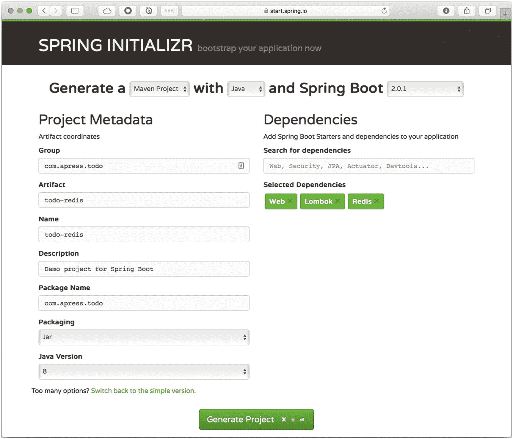

# 5.Spring Boot 的数据访问

从尝试访问、保存和分析数据，到使用几个字节到几十亿字节的信息，数据已经成为 IT 世界中最重要的部分。已经有许多尝试来创建框架和库，以便于开发人员与数据进行交互，但是有时这变得太复杂了。

在 3.0 版本之后，Spring 框架创建了不同的团队，专门研究不同的技术。春天数据项目组诞生了。这个项目的目标是简化数据访问技术的使用，从关系数据库和非关系数据库，到 map-reduce 框架和基于云的数据服务。这个 Spring 数据项目是特定于给定数据库的子项目的集合。

本章介绍了使用前几章中的 ToDo 应用通过 Spring Boot 进行数据访问。您将使 ToDo 应用与 SQL 和 NoSQL 数据库一起工作。我们开始吧。

## SQL 数据库

您还记得(在 Java 世界中)需要处理所有 JDBC (Java 数据库连接)任务的那些日子吗？您必须下载正确的驱动程序和连接字符串，打开和关闭连接、SQL 语句、结果集和事务，并将结果集转换为对象。在我看来，这些都是非常手工的工作。然后，许多 ORM(对象关系映射)框架开始出现来管理这些任务——比如 Castor XML、ObjectStore 和 Hibernate 等框架。它们允许您识别域类并创建与数据库表相关的 XML。在某种程度上，你也需要成为管理这类框架的专家。

Spring 框架通过遵循*模板设计模式*对那些框架帮助很大。它允许您创建一个抽象类，该类定义了执行方法的方式，并创建了允许您只关注业务逻辑的数据库抽象。它将所有困难留给了 Spring 框架，包括处理连接(打开、关闭和池化)、事务以及与框架交互的方式。

值得一提的是，Spring 框架依赖于几个接口和类(如`javax.sql.DataSource`接口)来获得关于您将要使用的数据库、如何连接到它(通过提供连接字符串)以及它的凭证的信息。现在，如果您有事务管理要做，那么`DataSource`接口是必不可少的。通常，`DataSource`接口需要驱动程序类、JDBC URL、用户名和密码来连接数据库。

## 春季数据

Spring Data 团队已经为 Java 和 Spring 社区创建了一些惊人的数据驱动框架。他们的任务是为数据访问提供熟悉且一致的基于 Spring 的编程，并对您想要使用的底层数据存储技术进行全面控制。

Spring Data 项目是几个额外的库和数据框架的保护伞，这使得对关系和非关系数据库使用数据访问技术变得很容易(又名 NoSQL)。

以下是 Spring 数据的一些特性。

*   支持跨存储持久性

*   基于存储库和定制的对象映射抽象

*   基于方法名的动态查询

*   通过 JavaConfig 和 XML 实现简单的 Spring 集成

*   支持 Spring MVC 控制器

*   透明审核的事件(已创建，上次更改)

还有更多的功能——需要一整本书来介绍它们。这一章的内容足以创建强大的数据驱动的应用。请记住，Spring 数据是涵盖所有内容的主要总括项目。

## 春天的 JDBC

在这一节中，我将向您展示如何使用`JdbcTemplate`类。这个特定的类实现了模板设计模式，这是一个具体的类，它公开了执行其方法的已定义方式或模板。它隐藏了所有的样板算法或一组指令。在 Spring 中，您可以选择不同的方式来构成您的 JDBC 数据库访问的基础；使用`JdbcTemplate`类是经典的 Spring JDBC 方法，这是最低级别。

当您使用`JdbcTemplate`类时，您只需要实现回调接口来创建与任何数据库引擎交互的简单方法。`JdbcTemplate`类需要一个`javax.sql.DataSource`,可以在任何类中使用，通过在 JavaConfig、XML 或注释中声明它。`JdbcTemplate`类负责所有的`SQLException`并得到妥善处理。

您可以使用`NamedParameterJdbcTemplate`(JDBC template 包装器)来提供命名参数(`:parameterName`)，而不是传统的 JDBC `"?"`占位符。这是 SQL 查询的另一个选项。

`JdbcTemplate`类公开了不同的方法。

*   查询(选择)。您通常使用`query`、`queryForObject`方法调用。

*   更新(插入/更新/删除)。你使用`update`方法调用。

*   操作(数据库/表/函数)。您使用`execute`和`update`方法调用。

使用 Spring JDBC，您可以通过使用`SimpleJdbcCall`类调用存储过程，并使用特定的`RowMapper`接口处理结果。`JdbcTemplate`类使用`RowMapper<T>`来逐行映射`ResultSet`的行。

Spring JDBC 支持嵌入式数据库引擎，比如 HSQL、H2 和 Derby。它易于配置，并提供快速启动时间和可测试性。

另一个特性是用脚本初始化数据库的能力；您可以使用嵌入式支持，也可以不使用。您可以添加自己的 SQL 格式的模式和数据。

### JDBC 和 Spring Boot

Spring 框架支持使用 JDBC 或 ORMs 处理 SQL 数据库(我将在下面的章节中介绍)。Spring Boot 给数据应用带来了更多。

当 Spring Boot 发现您的应用有一个 JDBC JARs 时，它使用自动配置来设置合理的默认值。Spring Boot 根据类路径中的 SQL 驱动程序自动配置数据源。如果它发现您有任何嵌入式数据库引擎(H2、HSQL 或 Derby)，那么它是默认配置的；换句话说，你可以有两个驱动依赖项(例如，MySQL 和 H2)，如果 Spring Boot 没有找到任何声明的数据源 bean，它会基于类路径中的嵌入式数据库引擎 JAR 创建它(例如，H2)。默认情况下，Spring Boot 还将 HikariCP 配置为连接池管理器。当然，您可以覆盖这些默认值。

如果您想覆盖缺省值，那么您需要提供自己的 datasource 声明，或者是 JavaConfig、XML，或者是在`application.properties`文件中。

```java
# Custom DataSource
spring.datasource.username=springboot
spring.datasource.password=rocks!
spring.datasource.driver-class-name=com.mysql.jdbc.Driver
spring.datasource.url=jdbc:mysql://localhost:3306/testdb?autoReconnect=true&useSSL=false

src/main/resources/application.properties

```

如果您在应用容器中部署应用，Spring Boot 支持 JNDI 连接。您可以在`application.properties`文件中设置 JNDI 名称。

```java
spring.datasource.jndi-name=java:jboss/ds/todos

```

Spring Boot 为数据应用带来的另一个功能是，如果你有一个名为 *schema.sql* 、 *data.sql* 、 *schema- < platform >的文件。sql* ，或*数据- <平台>。sql* 在类路径中，它通过执行这些脚本文件来初始化您的数据库。

因此，如果您想在您的 Spring Boot 应用中使用 JDBC，您需要添加`spring-boot-starter-jdbc`依赖项和您的 SQL 驱动程序。

### ToDo 应用

是时候像我们在上一章所做的那样使用 ToDo 应用了。你可以从头开始，也可以跟着做。如果您是从零开始，那么您可以转到 Spring Initializr ( [`https://start.spring.io`](https://start.spring.io) )并将以下值添加到字段中。

*   组:`com.apress.todo`

*   神器:`todo-jdbc`

*   名称:`todo-jdbc`

*   包名:`com.apress.todo`

*   依赖关系:`Web, Lombok, JDBC, H2, MySQL`

您可以选择 Maven 或 Gradle 作为项目类型。然后，您可以按下 Generate Project 按钮，这将下载一个 ZIP 文件。将其解压缩，并在您喜欢的 IDE 中导入项目(参见图 [5-1](#Fig1) )。


图 5-1

spring initialize[`https://start.spring.io`](https://start.spring.io)

你可以复制上一章的所有类，除了`ToDoRepository`类；这是唯一的新类。还要确保在`pom.xml`或`build.gradle`文件中有两个驱动程序:H2 和 MySQL。根据我在上一节中讨论的内容，如果我不指定任何数据源(在 JavaConfig、XML 或`application.properties`中)，Spring Boot 自动配置会做什么呢？正确！Spring Boot *默认自动配置*H2 嵌入式数据库。

#### 存储库:ToDoRepository

创建一个实现`CommonRepository`接口的`ToDoRepository`类(参见清单 [5-1](#PC3) )。

```java
package com.apress.todo.repository;

import com.apress.todo.domain.ToDo;
import org.springframework.dao.EmptyResultDataAccessException;
import org.springframework.jdbc.core.RowMapper;
import org.springframework.jdbc.core.namedparam.NamedParameterJdbcTemplate;
import org.springframework.stereotype.Repository;

import java.sql.ResultSet;
import java.time.LocalDateTime;
import java.util.*;

@Repository
public class ToDoRepository implements CommonRepository<ToDo> {

    private static final String SQL_INSERT = "insert into todo (id, description, created, modified, completed) values (:id,:description,:created,:modified,:completed)";
    private static final String SQL_QUERY_FIND_ALL = "select id, description, created, modified, completed from todo";
    private static final String SQL_QUERY_FIND_BY_ID = SQL_QUERY_FIND_ALL + " where id = :id";
    private static final String SQL_UPDATE = "update todo set description = :description, modified = :modified, completed = :completed where id = :id";
    private static final String SQL_DELETE = "delete from todo where id = :id";

    private final NamedParameterJdbcTemplate jdbcTemplate;

    public ToDoRepository(NamedParameterJdbcTemplate jdbcTemplate){
        this.jdbcTemplate = jdbcTemplate;
    }

    private RowMapper<ToDo> toDoRowMapper = (ResultSet rs, int rowNum) -> {
        ToDo toDo = new ToDo();
        toDo.setId(rs.getString("id"));
        toDo.setDescription(rs.getString("description"));
        toDo.setModified(rs.getTimestamp("modified").toLocalDateTime());
        toDo.setCreated(rs.getTimestamp("created").toLocalDateTime());
        toDo.setCompleted(rs.getBoolean("completed"));
        return toDo;
    };

    @Override
    public ToDo save(final ToDo domain) {
        ToDo result = findById(domain.getId());
        if(result != null){
            result.setDescription(domain.getDescription());
            result.setCompleted(domain.isCompleted());
            result.setModified(LocalDateTime.now());
            return upsert(result, SQL_UPDATE);
        }
        return upsert(domain,SQL_INSERT);
    }

    private ToDo upsert(final ToDo toDo, final String sql){ 

        Map<String, Object> namedParameters = new HashMap<>();
        namedParameters.put("id",toDo.getId());
        namedParameters.put("description",toDo.getDescription());
        namedParameters.put("created",java.sql.Timestamp.valueOf(toDo.getCreated()));
        namedParameters.put("modified",java.sql.Timestamp.valueOf(toDo.getModified()));
        namedParameters.put("completed",toDo.isCompleted());

        this.jdbcTemplate.update(sql,namedParameters);

        return findById(toDo.getId());
    }

    @Override
    public Iterable<ToDo> save(Collection<ToDo> domains) {
        domains.forEach( this::save);
        return findAll();
    }

    @Override
    public void delete(final ToDo domain) {
        Map<String, String> namedParameters = Collections.singletonMap("id", domain.getId());
        this.jdbcTemplate.update(SQL_DELETE,namedParameters);
    }

    @Override
    public ToDo findById(String id) {
        try {
            Map<String, String> namedParameters = Collections.singletonMap("id", id);
            return this.jdbcTemplate.queryForObject(SQL_QUERY_FIND_BY_ID, namedParameters, toDoRowMapper);
        } catch (EmptyResultDataAccessException ex) {
            return null;
        }
    }

    @Override
    public Iterable<ToDo> findAll() {
        return this.jdbcTemplate.query(SQL_QUERY_FIND_ALL, toDoRowMapper);
    }

}

Listing 5-1com.apress.todo.respository.ToDoRepository.java

```

列表 [5-1](#PC1) 显示了使用`JdbcTemplate`的`ToDoRepository`类，不是直接强韧的。这个类使用的是帮助所有命名参数的`NamedParameterJdbcTemplate`(一个`JdbcTemplate`包装器)，这意味着在 SQL 语句中不使用`?`，而是使用类似`:id`的名称。

此类还声明了一个行映射器；请记住，`JdbcTemplate`使用行映射器在每行的基础上映射`ResultSet`的行。

分析代码并检查每个方法中使用普通 SQL 的每个方法实现。

#### 数据库初始化:schema.sql

请记住，Spring 框架允许您初始化数据库——创建或修改任何表，或者在应用启动时插入/更新数据。要初始化一个 Spring app(不是 Spring Boot)，需要添加配置(XML 或者 Java config)；但是 ToDo 应用是 Spring Boot。如果 Spring Boot 找到了`schema.sql`和/或`data.sql`文件，它会自动执行它们。让我们创建`schema.sql`(见清单 [5-2](#PC4) )。

```java
DROP TABLE IF EXISTS todo;
CREATE TABLE todo
(
  id varchar(36) not null primary key,
  description varchar(255) not null,
  created timestamp,
  modified timestamp,
  completed boolean
);

Listing 5-2src/main/resources/schema.sql

```

清单 [5-2](#PC4) 显示了应用启动时执行的`schema.sql`，因为 H2 是配置的默认数据源，所以这个脚本是针对 H2 引擎执行的。

#### 运行和测试:ToDo 应用

现在是运行和测试 ToDo 应用的时候了。您可以在您的 IDE 中运行它，或者如果您使用的是 Maven，请执行

```java
./mvnw spring-boot:run

```

如果您使用的是 Gradle，请执行

```java
./gradlew bootRun

```

要测试 ToDo 应用，您可以运行 ToDoClient 应用。它应该没有任何问题。

#### H2 控制台

既然您已经运行了 ToDo 应用，那么您如何确保应用将数据保存在 H2 引擎中呢？Spring Boot 有一个属性可以启用 H2 控制台，这样你就可以与它进行交互。它对于开发非常有用，但对于生产环境却不太有用。

修改`application.properties`文件并添加以下属性。

```java
spring.h2.console.enabled=true

src/main/resources/application.properties

```

重启 ToDo 应用，用 cURL 命令添加值，进入浏览器并点击`http://localhost:8080/h2-console`。(见图 [5-2](#Fig2) )。


图 5-2

`http://localhost:8080/h2-console`

图 [5-2](#Fig2) 显示了 H2 控制台，您可以在`/h2-console`端点到达该控制台。(您也可以覆盖这个端点)。JDBC URL 必须是`jdbc:h2:mem:testdb`(有时这是不同的，所以把它改成那个值)。默认情况下，数据库名称是`testdb`(但是您也可以覆盖它)。如果您点击连接按钮，您将获得不同的视图，在该视图中您可以看到正在创建的表格和数据(参见图 [5-3](#Fig3) )。


图 5-3

*http://localhost:8080/H2-控制台*

图 [5-3](#Fig3) 显示了您可以执行任何 SQL 查询并取回数据。如果您想查看 ToDo 应用中正在执行哪些 SQL 查询，您可以将以下属性添加到`application.properties`文件中。

```java
logging.level.org.springframework.data=INFO
logging.level.org.springframework.jdbc.core.JdbcTemplate=DEBUG

src/main/resources/application.properties

```

正如您所看到的，`JdbcTemplate`类为您提供了许多与任何数据库引擎交互的可能性，但是这个类是“最底层”的方法。

在撰写本文时，有了一种以更统一的方式使用`JdbcTemplate`类的新方法 Spring 数据方法(我将在下面的章节中描述)。Spring Data 团队已经创建了新的 Spring Data JDBC 项目，它遵循了 Eric Evans 在《T4 领域驱动设计》一书中描述的*聚合根*概念。它有很多特性，比如 CRUD 操作、支持`@Query`注释、支持 MyBatis 查询、事件等等，所以请关注这个项目。这是一种新的 JDBC 方式。

## 春季数据

JPA (Java 持久性 API)为对象关系映射提供了一个 POJO 持久性模型。Spring Data JPA 促进了这种模型的持久性。

实现数据访问可能会很麻烦，因为我们需要处理连接、会话、异常处理等等，即使对于简单的 CRUD 操作也是如此。这就是为什么 Spring Data JPA 提供了额外级别的功能:直接从接口创建存储库实现，并使用约定从方法名生成查询。

以下是 Spring Data JPA 的一些特性。

*   不同提供者对 JPA 规范的支持，比如 Hibernate、Eclipse Link、Open JPA 等等。

*   对存储库的支持(来自*领域驱动设计*的概念)。

*   域类的审核。

*   支持 Quesydsl ( [`http://www.querydsl.com/`](http://www.querydsl.com/) )谓词和类型安全的 JPA 查询。

*   分页、排序、动态查询执行支持。

*   支持`@Query`标注。

*   支持基于 XML 的实体映射。

*   使用`@EnableJpaRepositories`注释进行基于 JavaConfig 的存储库配置。

### Spring Boot 春季数据 JPA

Spring Data JPA 最重要的一个好处是，我们不需要担心实现基本的 CRUD 功能，因为这就是它要做的。我们只需要创建一个从`Repository<T,ID>`、`CrudRepository<T,ID>`或`JpaRepository<T,ID>`扩展而来的接口。`JpaRepository`接口不仅提供了`CrudRepository`所做的，还从提供额外功能的`PagingAndSortingRepository`接口扩展而来。如果您查看`CrudRepository<T,ID>`接口(在您的 ToDo 应用中使用)，您可以看到所有的签名方法，如清单 [5-3](#PC9) 所示。

```java
@NoRepositoryBean
public interface CrudRepository<T, ID> extends Repository<T, ID> {
      <S extends T> S save(S entity);
      <S extends T> Iterable<S> saveAll(Iterable<S> entities);
      Optional<T> findById(ID id);
      boolean existsById(ID id);
      Iterable<T> findAll();
      Iterable<T> findAllById(Iterable<ID> ids);
      long count();
      void deleteById(ID id);
      void delete(T entity);
      void deleteAll(Iterable<? extends T> entities);
      void deleteAll();
}

Listing 5-3org.springframework.data.repository.CrudRepository.java

```

清单 [5-3](#PC9) 展示了`CrudRepository<T,ID>`接口，其中`T`表示实体(你的域模型类)和 ID，需要实现`Serializable`的主键。

在一个简单的 Spring 应用中，需要使用`@EnableJpaRepositories`注释来触发额外的配置，该配置应用于应用中定义的存储库的生命周期中。好的一面是当你使用 Spring Boot 的时候你不需要这个，因为 Spring Boot 会照顾它。Spring Data JPA 的另一个特性是查询方法，这是用域实体的字段创建 SQL 语句的一种非常强大的方法。

因此，要在 Spring Boot 中使用 Spring Data JPA，您需要`spring-boot-starter-data-jpa`和 SQL 驱动程序。

当 Spring Boot 执行其自动配置并发现您有 Spring 数据 JPA JAR 时，它默认配置数据源(如果没有定义的话)。它配置 JPA 提供程序(默认情况下，它使用 Hibernate)。它启用了存储库(通过使用`@EnableJpaRepositories`配置)。它检查您是否定义了任何查询方法。还有更多。

### 带有 Spring 数据的 ToDo 应用 JPA

您可以从头开始创建您的 ToDo 应用，或者查看您需要的类，以及您的`pom.xml`或`build.gradle`文件中必要的依赖项。

从头开始，进入你的浏览器并打开 Spring Initializr。将以下值添加到字段中。

*   组:`com.apress.todo`

*   神器:`todo-jpa`

*   名称:`todo-jpa`

*   包名:`com.apress.todo`

*   依赖关系:`Web, Lombok, JPA, H2, MySQL`

您可以选择 Maven 或 Gradle 作为项目类型。然后，您可以按下 Generate Project 按钮，这将下载一个 ZIP 文件。将其解压缩，并在您喜欢的 IDE 中导入项目(参见图 [5-4](#Fig4) )。


图 5-4

spring initialize[`https://start.spring.io`](https://start.spring.io)

您可以复制前一章中的所有类，除了`ToDoRepository`类，它是唯一新的类；你修改其他人。

#### 存储库:ToDoRepository

创建一个从`CrudRepository<T,ID>`扩展而来的`ToDoRepository`接口。`T`是`ToDo`级，ID 是`String`(见清单 [5-4](#PC10) )。

```java
package com.apress.todo.repository;

import com.apress.todo.domain.ToDo;
import org.springframework.data.repository.CrudRepository;

public interface ToDoRepository extends
                              CrudRepository<ToDo,String> {}

Listing 5-4com.apress.todo.repository.ToDoRepository.java

```

清单 [5-4](#PC10) 显示了扩展一个`CrudRepository`的`ToDoRepository`接口。没有必要创建一个具体的类或实现任何东西；Spring Data JPA 为我们完成了实现。所有的 CRUD 操作都处理我们需要持久化数据的任何事情。就是这样——在需要的地方使用`ToDoRepository`,我们不需要做任何其他事情。

#### 域模型:ToDo

要使用 JPA 并符合规范，需要从域模型中声明实体(`@Entity`)和主键(`@Id`)。让我们通过添加以下注释和方法来修改`ToDo`类(参见清单 [5-5](#PC11) )。

```java
package com.apress.todo.domain;

import lombok.Data;
import lombok.NoArgsConstructor;
import org.hibernate.annotations.GenericGenerator;

import javax.persistence.*;
import javax.validation.constraints.NotBlank;
import javax.validation.constraints.NotNull;
import java.time.LocalDateTime;

@Entity

@Data

@NoArgsConstructor

public class ToDo {

    @NotNull
    @Id
        @GeneratedValue(generator = "system-uuid")
        @GenericGenerator(name = "system-uuid", strategy = "uuid")
    private String id;
    @NotNull
    @NotBlank
    private String description;

    @Column(insertable = true, updatable = false)
    private LocalDateTime created;
    private LocalDateTime modified;
    private boolean completed;

    public ToDo(String description){
        this.description = description;
    }

    @PrePersist
         void onCreate() {
        this.setCreated(LocalDateTime.now());
        this.setModified(LocalDateTime.now());
    }

    @PreUpdate
        void onUpdate() {
        this.setModified(LocalDateTime.now());
    }
}

Listing 5-5com.apress.todo.domain.Todo.java

```

清单 [5-5](#PC11) 显示了`ToDo`域模型的修改版本。这个类现在有了额外的元素。

*   `@NoArgsConstructor`。该注释属于 Lombok 库。它创建一个没有参数的类构造函数。JPA 需要一个不带参数的构造函数。

*   `@Entity`。此批注指定该类是一个实体，并保存在所选的数据库引擎中。

*   `@Id`。该注释指定了实体的主键。被注释的字段应该是任何 Java 原语类型和任何原语包装类型。

*   `@GeneratedValue`。该注释提供了主键值的生成策略(仅限简单键)。通常，它与`@Id`注释一起使用。有不同的策略(标识、自动、顺序和表格)和一个密钥生成器。在这种情况下，该类定义了`"system-uuid"`(这将生成一个惟一的 36 字符 ID)。

*   `@GenericGenerator`。这是 Hibernate 的一部分，它允许您使用策略从前面的注释中生成一个惟一的 ID。

*   `@Column`。此批注指定持久属性的映射列；如果字段中没有列注释，则它是数据库中该列的默认名称。该类将创建的字段标记为仅用于插入，而不用于更新。

*   `@PrePersist`。这个注释是一个回调，在采取任何持久动作之前被触发。在将记录插入数据库之前，它为创建和修改的字段设置新的时间戳。

*   `@PreUpdate`。这个注释是在执行任何更新操作之前触发的另一个回调。它在修改的字段被更新到数据库之前为其设置新的时间戳。

最后两个注释`(@PrePersist`和`@PreUpdate`)是处理日期/时间戳的非常好的方式，使开发人员更容易理解。

在我们继续之前，分析一下代码，看看与以前版本的`ToDo`域模型类有什么不同。

#### 控制器:ToDoController

现在，是时候修改`ToDoController`类了(参见清单 [5-6](#PC12) )。

```java
package com.apress.todo.controller;

import com.apress.todo.domain.ToDo;
import com.apress.todo.domain.ToDoBuilder;
import com.apress.todo.repository.ToDoRepository;
import com.apress.todo.validation.ToDoValidationError;
import com.apress.todo.validation.ToDoValidationErrorBuilder;
import org.springframework.beans.factory.annotation.Autowired;
import org.springframework.http.HttpStatus;
import org.springframework.http.ResponseEntity;
import org.springframework.validation.Errors;
import org.springframework.web.bind.annotation.*;
import org.springframework.web.servlet.support.ServletUriComponentsBuilder

;

import javax.validation.Valid;
import java.net.URI;
import java.util.Optional;

@RestController
@RequestMapping("/api")
public class ToDoController {

    private ToDoRepository toDoRepository;

    @Autowired
    public ToDoController(ToDoRepository toDoRepository) {
        this.toDoRepository = toDoRepository;
    }

    @GetMapping("/todo")
    public ResponseEntity<Iterable<ToDo>> getToDos(){
        return ResponseEntity.ok(toDoRepository.findAll());
    }

    @GetMapping("/todo/{id}")
    public ResponseEntity<ToDo> getToDoById(@PathVariable String id){
        Optional<ToDo> toDo = toDoRepository.findById(id);
                 if(toDo.isPresent())
                     return ResponseEntity.ok(toDo.get());

                 return ResponseEntity.notFound().build();
    }

    @PatchMapping("/todo/{id}")
    public ResponseEntity<ToDo> setCompleted(@PathVariable String id){
        Optional<ToDo> toDo = toDoRepository.findById(id);
        if(!toDo.isPresent())
            return ResponseEntity.notFound().build();

        ToDo result = toDo.get();
        result.setCompleted(true);
        toDoRepository.save(result);

        URI location = ServletUriComponentsBuilder.fromCurrentRequest()
                .buildAndExpand(result.getId()).toUri();

        return ResponseEntity.ok().header("Location",location.toString()).build();
    }

    @RequestMapping(value="/todo", method = {RequestMethod.POST,RequestMethod.PUT})
    public ResponseEntity<?> createToDo(@Valid @RequestBody ToDo toDo, Errors errors){
        if (errors.hasErrors()) {
            return ResponseEntity.badRequest().body(ToDoValidationErrorBuilder.fromBindingErrors(errors));
        }

        ToDo result = toDoRepository.save(toDo);
        URI location = ServletUriComponentsBuilder.fromCurrentRequest().path("/{id}")
                .buildAndExpand(result.getId()).toUri();
        return ResponseEntity.created(location).build();
    }

    @DeleteMapping("/todo/{id}")
    public ResponseEntity<ToDo> deleteToDo(@PathVariable String id){
        toDoRepository.delete(ToDoBuilder.create().withId(id).build());
        return ResponseEntity.noContent().build();
    }

    @DeleteMapping("/todo")
    public ResponseEntity<ToDo> deleteToDo(@RequestBody ToDo toDo){
        toDoRepository.delete(toDo);
        return ResponseEntity.noContent().build();
    }

    @ExceptionHandler
    @ResponseStatus(value = HttpStatus.BAD_REQUEST)
    public ToDoValidationError handleException(Exception exception) {
        return new ToDoValidationError(exception.getMessage());
    }

}

Listing 5-6com.apress.todo.controller.ToDoController.java

```

清单 [5-6](#PC12) 显示了修改后的`ToDoController`级。它现在直接使用`ToDoRepository`接口，一些方法，比如`findById`，返回一个 Java 8 `Optional`类型。

在我们继续之前，分析一下这个类，看看它与以前的版本有什么不同。大部分代码保持不变。

#### Spring Boot JPA 房地产公司

Spring Boot 提供了允许您在使用 Spring 数据 JPA 时覆盖默认值的属性。其中之一是创建 DDL(数据定义语言)的能力，默认情况下它是关闭的，但是您可以启用它从您的领域模型进行逆向工程。换句话说，该属性从您的域模型类中生成表和任何其他关系。

您还可以告诉您的 JPA 提供者创建、删除、更新或验证您现有的 DDL/data，这是一种有用的迁移机制。此外，您可以设置一个属性来显示针对数据库引擎执行的 SQL 语句。

向`application.properties`文件添加必要的属性，如清单 [5-7](#PC13) 所示。

```java
# JPA
spring.jpa.generate-ddl=true
spring.jpa.hibernate.ddl-auto=create-drop
spring.jpa.show-sql=true

# H2
spring.h2.console.enabled=true

Listing 5-7src/main/resources/application.properties

```

清单 [5-7](#PC13) 显示了`application.properties`和 JPA 属性。它基于域模型类生成表，并在每次应用启动时创建表。以下是`spring.jpa.hibernate.ddl-auto`属性的可能值。

*   `create`(创建模式并销毁以前的数据)。

*   `create-drop`(在会话结束时创建并销毁模式)。

*   `update`(如有必要，更新模式)。

*   `validate`(验证模式，不更改数据库)。

*   `none`(禁用 DDL 处理)。

#### 运行和测试:ToDo 应用

现在是运行和测试 ToDo 应用的时候了。您可以在您的 IDE 中运行它。如果您使用的是 Maven，请执行

```java
./mvnw spring-boot:run

```

如果您使用的是 Gradle，请执行

```java
./gradlew bootRun

```

要测试 ToDo 应用，您可以运行 ToDoClient 应用。它应该没有任何问题。你也可以用 cURL 命令发送 ToDo 并查看 H2 控制台(`http://localhost:8080/h2-console`)。

## 弹簧数据架

Spring Data REST 项目构建在 Spring 数据存储库之上。它分析你的领域模型类，它使用 HATEOAS(超媒体作为应用状态的引擎，HAL +JSON)公开超媒体驱动的 HTTP 资源。以下是其中的一些功能。

*   使用 HAL 作为媒体类型，从您的域模型类中公开一个可发现的 RESTful API。

*   支持分页并将您的域类公开为集合。

*   展示存储库中定义的查询方法的专用搜索资源。

*   如果您想扩展默认设置，支持您自己的控制器的高度定制。

*   允许通过处理 Spring `ApplicationEvents`来处理 REST 请求。

*   带来了一个 HAL 浏览器来公开所有的元数据；对于开发非常有用。

*   支持 Spring Data JPA、Spring Data MongoDB、Spring Data Neo4j、Spring Data Solr、Spring Data Cassandra、Spring Data Gemfire。

### 春季数据由 Spring Boot 提供

如果你想在一个常规的 Spring MVC app 中使用 Spring Data REST，你需要通过在你的 JavaConfig 类中包含带有`@Import`注释的`RepositoryRestMvcConfiguration`类来触发它的配置(在那里你有你的`@Configuration`注释)；但是如果你直接使用 Spring Boot，你不需要做任何事情。多亏了`@EnableAutoConfiguration`注释，Spring Boot 处理了这个问题。

如果您想在 Spring Boot 应用中使用 Spring Data REST，您需要包含`spring-boot-starter-data-rest`和`spring-boot-starter-data-*`技术依赖项，和/或 SQL 驱动程序(如果您打算使用 SQL 数据库引擎)。

### 带有 Spring 数据 JPA 和 Spring 数据 REST 的 ToDo 应用

您可以从头开始创建您的 ToDo 应用，或者在您的`pom.xml`或`build.gradle`文件中查看您需要哪些类以及必要的依赖项。

从头开始，进入你的浏览器并打开 Spring Initializr。将以下值添加到字段中。

*   组:`com.apress.todo`

*   神器:`todo-rest`

*   名称:`todo-rest`

*   包名:`com.apress.todo`

*   依赖关系:`Web, Lombok, JPA, REST Repositories, H2, MySQL`

您可以选择 Maven 或 Gradle 作为项目类型。然后，您可以按下 Generate Project 按钮，这将下载一个 ZIP 文件。将其解压缩，并在您喜欢的 IDE 中导入项目(参见图 [5-5](#Fig5) )。


图 5-5

[*https://start . spring . io*T3】](https://start.spring.io)

您只能复制域模型`ToDo`、`ToDoRepository`类和`application.properties`文件；是的，只有两个类和一个属性文件。

#### 运行:待办事项应用

现在是运行和测试 ToDo 应用的时候了。您可以在您的 IDE 中运行它。如果您使用的是 Maven，请执行

```java
./mvnw spring-boot:run

```

如果您使用的是 Gradle，请执行

```java
./gradlew bootRun

```

运行 ToDo 应用时，要看到的一个重要内容是输出。

```java
Mapped "{[/{repository}/search],methods=[HEAD],produces  ...
Mapped "{[/{repository}/search],methods=[GET],produces=  ...
Mapped "{[/{repository}/search],methods=[OPTIONS],produ  ...
Mapped "{[/{repository}/search/{search}],methods=[GET],  ...
Mapped "{[/{repository}/search/{search}],methods=[GET],  ...
Mapped "{[/{repository}/search/{search}],methods=[OPTIO  ...
Mapped "{[/{repository}/search/{search}],methods=[HEAD]  ...
Mapped "{[/{repository}/{id}/{property}],methods=[GET],  ...
Mapped "{[/{repository}/{id}/{property}/{propertyId}],m  ...
Mapped "{[/{repository}/{id}/{property}],methods=[DELET  ...
Mapped "{[/{repository}/{id}/{property}],methods=[GET],  ...
Mapped "{[/{repository}/{id}/{property}],methods=[PATCH  ...
Mapped "{[/{repository}/{id}/{property}/{propertyId}],m  ...
Mapped "{[/ || ],methods=[OPTIONS],produces=[applicatio  ...
Mapped "{[/ || ],methods=[HEAD],produces=[application/h  ...
Mapped "{[/ || ],methods=[GET],produces=[application/ha  ...
Mapped "{[/{repository}],methods=[OPTIONS],produces=[ap  ...
Mapped "{[/{repository}],methods=[HEAD],produces=[appli  ...
Mapped "{[/{repository}],methods=[GET],produces=[applic  ...
Mapped "{[/{repository}],methods=[GET],produces=[applic  ...
Mapped "{[/{repository}],methods=[POST],produces=[appli  ...
Mapped "{[/{repository}/{id}],methods=[OPTIONS],produce  ...
Mapped "{[/{repository}/{id}],methods=[HEAD],produces=[  ...
Mapped "{[/{repository}/{id}],methods=[GET],produces=[a  ...
Mapped "{[/{repository}/{id}],methods=[PUT],produces=[a  ...
Mapped "{[/{repository}/{id}],methods=[PATCH],produces=  ...
Mapped "{[/{repository}/{id}],methods=[DELETE],produces  ...
Mapped "{[/profile/{repository}],methods=[GET],produces  ...
Mapped "{[/profile/{repository}],methods=[OPTIONS],prod  ...
Mapped "{[/profile/{repository}],methods=[GET],produces  ...

```

它定义了存储库的所有映射端点(在这个应用中只有一个)，以及您可以使用的所有 HTTP 方法。

#### 测试:待办事项应用

为了测试 ToDo 应用，我们将使用 cURL 命令和浏览器。需要修改 ToDoClient app 接受媒体类型，HAL+JSON；所以在这一节，我们就不用了。首先看看你的浏览器。转到`http://localhost:8080`你应该会看到类似于图 [5-6](#Fig6) 的东西。

首先，看看你的浏览器。转到`http://localhost:8080`。你应该会看到类似于图 [5-6](#Fig6) 的东西。


图 5-6

*http://localhost:8080*

如果您看到相同的信息，但是是 RAW 格式，请尝试为您的浏览器安装 JSON Viewer 插件并重新加载页面。它将`http://localhost:8080/toDos` URL 公开为端点，这意味着您可以访问并执行这个 URL 的所有 HTTP 方法(来自日志)。

让我们用 cURL 命令添加一些 ToDo(是一行)。

```java
curl -i -X POST -H "Content-Type: application/json" -d '{ "description":"Read the Pro Spring Boot 2nd Edition Book"}' http://localhost:8080/toDos

HTTP/1.1 201
Location: http://localhost:8080/toDos/8a8080876338ae4e016338b2e2ee0000
Content-Type: application/hal+json;charset=UTF-8
Transfer-Encoding: chunked
Date: Mon, 07 May 2018 03:43:57 GMT

{
  "description" : "Read the Pro Spring Boot 2nd Edition Book",
  "created" : "2018-05-06T21:43:57.676",
  "modified" : "2018-05-06T21:43:57.677",
  "completed" : false,
  "_links" : {
    "self" : {
      "href" : "http://localhost:8080/toDos/8a8080876338ae4e016338b2e2ee0000"
    },
    "toDo" : {
      "href" : "http://localhost:8080/toDos/8a8080876338ae4e016338b2e2ee0000"
    }
  }
}

```

您将得到一个 HAL+JSON 结果。再添加几个之后，你可以回到你的浏览器，点击`http://localhost:8080/toDos`链接。你会看到类似图 [5-7](#Fig7) 的东西。


图 5-7

`http://localhost:8080/toDos`

图 [5-7](#Fig7) 显示了访问`/toDos`端点时 HAL+JSON 的响应。

#### 使用 HAL 浏览器进行测试:ToDo 应用

Spring Data REST 项目有一个工具 HAL 浏览器。它是一个 web 应用，帮助开发人员以交互方式可视化所有端点。因此，如果您不想直接使用端点和/或 cURL 命令，您可以使用 HAL 浏览器。

要使用 HAL 浏览器，请添加以下依赖项。如果您使用的是 Maven，将以下内容添加到您的`pom.xml`文件中。

```java
<dependency>
    <groupId>org.springframework.data</groupId>
    <artifactId>spring-data-rest-hal-browser</artifactId>
</dependency>

Maven pom.xml

```

如果您使用的是 Gradle，将以下内容添加到您的`build.gradle`文件中。

```java
compile 'org.springframework.data:spring-data-rest-hal-browser'

Gradle build.gradle

```

现在，您可以重新启动您的 ToDo 应用，并在浏览器中直接进入`http://localhost:8080`。你同图 [5-8](#Fig8) 所示。


图 5-8

*http://localhost:8080*

您可以单击 GET 和 NON-GET 列来与每个端点和 HTTP 方法进行交互。这对开发人员来说是一个很好的选择。

我向您展示的是您可以使用 Spring Data REST 实现的许多特性中的一部分。你真的不需要任何控制器了。此外，由于 Spring Boot 和 Spring Data REST 中的简单覆盖，您可以公开任何域类。

## 没有 SQL 数据库

NoSQL 数据库是持久化数据的另一种方式，但与关系数据库的表格关系不同。这些新兴的 NoSQL 数据库已经有了一个分类系统。你可以根据它的数据模型找到它。

*   专栏(Cassandra、HBase 等。)

*   文件(CouchDB、mongodb 等)。）

*   关键值(Redis、Riak 等)。）

*   Graph (Neo4J，Virtuoso 等。)

*   多模型(OrientDB、arangodb 等)。）

如你所见，你有很多选择。我认为最重要的一种特性是找到一个可伸缩的、可以轻松处理数百万条记录的数据库。

## Spring 数据 MongoDB

Spring Data MongoDB 项目为您提供了与 MongoDB 文档数据库的必要交互。其中一个重要的特性是，您仍然可以使用使用`@Document`注释的域模型类，并声明使用`CrudRepository<T,ID>`的接口。这创建了 MongoDB 用于持久性的必要集合。

以下是该项目的一些特点。

*   Spring Data MongoDB 提供了一个`MongoTemplate`助手类(与`JdbcTemplate`非常相似)，它处理与 MongoDB 文档数据库交互的所有样板文件。

*   持久性和映射生命周期事件。

*   `MongoTemplate`助手类。它还提供了使用`MongoReader` / `MongoWriter`抽象的低级映射。

*   基于 Java 的查询、标准和更新 DSL。

*   地理空间和 MapReduce 集成和 GridFS 支持。

*   对 JPA 实体的跨存储持久性支持。这意味着您可以使用标有`@Entity`和其他注释的类，并使用它们通过 MongoDB 文档数据库来持久化/检索数据。

### Spring Boot 的春季数据 MongoDB

要将 MongoDB 与 Spring Boot 一起使用，您需要添加`spring-boot-starter-data-mongodb`依赖项并访问 MongoDB 服务器实例。

Spring Boot 使用自动配置特性来设置与 MongoDB 服务器实例通信的一切。默认情况下，Spring Boot 尝试连接到本地主机并使用端口 27017(MongoDB 标准端口)。如果您有一个 MongoDB 远程服务器，您可以通过覆盖缺省值来连接它。您需要使用`application.properties`文件中的`spring.mongodb.*`属性(最简单的方法)，或者您可以使用 XML 或在 JavaConfig 类中进行 bean 声明。

Spring Boot 还自动配置了`MongoTemplate`类(该类与`JdbcTemplate`非常相似)，因此它可以与 MongoDB 服务器进行任何交互。另一个很棒的特性是您可以使用*库*，这意味着您可以重用用于 JPA 的相同接口。

#### mongodb 安装

在开始之前，您需要确保您的计算机上安装了 MongoDB 服务器。

如果您使用带有`brew`命令( [`http://brew.sh/`](http://brew.sh/) )的 Mac/Linux，请执行以下命令。

```java
brew install mongodb

```

您可以用这个命令运行它。

```java
mongod

```

或者你可以从 [`https://www.mongodb.org/downloads#production`](https://www.mongodb.org/downloads#production) 的网站下载 MongoDB 并按照说明进行安装。

#### MongoDB 嵌入式

使用 MongoDB 还有另一种方法，至少作为开发环境。可以使用 MongoDB Embedded。通常，您在测试环境中使用它，但是您可以在开发模式中用运行时范围轻松地运行它。

要使用 MongoDB Embedded，您需要添加以下依赖项。如果使用的是 Maven，可以添加到`pom.xml`文件中。

```java
<dependency>
      <groupId>de.flapdoodle.embed</groupId>
      <artifactId>de.flapdoodle.embed.mongo</artifactId>
      <scope>runtime</scope>
</dependency>

Maven pom.xml

```

如果您使用的是 Gradle:

```java
runtime('de.flapdoodle.embed:de.flapdoodle.embed.mongo')

Gradle build.gradle

```

接下来，您需要配置 Mongo 客户端来使用 MongoDB 嵌入式服务器(参见清单 [5-8](#PC26) )。

```java
package com.apress.todo.config;

import com.mongodb.MongoClient;
import org.springframework.context.annotation.Bean;
import org.springframework.context.annotation.Configuration;
import org.springframework.context.annotation.DependsOn;
import org.springframework.core.env.Environment;

@Configuration
public class ToDoConfig {

    private Environment environment;
    public ToDoConfig(Environment environment){
        this.environment = environment;
    }

    @Bean
         @DependsOn("embeddedMongoServer")
    public MongoClient mongoClient() {
        int port =
            this.environment.getProperty("local.mongo.port",
                                                Integer.class);
        return new MongoClient("localhost",port);
    }
}

Listing 5-8com.apress.todo.config.ToDoConfig.java

```

清单 [5-8](#PC26) 显示了`MongoClient` bean 的配置。MongoDB Embedded 在应用启动时使用一个随机端口，这就是为什么还需要使用`Environment` bean 的原因。

如果采用这种方法来使用 MongoDB 服务器，则不需要设置任何其他属性。

### 带有 Spring 数据的 ToDo 应用 MongoDB

您可以从头开始创建您的 ToDo 应用，或者在您的`pom.xml`或`build.gradle`文件中查看您需要哪些类以及必要的依赖项。

从头开始，打开你的浏览器，打开 Spring Initializr ( [`https://start.spring.io`](https://start.spring.io) )。将以下值添加到字段中。

*   组:`com.apress.todo`

*   神器:`todo-mongo`

*   名称:`todo-mongo`

*   包名:`com.apress.todo`

*   依赖关系:`Web, Lombok, MongoDB, Embedded MongoDB`

您可以选择 Maven 或 Gradle 作为项目类型。然后，您可以按下 Generate Project 按钮，这将下载一个 ZIP 文件。将其解压缩，并在您喜欢的 IDE 中导入项目(参见图 [5-9](#Fig9) )。


图 5-9

[T2`https://start.spring.io`](https://start.spring.io)

您可以从 todo-jpa 项目中复制所有的类。在下一节中，您将看到哪些类需要修改。

#### 域模型:ToDo

打开`ToDo`域模型类并相应地修改它(参见清单 [5-9](#PC27) )。

```java
package com.apress.todo.domain;

import lombok.Data;
import org.springframework.data.annotation.Id;
import org.springframework.data.mongodb.core.mapping.Document;
import javax.validation.constraints.NotBlank;
import javax.validation.constraints.NotNull;
import java.time.LocalDateTime;
import java.util.UUID;

@Document

@Data
public class ToDo {

    @NotNull
    @Id
    private String id;
    @NotNull
    @NotBlank
    private String description;

    private LocalDateTime created;
    private LocalDateTime modified;
    private boolean completed;

    public ToDo(){
        LocalDateTime date = LocalDateTime.now()

;
        this.id = UUID.randomUUID().toString();
        this.created = date;
        this.modified = date;
    }

    public ToDo(String description){
        this();
        this.description = description;
    }
}

Listing 5-9com.apress.todo.domain.ToDo.java

```

清单 [5-9](#PC27) 显示了修改后的`ToDo`类。该类正在使用`@Document`批注来标记为持久的；它还使用`@Id`来声明一个惟一键。

如果您有一个远程 MongoDB 服务器，您可以覆盖指向本地主机的缺省值。您可以转到您的`application.properties`文件并添加以下属性。

```java
## MongoDB
spring.data.mongodb.host=my-remote-server
spring.data.mongodb.port=27017
spring.data.mongodb.username=myuser
spring.data.mongodb.password=secretpassword

```

接下来，你可以复习你的`ToDoRepository`和`ToDoController`类，它们应该根本不会改变。这就是使用 Spring 数据的美妙之处:您可以为交叉存储和所有以前的类重用您的模型，使开发更容易、更快。

#### 运行和测试:ToDo 应用

现在是运行和测试 ToDo 应用的时候了。您可以在您的 IDE 中运行它。或者，如果您使用的是 Maven，请执行

```java
./mvnw spring-boot:run

```

如果您使用的是 Gradle，请执行

```java
./gradlew bootRun

```

要测试 ToDo 应用，您可以运行您的 ToDoClient 应用—就这样。切换持久性引擎非常容易，没有太多的麻烦。也许你想知道如果你想使用 *map-reduce* 或者更低级的操作会发生什么。嗯，你可以通过使用`MongoTemplate`类。

### 带有 Spring 数据的 ToDo 应用 MongoDB REST

如何创建一个 MongoDB REST 应用？您需要将`spring-boot-starter-data-rest`依赖项添加到您的`pom.xml`或`build.gradle`文件中——就这样！！当然，您需要删除控制器和验证包以及`ToDoBuilder`类；你只需要两节课。

请记住，Spring Data REST 公开了存储库端点，并使用 HATEOAS 作为媒体类型(HAL+JSON)。

### 注意

你可以在 Apress 网站或 GitHub 的 [`https://github.com/Apress/pro-spring-boot-2`](https://github.com/Apress/pro-spring-boot-2) 找到这一部分的解决方案。该项目的名称是 todo-mongo-rest。

## Spring Data Redis(春季数据重定向器)

Spring Data Redis 提供了一种配置和访问 Redis 服务器的简单方法。它提供了从低级到高级的抽象来与之交互，并遵循相同的 Spring 数据标准，提供了一个`RedisTemplate`类和基于存储库的持久性。

以下是 Spring Data Redis 的一些特性。

*   `RedisTemplate`给出了所有 Redis 操作的高级抽象。

*   通过发布/订阅发送消息。

*   Redis Sentinel 和 Redis 群集支持。

*   跨多个驱动程序使用连接包作为底层，如 Jedis 和莴苣。

*   储存库，通过使用`@EnableRedisRepositories`进行排序和分页。

*   Redis 实现了 Spring 缓存，所以您可以使用 Redis 作为您的 web 缓存机制。

### 与 Spring Boot 的春季数据 Redis

如果您想使用 Spring Data Redis，您只需要添加`spring-boot-starter-data-redis`依赖项来访问 Redis 服务器。

Spring Boot 使用自动配置来设置使用 Redis 服务器的默认值。如果您正在使用存储库特性，它会自动使用`@EnableRedisRepositories`(您不需要添加它)。

默认情况下，使用本地主机和端口 6379。当然，您可以通过更改`application.properties`文件中的`spring.redis.*`属性来覆盖默认设置。

### 任何带有 Spring Data Redis 的应用

您可以从头开始创建您的 ToDo 应用，或者在您的`pom.xml`或`build.gradle`文件中查看您需要哪些类以及必要的依赖项。

从头开始，进入你的浏览器并打开 Spring Initializr。将以下值添加到字段中。

*   组:`com.apress.todo`

*   神器:`todo-redis`

*   名称:`todo-redis`

*   包名:`com.apress.todo`

*   依赖关系:`Web, Lombok, Redis`

您可以选择 Maven 或 Gradle 作为项目类型。然后，您可以按下 Generate Project 按钮，这将下载一个 ZIP 文件。将其解压缩并在您喜欢的 IDE 中导入项目(参见图 [5-10](#Fig10) )。



图 5-10

[T2`https://start.spring.io`](https://start.spring.io)

您可以从`todo-mongo`项目中复制所有的类。在下一节中，我们将看到哪些类需要修改。

#### 域模型:ToDo

打开`ToDo`域模型类并做相应修改(见清单 [5-10](#PC31) )。

```java
package com.apress.todo.domain;

import lombok.Data;
import org.springframework.data.annotation.Id;
import org.springframework.data.redis.core.RedisHash;

import javax.validation.constraints.NotBlank;
import javax.validation.constraints.NotNull;
import java.time.LocalDateTime;
import java.util.UUID;

@Data

@RedisHash

public class ToDo {

    @NotNull
    @Id
    private String id;
    @NotNull
    @NotBlank
    private String description;
    private LocalDateTime created;
    private LocalDateTime modified

;
    private boolean completed;

    public ToDo(){
        LocalDateTime date = LocalDateTime.now();
        this.id = UUID.randomUUID().toString();
        this.created = date;
        this.modified = date;
    }

    public ToDo(String description){
        this();
        this.description = description;
    }
}

Listing 5-10com.apress.todo.ToDo.java

```

清单 [5-10](#PC31) 显示了您修改的唯一一个类。该类使用了将该类标记为持久的`@RedisHash`注释，并且还使用了`@Id`注释作为组合键的一部分。当插入一个 ToDo 时，有一个散列包含一个格式为`class:id`的键。对于这个应用，组合键类似于`"com.apress.todo.domain.ToDo: bbee6e32-37f3-4d5a-8f29-e2c79a28c301"`。

如果有远程 Redis 服务器，可以覆盖指向本地主机的默认值。您可以转到您的`application.properties`文件并添加以下属性。

```java
## Redis - Remote
spring.redis.host=my-remote-server
spring.redis.port=6379
spring.redis.password=my-secret

```

你可以复习一下你的`ToDoRepository`和`ToDoController`类，应该根本不会改变；和以前一样。

#### 运行和测试:ToDo 应用

现在是运行和测试这个 ToDo 应用的时候了。您可以在您的 IDE 中运行它。或者，如果您使用的是 Maven，请执行

```java
./mvnw spring-boot:run

```

如果您使用的是 Gradle，请执行

```java
./gradlew bootRun

```

要测试 ToDo 应用，您可以运行您的 ToDoClient 应用；仅此而已。如果你想使用一个不同的结构(比如集合、列表、字符串、ZSET)一个*低级*操作，你可以使用已经由 Spring Boot 设置和配置的`RedisTemplate`类。

### 注意

记住你可以从 Apress 网站或者 GitHub 的 [`https://github.com/Apress/pro-spring-boot-2`](https://github.com/Apress/pro-spring-boot-2) 获得这本书的源代码。

## Spring Boot 的更多数据功能

还有更多用于操作数据的特性和支持的引擎，从使用带有 jOOQ(Java Object-Oriented query at[`www.jooq.org`](http://www.jooq.org))的 DSL，jOOQ 从您的数据库生成 Java 代码，并允许您通过它自己的 DSL 以类型安全的方式构建 SQL 查询。

有很多方法可以进行数据库迁移，可以使用 Flyway ( [`https://flywaydb.org/`](https://flywaydb.org/) )或 Liquibase ( [`http://www.liquibase.org/`](http://www.liquibase.org/) )在启动时运行。

### 多个数据源

Spring Boot 的一个重要特性(我认为这是一个必须具备的特性)是操纵多个`DataSource`实例，不管使用的是哪种持久技术。

正如您已经知道的，Spring Boot 提供了一个基于应用类路径的默认自动配置，您可以覆盖它，没有任何问题。要使用多个`DataSource`实例，它们可能指向不同的数据库和/或不同的引擎，您必须覆盖缺省值。如果你还记得第 4 章[和](04.html)的话，我们创建了一个完整而简单的 web 应用，需要设置:`DataSource`、`EntityManager`、`TransactionManager`、`JpaVendor`等等。如果我们想要使用多个数据源，我们需要添加相同的配置。换句话说，我们需要添加多个`EntityManager`、`TransactionManager`等等。

我们如何将此应用到 ToDo 应用中？回顾你在第 [4](04.html) 章所做的内容。仔细看看每个配置，就可以想象需要做什么了。

你可以在书中的源代码中找到解决方法。项目名称为`todo-rest-2ds`。这个项目包含所有的`User`和`ToDo`域类，它们将数据保存到自己的数据库中。

## 摘要

在本章中，您学习了不同的数据技术以及它们如何与 Spring Boot 配合使用。您还了解了 Spring Boot 使用其自动配置特性来基于类路径应用默认值。

您了解到，如果您有两个或更多的 SQL 驱动程序，其中一个是 H2、HSQL 或 Derby，如果您还没有定义一个`DataSource`实例，Spring Boot 将配置嵌入式数据库引擎。您看到了如何配置和覆盖一些数据默认值。您了解了 Spring Data 实现了一个模板模式来隐藏没有 Spring 框架通常会完成的所有复杂任务。

在下一章中，我们用反应式编程将 web 和数据提升一个层次，并探索 WebFlux 和反应式数据。