# 八、Spring Boot 的安全

本章向您展示了如何在您的 Spring Boot 应用中使用安全性来保护您的 web 应用。从使用基本安全性到使用 OAuth，您可以学到很多东西。在过去的十年中，安全性已经成为桌面、web 和移动应用的首要和重要因素。但是安全性有点难以实现，因为您需要考虑所有的事情——跨站点脚本、授权和认证、安全会话、身份识别、加密等等。在应用中实现简单的安全性还有很多工作要做。

Spring security 团队努力让开发人员更容易为他们的应用带来安全性，从保护服务方法到整个 web 应用。春安围绕`AuthenticationProvider`、`AuthenticationManager`，专业化`UserDetailsService`；它还提供了与身份提供者系统的集成，如 LDAP、Active Directory、Kerberos、PAM、OAuth 等。你将在本章的例子中回顾其中的一些。

## Spring Security

Spring Security 是高度可定制的强大框架，有助于身份验证和授权(或访问控制)；它是保护 Spring 应用的默认模块。以下是一些重要的功能。

*   Servlet API 集成

*   与 Spring Web MVC 和 WebFlux 的集成

*   防范诸如会话固定、点击劫持、CSRF(跨站点请求伪造)、CORS(跨源资源共享)等攻击

*   对认证和授权的可扩展和全面的支持

*   与这些技术的集成:HTTP Basic、HTTP Digest、X.509、LDAP、基于表单、OpenID、CAS、RMI、Kerberos、JAAS、Java EE 等等

*   与第三方技术的集成:AppFuse、DWR、Grails、Tapestry、JOSSO、AndroMDA、Roller 等等

Spring Security 已经成为在许多 Java 和 Spring 项目上使用安全性的事实上的方法，因为它以最小的努力集成和定制，创建健壮和安全的应用。

## 与 Spring Boot 的安全

Spring Boot 使用 Spring Security框架的力量来保护应用。要使用 Spring Security性，有必要添加`spring-boot-starter-security`依赖项。这个依赖关系提供了所有的`spring-security`核心 jar，它自动配置策略来决定是使用`httpBasic`还是`formLogin`认证机制。它默认为单用户的`UserDetailService`。这个用户名是`user`，当应用启动时，密码被打印(随机字符串)为一个带有 INFO 级别的日志。

换句话说，通过添加`spring-boot-starter-security`依赖项，您的应用已经安全了。

## 具有基本安全性的 ToDo 应用

先说 ToDo app。这里，您使用与 JPA REST 项目相同的代码；但是我会再复习一遍。让我们开始吧。从头开始，打开你的浏览器，打开 Spring Initializr ( [`https://start.spring.io`](https://start.spring.io) )。将以下值添加到字段中:

*   组:`com.apress.todo`

*   神器:`todo-simple-security`

*   名称:`todo-simple-security`

*   包名:`com.apress.todo`

*   依赖关系:`Web, Security, Lombok, JPA, REST Repositories, H2, MySQL, Mustache`

您可以选择 Maven 或 Gradle 作为项目类型。然后你可以按下生成项目按钮；这将下载一个 ZIP 文件。将其解压缩，并在您喜欢的 IDE 中导入项目(参见图 [8-1](#Fig1) )。

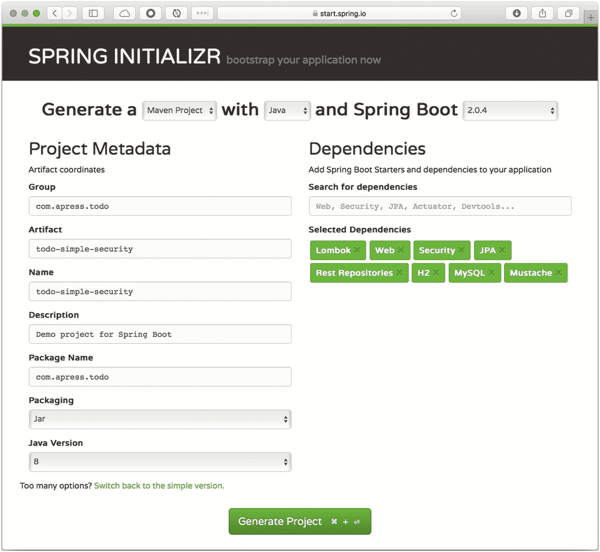

图 8-1

Spring初始化 zr

这个项目现在有了安全模块和模板引擎 Mustache。很快你就会知道如何使用它。

让我们从 ToDo 域类开始(参见清单 [8-1](#PC1) )。

```java
package com.apress.todo.domain;

import lombok.Data;
import org.hibernate.annotations.GenericGenerator;

import javax.persistence.*;
import javax.validation.constraints.NotBlank;
import javax.validation.constraints.NotNull;
import java.time.LocalDateTime;

@Entity
@Data
public class ToDo {

    @Id
    @GeneratedValue(generator = "system-uuid")
    @GenericGenerator(name = "system-uuid", strategy = "uuid")
    private String id;
    @NotNull
    @NotBlank
    private String description;

    @Column(insertable = true, updatable = false)
    private LocalDateTime created;
    private LocalDateTime modified;
    private boolean completed;

    public ToDo(){}
    public ToDo(String description){
        this.description = description;
    }

    @PrePersist
    void onCreate() {
        this.setCreated(LocalDateTime.now());
        this.setModified(LocalDateTime.now());
    }

    @PreUpdate
    void onUpdate() {
        this.setModified(LocalDateTime.now());
    }
}

Listing 8-1com.apress.todo.domain.ToDo.java

```

清单 [8-1](#PC1) 显示了`ToDo`域类。你已经知道了。它标有`@Entity`，并且使用`@Id`作为主键。这个类来自于 *todo-rest* 项目。

接下来，让我们回顾一下`ToDoRepository`接口(见清单 [8-2](#PC2) )。

```java
package com.apress.todo.repository;

import com.apress.todo.domain.ToDo;
import org.springframework.data.repository.CrudRepository;

public interface ToDoRepository extends CrudRepository<ToDo,String> {

}

Listing 8-2com.apress.todo.repository.ToDoRepository.java

```

清单 [8-2](#PC2) 显示的是`ToDoRepository`，当然，你已经知道了。定义从`CrudRepository<T,ID>`扩展的接口，该接口不仅有 CRUD 方法，还有 Spring Data REST，创建所有必要的 REST APIs 来支持域类。

接下来，让我们回顾一下`application.properties`，看看有什么新内容(参见清单 [8-3](#PC3) )。

```java
# JPA
spring.jpa.generate-ddl=true
spring.jpa.hibernate.ddl-auto=create-drop
spring.jpa.show-sql=true

# H2-Console: http://localhost:8080/h2-console
# jdbc:h2:mem:testdb
spring.h2.console.enabled=true

# REST API

spring.data.rest.base-path=/api

Listing 8-3src/main/resources/application.properties

```

清单 [8-3](#PC3) 显示了`application.properties`文件。除了最后一个，你已经看过一些房产了，对吗？`spring.data.rest.base-path`告诉 REST controller(Spring Data REST 配置的)使用`/api`作为根来公开所有的 REST API 端点。因此，如果我们想获得 ToDo，我们需要在`http://localhost:8080/api/toDos`访问端点。

在运行应用之前，让我们以脚本的形式添加端点。用下面的 SQL 语句创建`src/main/resources/data.sql`文件。

```java
insert into to_do (id,description,created,modified,completed)
values ('8a8080a365481fb00165481fbca90000', 'Read a Book','2018-08-17 07:42:44.136','2018-08-17 07:42:44.137',true);

insert into to_do (id,description,created,modified,completed)
values ('ebcf1850563c4de3b56813a52a95e930', 'Buy Movie Tickets','2018-08-17 09:50:10.126','2018-08-17 09:50:10.126',false);

insert into to_do (id,description,created,modified,completed)
values ('78269087206d472c894f3075031d8d6b', 'Clean my Room','2018-08-17 07:42:44.136','2018-08-17 07:42:44.137',false);

```

现在，如果您运行您的应用，您应该在日志中看到以下输出:

```java
Using generated security password: 2a569843-122a-4559-a245-60f5ab2b6c51

```

这是你的密码。您现在可以进入浏览器并打开`https://localhost:8080/api/toDos`。当你按下回车键访问那个 URL 时，你会得到类似于图 [8-2](#Fig2) 的东西。

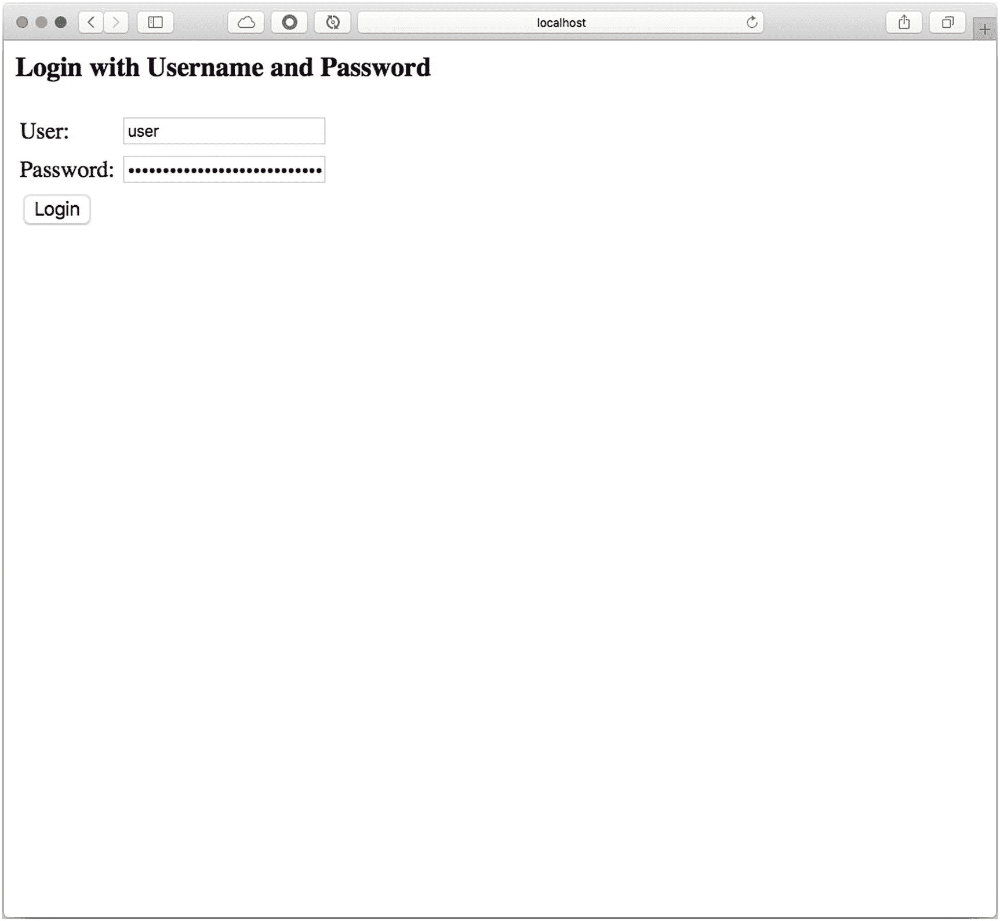

图 8-2

所有应用:http://localhost:8080/log in 页

图 [8-2](#Fig2) 显示了一个登录页面，这是添加`spring-boot-starter-security`依赖项时的默认行为。默认情况下，安全是开启的—如此简单！！那么，用户和密码是什么呢？嗯，我之前提到过，用户是`user`，密码是随机打印在日志中的(在本例中是`2a569843-122a-4559-a245-60f5ab2b6c51`)。所以，继续输入用户名和密码；然后你应该得到待办事项列表(见图 [8-3](#Fig3) )。

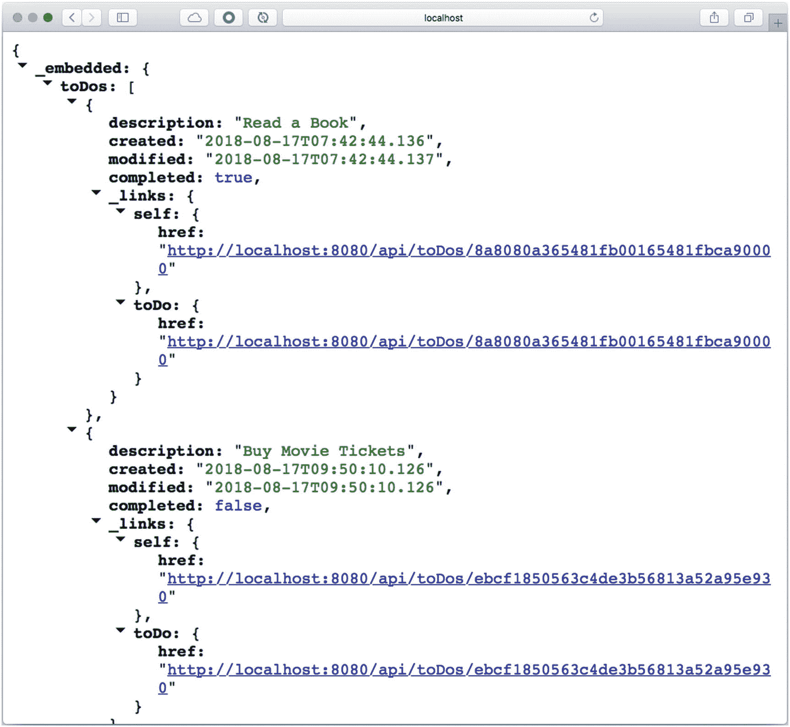

图 8-3

*http://localhost:80808/API/全部*

如果您想尝试使用命令行，您可以在终端窗口中执行以下命令。

```java
$ curl localhost:8080/api/toDos
{"timestamp":"2018-08-19T21:25:47.224+0000","status":401,"error":"Unauthorized","message":"Unauthorized","path":"/api/toDos"}

```

正如您在输出中看到的，您无权进入该端点。需要认证吧？您可以执行以下命令。

```java
$ curl localhost:8080/api/toDos -u user:2a569843-122a-4559-a245-60f5ab2b6c51
{
  "_embedded" : {
    "toDos" : [ {
      "description" : "Read a Book",
      "created" : "2018-08-17T07:42:44.136",
      "modified" : "2018-08-17T07:42:44.137",
      "completed" : true,
...
}

```

正如您现在看到的，您正在传递用户名和随机密码，并且您正在得到带有待办事项列表的响应。

可能你已经知道，每次你重启这个应用，安全自动配置生成另一个随机密码，这不是最佳的；也许只是为了发展。

### 覆盖简单安全性

随机密码在生产环境中不起作用。Spring Boot 安全性允许您以多种方式覆盖默认值。最简单的方法是通过添加下面的`spring.security.*`属性，用`application.properties`文件覆盖它。

```java
spring.security.user.name=apress
spring.security.user.password=springboot2
spring.security.user.roles=ADMIN,USER

```

如果再次运行该应用，用户名为`apress`，密码为`springboot2`(与命令行中相同)。还要注意，在日志中，随机密码不再打印。

另一种方法是以编程方式提供身份验证。创建一个从`WebSecurityConfigureAdapter`扩展而来的`ToDoSecurityConfig`类。看看清单 [8-4](#PC9) 。

```java
package com.apress.todo.config;

import org.springframework.context.annotation.Bean;
import org.springframework.context.annotation.Configuration;
import org.springframework.security.config.annotation.authentication.builders.AuthenticationManagerBuilder;
import org.springframework.security.config.annotation.web.configuration.WebSecurityConfigurerAdapter;
import org.springframework.security.crypto.bcrypt.BCryptPasswordEncoder;

@Configuration
public class ToDoSecurityConfig extends WebSecurityConfigurerAdapter {

    @Override
    protected void configure(
      AuthenticationManagerBuilder auth) throws Exception {
        auth.inMemoryAuthentication()
                      .passwordEncoder(passwordEncoder())
                      .withUser("apress")
                      .password(passwordEncoder().encode("springboot2"))
                      .roles("ADMIN","USER");
    }

    @Bean
    public BCryptPasswordEncoder passwordEncoder() {
        return new BCryptPasswordEncoder();
    }
}

Listing 8-4com.apress.todo.config.ToDoSecurityConfig.java

```

清单 [8-4](#PC9) 显示了以编程方式构建安全性的必要配置，在这种情况下，只有一个用户(当然，您可以添加更多用户)。我们来分析一下代码。

*   `WebSecurityConfigurerAdapter`。扩展该类是重写安全性的一种方式，因为它允许您重写您真正需要的方法。在这种情况下，代码覆盖了`configure(AuthenticationManagerBuilder)`签名。

*   `AuthenticationManagerBuilder`。这个类创建了一个`AuthenticationManager`，允许您轻松构建内存、LDAP、JDBC 认证、`UserDetailsService`并添加`AutheticationProvider`。在本例中，您正在构建一个内存认证。有必要添加一个`PasswordEncoder`和一个新的更安全的方法来使用和加密/解密密码。

*   `BCryptPasswordEncoder`。在这段代码中，您使用了使用 BCrypt 强散列函数的`BCryptPasswordEncoder`(返回一个`PasswordEncoder`实现)。您也可以使用`Pbkdf2PasswordEncoder`(使用 PBKDF2，具有可配置的迭代次数和一个随机的 8 字节随机 salt 值)，或者`SCryptPasswordEncoder`(使用 SCrypt 散列函数)。更好的是使用`DelegatingPasswordEncoder`，支持密码升级。

在运行应用之前，注释掉添加到`application.properties`文件中的`spring.security.*`属性。如果你运行这个应用，它应该像预期的那样工作。您需要提供用户名`apress`和密码`springboot2`。

### 覆盖默认登录页面

Spring Security 允许您以几种方式覆盖默认登录页面。一种方法是配置`HttpSecurity`。`HttpSecurity`类允许您为特定的 HTTP 请求配置基于 web 的安全性。默认情况下，它适用于所有请求，但是可以使用`requestMatcher(RequestMatcher)`或类似的方法进行限制。

让我们来看看对`ToDoSecurityConfig`类的修改(参见清单 [8-5](#PC10) )。

```java
package com.apress.todo.config;

import org.springframework.context.annotation.Bean;
import org.springframework.context.annotation.Configuration;
import org.springframework.security.config.annotation.authentication.builders.AuthenticationManagerBuilder;
import org.springframework.security.config.annotation.web.builders.HttpSecurity;
import org.springframework.security.config.annotation.web.configuration.WebSecurityConfigurerAdapter;
import org.springframework.security.crypto.bcrypt.BCryptPasswordEncoder;

@Configuration
public class ToDoSecurityConfig extends WebSecurityConfigurerAdapter {

    @Override
    protected void configure(AuthenticationManagerBuilder auth) throws Exception {
        auth.inMemoryAuthentication()
                .passwordEncoder(passwordEncoder())
                .withUser("apress")
                .password(passwordEncoder().encode("springboot2"))
                .roles("ADMIN","USER");
    }

    @Bean
    public BCryptPasswordEncoder passwordEncoder() {
        return new BCryptPasswordEncoder();
    }

    @Override
    protected void configure(HttpSecurity http) throws Exception {
        http.authorizeRequests()
                .anyRequest().fullyAuthenticated()
                .and()
                .httpBasic();

    }
}

Listing 8-5com.apress.todo.config.ToDoSecurityConfig.java – v2

```

清单 [8-5](#PC10) 显示了`ToDoSecurityConfig`类的版本 2。如果你运行应用并进入浏览器(`http://localhost:8080/api/toDos`)，你现在会得到一个基本认证的弹出窗口(见图 [8-4](#Fig4) )。

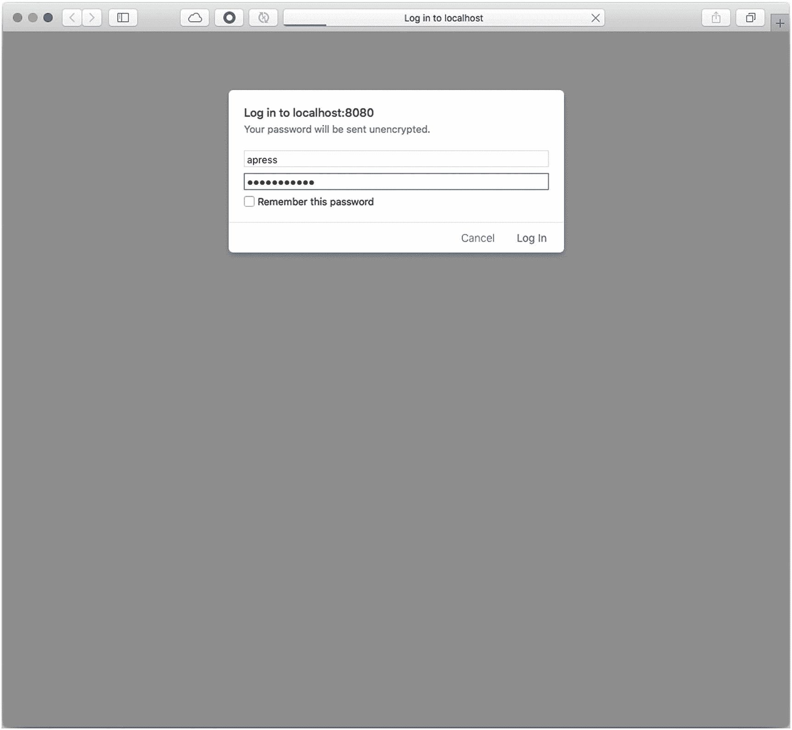

图 8-4

*Http://localhost:8080/API/toDos*—Http 基本认证

您可以使用您已经知道的用户名和密码，并且您应该得到 ToDo 列表。命令行也是如此。你需要认证

```java
$ curl localhost:8080/api/toDos -u apress:springboot2

```

### 自定义登录页面

通常在应用中，你不会看到这样的页面；通常情况下，有一个非常漂亮和设计良好的登录页面，对不对？Spring Security 允许您创建和定制您的登录页面。

让我们准备带有登录页面的 ToDo 应用。首先，我们将添加一些 CSS 和众所周知的 jQuery 库。如今，在 Spring Boot 的应用中，我们可以使用 WebJars 依赖。这种新方式避免了手动下载文件；相反，你可以把它们作为资源。Spring Boot web 自动配置为他们创建了必要的访问权限。

如果您使用的是 Maven，打开`pom.xml`并添加以下依赖项。

```java
<dependency>
    <groupId>org.webjars</groupId>
    <artifactId>bootstrap</artifactId>
    <version>3.3.7</version>
</dependency>

<dependency>
    <groupId>org.webjars</groupId>
    <artifactId>jquery</artifactId>
    <version>3.2.1</version>
</dependency>

```

如果您正在使用 Gradle，打开您的`build.gradle`文件并添加以下依赖项。

```java
compile ('org.webjars:bootstrap:3.3.7')
compile ('org.webjars:jquery:3.2.1')

```

接下来，让我们创建登录页面，它具有`.mustache`扩展名(`login.mustache`)。必须在`src/main/resources/templates`文件夹中创建它(参见清单 [8-6](#PC14) )。

```java
<!doctype html>
<html lang="en">
  <head>
    <meta charset="utf-8">
    <meta http-equiv="X-UA-Compatible" content="IE=edge">
    <meta name="viewport" content="width=device-width, initial-scale=1">
    <title>ToDo's API Login Page</title>
    <link href="webjars/bootstrap/3.3.7/css/bootstrap.min.css" rel="stylesheet">
    <link href="css/signin.css" rel="stylesheet">
  </head>

  <body>

    <div class="container">
      <form class="form-signin" action="/login" method="POST">
        <h2 class="form-signin-heading">Please sign in</h2>

        <label for="username" class="sr-only">Username</label>
        <input type="text"     name="username" class="form-control" placeholder="Username" required autofocus>

        <label for="inputPassword" class="sr-only">Password</label>
        <input type="password" name="password" class="form-control" placeholder="Password" required>

        <button class="btn btn-lg btn-primary btn-block" id="login" type="submit">Sign in</button>
        <input type="hidden" name="_csrf" value="{{_csrf.token}}" />
      </form>
    </div>
  </body>
</html>

Listing 8-6src/main/resources/templates/login.mustache

```

清单 [8-6](#PC14) 显示了 HTML 登录页面。本页面使用 CSS 从 Bootstrap ( [`https://getbootstrap.com`](https://getbootstrap.com) )通过 WebJars ( [`www.webjars.org`](http://www.webjars.org) )依赖。这些文件作为文件资源从这些 jar 中获取。HTML-FORM 正在使用*用户名*和*密码*作为名称(这是 Spring Security必须的)。我们需要包含 CSRF 令牌以避免任何攻击。小胡子引擎为此提供了`{{_csrf.token}}`值。Spring Security 使用*同步器令牌模式*来避免请求中的任何攻击。稍后，我们将看到如何获得这个值。

接下来，让我们创建一个索引页面，让您可以看到主页并注销。在`src/main/resources/templates`文件夹中创建`index.mustache`页面(参见清单 [8-7](#PC15) )。

```java
<!doctype html>
<html lang="en">
<head>
    <meta charset="utf-8">
    <meta http-equiv="X-UA-Compatible" content="IE=edge">
    <meta name="viewport" content="width=device-width, initial-scale=1">
    <title>ToDo's API</title>
    <link href="webjars/bootstrap/3.3.7/css/bootstrap.min.css" rel="stylesheet">
    <script src="webjars/jquery/3.2.1/jquery.min.js"></script>

</head>

<body>
<div class="container">
    <div class="header clearfix">
        <nav>
            <a href="#" id="logoutLink">Logout</a>
        </nav>
    </div>

    <div class="jumbotron">
        <h1>ToDo's Rest API</h1>
        <p class="lead">Welcome to the ToDo App. A Spring Boot application!</p>
    </div>
</div>

<form id="logout" action="/logout" method="POST">

    <input type="hidden" name="_csrf" value="{{_csrf.token}}" />

</form>

<script>
    $(function(){
        $('#logoutLink').click(function(){
            $('#logout').submit();
        });
    });
</script>
</body>
</html>

Listing 8-7src/main/resources/templates/index.mustache

```

清单 [8-7](#PC15) 显示了索引页面。我们仍然使用 Bootstrap 和 jQuery 资源，以及最重要的部分`{{_csrf.token}}`，用于注销。

接下来，我们先从配置说起。首先，需要修改`ToDoSecurityConfig`类(参见清单 [8-8](#PC16) )。

```java
package com.apress.todo.config;

import org.springframework.boot.autoconfigure.security.servlet.PathRequest;
import org.springframework.context.annotation.Bean;
import org.springframework.context.annotation.Configuration;
import 

org.springframework.security.config.annotation.authentication.builders.AuthenticationManagerBuilder;
import org.springframework.security.config.annotation.web.builders.HttpSecurity;
import org.springframework.security.config.annotation.web.configuration.WebSecurityConfigurerAdapter;
import org.springframework.security.crypto.bcrypt.BCryptPasswordEncoder;
import org.springframework.security.web.util.matcher.AntPathRequestMatcher;

@Configuration
public class ToDoSecurityConfig extends WebSecurityConfigurerAdapter {

    @Override
    protected void configure(AuthenticationManagerBuilder auth) throws Exception {
        auth.inMemoryAuthentication()
                .passwordEncoder(passwordEncoder())
                .withUser("apress")
                .password(passwordEncoder().encode("springboot2"))
                .roles("ADMIN","USER");
    }

    @Bean
    public BCryptPasswordEncoder passwordEncoder() {
        return new BCryptPasswordEncoder();
    }

    @Override
    protected void configure(HttpSecurity http) throws Exception {
        http
            .authorizeRequests()
                .requestMatchers(
                        PathRequest
                              .toStaticResources()
                              .atCommonLocations()).permitAll()
                .anyRequest().fullyAuthenticated()
                .and()
                .formLogin().loginPage("/login").permitAll()
                .and()
                .logout()
                    .logoutRequestMatcher(
                        new AntPathRequestMatcher("/logout"))
                    .logoutSuccessUrl("/login");
    }

}

Listing 8-8com.apress.todo.config.ToDoSecurityConfig.java – v3

```

清单 [8-8](#PC16) 显示了`ToDoSecurityConfig`类的版本 3。新的修改显示了如何配置`HttpSecurity`。首先，它添加了指向公共位置的`requestMatchers`，比如静态资源(`static/*`)。这是 CSS、JS 或任何其他简单 HTML 可以存在的地方，并且不需要任何安全性。那么它用的是`anyRequest`，应该是`fullyAuthenticated`。这意味着`/api/*`将会。然后，它使用`formLogin`用`loginPage("/login")`指定它是查找登录页面的端点。接下来，声明注销及其端点(`"/logout"`)；如果注销成功，它将重定向到`"/login"`端点/页面。

现在需要告诉 Spring MVC 如何定位登录页面。创建`ToDoWebConfig`类(参见清单 [8-9](#PC17) )。

```java
package com.apress.todo.config;

import org.springframework.context.annotation.Configuration;
import org.springframework.web.servlet.config.annotation.ViewControllerRegistry;
import org.springframework.web.servlet.config.annotation.WebMvcConfigurer;

@Configuration
public class ToDoWebConfig implements WebMvcConfigurer {

    @Override
    public void addViewControllers(ViewControllerRegistry registry) {
        registry.addViewController("/login").setViewName("login");
    }
}

Listing 8-9com.apress.todo.config.ToDoWebConfig.java

```

清单 [8-9](#PC17) 展示了在 Spring MVC 中配置 web 控制器的不同方式。您仍然可以使用用`@Controller`注释的类，并为登录页面创建映射；但这是 JavaConfig 的方式。

这里，该类实现了`WebMvcConfigure`接口。它实现了`addViewControllers`方法，并通过告诉控制器视图的位置来注册`/login`端点。这将定位到`templates/login.mustache`页面。

最后，有必要通过添加以下属性来更新`application.properties`文件。

```java
spring.mustache.expose-request-attributes=true

```

还记得`{{_csrf.token}}`吗？这就是它获取值的方式——通过添加`spring.mustache.expose-request-attributes`属性。

现在，您可以运行应用了。如果你去`http://localhost:8080`，你会得到类似于图 [8-5](#Fig5) 的东西。

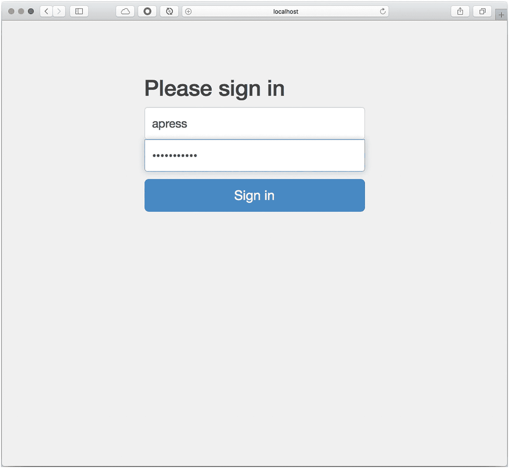

图 8-5

*http://localhost:8080/log in*

您将获得自定义登录页面。完美！！现在你可以输入凭证，它返回索引页面(见图 [8-6](#Fig6) )。

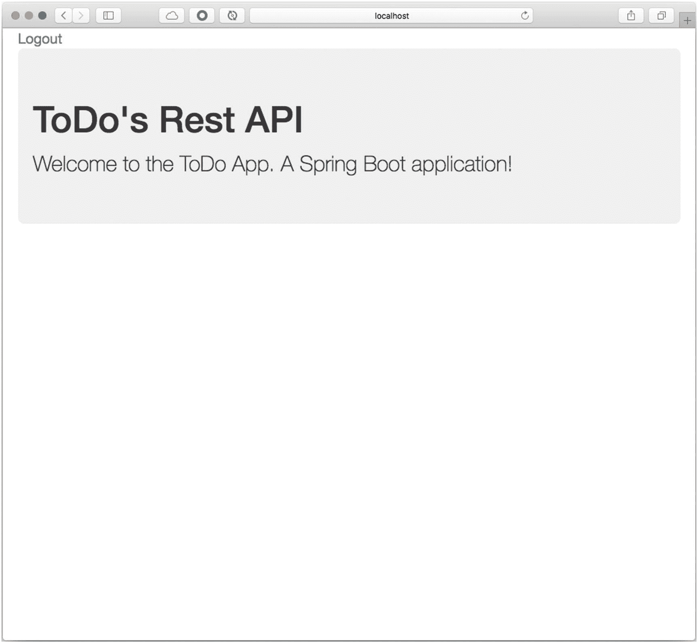

图 8-6

*登录后 http://localhost:8080*

一旦你有了主页，你就可以访问`http://localhost:8080/api/toDos`。您应该完全通过了身份验证，并且可以返回到待办事项列表。您可以返回到主页并按下 Logout 链接，它会再次将您重定向到`/login`端点。

现在，如果您尝试在终端窗口中执行以下命令行，会发生什么情况？

```java
$ curl localhost:8080/api/toDos -u apress:springboot2

```

它不会返回任何东西。这是一个空行。如果您使用`-i`标志，它会告诉您正在被重定向到`http://localhost:8080/login`。但是没有办法从命令行交互，对吧？那么我们能做些什么来解决这个问题呢？事实上，有些客户从来不使用 web 界面。大多数客户端都是应用，并且在编程上需要使用 REST API，但是使用这个解决方案，没有办法进行身份验证来与表单交互。

打开`ToDoSecurityConfig`类并修改`configure(HttpSecurity)`方法。它应该类似于下面的代码片段。

```java
@Override
    protected void configure(HttpSecurity http) throws Exception {
        http.authorizeRequests()
                .requestMatchers(PathRequest.toStaticResources().atCommonLocations()).permitAll()
                .anyRequest().fullyAuthenticated()
                .and()
                .formLogin().loginPage("/login").permitAll()
                .and()
                .logout()
                    .logoutRequestMatcher(
                          new AntPathRequestMatcher("/logout"))
                    .logoutSuccessUrl("/login")
                .and()
                            .httpBasic();
    }

```

该方法的最后两行添加了`httpBasic`调用，它允许客户端(比如 cURL)使用基本的认证机制。您可以重新运行 ToDo 应用，并查看现在执行命令行的工作。

## 对 JDBC 使用安全性

想象一下，您的公司已经有了一个员工数据库，您希望重用它来对 ToDo 应用进行身份验证和授权。集成这样的东西很好，对吗？

Spring Security 允许您将 AuthenticationManager 与内存、LDAP 和 JDBC 机制结合使用。在本节中，我们将修改 ToDo 应用，使其与 JDBC 一起运行。

### JDBC 安全的目录应用

在本节中，您将创建一个新的应用——一个包含所有人员的目录应用。目录应用与 ToDo 应用集成在一起，以进行身份验证和授权。因此，如果客户机需要添加一个新的 ToDo，它需要用一个`USER`角色进行认证。

让我们开始吧。从头开始，进入你的浏览器并打开 Spring Initializr。将以下值添加到字段中。

*   组:`com.apress.directory`

*   神器:`directory`

*   名称:`directory`

*   包名:`com.apress.directory`

*   依赖关系:`Web`、`Security`、`Lombok`、`JPA`、`REST Repositories`、`H2`、`MySQL`

您可以选择 Maven 或 Gradle 作为项目类型。然后，您可以按下 Generate Project 按钮，这将下载一个 ZIP 文件。将其解压缩，并在您喜欢的 IDE 中导入项目(参见图 [8-7](#Fig7) )。

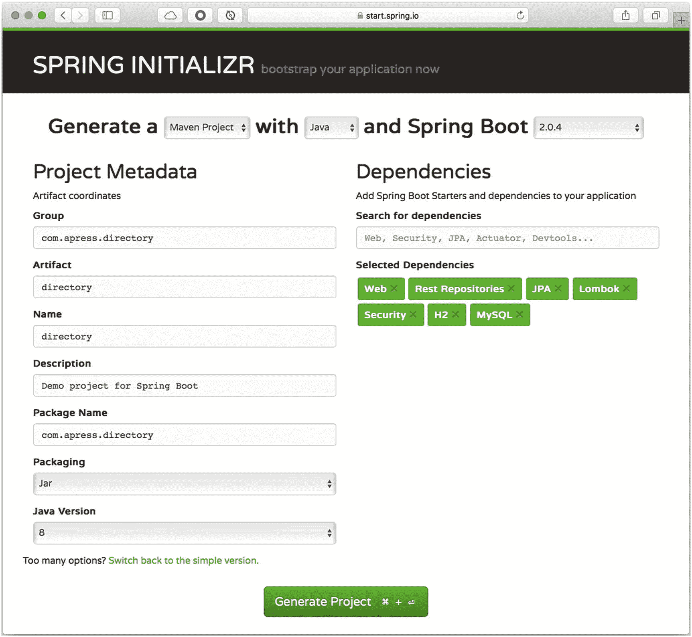

图 8-7

Spring初始化 zr

如您所见，依赖项与其他项目非常相似。我们将利用 Spring Data、安全性和 REST 的力量。让我们从添加一个保存个人信息的新类开始。创建`Person`类(参见清单 [8-10](#PC21) )。

```java
package com.apress.directory.domain;

import lombok.Data;
import org.hibernate.annotations.GenericGenerator;

import javax.persistence.*;
import java.time.LocalDate;
import java.time.LocalDateTime;
import java.time.format.DateTimeFormatter;

@Data
@Entity
public class Person {

    @Id
    @GeneratedValue(generator = "system-uuid")
    @GenericGenerator(name = "system-uuid", strategy = "uuid")
    private String id;
    @Column(unique = true)
    private String email;
    private String name;
    private String password;
    private String role = "USER";
    private boolean enabled = true;
    private LocalDate birthday;

    @Column(insertable = true, updatable = false)
    private LocalDateTime created;
    private LocalDateTime modified;

    public Person() {
    }

    public Person(String email, String name, String password, String birthday) {
        this.email = email;
        this.name = name;
        this.password = password;
        this.birthday = LocalDate.parse(birthday, DateTimeFormatter.ofPattern("yyyy-MM-dd"));

    }

    public Person(String email, String name, String password, LocalDate birthday) {
        this.email = email;
        this.name = name;
        this.password = password;
        this.birthday = birthday;
    }

    public Person(String email, String name, String password, String birthday, String role, boolean enabled) {
        this(email, name, password, birthday);
        this.role = role;
        this.enabled = enabled;
    }

    @PrePersist
    void onCreate() {
        this.setCreated(LocalDateTime.now());
        this.setModified(LocalDateTime.now());
    }

    @PreUpdate
    void onUpdate() {
        this.setModified(LocalDateTime.now());
    }
}

Listing 8-10com.apress.directory.domain.Person.java

```

清单 [8-10](#PC21) 显示的是`Person`类；很简单。它保存了足够的关于一个人的信息。接下来，让我们创建存储库——`PersonRepository`接口(参见清单 [8-11](#PC22) )。

```java
package com.apress.directory.repository;

import com.apress.directory.domain.Person;
import org.springframework.data.repository.CrudRepository;
import org.springframework.data.repository.query.Param;

public interface PersonRepository extends CrudRepository<Person,String> {
    public Person findByEmailIgnoreCase(@Param("email") String email);
}

Listing 8-11com.apress.directory.repository.PersonRepository.java

```

清单 [8-11](#PC22) 显示`PersonRepository`界面；但是和其他的有什么不同呢？它声明了一个以电子邮件为参数的*查询方法* `findByEmailIgnoreCase`(由`@Param`注释)。该语法告诉 Spring Data REST 它需要实现这些方法并相应地创建 SQL 语句(这是基于名称和域类中的字段，在本例中是`email`字段)。

### 注意

如果您想了解更多关于如何定义自己的查询方法的信息，请查看位于 [`https://docs.spring.io/spring-data/jpa/docs/current/reference/html/#jpa.query-methods`](https://docs.spring.io/spring-data/jpa/docs/current/reference/html/#jpa.query-methods) 的 Spring Data JPA 参考。

接下来，创建从`WebSecurityConfigurerAdapter`类扩展而来的`DirectorySecurityConfig`类。记住，通过扩展这个类，我们可以定制为这个应用设置 Spring Security性的方式(参见清单 [8-12](#PC23) )。

```java
package com.apress.directory.config;

import com.apress.directory.repository.PersonRepository;
import com.apress.directory.security.DirectoryUserDetailsService;
import org.springframework.context.annotation.Configuration;
import org.springframework.security.config.annotation.authentication.builders.AuthenticationManagerBuilder;
import org.springframework.security.config.annotation.web.builders.HttpSecurity;
import org.springframework.security.config.annotation.web.configuration.WebSecurityConfigurerAdapter;

@Configuration
public class DirectorySecurityConfig extends WebSecurityConfigurerAdapter {

    private PersonRepository personRepository;

    public DirectorySecurityConfig(PersonRepository personRepository){
        this.personRepository = personRepository;
    }

    @Override
    protected void configure(HttpSecurity http) throws Exception {
        http
                .authorizeRequests()
                .antMatchers("/**").hasRole("ADMIN")
                .and()
                .httpBasic();
    }

    @Override
    public void configure(AuthenticationManagerBuilder auth) throws Exception {
        auth.userDetailsService(
            new DirectoryUserDetailsService(this.personRepository));
    }

}

Listing 8-12com.apress.directory.config.DirectorySecurityConfig.java

```

清单 [8-12](#PC23) 显示了`DirectorySecurityConfig`类。该类通过只允许具有`ADMIN`角色的用户使用基本身份验证访问任何端点(`/**`)来配置`HttpSecurity`。

与其他安全配置还有什么不同？你是对的！`AuthenticationManager`正在配置一个`UserDetailsService`实现。这是使用任何其他第三方安全应用并将它们与 Spring Security 集成的关键。

如您所见，`userDetailsService`方法使用了`DirectoryUserDetailsService`类。让我们创建它(见清单 [8-13](#PC24) )。

```java
package com.apress.directory.security;

import com.apress.directory.domain.Person;
import com.apress.directory.repository.PersonRepository;
import org.springframework.security.core.userdetails.User;
import org.springframework.security.core.userdetails.UserDetails;
import org.springframework.security.core.userdetails.UserDetailsService;
import org.springframework.security.core.userdetails.UsernameNotFoundException;
import org.springframework.security.crypto.factory.PasswordEncoderFactories;
import org.springframework.security.crypto.password.PasswordEncoder;

public class DirectoryUserDetailsService implements UserDetailsService {

    private PersonRepository repo;

    public DirectoryUserDetailsService(PersonRepository repo) {
        this.repo = repo;
    }

    @Override
    public UserDetails loadUserByUsername(String username) throws UsernameNotFoundException {
        try {
            final Person person = this.repo.findByEmailIgnoreCase(username);

            if (person != null) {
                PasswordEncoder encoder = PasswordEncoderFactories.createDelegatingPasswordEncoder();
                String password = encoder.encode(person.getPassword());

                return User.withUsername(person.getEmail()).accountLocked(!person.isEnabled()).password(password).roles(person.getRole()).build();
            }
        }catch(Exception ex){
            ex.printStackTrace();
        }

        throw new UsernameNotFoundException(username);
    }
}

Listing 8-13com.apress.directory.security.DirectoryUserDetailsService.java

```

清单 [8-13](#PC24) 显示了`DirectoryUserDetailsService`类。这个类实现了`UserDetailsService`接口，需要实现`loadUserByUserName`并返回一个`UserDetails`实例。在这个实现中，代码显示了如何使用`PersonRepository`。在这种情况下，它使用`findByEmailIgnoreCase`；因此，如果在用户想要访问`/**`(任何端点)时发现一个人有提供的电子邮件，它会通过创建一个`UserDetails`实例，将电子邮件与提供的密码、角色以及帐户是否锁定进行比较。

太神奇了！这个应用使用 JDBC 作为认证机制。同样，您可以插入任何其他可以实现`UserDetailService`的安全系统/应用，并返回一个`UserDetails`实例；就这样。

接下来，让我们快速查看一下`application.properties`文件，看看它的属性。

```java
# Server
server.port=${port:8181}

# JPA
spring.jpa.generate-ddl=true
spring.jpa.hibernate.ddl-auto=create-drop
spring.jpa.show-sql=true

# H2
spring.h2.console.enabled=true

```

唯一不同的是它有`server.port`属性，上面写着:*如果你提供变量端口(要么命令行，要么环境)我就用它；如果没有，我就用端口 8181* 。就是这个`:`。这是 SpEL (Spring 表达式语言)的一部分。

在运行目录应用之前，让我们添加一些数据。在`src/main/resources`文件夹中创建`data.sql`文件。

```java
insert into person (id,name,email,password,role,enabled,birthday,created,modified)
values ('dc952d19ccfc4164b5eb0338d14a6619','Mark','mark@example.com','secret','USER',true,'1960-03-29','2018-08-17 07:42:44.136','2018-08-17 07:42:44.137');

insert into person (id,name,email,password,role,enabled,birthday,created,modified)
values ('02288a3b194e49ceb1803f27be5df457','Matt','matt@example.com','secret','USER',true,'1980-07-03','2018-08-17 07:42:44.136','2018-08-17 07:42:44.137');

insert into person (id,name,email,password,role,enabled,birthday,created,modified)
values ('4fe22e358d0e4e38b680eab91787f041','Mike','mike@example.com','secret','ADMIN',true,'19820-08-05','2018-08-17 07:42:44.136','2018-08-17 07:42:44.137');

insert into person (id,name,email,password,role,enabled,birthday,created,modified)
values ('84e6c4776dcc42369510c2692f129644','Dan','dan@example.com','secret','ADMIN',false,'1976-10-11','2018-08-17 07:42:44.136','2018-08-17 07:42:44.137');

insert into person (id,name,email,password,role,enabled,birthday,created,modified)
values ('03a0c396acee4f6cb52e3964c0274495','Administrator','admin@example.com','admin','ADMIN',true,'1978-12-22','2018-08-17 07:42:44.136','2018-08-17 07:42:44.137');

```

现在，我们准备将这个应用用作身份验证和授权机制。运行目录应用。此应用从 8181 端口启动。您可以使用浏览器和/或`cURL`命令对其进行测试。

```java
$ curl localhost:8181/persons/search/findByEmailIgnoreCase?email=mark@example.com  -u admin@example.com:admin
{
  "email" : "mark@example.com",
  "name" : "Mark",
  "password" : "secret",
  "role" : "USER",
  "enabled" : true,
  "birthday" : "1960-03-29",
  "created" : "2018-08-17T07:42:44.136",
  "modified" : "2018-08-17T07:42:44.137",
  "_links" : {
    "self" : {
      "href" : "http://localhost:8181/persons/dc952d19ccfc4164b5eb0338d14a6619"
    },
    "person" : {
      "href" : "http://localhost:8181/persons/dc952d19ccfc4164b5eb0338d14a6619"
    }
  }
}

```

在这个命令中，您通过提供一个具有`ADMIN`角色的人的用户名/密码来获得用户 Mark 在这种情况下，使用`-u`admin@example.com`:admin`参数。

太好了。您正在使用 JDBC 通过使用 Spring Data REST 和 Spring Security 来查找用户！你可以让这个项目运行。

### 在待办事项应用中使用目录应用

是时候把这个目录 app 和 ToDo app 整合起来了。这很容易。

打开您的 ToDo 应用，让我们创建一个`Person`类。是的，我们需要一个`Person`类来保存足够的信息用于认证和授权。不需要有出生日期或任何其他信息(见清单 [8-14](#PC28) )。

```java
package com.apress.todo.directory;

import com.fasterxml.jackson.annotation.JsonIgnoreProperties;
import lombok.Data;

@Data
@JsonIgnoreProperties(ignoreUnknown = true)
public class Person {

    private String email;
    private String password;
    private String role;
    private boolean enabled;
}

Listing 8-14com.apress.todo.directory.Person.java

```

清单 [8-14](#PC28) 显示了`Person`类。这个类只有身份验证和授权过程所必需的字段。值得一提的是，调用 Directory app 会返回一个更完整的 JSON 对象。它必须匹配才能进行反序列化(使用 Jackson 库从 JSON 到 object)，但是因为不需要额外的信息，所以这个类使用了`@JasonIgnoreProperties(ignoreUnknown=true)`注释来帮助匹配所需的字段。我认为这是一个很好的解耦类的方法。

### 注意

Java 中的一些序列化工具要求在同一个包中有相同的类并实现`java.io.Serializable`，这使得开发人员和客户更难管理和扩展。

接下来，创建保存目录应用信息的`ToDoProperties`类，如`Uri`(什么是地址和基 Uri)、`Username`和`Password`拥有`ADMIN`角色并有权访问 REST API 的人(参见清单 [8-15](#PC29) )。

```java
package com.apress.todo.config;

import lombok.Data;
import org.springframework.boot.context.properties.ConfigurationProperties;

@Data
@ConfigurationProperties(prefix = "todo.authentication")
public class ToDoProperties {

    private String findByEmailUri;
    private String username;
    private String password;

}

Listing 8-15com.apress.todo.config.ToDoProperties.java

```

清单 [8-15](#PC29) 显示了`ToDoProperties`类；注意前缀是`todo.authentication.*`。接下来，修改`ToDoSecurityConfig`类。你可以注释整个类并复制清单 [8-16](#PC30) 中的代码。

```java
package com.apress.todo.config;

import com.apress.todo.directory.Person;
import org.slf4j.Logger;
import org.slf4j.LoggerFactory;
import org.springframework.boot.autoconfigure.security.servlet.PathRequest;
import org.springframework.boot.context.properties.EnableConfigurationProperties;
import org.springframework.boot.web.client.RestTemplateBuilder;
import org.springframework.context.annotation.Configuration;
import org.springframework.core.ParameterizedTypeReference;
import org.springframework.hateoas.MediaTypes;
import org.springframework.hateoas.Resource;
import org.springframework.http.HttpStatus;
import org.springframework.http.RequestEntity;
import org.springframework.http.ResponseEntity;
import org.springframework.security.config.annotation.authentication.builders.AuthenticationManagerBuilder;
import org.springframework.security.config.annotation.web.builders.HttpSecurity;
import org.springframework.security.config.annotation.web.configuration.WebSecurityConfigurerAdapter;
import org.springframework.security.core.userdetails.User;
import org.springframework.security.core.userdetails.UserDetails;
import org.springframework.security.core.userdetails.UserDetailsService;
import org.springframework.security.core.userdetails.UsernameNotFoundException;
import org.springframework.security.crypto.factory.PasswordEncoderFactories;
import org.springframework.security.crypto.password.PasswordEncoder;
import org.springframework.security.web.util.matcher.AntPathRequestMatcher;
import org.springframework.web.client.RestTemplate;
import org.springframework.web.util.UriComponentsBuilder;

import java.net.URI;

@EnableConfigurationProperties(ToDoProperties.class)
@Configuration
public class ToDoSecurityConfig extends WebSecurityConfigurerAdapter {

    private final Logger log = LoggerFactory.getLogger(ToDoSecurityConfig.class);

    //Use this to connect to the Directory App
    private RestTemplate restTemplate;
    private ToDoProperties toDoProperties;
    private UriComponentsBuilder builder;

    public ToDoSecurityConfig(RestTemplateBuilder restTemplateBuilder, ToDoProperties toDoProperties){
        this.toDoProperties = toDoProperties;
        this.restTemplate = restTemplateBuilder.basicAuthorization(toDoProperties.getUsername(),toDoProperties.getPassword()).build();
    }

    @Override
    protected void configure(AuthenticationManagerBuilder auth) throws Exception {
        auth.userDetailsService(new UserDetailsService(){

            @Override
            public UserDetails loadUserByUsername(String username) throws UsernameNotFoundException {

                try {
                    builder = UriComponentsBuilder
                  .fromUriString(toDoProperties.getFindByEmailUri())
                            .queryParam("email", username);

                    log.info("Querying: " + builder.toUriString());

                    ResponseEntity<Resource<Person>> responseEntity =
                    restTemplate.exchange(
                                  RequestEntity.get(URI.create(builder.toUriString()))
                                          .accept(MediaTypes.HAL_JSON)
                                          .build()
                            , new ParameterizedTypeReference<Resource<Person>>() {
                            });

                    if (responseEntity.getStatusCode() == HttpStatus.OK) {

                        Resource<Person> resource = responseEntity.getBody();
                        Person person = resource.getContent();

                        PasswordEncoder encoder =
                 PasswordEncoderFactories.createDelegatingPasswordEncoder();
                        String password = encoder.encode(person.getPassword());

                        return User
                  .withUsername(person.getEmail())
                  .password(password)
                  .accountLocked(!person.isEnabled())
                  .roles(person.getRole()).build();
                    }

                }catch(Exception ex) {
                    ex.printStackTrace();
                }
                throw new UsernameNotFoundException(username);
            }
        });

    }

    @Override
    protected void configure(HttpSecurity http) throws Exception {
        http.authorizeRequests()
                .requestMatchers(PathRequest.toStaticResources().atCommonLocations()).permitAll()
                .antMatchers("/","/api/**").hasRole("USER")
                .and()
                .formLogin().loginPage("/login").permitAll()
                .and()
                .logout()
                .logoutRequestMatcher(new AntPathRequestMatcher("/logout"))
                .logoutSuccessUrl("/login")
                .and()

                .httpBasic();
    }

}

Listing 8-16com.apress.todo.config.ToDoSecurityConfig.java

```

清单 [8-16](#PC30) 展示了新的`ToDoSecurityConfig`类。我们来分析一下。

*   `WebSecurityConfigurerAdapter`。此类覆盖了我们为应用自定义安全性所需的内容；但你已经知道了，对吧？

*   `RestTemplate`。这个助手类对目录应用端点，特别是`/persons/search/findByEmailIgnoreCase` Uri，进行 REST 调用。

*   `UriComponentsBuilder`。记住`/persons/search/findByEmailIgnoreCase`端点需要一个参数(`email`)；那是由`loadUserByUsername`方法(`username`)提供的。

*   `AuthenticationBuilder`。认证提供了`userDetailsService`。在这段代码中，有一个`UserDetailsService`的匿名实现和`loadUserByUsername`方法的实现。这就是使用`RestTemplate`调用目录应用和端点的地方。

*   `ResponseEntity`。因为目录 app 响应是`HAL+JSON`，所以需要使用一个`ResponseEntity`来管理来自协议的所有资源。如果有`HttpStatus.OK`，很容易获得内容作为`Person`实例，并用它创建`UserDetails`。

*   `antMatchers`。这个类像以前一样配置`HttpSecurity`，但是这一次它包含了一个`antMatchers`方法，该方法公开了由具有`USER`角色的有效人员访问的端点。

我们重用了目录应用中的相同技术。`AuthenticationManager`被配置为通过使用`RestTemplate`调用目录服务来提供`UserDetails`实例。目录应用用一个`HAL+JSON`协议响应，这就是为什么需要使用`ResponseEntity`来获得作为资源的人。

接下来，在`application.properties`文件中添加下面的`todo.authentication.*`属性。

```java
# ToDo - Directory integration
todo.authentication.find-by-email-uri=http://localhost:8181/persons/search/findByEmailIgnoreCase
todo.authentication.username=admin@example.com
todo.authentication.password=admin

```

有必要指定搜索电子邮件端点的完整 Uri，以及具有`ADMIN`角色的人。

现在你已经准备好使用 ToDo 应用了。您可以使用浏览器或命令行。确定目录应用已启动并正在运行。运行端口 8080 中运行的 ToDo 应用。

您可以在终端窗口中执行以下命令。

```java
$ curl localhost:8080/api/toDos -u mark@example.com:secret
{
  "_embedded" : {
    "toDos" : [ {
      "description" : "Read a Book",
      "created" : "2018-08-17T07:42:44.136",
      "modified" : "2018-08-17T07:42:44.137",
      "completed" : true,

...
...

"profile" : {
      "href" : "http://localhost:8080/api/profile/toDos"
    }
  }
}

```

现在，您使用 Mark 进行身份验证和授权，他拥有`USER`角色。恭喜你！！您将自己的 JDBC 服务与 ToDo 应用集成在一起。

## WebFlux 安全性

为了给 WebFlux 应用增加安全性，什么都不会改变。您需要添加`spring-boot-starter-security`依赖项，Spring Boot 会通过它的自动配置来完成剩下的工作。如果你想像我们之前那样定制，你唯一需要做的就是用`ReactiveUserDetailsService`(而不是`UserDetailsService`)或者用`ReactiveAuthenticationManager`(而不是`AuthenticationManager`)。请记住，现在您正在处理单一和通量反应流类型。

## 带有 OAuth2 的待办事项应用

有了 Spring Boot 和 Spring Security，OAuth2 比以往任何时候都容易。在本章的这一节，我们将使用 OAuth2 直接进入 ToDo 应用。我假设你知道 OAuth2，以及使用它作为与第三方提供商——如谷歌、脸书和 GitHub——直接进入你的应用的认证机制的所有好处。

让我们开始吧。从头开始，进入你的浏览器并打开 Spring Initializr。将以下值添加到字段中。

*   组:`com.apress.todo`

*   神器:`todo-oauth2`

*   名称:`todo-oauth2`

*   包名:`com.apress.todo`

*   依赖关系:`Web`、`Security`、`Lombok`、`JPA`、`REST Repositories`、`H2`、`MySQL`

您可以选择 Maven 或 Gradle 作为项目类型。然后你可以按下生成项目按钮；这将下载一个 ZIP 文件。将其解压缩，并在您喜欢的 IDE 中导入项目(参见图 [8-8](#Fig8) )。

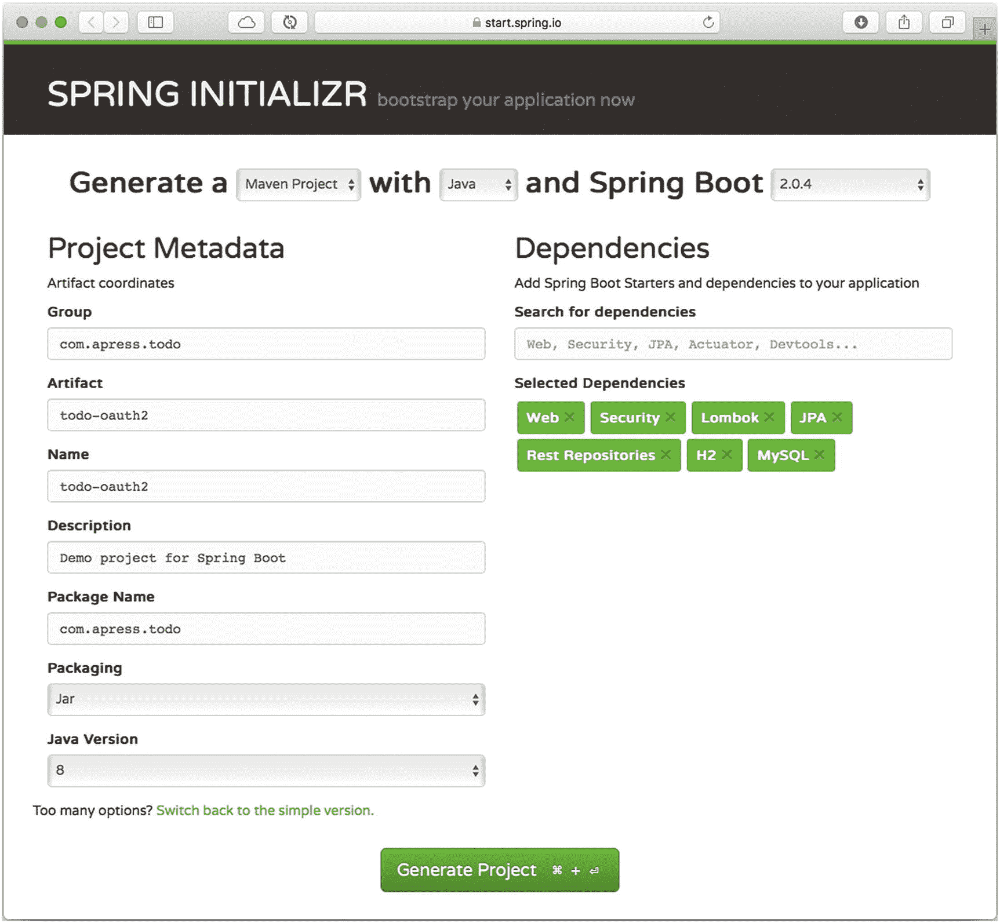

图 8-8

Spring初始化 zr

如果您使用的是 Maven，将以下依赖项添加到您的`pom.xml`文件中。

```java
<dependency>
     <groupId>org.springframework.security</groupId>
     <artifactId>spring-security-oauth2-client</artifactId>
</dependency>
<dependency>
     <groupId>org.springframework.security</groupId>
     <artifactId>spring-security-oauth2-jose</artifactId>
</dependency>

```

如果您正在使用 Gradle，请将以下依赖项添加到您的`build.gradle`中:

```java
compile('org.springframework.security:spring-security-oauth2-client')
compile('org.springframework.security:spring-security-oauth2-jose')

```

可以想象，当 Spring Boot 看到`spring-security-oauth2-client`时，它会自动配置所有必要的 beans 来使用 OAuth2 安全性。重要的是要提到对包含 Spring Security 对 JOSE (JavaScript 对象签名和加密)框架支持的`spring-security-oauth2-jose`的需求。JOSE 框架旨在提供一种在各方之间安全转移索赔的方法。它是由一系列规范构建而成的:JSON Web Token (JWT)、JSON Web Signature (JWS)、JSON Web Encryption (JWE)和 JSON Web Key (JWK)。

接下来，您可以重用`ToDo`类和`ToDoRepository`接口(参见清单 [8-17](#PC35) 和 [8-18](#PC36) )。

```java
package com.apress.todo.domain;

import lombok.Data;
import org.hibernate.annotations.GenericGenerator;

import javax.persistence.*;
import javax.validation.constraints.NotBlank;
import javax.validation.constraints.NotNull;
import java.time.LocalDateTime;

@Entity
@Data
public class ToDo {

    @Id
    @GeneratedValue(generator = "system-uuid")
    @GenericGenerator(name = "system-uuid", strategy = "uuid")
    private String id;
    @NotNull
    @NotBlank
    private String description;

    @Column(insertable = true, updatable = false)
    private LocalDateTime created;
    private LocalDateTime modified;
    private boolean completed;

    public ToDo(){}
    public ToDo(String description){
        this.description = description;
    }

    @PrePersist
    void onCreate() {
        this.setCreated(LocalDateTime.now());
        this.setModified(LocalDateTime.now());
    }

    @PreUpdate
    void onUpdate() {
        this.setModified(LocalDateTime.now());
    }
}

Listing 8-17com.apress.todo.domain.ToDo.java

```

如你所见，一切都没变。它保持不变。

```java
package com.apress.todo.repository;

import com.apress.todo.domain.ToDo;
import org.springframework.data.repository.CrudRepository;

public interface ToDoRepository extends CrudRepository<ToDo,String> { }

Listing 8-18com.apress.todo.repository.ToDoRepository.java

```

这个接口也是一样——没什么变化。我们来回顾一下`application.properties`。

```java
# JPA
spring.jpa.generate-ddl=true
spring.jpa.hibernate.ddl-auto=create-drop
spring.jpa.show-sql=true

# H2-Console: http://localhost:8080/h2-console
# jdbc:h2:mem:testdb
spring.h2.console.enabled=true

```

什么都没变。嗯，我们将很快添加更多的属性。

现在重要的部分来了。您将使用 GitHub 对 ToDo 应用进行 OAuth2 身份验证。

### 在 GitHub 中创建 ToDo 应用

我假设您可能已经有了一个 GitHub 帐户；如果没有，您可以在 [`https://github.com`](https://github.com) 非常轻松地打开一个新的。您可以登录您的帐户，然后打开 [`https://github.com/settings/applications/new`](https://github.com/settings/applications/new) 。这是创建应用的地方。您可以使用下列值。

*   应用名称:todo-app

*   URL 主页:http://localhost:8080

*   应用描述:ToDo 应用

*   授权回调 URL:http://localhost:8080/log in/oauth 2/code/github

这对授权回调 URL 很重要，因为这是 Spring Security 的`OAuth2LoginAuthenticationFilter`期望与这个端点模式`/login/oauth2/code/*`一起工作的方式；当然，可以使用`redirect-uri-template`属性进行定制(见图 [8-9](#Fig9) )。

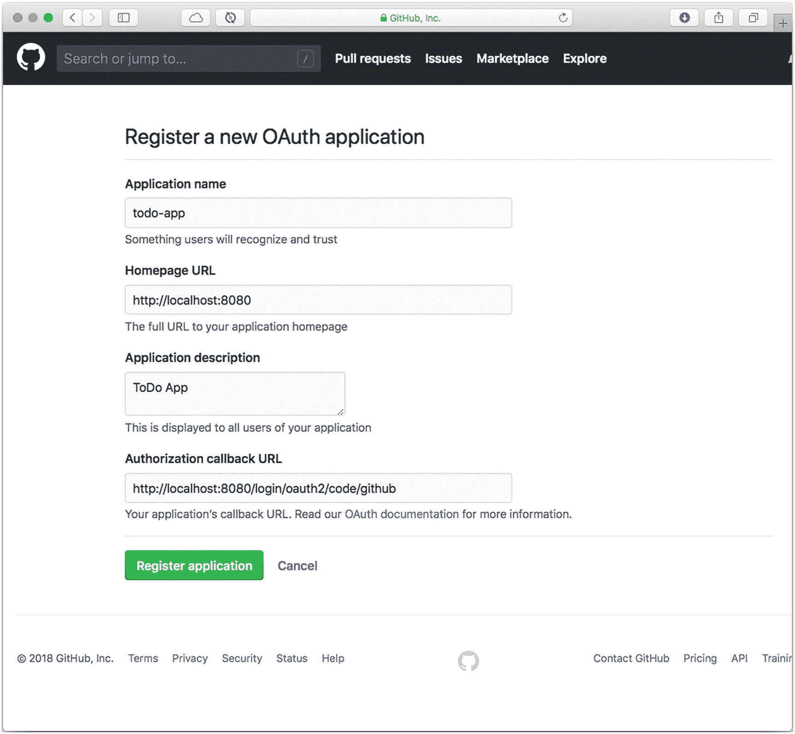

图 8-9

GitHub 新 app: [`https://github.com/settings/applications/new`](https://github.com/settings/applications/new)

您可以单击“注册应用”按钮。之后，GitHub 会在您的应用中创建您需要的密钥(参见图 [8-10](#Fig10) )。

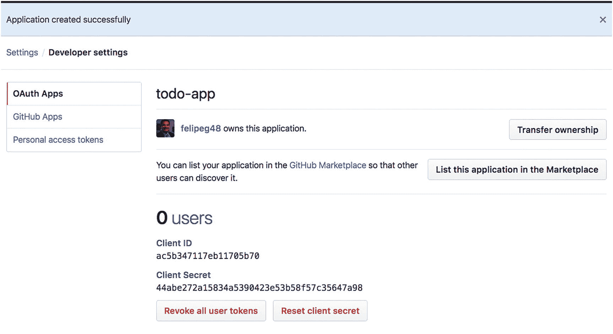

图 8-10

客户端 ID 和客户端密钥

一旦你有了这个，复制客户端 id 和客户端密钥，并把它们和`spring.security.oauth2.client.registration.*`密钥一起添加到`application.properties`中。

```java
# OAuth2
spring.security.oauth2.client.registration.todo.client-id=ac5b347117eb11705b70
spring.security.oauth2.client.registration.todo.client-secret=44abe272a15834a5390423e53b58f57c35647a98
spring.security.oauth2.client.registration.todo.client-name=ToDo App with GitHub Authentication
spring.security.oauth2.client.registration.todo.provider=github
spring.security.oauth2.client.registration.todo.scope=user
spring.security.oauth2.client.registration.todo.redirect-uri-template=http://localhost:8080/login/oauth2/code/github

```

`spring.security.oauth2.client.registration`接受包含必要键的地图，如`client-id`和`client-secret`。

就是这样！！你不需要别的东西。您现在可以运行您的应用了。打开浏览器，指向 http://localhost:8080。你会得到一个重定向到 GitHub 的链接(见图 [8-11](#Fig11) )。

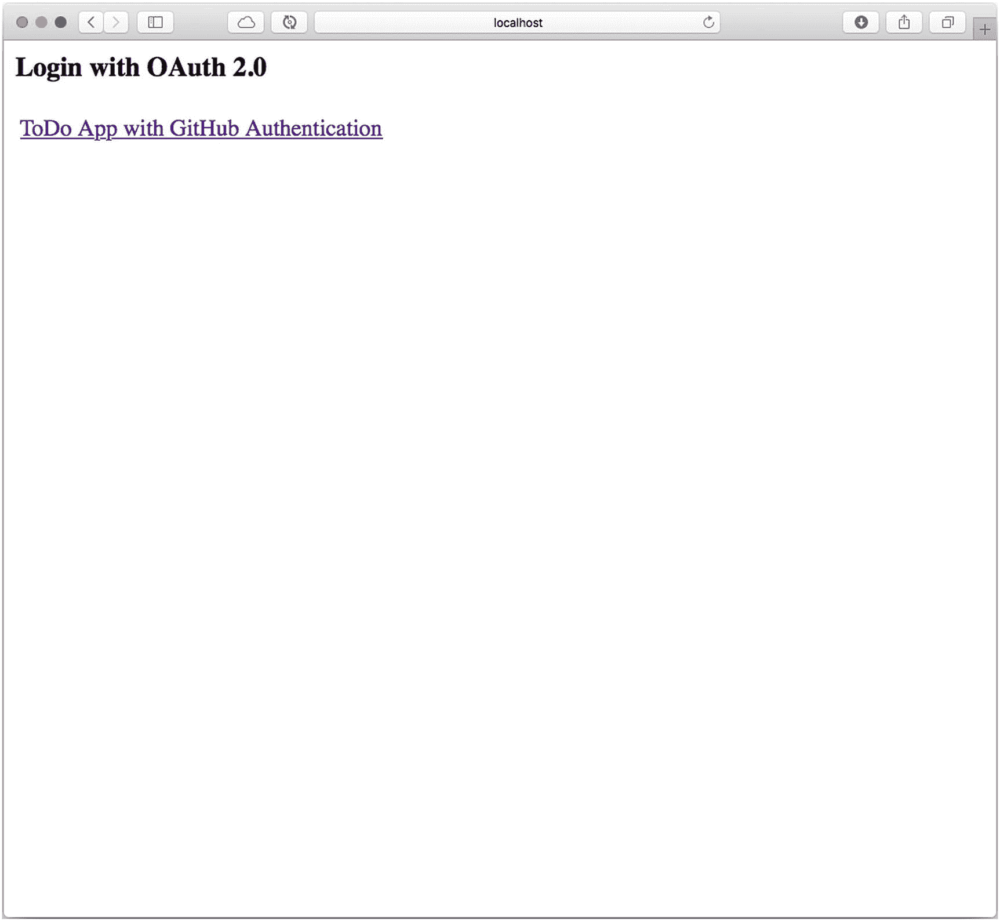

图 8-11

*http://localhost:8080*

您可以点击链接，这将引导您完成登录过程，但使用 GitHub 认证机制(参见图 [8-12](#Fig12) )。

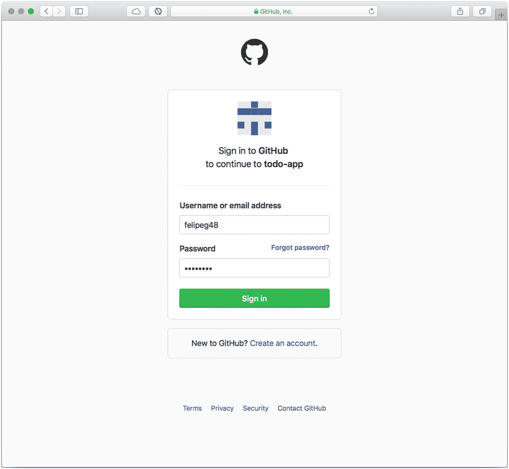

图 8-12

GitHub 认证

您现在可以使用您的凭据登录。接下来，你会被重定向到另一个页面，在那里你需要授予 *todo-app* 使用联系信息的权限(参见图 [8-13](#Fig13) )。

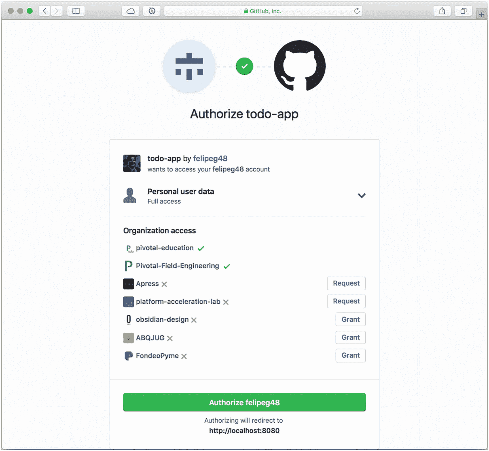

图 8-13

GitHub 授权流程

然后，您可以单击授权按钮，使用 ToDo REST API 返回到您的应用(参见图 [8-14](#Fig14) )。

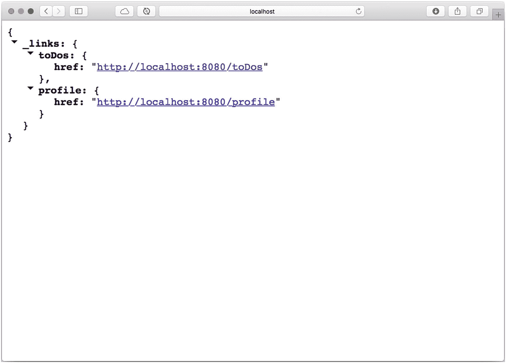

图 8-14

GitHub 授权流程后

恭喜你！！现在您知道使用 Spring Boot 和 Spring Security 将 OAuth2 与不同的提供商集成是多么容易了。

### 注意

你可以在 Apress 网站或者 GitHub 的 [`https://github.com/Apress/pro-spring-boot-2`](https://github.com/Apress/pro-spring-boot-2) 或者我的个人资源库 [`https://github.com/felipeg48/pro-spring-boot-2nd`](https://github.com/felipeg48/pro-spring-boot-2nd) 找到这部分的解决方法。

## 摘要

在这一章中，您学习了使用 Spring Boot 进行安全保护的不同方法。您了解了通过添加`spring-boot-security-starter`依赖项来保护应用是多么容易。

您还了解了自定义和覆盖 Spring Boot 为您提供的 Spring Security 默认设置是很容易的。您可以使用`spring.security.*`属性，也可以使用`WebSecurityConfigurerAdapter`类对其进行定制。

您了解了如何使用 JDBC 并连接两个应用，其中一个作为身份验证和授权的安全机构。

最后，您了解了将 OAuth2 与第三方认证和授权提供商(如脸书、谷歌、GitHub 等)一起使用是多么容易。

在下一章中，我们开始与消息传递代理一起工作。