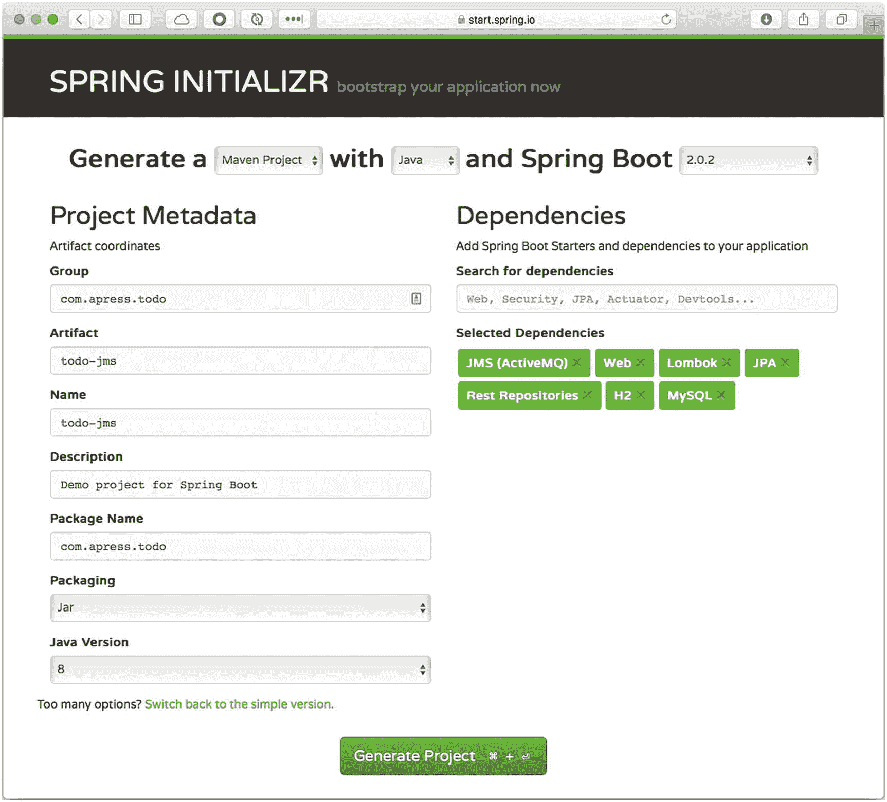
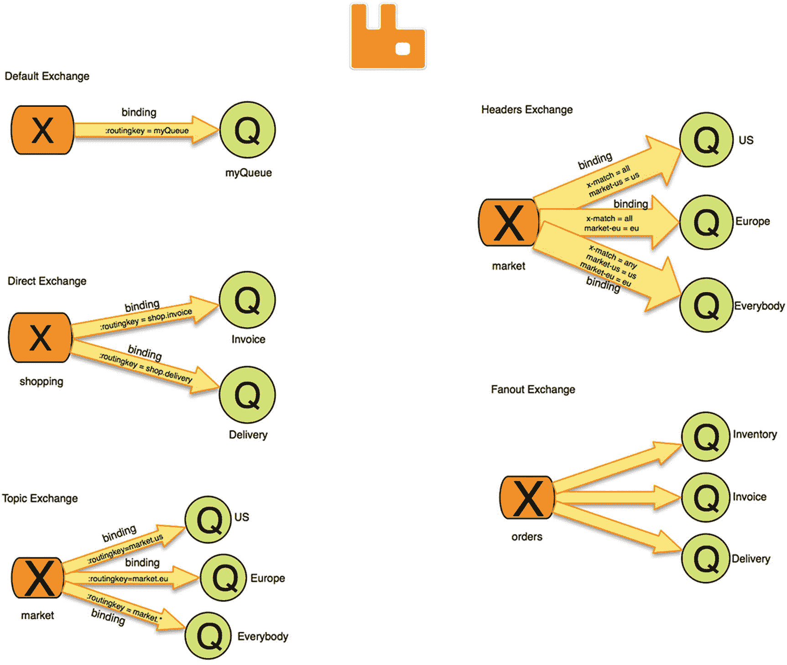
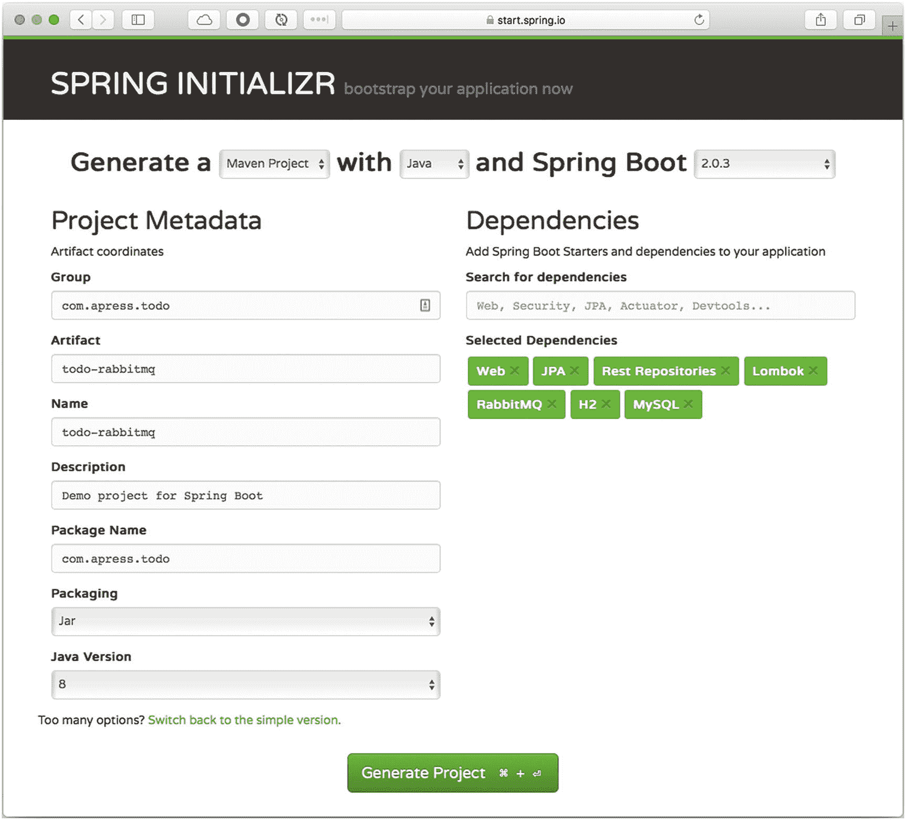
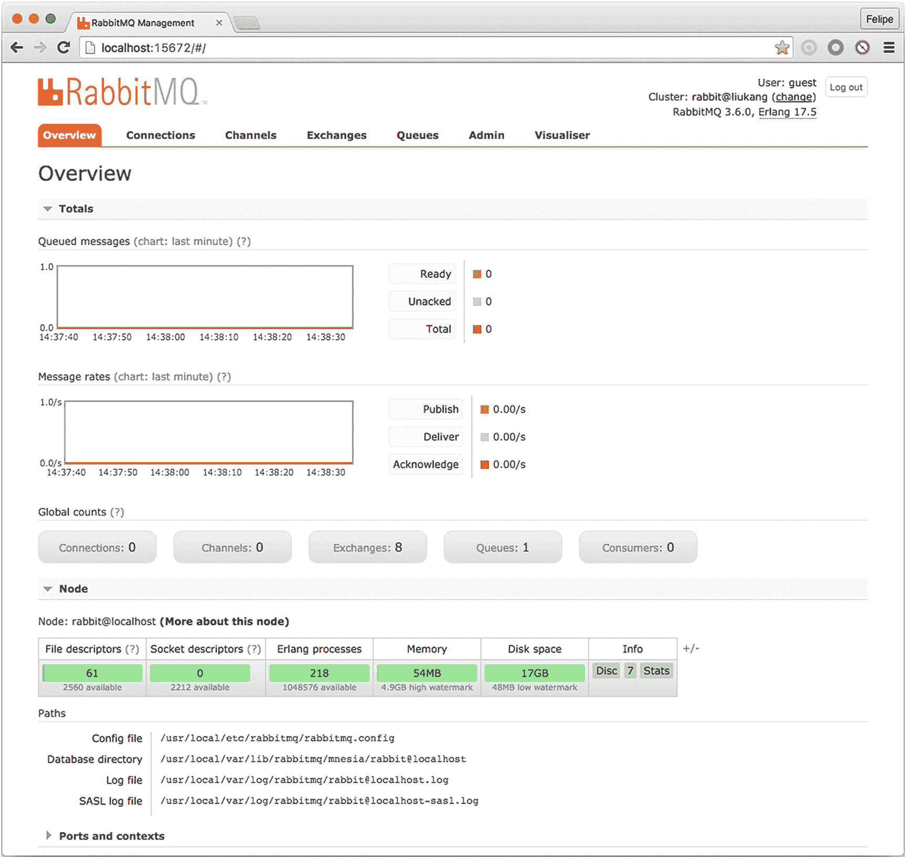
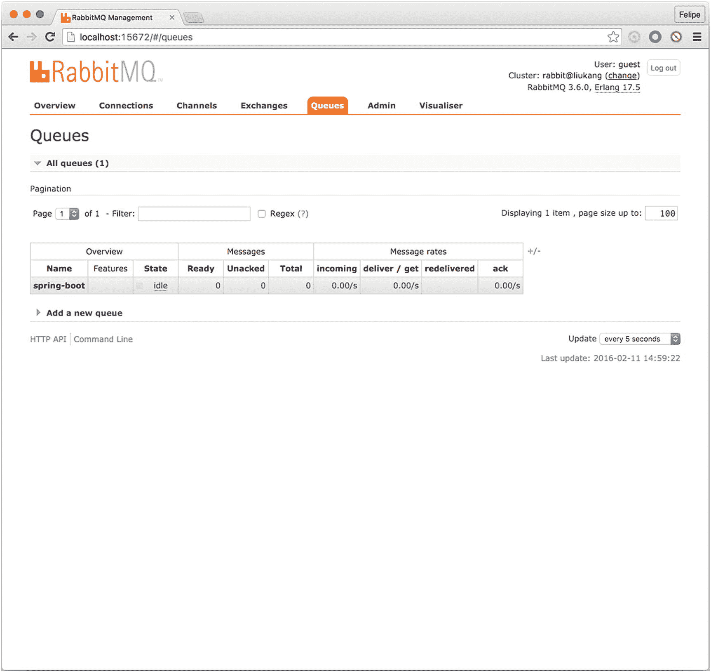
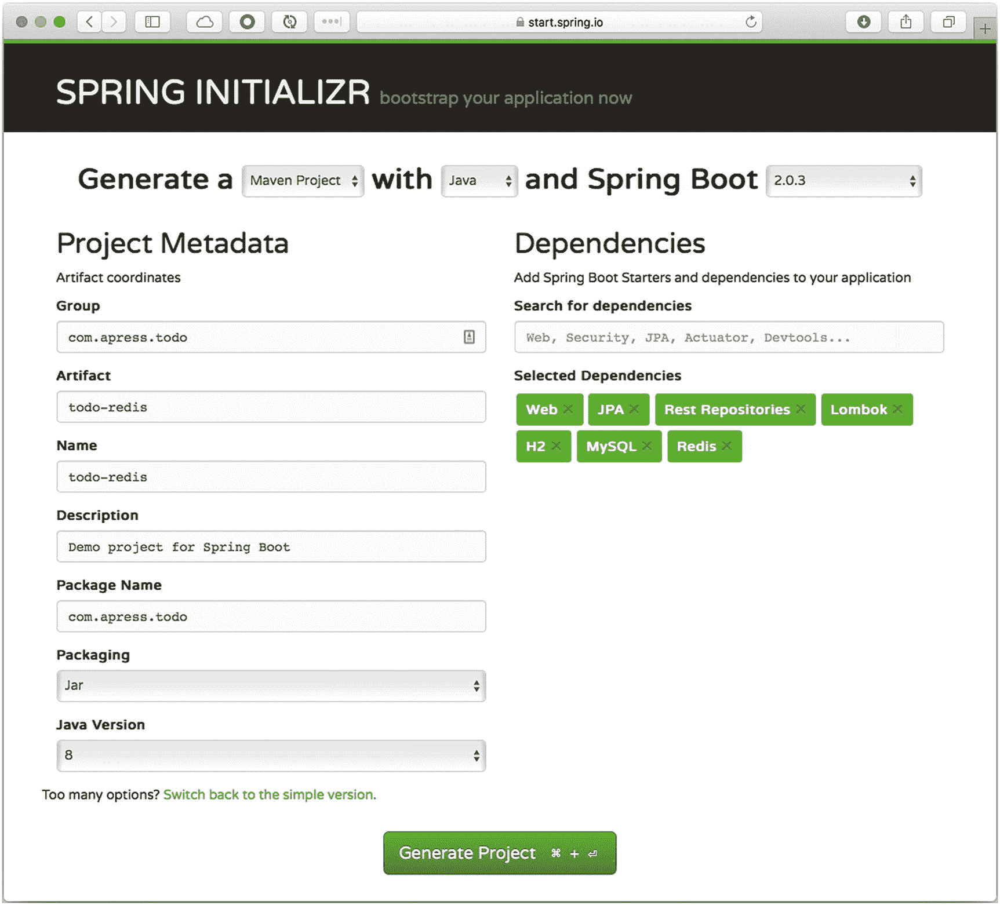
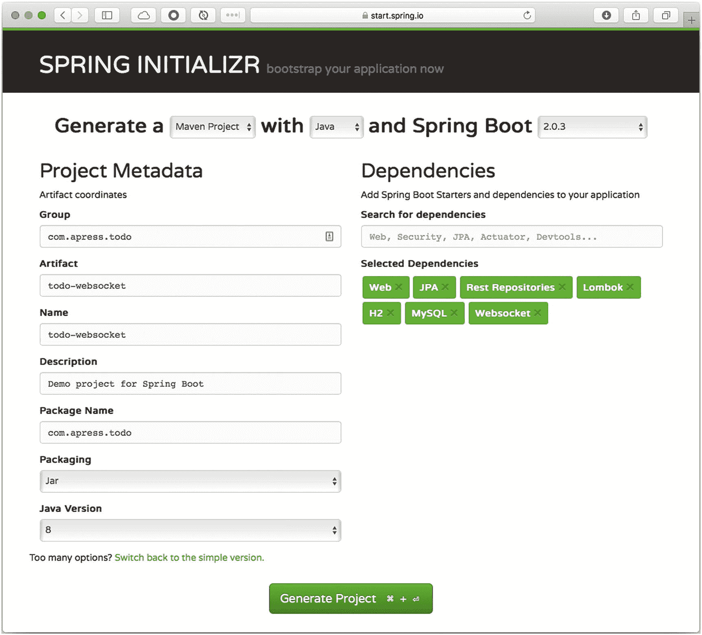
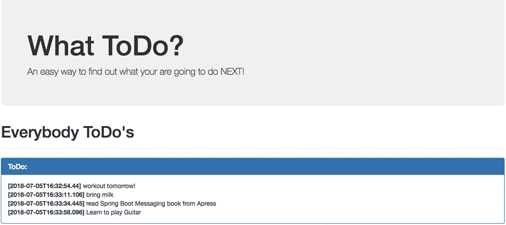

# 9.与 Spring Boot 的通信

这一章是关于信息传递的。它通过示例解释了如何使用 ActiveMQ 实现 JMS (Java 消息服务)，使用 RabbitMQ 实现 AMQP(高级消息队列协议)，使用 Redis 实现发布/订阅，使用 WebSockets 实现 STOMP(简单或面向流文本的消息协议)和 Spring Boot。

## 什么是消息传递？

消息传递是一种在一个或多个实体之间进行通信的方式，它无处不在。

自从计算机发明以来，各种形式的计算机信息就一直存在。它被定义为硬件和/或软件组件或应用之间的一种通信方法。总是有一个发送者和一个或多个接收者。消息传递可以是同步和异步的、发布/订阅和对等的、RPC 的、基于企业的、消息代理、ESB(企业服务总线)、MOM(面向消息的中间件)等等。

消息传递支持必须松散耦合的分布式通信，这意味着无论发送方如何发布消息或发布什么消息，接收方都会在不通知发送方的情况下使用消息。

当然，关于消息传递，我们可以说很多——从旧的技巧和技术到新的协议和消息传递模式，但本章的目的是用例子来说明 Spring Boot 是如何进行消息传递的。

记住这一点，让我们开始使用现有的一些技术和消息代理来创建示例。

## 与 Spring Boot 的 JMS

让我们从使用 JMS 开始。这是一项老技术，仍被有遗留应用的公司使用。JMS 是由 Sun Microsystems 创建的，它提供了一种同步和异步发送消息的方法；它定义了需要由消息代理实现的接口，比如 WebLogic、IBM MQ、ActiveMQ、HornetQ 等等。

JMS 是一种只支持 Java 的技术，因此有人试图创建消息桥来将 JMS 与其他编程语言结合起来；尽管如此，混合不同的技术还是很困难或者非常昂贵。我知道您认为这是不正确的，因为您可以使用 Spring integration、Google Protobuffers、Apache Thrift 和其他技术来集成 JMS，但是这仍然需要大量的工作，因为您需要了解和维护所有这些技术的代码。

### 带有 JMS 的待办事项应用

让我们从使用 JMS 和 Spring Boot 创建 ToDo 应用开始。想法是将 ToDo 发送到 JMS 代理，并接收和保存它们。

Spring Boot 团队有几个可用的 JMS 初学者 poms 在这种情况下，您使用 ActiveMQ，它是 Apache 基金会的一个开源异步消息传递代理( [`http://activemq.apache.org`](http://activemq.apache.org) )。其中一个主要优势是，您可以使用内存中的代理或远程代理。(如果喜欢可以下载安装；本节中的代码使用内存中的代理，但是我将告诉您如何配置远程代理。

可以打开自己喜欢的浏览器，指向已知的 Spring Initializr([`https://start.spring.io`](https://start.spring.io))；将下列值添加到下列字段中。

*   组:`com.apress.todo`

*   神器:`todo-jms`

*   名称:`todo-jms`

*   包名:`com.apress.todo`

*   依赖关系:`JMS (ActiveMQ), Web, Lombok, JPA, REST Repositories, H2, MySQL`

您可以选择 Maven 或 Gradle 作为项目类型。然后你可以点击生成项目按钮来下载一个 ZIP 文件。将其解压缩并在您最喜欢的 IDE 中导入项目(参见图 [9-1](#Fig1) )。



图 9-1

Spring初始化 zr

从依赖关系中可以看出，您重用了前面章节中的 JPA 和 REST Repositories 代码。代替使用文本消息(一种测试消息传递的常用方法)，您使用一个`ToDo`实例，它被转换为 JSON 格式。为此，您需要手动将下一个依赖项添加到您的`pom.xml`或`build.gradle`中。

如果您使用的是 Maven，将下面的依赖项添加到您的`pom.xml`文件中。

```java
<dependency>
      <groupId>com.fasterxml.jackson.core</groupId>
      <artifactId>jackson-databind</artifactId>
</dependency>

```

如果您使用的是 Gradle，将下面的依赖项添加到您的`build.gradle`文件中。

```java
compile("com.fasterxml.jackson.core:jackson-databind")

```

这个依赖项提供了使用 JSON 序列化`ToDo`实体所需的所有 Jackson jars。

在接下来的部分中，我将向您展示重要的文件，以及 JMS 是如何在 ToDo 应用中使用的。该示例使用简单的*点对点*模式，其中有一个*生产者*、一个*队列*和一个*消费者*。稍后我将展示如何配置它来使用一个带有一个*生产者*、一个*主题*和多个*消费者*的*发布者-订阅者*模式。

#### ToDo 生产者

让我们从介绍向 ActiveMQ 代理发送 ToDo 的生产者开始。这个生产者可以在自己的项目上；可以脱离 app 但是出于演示的目的，在 ToDo 应用中，您将生成器放在相同的代码库中。

创建`ToDoProducer`类。这个类将一个 ToDo 发送到一个 JMS 队列中(参见清单 [9-1](#PC3) )。

```java
package com.apress.todo.jms;

import com.apress.todo.domain.ToDo;
import org.slf4j.Logger;
import org.slf4j.LoggerFactory;
import org.springframework.jms.core.JmsTemplate;
import org.springframework.stereotype.Component;

@Component

public class ToDoProducer {

    private static final Logger log = LoggerFactory.getLogger(ToDoProducer.class);

    private JmsTemplate jmsTemplate;

    public ToDoProducer(JmsTemplate jmsTemplate){
        this.jmsTemplate = jmsTemplate;
    }

    public void sendTo(String destination, ToDo toDo) {
        this.jmsTemplate.convertAndSend(destination, toDo);
        log.info("Producer> Message Sent");
    }
}

Listing 9-1com.apress.todo.jms.ToDoProducer.java

```

清单 [9-1](#PC3) 显示了生产者类。这个类使用`@Component`进行标记，因此它在 Spring 应用上下文中被注册为一个 Spring bean。使用了`JmsTemplate`类，它非常类似于其他的`*Template`类，这些类包装了所有正在使用的技术的样板文件。通过类构造函数注入`JmsTemplate`实例，并使用`convertAndSend`方法发送消息。您正在发送一个 *ToDo* 对象(JSON 字符串)。该模板具有将其序列化并发送到 ActiveMQ 队列的机制。

#### ToDo 消费者

接下来，让我们创建消费者类，它监听来自 ActiveMQ 队列的任何传入消息(参见清单 [9-2](#PC4) )。

```java
package com.apress.todo.jms;

import com.apress.todo.domain.ToDo;
import com.apress.todo.repository.ToDoRepository;
import org.slf4j.Logger;
import org.slf4j.LoggerFactory;
import org.springframework.jms.annotation.JmsListener;
import org.springframework.stereotype.Component;

import javax.validation.Valid;

@Component
public class ToDoConsumer {

    private Logger log = LoggerFactory.getLogger(ToDoConsumer.class);

    private ToDoRepository repository;

    public ToDoConsumer(ToDoRepository repository){
        this.repository = repository;
    }

    @JmsListener(destination = "${todo.jms.destination}",containerFactory = "jmsFactory")
    public void processToDo(@Valid ToDo todo){
        log.info("Consumer> " + todo);
        log.info("ToDo created> " + this.repository.save(todo));
    }
}

Listing 9-2com.apress.todo.jms.ToDoConsumer.java

```

清单 [9-2](#PC4) 显示了消费者。在这个类中，您使用的是`ToDoRepository`，它在这里监听来自 ActiveMQ 队列的任何消息。确保您使用的是使该方法处理来自队列的任何传入消息的`@JmsListener`注释；在这种情况下，一个有效的 ToDo(`@Valid`注释可以用来验证域模型的任何字段)。`@JmsListener`注释有两个属性。`destination`属性强调要连接的队列/主题的名称(目的地属性评估`todo.jms.destination`属性，该属性将在下一节中创建/使用)。属性是作为配置的一部分创建的。

#### 配置待办事项应用

现在，是时候配置 ToDo 应用来发送和接收 ToDo 了。清单 [9-1](#PC3) 和清单 [9-2](#PC4) 分别显示了生产者和消费者类。在这两个类中都使用了一个`ToDo`实例，这意味着有必要进行序列化。大多数使用序列化的 Java 框架要求您的类从`java.io.Serializable`开始实现。将这些类转换成字节是一种简单的方法，但是这种方法已经争论了很多年，因为实现`Serializable`降低了在发布使用后修改类实现的灵活性。

Spring 框架提供了另一种不需要从`Serializable`开始实现序列化的方法——通过一个`MessageConverter`接口。这个接口提供了`toMessage`和`fromMessage`方法，您可以在其中插入任何适合对象转换的技术。

让我们为生产者和消费者创建一个使用`ToDo`实例的配置(参见清单 [9-3](#PC5) )。

```java
package com.apress.todo.config;

import com.apress.todo.error.ToDoErrorHandler;
import com.apress.todo.validator.ToDoValidator;
import org.springframework.boot.autoconfigure.jms.DefaultJmsListenerContainerFactoryConfigurer;
import org.springframework.context.annotation.Bean;
import org.springframework.context.annotation.Configuration;
import org.springframework.jms.annotation.JmsListenerConfigurer;
import org.springframework.jms.config.DefaultJmsListenerContainerFactory;
import org.springframework.jms.config.JmsListenerContainerFactory;
import org.springframework.jms.config.JmsListenerEndpointRegistrar;
import org.springframework.jms.support.converter.MappingJackson2MessageConverter;
import org.springframework.jms.support.converter.MessageConverter;
import org.springframework.jms.support.converter.MessageType;
import org.springframework.messaging.handler.annotation.support.DefaultMessageHandlerMethodFactory;

import javax.jms.ConnectionFactory;

@Configuration

public class ToDoConfig {

    @Bean
    public MessageConverter jacksonJmsMessageConverter() {
        MappingJackson2MessageConverter converter = new MappingJackson2MessageConverter();
        converter.setTargetType(MessageType.TEXT);
        converter.setTypeIdPropertyName("_class_");
        return converter;
    }

    @Bean
    public JmsListenerContainerFactory<?> jmsFactory(ConnectionFactory connectionFactory,
                                                     DefaultJmsListenerContainerFactoryConfigurer configurer) {
        DefaultJmsListenerContainerFactory factory = new DefaultJmsListenerContainerFactory();
        factory.setErrorHandler(new ToDoErrorHandler());
        configurer.configure(factory, connectionFactory);
        return factory;
    }

    @Configuration
    static class MethodListenerConfig implements JmsListenerConfigurer{

        @Override
        public void configureJmsListeners (JmsListenerEndpointRegistrar jmsListenerEndpointRegistrar){
            jmsListenerEndpointRegistrar.setMessageHandlerMethodFactory(myHandlerMethodFactory());
        }

        @Bean
        public DefaultMessageHandlerMethodFactory myHandlerMethodFactory () {
            DefaultMessageHandlerMethodFactory factory = new DefaultMessageHandlerMethodFactory();
            factory.setValidator(new ToDoValidator());
            return factory;
        }
    }

}

Listing 9-3com.apress.todo.config.ToDoConfig.java

```

清单 [9-3](#PC5) 显示了应用使用的`ToDoConfig`类。我们来分析一下。

*   `@Configuration`。这是一个已知的注释，它标记了用于配置 SpringApplication 上下文的类。

*   `MessageConverter`。方法`jacksonJmsMessageConverter`返回 MessageConverter 接口。这个接口促进了`toMessage`和`fromMessage`方法的实现，这有助于插入您想要使用的任何序列化/转换。在这种情况下，您通过使用`MappingJackson2MessageConverter`类实现来使用 JSON 转换器。这个类是 Spring 框架中的默认实现之一。它使用 Jackson 库，这些库使用映射器在 JSON 和对象之间进行转换。因为您使用的是`ToDo`实例，所以有必要指定一个目标类型(`setTargetType`)，这意味着 JSON 对象被作为文本和一个 type-id 属性名(`setTypeIdPropertyName`)来处理，该属性名标识了生产者和消费者之间的属性。type-id 属性名必须始终与生产者和消费者相匹配。它可以是你需要的任何值(最好是你能识别的值，因为它用于设置要与 JSON 相互转换的类的名称(包括包))；换句话说，`com.apress.todo.domain.Todo`类必须在生产者和消费者之间共享，以便映射器知道从哪里获取该类。

*   `JmsListenerContainerFactory`。`jmsFactory`方法返回`JmsListenerContainerFactory`。这个 bean 需要`ConnectionFactory`和`DefaultJmsListenerContainerFactoryConfigurer`(都是由 Spring 注入的)，它创建了`DefaultJmsListenerContainerFactory`，后者设置了一个错误处理程序。通过设置`containerFactory`属性，这个 bean 被用在`@JmsListener`注释中。

*   `JmsListenerConfigurer`。在本课中，您将创建一个静态配置。`MethodListenerConfig`类实现了`JmsListenerConfigurer`接口。该接口要求您注册一个具有验证器配置的 bean(`ToDoValidator`类)；在这种情况下，`DefaultMessageHandlerMethodFactory`比恩。

如果还不想验证，可以从`jmsFactory` bean 声明中移除`MethodListenerConfig`类和`setErrorHandler`调用；但是如果你想试验验证，那么你需要创建`ToDoValidator`类(参见清单 [9-4](#PC6) )。

```java
package com.apress.todo.validator;

import com.apress.todo.domain.ToDo;
import org.springframework.validation.Errors;
import org.springframework.validation.Validator;

public class ToDoValidator implements Validator {
    @Override
    public boolean supports(Class<?> clazz) {
        return clazz.isAssignableFrom(ToDo.class);
    }

    @Override
    public void validate(Object target, Errors errors) {
        ToDo toDo = (ToDo)target;

        if (toDo == null) {
            errors.reject(null, "ToDo cannot be null");
        }else {
            if (toDo.getDescription() == null || toDo.getDescription().isEmpty())
                errors.rejectValue("description",null,"description cannot be null or empty");
        }
    }
}

Listing 9-4com.apress.todo.validator.ToDoValidator.java

```

清单 [9-4](#PC6) 显示了为每个消息调用的验证器类，并验证`description`字段不为空。这个类实现了验证器接口，并实现了`supports`和`validate`方法。

这是`ToDoErrorHandler`代码。

```java
package com.apress.todo.error;

import org.slf4j.Logger;
import org.slf4j.LoggerFactory;
import org.springframework.util.ErrorHandler;

public class ToDoErrorHandler implements ErrorHandler {
    private static Logger log = LoggerFactory.getLogger(ToDoErrorHandler.class);

    @Override
    public void handleError(Throwable t) {
        log.warn("ToDo error...");
        log.error(t.getCause().getMessage());
    }
}

```

如您所见，这个类实现了`ErrorHandler`接口。

现在，让我们创建保存`todo.jms.destination`属性的`ToDoProperties`类，该属性指示要连接到哪个队列/主题(参见清单 [9-5](#PC8) )。

```java
package com.apress.todo.config;

import lombok.Data;
import org.springframework.boot.context.properties.ConfigurationProperties;

@Data
@ConfigurationProperties(prefix = "todo.jms")
public class ToDoProperties {

    private String destination;

}

Listing 9-5com.apress.todo.config.ToDoProperties.java

```

清单 [9-5](#PC8) 显示了`ToDoProperties`类。还记得在清单[9-2](#PC4)(`ToDoConsumer`类)中，`processToDo`方法被标注了`@JmsListener`注释，这暴露了`destination`属性。该属性通过评估您在该类中定义的*SpEL*(Spring Expression Language)`${todo.jms.destination}`表达式来获取其值。

您可以在`application.properties`文件中设置该属性。

```java
# JPA
spring.jpa.generate-ddl=true
spring.jpa.hibernate.ddl-auto=create-drop

# ToDo JMS

todo.jms.destination=toDoDestination

src/main/resources/application.properties

```

#### 运行待办事项应用

接下来，让我们创建一个 config 类，它使用生产者向队列发送消息(参见清单 [9-6](#PC10) )。

```java
package com.apress.todo.config;

import com.apress.todo.domain.ToDo;
import com.apress.todo.jms.ToDoProducer;
import org.springframework.beans.factory.annotation.Value;
import org.springframework.boot.CommandLineRunner;
import org.springframework.context.annotation.Bean;
import org.springframework.context.annotation.Configuration;

@Configuration
public class ToDoSender {

    @Bean
    public CommandLineRunner sendToDos(@Value("${todo.jms.destination}") String destination, ToDoProducer producer){
        return args -> {
            producer.sendTo(destination,new ToDo("workout tomorrow morning!"));
        };
    }

}

Listing 9-6com.apress.todo.config.ToDoSender.java

```

清单 [9-6](#PC10) 显示了使用`ToDoProducer`实例和目的地(来自`todo.jms.destination`属性)发送消息的配置类。

要运行这个应用，您可以使用您的 IDE(如果您导入了它)或者您可以使用 Maven 包装器。

```java
./mvnw spring-boot:run

```

或者是格拉德包装。

```java
./gradlew bootRun

```

您应该从日志中获得以下文本。

```java
Producer> Message Sent
Consumer> ToDo(id=null, description=workout tomorrow morning!, created=null, modified=null, completed=false)
ToDo created> ToDo(id=8a808087645bd67001645bd6785b0000, description=workout tomorrow morning!, created=2018-07-02T10:32:19.546, modified=2018-07-02T10:32:19.547, completed=false)

```

您可以看一看`http://localhost:8080/toDos`并查看创建的 ToDo。

### 使用 JMS 发布/订阅

如果你想使用发布/订阅模式，你想让多个消费者接收一条消息(通过使用主题订阅)，我将解释你需要在你的应用中做什么。

因为我们使用 Spring Boot，这使得配置发布/订阅模式更容易。如果您使用默认监听器(一个`@JmsListener(destination)`默认监听器容器)，那么您可以使用`application.properties`文件中的`spring.jms.pub-sub-domain=true`属性。

但是，如果您使用自定义侦听器容器，那么您可以通过编程方式设置它。

```java
@Bean
public DefaultMessageListenerContainer jmsListenerContainerFactory() {
    DefaultMessageListenerContainer dmlc = new DefaultMessageListenerContainer();
    dmlc.setPubSubDomain(true);
    // Other configuration here ...
    return dmlc;
}

```

### 远程 ActiveMQ

ToDo 应用正在使用内存代理(`spring.activemq.in-memory=true`)。这对于演示或测试来说可能是好的，但实际上，您使用的是远程 ActiveMQ 服务器。如果您需要一个远程服务器，将下面的键添加到您的`application.properties`文件中(相应地修改它)。

```java
spring.activemq.broker-url=tcp://my-awesome-server.com:61616
spring.activemq.user=admin
spring.activemq.password=admin

src/main/resources/application.properties

```

对于 ActiveMQ 代理，您可以使用更多的属性。去 [`https://docs.spring.io/spring-boot/docs/current/reference/html/common-application-properties.html`](https://docs.spring.io/spring-boot/docs/current/reference/html/common-application-properties.html) 找`spring.activemq.*`键。

## Spring Boot 的兔子

自从 Sun、Oracle 和 IBM 以及微软和 MSMQ 等公司首次尝试 JMS 以来，所使用的协议都是专有的。JMS 定义了一个接口 API，但是试图混合技术或编程语言是一件麻烦的事情。多亏了摩根大通的一个团队，AMQP(高级消息队列协议)诞生了。它是面向 MOM 的开放标准应用层。换句话说，AMQP 是一个有线级协议，这意味着您可以使用任何技术或编程语言来实现这个协议。

消息传递代理相互竞争，以证明它们是健壮的、可靠的和可伸缩的，但最重要的问题是它们有多快。我与许多经纪人合作过，到目前为止，最容易使用和扩展，也是最快的是 RabbitMQ，它实现了 AMQP 协议。

描述 RabbitMQ 的每个部分和所有相关概念需要一整本书，但是我将基于本节的例子来解释其中的一些概念。

### 安装 RabbitMQ

在我说 RabbitMQ 之前，先安装一下。如果你使用的是 Mac OS X/Linux，你可以使用`brew`命令。

```java
$ brew upgrade
$ brew install rabbitmq

```

如果你使用的是 UNIX 或者 Windows 系统，你可以去 RabbitMQ 网站使用安装程序( [`www.rabbitmq.com/download.html`](http://www.rabbitmq.com/download.html) )。RabbitMQ 是用 Erlang 编写的，所以它的主要依赖是在您的系统中安装 Erlang 运行时。现在，所有的 RabbitMQ 安装程序都附带了所有的 Erlang 依赖项。确保可执行文件在您的`PATH`变量中(对于 Windows 和 Linux，取决于您使用的操作系统)。如果你正在使用`brew`，你不需要担心设置`PATH`变量。

### RabbitMQ/AMQP:交换、绑定和队列

AMQP 定义了三个概念，这三个概念与 JMS 世界略有不同，但是非常容易理解。AMQP 定义了*交换*，这是发送消息的实体。每个*交换机*接收一条消息，并将其路由到零个或更多的*队列*。这种路由涉及一种基于交换类型和规则的算法，称为*绑定*。

AMPQ 协议定义了五种交换类型:*直接*、*扇出*、*主题、*和*报头*。图 9-2 显示了这些不同的交换类型。



图 9-2

AMQP 交易所/绑定/队列

图 [9-2](#Fig2) 显示了可能的交换类型。因此，主要思想是向一个交换发送一个消息，包括一个路由关键字，然后交换根据它的类型将消息传递给队列(或者如果路由关键字不匹配，它就不传递)。

*默认交换*自动绑定到每个创建的队列。直接交换通过路由关键字绑定到队列；您可以将这种交换类型视为一对一绑定。*话题交流*类似于直接交流；唯一的区别是，在它的绑定中，您可以在其路由关键字中添加一个通配符。*标题交换*类似于主题交换；唯一的区别是绑定是基于消息头的(这是一个非常强大的交换，您可以对它的消息头执行 *all* 和 *any* 表达式)。*扇出交换机*将消息复制到所有绑定队列；你可以把这种交流看作是一种信息广播。

你可以在 [`www.rabbitmq.com/tutorials/amqp-concepts.html`](http://www.rabbitmq.com/tutorials/amqp-concepts.html) 获得更多关于这些话题的信息。

本节中的示例使用默认的交换类型，这意味着路由关键字等于队列的名称。每次创建队列时，RabbitMQ 都会使用队列的名称创建一个从默认交换(实际名称是一个空字符串)到队列的绑定。

### 任何有 rabbitmq 的应用

让我们重新使用 ToDo 应用，并添加一条 AMQP 消息。与之前的应用一样，您可以使用 ToDo 实例。您发送和接收一个 JSON 消息，并将其转换为 object。

先打开你最喜欢的浏览器，指向已知的 Spring Initializr。将以下值添加到字段中。

*   组:`com.apress.todo`

*   神器:`todo-rabbitmq`

*   名称:`todo-rabbitmq`

*   包名:`com.apress.todo`

*   依赖关系:`RabbitMQ, Web, Lombok, JPA, REST Repositories, H2, MySQL`

您可以选择 Maven 或 Gradle 作为项目类型。然后，您可以按下 Generate Project 按钮，这将下载一个 ZIP 文件。将其解压缩，并在您喜欢的 IDE 中导入项目(参见图 [9-3](#Fig3) )。



图 9-3

spring initialize[`https://start.spring.io`](https://start.spring.io)

您可以从前面的章节中复制/粘贴 JPA/REST 项目的代码。

#### ToDo 生产者

让我们从创建一个向 Exchange 发送消息的生产者类开始(默认 Exchange-direct)(参见清单 [9-7](#PC17) )。

```java
package com.apress.todo.rmq;

import com.apress.todo.domain.ToDo;
import org.slf4j.Logger;
import org.slf4j.LoggerFactory;
import org.springframework.amqp.rabbit.core.RabbitTemplate;
import org.springframework.stereotype.Component;

@Component

public class ToDoProducer {

    private static final Logger log = LoggerFactory.getLogger(ToDoProducer.class);
    private RabbitTemplate template;

    public ToDoProducer(RabbitTemplate template){
        this.template = template;
    }

    public void sendTo(String queue, ToDo toDo){
        this.template.convertAndSend(queue,toDo);
        log.info("Producer> Message Sent");
    }
}

Listing 9-7com.apress.todo.rmq.ToDoProducer.java

```

清单 [9-7](#PC17) 显示了`ToDoProducer.java`类。让我们检查一下。

*   `@Component`。这个注释标记了 Spring 容器要拾取的类。

*   `RabbitTemplate`。`RabbitTemplate`是一个助手类，它简化了对 RabbitMQ 的同步/异步访问，以便发送和/或接收消息。这与你之前看到的`JmsTemplate`非常相似。

*   `sendTo(routingKey,message)`。该方法将路由关键字和消息作为参数。在这种情况下，路由关键字是队列的名称。这个方法使用`rabbitTemplate`实例来调用接受路由键和消息的`convertAndSend`方法。请记住，消息被发送到交换(默认交换)，交换将消息路由到正确的队列。这个路由关键字恰好是队列的名称。还要记住，默认情况下，RabbitMQ 总是将默认交换(直接交换)绑定到队列，路由关键字是队列的名称。

#### ToDo 消费者

接下来，是时候创建监听指定队列的消费者类了(参见清单 [9-8](#PC18) )。

```java
package com.apress.todo.rmq;

import com.apress.todo.domain.ToDo;
import com.apress.todo.repository.ToDoRepository;
import org.slf4j.Logger;
import org.slf4j.LoggerFactory;
import org.springframework.amqp.rabbit.annotation.RabbitListener;
import org.springframework.stereotype.Component;

@Component

public class ToDoConsumer {

    private Logger log = LoggerFactory.getLogger(ToDoConsumer.class);
    private ToDoRepository repository;

    public ToDoConsumer(ToDoRepository repository){
        this.repository = repository;
    }

    @RabbitListener(queues = "${todo.amqp.queue}")
    public void processToDo(ToDo todo){
        log.info("Consumer> " + todo);
        log.info("ToDo created> " + this.repository.save(todo));
    }
}

Listing 9-8com.apress.todo.rmq.ToDoConsumer.java

```

清单 [9-8](#PC18) 显示了`ToDoConsumer.java`类。让我们检查一下。

*   `@Component`。你已经知道这个注释了。它标记了 Spring 容器要拾取的类。

*   `@RabbitListener`。该注释标记了为任何传入消息创建处理程序的方法(因为您也可以在类中使用该注释)，这意味着它创建了一个连接到 RabbitMQ 队列的侦听器，并将该消息传递给该方法。在幕后，监听器通过使用正确的消息转换器(一个`org.springframework.amqp.support.converter.MessageConverter`接口的实现)尽最大努力将消息转换成适当的类型。这个接口属于`spring-amqp`项目)；在这种情况下，它从 JSON 转换成一个`ToDo`实例。

从`ToDoProducer`和`ToDoConsumer`可以看出，代码非常简单。如果您只使用 RabbitMQ Java 客户端( [`www.rabbitmq.com/java-client.html`](http://www.rabbitmq.com/java-client.html) )来创建它，至少您需要更多的代码行来创建连接、通道和消息并发送消息，或者如果您正在编写一个消费者，那么您需要打开一个连接、创建一个通道、创建一个基本消费者，并进入一个循环来处理每个传入的消息。这对简单的生产者或消费者来说是很多的。这就是为什么 Spring AMQP 团队创造了这种简单的方法，用几行代码完成一项繁重的任务。

#### 配置待办事项应用

接下来让我们配置应用。请记住，您发送的是 ToDo 实例，所以实际上，这与我们使用 JMS 时的配置是一样的。我们需要设置转换器和监听器容器(参见清单 [9-9](#PC19) )。

```java
package com.apress.todo.config;

import org.springframework.amqp.core.Queue;
import org.springframework.amqp.rabbit.config.SimpleRabbitListenerContainerFactory;
import org.springframework.amqp.rabbit.connection.ConnectionFactory;
import org.springframework.amqp.rabbit.core.RabbitTemplate;
import org.springframework.amqp.support.converter.Jackson2JsonMessageConverter;

import org.springframework.beans.factory.annotation.Value;
import org.springframework.context.annotation.Bean;
import org.springframework.context.annotation.Configuration;

@Configuration
public class ToDoConfig {

    @Bean
    public SimpleRabbitListenerContainerFactory rabbitListenerContainerFactory(ConnectionFactory connectionFactory) {
        SimpleRabbitListenerContainerFactory factory = new SimpleRabbitListenerContainerFactory();
        factory.setConnectionFactory(connectionFactory);
        factory.setMessageConverter(new Jackson2JsonMessageConverter());
        return factory;
    }

    @Bean
    public RabbitTemplate rabbitTemplate(ConnectionFactory connectionFactory){
        RabbitTemplate template = new RabbitTemplate(connectionFactory);
        template.setMessageConverter(new Jackson2JsonMessageConverter());
        return template;
    }

    @Bean
    public Queue queueCreation(@Value("${todo.amqp.queue}") String queue){
        return new Queue(queue,true,false,false);
    }
}

Listing 9-9com.apress.todo.config.ToDoConfig.java

```

清单 [9-9](#PC19) 向您展示了配置。它有几个 bean 定义；让我们检查一下。

*   `SimpleRabbitListenerContainerFactory`。当使用`@RabbitListener`注释进行自定义设置时，该工厂是必需的，因为您正在使用`ToDo`实例；有必要设置消息转换器。

*   `Jackson2JsonMessageConverter`。该转换器用于生产(带`RabbitTemplate`)和消耗(`@RabbitListener`)；它使用 Jackson 库进行映射和转换。

*   `RabbitTemplate`。这是一个可以发送和接收消息的助手类。在这种情况下，有必要使用 Jackson 转换器对其进行定制以生成 JSON 对象。

*   `Queue`。您可以手动创建队列，但在这种情况下，您是以编程方式创建的。如果队列是持久的或排他的，那么您可以传递队列的名称，并自动删除。

请记住，在 AMQP 协议中，您需要一个绑定到队列的交换，所以这个特定的示例在运行时创建了一个名为`spring-boot`的队列，默认情况下，所有队列都绑定到一个默认的交换。这就是为什么你没有提供任何关于交换的信息。因此，当生产者发送消息时，它首先被发送到默认交换，然后被路由到队列(`spring-boot`)。

#### 运行待办事项应用

让我们创建发送 ToDo 消息的 sender 类(参见清单 [9-10](#PC20) )。

```java
package com.apress.todo.config;

import com.apress.todo.domain.ToDo;
import com.apress.todo.rmq.ToDoProducer;
import org.springframework.beans.factory.annotation.Value;
import org.springframework.boot.CommandLineRunner;
import org.springframework.context.annotation.Bean;
import org.springframework.context.annotation.Configuration;

@Configuration
public class ToDoSender {

    @Bean
    public CommandLineRunner sendToDos(@Value("${todo.amqp.queue}") String destination, ToDoProducer producer){
        return args -> {
            producer.sendTo(destination,new ToDo("workout tomorrow morning!"));
        };
    }
}

Listing 9-10com.apress.todo.config.ToDoSender.java

```

将以下键(声明发送/消费队列)添加到您的`application.properties`文件中。

```java
todo.amqp.queue=spring-boot

```

在运行您的示例之前，请确保您的 RabbitMQ 服务器已经启动并正在运行。您可以通过打开终端并执行以下命令来启动它。

```java
$ rabbitmq-server

```

使用来宾/来宾凭证访问`http://localhost:15672/`,确保您可以访问 RabbitMQ web 控制台。如果您在访问 web 控制台时遇到问题，请确保通过运行以下命令启用了管理插件。

```java
$ rabbitmq-plugins list

```

如果整个列表中的复选框未被选中，则管理插件尚未启用(通常在全新安装时发生)。要启用这个插件，您可以执行以下命令。

```java
$ rabbitmq-plugins enable rabbitmq_management --online

```

现在，你可以再试一次。然后，您应该会看到一个类似于图 [9-4](#Fig4) 的 web 控制台。



图 9-4

rabbitmq web 控制台管理

图 [9-4](#Fig4) 显示了 RabbitMQ web 控制台。现在，您可以使用 IDE 像往常一样运行项目了。如果您使用的是 Maven，请执行

```java
$ ./mvnw spring-boot:run

```

如果您使用的是 Gradle，请执行

```java
$./gradlew bootRun

```

在您执行这个命令之后，您应该得到类似于下面的输出。

```java
Producer> Message Sent
Consumer> ToDo(id=null, description=workout tomorrow morning!, created=null, modified=null, completed=false)
ToDo created> ToDo(id=8a808087645bd67001645bd6785b0000, description=workout tomorrow morning!, created=2018-07-02T10:32:19.546, modified=2018-07-02T10:32:19.547, completed=false)

```

如果您查看 RabbitMQ web 控制台的 Queues 选项卡，您应该已经定义了`spring-boot`队列(参见图 [9-5](#Fig5) )。



图 9-5

rabbitmq web 控制台队列选项卡

图 [9-5](#Fig5) 显示了 RabbitMQ web 控制台的 Queues 选项卡。你发的信息马上就送到了。如果你想多玩一点，看看一部分吞吐量，可以修改清单 [9-11](#PC28) 所示的`ToDoSender`类，但是不要忘记停止你的 app。

```java
package com.apress.todo.config;

import com.apress.todo.domain.ToDo;
import com.apress.todo.rmq.ToDoProducer;
import org.springframework.beans.factory.annotation.Autowired;
import org.springframework.beans.factory.annotation.Value;
import org.springframework.context.annotation.Configuration;
import org.springframework.scheduling.annotation.EnableScheduling;
import org.springframework.scheduling.annotation.Scheduled;

import java.text.SimpleDateFormat;
import java.util.Date;

@EnableScheduling

@Configuration
public class ToDoSender {

    @Autowired
    private ToDoProducer producer;
    @Value("${todo.amqp.queue}")
    private String destination;
    private SimpleDateFormat dateFormat = new SimpleDateFormat("HH:mm:ss");

    @Scheduled(fixedRate = 500L)
    private void sendToDos(){
        producer.sendTo(destination,new ToDo("Thinking on Spring Boot at " + dateFormat.format(new Date())));
    }

}

Listing 9-11Version 2 of com.apress.todo.config.ToDoSender.java

```

清单 [9-11](#PC28) 显示了`ToDoSender`类的修改版本。让我们检查这个新版本。

*   `@EnableScheduling`。这个注释告诉(通过自动配置)Spring 容器需要创建`org.springframework.scheduling.annotation.ScheduledAnnotationBeanPostProcessor`类。它根据`@Scheduled`注释中的`fixedRate`、`fixedDelay`或`cron`表达式，注册所有用`@Scheduled`注释的方法，供`org.springframework.scheduling.TaskScheduler`接口实现调用。

*   `@Scheduled(fixedDelay = 500L)`。这个注释告诉`TaskScheduler`接口实现以 500 毫秒的固定延迟执行`sendToDos`方法。这意味着每半秒钟就向队列发送一条消息。

你已经知道的应用的另一部分。因此，如果您再次执行该项目，您应该会看到无休止的消息。在运行时，查看 RabbitMQ 控制台并查看输出。你可以放一个`for`循环来在半秒钟内发送更多的消息。

### 远程兔子 MQ

如果您想要访问一个远程 RabbitMQ，您可以将以下属性添加到`application.properties`文件中。

```java
spring.rabbitmq.host=mydomain.com
spring.rabbitmq.username=rabbituser
spring.rabbitmq.password=thisissecured
spring.rabbitmq.port=5672
spring.rabbitmq.virtual-host=/production

```

你可以在 [`https://docs.spring.io/spring-boot/docs/current/reference/html/common-application-properties.html`](https://docs.spring.io/spring-boot/docs/current/reference/html/common-application-properties.html) 的 Spring Boot 参考中读到 RabbitMQ 的所有属性。

现在你知道在 Spring Boot 上使用 RabbitMQ 有多简单了。如果您想了解 RabbitMQ 和 Spring AMQP 技术的更多信息，您可以在主项目网站 [`http://projects.spring.io/spring-amqp/`](http://projects.spring.io/spring-amqp/) 获得更多信息。

您可以通过按 Ctrl+C 来停止 RabbitMQ，这是您启动代理的地方。关于如何使用 RabbitMQ，有更多的选择，比如创建一个集群或具有高可用性。您可以在 [`www.rabbitmq.com`](http://www.rabbitmq.com) 了解更多相关信息。

## 使用 Spring Boot 重定向消息

现在轮到雷迪斯了。Redis(远程字典服务器)是一个 NoSQL 键值存储数据库。它是用 C 语言编写的，尽管它的内核很小，但它非常可靠、可伸缩、功能强大、速度超快。它的主要功能是存储数据结构，如列表、散列、字符串、集合和排序集合。一个主要的特性是提供一个发布/订阅消息系统，这就是为什么您将使用 Redis 作为消息代理的原因。

### 正在安装 Redis

安装 Redis 非常简单。如果您使用的是 Mac OS X/Linux，您可以使用`brew`并执行以下命令。

```java
$ brew update && brew install redis

```

如果您使用的是不同版本的 UNIX 或 Windows，您可以访问 Redis 网站，在 [`http://redis.io/download`](http://redis.io/download) 下载 Redis 安装程序。或者，如果您想根据您的系统来编译它，也可以通过下载源代码来完成。

### 任何带有 Redis 的应用

使用 Redis 进行发布/订阅消息传递非常简单，与其他技术非常相似。您使用 Redis 的发布/订阅消息模式发送和接收 ToDo。

我们先打开你最喜欢的浏览器，指向 Spring Initializr。将以下值添加到字段中。

*   组:`com.apress.todo`

*   神器:`todo-redis`

*   名称:`todo-redis`

*   包名:`com.apress.todo`

*   依赖关系:`Redis, Web, Lombok, JPA, REST Repositories, H2, MySQL`

您可以选择 Maven 或 Gradle 作为项目类型。然后，您可以按下 Generate Project 按钮，这将下载一个 ZIP 文件。将其解压缩，并在您喜欢的 IDE 中导入项目(参见图 [9-6](#Fig6) )。



图 9-6

Spring初始化 zr

您使用前面章节中的 ToDo 域和 repo。

#### ToDo 生产者

让我们创建将 Todo 实例发送到特定主题的 Producer 类(参见清单 [9-12](#PC31) )。

```java
package com.apress.todo.redis;

import com.apress.todo.domain.ToDo;
import org.slf4j.Logger;
import org.slf4j.LoggerFactory;
import org.springframework.data.redis.core.RedisTemplate;
import org.springframework.stereotype.Component;

@Component
public class ToDoProducer {

    private static final Logger log = LoggerFactory.getLogger(ToDoProducer.class);
    private RedisTemplate redisTemplate;

    public ToDoProducer(RedisTemplate redisTemplate){
        this.redisTemplate = redisTemplate;
    }

    public void sendTo(String topic, ToDo toDo){
        log.info("Producer> ToDo sent");
        this.redisTemplate.convertAndSend(topic, toDo);
    }
}

Listing 9-12com.apress.todo.redis.ToDoProducer.java

```

清单 9-12 显示了生产者类。它与以前的技术非常相似。它使用了一个`*Template`模式类；在这种情况下，发送`ToDo`实例到特定主题的`RedisTemplate`。

#### ToDo 消费者

接下来，创建订阅主题的消费者(参见清单 [9-13](#PC32) )。

```java
package com.apress.todo.redis;

import com.apress.todo.domain.ToDo;
import com.apress.todo.repository.ToDoRepository;
import org.slf4j.Logger;
import org.slf4j.LoggerFactory;
import org.springframework.stereotype.Component;

@Component
public class ToDoConsumer {

    private static final Logger log = LoggerFactory.getLogger(ToDoConsumer.class);
    private ToDoRepository repository;

    public ToDoConsumer(ToDoRepository repository){
        this.repository = repository;
    }

    public void handleMessage(ToDo toDo) {
        log.info("Consumer> " + toDo);
        log.info("ToDo created> " + this.repository.save(toDo));
    }

}

Listing 9-13com.apress.todo.redis.ToDoConsumer.java

```

清单 [9-13](#PC32) 显示了订阅任何传入`ToDo`消息主题的消费者。重要的是要知道，*必须有一个`handleMessage`方法名来使用监听器(这是创建`MessageListenerAdapter`时的一个约束)。*

#### 配置待办事项应用

接下来，让我们为 ToDo 应用创建配置(参见清单 [9-14](#PC33) )。

```java
package com.apress.todo.config;

import com.apress.todo.domain.ToDo;
import com.apress.todo.redis.ToDoConsumer;
import org.springframework.beans.factory.annotation.Value;
import org.springframework.context.annotation.Bean;
import org.springframework.context.annotation.Configuration;
import org.springframework.data.redis.connection.RedisConnectionFactory;
import org.springframework.data.redis.core.RedisTemplate;
import org.springframework.data.redis.listener.PatternTopic;
import org.springframework.data.redis.listener.RedisMessageListenerContainer;
import org.springframework.data.redis.listener.adapter.MessageListenerAdapter;
import org.springframework.data.redis.serializer.Jackson2JsonRedisSerializer;

@Configuration
public class ToDoConfig {

    @Bean
    public RedisMessageListenerContainer container(RedisConnectionFactory connectionFactory,
                                                   MessageListenerAdapter toDoListenerAdapter, @Value("${todo.redis.topic}") String topic) {

        RedisMessageListenerContainer container = new RedisMessageListenerContainer();
        container.setConnectionFactory(connectionFactory);
        container.addMessageListener(toDoListenerAdapter, new PatternTopic(topic));
        return container;
    }

    @Bean
    MessageListenerAdapter toDoListenerAdapter(ToDoConsumer consumer) {
        MessageListenerAdapter messageListenerAdapter = new MessageListenerAdapter(consumer);
        messageListenerAdapter.setSerializer(new Jackson2JsonRedisSerializer<>(ToDo.class));
        return messageListenerAdapter;
    }

    @Bean
    RedisTemplate<String, ToDo> redisTemplate(RedisConnectionFactory connectionFactory){
        RedisTemplate<String,ToDo> redisTemplate = new RedisTemplate<String,ToDo>();
        redisTemplate.setConnectionFactory(connectionFactory);
        redisTemplate.setDefaultSerializer(new Jackson2JsonRedisSerializer<>(ToDo.class));
        redisTemplate.afterPropertiesSet();
        return redisTemplate;
    }
}

Listing 9-14com.apress.todo.config.ToDoConfig.java

```

清单 [9-14](#PC33) 显示了 ToDo 应用所需的配置。这个类声明了下面的 Spring beans。

*   `RedisMessageListenerContainer`。这个类负责连接到 Redis 主题。

*   `MessageListenerAdapter`。这个适配器接受一个 POJO (Plain Old Java Object)类来处理消息。作为一个要求，方法必须被命名为`handleMessage`；这个方法接收来自主题的消息作为一个`ToDo`实例，这就是为什么它也需要一个序列化器。

*   `Jackson2JsonRedisSerializer`。这个序列化程序从/到`ToDo`实例进行转换。

*   `RedisTemplate`。这个类实现了`Template`模式，与其他消息传递技术非常相似。这个类需要一个序列化器来处理 JSON 和来往于`ToDo`实例。

使用 JSON 格式并在 ToDo 实例之间进行正确的转换需要这种定制；但是您可以避免一切，使用缺省配置，该配置需要一个可序列化的对象(比如一个字符串)来发送，并使用`StringRedisTemplate`来代替。

在`application.properties`文件中，添加以下内容。

```java
# JPA
spring.jpa.generate-ddl=true
spring.jpa.hibernate.ddl-auto=create-drop

# ToDo Redis
todo.redis.topic=todos

```

#### 运行待办事项应用

在运行 ToDo 应用之前，请确保您已经启动并运行了 Redis 服务器。要启动它，请在终端中执行以下命令。

```java
$ redis-server
89887:C 11 Feb 20:17:55.320 # Warning: no config file specified, using the default config. In order to specify a config file use redis-server /path/to/redis.conf
89887:M 11 Feb 20:17:55.321 * Increased maximum number of open files to 10032 (it was originally set to 256).
                _._
           _.-``__ “-._
      _.-``    `.  `_.  “-._         Redis 4.0.10 64 bit
  .-`` .-```.  ```java\/    _.,_ “-._
 (    '      ,       .-`  | `,    )   Standalone mode
 |`-._`-...-` __...-.``-._|'` _.-'|   Port: 6379
 |    `-._   `._    /     _.-'    |   PID: 89887
  `-._    `-._  `-./  _.-'    _.-'
 |`-._`-._    `-.__.-'    _.-'_.-'|
 |    `-._`-._        _.-'_.-'    |   http://redis.io
  `-._    `-._`-.__.-'_.-'    _.-'
 |`-._`-._    `-.__.-'    _.-'_.-'|
 |    `-._`-._        _.-'_.-'    |
  `-._    `-._`-.__.-'_.-'    _.-'
      `-._    `-.__.-'    _.-'
          `-._        _.-'
              `-.__.-'

89887:M 11 Feb 20:17:55.323 # Server started, Redis version 3.0.7
89887:M 11 Feb 20:17:55.323 * The server is now ready to accept connections on port 6379

```

这个输出表明 Redis 已经准备好，正在监听端口 6379。您可以打开一个新的终端窗口并执行以下命令。

```java
$ redis-cli

```

这是一个连接到 Redis 服务器的 shell 客户端。您可以通过执行以下命令订阅“`todos`”主题。

```java
127.0.0.1:6379> SUBSCRIBE todos
Reading messages... (press Ctrl-C to quit)
1) "subscribe"
2) "todos"
3) (integer) 1

```

现在，您可以像往常一样运行项目(通过在您的 ide 中运行或者使用 Maven 或 Gradle)。如果您使用的是 Maven，请执行

```java
$ ./mvnw spring-boot:run

```

执行该命令后，您的日志中应该会有类似于以下输出的内容。

```java
...
Producer> Message Sent
Consumer> ToDo(id=null, description=workout tomorrow morning!, created=null, modified=null, completed=false)
ToDo created> ToDo(id=8a808087645bd67001645bd6785b0000, description=workout tomorrow morning!, created=2018-07-02T10:32:19.546, modified=2018-07-02T10:32:19.547, completed=false)
...

```

如果您看一看 Redis shell，您应该会看到如下所示的内容。

```java
1) "message"
2) "todos"
3) "{\"id\":null,\"description\":\"workout tomorrow morning!\",\"created\":null,\"modified\":null,\"completed\":false}"

```

当然，你可以在浏览器的`http://localhost:8080/toDos`查看新的待办事项。

干得好！您已经使用 Redis 创建了一个 Spring Bot 消息应用。您可以通过按 Ctrl+C 关闭 Redis。

### 远程重定向

如果想要远程访问 Redis，需要向`application.properties`文件添加以下属性。

```java
spring.redis.database=0
spring.redis.host=localhost
spring.redis.password=mysecurepassword
spring.redis.port=6379

```

你可以在 [`https://docs.spring.io/spring-boot/docs/current/reference/html/common-application-properties.html`](https://docs.spring.io/spring-boot/docs/current/reference/html/common-application-properties.html) 的《Spring Boot 参考》中读到关于 Redis 的所有性质。

您看到您需要使用 Redis 作为消息传递代理，但是如果您想了解更多关于 Spring 的键值存储，您可以在 [`http://projects.spring.io/spring-data-redis/`](http://projects.spring.io/spring-data-redis/) 查看 Spring Data Redis 项目。

## 带 Spring Boot 的 WebSockets

关于 WebSockets 的主题应该放在 web 一章中，这似乎是合乎逻辑的，但我认为 WebSockets 与消息传递更相关，这就是为什么这一节在本章中的原因。

WebSockets 是一种新的通信方式，取代了客户机/服务器 web 技术。它允许客户端和服务器之间长期保持单个 TCP 套接字连接。它也被称为*推*技术，这是服务器可以向 web 发送数据，而无需客户端进行长时间轮询来请求新的更改。

本节向您展示了一个示例，其中您通过 REST 端点(`Producer`)发送消息，并使用网页和 JavaScript 库接收消息(`Consumer`)。

### 带有 WebSockets 的 ToDo 应用

创建使用 JPA REST 存储库的 ToDo 应用。每次有新的待办事项时，它都会被发布到网页上。从网页到 ToDo 应用的连接使用使用 STOMP 协议的 WebSockets。

我们先打开你最喜欢的浏览器，指向 Spring Initializr。将以下值添加到字段中。

*   组:`com.apress.todo`

*   神器:`todo-websocket`

*   名称:`todo-websocket`

*   包名:`com.apress.todo`

*   依赖关系:`Websocket, Web, Lombok, JPA, REST Repositories, H2, MySQL`

您可以选择 Maven 或 Gradle 作为项目类型。然后，您可以按下 Generate Project 按钮，这将下载一个 ZIP 文件。将其解压缩，并在您喜欢的 IDE 中导入项目(参见图 [9-7](#Fig7) )。



图 9-7

Spring初始化 zr

您可以重用和复制/粘贴`ToDo`和`ToDoRepository`类。您还需要添加以下依赖项；如果您使用的是 Maven，将以下内容添加到`pom.xml`文件中。

```java
<dependency>
    <groupId>org.webjars</groupId>
    <artifactId>sockjs-client</artifactId>
    <version>1.1.2</version>
</dependency>
<dependency>
    <groupId>org.webjars</groupId>
    <artifactId>stomp-websocket</artifactId>
    <version>2.3.3</version>
</dependency>

<!--  jQuery  -->
<dependency>
    <groupId>org.webjars</groupId>
    <artifactId>jquery</artifactId>
    <version>3.1.1</version>
</dependency>

<!-- Bootstrap -->
<dependency>
    <groupId>org.webjars</groupId>
    <artifactId>bootstrap</artifactId>
    <version>3.3.5</version>
</dependency>

```

如果您使用的是 Gradle，将以下依赖项添加到`build.gradle`文件中。

```java
compile('org.webjars:sockjs-client:1.1.2')
compile('org.webjars:stomp-websocket:2.3.3')
compile('org.webjars:jquery:3.1.1')
compile('org.webjars:bootstrap:3.3.5')

```

这些依赖项创建了您需要连接到消息传递代理的 web 客户端。WebJars 是将外部资源作为包包含进来的一种非常方便的方式，而不用担心一个接一个地下载。

#### ToDo 生产者

当使用 HTTP POST 方法发布新的 ToDo 时，生成器向主题发送 STOMP 消息。要做到这一点，有必要捕捉当域类被持久化到数据库时 Spring Data REST 发出的事件。

Spring Data REST 框架有几个事件，允许在持久化操作之前、期间和之后进行控制。创建一个监听`after-create`事件的`ToDoEventHandler`类(参见清单 [9-15](#PC44) )。

```java
package com.apress.todo.event;

import com.apress.todo.config.ToDoProperties;
import com.apress.todo.domain.ToDo;
import org.slf4j.Logger;
import org.slf4j.LoggerFactory;
import org.springframework.data.rest.core.annotation.HandleAfterCreate;
import org.springframework.data.rest.core.annotation.RepositoryEventHandler;
import org.springframework.messaging.simp.SimpMessagingTemplate;
import org.springframework.stereotype.Component;

@Component

@RepositoryEventHandler(ToDo.class)

public class ToDoEventHandler {

    private Logger log = LoggerFactory.getLogger(ToDoEventHandler.class);
    private SimpMessagingTemplate simpMessagingTemplate;
    private ToDoProperties toDoProperties;

    public ToDoEventHandler(SimpMessagingTemplate simpMessagingTemplate,ToDoProperties toDoProperties){
        this.simpMessagingTemplate = simpMessagingTemplate;
        this.toDoProperties = toDoProperties;
    }

    @HandleAfterCreate
    public void handleToDoSave(ToDo toDo){
        this.simpMessagingTemplate.convertAndSend(this.toDoProperties.getBroker() + "/new",toDo);
        log.info(">> Sending Message to WS: ws://todo/new - " + toDo);
    }
}

Listing 9-15com.apress.todo.event.ToDoEventHandler.java

```

清单 [9-15](#PC44) 向您展示了接收`after-create`事件的事件处理程序。我们来分析一下。

*   `@RepositoryEventHandler`。这个注释告诉`BeanPostProcessor`这个类需要检查处理程序方法。

*   `SimpMessagingTemplate`。这个类是`Template`模式的另一个实现，用于使用 STOMP 协议发送消息。它的行为方式与前面章节中的其他*模板类相同。

*   `ToDoProperties`。此类是自定义属性处理程序。它描述了 WebSockets 的代理(`todo.ws.broker`)、端点(`todo.ws.endpoint`)和应用端点。

*   `@HandleAfterCreate`。该注释标记了获取域类保存到数据库后发生的任何事件的方法。如您所见，它使用了保存到数据库中的`ToDo`实例。在这个方法中，您使用`SimpMessagingTemplate`向`/todo/new`端点发送一个`ToDo`实例。该端点的任何订阅者都会获得 JSON 格式的 ToDo(STOMP)。

接下来，让我们创建保存端点信息的`ToDoProperties`类(参见清单 [9-16](#PC45) )。

```java
package com.apress.todo.config;

import lombok.Data;
import org.springframework.boot.context.properties.ConfigurationProperties;

@Data

@ConfigurationProperties(prefix = "todo.ws")

public class ToDoProperties {

    private String app = "/todo-api-ws";
    private String broker = "/todo";
    private String endpoint = "/stomp";

}

Listing 9-16com.apress.todo.config.ToDoProperties.java

```

`ToDoProperties`类是一个助手，用来保存关于代理`(/stomp`和 web 客户端连接到哪里的信息(主题- `/todo/new`)。

#### 配置待办事项应用

这一次，ToDo 应用创建了一个消息传递代理，它接受 WebSocket 通信并使用 STOMP 协议进行消息交换。

创建配置类(参见清单 [9-17](#PC46) )。

```java
package com.apress.todo.config;

import org.springframework.boot.context.properties.EnableConfigurationProperties;
import org.springframework.context.annotation.Configuration;
import org.springframework.messaging.simp.config.MessageBrokerRegistry;
import org.springframework.web.socket.config.annotation.EnableWebSocketMessageBroker;
import org.springframework.web.socket.config.annotation.StompEndpointRegistry;
import org.springframework.web.socket.config.annotation.WebSocketMessageBrokerConfigurer;

@Configuration

@EnableWebSocketMessageBroker

@EnableConfigurationProperties(ToDoProperties.class)
public class ToDoConfig implements WebSocketMessageBrokerConfigurer {

    private ToDoProperties props;

    public ToDoConfig(ToDoProperties props){
        this.props = props;
    }

    @Override
    public void registerStompEndpoints(StompEndpointRegistry registry) {
        registry.addEndpoint(props.getEndpoint()).setAllowedOrigins("*").withSockJS();

    }

    @Override
    public void configureMessageBroker(MessageBrokerRegistry config) {
        config.enableSimpleBroker(props.getBroker());
        config.setApplicationDestinationPrefixes(props.getApp());
    }

}

Listing 9-17com.apress.todo.config.ToDoConfig.java

```

清单 [9-17](#PC46) 显示了`ToDoConfig`类。让我们检查一下。

*   `@Configuration`。您知道这将类标记为 Spring 容器的配置。

*   `@EnableWebSocketMessageBroker`。该注释使用自动配置来创建所有必要的构件，以便使用一个非常高级的消息传递子协议通过 WebSockets 实现代理支持的消息传递。如果您需要定制端点，您需要覆盖来自`WebSocketMessageBrokerConfigurer`接口的方法。

*   `WebSocketMessageBrokerConfigurer`。它重写方法以自定义协议和端点。

*   `registerStompEndpoints(StompEndpointRegistry registry)`。此方法注册 STOMP 协议；在这种情况下，它注册了`/stomp`端点，并使用 JavaScript 库 SockJS ( [`https://github.com/sockjs`](https://github.com/sockjs) )。

*   `configureMessageBroker(MessageBrokerRegistry config)`。此方法配置消息代理选项。在这种情况下，它启用了`/todo`端点中的代理。这意味着想要使用 WebSockets 代理的客户端需要使用`/todo`来连接。

接下来，让我们向`application.properties`文件添加信息。

```java
# JPA
spring.jpa.generate-ddl=true
spring.jpa.hibernate.ddl-auto=create-drop

# Rest Repositories

spring.data.rest.base-path=/api

# WebSocket
todo.ws.endpoint=/stomp
todo.ws.broker=/todo
todo.ws.app=/todo-api-ws

src/main/resources/application.properties

```

因为客户端是一个 HTML 页面并且是默认的 index.html，`application.properties`文件声明了一个新的 REST `base-path`端点(`/api`);这意味着 REST 存储库位于`/api/*`端点，而不是应用的根目录。

#### 所有 Web 客户端

web 客户机连接到消息传递代理，subscribe(使用 STOMP 协议)接收发布的任何新 ToDo。这个客户端可以是处理 WebSockets 并知道 STOMP 协议的任何类型。

让我们创建一个连接到代理的简单 index.html 页面(参见清单 [9-18](#PC48) )。

```java
<!DOCTYPE html>
<html lang="en">
<head>
    <meta charset="UTF-8">
    <title>ToDo WebSockets</title>
    <link rel="stylesheet" href="/webjars/bootstrap/3.3.5/css/bootstrap.min.css">
    <link rel="stylesheet" href="/webjars/bootstrap/3.3.5/css/bootstrap-theme.min.css">
</head>
<body>
<div class="container theme-showcase" role="main">
    <div class="jumbotron">
        <h1>What ToDo?</h1>
        <p>An easy way to find out what your are going to do NEXT!</p>
    </div>

    <div class="page-header">
        <h1>Everybody ToDo's</h1>
    </div>
    <div class="row">
        <div class="col-sm-12">
            <div class="panel panel-primary">
                <div class="panel-heading">
                    <h3 class="panel-title">ToDo:</h3>
                </div>
                <div class="panel-body">
                    <div id="output">
                    </div>
                </div>
            </div>
        </div>
    </div>
</div>

<script src="/webjars/jquery/3.1.1/jquery.min.js"></script>
<script src="/webjars/sockjs-client/1.1.2/sockjs.min.js"></script>
<script src="/webjars/stomp-websocket/2.3.3/stomp.min.js"></script>

<script>

    $(function(){
        var stompClient = null;
        var socket = new SockJS('http://localhost:8080/stomp');
        stompClient = Stomp.over(socket);

        stompClient.connect({}, function (frame) {
            console.log('Connected: ' + frame);

            stompClient.subscribe('/todo/new', function (data) {
                console.log('>>>>> ' + data);
                var json = JSON.parse(data.body);
                var result = "<span><strong>[" + json.created + "]</strong>&nbsp" + json.description + "</span><br/>";
                $("#output").append(result);
            });

        });

    });
</script>
</body>
</html>

Listing 9-18src/main/resources/static/index.html

```

清单 [9-18](#PC45) 显示了使用`SockJS`类连接到`/stomp`端点的客户端 index.html。它订阅了`/todo/new`主题，并一直等到 get a new ToDo 被添加到列表中。对 JavaScript 库和 CSS 的引用是 WebJars 类资源。

#### 运行待办事项应用

现在，您已经准备好启动您的待办事项应用。您可以像往常一样运行应用，既可以使用 IDE，也可以在命令行中运行。如果您使用的是 Maven，请执行

```java
$ ./mvnw spring-boot:run

```

如果您使用的是 Gradle，请执行

```java
$ ./gradlew bootRun

```

打开浏览器，进入`http://localhost:8080`。您应该会看到一个空的待办事项框。接下来，打开终端并执行以下命令。

```java
$ curl -XPOST -d '{"description":"Learn to play Guitar"}' -H "Content-Type: application/json" http://localhost:8080/api/toDos
$ curl -XPOST -d '{"description":"read Spring Boot Messaging book from Apress"}' -H "Content-Type: application/json" http://localhost:8080/api/toDos

```

喜欢的话可以再加。在您的浏览器中，您会看到待办事项(参见图 [9-8](#Fig8) )。



图 9-8

SockJS 和 Stomp 消息:待办事项列表

图 [9-8](#Fig8) 显示了通过 WebSockets 发布消息的结果。现在，想象一下需要实时通知的新应用的可能性(例如创建实时聊天室、为您的客户即时更新股票，或者更新您的网站而无需预览或重启)。有了 Spring Boot 和 WebSockets，你就被覆盖了。

### 注意

所有的代码都可以从网站上获得。也可以在 [`https://github.com/felipeg48/pro-spring-boot-2nd`](https://github.com/felipeg48/pro-spring-boot-2nd) 获取最新。

## 摘要

本章讨论了用于消息传递的所有技术，包括 JMS 和 Artemis。还讨论了如何通过在`application.properties`文件中提供服务器名称和端口来连接到远程服务器。

您了解了 AMQP 和 RabbitMQ，以及如何使用 Spring Boot 收发信息。您还了解了 Redis 以及如何使用它的发布/订阅消息传递。最后，您了解了 WebSockets 以及用 Spring Boot 实现它是多么容易。

如果你对消息传递感兴趣，我写了 *Spring Boot 消息传递* (Apress，2017) ( [`www.apress.com/us/book/9781484212257`](http://www.apress.com/us/book/9781484212257) )，其中详细讨论了它，并揭示了更多的消息传递模式，从简单的应用事件到使用 Spring Cloud Stream 及其传输抽象的云解决方案。

下一章将讨论 Spring Boot 执行器以及如何监控您的 Spring Boot 应用。