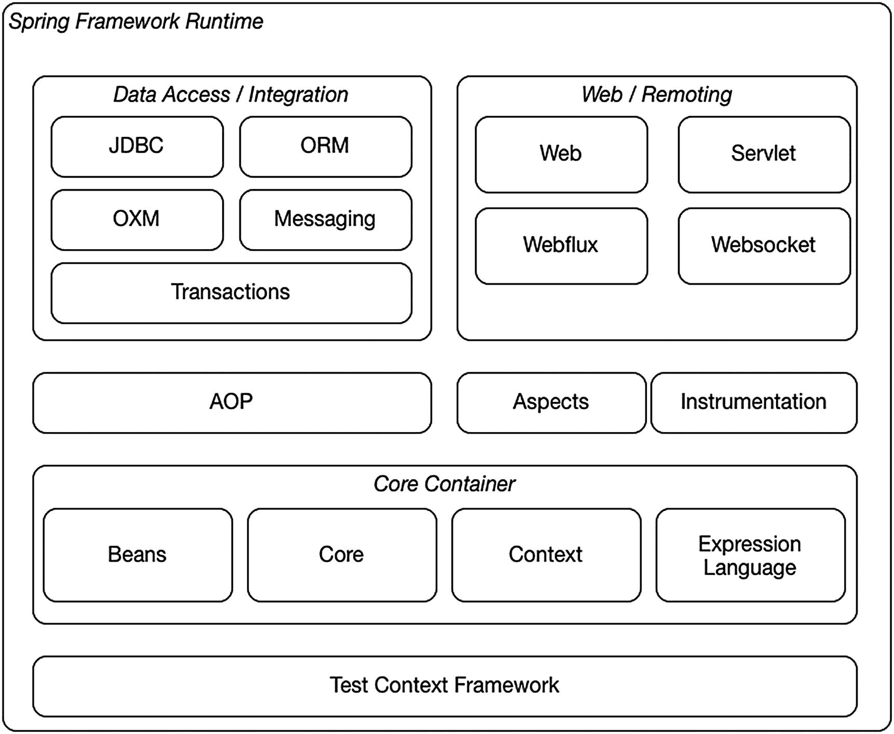
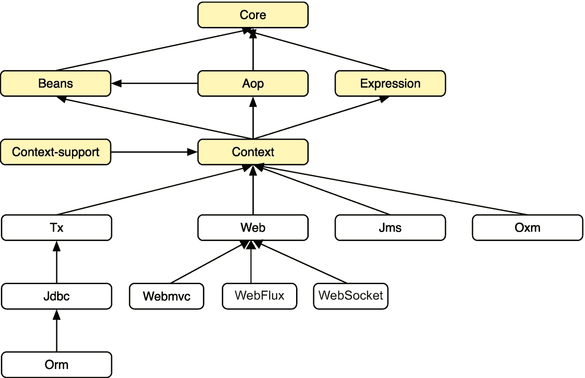
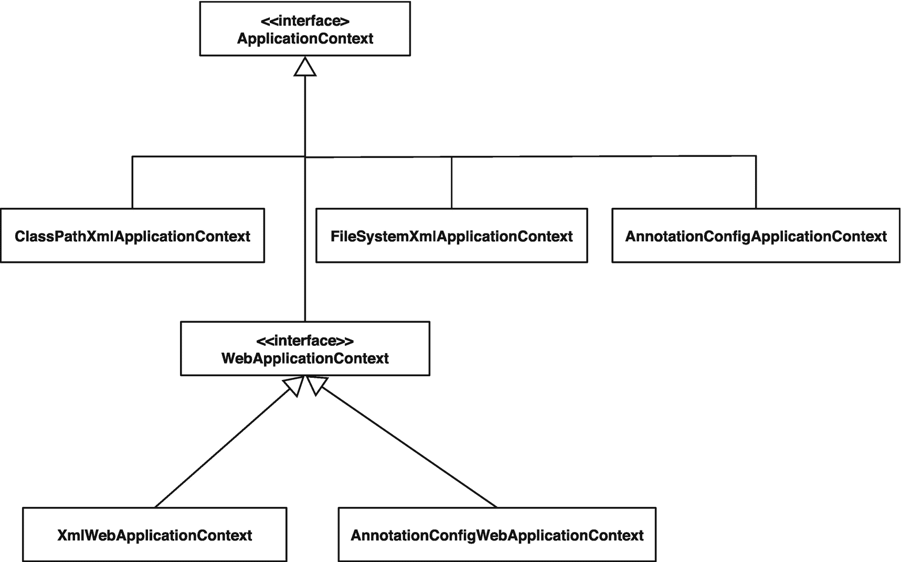
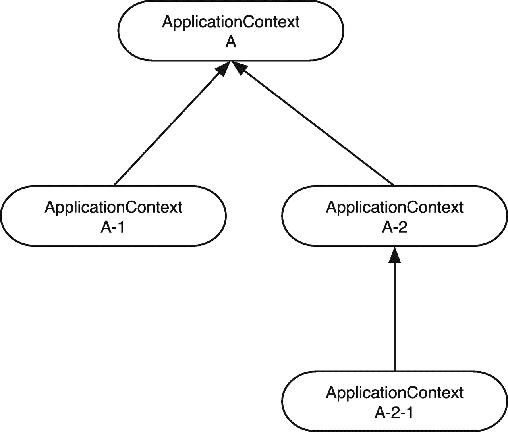
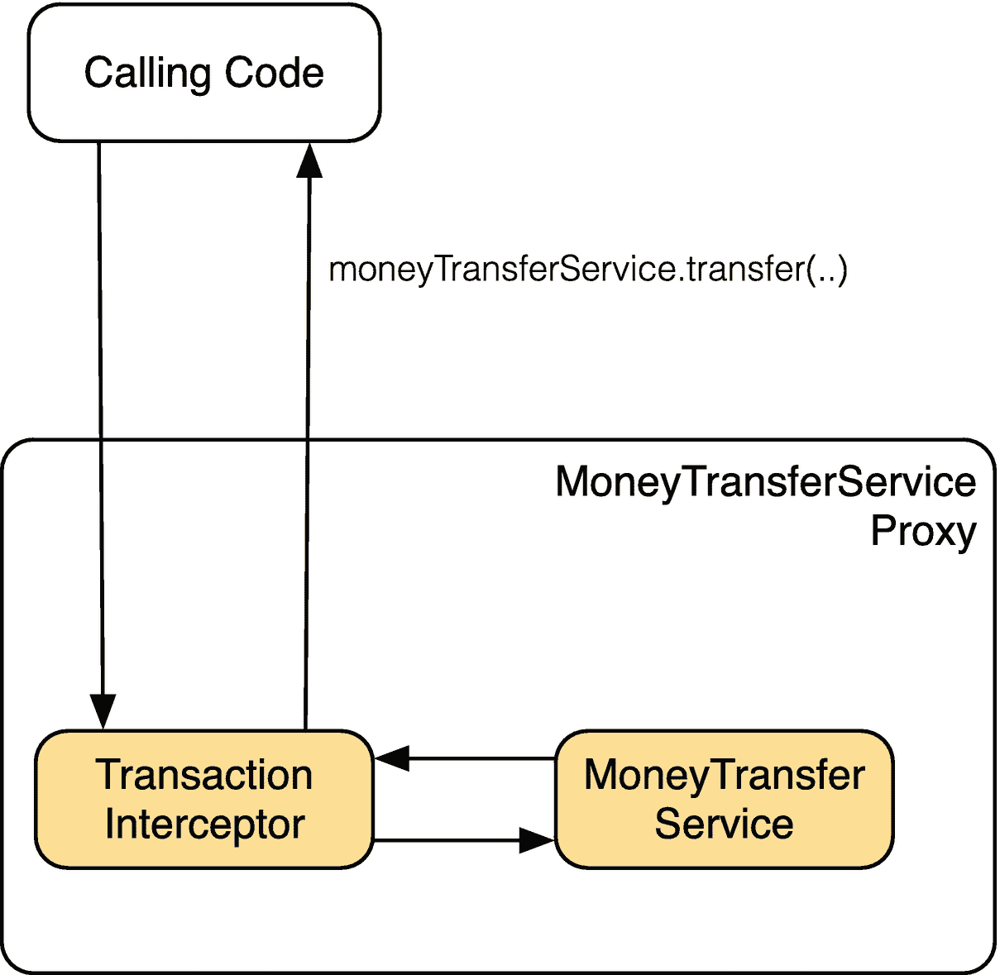

# 二、Spring 框架基础

Spring 框架是由 Rod Johnson (Wrox，2002)为*专家一对一 J2EE 设计和开发*编写的代码发展而来的。 <sup>[1](#Fn1)</sup> 该框架结合了业界 Java 企业版(JEE)开发的最佳实践，并与同类最佳的第三方框架相集成。如果您需要一个尚不存在的集成，它还提供了简单的扩展点来编写您自己的集成。该框架的设计考虑到了开发人员的生产力，它使得使用现有的、有时很麻烦的 Java 和 JEE API 变得更容易。

Spring Boot 于 2014 年 4 月发布，旨在简化云时代的应用开发。Spring Boot 使得创建独立的、生产级的基于 Spring 的应用变得容易。这些应用可以独立运行，也可以部署到传统的 Servlet 容器或 JEE 服务器上。

Spring Boot 坚持认为 Spring 平台是一个整体，并支持第三方库。它让您不费吹灰之力就能开始，但如果您想要更复杂的配置或让配置对您来说更简单，它就不会碍事。

在开始我们的 Spring MVC 和 Spring WebFlux 之旅之前，我们先快速回顾一下 Spring(也称为 **Spring Framework** )。Spring 是 Java 企业软件开发的事实上的标准。它介绍了*依赖注入*、*面向方面编程* (AOP)，以及用*plain-old-Java-objects*(POJO)编程。

在这一章中，我们将讨论依赖注入和 AOP。具体来说，我们将介绍 Spring 如何帮助我们实现依赖注入，以及如何利用编程为我们带来优势。为了做这里提到的事情，我们探索控制反转(IoC)容器；*应用上下文*。

这里我们只涉及 Spring 框架的必要基础。如果想要更深入的了解它，我们建议优秀的 Spring 框架文档 <sup>[2](#Fn2)</sup> 或书籍如 *Pro Spring 5* (Apress，2017) <sup>[3](#Fn3)</sup> 或 *Spring 5 Recipes，4*<sup>*th*</sup>*Edition*(Apress，2017) <sup>[4](#Fn4)</sup> 。

除了 Spring 框架复习之外，我们还将触及 Spring Boot 的基础知识。关于 Spring Boot 更深入的信息，我们建议优秀的 *Spring Boot 参考指南* <sup>[5](#Fn5)</sup> 或 *Spring Boot 2 食谱* (Apress，2018) <sup>[6](#Fn6)</sup> 。

让我们从快速浏览一下 Spring 框架和组成它的模块开始。

你可以在 chapter2-samples 项目中找到本章的示例代码。示例的不同部分包含一个带有`main`方法的类，您可以运行该方法来执行代码。

## Spring 框架

在介绍中，我们提到了 Spring 框架是由 Rod Johnson 为《一对一 J2EE 设计和开发专家》一书编写的代码演变而来的。这本书旨在解释 JEE 的一些复杂情况以及如何克服它们。虽然 JEE 的许多复杂性和问题已经在新的 JEE 规范中解决了(特别是从 JEE 6 开始)，但是 Spring 已经变得非常流行，因为它简单(不是简单化！)构建应用的方法。它还为不同的技术提供了一致的编程模型，无论是数据访问还是消息传递基础设施。该框架允许开发人员针对离散的问题，专门为它们构建解决方案。

该框架由几个模块组成(见图 [2-1](#Fig1) ),这些模块协同工作并相互构建。我们几乎可以精挑细选我们想要使用的模块。



图 2-1

Spring 框架概述

图 [2-1](#Fig1) 中的所有模块代表 jar 文件，如果我们需要特定的技术，我们可以将它们包含在类路径中。表 [2-1](#Tab1) 列出了 Spring 5.2 附带的所有模块，包括每个模块内容的简要描述和用于依赖管理的任何工件名称。实际 jar 文件的名称可能不同，这取决于您获取模块的方式。

表 2-1

Spring 框架模块概述

<colgroup><col class="tcol1 align-left"> <col class="tcol2 align-left"> <col class="tcol3 align-left"></colgroup> 
| 

组件

 | 

假象

 | 

描述

 |
| --- | --- | --- |
| 面向切面编程 | Spring-aop | Spring 的基于代理的 AOP 框架 |
| 方面 | Spring方面 | Spring 基于 AspectJ 的方面 |
| 豆子 | 春豆 | Spring 的核心 bean 工厂支持 |
| 语境 | Spring的背景 | 应用上下文运行时实现；还包含调度和远程处理支持类 |
| 语境 | spring 上下文索引器 | 支持提供应用中使用的 beans 的静态索引；提高启动性能 |
| 语境 | spring 上下文支持 | 将第三方库与 Spring Integration的支持类 |
| 核心 | Spring芯 | 核心实用程序 |
| 表达语言 | Spring的表情 | Spring 表达式语言(SpEL)的类 |
| 使用仪器 | Spring乐器 | 与 Java 代理一起使用的检测类 |
| 作业控制语言 | Spring-jcl | Spring 专用于 commons-logging 的替代品 |
| 数据库编程 | spring-jdbc | JDBC 支持包，包括数据源设置类和 JDBC 访问支持 |
| （同 JavaMessageService）Java 消息服务 | spring-jms | JMS 支持包，包括同步 JMS 访问和消息监听器容器 |
| 对象关系映射(Object Relation Mapping) | Spring形状 | ORM 支持包，包括对 Hibernate 5+和 JPA 的支持 |
| 信息发送 | Spring短信 | Spring 消息传递抽象；由 JMS 和 WebSocket 使用 |
| 泌酸调节素 | Spring-oxm | XML 支持包，包括对对象到 XML 映射的支持；还包括对 JAXB、JiBX、XStream 和 Castor 的支持 |
| 试验 | Spring试验 | 测试支持类 |
| 处理 | Spring-tx | 交易基础设施类别；包括 JCA 集成和 DAO 支持类 |
| 网 | Spring网 | 适用于任何 web 环境的核心 web 包 |
| webflux | spring web lux | Spring WebFlux 支持包包括对 Netty 和 Undertow 等几种反应式运行时的支持 |
| 小型应用 | spring web VC(Spring web 控制台) | 在 Servlet 环境中使用的 Spring MVC 支持包包括对通用视图技术的支持 |
| WebSocket | Spring腹板插座 | Spring WebSocket 支持包包括对 WebSocket 协议通信的支持 |

大多数模块都依赖于 Spring 框架中的其他模块。核心模块是这一规则的例外。图 [2-2](#Fig2) 给出了常用模块及其对其他模块的依赖性的概述。请注意，图中缺少了仪器、方面和测试模块；这是因为它们的依赖依赖于项目和使用的其他模块。其他依赖项根据项目的需要而有所不同。



图 2-2

Spring 框架模块依赖关系

## 依赖注入

在依赖注入(DI)中，对象在构造时被赋予依赖关系。它是一个 Spring 框架基础。你可能听说过*控制反转* (IoC)。 <sup>[7](#Fn7)</sup> 国际奥委会是一个更宽泛、更通用的概念，可以用不同的方式来称呼。IoC 允许开发人员分离并专注于对企业应用的给定部分重要的事情，而不用考虑系统的其他部分做什么。接口编程是考虑解耦的一种方式。

几乎每个企业应用都由需要协同工作的多个组件组成。在 Java 企业开发的早期，我们简单地将构造那些对象(以及它们需要的对象)的所有逻辑放在构造器中(参见清单 [2-1](#PC1) )。乍一看，这种方法没有错；然而，随着时间的推移，对象构造变得很慢，对象拥有了很多本不应该拥有的知识(参见单责任原则)。 <sup>[8](#Fn8)</sup> 这些类变得难以维护，并且它们也难以进行单元和/或集成测试。

```java
package com.apress.prospringmvc.moneytransfer.simple;

import java.math.BigDecimal;
import com.apress.prospringmvc.moneytransfer.domain.Account;
import com.apress.prospringmvc.moneytransfer.domain.MoneyTransferTransaction;
import com.apress.prospringmvc.moneytransfer.domain.Transaction;
import com.apress.prospringmvc.moneytransfer.repository.AccountRepository;
import com.apress.prospringmvc.moneytransfer.repository.MapBasedAccountRepository;
import com.apress.prospringmvc.moneytransfer.repository.MapBasedTransactionRepository;
import com.apress.prospringmvc.moneytransfer.repository.TransactionRepository;
import com.apress.prospringmvc.moneytransfer.service.MoneyTransferService;

public class SimpleMoneyTransferServiceImpl implements MoneyTransferService {

  private AccountRepository accountRepository = new MapBasedAccountRepository();

  private TransactionRepository transactionRepository = new MapBasedTransactionRepository();

  @Override
  public Transaction transfer(String source, String target, BigDecimal amount) {
    Account src = this.accountRepository.find(source);
    Account dst = this.accountRepository.find(target);
    src.credit(amount);
    dst.debit(amount);

    MoneyTransferTransaction transaction = new MoneyTransferTransaction(src, dst, amount);
    this.transactionRepository.store(transaction);
    return transaction;
  }
}

Listing 2-1A MoneyTransferService Implementation with Hardcoded Dependencies

```

从清单 [2-1](#PC1) 程序到接口的类，但是它仍然需要知道接口的具体实现，只是为了进行对象构造。通过解耦构造逻辑(协作对象)来应用 IoC 使得应用更易于维护，并增加了可测试性。有七种方法可以分离这种依赖关系构造逻辑。

*   工厂模式

*   服务定位器模式

*   依赖注入
    *   基于构造函数

    *   基于 Setter

    *   基于现场

*   情境化查找

当使用工厂模式、服务定位器模式或上下文化查找时，需要依赖关系的类仍然具有一些关于获取依赖关系的知识。这可以使事情更容易维护，但仍然很难测试。清单 [2-2](#PC2) 显示了来自 JNDI (Java 命名和目录接口)的上下文化查找。构造函数代码需要知道如何查找和处理异常。

```java
package com.apress.prospringmvc.moneytransfer.jndi;

import javax.naming.InitialContext;
import javax.naming.NamingException;

//other import statements omitted.

public class JndiMoneyTransferServiceImpl implements MoneyTransferService {

  private AccountRepository accountRepository;
  private TransactionRepository transactionRepository;

  public JndiMoneyTransferServiceImpl() {

    try {
      InitialContext context = new InitialContext();
      this.accountRepository = (AccountRepository) context.lookup("accountRepository");
      this.transactionRepository = (TransactionRepository) context.lookup("transactionRepository");
    } catch (NamingException e) {
      throw new IllegalStateException(e);
    }
  }

//transfer method omitted, same as listing 2-1

}

Listing 2-2MoneyTransferService Implementation with Contextualized Lookup

```

前面的代码不是特别干净；例如，想象来自不同上下文的多个依赖项。代码会很快变得混乱，越来越难以进行单元测试。

为了解决对象构造器中的构造/查找逻辑，我们可以使用依赖注入。我们只是传递给对象完成工作所需的依赖关系。这使得我们的代码干净、解耦，并且易于测试(参见清单 [2-3](#PC3) )。依赖注入是一个过程，其中对象指定它们所使用的依赖。IoC 容器使用该规范；当它构造一个对象时，它也注入它的依赖项。这样，我们的代码更干净，我们不再用构造逻辑来增加类的负担。维护更容易，进行单元和/或集成测试也更容易。测试更容易，因为我们可以注入一个存根或模拟对象来验证我们的对象的行为。

```java
package com.apress.prospringmvc.moneytransfer.constructor;

// import statements ommitted

public class MoneyTransferServiceImpl implements MoneyTransferService {

  private final AccountRepository accountRepository;
  private final TransactionRepository transactionRepository;

  public MoneyTransferServiceImpl(AccountRepository accountRepo,
                                  TransactionRepository transactionRepo) {
    this.accountRepository = accountRepo;
    this.transactionRepository = transactionRepo;
  }

//transfer method omitted, same as listing 2-1

}

Listing 2-3A MoneyTransferService Implementation with Constructor-Based Dependency Injection

```

顾名思义，基于构造函数的依赖注入使用构造函数来注入对象中的依赖。清单 [2-3](#PC3) 使用基于构造函数的依赖注入。它有一个接受两个对象作为参数的构造函数:`com.apress.prospringmvc.moneytransfer.repository.AccountRepository`和`com.apress.prospringmvc.moneytransfer.repository.TransactionRepository`。当我们构造一个`com.apress.prospringmvc.moneytransfer.constructor.MoneyTransferServiceImpl`的实例时，我们需要给它所需的依赖项。

基于 Setter 的依赖注入使用一个 *setter* 方法来注入依赖。JavaBeans 规范定义了 setter 和 getter 方法。如果我们有一个名为`setAccountService`的方法，我们设置一个名为`accountService`的属性。属性名是使用方法名创建的，减去“set”，第一个字母小写(完整规范在 JavaBeans 规范中)<sup>T5 9T7】。清单 [2-4](#PC4) 展示了一个基于 setter 的依赖注入的例子。一个属性不一定要同时有 getter 和 setter。属性可以是只读的(只定义了一个 *getter* 方法)或只写的(只定义了一个 *setter* 方法)。清单 [2-4](#PC4) 只显示了 setter 方法，因为我们只需要写属性；在内部，我们可以直接引用字段。</sup>

```java
package com.apress.prospringmvc.moneytransfer.setter;

// imports ommitted

public class MoneyTransferServiceImpl implements MoneyTransferService {

  private AccountRepository accountRepository;
  private TransactionRepository transactionRepository;

  public void setAccountRepository(AccountRepository accountRepository) {
    this.accountRepository = accountRepository;
  }

  public void setTransactionRepository(TransactionRepository transactionRepo) {
    this.transactionRepository = transactionRepository;
  }

//transfer method omitted, same as listing 2-1

}

Listing 2-4A MoneyTransferService Implementation with Setter-Based Dependency 

Injection

```

最后，还有使用注释的基于字段的依赖注入(参见清单 [2-5](#PC5) )。我们不需要指定构造函数参数或 setter 方法来设置依赖关系。我们首先定义一个可以保存依赖关系的类级字段。接下来，我们在该字段上添加了一个注释，以表达我们将该依赖项注入到对象中的意图。Spring 接受几种不同的注释:`@Autowired`、`@Resource`和`@Inject`。所有这些注释或多或少都以相同的方式工作。深入解释这些注释之间的差异不在本书的范围内，所以如果你想了解更多，我们建议使用 *Spring Boot 参考指南*或 *Pro Spring 5* (Apress，2017)。主要区别在于`@Autowired`注释来自 Spring 框架，而`@Resource`和`@Inject`是 Java 标准注释。

```java
package com.apress.prospringmvc.moneytransfer.annotation;

import org.springframework.beans.factory.annotation.Autowired;

//other imports omitted

public class MoneyTransferServiceImpl implements MoneyTransferService {

  @Autowired
  private AccountRepository accountRepository;

  @Autowired
  private TransactionRepository transactionRepository;

//transfer method omitted, same as listing 2.1

}

Listing 2-5A MoneyTransferService Implementation with Field-Based Dependency Injection

```

`@Autowired`*`@Inject`*可以放在方法和构造函数上表示依赖注入配置，即使有多个实参！当对象只有一个构造函数时，可以省略注释。**

 *综上所述，我们出于以下原因想要使用依赖注入。

*   清除器代码

*   去耦代码

*   更简单的代码测试

前两个原因使我们的代码更容易维护。代码更容易测试的事实应该允许我们编写单元测试来验证我们的对象的行为——以及我们的应用。

## 应用上下文

为了在 Spring 中进行依赖注入，你需要一个*应用上下文*。在 Spring 中，这是一个`org.springframework.context.ApplicationContext`接口的实例。应用上下文负责管理其中定义的 beans。它还支持更复杂的事情，比如将 AOP 应用于其中定义的 beans。

Spring 提供了几种不同的`ApplicationContext`实现(参见图 [2-3](#Fig3) )。这些实现中的每一个都提供了相同的特性，但是在加载应用上下文配置的方式上有所不同。图 [2-3](#Fig3) 也向我们展示了`org.springframework.web.context.WebApplicationContext`界面，它是在网络环境中使用的`ApplicationContext`界面的特殊版本。



图 2-3

各种`ApplicationContext`实现(简化)

如前所述，不同的实现具有不同的配置机制(即 XML 或 Java)。表 [2-2](#Tab2) 显示了默认配置选项，并指出资源加载位置。

表 2-2

应用上下文概述

<colgroup><col class="tcol1 align-left"> <col class="tcol2 align-left"> <col class="tcol3 align-left"></colgroup> 
| 

履行

 | 

位置

 | 

文件类型

 |
| --- | --- | --- |
| `ClassPathXmlApplicationContext` | 类路径 | 可扩展置标语言 |
| `FileSystemXmlApplicationContext` | 文件系统 | 可扩展置标语言 |
| `AnnotationConfigApplicationContext` | 类路径 | 爪哇 |
| `XmlWebApplicationContext` | Web 应用根 | 可扩展置标语言 |
| `AnnotationConfigWebApplicationContext` | Web 应用类路径 | 爪哇 |

让我们来看一个基于 Java 的配置文件——`com.apress.prospringmvc.moneytransfer.annotation.ApplicationContextConfiguration`类(参见清单 [2-6](#PC6) )。该类中使用了两个注释:`org.springframework.context.annotation.Configuration`和`org.springframework.context.annotation.Bean`。第一个将我们的类构造为一个配置文件，而第二个表示该方法的结果被用作创建 bean 的工厂。默认情况下，bean 的名称是方法名称。

在清单 [2-6](#PC6) 中，有三个 beans。它们被命名为`accountRepository`、`transactionRepository`和`moneyTransferService`。我们还可以通过在`@Bean`注释上设置`name`属性来显式指定一个 bean 名称。

```java
package com.apress.prospringmvc.moneytransfer.annotation;

import com.apress.prospringmvc.moneytransfer.repository.AccountRepository;
import com.apress.prospringmvc.moneytransfer.repository.MapBasedAccountRepository;
import com.apress.prospringmvc.moneytransfer.repository.MapBasedTransactionRepository;
import com.apress.prospringmvc.moneytransfer.repository.TransactionRepository;
import com.apress.prospringmvc.moneytransfer.service.MoneyTransferService;
import org.springframework.context.annotation.Bean;
import org.springframework.context.annotation.Configuration;

@Configuration
public class ApplicationContextConfiguration {

  @Bean
  public AccountRepository accountRepository() {
    return new MapBasedAccountRepository();
  }

  @Bean
  public TransactionRepository transactionRepository() {
    return new MapBasedTransactionRepository();
  }

  @Bean
  public MoneyTransferService moneyTransferService() {
    return new MoneyTransferServiceImpl();
  }
}

Listing 2-6The ApplicationContextConfiguration Configuration File

```

配置类可以是`abstract`；但是，他们不可能是`final`。为了解析这个类，Spring 可能会创建一个 configuration 类的动态子类。

拥有一个只有`@Configuration`注释的类是不够的。我们还需要一些东西来引导我们的应用上下文。我们用它来启动我们的应用。在示例项目中，这是`MoneyTransferSpring`类的责任(参见清单 [2-7](#PC7) )。这个类通过创建一个`org.springframework.context.annotation.AnnotationConfigApplicationContext`的实例来引导我们的配置，并将包含我们配置的类传递给它(参见清单 [2-6](#PC6) )。

```java
package com.apress.prospringmvc.moneytransfer.annotation;

import com.apress.prospringmvc.ApplicationContextLogger;
import com.apress.prospringmvc.moneytransfer.domain.Transaction;
import com.apress.prospringmvc.moneytransfer.service.MoneyTransferService;
import org.slf4j.Logger;
import org.slf4j.LoggerFactory;
import org.springframework.context.ApplicationContext;
import org.springframework.context.annotation.AnnotationConfigApplicationContext;

import java.math.BigDecimal;

public class MoneyTransferSpring {

  private static final Logger logger =
    LoggerFactory.getLogger(MoneyTransferSpring.class);

  /**
   * @param args
   */
  public static void main(String[] args) {

    ApplicationContext ctx =
      new AnnotationConfigApplicationContext(ApplicationContextConfiguration.class);
    transfer(ctx);
    ApplicationContextLogger.log(ctx);
  }

  private static void transfer(ApplicationContext ctx) {
    MoneyTransferService service =
      ctx.getBean("moneyTransferService", MoneyTransferService.class);
    Transaction transaction = service.transfer("123456", "654321", new BigDecimal("250.00"));
    logger.info("Money Transfered: {}", transaction);
  }
}

Listing 2-7The MoneyTransferSpring Class

```

最后，请注意，应用上下文可以在一个层次结构中。我们可以有一个应用上下文作为另一个上下文的父上下文(见图 [2-4](#Fig4) )。一个应用上下文只能有一个父级，但可以有多个子级。子上下文可以访问父上下文中定义的 beans 但是，父 bean 不能访问子上下文中的 bean。例如，如果我们在父上下文中启用事务，这将不适用于子上下文(请参阅本章后面的“启用功能”一节)。



图 2-4

应用上下文层次结构

这个特性允许我们将应用 bean(例如，服务、存储库和基础设施)与 web beans(例如，请求处理程序和视图)分开。这种分离是有用的。例如，假设多个 servlets 需要重用相同的应用 beans。我们可以简单地重用已经存在的实例，而不是为每个 servlet 重新创建它们。当一个 servlet 处理 web UI，另一个 servlet 处理 web 服务时，就会出现这种情况。

### 资源加载

表 [2-2](#Tab2) 提供了不同`ApplicationContext`实现和默认资源加载机制的概述。然而，这并不意味着您只能从默认位置加载资源。您还可以通过包含适当的前缀从特定位置加载资源(参见表 [2-3](#Tab3) )。

表 2-3

前缀概述

<colgroup><col class="tcol1 align-left"> <col class="tcol2 align-left"></colgroup> 
| 

前缀

 | 

位置

 |
| --- | --- |
| `classpath:` | 类路径的根 |
| `file:` | 文件系统 |
| `http:` | Web 应用根 |

除了能够指定从哪里加载文件之外，还可以使用 ant 样式的正则表达式来指定加载哪些文件。ant 样式的正则表达式是包含**和/或*字符**的资源位置。**一个*字符表示“在当前级别”或“单个级别”，而多个*字符表示“这个和所有子级别”

表 [2-4](#Tab4) 显示了一些例子。这种技术只在处理类路径或文件系统上的文件资源时有效；它不适用于 web 资源或包名。

表 2-4

蚂蚁风格的正则表达式

<colgroup><col class="tcol1 align-left"> <col class="tcol2 align-left"></colgroup> 
| 

表示

 | 

描述

 |
| --- | --- |
| `classpath:/META-INF/spring/*.xml` | 从 META-INF/spring 目录中的类路径加载所有带有 XML 文件扩展名的文件 |
| `file:/var/conf/*/.properties` | 从/var/conf 目录和所有子目录中加载具有属性文件扩展名的所有文件 |

### 组件扫描

Spring 还有一个叫**的东西，组件扫描**。简而言之，这个特性使 Spring 能够扫描您的类路径，寻找用`org.springframework.stereotype.Component`(或者像`@Service, @Repository, @Controller`或`org.springframework.context.annotation.Configuration`这样的专用注释)注释的类。如果我们想要启用组件扫描，我们需要指示应用上下文这样做。`org.springframework.context.annotation.ComponentScan`注释使我们能够做到这一点。这个注释需要放在我们的配置类中，以启用组件扫描。清单 [2-8](#PC8) 显示了修改后的配置类。

```java
package com.apress.prospringmvc.moneytransfer.scanning;

import org.springframework.context.annotation.ComponentScan;
import org.springframework.context.annotation.Configuration;

/**
 * @author Marten Deinum
 */
@Configuration
@ComponentScan(basePackages = {
    "com.apress.prospringmvc.moneytransfer.scanning",
    "com.apress.prospringmvc.moneytransfer.repository" })
public class ApplicationContextConfiguration {}

Listing 2-8Implementing Component Scanning with ApplicationContextConfiguration

```

看一下清单 [2-8](#PC8) 就会发现这个类没有更多内容。只有两个注解。一个注释表示该类用于配置，而另一个注释启用组件扫描。组件扫描注释配置有要扫描的包。

不指定一个包来扫描整个类路径或者使用太宽的包(像`com.apress`)被认为是不好的做法。这可能导致扫描大多数或所有类，从而严重影响应用的启动时间。

### 领域

默认情况下，Spring 应用上下文中的所有 beans 都是*单态的*。顾名思义，bean 只有一个实例，它用于整个应用。这通常不会造成问题，因为我们的服务和存储库不保存状态；它们只是执行某个操作并(可选地)返回值。

然而，如果我们想将状态保存在 bean 中，那么单例就有问题了。我们正在开发一个 web 应用，希望能吸引成千上万的用户。如果一个 bean 只有一个实例，并且所有用户都在同一个实例中操作，那么用户可以看到和修改彼此的数据或者来自几个用户组合的数据。这不是我们想要的。幸运的是，Spring 为 beans 提供了几个我们可以利用的范围(见表 [2-5](#Tab5) )。

表 2-5

范围概述

<colgroup><col class="tcol1 align-left"> <col class="tcol2 align-left"></colgroup> 
| 

前缀

 | 

描述

 |
| --- | --- |
| `singleton` | 默认范围。创建一个 bean 实例，并在整个应用中共享。 |
| `prototype` | 每次需要某个 bean 时，都会返回该 bean 的一个新实例。 |
| `thread` | bean 在需要时创建，并绑定到当前执行的线程。如果线程死了，bean 就被破坏了。 |
| `request` | bean 在需要时创建，并绑定到传入的`javax.servlet.ServletRequest`的生命周期。如果请求结束，bean 实例被销毁。 |
| `session` | bean 在需要时创建并存储在`javax.servlet.HttpSession`中。当会话被销毁时，bean 实例也被销毁。 |
| `globalSession` | bean 在需要时创建，并存储在全局可用的会话中(在 Portlet 环境中可用)。如果没有这样的会话可用，则作用域恢复到会话作用域功能。 |
| `application` | 这个作用域非常类似于单例作用域；但是，这个作用域的 beans 也在`javax.servlet.ServletContext`中注册。 |

### 轮廓

Spring 在 3.1 版本中引入了概要文件。概要文件使得为不同的环境创建不同的应用配置变得容易。例如，我们可以为本地环境、测试和部署到 CloudFoundry 创建单独的概要文件。这些环境中的每一个都需要一些特定于环境的配置或 beans。您可以考虑数据库配置、消息传递解决方案和测试环境，以及某些 beans 的存根。

为了启用概要文件，我们需要告诉应用上下文哪些概要文件是活动的。为了激活某些概要文件，我们需要设置一个名为`spring.profiles.active`的系统属性(在 web 环境中，这可以是 servlet 初始化参数或 web 上下文参数)。这是一个逗号分隔的字符串，包含活动配置文件的名称。如果我们现在添加一些带有`org.springframework.context.annotation.Configuration`和`org.springframework.context.annotation.Profile`注释的(在本例中是静态内部)类(参见清单 [2-9](#PC9) ，那么只有匹配其中一个活动概要的类才会被处理。所有其他类都被忽略。

```java
package com.apress.prospringmvc.moneytransfer.annotation.profiles;

import com.apress.prospringmvc.moneytransfer.annotation.MoneyTransferServiceImpl;
import com.apress.prospringmvc.moneytransfer.repository.AccountRepository;
import com.apress.prospringmvc.moneytransfer.repository.MapBasedAccountRepository;
import com.apress.prospringmvc.moneytransfer.repository.MapBasedTransactionRepository;
import com.apress.prospringmvc.moneytransfer.repository.TransactionRepository;
import com.apress.prospringmvc.moneytransfer.service.MoneyTransferService;
import org.springframework.context.annotation.Bean;
import org.springframework.context.annotation.Configuration;
import org.springframework.context.annotation.Profile;

@Configuration
public class ApplicationContextConfiguration {

  @Bean
  public AccountRepository accountRepository() {
    return new MapBasedAccountRepository();
  }

  @Bean
  public MoneyTransferService moneyTransferService() {
    return new MoneyTransferServiceImpl();
  }

  @Configuration
  @Profile(value = "test")
  public static class TestContextConfiguration {
    @Bean
    public TransactionRepository transactionRepository() {
      return new StubTransactionRepository();
    }
  }

  @Configuration
  @Profile(value = "local")
  public static class LocalContextConfiguration {

    @Bean
    public TransactionRepository transactionRepository() {
      return new MapBasedTransactionRepository();
    }

  }
}

Listing 2-9ApplicationContextConfiguration with Profiles

```

清单 [2-10](#PC10) 显示了一些示例引导代码。一般来说，我们不会从我们的引导代码中设置活动概要文件。相反，我们使用系统变量的组合来设置我们的环境。这使我们能够保持我们的应用不变，但仍然有改变我们的运行时配置的灵活性。

```java
package com.apress.prospringmvc.moneytransfer.annotation.profiles;

import com.apress.prospringmvc.ApplicationContextLogger;
import com.apress.prospringmvc.moneytransfer.domain.Transaction;
import com.apress.prospringmvc.moneytransfer.service.MoneyTransferService;
import org.slf4j.Logger;
import org.slf4j.LoggerFactory;
import org.springframework.context.ApplicationContext;
import org.springframework.context.annotation.AnnotationConfigApplicationContext;

import java.math.BigDecimal;

/**
 * @author Marten Deinum
 */
public class MoneyTransferSpring {

  private static final Logger logger = LoggerFactory.getLogger(MoneyTransferSpring.class);

  /**
   * @param args
   */
  public static void main(String[] args) {

    System.setProperty("spring.profiles.active", "test");

    AnnotationConfigApplicationContext ctx1 =
      new AnnotationConfigApplicationContext(ApplicationContextConfiguration.class);
    transfer(ctx1);
    ApplicationContextLogger.log(ctx1);

    System.setProperty("spring.profiles.active", "local");
    AnnotationConfigApplicationContext ctx2 =
      new AnnotationConfigApplicationContext(ApplicationContextConfiguration.class);
    transfer(ctx2);
    ApplicationContextLogger.log(ctx2);
  }

  private static void transfer(ApplicationContext ctx) {
    MoneyTransferService service = ctx.getBean("moneyTransferService", MoneyTransferService.class);
    Transaction transaction = service.transfer("123456", "654321", new BigDecimal("250.00"));
    logger.info("Money Transfered: {}", transaction);
  }
}

Listing 2-10MoneyTransferSpring with Profiles

```

你可能想知道为什么我们应该使用概要文件。一个原因是它允许灵活的配置。这意味着我们的整个配置都在版本控制之下，并且在相同的源代码中，而不是分散在不同的服务器、工作站等等上。当然，我们仍然可以加载包含一些属性(如用户名和密码)的附加文件。如果公司的安全策略不允许我们将这些属性置于版本控制之下，那么这可能是有用的。当我们讨论测试和部署到云时，我们广泛地使用概要文件，因为这两个任务需要不同的数据源配置。

### 启用功能

Spring 框架比依赖注入提供了更多的灵活性；它还提供了许多我们可以启用的不同功能。我们可以使用注释来启用这些功能(参见表 [2-6](#Tab6) )。注意，我们不会使用表 [2-6](#Tab6) 中的所有注释；然而，我们的示例应用使用了事务，并且我们使用了一些 AOP。这本书最大的部分是关于由`org.springframework.web.servlet.config.annotation.EnableWebMvc`和`org.springframework.web.reactive.config.EnableWebFlux`注释提供的特性。

Spring Boot 自动启用其中一些功能；这取决于在类路径上检测到的类。

表 2-6

注释支持的功能概述

<colgroup><col class="tcol1 align-left"> <col class="tcol2 align-left"> <col class="tcol3 align-left"></colgroup> 
| 

注释

 | 

描述

 | 

被 Spring Boot 探测到

 |
| --- | --- | --- |
| `org.springframework.context.annotation.EnableAspectJAutoProxy` | 支持处理构造为 org . AspectJ . lang . annotation . aspect 的 beans。 | 是 |
| `org.springframework.scheduling.annotation.EnableAsync` | 启用对使用`org.springframework.scheduling.annotation.Async`或`javax.ejb.Asynchronous`注释处理 bean 方法的支持。 | 不 |
| `org.springframework.cache.annotation.EnableCaching` | 启用对带有 org . spring framework . cache . annotation . cache able 批注的 bean 方法的支持。 | 是 |
| `org.springframework.context.annotation.EnableLoadTimeWeaving` | 启用对加载时编织的支持。默认情况下，Spring 使用基于代理的 AOP 方法；然而，这个注释使我们能够切换到加载时编织。一些 JPA 提供商需要它。 | 不 |
| `org.springframework.scheduling.annotation.EnableScheduling` | 启用对注释驱动的调度的支持，使我们能够解析用 org . spring framework . scheduling . annotation . scheduled 注释注释的 bean 方法。 | 不 |
| `org.springframework.beans.factory.aspectj.EnableSpringConfigured` | 支持对非 Spring 管理的 beans 应用依赖注入。一般来说，这样的 beans 用`org.springframework.beans.factory.annotation.Configurable`注释进行注释。这个特性需要加载时或编译时编织，因为它需要修改类文件。 | 不 |
| `org.springframework.transaction.annotation.EnableTransactionManagement` | 启用注释驱动的事务支持，使用`org.springframework.transaction.annotation.Transactional`或`javax.ejb.TransactionAttribute`来驱动事务。 | 是 |
| `org.springframework.web.servlet.config.annotation.EnableWebMvc` | 通过请求处理方法支持强大而灵活的注释驱动控制器。该特性检测带有`org.springframework.stereotype.Controller`注释的 beans，并将带有`org.springframework.web.bind.annotation.RequestMapping`注释的方法绑定到 URL。 | 是 |
| `org.springframework.web.reactive.config.EnableWebFlux` | 使用 Spring web MVC 中众所周知的概念来支持强大而灵活的反应式 Web 实现，并在可能的情况下对其进行扩展。 | 是 |

关于这些特性的更多信息，我们建议您查看 Java 文档中不同的注释和专门的参考指南章节。

### 面向方面编程

为了启用表 [2-4](#Tab4) 中列出的特性，Spring 使用了面向方面编程(AOP)。AOP 是思考软件结构的另一种方式。它使您能够将诸如事务管理或性能日志之类的事情模块化，这些特性跨越多种类型和对象(横切关注点)。在 AOP 中，有几个重要的概念需要记住(见表 [2-7](#Tab7) )。

表 2-7

核心 AOP 概念

<colgroup><col class="tcol1 align-left"> <col class="tcol2 align-left"></colgroup> 
| 

概念

 | 

描述

 |
| --- | --- |
| 方面 | 横切关注点的模块化。一般来说，这是一个带有`org.aspectj.lang.annotation.Aspect`注释的 Java 类。 |
| 连接点 | 程序执行过程中的一个点。这可以是方法的执行、字段的赋值或异常的处理。在 Spring 中，连接点总是一个方法的执行！ |
| 建议 | 某个方面在特定连接点采取的特定动作。建议有几种类型:前的*、*后的*、*后的*、*后的*、*前后的*。在 Spring 中，一个通知被称为**拦截器**，因为我们正在拦截方法调用。* |
| 切入点 | 匹配连接点的谓词。通知与一个切入点表达式相关联，并在任何匹配切入点的连接点上运行。Spring 默认使用 AspectJ 表达式语言。可以使用`org.aspectj.lang.annotation.Pointcut`注释编写连接点。 |

现在让我们看看事务管理，以及 Spring 如何使用 AOP 来围绕方法应用事务。交易通知或拦截器是`org.springframework.transaction.interceptor.TransactionInterceptor`。这个建议放在带有`org.springframework.transaction.annotation.Transactional`注释的方法周围。为此，Spring 在实际对象周围创建了一个包装器，称为**代理**(见图 [2-5](#Fig5) )。代理的行为类似于封闭对象，但它允许添加(动态)行为(在本例中，是方法的事务性)。



图 2-5

代理方法调用

`org.springframework.transaction.annotation.EnableTransactionManagement`注释注册包含切入点的 beans(作用于`org.springframework.transaction.annotation.Transactional`注释)。此时，拦截器就可以使用了。用于启用特性的其他注释的工作方式类似；他们注册 beans 来启用期望的特性，包括大多数特性的 AOP(以及代理创建)。

## 网络应用

那么如何将所有这些技术应用到 web 应用中呢？例如，应用上下文如何发挥作用？那么提到的其他事情呢？

在开发 web 应用时，存在实际的业务逻辑(例如，服务、存储库和基础设施信息)，并且存在基于 web 的 beans。这些东西应该是分开的，所以我们需要有多个应用上下文和关系。

我们还需要引导应用的代码，否则什么都不会发生。在本章的例子中，我们使用了一个带有 main 方法的`MoneyTransferSpring`类来启动应用上下文。这不是我们在网络环境中能做到的。Spring 附带了两个可以引导应用的组件:`org.springframework.web.servlet.DispatcherServlet`和`org.springframework.web.context.ContextLoaderListener`。这两个组件引导并配置应用上下文。

我们来看看配置`DispatcherServlet`的类。这是`com.apress.prospringmvc.bookstore.web.BookstoreWebApplicationInitializer`级(见清单 [2-11](#PC11) )。我们的 Servlet 3.0+容器检测到这个类，它初始化我们的应用(关于这个主题的更多信息，参见第 [3](03.html) 章)。我们创建`DispatcherServlet`并传递它`org.springframework.web.context.support.AnnotationConfigWebApplicationContext`。接下来，我们将 servlet 映射到所有内容(“/”)，并告诉它在启动时加载。

```java
package com.apress.prospringmvc.bookstore.web;

import javax.servlet.ServletContext;
import javax.servlet.ServletException;
import javax.servlet.ServletRegistration;

import org.springframework.context.annotation.Configuration;
import org.springframework.web.WebApplicationInitializer;
import org.springframework.web.context.WebApplicationContext;
import org.springframework.web.context.support.AnnotationConfigWebApplicationContext;
import org.springframework.web.servlet.DispatcherServlet;

import com.apress.prospringmvc.bookstore.web.config.WebMvcContextConfiguration;

public class BookstoreWebApplicationInitializer implements WebApplicationInitializer {

    @Override
    public void onStartup(final ServletContext servletContext) throws ServletException {
        registerDispatcherServlet(servletContext);
    }

    private void registerDispatcherServlet(final ServletContext servletContext) {
        WebApplicationContext dispatcherContext =
          createContext(WebMvcContextConfiguration.class);
        DispatcherServlet dispatcherServlet =
          new DispatcherServlet(dispatcherContext);
        ServletRegistration.Dynamic dispatcher =
          servletContext.addServlet("dispatcher", dispatcherServlet);
        dispatcher.setLoadOnStartup(1);
        dispatcher.addMapping("*.htm");
    }

    private WebApplicationContext createContext(final Class<?>... annotatedClasses) {
        AnnotationConfigWebApplicationContext context =
          new AnnotationConfigWebApplicationContext();
        context.register(annotatedClasses);
        return context;
    }
}

Listing 2-11The BookstoreWebApplicationInitializer Class

```

让我们通过添加一个`ContextLoaderListener`类来让事情变得有趣一点，这样我们可以有一个父上下文和一个子上下文(参见清单 [2-12](#PC12) )。新注册的监听器使用`com.apress.prospringmvc.bookstore.config.InfrastructureContextConfiguration`(参见清单 [2-13](#PC13) )来决定加载哪些 beans。已经配置好的`DispatcherServlet`自动检测`ContextLoaderListener`加载的应用上下文。

```java
package com.apress.prospringmvc.bookstore.web;

import org.springframework.web.context.ContextLoaderListener;

import com.apress.prospringmvc.bookstore.config.InfrastructureContextConfiguration;

// other imports omitted, see listing 2-11

public class BookstoreWebApplicationInitializer implements WebApplicationInitializer {

  @Override
  public void onStartup(final ServletContext servletContext) throws ServletException {

    registerListener(servletContext);
    registerDispatcherServlet(servletContext);
  }

// registerDispatcherServlet method ommitted see Listing 2-11
// createContext method omitted see Listing 2-11

  private void registerListener(final ServletContext servletContext) {

    AnnotationConfigWebApplicationContext rootContext =
      createContext(InfrastructureContextConfiguration.class);

      servletContext.addListener(new ContextLoaderListener(rootContext));

  }
}

Listing 2-12The Modifcation

for the BookstoreWebApplicationInitializer Class

```

清单 [2-13](#PC13) 是我们的主要应用上下文。它包含我们的服务和存储库的配置。这个清单还展示了我们的 JPA 实体管理器，包括其基于注释的事务支持。

```java
package com.apress.prospringmvc.bookstore.config;

import org.springframework.context.annotation.Bean;
import org.springframework.context.annotation.ComponentScan;
import org.springframework.context.annotation.Configuration;
import org.springframework.jdbc.datasource.embedded.EmbeddedDatabaseBuilder;
import org.springframework.jdbc.datasource.embedded.EmbeddedDatabaseType;
import org.springframework.orm.jpa.JpaTransactionManager;
import org.springframework.orm.jpa.JpaVendorAdapter;
import org.springframework.orm.jpa.LocalContainerEntityManagerFactoryBean;
import org.springframework.orm.jpa.vendor.HibernateJpaVendorAdapter;
import org.springframework.transaction.PlatformTransactionManager;
import org.springframework.transaction.annotation.EnableTransactionManagement;

import javax.persistence.EntityManagerFactory;
import javax.sql.DataSource;

@Configuration
@EnableTransactionManagement
@ComponentScan(basePackages = {
    "com.apress.prospringmvc.bookstore.service",
    "com.apress.prospringmvc.bookstore.repository"})
public class InfrastructureContextConfiguration {

  @Bean
  public LocalContainerEntityManagerFactoryBean entityManagerFactory(DataSource dataSource) {
    LocalContainerEntityManagerFactoryBean emfb = new LocalContainerEntityManagerFactoryBean();
    emfb.setDataSource(dataSource);
    emfb.setJpaVendorAdapter(jpaVendorAdapter());
    return emfb;
  }

  @Bean
  public JpaVendorAdapter jpaVendorAdapter() {
    return new HibernateJpaVendorAdapter();
  }

  @Bean
  public PlatformTransactionManager transactionManager(EntityManagerFactory emf) {
    return new JpaTransactionManager(emf);
  }

  @Bean
  public DataSource dataSource() {
    return new EmbeddedDatabaseBuilder().setType(EmbeddedDatabaseType.H2).build();
  }
}

Listing 2-13The InfrastructureContextConfiguration Source File

```

## Spring Boot

本章前面提到的所有内容也适用于 Spring Boot。Spring Boot 构建并扩展了 Spring 框架的特性。然而，这确实让事情变得简单多了。默认情况下，Spring Boot 会自动配置它在类路径中找到的特性。当 Spring Boot 检测到 Spring MVC 类时，它启动 Spring MVC。当它找到一个`DataSource`实现时，它就引导它。

可以通过向`application.properties`或`application.yml`文件添加属性来进行定制。您可以通过它来配置数据源、视图处理和服务器端口等。另一种选择是手动配置，就像在常规的 Spring 应用中一样。当 Spring Boot 检测到某个功能的预配置部分时，它通常不会自动配置该功能。

前面章节中的应用可以通过 Spring Boot 进行简化(参见清单 [2-14](#PC14) 和清单 [2-15](#PC15) )。

```java
package com.apress.prospringmvc.bookstore;

import org.springframework.boot.SpringApplication;
import org.springframework.boot.autoconfigure.SpringBootApplication;
import org.springframework.boot.builder.SpringApplicationBuilder;
import org.springframework.boot.web.servlet.support.SpringBootServletInitializer;
import org.springframework.context.annotation.Configuration;
import org.springframework.web.servlet.DispatcherServlet;

@SpringBootApplication
public class BookstoreApplication extends SpringBootServletInitializer  {

  public static void main(String[] args) {
    SpringApplication.run(BookstoreApplication.class);
  }

  @Override
  protected SpringApplicationBuilder configure(SpringApplicationBuilder builder) {
    return builder.sources(BookstoreApplication.class);
  }
}

Listing 2-14The BookstoreApplication

```

`BookstoreApplication`类有`@SpringBootApplication,`，可以自动配置检测到的特性和第三方库。在这种情况下，它扩展了`SpringBootServletInitializer`,因为应用被打包成一个 WAR 并部署到一个容器中。Spring Boot 没有编写我们自己的`WebApplicationInitializer`，而是提供了一个现成的。它在一个经典容器中实现了大多数 Spring Boot 功能。

配置属性可以在一个`application.properties`或`application.yml`文件中给出(见清单 [2-15](#PC15) )，以配置缺省值不适用时所需的特性。有关最常见功能的列表，请查看 *Spring Boot 参考指南*的附录 A<sup>T5】10T7】。</sup>

```java
server.port=8080 # 8080 is also the default servlet port
spring.application.name=bookstore

Listing 2-15application.properties

```

Spring Boot 的一个很好的特性是，当在不同的环境下运行时，我们可以使用概要文件来加载不同的/额外的配置文件。例如，当启用`local`概要文件时，Spring Boot 也会加载一个`application-local.properties`或`application-local.yml`。当在基于云的环境中运行时，属性也可以从 Git 存储库或 Docker 环境中获得。

## 摘要

本章介绍了 Spring Core 的基本知识。我们回顾了依赖注入，并简要介绍了依赖注入的三个不同版本。我们还讨论了基于构造函数、基于设置器和基于注释的依赖注入。

接下来，我们进入了 Spring 世界，检查了`org.springframework.context.ApplicationContext` s，包括它们在我们的应用中扮演的角色。我们还解释了不同的应用上下文(例如，基于 XML 或 Java 的)以及每个上下文中的资源加载。在我们的 web 环境中，我们在`org.springframework.web.context.WebApplicationContext`接口的实现中使用应用上下文的专门版本。我们还介绍了应用上下文中的 beans 在默认情况下是如何限定单例范围的。幸运的是，Spring 为我们提供了额外的范围，比如`request`、`session`、`globalSession`、`prototype`、`application`、`thread`。

为了在不同的环境中使用不同的配置，Spring 还包含了概要文件。我们简要地解释了如何启用概要文件以及如何使用它们。当我们测试样例应用并将其部署到 Cloud Foundry 时，我们在样例应用中使用概要文件。

我们还深入研究了 Spring 需要几个启用注释来启用某些特性的方式。这些注释在应用上下文中注册了支持所需特性的附加 beans。这些特性中的大部分依赖于 AOP 来启用(例如，声明式事务管理)。Spring 创建代理来将 AOP 应用于在我们的应用上下文中注册的 beans。

最后，我们快速浏览了一下 Spring Boot，以及它是如何让我们作为软件开发人员的生活变得轻松的。Spring Boot 使用自动配置来配置在类路径上检测到的功能。它构建并扩展了 Spring 框架。

下一章着眼于 MVC web 应用的架构，不同的层，以及它们在我们的应用中的角色。

<aside aria-label="Footnotes" class="FootnoteSection" epub:type="footnotes">Footnotes [1](#Fn1_source)

[T2`https://www.amazon.com/Expert-One-One-Design-Development/dp/0764543857`](https://www.amazon.com/Expert-One-One-Design-Development/dp/0764543857)

  [2](#Fn2_source)

[T2`https://docs.spring.io/spring/docs/current/spring-framework-reference/index.html`](https://docs.spring.io/spring/docs/current/spring-framework-reference/index.html)

  [3](#Fn3_source)

[T2`https://www.apress.com/gp/book/9781484228074`](https://www.apress.com/gp/book/9781484228074)

  [4](#Fn4_source)

[T2`https://www.apress.com/gp/book/9781484227893`](https://www.apress.com/gp/book/9781484227893)

  [5](#Fn5_source)

[T2`https://docs.spring.io/spring-boot/docs/current/reference/html/index.html`](https://docs.spring.io/spring-boot/docs/current/reference/html/index.html)

  [6](#Fn6_source)

[T2`https://www.apress.com/gp/book/9781484239629`](https://www.apress.com/gp/book/9781484239629)

  [7](#Fn7_source)

[T2`http://www.martinfowler.com/articles/injection.html`](http://www.martinfowler.com/articles/injection.html)

  [8](#Fn8_source)

[T2`https://www.oodesign.com/single-responsibility-principle.html`](https://www.oodesign.com/single-responsibility-principle.html)

  [9](#Fn9_source)

<sup>3</sup> [`http://download.oracle.com/otn-pub/jcp/7224-javabeans-1.01-fr-spec-oth-JSpec/beans.101.pdf`](http://download.oracle.com/otn-pub/jcp/7224-javabeans-1.01-fr-spec-oth-JSpec/beans.101.pdf)

  [10](#Fn10_source)

[T2`https://docs.spring.io/spring-boot/docs/current/reference/html/common-application-properties.html`](https://docs.spring.io/spring-boot/docs/current/reference/html/common-application-properties.html)

 </aside>*