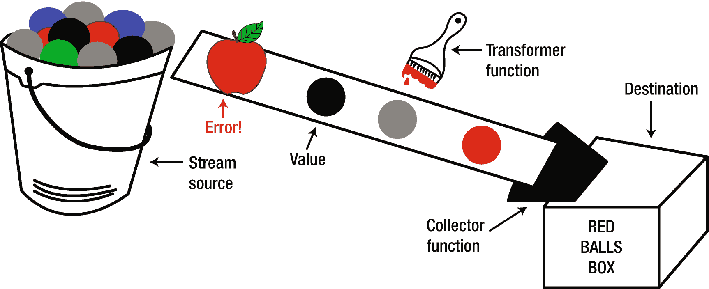
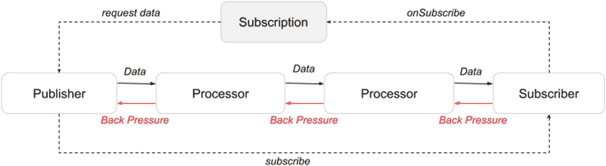
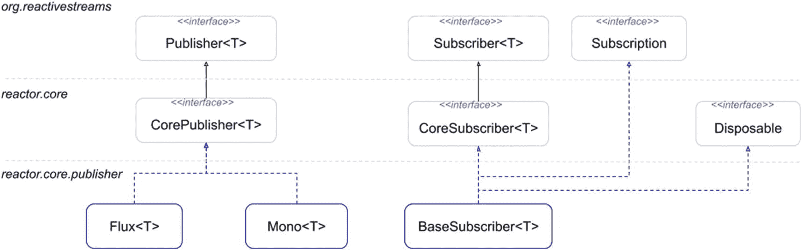
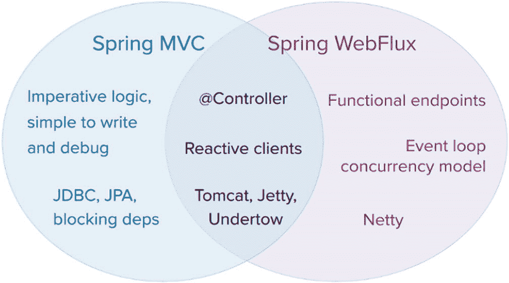

# 九、Spring WebFlux 简介

在前面的章节中，典型的 Java web 应用是在 Apache Tomcat 服务器的一个实例上构建和运行的，该实例在应用的外部或嵌入在应用中。不管是哪种情况，Spring `DispatcherServlet`负责将传入的 HTTP 请求定向到应用中声明的所有处理程序。但是，像我们到目前为止开发的应用能在真实的生产环境中使用吗？`DispatcherServlet`可以同时处理多少 HTTP 请求？这个数字还能增加吗？它们会在可接受的时间框架内得到处理吗？在与世界共享 web 应用之前，需要回答这些问题以及许多其他问题。

生产 web 应用需要处理大量的用户和大量的数据，并且在面对更多的信息进入、系统中的错误或者仅仅是系统中的速度变慢时，能够保持弹性。想想 Twitter、脸书或 YouTube，以及一天中任何时候有多少内容被上传或下载。当打开你的脸书页面时，你希望它能有响应，即使有数百万其他用户登录并和你做同样的事情:阅读消息，或发布消息，视频，图片，或玩游戏。这相当于同时处理数量惊人的请求。这些请求可能需要来自数据库或文件的数据，或者来自其他服务的数据，这引入了阻塞 I/O 操作的可能性。

如果这些应用是使用 Spring 开发的，`DispatcherServlet`是所有请求的入口点。`DispatcherServlet`在它能处理的请求数量上没有发言权。servlet 容器定义了这一点；在我们的例子中，是 Apache Tomcat 服务器。

接下来的几章将重点介绍如何使用 Spring WebFlux 来构建在 Netty、Undertow 和 Servlet 3.1+容器等非阻塞服务器上运行的反应式 web 应用。为了理解为什么反应式应用最适合处理大量的用户和数据，有必要解释一下自从互联网出现以来 HTTP 请求是如何被处理的。

## HTTP 请求处理

HTTP 是超文本传输协议的首字母缩写，使用超文本链接加载网页。一个典型的 HTTP 流包括一台客户机向服务器发出一个**请求**，然后服务器发送一个**响应**消息。在 HTTP (1.0)的初始版本中，每个请求/响应对都需要一个连接。您可以看到为什么这是低效的，因为建立新的连接包括 TCP 握手过程，以将通信方相互介绍。<sup>T5 1T7】</sup>

在 HTTP 1.1 中，引入了持久 HTTP 连接。 <sup>[2](#Fn2)</sup> 这意味着一个连接保持活动状态，并被多个 HTTP 请求重用，从而减少双方之间的通信延迟。

这对 Apache Tomcat 这样的 servlet 容器意味着什么？Apache Tomcat 是构建和维护基于 Java 软件平台的动态网站和应用的流行选择。Java Servlet API 使 web 服务器能够使用 HTTP 协议处理动态的基于 Java 的 web 内容。旧版本的 Tomcat 有一个阻塞的 HTTP 连接器，遵循的是**每个连接一个线程**的模型。这意味着它为正在处理的每个 HTTP 连接分配一个 Java 线程。因此，可以同时连接到应用的用户数量受到应用服务器支持的线程数量的限制。当建立 HTTP 连接时不创建线程，在 HTTP 连接关闭后销毁线程，因为这样效率很低。相反，服务器管理一个为 HTTP 连接提供线程的线程池。当一个 HTTP 连接建立后，一个线程从池中被分配给它。线程完成接收请求和提供响应的工作，当 HTTP 连接关闭时，线程被回收到池中，并准备好分配给另一个请求。

这种方法的问题是，只要 HTTP 连接是打开的，线程在不使用时就处于空闲状态。如果一个或多个用户在请求之间花费时间，或者忘记关闭连接，最终，服务器会耗尽线程并停止接受新的连接。一种解决方案是增加池中线程的数量；但是，线程池的大小受到特征(内存、CPU 等)的限制。)安装服务器的虚拟机/计算机。显而易见的解决方案是获得更强大的服务器。在软件开发中，这被称为**垂直扩展**，它在一定程度上起作用，受到现有硬件及其成本的限制。明智的解决方案是将应用安装在多台服务器上。如今，通过将您的应用部署到像 AWS <sup>[3](#Fn3)</sup> 或 GCP <sup>[4](#Fn4)</sup> 这样的云平台，并建立一个包括自动负载平衡器的云配置，可以在必要时跨越虚拟机，就可以轻松做到这一点。这种方法被称为**水平缩放**并且很有效，但是它也会变得非常昂贵，尤其是当你的应用变得流行的时候。

Tomcat 的新版本(在 Java 4 之后)和其他流行的 web 服务器都使用**每个请求一个线程**的模型，这意味着一个持久的 HTTP 连接不需要一直分配一个线程给它。这在 Java 4 之前是不可能的，因为在 JDK 中没有非阻塞 IO API。只有在处理请求时，才能将线程分配给 HTTP 连接。如果连接是空闲的，线程可以被回收，连接被放在一个集中的 NIO <sup>[5](#Fn5)</sup> select set 中检测新的请求，而不消耗单独的线程。这意味着处理相同数量的用户所需的线程数量更少，而且由于线程使用的资源少得多，扩展应用所需的财务投资也更少。

有几件事需要考虑。对于同时连接的大量用户，资源消耗仍然很高。对于短期请求，它具有与每连接线程模型相同的行为和性能。当在处理每个请求的过程中有长时间的暂停时，线程仍然保持空闲。唯一的优点是每请求线程模式比每连接线程模式的伸缩性稍好。

并发处理 HTTP 请求的应用还必须设计为共享资源，对于不能共享的资源，必须实现同步访问，这可能会导致阻塞。我们如何在 Java 应用中避免阻塞？通过使用异步处理。Servlet API 3.0 引入了异步 Servlet 处理支持，因此慢速任务(例如，等待一些资源变得可用)可以在一个单独的线程中处理，而不会阻塞服务器管理的线程池，并且当完成时，通知容器分配一个新的容器管理的线程，以将结果发送回客户端。

这些是针对典型 web 问题的典型解决方案，但是它们仍然需要在将响应发送给客户端之前完整地构建响应。以搜索引擎 web 应用为例。您将如何实现解决方案来响应搜索查询？考虑到互联网上可用内容的数量，让您的客户端等待直到您扫描完所有索引内容将会花费很长时间，并且响应的大小如此之大，以至于需要很长时间来传输。向你的客户发送完整的回复是不可行的。对于这种情况，流式方法更合适。您扫描一些索引资源，然后向客户端发送一个部分响应，然后扫描更多的资源，发送另一个资源，以此类推，直到没有发现其他内容。另一个可能出现的问题是，如果您发送部分结果，但您将它们发送到 fast，而客户端无法处理它们，您就有阻塞客户端的风险。因此，您的解决方案需要提供一个允许客户端调节流量的数据流。

如果软件的例子对你来说太令人费解，想象一下下面的场景。你有一个叫吉姆的朋友。你还有一桶不同颜色的球。吉姆告诉你把所有的红球都给他。你有两种方法做这件事。

*   你把所有的红球都捡起来，放到另一个桶里，然后把桶递给吉姆。这是典型的**请求-完成响应模型**。这是一个异步模型，如果选择红球花费的时间太长，Jim 会在你进行分类时做其他事情，当你完成时，你会通知他一桶红球准备好了。它是异步的，因为 Jim 没有被你分类球所阻挡；他做其他事情，直到他们准备好。

*   你从你的桶里一个接一个地拿出红色的球，扔向吉姆。这是你的数据流，或者说是球流。如果你找到它们并扔出去的速度比吉姆接住它们的速度快，你就有障碍。吉姆告诉你慢下来；他在控制球的流动。

这将软件转化为**反应式应用**。

## 构建反应式应用

在处理大量数据时，反应式应用是解决方案。反应式应用是以弹性、响应性和可伸缩性为优先考虑的应用。反应宣言 <sup>[6](#Fn6)</sup> 描述了反应应用的特点。Reactive Streams API 规范 <sup>[7](#Fn7)</sup> 提供了应用组件应该实现的最小接口集，因此应用可以被认为是反应式的。因此，Reactive Streams API 是一个互操作性规范，它确保了反应组件的无缝集成，并保持操作的非阻塞和异步。

描述反应式应用有四个关键术语。

*   **响应迅速**:以快速一致的响应时间为特点。

*   **弹性**:在故障期间保持响应并能够恢复。

*   **弹性**:在高负荷时保持反应灵敏。

*   **消息驱动**:通信是异步的，应用反压力是为了防止消息的生产者压倒消费者。

反应式应用应该更加灵活、松散耦合和可伸缩，但同时更容易开发、更易于改变和更能容忍失败。构建反应式应用需要遵循反应式编程范式的原则。

### 反应式编程简介

反应式编程是用异步数据流编程。Reactive Streams 是一个为非阻塞反压异步流处理提供标准的倡议。它们对于解决需要跨线程边界复杂协调的问题非常有用。操作符允许您将数据收集到所需的线程上，并确保线程安全操作，在大多数情况下，不需要过度使用`synchronized`和 volatile `constructs`。

在版本 8 中引入 Streams API 之后，Java 向反应式编程迈进了一步，但是反应式流直到版本 9 才可用。在需要高效处理大量数据的世界里，反应式编程变得流行起来。当 Oracle 致力于在 JDK 中实现反应流和模块时，像 RxJava、 <sup>[8](#Fn8)</sup> Akka、 <sup>[9](#Fn9)</sup> 和 Project Reactor<sup>[10](#Fn10)</sup>这样的项目似乎为 Java 世界中缺少的反应流 API 实现提供了替代方案。

无法等待延迟六个月发布的 JDK 9，Pivotal 开源团队， <sup>[11](#Fn11)</sup> 同一个创建 Spring 的团队，使用 Project Reactor 构建 Spring WebFlux <sup>[12](#Fn12)</sup> ，他们自己的反应库。Spring WebFlux 是一个框架，旨在构建反应式的、非阻塞的、基于服务器的 web 应用，这些应用需要少量的线程来解决大量的请求。

然而，在全面深入 Spring WebFlux 之前，您需要了解一下 Java 中使用反应流编程的一些皮毛。

#### 用流编程

从命令式编程转换到反应式编程的第一步是将您的思维从变量转换到流。

假设你需要计算两个数的和。在命令式编程中，您声明这两个变量，然后执行添加它们的语句。程序一个接一个地执行语句。如果这两个变量在计算总和后被修改，保存总和的变量不会被修改。

当使用 streams 时，要添加的两个值作为一个流提供给你。您声明要对发出的值执行的操作——在本例中是加法操作。流发出的任何额外值都会影响结果。

流是按时间顺序排列的一系列事件。这些事件可以是下列事件之一:

*   **发射值**是要消耗的某种类型的值。

*   **错误**是意外的无效值，其处理方式与值不同。

*   **一个完成信号**是一个通知，表示不再发送更多的值。

大多数情况下，后两个可以省略，开发人员只编写函数来处理发出的值。应该处理由流发出的值或在值发出时执行某些操作的函数必须**订阅**该流。然后他们**倾听**溪流的声音。他们正在**观察** <sup>[13](#Fn13)</sup> 流并等待**消耗**发出的值。

使用术语**函数**而不是**方法**可能看起来很奇怪，但是当涉及到反应式编程时，你很少能缺一不可。函数式编程是基于纯函数的。**纯函数**是不改变输入的函数，总是返回一个值，返回值完全基于输入(它们没有副作用)。因为它们的动作是原子性的，所以可以很容易地组合函数。Lambda 表达式也适用于这种类型的代码编写。因此，**功能反应式编程**是一种编程范例，它通过将纯功能应用于反应式流来提供解决方案。 <sup>[14](#Fn14)</sup>

总之，回到溪流。流有一个源，一个提供要发出的值的实体。您也可以将流视为从源到目的地的移动过程中的数据。这个源可以是任何东西:变量、用户输入、属性、数据结构(比如集合)，甚至是另一个流。流发出值，直到源耗尽或发生错误。

订阅流的函数使用值并将结果作为新流的一部分返回。这些类型的功能有时被称为**变压器**、**处理器**或**运算符**。它们不修改初始流，因为流是不可变的。结束一个链的功能被称为**终端操作员**或**最终变压器**。处理多个流发射值并计算单个值的函数称为**归约器**，将流发射值累加到集合中的函数称为**收集器**。

纯函数链有时被称为**管道**。

在图 [9-1](#Fig1) 中，你可以看到一个糟糕的绘图，它用一桶彩球和一个偶然出现的代表错误信号的苹果描绘了流处理。



图 9-1

使用一桶球的流处理表示

这种表示并不完全准确，因为将球涂成红色应该会创建一个新的红色球，但它足够接近流如何工作以及应该如何使用的想法。

如果有帮助的话，想象一下使用流编写代码类似于设计一台 Rube Goldberg 机器。 <sup>[十五](#Fn15)</sup>

在引入 streams 之前，所有开发人员都必须管理数据集，即集合。让我们做一个简单的任务:给定一组不同颜色和不同大小的球，选择所有直径大于 3 的蓝色球，将它们涂成红色，并计算它们直径的总和。在 Java 8 之前，代码看起来类似于清单 [9-1](#PC1) 中的片段。

```java
List<Ball> bucket = List.of(
    new Ball("BLUE",9),
    new Ball("RED", 4),
    // other instances omitted
    );

Integer sum = 0;

for(Ball ball : bucket) {
    if (ball.getColor().equals("BLUE") && ball.getDiameter() >= 3) {
        ball.setColor("RED");
        sum += ball.getDiameter();
    }
}

System.out.println("Diameter sum is " + sum);

Listing 9-1Filtering Balls and Adding Their Diameters Before Java 8

```

这是命令式代码的描述。它使用一系列要执行的语句来改变球列表的状态。它描述了**程序应该如何**完成状态改变。

从 Java 8 开始，使用 streams 可以编写清单 [9-2](#PC2) 中描述的相同代码。

```java
import java.util.function.Function;
import java.util.function.Predicate;

// other imports and code omitted

Predicate<Ball> predicate = ball -> ball.getColor().equals("BLUE")
    && ball.getDiameter() >= 3;
Function<Ball, Ball> redBall =
    ball -> new Ball("RED", ball.getDiameter());
Function<Ball, Integer> quantifier = Ball::getDiameter;

int sum  = bucket.stream()
        .filter(predicate)
        .map(redBall)
        .map(quantifier)
        .reduce(0, Integer::sum);

System.out.println("Diameter sum is " + sum);

Listing 9-2Filtering Balls and Adding Their Diameters Starting with Java 8

```

清单 [9-2](#PC2) 中的管道由以下方法调用组成。

*   **`stream()`**方法**返回一个使用初始集合作为源的`java.util.stream.Stream<Ball>`实例。**

***   `filter(Predicate<T>)` **方法**使用作为参数提供的谓词来过滤流，并返回包含与谓词匹配的元素的流。谓词由测试球的组合布尔条件组成。

    *   `map(Function<T, R>)` **方法**是一个转换函数，它接受流的元素，应用作为参数提供的函数，并将结果作为流返回。

    *   `reduce(T, BinaryOperator<T>)` **方法**是一个累加器函数。它有两个参数:一个初始值和一个`java.util.function.BinaryOperator<T>`实例，声明在两个相同类型的操作数之间执行的操作，产生相同类型的结果。在前面的清单中，使用的函数是声明为方法引用的整数的典型求和函数。(查 Java 方法引用；如果你以前没用过，它们很酷。)** 

 **清单 [9-2](#PC2) 中的代码以三个需要解释的语句开始。

*   `predicate` **实例**是`Predicate<T>`功能接口的内联实现。该接口公开了一个名为`test(..)`的抽象方法，该方法必须用谓词实现，以便根据提供的参数进行评估。

*   `redBall` **实例**是`Function<T, R>`功能接口的内联实现。该接口公开了一个名为`apply(..)`的抽象方法，必须用代码实现该方法才能应用于所提供的参数。在本例中，我们正在创建一个新的`Ball`实例。

*   `quantifier` **实例**是对来自`Ball`实例的名为`getDiameter()`的方法的引用。在 Java 中，它们被称为**方法引用**，因为这听起来很酷。

引入这三个实例是为了具体化**应该如何**修改流。对于声明式编程方法来说，它们是必需的。 <sup>[16](#Fn16)</sup> 通过在管道外声明它们，结果是一个代码片段，声明**需要实现什么**。**如何**成为一个参数，改变那些引用所指向的不会影响**什么**。您可以将代码管道想象成一条装配线，操作员就是工作站。改变工作站内部的东西(谓词或函数)不应该影响管道设置。

Java 8 中引入的流 API 提供了许多用于流处理的实用方法，而反应式流 API 甚至进一步扩展了该集合。根据您试图解决的问题，lambda 表达式和流的组合可能会产生可读性更好、更优雅的解决方案。

既然您已经知道了如何使用流编写代码，那么您已经准备好了锦上添花:反应式流。

#### 反应流

反应式流为 Java 中的反应式编程提供了一个通用的 API。它由四个简单的接口组成，这四个接口为具有非阻塞背压的异步流处理提供了标准。如果您想编写一个可以与其他反应式组件集成的组件，您需要实现其中的一个。

在抽象层次上，组件以及它们之间的关系，如反应流规范中所描述的，看起来如图 [9-2](#Fig2) 所示。



图 9-2

反应流规范抽象表示

现在，详细的解释。

*   一个发布者是一个潜在的无限的数据生产者。在 Java 中，数据生产者必须实现`org.reactivestreams.Publisher<T>`。

*   一个**订阅者**向发布者注册来消费数据。在 Java 中，数据消费者必须实现`org.reactivestreams.Subscriber<T>`。

*   在订阅时，会创建一个**订阅**对象来表示发布者和订阅者之间的一对一关系。该对象用于向发布者请求数据，也用于取消对数据的需求。在 Java 中，订阅类必须实现`org.reactivestreams.Subscription`。

*   发布者根据订阅者的要求发出值。

*   一个**处理器**是一个特殊的组件，具有与发布者和订阅者相同的属性。在 Java 中，数据处理器必须实现`org.reactivestreams.Processor<T,R>`。处理器可以被链接以形成流处理流水线。

*   处理器从链中它前面的发布者/处理器消费数据，并发出数据供链中它后面的处理器/订户消费。

*   如果生产者/处理器不能足够快地消费数据，则订户/处理器在发送数据时施加背压以减慢生产者/处理器的速度。

这是反应流如何工作的基本思想。在基本的情况下，有一个发布者、一个订阅者和一个它们所响应的事件流。在更复杂的情况下，会涉及到处理器。

您可以在 IDE 或 GitHub 上查看代码。 <sup>[17](#Fn17)</sup>

JVM 的大多数反应式实现都是并行开发的。不同的开发团队为他们的 Reactive Streams 接口的实现选择了不同的名称。这就是为什么最初引入 streams 时，每个组件都有不止一个名称。

当 JDK 采用反应流规范时，决定将所有接口从`org.reactivestreams`包复制到`java.util.concurrent.Flow`类中。大多数库现在也支持适配器与 JDK 集成。表 [9-1](#Tab1) 显示了最常用的 Java 反应库中反应流实现的名称。

表 9-1

反应流实现名称

<colgroup><col class="tcol1 align-left"> <col class="tcol2 align-left"> <col class="tcol3 align-left"> <col class="tcol4 align-left"> <col class="tcol5 align-left"></colgroup> 
| 

反应流 API

 | 

RxJava

 | 

项目反应堆

 | 

阿卡

 | 

JDK*

 |
| --- | --- | --- | --- | --- |
| 出版者 | 可观察的，单一 | 流，猴子 | 来源 | 流动。出版商* |
| 订户 | 观察者 | 核心订阅服务器 | 水槽 | 流动。订户* |
| 处理器 | 科目 | 通量处理器、单处理器 | 流动 | 流动。处理器* |
| 签署 | - | - | - | - |

* JDK 反应流规范组件在表 [9-1](#Tab1) 中用*标记，因为它们不扩展反应流 API，而是复制流类中的所有组件。

用反应式流编写的代码看起来与用非反应式流编写的代码非常相似，但是幕后发生的事情是不同的。反应流是异步的，但是您不必编写处理它的逻辑。您需要声明当某个值在流上发出时必须发生什么。当流异步发出一个项目**时，您正在编写的代码被调用，独立于主程序流。如果涉及到多个处理器，每个处理器都在自己的线程上执行。**

 **由于您的代码是异步运行的，所以您必须小心使用作为参数提供给转换器方法的函数。确保它们是纯函数，它们应该只通过它们的参数和返回值与程序交互，并且它们永远不应该修改需要同步的对象。

现在让我们看看 Project Reactor 是如何实现 Reactive Streams 规范的，以及它的类是如何编写 Reactive 代码的。

#### 使用 Project Reactor

Project Reactor 是反应式编程的第一批库之一。它为反应式应用提供了一个无阻塞的稳定基础，并提供了高效的需求管理。它提供了一些类，使得使用反应流设计代码变得非常实用。它适用于 Java 8，但为所有 JDK9+版本提供了适配器类。Project Reactor 适合编写微服务应用，并提供了比 JDK 更多的类，旨在使反应式应用的开发更加实用。

Project Reactor 提供了两个主要的 publisher 实现。

*   `reactor.core.publisher.Mono<T>`是表示零个或一个元素的反应流发布器。

*   `reactor.core.publisher.Flux<T>`是一个反应式流发布器，表示从零到无穷大元素的异步序列。

`Mono<T>`和`Flux<T>`类似于`java.util.concurrent.Future<V>`。它们表示异步计算的结果。它们之间的区别在于，当您试图用`get()`方法获得结果时，`Future<V>`会阻塞当前线程，直到计算完成。`Mono<T>`和`Flux<T>`都提供了一系列`block*()`方法，用于检索不阻塞当前线程的异步计算的值。

在到达之前，我们先了解一下`Flux<T>`和`Mono<T>`。

图 [9-3](#Fig3) 描述了`Flux<T>`和`Mono<T>`的类层次结构，包括来自反应流规范包的根父类。



图 9-3

项目反应堆堆芯组件的等级体系

`CorePublisher<T>`接口声明了一个要实现的方法，它自己版本的`subscribe(..)`方法需要一个`CoreSubscriber<T>`类型的参数。

`CoreSubscriber<T>`接口声明了一个名为`currentContext()`的默认方法，用于访问包含与下游或终端操作者共享的信息的反应上下文。它还声明了一个抽象方法`onSubscribe(Subscription)`，实现者需要为其提供一个实现，以便在发出值之前初始化流状态。

`Flux<T>`和`Mono<T>`都继承了`Publisher<T>`，这意味着如果实现了`Subscriber<T>`，它们可以与任何类型的订户链接。当使用 project reactor 编写代码时，扩展`BaseSubscriber<T>`抽象类是很实用的。这个类对从`Subscriber<T>`继承的所有方法都有最小的实现，但也为它们声明了钩子方法(拦截器方法),当发出上一节提到的三个信号之一:值、错误或完成时，您可以实现这些方法来定制订阅者行为。它还包含一个用于向发布者发送订阅信号的方法的钩子，以及一个用于添加在任何终止事件之后执行的行为的 final 钩子:error、complete 或 cancel。因为所有的方法都有一个最小化的实现(一个空的主体)，这允许你只重写你感兴趣的方法，并且在开发过程中有一个方法最重要:`hookOnNext(T)`。

`Mono<T>`是一种特殊类型的反应流，它只能返回 0 或 1 的单值。知道流发出的值的数量会导致编写更简单的代码来使用它们。此外，不是所有的异步进程都返回值，所以可以使用一个`Mono<Void>`来表示这个进程的完成。由于`Mono<T>`对其值的限制如此之低，与`Flux<T>`相比，它只提供了一小组操作符。

在继续之前，先看看清单 [9-3](#PC3) 中的代码。它包含清单 [9-2](#PC2) 中代码的反应流版本。

```java
import reactor.core.publisher.BaseSubscriber;
import reactor.core.publisher.Flux;

// other imports and code omitted

Subscriber<Integer> subscriber =  new BaseSubscriber<Integer>() {
    @Override
    protected void hookOnNext(Integer sum) {
        System.out.println("Diameter sum is " + sum);
    }
};

 Flux.fromIterable(bucket)  // Flux<Ball>
        .filter(predicate)
        .map(redBall)
        .map(quantifier)  // Flux<Integer>
        .reduce(0, Integer::sum) // Mono<Integer>
        .subscribe(subscriber);

Listing 9-3Filtering Balls and Adding Their Diameters Using Reactive Streams

```

添加了一些注释，以便在返回的流上的对象类型发生变化时更加清楚。实现中的所有方法要么返回`Flux<T>`要么返回`Mono<T>`，这就是为什么它们可以很好地链接在一起。链中的最后一个组件是订阅者，它使用由`reduce(..)`累加器函数返回的流中的元素。因为这个累加器返回一个`Mono<T>`，如果需要的话，更多的函数可以被链接。

对于这个例子，订户对象是通过扩展`BaseSubscriber<T>`类型并将其实例化来创建的。`hookOnNext(..)`方法的实现在控制台中打印出发出的值。整个流水线执行是异步的，发出值就打印出来，不会阻塞主线程。

`Flux<T>`或`Mono<T>`类提供了`subscribe(..)`方法的丰富版本，允许开发者定义`java.util.function.Consumer<T>`函数来处理错误和完成信号。假设在订阅之前操作符可能出错，这允许正确处理错误，并在流程成功完成后执行额外的操作。

因此，使用这种方法，清单 [9-3](#PC3) 中的代码变成了清单 [9-4](#PC4) 中的代码。

```java
Flux.fromIterable(bucket)
    .filter(predicate)
    .map(redBall)
    .map(quantifier)
    .reduce(0, Integer::sum)
    .subscribe(
        sum -> System.out.println("Diameter sum is " + sum),
        error -> System.err.println("Something went wrong " + error),
        () -> System.out.println("Pipeline executed successfully.")
    );

Listing 9-4Declaring

Consumers for a Different Kind of Signal

```

在幕后，创建了一个订户实例，并由适当的钩子方法调用作为参数提供的消费者。

也许这段代码看起来比前面的实现更复杂，但是代码仍然是可读的，并且是异步和非阻塞的。对于简单的用例场景，使用反应性组件是多余的。在反应式应用中，非阻塞进程的效率和可靠性超过了拥有一长串不可读的函数和代码的成本，反应式流显示了它们的真正威力。即使你认为长长的反应函数链看起来不切实际，相信我，只用 Java 并发 API 编写的相同代码更是如此。

要了解为什么反应式编程对于中等负载和中等复杂性(不像网飞或脸书 1F642)处理的应用效率低下，让我们修改前面的实现，以便每个函数打印线程 ID。通过在管道中添加对`delayElements(Duration.ofSeconds(1))`的调用来模拟处理值的延迟。

在清单 [9-5](#PC5) 中，描述了修改后的`redBall`函数，但是对于管道中的所有其他函数，修改是相似的。管道代码不会改变，pure 函数返回的结果不受 print 语句的影响。

```java
// other imports and code omitted
Function<Ball, Ball> redBall = ball -> {
    System.out.println("[RedBall]Executing thread: "
       + Thread.currentThread().getId());
    return new Ball("RED", ball.getDiameter());
};

Flux.fromIterable(bucket)
    .delayElements(Duration.ofSeconds(1))
    .filter(predicate)
    .map(redBall)
    .map(quantifier)
    .reduce(0, Integer::sum)
    .subscribe(
         sum -> System.out.println("Diameter sum is " + sum),
         error -> System.err.println("Something went wrong " + error),
         () -> System.out.println("Pipeline executed successfully.")
    );

Listing 9-5Pure Function Modified To Print the ID of Its Executing Thread

```

当我们现在执行管道时，控制台中的输出应该看起来非常接近清单 [9-6](#PC6) 中描述的输出。

```java
[Predicate]Executing thread: 17
[GetDiameter]Executing thread: 17
[Predicate]Executing thread: 18
[Predicate]Executing thread: 19
[Predicate]Executing thread: 20
[GetDiameter]Executing thread: 20
[RedBall]Executing thread: 20
[GetDiameter]Executing thread: 20
[GetDiameter]Executing thread: 20
[Predicate]Executing thread: 21
[Predicate]Executing thread: 22
[Predicate]Executing thread: 23
[GetDiameter]Executing thread: 23
[Predicate]Executing thread: 24
...
[Subscriber]Executing thread: 24

Listing 9-6Reactive Pipeline Output

```

不同的线程 id 意味着每个纯函数都由自己的线程执行。正在使用的线程数量等于处理器拥有的内核数量，并且负载分布均匀:每个内核一个线程。对于一个简单的任务，创建如此多的线程并协调它们是不值得的。

`Flux<T>`和`Mono<T>`功能强大，实用。在编写 Spring 反应式应用时，您很少需要使用其他任何东西。它们都提供了丰富的操作符列表，这些操作符可以创建、组合和控制反应流 <sup>[18](#Fn18)</sup> ，并允许实际的流水线设计。

要记住的一点是，在编写反应式应用时，应用的每个组件都必须是反应式的，否则应用就不是真正的反应式应用，非反应式组件可能会成为瓶颈并破坏整个流程。

例如:具有典型层的三层应用:表示层、服务层、数据库层只有在这三层都是反应性的情况下才是反应性的。一个反应式 Spring WebFlux 应用必须有反应式视图、反应式控制器、反应式服务、反应式存储库和反应式数据库。并且调用应用的客户端也必须是被动的。一个应用可以使用由另一个应用被动公开的数据，在这种情况下成为一个客户端。为了使通信顺利进行，两个应用都必须是反应式的。除了视图和数据库之外，如果其余的都是用 Java 编写的，那么 API 中每个方法的输入和输出都必须是`Flux<T>`或`Mono<T>`(或者前面提到的任何其他反应流的实现)实例，这样就可以组合它们，而不需要编写额外的代码来将它们封装在`Flux<T>`或`Mono<T>`实例中。

事不宜迟，让我们看看如何从使用 Spring MVC 编写应用转移到使用 Spring WebFlux 做同样的事情。

## Spring WebFlux 简介

Spring Web MVC 是围绕`DispatcherServlet`设计的，它是将 HTTP 请求映射到处理程序的网关，并设置了主题配置、国际化、文件上传和视图解析。Spring MVC 是为 Servlet API 和 Servlet 容器构建的。这意味着它主要使用阻塞 I/O 和每个 HTTP 请求一个线程。支持请求的异步处理是可能的，但是需要更大的线程池，这反过来需要更多的资源。而且，很难规模化。

Spring WebFlux 是在 Spring 5 中添加的一个反应式堆栈 web 框架，它是 Spring 对阻塞 I/O 架构这一新兴问题的回应。它可以在 Servlet 3.1+容器上运行，但可以适应其他本地服务器 API。首选的服务器是 Netty <sup>[19](#Fn19)</sup> ，它在异步、非阻塞领域已经得到很好的应用。Spring WebFlux 构建时考虑了函数式反应式编程，并允许以声明式风格编写代码。

这两个框架有一些共同点，甚至可以一起使用。图 [9-4](#Fig4) 是来自 Spring 官方参考文档的图表，展示了 Spring MVC 和 Spring WebFlux 的共同点以及它们如何相互支持。



图 9-4

Spring MVC 和 Spring web 流量图

从 Spring 5 开始，`spring-web`模块增加了底层基础设施和 HTTP 抽象来构建反应式 web 应用。所有公共 API 都被修改，以支持将`Publisher<T>`和`Subscriber<T>`作为参数和返回类型。该模块是`spring-webflux`模块的依赖项，是 Spring 反应式应用最重要的依赖项。那么，我们如何编写一个 Spring Web Flux 应用呢？很简单，我们从配置入手。

### Spring WebFlux 配置:反应式控制器

前面提到过，反应式应用可以部署在 Servlet 3.1+容器上，比如 Tomcat、Jetty 或 Undertow。这里的技巧是不要使用`DispatcherServlet`，它是 HTTP 请求处理程序/控制器的中央调度程序。再厉害，也还是个阻断成分。Tomcat 和 Jetty 的核心是非阻塞的，所以关键是使用它们来处理 HTTP 请求，而不需要 servlet facade。

这就是新的和改进的`spring-web`组件通过引入`org.springframework.http.server.reactive.HttpHandler`来提供帮助的地方。这个接口代表了反应式 HTTP 请求处理的最低层次的契约，Spring 基于它为每个支持的服务器提供了服务器适配器。表 [9-2](#Tab2) 列出了 Spring WebFlux 支持的服务器以及适配器类的名称，这些适配器类代表了每个服务器的非阻塞 I/O 到反应流桥的核心。

表 9-2

支持的服务器

<colgroup><col class="tcol1 align-left"> <col class="tcol2 align-left"> <col class="tcol3 align-left"></colgroup> 
| 

服务器名称

 | 

Spring适配器

 | 

使用的桥

 |
| --- | --- | --- |
| 妮蒂 | `ReactorHttpHandlerAdapter` | 使用 Reactor Netty 库的 Netty API |
| 逆流 | `UndertowHttpHandlerAdapter` | `spring-web`逆流到激流桥 |
| 雄猫 | `TomcatHttpHandlerAdapter` | `spring-web: Servlet` 3.1 到反应流桥的无阻塞 I/O |
| 码头 | `JettyHttpHandlerAdapter` | `spring-web: Servlet` 3.1 到反应流桥的无阻塞 I/O |

`HttpHandler`界面非常基础。其内容如清单 [9-7](#PC7) 所示。

```java
package org.springframework.http.server.reactive;

import reactor.core.publisher.Mono;
// other comments omitted
public interface HttpHandler {

    /**
     * Handle the given request and write to the response.
     * @param request current request
     * @param response current response
     * @return indicates completion of request handling
     */
    Mono<Void> handle(ServerHttpRequest request, ServerHttpResponse response);

}

Listing 9-7HttpHandler Interface

```

在此基础上，Spring 提供了 WebHandler 接口，这是一个稍微高级一点的契约，描述了所有具有过滤器链样式处理和异常处理的通用服务器 API。

与经典的 Spring Web MVC 应用相比，这对 Spring 配置意味着什么？这意味着你需要的不是`org.springframework.web.servlet.DispatcherServlet`，而是`org.springframework.web.reactive.DispatcherHandler`。`DispatcherHandler,`作为`dispatcher servlet,`被设计为前端控制器。它是核心的`WebHandler`实现，并为可配置组件执行的请求处理提供算法。它委托给特殊的 beans 来处理请求和呈现适当的响应，并且它们的实现如预期的那样是非阻塞的。类似于 Spring MVC 生态系统，有一个`HandlerMapping` bean 将请求映射到一个处理程序，一个`HandlerAdapter` bean 调用一个处理程序，一个`org.springframework.web.server.WebExceptionHandler` bean 处理异常，一个`HandlerResultHandler` bean 从处理程序获取结果并完成响应，所有这些都声明在`org.springframework.web.reactive`包中。

按照 Spring 的典型方式，大多数情况下,`DispatcherHandler`的配置不需要直接描述它的代码。要配置一个在 Servlet 3.1+容器中运行的 Spring WebFlux 应用，您需要执行以下操作。

*   声明一个 Spring WebFlux 配置类，并用`@Configuration`和`@EnableWebFlux.`对其进行注释

*   扩展`org.springframework.web.server.adapter.AbstractReactiveWebInitializer`类，实现`getConfigClasses()`方法，并在其中注入您的 Spring WebFlux 配置类。

清单 [9-8](#PC8) 描述了`AppConfiguration`，一个 Spring WebFlux 应用的定制配置类。

```java
package com.apress.prospringmvc.bookstore;

import org.springframework.web.reactive.config.EnableWebFlux;
// other imports omitted

@EnableWebFlux
@Configuration
public class AppConfiguration {
}

Listing 9-8AppConfiguration Class

```

`@EnableWebFlux`注释是`org.springframework.web.reactive.config`包的一部分，它支持使用带注释的控制器和功能端点。当 Spring IoC 找到这个注释时，它从`org.springframework.web.reactive.config.WebFluxConfigurationSupport`导入所有 Spring WebFlux 配置。如果您想以任何方式定制导入的配置，您所要做的就是让带注释的类实现`org.springframework.web.reactive.config.WebFluxConfigurer`。该接口包含用于配置静态访问资源处理程序、格式化程序、验证程序、消息源、视图解析器等的方法。

清单 [9-9](#PC9) 描述了`WebAppInitializer,`，它扩展了`AbstractReactiveWebInitializer`以提供与 Servlet 3.1+容器的集成。

```java
package com.apress.prospringmvc.bookstore;

import org.springframework.web.server.adapter.AbstractReactiveWebInitializer;

public class WebAppInitializer extends AbstractReactiveWebInitializer {

    @Override
    protected Class<?>[] getConfigClasses() {
        return new Class<?>[]{AppConfiguration.class};
    }
}

Listing 9-9WebAppInitializer Class

```

`AbstractReactiveWebInitializer`实现了`WebApplicationInitializer`，并且是在 Servlet 容器上安装 Spring Web Reactive 应用所必需的。

为了帮助你从 Spring MVC 过渡到 Spring WebFlux，请看表 [9-3](#Tab3) 。下表显示了 Spring MVC 和 Spring WebFlux 应用之间的配置组件的对应关系。

表 9-3

Spring MVC 和 WebFlux 比较

<colgroup><col class="tcol1 align-left"> <col class="tcol2 align-left"></colgroup> 
| 

框架

 | 

spring webflux

 |
| --- | --- |
| `@EnableWebMvc` | `@EnableWebFlux` |
| `WebMvcConfigurer` | `WebFluxConfigurer` |
| `WebMvcConfigurationSupport` | `WebFluxConfigurationSupport` |
| `WebApplicationInitializer`(界面) | `AbstractReactiveWebInitializer`(类) |
| `DispatcherServlet` | `DispatcherHandler` |

一旦编写了两个配置类，下一步就是编写一个反应式控制器。由于我们使用的是 Spring WebFlux，我们知道这可以通过确保方法返回`Flux<T>`或`Mono<T` >来实现。在编写 web 应用时，我经常做的一件事就是编写一个`IndexController`，打印出“它工作了！”清单 [9-10](#PC10) 描述了一个简单的`IndexController`返回一个发出单个值的`Mono<T>`实例。

```java
package com.apress.prospringmvc.bookstore;
import reactor.core.publisher.Mono;
// other imports omitted

@RestController
public class IndexController {

    @ResponseStatus(HttpStatus.OK)
    @GetMapping(path="/", produces = MediaType.TEXT_EVENT_STREAM_VALUE)
    public Mono<String> index(){
        return Mono.just("It works!");
    }
}

Listing 9-10Reactive IndexController Implementation

```

使用`@RestControllers`是因为反应式应用专注于流数据，但是也可以使用`@Controllers`，正如你在下一章中看到的。

`produces`属性的值是`text/event-stream`，它代表返回内容的类型。此内容类型描述来自源的事件流。如果您将这个应用部署到 Apache Tomcat 服务器上，并试图打开`http://localhost:8080/`页面，一些浏览器会敦促您将输出保存到一个文件中，因为浏览器无法呈现响应。响应是服务器发送的事件(SSE)，这是一种服务器推送技术，使客户端能够通过 HTTP 连接从服务器接收更新流，HTTP 连接是 HTML5 的一部分。 <sup>[20](#Fn20)</sup> 在经典轮询模型中，客户端和服务器之间的通信需要通过 HTTP 连接进行一系列的请求/响应，因为客户端必须重复轮询数据。服务器发送的事件允许服务器在数据可用时向客户端推送数据，而无需客户端请求。因此最适合反应式 web 应用。

除了这个头，我们如何知道我们的应用是反应性的呢？这很简单——我们不是返回一个`Mono<T>`,而是返回一个`Flux<T>`,并降低发射元素的速率。

通过使用一个名为`zip`的操作合并两个流，可以降低值发出的速率。有三种组合操作可应用于流，如图 [9-5](#Fig5) 所示。


图 9-5

流组合操作

使用图 [9-5](#Fig5) 中描述的操作符之一，可以将两个或多个`Flux<T>`实例合并成一个`Flux<T>`。下面的列表描述了 de 运算符和结果流。

*   `concat`连接两个流。流的顺序很重要，因为第二个流仅在第一个流发出`onComplete`信号后被订阅。对于连接流，可以使用`Flux.concat(..)`实用程序方法。还有一个名为`concatWith(Flux<T>)`的方法，可以在一个`Flux<T>`实例上调用，将它与作为参数接收的流连接起来。清单 [9-11](#PC11) 展示了一个流连接的例子，使用两个非常方便的流作为源:一个发出`X`值，另一个发出`Y`值。

*   `merge`合并两条溪流。流的顺序并不重要，因为两个流是同时订阅的。结果流随机地从任何一个源流中发出值。对于合并流，可以使用`Flux.merge(..)`实用程序方法。还有一个名为`mergeWith(Flux<T>)`的方法，可以在一个`Flux<T>`实例上调用它，将它与作为参数接收的流合并。清单 [9-12](#PC12) 展示了一个流合并的例子，使用两个非常方便的流作为源:一个发出`X`值，另一个发出`Y`值。

```java
Flux<String> y =  Flux.just("Y", "Y");
Flux<String> x =  Flux.just("X", "X");

Flux.concat(y,x).subscribe(str -> System.out.print(str + " "));
// or
y.concatWith(x).subscribe(str -> System.out.print(str + " "));
// expect: Y Y X X

Listing 9-11Stream Concatenation Examples

```

*   `zip`是一个发出值的流，这些值是通过将每个流发出的值包装在一起而创建的。此操作的结果应用于两到八个流。当一个流发出`onComplete`信号时，来自其他流的所有不能合并的值都被丢弃。压缩流时，可以使用`Flux.zip(..)`实用程序方法。这个方法有不止一个版本，它们可以压缩 2 到 8 个流。结果值属于`reactor.util.function.Tuple*`类型，其中*替换被组合的值的数量。还有一个名为`zipWith(Flux<T>)`的方法，可以在一个`Flux<T>`实例上调用，用作为参数接收的流压缩它。

```java
Flux<String> y =  Flux.just("Y", "Y");
Flux<String> x =  Flux.just("X", "X");

Flux.merge(y,x).subscribe(str -> System.out.print(str + " "));
// or
y.mergeWith(x).subscribe(str -> System.out.print(str + " "));
// expect multiple X and Y elements being written in any order

Listing 9-12Stream Merging Examples

```

清单 9-13 展示了一个流压缩的例子，使用三个非常方便的流作为源:一个发出`X`值，一个发出`Y`值，一个发出`Z`值。

```java
Flux<String> y =  Flux.just("Y", "Y");
Flux<String> x =  Flux.just("X", "X");
Flux<String> z =  Flux.just("Z", "Z");

Flux.zip(y,x).subscribe(t -> System.out.print(str + " "));
// or
y.zipWith(x).subscribe(str -> System.out.print(str + " "));
// expect multiple Tuple2 instances: [Y,X]
Flux.zip(y,x,z).subscribe(t -> System.out.print(str + " "));
// expect multiple Tuple3 instances: [Y,X,Z]

Listing 9-13Zipping Merging Examples

```

`zipWith(..)`操作通过将一个流与一个反应性间隔流相结合来降低该流的发射速率。可通过调用`Flux.interval(Duration)`创建反应性间隔流。该方法将一个`Duration`实例作为参数，并创建一个`Flux<Long>`，它发出从 0 开始的`long`值，并在全局计时器上以指定的时间间隔递增。在初始延迟等于作为参数提供的持续时间之后，发出第一个元素。

如果我们压缩一个带有一秒钟`Duration`的反应式间隔流的反应式数据流，这会导致一个每秒钟发出一个`Tuple2`实例的流。然后，我们将`map`应用于元组流，以分离出我们感兴趣的值。

让我们把事情变得有趣一些，修改`IndexController`并为`/debug`路径添加一个处理程序方法，该方法以每秒一个的速度返回包含所有 bean 名称及其类型的流。每个发出的值都是类型`Pair<S,T>`，包含 bean 名称及其类型。属性`produces`的值将该方法返回的类型声明为`MediaType.APPLICATION_STREAM_JSON_VALUE`，它是一个带有`application/stream+json`值的常量。这意味着这个流发出的每个值都被转换成 JSON。

清单 [9-14](#PC14) 中描述了提议的实现。

```java
package com.apress.prospringmvc.bookstore;
import reactor.core.publisher.Flux;
import reactor.util.function.Tuple2;
import org.springframework.data.util.Pair;
// other imports omitted

@RestController
public class IndexController implements ApplicationContextAware {
    // other code omitted
    @ResponseStatus(HttpStatus.OK)
    @GetMapping(path="/debug", produces =
                           MediaType.APPLICATION_STREAM_JSON_VALUE)
    public Flux<Pair<String,String>> debug() {
        List<Pair<String,String>> info = new ArrayList<>();
        Arrays.stream(ctx.getBeanDefinitionNames())
          .forEach(beanName -> info.add(Pair.of(beanName,
                  ctx.getBean(beanName).getClass().getName())));
        return Flux.fromIterable(info)
        .zipWith(Flux.interval(Duration.ofSeconds(1))).map(Tuple2::getT1);
    }
}

Listing 9-14Reactive IndexController Implementation

Returning a Flux<T>

```

当在浏览器中访问时，如果浏览器可以解析它，您会看到这些值以一秒钟的延迟按顺序显示。如果您的浏览器不能这样做，几秒钟后(取决于数据集有多大)，系统会提示您将响应保存为文件。如果您有基于 UNIX 的操作系统，您可以使用`curl`命令打开那个`http://localhost:8080/debug`。

```java
curl -H -v "application/stream+json" http://localhost:8080/debug

```

这个命令打印转换成 JSON 的值。但是，这在哪里配置呢？这不是显式完成的，尽管如果需要，您可以声明自己的转换器。使用`Encoder<T>`和`Decoder<T>`bean 完成`Flux<T>`和`Mono<T>`到字节的转换，反之亦然。这两个接口是`org.springframework.core.codec`包的一部分，基本实现是`spring-core`和`spring-web`模块的一部分。

在 Spring WebFlux 应用中，`org.springframework.http.codec.HttpMessageWriter<T>` bean 被默认配置为使用现有的编码器实现来*编码*类型为`<T>`的对象流，并将它们写入数据缓冲区流以传输响应内容。默认情况下，`org.springframework.http.codec.HttpMessageReader<T>` bean 被配置为使用现有的解码器实现来*将包含请求数据的数据缓冲区流解码*为类型为`<T>`的对象流。

配置 Spring WebFlux 应用类似于配置 Spring MVC 应用。唯一改变的是处理程序方法的返回类型，以及在用`@RequestMapping`和变体注释的方法中作为参数可用的选项。

*   支持将反应类型作为参数，但是您不应该将反应类型用于不需要非阻塞 I/O 的参数(例如，对于保存书籍的 POST 请求处理程序方法，将参数类型声明为`Mono<Book>`是没有意义的)。)

*   `org.springframework.web.server.ServerWebExchange`可以用作参数来提供对 HTTP 请求、响应和其他服务器端属性的访问。在清单 [9-15](#PC16) 中，`IndexController.debug(..)`方法已经被修改为接收`ServerWebExchange`作为参数。对请求进行分析，以检查请求的`user-agent`报头，如果请求是使用`curl`命令发出的，则在响应中添加一个 cookie。请求和响应对象都是通过`ServerWebExchange`参数来访问的。

*   如果一个具有`Mono<Void>`返回类型的方法也有一个`ServerHttpResponse`，或者一个`ServerWebExchange`参数，或者一个`@ResponseStatus`注释，那么它就被认为已经完全处理了响应。

*   返回类型支持`Flux<ServerSentEvent>`、`Observable<ServerSentEvent>`或其他反应类型。当只需要编写简单的文本时，可以省略`ServerSentEvent`包装类型。在这种情况下，`produces`属性必须设置为`text/event-stream`值(就像第一个版本的`IndexController`一样)。

```java
package com.apress.prospringmvc.bookstore;

import org.springframework.web.server.ServerWebExchange;
// other imports omitted

@RestController
public class IndexController implements ApplicationContextAware {
    // other code omitted
    @ResponseStatus(HttpStatus.OK)
    @GetMapping(path="/debug", produces = MediaType.APPLICATION_STREAM_JSON_VALUE)
    public Flux<Pair<String,String>> debug(ServerWebExchange exchange) {
        if(Objects.requireNonNull(exchange.getRequest()
                .getHeaders().get("user-agent"))
                .stream().anyMatch(v-> v.startsWith("curl"))){
            logger.debug("Development request with id: {}", exchange.getRequest().getId());
            ResponseCookie devCookie = ResponseCookie
                .from("Invoking.Environment.Cookie", "dev")
                .maxAge(Duration.ofMinutes(5)).build();
            exchange.getResponse().addCookie(devCookie);
        }
        List<Pair<String,String>> info = new ArrayList<>();
        Arrays.stream(ctx.getBeanDefinitionNames()).forEach(beanName ->
            info.add(Pair.of(beanName,     ctx.getBean(beanName).getClass().getName()))
        );
        return Flux.fromIterable(info).zipWith(Flux.interval(Duration.ofSeconds(1))).map(Tuple2::getT1);
    }
}

Listing 9-15Reactive IndexController Using the ServerWebExchange Argument

```

#### Spring Boot 网络流量应用

当使用 Spring Boot 构建 Spring WebFlux 应用时，事情变得更加简单。使用`spring-boot-starter-webflux`作为依赖项和 Spring Boot 依赖注入确保应用已经默认配置了所有必要的基础设施 beans。

剩下要做的就是编写反应式控制器和它们所需的其他定制 bean，比如存储库或服务 bean。不过，有一件重要的事情需要提一下。不支持创建可部署的 war 文件。 <sup>[21](#Fn21)</sup>

因为 Spring WebFlux 并不严格依赖于 Servlet API，并且应用默认部署在嵌入式 Reactor Netty 服务器上，所以 WebFlux 应用不支持 war 部署。

这是什么意思？这意味着我们不能使用 Spring Boot 构建一个可部署的 war，我们不能在 Tomcat 服务器上部署它，这实际上并不重要。既然反应式应用最适合写微服务应用，那么无论如何，有一个嵌入式服务器，把你的应用打包成可执行文件`jar`更合适。

### Spring WebFlux 配置:功能端点

Spring WebFlux 提供了一个功能模型，作为将请求映射到处理程序的`@Controller`注释类的替代方法。配置可以很好地组合，并且具有不变性的优势。

在这个模型中，请求由一个`HandlerFunction<T>`处理。这是一个简单的函数接口，声明了一个方法。清单 [9-16](#PC17) 显示了这个接口的代码。

```java
// other comments omitted
package org.springframework.web.reactive.function.server;

import org.springframework.web.reactive.function.server.ServerRequest;
import org.springframework.web.reactive.function.server.ServerResponse;
import reactor.core.publisher.Mono;

@FunctionalInterface
public interface HandlerFunction<T extends ServerResponse> {
    Mono<T> handle(ServerRequest request);
}

Listing 9-16HandlerFunction<T> Code

```

`handle(..)`方法接受一个`ServerRequest`并返回一个`Mono<ServerResponse>`。它相当于一个用`@RequestMapping`标注的`@Controller`方法。

`ServerRequest`将请求体公开为一个`Flux<T>`或`Mono<T>`实例。它还提供对请求参数、路径变量、HTTP 方法和头的访问。作为一个整体，`ServerResponse`接受任何`Publisher<T>`实现。`ServerRequest`和`ServerResponse`都是不可变的。通过调用各种静态方法(例如`ok()`、`badRequest()`等)来构建响应。)在公开一个`BodyBuilder`的`ServerResponse`类上。这个实例提供了多种方法来定制响应:设置 HTTP 响应状态代码、添加标头和提供主体。

处理函数通常被分组到特定于被处理对象类型的组件中。例如，处理特定于`Book`对象的请求的处理函数应该被分组到一个名为`BookHandler`的组件中。

清单 [9-17](#PC18) 描述了`BookHandler`类。声明了这种类型的 bean，它是 Spring WebFlux 应用配置的一部分，它的方法被用作管理`Book`实例的请求的处理函数。

```java
package com.apress.prospringmvc.bookstore;
// other imports omitted

@Component
public class BookHandler {

    private final BookService bookService;
    public HandlerFunction<ServerResponse> list;
    public HandlerFunction<ServerResponse> delete;

    public BookHandler(BookService bookService) {
        this.bookService = bookService;

        /* 1 */
        list = serverRequest -> ServerResponse.ok()
                .contentType(MediaType.APPLICATION_JSON)
                .body(bookService.findAll(), Book.class);
        /* 2 */
        delete = serverRequest -> ServerResponse.noContent()
                .build(bookService.delete(serverRequest.pathVariable("id")));
    }

    /* 3 */
    public Mono<ServerResponse> findByIsbn(ServerRequest serverRequest) {
        Mono<Book> bookMono = bookService.findByIsbn(serverRequest.pathVariable("isbn"));
        return bookMono
                .flatMap(book -> ServerResponse.ok().contentType(MediaType.APPLICATION_JSON).bodyValue(book))
                .switchIfEmpty(ServerResponse.notFound().build());
    }

    /* 4 */
    public Mono<ServerResponse> save(ServerRequest serverRequest) {
        Mono<Book> bookMono =  serverRequest.bodyToMono(Book.class).doOnNext(bookService::save);
        return bookMono
                .flatMap(book -> ServerResponse.created(URI.create("/books/" + book.getId())).contentType(MediaType.APPLICATION_JSON).bodyValue(book))
                .switchIfEmpty(ServerResponse.status(HttpStatus                                     .INTERNAL_SERVER_ERROR).build());
    }
}

Listing 9-17The BookHandler Class

```

在清单 [9-17](#PC18) 中，每个处理函数都标有一个数字。下面的列表讨论了每个处理函数，项目符号编号与函数编号相匹配。

1.  `list`是一个简单的处理函数，它返回被动`BookService.findAll()`方法返回的所有`Book`实例。它被声明为类型为`HandlerFunction`的字段，并且是`BookHandler`类的成员。它不能在声明的同一行初始化，因为它依赖于`bookService`。要初始化该域，必须首先初始化`bookService`域。因为它是在构造函数中初始化的，所以`list`字段的初始化也是构造函数的一部分。最初的`ServerResponse.ok()`将 HTTP 响应状态设置为 200 (OK ),并返回对内部`BodyBuilder`的引用，该引用允许链接其他方法来描述请求。该链必须以返回一个`Mono<ServerResponse>`的`body*(..)`方法之一结束。

2.  `delete`是一个简单的处理函数，删除一个 ID 与 path 变量匹配的`Book`实例。通过调用`serverRequest.pathVariable("id")`提取路径变量。“id”参数表示路径变量的名称。`bookService.delete()`方法返回`Mono<Void` >，因此`Mono<ServerResponse>`发出一个响应，其主体为空，状态码 204(无内容)由`ServerResponse.noContent()`设置。

3.  `findByIsbn`是一个处理函数，它返回一个由`ISBN`路径变量标识的`Book`实例。通过调用返回一个`Mono<Book>`的`bookService.findByIsbn(..)`来检索实例。如果这个流发出一个值，这意味着找到了一本书与 path 变量匹配，并且创建了一个响应，其状态代码为 200，主体由 JSON 的`Book`实例表示。为了访问由流无阻塞发出的`Book`实例，使用了`flatMap(..)`函数。如果流没有发出一个值，这意味着没有找到具有预期的`ISBN`的书，因此通过调用`switchIfEmpty(ServerResponse.notFound().build())`创建一个状态为 404(未找到)的空响应。

4.  `save`是一个处理函数，存储请求体中包含的一个新的`Book`实例。由于通过调用`serverRequest.bodyToMono(Book.class)`请求体被读取为`Mono<Book>`，所以当发出值时`doOnNext(bookService::save)`方法被链接以调用`bookService.save(book)`。该方法返回一个`Mono<Book>`。当一个成功的`save`被执行时，这个流发出一个值，当创建的资源可以被访问时，响应被填充一个指向 URL 的`Location`头。为了访问由流无阻塞发出的`Book`实例，使用了`flatMap(..)`函数。这是通过调用`ServerResponse.created()`来完成的，它将响应状态设置为 201(已创建)，并声明一个 URI 作为参数。作为参数提供的值成为位置头的值。如果流没有发出值，这意味着保存操作失败。这里提供的实现返回一个空的响应体，响应状态为 500(内部服务器错误)。

现在我们有了处理函数，它们是如何映射到请求的呢？嗯，这是一个*路由器* bean 的工作。

`org.springframework.web.reactive.function.server.RouterFunction<T>`是一个简单的函数接口，描述了一个将传入请求路由到`HandlerFunction<T>`实例的函数。`RouterFunction<T>`乘`ServerRequest`返回`Mono<HandlerFunction<T>>`。如果没有找到处理函数，它返回一个空的`Mono<Void>`。`RouterFunction<T>`与`@Controller`类中的`@RequestMapping`注释有相似的用途。

`org.springframework.web.reactive.function.server.RouterFunctions`是一个实用程序抽象类，它提供了构建简单和嵌套路由函数的静态方法，甚至可以将`RouterFunction<T>`转换为`HttpHandler`，这使得应用可以在 Servlet 3.1+容器中运行。

在进一步讨论路由器功能之前，我们先来看一个例子。清单 [9-18](#PC19) 描述了`BookRouterConfiguration`配置类。它声明了一个类型为`RouterFunction<ServerResponse>,`的 bean，它是一个路由器函数，将传入的请求路由到前面介绍的`BookHandler` bean 中声明的处理程序函数。

```java
package com.apress.prospringmvc.bookstore;
import org.springframework.web.reactive.function.server.RouterFunction;
import org.springframework.web.reactive.function.server.ServerResponse;

import static org.springframework.web.reactive.function.server.RequestPredicates.*;
import static org.springframework.web.reactive.function.server.RouterFunctions.route;
// other imports omitted

@Configuration
public class BookRouterConfiguration {
    private final Logger logger = LoggerFactory.getLogger(BookRouter.class);

    @Bean
    RouterFunction<ServerResponse> routerFunction(BookHandler bookHandler) {
      return route(GET("/books"), bookHandler.list) /* 1 */
         .andRoute(GET("/books/{isbn}"), bookHandler::findByIsbn)  /* 2 */
         .andRoute(POST("/books"), bookHandler::save)  /* 3 */
         .andRoute(DELETE("/books/{id}"), bookHandler.delete)  /* 4 */
         .filter((request, next) -> { /* 5 */
             logger.info("Before handler invocation: " + request.path());
             return next.handle(request);
         });
     }
}

Listing 9-18The BookRouterConfiguration Configuration Class

```

在清单 [9-18](#PC19) 中，每个处理函数都标有一个数字。下面的列表讨论了每一行的内容，项目符号编号与函数编号相匹配。

1.  `route(GET("/books"), bookHandler.list)`基于`org.springframework.web.reactive.function.server.RequestPredicate`和`HandlerFunction<T>`创建一个`RouterFunction<T>`。`RequestPredicate`实例代表一个函数，它根据一组属性评估`ServerRequest`，比如请求方法和 URL 模板。`GET("/books")`是来自`org.springframework.web.reactive.function.server.RequestPredicates`抽象实用程序类的一个静态方法，它创建一个将 GET 请求与`/books` URL 相匹配的`request predicate`。

2.  `.andRoute(GET("/books/{isbn}"), bookHandler::findByIsbn)`将谓词和处理函数作为参数，并创建一个路由器函数，该函数被添加到调用该方法的路由器函数中。它返回表示两者组合的路由器函数。

3.  `.andRoute(POST("/books"), bookHandler::save)`是来自`org.springframework.web.reactive.function.server.RequestPredicates`实用程序类的一个静态方法，它创建一个将 POST 请求匹配到`/books` URL 的`request predicate`。

4.  `.andRoute(DELETE("/books/{id}"), bookHandler.delete)`是来自`org.springframework.web.reactive.function.server.RequestPredicates`实用程序类的一个静态方法，它创建一个将删除请求匹配到`/books/{id}` URL 的`request predicate`，其中`ID`是路径变量的名称。

5.  `.filter((request, next)` → `{..})`是在`RouterFunction`中声明的一个方法，可以实现该方法来根据某些条件向过滤处理函数添加一个`HandlerFilterFunction<T,S>`或者添加日志记录代码，如清单 [9-18](#PC19) 中的例子所示。`HandlerFilterFunction<T,S>`的功能相当于`@ControllerAdvice`或`javax.servlet.Filter`。

在 Spring WebFlux 应用中，如果您想要获取包含处理程序函数定义的 bean，必须在声明 bean 的包中启用组件扫描。

路由器功能 beans 可以在任何`@Configuration`注释类中声明，并通过对声明配置类的包启用组件扫描来获得。

Spring WebFlux 应用适合流数据，这就是为什么大多数应用不解析对视图的请求，而是返回数据流。首选的方法是使用 React、 <sup>[22](#Fn22)</sup> TypeScript、 <sup>[23](#Fn23)</sup> 等技术编写一个与后端分离的 web 应用。这在升级资源和扩展应用时带来了很大的灵活性。客户端和服务器之间的首选通信方式是通过 WebSocket 协议， <sup>[24](#Fn24)</sup> ，它允许在 web 浏览器和服务器之间建立双向通信。

WebSocket 是反应式应用的完美协议，因为双方可以随时开始发送数据，这意味着客户端可以施加背压。但是，在接下来的章节中会有更多的介绍。

## 摘要

这一章是对反应式编程的一个小介绍，它只是触及了 Spring WebFlux 的表面，所以你会更熟悉接下来两章中的代码。

这里有一些你应该记住的事情。

*   流可以被视为正在移动的数据。

*   反应流是支持背压的非阻塞流。消费者调节生产者发射元素的速率。

*   纯函数是不改变输入的函数，总是返回一个值，并且返回值完全基于输入(它们没有副作用)。

*   函数式反应式编程是用反应式流和纯函数编程。

*   反应式组件的关键特征应该是可组合性和可读性。

*   使用反应式编程并根据这种范式编写代码，并不总是会产生如反应式宣言所描述的反应式系统。

*   反应式应用的所有组件都必须是反应式的；否则有堵塞的风险。

*   反应式代码是完全声明性的，在订阅者连接到发布者之前什么都不会发生。

*   Spring WebFlux 应用可以部署在 Servlet 3.1 容器上。

*   Spring WebFlux 是 Spring MVC 的反应式替代品。

*   Spring WebFlux 应用通过带注释的方法和功能端点支持请求映射。

*   Spring WebFlux 提供了一种函数式方法来将传入的请求映射到处理函数。

*   函数式反应式编程最适合实现微服务应用。Spring Boot WebFlux 是微服务应用的完美构建模块。

<aside aria-label="Footnotes" class="FootnoteSection" epub:type="footnotes">Footnotes [1](#Fn1_source)

[T2`https://en.wikipedia.org/wiki/TCP_congestion_control#Slow_start`](https://en.wikipedia.org/wiki/TCP_congestion_control%2523Slow_start)

  [2](#Fn2_source)

`https://`[`www.w3.org/Protocols/rfc2616/rfc2616-sec8.html#sec8.1`T3】](http://www.w3.org/Protocols/rfc2616/rfc2616-sec8.html%2523sec8.1)

  [3](#Fn3_source)

[T2`https://aws.amazon.com`](https://aws.amazon.com)

  [4](#Fn4_source)

[T2`https://cloud.google.com`](https://cloud.google.com)

  [5](#Fn5_source)

[T2`http://tutorials.jenkov.com/java-nio/nio-vs-io.html`](http://tutorials.jenkov.com/java-nio/nio-vs-io.html)

  [6](#Fn6_source)

[T2`https://www.reactivemanifesto.org/`](https://www.reactivemanifesto.org/)

  [7](#Fn7_source)

[T2`https://www.reactive-streams.org/`](https://www.reactive-streams.org/)

  [8](#Fn8_source)

[T2`https://github.com/ReactiveX/RxJava`](https://github.com/ReactiveX/RxJava)

  [9](#Fn9_source)

[T2`https://doc.akka.io/docs/akka/current/stream/reactive-streams-interop.html`](https://doc.akka.io/docs/akka/current/stream/reactive-streams-interop.html)

  [10](#Fn10_source)

[T2`https://projectreactor.io/`](https://projectreactor.io/)

  [11](#Fn11_source)

[T2`https://tanzu.vmware.com/open-source`](https://tanzu.vmware.com/open-source)

  [12](#Fn12_source)

[T2`https://docs.spring.io/spring/docs/current/spring-framework-reference/web-reactive.html`](https://docs.spring.io/spring/docs/current/spring-framework-reference/web-reactive.html)

  [13](#Fn13_source)

[T2`https://en.wikipedia.org/wiki/Observer_pattern`](https://en.wikipedia.org/wiki/Observer_pattern)

  [14](#Fn14_source)

[T2`https://blog.danlew.net/2017/07/27/an-introduction-to-functional-reactive-programming/`](https://blog.danlew.net/2017/07/27/an-introduction-to-functional-reactive-programming/)

  [15](#Fn15_source)

[T2`https://en.wikipedia.org/wiki/Rube_Goldberg_machine`](https://en.wikipedia.org/wiki/Rube_Goldberg_machine)

  [16](#Fn16_source)

[T2`https://ui.dev/imperative-vs-declarative-programming/`](https://ui.dev/imperative-vs-declarative-programming/)

  [17](#Fn17_source)

[T2`https://github.com/reactive-streams/reactive-streams-jvm/tree/master/api/src/main/java/org/reactivestreams`](https://github.com/reactive-streams/reactive-streams-jvm/tree/master/api/src/main/java/org/reactivestreams)

  [18](#Fn18_source)

[T2`https://projectreactor.io/docs/core/release/api/index.html`](https://projectreactor.io/docs/core/release/api/index.html)

  [19](#Fn19_source)

[T2`https://netty.io/`](https://netty.io/)

  [20](#Fn20_source)

[T2`https://html.spec.whatwg.org/multipage/server-sent-events.html`](https://html.spec.whatwg.org/multipage/server-sent-events.html)

  [21](#Fn21_source)

[T2`https://docs.spring.io/spring-boot/docs/current/reference/html/howto.html#howto-traditional-deployment`](https://docs.spring.io/spring-boot/docs/current/reference/html/howto.html%2523howto-traditional-deployment)

  [22](#Fn22_source)

[T2`https://reactjs.org/`](https://reactjs.org/)

  [23](#Fn23_source)

[T2`https://www.typescriptlang.org/`](https://www.typescriptlang.org/)

  [24](#Fn24_source)

[T2`https://tools.ietf.org/html/rfc6455`](https://tools.ietf.org/html/rfc6455)

 </aside>****