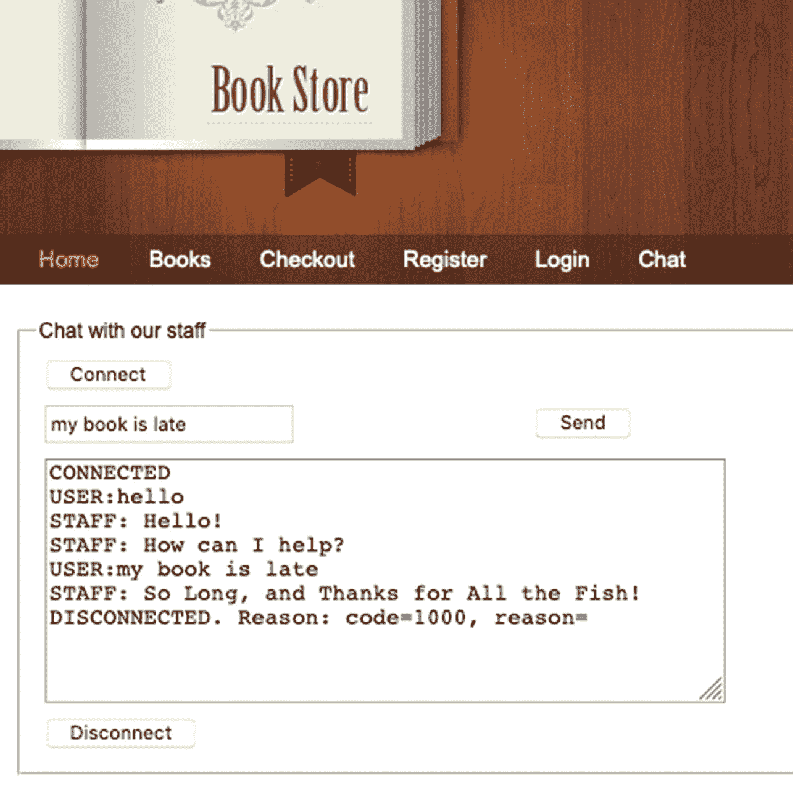

# 11.保护 Spring WebFlux 应用程序

在反应式编程的两章之后，我们仅仅触及了反应式应用程序的表面。反应式代码不会让你的代码更简单、更易读，但它让你的代码更健壮、更容易扩展。交换大量信息的复杂应用程序最适合使用反应式框架来实现。通过使用反应式编程，数据可以流动，并且可以执行操作来简单有效地转换和组合数据，而不需要编写处理同步线程的复杂性的代码。

用 Spring WebFlux 编写的反应式 web 应用程序也可以公开反应式视图，使用户界面响应更快。反应式视图可以显示由反应式服务发送的数据，而无需冻结页面。这些主题已经讨论过了，实现它们的代码在前面两章中已经讨论过了。

本章涵盖了与 Spring WebFlux 应用程序相关的两个更重要的主题:如何应用背压和保护 Spring WebFlux 应用程序。

## 反压力

前两章提到了背压。有人暗示，背压表示订阅方控制其订阅的发布方发出值的速率的操作。如果没有 WebSocket 这样的双向通信协议，解决背压问题是没有意义的。

订阅者可以通过配置的方式向发布者请求特定数量的项目。前一章使用了速度较慢的发布器，它们使用`zip`操作符按配置的时间间隔发布项目。

让我们从介绍允许背压发生的技术开始:WebSocket 协议。

### WebSocket 协议

处理数据流的一个核心建议是永远不要阻塞。使用由流发出的数据的客户端不拥有该线程，所以它永远不应该阻塞它。为了避免发出其他项，需要将它们存储在缓冲区中。但是，缓冲区是有限的，它们可能会被填满和溢出，数据可能会丢失。所以剩下唯一可能的选择:应该允许客户端控制流发出项目的速率。然而，要做到这一点，我们需要一个双向的沟通渠道。

首先，让我们快速回顾一下图 [11-1](#Fig1) 。


图 11-1

TCP 之上的通信技术

浏览器和服务器之间的正常通信是通过 TCP 连接完成的。HTTP 协议 <sup>[1](#Fn1)</sup> 是 TCP 之上的通信协议，它包含一旦数据到达就读取和处理该数据的特定指令。客户端向服务器发出 HTTP 请求，服务器用 HTTP 响应进行应答。客户机和服务器之间的多次请求和响应交换可以通过 HTTP 持久连接(保持活动)进行。客户端和服务器之间的这种通信方式被称为**轮询**，因为它们定期通过 HTTP 连接向服务器请求新数据。为章节 [1](01.html) 到 [8](08.html) 编写的应用程序就是为这种类型的通信而设计的。

第 [10](10.html) 章中介绍的服务器发送事件(SSE)<sup>[2](#Fn2)T3，是一种服务器*推送*技术，使客户端能够通过 HTTP 连接从服务器接收自动更新。这是一种单向通信，类似于 JMS 中的发布/订阅模型。</sup>

WebSocket <sup>[3](#Fn3)</sup> 是一种计算机通信协议，通过单一 TCP 连接提供全双工通信通道。WebSocket 是 HTTP 的替代方案，它允许在浏览器(客户端)和服务器之间进行双向交互通信。它支持 TCP 之上的消息流，其 API 消息可以发送到服务器，并且可以接收事件驱动的响应，而无需轮询。WebSocket 被设计成 HTTP 兼容的。HTTP 仅用于握手。这是两个协议之间连接的终点。在引擎盖下，他们是非常不同的。WebSocket 是一个底层的传输协议，第一个 URL 请求建立一个连接，之后所有的应用消息都流经同一个 TCP 连接。图 [11-2](#Fig2) 大致描绘了客户端和服务器之间使用 WebSocket 的通信。


图 11-2

使用 WebSocket 进行通信

WebSocket 上的通信从一个 HTTP 请求开始，请求使用 WebSocket 协议。该请求应该有一个名为`Upgrade`的头，其中填充了值`WebSocket`，还有一个名为`Connection`的头，其中填充了值`Upgrade`。一些 base-64 编码的随机字节头可以防止同一条消息被发送两次。清单 [11-1](#PC1) 中描述了这个初始 HTTP 请求和响应的内容示例。

```java
 --- HTTP  Request ---
GET /chat HTTP/1.1
Host: localhost
Upgrade: websocket
Connection: Upgrade
Sec-WebSocket-Version: 13
Origin: http://localhost:8080

 --- HTTP  Response ---
HTTP/1.1 101 Switching Protocols
Upgrade: websocket
Connection: Upgrade

Listing 11-1WebSocket HTTP Request and Response Handshake Example

```

响应应该是 HTTP 状态代码 101，这表示 WebSocket 接受通信。在这个初始握手之后，客户机(浏览器)和服务器通过 WebSocket 会话进行通信，任何一方都可以结束这个会话。

WebSocket 是需要频繁高速交换小块数据的应用程序的合适解决方案(例如，社交媒体、交易、视频游戏、博彩网站等)。).如果信息交换量相对较低，经典的 HTTP 轮询解决方案可能会提供有效的解决方案。在通信的数据传输部分，客户端和服务器可以同时向对方发送消息，这为向您的应用程序添加更健壮的实时通信功能打开了大门。

大多数现代浏览器都支持 WebSocket。

WebSocket 协议定义了一个`ws://`前缀来表示 WebSocket 连接。`wss://`前缀表示安全、加密的 WebSocket 连接用于通信。WebSocket 不知道代理服务器和防火墙，但它与 HTTP 兼容，并使用 HTTP 80 和 443 端口进行通信。未加密的 WebSocket 流量在到达 WebSocket 服务器的途中流经一个显式或透明的代理服务器。如果代理服务器没有配置为支持未加密的 WebSocket 流量，连接很可能会失败。加密的 WebSocket 流量是通过使用传输层安全性(TLS)的连接完成的。当浏览器配置为使用显式代理服务器时，会发出 HTTP CONNECT 命令。这建立了一个隧道，它通过 Web Sockets 安全客户端和 WebSocket 服务器之间的 HTTP 代理提供低级的端到端 TCP 通信。

从 4.0 版本开始，Spring 框架支持 WebSocket 风格的消息传递，并将 STOMP 作为应用程序级别的子协议。在框架内，对 WebSocket 的支持在`spring-websocket`模块中，它与 Java WebSocket API 标准(JSR-356)兼容。 <sup>[4](#Fn4)</sup> 对于一个 servlet 环境，还有一个 Spring Boot 启动器依赖:`spring-boot-starter-websocket`。在讨论在反应式应用程序中使用 WebSocket 进行通信之前，让我们先了解一下如何在非反应式应用程序中使用 WebSocket。

#### 对非反应式应用程序使用 WebSocket API

当使用 Spring 的 WebSocket API 时，通常会实现`org.springframework.web.socket.WebSocketHandler`接口，或者使用方便的子类，比如用于处理二进制消息的`org.springframework.web.socket.handler.BinaryWebSocketHandler`，用于 SockJS 消息的`org.springframework.web.socket.sockjs.transport.handler.SockJsWebSocketHandler`，或者用于处理基于`String`的消息的`org.springframework.web.socket.handler.TextWebSocketHandler`。在我们的例子中，为了简单起见，我们使用一个`TextWebSocketHandler`来通过 WebSocket 传递字符串消息。您可以在本书的源代码中找到连接和发送消息到服务器的 JavaScript 代码。本节重点介绍实现一个非常基本的聊天功能的处理程序并对其进行配置所必需的 Spring 代码。如前所述，处理程序接收和发送文本消息，因此处理程序类必须扩展`TextWebSocketHandler`。代码如清单 [11-2](#PC2) 所示。

```java
package com.apress.prospringmvc.bookstore;

import org.springframework.web.socket.TextMessage;
import org.springframework.web.socket.WebSocketSession;
import org.springframework.web.socket.handler.TextWebSocketHandler;

import java.io.IOException;
import java.util.List;
import java.util.Random;

public class ChatHandler extends TextWebSocketHandler {

    @Override
    public void handleTextMessage(WebSocketSession session, TextMessage textMessage) throws IOException {
        if(textMessage.getPayload().toLowerCase().contains("hello")||
            textMessage.getPayload().toLowerCase().contains("hi")) {
            session.sendMessage(new TextMessage(BOT_ANSWERS.get(0)));
            session.sendMessage(new TextMessage(BOT_ANSWERS.get(1)));
        } else {
            session.sendMessage(new TextMessage(randomMessages()));
        }
    }

    private static final Random RANDOM = new Random(System.currentTimeMillis());

    private static final List<String> BOT_ANSWERS = List.of(
            "Hello!",
            "How can I help?"
            // ... more messages omitted
    );

    private static String randomMessages() {
        return BOT_ANSWERS.get(RANDOM.nextInt(BOT_ANSWERS.size() - 2) + 2);
    }
}

Listing 11-2The ChatHandler Class That Extends TextWebSocketHandler

```

`ChatHandler`实现了一个非常基本的聊天机器人，它用一个固定集合中的随机消息来回复收到的消息。这个实现处理从客户端收到的请求，这些请求是使用特定于 WebSocket 官方 API 的 JavaScript 函数发送的。 <sup>[5](#Fn5)</sup> 现在我们有了一个用于 WebSocket 通信的处理程序，让我们将它映射到一个 URL 路径，并告诉 Spring 我们正在使用 WebSocket 与客户端通信。对此有一个特殊的注解叫做`@EnableWebSocket`。

清单 [11-3](#PC3) 描述了应用程序支持 WebSocket 所必需的 Spring 配置类。

```java
package com.apress.prospringmvc.bookstore.web.config;

import com.apress.prospringmvc.bookstore.ChatHandler;
import org.springframework.context.annotation.Bean;
import org.springframework.context.annotation.Configuration;
import org.springframework.scheduling.annotation.EnableAsync;
import org.springframework.web.socket.config.annotation.EnableWebSocket;
import org.springframework.web.socket.config.annotation.WebSocketConfigurer;
import org.springframework.web.socket.config.annotation.WebSocketHandlerRegistry;

@Configuration
@EnableWebSocket
@EnableAsync
public class WebSocketConfig implements WebSocketConfigurer {

    @Override
    public void registerWebSocketHandlers(WebSocketHandlerRegistry registry) {
        registry.addHandler(chatHandler(), "/chatHandler").setAllowedOrigins("*");
    }

    @Bean
    public ChatHandler chatHandler() {
        return new ChatHandler();
    }
}

Listing 11-3The Spring WebSocket Configuration Class

```

前面的配置类包含一些需要更详细解释的元素。

*   `@EnableWebSocket` `:`当放置在 Spring 配置类上时，它启用 WebSocket 请求处理。

*   `WebSocketConfigurer` `:`必须实现该接口才能访问`WebSocketHandlerRegistry`。应该实现一个方法`registerWebSocketHandlers(WebSocketHandlerRegistry)`来将 WebSocket URL 路径映射到适当的处理程序。

*   `setAllowedOrigins("*")` `:`这个方法被设置为允许从任何来源调用我们的应用程序。如果你熟悉 CORS(跨源资源共享)，你知道出于安全原因，浏览器限制从脚本发起的跨源 HTTP 请求。默认情况下，只允许来自同一来源的呼叫。在产生的`WebSocketHandlerRegistration`上调用该方法可以确保您不会在本地遇到问题，尤其是在 127.0.0.1 上的浏览器中打开应用程序并尝试使用`localhost`发送 WebSocket 消息时。我在写代码的时候就遇到了这种情况，这就是为什么我认为它值得一提。在生产中，您不应该这样做，最多，您应该配置允许来源的列表。

*   一个非常有用的注释，因为它支持异步消息传递。这意味着一旦连接打开，客户端和服务器就可以并行发送消息。

在这个简单的例子中，客户机由浏览器中执行的 JavaScript 代码表示，浏览器是`chat.html`视图的一部分。实现很简单。它使用 jQuery for JavaScript 事件声明侦听器，以连接到服务器、发送/接收消息或关闭连接。清单 [11-4](#PC4) 描述了它的实现和 HTML 元素。

```java
<script th:inline="javascript">
    var ping;
    var websocket;

    jQuery(function ($) {
        function writeMessage(message) {
            $('#messageOutput').append(message + '\n')
        }

        $('#connect')
            .click(function doConnect() {
                var handlerURL = 'ws://localhost:8080/chapter11-1/chatHandler';
                websocket = new WebSocket(handlerURL);
                websocket.addEventListener('message', function (evt) {
                    writeMessage('STAFF: ' + evt.data);
                });

                websocket.addEventListener('open', function(evt) {
                    writeMessage("CONNECTED");
                });

                websocket.addEventListener('close', function (evt) {
                    writeMessage(`DISCONNECTED.
                        Reason: code=${evt.code}, reason=${evt.reason}`);
                });

                websocket.onerror = function (evt) {
                    writeMessage('ERROR:' + evt.data);
                };
            });

        $('#disconnect')
            .click(function () {
                if(typeof websocket != 'undefined') {
                    websocket.close();
                } else {
                    alert("Not connected.");
                }
            });

        $('#send')
            .click(function () {
                if(typeof websocket != 'undefined') {
                    websocket.send($('#message').val());
                    writeMessage('USER:' + $('#message').val());
                } else {
                    alert("Not connected.");
                }
            });
    });
</script>
<div class="left_content" id="left_content"
     th:fragment="~{template/layout :: left_content}" >
    <fieldset>
        <legend th:text="#{chat.title}">CONTACT STAFF</legend>
        <table>
            <tr>
                <td colspan="2"><button id="connect"
                    th:text="#{button.connect}">CONNECT</button></td>
            </tr>
            <tr>
                <td><input id="message" value=""/></td>
                <td><button id="send"
                    th:text="#{button.send}">SEND</button></td>
            </tr>
            <tr>
                <td colspan="2" align="center">
                    <textarea readonly id="messageOutput"
                        rows="10" cols="50"></textarea></td>
            </tr>
            <tr>
                <td colspan="2"><button id="disconnect"
                    th:text="#{button.disconnect}">Disconnect
                    </button></td>
            </tr>
        </table>
    </fieldset>
</div>
<!-- other HTML code omitted -->

Listing 11-4JavaScript Functions

for Establishing a WebSocket Connection and Sending/Receiving Messages Over It

```

使用`chat.html`模板生成的 HTML 页面如图 [11-3](#Fig3) 所示。



图 11-3

聊天页面

例如，这种类型的实现非常适合与提供支持的真人聊天。现在，让我们回到反应世界。

#### 在反应式应用程序中使用 WebSocket API

在前面的章节中，由 Node.js 服务产生的新闻流被 Spring WebFlux 书店应用程序使用。使用一个数据驱动变量，使用一个`WebClient`来消费该流并产生一个注入百里香模板的`Flux<String>`。使用 WebSocket，我们可以避免使用被动视图，而使用 JavaScript 代码通过 WebSocket 连接直接与提供数据的服务器通信。从通信中删除一个节点可能会加快传输速度，并且不再需要编写一些 Java 代码。

在本节中，我们不再使用 Node.js 服务，而是使用`WebSocketHandler`实现相同的功能。Spring 框架提供了一个反应式 WebSocket API，您可以使用它来编写处理 WebSocket 消息的客户端和服务器端应用程序。reactive `org.springframework.web.reactive.socket.WebSocketHandler`接口声明了一个应该由开发人员实现的用于处理 WebSocket 会话的抽象方法(参见清单 [11-5](#PC5) )。

```java
package org.springframework.web.reactive.socket;
// imports and default method omitted

public interface WebSocketHandler {
    Mono<Void> handle(WebSocketSession session);
}

Listing 11-5WebSocketHandler Method

Skeleton for handle(WebSocketSession)

```

`org.springframework.web.reactive.socket.WebSocketSession`接口表示一个 WebSocket 会话，它声明了一组在双方之间交换信息的方法。最重要的是`send(Publisher<WebSocketMessage>)`和`receive()`(见清单 [11-6](#PC6) )。

```java
package org.springframework.web.reactive.socket;
// imports and other methods omitted

public interface WebSocketSession {
    WebSocketMessage textMessage(String payload);

    Mono<Void> send(Publisher<WebSocketMessage> messages);
    Flux<WebSocketMessage> receive();

    Mono<Void> close(CloseStatus status);
}

Listing 11-6WebSocketSession Method Skeleton for send(..) and receive()

```

Spring 为这个接口提供了非常有用的`org.springframework.web.reactive.socket.adapter.AbstractWebSocketSession<T>`实现`. It`为`WebSocketSession`接口中的所有方法提供了基本实现。在向客户端发送数据之前，必须将其转换为 WebSocket 协议能够识别的格式。任何类型对象的字符串表示都可以通过使用实用方法`textMessage(String)`转换成`org.springframework.web.reactive.socket.WebSocketMessage`。如果客户机是一个浏览器，并且使用 JavaScript 将数据呈现到浏览器中，那么最合适的文本表示就是 JSON。将`WebSocketMessage`实例转换为`String`的反向功能由`WebSocketMessage`类中声明的`getPayloadAsText()`方法提供。

一个`WebSocketHandler`实现必须将入站(来自客户端的消息)和出站(发送到客户端的消息)流组成一个统一的流，并返回一个`Mono<Void>`。前面提到过，WebSocket 通信可以被任何一方关闭。这意味着，根据应用程序要求，当发生以下情况时，统一流程完成。

*   入站或出站消息流完成。

*   入站流完成，连接关闭，而出站流是无限的。

*   在选定的时间点(服务器超时)，通过调用`WebSocketSession`的`close(CloseStatus)`方法。(`org.springframework.web.reactive.socket.CloseStatus`类包含一组常数值，代表最常见的 WebSockets 状态代码。`1000`是用于优雅的沟通结束的代码。) <sup>[6](#Fn6)</sup>

在书店应用程序的上下文中，`WebSocketHandler`的实现应该接收来自客户端的消息，同时还向应用程序发送技术新闻。清单 [11-7](#PC7) 描述了这样一个实现。

```java
package com.apress.prospringmvc.bookstore.handler;

import org.springframework.web.reactive.socket.WebSocketHandler;
import org.springframework.web.reactive.socket.WebSocketMessage;
import org.springframework.web.reactive.socket.WebSocketSession;
// other imports omitted

public class TechNewsHandler implements WebSocketHandler {
    private final Logger logger = LoggerFactory.getLogger(NewsWebSocketHandler.class);

    private final AtomicLong rate = new AtomicLong(2000);

    @Override
    public Mono<Void> handle(WebSocketSession session) {
        Flux<String> newsFlux = Flux.fromStream(
                Stream.generate(BookNewReleasesUtil::randomNews))
        .delayElements(Duration.ofMillis(rate.get()));
        return session.send(newsFlux.map(session::textMessage))
                .and(session.receive()
                    .map(WebSocketMessage::getPayloadAsText)
                    .doOnNext(message -> logger.debug("Client says: {}", message))
                );
    }
}

Listing 11-7TechNewsHandler Implementation

```

在清单 [11-7](#PC7) 中，入站和出站流合并成一个统一的流可能并不明显。这就是声明式编程和 lambdas 的危险。清单 [11-8](#PC8) 中的实现清楚地表明了这两个不同的流。

```java
package com.apress.prospringmvc.bookstore.handler;
// other imports omitted

public class TechNewsHandler implements WebSocketHandler {
    private final Logger logger = LoggerFactory.getLogger(TechNewsHandler.class);

    @Override
    public Mono<Void> handle(WebSocketSession session) {
        var inbound = session.receive()
                .map(WebSocketMessage::getPayloadAsText)
                .doOnNext(message -> logger.debug("Client says: {}", message))
                .then();

        var source =  Flux.generate(
            (SynchronousSink<String> synchronousSink) ->
             synchronousSink.next(BookNewReleasesUtil.randomNews())
        );

        var outbound = session.send(source.map(session::textMessage)
            .delayElements(Duration.ofSeconds(2L))); // artificial delay

        return Mono.zip(inbound, outbound).then();
    }
}

Listing 11-8TechNewsHandler Implementation

Making the Two Streams Obvious

```

`send(..)`方法获取发送给客户端的消息的来源；在这种情况下，无限的`Flux<String>`发出随机的科技新闻。`receive()`方法返回一个流，该流发出代表从客户端接收的消息的`WebSocketMessage`实例。这些信息使用`getPayloadAsText()`方法转换成`String`，并打印在控制台上。

现在我们有了一个`WebSocketHandler`，我们必须将它映射到一个 URL。在一个将`spring-boot-starter-webflux`声明为依赖项的 Spring Boot 应用程序中，这是通过声明一个包含 URL 路径和`TechNewsHandler` bean 之间对应关系的`HandlerMapping` bean 和声明一个`WebSocketHandlerAdapter`来完成的。`WebSocketHandlerAdapter`委托给一个`WebSocketService`。默认情况下，这是一个类型为`HandshakeWebSocketService. I`的实例。ts 的职责是对与 WebSocket 相关的 HTTP 请求执行基本检查，并从`WebSession`中提取属性，以将它们插入到`WebSocketSession`中(这在需要身份验证时非常有用)。

不需要特殊的注释。只需在一个用`@Configuration`标注的类中声明三个 beans，它们就被 Spring 捡起来使用了。配置所需的所有接口和类都是`org.springframework.web.reactive`包及其子包的一部分。清单 [11-9](#PC9) 描述了这个非常简单的配置。

```java
package com.apress.prospringmvc.bookstore.config;

import org.springframework.web.reactive.socket.WebSocketHandler;
import org.springframework.web.reactive.socket.server.support.WebSocketHandlerAdapter;
// other imports omitted

@Configuration
public class WebSocketConfig {

    @Bean
    WebSocketHandler techNewsHandler(){
        return new TechNewsHandler();
    }

    @Bean
    HandlerMapping handlerMapping(WebSocketHandler techNewsHandler) {
        return new SimpleUrlHandlerMapping() {
            {
                setUrlMap(Collections.singletonMap("/ws/tech/news", techNewsHandler));
                setOrder(-1);
            }
        };
    }

    @Bean
    public WebSocketHandlerAdapter handlerAdapter() {
        return new WebSocketHandlerAdapter();
    }

}

Listing 11-9Spring Necessary Beans to Configure WebSocket Communication

```

这就是在 Spring 应用程序中配置 WebSocket 通信支持所需的全部内容。该处理程序的映射顺序设置为–1，以确保 WebSocket 请求在带注释的控制器之前得到处理。用于发出 WebSocket 请求的 JavaScript 代码非常简单；它在清单 [11-10](#PC10) 中进行了描述。

```java
<script th:inline="javascript">
    $( window ).on( "load", function() {
        renderNews.start();
    });
    $( window ).on( "onbeforeunload", function() {
        renderNews.start();
    });

    var renderNews = {
        socket : new WebSocket('ws://localhost:8080/ws/tech/news'),
        fromServer: [],
        start: function () {
            this.socket.addEventListener('message', function (event) {
                let message = event.data

                $("#techNews").html(message);
                renderNews.fromServer.push(event.data);
                if(renderNews.fromServer.length % 10 === 0) {
                    renderNews.socket.send('Slow down mate!');
                } else  if(renderNews.fromServer.length % 15 === 0) {
                    renderNews.socket.send('Faster mate!');
                }
            });

            this.socket.addEventListener('open', function(event) {
                console.log('Opening connection...');
                renderNews.socket.send('Give me your best shot');
            });

            this.socket.addEventListener('close', function(event) {
                if (event.wasClean) {
                    console.log(`Clean closing...
                        code=${event.code} reason=${event.reason}`);
                } else {
                    // event.code is usually 1006 in this case
                    console.log('Server closed the connection.');
                }
            });

            this.socket.addEventListener('error', function(event) {
                console.log(`Well bummer... ${error.message}`);
            });
        },
        stop: function() {
            this.socket.close();
        }
    };
</script>

Listing 11-10JavaScript Code Written Using Official WebSocket API in(part of the search.html template file

)

```

JavaScript 代码类似于清单 [11-4](#PC4) ，因为它使用相同的 WebSocket API 来处理连接、关闭和消息事件。

不幸的是，没有 Java 客户端来测试 WebSocket 反应式通信。而且`curl`在这方面也做得不好。测试它的唯一方法是运行项目并添加`console.log`语句来调试它。或者试试简单的 WebSocket 客户端 Chrome 插件。 <sup>[7](#Fn7)</sup>

既然我们有了一个使用 WebSocket 通信的客户机和服务器，那么是时候讨论背压这个主题了。

### 处理背压

背压是反应式编程的独角兽。几乎每个软件工程师都知道如何定义它，并且必须尽早处理它。术语**背压**借用自流体动力学，但在软件中，它表示阻止数据通过软件的力。如果你有两个应用程序在交换数据，而其中一个不能足够快地处理接收到的数据，这就是*在阻止数据流*。背压会导致阻塞和数据丢失，所以处理背压就是编写代码在服务器端调节数据流，在客户端实现一些数据保存机制。

如今，服务器和客户端应用程序通过网络分离，通信通过 TCP 完成。为了理解如何通过网络处理背压，有必要了解 TCP 的工作原理。在因特网上建立通信可以通过各种协议来完成，而网络协议是一个庞大的主题，已经有不止一本书写了关于它们的内容。但是，在这本书的背景下，我尽量保持简单。传输控制协议(TCP)是互联网协议簇的核心协议。通过 HTTP、WebSocket 和 TCP 之上的其他协议进行通信的应用程序通常对传递每个信息位(包)并不敏感，而是对传递所有信息的总持续时间敏感。这就是为什么每次包到达目的地时，都会发出一个确认信号，这确保了成功的*端到端*通信。

处理背压适合在哪里？应该实现某种机制来控制发送到网络或从网络接收的逻辑元素的数量。TCP 有自己的流量控制， <sup>[8](#Fn8)</sup> 但是它适用于包。TCP 不知道你使用它上面的协议发送的内容的整体形状。因此，在 TCP 之上使用协议的应用程序必须将逻辑元素转换成字节。但是他们无法控制这些元素在被转换成包后是如何传输的。背压由 TCP 流量控制调节。当然，可以在应用程序中添加逻辑来控制元素发出的速率，但是客户端对此有什么可说的吗？

Spring Framework 5 在框架中实现了 WebSockets 支持的现代化，为这个通信通道增加了反应能力。一旦建立了 WebSocket 通信，客户端和服务器就可以独立地向对方发送在专用流上发出的消息。在非反应式应用程序中，客户端发送一条或多条消息，服务器也通过发送一条或多条消息做出反应。在反应式应用程序中，客户端和服务器可以通过 WebSocket 连接相互发送消息流。

在前面的例子中，我们已经看到消息以一定的速率发送到客户端。客户端同时发送的消息只是被打印出来，它们不会以任何方式中断或影响服务器的行为。运行清单 [11-10](#PC10) 中描述的代码的浏览器和运行清单 [11-8](#PC8) 中代码的服务器之间的交互的可视化表示如图 [11-4](#Fig4) 所示。


图 11-4

JavaScript 客户端和 Spring WebFlux 应用程序通过 WebSocket 进行通信

服务器通过`inbound`流接收客户端发送的消息，并使用`outbound`流将消息发送给客户端。客户机在浏览器的 HTML 页面中呈现消息，服务器在控制台中打印它收到的消息。没用吧？没多大作用。在 Internet 上也找不到其他的基本示例，它们实现了一种 echo 通信，在这种通信中，服务器用客户端发送的消息进行响应。应用程序级别的背压控制的例子很简单，只需使用定制的订户来处理块中发出的元素，从而调节流量。这假设客户端应用程序是使用反应流 API 实现编写的。

清单 [11-11](#PC11) 是一个使用项目反应器`BaseSubscriber<T>`的实现来处理背压的简单例子。消息源与前一节中使用 WebSocket 发送消息的流相同，但是它被限制为 20 个元素，以保持执行的有限性。

```java
@Test
void testBackpressureHandlingOne() {
    var techNews = Flux.fromStream(
            Stream.generate(BookNewReleasesUtil::randomNews))
        .take(20).log(); // server outbound stream

    // client
    techNews.subscribe(new BaseSubscriber<>() {
        int processed;
        final int limit = 5;

        @Override
        protected void hookOnSubscribe(Subscription subscription) {
            subscription.request(limit);
        }

        @Override
        protected void hookOnNext(String news) {
            //client logic here
            if (++processed >= limit) {
                processed = 0;
                request(limit);
            }
        }
    });
}

Listing 11-11Backpressure Handling Example Using Customized BaseSubscriber<T>

```

Project Reactor 的`BaseSubscriber<T>`中的`hookOnSubscribe(Subscription)`实现被认为是无限的，这意味着它请求的元素数量与`subscription.request(..)`方法的声明参数类型的上限(即`long`)一样多，因此默认情况下，它从流中请求`Long.MAX_VALUE`元素。您可以通过查看`BaseSubscriber<T>` Java 代码来检查这一点。 <sup>[9](#Fn9)</sup>

这并不总是好的，因为消费者处理接收到的值可能会很慢。

再打个流体力学的比方，客户控制水龙头杠杆来决定水压是很正常的吧？下面的代码相当于使用了`limitRate(int)`方法，当在`Flux<T>`实例上调用该方法时，它会将后续订阅者的请求限制在作为参数提供的数量内(这样就像一个流量杠杆)。清单 [11-12](#PC12) 中描述了相当于清单 [11-11](#PC11) 的代码。

```java
@Test
void testBackpressureHandlingTwo() {
    var techNews = Flux.fromStream(
            Stream.generate(BookNewReleasesUtil::randomNews))
        .take(20).log();
    consume(techNews.limitRate(5));
}

private void consume(Flux<String> input) {
    input.subscribe(/*s -> clientLogicHere(s)*/);
}

Listing 11-12Backpressure Handling Example Using Flux.limitRate(int)

```

当您运行前面的任何测试时，您会看到日志消息清楚地表明数据是以五条消息的形式发出的，这让客户端可以松口气。但是，大多数人期望客户机告诉服务器首选的发射速率，对吗？嗯，我这样做是因为我得到了反应流和双向连接的承诺，我想一起使用它们。我试图修改`TechNewsHandler`,以便当从客户端接收到一条消息时，服务器用一个根据消息以不同速率发出值的流来响应。信息*慢点，伙计！*使频率下降到每 5 秒发射一个值，并且*更快，伙计！*使速率增加到每 2 秒发射一个值。清单 [11-13](#PC13) 中描述了一个解决方案。

```java
package com.apress.prospringmvc.bookstore.handler;
// other imports omitted

public class TechNewsHandler implements WebSocketHandler {
    private final Logger logger = LoggerFactory.getLogger(TechNewsHandler.class);

    private Flux<String> getRandomNews(String message){
        long rate = "Slow down mate!".equals(message) ? 5000:2000L;
        return  Flux.fromStream(Stream.generate(BookNewReleasesUtil::randomNews))
            .delayElements(Duration.ofMillis(rate));
    }

    @Override
    public Mono<Void> handle(WebSocketSession session) {
        return session.send(session.receive()
                .map(WebSocketMessage::getPayloadAsText)
                .log()
                .flatMap(this::getRandomNews)
                .map(session::textMessage)).then();
    }
}

Listing 11-13ServerController

Modified to Support Different Emission Rates for Messages

```

这看起来是一个非常优雅的解决方案，既漂亮又干净，但是它能像预期的那样工作吗？

最长的答案是:不尽然。

简短的回答是:没有。

反应式编程的声明式风格和对它的误解有时会导致这样的怪物。前面的`handle(..)`方法的实现可以总结如下:每次在这个会话中收到一条消息时，发送一个由`getRandomNews()`调用返回的无限消息流。该函件可归纳如下。

*   客户发送，*给我你最好的照片。*

*   服务器上的一个数据流每 2 秒钟就开始发送随机的科技新闻。

*   客户发送*慢点，伙计！*

*   服务器上的另一个流开始每 5 秒钟发送一次随机的科技新闻。

*   客户发送，*快点，伙计！*

*   服务器上的另一个数据流每 2 秒钟就开始发送随机的科技新闻。

等等。

没有人取消订阅这些流，结果是什么呢？所有流都会继续发出元素，直到用户关闭网页或者服务器内存不足。所有这些流都在同一个`WebSocketSession`将它们的消息发送到同一个客户端，所以结果会淹没浏览器。背压控制没有正确实现，因为控制流是不可能的，因为处理后续消息之间不共享状态。

在本书附带的源代码中，您可以找到 Node.js 服务器实现(文件`tech-news-server.js`),它允许客户端控制发射速率。这是可能的，因为使用了`setInterval`和`clearInterval`方法。对生成消息的函数的引用在同一会话中处理后续消息时共享。没有使用 JavaScript 反应流库，所以反应是模拟的。但是，它的工作是考虑客户的愿望。

使用 Spring WebFlux 无法编写等效的版本。一个`ConcurrentHashMap<String`、`Flux<WebSocketMessage>>`可以存储映射到每个`WebSocketSession`的出站流的引用。当接收到消息时，从连接映射中检索对出站流的引用，只需在现有流上调用`.subscribe().dispose()`并用另一个具有不同值发出速率的流来替换它。主要问题是反应式编程的声明式风格阻止您替换现有的流。这是因为不变性。

呈现在网页上的随机新闻不需要与客户端进行太多的交流。客户端必须打开页面，这将打开 WebSocket 连接，通过该连接传送数据，该操作还意味着订阅服务器上的技术新闻流，然后关闭页面，这将取消订阅，因为 WebSocket 连接也被关闭。仅此而已。在这种情况下，根据客户端的偏好来调节消息发送速率是没有意义的。上一次一个网站被设计成降低广告速度以避免浏览器冻结是什么时候？没人关心这个，这就是广告拦截器被发明的原因。服务器被设计成以保持信息可见和有用的频率向客户机发送消息。

来自客户端的消息影响服务器在其流上发回的内容的唯一方式是将它们保存在数据库中，向客户端发送消息的流将该数据库用作源。添加一个反应式流程，使用客户端消息作为命令来控制需要生成什么并发送给客户端，这样两者之间就有了良好的交互。这种情况如图 [11-5](#Fig5) 所示，请记住:您可以影响*在出站流上发送什么*，*而不是发送消息的频率*。


图 11-5

反应式应用程序，在这种应用程序中，客户端可以控制服务器使用共享数据库发送哪些消息

Project Reactor 是一个反应流实现，因此它的所有操作符都支持非阻塞背压。然而，这仅适用于服务器端的 Java 应用程序。无论是 HTTP 还是 WebSocket，通信协议都限制了无法正确处理背压。关于如何处理两个 Spring WebFlux 应用程序之间的背压的最详细的解释可以在 StackOverflow <sup>[10](#Fn10)</sup> 上找到，这是 Project Reactor 的知名贡献者 Oleh Dokuka 的精彩贡献。可以得出的结论是，我们可以声明几个预取的元素，并将服务器发出的数据分割成块，以抑制需求(就像前面的示例中所做的那样)。但是，在数据开始流动后，客户端没有办法影响这一点。

Oleh Dokuka 说，要通过网络边界实现逻辑元素背压，我们需要一个合适的协议。该协议是 RSocket，将在下一节中介绍。

### RSocket 协议

RSocket <sup>[11](#Fn11)</sup> 是一种二进制应用协议，提供可用于字节流传输(如 TCP、WebSockets 和 Aeron)之上的反应流语义。它是由当今最受欢迎的流媒体平台网飞的工程师开发的。它支持在单个连接上异步交换消息，具有以下特点。

*   **fire-and-forget(无响应)**:比如 handler 方法返回`Mono<Void>`，声明一个类型为 *RequestMessageType* 的参数；您可以将此视为客户端和服务器之间的*一对一*通信。HTTP 支持这一点，但是响应的缺乏让一些浏览器感到困惑。

*   **请求/响应(stream of 1)** :例如 handler 方法返回`Mono<`*response messagetype*`>`并声明一个类型为 *RequestMessageType* 或`Mono<`T10】request message type`>`的参数；您可以将此视为客户端和服务器之间的一对一通信。HTTP 支持这一点。

*   **请求/流(有限多流)**:例如 handler 方法返回`Flux<`*response messagetype*`>`并声明一个类型为 *RequestMessageType* 或`Mono<`T10】request message type`>`的参数；您可以将此视为客户端和服务器之间的一对多通信。WebSocket 支持这一点。

*   **通道(双向流)**:比如 handler 方法返回`Flux<`*response messagetype*`>`，声明一个`Flux<`*request message type*`>`类型的参数；您可以将此视为客户端和服务器之间的多对多通信。

     *RequestMessageType* 和 *RequestMessageType* 是占位符类型，替换客户端和服务器之间通信中使用的真实类型，以创建通用模式。

RSocket 最好的一点是有 Java、JavaScript、Kotlin、.NET，Python，Go，C++。理论上，这意味着用 JavaScript 开发的应用程序可以使用该协议与 Java 应用程序交换消息，这意味着可以在逻辑元素级别应用背压。RSocket 还没有被广泛使用，但是它确实有很大的潜力。不幸的是，在书店应用程序中包含 RSocket 支持会带来很多麻烦，因为`rsocket-js` API 是作为一组 Node.js 模块提供的。所以取而代之的是，因为这本书关注的是 Spring，所以我们写了一个 Spring WebFlux RSocket 服务器和客户端。

RSocket 的 Java 实现建立在 Project Reactor 之上。正如您可能预料的那样，有一个名为`org.springframework.boot:spring-boot-starter-rsocket`的 RSocket 的 Spring Boot 启动器依赖项，它很容易使用。当这个库出现在类路径中时，会使用您的`application.properties`或`application.yaml`文件中的属性自动配置和定制一个`org.springframework.boot.rsocket.netty.NettyRSocketServer` bean。需要在应用程序配置文件中设置两个属性:服务器端口和进行 RSocket 通信的传输协议。没有它们，应用程序将无法启动。

在清单 [11-14](#PC14) 中，您可以看到示例配置文件，这些文件配置服务器在端口 8081 上启动，通过 WebSocket 发送和接收消息。

```java
spring:
  rsocket:
    server:
      transport: websocket
      port: 8081
      mapping-path: /rsocket

Listing 11-14Spring Boot RSocket Server Application Configuration File

```

`spring.rsocket.server.transport`属性的另一个选项是`TCP`，这也是默认选项，假设 RSocket 协议用于 HTTP 之上。`spring.rsocket.server.mapping-path`是可选的，可用于设置 RSocket 应用程序的根上下文路径。如果未指定，则不设置上下文路径。

现在我们有了一个服务器，我们需要一个控制器或处理程序类来处理 RSocket 请求。目前仅支持控制器。你可以在一个`@Controller`注释的类中拥有处理程序方法，方法是用`@MessageMapping(path)`进行注释，来自包`org.springframework.messaging.handler.annotation`。还没有提供 RSocket 请求的自定义处理程序类和功能路由。我的技术评论员想要一个 GitHub 问题链接，但是没有。API 还没有出现，还没有人请求它。

前面已经介绍了 RSocket 上的四种通信方式。清单[中的`ServerController`11-15](#PC15)包含四种方法，每种方法处理一种类型的通信。当客户端和服务器交换比简单文本值更复杂的对象时，必须使用消息转换器来支持序列化和反序列化。默认情况下，使用 JSON，但是如果您正在定制通信并使用其他消息转换器，您可能需要用`@Payload`注释 RSocket 处理程序方法的参数。在清单 [11-15](#PC15) 中，使用了注释，即使不是必需的，因为默认情况下，被处理的对象可以在 JSON 中序列化和反序列化。

```java
package com.apress.prospringmvc.bookstore.controller;

import org.springframework.messaging.handler.annotation.MessageMapping;
import org.springframework.messaging.handler.annotation.Payload;
import org.springframework.stereotype.Controller;
// other imports omitted

@Controller
public class ServerController {
    private final Logger logger = LoggerFactory.getLogger(ServerController.class);

    // fire-and-forget
    @MessageMapping("introduction")
    public Mono<Void> introduction(@Payload ClientMessage clientMessage){
        logger.debug("{}:  We have a new client -->  {}" , Instant.now(), clientMessage.getName());
        return Mono.empty();
    }

    // request/response
    @MessageMapping("check-service")
    public Mono<String> checkService(@Payload ClientMessage clientMessage){
        logger.debug("{}:  Ping request from client --> {}" , Instant.now(), clientMessage.getName());
        return Mono.just(Instant.now() + ": Service online. Send command.");
    }

    // request/stream
    @MessageMapping("show-books")
    public Flux<Book> showBooks(@Payload ClientMessage clientMessage) {
        logger.debug("{}:  Random releases requested by client --> {}" , Instant.now(), clientMessage.getName());
        return Flux.fromStream(
                Stream.generate(BookNewReleasesUtil::randomRelease))
                .delayElements(Duration.ofSeconds(1L));
    }

    //channel (bi-directional streams)
    @MessageMapping("books-channel")
    public Flux<Book> useChannel(@Payload Flux<ClientMessage> messages) {
        return messages
                .map(message-> BookNewReleasesUtil.randomForAuthor(message.getAuthor()))
                .delayElements(Duration.ofSeconds(1L));
    }
}

Listing 11-15RSocket Requests Handler Methods in a @Controller

```

每个方法接收一个`ClientMessage`实例`,`作为参数，该实例是一个简单的类，包含发出请求的客户机的名称。`useChannel(Flux<ClientMessage>)`方法处理客户机和服务器之间的双向通信流。它从客户端接收消息流，处理每个消息流，并使用基于从客户端接收的数据发出的数据流进行响应。在这种情况下，`ClientMessage`实例包含一个作者姓名，在生成随机书籍时用作标准。这是一个非常简单的类，与此无关。

如果您启动应用程序，您会看到服务器在 8081 端口上启动，但是我们如何测试它呢？还记得我说过这个协议很有潜力吗？我不是唯一这样想的人。这就是为什么 Pivotal/VMWare 的一名开发人员创建了一个命令行实用程序来帮助测试 RSocket 服务器。 <sup>[13](#Fn13)</sup> 简称 **RSocket 客户端 CLI** (RSC)或`rsc`。它可以测试前三种方法。测试双向是一项困难的任务，因为使用命令行提供流作为参数很麻烦。在本章的代码中，您可以找到测试所有三种方法的命令。在清单 [11-16](#PC16) 中，您可以看到用于测试`showBooks()`方法的`rsc`命令。`--debug`选项得到一个详细的结果，以文本和二进制格式显示有效负载数据。

```java
$ rsc ws://localhost:8081/rsocket --stream --route show-books --log --debug -d "{\"name\": \"Gigi\"}"
2020-08-17 21:44:17.425  INFO --- [ctor-http-nio-1] rsc             : onSubscribe(FluxMap.MapSubscriber)
2020-08-17 21:44:17.425  INFO --- [ctor-http-nio-1] rsc             : request(unbounded)
2020-08-17 21:44:17.433 DEBUG --- [ctor-http-nio-1] i.r.FrameLogger : sending ->
Frame => Stream ID: 1 Type: REQUEST_STREAM Flags: 0b100000000 Length: 40 InitialRequestN: 9223372036854775807
Metadata:
         +-------------------------------------------------+
         |  0  1  2  3  4  5  6  7  8  9  a  b  c  d  e  f |
+--------+-----------------------------------------------+----------------+
|00000000| 0a 73 68 6f 77 2d 62 6f 6f 6b 73                |.show-books     |
+--------+-----------------------------------------------+----------------+
Data:
         +-------------------------------------------------+
         |  0  1  2  3  4  5  6  7  8  9  a  b  c  d  e  f |
+--------+-----------------------------------------------+----------------+
|00000000| 7b 22 6e 61 6d 65 22 3a 20 22 47 69 67 69 22 7d |{"name": "Gigi"}|
+--------+-----------------------------------------------+----------------+
2020-08-17 21:44:18.439 DEBUG --- [ctor-http-nio-1] i.r.FrameLogger : receiving ->
Frame => Stream ID: 1 Type: NEXT Flags: 0b100000 Length: 123
Data:
         +-------------------------------------------------+
         |  0  1  2  3  4  5  6  7  8  9  a  b  c  d  e  f |
+--------+-----------------------------------------------+----------------+
|00000000| 7b 22 74 69 74 6c 65 22 3a 22 52 65 61 63 74 69 |{"title":"Reacti|
|00000010| 76 65 20 53 70 72 69 6e 67 22 2c 22 70 72 69 63 |ve Spring","pric|
|00000020| 65 22 3a 32 35 2e 34 34 2c 22 79 65 61 72 22 3a |e":25.44,"year":|
|00000030| 32 30 32 30 2c 22 61 75 74 68 6f 72 22 3a 22 4a |2020,"author":"J|
|00000040| 6f 73 68 20 4c 6f 6e 67 22 2c 22 69 73 62 6e 22 |osh Long","isbn"|
|00000050| 3a 22 39 37 38 31 34 38 34 32 32 37 31 31 31 22 |:"9781484227111"|
|00000060| 2c 22 63 61 74 65 67 6f 72 79 22 3a 22 53 70 72 |,"category":"Spr|
|00000070| 69 6e 67 22 7d                                  |ing"}           |
+--------+-----------------------------------------------+----------------+
2020-08-17 21:44:18.439  INFO --- [ctor-http-nio-1] rsc: onNext({"title":"Reactive Spring","price":25.44,"year":2020,"author":"Josh Long","isbn":"9781484227111","category":"Spring"})

# more elements here since this stream is infinite

Listing 11-16Output of rsc Command

```

您可能已经注意到，*请求/响应*和*请求/流*方法没有将 Mono < ClientMessage >声明为参数。这是有意的，因为这会使它们不适合用 RSC 进行测试`.`

为了使*请求/响应*和*请求/流*遵守反应规则，它们的参数应该被声明为具有`Mono<ClientMessage>`。这改变了方法的主体，因为必须在处理管道的前端添加参数。清单 [11-17](#PC17) 中描述了这些变化。

```java
package com.apress.prospringmvc.bookstore.controller;
// other imports omitted

@Controller
public class ServerController {
    private final Logger logger = LoggerFactory.getLogger(ServerController.class);

    // request/response
    // no longer testable with rsc
    @MessageMapping("check-service")
    public Mono<String> checkService(@Payload Mono<ClientMessage> clientMessage){
        return clientMessage
                .doOnNext(message -> logger.debug("{}:  Ping request from client --> {}" ,
                    Instant.now(), message.getName()))
                .map( message -> Instant.now() + ": Service online. Send command.");
    }

    // request/stream
    // no longer testable with rsc
    @MessageMapping("show-books")
    public Flux<Book> showBooks(@Payload Mono<ClientMessage> clientMessage) {
        return clientMessage
                .doOnNext(message -> logger.debug("{}:  " +
                        "Random releases requested by client --> {}" , Instant.now(), message.getName()))
                .thenMany(Flux.fromStream(
                        Stream.generate(BookNewReleasesUtil::randomRelease))
                        .delayElements(Duration.ofSeconds(1L)));
    }

    // rest of the code omitted
}

Listing 11-17The ServerController Fully Reactive Request/Response and the Request/Stream Implementations

```

一旦服务器按预期启动并运行，正如`rsc`所确认的，您就可以开始编写您的客户机了。同一个 Spring Boot 依赖项提供了编写客户机所需的类，但是因为我们连接到一个 RSocket 服务器，所以应用程序配置文件没有填充特定于 RSocket 的属性。在应用程序配置文件中没有任何属性并且`spring-boot-starter-webflux`在类路径中`org.springframework.boot.web.embedded.netty.NettyWebServer`在默认端口 8080 上启动。

我们的客户机是一个简单的`@RestController`带注释的类，包含四个方法，每个方法对 RSocket 服务器应用程序上的四个相应方法之一进行 RSocket 调用。这包括不能用`rsc`测试的方法。为此，需要一个`org.springframework.messaging.rsocket.RSocketRequester`的实例。正在使用 WebSocket URL 配置此 bean，该 URL 向服务器公开的 RSocket 消息处理方法发出请求。bean 是使用`RSocketRequester.Builder.`创建的，它是反应式的并返回一个`Mono<RSocketRequester>`，所以需要一个`block()`调用(是的，就是我在第 [10](10.html) 章末尾告诉你要避免的那个)来提取`RSocketRequester`实例。

清单 [11-18](#PC18) 描述了这个 bean 的声明。因为我们使用 RSocket over WebSocket 进行通信，所以在服务器上调用了带有前缀为`ws://`的典型 WebSocket URL。

如果我们使用 HTTP，那么应该调用带有 HTTP URL 的`connectTcp(..)`。

```java
package com.apress.prospringmvc.bookstore;
import org.springframework.messaging.rsocket.RSocketRequester;
//other imports omitted

@SpringBootApplication
public class RSocketClientBookstoreApplication {

    public static void main(String... args) {
        new SpringApplication(RSocketClientBookstoreApplication.class).run(args);
    }

    @Bean
    RSocketRequester rSocketRequester(RSocketRequester.Builder builder) {
        return builder.connectWebSocket(URI.create("ws://localhost:8081/rsocket")).block();
    }
}

Listing 11-18The RSocketRequester Bean Declaration in the Spring Boot Application Main Class

```

控制器没什么特别的，但是对`RSocketRequester` bean 方法调用的调用很特别。清单 [11-19](#PC19) 描绘了`ClientController`，其中的每个处理程序方法都可以被认为是一个 RSocket 客户端使用同一个`RSocketRequester` bean 向 RSocket 服务器发出请求。

```java
package com.apress.prospringmvc.bookstore;
import org.springframework.messaging.rsocket.RSocketRequester;
//other imports omitted

@RestController
public class ClientController {

    private final RSocketRequester requester;

    public ClientController(RSocketRequester requester) {
        this.requester = requester;
    }

    @GetMapping("introduction")
    public Mono<String> introduction(){
        ClientMessage clientMessage = new ClientMessage().name("gigi");
        requester.route("introduction").data(clientMessage).send();
        return Mono.just("Introduction data was sent.");
    }

    @GetMapping("check-service")
    public Mono<String> checkService(){
        ClientMessage clientMessage = new ClientMessage().name("gigi");
        return requester.route("check-service").data(clientMessage).retrieveMono(String.class);
    }

    @GetMapping(path = "show-books", produces = MediaType.TEXT_EVENT_STREAM_VALUE)
    public Flux<Book> showBooks(){
        ClientMessage clientMessage = new ClientMessage().name("gigi");
        return requester.route("show-books").data(clientMessage).retrieveFlux(Book.class).limitRate(20);
    }

    @GetMapping(value = "books-channel", produces = MediaType.TEXT_EVENT_STREAM_VALUE)
    Flux<Book> booksChannel() {
        return this.requester.route("books-channel")
                .data(Flux.range(0, 10).map(i -> new ClientMessage().name("gigi").author(RandomUtil.randomAuthor())))
                .retrieveFlux(Book.class).limitRate(5).log();
    }
}

Listing 11-19The ClientController Containing Handler Methods Making RSocket Requests

```

`introduction()`和`checkService()`方法不需要`produces`属性，因为它们返回一个`Mono<String>`, Spring 足够聪明，可以在没有特殊指令的情况下自行反序列化。作为单个值，没有必要将它作为 SSE 发送给客户机。它也很实用，因为这些方法可以用浏览器来测试。

`RSocketRequester`将每个客户机请求路由到适当的服务器方法。该方法在服务器端由使用`@MessageMapping`注释指定的属性来标识。`introduction()`处理程序方法被设计成发出一个服务器调用，然后返回一个`Mono<String>`，所以该方法可以通过在浏览器中打开`http://localhost:8080/introduction`来执行。如果不返回任何内容，访问这个 URL 会让大多数浏览器感到困惑。例如，Firefox 抱怨无法读取响应，因为它无法将其转换为文本，而 Chrome 则什么都不说。但是，在反应式服务直接相互对话(不涉及浏览器)的环境中，只发送消息而不期待响应有时是有意义的。举个例子，我们来看看网络广告。你认为将它们发送到页面的服务器会期待你的响应吗？

可以在浏览器中测试`checkService()`方法，从服务器收到的响应显示为网页。最后两个方法返回事件流；为了测试它们，你需要使用`curl`命令 <sup>[14](#Fn14)</sup> 。

在越来越多的人对使用 Spring Boot 编写微服务应用感兴趣的背景下，RSocket 目前是 Pivotal 的典型代表。它易于设置，并且完美地集成在 Spring 生态系统中。如果你想在 Spring Reactive 应用的背景下了解更多关于 RSocket 的知识，spring.io 官方博客上有一系列文章。 <sup>[十五](#Fn15)</sup>

## WebFlux 安全性

WebFlux 安全是本书的最后一个反应式应用主题。任何公开的应用程序都需要支持多个用户并控制对敏感资源的访问。在 Spring WebFlux 应用程序中进行配置比在非反应式 Spring web 应用程序中进行配置更容易。

从第 5 版开始，Spring Security 库被修改为包含 reactive 组件，以在 Spring WebFlux reactive 应用程序中设置安全性。Spring Security 在书中有专门的一章。如果您不熟悉保护 Spring 应用程序，我们建议您先阅读相关内容。我们所说的关于 servlet 环境中 Spring 安全性的一切也适用于反应式应用程序。唯一的区别是一些类和注释，它们允许通过使用反应流和声明性编程在反应式应用程序中配置安全性。

表 [11-1](#Tab1) 包含了为 Spring WebFlux 应用程序和 Spring MVC 应用程序配置安全性所涉及的注释和类。

表 11-1

Spring MVC 和 WebFlux 安全组件比较

<colgroup><col class="tcol1 align-left"> <col class="tcol2 align-left"> <col class="tcol3 align-left"></colgroup> 
| 

spring webflux

 | 

框架

 | 

描述

 |
| --- | --- | --- |
| `org.springframework.security. config.annotation .web.reactive` | `org.springframework.security. config.annotation.web.configuration` | 大多数组件所在的根包。 |
| `@EnableWebFluxSecurity` | `@EnableWebSecurity` / `@EnableWebMvcSecurity` | 在配置类上使用的注释，用于启用 Spring 安全性。(`@EnableWebMvcSecurity`已弃用，可能会在 Spring 6 中移除。它的所有功能已经是`@EnableWebSecurity`的一部分。) |
| @EnableRSocketSecurity | `—` | `@EnableRSocketSecurity`是`org.springframework.security.config.annotation.rsocket`包的一部分，增加了通过 RSocket 协议通信的应用程序中的 Spring 安全性。 |
| `@EnableReactive MethodSecurity` | `@EnableGlobalMethodSecurity` | 在配置类上使用的注释，用于在方法级别启用 Spring 安全性。 |
| `—` | `SecurityConfigurer` | 由安全配置类实现的接口。 |
| `ServerHttpSecurity`(类) | `HttpSecurity`(最后一课) | 允许为特定的 HTTP 请求配置基于 web 的安全性。 |
| `ReactiveUserDetailsService` | `UserDetailsService` | 实现这些接口的类的实例存储用户信息，这些信息随后被封装到`Authentication`对象中。`ReactiveUserDetailsService`是围绕`UserDetailsService`的反应式包装器。 |
| `ServerHttpRequest` | `HttpServletRequest` | `ServerHttpRequest`是 Spring Web 库的一部分，而`HttpServletRequest`是 Java Servlet 库的一部分。 |
| `ServerHttpResponse` | `HttpServletResponse` | `ServerHttpResponse`是 Spring Web 库的一部分，而`HttpServletResponse`是 Java Servlet 库的一部分。 |
| `ServerWebExchange` | `—` | `ServerWebExchange`表示 HTTP 请求-响应交互的契约。它提供对`ServerHttpRequest`和`ServerHttpResponse`的访问。 |
| `SecurityWebFilterChain` | `SecurityFilterChain` | 表示过滤器链的接口与一个`ServerWebExchange` / `HttpServletRequest`匹配，以决定它是否适用于该请求。 |
| `WebFilterChainProxy` | `DelegatingFilterProxy` | 将过滤请求的工作委托给一组`SecurityWebFilterChain` / `SecurityFilterChain`实例。 |
| `WebSessionServerCsrfTokenRepository` | `HttpSessionCsrfTokenRepository` | 一个 CSRF 令牌库实现，它将`CsrfToken`存储在`HttpSession`中。 |

当使用 Spring Boot 编写一个安全的 web 反应式应用程序时，项目类路径上的`spring-boot-starter-security`依赖项会根据一些内部类为您自动配置安全性。应用程序仍然会启动，但是任何 URL 都会重定向到一个默认的登录表单。

要定制 Spring Boot WebFlux 应用程序中的安全配置，您可以在任何配置类中声明一个类型为`org.springframework.security.web.server.SecurityWebFilterChain`的 bean。当应用程序启动时，它会选择它并启用它配置的所有访问规则。如果不使用 Spring Boot，配置类需要用`@EnableWebFluxSecurity`注释。这个注释是在`org.springframework.security.config.annotation.web.reactive`包中声明的，尽管在 Spring Boot 应用程序中没有必要，但大多数开发人员倾向于将所有与安全相关的 beans 聚集在一个用这个注释注释的配置类中，从而将它用作一个标记。

创建 SecurityWebFilterChain bean 的方法将 Spring 注入的一个`org.springframework.security.config.web.server.ServerHttpSecurity`对象作为参数。`ServerHttpSecurity`类公开了与它的非反应对等物`HttpSecurity`几乎相同的方法，允许开发人员为 URL、身份验证提供者、登录表单、注销表单、CSRF 实现等指定访问规则。第 12 章详细解释了如何配置 Spring 安全。

在 Spring WebFlux 应用程序中，配置认证的最快方法是声明一个用一个或多个`UserDetails`实例初始化的`MapReactiveUserDetailsService` bean。该 bean 为内存中的身份验证提供数据。清单 [11-20](#PC20) 是一个被配置为向两个用户提供认证数据的`MapReactiveUserDetailsService` bean 的例子。您可以看到`PasswordEncoder` bean，它设置了密码散列以获得更好的安全性。开发环境的配置可以使用`NoOpPasswordEncoder`来设置，它不会以任何方式改变密码。出于安全考虑，这种方法不被认可。

```java
package com.apress.prospringmvc.bookstore.config.security;

import org.springframework.security.config.annotation.web.reactive.EnableWebFluxSecurity;
import org.springframework.security.config.web.server.ServerHttpSecurity;
import org.springframework.security.core.userdetails.MapReactiveUserDetailsService;
import org.springframework.security.core.userdetails.User;
import org.springframework.security.core.userdetails.UserDetails;
import org.springframework.security.crypto.bcrypt.BCryptPasswordEncoder;
import org.springframework.security.crypto.password.PasswordEncoder;

//other import omitted

@Configuration
@EnableWebFluxSecurity
public class SecurityConfig  {
    //other code omitted
    @Bean
    public MapReactiveUserDetailsService userDetailsService() {
        UserDetails john = User.withUsername("john")
                .password(passwordEncoder().encode("doe")).roles("USER")
                .build();
        UserDetails admin = User.withUsername("admin")
                .password(passwordEncoder().encode("admin")).roles("ADMIN")
                .build();
        return new MapReactiveUserDetailsService(john, admin);
    }

    @Bean
    public PasswordEncoder passwordEncoder() {
        return new BCryptPasswordEncoder();
    }
}

Listing 11-20The MapReactiveUserDetailsService Bean

```

`MapReactiveUserDetailsService`类实现了`org.springframework.security.core.userdetails.ReactiveUserDetailsService`来声明一个简单的 API，用于根据用户名检索一个`Mono<UserDetails>`。如果身份验证数据是由数据库或任何外部系统(例如 Google 或 Okta 这样的单点登录提供商)提供的，那么使用现有数据的最简单方法就是实现这个接口，并提供一种定制的方法来检索身份验证数据。声明一个你的类型的 bean，它会被自动拾取。因为书店应用程序的身份验证数据保存在 MongoDB 表中，所以实现很简单，因为反应式 MongoDB 存储库使用反应式流返回数据。清单 [11-21](#PC21) 描述了书店应用程序中使用的`ReactiveUserDetailsService`的实现。

```java
package com.apress.prospringmvc.bookstore.config.security;
import com.apress.prospringmvc.bookstore.repository.AccountRepository;
import org.springframework.security.core.userdetails.ReactiveUserDetailsService;
import org.springframework.security.core.userdetails.UsernameNotFoundException;
// other imports omitted

@Service
public class ReactiveAuthenticationService implements ReactiveUserDetailsService {

    private final AccountRepository accountRepository;

    public ReactiveAuthenticationService(AccountRepository accountRepository) {
        this.accountRepository = accountRepository;
    }

    @Override
    public Mono<UserDetails> findByUsername(String username) {
        return accountRepository.findByUsername(username).switchIfEmpty(
                Mono.defer(() -> Mono.error(new UsernameNotFoundException("User Not Found"))
        )).map(this::toUserDetails);
    }

    private UserDetails toUserDetails(Account account) {
        String[] authorities = new String[account.getRoles().size()];
        authorities = account.getRoles().toArray(authorities);
        return User.withUsername(account.getUsername())
                .password(account.getPassword())
                .authorities(authorities)
                .build();
    }
}

Listing 11-21The ReactiveAuthenticationService

Bean Used in the Bookstore Application

```

`ReactiveAuthenticationService`返回的数据用于认证用户。它的角色用于决定允许用户访问哪些资源，以及允许在应用程序中执行哪些操作。现在我们已经设置了身份验证提供者数据，下一步是配置`SecurityWebFilterChain`。清单 [11-22](#PC22) 描述了书店应用程序中使用的配置。

```java
package com.apress.prospringmvc.bookstore.config.security;

import org.thymeleaf.extras.springsecurity5.dialect.SpringSecurityDialect;
import org.springframework.security.web.server.util.matcher.ServerWebExchangeMatchers;
// other imports omitted

@Configuration
@EnableWebFluxSecurity
@EnableReactiveMethodSecurity
public class SecurityConfig  {

    @Bean
    SecurityWebFilterChain authorization(ServerHttpSecurity http) {
        final RedirectServerLogoutSuccessHandler logoutSuccessHandler =
             new RedirectServerLogoutSuccessHandler();
        logoutSuccessHandler.setLogoutSuccessUrl(URI.create("/"));

        return http
                .formLogin(formLogin -> formLogin.loginPage("/login"))
                .logout(logoutSpec -> logoutSpec.logoutUrl("/signout")
                    .logoutSuccessHandler(logoutSuccessHandler))
                .authorizeExchange(authorize -> authorize
                        .matchers(PathRequest.toStaticResources().atCommonLocations()).permitAll()
                        .pathMatchers("/book/edit/*", "/book/create").hasRole("ADMIN")
                        .pathMatchers("/customer/edit/*").hasRole("ADMIN")
                        .matchers(ServerWebExchangeMatchers.pathMatchers(HttpMethod.DELETE,
                                "/book/delete/*", "/customer/delete/*", "/account/delete/*")).hasRole("ADMIN")
                        .anyExchange().permitAll()
                )
                .csrf(csrf ->  csrf.csrfTokenRepository(repo()))
                .build();
    }

    @Bean
    public ServerCsrfTokenRepository repo() {
        WebSessionServerCsrfTokenRepository repo = new WebSessionServerCsrfTokenRepository();
        repo.setParameterName("_csrf");
        repo.setHeaderName("X-CSRF-TOKEN"); // default header name
        return repo;
    }

    @Bean
    public SpringSecurityDialect securityDialect() {
        return new SpringSecurityDialect();
    }

}

Listing 11-22The SecurityWebFilterChain

Bean

```

该配置描述了以下内容。

*   `.formLogin(formLogin` → `formLogin.loginPage("/login"))`配置`/login` URL 返回的视图中声明的表单，用于用户登录。要使用默认生成的表单，您可以使用`.formLogin(Customizer.withDefaults()).`

*   。logout(logout spec→logout spec . logout URL("/sign out "))是对 URL `/signout`的 POST 请求，触发注销操作。默认为`/logout`。

*   `.authorizeExchange(..)`使用`Customizer<T>`实例来配置授权。

*   行`.matchers(PathRequest.toStaticResources().atCommonLocations())`构建了一个`ServerWebExchangeMatcher`，它匹配静态源所在的 Spring Boot 默认位置(`/resources/static`目录)，而`.permitall()`调用将它们排除在安全性之外。

*   `pathMatchers(String...` `)`方法对 URL 使用 Ant 样式模式，并返回将 URL 映射到处理程序方法的`ServerWebExchangeMatcher`实例。

*   `ServerWebExchangeMatchers`包含一些创建`ServerWebExchangeMatcher`实例的实用方法。前面的清单中显示的例子使用一个 HTML 方法和一个 URL 列表来创建一个应用安全规则的`ServerWebExchangeMatcher`实例。

*   `.csrf(csrf` → `csrf.csrfTokenRepository(repo()))`通过引入由同一代码示例中配置的`ServerCsrfTokenRepository`生成的 CSRF 令牌来保护应用程序。

*   `RedirectServerLogoutSuccessHandler`注销后将用户重定向到根页面(“/”)。

通过这种配置，客户端和服务器之间的所有交换都是安全的，无论它们是使用控制器处理程序方法还是功能端点来设置的。

通过在测试端点的方法上使用`@WithMockUser`注释，可以非常容易地测试安全配置。这个注释是`spring-security-test`库的一部分，位于`org.springframework.security.test.context.support`包中。它是在 Spring 4 中引入的，在 Spring 5 中被扩展到了反应端点。

清单 [11-23](#PC23) 描述了四种测试方法。清单 [11-22](#PC22) 中的配置涵盖了每个端点。

```java
package com.apress.prospringmvc.bookstore.api;
import org.springframework.security.test.context.support.WithMockUser;
//other imports

@SpringBootTest(webEnvironment = SpringBootTest.WebEnvironment.RANDOM_PORT)
public class BookSecuredApiTest {
    private static Logger logger = LoggerFactory.getLogger(BookSecuredApiTest.class);

    @Autowired
    private WebTestClient testClient;

    @WithMockUser(roles = "USER")
    @Test
    void shouldFindByIsbn(){
        testClient.get()
            .uri(uriBuilder -> uriBuilder.path("/book/by/{isbn}").build("9781484230042"))
            .accept(MediaType.APPLICATION_JSON)
            .exchange()
            .expectStatus().isOk()
            .expectHeader().contentType(MediaType.APPLICATION_JSON)
            .expectBody(Book.class)
            .consumeWith(responseEntity -> {
                logger.debug("Response: {}", responseEntity);
                Book book = responseEntity.getResponseBody();
                assertAll("book", () ->
                {
                    assertNotNull(book);
                    assertAll("book",
                            () -> assertNotNull(book.getTitle()),
                            () -> assertEquals("Iuliana Cosmina", book.getAuthor()));
                });
            });
    }

    @Test
    @WithMockUser(roles = "ADMIN")
    void shouldCreateABook() {
        Book book = new Book();
        book.setTitle("TDD for dummies");
        book.setAuthor("Test User");
        book.setPrice(BigDecimal.valueOf(40.99));
        book.setIsbn("12232434324");
        book.setCategory("test");

        testClient.post().uri("/book/create")
            .body(Mono.just(book), Book.class)
            .exchange()
            .expectStatus().isCreated()
            .expectHeader().contentType(MediaType.APPLICATION_JSON)
            .expectHeader().exists("Location")
            .expectBody(Book.class)
            .consumeWith(responseEntity -> {
                logger.debug("Response: {}", responseEntity);
                assertAll("book", () ->
                {
                    assertNotNull(book);
                    assertAll("book",
                            () -> assertNotNull(book.getIsbn()),
                            () -> assertEquals("test", book.getCategory()));
                });
            });
    }

    @WithMockUser(roles = "ADMIN")
    @Test
    void shouldDeleteByIsbn(){
        testClient.delete()
            .uri(uriBuilder -> uriBuilder.path("/book/delete/{isbn}")
                .build("9781484230042"))
            .accept(MediaType.APPLICATION_JSON)
            .exchange()
            .expectStatus().isNoContent();
    }

    @Test
    public void shouldReturnTwoBooks(){
        BookSearchCriteria criteria = new BookSearchCriteria();
        criteria.setCategory(Book.Category.JAVA);

        testClient.post()
            .uri("/book/search")
            .accept(MediaType.APPLICATION_JSON)
            .body(Mono.just(criteria), BookSearchCriteria.class)
            .exchange()
            .expectStatus().isOk()
            .expectHeader().contentType(MediaType.APPLICATION_JSON)
            .expectBodyList(Book.class)
            .hasSize(2);
    }
}

Listing 11-23Class Testing Secured Endpoints Access

```

当`@WithMockUser`被置于 Spring 安全引导测试上下文中的测试方法上时，对被测试端点的调用是使用特定于模拟用户的模拟安全上下文进行的。可以使用名称`@WithMockUser("john")`来指定用户，但是由于在清单 [11-21](#PC21) 中，安全规则是使用角色来声明的，所以使用角色的注释形式更合适。

书店应用程序使用百里香叶作为模板引擎。为了支持视图中的安全百里香元素，必须将类型为`SpringSecurityDialect`的 bean 添加到配置中。

如果安全部分看起来很薄，这是因为第 12 章完全致力于 Spring 安全。考虑阅读该内容，然后回到本节。

## 摘要

在我们三部曲反应章节的最后，有几件事你应该记住。要构建反应式应用程序，您需要一种反应式思维，并以声明方式编写代码。Spring WebFlux 是编写在健壮的 JVM 平台上运行的反应式应用程序的优秀候选。Spring WebFlux 简化了线程化工作，因为它不需要与并行工作的底层组件进行交互。它提供了许多简化数据流转换的操作符。最终的代码更干净、可读性更强、也更健壮。

支持服务器发送的事件和 WebSocket 协议。RSocket(网飞开发人员的另一个创意)是一种新的消息协议，旨在解决常见的微服务通信挑战，如在 TCP 上处理逻辑元素级别的背压。您可以获得现代控制，如多路复用、背压、恢复和路由，并且您可以获得多种消息传递模式，包括一劳永逸、请求-响应和流式传输。

保护 WebFlux 应用程序也很容易。

反应式应用改善用户体验，现在大部分 web 和移动应用都是反应式应用。所以，如果你认为你可能会推迟学习反应式编程，也许不要。:)

也有缺点。学习曲线可能很陡，很容易错误地管理订阅，最终导致内存泄漏，影响用户体验。一般的方法是慢慢来，只对需要的组件进行反应。

当构建高负载或多用户应用程序时，您需要变得被动。社交网络应用是反应式应用的一个很好的例子。在线聊天应用程序是另一个例子。你想流媒体音乐或视频？变得被动也是正确的选择。你想建立一个具有高度互动 UI 元素的网络游戏吗？是的，你需要把它建成一个反应式的应用程序。

反应式编程已经存在，并且对于任何有成就的开发人员来说，很好地使用它都是一项必备技能。

<aside aria-label="Footnotes" class="FootnoteSection" epub:type="footnotes">Footnotes [1](#Fn1_source)

[T2`https://tools.ietf.org/html/rfc2616`](https://tools.ietf.org/html/rfc2616)

  [2](#Fn2_source)

[T2`https://www.w3.org/TR/eventsource/`](https://www.w3.org/TR/eventsource/)

  [3](#Fn3_source)

[T2`https://tools.ietf.org/html/rfc6455`](https://tools.ietf.org/html/rfc6455)

  [4](#Fn4_source)

[T2`http://www.oracle.com/technetwork/articles/java/jsr356-1937161.html`](http://www.oracle.com/technetwork/articles/java/jsr356-1937161.html)

  [5](#Fn5_source)

[T2`https://developer.mozilla.org/en-US/docs/Web/API/WebSockets_API`](https://developer.mozilla.org/en-US/docs/Web/API/WebSockets_API)

  [6](#Fn6_source)

[T2`https://developer.mozilla.org/en-US/docs/Web/API/CloseEvent`](https://developer.mozilla.org/en-US/docs/Web/API/CloseEvent)

  [7](#Fn7_source)

[T2`https://chrome.google.com/webstore/detail/simple-websocket-client/pfdhoblngboilpfeibdedpjgfnlcodoo?hl=en`](https://chrome.google.com/webstore/detail/simple-websocket-client/pfdhoblngboilpfeibdedpjgfnlcodoo%253Fhl%253Den)

  [8](#Fn8_source)

[T2`http://www-sop.inria.fr/mistral/personnel/Thomas.Bonald/tcp_eng.html`](http://www-sop.inria.fr/mistral/personnel/Thomas.Bonald/tcp_eng.html)

  [9](#Fn9_source)

[T2`https://github.com/reactor/reactor-core/blob/master/reactor-core/src/main/java/reactor/core/publisher/BaseSubscriber.java`](https://github.com/reactor/reactor-core/blob/master/reactor-core/src/main/java/reactor/core/publisher/BaseSubscriber.java)

  [10](#Fn10_source)

[T2`https://stackoverflow.com/questions/52244808/backpressure-mechanism-in-spring-web-flux`](https://stackoverflow.com/questions/52244808/backpressure-mechanism-in-spring-web-flux)

  [11](#Fn11_source)

[T2`https://rsocket.io/`](https://rsocket.io/)

  [12](#Fn12_source)

[T2`https://github.com/real-logic/aeron`](https://github.com/real-logic/aeron)

  [13](#Fn13_source)

[T2`https://github.com/making/rsc`](https://github.com/making/rsc)

  [14](#Fn14_source)

[T2`https://curl.se/`](https://curl.se/)

  [15](#Fn15_source)

[T2`https://spring.io/blog/2020/03/02/getting-started-with-rsocket-spring-boot-server`](https://spring.io/blog/2020/03/02/getting-started-with-rsocket-spring-boot-server)

 </aside>