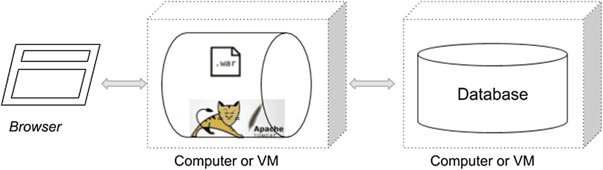
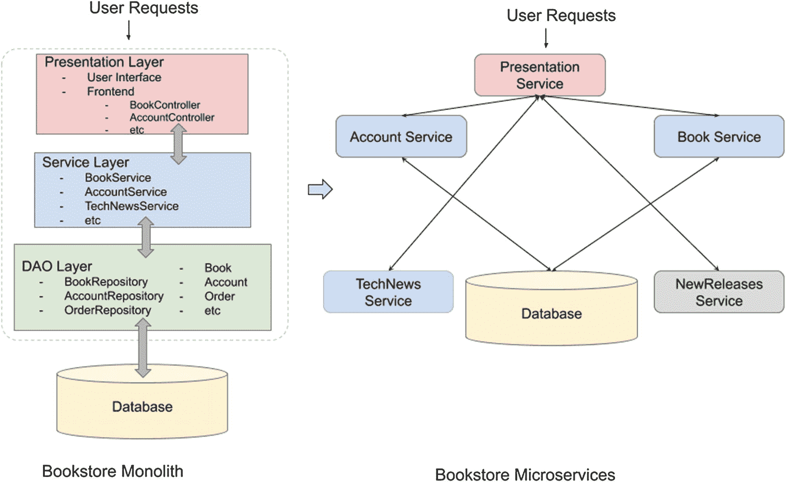
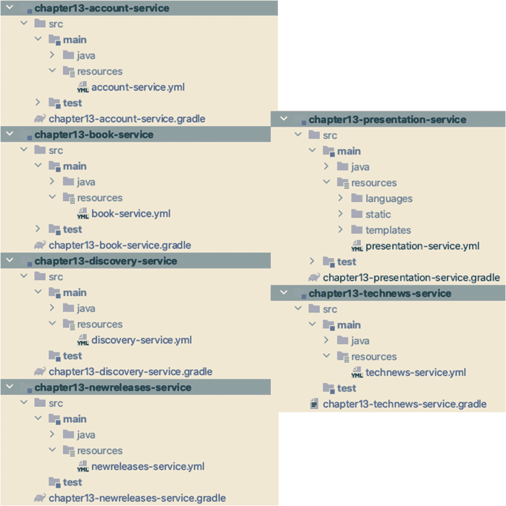
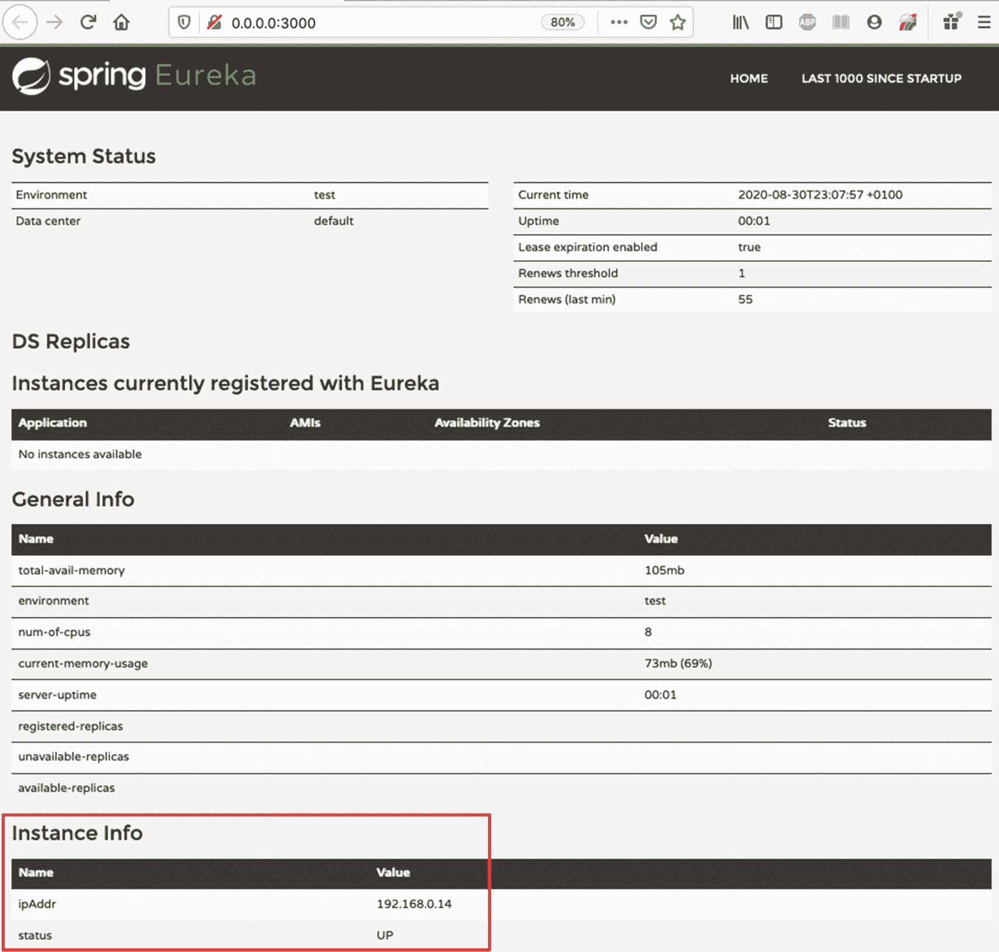
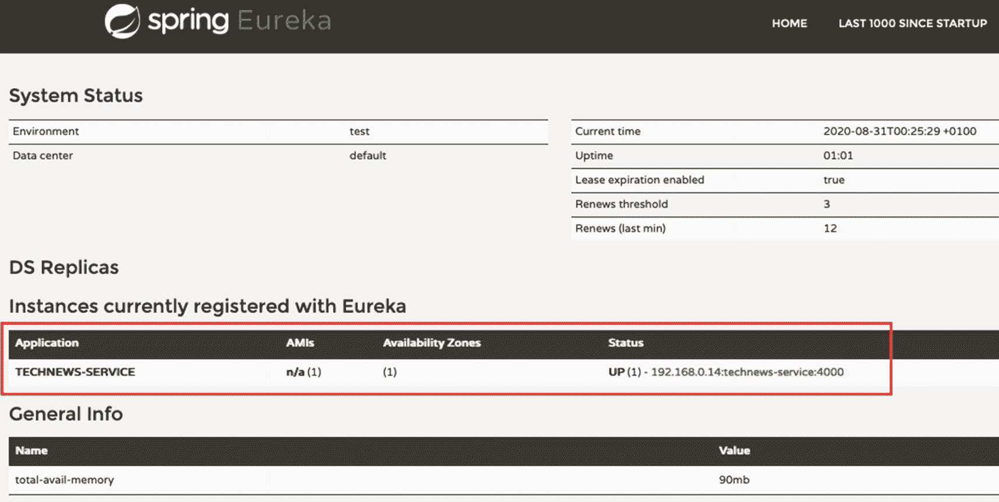
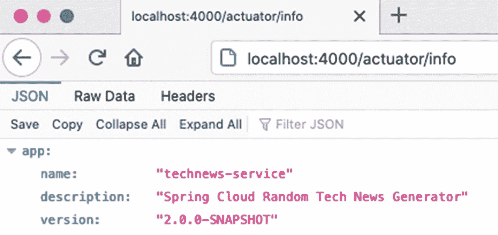
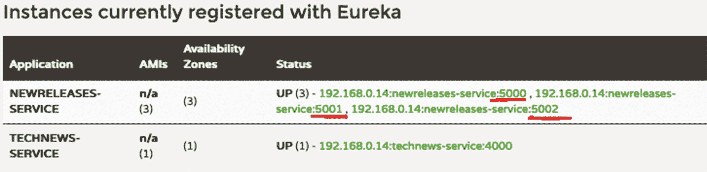
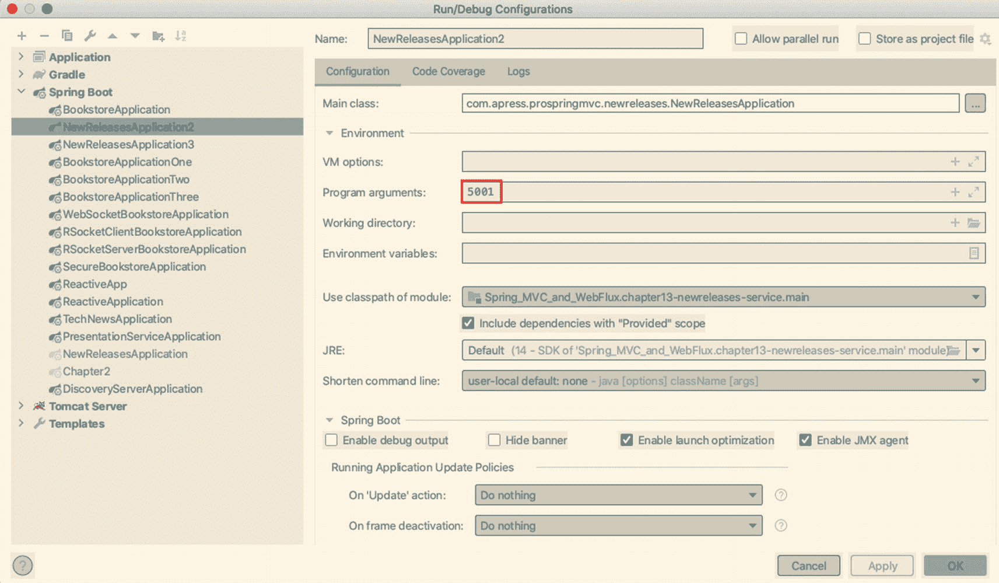
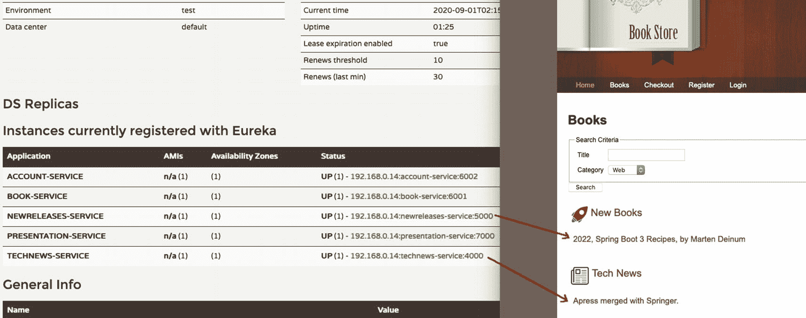

# 十三、云中的 Spring 应用

很少有技术大学在教学开发时触及云的主题。除非大学很大，有亚马逊，微软，或者谷歌这样的云提供商，作为合作伙伴，作为学生，你很可能在没有为云编写应用或在云中部署应用的情况下毕业。这一章简单介绍了云的开发，并展示了 Spring 如何开发微服务。

如今，大多数应用都托管在云中，任何新编写的应用都可能被设计为托管在云中，因此了解这如何影响应用的架构非常重要。

让我们回到软件开发中提到云这个词之前，回顾一下应用架构。

## 应用架构

应用架构指的是决定应用应该具有哪些部分以及它们应该如何相互连接的过程。

### 介绍独石

想象一下你想创业在网上卖书(很有创意，我知道！).你可以雇佣一家公司来创建你的网站，或者如果你已经对软件开发感兴趣，你可以自己创建。您需要一个数据库来存储有关书籍、订单和用户的信息。您需要一个管理这些信息的应用。应用由更多的部分或层组成。

*   **用户界面**(也称为**表示层**):为此，你需要 HTML、CSS、JavaScript 等等。如果要从多个设备(电脑、平板电脑、手机)访问应用，您可能需要针对每个设备的特定技术(例如，针对 Android 设备的 Android SDK)。

*   **前端**(也称为**应用层**):接收来自用户界面的请求并将数据转换成链中下一层可以处理的东西的部分。对于 Spring web 应用，这由控制器和功能端点来表示。

*   **服务**(也称为**业务层**):接收来自前端的数据并对其进行处理，准备将其存储在数据库中。

*   **数据访问层**(也称为**持久层**):它从数据库中检索数据，并将其转换为服务层可以处理的数据。它还从服务层获取数据，并将其保存到数据库中。包含 Dao(数据访问对象)和管理实体的特殊类。对于 Spring 应用，这由实体/文档、类和存储库来表示。

像这样设计你的应用意味着你正在构建一个**多层**或**多层架构**或**单片架构**。

在开发过程中，所有层都位于一台计算机上。但是，当应用必须进入生产环境时，数据库通常被放在另一台计算机上，该计算机比其他计算机备份得更频繁，因为它包含对应用最重要的数据。如果您使用 Java，其余的层被打包到部署在应用服务器上的单个 WAR 或 EAR 中，比如 Apache Tomcat。

如果这听起来很熟悉，那是因为这是在本书中完成的。Spring Boot 应用甚至不需要应用服务器，因为它嵌入在它们之中。即使在反应性章节中，我们也经常提到它们适合构建微服务，但是架构仍然是单一的。在图 [13-1](#Fig1) 中，您可以看到这样一个应用是如何部署给公众使用的。



图 13-1

为公共使用而部署的多层应用

单体式应用易于开发、测试、部署和扩展——至少在最初是这样，因为随着越来越多的用户访问您的应用，缺点就会变得明显。

*   如果数据库的大小增加了，你用一个更大的硬盘替换它，问题就解决了——至少在一段时间内。

*   如果有太多用户访问您的应用，请增加您的计算机或 VM 的内存以及 Apache 服务器上的线程数量。这样应该可以暂时解决问题—*。*

**   但是，维护一个完整的代码库是困难的。随着代码库的增长，知识必须在开发人员之间分配，因为很少有一个开发人员能够很好地了解所有的部分；当人们离开公司时，知识就是这样流失的。

    *   当代码库很大时，改变和升级技术变得非常危险，这就是技术债务蔓延的方式。

    *   连续部署是不可能的。

    *   缩放是有限且昂贵的。* 

 *如果您有自己的数据中心，升级硬件是可能的，但成本很高，想象一下维护数据中心的成本吧！这就是亚马逊、谷歌和其他公司看到了巨大商业潜力的地方——提供一个基础设施，在这个基础设施上，开发人员可以以更少的麻烦和成本来部署和管理应用。云就是这样诞生的。云是世界各地的许多计算机和运行在这些计算机上的软件。在作为云的一部分的远程计算机上部署和管理应用被称为**云计算**。通过使用云计算，用户和公司不必自己管理物理服务器或在自己的机器上运行软件应用。

现在世界上有一些云提供商。他们中的大多数都提供广泛的服务，如自动备份、自动缩放、负载平衡和数据存储，亚马逊可能在服务数量上领先。

将计算机使用的资源(CPU、RAM)重新调整为一个整体所需的大小称为**垂直缩放**。即使您的应用部署在云上，并且计算机被替换为虚拟机，按照 monolith 所需的方式调整它们的资源(CPU、RAM)也是麻烦和有限的。还有另一种类型的扩展，涉及到将更多的机器添加到您的资源池中，这被称为**水平扩展**。不幸的是，整体架构并不完全适合水平扩展，但微服务架构适合。

### 微服务简介

**微服务架构**，也叫**微服务**、<sup>T5】1</sup>是面向服务架构(SOA)的一种专门化和实现方式。它构建灵活的、可独立部署的服务。微服务架构不同于整体架构，因为它不是通过使用层而是作为服务的集合来定义应用。

微服务是一种范式，它要求将服务分解为高度专业化的功能实例，并通过不可知的通信协议(例如 REST)相互连接，共同完成一个共同的业务目标。每个微服务都是一个无状态功能的微小单元，一个不关心输入来自哪里，也不知道输出去哪里的进程；它不知道大局是什么。由于这种专门化和解耦，每个问题都可以被识别，原因可以被定位和修复，实现可以被重新部署，而不会影响其他微服务。这意味着微服务系统具有高的职责内聚性和低耦合性。这些品质允许单个服务的架构通过持续的重构来发展，减少大的预先设计的必要性，并允许软件更早和持续地发布。将一个大型复杂的应用分解成更小的独立应用，可以快速、频繁、可靠地交付功能，并促进公司技术体系的发展。

由于低粒度和轻量级通信协议，微服务近年来越来越受欢迎。它们已经成为构建企业应用的首选方式。微服务模块化架构风格似乎特别适合基于云的环境。当必须支持多个平台和设备时，这种架构方法是可扩展的，并且被认为是理想的。想想现在网络上最大的玩家:脸书、Twitter、网飞、亚马逊、PayPal、SoundCloud 等等。他们拥有大型网站和应用，这些网站和应用已经从单一架构发展到微服务，因此可以从任何设备访问它们。亚马逊和谷歌目前是该行业中最大的两家，它们提供了一套云计算服务，非常适合构建由众多微服务协同工作组成的复杂应用。为银行、零售商、餐馆、小企业以及电信和技术提供软件和服务的企业别无选择，只能依靠 AWS 或 GCP 来保持其服务的随时可用。这是通过使用 Apigee <sup>[2](#Fn2)</sup> 或亚马逊 API 网关构建他们的微服务来实现的。 <sup>[3](#Fn3)</sup> 亚马逊和谷歌为微服务提供了沟通的基础设施和无数构建它们的工具。最终，为这些服务编写代码仍然是开发人员的责任。

Spring Boot 是一个很好的工具，可以用来构建一个小型的利基应用，在一个更复杂的应用中代表一个微服务。响应式服务可以事半功倍，降低云基础架构的成本。

使用微服务的主要优势是什么？以下是 IT 界的好评。

*   粒度增加

*   增强的可扩展性

*   易于自动化的部署和测试(当然取决于上下文，因为如果涉及到事务，事情就开始变得困难了)，因为微服务的特点是定义良好的接口，便于通信(JSON/ WSDL/JMS/AMQP)

*   增强解耦，因为微服务不共享服务的状态

*   增强凝聚力

*   适合持续的重构、集成和交付

*   增强模块独立性

*   专业化—围绕能力组织；每个微服务都针对一种特定的功能而设计

*   提高敏捷性和速度，因为当系统被正确分解为微服务时，每个服务都可以独立开发和部署，并与其他服务并行。

*   每个服务都是有弹性的、可复原的、可组合的、最小的和完整的

*   故障隔离的改进

*   消除对单一技术堆栈的长期承诺，因为微服务可以用不同的编程语言编写

*   更容易的知识共享，因为新开发人员可以在几个微服务上工作，而不需要了解整个系统

既然这个世界上没有十全十美，特别是在软件开发方面，就有几个缺点。

*   微服务引入了额外的复杂性，以及小心处理服务间请求的必要性。

*   像处理实体类一样处理共享资源会导致问题。

*   处理多个数据库和事务(分布式事务)可能会很痛苦。

*   测试微服务可能很麻烦，因为在测试服务之前，必须确认每个微服务依赖项都是有效的。

*   部署可能会变得复杂，需要服务之间的协调。

### 向云迁移:是还是不是？

在本章中，我们将书店转换为更适合部署到云的微服务。但是，在此之前，我们应该列出迁移到云的一些优势。

*   一个明显的优势—降低基础架构成本

*   由于开发人员学习配置云服务，人员成本可能会更低，因为你不再需要一个大的基础设施部门

*   灵活性—配置云服务，如负载平衡器和自动扩展组，以确保您的应用始终运行并自我修复

*   云基础架构会自动维护，因此无需担心软件更新

*   一切都在云端，所以你可以在任何地方工作

*   和许多其他人

迁移到云有什么缺点吗？当然可以。

*   **主要缺点**是你完全依赖你的云提供商。

*   供应商锁定—转换您的云提供商是一件痛苦的事情；对服务的控制是通过自定义 API 提供的，它们之间没有桥梁。

*   如果你的云提供商因为自然灾害遇到了技术问题，你可能会被系统淘汰。

*   如果管理资源的软件发生故障，自动伸缩和自我修复可能会受到影响。即使您正确配置了您的云基础架构，并考虑到了所有因素，本应扩展并保持云基础架构的服务仍然托管在同一个云中。停机仍然是一种可能。

*   尽管云服务提供商实施了最佳的安全标准和行业认证，但在外部服务提供商上存储数据和重要文件仍然存在一定程度的风险。黑客对云提供商来说尤其危险；例如，如果亚马逊遭到黑客攻击，其所有客户的数据都将面临风险。

*   有限的控制——大多数云提供商允许您使用 web 控制台和 SSH 连接来管理您的基础设施，但这种控制最终是最小的。

*   成本—尽管与建立和管理自己的数据中心相比，使用云计算可以降低您的成本，但在某些情况下，云服务的成本可能会增加。大多数云提供商宣传按需付费模式，为您提供灵活性和更低的硬件成本，但它们仍然不适合小规模的短期项目。此外，云资源的错误配置可能会增加您的账单。

尽管存在缺点，但许多组织受益于云服务提供的敏捷性、规模和按需付费模式。然而，与任何基础设施服务一样，云计算对于您的特定用例的适用性应该在基于风险的评估中进行评估。例如，亚马逊鼓励公司明智地规划，只使用他们需要的东西。他们有一些合作伙伴公司，以最低的成本提供设计和维护云基础架构的咨询服务。因为一个企业要有较长的寿命和利润，他们的客户也必须这样做。

尽管如此，如果你是一名职业生涯刚起步的开发人员，想要了解云，你可能没有能力支付云访问的费用。无需担心；大多数云提供商向他们的用户提供免费的受限访问账户。亚马逊为新用户提供 12 个月的免费等级访问 <sup>[4](#Fn4)</sup> 来学习使用他们的服务。GCP 提供三个月的免费试用 <sup>[5](#Fn5)</sup> ，外加 300 美元的信用额度，可用于任何谷歌云服务。但是，如果你仍然不愿意尝试它们中的任何一个，不要担心，Spring已经为你准备好了。Spring Cloud project collection 是根据分布式系统中最常见的模式构建微服务的工具宝库，您可以在本地运行这些服务，就像它们在云中运行一样。

### 介绍春云

要开发由一组带有 Spring 组件的微服务组成的应用，需要对以下 Spring 技术有很好的了解。

*   服务注册和发现技术，如网飞的 OSS Eureka

*   像 Eureka 或 Consul 这样的 Spring 云项目

*   REST 概念(因为微服务之间的通信是使用 REST 完成的)

Spring Boot 是为开发人员设计的，通过使常见的概念——如 RESTful HTTP 和嵌入式 web 应用运行时——易于连接和使用，提高了工作效率。它很灵活，允许开发人员只挑选他们想要使用的模块，消除了大量或庞大的配置和运行时依赖。

Spring Cloud <sup>[6](#Fn6)</sup> 是一个项目集合，旨在简化分布式应用的开发。

*   配置管理(Spring Cloud Config 提供由 Git 存储库支持的集中式外部配置)

*   服务发现(Eureka 是一个用于弹性中间层负载平衡和故障转移的服务注册中心，由 Spring Cloud 支持)

*   断路器(Spring Cloud 支持网飞的 Hystrix，这是一个库，提供了当在预定义的阈值内没有收到响应时停止调用服务的组件)

*   智能路由(Zuul 将呼叫转发和分配给服务)

*   微代理(中间层服务的客户端代理)

*   控制总线(消息传递系统可用于监控和管理框架内的组件，就像用于应用级消息传递一样)

*   一次性令牌(使用 Spring Vault <sup>[7](#Fn7)</sup> 仅用于一次数据访问)

*   全局锁(协调、区分优先级或限制对资源的访问)

*   领导选举(指定单个流程作为分配给几个节点的某些任务的组织者的过程)

*   分布式消息传递(Spring Cloud Bus 可用于通过轻量级消息代理链接分布式系统的节点)

*   集群状态(集群状态请求被路由到主节点，以确保返回最新的集群状态)

*   客户端负载平衡

如果您对使用 Spring Cloud 构建微服务应用感兴趣，Spring 官方文档涵盖了所有基础知识。协调分布式系统并不容易，可能会导致样板代码。Spring Cloud 让开发人员更容易编写这种类型的管理代码。其结果适用于任何分布式环境，包括开发站、数据中心或托管平台，如 Cloud Foundry。

Spring Cloud 构建于 Spring Boot 之上，它具有典型的 Spring Boot 优势:开箱即用的预配置基础架构 beans，可以进一步配置或扩展以创建自定义解决方案。它遵循相同的 Spring 声明性方法，依赖于注释和属性(YAML)文件。

春云网飞提供与网飞 OSS(网飞开源软件)的集成。GitHub 官方页面在 [`https://netflix.github.io/`](https://netflix.github.io/) 。它是一个开源库的集合，是开发者为解决大规模分布式系统问题而编写的。它是用 Java 编写的，在用 Java 编写微服务应用时，它几乎成了最常用的软件。

### 面向云的重新设计

我们在整本书中编写的书店应用是一个整体。它的各个层，尽管被分离在不同的模块中，但都被组合成了部署在 Apache Tomcat 上的一个 war，或者打包成可执行 jar 的一个 Spring Boot 应用。即使在使其具有反应性时，monolith 架构也被保留下来，因为这是一个小应用，还没有理由改变它。将它作为一个整体部署到云中是可能的，但是由于前面几节中列出的所有原因，效率很低。它需要重新设计。

在前面的章节中，应用的每个模块都包含(或多或少)特定于应用处理的所有对象的整体层的功能。例如，`Book`、`Account`和`Orders`的所有存储库类都负责数据库操作，因此属于 DAO 层。

微服务要求根据业务功能进行分离，因此每个服务应该有一个与单一类型的对象相关的单一角色。因此，我们可能需要一个微服务来处理对`Book`对象的所有操作，一个用于`Account`对象，以此类推。由于`tech news service`独立于应用，所以它可以被做成微服务。

提供随机图书发行的服务也是如此。图 [13-2](#Fig2) 描述了如何为云重新设计书店应用的建议。



图 13-2

书店整体架构和微服务架构的比较

图 [13-2](#Fig2) 有一个在所有微服务之间共享的数据库，但这不是必需的。任何提供服务的东西都可以成为微服务。您可以将安全性作为一项独立的服务，依赖于云提供商的认证服务。您可以决定为帐户建立一个单独的数据库。您也可以决定为订单建立一个单独的数据库。说到数据库，有三种模型。

*   **Private-tables-per-service**:每个服务拥有一组只能由该服务访问的表。

*   **每服务模式**:每个服务都有一个该服务专用的数据库模式。

*   **每个服务一个数据库服务器**:每个服务都有自己的数据库服务器。

这完全取决于您的设计要求。在本章的其余部分，您将学习如何使用 Spring Cloud 编写服务并确保它们之间的通信。

### 注册和发现服务器

微服务架构确保一组流程朝着一个共同的目标协同工作:为最终用户提供有能力且可靠的服务。要做到这一点，进程必须有效地通信。要相互交流，首先要找到对方。这就是网飞尤里卡注册服务器的用武之地。因为它是开源的，所以它被并入了 Spring Cloud，Spring 的简单原则现在也适用。

在本章中，书店应用分为六个项目；每个项目的名称都带有前缀`chapter13,`，如图 [13-3](#Fig3) 所示。



图 13-3

书店微服务项目

**发现服务**是核心组件。它是所有其他微服务用来注册和发现彼此的项目的中心。

项目的配置没什么特别的。这是一个简单的 Spring Boot Web 应用，在其类路径中有一个 Spring Cloud starter 项目:`spring-cloud-starter-netflix-eureka-server` starter。这个依赖关系为项目添加了构建网飞尤里卡服务注册中心所需的所有依赖关系。这是一种特殊类型的服务，它对其他现有服务进行编目，并支持客户端通信和负载平衡。每隔一个微服务就注册一次，这样 Eureka 就知道每个端口和 IP 地址上运行的所有应用。这意味着所有其他五个微服务都是发现服务的客户端，并且必须配置其位置以知道在哪里注册它们自己。

为了创建一个 Eureka 服务注册中心，项目的主类必须用`@EnableEurekaServer`进行注释(参见清单 [13-1](#PC1) )。

```java
package com.apress.prospringmvc.bookstore;
import org.springframework.cloud.netflix.eureka.server.EnableEurekaServer;
// other imports omitted
@SpringBootApplication
@EnableEurekaServer
public class DiscoveryServerApplication {

    private static Logger logger = LoggerFactory.getLogger(DiscoveryServerApplication.class);

    public static void main(String... args) throws Exception {
        System.setProperty("spring.config.name", "discovery-service");

        var ctx = SpringApplication.run(DiscoveryServerApplication.class, args);
        assert (ctx != null);
        logger.info("Started ...");
        System.in.read();
        ctx.close();
    }
}

Listing 13-1Spring Boot Main Class of a Discovery Microservice

```

使用了`System.in.read();`调用，所以你可以通过按<enter>键优雅地停止应用。为了避免开发过程中的混乱，Spring Boot 配置文件被重命名为</enter> `discovery-service.yml`，并且`spring.config.name`环境变量被设置为让 Spring Boot 知道从中获取配置的文件的名称。

`@EnableEurekaServer`注释非常重要，因为它激活了与 Eureka 服务器相关的配置。这个注释负责为项目提供一个 Eureka 服务器实例。该服务器带有一个非常好的 web 界面，在这里可以监控已注册的微服务。主页可通过 http://[ip]:[port]/访问。其中`IP`是您的计算机的 IP 或者是`localhost, 127.0.0.1`、`0.0.0.0,`中的任何一个或者全部，如果您在 Spring Boot 配置文件中这样配置的话。该端口也取自 Spring Boot 配置文件。

`discovery-service.yml`包含该服务器的设置，其内容在清单 [13-2](#PC2) 中描述。

```java
spring:
  application:
    name: discovery-service

# Configure the Server
eureka:
  client:
    registerWithEureka: false # do not auto-register as client
    fetchRegistry: false
    server:
          waitTimeInMsWhenSyncEmpty: 0

server:
  port: 3000   # where this discovery server is accessible
  address: 0.0.0.0

Listing 13-2The Eureka Discovery Server Configuration (discovery-service.yml)

```

之前的配置在端口 3000 上启动服务器，如果访问 web 界面，可以看到此时没有微服务注册，如图 [13-4](#Fig4) 所示。



图 13-4

尤里卡发现服务器 web 界面

主页显示了一些关于发现服务器实例的指标。网飞的 Eureka 服务器的原始版本避免在可配置的时间内回答客户，如果它从一个空的注册表开始。`eureka.server.waitTimeInMsWhenSyncEmpty`属性控制这种行为，它被设计成在服务器有足够的时间来构建注册表之前，客户机不会得到部分/空的注册表信息。当某些微服务必须在其依赖项启动并准备就绪后才启动时，这很有用。在清单 [13-2](#PC2) 中，值被设置为零以尽快开始回答客户。这种配置适合于开发环境，因为它加快了速度。

如果未设置，`eureka.server.waitTimeInMsWhenSyncEmpty`的默认值为 5 分钟。

`eureka.client.registerWithEureka`属性用于注册 Eureka 客户端，通常在 Eureka discovery 服务器上设置为`false`。它告诉这个实例不要向它找到的 Eureka 服务器注册它自己，因为它是它自己。

如果发现服务器公开任何具有与服务的注册和发现无关的功能的端点(例如公开用于监控微服务的指标)，它必须将自己注册为客户端。

现在我们有了服务器，我们可以开始编写我们的微服务了。

### 开发微服务

使用 Spring Boot 创建微服务非常简单。您必须选择功能，编写实现行为所需的代码，公开可以被其他微服务访问的端点，并将其配置为注册为 Eureka 客户端。

微服务是处理明确定义的需求的独立流程。在创建基于微服务的分布式应用时，每个微服务组件都应该根据其用途包装在包中。整个实现应该是非常松散耦合的，但是非常紧密。让我们从我们可以为书店应用编写的最小、最简单的微服务开始:科技新闻服务。该服务应该公开一个可以访问无限技术新闻流的单一端点。

因为它是一个没有 web 接口的反应式服务，所以这个项目唯一的依赖项是`spring-boot-starter-webflux`和`spring-cloud-starter-netflix-eureka-client`。

`spring-cloud-starter-netflix-eureka-client`为项目添加了所有必要的依赖项，允许您构建一个网飞尤里卡客户端。

除了这两个之外，添加`spring-boot-starter-actuator.` <sup>[8](#Fn8)</sup> 也是可行的。这个依赖项将 Spring Actuator 添加到您的项目中，这将为我们的应用添加生产就绪的特性。通过几个端点，它公开了关于正在运行的应用的操作信息。

科技新闻服务非常简单。它有一个用`@EnableEurekaClient`注释的 Spring Boot 主配置类。这是将该应用转变为微服务的关键组件，因为它支持 Eureka 客户端发现配置。

在这个类中，声明了一个路由器 bean 来配置端点和处理程序函数之间的映射。

清单 [13-3](#PC3) 描绘了`TechNewsApplication`的内容。

```java
package com.apress.prospringmvc.technews;
import org.springframework.cloud.netflix.eureka.EnableEurekaClient;
// other imports omitted

@SpringBootApplication
@EnableEurekaClient
public class TechNewsApplication {

    public static void main(String... args) {
        System.setProperty("spring.config.name", "technews-service");
        SpringApplication springApplication = new SpringApplication(TechNewsApplication.class);
        springApplication.run(args);
    }

    @Bean
    public RouterFunction<ServerResponse> router(TechNewsHandler handler){
        return RouterFunctions
                .route(GET("/"), handler.main)
                .andRoute(GET("/index.htm"), handler.main)
                .andRoute(GET("/tech/news"), handler.data);
    }
}

Listing 13-3Spring Boot Tech News Microservice Configuration Class

```

`TechNewsHandler`类包含两个处理函数实现。其内容列于清单 [13-4](#PC4) 中。

```java
package com.apress.prospringmvc.technews;
// other imports omitted

@Component
class TechNewsHandler {
    private static final Random RANDOM = new Random(System.currentTimeMillis());

    public static final List<String> TECH_NEWS = List.of(
            "Apress merged with Springer."
            // other values omitted
    );

    public static String randomNews() {
        return TECH_NEWS.get(RANDOM.nextInt(TECH_NEWS.size()));
    }
    final HandlerFunction<ServerResponse> main = serverRequest -> ok()
            .contentType(MediaType.TEXT_HTML)
            .bodyValue("Tech News service up and running!");

    final HandlerFunction<ServerResponse> data = serverRequest -> ok()
        .contentType(MediaType.TEXT_EVENT_STREAM)
        .body(Flux.interval(Duration.ofSeconds(5))
            .map(delay -> randomNews()), String.class);
}

Listing 13-4TechNewsHandler Handler Functions

```

这个应用的 Spring Boot 配置文件被命名为`technews-service.yml`，并在清单 [13-5](#PC5) 中描述。

```java
# Spring Properties
spring:
  application:
    name: technews-service # Service registers under this name

# HTTP Server
server:
  port: 4000   # HTTP (Netty) port
  address: 0.0.0.0

# Discovery Server Access
eureka:
  client:
    registerWithEureka: true
    fetchRegistry: false
    serviceUrl:
      defaultZone: http://localhost:3000/eureka/
    healthcheck:
      enabled: true

  instance:
    leaseRenewalIntervalInSeconds: 5
    preferIpAddress: false

# Actuator endpoint configuration
info:
  app:
    name: technews-service
    description: Spring Cloud Random Tech News Generator
    version: 2.0.0-SNAPSHOT

Listing 13-5Spring Boot Configuration File for the Tech News Microservice

```

前面的配置包含三个部分。

*   **Spring段**定义应用名为`technews-service`。微服务使用这个名称向 Eureka 服务器注册。

*   **服务器部分**定义了监听请求的端口。在本例中，它被设置为 4000。作为一个使用嵌入式 Netty 实例的反应式应用，如果不指定，它会尝试使用 8080。因为一次只有一个进程可以监听一个端口，所以每个微服务都有一个通过配置分配的不同端口。对于这个微服务,`server.address`被设置为`0.0.0.0`,这意味着在安装它的计算机的所有地址上都可以访问它的端点。

*   **Eureka 部分**使用`eureka.client.serviceUrl.defaultZone`属性定义了要注册的服务器所在的 URI。

    `eureka.client.registerWithEureka`默认为`true`；它用于配置 Eureka 客户端的注册。在此配置中明确设置它是为了避免混淆此微服务的类型。

    Eureka 客户端从服务器获取注册表信息并在本地缓存。之后，客户端使用这些信息来查找其他服务。因为`technews-service`不依赖于另一个已经注册的微服务，所以不需要获取注册信息。将`eureka.client.fetchRegistry`设置为`false`以防止它这样做。

    注册成功后，Eureka 服务器总是报告一个客户机应用处于运行状态。这种行为可以通过启用 Eureka 健康检查来改变，这会导致将应用状态传播到 Eureka。这通过将`eureka.client.healthcheck.enabled`属性设置为`true`来完成。

    尤里卡的客户端需要通过发送一个名为**心跳**的信号来告诉服务器它们仍然活跃。默认情况下，时间间隔为 30 秒。通过自定义`eureka.instance.leaseRenewalIntervalInSeconds`属性的值，可以将其设置为更小的间隔。在开发过程中，可以将其设置为较小的值，这样可以加快注册速度，但是在生产中，这会产生与服务器的额外通信，这可能会导致服务延迟。对于生产，不应修改默认值。

    `eureka.instance.preferIpAddress`告知 Eureka 服务器是否应该使用域名或注册客户端的 IP。在我们的例子中，因为所有东西都在同一台机器上工作，所以这个属性的值是不相关的。

*   在**执行器部分**中，在浏览器中访问`/actuator` `/info`时显示的信息由`information`属性块定制。健康信息由`/actuator/health` URI 访问。

这些信息和更多信息可以在网飞 GitHub 页面上找到。 <sup>[9](#Fn9)</sup> 这里只解释与我们的实现相关的部分。

现在我们有了一个作为 Eureka 客户端的微服务，下一步是启动它并检查它是否注册到发现服务器。当您在 discovery-service 应用的日志中看到以下输出时，注册应该完成。

```java
DEBUG o.s.c.n.e.server.InstanceRegistry - register TECHNEWS-SERVICE, vip technews-service, leaseDuration 90, isReplication false
INFO  c.n.e.r.AbstractInstanceRegistry - Registered instance TECHNEWS-SERVICE/192.168.0.14:technews-service:4000 with status UP (replication=false)

```

注册后，当访问 Eureka 服务器的 web 界面 http://localhost:3000/时，您应该看到在`Instances currently registered with Eureka`部分，添加了一个针对`technews-service`微服务的条目，如图 [13-5](#Fig5) 所示。



图 13-5

尤里卡发现服务器 web 界面

如果您点击`Status`栏中的链接，您会注意到它会将您带到科技新闻应用中的`/actuator/info`，在那里您会看到驱动部分中的信息(参见图 [13-6](#Fig6) )。



图 13-6

TechNews 执行器信息

`newreleases-service`也是一个非常简单的服务，它几乎与`technews-service`相同，但是它返回无限的`Book`实例流。这是一个 Spring Boot 应用，可以通过执行它的主类来启动，就像 tech news 微服务一样，所以没有必要在这里添加更多的代码或任何文本，因为它对本章没有任何实际价值。这两个微服务提供了书店应用中图书页面的新闻部分中描述的数据。

一旦启动了`technews-service`和`newreleases-service`微服务，就可以在浏览器中打开下面的网址`http://localhost:3000/eureka/apps`。该端点公开了所有已注册微服务的注册表元数据，例如它们的注册时间、运行状况检查、发送心跳的时间等等，这些都是微服务的标准信息。该信息发布在服务注册表中，并且可供所有客户端使用。您的 Eureka 服务器的目的是生成和管理信息，并与所有需要它的微服务共享。数据的格式是 XML。清单 [13-6](#PC7) 中描述了一小段代码。

```java
<applications>
    <versions__delta>1</versions__delta>
    <apps__hashcode>UP_2_</apps__hashcode>
    <application>
        <name>TECHNEWS-SERVICE</name>
        <instance>
            <instanceId>192.168.0.14:technews-service:4000</instanceId>
            <hostName>192.168.0.14</hostName>
            <app>TECHNEWS-SERVICE</app>
            <ipAddr>192.168.0.14</ipAddr>
            <status>UP</status>
            <homePageUrl>http://192.168.0.14:4000/</homePageUrl>
            <statusPageUrl>http://192.168.0.14:4000/actuator/info</statusPageUrl>
            <healthCheckUrl>http://192.168.0.14:4000/actuator/health</healthCheckUrl>
            <lastUpdatedTimestamp>1598830791842</lastUpdatedTimestamp>
            <lastDirtyTimestamp>1598830791711</lastDirtyTimestamp>
            <actionType>ADDED</actionType>
        </instance>
    </application>
    <!-- other output omitted -->
</applications>

Listing 13-6Eureka Server Registered Microservices Information

```

如果您只想查看特定服务的元数据信息，请将服务名称添加到前面提到的 URI 中。因此，要仅查看关于`technews-microservice,`的信息，您必须访问`http://localhost:3000/eureka/apps/TECHNEWS-SERVICE`。

通过定制`eureka.instance.metadataMap`元数据，可以将附加元数据添加到实例注册中。通常，添加额外的元数据不会以任何方式修改远程客户端的行为，除非客户端被设计为知道其含义。要了解更多信息，请查阅官方 Spring Eureka 文档。 <sup>[10](#Fn10)</sup>

在注册时，每个微服务从服务器获得一个惟一的注册标识符，您可以在前面的输出片段的`<instanceId>`元素中看到。如果另一个进程使用相同的 ID 注册，服务器会将其视为重新启动，因此第一个进程会被丢弃。

为了运行同一个流程的多个实例，出于负载平衡和弹性的原因，我们必须确保服务器生成不同的注册 ID。在本地，这可以通过为微服务使用不同的端口来实现。这是最简单的方法，无需对代码库或配置进行侵入性的更改。

到目前为止使用的配置的注册 ID——`<instanceId>`元素中的 ID——是使用下面的默认模式构建的。

```java
${ipAddress}:${spring.application.name:${server.port}}

```

`technews-service`微服务实例的注册 ID 是

```java
192.168.0.14:technews-service:4000

```

微服务名称和端口在格式模式中耦合在一起，因为它们提供了一种唯一的方法来标识微服务及其侦听请求的端口。

可以通过在 Spring Boot 配置文件中为 Eureka `eureka.instance.metadataMap.instanceId`属性添加不同的值来修改注册 ID 模板。清单 [13-7](#PC10) 描述了一个修改注册 ID 模板的配置示例。

```java
eureka:
  instance:
    metadataMap:
      instanceId: ${spring.application.name}:${spring.application.instance_id:${server.port}}

Listing 13-7Registration ID Is Configured to Use a Different Naming Template

```

如果没有定义`spring.application.instance_id`,就退回到这个默认模板(如果对是哪个有疑问的话)。

```java
${ipAddress}:${spring.application.name:${server.port}}

```

当在本地运行一个微服务应用时(我想你正在浏览这本书)，微服务的 main 方法可以被参数化，将端口作为一个参数。这允许您通过提供一个不同的端口作为参数来启动任意数量的服务实例。在清单 [13-8](#PC12) 中，端口值被读取并注入到 Spring Boot `server.port`环境变量中。

```java
package com.apress.prospringmvc.newreleases;
// other imports omitted

@SpringBootApplication
@EnableEurekaClient
public class NewReleasesApplication {

        public static void main(String... args) {
        if (args.length == 1) {
            System.setProperty("server.port", args[0]);
        }
        System.setProperty("spring.config.name", "newreleases-service");
        SpringApplication springApplication = new SpringApplication(NewReleasesApplication.class);
        springApplication.run(args);
    }

}

Listing 13-8NewReleasesApplication

That Takes Port As an Argument

```

在图 [13-7](#Fig7) 中，您可以看到启动了三个`newreleases-service`实例:默认在端口 5000 上，另外两个在端口 5001 和 5002 上。



图 13-7

注册了多个新版本微服务实例

每个实例都是通过创建一个新的 IntelliJ IDEA 启动器并将端口配置为程序参数来启动的，如图 [13-8](#Fig8) 所示。



图 13-8

用于`newreleases-service`应用的 IntelliJ IDEA 启动器，端口作为程序参数提供

科技新闻和新发布微服务是基本的，它们不需要使用数据库，并且它们之间没有通信。下一步是开发使用数据库的微服务。

### 使用数据库的微服务

考虑到我们的服务是反应式的，选择的数据库是 MongoDB。由于前面章节中介绍的文档映射类`Book`和`Account`是相互分离的，`book-service`和`account-service`是独立的。每个都使用自己的 MongoDB 集合。

微服务公开了一个 REST API，用于各种图书操作:列表、创建、更新、删除、搜索、获取随机图书。在反应章节中已经描述了该服务的实现。

微服务为各种账户操作公开了一个 REST API:列表、创建、删除、更新。在反应章节中已经描述了该服务的实现。

当在微服务之间传输时，默认情况下，数据被序列化到 JSON，使用在 Spring Boot 应用中自动配置的默认`org.springframework.http.codec.json.Jackson2JsonEncoder<T>`。当到达目的地时，自动配置的`org.springframework.http.codec.json.Jackson2JsonDecoder<T>`将发出的数据转换回 Java 对象。

这两个微服务都不需要 web 接口，因为它们的 REST APIs 是由唯一一个具有 web 控制台的服务`presentation-service`调用的。

表 [13-1](#Tab1) 列出了`account-service`微服务公开的所有端点。

表 13-1

由`account-service`微服务公开的端点

<colgroup><col class="tcol1 align-left"> <col class="tcol2 align-left"> <col class="tcol3 align-left"></colgroup> 
| 

上呼吸道感染

 | 

方法

 | 

影响

 |
| --- | --- | --- |
| `/`，/ `index.htm` | 得到 | 返回“帐户服务启动并运行！”。如果不想使用执行机构，检查应用状态很有用。 |
| `/account` | 得到 | 返回包含对`Flux<Account>`的引用的响应。 |
| `/account/{username}` | 得到 | 返回一个响应，其主体表示对与作为路径变量提供的用户名相对应的`Mono<Account>`的引用。 |
| `/account/{username}` | 放 | 更新对应于作为路径变量提供的用户名的`Account`实例，并返回一个响应，其主体表示发出更新实例的`Mono<Account>`。 |
| `/account` | 邮政 | 使用来自请求主体的数据创建`Account`实例，并返回一个响应，其主体表示发出所创建实例的`Mono<Account>`。该响应的 location 标头中填充了用于访问新实例的 URI。 |
| `/account` | 删除 | 删除对应于作为路径变量提供的用户名的`Account`实例，并返回一个空响应。 |

表 [13-2](#Tab2) 列出了`book-service`微服务公开的所有端点。

表 13-2

由`book-service`微服务公开的端点

<colgroup><col class="tcol1 align-left"> <col class="tcol2 align-left"> <col class="tcol3 align-left"></colgroup> 
| 

上呼吸道感染

 | 

方法

 | 

影响

 |
| --- | --- | --- |
| `/`，/ `index.htm` | 得到 | 返回“预订服务启动并运行！”。 |
| `/book/random` | 得到 | 返回一个响应，其主体表示对包含两本书的 Flux <book>的引用。</book> |
| `/book/search` | 得到 | 返回一个响应，其主体表示对发出与请求主体中提供的`BookCriteria`细节相匹配的`Book`实例的`Flux<Book>`的引用。 |
| `/book/by/{isbn}` | 得到 | 返回一个响应，其主体表示对与作为路径变量提供的 ISBN 相对应的`Mono<Book>`的引用。 |
| `/book/{isbn}` | 放 | 更新对应于作为路径变量提供的 ISBN 的`Book`实例，并返回一个响应，其主体表示发出更新实例的`Mono<Book>`。 |
| `/book/create` | 邮政 | 使用来自请求主体的数据创建`Book`实例，并返回一个响应，其主体表示发出所创建实例的`Mono<Book>`。该响应的 location 标头中填充了用于访问新实例的 URI。 |
| `/book/delete/{isbn}` | 删除 | 删除对应于作为路径变量提供的 ISBN 的`Book`实例，并返回一个空响应。 |

我们使用`/book/by/{isbn}`作为 URI 来通过 ISBN 检索图书实例，因为 ISBN 的类型是`String`。如果我们用 URI 模板`/book/{isbn}`声明一个 GET 处理程序方法，用于通过 ISBN 检索书籍，这个模板将匹配`/book/random`和`/book/search`上的 GET 请求，而两个 URI 模板的处理程序方法永远不会被调用。另一个解决方案是为`{isbn}`路径变量声明一个正则表达式，但是采用了最简单的方法。

必须修改每个服务的配置文件来添加一个 MongoDB 部分，因为每个服务都需要访问自己的集合。但是总体来说，实现与书中构建的任何反应式服务没有什么不同。因此，也可以使用`WebTestClient`来测试它们，以确保它们按预期工作。还可以使用`curl`测试它们，以确保它们发出由`presentation service`渲染的元素。

### 带有 Web 控制台的微服务

已经说过，微服务使用 REST 之类的不可知协议进行通信。`account-service`、`book-service`、`tech`、`news-service`和`newreleases-service`通过 HTTP 公开 RESTful APIs(尽管可以使用不同的通信通道，如 JMS 或 AMQP)。

`presentation-service`更有趣，因为它使用其他四个发出的数据(见图 [13-2](#Fig2) )并通过 REST API 调用获取数据。该服务公开了一个最终用户可以访问数据的 web 界面。为了使用由反应式服务产生的数据，Spring 提供了我们在前面章节中已经使用过的`WebClient`接口。`WebClient`发送 HTTP 请求并获取多种格式的数据，如 XML、JSON 或数据流。

`presentation-service`微服务客户端使用一个平衡的`WebClient`来连接和请求来自其他注册的微服务的数据。平衡的`WebClient`不知道他们的位置和确切的 URI，因为春云在引擎盖下照顾这个。

`presentation-service`的实现略有不同，因为它配置了一个 web 接口。默认情况下，Eureka 服务器使用 FreeMarker 模板，因此如果需要不同的实现，必须通过将`spring.application.freemarker.enabled`属性设置为`false`来忽略这些模板。配置文件被命名为`presentation-service.yml,`，其内容如清单 [13-9](#PC13) 所示。

```java
spring:
  application:
    name: presentation-service # Service registers under this name
  freemarker:
    enabled: false     # Ignore Eureka dashboard FreeMarker templates
  thymeleaf:
    cache: false
    prefix: classpath:/templates/

# HTTP Server
server:
  port: 7000   # HTTP (Netty) port
  address: 0.0.0.0
  context-path: /
  compression:
    enabled: true

# Discovery Server Access
eureka:
  client:
    registerWithEureka: true
    fetchRegistry: true
    serviceUrl:
      defaultZone: http://localhost:3000/eureka/

  instance:
    leaseRenewalIntervalInSeconds: 10
    preferIpAddress: false

info:
  app:
    name: presentation-service
    description: Spring Cloud Bookstore Service accessing data from all other services
    version: 2.0.0-SNAPSHOT

Listing 13-9presentation-service.yml Configuration File

```

由于`presentation-service`是一个带有国际化百里香模板的 Spring Boot WebFlux 应用，因此必须添加额外的配置，如前面的反应章节所述。这个项目使用一个用`@EnableWebFlux`标注的配置类和用`@EnableEurekaClient`标注的主 Spring Boot 类来配置，使这个应用成为一个 Eureka 客户机。

除了将`freemarker.enabled`属性设置为`false`之外，还允许我们的应用使用百里香模板；在之前的配置中，最重要的属性是为该服务设置为`true`的`eureka.client.fetchRegistry`。对于其他服务，该属性被设置为`false`,因为它们不关心其他哪些微服务注册到了 Eureka 服务器。它们被设计成独立的。他们不需要其他微服务提供的数据来完成工作。他们不需要向 Eureka 服务器注册来询问其他注册的服务。`presentation-service`微服务需要这些微服务来完成它的工作。在向 Eureka 服务器注册了自己之后，它需要知道这些服务器是否也注册了，将这个属性设置为`true`就可以做到这一点。

与其他微服务的通信由一个名为 Ribbon 的负载平衡器来实现。 <sup>[11](#Fn11)</sup> 自 2015 年 Spring Cloud 首次亮相以来，默认的网飞 Ribbon 支持的负载平衡策略就已经到位。Ribbon 是一个客户端负载平衡器，它提供对 HTTP 和 TCP 客户端行为的控制。Ribbon 的客户机组件提供了一组很好的配置选项，比如连接超时、重试、重试算法(指数、有界后退)等等。Ribbon 内置了一个可插拔和可定制的负载平衡组件。当然，因为我们使用的是 Spring Boot，所以没有必要对默认配置做太多调整。默认情况下，当`spring-cloud-starter-netflix-eureka-client`位于类路径中时，Ribbon 作为依赖项添加到项目中，并且是`spring-cloud-netflix-ribbon`模块的一部分。Ribbon 由一个用`@LoadBalanced`标注的平衡`WebClient`实例使用，以识别现有的微服务和直接调用。

2019 年，春云改用自己的负载均衡器解决方案，春云网飞 OSS 项目转入维护模式。为了避免默认使用 Ribbon，`spring.cloud.loadbalancer.ribbon.enabled`属性必须设置为`false`

由于`presentation-service`需要从其他四个微服务中访问数据，并且`WebClient`一旦创建就不可变，我们需要为每个微服务创建一个`WebClient` bean。我们可以这样做，在任何地方注入四个单独的`WebClient`bean，或者我们可以使用一个构建器 bean。构建器 bean 在需要时创建平衡的`WebClient`实例，然后丢弃它们，让垃圾收集器完成它的工作。

`@LoadBalanced`也可以放在`WebClient.Builder`上。在清单 [13-10](#PC14) 中，您可以看到主 Spring Boot 配置类，其中声明了`WebClient.Builder`平衡 bean，以及该项目的路由函数。

```java
package com.apress.prospringmvc.presentation;

import org.springframework.cloud.client.loadbalancer.LoadBalanced;
import org.springframework.cloud.netflix.eureka.EnableEurekaClient;
import org.springframework.web.reactive.function.client.WebClient;
// other imports omitted

@EnableEurekaClient
@SpringBootApplication
public class PresentationServiceApplication {

    private static Logger logger = LoggerFactory
        .getLogger(PresentationServiceApplication.class);

    public static void main(String... args) throws IOException {
        System.setProperty("spring.config.name", "presentation-service");
        var ctx = SpringApplication.run(PresentationServiceApplication.class, args);
        assert (ctx != null);
        logger.info("Started ...");
        System.in.read();
        ctx.close();
    }

    @LoadBalanced @Bean
    WebClient.Builder webClientBuilder() {
        return WebClient.builder();
    }

    @Bean

    public RouterFunction<ServerResponse> router(PresentationHandler handler){
        return RouterFunctions
                .route(GET("/"), handler.main)
                .andRoute(GET("/index.htm"), handler.main)
                .andRoute(GET("/book/search"), handler.searchPage)
                .andRoute(POST("/book/search"), handler::retrieveResults)
                .andRoute(GET("/cart/checkout"), handler.checkoutPage)
                .andRoute(GET("/customer/register"), handler::registerPage)
                .andRoute(GET("/customer/login"), handler.loginPage)
                .andRoute(GET("/book/random"), handler::randomFragment)
                .andRoute(GET("/tech/news"), handler::newsFragment)
                .andRoute(GET("/book/releases"), handler::releasesFragment);
    }
}

Listing 13-10PresentationServiceApplication

Configuration File

```

`PresentationHandler`类是一个简单的定制类，包含许多用于处理应用请求的`HandlerFunction<ServerResponse>`。它使用`WebClient.Builder`将请求转发给其他微服务。Spring Cloud 拦截请求，并使用一个定制的`org.springframework.http.client.reactive.ClientHttpRequest implementation`，该定制的`org.springframework.http.client.reactive.ClientHttpRequest implementation`使用`org.springframework.cloud.client.loadbalancer.reactive.ReactiveLoadBalancer<ServiceInstance>`进行微服务查找，并促进云中的进程间通信(或者像本场景中那样在一台机器上)。

在编写代码时，如果你需要直接引用`ClientHttpRequest`，注意不要把它和`org.springframework.http.client`包中的非反应性对应物混淆了。

Spring Cloud 为`ReactiveLoadBalancer<T>`接口提供了现成的实现:配置循环负载平衡的`org.springframework.cloud.loadbalancer.core.RoundRobinLoadBalancer`类。请求随机分布在任意数量的已配置实例中。如果你想插入你自己的负载平衡器，你可以通过提供你自己的类实现`ReactiveLoadBalancer<T>`来实现。

现在我们已经介绍了如何识别微服务，让我们通过在控制台中打印微服务 URIs 来检查它是否工作，其中的数据来自于`presentation-service`。因为我们有四个微服务，所以我们需要四个`ReactiveLoadBalancer<ServiceInstance>`，因为你知道——不变性。解决方案是使用`ReactiveLoadBalancer.Factory<ServiceInstance>`来创建这些反应式负载平衡器实例。为此，我们创建一个具有`init`方法的 bean，该方法为我们的每个服务使用工厂实例创建一个负载平衡器，获取 URI，并在控制台中打印出来。清单 [13-11](#PC15) 中描述了`ServiceUriBuilder`类的代码。

```java
package com.apress.prospringmvc.presentation;
import org.springframework.cloud.client.ServiceInstance;
import org.springframework.cloud.client.loadbalancer.Response;
import org.springframework.cloud.client.loadbalancer.reactive.ReactiveLoadBalancer;
//other imports committed

@Component
public class ServiceUriBuilder {
    private static Logger logger = LoggerFactory.getLogger(ServiceUriBuilder.class);
    final ReactiveLoadBalancer.Factory<ServiceInstance>  loadBalancerfactory;

    public ServiceUriBuilder(ReactiveLoadBalancer.Factory<ServiceInstance> loadBalancerfactory) {
        this.loadBalancerfactory = loadBalancerfactory;
    }

    @PostConstruct
    public void getServiceURIs(){
        Flux.just("technews-service","newreleases-service","book-service","account-service")
            .map(serviceId -> {
                ReactiveLoadBalancer<ServiceInstance> loadBalancer = loadBalancerfactory.getInstance(serviceId);
                Flux<Response<ServiceInstance>> chosen = Flux.from(loadBalancer.choose());
                chosen.map(responseServiceInstance -> {
                    ServiceInstance server = responseServiceInstance.getServer();
                    var url = "http://" + server.getHost() + ':' + server.getPort();
                    logger.debug("--->> {} : {}", serviceId, url);
                    return url;
                }).subscribe();
                return serviceId;
            }).subscribe();
    }
}

Listing 13-11ServiceUriBuilder Class

```

如您所见，使用 Spring Boot 配置通过`spring.application.name`属性赋予服务的名称被用作返回`ReactiveLoadBalancer<ServiceInstance>`实例的`loadBalancerfactory.getInstance(String)`方法的参数。因为它是一个反应性组件，调用`loadBalancer.choose()`会返回一个`Publisher<Response<ServiceInstance>>`(通过将它包装在`Flux.from(..)`中而转换成一个`Flux<T>`)，它会根据负载平衡算法发出所选择的服务器。`ServiceInstance`是从`Response<T>`对象中提取出来的，现在微服务 URI 才可以使用它的元数据放在一起。

如果一切正常，当通过运行 Spring Boot 可执行类来启动`presentation-service`应用时，你可能已经做了几百次了，你应该会看到一些 URIs 打印在控制台上，类似于清单 [13-12](#PC16) 中所示的。

```java
DEBUG c.a.p.presentation.ServiceUriBuilder - --->> technews-service : http://192.168.0.14:4000
DEBUG c.a.p.presentation.ServiceUriBuilder - --->> newreleases-service : http://192.168.0.14:5000
DEBUG c.a.p.presentation.ServiceUriBuilder - --->> newreleases-service : http://192.168.0.14:5001
DEBUG c.a.p.presentation.ServiceUriBuilder - --->> newreleases-service : http://192.168.0.14:5002
DEBUG c.a.p.presentation.ServiceUriBuilder - --->> book-service : http://192.168.0.14:6001
DEBUG c.a.p.presentation.ServiceUriBuilder - --->> account-service : http://192.168.0.14:6002

Listing 13-12Output Generated by the ServiceUriBuilder Bean Containing the Microservices URIs

```

不要期望所有的 URL 都被打印在一起，或者按照前面清单中的顺序打印。结果是通过调用反应函数获得的，因此 URIs 可能分散在其他日志语句中。

现在我们已经确认了`presentation-service`应用知道其他微服务的位置，让我们看看`WebClient`如何访问它们的数据。`PresentationHandler`类包含项目的所有处理函数，清单 [13-13](#PC17) 中描述了它的一些内容。

```java
package com.apress.prospringmvc.presentation;

import org.apache.commons.lang3.tuple.Pair;
// other imports omitted

@Component

public class PresentationHandler {
    private final PresentationService presentationService;

    public PresentationHandler(PresentationService presentationService) {
        this.presentationService = presentationService;
    }

    final HandlerFunction<ServerResponse> main = serverRequest -> ok()
        .contentType(MediaType.TEXT_HTML)
        .render("index");

    final HandlerFunction<ServerResponse> searchPage = serverRequest -> ok()
        .contentType(MediaType.TEXT_HTML)
        .render("book/search", Map.of(
                "categories", List.of(WEB, SPRING, JAVA),
                "bookSearchCriteria", new BookSearchCriteria()));

    public Mono<ServerResponse>  newsFragment(ServerRequest request) {
        final IReactiveSSEDataDriverContextVariable dataDriver =
                new ReactiveDataDriverContextVariable(presentationService.techNews(),
                        1, "techNews");

        return ok().contentType(MediaType.TEXT_EVENT_STREAM)
                .render("book/search :: #techNews",  Map.of("techNews", dataDriver));
    }
        // other code omitted
}

Listing 13-13The PresentationHandler Class

```

当调用`main`处理函数时，它返回`index.html`视图模板的实现。

调用`searchPage`处理函数时，它返回需要两个模型属性的`search.html`视图模板的实现:`categories`和一个`BookSearchCriteria`实例。

`newsFragment`方法返回一个反应视图片段，其中填充了由`presentationService.techNews()`调用返回的`Flux<String>`发出的数据。

`PresentationService` bean 是使用平衡的`WebClient.Builder`来调用微服务`presentation-service`的 bean。清单 [13-14](#PC18) 显示了`techNews()`方法的代码，该方法返回显示在`search.html`页面上的`Flux<String>`发布的随机科技新闻。

在同一个清单中，`newReleases()`方法检索由`newreleases-service`作为`Flux<Book>`返回的新书发布。

```java
package com.apress.prospringmvc.presentation;
import org.springframework.web.reactive.function.client.WebClient;
// other imports omitted

@Service
public class PresentationService {
    private static final String TECHNEWS_SERVICE_URI = "http://technews-service";
    private static final String NEWRELEASES_SERVICE_URI = "http://newreleases-service";

    private WebClient.Builder webClientBuilder;

    public PresentationService(WebClient.Builder webClientBuilder) {
        this.webClientBuilder = webClientBuilder;
    }

    public Flux<Book> newReleases() {
    return webClientBuilder.baseUrl(NEWRELEASES_SERVICE_URI).build()
            .get().uri("/book/releases")
            .retrieve()
            .bodyToFlux(Book.class).map(book -> {
                logger.debug("Retrieved book: {}", book);
                return book;
            });
    }

    public Flux<String> techNews() {
        return webClientBuilder.baseUrl(TECHNEWS_SERVICE_URI).build()
            .get().uri("/tech/news")
            .retrieve()
            .bodyToFlux(String.class).map(val -> {
                logger.debug("Retrieved val : {}", val);
                return val;
        });
    }
    // other code omitted
}

Listing 13-14The PresentationService Class

```

Spring 使用构造函数注入了`WebClient.Builder`。

这个类中的大多数方法看起来都相似，只要微服务启动，负载平衡器就知道将请求发送到哪里。

你可能已经注意到`TECHNEWS_SERVICE_URI`和`NEWRELEASES_SERVICE_URI`不是真正的 URIs，没有端口。它们是通过在服务名前面加上“http://”来创建的。负载均衡器拦截对这些 URL 的`WebClient`请求，并使用来自`org.springframework.cloud.client.loadbalancer.LoadBalancerUriTools`类的`reconstructURI()`方法重新构建发送请求的 URI。 <sup>[十二](#Fn12)</sup>

### 共享课程

`presentation-service`处理`Book`和`Account`对象，由`newreleases-service`、`books-service,`和`account-service`通过反应流提供。

`books-service`项目包含一个名为`Book`的 MongoDB 文档类来表示 book 对象。

`account-service`项目包含一个名为`Account`的 MongoDB 文档类来表示 account 对象。

`newreleases-service`项目包含一个非常简单的`Book`类，有三个属性，对即将出版的书很重要:标题、作者和年份。随机的`Book`实例是使用无限的反应流创建和发射的。`presentation-service`向“/book/releases”发出 GET 请求。这些`Book`实例是使用一个反应流发送给它的。

`presentation-service`项目包含一个`Book`和一个`Account`类，这两个简单的 POJOs 专用于保存 web 界面中显示的数据。

这是一种多余的，也许是懒惰的方法，以保持项目尽可能的分离。可能有一个包含所有公共类的项目被添加到它们的类路径中。但是借助 JSON 的魔力，在不同的项目中拥有不同的类是可能的，并且序列化和反序列化仍然有效。

在所有微服务启动后，您应该能够在 Eureka web 应用中看到它们，并访问书店应用的 web 界面(参见图 [13-9](#Fig9) )。



图 13-9

在尤里卡注册的多个微服务和书店微服务应用显示从`technews-service`和`newreleases-service`接收的数据

## 摘要

本章简要介绍了云开发的世界。

我们向您展示了单片和微服务架构之间的区别，并解释了为什么由多个微服务组成的应用更适合云环境。

Spring Cloud 使得在本地环境中实践云开发变得容易。通过将 Spring Eureka libs 添加到项目中，可以很容易地将 Spring Boot 应用转换为微服务。

您了解了如何将一个整体分割成多个独立的微服务，并使用发现服务器来注册它们，确保它们可以相互通信。每个 Spring Boot 微服务都可以部署到 Kubernetes 集群的私有云或容器中自己的 VM 上。只要发现服务器可以访问，服务仍然可以找到彼此。

<aside aria-label="Footnotes" class="FootnoteSection" epub:type="footnotes">Footnotes [1](#Fn1_source)

[T2`https://microservices.io/`](https://microservices.io/)

  [2](#Fn2_source)

[T2`https://cloud.google.com/apigee/`](https://cloud.google.com/apigee/)

  [3](#Fn3_source)

[T2`https://aws.amazon.com/api-gateway/`](https://aws.amazon.com/api-gateway/)

  [4](#Fn4_source)

[T2`https://aws.amazon.com/free`](https://aws.amazon.com/free)

  [5](#Fn5_source)

[T2`https://cloud.google.com/free`](https://cloud.google.com/free)

  [6](#Fn6_source)

[T2`https://spring.io/projects/spring-cloud`](https://spring.io/projects/spring-cloud)

  [7](#Fn7_source)

[T2`https://spring.io/projects/spring-vault`](https://spring.io/projects/spring-vault)

  [8](#Fn8_source)

[T2`https://docs.spring.io/spring-boot/docs/current/reference/html/production-ready-features.html`](https://docs.spring.io/spring-boot/docs/current/reference/html/production-ready-features.html)

  [9](#Fn9_source)

[T2`https://github.com/Netflix/eureka/wiki/Understanding-eureka-client-server-communication`](https://github.com/Netflix/eureka/wiki/Understanding-eureka-client-server-communication)

  [10](#Fn10_source)

[T2`https://cloud.spring.io/spring-cloud-netflix/multi/multi__service_discovery_eureka_clients.html#_eureka_metadata_for_instances_and_clients`](https://cloud.spring.io/spring-cloud-netflix/multi/multi__service_discovery_eureka_clients.html%2523_eureka_metadata_for_instances_and_clients)

  [11](#Fn11_source)

[T2`https://cloud.spring.io/spring-cloud-netflix/multi/multi_spring-cloud-ribbon.html`](https://cloud.spring.io/spring-cloud-netflix/multi/multi_spring-cloud-ribbon.html)

  [12](#Fn12_source)

[T2`https://javadoc.io/doc/org.springframework.cloud/spring-cloud-commons/2.1.4.RELEASE/org/springframework/cloud/client/loadbalancer/LoadBalancerUriTools.html`](https://javadoc.io/doc/org.springframework.cloud/spring-cloud-commons/2.1.4.RELEASE/org/springframework/cloud/client/loadbalancer/LoadBalancerUriTools.html)

 </aside>*