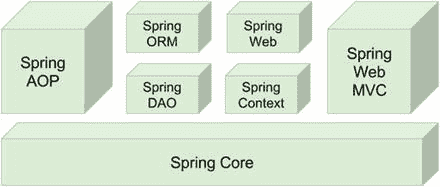
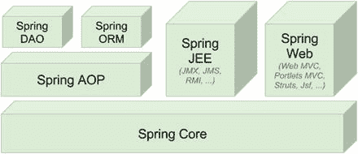
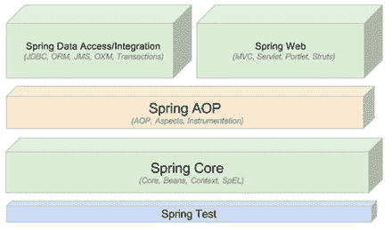
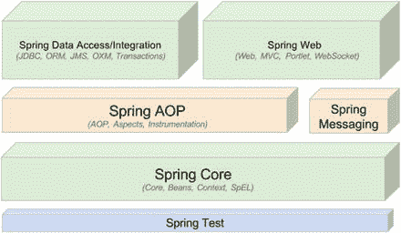

# 1.介绍 Spring

当我们想到 Java 开发人员社区时，我们会想起 19 世纪 40 年代后期成群结队的淘金者，他们疯狂地在北美的河流中淘金，寻找黄金碎片。作为 Java 开发人员，我们的河流中充满了开源项目，但是，像勘探者一样，找到一个有用的项目可能是耗时且费力的。

许多开源 Java 项目的一个常见问题是，它们仅仅是出于填补最新流行技术或模式实现中的空白的需要而设计的。话虽如此，许多高质量、可用的项目满足并解决了实际应用的实际需求，在本书的过程中，您将会遇到这些项目的子集。你会对其中的一个特别有所了解——春天。Spring 的第一个版本发布于 2002 年 10 月，由一个小的核心和一个易于配置和使用的控制反转(IoC)容器组成。多年来，Spring 已经成为 Java 企业版(JEE)服务器的主要替代品，并且已经发展成为一项成熟的技术，由许多不同的项目组成，每个项目都有自己的目的，所以无论您想要构建微服务、应用还是传统的 ERP，Spring 都有一个项目可以满足您的需求。

纵观这本书，你会看到很多不同开源技术的应用，都统一在 Spring 框架下。当使用 Spring 时，应用开发人员可以使用各种各样的开源工具，而不需要编写大量代码，也不需要将应用与任何特定工具过于紧密地耦合在一起。

正如标题所示，在这一章中，我们将向您介绍 Spring 框架，而不是展示任何可靠的例子或解释。如果你已经熟悉 Spring，你可能想跳过这一章，直接进入第 [2](02.html) 章。

## 春天是什么？

也许解释春天最困难的部分之一是准确地分类它是什么。通常，Spring 被描述为用于构建 Java 应用的轻量级框架，但是这种说法带来了两个有趣的问题。

首先，您可以使用 Spring 在 Java 中构建任何应用(例如，独立的、web 或 JEE 应用)，这与许多其他框架不同(例如 Apache Struts，它仅限于 web 应用)。

其次，描述中的轻量级部分并不真正指类的数量或分布的大小，而是定义了 Spring 哲学的整体原则——也就是说，最小影响。Spring 是轻量级的，因为您只需对应用代码做很少的更改，就可以获得 Spring Core 的好处，如果您选择在任何时候停止使用 Spring，您会发现这样做非常简单。

请注意，我们将最后一个声明限定为仅指 Spring Core 许多额外的 Spring 组件，比如数据访问，需要与 Spring 框架更紧密的耦合。然而，这种耦合的好处是显而易见的，在整本书中，我们介绍了将这种耦合对应用的影响最小化的技术。

### Spring 框架的演变

Spring 框架源自 Rod Johnson 所著的《专家一对一:J2EE 设计和开发》一书(Wrox，2002)。在过去的十年中，Spring 框架在核心功能、相关项目和社区支持方面有了显著的发展。随着 Spring Framework 新的主要版本的发布，有必要快速回顾一下 Spring 的每个里程碑版本带来的重要特性，直到 Spring Framework 5.0。

*   Spring 0.9:这是该框架的第一个公开发布，基于《专家一对一:J2EE 设计与开发》一书，提供了 bean 配置基础、AOP 支持、JDBC 抽象框架、抽象事务支持等等。这个版本没有官方的参考文档，但是你可以在 SourceForge 上找到现有的资源和文档。 [1](#Fn1)
*   Spring 1.x : This is the first version released with official reference documentation. It is composed of the seven modules shown in Figure [1-1](#Fig1).
    *   Spring Core : Bean 容器和支持工具
    *   Spring 上下文:`ApplicationContext`、UI、验证、JNDI、企业 JavaBean(EJB)、远程处理和邮件支持
    *   Spring DAO:事务基础设施、Java 数据库连接(JDBC)和数据访问对象(DAO)支持
    *   Spring ORM: Hibernate、iBATIS 和 Java 数据对象(JDO)支持
    *   Spring AOP:一个符合 AOP 联盟的面向方面编程(AOP)实现
    *   Spring Web:基本的集成特性，比如多部分功能、通过 servlet 监听器的上下文初始化以及面向 Web 的应用上下文
    *   Spring Web MVC:基于 Web 的模型-视图-控制器(MVC)框架

    

    图 1-1。

    Overview of the Spring Framework, version 1.x
*   Spring 2.x : This is composed of the six modules shown in Figure [1-2](#Fig2). The Spring Context module is now included in Spring Core, and all Spring web components have been represented here by a single item.
    *   通过使用新的基于 XML 模式的配置而不是 DTD 格式，简化了 XML 配置。值得注意的改进领域包括 bean 定义、AOP 和声明性事务。
    *   web 和门户使用的新 bean 作用域(请求、会话和全局会话)。
    *   对 AOP 开发的注释支持。
    *   Java 持久性 API (JPA)抽象层。
    *   完全支持异步 JMS 消息驱动的 POJOs(对于普通的旧 Java 对象)。
    *   使用 Java 5+时的 JDBC 简化包括`SimpleJdbcTemplate`。
    *   JDBC 命名参数支持(`NamedParameterJdbcTemplate`)。
    *   Spring MVC 的表单标签库。
    *   Portlet MVC 框架介绍。
    *   动态语言支持。Beans 可以用 JRuby、Groovy 和 BeanShell 编写。
    *   JMX 的通知支持和可控 MBean 注册。
    *   为调度任务而引入的抽象。
    *   Java 5 注释支持，专门针对`@Transactional`、`@Required`和`@AspectJ`。

    

    图 1-2。

    Overview of the Spring Framework, version 2.x
*   Spring 2.5.x:这个版本有以下特性:
    *   名为`@Autowired`的新配置注释，并支持 JSR-250 注释(`@Resource`、`@PostConstruct`、`@PreDestroy`)
    *   新八股注解:`@Component`、`@Repository`、`@Service`、`@Controller`
    *   自动类路径扫描支持检测和连接用原型注释标注的类
    *   AOP 更新，包括新的 bean 切入点元素和 AspectJ 加载时编织
    *   完整的 WebSphere 事务管理支持
    *   除了 Spring MVC `@Controller`注释之外，还添加了`@RequestMapping`、`@RequestParam`和`@ModelAttribute`注释，通过注释配置来支持请求处理
    *   瓷砖 2 支架
    *   JSF 1.2 支持
    *   JAX-WS 2.0/2.1 支持
    *   引入 Spring TestContext 框架，提供注释驱动和集成测试支持，不知道所使用的测试框架
    *   将 Spring 应用上下文部署为 JCA 适配器的能力
*   Spring 3.0.x : This is the first version of Spring based on Java 5 and is designed to take full advantage of Java 5 features such as generics, varargs, and other language improvements. This version introduces the Java-based `@Configuration` model. The framework modules have been revised to be managed separately with one source tree per module JAR. This is abstractly depicted in Figure [1-3](#Fig3).
    *   支持 Java 5 的特性，比如泛型、varargs 和其他改进
    *   对可调用、期货、`ExecutorService`适配器和`ThreadFactory`集成的一流支持
    *   框架模块现在可以单独管理，每个模块 JAR 有一个源代码树
    *   Spring 表达式语言(SpEL)简介
    *   核心 Java 配置特性和注释的集成
    *   通用类型转换系统和字段格式化系统
    *   综合休息支持
    *   新的 MVC XML 名称空间和额外的注释，如 Spring MVC 的`@CookieValue`和`@RequestHeaders`
    *   验证增强和 JSR-303 (Bean 验证)支持
    *   对 Java EE 6 的早期支持，包括`@Async/@Asynchronous`注释、JSR-303、JSF 2.0、JPA 2.0 等等
    *   支持嵌入式数据库，如 HSQL、H2 和 Derby

    

    图 1-3。

    Overview of the Spring Framework, version 3.0.x
*   Spring 3.1.x:这个版本有以下特性:
    *   新缓存抽象
    *   Bean 定义概要可以用 XML 定义，并支持`@Profile`注释
    *   用于统一属性管理的环境抽象
    *   常见 Spring XML 名称空间元素的注释等价物，例如`@ComponentScan`、`@EnableTransactionManagement`、`@EnableCaching`、`@EnableWebMvc`、`@EnableScheduling`、`@EnableAsync`、`@EnableAspectJAutoProxy`、`@EnableLoadTimeWeaving`和`@EnableSpringConfigured`
    *   支持 Hibernate 4
    *   Spring TestContext 框架对`@Configuration`类和 bean 定义概要的支持
    *   c:简化构造函数注入的命名空间
    *   支持 Servlet 容器的基于 Servlet 3 代码的配置
    *   无需`persistence.xml`即可引导 JPA `EntityManagerFactory`
    *   添加到 Spring MVC 中的`Flash`和`RedirectAttributes`,允许属性通过使用 HTTP 会话在重定向中存活
    *   URI 模板变量增强
    *   能够用`@Valid`注释 Spring MVC `@RequestBody`控制器方法参数
    *   能够用`@RequestPart`注释来注释 Spring MVC 控制器方法参数
*   Spring 3.2.x:这个版本有以下特性:
    *   支持基于 Servlet 3 的异步请求处理。
    *   新的 Spring MVC 测试框架。
    *   新的 Spring MVC 注释`@ControllerAdvice`和`@MatrixVariable`。
    *   在`RestTemplate`和`@RequestBody`参数中支持泛型类型。
    *   杰克逊 JSON 2 支持。
    *   支持瓷砖 3。
    *   `@RequestBody`或`@RequestPart`参数现在可以跟一个`Errors`参数，这使得处理验证错误成为可能。
    *   能够通过使用 MVC 名称空间和 Java Config 配置选项来排除 URL 模式。
    *   支持`@DateTimeFormat`无 Joda 时间。
    *   全局日期和时间格式。
    *   跨框架的并发优化，最大限度地减少锁，并总体上改善了作用域/原型化 beans 的并发创建
    *   新的基于梯度的构建系统。
    *   迁移到 GitHub ( [`https://github.com/SpringSource/spring-framework`](https://github.com/SpringSource/spring-framework) )。
    *   框架和第三方依赖项中改进的 Java SE 7/OpenJDK 7 支持。CGLIB 和 ASM 现在作为 Spring 的一部分被包含进来。除了 1.6 还支持 AspectJ 1.7。
*   Spring 4.0.x : This is a major Spring release and the first to fully support Java 8\. Older versions of Java can be used, but the minimum requirement has been raised to Java SE6\. Deprecated classes and methods were removed, and the module organization is pretty much the same, as depicted in Figure [1-4](#Fig4).
    *   通过新的 [`www.spring.io/guides`](http://www.spring.io/guides) 网站上的一系列入门指南改善了入门体验
    *   从以前的 Spring 3 版本中删除了不推荐使用的包和方法
    *   Java 8 支持，将最低 Java 版本提高到 6 update 18
    *   Java EE 6 和更高版本现在被认为是 Spring Framework 4.0 的基准
    *   Groovy bean 定义 DSL，允许通过 Groovy 语法配置 bean 定义
    *   核心容器、测试和一般 web 改进
    *   WebSocket、SockJS 和 STOMP 消息传递

    

    图 1-4。

    Overview of the Spring Framework, version 4.0.x
*   Spring 4.2.x:这个版本有以下特性:
    *   核心改进(例如，引入`@AliasFor`并修改现有注释以利用它)
    *   完全支持 Hibernate ORM 5.0
    *   JMS 和 web 改进
    *   WebSocket 消息传递改进
    *   测试改进，最显著的是引入了`@Commit`来代替`@Rollback(false)`，以及引入了`AopTestUtils`实用程序类，该类允许访问隐藏在 Spring 代理后面的底层对象
*   Spring 4.3.x:这个版本有以下特性:
    *   编程模型已经过优化。
    *   核心容器(包含 ASM 5.1、`spring-core.jar`中的 CGLIB 3.2.4 和 Objenesis 2.4)和 MVC 的显著改进。
    *   添加了合成注释。
    *   Spring TestContext 框架需要 JUnit 4.12 或更高版本。
    *   支持新的库，包括 Hibernate ORM 5.2、Hibernate Validator 5.3、Tomcat 8.5 和 9.0、Jackson 2.8 等等
*   Spring 5.0.x:这是一个主要版本。整个框架代码库基于 Java 8，截至 2016 年 7 月，完全兼容 Java 9。 [2](#Fn2)
    *   不再支持 Portlet、Velocity、JasperReports、XMLBeans、JDO、番石榴、Tiles2 和 Hibernate3。
    *   XML 配置命名空间现在被流式传输到未版本化的架构；特定于版本的声明仍然受支持，但根据最新的 XSD 模式进行验证。
    *   通过利用 Java 8 特性的全部功能，引入了全面的改进。
    *   `Resource`抽象为防御性`getFile`访问提供了`isFile`指示器。
    *   Spring 提供的`Filter`实现中完整的 Servlet 3.1 签名支持。
    *   支持 Protobuf 3.0。
    *   支持 JMS 2.0+，JPA 2.1+。
    *   引入 Spring Web Flow，这是一个建立在反应基础上的项目，是`Spring MVC`的替代方案，这意味着它是完全异步和非阻塞的，旨在用于事件循环执行模型，而不是传统的每个请求一个线程的大型线程池执行模型(建立在 Project Reactor [3](#Fn3) 之上)。
    *   网络和核心模块适应了反应式编程模型。 [4](#Fn4)
    *   在 Spring 测试模块中有很多改进。现在支持 JUnit 5，并且引入了新的注释来支持 Jupiter 编程和扩展模型，例如`@SpringJUnitConfig`、`@SpringJUnitWebConfig`、`@EnabledIf`、`@DisabledIf`。
    *   在 Spring TestContext 框架中支持并行测试执行。

### 反转控制还是注入依赖？

Spring 框架的核心是基于控制反转的原理。IoC 是一种外部化组件依赖关系的创建和管理的技术。考虑一个例子，其中类`Foo`依赖于类`Bar`的实例来执行某种处理。传统上，`Foo`通过使用`new`操作符创建一个`Bar`的实例，或者从某种工厂类中获得一个。使用 IoC 方法，某个外部进程在运行时向`Foo`提供一个`Bar`(或一个子类)的实例。这种行为，即运行时的依赖注入，导致马丁·福勒将 IoC 重新命名为更具描述性的依赖注入(DI)。第 3 章讨论了由 DI 管理的依赖关系的精确本质。

正如你将在第 3 章中看到的，当提到控制反转时，使用术语依赖注入总是正确的。在 Spring 的上下文中，您可以互换使用这两个术语，不会失去任何意义。

Spring 的 DI 实现基于两个核心 Java 概念:JavaBeans 和接口。当您使用 Spring 作为 DI 提供者时，您可以灵活地在应用中以不同的方式定义依赖配置(例如，XML 文件、Java 配置类、代码中的注释或新的 Groovy bean 定义方法)。JavaBean s(POJO)提供了创建 Java 资源的标准机制，这些资源可以通过多种方式进行配置，比如构造函数和 setter 方法。在第 [3](03.html) 章，你会看到 Spring 是如何使用 JavaBean 规范来构成其 DI 配置模型的核心的；事实上，任何 Spring 管理的资源都被称为 bean。如果你对 JavaBeans 不熟悉，请参考我们在第三章[开头给出的快速入门。](03.html)

接口和 DI 是互利的技术。显然，将应用设计和编码为接口有助于实现灵活的应用，但是将使用接口设计的应用连接在一起的复杂性非常高，并且给开发人员带来了额外的编码负担。通过使用 DI，您将在应用中使用基于接口的设计所需的代码量减少到几乎为零。同样，通过使用接口，您可以充分利用 DI，因为您的 beans 可以利用任何接口实现来满足它们的依赖性。接口的使用还允许 Spring 利用 JDK 动态代理(代理模式)为横切关注点提供强大的概念，比如 AOP。

在 DI 环境中，Spring 更像是一个容器而不是一个框架——为应用类的实例提供它们需要的所有依赖关系——但是它是以一种更少干扰的方式实现的。将 Spring 用于 DI 仅仅依赖于遵循类中的 JavaBeans 命名约定——没有特殊的类可以继承，也没有专有的命名模式可以遵循。如果有的话，您在使用 DI 的应用中所做的唯一改变是在 JavaBeans 上公开更多的属性，从而允许在运行时注入更多的依赖项。

### 依赖注入的发展

在过去的几年中，由于 Spring 和其他 DI 框架的流行，DI 在 Java 开发人员社区中得到了广泛的接受。同时，开发人员确信使用 DI 是应用开发中的最佳实践，并且使用 DI 的好处也很好理解。

当 Java 社区进程(JCP)在 2009 年采用 JSR-330(Java 的依赖注入)时，DI 的流行得到了认可。JSR-330 已经成为一个正式的 Java 规范请求，正如你所料，规范的领导者之一是 Rod Johnson——Spring 框架的创始人。在《JEE 6》中，JSR-330 成为整个技术堆栈中包含的规格之一。与此同时，EJB 架构(从 3.0 版本开始)也进行了巨大的改进；为了简化各种企业 JavaBeans 应用的开发，它采用了 DI 模型。

尽管我们将 DI 的完整讨论留到第 3 章进行，但还是有必要看看使用 DI 而不是更传统的方法的好处。

*   减少粘合代码:DI 最大的优点之一是它能够显著减少将应用组件粘合在一起所需编写的代码量。这些代码通常很简单，所以创建依赖关系只需要创建一个对象的新实例。然而，当您需要在 JNDI 存储库中查找依赖关系，或者当依赖关系不能被直接调用时，就像远程资源的情况一样，粘合代码会变得非常复杂。在这些情况下，通过提供自动 JNDI 查找和远程资源的自动代理，DI 可以真正简化粘合代码。
*   简化的应用配置:通过采用 DI，您可以大大简化应用的配置过程。您可以使用各种选项来配置那些可注入到其他类的类。您可以使用相同的技术向“注入器”表达依赖性要求，以便注入适当的 bean 实例或属性。此外，DI 使得将一个依赖项的实现替换为另一个实现变得更加简单。假设您有一个对 PostgreSQL 数据库执行数据操作的 DAO 组件，并且您想升级到 Oracle。使用 DI，您可以简单地重新配置业务对象上的适当依赖项，以使用 Oracle 实现而不是 PostgreSQL 实现。
*   在单个存储库中管理公共依赖关系的能力:使用公共服务(例如，数据源连接、事务和远程服务)的传统依赖关系管理方法，您可以在需要的地方(在依赖类中)创建依赖关系的实例(或从一些工厂类中查找)。这将导致依赖关系分散到应用中的各个类，改变它们可能会有问题。当您使用 DI 时，关于这些公共依赖项的所有信息都包含在一个存储库中，这使得依赖项的管理更加简单，并且不容易出错。
*   改进的可测试性:当你为 DI 设计你的类时，你可以很容易地替换依赖关系。这在测试应用时尤其方便。考虑一个执行一些复杂处理的业务对象；其中一部分，它使用 DAO 来访问存储在关系数据库中的数据。对于您的测试，您对测试 DAO 不感兴趣；您只是想用不同的数据集测试业务对象。在传统的方法中，业务对象负责获取 DAO 本身的实例，您很难测试这一点，因为您无法轻松地用返回测试数据集的模拟实现替换 DAO 实现。相反，您需要确保您的测试数据库包含正确的数据，并为您的测试使用完整的 DAO 实现。使用 DI，您可以创建一个返回测试数据集的 DAO 对象的模拟实现，然后您可以将它传递给业务对象进行测试。这种机制可以扩展到测试应用的任何一层，对于测试 web 组件尤其有用，在 web 组件中可以创建`HttpServletRequest`和`HttpServletResponse`的模拟实现。
*   培养良好的应用设计:一般来说，为 DI 设计意味着针对接口进行设计。一个典型的面向注入的应用被设计成所有主要组件都被定义为接口，然后这些接口的具体实现被创建并使用 DI 容器连接在一起。在 DI 和基于 DI 的容器(如 Spring)出现之前，这种设计在 Java 中是可能的，但是通过使用 Spring，您可以免费获得大量 DI 特性，并且您可以专注于构建您的应用逻辑，而不是支持它的框架。

正如您从这个列表中看到的，DI 为您的应用提供了很多好处，但它也不是没有缺点。特别是，对于不太熟悉代码的人来说，DI 很难看出特定依赖项的什么实现被挂接到了哪些对象上。通常，只有当开发人员对 DI 缺乏经验时，这才是一个问题；在变得更有经验并遵循良好的 DI 编码实践(例如，将每个应用层中的所有可注入类放入同一个包中)之后，开发人员将能够很容易地发现全貌。在大多数情况下，巨大的好处远远超过这个小缺点，但是在规划应用时应该考虑到这一点。

### 超越依赖注入

Spring Core 本身，凭借其高级的 DI 功能，是一个有价值的工具，但是 Spring 真正擅长的地方在于它无数的附加特性，所有这些特性都是使用 DI 原则优雅地设计和构建的。Spring 为应用的所有层提供了特性，从帮助应用编程接口(API)到高级 MVC 功能。Spring 中这些特性的伟大之处在于，尽管 Spring 经常提供自己的方法，但您可以轻松地将它们与 Spring 中的其他工具集成，使这些工具成为 Spring 家族的一流成员。

#### 支持 Java 9

Java 8 带来了许多 Spring Framework 5 支持的令人兴奋的特性，最显著的是 lambda 表达式和带有 Spring 回调接口的方法引用。Spring 5 的发布计划与 JDK 9 的最初发布计划一致，尽管 JDK 9 的发布截止日期已经推迟，但 Spring 5 仍按计划发布。估计春天 5.1 会全面拥抱 JDK 9。Spring 5 将利用 JDK 9 的特性，比如压缩字符串、ALPN 堆栈和新的 HTTP 客户端实现。虽然 Spring Framework 4.0 支持 Java 8，但兼容性仍然保持到 JDK 6 update 18。对于新的开发项目，建议使用更新的 Java 版本，如 7 或 8。Spring 5.0 需要 Java 8+,因为 Spring 开发团队已经将 Java 8 语言级别应用于整个框架代码库，但是 Spring 5 也构建在 JDK 9 之上，甚至从一开始就为 JDK 9 的广告功能提供全面的支持。

#### 用 Spring 进行面向方面编程

AOP 提供了在一个地方实现横切逻辑——也就是说，应用于应用许多部分的逻辑——并让该逻辑自动应用于整个应用的能力。Spring 的 AOP 方法是创建目标对象的动态代理，并用配置好的通知编织对象来执行横切逻辑。根据 JDK 动态代理的本质，目标对象必须实现一个接口来声明应用 AOP 建议的方法。另一个流行的 AOP 库是 Eclipse AspectJ 项目， [5](#Fn5) ，它提供了更强大的特性，包括对象构造、类加载和更强的横切能力。然而，对于 Spring 和 AOP 开发人员来说，好消息是从 2.0 版本开始，Spring 提供了与 AspectJ 更紧密的集成。以下是一些亮点:

*   支持 AspectJ 风格的切入点表达式
*   支持`@AspectJ`注释风格，同时仍然使用 Spring AOP 进行编织
*   支持在 AspectJ 中为 DI 实现的方面
*   支持弹簧内的加载时编织`ApplicationContext`

从 Spring Framework 版开始，`@AspectJ`可以通过 Java 配置启用注释支持。

两种 AOP 都有自己的位置，在大多数情况下，Spring AOP 足以满足应用的横切需求。但是，对于更复杂的需求，可以使用 AspectJ，Spring AOP 和 AspectJ 可以混合在同一个 Spring 驱动的应用中。

AOP 有很多应用。许多传统 AOP 示例中给出的一个典型例子是执行某种日志记录，但是 AOP 已经发现了远远超出普通日志记录应用的用途。事实上，在 Spring 框架本身中，AOP 被用于许多目的，尤其是在事务管理中。Spring AOP 在第 [5](05.html) 章中有完整的详细介绍，我们将向您展示 AOP 在 Spring 框架和您自己的应用中的典型用法，以及 AOP 的性能和传统技术比 AOP 更适合的领域。

#### Spring 表达式语言

表达式语言(EL)是一种允许应用在运行时操作 Java 对象的技术。然而，EL 的问题是不同的技术提供了它们自己的 EL 实现和语法。例如，Java Server Pages (JSP)和 Java Server Faces (JSF)都有自己的 EL，它们的语法是不同的。为了解决这个问题，统一表达式语言(EL)应运而生。

因为 Spring 框架发展如此之快，所以需要一种标准的表达式语言，可以在所有 Spring 框架模块以及其他 Spring 项目之间共享。因此，从 3.0 版本开始，Spring 引入了 Spring 表达式语言。SpEL 为在运行时计算表达式和访问 Java 对象和 Spring beans 提供了强大的功能。结果可以在应用中使用或者注入到其他 JavaBeans 中。

#### 春季验证

验证是任何应用中的另一个大主题。理想的场景是，包含业务数据的 JavaBeans 中的属性验证规则可以以一致的方式应用，不管数据操作请求是从前端、批处理作业还是远程发起的(例如，通过 web 服务、RESTful web 服务或远程过程调用[RPC])。

为了解决这些问题，Spring 通过`Validator`接口提供了一个内置的验证 API。这个接口提供了一个简单而简洁的机制，允许您将验证逻辑封装到一个负责验证目标对象的类中。除了目标对象之外，validate 方法还采用了一个`Errors`对象，用于收集任何可能发生的验证错误。

Spring 还提供了一个方便的实用程序类`ValidationUtils`，它提供了调用其他验证器、检查常见问题(如空字符串)以及向所提供的`Errors`对象报告错误的便利方法。

受需求驱动，JCP 还开发了 JSR-303 (Bean Validation ),它提供了定义 Bean 验证规则的标准方法。例如，当将`@NotNull`注释应用于 bean 的属性时，它要求属性在能够持久存储到数据库之前不应该包含`null`值。

从 3.0 版本开始，Spring 为 JSR-303 提供了开箱即用的支持。要使用 API，只需声明一个`LocalValidatorFactoryBean`并将`Validator`接口注入到任何 Spring 管理的 beans 中。Spring 将为您解析底层实现。默认情况下，Spring 将首先寻找 Hibernate 验证器(`hibernate.org/subprojects/validator`)，这是一个流行的 JSR 303 实现。很多前端技术(比如 JSF 2 和 Google Web Toolkit)，包括 Spring MVC，也支持在用户界面中应用 JSR-303 验证。开发人员需要在用户界面和后端层编写相同验证逻辑的时代已经一去不复返了。第 [10 章](10.html)讨论细节。

从 Spring Framework 版开始，支持 1.1 版的 JSR-349 (Bean 验证)。

#### 在 Spring 中访问数据

数据访问和持久性似乎是 Java 世界中讨论最多的话题。Spring 提供了与这些数据访问工具的完美集成。此外，Spring 使普通的 JDBC 成为许多项目的可行选择，其简化的包装 API 围绕着标准 API。Spring 的数据访问模块为 JDBC、Hibernate、JDO 和 JPA 提供了开箱即用的支持。

从 Spring Framework 版开始，iBATIS 支持被移除。MyBatis-Spring 项目提供了与 Spring 的集成，你可以在 [`http://mybatis.github.io/spring/`](http://mybatis.github.io/spring/) 找到更多信息。

然而，在过去的几年中，由于互联网和云计算的爆炸式增长，除了关系数据库之外，还开发了许多其他“专用”数据库。示例包括基于键值对来处理海量数据的数据库(通常称为 NoSQL)、图形数据库和文档数据库。为了帮助开发人员支持这些数据库，并且不使 Spring 数据访问模块复杂化，创建了一个名为 Spring Data [6](#Fn6) 的独立项目。该项目被进一步划分为不同的类别，以支持更具体的数据库访问需求。

本书不包括 Spring 对非关系数据库的支持。如果您对这个主题感兴趣，前面提到的 Spring Data 项目是一个很好的地方。项目页面详细描述了它所支持的非关系数据库，以及这些数据库主页的链接。

Spring 中的 JDBC 支持使得在 JDBC 上构建应用成为现实，甚至对于更复杂的应用也是如此。对 Hibernate、JDO 和 JPA 的支持使得已经很简单的 API 变得更加简单，从而减轻了开发人员的负担。当使用 Spring APIs 通过任何工具访问数据时，您可以利用 Spring 出色的事务支持。你会在第 9 章中找到对此的全面讨论。

Spring 最好的特性之一是能够在应用中轻松混合和匹配数据访问技术。例如，您可能正在使用 Oracle 运行一个应用，使用 Hibernate 来处理大部分数据访问逻辑。然而，如果您想利用一些 Oracle 特有的特性，那么通过使用 Spring 的 JDBC API 来实现数据访问层的这一部分是很简单的。

#### Spring 中的对象/XML 映射

大多数应用需要集成其他应用或为其提供服务。一个常见的需求是定期或实时地与其他系统交换数据。就数据格式而言，XML 是最常用的。因此，您经常需要将 JavaBean 转换成 XML 格式，反之亦然。Spring 支持许多常见的 Java 到 XML 映射框架，并且像往常一样，不需要直接耦合到任何特定的实现。Spring 为 DI 到任何 Spring beans 的编组(将 JavaBeans 转换成 XML)和解组(将 XML 转换成 Java 对象)提供了通用接口。支持 Java Architecture for XML Binding(JAXB)、Castor、XStream、JiBX 和 XMLBeans 等常见库。在第 [12](12.html) 章中，当我们讨论为 XML 格式的业务数据远程访问 Spring 应用时，您将看到如何在您的应用中使用 Spring 的对象/XML 映射(OXM)支持。

#### 管理交易

Spring 为事务管理提供了一个优秀的抽象层，允许编程和声明性的事务控制。通过为事务使用 Spring 抽象层，您可以简化底层事务协议和资源管理器的更改。您可以从简单的、本地的、特定于资源的事务开始，然后转移到全局的、多源的事务，而不必更改您的代码。第 [9](09.html) 章详细介绍了交易。

#### 简化和整合 JEE

随着像 Spring 这样的 DI 框架被越来越多的人所接受，许多开发人员选择使用 DI 框架来构建应用，以支持 JEE 的 EJB 方法。因此，JCP 社区也意识到 EJB 的复杂性。从 EJB 规范的 3.0 版本开始，API 被简化了，所以它现在包含了 DI 的许多概念。

然而，对于那些构建在 EJB 上的应用，或者需要在 JEE 容器中部署基于 Spring 的应用并利用应用服务器的企业服务(例如，Java Transaction API 的事务管理器、数据源连接池和 JMS 连接工厂)的应用，Spring 也为这些技术提供了简化的支持。对于 EJB，Spring 提供了一个简单的声明来执行 JNDI 查找并注入到 Spring beans 中。另一方面，Spring 也为将 Spring beans 注入 EJB 提供了简单的注释。

对于存储在 JNDI 可访问位置的任何资源，Spring 允许您去除复杂的查找代码，并在运行时将 JNDI 管理的资源作为依赖项注入到其他对象中。这样做的一个副作用是，您的应用变得与 JNDI 相分离，允许您在将来有更多的代码重用空间。

#### Web 层中的 MVC

尽管 Spring 几乎可以在任何环境中使用，从桌面到 web，但是它提供了丰富的类来支持基于 Web 的应用的创建。使用 Spring，当您选择如何实现 web 前端时，您拥有最大的灵活性。对于开发 web 应用，MVC 模式是最流行的实践。在最近的版本中，Spring 已经逐渐从一个简单的 web 框架发展成为一个成熟的 MVC 实现。首先，Spring MVC 中的视图支持是广泛的。除了对 JSP 和 Java 标准标记库(JSTL)的标准支持(由 Spring 标记库大大支持)之外，您还可以利用对 Apache Velocity、FreeMarker、Apache Tiles、Thymeleaf 和 XSLT 的完全集成的支持。此外，您将发现一组基本视图类，它们使得向您的应用添加 Microsoft Excel、PDF 和 JasperReports 输出变得简单。

在许多情况下，您会发现 Spring MVC 足以满足您的 web 应用开发需求。然而，Spring 也可以集成其他流行的 web 框架，比如 Struts、JSF、Atmosphere、Google Web Toolkit (GWT)等等。

在过去的几年中，web 框架技术发展迅速。用户需要更具响应性和交互性的体验，这导致了 Ajax 的兴起，成为开发富互联网应用(RIA)时广泛采用的技术。另一方面，用户还希望能够从任何设备访问他们的应用，包括智能手机和平板电脑。这就产生了对支持 HTML5、JavaScript 和 CSS3 的 web 框架的需求。在第 16 章中，我们将讨论使用 Spring MVC 开发 web 应用。

#### WebSocket 支持

从 Spring Framework 4.0 开始，可以支持 JSR-356 (Java API for WebSocket)。WebSocket 定义了一个 API，用于在客户端和服务器之间创建持久连接，通常在 web 浏览器和服务器中实现。WebSocket 风格的开发为高效的全双工通信打开了大门，为高响应应用实现实时消息交换。WebSocket 支持的使用将在第 [17](17.html) 章中详细介绍。

#### 远程支持

在 Java 中访问或公开远程组件从来都不是最简单的工作。使用 Spring，您可以利用对各种远程技术的广泛支持来快速公开和访问远程服务。Spring 支持多种远程访问机制，包括 Java 远程方法调用(RMI)、JAX-WS、Caucho Hessian 和 Burlap、JMS、高级消息队列协议(AMQP)和 REST。除了这些远程协议之外，Spring 还提供了自己的基于 HTTP 的 invoker，它是基于标准 Java 序列化的。通过应用 Spring 的动态代理功能，您可以将一个远程资源的代理作为一个依赖注入到您的一个类中，这样就不需要将您的应用耦合到一个特定的远程实现，也减少了您需要为您的应用编写的代码量。我们将在第 [12](12.html) 章讨论 Spring 中的远程支持。

#### 邮件支持

发送电子邮件是许多应用的典型需求，在 Spring 框架中被给予了头等待遇。Spring 为发送电子邮件消息提供了一个简化的 API，非常适合 Spring DI 功能。Spring 支持标准的 JavaMail API。Spring 提供了在 DI 容器中创建原型消息的能力，并以此作为应用发送的所有消息的基础。这允许容易地定制邮件参数，例如主题和发件人地址。另外，为了定制消息体，Spring 集成了模板引擎，比如 Apache Velocity 这允许邮件内容从 Java 代码中具体化。

#### 作业调度支持

大多数重要的应用都需要某种调度能力。无论是向客户发送更新还是执行日常任务，调度代码在预先定义的时间运行的能力对于开发人员来说都是一个非常有价值的工具。Spring 提供了调度支持，可以满足大多数常见的场景。可以按照固定的时间间隔或通过使用 Unix cron 表达式来调度任务。另一方面，对于任务执行和调度，Spring 也集成了其他调度库。例如，在应用服务器环境中，Spring 可以将执行委托给许多应用服务器使用的 CommonJ 库。对于作业调度，Spring 还支持包括 JDK 定时器 API 和 Quartz 在内的库，Quartz 是一个常用的开源调度库。第 [11 章](11.html)中详细介绍了 Spring 中的调度支持。

#### 动态脚本支持

从 JDK 6 开始，Java 引入了动态语言支持，可以在 JVM 环境中执行用其他语言编写的脚本。例子包括 Groovy、JRuby 和 JavaScript。Spring 还支持在 Spring 驱动的应用中执行动态脚本，或者您可以定义一个用动态脚本语言编写的 Spring bean，并注入到其他 JavaBeans 中。Spring 支持的动态脚本语言包括 Groovy、JRuby 和 BeanShell。在第 [14](14.html) 章，我们详细讨论了 Spring 对动态脚本的支持。

#### 简化的异常处理

Spring 真正有助于减少您需要编写的重复性样板代码的一个领域是异常处理。在这方面，Spring 哲学的核心是检查异常在 Java 中被过度使用，框架不应该强迫你捕捉任何你不可能恢复的异常——这是我们完全同意的观点。实际上，许多框架的设计都是为了减少必须编写代码来处理检查异常的影响。然而，这些框架中的许多采用了坚持检查异常的方法，但是人为地降低了异常类层次结构的粒度。使用 Spring 您会注意到一件事，由于使用未检查的异常给开发人员带来了方便，异常层次结构非常细粒度。在整本书中，您将看到一些例子，在这些例子中，Spring 异常处理机制可以减少您必须编写的代码量，同时提高您在应用中识别、分类和诊断错误的能力。

## 春季项目

Spring 项目最吸引人的一点是社区中的活跃程度，以及 Spring 和其他项目(如 CGLIB、Apache Geronimo 和 AspectJ)之间的交叉影响。开源最受吹捧的好处之一是，如果项目明天就结束了，你将只剩下代码；但是让我们面对现实吧——你不希望留下一个 Spring 大小的代码库来支持和改进。出于这个原因，令人欣慰的是 Spring 社区是如此的完善和活跃。

### 春天的起源

正如本章前面提到的，Spring 的起源可以追溯到专家一对一:J2EE 设计和开发。在这本书里，Rod Johnson 展示了他自己的框架，叫做 Interface 21 Framework，他开发这个框架是为了在自己的应用中使用。这个框架被发布到开源世界，形成了我们今天所知的 Spring 框架的基础。Spring 很快通过了早期的测试和候选发布阶段，第一个正式的 1.0 发布版于 2004 年 3 月发布。从那以后，Spring 经历了巨大的发展，在撰写本文时，Spring Framework 的最新主要版本是 5.0。

### 春天社区

Spring 社区是我们遇到的所有开源项目中最好的之一。邮件列表和论坛总是很活跃，新功能的进展通常很快。开发团队真正致力于使 Spring 成为所有 Java 应用框架中最成功的，这从复制的代码质量中可以看出。正如我们已经提到的，Spring 还受益于与其他开源项目的良好关系，当您考虑到完整的 Spring 发行版所具有的大量依赖性时，这一事实是非常有益的。从用户的角度来看，Spring 最好的特性之一可能是发行版附带的优秀文档和测试套件。Spring 的几乎所有特性都提供了文档，使得新用户很容易掌握这个框架。Spring 提供的测试套件非常全面——开发团队为所有东西编写测试。如果他们发现了一个 bug，他们通过首先编写一个测试来突出这个 bug，然后让测试通过来修复这个 bug。修复 bug 和创建新特性不仅仅局限于开发团队！你可以通过官方的 GitHub 库( [`http://github.com/spring-projects`](http://github.com/spring-projects) )针对任何 Spring 项目组合通过 pull 请求贡献代码。此外，可以通过官方的春季 JIRA ( [`https://jira.spring.io/secure/Dashboard.jspa`](https://jira.spring.io/secure/Dashboard.jspa) )来创建和跟踪问题。这一切对你来说意味着什么？简而言之，这意味着您可以对 Spring 框架的质量充满信心，并且相信在可预见的未来，Spring 开发团队将继续改进已经非常优秀的框架。

### Spring 工具套件

为了简化 Eclipse 中基于 Spring 的应用的开发，Spring 创建了 Spring IDE 项目。此后不久，Rod Johnson 创建的 Spring 背后的公司 SpringSource 创建了一个名为 Spring Tool Suite (STS)的集成工具，可以从 [`https://spring.io/tools`](https://spring.io/tools) 下载。虽然它曾经是一个付费产品，但现在该工具可以免费获得。该工具将 Eclipse IDE、Spring IDE、my Lyn(Eclipse 中基于任务的开发环境)、Maven for Eclipse、AspectJ 开发工具和许多其他有用的 Eclipse 插件集成到一个包中。在每个新版本中，都添加了更多的功能，例如 Groovy 脚本语言支持、图形化的 Spring 配置编辑器、用于 Spring Batch 和 Spring Integration 等项目的可视化开发工具，以及对 Pivotal tc Server 应用服务器的支持。

 SpringSource 被 VMware 收购，并入 Pivotal Software。

除了基于 Java 的套件，还有一个 Groovy/Grails 工具套件，具有类似的功能，但目标是 Groovy 和 Grails 开发( [`http://spring.io/tools`](http://spring.io/tools) )。

### 春季安全项目

Spring 安全项目( [`http://projects.spring.io/spring-security`](http://projects.spring.io/spring-security) )，以前称为 Spring 的 Acegi 安全系统，是 Spring 组合中的另一个重要项目。Spring Security 为 web 应用和方法级安全性提供了全面的支持。它与 Spring 框架和其他常用的身份验证机制紧密集成，如 HTTP 基本身份验证、基于表单的登录、X.509 证书和单点登录(SSO)产品(例如 CA SiteMinder)。它为应用资源提供基于角色的访问控制，并且在具有更复杂的安全需求(例如，数据隔离)的应用中，支持使用访问控制列表(ACL)。然而，Spring Security 主要用于保护 web 应用，我们将在第 16 章中详细讨论。

### Spring Boot

建立应用的基础是一项繁琐的工作。必须创建项目的配置文件，并且必须安装和配置附加工具(如应用服务器)。Spring Boot ( [`http://projects.spring.io/spring-boot/`](http://projects.spring.io/spring-boot/) )是一个 Spring 项目，它使得创建可以运行的独立的、生产级的基于 Spring 的应用变得很容易。Spring Boot 为不同类型的弹簧应用提供了开箱即用的配置，这些配置打包在初始包中。例如，`web-starter`包包含一个预配置的、可轻松定制的 web 应用上下文，支持 Tomcat 7+、Jetty 8+和 Undertow 1.3 嵌入式 servlet 容器。

考虑到版本之间的兼容性，Spring Boot 还包装了 Spring 应用需要的所有依赖项。在撰写本文时，Spring Boot 的当前版本是 2.0.0.RELEASE

Spring Boot 将在第 4 章中介绍，作为 Spring 项目配置的一个替代方案，分配到后面章节的大多数项目将使用 Spring Boot 运行，因为它使开发和测试更加实用和快速。

### Spring 批处理和集成

不用说，批处理作业执行和集成是应用中常见的用例。为了满足这种需求，也为了让这些领域的开发人员更加容易，Spring 创建了 Spring Batch 和 Spring Integration 项目。Spring Batch 为批处理作业实现提供了一个公共框架和各种策略，减少了大量样板代码。通过实现企业集成模式(EIP)，Spring Integration 可以使 Spring 应用与外部系统的集成变得容易。我们将在第 20 章中讨论细节。

### 许多其他项目

我们已经介绍了 Spring 的核心模块和 Spring 组合中的一些主要项目，但是还有许多其他项目是由社区的不同需求驱动的。一些例子包括 Spring Boot、Spring XD、Spring for Android、Spring Mobile、Spring Social 和 Spring AMQP。其中一些项目将在第 [20 章](https://doi.org/10.1007/978-1-4842-2808-1_20)中进一步讨论。更多细节，可以参考 Spring by Pivotal 网站( [`www.spring.io/projects`](http://www.spring.io/projects) )。

## 弹簧的替代品

回到我们之前关于开源项目数量的评论，你不应该惊讶于 Spring 不是唯一一个为构建应用提供依赖注入特性或完整端到端解决方案的框架。事实上，有太多的项目需要提及。本着开放的精神，我们在这里包括了对其中几个框架的简短讨论，但是我们相信这些平台中没有一个能提供像 Spring 中那样全面的解决方案。

### JBoss Seam 框架

由 Gavin King(Hibernate ORM 库的创建者)创立的 Seam 框架( [`http://seamframework.org`](http://seamframework.org) )是另一个成熟的基于 DI 的框架。它支持 web 应用前端开发(JSF)、业务逻辑层(EJB 3)和用于持久性的 JPA。如您所见，Seam 和 Spring 的主要区别在于 Seam 框架完全是基于 JEE 标准构建的。JBoss 还将 Seam 框架中的思想贡献给了 JCP，并成为了 JSR-299(Java EE 平台的上下文和依赖注入)。

### 谷歌指南

另一个流行的 DI 框架是 Google Guice ( [`http://code.google.com/p/google-guice`](http://code.google.com/p/google-guice) )。由搜索引擎巨头 Google 牵头，Guice 是一个轻量级框架，专注于为应用配置管理提供 DI。它也是 JSR-330(Java 依赖注入)的参考实现。

### 微微容器

PicoContainer ( [`http://picocontainer.com`](http://picocontainer.com) )是一个非常小的 DI 容器，它允许您在应用中使用 DI，而不引入除 PicoContainer 之外的任何依赖。因为 PicoContainer 只不过是阿迪容器，您可能会发现随着应用的增长，您需要引入另一个框架，比如 Spring，在这种情况下，您最好从一开始就使用 Spring。然而，如果您需要的只是一个小的 DI 容器，那么 PicoContainer 是一个不错的选择，但是由于 Spring 将 DI 容器与框架的其他部分分开打包，您可以轻松地使用它，并为将来保留灵活性。

### JEE 7 号集装箱 [7 号](#Fn7)

如前所述，DI 的概念被广泛采用，JCP 也认识到了这一点。当您为符合 JEE 7 (JSR-342)的应用服务器开发应用时，您可以在所有层使用标准的 DI 技术。

## 摘要

在这一章中，我们给了你一个 Spring 框架的高级视图，完成了对所有主要特性的讨论，并且我们引导你到书中详细讨论这些特性的相关章节。看完这一章，你应该明白春天能为你做什么；剩下的就是看它怎么做了。在下一章中，我们将讨论启动和运行一个基本的 Spring 应用所需的所有信息。我们向您展示如何获得 Spring 框架，并讨论打包选项、测试套件和文档。此外，第 2 章介绍了一些基本的 Spring 代码，包括一个历史悠久的 Hello World 示例。

Footnotes [1](#Fn1_source)

你可以从 SourceForge 网站: [`https://sourceforge.net/projects/springframework/files/springframework/`](https://sourceforge.net/projects/springframework/files/springframework/) 下载包括 0.9 在内的旧版 Spring。

  [2](#Fn2_source)

请记住，根据甲骨文在 [`http://openjdk.java.net/projects/jdk9/`](http://openjdk.java.net/projects/jdk9/) 发布的时间表，Java 9 将于 2017 年 9 月正式向公众发布。

  [3](#Fn3_source)

Project Reactor 实现了反应流 API 规范； [`https://projectreactor.io/`见](https://projectreactor.io/)。

  [4](#Fn4_source)

反应式编程是一种微架构风格，涉及智能路由和事件消费。这应该会导致非阻塞的应用，它们是异步的和事件驱动的，并且需要少量的线程在 JVM 中垂直伸缩，而不是通过集群水平伸缩。

  [5](#Fn5_source)

[T2`www.eclipse.org/aspectj`](http://www.eclipse.org/aspectj)

  [6](#Fn6_source)

[T2`http://projects.spring.io/spring-data`](http://projects.spring.io/spring-data)

  [7](#Fn7_source)

JEE8 发布日期已推迟至 2017 年底； [`https://jcp.org/en/jsr/detail?id=366`见](https://jcp.org/en/jsr/detail?id=366)。