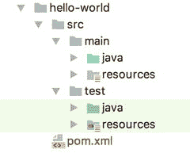

# 二、入门指南

通常，学习使用任何新的开发工具最困难的部分是弄清楚从哪里开始。通常情况下，当工具提供像 Spring 一样多的选择时，这个问题会更严重。幸运的是，如果您知道首先从哪里开始，那么开始使用 Spring 并不困难。在这一章中，我们将向你介绍所有你需要的基本知识，以便有一个良好的开端。具体来说，您将看到以下内容:

*   获取 Spring:第一个逻辑步骤是获取或构建 Spring JAR 文件。如果您想快速启动并运行，只需在您的构建系统中使用依赖管理片段，例如 [`http://projects.spring.io/spring-framework`](http://projects.spring.io/spring-framework) 中提供的例子。然而，如果你想走在 Spring 开发的最前沿，可以从 Spring 的 GitHub 库中查看最新版本的源代码。 [<sup>1</sup>](#Fn1)
*   Spring包装选项:Spring包装是模块化的；它允许您挑选要在应用中使用的组件，并在分发应用时只包含这些组件。Spring 有许多模块，但是根据应用的需要，您只需要这些模块的一个子集。每个模块在一个 JAR 文件中有其编译的二进制代码，以及相应的 Javadoc 和源 JAR。
*   Spring 指南:新的 Spring 网站包括一个位于 [`http://spring.io/guides`](http://spring.io/guides) 的指南部分。这些指南旨在为使用 Spring 构建任何开发任务的 Hello World 版本提供快速、实用的指导。这些指南还反映了最新的 Spring 项目发布和技术，为您提供了最新的可用示例。
*   测试套件和文档:Spring 社区成员最引以为豪的事情之一是他们全面的测试套件和文档集。测试是团队工作的一大部分。标准发行版提供的文档集也非常优秀。
*   抛开所有不好的双关语，我们认为开始使用任何新的编程工具的最好方式是直接进入并编写一些代码。我们给出一个简单的例子，这是一个所有人都喜欢的 Hello World 应用的完全基于 DI 的实现。如果你不能马上理解所有的代码，不要惊慌；本书后面会有完整的讨论。

如果你已经熟悉了 Spring 框架的基础，可以直接进入第 [3](03.html) 章，深入了解 Spring 中的 IoC 和 DI。然而，即使你熟悉 Spring 的基础知识，你也会发现本章的一些讨论很有趣，尤其是那些关于打包和依赖的讨论。

## 获得 Spring 框架

在开始任何 Spring 开发之前，您需要获得 Spring 库。您有几个选择来检索库:您可以使用您的构建系统来引入您想要使用的模块，或者您可以从 Spring GitHub 存储库中检出并构建代码。使用 Maven 或 Gradle 这样的依赖管理工具通常是最直接的方法；您所需要做的就是在配置文件中声明依赖关系，并让工具为您获取所需的库。

如果你有一个互联网连接，并结合使用一个智能 IDE(如 Eclipse 或 IntelliJ IDEA)使用一个构建工具(如 Maven 或 Gradle ),你可以自动下载 Javadoc 和库，这样你就可以在开发过程中访问它们。当您在构建项目时升级构建配置文件中的版本时，库和 Javadoc 也将被更新。

### 快速入门

访问 Spring Framework 项目页面 [<sup>2</sup>](#Fn2) 以获取您的构建系统的依赖管理片段，从而在您的项目中包含 Spring 的最新发布版本。您还可以为即将发布的版本或之前的版本使用里程碑/夜间快照。

当使用 Spring Boot 时，不需要指定您想要使用的 Spring 版本，因为 Spring Boot 提供了固执己见的“starter”项目对象模型(POM)文件来简化您的 Maven 配置和默认的 Gradle starter 配置。请记住，2.0.0.RELEASE 之前的 Spring Boot 版本使用 Spring 4.x 版本。

### 检查 GitHub 中的Spring

如果您想在新特性进入快照之前了解它们，您可以直接从 Pivotal 的 GitHub 资源库中查看源代码。要查看 Spring 代码的最新版本，首先安装 Git，可以从 [`http://git-scm.com`](http://git-scm.com) 下载。然后打开终端外壳并运行以下命令:

```java
git clone git://github.com/spring-projects/spring-framework.git

```

查看项目根目录中的`README.md`文件，了解如何从源代码构建的完整细节和要求。

### 使用正确的 JDK

Spring 框架是用 Java 构建的，这意味着您需要能够在您的计算机上执行 Java 应用才能使用它。为此你需要安装 Java。当人们谈论 Java 应用开发时，有三个广泛使用的 Java 首字母缩写词。

*   Java 虚拟机(JVM)是一种抽象机器。它是一个提供运行时环境的规范，Java 字节码可以在这个环境中执行。
*   Java 运行时环境(JRE)用于提供运行时环境。它是物理上存在的 JVM 的实现。它包含一组 JVM 在运行时使用的库和其他文件。甲骨文 2010 年收购了太阳微系统公司；从那以后，新的版本和补丁被积极地提供。其他公司，比如 IBM，提供了他们自己的 JVM 实现。
*   Java 开发工具包(JDK)包含 JRE、文档和 Java 工具。这是 Java 开发人员安装在他们机器上的东西。像 IntelliJ IDEA 或 Eclipse 这样的智能编辑器会要求您提供 JDK 的位置，以便可以在开发过程中加载和使用类和文档。

如果你使用的是像 Maven 或 Gradle 这样的构建工具(本书附带的源代码组织在一个 Gradle multimodule 项目中)，它也需要一个 JVMMaven 和 Gradle 本身都是基于 Java 的项目。

最新稳定的 Java 版本是 Java 8，Java 9 计划于 2017 年 9 月 21 日发布。你可以从 [`https://www.oracle.com/`](https://www.oracle.com/) 下载 JDK。默认情况下，它将安装在您计算机上的某个默认位置，这取决于您的操作系统。如果您想从命令行使用 Maven 或 Gradle，您需要为 JDK 和 Maven/Gradle 定义环境变量，并将它们的可执行文件的路径添加到系统路径中。你可以在每个产品的官方网站和本书的附录中找到如何操作的说明。

第 [1 章](01.html)介绍了 Spring 版本和所需 JDK 版本的列表。书中介绍的 Spring 版本是 5.0.x。书中介绍的源代码是使用 Java 8 语法编写的，因此您至少需要 JDK 版本 8 才能编译和运行这些示例。

## 了解Spring包装

Spring 模块是简单的 JAR 文件，它封装了该模块所需的代码。了解每个模块的用途后，您可以选择项目中所需的模块，并将它们包含在代码中。从 Spring 版本 5.0.0.RELEASE 开始，Spring 附带了 21 个模块，打包成 21 个 JAR 文件。表 [2-1](#Tab1) 描述了这些 JAR 文件及其对应的模块。例如，实际的 JAR 文件名是`spring-aop-5.0.0.RELEASE.jar`，尽管为了简单起见，我们只包含了特定的模块部分(例如在`aop`中)。

表 2-1。

Spring modules

<colgroup><col> <col></colgroup> 
| 组件 | 描述 |
| --- | --- |
| `aop` | 这个模块包含了在应用中使用 Spring 的 AOP 特性所需的所有类。如果您计划在 Spring 中使用其他使用 AOP 的特性，比如声明式事务管理，那么您也需要在您的应用中包含这个 JAR。此外，支持与 AspectJ 集成的类被打包在这个模块中。 |
| `aspects` | 这个模块包含了与 AspectJ AOP 库高级集成的所有类。例如，如果您在 Spring 配置中使用 Java 类，并且需要 AspectJ 风格的注释驱动的事务管理，那么您将需要这个模块。 |
| `beans` | 这个模块包含了所有支持 Spring 操作 Spring beans 的类。这里的大多数类都支持 Spring 的 bean 工厂实现。例如，处理 Spring XML 配置文件和 Java 注释所需的类被打包到这个模块中。 |
| `beans-groovy` | 该模块包含 Groovy 类，用于支持 Spring 对 Spring beans 的操作。 |
| `context` | 这个模块包含了为 Spring Core 提供许多扩展的类。你会发现所有的类都需要使用 Spring 的`ApplicationContext`特性(在第 [5 章](05.html)中有所涉及)，以及用于企业 JavaBeans (EJB)、Java 命名和目录接口(JNDI)和 Java 管理扩展(JMX)集成的类。该模块中还包含 Spring remoting 类，用于集成动态脚本语言(例如，JRuby、Groovy 和 BeanShell)、JSR-303 (Bean 验证)、调度和任务执行等的类。 |
| `context` `-indexer` | 该模块包含一个索引器实现，提供对`META-INF/spring.components`中定义的候选对象的访问。核心类`CandidateComponentsIndex`不打算在外部使用。 |
| `context-support` | 该模块包含对`spring-context`模块的进一步扩展。在用户界面方面，有一些支持邮件和集成模板引擎的类，比如 Velocity、FreeMarker 和 JasperReports。此外，这里还集成了各种任务执行和调度库，包括 CommonJ 和 Quartz。 |
| `core` | 这是每个 Spring 应用都需要的主要模块。在这个 JAR 文件中，您将找到所有其他 Spring 模块共享的所有类(例如，用于访问配置文件的类)。此外，在这个 JAR 中，您将发现在 Spring 代码库中使用的非常有用的实用程序类的选择，并且您可以在自己的应用中使用它们。 |
| `expression` | 这个模块包含了 Spring 表达式语言(SpEL)的所有支持类。 |
| `instrument` | 这个模块包括 Spring 的用于 JVM 引导的工具代理。在 Spring 应用中使用 AspectJ 的加载时编织需要这个 JAR 文件。 |
| `dbc` | 本模块包括 JDBC 支持的所有课程。所有需要数据库访问的应用都需要这个模块。用于支持数据源、JDBC 数据类型、JDBC 模板、本地 JDBC 连接等的类都打包在这个模块中。 |
| `jms` | 该模块包括 JMS 支持的所有类。 |
| `messaging` | 该模块包含来自 Spring Integration 项目的关键抽象，作为基于消息的应用的基础，并增加了对 STOMP 消息的支持。 |
| `orm` | 该模块扩展了 Spring 的标准 JDBC 特性集，支持流行的 ORM 工具，包括 Hibernate、JDO、JPA 和数据映射器 iBATIS。这个 JAR 中的许多类都依赖于包含在`spring-jdbc` JAR 文件中的类，所以您肯定需要在您的应用中包含这些类。 |
| `oxm` | 该模块提供了对对象/XML 映射(OXM)的支持。这个模块中包含了抽象 XML 编组和解组的类，以及对 Castor、JAXB、XMLBeans 和 XStream 等流行工具的支持。 |
| `test` | Spring 提供了一组模拟类来帮助测试您的应用，并且这些模拟类中的许多都在 Spring 测试套件中使用，因此它们经过了很好的测试，并且使测试您的应用变得更加简单。当然，我们已经发现模拟`HttpServletRequest`和`HttpServletResponse`类在我们的 web 应用的单元测试中非常有用。另一方面，Spring 提供了与 JUnit 单元测试框架的紧密集成，在这个模块中提供了许多支持 JUnit 测试用例开发的类；例如，`SpringJUnit4ClassRunner`提供了一种在单元测试环境中引导Spring`ApplicationContext`的简单方法。 |
| `tx` | 该模块提供了支持 Spring 事务基础设施的所有类。您会发现事务抽象层中的类支持 Java 事务 API (JTA)以及与主要供应商的应用服务器的集成。 |
| `web` | 这个模块包含了在 web 应用中使用 Spring 的核心类，包括自动加载一个`ApplicationContext`特性的类、文件上传支持类和一些用于执行重复任务的有用类，比如从查询字符串中解析整数值。 |
| `web-reactive` | 该模块包含 Spring Web 反应模型的核心接口和类。 |
| `web-` `mvc` | 这个模块包含了 Spring 自己的 MVC 框架的所有类。如果您为您的应用使用一个单独的 MVC 框架，您将不需要这个 JAR 文件中的任何类。Spring MVC 在第 [16](16.html) 章中有更详细的介绍。 |
| `websocket` | 这个模块提供了对 JSR-356 (Java API for WebSocket)的支持。 |

### 为您的应用选择模块

如果没有 Maven 或 Gradle 这样的依赖管理工具，选择在应用中使用哪些模块可能会有点棘手。例如，如果您只需要 Spring 的 bean factory 和 DI 支持，您还需要几个模块，包括`spring-core`、`spring-beans`、`spring-context`和`spring-aop`。如果你需要 Spring 的 web 应用支持，那么你需要进一步添加`spring-web`等等。由于 Maven 的传递依赖支持等构建工具特性，所有必需的第三方库都将自动包含在内。

### 访问 Maven 仓库上的 Spring 模块

由 Apache Software Foundation 创建的 Maven [<sup>3</sup>](#Fn3) 已经成为管理 Java 应用依赖性的最流行的工具之一，从开源到企业环境。Maven 是一个强大的应用构建、打包和依赖管理工具。它管理应用的整个构建周期，从资源处理和编译到测试和打包。还存在大量用于各种任务的 Maven 插件，例如更新数据库和将打包的应用部署到特定的服务器(例如，Tomcat、JBoss 或 WebSphere)。截至本文撰写之时，当前的 Maven 版本是 3.3.9。

几乎所有开源项目都支持通过 Maven 资源库分发库。最流行的是托管在 Apache 上的 Maven Central repository，您可以在 Maven Central web 站点上访问和搜索工件的存在和相关信息。 [<sup>4</sup>](#Fn4) 如果您将 Maven 下载并安装到您的开发机器中，您将自动获得对 Maven 中央存储库的访问权。其他一些开源社区(例如 JBoss 和 Pivotal 的 Spring)也为他们的用户提供了自己的 Maven 资源库。但是，为了能够访问这些存储库，您需要将存储库添加到 Maven 的设置文件或项目的 POM 文件中。

关于 Maven 的详细讨论不在本书的讨论范围之内，您可以随时参考在线文档或书籍，它们为您提供了关于 Maven 的详细参考。然而，由于 Maven 被广泛采用，因此值得一提 Maven 存储库上项目打包的典型结构。

组 ID、工件 ID、打包类型和版本标识每个 Maven 工件。例如，对于 log4j，组 ID 是`log4j`，工件 ID 是`log4j`，打包类型是`jar`。在此之下，定义了不同的版本。例如，对于版本 1.2.12，工件的文件名变成组 ID、工件 ID 和版本文件夹下的`log4j-1.2.17.jar`。Maven 配置文件是用 XML 编写的，必须遵守由 [`http://maven.apache.org/maven-v4_0_0.xsd`](http://maven.apache.org/maven-v4_0_0.xsd) 模式定义的 Maven 标准语法。项目的 Maven 配置文件的默认名称是`om.xml`，这里显示了一个示例文件:

```java
<project 
   xmlns:xsi="http://www.w3.org/2001/XMLSchema-instance"
  xsi:schemaLocation="http://maven.apache.org/POM/4.0.0
   http://maven.apache.org/maven-v4_0_0.xsd">
  <modelVersion>4.0.0</modelVersion>
  <groupId>com.apress.prospring5.ch02</groupId>
  <artifactId>hello-world</artifactId>
  <packaging>jar</packaging>
  <version>5.0-SNAPSHOT</version>
  <name>hello-world</name>
  <properties>
    <project.build.sourceEncoding>UTF-8</project.build.sourceEncoding>
    <spring.version>5.0.0.RELEASE</spring.version>
  </properties>
  <dependencies>
      <!
-- https://mvnrepository.com/artifact/log4j/log4j -->
        <dependency>
                <groupId>log4j</groupId>
                <artifactId>log4j</artifactId>
                <version>1.2.17</version>
        </dependency>
  </dependencies>
  <build>
    <plugins>
      <plugin>
       ...
      </plugin>
    </plugins>
  </build>
</project>

```

Maven 还定义了一个典型的标准项目结构，如图 [2-1](#Fig1) 所示。



图 2-1。

Typical Maven project structure

`main`目录包含应用的类(`java`目录)和配置文件(`resources`目录)。

`test`目录包含用于测试来自`main`目录的应用的类(`java`目录)和配置文件(`resources`目录)。

### 使用 Gradle 访问 Spring 模块

Maven 项目的标准结构以及工件的分类和组织非常重要，因为 Gradle 遵守相同的规则，甚至使用 Maven 中央存储库来检索工件。Gradle 是一个强大的构建工具，它放弃了臃肿的 XML 配置，转而使用 Groovy 的简单性和灵活性。在撰写本文时，Gradle 的当前版本是 4.0。 [<sup>5</sup>](#Fn5) 从 4.x 版本开始，Spring 团队已经改用 Gradle 进行每一款 Spring 产品的配置。这就是为什么这本书的源代码也可以使用 Gradle 来构建和执行。项目的 Gradle 配置文件的默认名称是`build.gradle`。这里显示了前面描述的`pom.xml`文件的等效物(嗯，它的一个版本):

```java
group 'com.apress.prospring5.ch02'
version '5.0-SNAPSHOT'

apply plugin: 'java'

repositories {
    mavenCentral()
}

ext{
        springVersion = '5.0.0.RELEASE'
}

tasks.withType(JavaCompile) {
    options.encoding = "UTF-8"
}

dependencies {
    compile group: 'log4j', name: 'log4j', version: '1.2.17'
   ... 

}

```

这样可读性更强，对吧？正如您所观察到的，工件是使用 Maven 前面介绍的组、工件和版本来标识的，但是属性名称不同。由于 Gradle 也不在本书的讨论范围之内，所以对它的讨论必须到此为止。

### 使用 Spring 文档

Spring 使其成为开发真正应用的开发人员的有用框架的一个方面是它丰富的编写良好的、准确的文档。在每个版本中，Spring Framework 的文档团队都努力确保所有的文档都由开发团队完成和润色。这意味着 Spring 的每个特性不仅在 Javadoc 中有完整的文档，而且在每个发行版中包含的 Spring 参考手册中也有涉及。如果您还没有熟悉 Spring Javadoc 和参考手册，现在就开始吧。这本书不是这些资源的替代品；相反，它是一个补充参考，演示了如何从头开始构建一个基于 Spring 的应用。

### 给 Hello World 注入Spring

我们希望在本书的这一点上，您已经意识到 Spring 是一个可靠的、得到良好支持的项目，它具备了应用开发的所有优秀工具的素质。然而，还缺少一点——我们还没有向您展示任何代码。我们确信您渴望看到 Spring 的运行，因为我们不能再继续下去而不进入代码，让我们就这么做吧。如果您没有完全理解本节中的所有代码，请不要担心；随着全书的深入，我们会对所有主题进行更详细的讨论。

### 构建 Hello World 示例应用

现在，我们确信您熟悉传统的 Hello World 示例，但是如果您在过去 30 年中一直生活在月球上，以下代码片段展示了 Java 版本的辉煌:

```java
package com.apress.prospring5.ch2;

public class HelloWorld {
    public static void main(String... args) {
        System.out.println("Hello World!");
    }
}

```

就示例而言，这个非常简单——它完成了工作，但是不太具有可扩展性。如果我们想改变信息呢？如果我们希望以不同的方式输出消息，可能是标准错误而不是标准输出，或者是包含在 HTML 标记中而不是作为纯文本，该怎么办？我们将重新定义示例应用的需求，并说它必须支持简单、灵活的消息更改机制，并且必须易于更改呈现行为。在基本的 Hello World 示例中，只需适当地更改代码，就可以快速、轻松地完成这两项更改。然而，在更大的应用中，重新编译需要时间，并且需要再次对应用进行全面测试。更好的解决方案是将消息内容外部化，并在运行时读取它，可能是从下面的代码片段中显示的命令行参数读取:

```java
package com.apress.prospring5.ch2;

public class HelloWorldWithCommandLine {

    public static void main(String... args) {
        if (args.length > 0) {
            System.out.println(args[0]);
        } else {
            System.out.println("Hello World!");
        }
    }
}

```

这个例子实现了我们想要的——我们现在可以在不改变代码的情况下改变消息。但是，这个应用仍然有一个问题:负责呈现消息的组件也负责获取消息。更改获取消息的方式意味着更改呈现器中的代码。此外，我们仍然不能轻易改变渲染器；这样做意味着更改启动应用的类。

如果我们让这个应用更进一步(远离 Hello World 的基础)，更好的解决方案是将呈现和消息检索逻辑重构到单独的组件中。另外，如果我们真的想让您的应用灵活，我们应该让这些组件实现接口，并使用这些接口定义组件和启动器之间的依赖关系。通过重构消息检索逻辑，我们可以用一个方法`getMessage()`定义一个简单的`MessageProvider`接口，如下面的代码片段所示:

```java
package com.apress.prospring5.ch2.decoupled;

public interface MessageProvider {
    String getMessage();
}

```

所有可以呈现消息的组件都实现了`MessageRenderer`接口，下面的代码片段描述了这样一个组件:

```java
package com.apress.prospring5.ch2.decoupled;

public interface MessageRenderer {
    void render();

    void setMessageProvider(MessageProvider provider);
    MessageProvider getMessageProvider();
}

```

如您所见，`MessageRenderer`接口声明了一个方法`render()`，以及一个 JavaBean 样式的方法`setMessageProvider()`。任何`MessageRenderer`实现都与消息检索分离，并将该职责委托给提供它们的`MessageProvider`实例。这里，`MessageProvider`是`MessageRenderer`的依赖。创建这些接口的简单实现很容易，如下面的代码片段所示:

```java
package com.apress.prospring5.ch2.decoupled;

public class HelloWorldMessageProvider implements MessageProvider {
    @Override
    public String getMessage() {
        return "Hello World!";
    }
}

```

您可以看到，我们已经创建了一个简单的`MessageProvider`，它总是返回“Hello World！”作为信息。接下来显示的`StandardOutMessageRenderer`类同样简单:

```java
package com.apress.prospring5.ch2.decoupled;

public class StandardOutMessageRenderer implements MessageRenderer {
    private MessageProvider messageProvider;

    @Override
    public void render() {
        if (messageProvider == null) {
            throw new RuntimeException(
                "You must set the property messageProvider of class:"
                + StandardOutMessageRenderer.class.getName());
        }
        System.out.println(messageProvider.getMessage());
    }

    @Override
    public void setMessageProvider(MessageProvider provider) {
        this.messageProvider = provider;
    }

    @Override
    public MessageProvider getMessageProvider() {
        return this.messageProvider;
    }

}

```

现在剩下的就是重写入口类的`main()`方法。

```java
package com.apress.prospring5.ch2.decoupled;

public class HelloWorldDecoupled {
    public static void main(String... args) {
        MessageRenderer mr = new StandardOutMessageRenderer();
        MessageProvider mp = new HelloWorldMessageProvider();
        mr.setMessageProvider(mp);
        mr.render();
    }
}

```

图 [2-2](#Fig2) 描绘了到目前为止构建的应用的抽象模式。


图 2-2。

A little more decoupled Hello World application

这里的代码相当简单。我们实例化了`HelloWorldMessageProvider`和`StandardOutMessageRenderer`的实例，尽管声明的类型分别是`MessageProvider`和`MessageRenderer`。这是因为我们只需要与编程逻辑中的接口提供的方法进行交互，而`HelloWorldMessageProvider`和`StandardOutMessageRenderer`已经分别实现了那些接口。然后，我们将`MessageProvider`传递给`MessageRenderer`并调用`MessageRenderer.render()`。如果我们编译并运行这个程序，我们会得到预期的“Hello World！”输出。现在，这个例子更像是我们正在寻找的，但是有一个小问题。改变`MessageRenderer`或`MessageProvider`接口的实现意味着代码的改变。为了解决这个问题，我们可以创建一个简单的工厂类，它从属性文件中读取实现类名，并代表应用实例化它们，如下所示:

```java
package com.apress.prospring5.ch2.decoupled;
import java.util.Properties;

public class MessageSupportFactory {
    private static MessageSupportFactory instance;

    private Properties props;
    private MessageRenderer renderer;
    private MessageProvider provider;

    private MessageSupportFactory() {
        props = new Properties();

        try {
                props.load(this.getClass().getResourceAsStream("/msf.properties"));
            String rendererClass = props.getProperty("renderer.class");
            String providerClass = props.getProperty("provider.class");

            renderer = (MessageRenderer) Class.forName(rendererClass).newInstance();
            provider = (MessageProvider) Class.forName(providerClass).newInstance();
        } catch (Exception ex) {
            ex.printStackTrace();
        }
    }

    static {
        instance = new MessageSupportFactory();
    }

    public static MessageSupportFactory getInstance() {
        return instance;
    }

public MessageRenderer getMessageRenderer() {
        return renderer;
    }

    public MessageProvider getMessageProvider() {
        return provider;
    }
}

```

这里的实现很简单，错误处理很简单，配置文件的名称是硬编码的，但是我们已经有了大量的代码。这个类的配置文件非常简单。

```java
renderer.class=
    com.apress.prospring5.ch2.decoupled.StandardOutMessageRenderer
provider.class=
    com.apress.prospring5.ch2.decoupled.HelloWorldMessageProvider

```

要使用前面的实现，您必须再次修改 main 方法。

```java
package com.apress.prospring5.ch2.decoupled;

public class HelloWorldDecoupledWithFactory {
    public static void main(String... args) {
        MessageRenderer mr =
              MessageSupportFactory.getInstance().getMessageRenderer();
        MessageProvider mp =
              MessageSupportFactory.getInstance().getMessageProvider();
        mr.setMessageProvider(mp);
        mr.render();
    }
}

```

在我们继续讨论如何将 Spring 引入这个应用之前，让我们快速回顾一下我们已经完成的工作。从简单的 Hello World 应用开始，我们定义了应用必须满足的两个附加要求。第一是改变消息应该简单，第二是改变呈现机制也应该简单。为了满足这些需求，我们使用了两个接口:`MessageProvider`和`MessageRenderer`。`MessageRenderer`接口依赖于`MessageProvider`接口的实现来检索要呈现的消息。最后，我们添加了一个简单的工厂类来检索实现类的名称，并根据需要实例化它们。

### 用 Spring 重构

前面展示的最后一个示例达到了示例应用的目标，但是仍然存在一些问题。第一个问题是，我们必须编写大量粘合代码来将应用拼凑在一起，同时保持组件的松散耦合。第二个问题是，我们仍然必须手动为`MessageRenderer`的实现提供一个`MessageProvider`的实例。我们可以通过使用 Spring 来解决这两个问题。要解决胶水代码太多的问题，我们可以把`MessageSupportFactory`类从应用中完全去掉，换成一个 Spring 接口，`ApplicationContext`。不用太担心这个接口；现在，只要知道 Spring 使用这个接口来存储关于 Spring 管理的应用的所有环境信息就足够了。这个接口扩展了另一个接口`ListableBeanFactory`，它充当任何 Spring 管理的 bean 实例的提供者。

```java
package com.apress.prospring5.ch2;

import org.springframework.context.ApplicationContext;
import org.springframework.context.support.ClassPathXmlApplicationContext;

public class HelloWorldSpringDI {
    public static void main(String args) {
        ApplicationContext ctx = new ClassPathXmlApplicationContext
            ("spring/app-context.xml");

        MessageRenderer mr = ctx.getBean("renderer", MessageRenderer.class);
        mr.render();
    }
}

```

在前面的代码片段中，可以看到`main()`方法获得了一个`ClassPathXmlApplicationContext`的实例(应用配置信息从项目类路径中的文件`spring/app-context.xml`加载)，类型为`ApplicationContext`，并由此通过使用`ApplicationContext.getBean()`方法获得了`MessageRenderer`实例。现在不要太担心`getBean()`方法；只要知道这个方法读取应用配置(本例中是一个 XML 文件)，初始化 Spring 的`ApplicationContext`环境，然后返回配置好的 bean [<sup>6</sup>](#Fn6) 实例。这个 XML 文件(`app-context.xml`)的用途与用于`MessageSupportFactory`的文件相同。

```java
<?xml version="1.0" encoding="UTF-8"?>
<beans 
    xmlns:xsi="http://www.w3.org/2001/XMLSchema-instance"
    xmlns:p="http://www.springframework.org/schema/p"
    xsi:schemaLocation="http://www.springframework.org/schema/beans
        http://www.springframework.org/schema/beans/spring-beans.xsd">

  <bean id="provider"
        class="com.apress.prospring5.ch2.decoupled.HelloWorldMessageProvider"/>

  <bean id="renderer"
        class="com.apress.prospring5.ch2.decoupled.StandardOutMessageRenderer"
        p:messageProvider-ref="provider"/>
</beans>

```

前一个文件显示了一个典型的Spring`ApplicationContext`配置。首先声明 Spring 的名称空间，默认名称空间是`beans`。`beans`名称空间用于声明需要由 Spring 管理的 bean，并声明它们的依赖需求(对于前面的例子，渲染器 bean 的`messageProvider`属性引用了提供者 bean)。Spring 将解析并注入这些依赖。

之后，我们声明 ID 为`provider`的 bean 和相应的实现类。当 Spring 在`ApplicationContext`初始化期间看到这个 bean 定义时，它将实例化这个类，并用指定的 ID 存储它。

然后用相应的实现类声明`renderer` bean。记住，这个 bean 依赖于`MessageProvider`接口来获取要呈现的消息。为了通知 Spring 关于 DI 的要求，我们使用了`p`名称空间属性。标签属性`p:messageProvider-ref="provider"`告诉 Spring，bean 的属性`messageProvider`应该被注入另一个 bean。要注入到属性中的 bean 应该引用 ID 为`provider`的 bean。当 Spring 看到这个定义时，它将实例化这个类，查找名为`messageProvider`的 bean 属性，并用 ID 为`provider`的 bean 实例注入它。

可以看到，在 Spring 的`ApplicationContext`初始化时，`main()`方法现在只是通过使用其类型安全的`getBean()`方法(传入 ID 和预期返回类型，这是`MessageRenderer`接口)获取`MessageRenderer` bean 并调用`render()`；Spring 创建了`MessageProvider`实现，并将其注入到`MessageRenderer`实现中。注意，我们不需要对使用 Spring 连接在一起的类做任何修改。事实上，这些类没有引用 Spring，完全不知道它的存在。然而，情况并非总是如此。您的类可以实现 Spring 指定的接口，以多种方式与 DI 容器交互。

使用您的新Spring配置和修改过的`main()`方法，让我们看看它的运行情况。使用 Gradle，在终端中输入以下命令来构建项目和源代码的根目录:

```java
gradle clean build copyDependencies

```

唯一需要在配置文件中声明的 Spring 模块是`spring-context`。Gradle 将自动引入该模块所需的任何可传递的依赖关系。在图 [2-3](#Fig3) 中，你可以看到`spring-context.jar`的传递依赖关系。


图 2-3。

spring-context and its transitive dependencies depicted in IntelliJ IDEA

前面的命令将从头开始构建项目，删除先前生成的文件，并将所有需要的依赖项复制到放置结果工件的相同位置，在`build/libs`下。当构建 JAR 时，这个路径值也将被用作添加到`MANIFEST.MF`的库文件的附加前缀。如果您不熟悉 Gradle JAR 构建配置和过程，请参阅章节 [2](02.html) 源代码(可在 Apress 网站上获得)，特别是 Gradle `hellor-world/build.properties`文件，了解更多信息。最后，要运行 Spring DI 示例，请输入以下命令:

```java
cd build/libs; java -jar hello-world-5.0-SNAPSHOT.jar

```

此时，您应该会看到 Spring 容器的启动过程生成的一些日志语句，后面是预期的 Hello World 输出。

#### 使用注释的Spring配置

从 Spring 3.0 开始，开发 Spring 应用时不再需要 XML 配置文件。它们可以被注释和配置类代替。配置类是用`@Configuration`标注的 Java 类，包含 bean 定义(用`@Bean`标注的方法)，或者通过用`@ComponentScanning`标注来配置它们自己以识别应用中的 bean 定义。这里显示了前面给出的`app-context.xml`文件的等效文件:

```java
package com.apress.prospring5.ch2.annotated;

import com.apress.prospring5.ch2.decoupled.HelloWorldMessageProvider;
import com.apress.prospring5.ch2.decoupled.MessageProvider;
import com.apress.prospring5.ch2.decoupled.MessageRenderer;
import com.apress.prospring5.ch2.decoupled.StandardOutMessageRenderer;
import org.springframework.context.annotation.Bean;
import org.springframework.context.annotation.Configuration;

@Configuration
public class HelloWorldConfiguration {

        // equivalent to <bean id="provider" class=".."/>
        @Bean
        public MessageProvider provider() {
                return new HelloWorldMessageProvider();
        }

        // equivalent to  <bean id="renderer" class=".."/>
        @Bean
        public MessageRenderer renderer(){
                MessageRenderer renderer = new StandardOutMessageRenderer();
                renderer.setMessageProvider(provider());
                return renderer;
        }
}

```

必须修改`main()`方法，用另一个知道如何从配置类中读取 bean 定义的`ApplicationContext`实现来替换`ClassPathXmlApplicationContext`。那个班是`AnnotationConfigApplicationContext`。

```java
package com.apress.prospring5.ch2.annotated;

import com.apress.prospring5.ch2.decoupled.MessageRenderer;
import org.springframework.context.ApplicationContext;
import org.springframework.context.annotation.AnnotationConfigApplicationContext;

public class HelloWorldSpringAnnotated {

        public static void main(String... args) {
                ApplicationContext ctx = new AnnotationConfigApplicationContext
                                (HelloWorldConfiguration.class);
                MessageRenderer mr = ctx.getBean("renderer", MessageRenderer.class);
                mr.render();
        }
}

```

这只是使用注释和配置类的配置的一个版本。如果没有 XML，Spring 配置就会变得非常灵活。在本书的后面部分，您将会学到更多，但是配置的重点是 Java 配置和注释。

Hello World 示例中定义的一些接口和类可能会在后面的章节中用到。尽管我们在本示例中展示了完整的源代码，但在以后的章节中，我们可能会展示更简洁的代码，尤其是在增量代码修改的情况下。代码已经被组织了一点，所有可以在 Spring future 示例中使用的类都被放在了`com.apress.prospring5.ch2.decoupled`和`com.apress.prospring5.ch2.annotated`包下，但是请记住，在一个真实的应用中，您会希望对代码进行适当的分层。

## 摘要

在这一章中，我们向您介绍了使用 Spring 所需的所有背景信息。我们向您展示了如何通过依赖管理系统和直接来自 GitHub 的当前开发版本开始使用 Spring。我们描述了 Spring 是如何打包的，以及 Spring 的每个特性所需要的依赖关系。使用这些信息，您可以做出明智的决定，您的应用需要哪些 Spring JAR 文件，以及您需要将哪些依赖项与您的应用一起分发。Spring 的文档、指南和测试套件为 Spring 用户提供了一个理想的基础来开始他们的 Spring 开发，所以我们花了一些时间来研究 Spring 提供了什么。最后，我们给出了一个例子，展示了如何使用 Spring DI 将传统的 Hello World 变成一个松散耦合、可扩展的消息呈现应用。要意识到的重要的一点是，在这一章中，我们只触及了 Spring DI 的表面，我们几乎没有对 Spring 整体做出任何改动。在下一章，我们来看看Spring的 IoC 和 DI。

Footnotes [1](#Fn1_source)

在 [`http://github.com/spring-projects/spring-framework`](http://github.com/spring-projects/spring-framework) 找到 Spring 的 GitHub 库。

  [2](#Fn2_source)

[T2`http://projects.spring.io/spring-framework`](http://projects.spring.io/spring-framework)

  [3](#Fn3_source)

[T2`http://maven.apache.org`](http://maven.apache.org)

  [4](#Fn4_source)

[T2`http://search.maven.org`](http://search.maven.org)

  [5](#Fn5_source)

在官方项目网站上，你可以找到关于如何下载、安装和配置 Gradle for development 的详细说明: [`https://gradle.org/install`](https://gradle.org/install) 。

  [6](#Fn6_source)

bean 是一个类的实例在 Spring 中的叫法。