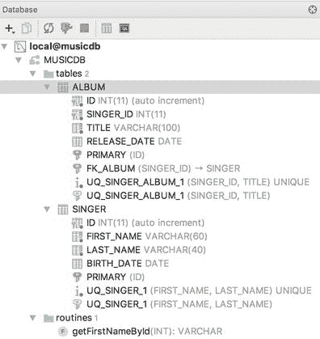

# 六、Spring JDBC 支持

到目前为止，您已经看到了构建一个完全由 Spring 管理的应用是多么容易。您对 bean 配置和面向方面编程(AOP)有很深的理解。然而，这个难题缺少了一部分:如何获得驱动应用的数据？

除了简单的一次性命令行实用程序，几乎每个应用都需要将数据保存到某种数据存储中。最常见和最方便的数据存储是关系数据库。

以下是 2017 年七大关系型企业数据库:

*   甲骨文数据库
*   搜寻配置不当的
*   IBM DB2
*   SAP Sybase ASE
*   一种数据库系统
*   MariaDB 企业
*   关系型数据库

如果你不在一家能负担前四种许可证的大公司工作，你可能会使用前面列表中的后三种之一。使用最多的开源关系数据库可能是 MySQL ( [`http://mysql.com`](http://mysql.com) )和 PostgreSQL ( `postgresql.org`)。MySQL 通常更广泛地用于 web 应用开发，尤其是在 Linux 平台上。 [<sup>1</sup>](#Fn1) 另一方面，PostgreSQL 对 Oracle 开发者更友好，因为它的过程语言 PLpgSQL 非常接近 Oracle 的 PL/SQL 语言。

即使您选择了最快和最可靠的数据库，您也不能因为使用设计和实现不佳的数据访问层而失去它的速度和灵活性。应用倾向于非常频繁地使用数据访问层；因此，数据访问代码中任何不必要的瓶颈都会影响整个应用，不管它设计得有多好。

在本章中，我们将向您展示如何使用 Spring 来简化使用 JDBC 的数据访问代码的实现。我们首先看一下在没有 Spring 的情况下通常需要编写的大量重复代码，然后将其与使用 Spring 的数据访问类实现的类进行比较。结果确实令人惊讶，因为 Spring 允许您使用人工调整的 SQL 查询的全部功能，同时最小化您需要实现的支持代码的数量。具体来说，我们讨论以下内容:

*   比较传统的 JDBC 代码和 Spring JDBC 支持:我们探索 Spring 如何简化旧式的 JDBC 代码，同时保持相同的功能。您还将看到 Spring 如何访问低级 JDBC API，以及这个低级 API 如何映射到方便的类，如`JdbcTemplate`。
*   连接到数据库:尽管我们没有深入到数据库连接管理的每一个细节，但我们确实向您展示了简单的`Connection`和`DataSource`之间的根本区别。自然，我们会讨论 Spring 如何管理数据源，以及您可以在应用中使用哪些数据源。
*   检索数据并将数据映射到 Java 对象:我们向您展示如何检索数据，然后如何有效地将所选数据映射到 Java 对象。您还了解了 Spring JDBC 是对象关系映射(ORM)工具的一个可行的替代品。
*   插入、更新和删除数据:最后，我们讨论如何通过使用 Spring 执行这些类型的查询来实现插入、更新和删除操作。

## Lambda 表达式简介

Java 版本 8 的发布带来了 lambda 表达式支持，以及许多其他特性。Lambda 表达式是匿名内部类用法的绝佳替代品，也是使用 Spring 的 JDBC 支持的理想选择。lambda 表达式的使用需要使用 Java 8。这本书是在 Java 8 的预发行版本和第一个通用版本期间写的，所以我们知道不是每个人都会使用 Java 8。鉴于此，本章代码示例和源代码下载展示了这两种风格。Lambda 表达式适用于 Spring API 中使用模板或回调的大多数地方，而不仅仅局限于 JDBC。本章不涉及 lambda 表达式本身，因为它们是 Java 语言的一个特性，你应该熟悉 lambda 的概念和语法。更多信息请参考 [`http://docs.oracle.com/javase/tutorial/java/javaOO/lambdaexpressions.html`](http://docs.oracle.com/javase/tutorial/java/javaOO/lambdaexpressions.html) 的 Lambda 表达式教程。

## 示例代码的示例数据模型

在继续讨论之前，我们先介绍一个简单的数据模型，该模型在本章以及后面几章讨论其他数据访问技术时用于示例(我们将相应地扩展该模型，以满足每个主题的需要)。

这个模型是一个简单的音乐数据库，有两个表。第一个是`SINGER`表，存储一个歌手的信息，另一个表是`ALBUM`，存储那个歌手发行的专辑。每个歌手可以有零张或多张专辑；换句话说，`SINGER`和`ALBUM`之间是一对多的关系。歌手的信息包括他们的名和姓以及出生日期。图 [6-1](#Fig1) 显示了数据库的实体关系(ER)图。


图 6-1。

Simple data model for the example code

正如您所看到的，两个表都有一个 ID 列，在插入过程中，数据库会自动分配这个 ID 列。对于`ALBUM`表，有一个到`SINGER`表的外键关系，它通过列`SINGER_ID`与`SINGER`表的主键(即 ID 列)相链接。

在本章中，我们使用开源数据库 MySQL 在一些例子中展示与真实数据库的交互。这将要求您有一个 MySQL 实例可供使用。我们不讨论如何安装 MySQL。您可以使用自己选择的另一个数据库，但是可能需要修改模式和函数定义。我们还将介绍嵌入式数据库的使用，它不需要 MySQL 数据库。

万一你想使用 MySQL，在官方网站上你可以找到非常好的安装和配置 MySQL 的教程。下载完 MySQL [<sup>2</sup>](#Fn2) 并安装后，就可以使用`root`账号访问了。通常，当您开发一个应用时，您需要一个新的模式和用户。对于本章中的代码示例，模式名为`MUSICDB`，访问它的用户名为`prospring5`。接下来描述了创建它们所执行的 SQL 代码，您可以在`plain-jdbc`项目的`resources`目录下的`ddl.sql`文件中找到它们。包括对 MySQL 社区服务器版本 5.17.18 中的一个错误的修复，这是本书撰写时的当前版本。

```java
CREATE USER 'prospring5'@'localhost' IDENTIFIED BY 'prospring5';

CREATE SCHEMA MUSICDB;
GRANT ALL PRIVILEGES ON MUSICDB . * TO 'prospring5'@'localhost';
FLUSH PRIVILEGES;

/*in case of java.sql.SQLException: The server timezone value 'UTC'
       is unrecognized or represents more than one timezone. */
SET GLOBAL time_zone = '+3:00';

```

下面的代码片段描述了创建前面提到的两个表所需的 SQL 代码。这个代码在`schema.sql`的`plain-jdbc`项目的`resources`目录下。

```java
CREATE TABLE SINGER (
       ID INT NOT NULL AUTO_INCREMENT
     , FIRST_NAME VARCHAR(60) NOT NULL
     , LAST_NAME VARCHAR(40) NOT NULL
     , BIRTH_DATE DATE
     , UNIQUE UQ_SINGER_1 (FIRST_NAME, LAST_NAME)
     , PRIMARY KEY (ID)
);

CREATE TABLE ALBUM (
       ID INT NOT NULL AUTO_INCREMENT
     , SINGER_ID INT NOT NULL
     , TITLE VARCHAR(100) NOT NULL
     , RELEASE_DATE DATE
     , UNIQUE UQ_SINGER_ALBUM_1 (SINGER_ID, TITLE)
     , PRIMARY KEY (ID)
     , CONSTRAINT FK_ALBUM FOREIGN KEY (SINGER_ID)
                  REFERENCES SINGER (ID)
);

```

如果您使用像 IntelliJ IDEA 这样的智能编辑器，您可以使用数据库视图来检查您的模式和表。在图 [6-2](#Fig2) 中，你可以看到 IntelliJ IDEA 中描述的`MUSICDB`模式的内容。



图 6-2。

Contents of the MUSICDB schema

因为我们需要数据来测试 JDBC 的使用，所以还提供了一个名为`test-data.sql`的文件，其中包含一组用于填充这两个表的`INSERT`语句。

```java
insert into singer (first_name, last_name, birth_date)
     values ('John', 'Mayer', '1977-10-16');
insert into singer (first_name, last_name, birth_date)
     values ('Eric', 'Clapton', '1945-03-30');
insert into singer (first_name, last_name, birth_date)
     values ('John', 'Butler', '1975-04-01');

insert into album (singer_id, title, release_date)
     values (1, 'The Search For Everything', '2017-01-20');
insert into album (singer_id, title, release_date)
     values (1, 'Battle Studies', '2009-11-17');
insert into album (singer_id, title, release_date)
     values (2, ' From The Cradle ', '1994-09-13');

```

在本章的后面几节中，您将看到通过 JDBC 从数据库中检索数据并将结果集直接映射到 Java 对象(即 POJOs)的例子。这些映射到表中记录的类也称为`entities`。对于`SINGER`表，将创建一个`Singer`类，该类将被实例化以创建映射到歌手记录的 Java 对象。

```java
package com.apress.prospring5.ch6.entities;

import java.io.Serializable;
import java.sql.Date;
import java.util.List;

public class Singer implements Serializable {

    private Long id;
    private String firstName;
    private String lastName;
    private Date birthDate;
    private List<Album> albums;

    public void setId(Long id) {
        this.id = id;
    }

    public Long getId() {
        return this.id;
    }

    public void setFirstName(String firstName) {
        this.firstName = firstName;
    }

    public String getFirstName() {
        return this.firstName;
    }

    public void setLastName(String lastName) {
        this.lastName = lastName;
    }

    public String getLastName() {
        return this.lastName;
    }

   public boolean addAbum(Album album) {
      if (albums == null) {
          albums = new ArrayList<>();
          albums.add(album);
          return true;
        } else {
            if (albums.contains(album)) {
                               return false;
             }
      }
     albums.add(album);
     return true;
     }

    public void setAlbums(List<Album> albums) {
        this.albums = albums;
    }

    public List<Album> getAlbums() {
        return albums;
    }

    public void setBirthDate(Date birthDate) {
        this.birthDate = birthDate;
    }

    public Date getBirthDate() {
        return birthDate;
    }

    public String toString() {
               return "Singer - Id: " + id +  ", First name: " + firstName
                   + ", Last name: " + lastName + ", Birthday: " + birthDate;
    }
}

```

以类似的方式，还创建了一个`Album`类。

```java
package com.apress.prospring5.ch6.entities;

import java.io.Serializable;
import java.sql.Date;

public class Album implements Serializable {
    private Long id;
    private Long singerId;
    private String title;
    private Date releaseDate;

    public void setId(Long id) {
        this.id = id;
    }

    public Long getId() {
        return this.id;
    }

    public void setSingerId(Long singerId) {
        this.singerId = singerId;
    }

    public Long getSingerId() {
        return this.singerId;
    }

    public void setTitle(String  title) {
        this.title = title;
    }

    public String getTitle() {
        return this.title;
    }

    public void setReleaseDate(Date releaseDate) {
        this.releaseDate = releaseDate;
    }

    public Date getReleaseDate() {
        return this.releaseDate;
    }

    @Override
    public String toString() {
        return "Album - Id: " + id + ", Singer id: " + singerId
            + ", Title: " + title + ", Release Date: " + releaseDate;
    }
}

```

让我们从一个简单的`SingerDao`接口开始，它封装了歌手信息的所有数据访问服务。代码如下:

```java
package com.apress.prospring5.ch6.dao;

import com.apress.prospring5.ch6.entities.Singer;

import java.util.List;

public interface SingerDao {
    List<Singer> findAll();
    List<Singer> findByFirstName(String firstName);
    String findLastNameById(Long id);
    String findFirstNameById(Long id);
    void insert(Singer singer);
    void update(Singer singer);
    void delete(Long singerId);
    List<Singer> findAllWithDetail();
    void insertWithDetail(Singer  singer);
}

```

在前面的接口中，我们分别定义了两个 finder 方法以及 insert、update 和 delete 方法。它们对应于 CRUD 术语(创建、读取、更新、删除)。

最后，为了便于测试，让我们修改一下`logback.xml`配置文件，将所有类的日志级别改为`DEBUG`。在`DEBUG`级别，Spring JDBC 模块将把所有底层 SQL 语句输出到数据库，这样你就知道到底发生了什么；这对于排除 SQL 语句语法错误特别有用。下面的配置示例描述了打开了`DEBUG`级别的`logback.xml`文件(位于`src/main/resources`下，带有章节 [6](06.html) 项目的源代码文件)的内容。

```java
<?xml version="1.0"  encoding="UTF-8"?>
<configuration>

    <contextListener class="ch.qos.logback.classic.jul.LevelChangePropagator">
        <resetJUL>true</resetJUL>
    </contextListener>

    <appender name="console" class="ch.qos.logback.core.ConsoleAppender">
        <encoder>

     <pattern>%d{HH:mm:ss.SSS} [%thread] %-5level %logger{5} - %msg%n</pattern>

        </encoder>
    </appender>

    <logger name="com.apress.prospring5.ch5" level="debug"/>

    <logger name="org.springframework" level="off"/>

    <root level="debug">
        <appender-ref ref="console" />
    </root>
</configuration>

```

## 探索 JDBC 的基础设施

JDBC 为 Java 应用访问存储在数据库中的数据提供了一种标准方法。JDBC 基础设施的核心是特定于每个数据库的驱动程序；正是这个驱动程序允许 Java 代码访问数据库。

一旦驱动程序被加载，它就向一个`java.sql.DriverManager`类注册自己。该类管理驱动程序列表，并提供建立数据库连接的静态方法。`DriverManager`的`getConnection()`方法返回一个驱动实现的`java.sql.Connection`接口。这个接口允许您对数据库运行 SQL 语句。

JDBC 框架相当复杂，而且久经考验；然而，随着这种复杂性而来的是开发上的困难。第一层复杂性在于确保您的代码管理到数据库的连接。连接是一种稀缺资源，建立起来非常昂贵。通常，数据库会为每个连接创建一个线程或一个子进程。此外，并发连接数通常是有限的，过多的打开连接数会降低数据库的速度。

我们将向您展示 Spring 如何帮助管理这种复杂性，但是在我们继续之前，我们需要向您展示如何在纯 JDBC 中选择、删除和更新数据。

本章涵盖的所有项目都需要特殊的数据库库作为依赖项:`mysql-connector`、`spring-jdbc`、`dbcp`等等。只需查看每个项目的`build.gradle`配置文件和`pro-spring-15/build.gradle`中使用的版本和库。

让我们创建一个简单形式的`SingerDao`接口实现，用于通过纯 JDBC 与数据库交互。记住我们已经知道的关于数据库连接的知识，我们将采取谨慎且昂贵的(就性能而言)方法为每个语句创建一个连接。这大大降低了 Java 的性能，并给数据库增加了额外的压力，因为必须为每个查询建立一个连接。但是，如果我们保持连接打开，我们可以使数据库服务器停止运行。下面的代码片段以 MySQL 为例，展示了管理 JDBC 连接所需的代码:

```java
package com.apress.prospring5.ch6.dao;
...
public class PlainSingerDao implements SingerDao {

    private static Logger logger  =
        LoggerFactory.getLogger(PlainSingerDao.class);

    static {
        try {
            Class.forName("com.mysql.cj.jdbc.Driver");
        } catch  (ClassNotFoundException ex)  {
            logger.error("Prblem  loadng DB dDiver!", ex);
        }
    }

    private Connection getConnection()  throws SQLException {
        return  DriverManager.getConnection(
            "jdbc:mysql://localhost:3306/musicdb?useSSL=true",
            "prospring5", "prospring5");
    }

    private  void closeConnection(Connection connection)  {
        if (connection ==  null) {
            return;
        }
        try {
            connection.close();
        } catch  (SQLException ex)  {
            logger.error("Problem  closing  connection to the database!",ex);
        }
    }
...

```

这段代码还远未完成，但它让您了解了管理 JDBC 连接所需的步骤。这段代码甚至没有处理连接池，连接池是一种更有效地管理数据库连接的常用技术。我们现在不讨论连接池(连接池将在本章后面的“数据库连接和数据源”一节中讨论)；相反，下面的代码片段显示了使用普通 JDBC 实现`SingerDao`接口的`findAll()`、`insert()`和`delete()`方法:

```java
package com.apress.prospring5.ch6.dao;
...
public class PlainSingerDao implements SingerDao {
    @Override
    public List<Singer> findAll() {
            List<Singer> result = new ArrayList<>();
            Connection connection = null;
            try {
                connection = getConnection();
                PreparedStatement statement =
                    connection.prepareStatement("select * from singer");
                ResultSet resultSet = statement.executeQuery();
                while (resultSet.next())  {
                    Singer singer = new Singer();
                    singer.setId(resultSet.getLong("id"));
                    singer.setFirstName(resultSet.getString("first_name"));
                    singer.setLastName(resultSet.getString("last_name"));
                    singer.setBirthDate(resultSet.getDate("birth_date"));
                    result.add(singer);
                }
                statement.close();
            } catch  (SQLException ex) {
            logger.error("Problem when executing SELECT!",ex);
            } finally {
            closeConnection(connection);
            }
            return result;
    }

    @Override
    public void insert(Singer singer) {
        Connection connection = null;
            try {
               connection = getConnection();
               PreparedStatement statement = connection.prepareStatement(
                   "insert into Singer (first_name,  last_name, birth_date)
                     values (?, ?, ?)"
                   , Statement.RETURN_GENERATED_KEYS);
               statement.setString(1, singer.getFirstName());
               statement.setString(2, singer.getLastName());
               statement.setDate(3, singer.getBirthDate());
               statement.execute();
               ResultSet generatedKeys = statement.getGeneratedKeys();
               if (generatedKeys.next()) {
                    singer.setId(generatedKeys.getLong(1));
               }
           statement.close();
            } catch (SQLException ex) {
            logger.error("Prblem  executing INSERT", ex);
             } finally {
            closeConnection(connection);
        }
    }

    @Override
    public void delete(Long singerId) {
        Connection connection = null;
        try {

           connection = getConnection();
           PreparedStatement statement = connection.prepareStatement
               ("delete from singer where id=?");
           statement.setLong(1, singerId);
           statement.execute();
           statement.close();
        } catch (SQLException ex) {
            logger.error("Prblem executing DELETE", ex);
        } finally {
            closeConnection(connection);
        }
    }
    ...
}

```

要测试`PlainSingerDao`类，可以使用下面的类:

```java
package com.apress.prospring5.ch6;

import com.apress.prospring5.ch6.dao.PlainSingerDao;
import com.apress.prospring5.ch6.dao.SingerDao;
import com.apress.prospring5.ch6.entities.Singer;
import org.slf4j.Logger;
import org.slf4j.LoggerFactory;

import java.sql.Date;
import java.util.GregorianCalendar;
import java.util.List;

public class PlainJdbcDemo {
    private static SingerDao singerDao = new PlainSingerDao();
    private static Logger logger = LoggerFactory.getLogger(PlainJdbcDemo.class);

    public static void main(String... args) {
        logger.info("Listing initial singer data:");

        listAllSingers();

        logger.info("-------------");
        logger.info("Insert a  new singer");

        Singer singer = new Singer();
        singer.setFirstName("Ed");
        singer.setLastName("Sheeran");
        singer.setBirthDate(new  Date
            ((new GregorianCalendar(1991,  2, 1991)).getTime().getTime()));
        singerDao.insert(singer)

;

        logger.info("Listing singer data after new singer created:");

        listAllSingers();

        logger.info("-------------");
        logger.info("Deleting the previous created singer");

        singerDao.delete(singer.getId());

        logger.info("Listing singer data after new singer deleted:");

        listAllSingers();
    }

    private static void listAllSingers() {
        List<Singer> singers = singerDao.findAll();

        for (Singer singer: singers) {
            logger.info(singer.toString());
        }
    }
}

```

正如您所注意到的，我们现在将使用一个记录器来打印控制台中的消息。运行前面的程序会产生以下结果(假设您有一个本地安装的名为`MUSICDB`的 MySQL 数据库，它的用户名和密码设置为`prospring5`，并且样本数据已经加载):

```java
INFO    c.a.p.c.PlainJdbcDemo - Listing initial singer data:
INFO    c.a.p.c.PlainJdbcDemo - Singer - Id: 1, First name: John, Last name: Mayer,
                                Birthday: 1977-10-15
INFO    c.a.p.c.PlainJdbcDemo - Singer - Id: 2, First name: Eric, Last name: Clapton,
                                Birthday:  1945-03-29
INFO    c.a.p.c.PlainJdbcDemo - Singer - Id: 3, First name: John, Last name: Butler,

Birthday: 1975-03-31
INFO    c.a.p.c.PlainJdbcDemo - -------------
INFO    c.a.p.c.PlainJdbcDemo - Insert a new singer
INFO    c.a.p.c.PlainJdbcDemo - Listing singer data after new singer created:
INFO    c.a.p.c.PlainJdbcDemo - Singer - Id: 1, First name: John, Last name: Mayer,
                                Birthday: 1977-10-15
INFO    c.a.p.c.PlainJdbcDemo - Singer - Id: 2, First name: Eric, Last name: Clapton,
                                Birthday: 1945-03-29
INFO    c.a.p.c.PlainJdbcDemo - Singer - Id: 3, First name: John, Last name: Butler,
                                Birthday: 1975-03-31
INFO    c.a.p.c.PlainJdbcDemo - Singer - Id: 5, First name: Ed,   Last name: Sheeran,
                                Birthday: 1996-08-10
INFO    c.a.p.c.PlainJdbcDemo - -------------
INFO    c.a.p.c.PlainJdbcDemo - Deleting the previous created singer
INFO    c.a.p.c.PlainJdbcDemo - Listing singer data after new singer deleted:
INFO    c.a.p.c.PlainJdbcDemo - Singer - Id: 1, First name: John, Last name: Mayer,
                                Birthday: 1977-10-15
INFO    c.a.p.c.PlainJdbcDemo - Singer - Id: 2, First name: Eric, Last name: Clapton,
                                Birthday: 1945-03-29
INFO    c.a.p.c.PlainJdbcDemo - Singer - Id: 3, First name: John, Last name: Butler,
                                Birthday: 1975-03-31

```

如输出所示，第一行显示了初始数据。第二行显示添加了新记录。最后一行显示新创建的歌手(艾德·希兰)被删除。

正如您在前面的代码示例中所看到的，许多代码需要移动到一个助手类中，或者更糟的是，在每个 DAO 类中复制。从应用员的角度来看，这是 JDBC 的主要缺点；您没有时间在每个 DAO 类中编写重复的代码。相反，您希望专注于编写代码，实际完成您需要 DAO 类做的事情:选择、更新和删除数据。您需要编写的助手代码越多，需要处理的检查异常就越多，您可能会在代码中引入更多的错误。

这就是 DAO 框架和 Spring 的用武之地。框架消除了实际上不执行任何定制逻辑的代码，并允许您忘记所有需要执行的内务处理。此外，Spring 广泛的 JDBC 支持会让您的生活轻松许多。

## Spring JDBC 基础设施

我们在本章第一部分讨论的代码不是很复杂，但是很繁琐，因为要写的内容太多，所以编码错误的可能性很高。是时候看看Spring是如何让事情变得更简单、更优雅了。

### 概述和使用的包

JDBC Spring支架分为五个包，详见表[6-1](#Tab1)；每一个都处理 JDBC 访问的不同方面。

表 6-1。

Spring JDBC Packages

<colgroup><col> <col></colgroup> 
| 包裹 | 描述 |
| --- | --- |
| `org.springframework.jdbc.core` | 这包含了Spring JDBC 课程的基础。它包括核心 JDBC 类`JdbcTemplate`，该类简化了用 JDBC 编程数据库操作。几个子包提供了对具有更特定目的的 JDBC 数据访问的支持(例如，一个支持命名参数的`JdbcTemplate`类)以及相关的支持类。 |
| `org.springframework.jdbc.datasource` | 它包含助手类和`DataSource`实现，您可以使用它们在 JEE 容器之外运行 JDBC 代码。几个子包提供了对嵌入式数据库、数据库初始化和各种数据源查找机制的支持。 |
| `org.springframework.jdbc.object` | 这包含帮助将从数据库返回的数据转换成对象或对象列表的类。这些对象和列表是普通的 Java 对象，因此与数据库断开连接。 |
| `org.springframework.jdbc.support` | 这个包中最重要的类是`SQLException`翻译支持。这允许 Spring 识别数据库使用的错误代码，并将它们映射到更高级别的异常。 |
| `org.springframework.` `jdbc.config` | 这包含了在 Spring 的`ApplicationContext`中支持 JDBC 配置的类。例如，它包含一个用于`jdbc`名称空间的处理程序类(例如，`<jdbc:embedded-database>`标签)。 |

让我们从最底层的功能开始讨论 Spring JDBC 支持。在运行 SQL 查询之前，需要做的第一件事是建立到数据库的连接。

## 数据库连接和数据源

通过提供一个实现`javax.sql.DataSource`的 bean，您可以使用 Spring 来管理数据库连接。一个`DataSource`和一个`Connection`的区别在于一个`DataSource`提供和管理`Connection`

`DriverManagerDataSource`(在包`org.springframework.jdbc.datasource`下)是一个`DataSource`最简单的实现。通过查看类名，您可以猜测它只是简单地调用`DriverManager`来获得连接。事实上`DriverManagerDataSource`不支持数据库连接池，这使得这个类除了测试之外不适合做任何事情。`DriverManagerDataSource`的配置相当简单，如以下代码片段所示；您只需要提供驱动程序类名、连接 URL、用户名和密码(`drivermanager-cfg-01.xml`)。

```java
<?xml version="1.0" encoding="UTF-8"?>
<beans 
       xmlns:xsi="http://www.w3.org/2001/XMLSchema-instance"
       xmlns:context="http://www.springframework.org/schema/context"
       xmlns:p="http://www.springframework.org/schema/p"
       xsi:schemaLocation="http://www.springframework.org/schema/beans
        http://www.springframework.org/schema/beans/spring-beans.xsd
        http://www.springframework.org/schema/context
        http://www.springframework.org/schema/context/spring-context.xsd">

    <bean id="dataSource"
          class="org.springframework.jdbc.datasource.DriverManagerDataSource"
          p:driverClassName="${jdbc.driverClassName}"
          p:url="${jdbc.url}" p:username="${jdbc.username}"
          p:password="${jdbc.password}"/>

    <context:property-placeholder location="classpath:db/jdbc.properties"/>
</beans>

```

您很可能认识清单中的属性。它们表示您通常传递给 JDBC 以获得一个`Connection`接口的值。数据库连接信息通常存储在属性文件中，以便在不同的部署环境中进行维护和替换。下面的代码片段显示了一个示例`jdbc.properties`，Spring 的属性占位符将从该示例中加载连接信息:

```java
jdbc.driverClassName=com.mysql.cj.jdbc.Driver jdbc.url=jdbc:mysql://localhost:3306/musicdb?useSSL=true
jdbc.username=prospring5
jdbc.password=prospring5

```

通过在 mix 中添加`util`名称空间，同样的配置也可以写成这样(`drivermanager-cfg-02.xml`):

```java
<?xml version="1.0" encoding="UTF-8"?>
<beans 
       xmlns:xsi="http://www.w3.org/2001/XMLSchema-instance"
       xmlns:util="http://www.springframework.org/schema/util"
       xmlns:p="http://www.springframework.org/schema/p"
       xsi:schemaLocation="http://www.springframework.org/schema/beans
        http://www.springframework.org/schema/beans/spring-beans.xsd
        http://www.springframework.org/schema/util
        http://www.springframework.org/schema/util/spring-util.xsd">

    <bean id="dataSource"
          class="org.springframework.jdbc.datasource.DriverManagerDataSource"
          p:driverClassName="#{jdbc.driverClassName}"
          p:url="#{jdbc.url}"
          p:username="#{jdbc.username}"
          p:password="#{jdbc.password}"/>

    <util:properties id="jdbc" location="classpath:db/jdbc2.properties"/>

</beans>

```

这里需要做一个改变。这些属性被加载到一个名为`jdbc`的`java.util.Properties` bean 中，因此您需要在属性文件中更改属性名的名称，以便能够使用`jdbc`前缀来访问它们。下面是`jdbc2.properties`文件内容:

```java
driverClassName=com.mysql.cj.jdbc.Driver
url=jdbc:mysql://localhost:3306/musicdb?useSSL=true
username=prospring5
password=prospring5

```

因为这本书更关注 Java `Configuration`类，所以这里也有一个配置类:

```java
package com.apress.prospring5.ch6.config;

import org.springframework.beans.factory.annotation.Value;
import org.springframework.context.annotation.Bean;
import org.springframework.context.annotation.Configuration;
import org.springframework.context.annotation.Lazy;
import org.springframework.context.annotation.PropertySource;
import org.springframework.context.support.PropertySourcesPlaceholderConfigurer;
import org.springframework.jdbc.datasource.SimpleDriverDataSource;
import org.springframework.jdbc.datasource.init.DatabasePopulatorUtils;

import javax.sql.DataSource;
import java.sql.Driver;

@Configuration
@PropertySource("classpath:db/jdbc2.properties")
public class DbConfig {

    @Value("${driverClassName}")
    private String driverClassName;
    @Value("${url}")
    private String url;
    @Value("${username}")
    private String username;
    @Value("${password}")
    private String password;

    @Bean
    public static PropertySourcesPlaceholderConfigurer
          propertySourcesPlaceholderConfigurer() {
        return new PropertySourcesPlaceholderConfigurer();
    }

    @Lazy
    @Bean
    public DataSource dataSource() {
        try {
            SimpleDriverDataSource dataSource =
                new SimpleDriverDataSource();
            Class<? extends Driver> driver =
                (Class<? extends Driver>)  Class.forName(driverClassName);
            dataSource.setDriverClass(driver);
            dataSource.setUrl(url);
            dataSource.setUsername(username);
            dataSource.setPassword(password);
            return dataSource;
            } catch (Exception e) {
                return null;
            }
    }

}

```

要测试这些类中的任何一个，可以使用下面的测试类:

```java
package com.apress.prospring5.ch6;

import com.apress.prospring5.ch6.config.DbConfig;
import org.junit.Test;
...
import static org.junit.Assert.assertNotNull;
import static org.junit.Assert.assertTrue;

public class DbConfigTest {

    private static Logger logger = LoggerFactory.getLogger(DbConfigTest.class);

    @Test
    public void testOne() throws SQLException {
        GenericXmlApplicationContext ctx = new GenericXmlApplicationContext();
        ctx.load("classpath:spring/drivermanager-cfg-01.xml");
        ctx.refresh();

        DataSource dataSource = ctx.getBean("dataSource", DataSource.class);
        assertNotNull(dataSource);
        testDataSource(dataSource);

        ctx.close();
    }

    @Test

    public void testTwo() throws SQLException {
        GenericApplicationContext ctx =
            new AnnotationConfigApplicationContext(DbConfig.class);

        DataSource dataSource = ctx.getBean("dataSource", DataSource.class);
        assertNotNull(dataSource);
        testDataSource(dataSource);

        ctx.close();
    }

    private void testDataSource(DataSource dataSource) throws SQLException{
        Connection connection = null;
        try {
            connection = dataSource.getConnection();
            PreparedStatement statement =
                connection.prepareStatement("SELECT 1");
            ResultSet resultSet = statement.executeQuery();
            while (resultSet.next())  {
                int mockVal = resultSet.getInt("1");
                assertTrue(mockVal== 1);
            }
            statement.close();
        } catch (Exception e) {
            logger.debug("Something  unexpected happened.",  e);
        } finally {
            if (connection != null) {
                connection.close();
            }
        }
    }
}

```

同样，我们使用了一个测试类，因为重用一些代码更实际，还可以教您使用 JUnit 为您编写的任何代码快速编写测试。第一个方法`testOne()`用于测试 XML 配置，第二个方法用于测试`DbConfig`配置类。从任何配置获得`dataSource` bean 后，模拟查询`SELECT 1`用于测试到 MySQL 数据库的连接。

在现实世界的应用中，您可以使用 Apache Commons`BasicDataSource`[<sup>3</sup>](#Fn3)或由 JEE 应用服务器(例如 JBoss、WebSphere、WebLogic 或 GlassFish)实现的`DataSource`，这可能会进一步提高应用的性能。你可以在普通的 JDBC 代码中使用一个`DataSource`,并获得同样的统筹福利；然而，在大多数情况下，您仍然会错过一个配置`DataSource`的中心位置。另一方面，Spring 允许您声明一个`dataSource` bean，并在`ApplicationContext`定义文件中设置连接属性。请参见以下配置示例；文件名为`datasource-dbcp.xml`:

```java
<beans ...>

    <bean id="dataSource"
          class="org.apache.commons.dbcp2.BasicDataSource"
          destroy-method="close"
          p:driverClassName="#{jdbc.driverClassName}"
          p:url="#{jdbc.url}"
          p:username="#{jdbc.username}"
          p:password="#{jdbc.password}"/>

    <util:properties  id="jdbc" location="classpath:db/jdbc2.properties"/>

</beans>

```

这个特殊的 Spring 管理的`DataSource`在`org.apache.commons.dbcp.BasicDataSource`中实现。最重要的一点是，`dataSource` bean 实现了`javax.sql.DataSource`，您可以立即在您的数据访问类中使用它。

配置`dataSource` bean 的另一种方法是使用 JNDI。如果您正在开发的应用将在 JEE 容器中运行，我们可以利用容器管理的连接池。要使用基于 JNDI 的数据源，您需要更改`dataSource` bean 声明，如下例所示(`datasource-jndi.xml`):

```java
<beans ...>
    <bean id="dataSource"
      class="org.springframework.jndi.JndiObjectFactoryBean"

      p:jndiName="java:comp/env/jdbc/musicdb"/>
</beans>

```

在前面的例子中，我们使用 Spring 的`JndiObjectFactoryBean`通过 JNDI 查找获得数据源。从 2.5 版本开始，Spring 提供了`jee`名称空间，这进一步简化了配置。在这里，您可以看到使用`jee`名称空间(`datasource-jee.xml`)的相同 JNDI 数据源配置:

```java
<?xml version="1.0" encoding="UTF-8"?>
<beans 
    xmlns:xsi="http://www.w3.org/2001/XMLSchema-instance"
    xmlns:jee="http://www.springframework.org/schema/jee"
    xsi:schemaLocation="http://www.springframework.org/schema/beans
        http://www.springframework.org/schema/beans/spring-beans.xsd
        http://www.springframework.org/schema/jee
        http://www.springframework.org/schema/jee/spring-jee.xsd">

    <jee:jndi-lookup jndi-name="java:comp/env/jdbc/prospring5ch6"/>
</beans>

```

在前面的配置片段中，我们在`<beans>`标签中声明了`jee`名称空间，然后在`<jee:jndi-lookup>`标签中声明了数据源。如果采用 JNDI 方法，一定不要忘记在应用描述符文件中添加一个资源引用(`resourceref`)。请参见以下代码片段:

```java
<root-node>
    <resource-ref>
        <res-ref-name>jdbc/musicdb</res-ref-name>
        <res-type>javax.sql.DataSource</res-type>
        <res-auth>Container</res-auth>
    </resource-ref>
</root-node>

```

`<root-node>`是占位符值；您需要根据您的模块如何打包来更改它。例如，如果应用是一个 web 模块，它在 web 部署描述符(`WEB-INF/web.xml`)中就变成了`<web-app>`。最有可能的是，您还需要在特定于应用服务器的描述符文件中配置`resource-ref`。但是，请注意，`resource-ref`元素配置了`jdbc/musicdb`引用名，并且`dataSource` bean 的`jndiName`被设置为`java:comp/env/jdbc/musicdb`。

正如您所看到的，Spring 允许您以几乎任何您喜欢的方式配置`DataSource`，并且它对应用的其余代码隐藏了数据源的实际实现或位置。换句话说，您的道类不知道也不需要知道`DataSource`指向哪里。

连接管理也被委托给`dataSource` bean，它自己执行管理或者使用 JEE 容器来完成所有的工作。

## 嵌入式数据库支持

从 3.0 版本开始，Spring 还提供了嵌入式数据库支持，它自动启动一个嵌入式数据库，并将其作为应用的`DataSource`公开。下面的配置片段显示了嵌入式数据库(`embedded-h2-cfg.xml`)的配置:

```java
<?xml version="1.0" encoding="UTF-8"?>
<beans 
    xmlns:xsi="http://www.w3.org/2001/XMLSchema-instance"
    xmlns:jdbc="http://www.springframework.org/schema/jdbc"
    xmlns:p="http://www.springframework.org/schema/p"
    xmlns:c="http://www.springframework.org/schema/c"
    xsi:schemaLocation="http://www.springframework.org/schema/beans
        http://www.springframework.org/schema/beans/spring-beans.xsd
        http://www.springframework.org/schema/jdbc
        http://www.springframework.org/schema/jdbc/spring-jdbc.xsd">

    <jdbc:embedded-database id="dataSource"  type="H2">
        <jdbc:script  location="classpath:db/h2/schema.sql"/>
        <jdbc:script location="classpath:db/h2/test-data.sql"/>
    </jdbc:embedded-database>

</beans>

```

在前面的清单中，我们首先在`<beans>`标记中声明了`jdbc`名称空间。之后，我们使用`<jdbc:embedded-database>`来声明嵌入式数据库，并给它分配一个 ID`dataSource`。在标记中，我们还指示 Spring 执行指定的脚本来创建数据库模式，并相应地填充测试数据。请注意，脚本的顺序很重要，包含数据定义语言(DDL)的文件应该总是首先出现，然后是包含数据操作语言(DML)的文件。对于`type`属性，我们指定要使用的嵌入式数据库的类型。从 4.0 版本开始，Spring 支持 HSQL(默认)、H2 和 DERBY。

嵌入式数据库也可以使用 Java `Configuration`类来配置。要使用的类是`EmbeddedDatabaseBuilder`，它使用数据库创建和加载数据脚本作为参数来创建实现`DataSource`的`EmbeddedDatabase`实例。

```java
package com.apress.prospring5.ch6.config;

import org.slf4j.Logger;
import org.slf4j.LoggerFactory;
import org.springframework.context.annotation.Bean;
import org.springframework.context.annotation.Configuration;
import  org.springframework.jdbc.datasource.embedded.EmbeddedDatabaseBuilder;
import  org.springframework.jdbc.datasource.embedded.EmbeddedDatabaseType;

import javax.sql.DataSource;

@Configuration
public class EmbeddedJdbcConfig {

    private static Logger logger =
        LoggerFactory.getLogger(EmbeddedJdbcConfig.class);

    @Bean
    public DataSource dataSource()  {
        try {
            EmbeddedDatabaseBuilder dbBuilder  =
                  new EmbeddedDatabaseBuilder();
            return  dbBuilder.setType(EmbeddedDatabaseType.H2)
        .addScripts("classpath:db/h2/schema.sql",
        "classpath:db/h2/test-data.sql").build();
        } catch (Exception e) {
            logger.error("Embedded DataSource bean cannot be created!", e);
            return null;
        }
    }
...
}

```

嵌入式数据库支持对于本地开发或单元测试非常有用。在本章的其余部分，我们使用嵌入式数据库来运行示例代码，因此您的机器不需要安装数据库来运行示例。

您不仅可以通过 JDBC 命名空间利用嵌入式数据库支持，还可以初始化在其他地方运行的数据库实例，如 MySQL、Oracle 等。不要指定`type`和`embedded-database`，只需使用`initialize-database`，您的脚本将针对预期的`dataSource`执行，就像它们针对嵌入式数据库一样。

## 在 DAO 类中使用数据源

数据访问对象(DAO)模式用于将低级数据访问 API 或操作与高级业务服务分开。数据访问对象模式需要下列组件:

*   DAO 接口:它定义了要在一个模型对象(或多个对象)上执行的标准操作。
*   DAO 实现:这个类提供了 DAO 接口的具体实现。通常，这使用 JDBC 连接或数据源来处理模型对象。
*   模型对象也称为数据对象或实体:这是一个简单的到表记录的 POJO 映射。

让我们为示例创建一个要实现的`SingerDao`接口，如下所示:

```java
package com.apress.prospring5.ch6.dao;

public interface SingerDao {
    String findNameById(Long id);
}

```

对于简单的实现，首先我们将向`JdbcSingerDao`实现类添加一个`dataSource`属性。我们想要将`dataSource`属性添加到实现类而不是接口的原因应该是很明显的:接口不需要知道数据将如何被检索和更新。通过向接口添加`DataSource` mutator 方法，在最好的情况下，这迫使实现声明 getter 和 setter 存根。显然，这不是一个很好的设计实践。看看这里显示的简单的`JdbcSingerDao`类:

```java
import com.apress.prospring5.ch6.dao.SingerDao;
import com.apress.prospring5.ch6.entities.Singer;
import org.apache.commons.lang3.NotImplementedException;
import org.springframework.beans.factory.BeanCreationException;
import org.springframework.beans.factory.InitializingBean;
import org.springframework.jdbc.core.JdbcTemplate;

import javax.sql.DataSource;
import java.util.List;

public class JdbcSingerDao implements SingerDao,  InitializingBean {

    private DataSource dataSource;

    public void setDataSource(DataSource dataSource)  {
        this.dataSource = dataSource;
    }

    public void afterPropertiesSet()  throws Exception {
        if (dataSource ==  null) {
            throw new BeanCreationException(
               "Must set  dataSource on  SingerDao");
        }
    }
...
}

```

我们现在可以指示 Spring 通过使用`JdbcSingerDao`实现来配置我们的`singerDao` bean，并设置`dataSource`属性，如下面的`EmbeddedJdbcConfig`配置类所示:

```java
package com.apress.prospring5.ch6.config;

...
@Configuration
public class EmbeddedJdbcConfig {

    private static Logger logger  =
       LoggerFactory.getLogger(EmbeddedJdbcConfig.class);

    @Bean
    public DataSource dataSource()  {
        try {
            EmbeddedDatabaseBuilder dbBuilder  =
                  new EmbeddedDatabaseBuilder();
            return dbBuilder.setType(EmbeddedDatabaseType.H2)
        .addScripts("classpath:db/h2/schema.sql",
        "classpath:db/h2/test-data.sql").build();
        } catch (Exception e) {
            logger.error("Embedded  DataSource bean  cannot be  created!", e);
            return null;
        }
}

    @Bean
    public SingerDao singerDao(){
        JdbcSingerDao dao  =  new JdbcSingerDao();
        dao.setDataSource(dataSource());
        return  dao;
    }
}

```

Spring 支持相当多的嵌入式数据库，但是它们必须作为依赖项添加到项目中。这里您可以看到一些特定于数据库的库被配置用于`pro-spring-15\gradle.build`:

```java
ext {
    derbyVersion = '10.13.1.1'
    dbcpVersion = '2.1'
    mysqlVersion = '6.0.6'
    h2Version = '1.4.194'
    ...

    db = [
        mysql: "mysql:mysql-connector-java:$mysqlVersion",
        derby: "org.apache.derby:derby:$derbyVersion",
        dbcp : "org.apache.commons:commons-dbcp2:$dbcpVersion",
        h2   : "com.h2database:h2:$h2Version"
    ]
}

```

Spring 现在通过实例化`JdbcSingerDao`类来创建`singerDao` bean，并将`dataSource`属性设置为`dataSource` bean。确保已经设置了 bean 上所有必需的属性是一种很好的做法。最简单的方法是实现`InitializingBean`接口，并为`afterPropertiesSet`()方法提供一个实现。这样，我们确保所有必需的属性都已经在我们的`JdbcSingerDao`上设置好了。关于 bean 初始化的进一步讨论，请参考第 [4](04.html) 章。

到目前为止，我们看到的代码使用 Spring 来管理数据源，并引入了`SingerDao`接口及其 JDBC 实现。我们还在 Spring `ApplicationContext`文件中的`JdbcSingerDao`类上设置了`dataSource`属性。现在，我们通过向接口和实现添加实际的 DAO 操作来扩展代码。

## 异常处理

因为 Spring 提倡使用运行时异常而不是检查异常，所以您需要一种机制来将检查的`SQLException`转换成运行时 Spring JDBC 异常。因为 Spring 的 SQL 异常是运行时异常，所以它们可以比检查异常更细粒度。根据定义，这不是运行时异常的特性，但是不得不在`throws`子句中声明一长串检查过的异常是不方便的；因此，被检查的异常往往比它们的运行时等价物更粗粒度。

Spring 提供了`SQLExceptionTranslator`接口的默认实现，它负责将通用 SQL 错误代码转换成 Spring JDBC 异常。在大多数情况下，这个实现已经足够了，但是您可以扩展 Spring 的默认实现，并将您的新的`SQLExceptionTranslator`实现设置为在`JdbcTemplate`中使用，如下面的代码示例所示:

```java
package com.apress.prospring5.ch6;

import java.sql.SQLException;

import org.springframework.dao.DataAccessException;
import org.springframework.dao.DeadlockLoserDataAccessException;
import org.springframework.jdbc.support.SQLErrorCodeSQLExceptionTranslator;

public class MySQLErrorCodesTranslator extends
                                       SQLErrorCodeSQLExceptionTranslator {
    @Override
    protected DataAccessException customTranslate(String task,
            String sql, SQLException sqlex) {
        if (sqlex.getErrorCode() ==  -12345) {
            return new DeadlockLoserDataAccessException(task, sqlex);
        }
        return null;
    }
}

```

同时，我们需要将对`spring-jdbc`的依赖添加到项目中。在这里你可以看到`spring-jdbc`被配置用于`pro-spring-15/gradle.build`:

```java
ext {
    springVersion = '5.0.0.M4'
    ...

    spring = [
        jdbc   : "org.springframework:spring-jdbc:$springVersion",
        ...
    ]
}

```

这个库作为一个依赖项被添加到所有用作本章示例的 JDBC 项目中。

```java
//chapter06/spring-jdbc-embedded/build.gradle
dependencies {
    compile spring.jdbc
    compile db.h2,  db.derby
}

```

要使用自定义翻译器，我们需要将它传递到 DAO 类中的`JdbcTemplate`中。下面的代码片段代表了一段增强的`JdbcSingerDao.setDataSource()`方法来说明它的用法:

```java
...
public class JdbcSingerDao implements SingerDao, InitializingBean {

    private DataSource dataSource;
    private JdbcTemplate jdbcTemplate;

    public void setDataSource(DataSource dataSource) {
        this.dataSource = dataSource;
        JdbcTemplate jdbcTemplate  =  new JdbcTemplate();
        jdbcTemplate.setDataSource(dataSource);
        MySQLErrorCodesTranslator errorTranslator =
                new MySQLErrorCodesTranslator();
        errorTranslator.setDataSource(dataSource);
        jdbcTemplate.setExceptionTranslator(errorTranslator);
        this.jdbcTemplate =  jdbcTemplate;
    }
...
}

```

有了定制的 SQL 异常翻译器，Spring 将在对数据库执行 SQL 语句时检测到 SQL 异常时调用它，当错误代码为`-12345`时，将进行定制的异常翻译。对于其他错误，Spring 将退回到其默认的异常翻译机制。显然，没有什么可以阻止您将`SQLExceptionTranslator`创建为 Spring 管理的 bean，并在您的 DAO 类中使用`JdbcTemplate` bean。不记得看过`JdbcTemplate`类的也不用担心；我们将更详细地讨论它。

## JdbcTemplate 类

这个类代表了 Spring 的 JDBC 支持的核心。它可以执行所有类型的 SQL 语句。在最简单的视图中，您可以对数据定义和数据操作语句进行分类。数据定义语句包括创建各种数据库对象(表、视图、存储过程等等)。数据操作语句操作数据，可分为 select 和 update 语句。select 语句通常返回一组行；每一行都有相同的一组列。update 语句修改数据库中的数据，但不返回任何结果。

`JdbcTemplate`类允许您向数据库发出任何类型的 SQL 语句，并返回任何类型的结果。

在这一节中，我们将通过`JdbcTemplate`类来浏览 Spring 中 JDBC 编程的几个常见用例。

### 在 DAO 类中初始化 JdbcTemplate

在讨论如何使用`JdbcTemplate`之前，我们先来看看如何准备`JdbcTemplate`在 DAO 类中使用。很直白；大多数时候，您只需要通过传入数据源对象(应该由 Spring 注入到 DAO 类中)来构造类。下面的代码片段显示了将初始化`JdbcTemplate`对象的代码片段:

```java
public class JdbcSingerDao implements SingerDao,  InitializingBean {

    private DataSource dataSource;
    private JdbcTemplate jdbcTemplate;

    public void setDataSource(DataSource dataSource)  {
        this.dataSource = dataSource;
        JdbcTemplate jdbcTemplate = new JdbcTemplate();
        jdbcTemplate.setDataSource(dataSource);
    }
    ...
}

```

通常的做法是在`setDataSource`方法中初始化`JdbcTemplate`，这样一旦数据源被 Spring 注入，`JdbcTemplate`也将被初始化并准备好使用。

一旦配置好，`JdbcTemplate`就是线程安全的。这意味着您也可以选择在 Spring 的配置中初始化单个的`JdbcTemplate`实例，并将其注入到所有的 DAO beans 中。类似这样的配置如下所示:

```java
package com.apress.prospring5.ch6.config;
...
@Configuration
public class EmbeddedJdbcConfig {

    private static Logger logger =
       LoggerFactory.getLogger(EmbeddedJdbcConfig.class);

    @Bean
        public DataSource dataSource()  {
            try {
                EmbeddedDatabaseBuilder dbBuilder  =
                      new EmbeddedDatabaseBuilder();
                return dbBuilder.setType(EmbeddedDatabaseType.H2)
            .addScripts("classpath:db/h2/schema.sql",
            "classpath:db/h2/test-data.sql").build();
            } catch (Exception e) {
                logger.error("Embedded DataSource bean cannot be created!", e);
                return null;
            }
    }

    @Bean public JdbcTemplate jdbcTemplate(){
        JdbcTemplate jdbcTemplate = new JdbcTemplate();
        jdbcTemplate.setDataSource(dataSource());
        return jdbcTemplate;
    }

    @Bean
    public SingerDao singerDao() {
        JdbcSingerDao dao = new JdbcSingerDao();
        dao.setJdbcTemplate(jdbcTemplate());
        return dao;
    }
}

```

使用 JdbcTemplate 检索单值

让我们从一个返回单个值的简单查询开始。例如，我们希望能够通过 ID 检索歌手的名字。使用 jdbcTemplate，我们可以轻松地检索值。以下代码片段显示了 JdbcSingerDao 类中 findNameById()方法的实现。对于其他方法，创建了空的实现。

```java
...
public class JdbcSingerDao implements SingerDao, InitializingBean {

    private JdbcTemplate jdbcTemplate;

    public void setJdbcTemplate(JdbcTemplate jdbcTemplate)  {
        this.jdbcTemplate = jdbcTemplate;
    }

    @Override public String findNameById(Long id) {
        return jdbcTemplate.queryForObject(
            "select first_name || ' ' || last_name from singer where id = ?",
                new Object{id}, String.class);
    }

    @Override public void insert(Singer singer) {
        throw new NotImplementedException("insert");
    }

...
}

```

在前面的清单中，我们使用`JdbcTemplate`的`queryForObject()`方法来检索名字的值。第一个参数是 SQL 字符串，第二个参数由以对象数组格式传递给 SQL 进行参数绑定的参数组成。最后一个参数是要返回的类型，在本例中是`String`。除了`Object`，还可以查询其他类型，如`Long`、`Integer`。让我们来看看结果。下面的代码片段显示了测试程序。同样，将使用 JUnit 测试类，因为这允许我们单独运行测试方法，并且由于测试是在执行`glade build`时运行的，我们也确保了我们的构建保持稳定。

```java
package com.apress.prospring5.ch6;
...
import static org.junit.Assert.assertNotNull;
import static org.junit.Assert.assertTrue;

public class JdbcCfgTest {

    @Test
    public void testH2DB() {
        GenericXmlApplicationContext  ctx  =
            new GenericXmlApplicationContext();
        ctx.load("classpath:spring/embedded-h2-cfg.xml");
        ctx.refresh();
        testDao(ctx.getBean(SingerDao.class));
        ctx.close();
    }

    private void testDao(SingerDao singerDao) {
        assertNotNull(singerDao);
        String singerName = singerDao.findNameById(1l);
        assertTrue("John Mayer".equals(singerName));

    }
}

```

当执行测试方法`testH2DB()`时，我们期望通过`singerDao.findNameById(1l)`调用返回`John Mayer`字符串，并且我们使用`asertTrue`方法测试这个假设。如果在初始化数据库时出现任何问题，该测试将会失败。

### 对 NamedParameterJdbcTemplate 使用命名参数

在前面的例子中，我们使用普通的占位符(`?`字符)作为查询参数，我们需要将参数值作为一个`Object`数组传递。使用普通占位符时，顺序很重要，将参数放入数组的顺序应该与参数在查询中的顺序相同。

一些开发人员更喜欢使用命名参数来确保每个参数都完全按照预期进行绑定。在 Spring 中，`JdbcTemplate`类的一个扩展叫做`NamedParameterJdbcTemplate`(在`org.springframework.jdbc.core.namedparam`包下)，提供了这种支持。

`NamedParameterJdbcTemplate`的初始化与`JdbcTemplate`相同，所以我们只需要声明一个`NamedParameterJdbcTemplate`类型的 bean，并将其注入到`Dao`类中。在下面的代码中，你可以看到新的和改进的`JdbcSingerDao`:

```java
package com.apress.prospring5.ch6;

public class JdbcSingerDao implements
      SingerDao, InitializingBean {

    private NamedParameterJdbcTemplate namedParameterJdbcTemplate;
    @Override
    public String findNameById(Long id) {
        String sql = "SELECT first_name ||' '|| last_name
             FROM singer WHERE id = :singerId";
        Map<String, Object> namedParameters = new HashMap<>();
        namedParameters.put("singerId", id);
        return namedParameterJdbcTemplate.queryForObject(sql,
            namedParameters, String.class);
    }

    public void setNamedParameterJdbcTemplate
        (NamedParameterJdbcTemplate namedParameterJdbcTemplate) {
            this.namedParameterJdbcTemplate = namedParameterJdbcTemplate;
    }

    @Override
    public void afterPropertiesSet() throws Exception {
        if (namedParameterJdbcTemplate ==  null) {
        throw new BeanCreationException
            ("Null NamedParameterJdbcTemplate on  SingerDao");
        }
    }
    ...
}

```

您将看到使用了命名参数(以分号为前缀)而不是`?`占位符:`:singerId`。下面的代码片段可以用来测试新的`JdbcSingerDao`:

```java
public class NamedJdbcCfgTest {

   @Test
    public void testCfg(){
      GenericApplicationContext ctx  =
          new AnnotationConfigApplicationContext(NamedJdbcCfg.class);

      SingerDao singerDao = ctx.getBean(SingerDao.class);
      assertNotNull(singerDao);
      String singerName = singerDao.findNameById(1l);
      assertTrue("John Mayer".equals(singerName));

      ctx.close();
    }
}

```

当执行测试方法`testCfg()`时，我们期望通过`singerDao.findNameById(1l)`调用返回`John Mayer`字符串，并且我们使用`asertTrue`方法测试这个假设。如果在初始化数据库时出现任何问题，该测试将会失败。

### 使用行映射器检索域对象

大多数情况下，您会希望查询一行或多行，然后将每一行转换成相应的域对象或实体，而不是检索单个值。Spring 的`RowMapper<T>`接口(在包`org.springframework.jdbc.core`下)提供了一种简单的方法来执行从 JDBC 结果集到 POJOs 的映射。让我们通过使用`RowMapper<T>`接口实现`SingerDao`的`findAll()`方法来看看它是如何工作的。在下面的代码片段中，您可以看到`findAll()`方法的实现:

```java
package com.apress.prospring5.ch6;
...
public class JdbcSingerDao implements
    SingerDao, InitializingBean {

   private NamedParameterJdbcTemplate namedParameterJdbcTemplate;

   public void setNamedParameterJdbcTemplate(
           NamedParameterJdbcTemplate namedParameterJdbcTemplate)  {
      this.namedParameterJdbcTemplate =  namedParameterJdbcTemplate;
   }

   @Override
   public List<Singer> findAll() {
      String sql = "select id, first_name, last_name, birth_date from singer";
      return namedParameterJdbcTemplate.query(sql, new SingerMapper());
   }

   private static final class SingerMapper
         implements RowMapper<Singer> {

      @Override
      public Singer mapRow(ResultSet rs, int rowNum)
               throws SQLException {
         Singer singer = new Singer();
         singer.setId(rs.getLong("id"));
         singer.setFirstName(rs.getString("first_name"));
         singer.setLastName(rs.getString("last_name"));
         singer.setBirthDate(rs.getDate("birth_date"));
         return singer;
        }
   }

   @Override
   public void afterPropertiesSet() throws Exception {
      if (namedParameterJdbcTemplate ==  null) {
         throw new BeanCreationException(
            "Null NamedParameterJdbcTemplate on  SingerDao");
      }
   }
}

```

在前面的代码片段中，我们定义了一个名为`SingerMapper`的静态内部类，它实现了`RowMapper<Singer>`接口。该类需要提供`mapRow()`实现，它将`ResultSet`的特定记录中的值转换成您想要的域对象。使它成为一个静态内部类允许你在多个查找器方法中共享`RowMapper<Singer>`。

使用 Java 8 lambda 表达式可以完全跳过类`SingerMapper`的显式实现；因此，`findAll()`方法可以这样重构:

```java
public List<Singer> findAll() {
    String sql = "select id, first_name, last_name, birth_date from singer";
    return namedParameterJdbcTemplate.query(sql, (rs, rowNum)  -> {
        Singer singer = new Singer();
        singer.setId(rs.getLong("id"));
        singer.setFirstName(rs.getString("first_name"));
        singer.setLastName(rs.getString("last_name"));
        singer.setBirthDate(rs.getDate("birth_date"));
        return singer;
    });
}

```

之后，`findAll()`方法只需要调用查询方法，并传入查询字符串和行映射器。如果查询需要参数，`query()`方法提供了一个接受查询参数的重载方法。下面的测试类包含了一个用于`findAll()`方法的测试方法:

```java
public class RowMapperTest {

    @Test
    public void testRowMapper() {
        GenericApplicationContext ctx  =
        new AnnotationConfigApplicationContext(NamedJdbcCfg.class);
        SingerDao singerDao = ctx.getBean(SingerDao.class);
        assertNotNull(singerDao);
        List<Singer> singers = singerDao.findAll();
        assertTrue(singers.size() ==  3);

        singers.forEach(singer -> {
            System.out.println(singer);
            if (singer.getAlbums() != null) {
                for (Album album   :
                        singer.getAlbums()) {
                    System.out.println("---" +  album);
                }
            }
        });

        ctx.close();
    }
}

```

如果运行`testRowMapper`方法，测试必须通过，并且必须生成以下内容:

```java
Singer - Id: 1, First name: John, Last name: Mayer, Birthday: 1977-10-16
Singer - Id: 2, First name: Eric, Last name: Clapton, Birthday:  1945-03-30
Singer - Id: 3, First name: John, Last name: Butler,  Birthday: 1975-04-01

```

相册没有被打印出来，因为`RowMapper<Singer>`实现并没有在返回的`Singer`实例上设置它们。

## 使用 ResultSetExtractor 检索嵌套的域对象

让我们来看一个稍微复杂一些的例子，在这个例子中，我们需要通过一个连接从父表(`SINGER`)和子表(`ALBUM`)中检索数据，然后相应地将数据转换回嵌套对象(`Singer`中的`Album`)。

前面提到的`RowMapper<T>`只适用于单个域对象的行映射。对于更复杂的对象结构，我们需要使用`ResultSetExtractor`接口。为了演示它的用法，让我们在`SingerDao`接口中再添加一个方法`findAllWithAlbums()`。该方法应该用歌手的专辑详细信息填充歌手列表。

下面的代码片段显示了将`findAllWithAlbums()`方法添加到接口以及使用`ResultSetExtractor`实现该方法:

```java
package com.apress.prospring5.ch6;
...
public class JdbcSingerDao implements SingerDao, InitializingBean {

    private NamedParameterJdbcTemplate namedParameterJdbcTemplate;

    public void setNamedParameterJdbcTemplate(
        NamedParameterJdbcTemplate namedParameterJdbcTemplate) {
        this.namedParameterJdbcTemplate =  namedParameterJdbcTemplate;
    }

    @Override
    public List<Singer> findAllWithAlbums() {
        String sql = "select s.id, s.first_name, s.last_name, s.birth_date" +
                ", a.id as a.album_id, a.title, a.release_date from singer s " +
                "left join album a on s.id = a.singer_id";
        return namedParameterJdbcTemplate.query(sql, new SingerWithDetailExtractor());
    }

    private static final class SingerWithDetailExtractor  implements
            ResultSetExtractor<List<Singer>> {

        @Override
        public List<Singer> extractData(ResultSet rs) throws SQLException,

                DataAccessException {
            Map<Long, Singer> map = new HashMap<>();
            Singer singer;
            while (rs.next())  {
                Long id = rs.getLong("id");
                singer = map.get(id);
                if (singer == null) {
                    singer = new Singer();
                    singer.setId(id);
                    singer.setFirstName(rs.getString("first_name"));
                    singer.setLastName(rs.getString("last_name"));
                    singer.setBirthDate(rs.getDate("birth_date"));
                    singer.setAlbums(new ArrayList<>());
                    map.put(id, singer);
                }
                Long albumId = rs.getLong("singer_tel_id");
                if (albumId > 0) {
                    Album album = new Album();
                    album.setId(albumId);
                    album.setSingerId(id);
                    album.setTitle(rs.getString("title"));
                    album.setReleaseDate(rs.getDate("release_date"));
                    singer.addAbum(album);
                }
            }
            return new ArrayList<>(map.values());
        }
    }

    @Override
    public void afterPropertiesSet() throws Exception {
        if (namedParameterJdbcTemplate == null) {
            throw new BeanCreationException(
               "Null NamedParameterJdbcTemplate on SingerDao");
        }
    }
}

```

代码看起来很像`RowMapper`示例，但是这次我们声明了一个实现`ResultSetExtractor`的内部类。然后，我们实现`extractData()`方法，将结果集相应地转换成一列`Singer`对象。对于`findAllWithDetail()`方法，查询使用左连接来连接两个表，这样没有专辑的歌手也将被检索。结果是两个表的笛卡尔积。最后，我们使用`JdbcTemplate.query()`方法，传入查询字符串和结果集提取器。

当然，`SingerWithDetailExtractor`内部类实际上并不是必需的，因为使用了 lambda 表达式。这里您可以看到使用 Java 8 lambda 表达式的`findAllWithAlbums()`版本:

```java
public List<Singer> findAllWithAlbums() {
        String sql = "select s.id, s.first_name, s.last_name, s.birth_date" +
            ", a.id as a.album_id, a.title, a.release_date from singer s " +
             "left join album a on s.id = a.singer_id";
        return namedParameterJdbcTemplate.query(sql, rs  -> {
            Map<Long, Singer> map =  new HashMap<>();
            Singer singer;
            while (rs.next())  {
                Long id = rs.getLong("id");
                singer =  map.get(id);
                if (singer ==  null) {
                    singer = new Singer();
                    singer.setId(id);
                    singer.setFirstName(rs.getString("first_name"));
                    singer.setLastName(rs.getString("last_name"));
                    singer.setBirthDate(rs.getDate("birth_date"));
                    singer.setAlbums(new ArrayList<>());
                    map.put(id, singer);
                }
                Long albumId = rs.getLong("singer_tel_id");
                if (albumId >  0) {
                    Album album = new Album();
                    album.setId(albumId);
                    album.setSingerId(id);
                    album.setTitle(rs.getString("title"));
                    album.setReleaseDate(rs.getDate("release_date"));
                    singer.addAbum(album);
                }
            }
            return new ArrayList<>(map.values());
        });

}

```

下面的测试类包含了一个用于`findAllWithAlbums()`方法的测试方法:

```java
public class ResultSetExtractorTest {

    @Test
    public void testResultSetExtractor() {
        GenericApplicationContext ctx  =
            new AnnotationConfigApplicationContext(NamedJdbcCfg.class);
        SingerDao singerDao = ctx.getBean(SingerDao.class);
        assertNotNull(singerDao);
        List<Singer> singers = findAllWithAlbums();
        assertTrue(singers.size() ==  3);

        singers.forEach(singer -> {
        System.out.println(singer);
            if (singer.getAlbums() != null) {
                for (Album album   :
                        singer.getAlbums()) {
                    System.out.println("\t--> " +  album);
                }
            }
        });

        ctx.close();
    }
}

```

如果运行`testResultSetExtractor()`方法，测试必须通过，并且必须生成以下内容:

```java
Singer - Id: 1, First name:  John, Last name:  Mayer, Birthday:  1977-10-16
    --> Album - Id: 2, Singer id: 1, Title: Battle Studies,
            Release Date:  2009-11-17
    --> Album - Id: 1, Singer id: 1, Title: The Search For Everything,
            Release Date:  2017-01-20
Singer - Id: 2, First name: Eric, Last name: Clapton, Birthday: 1945-03-30
    --> Album - Id: 3, Singer id: 2, Title: From The Cradle,
            Release Date: 1994-09-13
Singer - Id: 3, First name: John, Last name: Butler, Birthday: 1975-04-01

```

你可以看到歌手和他们的专辑详细信息相应地列出。数据基于数据填充脚本，您可以在`resources/db/test-data.sql`中找到每个 JDBC 样本项目的数据填充脚本。到目前为止，您已经看到了如何使用`JdbcTemplate`来执行一些常见的查询操作。`JdbcTemplate`(以及`NamedParameterJdbcTemplate`类)提供了许多重载`update()`方法，支持数据更新操作，包括插入、更新、删除等等。然而，`update()`方法是不言自明的，所以我们把它作为一个练习留给你去探索。另一方面，正如您将在后面的章节中看到的，我们将使用 Spring 提供的`SqlUpdate`类来执行数据更新操作。

## 模拟 JDBC 操作的 Spring 类

在上一节中，您看到了`JdbcTemplate`和相关的数据映射器实用程序类如何在使用 JDBC 开发数据访问逻辑时极大地简化了编程模型。建立在`JdbcTemplate`之上，Spring 还提供了许多有用的类，这些类模拟 JDBC 数据操作，并让开发人员以更加面向对象的方式维护从`ResultSet`到域对象的查询和转换逻辑。具体来说，本节介绍了以下类别:

*   `MappingSqlQuery<T>`:`MappingSqlQuery<T>`类允许你将查询字符串和`mapRow()`方法打包成一个类。
*   `SqlUpdate`:`SqlUpdate`类允许您将任何 SQL update 语句包装到其中。它还为您提供了许多有用的函数来绑定 SQL 参数，在插入新记录后检索 RDBMS 生成的键，等等。
*   `BatchSqlUpdate`:顾名思义，这个类允许你进行批量更新操作。例如，您可以循环遍历一个 Java `List`对象，让`BatchSqlUpdate`将记录排队，并批量提交更新语句。您可以随时设置批处理大小和刷新操作。
*   `SqlFunction<T>`:`SqlFunction<T>`类允许你用参数和返回类型调用数据库中的存储函数。另一个类`StoredProcedure`也存在，它帮助您调用存储过程。
*   利用注释设置 JDBC 道

首先让我们看看如何使用注释来设置 DAO 实现类。下面的示例代码逐个方法地实现了`SingerDao`接口，直到我们有了完整的`SingerDao`实现。下面的代码片段显示了`SingerDao`接口类及其提供的数据访问服务的完整列表:

```java
package com.apress.prospring5.ch6.dao;

import com.apress.prospring5.ch6.entities.Singer;

import java.util.List;
public interface SingerDao {

    List<Singer> findAll();
    List<Singer> findByFirstName(String firstName);
    String findNameById(Long id);
    String findLastNameById(Long id);
    String findFirstNameById(Long id);
    List<Singer> findAllWithAlbums();

    void insert(Singer singer);
    void update(Singer singer);
    void delete(Long singerId);
    void insertWithAlbum(Singer singer);
}

```

在本书的开始，引入了原型注释，并且引入了作为`@Component`注释的专门化的`@Repository`，它被设计用于 beans 处理数据库操作。 [<sup>4</sup>](#Fn4) 下面的代码片段显示了使用 JSR-250 注释将数据源属性初始声明和注入到一个`@Repository`带注释的 DAO 类中:

```java
package com.apress.prospring5.ch6.dao;
...
@Repository("singerDao")
public class JdbcSingerDao implements  SingerDao {

    private static final Log logger =
        LogFactory.getLog(JdbcSingerDao.class);
    private DataSource dataSource;

    @Resource(name = "dataSource")
    public void setDataSource(DataSource dataSource)  {
        this.dataSource = dataSource;
    }

    public DataSource getDataSource()  {
        return dataSource;
    }
    ...
}

```

在前面的清单中，我们使用`@Repository`来声明名为`singerDao`的 Spring bean，由于该类包含数据访问代码，`@Repository`还指示 Spring 对 Spring 中更加应用友好的`DataAccessException`层次结构执行特定于数据库的 SQL 异常。

我们还通过使用 SL4J 日志记录来声明 log 变量，以记录程序中的消息。我们使用 JSR-250 的`@Resource`作为`dataSource`属性，让 Spring 注入名为`dataSource`的数据源。

在下面的代码示例中，您可以看到使用注释声明 DAO 处理 beans 时的 Java 配置类:

```java
package com.apress.prospring5.ch6.config;

import org.apache.commons.dbcp2.BasicDataSource;
...
@Configuration
@PropertySource("classpath:db/jdbc2.properties")

@ComponentScan(basePackages = "com.apress.prospring5.ch6")

public class AppConfig {

    private static Logger logger =
         LoggerFactory.getLogger(AppConfig.class);

    @Value("${driverClassName}")
    private String driverClassName;
    @Value("${url}")
    private String url;

    @Value("${username}")
    private String username;
    @Value("${password}")
    private String password;

    @Bean
    public static PropertySourcesPlaceholderConfigurer
        propertySourcesPlaceholderConfigurer() {
        return new PropertySourcesPlaceholderConfigurer();
    }

    @Bean(destroyMethod = "close")
    public DataSource dataSource() {
        try {
            BasicDataSource dataSource =  new BasicDataSource();
            dataSource.setDriverClassName(driverClassName);
            dataSource.setUrl(url);
            dataSource.setUsername(username);
            dataSource.setPassword(password);
            return dataSource;
        } catch (Exception e) {
            logger.error("DBCP DataSource bean cannot be created!", e);
            return null;
        }
    }
}

```

在这个配置中，我们声明了一个 MySQL 数据库，使用一个可池化的`BasicDataSource`来访问它，并使用组件扫描来自动发现 Spring bean。在本章的开始，你被告知如何安装和设置一个 MySQL 数据库并创建`musicdb`模式。基础设施就绪后，我们现在可以着手实施 JDBC 行动。

## 使用 MappingSqlQuery 查询数据

Spring 为建模查询操作提供了`MappingSqlQuery<T>`类。基本上，我们通过使用数据源和查询字符串来构造一个`MappingSqlQuery<T>`类。然后我们实现`mapRow()`方法，将每个`ResultSet`记录映射到相应的域对象。

让我们首先创建扩展了抽象类`MappingSqlQuery<T>`的`SelectAllSingers`类(它表示选择所有歌手的查询操作)。这里显示了`SelectAllSingers`类:

```java
package com.apress.prospring5.ch6;

import java.sql.ResultSet;
import java.sql.SQLException;

import javax.sql.DataSource;

import com.apress.prospring5.ch6.entities.Singer;
import org.springframework.jdbc.object.MappingSqlQuery;
public class SelectAllSingers extends MappingSqlQuery<Singer> {
    private static final String SQL_SELECT_ALL_SINGER =
        "select id, first_name, last_name, birth_date from singer";

    public SelectAllSingers(DataSource dataSource) {
        super(dataSource, SQL_SELECT_ALL_SINGER);
    }

    protected Singer mapRow(ResultSet rs, int rowNum)
       throws SQLException {
        Singer singer = new Singer();

        singer.setId(rs.getLong("id"));
        singer.setFirstName(rs.getString("first_name"));
        singer.setLastName(rs.getString("last_name"));
        singer.setBirthDate(rs.getDate("birth_date"));

        return singer;
    }
}

```

在`SelectAllSingers`类中，声明了选择所有歌手的 SQL。在类构造函数中，调用`super()`方法来构造类，使用`DataSource`和 SQL 语句。此外，实现了`MappingSqlQuery<T>.mapRow()`方法来提供结果集到`Singer`域对象的映射。

有了`SelectAllSingers`类，我们可以在`JdbcSingerDao`类中实现`findAll()`方法。下面的代码片段描述了`JdbcSingerDao`类的一部分:

```java
package com.apress.prospring5.ch6;
@Repository("singerDao")
public class JdbcSingerDao implements SingerDao {
    private DataSource dataSource;
    private SelectAllSingers selectAllSingers;

   @Resource(name = "dataSource")
    public void setDataSource(DataSource dataSource)  {
        this.dataSource = dataSource;
        this.selectAllSingers = new SelectAllSingers(dataSource);
    }

     @Override
    public List<Singer> findAll() {
        return selectAllSingers.execute();

    }

    ...
}

```

在`setDataSource()`方法中，在注入`DataSource`后，构建了一个`SelectAllSingers`类的实例。在`findAll()`方法中，我们简单地调用了`execute()`方法，该方法间接继承自`SqlQuery<T>`抽象类。这就是我们需要做的。以下代码片段显示了用于测试以这种方式实现的`findAll()`方法的方法:

```java
com.apress.prospring5.ch6;
public class AnnotationJdbcTest {

    private GenericApplicationContext ctx;
    private SingerDao singerDao;

    @Before
    public void setUp() {
        ctx = new AnnotationConfigApplicationContext(AppConfig.class);
        singerDao = ctx.getBean(SingerDao.class);
        assertNotNull(singerDao);
    }

    @Test
    public void testFindAll() {
        List<Singer> singers = singerDao.findAll();
        assertTrue(singers.size() == 3);
        singers.forEach(singer -> {
            System.out.println(singer);
            if (singer.getAlbums() != null) {
                for (Album album : singer.getAlbums()) {
                    System.out.println("\t--> " +  album);
                }
            }
        });
        ctx.close();
    }

    @After
    public void tearDown() {
        ctx.close();
    }
}

```

如果测试通过，运行测试方法会产生以下输出:

```java
Singer - Id: 1, First name:  John, Last name:  Mayer, Birthday:  1977-10-15
Singer - Id: 2, First name:  Eric, Last name:  Clapton, Birthday:  1945-03-29
Singer - Id: 3, First name:  John, Last name:  Butler,  Birthday: 1975-03-31

```

如果通过编辑`logback-test.xml`配置文件并添加以下元素为`org.springframework.jdbc`包启用了`DEBUG`日志记录:

```java
<logger name="org.springframework.jdbc" level="debug"/>

```

然后在控制台中，您还会看到 Spring 提交的查询，如下所示:

```java
DEBUG o.s.j.c.JdbcTemplate - Executing prepared SQL query
DEBUG o.s.j.c.JdbcTemplate - Executing prepared SQL statement
   [select id, first_name, last_name, birth_date from singer]

```

让我们继续实现`findByFirstName()`方法，它接受一个命名参数。与前面的示例一样，我们为操作创建了类`SelectSingerByFirstName`，如下所示:

```java
package com.apress.prospring5.ch6;
...
import org.springframework.jdbc.core.SqlParameter;

public class SelectSingerByFirstName  extends MappingSqlQuery<Singer> {

    private static final String SQL_FIND_BY_FIRST_NAME =
        "select id, first_name, last_name, birth_date from
            singer where first_name = :first_name";

    public SelectSingerByFirstName(DataSource dataSource) {
        super(dataSource, SQL_FIND_BY_FIRST_NAME);
        super.declareParameter(new SqlParameter("first_name",  Types.VARCHAR));
    }

    protected Singer mapRow(ResultSet rs, int rowNum) throws SQLException {
        Singer singer = new Singer();

        singer.setId(rs.getLong("id"));
        singer.setFirstName(rs.getString("first_name"));
        singer.setLastName(rs.getString("last_name"));
        singer.setBirthDate(rs.getDate("birth_date"));

        return singer;
    }
}

```

`SelectSingerByFirstName`类类似于`SelectAllSingers`类。首先，SQL 语句是不同的，它带有一个名为`first_name`的命名参数。在构造函数方法中，调用了`declareParameter()`方法(间接从`org.springframework.jdbc.object.RdbmsOperation`抽象类继承而来)。让我们继续在`JdbcSingerDao`类中实现`findByFirstName()`方法。在这里您可以看到更新后的代码:

```java
package com.apress.prospring5.ch6.dao;
...
@Repository("singerDao")
public class JdbcSingerDao implements  SingerDao {

    private static Logger logger = LoggerFactory.getLogger(JdbcSingerDao.class);
    private DataSource dataSource;
    private SelectSingerByFirstName selectSingerByFirstName;

    @Resource(name = "dataSource")
    public void setDataSource(DataSource dataSource) {
        this.dataSource = dataSource;
        this.selectSingerByFirstName =
           new SelectSingerByFirstName(dataSource);
    }

    @Override
    public List<Singer> findByFirstName(String firstName) {
        Map<String, Object> paramMap  =  new HashMap<>();
        paramMap.put("first_name", firstName);
        return selectSingerByFirstName.executeByNamedParam(paramMap);
    }
...
}

```

在数据源注入时，构造一个`SelectSingerByFirstName`的实例。然后，在`findByFirstName()`方法中，用指定的参数和值构造一个`HashMap`。最后，调用`executeByNamedParam()`方法(间接从`SqlQuery<T>`抽象类继承而来)。让我们通过执行这里所示的`testFindByFirstName()`测试方法来测试这个方法:

```java
package com.apress.prospring5.ch6;
...
import org.junit.After;
import org.junit.Before;
import org.junit.Test;

import static org.junit.Assert.assertNotNull;
import static org.junit.Assert.assertTrue;

public class AnnotationJdbcTest {

    private GenericApplicationContext ctx;
    private SingerDao singerDao;

    @Before
    public void setUp() {
        ctx = new AnnotationConfigApplicationContext(AppConfig.class);
        singerDao = ctx.getBean(SingerDao.class);
        assertNotNull(singerDao);
    }

    @Test
    public void testFindByFirstName() {
        List<Singer> singers = singerDao.findByFirstName("John");
        assertTrue(singers.size() == 1);
        listSingers(singers);
        ctx.close();
    }

    private void listSingers(List<Singer> singers){
        singers.forEach(singer -> {
            System.out.println(singer);
            if (singer.getAlbums() != null) {
                for (Album album : singer.getAlbums()) {
                    System.out.println("\t--> " +  album);
                }
            }
        });
    }

    @After
    public void tearDown() {
        ctx.close();
    }
}

```

如果测试通过，运行测试方法会产生以下输出:

```java
Singer - Id: 1, First name: John, Last name: Mayer, Birthday: 1977-10-15

```

这里值得注意的一点是,`MappingSqlQuery<T>`只适合将单个行映射到一个域对象。对于嵌套对象，您仍然需要将`JdbcTemplate`与`ResultSetExtractor`一起使用，就像在`JdbcTemplate`类一节中介绍的示例方法`findAllWithAlbums()`一样。

### 使用 SqlUpdate 更新数据

为了更新数据，Spring 提供了`SqlUpdate`类。下面的代码片段显示了为更新操作扩展了`SqlUpdate`类的`UpdateSinger`类:

```java
package com.apress.prospring5.ch6;

import java.sql.Types;

import javax.sql.DataSource;

import org.springframework.jdbc.core.SqlParameter;
import org.springframework.jdbc.object.SqlUpdate;

public class UpdateSinger extends SqlUpdate {
    private static final String SQL_UPDATE_SINGER  =
        "update singer set first_name=:first_name, last_name=:last_name,
         birth_date=:birth_date where   id=:id";

    public UpdateSinger(DataSource dataSource)  {
        super(dataSource, SQL_UPDATE_SINGER);
        super.declareParameter(new SqlParameter("first_name", Types.VARCHAR));
        super.declareParameter(new SqlParameter("last_name", Types.VARCHAR));
        super.declareParameter(new SqlParameter("birth_date", Types.DATE));
        super.declareParameter(new SqlParameter("id",  Types.INTEGER));
    }
}

```

您现在应该对前面的清单很熟悉了。用查询构造了一个`SqlUpdate`类的实例，并声明了命名参数。下面的代码片段展示了在`JdbcSingerDao`类中`update()`方法的实现:

```java
package com.apress.prospring5.ch6.dao;
...
@Repository("singerDao")
public class JdbcSingerDao implements SingerDao {

    private static Logger logger =
        LoggerFactory.getLogger(JdbcSingerDao.class);
    private DataSource dataSource;
    private UpdateSinger updateSinger;

    @Override
    public void update(Singer singer)  {
        Map<String, Object> paramMap = new HashMap<String, Object>();
        paramMap.put("first_name", singer.getFirstName());
        paramMap.put("last_name", singer.getLastName());
        paramMap.put("birth_date", singer.getBirthDate());
        paramMap.put("id", singer.getId());
        updateSinger.updateByNamedParam(paramMap);
        logger.info("Existing singer updated with  id: " + singer.getId());
    }

    @Resource(name = "dataSource")
    public void setDataSource(DataSource dataSource) {
        this.dataSource = dataSource;
        this.updateSinger = new UpdateSinger(dataSource);
    }
    ...
}

```

在数据源注入时，构造一个`UpdateSinger`的实例。在`update()`方法中，从传入的`Singer`对象构造一个命名参数的`HashMap`，然后调用`updateByNamedParam()`更新联系人记录。为了测试操作，让我们给`AnnotationJdbcTest`添加一个新方法。

```java
package com.apress.prospring5.ch6;
...
public class AnnotationJdbcTest {

    private GenericApplicationContext ctx;
    private SingerDao singerDao;

    @Before
    public void setUp() {
        ctx = new AnnotationConfigApplicationContext(AppConfig.class);
        singerDao = ctx.getBean(SingerDao.class);
        assertNotNull(singerDao);
    }

    @Test
    public void testSingerUpdate() {
        Singer singer = new Singer();
        singer.setId(1L);
        singer.setFirstName("John Clayton");
        singer.setLastName("Mayer");
        singer.setBirthDate(new  Date(
                (new GregorianCalendar(1977, 9, 16)).getTime().getTime()));
        singerDao.update(singer);

        List<Singer> singers =  singerDao.findAll();
        listSingers(singers);
    }

    private void listSingers(List<Singer> singers){
        singers.forEach(singer -> {
            System.out.println(singer);
            if (singer.getAlbums() != null) {
                for (Album album : singer.getAlbums()) {
                    System.out.println("\t--> " +  album);
                }
            }
        });
    }

    @After
    public void tearDown() {
        ctx.close();
    }
}

```

这里我们简单地构造一个`Singer`对象，然后调用`update()`方法。运行该程序会从最后一个`listSingers()`方法产生以下输出。如果测试通过，运行测试方法会产生以下输出:

```java
Singer - Id: 1, First name: John Clayton, Last name: Mayer, Birthday: 1977-10-16
Singer - Id: 2, First name: Eric, Last name: Clapton, Birthday: 1945-03-29
Singer - Id: 3, First name: Jimi, Last name: Hendrix, Birthday: 1942-11-26

```

## 插入数据并检索生成的密钥

对于插入数据，我们也可以使用`SqlUpdate`类。有趣的一点是主键是如何生成的(通常是`id`列)。该值仅在 insert 语句完成后可用；这是因为 RDBMS 在插入时为记录生成标识值。列 ID 用属性`AUTO_INCREMENT`声明，并且是主键，该值将在插入操作期间由 RDBMS 分配。如果您使用 Oracle，您可能会首先从 Oracle 序列中获得一个惟一的 ID，然后使用查询结果执行 insert 语句。

在 JDBC 的旧版本中，这种方法有点棘手。例如，如果我们使用 MySQL，您需要为 Microsoft SQL Server 执行 SQL `select last_insert_id()`和 select `@@IDENTITY`语句。

幸运的是，从 JDBC 版本 3.0 开始，增加了一个新特性，允许以统一的方式检索 RDBMS 生成的键。下面的代码片段显示了`insert()`方法的实现，该方法还检索为插入的联系人记录生成的键。它可以在大多数数据库中工作(如果不是全部的话)；请确保您使用的是与 JDBC 3.0 或更新版本兼容的 JDBC 驱动程序。

我们首先为插入操作创建`InsertSinger`类，它扩展了`SqlUpdate`类。

```java
package com.apress.prospring5.ch6;

import java.sql.Types;

import javax.sql.DataSource;

import org.springframework.jdbc.core.SqlParameter;
import org.springframework.jdbc.object.SqlUpdate;

public class InsertSinger extends SqlUpdate {
    private static final  String SQL_INSERT_SINGER  =
        "insert into singer (first_name, last_name, birth_date)
            values (:first_name, :last_name, :birth_date)";

    public InsertSinger(DataSource dataSource) {
        super(dataSource,  SQL_INSERT_SINGER);
        super.declareParameter(new SqlParameter("first_name", Types.VARCHAR));
        super.declareParameter(new SqlParameter("last_name", Types.VARCHAR));
        super.declareParameter(new SqlParameter("birth_date", Types.DATE));
        super.setGeneratedKeysColumnNames(new String {"id"});
        super.setReturnGeneratedKeys(true);
    }
}

```

`InsertSinger`级和`UpdateSinger`级差不多；我们还需要做两件事。当构造`InsertSinger`类时，我们调用方法`SqlUpdate.setGeneratedKeysColumnNames()`来声明 ID 列的名称。方法`SqlUpdate.setReturnGeneratedKeys()`然后指示底层的 JDBC 驱动程序检索生成的密钥。在下面的代码中，您可以看到`JdbcSingerDao`类中`insert()`方法的实现:

```java
package com.apress.prospring5.ch6.dao;

...
@Repository("singerDao")
public class JdbcSingerDao implements  SingerDao {

    private static Logger logger =
      LoggerFactory.getLogger(JdbcSingerDao.class);
    private DataSource dataSource;
    private InsertSinger insertSinger;

    @Override
    public void insert(Singer singer) {
        Map<String, Object> paramMap = new HashMap<>();
        paramMap.put("first_name", singer.getFirstName());
        paramMap.put("last_name", singer.getLastName());
        paramMap.put("birth_date", singer.getBirthDate());
        KeyHolder keyHolder = new GeneratedKeyHolder();
        insertSinger.updateByNamedParam(paramMap, keyHolder);
        singer.setId(keyHolder.getKey().longValue());
        logger.info("New singer inserted with id: " + singer.getId());
    }

    @Resource(name = "dataSource")
    public void setDataSource(DataSource dataSource) {
        this.dataSource = dataSource;
        this.insertSinger = new InsertSinger(dataSource);
    }
...
}

```

在数据源注入时，构造一个`InsertSinger`的实例。在`insert()`方法中，我们也使用了`SqlUpdate.updateByNamedParam()`方法。此外，我们将`KeyHolder`的一个实例传递给该方法，该方法将把生成的 ID 存储在其中。插入数据后，我们可以从`KeyHolder`中检索生成的密钥。看看测试方法怎么找`insert()`。

```java
package com.apress.prospring5.ch6;
...
public class AnnotationJdbcTest {
    private GenericApplicationContext ctx;
    private SingerDao singerDao;

    @Before

    public void setUp() {
        ctx = new AnnotationConfigApplicationContext(AppConfig.class);
        singerDao = ctx.getBean(SingerDao.class);
        assertNotNull(singerDao);
    }

    @Test
    public void testSingerInsert(){
        Singer singer = new Singer();
        singer.setFirstName("Ed");
        singer.setLastName("Sheeran");
        singer.setBirthDate(new Date(
                (new GregorianCalendar(1991, 1, 17)).getTime().getTime()));
        singerDao.insert(singer);

        List<Singer> singers = singerDao.findAll();
        listSingers(singers);
    }

    private void listSingers(List<Singer> singers){
        singers.forEach(singer -> {
            System.out.println(singer);
            if (singer.getAlbums() != null) {
                for (Album album : singer.getAlbums()) {
                    System.out.println("\t--> " +  album);
                }
            }
        });
    }

    @After
    public void tearDown() {
        ctx.close();
    }
}

```

如果测试通过，运行测试方法会产生以下输出:

```java
Singer - Id: 1, First name: John Clayton, Last name: Mayer, Birthday: 1977-10-16
Singer - Id: 2, First name: Eric, Last name: Clapton, Birthday: 1945-03-29
Singer - Id: 3, First name: Jimi, Last name: Hendrix, Birthday: 1942-11-26
Singer - Id: 6, First name: Ed, Last name: Sheeran, Birthday: 1991-02-17

```

## 使用 BatchSqlUpdate 进行批处理操作

对于批处理操作，我们使用`BatchSqlUpdate`类。新的`insertWithAlbum()`方法会将歌手及其发行的专辑插入数据库。为了能够插入专辑唱片，我们需要创建`InsertSingerAlbum`类，如下所示:

```java
package com.apress.prospring5.ch6;

import java.sql.Types;

import javax.sql.DataSource;

import org.springframework.jdbc.core.SqlParameter;
import org.springframework.jdbc.object.BatchSqlUpdate;

public class InsertSingerAlbum  extends BatchSqlUpdate {
    private static final String SQL_INSERT_SINGER_ALBUM =
        "insert into album (singer_id, title, release_date)
           values (:singer_id, :title, :release_date)";

    private static final int BATCH_SIZE =  10;

    public InsertSingerAlbum(DataSource dataSource) {
        super(dataSource, SQL_INSERT_SINGER_ALBUM);

        declareParameter(new SqlParameter("singer_id", Types.INTEGER));
        declareParameter(new SqlParameter("title", Types.VARCHAR));
        declareParameter(new SqlParameter("release_date", Types.DATE));

        setBatchSize(BATCH_SIZE);
    }
}

```

注意，在构造函数中，我们调用了`BatchSqlUpdate.setBatchSize()`方法来设置 JDBC 插入操作的批处理大小。这里您可以看到在`JdbcSingerDao`类中`insertWithAlbum()`方法的实现:

```java
package com.apress.prospring5.ch6.dao;
...
@Repository("singerDao")
public class JdbcSingerDao implements  SingerDao {

    private static Logger logger =
         LoggerFactory.getLogger(JdbcSingerDao.class);
    private DataSource dataSource;
    private InsertSingerAlbum insertSingerAlbum;

   @Override
    public void insertWithAlbum(Singer singer) {
         insertSingerAlbum = new InsertSingerAlbum(dataSource);
         Map<String, Object> paramMap = new HashMap<>();
         paramMap.put("first_name", singer.getFirstName());
         paramMap.put("last_name", singer.getLastName());
         paramMap.put("birth_date", singer.getBirthDate());
         KeyHolder keyHolder = new GeneratedKeyHolder();
         insertSinger.updateByNamedParam(paramMap, keyHolder);
         singer.setId(keyHolder.getKey().longValue());
         logger.info("New singer inserted with id: " +  singer.getId());
         List<Album>  albums =  singer.getAlbums();
         if (albums != null) {
               for (Album album : albums) {
                    paramMap = new HashMap<>();
                    paramMap.put("singer_id", singer.getId());
                    paramMap.put("title", album.getTitle());
                    paramMap.put("release_date", album.getReleaseDate());
                    insertSingerAlbum.updateByNamedParam(paramMap);
                 }
            }
            insertSingerAlbum.flush();
         }
     @Resource(name = "dataSource")
     public void setDataSource(DataSource dataSource)  {
         this.dataSource =  dataSource;
     }

    @Override
    public List<Singer> findAllWithAlbums() {
        JdbcTemplate jdbcTemplate = new JdbcTemplate(getDataSource());
        String sql = "SELECT s.id, s.first_name, s.last_name, s.birth_date" +
             ", a.id AS album_id, a.title, a.release_date FROM  singer s " +
             "LEFT JOIN album a ON s.id = a.singer_id";
        return jdbcTemplate.query(sql, new SingerWithAlbumExtractor());
    }

    private static final class SingerWithAlbumExtractor
            implements ResultSetExtractor<List<Singer>> {

        public List<Singer> extractData(ResultSet rs) throws
                SQLException, DataAccessException {
            Map<Long, Singer> map = new HashMap<>();
            Singer singer;
            while (rs.next())  {
                Long id = rs.getLong("id");
                singer = map.get(id);
                if (singer == null) {
                    singer = new Singer();
                    singer.setId(id);
                    singer.setFirstName(rs.getString("first_name"));
                    singer.setLastName(rs.getString("last_name"));
                    singer.setBirthDate(rs.getDate("birth_date"));
                    singer.setAlbums(new ArrayList<>());
                    map.put(id, singer);
                }
                Long albumId = rs.getLong("album_id");
                if (albumId > 0) {
                    Album album = new Album();
                    album.setId(albumId);
                    album.setSingerId(id);
                    album.setTitle(rs.getString("title"));
                    album.setReleaseDate(rs.getDate("release_date"));
                    singer.getAlbums().add(album);
                }
            }
            return new ArrayList<>(map.values());
        }
    }
...
}

```

每次调用`insertWithAlbum()`方法，都会构造一个新的`InsertSingerAlbum`实例，因为`BatchSqlUpdate`类不是线程安全的。然后我们就像`SqlUpdate`一样使用。主要的区别是`BatchSqlUpdate`类将对插入操作进行排队，并批量提交给数据库。每当记录的数量等于批量大小时，Spring 将对数据库执行一个批量插入操作，以获得未决的记录。另一方面，在完成时，我们调用`BatchSqlUpdate.flush()`方法来指示 Spring 刷新所有挂起的操作(也就是说，正在排队但还没有达到批处理大小的插入操作)。最后，我们遍历`Singer`对象中的`Album`对象列表，并调用`BatchSqlUpdate.updateByNamedParam()`方法。为了便于测试，还实现了`insertWithAlbum()`方法。由于这个实现相当大，可以通过使用 Java 8 lambda 表达式来减少它。

```java
public List<Singer> findAllWithAlbums() {
        JdbcTemplate jdbcTemplate = new JdbcTemplate(getDataSource());
        String sql = "SELECT s.id, s.first_name, s.last_name, s.birth_date" +
             ", a.id AS album_id, a.title, a.release_date FROM  singer s  " +
             "LEFT JOIN album a ON s.id = a.singer_id";
        return jdbcTemplate.query(sql, rs -> {
            Map<Long, Singer> map = new HashMap<>();
            Singer singer;
            while (rs.next())  {
                Long id = rs.getLong("id");
                singer =  map.get(id);
                if (singer == null) {
                    singer = new Singer();
                    singer.setId(id);
                    singer.setFirstName(rs.getString("first_name"));
                    singer.setLastName(rs.getString("last_name"));
                    singer.setBirthDate(rs.getDate("birth_date"));
                    singer.setAlbums(new ArrayList<>());
                    map.put(id, singer);
                }
                Long albumId = rs.getLong("album_id");
                if (albumId > 0) {
                    Album album = new Album();
                    album.setId(albumId);
                    album.setSingerId(id);
                    album.setTitle(rs.getString("title"));
                    album.setReleaseDate(rs.getDate("release_date"));
                    singer.getAlbums().add(album);
                }
            }
            return new ArrayList<>(map.values());
        });
}

```

我们来看看测试方法怎么找`insertWithAlbum()`。

```java
package com.apress.prospring5.ch6;
...
public class AnnotationJdbcTest {

    private GenericApplicationContext ctx;
    private SingerDao singerDao;

    @Before
    public void setUp() {
        ctx = new AnnotationConfigApplicationContext(AppConfig.class);
        singerDao = ctx.getBean(SingerDao.class);
        assertNotNull(singerDao);
    }

    @Test
    public void testSingerInsertWithAlbum(){
        Singer singer = new Singer();
        singer.setFirstName("BB");
        singer.setLastName("King");
        singer.setBirthDate(new Date(
                (new GregorianCalendar(1940, 8, 16)).getTime().getTime()));

        Album album = new Album();
        album.setTitle("My Kind of Blues");
        album.setReleaseDate(new Date(
                (new GregorianCalendar(1961, 7, 18)).getTime().getTime()));
        singer.addAbum(album);

        album = new Album();
        album.setTitle("A Heart Full  of Blues");
        album.setReleaseDate(new Date(
                (new GregorianCalendar(1962, 3, 20)).getTime().getTime()));
        singer.addAbum(album);

        singerDao.insertWithAlbum(singer);

        List<Singer> singers = singerDao.findAllWithAlbums();
        listSingers(singers);
    }

    private void listSingers(List<Singer> singers){
        singers.forEach(singer -> {
            System.out.println(singer);
            if (singer.getAlbums() != null) {
                for (Album album : singer.getAlbums()) {
                    System.out.println("\t--> " +  album);
                }
            }
        });
    }

    @After
    public void tearDown() {
        ctx.close();
    }
}

```

如果测试通过，运行测试方法会产生以下输出:

```java
Singer - Id: 1, First name:  John, Last name:  Mayer, Birthday:  1977-10-15
    --> Album - Id: 1, Singer id: 1, Title: The Search For Everything,
       Release Date: 2017-01-19
    --> Album - Id: 2, Singer id: 1, Title: Paradise Valley,
       Release Date: 2013-08-19
    --> Album - Id: 3, Singer id: 1, Title: Born and Raised,
       Release Date:  2012-05-22
    --> Album - Id: 4, Singer id: 1, Title: Battle Studies,
       Release Date: 2009-11-16
Singer - Id: 2, First name: Eric, Last name: Clapton, Birthday: 1945-03-29
    --> Album - Id: 5, Singer id: 2, Title: From The Cradle,
       Release Date: 1994-09-13
Singer - Id: 3, First name: Jimi, Last name: Hendrix, Birthday: 1942-11-26
Singer - Id: 4, First name: BB, Last name: King, Birthday: 1940-09-15
    --> Album - Id: 6, Singer id: 4, Title: My Kind of Blues,
       Release Date:  1961-08-17
    --> Album - Id: 7, Singer id: 4, Title: A Heart Full of Blues,
       Release Date:  1962-04-19

```

## 使用 SqlFunction 调用存储函数

Spring 还提供了一些类来使用 JDBC 简化存储过程/函数的执行。在这一节中，我们将向您展示如何使用`SqlFunction`类来执行一个简单的函数。我们展示了如何将 MySQL 用于数据库，创建一个存储函数，并通过使用`SqlFunction<T>`类调用它。

我们假设您有一个 MySQL 数据库，其模式名为`musicdb`，用户名和密码都等于`prospring5`(与“探索 JDBC 基础设施”一节中的示例相同)。让我们创建一个名为`getFirstNameById()`的存储函数，它接受联系人的 ID 并返回联系人的名字。下面的代码展示了在 MySQL 中创建存储函数的脚本(`stored-function.sql`)。对 MySQL 数据库运行脚本。

```java
DELIMITER //
CREATE FUNCTION getFirstNameById(in_id INT)
    RETURNS VARCHAR(60)
    BEGIN
        RETURN (SELECT first_name FROM singer WHERE id = in_id);
    END //
DELIMITER ;

```

存储函数只接受 ID，并返回带有 ID 的歌手唱片的名字。接下来我们创建一个`StoredFunctionFirstNameById`类来表示存储函数操作，它扩展了`SqlFunction<T>`类。您可以在下面的代码片段中看到该类的内容:

```java
package com.apress.prospring5.ch6;

import java.sql.Types;

import javax.sql.DataSource;

import org.springframework.jdbc.core.SqlParameter;
import org.springframework.jdbc.object.SqlFunction;

public class StoredFunctionFirstNameById extends SqlFunction<String>  {
    private static final String SQL = "select getfirstnamebyid(?)";

    public StoredFunctionFirstNameById  (DataSource dataSource) {
        super(dataSource, SQL);
        declareParameter(new  SqlParameter(Types.INTEGER));
        compile();
    }
}

```

这里，该类扩展了`SqlFunction<T>`并传入了类型`String`，这表明了函数的返回类型。然后我们声明 SQL 来调用 MySQL 中的存储函数。之后，在构造函数中，声明参数，然后我们编译操作。该类现在可以在实现类中使用了。下面的代码片段显示了使用存储函数的更新后的`JdbcSingerDao`类:

```java
package com.apress.prospring5.ch6.dao;
...
@Repository("singerDao")
public class JdbcSingerDao implements SingerDao {

    private static Logger logger = LoggerFactory.getLogger(JdbcSingerDao.class);
    private DataSource dataSource;
    private StoredFunctionFirstNameById storedFunctionFirstNameById;

    @Override
    public String findFirstNameById(Long id) {
        List<String> result = storedFunctionFirstNameById.execute(id);
        return result.get(0);
    }
    ...
}

```

在数据源注入时，构造一个`StoredFunctionFirstNameById`的实例。然后在`findFirstNameById()`方法中，调用它的`execute()`方法，传入联系人 ID。该方法将返回一个`String`列表，我们只需要第一个，因为结果集中应该只返回一条记录。测试这个功能非常简单。

```java
package com.apress.prospring5.ch6;
...
public class AnnotationJdbcTest {

    private GenericApplicationContext ctx;
    private SingerDao singerDao;

    @Before
    public void setUp() {
        ctx = new AnnotationConfigApplicationContext(AppConfig.class);
        singerDao = ctx.getBean(SingerDao.class);
        assertNotNull(singerDao);
    }

    @Test
    public void testFindFirstNameById(){
        String  firstName =  singerDao.findFirstNameById(2L);
        assertEquals("Eric", firstName);
        System.out.println("Retrieved value: " +  firstName);
    }

    @After
    public void tearDown() {
        ctx.close();
    }
}

```

在程序中，我们将 ID 2 传递给存储函数。这将返回`Eric`，如果对 MySQL 数据库运行`test-data.sql`，这是 ID 等于 2 的记录的第一个名称。运行该程序会产生以下输出:

```java
o.s.j.c.JdbcTemplate - Executing  prepared SQL query
o.s.j.c.JdbcTemplate - Executing  prepared SQL statement
    [select  getfirstnamebyid?]

o.s.j.d.DataSourceUtils - Fetching JDBC Connection from DataSource
o.s.j.d.DataSourceUtils - Returning JDBC Connection to  DataSource
Retrieved value: Eric

```

您可以看到名字被正确检索。这里展示的只是一个简单的示例，用来演示 Spring JDBC 模块的功能。Spring 还为您提供了其他类(例如，`StoredProcedure`)来调用返回复杂数据类型的复杂存储过程。如果您需要使用 JDBC 访问存储过程，我们建议您参考 Spring 的参考手册。

## Spring 数据项目:JDBC 扩展

近年来，数据库技术发展如此之快，出现了如此多的专用数据库，如今 RDBMS 已不是应用后端数据库的唯一选择。为了响应这种数据库技术的发展和开发人员社区的需求，Spring 创建了 Spring Data 项目( [`http://springsource.org/spring-data`](http://springsource.org/spring-data) )。该项目的主要目标是在 Spring 的核心数据访问功能之上提供有用的扩展，以便与传统 RDBMSs 之外的数据库进行交互。

Spring Data 项目附带了各种扩展。这里我们想提一下 JDBC 扩展( [`http://springsource.org/spring-data/jdbc-extensions`](http://springsource.org/spring-data/jdbc-extensions) )。顾名思义，该扩展提供了一些高级特性，便于使用 Spring 开发 JDBC 应用。下面列出了 JDBC 扩展提供的主要功能:

*   QueryDSL 支持:QueryDSL ( [`http://querydsl.com`](http://querydsl.com) )是一种特定于领域的语言，它为开发类型安全查询提供了一个框架。Spring Data 的 JDBC 扩展提供了`QueryDslJdbcTemplate`来促进使用 QueryDSL 而不是 SQL 语句开发 JDBC 应用。
*   对 Oracle 数据库的高级支持:该扩展为 Oracle 数据库用户提供了高级特性。在数据库连接方面，它支持 Oracle 特定的会话设置，以及在使用 Oracle RAC 时的快速连接故障转移技术。此外，还提供了与 Oracle 高级排队集成的类。在数据类型方面，提供了对 Oracle 的 XML 类型、`STRUCT`和`ARRAY`等的原生支持。

如果您正在使用 Spring 和 Oracle 数据库开发 JDBC 应用，JDBC 扩展确实值得一看。

## 使用 JDBC 的注意事项

有了这个丰富的特性集，您可以看到在使用 JDBC 与底层 RDBMS 交互时，Spring 是如何让您的生活变得更加轻松的。然而，仍然有相当多的代码需要开发，尤其是在将结果集转换成相应的域对象时。

在 JDBC 之上，已经开发了许多开源库来帮助缩小关系数据结构和 Java 的 OO 模型之间的差距。例如，iBATIS 是一个流行的`DataMapper`框架，它也基于 SQL 映射。iBATIS 允许您将带有存储过程或查询的对象映射到 XML 描述符文件。像 Spring 一样，iBATIS 提供了查询对象映射的声明式方法，大大节省了维护分散在各种 DAO 类中的 SQL 查询的时间。

还有许多其他的 ORM 框架关注的是对象模型，而不是查询。流行的包括 Hibernate、EclipseLink(也称为 TopLink)和 OpenJPA。它们都符合 JCP 的 JPA 规范。

近年来，这些 ORM 工具和映射框架已经变得更加成熟，以至于大多数开发人员会选择其中的一个，而不是直接使用 JDBC。然而，在出于性能目的需要对提交给数据库的查询进行绝对控制的情况下(例如，在 Oracle 中使用分层查询)，Spring JDBC 确实是一个可行的选择。当使用 Spring 时，一个很大的优势是您可以混合和匹配不同的数据访问技术。例如，您可以使用 Hibernate 作为主要的 ORM，然后使用 JDBC 作为一些复杂查询逻辑或批处理操作的补充；您可以在单个业务操作中混合和匹配它们，然后将它们包装在同一个数据库事务中。Spring 将帮助您轻松处理这些情况。

## Spring Boot·JDBC

因为我们已经介绍了用于 web 和简单控制台应用的 Spring Boot，所以在本书中介绍用于 JDBC 的 Spring Boot 入门库是合乎逻辑的。它帮助您删除样板配置并直接进入实现。

当`spring-boot-starter-jdbc`作为一个依赖项被添加到一个项目中时，一组库被添加到该项目中。没有添加的是数据库驱动程序。这个决定必须由开发商做出。本节将涉及的项目是`spring-boot-jdbc`，它是`chapter06`项目的一个子模块。其分级依赖关系和版本在以下父`build.gradle`文件中指定:

```java
ext {
    h2Version = '1.4.194'
    bootVersion = '2.0.0.BUILD-SNAPSHOT'

    boot = [
        springBootPlugin:
              "org.springframework.boot:spring-boot-gradle-plugin:$bootVersion",
        Starter         :
               "org.springframework.boot:spring-boot-starter:$bootVersion",
        starterWeb      :
              "org.springframework.boot:spring-boot-starter-web:$bootVersion",
        Actuator        :
               "org.springframework.boot:spring-boot-starter-actuator:$bootVersion",
        starterTest     :
               "org.springframework.boot:spring-boot-starter-test:$bootVersion",
        starterAop       :
              "org.springframework.boot:spring-boot-starter-aop:$bootVersion",
        starterJdbc      :
              "org.springframework.boot:spring-boot-starter-jdbc:$bootVersion"

    ]

    db = [
        h2   : "com.h2database:h2:$h2Version",
        ..
     ]
    ...
}

```

它们在`spring-boot-jdbc\build.gradle`配置文件中被声明为依赖项，只是通过使用它们的属性名。

```java
buildscript {
    repositories {
        mavenLocal() mavenCentral()
        maven { url "http://repo.spring.io/release" }
        maven { url "http://repo.spring.io/milestone" }
        maven { url "http://repo.spring.io/snapshot" }
        maven { url "https://repo.spring.io/libs-snapshot" }
    }
    dependencies {
        classpath boot.springBootPlugin
    }
}

apply plugin: 'org.springframework.boot'

dependencies {
    compile project(':chapter06:plain-jdbc')
    compile boot.starterJdbc, db.h2

}

```

在 IntelliJ IDEA Gradle 项目视图中，自动配置的库如图 [6-3](#Fig3) 所示。`spring-boot-starter-jdbc`库使用`tomcat-jdbc`来配置`DataSource` bean。因此，如果没有显式配置的`DataSource` bean，并且类路径中有一个嵌入式数据库驱动程序，Spring Boot 将使用内存中的数据库设置自动注册`DataSource` bean。Spring Boot 还会自动注册以下 beans:


图 6-3。

Spring Boot JDBC starter dependencies

*   一颗豆子
*   一颗豆子
*   一颗豆子

以下是其他一些有趣的事情，它们可以减少环境设置的工作量:

*   Spring Boot 在`src/main/resources`下寻找嵌入式数据库初始化文件。它期望找到包含 SQL DDL 语句(例如，`CREATE TABLE`语句)的名为`schema.sql`的文件和包含 DML 语句(例如，`INSERT`语句)的名为`data.sql`的文件。它使用这个文件在启动时初始化数据库。
*   这些文件的位置和名称可以在`application.properties`文件中配置，该文件也位于`src/main/resources`下。允许 Spring Boot 应用使用 SQL 文件的示例配置文件如下所示:

    ```java
    spring.datasource.schema=db/schema.sql
    spring.datasource.data=db/test-data.sql

    ```

*   默认情况下，Spring Boot 在引导时初始化数据库，但这也可以通过将属性`spring.datasource.initialize=false`添加到`application.properties`文件来改变。

除了上面提到的，Spring Boot 剩下要做的就是提供一些域类或实体和一个 DAO bean。`Singer` bean 与本章中到处使用的 bean 相同，它的实现驻留在`chapter06/plain-jdbc`项目中，该项目在任何地方都作为依赖项添加。要使用的`JdbcSingerDao`类如下所示:

```java
package com.apress.prospring5.ch6;

import com.apress.prospring5.ch6.dao.SingerDao;
import com.apress.prospring5.ch6.entities.Singer;
import  org.apache.commons.lang3.NotImplementedException;
import org.springframework.beans.factory.BeanCreationException; import org.springframework.beans.factory.InitializingBean; import org.springframework.beans.factory.annotation.Autowired; import org.springframework.jdbc.core.JdbcTemplate;
import org.springframework.stereotype.Component;

import java.util.List;

@Component
public class JdbcSingerDao implements SingerDao,  InitializingBean {
    private JdbcTemplate jdbcTemplate;

    @Autowired
    public void setJdbcTemplate(JdbcTemplate jdbcTemplate)  {
        this.jdbcTemplate =  jdbcTemplate;
    }

    @Override public String findNameById(Long id) {
        return jdbcTemplate.queryForObject(
                "SELECT first_name || ' ' || last_name FROM  singer WHERE id = ?",
                new Object{id}, String.class);
    }
    ...
}

```

用`@SpringBootApplication`标注的 Spring Boot 入口点类如下面的代码示例所示。请注意这是多么简单。

```java
package com.apress.prospring5.ch6;

import com.apress.prospring5.ch6.dao.SingerDao;
import org.slf4j.Logger;
import org.slf4j.LoggerFactory;
import org.springframework.boot.SpringApplication;
import org.springframework.boot.autoconfigure.SpringBootApplication;
import org.springframework.context.ConfigurableApplicationContext;

@SpringBootApplication

public class Application {

        private static Logger logger =
            LoggerFactory.getLogger(Application.class);

        public static void main(String... args) throws Exception {
                ConfigurableApplicationContext ctx =
                    SpringApplication.run(Application.class, args);
                assert (ctx != null);

                SingerDao singerDao = ctx.getBean(SingerDao.class);
                String singerName = singerDao.findNameById(1L);
                logger.info("Retrieved singer: " + singerName);

                System.in.read();
                ctx.close();
        }
}

```

## 摘要

本章向您展示了如何使用 Spring 来简化 JDBC 编程。您学习了如何连接到数据库并执行选择、更新、删除和插入，以及调用数据库存储函数。使用核心Spring JDBC 类，`JdbcTemplate`，详细讨论。我们讨论了构建在`JdbcTemplate`之上的其他 Spring 类，它们帮助您对各种 JDBC 操作建模。我们还展示了如何在适当的地方使用 Java 8 中新的 lambda 表达式。此外，Spring Boot·JDBC 也被涵盖在内，因为任何有助于你更多地关注应用的业务逻辑的实现而不是配置的东西都是一个很好的工具。在接下来的几章中，我们将讨论在开发数据访问逻辑时，如何使用 Spring 和流行的 ORM 技术。

Footnotes [1](#Fn1_source)

WordPress 是一个广泛使用的博客平台，它使用 MySQL 或 MariaDB 来存储数据。

  [2](#Fn2_source)

从 [`https://dev.mysql.com/downloads/`](https://dev.mysql.com/downloads/) 下载 MySQL 社区服务器。

  [3](#Fn3_source)

这里是官方网站: [`http://commons.apache.org/dbcp`](http://commons.apache.org/dbcp) 。

  [4](#Fn4_source)

这表明带注释的类是一个存储库，最初由领域驱动设计(Evans，2003)定义为“一种封装存储、检索和搜索行为的机制，它模拟一组对象。”