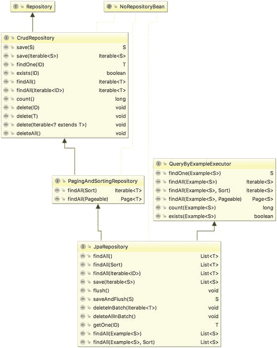
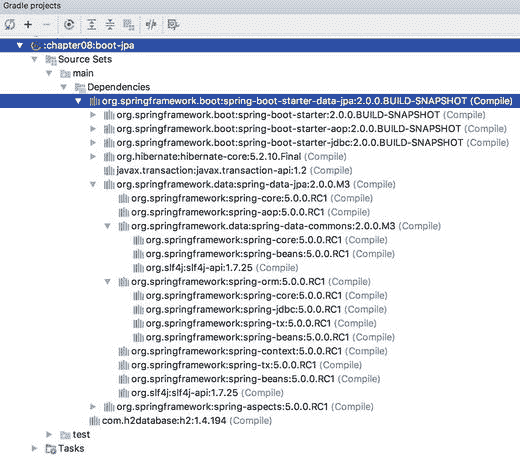

# 8.用 JPA2 在 Spring 中访问数据

在前一章中，我们讨论了当用 ORM 方法实现数据访问逻辑时，如何使用 Hibernate 和 Spring。我们演示了如何在 Spring 的配置中配置 Hibernate 的`SessionFactory`，以及如何使用`Session`接口进行各种数据访问操作。然而，这只是 Hibernate 的一种使用方式。在 Spring 应用中采用 Hibernate 的另一种方式是使用 Hibernate 作为标准 Java 持久性 API (JPA)的持久性提供者。

Hibernate 的 POJO 映射和它强大的查询语言(HQL)取得了巨大的成功，也影响了 Java 世界中数据访问技术标准的发展。在 Hibernate 之后，JCP 开发了 Java 数据对象(JDO)标准和 JPA。

在撰写本文时，JPA 已经到了 2.1 版，并提供了标准化的概念，如`PersistenceContext`、`EntityManager`和 Java 持久性查询语言(JPQL)。这些标准化为开发人员提供了一种在 Hibernate、EclipseLink、Oracle TopLink 和 Apache OpenJPA 等 JPA 持久性提供者之间切换的方式。因此，大多数新的 JEE 应用都采用 JPA 作为数据访问层。

Spring 也为 JPA 提供了出色的支持。例如，提供了许多`EntityManagerFactoryBean`实现来引导 JPA 实体管理器，支持前面提到的所有 JPA 提供者。Spring Data 项目还提供了一个名为 Spring Data JPA 的子项目，它为在 Spring 应用中使用 JPA 提供了高级支持。Spring Data JPA 项目的主要特性包括存储库和规范的概念，以及对查询领域特定语言(QueryDSL)的支持。

本章介绍了如何将 JPA 2.1 与 Spring 一起使用，使用 Hibernate 作为底层的持久性提供者。您将学习如何使用 JPA 的`EntityManager`接口和 JPQL 实现各种数据库操作。然后您将看到 Spring Data JPA 如何进一步帮助简化 JPA 开发。最后，我们将介绍与 ORM 相关的高级主题，包括本地查询和标准查询。

具体来说，我们讨论以下主题:

*   Java 持久性 API (JPA)的核心概念:我们涵盖了 JPA 的一些主要概念。
*   配置 JPA 实体管理器:我们讨论 Spring 支持的`EntityManagerFactory`类型，以及如何在 Spring 的 XML 配置中配置最常用的`LocalContainerEntityManagerFactoryBean`。
*   数据操作:我们展示了如何在 JPA 中实现基本的数据库操作，这非常类似于单独使用 Hibernate 时的概念。
*   高级查询操作:我们将讨论如何在 JPA 中使用原生查询，以及在 JPA 中使用强类型标准 API 来实现更灵活的查询操作。
*   介绍 Spring Data Java Persistence API(JPA):我们讨论 Spring Data JPA 项目，并演示它如何帮助简化数据访问逻辑的开发。
*   跟踪实体变更和审计:在数据库更新操作中，跟踪实体的创建日期或上次更新日期以及谁进行了变更是一个常见的需求。此外，对于像客户这样的关键信息，通常需要一个存储实体每个版本的历史表。我们将讨论 Spring DataJPA 和 Hibernate Envers (Hibernate 实体版本管理系统)如何帮助简化这种逻辑的开发。

与 Hibernate 一样，JPA 支持 XML 或 Java 注释中的映射定义。本章关注映射的注释类型，因为它的使用比 XML 风格更受欢迎。

## JPA 2.1 简介

像其他 Java 规范请求(JSR)一样，JPA 2.1 规范(JSR-338)的目标是标准化 JSE 和 JEE 环境中的 ORM 编程模型。它定义了一组公共的概念、注释、接口和 JPA 持久性提供者应该实现的其他服务。当按照 JPA 标准编程时，开发人员可以选择随意切换底层提供者，就像为基于 JEE 标准开发的应用切换到另一个符合 JEE 标准的应用服务器一样。

在 JPA 中，核心概念是来自类型为`EntityManagerFactory`的工厂的`EntityManager`接口。`EntityManager`的主要工作是维护一个持久化上下文，在这个上下文中存储了它所管理的所有实体实例。`EntityManager`的配置定义为一个持久化单元，一个应用中可以有多个持久化单元。如果你正在使用 Hibernate，你可以把持久化上下文想成和`Session`接口一样的方式，而`EntityManagerFactory`和`SessionFactory`是一样的。在 Hibernate 中，受管实体存储在会话中，您可以通过 Hibernate 的`SessionFactory`或`Session`接口直接与之交互。然而，在 JPA 中，您不能直接与持久性上下文交互。相反，你需要依靠`EntityManager`来为你完成工作。

JPQL 类似于 HQL，所以如果你以前用过 HQL，JPQL 应该很容易上手。然而，在 JPA 2 中，引入了强类型标准 API，它依赖于映射实体的元数据来构造查询。鉴于此，任何错误都将在编译时而不是运行时被发现。

关于 JPA 2 的详细讨论，我们推荐 Mike Keith 和 Merrick Schincariol 的书 Pro JPA 2(a press，2013)。 [<sup>1</sup>](#Fn1) 在这一节中，我们讨论 JPA 的基本概念，本章将要用到的样本数据模型，以及如何配置 Spring 的`ApplicationContext`来支持 JPA。

### 示例代码的示例数据模型

在本章中，我们使用与第 [7](07.html) 章相同的数据模型。然而，当我们讨论如何实现审计特性时，我们将添加几个列和一个历史表进行演示。首先，我们将从上一章中使用的相同的数据库创建脚本开始。如果你跳过了第 7 章，看看那一章的“示例代码的示例数据模型”一节中给出的数据模型，这可以帮助你理解本章中的示例代码。

### 配置 JPA 的 EntityManagerFactory

正如本章前面提到的，要在 Spring 中使用 JPA，我们需要配置`EntityManagerFactory`，就像在 Hibernate 中使用的`SessionFactory`一样。Spring 支持三种类型的`EntityManagerFactory`配置。

第一个使用了`LocalEntityManagerFactoryBean`类。这是最简单的一种，只需要持久性单元名。然而，由于它不支持`DataSource`的注入，因此不能参与全局事务，它只适合于简单的开发目的。

第二种选择是在符合 JEE 标准的容器中使用，其中应用服务器根据部署描述符中的信息引导 JPA 持久性单元。这允许 Spring 通过 JNDI 查找来查找实体管理器。下面的配置片段描述了通过 JNDI 查找实体管理器所需的元素:

```java
<beans ...>
    <jee:jndi-lookup  id="prospring5Emf"
       jndi-name="persistence/prospring5PersistenceUnit"/>
</beans>

```

在 JPA 规范中，应该在配置文件`META-INF/persistence.xml`中定义一个持久性单元。但是，从 Spring 3.1 开始，增加了一个新特性，消除了这种需要；我们将在本章的后面向您展示如何使用它。

第三个选项是最常见的，也是本章使用的，是支持`DataSource`注入的`LocalContainerEntityManagerFactoryBean`类，它可以参与本地和全局事务。下面的配置片段显示了相应的 XML 配置文件(`app-context-annotation.xml`):

```java
<?xml version="1.0"  encoding="UTF-8"?>
<beans 
    xmlns:xsi="http://www.w3.org/2001/XMLSchema-instance"
    xmlns:context="http://www.springframework.org/schema/context"
    xmlns:jdbc="http://www.springframework.org/schema/jdbc"
    xmlns:tx="http://www.springframework.org/schema/tx"
    xsi:schemaLocation="http://www.springframework.org/schema/jdbc
       http://www.springframework.org/schema/jdbc/spring-jdbc.xsd
       http://www.springframework.org/schema/beans
       http://www.springframework.org/schema/beans/spring-beans.xsd
       http://www.springframework.org/schema/tx
       http://www.springframework.org/schema/tx/spring-tx.xsd
       http://www.springframework.org/schema/context
       http://www.springframework.org/schema/context/spring-context.xsd">

    <jdbc:embedded-database id="dataSource"  type="H2">
       <jdbc:script  location="classpath:sql/schema.sql"/>
       <jdbc:script location="classpath:sql/test-data.sql"/>
    </jdbc:embedded-database>

    <bean id="transactionManager" class=
        "org.springframework.orm.jpa.JpaTransactionManager">
        <property name="entityManagerFactory" ref="emf"/>
    </bean>

    <tx:annotation-driven transaction-manager="transactionManager" />

    <bean id="emf" class=
        "org.springframework.orm.jpa.LocalContainerEntityManagerFactoryBean">
       <property name="dataSource" ref="dataSource" />
       <property name="jpaVendorAdapter">
          <bean class=
          "org.springframework.orm.jpa.vendor.HibernateJpaVendorAdapter" />
       </property>
       <property name="packagesToScan" value="com.apress.prospring5.ch8.entities"/>
       <property name="jpaProperties">
          <props>
     <prop key="hibernate.dialect">
       org.hibernate.dialect.H2Dialect
     </prop>
     <prop key="hibernate.max_fetch_depth">3</prop>
     <prop key="hibernate.jdbc.fetch_size">50</prop>
     <prop key="hibernate.jdbc.batch_size">10</prop>
     <prop key="hibernate.show_sql">true</prop>
          </props>
       </property>
    </bean>

    <context:component-scan base-package="com.apress.prospring5.ch8"  />
</beans>

```

您可能期望有一个使用 Java 配置类的等效配置。有，如下图所示:

```java
package com.apress.prospring5.ch8.config;

import org.slf4j.Logger;
import org.slf4j.LoggerFactory;
import org.springframework.context.annotation.Bean;
import org.springframework.context.annotation.ComponentScan;
import org.springframework.context.annotation.Configuration;
import org.springframework.jdbc.datasource.embedded.EmbeddedDatabaseBuilder;
import org.springframework.jdbc.datasource.embedded.EmbeddedDatabaseType;
import org.springframework.orm.jpa.JpaTransactionManager;
import org.springframework.orm.jpa.JpaVendorAdapter;
import org.springframework.orm.jpa.LocalContainerEntityManagerFactoryBean;
import org.springframework.orm.jpa.vendor.HibernateJpaVendorAdapter;
import org.springframework.transaction.PlatformTransactionManager;
import org.springframework.transaction.annotation.EnableTransactionManagement;

import javax.persistence.EntityManagerFactory;
import javax.sql.DataSource;
import java.util.Properties;

@Configuration

@EnableTransactionManagement

@ComponentScan(basePackages  =  {"com.apress.prospring5.ch8.service"})
public class JpaConfig {

    private static Logger logger = LoggerFactory.getLogger(JpaConfig.class);

    @Bean
    public DataSource dataSource() {
       try {
          EmbeddedDatabaseBuilder dbBuilder =
     new EmbeddedDatabaseBuilder();
          return dbBuilder.setType(EmbeddedDatabaseType.H2)
    .addScripts("classpath:db/schema.sql", "classpath:db/test-data.sql").build();
       } catch (Exception e) {
          logger.error("Embedded DataSource bean cannot be created!", e);
          return null;
       }
    }

    @Bean
    public PlatformTransactionManager transactionManager() {
       return new JpaTransactionManager(entityManagerFactory());
    }

    @Bean
    public JpaVendorAdapter jpaVendorAdapter() {
       return new HibernateJpaVendorAdapter();
    }

    @Bean
    public Properties hibernateProperties() {
       Properties hibernateProp = new Properties();
       hibernateProp.put("hibernate.dialect", "org.hibernate.dialect.H2Dialect");
       hibernateProp.put("hibernate.format_sql", true);
       hibernateProp.put("hibernate.use_sql_comments", true);
       hibernateProp.put("hibernate.show_sql", true);
       hibernateProp.put("hibernate.max_fetch_depth", 3);
       hibernateProp.put("hibernate.jdbc.batch_size", 10);
       hibernateProp.put("hibernate.jdbc.fetch_size", 50);
       return hibernateProp;
    }

    @Bean
    public EntityManagerFactory entityManagerFactory() {
        LocalContainerEntityManagerFactoryBean factoryBean =
            new LocalContainerEntityManagerFactoryBean();
        factoryBean.setPackagesToScan("com.apress.prospring5.ch8.entities");
        factoryBean.setDataSource(dataSource());
        factoryBean.setJpaVendorAdapter(new HibernateJpaVendorAdapter());
        factoryBean.setJpaProperties(hibernateProperties());
        factoryBean.setJpaVendorAdapter(jpaVendorAdapter());
        factoryBean.afterPropertiesSet();
        return factoryBean.getNativeEntityManagerFactory();
    }
}

```

在前面的配置中，声明了几个 beans，以便能够使用 Hibernate 作为持久性提供者来支持`LocalContainerEntityManagerFactoryBean`的配置。主要配置如下:

*   dataSource bean:我们使用 H2 声明了带有嵌入式数据库的数据源。因为它是一个嵌入式数据库，所以不需要数据库名称。
*   transactionManager bean : `EntityManagerFactory`需要一个事务管理器来进行事务数据访问。Spring 提供了专门针对 JPA 的事务管理器(`org.springframework.orm.jpa.JpaTransactionManager`)。该 bean 是用分配的 ID`transactionManager`声明的。我们将在第 [9](09.html) 章中详细讨论事务。我们声明标签`<tx:annotation-driven>`来支持使用注释声明事务界定需求。它的对等注解是`@EnableTransactionManagement`，必须放在用`@Configuration`注解的类上。
*   组件扫描:标签应该是你熟悉的。我们指示 Spring 扫描包`com.apress.prospring5.ch8`下的组件。
*   JPA entitymanager factory bean:`emf`bean 是最重要的部分。首先，我们声明 bean 使用`LocalContainerEntityManagerFactoryBean`。在 bean 中，提供了几个属性。首先，如您所料，我们需要注入`DataSource`豆。其次，我们用类`HibernateJpaVendorAdapter`配置属性`jpaVendorAdapter`，因为我们使用的是 Hibernate。第三，我们指示实体工厂在包`com.apress.prospring5.ch8`(由`<property name="packagesToScan">`标签指定)下扫描带有 ORM 注释的域对象。注意，这个特性是从 Spring 3.1 开始才有的，在域类扫描的支持下，你可以跳过`META-INF/persistence.xml`文件中持久性单元的定义。最后，`jpaProperties`属性提供了持久性提供者 Hibernate 的配置细节。您将看到配置选项与我们在第 [7](07.html) 章中使用的选项相同，因此我们可以跳过这里的解释。

### 使用 JPA 注释进行 ORM 映射

Hibernate 在很多方面影响了 JPA 的设计。对于映射注释，它们是如此的接近，以至于我们在第 7 章[中使用的用于将域对象映射到数据库的注释在 JPA 中是相同的。如果你看一下第 7 章](07.html)中域类的源代码，你会看到所有的映射注释都在包`javax.persistence`下，这意味着那些注释已经是 JPA 兼容的了。

一旦`EntityManagerFactory`被正确配置，将其注入到您的类中就很简单了。下面的代码片段显示了`SingerServiceImpl`类的代码，我们将用它作为使用 JPA 执行数据库操作的示例:

```java
package com.apress.prospring5.ch8.service;

import com.apress.prospring5.ch8.entities.Singer;
import org.slf4j.Logger;
import org.slf4j.LoggerFactory;
import org.springframework.stereotype.Service;
import org.springframework.stereotype.Repository;
import org.springframework.transaction.annotation.Transactional;
import org.apache.commons.lang3.NotImplementedException;

import java.util.List;

import javax.persistence.PersistenceContext;
import javax.persistence.EntityManager;
import javax.persistence.TypedQuery;

import org.apache.commons.logging.Log;
import org.apache.commons.logging.LogFactory;

@Service("jpaSingerService")
@Repository
@Transactional
public class SingerServiceImpl implements SingerService {
    final static String ALL_SINGER_NATIVE_QUERY  =
       "select id, first_name,  last_name, birth_date,  version from singer";

    private static Logger logger =
       LoggerFactory.getLogger(SingerServiceImpl.class);

    @PersistenceContext
    private EntityManager em;

    @Transactional(readOnly=true)
    @Override
    public List<Singer> findAll() {
      throw new NotImplementedException("findAll");
    }

    @Transactional(readOnly=true)
    @Override
    public List<Singer> findAllWithAlbum() {
       throw new NotImplementedException("findAllWithAlbum");
    }

    @Transactional(readOnly=true)
    @Override
    public Singer findById(Long id) {
     throw new NotImplementedException("findById");
    }

    @Override
    public Singer save(Singer singer)  {
       throw new NotImplementedException("save");
    }

    @Override
    public void delete(Singer singer) {
        throw new NotImplementedException("delete");
    }

    @Transactional(readOnly=true)
    @Override
    public List<Singer> findAllByNativeQuery() {
        throw new NotImplementedException("findAllByNativeQuery");
    }
}

```

对该类应用了几个注释。`@Service`注释用于将类标识为向另一层提供业务服务的 Spring 组件，并将 Spring bean 命名为`jpaSingerService`。`@Repository`注释表明该类包含数据访问逻辑，并指示 Spring 将特定于供应商的异常转换为 Spring 的`DataAccessException`层次结构。正如您已经熟悉的，`@Transactional`注释用于定义事务需求。

为了注入`EntityManager`，我们使用了`@PersistenceContext`注释，这是实体管理器注入的标准 JPA 注释。关于我们为什么使用名称`@PersistenceContext`来注入实体管理器，这可能是有问题的，但是如果你考虑到持久化上下文本身是由`EntityManager`管理的，那么注释命名是完全有意义的。如果您的应用中有多个持久性单元，您还可以将`unitName`属性添加到注释中，以指定您想要注入哪个持久性单元。通常，一个持久性单元代表一个单独的后端`DataSource`。

## 用 JPA 执行数据库操作

本节介绍如何在 JPA 中执行数据库操作。下面的代码片段显示了`SingerService`接口，它表示我们将要提供的歌手信息服务:

```java
package com.apress.prospring5.ch8.service;

import com.apress.prospring5.ch8.entities.Singer;

import java.util.List;

public interface SingerService {
    List<Singer> findAll();
    List<Singer> findAllWithAlbum();
    Singer findById(Long id);
    Singer save(Singer singer);
    void delete(Singer singer);
    List<Singer> findAllByNativeQuery();
}

```

界面非常简单；它只有三个查找方法，一个保存方法和一个删除方法。save 方法将同时服务于插入和更新操作。

### 使用 Java 持久性查询语言查询数据

JPQL 和 HQL 的语法是相似的，事实上，我们在第 [7](07.html) 章中使用的所有 HQL 查询都可以重用，以在`SingerService`接口中实现三个 finder 方法。要使用 JPA 和 Hibernate，您需要向项目添加以下依赖项:

```java
//pro-spring-15/build.gradle
ext {
    hibernateVersion =  '5.2.10.Final'
    hibernateJpaVersion =  '1.0.0.Final'
    ..
    hibernate =  [
      em :
        "org.hibernate:hibernate-entitymanager:$hibernateVersion",
      jpaApi :
        "org.hibernate.javax.persistence:hibernate-jpa-2.1-api:$hibernateJpaVersion"
    ]
}

//chapter08.gradle
dependencies {
       //we specify these dependencies for all submodules,
        //except the boot module, that defines its own
       if !project.name.contains"boot" {
          compile spring.contextSupport, spring.orm, spring.context,
        misc.slf4jJcl, misc.logback, db.h2, misc.lang3,
    hibernate.em, hibernate.jpaApi

       }
       testCompile testing.junit
}

```

下面的代码片段概括了第 [7 章](07.html)中`Singer`域对象模型类的代码:

```java
//Singer.java
package com.apress.prospring5.ch8.entities;

import static javax.persistence.GenerationType.IDENTITY;

import java.io.Serializable;
import java.util.Date;
import java.util.HashSet;
import java.util.Set;
import javax.persistence.Entity;
import javax.persistence.Table;
import javax.persistence.Id;
import javax.persistence.GeneratedValue;
import javax.persistence.Column;
import javax.persistence.Version;
import javax.persistence.Temporal;
import javax.persistence.TemporalType;
import javax.persistence.OneToMany;
import javax.persistence.ManyToMany;
import javax.persistence.JoinTable;
import javax.persistence.JoinColumn;
import javax.persistence.CascadeType;
import javax.persistence.NamedQueries;
import javax.persistence.NamedQuery;
import javax.persistence.SqlResultSetMapping;
import javax.persistence.EntityResult;

@Entity
@Table(name = "singer")
@NamedQueries({
       @NamedQuery(name=Singer.FIND_ALL,  query="select s  from Singer  s"),
       @NamedQuery(name=Singer.FIND_SINGER_BY_ID,
     query="select distinct s from Singer s " +
    "left join fetch s.albums a " +
    "left join fetch s.instruments i " +
    "where s.id = :id"),
       @NamedQuery(name=Singer.FIND_ALL_WITH_ALBUM,
     query="select distinct s  from Singer  s  " +
    "left join fetch s.albums a " +
    "left join fetch s.instruments i")
})
@SqlResultSetMapping(
    name="singerResult",
    entities=@EntityResult(entityClass=Singer.class)
)
public class Singer implements Serializable {

    public static final String FIND_ALL = "Singer.findAll";
    public static final String FIND_SINGER_BY_ID = "Singer.findById";
    public static final String FIND_ALL_WITH_ALBUM = "Singer.findAllWithAlbum";

    @Id
    @GeneratedValue(strategy = IDENTITY)
    @Column(name = "ID")
    private Long id;

    @Version
    @Column(name = "VERSION")
    private int version;

    @Column(name = "FIRST_NAME")
    private String firstName;

    @Column(name = "LAST_NAME")
    private String lastName;

    @Temporal(TemporalType.DATE)
    @Column(name = "BIRTH_DATE")
    private Date birthDate;

    @OneToMany(mappedBy = "singer", cascade=CascadeType.ALL,
      orphanRemoval=true)
    private Set<Album> albums  =  new HashSet<>();

    @ManyToMany
    @JoinTable(name = "singer_instrument",
          joinColumns = @JoinColumn(name = "SINGER_ID"),
          inverseJoinColumns = @JoinColumn(name = "INSTRUMENT_ID"))
    private Set<Instrument> instruments  =  new HashSet<>();

   //setters and getters

    @Override
    public String toString() {
        return "Singer - Id: " + id + ", First name: " + firstName
           + ", Last name: " + lastName + ", Birthday: " + birthDate;
    }
}
// Album.java

package com.apress.prospring5.ch8.entities;

import static javax.persistence.GenerationType.IDENTITY;

import java.io.Serializable;
import java.text.SimpleDateFormat;
import java.util.Date;
import javax.persistence.*;

@Entity
@Table(name = "album")
public class Album implements Serializable {
    @Id
    @GeneratedValue(strategy = IDENTITY)
    @Column(name = "ID")
    private Long id;

    @Version
    @Column(name = "VERSION")
    private int version;

    @Column
    private String title;

    @Temporal(TemporalType.DATE)
    @Column(name = "RELEASE_DATE")

    private Date releaseDate;

    @ManyToOne
    @JoinColumn(name = "SINGER_ID")
    private Singer singer;

    public Album() {
    //needed  byJPA
    }

    public Album(String title, Date releaseDate) {
       this.title = title;
       this.releaseDate = releaseDate;
    }

    //setters and getters
}

//Instrument.java
package com.apress.prospring5.ch8.entities;

import java.io.Serializable;
import javax.persistence.Entity;
import javax.persistence.Table;
import javax.persistence.Column;
import javax.persistence.Id;
import javax.persistence.ManyToMany;
import javax.persistence.JoinTable;
import javax.persistence.JoinColumn;
import java.util.Set;
import java.util.HashSet;

@Entity
@Table(name = "instrument")
public class Instrument implements Serializable {
    @Id
    @Column(name = "INSTRUMENT_ID")
    private String instrumentId;

    @ManyToMany
    @JoinTable(name = "singer_instrument",
          joinColumns = @JoinColumn(name = "INSTRUMENT_ID"),
          inverseJoinColumns = @JoinColumn(name = "SINGER_ID"))
    private Set<Singer> singers = new HashSet<>();

    //setters and getters
}

```

如果您分析使用`@NamedQuery`定义的查询，您会发现 HQL 和 JPQL 之间似乎没有区别。让我们从`findAll()`方法开始，它简单地从数据库中检索所有歌手。

```java
package com.apress.prospring5.ch8.service;
...
@Service("jpaSingerService")
@Repository
@Transactional
public class SingerServiceImpl implements SingerService {
    final static String ALL_SINGER_NATIVE_QUERY  =
       "select id, first_name,  last_name, birth_date,  version from singer";

    private static Logger logger =
        LoggerFactory.getLogger(SingerServiceImpl.class);

    @PersistenceContext
    private EntityManager  em;

    @Transactional(readOnly=true)
    @Override
    public List<Singer> findAll() {
        return em.createNamedQuery(Singer.FIND_ALL, Singer.class)
          .getResultList();
    }
    ...
}

```

如清单所示，我们使用`EntityManager.createNamedQuery()`方法，传入查询名称和预期的返回类型。在这种情况下，`EntityManager`将返回一个`TypedQuery<X>`接口。然后调用方法`TypedQuery.getResultList()`来检索歌手。为了测试该方法的实现，我们将使用一个测试类，该类将包含每个将要实现的 JPA 方法的测试方法。

```java
package com.apress.prospring5.ch8;

import com.apress.prospring5.ch8.config.JpaConfig;
import com.apress.prospring5.ch8.entities.Singer;
import com.apress.prospring5.ch8.service.SingerService;
import org.junit.After;
import org.junit.Before;
import org.junit.Test;
import org.slf4j.Logger;
import org.slf4j.LoggerFactory;
import org.springframework.context.annotation.AnnotationConfigApplicationContext;
import org.springframework.context.support.GenericApplicationContext;

import java.util.List;

import static org.junit.Assert.assertEquals;
import static org.junit.Assert.assertNotNull;

public class SingerJPATest {
    private static Logger logger = LoggerFactory.getLogger(SingerJPATest.class);

    private GenericApplicationContext ctx;
    private SingerService singerService;

    @Before
    public void setUp(){
        ctx = new AnnotationConfigApplicationContext(JpaConfig.class);
        singerService = ctx.getBean(SingerService.class);
        assertNotNull(singerService);
    }

    @Test
    public void testFindAll(){
        List<Singer> singers = singerService.findAll();
        assertEquals(3, singers.size());
        listSingers(singers);
    }

    private static void listSingers(List<Singer> singers) {
        logger.info(" ----  Listing singers:");
        for (Singer singer : singers) {
           logger.info(singer.toString());
        }
    }

    @After
    public void tearDown(){
        ctx.close();
    }
}

```

如果`assertEquals`没有抛出异常(测试失败)，运行`testFindAll()`测试方法将产生以下输出:

```java
----  Listing singers:
Singer - Id: 1, First name: John, Last name: Mayer, Birthday: 1977-10-16
Singer - Id: 2, First name: Eric, Last name: Clapton, Birthday: 1945-03-30
Singer - Id: 3, First name: John, Last name: Butler, Birthday: 1975-04-01

```

对于关联，JPA 规范规定，默认情况下，持久性提供者必须急切地获取关联。但是，对于 Hibernate 的 JPA 实现，默认的抓取策略仍然是 lazy。因此，当使用 Hibernate 的 JPA 实现时，您不需要显式地将关联定义为惰性抓取。Hibernate 的默认获取策略不同于 JPA 规范。

现在让我们实现`findAllWithAlbum()`方法，它将获取所有相关的专辑和乐器。实现如下所示:

```java
package com.apress.prospring5.ch8.service;
...
@Service("jpaSingerService")
@Repository
@Transactional
public class SingerServiceImpl implements SingerService {
    final static String ALL_SINGER_NATIVE_QUERY  =
       "select id, first_name, last_name, birth_date, version from singer";

    private static Logger logger =
        LoggerFactory.getLogger(SingerServiceImpl.class);

    @PersistenceContext
    private EntityManager  em;

    @Transactional(readOnly=true)
    @Override
    public List<Singer> findAllWithAlbum() {
       List<Singer> singers = em.createNamedQuery
        (Singer.FIND_ALL_WITH_ALBUM, Singer.class).getResultList();
       return singers;
    }
    ...
}

```

`findAllWithAlbum()`与`findAll()`方法相同，但是它使用不同的命名查询，并启用了`left join fetch`。用于测试和打印条目的方法如下所示:

```java
package com.apress.prospring5.ch8;
...
public class SingerJPATest {
    private static Logger logger =
        LoggerFactory.getLogger(SingerJPATest.class);

    private GenericApplicationContext ctx;
    private SingerService singerService;

    @Before
    public void setUp(){
       ctx = new AnnotationConfigApplicationContext(JpaConfig.class);
       singerService = ctx.getBean(SingerService.class);
       assertNotNull(singerService);
    }

    @Test
    public void testFindAllWithAlbum(){
       List<Singer> singers = singerService.findAllWithAlbum();
       assertEquals(3, singers.size());
       listSingersWithAlbum(singers);
    }

    private static void listSingersWithAlbum(List<Singer> singers) {
       logger.info(" ---- Listing singers with instruments:");
       for (Singer singer : singers) {
          logger.info(singer.toString());
          if (singer.getAlbums() != null) {
     for  (Album album :
    singer.getAlbums()) {
        logger.info("\t" +  album.toString());
     }
          }
          if (singer.getInstruments() != null) {
     for (Instrument instrument : singer.getInstruments()) {
        logger.info("\tInstrument: " +  instrument.getInstrumentId());
     }
          }
        }
    }

    @After
    public void tearDown(){
       ctx.close();
    }
}

```

如果`assertEquals`没有抛出异常(测试失败)，运行`testFindAllWithAlbum()`测试方法将产生以下输出:

```java
INFO  o.h.h.i.QueryTranslatorFactoryInitiator - HHH000397:
    Using ASTQueryTranslatorFactory
Hibernate:
    /* Singer.findAllWithAlbum */ select
       distinct singer0_.ID as  ID1_2_0_,
       albums1_.ID as  ID1_0_1_,
       instrument3_.INSTRUMENT_ID as  INSTRUME1_1_2_,
       singer0_.BIRTH_DATE as BIRTH_DA2_2_0_,
       singer0_.FIRST_NAME as FIRST_NA3_2_0_,
       singer0_.LAST_NAME as LAST_NAM4_2_0_,
       singer0_.VERSION as VERSION5_2_0_,
       albums1_.RELEASE_DATE as RELEASE_2_0_1_,
       albums1_.SINGER_ID as SINGER_I5_0_1_,
       albums1_.title as title3_0_1_,
       albums1_.VERSION as VERSION4_0_1_,
       albums1_.SINGER_ID as SINGER_I5_0_0__,
       albums1_.ID as ID1_0_0    ,
       instrument2_.SINGER_ID as SINGER_I1_3_1__,
       instrument2_.INSTRUMENT_ID as INSTRUME2_3_1__
    from
       singer singer0_
    left outer join
       album albums1_
          on singer0_.ID=albums1_.SINGER_ID
    left outer join
       singer_instrument instrument2_
          on singer0_.ID=instrument2_.SINGER_ID
    left outer join
       instrument instrument3_
          on instrument2_.INSTRUMENT_ID=instrument3_.INSTRUMENT_ID
INFO  ----- Listing  singers with instruments:
INFO  - Singer - Id: 1, First name: John, Last name: Mayer, Birthday: 1977-10-16
INFO  -     Album - id: 2, Singer id: 1, Title: Battle Studies,
    Release Date: 2009-11-17
INFO  -     Album - id: 1, Singer id: 1, Title: The Search For Everything,
    Release Date: 2017-01-20
INFO  -     Instrument: Guitar
INFO  -     Instrument: Piano
INFO  - Singer - Id: 3, First name: John, Last name: Butler, Birthday: 1975-04-01
INFO  - Singer - Id: 2, First name: Eric, Last name: Clapton, Birthday: 1945-03-30
INFO  -     Album - id: 3, Singer id: 2, Title: From The Cradle,
    Release Date:  1994-09-13
INFO  -     Instrument: Guitar

```

如果为 Hibernate 启用了日志记录，您还可以看到为从数据库中提取所有数据而生成的本地查询。

现在让我们看看`findById()`方法，它演示了如何在 JPA 中使用带有命名参数的命名查询。关联也将被提取。以下代码片段显示了实现:

```java
package com.apress.prospring5.ch8.service;
...
@Service("jpaSingerService")
@Repository
@Transactional
public class SingerServiceImpl implements SingerService  {
    final static String ALL_SINGER_NATIVE_QUERY =
       "select id, first_name, last_name, birth_date, version from singer";

    private static Logger logger =
       LoggerFactory.getLogger(SingerServiceImpl.class);

    @PersistenceContext
    private EntityManager em;

    @Transactional(readOnly=true)
    @Override
    public Singer findById(Long id) {
       TypedQuery<Singer> query = em.createNamedQuery
          (Singer.FIND_SINGER_BY_ID, Singer.class);

        query.setParameter("id", id);
        return query.getSingleResult();

    }
    ...
}

```

调用了`EntityManager.createNamedQuery(java.lang.String name, java.lang.Class<T> resultClass)`来获取`TypedQuery<T>`接口的实例，这确保了查询结果必须是`Singer`类型的。然后用`TypedQuery<T>.setParameter()`方法设置查询中指定参数的值，并调用`getSingleResult()`方法，因为结果应该只包含一个具有指定 ID 的`Singer`对象。我们将把方法的测试作为一个练习留给您。

```java
package com.apress.prospring5.ch8.service;
...
@Service("jpaSingerService")
@Repository
@Transactional
public class SingerServiceImpl implements SingerService {
    final static String ALL_SINGER_NATIVE_QUERY  =
       "select id, first_name,  last_name, birth_date,  version from singer";

    private static Logger logger =
       LoggerFactory.getLogger(SingerServiceImpl.class);

    @PersistenceContext
    private EntityManager  em;

    @Transactional(readOnly=true)
    @Override
    public Singer findById(Long id) {
       TypedQuery<Singer> query = em.createNamedQuery
       (Singer.FIND_SINGER_BY_ID, Singer.class);
       query.setParameter("id", id);

       return query.getSingleResult();
    }    ...
}

```

### 使用非类型化结果进行查询

在许多情况下，您希望向数据库提交一个查询并随意操作结果，而不是将它们存储在映射的实体类中。一个典型的例子是一个基于 web 的报表，它只列出多个表中一定数量的列。例如，假设您有一个显示歌手信息和他最近发行的专辑名称的网页。摘要信息包含歌手的全名和他最近发行的专辑名称。没有专辑的歌手不会被列出。在这种情况下，我们可以用一个查询实现这个用例，然后手动操作`ResultSet`对象。

让我们创建一个名为`SingerSummaryUntypeImpl`的新类，并将方法命名为`displayAllSingerSummary()`。下面的代码片段显示了方法的典型实现:

```java
package com.apress.prospring5.ch8.service;

import org.springframework.stereotype.Repository;
import org.springframework.stereotype.Service;
import org.springframework.transaction.annotation.Transactional;

import javax.persistence.EntityManager;
import javax.persistence.PersistenceContext;
import java.util.Iterator;
import java.util.List;

@Service("singerSummaryUntype")
@Repository
@Transactional
public class SingerSummaryUntypeImpl {

    @PersistenceContext
    private EntityManager  em;

    @Transactional(readOnly =  true)
    public void displayAllSingerSummary() {
        List result = em.createQuery(
        "select  s.firstName, s.lastName, a.title from Singer s "
        + "left join s.albums a "
        + "where a.releaseDate=(select max(a2.releaseDate) "
        + "from Album a2 where a2.singer.id = s.id)")
        .getResultList();
        int count = 0;
        for (Iterator i = result.iterator(); i.hasNext(); ) {
    Object[] values = (Object[]) i.next();
    System.out.println(++count + ": " + values[0] + ", "
    + values[1] + ", " + values[2]);
        }
    }
}

```

如前面的代码示例所示，我们使用`EntityManager.createQuery()`方法创建`Query`，传入 JPQL 语句，然后得到结果列表。

当我们在 JPQL 中显式指定要选择的列时，JPA 将返回一个迭代器，迭代器中的每一项都是一个对象数组。我们循环遍历迭代器，对于对象数组中的每个元素，都会显示值。每个对象数组对应于`ResultSet`对象中的一条记录。以下代码片段显示了测试程序:

```java
package com.apress.prospring5.ch8;

import com.apress.prospring5.ch8.config.JpaConfig;
import com.apress.prospring5.ch8.service.SingerSummaryUntypeImpl;
import org.junit.After;
import org.junit.Before;
import org.junit.Test;
import org.slf4j.Logger;
import org.slf4j.LoggerFactory;
import org.springframework.context.annotation.AnnotationConfigApplicationContext;
import org.springframework.context.support.GenericApplicationContext;

import java.util.List;

import static org.junit.Assert.assertEquals;
import static org.junit.Assert.assertNotNull;

public class SingerSummaryJPATest {

    private static Logger logger =
        LoggerFactory.getLogger(SingerSummaryJPATest.class);
    private GenericApplicationContext ctx;
    private SingerSummaryUntypeImpl singerSummaryUntype;

    @Before
    public void setUp() {
        ctx =  new AnnotationConfigApplicationContext(JpaConfig.class);
        singerSummaryUntype =  ctx.getBean(SingerSummaryUntypeImpl.class);
        assertNotNull(singerSummaryUntype);
    }

    @Test
    public void testFindAllUntype() {
        singerSummaryUntype.displayAllSingerSummary();
    }

    @After
    public void tearDown() {
        ctx.close();
    }
}

```

运行测试程序会产生以下输出:

```java
1: John, Mayer, The Search For Everything
2: Eric, Clapton, From The Cradle

```

在 JPA 中，有一个更优雅的解决方案，而不是摆弄查询返回的对象数组，这将在下一节讨论。

## 使用构造函数表达式查询自定义结果类型

在 JPA 中，当查询像上一节中那样的定制结果时，您可以指示 JPA 从每个记录中直接构造一个 POJO。这个 POJO 也称为视图，因为它包含来自多个表的数据。对于上一节中的示例，让我们创建一个名为`SingerSummary`的 POJO，它存储歌手摘要的查询结果。下面的代码片段显示了该类:

```java
package com.apress.prospring5.ch8.view;

import java.io.Serializable;

public class SingerSummary implements Serializable {
    private String firstName;
    private String lastName;
    private String latestAlbum;

    public SingerSummary(String firstName, String lastName,
    String latestAlbum) {
        this.firstName = firstName;
        this.lastName = lastName;
        this.latestAlbum = latestAlbum;
    }

    public String getFirstName() {
        return firstName;
    }

    public String getLastName() {
        return lastName;
    }

    public String getLatestAlbum() {
        return latestAlbum;
    }

    public String toString() {
        return "First name: " + firstName + ", Last Name: " + lastName
    +  ", Most  Recent Album: " + latestAlbum;
    }
}

```

前面的`SingerSummary`类有每个 singer 摘要的属性，有一个接受所有属性的构造函数方法。有了`SingerSummary`类，我们可以修改`findAll()`方法，并在查询中使用构造函数表达式来指示 JPA 提供者将`ResultSet`映射到`SingerSummary`类。让我们首先为`SingerSummary`服务创建一个接口。以下代码片段显示了该界面:

```java
package com.apress.prospring5.ch8.service;

import com.apress.prospring5.ch8.view.SingerSummary;

import java.util.List;

public interface SingerSummaryService {
    List<SingerSummary> findAll();
}

```

在这里，您可以看到`SingerSummaryImpl.findAll()`方法的实现，使用了用于`ResultSet`映射的构造函数表达式:

```java
package com.apress.prospring5.ch8.service;

import com.apress.prospring5.ch8.view.SingerSummary;
import org.springframework.stereotype.Repository;
import org.springframework.stereotype.Service;
import org.springframework.transaction.annotation.Transactional;

import javax.persistence.EntityManager;
import javax.persistence.PersistenceContext;
import java.util.List;

@Service("singerSummaryService")
@Repository
@Transactional
public class SingerSummaryServiceImpl implements SingerSummaryService {

    @PersistenceContext
    private EntityManager em;

    @Transactional(readOnly = true)
    @Override
    public List<SingerSummary> findAll() {
        List<SingerSummary> result = em.createQuery(
        "select new com.apress.prospring5.ch8.view.SingerSummary("
        + "s.firstName, s.lastName, a.title) from Singer s "
        + "left join s.albums a "
        + "where a.releaseDate=(select  max(a2.releaseDate):
        + "from Album a2 where a2.singer.id = s.id)",
        SingerSummary.class).getResultList();
        return result;
    }
}

```

在 JPQL 语句中，指定了`new`关键字，以及 POJO 类的完全限定名，该类将存储结果并传入所选属性作为每个`SingerSummary`类的构造函数参数。最后，`SingerSummary`类被传入到`createQuery()`方法中以指示结果类型。以下代码片段显示了测试程序:

```java
package com.apress.prospring5.ch8;

import com.apress.prospring5.ch8.config.JpaConfig;
import com.apress.prospring5.ch8.service.SingerSummaryService;
import com.apress.prospring5.ch8.view.SingerSummary;
import org.junit.After;
import org.junit.Before;
import org.junit.Test;
import org.slf4j.Logger;
import org.slf4j.LoggerFactory;
import org.springframework.context.annotation.AnnotationConfigApplicationContext;
import org.springframework.context.support.GenericApplicationContext;

import java.util.List;

import static  org.junit.Assert.assertEquals;
import static  org.junit.Assert.assertNotNull;

public class SingerSummaryJPATest {

    private static Logger logger =
       LoggerFactory.getLogger(SingerSummaryJPATest.class);
    private GenericApplicationContext ctx;
    private SingerSummaryService singerSummaryService;

    @Before
    public void setUp() {
        ctx = new AnnotationConfigApplicationContext(JpaConfig.class);
        singerSummaryService = ctx.getBean(SingerSummaryService.class);
        assertNotNull(singerSummaryService);
    }

    @Test
    public void testFindAll() {
        List<SingerSummary> singers = singerSummaryService.findAll();
        listSingerSummary(singers);
        assertEquals(2, singers.size());
    }

    private static void listSingerSummary(List<SingerSummary> singers) {
        logger.info(" ---- Listing singers summary:");
        for (SingerSummary singer : singers) {
    logger.info(singer.toString());
        }
    }

    @After
    public void tearDown() {
        ctx.close();
    }
}

```

再次执行`testFindAll`方法类产生列表中每个`SingerSummary`对象的输出，如下所示(其他输出被省略):

```java
INFO    ---- Listing singers summary:
INFO    - First name: John, Last Name: Mayer, Most Recent Album: The Search For Everything
INFO    - First name: Eric, Last Name: Clapton, Most Recent Album: From The Cradle

```

正如您所看到的，构造函数表达式对于将定制查询的结果映射到 POJOs 以供进一步的应用处理非常有用。

### 插入数据

使用 JPA 插入数据很简单。和 Hibernate 一样，JPA 也支持检索数据库生成的主键。下面的代码片段显示了`save()`方法:

```java
package com.apress.prospring5.ch8.service;
...
@Service("jpaSingerService")
@Repository
@Transactional
public class SingerServiceImpl implements SingerService {
    final static String ALL_SINGER_NATIVE_QUERY  =
       "select id, first_name, last_name, birth_date, version from singer";

    private static Logger logger =
       LoggerFactory.getLogger(SingerServiceImpl.class);

    @PersistenceContext
    private EntityManager em;

    @Override
    public Singer save(Singer singer) {
        if (singer.getId() == null) {
    logger.info("Inserting new singer");
    em.persist(singer);
        } else {
    em.merge(singer);
    logger.info("Updating existing singer");
        }

        logger.info("Singer saved with id: " + singer.getId());

        return singer;
    }
    ...
}

```

如此处所示，`save()`方法首先通过检查`id`值来检查对象是否是新的实体实例。如果`id`是`null`(即尚未赋值)，则该对象是一个新的实体实例，将调用`EntityManager.persist()`方法。当调用`persist()`方法时，`EntityManager`持久化实体并使其成为当前持久化上下文中的托管实例。如果`id`值存在，那么我们正在执行更新，而`EntityManager.merge()`方法将被调用。当调用`merge()`方法时，`EntityManager`将实体的状态合并到当前的持久化上下文中。

下面的代码片段显示了插入新歌手记录的代码。这都是在测试方法中完成的，因为我们想要测试插入是否成功。

```java
package com.apress.prospring5.ch8;
...
public class SingerJPATest {
    private static Logger logger =
       LoggerFactory.getLogger(SingerJPATest.class);

    private GenericApplicationContext ctx;
    private SingerService singerService;

    @Before
    public void setUp(){
       ctx = new AnnotationConfigApplicationContext(JpaConfig.class);
       singerService = ctx.getBean(SingerService.class);
       assertNotNull(singerService);
    }

    @Test
    public void testInsert(){
        Singer singer = new Singer();
        singer.setFirstName("BB");
        singer.setLastName("King");
        singer.setBirthDate(new Date(
        (new GregorianCalendar(1940, 8, 16)).getTime().getTime()));

        Album  album = new Album();
        album.setTitle("My Kind of Blues");
        album.setReleaseDate(new java.sql.Date(
        (new GregorianCalendar(1961, 7, 18)).getTime().getTime()));
        singer.addAbum(album);

        album = new Album();
        album.setTitle("A Heart Full of Blues");
        album.setReleaseDate(new java.sql.Date(
        (new GregorianCalendar(1962, 3, 20)).getTime().getTime()));
        singer.addAbum(album);

        singerService.save(singer);
        assertNotNull(singer.getId());

        List<Singer> singers = singerService.findAllWithAlbum();
        assertEquals(4, singers.size());
        listSingersWithAlbum(singers);
    }

    ...

    @After
    public void tearDown(){
        ctx.close();
    }
}

```

如此处所示，我们创建了一个新歌手，添加了两张专辑，并保存了对象。然后，我们再次列出所有的歌手，在我们测试了表中记录的正确数量之后。运行该程序会产生以下输出:

```java
INFO -  ---- Listing singers with instruments:
INFO - Singer - Id: 4, First name: BB, Last name: King, Birthday: 1940-09-16
INFO -    Album - id: 5, Singer id: 4, Title: A Heart Full of Blues,
    Release Date: 1962-04-20
INFO  -   Album - id: 4, Singer id: 4, Title: My Kind of Blues,
    Release Date: 1961-08-18
INFO - Singer - Id: 1, First name: John, Last name: Mayer, Birthday: 1977-10-16
INFO -    Album - id: 1, Singer id: 1, Title: The Search For Everything,
    Release Date: 2017-01-20
INFO -    Album - id: 2, Singer id: 1, Title: Battle Studies,
    Release Date:  2009-11-17
INFO -    Instrument:  Piano
INFO -    Instrument: Guitar
INFO - Singer - Id: 3, First name: John, Last name: Butler, Birthday: 1975-04-01
INFO - Singer - Id: 2, First name: Eric, Last name: Clapton, Birthday: 1945-03-30
INFO -    Album - id: 3, Singer id: 2, Title: From  The Cradle,
   Release Date: 1994-09-13
INFO -    Instrument: Guitar

```

从`INFO`日志记录中，可以看到新保存的歌手的`id`被正确填充。Hibernate 还会显示所有被发送到数据库的 SQL 语句。

### 更新数据

更新数据就像插入数据一样简单。我们来看一个例子。假设对于一个 ID 为 1 的歌手，我们希望更新其名字并删除一张专辑。为了测试更新操作，下面的代码片段显示了`testUpdate()`方法:

```java
package com.apress.prospring5.ch8;
...
public class SingerJPATest {
    private static Logger logger =
       LoggerFactory.getLogger(SingerJPATest.class);

    private GenericApplicationContext ctx;
    private SingerService singerService;

    @Before
    public void setUp(){
       ctx = new AnnotationConfigApplicationContext(JpaConfig.class);
       singerService = ctx.getBean(SingerService.class);
       assertNotNull(singerService);
    }

    @Test
    public void testUpdate(){
       Singer singer = singerService.findById(1L);
       //making sure such singer exists assertNotNull(singer);
       //making sure we got expected record assertEquals("Mayer", singer.getLastName());
       //retrieve the  album
       Album album = singer.getAlbums().stream()
           .filter(a -> a.getTitle().equals("Battle  Studies")).findFirst().get();

       singer.setFirstName("John Clayton");
       singer.removeAlbum(album);
       singerService.save(singer);

       listSingersWithAlbum(singerService.findAllWithAlbum());
    }
    ...

    @After
    public void tearDown(){
        ctx.close();
    }
}

```

我们首先检索 ID 为 1 的记录，然后更改名字。然后，我们遍历专辑对象，检索带有标题战研究的对象，并将其从歌手的`albums`属性中删除。最后，我们再次调用`SingerService.save()`方法。当您运行该程序时，您将看到以下输出(其他输出被省略):

```java
---- Listing singers with instruments:
Singer - Id: 1, First name: John Clayton, Last name: Mayer, Birthday: 1977-10-16
    Album - id: 1, Singer id: 1, Title: The Search For Everything,
       Release Date:  2017-01-20
    Instrument: Piano
    Instrument: Guitar
Singer - Id: 2, First name: Eric, Last name: Clapton, Birthday: 1945-03-30
     Album - id: 3, Singer id: 2, Title: From The Cradle,
        Release Date: 1994-09-13
     Instrument: Guitar
Singer - Id: 3, First name: John, Last name: Butler, Birthday: 1975-04-01

```

您将看到名字被更新，相册被移除。相册可以被删除，因为在一对多关联中定义了`rphanRemoval=true`属性，该属性指示 JPA provider (Hibernate)删除所有存在于数据库中但在持久化时在对象中不再找到的孤立记录。

```java
@OneToMany(mappedBy = "singer", cascade=CascadeType.ALL, orphanRemoval=true)

```

### 删除数据

删除数据也一样简单。只需调用`EntityManager.remove()`方法并传入 singer 对象。以下代码片段显示了删除歌手的更新代码:

```java
package com.apress.prospring5.ch8.service;
...
@Service("jpaSingerService")
@Repository
@Transactional
public class SingerServiceImpl implements SingerService {
    final static String ALL_SINGER_NATIVE_QUERY  =
       "select id, first_name, last_name, birth_date, version from singer";

    private static Logger logger =
       LoggerFactory.getLogger(SingerServiceImpl.class);

    @PersistenceContext
    private EntityManager  em;

        @Override
    public void delete(Singer singer) {
        Singer mergedSinger = em.merge(singer);
        em.remove(mergedSinger);

        logger.info("Singer with id: " +  singer.getId() +  " deleted successfully");
    }
       ...
}

```

首先调用`EntityManager.merge()`方法将实体的状态合并到当前的持久化上下文中。`merge()`方法返回托管实体实例。然后调用`EntityManager.remove()`,传入托管 singer 实体实例。remove 操作删除歌手记录及其所有相关信息，包括专辑和乐器，正如我们在映射中定义的`cascade=CascadeType.ALL`。为了测试删除操作，可以使用`testDelete()`方法，如下面的代码片段所示:

```java
package com.apress.prospring5.ch8;
...
public class SingerJPATest {
    private static Logger logger =
       LoggerFactory.getLogger(SingerJPATest.class);

    private GenericApplicationContext ctx;
    private SingerService singerService;

    @Before
    public void setUp(){
       ctx = new AnnotationConfigApplicationContext(JpaConfig.class);
       singerService = ctx.getBean(SingerService.class);
       assertNotNull(singerService);
    }

       @Test
    public void testDelete(){
        Singer singer = singerService.findById(2l);
        //making sure such singer exists
        assertNotNull(singer);
        singerService.delete(singer);

        listSingersWithAlbum(singerService.findAllWithAlbum());
    }
    ...

    @After
    public void tearDown(){
        ctx.close();
    }
}

```

前面的清单检索 ID 为`2`的歌手，然后调用`delete()`方法删除歌手信息。运行该程序会产生以下输出:

```java
 ---- Listing singers with instruments:
Singer - Id: 1, First name: John, Last name: Mayer, Birthday: 1977-10-16
    Album - id: 1, Singer id: 1, Title: The Search For Everything,
         Release Date: 2017-01-20
     Album - id: 2, Singer id: 1, Title: Battle Studies,
        Release Date: 2009-11-17
     Instrument: Piano
    Instrument: Guitar
Singer - Id: 3, First name: John, Last name: Butler, Birthday: 1975-04-01

```

可以看到 ID 为`1`的歌手被删除了。

## 使用本机查询

讨论了使用 JPA 执行简单的数据库操作之后，现在让我们继续讨论一些更高级的主题。有时，您可能希望对提交给数据库的查询拥有绝对控制权。一个例子是在 Oracle 数据库中使用分层查询。这种查询是特定于数据库的，称为本机查询。

JPA 支持本地查询的执行；`EntityManager`将按原样向数据库提交查询，不执行任何映射或转换。使用 JPA 原生查询的一个主要好处是将`ResultSet`映射回 ORM 映射的实体类。接下来的两节讨论了如何使用本地查询来检索所有歌手，并将`ResultSet`直接映射回`Singer`对象。

## 使用简单的本地查询

为了演示如何使用原生查询，让我们实现一个新方法来从数据库中检索所有歌手。下面的代码片段显示了必须添加到`SingerServiceImpl`中的新方法:

```java
package com.apress.prospring5.ch8.service;
...
@Service("jpaSingerService")
@Repository
@Transactional
public  class SingerServiceImpl implements SingerService  {
    final static String ALL_SINGER_NATIVE_QUERY  =
        "select id, first_name, last_name, birth_date, version from singer";

    private static Logger logger =
       LoggerFactory.getLogger(SingerServiceImpl.class);

     @Transactional(readOnly=true)
    @Override
    public List<Singer> findAllByNativeQuery() {
        return em.createNativeQuery(ALL_SINGER_NATIVE_QUERY,
          Singer.class).getResultList();
    }
    ...
}

```

您可以看到，本地查询只是一个简单的 SQL 语句，用于从`SINGER`表中检索所有列。为了创建和执行查询，首先调用了`EntityManager.createNativeQuery()`，传递了查询字符串和结果类型。结果类型应该是一个映射的实体类(在本例中是`Singer`类)。`createNativeQuery()`方法返回一个`Query`接口，该接口提供`getResultList()`操作来获取结果列表。JPA 提供者将执行查询，并根据实体类中定义的 JPA 映射，将`ResultSet`对象转换成实体实例。执行前面的方法会产生与`findAll()`方法相同的结果。

## 使用 SQL 结果集映射的本机查询

除了映射的域对象之外，还可以传入一个字符串，该字符串表示 SQL `ResultSet`映射的名称。通过使用`@SqlResultSetMapping`注释，在实体类级别定义了 SQL `ResultSet`映射。一个 SQL `ResultSet`映射可以有一个或多个实体和列映射。

```java
package com.apress.prospring5.ch8.entities;

import javax.persistence.Entity;
import javax.persistence.Table;
import javax.persistence.SqlResultSetMapping;
import javax.persistence.EntityResult;
...

@Entity
@Table(name  =  "singer")

@SqlResultSetMapping(

     name="singerResult",

     entities=@EntityResult(entityClass=Singer.class)

)

public class Singer implements Serializable {
 ...
}

```

为实体类定义了一个名为`singerResult`的 SQL `ResultSet`映射，在`Singer`类本身中有`entityClass`属性。JPA 支持多个实体的更复杂的映射，并支持向下映射到列级映射。

在定义了 SQL `ResultSet`映射之后，可以使用`ResultSet`映射的名称来调用`findAllByNativeQuery()`方法。下面的代码片段显示了更新后的`findAllByNativeQuery()`方法:

```java
package com.apress.prospring5.ch8.service;
...
@Service("jpaSingerService")
@Repository
@Transactional
public class SingerServiceImpl implements SingerService {
    final static String ALL_SINGER_NATIVE_QUERY =
       "select id, first_name, last_name, birth_date, version from singer";

    private static Logger logger =
       LoggerFactory.getLogger(SingerServiceImpl.class);

     @Transactional(readOnly=true)
    @Override
    public List<Singer> findAllByNativeQuery() {
        return em.createNativeQuery(ALL_SINGER_NATIVE_QUERY,
          "singerResult").getResultList();
    }
    ...
}

```

如您所见，JPA 还为执行原生查询提供了强大的支持，提供了灵活的 SQL `ResultSet`映射工具。

### 使用 JPA 2 标准 API 进行标准查询

大多数应用都为用户提供了搜索信息的前端。最有可能的情况是，显示了大量可搜索的字段，用户只在其中的一些字段中输入信息并进行搜索。很难准备大量的查询，包括用户可能选择输入的每个可能的参数组合。在这种情况下，criteria API 查询特性可以帮上忙。

在 JPA 2 中，引入的一个主要新特性是强类型标准 API 查询。在这个新的 Criteria API 中，传递到查询中的标准基于映射的实体类的元模型。因此，指定的每个标准都是强类型的，错误将在编译时发现，而不是在运行时发现。

在 JPA Criteria API 中，实体类元模型由带有下划线后缀(`_`)的实体类名表示。例如，`Singer`实体类的元模型类是`Singer_`。下面的代码片段显示了`Singer_`类:

```java
package com.apress.prospring5.ch8;

import java.util.Date;
import javax.annotation.Generated;
import javax.persistence.metamodel.SetAttribute;
import javax.persistence.metamodel.SingularAttribute;
import javax.persistence.metamodel.StaticMetamodel;

@Generated(value = "org.hibernate.jpamodelgen.JPAMetaModelEntityProcessor")
@StaticMetamodel(Singer.class)
public abstract class Singer_ {

    public static volatile SingularAttribute<Singer, String> firstName;
    public static volatile SingularAttribute<Singer, String> lastName;
    public static volatile SetAttribute<Singer, Album> albums;
    public static volatile SetAttribute<Singer, Instrument> instruments;
    public static volatile SingularAttribute<Singer, Long> id;
    public static volatile SingularAttribute<Singer, Integer> version;
    public static volatile SingularAttribute<Singer, Date> birthDate;

}

```

元模型类用`@StaticMetamodel`标注，属性是映射的实体类。在类中是每个属性及其相关类型的声明。

编码和维护那些元模型类将是乏味的。然而，工具可以帮助基于实体类中的 JPA 映射自动生成那些元模型类。Hibernate 提供的那个叫做 Hibernate 元模型生成器( [`www.hibernate.org/subprojects/jpamodelgen.html`](http://www.hibernate.org/subprojects/jpamodelgen.html) )。

您生成元模型类的方式取决于您使用什么工具来开发和构建您的项目。我们建议阅读文档的“用法”部分( [`http://docs.jboss.org/hibernate/jpamodelgen/1.3/reference/en-US/html_single/#chapter-usage`](http://docs.jboss.org/hibernate/jpamodelgen/1.3/reference/en-US/html_single/#chapter-usage) )了解具体细节。作为本书一部分的示例代码使用 Gradle 来生成元类。元模型类生成所需的依赖项是`hibernate-jpamodelgen`库。这个依赖项是用它在`pro-spring-15/build.gradle`文件中的版本配置的。

```java
ext {
    ...

    //persistency libraries
    hibernateVersion = '5.2.10.Final'
    hibernateJpaVersion = '1.0.0.Final'

    hibernate =  [
    ...
    jpaModelGen: "org.hibernate:hibernate-jpamodelgen:$hibernateVersion",

    jpaApi     : "org.hibernate.javax.persistence:hibernate-jpa-2.1-api:
         $hibernateJpaVersion",
    querydslapt: "com.mysema.querydsl:querydsl-apt:2.7.1"
    ]
    ...

```

这是生成元模型类的主要库。在编译模块之前，`generateQueryDSL` Gradle 任务在`chapter08/jpa-criteria/build.gradle`中使用它来生成元模型类。这里显示了`chapter08/jpa-criteria/build.gradle`的配置:

```java
sourceSets {
    generated
}

sourceSets.generated.java.srcDirs =  ['src/main/generated']

configurations {
    querydslapt
}

dependencies {
    compile hibernate.querydslapt, hibernate.jpaModelGen
}

task generateQueryDSL(type: JavaCompile, group: 'build',
    description: 'Generates the QueryDSL query types') {
    source = sourceSets.main.java
    classpath = configurations.compile + configurations.querydslapt

    options.compilerArgs = [
    "-proc:only",
    "-processor", "org.hibernate.jpamodelgen.JPAMetaModelEntityProcessor"
    ]
    destinationDir = sourceSets.generated.java.srcDirs.iterator.next
}

compileJava.dependsOn generateQueryDSL

```

设置好类生成策略后，让我们定义一个查询，该查询接受名字和姓氏来搜索歌手。下面的代码片段显示了在`SingerService`接口中新方法`findByCriteriaQuery()`的定义:

```java
package com.apress.prospring5.ch8;

import java.util.List;

public interface SingerService {
    List<Singer> findAll();
    List<Singer> findAllWithAlbum();
    Singer findById(Long id);
    Singer save(Singer singer);
    void  delete(Singer singer);
    List<Singer> findAllByNativeQuery();
    List<Singer> findByCriteriaQuery(String firstName, String lastName);
}

```

下一个代码片段显示了使用 JPA 2 criteria API 查询的`findByCriteriaQuery()`方法的实现:

```java
package com.apress.prospring5.ch8;

import org.springframework.stereotype.Service;
import org.springframework.stereotype.Repository;
import org.springframework.transaction.annotation.Transactional;

import java.util.List;

import javax.persistence.PersistenceContext;
import javax.persistence.EntityManager;
import javax.persistence.TypedQuery;
import javax.persistence.criteria.CriteriaBuilder;
import javax.persistence.criteria.CriteriaQuery;
import javax.persistence.criteria.Root;
import javax.persistence.criteria.JoinType;
import javax.persistence.criteria.Predicate;

import org.apache.commons.logging.Log;
import org.apache.commons.logging.LogFactory;

@Service("jpaSingerService")
@Repository
@Transactional
public class SingerServiceImpl implements SingerService {
    final static String ALL_SINGER_NATIVE_QUERY  =
        "select id, first_name,  last_name, birth_date,  version from singer";

    private Log log =
        LogFactory.getLog(SingerServiceImpl.class);

    @PersistenceContext
    private EntityManager  em;
    ...

    @Transactional(readOnly=true)
    @Override
    public List<Singer> findByCriteriaQuery(String firstName, String lastName) {
        log.info("Finding singer for firstName: " +  firstName
          + " and  lastName: " +  lastName);

        CriteriaBuilder cb  =  em.getCriteriaBuilder();
        CriteriaQuery<Singer> criteriaQuery = cb.createQuery(Singer.class);
        Root<Singer> singerRoot = criteriaQuery.from(Singer.class);
        singerRoot.fetch(Singer_.albums, JoinType.LEFT);
        singerRoot.fetch(Singer_.instruments, JoinType.LEFT);

        criteriaQuery.select(singerRoot).distinct(true);

        Predicate criteria = cb.conjunction();

        if (firstName != null) {
    Predicate p = cb.equal(singerRoot.get(Singer_.firstName),
        firstName);
     criteria =  cb.and(criteria, p);
        }

        if (lastName != null) {
    Predicate p = cb.equal(singerRoot.get(Singer_.lastName),
        lastName);
    criteria =  cb.and(criteria, p);
        }

        criteriaQuery.where(criteria);
        return em.createQuery(criteriaQuery).getResultList();
    }
}

```

让我们来分解 API 使用的标准。

*   调用`EntityManager.getCriteriaBuilder()`来检索`CriteriaBuilder`的实例。
*   使用`CriteriaBuilder.createQuery()`创建类型化查询，将`Singer`作为结果类型传入。
*   调用`CriteriaQuery.from()`方法，传入实体类。结果是一个对应于指定实体的查询根对象(`Root<Singer>`接口)。查询根对象构成了查询中路径表达式的基础。
*   两个`Root.fetch()`方法调用强制执行与专辑和乐器相关的关联的快速获取。`JoinType.LEFT`参数指定了一个外部连接。用`JoinType.LEFT`作为第二个参数调用`Root.fetch()`方法相当于在 JPQL 中指定 left join fetch join 操作。
*   调用`CriteriaQuery.select()`方法，并将根查询对象作为结果类型传递。带有 true 的`distinct()`方法意味着应该消除重复的记录。
*   通过调用`CriteriaBuilder.conjunction()`方法获得一个`Predicate`实例，这意味着一个或多个限制的合取。一个`Predicate`可以是一个简单的或者复合的谓词，一个谓词是一个限制，表示由一个表达式定义的选择标准。
*   检查名字和姓氏参数。对于每个非`null`参数，将使用`CriteriaBuilder()`方法(即`CriteriaBuilder.and()`方法)构造一个新的`Predicate`。方法`equal()`是指定一个相等的限制，在这个限制中`Root.get()`被调用，传递限制所应用的实体类元模型的相应属性。然后，通过调用`CriteriaBuilder.and()`方法，构造的谓词与现有的谓词(由变量 criteria 存储)进行“合取”。
*   通过调用`CriteriaQuery.where()`方法，`Predicate`由所有标准和限制构成，并作为`where`子句传递给查询。
*   最后，`CriteriaQuery`被传递给`EntityManager. EntityManager`，然后基于传入的`CriteriaQuery`值构造查询，执行查询，并返回结果。

为了测试条件查询操作，下面的代码片段显示了更新后的`SingerJPATest`类:

```java
package com.apress.prospring5.ch8;

import com.apress.prospring5.ch8.config.JpaConfig;
import com.apress.prospring5.ch8.Album;
import com.apress.prospring5.ch8.Instrument;
import com.apress.prospring5.ch8.Singer;
import com.apress.prospring5.ch8.SingerService;
import org.junit.After;
import org.junit.Before;
import org.junit.Test;
import org.slf4j.Logger;
import org.slf4j.LoggerFactory;
import org.springframework.context.annotation.AnnotationConfigApplicationContext;
import org.springframework.context.support.GenericApplicationContext;

import java.util.List;

import static org.junit.Assert.assertEquals;
import static org.junit.Assert.assertNotNull;

public class SingerJPATest {
    private static Logger logger =
       LoggerFactory.getLogger(SingerJPATest.class);

    private GenericApplicationContext ctx;
    private SingerService singerService;

    @Before
    public void setUp(){
        ctx = new AnnotationConfigApplicationContext(JpaConfig.class);
        singerService = ctx.getBean("jpaSingerService", SingerService.class);
        assertNotNull(singerService);
    }

    @Test
    public void tesFindByCriteriaQuery(){
        List<Singer> singers = singerService.findByCriteriaQuery("John", "Mayer");
        assertEquals(1, singers.size());
        listSingersWithAlbum(singers);
    }
    private static void listSingersWithAlbum(List<Singer> singers) {
        logger.info(" ---- Listing singers with instruments:");
        singers.forEach(s -> {
            logger.info(s.toString());
            if (s.getAlbums() != null) {
                s.getAlbums().forEach(a -> logger.info("\t" +  a.toString()));
            }
            if (s.getInstruments() != null) {
                s.getInstruments().forEach(i  -> logger.info
                    ("\tInstrument: " +  i.getInstrumentId()));
            }
        });
    }

    @After
    public void tearDown(){
        ctx.close();
    }
}

```

运行该程序会产生以下输出(省略了其他输出，但保留了生成的查询):

```java
INFO   o.h.h.i.QueryTranslatorFactoryInitiator -
      HHH000397: Using ASTQueryTranslatorFactory
INFO   c.a.p.c.SingerServiceImpl -
      Finding singer for firstName: John and lastName: Mayer
Hibernate:
    select
     distinct singer0_.ID as  ID1_2_0_,
     albums1_.ID as ID1_0_1_,
     instrument3_.INSTRUMENT_ID as INSTRUME1_1_2_,
     singer0_.BIRTH_DATE as BIRTH_DA2_2_0_,
     singer0_.FIRST_NAME as FIRST_NA3_2_0_,
     singer0_.LAST_NAME as LAST_NAM4_2_0_,
     singer0_.VERSION as VERSION5_2_0_,
     albums1_.RELEASE_DATE as RELEASE_2_0_1_,
     albums1_.SINGER_ID as SINGER_I5_0_1_,
     albums1_.title as title3_0_1_,
     albums1_.VERSION as VERSION4_0_1_,
     albums1_.SINGER_ID as SINGER_I5_0_0__,
     albums1_.ID as  ID1_0_0__,
     instrument2_.SINGER_ID as  SINGER_I1_3_1__,
     instrument2_.INSTRUMENT_ID  as  INSTRUME2_3_1__
         from
     singer singer0_
         left outer join
     album albums1_
         on singer0_.ID=albums1_.SINGER_ID
         left outer join
     singer_instrument  instrument2_
         on singer0_.ID=instrument2_.SINGER_ID
         left outer join
     instrument instrument3_

         on instrument2_.INSTRUMENT_ID=instrument3_.INSTRUMENT_ID
         where
     1=1
     and singer0_.FIRST_NAME=?
     and singer0_.LAST_NAME=?
INFO   c.a.p.c.SingerJPATest -  ---- Listing  singers with instruments:
INFO   c.a.p.c.SingerJPATest - Singer - Id: 1, First name: John, Last name: Mayer,
   Birthday: 1977-10-16
INFO   c.a.p.c.SingerJPATest -    Album - id: 2, Singer id: 1,
   Title: Battle Studies, Release Date:  2009-11-17
INFO   c.a.p.c.SingerJPATest -    Album  - id: 1, Singer id: 1,
   Title: The Search For   Everything, Release Date: 2017-01-20
INFO   c.a.p.c.SingerJPATest -    Instrument: Guitar
INFO   c.a.p.c.SingerJPATest -    Instrument:  Piano

```

您可以尝试不同的组合，或者向其中一个参数传递一个`null`值来观察输出。

## Spring Data JPA 简介

Spring Data JPA 项目是 Spring Data 保护伞项目下的一个子项目。该项目的主要目标是提供额外的特性来简化 JPA 的应用开发。

Spring Data JPA 提供了几个主要特性。在本节中，我们讨论两个。第一个是`Repository`抽象，另一个是实体监听器，用于跟踪实体类的基本审计信息。

### 添加 Spring 数据 JPA 库依赖项

要使用 Spring Data JPA，我们需要向项目添加依赖项。在这里，您可以看到使用 Spring Data JPA 所需的 Gradle 配置:

```java
//pro-spring-15/build.gradle
ext {
    //spring libs
    springVersion = '5.0.0.M5'
    bootVersion = '2.0.0.BUILD-SNAPSHOT'
    springDataVersion =  '2.0.0.M2'
    ...

    spring = [
            data : "org.springframework.data:spring-data-jpa:$springDataVersion",
            ...
    ]
     ...
}

//chapter08/spring-data-jpa/build.gradle
dependencies {
    compile spring.aop, spring.data, misc.guava
}

```

### 使用 Spring Data JPA 存储库抽象进行数据库操作

Spring 数据及其所有子项目的一个主要概念是`Repository`抽象，它属于 Spring Data Commons 项目( [`https://github.com/spring-projects/spring-data-commons`](https://github.com/spring-projects/spring-data-commons) )。在撰写本文时，它的版本是 2.0.0 M2。在 Spring Data JPA 中，存储库抽象包装了底层 JPA `EntityManager`，并为基于 JPA 的数据访问提供了一个更简单的接口。Spring Data 中的中心接口是`org.springframework.data.repository.Repository<T,ID extends Serializable>`接口，这是一个属于 Spring Data Commons 发行版的标记接口。Spring Data 提供了`Repository`接口的各种扩展；其中之一是`org.springframework.data.repository.CrudRepository`接口(也属于 Spring 数据共享项目)，我们将在本节中讨论。

`CrudRepository`接口提供了许多常用的方法。下面的代码片段显示了接口声明，它是从 Spring Data Commons 项目源代码中提取的:

```java
package org.springframework.data.repository;

import java.io.Serializable;

@NoRepositoryBean
public interface CrudRepository<T, ID extends Serializable>
    extends Repository<T, ID> {
    long count();
    void delete(ID id);
    void delete(Iterable<? extends T> entities);
    void delete(T entity);
    void deleteAll();
    boolean exists(ID id);
    Iterable<T> findAll();
    T findOne(ID id);
    Iterable<T> save(Iterable<? extends T> entities);
    T save(T entity);
}

```

尽管方法命名是不言自明的，但最好通过一个简单的例子来展示`Repository`抽象是如何工作的。让我们稍微修改一下`SingerService`接口，只剩下三个 finder 方法。下面的代码片段显示了修改后的`SingerService`界面:

```java
package com.apress.prospring5.ch8;

import com.apress.prospring5.ch8.entities.Singer;

import java.util.List;

public interface SingerService {
    List<Singer> findAll();
    List<Singer> findByFirstName(String firstName);
    List<Singer> findByFirstNameAndLastName(String firstName, String lastName);
}

```

下一步是准备`SingerRepository`接口，它扩展了`CrudRepository`接口。下面的代码片段显示了`SingerRepository`界面:

```java
package com.apress.prospring5.ch8;
import java.util.List;

import com.apress.prospring5.ch8.entities.Singer;
import org.springframework.data.repository.CrudRepository;

public interface SingerRepository extends CrudRepository<Singer, Long> {
    List<Singer> findByFirstName(String firstName);
    List<Singer> findByFirstNameAndLastName(String firstName, String  lastName);
}

```

我们只需要在这个接口中声明两个方法，因为`CrudRepository.findAll()`方法已经提供了`findAll()`方法。如前面的清单所示，`SingerRepository`接口扩展了`CrudRepository`接口，传入了实体类(`Singer`)和 ID 类型(`Long`)。Spring Data 的`Repository`抽象的一个有趣的方面是，当您使用`findByFirstName`和`findByFirstNameAndLastName`的通用命名约定时，您不需要为 Spring Data JPA 提供命名查询。相反，Spring Data JPA 将根据方法名为您“推断”和构造查询。例如，对于`findByFirstName()`方法，Spring Data JPA 会自动为您准备查询`select s from Singer s where s.firstName = :firstName`，并根据实参设置命名参数`firstName`。

要使用`Repository`抽象，您必须在 Spring 的配置中定义它。下面的代码片段显示了配置文件(`app-context-annotation.xml`):

```java
<?xml version="1.0"  encoding="UTF-8"?>

<beans 
    xmlns:xsi="http://www.w3.org/2001/XMLSchema-instance"
    xmlns:context="http://www.springframework.org/schema/context"
    xmlns:jdbc="http://www.springframework.org/schema/jdbc"
    xmlns:jpa="http://www.springframework.org/schema/data/jpa"
    xmlns:tx="http://www.springframework.org/schema/tx"
    xsi:schemaLocation="http://www.springframework.org/schema/beans
        http://www.springframework.org/schema/beans/spring-beans.xsd
        http://www.springframework.org/schema/context
        http://www.springframework.org/schema/context/spring-context.xsd
        http://www.springframework.org/schema/jdbc
        http://www.springframework.org/schema/jdbc/spring-jdbc.xsd
        http://www.springframework.org/schema/data/jpa
        http://www.springframework.org/schema/data/jpa/spring-jpa.xsd
        http://www.springframework.org/schema/tx
        http://www.springframework.org/schema/tx/spring-tx.xsd">

    <jdbc:embedded-database id="dataSource"  type="H2">
        <jdbc:script  location="classpath:db/schema.sql"/>
        <jdbc:script location="classpath:db/test-data.sql"/>
    </jdbc:embedded-database>

    <bean id="transactionManager"
        class="org.springframework.orm.jpa.JpaTransactionManager">
        <property  name="entityManagerFactory" ref="emf"/>
    </bean>

    <tx:annotation-driven transaction-manager="transactionManager" />

    <bean id="emf"
       class="org.springframework.orm.jpa.LocalContainerEntityManagerFactoryBean">
        <property name="dataSource" ref="dataSource" />
        <property name="jpaVendorAdapter">
        <bean class="org.springframework.orm.jpa.vendor.HibernateJpaVendorAdapter" />
        </property>
        <property name="packagesToScan"
             value="com.apress.prospring5.ch8.entities"/>
        <property name="jpaProperties">
            <props>
                <prop key="hibernate.dialect">
                    org.hibernate.dialect.H2Dialect
                </prop>
                <prop key="hibernate.max_fetch_depth">3</prop>
                <prop key="hibernate.jdbc.fetch_size">50</prop>
                <prop key="hibernate.jdbc.batch_size">10</prop>
                <prop key="hibernate.show_sql">true</prop>
            </props>
        </property>
    </bean>

    <context:annotation-config/>

    <context:component-scan base-package="com.apress.prospring5.ch8"  >
        <context:exclude-filter type="annotation"
            expression="org.springframework.context.annotation.Configuration" />
    </context:component-scan>

    <jpa:repositories base-package="com.apress.prospring5.ch8"
                      entity-manager-factory-ref="emf"
                      transaction-manager-ref="transactionManager"/>
</beans>

```

首先，我们需要在配置文件中添加`jpa`名称空间。然后，`<jpa:repositories>`标签用于配置 Spring Data JPA 的`Repository`抽象。我们指示 Spring 扫描包`com.apress.prospring5.ch8`中的存储库接口，并分别传入`EntityManagerFactory`和事务管理器。

如果您还没有注意到的话，在`<context:component-scan>`定义中有一个`<context:exclude-filter>`指定了用`@Configuration`注释的类。引入该元素是为了排除对 Java 配置类的扫描，Java 配置类可以用来代替前面描述的 XML 配置。该类如下所示:

```java
package com.apress.prospring5.ch8.config;

import org.slf4j.Logger;
import org.slf4j.LoggerFactory;
import org.springframework.context.annotation.Bean;
import org.springframework.context.annotation.ComponentScan;
import org.springframework.context.annotation.Configuration;
import org.springframework.data.jpa.repository.config.EnableJpaRepositories;
import org.springframework.jdbc.datasource.embedded.EmbeddedDatabaseBuilder;
import org.springframework.jdbc.datasource.embedded.EmbeddedDatabaseType;
import org.springframework.orm.jpa.JpaTransactionManager;
import org.springframework.orm.jpa.JpaVendorAdapter;
import org.springframework.orm.jpa.LocalContainerEntityManagerFactoryBean;
import org.springframework.orm.jpa.vendor.HibernateJpaVendorAdapter;
import org.springframework.transaction.PlatformTransactionManager;
import org.springframework.transaction.annotation.EnableTransactionManagement;

import javax.persistence.EntityManagerFactory;
import javax.sql.DataSource;
import java.util.Properties;

@Configuration
@EnableTransactionManagement
@ComponentScan(basePackages  = {"com.apress.prospring5.ch8"})

@EnableJpaRepositories(basePackages = {"com.apress.prospring5.ch8"})
public class DataJpaConfig {

    private static Logger logger = LoggerFactory.getLogger(DataJpaConfig.class);

    @Bean
    public DataSource dataSource()  {
        try {
            EmbeddedDatabaseBuilder dbBuilder = new EmbeddedDatabaseBuilder();
            return dbBuilder.setType(EmbeddedDatabaseType.H2)
                    .addScripts("classpath:db/schema.sql",
                    "classpath:db/test-data.sql").build();
            } catch (Exception e) {
                logger.error("Embedded  DataSource bean  cannot be  created!", e);
                return null;
            }
    }

    @Bean
    public PlatformTransactionManager transactionManager() {
        return new JpaTransactionManager(entityManagerFactory());
    }

    @Bean
    public JpaVendorAdapter jpaVendorAdapter() {
        return new HibernateJpaVendorAdapter();
    }

    @Bean
        public Properties hibernateProperties() {
        Properties hibernateProp = new Properties();
        hibernateProp.put("hibernate.dialect", "org.hibernate.dialect.H2Dialect");
        hibernateProp.put("hibernate.format_sql", true);
        hibernateProp.put("hibernate.use_sql_comments", true);
        hibernateProp.put("hibernate.show_sql", true);
        hibernateProp.put("hibernate.max_fetch_depth", 3);
        hibernateProp.put("hibernate.jdbc.batch_size", 10);
        hibernateProp.put("hibernate.jdbc.fetch_size", 50);
        return hibernateProp;
    }

    @Bean
    public EntityManagerFactory entityManagerFactory() {
        LocalContainerEntityManagerFactoryBean  factoryBean  =
            new LocalContainerEntityManagerFactoryBean();
        factoryBean.setPackagesToScan("com.apress.prospring5.ch8.entities");
        factoryBean.setDataSource(dataSource());
        factoryBean.setJpaVendorAdapter(new HibernateJpaVendorAdapter());
        factoryBean.setJpaProperties(hibernateProperties());
        factoryBean.setJpaVendorAdapter(jpaVendorAdapter());
        factoryBean.afterPropertiesSet();
        return factoryBean.getNativeEntityManagerFactory();
    }
}

```

这里用来支持 Spring 数据 JPA 存储库的唯一配置元素是`@` `EnableJpaRepositories`注释。使用`basePackages`属性，扫描定制的`Repository`扩展并创建存储库 beans 的包。其余的依赖项(`emf`和`transactionManager`bean)由 Spring 容器自动注入。

下面的代码片段展示了`SingerService`接口的三个 finder 方法的实现:

```java
package com.apress.prospring5.ch8;

import com.apress.prospring5.ch8.entities.Singer;
import org.springframework.stereotype.Service;
import org.springframework.transaction.annotation.Transactional;

import org.springframework.beans.factory.annotation.Autowired;

import java.util.List;
import com.google.common.collect.Lists;

@Service("springJpaSingerService")
@Transactional
public class SingerServiceImpl implements SingerService  {
    @Autowired
    private SingerRepository singerRepository;

    @Transactional(readOnly=true)
    public List<Singer> findAll() {
        return Lists.newArrayList(singerRepository.findAll());
    }

    @Transactional(readOnly=true)
    public List<Singer> findByFirstName(String firstName) {
        return singerRepository.findByFirstName(firstName);
    }

    @Transactional(readOnly=true)
    public List<Singer> findByFirstNameAndLastName(
        String firstName, String lastName) {
        return singerRepository.findByFirstNameAndLastName(
            firstName,  lastName);
    }
}

```

你可以看到，我们只需要将 Spring 基于`SingerRepository`接口生成的`singerRepository` bean 注入到服务类中，而不是`EntityManager`，Spring Data JPA 将为我们完成所有底层工作。在下面的代码片段中，您可以看到一个测试类，现在您应该已经熟悉了它的内容:

```java
package com.apress.prospring5.ch8;

import com.apress.prospring5.ch8.config.DataJpaConfig;
import com.apress.prospring5.ch8.entities.Singer;
import org.junit.After;
import org.junit.Before;
import org.junit.Test;
import org.slf4j.Logger;
import org.slf4j.LoggerFactory;
import org.springframework.context.annotation.AnnotationConfigApplicationContext;
import org.springframework.context.support.GenericApplicationContext;

import java.util.List;

import static org.junit.Assert.assertEquals;
import static org.junit.Assert.assertNotNull;
import static org.junit.Assert.assertTrue;

public class SingerDataJPATest {

    private static Logger logger =
         LoggerFactory.getLogger(SingerDataJPATest.class);

    private GenericApplicationContext ctx;
    private SingerService singerService;

    @Before
    public void setUp(){
        ctx = new AnnotationConfigApplicationContext(DataJpaConfig.class);
        singerService = ctx.getBean(SingerService.class);
        assertNotNull(singerService);
    }

    @Test
    public void testFindAll(){
        List<Singer> singers = singerService.findAll();
        assertTrue(singers.size() > 0);
        listSingers(singers);
    }

    @Test
    public  void testFindByFirstName(){
        List<Singer> singers = singerService.findByFirstName("John");
        assertTrue(singers.size() > 0);
        assertEquals(2, singers.size());
        listSingers(singers);
    }

    @Test
    public void testFindByFirstNameAndLastName(){
        List<Singer>  singers  =
            singerService.findByFirstNameAndLastName("John", "Mayer");
        assertTrue(singers.size() >  0);
        assertEquals(1, singers.size());
        listSingers(singers);
    }

    private static void listSingers(List<Singer> singers) {
        logger.info(" ----  Listing singers:");
        for (Singer singer : singers) {
            logger.info(singer.toString());
        }
    }

    @After
    public void tearDown() {
        ctx.close();
    }

}

```

运行测试类，所有的测试都应该通过，预期的数据将被打印在控制台中。

## 使用 JpaRepository

除了`CrudRepository`之外，还有一个更高级的 Spring 接口，可以更容易地创建定制库；它被称为`JpaRepository`接口，提供批处理、分页和排序操作。图 [8-1](#Fig1) 显示了`JpaRepository`与`CrudRepository`接口的关系。根据应用的复杂程度，可以选择使用`CrudRepository`或`JpaRepository`。从图 [8-1](#Fig1) 中可以看出`JpaRepository`延伸`CrudRepository`；因此，它提供了这个接口的所有功能。



图 8-1。

Spring Data JPA Repository interfaces hierarchy

## 带有自定义查询的 Spring 数据 JPA

在复杂的应用中，您可能需要 Spring 无法“推断”的定制查询。在这种情况下，必须使用`@Query`注释显式定义查询。让我们使用这个注释来搜索标题中包含的所有音乐专辑。下面的代码片段描述了`AlbumRepository`接口:

```java
package com.apress.prospring5.ch8.repos;

import com.apress.prospring5.ch8.entities.Album;
import com.apress.prospring5.ch8.entities.Singer;
import org.springframework.data.jpa.repository.JpaRepository;
import org.springframework.data.jpa.repository.Query;

import org.springframework.data.repository.query.Param;

import java.util.List;

public interface AlbumRepository extends JpaRepository<Album, Long> {
    List<Album> findBySinger(Singer  singer);

    @Query("select a from Album a where a.title like %:title%")
    List<Album> findByTitle(@Param("title") String t);
}

```

前面的查询有一个名为`title`的命名参数。当命名参数的名称与用`@Query`标注的方法中的参数名称相同时，不需要`@Param`标注。但是如果方法参数有不同的名称，就需要使用`@Param`注释来告诉 Spring 这个参数的值将被注入到查询中的命名参数中。

`AlbumServiceImpl`非常简单，只使用了`albumRepository` bean 来调用它的方法。

```java
//AlbumService.java
package com.apress.prospring5.ch8.services;

import com.apress.prospring5.ch8.entities.Album;
import com.apress.prospring5.ch8.entities.Singer;
import java.util.List;

public interface AlbumService {
    List<Album> findBySinger(Singer singer);
    List<Album> findByTitle(String title);
}

//AlbumServiceImpl.java
package com.apress.prospring5.ch8.services;

import com.apress.prospring5.ch8.entities.Album;
import com.apress.prospring5.ch8.entities.Singer;
import com.apress.prospring5.ch8.repos.AlbumRepository;
import org.springframework.beans.factory.annotation.Autowired;
import org.springframework.stereotype.Service;
import org.springframework.transaction.annotation.Transactional;
import java.util.List;
@Service("springJpaAlbumService")
@Transactional
public class AlbumServiceImpl  implements AlbumService {
    @Autowired
    private AlbumRepository albumRepository;

    @Transactional(readOnly=true)
    @Override public List<Album> findBySinger(Singer  singer) {
        return albumRepository.findBySinger(singer);
    }

    @Override public  List<Album> findByTitle(String title) {
        return albumRepository.findByTitle(title);
    }
}

```

要测试`findByTitle(..)`方法，您可以使用下面的测试类:

```java
package com.apress.prospring5.ch8;

import com.apress.prospring5.ch8.config.DataJpaConfig;
import com.apress.prospring5.ch8.entities.Album;
import com.apress.prospring5.ch8.services.AlbumService;
import org.junit.After;
import org.junit.Before;
import org.junit.Test;
import org.slf4j.Logger;
import org.slf4j.LoggerFactory;
import org.springframework.context.annotation.AnnotationConfigApplicationContext;
import org.springframework.context.support.GenericApplicationContext;

import java.util.List;

import static org.junit.Assert.assertEquals;
import static org.junit.Assert.assertNotNull;
import static org.junit.Assert.assertTrue;

public class SingerDataJPATest {

    private static Logger logger =
       LoggerFactory.getLogger(SingerDataJPATest.class);

    private GenericApplicationContext ctx;
    private AlbumService albumService;

    @Before
    public void setUp(){
        ctx =  new AnnotationConfigApplicationContext(DataJpaConfig.class);
        albumService =  ctx.getBean(AlbumService.class);
        assertNotNull(albumService);
    }
    @Test
    public void testFindByTitle(){
        List<Album> albums =  albumService.findByTitle("The");
        assertTrue(albums.size() >  0);
        assertEquals(2, albums.size());
        albums.forEach(a -> logger.info(a.toString() +  ", Singer: "
                    + a.getSinger().getFirstName() +  " "
                + a.getSinger().getLastName()));
    }

    @After
    public void tearDown() {
        ctx.close();
    }

}

```

如果您运行前面的测试类，`testFindByTitle`通过，并且两个相册细节被打印在控制台中。

```java
INFO  c.a.p.c.SingerDataJPATest - Album  - id: 1, Singer id: 1,
   Title: The Search For Everything, Release Date: 2017-01-20, Singer: John  Mayer
INFO  c.a.p.c.SingerDataJPATest - Album  - id: 3, Singer id: 2,
   Title: From The Cradle, Release Date: 1994-09-13, Singer: Eric Clapton

```

### 跟踪实体类的变化

在大多数应用中，我们需要跟踪用户维护的业务数据的基本审计活动。审计信息通常包括创建数据的用户、数据的创建日期、数据的最后修改日期以及最后修改数据的用户。

Spring Data JPA 项目以 JPA 实体监听器的形式提供了这个功能，它可以帮助您自动跟踪审计信息。要使用该特性，在 Spring 4 之前，实体类需要实现`Auditable<U, ID extends Serializable, T extends TemporalAccessor> extends Persistable<ID>`接口(属于 Spring Data Commons)或扩展任何实现该接口的类。下面的代码片段显示了从 Spring Data 的参考文档中提取的`Auditable`接口:

```java
package org.springframework.data.domain;

import java.io.Serializable;
import java.time.temporal.TemporalAccessor;
import java.util.Optional;

public interface Auditable<U, ID extends Serializable,
   T extends TemporalAccessor> extends Persistable<ID> {
    Optional<U> getCreatedBy();

    void setCreatedBy(U createdBy);

    Optional<T> getCreatedDate();

    void setCreatedDate(T creationDate);

    Optional<U> getLastModifiedBy();

    void setLastModifiedBy(U lastModifiedBy);

    Optional<T> getLastModifiedDate();

    void setLastModifiedDate(T lastModifiedDate);
}

```

为了展示它是如何工作的，让我们在数据库模式中创建一个名为`SINGER_AUDIT`的新表，它基于`SINGER`表，添加了四个与审计相关的列。下面的代码片段显示了表创建脚本(`schema.sql`):

```java
CREATE TABLE SINGER_AUDIT (
     ID INT NOT NULL AUTO_INCREMENT
  ,  FIRST_NAME VARCHAR(60) NOT NULL
  ,  LAST_NAME  VARCHAR(40) NOT NULL
  ,  BIRTH_DATE DATE
  ,  VERSION INT  NOT NULL DEFAULT 0
  ,  CREATED_BY VARCHAR(20)
  ,  CREATED_DATE TIMESTAMP
  ,  LAST_MODIFIED_BY VARCHAR(20)
  ,  LAST_MODIFIED_DATE  TIMESTAMP
  ,  UNIQUE UQ_SINGER_AUDIT_1 (FIRST_NAME,  LAST_NAME)
  ,  PRIMARY KEY (ID)
);

```

从前面显示的`Auditable`接口的定义中可以看出，日期类型列被限制为扩展`java.time.temporal.TemporalAccessor`的类型。

从 Spring 5 开始，实现`Auditable<U,ID extends Serializable>`不再是必要的，因为一切都可以被注释代替。四个带下划线的列表示与审计相关的列。请注意`@CreatedBy`、`@CreatedDate`、`@LastModifiedBy`和`@LastModifiedDate`注释。使用这些批注，日期列的类型限制不再适用。下一步是创建名为`SingerAudit`的实体类。下面的代码片段显示了`SingerAudit`类:

```java
package com.apress.prospring5.ch8.entities;

import org.springframework.data.annotation.CreatedBy;
import org.springframework.data.annotation.CreatedDate;
import org.springframework.data.annotation.LastModifiedBy;
import org.springframework.data.annotation.LastModifiedDate;
import org.springframework.data.jpa.domain.support.AuditingEntityListener;

import javax.persistence.*;
import java.io.Serializable;
import java.util.Date;
import java.util.Optional;

import static javax.persistence.GenerationType.IDENTITY;

@Entity

@EntityListeners(AuditingEntityListener.class)

@Table(name = "singer_audit")
public class SingerAudit implements Serializable {

    @Id
    @GeneratedValue(strategy =  IDENTITY)
    @Column(name =  "ID")
    private Long  id;

    @Version
    @Column(name =  "VERSION")
    private int version;

    @Column(name =  "FIRST_NAME")
    private String firstName;

    @Column(name =  "LAST_NAME")
    private  String  lastName;

    @Temporal(TemporalType.DATE)
    @Column(name =  "BIRTH_DATE")
    private Date   birthDate;

    @CreatedDate

    @Column(name =  "CREATED_DATE")
    @Temporal(TemporalType.TIMESTAMP)
    private Date   createdDate;

    @CreatedBy

    @Column(name = "CREATED_BY")
    private  String createdBy;

    @LastModifiedBy

    @Column(name =  "LAST_MODIFIED_BY")
    private String lastModifiedBy;

    @LastModifiedDate

    @Column(name =  "LAST_MODIFIED_DATE")
    @Temporal(TemporalType.TIMESTAMP)
    private Date   lastModifiedDate;

    public Long  getId() {
        return this.id;
    }

    public String getFirstName() {
        return this.firstName;
    }

    public void setFirstName(String firstName) {
        this.firstName =  firstName;
    }

    public String getLastName() {
        return this.lastName;
    }

    public void setLastName(String lastName) {
        this.lastName =  lastName;
    }

    public Date getBirthDate() {
        return this.birthDate;
    }

    public void setBirthDate(Date birthDate)  {
        this.birthDate =  birthDate;
    }

    public  Optional<String> getCreatedBy() {
        return Optional.of(createdBy);
    }

    public  void setCreatedBy(String createdBy) {
        this.createdBy =  createdBy;
    }

    public Optional<Date> getCreatedDate() {
        return Optional.of(createdDate);
    }

    public void setCreatedDate(Date createdDate)  {
        this.createdDate =  createdDate;
    }

    public  Optional<String> getLastModifiedBy() {
        return Optional.of(lastModifiedBy);
    }

    public  void setLastModifiedBy(String lastModifiedBy) {
        this.lastModifiedBy =  lastModifiedBy;
    }

    public  Optional<Date> getLastModifiedDate()  {
        return Optional.of(lastModifiedDate);
    }

    public  void setLastModifiedDate(Date lastModifiedDate)  {
        this.lastModifiedDate =  lastModifiedDate;
    }

    public String toString()  {
        return "Singer - Id: " +  id +  ", First name:  " +  firstName
                +  ", Last name:  " +  lastName +  ", Birthday: " +  birthDate
                +  ", Created by:  " +  createdBy +  ", Create date:  " +  createdDate
                +  ", Modified by: " +  lastModifiedBy +  ", Modified date: "
                +  lastModifiedDate;
    }
}

```

`@Column`注释应用于审计字段，以映射到表中的实际列。`@EntityListeners(AuditingEntityListener.class)`注释注册了`AuditingEntityListener`,仅用于持久化上下文中的这个实体。在更复杂的例子中，当需要不止一个实体类时，审计功能被隔离到一个用`@MappedSuperclass`标注的抽象类中，这个抽象类也用`@EntityListeners(AuditingEntityListener.class)`标注。如果`SingerAudit`是这样的层次结构的一部分，它将必须扩展下面的类:

```java
package com.apress.prospring5.ch8.entities;

import org.springframework.data.annotation.CreatedBy;
import org.springframework.data.annotation.CreatedDate;
import org.springframework.data.annotation.LastModifiedBy;
import org.springframework.data.annotation.LastModifiedDate;
import org.springframework.data.jpa.domain.support.AuditingEntityListener;

import javax.persistence.*;
import java.io.Serializable;
import java.util.Date;
import java.util.Optional;

@MappedSuperclass

@EntityListeners(AuditingEntityListener.class)

public abstract class AuditableEntity<U> implements Serializable {
    @CreatedDate
    @Column(name = "CREATED_DATE")
    @Temporal(TemporalType.TIMESTAMP)
    protected Date createdDate;

    @CreatedBy
    @Column(name = "CREATED_BY")
    protected String createdBy;

    @LastModifiedBy
    @Column(name = "LAST_MODIFIED_BY")
    protected String lastModifiedBy;

    @LastModifiedDate
    @Column(name = "LAST_MODIFIED_DATE")
    @Temporal(TemporalType.TIMESTAMP)
    protected Date lastModifiedDate;

    public Optional<String> getCreatedBy() {
        return Optional.of(createdBy);
    }

    public void setCreatedBy(String createdBy) {
        this.createdBy = createdBy;
    }

    public Optional<Date> getCreatedDate() {
        return Optional.of(createdDate);
    }

    public void setCreatedDate(Date createdDate)  {
        this.createdDate = createdDate;
    }

    public Optional<String> getLastModifiedBy() {
        return Optional.of(lastModifiedBy);
    }

    public void setLastModifiedBy(String lastModifiedBy) {
        this.lastModifiedBy = lastModifiedBy;
    }

    public Optional<Date> getLastModifiedDate() {
        return Optional.of(lastModifiedDate);
    }

    public void setLastModifiedDate(Date lastModifiedDate) {
        this.lastModifiedDate = lastModifiedDate;
    }
}

```

这将大大减小`SingerAudit`的大小，变成这样:

```java
package com.apress.prospring5.ch8.entities;

import javax.persistence.*;
import java.util.Date;

import static  javax.persistence.GenerationType.IDENTITY;

@Entity
@Table(name = "singer_audit")
public  class SingerAudit extends AuditableEntity<SingerAudit> {

    @Id
    @GeneratedValue(strategy =  IDENTITY)
    @Column(name =  "ID")
    private Long  id;

    @Version
    @Column(name =  "VERSION")
    private int version;

    @Column(name =  "FIRST_NAME")
    private String firstName;
    @Column(name =  "LAST_NAME")
    private  String  lastName;

    @Temporal(TemporalType.DATE)
    @Column(name =  "BIRTH_DATE")
    private Date   birthDate;

    public Long  getId() {
        return this.id;
    }

    public  String  getFirstName() {
        return this.firstName;
    }

    public  void setFirstName(String firstName) {
        this.firstName =  firstName;
    }

    public String getLastName() {
        return this.lastName;
    }

    public  void setLastName(String lastName) {
        this.lastName =  lastName;
    }

    public Date   getBirthDate() {
        return this.birthDate;
    }

    public void setBirthDate(Date birthDate) {
        this.birthDate =  birthDate;
    }

    public String toString()  {
        return "Singer - Id: " + id + ", First name: " +  firstName
                + ", Last name: " +  lastName + ", Birthday: " + birthDate
                + ", Created by: " + createdBy + ", Create date: " + createdDate
                + ", Modified by: " + lastModifiedBy + ", Modified date: "
                + lastModifiedDate;
    }
}

```

下面的代码片段显示了`SingerAuditService`接口，在这里我们只定义了几个方法来演示审计特性:

```java
package com.apress.prospring5.ch8.services;

import com.apress.prospring5.ch8.entities.SingerAudit;

import java.util.List;

public interface SingerAuditService {
    List<SingerAudit> findAll();
    SingerAudit findById(Long id);
    SingerAudit save(SingerAudit singer);
}

```

`SingerAuditRepository`接口只是扩展了`CrudRepository`，它已经实现了我们将要为`SingerAuditService`使用的所有方法。`findById()`方法由`CrudRepository.findOne()`方法实现。下面的代码片段显示了服务实现类`SingerAuditServiceImpl`:

```java
package com.apress.prospring5.ch8.services;

import com.apress.prospring5.ch8.entities.SingerAudit;
import com.apress.prospring5.ch8.repos.SingerAuditRepository;
import org.springframework.stereotype.Service;
import org.springframework.transaction.annotation.Transactional;
import org.springframework.beans.factory.annotation.Autowired;

import java.util.List;
import com.google.common.collect.Lists;

@Service("singerAuditService")
@Transactional
public class SingerAuditServiceImpl implements SingerAuditService {

    @Autowired
    private SingerAuditRepository singerAuditRepository;

    @Transactional(readOnly=true)
    public List<SingerAudit> findAll() {
        return Lists.newArrayList(singerAuditRepository.findAll());
    }

    public SingerAudit findById(Long id) {
        return singerAuditRepository.findOne(id).get();
    }

    public SingerAudit save(SingerAudit singer) {
        return singerAuditRepository.save(singer);
    }
}

```

我们还需要做一些配置工作。使用 XML 配置，需要将提供审计服务的`AuditingEntityListener<T>` JPA 实体监听器声明到项目根文件夹下的一个名为`/src/main/resources/META-INF/orm.xml`的文件中(必须使用这个文件名，这由 JPA 规范指示),并声明监听器，如下所示:

```java
<?xml version="1.0" encoding="UTF-8" ?>

<entity-mappings 
    xmlns:xsi="http://www.w3.org/2001/XMLSchema-instance"
    xsi:schemaLocation="http://java.sun.com/xml/ns/persistence/orm
        http://java.sun.com/xml/ns/persistence/orm_2_0.xsd"
        version="2.0">
    <description>JPA</description>

    <persistence-unit-metadata>
        <persistence-unit-defaults>
            <entity-listeners>
                <entity-listener class="org.springframework.data.jpa.domain.support.AuditingEntityListener" />
        </entity-listeners>
        </persistence-unit-defaults>
    </persistence-unit-metadata>
</entity-mappings>

```

使用注释配置，该文件被替换为`@EntityListeners` `(AuditingEntityListener.class)`注释。JPA 提供者将在审计字段处理的持久性操作(保存和更新事件)期间发现这个监听器。Spring 配置的其余部分几乎与您到目前为止看到的一样，只有一个例外:当然，是一个支持审计的新配置注释。

```java
package com.apress.prospring5.ch8.com.apress.prospring5.ch8.config;

import org.slf4j.Logger;
import org.slf4j.LoggerFactory;
import org.springframework.context.annotation.Bean;
import org.springframework.context.annotation.ComponentScan;
import org.springframework.context.annotation.Configuration;
import org.springframework.data.jpa.repository.config.EnableJpaAuditing;
import org.springframework.data.jpa.repository.config.EnableJpaRepositories;
import org.springframework.jdbc.datasource.embedded.EmbeddedDatabaseBuilder;
import org.springframework.jdbc.datasource.embedded.EmbeddedDatabaseType;
import org.springframework.orm.jpa.JpaTransactionManager;
import org.springframework.orm.jpa.JpaVendorAdapter;
import org.springframework.orm.jpa.LocalContainerEntityManagerFactoryBean;
import org.springframework.orm.jpa.vendor.HibernateJpaVendorAdapter;
import org.springframework.transaction.PlatformTransactionManager;
import org.springframework.transaction.annotation.EnableTransactionManagement;

import javax.persistence.EntityManagerFactory;
import javax.sql.DataSource;
import java.util.Properties;

@Configuration
@EnableTransactionManagement
@ComponentScan(basePackages = {"com.apress.prospring5.ch8"})
@EnableJpaRepositories(basePackages =  {"com.apress.prospring5.ch8.repos"})

@EnableJpaAuditing(auditorAwareRef =  "auditorAwareBean")

public class AuditConfig {
    // same content as  the configuration in the previous section
    ...
}

```

`@EnableJpaAuditing(auditorAwareRef = "auditorAwareBean")`声明相当于使用 XML 配置来启用 JPA 审计特性的`<jpa:auditing auditor-aware-ref="auditorAwareBean"/>`元素。`auditorAwareBean` bean 提供了用户信息。下面的代码片段显示了`AuditorAwareBean`类:

```java
package com.apress.prospring5.ch8;

import org.springframework.data.domain.AuditorAware;
import org.springframework.stereotype.Component;

import java.util.Optional;

@Component
public class AuditorAwareBean implements AuditorAware<String>  {
    public Optional<String> getCurrentAuditor() {
        return Optional.of("prospring5");
    }
}

```

`AuditorAwareBean`实现`AuditorAware<T>`接口，传入类型`String`。在实际情况下，这应该是用户信息的一个实例，例如一个`User`类，它表示正在执行数据更新操作的登录用户。为了简单起见，我们在这里使用`String`。在`AuditorAwareBean`类中，方法`getCurrentAuditor()`被实现，值被硬编码为`prospring5`。在实际情况下，应该从底层安全基础结构中获取用户。例如，在 Spring Security 中，可以从`SecurityContextHolder`类中检索用户信息。

现在所有的实现工作都完成了，下面的代码片段显示了`SpringAuditJPADemo`测试程序:

```java
package com.apress.prospring5.ch8;

import java.util.GregorianCalendar;
import java.util.List;
import java.util.Date;

import com.apress.prospring5.ch8.config.AuditConfig;
import com.apress.prospring5.ch8.entities.SingerAudit;
import com.apress.prospring5.ch8.services.SingerAuditService;
import org.springframework.context.annotation.AnnotationConfigApplicationContext;
import org.springframework.context.support.GenericApplicationContext;

public class SpringAuditJPADemo {
    public static void main(String... args) {
        GenericApplicationContext ctx =
            new AnnotationConfigApplicationContext(AuditConfig.class);

        SingerAuditService singerAuditService = ctx.getBean(SingerAuditService.class);

        List<SingerAudit> singers = singerAuditService.findAll();
        listSingers(singers);

        System.out.println("Add new singer");
        SingerAudit singer = new SingerAudit();
        singer.setFirstName("BB");
        singer.setLastName("King");
        singer.setBirthDate(new Date(
                (new GregorianCalendar(1940, 8, 16)).getTime().getTime()));
        singerAuditService.save(singer);
        singers = singerAuditService.findAll();
        listSingers(singers);

        singer = singerAuditService.findById(4l);
        System.out.println("");
        System.out.println("Singer with id 4:" + singer);
        System.out.println("");

        System.out.println("Update singer");
        singer.setFirstName("John Clayton");
        singerAuditService.save(singer);
        singers = singerAuditService.findAll();
        listSingers(singers);

        ctx.close();
    }

    private static void listSingers(List<SingerAudit> singerAudits) {
        System.out.println("");
        System.out.println("Listing singers without details:");
        for (SingerAudit audit: singerAudits) {
            System.out.println(audit);
            System.out.println();
        }
    }
}

```

在`main()`方法中，我们列出了新歌手插入后和更新后的歌手审计信息。运行该程序会产生以下输出:

```java
Add new singer
Listing singers without details:
// other singers ...
Singer - Id: 4, First name: BB, Last name: King, Birthday: 1940-09-16,
   Created by: prospring5, Create date:  2017-05-07 14:19:02.96,
   Modified by: prospring5, Modified date: 2017-05-07 14:19:02.96

Update singer
Listing  singers without details:
// other singers ...
Singer - Id: 4, First name:  Riley B., Last name:  King, Birthday: 1940-09-16,
  Created by: prospring5, Create date: 2017-05-07 14:33:15.645,
  Modified by: prospring5, Modified date: 2017-05-07 14:33:15.663

```

在前面的输出中，您可以看到在新歌手创建之后，创建日期和最后修改日期是相同的。但是，在更新之后，会更新最后修改日期。审计是 Spring Data JPA 提供的另一个便利特性，因此您不需要自己实现逻辑。

## 通过使用 Hibernate 环境保持实体版本

在企业应用中，对于业务关键型数据，总是需要保留每个实体的版本。例如，在客户关系管理(CRM)系统中，每次插入、更新或删除客户记录时，以前的版本都应该保存在历史记录或审计表中，以满足公司的审计或其他合规性要求。

要实现这一点，有两种常见的选择。第一个是创建数据库触发器，它将在任何更新操作之前将更新前的记录克隆到历史表中。第二是开发数据访问层中的逻辑(例如，通过使用 AOP)。然而，这两种选择都有缺点。触发器方法依赖于数据库平台，而手动实现逻辑相当笨拙且容易出错。

Hibernate Envers(是“实体版本控制系统”的缩写)是一个 Hibernate 模块，专门用于自动控制实体的版本。在本节中，我们将讨论如何使用 Envers 来实现`SingerAudit`实体的版本控制。

Hibernate Envers 不是 JPA 的一个特性。我们之所以在这里提到它，是因为我们认为在我们讨论了一些可以与 Spring Data JPA 一起使用的基本审计特性之后，讨论这个问题更合适。

Envers 支持两种审计策略，如表 [8-1](#Tab1) 所示。

表 8-1。

Envers Auditing Strategies

<colgroup><col> <col></colgroup> 
| 审计策略 | 描述 |
| --- | --- |
| 默认 | Envers 保留了一个记录修订栏。每次插入或更新记录时，都会在历史记录表中插入一条新记录，并从数据库序列或表中检索修订号。 |
| 有效性审计 | 该策略存储每个历史记录的开始和结束修订。每次插入或更新记录时，都会在历史记录表中插入一条新记录，其起始修订号为。同时，以前的记录将被更新为最终版本号。还可以配置 Envers 来记录时间戳，在该时间戳处，最终版本被更新到先前的历史记录中。 |

在本节中，我们将演示有效性审计策略。尽管这将触发更多的数据库更新，但检索历史记录会变得更快。因为最终修订时间戳也被写入历史记录，所以在查询数据时更容易识别特定时间点的记录快照。

### 为实体版本控制添加表

为了支持实体版本控制，我们需要添加一些表。首先，对于实体(在本例中是`SingerAudit`实体类)将要进行版本控制的每个表，我们需要创建相应的历史表。为了对`SINGER_AUDIT`表中的记录进行版本控制，让我们创建一个名为`SINGER_AUDIT_H`的历史表。下面的代码片段显示了表创建脚本(`schema.sql`):

```java
CREATE TABLE SINGER_AUDIT_H (
    ID INT NOT NULL AUTO_INCREMENT
  , FIRST_NAME VARCHAR(60) NOT NULL
  , LAST_NAME VARCHAR(40) NOT NULL
  , BIRTH_DATE DATE
  , VERSION INT NOT NULL DEFAULT 0
  , CREATED_BY VARCHAR(20)
  , CREATED_DATE TIMESTAMP
  , LAST_MODIFIED_BY VARCHAR(20)
  , LAST_MODIFIED_DATE TIMESTAMP
  , AUDIT_REVISION INT NOT NUL
  ,  ACTION_TYPE INT
  ,  AUDIT_REVISION_END INT
  ,  AUDIT_REVISION_END_TS TIMESTAMP
  , UNIQUE UQ_SINGER_AUDIT_H_1 (FIRST_NAME,  LAST_NAME)
  , PRIMARY KEY (ID, AUDIT_REVISION)
);

```

为了支持有效性审计策略，我们需要为每个历史表添加四列，在前面的脚本片段中显示为带下划线。表 [8-2](#Tab2) 显示了各列及其用途。Hibernate Envers 需要另一个表来跟踪修订号和每个修订创建时的时间戳。表名应该是`REVINFO`。

表 8-2。

Envers Auditing Strategies

<colgroup><col> <col> <col></colgroup> 
| 审计策略 | 数据类型 | 描述 |
| --- | --- | --- |
| `AUDIT_REVISION` | `INT` | 历史记录的开始修订。 |
| `ACTION_TYPE` | `INT` | 动作类型，可能值如下:0 表示添加，1 表示修改，2 表示删除 |
| `AUDIT_REVISION_END` | `INT` | 历史记录的最终版本 |
| `AUDIT_REVISION_END_TS` | `TIMESTAMP` | 更新结束修订的时间戳 |

下面的代码片段显示了表创建脚本(`schema.sql`):

```java
CREATE TABLE REVINFO (
    REVTSTMP BIGINT NOT NULL
    , REV INT NOT NULL AUTO_INCREMENT
    , PRIMARY KEY (REVTSTMP, REV)
);

```

`REV`栏用于存储每个修订号，当创建新的历史记录时，修订号将自动增加。`REVTSTMP`列存储创建修订时的时间戳(以数字格式)。

### 为实体版本控制配置 EntityManagerFactory

Hibernate Envers 是以 EJB 监听器的形式实现的。我们可以在`LocalContainerEntityManagerFactory` bean 中配置这些监听器。这里你可以看到 Java 配置类。展示 XML 配置是没有意义的，因为这一节的唯一区别是我们有许多额外的特定于 Hibernate 的属性。

```java
package com.apress.prospring5.ch8.config;

import org.hibernate.envers.boot.internal.EnversServiceImpl;
import org.hibernate.envers.event.spi.EnversPostUpdateEventListenerImpl;
import org.hibernate.event.spi.PostUpdateEventListener;
import org.slf4j.Logger;
import org.slf4j.LoggerFactory;
import org.springframework.context.annotation.Bean;
import org.springframework.context.annotation.ComponentScan;
import org.springframework.context.annotation.Configuration;
import org.springframework.data.jpa.domain.support.AuditingEntityListener;
import org.springframework.data.jpa.repository.config.EnableJpaAuditing;
import org.springframework.data.jpa.repository.config.EnableJpaRepositories;
import org.springframework.jdbc.datasource.embedded.EmbeddedDatabaseBuilder;
import org.springframework.jdbc.datasource.embedded.EmbeddedDatabaseType;
import org.springframework.orm.jpa.JpaTransactionManager;
import org.springframework.orm.jpa.JpaVendorAdapter;
import org.springframework.orm.jpa.LocalContainerEntityManagerFactoryBean;
import org.springframework.orm.jpa.vendor.HibernateJpaVendorAdapter;
import org.springframework.transaction.PlatformTransactionManager;
import org.springframework.transaction.annotation.EnableTransactionManagement;

import javax.persistence.EntityManagerFactory;
import javax.sql.DataSource;
import java.util.Properties;

@Configuration
@EnableTransactionManagement
@ComponentScan(basePackages = {"com.apress.prospring5.ch8"})
@EnableJpaRepositories(basePackages = {"com.apress.prospring5.ch8.repos"})
@EnableJpaAuditing(auditorAwareRef = "auditorAwareBean")
public class EnversConfig {

    private static Logger logger = LoggerFactory.getLogger(EnversConfig.class);

    @Bean
    public DataSource dataSource()  {
        try {
            EmbeddedDatabaseBuilder dbBuilder =  new EmbeddedDatabaseBuilder();
            return dbBuilder.setType(EmbeddedDatabaseType.H2)
            .addScripts("classpath:db/schema.sql", "classpath:db/test-data.sql").build();
        } catch (Exception e) {
            logger.error("Embedded DataSource bean cannot be created!", e);
            return null;
        }
    }

    @Bean
    public PlatformTransactionManager transactionManager()  {
        return new JpaTransactionManager(entityManagerFactory());
    }

    @Bean
    public JpaVendorAdapter jpaVendorAdapter() {
        return new HibernateJpaVendorAdapter();
    }

    @Bean
    public Properties hibernateProperties() {
        Properties  hibernateProp = new Properties();
        hibernateProp.put("hibernate.dialect", "org.hibernate.dialect.H2Dialect");
        hibernateProp.put("hibernate.format_sql", true);
        hibernateProp.put("hibernate.show_sql", true);
        hibernateProp.put("hibernate.max_fetch_depth", 3);
        hibernateProp.put("hibernate.jdbc.batch_size", 10);
        hibernateProp.put("hibernate.jdbc.fetch_size", 50);
        //Properties for Hibernate Envers
        hibernateProp.put("org.hibernate.envers.audit_table_suffix",  "_H");
        hibernateProp.put("org.hibernate.envers.revision_field_name",
            "AUDIT_REVISION");
        hibernateProp.put("org.hibernate.envers.revision_type_field_name",
            "ACTION_TYPE");
        hibernateProp.put("org.hibernate.envers.audit_strategy",
            "org.hibernate.envers.strategy.ValidityAuditStrategy");
        hibernateProp.put(
            "org.hibernate.envers.audit_strategy_validity_end_rev_field_name",
            "AUDIT_REVISION_END");
        hibernateProp.put(
            "org.hibernate.envers.audit_strategy_validity_store_revend_timestamp",
              "True");
        hibernateProp.put(
         "org.hibernate.envers.audit_strategy_validity_revend_timestamp_field_name",
                "AUDIT_REVISION_END_TS");

        return hibernateProp;
    }

    @Bean
    public  EntityManagerFactory entityManagerFactory() {
        LocalContainerEntityManagerFactoryBean  factoryBean  =
            new LocalContainerEntityManagerFactoryBean();
        factoryBean.setPackagesToScan("com.apress.prospring5.ch8.entities");
        factoryBean.setDataSource(dataSource());
        factoryBean.setJpaVendorAdapter(new HibernateJpaVendorAdapter());
        factoryBean.setJpaProperties(hibernateProperties());
        factoryBean.setJpaVendorAdapter(jpaVendorAdapter());
        factoryBean.afterPropertiesSet();
        return factoryBean.getObject();
    }
}

```

Envers 审计事件监听器`org.hibernate.envers.event.AuditEventListener`附加到各种持久性事件。侦听器拦截插入后、更新后或删除后事件，并将实体类的更新前快照克隆到历史表中。侦听器还附加到那些关联更新事件(预收集-更新、预收集-删除和预收集-重新创建)，用于处理实体类关联的更新操作。Envers 能够保存关联中实体的历史记录(例如一对多或多对多)。还为 Hibernate Envers 定义了一些属性，这些属性汇总在表 [8-3](#Tab3) 中(为了清楚起见，省略了属性的前缀`org.hibernate.envers`)。[2<sup>2</sup>T7】](#Fn2)

表 8-3。

Hibernate Envers Properties Table

<colgroup><col> <col></colgroup> 
| 方法 | 描述 |
| --- | --- |
| `audit_table_suffix` | 版本化实体的表名后缀。例如，对于映射到表`SINGER_AUDIT`的实体类`SingerAudit`，Envers 将在表`SINGER_AUDIT_H`中保存历史，因为我们为属性定义了值`_H`。 |
| `revision_field_name` | 历史表中用于存储每个历史记录的修订号的列。 |
| `revision_type_field_name` | 用于存储更新操作类型的历史表列。 |
| `audit_strategy` | 用于实体版本控制的审计策略。 |
| `audit_strategy_validity_end_rev_field_name` | 历史表中用于存储每个历史记录的最终修订号的列。仅在使用有效性审计策略时需要。 |
| `audit_strategy_validity_store_revend_timestamp` | 更新每个历史记录的结束修订号时是否存储时间戳。仅在使用有效性审计策略时需要。 |
| `audit_strategy_validity_revend_timestamp_field_name` | 当每个历史记录的结束修订号被更新时，历史表中用于存储时间戳的列。仅在使用有效性审计策略且 previous 属性设置为`true`时需要。 |

### 启用实体版本控制和历史检索

要启用实体的版本控制，只需用`@Audited`注释实体类。可以在类级别使用该注释，然后审计所有字段上的更改。如果您想逃避某些字段的审计，可以在这些字段上使用`@NotAudited`。这里您可以看到应用了注释的`SingerAudit`实体类的一个片段:

```java
package com.apress.prospring5.ch8.entities;

import org.hibernate.envers.Audited;

import org.springframework.data.jpa.domain.support.AuditingEntityListener;
...

@Entity
@Table(name  =  "singer_audit")

@Audited

@EntityListeners(AuditingEntityListener.class)
public class SingerAudit implements Serializable {
    ...
}

```

entity 类用@ `Audited`注释，Envers 监听器将检查并执行更新实体的版本控制。默认情况下，Envers 还会尝试保存关联的历史记录；如果想避免这种情况，应该使用前面提到的`@NotAudited`注释。

为了检索历史记录，Envers 提供了`org.hibernate.envers.AuditReader`接口，该接口可以从`AuditReaderFactory`类中获得。让我们在`SingerAuditService`接口中添加一个名为`findAuditByRevision()`的新方法，用于通过修订号检索`SingerAudit`历史记录。下面的代码片段显示了`SingerAuditService`接口:

```java
package com.apress.prospring5.ch8.services;

import com.apress.prospring5.ch8.entities.SingerAudit;

import java.util.List;

public interface SingerAuditService {
    List<SingerAudit> findAll();
    SingerAudit findById(Long id);
    SingerAudit save(SingerAudit singerAudit);
    SingerAudit findAuditByRevision(Long id, int revision);
}

```

要检索历史记录，一种方法是传入实体的 ID 和修订号。以下代码片段显示了提取修订的方法的实现:

```java
package com.apress.prospring5.ch8.services;

import com.apress.prospring5.ch8.entities.SingerAudit;
import com.apress.prospring5.ch8.repos.SingerAuditRepository;
import com.google.common.collect.Lists;
import org.hibernate.envers.AuditReader;
import org.hibernate.envers.AuditReaderFactory;
import org.springframework.beans.factory.annotation.Autowired;
import org.springframework.stereotype.Service;
import org.springframework.transaction.annotation.Transactional;

import javax.persistence.EntityManager;
import javax.persistence.PersistenceContext;
import java.util.List;

@Service("singerAuditService")
@Transactional
public class SingerAuditServiceImpl implements SingerAuditService {

    @Autowired
    private SingerAuditRepository singerAuditRepository;

    @PersistenceContext
    private EntityManager entityManager;

    @Transactional(readOnly = true)
    public List<SingerAudit> findAll() {
        return Lists.newArrayList(singerAuditRepository.findAll());
    }

    public SingerAudit findById(Long id) {
        return singerAuditRepository.findOne(id).get();
    }

    public SingerAudit save(SingerAudit singer)  {
        return singerAuditRepository.save(singer);
    }

    @Transactional(readOnly =  true)
    @Override
    public  SingerAudit findAuditByRevision(Long id, int revision) {
        AuditReader auditReader =  AuditReaderFactory.get(entityManager);
        return auditReader.find(SingerAudit.class, id, revision);
    }
}

```

`EntityManager`被注入到类中，该类被传递给`AuditReaderFactory`以检索`AuditReader`的一个实例。然后我们可以调用`AuditReader.find()`方法来检索特定版本的`SingerAudit`实体的实例。

### 测试实体版本

让我们看看实体版本控制是如何工作的。以下代码片段显示了测试代码片段；引导`ApplicationContext`和`listSingers()`函数的代码与`SpringJpaDemo`类中的代码相同。

```java
package com.apress.prospring5.ch8;

import java.util.GregorianCalendar;
import java.util.List;
import java.util.Date;

import com.apress.prospring5.ch8.config.EnversConfig;
import com.apress.prospring5.ch8.entities.SingerAudit;
import com.apress.prospring5.ch8.services.SingerAuditService;
import org.springframework.context.annotation.AnnotationConfigApplicationContext;
import org.springframework.context.support.GenericApplicationContext;
import org.springframework.context.support.GenericXmlApplicationContext;

public class SpringEnversJPADemo {
    public static void main(String... args) {
        GenericApplicationContext ctx  =
          new AnnotationConfigApplicati onContext(EnversConfig.class);

        SingerAuditService singerAuditService  =
            ctx.getBean(SingerAuditService.class);

        System.out.println("Add new singer");
        SingerAudit singer = new SingerAudit();
        singer.setFirstName("BB");
        singer.setLastName("King");
        singer.setBirthDate(new Date(
                (new GregorianCalendar(1940, 8, 16)).getTime().getTime()));
        singerAuditService.save(singer);
        listSingers(singerAuditService.findAll());

        System.out.println("Update singer");
        singer.setFirstName("Riley B.");
        singerAuditService.save(singer);
        listSingers(singerAuditService.findAll());
        SingerAudit oldSinger = singerAuditService.findAuditByRevision(4l, 1);
        System.out.println("");
        System.out.println("Old Singer with id 1 and rev 1:" +  oldSinger);
        System.out.println("");
        oldSinger = singerAuditService.findAuditByRevision(4l, 2);
        System.out.println("");
        System.out.println("Old Singer with id 1 and rev 2:" + oldSinger);
        System.out.println("");

        ctx.close();
    }

    private static void listSingers(List<SingerAudit>  singers) {
        System.out.println("");
        System.out.println("Listing singers:");
        for (SingerAudit singer: singers) {
            System.out.println(singer);
            System.out.println();
        }
    }
}

```

我们首先创建一个新的歌手，然后更新它。然后我们分别检索修订版为 1 和 2 的`SingerAudit`实体。运行代码会产生以下输出:

```java
Listing singers:
...//
Singer - Id: 4, First name: BB, Last name: King, Birthday: 1940-09-16,
    Created by: prospring5, Create date: 2017-05-11 23:50:14.778,
    Modified by: prospring5, Modified date: 2017-05-11 23:50:14.778

Old Singer with id 1 and rev 1:Singer - Id: 4,
    First name: BB, Last name: King, Birthday: 1940-09-16,
    Created by: prospring5, Create date:  2017-05-11 23:50:14.778,
    Modified by: prospring5, Modified date: 2017-05-11 23:50:14.778

Old Singer with id 1 and rev 2:Singer - Id: 4,
    First name: Riley B., Last name: King, Birthday: 1940-09-16,
    Created by: prospring5, Create date: 2017-05-11 23:50:14.778,
    Modified by: prospring5, Modified date: 2017-05-11 23:50:15.0

```

从前面的输出中，您可以看到在更新操作之后，`SingerAudit`的名字被更改为`Riley B.`。然而，当查看历史时，在修订版 1 中，第一个名字是`BB`。在修订版 2 中，名字变成了`Riley B.`。另请注意，修订版 2 的最后修改日期正确反映了更新的日期和时间。

## Spring Boot JPA

到目前为止，我们已经配置了所有的东西，包括实体、数据库、存储库和服务。正如您现在可能期望的那样，应该有一个 Spring Boot 启动构件来帮助您更快地开发项目并最小化配置工作。一个 Spring Boot JPA 启动程序依赖于 Spring Boot JPA，所以它带有预配置的嵌入式数据库；所需要的只是依赖关系在类路径上。Hibernate 也提供了对持久层的抽象。弹簧`Repository`接口被自动检测。因此，留给开发人员去做的就是提供实体、存储库扩展和一个`Application`类来一起使用它们。最后，您还可以开发一个类来填充数据库。所有这些都将在本节中完成和解释。

首先，我们需要添加 Spring Boot starter JPA 作为依赖项。这是像之前所有其他库一样完成的。在根`build.gradle`文件中添加版本、组 ID 和工件 ID，并在`chapter08/boot-jpa/build.gradle`文件中定义依赖关系。这里显示了两个配置片段:

```java
//pro-spring-15/build.gradle
ext {
    //spring libs
    springVersion = '5.0.0.M5'
    bootVersion = '2.0.0.BUILD-SNAPSHOT'
    springDataVersion = '2.0.0.M2'
    ...

    boot =  [
            ...
            starterJdbc     :
                "org.springframework.boot:spring-boot-starter-jdbc:$bootVersion",
            starterJpa      :
                "org.springframework.boot:spring-boot-starter-data-jpa:$bootVersion"
    ]

    testing = [
            junit: "junit:junit:$junitVersion"
    ]

    db  = [
            ...
            h2   : "com.h2database:h2:$h2Version"
    ]
}

//chapter08/boot-jpa/build.gradle
buildscript {
    repositories {
        mavenLocal
        mavenCentral
        maven { url "http://repo.spring.io/release" }
        maven { url "http://repo.spring.io/milestone" }
        maven { url  "http://repo.spring.io/snapshot" }
        maven { url "https://repo.spring.io/libs-snapshot" }
    }
    dependencies {
        classpath boot.springBootPlugin
    }
}

    apply plugin: 'org.springframework.boot'

    dependencies {
      compile boot.starterJpa,  db.h2
    }
}

```

添加完这些依赖项并刷新项目后，整个`spring-boot-starter-data-jpa`依赖项树应该在 IntelliJ IDEA Gradle 项目视图中可见，如图 [8-2](#Fig2) 所示。



图 8-2。

Dependency tree for the Spring Boot Starter artifact

这些实体将与迄今为止使用的相同(`Singer`、`Album`和`Instrument`)，因此没有必要再次描述它们。初始化它们的 bean 的类型是`DBInitializer`，它是一个使用`SingerRepository`和`InstrumentRepository`bean 的服务类，由 Spring Boot 提供，用于将一组对象保存到数据库中。其内容如下所示:

```java
package com.apress.prospring5.ch8.config;

import com.apress.prospring5.ch8.InstrumentRepository;
import com.apress.prospring5.ch8.SingerRepository;
import com.apress.prospring5.ch8.entities.Album;
import com.apress.prospring5.ch8.entities.Instrument;
import com.apress.prospring5.ch8.entities.Singer;
import org.slf4j.Logger;
import org.slf4j.LoggerFactory;
import org.springframework.beans.factory.annotation.Autowired;
import org.springframework.stereotype.Service;

import javax.annotation.PostConstruct;
import java.util.Date;
import java.util.GregorianCalendar;

@Service
public class DBInitializer {
    private Logger logger = LoggerFactory.getLogger(DBInitializer.class);

    @Autowired
    SingerRepository singerRepository;

    @Autowired
    InstrumentRepository instrumentRepository;

    @PostConstruct
    public void initDB(){
        logger.info("Starting database initialization...");

        Instrument guitar = new Instrument();
        guitar.setInstrumentId("Guitar");
        instrumentRepository.save(guitar);

        Instrument piano = new Instrument();
        piano.setInstrumentId("Piano");
        instrumentRepository.save(piano);

        Instrument voice = new Instrument();
        voice.setInstrumentId("Voice");
        instrumentRepository.save(voice);

        Singer singer = new Singer();
        singer.setFirstName("John");
        singer.setLastName("Mayer");
        singer.setBirthDate(new Date(
                (new GregorianCalendar(1977, 9, 16)).getTime().getTime()));
        singer.addInstrument(guitar);
        singer.addInstrument(piano);

        Album album1 = new Album();
        album1.setTitle("The Search For Everything");
        album1.setReleaseDate(new java.sql.Date(
                (new  GregorianCalendar(2017, 0, 20)).getTime().getTime()));
        singer.addAbum(album1);

        Album  album2 = new Album();
        album2.setTitle("Battle Studies");
        album2.setReleaseDate(new java.sql.Date(
                (new GregorianCalendar(2009, 10, 17)).getTime().getTime()));
        singer.addAbum(album2);

        singerRepository.save(singer);

        singer = new Singer();
        singer.setFirstName("Eric");
        singer.setLastName("Clapton");
        singer.setBirthDate(new Date(
                (new GregorianCalendar(1945, 2, 30)).getTime().getTime()));
        singer.addInstrument(guitar);

        Album album = new Album();
        album.setTitle("From The Cradle");
        album.setReleaseDate(new java.sql.Date(
                (new GregorianCalendar(1994, 8, 13)).getTime().getTime()));
        singer.addAbum(album);

        singerRepository.save(singer);

        singer = new Singer();
        singer.setFirstName("John");
        singer.setLastName("Butler");
        singer.setBirthDate(new  Date(
                (new GregorianCalendar(1975, 3, 1)).getTime().getTime()));
        singer.addInstrument(guitar);

        singerRepository.save(singer);
        logger.info("Database initialization finished.");
    }

}

```

在这个例子中，`SingerRepository`和`InstrumentRepository`接口非常简单，如下所示:

```java
//InstrumentRepository.java
package com.apress.prospring5.ch8;

import com.apress.prospring5.ch8.entities.Instrument;
import org.springframework.data.repository.CrudRepository;

public interface InstrumentRepository
    extends CrudRepository<Instrument,  Long>  {

}

//SingerRepository.java
package com.apress.prospring5.ch8;

import com.apress.prospring5.ch8.entities.Singer;
import org.springframework.data.repository.CrudRepository;

import java.util.List;

public interface SingerRepository
  extends CrudRepository<Singer,  Long>  {

    List<Singer> findByFirstName(String firstName);
    List<Singer> findByFirstNameAndLastName(String firstName, String lastName);
}

```

`SingerRepository`将被直接注入到 Spring Boot 注释的`Application`类中，用于从数据库中检索所有歌手记录及其子记录，并记录到控制台中。这里显示了`Application`类:

```java
package com.apress.prospring5.ch8;

import com.apress.prospring5.ch8.entities.Singer;
import org.slf4j.Logger;
import org.slf4j.LoggerFactory;
import org.springframework.beans.factory.annotation.Autowired;
import  org.springframework.boot.CommandLineRunner;
import org.springframework.boot.SpringApplication;
import org.springframework.boot.autoconfigure.SpringBootApplication;
import org.springframework.context.ConfigurableApplicationContext;
import org.springframework.transaction.annotation.Transactional;

import java.util.List;

@SpringBootApplication(scanBasePackages = "com.apress.prospring5.ch8.config")
public class Application implements CommandLineRunner {

    private static Logger logger = LoggerFactory.getLogger(Application.class);
    @Autowired
    SingerRepository singerRepository;

    public static void main(String... args) throws Exception {
        ConfigurableApplicationContext ctx =
            SpringApplication.run(Application.class, args);

        System.in.read();
        ctx.close();
    }

    @Transactional(readOnly =  true)
    @Override public void run(String...  args) throws Exception {
        List<Singer> singers =  singerRepository.findByFirstName("John");
        listSingersWithAlbum(singers);
    }

    private static void listSingersWithAlbum(List<Singer> singers) {
        logger.info(" ---- Listing singers with instruments:");
        singers.forEach(singer -> {
            logger.info(singer.toString());
            if (singer.getAlbums() != null) {
                singer.getAlbums().forEach(
                  album -> logger.info("\t" +  album.toString()));
            }
            if (singer.getInstruments() != null) {
                singer.getInstruments().forEach(
                   instrument -> logger.info("\t" +  instrument.getInstrumentId()));
            }
        });
    }
}

```

这个`Application`类引入了一些新的东西；它实现了`CommandLineRunner`接口。这个接口用来告诉 Spring Boot，当这个 bean 包含在一个 Spring 应用中时，应该执行`run()`方法。

`scanBasePackages = "com.apress.prospring5.ch8.config"`属性用于为作为参数指定的包(或多个包)启用组件扫描，以便创建其中包含的 beans 并将其添加到应用上下文中。当 beans 在不同于`Application`类的包中定义时，这是需要的。

您应该注意的另一件事是，不需要其他配置类；您不需要任何 SQL 脚本来初始化数据库，也不需要任何其他关于`Application`类的注释。显然，如果你想专注于应用的逻辑，Spring Boot 和它的启动依赖是非常方便的。

如果您运行前面的类，您将获得预期的结果。(请注意，应用在退出前会等待按键被按下)。

```java
INFO  c.a.p.c.c.DBInitializer - Starting database initialization...
INFO  c.a.p.c.c.DBInitializer - Database initialization  finished.
INFO  c.a.p.c.Application -  ---- Listing  singers with instruments:
INFO  c.a.p.c.Application - Singer - Id: 1, First name: John, Last name: Mayer,
   Birthday: 1977-10-16
INFO  c.a.p.c.Application -   Album  - id: 1, Singer id: 1, Title: Battle Studies,
   Release Date:  2009-11-17
INFO  c.a.p.c.Application -   Album  - id: 2, Singer id: 1,
  Title: The  Search For   Everything, Release Date: 2017-01-20
INFO  c.a.p.c.Application -   Piano
INFO  c.a.p.c.Application -   Guitar
INFO  c.a.p.c.Application - Singer - Id: 3, First name:  John, Last name: Butler,
  Birthday:  1975-04-01
INFO  c.a.p.c.Application -   Guitar
INFO  c.a.p.c.Application - Started Application in 3.464  seconds (JVM  running for 4.0)

```

## 使用 JPA 时的注意事项

尽管我们讨论了相当多的内容，但本章只讨论了 JPA 的一小部分。例如，使用 JPA 调用数据库存储过程就不在讨论范围之内。JPA 是一个完整而强大的 ORM 数据访问标准，借助 Spring Data JPA 和 Hibernate Envers 等第三方库，可以相对容易地实现各种横切关注点。

JPA 是一个 JEE 标准，受到大多数主要开源社区以及商业供应商(JBoss、GlassFish、WebSphere、WebLogic 等)的支持。因此，采用 JPA 作为数据访问标准是一个令人信服的选择。如果需要对查询进行绝对控制，可以使用 JPA 的原生查询支持，而不是直接使用 JDBC。

总之，为了用 Spring 开发 JEE 应用，我们建议使用 JPA 来实现数据访问层。如果需要，您仍然可以在 JDBC 混合一些特殊的数据访问需求。永远记住，Spring 允许您轻松地混合和匹配数据访问技术，事务管理是透明地为您处理的。如果您想进一步简化开发，Spring Boot 可以通过其预配置的 beans 和定制配置来实现。

## 摘要

在这一章中，我们介绍了 JPA 的基本概念，以及如何在 Spring 中使用 Hibernate 作为持久性服务提供者来配置 JPA 的`EntityManagerFactory`。然后我们讨论了使用 JPA 来执行基本的数据库操作。高级主题包括本地查询和强类型 JPA 标准 API。

此外，我们展示了 Spring Data JPA 的`Repository`抽象如何帮助简化 JPA 应用开发，以及如何使用其实体监听器来跟踪实体类的基本审计信息。对于实体类的完整版本，还讨论了使用 Hibernate Envers 来满足需求。

还讨论了 JPA 应用的 Spring Boot，因为它极大地简化了配置，并将重点放在开发所需的功能上。

在下一章，我们将讨论 Spring 中的事务管理。

Footnotes [1](#Fn1_source)

从 [`www.apress.com/us/book/9781430249269`](http://www.apress.com/us/book/9781430249269) 在线获取。

  [2](#Fn2_source)

你可以在 [`https://docs.jboss.org/hibernate/orm/5.2/userguide/html_single/Hibernate_User_Guide.html#envers-configuration`](https://docs.jboss.org/hibernate/orm/5.2/userguide/html_single/Hibernate_User_Guide.html%23envers-configuration) 的 Hibernate 官方文档中找到 Hibernate 属性的完整列表。