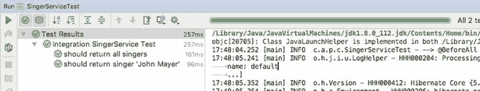

# 13.弹簧测试

在开发企业应用时，测试是确保完成的应用按预期执行并满足各种需求(体系结构、安全性、用户需求等)的重要方法。每次进行更改时，您都应该确保引入的更改不会影响现有的逻辑。维护一个持续的构建和测试环境对于确保高质量的应用至关重要。对所有代码进行高覆盖率的可重复测试，可以让您以高度的信心部署新的应用和对应用的更改。在企业开发环境中，有多种针对企业应用中每一层的测试，每种测试都有自己的特点和要求。在这一章中，我们将讨论各种应用层测试中涉及的基本概念，尤其是 Spring 驱动的应用的测试。我们还介绍了 Spring 如何让开发人员更容易地实现不同层的测试用例。具体来说，本章涵盖以下主题:

*   企业测试框架:我们简要描述一个企业测试框架。我们讨论各种测试及其目的。我们关注单元测试，针对不同的应用层。
*   逻辑单元测试:最好的单元测试是只测试一个类中方法的逻辑，所有其他的依赖都被正确的行为“模仿”。在这一章中，我们将讨论 Spring MVC 控制器类的逻辑单元测试的实现，借助 Java 模拟库来模拟类的依赖关系。
*   集成单元测试:在企业测试框架中，集成测试指的是针对特定的业务逻辑测试不同应用层中一组类的交互。通常，在集成测试环境中，服务层应该与持久层一起测试，后端数据库可用。然而，随着应用架构的发展和轻量级内存数据库的成熟，现在将服务层与持久层和后端数据库作为一个整体进行“单元测试”是一种常见的做法。例如，在本章中，我们使用 JPA 2，用 Hibernate 和 Spring Data JPA 作为持久性提供者，用 H2 作为数据库。在这种架构中，在测试服务层时，“模仿”Hibernate 和 Spring Data JPA 并不重要。因此，在本章中，我们将讨论服务层以及持久层和 H2 内存数据库的测试。这种测试通常被称为集成单元测试，它位于单元测试和全面集成测试之间。
*   前端单元测试:即使您测试了应用的每一层，在应用部署之后，您仍然需要确保整个应用按预期运行。更具体地说，对于 web 应用，在部署到持续构建环境时，您应该运行前端测试，以确保用户界面正常工作。例如，对于 singer 应用，您应该确保正常功能的每一步都正常工作，并且您还应该测试例外情况(例如，当信息没有通过验证阶段时，应用如何工作)。在本章中，我们简要讨论一个前端测试框架。

## 介绍测试类别

企业测试框架指的是整个应用生命周期中的测试活动。根据定义的业务和技术需求，在不同的阶段执行不同的测试活动，以验证应用的功能是否按预期运行。

在每个阶段，执行不同的测试用例。有些是自动化的，有些是手动执行的。在每种情况下，结果都由相应的人员进行验证(例如，业务分析师、应用用户等等)。表 [13-1](#Tab1) 描述了每种测试的特征和目标，以及用于实现测试用例的常用工具和库。

表 13-1。

Different Testing Categories Used in Practice

<colgroup><col> <col> <col></colgroup> 
| 测试类别 | 描述 | 常用工具 |
| --- | --- | --- |
| 逻辑单元测试 | 逻辑单元测试采用单个对象，自己进行测试，不用担心它在周围系统中扮演的角色。 | 单元测试:JUnit，TestNG 模拟对象:Mockito，EasyMock |
| 集成单元测试 | 集成单元测试侧重于在“接近真实”的环境中测试组件之间的交互。这些测试将测试与容器(嵌入式数据库、web 容器等)的交互。 | 嵌入式数据库:H2 数据库测试:DbUnit 内存 web 容器:Jetty |
| 前端单元测试 | 前端单元测试侧重于测试用户界面。目标是确保每个用户界面对用户的动作做出反应，并按预期向用户输出。 | 硒 |
| 持续构建和代码质量测试 | 应该定期构建应用代码库，以确保代码质量符合标准(例如，注释全部到位，没有空的异常捕捉块，等等)。此外，测试覆盖率应该尽可能高，以确保所有开发的代码行都得到测试。 | 代码质量:PMD，检查风格，FindBugs，声纳测试覆盖率:Cobertura，EclEmma 构建工具:Gradle，Maven 连续构建:Hudson，Jenkins |
| 系统集成测试 | 系统集成测试验证新系统中所有程序之间以及新系统与所有外部接口之间的通信准确性。集成测试还必须证明新系统按照功能规范运行，并且在运行环境中有效运行，不会对其他系统产生不利影响。 | IBM Rational Functional Tester，惠普统一功能测试 |
| 系统质量测试 | 系统质量测试是为了确保开发的应用满足那些非功能性需求。大多数情况下，这将测试应用的性能，以确保满足系统和工作负载的并发用户的目标需求。其他非功能性需求包括安全性、高可用性特性等等。 | Apache JMeter，HP LoadRunner |
| 用户接受度测试 | 用户验收测试模拟新系统的实际工作条件，包括用户手册和程序。用户在测试阶段的广泛参与为用户提供了操作新系统的宝贵培训。程序员或设计者看到新程序的用户体验也是有益的。这种联合参与鼓励用户和操作人员批准系统转换。 | IBM Rational TestManager，惠普质量中心 |

在这一章中，我们将重点关注三种单元测试(逻辑单元测试、集成单元测试和前端单元测试)的实现，并展示 Spring TestContext 框架和其他支持工具和库如何帮助开发这些测试用例。

在本章中，当我们展示如何实现样本测试用例时，我们将涵盖 Spring TestContext 框架中最常用的模式以及支持的接口和类，而不是展示 Spring 框架在测试领域提供的所有细节和类列表。

## 使用 Spring 测试注释

在进入逻辑和集成测试之前，值得注意的是，除了标准注释之外，Spring 还提供了特定于测试的注释(比如`@Autowired`和`@Resource`)。这些注释可以在您的逻辑和单元测试中使用，提供各种功能，比如简化的上下文文件加载、概要文件、测试执行时间等等。表 [13-2](#Tab2) 概述了注释及其用途。

表 13-2。

Description of Enterprise Testing Framework

<colgroup><col> <col></colgroup> 
| 注释 | 描述 |
| --- | --- |
| `@ContextConfiguration` | 用于确定如何为集成测试加载和配置`ApplicationContext`的类级注释。 |
| `@WebAppConfiguration` | 用于指示加载的`ApplicationContext`的类级注释应该是一个`WebApplicationContext`。 |
| `@ContextHierarchy` | 指示哪个 bean 配置文件应该是活动的类级注释。 |
| `@DirtiesContext` | 类和方法级别的注释，用于指示在测试执行期间上下文已经以某种方式被修改或损坏，并且应该被关闭并为后续测试重新构建。 |
| `@TestExecutionListeners` | 用于配置应该向`TestContextManager`注册的`TestExecutionListeners`的类级注释。 |
| `@` `TransactionConfiguration` | 用于指示事务配置(如回滚设置和事务管理器)的类级注释(如果您想要的事务管理器没有 bean 名称`transactionManager`)。 |
| `@Rollback` | 类和方法级注释，用于指示是否应该为带注释的测试方法回滚事务。类级注释用于测试类的默认设置。 |
| `@BeforeTransaction` | 方法级注释，指示在事务开始之前，应该调用带注释的方法，用于标记有`@Transactional`注释的测试方法。 |
| `@AfterTransaction` | 方法级注释，指示对于用`@Transactional`注释标记的测试方法，应在事务结束后调用带注释的方法。 |
| `@IfProfileValue` | 类级和方法级注释，用于指示测试方法应针对一组特定的环境条件启用。 |
| `@ProfileValueSource Configuration` | 用于指定`@IfProfileValue`使用的`ProfileValueSource`的类级注释。如果这个注释没有在测试中声明，那么`SystemProfileValueSource`将被用作默认值。 |
| `@Timed` | 方法级注释，用于指示测试必须在指定的时间段内完成。 |
| `@` `Repeat` | 方法级注释，用于指示带注释的测试方法应该重复指定的次数。 |

## 实现逻辑单元测试

如前所述，逻辑单元测试是最好的测试。目标是验证单个类的行为，用预期的行为“模仿”该类的所有依赖项。在这一节中，我们通过实现`SingerController`类的测试用例来演示一个逻辑单元测试，其中服务层被模拟为预期的行为。为了帮助模仿服务层的行为，我们将展示如何使用 Mockito ( [`http://site.mockito.org/`](http://site.mockito.org/) )，这是一个流行的模仿框架。

Spring 框架为`spring-test`模块中的集成测试提供了一流的支持。为了给这个部分创建的集成测试提供一个测试环境，您将使用`spring-test.jar`库。这个库包含了用于 Spring 容器集成测试的有价值的类。

### 添加必需的依赖项

首先，我们需要将依赖项添加到项目中，如下面的配置示例所示。我们还将在前面章节中创建的类和接口的基础上进行构建，比如`Singer`、`SingerService`等等。

```java
\\pro-spring-15\build.gradle
ext {
   //spring libs
   springVersion = '5.0.0.RC1'
   bootVersion = '2.0.0.M1'

   //testing libs
   mockitoVersion = '2.0.2-beta'
   junitVersion = '4.12'
   hamcrestVersion = '1.3'
   dbunitVersion = '2.5.3'
   poiVersion = '3.16'
   junit5Version = '5.0.0-M4'

   spring = [
         test          : "org.springframework:spring-test:$springVersion",
         ...
   ]

   boot = [
         starterTest  :
              "org.springframework.boot:spring-boot-starter-test:$bootVersion",
         ...
   ]

   testing = [
         junit       : "junit:junit:$junitVersion",
         junit5      : "org.junit.jupiter:junit-jupiter-engine:$junit5Version",
         junitJupiter: "org.junit.jupiter:junit-jupiter-api:$junit5Version",
         mockito     : "org.mockito:mockito-all:$mockitoVersion",
         easymock    : "org.easymock:easymock:3.4",
         jmock       : "org.jmock:jmock:2.8.2",
         hamcrestCore: "org.hamcrest:hamcrest-core:$hamcrestVersion",
         hamcrestLib : "org.hamcrest:hamcrest-library:$hamcrestVersion",
         dbunit      : "org.dbunit:dbunit:$dbunitVersion"
   ]
   misc = [
   ...
   poi               : "org.apache.poi:poi:$poiVersion"
   ]
   ...
}

```

### 单元测试 Spring MVC 控制器

在表示层，控制器类提供了用户界面和服务层之间的集成。

控制器类中的方法将被映射到 HTTP 请求。在该方法中，请求将被处理，将绑定到模型对象，并将与服务层(通过 Spring 的 DI 注入到控制器类中)交互以处理数据。完成后，根据结果，控制器类将更新模型和视图状态(例如，用户消息、REST 服务的对象等等)，并返回 Spring MVC 的逻辑视图(或者模型和视图一起)来解析要显示给用户的视图。

对于单元测试控制器类，主要目标是确保控制器方法正确地更新模型和其他视图状态，并返回正确的视图。因为我们只想测试控制器类的行为，所以我们需要用正确的行为“模拟”服务层。

对于`SingerController`类，我们想为`listData()`和`create(Singer)`方法开发测试用例。在接下来的部分中，我们将讨论这方面的步骤。

#### 测试 listData()方法

让我们为`singerController.listData()`方法创建第一个测试用例。在这个测试用例中，我们希望确保在调用该方法时，在从服务层检索歌手列表之后，信息被正确地保存到模型中，并且返回正确的对象。下面的代码片段显示了测试用例:

```java
package com.apress.prospring5.ch13;

import static org.junit.Assert.assertEquals;
import static org.mockito.Mockito.mock;
import static org.mockito.Mockito.when;

import java.util.ArrayList;
import java.util.List;

import com.apress.prospring5.ch13.entities.Singer;
import com.apress.prospring5.ch13.entities.Singers;
import org.junit.Before;
import org.junit.Test;

import org.mockito.invocation.InvocationOnMock;
import org.mockito.stubbing.Answer;

import org.springframework.test.util.ReflectionTestUtils;
import org.springframework.ui.ExtendedModelMap;

public class SingerControllerTest {
    private final List<Singer> singers = new ArrayList<>();

    @Before
    public void initSingers() {
        Singer singer = new Singer();
        singer.setId(1l);
        singer.setFirstName("John");
        singer.setLastName("Mayer");
        singers.add(singer);
    }

    @Test
    public void testList() throws Exception {
        SingerService singerService = mock(SingerService.class);
        when(singerService.findAll()).thenReturn(singers);

        SingerController singerController = new SingerController();

        ReflectionTestUtils.setField(singerController,
             "singerService", singerService);

        ExtendedModelMap uiModel = new ExtendedModelMap();
        uiModel.addAttribute("singers", singerController.listData());

        Singers modelSingers = (Singers) uiModel.get("singers");

        assertEquals(1, modelSingers.getSingers().size());
    }
}

```

首先，测试用例调用`initSingers()`方法，该方法应用了`@Before`注释，这向 JUnit 表明该方法应该在运行每个测试用例之前运行(如果您想在整个测试类之前运行一些逻辑，请使用`@BeforeClass`注释)。在该方法中，用硬编码信息初始化歌手列表。

其次，`testList()`方法与`@Test`注释一起应用，这向 JUnit 表明这是一个 JUnit 应该运行的测试用例。在测试用例中，私有变量`singerService`(类型`SingerService`)通过使用莫克托的`Mockito.mock()`方法被模拟(注意`import static`语句)。Mockito 还提供了`when()`方法来模仿`SingerService.findAll()`方法，该方法将由`SingerController`类使用。

第三，创建一个`SingerController`类的实例，然后通过使用 Spring 提供的`ReflectionTestUtils`类的`setField()`方法，将它的`singerService`变量(在正常情况下将由 Spring 注入)设置为模拟实例。`ReflectionTestUtils`提供了一组基于反射的实用方法，用于单元和集成测试场景。此外，还构建了一个`ExtendedModelMap`类的实例(实现了`org.springframework.ui.Model`接口)。

接下来，调用`SingerController.` `listData()`方法。在调用时，通过调用各种 assert 方法(由 JUnit 提供)来验证结果，以确保歌手信息列表正确保存在视图使用的模型中。

现在我们可以运行测试用例了，它应该会成功运行。您可以通过您的构建系统或 IDE 来验证这一点。我们现在可以继续使用`create()`方法。

#### 测试 create()方法

下面的代码片段显示了测试`create()`方法的代码片段:

```java
package com.apress.prospring5.ch13;

import static org.junit.Assert.assertEquals;
import static org.mockito.Mockito.mock;
import static org.mockito.Mockito.when;

import java.util.ArrayList;
import java.util.List;

import com.apress.prospring5.ch13.entities.Singer;
import com.apress.prospring5.ch13.entities.Singers;
import org.junit.Before;
import org.junit.Test;

import org.mockito.invocation.InvocationOnMock;
import org.mockito.stubbing.Answer;

import org.springframework.test.util.ReflectionTestUtils;
import org.springframework.ui.ExtendedModelMap;

public class SingerControllerTest {
    private final List<Singer> singers = new ArrayList<>();

    @Test
    public void testCreate() {
        final Singer newSinger = new Singer();
        newSinger.setId(999l);
        newSinger.setFirstName("BB");
        newSinger.setLastName("King");

        SingerService singerService = mock(SingerService.class);
        when(singerService.save(newSinger)).thenAnswer(new Answer<Singer>() {
            public Singer answer(InvocationOnMock invocation) throws Throwable {
                singers.add(newSinger);
                return newSinger;
            }
        });

        SingerController singerController = new SingerController();
        ReflectionTestUtils.setField(singerController, "singerService",
        singerService);

        Singer singer = singerController.create(newSinger);
        assertEquals(Long.valueOf(999l), singer.getId());
        assertEquals("BB", singer.getFirstName());
        assertEquals("King", singer.getLastName());

        assertEquals(2, singers.size());
    }
}

```

模仿`SingerService.save()`方法是为了模拟在歌手列表中添加一个新的`Singer`对象。注意`org.mockito.stubbing.Answer<T>`接口的使用，它用预期的逻辑模拟方法并返回一个值。

然后，调用`SingerController.create()`方法，并调用断言操作来验证结果。再次运行结果，并注意测试用例的结果。对于`create()`方法，我们应该创建更多的测试用例来测试各种场景。例如，我们需要测试在保存操作中何时遇到数据访问错误。

到目前为止所涉及的一切都可以用 JMock ( [`www.jmock.org/`](http://www.jmock.org/) )来完成，使用这个库的`SingerControllerTest`类的一个版本是本节代码示例的一部分。我们不会在这里讨论这个问题，因为模仿依赖关系的想法才是重点，而不是可以做到这一点的库。[T5 1T7】](#Fn1)

## 实现集成测试

在本节中，我们将实现服务层的集成测试。在 singer 应用中，核心服务是类`SingerServiceImpl`，它是`SingerService`接口的 JPA 实现。

当对服务层进行单元测试时，您将使用 H2 内存数据库来托管数据模型和测试数据，并使用 JPA 提供程序(Hibernate 和 Spring Data JPA 的存储库抽象)。目标是确保`SingerServiceImpl`类正确执行业务功能。

在接下来的小节中，我们将展示如何测试一些 finder 方法和`SingerServiceImpl`类的保存操作。

### 添加必需的依赖项

为了实现带有数据库的测试用例，我们需要一个库，它可以在执行测试用例之前帮助在数据库中填充所需的测试数据，并且可以轻松地执行必要的数据库操作。此外，为了更容易地准备测试数据，我们将支持以 Microsoft Excel 格式准备测试数据。

为了实现这些目的，需要额外的库。在数据库方面，DbUnit ( [`http://dbunit.sourceforge.net`](http://dbunit.sourceforge.net) )是一个可以帮助实现数据库相关测试的通用库。此外，Apache POI ( [`http://poi.apache.org`](http://poi.apache.org) )项目的库将用于帮助解析在 Microsoft Excel 中准备的测试数据。

### 为服务层测试配置配置文件

Spring 3.1 中引入的 bean definition profiles 特性对于使用测试组件的适当配置来实现测试用例非常有用。为了方便服务层的测试，我们还将为`ApplicationContext`配置使用 profile 特性。对于 Singer 应用，我们希望有两个配置文件，如下所示:

*   开发概要文件(dev):带有开发环境配置的概要文件。例如，在开发系统中，后端 H2 数据库将执行数据库创建和初始数据填充脚本。
*   测试概要文件(test):包含测试环境配置的概要文件。例如，在测试环境中，后端 H2 数据库将只执行数据库创建脚本，而数据将由测试用例填充。

让我们为 singer 应用配置配置文件环境。对于 singer 应用，后端配置(即数据源、JPA、事务等)是在配置 XML 文件`datasource-tx-jpa.xml`中定义的。我们只想为 dev 概要文件配置文件中的数据源。为此，我们需要用概要文件配置包装数据源 bean。以下配置片段显示了所需的更改:

```java
<?xml version="1.0" encoding="UTF-8"?>
<beans ...>

    <bean id="transactionManager"
       class="org.springframework.orm.jpa.JpaTransactionManager">
        <property name="entityManagerFactory" ref="emf"/>
    </bean>

    <tx:annotation-driven transaction-manager="transactionManager" />

    <bean id="emf"
        class="org.springframework.orm.jpa.LocalContainerEntityManagerFactoryBean">
        <property name="dataSource" ref="dataSource" />
        <property name="jpaVendorAdapter">
            <bean class=
              "org.springframework.orm.jpa.vendor.HibernateJpaVendorAdapter" />
        </property>
        <property name="packagesToScan" value="com.apress.prospring5.ch13"/>
        <property name="jpaProperties">
            <props>
                <prop key="hibernate.dialect">org.hibernate.dialect.H2Dialect</prop>
                <prop key="hibernate.max_fetch_depth">3</prop>
                <prop key="hibernate.jdbc.fetch_size">50</prop>
                <prop key="hibernate.jdbc.batch_size">10</prop>
                <prop key="hibernate.show_sql">true</prop>
            </props>
        </property>
    </bean>

    <context:annotation-config/>

    <jpa:repositories base-package="com.apress.prospring5.ch13"
                      entity-manager-factory-ref="emf"
                      transaction-manager-ref="transactionManager"/>
    <beans profile="dev">
            <jdbc:embedded-database id="dataSource" type="H2">
                <jdbc:script location="classpath:config/schema.sql"/>
                <jdbc:script location="classpath:config/test-data.sql"/>
        </jdbc:embedded-database>
    </beans>
</beans>

```

如配置片段所示，`dataSource` bean 用`<beans>`标签包装，并被赋予值为`dev`的配置文件属性，这表明数据源仅适用于开发系统。记住，概要文件可以通过将`-Dspring.profiles.active=dev`作为系统参数传递给 JVM 来激活。

### Java 配置版本

随着 Java 配置类的引入，XML 正在慢慢失去市场。正因为如此，本书的重点是 Java 配置类的使用；XML 配置只是为了展示 Spring 配置随时间的演变。前面显示的 XML 配置可以分成两部分:一部分是数据源配置，这是特定于概要文件的，另一部分是事务配置，这是开发和测试配置的常用配置。下面描述这两个类。Java 配置中增加的一项改进是数据库模式的“自动”生成，这是通过将 Hibernate 属性`hibernate.hbm2ddl.auto`设置为`create-drop`来实现的。

```java
//DataConfig.java
package com.apress.prospring5.ch13.config;

import org.slf4j.Logger;
import org.slf4j.LoggerFactory;
import org.springframework.context.annotation.Bean;
import org.springframework.context.annotation.ComponentScan;
import org.springframework.context.annotation.Configuration;
import org.springframework.context.annotation.Profile;
import org.springframework.jdbc.datasource.embedded.EmbeddedDatabaseBuilder;
import org.springframework.jdbc.datasource.embedded.EmbeddedDatabaseType;

import javax.sql.DataSource;

@Profile("dev")

@Configuration
@ComponentScan(basePackages = {"com.apress.prospring5.ch13.init"} )
public class DataConfig {

   private static Logger logger = LoggerFactory.getLogger(DataConfig.class);

   @Bean
   public DataSource dataSource() {
      try {
         EmbeddedDatabaseBuilder dbBuilder = new EmbeddedDatabaseBuilder();
         return dbBuilder.setType(EmbeddedDatabaseType.H2).build();
      } catch (Exception e) {
         logger.error("Embedded DataSource bean cannot be created!", e);
         return null;
      }
   }

}

//ServiceConfig.class
package com.apress.prospring5.ch13.config;

import org.springframework.beans.factory.annotation.Autowired;
import org.springframework.context.annotation.Bean;
import org.springframework.context.annotation.ComponentScan;
import org.springframework.context.annotation.Configuration;
import org.springframework.data.jpa.repository.config.EnableJpaRepositories;
import org.springframework.orm.jpa.JpaTransactionManager;
import org.springframework.orm.jpa.JpaVendorAdapter;
import org.springframework.orm.jpa.LocalContainerEntityManagerFactoryBean;
import org.springframework.orm.jpa.vendor.HibernateJpaVendorAdapter;
import org.springframework.transaction.PlatformTransactionManager;

import javax.persistence.EntityManagerFactory;
import javax.sql.DataSource;
import java.util.Properties;

@Configuration
@EnableJpaRepositories(basePackages = {"com.apress.prospring5.ch13.repos"})
@ComponentScan(basePackages = {"com.apress.prospring5.ch13.entities",
 "com.apress.prospring5.ch13.services"})
public class ServiceConfig {

   @Autowired
   DataSource dataSource;

   @Bean
   public Properties hibernateProperties() {
      Properties hibernateProp = new Properties();
      hibernateProp.put("hibernate.dialect",
          "org.hibernate.dialect.H2Dialect");
      hibernateProp.put("hibernate.hbm2ddl.auto", "create-drop");
      hibernateProp.put("hibernate.show_sql", true);
      hibernateProp.put("hibernate.max_fetch_depth", 3);
      hibernateProp.put("hibernate.jdbc.batch_size", 10);
      hibernateProp.put("hibernate.jdbc.fetch_size", 50);
      return hibernateProp;
   }

   @Bean
   public PlatformTransactionManager transactionManager() {
      return new JpaTransactionManager(entityManagerFactory());
   }

   @Bean
   public JpaVendorAdapter jpaVendorAdapter() {
      return new HibernateJpaVendorAdapter();
   }

   @Bean
   public EntityManagerFactory entityManagerFactory() {
      LocalContainerEntityManagerFactoryBean factoryBean =
           new LocalContainerEntityManagerFactoryBean();
      factoryBean.setPackagesToScan("com.apress.prospring5.ch13.entities");
      factoryBean.setDataSource(dataSource);
      factoryBean.setJpaVendorAdapter(new HibernateJpaVendorAdapter());
      factoryBean.setJpaProperties(hibernateProperties());
      factoryBean.setJpaVendorAdapter(jpaVendorAdapter());
      factoryBean.afterPropertiesSet();
      return factoryBean.getNativeEntityManagerFactory();
   }
}

```

### 实现基础结构类

在实现单独的测试用例之前，我们需要实现一些类来支持 Excel 文件中测试数据的填充。此外，为了简化测试用例的开发，我们想要引入一个名为`@DataSets`的定制注释，它接受 Excel 文件名作为参数。我们将开发一个定制的测试执行监听器(Spring testing framework 支持的一个特性)来检查注释的存在，并相应地加载数据。

#### 实现自定义 TestExecutionListener

在`spring-test`模块中，`org.springframework.test.context.TestExecutionListener`接口定义了一个监听器 API，它可以拦截测试用例执行的各个阶段中的事件(例如，在测试的类之前和之后，在测试的方法之前和之后，等等)。在测试服务层时，我们将为新引入的`@DataSets`注释实现一个定制监听器。目标是通过对测试用例的简单注释来支持测试数据的填充。例如，为了测试`SingerService.findAll()`方法，我们希望代码看起来像下面的代码片段:

```java
@DataSets(setUpDataSet= "/com/apress/prospring5/ch13/SingerServiceImplTest.xls")
@Test
public void testFindAll() throws Exception {
    List<Singer> result = singerService.findAll();
    ...
}

```

将`@DataSets`注释应用于测试用例表明，在运行测试之前，需要将测试数据从指定的 Excel 文件加载到数据库中。首先，我们需要定义自定义注释，如下所示:

```java
package com.apress.prospring5.ch13;

import java.lang.annotation.ElementType;
import java.lang.annotation.Retention;
import java.lang.annotation.RetentionPolicy;
import java.lang.annotation.Target;

@Retention(RetentionPolicy.RUNTIME)
@Target(ElementType.METHOD)

public @interface DataSets {
    String setUpDataSet() default "";
}

```

自定义注释`@DataSets`是一个方法级注释。此外，实现`TestExecutionListener`接口，如下面的代码片段所示，将开发定制的测试监听器类:

```java
package com.apress.prospring5.ch13;

import org.dbunit.IDatabaseTester;
import org.dbunit.dataset.IDataSet;
import org.dbunit.util.fileloader.XlsDataFileLoader;
import org.springframework.test.context.TestContext;
import org.springframework.test.context.TestExecutionListener;

public class ServiceTestExecutionListener implements
     TestExecutionListener {
    private IDatabaseTester databaseTester;

    @Override
    public void afterTestClass(TestContext arg0) throws Exception {
    }

    @Override
    public void afterTestMethod(TestContext arg0) throws Exception {
        if (databaseTester != null) {
            databaseTester.onTearDown();
        }
    }

    @Override
    public void beforeTestClass(TestContext arg0) throws Exception {
    }

    @Override
    public void beforeTestMethod(TestContext testCtx) throws Exception {
        DataSets dataSetAnnotation = testCtx.getTestMethod()
             .getAnnotation(DataSets.class);

        if (dataSetAnnotation == null ) {
            return;
        }

        String dataSetName = dataSetAnnotation.setUpDataSet();

        if (!dataSetName.equals("") ) {
            databaseTester = (IDatabaseTester)
                    testCtx.getApplicationContext().getBean("databaseTester");
            XlsDataFileLoader xlsDataFileLoader = (XlsDataFileLoader)
                    testCtx.getApplicationContext().getBean("xlsDataFileLoader");
            IDataSet dataSet = xlsDataFileLoader.load(dataSetName);

            databaseTester.setDataSet(dataSet);
            databaseTester.onSetup();
        }
    }

    @Override
    public void prepareTestInstance(TestContext arg0) throws Exception {
    }
}

```

在实现了`TestExecutionListener`接口之后，还需要实现一些方法。然而，在这种情况下，我们只对方法`beforeTestMethod()`和`afterTestMethod()`感兴趣，在这两种方法中，在每个测试方法执行之前和之后，测试数据的填充和清理都将被执行。注意，在每个方法中，Spring 将传入一个`TestContext`类的实例，这样该方法就可以访问由 Spring 框架引导的底层测试`ApplicationContext`。

方法`beforeTestMethod()`特别有趣。首先，它检查测试方法的`@DataSets`注释是否存在。如果注释存在，测试数据将从指定的 Excel 文件中加载。在这种情况下，`IDatabaseTester`接口(带有实现类`org.dbunit.DataSourceDatabaseTester`，我们将在后面讨论)是从`TestContext`获得的。`IDatabaseTester`接口由 DbUnit 提供，支持基于给定数据库连接或数据源的数据库操作。

其次，从`TestContext`中获得一个`XlsDataFileLoader`类的实例。`XlsDataFileLoader`类是 DbUnit 对从 Excel 文件加载数据的支持。它在后台使用 Apache POI 库来读取 Microsoft Office 格式的文件。然后，调用`XlsDataFileLoader.load()`方法从文件中加载数据，这将返回一个`IDataSet`接口的实例，代表加载的数据集。

最后，调用`IDatabaseTester.setDataSet()`方法设置测试数据，调用`IDatabaseTester.onSetup()`方法触发数据的填充。

在`afterTestMethod()`方法中，调用`IDatabaseTester.onTearDown()`方法来清理数据。

#### 实现配置类

让我们继续实现测试环境的配置类。以下代码片段显示了使用 Java Config 样式配置的代码:

```java
package com.apress.prospring5.ch13.config;

import javax.sql.DataSource;

import com.apress.prospring5.ch13.init.DBInitializer;
import org.dbunit.DataSourceDatabaseTester;
import org.dbunit.util.fileloader.XlsDataFileLoader;
import org.slf4j.Logger;
import org.slf4j.LoggerFactory;
import org.springframework.context.annotation.*;
import org.springframework.jdbc.datasource.embedded.EmbeddedDatabaseBuilder;
import org.springframework.jdbc.datasource.embedded.EmbeddedDatabaseType;

@Configuration
@ComponentScan(basePackages={"com.apress.prospring5.ch13"},
        excludeFilters = {@ComponentScan.Filter(type = FilterType.ASSIGNABLE_TYPE,
                value = DBInitializer.class)
})
@Profile("test")
public class ServiceTestConfig {
    private static Logger logger = LoggerFactory.getLogger(ServiceTestConfig.class);

    @Bean
    public DataSource dataSource() {
        try {
            EmbeddedDatabaseBuilder dbBuilder = new EmbeddedDatabaseBuilder();
            return dbBuilder.setType(EmbeddedDatabaseType.H2).build();
        } catch (Exception e) {
            logger.error("Embedded DataSource bean cannot be created!", e);
            return null;
        }
    }

    @Bean(name="databaseTester")
    public DataSourceDatabaseTester dataSourceDatabaseTester() {
        DataSourceDatabaseTester databaseTester =
                new DataSourceDatabaseTester(dataSource());
        return databaseTester;
    }

    @Bean(name="xlsDataFileLoader")
    public XlsDataFileLoader xlsDataFileLoader() {
        return new XlsDataFileLoader();
    }
}

```

`ServiceTestConfig`类定义了服务层测试的`ApplicationContext`实现。`@ComponentScan`注释用于指示 Spring 扫描我们想要测试的服务层 beans。

属性用来确保测试数据库没有被开发条目初始化。

`@Profile`注释指定了这个类中定义的 beans 属于测试概要文件。

其次，在该类中，声明了另一个`dataSource` bean，该 bean 只执行 H2 数据库的`schema.sql`脚本，而不包含任何数据。用于从 Excel 文件加载测试数据的定制测试执行监听器使用了`databaseTester`和`xlsDataFileLoader`bean。注意，`dataSourceDatabaseTester` bean 是使用为测试环境定义的`dataSource` bean 构建的。

### 服务层的单元测试

让我们从单元测试 finder 方法开始，包括`SingerService.findAll()`和`SingerService.findByFirstNameAndLastName()`方法。首先，我们需要准备 Excel 格式的测试数据。一种常见的做法是将文件放入与测试用例类相同的文件夹中，使用相同的名称。所以，在这种情况下，文件名是`/src/test/java/com/apress/prospring5/ch13/SingerServiceImplTest.xls`。

测试数据准备在工作表中。工作表的名称是表格的名称(`SINGER`)，而第一行是表格中的列名。从第二行开始，输入名和姓以及出生日期的数据。我们指定了 ID 列，但没有指定值。这是因为 ID 将由数据库填充。请参阅本书源代码中的 Excel 文件示例。

下面的代码片段显示了带有两个 finder 方法的测试用例的测试类:

```java
package com.apress.prospring5.ch13;

import static org.junit.Assert.assertEquals;
import static org.junit.Assert.assertNotNull;
import static org.junit.Assert.assertNull;

import java.util.List;

import javax.persistence.EntityManager;
import javax.persistence.PersistenceContext;
import javax.validation.ConstraintViolationException;

import com.apress.prospring5.ch13.entities.Singer;
import org.junit.Test;
import org.junit.runner.RunWith;
import org.springframework.beans.factory.annotation.Autowired;
import org.springframework.test.context.ActiveProfiles;
import org.springframework.test.context.ContextConfiguration;
import org.springframework.test.context.TestExecutionListeners;
import org.springframework.test.context.junit4.
     AbstractTransactionalJUnit4SpringContextTests;
import org.springframework.test.context.junit4.SpringJUnit4ClassRunner;

@RunWith(SpringJUnit4ClassRunner.class)
@ContextConfiguration(classes = {ServiceTestConfig.class, ServiceConfig.class,
DataConfig.class})
@TestExecutionListeners({ServiceTestExecutionListener.class})

@ActiveProfiles("test")

public class SingerServiceImplTest extends
     AbstractTransactionalJUnit4SpringContextTests {
    @Autowired
    SingerService singerService;

    @PersistenceContext
    private EntityManager em;

    @DataSets(setUpDataSet= "/com/apress/prospring5/ch13/SingerServiceImplTest.xls")
    @Test
    public void testFindAll() throws Exception {
        List<Singer> result = singerService.findAll();

        assertNotNull(result);
        assertEquals(1, result.size());
    }

    @DataSets(setUpDataSet= "/com/apress/prospring5/ch13/SingerServiceImplTest.xls")
    @Test
    public void testFindByFirstNameAndLastName_1() throws Exception {
        Singer result = singerService.findByFirstNameAndLastName("John", "Mayer");
        assertNotNull(result);
    }

    @DataSets(setUpDataSet= "/com/apress/prospring5/ch13/SingerServiceImplTest.xls")
    @Test
    public void testFindByFirstNameAndLastName_2() throws Exception {
        Singer result = singerService.findByFirstNameAndLastName("BB", "King");
        assertNull(result);
    }
}

```

`@RunWith`注释与测试控制器类时相同。`@ContextConfiguration`注释指定`ApplicationContext`配置应该从`ServiceTestConfig`、`ServiceConfig`和`DataConfig`类中加载。`DataConfig`类本来不应该在那里，但是它被使用了，只是为了让 Spring profiles 实际工作起来更加明显。`@TestExecutionListeners`注释表明`ServiceTestExecutionListener`类应该用于截取测试用例执行生命周期。`@ActiveProfiles`注释指定了要使用的轮廓。因此，在这种情况下，将加载在`ServiceTestConfig`类中定义的`dataSource` bean，而不是在`datasource-tx-jpa.xml`文件中定义的 bean，因为它属于 dev 概要文件。

此外，该类扩展了 Spring 的`AbstractTransactionalJUnit4SpringContextTests`类，这是 Spring 对 JUnit 的支持，具有 Spring 的 DI 和事务管理机制。注意，在 Spring 的测试环境中，Spring 会在执行每个测试方法时回滚事务，这样所有的数据库更新操作都会回滚。为了控制回滚行为，您可以在方法级别使用`@Rollback`注释。

对于`findAll()`方法有一个测试用例，对于`testFindByFirstNameAndLastName()`方法有两个测试用例(一个检索结果，一个不检索)。所有的 finder 方法都应用了 Excel 中带有`Singer`测试数据文件的`@DataSets`注释。另外，`SingerService`从`ApplicationContext`开始被自动连线到测试用例中。代码的其余部分应该是不言自明的。在每个测试用例中应用了各种断言语句，以确保结果是预期的。

运行测试用例，并确保它通过。接下来，让我们测试保存操作。在这种情况下，我们将测试两个场景。一种是成功保存有效的`Singer`的正常情况，另一种是应该导致抛出正确异常的`Singer`错误。下面的代码片段显示了两个测试用例的附加代码片段:

```java
package com.apress.prospring5.ch13;

import static org.junit.Assert.assertEquals;
import static org.junit.Assert.assertNotNull;
import static org.junit.Assert.assertNull;
import java.util.List;

import javax.persistence.EntityManager;
import javax.persistence.PersistenceContext;
import javax.validation.ConstraintViolationException;

import com.apress.prospring5.ch13.entities.Singer;
import org.junit.Test;
import org.junit.runner.RunWith;
import org.springframework.beans.factory.annotation.Autowired;
import org.springframework.test.context.ActiveProfiles;
import org.springframework.test.context.ContextConfiguration;
import org.springframework.test.context.TestExecutionListeners;
import org.springframework.test.context.junit4.
   AbstractTransactionalJUnit4SpringContextTests;
import org.springframework.test.context.junit4.SpringJUnit4ClassRunner;

@RunWith(SpringJUnit4ClassRunner.class)
@ContextConfiguration(classes = {ServiceTestConfig.class, ServiceConfig.class,
   DataConfig.class})
@TestExecutionListeners({ServiceTestExecutionListener.class})
@ActiveProfiles("test")
public class SingerServiceImplTest extends
       AbstractTransactionalJUnit4SpringContextTests {
    @Autowired
    SingerService singerService;

    @PersistenceContext
    private EntityManager em;

    @Test
    public void testAddSinger() throws Exception {
        deleteFromTables("SINGER");

        Singer singer = new Singer();
        singer.setFirstName("Stevie");
        singer.setLastName("Vaughan ");

        singerService.save(singer);
        em.flush();

        List<Singer> singers = singerService.findAll();
        assertEquals(1, singers.size());
    }

    @Test(expected=ConstraintViolationException.class)
    public void testAddSingerWithJSR349Error() throws Exception {
        deleteFromTables("SINGER");

        Singer singer = new Singer();
        singerService.save(singer);
        em.flush();

        List<Singer> singers = singerService.findAll();
        assertEquals(0, singers.size());
    }
}

```

在前面的清单中，看一下`testAddSinger()`方法。在该方法中，为了确保在`Singer`表中没有数据，我们调用了由`AbstractTransactionalJUnit4SpringContextTests`类提供的方便的方法`deleteFromTables()`来清理该表。请注意，在调用保存操作之后，我们需要显式调用`EntityManager.flush()`方法来强制 Hibernate 将持久性上下文刷新到数据库，以便`findAll()`方法可以正确地从数据库中检索信息。

在 Spring 4.3 中引入了`SpringJUnit4ClassRunner.class`的别名`SpringRunner.class`。

在第二个测试方法中，即`testAddSingerWithJSR349Error()`方法，我们测试了带有验证错误的`Singer`的保存操作。注意，在`@Test`注释中，传递了一个预期属性，该属性指定这个测试用例预期抛出一个指定类型的异常，在本例中是`ConstraintViolationException`类。

再次运行测试类，并验证结果是否成功。

注意，我们只讨论了 Spring 测试框架中最常用的类。Spring 的测试框架提供了许多支持类和注释，允许我们在测试用例生命周期的执行过程中应用精细控制。例如，`@BeforeTransaction`和`@AfterTransaction`注释允许在 Spring 启动事务之前或者在测试用例的事务完成之后执行某些逻辑。关于 Spring 测试框架各个方面的更详细的描述，请参考 Spring 的参考文档。

### 删除数据单元

DbUnit 被认为很难使用，因为它需要额外的依赖项和额外的配置类。春天的方法会很好，不是吗？幸运的是，在 4.0 之后的 Spring 版本中引入了许多有用的注释。下面的例子中会用到其中一个:`@Sql`。此注释用于注释测试类或测试方法，以配置在集成测试期间针对给定数据库执行的 SQL 脚本和语句。这意味着可以在不使用 DbUnit 的情况下准备测试数据。因此，测试配置也得到了简化，测试类不需要扩展任何东西。

本节的另一个补充是 JUnit 5 ( [`http://junit.org/junit5/`](http://junit.org/junit5/) )的使用，也称为 JUnit Jupiter。从 Spring 4.3 开始，甚至在第一个稳定版本发布之前，就已经提供了对它的支持。在撰写本文时，当前版本是 5.0.0-M4。JUnit 5 是 JUnit 的下一代。目标是为 JVM 上的开发人员端测试创建一个最新的基础。这包括关注 Java 8 和更新的版本，以及支持许多不同风格的测试。 [<sup>2</sup>](#Fn2)

让我们看看配置是如何被修改的。测试概要文件的测试数据源配置类变得简单多了，因为我们现在需要的是一个空的数据库。

```java
package com.apress.prospring5.ch13.config;

import com.apress.prospring5.ch13.init.DBInitializer;
import org.slf4j.Logger;
import org.slf4j.LoggerFactory;
import org.springframework.context.annotation.*;
import org.springframework.jdbc.datasource.embedded.EmbeddedDatabaseBuilder;
import org.springframework.jdbc.datasource.embedded.EmbeddedDatabaseType;

import javax.sql.DataSource;

@Configuration
@ComponentScan(basePackages={"com.apress.prospring5.ch13"},
      excludeFilters = {@ComponentScan.Filter(type = FilterType.ASSIGNABLE_TYPE,
            value = DBInitializer.class)
 })
@Profile("test")
public class SimpleTestConfig {

   private static Logger logger = LoggerFactory.getLogger(SimpleTestConfig.class);

   @Bean
   public DataSource dataSource() {
      try {
         EmbeddedDatabaseBuilder dbBuilder = new EmbeddedDatabaseBuilder();
         return dbBuilder.setType(EmbeddedDatabaseType.H2).build();
      } catch (Exception e) {
         logger.error("Embedded DataSource bean cannot be created!", e);
         return null;
      }
   }

}

```

测试用例所需的数据和查询将使用 SQL 脚本文件提供。数据将由一个名为`test-data.sql`的文件提供。其内容如下所示:

```java
insert into singer (first_name, last_name, birth_date,version)
 values ('John', 'Mayer', '1977-10-16', 0);

```

测试数据库的清理将使用`clean-up.sql`脚本来完成。这个脚本用于清空数据库，以便一个测试方法所必需的数据不会污染另一个测试方法的数据。其内容如下所示:

```java
delete from singer;

```

测试类将利用一些 JUnit5 注释来展示如何使用它们。每个注释都将在代码部分之后解释。

```java
package com.apress.prospring5.ch13;

import com.apress.prospring5.ch13.config.DataConfig;
import com.apress.prospring5.ch13.config.ServiceConfig;
import com.apress.prospring5.ch13.config.SimpleTestConfig;

import com.apress.prospring5.ch13.entities.Singer;
import com.apress.prospring5.ch13.services.SingerService;
import org.junit.jupiter.api.*;
import org.slf4j.Logger;
import org.slf4j.LoggerFactory;
import org.springframework.beans.factory.annotation.Autowired;
import org.springframework.test.context.ActiveProfiles;
import org.springframework.test.context.jdbc.Sql;
import org.springframework.test.context.jdbc.SqlConfig;
import org.springframework.test.context.jdbc.SqlGroup;
import org.springframework.test.context.junit.jupiter.SpringJUnitConfig;

import java.util.List;

import static org.junit.jupiter.api.Assertions.assertEquals;
import static org.junit.jupiter.api.Assertions.assertNotNull;

@SpringJUnitConfig(classes = {SimpleTestConfig.class, ServiceConfig.class,
DataConfig.class})
@DisplayName("Integration SingerService Test")
@ActiveProfiles("test")
public class SingerServiceTest {

   private static Logger logger =
      LoggerFactory.getLogger(SingerServiceTest.class);

   @Autowired
   SingerService singerService;

   @BeforeAll
   static void setUp() {
      logger.info("--> @BeforeAll -
         executes before executing all test methods in this class");
   }

   @AfterAll
   static void tearDown(){
      logger.info("--> @AfterAll -
         executes before executing all test methods in this class");
   }

   @BeforeEach
   void init() {
      logger.info("--> @BeforeEach -
          executes before each test method in this class");
   }

   @AfterEach
   void dispose() {
      logger.info("--> @AfterEach -
         executes before each test method in this class");
   }

   @Test
   @DisplayName("should return all singers")
   @SqlGroup({
         @Sql(value = "classpath:db/test-data.sql",
               config = @SqlConfig(encoding = "utf-8", separator = ";",
               commentPrefix = "--"),
               executionPhase = Sql.ExecutionPhase.BEFORE_TEST_METHOD),
         @Sql(value = "classpath:db/clean-up.sql",
               config = @SqlConfig(encoding = "utf-8", separator = ";",
               commentPrefix = "--"),
               executionPhase = Sql.ExecutionPhase.AFTER_TEST_METHOD),
   })
   public void findAll() {
      List<Singer> result = singerService.findAll();
      assertNotNull(result);
      assertEquals(1, result.size());
   }

   @Test
   @DisplayName("should return singer 'John Mayer'")
   @SqlGroup({
         @Sql(value = "classpath:db/test-data.sql",
               config = @SqlConfig(encoding = "utf-8", separator = ";",
               commentPrefix = "--"),
               executionPhase = Sql.ExecutionPhase.BEFORE_TEST_METHOD),
         @Sql(value = "classpath:db/clean-up.sql",
               config = @SqlConfig(encoding = "utf-8", separator = ";",
               commentPrefix = "--"),
               executionPhase = Sql.ExecutionPhase.AFTER_TEST_METHOD),
   })
   public void testFindByFirstNameAndLastNameOne() throws Exception {
      Singer result = singerService.findByFirstNameAndLastName("John", "Mayer");
      assertNotNull(result);
   }
}

```

使用`SpringJUnitJupiterConfig`注释创建`ApplicationContext`。这是一个组合注释，将来自 JUnit Jupiter 的`@ExtendWith(SpringExtension.class)`与来自 Spring TestContext 框架的`@ContextConfiguration`结合在一起。

`@DisplayName`注释是一个典型的 JUnit Jupiter 注释，用于声明带注释的测试类或测试方法的定制显示值。在支持 JUnit 5 的编辑器中，这看起来非常漂亮，如图 [13-1](#Fig1) 所示。



图 13-1。

IntelliJ IDEA Jnit 5 test run view

这更容易看出`SingerService`正在按预期工作，对吗？

注释`@BeforeAll`和`@AfterAll`的名称不言自明，它们取代了 JUnit 4 的`@BeforeClass`和`@AfterClass`。

关于`@BeforeEach`和`@AfterEach`也可以这么说；他们取代了 JUnit 4 `@Before`和`@After`。`@SqlGroup`注释用于对多个`@Sql`注释进行分组。

## 实现前端单元测试

另一个特别感兴趣的测试领域是在将 web 应用部署到像 Apache Tomcat 这样的 web 容器时，整体测试前端行为。

主要原因是，即使我们测试了应用中的每一层，我们仍然需要确保视图在用户的不同操作下行为正确。当在测试用例的前端重复操作时，自动化前端测试对于节省开发人员和用户的时间是很重要的。

然而，为前端开发一个测试用例是一项具有挑战性的任务，尤其是对于那些具有大量交互式的、丰富的、基于 Ajax 的组件的 web 应用。

### 介绍硒

Selenium 是一个强大而全面的工具和框架目标，用于自动化基于 web 的前端测试。主要特性是，通过使用 Selenium，我们可以“驱动”浏览器，模拟用户与应用的交互，并执行视图状态的验证。

Selenium 支持常见的浏览器，包括 Firefox、IE 和 Chrome。语言方面，支持 Java，C#，PHP，Perl，Ruby，Python。Selenium 在设计时还考虑到了 Ajax 和富互联网应用(RIA ),使得现代 web 应用的自动化测试成为可能。

如果你的应用有很多前端用户界面，需要运行大量的前端测试，`selenium-server`模块提供了内置的网格功能，支持在一组计算机之间执行前端测试。

Selenium IDE 是一个 Firefox 插件，可以帮助“记录”用户与 web 应用的交互。它还支持重放，并将脚本导出为各种格式，这有助于简化测试用例的开发。

从版本 2.0 开始，Selenium 集成了 WebDriver API，它解决了许多限制，并提供了一个替代的、更简单的编程接口。其结果是一个全面的面向对象的 API，它为大量的浏览器提供了额外的支持，并改进了对现代高级 web 应用测试问题的支持。

前端 web 测试是一个复杂的主题，超出了本书的范围。从这个简单的概述中，您可以看到 Selenium 如何通过跨浏览器兼容性来帮助自动化用户与 web 应用前端的交互。更多细节请参考 Selenium 的在线文档( [`http://seleniumhq.org/docs`](http://seleniumhq.org/docs) )。

## 摘要

在这一章中，我们讲述了如何借助常用的框架、库和工具，包括 JUnit、DbUnit 和 Mockito，在基于 Spring 的应用中开发各种单元测试。

首先，我们给出了企业测试框架的高级描述，它显示了在应用开发生命周期的每个阶段应该执行什么测试。其次，我们开发了两种类型的测试，包括逻辑单元测试和集成单元测试。然后，我们简要介绍了前端测试框架 Selenium。

测试企业应用是一个巨大的主题，如果您想更详细地了解 JUnit 库，我们推荐 Petar Tahchiev (Manning，2011)的《JUnit 在行动》一书，该书涵盖了 JUnit 4.8。

如果您对更多 Spring 测试方法感兴趣，您可以在 Pivotal 认证专业 Spring 开发人员考试( [`www.apress.com/us/book/9781484208120`](http://www.apress.com/us/book/9781484208120) ，2016 年 4 月)中找到更多相关信息，该考试有一个专门的章节涵盖更多测试库，并与 Spring Boot 测试一起测试 Spring Boot 应用。

Footnotes [1](#Fn1_source)

另一个备选是 EasyMock: [`http://easymock.org/`](http://easymock.org/) 。

  [2](#Fn2_source)

这是来自官方网站的引用。