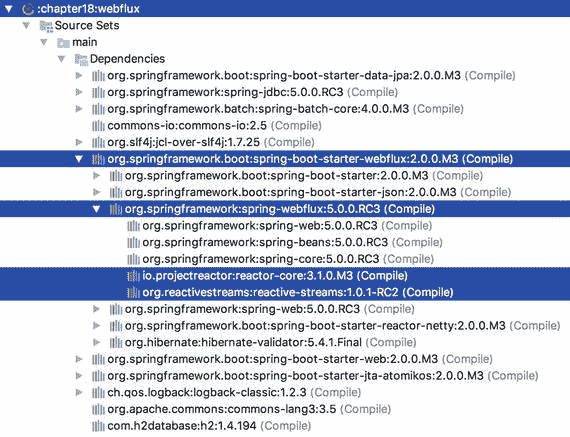
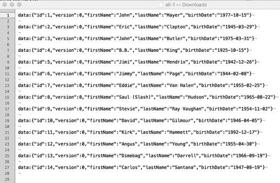
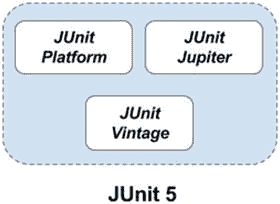

# 18.Spring 项目:批处理、集成、XD 等等

本章对 Spring portfolio 中的几个项目进行了高度概括，特别是 Spring Batch、Integration、XD 以及 Spring Framework 第 5 版中添加的几个显著特性。本章并不打算详细介绍每个项目，而是提供足够的信息和示例来帮助您开始。Spring portfolio 包含的项目比本章讨论的要多得多，但是我们觉得这里介绍的项目被广泛使用，而且有些是新的和即将到来的项目。您可以在 [`http://spring.io/projects`](http://spring.io/projects) 查看 Spring 项目的完整列表。本章涵盖以下主题:

*   Spring Batch:我们涵盖了 Spring 批处理框架的核心概念，包括它为开发人员提供了什么，我们还谈到了 Spring Batch 3.0 中新的 JSR-352 支持。
*   Spring Integration:许多企业应用程序中都使用集成模式，Spring Integration 为实现这些模式提供了一个健壮的框架。我们在批处理示例的基础上展示了如何将 Spring Integration 作为工作流的一部分来启动批处理作业。
*   Spring XD: Spring XD 将许多现有的 Spring 项目联系在一起，为大数据应用程序提供一个统一的、可扩展的系统。Spring XD 是一个分布式系统，专注于数据接收、实时分析、批处理和数据导出。我们展示了如何通过 shell 接口中的简单 DSL 利用 Spring XD 来实现批处理和集成示例中的应用程序。
*   Spring 5 中引入的显著特性:关于 Spring Framework 5 的新特性有很多讨论，但是随着正式发布日期的临近，这个列表变得固定了。除了将完整的代码库迁移到 Java 8 等底层特性之外， [<sup>1</sup>](#Fn1) 通过集成 Commons Logging bridge 模块(名为`spring-jcl`而不是标准的 Commons Logging [<sup>2</sup>](#Fn2) 并自动检测 Log4j 2.x、SLF4J 和 JUL，没有任何额外的桥)，添加候选组件索引作为类路径扫描的替代，等等，还有其他一些值得注意的改进。本章涵盖了其中的三种。
    *   功能性 Web 框架:`spring-webflux`是对`spring-mvc`的补充，建立在反应式基础上。由于 Reactive Streams API 是 Java 9 的官方组成部分，Spring Framework 5 流支持构建在 Project Reactor ( [`http://projectreactor.io/`](http://projectreactor.io/) )之上，它实现了 Reactive Streams API 规范。
    *   与 Java 9 的完全互操作性:Spring Framework RC3 版本于 2017 年 7 月推出，并宣布将针对最近的 JDK 9 版本候选进行全面测试。Java 9 引入了很多有趣的特性，包括:Jigsaw 项目/Java 模块化，一个新的支持 HTTP 2 协议和 WebSocket 握手的 HTTP 客户端，一个改进的流程 API，改进的特性语法，如`try-with-resources`，diamond 操作符和接口私有方法，一个用于反应式编程的发布-订阅框架，以及一组新的 API。官方的变化和特性列表可以在甲骨文网站上找到， [<sup>4</sup>](#Fn4) 但是基本上只有两个特性与 Spring 相关:JDK 的模块化功能和反应式框架。
    *   对 JUnit 5 Jupiter [<sup>5</sup>](#Fn5) 的全面支持:JUnit 5 的 Jupiter 编程和扩展模型在 Spring Framework 5 中得到全面支持，包括对 Spring TestContext 框架中并行测试执行的支持。

由于这些主题中的每一个都可能有自己的章节甚至书籍，涵盖每个项目及其各种产品的所有细节是不可能的。我们希望这些介绍和基本示例能够引起您的兴趣，从而进一步探索这些主题。

## 春季批次

Spring Batch 是一个批处理框架，是 Spring 项目组合的一部分。它是轻量级的、灵活的，旨在为开发人员提供以最少的努力创建健壮的批处理应用程序的能力。Spring Batch 附带了许多用于各种技术的现成组件，在大多数情况下，您甚至可以只使用提供的组件来构建您的批处理应用程序。

典型的批处理应用程序包括日常发票生成、薪资系统以及提取、转换、加载(ETL)流程。虽然这些是人们可能预先想到的典型示例，但是 Spring Batch 可以用于任何需要无人值守运行的流程，而不仅仅是这些场景。与所有其他 Spring 项目一样，Spring Batch 构建在核心 Spring 框架之上，您可以完全访问它的所有功能。

在较高层次上，批处理作业包含一个或多个步骤。每一步都可以提供执行单个工作单元的能力，这由一个小任务实现来表示，或者参与所谓的面向块的处理。对于面向块的处理，一个步骤利用一个`ItemReader`来读取某种形式的数据，一个可选的`ItemProcessor`来对该数据进行任何所需的转换，最后一个`ItemWriter`将数据写出来。步骤还具有各种配置属性，例如配置块大小(每个事务处理的数据量)、启用多线程执行、跳过限制等能力。可以在步骤级别和作业级别使用侦听器来接收批处理作业生命周期中发生的各种事件的通知，例如，在步骤开始之前、步骤结束时、在面向块的处理场景中等等。

虽然大多数作业可以以单线程、单进程的方式完美运行，但 Spring Batch 还提供了作业的伸缩和并行处理选项。目前，Spring Batch 提供了以下现成的可伸缩性选项:

*   多线程步骤:这是使一个步骤多线程化的最简单的方法。只需将您选择的一个`TaskExecutor`实例添加到步骤配置中，面向块的处理设置中的每个项目块都将在其自己的执行线程中进行处理。
*   并行步骤:比方说，在工作开始时，您需要读入两个包含不同数据的大文件。首先，您可以创建两个步骤，一个将在另一个之后执行。如果这两个数据文件加载互不依赖，为什么不同时处理它们呢？对于这种情况，Spring Batch 允许您定义一个包含流元素的 split，并封装这些要并行执行的任务。
*   远程分块:这个可伸缩性选项允许您迈出一步，将工作远程分配给许多远程工作人员，并通过某种持久的中间件(如 AMQP 或 JMS)进行通信。当数据读取不是进程中的瓶颈，而块数据的写入和可选处理是瓶颈时，通常使用远程分块。数据块通过中间件发送，供从节点拾取和处理，然后从节点将数据块的处理状态反馈给主节点。
*   分区:这种可伸缩性选项通常在您想要处理一个范围的数据时使用，为每个范围使用线程。一个典型的场景是一个数据库表，其中填充了具有数字标识符列的数据。通过分区，您可以用一定数量的记录将待处理的数据“分区”到单独的线程中。Spring Batch 为开发人员提供了使用这种分区方案的能力，因为它高度依赖于手边的用例。分区可以在本地线程中完成，也可以外包给远程工作人员(类似于远程分块选项)。

批处理的一个基本但常见的用例是读入某种类型的文件，通常是带分隔符格式(例如，逗号分隔)的平面文件，然后需要将该文件加载到数据库中，在写入数据库之前可以选择处理每个记录。让我们看看如何在 Spring Batch 中实现这个用例。首先，我们需要添加所需的依赖项，如以下梯度配置所示:

```java
//pro-spring-15/build.gradle
ext {
   //spring libs
   ...
   springBatchVersion =  '4.0.0.M3'
   ...

   spring =  [
      context       : "org.springframework:spring-context:$springVersion",
      jdbc            : "org.springframework:spring-jdbc:$springVersion",
      batchCore  : "org.springframework.batch:spring-batch-core:$springBatchVersion"
       ...
   ]

   misc = [
         io             : "commons-io:commons-io:2.5",
         ...
   ]

   db = [
        ...
        dbcp2   : "org.apache.commons:commons-dbcp2:$dbcpVersion",
        h2    : "com.h2database:h2:$h2Version",

        // needed  for  the Batch JSR-352 module
        hsqldb: "org.hsqldb:hsqldb:2.4.0"
   dbcp : "commons-dbcp:commons-dbcp:1.4",
   ]
}
...
//pro-spring-15/chapter18/build.gradle
dependencies {
      if (!project.name.contains("boot")) {
         compile(spring.jdbc) {
           // exclude these as batchCore will bring them
           // on as transitive dependencies
           exclude module: 'spring-core'
           exclude  module: 'spring-beans'
           exclude  module: 'spring-tx'
         }
         compile spring.batchCore, db.dbcp2, db.h2, misc.io,
               misc.slf4jJcl, misc.logback
      }
}

```

在前面的配置中，您可以看到我们需要添加到 Spring 批处理项目(不是 Spring Boot 项目)的核心依赖项。这就是为什么我们有了`f (!project.name.contains("boot"))`条件；它防止版本明确设置的库与本章中 Spring Boot 项目的依赖项混合。

有了依赖关系，让我们深入代码。首先，我们创建一个域对象，它基于我们将要读取的文件中的数据表示一个`Singer`，如下所示:

```java
package com.apress.prospring5.ch18;

public class Singer {
    private String firstName;
    private String lastName;
    private String song;

    ... // setters & getters

    @Override
    public String toString()  {
        return "firstName: " + firstName + ", lastName: "
          +  lastName +  ", song: " +  song;
    }
}

```

接下来，让我们创建一个`ItemProcessor`的实现，用于将由`Singer`对象表示的每个歌手的名字、姓氏和歌曲转换为大写，如下所示:

```java
package com.apress.prospring5.ch18;

import org.slf4j.Logger;
import org.slf4j.LoggerFactory;
import org.springframework.batch.item.ItemProcessor;

import org.springframework.stereotype.Component;

@Component("itemProcessor")
public class SingerItemProcessor implements
    ItemProcessor<Singer, Singer> {
    private static Logger logger =
        LoggerFactory.getLogger(SingerItemProcessor.class);

    @Override
    public Singer process(Singer singer) throws Exception {
        String firstName = singer.getFirstName().toUpperCase();
        String lastName = singer.getLastName().toUpperCase();
        String song = singer.getSong().toUpperCase();

        Singer transformedSinger = new Singer();
        transformedSinger.setFirstName(firstName);
        transformedSinger.setLastName(lastName);
        transformedSinger.setSong(song);

        logger.info("Transformed singer: " + singer + " Into: " +
             transformedSinger);

        return  transformedSinger;
    }

}

```

请注意，`ItemProcessors`在面向块的处理场景中不是必需的；只有`ItemReader`和`ItemWriter`是。我们在这里使用`ItemProcessor`作为一个例子，说明如何在写入之前转换数据。

接下来，我们将创建一个驻留在`Step`级别的`StepExecutionListener`实现，并告诉您该步骤完成后写入了多少记录，如下面的代码片段所示:

```java
package com.apress.prospring5.ch18;

import org.slf4j.Logger;
import org.slf4j.LoggerFactory;
import org.springframework.batch.core.ExitStatus;
import org.springframework.batch.core.StepExecution;
import org.springframework.batch.core.listener.StepExecutionListenerSupport;

import org.springframework.stereotype.Component;

@Component
public class StepExecutionStatsListener extends
    StepExecutionListenerSupport {

   public static Logger logger = LoggerFactory.
       getLogger(StepExecutionStatsListener.class);

   @Override
   public ExitStatus afterStep(StepExecution stepExecution) {
      logger.info("--> Wrote: " + stepExecution.getWriteCount()
            + " items in step: " + stepExecution.getStepName());
      return null;
   }

}

```

`StepExecutionListener`也允许我们根据需要修改返回的`ExitStatus`值；否则，只需返回`null`以保持不变。至此，我们已经组装好了核心组件，但是在开始配置和调用代码之前，让我们先来看看数据模型和数据本身。这项工作的数据模型很简单(`src/main/resources/support/singer.sql`)，这里显示了包含测试数据的`src/main/resources/support/test-data.sql`文件:

```java
-- singer.sql
DROP TABLE singer IF EXISTS;

CREATE TABLE singer  (
   singer_id BIGINT IDENTITY NOT NULL PRIMARY KEY,
   first_name VARCHAR(20),
   last_name VARCHAR(20),
   song VARCHAR(100)
);

-- test-data.sql
John,Mayer,Helpless
Eric,Clapton,Change The World
John,Butler,Ocean
BB,King,Chains And Things

```

现在，我们需要创建 Spring 批处理配置文件，定义作业，并设置嵌入式数据库和相关的作业组件。由于 XML 配置很麻烦，在本书的前一版本中已经讨论过，所以本章将只关注 Java 配置类。按照常识性编程规则的精神，您将通过为批处理配置和数据源配置分别创建一个单独的配置类来分离它们。下面是`DataSourceConfig`配置类:

```java
package com.apress.prospring5.ch18.config;

import org.slf4j.Logger;
import org.slf4j.LoggerFactory;
import org.springframework.context.annotation.Bean;
import org.springframework.context.annotation.Configuration;
import org.springframework.jdbc.datasource.embedded.EmbeddedDatabaseBuilder;
import org.springframework.jdbc.datasource.embedded.EmbeddedDatabaseType;

import javax.sql.DataSource;

@Configuration
public class DataSourceConfig {

   private static Logger logger = LoggerFactory.getLogger(DataSourceConfig.class);

   @Bean
   public DataSource dataSource() {
      try {
         EmbeddedDatabaseBuilder dbBuilder = new EmbeddedDatabaseBuilder();
         return dbBuilder.setType(EmbeddedDatabaseType.H2)
               .addScripts("classpath:/org/springframework/batch/core/schema-h2.sql",
                     "classpath:support/singer.sql" ).build();
      } catch (Exception e) {
          logger.error("Embedded DataSource bean cannot be created!", e);
          return null;
      }
   }

}

```

由于这种配置现在应该很熟悉了，我们将只解释`schema-h2.sql`文件。该文件是`spring-batch-core`库的一部分，包含创建 Spring 批处理实用程序表所需的 DML 语句。

`DataSourceConfig`类将被导入到`BatchConfig`类中，如下所示:

```java
package com.apress.prospring5.ch18.config;

import com.apress.prospring5.ch18.Singer;
import com.apress.prospring5.ch18.StepExecutionStatsListener;
import org.springframework.batch.core.Job;
import org.springframework.batch.core.Step;
import org.springframework.batch.core.configuration.annotation.EnableBatchProcessing;
import org.springframework.batch.core.configuration.annotation.JobBuilderFactory; 

import org.springframework.batch.core.configuration.annotation.StepBuilderFactory;
import org.springframework.batch.item.ItemProcessor;
import org.springframework.batch.item.ItemReader;
import org.springframework.batch.item.ItemWriter;
import org.springframework.batch.item.database.BeanPropertyItemSqlParameterSourceProvider;
import org.springframework.batch.item.database.JdbcBatchItemWriter;
import org.springframework.batch.item.file.FlatFileItemReader;
import org.springframework.batch.item.file.mapping.BeanWrapperFieldSetMapper;
import org.springframework.batch.item.file.mapping.DefaultLineMapper;
import org.springframework.batch.item.file.transform.DelimitedLineTokenizer;
import org.springframework.beans.factory.annotation.Autowired;
import org.springframework.beans.factory.annotation.Qualifier;
import org.springframework.context.annotation.Bean;
import org.springframework.context.annotation.ComponentScan;
import org.springframework.context.annotation.Configuration;
import org.springframework.context.annotation.Import;
import org.springframework.core.io.ResourceLoader;

import javax.sql.DataSource;

@Configuration
@EnableBatchProcessing
@Import(DataSourceConfig.class)
@ComponentScan("com.apress.prospring5.ch18")
public class BatchConfig {

   @Autowired
   private JobBuilderFactory jobs;

   @Autowired
   private StepBuilderFactory steps;

   @Autowired DataSource dataSource;

   @Autowired ResourceLoader resourceLoader;
   @Autowired StepExecutionStatsListener executionStatsListener;

   @Bean

   public Job job(@Qualifier("step1") Step step1) {
      return jobs.get("singerJob").start(step1).build();
   }

   @Bean
   protected Step step1(ItemReader<Singer> reader,
      ItemProcessor<Singer,Singer> itemProcessor,
      ItemWriter<Singer> writer) {
     return steps.get("step1").listener(executionStatsListener)
           .<Singer, Singer>chunk(10)
           .reader(reader)
           .processor(itemProcessor)
           .writer(writer)
           .build();
   }

   @Bean
   public ItemReader itemReader() {
      FlatFileItemReader itemReader = new FlatFileItemReader();
      itemReader.setResource(resourceLoader.getResource(
         "classpath:support/test-data.csv"));
      DefaultLineMapper lineMapper = new DefaultLineMapper();

      DelimitedLineTokenizer tokenizer = new DelimitedLineTokenizer();
      tokenizer.setNames("firstName","lastName","song");
      tokenizer.setDelimiter(",");
      lineMapper.setLineTokenizer(tokenizer);

      BeanWrapperFieldSetMapper<Singer> fieldSetMapper =
          new BeanWrapperFieldSetMapper<>();
      fieldSetMapper.setTargetType(Singer.class);
      lineMapper.setFieldSetMapper(fieldSetMapper);

      itemReader.setLineMapper(lineMapper);
      return itemReader;
   }

   @Bean
   public ItemWriter itemWriter() {
      JdbcBatchItemWriter<Singer> itemWriter = new JdbcBatchItemWriter<>();
      itemWriter.setItemSqlParameterSourceProvider(
          new BeanPropertyItemSqlParameterSourceProvider<>());
      itemWriter.setSql("INSERT INTO singer (first_name,  last_name, song)
         VALUES (:firstName, :lastName, :song)");
      itemWriter.setDataSource(dataSource);
      return itemWriter;
   }
}

```

虽然`BatchConfig`看起来很大，但它远没有 XML 配置那么大。现在是解释其中定义的每个 bean 的时候了。

*   @ `EnableBatchProcessing`注释的工作方式与所有的`@Enable*` Spring 注释类似。这为构建批处理作业提供了一个基本配置。通过使用此注释对配置类进行注释，会发生以下情况:
    *   创建了一个`org.springframework.batch.core.scope.StepScope`的实例。这个范围内的对象使用 Spring 容器作为对象工厂，所以每个执行步骤只有一个这样的 bean 实例。
    *   一组特定的批处理基础设施 beans 可用于自动连接:`jobRepository`(类型为`JobRepository`)、`jobLauncher`(类型为`jobLauncher`)、`jobBuilders`(类型为`JobBuilderFactory`、`stepBuilders`(类型为`StepBuilderFactory`)。这意味着它们不必被显式声明(像在 XML 中一样)。
*   `job` bean 是通过调用`JobBuilderFactory.get(...)`创建的名为`singerJob`的批处理作业。
*   通过调用`StepBuilderFactory.get(...)`创建`step1` bean，并为面向块的处理进行配置。Spring 容器将自动注入在上下文中找到的`ItemReader`、`ItemProcessor`和`ItemWriter`实例。但是，必须显式设置`StepExecutionStatsListener` bean。
*   在`ItemWriter`的声明中使用了`database` bean，因为这是将用于将`Singer`实例写入嵌入式数据库的 bean。

最后，我们需要一个驱动程序来启动作业，如下所示:

```java
package com.apress.prospring5.ch18;

import com.apress.prospring5.ch18.config.BatchConfig;
import org.springframework.batch.core.Job;
import org.springframework.batch.core.JobParameters;
import org.springframework.batch.core.JobParametersBuilder;
import org.springframework.batch.core.launch.JobLauncher;
import org.springframework.context.annotation.AnnotationConfigApplicationContext;
import org.springframework.context.support.GenericApplicationContext;

import java.util.Date;

public class SingerJobDemo {

   public static void main(String... args) throws Exception {
      GenericApplicationContext ctx =
            new AnnotationConfigApplicationContext(BatchConfig.class);

      Job job = ctx.getBean(Job.class);
      JobLauncher jobLauncher = ctx.getBean(JobLauncher.class);
      JobParameters jobParameters = new JobParametersBuilder()
            .addDate("date", new Date())
            .toJobParameters();
      jobLauncher.run(job,  jobParameters);

      System.in.read();
      ctx.close();
   }

}

```

您应该对这段代码很熟悉，因为大部分时间我们都在创建上下文，获取一些 beans，并对它们调用方法。您可能会注意到的一件事是`JobParameters`对象。该对象封装了用于区分作业实例的参数。作业标识在确定作业的最后状态(如果有)时非常重要，这也影响到其他方面，例如重新启动作业的能力。在这个例子中，我们简单地使用当前日期作为`Job`参数。`JobParameters`对象可以有多种类型，这些参数可以作为参考数据在作业中访问。至此，我们已经准备好测试新工作了。编译代码并运行`SinxgerJobDemo`类。您将在屏幕上看到一些日志语句，感兴趣的如下:

```java
o.s.b.c.l.s.SimpleJobLauncher - Job: [SimpleJob: [name=singerJob]] launched with the
   following parameters: [{date=1501418591075}]
o.s.b.c.j.SimpleStepHandler - Executing step: [step1]
c.a.p.c.SingerItemProcessor - Transformed singer: firstName: John, lastName: Mayer,
  song: Helpless Into: firstName: JOHN, lastName: MAYER, song: HELPLESS
c.a.p.c.SingerItemProcessor - Transformed singer: firstName: Eric, lastName: Clapton,
  song: Change The  World Into: firstName: ERIC, lastName: CLAPTON, song: CHANGE THE WORLD
c.a.p.c.SingerItemProcessor - Transformed singer: firstName: John, lastName: Butler,
  song: Ocean Into: firstName: JOHN, lastName: BUTLER, song: OCEAN
c.a.p.c.SingerItemProcessor - Transformed singer: firstName: BB, lastName: King,
  song: Chains And Things Into: firstName: BB, lastName: KING, song: CHAINS AND THINGS
c.a.p.c.StepExecutionStatsListener - --> Wrote: 4 items in step: step1 o.s.b.c.l.s.SimpleJobLauncher - Job: [SimpleJob: [name=singerJob]] completed with the
  following parameters: [{date=1501418591075}] and the following status: [COMPLETED]

```

仅此而已。您现在已经构建了一个简单的批处理作业，它从 CSV 文件中读取数据，通过`ItemProcessor`转换数据，将歌手的名字、姓氏和歌曲改为大写，然后将结果写入数据库。您还使用了`StepListener`来输出该步骤中写入的项目数。更多关于 Spring Batch 的信息，请查看其项目页面 [`http://projects.spring.io/spring-batch/`](http://projects.spring.io/spring-batch/) 。

## JSR-352

JSR-352(Java 平台的批处理应用程序)深受 Spring Batch 的影响。如果您选择在工作中使用 JSR-352，您会注意到两者之间越来越多的相似之处，如果您已经是 Spring Batch 用户，应该会感到很舒服。在很大程度上，Spring Batch 和 JSR-352 具有相似的结构，并且 Spring Batch 从 Spring Batch 3.0 开始完全支持这种 JSR。像 Spring Batch 一样，JSR-352 作业是通过一个 XML 模式配置的，这种模式被称为作业规范语言(JSL)。因为 JSR-352 定义了一个规范和一个 API，所以没有提供现成的基础设施组件，而您可能已经习惯了使用 Spring Batch。如果你严格遵守 JSR-352 API，这意味着实现 JSR-352 接口并自己编写所有的基础设施组件，如`ItemReader`和`ItemWriter`。

在本例中，我们将转换之前的批处理示例，以利用 JSR-352 JSL，但我们将利用相同的`ItemReader`、`ItemProcessor`和`ItemWriter`，并利用 Spring 进行依赖注入等，而不是使用我们自己的基础设施组件。实现这项工作 100%符合 JSR-352 规格将留给你作为一个练习。

在这个示例中，如前所述，我们将重用 pure Spring 批处理示例中的大部分代码，我们将在这里解释一些小的更改。如果您还没有，这将是一个很好的机会让 Spring Batch 示例开始工作，然后继续应用本节中的更改。

对于本例，H2 数据库将被替换为 HSQLDB，DBCP 2 将被替换为 DBCP，因为不支持更新的版本。还有，JSR 要求在`src/main/resources/META-INF/batch-jobs/`下声明`singerJob.xml`配置文件，当启动一个作业时，所需要的只是没有`.xml`扩展名的文件名。所以没错，JSR-352 是无法回避的。必须使用 XML。此示例的 XML 配置文件如下所示:

```java
<?xml version="1.0"  encoding="UTF-8"?>

<beans 
        xmlns:xsi="http://www.w3.org/2001/XMLSchema-instance"
        xmlns:jdbc="http://www.springframework.org/schema/jdbc"
        xsi:schemaLocation="
        http://www.springframework.org/schema/jdbc
         http://www.springframework.org/schema/jdbc/spring-jdbc.xsd
         http://www.springframework.org/schema/beans
         http://www.springframework.org/schema/beans/spring-beans.xsd
        http://xmlns.jcp.org/xml/ns/javaee
        http://xmlns.jcp.org/xml/ns/javaee/jobXML_1_0.xsd">

    <job id="singerJob"  version="1.0">
       <step id="step1">
           <listeners>
               <listener ref="stepExecutionStatsListener"/>
           </listeners>
           <chunk item-count="10">
               <reader ref="itemReader"/>
               <processor ref="itemProcessor"/>
               <writer ref="itemWriter"/>
           </chunk>
           <fail on="FAILED"/>
           <end on="*"/>
       </step>
    </job>

    <jdbc:embedded-database id="dataSource" type="HSQL">
        <jdbc:script location="classpath:support/singer.sql"/>
    </jdbc:embedded-database>

    <!-- no transaction manager needed -->
    <bean id="stepExecutionStatsListener" ../>
    <bean id="itemReader" ../>
    <bean id="itemProcessor" ../>
    <bean id="itemWriter" ../>
</beans>

```

在使用 Spring Batch 时，前面没有显示的 beans 具有相同的定义。您可以在本书的附录中找到完整的 XML 定义。现在，因为我们必须这样做，下面是如何用 Spring Batch XML 配置前面的作业:

```java
<?xml version="1.0" encoding="UTF-8"?>

<beans 
        xmlns:xsi="http://www.w3.org/2001/XMLSchema-instance"
        xmlns:batch="http://www.springframework.org/schema/batch"
        xmlns:jdbc="http://www.springframework.org/schema/jdbc"
        xmlns:p="http://www.springframework.org/schema/p"
        xsi:schemaLocation="
        http://www.springframework.org/schema/batch
        http://www.springframework.org/schema/batch/spring-batch.xsd
        http://www.springframework.org/schema/jdbc
        http://www.springframework.org/schema/jdbc/spring-jdbc.xsd
        http://www.springframework.org/schema/beans
        http://www.springframework.org/schema/beans/spring-beans.xsd">

    <batch:job id="singerJob">
        <batch:step id="step1">
            <batch:tasklet>
                <batch:chunk reader="itemReader"
                processor="itemProcessor"
                writer="itemWriter"
                             commit-interval="10"/>
                <batch:listeners>
                    <batch:listener ref="stepExecutionStatsListener"/>
                </batch:listeners>
           </batch:tasklet>
           <batch:fail on="FAILED"/>
           <batch:end on="*"/>
        </batch:step>
    </batch:job>

    <jdbc:embedded-database id="dataSource"  type="H2">
    <jdbc:script location="classpath:/org/springframework/batch/core/schema-h2.sql"/>
        <jdbc:script location="classpath:support/singer.sql"/>
    </jdbc:embedded-database>

    <batch:job-repository id="jobRepository"/>

    <bean id="jobLauncher"
       class="org.springframework.batch.core.launch.support.SimpleJobLauncher"
                p:jobRepository-ref="jobRepository"/>

    <bean id="transactionManager"
      class="org.springframework.jdbc.datasource.DataSourceTransactionManager"
                p:dataSource-ref="dataSource"/>
    <bean id="stepExecutionStatsListener" ../>
    <bean id="itemReader" ../>
    <bean id="itemProcessor" ../>
    <bean id="itemWriter" ../>
</beans>

```

因此，这两种配置看起来非常相似，除了作业定义使用 JSR-352 JSL，我们能够删除一些 bean(`transactionManager`、`jobRepository`和`jobLauncher`)，因为它们已经以某种方式提供给我们了。您还会注意到使用`jobXML_1.0.xsd`的一个额外的模式定义。对这种模式的支持是通过 JSR-352 API JAR 获得的，当使用 Gradle 这样的构建工具时，这种支持会作为一种可传递的依赖关系自动关闭。如果我们需要手动获取依赖项，请参见本节末尾列出的项目页面。我们需要修改的第二部分是`SingerJobDemo`类，因为我们现在使用特定于 JSR 352 的代码来调用作业，如下所示:

```java
package com.apress.prospring5.ch18;

import org.springframework.batch.core.Job;
import org.springframework.batch.core.JobParameters;
import org.springframework.batch.core.JobParametersBuilder;
import org.springframework.batch.core.launch.JobLauncher;
import org.springframework.context.ApplicationContext;
import org.springframework.context.support.ClassPathXmlApplicationContext;

import java.util.Date; 

public class SingerJobDemo {
    public static void main(String... args) throws Exception {
        ApplicationContext applicationContext
                = new ClassPathXmlApplicationContext("/spring/singerJob.xml");

        Job job = applicationContext.getBean(Job.class);
        JobLauncher jobLauncher = applicationContext.getBean(JobLauncher.class);

        JobParameters jobParameters = new JobParametersBuilder()
                .addDate("date", new Date())
                .toJobParameters();

        jobLauncher.run(job,  jobParameters);
    }
}

```

这与其他例子有些不同，在其他例子中，我们直接使用`ApplicationContext`和 beans。当创建 JSR-352 作业时，我们使用`JsrJobOperator`来启动和控制作业。不是用一个`JobParameters`对象为作业提供参数，而是用一个`Properties`对象。使用的`Properties`对象是一个标准的`java.util.Properties`类，应该使用`String`键和值来创建作业参数。您可能注意到的另一个有趣的变化是`waitForJob()`方法。默认情况下，JSR-352 异步启动所有作业。因此，在独立程序中，如图所示，在程序终止之前，我们需要等待作业处于可接受的状态。如果您的代码运行在一个容器中，比如某种应用服务器，那么可能不需要这些代码。现在让我们编译并运行`SingerJobDemo`类，它将产生以下相关的日志语句:

```java
o.s.b.c.r.s.JobRepositoryFactoryBean - No database type set,
  using meta data indicating: HSQL
o.s.b.c.j.c.x.JsrXmlApplicationContext - Refreshing org.springframework.batch.core.jsr.
  configuration.xml.JsrXmlApplicationContext@48c76607
o.s.b.c.j.SimpleStepHandler - Executing step: [step1]
c.a.p.c.SingerItemProcessor - Transformed singer: firstName: John, lastName: Mayer,
  song: Helpless Into: firstName: JOHN,  lastName: MAYER, song: HELPLESS
c.a.p.c.SingerItemProcessor - Transformed singer: firstName: Eric, lastName: Clapton,
  song: Change The World Into: firstName: ERIC, lastName: CLAPTON, song: CHANGE THE WORLD
c.a.p.c.SingerItemProcessor - Transformed singer: firstName: John, lastName: Butler,
  song: Ocean  Into: firstName: JOHN, lastName: BUTLER, song: OCEAN
c.a.p.c.SingerItemProcessor - Transformed singer: firstName: BB, lastName: King,
  song:  Chains And  Things Into:  firstName: BB,  lastName: KING, song: CHAINS AND THINGS
c.a.p.c.StepExecutionStatsListener - -->  Wrote: 4  items in  step: step1
o.s.b.c.j.c.x.JsrXmlApplicationContext - Closing ... JsrXmlApplicationContext

```

日志输出看起来非常相似，现在您已经利用 JSR-352 来定义和运行这个作业，同时使用 Spring 的依赖注入功能和 Spring Batch 的基础设施组件，而不是编写自己的组件。

有关 JSR-352 的更多信息，请参见其位于 [`https://jcp.org/en/jsr/detail?id=352`](https://jcp.org/en/jsr/detail?id=352) 的项目页面。

## Spring Boot 批次

不出所料，Spring Boo t 来了，它为 Spring Batch 提供了一个特殊的启动库，进一步简化了配置。令人兴奋的是，在类路径中有了 Spring Batch 的 Spring Boot 启动库，您就不需要为依赖关系而烦恼了。不好的地方是，说到配置，嗯，春批细节不能减那么多。

然而，让我们尝试修改我们一直运行到现在的批处理示例，用一个`JobExecutionStatsListener`类替换`StepExecutionStatsListener`;这个类将扩展`JobExecutionListenerSupport`类，它是`JobExecutionListener`接口的一个空抽象实现，用于在作业生命周期的特定点提供回调。在这种情况下，`JobExecutionStatsListener`类将查询数据库，检查我们的歌手条目是否确实保存在那里。

这里描述了类`JobExecutionStatsListener`:

```java
package com.apress.prospring5.ch18;

import org.slf4j.Logger;
import org.slf4j.LoggerFactory;
import org.springframework.batch.core.BatchStatus;
import org.springframework.batch.core.ExitStatus;
import org.springframework.batch.core.JobExecution;
import org.springframework.batch.core.StepExecution;
import org.springframework.batch.core.listener.JobExecutionListenerSupport;
import org.springframework.batch.core.listener.StepExecutionListenerSupport;
import org.springframework.beans.factory.annotation.Autowired;
import org.springframework.jdbc.core.JdbcTemplate;
import org.springframework.jdbc.core.RowMapper;
import org.springframework.stereotype.Component;

import java.sql.ResultSet;
import java.sql.SQLException;
import java.util.List;

@Component
public class JobExecutionStatsListener extends JobExecutionListenerSupport {

   public static Logger logger = LoggerFactory.
       getLogger(JobExecutionStatsListener.class);

   private final JdbcTemplate jdbcTemplate;

   @Autowired
   public JobExecutionStatsListener(JdbcTemplate jdbcTemplate) {
      this.jdbcTemplate =  jdbcTemplate;
   }
   @Override

   public void afterJob(JobExecution jobExecution) {
      if(jobExecution.getStatus() == BatchStatus.COMPLETED)  {
         logger.info(" --> Singers were saved to the database. Printing results ...");
         jdbcTemplate.query("SELECT first_name,  last_name, song  FROM  SINGER",
               (rs, row) -> new Singer(rs.getString(1),
                     rs.getString(2), rs.getString(3))).forEach(
               singer -> logger.info(singer.toString())
         );
      }
   }
}

```

正如我们所看到的，lambda 表达式在前面的例子中被大量使用只是为了好玩，但是在`afterJob`回调方法的主体中发生了什么是很明显的。

同样，让我们看看你能用`BatchConfig`类做些什么。

```java
package com.apress.prospring5.ch18;

import org.springframework.batch.core.Job;
import org.springframework.batch.core.Step;
import org.springframework.batch.core.configuration.annotation.EnableBatchProcessing;
import org.springframework.batch.core.configuration.annotation.JobBuilderFactory;
import org.springframework.batch.core.configuration.annotation.StepBuilderFactory;
import org.springframework.batch.item.ItemProcessor;
import org.springframework.batch.item.ItemReader;
import org.springframework.batch.item.ItemWriter;
import org.springframework.batch.item.database.
     BeanPropertyItemSqlParameterSourceProvider;
import org.springframework.batch.item.database.JdbcBatchItemWriter;
import org.springframework.batch.item.file.FlatFileItemReader;
import org.springframework.batch.item.file.mapping.BeanWrapperFieldSetMapper;
import org.springframework.batch.item.file.mapping.DefaultLineMapper;
import org.springframework.batch.item.file.transform.DelimitedLineTokenizer;
import org.springframework.beans.factory.annotation.Autowired;
import org.springframework.beans.factory.annotation.Qualifier;
import org.springframework.context.annotation.Bean;
import org.springframework.context.annotation.ComponentScan;
import org.springframework.context.annotation.Configuration;
import org.springframework.core.io.ClassPathResource;
import org.springframework.core.io.ResourceLoader;

import javax.sql.DataSource;

@Configuration
@EnableBatchProcessing
public class BatchConfig {

   @Autowired
   private JobBuilderFactory jobs;
   @Autowired
   private StepBuilderFactory steps;

   @Autowired DataSource dataSource;

   @Autowired SingerItemProcessor itemProcessor;

   @Bean
   public Job job(JobExecutionStatsListener listener) {
      return jobs.get("singerJob")
            .listener(listener)
            .flow(step1())
            .end()
            .build();
   }

   @Bean
   protected Step step1() {
      return steps.get("step1")
            .<Singer,  Singer>chunk(10)
            .reader(itemReader())
            .processor(itemProcessor)
            .writer(itemWriter())
            .build();
   }

   //adding lambda expressions
   @Bean
   public ItemReader itemReader() {
      FlatFileItemReader<Singer> itemReader = new FlatFileItemReader<>();
      itemReader.setResource(new ClassPathResource("support/test-data.csv"));
      itemReader.setLineMapper(new DefaultLineMapper<Singer>() {{

         setLineTokenizer(new DelimitedLineTokenizer() {{
            setNames(new String { "firstName", "lastName", "song" });
         }});
         setFieldSetMapper(new BeanWrapperFieldSetMapper<Singer>() {{
            setTargetType(Singer.class);
         }});
      }});
      return itemReader;
   }

   @Bean
   public ItemWriter itemWriter() {
   ... //same as before
   }
}

```

因此，除了在`itemReader` bean 的声明中大量使用 lambda 表达式之外，变化最大的 bean 是`job` bean。执行步骤不再由 Spring 容器基于限定符自动连接，调用`flow`方法来创建一个新的作业构建器，该构建器将执行一个步骤或一系列步骤。

Spring Boot 的情况差不多就是这样；剩下的就是通过执行典型的`Application`类来启动应用程序。

```java
package com.apress.prospring5.ch18;

import org.slf4j.Logger;
import org.slf4j.LoggerFactory;
import org.springframework.boot.SpringApplication;
import org.springframework.boot.autoconfigure.SpringBootApplication;
import org.springframework.context.ConfigurableApplicationContext;

@SpringBootApplication
public class Application {

   private static Logger logger = LoggerFactory
       .getLogger(Application.class);

   public static void main(String... args) throws Exception {
      ConfigurableApplicationContext ctx =
          SpringApplication.run(Application.class, args);
      assert (ctx != null);
      logger.info("Application started...");

      System.in.read();
      ctx.close();
   }
}

```

最后，您可以检查由`JobExecutionStatsListener`类打印的预期结果的日志，如下所示:

```java
o.s.b.c.l.s.SimpleJobLauncher - Job: [FlowJob: [name=singerJob]] launched with
   the following parameters: [{}]
o.s.b.c.j.SimpleStepHandler - Executing step: [step1]
c.a.p.c.SingerItemProcessor - Transformed singer: firstName: John, lastName: Mayer,
  song: Helpless Into:  firstName: JOHN,  lastName: MAYER, song: HELPLESS
c.a.p.c.SingerItemProcessor - Transformed singer: firstName: Eric, lastName: Clapton,
  song: Change The  World Into: firstName: ERIC, lastName: CLAPTON, song: CHANGE THE WORLD
c.a.p.c.SingerItemProcessor - Transformed singer: firstName: John, lastName: Butler,
  song: Ocean Into: firstName: JOHN, lastName: BUTLER, song: OCEAN
c.a.p.c.SingerItemProcessor - Transformed singer: firstName: BB, lastName: King,
  song: Chains And Things Into: firstName: BB, lastName: KING, song: CHAINS AND THINGS
 c.a.p.c.JobExecutionStatsListener -  --> Singers were saved to the database. Printing results ...
c.a.p.c.JobExecutionStatsListener - firstName: JOHN, lastName: MAYER, song: HELPLESS
c.a.p.c.JobExecutionStatsListener - firstName: ERIC, lastName: CLAPTON, song: CHANGE THE WORLD
c.a.p.c.JobExecutionStatsListener - firstName: JOHN, lastName: BUTLER, song: OCEAN
c.a.p.c.JobExecutionStatsListener - firstName: BB, lastName: KING, song: CHAINS AND THINGS
o.s.b.c.l.s.SimpleJobLauncher - Job: [FlowJob: [name=singerJob]] completed with the
  following  parameters: [{}] and  the following status:  [COMPLETED] 

```

## 弹簧集成

Spring Integration 项目提供了众所周知的企业集成模式(EIP)的现成实现。Spring 集成侧重于消息驱动的架构。它为集成解决方案、异步能力和松散耦合的组件提供了一个简单的模型，并且它是为可扩展性和可测试性而设计的。

在其核心，一个`Message`包装器在框架中起着核心作用。这个 Java 对象的通用包装器与框架使用的元数据(更具体地说是有效负载和头)结合在一起，用于确定如何处理该对象。

通道是管道和过滤器架构中的管道，生产者向该通道发送消息，消费者从该通道接收消息。`Message`另一方面，端点代表管道和过滤器架构的过滤器，它们将应用程序代码连接到消息传递框架。Spring Integration 提供的一些现成的`Message`端点是`Transformer`、`Filter`、`Router`和`Splitter`，它们各自提供自己的角色和职责。

Spring Integration 还提供了大量的集成端点(在撰写本文时有 20 多个)，这些端点可以在文档部分的 [`http://docs.spring.io/spring-integration/reference/htmlsingle/#endpoint-summary`](http://docs.spring.io/spring-integration/reference/htmlsingle/%23endpoint-summary) 的“端点快速参考表”中找到。这些端点提供了连接各种资源的能力，例如 AMQP、文件、HTTP、JMX、Syslog 和 Twitter。除了 Spring Integration 提供的现成功能，另一个名为 Spring Integration Extensions 的项目是一个基于社区的贡献模型，位于 [`https://github.com/spring-projects/spring-batch-extensions`](https://github.com/spring-projects/spring-batch-extensions) ，包含更多的集成可能性，包括亚马逊网络服务(AWS)、阿帕奇卡夫卡(Apache Kafka)、短消息点对点(SMPP)和伏地魔。在开箱即用和扩展项目组件之间，Spring Integration 提供了大量现成的组件，这意味着必须自己编写组件的可能性大大降低。

在这个例子中，我们将建立在前面的批处理例子的基础上，但是这一次我们将引入 Spring Integration 来展示我们如何使用它在给定的时间间隔内监视一个目录。当文件到达时，我们检测该文件并开始批处理作业进行处理。

在这个例子中，我们将再次建立在我们从本章开始的最初的“纯”Spring 批处理项目之上。请确保在继续之前查看并运行该程序，因为我们在这里将只解释新的类和配置修改。

显然，一些新的依赖项必须添加到项目中。

```java
//pro-spring-15/build.gradle
ext {
   //spring libs
   ...
   springBatchVersion = '4.0.0.M3'
   springIntegrationVersion = '5.0.0.M6'
   springBatchIntegrationVersion = '4.0.0.M3'
   ...

   spring = [
      context       : "org.springframework:spring-context:$springVersion",
      jdbc            : "org.springframework:spring-jdbc:$springVersion",
      batchCore  : "org.springframework.batch:spring-batch-core:$springBatchVersion"
      batchIntegration  :
"org.springframework.batch:spring-batch-integration:$springBatchIntegrationVersion",
      integrationFile :
"org.springframework.integration:spring-integration-file:$springIntegrationVersion"
       ...
   ]

   misc = [
         io             : "commons-io:commons-io:2.5",
         ...
   ]

   db  =  [
          ...
          dbcp2  : "org.apache.commons:commons-dbcp2:$dbcpVersion",
          h2   : "com.h2database:h2:$h2Version",

          // needed for the Batch JSR-352 module
          hsqldb: "org.hsqldb:hsqldb:2.4.0"
   dbcp   : "commons-dbcp:commons-dbcp:1.4",
   ]
}
... 

//pro-spring-15/chapter18/build.gradle
dependencies {
      if (!project.name.contains("boot")) {
         compile(spring.jdbc) {
            // exclude these as batchCore will bring them
            // on as transitive dependencies
            exclude module: 'spring-core'
            exclude module: 'spring-beans'
            exclude module: 'spring-tx'
         }
         compile spring.batchCore, db.dbcp2, db.h2, misc.io,
              spring.batchIntegration, spring.integrationFile,
               misc.slf4jJcl,  misc.logback
      }
   }

```

有了新的依赖项，让我们创建一个充当 Spring Integration transformer 的类。这个 Transformer 实例将从表示找到的文件的入站通道接收一个`Message`实例，并使用它启动批处理作业，如下面的代码片段所示:

```java
package com.apress.prospring5.ch18;

import org.springframework.batch.core.Job;
import org.springframework.batch.core.JobParametersBuilder;
import org.springframework.batch.integration.launch.JobLaunchRequest;
import  org.springframework.messaging.Message;

import java.io.File;

public class MessageToJobLauncher {
    private Job job;
    private String fileNameKey;

    public MessageToJobLauncher(Job job, String fileNameKey) {
        this.job = job;
        this.fileNameKey = fileNameKey;
    }

    public JobLaunchRequest toRequest(Message<File> message) {
        JobParametersBuilder jobParametersBuilder  =  new JobParametersBuilder();
        jobParametersBuilder.addString(fileNameKey,  message.getPayload().
          getAbsolutePath());

        return new JobLaunchRequest(job, jobParametersBuilder.
           toJobParameters());
    }
}

```

现在，让我们修改`BatchConfig`类来支持批量集成。真正需要的是修改`itemReader` bean，在每次需要处理新文件时创建。这意味着路径位置必须注入到 bean 中，也意味着 bean 不能再有 singleton 作用域。

```java
package com.apress.prospring5.ch18.config;
...
@Configuration
@EnableBatchProcessing
@Import(DataSourceConfig.class)
@ComponentScan("com.apress.prospring5.ch18")
public class BatchConfig {
   ... // autowired  beans

   @Bean
   public Job singerJob() {
      return jobs.get("singerJob").start(step1()).build();
   }

   @Bean
   protected Step step1() {
      ...// no change
   }

   @Bean
   @StepScope

public FlatFileItemReader itemReader(
    @Value("file://#{jobParameters['file.name']}") String filePath) {
   FlatFileItemReader itemReader = new FlatFileItemReader();
   itemReader.setResource(resourceLoader.getResource(filePath));
   DefaultLineMapper lineMapper = new DefaultLineMapper();
   DelimitedLineTokenizer tokenizer = new DelimitedLineTokenizer();
   tokenizer.setNames("firstName", "lastName", "song");
   tokenizer.setDelimiter(",");
   lineMapper.setLineTokenizer(tokenizer);
   BeanWrapperFieldSetMapper<Singer> fieldSetMapper =
      new BeanWrapperFieldSetMapper<>();
      fieldSetMapper.setTargetType(Singer.class);
      lineMapper.setFieldSetMapper(fieldSetMapper);
      itemReader.setLineMapper(lineMapper);
      return itemReader;
   }

   @Bean
   public ItemWriter<Singer> itemWriter() {
      ...//no change
   }
}

```

`@StepScope`是一个方便的注释，它相当于`@Scope(value="step", proxyMode=TARGET_CLASS)`，从而使`itemReader` bean 具有范围`proxy`，并将这个范围命名为`step`，这样就可以清楚地看到这个 bean 是如何被使用的。

现在我们已经有了批处理配置，让我们添加集成典型配置。我们将使用 XML 配置文件来实现这一点，因为在编写本文时，这样做实际上更实用:

```java
<?xml version="1.0" encoding="UTF-8"?>

<beans 
       xmlns:xsi="http://www.w3.org/2001/XMLSchema-instance"
       xmlns:batch-int="http://www.springframework.org/schema/batch-integration"
       xmlns:int="http://www.springframework.org/schema/integration"
       xmlns:int-file="http://www.springframework.org/schema/integration/file"
       xmlns:context="http://www.springframework.org/schema/context"
       xsi:schemaLocation="http://www.springframework.org/schema/batch-integration

http://www.springframework.org/schema/batch-integration/spring-batch-integration.xsd
        http://www.springframework.org/schema/beans
        http://www.springframework.org/schema/beans/spring-beans.xsd
        http://www.springframework.org/schema/integration
        http://www.springframework.org/schema/integration/spring-integration.xsd
        http://www.springframework.org/schema/integration/file
http://www.springframework.org/schema/integration/file/spring-integration-file.xsd
        http://www.springframework.org/schema/context
        http://www.springframework.org/schema/context/spring-context.xsd">

    <bean name="/BatchConfig" class="com.apress.prospring5.ch18.config.BatchConfig"/>

    <context:annotation-config/>

    <int:channel id="inbound"/>
    <int:channel  id="outbound"/>
    <int:channel  id="loggingChannel"/>

    <int-file:inbound-channel-adapter id="inboundFileChannelAdapter"  channel="inbound"
              directory="file:/tmp/"  filename-pattern="*.csv">
        <int:poller fixed-rate="1000"/>
    </int-file:inbound-channel-adapter>

    <int:transformer input-channel="inbound"
                     output-channel="outbound">
        <bean class="com.apress.prospring5.ch18.MessageToJobLauncher">
            <constructor-arg ref="singerJob"/>
            <constructor-arg value="file.name"/>
        </bean>
    </int:transformer>

    <batch-int:job-launching-gateway request-channel="outbound"
         reply-channel="loggingChannel"/>

    <int:logging-channel-adapter channel="loggingChannel"/>
</beans>

```

对配置的主要添加是以`int:`和`batch-int:`名称空间为前缀的部分。首先，我们创建几个命名通道来传递数据。然后，我们配置一个`inbound-channel-adapter`,专门用于以一秒的给定间隔监视指定的目录。然后我们配置`Transformer` bean，它接收包装在`Message`中的标准`java.io.File`对象形式的文件。接下来我们配置`job-launching-gateway`，它接收来自`Transformer`的`job-launch`请求，以实际调用批处理作业。最后但同样重要的是，我们创建了`logging-channel-adapter`，它将在作业完成后打印出信息通知。正如您通过遵循配置的`Channel`属性所看到的，每个组件或者通过`Channel`实例消费消息或者产生消息，或者两者都有。现在让我们创建一个加载配置文件的简单驱动程序类。这个驱动程序类所做的就是用配置加载应用程序上下文并保持运行，直到您终止该进程，因为它会持续轮询指定的目录。

```java
package com.apress.prospring5.ch18;

import org.slf4j.Logger;
import org.slf4j.LoggerFactory;
import org.springframework.context.support.GenericXmlApplicationContext;

public class FileWatcherDemo {

   private static Logger logger =
      LoggerFactory.getLogger(FileWatcherDemo.class);

   public static void main(String... args) throws Exception {
      GenericXmlApplicationContext ctx
            = new GenericXmlApplicationContext(
                        "classpath:spring/integration-config.xml");
      assert (ctx != null);
      logger.info("Application started...");
      System.in.read();
      ctx.close();
   }
}

```

现在编译代码并运行`FileWatcherDemo`类。当应用程序启动时，您可能会注意到一些日志消息被打印到屏幕上，但最终不会发生其他事情。这是因为 Spring Integration file adapter 在一个轮询间隔内等待文件被放置到配置好的位置，在它检测到该位置的文件之前，什么都不会发生。在`src/main/resources/support/`目录下，你会发现四个 CSV 文件，分别命名为`singer1.csv`到`singer4.csv`。每一行都包含一个歌手的名和姓，以及该歌手的一个歌名。将这些文件一个一个地复制到`tmp`目录中，并观察控制台看看会发生什么。

```java
o.s.i.f.FileReadingMessageSource - Created  message: [GenericMessage [
     payload=/tmp/singers1.csv, headers={file_originalFile=/tmp/singers1.csv,
    id=ca0ec15e-b9b6-5dc2-2fc6-44fdb4b433f4, file_name=singers1.csv,
    file_relativePath=singers1.csv, timestamp=1501442201624}]]
o.s.b.c.l.s.SimpleJobLauncher - Job: [SimpleJob: [name=singerJob]] launched with
    the following parameters: [{file.name=/tmp/singers1.csv}]
o.s.b.c.j.SimpleStepHandler - Executing step: [step1]
c.a.p.c.SingerItemProcessor - Transformed singer: firstName: John, lastName: Mayer,
    song: Helpless Into: firstName: JOHN, lastName: MAYER, song: HELPLESS
INFO  c.a.p.c.StepExecutionStatsListener - -->  Wrote: 1 items in step: step1
 o.s.b.c.l.s.SimpleJobLauncher - Job: [SimpleJob:  [name=singerJob]] completed with
    the following parameters: [{file.name=/tmp/singers1.csv}] and the following
    status: [COMPLETED]
o.s.i.h.LoggingHandler - JobExecution: id=1, version=2,
     startTime=Sun Jul 30 22:16:41 EEST 2017, endTime=Sun Jul 30 22:16:41 EEST 2017,
     lastUpdated=Sun Jul 30 22:16:41 EEST 2017, status=COMPLETED,
     exitStatus=exitCode=COMPLETED;exitDescription=, job=[JobInstance: id=1,
     version=0, Job=[singerJob]], jobParameters=[{file.name=/tmp/singers1.csv}]

```

从日志语句中可以看到，Spring Integration 检测到了这个文件，从它创建了一个`Message`，调用了转换 CSV 文件内容的批处理作业，然后将内容写入内存数据库。虽然这是一个简单的例子，但它展示了如何通过使用 Spring Integration 在各种类型的应用程序之间构建复杂且解耦的工作流。

关于 Spring Integration 的更多信息，请参见其位于 [`http://projects.spring.io/spring-integration/`](http://projects.spring.io/spring-integration/) 的项目页面。

## 春季 XD

Spring XD 是一个可扩展的运行时服务，设计用于分布式数据接收、实时分析、批处理和数据导出。Spring XD 建立在许多现有的 Spring portfolio 项目之上，最著名的是 Spring Framework、Batch 和 Integration。Spring XD 的目标是提供一种统一的方式，将许多系统集成到一个有凝聚力的大数据解决方案中，帮助解决许多常见用例的复杂性。

Spring XD 可以以单一独立模式运行，通常用于开发和测试目的，也可以以完全分布式模式运行，从而提供拥有高可用性主节点和任意数量工作节点的能力。Spring XD 使您能够通过 shell 界面(利用 Spring shell)以及图形 web 界面来管理这些服务。这些接口允许您定义如何组装各种组件来完成您的数据处理需求，方法是通过 shell 应用程序使用 DSL 类型的语法，或者将数据输入到 web 接口中，这将为您构建定义。

Spring XD DSL 基于几个概念，特别是流、模块、源、处理器、接收器和作业。通过简洁的语法组合这些组件，可以轻松地创建流来连接各种技术，以接收数据、处理数据并最终将数据输出到外部源，甚至可以运行批处理作业进行进一步处理。让我们快速浏览一下这些概念:

*   流定义了数据如何从源流到接收器，并且可以通过任意数量的处理器。DSL 用于定义流；例如，一个基本的源到汇定义可能看起来像`http | file`。
*   模块封装了组成流的可重用工作单元。模块根据它们的角色按类型分类。在撰写本文时，Spring XD 包含 source、processor、sink 和 job 类型的模块。
*   Spring XD 中的资源要么轮询外部资源，要么由某种事件触发。源只向下游组件提供输出，流中的第一个模块必须是源。
*   处理器本质上类似于我们在 Spring Batch 中看到的处理器。处理器的作用是接受输入，对所提供的对象执行转换或业务逻辑，并返回输出。
*   在源的另一面，接收器接受输入源并将数据输出到其目标资源。水槽是溪流的最后一站。
*   作业是定义 Spring 批处理作业的模块。这些作业的定义方式与我们在本章开始时描述的方式相同，并被部署到 Spring XD 中以提供批处理功能。
*   tap，顾名思义，监听流经流的数据，并允许您在单独的流中处理被分接的数据。tap 概念类似于 WireTap 企业集成模式。

如您所料，Spring XD 提供了许多现成的源、处理器、接收器、作业和 tap。作为开发人员，您也不仅仅局限于现成的东西，还可以自由构建自己的模块和组件。有关创建您自己的模块和组件的更多详细信息，请参见参考手册中关于这些定制点的内容:

*   模块: [`http://docs.spring.io/spring-xd/docs/current/reference/html/#_creating_a_module`](http://docs.spring.io/spring-xd/docs/current/reference/html/#_creating_a_module)
*   来源: [`http://docs.spring.io/spring-xd/docs/current/reference/html/#creating-a-source-module`](http://docs.spring.io/spring-xd/docs/current/reference/html/#creating-a-source-module)
*   处理器: [`http://docs.spring.io/spring-xd/docs/current/reference/html/#creating-a-processor-module`](http://docs.spring.io/spring-xd/docs/current/reference/html/#creating-a-processor-module)
*   汇: [`http://docs.spring.io/spring-xd/docs/current/reference/html/#creating-a-sink-module`](http://docs.spring.io/spring-xd/docs/current/reference/html/#creating-a-sink-module)
*   乔布斯: [`http://docs.spring.io/spring-xd/docs/current/reference/html/#creating-a-job-module`](http://docs.spring.io/spring-xd/docs/current/reference/html/#creating-a-job-module)

在本例中，我们将向您展示如何使用 Spring XD 的现成组件来复制我们用批处理和集成示例创建的内容，所有这些都是通过利用 XD shell 和 DSL 的简单命令行配置来完成的。

在开始之前，您必须安装 Spring XD。请参考 [`http://docs.spring.io/spring-xd/docs/current/reference/html/#getting-started`](http://docs.spring.io/spring-xd/docs/current/reference/html/%23getting-started) 的用户手册“入门”部分，该部分提供了在机器上安装 XD 的各种方法的详细信息。您选择的安装方法是个人喜好问题，不会影响示例。一旦安装了 XD，就按照文档中的描述以单节点模式启动运行时。

为了在 XD 中复制我们在批处理和集成示例中创建的内容，我们只需要做一些基本的任务。首先，我们需要创建一个要导入的 CSV 文件，如下所示，并将其放在`/tmp/singers.csv`中:

```java
John,Mayer,Helpless
Eric,Clapton,Change The World
John,Butler,Ocean
BB,King,Chains And Things

```

在 Spring XD shell 控制台中，键入以下命令:

```java
job create singerjob --definition "filejdbc --resources=file:///tmp/singers.csv
     --names=firstname,lastname,song --tableName=singer
     --initializeDatabase=true" --deploy

```

在控制台中按 Enter 键后，您应该会看到一条消息，说明“成功创建和部署了作业‘singer job’。”如果没有，请在启动单节点 XD 容器的终端中检查控制台输出，以了解更多详细信息。

此时，您已经创建了一个新的作业定义，但是还没有发生任何事情，因为它还没有启动。在 shell 中，键入以下命令启动作业:

```java
job launch singerjob

```

shell 现在应该会响应一条消息，表明已经成功提交了对`singerjob`的启动请求。

通过分解提供的 DSL，Spring XD 知道我们想要创建一个批处理作业，该作业通过 JDBC 由`job create`语句和`filejdbc`源读取文件并输出到数据库。它还通过使用`tableName`参数自动为我们创建表格，从`names`参数中获取列名，并从`resources`参数中读取数据，在该参数中我们提供了 CSV 文件的文件路径。

如果您想检查导入的数据，使用您最喜欢的数据库工具连接到您在设置过程中使用的数据库(嵌入式或真实 RDBMS ),并从`Singer`表中选择记录进行验证。如果看不到数据，请检查运行单节点容器的控制台中的日志语句。

此时，我们已经在 shell 中键入了两个命令，但是还没有编写任何代码或复杂的配置。然而，我们不费吹灰之力就将 CSV 文件的内容导入了数据库。我们通过利用 Spring XD 的预构建批处理作业，用简单的命令行 DSL 语法定义它，然后从 shell 启动该作业来实现这一点。

正如您所看到的，Spring XD 提供了许多现成的功能，开发者无需创建一些更常见的用例场景。因为我们在前面的示例中做了一些转换，将这个人的名字和姓氏改为大写，所以我们将它作为练习留给您来进一步探索 Spring XD！

更多关于 Spring XD 的信息，请查看其项目页面 [`http://projects.spring.io/spring-xd/`](http://projects.spring.io/spring-xd/) 。

## Spring Framework 最显著的五个特性

在撰写本文时，Spring Framework RC3 版本已经发布。Spring 5.0 是核心框架的一个主要修订版，附带了用 Java 8 重写的代码库，并在 RC3 版本中开始适应 Java 9。此版本发布了一些主要功能:

*   它带有`spring-webflux`模块，构建在支持 RxJava 1.3 和 2.1 的 Reactor 3.1 上，也称为反应式 Web 框架。这是对`spring-webmvc`的反应式补充，它提供了一个为运行在 Tomcat、Jetty 或 Undertow 上的异步 API 设计的 web 编程模型。
*   Kotlin 支持是通过一个完整的空安全 API 为 bean 注册和功能性 web 端点提供的。
*   与 Java EE 8 APIs 的集成包括对 Servlet 4.0、Bean Validation 2.0、JPA 2.2 和 JSON 绑定 API(作为 Spring MVC 中 Jackson/Gson 的替代)的支持。
*   对 JUnit 5 Jupiter 的完全支持将允许开发人员在 JUnit 5 中编写测试和扩展，并与 Spring TestContext 框架并行执行它们。
*   Java 9 互操作性是 Spring 团队对 Spring Framework 版本 5 的期望。由于 Oracle 将 Java 9 的发布推迟了几个月，Spring 框架最终与 Java 8 一起开发和发布，并使用 Project Reactor 提供反应式编程支持。但是完全支持 Java 9 的承诺仍然存在，并且 RC3 开始履行这一承诺。
*   还有更多的功能可用。 [<sup>6</sup>](#Fn6)

以下部分将仅涵盖前面介绍的列表中的三个功能。

### 功能性 Web 框架

如前所述，功能性 web 框架(`spring-webflux`模块)是对`spring-webmvc`的反应性补充，它提供了一个为异步 API 设计的 web 编程模型。它是根据反应式编程原则构建的。反应式编程可以用最简单的方式解释为“用反应式流编程”流是反应式编程模型的核心，它们用于支持任何事情的异步处理。简而言之，反应式库提供了将任何东西作为流使用的可能性(变量、用户输入、缓存、数据结构等等)。)并因此支持特定于流的操作，例如:过滤一个流以创建另一个流、合并流、将值从一个流映射到另一个流，等等。反应式编程中的反应式部分意味着流将是一个“可观察的”对象，它将被一个组件观察到，并将根据发出的对象对它作出反应。流可以发出三种类型的对象:值、错误或“完成”信号。

要将普通应用程序转变为反应式应用程序，第一个逻辑步骤是修改组件以产生和处理数据流。有两种类型的数据流。

*   `reactor.core.publisher.Flux` [<sup>7</sup>](#Fn7) :这是一个`[0..n]`元素的流。创建`Flux`最简单的方法如下:

    ```java
    Flux simple = Flux.just("1", "2", "3");
    //or from an existing list: List<Singer> Flux<Singer>
    fromList = Flux.fromIterable(list);

    ```

*   `reactor.core.publisher.Mono`:[T5】8](#Fn8)这是一串`[0..1]`元素。创建`Mono`最简单的方法如下:

    ```java
    Mono simple = Mono.just("1");
    //or from an existing object of type Singer
    Mono<Singer> fromObject = Mono.justOrEmpty(singer);

    ```

这两个类都是`org.reactivestreams.Publisher<T>`的实现，此时您可能想知道是否真的需要`Mono`的实现。答案是肯定的，因为实际原因:根据对流发出的值所做的操作类型，知道基数总是有用的。例如，想象一个反应式存储库类:让`findOne`方法返回一个`Flux`有意义吗？

这个简短的介绍应该足以让你掌握反应式编程的基础，并能够理解`spring-webflux`带来的功能。 [<sup>9</sup>](#Fn9)

在本节中，您将使用在第 [16 章](16.html)中介绍的使用百里香叶的 Spring Boot web 应用程序，并将其转换为使用 Spring WebFlux。第一步是添加`spring` `-boot-starter-webflux`作为依赖项，去掉不必要的依赖项。在下面的代码片段中，您可以看到所需的、在父项目中配置的以及在`webflux-boot`模块中使用的库:

```java
//pro-spring-15/build.gradle
ext {
   //spring libs
   bootVersion = '2.0.0.M3'
   springDataVersion = '2.0.0.M3'

   junit5Version = '5.0.0-M4'
...
boot = [
...
         springBootPlugin:
            "org.springframework.boot:spring-boot-gradle-plugin:$bootVersion",
         starterWeb      :
            "org.springframework.boot:spring-boot-starter-web:$bootVersion",
         starterTest     :
            "org.springframework.boot:spring-boot-starter-test:$bootVersion",
         starterJpa      :
            "org.springframework.boot:spring-boot-starter-data-jpa:$bootVersion",
         starterJta      :
            "org.springframework.boot:spring-boot-starter-jta-atomikos:$bootVersion",
         starterWebFlux  :
            "org.springframework.boot:spring-boot-starter-webflux:$bootVersion"

   ]

   testing = [
   ...
         junit5      : "org.junit.jupiter:junit-jupiter-engine:$junit5Version"
   ]

   db = [
   ...
         h2    : "com.h2database:h2:$h2Version"
   ]
}
//chapter18/webflux-module/build.gradle
buildscript {
    repositories {
        ...
    }

    dependencies {
        classpath boot.springBootPlugin
    }
}

apply plugin: 'org.springframework.boot'

dependencies {
    compile boot.starterWebFlux, boot.starterWeb,
           boot.starterJpa, boot.starterJta,  db.h2
    testCompile boot.starterTest, testing.junitJupiter, testing.junit5
}

```

`spring-boot-starter-webflux`模块依赖于一些自动添加到应用程序中的反应库。图 [18-1](#Fig1) 显示了 IntelliJ IDEA 中 Gradle 视图所描述的应用程序的依赖关系。请注意`reactive-streams`库。该库包含反应流基本接口、标准规范和四个接口:`Publisher`、`Subscriber`、`Subscription`和`Processor`。你可以在 [`www.reactive-streams.org`](http://www.reactive-streams.org) 了解更多信息，因为流式 API 不是本节的重点。本节应用程序中使用的流实现由`reactor-core`库提供，您可以在 [`https://projectreactor.io/`](https://projectreactor.io/) 阅读更多关于它的内容。



图 18-1。

Project dependencies depicted by the Gradle view in IntelliJ IDEA

为了简单起见，安全层将被移除，我们也将移除接口。我们将使用 REST 并使用一组测试类来测试应用程序。通过删除所有的验证器注释，可以简化`Singer`类，因为这不是本节的重点。

```java
package com.apress.prospring5.ch18.entities;

import javax.persistence.*;
import java.io.Serializable;
import java.text.SimpleDateFormat;
import java.util.Date;

import static javax.persistence.GenerationType.IDENTITY;
@Entity
@Table(name = "singer")
public class Singer implements Serializable {

   @Id
   @GeneratedValue(strategy = IDENTITY)
   @Column(name = "ID")
   private Long id;
   @Version
   @Column(name = "VERSION")
   private int version;
   @Column(name = "FIRST_NAME")
   private String firstName;
   @Column(name = "LAST_NAME")
   private String lastName;
   @Temporal(TemporalType.DATE)
   @Column(name = "BIRTH_DATE")
   private Date birthDate;
      public Singer() {
   }

   public Singer(String firstName,
       String lastName, Date birthDate) {
      this.firstName = firstName;
      this.lastName = lastName;
      this.birthDate = birthDate;
   }
   //setters and  getters
   ...
}

```

存储库实现将是`CrudRepository<Singer, Long>`接口的一个空扩展，这里不再赘述。这里的新颖之处在于，这个存储库将被一个反应式存储库实现所使用。这里你可以看到`ReactiveSingerRepo`接口的内容，它利用`Mono`和`Flux`来处理`Singer`对象:

```java
package com.apress.prospring5.ch18.repos;

import com.apress.prospring5.ch18.entities.Singer;
import reactor.core.publisher.Flux;
import reactor.core.publisher.Mono;

public interface ReactiveSingerRepo {

   Mono<Singer> findById(Long id);

   Flux<Singer> findAll();

   Mono<Void> save(Mono<Singer> singer);
}

```

实现如下所示:

```java
package com.apress.prospring5.ch18.repos;

import com.apress.prospring5.ch18.entities.Singer;
import org.springframework.beans.factory.annotation.Autowired;
import org.springframework.stereotype.Service;
import reactor.core.publisher.Flux;
import reactor.core.publisher.Mono;

@Service
public class ReactiveSingerRepoImpl implements ReactiveSingerRepo {

   @Autowired
   SingerRepository singerRepository;

   @Override public Mono<Singer> findById(Long id) {
      return Mono.justOrEmpty(singerRepository.findById(id));
   }

   @Override public Flux<Singer> findAll() {
      return Flux.fromIterable(singerRepository.findAll());
   }

   @Override public Mono<Void> save(Mono<Singer> singerMono) {
      return singerMono.doOnNext(singer ->
            singerRepository.save(singer)
      ).thenEmpty((Mono.empty()));
   }
}

```

让我们分别讨论这个类中的每一个方法。

*   `findById`方法返回一个简单的流，如果对`singerRepository.findById(id)`的调用返回一个，它将发出一个`Singer`对象；否则会发出`onComplete`信号。这意味着返回的对象将是一个不包含任何内容的`Mono<Singer>`对象。
*   `findAll`方法返回一个包含由`textitsingerRepository.findAll()`方法返回的所有`Singer`对象的流。
*   `save`方法接收一个类型为`Mono<Singer>`实例的参数，其中包含一个`Singer`实例。声明了一个`java.util.function.Consumer<Singer>`的实例，这样当`Singer`对象被成功发出时，它将被`singerRepository`保存到数据库中。这个方法返回一个空的`Mono`实例，因为没有什么可返回的。

既然我们有了反应式存储库，我们需要一个反应式处理程序。因为典型的 Spring `@Controller`只会消耗流并在视图中返回内容，所以我们需要使用一些不同的东西。这个类叫做`SingerHandler`，描述如下:

```java
package com.apress.prospring5.ch18.web;

import com.apress.prospring5.ch18.entities.Singer;
import com.apress.prospring5.ch18.repos.ReactiveSingerRepo;
import org.springframework.beans.factory.annotation.Autowired;
import org.springframework.stereotype.Component;
import org.springframework.web.reactive.function.server.ServerRequest;
import org.springframework.web.reactive.function.server.ServerResponse;
import reactor.core.publisher.Flux;
import reactor.core.publisher.Mono;

import static org.springframework.http.MediaType.APPLICATION_JSON;
import static org.springframework.web.reactive.function.BodyInserters.fromObject;

@Component
public class SingerHandler {

   @Autowired ReactiveSingerRepo reactiveSingerRepo;

   public Mono<ServerResponse> list(ServerRequest request) {
      Flux<Singer> singers = reactiveSingerRepo.findAll();
      return ServerResponse.ok().contentType(APPLICATION_JSON)
         .body(singers, Singer.class);
   }

   public Mono<ServerResponse> show(ServerRequest request) {
      Mono<Singer> singerMono = reactiveSingerRepo.findById(Long
          .valueOf(request.pathVariable("id")));
      Mono<ServerResponse> notFound = ServerResponse.notFound().build();
      return singerMono
            .flatMap(singer -> ServerResponse.ok().contentType(APPLICATION_JSON)
            .body(fromObject(singer)))
            .switchIfEmpty(notFound);
   }

   public Mono<ServerResponse> save(ServerRequest request) {
      Mono<Singer> data = request.bodyToMono(Singer.class);
      reactiveSingerRepo.save(data);
      return ServerResponse.ok().build(reactiveSingerRepo.save(data));
   }
}

```

请求由一个处理函数处理，该函数将一个`ServerRequest`作为参数，并返回一个`Mono<ServerResponse>`。这两个接口是不可变的，并提供对底层 HTTP 消息的访问。两者都是完全反应性的；`ServerRequest`将身体暴露为通量或单色，`Mono<ServerResponse>`接受任何反应流作为身体。

`ServerRequest`还提供对其他 HTTP 相关数据的访问，比如正在处理的 URI、头和路径变量。对主体的访问由`bodyToMono(...)`方法提供，或者等效的`bodyToFlux(...). ServerResponse`提供对 HTTP 响应的访问。因为它是不可变的，所以必须使用构建器类和 HTTP 响应状态来创建它。通过调用各种方法来设置标题和正文。前面代码片段中的所有示例都创建了一个状态为 200 (OK)、JSON content-type 和 body 的响应。

但是函数式 web 框架这个名字是从哪里来的呢？兰姆达斯是这个的来源。如果你看看前面的代码片段，你会注意到`list`和`create`可以很容易地写成函数。这里显示了两个 lambda 函数:

```java
package com.apress.prospring5.ch18.web;

import com.apress.prospring5.ch18.entities.Singer;
import com.apress.prospring5.ch18.repos.ReactiveSingerRepo;
import org.springframework.beans.factory.annotation.Autowired;
import org.springframework.stereotype.Component;
import org.springframework.web.reactive.function.server.HandlerFunction;
import org.springframework.web.reactive.function.server.ServerRequest;
import org.springframework.web.reactive.function.server.ServerResponse;
import reactor.core.publisher.Flux;
import reactor.core.publisher.Mono;

import static org.springframework.http.MediaType.APPLICATION_JSON;
import static org.springframework.web.reactive.function.BodyInserters.fromObject;

@Component
public class SingerHandler {

   @Autowired ReactiveSingerRepo reactiveSingerRepo;

   public HandlerFunction<ServerResponse> list =
         serverRequest -> ServerResponse.ok().contentType(APPLICATION_JSON)
         .body(reactiveSingerRepo.findAll(), Singer.class);

   public Mono<ServerResponse> show(ServerRequest request) {
      Mono<Singer> singerMono = reactiveSingerRepo.findById(
              Long.valueOf(request.pathVariable("id")));
      Mono<ServerResponse> notFound = ServerResponse.notFound().build();
      return singerMono
            .flatMap(singer  -> ServerResponse.ok()
            .contentType(APPLICATION_JSON).body(fromObject(singer)))
            .switchIfEmpty(notFound);
   }

   public HandlerFunction<ServerResponse> save =
          serverRequest -> ServerResponse.ok()
         .build(reactiveSingerRepo.save(serverRequest.bodyToMono(Singer.class)));
}

```

`HandlerFunction<ServerResponse>`接口本质上是一个`Function<Request, Response<T>>`，没有副作用，因为它直接返回响应，而不是将其作为参数。这使得这种类型的函数非常实用，因为它们更容易测试、组合和优化。

很漂亮，对吧？请记住，当涉及到 lambdas 时，过度使用它们会带来可读性和可维护性的损失。另外，我知道你现在可能会想:好吧，好吧，反应流和 lambdas 很酷，但是映射在哪里呢？容器如何知道哪个函数被映射到一个 HTTP 请求？嗯，有一些新的课程。

下面是 Spring application 类，必须运行它来启动应用程序，并在之后分析它:

```java
package com.apress.prospring5.ch18;

import com.apress.prospring5.ch18.web.SingerHandler;
import org.slf4j.Logger;
import org.slf4j.LoggerFactory;
import org.springframework.beans.factory.annotation.Autowired;
import org.springframework.boot.SpringApplication;
import org.springframework.boot.autoconfigure.SpringBootApplication;
import org.springframework.boot.web.servlet.ServletRegistrationBean;
import org.springframework.context.ConfigurableApplicationContext;
import org.springframework.context.annotation.Bean;

import org.springframework.http.server.reactive.HttpHandler;
import org.springframework.http.server.reactive.ServletHttpHandlerAdapter;

import org.springframework.web.reactive.function.server.RouterFunction;

import org.springframework.web.reactive.function.server.ServerResponse;
import org.springframework.web.server.WebHandler;
import org.springframework.web.server.adapter.WebHttpHandlerBuilder;

import static org.springframework.web.reactive.function.BodyInserters.fromObject;
import static org.springframework.web.reactive.function.server.RequestPredicates.GET;
import static org.springframework.web.reactive.function.server.RequestPredicates.POST;
import static org.springframework.web.reactive.function.server.RouterFunctions.route;
import static org.springframework.web.reactive.function.server.RouterFunctions.toHttpHandler;
import static org.springframework.web.reactive.function.server.ServerResponse.ok;

@SpringBootApplication
public class SingerApplication {

   private static Logger logger = LoggerFactory.getLogger(SingerApplication.class);

   @Autowired
   SingerHandler singerHandler;

   private RouterFunction<ServerResponse> routingFunction() {
      return route(GET("/test"), serverRequest -> ok().body(fromObject("works!")))
            .andRoute(GET("/singers"), singerHandler.list)
            .andRoute(GET("/singers/{id}"),  singerHandler::show)
            .andRoute(POST("/singers"), singerHandler.save)
            .filter((request,  next) -> {
               logger.info("Before handler invocation: " +  request.path());
               return next.handle(request);
            });
   }

   @Bean
   public ServletRegistrationBean servletRegistrationBean() throws Exception {
      HttpHandler httpHandler  =  RouterFunctions.toHttpHandler(routingFunction());
      ServletRegistrationBean registrationBean  =  new ServletRegistrationBean<>
            (new ServletHttpHandlerAdapter(httpHandler), "/");
      registrationBean.setLoadOnStartup(1);
      registrationBean.setAsyncSupported(true);
      return registrationBean;
   }

   public static void main(String... args) throws Exception {
      ConfigurableApplicationContext ctx =
            SpringApplication.run(SingerApplication.class, args);
      assert (ctx != null);
      logger.info("Application started...");

      System.in.read();
      ctx.close();
   }
}

```

通过使用一个`RouterFunction`，请求处理功能在新的功能性 web 框架中被公开，这个功能性 web 框架通过`RouterFunctions.toHttpHandler`实用程序方法被用来创建一个`HttpHandler`。这个`HttpHandler`用于创建一个`ServletRegistrationBean`，它是一个`ServletContextInitializer`，用于在 Servlet 3.0+容器中注册`Servlet` s。

A `RouterFunction`评估请求 URI 并检查是否有匹配的处理函数；否则，它返回一个空结果。它的行为类似于`@RequestMapping`注释，但是`RouterFunction`的优势在于表达路线不局限于使用注释值定义的内容，并且不分散在一个类中。代码在一个地方，可以很容易地覆盖或替换。编写和组合`RouterFunction` s 的语法非常灵活；在前面的代码示例中，选择了最实用的语法。 [<sup>10</sup>](#Fn10)

对应用程序进行初始测试的最简单方法是运行`SingerApplication`并在浏览器中访问`RouterFunction`中定义的 URIs。例如，如果您访问`http://localhost:8080/test`，您应该会看到“作品！”文字。

尽管如此，我们还没有提供一个 streams 被用作 streams 的例子，每个值在发出时都被处理。让我们创建一个 REST 控制器，它直接返回歌手的一个`Flux`对象，但是每两秒钟发出一个对象。

```java
package com.apress.prospring5.ch18;

import com.apress.prospring5.ch18.entities.Singer;
import com.apress.prospring5.ch18.repos.ReactiveSingerRepo;
import org.slf4j.Logger;
import org.slf4j.LoggerFactory;
import org.springframework.beans.factory.annotation.Autowired;
import org.springframework.boot.SpringApplication;
import org.springframework.boot.autoconfigure.SpringBootApplication;
import org.springframework.context.ConfigurableApplicationContext;
import org.springframework.http.MediaType;
import org.springframework.web.bind.annotation.GetMapping;
import org.springframework.web.bind.annotation.RestController;
import reactor.core.publisher.Flux;
import reactor.util.function.Tuple2;

import java.time.Duration;

@SpringBootApplication
@RestController
public class ReactiveApplication {

   private static Logger logger = LoggerFactory.getLogger(ReactiveApplication.class);
   @Autowired ReactiveSingerRepo  reactiveSingerRepo;

   @GetMapping(value = "/all", produces = MediaType.TEXT_EVENT_STREAM_VALUE)
   public Flux<Singer>  oneByOne() {
      Flux<Singer> singers  =  reactiveSingerRepo.findAll();
      Flux<Long> periodFlux = Flux.interval(Duration.ofSeconds(2));

      return Flux.zip(singers,  periodFlux).map(Tuple2::getT1);
   }

   @GetMapping(value = "/one/{id}")
   public Mono<Singer> one(@PathVariable Long  id) {
      return reactiveSingerRepo.findById(id);
   }

   public static void main(String... args) throws Exception {
      ConfigurableApplicationContext ctx =
          SpringApplication.run(ReactiveApplication.class, args);
      assert (ctx != null);
      logger.info("Application started...");
      System.in.read();
      ctx.close();
   }
}

```

`MediaType.TEXT_EVENT_STREAM_VALUE`表示一种特殊类型的纯文本响应。这确保了服务器将创建一个由`text/event-stream Content-Type`提供服务的响应，该响应遵循服务器发送的事件格式。响应应该包含一个`"data:"`行，后跟消息，在本例中是一个`Singer`对象的文本表示，后跟两个`"\n"`字符以结束流。这仅适用于一条消息，即发出一个对象。在发射多个物体的情况下，会产生多条`"data:"`线。以`"data:"`开头的两个或更多连续行将被视为一条数据，这意味着只有一个消息事件将被触发。每一行都应该以一个`"\n"`结尾(最后一行除外，它应该以两个结尾)。

`oneByOne`方法包含一个组合两个流的实现。一个是由反应库返回的`Flux`实现，包含 singer 实例。另一种是含有秒间隔的蒸汽，用`java.time`T3 级产生。使用用于将两个流组合在一起的`zip`方法，等待所有的流发出一个元素，并将这些元素组合成一个输出值(由提供的组合子构造)。操作员将继续这样做，直到任何源完成。在这种情况下，组合子是`map(Tuple2::getT1)`语句，在这里表示为方法引用；也可以写成`map(t -> t.getT1())`，这样更容易理解，基本上一个流中的一个元素映射到另一个。

让我们测试两个新的处理函数。有两种方法可以做到这一点，使用浏览器和使用`curl`命令。在浏览器中，如果你试图访问`localhost:8080/`，你得到的只是一个空白页面，浏览器会询问你是否要将`all`保存到一个文件中。如果您这样做，将显示一个弹出窗口，显示文件下载正在进行中。在某个时候，下载将会完成，文件的内容将会在您选择的编辑器中显示出来。如果你打开文件，你会看到它的内容。如果显示不可见字符，您应该能够看到`"\n"`行终止符。图 [18-2](#Fig2) 显示了下载文件的内容。但是，除了缓慢的下载时间，我们并没有清楚地看到每两秒钟就有一个歌手被发射出来。这只能通过使用`curl`命令才能看到，该命令在基于 Unix 的系统上可用。Windows 的话可以试试 PowerShell 里的`Invoke-RestMethod`。如果您使用前面示例中映射的 URIs 调用`curl`,您将会看到以下内容。执行`curl` `http://localhost:8080/all`的输出需要一段时间，每两秒钟打印一行。



图 18-2。

Response with Content-Type text/event-stream

```java
$  curl http://localhost:8080/one/1
{"id":1,"version":0,"firstName":"John","lastName":"Mayer","birthDate":"1977-10-15"}
$ curl http://localhost:8080/all
data:{"id":1,"version":0,"firstName":"John","lastName":"Mayer","birthDate":"1977-10-15"}

data:{"id":2,"version":0,"firstName":"Eric","lastName":"Clapton","birthDate":"1945-03-29"}

data:{"id":3,"version":0,"firstName":"John","lastName":"Butler","birthDate":"1975-03-31"}

data:{"id":4,"version":0,"firstName":"B.B.","lastName":"King","birthDate":"1925-10-15"}

data:{"id":5,"version":0,"firstName":"Jimi","lastName":"Hendrix","birthDate":"1942-12-26"}

data:{"id":6,"version":0,"firstName":"Jimmy","lastName":"Page","birthDate":"1944-02-08"}

data:{"id":7,"version":0,"firstName":"Eddie","lastName":"Van Halen","birthDate":"1955-02-25"}

data:{"id":8,"version":0,"firstName":"Saul Slash","lastName":"Hudson","birthDate":"1965-08-22"}

data:{"id":9,"version":0,"firstName":"Stevie","lastName":"Ray Vaughan","birthDate":"1954-11-02"}

data:{"id":10,"version":0,"firstName":"David","lastName":"Gilmour","birthDate":"1946-04-05"}

data:{"id":11,"version":0,"firstName":"Kirk","lastName":"Hammett","birthDate":"1992-12-17"}

data:{"id":12,"version":0,"firstName":"Angus","lastName":"Young","birthDate":"1955-04-30"}

data:{"id":13,"version":0,"firstName":"Dimebag","lastName":"Darrell","birthDate":"1966-09-19"}

data:{"id":14,"version":0,"firstName":"Carlos","lastName":"Santana","birthDate":"1947-08-19"}

$

```

对于`http://localhost:8080/one/1` URI，数据被自动转换成文本，因为这是默认的 accept 头，因为只有一个条目被返回。对于`http://localhost:8080/all`，请求挂起，每条消息在到达时都被转换成文本。注意不同的语法；对于包含多条消息的流，前缀`"data:"`用于发送的每个元素。

另一种访问 HTTP 请求返回的流的方法是使用反应式 web 客户端。当然，我们为此提供了一个接口。在这里我们解释它是如何使用的。因为我们需要共享上下文，我们将在同一个 Spring Boot `Application`类中声明客户端，如果您查看控制台，您会看到客户端在启动应用程序后立即运行。

```java
package com.apress.prospring5.ch18;
...
@SpringBootApplication
@RestController
public class ReactiveApplication {
...

   @Bean WebClient client() {
      return WebClient.create("http://localhost:8080");
   }

   @Bean CommandLineRunner clr(WebClient client) {
      return args -> {
         client.get().uri("/all")
               .accept(MediaType.TEXT_EVENT_STREAM)
               .exchange()
               .flatMapMany(cr -> cr.bodyToFlux(Singer.class))
               .subscribe(System.out::println);
      };
   }
}

```

`WebClient` bean 是`RestTemplate`的反应式、非阻塞替代物，它将在未来的春季版本中取代`AsyncRestTemplate`。在 Spring 5 中，它已经被标记为不推荐使用。

Spring WebFlux 中有很多新的组件可以用来编写反应式 web 应用；如果我们把它们都放在这里，这本书的篇幅会增加一倍。只需关注 Spring 的官方博客 [`https://spring.io/blog`](https://spring.io/blog) 就可以快速更新所有引入的新组件及其用法。现在让我们进入另一种选择。

### Java 9 互操作性

因为 Java 9 的发布日期不断推迟，Spring 5 不得不基于 Java 8 发布，但是团队继续并行工作，通过与 JDK 的早期版本一起工作，使其适应 Java 9。在撰写本文时，Java 9 的大部分新奇组件已经稳定下来，计划中的 2017 年 9 月发布日期似乎是现实的。因此，与 Java 9 的互操作性在本书中基于早期的访问构建进行了讨论。让我们开始吧。

### JDK 模块化

JDK 模块化被认为是 Java 9 中最大的改进。使 JDK 模块化具有可伸缩性的好处，因为现在 Java 可以部署在更小的设备上。模块化功能被称为 Project Jigsaw，计划是将其作为 Java 8 的一部分，但它被推到了 Java 9，因为它被认为不够稳定。因此，Java 9 引入了模块概念，它是一个软件单元，在一个名为`module-info.java`的文件中进行配置，该文件位于项目的源代码目录中，包含以下信息:

*   应该遵循包命名约定的模块名:按照约定，模块应该与根包同名。
*   一组导出的包:这些被认为是公共 API，可供其他模块使用。如果一个类在导出的包中，它可以在模块外被访问和使用。
*   一组必需的包:这些是这个模块所依赖的模块。由这些模块导出的包中的所有公共类型都是可访问的，并且可以由依赖模块使用。

这基本上意味着可访问性不再由四个 Java 分类器来表示:`public`、`private`、`default`和`protected`。因为模块配置决定了另一个模块可以从它的依赖模块中使用什么，所以现在有了以下内容:

*   在模块级别对每个阅读该模块的人公开(`exports`)
*   在模块级别对选定的模块列表公开(是，过滤访问，`export to`)
*   在模块内部是公共的，对模块内部的每个其他类都是公共的
*   模块内部私有，典型的私有访问
*   `<default>`在模块内部，典型的默认访问
*   模块内部受保护，典型的受保护访问

这种模式被应用到 JDK，显然，许多循环和非直观的依赖被删除。该操作还涉及一些清理工作，因为有些包超出了 JSE 的范围。 [<sup>11</sup>](#Fn11)

这个主题对于 Spring 互操作性非常重要，因为 JDK 的组件可能不再能够被直接访问。直到现在，在本书中，我们并没有真正涉及 Java 9，因为该项目是使用 Java 8 构建的，Java 9 不够稳定，无法使用。但是现在是时候了。因此，更改 JDK 后，Gradle 安装必须升级到最新的 4.2 里程碑版本，以支持 Java 9。此后，项目的第一次构建将失败，并显示以下消息:

```java
$ gradle clean build -x test
> Task :chapter03:collections:compileJava
/workspace/pro-spring-15/chapter03/collections/src/main/java/com/apress/prospring5/ch3/
  annotated/CollectionInjection.java:13: error: package javax.annotation is not visible
import javax.annotation.Resource;
            ^
   (package javax.annotation is declared in module java.xml.ws.annotation,

    which is not in the module graph)

Note: Some input files use unchecked or unsafe operations.
Note: Recompile with -Xlint:unchecked for details.
1 error

FAILURE: Build failed with an exception.

```

这里发生的情况是，包`javax.annotation`不是导出的包之一，其中的任何注释都不能再使用。这个包和许多相关包不再可用的原因是它们包含了更适合作为 JEE 一部分的企业组件。这些包是名为`java.se.ee`的模块的一部分，根据前面提到的所有内容，我们只需将下面的模块添加到我们的文件中，一切都将正常工作:

```java
module collections.main {
   requires java.se.ee;
}

```

但事实并非如此，因为如果我们打开`java.se.ee module-info.java`，我们会发现:

```java
@java.lang.Deprecated(since =  "9", forRemoval =  true)
module java.se.ee {
    requires transitive java.xml.bind;
    requires transitive java.activation;
    requires transitive java.corba;
    requires transitive java.se;
    requires transitive java.transaction;
    requires transitive java.xml.ws;
    requires transitive java.xml.ws.annotation;
}

```

可以看到，没有包含`exports java.xml.ws.annotation;`的行，这是包含`javax.annotation`包的模块。那么，这里的解决方案是什么呢？当然，我们添加了包含该包的 JEE 依赖项。这是在 Gradle 配置文件中定义的:

```java
misc = [
   ...
   jsr250        : "javax:javaee-endorsed-api:7.0"
   ...
]

```

当然，在使用该包中的注释的任何地方，都必须添加`misc.jsr250`。让我们再试一次。根据您收到这本书的时间，您可能还会看到类似这样的内容:

```java
$ gradle clean build -x test
# all good until here
...
:chapter05:aspectj-aspects:compileAspect
[ant:iajc] java.nio.file.NoSuchFileException:
   /Library/Java/JavaVirtualMachines/jdk-9.jdk/Contents/Home/jrt-fs.jar
[ant:iajc]  at 

java.base/sun.nio.fs.UnixException.translateToIOExceptionUnixException.java:92 [ant:iajc]  at java.base/sun.nio.fs.UnixException.rethrowAsIOExceptionUnixException.java:111
...
[ant:iajc] /workspace/pro-spring-15/chapter05/aspectj-aspects/src/main/java/com/apress/
   prospring5/ch5/MessageWriter.java:5 [error] Implicit super constructor Object is undefined.
   Must explicitly invoke another constructor
[ant:iajc] public MessageWriter {
[ant:iajc]          ^^^^^^^^^^
[ant:iajc] /workspace/pro-spring-15/chapter05/aspectj-aspects/src/main/java/com/apress/
prospring5/ch5/MessageWriter.java:9 [error] System cannot be resolved
[ant:iajc] System.out.println"foobar!";
[ant:iajc]
[ant:iajc] /workspace/pro-spring-15/chapter05/aspectj-aspects/src/main/java/com/apress/
prospring5/ch5/MessageWriter.java:13 [error] System cannot be resolved
[ant:iajc] System.out.println"foo";
[ant:iajc]
[ant:iajc]
[ant:iajc] 11 errors
:chapter05:aspectj-aspects:compileAspect FAILED
276  actionable tasks: 186  executed, 90 up-to-date

```

这里发生的事情是因为方面没有被识别，所以`aspectj-aspects`不能被编译。发生这种情况是因为根据 Gradle `aspects`插件，需要这样做的 JAR 不在正确的位置。该插件显然已经过时，并且与新的 JDK 内部结构不匹配，但对此有一个小的修正:只需从插件寻找的位置的`$JAVA_HOME/libs`目录下复制`jrt-fs.jar`文件。

当构建再次运行时，会有很多不赞成的警告，但至少构建会成功。如果我们愿意，现在我们可以开始为所有模块添加`module-info.java`文件。让我们以`chapter02/hello-world`项目为例，定义`module-info.java`，因为它是一个小项目，应该很容易。

```java
// pro-spring-15/chapter02/hello-world/src/main/java/module-info.java
module com.apress.prospring5.ch2 {
   requires spring.context;
   requires logback.classic;
   exports com.apress.prospring5.ch2;
}

```

差不多了。为了保持模块名称的简单，Spring 团队决定打破常规；否则，我们将不得不添加`requires org.springframework.context`，而不是`requires spring.context;`。 [<sup>12</sup>](#Fn12)

Project Jigsaw 增加的模块化不仅仅是分割 JDK 和限制对某些包和组件的访问(反射在非导出模块上不起作用)；它在编译时检测循环依赖关系，提高可读性，并检测仅版本不同的重复模块依赖关系，消除应用程序的冲突或混乱行为。由于所有这些开发上的好处，Java 9 的这一新颖特性值得在本书中单列一节。

### 用 Java 9 和 Spring WebFlux 进行反应式编程

在几节之前，我们介绍了反应式模型并提到了标准 API。好吧，走开，因为镇上来了一个新男孩！我们向您介绍`java.base`模块，它导出了包`exports java.util.concurrent`，其中包含四个功能接口，目的相同，都在`java.util.concurrent.Flow`最终类中定义。

*   `Flow.Processor`，相当于`org.reactivestreams.Processor<T>`
*   `Flow.Publisher`，相当于`org.reactivestreams.Publisher<T>`
*   `Flow.Subscriber`，相当于`org.reactivestreams.Subscriber<T>`
*   `Flow.Subscription`，相当于`org.reactivestreams.Subscription<T>`

这些接口与 Reactive Streams 项目定义的接口具有相同的功能，用于支持发布-订阅应用程序的创建，即反应式应用程序。JDK 9 提供了一个简单的`Publisher`实现，可以用于简单的用例，也可以根据需求进行扩展。`Su` `bmissionPublisher<T>`是`Flow.Publisher<>`接口的一个实现类，它也实现了`AutoCloseable`，可以在`try-with-resources`块中使用。

RxJava [<sup>13</sup>](#Fn13) 是 JVM 的反应式实现之一，旨在支持数据/事件序列，并通过隐藏线程同步和线程安全等底层问题来添加允许流合成和过滤的运算符。在撰写本文时，RxJava 上有两个版本:RxJava 1.x 和 rx Java 2 . x。rx Java 1 . x 是 ReactiveX(反应式扩展) [<sup>14</sup>](#Fn14) 的实现，这是一个用于可观察流的异步编程的 API。RxJava1 将被删除，因为它是在上一节介绍的 Reactive Streams API 的基础上完全重写的。Spring 5 可以支持这两者，但是因为 RxJava 1.x 将在 2018 年被放弃，所以让我们着眼于未来。

在 Project Reactor 的 Spring 反应式编程示例中，我们实现了一个反应式存储库和一个反应式客户端。我们将在这里通过使用 RxJava2 来实现这一点。我们将定义一个名为`Rx2SingerRepo`的反应式存储库接口。

```java
package com.apress.prospring5.ch18.repos;

import com.apress.prospring5.ch18.entities.Singer;
import io.reactivex.Flowable;
import io.reactivex.Single;

public interface Rx2SingerRepo {
   Single<Singer> findById(Long id);
   Flowable<Singer> findAll();
   Single<Void> save(Single<Singer> singer);
}

```

仔细观察前面的代码片段后，您可能注意到了等价性:`Flowable`类是元素流的实现，`Single`是`[0..1]`元素流的实现。创建它们也很容易，您会注意到`Single`类型在创建空流方面有一个小的 API 差异。

```java
Flowable simple = Flowable.just("1", "2", "3");
//or from an existing list: List<Singer>
Flowable<Singer> fromList = Flowable.fromIterable(list);

Single simple = Single.just("1");
//or from an existing object of type Singer
Single<Singer> fromObject = Single.just(null);

```

因此，让我们看看 RxJava2 的反应式存储库实现是什么样子的:

```java
package com.apress.prospring5.ch18.repos;

import com.apress.prospring5.ch18.entities.Singer;
import io.reactivex.Flowable;
import io.reactivex.Single;
import org.springframework.beans.factory.annotation.Autowired;
import  org.springframework.stereotype.Component;

@Component
public class Rx2SingerRepoImpl implements Rx2SingerRepo {

   @Autowired
   SingerRepository singerRepository;

   @Override public Single<Singer> findById(Long id) {
      return Single.just(singerRepository.findById(id).get());
   }

   @Override public Flowable<Singer> findAll() {
      return Flowable.fromIterable(singerRepository.findAll());
   }

   @Override public Single<Void> save(Single<Singer> singerSingle) {
        singerSingle.doOnSuccess(singer -> singerRepository.save(singer));
      return Single.just(null);
   }
}

```

正如我们所看到的，语法是相似的，但是需要考虑 API 中的一些小差异。如果我们也要重写映射方法，它们看起来应该是这样的:

```java
package com.apress.prospring5.ch18;
...
@SpringBootApplication
@RestController
public class Rx2ReactiveApplication {

   private static Logger logger = LoggerFactory.getLogger(Rx2ReactiveApplication.class);

   @Autowired Rx2SingerRepo rx2SingerRepo;

   @GetMapping(value = "/all", produces = MediaType.TEXT_EVENT_STREAM_VALUE)
   public Flowable<Singer> all() {
      Flowable<Singer> singers = rx2SingerRepo.findAll();
      Flowable<Long> periodFlowable = Flowable.interval(2, TimeUnit.SECONDS);
      return singers.zipWith(periodFlowable, (singer, aLong) -> {
         Thread.sleep(aLong);
         return singer;
      });
   }

   @GetMapping(value = "/one/{id}")
   public Single<Singer> one(@PathVariable Long id) {
      return rx2SingerRepo.findById(id);
   }
...
}

```

用 RxJava2 实现 zipping 函数好像有点复杂，不是吗？

为了测试映射，您仍然可以使用 Spring reactive `WebClient`，这非常酷。或者，您可以使用 JDK 9 的新 HTTP 客户端进行测试。

```java
import jdk.incubator.http.HttpClient;
import jdk.incubator.http.HttpRequest;
import jdk.incubator.http.HttpResponse;
... 

URI oneURI = new URI("http://localhost:8080/one/1");
HttpClient client = HttpClient
                        .newBuilder()
                      .build();

HttpRequest httpRequest = HttpRequest.newBuilder().GET().build();
HttpResponse httpResponse = client.send(httpRequest,
     HttpResponse.BodyHandler.asString());

System.out.println(httpResponse.statusCode());
System.out.println(httpResponse.body());

```

只要确保在您的`module-info.java`文件的`jdk.incubator.httpclient`模块中添加一个依赖项。

这就是关于 Java 9 互操作性的全部内容。与 Spring 框架相关的最大变化是模块化和 Spring 已经支持的新的反应式 API rx Java 2。其他所有 Java 9 的新奇之处都包含在另一本非常有趣的新书《Java 9 揭秘》中。 [<sup>十五</sup>](#Fn15)

### JUnit 5 Jupiter 的弹簧支持

JUnit 5 在第 13 章中有所提及，现在是时候深入探讨一下了。如果你想知道这些大惊小怪是怎么回事，你可以在 [`http://junit.org/junit5/docs/current/user-guide/#overview`](http://junit.org/junit5/docs/current/user-guide/#overview) 的官方文档中找到最简单的答案(见图 [18-3](#Fig3) )。



图 18-3。

JUnit 5

JUnit 平台是在 JVM 上启动测试框架的基础。它附带了一个控制台启动器，用于从命令行启动平台，并为 Gradle 和 Maven 构建插件。这个启动器可以用来发现、过滤和执行测试；因此，Gradle 测试任务不需要万全之策或定制。此外，第三方库如 Spock、Cucumber 和 FitNesse 可以通过提供定制的`TestEngine`来插入 JUnit 平台的启动基础设施。

JUnit Jupiter 是新编程模型(基于驻留在`org.junit.jupiter.api`包中的一组新的 JUnit5 注释)和扩展模型(`Extension` API 及其`@ExtendWith`注释旨在取代 JUnit 4 的`Runner @Rule`和`@ClassRule`)的组合，用于在 JUnit 5 中编写测试和扩展。Jupiter 子项目为在平台上运行基于 Jupiter 的测试提供了一个`TestEngine`。

正如您可能猜到的那样，JUnit Vintage 为在平台上运行基于 JUnit 3 和 JUnit 4 的测试提供了一个`TestEngine`。

但是，让我们通过测试`SingerHandler`类来看看它的运行情况。我们将从阴性测试方法开始。具体来说，让我们设法获得一个不存在的歌手。

```java
package com.apress.prospring5.ch18;

import com.apress.prospring5.ch18.entities.Singer;
import org.junit.jupiter.api.BeforeAll;
import org.junit.jupiter.api.Test;
import org.slf4j.Logger;
import org.slf4j.LoggerFactory;
import org.springframework.http.HttpMethod;
import org.springframework.http.HttpStatus;
import org.springframework.http.client.reactive.ReactorClientHttpConnector;
import org.springframework.web.reactive.function.BodyInserters;
import org.springframework.web.reactive.function.client.ClientRequest;
import org.springframework.web.reactive.function.client.ClientResponse;
import org.springframework.web.reactive.function.client.ExchangeFunction;
import org.springframework.web.reactive.function.client.ExchangeFunctions;
import reactor.core.publisher.Flux;
import reactor.core.publisher.Mono;

import java.net.URI;
import java.util.Date;
import java.util.GregorianCalendar;
import java.util.List;

import static org.junit.jupiter.api.Assertions.*;

public class SingerHandlerTest {

   private static Logger logger = LoggerFactory.getLogger(SingerHandlerTest.class);

   public static final String HOST = "localhost";

   public static final int PORT = 8080;

   private static ExchangeFunction exchange;

   @BeforeAll
   public static void init(){
      exchange =  ExchangeFunctions.create(new ReactorClientHttpConnector());
   }

   @Test
   public void noSinger(){
     //get singer
     URI uri =  URI.create(String.format("http://%s:%d/singers/99", HOST, PORT));
     logger.debug("GET REQ: "+ uri.toString());
     ClientRequest request =  ClientRequest.method(HttpMethod.GET, uri).build();

     Mono<Singer> singerMono  =  exchange.exchange(request)
           .flatMap(response  -> response.bodyToMono(Singer.class));
     Singer singer = singerMono.block();
     assertNull(singer);
   }
...
}

```

`ExchangeFunction`是一个功能接口，用来将一个`ClientRequest`换成一个延时的`ClientResponse`，可以作为`WebClient`的替代。使用这样的实现，可以将请求发送到正在运行的服务器，并且可以分析响应。在前面的示例中，您可能注意到了以下情况:

*   `@BeforeAll`注释类似于 JUnit classic 中的`@BeforeClass`；因此，用它注释的方法必须在当前类中任何用`@Test`(或类似`RepeatedTest`的派生注释)注释的方法之前执行。它的特别之处在于，如果在类级别使用了`@TestInstance(Lifecycle.PER_CLASS)`注释，它可以在非静态方法上设置。
*   包`org.junit.jupiter.api`中的`@Test`注释等同于 JUnit classic 中的相同注释；唯一的区别是这个注释没有声明任何属性，因为 JUnit Jupiter 中的测试扩展基于它们自己的专用注释进行操作。
*   来自类`org.junit.jupiter.api.Assertions`的`assertNull`语句也类似于 JUnit classic 中的相同注释。对于`Assertions`类中的所有静态函数，都有类似的实现和一些额外的实现，它们非常适合与 Java 8 lambdas 一起使用。

让我们看一个更详细的例子。这一次，我们测试 singer 实例的编辑。首先，我们通过用分组断言检查`firstName`和`lastName`,测试我们肯定检索到了正确的歌手。

```java
package com.apress.prospring5.ch18;

import com.apress.prospring5.ch18.entities.Singer;
import org.junit.jupiter.api.BeforeAll;
import org.junit.jupiter.api.Test;
import org.slf4j.Logger;
import org.slf4j.LoggerFactory;
import org.springframework.http.HttpMethod;
import org.springframework.http.HttpStatus;
import org.springframework.http.client.reactive.ReactorClientHttpConnector;
import org.springframework.web.reactive.function.BodyInserters;
import org.springframework.web.reactive.function.client.ClientRequest;
import org.springframework.web.reactive.function.client.ClientResponse;
import org.springframework.web.reactive.function.client.ExchangeFunction;
import org.springframework.web.reactive.function.client.ExchangeFunctions;
import reactor.core.publisher.Flux;
import reactor.core.publisher.Mono;

import java.net.URI;
import java.util.Date;
import java.util.GregorianCalendar;
import java.util.List;

import static org.junit.jupiter.api.Assertions.*;

public class SingerHandlerTest {

   private static Logger logger = LoggerFactory.getLogger(SingerHandlerTest.class);

   public static final String HOST = "localhost";

   public static final int PORT = 8080;

   private static ExchangeFunction exchange;

   @BeforeAll
   public static  void init(){
      exchange = ExchangeFunctions.create(new ReactorClientHttpConnector());
   }

   @Test
   public void editSinger()  {
      //get  singer
      URI uri = URI.create(String.format("http://%s:%d/singers/1", HOST, PORT));
      logger.debug("GET REQ: "+ uri.toString());
      ClientRequest request = ClientRequest.method(HttpMethod.GET, uri).build();

      Mono<Singer> singerMono = exchange.exchange(request)
            .flatMap(response  -> response.bodyToMono(Singer.class));
      Singer singer = singerMono.block();
      assertNotNull(singer);

      assertAll("singer",
            () -> assertEquals("John", singer.getFirstName()),
            () -> assertEquals("Mayer", singer.getLastName()));

      logger.info("singer:" + singer.toString());

      //edit singer
      singer.setFirstName("John Clayton");
      uri = URI.create(String.format("http://%s:%d/singers", HOST, PORT));
      logger.debug("UPDATE REQ: "+ uri.toString());
       request =  ClientRequest.method(HttpMethod.POST, uri)
            .body(BodyInserters.fromObject(singer)).build();

      Mono<ClientResponse> response = exchange.exchange(request);
      assertEquals(HttpStatus.OK, response.block().statusCode());
      logger.info("Update Response status: " + response.block().statusCode());
   }
}

```

我们可以做得更多。在前面的例子中，我们可以通过上面的`assetNotNull`断言来决定`assertEquals`断言的执行。在前一个例子中，如果返回了错误的歌手，两个`assertEquals`语句都会被执行并失败。 [<sup>16</sup>](#Fn16) 声明`assertNotNull`执行依赖的前一个`assertEquals`执行的代码如下所示:

```java
assertAll("singer", () ->   {
        assertNotNull(singer);
   assertAll("singer",
          () -> assertEquals("John", singer.getFirstName()),
          () -> assertEquals("Mayer", singer.getLastName()));
});

```

我们将在这里停下来讨论特定于 JUnit 的测试组件，然后继续讨论更多的 Spring 测试新特性。除了`WebClient`接口之外，对于反应式编程模型，`spring-test`现在包括了用于集成 Spring WebFlux 测试支持的`WebTestClient`。新的`WebTestClient`，类似于`MockMvc`，不需要运行服务器。这并不意味着它不能和现有的一起使用。在下面的示例中，`WebTestClient`用于从`SingerApplication`类运行的应用程序:

```java
package com.apress.prospring5.ch18;

import com.apress.prospring5.ch18.entities.Singer;
import org.junit.jupiter.api.Assertions;
import org.junit.jupiter.api.BeforeAll;
import org.junit.jupiter.api.Test;
import org.springframework.http.MediaType;
import org.springframework.test.web.reactive.server.FluxExchangeResult;
import org.springframework.test.web.reactive.server.WebTestClient;
import reactor.core.publisher.Mono;

import java.util.Date;
import java.util.GregorianCalendar;

import static org.junit.jupiter.api.Assertions.*;

public class AnotherSingerHandlerTest {

   private static WebTestClient client;

   @BeforeAll
   public static void init() {
      client = WebTestClient
            .bindToServer()

            .baseUrl("http://localhost:8080")
            .build();
   }

   @Test
   public void getSingerNotFound() throws Exception {
      client.get().uri("/singers/99").exchange().expectStatus().isNotFound()
            .expectBody().isEmpty();
   }

   @Test
   public void getSingerFound() throws Exception {
      client.get().uri("/singers/1").exchange().expectStatus().isOk()
            .expectBody(Singer.class).consumeWith(seer -> {
         Singer singer = seer.getResponseBody();
         assertAll("singer", () ->

         {
             assertNotNull(singer);
             assertAll("singer",
                   () -> assertEquals("John", singer.getFirstName()),
                   () -> assertEquals("Mayer", singer.getLastName()));
          });
      });
   }

   @Test
   public void getAll() throws Exception {
      client.get().uri("/singers").accept(MediaType.TEXT_EVENT_STREAM)
            .exchange()
            .expectStatus().isOk()
            .expectHeader().contentType(MediaType.APPLICATION_JSON)
            .expectBodyList(Singer.class).consumeWith(Assertions::assertNotNull); 

   }

   @Test
   public void create() throws Exception {
      Singer singer = new Singer();
      singer.setFirstName("Ed");
      singer.setLastName("Sheeran");
      singer.setBirthDate(new  Date(
            (new GregorianCalendar(1991, 2, 17)).getTime().getTime()));

      client.post().uri("/singers").body(Mono.just(singer), Singer.class)
        .exchange().expectStatus().isOk();
   }
}

```

`WebTestClient`是测试 WebFlux 服务器端点的主要组件。它有一个类似于`WebClient`的 API，并将大部分工作委托给内部的`WebClient`，后者主要关注于提供一个测试环境。要在实际运行的服务器上运行集成测试，必须调用`bindToServer()`方法。前面的例子很简单。`WebTestClient`绑定到实际应用程序运行的地址；因此，它不需要定义自己的映射或路由功能。但在某些情况下，当这是必要的，这是可以做到的，因为有更多的配置方法可用。以下代码片段中的测试方法通过调用`bindToRouterFunction(function)`来使用自定义的`RouterFunction`:

```java
@Test
public void testCustomRouting(){
      RouterFunction function = RouterFunctions.route(
            RequestPredicates.GET("/test"),
            request -> ServerResponse.ok().build()
      );

      WebTestClient
            .bindToRouterFunction(function)
            .build().get().uri("/test")
            .exchange()
            .expectStatus().isOk()
            .expectBody().isEmpty();
}

```

这里值得一提的另一个特性是，使用 Spring JUnit 5，集成测试可以并行运行。现在我们不得不离开`Singer`应用程序，这样我们就可以保持代码样本的准确性。为了向您展示如何并行运行测试，将使用一个简单的 Spring Boot 应用程序，它只声明一个类型为`FluxGenerator`的 bean，顾名思义，它生成`Flux`实例。这里描述了应用程序和简单 bean 类型`FluxGenerator`的配置/入口点的代码:

```java
//FluxGenerator.java
package com.apress.prospring5.ch18;

import org.springframework.stereotype.Component;
import reactor.core.publisher.Flux;

@Component
public class FluxGenerator {

   public Flux<String> generate(String... args){
      return  Flux.just(args);
   }
}

//Application.java
package com.apress.prospring5.ch18;

import org.slf4j.Logger;
import org.slf4j.LoggerFactory;
import org.springframework.boot.autoconfigure.SpringBootApplication;
import org.springframework.boot.builder.SpringApplicationBuilder;
import org.springframework.context.ConfigurableApplicationContext;

@SpringBootApplication
public class Application {

   private static final Logger logger = LoggerFactory.getLogger(Application.class);

   public static void main(String args) throws Exception {
      ConfigurableApplicationContext ctx =
          new SpringApplicationBuilder(Application.class)
            .run(args);
      assert (ctx !=  null);
      logger.info("Application started...");

      System.in.read();
      ctx.close();
   }
}

```

接下来，我们将创建两个测试类，`IntegrationOneTest`和`IntegrationTwoTest`，每个测试类都将声明两个测试方法；他们不会测试任何东西，只会使用`FluxGenerator` bean 获得一个`Flux`实例并打印其内容。这里描述了这两个类，正如您所看到的，两组值是不同的，因此我们可以在命令行中跟踪执行，并确保它是并行执行的。

```java
//IntegrationOneTest.java
package com.apress.prospring5.ch18.test;

import com.apress.prospring5.ch18.FluxGenerator;
import org.junit.Test;
import org.junit.runner.RunWith;
import org.slf4j.Logger;
import org.slf4j.LoggerFactory;
import org.springframework.beans.factory.annotation.Autowired;
import org.springframework.boot.test.context.SpringBootTest;
import org.springframework.test.context.junit4.SpringRunner;

@RunWith(SpringRunner.class)
@SpringBootTest
public class IntegrationOneTest {

   private final Logger logger = LoggerFactory.getLogger(IntegrationOneTest.class);
   @Autowired FluxGenerator  fluxGenerator;

   @Test
   public void test1One() {
      fluxGenerator.generate("1", "2", "3").collectList().block()
      .forEach(s  -> executeSlow(2000, s)  );
   }

   @Test
   public void test2One() {
      fluxGenerator.generate("11", "22", "33").collectList().block()
      .forEach(s  -> executeSlow(1000, s));
   }

   private void executeSlow(int duration, String s) {
      try {
         Thread.sleep(duration);
         logger.info(s);
      } catch (InterruptedException e) {
      }
   }
}

//IntegrationTwoTest.java
package com.apress.prospring5.ch18.test;
... // same imports as  above
@RunWith(SpringRunner.class)
@SpringBootTest
public class IntegrationTwoTest {
   private final Logger logger =
      LoggerFactory.getLogger(IntegrationTwoTest.class);

   @Autowired FluxGenerator fluxGenerator;

   @Test
   public void test1One() {
      fluxGenerator.generate(2, "a", "b", "c").collectList().block()
         .forEach(logger::info);
   }

   @Test
   public void test2One() {
      fluxGenerator.generate(3, "aa", "bb", "cc").collectList().block()
          .forEach(logger::info);
   }
}

```

这里定义了执行这些测试的类。它包含两个测试方法——一个并行执行测试，另一个以线性方式一个接一个地执行测试。

```java
package com.apress.prospring5.ch18.test;

import org.junit.experimental.ParallelComputer;
import org.junit.jupiter.api.Test;
import org.junit.runner.Computer;
import org.junit.runner.JUnitCore;

public class ParallelTests {

   @Test
   void executeTwoInParallel() {
      final Class<?> classes = {
            IntegrationOneTest.class, IntegrationTwoTest.class
      };

      JUnitCore.runClasses(new ParallelComputer(true, true), classes);
   }

   @Test
   void executeTwoLinear() {
      final Class<?> classes = {
            IntegrationOneTest.class, IntegrationTwoTest.class
      };

      JUnitCore.runClasses(new Computer(),  classes);
   }
}

```

`JUnitCore`是运行测试的门面。它支持 JUnit 4、3.8 测试和混合测试。它接收一个`Computer`实例或者一个`ParallelComputer`实例的扩展作为参数。`Computer`类用于以一个接一个的线性方式正常执行测试。`ParallelComputer`实例允许并行运行测试，它的构造函数接收两个布尔参数。第一个是类的并行执行；第二个是方法。在前面的例子中，我们将它们都设置为`"true"`来告诉 JUnit runner 我们希望类和方法并行执行。这就是为什么`IntegrationOneTest`与其对应的`IntegrationTwoTest`类略有不同。

如果您运行`executeTwoInParallel`方法，您应该在控制台中看到一个类似于此处描述的输出的日志:

```java
...
17:29:30.460 [pool-2-thread-2] INFO    c.a.p.c.t.IntegrationTwoTest - aa
17:29:30.460 [pool-2-thread-2] INFO    c.a.p.c.t.IntegrationTwoTest - bb
17:29:30.460 [pool-2-thread-1] INFO    c.a.p.c.t.IntegrationTwoTest - a
17:29:30.460 [pool-2-thread-2] INFO    c.a.p.c.t.IntegrationTwoTest - cc
17:29:30.460 [pool-2-thread-1] INFO    c.a.p.c.t.IntegrationTwoTest - b
17:29:30.460 [pool-2-thread-1] INFO    c.a.p.c.t.IntegrationTwoTest - c
17:29:31.463 [pool-1-thread-2] INFO    c.a.p.c.t.IntegrationOneTest - 11
17:29:32.461 [pool-1-thread-1] INFO    c.a.p.c.t.IntegrationOneTest - 1
17:29:32.468 [pool-1-thread-2] INFO    c.a.p.c.t.IntegrationOneTest - 22
17:29:33.472 [pool-1-thread-2] INFO    c.a.p.c.t.IntegrationOneTest - 33
17:29:34.466 [pool-1-thread-1] INFO    c.a.p.c.t.IntegrationOneTest - 2
17:29:36.471 [pool-1-thread-1] INFO    c.a.p.c.t.IntegrationOneTest - 3
...

```

这里我们想涉及的最后一个主题是 JUnit 5 扩展 API。其核心是`Extension`接口，它只是组件的一个标记接口，可以通过`@ExtendWith`显式注册或通过 Java 的`ServiceLoader`机制自动注册。在 Spring 5 中，`SpringExtension`被添加到了`spring-test`模块中，该模块实现了很多`@ExtendWith`的 Jupiter 接口衍生物，以将 Spring TestContext 框架集成到 JUnit 5 的 Jupiter 编程模型中。要使用这个扩展，只需用`@ExtendWith(SpringExtension.class)`、`@SpringJUnitConfig`或`@SpringJUnitWebConfig`注释一个基于 JUnit Jupiter 的测试类。

让我们看一个简单的例子。我们将创建一个类`namedTestConfig`，它将声明一个类型为`FluxGenerator`的 bean，并创建一个测试类来测试这个 bean。这里描述了两个类:

```java
//TestConfig.java
package com.apress.prospring5.ch18.test.config;

import com.apress.prospring5.ch18.FluxGenerator;
import org.springframework.context.annotation.Bean;
import org.springframework.context.annotation.Configuration;

@Configuration
public class TestConfig {

   @Bean FluxGenerator generator(){
      return new FluxGenerator();
   }
}

package com.apress.prospring5.ch18.test;

import com.apress.prospring5.ch18.Application;
import com.apress.prospring5.ch18.FluxGenerator;
import com.apress.prospring5.ch18.test.config.TestConfig;
import org.junit.jupiter.api.Test;
import org.junit.jupiter.api.extension.ExtendWith;
import org.springframework.beans.factory.annotation.Autowired;
import org.springframework.test.context.ContextConfiguration;
import org.springframework.test.context.junit.jupiter.SpringExtension;

import java.util.List;

import static org.junit.jupiter.api.Assertions.assertEquals;

//JUnit5IntegrationTest.java

@ExtendWith(SpringExtension.class)

@ContextConfiguration(classes = TestConfig.class)
public class JUnit5IntegrationTest {

   @Autowired FluxGenerator fluxGenerator;

   @Test
   public void testGenerator() {
      List<String> list = fluxGenerator.generate("2", "3")
          .collectList().block();
      assertEquals(2, list.size());
   }
}

```

在 Spring JUnit 5 支持方面还有很多工作要做。因此，本节介绍的源代码可能会在 Spring 的未来版本中进行一些修改。这个区域太新了，甚至还没有在 Spring 文档中介绍过， [<sup>17</sup>](#Fn17) 可能会在将来的某个时候更新。

## 摘要

在这一章中，我们提供了 Spring portfolio 中几个项目的高级概述。我们看了一下 Spring Batch、JSR-352、Integration、XD、WebFlux 和 Spring 对 JUnit 5 的支持，每一个都提供了自己独特的功能，旨在简化开发人员手头的特定任务。这些项目中有些是新的，有些已经被证明是稳定和可靠的，是其他框架的理想基础。我们鼓励您更深入地了解这些项目，因为我们认为它们将极大地简化您的 Java 项目。

Footnotes [1](#Fn1_source)

目的是让 Spring 5 与 Java 9 完全兼容，但是由于它的发布已经晚了 18 个月，Spring 团队决定坚持使用 Java 8。不过 Java 9 计划在 2017 年 9 月发布，5.x 版本很可能会与之完全集成。

  [2](#Fn2_source)

您可能还记得，由于运行时发现算法有问题，所以项目设置是为了避免 Commons 日志记录；你可以在 Spring 的官方参考页面`https//docs.spring.io/spring/docs/current/spring-framework-reference/htmlsingle/#overview-avoiding-commons-logging`上读到这个。

  [3](#Fn3_source)

点击 [`https://github.com/spring-projects/spring-framework/wiki/What's-New-in-the-Spring-Framework#whats-new-in-spring-framework-5x`](https://github.com/spring-projects/spring-framework/wiki/What%27s-New-in-the-Spring-Framework#whats-new-in-spring-framework-5x) 查看完整列表。

  [4](#Fn4_source)

[`https://docs.oracle.com/javase/9/whatsnew/toc.htm`见](https://docs.oracle.com/javase/9/whatsnew/toc.htm)。

  [5](#Fn5_source)

你可以在这里找到官方网站: [`http://junit.org/junit5/docs/current/user-guide/`](http://junit.org/junit5/docs/current/user-guide/) 。

  [6](#Fn6_source)

为了跟踪 Spring 项目的发布和内容，我们建议您关注 Spring 官方博客 [`https://spring.io/blog`](https://spring.io/blog) 。

  [7](#Fn7_source)

你可以在 [`https://projectreactor.io/docs/core/release/reference/#flux`](https://projectreactor.io/docs/core/release/reference/#flux) 找到详细的解释。

  [8](#Fn8_source)

你可以在 [`https://projectreactor.io/docs/core/release/reference/#mono`](https://projectreactor.io/docs/core/release/reference/#mono) 找到详细的解释。

  [9](#Fn9_source)

如果您需要更多关于反应式编程模型和反应式流编程的资源，您可能希望尝试参考文档、代码示例和 Project Reactor 在 [`https://projectreactor.io/docs`](https://projectreactor.io/docs) 的 Javadoc，或者在 [`https://gist.github.com/staltz/868e7e9bc2a7b8c1f754`](https://gist.github.com/staltz/868e7e9bc2a7b8c1f754) 的 reactive programming introduction。

  [10](#Fn10_source)

如果你想深入了解这一点，在 Spring 官方博客上有一篇关于它的博文: [`https://spring.io/blog/2016/09/22/new-in-spring-5-functional-web-framework`](https://spring.io/blog/2016/09/22/new-in-spring-5-functional-web-framework) 。

  [11](#Fn11_source)

点击 [`https://blog.codecentric.de/en/2015/11/first-steps-with-java9-jigsaw-part-1/`](https://blog.codecentric.de/en/2015/11/first-steps-with-java9-jigsaw-part-1/) 了解更多信息。

  [12](#Fn12_source)

看看导致这个决定的讨论: [`https://jira.spring.io/browse/SPR-14579`](https://jira.spring.io/browse/SPR-14579) 。

  [13](#Fn13_source)

[`https://github.com/ReactiveX/RxJava`见](https://github.com/ReactiveX/RxJava)。

  [14](#Fn14_source)

[`https://reactivex.io/`见](https://reactivex.io/)。

  [15](#Fn15_source)

你可以从 [`www.apress.com/la/book/9781484225912`](http://www.apress.com/la/book/9781484225912) 订购。

  [16](#Fn16_source)

试着把 URI 改成`http://%s:%d/singers/2`。

  [17](#Fn17_source)

Spring 参考的测试章节甚至没有提到 JUnit 5；参见`https://docs.spring.io/spring/docs/current/pring-framework-reference/htmlsingle/#testing`。