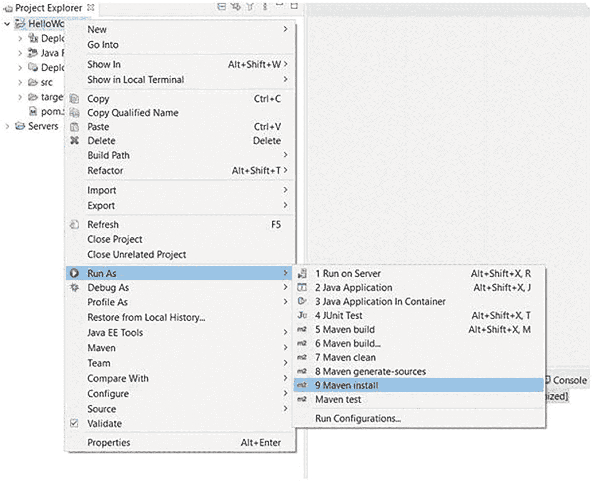

# 1.亚马逊网络服务(AWS)简介

当你听到亚马逊这个词时，你可能会首先想到 T2 亚马逊。这是最大最成功的网上商店之一。虽然亚马逊在开发在线零售服务上建立了自己的品牌，但它也扩展到了替代行业，其中包括网络服务行业，他们有同名的亚马逊网络服务(AWS)，这是一种云计算形式，帮助用户开发软件、数据库和其他需要重型计算资源的程序。

本章概述了亚马逊 Web 服务(AWS)，包括几个 AWS 关键服务，如亚马逊弹性计算云(Amazon EC2)、AWS 弹性 Beanstalk、亚马逊关系数据库服务(Amazon RDS)和亚马逊 Route 53。它包括为开发者创建一个免费的 AWS 帐户，创建一个弹性 Beanstalk 服务器，创建一个 HelloWorld JSP 应用，用 Maven 构建一个 WAR 文件，并将其上传到弹性 Beanstalk。

## 亚马逊网络服务简介

亚马逊网络服务(AWS)到底是什么？在一个非常高的层面上，AWS 是由 Amazon 提供的 web 托管服务，您可以在其中部署您的 web 应用并联合部署您的数据库。部署完成后，您的应用就可以在线使用了。任何人只需在他们的网络浏览器中输入您的 URL(统一资源定位器)就可以访问您的应用。网络将每个人联系在一起。您可以在云中在线部署您的应用，这样任何人都可以访问它。它不仅在本地运行；它现在正在网上运行。

AWS 是一个全业务云平台。它不仅仅是一个应用托管平台。你可以用 AWS 做很多事情。

*   通过 web 按需交付 IT 资源
    *   您可以按需启动服务器，并且可以选择您的操作系统。

    *   您甚至可以在云中部署数据库，并且您可以随心所欲地获得更多数据库选项。

*   现收现付定价模式
    *   这本书使用免费的开发者帐户。可以获得 12 个月的免费开发者账号。

而且，使用亚马逊网络服务云的好处是，你可以在几分钟内实现全球化，因为亚马逊拥有遍布全球的数据中心，如图 [1-1](#Fig1) 所示。

图 1-1

亚马逊数据中心

您将能够将您的应用部署到单个数据中心；否则，您将把它部署到多个数据中心。此外，对您能够部署到哪个数据中心没有限制。

但是，如果您主要在美国，您可以将应用部署到南美、中国或亚太地区的数据中心。这完全取决于你。用户可以根据应用的使用情况选择区域，因此延迟较低。这方面没有任何限制。

一旦你登录到亚马逊控制台，那么本质上，你选择你只是想使用的服务。您只需要部署您的应用，就可以拥有一个令人愉快的 web 管理控制台，在这里您只需要配置您的环境、配置您的服务器，然后合理地按下按钮进行部署。图 [1-2](#Fig2) 显示了 AWS 管理控制台上的 AWS 服务。

图 1-2

自动警报系统

这是关于亚马逊网络服务的介绍。让我们深入了解一些 AWS 关键服务。

## AWS 关键服务

AWS 提供不同类别的广泛服务。本节探讨了几种 AWS 关键服务(见图 [1-3](#Fig3) )。首先，我们来看看亚马逊弹性计算云(Amazon EC2)，它可能包括远程 VM(虚拟机)。接下来，您简要地看一下 AWS Elastic Beanstalk，它允许开发人员部署 web 应用。然后，您转到 Amazon 关系数据库服务(Amazon RDS)，这是云中的一个数据库。最后，您看一下 Amazon Route 53，它将自定义域名路由到您的应用。

图 1-3

AWS 关键服务

### 弹性云计算(EC2)

弹性云计算(EC2)是 AWS 发布时首批 web 服务接口之一，允许用户在云中创建和配置计算机器。EC2 允许用户在亚马逊云上创建 VM(虚拟机)来运行可以通过互联网访问的应用。

该软件可以根据您的规格在云服务器上进行配置。您可以选择最适合您的需求或应用的操作系统(即 Microsoft Windows 或 Linux ),并预装该操作系统。EC2 提供实际的主机服务器和操作系统。图 [1-4](#Fig4) 显示了它是如何设置的。

图 1-4

EC2 是如何设置的

如果您想要任何附加软件，您必须作为开发人员在操作系统上手动安装。所以，如果你想要 JDK (Java 开发工具包)，你可以安装 Java。还可以安装 Tomcat、数据库等等。这几乎就像获得一台只有操作系统的全新笔记本电脑，您需要在上面安装您的工具。

### 弹性豆茎

Elastic Beanstalk 是一个预打包的平台，允许您快速部署和处理 web 应用，而无需担心基础设施。您为给定的 web 栈选择一个预先配置好的虚拟机，比如 Java 和 Tomcat。而且，不需要在虚拟机上安装任何额外的软件。您只需上传应用的可部署文件，然后就可以开始工作了。Elastic Beanstalk 自动提供应用服务器、语言运行时、操作服务器和主机服务器，如图 [1-5](#Fig5) 所示。

图 1-5

弹性豆茎

它还支持。NET，Node.js，PHP，Docker 等等。您可以选择 web 堆栈，它为您提供所有软件的预安装、预配置，您只需部署您的代码。

它非常适合部署在 web 堆栈上，您只需选择您需要的服务，它就为您设置好了。这被称为*平台即服务*，或 PaaS。你所要做的就是部署你的代码。

现在，当您在 AWS 上开发 Java 应用时，您可以使用常规的 javaee API。你也可以使用第三方框架，比如 Spring Boot、Hibernate 和标准 Java 中的任何东西。无论您可以在 Tomcat 本地运行什么，您都可以在 Amazon 上运行相同的代码。因此，不需要修改代码，也不需要特殊的 Amazon JAR 文件或任何东西。

### 关系数据库服务

AWS 关系数据库服务(RDS)是云中的关系数据库。这允许您在云中快速部署关系数据库。它支持多种数据库可供选择，包括 MySQL、Oracle、Microsoft SQL Server 等等。

您可以使用常规管理工具来管理这些工具。如果你用的是 MySQL，可以用 MySQL Workbench。如果您正在使用 Oracle 数据库，您可以使用 Oracle SQL Developer，这样的例子不胜枚举。

AWS 也支持 NoSQL 数据库，比如 MongoDB。因此，在关系数据库服务的支持下，您需要的所有主要数据库特性都可以在 AWS 中找到。

### 53 号公路

Amazon Route 53 是一个域名系统(DNS)，它允许您将自定义域名路由到 AWS 上的实际应用。因此，您配置 Route 53 从浏览器向您的 AWS 应用发送请求。AWS DNS 设置您的自定义域名。

## 用例:AWS 应用架构

对于您的应用，从 AWS Elastic Beanstalk 开始，因为您可以通过利用那些开箱即用的预配置 web 堆栈来快速开始部署您的应用。

如果您需要一些低级别的控制，请使用 EC2。例如，您可能希望使用 Elastic Beanstalk 不支持的 Java 版本，或者您可能希望使用 WebLogic 之类的 Java 应用服务器，或者进行其他特定于操作系统的定制。

图 [1-6](#Fig6) 显示该架构使用 Elastic Beanstalk 来部署 web 应用。Java 应用运行在 Tomcat 上。RDS 是云端使用 MySQL 的数据库。Route 53 将您的自定义域名路由到 AWS 上的应用。

图 1-6

AWS 应用架构

## 为开发者创建一个免费的 AWS 帐户

要访问 Amazon Web Services，您需要创建一个 AWS 帐户。首先，让我们谈谈 AWS 免费层，开发者可以获得 12 个月的免费试用期和足够的资源来免费部署您的应用和数据库。还有一个更小版本的 AWS 服务器可以免费使用。

如果你需要一些更高级的功能，那么你必须付费并获得访问权。这本书使用免费层。如果您想了解有关免费层的更多信息，请访问 [`https://aws.amazon.com/free/`](https://aws.amazon.com/free/) 。

在你的网络浏览器中，前往 [`https://aws.amazon.com`](https://aws.amazon.com) 打开亚马逊网络服务主页(见图[1-7](#Fig7)；由于亚马逊的任何更新，此屏幕截图在您的屏幕上可能会有所不同)。

图 1-7

AWS 主页

要创建 AWS 帐户，您需要提供您的联系信息，包括您的地址和有效的借记卡或信用卡。即使你使用的是免费账户，亚马逊也需要你的信用卡或借记卡信息。因此，在创建 AWS 帐户时，请将它放在手边。

在主页的右上角，点击**创建 AWS 帐户**按钮。您将被重定向到注册 AWS 页面，如图 [1-8](#Fig8) 所示。

图 1-8

注册 AWS

输入您的电子邮件地址、密码(选择一个强密码以防止被黑)，以及您希望此帐户使用的 AWS 帐户名称。您必须确保您输入的帐户信息是正确的，尤其是您的电子邮件地址。如果您输入的电子邮件地址不正确，您将无法访问您的帐户。

点击继续按钮，输入您的联系方式，如图 [1-9](#Fig9) 所示。

图 1-9

联系信息

首先，选择个人账户类型。(企业账户与组织相关联，个人账户与个人相关联。)输入您的全名、电话号码、国家、地址、城市、州和邮政编码。

最后，选中底部的小复选框，表明您已经阅读并同意 AWS 客户协议的条款，然后单击继续按钮。

您会收到一封来自 AWS 的电子邮件，确认您的 AWS 帐户已经创建。您可以使用注册时使用的电子邮件地址和密码登录新帐户。但是，在您完成帐户激活之前，您不能使用 AWS 服务。

账单信息是您必须输入您的信用卡或借记卡号码等信息的地方，如图 [1-10](#Fig10) 所示。它用于验证目的。

图 1-10

票据信息

除非您的使用超过 AWS 免费层限制，否则亚马逊不会向您的卡收费。在本书中，我们向您展示的所有内容都在自由层限制范围内。

AWS 要求电话号码验证，如图 [1-11](#Fig11) 所示。从列表中选择您的国家或地区代码，输入可以立即联系到您的电话号码，并输入安全检查中显示的字符。

图 1-11

电话号码验证

键入安全检查字符后，单击立即呼叫我按钮。屏幕上会显示一个验证码，同时你会接到亚马逊的电话，要求验证你注册的电话号码。您必须输入收到的 PIN 并选择继续。一旦您的身份验证成功，您可以在窗口上看到您的手机已验证，您将被重定向到下一个屏幕以选择您的支持计划，如图 [1-12](#Fig12) 所示。

图 1-12

支持计划

选择符合您需求的支持计划。选择免费支持的基本计划。单击“免费”按钮，您将被重定向到 AWS 注册确认页面。

现在您可以*登录 AWS 管理控制台。*前往 [`https://console.aws.amazon.com`](https://console.aws.amazon.com) 开始使用 AWS。

选择**根用户**，输入你的 AWS 账户邮箱，点击下一步按钮，如图 [1-13](#Fig13) 所示。

图 1-13

登录到控制台

接下来，输入你的 AWS 账号密码，点击**登录**，如图 [1-14](#Fig14) 所示。

图 1-14

登录密码

AWS 管理控制台如图 [1-15](#Fig15) 所示。

图 1-15

AWS 管理控制台

在这里，您可以找到所有可用和提供的不同服务，但它们是按类别分组的，如图 [1-16](#Fig16) 所示。

图 1-16

按类别划分的 AWS 服务

下一节将使用 Elastic Beanstalk 服务开始构建 web 应用。Tomcat 运行在 AWS 云中。

## 探索并创建一个 AWS 弹性 Beanstalk 服务器

在 **AWS 服务**页面，向下滚动到计算部分，选择弹性豆茎，如图 [1-17](#Fig17) 所示。它允许您运行和管理您的 web 应用。

图 1-17

电脑节下弹性豆茎

AWS 弹性豆茎页面如图 [1-18](#Fig18) 所示。

图 1-18

AWS 弹性豆茎

Elastic Beanstalk 是在 AWS 上部署和运行 web 应用的最简单方式。Elastic Beanstalk 自动处理容量供应、负载平衡、自动伸缩和 web 应用健康监控的部署细节。

在这里，您选择一个平台，上传一个应用，或者使用一个示例，然后运行它。本章使用了一个示例，Tomcat 是部署应用代码的平台。

单击创建应用按钮。这将带您进入图 [1-19](#Fig19) 所示的**创建 web 应用**页面。

图 1-19

创建 web 应用

将应用命名为**我的第一个弹性豆茎应用**，如图 [1-20](#Fig20) 所示。

图 1-20

应用信息下的应用名称

接下来，从下拉列表中选择平台。选择 Tomcat，如图 [1-21](#Fig21) 所示。

图 1-21

应用信息下的平台

选择默认的 Tomcat 分支和版本，如图 [1-22](#Fig22) 所示。

图 1-22

在应用信息下选择平台的平台详细信息

在【应用代码】下**，**选择**样本**应用，如图 [1-23](#Fig23) ，然后点击**创建**应用按钮。

图 1-23

应用代码

此时，AWS 为你调配了一台服务器，如图 [1-24](#Fig24) 所示。它安装了 Java，运行在 Linux 上，并且已经预装了 Tomcat。

图 1-24

环境细节

当工作在后台进行时，您会在屏幕上看到诊断信息。

最终，你的应用部署成功，健康状态 OK，如图 [1-25](#Fig25) 所示。指向您的应用的链接出现在窗口的左上角。因此，如果您单击该链接，您会看到您的应用启动并运行。

图 1-25

健康状况良好

这将启动示例应用并配置 Linux、Tomcat 和 Java。下图 [1-26](#Fig26) 中显示的日志通知环境成功启动。

图 1-26

日志

图 [1-27](#Fig27) 显示祝贺画面。

图 1-27

祝贺屏幕

您的应用现在运行在 AWS 云上，其 URL 在互联网上是实时的。Tomcat 运行在 AWS 云中您的专用环境上。

现在，您只是简单地使用示例应用，但是稍后，您上传您的应用并在 AWS 云中运行它们。您可以在 URL 中添加自定义域名。

## 创建一个 HelloWorld JSP 应用，用 Maven 构建 WAR，并将 WAR 上传到 Elastic Beanstalk

作为概念验证，让我们在 Elastic Beanstalk 上部署 HelloWorld JSP 应用。它只是 Java 端的一个简单应用，允许您专注于弹性 Beanstalk 部署过程。稍后将介绍高级 Spring Boot 和数据库 CRUD 操作。

为了理解如何部署的机制，让我们看一下一步一步的开发过程。

1.  在 Spring 工具套件(STS)中创建 HelloWorld JSP 应用。

2.  使用 Maven 打包 WAR 文件。

3.  创建弹性豆茎的新应用。

4.  将 WAR 文件上传到 Elastic Beanstalk。

### 创建 HelloWorld JSP 应用

使用 STS 或您选择的任何 IDE 创建一个 Maven web 应用项目。

首先打开 Spring 工具套件，选择文件菜单➤新➤ Maven 项目，如图 [1-28](#Fig28) 所示。

图 1-28

选择 Maven 项目

图 [1-29](#Fig29) 显示了新的 Maven 项目向导。选择默认位置，然后单击下一步。

图 1-29

新建 Maven 项目向导

然后选择`maven-archetype-webapp`，点击下一步，如图 [1-30](#Fig30) 所示。

图 1-30

选择一个原型

接下来，提供组 ID、工件 ID 和包信息，然后点击 Finish 按钮，如图 [1-31](#Fig31) 所示。

图 1-31

指定原型参数

创建一个项目目录，如图 [1-32](#Fig32) 所示。

图 1-32

HelloWorldJSP 项目目录

如果您在 IDE 中查看问题的视图，显示的错误是“在 Java 构建路径上找不到超类 javax.servlet.http.HttpServlet”。此错误表明 HTTP servlet 在项目类路径中不可用。

一旦将目标运行时添加到项目中，HTTP servlet 就可以在项目类路径中使用了。在配置运行时服务器(如 Tomcat 服务器)后，错误会得到解决。

要配置 Tomcat 服务器，右键单击项目并选择 Properties。选择目标运行时，然后选择 Apache Tomcat v8.5，如图 [1-33](#Fig33) 所示。然后，单击“应用并关闭”按钮。

图 1-33

目标运行时间

要在本地 Tomcat 服务器上运行应用，右键单击项目，选择 Run As 和 Run On Server。在窗口中选择 Tomcat 服务器，点击完成按钮(见图 [1-34](#Fig34) )。

图 1-34

在服务器上运行

在你最喜欢的网络浏览器中输入`http://localhost:8080/HelloWorldJSP/`就可以看到“Hello World！”消息，如图 [1-35](#Fig35) 所示。

图 1-35

你好世界！在浏览器中

### 使用 Maven 打包 WAR 文件

现在，让我们在 STS 中使用 Maven 打包一个 WAR 文件。右键项目，选择**运行为** ➤ **Maven 安装**，如图 [1-36](#Fig36) 所示。

图 1-36

作为 Maven 安装运行

一旦构建成功，您可以在控制台中用一条成功消息来验证它，如图 [1-37](#Fig37) 所示。这会生成一个 WAR 文件。

图 1-37

建立成功

刷新项目文件夹结构，展开`target`文件夹，找到一个名为`HelloWorldJSP.war`的 WAR 文件，如图 [1-38](#Fig38) 所示。

图 1-38

在目标文件夹中生成 WAR 文件

### 上传警告到弹性豆茎

现在，让我们在 Elastic Beanstalk 中创建一个新的应用，然后将 WAR 文件上传到其中。

在 AWS 控制台上，转到 Elastic Beanstalk 页面。图 [1-39](#Fig39) 显示了名为我的第一个弹性豆茎应用的应用。

图 1-39

弹性豆茎应用

现在让我们通过点击**创建新应用**按钮来创建一个全新的应用。输入应用名称为 **helloworld** ，如图 [1-40](#Fig40) 所示。然后，单击“创建”按钮。

图 1-40

申请信息

没有已经设置好的环境，如图 [1-41](#Fig41) 所示。

图 1-41

应用环境

通过点击“立即创建”选择环境层，创建一个环境，如图 [1-41](#Fig41) 所示。

图 1-42

按类别分组的 AWS

对于环境层，让我们使用 web 服务器环境来运行 web 应用。弹性豆茎为我们创造了服务器。接下来，单击选择按钮。现在，您需要提供环境信息，如图 [1-43](#Fig43) 所示。

图 1-43

环境信息

这里，您需要提供详细信息，比如环境和域的名称。请确保环境 URL 是唯一的；这里将其命名为 **awshelloworldjsp** ，表示可以使用。然后为服务器选择平台详情，如图 [1-44](#Fig44) 所示。

图 1-44

服务器平台

在这里，选择由 AWS Elastic Beanstalk 发布和管理的托管平台，并从平台下拉列表中选择 Tomcat。因此，当 Elastic Beanstalk 运行环境时，它会为您创建一个 Tomcat 服务器。

现在，您需要将 WAR 文件上传到 Elastic Beanstalk。点击选择**文件**，从本地系统选择 HelloWorldJSP.war 文件，如图 [1-45](#Fig45) 所示。

图 1-45

应用代码

一旦文件成功上传到 Elastic Beanstalk，点击 Create environment 按钮。

在幕后，Amazon 提供了一个服务器来配合操作系统使用。他们安装 Java 和 Tomcat，并将您的 WAR 文件部署到 Tomcat 环境中。当一切都完成时，你会得到一个绿色的复选框，表示成功，如图 [1-46](#Fig46) 所示。这里，日志确认环境成功启动。

图 1-46

健康状况良好和最近事件

单击应用的链接。页面在浏览器中打开，显示“Hello World！”(参见图 [1-47](#Fig47) )。

图 1-47

通过点击 URL 从浏览器访问应用

这是你的新申请。WAR 文件部署在 Amazon cloud 的 Elastic Beanstalk 中，并且已经启动并运行。

确保停止任何你不需要的未使用的 AWS Elastic Beanstalk 应用。这有助于防止亚马逊收取任何过度使用费用。

## 摘要

本章概述了亚马逊网络服务(AWS)。您了解了一些 AWS 关键服务，比如 EC2、Elastic Beanstalk、Amazon RDS 和 Amazon Route 53。您用 Maven 创建了一个免费的 AWS 帐户、一个服务器、一个 HelloWorld JSP 应用、一个 WAR 文件，并将该文件上传到 Elastic Beanstalk。最后，您在浏览器中访问应用，看到“Hello World！”消息。

下一章在 AWS 中部署一个 Spring Boot 应用作为 REST API。