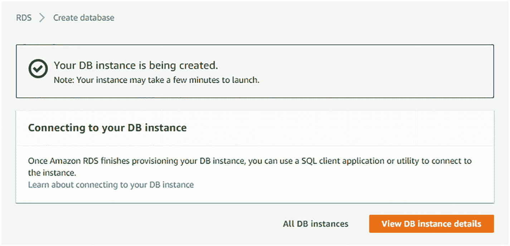
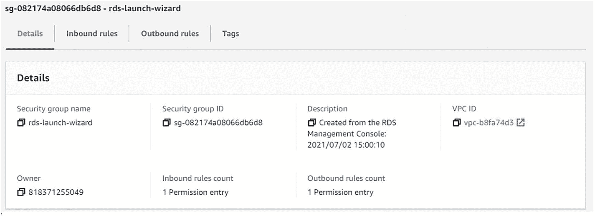

# 3.将 MySQL 作为数据库部署在带有 RDS 的 AWS 中

在第 [2](2.html) 章中，您将 REST API 部署到 AWS Elastic Beanstalk。您创建了一个 Spring Boot 应用程序作为 REST API，然后您生成了我们项目的 JAR 文件。您能够将 JAR 文件部署到 Elastic Beanstalk，并解决了 AWS 上的服务器问题以制作应用程序。最后，您能够访问部署在 AWS 云上的应用程序。

Amazon RDS 使设置和操作 MySQL 数据库变得容易，并使在 Amazon 云中扩展 MySQL 部署变得容易。自我管理数据库会带来很多挑战，并且需要维护。本章介绍了 Amazon 关系数据库服务(RDS ),您将学习如何部署它。

如果你看一下第二章的应用架构，Elastic Beanstalk 是我们基于 Java 的 Spring Boot 应用的部署地。现在让我们使用 Amazon RDS，它是云中的一个数据库。MySQL 运行在 AWS 上。在 AWS 中创建和配置了一个 MySQL 数据库的实例。表也是在 MySQL 数据库中创建的。

## 亚马逊 RDS(亚马逊关系数据库服务)简介

数据可以被理解为不同信息单元的集合，这些信息单元可以被转换成高效移动和处理所需的形式。数据库可以定义为结构化数据的有组织的集合，以便于访问、管理和更新。简单地说，数据库就是存储数据的地方。

Amazon RDS 是一个 web 服务，允许您在 Amazon cloud 上快速部署和扩展关系数据库。一旦部署了数据库，就可以使用 MySQL Workbench、Oracle SQL Developer 或其他管理工具来管理它。AWS 也支持像 MongoDB 这样的 NoSQL 数据库。

有关亚马逊 RDS 的更多信息，请参考 [`https://docs.aws.amazon.com/AmazonRDS/latest/UserGuide/Welcome.html`](https://docs.aws.amazon.com/AmazonRDS/latest/UserGuide/Welcome.html) 。

## 在 AWS 中创建 RDS 数据库的实例

让我们在 AWS 管理控制台上注册，开始配置 RDS MySQL 环境。选择所有服务中数据库部分下的 RDS，如图 [3-1](#Fig1) 所示。


图 3-1

所有服务中数据库部分下的 RDS

您将被重定向到 Amazon RDS 仪表板页面，如图 [3-2](#Fig2) 所示。此页面提供了有关您正在使用的资源的信息。让我们通过点击**创建数据库**按钮来创建一个 Amazon 关系数据库的实例。


图 3-2

亚马逊 RDS 仪表板

将打开一个新页面，您可以在其中定义数据库创建方法和其他选项。让我们开始创建一个数据库。

首先，从**引擎选项**中选择数据库引擎，如图 [3-3](#Fig3) 所示。有很多选项可用，但是让我们使用 MySQL 数据库引擎。MySQL 是一个广泛使用的开源关系数据库管理系统。MySQL 主要用于 web 数据库。


图 3-3

要选择的引擎选项

如图 [3-4](#Fig4) 所示，单击复选框仅启用 RDS 免费使用层的选项，这允许您在 AWS 云中免费使用数据库。然后单击下一步按钮。


图 3-4

RDS 免费使用层

接下来，指定数据库详细信息，如下图 [3-5](#Fig5) 所示。


图 3-5

指定数据库详细信息

保留许可证模型和数据库引擎版本的默认值。选中该框以仅启用 RDS 空闲层的选项。在 DB 实例类中，为空闲层保留默认的选定值`db.t2.micro`。

数据库实例标识符是您为查找或引用数据库实例而创建的唯一名称。接下来，为数据库提供一个合适的名称；我们用`spring-aws-db`，如图 [3-6](#Fig6) 。


图 3-6

设置数据库详细信息

同样，提供主用户名和密码。为了简单起见，我们对两者都使用了`springaws`,但是您可以使用您想要的任何值。您可以在以后使用这个用户名和密码连接到 MySQL 实例，所以要保护好这些凭证。然后单击下一步按钮。

最后，您需要配置一些高级设置，这些设置对于设置 RDS MySQL 环境至关重要，如图 [3-7](#Fig7) 所示。


图 3-7

配置高级设置

在“网络和安全”部分保留所有默认值。确保数据库实例的公共可访问性为 Yes。这允许数据库实例在互联网上可用，并与其他主机连接。

接下来，数据库选项包括名称、端口等，如图 [3-8](#Fig8) 所示。保持所有默认值不变。端口号为 3306，这是默认端口。其他选项也可用。


图 3-8

数据库选项

点击**创建数据库**按钮，启动亚马逊 RDS 数据库实例，如图 [3-9](#Fig9) 所示。


图 3-9

启动 Amazon RDS 数据库实例

您会看到您的数据库实例正在被创建，如图 [3-10](#Fig10) 所示。



图 3-10

Amazon RDS 数据库实例创建状态

您的数据库实例通常需要几分钟才能启动。

## 配置亚马逊 RDS

当前状态显示您在 AWS 云中有一个可用的数据库实例，它是作为 RDS 数据库服务器的实例创建的。不幸的是，这个数据库实例是空的，因为在 RDS 数据库实例中没有可用的数据库模式、表或数据。

您需要为关系数据库服务做一些配置工作，将它连接到 MySQL Workbench，并访问它。作为开发过程，第一件事是为入站连接规则配置安全性。然后，您需要用 MySQL Workbench 测试数据库连接。

在继续之前，让我们检查 Amazon RDS 数据库实例的状态。点击亚马逊 RDS 下的**数据库**，如图 [3-11](#Fig11) 所示。


图 3-11

数据库实例状态

在这里，您可以看到数据库实例`spring-aws-db`被添加到列表中。它的状态是可用，这表明数据库已经创建并可供使用。单击数据库表中的`spring-aws-db`链接。图 [3-12](#Fig12) 显示了总结。


图 3-12

Amazon RDS 数据库实例摘要

在这里，您可以看到关于`spring-aws-db`数据库实例的信息。类是`db.t2.micro`，引擎是 MySQL 社区，状态可用。

### 第一步。为入站连接规则配置安全性

首先，您需要为入站连接规则配置安全组规则。向下滚动到**安全组规则**部分，如图 [3-13](#Fig13) 所示。


图 3-13

安全组规则

入站规则定义了服务器上允许的流量以及谁可以连接到数据库实例。点击`rds-launch-wizard`进入 CIDR/IP -入站，重定向到安全组信息页面，如图 [3-14](#Fig14) 所示。


图 3-14

安全组

在该页面的底部，您会看到名为“详细信息”、“入站规则”、“出站规则”和“标签”的选项卡，如图 [3-15](#Fig15) 所示。



图 3-15

rds-启动-向导

点击**入库规则**页签，如图 [3-16](#Fig16) 所示。


图 3-16

入站规则

您会看到数据库只能从 IP 地址 59.99.65.121/32.访问，您需要在这里做一些修改。点击**编辑入站规则**按钮，重定向到**编辑入站规则**页面。在这里您可以编辑可以访问亚马逊 RDS MySQL 数据库实例的 IP 地址，如图 [3-17](#Fig17) 所示。


图 3-17

编辑入站规则

您可以确定可以到达数据库实例的流量。从 Source 下拉列表中选择 Anywhere 选项，如图 [3-18](#Fig18) 所示。


图 3-18

从源下拉列表中选择任意位置

现在，任何人都可以找到或连接到数据库实例，但是他们仍然需要提供正确的用户 ID 和密码。Anywhere source 选项有利于开发和测试，但是建议只允许从 Elastic Beanstalk 应用程序的 IP 地址进行生产访问。

点击**保存规则**按钮。现在可以看到入库规则已经设置好了，如图 [3-19](#Fig19) 所示。


图 3-19

入站规则中的更新源

这些更新的入站规则允许从任何地方连接。

### 第二步。用 MySQL Workbench 测试 Amazon RDS 数据库实例连接

一旦成功创建了 Amazon RDS MySQL 数据库实例，并且完成了所有必要的配置，第二步就是测试 RDS 数据库实例与 MySQL Workbench 的连接。

返回到浏览器中的上一页。在数据库部分，点击**连接&安全**选项卡，如图 [3-20](#Fig20) 所示。


图 3-20

入站规则中的更新源

在连接和安全选项卡中，有一个名为**端点&端口**的部分。端点指示数据库实例的主机名，您可以在 MySQL Workbench 中使用它来连接 RDS 数据库实例。在这种情况下，它是

```java
spring-aws-db.cpsoyj7kwlno.us-east-2.rds.amazonaws.com

```

Note

有关 MySQL Workbench 安装指南，请参考附录 A。

#### 将 MySQL Workbench 连接到 Amazon RDS MySQL 数据库实例

在本地系统中打开 MySQL Workbench。然后点击 **+** 图标，创建一个 MySQL 连接，如图 [3-21](#Fig21) 所示。


图 3-21

MySQL 工作台

这将打开设置新连接向导，如图 [3-22](#Fig22) 所示。


图 3-22

安装新连接向导

对于连接名称，输入值`spring-aws-db`。在主机名字段中，默认值是 127.0.0.1，即本地主机。从 AWS 管理控制台用以下 RDS 数据库实例主机名替换默认 IP 地址。

```java
spring-aws-db.cpsoyj7kwlno.us-east-2.rds.amazonaws.com

```

保持端口号不变，因为 3306 是 AWS 控制台中数据库实例的端口。

使用您为 RDS 数据库实例创建的用户名和密码。所以，输入`springaws`作为用户名，如图 [3-23](#Fig23) 。点击**储存在金库**按钮输入密码。


图 3-23

安装新连接向导中的更新值

输入`springaws`，然后点击确定，如图 [3-24](#Fig24) 所示。


图 3-24

存储连接密码

单击测试连接按钮。您应该会收到一个通知，告诉您已经成功建立了 MySQL 连接，如图 [3-25](#Fig25) 所示。


图 3-25

成功建立了 MySQL 连接

这就是您如何知道数据库实例在 AWS 云中可用并运行的原因。您可以使用本地 MySQL 工作台来连接它。点击连接向导中的 OK 按钮，工作台将列出数据库连接的详细信息，如图 [3-26](#Fig26) 所示。


图 3-26

带有 Amazon RDS 数据库连接详细信息的 MySQL 工作台

## 在 RDS 数据库实例中创建一个表

MySQL 设置正确。您可以通过点击`spring-aws-db`来访问远程 RDS 数据库实例，这将在 SQL 编辑器中打开，如图 [3-27](#Fig27) 所示。


图 3-27

spring-aws-db 的 SQL 编辑器实例

目前，没有可用于 RDS 数据库实例的数据库、表或数据。您需要运行一些脚本来提供您可以查询的任何内容。

首先，让我们使用`CREATE DATABASE`命令创建一个数据库。创建新数据库的语法是`CREATE DATABASE DB_NAME`，其中`DB_NAME`是您想要创建的数据库名称。例如，要创建一个名为`UserRegistration`的数据库，在 query 选项卡中键入以下查询并运行它。

```java
CREATE DATABASE UserRegistration;

```

一旦查询成功执行，Schema 选项卡应该显示`UserRegistration`数据库，如图 [3-28](#Fig28) 所示。


图 3-28

数据库已创建

现在，让我们在`UserRegistration`数据库中创建一个用户表。表格以结构化格式显示和存储记录。`CREATE TABLE`命令在现有数据库中创建一个新表。创建 MySQL 表的语法如清单 [3-1](#PC4) 所示。

```java
CREATE TABLE [IF NOT EXISTS] table_name(
    column_1 datatype(size) [NULL | NOT NULL],
    column_2 datatype(size) [NULL | NOT NULL],
    column_3 datatype(size) [NULL | NOT NULL],
    ........,
    column_N datatype(size) [NULL | NOT NULL],
    table_constraints
);

Listing 3-1Syntax to Create MySQL Table

```

`table_name`是表的名称，在 MySQL 数据库中应该是唯一的。当数据库中已经存在相同的表名时，`IF NOT EXISTS`子句有助于防止错误。

`column_`指定列名。`datatype`指定该列的数据类型，使用逗号运算符分隔各列。

`table_constraints`指定表的约束，如主键、外键和唯一键。例如，要创建一个名为`users`的表，在 query 选项卡中输入清单 [3-2](#PC5) 中所示的查询并运行它。

```java
use UserRegistration;

CREATE TABLE [IF NOT EXISTS]  users(
    id int NOT NULL AUTO_INCREMENT,
    first_name varchar(45) NOT NULL,
    last_name varchar(45) NOT NULL,
    address varchar(35) NOT NULL,
    age int NOT NULL,
    created_date DATE,
    PRIMARY KEY (id)
);

Listing 3-2Create Users Table in UserRegistration Database

```

在这里，`use UserRegistration`命令选择在哪个数据库下创建表。一旦查询成功执行，`UserRegistration`数据库应该显示`users`表，如图 [3-29](#Fig29) 所示。


图 3-29

表已创建

现在，让我们将一些数据插入到`users`表中。`INSERT INTO`命令在表格中添加或存储数据。将数据插入表格的语法如清单 [3-3](#PC6) 所示。

```java
INSERT INTO DATABASE.table_name (column_1, column_2,... column_N)
VALUES
( value_1, value_2,...value_N );

Listing 3-3Syntax to Insert Data into the Table

```

首先，指定数据库名称，后跟一个点(。)，后跟表名，然后是逗号分隔的列列表。接下来，在`VALUES`子句后提供对应于列名的值列表。例如，要在`users`表中插入数据，在 query 选项卡中键入清单 [3-4](#PC7) 中所示的查询，然后运行它。

```java
INSERT INTO UserRegistration.users (first_name, last_name, address, age, created_date)
VALUES
('Ravi', 'Soni', 'Sasaram-Bihar-India', 34, '2021-07-04');

Listing 3-4Insert Data in users Table in UserRegistration Database

```

MySQL 中默认的日期格式是 YYYY-MM-DD，其中 YYYY 用四位数表示年，MM 用两位数表示月，DD 用两位数表示日。

一旦成功执行了插入查询，就可以使用`SELECT`命令从 MySQL 数据库中获取数据。从数据库返回的数据存储在一个名为`result-set`的结果表中。从 MySQL 表中获取数据的`SELECT`命令语法如清单 [3-5](#PC8) 所示。

```java
SELECT column_1, column_2, ...
FROM
DATABASE.table_name;

Listing 3-5Syntax of SELECT Command to Fetch Data from Database

```

例如，要从`users`表中获取数据，在 query 选项卡中键入清单 [3-6](#PC9) 中所示的查询，然后运行它。

```java
SELECT first_name, last_name, address, age, created_date
FROM
UserRegistration.users;

Listing 3-6Fetch Data from UserRegistration Database

```

一旦`SELECT`查询成功执行，结果如图 [3-30](#Fig30) 所示。


图 3-30

表已创建

## 摘要

本章介绍了亚马逊 RDS。首先，您在 AWS 中创建了一个 MySQL 数据库实例并配置了数据库。然后，您在数据库中创建了一个表，并使用 MySQL Workbench 将数据插入其中。

下一章概述了 Spring Boot 应用程序中的 CRUD 操作，您将在 AWS 中部署与 MySQL 对话的 Spring Boot 应用程序。