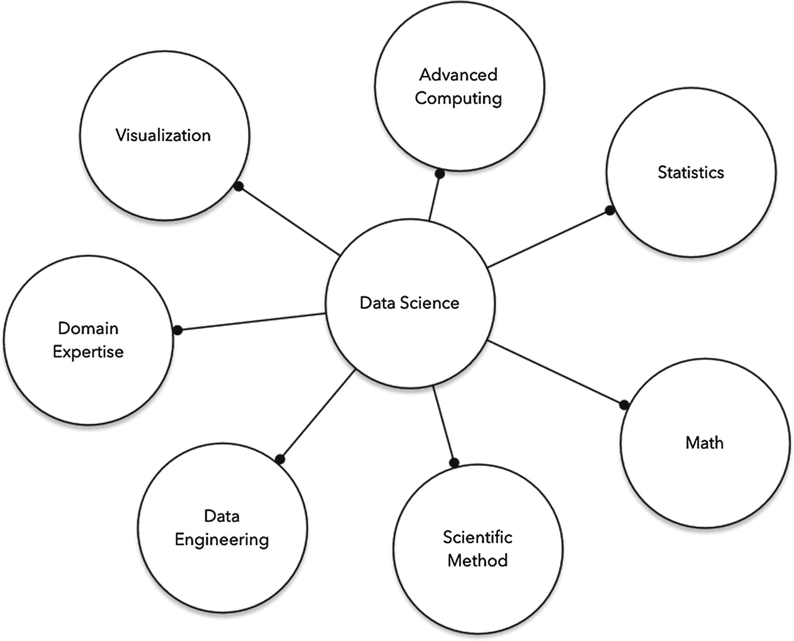
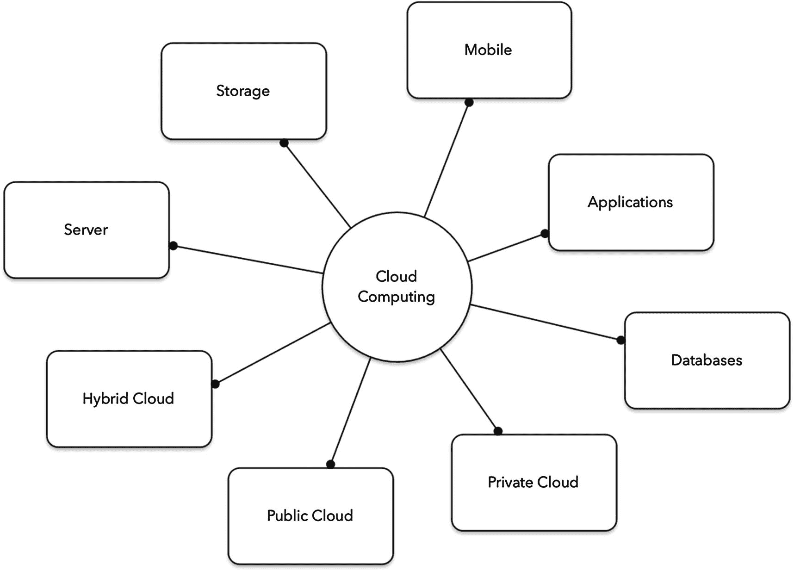
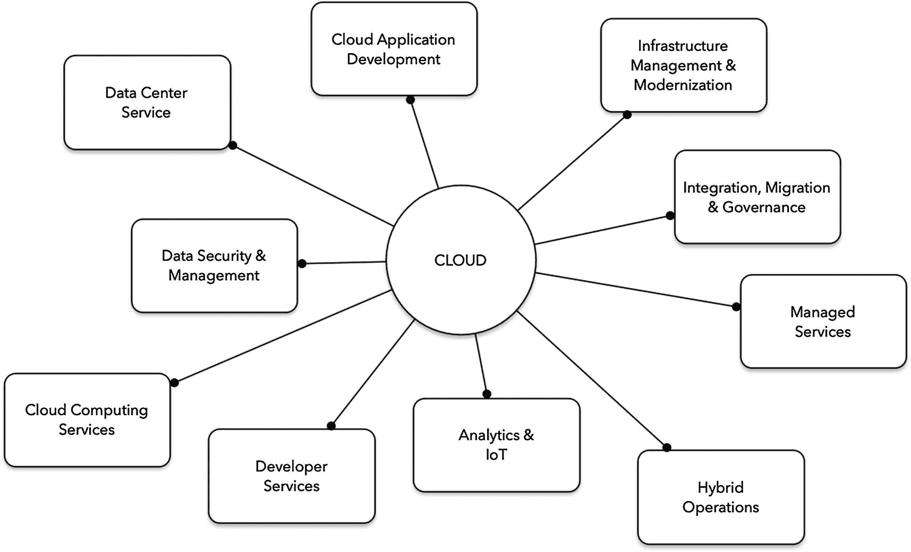
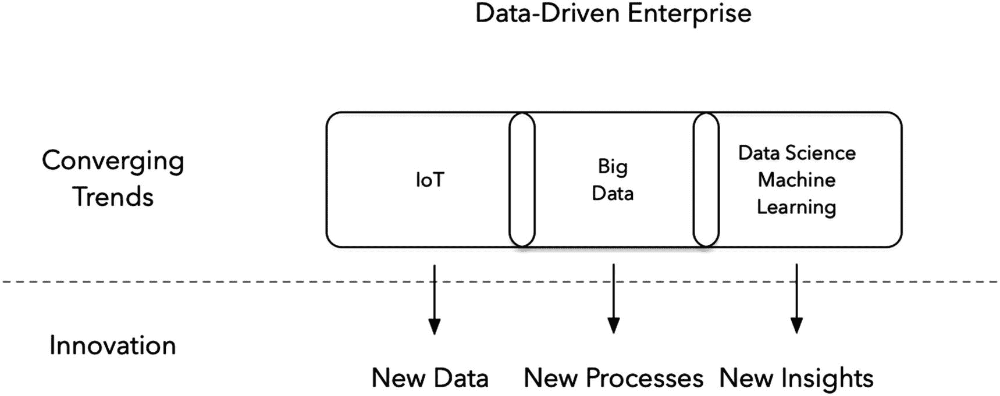
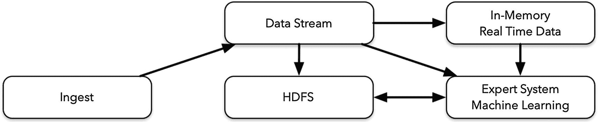
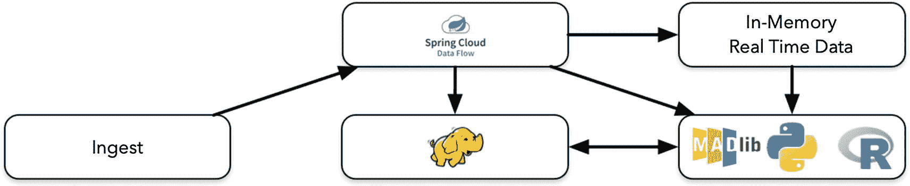

# 一、云和大数据

数字世界由大约 440 亿字节的数据组成。一个 zettabyte 是 100 万 Pb，或 10 亿 TB，或 1 万亿 GB。2019 年，谷歌处理了大约 370 万次查询，YouTube 记录了 450 万次观看视频，脸书每 60 秒注册 100 万次登录。想象一下计算机处理所有这些请求、数据接收和数据操作的能力。常识告诉我们，大型 IT 公司使用大量硬件来保存数据。需要整合大量存储以防止容量限制。

IT 公司如何应对数据过载、成本上升或技能缺口等挑战？近年来，大型 IT 公司投入巨资开发战略，使用企业数据仓库(EDW)作为中央数据系统，从不同来源报告、提取、转换和加载(ETL)流程。如今，用户和设备(恒温器、灯泡、安全摄像头、咖啡机、门铃、座椅传感器等。)摄取数据。

戴尔、英特尔和 Cloudera 等公司携手打造硬件和存储解决方案，帮助其他公司发展壮大，变得更快、更具可扩展性。

## 一点数据科学

当我们谈论*数据科学*时，一个拥有博士学位的科学家团队浮现在脑海中。他们可能挣大钱，他们不休息，因为公司依赖他们。一个数据科学家的实际教育经历是怎样的？

几年前，计算杂志披露，随着 Hadoop、Kafka、Hive、Pig、Cassandra、D3 和 Tableau 等工具的加入，Spark 和 Scala 在希望应用数据科学的公司中迅速发展。

Python 已经成为机器学习技术的主要编程语言之一，与 R、Scala 和 Java 齐名。

机器学习通常在商业、数学、计算机科学和通信领域发挥作用。数据科学家使用数据进行预测、分类、推荐、模式检测和分组、异常检测、识别、可操作的洞察、自动化流程、决策、评分和排名、细分、优化和预测。太多了！

图 1-1。

数据科学

我们需要合适的工具、平台、基础设施和软件工程知识来创新和创造。机器学习应该依赖于一种感觉舒适、易学的编程语言(比如 Python)。平台应该有合适的引擎来处理数据。基础设施应该是可靠的、安全的和冗余的。开发技术应该创造出令人敬畏的企业解决方案，不仅使公司受益，而且使全世界的用户受益。

## 云

在过去的十年里，许多公司已经进入了所谓的*云*，或者他们是*云本地人*，或者他们是在*云计算*时代；但这到底意味着什么呢？有几家公司表示，他们一直都在云中，因为他们的所有服务都在公司之外，由第三方管理，而且如果发生停机，他们的响应速度会更快。但这准确吗？还是*云*意味着通过互联网启用服务器、网络、存储、开发工具和应用的架构计算？

在我看来，我们可以通过公共云环境访问互联网，用户可以通过 T2 互联网连接随时随地“接入”数据和应用。我认为云是一种新的*测量服务*，采用随用随付的模式，您只需为您正在使用的任何服务器、网络、存储、带宽、应用或更多服务付费——非常类似于电力或水务公司根据消耗量收费。

我还将云视为一种*按需自助服务* *。*您可以请求这些服务中的任何一项，只需点击几下鼠标，它们就会很快被提供。

我可以将云视为一种多租户模型，其中应用、网络或服务器的单个实例由多个用户共享。这被称为*共享资源池*。一旦您使用完它，它将返回到池中等待另一个用户请求它。

我可以将云视为一个弹性平台，其中的资源可以根据需要快速伸缩(见图 [1-2](#Fig2) )。

图 1-2。

云计算

### 云技术和基础设施

我认为今天的云技术意味着公司可以快速扩展和适应。他们可以加速创新，更有效地推动业务灵活性，满怀信心地简化运营，并降低成本以更好地与其他公司竞争。这导致公司持续增长。如今，在技术方法上更具战略性的公司在财务上做得更好，但这些公司如何看待新的云技术？

亚马逊(按需计算的先驱)、谷歌和微软等大型 IT 公司都提供云技术。这些公司获得了丰厚的报酬，为公司提供云基础架构，提供弹性、托管服务、按需计算和存储、网络等。

实施云基础架构需要存储、服务器或虚拟机。还需要托管服务、混合运营以及数据安全和管理。这些服务允许公司将他们的数据用于所有这些新的机器学习工具，并将新的人工智能算法应用于系统分析，以帮助欺诈检测，帮助决策，这是数据处理的几个不断增长的功能(见图 [1-3](#Fig3) )。

图 1-3。

云基础设施

## 合适的工具

在我 20 年的经验中，我见过大公司使用工具和技术来帮助他们以正确的方式使用收集的数据，并遵循数据操作的最佳实践和标准。由于所有新的需求和服务需求增加的方式，公司雇用知道如何使用诸如 JMS、RabbitMQ、Kinesis、Kafka、NATs、ZeroMQ、ActiveMQ、Google PubSub 等工具的人。我们看到随着这些技术出现了更多的消息模式，例如事件驱动或数据驱动模式(见图 [1-4](#Fig4) )。这些模式并不新鲜，但直到现在才受到重视。

图 1-4。

数据驱动型企业

像 Apache Hadoop 这样的技术跨集群分布大型数据集。Apache Flume 是一个简单灵活的数据流架构，也是一个收集、聚合和移动大量日志数据的服务。Apache Sqoop 是一个批处理工具，用于在 Apache Hadoop 和结构化数据存储(如关系数据库)之间传输批量数据；它解决了你需要做的一些数据争论。

新一波编程语言可以处理大量数据。这些语言包括 R、Python 和 Scala 等语言，以及一系列用于机器学习和专家系统的库和框架，如 MadLib(见图 [1-5](#Fig5) 和 [1-6](#Fig6) )。

图 1-6。

数据流

图 1-5。

数据流

消息传递代理的新协议每天都会出现。我们应该学习所有这些新技术吗？或者我们应该雇佣具备所有这些技能的人吗？我认为我们至少应该有一种技术来处理通信。好了，我们做到了:SpringCloudStream和编制器，SpringCloud数据流(见图 [1-7](#Fig7) )。

我将讨论这两种技术。如果你是 Spring 开发者，你不需要学习任何新的消息传递 APIs 你可以使用你已经知道的东西——Java 和 Spring。如果您不熟悉 Spring，在接下来的两章中，我将快速浏览一下 Spring Boot、Spring Integration和 Spring Batch，并向您展示如何使用它们。这三项技术是SpringCloudStream和SpringCloud数据流的核心(见图 [1-7](#Fig7) )。

接下来，您将创建您的第一个流式应用，它可以连接而不考虑消息传递代理。没错；在多个流式应用之间设置哪个代理并不重要。SpringCloudStream有这个能力。您将开发定制流并创建一个定制绑定器，允许您对消息传递代理隐藏任何 API。

最后，我谈谈 Spring CloudStream及其组件，以及如何创建应用、流和任务并监控它们(见图 [1-7](#Fig7) )。

图 1-7。

数据流:SpringCloud数据流

## 摘要

在这一章中，我谈到了大数据和使用提供开箱即用解决方案的云基础架构来改善服务的新方法。每家公司都需要有知名度、速度、快速进入市场的能力，以及做出反应的时间。

在这短短的一章中，我想为这本书设定背景。在接下来的章节中，我将讨论帮助您使用大数据创建企业级解决方案的技术。