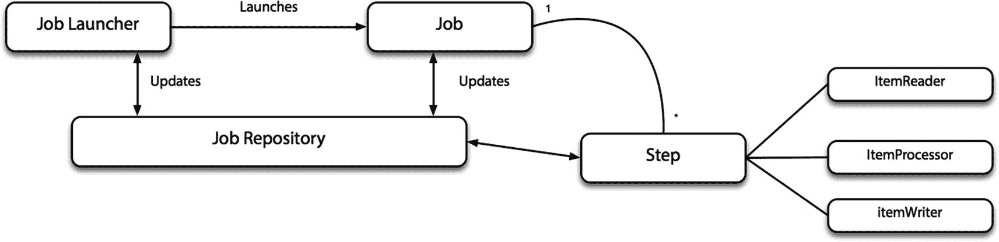
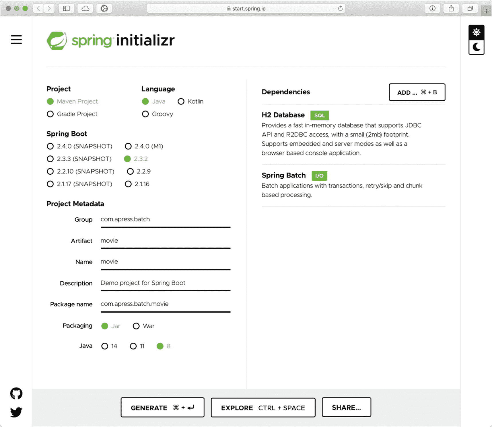
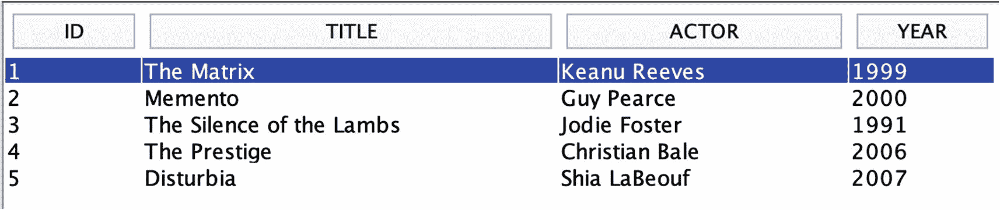
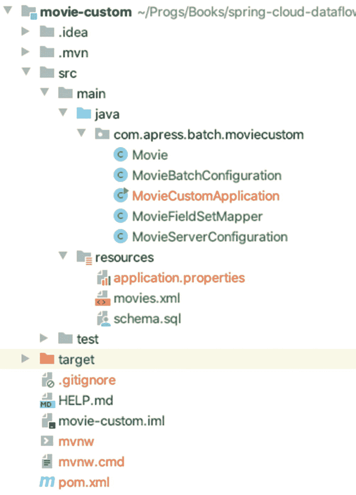
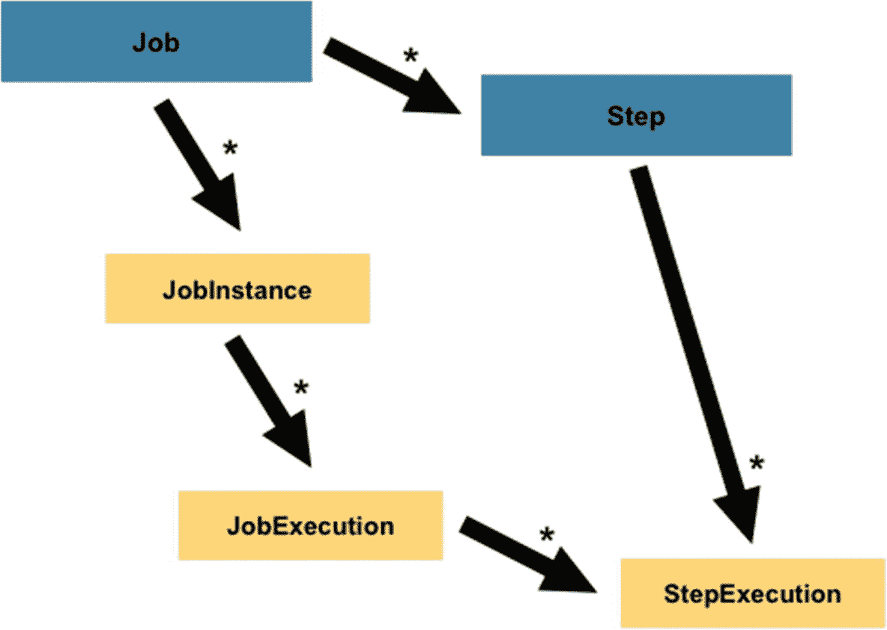
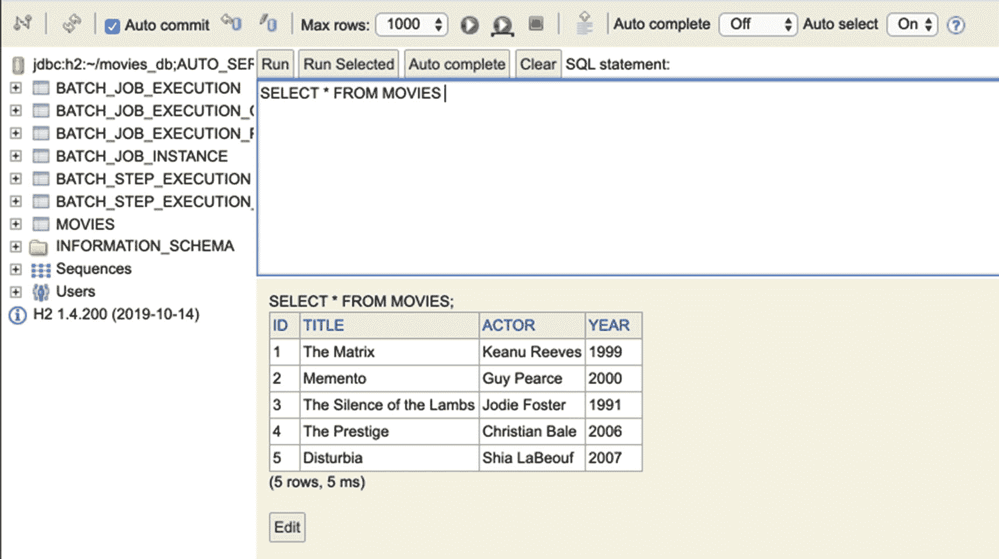
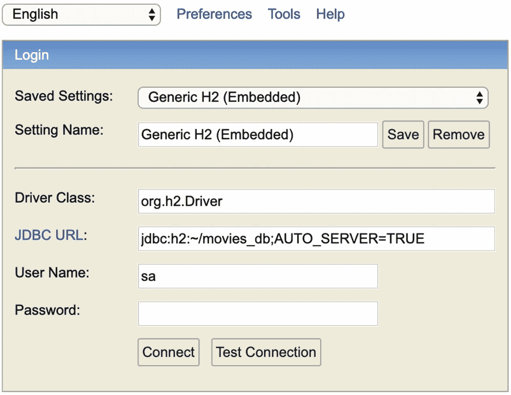

# 4.春季批次

在前一章中，我向您展示了使用 Spring Integration 可以做些什么，Spring Integration 是一个轻量级框架，它将外部系统和流程连接到各种数据。但是，当您需要进行批量处理时，会发生什么呢？当您需要在任务关键型环境中的某个时间执行业务操作时，会发生什么情况？如何自动化处理大量数据？如何集成外部系统来处理大型数据集？

大型数据集需要什么样的典型系统/场景？您可能需要从数据库或文件系统(如 HDFS)中读取,或者从有数百万消息排队的消息代理中读取**。然后，您需要根据业务规则**处理**该信息，并且您需要将数据分割成必须增强的多个块。最后，您需要**将数据写入**另一个引擎/系统(内部或外部)。有没有一个框架可以执行这样的场景？对，春批！**

## 春季批次

Spring Batch 是一个轻量级的批处理框架，允许您为大量数据创建可重复的步骤(读、写、处理)。它提供了日志/跟踪、作业处理、作业启动/停止/重启、事务管理、顺序和部分处理、大规模并行处理等机制！使用 Spring Batch 的一个主要好处是，它遵循与 Spring 框架相同的原则，为开发人员提供了一种基于 POJO(Plain Old Java Objects)创建简单业务类的方法，基础设施、批处理执行环境和批处理应用之间关注点的明确分离，核心执行的默认实现，配置、定制和扩展服务的简单方法，以及提高生产率的简单方法。所有这些使得 Spring Batch 成为批处理的理想框架。

Spring Batch 是一个经过验证的算法集合，支持非常大的数据量，通过优化逻辑和分区技术为您提供最佳性能。Spring Batch 是一个 Spring 生态系统项目，已经成为批处理的 IT 标准。

### 程序设计模型

在 Spring Batch 中，有命名约定。您听说过声明作业、步骤、微线程、块、读-处理-写等等，但是您需要记住一些原则。

> *1 Step = 1 Read-Process-Write = Tasklet*

> *1 Job =多步骤= Step 1 > Step 2 > Step 3 …(链式)*

图 [4-1](#Fig1) 是春批成语的好图。



图 4-1。

春季批量定型/习惯用法

批处理(读-处理-写)与任何其他输入-处理-输出或通道-处理-通道模式相同。您有包含已定义步骤的作业，并且这些步骤是连锁的。其中一个好处是，您可以停止作业，稍后再继续，或者在运行时，您可以根据表达式跳过某些作业。你认为 Spring Batch 提供的一些模式是基于 Spring 集成的吗？是的，他们是！

### 春季批次功能

Spring Batch 是一个基于客户用例的模型，考虑了安全性、速度、性能和可靠性。以下是一些 Spring 批处理功能。

*   启动/停止/重新启动作业

*   重试/跳过

*   说明性输入输出

*   基于组块的处理

*   分割技术

*   事务管理

*   基于网络的管理

每个 Spring 批处理应用都有一个内部数据库，记录正在执行的步骤、跳过的步骤、触发的作业、成功和失败等等。

我认为理解 Spring Batch 的最好方法是用一个简单的例子。该示例基于上一章的电影应用。稍后您将在 Spring 云数据流、批处理和云任务处理中使用它。

### 使用声明性 XML 的电影批处理应用

电影批处理应用从 CSV 文件中读取并将每一行作为记录插入到数据库中。同样，这是一个非常简单的例子，但足以演示您可以使用 Spring Batch 做什么。在这个应用中，您使用 XML 上下文的声明性方法。我们不仅在批处理中使用编程方法，在本章后面的 Spring 集成中也使用编程方法。

可以从前往 [`https://start.spring.io`](https://start.spring.io) 开始(见图 [4-2](#Fig2) )。



图 4-2。

[`https://start.spring.io`](https://start.spring.io)—春季初始化

您可以使用以下信息来填写输入字段。

*   组:`com.apress.batch`

*   神器:`movie`

*   依赖项:Spring 批处理，H2 数据库

按“生成”按钮创建一个 ZIP 文件供下载。下载完成后，你可以解压并在你喜欢的 IDE 中打开它。请记住，Spring Batch 保留了任何步骤、作业或执行的记录，因此有必要包含一个 DB 引擎驱动程序；在这种情况下，非常有用的发展，H2 驱动程序。让我们回顾一下这个项目。打开`pom.xml`(见清单 [4-1](#PC1) )。

```java
<?xml version="1.0" encoding="UTF-8"?>
<project xmlns:="http://maven.apache.org/POM/4.0.0" xmlns:xsi="http://www.w3.org/2001/XMLSchema-instance"
        xsi:schemaLocation="http://maven.apache.org/POM/4.0.0 https://maven.apache.org/xsd/maven-4.0.0.xsd">
        <modelVersion>4.0.0</modelVersion>
        <parent>
                <groupId>org.springframework.boot</groupId>
                <artifactId>spring-boot-starter-parent</artifactId>
                <version>2.2.2.RELEASE</version>
                <relativePath/> <!-- lookup parent from repository -->
        </parent>
        <groupId>com.apress.batch</groupId>
        <artifactId>movie</artifactId>
        <version>0.0.1-SNAPSHOT</version>
        <name>movie</name>
        <description>Demo project for Spring Boot</description>

        <properties>
                <java.version>1.8</java.version>
        </properties>

        <dependencies>
                <dependency>
                        <groupId>org.springframework.boot</groupId>
                        <artifactId>spring-boot-starter-batch</artifactId>
                </dependency>

                <dependency>
                        <groupId>com.h2database</groupId>
                        <artifactId>h2</artifactId>
                </dependency>
                <dependency>
                        <groupId>org.springframework.boot</groupId>
                        <artifactId>spring-boot-starter-test</artifactId>
                        <scope>test</scope>
                        <exclusions>
                                <exclusion>
                                        <groupId>org.junit.vintage</groupId>
                                        <artifactId>junit-vintage-engine</artifactId>
                                </exclusion>
                        </exclusions>
                </dependency>
                <dependency>
                        <groupId>org.springframework.batch</groupId>
                        <artifactId>spring-batch-test</artifactId>
                        <scope>test</scope>
                </dependency>
        </dependencies>

        <build>
                <plugins>

                        <plugin>
                                <groupId>org.springframework.boot</groupId>
                                <artifactId>spring-boot-maven-plugin</artifactId>
                        </plugin>
                </plugins>
        </build>

</project>

Listing 4-1.pom.xml

```

清单 [4-1](#PC1) 显示你的`pom.xml`文件。(您需要删除默认的`<scope/>`标签，它是 H2 数据库的运行时标签。)将 H2 数据库设置为服务器。您可以使用任何其他客户端，比如 MySQL、PostgreSQL 或任何其他 DB 引擎；但是在这种情况下，我们使用 H2 作为服务器模式。

接下来，创建`Movie`模型类(参见清单 [4-2](#PC2) )。

```java
package com.apress.batch.movie;

public class Movie {
    private String title;
    private String actor;
    private int year;

    public Movie(){}

    public Movie(String title, String actor, int year){
        this.title = title;
        this.actor = actor;
        this.year = year;
    }

    public String getTitle() {
        return title;
    }
    public void setTitle(String title) {
        this.title = title;
    }
    public String getActor() {
        return actor;
    }
    public void setActor(String actor) {
        this.actor = actor;
    }
    public int getYear() {
        return year;
    }
    public void setYear(int year) {
        this.year = year;
    }

    public String toString(){

        StringBuilder builder = new StringBuilder();
        builder.append("Movie(tile: ");
        builder.append(title);
        builder.append(", actor: ");
        builder.append(actor);
        builder.append(", year: ");
        builder.append(year);
        builder.append(")");
        return builder.toString();
    }
}

Listing 4-2.com.apress.batch.movie.Movie.java

```

清单 [4-2](#PC2) 显示了`Movie`类(与前一章没有任何变化；它是一个简单的 POJO 类)。接下来，创建`MovieConfiguration`类来设置 H2 服务器并加载批处理上下文文件(参见清单 [4-3](#PC3) )。

```java
package com.apress.batch.movie;

import org.h2.tools.Server;
import org.springframework.batch.core.configuration.annotation.EnableBatchProcessing;
import org.springframework.context.annotation.Bean;
import org.springframework.context.annotation.Configuration;
import org.springframework.context.annotation.ImportResource;

import java.sql.SQLException;

@Configuration
@EnableBatchProcessing
@ImportResource("META-INF/spring/movie-batch-context.xml")
public class MovieConfiguration {
   @Bean(initMethod = "start", destroyMethod = "stop")
    public Server h2Server() throws SQLException {
        return Server.createTcpServer("-tcp", "-ifNotExists","-tcpAllowOthers", "-tcpPort", "9092");
    }

}

Listing 4-3.com.apress.batch.movie.MovieConfiguration.java

```

清单 [4-3](#PC3) 显示了`MovieConfiguration`类。您已经了解了配置类以及如何导入上下文资源；唯一新的是`@EnableBatchProcessing`。该注释执行以下操作。

*   识别数据库引擎。因为您添加了 H2 作为依赖项，Spring Batch 通过`pom.xml`文件执行与 H2 或您添加到类路径中的任何其他引擎相关的所有操作。

*   初始化内部 SQL 脚本以创建`BATCH`表。
    *   `BATCH_JOB_EXECUTION`

    *   `BATCH_JOB_EXECUTION_CONTEXT`

    *   `BATCH_JOB_EXECUTION_PARAMS`

    *   `BATCH_JOB_EXECUTION_SEQ`

    *   `BATCH_JOB_INSTANCE`

    *   `BATCH_JOB_SEQ`

    *   `BATCH_STEP_EXECUTION`

    *   `BATCH_STEP_EXECUTION_CONTEXT`

    *   `BATCH_STEP_EXECUTION_SEQ`

*   发现和配置任何作业

*   按照定义执行作业

清单 [4-3](#PC3) 显示了我们正在创建`h2Server`的`@Bean`注释。要将 H2 设置为服务器模式，需要调用`createTcpServer`的一些选项。通常，当您对`h2.jar`执行`java -jar`命令时，这些选项被设置为参数；但在这里，我们是在应用中开始的。

让我们导入带有`@ImportResource`注释的`movie-batch-context.xml`文件。接下来，让我们创建一个 XML 配置文件，因为它驱动这个应用的每个细节(参见清单 [4-4](#PC4) )。

```java
<?xml version="1.0" encoding="UTF-8"?>
<beans xmlns:="http://www.springframework.org/schema/beans"
       xmlns:xsi="http://www.w3.org/2001/XMLSchema-instance"
       xmlns:jdbc="http://www.springframework.org/schema/jdbc"
       xmlns:batch="http://www.springframework.org/schema/batch"
       xsi:schemaLocation="
        http://www.springframework.org/schema/batch http://www.springframework.org/schema/batch/spring-batch.xsd
       http://www.springframework.org/schema/jdbc http://www.springframework.org/schema/jdbc/spring-jdbc.xsd
       http://www.springframework.org/schema/beans http://www.springframework.org/schema/beans/spring-beans.xsd">

    <bean id="movie" class="com.apress.batch.movie.Movie" scope="prototype"/>

    <batch:job id="movieJob">

        <batch:step id="step1">
            <batch:tasklet>
                <batch:chunk reader="movieFieldItemReader" writer="dbItemWriter" commit-interval="2"/>
            </batch:tasklet>
        </batch:step>
    </batch:job>

    <bean id="movieFieldItemReader" class="org.springframework.batch.item.file.FlatFileItemReader">
        <property name="resource" value="movies.txt"/>
        <property name="lineMapper">
            <bean class="org.springframework.batch.item.file.mapping.DefaultLineMapper">
                <property name="lineTokenizer">
                    <bean class="org.springframework.batch.item.file.transform.DelimitedLineTokenizer">
                        <property name="names" value="title,actor,year"/>
                    </bean>
                </property>
                <property name="fieldSetMapper">
                    <bean class="org.springframework.batch.item.file.mapping.BeanWrapperFieldSetMapper">
                        <property name="prototypeBeanName" value="movie"/>
                    </bean>
                </property>

            </bean>
        </property>

    </bean>

    <bean id="dbItemWriter"
          class="org.springframework.batch.item.database.JdbcBatchItemWriter">
        <property name="dataSource" ref="dataSource"/>
        <property name="sql">
            <value>
                <![CDATA[
                insert into movies(title,actor,year)
                        values (:title, :actor, :year)
            ]]>
            </value>
        </property>
        <property name="itemSqlParameterSourceProvider">
            <bean class="org.springframework.batch.item.database.BeanPropertyItemSqlParameterSourceProvider"/>
        </property>
    </bean>

</beans>

Listing 4-4.src/main/resources/META-INF/spring/movie-batch-context.xml

```

清单 [4-4](#PC4) 显示了您将使用的所有必需的 beans，但是最重要的是名称空间`xmlns:batch`标签。它提供了以下内容。

*   `<batch:job/>`定义名为`movieJob`的批处理作业。

*   `<batch:step/>`定义作业中的一个步骤。

*   `<batch:tasklet/>`定义步骤中的特定任务(小任务)。

*   `<batch:chunk/>`定义进程(块)、读取(输入)和写入(输出)。

以下内容将被重复使用。

*   电影文本文件:标题、演员和年份(CSV 格式)。这个`movies.txt`文件应该在您的类路径中，这样您就可以将它添加到`src/main/resources`目录中。

*   你需要在`src/main/resources to`中添加`schema.sql`文件。

其他 bean 的定义是不言自明的，很容易理解。如果你想了解更多关于春批的知识，我推荐迈克尔·米内拉(Apress，2019)的*春批权威指南*。

接下来，打开`application.properties`文件并添加清单 [4-5](#PC5) 中所示的内容。

```java
# Local DB
spring.datasource.url=jdbc:h2:~/movies_db;AUTO_SERVER=TRUE
spring.datasource.username=sa
spring.datasource.password=
spring.datasource.initialization-mode=always

Listing 4-5.src/main/resources/application.properties

```

清单 [4-5](#PC5) 显示了所需的属性；因为您将 H2 设置为服务器模式，所以 Spring Boot 不会执行内存数据库的初始化，因为它在我们声明 Spring Bean `h2Server`时被覆盖了(我们使用不同的 URL: `jdbc:h2:~/movies_db;AUTO_SERVER=TRUE`)。在这种情况下，H2 服务器在您的主目录中创建了一个名为`movie_db`(扩展名为`.lock.db`和`.mv.db`)的文件。您可以指定存储数据的路径。

现在，您可以运行您的应用了。打开一个终端窗口并执行它。

```java
$ ./mvnw clean spring-boot:run

```

您的输出应该类似于以下内容。

```java
]: Job: [FlowJob: [name=movieJob]] launched with the following parameters: [{}]
]: Executing step: [step1]
]: Step: [step1] executed in 65ms
]: Job: [FlowJob: [name=movieJob]] completed with the following parameters: [{}] and the following status: [COMPLETED] in 91ms

```

前面的输出打印了作业、步骤执行及其完成时间。您可以看到程序一直在运行，这是因为您将 H2 设置为服务器模式。您可以查看 Spring 批处理读取文件并将其内容转储到数据库中——从`movies.txt`文件开始每行一行。为了验证这一点，您可以使用类似松鼠 SQL 客户端( [`https://sourceforge.net/projects/squirrel-sql/`](https://sourceforge.net/projects/squirrel-sql/) )的 UI 来查看内容(参见图 [4-3](#Fig3) )。



图 4-3。

松鼠 SQL 客户端( [`https://sourceforge.net/projects/squirrel-sql/`](https://sourceforge.net/projects/squirrel-sql/)

图 [4-3](#Fig3) 显示了松鼠 SQL 客户端。您需要使用相同的 URL`jdbc:h2:~/movies_db;AUTO_SERVER=TRUE`来连接。

如果您不想使用外部 UI，可以通过向应用添加少量代码来验证数据是否存在。创建清单 [4-6](#PC8) 中所示的`MovieQueryInfo`类。

```java
package com.apress.batch.movie;

import org.springframework.boot.CommandLineRunner;
import org.springframework.context.annotation.Bean;
import org.springframework.context.annotation.Configuration;
import org.springframework.jdbc.core.JdbcTemplate;

@Configuration
public class MovieQueryInfo {

    @Bean
    public CommandLineRunner getInfo(JdbcTemplate jdbcTemplate){
        return args -> {
            jdbcTemplate.query(
                    "select title,actor,year from movies",
                    (rs, rowNum) ->
                            new Movie(
                                    rs.getString("title"),
                                    rs.getString("actor"),
                                    rs.getInt("year")
                            )
            ).forEach(System.out::println);
        };
    }
}

Listing 4-6.com.apress.batch.movie.MovieQueryInfo.java

```

清单 [4-6](#PC8) 显示了一个配置文件，它将`getInfo` bean 声明为`CommandLineRunner`，这意味着一旦 Spring 容器被配置好并准备好运行，它就会运行。您可以重新运行该应用，您应该会得到以下输出。

```java
Movie(tile: The Matrix, actor: Keanu Reeves, year: 1999)
Movie(tile: Memento, actor: Guy Pearce, year: 2000)
Movie(tile: The Silence of the Lambs, actor: Jodie Foster, year: 1991)
Movie(tile: The Prestige, actor: Christian Bale, year: 2006)
Movie(tile: Disturbia, actor: Shia LaBeouf, year: 2007)

```

祝贺您，您创建了您的第一个 Spring 批处理应用！

### 使用 JavaConfig 的电影批处理应用

让我们通过使用 JavaConfig 方法来更改我们的电影应用。您还将阅读一个列出电影的 XML 文件。想法是一样的:读取 XML 电影文件，并将每部电影保存到数据库的一行中。

让我们从创建一个新项目开始。对之前项目的唯一修改是`ArtifactId`名称。让我们将其命名为`movie-custom`，具有相同的依赖关系:Spring Batch 和 H2 数据库。这个项目有一个不同的包名:`com.apress.batch.moviecustom`。它基于`ArtifactId`值。图 [4-4](#Fig4) 显示了结构和类别。



图 4-4。

春季批处理项目:电影-自定义

首先，我们需要将清单 4-7 中的依赖项添加到`pom.xml`文件中。

```java
<dependency>
        <groupId>org.springframework</groupId>
        <artifactId>spring-oxm</artifactId>
</dependency>
<dependency>
        <groupId>com.thoughtworks.xstream</groupId>
        <artifactId>xstream</artifactId>
        <version>1.4.11.1</version>
</dependency>

Listing 4-7.pom.xml New Dependencies

```

清单 [4-7](#PC10) 展示了读取 XML 文件并将它们编组到`Movie`对象的新依赖关系。

接下来，创建一个新的`MovieServerConfiguration`类(参见清单 [4-8](#PC11) )。

```java
package com.apress.batch.moviecustom;

import org.h2.tools.Server;
import org.springframework.context.annotation.Bean;
import org.springframework.context.annotation.Configuration;

import java.sql.SQLException;

@Configuration
public class MovieServerConfiguration {

   @Bean(initMethod = "start", destroyMethod = "stop")
    public Server h2Server() throws SQLException {
        return Server.createTcpServer("-tcp", "-ifNotExists","-tcpAllowOthers", "-tcpPort", "9092");
    }

    @Bean(initMethod = "start", destroyMethod = "stop")
    public Server h2WebServer() throws SQLException {
        return Server.createWebServer("-web", "-ifNotExists","-webAllowOthers", "-webPort", "8092");
    }

}

Listing 4-8.com.apress.batch.moviecustom.MovieServerConfiguration.java

```

清单 [4-8](#PC11) 显示了`MovieServerConfiguration`类。这个类声明了两个 bean——前一个应用的`h2Server` bean 和新的`h2WebServer`,后者将 H2 服务器设置为可从网页访问。这在开发中很方便，并且您不需要任何额外的 SQL UI。查看代码。你看这很简单。

接下来，让我们创建`MovieFieldMapper`类(参见清单 [4-9](#PC12) )。

```java
package com.apress.batch.moviecustom;

import org.springframework.batch.item.file.mapping.FieldSetMapper;
import org.springframework.batch.item.file.transform.FieldSet;
import org.springframework.validation.BindException;

public class MovieFieldSetMapper implements FieldSetMapper<Movie> {
    @Override
    public Movie mapFieldSet(FieldSet fieldSet) throws BindException {
        return new Movie(
                fieldSet.readString("title"),
                fieldSet.readString("actor"),
                fieldSet.readInt("year"));
    }
}

Listing 4-9.com.apress.batch.moviecustom.MovieFieldMapper.java

```

清单 [4-9](#PC12) 显示了`MovieFieldSetMapper`类，这是清单 [4-4](#PC4) ( `movie-batch-context.xml`)中使用的声明部分，在这里我们声明了`movieFieldItemReader`和`fieldSetMapper`bean。

接下来，创建`MovieBatchConfiguration`类(参见清单 [4-10](#PC13) )。

```java
package com.apress.batch.moviecustom;

import org.springframework.batch.core.Job;
import org.springframework.batch.core.Step;
import org.springframework.batch.core.configuration.annotation.EnableBatchProcessing;
import org.springframework.batch.core.configuration.annotation.JobBuilderFactory

;
import org.springframework.batch.core.configuration.annotation.StepBuilderFactory;
import org.springframework.batch.item.database.BeanPropertyItemSqlParameterSourceProvider;
import org.springframework.batch.item.database.JdbcBatchItemWriter;
import org.springframework.batch.item.xml.StaxEventItemReader;
import org.springframework.beans.factory.annotation.Autowired;
import org.springframework.context.annotation.Bean;
import org.springframework.context.annotation.Configuration;
import org.springframework.core.io.ClassPathResource;
import org.springframework.oxm.xstream.XStreamMarshaller;

import javax.sql.DataSource;
import java.util.HashMap;
import java.util.Map;

@Configuration
@EnableBatchProcessing
public class MovieBatchConfiguration {

    @Autowired
    public JobBuilderFactory jobBuilderFactory;

    @Autowired
    public StepBuilderFactory stepBuilderFactory;

    @Autowired
    public DataSource dataSource;

    @Bean
    public StaxEventItemReader<Movie> movieItemReader() {

        XStreamMarshaller unmarshaller = new XStreamMarshaller();

        Map<String, Class> aliases = new HashMap<>();
        aliases.put("movie", Movie.class);

        unmarshaller.setAliases(aliases);

        StaxEventItemReader<Movie> reader = new StaxEventItemReader<>();

        reader.setResource(new ClassPathResource("/movies.xml"));
        reader.setFragmentRootElementName("movie");
        reader.setUnmarshaller(unmarshaller);

        return reader;
    }

    @Bean
    public JdbcBatchItemWriter<Movie> movieItemWriter() {

        JdbcBatchItemWriter<Movie> itemWriter = new JdbcBatchItemWriter<>();

        itemWriter.setDataSource(dataSource);
        itemWriter.setSql("INSERT INTO movies (title,actor,year) VALUES (:title, :actor, :year)");
        itemWriter.setItemSqlParameterSourceProvider(new BeanPropertyItemSqlParameterSourceProvider());
        itemWriter.afterPropertiesSet();

        return itemWriter;
    }

    @Bean
    public Step step1() {
        return stepBuilderFactory.get("step1")
                .<Movie, Movie>chunk(10)
                .reader(movieItemReader())
                .writer(movieItemWriter())
                .build();
    }

    @Bean
    public Job job() {
        return jobBuilderFactory.get("job")
                .start(step1())
                .build();
    }
}

Listing 4-10.com.apress.batch.moviecustom.MovieBatchConfiguration.java

```

清单 [4-10](#PC13) 显示了`MovieBatchConfiguration`类，它与 XML 配置相同。我们来复习一下。

*   `JobBuilderFactory`。这个类是一个流畅的 API，允许你创建一个`Job` ( `JobInstance`)。`Job`是`Step`实例的容器。它可以将属于一个流程的多个步骤组合在一起；它支持步骤的可重启性。`JobInstance`是一个逻辑作业运行，它创建`JobExecution`，跟踪每一步发生的事情。`job` bean 使用`JobBuilderFactory`实例从一个简单的步骤开始，然后添加更多。下面是一个例子。

    ```java
                      @Bean
                      public Job consumerCreditCardJob() {
                      return this.jobBuilderFactory.get("consumerCreditCardJob")
                            .start(consumerLoad())
                            .next(processLoad())
                            .next(applyInterest())
                            .end()
                            .build();
                       }

    ```

    下面是另一个可以添加转场的例子。

    ```java
                      @Bean

                      public Job creditJob () {
                      return jobBuilderFactory.get("creditJob")
                            .start(step1())
                            .on("COMPLETED").to(step2())
                            .from(step2()).on("COMPLETED").stopAndRestart(step3())
                            .from(step3()).end()
                            .build();
                      }

    ```

*   `StepBuilderFactory`。这个类提供了一个流畅的 API 来创建一个`Step`定义。一个`Step`是一个域对象，具有批处理作业的连续阶段，这意味着每个`job`都由一个或多个步骤组成。该步骤将批处理定义为读取器、写入器或处理器。

*   `movieItemReader`。这个 bean 进行读取(通过使用`StaxEventItemReader`类)和从 XML 到`Movie`对象的编组(通过使用`XStreamMarshaller`)。`StaxEvenItemReader`拥有读取 XML 内容并将其转换成`Movie`对象的所有必要逻辑。这里删除了很多代码。

*   `movieItemWriter`。这个 bean 使用`JdbcBatchItemWriter`为 XML 文件中的每个条目添加一个新记录。它使用了`DataSource`，在本例中，它是由 Spring Boot 使用 H2 服务器模式实例化的。

图 [4-5](#Fig5) 是`Job`、`JobInstance`、`JobExecution`、`Step,`和`StepExecution`的代表。



图 4-5。

作业-作业实例-作业执行-分步执行

最后，创建`Movie`类，与清单 [4-2](#PC2) 相同。

现在，您可以运行应用了。其中一项新功能是，您可以使用 web 浏览器通过端口 8092 访问 H2 web 部分，并执行 SQL 查询来查看添加到`Movies`表中的行(参见图 [4-6](#Fig6) 和 [4-7](#Fig7) )。



图 4-7。

H2 web 控制台—电影表



图 4-6。

H2 web 控制台在 http://localhost:8092 JDBC URL:JDBC:H2:~/movies _ db；AUTO_SERVER=TRUE

图 [4-5](#Fig5) 和 [4-6](#Fig6) 显示了在`MovieServerConfiguration`类中配置 H2 web 服务器的结果，这在开发中很有用。当然，这可以由 Spring Boot 来管理，但是这个例子向您展示了控制和适应 H2 服务器模式的另一种方法。

## 摘要

本章介绍了 Spring Batch。尽管示例很简单，但我向您展示了应用批处理是多么容易。

Spring Cloud 数据流基于 Spring 集成，允许您创建批处理。它非常可靠、可伸缩且易于扩展。如果你想了解更多关于春批的知识，我推荐*春批权威指南* (Apress，2019)。

接下来的章节用 Spring Task 重新审视 Spring Batch，并看看 Spring Cloud Data Flow 如何使用这些技术的力量来创建允许您将批处理集成到系统中的流。