# 6.春云流

在前面的章节中，我讨论了一些 Spring Cloud 项目，如 Spring Cloud Config Server、Eureka Server、Ribbon 和 Hystrix(断路器模式的一种实现),以强调微服务必须解决一些问题，如外部化配置、在故障中可被发现、客户端负载平衡、容错、可靠性和崩溃后自动恢复。多亏了 Spring Cloud 模块，您可以解决这些问题以及更多问题。

到目前为止，您已经看到了通过 REST 接口相互对话的微服务。在前面的章节中，您使用了`RestTemplate`从一个微服务到另一个微服务进行通信。但是，如果您需要使用不同的协议或中间件代理(如 JMS、AMQP、WebSocket、STOMP 或 MQTT)进行通信，会发生什么情况呢？做任何整合都需要学习每一项技术吗？我的意思是，有很多新技术出现，促进了快速、可靠和容错。现在有没有什么解决方案或技术可以让你不用学习就可以使用中间件来集成应用或系统？对，春云流！

在本章中，您将使用 Spring Cloud Stream Application Starters 来了解无需应用一行代码就能使用任何中间件代理是多么容易。然后当你被介绍到架构和编程模型时，你就会看到 Spring Cloud Stream 是如何工作的。创建一个与其他技术集成的定制流是非常容易的。

## Spring Cloud Stream 应用启动程序

Spring Cloud Stream 应用启动器是独立的可执行程序，它们使用消息传递(例如 HTTP)、中间件(例如 RabbitMQ、Apache Kafka、Kafka Stream 或 Amazon Kinesis)或存储解决方案(例如关系型、非关系型、文件系统)相互通信或与外部系统或应用通信。当然也支持其他经纪人，包括 Google PubSub、Solace PubSub+、Azure Event Hubs、Apache RocketMQ 社区提供了所有这些。

以下是 Application Starters 的一些特性。

*   独立的可运行的 Spring Boot 应用使它们有主见、健壮和灵活。基于 Spring Boot，这些应用可以通过命令行、环境变量、YAML 文件和 Spring Cloud 配置来覆盖其默认配置(该功能已经集成在应用中)。

*   这些应用基于企业集成模式，这意味着它们基于 Spring 集成，使它们为企业做好了准备。

*   它们可以用作 Maven 或 Docker 工件，通过 Spring Cloud 数据流创建流管道。

*   它们提供用于任何中间件技术(任何代理)、存储解决方案(SQL、NoSQL、文件系统)的源、处理器和接收器连接器，或者简单地作为 HTTP 请求/响应。*源*正在从任何 so 源接收数据，并将有效载荷转发到*输出通道*。*处理器*封装了信源和信宿，因为它从*输入通道*接收数据，处理有效载荷，并将其发送到输出通道。*接收器*从输入通道获取有效载荷。

*   它们为各种网络协议提供适配器。

*   这些应用基于 Spring Web，因此它们默认打开端口 8080，但这可以通过在运行时使用环境变量、在命令行或在`application.properties`文件中设置`server.port`属性来轻松覆盖。

*   它们提供用 SpEL (Spring Expression Language)或任何其他脚本语言(如 Groovy 或 Python)定制的通用处理器。

通道是向中间件消息传递或存储公开数据的主要方法。中间件(不考虑协议)和连接应用的模块被称为*绑定器*。RabbitMQ、Kafka、Kafka Streams 和 Amazon Kinesis 是 Spring Cloud 团队支持的主要预构建绑定器。

在我们开始一个简单的例子之前，您需要知道一些应用启动器的命名约定。你可以在 Spring 仓库中找到它们，并在 [`https://repo.spring.io/release/org/springframework/cloud/stream/app/`](https://repo.spring.io/release/org/springframework/cloud/stream/app/) 以 jar 的形式下载。命名约定为 *<功能> - <类型> - <绑定>-<版本>*。在下一个例子中，您使用一个源(一个 HTTP 应用)和一个接收器(一个日志应用)，它们通过 RabbitMQ(我们的绑定器)连接，因此您需要找到以下名称。

*   `http-source-rabbit`是一个 HTTP Spring 云应用启动器(源码)，使用 RabbitMQ 作为绑定器。它打开一个 HTTP 端口来监听传入的请求，并将有效负载转发给 RabbitMQ(输出通道)。

*   `log-sink-rabbit`是一个 log-sink Spring Cloud 应用启动器，它使用 RabbitMQ 作为绑定器来监听新的输入消息(输入通道)并将它们记录到控制台中。

在本章中，您将使用几个现成的 Spring 云应用启动器。

也可以使用 also Docker，命名约定相同: *springcloudstream/ <功能性> - <类型> - <绑定器> : <版本>* 。

大约有 70 个经过验证的应用启动器，分为源、处理器和接收器，其中一些可以连接外部系统，如 Hadoop、GemFire、TensorFlow、Python 和 Groovy 脚本；但是让我们从第一个例子开始。

### HTTP Source | Log-Sink 示例

让我们从使用现成可用的应用开始。有不同的方法可以获得这些应用；一种是在 [`https://github.com/spring-cloud-stream-app-starters`](https://github.com/spring-cloud-stream-app-starters) 直接去 GitHub 下载源代码并编译它们。

```java
./mvnw clean install -PgenerateApps

```

在本例中，您向 HTTP 源应用发送一条 JSON 消息，该应用将其发送给 binder (RabbitMQ)，该消息由 log-sink 应用使用，并将其记录到控制台中(参见图 [6-1](#Fig1) )。


图 6-1。

春云 App 首发 HTTP|log

#### 使用优步罐

您正在使用预构建的超级罐子。让我们一步一步来。

1.  确保您的系统至少安装了 Java 8。本书中的所有例子我都运行 Java 8。

2.  从 [`https://repo.spring.io/release/org/springframework/cloud/stream/app/`](https://repo.spring.io/release/org/springframework/cloud/stream/app/) 下载罐子。寻找`http-source-rabbit`和`log-sink-rabbit`文件夹。可以用最新版本(写这本书的时候版本分别是 2.1.1.RELEASE 和 2.1.2.RELEASE)。将它们保存在工作区目录中。

3.  你需要使用 RabbitMQ 作为绑定器，所以如果你已经安装了一个，你可以使用那个，或者如果你需要安装，你可以从 [`www.rabbitmq.com/download.html`](http://www.rabbitmq.com/download.html) 下载。这取决于 Erlang，所以请确保您也拥有它。在本书中，我将 Docker 用于一些技术。如果需要安装 Docker，我推荐使用 Mac 或 Windows 的话从 [`www.docker.com/products/docker-desktop`](http://www.docker.com/products/docker-desktop) 安装 Docker 桌面。如果您使用的是 Linux，请遵循 [`https://runnable.com/docker/install-docker-on-linux`](https://runnable.com/docker/install-docker-on-linux) 中的安装信息。

    To use a RabbitMQ Docker image, open a terminal window and execute the following command.

    ```java
    $ docker run -d --rm --name rabbit -p 15672:15672 -p 5672:5672 rabbitmq:3.8.3-management-alpine

    ```

    使用用户名/密码`guest` / `guest`进入`https://localhost:15672`，确保 RabbitMQ 启动并运行。

4.  Next, let’s run the HTTP app with the following command (make sure you are in the directory where the two uber-jars are).

    ```java
    $ java -jar http-source-rabbit-2.1.1.RELEASE.jar \
          --spring.cloud.stream.bindings.output.destination=http \
          --server.port=9090

    ```

    前面的命令启动 HTTP 源应用，该应用监听端口 9090 中的传入数据。请注意，您正在添加一个属性:`spring.cloud.stream.bindings.output.destination=http`。这个属性告诉应用使用`http`输出通道作为转发输入负载的目的地。我稍后将讨论这些属性。如果不添加`destination`属性，默认情况下应用使用`output`属性。

5.  Open a new terminal window and run the log-sink app by using the following command.

    ```java
    $ java -jar log-sink-rabbit-2.1.2.RELEASE.jar \
          --spring.cloud.stream.bindings.input.destination=http \
          --server.port=8090

    ```

    前面的命令在端口 8090 运行 log-sink 应用，其目的地是`http`(与 HTTP 源应用相同)。如果您不添加这个属性，那么它将采用默认值`input`，但是您永远也不会收到消息，因为没有人将它发送到输入目的地。这就是为什么它需要与 HTTP 源相同(见图 [6-1](#Fig1) )。

6.  接下来，打开一个新的终端发布一些消息。执行以下命令。

    ```java
    $ curl -XPOST -H "Content-Type: application/json" -d '{"msg": "Hello App Starters"}}' http://localhost:9090
    $ curl -XPOST -H "Content-Type: application/json" -d '{"msg": "This is awesome"}}' http://localhost:9090
    $ curl -XPOST -H "Content-Type: application/json" -d '{"msg": "Hello Spring Cloud"}}' http://localhost:9090

    ```

您应该在 log-sink 终端中看到该消息。

恭喜你！您已经运行了您的第一个 Spring Cloud 应用启动器解决方案！尽管这只是一个简单的例子，但是您可以在日常解决方案中使用 Application Starter，比如从文件系统中读取数据，或者处理消息并将其保存到数据库中。是的，您可以使用应用启动器来实现这一点！

有许多方法可以运行应用启动器。它们基于 Spring Boot，这意味着您可以覆盖默认设置，如使用命令行参数、环境变量、`application.properties`文件和 Spring Cloud Config server。当您运行 Spring Cloud Application Starters 应用时，您会在日志中发现以下输出(在开头)。

```java
Fetching config from server at : http://localhost:8888

```

这意味着，如果你运行前面章节中的*配置服务器*，并为这些应用创建属性，那么不使用任何额外的参数，只使用`java -jar`就可以更容易地运行它们。

```java
$ cd ch05/config-server
$ ./mvnw spring-boot:run

```

例如，对于`http-source-rabbit` app starter，可以在 GitHub 中创建具有以下属性的`http-source.yml`文件。

```java
spring:
  cloud:
    stream:
      bindings:
        output:
          destination: http
server:
  port: 9090

```

对于`log-sink-rabbit` app starter，您需要在 GitHub 存储库中创建`log-sink.yml`文件，内容如下。

```java
spring:
  cloud:
    stream:
      bindings:
        input:
          destination: http
server:
  port: 8090

```

如下运行应用，不需要任何参数。

```java
$ java -jar http-source-rabbit-2.1.1.RELEASE.jar
$ java -jar log-sink-rabbit-2.1.2.RELEASE.jar

```

您正在使用 Spring Cloud 及其模块的强大功能。

#### 使用 Docker

Application Starters 用于下一个示例。(我使用 Unix 命令。如果您使用的是 Windows 操作系统，请在使用路径时查找正确的翻译。)首先，看一下图 [6-2](#Fig2) ，看看如何创建它。您需要 Docker 映像，因为您正在添加处理器。如果`msg`键包含一个`Hello`值，一个*过滤处理器*过滤你的信息。然后，它使用 Groovy 转换处理器将值设置为大写(您创建一个 Groovy 脚本来转换`msg`值)。

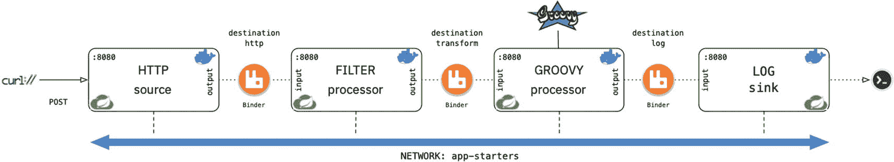

图 6-2。

使用 Docker HTTP |过滤器|转换|日志

图 [6-2](#Fig2) 显示了本例的解决方案。让我们一步一步来。

1.  首先，确保你的 RabbitMQ 已经停止。如果您正在使用 docker，请确保您已从 Docker 进程列表中删除。在这个场景中，您需要确保 RabbitMQ 与应用启动器运行在同一个网络中。

2.  使用以下命令创建一个 Docker 网络。

    ```java
    $ docker network create app-starters

    ```

3.  Next, put the RabbitMQ Docker image in the same network. Execute the following command.

    ```java
    $ docker run -d --rm \
      --name rabbit \
      --network app-starters \
      --hostname rabbit \
      rabbitmq:3.8.3-management-alpine

    ```

    注意，这是`app-starters`网络。在执行命令之前，我使用了`\`符号来指定还有一行。

4.  Next, run the HTTP source.

    ```java
    docker run -d \
      -p 8080:8080 \
      --name http \
      --rm \
      --network app-starters \
      --env SPRING.CLOUD.STREAM.BINDINGS.OUTPUT.DESTINATION='http' \
      --env SPRING.RABBITMQ.HOST='rabbit' \
      springcloudstream/http-source-rabbit:2.1.1.RELEASE

    ```

    请注意，这些属性被用作环境变量。这是唯一一个向我们的主机公开 8080 的容器，所以很容易发布消息。

5.  Next, run the filter processor.

    ```java
    docker run -d \
      --name filter \
      --rm \
      --network app-starters \
      --env SPRING.CLOUD.STREAM.BINDINGS.INPUT.DESTINATION='http' \
      --env SPRING.CLOUD.STREAM.BINDINGS.OUTPUT.DESTINATION='transform' \
      --env FILTER.EXPRESSION="#jsonPath(payload,'$.msg').contains('Hello')" \
      --env SPRING.RABBITMQ.HOST='rabbit' \
      springcloudstream/filter-processor-rabbit:2.1.1.RELEASE

    ```

    过滤处理器让包含单词“`Hello`”的消息通过。它使用带有内置`jsonPath`对象的 *SpEL* 来操作 JSON 对象。我们还声明了输入和输出目的地的属性；处理器总是需要这两者。

6.  Next, in your working directory, create the `transform.groovy` script with the following content.

    ```java
    import groovy.json.JsonSlurper
    import groovy.json.JsonOutput

    def jsonSlurper = new JsonSlurper()
    def json = jsonSlurper.parseText(new String(payload))

    json.msg = json.msg.toUpperCase()

    JsonOutput.toJson(json)

    ```

    这段代码是 Groovy 脚本，和 Java 很像。(在我看来，没那么啰嗦。在 [`https://groovy-lang.org/`](https://groovy-lang.org/) 了解更多信息。我觉得很直白；它获取有效载荷并大写 msg 值。在 Groovy 脚本中，最后一行被认为是返回值。

7.  Next, execute the Groovy Transform processor app with the following command.

    ```java
    docker run -d \
      --name transform \
      --rm \
      --network app-starters \
      --env SPRING.CLOUD.STREAM.BINDINGS.INPUT.DESTINATION='transform' \
      --env SPRING.CLOUD.STREAM.BINDINGS.OUTPUT.DESTINATION='log' \
      --env SPRING.RABBITMQ.HOST='rabbit' \
      --env GROOVY-TRANSFORMER.SCRIPT=file:///mnt/transform.groovy \
      --volume $PWD/:/mnt \
      springcloudstream/groovy-transform-processor-rabbit:2.1.1.RELEASE

    ```

    注意，您仍然在使用输入和输出目的地。这里重要的部分是您使用了`groovy-transformer.script`属性，它在`/mnt`路径中寻找`transform.groovy`。还要看看 Docker 的`--volume`参数，你在这里使用了我们当前的路径，你在这里保存了`transform.groovy`脚本；其内容安装在`/mnt`文件夹中。对于 Windows 操作系统用户来说，使用完整的路径是很重要的，比如`--volume C:\workspace\:/mnt`或者任何你有`transform.groovy`脚本文件的地方。运行该命令后，通过执行以下命令确保脚本在`/mnt`文件夹中。

    ```java
    $ docker exec transform bash -c 'ls -lrt /mnt'

    ```

    `transform.groovy`应上市。

8.  接下来，用下面的命令执行 log-sink。

    ```java
    docker run -d \
      --name log \
      --rm \
      --network app-starters \
      --env SPRING.CLOUD.STREAM.BINDINGS.INPUT.DESTINATION='log' \
      --env SPRING.RABBITMQ.HOST='rabbit' \
      springcloudstream/log-sink-rabbit:2.1.2.RELEASE

    ```

9.  接下来，使用以下命令查看 log-sink 应用的日志。

    ```java
    $ docker logs -f log

    ```

10.  最后，发一些消息。

    ```java
    $ curl -XPOST -H "Content-Type: application/json" -d '{"msg": "Hello App Starters"}}' http://localhost:8080
    $ curl -XPOST -H "Content-Type: application/json" -d '{"msg": "This is awesome"}}' http://localhost:8080
    $ curl -XPOST -H "Content-Type: application/json" -d '{"msg": "Hello Spring Cloud"}}' http://localhost:8080

    ```

当消息值包含单词`Hello`时，log-sink 应用记录消息被转换为大写。恭喜你！！您创建了一个使用 Docker 作为主要基础设施的解决方案。

请记住，您仍然可以使用带有相同文件(`http-source.yml`、`filter-processor.yml`、`groovy-transformer-processor.yml`和`log-sink.yml`)的 Spring Cloud Config Server，并避免所有的环境变量定义。请记住，有许多方法可以运行这些应用。

稍后，您将使用 Kubernetes 编排所有这些容器，以获得一个使用 Spring Cloud 数据流的可靠、可伸缩和容错的解决方案！

#### 使用 Docker 合成

您可以运行 Docker Compose，而不是执行所有这些命令。将下面的`docker-compose.yaml`文件复制到您的工作区目录中(参见清单 [6-1](#PC21) )。

```java
version: '3'
services:
  rabbit:
    image: "rabbitmq:3.8.3-management-alpine"
    container_name: rabbit
    networks:
      - app-starters

  http:
    image: "springcloudstream/http-source-rabbit:2.1.1.RELEASE"
    container_name: http
    environment:
      - spring.cloud.stream.bindings.output.destination=http
      - spring.rabbitmq.host=rabbit
    ports:
      - "8080:8080"
    networks:
      - app-starters

  filter:
    image: "springcloudstream/filter-processor-rabbit:2.1.1.RELEASE"
    container_name: filter
    environment:
      - spring.cloud.stream.bindings.input.destination=http
      - spring.cloud.stream.bindings.output.destination=transform
      - spring.rabbitmq.host=rabbit
      - filter.expression=#jsonPath(payload,'$$.msg').contains('Hello')
    networks:
      - app-starters

  transform:
    image: "springcloudstream/groovy-transform-processor-rabbit:2.1.1.RELEASE"
    container_name: transform
    environment:
      - spring.cloud.stream.bindings.input.destination=transform
      - spring.cloud.stream.bindings.output.destination=log
      - spring.rabbitmq.host=rabbit
      - groovy-transformer.script=file:///mnt/transform.groovy
    volumes:
      - "$PWD/:/mnt"
    networks:
      - app-starters

  log:
    image: "springcloudstream/log-sink-rabbit:2.1.2.RELEASE"
    container_name: log
    environment:
      - spring.cloud.stream.bindings.input.destination=log
      - spring.rabbitmq.host=rabbit
    networks:
      - app-starters

networks:
  app-starters

:

Listing 6-1.docker-compose.yaml

```

清单 [6-1](#PC21) 显示了`docker-compose.yaml`文件。注意，它与 Docker 命令相同，但是请仔细查看`filter.expression`属性。因为您使用 jsonPath 来查找`$.msg`值，所以必须对`$`进行转义，这里您使用了双`$$`。

Note

您可以在 Apress 网站下载本章的所有源代码。

我说你可以用不同的活页夹。好吧，你可以选择任何你想用 Kafka 运行应用启动器的优步-JARs 或 Docker 方法。你需要使用正确的 *<功能> - <类型> - <绑定>-*命名约定，所以如果你想测试 HTTP | LOG，你必须下载`http-source-kafka`和`log-sink-kafka`。

## 春云流

在本节中，您将了解更多关于 Spring Cloud Stream、它的主要概念以及在 3.x 中改变的编程模型，我将更多地讨论绑定器。在后面的章节中，您将创建一个自定义绑定器，作为微服务之间的通信通道，而无需使用特定的 API。

首先，让我们来看一个小例子，它说明了这项技术的强大之处，以及如何使用相同的代码而不考虑绑定器。

### 使用卡夫卡的电影云流:电影-水槽-卡夫卡

让我们创建一个简单的微服务来扮演一个接收器的角色:记录制片人的电影(见图 [6-3](#Fig3) )。

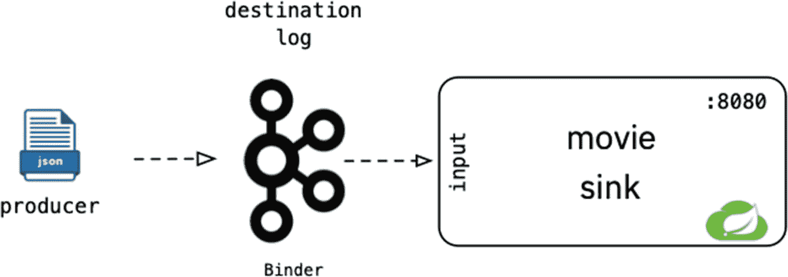

图 6-3。

使用卡夫卡的电影云流(sink - movie-sink-kafka)

打开浏览器，指向 [h `ttps://start.spring.io`](https://start.spring.io) 。添加以下元数据。

*   组:`com.apress.cloud.stream`

*   神器:`movie`

*   从属关系:云流，阿帕奇卡夫卡流的Spring，龙目岛

单击生成按钮下载一个 ZIP 文件。解压缩并导入到你喜欢的 IDE 中(见图 [6-4](#Fig4) )。

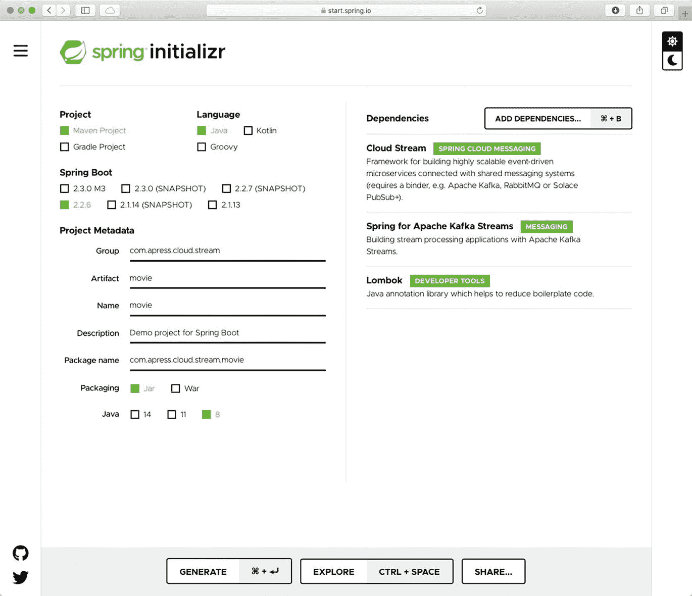

图 6-4。

[`https://start.spring.io`](https://start.spring.io) -春初始值-电影云流-沉

让我们从打开`pom.xml`文件开始。注意，您已经有了两个 Kafka 依赖项，但是您需要添加第三个(参见清单 [6-2](#PC22) )。

```java
...

<!-- Kafka Streams : Binder -->
<dependency>
        <groupId>org.apache.kafka</groupId>
        <artifactId>kafka-streams</artifactId>
</dependency>
<dependency>
        <groupId>org.springframework.cloud</groupId>
        <artifactId>spring-cloud-stream-binder-kafka-streams</artifactId>
</dependency>
<dependency>
        <groupId>org.springframework.cloud</groupId>
        <artifactId> spring-cloud-stream-binder-kafka</artifactId>
</dependency>
...

Listing 6-2.pom.xml Snippet

```

清单 [6-2](#PC22) 显示了`pom.xml`的一个片段，它添加了 Spring Cloud Stream 使用 Kafka broker 所需的依赖项。记得添加`spring-cloud-stream-binder-kafka`依赖项。

接下来，创建`Movie`类。你可以使用前几章的那个(见清单 [6-3](#PC23) )。

```java
package com.apress.cloud.stream.movie;

import lombok.AllArgsConstructor;
import lombok.Data;
import lombok.NoArgsConstructor;

@AllArgsConstructor
@NoArgsConstructor
@Data
public class Movie {
    private String title;
    private String actor;
    private int year;
}

Listing 6-3.src/main/java/com/apress/cloud/stream/movie/Movie.java

```

清单 [6-3](#PC23) 显示了`Movie`类。注意，您正在使用 Lombok 注释来避免样板文件 setters 和 getters 以及`toString`覆盖。

接下来，创建`MovieStream`类。这是水槽(见清单 [6-4](#PC24) )。

```java
package com.apress.cloud.stream.movie;

import lombok.extern.log4j.Log4j2;
import org.springframework.context.annotation.Bean;
import org.springframework.context.annotation.Configuration;

import java.util.function.Consumer;

@Log4j2
@Configuration
public class MovieStream {

    @Bean
    public Consumer<Movie> log() {
        return movie -> {
            log.info("Movie received: {}",movie);
        };
    }
}

Listing 6-4.src/main/java/com/apress/cloud/stream/movie/MovieStream.java

```

清单 [6-4](#PC24) 显示了`MovieStream`类，一个带有名为 log 的方法的接收器，它返回一个`Consumer`接口。是的，这是反应式/函数式编程的一部分，我将在下一节中讨论。它是 Spring Cloud Stream 提供的编程模型之一。

接下来，让我们用清单 [6-5](#PC25) 中的内容修改`application.properties`。

```java
# Bindings for Kafka
spring.cloud.stream.bindings.log-in-0.destination=log

Listing 6-5.src/main/resources/application.properties

```

清单 [6-5](#PC25) 显示了定义与名为 log 的目的地的`log-in-0`绑定的`application.properties`文件。`log-in-0`是卡夫卡作品的一部分。一个组中可以有几个消费者，用`name-in-#`格式`,`标识他们，意思是有`log-in-1, log-in-2`，以此类推；这种情况下就是`log-in-0`。这对于您在这里使用的编程模型也是必要的，但是不要担心；这在接下来的章节中会变得更加清晰。

Spring Cloud Stream 应用启动日志(log-sink-rabbit)是相同的代码(或多或少)，因为 Spring Cloud 团队给它添加了更多的功能。现在，你可以称这个微服务为 *movie-sink-kafka* 应用启动器。

我们来测试一下。使用 Docker Compose 运行 Kafka。如果你熟悉这项技术，它使用 Zookeeper 来创建集群，所以我认为在这种情况下使用 Docker 更容易。使用附带源代码中的`docker-compose.yml`文件(参见清单 [6-6](#PC26) )。

```java
version: '3'

services:
  zookeeper:
    image: 'bitnami/zookeeper:latest'
    container_name: zookeeper
    networks:
      - kafka-net
    ports:
      - '2181:2181'
    environment:
      - ALLOW_ANONYMOUS_LOGIN=yes

  kafka:
    image: 'bitnami/kafka:latest'
    container_name: kafka
    networks:
      - kafka-net
    ports:
      - '9092:9092'
    environment:
      - KAFKA_CFG_ZOOKEEPER_CONNECT=zookeeper:2181
      - KAFKA_CFG_ADVERTISED_LISTENERS=PLAINTEXT://localhost:9092
      - ALLOW_PLAINTEXT_LISTENER=yes
    depends_on:
      - zookeeper

networks:
  kafka-net:

Listing 6-6.docker-compose.yml

```

清单 [6-6](#PC26) 显示了`docker-compose.yml`。请注意，您使用的是动物园管理员 Bitnami 图像和卡夫卡。要启动 Kafka，请打开一个终端窗口并执行以下命令。

```java
$ docker-compose up

```

在您的 IDE 中运行该应用，或者使用微服务在终端窗口中执行以下命令。

```java
$ ./mvnw spring-boot:run

```

接下来，发送一些电影到`movie-sink-kafka`流。打开终端窗口并执行以下命令。这个命令是交互式的，所以您可以添加 JSON 对象。

```java
$ docker exec -it kafka /opt/bitnami/kafka/bin/kafka-console-producer.sh --broker-list 127.0.0.1:9092 --topic log
> {"title":"The Matrix","actor":"Keanu Reeves","year":1999}
> {"title":"Memento","actor":" Guy Pearce ","year":2000}

```

执行这些命令后，您应该会在日志中看到类似下面的内容。

```java
Movie received: Movie(title=The Matrix, actor=Keanu Reeves, year=1999)
Movie received: Movie(title=Memento, actor= Guy Pearce , year=2000)

```

恭喜你，你创造了自己的云流汇！

通过按 Ctrl+C 停止 Docker 生成器，然后通过在启动 Docker 生成器的同一个目录中执行`docker-compose down`来停止 Docker Compose。

### 使用 RabbitMQ: movie-sink-rabbit 的电影云流

现在是时候使用 RabbitMQ 绑定器创建一个 sink 了。创作电影《沉沦之兔》需要什么？您正在修改同一个项目。让我们开始吧(见图 [6-5](#Fig5) )。

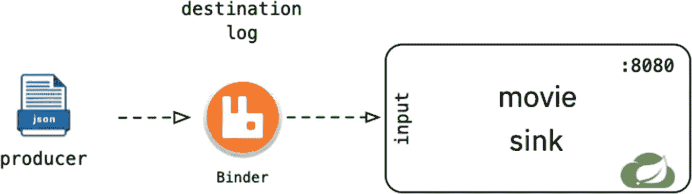

图 6-5。

使用 rabbit MQ(sink-movie-sink-rabbit)的电影云流

打开你的`pom.xml`文件，注释三个卡夫卡依赖关系**、**并添加`spring-cloud-starter-stream-rabbit`依赖关系(见清单 [6-7](#PC31) )。

```java
...
<!-- RabbitMQ Streams - Binder-->
<dependency>
        <groupId>org.springframework.cloud</groupId>
        <artifactId>spring-cloud-starter-stream-rabbit</artifactId>
</dependency>
...

Listing 6-7.pom.xml Snippet

```

这就是你需要做的。我们来测试一下。

首先，使用下面的命令确保 RabbitMQ 启动并运行。

```java
$ docker run -d --rm \
  --name rabbit \
  -p 15672:15672 -p 5672:5672 \
  rabbitmq:3.8.3-management-alpine

```

接下来，运行应用。

打开浏览器，指向`http://localhost:15672`。用`guest/guest`访问 RabbitMQ 控制台。转到队列选项卡。你发现类似`log.anonymous.xxxx`的队列。点击队列(见图 [6-6](#Fig6) )。

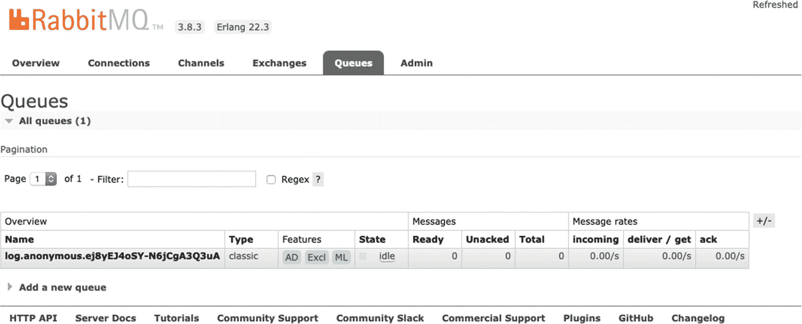

图 6-6。

http://localhost:15672/#/queues-log . anonymous . xxxx

点击队列后，进入**发布消息**部分。在属性字段中，添加带有`application/json`值的`content_type`，并添加 JSON 格式的电影(参见图 [6-7](#Fig7) )。

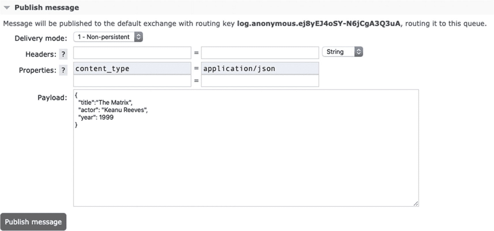

图 6-7。

队列发布消息

点击**发布消息**按钮。您会在应用日志中看到如下内容。

```java
Movie received: Movie(title=The Matrix, actor=Keanu Reeves, year=1999)

```

恭喜你！你已经创建了电影-水槽-兔子应用启动器！您可能想知道为什么不更改`application.properties`。这就是 Spring Cloud Stream 的美妙之处，也是 Spring Boot 自动配置的方式。它知道如何处理这些属性。我稍后会讨论它们。

## 春云流

Spring Cloud Stream 是一个消息驱动的框架，用于创建微服务应用。它构建于 Spring Boot 之上，这使得轻松创建企业级微服务成为可能。它使用 Spring Integration 来公开企业集成模式，并提供了一种与任何消息传递代理进行通信(通过通道)的简单方法。

Spring Cloud Stream 的一个主要特性(在我看来是关键特性)是，它通过使用 Java 服务提供者接口(SPI)为*任何*中间件代理提供了自以为是的配置，使得实现和集成非常容易。它使用发布-订阅、消费者组和分区等消息传递模式(见图 [6-8](#Fig8) )。

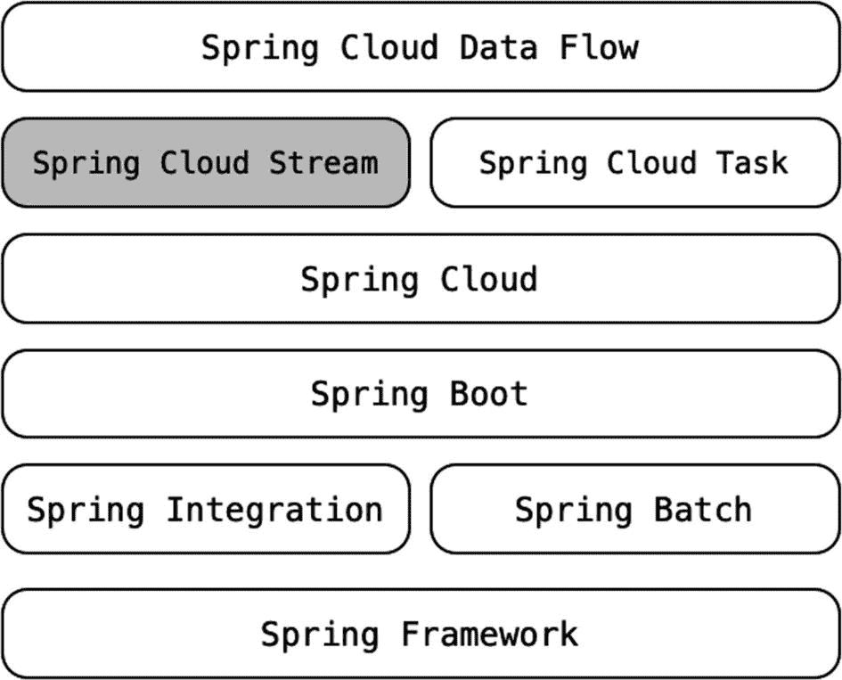

图 6-8。

Spring生态系统

因为 Spring Cloud Stream 基于 Spring Boot，所以您可以通过添加以下依赖项将现有的 Spring Boot 应用转换为 Spring Cloud Stream 应用。

```java
...
              <dependency>
                <groupId>org.springframework.cloud</groupId>
                <artifactId>spring-cloud-stream</artifactId>
        </dependency>

...
<dependencyManagement>
        <dependencies>
                <dependency>
                        <groupId>org.springframework.cloud</groupId>
                        <artifactId>spring-cloud-dependencies</artifactId>
                        <version>${spring-cloud.version}</version>
                        <type>pom</type>
                        <scope>import</scope>
                </dependency>
        </dependencies>
</dependencyManagement>

```

我用了霍舍姆。SR7 版春云依赖写这本书的时候；你可以在主页面查看最新的 GA 版本( [`https://spring.io/projects/spring-cloud-stream`](https://spring.io/projects/spring-cloud-stream) )。

您还需要添加正确的绑定依赖项，这些依赖项基于您支持的代理；春云流首页显示支持的经纪人。在这本书里，你要么用卡夫卡，要么用 RabbitMQ。对于 Kafka，您需要添加以下绑定器依赖项。

```java
<dependency>
        <groupId>org.apache.kafka</groupId>
        <artifactId>kafka-streams</artifactId>
</dependency>
<dependency>
        <groupId>org.springframework.cloud</groupId>
        <artifactId>spring-cloud-stream-binder-kafka-streams</artifactId>
</dependency>
<dependency>
        <groupId>org.springframework.cloud</groupId>
        <artifactId>spring-cloud-stream-binder-kafka</artifactId>
</dependency>

```

在使用 Kafka 和 Kafka 流模型编程时，前面的依赖关系会有所帮助。如果您需要 RabbitMQ 代理，您需要添加以下绑定器依赖项。

```java
<dependency>
        <groupId>org.springframework.cloud</groupId>
        <artifactId>spring-cloud-starter-stream-rabbit</artifactId>
</dependency>

```

如果您需要进行单元和集成测试，您可以添加以下依赖项。

```java
<dependency>
        <groupId>org.springframework.boot</groupId>
        <artifactId>spring-boot-starter-test</artifactId>
        <scope>test</scope>
        <exclusions>
                <exclusion>
                        <groupId>org.junit.vintage</groupId>
                        <artifactId>junit-vintage-engine</artifactId>
                </exclusion>
        </exclusions>
</dependency>
<dependency>
        <groupId>org.springframework.cloud</groupId>
        <artifactId>spring-cloud-stream-test-support</artifactId>
        <scope>test</scope>

</dependency>

```

### Spring云流特征

Spring Cloud Stream 提供了几个特性，允许您创建和扩展消息驱动的微服务应用。

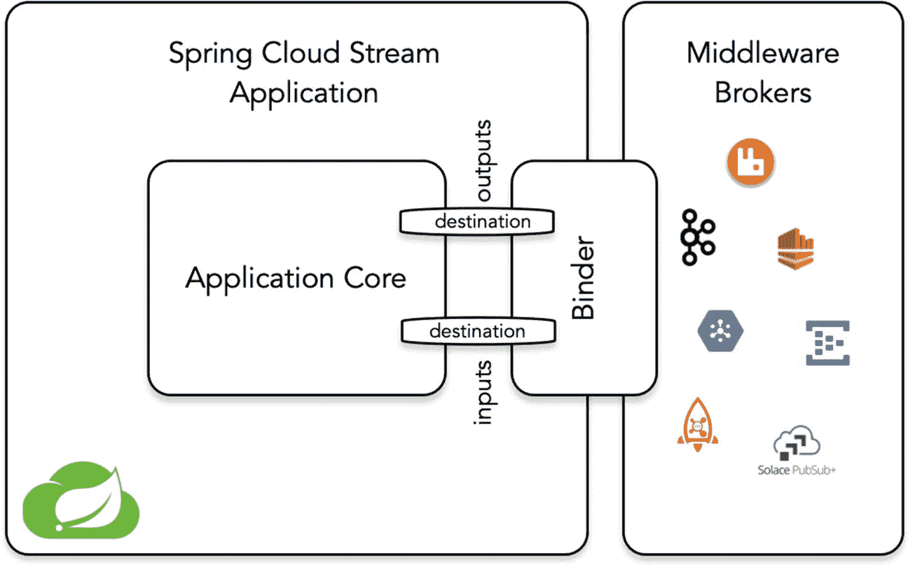

图 6-9。

Spring 云流应用模型

*   它提供了一个中间件中立的核心，这意味着您的微服务可以通过特定于中间件的绑定器实现与其他微服务和外部服务进行通信。您需要在代码中使用目的地(输入和输出通道)(参见图 [6-9](#Fig9) )。

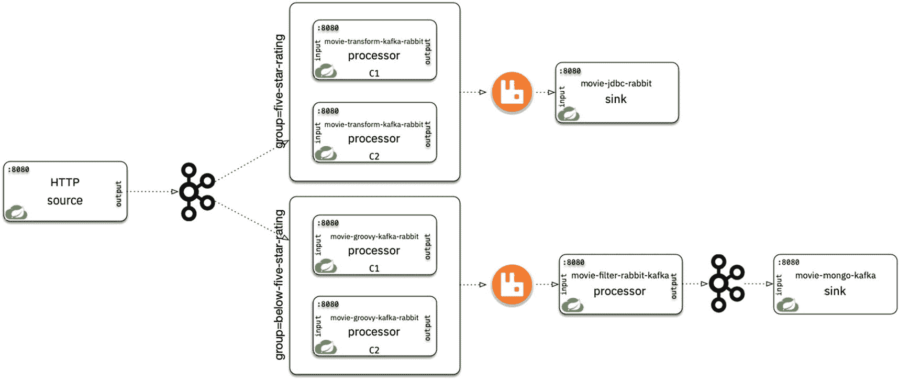

图 6-10。

消费者群体:多个活页夹

*   您可以使用任何构建工具(包括 Maven 或 Gradle)运行独立的 Spring Cloud Stream 应用，以生成可运行的 jar。

*   Spring Cloud Stream 为 Kafka 和 RabbitMQ 提供绑定器实现(与 Spring Cloud 团队一起)。社区支持其他绑定器(Amazon Kinesis、Google PubSub、Solace PubSub+、Azure Event Hubs 和 Apache RocketMQ)。如果您没有使用这些绑定器实现，您可以创建自己的绑定器。Spring Cloud Stream 提供了基于 Java 服务提供者接口的绑定器抽象，因此很容易编写自己的即插即用绑定器。稍后您将创建一个绑定器实现。

    有了这个 binder 抽象，当您声明`spring.cloud.stream.bindings.[input|output].destination`属性时，就可以很容易地在运行时通过您的应用属性动态选择到外部目的地(输入和输出通道)的映射。如果你使用 Kafka，Spring Cloud Stream 会创建一个**主题**，如果你使用 RabbitMQ，spring Cloud Stream 会创建一个**队列**。因为 Spring Cloud Stream 是固执己见的，所以它会根据类路径中的内容来配置绑定器。由于这种抽象，您可以轻松地将多个绑定器添加到您的云流应用中。您可能需要从 RabbitMQ 消费(输入目的地)并处理和发送有效负载(输出目的地)到 Kafka 代理(见图 [6-10](#Fig10) )。

*   它为您的云流应用的单元和集成测试提供了一个测试框架。它为测试目的提供了一个专门的绑定器实现。

*   它提供了一种发布-订阅通信，减少了生产者和消费者的复杂性，形成了一个更加灵活、可伸缩、解耦和容错的环境。这种发布-订阅消息传递模式并不新鲜，但是跨不同的中间件代理实现起来很简单。

*   它提供了一种创造消费群体的方式；这样，它在默认情况下实现了 worker 消息传递模式(循环方式)，该模式允许您扩展您的应用，并确保一个组中的使用者一次接收一条消息。要在您的应用中创建消费者组，您需要设置`spring.cloud.stream.bindings.<binding-name>.group`属性。如果你没有指定一个组，Spring Cloud Streams 会生成一个匿名的消费者组，并为你的消费者订阅(见图 [6-10](#Fig10) )。

*   它提供了持久性，即使用户停机，也能保持用户群订阅的持久性。当它从故障中恢复时，消息正在等待，但您需要知道，如果您不添加组，它会创建一个匿名订阅，这是不持久的。因此，作为一个好的实践，我建议在您的应用中设置一个组和一个目的地。

*   它提供了两种不同类型的消费者:异步(通常是消息驱动模式)和同步(轮询模式)。

*   它提供了分区支持，您可以在多个实例之间对数据进行分区。这个特性允许你拥有超快的实时数据处理速度，并允许你在不支持这个特性的代理中进行分区，比如 RabbitMQ 另一方面，Kafka 默认使用分区。重要的是要知道，如果您想要使用分区特性，您需要配置两端——生产者和消费者。

在接下来的几节中，您将使用其中的一些功能。

### 程序设计模型

让我们回顾一下编程模型，以了解如何创建 Spring Cloud Stream 应用(也称为开箱即用的应用启动器)。

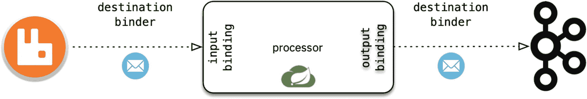

图 6-11。

目的活页夹

*   *消息*。这种数据结构通常包含标题(有时甚至是页脚)和有效载荷，由生产者和消费者使用。

*   *目的地活页夹*。一些组件提供了与中间件系统的集成。这些绑定器负责连接、数据类型转换、开发人员代码执行、委托、生产者和消费者之间的消息路由等等。尽管这些绑定能够集成，但它们需要开发人员提供与绑定相关的配置。我将在后面的章节中讨论目的地绑定器以及如何实现自己的绑定器。

*   *绑定*。这是应用和中间件系统之间的桥梁(通向主题和队列的桥梁)。目的地绑定器创建这些绑定(参见图 [6-11](#Fig11) )。

#### 基于注释的绑定版本 2.x 及以下

开发者需要遵循这些简单的步骤来创建 2.x 及更低版本的 Spring Cloud Stream 应用。

1.  添加必要的依赖:`spring-cloud-stream`和`spring-cloud-stream-binder-*`。

2.  使用`@EnableBinding`注释来指定您的绑定是源接口、处理器接口还是接收器接口。当这个注释被添加到您的类中时，Spring Cloud 连接所有必要的组件来创建您的流应用。

3.  如果您想要创建一个源，您需要声明一个输出通道并使用它来发送有效负载。如果您想要创建一个处理器，您需要声明输入和输出通道，并使用它们来消费和产生有效负载。如果您想要创建一个接收器，您需要声明一个输入通道并使用它来消费有效负载。
    1.  为了消费消息(输入通道)，您可以使用遗留的 Spring 集成流或`@StreamListener`注释，这使得消费消息更容易。对于发送消息(输出通道)，您可以使用遗留的 Spring 集成流或`@SendTo`注释。

让我们看看创建云流应用的绑定接口。Spring Cloud Stream 提供绑定接口，在微服务之间创建简单的契约。

*   `Source` defines a contract to produce messaging by providing a destination where the produced message is sent. The following code defines the `Source` interface.

    ```java
    public interface Source {

      String OUTPUT = "output";

      @Output(Source.OUTPUT)
      MessageChannel output();
    }

    ```

    `Source`接口使用功能接口。`org.springframework.messaging.MessageChannel`提供了一个重载`send`方法，并由`@Output`注释标记。这个标记通过连接所有必要的逻辑来识别绑定的类型、目的地和行为。

*   `Processor`定义了`Source`和`Sink`接口的封装，这提供了一种消费和产生消息的简单方法。下面的代码定义了`Processor`接口。

*   `Sink` defines a contract for a message consumer by providing a destination where the message is consumed. The following code defines the `Sink` interface.

    ```java
    public interface Sink {

      String INPUT = "input";

      @Input(Sink.INPUT)
      SubscribableChannel input();
    }

    ```

    `Sink`接口使用了一个从`MessageChannel`接口扩展而来的`org.springframework.messaging.SubscribableChannel`接口，并用`@Input`标注进行了标记。同样，这有助于 Spring Cloud Stream 为您的应用连接所有必要的逻辑。

```java
public interface Processor extends Source, Sink {}

```

较新版本的 Spring Cloud Stream 具有向后兼容性，因此您仍然可以在 Spring Cloud Stream 3 . x 版本中使用这些接口，我们先来看一个如何使用 2.x 及更低版本的示例。2.x 及以下版本用于 Spring Web 之上。您需要小心您的本地环境，因为如果您正在开发几个应用，您必须为每个应用更改`server.port`属性。Spring Cloud 团队在 3.x 版本中关闭了这个，我的建议是，如果你想使用 2.x 或以下的绑定，选择最新版本的 Spring Cloud Stream，这样 web 就关闭了，你就不需要担心这个问题了。

##### 文件|转换|日志(兔子)示例

让我们从一个简单的流开始。我们来读一下`movies.txt`(CSV 格式)把标题大写，把电影记录在控制台里。你正在使用 RabbitMQ 作为绑定器，并且你正在创建三个小应用(见图 [6-12](#Fig12) )。

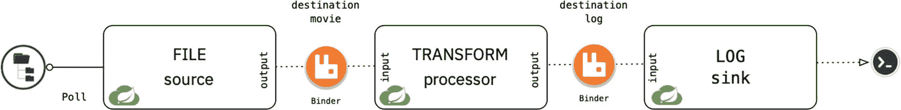

图 6-12。

文件|转换|日志:RabbitMQ 活页夹

###### 电影-文件-源-兔子

第一个源微服务从文件系统中读取`movie.txt`。打开一个指向 [`https://start.spring.io`](https://start.spring.io) 的浏览器。添加以下元数据。

*   组`: com.apress.cloud.stream`

*   神器:`movie-file-source-rabbit`

*   包名:`com.apress.cloud.stream.movie`

*   依赖:云流，龙目岛

Note

我们正在更改包名。

您可以单击“生成”按钮下载一个 ZIP 文件。您可以将其解压缩并导入到您喜欢的 IDE 中(参见图 [6-13](#Fig13) )。

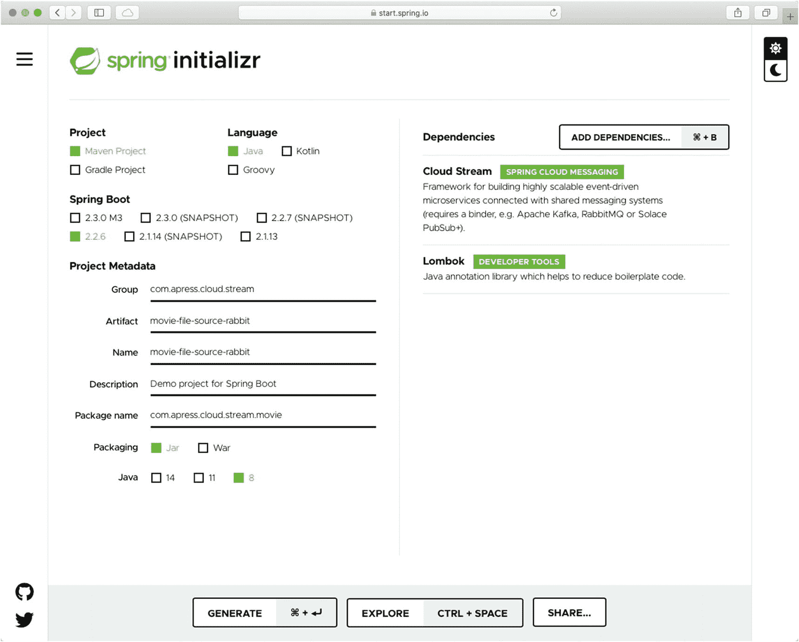

图 6-13。

[`https://start.spring.io`](https://start.spring.io) :Spring初始化

因为您使用的是 RabbitMQ 绑定器，所以打开您的`pom.xml`文件并添加以下依赖项。

```java
<!-- RabbitMQ Binder -->
<dependency>
        <groupId>org.springframework.cloud</groupId>
        <artifactId>spring-cloud-starter-stream-rabbit</artifactId>
</dependency>

<!-- Spring Integration -->
<dependency>
        <groupId>org.springframework.integration</groupId>
        <artifactId>spring-integration-file</artifactId>
</dependency>

```

您正在添加`spring-integration-file`,因为您正在从文件系统中读取。接下来，创建您的`Movie`模型类。您可以使用清单 [6-3](#PC23) 中列出的内容。

接下来，创建`MovieStreamProperties`类。这个类保存了从`application.properties`文件中读取的两个属性(参见清单 [6-8](#PC42) )。

```java
package com.apress.cloud.stream.movie;

import lombok.Data;
import org.springframework.boot.context.properties.ConfigurationProperties;

@Data
@ConfigurationProperties(prefix = "movie.stream")
public class MovieStreamProperties {

    private String directory;
    private String namePattern;
}

Listing 6-8.src/main/java/com/apress/cloud/stream/movie/MovieStreamProperties.java

```

您需要将 CSV 文件转换成一个`Movie`对象。这意味着您需要创建一个进行转换的`MovieConverter`类(参见清单 [6-9](#PC43) )。

```java
package com.apress.cloud.stream.movie;

import org.springframework.core.convert.converter.Converter;
import org.springframework.stereotype.Component;

import java.util.List;
import java.util.stream.Collectors;
import java.util.stream.Stream;

@Component
public class MovieConverter implements Converter<String,Movie> {
    @Override
    public Movie convert(String s) {
        List<String> fields = Stream.of(s.split(",")).map(String::trim).collect(Collectors.toList());
        return new Movie(fields.get(0),fields.get(1),Integer.valueOf(fields.get(2)));
    }
}

Listing 6-9.src/main/java/com/apress/cloud/stream/movie/MovieConverter.java

```

清单 [6-9](#PC43) 展示了实现`Converter<S,T>`接口的`MovieConverter`类，该接口接受一个字符串并返回一个`Movie`对象。

接下来，创建`MovieStream`类，它拥有创建流应用所需的一切(参见清单 [6-10](#PC44) )。

```java
package com.apress.cloud.stream.movie

;

import lombok.AllArgsConstructor;
import org.springframework.boot.context.properties.EnableConfigurationProperties;
import org.springframework.cloud.stream.annotation.EnableBinding;
import org.springframework.cloud.stream.messaging.Source;
import org.springframework.context.annotation.Bean;
import org.springframework.integration.dsl.IntegrationFlow;
import org.springframework.integration.dsl.IntegrationFlows;
import org.springframework.integration.dsl.Pollers;
import org.springframework.integration.dsl.Transformers;
import org.springframework.integration.file.dsl.Files;
import org.springframework.integration.file.splitter.FileSplitter;

import java.io.File;

@EnableConfigurationProperties(MovieStreamProperties.class)
@AllArgsConstructor
@EnableBinding(Source.class)
public class MovieStream {

    private MovieStreamProperties movieStreamProperties;
    private MovieConverter movieConverter;

    @Bean
    public IntegrationFlow fileFlow(){
        return IntegrationFlows.from(Files
                        .inboundAdapter(new File(this.movieStreamProperties.getDirectory()))
                        .preventDuplicates(true)
                        .patternFilter(this.movieStreamProperties.getNamePattern()),
                e -> e.poller(Pollers.fixedDelay(5000L)))

                .split(Files.splitter().markers())
                .filter(p -> !(p instanceof FileSplitter.FileMarker))
                .transform(Transformers.converter(movieConverter))
                .transform(Transformers.toJson())
                .channel(Source.OUTPUT)
                .get();
    }

}

Listing 6-10.src/main/java/com/apress/cloud/stream/movie/MovieStream.java

```

清单 [6-10](#PC44) 显示了`MovieStream`类。我们来分析一下。

*   `@EnableBinding`。这个注释告诉 Spring Cloud Stream 要应用什么配置，因为您将`Source.class`作为参数传递，所以它被配置为源绑定。这个标记是你创建 Spring Cloud Stream app 唯一需要的东西。剩下的就看 Spring Cloud Stream 框架了(如何连接，发送消息等。).

*   `IntegrationFlow`。这部分你已经从第 [3](03.html) 章知道了。请注意，您正在声明一个`IntegrationFlow,`，并且您正在使用`inboundAdapter`从特定目录和特定模式的文件系统中读取文件。您每 5 秒钟轮询一次，并且您不能两次读取同一个文件。此外，您正在读取文件的内容并使用`MovieConverter`创建一个`Movie`对象，该对象被转换成 JSON 格式并发送到输出通道。

*   `channel(Source.OUTPUT)`。这部分代码属于`IntegrationFlow`，这是你发送到输出通道的最后一部分(即将声明的目的地)。

这里使用了 Spring Integration，并且使用了 Spring Integration DSL(也可以使用 XML)。记住，要创建一个 Spring 云流(2.x 及以下版本)，需要声明`@EnableBinding`注释和绑定的类型，在本例中是源绑定；第二，输出通道，因为这是一个源绑定类型，必须告诉消息发送到哪里；这是通过在最后一部分的流程中添加`channel(Source.OUTPUT)`来完成的。我知道我在这里是重复的，但是我想确保您理解这段代码发生了什么，以及创建流是多么容易。

最后，您需要打开`application.properties`并添加清单 [6-11](#PC45) 中的内容。

```java
# Bindings
spring.cloud.stream.bindings.output.destination=movie

# Movie Stream
movie.stream.directory=.
movie.stream.name-pattern=movies.txt

Listing 6-11.src/main/resources/application.properties

```

清单 [6-11](#PC45) 中的重要部分是`spring.cloud.stream.bindings.output.destination`属性的声明。这意味着`Source.OUTPUT`通道创建一个名为`movie`的目的地，作为 RabbitMQ 中的主题交换。

###### 电影-转换-处理器-兔子

现在让我们来研究下一个处理器微服务，它消耗一个`Movie`对象。它将标题改为大写。打开浏览器指向 [`https://start.spring.io`](https://start.spring.io) 。添加以下元数据。

*   组`: com.apress.cloud.stream`

*   神器:`movie-transform-processor-rabbit`

*   包名:`com.apress.cloud.stream.movie`

*   依赖:云流，龙目岛

Note

我们正在更改包名。

您可以单击“生成”按钮下载一个 ZIP 文件。将其解压缩并导入到您最喜欢的 IDE 中。这与图 [6-13](#Fig13) 相同，但是确保相应地更改工件和包名。

首先，确保您添加了 RabbitMQ 绑定器(只有绑定器)。然后，创建`Movie`类(与清单 [6-3](#PC23) 中的相同)。

接下来，创建包含转换代码的`MovieStream`类。记住，它用大写字母设置电影标题(见清单 [6-12](#PC46) )。

```java
package com.apress.cloud.stream.movie;

import org.springframework.cloud.stream.annotation.EnableBinding;
import org.springframework.cloud.stream.annotation.StreamListener;
import org.springframework.cloud.stream.messaging.Processor;
import org.springframework.messaging.handler.annotation.SendTo;

@EnableBinding(Processor.class)
public class MovieStream {

    @StreamListener(Processor.INPUT)
    @SendTo(Processor.OUTPUT)
    public Movie process(Movie movie){
        movie.setTitle(movie.getTitle().toUpperCase());
        return movie;
    }
}

Listing 6-12.src/main/java/com/apress/cloud/stream/movie/MovieStream.java

```

清单 [6-12](#PC46) 显示了`MovieStream`类。我们来分析一下注解。

*   `@EnableBinding`告诉春云流，app 是流，是处理器类型。这意味着它需要设置输入和输出通道。

*   `@StreamListener`连接到一个队列(RabbitMQ)或者一个主题(Kafka)；它设置输入通道。

*   `@SendTo`将有效载荷发送到输出通道。

如你所见，这非常简单；事实上，您可以使用 transform-processor-rabbit 应用启动器来代替。你可以把这个作为作业。

最后，您需要打开`application.properties`并添加清单 [6-13](#PC47) 中的内容。

```java
# Bindings - RabbitMQ
spring.cloud.stream.bindings.input.destination=movie
spring.cloud.stream.bindings.output.destination=log

Listing 6-13.src/main/resources/application.properties

```

注意，您使用的是连接到`movie`(目的地)队列的输入通道，它使用输出通道将有效负载发送到 RabbitMQ 中名为`log`(目的地)的主题。

###### 电影-原木-水槽-兔子

下一个 sink 微服务接收一个`Movie`对象，并将其记录到控制台中。我们先打开一个指向 [`https://start.spring.io`](https://start.spring.io) 的浏览器。添加以下元数据。

*   组`: com.apress.cloud.stream`

*   神器:`movie-log-sink-rabbit`

*   包名:`com.apress.cloud.stream.movie`

*   依赖:云流，龙目岛

Note

我们正在更改包名。

您可以单击“生成”按钮。这将下载一个 ZIP 文件。您可以将其解压缩并导入到您最喜欢的 IDE 中(参见图 [6-13](#Fig13) )，但是一定要相应地更改工件和包的名称。

首先，确保您添加了 RabbitMQ 绑定器(只有绑定器)。然后，您需要创建`Movie`类(参见清单 [6-3](#PC23) )。

接下来，创建记录`Movie`的`MovieStream`类，它应该以大写形式显示`title`(参见清单 [6-14](#PC48) )。

```java
package com.apress.cloud.stream.movie;

import lombok.extern.log4j.Log4j2;
import org.springframework.cloud.stream.annotation.EnableBinding;
import org.springframework.cloud.stream.annotation.StreamListener;
import org.springframework.cloud.stream.messaging.Sink;

@Log4j2
@EnableBinding(Sink.class)
public class MovieStream {

    @StreamListener(Sink.INPUT)
    public void process(Movie movie){
        log.info("Movie processed: {}",movie);
    }
}

Listing 6-14.src/main/java/com/apress/cloud/stream/movie/MovieStream.java

```

清单 [6-14](#PC48) 显示了`MovieStream`类。我们来分析一下注解。

*   `@EnableBinding`告诉春云流这个 app 是一个流，而且是一个汇的类型。这意味着它需要设置输入通道。

*   `@StreamListener`连接到一个队列(RabbitMQ)或者一个主题(Kafka)；它设置输入通道。

最后，您需要打开`application.properties`并添加清单 [6-15](#PC49) 中的内容。

```java
# Bindings - RabbitMQ
spring.cloud.stream.bindings.input.destination=log

Listing 6-15.src/main/resources/application.properties

```

注意，您正在使用连接到一个`log`(目的地)队列的输入通道来获取`Movie`有效载荷，标题应该是大写的。

###### 一起运行它们

在运行应用之前，确保 RabbitMQ 运行并监听端口 5672 是很重要的。您可以像以前一样使用 Docker 运行 RabbitMQ，命令如下。

```java
$ docker run -d --rm \
  --name rabbit \
  -p 15672:15672 -p 5672:5672 \
  rabbitmq:3.8.3-management-alpine

```

接下来，用以下代码运行应用。

```java
$ ./mvnw spring-boot:run

```

我建议你从`movie-log-sink-rabbit`开始，然后是`movie-transform-processor-rabbit,`，最后是`movie-file-source-rabbit`，按这个顺序。另外，确保`movies.txt`可以被应用访问到。你可以在`movie-file-source-rabbit`应用的根文件夹中找到`movies.txt`的副本。

您应该在`movie-log-sink-rabbit`控制台或终端中看到以下输出。

```java
Movie processed: Movie(title=THE MATRIX, actor=Keanu Reeves, year=1999)
Movie processed: Movie(title=MEMENTO, actor=Guy Pearce, year=2000)
Movie processed: Movie(title=THE SILENCE OF THE LAMBS, actor=Jodie Foster, year=1991)
Movie processed: Movie(title=THE PRESTIGE, actor=Christian Bale, year=2006)
Movie processed: Movie(title=DISTURBIA, actor=Shia LaBeouf, year=2007)

```

##### 关于绑定的更多信息

正如您在示例中看到的，Spring Cloud Stream 组件基于 Spring Messaging 的`MessageChannel`(出站)和`SubscribableChannel`(入站)。这些接口使得 Spring Cloud Stream 更具可扩展性。您可以拥有一个类似的界面，在其中定义多个输出，也许是为了一个动态场景。

```java
public interface MovieGenre {

    String INPUT = "movie-genre";
    String GENRE_SCIENCE_FICTION = "science-fiction";
    String GENRE_ROMANCE = "romance";
    String GENRE_HORROR = "horror";
    String GENRE_DEFAULT = "default-output";

    @Input(INPUT)
    SubscribableChannel movie();

    @Output(GENRE_HORROR)
    MessageChannel horror();

    @Output(GENRE_SCIENCE_FICTION)
    MessageChannel scienceFiction();

    @Output(GENRE_ROMANCE)
    MessageChannel romance();
}

```

你的`Stream`类可以这样写。

```java
@Log4j2
@EnableBinding(MovieGenre.class)
public class MovieStream {

    //Acts as Processor
    @Bean
    @ServiceActivator(inputChannel = MovieGenre.INPUT)
    public AbstractMappingMessageRouter destinationRouter(@Qualifier("binderAwareChannelResolver") DestinationResolver<MessageChannel> channelResolver) {
        AbstractMappingMessageRouter router = new ExpressionEvaluatingRouter(new SpelExpressionParser().parseExpression("#jsonPath(payload,'$.genre')"));
        router.setDefaultOutputChannelName(MovieGenre.GENRE_DEFAULT);
        router.setChannelResolver(channelResolver);
        return router;
    }

    //Sinks
    @StreamListener(MovieGenre.GENRE_SCIENCE_FICTION)
    public void genreScienceFiction(Movie movie){
        log.info("Science Fiction: {}",movie);
    }

    @StreamListener(MovieGenre.GENRE_HORROR)
    public void genreHorror(Movie movie){
        log.info("Horror: {}",movie);
    }

    //...
}

```

处理器正在使用`@ServiceActivator`(创建处理器或接收器的另一种方式)。您可以在附带的源代码中或者在 Apress 网站上找到`movie-multiple-rabbit`项目中的完整代码。您需要在 RabbitMQ 控制台的`movie-genre`匿名队列中手动发送一个 JSON 对象(发布消息时不要忘记在属性字段中添加`content-type:application/json`)。JSON 应该如下所示。

```java
{
  "title":"The Matrix",
  "actor":"Keanu Reeves",
  "year":1999,
  "genre":"science-fiction"
}

```

此外，您可以使用多个绑定，如下所示。

```java
@EnableBinding(value={MovieGenre.class, MovieEvents.class})

```

这些例子更有可能使用基于事件的消息消费，因为您定义了多个`MessageChannel`并使用`DestinationResolver`将消息路由到正确的目的地。尽管如此，有时你还是需要一些控制，比如控制你的消费速度。您可以创建`PollableMessageSource`，如下面的代码片段所示。

```java
public interface MovieEvent {
     @Input
     PollableMessageSource ratingChanged();
}

```

###### 通道/绑定命名约定

当您使用默认绑定实现时，标记的通道仅通过添加`@Input`或`@Output`注释来获取方法名称。换句话说，如果你有如下代码。

```java
public interface MovieGenre {
     @Input
     SubscribableChannel movie();
}

```

绑定/目的地(代理中的主题)被命名为`movie`。如果您将参数值传递给`@Input`批注，您可以覆盖此行为；例如，如果您有以下代码。

```java
public interface MovieGenre {
     @Input("new-movie")
     SubscribableChannel movie();
}

```

绑定/目的地(代理中的主题)被命名为`newMovie`。一个非常简单的命名约定。此外，您可以使用`spring.cloud.stream.bindings`属性覆盖该行为。这是一个表达式:

```java
spring.cloud.stream.bindings.[channel-name].destination=[new-channel-name]

```

如果您使用的是我们的第一个例子，`@Input`(没有参数)，它采用方法的名称。如果您想覆盖它，您需要以下内容。

```java
#application.properties
spring.cloud.stream.bindings.movie.destination=newMovie

```

前面的命令覆盖了名称`movie.`，它在代理中创建了`newMovie`绑定/目的地。如果你正在使用像`@Input("newMovie")`这样的注释，你想要覆盖它。你应该把下面的放在`application.properties`里。

```java
#application.properties
spring.cloud.stream.bindings.new-movie.destination=new-movie-event

```

这将覆盖代理中的`new-movie-event`绑定/目的地的`new-movie`绑定/目的地。稍后将详细介绍这些命名约定。

#### 绑定版本 3.x

版本 3.x 的主要新增功能之一是在处理绑定时能够使用函数来生成或使用消息。您不需要添加或使用任何额外的注释，如`@EnableBinding`或`@StreamListener`。新的固执己见的运行时可以查看您的代码并动态创建正确的流类型(源、处理器或接收器)。

通过使用 POJOs(普通旧 Java 对象)，3.x 版本提供了一种更清晰的方式来创建流应用，并使用上下文 beans 类型，如`java.util.function.Supplier<T>`(用于源)、`java.util.function.Function<T,R>`(用于处理器)和`java.util.function.Consumer<T>`(用于接收器)。它创建了反应式流，这意味着通过使用这种新的编程模型，您可以立即使用反应式编程。

我们来回顾一下使用 3.x 版本创建流应用的新方法，如果你想使用最新版本的 Spring Cloud Stream(霍舍姆。SR7)，你需要做到以下几点。

1.  给`pom.xml` : `spring-cloud-stream`、`spring-cloud-stream-binder-kafka-streams,`和`spring-cloud-stream-binder-kafka`添加正确的依赖关系。

2.  声明您的 beans 类型:供应商、函数、消费者。

3.  有了这些类型的 beans，你就可以开始用 Spring Cloud 函数编写，创建函数组合，公开你需要的函数。对于这个特性，您可以使用`spring.cloud.function.definition`属性来提供您想要使用的函数的名称。可以用类 Unix 管道定义几个函数(函数复合)；同样，在 Spring Cloud Function 框架中使用这种方法在 AWS Lambda、OpenWhisk 等中创建无服务器应用。稍后您会看到更详细的内容。

接下来，使用 Kafka 作为绑定器和 version 3.x 特性创建一个源、处理器和接收器。记住它具有向后兼容性，从 2.1 版本开始，你可以使用云函数来创建流应用。

##### 电影-来源-卡夫卡

这个云流 app 发电影，充当片源。打开浏览器指向 [`https://start.spring.io`](https://start.spring.io) 。添加以下元数据。

*   组`: com.apress.cloud.stream`

*   神器:`movie-source-kafka`

*   包名:`com.apress.cloud.stream.movie`

*   从属关系:云流，阿帕奇卡夫卡流的Spring，龙目岛

Note

我们正在更改**包名**。

您可以单击“生成”按钮下载一个 ZIP 文件。您可以将其解压缩并导入到您喜欢的 IDE 中(参见图 [6-14](#Fig14) )。

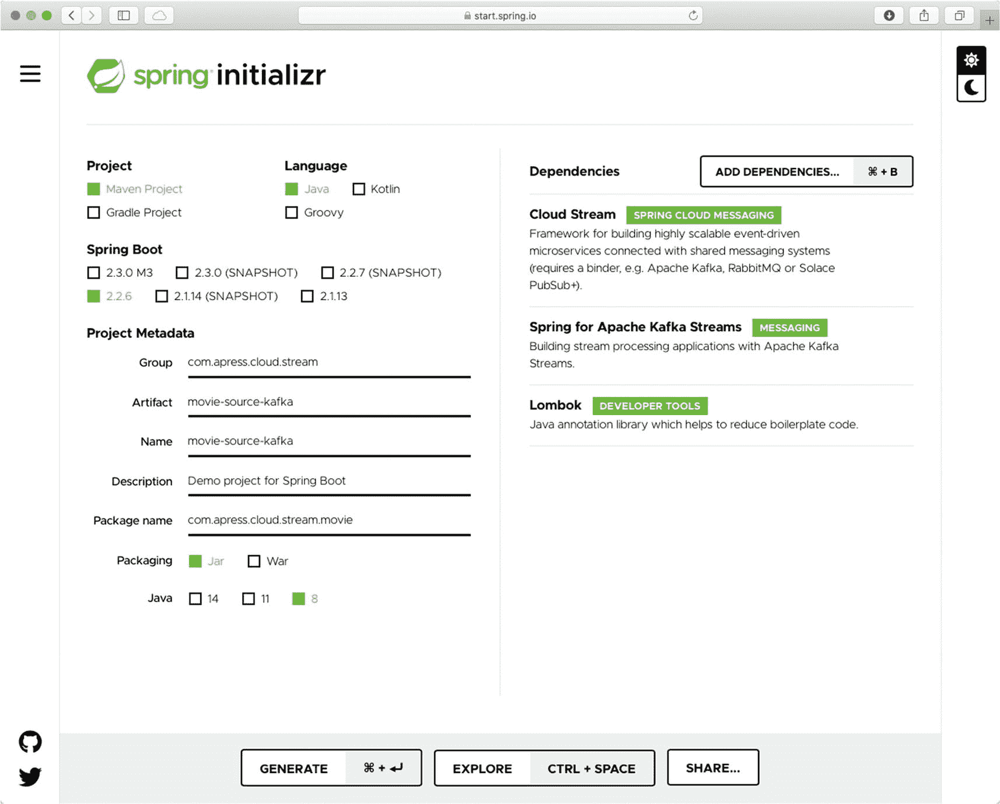

图 6-14。

[`https://start.spring.io`](http://start.spring.io) :Spring初始化

打开您的`pom.xml`文件，并确保您拥有必要的依赖项。

```java
...
<dependency>
        <groupId>org.springframework.cloud</groupId>
        <artifactId>spring-cloud-stream</artifactId>
</dependency>

<dependency>
        <groupId>org.apache.kafka</groupId>
        <artifactId>kafka-streams</artifactId>
</dependency>
<dependency>
        <groupId>org.springframework.cloud</groupId>
        <artifactId>spring-cloud-stream-binder-kafka-streams</artifactId>
</dependency>
<dependency>
        <groupId>org.springframework.cloud</groupId>
        <artifactId>spring-cloud-stream-binder-kafka</artifactId>
</dependency>

```

接下来，创建`Movie`类。我使用的新版本只增加了流派字段(见清单 [6-16](#PC64) )。

```java
package com.apress.cloud.stream.movie;

import lombok.AllArgsConstructor;
import lombok.Data;
import lombok.NoArgsConstructor;

@AllArgsConstructor
@NoArgsConstructor
@Data
public class Movie {
    private String title;
    private String actor;
    private int year;
    private String genre;
}

Listing 6-16.src/main/java/com/apress/cloud/stream/movie/Movie.java

```

接下来，创建`MovieStream`类(参见清单 [6-17](#PC65) )。

```java
package com.apress.cloud.stream.movie;

import org.springframework.context.annotation.Bean;
import org.springframework.context.annotation.Configuration;
import reactor.core.publisher.Flux;

import java.util.function.Supplier;

@Configuration
public class MovieStream {

    @Bean
    public Supplier<Flux<Movie>> movie() {
        return () -> Flux.just(
                new Movie("The Matrix","Keanu Reves",1999,"science-fiction"),
                new Movie("It","Bill Skarsgård",2017,"horror")
        );
    }
}

Listing 6-17.src/main/java/com/apress/cloud/stream/movie/MovieStream.java

```

清单 [6-17](#PC65) 显示了`MovieStream`类。注意，该类不再使用`@Binding`，而是使用`@Configuration`注释来帮助 Spring Cloud Stream 识别任何声明的 beans。在这个类中，您将使用发送两个`Movie`对象的`java.util.function.Supplier`和`Flux`(来自 [`https://projectreactor.io`](https://projectreactor.io) )。还要注意，用`@Bean`标记这个方法很重要，这样框架就可以连接发布消息所需的所有逻辑。就这样，很简单。接下来，打开`application.properties`并添加清单 [6-18](#PC66) 中的内容。

```java
## Kafka Binders
spring.cloud.stream.bindings.movie-out-0.destination=uppercase

Listing 6-18.sr/main/resources/application.properties

```

##### 电影处理器卡夫卡

这个云流应用发送`Movie`对象，它在标题字段上做一个大写，充当处理器。打开浏览器指向 [`https://start.spring.io`](https://start.spring.io) 。添加以下元数据。

*   组`: com.apress.cloud.stream`

*   神器:`movie-processor-kafka`

*   包名:`com.apress.cloud.stream.movie`

*   从属关系:云流，阿帕奇卡夫卡流的Spring，龙目岛

Note

我们正在更改**包名**。

您可以单击“生成”按钮下载一个 ZIP 文件。您可以将其解压缩并导入到您喜欢的 IDE 中。

确保您的`pom.xml`文件中有 Kafka 和 Cloud Stream 依赖项。创建您的`Movie`类；同清单 [6-16](#PC64) 。接下来，创建`MovieStream`类(参见清单 [6-19](#PC67) )。

```java
package com.apress.cloud.stream.movie;

import lombok.extern.log4j.Log4j2;
import org.springframework.context.annotation.Bean;
import org.springframework.context.annotation.Configuration;

import java.util.function.Function;

@Log4j2
@Configuration
public class MovieStream {

    @Bean
    public Function<Movie, Movie> uppercase() {
        return movie -> {
            log.info("Processing: {}", movie);
            movie.setTitle(movie.getTitle().toUpperCase());
            return movie;
        };
    }
}

Listing 6-19.src/main/java/com/.apress/cloud/stream/movie/MovieStream.java

```

清单 [6-19](#PC67) 显示了充当处理器的`MovieStream`类，因为它使用了接收`Movie,`的`Function`函数接口，并返回一个修改过的`Movie`对象。注意，这个类用`@Configuration`标记，而`uppercase`方法用`@Bean`注释标记。

接下来，将清单 [6-20](#PC68) 中的内容添加到`application.properties`文件中。

```java
## Kafka Binders
spring.cloud.stream.bindings.uppercase-in-0.destination=uppercase
spring.cloud.stream.bindings.uppercase-out-0.destination=log

Listing 6-20.sr/main/resources/application.properties

```

##### 电影-水槽-卡夫卡

这个云流应用记录电影，充当 sink。打开浏览器指向 [`https://start.spring.io`](https://start.spring.io) 。添加以下元数据。

*   组`: com.apress.cloud.stream`

*   神器:`movie-sink-kafka`

*   包名:`com.apress.cloud.stream.movie`

*   从属关系:云流，阿帕奇卡夫卡流的Spring，龙目岛

Note

我们正在更改**包名**。

您可以单击“生成”按钮下载一个 ZIP 文件。您可以将其解压缩并导入到您喜欢的 IDE 中。

确保`pom.xml`中有卡夫卡和云流依赖关系。创建一个`Movie`类；同清单 [6-16](#PC64) 。接下来，创建`MovieStream`类(参见清单 [6-21](#PC69) )。

```java
package com.apress.cloud.stream.movie;

import lombok.extern.log4j.Log4j2;
import org.springframework.context.annotation.Bean;
import org.springframework.context.annotation.Configuration;

import java.util.function.Consumer

;

@Log4j2
@Configuration
public class MovieStream {

    @Bean
    public Consumer<Movie> log(){
        return movie -> {
            log.info("Movie Processed: {}", movie);
        };

    }
}

Listing 6-21.src/main/java/com/.apress/cloud/stream/movie/MovieStream.java

```

清单 [6-21](#PC69) 显示了`MovieStream`类。在这种情况下，它使用记录一个`Movie`对象的`Consumer`接口。请记住，您使用带有`@Configuration`的标记类和带有`@Bean`注释的`log`方法来识别它们，并完成连接所有东西和监听来自声明主题的新消息的繁重工作。

接下来，将清单 [6-22](#PC70) 中的内容添加到`application.properties`文件中。

```java
## Kafka Binders
spring.cloud.stream.bindings.log-in-0.destination=log

Listing 6-22.sr/main/resources/application.properties

```

##### 一起运行它们

是时候运行应用了。您正在使用清单 [6-6](#PC26) 中的`docker-compose.yml`文件。打开一个终端，转到`docker-compose.yml`文件，运行您的环境

```java
$ docker-compose up

```

然后，在每个应用的根文件夹中，用 IDE 或下面的命令运行应用。

```java
$ ./mvnw spring-boot:run

```

您应该会在`movie-sink-kafka`应用控制台中看到大写的电影标题。

```java
Movie Processed: Movie(title=THE MATRIX, actor=Keanu Reves, year=1999, genre=science-fiction)
Movie Processed: Movie(title=IT, actor=Bill Skarsgård, year=2017, genre=horror)

```

恭喜你！您使用 3.x 版本的新功能创建了一个 Spring Cloud Stream 应用。

##### 绑定命名约定

您是否想知道为什么在前面的例子中使用了那种格式的`spring.cloud.stream.bindings`?在 3.x 版中，绑定的命名约定如下。

*   对于输入绑定:`<function-name>` + `-in` + `<index>`

*   对于输出绑定:`<function-name>` + `-out` + `<index>`

索引总是从 0 开始，这与具有多个输入和输出参数的函数有关。稍后你会看到这个。这就是为什么在`movie-source-kafka`应用中，函数名是`movie`，这意味着它创建绑定名`movie-out-0`，你用大写字母覆盖它。

在`movie-processor-kafka` app 中，函数名为`uppercase`。它生成(因为它是一个`Function`处理器)两个绑定(`uppercase-in-0`和`uppercase-out-0`，你分别用`uppercase`和`log,`覆盖它们。

最后，在`movie-sink-kafka` app 中，函数名是`log`，所以生成的绑定是`log-in-0,`，你用`log`覆盖它。为什么需要覆盖它们？因为开发人员和任何其他外部系统更容易访问业务定义的名称。

### 生产和消费

有不同的方法来生成和使用消息，3.x 版提供了更多的方法来实现这一点。您仍然可以使用 XML、注释或/和 Spring Integration DSL ( `IntegrationFlow`)来使用 Spring Integration。对于 3.x 版的新功能，建议根据您的系统或应用需求使用函数式和反应式编程。

使用 Spring Integration，您可以使用下面的代码向输出通道生成消息。

```java
@Bean
@InboundChannelAdapter(value = Source.OUTPUT, poller = @Poller(fixedRate = "5000", maxMessagesPerPoll = "1"))
    public MessageSource<Movie> movieMessageSource() {
        return () -> new GenericMessage<>(new Movie("The Matrix","Keanu Reeves",1999));
    }

```

前面的代码显示了每 5 秒执行一次发送一个`Movie`对象的方法`movieMessageSource`的`@InboundChannelAdapter`。这段代码是不切实际的，但你得到的想法是发送一个消息给来源。输出通道。

Note

你可以找到这部分项目的代码:`movie-file-source-rabbit`、`movie-transform-processor-rabbit,`和`movie-log-sink-rabbit`。

通过使用带有以下代码的源接口可以实现同样的目的。

```java
@Bean
public ApplicationRunner movieMessage(Source source){
        return args -> {
            source.output().send(new GenericMessage<>(new Movie("The Matrix","Keanu Reeves",1999)));
        };
    }

```

这里你使用了`source`和定义的方法`output()`来发送一次`Movie`对象。或者你也可以直接使用`MessageChannel`。使用`java.util.function.*`功能接口可以实现同样的行为。

```java
@Bean  // Every second send this movie.
 public Supplier<Movie> movieSupplier() {
      return () -> new Movie("The Matrix", "Keanu Reves", 1999);
 }

```

前面的方法每秒都有一个轮询器，您可以使用`@PollableBean`注释来代替`@Bean`并覆盖任何默认的轮询设置。记住，对于函数接口，您需要注意`spring.cloud.stream.bindings.<function-[in|out]-<index>>.destination`属性名称。

使用带有以下代码的`@ServiceActivator`注释使用 Spring Integration 来消费消息。

```java
@ServiceActivator(inputChannel = Sink.INPUT)
 public void movieProcess(Movie movie){
      log.info("Movie processed: {}",movie);
 }

```

此外，您已经知道可以使用`@StreamListener`注释执行相同的行为。

```java
@StreamListener(Sink.INPUT)
 public void process(Movie movie){
      log.info("Movie processed: {}",movie);
 }

```

如果你想使用`java.util.function.*`功能界面。

```java
@Bean
    public Consumer<Movie> log(){
        return movie -> {
            log.info("Movie Processed: {}", movie);
        };
    }

```

记住，对于函数接口，您需要注意`spring.cloud.stream.bindings.<function-[in|out]-<index>>.destination`属性名称。

如果您需要消费、处理，然后产生一条消息(一个*处理器*),并且如果您正在使用 Spring 集成，您可以使用`@Transformer`注释。

```java
@Transformer(inputChannel = Processor.INPUT, outputChannel = Processor.OUTPUT)
public Movie transform(Movie movie){
      movie.setTitle(movie.getTitle().toUpperCase());
      return movie;
}

```

看到您正在使用`processor.INPUT`和`Processor.OUTPUT`通道。使用`@ServiceActivator`注释可以实现同样的行为。

```java
@ServiceActivator(inputChannel = Processor.INPUT, outputChannel = Processor.OUTPUT)
public Movie transformServiceActivator(Movie movie){
     movie.setTitle(movie.getTitle().toUpperCase());
     return movie;
}

```

可以使用其他标注，比如`@Splitter`、`@Aggregator`、`@Filter`；当然，您可以使用专用的`@StreamListener`和`@SendTo`注释来实现相同的行为。

```java
@StreamListener(Processor.INPUT)
@SendTo(Processor.OUTPUT)
public Movie process(Movie movie){
     movie.setTitle(movie.getTitle().toUpperCase());
     return movie;
}

```

如果你想使用`java.util.function.*`功能界面。

```java
@Bean
public Function<Movie, Movie> uppercase() {
      return movie -> {
          movie.setTitle(movie.getTitle().toUpperCase());
          return movie;
      };
}

```

记住，对于函数接口，您需要注意`spring.cloud.stream.bindings.<function-[in|out]-<index>>.destination`属性名称。

Note

重要的是要知道你不能让`@EnableBinding`和任何其他的`@Bean`有`java.util.function.*`接口。如果你想把他们混在一起，他们必须在不同的班级。

#### @StreamListener 功能

这个注释有一些有趣的特性，当业务逻辑需要基于消息内容或消息`headers`的一些路由时，这些特性会有所帮助。换句话说，您可以使用条件语句来帮助您进行路由。如果要使用这个特性，需要满足两个条件。

*   它必须是单独的消息(这意味着不支持反应式 API 方法)。

*   它不能返回值。

您将使用 SpEL 来设置要计算的表达式。如果您需要添加一个带有标题的条件表达式，您可以像下面这样做。

```java
@StreamListener(value = Sink.INPUT, condition = "headers['genre']=='science-fiction'")
 public void processScienceFiction(Movie movie){
      log.info("Science Fiction Movie processed: {}",movie);
  }

 @StreamListener(value = Sink.INPUT, condition = "headers['genre']=='drama'")
 public void processDrama(Movie movie){
      log.info("Drama  Movie processed: {}",movie);
  }

```

如果您需要根据有效负载的内容来计算表达式，那么您可以这样做。

```java
@StreamListener(value = Sink.INPUT, condition = "#jsonPath(payload,'$.year') < 2000")
 public void processTwoThousandAndBelow(Movie movie){
     log.info("1990-2000 Movie processed: {}",movie);
 }

 @StreamListener(value = Sink.INPUT, condition = "#jsonPath(payload,'$.year') >= 2000")
 public void processTwoThousandAndAbove(Movie movie){
     log.info("2000-Present Movie processed: {}",movie);
 }

```

#### 更多功能

许多特性将在接下来的章节中介绍，但是当涉及到生成和使用消息时，您可以获得不同格式的消息，并且可以访问消息头和安全性。

##### 映射方法参数

如果您想要访问有效负载，您已经知道可以使用实例对象或表示，这取决于`contentType`头。此外，您还可以访问邮件的其他部分，如。

```java
@StreamListener(Sink.INPUT)
    public void process(@Payload String payload, @Header("contentType") String contentType,@Headers Map<String, Object> map){
        log.info("Payload processed: {} - ContentType: {} - Headers: {}",payload,contentType,map);
    }

```

参见`@Payload`、`@Header,`和`@Headers`注释的用法。另外，你可以用。

```java
@StreamListener(Sink.INPUT)
 public void process(Message message){
      log.info("Message processed: {} ",message);
 }

```

##### 反应和功能

另一个很酷的特性是，现在您可以使用反应式编程，这是您在前面的示例中看到的。您可以拥有一个反应式的`Consumer`接口，该接口使用来自 project reactor ( [`https://projectreactor.io/`](https://projectreactor.io/) )的`Flux`或`Mono`数据类型。您可以对任何通量或单声道类型应用所有操作。

```java
public Function<Flux<Movie>, Mono<Movie>> movieConsumer() {
        return flux -> flux
                                    .map(..).filter(..).then();
}

```

使用前面的代码，您可以控制所有的`Pollable`属性，比如`fixedDelay`和`maxMessagePerPoll`。

```java
    spring.cloud.stream.poller.fixed-delay=5000

```

此外，您可以使用`Supplier`而不是`@Bean`，您可以使用`@PollableBean`注释并使用前面的属性来配置它。

```java
@PollableBean
public Supplier<Flux<Movie>> stringSupplier() {
        return () -> Flux.just(new Movie("The Matrix","Keanu Reeves",1999));
}

```

有时候你需要从一个普通的 Web 微服务连接到一个响应式的微服务，或者有几个功能需要同时使用，那么，我该如何连接和使用 Spring Cloud Stream 的功能呢？Spring Cloud Stream 引入了最后一个`org.springframework.cloud.stream.function.StreamBridge`类，它提供了一个*函数组合*，允许将几个函数作为一个函数运行。

例如，您可以有一个基本的 RestController 类，它接受对/movies 路径的传入 POST 请求。

```java
@AllArgsConstructor
@RestController
public class MovieController {

    private StreamBridge streamBridge;

    @PostMapping("/movies")
    @ResponseStatus(HttpStatus.ACCEPTED)
    public void toMovieBinding(@RequestBody Movie movie) {
        streamBridge.send("movie-out-0", movie);
    }
}

```

如果你尝试运行这个 app，它会失败，因为它需要知道使用什么绑定来发送`Movie`对象；所以，有必要添加以下属性。

```java
spring.cloud.stream.source=movie
spring.cloud.stream.bindings.movie-out-0.destination=movie

```

关键属性是`spring.cloud.stream.source`，这是创建绑定所必需的。使用电影值，它创建**电影输出 0** (遵循绑定命名约定)。您已经熟悉的第二个属性:它在内部将`movie-out-0`重命名为`movie`。

如果您需要使用 Reactor API 完成相同的行为，您可以使用下面的代码。

```java
@RestController
public class MovieController{
    EmitterProcessor<Movie> processor = EmitterProcessor.create();

    @PostMapping("/movies")
    @ResponseStatus(HttpStatus.ACCEPTED)
    public void toMovieSupplier(@RequestBody Movie movie) {
        processor.onNext(movie);
    }

    @Configuration
    class MovieSupplier {
        @Bean
        public Supplier<Flux<Movie>> movie() {
            return () -> processor;
        }
    }
}

```

注意，该类正在使用`EmitterProcessor`，`toMovieSupplier`方法控制器正在调用`onNext`方法；这就是为什么您需要声明`@Bean`注释，并通过调用同一个`EmitterProcessor`实例(在本例中是`processor`对象)来使用供应商。

看看下面的代码。

```java
@Configuration
public class MovieStream {
    String GENRE_SCIENCE_FICTION = "science-fiction";

    @Bean
    public Function<Flux<Movie>, Flux<Movie>> onlyScienceFiction() {
        return flux -> flux.filter( movie -> movie.getGenre().equals(GENRE_SCIENCE_FICTION));
    }

    @Bean

    public Function<Flux<Movie>, Flux<Movie>> titleUpperCase() {
        return flux -> flux.map( movie -> {
            movie.setTitle(movie.getTitle().toUpperCase());
            return movie;
        });
    }
}

```

您对 Project Reactor 使用 Spring Cloud 函数语法，所以它不会运行，因为您只需要定义一个函数。如果需要多个，就需要创建一个函数组合。

您需要通过使用`spring.cloud.function.definition`属性和使用函数方法的`|`(管道)符号来声明您的组合的名称。在这个例子中，`application.propertie` s 看起来如下。

```java
spring.cloud.function.definition=onlyScienceFiction|titleUpperCase
spring.cloud.stream.bindings.onlyScienceFictiontitleUpperCase-in-0.destination=movie
spring.cloud.stream.bindings.onlyScienceFictiontitleUpperCase-out-0.destination=log

```

注意`spring.cloud.function.definition`被设置为`onlyScienceFiction|titleUpperCase`，函数方法的名称。Spring云流配置生成`onlyScienceFictiontitleUpperCase-in-0`和`onlyScienceFictiontitleUpperCase-out-0`绑定器；在这种情况下，它们分别被重命名为`movie`和`log`。

如果因为在不同的流中使用而需要两者，请使用`;`(分号)而不是`|`(管道)。应该是这样的。

```java
spring.cloud.function.definition=onlyScienceFiction;titleUpperCase

```

前面的属性生成了`onlyScienceFiction-in-0`和`onlyScienceFiction-out-0`，以及`titleUpperCase-in-0`和`titleUpperCase-out-0`绑定。

有时您会收到不同类型的数据，需要作为复合逻辑进行处理。Spring Cloud Stream 允许您拥有多个输入和输出参数，就像下面的类。

```java
@Configuration
public class MovieStream {
    String GENRE_SCIENCE_FICTION = "science-fiction";

    @Bean
    public Function<Tuple2<Flux<Integer>,Flux<Movie>>, Flux<Message<Movie>>> movieTuple() {
        return tuple -> {
            Flux<Integer> integerFlux = tuple.getT1();
            Flux<Movie> movieFlux = tuple.getT2();

            return Flux.just(
                    MessageBuilder.withPayload(movieFlux.blockFirst()).setHeader("stars",integerFlux.map(m -> m.toString())).build());
        };
    }
}

```

在这个例子中，您接收到一个`Integer`类型的`Flux`和一个`Movie<T>`类型的`Flux<T>`，并返回一个`Message<Movie>`对象。这意味着创建的绑定是`movieTuple-in-0`、`movieTuple-in-1,`和`movieTuple-out-0`。注意绑定命名约定中的索引。如果一个元组是返回值，那么就有`<method-name>-out-0`、`<method-name>-out-1,`等等，这取决于元组参数。

另一个功能让你从`Function`到`IntegrationFlow`。您按如下方式完成此任务。

```java
@Configuration
public class MovieStream {
    @Bean
    public IntegrationFlow movieFlow() {
        return IntegrationFlows.from(MovieFunction.class)
                .transform(Transformers.toJson())
                .channel(Source.OUTPUT)
                .get();
    }
    public interface MovieFunction extends Function<Movie, Movie> { }
}

```

重要的部分是引用网关模式的`MovieFunction`接口的声明，这是 Spring Integration 生成的。由于方法名是`movieFlow`，它创建了`movieFlow.gateway-in-0`和`movieFlow.gateway-out-0`绑定。

Spring Cloud Stream、Project Reactor 和 Spring Cloud Function 组成了一个不可思议的团队，使用最新的技术来创建令人惊叹的企业级应用！

Note

本节中的所有代码都在本书的配套源代码中的`ch06/function-bridge`目录结构中。它使用卡夫卡式活页夹。

##### 选择途径

路由是另一个特征。您可以将消息路由到一个特定的函数，根据有效负载内容或消息头对其进行处理。要使用这个特性，您需要将`spring.cloud.stream.function.routing.enabled`值设置为等于`true`，并设置`spring.cloud.function.routing-expression`属性。

默认情况下，如果您正在创建处理器流，它会创建`functionRouter-in-0`和`functionRouter-out-0`绑定(函数/反应流的相同命名约定)。如果你正在创建一个接收器，它会创建一个`functionRouter-in-0`绑定。

下面的片段是一个例子。

```java
@Log4j2
@Configuration
public class MovieStream {

    @Bean
    public Function<Movie, Movie> drama() {
        return movie -> {
            log.info("Drama: {}",movie);
            movie.setGenre(movie.getGenre().toUpperCase());
            return movie;
        };
    }

    @Bean
    public Function<Movie, Movie> fiction() {
        return movie -> {
            log.info("Science Fiction: {}", movie);
            movie.setTitle(movie.getTitle().toUpperCase());
            return movie;
        };
    }
}

```

有两个功能:`drama`和`fiction`。注意每个都有大写的逻辑:流派字段中的`drama`大写函数，标题字段中的`fiction`大写函数。让我们看看`application.properties`的文件。

```java
# Rabbit Binding
spring.cloud.stream.bindings.functionRouter-in-0.destination=movie
spring.cloud.stream.bindings.functionRouter-out-0.destination=log

# Routing Function
spring.cloud.stream.function.routing.enabled=true
spring.cloud.function.routing-expression=headers['genre']

```

请注意，表达式评估头类型`,`，并根据值调用方法的名称。这意味着`Movie`对象应该有一个带有`drama`或`fiction`值的标题类型。另外，请注意有两个函数。您正在启用路由功能。这意味着配置创建了`functionRouter-in-0`和`functionRouter-out-0\. I`。在这个例子中，您将`functionRouter-[in|out]-0`分别重命名为`movie`和`log`绑定。这很容易理解。

Note

这一节的所有代码都在本书的配套源代码中的`ch06/routing`目录结构中。它使用 RabbitMQ 活页夹。

## 摘要

本章描述了 Spring Cloud Stream 如何工作，以及如何轻松创建流应用。借助 Spring Integration 的强大功能和 Spring Boot 固执己见的引擎，您可以构建连接到遗留系统或任何使用绑定功能的中间件代理的企业系统，而无需学习新的 API。本章介绍了流的类型:源、处理器和接收器。您看到了通过从 Kafka 或 RabbitMQ 添加正确的依赖项来启动一个流项目是多么容易。

在下一章中，您将看到更多功能，并了解如何创建一个绑定器来插入到您的流应用中。

你还有很多工作要做，因为这一章只是开始。