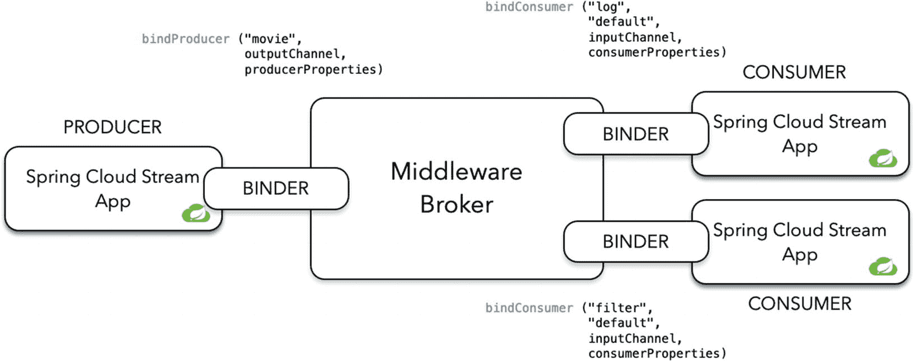
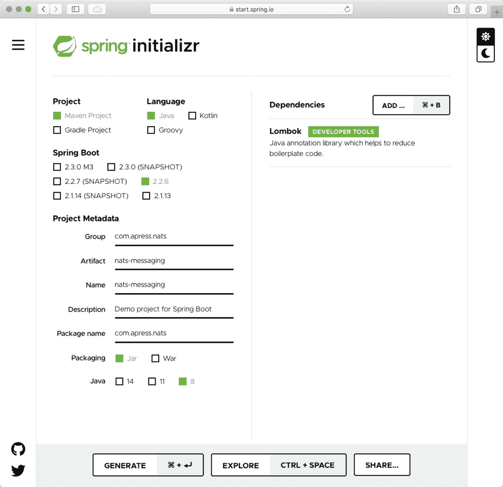
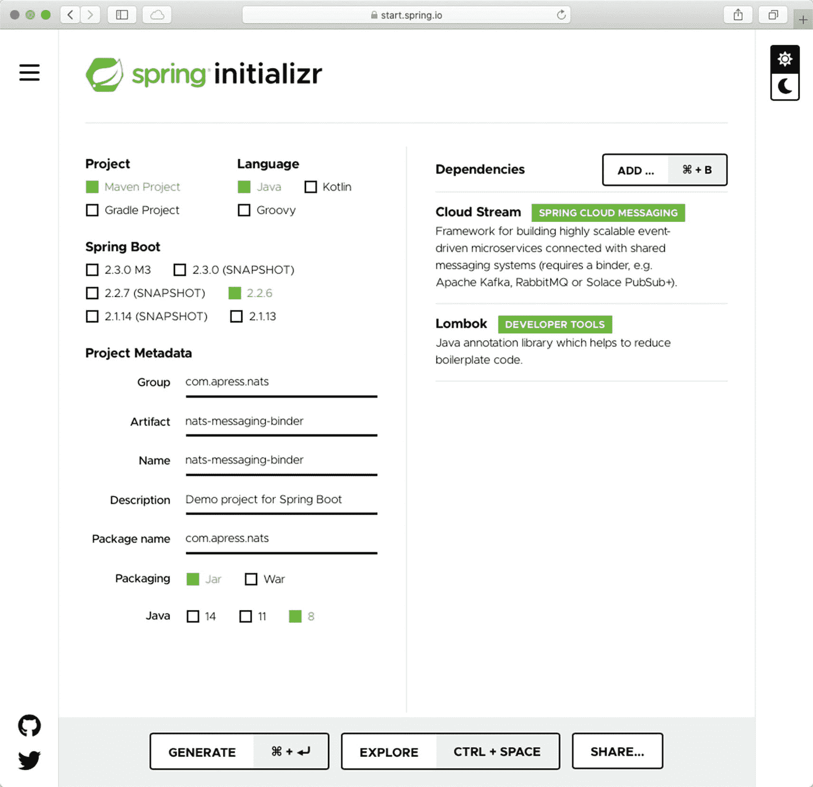
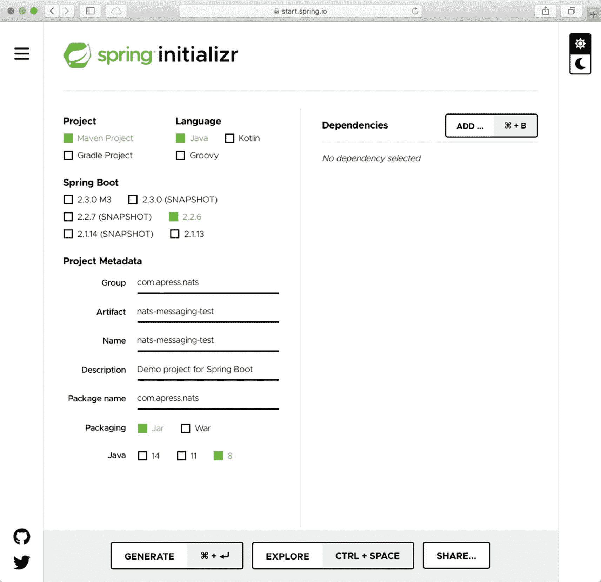
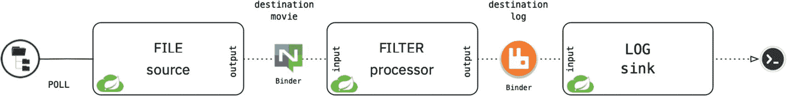

# 七、Spring CloudStream 绑定器

在前一章中，我向您展示了 Spring Cloud Stream 应用启动器如何作为独立的应用工作，可以轻松交付企业级解决方案。我向您展示了 Spring Cloud Stream 模型应用，以及主内核如何基于 Spring Integration 和 Spring Boot 实现简单的配置。您看到了如何使用 Spring Cloud 函数和 Spring Integration 非常容易地创建流。我还向您展示了一个特性(在我看来是最好的),叫做 *binder* ,它允许您的解决方案使用任何物理目的地或任何中间件消息代理。本章介绍如何创建自定义活页夹。

您将使用 NATS 服务器( [`https://nats.io`](https://nats.io) )，一个用于构建分布式应用的代理，以提供实时流和大数据用例(见图 [7-1](#Fig1) )。想知道为什么我选择了 NATS 而不是其他技术？以前在 Cloud Foundry 工作( [www。cloudfoundry。org](http://www.cloudfoundry.org) )项目，保持一些虚拟机存活的主要组件之一是使用 NATS，这是一个快速可靠的消息代理，易于使用。作为实验，我决定创建一个原型作为 binder 实现。我花了几个小时。是的，创建自定义活页夹非常容易。

让我们从讨论 NATS 技术背后的东西以及如何实现它开始。


图 7-1。

[T2`https://nats.io`](https://nats.io)

## 绑定器

绑定器使用服务提供者接口(SPI)模式，该模式允许您通过启用功能或替换组件来扩展或添加额外的功能。自从 Java 编程语言的第一次迭代以来，这种模式就一直存在，并增加了插件功能。

Spring Cloud Stream 公开了几个接口和抽象、实用类；它还提供了允许您插入外部中间件的发现策略。这些接口和类帮助您非常容易地创建绑定器。一个典型的场景是生产者和消费者使用绑定器来产生和消费消息。绑定器负责连接、重试、会话或任何允许发布者和消费者在知道如何完成的情况下使用代理的事情。它隐藏了样板代码，避免了学习特定 API 的需要。

我们先来回顾一下主界面:`org.springframework.cloud.stream.binder.Binder<T,C,P>`。该接口提供输入和输出绑定目标。它给生产者和消费者都增加了属性；这些属性以类型安全的方式为所需的特定于代理的属性(如果有的话)提供支持(参见清单 [7-1](#PC1) )。

```java
public interface Binder<T, C extends ConsumerProperties, P extends ProducerProperties> {
    Binding<T> bindConsumer(
                                 String bindingName, String group, T inboundBindTarget, C consumerProperties);
    Binding<T> bindProducer(String bindingName, T outboundBindTarget, P producerProperties);
}

Listing 7-1.org.springframework.cloud.stream.binder.Binder Interface

```

让我们回顾一下清单 [7-1](#PC1) 。

*   `binderConsumer`。这个方法的第一个参数是目的地名称，它在内部创建必要的通道和代理中需要的任何目的对象，比如队列、主题等等。下一个参数是消费者接受消息的组(工人风格或发布/订阅模式)。第三个参数是目的地/通道实例，消费者在其中监听/订阅新的传入消息。第四个参数是属于消息的代理(特定的)和业务属性。

*   `binderProducer`。这个方法的第一个参数是目的地名称，它创建必要的通道和代理中需要的任何目的对象，比如主题、交换等等。下一个参数是生产者发送消息的目的地/通道实例。最后一个参数是包含特定于代理的属性和业务属性的任何属性。

我认为这些签名很容易理解。图 [7-2](#Fig2) 显示了一个活页夹的例子。



图 7-2。

绑定器抽象

### 实现绑定器

如果你想实现一个绑定，你必须遵循这些简单的规则。

*   一个类必须实现`Binder`接口。

*   一个`@Configuration`标记的类定义了一个绑定`er` bean 和创建中间件代理基础设施的步骤；它可能是一个连接、会话、某些凭证等等。

*   有必要在类路径中创建一个包含一个或多个绑定器定义的`META-INF/spring.binders`文件。

正如您所看到的，实现绑定器非常简单，所以让我们开始使用 NATS 代理创建一个定制的绑定器。

## 暗夜之狐

创建自定义绑定器有助于开发人员加速开发；作为 binder 开发人员，您需要了解这个代理是如何工作的。

在开始实现 binder 之前，我认为有必要创建一个允许您生成和消费消息的库，以便以后可以重用它。在本章的最后，您将创建一个包含三个模块的`nats-binder`项目:`nats-messaging` (NATS 客户端)`nats-messaging-binder` (NAT 绑定实现)，以及`nats-messaging-test` (NATS 绑定测试)。

下载 NATS 服务器( [`https://nats.io/`](https://nats.io/) )并安装。本章使用了一个 NATS 码头工人的形象。您可以使用以下命令提取它。

```java
$ docker pull nats

```

此命令下载一个 10 MB 的图像。

### 项目:nats-binder

为了使开发更容易，让我们为主`pom.xml`文件及其模块创建一个目录结构。创建一个名为`nats-binder`的文件夹，并将`pom.xml`文件添加到清单 [7-2](#PC3) 中。

```java
<?xml version="1.0" encoding="UTF-8"?>
<project xmlns:="http://maven.apache.org/POM/4.0.0" xmlns:xsi="http://www.w3.org/2001/XMLSchema-instance"
    xsi:schemaLocation="http://maven.apache.org/POM/4.0.0 https://maven.apache.org/xsd/maven-4.0.0.xsd">
    <modelVersion>4.0.0</modelVersion>

    <groupId>com.apress.nats</groupId>
    <artifactId>nats-binder</artifactId>
    <version>0.0.1</version>
    <packaging>pom</packaging>

    <properties>
        <java.version>1.8</java.version>
        <maven.compiler.target>1.8</maven.compiler.target>
        <maven.compiler.source>1.8</maven.compiler.source>
        <project.build.sourceEncoding>UTF-8</project.build.sourceEncoding>
        <project.reporting.outputEncoding>UTF-8</project.reporting.outputEncoding>
    </properties>

    <modules>
        <module>nats-messaging-binder</module>
        <module>nats-messaging</module>
        <module>nats-messaging-test</module>
    </modules>

    <dependencies>
        <dependency>
            <groupId>org.springframework.boot</groupId>
            <artifactId>spring-boot-starter</artifactId>
        </dependency>
        <dependency>
            <groupId>org.springframework</groupId>
            <artifactId>spring-messaging</artifactId>
        </dependency>
        <dependency>
            <groupId>org.projectlombok</groupId>
            <artifactId>lombok</artifactId>
            <optional>true</optional>
        </dependency>
        <dependency>
            <groupId>org.springframework.boot</groupId>
            <artifactId>spring-boot-configuration-processor</artifactId>
            <optional>true</optional>
        </dependency>
        <dependency>
            <groupId>org.springframework.boot</groupId>
            <artifactId>spring-boot-starter-test</artifactId>
            <scope>test</scope>
            <exclusions>
                <exclusion>
                    <groupId>org.junit.vintage</groupId>
                    <artifactId>junit-vintage-engine</artifactId>
                </exclusion>
            </exclusions>
        </dependency>
    </dependencies>

    <dependencyManagement>
        <dependencies>
            <dependency>
                <groupId>org.springframework.boot</groupId>
                <artifactId>spring-boot-dependencies</artifactId>
                <version>2.2.6.RELEASE</version>
                <type>pom</type>
                <scope>import</scope>
            </dependency>
        </dependencies>
    </dependencyManagement>

    <build>
        <plugins>
            <plugin>
                <groupId>org.apache.maven.plugins</groupId>
                <artifactId>maven-compiler-plugin</artifactId>
                <configuration>
                    <source>8</source>
                    <target>8</target>
                </configuration>
            </plugin>
        </plugins>
    </build>
</project>

Listing 7-2.nats-binder/pom.xml

```

分析`pom.xml`和依赖关系。

接下来，创建模块，因为您使用的是 Spring Initializr，所以您可以在`nats-binder`文件夹中解压缩 ZIP 文件。

### NATS 客户端:NATs-消息

打开浏览器，指向 [`https://start.spring.io`](https://start.spring.io) 。使用以下元数据。

*   组:`com.apress.nats`

*   神器:`nats-messaging`

*   包装:`com.apress.nats`

*   从属关系:龙目岛

点击生成按钮下载一个 ZIP 文件。将其解压缩到`nats-binder`目录，并导入到您喜欢的 IDE 中(参见图 [7-3](#Fig3) )。



图 7-3。

spring Initializr NAT-messaging

接下来，让我们添加使用 NATS 服务器所需的依赖项。使用开源技术的好处之一是它对社区开放。这个案例需要 NAT Java 客户端([h`ttps://nats.io/download/nats-io/nats.java/`T3](https://nats.io/download/nats-io/nats.java/)[T1](https://github.com/nats-io/nats.java))。

打开`pom.xml`并用清单 [7-3](#PC4) 中的内容替换。

```java
<?xml version="1.0" encoding="UTF-8"?>
<project xmlns:="http://maven.apache.org/POM/4.0.0" xmlns:xsi="http://www.w3.org/2001/XMLSchema-instance"
        xsi:schemaLocation="http://maven.apache.org/POM/4.0.0 https://maven.apache.org/xsd/maven-4.0.0.xsd">
        <modelVersion>4.0.0</modelVersion>
        <parent>
                <groupId>com.apress.nats</groupId>
                <artifactId>nats-binder</artifactId>
                <version>0.0.1</version>
                <relativePath>..</relativePath>
        </parent>

        <packaging>jar</packaging>

        <groupId>com.apress.nats</groupId>
        <artifactId>nats-messaging</artifactId>
        <version>0.0.1-SNAPSHOT</version>
        <name>nats-messaging</name>
        <description>Demo project for Spring Boot</description>

        <dependencies>
                <dependency>
                        <groupId>io.nats</groupId>
                        <artifactId>jnats</artifactId>
                        <version>2.6.6</version>
                </dependency>

                <dependency>
                        <groupId>com.fasterxml.jackson.core</groupId>
                        <artifactId>jackson-databind</artifactId>
                </dependency>
        </dependencies>

</project>

Listing 7-3.nats-binder/nats-messaging/pom.xml

```

看一下`pom.xml`，注意父项目正在声明`nats-binder`主项目。记住，`nats-messaging`库是一个模块。复习一下，我们继续。

在撰写本文时，Java NATS 客户端版本是 2.6.6。让我们从创建`NatsProperties`类开始。这个类保存了关于服务器、端口等等的所有信息(参见清单 [7-4](#PC5) )。

```java
package com.apress.nats;

import lombok.Data;
import org.springframework.boot.context.properties.ConfigurationProperties;

@Data
@ConfigurationProperties("spring.nats")
public class NatsProperties {

    private String host = "localhost";
    private Integer port = 4222;
}

Listing 7-4.src/main/java/com/apress/nats/NatsProperties.java

```

清单 [7-4](#PC5) 显示的是`NatsProperties`类；如您所见，它非常简单，并且有默认值。请记住，您可以在`application.properties/yml`文件、命令行或环境变量等中覆盖这些属性。

接下来，创建`NatsConnection`类(参见清单 [7-5](#PC6) )。

```java
package com.apress.nats;

import io.nats.client.Connection;
import io.nats.client.Nats;
import lombok.Data;

import java.io.IOException;

@Data
public class NatsConnection {
    private Connection connection;
    private NatsProperties natsProperties;
    private NatsConnection(){}

    public NatsConnection(NatsProperties natsProperties) throws IOException, InterruptedException {
        this.natsProperties = natsProperties;
        this.connection =
Nats.connect("nats://" + natsProperties.getHost() + ":" + natsProperties.getPort().toString());
    }

}

Listing 17-5.src/main/java/com/apress/nats/NatsConnection.java

```

清单 [7-5](#PC6) 显示了`NatsConnection`类。这个类有 NATS `Connection`实例。在这里，当使用`spring.nats.*`属性时，您调用`NatProperties`来使用默认值或开发人员提供的值。如您所见，`Nats`类是静态的。您可以调用`connect`方法，传递 schemed ( `nats://`)、主机和端口，这是一种连接 NATS 服务器的非常简单的方法。

接下来，让我们创建`NatsTemplate`类(参见清单 [7-6](#PC7) )。

```java
package com.apress.nats;

import lombok.AllArgsConstructor;
import lombok.Data;
import lombok.extern.log4j.Log4j2;
import org.springframework.messaging.Message;
import org.springframework.util.SerializationUtils;

import java.nio.charset.StandardCharsets;

@Log4j2
@AllArgsConstructor
@Data
public class NatsTemplate {

    private NatsConnection natsConnection;

    public void send(String subject, String message){
        assert this.natsConnection != null && subject != null && !subject.isEmpty() && message != null && !message.isEmpty();
        log.debug("Sending: {}", message);
        this.natsConnection.getConnection().publish(subject, message.getBytes(StandardCharsets.UTF_8));
    }

    public void send(String subject,Message<?> message){
        assert this.natsConnection != null && subject != null && !subject.isEmpty() && message != null;
        log.debug("Sending: {}", message);
        this.natsConnection.getConnection().publish(subject, SerializationUtils.serialize(message));
    }

}

Listing 7-6.src/main/java/com/apress/nats/NatsTemplate.java

```

清单 [7-6](#PC7) 显示了`NatsTemplate`类。这个类删除了所有的样板文件，并提供了处理 NATS 服务器的所有操作。这是模板设计模式的一个实现；如果您正在使用 Spring 框架，您可以找到其中的几个，包括`JmsTemplate`、`RabbitTemplate`、`KafkaTemplate`和`JdbcTemplate`。

您只声明了两个重载方法，其中您总是接收主题(类似于主题)和消息。您正在使用`org.springframework.messaging.Message`界面。还要注意，您需要`NatsConnection`实例。为了发布消息，您使用连接(通过`getConnection()`方法调用)并调用`publish`方法。在`send(String subject, Message<?> message)`方法中，您使用一个 Spring 序列化实用程序将您的消息序列化为一个字节数组。NATS 协议要求消息是`byte[]`类型。

接下来，让我们创建`NatMessageListener`接口(参见清单 [7-7](#PC8) )。

```java
package com.apress.nats;

public interface NatsMessageListener  {
    void onMessage(byte[] message);
}

Listing 7-7.src/main/java/com/apress/nats/NatsMessageListener.java

```

清单 [7-7](#PC8) 显示了`NatsMessageListener`接口，它有一个带`byte[]`类型作为参数的`onMessage`方法。

接下来，让我们创建至少一个实现来委托侦听器。该类在 NATS 服务器上订阅主题(同一个主题)。

创建`NatsMessageListenerAdapter`类(参见清单 [7-8](#PC9) )。

```java
package com.apress.nats;

import io.nats.client.Dispatcher;
import io.nats.client.Subscription;
import lombok.Data;
import lombok.extern.log4j.Log4j2;

@Log4j2
@Data
public class NatsMessageListenerAdapter {

    private NatsConnection natsConnection;
    private String subject;
    private NatsMessageListener adapter;
    private Subscription subscription;
    private Dispatcher dispatcher;

    public void start(){
        assert natsConnection != null && natsConnection.getConnection() != null && subject != null && adapter != null;
        log.debug("Creating Message Listener...");
        dispatcher = this.natsConnection.getConnection().createDispatcher((msg) -> {});
        subscription = dispatcher.subscribe(this.subject, (msg) -> {
            adapter.onMessage(msg.getData());
        });
        log.debug("Subscribed to: {}",this.subject);
    }

    public void stop(){
        assert dispatcher != null && subject != null;
        log.debug("Unsubscribing from: {}", subject);
        dispatcher.unsubscribe(subject,300);
    }
}

Listing 7-8.src/main/java/com/apress/nats/NatsMessageListenerAdapter.java

```

清单 [7-8](#PC9) 展示了实现`NatsMessageListener`的`NatMessageListenerAdapter`类。在继续之前分析这个类。在 Java NATS 客户端中，有两种获取消息的方式:同步和异步。您正在实现异步方式。要使用它，您需要创建一个`Dispatcher`实例(基于连接)并订阅主题(与主题相同)。当您需要删除订阅时，您只需要从`Dispatcher`实例中调用`unsubscribe`方法。

Note

代码使用 Lombok 中的`@Log4j2`注释来注入日志。通常情况下，你不会这样使用它。您需要使用 AOP 来创建您的横切关注点。

现在您已经有了生产者(`NatsTemplate`)和消费者(`NatsMessageListener`)，让我们来创建配置。创建`NatsConfiguration`类(参见清单 [7-9](#PC10) )。

```java
package com.apress.nats;

import org.springframework.boot.autoconfigure.condition.ConditionalOnMissingBean;
import org.springframework.boot.context.properties.EnableConfigurationProperties;
import org.springframework.context.annotation.Bean;
import org.springframework.context.annotation.Configuration;

import java.io.IOException;

@EnableConfigurationProperties(NatsProperties.class)
@Configuration
public class NatsConfiguration {

    @Bean
    @ConditionalOnMissingBean
    public NatsConnection natsConnection(NatsProperties natsProperties) throws IOException, InterruptedException {
        return new NatsConnection(natsProperties);
    }

    @Bean
    @ConditionalOnMissingBean
    public NatsTemplate natsTemplate(NatsConnection natsConnection){
        return new NatsTemplate(natsConnection);
    }

}

Listing 7-9.src/main/java/com/apress/nats/NatsConfiguration.java

```

清单 [7-9](#PC10) 显示了`NatsConfiguration`类，它创建了`NatsConnection`和`NatsTemplate`Spring bean。请注意，您使用的是`@ConditionalOnMissingBean`，当另一个使用该库的类创建自己的具有不同实现或值的 bean 时，这很有用，因此您可以避免拥有几个相同类型的 bean。

就这样。这是连接、产生和使用消息的 nats 消息库。现在，您可以用清单 [7-10](#PC11) 中的代码测试它。您可以创建`NatsProducerConsumer`类，也可以将这段代码添加到`NatsMessagingApplicationTest`类中。

```java
package com.apress.nats;

import lombok.extern.log4j.Log4j2;
import org.springframework.boot.ApplicationRunner;
import org.springframework.context.annotation.Bean;
import org.springframework.context.annotation.Configuration;

import java.nio.charset.StandardCharsets;

@Log4j2
@Configuration
public class NatsProducerConsumer {

    @Bean(initMethod = "start",destroyMethod = "stop")
    public NatsMessageListenerAdapter natsMessageListenerAdapter(NatsConnection natsConnection){
        NatsMessageListenerAdapter adapter = new NatsMessageListenerAdapter();
        adapter.setNatsConnection(natsConnection);
        adapter.setSubject("test");
        adapter.setAdapter( message -> {
            log.info("Received: {}", new String(message, StandardCharsets.UTF_8));
        });
        return adapter;
    }
    @Bean
    public ApplicationRunner sendMessage(NatsTemplate natsTemplate){
        return args -> {
            natsTemplate.send("test","Hello There!");
        };
    }

}

Listing 7-10.src/main/java/com/apress/nats/NatsProducerConsumer.java

```

要运行此应用，您需要启动并运行 NATS 服务器。可以用下面的命令运行它(我用的是 Docker)。

```java
$ docker run -d --rm --name nats -p 4222:4222 nats

```

现在，您可以在 IDE 中或通过使用以下命令行来执行该应用。

```java
$ ./mvnw spring-boot:run

```

您应该在日志中看到以下内容。

```java
                NatsTemplate     : Sending: Hello There!
NatsProducerConsumer     : Received: Hello There!

```

恭喜你！您已经创建了用于下一个模块的`nats-messaging`库。现在，您可以使用以下命令停止您的 NATS 服务器。

```java
$ docker stop nats

```

停止你的应用。

Warning

在继续之前，**注释掉所有**`NatProducerConsumer.java`类的代码。

### NATS 绑定器实现:nats-messaging-binder

让我们从 binder 实现开始。打开浏览器，指向 [`https://start.spring.io`](https://start.spring.io) 。使用以下元数据。

*   组:`com.apress.nats`

*   神器:`nats-messaging-binder`

*   包装:`com.apress.nats`

*   从属关系:龙目岛

点击生成按钮下载一个 ZIP 文件。将其解压缩到`nats-binder`目录中，并导入到您喜欢的 IDE 中(参见图 [7-4](#Fig4) )。



图 7-4。

spring Initializr NATs-messaging-binder

让我们首先打开`pom.xml`文件，用清单 [7-11](#PC16) 中的内容替换它。

```java
<?xml version="1.0" encoding="UTF-8"?>
<project xmlns:="http://maven.apache.org/POM/4.0.0" xmlns:xsi="http://www.w3.org/2001/XMLSchema-instance"
        xsi:schemaLocation="http://maven.apache.org/POM/4.0.0 https://maven.apache.org/xsd/maven-4.0.0.xsd">
        <modelVersion>4.0.0</modelVersion>
        <parent>
                <groupId>com.apress.nats</groupId>
                <artifactId>nats-binder</artifactId>
                <version>0.0.1</version>
                <relativePath>..</relativePath>
        </parent>

        <packaging>jar</packaging>

        <groupId>com.apress.nats</groupId>
        <artifactId>nats-messaging-binder</artifactId>
        <version>0.0.1-SNAPSHOT</version>
        <name>nats-messaging-binder</name>
        <description>Demo project for Spring Boot</description>

        <properties>
                <spring-cloud.version>Hoxton.SR3</spring-cloud.version>
        </properties>

        <dependencies>
                <dependency>
                        <groupId>org.springframework.cloud</groupId>
                        <artifactId>spring-cloud-stream</artifactId>
                </dependency>

                <dependency>
                        <groupId>com.apress.nats</groupId>
                        <artifactId>nats-messaging</artifactId>
                        <version>0.0.1-SNAPSHOT</version>
                </dependency>

                <dependency>
                        <groupId>org.projectlombok</groupId>
                        <artifactId>lombok</artifactId>
                </dependency>
                <dependency>
                        <groupId>org.springframework.cloud</groupId>
                        <artifactId>spring-cloud-stream-test-support</artifactId>
                        <scope>test</scope>
                </dependency>

        </dependencies>

        <dependencyManagement>
                <dependencies>
                        <dependency>
                                <groupId>org.springframework.cloud</groupId>
                                <artifactId>spring-cloud-dependencies</artifactId>
                                <version>${spring-cloud.version}</version>
                                <type>pom</type>
                                <scope>import</scope>
                        </dependency>
                </dependencies>
        </dependencyManagement>

</project>

Listing 7-11.nats-binder/nats-messaging-binder/pom.xml

```

清单 [7-11](#PC16) 显示了`nats-messaging-binder`模块的`pom.xml`文件。注意，您将`nats-messaging`模块声明为一个依赖项。

接下来，让我们按照步骤创建一个新的活页夹

#### 实现绑定器接口

如果你回顾一下`Binder`接口，你会发现在你实现它之前你需要几个类(见清单 [7-1](#PC1) )。您需要传递的参数之一是分别用于消费者和生产者方法的*入站*和*出站绑定目标*。您可以为此创建所有的逻辑，并遵循创建不同类型的通道、消息传递支持、消息转换器等的实践，但是这需要太长的时间。如果您依赖于一些抽象实现，而这些实现已经去掉了需要通过通道等完成的底层基础设施，那该怎么办呢？

您可以使用`org.springframework.cloud.stream.binder.AbstractMessageChannelBinder`类，它扩展了实现`org.springframework.cloud.stream.binder.Binder`接口的`org.springframework.cloud.stream.binder.AbstractBinder`类。`AbstractMessageChannelBinder`类提供了为通道、连接、重试逻辑、目的地创建等创建基础设施所需的所有逻辑。这是要扩展的主要类。如果你查看它的签名，你会看到清单 [7-12](#PC17) 中的代码。

```java
public abstract class AbstractMessageChannelBinder<C extends ConsumerProperties, P extends ProducerProperties, PP extends ProvisioningProvider<C, P>>
                extends AbstractBinder<MessageChannel, C, P> implements
                PollableConsumerBinder<MessageHandler, C>, ApplicationEventPublisherAware
{
        // ...
}

Listing 7-12.org.springframeworl.cloud.stream.binder.AbstractMessageChannelBinder.java

```

清单 [7-12](#PC17) 是`AbstractMessageChannelBinder`类的一个片段，它需要`ConsumerProperties`、`ProducerProperties,`和`ProvisioningProvider`类。让我们从创建`ProvisionProvider`实现开始。创建`NatsMessageBinderProvisioningProvider`类(参见清单 [7-13](#PC18) )。

```java
package com.apress.nats;

import org.springframework.cloud.stream.binder.ConsumerProperties;
import org.springframework.cloud.stream.binder.ProducerProperties;
import org.springframework.cloud.stream.provisioning.ConsumerDestination;
import org.springframework.cloud.stream.provisioning.ProducerDestination;
import org.springframework.cloud.stream.provisioning.ProvisioningException;
import org.springframework.cloud.stream.provisioning.ProvisioningProvider;

public class NatsMessageBinderProvisioningProvider implements ProvisioningProvider<ConsumerProperties, ProducerProperties> {

    @Override
    public ProducerDestination provisionProducerDestination(String name, ProducerProperties properties) throws ProvisioningException {
        return new NatsMessageBinderDestination(name);
    }

    @Override
    public ConsumerDestination provisionConsumerDestination(String name, String group, ConsumerProperties properties) throws ProvisioningException {
        return new NatsMessageBinderDestination(name);
    }
}

Listing 7-13.src/main/java/com/apress/nats/NatsMessageBinderProvisioningProvider.java

```

清单 [7-13](#PC18) 显示了用`ConsumerProperties`和`ProducerProperties`具体类作为参数实现`ProvisioningProvider`的`NatsMessageBinderProvisioningProvider`类。这些类帮助所有的`spring.cloud.stream.bindings.[destinationName].[consumer|producer]`属性。注意，在实现中，您正在发送一个新的`NatsMessageBinderDestination`类实例。所以，让我们创建它(见清单 [7-14](#PC19) )。

```java
package com.apress.nats;

import lombok.AllArgsConstructor;
import lombok.Data;
import org.springframework.cloud.stream.provisioning.ConsumerDestination;
import org.springframework.cloud.stream.provisioning.ProducerDestination;

@AllArgsConstructor
@Data
public class NatsMessageBinderDestination implements ProducerDestination, ConsumerDestination {

    private final String destination;

    @Override
    public String getName() {
        return this.destination.trim();
    }

    @Override
    public String getNameForPartition(int partition) {
        throw new UnsupportedOperationException("Partition not yet implemented for Nats Binder");
    }
}

Listing 7-14.src/main/java/com/apress/nats/NatsMessageBinderDestination.java

```

清单 [7-14](#PC19) 显示了实现了`ProducerDestination`和`ConsumerDestination`接口的`NatsMessageBinderDestination`。`ProducerDestination`接口声明`getName()`和`getNameForPartition`，`ConsumerDestination`接口声明`getName()`。这为底层通道和集成基础设施创建了目的地和所有连线。请注意，您现在没有实现分区特性。

现在您已经有了`ProvisioningProvider`接口实现，您必须通过创建消费者端点和侦听器来消费来自 NATS 服务器的传入消息。这意味着你在`AbstractMessageChannelBinder`中覆盖了`createConsumerEndpoint`方法，这个方法需要返回`MessageProducer`。让我们使用一个实现所有必要逻辑并覆盖所需方法的类。其中一个类是`MessageProducerSupport`，它是生产者端点的支持类，用于创建输出通道；它有发送消息的方法。因此，让我们创建`NatsMessageBinderProducer`类(参见清单 [7-15](#PC20) )。

```java
package com.apress.nats;

import lombok.extern.log4j.Log4j2;
import org.springframework.cloud.stream.provisioning.ConsumerDestination;
import org.springframework.integration.endpoint.MessageProducerSupport;
import org.springframework.messaging.Message;
import org.springframework.messaging.support.MessageBuilder;
import org.springframework.util.SerializationUtils;

import java.nio.charset.StandardCharsets;

@Log4j2
public class NatsMessageBinderProducer extends MessageProducerSupport {

    private ConsumerDestination destination;
    private NatsMessageListenerAdapter adapter = new NatsMessageListenerAdapter();

    public NatsMessageBinderProducer(ConsumerDestination destination, NatsConnection natsConnection){
        assert destination != null && natsConnection != null;
        adapter.setSubject(destination.getName());
        adapter.setNatsConnection(natsConnection);
        adapter.setAdapter(messageListener);
    }

    @Override
    protected void doStart() {
        adapter.start();
    }

    @Override
    protected void doStop() {
        adapter.stop();
        super.doStop();
    }

    private NatsMessageListener messageListener = message -> {
        log.debug("[BINDER] Message received from NATS: {}",message);
        log.debug("[BINDER] Message Type received from NATS: {}",message.getClass().getName());
        this.sendMessage((Message<?>)SerializationUtils.deserialize(message));
    };
}

Listing 7-15.src/main/java/com/apress/nats/NatsMessageBinderProducer.java

```

清单 [7-15](#PC20) 显示了扩展`MessageProducerSupport`类的`NatsMessageBinderProducer`类。您唯一可以覆盖的方法是`doStart()`和`doStop()`。让类业务逻辑处理剩下的事情。在本课中，您需要设置连接到 NATS 服务器的侦听器。看看需要一个`NatsConnection`实例的构造函数。当底层引导调用`doStart()`方法时，您开始监听。当收到消息时，使用`sendMessage`方法将其反序列化为`Messager<?>`类型，这是一个包含头和有效负载的包装类。

现在是时候扩展`AbstractMessageChannelBinder`类了(绑定`er`实现)。创建`NatsMessageBinder`类(参见清单 [7-16](#PC21) )。

```java
package com.apress.nats;

import lombok.extern.log4j.Log4j2;
import org.springframework.cloud.stream.binder.AbstractMessageChannelBinder;
import org.springframework.cloud.stream.binder.ConsumerProperties;
import org.springframework.cloud.stream.binder.ProducerProperties;
import org.springframework.cloud.stream.provisioning.ConsumerDestination;
import org.springframework.cloud.stream.provisioning.ProducerDestination;
import org.springframework.integration.core.MessageProducer;
import org.springframework.messaging.MessageChannel;
import org.springframework.messaging.MessageHandler;

@Log4j2
public class NatsMessageBinder extends AbstractMessageChannelBinder<ConsumerProperties, ProducerProperties,NatsMessageBinderProvisioningProvider> {

    private NatsTemplate natsTemplate;

    public NatsMessageBinder(String[] headersToEmbed, NatsMessageBinderProvisioningProvider provisioningProvider, NatsTemplate natsTemplate) {
        super(headersToEmbed, provisioningProvider);
        this.natsTemplate = natsTemplate;
    }

    @Override
    protected MessageHandler createProducerMessageHandler(ProducerDestination destination, ProducerProperties producerProperties, MessageChannel errorChannel) throws Exception {
        return message -> {
            assert natsTemplate != null;
            log.debug("[BINDER] Sending to NATS: {}",message);
            natsTemplate.send(destination.getName(),message);
        };
    }

    @Override
    protected MessageProducer createConsumerEndpoint(ConsumerDestination destination, String group, ConsumerProperties properties) throws Exception {
        assert natsTemplate != null;
        return new NatsMessageBinderProducer(destination, this.natsTemplate.getNatsConnection());
    }
}

Listing 7-16.src/main/java/com/apress/nats/NatsMessageBinder.java

```

清单 [7-16](#PC21) 显示了`NatsMessageBinder`类，我们的主要绑定器实现。看一下构造函数，其中需要调用基类(`AbstractMessageChannelBinder`)传递消息头(例如，自定义消息头或与代理相关的消息头)、`ProvisioningProvider` ( `NatsMessageBinderProvisioningProvider`类)和发送消息的`NatsTemplate`。

我们覆盖了`createProducerMessageHandler`，它返回`MessageHandler.`它有消息要发送到 NATS 服务器。这就是为什么使用`NatsTemplate`实例来获取目的地名称和消息。另外，我们覆盖了`createConsumerEndPoint`，它返回了`NatMessageBinderProducer`类的一个实例。记住，这个类是从接收消息的监听器开始的。

#### 创建@配置 Beans

现在我们已经有了绑定器实现，是时候创建配置和执行绑定器自动配置的 Spring beans 了。创建`NatsMessageBinderConfiguration`类(参见清单 [7-17](#PC22) )。

```java
package com.apress.nats;

import org.springframework.boot.context.properties.EnableConfigurationProperties;
import org.springframework.context.annotation.Bean;
import org.springframework.context.annotation.Configuration;
import org.springframework.context.annotation.Import;

@EnableConfigurationProperties(NatsProperties.class)
@Import(NatsConfiguration.class)
@Configuration
public class NatsMessageBinderConfiguration {

    @Bean
    public NatsMessageBinderProvisioningProvider natsMessageBinderProvisioningProvider(){
        return new NatsMessageBinderProvisioningProvider();
    }

    @Bean
    public NatsMessageBinder natsMessageBinder(NatsMessageBinderProvisioningProvider natsMessageBinderProvisioningProvider, NatsTemplate natsTemplate){
        return new NatsMessageBinder(null,natsMessageBinderProvisioningProvider, natsTemplate);
    }
}

Listing 7-17.src/main/java/com/apress/nats/NatsMessageBinderConfiguration.java

```

清单 [7-17](#PC22) 显示了`NatsMessageBinderConfiguration`类。这个类正在导入包含`NatsTemplate`和`NatsConnection`的`NatsConfiguration`类(参见清单 [7-9](#PC10) )。这里我们定义了 bind `er`、`natsMessageBinderProvisioningProvider,`和`natsMessageBinder`，Spring beans 需要它们来连接 bind 的所有东西。在`natsMessageBinder`方法中，我们返回一个有几个参数的`NatsMessageBinder`类的新实例。现在，您将把`null`传递给头部。你可以以后再处理他们。

#### 创建 META-INF/spring.binders

接下来，您需要将配置添加到`spring.binders`文件中。在`src/main/resources`路径下创建`META-INF`文件夹，用清单 [7-18](#PC23) 中的内容创建`spring.binders`文件。

```java
nats:\
com.apress.nats.NatsMessageBinderConfiguration

Listing 7-18.src/main/resources/META-INF/spring.binders

```

清单 [7-18](#PC23) 显示了`spring.binders`文件，这是自动配置工作所必需的。这意味着如果你添加这个模块作为一个依赖项，它将使用`spring.binders`来查找每个带有`@Configuration`注释类的类，并执行自动配置逻辑来设置绑定器或任何其他配置。

注意，您将这个绑定器命名为`nats`，这在一个流中使用多个绑定器时非常重要，这将在后面的小节中讨论。

### NATS 绑定器试验

现在您已经有了`nats-messaging`和`nats-messaging-binder`模块，是时候测试它了。当然，有专门的测试类，但是我想向您展示使用这个活页夹并为以后保存单元/集成测试是多么容易。

打开浏览器，指向 [`https://start.spring.io`](https://start.spring.io) 。使用以下元数据。

*   组:`com.apress.nats`

*   神器:`nats-messaging-test`

*   包装:`com.apress.nats`

点击生成按钮下载一个 ZIP 文件。将其解压缩到`nats-binder`目录，并导入到您喜欢的 IDE 中(参见图 [7-5](#Fig5) )。



图 7-5

spring Initializr NATs-消息传递-测试

打开 pom.xml 并用清单 [7-19](#PC24) 中的内容替换它。

```java
<?xml version="1.0" encoding="UTF-8"?>
<project xmlns:="http://maven.apache.org/POM/4.0.0" xmlns:xsi="http://www.w3.org/2001/XMLSchema-instance"
        xsi:schemaLocation="http://maven.apache.org/POM/4.0.0 https://maven.apache.org/xsd/maven-4.0.0.xsd">
        <modelVersion>4.0.0</modelVersion>
        <parent>
                <groupId>com.apress.nats</groupId>
                <artifactId>nats-binder</artifactId>
                <version>0.0.1</version>
                <relativePath>..</relativePath><!-- lookup parent from repository -->
        </parent>

        <groupId>com.apress.nats</groupId>
        <artifactId>nats-messaging-test</artifactId>
        <version>0.0.1-SNAPSHOT</version>

        <name>nats-messaging-test</name>
        <description>Demo project for Spring Boot</description>

        <dependencies>
                <dependency>
                        <groupId>com.apress.nats</groupId>
                        <artifactId>nats-messaging-binder</artifactId>
                        <version>0.0.1-SNAPSHOT</version>
                </dependency>
        </dependencies>

        <build>
                <plugins>
                        <plugin>
                                <groupId>org.springframework.boot</groupId>
                                <artifactId>spring-boot-maven-plugin</artifactId>
                        </plugin>
                </plugins>
        </build>
</project>

Listing 7-19.nats-messaging-test/pom.xml

```

列表 [7-19](#PC24) 显示`pom.xml`。注意，您只使用了`nats-messaging-binder`而没有其他依赖项，因为`nats-messaging-binder`提供了您需要的一切，包括`nats-messaging`模块。

接下来，让我们创建发送和接收消息的流。创建`NatsStream`类(参见清单 [7-20](#PC25) )。

```java
package com.apress.nats;

import lombok.extern.log4j.Log4j2;
import org.springframework.cloud.stream.annotation.EnableBinding;
import org.springframework.cloud.stream.annotation.StreamListener;
import org.springframework.cloud.stream.messaging.Sink;
import org.springframework.cloud.stream.messaging.Source;
import org.springframework.context.annotation.Bean;
import org.springframework.integration.annotation.InboundChannelAdapter;
import org.springframework.integration.annotation.Poller;
import org.springframework.integration.core.MessageSource;
import org.springframework.messaging.support.GenericMessage;

@Log4j2
@EnableBinding({Source.class, Sink.class})
public class NatsStream {

    @Bean
    @InboundChannelAdapter(value = Source.OUTPUT, poller = @Poller(fixedRate = "10000", maxMessagesPerPoll = "1"))
    public MessageSource<String> timerMessageSource() {
        return () -> new GenericMessage<>("Hello Spring Cloud Stream");
    }

    @StreamListener(Sink.INPUT)
    public void process(Object message){
        log.info("Received and ProcessedClass: {}", message.getClass().getName());
        log.info("Received and Processed: {}", message);
    }
}

Listing 7-20.src/main/java/com/apress/nats/NatsStream.java

```

清单 [7-20](#PC25) 显示了`NatsStream`类。看一下`@EnableBinding`声明。我们使用 2.x 编程风格，带有`Source`和`Sink`接口。要生成消息，您可以使用 Spring Integration `@InboundChannelAdapter`注释适配器。这个适配器的底层实现包含一个可轮询的逻辑，它基于来自`@Poller`注释的`fixedRated`参数每 10 秒调用并执行一次该方法。请注意，此适配器使用输出通道发送消息；在这种情况下，一个`GenericMessage<>`类型(一个字符串)。如果您感到好奇，这与用于时间源应用启动器的逻辑相同。它使用`@InboundChannelAdapter`每隔 *T* 秒发送一条消息。

`@StreamListener`注释标记了一个从输入通道接收所有输入消息的方法。

接下来，让我们帮助活页夹命名频道/目的地并连接它们。如果不这样做，输入和输出通道/目的位置会被创建，但不会被连接。

打开`application.properties`并使用清单 [7-21](#PC26) 中的内容。

```java
# Nats Bindings
spring.cloud.stream.bindings.output.destination=movie
spring.cloud.stream.bindings.input.destination=movie

# Debugging
logging.level.org.springframework.cloud.stream.messaging=DEBUG
logging.level.com.apress.nats=DEBUG

Listing 7-21.src/main/resources/application.properties

```

列表 [7-21](#PC26) 显示`application.properties`。请注意，我们使用的是 2.x 编程模型，命名约定基于输入/输出通道/目的地。所以，输入和输出通道必须有相同的名称来产生(源)和消耗(接收器)；在这种情况下，您调用的是通道/目的地`movie`。请注意，您使用调试日志记录级别来了解正在发生的事情。

在运行测试之前，确保您已经启动并运行了 Docker NATS 服务器映像容器。如果它没有运行，您可以使用以下命令运行它。

```java
$ docker run -d --rm --name nats -p 4222:4222 nats

```

现在，您可以从您的 IDE 中运行它。如果您的 IDE 是智能的，它已经知道了配置。但是如果想从命令行运行，需要在根项目中添加以下文件(`nats-binder`)。

```java
$ cp -r nats-messaging/.mvn .
$ cp nats-messaging/mvnw* .

```

复制编译、安装和执行测试的 Maven 包装器。接下来，在项目(`nats-binder`)中执行以下内容。

```java
$ ./mvnw clean compile install
$ ./mvnw spring-boot:run -pl nats-messaging-test

```

如果一切顺利，您应该每 10 秒得到以下输出。

```java
Received and Processed: Hello Spring Cloud Stream

```

还要查看日志的开头，那里有来自其他类的调试信息。您应该看到创建消息监听器和订阅:电影消息。

恭喜你！您已经创建了一个 NATS 服务器活页夹。现在你可以在任何你需要使用 NATS 的地方使用它，而不用担心任何 API。

不要忘记停止你的 NAT 服务器。

Notes

你可以在本书的配套代码的`ch07/nats-binder`文件夹中找到所有的源代码。

## 多重绑定器

制作 NATS 活页夹很有趣，对吧？现在，让我们来看看当您需要多个活页夹时，如何解决一个特定的需求。到目前为止，您要么使用 Rabbit，要么使用 Kafka，但不是一起使用，或者可能与多个 Rabbit 代理一起使用，或者一个 Rabbit 作为源，一个 Kafka 作为处理器。

在本节中，您将学习如何使用多个活页夹，尤其是 NATS 活页夹和 RabbitMQ 活页夹。您创建了三个独立的项目:`movie-file-source-nats`，它向 NATS 服务器公开 JSON 电影消息，`movie-filter-processor-nats-rabbit`，它监听 NATS 并向 Rabbit 发送消息，最后，`movie-log-sink-rabbit`，它记录来自 RabbitMQ 的消息(参见图 [7-6](#Fig6) )。



图 7-6。

多重绑定器

### 电影-文件-源-国家

这个流从一个文件中读取所有的 JSON 电影，并使用 NATS 绑定器将它们发送到下一个流。打开浏览器，指向 [`https://start.spring.io`](https://start.spring.io) 。使用以下元数据。

*   组:`com.apress.cloud.stream`

*   神器:`movie-file-source-nats`

*   包装:`com.apress.cloud.stream.movie`

*   从属关系:龙目岛

点击生成按钮下载一个 ZIP 文件。将其解压缩并导入到您最喜欢的 IDE 中。记下包装名称(参见图 [7-7](#Fig7) )。


图 7-7。

Spring Initializr 电影-文件-源-国家

打开您的`pom.xml`文件并添加以下两个依赖项。

```java
<!-- NATS -->
<dependency>
        <groupId>com.apress.nats</groupId>
        <artifactId>nats-messaging-binder</artifactId>
        <version>0.0.1-SNAPSHOT</version>
</dependency>
<!-- Spring Integration -->
<dependency>
        <groupId>org.springframework.integration</groupId>
        <artifactId>spring-integration-file</artifactId>
</dependency>

```

接下来，创建`Movie`类(参见清单 [7-22](#PC32) )。

```java
package com.apress.cloud.stream.movie;

import lombok.AllArgsConstructor;
import lombok.Data;
import lombok.NoArgsConstructor;

@AllArgsConstructor
@NoArgsConstructor
@Data
public class Movie {
    private String title;
    private String actor;
    private int year;
    private String genre;
}

Listing 7-22.src/main/java/com/apress/cloud/stream/movie/Movie.java

```

如您所见，`Movie`类与前几章中的一样。接下来，创建`MovieStreamProperties`类。这个类保存了关于目录(JSON 电影所在的位置)和名称模式的信息(参见清单 [7-23](#PC33) )。

```java
package com.apress.cloud.stream.movie;

import lombok.Data;
import org.springframework.boot.context.properties.ConfigurationProperties;

@Data
@ConfigurationProperties(prefix = "movie.stream")
public class MovieStreamProperties {

    private String directory;
    private String namePattern;
}

Listing 7-23.src/main/java/com/apress/cloud/stream/movie/MovieStreamProperties.java

```

如你所见，这和其他章节中的是同一个类；没什么特别的。接下来，创建`MovieStream`类(参见清单 [7-24](#PC34) )。

```java
package com.apress.cloud.stream.movie;

import lombok.AllArgsConstructor;
import org.springframework.boot.context.properties.EnableConfigurationProperties;
import org.springframework.cloud.stream.annotation.EnableBinding;
import org.springframework.cloud.stream.messaging.Source;
import org.springframework.context.annotation.Bean;
import org.springframework.integration.dsl.IntegrationFlow;
import org.springframework.integration.dsl.IntegrationFlows;
import org.springframework.integration.dsl.Pollers;
import org.springframework.integration.dsl.Transformers;
import org.springframework.integration.file.dsl.Files;
import org.springframework.integration.file.splitter.FileSplitter;

import java.io.File;

@AllArgsConstructor
@EnableConfigurationProperties(MovieStreamProperties.class)
@EnableBinding(Source.class)
public class MovieStream {

    private MovieStreamProperties movieStreamProperties;

    @Bean
    public IntegrationFlow fileFlow(){
        return IntegrationFlows.from(Files
                        .inboundAdapter(new File(this.movieStreamProperties.getDirectory()))
                        .preventDuplicates(true)
                        .patternFilter(this.movieStreamProperties.getNamePattern()),
                        e -> e.poller(Pollers.fixedDelay(5000L)))
                .split(Files.splitter().markers())
                .filter(p -> !(p instanceof FileSplitter.FileMarker))
                .transform(Transformers.fromJson(Movie.class))
                .channel(Source.OUTPUT)
                .get();
    }
}

Listing 7-24.src/main/java/com/apress/cloud/stream/movie/MovieStream.java

```

清单 [7-24](#PC34) 显示了`MovieStream`类。请注意，您正在使用 2.x 版本的模型编程，其中您需要使用`@EnableBinding`注释并提供类型，在本例中，是一个`Source`类型。接下来，打开您的`application.properties`文件并添加清单 [7-25](#PC35) 中的内容。

```java
# Nats Bindings
# Programming Style version 2.x
spring.cloud.stream.bindings.output.destination=movie

# Movie Stream Properties
movie.stream.directory=.
movie.stream.name-pattern=movies-json.txt

# Debugging
logging.level.com.apress.nats=DEBUG
logging.level.org.springframework.cloud.stream.messaging.DirectWithAttributesChannel=DEBUG

Listing 7-25.src/main/resources/application.properties

```

请注意，您正在重命名输出目的地`movie`。

这是这条小溪的水。我知道代码看起来有些重复，但是它可以帮助您更好地理解这个概念。如何使用反应式编程来实现这一点？你需要做一点小小的改变。首先，你可以在`fileFlow`中返回`Publisher<Message<Movie>>`，而不是调用`get()`方法(来获得`IntegrationFlow`实例)，使用`toReactivePublisher()`。第二，你需要创建一个供应商。请记住，您需要订阅发布者。您需要为此声明一个`Supplier`方法。第三，您需要使用`spring.cloud.stream.bindings.[suplier-method-name]-out-0.destination`属性。

对于这个流，我在项目的根处添加了`movies-json.txt`。它包含以下内容。

```java
{"title":"The Matrix","actor":"Keanu Reeves","year":1999,"genre":"fiction"}
{"title":"Memento","actor":"Guy Pearce","year":2000,"genre":"drama"}
{"title":"The Prestige","actor":"Christian Bale","year":2006,"genre":"drama"}
{"title":"Disturbia","actor":"Shia LaBeouf","year":2007,"genre":"drama"}

```

Note

您可以在 ch07/multiple 文件夹中找到所有源代码。你会发现注释掉了反应版本。

### 电影-过滤器-处理器-NATs-兔子

接下来，让我们创建一个根据电影的类型值过滤电影的处理器。这个流使用 NATS(用于输入)和 RabbitMQ(用于输出)绑定器。打开浏览器，指向 [`https://start.spring.io`](https://start.spring.io) 。使用以下元数据。

*   组:`com.apress.cloud.stream`

*   神器:`movie-filter-processor-nats-rabbit`

*   包装:`com.apress.cloud.stream.movie`

*   依赖:CloudStream，龙目岛

点击生成按钮下载一个 ZIP 文件。将其解压缩并导入到您最喜欢的 IDE 中。记下包名。

打开`pom.xml`文件并添加以下依赖项。

```java
<!-- NATS -->
<dependency>
        <groupId>com.apress.nats</groupId>
        <artifactId>nats-messaging-binder</artifactId>
        <version>0.0.1-SNAPSHOT</version>
</dependency>

<!-- RabbitMQ Binder -->
<dependency>
        <groupId>org.springframework.cloud</groupId>
        <artifactId>spring-cloud-starter-stream-rabbit</artifactId>
</dependency>

```

接下来，创建`Movie`类。您可以使用与清单 [7-22](#PC32) 中相同的代码。接下来，您需要创建`MovieStream`类(参见清单 [7-26](#PC38) )。

```java
package com.apress.cloud.stream.movie;

import org.springframework.cloud.stream.annotation.EnableBinding;
import org.springframework.cloud.stream.messaging.Processor;
import org.springframework.integration.annotation.Filter;

@EnableBinding(Processor.class)
public class MovieStream {

    String GENRE_DRAMA = "drama";

    @Filter(inputChannel = Processor.INPUT,outputChannel = Processor.OUTPUT)
    public boolean onlyDrama(Movie movie) {
        return movie.getGenre().equals(GENRE_DRAMA);
    }
}

Listing 7-26.src/main/java/com/apress/cloud/stream/movie/MovieStream.java

```

这里您仍然使用 2.x 版本的模型，其中您需要声明`@EnableBinding`及其类型，在本例中，是带有输入和输出处理器的处理器。还要注意，您使用的 Spring Integration `@Filter`注释需要根据计算的表达式返回一个布尔值。这种情况下，你是在评估体裁是不是戏剧；如果是，就让它过去吧。还要注意，`@Filter`注释需要两个参数:`inputChannel`和`outputChannel`；在这种情况下，它们是处理器类型成员。

您可以在该项目的源代码中找到反应版本。

接下来，我们把`application.properties`改名为`application.yaml`。添加清单 [7-27](#PC39) 中的内容。

```java
spring:
  cloud:
    stream:
      bindings:
        input:
          binder: nats
          destination: movie
        output:
          binder: rabbit
          destination: log

Listing 7-27.src/main/resources/application.yaml

```

在这种情况下，您使用 YAML，因为它比属性更清晰易懂。请注意，您正在使用设置为`nats`的`spring.cloud.stream.binding.input.binder`(该名称来自`nats-messaging-binder`模块的`META-INF/spring.binders`)。你把`spring.cloud.stream.binding.input.destination`设定为`movie`。将`output.binder`设置为`rabbit`，将`output.destination`设置为`log`。

如果您从`MovieStream`类中启用反应部分，您需要使用绑定的命名约定。您可以在`application.yaml`文件中找到这段注释掉的代码。

### 电影-原木-水槽-兔子

接下来，是电影-原木-水槽-兔子流。对于这个流日志，您使用一个旧的样式和一个 Spring Integration XML 文件来创建日志接收器。打开浏览器，指向 [`https://start.spring.io`](https://start.spring.io) 。使用以下元数据。

*   组:`com.apress.cloud.stream`

*   神器:`movie-log-sink-rabbit`

*   包装:`com.apress.cloud.stream.movie`

*   依赖:CloudStream，龙目岛

您可以按生成按钮下载一个 ZIP 文件。将其解压缩并导入到您最喜欢的 IDE 中。记下包名。

打开`pom.xml`文件并添加以下依赖项。

```java
<!-- RabbitMQ Binder -->
<dependency>
        <groupId>org.springframework.cloud</groupId>
        <artifactId>spring-cloud-starter-stream-rabbit</artifactId>
</dependency>

```

接下来，创建`Movie`类。你可以使用清单 [7-22](#PC32) 中的代码。然后，创建`MovieStream`类(参见清单 [7-28](#PC41) )。

```java
package com.apress.cloud.stream.movie;

import org.springframework.cloud.stream.annotation.EnableBinding;
import org.springframework.cloud.stream.messaging.Sink;
import org.springframework.context.annotation.Configuration;
import org.springframework.context.annotation.ImportResource;

@Configuration
@ImportResource({"/META-INF/spring/movie-log.xml"})
@EnableBinding(Sink.class)
public class MovieStream {
}

Listing 7-28.src/main/java/com/apress/cloud/stream/movie/MovieStream.java

```

您正在使用带有接收器类型作为参数的`@EnableBinding`。注意，您正在使用`@ImportResource`注释来加载一个遗留的 XML 文件。接下来，创建`META-INF/spring/movie-log.xml`文件(参见清单 [7-29](#PC42) )。

```java
<?xml version="1.0" encoding="UTF-8"?>
<beans xmlns:="http://www.springframework.org/schema/beans"
       xmlns:xsi="http://www.w3.org/2001/XMLSchema-instance"
       xmlns:int="http://www.springframework.org/schema/integration"

       xsi:schemaLocation="http://www.springframework.org/schema/beans
    https://www.springframework.org/schema/beans/spring-beans.xsd
    http://www.springframework.org/schema/integration
    https://www.springframework.org/schema/integration/spring-integration.xsd">

    <int:json-to-object-transformer
            input-channel="input"
            output-channel="logger"
            type="com.apress.cloud.stream.movie.Movie"/>

    <int:logging-channel-adapter id="logger"
                                 logger-name="LOG"
                                 level="INFO"
                                 expression="payload"/>
</beans>

Listing 7-29.src/main/resources/META-INF/spring/movie-log.xml

```

清单 7-29 显示了遗留的 XML Spring Integration。我认为任何仍然使用 XML 方法的遗留 Spring 系统都可以很容易地现代化到 Spring Boot，因为您可以重用 XML 并利用性能优势(这个主题将在以后讨论)。

正如您所看到的，您正在使用`json-to-object-transformer`组件(因为来自 RabbitMQ 的数据是一个 application/JSON 类型)只是为了转换成一个对象并让`toString()`格式登录到控制台。注意，转换器将`input-channel`属性设置为`input`(绑定的名称)，将`output-channel`属性设置为`logger`，T5 是`logging-channel-adapter`组件的 ID。

最后打开`application.properties`，添加以下内容。

```java
# Binding RabbitMQ
spring.cloud.stream.bindings.input.destination=log

```

### 一起运行它们

您已经准备好运行所有的东西，但是要运行所有的流，您需要确保 NATS 服务器和 RabbitMQ 代理已经启动并且正在运行。我在源代码里加了一个`docker-compose.yml`文件。它包含两个服务器。您可以使用 Docker Compose 来代替手动启动它们(参见清单 [7-30](#PC44) )。

```java
version: '3'

services:
  nats:
    image: 'nats:latest'
    container_name: nats
    ports:
      - '4222:4222'
      - '8222:8222'

  rabbit:
    image: 'rabbitmq:3.8.3-management-alpine'
    container_name: rabbit
    ports:
      - '15672:15672'
      - '5672:5672'

Listing 7-30.docker-compose.yml

```

打开终端窗口并转到该文件。运行以下命令启动服务器。

```java
$ docker-compose up

```

转到您的 IDE 并运行您的流，从日志和处理器开始；或者您可以使用下面众所周知的 Maven 命令来运行这个流。

```java
$ ./mvnw spring-boot-run.

```

您需要最后运行`movie-file-source-nats`来读取`movies-json.txt`文件，这是众所周知的项目根目录。运行它之后，movie-log-sink-rabbit 应该只播放三部戏剧类型的电影。

```java
Movie(title=Memento, actor=Guy Pearce, year=2000, genre=drama)
Movie(title=The Prestige, actor=Christian Bale, year=2006, genre=drama)
Movie(title=Disturbia, actor=Shia LaBeouf, year=2007, genre=drama)

```

恭喜你！你用了多个经纪人！

当你有多个相同类型的经纪人时会发生什么？换句话说，您有一个处理器正在监听位于东海岸的 RabbitMQ 服务器，您需要处理消息并将其发送到西海岸的 RabbitMQ 服务器。使用相同的原则和命名约定，在`application.yaml`中使用以下配置。

```java
spring:
  cloud:
    stream:
      bindings:
        input:
          destination: movie
          binder: rabbit1
        output:
          destination: log
          binder: rabbit2
      binders:
        rabbit1:
          type: rabbit
          environment:
            spring:
              rabbitmq:
                host: east-coast.mydomain.com
        rabbit2:
          type: rabbit
          environment:
            spring:
              rabbitmq:
                host: west-coast.mydomain.com
          username: admin
                password: {cipher}c789b2ee5bd

```

如你所见，添加多个相同类型的活页夹非常容易。

### 额外配置

尽管我在前一章讨论了配置，但是还有其他值得一提的属性。查看`org.springframework.cloud.stream.config.BindingServiceProperties`类和 Javadoc 以获得关于这些属性的更多信息。

## 摘要

在本章中，我向您展示了如何通过以下三个步骤创建一个定制的绑定:从`Binder`接口实现，添加创建绑定`er,`的配置，最后，将绑定配置添加到`spring.binders`文件中。当 Spring Boot 自动配置由于类路径中的发现而启动时，将使用该选项。

您创建了一个 NATS 活页夹，并在多个活页夹中使用。本章使用了不同的方法来创建流:使用 2.x 版，其中需要声明`@Binding`注释及其类型(源、处理器或接收器)，使用 3.x 版，其中可以使用函数式和反应式编程，或者使用旧的 Spring Integration 注释和遗留 XML 中的一些代码。

在下一章，我将讨论 Spring CloudStream，以及 Spring Cloud Stream 和 binder 技术如何融入我们的解决方案。