# 8.Spring 云数据流:介绍和安装

在前面的章节中，您看到了作为独立微服务运行的 Spring 云流应用程序。您可以创建一个云流应用的组合，以形成一个完整、健壮、可扩展的系统。您可以通过下载最新的优步-JAR 并执行`java -jar`命令来运行它们。你可以使用 Docker Compose 的 Docker 图片来运行它们。您了解了如何在 1.x 到 2.x 版本中使用注释创建自定义云流应用程序，以及在 3.x 版本中使用函数式或反应式编程创建自定义云流应用程序。

现在你有了多个云流应用，应该有一种技术来管理它们。您需要能够运行您的应用程序，在一个应用程序关闭时协调它们，管理复合流的版本，用触发器编排它们，添加响应特定事件的挂钩，添加安全性以安全地连接到外部系统，调度批处理作业，等等。

既然你用过 Docker Compose，Docker Swarm 可能是个不错的解决方案。是的，但是你需要一些东西来管理应用的生命周期和整个复合流。当新的参数被设置或多个部署到不同的平台时，您需要一些东西来处理版本。您需要一种方法来收集关于您的流的信息，如日志和指标，并管理您的解决方案的各个方面。说到可伸缩性、弹性和高可用性，您可以依赖 Cloud Foundry 或 Kubernetes 这样的云平台，甚至更好的是 Red Hat OpenShift。

本章讨论 Spring Cloud Data Flow，这是一种流生命周期技术，它提供了创建健壮的、基于流的微服务和批处理数据处理解决方案所需的一切。

## 春季云数据流

Spring Cloud Data Flow 是一种开源技术，它为流和批处理数据管道组成了复杂的拓扑结构。它使用前面章节中介绍的预构建微服务，并允许您开发和测试用于数据集成的微服务。它可以独立使用，也可以在任何云平台中使用，如 Cloud Foundry 或 Kubernetes，甚至更好的是，您可以使用 Red Hat OpenShift 中的所有附加功能。

### 特征

让我们回顾一下 Spring Cloud Data Flow 为解决复杂的流拓扑而提供的一些主要特性。

*   *编程模式*。您在之前的章节中已经看到了这一点，在这些章节中，您使用了 Spring Cloud Stream 框架来创建流应用程序。即使您还没有看到它的运行，您也可以使用 Spring Cloud Task framework 创建或触发一个批处理解决方案，该解决方案使用 Spring Batch 定义 ETL(提取、转换、加载)作业。正如您已经知道的，有老式的 Spring 集成(通过通道)、函数式(使用 Java 8+)和反应式编程(Kafka Streams)编程模型。

*   *多语种*。将流应用创建为微服务的一个好处是，您可以使用 Python、Groovy、。NET 或任何其他语言。Spring Cloud 数据流可以启动您的应用程序来连接您的流。

*   *消息代理绑定器*。无论使用哪种消息中间件代理，您都可以将相同的代码与可插入绑定器一起使用。Spring Cloud Stream 团队支持 RabbitMQ 和 Kafka 开箱即用，但你可以在社区中找到多个 binder 实现。基于您在前面章节中所学的内容，您可以创建一个绑定器，并将其用于 Spring Cloud 数据流。

*   *应用启动器*。Spring Cloud 数据流使用带有 Docker 或 Maven 工件的 Spring Cloud 流应用启动器来创建流解决方案。您可以看到，您可以轻松地注册您的定制流，并在仪表板中使用它，这样您就有了流的可视化表示。

*   *安全*。我还没有谈到安全性，但是 Spring Cloud Data Flow 不仅允许您保护仪表板，还允许您使用 OAuth2 或 OpenID Connect 等安全标准进行身份验证和授权来保护所有的微服务。

*   *连续交货*。使用 Spring Cloud 数据流的好处之一是在升级流时避免停机。这是通过将金丝雀或蓝绿色的部署实践应用到您的流中，并添加持续交付和持续集成工具来实现的。

*   *批处理*。在 Spring Cloud Data Flow 中，您可以使用详细的状态报告和重新启动失败作业的方法来管理任何批处理作业的执行，因为它可以安装在任何版本的 Cloud Foundry 和 Kubernetes 中，所以您可以在 Spring Cloud Data Flow 仪表板中调度任何批处理作业。

*   *特定领域语言*。Spring Cloud 数据流提供了一种特定于领域的语言(DSL ),使用| pipelines 直观地显示与下一个 app 的连接。

Spring Cloud 数据流是流拓扑/应用程序的编排者。它创建了强大的集成解决方案。它提供了通过使用 REST API、shell 工具或 GUI 仪表板来可视化、运行、部署、更改和管理流版本的方法。让我们从本地安装开始，这样您就可以看到 Spring Cloud 数据流的运行。

## 本地安装

您可以在本地或开发环境中运行 Spring Cloud 数据流。本节中的说明不适用于生产环境。请记住，如果您需要生产级指令，您需要依赖一个能够带来可伸缩性、弹性、容错、高可用性、存储、监控等功能的平台，例如 Kubernetes、Cloud Foundry、Mesos 或 Yarn。

### 单台机器/服务器

在接下来的部分中，我将描述如何使用 RabbitMQ 和 Kafka 作为绑定器。在其他章节中，您可以重用前面章节中的 NATs 活页夹；现在，要么选择 RabbitMQ，要么选择 Kafka。值得一提的是，这里使用的服务器(Skipper 和数据流)默认使用 H2 作为持久性引擎。这个 DB 引擎是一个内存中的数据库，这意味着一旦您完成，任何创建的流、注册的作业或应用程序都将消失。因此，下面几节使用 MySQL 作为持久性引擎。如果您愿意，可以使用 PostgreSQL 或 Oracle 这是一个改变 Spring 数据源属性的问题。

#### 使用 RabbitMQ 作为绑定器，使用 MySQL 作为持久性

为了使事情更简单，创建一个名为`workspace-rabbit-mysql`的文件夹。

要在单台机器上启动和运行 Spring Cloud 数据流，需要执行以下步骤。`workspace-rabbit-mysql`是目录，RabbitMQ 是绑定器，MySQL 是持久性。有些步骤是可选的，但是它们为将来的测试设置了环境。

1.  Create a `download.sh` script in the `workspace-rabbit-mysql` folder, with the following content.

    ```java
    #!/bin/sh
    wget https://repo.spring.io/release/org/springframework/cloud/spring-cloud-dataflow-server/2.6.0/spring-cloud-dataflow-server-2.6.0.jar
    wget https://repo.spring.io/release/org/springframework/cloud/spring-cloud-dataflow-shell/2.6.0/spring-cloud-dataflow-shell-2.6.0.jar
    wget https://repo.spring.io/release/org/springframework/cloud/spring-cloud-skipper-server/2.5.0/spring-cloud-skipper-server-2.5.0.jar

    ```

    在写这本书的时候，我对数据流服务器和 shell 使用了 2.6.0 版本，对 Skipper 服务器使用了 2.50 版本。使脚本可执行并执行它。注意，您下载了三个 jar、Skipper、数据流服务器和 shell。

2.  在`workspace-rabbit-mysql`文件夹中，创建包含以下内容的`docker-compose.yml`文件。

    ```java
    version: '3'

    services:
      mysql:
        image: mysql:5.7.25
        container_name: dataflow-mysql
        environment:
          MYSQL_DATABASE: dataflow
          MYSQL_USER: root
          MYSQL_ROOT_PASSWORD: rootpw
        ports:
          - "3306:3306"

      rabbitmq:
        image: rabbitmq:3.8.3-alpine
        container_name: dataflow-rabbitmq
        ports:
          - "5672:5672"

    ```

3.  In the `workspace-rabbit-mysql` folder, create the `startup-skipper.sh` script file with the following content and make it executable.

    ```java
    #!/bin/sh
    java -jar spring-cloud-skipper-server-2.5.0.jar \
    --spring.datasource.url=jdbc:mysql://localhost:3306/dataflow \
    --spring.datasource.username=root \
    --spring.datasource.password=rootpw \
    --spring.datasource.driver-class-name=org.mariadb.jdbc.Driver

    ```

    注意，您正在声明 Spring 数据源。如果不添加这些属性，Skipper 和数据流服务器将使用 H2 嵌入式引擎作为默认的持久性机制。注意，现在，我在每个属性中使用`localhost`，这意味着如果您有远程服务器，您可以更改它。

4.  In the `workspace-rabbit-mysql` folder, create the `startup-dataflow.sh` script file with the following content and make it executable.

    ```java
    #!/bin/sh
    java -jar spring-cloud-dataflow-server-2.6.0.jar \
    --spring.datasource.url=jdbc:mysql://localhost:3306/dataflow \
    --spring.datasource.username=root \
    --spring.datasource.password=rootpw \
    --spring.datasource.driver-class-name=org.mariadb.jdbc.Driver \
    --spring.cloud.dataflow.applicationProperties.stream.spring.rabbitmq.host=localhost

    ```

    注意，您正在添加`stream.spring.rabbitmq`属性。如果你不指定它们，那么它使用 Kafka 作为默认的活页夹。

5.  执行`workspace-rabbit-mysql`文件夹中的`docker-compose`命令。

    ```java
    $ docker-compose up -d

    ```

    `-d`选项将`docker-compose`进程发送到后台。请记住，您需要稍后回到这里，因为要关闭服务。

6.  在另一个终端窗口中，执行以下命令。首先启动 Skipper 服务器。

    ```java
    $ ./startup-skipper.sh

    ```

7.  在新的终端中，启动 Spring Cloud 数据流服务器。

    ```java
    $ ./startip-dataflow.sh

    ```

#### 使用 Kafka 作为绑定器，使用 MySQL 作为持久性

如果你想使用 Kafka 作为绑定器，创建一个`workspace-kafka-mysql`文件夹来保存配置。

使用`workspace-kafka-mysql`目录结构、Kafka 作为绑定器、MySQL 作为持久性，在单台机器上启动和运行 Spring Cloud 数据流需要以下步骤。

1.  重用之前的`download.sh`脚本；你可以在这里复制。如果您已经执行了它，那么将 JARs 移动到`workspace-kafka-mysql`文件夹结构中。

2.  在`workspace-kafka-mysql`文件夹中，创建包含以下内容的`docker-compose.yml`文件。

    ```java
    version: '3'

    services:
      mysql:
        image: mysql:5.7.25
        container_name: dataflow-mysql
        environment:
          MYSQL_DATABASE: dataflow
          MYSQL_USER: root
          MYSQL_ROOT_PASSWORD: rootpw
        ports:
          - "3306:3306"

      zookeeper:
        image: 'bitnami/zookeeper:latest'
        container_name: zookeeper
        networks:
          - kafka-net
        ports:
          - '2181:2181'
        environment:
          - ALLOW_ANONYMOUS_LOGIN=yes

      kafka:
        image: 'bitnami/kafka:latest'
        container_name: kafka
        networks:
          - kafka-net
        ports:
          - '9092:9092'
        environment:
          - KAFKA_CFG_ZOOKEEPER_CONNECT=zookeeper:2181
          - KAFKA_CFG_ADVERTISED_LISTENERS=PLAINTEXT://localhost:9092
          - ALLOW_PLAINTEXT_LISTENER=yes
        depends_on:
          - zookeeper

    networks:
      kafka-net:

    ```

3.  在`workspace-kafka-mysql`文件夹中，创建`startup-skipper.sh`脚本文件。它和`workspace-rabbit-mysql`一样，所以你可以在这里复制它。

4.  In the `workspace-kafka-mysql` folder, create the `startup-dataflow.sh` script file with the following content and make it executable.

    ```java
    java -jar spring-cloud-dataflow-server-2.6.0.jar \
    --spring.datasource.url=jdbc:mysql://localhost:3306/dataflow \
    --spring.datasource.username=root \
    --spring.datasource.password=rootpw \
    --spring.datasource.driver-class-name=org.mariadb.jdbc.Driver \
    --spring.cloud.dataflow.applicationProperties.stream.spring.cloud.stream.kafka.binder.brokers=PLAINTEXT://localhost:9092 \
    --spring.cloud.dataflow.applicationProperties.stream.spring.cloud.stream.kafka.streams.binder.brokers=PLAINTEXT://localhost:9092 \
    --spring.cloud.dataflow.applicationProperties.stream.spring.cloud.stream.kafka.binder.zkNodes=localhost:2181 \
    --spring.cloud.dataflow.applicationProperties.stream.spring.cloud.stream.kafka.streams.binder.zkNodes=localhost:2181

    ```

    请注意，您正在传递 Kafka 活页夹的所有必要信息。

5.  执行`workspace-kafka-mysql`文件夹中的`docker-compose`命令。

    ```java
    $ docker-compose up -d

    ```

6.  `-d`选项将`docker-compose`进程发送到后台。请记住，您需要稍后返回，因为要关闭服务。

7.  在另一个终端窗口中，执行以下命令启动 Skipper 服务器。

    ```java
    $ ./startup-skipper.sh

    ```

8.  在新的终端中，启动 Spring Cloud 数据流服务器。

    ```java
    $ ./startup-dataflow.sh

    ```

您是否注意到，无论您选择 Rabbit 还是 Kafka 作为绑定器，都声明了相同的持久性机制？你注意到两台服务器上的日志了吗？您是否看到正在尝试连接到端口 8888 中的 Spring Cloud 配置服务器？如果需要使用两个绑定器，如何解决 MySQL 的重复问题？

您可以使用 Spring Cloud Config 来设置常见的配置，比如 MySQL 的持久性和特定于 binder 的配置。不使用命令行或`application.properties/yaml`文件，您可以使用一个集中式服务器，这样 Skipper 和数据流服务器可以在启动时拥有这些配置。

#### 使用 Spring Boot 配置功能

选择 RabbitMQ 或 Kafka，以避免将所有属性放在命令行中。您总是可以使用 Spring Boot 配置特性将应用程序的属性放在当前目录或一个`config/`目录中。

我将图 [8-1](#Fig1) 所示的结构用于优步罐。

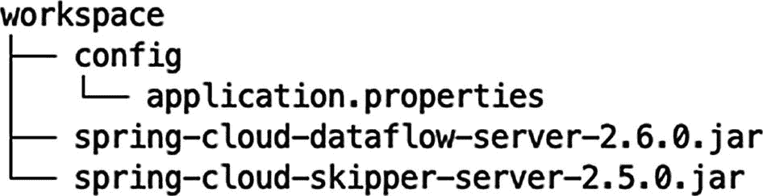

图 8-1。

带有配置/应用程序.属性和优步-jar 的工作区

`config/application.properties`有以下内容。

```java
## DataSource
spring.datasource.url=jdbc:mysql://localhost:3306/dataflow
spring.datasource.username=root
spring.datasource.password=rootpw
spring.datasource.driver-class-name=org.mariadb.jdbc.Driver

## Binder
spring.cloud.dataflow.applicationProperties.stream.spring.rabbitmq.host=localhost
spring.cloud.dataflow.applicationProperties.stream.spring.rabbitmq.username=guest
spring.cloud.dataflow.applicationProperties.stream.spring.rabbitmq.password=guest

```

您可以用下面的代码运行任一 JAR。

```java
$ java -jar spring-cloud-skipper-server-2.6.0.jar

```

在本例中，Spring Boot 获取`config/application.properties`并使用其内容连接到 MySQL 和 Rabbit。

## Spring 云数据流仪表板

完成本地环境设置后，打开浏览器并指向`http://localhost:9393/dashboard`。你的屏幕看起来应该如图 8-2 所示。

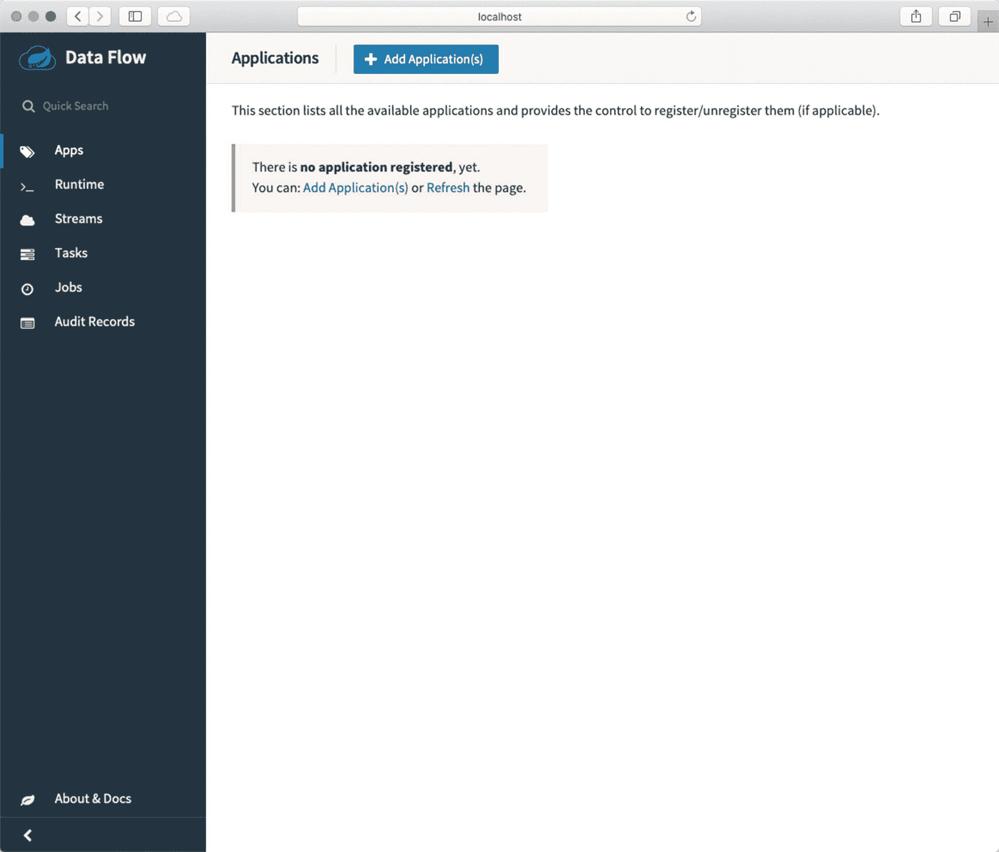

图 8-2

Spring Cloud 数据流仪表板:http://localhost:9393/dashboard

图 [8-2](#Fig2) 为仪表板。一切顺利。不要担心显示的选项卡或其他链接。当你创建你的第一个流流时，我会讨论它们。

### 注册云流应用程序启动器

一旦服务器启动并运行，就该注册云流应用程序启动器了。在主控制面板中，单击+添加应用程序按钮。接下来，选择**批量导入申请**(见图 [8-3](#Fig3) )。

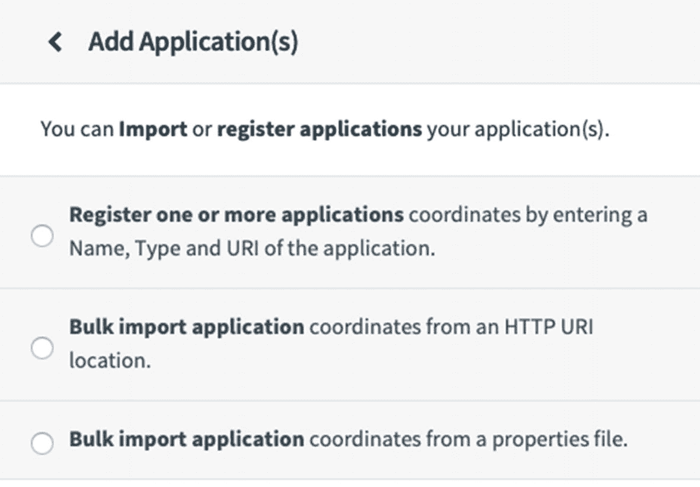

图 8-3。

添加应用程序:http://localhost:9393/dashboard/#/apps/add

接下来，添加 URI。最简单的方法是点击列出所有流应用的部分。例如，如果你正在使用 RabbitMQ，点击**流应用(RabbitMQ/Maven)** (见图 [8-4](#Fig4) )。

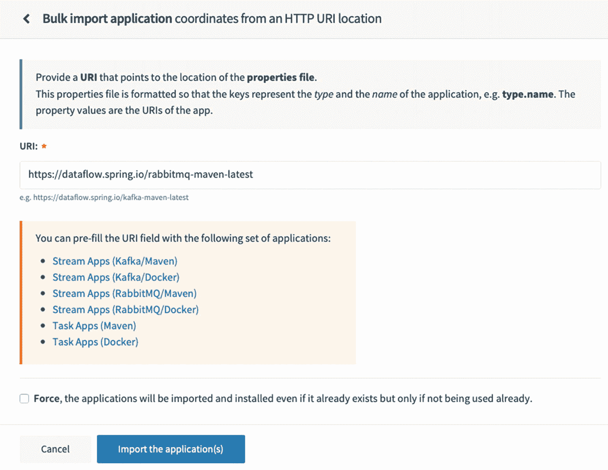

图 8-4。

从 URI 添加批量应用程序:http://localhost:9393/dashboard/#/apps/add/import-from-uri

下面列出了应用程序的 URIs。

*   卡夫卡
    *   [T2`https://dataflow.spring.io/kafka-maven-latest`](https://dataflow.spring.io/kafka-maven-latest)

    *   [T2`https://dataflow.spring.io/kafka-docker-latest`](https://dataflow.spring.io/kafka-docker-latest)

*   拉比特
    *   [T2`https://dataflow.spring.io/rabbitmq-maven-latest`](https://dataflow.spring.io/rabbitmq-maven-latest)

    *   [T2`https://dataflow.spring.io/rabbitmq-docker-latest`](https://dataflow.spring.io/rabbitmq-docker-latest)

*   任务
    *   [T2`https://dataflow.spring.io/task-maven-latest`](https://dataflow.spring.io/task-maven-latest)

    *   [T2`https://dataflow.spring.io/task-docker-latest`](https://dataflow.spring.io/task-docker-latest)

接下来，单击**导入应用程序**按钮。现在你应该已经导入了所有的应用程序(见图 [8-5](#Fig5) )。

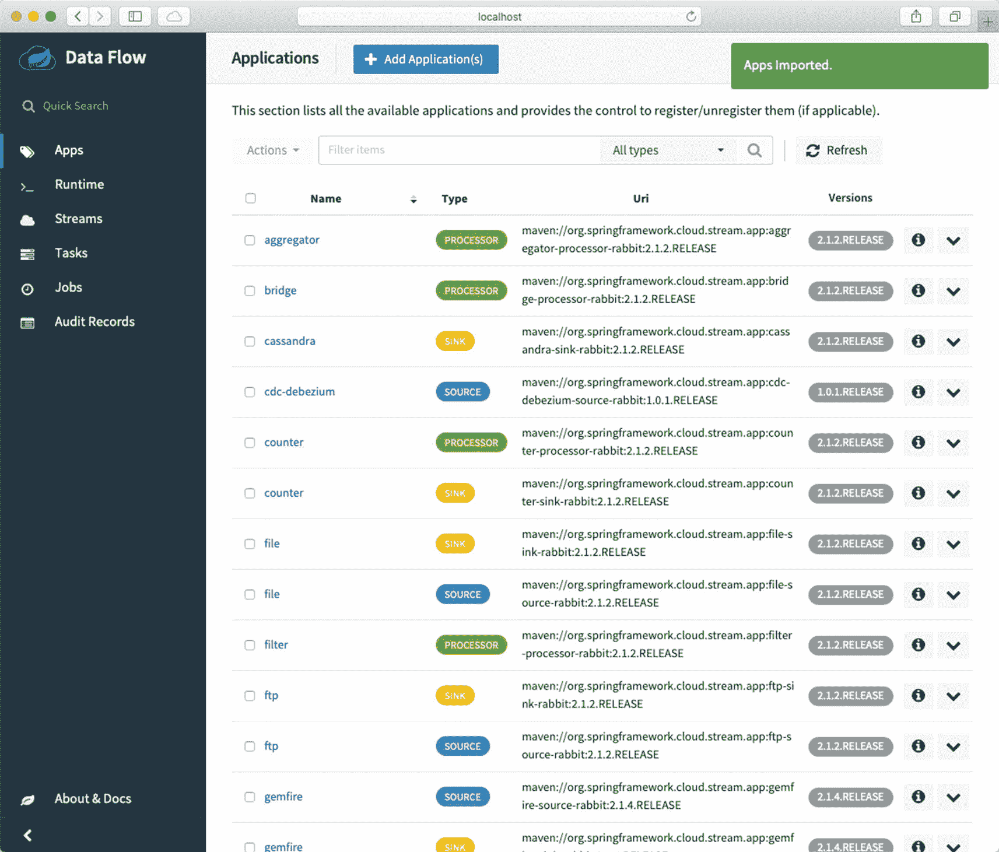

图 8-5。

导入的应用程序:http://localhost:9393/dashboard/#/apps

Note

我在源代码中添加了一些脚本，这些脚本可以在单台机器和 Spring Cloud 数据流服务器上本地启动。我假设你有`docker-compose`、`curl`和`wget`命令。

## 独立的服务器或代理

如果你想让一个独立的机器单独运行，你可以这样做，但是你需要用`spring.cloud.skipper.client.serverUri`属性告诉数据流服务器 Skipper 服务器在哪里。在命令行中将此属性设置为参数。

```java
$ java -jar spring-cloud-dataflow-server-2.6.0.jar \
   --spring.cloud.skipper.client.serverUri=https://my-other-server:7577/api

```

如果是在代理后面，需要将`server.use-forward-headers`设置为`true`，或者用以下参数启动数据流服务器。

```java
$ java -jar spring-cloud-dataflow-server-2.6.0.jar \
   --spring.cloud.skipper.client.serverUri=https://192.51.100.1:7577/api  \
   --server.use-forward-headers=true

```

这些是您需要在代理配置中使用的路径和 URL。

```java
securityinfo:
  path: /security/**
  url: http://data-flow-server:9393/security
about:
  path: /about/**
  url: http://data-flow-server:9393/about
apps:
  path: /apps/**
  url: http://data-flow-server:9393/apps
dashboard:
  path: /dashboard/**
  url: http://data-flow-server:9393/dashboard
audit-records:
  path: /audit-records/**
  url: http://data-flow-server:9393/audit-records
jobs:
  path: /jobs/**
  url: http://data-flow-server:9393/jobs
streams:
  path: /streams/**
  url: http://data-flow-server:9393/streams
tasks:
  path: /tasks/**
  url: http://data-flow-server:9393/tasks
tools:
  path: /tools/**
  url: http://data-flow-server:9393/tools
runtime:
  path: /rutime/**
  url: http://data-flow-server:9393/runtime
completions:
  path: /completions/**
  url: http://data-flow-server:9393/completions

```

## 使用 Docker 合成

Docker 创建了本地开发和测试所需的基础设施。很好用，也很有效。所以，让我们从创建两个`docker-compose`文件开始。我建议创建一个保存这些文件的文件夹。一个文件使用兔子，另一个使用卡夫卡的活页夹。

用清单 [8-1](#PC18) 中的内容创建`docker-compose-rabbitmq.yml`。

```java
version: '3'

services:
  mysql:
    image: mysql:5.7.25
    container_name: dataflow-mysql
    environment:
      MYSQL_DATABASE: dataflow
      MYSQL_USER: root
      MYSQL_ROOT_PASSWORD: rootpw
    expose:
      - 3306

  rabbitmq:
    image: rabbitmq:3.8.3-alpine
    container_name: dataflow-rabbitmq
    expose:
      - '5672'

  dataflow-server:
    image: springcloud/spring-cloud-dataflow-server:${DATAFLOW_VERSION:?DATAFLOW_VERSION variable needs to be set!}
    container_name: dataflow-server
    ports:
      - "9393:9393"
    environment:
      - spring.cloud.dataflow.applicationProperties.stream.spring.rabbitmq.host=rabbitmq
      - spring.cloud.skipper.client.serverUri=http://skipper-server:7577/api
      - SPRING_DATASOURCE_URL=jdbc:mysql://mysql:3306/dataflow
      - SPRING_DATASOURCE_USERNAME=root
      - SPRING_DATASOURCE_PASSWORD=rootpw
      - SPRING_DATASOURCE_DRIVER_CLASS_NAME=org.mariadb.jdbc.Driver
    depends_on:
      - rabbitmq
    entrypoint: "./wait-for-it.sh mysql:3306 -- java -jar /maven/spring-cloud-dataflow-server.jar"
    volumes:
      - ${HOST_MOUNT_PATH:-.}:${DOCKER_MOUNT_PATH:-/root/scdf}

  skipper-server:
    image: springcloud/spring-cloud-skipper-server:${SKIPPER_VERSION:?SKIPPER_VERSION variable needs to be set!}
    container_name: skipper
    ports:
      - "7577:7577"
      - "20000-20105:20000-20105"
    volumes:
      - ${HOST_MOUNT_PATH:-.}:${DOCKER_MOUNT_PATH:-/root/scdf}

  app-import:
    image: springcloud/openjdk:2.0.0.RELEASE
    container_name: dataflow-app-import
    depends_on:
      - dataflow-server
    command: >
      /bin/sh -c "
        ./wait-for-it.sh -t 180 dataflow-server:9393;
        wget -qO- 'http://dataflow-server:9393/apps' --post-data='uri=${STREAM_APPS_URI:-https://dataflow.spring.io/rabbitmq-maven-latest&force=true}';
        echo 'Stream apps imported'
        wget -qO- 'http://dataflow-server:9393/apps' --post-data='uri=${TASK_APPS_URI:-https://dataflow.spring.io/task-maven-latest&force=true}';
        echo 'Task apps imported'"

Listing 8-1.docker-compose-rabbitmq.yml

```

注意，您使用的是`DATAFLOW_VERSION`和`SKIPPER_VERSION`环境变量，需要对它们进行设置以获得映像版本。使用这种方法，您可以找到任何版本的可重用 Docker 合成文件。当然，你可以用同样的形式添加 Rabbit 和 MySQL 版本。每个服务都使用指向服务名称的环境变量，这很有用，因为 Docker Compose 创建了一个 DNS，使得 DevOps 人员更容易使用名称而不是 IP。

如果你查看清单 [8-1](#PC18) ，你会在最后看到`app-import`声明。即使你还没有看到 Spring Cloud Stream 云数据流的组件，但是数据流服务器提供了一个 API，可以让你连接到它。在这种情况下，当您使用这个 Docker 合成文件时，您将发布一个 URI 来注册应用程序。

接下来，您可以用清单 [8-2](#PC19) 中的内容创建`docker-compose-kafka.yml`文件。

```java
version: '3'

services:
  mysql:
    image: mysql:5.7.25
    container_name: dataflow-mysql
    environment:
      MYSQL_DATABASE: dataflow
      MYSQL_USER: root
      MYSQL_ROOT_PASSWORD: rootpw
    expose:
      - 3306

  kafka-broker:
    image: confluentinc/cp-kafka:5.3.1
    container_name: dataflow-kafka
    expose:
      - "9092"
    environment:
      - KAFKA_ADVERTISED_LISTENERS=PLAINTEXT://kafka-broker:9092
      - KAFKA_ZOOKEEPER_CONNECT=zookeeper:2181
      - KAFKA_ADVERTISED_HOST_NAME=kafka-broker
      - KAFKA_OFFSETS_TOPIC_REPLICATION_FACTOR=1
    depends_on:
      - zookeeper

  zookeeper:
    image: confluentinc/cp-zookeeper:5.3.1
    container_name: dataflow-kafka-zookeeper
    expose:
      - "2181"
    environment:
      - ZOOKEEPER_CLIENT_PORT=2181

  dataflow-server:
    image: springcloud/spring-cloud-dataflow-server:${DATAFLOW_VERSION:?DATAFLOW_VERSION variable needs to be set!}
    container_name: dataflow-server
    ports:
      - "9393:9393"
    environment:
      - spring.cloud.dataflow.applicationProperties.stream.spring.cloud.stream.kafka.binder.brokers=PLAINTEXT://kafka-broker:9092
      - spring.cloud.dataflow.applicationProperties.stream.spring.cloud.stream.kafka.streams.binder.brokers=PLAINTEXT://kafka-broker:9092
      - spring.cloud.dataflow.applicationProperties.stream.spring.cloud.stream.kafka.binder.zkNodes=zookeeper:2181
      - spring.cloud.dataflow.applicationProperties.stream.spring.cloud.stream.kafka.streams.binder.zkNodes=zookeeper:2181
      - spring.cloud.skipper.client.serverUri=http://skipper-server:7577/api
      - SPRING_DATASOURCE_URL=jdbc:mysql://mysql:3306/dataflow
      - SPRING_DATASOURCE_USERNAME=root
      - SPRING_DATASOURCE_PASSWORD=rootpw
      - SPRING_DATASOURCE_DRIVER_CLASS_NAME=org.mariadb.jdbc.Driver
    depends_on:
      - kafka-broker
    entrypoint: "./wait-for-it.sh mysql:3306 -- java -jar /maven/spring-cloud-dataflow-server.jar"
    volumes:
      - ${HOST_MOUNT_PATH:-.}:${DOCKER_MOUNT_PATH:-/root/scdf}

  app-import:
    image: springcloud/openjdk:2.0.0.RELEASE
    container_name: dataflow-app-import
    depends_on:
      - dataflow-server
    command: >
      /bin/sh -c "
        ./wait-for-it.sh -t 180 dataflow-server:9393;
        wget -qO- 'http://dataflow-server:9393/apps' --post-data='uri=${STREAM_APPS_URI:-https://dataflow.spring.io/kafka-maven-latest&force=true}';
        echo 'Stream apps imported'
        wget -qO- 'http://dataflow-server:9393/apps' --post-data='uri=${TASK_APPS_URI:-https://dataflow.spring.io/task-maven-latest&force=true}';
        echo 'Task apps imported'"

  skipper-server:
    image: springcloud/spring-cloud-skipper-server:${SKIPPER_VERSION:?SKIPPER_VERSION variable needs to be set!}
    container_name: skipper

    ports:
      - "7577:7577"
      - "20000-20105:20000-20105"
    environment:
      - SPRING_CLOUD_SKIPPER_SERVER_PLATFORM_LOCAL_ACCOUNTS_DEFAULT_PORTRANGE_LOW=20000
      - SPRING_CLOUD_SKIPPER_SERVER_PLATFORM_LOCAL_ACCOUNTS_DEFAULT_PORTRANGE_HIGH=20100
      - SPRING_DATASOURCE_URL=jdbc:mysql://mysql:3306/dataflow
      - SPRING_DATASOURCE_USERNAME=root
      - SPRING_DATASOURCE_PASSWORD=rootpw
      - SPRING_DATASOURCE_DRIVER_CLASS_NAME=org.mariadb.jdbc.Driver
    entrypoint: "./wait-for-it.sh mysql:3306 -- java -Djava.security.egd=file:/dev/./urandom -jar /spring-cloud-skipper-server.jar"
    volumes:
      - ${HOST_MOUNT_PATH:-.}:${DOCKER_MOUNT_PATH:-/root/scdf}

Listing 8-2.docker-compose-kafka.yml

```

清单 [8-2](#PC19) 显示的是`docker-compose-kafka.yml`文件；注意和 RabbitMQ 差不多，用的是 Kafka 和 Zookeeper。还要检查属性并确定您使用的是服务名。

接下来，通过对 RabbitMQ 使用以下命令来启动您的基础设施。

```java
$ export DATAFLOW_VERSION=2.6.0
$ export SKIPPER_VERSION=2.5.0
$ docker-compose -f docker-compose-rabbitmq.yml up

```

或者你用下面这句话来形容卡夫卡。

```java
$ export DATAFLOW_VERSION=2.6.0
$ export SKIPPER_VERSION=2.5.0
$ docker-compose -f docker-compose-kafka.yml up

```

接下来，转到您的浏览器并打开`http://localhost:9393/dashboard`。你的屏幕应该和图 [8-5](#Fig5) 一样。它应该已经导入了应用程序。

要关闭，如果您使用 RabbitMQ，请执行以下命令。

```java
$ export DATAFLOW_VERSION=2.6.0
$ export SKIPPER_VERSION=2.5.0
$ docker-compose -f docker-compose-rabbitmq.yml down

```

如果您正在使用 Kafka，请执行以下命令。

```java
$ export DATAFLOW_VERSION=2.6.0
$ export SKIPPER_VERSION=2.5.0
$ docker-compose -f docker-compose-kafka.yml down

```

请记住，shutdown 命令必须在 YAML 文件所在的目录中运行。

## 不可思议的安装

您还没有看到 Spring Cloud 数据流的强大功能以及它的能力。在接下来的章节中，您将创建可以占用多台机器的流。在某种程度上，你需要扩大规模，并且有能力洞察你的信息流发生了什么。当一些应用程序(在流程中)开始失败时会发生什么？您应该能够创建多个实例并对它们进行监控，如果一个实例关闭了，可以重新创建它。当然，您可以手动完成，但是当您有一个包含 100 个微服务的流程时，您需要依赖一个提供弹性、高可用性、可伸缩性和可见性的平台。

在开始之前，您需要安装并运行 Kubernetes。如果你有足够的 RAM 来运行 Spring Cloud 数据流，或者在任何公共云中(IBM Cloud、Google、Amazon 或 Microsoft Azure)都有资源，你就可以使用你的电脑。

### 带有 Docker 桌面的个人电脑

Mac 或 Windows 用户可以安装 Docker Desktop。它可以启用 Kubernetes，但您的计算机上至少需要 16 GB 的内存。可以从 [`www.docker.com/products/docker-desktop`](http://www.docker.com/products/docker-desktop) 安装。

接下来，你需要做一些修改。打开 Docker 桌面偏好设置，进入资源，修改设置。您还需要启用 Kubernetes(参见图 [8-6](#Fig6) 和 [8-7](#Fig7) )。

*   CPUs 个

*   RAM: 8 GB

*   交换空间:1.5 GB

*   Disk image size: 30 GB

    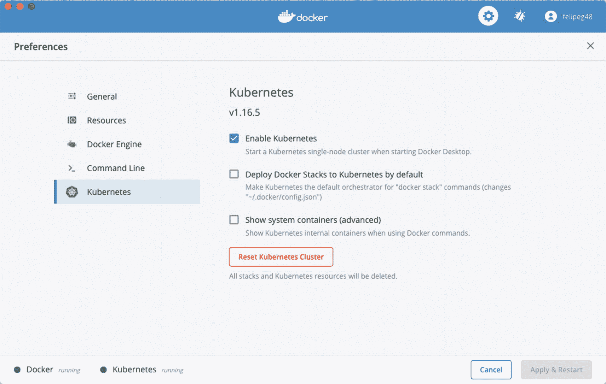

    图 8-7。

    桌面坞站:首选项库

    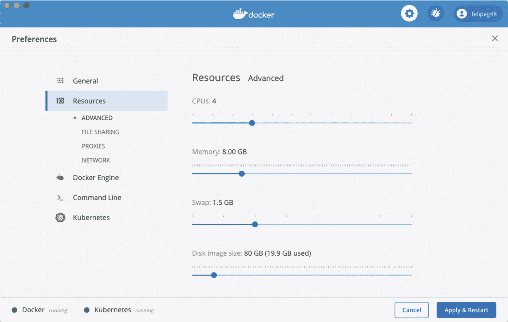

    图 8-6。

    Docker 桌面:首选项➤资源

    如果您的计算机上有资源，请添加更多的 RAM 和 CPU。

更改这些设置后，您需要重新启动 Docker Desktop。然后，你就一切就绪了。

### 迷你库比

如果你用的是 Linux，可以安装 Minikube ( [`https://kubernetes.io/docs/tasks/tools/install-minikube/`](https://kubernetes.io/docs/tasks/tools/install-minikube/) )。遵循安装说明，或使用以下内容。

*   面向 Linux 的家酿( [`https://docs.brew.sh/Homebrew-on-Linux`](https://docs.brew.sh/Homebrew-on-Linux) )。安装后，在您的终端中运行`brew install minikube`。

*   SnapCraft ( [`https://snapcraft.io/`](https://snapcraft.io/) )。在您的终端中执行`sudo snap install minikube`。

如果你在 Windows 上，使用 Chocolatey ( [`https://chocolatey.org`](https://chocolatey.org) )。安装完成后，在命令行或 PowerShell 中执行`choco install minikube`。

如果你在 Mac OS 上，使用 Brew ( [`https://brew.sh/`](https://brew.sh/) )。安装后，在您的终端中执行`brew install minikube`。

Minikube 可以在任何操作系统中使用，所以如果你喜欢在下面的章节中使用 Minikube，它应该没有任何问题；启动的时候记得给足内存和 CPU。

```java
$ minikube start --cpus 4 --memory 8192

```

阅读关于可以传递哪些其他参数的文档；例如，要使用的驱动程序。

Note

如果你正在使用 Minikube，查看`kubectl describe nodes`命令。当您执行`minikube start --cpus`命令时，您应该有您指定的 CPUs 如果没有，可以先执行`minikube stop && minikube delete`，然后再执行`minikube start --cpus 4 --memory 8192`。如果你有更多的资源，比如 32 GB 的内存，你可以使用`--cpus 6`和`--memory 12288`。

### 在 Kubernetes 中安装 Spring 云数据流

既然您已经启动并运行了 Kubernetes 集群，那么是时候安装 Spring Cloud 数据流了。最好的方法之一是使用`kubectl`命令。你也可以使用 Helm，但是你需要知道如何修改你的图表来实现它；如果你对 Helm 感兴趣，我推荐你去参观 [`https://dataflow.spring.io/docs/installation/kubernetes/helm/`](https://dataflow.spring.io/docs/installation/kubernetes/helm/) 。

最简单的方法是从 Apress 网站下载源代码。即使我包括了 YAML 的文件，你的电脑上应该已经有了。你可以在`ch08/kubernetes`文件夹结构中找到一切(见图 [8-8](#Fig8) )。

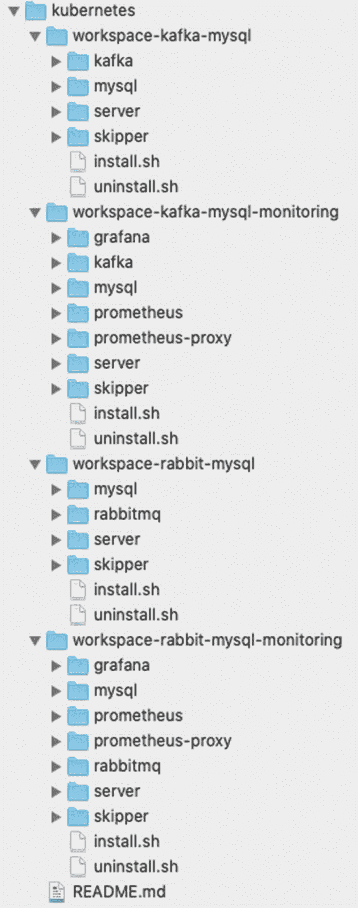

图 8-8。

来源代码:ch 08/kubrines

#### 使用 kubectl

让我们按照分步说明来安装每个组件。我假设您的集群正在运行，并且您已经下载了配套书籍的源代码。

1.  It is important to know the versions that you are going to work on. When this book was written, the following versions were available.
    1.  春云数据流:`springcloud/spring-cloud-dataflow-server:2.6.0`

    2.  春云队长:`springcloud/spring-cloud-skipper-server:2.5.0`

    3.  Grafana 形象:t0]

    使用 Kubernetes 集群的一个好处是，您可以使用它的监控工具，但是有时您需要更多的信息，所以让我们在这一节中插入 Grafana 和 Prometheus。如果您运行的是 Minikube 或 Docker Desktop Kubernetes，则至少还需要 2 到 4 GB 的额外内存。

2.  选择经纪人。记住 Spring Cloud Stream 提供 RabbitMQ 和 Kafka 作为代理，如果你想使用多个绑定器，你可以配置你的流。(接下来的章节将带回 NATs 代理。)选择一个绑定器，Rabbit 或 Kafka，并执行以下命令。
    1.  拉比特

        `kubectl create -f rabbitmq/`

        在`ch08/kubernetes/`文件夹中，有两个文件:`rabbitmq-deployment.yaml`和`rabbitmq-svc.yaml`(见清单 [8-3](#PC25) 和 [8-4](#PC26) )。

```java
apiVersion: apps/v1
kind: Deployment
metadata:
  name: rabbitmq
  labels:
    app: rabbitmq
spec:
  replicas: 1
  selector:
    matchLabels:
      app: rabbitmq
  template:
    metadata:
      labels:
        app: rabbitmq
    spec:
      containers:
      - image: rabbitmq:3.8.3-alpine
        name: rabbitmq
        ports:
        - containerPort: 5672

Listing 8-3.rabbitmq-deployment.yaml

```

注意，您使用的是`rabbitmq:3.8.3-alpine`映像，端口是 5672。该应用程序被命名为 rabbitmq，这是 Kubernetes 中的一个简单机制，用于在必要时查找、编辑和删除 pod、服务或部署。

```java
apiVersion: v1
kind: Service
metadata:
  name: rabbitmq
  labels:
    app: rabbitmq
spec:
  ports:
  - port: 5672
  selector:
    app: rabbitmq

Listing 8-4.rabbitmq-svc.yaml

```

您将服务命名为 rabbitmq，因此通过名称定位 RabbitMQ 服务器更容易。记住 Kubernetes 有一个 DNS，一个定位服务的强大工具。

1.  卡夫卡

    `kubectl create -f kafka/`

    有四个文件。Kafka 依赖于 Zookeeper，所以你必须添加它的部署和服务(见清单 [8-5](#PC27) 、 [8-6](#PC28) 、 [8-7](#PC29) 和 [8-8](#PC30) )。

```java
apiVersion: v1
kind: Service
metadata:
  name: kafka
  labels:
    app: kafka
    component: kafka-broker
spec:
  ports:
  - port: 9092
    name: kafka-port
    targetPort: 9092
    protocol: TCP
  selector:
    app: kafka
    component: kafka-broker

Listing 8-8.kafka-svc.yaml

```

```java
apiVersion: apps/v1
kind: Deployment
metadata:
  name: kafka-broker
  labels:
    app: kafka
    component: kafka-broker
spec:
  replicas: 1
  selector:
    matchLabels:
      app: kafka

  template:
    metadata:
      labels:
        app: kafka
        component: kafka-broker
    spec:
      containers:
      - name: kafka
        image: wurstmeister/kafka:2.12-2.3.0
        ports:
        - containerPort: 9092
        env:
          - name: ENABLE_AUTO_EXTEND
            value: "true"
          - name: KAFKA_RESERVED_BROKER_MAX_ID
            value: "999999999"
          - name: KAFKA_AUTO_CREATE_TOPICS_ENABLE
            value: "false"
          - name: KAFKA_PORT
            value: "9092"
          - name: KAFKA_ADVERTISED_PORT
            value: "9092"
          - name: KAFKA_ADVERTISED_HOST_NAME
            valueFrom:
              fieldRef:
                fieldPath: status.podIP

          - name: KAFKA_ZOOKEEPER_CONNECT
            value: kafka-zk:2181

Listing 8-7.kafka-deployment.yaml

```

```java
apiVersion: v1
kind: Service
metadata:
  name: kafka-zk
  labels:
    app: kafka
    component: kafka-zk
spec:
  ports:
  - name: client
    port: 2181
    protocol: TCP
  - name: follower
    port: 2888
    protocol: TCP
  - name: leader
    port: 3888
    protocol: TCP
  selector:
    app: kafka-zk
    component: kafka-zk

Listing 8-6.kafla-zk-svc.yaml

```

```java
apiVersion: apps/v1
kind: Deployment
metadata:
  name: kafka-zk
  labels:
    app: kafka
    component: kafka-zk
spec:
  replicas: 1
  selector:
    matchLabels:
      app: kafka-zk
  template:
    metadata:
      labels:
        app: kafka-zk
        component: kafka-zk
    spec:
      containers:
      - name: kafka-zk
        image: digitalwonderland/zookeeper
        ports:
        - containerPort: 2181
        env:
        - name: ZOOKEEPER_ID
          value: "1"
        - name: ZOOKEEPER_SERVER_1
          value: kafka-zk

Listing 8-5.kafka-zk-deployment.yaml

```

记住要么选兔子，要么选卡夫卡(暂时)。下一章混合了 RabbitMQ、Kafka 和 NATs 经纪人。

1.  安装 MySQL(您可以安装任何适合您的环境或业务逻辑的工具；记得更改 YAML 文件中的属性以反映新的数据库引擎)。

    `kubectl create -f mysql/`

    在这个文件夹中，有四个文件。要使用 MySQL 服务器，您必须定义存储。在这种情况下，使用默认的存储类(您可以将其修改为适合您需求的类型，如 SSD 或可以根据需要增长的弹性存储)。需要添加用户名和密码，因此必须创建一个 Kubernetes 秘密对象(参见清单 [8-9](#PC31) 、 [8-10](#PC32) 、 [8-11](#PC33) 和 [8-12](#PC34) )。

```java
apiVersion: v1
kind: PersistentVolumeClaim
metadata:
  name: mysql
  labels:
    app: mysql
  annotations:
    volume.alpha.kubernetes.io/storage-class: default
spec:
  accessModes:
    - ReadWriteOnce
  resources:
    requests:
      storage: 8Gi

Listing 8-9.mysql-pvc.yaml

```

目前，您使用的是`storage-class:default`和 8 GB 的存储空间。如果你愿意，你可以修改它。

```java
apiVersion: v1
kind: Secret
metadata:
  name: mysql
  labels:
    app: mysql
data:
  mysql-root-password: eW91cnBhc3N3b3Jk

Listing 8-10.mysql-secrets.yaml

```

当然，您可以将密码更改为适合您的解决方案的密码。

```java
apiVersion: apps/v1
kind: Deployment
metadata:
  name: mysql
  labels:
    app: mysql
spec:
  replicas: 1
  selector:
    matchLabels:
      app: mysql
  template:
    metadata:
      labels:
        app: mysql
    spec:
      containers:
      - image: mysql:5.7.25
        name: mysql
        env:
          - name: MYSQL_ROOT_PASSWORD
            valueFrom:
              secretKeyRef:
                key: mysql-root-password
                name: mysql
        ports:
          - containerPort: 3306
            name: mysql
        volumeMounts:
          - name: data
            mountPath: /var/lib/mysql
        args:
          - "--ignore-db-dir=lost+found"
      volumes:
      - name: data
        persistentVolumeClaim:
          claimName: mysql

Listing 8-11.mysql-deployment.yml

```

前面文件的一个主要属性是指向`mysql-root-password`秘密对象的`secretKeyRef`。

1.  如果需要监控，安装 Grafana 和 Prometheus。Spring Cloud 数据流使用*微米应用程序监控* ( [`http://micrometer.io/`](http://micrometer.io/) )来发送关于您的流的统计数据，例如内存和 CPU 消耗以及线程数量。
    1.  Prometheus

        ```java
        kubectl create -f prometheus/prometheus-clusterroles.yaml
        kubectl create -f prometheus/prometheus-clusterrolebinding.yaml
        kubectl create -f prometheus/prometheus-serviceaccount.yaml
        kubectl create -f prometheus-proxy/
        kubectl create -f prometheus/prometheus-configmap.yaml
        kubectl create -f prometheus/prometheus-deployment.yaml
        kubectl create -f prometheus/prometheus-service.yaml

        ```

        如您所见，需要添加集群角色、绑定和服务帐户。您必须添加一个代理来向 Grafana 发送信息，然后是`ConfigMap`、部署和服务(参见清单 [8-13](#PC36) 、 [8-14](#PC37) 、 [8-15](#PC38) 、 [8-16](#PC39) 、 [8-17](#PC40) 、 [8-18](#PC41) 、 [8-19](#PC42) 、 [8-20](#PC43) 、

```java
apiVersion: v1
kind: Service
metadata:
  name: mysql
  labels:
    app: mysql
spec:
  ports:
    - port: 3306
  selector:
    app: mysql

Listing 8-12.mysql-svc.yaml

```

```java
kind: ServiceAccount
apiVersion: v1
metadata:
  name: prometheus
  labels:
    app: prometheus
  namespace: default

Listing 8-15.prometheus-serviceaccount.yaml

```

```java
kind: ClusterRoleBinding
apiVersion: rbac.authorization.k8s.io/v1
metadata:
  name: prometheus
  labels:
    app: prometheus
roleRef:
  apiGroup: rbac.authorization.k8s.io
  kind: ClusterRole
  name: prometheus
subjects:
- kind: ServiceAccount
  name: prometheus
  namespace: default

Listing 8-14.prometheus-clusterrolebinding.yaml

```

```java
kind: ClusterRole
apiVersion: rbac.authorization.k8s.io/v1
metadata:
  name: prometheus
  labels:
    app: prometheus
rules:
- apiGroups: [""]
  resources:
  - nodes
  - nodes/proxy
  - services
  - endpoints
  - pods
  verbs: ["get", "list", "watch"]
- apiGroups:
  - extensions
  resources:
  - ingresses
  verbs: ["get", "list", "watch"]
- nonResourceURLs: ["/metrics"]
  verbs: ["get"]

Listing 8-13.prometheus-clusterroles.yaml

```

在这里，您将服务帐户分配给默认的名称空间，但是您可以对其进行更改以适应您的环境。

```java
apiVersion: apps/v1
kind: Deployment
metadata:
  name: prometheus-proxy
  labels:
    app: prometheus-proxy
spec:
#  replicas: 3
  selector:
    matchLabels:
      app: prometheus-proxy
  template:
    metadata:
      labels:
        app: prometheus-proxy
    spec:
      serviceAccountName: prometheus-proxy
      containers:
        - name: prometheus-proxy
          image: micrometermetrics/prometheus-rsocket-proxy:latest
          imagePullPolicy: Always
          ports:
            - name: scrape
              containerPort: 8080
            - name: rsocket
              containerPort: 7001
          resources:
            limits:
              cpu: 1.0
              memory: 2048Mi
            requests:
              cpu: 0.5
              memory: 1024Mi
      securityContext:
        fsGroup: 2000
        runAsNonRoot: true
        runAsUser: 1000

Listing 8-18.prometheus-proxy-deployment.yaml

```

```java
apiVersion: v1
kind: ServiceAccount
metadata:
  name: prometheus-proxy
  labels:
    app: prometheus-proxy
  namespace: default

Listing 8-17.prometheus-proxy-serviceaccount.yaml

```

```java
apiVersion: rbac.authorization.k8s.io/v1beta1
kind: ClusterRoleBinding
metadata:
  name: prometheus-proxy
  labels:
    app: prometheus-proxy
subjects:
  - kind: ServiceAccount
    name: prometheus-proxy
    namespace: default
roleRef:
  kind: ClusterRole
  name: cluster-admin
  apiGroup: rbac.authorization.k8s.io

Listing 8-16.prometheus-proxy-clusterrolebinding.yaml

```

您正在使用普罗米修斯代理的最新图像:`micrometermetrics/prometheus-rsocket-proxy`。

```java
apiVersion: v1
kind: Service
metadata:
  name: prometheus-proxy
  labels:
    app: prometheus-proxy
spec:
  selector:
    app: prometheus-proxy
  ports:
    - name: scrape
      port: 8080
      targetPort: 8080
    - name: rsocket
      port: 7001
      targetPort: 7001
  type: LoadBalancer

Listing 8-19.prometheus-proxy-service.yaml

```

即使这里用了`kubectl -f prometheus-proxy/`，也不需要在意顺序。Prometheus 代理与我们的流应用程序通信并从中获取所有指标。

```java
apiVersion: v1
kind: ConfigMap
metadata:
  name: prometheus
  labels:
    app: prometheus
data:
  prometheus.yml: |-
    global:
      scrape_interval: 10s
      scrape_timeout: 9s
      evaluation_interval: 10s

    scrape_configs:
    - job_name: 'proxied-applications'
      metrics_path: '/metrics/connected'
      kubernetes_sd_configs:
        - role: pod
          namespaces:
            names:
              - default
      relabel_configs:
        - source_labels: [__meta_kubernetes_pod_label_app]
          action: keep
          regex: prometheus-proxy
        - source_labels: [__meta_kubernetes_pod_container_port_number]
          action: keep
          regex: 8080
    - job_name: 'proxies'
      metrics_path: '/metrics/proxy'
      kubernetes_sd_configs:
        - role: pod
          namespaces:
            names:
              - default
      relabel_configs:
        - source_labels: [__meta_kubernetes_pod_label_app]
          action: keep
          regex: prometheus-proxy
        - source_labels: [__meta_kubernetes_pod_container_port_number]
          action: keep
          regex: 8080
        - action: labelmap
          regex: __meta_kubernetes_pod_label_(.+)
        - source_labels: [__meta_kubernetes_pod_name]
          action: replace
          target_label: kubernetes_pod_name

Listing 8-20.prometheus-configmap.yaml

```

告知 Prometheus 从哪里获取度量信息。

```java
apiVersion: v1
kind: Service
metadata:
  name: prometheus
  labels:
    app: prometheus
  annotations:
      prometheus.io/scrape: 'true'
      prometheus.io/path:   /
      prometheus.io/port:   '9090'
spec:
  selector:
    app: prometheus
  ports:
    - port: 9090
      targetPort: 9090

Listing 8-22.prometheus-service.yaml

```

```java
apiVersion: apps/v1
kind: Deployment
metadata:
  labels:
    app: prometheus
  name: prometheus
spec:
  selector:
    matchLabels:
      app: prometheus
  template:
    metadata:
      labels:
        app: prometheus
    spec:
      serviceAccountName: prometheus
      containers:
        - name: prometheus
          image: prom/prometheus:v2.12.0
          args:
            - "--config.file=/etc/prometheus/prometheus.yml"
            - "--storage.tsdb.path=/prometheus/"
            - "--web.enable-lifecycle"
          ports:
            - name: prometheus
              containerPort: 9090
          volumeMounts:
            - name: prometheus-config-volume
              mountPath: /etc/prometheus/
            - name: prometheus-storage-volume
              mountPath: /prometheus/
      volumes:
        - name: prometheus-config-volume
          configMap:
            name: prometheus
        - name: prometheus-storage-volume
          emptyDir: {}

Listing 8-21.prometheus-deployment.yaml

```

给出这个顺序而不是`kubectl -f prometheus/`是很重要的，因为它可以在没有分配集群角色的情况下开始部署。

1.  添加数据流服务器角色、绑定和服务帐户。
    1.  Data Flow roles, bindings, and service account

        ```java
        kubectl create -f server/server-roles.yaml
        kubectl create -f server/server-rolebinding.yaml
        kubectl create -f server/service-account.yaml

        ```

        参见清单 [8-27](#PC52) 、 [8-28](#PC53) 和 [8-29](#PC54) 。

```java
apiVersion: v1
kind: Service
metadata:
  name: grafana
  labels:
    app: grafana
spec:
  selector:
    app: grafana
  type: LoadBalancer
  ports:
    - port: 3000
      targetPort: 3000

Listing 8-26.grafana-service.yaml

```

```java
apiVersion: apps/v1
kind: Deployment
metadata:
  labels:
    app: grafana
  name: grafana
spec:
  selector:
    matchLabels:
      app: grafana
  template:
    metadata:
      labels:
        app: grafana
    spec:
      containers:
        - image: springcloud/spring-cloud-dataflow-grafana-prometheus:2.5.2.RELEASE
          name: grafana
          env:
            - name: GF_SECURITY_ADMIN_USER
              valueFrom:
                secretKeyRef:
                  name: grafana
                  key: admin-username
            - name: GF_SECURITY_ADMIN_PASSWORD
              valueFrom:
                secretKeyRef:
                  name: grafana
                  key: admin-password
          ports:
            - containerPort: 3000
          resources:
            limits:
              cpu: 500m
              memory: 2500Mi
            requests:
              cpu: 100m
              memory: 100Mi
          volumeMounts:
            - name: config
              mountPath: "/etc/grafana/provisioning/datasources/datasources.yaml"
              subPath: datasources.yaml
      volumes:
        - name: config
          configMap:
            name: grafana

Listing 8-25.grafana-deployment.yaml

```

```java
apiVersion: v1
kind: Secret
type: Opaque
metadata:
  name: grafana
  labels:
    app: grafana
data:
  admin-username: YWRtaW4=
  admin-password: cGFzc3dvcmQ=

Listing 8-24.grafana-secret.yaml

```

```java
apiVersion: v1
kind: ConfigMap
metadata:
  name: grafana
  labels:
    app: grafana
data:
  datasources.yaml: |
    apiVersion: 1
    datasources:
    - name: ScdfPrometheus
      type: prometheus
      access: proxy
      org_id: 1
      url: http://prometheus:9090
      is_default: true
      version: 5
      editable: true
      read_only: false

Listing 8-23.grafana-configmap.yaml

```

1.  格拉凡娜

    ```java
    kubectl create -f grafana/

    ```

    使用 Grafana，您必须添加知道 Prometheus 的配置以及连接它的用户名和密码(参见清单 [8-23](#PC47) 、 [8-24](#PC48) 、 [8-25](#PC49) 和 [8-26](#PC50) )。

1.  Add the cloud Skipper server. It is a key component because it deploys, keeps track of the Stream version, and much more.
    1.  船长
        1.  如果您使用 Rabbit，请执行以下命令。

    1.  如果你使用 Kafka，执行下面的代码。

    ```java
    kubectl create -f skipper/skipper-config-rabbit.yaml

    ```

    ```java
    kubectl create -f skipper/skipper-config-kafka.yaml

    ```

    记住你只需要选择一个(现在)(见清单 [8-30](#PC57) 和 [8-31](#PC58) )。

```java
apiVersion: v1
kind: ServiceAccount
metadata:
  name: scdf-sa

Listing 8-29.service-account.yaml

```

```java
kind: RoleBinding
apiVersion: rbac.authorization.k8s.io/v1beta1
metadata:
  name: scdf-rb
subjects:
- kind: ServiceAccount
  name: scdf-sa
roleRef:
  kind: Role
  name: scdf-role
  apiGroup: rbac.authorization.k8s.io

Listing 8-28.server-rolebinding.yaml

```

```java
kind: Role
apiVersion: rbac.authorization.k8s.io/v1
metadata:
  name: scdf-role
rules:
  - apiGroups: [""]
    resources: ["services", "pods", "replicationcontrollers", "persistentvolumeclaims"]
    verbs: ["get", "list", "watch", "create", "delete", "update"]
  - apiGroups: [""]
    resources: ["configmaps", "secrets", "pods/log"]
    verbs: ["get", "list", "watch"]
  - apiGroups: ["apps"]
    resources: ["statefulsets", "deployments", "replicasets"]
    verbs: ["get", "list", "watch", "create", "delete", "update", "patch"]
  - apiGroups: ["extensions"]
    resources: ["deployments", "replicasets"]
    verbs: ["get", "list", "watch", "create", "delete", "update", "patch"]
  - apiGroups: ["batch"]
    resources: ["cronjobs", "jobs"]
    verbs: ["create", "delete", "get", "list", "watch", "update", "patch"]

Listing 8-27.server-roles.yaml

```

```java
apiVersion: v1
kind: ConfigMap
metadata:
  name: skipper
  labels:
    app: skipper
data:
  application.yaml: |-
    spring:
      cloud:
        skipper:
          server:
            platform:
              kubernetes:
                accounts:
                  default:
                    environmentVariables: 'SPRING_RABBITMQ_HOST=${RABBITMQ_SERVICE_HOST},SPRING_RABBITMQ_PORT=${RABBITMQ_SERVICE_PORT}'
                    limits:
                      memory: 1024Mi
                      cpu: 500m
                    readinessProbeDelay: 120

                    livenessProbeDelay: 90
      datasource:
        url: jdbc:mysql://${MYSQL_SERVICE_HOST}:${MYSQL_SERVICE_PORT}/skipper
        username: root
        password: ${mysql-root-password}
        driverClassName: org.mariadb.jdbc.Driver
        testOnBorrow: true
        validationQuery: "SELECT 1"

Listing 8-30.skipper-config-rabbit.yaml

```

请注意，您正在 ConfigMap 中添加数据源和 RabbitMQ 服务器和端口；所有这些都是环境变量。Kubernetes 为每个服务创建一个环境变量，并将它们添加到每个容器中，因此很容易知道其他服务在哪里；它通常设置 IP 和端口。

```java
apiVersion: v1
kind: ConfigMap
metadata:
  name: skipper
  labels:
    app: skipper
data:
  application.yaml: |-
    spring:
      cloud:
        skipper:
          server:
            platform:
              kubernetes:
                accounts:
                  default:
                    environmentVariables: 'SPRING_CLOUD_STREAM_KAFKA_BINDER_BROKERS=${KAFKA_SERVICE_HOST}:${KAFKA_SERVICE_PORT},SPRING_CLOUD_STREAM_KAFKA_BINDER_ZK_NODES=${KAFKA_ZK_SERVICE_HOST}:${KAFKA_ZK_SERVICE_PORT}'
                    limits:
                      memory: 1024Mi
                      cpu: 500m
                    readinessProbeDelay: 120
                    livenessProbeDelay: 90
      datasource:
        url: jdbc:mysql://${MYSQL_SERVICE_HOST}:${MYSQL_SERVICE_PORT}/skipper
        username: root
        password: ${mysql-root-password}
        driverClassName: org.mariadb.jdbc.Driver
        testOnBorrow: true
        validationQuery: "SELECT 1"

Listing 8-31.skipper-config-kafka.yaml

```

选择代理后，添加部署和服务。

```java
gkubectl create -f skipper/skipper-deployment.yaml
kubectl create -f skipper/skipper-svc.yaml

```

参见清单 [8-32](#PC60) 和 [8-33](#PC61) 。

```java
apiVersion: v1
kind: Service
metadata:
  name: skipper
  labels:
    app: skipper
    spring-deployment-id: scdf
spec:
  type: LoadBalancer
  ports:
  - port: 80
    targetPort: 7577
  selector:
    app: skipper

Listing 8-33.skipper-svc.yaml

```

```java
apiVersion: apps/v1
kind: Deployment
metadata:
  name: skipper
  labels:
    app: skipper
spec:
  selector:
    matchLabels:
      app: skipper
  replicas: 1
  template:
    metadata:
      labels:
        app: skipper
    spec:
      containers:
      - name: skipper
        image: springcloud/spring-cloud-skipper-server:2.6.0
        imagePullPolicy: Always
        ports:
        - containerPort: 80
        livenessProbe:
          httpGet:
            path: /actuator/health
            port: 7577
          initialDelaySeconds: 45
        readinessProbe:
          httpGet:
            path: /actuator/info
            port: 7577
          initialDelaySeconds: 45
        resources:
          limits:
            cpu: 1.0
            memory: 1024Mi
          requests:
            cpu: 0.5
            memory: 640Mi
        env:
        - name: SPRING_CLOUD_KUBERNETES_CONFIG_NAME
          value: skipper
        - name: SPRING_CLOUD_KUBERNETES_SECRETS_ENABLE_API

          value: 'true'
        - name: SPRING_CLOUD_KUBERNETES_SECRETS_NAME
          value: mysql
      initContainers:
      - name: init-mysql-wait
        image: busybox
        command: ['sh', '-c', 'until nc -w3 -z mysql 3306; do echo waiting for mysql; sleep 3; done;']
      - name: init-mysql-database
        image: mysql:5.6
        env:
        - name: MYSQL_PWD
          valueFrom:
            secretKeyRef:
              name: mysql
              key: mysql-root-password
        command: ['sh', '-c', 'mysql -h mysql -u root -e "CREATE DATABASE IF NOT EXISTS skipper;"']
      serviceAccountName: scdf-sa

Listing 8-32.skipper-deployment.yaml

```

当你的类型设置为`LoadBalancer`时，Skipper 可以从外部访问，但如果你不需要它，你可以使用`NodePort`来代替。使用 Minikube 或 Docker Desktop Kubernetes 时,`NodePort`很有用。

1.  Finally, add the Data Flow server.

    ```java
    kubectl create -f server/server-config.yaml
    kubectl create -f server/server-deployment.yaml
    kubectl create -f server/server-svc.yaml

    ```

    注意，您需要一个配置声明(参见清单 [8-34](#PC63) 、 [8-35](#PC64) 和 [8-36](#PC65) )。

```java
apiVersion: v1
kind: ConfigMap
metadata:
  name: scdf-server
  labels:
    app: scdf-server
data:
  application.yaml: |-
    spring:
      cloud:
        dataflow:
          applicationProperties:
            stream:
              management:
                metrics:
                  export:
                    prometheus:
                      enabled: true
                      rsocket:
                        enabled: true
                        host: prometheus-proxy
                        port: 7001
            task:
              management:
                metrics:
                  export:
                    prometheus:
                      enabled: true
                      rsocket:
                        enabled: true
                        host: prometheus-proxy
                        port: 7001
          grafana-info:
            url: 'https://grafana:3000'
          task:
            platform:
              kubernetes:
                accounts:
                  default:
                    limits:
                      memory: 1024Mi
      datasource:
        url: jdbc:mysql://${MYSQL_SERVICE_HOST}:${MYSQL_SERVICE_PORT}/mysql
        username: root
        password: ${mysql-root-password}
        driverClassName: org.mariadb.jdbc.Driver
        testOnBorrow: true
        validationQuery: "SELECT 1"

Listing 8-34.server-config.yaml

```

注意 Prometheus 和 Grafana 部分在`ConfigMap`中，但是如果您部署时没有这些监控工具，您应该删除流(整个块)、任务(整个块和`prometheus-proxy`)和`grafana-info`(整个块)。

```java
kind: Service
apiVersion: v1
metadata:
  name: scdf-server
  labels:
    app: scdf-server
    spring-deployment-id: scdf
spec:
  # If you are running k8s on a local dev box or using minikube, you can use type NodePort instead
  type: LoadBalancer
  ports:
    - port: 80
      targetPort: 80
      name: scdf-server
  selector:
    app: scdf-server

Listing 8-36.server-svc.yaml

```

```java
apiVersion: apps/v1
kind: Deployment
metadata:
  name: scdf-server
  labels:
    app: scdf-server
spec:
  selector:
    matchLabels:
      app: scdf-server
  replicas: 1
  template:
    metadata:
      labels:
        app: scdf-server
    spec:
      containers:
      - name: scdf-server
        image: springcloud/spring-cloud-dataflow-server:2.4.2.RELEASE
        imagePullPolicy: Always
        volumeMounts:
          - name: database
            mountPath: /etc/secrets/database
            readOnly: true
        ports:
        - containerPort: 80
        livenessProbe:
          httpGet:
            path: /management/health
            port: 80
          initialDelaySeconds: 45
        readinessProbe:
          httpGet:
            path: /management/info
            port: 80
          initialDelaySeconds: 45
        resources:
          limits:
            cpu: 1.0
            memory: 2048Mi
          requests:
            cpu: 0.5
            memory: 1024Mi
        env:
        - name: KUBERNETES_NAMESPACE
          valueFrom:
            fieldRef:
              fieldPath: "metadata.namespace"
        - name: SERVER_PORT
          value: '80'
        - name: SPRING_CLOUD_CONFIG_ENABLED

          value: 'false'
        - name: SPRING_CLOUD_DATAFLOW_FEATURES_ANALYTICS_ENABLED
          value: 'true'
        - name: SPRING_CLOUD_DATAFLOW_FEATURES_SCHEDULES_ENABLED
          value: 'true'
        - name: SPRING_CLOUD_KUBERNETES_SECRETS_ENABLE_API
          value: 'true'
        - name: SPRING_CLOUD_KUBERNETES_SECRETS_PATHS
          value: /etc/secrets
        - name: SPRING_CLOUD_KUBERNETES_CONFIG_NAME
          value: scdf-server
        - name: SPRING_CLOUD_DATAFLOW_SERVER_URI
          value: 'http://${SCDF_SERVER_SERVICE_HOST}:${SCDF_SERVER_SERVICE_PORT}'
          # Provide the Skipper service location
        - name: SPRING_CLOUD_SKIPPER_CLIENT_SERVER_URI
          value: 'http://${SKIPPER_SERVICE_HOST}:${SKIPPER_SERVICE_PORT}/api'
          # Add Maven repo for metadata artifact resolution for all stream apps
        - name: SPRING_APPLICATION_JSON
          value: "{ \"maven\": { \"local-repository\": null, \"remote-repositories\": { \"repo1\": { \"url\": \"https://repo.spring.io/libs-snapshot\"} } } }"
      initContainers:
      - name: init-mysql-wait
        image: busybox
        command: ['sh', '-c', 'until nc -w3 -z mysql 3306; do echo waiting for mysql; sleep 3; done;']
      serviceAccountName: scdf-sa
      volumes:
        - name: database
          secret:
            secretName: mysql

Listing 8-35.server-deployment.yaml

```

您可以将`NodePort`(如果您使用 Minikube 或 Docker Desktop Kubernetes)用于本地环境，将`LoadBalancer`用于生产环境。

这些是创建 Spring Cloud 数据流及其组件的步骤。一旦完成部署，就可以使用下面的命令进行访问。

```java
kubectl get svc scdf-server

```

寻找外部 IP。如果您正在使用`NodePort`，查看端口以转到您的本地 IP。如果您正在使用 Minikube，请执行以下命令。

```java
minikube service scdf-server --url

```

如果你用的是 Docker Desktop Kubernetes，访问`kubernetes.docker.internal`，指向 127.0.0.1。

从`scdf-server`获取 IP 后，打开浏览器，使用 IP 和端口(如果你使用了`NodePort`)以及`/dashboard`路径。您应该会看到如图 [8-2](#Fig2) 所示的相同仪表板。

让我们开始测试您的 Spring Cloud 数据流服务器。

Note

我在书的源代码中添加了`install.sh`和`uninstall.sh`脚本。你可以在`ch08/kubernetes`文件夹中找到它们。这些脚本仅适用于 Unix/Linux，您需要安装一个 jq 工具( [`https://stedolan.github.io/jq/`](https://stedolan.github.io/jq/) )。

## 用一个简单的流测试您的安装

在本节中，您将创建一个小的流。这是你能做什么的一瞥。这是非常简单的，并确保您的安装和活页夹的工作预期。

我在第一部分中使用了 Docker Compose(本地),在基础设施中使用了 Kubernetes 集群(生产),但是在这个例子中，您可以使用任何方法。

### 使用 Docker 合成

在本节中，让我们使用 Docker Compose 通过 RabbitMQ 和 MySQL 来设置 Spring Cloud 数据流基础设施。如果你想下载代码，YAML 文件在`ch08/docker-compose`文件夹中。执行以下命令。

```java
export DATAFLOW_VERSION=2.6.0
export SKIPPER_VERSION=2.5.0
docker-compose -f docker-compose-rabbitmq.yml up -d

```

请注意，您正在将它发送到后台。打开浏览器并转到`http://localhost:9393/dashboard`。如果您使用 YAML 文件，您应该已经注册了应用程序。如果您没有这些应用程序，请按照前面的部分进行注册。记住，它们应该基于 RabbitMQ，以及 Maven 或 Docker。

接下来，单击左侧边栏中的 Streams 窗格(参见图 [8-9](#Fig9) )。

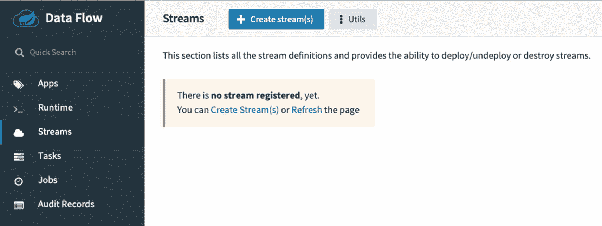

图 8-9。

流:http://localhost:9393/dashboard/#/streams/definitions

接下来，单击 **+创建流**。这将打开您添加流定义的页面。在这里，您可以使用源、处理器和接收器应用程序来拖放和连接它们。在这种情况下，转到文本区域(显示“输入流定义”)并输入以下内容。

```java
time | log

```

app 积木形式如图 [8-10](#Fig10) 所示。

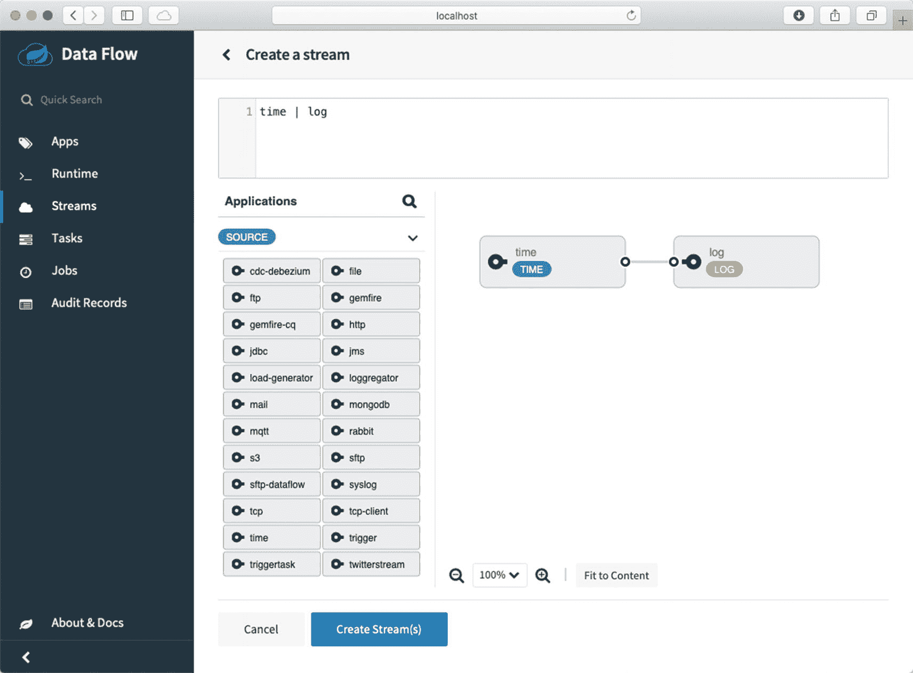

图 8-10。

流定义:http://localhost:9393/dashboard/#/streams/create

接下来，单击 Create Stream 按钮，这将打开一个弹出对话框，要求输入名称和描述。在名称字段中输入**简单**，在描述字段中输入**只是一个测试**(见图 [8-11](#Fig11) )。

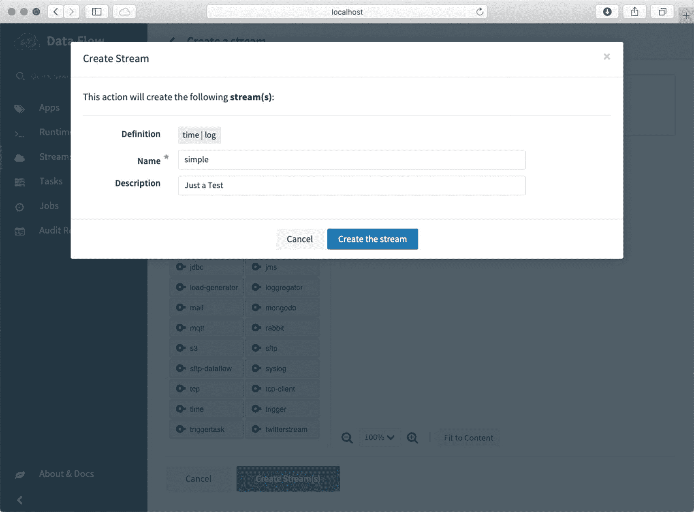

图 8-11。

创建流

点击**创建流**按钮创建流，然后返回流部分。在那里你会看到一个流定义列表，你会看到你的“简单”流(见图 [8-12](#Fig12) )。

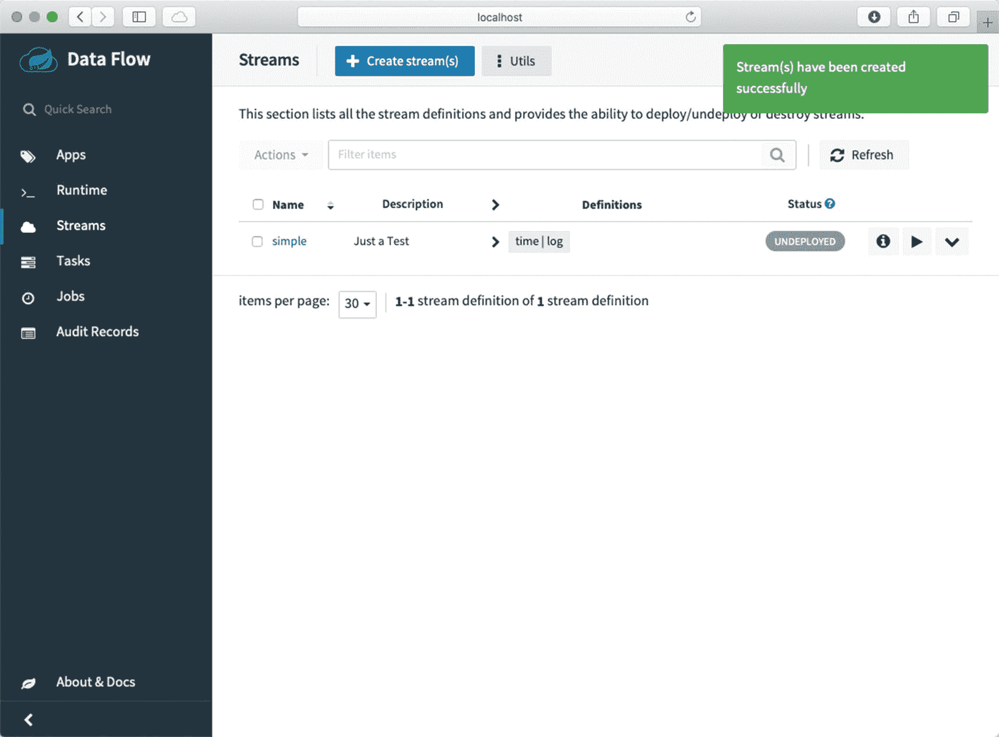

图 8-12。

创建的流

接下来，单击流行末尾的播放按钮。这会将您带到“部署流定义”页面，在这里您可以向每个应用程序添加属性，并添加应用程序所需的 CPU、内存、磁盘空间和实例数量。在这种情况下，你会看到三列，一列用于全局，在这里你可以为两个应用添加通用设置(记住，`time`和`log`是两个不同的微服务应用，都是应用启动器的一部分)，还有一列用于每个微服务——一列用于时间，一列用于日志(见图 [8-13](#Fig13) )。

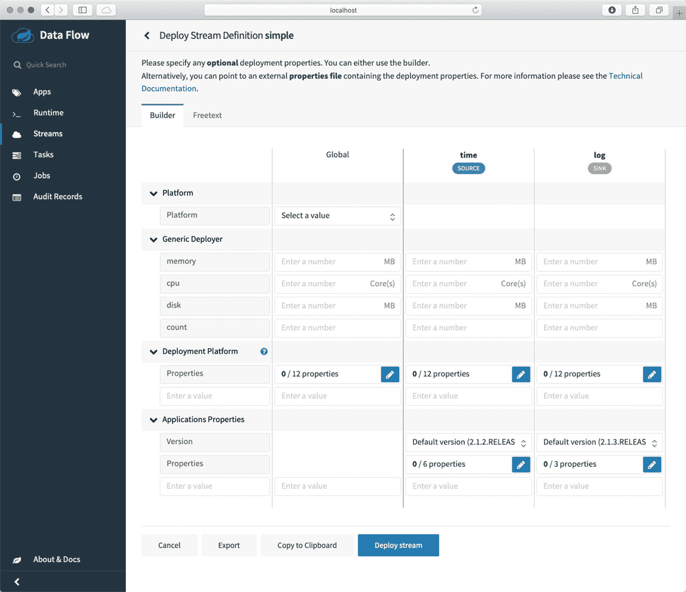

图 8-13。

部署流简单:http://localhost:9393/dashboard/#/streams/definitions/simple/deploy

在这种情况下，您没有设置任何新的属性，所以单击 **Deploy stream** 按钮。这将发送部署这两个应用程序的指令，并返回到 Streams 页面。看看你简单的流。您会看到部署状态。如果您点击列表顶部的刷新按钮，您会看到您的应用已经部署完毕(参见图 [8-14](#Fig14) 和 [8-15](#Fig15) )。

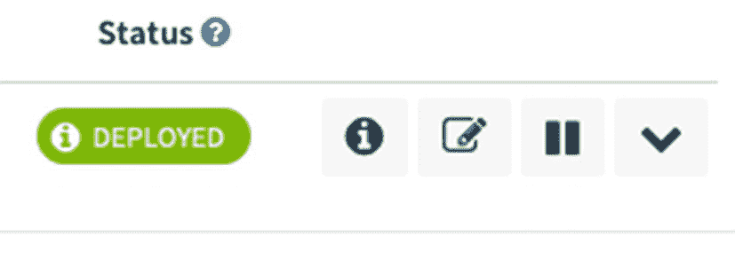

图 8-15。

状态:已部署

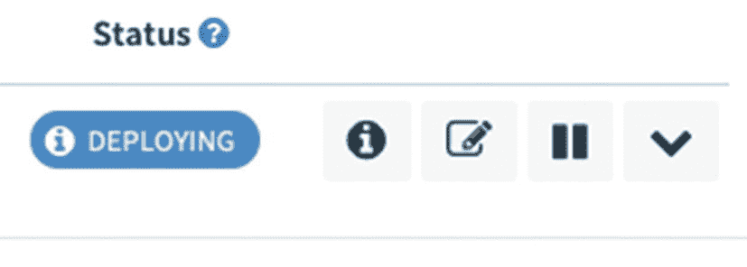

图 8-14。

状态:正在部署

那么，你怎么知道这个流是否在工作呢？基于 DSL，“`time | log`”意味着您正在使用一个`time`源(带有一个 RabbitMQ 绑定器，`time-source-rabbit`)和一个 log-sink(带有一个 RabbitMQ 绑定器，`log-sink-rabbit`)。`time`源每秒发送一次，日志接收器将它记录到控制台中。如果您单击状态旁边的“I”(显示详细信息)按钮，将显示流的详细信息和两个应用程序的当前日志(参见图 [8-16](#Fig16) )。

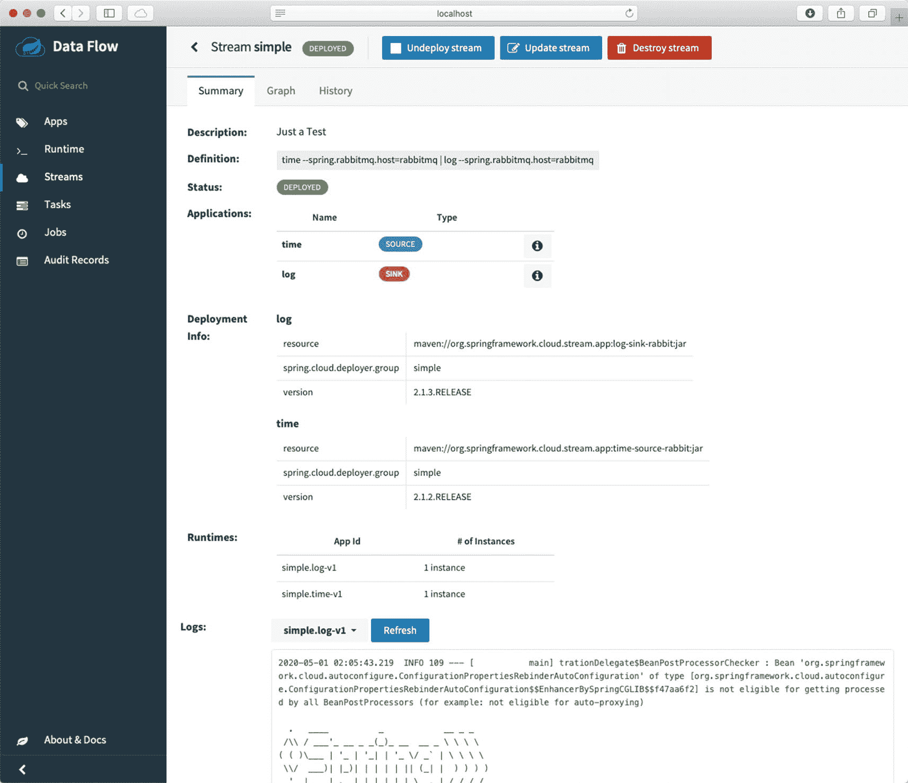

图 8-16。

详细信息:http://localhost:9393/dashboard/#/streams/definitions/simple/summary

如果您滚动，您会看到日志部分。选择`simple.log-v1`。您会看到日志接收器当前接收的日志和时间。您应该会看到如下所示的内容。

```java
...
INFO [e.time.simple-1] log-sink  : 05/01/20 02:20:59
INFO [e.time.simple-1] log-sink  : 05/01/20 02:21:00
INFO [e.time.simple-1] log-sink  : 05/01/20 02:21:01
INFO [e.time.simple-1] log-sink  : 05/01/20 02:21:02
INFO [e.time.simple-1] log-sink  : 05/01/20 02:21:03
INFO [e.time.simple-1] log-sink  : 05/01/20 02:21:04
INFO [e.time.simple-1] log-sink  : 05/01/20 02:21:05
...

```

请注意，应用程序是使用这种模式命名的:`<stream-name>.<app>-<version>`。在这种情况下，你有“T1”和“T2”。史奇普干的。它会跟踪版本。如果您取消部署并重新部署(停止并重新启动)流，您应该看到版本增加到`v2`。

你想知道你是否能看到实时日志？如果您点击运行时部分(在左窗格中)，您将进入运行时应用程序页面，该页面列出了您的流和所有涉及的应用程序(参见图 [8-17](#Fig17) )。

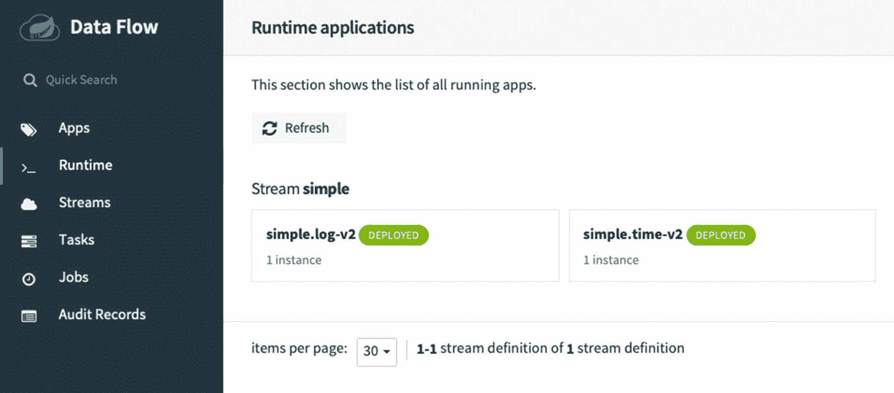

图 8-17。

运行时:http://localhost:9393/dashboard/#/runtime/apps

如果你点击`simple.log-v1/v2`，你会看到更多的信息(见图 [8-18](#Fig18) )。

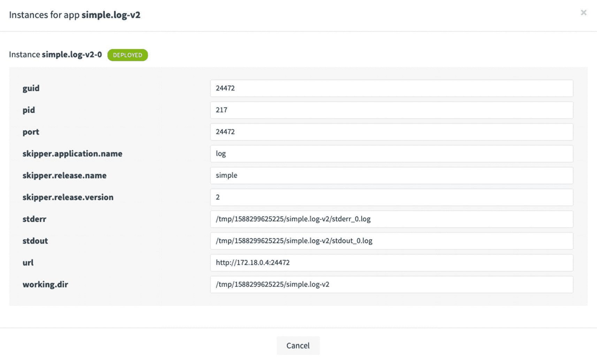

图 8-18。

运行时详细信息

图 [8-18](#Fig18) 显示了 app 的`simple.log-v1/v2`细节。注意`stdout`字段中的路径。在这种情况下，它就是`/tmp/1588299625225/simple.log-v2/stdout_0.log`。

打开终端并执行以下命令。

```java
docker exec skipper tail -f /tmp/1588299625225/simple.log-v2/stdout_0.log
... log-sink : 05/01/20 02:33:21
... log-sink : 05/01/20 02:33:22
... log-sink : 05/01/20 02:33:23
... log-sink : 05/01/20 02:33:24
... log-sink : 05/01/20 02:33:25
... log-sink : 05/01/20 02:33:26
... log-sink : 05/01/20 02:33:27
... log-sink : 05/01/20 02:33:28
... log-sink : 05/01/20 02:33:29
... log-sink : 05/01/20 02:33:30
... log-sink : 05/01/20 02:33:31
... log-sink : 05/01/20 02:33:32

```

你看到每一秒钟的时间都被打印出来。返回到流窗格并销毁流。

恭喜你！您刚刚使用 Docker Compose 创建了您的第一个流`time | log`。现在，您可以使用以下命令关闭您的基础设施。

```java
docker-compose -f docker-compose-rabbitmq.yml down

```

接下来，让我们在 Kubernetes 中部署 Spring Cloud 数据流。

### 使用库比涅斯

在本节中，您将使用 Kubernetes 部署相同的"`time | log`"流。不使用仪表板，而是使用 Spring Cloud 数据流外壳。如果你有源代码，可以添加`install.sh`和`uninstall.sh`脚本来设置 Kubernetes 中的一切。我使用 Minikube 安装了 Spring Cloud 数据流，但是您可以使用任何其他 Kubernetes 集群实例。

我用了`ch08/kubernetes/workspace-rabbit-mysql-monitoring`。它安装了 RabbitMQ 作为绑定器，MySQL 作为持久性，Grafana 和 Prometheus 跟踪我的应用程序的任何指标。

转到该文件夹并执行`./install.sh`脚本。该脚本执行与您在前面几节中遵循的相同的逐步说明。因为我使用了 Minikube，所以我执行了下面的代码。

```java
minikube service scdf-server --url
http://192.168.64.6:30724

```

如果我打开浏览器，我需要指向`http://192.168.64.6:30724/dashboard`。我发现没有应用程序，我需要像以前一样做同样的程序。点击 **+添加应用程序**按钮。在这种情况下，我使用 Spring Cloud 数据流 shell。

#### 使用 Spring 云数据流外壳

我还没有向您展示这个特殊的工具。在这一节中，您可以先睹为快 Spring Cloud 数据流外壳。您正在注册应用程序并创建同一个简单的“`time | log`”流。

在独立部分中，`download.sh`包含 shell，但是如果您不记得它了，创建一个`workspace-shell`文件夹，并在该文件夹中执行下面的命令。

```java
wget https://repo.spring.io/release/org/springframework/cloud/spring-cloud-dataflow-shell/2.4.2.RELEASE/spring-cloud-dataflow-shell-2.4.2.RELEASE.jar

```

然后，执行以下命令。

```java
java -jar spring-cloud-dataflow-shell-2.4.2.RELEASE.jar
...
...
server-unknown:>

```

一个提示说，“`server-unknown`”。最好的命令之一是`help`。如果你输入`help`并按回车键，你会看到所有可用的命令。如果您输入`help dataflow config server`，您会看到所有支持连接到数据流服务器的参数。

接下来，在 shell 中执行以下内容。

```java
server-unknown:>dataflow config server --uri http://192.168.64.6:30724
Successfully targeted http://192.168.64.6:30724
dataflow:>

```

现在您看到了`dataflow`提示符。如果您键入`app list`，您会看到以下内容。

```java
dataflow:>app list
No registered apps.
You can register new apps with the 'app register' and 'app import' commands.
dataflow:>

```

这意味着你需要注册你的应用。之前，我列出了包含所有应用程序启动器描述的 URL。为此，你用 [`https://dataflow.spring.io/rabbitmq-docker-latest`](https://dataflow.spring.io/rabbitmq-docker-latest) 。

接下来，键入`app import`并通过 URL 传递`uri`参数。

```java
dataflow:>app import --uri https://dataflow.spring.io/rabbitmq-docker-latest
Successfully registered 66 applications from ...
dataflow:>

```

如果执行应用程序列表，您会看到列出了源、处理器和接收器应用程序。

Note

如果您需要或忘记任何参数，数据流外壳支持制表符结束。

接下来，让我们通过执行以下命令来创建流。

```java
dataflow:>stream create --name simple --definition "time | log"
Created new stream 'simple'
dataflow:>

```

前面的命令创建了以“`time | log`”为定义的`simple`流。如果您执行`stream list,`，您会看到创建的流列表及其状态。

```java
dataflow:>stream list
...
simple   |   |  time | log  |The app or group is known to the system, but is not currently deployed.
...
dataflow>

```

接下来，我们用下面的来部署一下。

```java
dataflow:>stream deploy --name simple
Deployment request has been sent for stream 'simple'
dataflow:>

```

您可以查看以下状态

```java
dataflow:>stream info --name simple
...

```

或者用

```java
dataflow:>stream list

```

它应该说“已部署”。

如何查看日志？在 Kubernetes 中做这件事很酷的一点是，它创建了带有时间和日志应用程序的 pods，所以你可以打开一个新的终端并执行以下操作。

```java
$ kubectl get pods
NAME                                  READY   STATUS    RESTARTS   AGE
grafana-5b89747547-h5x7l              1/1     Running   0          29m
mysql-5c59b756db-rggjw                1/1     Running   0          29m
prometheus-67896dcc8-s4qls            1/1     Running   0          29m
prometheus-proxy-86f5fd556b-6m9jn     1/1     Running   0          29m
rabbitmq-5bf579759d-c5rtj             1/1     Running   0          29m
scdf-server-5888868f84-qmwt2          1/1     Running   0          28m
simple-log-v1-5f88b7d546-g7cmb        1/1     Running   0          2m8s
simple-time-v1-5d7d4bc86f-gwq7w       1/1     Running   0          2m8s
skipper-66c685ff74-vc7b5              1/1     Running   0          29m

```

注意 Skipper 创建了`simple-log`和`simple-time`；它的命名惯例是`<stream-name>-<app-name>-<version>-<pod-id>`。现在，您可以查看以下日志。

```java
$ kubectl logs -f pod/simple-log-v1-5f88b7d546-g7cmb
... log-sink  : 05/01/20 03:20:13
... log-sink  : 05/01/20 03:20:14
... log-sink  : 05/01/20 03:20:15
... log-sink  : 05/01/20 03:20:16

```

恭喜你！您使用数据流 shell 创建了您的流。在你摧毁溪流之前，让我们先看看格拉法纳。转到您的浏览器并打开`http://192.168.64.6:30724/dashboard`。你会看到所有注册的应用程序。转到“流”面板。在顶部，您可以看到 Grafana 仪表板按钮。单击它转到 Grafana 登录页面。用户名是`admin`，密码是`password`。请注意，您已经配置了应用程序、流和任务仪表板。环顾四周，你会看到一些数据(见图 [8-19](#Fig19) 和 [8-20](#Fig20) )。

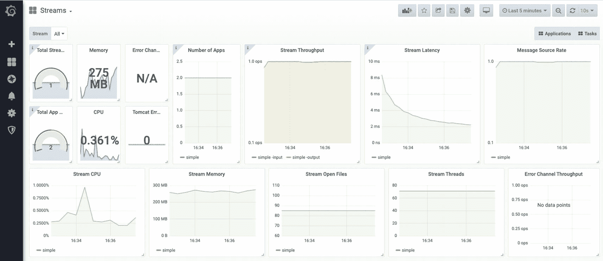

图 8-20。

grafana Streams:http://192 . 168 . 64 . 6:30018/d/scdf-Streams/Streams？orgId=1&refresh=10s

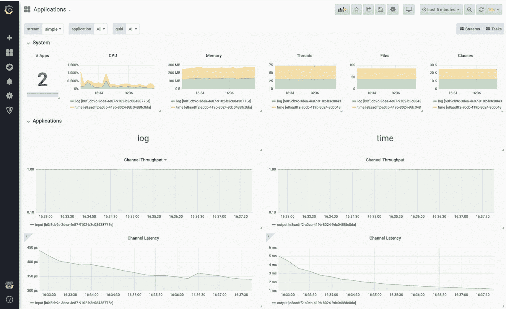

图 8-19。

Grafana 应用程序:http://192 . 168 . 64 . 6:30018/d/scdf-applications/applications？orgId=1&refresh=10s#/apps

现在，您可以密切监控您的流和应用程序。

是时候关闭一切了。若要删除该流，请在数据流外壳中执行以下操作。

```java
dataflow:>stream destroy --name simple
Destroyed stream 'simple'
dataflow:>

```

如果您在终端中再次执行`kubectl get pods`，这个简单的 pod 就消失了。您可以使用`exit`命令退出数据流 shell。

```java
dataflow:>exit

```

恭喜你！您使用 Spring Cloud 数据流外壳来注册应用程序并创建和销毁您的流。更多的动作即将到来，所以不要忘记你还在使用数据流外壳。

### 清理

如果你想快速清理，撤销你所做的安装，用`delete`替换`create`，与它们被创建的顺序相反。

```java
kubectl delete -f server/server-deployment.yaml
kubectl delete -f server/server-svc.yaml
kubectl delete -f server/server-config.yaml
kubectl delete -f skipper/skipper-svc.yaml
kubectl delete -f skipper/skipper-deployment.yaml
kubectl delete -f skipper/skipper-config-rabbit.yaml
kubectl delete -f server/service-account.yaml
kubectl delete -f server/server-rolebinding.yaml
kubectl delete -f server/server-roles.yaml
kubectl delete -f grafana/
kubectl delete -f prometheus/prometheus-service.yaml
kubectl delete -f prometheus/prometheus-deployment.yaml
kubectl delete -f prometheus/prometheus-configmap.yaml
kubectl delete -f prometheus-proxy/
kubectl delete -f prometheus/prometheus-serviceaccount.yaml
kubectl delete -f prometheus/prometheus-clusterrolebinding.yaml
kubectl delete -f prometheus/prometheus-clusterroles.yaml
kubectl delete -f mysql/
kubectl delete -f kafka/
kubectl delete -f rabbitmq/

```

当然，移除服务、部署和 pod 的方法更多，比如使用提供的标签；例如，您可以删除 Grafana。

```java
kubectl delete all,cm,svc,secrets -l app=grafana

```

或者您可以以相反的顺序执行前面的所有命令。使用文件声明(YAML)将会成功并删除服务，但最终，这取决于您喜欢什么。

## 摘要

本章解释了 Spring Cloud 数据流的重要性，并向您展示了如何创建您的第一个流。我们将在下一章进行更详细的讨论，我将向您展示 Spring Cloud 数据流的内部结构，以及如何从中获得更多。我还向您展示了设置 Spring Cloud 数据流的不同方法。有几个支持的平台，但 Kubernetes 是云基础设施和容器编排的事实上的技术。