# 九、Spring CloudStream 内部

在第 [8](08.html) 章中，您简要地看了一下 Spring CloudStream。本章深入讨论了这项技术能做什么。我回顾了您可以用流和批处理做什么，并向您展示了 Spring Cloud Task 如何使用 Spring Batch 创建有限的工作负载。

让我们开始挖掘 Spring CloudStream。

## Spring CloudStream 架构

Spring CloudStream 编排和编排流式应用和批处理作业。它依靠云平台来管理我们应用的可扩展性和高可用性，以及底层基础设施(虚拟机、物理机)的弹性和容错能力。您需要关注业务逻辑。

Spring Cloud Data Flow 有几个组件用于编排和编排流式应用和批处理作业。它识别应用类型，并基于其 DSL(特定于域的语言)部署它，类似于执行 shell 命令时的类 Unix 语法。应用类型包括源、处理器、接收器和任务。我将在本章的后面介绍 Spring Cloud 任务。

在服务器端，Spring CloudStream 有两个主要组件。

*   *数据流服务器*。这个服务器公开了一个 REST API，它是仪表板和外壳的主要入口点。数据流服务器可以在几个云平台上运行，比如 Kubernetes、Cloud Foundry、Mesos、Yarn 和你的本地机器(独立运行或者使用 Docker 或 Docker Compose)。数据流服务器使用关系数据库(MySQL、PostgreSQL、Oracle、DB2、MS SQL Server、H2 或 HSQLDB)跟踪流及其状态。你只需要在`spring.datasource.*`属性中声明正确的驱动程序。如果没有定义`datasource`属性，默认情况下，使用 H2 嵌入式数据库将所有内容保存在内存中。数据流服务器负责以下工作。
    *   注册 jar(独立的、HTTP 或在 Maven 坐标中)和 Docker 图像等工件

    *   基于 DSL 解析流或批处理作业定义(这是类似 Unix 的 shell 命令(如`time | filter | transform | log`)。您将在剩余的章节中了解更多关于 DSL 的知识。)

    *   使用关系数据库验证和保存流和任务应用以及批处理作业定义

    *   将批处理作业定义部署到一个或多个云平台

    *   查询任务和批处理作业执行历史

    *   将流部署委托给 Skipper

    *   将作业调度委托给云平台

    *   当部署到云平台时，向流添加额外的信息，包括附加属性，例如应用的配置(端口、通道名称、使用 SpEL 的表达式、应用属性特定)、输入和输出、绑定器属性、要运行的实例、内存和 CPU 分配以及分区组

    *   增加身份验证和授权的安全性(OAuth 2.0、SSO、LDAP 或添加您自己的安全提供者)，通过 SSL 访问，并保护您的仪表板

    *   尝试在端口 8888 连接到 Spring Cloud 配置服务器，但是您可以通过覆盖属性来使用自己的配置

    *   配置 Maven 存储库和 Docker 注册表，以便轻松访问您的流和任务应用

    *   默认情况下，使用端口 9393 提供广泛的 RESTful API 和 web 仪表板；它可以通过使用属性来重写

它可以在没有 Skipper 的情况下使用，但是您删除了升级或进行回滚的能力(进行蓝/绿部署的能力)、部署历史和一些其他功能。

*   *Skipper 服务器*。Skipper 服务器负责将流部署到一个或多个平台。它可以通过跟踪发布的流版本来进行升级和回滚。它使用状态机算法进行蓝绿色部署。您还可以为身份验证和授权添加安全性(OAuth 2.0、SSO 或添加您自己的安全提供者)，并使用 SSL 进行安全通信。

    Skipper 服务器使用关系数据库(可以使用 MySQL、PostgreSQL、Oracle、DB2、MS SQL Server、H2 和 HSQLDB)跟踪任何流及其状态和流的版本。你只需要在`spring.datasource.*`属性中声明正确的驱动程序。如果没有定义`datasource`属性，默认情况下，使用 H2 嵌入式数据库将所有内容保存在内存中。

    它在端口 8888 上有一个到 Spring Cloud config 服务器的默认连接，但是您可以很容易地覆盖它并添加您自己的连接。

在客户端，Spring CloudStream 有几个组件。

*   *仪表盘*。仪表板是数据流服务器的一部分，它的服务器是端口 9393。它确实停止了对数据流服务器的调用。这是一个可视化流的 GUI(它使用了 Spring Flo 项目， [`https://spring.io/projects/spring-flo`](https://spring.io/projects/spring-flo) )。通过 Flo，您可以利用仪表盘上的以下功能。
    *   使用 DSL 或画布创建、管理和监控您的流管道

    *   注册您的应用，单个或批量

    *   停止、启动和销毁流和任务应用

    *   使用 Grafana 和 Prometheus(如果已配置)监控您的流和应用

    *   查看您的流的分析，并使用正确的图表来表示您的数据流和逻辑

    *   停止和恢复作业(仪表板和 Flo 是 Spring Batch GUI 版本的下一个迭代，用于管理任务和批处理作业)

    *   使用内容辅助和自动完成功能

    *   调整网格布局，以便更有效地查看和配置管道

    *   查看分布式部署的可视化表示

    *   为部署者添加元数据，例如 CPU、实例和内存

您可以在 [`https://github.com/spring-cloud/spring-cloud-dataflow-ui`](https://github.com/spring-cloud/spring-cloud-dataflow-ui) 获得数据流仪表盘的源代码。

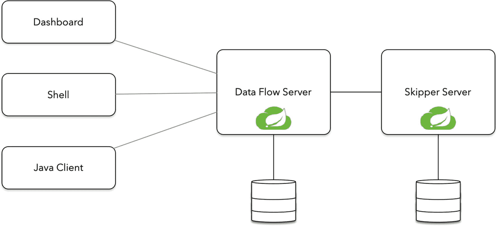

图 9-1。

Spring CloudStream 组件

*   *外壳*。这是另一个通过 REST API 调用与数据流服务器通信的组件。它使用 Spring Shell 项目。以下是它的一些特点。
    *   选项卡完成、着色和脚本执行

    *   与 bean 验证 API 集成，因此您可以通过对象执行您的逻辑

    *   基于特定于域的标准动态启用命令

    *   与仪表板功能相同，但使用类似命令行的界面

    *   轻松扩展到使用编程模型来创建自定义命令

*   *Java 客户端*。您可以使用`spring-cloud-dataflow-rest-client`模块以编程方式创建您的流。它提供了`StreamBuilder`、`StreamDefinition`、`Stream`、`StreamApplication`和`DataFlowTemplate` DSL 类，这些类提供了流畅的 API 以便于开发(参见图 [9-1](#Fig1) )。

在深入每个组件之前，让我们先讨论一下应用类型。你已经知道，符合流的 app 有 SpringCloudStream 和 SpringCloud 任务 app，但各有重要区别。

*   *长寿命*应用有输入和输出，需要一个代理进行通信。一些应用有多个输入和输出，在其他情况下，它们不需要代理来进行通信。大多数时候，你会发现那些长寿的应用是使用 Spring Cloud Stream 模块创建的。

*   *短期*应用有一个有限的持续时间。它们开始、处理和完成。这些应用是运行的任务，可以将它们的状态保存在数据流数据库中。通常使用 Spring Cloud 任务。这些应用的扩展使用 Spring Batch。它保存状态，从故障停止的地方重新启动，等等。

您不需要使用 Spring 来创建长期或短期的应用。你几乎可以使用任何编程语言。在创建这些应用时，您可以将它们打包成一个 Spring Boot·优步-JAR，可以使用 Maven(托管在 Maven 存储库中)作为文件或 HTTP 进行访问，或者作为托管在 Docker 注册表中的 Docker 映像进行访问。

## 客户端工具:cURL 命令、数据流外壳、Java 客户端、仪表板

在这一节中，我将通过创建简单的示例来介绍连接到 Spring Data 流服务器的所有可用方法，在接下来的章节中，您可以使用任何工具来实现复杂的解决方案。让我们首先启动并运行 Spring CloudStream 的基础设施(数据流服务器、Skipper 服务器、MySQL、RabbitMQ 或 Kafka );您可以使用 Docker Compose 或 Kubernetes。同样，让我们定义我们的管道 DSL。

在使用客户端工具之前，请确保您有这套额外的工具来帮助您。

*   `jq` ( [`https://stedolan.github.io/jq/`](https://stedolan.github.io/jq/) )处理 JSON 对象。

*   `yq` ( [`https://mikefarah.gitbook.io/yq/`](https://mikefarah.gitbook.io/yq/) )处理 YAML 对象。

*   `httpie` ( [`https://httpie.org/`](https://httpie.org/) )。HTTP 客户端。该工具依赖于 Python 3.6 或更高版本。

    如果这些工具对你没有帮助，安装`cURL`命令。如果你用的是 Windows OS，可以从 [`https://curl.haxx.se/windows/`](https://curl.haxx.se/windows/) 下载。也可以用 Postman ( [`www.postman.com/downloads/`](http://www.postman.com/downloads/) )。

接下来，让我们通过本章来定义您使用的 DSL。将其称为*电影流管道 DSL* 或*流管道*(见图 [9-2](#Fig2) )。

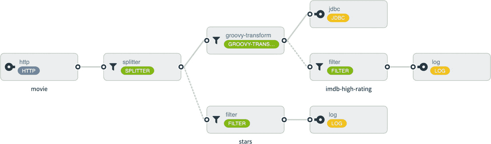

图 9-2。

电影流 DSL

图 [9-2](#Fig2) 以图表形式显示了流管道。请记住，每个区块都是独立于其他区块的 Spring Cloud Stream 应用。他们通过你选择的任何一个*经纪人*进行交流(RabbitMQ、Kafka、NATS 等)。).部署时，每个应用可以有一个或多个实例。由于 Spring CloudStream 服务器运行在云环境/云平台(Docker Compose—local 或 Kubernetes、Cloud Foundry、Mesos、Yarn)中，因此它具有可扩展性、高可用性、容错性以及对任何微服务架构的可见性(监控)。让我们回顾一下你对 Spring Cloud Stream 应用的了解。

*   `http`。首先，创建一个`http`应用来监听任何传入的请求。这是一个来源。您发送的样本数据在清单 [9-1](#PC1) 中列出。

```java
{
  "movies": [
    {
         "id": "tt0133093",
      "title": "The Matrix",
      "actor": "Keanu Reeves",
       "year": 1999,
      "genre": "fiction",
      "stars": 5
    },
    {
         "id": "tt0209144",
      "title": "Memento",
      "actor": "Guy Pearce",
       "year": 2000,
      "genre": "drama",
      "stars": 4
    },
    {
        "id": "tt0482571",
      "title": "The Prestige",
      "actor": "Christian Bale",
       "year": 2006,
      "genre": "drama",
      "stars": 3
    },
    {
         "id": "tt0486822",
      "title": "Disturbia",
      "actor": "Shia LaBeouf",
       "year": 2007,
      "genre": "drama",
      "stars": 3
    }
  ]
}

Listing 9-1.Sample data

```

分析数据(你发送的是一个`id`，和一组电影，而不是一个)。

*   `splitter`。`splitter`是一个消息传递模式。根据给定的表达式，可以将一条消息分割成几部分，在这种情况下，您可以一次分割一部电影。在这种情况下，`splitter`应用产生四条消息。`splitter`是一个*处理器*。

*   `groovy-transform`。您在前面的章节中使用了这一点。这一次，`groovy-transform`应用通过外部系统获得“真实评级”。您使用 RapidAPI ( [`https://rapidapi.com`](https://rapidapi.com) )网站，该网站提供了几个 API，包括 IMDB(互联网电影数据库， [`www.imdb.com`](http://www.imdb.com) )，并发送 ID 以获得电影的全球评级。一旦它返回 IMDB 评级，它就会通过添加`rating`和`ratingCount`属性来增强我们的电影信息。`groovy-transform` app 是另一个处理器。

*   `filter`。有两个`filter`应用:一个来自`splitter`应用，这意味着它接收与`groovy-transform`应用相同的消息，它使用`star`属性只允许超过三颗星的电影通过。另一个`filter`应用只允许高评分的电影通过(> 8.0)。`filter`应用是*处理器*应用。

*   `jdbc`。一个`jdbc`应用将电影信息保存在数据库中。该消息包括原始消息和由`groovy-transform`应用收集的新属性。这是一件非常简单的事情。这个`jdbc`应用是一个*接收器*。

*   `log`。`log`应用记录了从`filter`应用中释放的内容。请注意，您可以使用不同的接收器(兔子，HDFS，蒙哥，FTP，S3 等。).一个`log` app 就是一个*水槽*。

如何为这个例子创建流管道？Spring CloudStream 提供了一种简单的方法来公开您的应用，并使用类似 Unix 的 DSL 语法将它们连接起来。Spring Cloud Stream 应用(你可以将它们视为 Unix 命令)可以通过使用`|`符号(Unix `|`管道)与其他应用进行通信，并使用`>`符号进行重定向。我们的例子应该很容易在流管道 DSL 中实现(参见清单 [9-2](#PC2) )。

```java
movie = http | splitter | groovy-transform | jdbc
stars = :movie.splitter > filter | log
imdb-high-rating = :movie.groovy-transform > filter | log

Listing 9-2.Movie Stream Pipeline DSL Simple Form

```

清单 [9-2](#PC2) 显示了电影流管道。我们来分析一下。

*   `http | splitter | groovy-transform | jdbc`。想象这是一个 Unix 命令(像`cat myfile | grep "hello" | awk ‘{print $2}’ ...`)。你看到一些相似之处了吗？你所说的是，使用`http`应用将消息发送到`splitter`应用，然后`splitter`应用将多条消息(一次一条)发送到收集一些信息的`groovy-transform`应用，它将消息发送到将记录保存到数据库中的`jdbc`应用。`|`符号用作下一个应用(Unix 管道)的连接器或信息通道。

    `movie =`声明可以被视为 DSL 及其定义的名称(就像一个名为 movie、值为`http | splitter | groovy-transform | jdbc`的变量，比如 Unix)。

*   `splitter > filter | log`。也就是说，从`splitter`获取消息的副本，并将其发送到`filter`应用，然后发送到`log`应用。`>`符号是一个重定向。不用太担心。当您使用>和`:`符号时，您会学到更多。

    `stars = :move.splitter`声明意味着您正在创建一个 tap(名为`stars`)。您将到达第一个定义`movie =`(或者引用变量`movie`，如果您想到 Unix shell 术语的话)并使用声明`:movie.splitter`访问`splitter`应用；这意味着您正在创建一个 *wire tap* (消息模式，消息的副本)并将其发送到带有`>`符号的`filter`应用。

*   `groovy-transform > filter | log`。这部分说从`groovy-transform`获取消息的副本(一旦它完成处理消息)，发送到`filter`应用，然后发送到`log`应用。

    `imdb-high-rating = :movie.groovy-transform`声明意味着您正在创建一个 tap(名为`imdb-high-rating`)，并且您正在到达第一个定义`movie =`并访问`groovy-transform`；这意味着你正在创建一个窃听装置，一旦`groovy-transform`返回，它就获取消息的副本，并将它发送到带有`>`符号的`filter`应用。

`=`和`:`符号(还有更多)具有我稍后在讨论标签、抽头和目的地时描述的含义；现在，把它们看作是命名流的一部分的方法，以及访问应用和应用其他符号的方法，就像 Unix shell 一样。

每个应用可以有多个属性(或者参数/自变量，如果您从 Unix shell 的角度考虑的话)。要么在 DSL 中声明它们，要么拥有一个外部属性文件(本地或远程云配置服务器)。您现在在同一个 DSL 中使用它们。

现在您已经了解了 DSL，是时候测试它并观察它的运行了。让我们从命令行开始。

### 使用 cURL、Httpie 和 jq

Spring CloudStream 服务器公开了一个 REST API，可以通过任何 REST 客户端或任何命令行实用程序进行编程访问，比如`cURL`、`wget`或`Httpie`。在这一节中，我将向您展示如何使用命令行实用程序创建管道 DSL。让我们一步一步来。

1.  确保您有一个命令实用程序。我将使用`cURL`和`Httpie`向您展示这些命令。因为 Spring CloudStream 服务器以 JSON 格式公开其数据，所以安装 jq 实用程序是值得的。

2.  确保您已经运行了 Spring Cloud Data Flow 和 Spring Cloud Data Flow Skipper 服务器。您可以使用任何方法——使用 Docker Compose 的本地设置或 Kubernetes 集群。通过使用一个`LoadBalancer`类型公开 Spring CloudStream 服务器，确保您可以到达。默认情况下，它使用端口 9393 来公开 REST API 和 GUI 的路径`/dashboard`;但是你必须看服务和港口(例如，`kubectl get svc -o wide`)。(我用的是 Docker Compose，用 RabbitMQ 和 MySQL 做持久化。我正在测试`localhost`。

    ```java
    $ curl -s http://localhost:9393 | jq .

    ```

    Use Httpie if you don’t need to use the jq tool to format the output.

    ```java
    $ http :9393

    ```

    如果使用的是本地基础设施(比如 Docker Compose)，就不需要使用服务器名；默认情况下，它会转到本地主机。使用前面的命令，您可以看到所有公开的 API，所以现在您知道该做什么了。

3.  使用查看是否已经注册了应用

    ```java
    $ curl -s http://localhost:9393/apps | jq .

    ```

    or

    ```java
    $ http :9393/apps

    ```

    如果没有任何 app，可以进入下一步；如果有可以跳过。

4.  注册应用。根据您使用的代理和基础设施的类型，选择以下选项之一。
    *   使用 Maven
        *   [T2`https://dataflow.spring.io/kafka-maven-latest`](https://dataflow.spring.io/kafka-maven-latest)

        *   [T2`https://dataflow.spring.io/rabbitmq-maven-latest`](https://dataflow.spring.io/rabbitmq-maven-latest)

        *   [T2`https://dataflow.spring.io/task-maven-latest`](https://dataflow.spring.io/task-maven-latest)

    *   Using Docker
        *   [T2`https://dataflow.spring.io/kafka-docker-latest`](https://dataflow.spring.io/kafka-docker-latest)

        *   [T2`https://dataflow.spring.io/rabbitmq-docker-latest`](https://dataflow.spring.io/rabbitmq-docker-latest)

        *   [T2`https://dataflow.spring.io/task-docker-latest`](https://dataflow.spring.io/task-docker-latest)

            You can execute the following command (I’m using Maven and RabbitMQ).

        ```java
        $ curl -s -X POST \
         -d "uri=https://dataflow.spring.io/rabbitmq-maven-latest" \
         -d "force=true" \
         localhost:9393/apps | jq .

        ```

        Or you can use this next one.

        ```java
        $ http -f POST \
         :9393/apps \
         uri=https://dataflow.spring.io/rabbitmq-maven-latest \
         force=true

        ```

        通过执行上一步中的命令，确定应用是否已注册。

5.  有一个`jdbc` app，这意味着所有的电影对象都被发送到这个 sink，它需要准备好接受传入的行。你需要建立数据库。访问 MySQL 数据库非常重要。如果您使用的是 Kubernetes 和一个不同于数据流或 Skipper 使用的实例，则必须将正确的服务器名称添加到属性中，并确保您可以访问它。如果您使用的是 Docker Compose(以及本书源代码中的`docker-compose.yml`文件)，您可以通过以下方式获得访问权限。

    ```java
    $ docker exec -it dataflow-mysql -uroot -prootpw

    ```

    You need to create the `reviews` databases and the `movies` table .

    ```java
    mysql> create database reviews;
    mysql> use reviews
    mysql> create table movies(
            id varchar(10) primary key,
            title varchar(200),
            actor varchar(200),
            year int,
            genre varchar(25),
            stars int,
            rating decimal(2,1),
            ratingcount int);

    ```

6.  其中一个流式应用是`groovy-transform`。这个应用调用外部 REST API。你使用 RapidAPI ( [`https://rapidapi.com/`](https://rapidapi.com/) )网站。请，花点时间开个新账户(免费)；要使用的服务是 [`https://rapidapi.com/apidojo/api/imdb8`](https://rapidapi.com/apidojo/api/imdb8) 。您需要为此获取 API 密钥。您使用的最后一个 URL 是 [`https://imdb8.p.rapidapi.com/title/get-ratings?tconst=${movie.id}`](https://imdb8.p.rapidapi.com/title/get-ratings%253Ftconst%253D%2524%257bmovie.id%257d) ，在这里您传递电影的 ID。一旦你得到了你的 API 密匙，把它写下来，因为你接下来会用到它。

7.  `groovy-transform`应用需要一个脚本来执行。这个脚本在您的 Git 存储库中(您可以使用任何 Git 服务器—GitHub、GitLab、BitBucket 等。).为了方便起见，它必须是公共的。创建一个新的 repo 并添加以下 Groovy 脚本；将其命名为`movie-transform.groovy`(见清单 [9-3](#PC11) )。

```java
import groovy.json.JsonSlurper
import groovy.json.JsonOutput

def jsonSlurper = new JsonSlurper()
def movie = jsonSlurper.parseText(new String(payload))

def connection = new URL( "https://imdb8.p.rapidapi.com/title/get-ratings?tconst=${movie.id}")
                 .openConnection() as HttpURLConnection

connection.setRequestProperty( 'x-rapidapi-host', 'imdb8.p.rapidapi.com' )
connection.setRequestProperty( 'x-rapidapi-key', 'YOURKEY')
connection.setRequestProperty( 'Accept', 'application/json' )
connection.setRequestProperty( 'Content-Type', 'application/json')

if ( connection.responseCode == 200 ) {

    def imdb = connection.inputStream.withCloseable { inStream ->
        new JsonSlurper().parse( inStream as InputStream )
    }

    movie.imdb = [ "rating": imdb.rating, "ratingCount": imdb.ratingCount ]

} else {
    println connection.responseCode + ": " + connection.inputStream.text
}

JsonOutput.toJson(movie)

Listing 9-3.movie-transform.groovy

```

在继续之前，请分析脚本。请注意，它会转到 RapidAPI URL 并获取信息。它通过添加包含`rating`和`ratingCount`属性的`imdb`部分来增强消息。这些属性来自对外部调用的响应。另外，请注意，您需要在`x-rapidapi-key`标题中添加您的密钥，并使用提到的 URL。以原始格式访问这个脚本很重要。比如在 GitHub 中，可以在 [`https://raw.githubusercontent.com/<your-user-id>/<your-repo>/master/movie-transform.groovy`](https://raw.githubusercontent.com/%253cyour-user-id%253e/%253cyour-repo%253e/master/movie-transform.groovy) 访问。请注意这个 URL。

1.  是时候创建电影管道 DSL 了。这是您使用的最终版本(参见清单 [9-4](#PC12) )。

    ```java
    movie=http --port=9001 | splitter --expression="#jsonPath(payload, '$.movies')" | groovy-transform --script="https://raw.githubusercontent.com/<user>/<repository>/master/movie-transform.groovy" | jdbc --columns="id:id,title:title,actor:actor,year:year,genre:genre,stars:stars,rating:imdb.rating,ratingcount:imdb.ratingCount" --table-name="movies" --password="rootpw" --driver-class-name="org.mariadb.jdbc.Driver" --username="root" --url="jdbc:mysql://mysql:3306/reviews?autoReconnect=true&useSSL=false"

    stars=:movie.splitter > filter --expression="#jsonPath(payload,'$.stars') > 3" | log

    imdb-high-rating=:movie.groovy-transform > filter --expression="#jsonPath(payload,'$.imdb.rating') > 8.0" | log

    Listing 9-4.Movie Pipeline DSL

    ```

    This movie pipeline DSL is composed of three statements.
    *   `movie = http | splitter | groovy-transform | jdbc`。`movie`是流的名称，在接下来的语句中很有用。注意，这个定义使用了像`--port`这样的属性，因为它在寻找一个本地基础设施。如果您使用 Kubernetes 方法，您需要向`http`应用添加一个带有`LoadBalancer`类型的服务来获得一个 IP 并访问它。`splitter`应用根据`movies`集合将消息分割成几个`movie`对象。JSON send 包含一组`movies`。`groovy-transform`的脚本属性指向 Git 存储库/服务器中的原始文件(确保它是一个原始文件)。最后，它转到`jdbc`应用，该应用将增强的电影对象(JSON)从`groovy-transform`保存到`review`数据库和`movies`表中。再看`--columns`属性。它定义了映射 JSON 结果的表列。

    *   `stars = :movie.splitter > filter | log`。`stars`是流的名称。你稍后会看到这个，因为你称它为龙头。`:movie.splitter`说的是“在`movie`流和`splitter`应用之后创建一个窃听”——换句话说，一旦你做了分割，就获得一份信息的副本。你从`movies` (JSON)的集合中收集一个`movie`对象(JSON)的副本；然后，您将那个`movie`对象(JSON)传递给`filter`应用。请注意，您使用的是`>`符号而不是`|`，因为这是点击消息所需的语法。tap 是 wire tap 消息集成模式实现。`filter`应用使用一个 JSON 表达式来获取星星，如果大于三个，它会将其传递给 log 应用。日志应用写入控制台。

    *   `imdb-high-rating = :movie.groovy-transform > filter | log`。`imdb-high-rating`是流的名称，它在`groovy-transform`应用处获得电影流的副本，并重定向到评估`imdb.rating,`的`filter`，如果它大于 8.0，则将其传递给`log`应用。`log`应用写入控制台。

        You execute three different commands, one per statement.

        ```java
        $ curl -s -X POST \
         --form 'name=movie' \
         --form 'definition=movie=http --port=9001 | splitter --expression="#jsonPath(payload,'\''$.movies'\'')" | groovy-transform --script=https://raw.githubusercontent.com/<user>/<repo>/master/movie-transform.groovy | jdbc --columns=id:id,title:title,actor:actor,year:year,genre:genre,stars:stars,rating:imdb.rating,ratingcount:imdb.ratingCount --table-name=movies --password=rootpw --driver-class-name=org.mariadb.jdbc.Driver --username=root --url=jdbc:mysql://mysql:3306/reviews?autoReconnect=true&useSSL=false' \
         localhost:9393/streams/definitions | jq .

        $ curl -s -X POST \
        --form 'name=stars' \
        --form 'definition=stars= :movie.splitter > filter --expression="#jsonPath(payload,'\''$.stars'\'') > 3" | log' \
        http://localhost:9393/streams/definitions | jq .

        $ curl -s -X POST \
        --form 'name=imdb-high-rating' \
        --form 'definition=imdb-high-rating= :movie.groovy-transform > filter --expression="#jsonPath(payload,'\''$.imdb.rating'\'') > 8.0" | log' \
        http://localhost:9393/streams/definitions | jq .

        ```

        在每个命令中，您都需要`name`和`definition`参数。不要忘记为您的 Git 服务器使用您自己的`user`和`repository`。如果你复制这段文字，一定要注意单引号和双引号以及单引号之间的区别。

        记住，我使用的是本地 Docker Compose。这就是为什么 http 应用中的第一个 DSL 流定义有`--port=9001`，这意味着我发布了一些指向该端口的电影。如果你正在使用 Kubernetes，你不需要(你可以删除那个属性)，然后确保你可以通过给它添加一个带有`LoadBalancer`类型的服务或者转发端口来到达`http`应用。

Note

在本书的配套源代码的`ch09/streams`文件夹中，有一个名为`curl-movie-stream-pipeline`的文件，其中包含正确的字符。您可以复制它们或执行文件。

1.  通过执行以下命令来验证我们的定义是否存在。

    ```java
    $ curl -s localhost:9393/streams/definitions | jq .

    ```

    在这个命令中，您可以看到所有的流定义:`movie`、`stars`、`imdb-high-rating`。

2.  部署流。为此，您需要执行以下命令。

    ```java
    $ curl -s -X POST \
    http://localhost:9393/streams/deployments/movie | jq .

    $ curl -s -X POST \
    http://localhost:9393/streams/deployments/stars | jq .

    $ curl -s -X POST \
    http://localhost:9393/streams/deployments/imdb-high-rating | jq .

    ```

3.  Now that the movie stream is deployed, it is time to send some data.

    ```java
    $ curl -s -X POST \
     -H "Content-Type: application/json" \
    -d '{"movies":[{"id":"tt0133093","title":"The Matrix","actor":"Keanu Reeves","year":1999,"genre":"fiction","stars":5},{"id":"tt0209144","title":"Memento","actor":"Guy Pearce","year":2000,"genre":"drama","stars":4},{"id":"tt0482571","title": "The Prestige","actor":"Christian Bale","year":2006,"genre":"drama","stars":3},{"id":"tt0486822","title":"Disturbia","actor":"Shia LaBeouf","year":2007,"genre":"drama","stars":3}]}' \
    http://localhost:9001 | jq .

    ```

    Note that you are sending a set of movies. If you are using Docker Compose (and `docker-compose.yml` from the source code), the Skipper server is where all the apps are running. To send the data, you need to enter the following in the `skipper` docker container.

    ```java
    $ docker exec -it skipper bash
    $ curl -s -X POST ....

    ```

    如果你用的是 Kubernetes，需要暴露`http` app 或者做一个端口转发然后做 POST。

4.  看看日志。要查看是否一切正常，请获取应用的运行时信息。执行以下命令。

    ```java
    $ curl -s localhost:9393/runtime/apps | jq .

    ```

    This command gives you all the information about the logs (for the `stars` and the `imdb-high-rating streams`). You should find the name (`deploymentId`) as `stars.log-v1` and `imdb-high-rating.log-v1` and the `stdout` property. If you are using the Docker Compose (and `docker-compose.yml` from the book’s source code), then you must go to the `skipper-docker` container and do a tail over the path from the `stdout` property.

    ```java
    $ docker exec skipper tail -n 500 -f /tmp/1590548505908/stars.log-v1/stdout_0.log

    ```

    If you are using Kubernetes, you should see all the apps as pods, with the same naming convention; to see the logs for `start-logs-v1`, you should execute the following.

    ```java
    $ kubectl get pods
    $ kubectl logs -f pod/star-logs-v1-xxxx

    ```

    xxxx 是添加到 pod 的 ID。

    If you have access to the MySQL database, you should see something similar to the following.

    ```java
    mysql> select * from movies \G
    *************************** 1\. row ***************************
             id: tt0133093
          title: The Matrix
          actor: Keanu Reeves
           year: 1999
          genre: fiction
          stars: 5
         rating: 8.7
    ratingcount: 1609934
    *************************** 2\. row ***************************
             id: tt0209144
          title: Memento
          actor: Guy Pearce
           year: 2000
          genre: drama
          stars: 4
         rating: 8.4
    ratingcount: 1084378
    *************************** 3\. row ***************************
             id: tt0482571
          title: The Prestige
          actor: Christian Bale
           year: 2006
          genre: drama
          stars: 3
         rating: 8.5
    ratingcount: 1136643
    *************************** 4\. row ***************************
             id: tt0486822
          title: Disturbia
          actor: Shia LaBeouf
           year: 2007
          genre: drama
          stars: 3
         rating: 6.8
    ratingcount: 214786

    ```

恭喜你！您使用 REST API 创建了一个电影流管道 DSL。

如果您想要取消部署您的流，您可以使用下面的命令一个接一个地完成。

```java
$ curl -s -X DELETE \
http://localhost:9393/streams/deployments/movie | jq .

$ curl -s -X DELETE \
http://localhost:9393/streams/deployments/stars | jq .

$ curl -s -X DELETE \
http://localhost:9393/streams/deployments/imdb-high-rating | jq .

```

或者同时使用以下内容。

```java
$ curl -s -X DELETE \
http://localhost:9393/streams/deployments | jq .

```

如果您想删除流，您可以一次删除一个，如下所示。

```java
$ curl -s -X DELETE \
http://localhost:9393/streams/definitions/movie | jq .

$ curl -s -X DELETE \
http://localhost:9393/streams/definitions/stars | jq .

$ curl -s -X DELETE \
http://localhost:9393/streams/definitions/imdb-high-rating | jq .

```

或者一次完成，如下所示。

```java
$ curl -s -X DELETE \
http://localhost:9393/streams/definitions | jq .

```

接下来，交互式地使用 Spring CloudStream shell，更实际地创建流。

### 使用 Spring CloudStream 外壳

创建流有更多的选项，在本节中，您将看到 Spring CloudStream 外壳的运行。你可以把这个客户端看作一个交互式的基于文本的/终端的工具，在这里你可以做测试。首先，确保您删除了任何流 DSL 定义，并停止/重启您的 Spring CloudStream 服务器，因为您需要再次注册所有应用。

使用 Spring CloudStream 外壳有两种选择。如果您的基础设施使用本地部署，比如 Docker Compose ( `ch09/docker-compose`)，您可以重用 Spring CloudStream 服务器。启动基础设施后，可以按如下方式使用数据流外壳。

```java
$ docker exec -it dataflow-server java -jar shell.jar

```

你的屏幕应该看起来如图 9-3 所示。

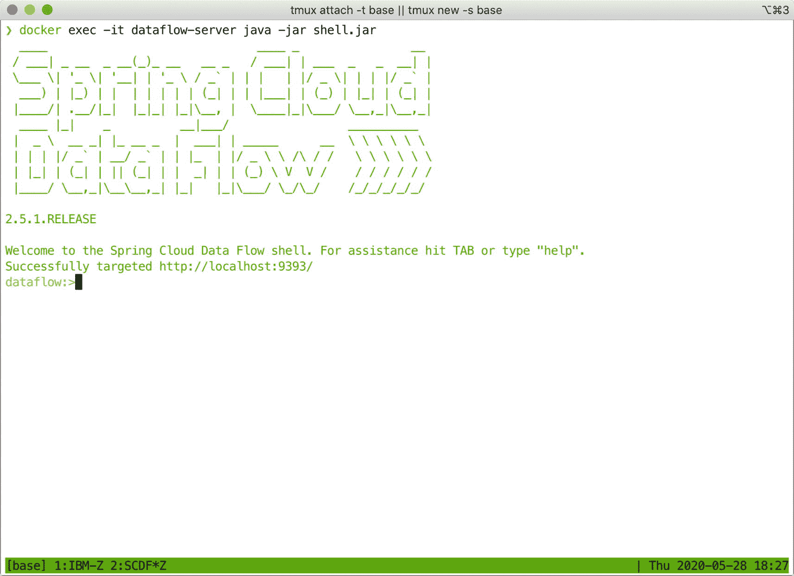

图 9-3。

Spring CloudStream 外壳

另一个选择是从 [`https://repo.spring.io/release/org/springframework/cloud/spring-cloud-dataflow-shell/2.6.0/spring-cloud-dataflow-shell-2.6.0.jar`](https://repo.spring.io/release/org/springframework/cloud/spring-cloud-dataflow-shell/2.6.0/spring-cloud-dataflow-shell-2.6.0.jar) 下载优步罐。下载后，执行下面的命令。

```java
$ java -jar spring-cloud-dataflow-shell-2.6.0.jar --help

```

该命令显示了您可以覆盖的所有参数(参见图 [9-4](#Fig4) )。

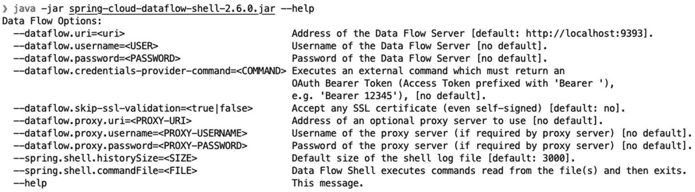

图 9-4。

带- help 参数的 Spring CloudStream 外壳

在继续之前，检查所有参数。数据流外壳(客户端)有默认值，比如试图连接到`localhost:9393`的`uri`参数。

现在再次执行该命令，但不带`--help`参数。

```java
$ java -jar spring-cloud-dataflow-shell-2.6.0.jar

```

如果您仍在使用 Docker Compose 和 exposed 端口 9393，则连接成功，但如果您的数据流服务器运行在 Kubernetes 中，则必须为该服务器分配 IP 或域。因为连接`localhost:9393`失败，所以给你显示一个`server-unknown`提示。在这种情况下，您可以使用以下命令。

```java
server-unknown:>dataflow config server https://my-scdf-server

```

它伸出手，连接到你的数据流服务器(见图 [9-5](#Fig5) )。

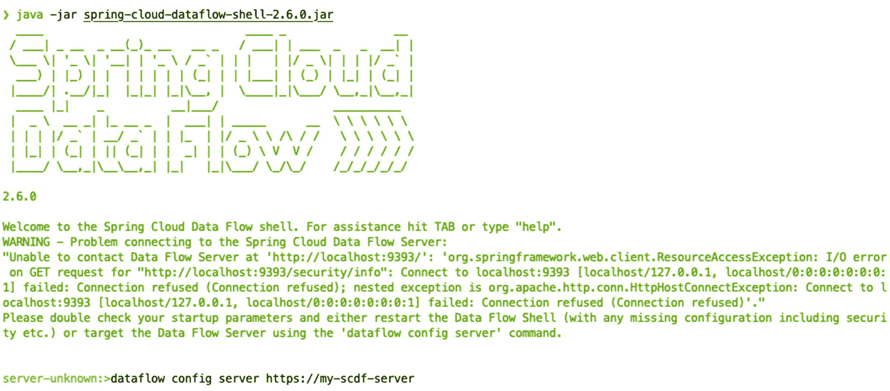

图 9-5。

Spring CloudStream 外壳:服务器未知

如果您使用 Docker Compose，我推荐使用下面的命令来启动数据流 shell，因为它更容易将数据发送到我们的`http`应用。

```java
$ docker exec -it dataflow-server java -jar shell.jar

```

使用优步-JAR 需要暴露 Skipper 服务器端口 9001，这意味着您需要在`docker-compose.yml`文件中添加`ports`属性。

数据流 shell 提供了 60 多个带制表符补全的命令，允许您查看、列出、创建、删除、销毁以及更多关于流和任务的 Uri。Spring CloudStream shell 是一个 REST API 客户端，但是比简单的`cURL`或`Httpie`命令行实用程序具有更大的容量。

让我们从查看一些可以从数据流外壳执行的命令开始。我认为您在数据流 shell 中最好的朋友之一是`help`命令。键入 **help** 并按回车键，您会看到您可以执行的 60 多个命令(参见图 [9-6](#Fig6) )。

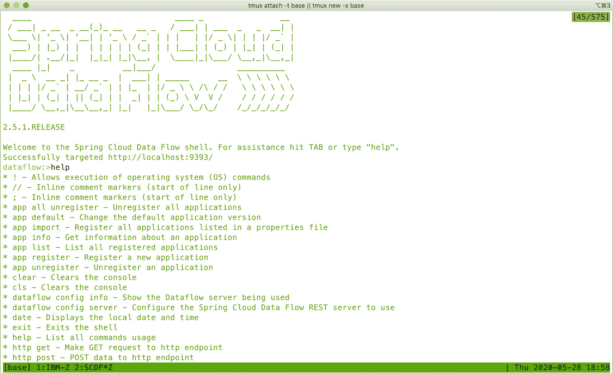

图 9-6。

Spring CloudStream 外壳:使用帮助命令

```java
dataflow:>help

```

您也可以使用`help [command [options]]`语法。例如，您使用`stream`命令，这样您就可以进行输入。

```java
dataflow:>help stream

```

前面的命令显示了`stream`命令的可用选项列表，您可以执行:

```java
dataflow:>help stream create

```

分析输出，注意它附带了创建流所需的描述。数据流 shell 附带了`TAB`完成功能，因此您可以执行`stream`命令并双击`TAB`键来获得可用选项，如`all`、`info`、`create`、`list`、`deploy`、`undeploy`等等。

当您开始创建流时，您会看到每个命令都有选项，这些选项都有需要以双破折号开头的参数。举个例子，

```java
dataflow:>stream deploy --name=movie

```

有时你需要用单引号(')或双引号(`"`)来传递值，你需要非常小心。当然，你会发现你需要躲避一些角色，但是不要担心，时间到了。我告诉你怎么做。其他规则在这里没有涉及，但是你可以在 [`https://docs.spring.io/spring-cloud-dataflow/docs/current/reference/htmlsingle/#_shell_rules`](https://docs.spring.io/spring-cloud-dataflow/docs/current/reference/htmlsingle/%2523_shell_rules) 阅读。

Spring Data 流外壳的另一个好处是它解析 DSL 的方式。您必须选择一种有效的方法来添加您的表达式，而不是组合它们。例如，`filter`应用需要传递一个表达式参数(正如您之前看到的`cURL` / `Httpie`命令)，并且您必须选择以下任意一个。

```java
filter --expression=payload>5.0
filter --expression=#jsonPath(payload,'$.imdb.rating')>5.0
filter --expression='#jsonPath(payload,''$.imdb.rating'') > 5.0'

```

前面的表达式使用了 SpEL (Spring Expression Language)的`#jsonPath`和通用对象，比如`payload`。注意空格和单引号。没有双引号。您仍然可以添加双单引号。此外，您可以用反斜杠`\`来转义字符。你可以在这里得到更多的感觉， [`https://docs.spring.io/spring-cloud-dataflow/docs/current/reference/htmlsingle/#_dsl_parsing_rules`](https://docs.spring.io/spring-cloud-dataflow/docs/current/reference/htmlsingle/%2523_dsl_parsing_rules) 和这里 [`https://docs.spring.io/spring-cloud-dataflow/docs/current/reference/htmlsingle/#_spel_syntax_and_spel_literals`](https://docs.spring.io/spring-cloud-dataflow/docs/current/reference/htmlsingle/%2523_spel_syntax_and_spel_literals) 。

谈到属性，您可以使用外部属性文件传递所有参数。通常，该文件可以是 JAR 被执行的地方。参数不应带有任何单引号或双引号。这些属性的语法是`app.<app-name>.<parameter>=<value>`。例如，

```java
app.filter.expression=#jsonPath(payload, '$imdb.rating') > 5.0

```

为了更好地理解这些特性，让我们从创建相同的电影流管道 DSL 开始。

1.  注册应用。在提示符下，执行以下命令。

    ```java
    dataflow:>app import --uri https://dataflow.spring.io/rabbitmq-maven-latest

    ```

    Remember that you need the `http`, `filter`, `jdbc`, `log`, `splitter,` and `groovy-transform` apps. Also, you need to use one broker, in the preceding command I’m assuming you are using RabbitMQ. You can use Kafka as well. Once you import them, you can have them listed with

    ```java
    dataflow:>app list

    ```

2.  创建电影流。首先，让我们看看溪流

    ```java
    dataflow:>stream list

    ```

    It should be empty. Next, let’s add the first stream. Don’t forget to change your Git server’s `user` and `repository`.

    ```java
    dataflow:> stream create --name movie --definition "http --port=9001 | splitter --expression=#jsonPath(payload,'$.movies')| groovy-transform --script=https://raw.githubusercontent.com/<user>/<repo>/master/movie-transform.groovy | jdbc --columns=id:id,title:title,actor:actor,year:year,genre:genre,stars:stars,rating:imdb.rating,ratingcount:imdb.ratingCount --table-name=movies --password=rootpw --driver-class-name=org.mariadb.jdbc.Driver --username=root --url=jdbc:mysql://mysql:3306/reviews?autoReconnect=true&useSSL=false"

    dataflow:> stream create --name stars --definition ":movie.splitter > filter --expression=\"#jsonPath(payload,'$.stars')>3\" | log"

    dataflow:> stream create --name imdb-high-rating --definition ":movie.groovy-transform > filter --expression=\"#jsonPath(payload,'$.imdb.rating') > 8.0\" | log"

    ```

    In the scaped characters, note the `\"`. You can look at the definitions with the following.

    ```java
    dataflow:> stream list

    ```

    信息中没有转义字符。

3.  It’s time to deploy. Execute the following commands.

    ```java
    dataflow:>stream deploy --name movie
    dataflow:>stream deploy --name stars
    dataflow:>stream deploy --name imdb-high-rating

    ```

    You can look see the status using the following.

    ```java
    dataflow:> stream info --name movie
    dataflow:> stream info --name stars
    dataflow:> stream info --name imdb-high-rating

    ```

    状态应该是*已部署*。

4.  It’s time to send some data. The Spring Data Flow shell comes with a REST API client that you can use right there in the shell. The command is `http`. You can use `help http` to find out which parameters are important to send information. To send some data, you can execute the following command.

    ```java
    dataflow:> http post --target http://<change-me>:9001 --data '{"movies":[{"id": "tt0133093","title": "The Matrix","actor": "Keanu Reeves", "year": 1999,"genre":"fiction","stars": 5},{"id": "tt0209144","title": "Memento","actor": "Guy Pearce","year": 2000,"genre": "drama","stars": 4},{"id": "tt0482571","title": "The Prestige","actor": "Christian Bale","year": 2006,"genre": "drama","stars": 3  },{"id": "tt0486822","title": "Disturbia","actor": "Shia LaBeouf","year": 2007,"genre": "drama","stars": 3}]}' --contentType "application/json"

    ```

    如果你查看`http post`命令，有一个`--target`参数。这是`http`应用运行的地方；不可能是`localhost`。如果你用的是 Kubernetes，那很容易，因为你要用一个`LoadBalancer`类型暴露`http`app；但是如果你使用的是来自书的源代码(`ch09/docker-compose`)的 Docker Compose ( `docker-compose.yml`)，你需要确保`skipper`服务器是可达的；要么使用`ports`并在`docker-compose.yml`中暴露`"9001:9001"`(在`skipper`服务中)，要么使用`dataflow-server`中的`docker shell.jar`。换句话说，您需要知道哪个 IP 被分配给了`skipper`容器。

    To get the IP of the `skipper` container, you can run.

    ```java
    $ docker inspect -f '{{range .NetworkSettings.Networks}}{{.IPAddress}}{{end}}' skipper

    ```

5.  该检查日志了。为此，您需要使用运行时应用命令。

    ```java
    dataflow:>runtime apps

    ```

    This command shows you the `name`, `status,` and some other properties such as `stdout` and `stderr`. You are interested in the `stdout` property that is showing the logs. If you are using Docker Compose, then you can execute the following command.

    ```java
    $ docker exec skipper tail -n 500 -f /tmp/1590548505908/stars.log-v1/stdout_0.log

    ```

    If you are using Kubernetes, it is easier; check out the pods and use the logs command.

    ```java
    $ kubectl get pods
    $ kubectl logs start-log-v1-xxxx

    ```

6.  查看 MySQL 数据库并执行 SELECT 语句。

    恭喜你！您使用了 Spring CloudStream 外壳。

    To remove and delete everything, you can use the same `stream` command .

    ```java
    dataflow:> stream destroy --name imdb-high-rating
    dataflow:> stream destroy --name stars
    dataflow:> stream destroy --name movie

    ```

现在，您可以使用 exit 命令退出。如果你愿意，你可以关闭你的基础设施。接下来，让我们使用仪表板再做一次。

### 使用仪表板

尽管您已经了解了 dashboard，但是现在是时候使用它来部署电影流管道 DSL 了。对于这一节，从头开始就好，所以请停止/重启你的基础设施；要么使用 Docker Compose，要么使用 Kubernetes 实例。如果你正在使用 Kubernetes，试着重建 MySQL 数据库，这样它就不会有应用和流的记录。我们开始吧。

1.  确保 Spring CloudStream 和 Skipper 服务器已经启动并运行。如果您使用的是 Kubernetes，请确保使用 LoadBalancer 类型公开 Spring CloudStream 服务器，这样您就可以有一个物理 IP 地址进行访问。另外，不要忘记在 MySQL 实例中创建`reviews`数据库和`movies`表。

2.  Open your browser and go to http://<your-ip-or-name-server>:[9393]/dashboard (see Figure [9-7](#Fig7)).

    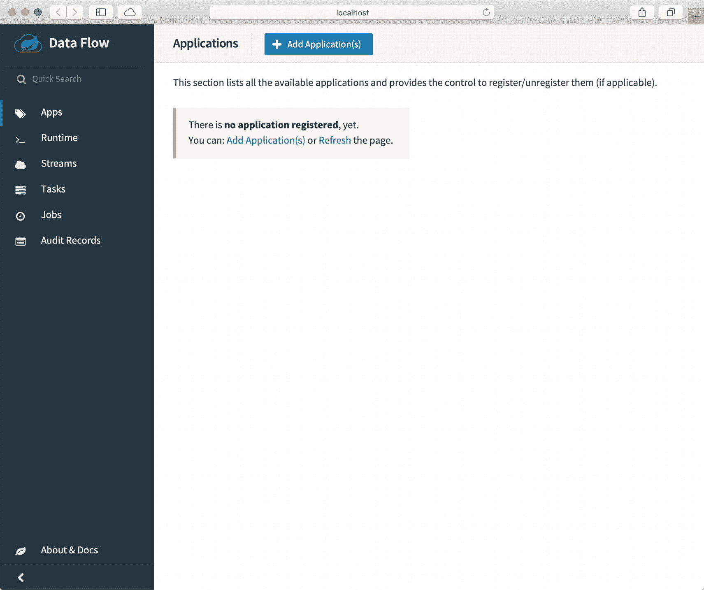

    图 9-7。

    仪表盘

    图 [9-7](#Fig7) 为仪表板。在左窗格中，您会发现以下内容。

3.  应用。这是你注册所有可用应用的地方，包括我们自己的(你稍后会看到)。请记住，应用基于活页夹和 Maven 或 Docker 坐标。
    *   运行时(您可以看到所有部署)

    *   流

    *   任务

    *   乔布斯

    *   审计记录

4.  让我们注册应用。请记住，您可以在 Rabbit 或 Kafka 以及 Maven 或 Docker 坐标之间进行选择。稍后，您将看到如何使用我们的定制流式应用和 NATs broker，并与其他应用一起使用。

    Click the Apps pane, and in the right pane, click the + Add Application(s) button/link. Then, select the **Bulk import application coordinates from an HTTP URI location** option. Then, you can pre-fill the URI with one of the items in the list by clicking it. Choose either Rabbit or Kafka (depending on your primary broker) and either Maven or Docker. Then you can click **Import application(s)**. This imports the apps, and it takes you to the main page. You should have something like Figure [9-8](#Fig8).

    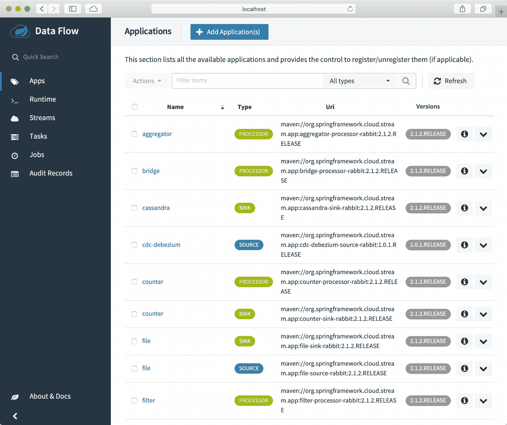

    图 9-8。

    仪表板:导入的应用

5.  In the left pane, click the Streams option. Then in the right pane, click the + Create Stream(s) button/link . This take you to the GUI part where you can drag-n-drop apps into the canvas or you can write the DSL. To make things easier, you can add the following DSL.

    ```java
    movie=http --port=9001 | splitter --expression="#jsonPath(payload, '$.movies')" | groovy-transform --script="https://raw.githubusercontent.com/felipeg48/scdf-scripts/master/movie-transform.groovy" | jdbc --columns="id:id,title:title,actor:actor,year:year,genre:genre,stars:stars,rating:imdb.rating,ratingcount:imdb.ratingCount" --table-name="movies" --password="rootpw" --driver-class-name="org.mariadb.jdbc.Driver" --username="root" --url="jdbc:mysql://mysql:3306/reviews?autoReconnect=true&useSSL=false"
    stars=:movie.splitter > filter --expression="#jsonPath(payload,'$.stars') > 3" | log
    imdb-high-rating=:movie.groovy-transform > filter --expression="#jsonPath(payload,'$.imdb.rating') > 8.0" | log

    ```

    Note that you added enclosing double quotes per parameter. When you add this pipeline DSL, you see the graph displayed (see Figure [9-9](#Fig9)).

    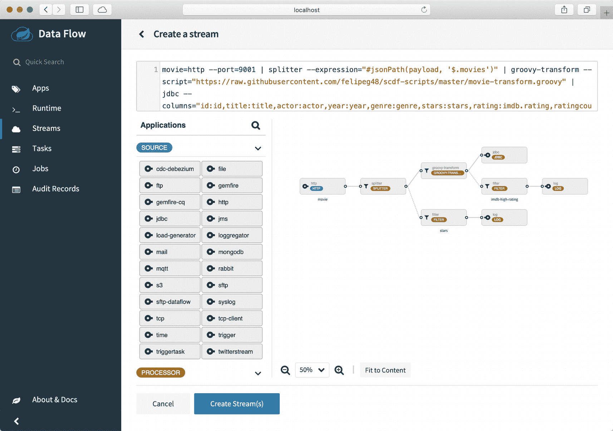

    图 9-9。

    仪表板:电影管道 DSL

    You can now play with it by removing some of the components, or in the DSL area, you can remove all the properties and have in plain sight what the DSL looks like without parameters (see Figure [9-10](#Fig10)).

    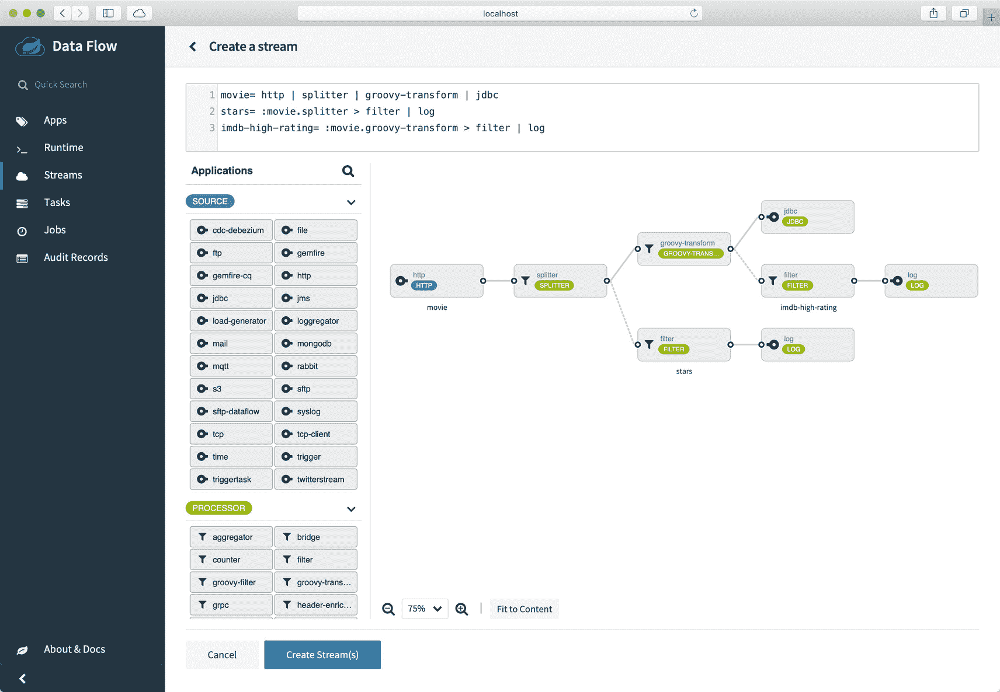

    图 9-10。

    仪表板:不带参数的 DSL

    ```java
    movie= http | splitter | groovy-transform | jdbc
    stars= :movie.splitter > filter | log
    imdb-high-rating= :movie.groovy-transform > filter | log

    ```

    If you want to add parameters without adding them to the DSL area because you want to avoid any double/single quote confusion, you can select any app from the graph, and it shows you the Options and Delete links. You can select Options. A pop-up window appears, where you can add the parameter value. In the case of the `http` app, you can add port value 9001 (see Figures [9-11](#Fig11) and [9-12](#Fig12)).

    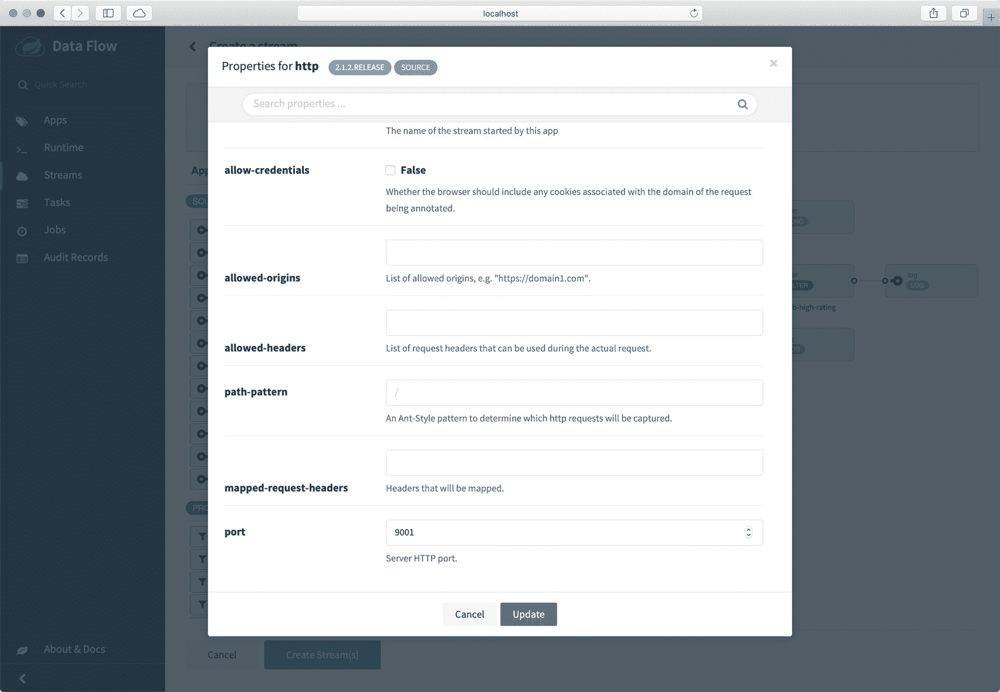

    图 9-12。

    仪表板:http 应用参数

    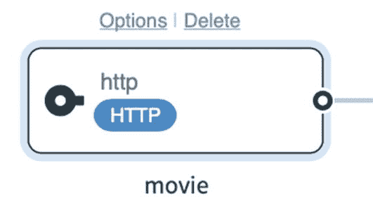

    图 9-11。

    仪表板:已选择 http 应用

    如果您单击 Update，它会更新 DSL，您会在 DSL 区域看到`--port=9001`。

6.  Add the DSL where you have all the parameters set. Click the Create Stream(s) button, which opens a pop-up where you need to add any description (this is optional) and a name that by default is the one you added already into the DSL (see Figure [9-13](#Fig13)).

    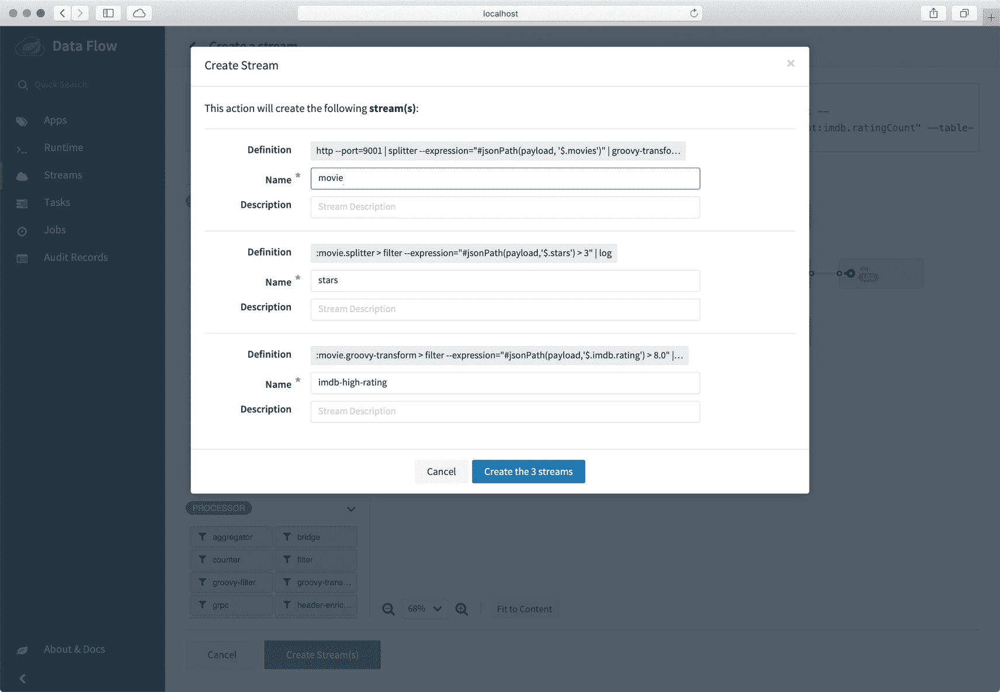

    图 9-13。

    仪表板:创建流

    You can click **Create the three streams**, which takes you back to where the streams are listed. In that list, you see the streams’ definitions. At the end of every row are the status and three icons. The first icon shows the stream’s details. The second icon (the Play icon) deploys the stream, and the last icon (a caret facing down) shows you options like Show details, Deploy, Undeploy, Destroy stream. If you click the > icon next to each stream’s definition, you find a graph related to the stream (see Figures [9-14](#Fig14), [9-15](#Fig15), and [9-16](#Fig16)).

    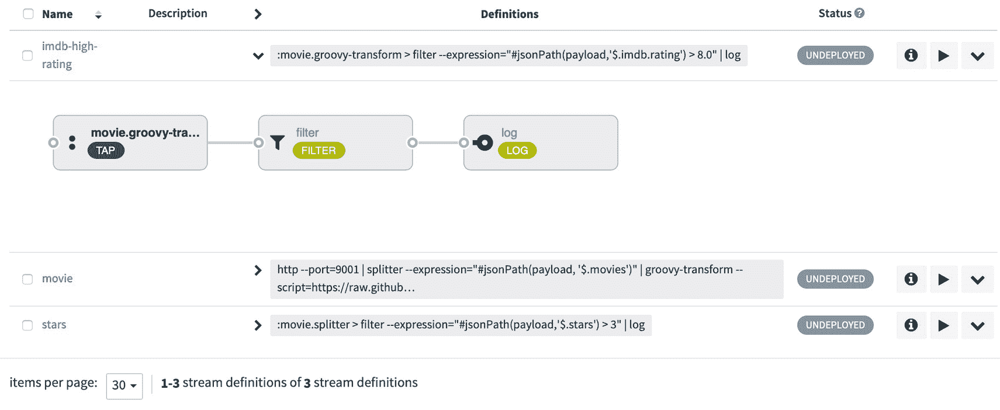

    图 9-16。

    仪表板:流图

    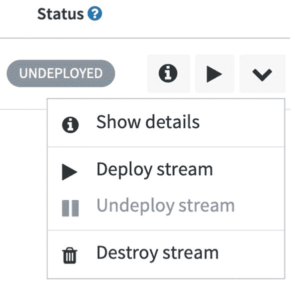

    图 9-15。

    仪表板:流图标

    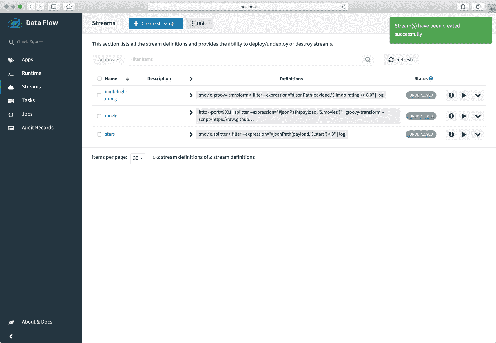

    图 9-14。

    仪表板流列表

7.  It’s time to deploy one by one. You start first with the `movie` stream. Then you can select any of the other in any order. In the end, the `stars` and `imdb-high-rating` streams depend on the `movie` to start first. You can click the Play icon to deploy. When you do, another pop-up appears where there are extra settings that can help with the deployment, and there are more related to the platform where the streams are deployed. Also, you have another chance to change the existing parameters if you needed them to (see Figure [9-17](#Fig17)).

    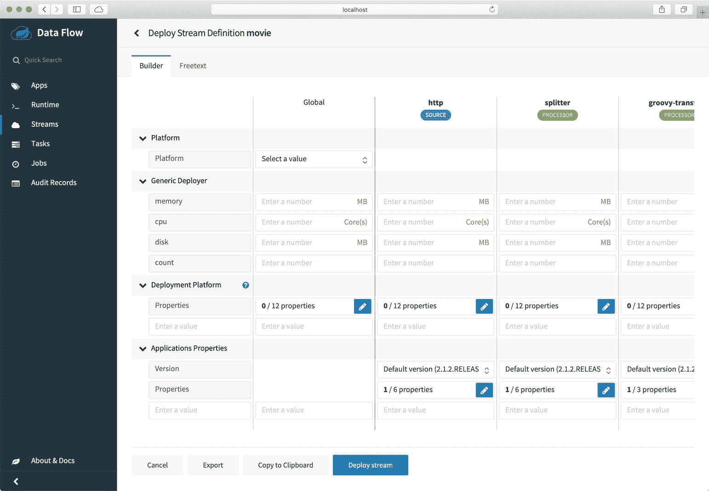

    图 9-17。

    仪表板:流-部署属性

    The parameters are separated by the following.
    *   `Platform`。通常，您可以选择部署哪个平台，但这是一个混合选项，可以部署到 Cloud Foundry、Kubernetes 或本地实例。

    *   `Generic deployer`。您可以在其中添加一些资源约束，以便为任何其他应用节省资源，如内存、CPU、磁盘和实例数量。

    *   `Deployment platform`。它与 Spring Cloud 和 Java VM 属性相关，比如 java-opts、debug-port、java-command(一个带有特殊标志来运行 Java 的命令)、端口范围等等。

    *   `Application properties`。在那里你为应用定义了所有的参数，比如`http port`、`jdbc table-name`等等。

        Note that you have the same properties for each app defined in the `movie stream`. And if you are okay with everything, click the Deploy Stream button. This takes you to the main stream list. The Status column shows that your stream is being deployed (see Figure [9-18](#Fig18)).

    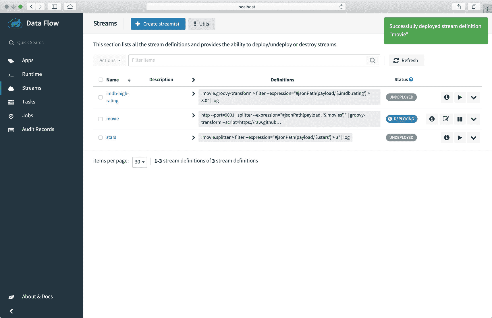

    图 9-18。

    仪表板:流列表–状态:正在部署

    You can repeat the same for the `stars` and `imdb-high-rating` streams (see Figure [9-19](#Fig19)).

    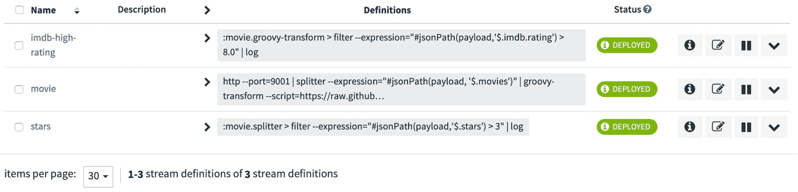

    图 9-19。

    仪表板:流列表

8.  Once all the streams have a Deployed status, there are several ways to see information about your app. Click `movie stream`. The information icon (i) shows the details (see Figure [9-20](#Fig20)).

    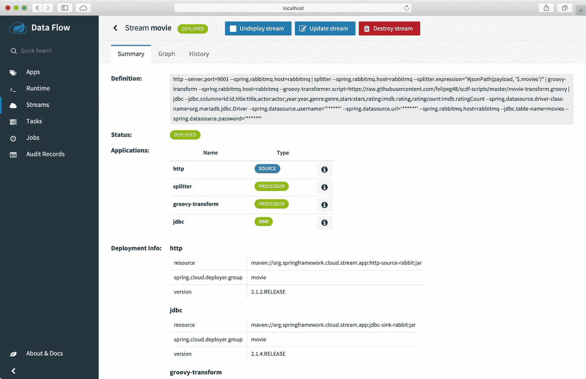

    图 9-20。

    仪表板:显示细节-摘要-电影流

    If you scroll down, you get more information about every app defined in the movie stream, and if you keep going scrolling down, you can see the logs. You have a dropdown list and choose the logs you want to see. At the top of this page, you see the Summary, Graph, and History tabs. You can check them out. The graph has the entire DSL definition, including the taps (see Figure [9-21](#Fig21)).

    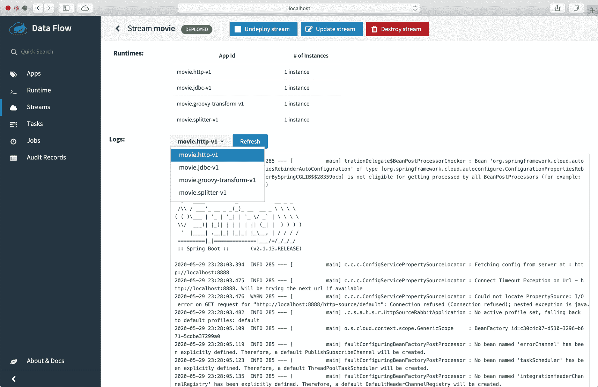

    图 9-21。

    仪表板:显示详细信息-摘要-电影流-日志

9.  Another way to see more information is to get into the runtime. Click Runtime in the left pane. It shows you everything about your apps, such as process ID, port, instance name, version, and logs for `stdout` and `stderr`. You can click any of the boxes (see Figures [9-22](#Fig22) and [9-23](#Fig23)).

    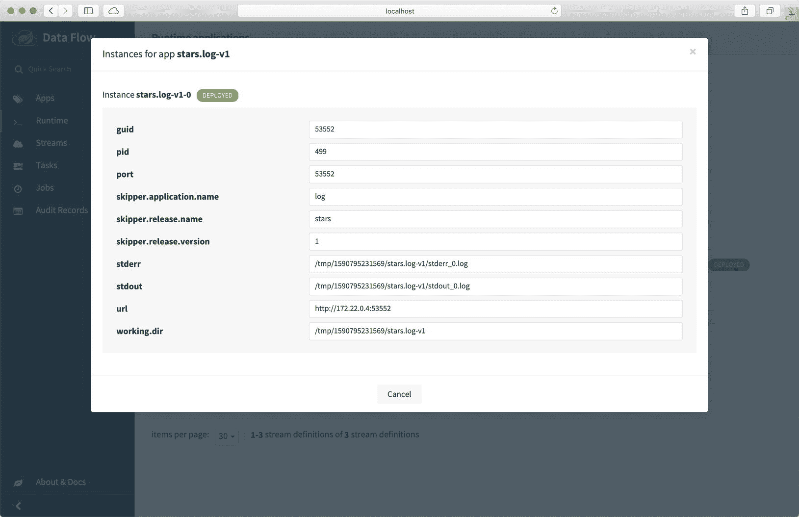

    图 9-23。

    仪表板:运行时–流式应用

    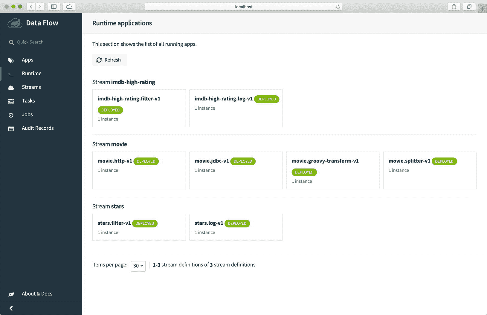

    图 9-22。

    仪表板:运行时–流式应用，命名约定-<stream-name>-<app>-</app></stream-name>

10.  是时候发一些数据了。这里您需要使用任何 REST 客户端。你可以使用 cURL 命令，或者如果你喜欢图形界面，你可以使用 Postman ( [`www.postman.com/downloads/`](http://www.postman.com/downloads/) )或者失眠症( [`https://insomnia.rest/`](https://insomnia.rest/) )来发送数据。您需要发送之前的 JSON 数据(参见清单 [9-1](#PC1) )。

11.  例如，您可以返回到流列表并单击`star`流的详细信息。在摘要中，向下滚动到日志并选择`stars.log-v1,`，在底部，您应该会看到一些关于您刚刚发送的数据的结果。您还可以检查 MySQL 数据库，看看记录是否在那里。

恭喜你！您已经使用仪表板部署了电影流 DSL。

要删除流，请转到流列表，选择流，单击上下颠倒的插入符号，然后选择销毁流。出现提示后，如果您确定，点击销毁流定义(见图 [9-24](#Fig24) )。

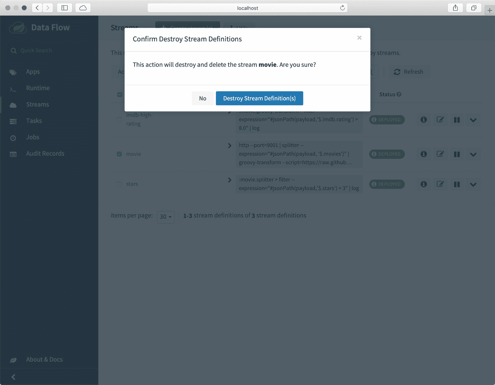

图 9-24。

仪表板:销毁流

仪表板中有更多的特性，我将在后面的任务、作业和监控中讨论。

### 以编程方式创建流

创建和部署流的另一种方法是通过 Spring CloudStream 模块公开的 Java DSL APIs。使用这种方法，您可以根据您的业务需求，创建一种动态的方法来集成流的生命周期。本节将向您展示如何使用这个 API 及其关键类。

Spring CloudStream API 公开了两种风格的 Java DSL APIs。

*   *定义风格*。这种风格允许您使用已经在前面章节中部署的 DSL 定义。例如，

    ```java
    Stream.builder(dataFlowOperations)
      .name("simple-stream")
      .definition("http | log")
      .create();

    ```

*   *流畅的风格*。这种风格提供了一种使用流畅的方法链(如`source.processor.sink`)来创建流式应用的方式，以开发更动态的解决方案。例如，

    ```java
    Stream.builder(dataFlowOperations)
      .name("simple-stream")
      .source(httpSource)
      .sink(logSink)
      .create();

    ```

#### Java DSL API:定义风格

让我们使用 Spring CloudStream Java DSL API 创建电影流管道 DSL，从定义样式开始。

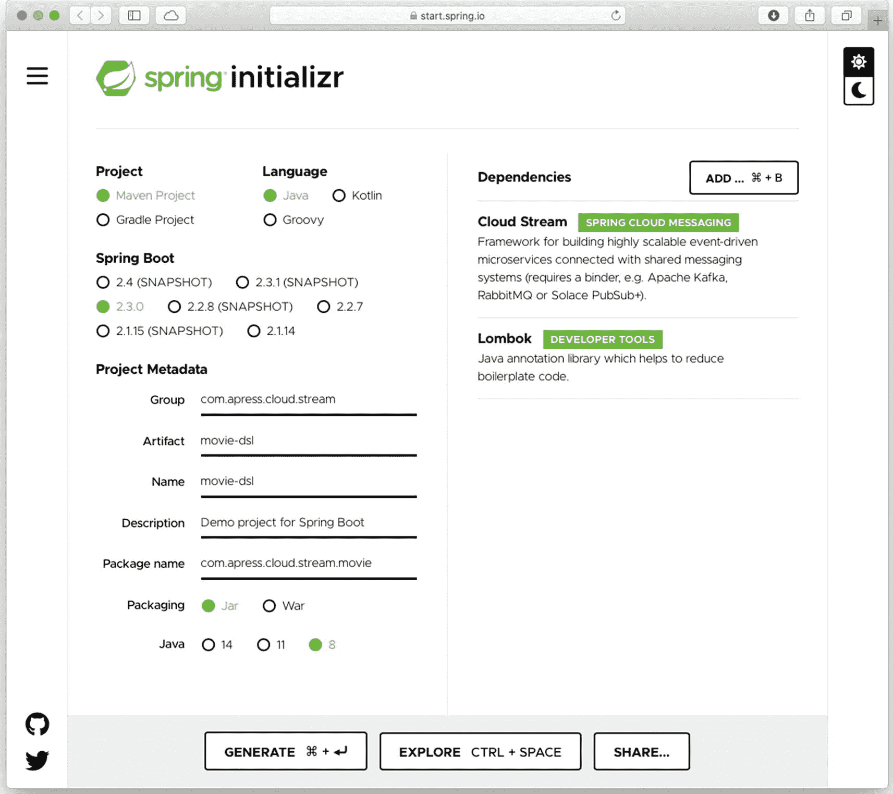

图 9-25。

Spring Initializr 电影-dsl 项目

1.  Open your browser and point to [`https://start.spring.io`](https://start.spring.io). Complete the metadata with the following information.
    *   组:`com.apress.cloud.stream`

    *   神器:`movie-dsl`

    *   包名:`com.apress.cloud.stream.movie`

    *   依赖:CloudStream，龙目岛

    单击生成按钮下载 ZIP 文件。您可以在您选择的 IDE 中解压缩并导入它(参见图 [9-25](#Fig25) )。

1.  Open the `pom.xml` file and add the following and required dependency.

    ```java
    <dependency>
            <groupId>org.springframework.cloud</groupId>
            <artifactId>spring-cloud-dataflow-rest-client</artifactId>
            <version>2.6.0</version>
    </dependency>

    ```

    在撰写本书时，版本是`spring-cloud-rest-client`依赖项的`2.6.0`。这个模块提供了新的类，我将很快讨论这些类。

2.  创建一个`MovieDslStream`枚举。它保存了关于定义及其名称的信息(参见清单 [9-5](#PC55) )。

```java
package com.apress.cloud.stream.movie;

public enum MovieDslStream {
    MOVIE("movie",
            "http --port=9001 | splitter --expression=\"#jsonPath(payload, '$.movies')\" | " +
            "groovy-transform --script=\"https://raw.githubusercontent.com/felipeg48/scdf-scripts/master/movie-transform.groovy\" | " +
            "jdbc --columns=\"id:id,title:title,actor:actor,year:year,genre:genre,stars:stars,rating:imdb.rating,ratingcount:imdb.ratingCount\" " +
            "--table-name=\"movies\" --password=\"rootpw\" --driver-class-name=\"org.mariadb.jdbc.Driver\" --username=\"root\" " +
            "--url=\"jdbc:mysql://mysql:3306/reviews?autoReconnect=true&useSSL=false\""),
    STARS("stars",":movie.splitter > filter --expression=\"#jsonPath(payload,'$.stars') > 3\" | log"),
    IMDB("imdb-high-rating",":movie.groovy-transform > filter --expression=\"#jsonPath(payload,'$.imdb.rating') > 8.0\" | log");

    private String name;
    private String definition;

    MovieDslStream(String name, String definition){
        this.name = name;
        this.definition = definition;
    }

    public String getName(){
        return this.name;
    }
    public String getDefinition() {
        return this.definition;
    }
}

Listing 9-5.src/main/java/com/apress/cloud/stream/movie/MovieDslStream.java

```

清单 [9-5](#PC55) 显示了`MOVIE`、`STARS`、`IMDB`枚举类型和它们的两个值:`name` ( `getName()`方法)和`definition` ( `getDefinition()`方法)。

1.  创建保存一个字段的`MovieDslProperties`(参见清单 [9-6](#PC56) )。

```java
package com.apress.cloud.stream.movie;

import lombok.Data;
import org.springframework.boot.context.properties.ConfigurationProperties;

@Data
@ConfigurationProperties(prefix = "movie")
public class MovieDslProperties {
    private String action = "create"; // create | deploy | destroy
}

Listing 9-6.src/main/java/com/apress/cloud/stream/movie/MovieDslProperties.java

```

这个类包含一个可以是`create`、`deploy,`或`destroy`的动作。它调用正确的方法来执行和创建、部署或销毁流。尽管它只是一个属性，但是您可以添加更多的行为来对一些值做出反应。

1.  创建`MovieDslService`(参见清单 [9-7](#PC57) )。

```java
package com.apress.cloud.stream.movie;

import lombok.AllArgsConstructor;
import org.springframework.cloud.dataflow.rest.client.DataFlowOperations;
import org.springframework.cloud.dataflow.rest.client.dsl.DeploymentPropertiesBuilder;
import org.springframework.cloud.dataflow.rest.client.dsl.Stream;

@AllArgsConstructor
public class MovieDslService {

    private DataFlowOperations dataFlowOperations;

    public void create(){
        java.util.stream.Stream.of(MovieDslStream.values()).forEach( c -> {
            createStream(c.getName(),c.getDefinition());
        });
    }

    public void deploy(){
        java.util.stream.Stream.of(MovieDslStream.values()).forEach( c -> {
            deployStream(c.getName());
        });
    }

    public void destroy(){
        java.util.stream.Stream.of(MovieDslStream.values()).forEach( c -> {
            destroyStream(c.getName());
        });
    }

    private void createStream(String name, String definition){
        Stream.builder(dataFlowOperations)
                .name(name)
                .definition(definition)
                .create();
    }

    private void deployStream(String name){
        dataFlowOperations.streamOperations().deploy(name,
                new DeploymentPropertiesBuilder().build());
    }

    private void destroyStream(String name){
        dataFlowOperations.streamOperations().destroy(name);
    }
}

Listing 9-7.src/main/java/com/apress/cloud/stream/movie/MovieDslService.java

```

清单 [9-7](#PC57) 显示了定义样式。`createStream`方法使用带有 fluent API 的`Stream`类，在本例中，您使用 definition 方法来创建、部署或销毁。在这种情况下，您通过使用一个定义来创建 DSL。注意你有一个`DataFlowOperations`接口。`DataFlowTemplate`类实现了这个接口。`DataFlowTemplate`类基于模板模式，与 Spring CloudStream 服务器 REST API 交互。看看其他方法，你会发现这非常简单明了。注意，`create`、`deploy`和`destroy`方法正在迭代`MovieDslStream`枚举，并使用`getName()`和`getDefinition()`来获取值。

1.  创建`MovieDslConfiguration`类来连接所有必要的 Spring beans(参见清单 [9-8](#PC58) )。

    ```java
    package com.apress.cloud.stream.movie;

    import org.springframework.boot.CommandLineRunner;
    import org.springframework.boot.context.properties.EnableConfigurationProperties;
    import org.springframework.cloud.dataflow.rest.client.DataFlowOperations;
    import org.springframework.cloud.dataflow.rest.client.DataFlowTemplate;
    import org.springframework.context.annotation.Bean;
    import org.springframework.context.annotation.Configuration;

    import java.lang.reflect.Method;
    import java.net.URI;

    @EnableConfigurationProperties(MovieDslProperties.class)
    @Configuration

    public class MovieDslConfiguration {

        @Bean
        public DataFlowOperations dataFlowOperations(){

            URI dataFlowUri = URI.create("http://localhost:9393");
            DataFlowOperations dataFlowOperations = new DataFlowTemplate(dataFlowUri);
            dataFlowOperations.appRegistryOperations().importFromResource(
                    "https://dataflow.spring.io/rabbitmq-maven-latest", true);

            return dataFlowOperations;
        }

        @Bean
        public CommandLineRunner actions(MovieDslService movieDslService, MovieDslProperties movieDslProperties){
            return args -> {
                Method method = movieDslService.getClass()
                        .getMethod(movieDslProperties.getAction(),null);

                assert method != null;
                method.invoke(movieDslService,null);
            };
        }

        @Bean
        public MovieDslService movieDslService(DataFlowOperations dataFlowOperations){
            return new MovieDslService(dataFlowOperations);
        }

    }

    Listing 9-8.src/main/java/com/apress/cloud/stream/movie/MovieDslConfiguration.java

    ```

    清单 [9-8](#PC58) 显示了您使用的配置。我们来分析一下。

    *   `dataflowOperations`。这个方法使用`DataFlowTemplate`类在这个基础上创建了一个`DataFlowOperations`接口的实例；这个类指向数据流服务器 REST API(本例中为 http://localhost:9393)。它还使用`rabbitmq-maven-latest` URI 导入应用。

    *   `movieDslService`。这个声明创建了通过`DataFlowOperations`接口的 Spring Bean `movieDslService`。

    *   `actions`。当 Spring 应用容器准备好执行程序时，就会执行这个方法。这个方法有`movieDSL`和`movieDslProperties`参数。请注意，您正在使用 Java 反射 API 来执行 MovieDslService 方法，这是一个基于给定属性的命令模式的小型实现:create、deploy 或 destroy。

2.  Add the following content to the `application.properties` file .

    ```java
    ## Movie properties
    # action = create, deploy, destroy
    movie.action=create

    ```

    运行程序时，可以使用创建、部署或销毁。

3.  在运行这个项目之前，您需要确保使用 Docker Compose 或 Kubernetes 运行您的基础设施。还要确保重新创建保存电影的数据库。

4.  运行您的项目。完成后，您可以在浏览器中查看`/dashboard`路径，看到应用已注册，三个电影 DSL 流已创建(如果您在浏览器中转至流部分)。

5.  Change the `movie.action` property to `deploy` and run the App. Your pipeline DSL has been deployed. And you can send a movie set with the following.

    ```java
    curl -s -X POST \
    -H "Content-Type: application/json" \
    -d '{"movies":[{"id":"tt0133093","title":"The Matrix","actor":"Keanu Reeves","year":1999,"genre":"fiction","stars":5},{"id":"tt0209144","title":"Memento","actor":"Guy Pearce","year":2000,"genre":"drama","stars":4},{"id":"tt0482571","title": "The Prestige","actor":"Christian Bale","year":2006,"genre":"drama","stars":3},{"id":"tt0486822","title":"Disturbia","actor":"Shia LaBeouf","year":2007,"genre":"drama","stars":3}]}' \
    http://localhost:9001

    ```

    根据您的部署更改地址(Docker Compose 或 Kubernetes)。接下来，查看日志和数据库(参考前面的章节)。

6.  运行之后，部署并检查日志和数据库。您可以将`movie.action`属性更改为`destroy`，运行项目，并在仪表板中看到您的 DSL 被删除。

恭喜你！您已经使用 Java DSL 定义样式以编程方式创建、部署和销毁了电影流管道 DSL。

#### Java DSL API:流畅风格

本节介绍 Java DSL 流畅风格。

1.  您可以使用以下元数据创建另一个项目。
    *   组:`com.apress.cloud.stream`

    *   神器:`movie-dsl-fluent`

    *   包名:`com.apress.cloud.stream.movie`

    *   依赖:CloudStream，龙目岛

2.  单击生成按钮下载一个 ZIP 文件。解压缩并导入到您喜欢的 IDE 中。

3.  你可以复制`MovieDslStream`枚举和`MovieDslProerties`类，以及`application.properties`文件，你可以重用它们。

4.  创建`MovieDslService`类(参见清单 [9-9](#PC61) )。

```java
package com.apress.cloud.stream.movie;

import lombok.AllArgsConstructor;
import org.springframework.cloud.dataflow.rest.client.DataFlowOperations;
import org.springframework.cloud.dataflow.rest.client.dsl.DeploymentPropertiesBuilder;
import org.springframework.cloud.dataflow.rest.client.dsl.Stream;
import org.springframework.cloud.dataflow.rest.client.dsl.StreamApplication;
import org.springframework.cloud.dataflow.rest.client.dsl.StreamBuilder;

@AllArgsConstructor
public class MovieDslService {

    private DataFlowOperations dataFlowOperations;
    private StreamApplication httpSource;
    private StreamApplication splitterProcessor;
    private StreamApplication groovyTransformProcessor;
    private StreamApplication jdbcSink;

    public void create(){
        createFluentStream(MovieDslStream.MOVIE.getName());
        java.util.stream.Stream.of(MovieDslStream.values()).filter(c -> !c.getName().equals(MovieDslStream.MOVIE.getName())).forEach( c -> {
            createStream(c.getName(),c.getDefinition());
        });
    }

    public void deploy(){
        java.util.stream.Stream.of(MovieDslStream.values()).forEach( c -> {
            deployStream(c.getName());
        });
    }

    public void destroy(){
        java.util.stream.Stream.of(MovieDslStream.values()).forEach( c -> {
            destroyStream(c.getName());
        });
    }

    private void createFluentStream(String name){
        Stream.builder(dataFlowOperations)
                .name(name)
                .source(httpSource)
                .processor(splitterProcessor)
                .processor(groovyTransformProcessor)
                .sink(jdbcSink)
                .create();
    }

    private void createStream(String name, String definition){
        Stream.builder(dataFlowOperations)
                .name(name)
                .definition(definition)
                .create();
    }

    private void deployStream(String name){
        dataFlowOperations.streamOperations().deploy(name,new DeploymentPropertiesBuilder().build());
    }

    private void destroyStream(String name){
        dataFlowOperations.streamOperations().destroy(name);
    }
}

Listing 9-9.src/main/java/com/apress/cloud/stream/movie/MovieDslService.java

```

清单 [9-9](#PC61) 显示了`MovieDslService`类。这里重要的部分是`createFluentStream`方法；请注意，您没有使用该定义。您可以使用 source、processor 或 sink 方法。

1.  创建`MovieDslConfiguration`类(参见清单 [9-10](#PC62) )。

```java
package com.apress.cloud.stream.movie;

import org.springframework.boot.CommandLineRunner;
import org.springframework.boot.context.properties.EnableConfigurationProperties;
import org.springframework.cloud.dataflow.core.ApplicationType;
import org.springframework.cloud.dataflow.rest.client.DataFlowOperations;
import org.springframework.cloud.dataflow.rest.client.DataFlowTemplate;
import org.springframework.cloud.dataflow.rest.client.dsl.StreamApplication;
import org.springframework.context.annotation.Bean;
import org.springframework.context.annotation.Configuration;

import java.lang.reflect.Method;
import java.net.URI;

@EnableConfigurationProperties(MovieDslProperties.class)
@Configuration
public class MovieDslConfiguration {

    @Bean
    public CommandLineRunner actions(MovieDslService movieDslService, MovieDslProperties movieDslProperties){
        return args -> {
            Method method = movieDslService.getClass()
                    .getMethod(movieDslProperties.getAction(),null);

            assert method != null;
            method.invoke(movieDslService,null);
        };
    }

    @Bean
    public MovieDslService movieDslService(DataFlowOperations dataFlowOperations,
                                           StreamApplication httpSource,StreamApplication splitterProcessor,StreamApplication groovyTransformProcessor,
                                           StreamApplication jdbcSink, StreamApplication logSink){
        return new MovieDslService(dataFlowOperations,httpSource,splitterProcessor,groovyTransformProcessor,jdbcSink);
    }

    @Bean
    public DataFlowOperations dataFlowOperations(){

        URI dataFlowUri = URI.create("http://localhost:9393");
        DataFlowOperations dataFlowOperations = new DataFlowTemplate(dataFlowUri);

        dataFlowOperations.appRegistryOperations().register("http", ApplicationType.source,
                "maven://org.springframework.cloud.stream.app:http-source-rabbit:2.1.4.RELEASE",
                "maven://org.springframework.cloud.stream.app:http-source-rabbit:jar:metadata:2.1.4.RELEASE",
                true);
        dataFlowOperations.appRegistryOperations().register("splitter", ApplicationType.processor,
                "maven://org.springframework.cloud.stream.app:splitter-processor-rabbit:2.1.3.RELEASE",
                "maven://org.springframework.cloud.stream.app:splitter-processor-rabbit:jar:metadata:2.1.3.RELEASE",
                true);
        dataFlowOperations.appRegistryOperations().register("groovy-transform", ApplicationType.processor,
                "maven://org.springframework.cloud.stream.app:groovy-transform-processor-rabbit:2.1.3.RELEASE",
                "maven://org.springframework.cloud.stream.app:groovy-transform-processor-rabbit:jar:metadata:2.1.3.RELEASE",
                true);

        dataFlowOperations.appRegistryOperations().register("filter", ApplicationType.processor,
                "maven://org.springframework.cloud.stream.app:filter-processor-rabbit:2.1.3.RELEASE",
                "maven://org.springframework.cloud.stream.app:filter-processor-rabbit:jar:metadata:2.1.3.RELEASE",
                true);
        dataFlowOperations.appRegistryOperations().register("jdbc", ApplicationType.sink,
                "maven://org.springframework.cloud.stream.app:jdbc-sink-rabbit:2.1.6.RELEASE",
                "maven://org.springframework.cloud.stream.app:jdbc-sink-rabbit:jar:metadata:2.1.6.RELEASE",
                true);
        dataFlowOperations.appRegistryOperations().register("log", ApplicationType.sink,
                "maven://org.springframework.cloud.stream.app:log-sink-rabbit:2.1.4.RELEASE",
                "maven://org.springframework.cloud.stream.app:log-sink-rabbit:jar:metadata:2.1.4.RELEASE",
                true);

        return dataFlowOperations;
    }

    @Bean
    public StreamApplication httpSource(){
        return new StreamApplication("http")
                .addProperty("port",9001);
    }

    @Bean
    public StreamApplication splitterProcessor(){
        return new StreamApplication("splitter")
                .addProperty("expression","\"#jsonPath(payload,'$.movies')\"");
    }

    @Bean
    public StreamApplication groovyTransformProcessor(){
        return new StreamApplication("groovy-transform")
                .addProperty("script","\"https://raw.githubusercontent.com/felipeg48/scdf-scripts/master/movie-transform.groovy\"");
    }

    @Bean
    public StreamApplication jdbcSink(){
        return new StreamApplication("jdbc")
                .addProperty("columns","\"id:id,title:title,actor:actor,year:year,genre:genre,stars:stars,rating:imdb.rating,ratingcount:imdb.ratingCount\"")
                .addProperty("table-name","\"movies\"")
                .addProperty("username","\"root\"")
                .addProperty("password","\"rootpw\"")
                .addProperty("driver-class-name","\"org.mariadb.jdbc.Driver\"")
                .addProperty("url","\"jdbc:mysql://mysql:3306/reviews?autoReconnect=true&useSSL=false\"");
    }

}

Listing 9-10.src/main/java/com/apress/cloud/stream/movie/MovieDslConfiguration.java

```

清单 [9-10](#PC62) 显示了 MovieDslConfiguration 类。花点时间分析一下，看看有什么不同。注意，在这堂课上，我用的是旧版本。您可以修复此问题并使用最新版本。你应该没事的。

在这个类中，您发现`DataFlowOperations`只注册您使用的应用；这是另一种替代而不是全部。请注意，您在注册中使用了`name`、`ApplicationType`和`maven`坐标。另外，查看创建源、处理器和接收器的`StreamApplication`bean，以及定义传递给应用的参数的`addProperty`方法的用法。

1.  您可以运行项目并发送一些数据。

我知道这个项目可能只有一个，但我想把它和另一个分开，这样你就可以清楚地知道选择什么风格。

恭喜你！您使用流畅的风格创建了一个电影流管道 DSL。

Note

记住所有的代码都在 Apress 网站的`ch09`文件夹中。

## 摘要

本章介绍了 Spring CloudStream 组件，并解释了如何部署流。我向您展示了创建流的不同方法，从命令行实用程序到使用 Java DSL 创建动态流。

下一章将讨论流处理，您将添加自己的 NATs 代理。您将看到 Spring Cloud Task，并了解它如何创建批处理。你可以认为下一章是这一章的延续。