# 11.使用 Spring Cloud 数据流的任务和批处理应用

在前一章中，我向您展示了如何在 Spring Cloud 数据流中使用多个绑定器创建和部署定制流。本章继续介绍更多功能，包括创建流 DSL 应用、运行和/或触发任务和批处理等。在前面的章节中，您看到了公司如何需要运行夜间流程——处理数据并通过增强数据内容或进行转换以及应用一些过滤来修改数据的有限作业。

## 春云任务初级读本

Spring Cloud Task 是一种技术，它允许你创建有限的微服务，跟踪某件事情何时开始，何时失败，何时结束；换句话说，Spring Cloud Task 会跟踪应用执行过程中发生的任何事件。

为什么在云环境中任务是必要的，因为在云环境中，您总是有流程在运行？今天，每秒钟有数百万个请求，我们希望我们的服务是可靠的和容错的。但有时我们需要做一些不应该影响应用性能的繁重工作。这就是为什么批处理应用允许我们创建可以在云中运行的细粒度应用，并通过加载和处理数据来处理繁重的工作。

Spring Cloud Task 是同类产品中第一个这样做的，并且具有跟踪正在发生的事情的优势。以下是 Spring Cloud Task 的一些特性。

*   它使用内存中的数据库来跟踪作业执行，但是您可以使用任何其他数据库引擎，包括 DB2、Oracle、MySQL、Postgres、SQL Server、HSQLDB 和 H2。默认情况下，当应用启动时，会创建一个任务存储库，通过创建模式并插入执行时发生的事件来跟踪任务，可以使用嵌入式数据库，如 H2、HSQL 或 Derby，也可以通过配置`spring.datasource.*`属性来使用任何 SQL 驱动程序。这提供了成功或不成功的作业执行的记录。Spring Cloud Task 使用具有以下属性的`TaskExecution`类对这些信息进行建模。
    *   `taskName`是任务的名称。

    *   `startTime`是任务开始的时间，由`SmartLifecyle`调用发出。

    *   `endTime`是任务完成的时间，由`ApplicationReadyEvent`发布。

    *   `executionId`是任务运行的唯一 ID。

    *   `exitCode`是由`ExitCodeExceptionMapper`实现生成的代码。如果失败，则发出值为 1 的`ApplicationFailedEvent`;否则为 0。

    *   `exitMessage`退出时是否有可用的信息。它设置在`TaskExecutionListener`中。

    *   `errorMessage`是任务结束时引起的异常(从值为 1 的`ApplicationFailedEvent`发出)。

    *   `arguments`是传入可执行应用的参数。

*   它基于 Spring Boot，是一种固执己见的技术，其默认值可以使用`DefaultTaskConfigurer`或`SimpleTaskConfiguration`类来覆盖。Spring Cloud Task 使用一个数据源来存储所有的任务执行/事件，并且它使用一些默认的模式和命名约定，如果需要的话可以被覆盖。它生成的表以`TASK_`、`TASK_EXECUTION`和`TASK_EXECUTION_PARAMS`为前缀，使用`spring.cloud.task.table-prefix`属性可以很容易地覆盖它们。如果不想初始化任何表，可以通过将`spring.cloud.task.initialize-enabled`属性设置为`false`来覆盖它。

*   它包含`TaskExecutionListener`，为任务生命周期中的特定事件注册监听器。你只需要实现`TaskExecutionListener`接口；以下事件会通知您的实现。
    *   `onTaskStartup`发生在保存任何关于`TaskExecution`的信息之前。

    *   `onTaskEnd`发生在更新`TaskExecution`条目之前。

    *   `onTaskFailed`发生在`onTaskEnd`被调用之前。

        或者您可以在任何您想要处理的方法上使用专门的`@BeforeTask`、`@AfterTask`和`@FailedTask`注释，通过接受`TaskExecution`作为参数来获取信息。

### 简单任务演示

要查看 Spring Cloud 任务的运行情况，让我们创建一个简单的任务。打开你的浏览器，指向 [`https://start.spring.io`](https://start.spring.io) 的春初名。使用以下元数据。

*   组:`com.apress.cloud.task`

*   神器:`task-demo`

*   包名:`com.apress.cloud.task`

*   依赖项:任务、Lombok、H2 和 MySQL

点击生成按钮下载一个 ZIP 文件。你可以解压并导入到你喜欢的 IDE 中(见图 [11-1](#Fig1) )。

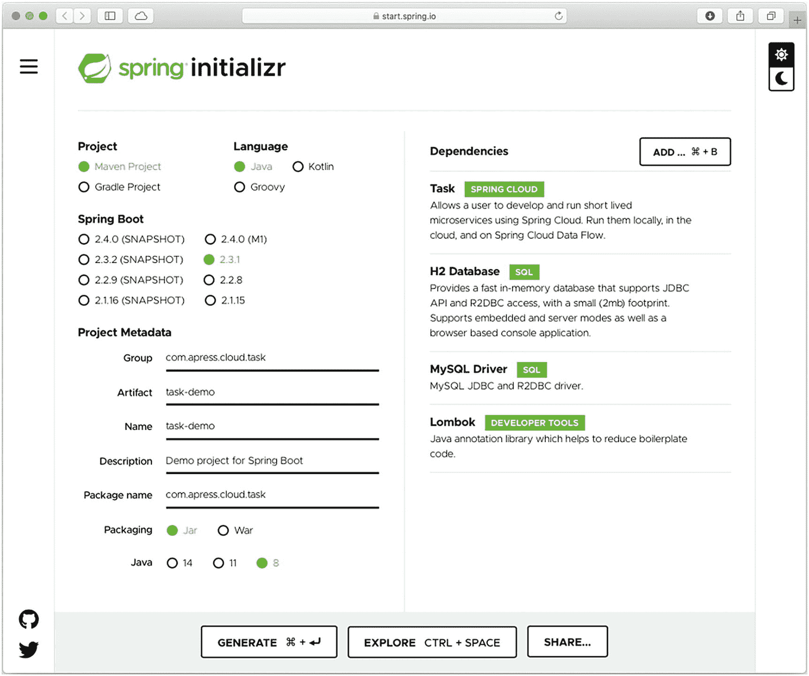

图 11-1。

Spring Initializr 任务-演示

`spring-cloud-starter-task`依赖关系在`pom.xml`文件中。Spring 任务云依赖于数据库。这就是为什么你使用 H2 或 MySQL 的依赖。

接下来，创建`TaskDemoConfiguration`类(参见清单 [11-1](#PC1) )。

```java
package com.apress.cloud.task;

import lombok.extern.log4j.Log4j2;
import org.springframework.boot.CommandLineRunner;
import org.springframework.cloud.task.configuration.EnableTask;
import org.springframework.context.annotation.Bean;
import org.springframework.context.annotation.Configuration;
import org.springframework.jdbc.core.JdbcTemplate;

import javax.sql.DataSource;

@Log4j2
@EnableTask
@Configuration
public class TaskDemoConfiguration {

    private final String MOVIES_TABLE_SQL = "CREATE TABLE IF NOT EXISTS movies(" +
            " id varchar(10) primary key," +
            " title varchar(200)," +
            " actor varchar(200)," +
            " year int," +
            " genre varchar(25)," +
            " stars int," +
            " rating decimal(2,1)," +
            " ratingcount int);";

    private final String MOVIES_INSERT_SQL_1 = "insert into movies (id,title,actor,year,genre,stars,rating,ratingcount) " +
            "values ('tt0133093','The Matrix','Keanu Reeves',1999,'fiction',5,8.7,1605968);";

    private final String MOVIES_INSERT_SQL_2 = "insert into movies (id,title,actor,year,genre,stars,rating,ratingcount) " +
            "values ('tt0209144','Memento','Guy Pearce',2000,'drama',4,8.4,1090922);";

    private final String MOVIES_INSERT_SQL_ERROR = "insert into movies (year,genre,stars,rating,ratingcount) " +
            "values ('tt0209144','Memento','Guy Pearce',2000,'drama',4,8.4,1090922);";

    @Bean

    public CommandLineRunner process(DataSource dataSource){
        return args -> {
            JdbcTemplate jdbcTemplate = new JdbcTemplate(dataSource);
            jdbcTemplate.execute(MOVIES_TABLE_SQL);
            jdbcTemplate.execute(MOVIES_INSERT_SQL_1);
            jdbcTemplate.execute(MOVIES_INSERT_SQL_2);
            //jdbcTemplate.execute(MOVIES_INSERT_SQL_ERROR);
        };
    }

    @Bean
    public TaskDemoListener taskDemoListener(){
        return new TaskDemoListener();
    }
}

Listing 11-1.src/main/java/com/apress/cloud/task/TaskDemoConfiguration.java

```

清单 [11-1](#PC1) 显示了`TaskDemoConfiguration`类。如果您仔细观察，您使用的唯一新关键字是`@EnableTas` k 注释。这个注释触发所有的任务生命周期。这是一个简单的 SQL 创建和插入。我注释掉了`jdbcTemplate`的最后一行，因为我引入了一个 SQL 语法错误，您正在查看该事件。类的结尾声明了一个`taskDemoListener` bean。

接下来，创建`TaskDemoListener`类(参见清单 [11-2](#PC2) )。

```java
package com.apress.cloud.task;

import lombok.extern.log4j.Log4j2;
import org.springframework.cloud.task.listener.annotation.AfterTask;
import org.springframework.cloud.task.listener.annotation.BeforeTask;
import org.springframework.cloud.task.listener.annotation.FailedTask;
import org.springframework.cloud.task.repository.TaskExecution;

@Log4j2
public class TaskDemoListener {

    @BeforeTask
    public void beforeTask(TaskExecution taskExecution) {
        log.debug("[@BeforeTask] - {}", taskExecution);
    }

    @AfterTask
    public void afterTask(TaskExecution taskExecution) {
        log.debug("[@AfterTask] - {}", taskExecution);
    }

    @FailedTask
    public void failedTask(TaskExecution taskExecution, Throwable throwable) {
        log.debug("[@FailedTask] - {}", taskExecution);
        log.error("[@FailedTask] - {}", throwable);
    }
}

Listing 11-2.src/main/java/com/apress/cloud/task/TaskDemoListener.java

```

清单 [11-2](#PC2) 显示了`TaskDemoListener`类。它使用了`@BeforeTask`、`@AfterTask,`和`@FailedTask`注释。唯一要做的就是声明它并使这个类成为一个 Spring bean，其余的都是通过 Spring Cloud Task 来完成的。现在你与这些事件联系在一起了。

Note

你可以在`ch11/tasks`文件夹中找到源代码。我还添加了`TaskDemoListener`类来实现`TaskExecutionListener`，这是监听 Spring Cloud 任务事件的替代方法。

接下来，打开您的`application.properties`，添加清单 [11-3](#PC3) 中的内容。

```java
# Application Name
spring.application.name=task-demo

# Logging Level
logging.level.org.springframework.cloud.task=DEBUG
logging.level.com.apress.cloud.task=DEBUG

Listing 11-3.src/main/resources/application.properties

```

要知道你需要声明日志级别并添加`spring.application.name`属性，这样你就可以在运行程序时获取信息。接下来，如果您运行它，您应该会看到下面的输出。

```java
...

 DEBUG - [main] ... : Initializing task schema for h2 database

 DEBUG - [main] ... : Creating: TaskExecution{executionId=0, parentExecutionId=null, exitCode=null, taskName='task-demo', startTime=Mon Jul 13 20:05:02 EDT 2020, endTime=null, exitMessage="null", externalExecutionId="null", errorMessage="null", arguments=[]}
DEBUG - [main] ... :  [@BeforeTask] - TaskExecution{executionId=1, parentExecutionId=null, exitCode=null, taskName='task-demo' ...
  INFO - [main] ... : Started TaskDemoApplication in 1.095 seconds (JVM running for 1.686)
DEBUG - [main] ... :  [@AfterTask] - TaskExecution{executionId=1, parentExecutionId=null, exitCode=0, taskName='task-demo', ...
 DEBUG - [main] ... : Updating: TaskExecution with executionId=1 with the following {exitCode=0, endTime=Mon Jul 13 20:05:02 EDT 2020, exitMessage="null", errorMessage="null"}

...

```

这显示了开始时间的时间戳、完成时间以及正在监听的事件，例如任务执行前和任务执行后。它遵循云任务生命周期。您可以取消对 SQL 错误的注释。您还应该看到未能执行的任务事件。

正如你所看到的，Spring Cloud Task 非常容易应用于任何微服务，可以执行从简单工作到大量工作负载的任何事情。接下来，我们来看看如何将 Spring Cloud Task 与 Spring Cloud Stream 进行整合。

## Spring云流整合

在 Spring Cloud Stream 中集成 Spring Cloud Task 的功能有多种方式。您可以使用接收器侦听任何任务事件(与 TaskDemo 项目一样)，如任务前、任务后和任务失败事件。或者您可以创建一个流管道 DSL 并启动一个任务。启动一个任务需要使用一个定制的接收器，该接收器使用`@EnableTaskLauncher`来运行接收器任务启动器，例如`task-launcher-local`和`task-launcher-dataflow`。那么，让我们回顾一下这些选项。

### Spring 云流中的任务事件

Spring Cloud Task 在任务处理过程中发出事件，它还可以通过使用预定义的名为`task-events`的通道/目的地将事件发送到流中。你唯一需要做的就是添加活页夹，剩下的由 Spring Cloud Task 来完成(见图 [11-2](#Fig2) )。

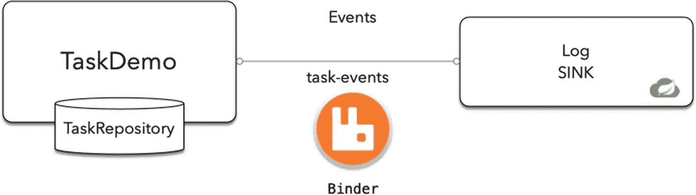

图 11-2。

任务事件

以下步骤演示了这一点。

1.  启动并运行 RabbitMQ。你把它作为一个活页夹，可以用 Docker 运行它。

    ```java
    docker run -d --rm --name rabbit -p 5672:5672 -p 15672:15672 rabbitmq:3.8.3-management-alpine

    ```

2.  从 [`https://repo.spring.io/libs-release/org/springframework/cloud/stream/app/log-sink-rabbit/`](https://repo.spring.io/libs-release/org/springframework/cloud/stream/app/log-sink-rabbit/) 下载`log-sink-rabbit` app-starter JAR。

3.  用以下内容创建一个`application.properties`文件。

    ```java
    # Server
    server.port=8083

    # Spring Cloud Stream
    spring.cloud.stream.bindings.input.destination=task-events

    ```

4.  运行它

    ```java
    java -jar log-sink-rabbit-2.1.3.RELEASE.jar

    ```

5.  重新打开 TaskDemo 项目并添加以下依赖项。

    ```java
    <dependency>
            <groupId>org.springframework.cloud</groupId>
            <artifactId>spring-cloud-starter-stream-rabbit</artifactId>
            <scope>compile</scope>
    </dependency>

    ```

6.  运行 TaskDemo 项目，并注意 log-sink 应用启动程序中的日志。

    ```java
    -- log-sink : {"executionId":1,"parentExecutionId":null,"exitCode":null,"taskName":"task-demo","startTime":"2020-07-15T00:40:19.168+00:00","endTime":null,"exitMessage":null,"externalExecutionId":null,"errorMessage":null,"arguments":[]}
    -- log-sink : {"executionId":1,"parentExecutionId":null,"exitCode":0,"taskName":"task-demo","startTime":"2020-07-15T00:40:19.168+00:00","endTime":"2020-07-15T00:40:19.289+00:00","exitMessage":null,"externalExecutionId":null,"errorMessage":null,"arguments":[]}

    ```

通过将 binder ( `spring-cloud-starter-stream-rabbit`)依赖项添加到 TaskDemo 项目中的 pom.xml 文件，Spring Cloud Task 创建了`task-events`目的地，并通过该通道/目的地发送所有事件。

### 在 Spring Cloud 数据流中启动任务

您可以通过在 Spring Cloud 数据流中注册您的任务应用或通过具有任务启动器的接收器(自定义接收器或任务启动器数据流接收器应用启动器)来启动任务。在本节中，您将学习如何注册任务并通过仪表板启动它。

#### 图像到收存箱任务

让我们创建一个简单的任务，假设我们需要连接到一个已经有一个电影艺术 URL 的数据库。你需要下载一张图片并发送到 Dropbox 文件夹。因为你用的是 Dropbox API，去 [`www.dropbox.com/developers/`](http://www.dropbox.com/developers/) 。如果您没有帐户，您可以免费获得一个。你需要创建一个应用(我把我的命名为 movie-art)。您可以拥有文件夹或完全访问权限类型。有一个部分需要点击**生成访问令牌**。这是你上传图片到你想要的文件夹的凭证。当然，你可以创建一个文件夹来存放电影图片。我创建了一个`IMDB/`文件夹。

我们先打开浏览器，去 Spring Initializr。使用以下数据。

*   组:`com.apress.cloud.task`

*   神器:`image-to-dropbox`

*   包名:`com.apress.cloud.task`

*   依赖:MySQL 驱动，JDBC API，Lombok，Task

点击生成按钮下载一个 ZIP 文件。你可以解压并导入到你喜欢的 IDE 中(见图 [11-3](#Fig3) )。

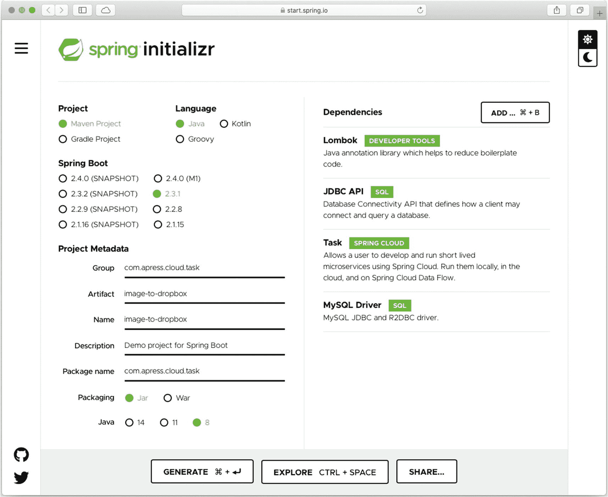

图 11-3。

Spring Initializr 图像到投件箱

这个项目需要部署到一个 Maven 存储库中，所以您要做的和前一章一样。我用的是 JFrog Bintray ( [`https://bintray.com`](https://bintray.com) )开源方案。打开`pom.xml`文件并添加以下依赖项。

```java
...
<!-- DropBox -->
<dependency>
        <groupId>com.dropbox.core</groupId>
        <artifactId>dropbox-core-sdk</artifactId>
        <version>3.1.4</version>
</dependency>

<!-- Apache Commons IO -->
<dependency>
        <groupId>commons-io</groupId>
        <artifactId>commons-io</artifactId>
        <version>2.7</version>
</dependency>

<dependency>
            <groupId>org.mariadb.jdbc</groupId>
            <artifactId>mariadb-java-client</artifactId>
        <scope>runtime</scope>
</dependency>
...

<build>
        <plugins>

                ...
                <plugin>
                        <groupId>org.springframework.cloud</groupId>
                        <artifactId>spring-cloud-app-starter-metadata-maven-plugin</artifactId>
                        <version>2.0.0.RELEASE</version>
                        <executions>
                                <execution>
                                        <id>aggregate-metadata</id>
                                        <phase>compile</phase>
                                        <goals>
                                                <goal>aggregate-metadata</goal>
                                        </goals>
                                </execution>
                        </executions>
                </plugin>

                ...
        </plugins>
</build>

<distributionManagement>
        <repository>
                <id>bintray-felipeg48-scdf</id>
                <name>felipeg48-scdf</name>
                <url>https://api.bintray.com/maven/felipeg48/scdf/movie-tasks/;publish=1</url>
        </repository>
</distributionManagement>
...

```

用 MariaDB 替换`mysql`依赖项，因为您正在重用来自数据流服务器的依赖项。记住切换到您自己的分发管理标签帐户，并使用版本 0.0.1 和删除快照文本。

```java
<version>0.0.1</version>

```

这对于将项目部署到 Maven 存储库中非常有用。

接下来，创建`ImageToDropboxProperties`类，它保存来自 Dropbox 的密钥/令牌 API(参见清单 [11-4](#PC12) )。(刚刚为你的 Dropbox 应用描述生成的那个)。

```java
package com.apress.cloud.task;

import lombok.Data;
import org.springframework.boot.context.properties.ConfigurationProperties;

@Data
@ConfigurationProperties(prefix = "dropbox")
public class ImageToDropboxProperties {

    private String apiKey = null;
    private String path = "/IMDB/";
    private String localTmpFolder = "/tmp/";

}

Listing 11-4src/main/java/com/apress/cloud/task/ImageToDropboxProperties.java

```

清单 [11-4](#PC12) 显示了用于 Dropbox 的属性，包括你上传图片的路径，`localTempFolder`，你下载图片然后上传到 Dropbox 的路径。Token 是`apiKey`的值。

接下来，创建`ImageToDropbox`类(参见清单 [11-5](#PC13) )。

```java
package com.apress.cloud.task;

import com.dropbox.core.DbxException;
import com.dropbox.core.DbxRequestConfig;
import com.dropbox.core.v2.DbxClientV2;
import com.dropbox.core.v2.files.FileMetadata;
import lombok.extern.log4j.Log4j2;
import org.apache.commons.io.FileUtils;

import java.io.File;
import java.io.FileInputStream;
import java.io.IOException;
import java.io.InputStream;
import java.net.URL;

@Log4j2
public class ImageToDropboxUtils {

    private ImageToDropboxProperties imageToDropboxProperties;
    private DbxClientV2 client;

    public ImageToDropboxUtils(ImageToDropboxProperties imageToDropboxProperties){
        this.imageToDropboxProperties = imageToDropboxProperties;
        DbxRequestConfig config = DbxRequestConfig.newBuilder("dropbox/scdf-imdb").build();
        this. client = new DbxClientV2(config, this.imageToDropboxProperties.getApiKey());
    }

    public void fromUrlToDropBox(String fromUrl, String filename) throws DbxException, IOException {
        log.debug("Attempting to download: " + fromUrl);
        FileUtils.copyURLToFile(new URL(fromUrl), new File(this.imageToDropboxProperties.getLocalTmpFolder() + filename), 10000, 10000);

        InputStream in = new FileInputStream(this.imageToDropboxProperties.getLocalTmpFolder() + filename);
        log.debug("Attempting to Save to Dropbox in: {}", this.imageToDropboxProperties.getPath() + filename);
        client.files()
              .uploadBuilder(this.imageToDropboxProperties.getPath() + filename)
              .uploadAndFinish(in);
        log.debug("Uploaded to Dropbox");

        log.debug("Removing temporal file: {}", this.imageToDropboxProperties.getLocalTmpFolder() + filename);
        FileUtils.deleteQuietly(new File(this.imageToDropboxProperties.getLocalTmpFolder() + filename));

    }
}

Listing 11-5.src/main/java/com/apress/cloud/task/ImageToDropboxUtils.java

```

清单 [11-5](#PC13) 展示了 utils 类。分析它，注意 Apache Commons 库用于从 URL 下载图像。Dropbox 路径用于上传图像。一个临时文件夹被用来放置一个名字。您正在使用电影的 ID 作为文件名。

接下来，创建`ImageToDropboxConfiguration`类(参见清单 [11-6](#PC14) )。

```java
package com.apress.cloud.task;

import lombok.extern.log4j.Log4j2;
import org.springframework.boot.CommandLineRunner;
import org.springframework.boot.context.properties.EnableConfigurationProperties;
import org.springframework.cloud.task.configuration.EnableTask;
import org.springframework.context.annotation.Bean;
import org.springframework.context.annotation.Configuration;
import org.springframework.jdbc.core.JdbcTemplate;

import javax.sql.DataSource;

@Log4j2
@EnableTask

@Configuration
@EnableConfigurationProperties({ImageToDropboxProperties.class})
public class ImageToDropboxConfiguration {

    @Bean
    public ImageToDropboxUtils imageToDropBoxUtils(ImageToDropboxProperties imageToDropboxProperties){
        return new ImageToDropboxUtils(imageToDropboxProperties);
    }

    private final String MOVIES_TABLE_SQL = "CREATE TABLE IF NOT EXISTS art(" +
            " id varchar(10) primary key," +
            " url varchar(500));";

    private final String MOVIES_INSERT_SQL_1 = "insert into art (id,url) " +
            "values ('tt0133093','https://m.media-amazon.cimg/MV5BNzQzOTk3OTAtNDQ0Zi00ZTVkLWI0MTEtMDllZjNkYzNjNTc4L2ltYWdlXkEyXkFqcGdeQXVyNjU0OTQ0OTY@._V1_.jpg');";
    private final String MOVIES_INSERT_SQL_2 = "insert into art (id,url) " +
            "values ('tt0209144','https://m.media-amazon.cimg/MV5BZTcyNjk1MjgtOWI3Mi00YzQwLWI5MTktMzY4ZmI2NDAyNzYzXkEyXkFqcGdeQXVyNjU0OTQ0OTY@._V1_.jpg');";

    private final String MOVIES_QUERY_SQL = "select url from art where id=?;";

    private final String MATRIX_ART_ID = "tt0133093";
    private final String MEMENTO_ART_ID = "tt0209144";

    @Bean

    public CommandLineRunner process(DataSource dataSource, ImageToDropboxUtils imageToDropBoxUtils){
        return args -> {
            log.debug("Connecting to: {} ", dataSource.getConnection().getMetaData().getURL());

            JdbcTemplate jdbcTemplate = new JdbcTemplate(dataSource);
            jdbcTemplate.execute(MOVIES_TABLE_SQL);
            jdbcTemplate.execute(MOVIES_INSERT_SQL_1);
            jdbcTemplate.execute(MOVIES_INSERT_SQL_2);

            String url = null;

            url = jdbcTemplate.queryForObject(
                    MOVIES_QUERY_SQL, new Object[]{MATRIX_ART_ID}, String.class);
            log.debug("URL: {}", url);
            imageToDropBoxUtils.fromUrlToDropBox(url,MATRIX_ART_ID + ".jpg");

            url = jdbcTemplate.queryForObject(
                    MOVIES_QUERY_SQL, new Object[]{MEMENTO_ART_ID}, String.class);
            log.debug("URL: {}", url);
            imageToDropBoxUtils.fromUrlToDropBox(url,MEMENTO_ART_ID + ".jpg");
        };
    };

}

Listing 11-6.src/main/java/com/apress/cloud/task/ImageToDropboxConfiguration.java

```

清单 [11-6](#PC14) 显示了任务配置。`@EnableTask`被使用。这是欺骗，因为我们正在创建一个表并插入一个硬编码的 URL 来模仿使用数据库来获取电影艺术的 URL。

接下来，打开您的`application.properties`文件并添加清单 [11-7](#PC15) 中的内容。

```java
# Application Name
spring.application.name=image-to-dropbox

# DropBox
dropbox.api-key=YOUR-KEY
dropbox.path=/IMDB/

# Logging Level
logging.level.org.springframework.cloud.task=DEBUG
logging.level.com.apress.cloud.task=DEBUG

# DataSource
spring.datasource.url=jdbc:mysql://localhost:3306/movies?useSSL=false&requireSSL=false
spring.datasource.driverClassName=org.mariadb.jdbc.Driver
spring.datasource.username=root
spring.datasource.password=rootpw

Listing 11-7.src/main/resources/application.properties

```

这里您使用的是 MySQL 数据库引擎，所以您需要设置数据源。还要添加您的 Dropbox 令牌和上传图像的路径。日志级别可以看到关于任务和代码的一切。

您可以在本地运行它来测试这一点，但是要确保您已经启动并运行了 MySQL 引擎。您可以通过以下命令使用 Docker。

```java
docker run -d --rm --name mysql \
 -e MYSQL_DATABASE=movies \
 -e MYSQL_USER=root \
 -e MYSQL_ROOT_PASSWORD=rootpw \
 -p 3306:3306 \
 mysql:5.7.25

```

您正在创建一个`movies`数据库，为连接传递用户名和密码，并暴露端口 3306。现在，您可以运行应用，它应该会显示以下输出。

```java
...
-- : Initializing task schema for mysql database
-- : Creating: TaskExecution{executionId=0, parentExecutionId=null, exitCode=null, taskName='image-to-dropbox', startTime=Sun Jul 19 21:27:44 EDT 2020, endTime=null, exitMessage="null", externalExecutionId="null", errorMessage="null", arguments=[]}
-- : Started ImageToDropboxApplication in 1.062 seconds (JVM running for 1.475)
-- : Connecting to: jdbc:mysql://localhost:3306/movies?useSSL=false&requireSSL=false
-- : URL: https://m.media-amazon.cimg/MV5BNzQzOTk3OTAtNDQ0Zi00ZTVkLWI0MTEtMDllZjNkYzNjNTc4L2ltYWdlXkEyXkFqcGdeQXVyNjU0OTQ0OTY@._V1_.jpg
-- : Attempting to download: https://m.media-amazon.cimg/MV5BNzQzOTk3OTAtNDQ0Zi00ZTVkLWI0MTEtMDllZjNkYzNjNTc4L2ltYWdlXkEyXkFqcGdeQXVyNjU0OTQ0OTY@._V1_.jpg
-- : Attempting to Save to Dropbox in: /IMDB/tt0133093.jpg
-- : Uploaded to Dropbox
-- : Removing temporal file: /tmp/tt0133093.jpg
-- : URL: https://m.media-amazon.cimg/MV5BZTcyNjk1MjgtOWI3Mi00YzQwLWI5MTktMzY4ZmI2NDAyNzYzXkEyXkFqcGdeQXVyNjU0OTQ0OTY@._V1_.jpg
-- : Attempting to download: https://m.media-amazon.cimg/MV5BZTcyNjk1MjgtOWI3Mi00YzQwLWI5MTktMzY4ZmI2NDAyNzYzXkEyXkFqcGdeQXVyNjU0OTQ0OTY@._V1_.jpg
-- : Attempting to Save to Dropbox in: /IMDB/tt0209144.jpg
-- : Uploaded to Dropbox
-- : Removing temporal file: /tmp/tt0209144.jpg
-- : Updating: TaskExecution with executionId=1 with the following {exitCode=0, endTime=Sun Jul 19 21:27:53 EDT 2020, exitMessage="null", errorMessage="null"}
...

```

如果你检查你的 Dropbox 文件夹，你可以看到两个电影的图像。测试之后，您需要使用以下命令将其打包并部署到 Maven/Bintray 存储库中。

```java
./mvnw -DskipTests clean package
./mvnw -DskipTests deploy

```

##### 使用仪表板

在您部署了`image-to-dropbox`工件之后，您需要启动并运行 Spring Cloud 数据流服务器。您可以使用本地 Docker Compose 或您的 Kubernetes 安装。您需要在用于 Spring Cloud 数据流服务器的 MySQL 实例中创建`movies`数据库。另外，您需要记住一个主要的环境属性是 Maven repo。

```java
maven.remote-repositories.repo1.url=https://dl.bintray.com/felipeg48/scdf

```

作为最佳实践，我建议使用环境变量来添加您的 Dropbox 令牌。如果您正在使用 Kubernetes，那么在运行您的 pods 时，您可以添加 ConfigMap 作为环境变量。您还需要添加密钥。

```java
dropbox.api-key=YOUR-TOKEN

```

准备就绪后，转到您的控制面板，像注册应用一样注册任务。您正在注册类型为`task`的应用。选择批量导入应用，并在应用中添加以下坐标作为属性文本区域(参见图 [11-4](#Fig4) )。

```java
task.image-to-dropbox=maven://com.apress.cloud.task:image-to-dropbox:0.0.1
task.image-to-dropbox.metadata=maven://com.apress.cloud.task:image-to-dropbox:jar:metadata:0.0.1

```

请注意，您使用的是以下格式。

```java
task:<app-name>[.<metadata>]=maven://<group>:<artifact>[:jar:metadata]:version

```

类型就是任务。

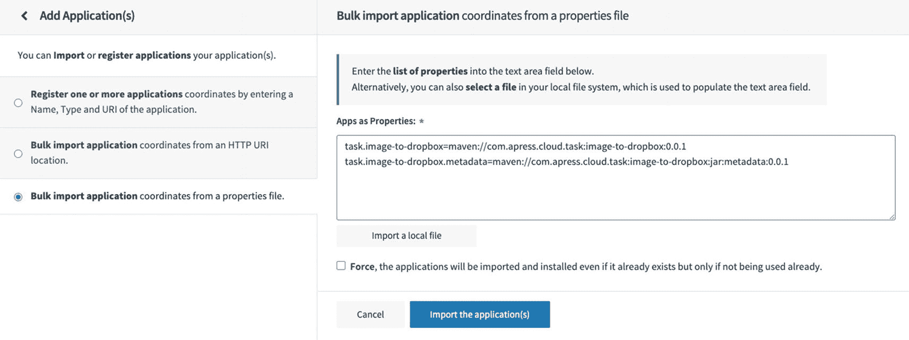

图 11-4。

从属性应用/添加/导入

点击**导入应用**按钮。你应该看到你的任务现在被列出来了(见图 [11-5](#Fig5) )。

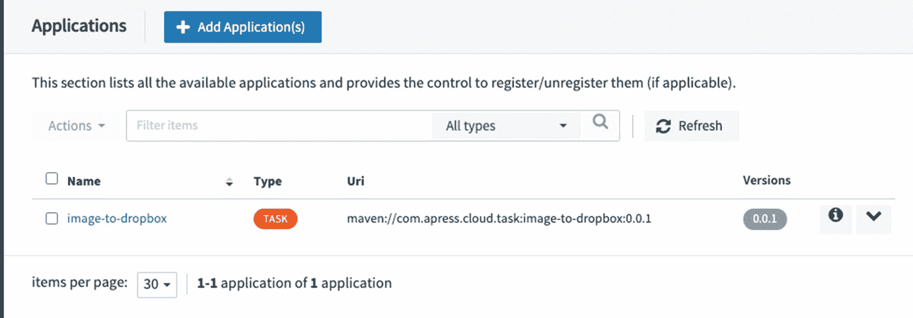

图 11-5。

应用

接下来，在左窗格中，单击任务选项卡。这会将您带到任务页面。点击 **+ Create task(s)** 按钮，这将带您进入熟悉的流 UI。您应该会看到左侧窗格中列出了“图像到收存箱”任务。可以拖拽，也可以在文本区输入任务 app 的名称，image-to-dropbox。如果拖放，需要将任务连接到开始和结束图标(见图 [11-6](#Fig6) )。

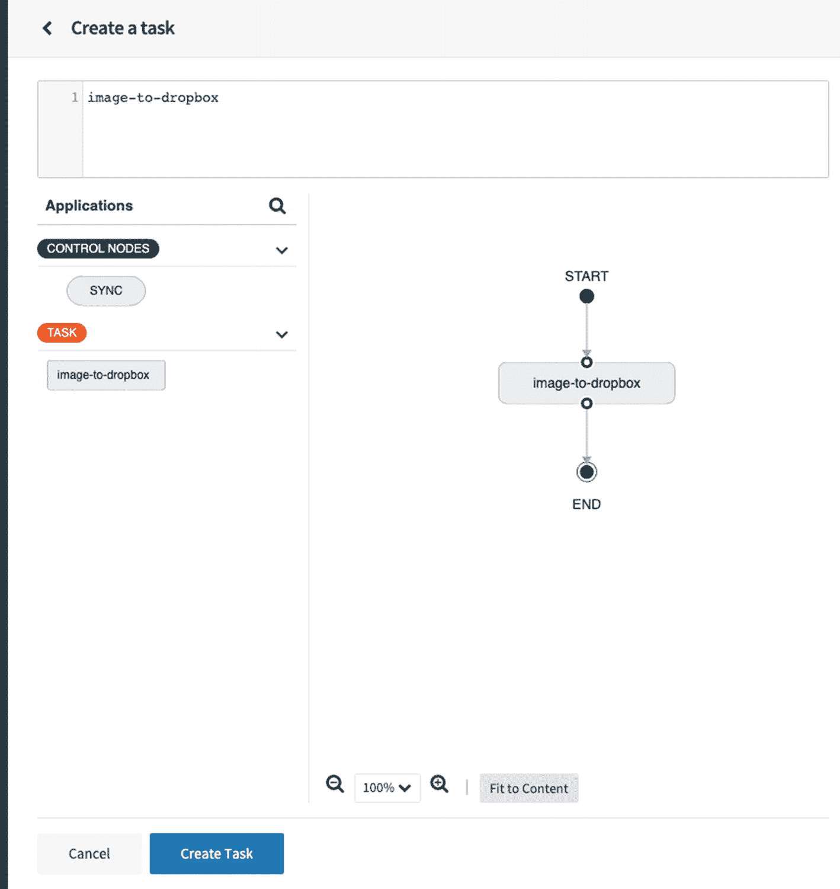

图 11-6。

创建任务

接下来，单击 Create Task 按钮，这将打开一个对话框，您可以在其中命名任务。请将其设置为`movie-task`。然后点击**创建任务**按钮(见图 [11-7](#Fig7) )。

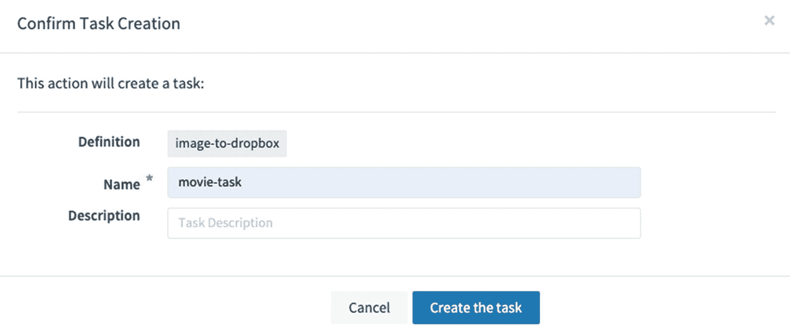

图 11-7。

确认任务创建

创建`movie-task`之后，需要启动可用任务列表。要启动任务，请单击播放按钮(>)。将向您显示您需要的任何附加属性。在这种情况下，您必须添加以下属性作为参数。

```java
--movie.datasource.url=jdbc:mysql://mysql:3306/movies?useSSL=false&requireSSL=false

```

如果你忘记添加 Dropbox 令牌，你也可以在这里添加(见图 [11-8](#Fig8) )。

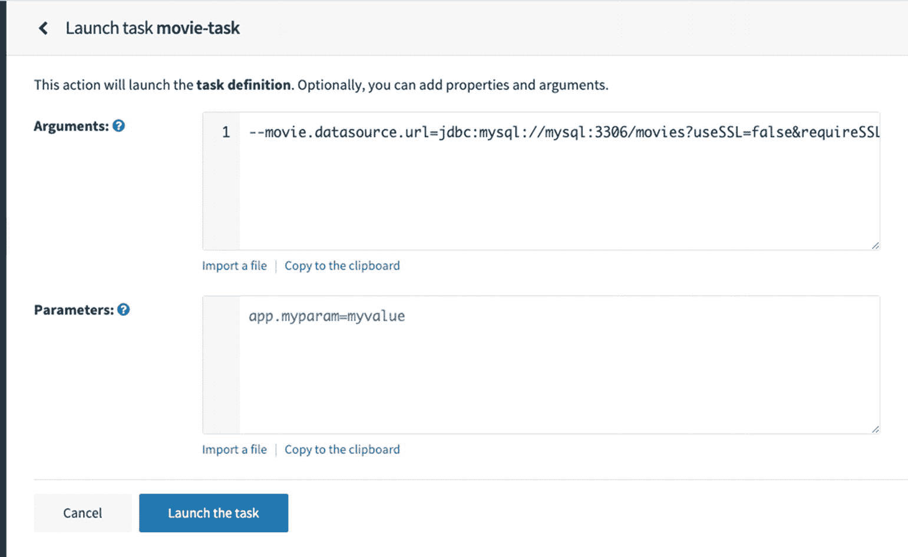

图 11-8。

启动任务电影-任务

```java
--dropbox.api-key=YOUR-TOKEN

```

然后点击**启动任务**。之后，返回任务列表，看看是否完成了。您可以刷新页面(参见图 [11-9](#Fig9) )。

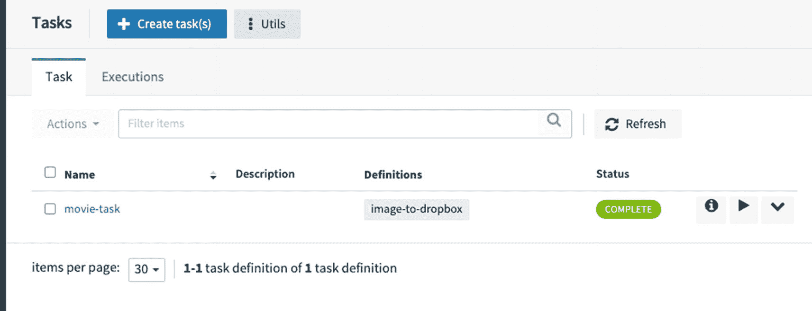

图 11-9。

任务完成

单击执行选项卡查看状态，单击任务执行 Id 查看更多信息，包括任务日志。如果你正在使用 Kubernetes，一个 pod 被启动、执行和终止(见图 [11-10](#Fig10) 和 [11-11](#Fig11) )。

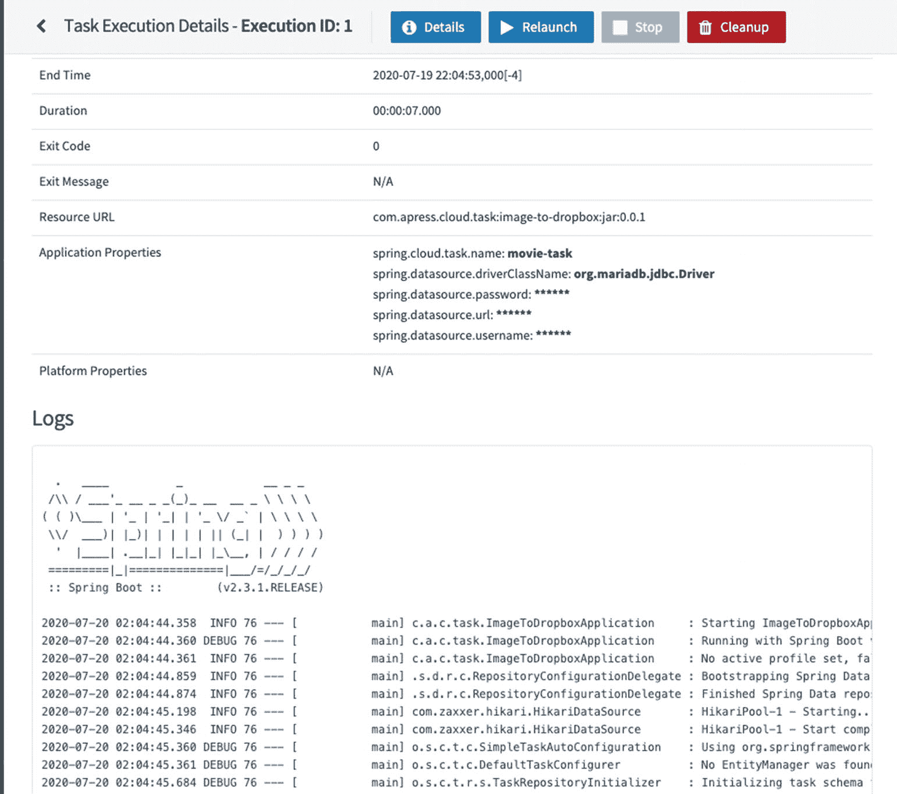

图 11-11。

任务执行详细信息执行 ID: 1

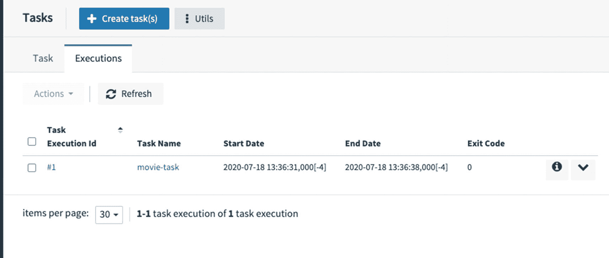

图 11-10。

执行列表

请检查您的 Dropbox 文件夹。图像应该在那里(见图 [11-12](#Fig12) )。

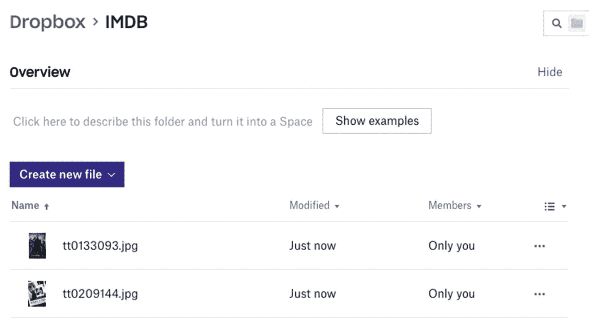

图 11-12。

dropbox

恭喜你。您已经在数据流中启动了您的任务！执行任务的另一种方式是使用流。您可以创建可以启动任务的自定义流。使用`app-starters-task-launch-request-common`依赖项选择一个源或处理器，并以下面的格式发送一个 JSON 有效负载。

```java
{
  "name":"<task-name>",
  "deploymentProps": {"key1":"val1","key2":"val2"},
  "args":["--debug", "--foo", "bar"]
}

```

至少，你可以只使用名称。

```java
{"name":"foo"}

```

该名称与已注册为应用的任务相关。您需要将这个有效负载发送到具有`@EnableTaskLauncher`注释的接收器，就这样。你不需要做任何其他事情。这将自动获取 JSON 有效负载，并按名称启动任务。另一种方法是在源或处理器中使用`TaskLaunchRequest`类来包装有效载荷，这样更容易将有效载荷发送到接收器。

而且没错，有一个启动任务的 App Starter Sink:Task Launcher 数据流 Sink App Starter。另外，您可以通过订阅`task-events`目的地来监听所有的任务事件。

### 使用数据流外壳程序启动任务

要在数据流 shell 中启动任务，您必须首先像在应用中一样注册您的任务。

```java
dataflow:> app register --name image-to-dropbox --type task --uri maven://com.apress.cloud.task:image-to-dropbox:0.0.1 --metadata-uri maven://com.apress.cloud.task:image-to-dropbox:jar:metadata:0.0.1

dataflow:> task create movie-task --definition "image-to-dropbox"
dataflow:> task list

```

在您注册并创建任务之后，您可以使用下面的代码来启动它。

```java
dataflow:> task launch movie-task --arguments "--movie.datasource.url=jdbc:mysql://mysql:3306/movies?useSSL=false&requireSSL=false"

```

您可以使用以下内容来查看任务执行情况。

```java
dataflow:> task execution list

```

看看可以应用于这些任务的其他命令。如你所见，它们非常简单。如果您想要销毁任务，请执行以下命令。

```java
dataflow:> task destroy --name movie-task

```

Note

在这个任务中，您需要创建`movies`数据库。记住，Spring Cloud Task 用任务执行的相关信息来初始化表。如果您已经有了这些信息，但是想要使用这些表，您可以通过设置以下属性来禁用初始化:`spring.cloud.task.initialize-enabled=false`

## 成批处理

先说批处理。如果你仔细看看 Spring Cloud Task，你会发现你只能执行任务和接收到的事件。如果任务在执行过程中失败，就没有办法从它停止的地方重新开始；您需要修复该问题，然后再次启动该任务。对于较简单的任务来说，这可能没问题，但是如果您有数百万条记录的繁重负载，您就不想从头开始。为此，您可以将 Spring Cloud Task 的功能与 Spring Batch 结合起来。Spring Cloud Task 可以是云环境中 Spring 批处理的包装器。您可以更好地控制作业和步骤，并执行您的业务逻辑。

### 电影批次

让我们创建一个与前一个任务非常相似的电影批处理。在这种情况下，它将是一个更动态的应用，因为你下载电影艺术，然后上传到 Dropbox 帐户；这意味着您需要传递 Dropbox 信息以及 URL 和电影艺术 ID。

首先打开浏览器，进入 Spring Initializr。使用以下信息。

*   组:`com.apress.cloud.batch`

*   神器:`movie-batch`

*   包名:`com.apress.cloud.batch`

*   依赖项:Spring Batch，Task，Lombok，JDBC API，MySQL

点击生成按钮下载一个 ZIP 文件。你可以解压并导入到你喜欢的 IDE 中(见图 [11-13](#Fig13) )。

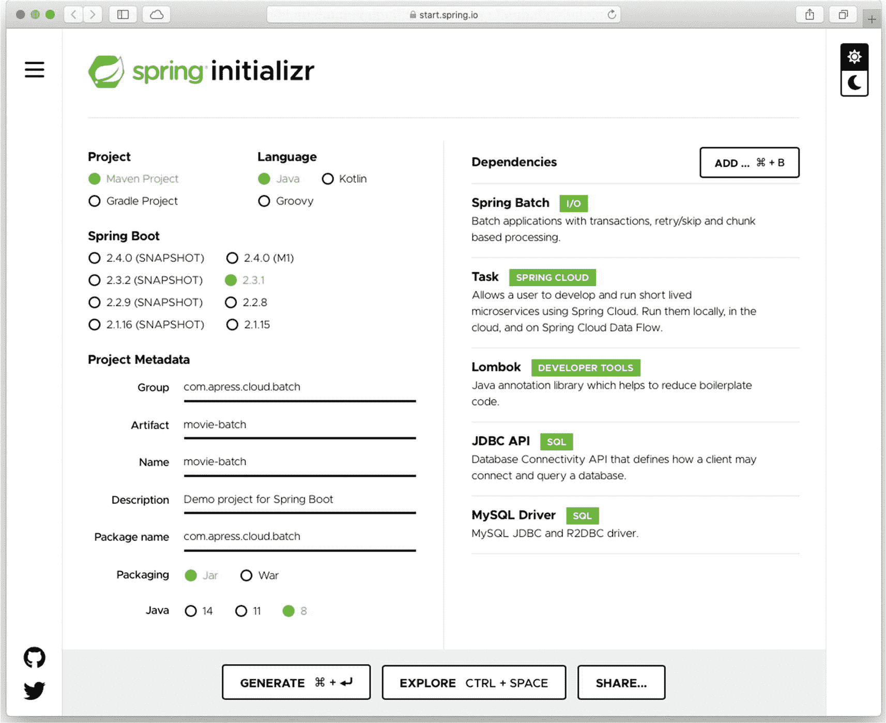

图 11-13。

Spring Initializr 电影批处理

接下来，打开`pom.xml`并添加以下依赖项和部分。

```java
...
<!-- DropBox -->
<dependency>
        <groupId>com.dropbox.core</groupId>
        <artifactId>dropbox-core-sdk</artifactId>
        <version>3.1.4</version>
</dependency>

<!-- Apache Commons IO -->
<dependency>
        <groupId>commons-io</groupId>
        <artifactId>commons-io</artifactId>
        <version>2.7</version>
</dependency>

<dependency>
        <groupId>org.mariadb.jdbc</groupId>
        <artifactId>mariadb-java-client</artifactId>
        <scope>runtime</scope>
</dependency>

...
...

<distributionManagement>
        <repository>
                <id>bintray-felipeg48-scdf</id>
                <name>felipeg48-scdf</name>
                <url>https://api.bintray.com/maven/felipeg48/scdf/movie-tasks/;publish=1</url>
        </repository>
</distributionManagement>

```

看到您正在用 Maria DB 连接器替换 MySQL。您正在添加一个插件来生成元数据 jar 文件和分布标记，以便部署到 Bintray Maven 存储库。记得改成自己回购。不要忘记删除快照并使用版本 0.0.1。

```java
<version>0.0.1</version>

```

接下来，让我们创建`DropboxUtils`类(参见清单 [11-8](#PC33) )。

```java
package com.apress.cloud.batch.dropbox;

import com.dropbox.core.DbxException;
import com.dropbox.core.DbxRequestConfig;
import com.dropbox.core.v2.DbxClientV2;
import lombok.extern.log4j.Log4j2;
import org.apache.commons.io.FileUtils;
import org.springframework.stereotype.Component;

import java.io.File;
import java.io.FileInputStream;
import java.io.IOException;
import java.io.InputStream;
import java.net.URL;

@Log4j2
@Component
public class DropboxUtils {

    private DbxClientV2 client = null;
    private DbxRequestConfig config = DbxRequestConfig.newBuilder("dropbox/scdf-imdb").build();

    public void fromUrlToDropBox(String fromUrl, String filename, String dropboxToken, String dropboxPath, String tmpFolder) throws DbxException, IOException {
        log.debug("Attempting to download: {}" , fromUrl);
        this. client = new DbxClientV2(config, dropboxToken);
        FileUtils.copyURLToFile(new URL(fromUrl), new File(tmpFolder + filename), 10000, 10000);

        InputStream in = new FileInputStream(tmpFolder + filename);
        log.debug("Attempting to Save to Dropbox in: {}", dropboxPath + filename);
        client.files()

                .uploadBuilder(dropboxPath + filename)
                .uploadAndFinish(in);
        log.debug("Uploaded to Dropbox");

        log.debug("Removing temporal file: {}", tmpFolder + filename);
        FileUtils.deleteQuietly(new File(tmpFolder + filename));

    }
}

Listing 11-8.src/main/java/com/apress/cloud/batch/dropbox/DropboxUtils.java

```

清单 [11-8](#PC33) 显示了`DropboxUtils`类，它与前一个任务非常相似，但是这一次，您将会得到更多的参数:Dropbox 的令牌、路径以及下载电影艺术的`tmp`文件夹。

接下来，让我们为批处理创建`MovieBatchConfiguration`类(参见清单 [11-9](#PC34) )。

```java
package com.apress.cloud.batch;

import com.apress.cloud.batch.dropbox.DropboxUtils;
import lombok.AllArgsConstructor;
import lombok.extern.log4j.Log4j2;
import org.springframework.batch.core.Job;
import org.springframework.batch.core.Step;
import org.springframework.batch.core.configuration.annotation.EnableBatchProcessing;
import org.springframework.batch.core.configuration.annotation.JobBuilderFactory;
import org.springframework.batch.core.configuration.annotation.StepBuilderFactory;
import org.springframework.batch.core.configuration.annotation.StepScope;
import org.springframework.batch.core.step.tasklet.Tasklet;
import org.springframework.batch.repeat.RepeatStatus;
import org.springframework.beans.factory.annotation.Value;
import org.springframework.boot.context.properties.EnableConfigurationProperties;
import org.springframework.cloud.task.configuration.EnableTask;
import org.springframework.context.annotation.Bean;
import org.springframework.context.annotation.Configuration;

@Log4j2
@AllArgsConstructor

@EnableTask
@EnableBatchProcessing
@Configuration
public class MovieBatchConfiguration {

    private JobBuilderFactory jobBuilderFactory;
    private StepBuilderFactory stepBuilderFactory;
    private DropboxUtils dropboxUtils;

    @Bean
    @StepScope
    public Tasklet movieTasklet(
            @Value("#{jobParameters['url']}") String url,
            @Value("#{jobParameters['imdbId']}") String imdbId,
            @Value("#{jobParameters['dropbox.token']}") String token,
            @Value("#{jobParameters['dropbox.path']}") String path,
            @Value("#{jobParameters['dropbox.local-tmp-folder']}") String tmp) {
        return (stepContribution, chunkContext) -> {

            log.debug("Using Image ID: {} and URL: {}", imdbId, url);
            assert url!=null && imdbId!=null;

            dropboxUtils.fromUrlToDropBox(
                    url,
                    imdbId + ".jpg",
                    token,
                    path,
                    tmp);

            return RepeatStatus.FINISHED;
        };
    }

    @Bean
    public Step step1() {
        return stepBuilderFactory.get("step1")
                .tasklet(movieTasklet(null, null, null,null,null))
                .build();
    }

    @Bean
    public Job jobParametersJob() {
        return jobBuilderFactory.get("jobParametersJob")
                .start(step1())
                .build();
    }
}

Listing 11-9.src/main/java/com/apress/cloud/batch/MovieBatchConfiguration.java

```

列表 [11-9](#PC34) 显示批量处理。让我们分析一下这个班级。

*   `jobParametersJob`。这个方法定义了只包含一个步骤的作业。这个方法创建了`JobExecution`。

*   `step1`。这个方法定义了作业的步骤并创建了一个小任务。在这种情况下，它调用带有空参数的`movieTasklet`方法。这没有错，你需要传递参数，但是定义是一个与微线程有关系的容器。

*   `movieTasklet`。这个方法定义了微线程。它使用了`@StepScope`注释。这个注释就像一个惰性实例化，这意味着在调用 tasklet 之前，它会创建一个 Spring bean。这就是为什么你可以通过`@Value`，把工作参数作为一个关键来评估。这是`JobParameters`类，在这个上下文中，`jobParamters`实例作为一个映射可用，所以很容易访问这些键。当然，你可以看到这个方法有很多参数；因此，您可以只将`JobParameters`类作为参数传递，并使用`getParameters()`方法来访问所有的键。

*   `@EnableTask`，`@EnableBatchProcessing`。两个注释都被使用:一个用于批处理，另一个作为任务在云中运行。

接下来，打开`application.properties`并添加清单 [11-10](#PC35) 中的内容。

```java
# Application Name
spring.application.name=movie-batch

# Logging Level
logging.level.org.springframework.cloud.task=DEBUG
logging.level.com.apress.cloud.batch=DEBUG

# DataSource
spring.datasource.url=jdbc:mysql://localhost:3306/movies?useSSL=false&requireSSL=false
spring.datasource.driverClassName=org.mariadb.jdbc.Driver
spring.datasource.username=root
spring.datasource.password=rootpw

# Batch
spring.batch.initialize-schema=ALWAYS

Listing 11-10.src/main/resource/application.properties

```

您正在使用一个 MySQL 数据库，现在，它指向一个本地数据库。要运行这个示例，您需要启动并运行 MySQL 引擎。您可以使用 Docker 命令来完成。

```java
docker run -d --rm --name mysql \
 -e MYSQL_DATABASE=movies \
 -e MYSQL_USER=root \
 -e MYSQL_ROOT_PASSWORD=rootpw \
 -p 3306:3306 \
 mysql:5.7.25

```

接下来，使用您的 IDE 运行应用，但是记住您需要传递一些参数。运行它的另一种方法是使用命令行(一行)。

```java
./mvnw spring-boot:run -Dspring-boot.run.arguments="url=https://bit.ly/2ZM57Kq imdbId=spring dropbox.path=/IMDB/ dropbox.local-tmp-folder=/tmp/ dropbox.token=YOUR-TOKKEN"

```

添加您的 Dropbox 令牌。它只是一行，参数之间有空格。你的 Dropbox 文件夹中应该有`spring.jpg`图片。如果您使用相同的参数再次运行它，您会得到一个错误，这没关系，因为作业参数与作业执行相关联，以防止错误地重新运行作业。如果您想再次测试，您可以更改`url`和`imbdId`参数。

另一种方法是通过创建一个可执行的 JAR 来运行它。

```java
./mvnw -DskipTests clean package

java -jar target/movie-batch-0.0.1.jar \
 url=https://bit.ly/2ZM57Kq \
 imdbId=spring \
 dropbox.path=/IMDB/ \
 dropbox.local-tmp-folder=/tmp/ \
 dropbox.token=YOUR-TOKEN

```

这可以是多行的(记住这是针对 Unix 操作系统的；对于 Windows，它必须在一行上)。

测试完`movie-batch`应用后，您需要将它部署到 Maven 存储库中。此外，本例中使用了 Bintray。转到命令行并执行以下命令。

```java
./mvnw -DskipTests clean package
./mvnw -DskipTests deploy

```

现在，你已经为下一步做好了准备。

### 使用数据流中的流启动任务/批处理

在 Spring Cloud 数据流中，有许多方法可以启动一个任务。您看到了您可以使用仪表板来启动，但是如果您有一个流并且想要触发或启动一个任务/批处理过程，会发生什么呢？Spring Cloud Stream 和 Spring Cloud Task 提供了一种在流中启动任务/批处理的方式。您唯一需要做的事情是使用一个源或处理器和一个包含 registeredtask 应用名称的简单有效负载，或者您可以使用`TaskLaunchRequest`类来完成相同的任务。启动器必须是一个接收器，它可以是`task-launcher-dataflow`应用启动器，或者你可以创建一个使用`@EnableTaskLauncher`的自定义接收器。这个注释通过使用有效负载消息和启动任务来处理其余的事情。

#### 电影批处理流

让我们创建一个流管道 DSL，它在 Spring Cloud 数据流中启动`movie-batch`应用。让我们回顾一下我们正在使用的东西(见图 [11-14](#Fig14) )。

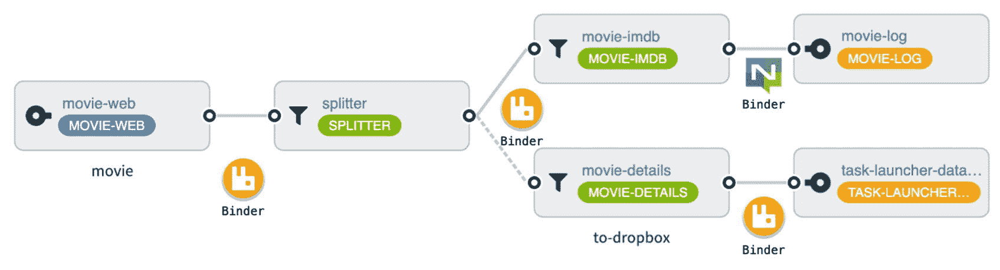

图 11-14。

流管道 DSL

图 [11-14](#Fig14) 显示了你正在构建的流 DSL。如您所见，它与前一章中的相同，因为您已经在 Maven 存储库中拥有了一些应用，所以您可以重用它们。请注意，唯一的新部分是`movie-details`和`task-launcher-dataflow`应用。因此，您需要创建一个电影细节项目。

##### 电影详情

首先打开浏览器，进入 Spring Initializr。使用以下信息。

*   组:`com.apress.cloud.stream`

*   神器:`movie-details`

*   包名:`com.apress.cloud.stream.movie`

*   依赖项:Spring Batch，Task，Lombok，JDBC API，MySQL

点击生成按钮下载一个 ZIP 文件。你可以解压并导入到你喜欢的 IDE 中(见图 [11-15](#Fig15) )。

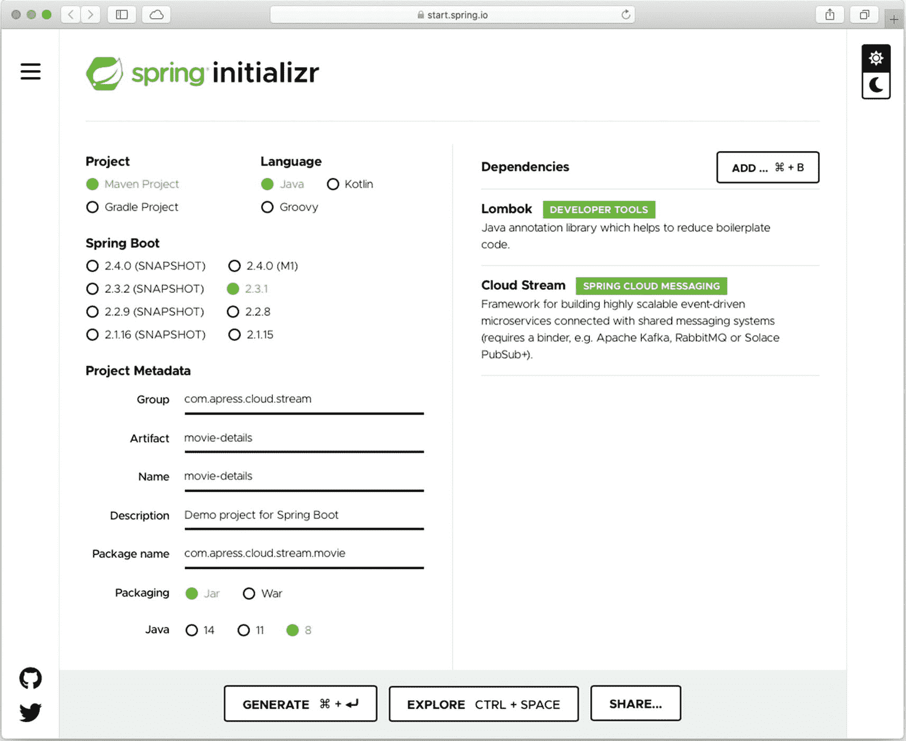

图 11-15。

Spring Initializr 电影细节流处理器

接下来，打开`pom.xml`文件，并添加以下依赖项和部分。

```java
..s.
<dependency>
        <groupId>org.springframework.cloud</groupId>
        <artifactId>spring-cloud-stream-binder-rabbit</artifactId>
</dependency>

<!-- Apache Commons -->
<dependency>
        <groupId>org.apache.httpcomponents</groupId>
        <artifactId>httpclient</artifactId>
        <version>4.5.12</version>
</dependency>

<dependency>
        <groupId>com.jayway.jsonpath</groupId>
        <artifactId>json-path</artifactId>
</dependency>
....
....
<build>
        <plugins>
                ...
                <plugin>

                        <groupId>org.springframework.cloud</groupId>
                        <artifactId>spring-cloud-app-starter-metadata-maven-plugin</artifactId>
                        <version>2.0.0.RELEASE</version>
                        <executions>
                                <execution>
                                        <id>aggregate-metadata</id>
                                        <phase>compile</phase>
                                        <goals>
                                                <goal>aggregate-metadata</goal>
                                        </goals>
                                </execution>
                        </executions>
                </plugin>
                ...
        </plugins>
</build>

<distributionManagement>
        <repository>
                <id>bintray-felipeg48-scdf</id>
                <name>felipeg48-scdf</name>
                <url>https://api.bintray.com/maven/felipeg48/scdf/movie-streams/;publish=1</url>
        </repository>
</distributionManagement>

```

不要忘记删除快照并使用版本 0.0.1。

```java
<version>0.0.1</version>

```

接下来，让我们创建`DropboxProperties`和`MovieProperties`类。请记住，您需要传递其中的一些属性来成功启动`movie-batch`应用(参见清单 [11-11](#PC42) 和 [11-12](#PC43) )。

```java
package com.apress.cloud.stream.movie;

import lombok.Data;
import org.springframework.boot.context.properties.ConfigurationProperties;

@Data
@ConfigurationProperties(prefix = "movie")
public class MovieProperties {
    String apiServer = "https://imdb8.p.rapidapi.com/title/get-details?tconst=ID";
    String headerHost = "imdb8.p.rapidapi.com";
    String headerKey = null;
    String taskName = "movie-dropbox-batch";
    DropboxProperties dropbox = new DropboxProperties();
}

Listing 11-12.src/main/java/com/apress/cloud/stream/movie/MovieProperties.java

```

```java
package com.apress.cloud.stream.movie;

import lombok.Data;
import org.springframework.boot.context.properties.ConfigurationProperties;

@Data
@ConfigurationProperties(prefix = "dropbox")
public class DropboxProperties {

    private String token = null;
    private String path = "/IMDB/";
    private String localTmpFolder = "/tmp/";
}

Listing 11-11.src/main/java/com/apress/cloud/stream/movie/DropboxProperties.java

```

正如您所看到的，它几乎和以前一样，但是 URL 发生了变化。您正在访问带来电影图片 URL 的`/title/get-details`端点。另外，还添加了一个新字段`taskName, was`，用于保存您想要启动的任务的名称。接下来，创建`Movie`和`MoviePayload`类(参见清单 [11-13](#PC44) 和 [11-14](#PC45) )。

```java
package com.apress.cloud.stream.movie;

import lombok.AllArgsConstructor;
import lombok.Data;

@AllArgsConstructor
@Data
public class MoviePayload {
    String name;
    String[] args;
}

Listing 11-14.src/main/java/com/apress/cloud/stream/movie/MoviePayload.java

```

```java
package com.apress.cloud.stream.movie;

import lombok.AllArgsConstructor;
import lombok.Data;
import lombok.NoArgsConstructor;

@AllArgsConstructor
@NoArgsConstructor
@Data
public class Movie {
    private String id;
    private String title;
    private String actor;
    private int year;
    private String genre;
    private int stars;
}

Listing 11-13.src/main/java/com/apress/cloud/stream/movie/Movie.java

```

清单 [11-14](#PC45) 显示了发送到`task-launcher-dataflow`应用的有效负载，因此它可以在`args`字段中使用正确的作业参数启动`movie-batch`任务。名称是正在创建的任务。

接下来，创建`MovieStream`类(参见清单 [11-15](#PC46) )。

```java
package com.apress.cloud.stream.movie;

import com.fasterxml.jackson.databind.ObjectMapper;
import com.jayway.jsonpath.JsonPath;
import lombok.extern.log4j.Log4j2;
import org.apache.http.HttpEntity;
import org.apache.http.client.methods.HttpGet;
import org.apache.http.impl.client.CloseableHttpClient;
import org.apache.http.impl.client.HttpClients;
import org.apache.http.util.EntityUtils;
import org.springframework.boot.context.properties.EnableConfigurationProperties;
import org.springframework.cloud.stream.annotation.EnableBinding;
import org.springframework.cloud.stream.messaging.Processor;
import org.springframework.integration.annotation.Transformer;
import org.springframework.messaging.support.GenericMessage;

import java.io.IOException;
import java.net.URI;
import java.net.URISyntaxException;
import java.nio.charset.StandardCharsets;

@Log4j2
@EnableConfigurationProperties({MovieProperties.class, DropboxProperties.class})
@EnableBinding(Processor.class)
public class MovieStream {

    private MovieProperties movieProperties;
    private final CloseableHttpClient httpclient = HttpClients.createDefault();
    private final HttpGet getRequest = new HttpGet();

    public MovieStream(MovieProperties movieProperties) {
        this.movieProperties = movieProperties;
        getRequest.addHeader("Accept", "application/json");
        getRequest.addHeader("x-rapidapi-host", movieProperties.getHeaderHost());
        getRequest.addHeader("x-rapidapi-key", movieProperties.getHeaderKey());
        getRequest.addHeader("Content-Type", "application/json");
    }

    @Transformer(inputChannel = Processor.INPUT, outputChannel = Processor.OUTPUT)
    public Object process(Movie movie){
        try {
            getRequest.setURI(new URI(movieProperties.getApiServer().replace("ID", movie.getId())));
            HttpEntity entity = httpclient.execute(getRequest).getEntity();
            String url = JsonPath.parse(EntityUtils.toString(entity, StandardCharsets.UTF_8)).read("$.image.url",String.class).toString();
            log.debug("Movie's URL: {}", url);

            ObjectMapper mapper = new ObjectMapper();
            String payload = mapper.writeValueAsString(new MoviePayload(movieProperties.getTaskName(),
                    new String[] {
                            "url=" + url,
                            "imdbId=" + movie.getId(),
                            "dropbox.token=" + movieProperties.getDropbox().getToken(),
                            "dropbox.path=" + movieProperties.getDropbox().getPath(),
                            "dropbox.local-tmp-folder=" + movieProperties.getDropbox().getLocalTmpFolder()
                    }));

            return new GenericMessage<>(payload);
        } catch (IOException | URISyntaxException e) {
            e.printStackTrace();
        }
        throw new RuntimeException("Can't process the Movie.");

    }
}

Listing 11-15.src/main/java/com/apress/cloud/stream/movie/MovieStream.java

```

清单 [11-15](#PC46) 显示了`MovieStream`类。您已经了解了这种流风格，在这里您声明了`@EnableBinding`并将流配置为处理器。`@Transformer`注释使用输入和输出通道。Apache Commons 请求`/title/details`获取电影的艺术 URL，并将其传递给`MoviePayload`实例，然后您只需向 sink 发送一个带有这个简单有效负载的`GenericMessage`。要启动的任务的名称及其作业参数。

接下来，打开`application.properties`文件，添加清单 [11-16](#PC47) 中的内容。

```java
# Server
server.port=8085

# IMDB API
movie.api-server=https://imdb8.p.rapidapi.com/title/get-details?tconst=ID
movie.header-host=imdb8.p.rapidapi.com
movie.header-key=YOUR-KEY
movie.task-name=movie-dropbox-batch
movie.dropbox.token=YOUR-TOKEN

# Bindings - RabbitMQ
spring.cloud.stream.bindings.input.destination=imdb
spring.cloud.stream.bindings.output.destination=task

# Logging
logging.level.com.apress.cloud.stream.movie=DEBUG

Listing 11-16.src/main/resources/application.properties

```

当然，其中一些属性必须被设置，而不是最终 JAR 的一部分，比如键和任务的名称。现在您可以编译、打包和部署到您的 Maven 存储库。

```java
./mvnw -DskipTests clean package
./mvnw -DskipTests deploy

```

#### 使用仪表板

现在是时候使用仪表板来创建流管道 DSL 了。确保您的 Spring Cloud 数据流服务器及其组件已经启动并正在运行。您还需要运行 NATs 服务器。打开您的仪表板，转到应用注册。选择**批量导入申请**。在应用作为属性文本区域中使用以下属性。

```java
source.http=maven://org.springframework.cloud.stream.app:http-source-rabbit:2.1.2.RELEASE
source.http.metadata=maven://org.springframework.cloud.stream.app:http-source-rabbit:jar:metadata:2.1.2.RELEASE
source.movie-web=maven://com.apress.cloud.stream:movie-source:0.0.1
processor.movie-imdb=maven://com.apress.cloud.stream:movie-processor:0.0.1
processor.movie-imdb.metadata=maven://com.apress.cloud.stream:movie-processor:jar:metadata:0.0.1
processor.movie-details=maven://com.apress.cloud.stream:movie-details:0.0.1
processor.movie-details.metadata=maven://com.apress.cloud.stream:movie-details:jar:metadata:0.0.1
processor.splitter=maven://org.springframework.cloud.stream.app:splitter-processor-rabbit:2.1.2.RELEASE
processor.splitter.metadata=maven://org.springframework.cloud.stream.app:splitter-processor-rabbit:jar:metadata:2.1.2.RELEASE
sink.movie-log=maven://com.apress.cloud.stream:movie-sink:0.0.1
sink.task-launcher-dataflow=maven://org.springframework.cloud.stream.app:task-launcher-dataflow-sink-rabbit:1.1.0.RELEASE
sink.task-launcher-dataflow.metadata=maven://org.springframework.cloud.stream.app:task-launcher-dataflow-sink-rabbit:jar:metadata:1.1.0.RELEASE
sink.log=maven://org.springframework.cloud.stream.app:log-sink-rabbit:2.1.3.RELEASE
sink.log.metadata=maven://org.springframework.cloud.stream.app:log-sink-rabbit:jar:metadata:2.1.3.RELEASE
task.movie-batch=maven://com.apress.cloud.batch:movie-batch:0.0.1
task.movie-batch.metadata=maven://com.apress.cloud.batch:movie-batch:jar:metadata:0.0.1

```

提交这些属性后，应该会列出几个应用。请注意新注册的应用(及其类型)。你包括了`task-launcher-dataflow` sink 应用，它期望一个带有名称和一些参数(作业参数)的有效载荷(见图 [11-16](#Fig16) )。

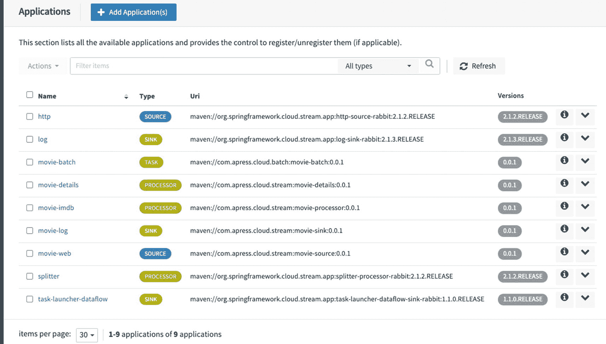

图 11-16。

应用

接下来，转到流窗格并创建流 DSL(参见图 [11-17](#Fig17) )。

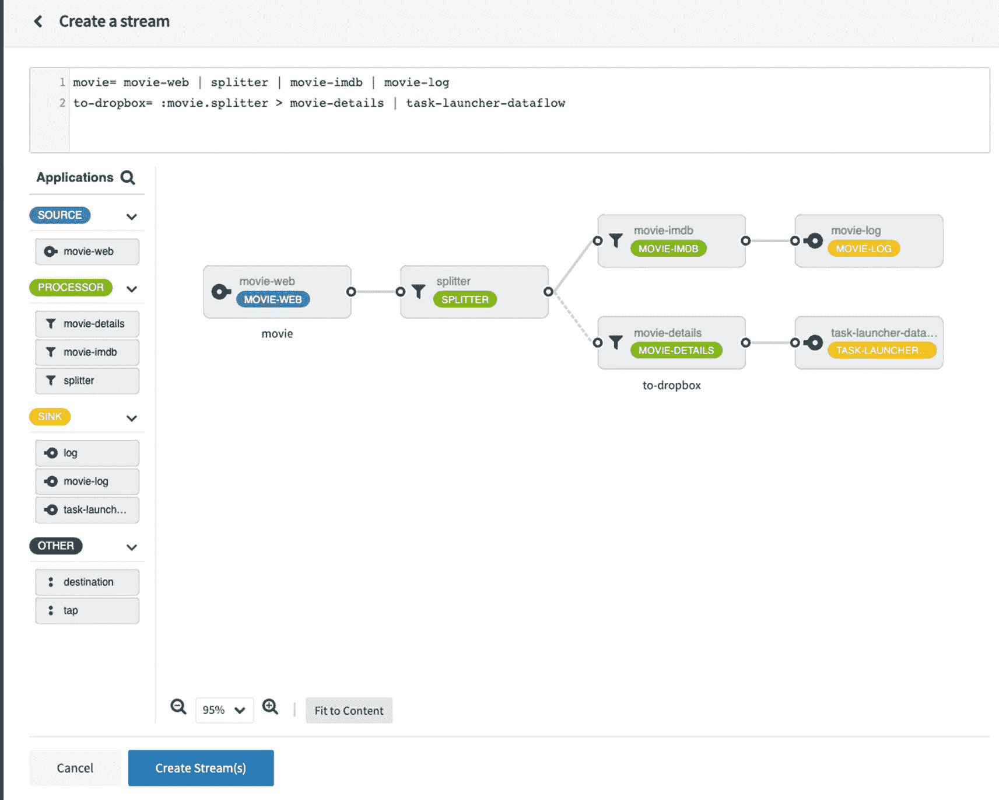

图 11-17。

创建流

```java
movie= movie-web | splitter | movie-imdb | movie-log
to-dropbox= :movie.splitter > movie-details | task-launcher-dataflow

```

您可以通过单击创建流按钮来创建流。保留默认名称(`movie`和`to-dropbox`)(见图 [11-18](#Fig18) 和 [11-19](#Fig19) )。

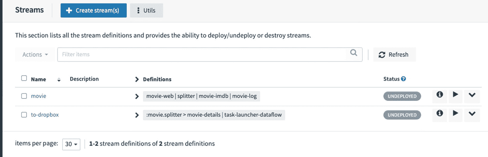

图 11-19。

流

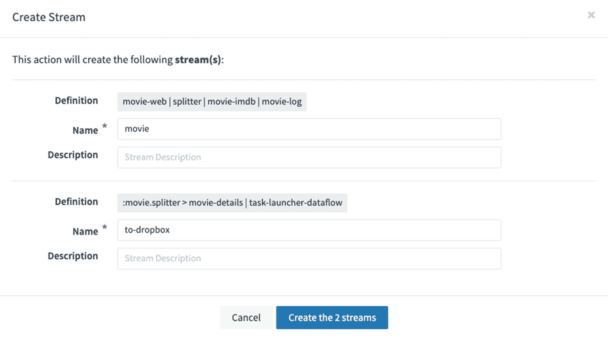

图 11-18。

创建流

接下来，转到任务窗格并创建一个任务。应当列出`movie-batch`应用(参见图 [11-20](#Fig20) )。

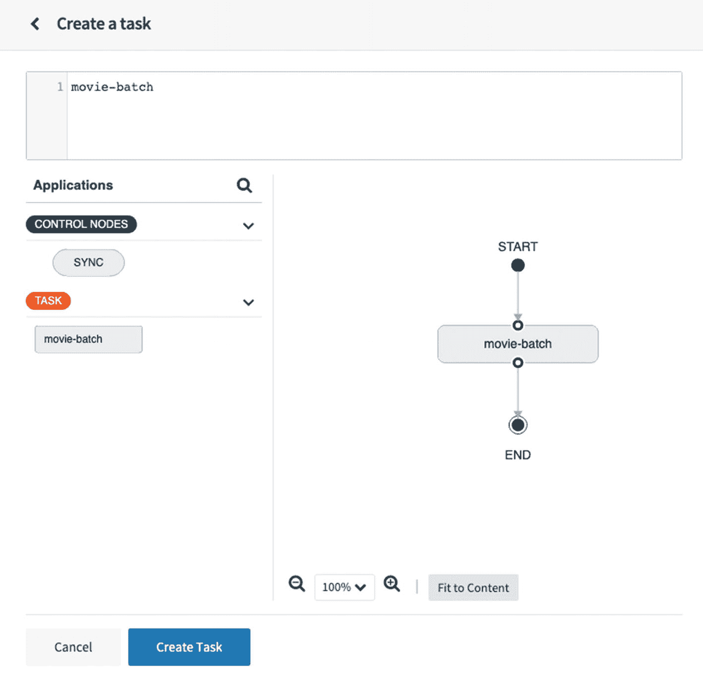

图 11-20。

创建任务

单击“创建任务”按钮，这将打开一个对话框。将其设置为`movie-dropbox-batch`(参见图 [11-21](#Fig21) )。

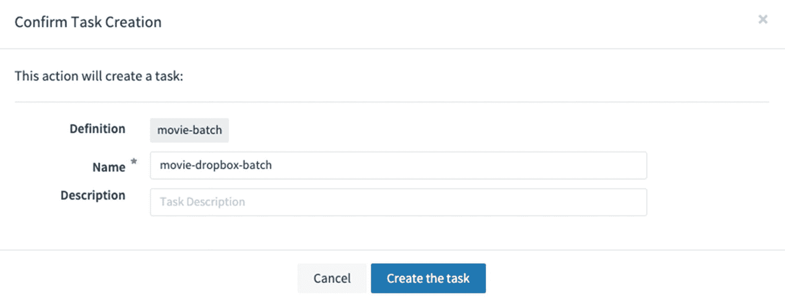

图 11-21。

任务创建

点击**创建任务**按钮。现在，您已经准备好运行流 DSL 了。转到“流”面板。点击`movie`流媒体播放按钮(>)。在自由文本窗格中，使用下列属性。

```java
app.movie-web.server.port=8081
app.movie-web.spring.cloud.stream.bindings.output.destination=movie
app.splitter.expression=#jsonPath(payload,'$.MovieRequest.movies')
app.splitter.spring.cloud.stream.bindings.input.destination=movie
app.splitter.spring.cloud.stream.bindings.output.destination=imdb
app.movie-imdb.spring.cloud.stream.bindings.input.binder=rabbit
app.movie-imdb.spring.cloud.stream.bindings.output.binder=nats
app.movie-imdb.spring.cloud.stream.bindings.input.destination=imdb
app.movie-imdb.movie.header-key=YOUR-KEY
app.movie-imdb.spring.nats.host=nats
app.movie-imdb.spring.cloud.stream.bindings.output.destination=log
app.movie-log.spring.cloud.stream.bindings.input.destination=log
app.movie-log.spring.nats.host=nats

```

在继续之前，让我们看看这些属性。您的-KEY 需要添加到电影 IMDB Rest 服务中。注意，在这个例子中，`movie-web`在端口 8081 上运行，因为我使用了 Docker Compose。但是如果你在 Kubernetes 中运行，你可以省略这个属性，因为`movie-web`应用应该用一个`LoadBalancer`类型公开(见图 [11-22](#Fig22) )。

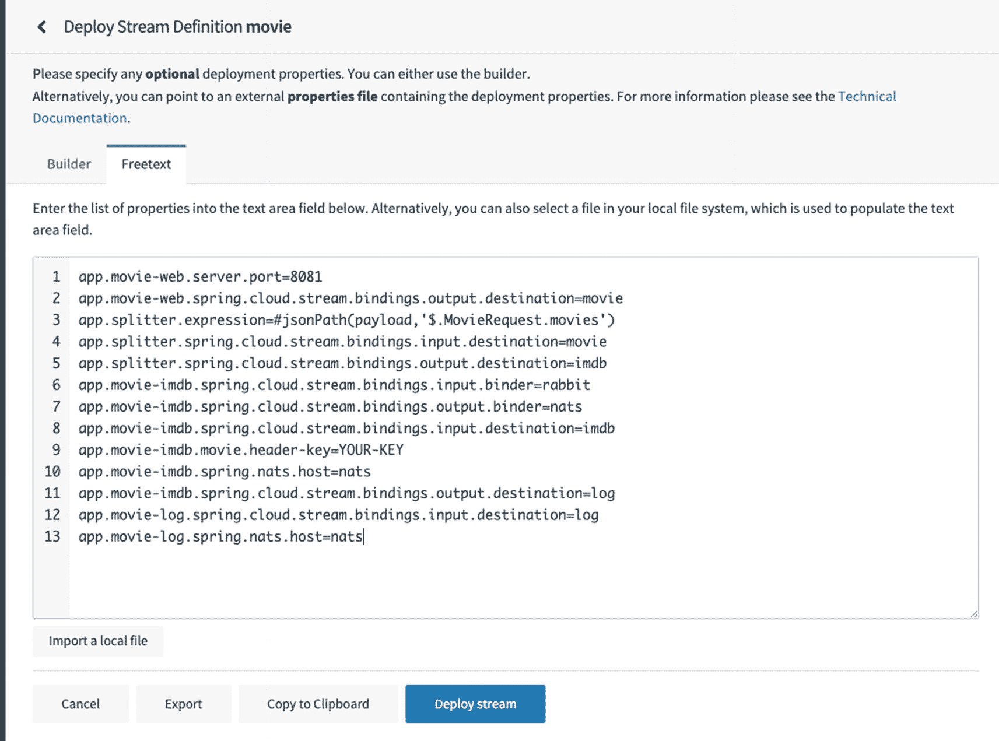

图 11-22。

自由文本属性

现在，您可以单击 Deploy Stream 按钮。接下来，在`to-dropbox`流上单击 Play 按钮，并在 Freetext 窗格中使用以下属性。

```java
app.movie-details.movie.batch-uri=maven://com.apress.cloud.batch:movie-batch:0.0.1
app.movie-details.movie.header-key=YOUR-KEY
app.movie-details.movie.task-name=movie-dropbox-batch
app.movie-details.movie.dropbox.token=YOUR-TOKEN
app.movie-details.movie.dropbox.path=/IMDB/
app.movie-details.movie.dropbox.local-tmp-folder=/tmp/
app.movie-details.spring.cloud.stream.bindings.input.destination=imdb
app.movie-details.spring.cloud.stream.bindings.output.destination=task
app.task-launcher-dataflow.spring.cloud.stream.bindings.input.destination=task
app.task-launcher-dataflow.spring.cloud.dataflow.client.server-uri=http://dataflow-server:9393

```

在继续之前，我们先分析一下这些属性。您需要 IMDB 密钥和 Dropbox 令牌。还要注意，`task-launcher-dataflow`应用需要知道数据流服务器的位置，因为您可以在不同的平台和服务器上启动任务。您可以配置目的地(参见图 [11-23](#Fig23) )。

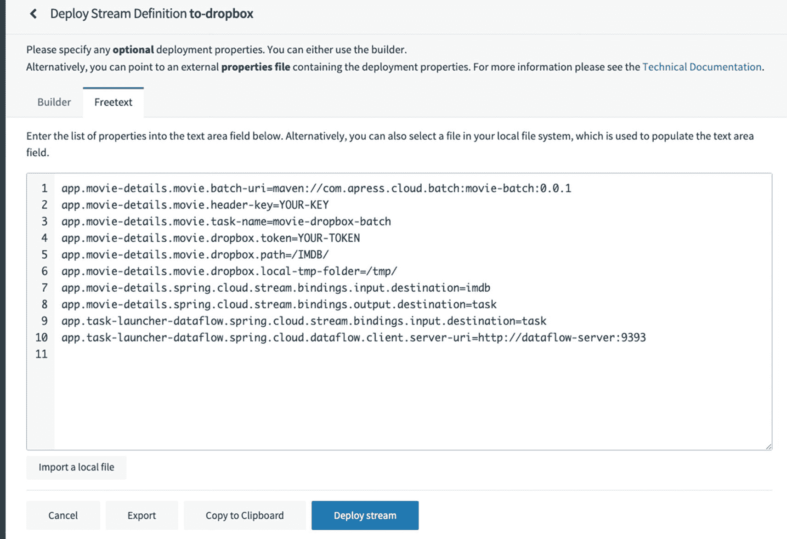

图 11-23。

自由文本属性

点击**部署流**按钮。现在您已经准备好测试它了。打开`movie-web` app，发送电影。如果任务窗格中一切正常，执行列表应该显示启动`movie-batch`的时间(参见图 [11-24](#Fig24) )。

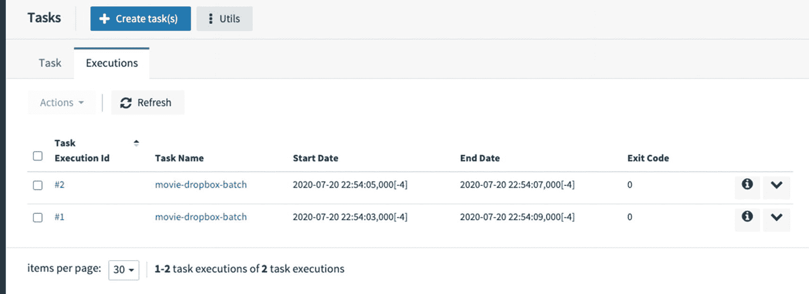

图 11-24。

任务执行

单击执行 ID 以查看用于启动任务的日志和参数。

恭喜你！！您已经创建了一个完整的流，并启动了一个 Spring Cloud 任务/批处理应用。

Note

所有的源代码、脚本、属性和 READMEs 都在`ch11/`文件夹中。

## 摘要

在本章中，您了解了 Spring Cloud Task 及其优势，包括使用 Spring Batch 创建 ETL(提取、转换、加载)。您了解了如何使用流来启动任务，并快速回顾了如何创建 Spring 批处理应用，以及如何在数据流中将它们作为 Spring 云任务来运行。

如果您想了解更多关于春云任务的信息，请访问 [`https://spring.io/projects/spring-cloud-task`](https://spring.io/projects/spring-cloud-task) 。