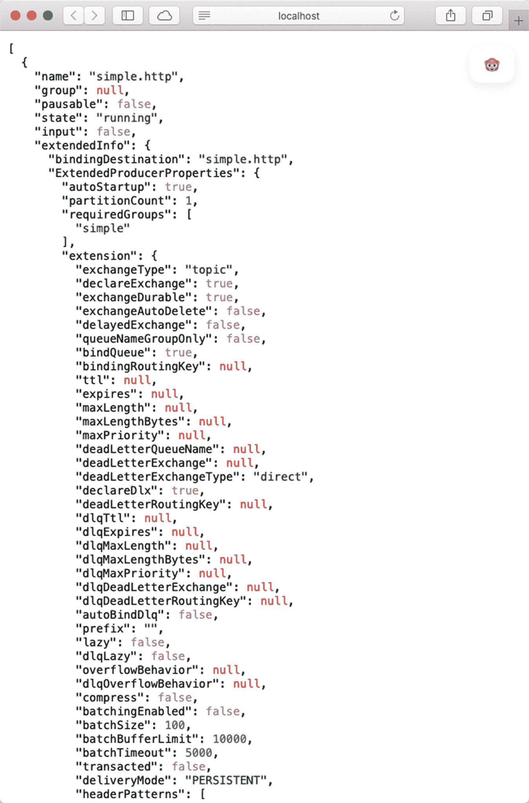
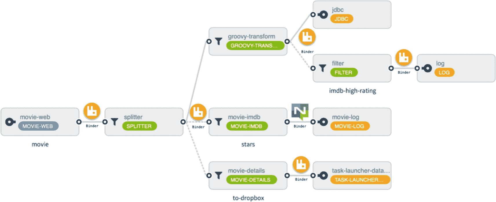
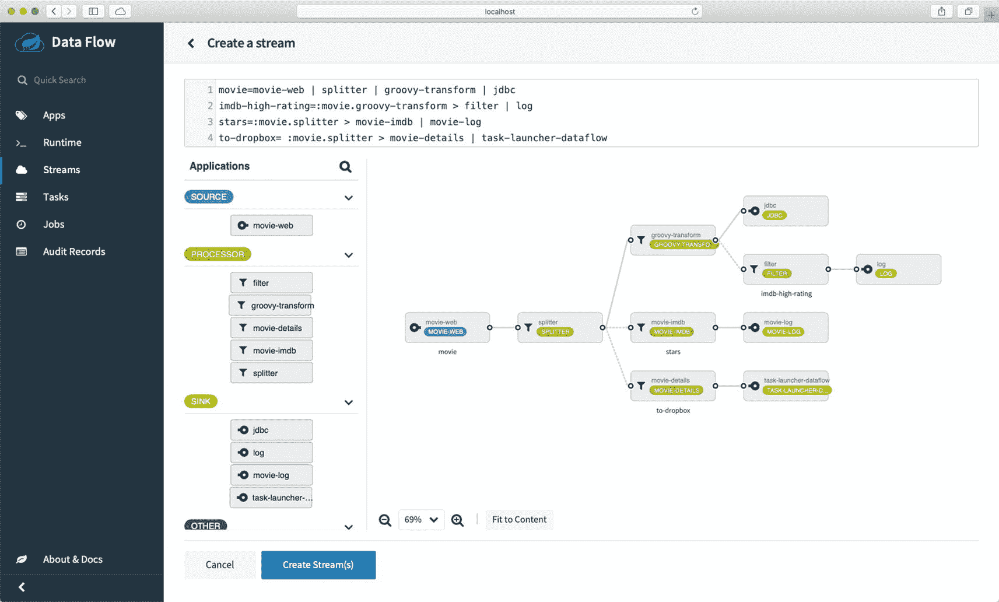
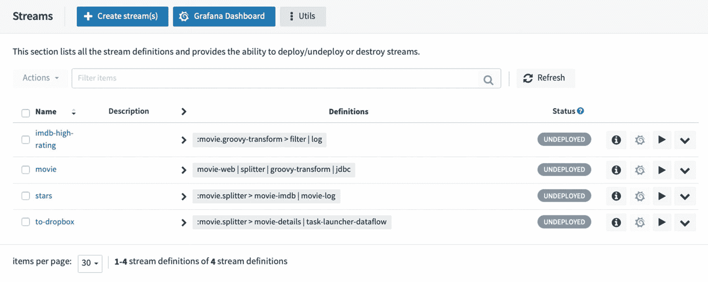
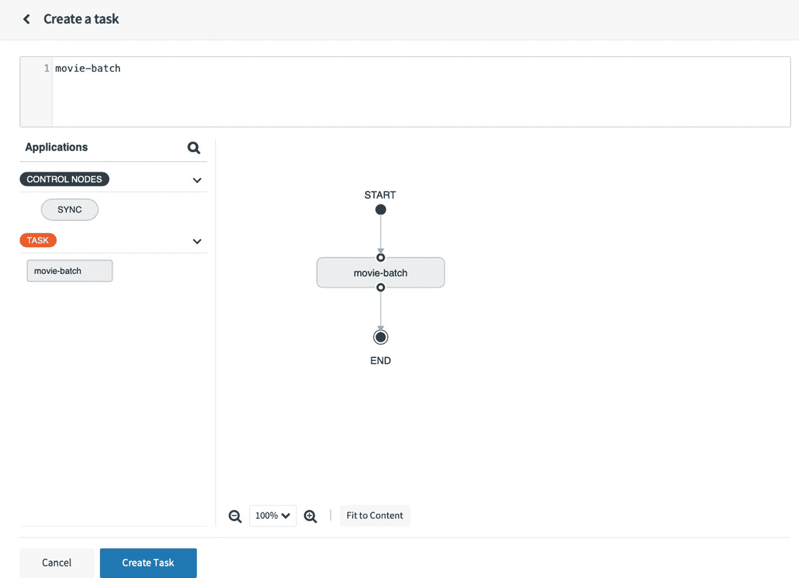
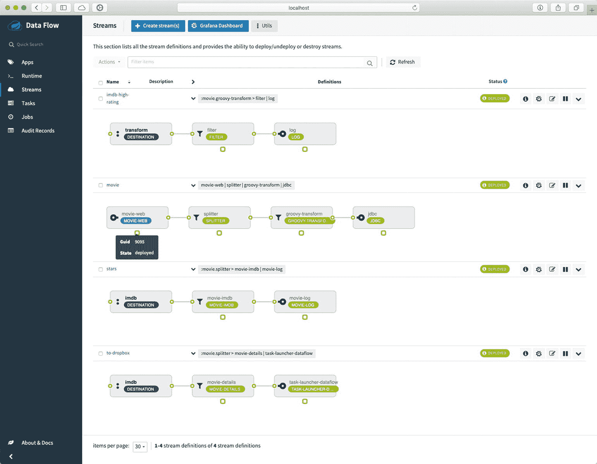
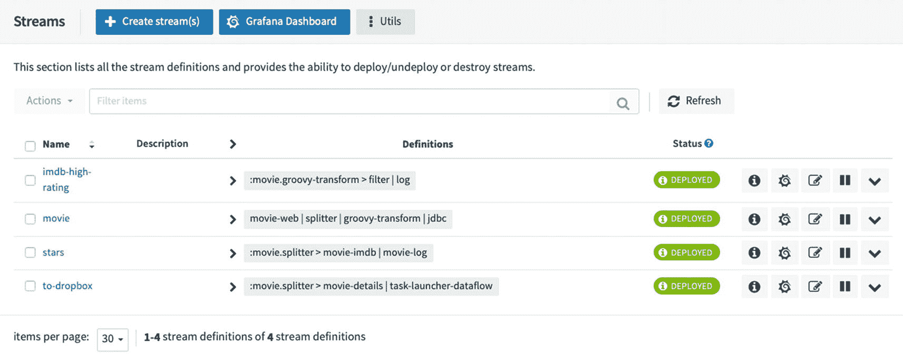
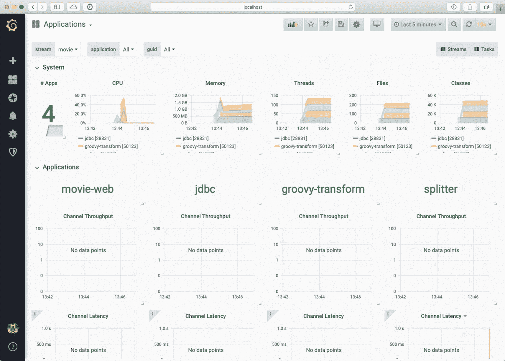
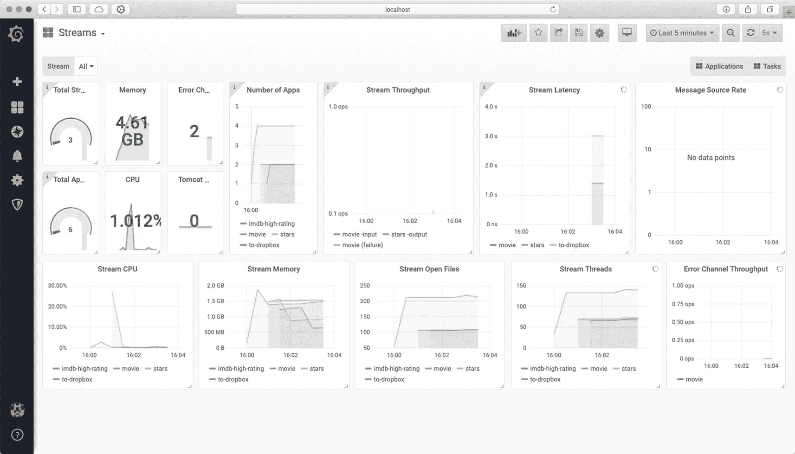

# 12.监视

在前一章中，我向您展示了如何创建任务应用并使用 streams 触发它们。在本章中，您将向前迈出一步，了解您的应用和基础架构中的可见性。回想一下，第 [1](01.html) 章讨论了允许您对基础设施、应用或业务逻辑的任何问题做出反应的所有工具。这就是为什么监控是交付正确应用和解决方案的重要一环。

Spring Cloud 数据流公开了基于微米的度量体系结构。Spring Boot 是所有 Spring Cloud 项目的主要技术，包括 Spring Cloud 数据流。因为千分尺是一个供应商中立的度量标准，它支持各种监控系统。Spring Cloud 数据流使用最流行的监控系统，包括 Prometheus、Wavefront 和 InfluxDB。好的方面是你可以通过添加一个属性来选择你想要使用的。

本章涵盖了云基础设施社区中最流行的度量系统:Prometheus 和 Grafana。在接下来的部分中，我将向您展示在流和任务中公开度量标准需要做什么，并且您将看到如何从仪表板中访问它们。

## 千分尺

Micrometer 是 Spring Boot 2.x 应用的“一等公民”,具有指标、健康检查器和其他非功能性需求。对于任何其他度量技术，您只需要添加`spring-boot-starter-actuator`依赖项和`micrometer-registry-<name-of-the-metrics-collector>`依赖项，这意味着 Spring Cloud 数据流是在考虑度量的情况下创建的。

Micrometer 是一个*维度优先的*度量收集 facade，它允许您使用供应商中立的 API 为您的代码注册时间、计数器和度量解决方案。这样，您的应用可以注册与吞吐量、总时间、最大延迟、预先计算的百分位数、百分位数、直方图、SAL 边界计数等相关的时间序列。Micrometer 对较旧的系统，如 JMX 和 Ganglia，使用维度度量和分层名称。在现有的新维度监控系统中，Micrometer 可以与 Prometheus、CloudWatch、Ganglia、Graphite、InfluxDB、网飞阿特拉斯、New Relic、StatsD、Datadog、Wavefront、SignalFx、JMX、AppOptics、Azure Application Insights、Dynatrace、ElasticbSearch 和 StackDriver 配合使用。

默认情况下，Spring Boot 2 自动配置几个指标，包括以下内容。

*   JVM，报告利用率
    *   各种内存和缓冲池

    *   与垃圾收集相关的统计信息

    *   线程利用率

    *   加载/卸载的类的数量

*   CPU 使用情况

*   Spring MVC 和 WebFlux 请求延迟

*   rest 风格的延迟模板

*   缓存利用率

*   数据源利用率，包括 HikariCP 池指标

*   RabbitMQ 连接工厂

*   文件描述符用法

*   日志回溯:记录每个级别日志回溯的事件数

*   正常运行时间:正常运行时间标尺和代表应用绝对启动时间的固定标尺

*   Tomcat 用法

Spring Boot 2 配置了一个`io.micrometer.core.instrument.MeterRegistry`组合，这样您就可以添加注册中心实现，允许您将您的指标发送到多个监控系统。通过`MeterRegistryCustomizer`，您可以一次定制一整套注册中心或者单独的实现。

Spring Boot 允许您覆盖和配置一些缺省值，因此您可以创建自己的度量分布，例如禁用 JVM 报告利用率。

```java
management.metrics.enable.jvm=false
management.metrics.distribution.percentiles-histogram.http.server.requests=true
management.metrics.distribution.sla.http.server.requests=1ms,5ms

```

要使用 Micrometer，您必须添加以下依赖项。

```java
<dependency>
    <groupId>org.springframework.boot</groupId>
    <artifactId>spring-boot-starter-actuator</artifactId>
</dependency>
<dependency>
  <groupId>io.micrometer</groupId>
  <artifactId>micrometer-registry-YOUR-METRICS-TECH</artifactId>
</dependency>

```

将以下内容添加到您的配置中。

```java
@Bean
MeterRegistryCustomizer<MeterRegistry> metricsCommonTags(@Value("${spring.application.name}") String appName) {
  return registry -> registry.config().commonTags("application", appName);
}

```

需要注意的是，在你的`application.properties`中，需要添加你的 app 的名称。

```java
spring.application.name=movie-web

```

您可以将此视为最佳实践。

## 运行状况检查和监控流应用

Spring Cloud Stream 不仅为您的流应用提供开箱即用的指标，还为绑定器提供了*健康指标*。请记住，流应用之间的通信取决于您选择的绑定器，可以是 RabbitMQ 或 Kafka 等单个绑定器，也可以为同一个流应用选择多个绑定器。当您需要这种类型的可见性(指标和健康指标)以及关于绑定器的更多信息时，您必须通过执行以下操作来告诉您的应用您正在为您的绑定使用健康指标。

1.  First, add the following dependencies to your `pom.xml`.

    ```java
    <dependency>
         <groupId>org.springframework.boot</groupId>
         <artifactId>spring-boot-starter-web</artifactId>
    </dependency>
    <dependency>
        <groupId>org.springframework.boot</groupId>
        <artifactId>spring-boot-starter-actuator</artifactId>
    </dependency>
    <dependency>
        <groupId>org.springframework.cloud.stream.app</groupId>
        <artifactId>app-starters-micrometer-common</artifactId>
        <version>2.1.5.RELEASE</version>
    </dependency>

    ```

    如果您使用的是 WebFlux，请将`spring-boot-starter-web`替换为`spring-boot-starter-webflux`。

2.  接下来，您需要设置以下属性。

    ```java
    management.health.binders.enabled=true
    management.endpoints.web.exposure.include=bindings

    ```

通过这些设置，您可以可视化当前与`/actuator/bindings`端点的绑定。如果您想了解单个活页夹，请访问`/actuator/bindings/<binding-name>`。

您可以通过执行 POST 来停止、启动、暂停和恢复绑定。

```java
curl -d '{"state":"STOPPED"}' -H "Content-Type: application/json" -X POST http://<host>:<port>/actuator/bindings/<binding-name>
curl -d '{"state":"STARTED"}' -H "Content-Type: application/json" -X POST http://<host>:<port>/actuator/bindings/<binding-name>
curl -d '{"state":"PAUSED"}' -H "Content-Type: application/json" -X POST http://<host>:<port>/actuator/bindings/<binding-name>
curl -d '{"state":"RESUMED"}' -H "Content-Type: application/json" -X POST http://<host>:<port>/actuator/bindings/<binding-name>

```

假设您创建了一个 DSL 流，如下所示。

```java
http --server.port=9095 | filter --expression=#jsonPath(payload,'$.msg').contains('Hello') | log

```

假设您有运行 Prometheus 和 Grafana 的数据流服务器，您正在本地运行它，并且您将这个流命名为`simple`，您可以在端口 9095 访问`http`应用。可以用`http://localhost:9095/actuator/bindings`和`http://localhost:9095/actuator/bindings/simple.http`得到绑定(见图 [12-1](#Fig1) )。



图 12-1。

执行器/绑定 http://localhost:9095/actuator/bindings

这意味着开箱即用的应用启动器集成了`web`和`actuator`依赖项，并预先配置为使用千分尺技术。

Note

在`ch12/docker-compose there`中是一个`README file`和用 Spring Cloud 数据流服务器运行 Prometheus 和 Grafana 的文件。回顾第 8 章[以了解如何在 Kubernetes(一个更好的应用解决方案)中运行。](08.html)

要在流应用中使用或添加*指标*，您需要添加我之前提到的依赖项。默认情况下，当 Spring Cloud streams 发现您添加了 actuator 和 metrics 技术时，它会自动配置这些指标。如果使用*普罗米修斯*作为度量技术，您必须包括以下属性。

```java
management.metrics.export.prometheus.enabled=true
management.endpoints.web.exposure.include=prometheus
spring.cloud.streamapp.security.enabled=false

```

例如，您还可以在 Grafana 等可视化工具中看到指标。然后，您可以添加任何业务逻辑来注册指标。如果您想了解更多关于公制的信息，请访问千分尺网站 [`https://micrometer.io`](https://micrometer.io) 。

## 监控任务应用

要启用任务/批处理指标，您需要具有以下依赖关系。

```java
<dependencies>
  <dependency>
      <groupId>org.springframework.boot</groupId>
      <artifactId>spring-boot-starter-actuator</artifactId>
  </dependency>
</dependencies>

<dependencyManagement>
    <dependencies>
        <dependency>
                <groupId>org.springframework.cloud</groupId>
                <artifactId>spring-cloud-dependencies</artifactId>
                <version>Hoxton.SR7</version>
                <type>pom</type>
                <scope>import</scope>
        </dependency>
    </dependencies>
</dependencyManagement>

```

因为 Spring Cloud 任务/批处理应用是短命的应用，它们需要一个服务发现组件来为应用公开的任何指标配置端点。因此，您需要以下内容。

```java
<dependency>
        <groupId>io.micrometer.prometheus</groupId>
        <artifactId>prometheus-rsocket-spring</artifactId>
        <version>1.0.0</version>
</dependency>
<dependency>
        <groupId>io.micrometer.prometheus</groupId>
        <artifactId>prometheus-rsocket-client</artifactId>
        <version>1.0.0</version>
</dependency>

```

对于普罗米修斯，如果你想使用波前，使用以下。

```java
<dependency>
    <groupId>io.micrometer</groupId>
    <artifactId>micrometer-registry-wavefront</artifactId>
</dependency>
<dependency>
    <groupId>com.wavefront</groupId>
    <artifactId>wavefront-sdk-java</artifactId>
    <version>2.6.0</version>
</dependency>

```

如果您想使用 InfluxDB，请使用下面的代码。

```java
<dependency>
    <groupId>io.micrometer</groupId>
    <artifactId>micrometer-registry-influx</artifactId>
</dependency>

```

现在，您已经知道如何向您的流添加指标和健康检查，让我们使用前面章节中的流管道 DSL 和这些功能来监控流应用。

## 电影流管道 DSL:把它们放在一起

请确保您的 Spring Cloud 数据流正常运行，并且启用了 Prometheus 和 Grafana。在源代码中，如果你想在本地运行，我创建了包含所有必要的 YAML 文件的`ch12/docker-compose`文件夹。

这是最终的管道 DSL 部署(见图 [12-2](#Fig2) )。



图 12-2。

电影管道 DSL

```java
movie=movie-web | splitter | groovy-transform | jdbc
imdb-high-rating=:movie.groovy-transform > filter | log
stars=:movie.splitter > movie-imdb | movie-log
to-dropbox= :movie.splitter > movie-details | task-launcher-dataflow

```

我在`ch12/streams`文件夹中添加了所有的流应用，如果你想导入它们并查看结果的话。如果您想跟进，您需要在每个流应用上添加:`spring-boot-starter-web`、`spring-boot-starter-actuator, micrometer-registry-prometheus`、`app-starters-micrometer-common`和`prometheus-rsocket-spring`用于批处理应用。

```java
<dependency>
        <groupId>org.springframework.boot</groupId>
        <artifactId>spring-boot-starter-actuator</artifactId>
</dependency>
<dependency>
        <groupId>io.micrometer</groupId>
        <artifactId>micrometer-registry-prometheus</artifactId>
</dependency>
<dependency>
        <groupId>io.micrometer.prometheus</groupId>
        <artifactId>prometheus-rsocket-spring</artifactId>
              <version>1.0.0</version>
</dependency>
<dependency>
        <groupId>org.springframework.cloud.stream.app</groupId>
        <artifactId>app-starters-micrometer-common</artifactId>
        <version>2.1.5.RELEASE</version>
</dependency>

```

对于每个应用，您必须增加版本—在本例中，增加到 0.0.2。

Note

`app-starters-micrometer-common`依赖关系为你的应用提供安全性，因此有必要在`movie-source`应用中配置安全性(参见清单 [12-1](#PC16) )。

```java
package com.apress.cloud.stream.movie;

import org.springframework.context.annotation.Configuration;
import org.springframework.security.config.annotation.web.builders.HttpSecurity;
import org.springframework.security.config.annotation.web.configuration.WebSecurityConfigurerAdapter;

@Configuration

public class MovieSecurityConfiguration extends WebSecurityConfigurerAdapter {

    @Override
    protected void configure(HttpSecurity http) throws Exception {
        http.csrf().disable()
            .authorizeRequests()
            .antMatchers("/**","/v1/api/movies").permitAll();
    }

}

Listing 12-1.movie-source: src/main/java/com/apress/cloud/stream/movie/MovieSecurityConfiguration.java

```

这仅用于测试目的。最后，您必须添加安全性。

您需要为`movie-batch`应用向`pom.xml`文件添加以下依赖项。

```java
<dependency>
        <groupId>io.micrometer.prometheus</groupId>
        <artifactId>prometheus-rsocket-spring</artifactId>
        <version>1.0.0</version>
</dependency>
<dependency>
        <groupId>io.micrometer.prometheus</groupId>
        <artifactId>prometheus-rsocket-client</artifactId>
        <version>1.0.0</version>
</dependency>

```

应该为将 jar 部署到 Maven 存储库配置好一切。您可以编译和部署每个流和批处理应用。我创建了一个脚本来打包和部署 JARs 当然，您也可以将其添加为 CI/CD 管道，甚至部署流管道 DSL。

现在，您可以编译、打包和部署您的流和批处理应用。

确保您的所有基础设施都在运行。接下来，您需要在 Spring Cloud 数据流服务器正在使用的 MySQL 数据库中创建`Movies`数据库。对`jdbc` app 和`movie-batch` app 有用。

```java
mysql -uroot -prootpw -e "create database movies"

```

如果您正在运行 Kubernetes，请确保您可以使用`port-forward`命令访问 MySQL 数据库，或者如果您的数据库引擎是一个服务，您可以通过`LoadBalancer`访问它。

接下来，打开浏览器，进入 Spring Cloud 数据流仪表板。在应用窗格中，单击 **+添加应用**按钮，并选择第三个选项**批量导入应用**。在文本区域添加以下应用。

```java
source.movie-web=maven://com.apress.cloud.stream:movie-source:0.0.2
processor.filter=maven://org.springframework.cloud.stream.app:filter-processor-rabbit:2.1.3.RELEASE
processor.filter.metadata=maven://org.springframework.cloud.stream.app:filter-processor-rabbit:jar:metadata:2.1.3.RELEASE
processor.movie-imdb=maven://com.apress.cloud.stream:movie-processor:0.0.2
processor.movie-details=maven://com.apress.cloud.stream:movie-details:0.0.2
processor.splitter=maven://org.springframework.cloud.stream.app:splitter-processor-rabbit:2.1.2.RELEASE
processor.splitter.metadata=maven://org.springframework.cloud.stream.app:splitter-processor-rabbit:jar:metadata:2.1.2.RELEASE
processor.groovy-transform=maven://org.springframework.cloud.stream.app:groovy-transform-processor-rabbit:2.1.3.RELEASE
processor.groovy-transform.metadata=maven://org.springframework.cloud.stream.app:groovy-transform-processor-rabbit:jar:metadata:2.1.3.RELEASE
sink.movie-log=maven://com.apress.cloud.stream:movie-sink:0.0.2
sink.task-launcher-dataflow=maven://org.springframework.cloud.stream.app:task-launcher-dataflow-sink-rabbit:1.1.0.RELEASE
sink.task-launcher-dataflow.metadata=maven://org.springframework.cloud.stream.app:task-launcher-dataflow-sink-rabbit:jar:metadata:1.1.0.RELEASE
sink.log=maven://org.springframework.cloud.stream.app:log-sink-rabbit:2.1.3.RELEASE
sink.log.metadata=maven://org.springframework.cloud.stream.app:log-sink-rabbit:jar:metadata:2.1.3.RELEASE
sink.jdbc=maven://org.springframework.cloud.stream.app:jdbc-sink-rabbit:2.1.5.RELEASE
sink.jdbc.metadata=maven://org.springframework.cloud.stream.app:jdbc-sink-rabbit:jar:metadata:2.1.5.RELEASE
task.movie-batch=maven://com.apress.cloud.batch:movie-batch:0.0.2

```

花点时间分析一下这些应用。请注意，您使用的是现成的应用启动器:`splitter`、`filter`、`jdbc`、`groovy-transform`和`task-launcher-dataflow`。

### 流管道 DSL

接下来，点击流窗格，然后点击 **+创建流**按钮(参见图 [12-3](#Fig3) )。在文本区域添加以下 DSL。



图 12-3。

流式 DSL

```java
movie=movie-web | splitter | groovy-transform | jdbc
imdb-high-rating=:movie.groovy-transform > filter | log
stars=:movie.splitter > movie-imdb | movie-log
to-dropbox= :movie.splitter > movie-details | task-launcher-dataflow

```

接下来，单击创建流按钮。然后点击四个流(见图 [12-4](#Fig4) )。



图 12-4。

流

将出现 Grafana 仪表板。您可以在部署流和任务之后使用它。

### 任务创建

点击任务窗格，+创建任务，然后添加`movie-batch`(见图 [12-5](#Fig5) )。



图 12-5。

电影批处理任务

单击创建任务按钮。将名称字段设置为`movie-dropbox-batch`。点击**创建任务**按钮，这里就设置好了。

### 流部署

接下来，让我们部署我们的流。单击每个流上的播放按钮(>)，并添加以下属性。

*   `movie`。通过选择自由文本窗格使用以下属性，并在文本区域添加以下内容。

    ```java
    app.movie-web.server.port=9095
    app.movie-web.spring.cloud.stream.bindings.output.destination=movie
    app.splitter.expression=#jsonPath(payload,'$.MovieRequest.movies')
    app.splitter.spring.cloud.stream.bindings.input.destination=movie
    app.splitter.spring.cloud.stream.bindings.output.destination=imdb
    app.groovy-transform.script=https://raw.githubusercontent.com/felipeg48/scdf-scripts/master/movie-transform.groovy
    app.groovy-transform.spring.cloud.stream.bindings.input.destination=imdb
    app.groovy-transform.spring.cloud.stream.bindings.output.destination=transform
    app.jdbc.columns=id:id,title:title,actor:actor,year:year,genre:genre,stars:stars,rating:imdb.rating,ratingcount:imdb.ratingCount
    app.jdbc.table-name=movies
    app.jdbc.password=rootpw
    app.jdbc.driver-class-name=org.mariadb.jdbc.Driver
    app.jdbc.username=root
    app.jdbc.url=jdbc:mysql://mysql:3306/reviews?autoReconnect=true&useSSL=false
    app.jdbc.spring.cloud.stream.bindings.input.destination=transform

    ```

*   `imdb-high-rating`。通过选择自由文本窗格使用以下属性，并在文本区域添加以下内容。

    ```java
    app.filter.expression="#jsonPath(payload,'$.stars') > 3"
    app.filter.spring.cloud.stream.bindings.input.destination=transform
    app.filter.spring.cloud.stream.bindings.output.destination=log
    app.log.spring.cloud.stream.bindings.input.destination=log

    ```

*   `stars`. Use the following properties by selecting the Freetext pane. In the text-area, add the following.

    ```java
    app.movie-imdb.spring.cloud.stream.bindings.input.binder=rabbit
    app.movie-imdb.spring.cloud.stream.bindings.output.binder=nats
    app.movie-imdb.spring.cloud.stream.bindings.input.destination=imdb
    app.movie-imdb.spring.cloud.stream.bindings.output.destination=movie-log
    app.movie-imdb.movie.header-key=YOUR-KEY
    app.movie-imdb.spring.nats.host=nats
    app.movie-log.spring.cloud.stream.bindings.input.destination=movie-log
    app.movie-log.spring.nats.host=nats

    ```

    请注意，您需要为 IMDB 外部服务添加您的密钥。

*   `to-dropbox`. Use the following properties by selecting the Freetext pane and adding the following in the text-area.

    ```java
    app.movie-details.movie.batch-uri=maven://com.apress.cloud.batch:movie-batch:0.0.2
    app.movie-details.movie.header-key=YOUR-KEY
    app.movie-details.movie.task-name=movie-dropbox-batch
    app.movie-details.movie.dropbox.token=YOUR-TOKEN
    app.movie-details.movie.dropbox.path=/IMDB/
    app.movie-details.movie.dropbox.local-tmp-folder=/tmp/
    app.movie-details.spring.cloud.stream.bindings.input.destination=imdb
    app.movie-details.spring.cloud.stream.bindings.output.destination=task
    app.task-launcher-dataflow.spring.cloud.stream.bindings.input.destination=task
    app.task-launcher-dataflow.spring.cloud.dataflow.client.server-uri=http://dataflow-server:9393

    ```

    在这里，您需要添加您的 IMDB 密钥和 Dropbox 令牌。

打开电影 Web 应用。如果您使用的是 Docker Compose，它应该运行在端口 9095。如果您正在使用 Kubernetes，您可以使用`port-forward`命令或确保它在负载平衡器中可用(参见图 [12-6](#Fig6) 和 [12-7](#Fig7) )。



图 12-7。

展开已部署



图 12-6。

流已部署

如果您展开已部署的流，您会看到一个带有 GUID 和州的绿色小方块，这有助于在 Prometheus 和 Grafana 中识别。

接下来，单击 Grafana 仪表板按钮。在 Grafana 网页上，用**管理员** / **管理员**登录。如果需要，单击“跳过”按钮；否则，您需要一个新的管理员用户密码。您可以导航查看流`movie`。示例如图 [12-8](#Fig8) 所示。



图 12-8。

grafana/应用/流/电影

接下来，打开您的 Web 应用。如果您使用的是本地环境，您可以通过端口 9095 访问它。点按“发送”按钮以查看所有流的工作情况。查看 Grafana 仪表板，识别每个流和任务应用(参见图 [12-9](#Fig9) )。



图 12-9。

Grafana 控制板

恭喜你！现在，您可以通过导出您的流和任务/批处理应用的指标来可视化您的环境中正在发生的事情，并对您的流中正在发生的事情做出反应。

Note

所有的源代码、脚本、属性和 READMEs 都在`ch12/`文件夹中。

## 摘要

在本章中，我向你展示了如何监控你的流和批处理应用。您可以添加任何新的自定义指标，并通过集成 Spring Boot 千分尺来展示它。它提供了对流程中的任何事件做出反应所需的可见性，包括业务逻辑和定位瓶颈的跟踪。请记住，您可以在部署属性中创建更多的实例，因此您永远不会失去处理控制。