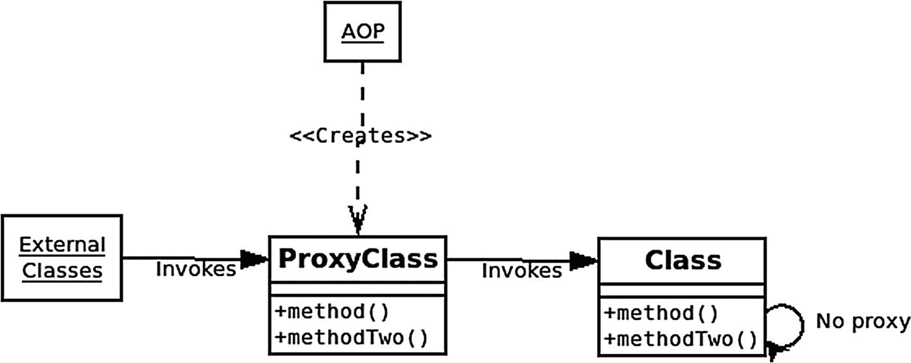

# 5.面向方面编程

AOP 代表面向方面编程。AOP 允许您解决横切关注点，例如日志记录、事务管理、安全性和缓存，而无需一遍又一遍地重复相同的代码。它允许你应用干(不要重复自己)原则。

Spring 在很多方面使用 AOP 本身，但也直接向开发人员公开工具。

简而言之，您通过定义切入点(添加额外特性的地方)和通知(您正在添加的特性)来使用 Spring AOP。

Spring 创建了两种类型的代理，要么是 JDK <sup>[1](#Fn1)</sup> (当实现一个接口时，这是内置到 JDK 中的)要么是 CGLIB <sup>[2](#Fn2)</sup> (当没有接口时操作字节码是必要的)。Final 类或方法不能被代理，因为它们不能被扩展。此外，由于代理实现，Spring AOP 只适用于 Spring Beans 上的公共、非静态方法。

## 术语

Spring AOP 使用以下术语:

*   方面——作为横切关注点的关注点的模块化。

*   连接点——它是方法执行过程中的一个点。

*   建议——一个方面在连接点采取的行动。

*   切入点——匹配一个或多个连接点的谓词称为切入点。

*   编织——向切入点添加建议的过程。

*   简介–为类型定义额外的方法字段。

*   目标对象——那些被方面建议的对象是目标对象。

*   AOP 代理 Spring AOP 创建的对象，用于满足方面契约。它在应该应用通知的地方执行通知，并委托给被代理的对象(目标对象)。

## 建议

有五种类型的建议(每种都有相应的注释):

1.  before–在方法执行之前运行

2.  after–总是在方法执行后运行，不管结果如何(类似于 Java 中的关键字`finally`)

3.  after throwing–仅在方法引发异常时运行

4.  after returning–仅在方法返回值并且可以使用该值时运行

5.  around——包装方法的执行，并给出一个类型为`ProceedingJoinPoint`的参数，您必须调用`proceed()`才能实际调用包装的方法

## 如何启用 AOP

您可以在配置中使用`@EnableAspectJAutoProxy`注释来启用 Spring AOP。

```java
@Configuration
@EnableAspectJAutoProxy
public class AppConfig {
}

```

每个方面类都应该用`@Aspect`注释进行注释。在该类中，您可以指定切入点和通知。还应该用`@Component`对其进行注释，以便通过注释扫描拾取(或者用另一种方式配置为 Spring bean)。

## 如何定义切入点

您使用一个*切入点表达式*(由 AspectJ 项目定义的表达式的子集)来定义一个切入点。在使用注释的方面中，您在一个空方法上使用`@Pointcut`注释，切入点的名称就是方法的名称，例如:

```java
@Pointcut("execution(* save(..))")
private void dataSave() {}

```

这里，切入点的名称是“dataSave()”。切入点方法的返回类型必须是`void`。它可以是任何可见度。

在这个例子中，切入点是`execution(* save(..))`，它指的是在任何类上执行任何名为`save`的方法。第一个*是通配符(匹配所有内容)，指的是方法的返回类型。**..**是指方法参数，表示“零到多个参数”，而“保存”是方法名称。切入点方法本身(dataSave)不需要任何代码。通过使用切入点的名称注释另一个方法来使用切入点，例如，假设保存方法返回值或抛出异常:

```java
@AfterReturning(value = "dataSave()", returning = "entity")
public void logSave(JoinPoint jp, Object entity) throws Throwable {
  // log the entity here
}
@AfterThrowing(pointcut = "dataSave()", throwing = "ex")
public void doAfterThrowing(Exception ex) {
  // you can intercept thrown exception here.
}
@Around("execution(* save(..))")
public Object aroundSave(ProceedingJoinPoint jp) throws Throwable {
  return jp.proceed();
}

Listing 5-1Advice examples

```

如前面的方法所示，`aroundSave`通知也可以直接声明切入点表达式。

Spring AOP 中的切入点表达式可以使用关键字`execution`和`within`以及& &、||、和！(与，或，非)。这里还有一些例子:

```java
@Pointcut("execution(public * *(..))")
private void anyPublicOperation() {}

@Pointcut("within(com.xyz..*)")
private void inXyz() {}

@Pointcut("anyPublicOperation() && inXyz()")
private void xyzOperation() {}

Listing 5-2Pointcut examples

```

切入点指的是每一个公共方法。

`inXyz`切入点指的是 com.xyz 包中每个类的每个方法。

`xyzOperation`切入点结合了另外两个切入点，意味着 com.xyz 包中的每个公共方法。

## 释文

您也可以使用`@target, @annotation`或者直接使用注释在切入点表达式中指定注释，例如:

```java
@Pointcut("@target(org.springframework.stereotype.Repository)")
public void allRepositories() {}
// use an annotation on each actual method to advise:
@Pointcut("@annotation(com.apress.spring_quick.aop.LogMe)")
public void logMes() {}

```

在前面的例子中，第一个切入点应用于用`@Repository`注释的目标类，第二个切入点引用用`@LogMe`注释的方法。您也可以使用@args 来指定方法的参数具有特定的注释。

## 切入点表达式

Spring AOP 切入点表达式支持很多关键字。尽管其中一些表达式匹配 Spring AOP 中的相同连接点，但是它们可以用于不同的绑定(我们将在接下来讨论)。作为参考，这里有许多可能的表达方式:

<colgroup><col class="tcol1 align-left"> <col class="tcol2 align-left"></colgroup> 
| 执行(公开* *(..)) | 每个公共方法。 |
| 执行(* set*(..)) | 名称以“set”开头的每个方法。 |
| 执行(* com . XYZ . service . accountservice . *(..)) | AccountService 接口中定义的每个方法。 |
| 执行(* com.xyz.service.*)。*(..)) | “com.xyz.service”包中每个类或接口中定义的每个非私有方法。 |
| 执行(* com.xyz.service..*.*(..)) | 在“com.xyz.service”包和子包中的每个类或接口中定义的每个非私有方法。 |
| 在(com.xyz.service.*)内 | “com.xyz.service”包的每个连接点。 |
| 在(com.xyz.service..*) | “com.xyz.service”包和子包的每个连接点。 |
| this(com . XYZ . service . accountservice) | 代理实现 com.xyz.service.AccountService 接口的每个连接点。 |
| 目标(com.xyz.service.AccountService) | 目标对象实现 com.xyz.service.AccountService 接口的每个连接点。 |
| args(java.io.Serializable) | 任何在运行时有一个类型为 java.io.Serializable 的参数的方法。 |
| @ target(org . spring framework . transaction . annotation . transactional) | 目标对象用@Transactional 注释的任何连接点。 |
| @ within(org . spring framework . transaction . annotation . transactional) | 目标对象的声明类型用@Transactional 注释的任何连接点。 |
| @ annotation(org . spring framework . transaction . annotation . transactional) | 任何用@Transactional 注释的方法。 |
| @ args(com . XYZ . security . my annotation) | 用 com.xyz.security.MyAnnotation 批注了单个参数的任何方法。 |
| 执行(@com.xyz.security.LogMe void *(..)) | 任何用@com.xyz.security.LogMe 注释并具有`void`返回类型的方法。 |

## Spring AOP 中的绑定

任何通知方法都可以声明一个类型为`org.aspectj.lang.JoinPoint`的参数作为它的第一个参数(请注意，around advice 是*要求*声明类型为`ProceedingJoinPoint`的第一个参数，它是`JoinPoint)`的子接口)。`JoinPoint`接口提供了许多有用的方法，如下所示:

<colgroup><col class="tcol1 align-left"> <col class="tcol2 align-left"></colgroup> 
| `getArgs`() | 返回方法参数。 |
| `getThis`() | 返回代理对象。 |
| `getSignature`() | 返回所建议方法的说明。 |
| `toString`() | 返回所建议方法的有用描述。 |
| `getTarget`() | 返回目标对象。 |

您还可以使用切入点表达式将参数传递给通知，以使用`args`、`this`、@ `annotation`或其他关键字链接参数，例如:

```java
@Before("dataSave() && args(course,..)")
public void validateCourse(Course course) {
  // ...
}

```

这有两个目的:它验证第一个参数的类型为 Course，并向 advice 方法提供该参数。

## Spring AOP 的局限性

Spring AOP 只能在 Spring Beans 上建议公共的、非静态的方法。

用代理编织有一些限制。例如，如果在同一个类中有一个从一个方法到另一个方法的内部方法调用，那么对于这个内部方法调用，通知将永远不会被执行。请参见“Spring AOP 代理”图，了解这一概念的说明。



图 5-1

Spring AOP 代理

在此图中，当 method()调用类内部的 methodTwo()时，它从不调用 ProxyClass，因此不会调用 AOP 通知。然而，任何外部类(其他 Spring beans)都将调用应用任何 before、after 或 around 逻辑的代理方法。

## 可供选择的事物

如果需要额外的功能，可以直接使用 AspectJ。此外，像 Lombok <sup>[3](#Fn3)</sup> 这样的项目提供了用于不同目的的字节码操作，比如创建不可变的数据类，我们将在后续章节中探讨。

<aside aria-label="Footnotes" class="FootnoteSection" epub:type="footnotes">Footnotes [1](#Fn1_source)

[T2`https://docs.oracle.com/javase/8/docs/technotes/guides/reflection/proxy.html`](https://docs.oracle.com/javase/8/docs/technotes/guides/reflection/proxy.html)

  [2](#Fn2_source)

[T2`https://github.com/cglib/cglib`](https://github.com/cglib/cglib)

  [3](#Fn3_source)

[T2`https://projectlombok.org/`](https://projectlombok.org/)

 </aside>