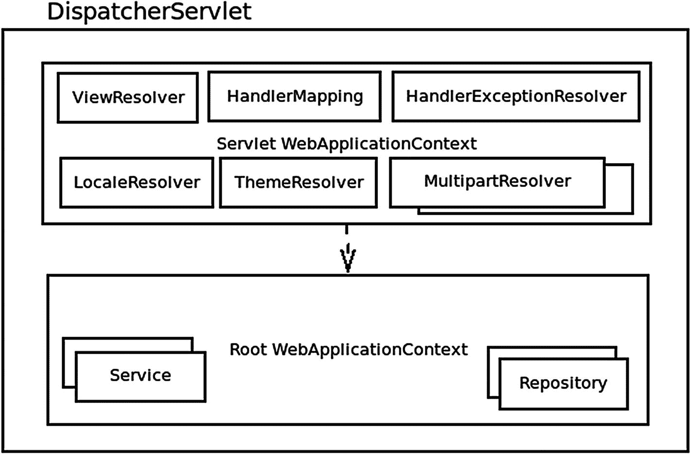
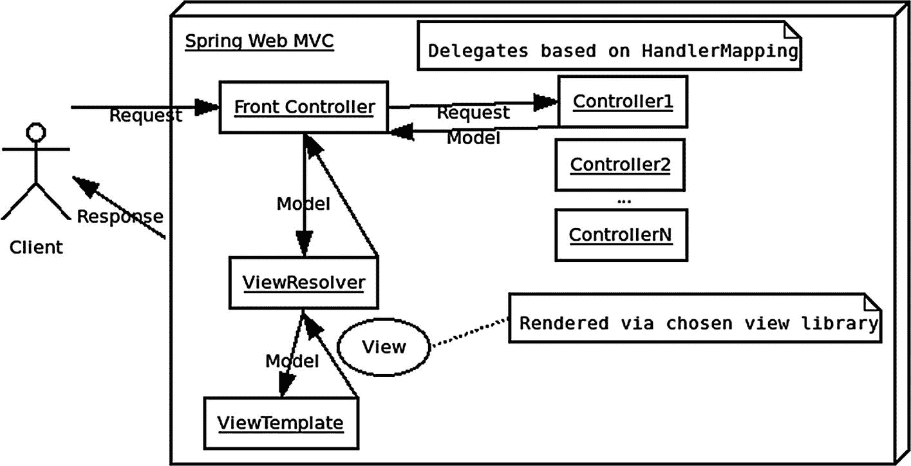

# 7.的实现

Spring web MVC 是一个用于构建 Web 服务或 Web 应用程序的框架，通常简称为 Spring MVC 或只是 MVC。 *MVC* 代表模型-视图-控制器，是 OO(面向对象)编程中常见的设计模式之一。

## 核心概念

Spring MVC 是按照开放-封闭原则设计的(开放用于扩展，封闭用于修改)。DispatchServlet 是 Spring MVC 的核心，它包含一个 Servlet WebApplicationContext(包含控制器、ViewResolver、HandlerMapping 和其他解析器)，该 Servlet 委托给一个根 WebApplicationContext(包含应用程序的服务和存储库 beans)。

它检测下列类型的 beans，如果找到就使用它们；否则，将使用默认值:HandlerMapping、HandlerAdapter、HandlerExceptionResolver、ViewResolver、LocaleResolver、ThemeResolver、MultipartResolver 和 FlashMapManager。

您可以直接与视图技术(如 JSP、Velocity 或 FreeMarker)集成，也可以通过 ViewResolver 或内置的对象映射器(使用 dto(数据传输对象)或任何 POJO)返回类似 JSON 的序列化响应。



图 7-1

前端控制器

## 入门指南

首先，将依赖项添加到项目中。

然后使用 Java config 或 XML(或自动配置)，在项目中启用 Web MVC，例如:

```java
import org.springframework.web.servlet.config.annotation.EnableWebMvc;
import org.springframework.context.annotation.Configuration;
@EnableWebMvc
public class WebConfig {}

Listing 7-1WebConfig.java

```

还要确保使用`@ComponentScan`或`@Bean`或 XML bean 定义来定义您的 Spring Beans。在一个典型的应用程序中，你可能也有服务和存储库，但是对于这一章，我们将只关注 Spring Web MVC 组件。

## 控制器

用`@Controller`注释对一个类进行注释，将其标记为控制器。使用`@RestController`类似，但是用于 RESTful web 服务控制器——它假设每个方法的返回值都被转换成一个返回值，比如 JSON(类似于用`@ResponseBody`注释方法的时候)。使用这些注释中的任何一个都将允许组件扫描选择您的类。

您还可以用`@RequestMapping`注释该类，以设置一个将应用于该类中每个方法的 URL 前缀。例如，用`@RequestMapping("/api/v1/")`注释控制器类会将“/api/v1/”前缀添加到控制器中每个方法的 URL 映射中。

## 请求映射

用`@RequestMapping`或者一个相应的 HTTP 方法类型注释来注释一个方法，比如`@GetMapping`。每个方法请求映射应该匹配一个特定的传入请求。如果有多个方法匹配同一个 HTTP 请求，Spring 将在初始化控制器时抛出一个错误(通常在启动时)。

该类的每个方法都应使用以下内容之一进行注释，以将其映射到相应的 URL 路径:

*   @ request mapping–需要设置 HTTP 方法和路径属性，例如`@RequestMapping(method = RequestMethod.PUT, path = "/courses/{id}")`。

*   @ GET mapping(`"/path"`)–映射到 HTTP GET。

*   @ POST mapping(`"/path"`)–映射到 HTTP POST。

*   @ DELETE mapping(`"/path"`)–映射到 HTTP DELETE。

*   @ PUT mapping(`"/path"`)–映射到 HTTP PUT。

*   @ PATCH mapping(`"/path"`)–映射到 HTTP 补丁。

您可以提供一个内嵌值的 URL 来定义可以映射到参数的路径变量。例如，在 URimg/{ filename }/raw”中，文件名对应于一个路径变量:

```java
@GetMapping(value =img/{filename}/raw",
  produces = MediaType.IMAGE_JPEG_VALUE)
public void getImage(@PathVariable String filename, OutputStream output) {
  // code to send image
}

Listing 7-2Example get-mapping using path variable and produces

```

在本例中，给定的`OutputStream`参数可用于提供输出数据(本例中为图像)。您可以使用`produces`来设置响应的内容类型(本例中为“image/jpeg”)。

您还可以用@ `ResponseStatus`注释一个方法，将成功的 HTTP 状态更改为默认值(200)以外的值。例如，以下代码会将响应状态代码更改为 201:

```java
@ResponseStatus(HttpStatus.CREATED)
@PostMapping(value = "/courses",
  consumes = MediaType.APPLICATION_JSON_VALUE)
public void create(@RequestBody final CourseDto course) {
   // code to save
}

Listing 7-3Create POST Mapping with custom response status

```

您还可以指定请求参数或头值，以使请求映射更加具体。例如，`@PostMapping(value = "/courses", params = "lang=java", headers = "X-custom-header")`将只匹配带有名为“lang”的查询参数、值为“java”和名为 X-custom-header 的头的 POST 请求。

### 路径正则表达式

还可以在路径变量定义中使用正则表达式来限制路径匹配。例如，以下内容仅匹配以数字结尾的路径:

```java
@GetMapping("/courses/{id:\\d+}")
public CourseDto course(@PathVariable final Long id) {
  // code to get Course
}

Listing 7-4Get Course by Id mapping

```

### 映射方法参数

控制器中映射方法的参数的有效注释如下:

*   @`RequestParam`–一个查询参数。

*   @`PathVariable`–路径的一部分。

*   @`MatrixVariable`–这些变量可以出现在路径的任何部分，字符等号(" = ")用于给出值，分号("；")来限定每个矩阵变量。在同一路径上，我们还可以重复相同的变量名，或者使用逗号(“，”)字符分隔不同的值。

*   @`RequestHeader`–来自请求的 HTTP 头。

*   @`CookieValue`–来自 cookie 的值。

*   @`RequestPart`–可用于将“multipart/form-data”请求的一部分与方法参数相关联的注释。支持的方法参数类型包括与 Spring 的`MultipartResolver`抽象结合的`MultipartFile`和与 Servlet 3.0 多部分请求结合的`javax.servlet.http.Part`，或者对于任何其他方法参数，部分的内容通过一个`HttpMessageConverter`传递，考虑请求部分的“内容类型”头。

*   @`ModelAttribute`–可用于从模型中访问对象。例如，`public String handleCustomer(@ModelAttribute("customer") Customer customer)`将使用键`"customer`T3】获得客户对象

*   @`SessionAttribute`–会话的属性。

*   @`RequestAttribute`–请求的属性。

    虽然 Java 在编译后的字节码中没有默认保留参数名，但是你可以通过一个设置来实现这一点——Spring Boot 在默认情况下会这样做，不需要任何干预，允许你自由使用与参数名关联的路径变量等等。

## 响应正文

用`@ResponseBody`注释一个方法，告诉 Spring 使用该方法的返回值作为 HTTP 响应的主体。

或者，如果用`@RestController`注释类，这意味着响应体是每个方法的返回值。

Spring 将使用`HttpMessageConverter`的实现自动将响应转换成适当的值。Spring MVC 自带内置转换器。

其他允许的响应类型有

*   实体

*   response entity<t>——包含由 Spring 的转换逻辑序列化的实体和 HTTP 值，比如 HTTP 状态</t>

*   HttpHeaders

*   字符串(要解析的视图的名称)

*   View

*   地图或模型

*   对象

*   DeferredResult <v>，Callable <v>，ListenableFuture <v>，或 CompletableFuture<v>–异步结果</v></v></v></v>

*   ResponseBodyEmitter

*   SSE 发射器

*   streamongresponsebody

*   反应型，如助焊剂

## 视图

Spring Web MVC 支持几种不同的视图呈现器，比如 JSP、FreeMarker、Groovy 模板和 Velocity。基于所选择的视图技术，所选择的 ViewResolver 将适当地公开模型、会话和请求属性。

Spring MVC 还包括一个 JSP 标记库来帮助构建 JSP 页面。

这里有一个总结 Spring MVC 如何工作的总体图，缺少一些细节，比如处理异常(我们将在后面讨论):



图 7-2

Spring Web MVC 请求/响应

### 查看解析器

Spring 提供了几种不同的视图解析器:

<colgroup><col class="tcol1 align-left"> <col class="tcol2 align-left"></colgroup> 
| 

视图解析器

 | 

描述

 |
| --- | --- |
| `AbstractCachingViewResolver` | 缓存视图的抽象视图解析器。通常视图在使用之前需要准备；扩展此视图解析程序可提供缓存。 |
| `XmlViewResolver` | `ViewResolver`的实现，它接受用 XML 编写的配置文件，使用与 Spring 的 XML bean 工厂相同的 DTD。默认的配置文件是`/WEB-INF/views.xml`。 |
| `ResourceBundleViewResolver` | 使用由包基本名称指定的`ResourceBundle`中的 bean 定义的`ViewResolver`的实现。通常，您在位于类路径中的属性文件中定义包。默认文件名是`views.properties`。 |
| `UrlBasedViewResolver` | 简单实现了`ViewResolver`接口，实现了逻辑视图名称到 URL 的直接解析，没有显式的映射定义。如果您的逻辑名称以直接的方式匹配视图资源的名称，而不需要任意的映射，那么这是合适的。 |
| `InternalResourceViewResolver` | 支持`InternalResourceView`(实际上是 Servlets 和 JSP)的`UrlBasedViewResolver`的方便子类，以及诸如`JstlView`和`TilesView`的子类。您可以使用`setViewClass(..)`为这个解析器生成的所有视图指定视图类。 |
| `VelocityViewResolver` / `FreeMarkerViewResolver` / `GroovyMarkupViewResolver` | 分别支持`VelocityView`(实际上是速度模板)、`FreeMarkerView`或 GroovyMarkupView 的`AbstractTemplateViewResolver`的方便子类，以及它们的自定义子类。 |
| `ContentNegotiatingViewResolver` | 基于请求文件名或`Accept`头解析视图的`ViewResolver`接口的实现。 |

例如，要配置一个 Spring 应用程序来使用 JSP 视图，并提供来自/images 和/styles 的静态资源，您应该创建一个名为 WebConfig.java 的 Java 配置类，如下所示:

```java
@Configuration
@EnableWebMvc
@ComponentScan(basePackages = {"com.apress.spring_quick.web"})
public class WebConfig extends WebMvcConfigurerAdapter {
    // Declare our static resources
    @Override
    public void addResourceHandlers(ResourceHandlerRegistry registry {
      registry.addResourceHandlerimg/**")
          .addResourceLocationsimg/");
      registry.addResourceHandler("/styles/**")
          .addResourceLocations("/styles/");
    }
    @Override
    public void configureDefaultServletHandling(
                DefaultServletHandlerConfigurer configurer) {
        configurer.enable();
    }
    // Serves up /WEB-INF/home.jsp for both "/" and "/home" paths:
    @Override
    public void addViewControllers(ViewControllerRegistry registry) {
        registry.addViewController("/").setViewName("home");
        registry.addViewController("/home").setViewName("home");
    }
    @Bean
    InternalResourceViewResolver getViewResolver() {
        InternalResourceViewResolver resolver =
           new InternalResourceViewResolver();
        resolver.setPrefix("/WEB-INF/");
        resolver.setSuffix(".jsp" );
        resolver.setRequestContextAttribute("requestContext");
        return resolver;
    }

Listing 7-5WebConfig.java

```

这将使用 InternalResourceViewResolver 设置一个 web 应用程序，该应用程序使用。jsp”文件扩展名。

## 错误处理

您可以使用`@ExceptionHandler`注释声明一个定制的错误处理方法。当请求处理程序方法抛出任何指定的异常时，Spring 调用这个方法。

捕获的异常可以作为参数传递给方法。例如，请参见以下方法:

```java
@ExceptionHandler(IllegalArgumentException.class)
@ResponseStatus(HttpStatus.BAD_REQUEST)
public void handleArgException(IllegalArgumentException exception) {
    // Log the exception
}

Listing 7-6Custom handleArgException method

```

注意我们如何使用`@ResponseStatus`将 HTTP 状态代码更改为 400(错误请求),在这种情况下返回。然而，这并不改变异常呈现的结果视图。您可以通过用@ `ResponseBody`注释方法并返回值来直接覆盖内容，例如:

```java
@ExceptionHandler(IllegalArgumentException.class)
@ResponseStatus(HttpStatus.BAD_REQUEST)
public ExceptionDto handleArgException(IllegalArgumentException ex) {
    return new ExceptionDto(ex);
}

Listing 7-7Custom handleArgException method which returns a DTO

```

要处理应用程序中所有控制器的异常，可以使用一个用`@ControllerAdvice`标注的类，并将所有用`@ExceptionHandler`标注的方法放在那里`.`

## Web 范围

web 应用程序中还存在其他作用域:

*   “应用程序”——应用程序范围为 ServletContext 的生命周期创建 bean 实例，它可以跨越多个基于 servlet 的应用程序。

*   “请求”—*请求*范围为单个 HTTP 请求创建一个 bean 实例。

*   “会话”—*会话*作用域为 HTTP 会话创建一个 bean。

## 测试

Spring 通常为它的所有项目提供测试支持。因为一切都是 POJO，所以编写单元测试很简单。对于 Spring MVC，Spring Boot 提供了`@WebMvcTest`注释来放置一个测试类和`MvcMock`类型，帮助测试控制器而不会有太多的性能开销。

例如，要开始使用基于 Spring MVC 梯度构建的 Spring Boot，从下面的梯度构建文件开始:

```java
plugins {
  id 'org.springframework.boot' version '2.2.6.RELEASE'
  id 'io.spring.dependency-management' version '1.0.9.RELEASE'
  id 'java'
}
group = 'com.apress.spring-quick'
version = '0.0.1-SNAPSHOT'
sourceCompatibility = '11'

repositories {
  mavenLocal()
  mavenCentral()
}
dependencies {
  implementation 'org.springframework.boot:spring-boot-starter-web'
  testImplementation('org.springframework.boot:spring-boot-starter-test') {
    exclude group: 'org.junit.vintage', module: 'junit-vintage-engine'
  }
}
test {
  useJUnitPlatform()
}

Listing 7-8build.gradle

```

然后在与应用程序的主配置文件相同的包中(或在一个子包中)创建一个名为 ControllerTest 的基于 JUnit 5 的测试类，如下所示:

1.  将@ExtendWith 与 SpringExtension 一起使用可以使 Spring 的测试助手扫描类似@MockBean 注释的东西，该注释创建一个 Bean，它是一个(mockito)模拟实例。

2.  使用@WebMvcTest 会导致 Spring 只自动配置应用程序的 MVC 层，包括控制器。

3.  在 MockMvc 的实例上调用 perform 会调用 HandlerMapping 逻辑，并有一个用于验证响应的 fluent 接口。在这种情况下，我们使用“`.andDo(print())`”将其打印出来，然后期望 HTTP 状态为 OK (200)，并使用“`content().string(containsString(String))`”来验证响应字符串是否具有预期的结果。

```java
import com.apress.spring_quick.jpa.simple.Course;
import com.apress.spring_quick.jpa.simple.SimpleCourseRepository;
import org.junit.jupiter.api.Test;
import org.junit.jupiter.api.extension.ExtendWith;
import org.springframework.beans.factory.annotation.Autowired;
import org.springframework.boot.test.autoconfigure.web.servlet.WebMvcTest;
import org.springframework.boot.test.mock.mockito.MockBean;
import org.springframework.test.context.junit.jupiter.SpringExtension;
import org.springframework.test.web.servlet.MockMvc;
import java.util.List;
import static org.hamcrest.Matchers.containsString;
import static org.mockito.Mockito.when;
import static org.springframework.test.web.servlet.request.MockMvcRequestBuilders.get;
import static org.springframework.test.web.servlet.result.MockMvcResultHandlers.print;
import static org.springframework.test.web.servlet.result.MockMvcResultMatchers.content;
import static org.springframework.test.web.servlet.result.MockMvcResultMatchers.status;

@ExtendWith(SpringExtension.class) //(1)
@WebMvcTest                        //(2)
public class ControllerTest {

    @Autowired

    private MockMvc mockMvc;
    @MockBean
    private SimpleCourseRepository courseRepository;

    @Test
    public void coursesShouldReturnAllCourses() throws Exception {
        Course course = new Course();
        course.setName("Java Professional");
        course.setSubtitle("Java 11");
        course.setDescription("");
        when(courseRepository.findAll()).thenReturn(List.of(course));
        mockMvc.perform(get("/api/v1/courses"))           //(3)
                .andDo(print()).andExpect(status().isOk())
                .andExpect(content().string(
        containsString("[{\"id\":null,\"title\":\"Java Professional\"" +
          ",\"subtitle\":\"Java 11\",\"description\":\"\"}]")));
    }
}

Listing 7-9ControllerTest.java

```

如果没有 Spring Boot 自动配置，您也可以使用`MockMvcBuilders.` `webAppContextSetup(WebApplicationContext)`方法创建一个 MockMvc 实例，例如:

```java
// imports:
import static org.springframework.test.web.servlet.setup.MockMvcBuilders.*;
// ...code:
WebApplicationContext wac = /** Create the application context */;
MockMvc mockMvc = webAppContextSetup(wac).build();

```