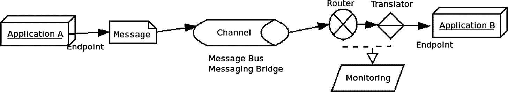

# 13.弹簧集成

Spring Integration 是一个支持众所周知的企业集成模式的编程模型。

## 特征

Spring Integration 实现了许多常见的企业集成模式， <sup>[1](#Fn1)</sup> 比如通道、聚合器、过滤器和转换器，并提供了许多不同消息传递实现的抽象。



图 13-1

企业集成

Spring Integration 提供了一个消息传递范例，将一个应用程序分成多个组件，这些组件在相互不了解的情况下进行通信。除了将细粒度组件连接在一起，Spring Integration 还提供了许多通道适配器和网关来与外部系统通信。通道适配器用于单向集成(发送或接收)，网关用于请求/回复场景(入站或出站)。

支持的消息传递包括但不限于

*   REST/HTTP

*   FTP/SFTP

*   推特

*   Web 服务(SOAP)

*   TCP/UDP

*   （同 JavaMessageService）Java 消息服务

*   拉比特

*   电子邮件

春云集成

*Spring Cloud Stream* 项目建立在 Spring Integration 之上，Spring Integration 被用作消息驱动微服务的引擎。这在第 18 章[中有所涉及。](18.html)

## 入门指南

最简单的开始方式是使用 Spring Initializr 或 Spring Boot CLI 创建一个新项目(它们将在第 [15](15.html) 章中介绍)。在现有项目中，添加以下依赖项:

```java
implementation 'org.springframework.boot:spring-boot-starter-integration'
testImplementation 'org.springframework.integration:spring-integration-test'

```

然后还包括您的项目需要的任何其他 Spring Boot 启动器或其他库，例如:

```java
implementation 'org.springframework.boot:spring-boot-starter-amqp'
testImplementation 'org.springframework.amqp:spring-rabbit-test'

```

这带来了用于 AMQP 的 Spring Boot 启动器和用于测试与 RabbitMQ 集成的 spring-rabbit-test。

然后，在 Spring Boot 应用程序中，将@ `EnableIntegration`注释添加到您的一个配置类中，这将执行以下操作:

*   注册一些内置的 beans，比如`errorChannel`及其`LoggingHandler`、`taskScheduler`用于轮询器、`jsonPath` SpEL-function 等等。

*   添加几个`BeanFactoryPostProcessor`实例。

*   添加几个`BeanPostProcessor`实例来增强或转换和包装特定的 beans，以便进行集成。

*   添加注释处理器来解析消息传递注释，并在应用程序上下文中为它们注册组件。

您还可以使用`@IntegrationComponentScan`来扫描类路径，寻找特定于 Spring 集成的注释，比如`@MessagingGateway`注释。

综上所述，您的主应用程序类可能如下所示:

```java
@EnableIntegration
@IntegrationComponentScan
@SpringBootApplication
public class SpringIntApplication {

        public static void main(String[] args) {
                SpringApplication.run(SpringIntApplication.class, args);
        }
}

```

### 添加附加支持

一般来说，当您想要将 Spring Integration 与特定的技术(比如 JPA)结合使用时，您可以在 org . Spring framework . Integration groupId 下包含名为 spring-integration- *X* 的附加构件，例如，对于 Kafka: <sup>[2](#Fn2)</sup>

```java
<dependency>
    <groupId>org.springframework.integration</groupId>
    <artifactId>spring-integration-kafka</artifactId>
    <version>3.3.0.RELEASE</version>
</dependency>

```

一些可用的支持:

<colgroup><col class="tcol1 align-left"> <col class="tcol2 align-left"> <col class="tcol3 align-left"> <col class="tcol4 align-left"></colgroup> 
| 作业的装配区（JobPackArea） | 超文本传送协议 | 数据库编程 | （同 JavaMessageService）Java 消息服务 |
| 邮件 | MongoDB | 卡夫卡 | 使用心得 |
| 资源 | 无线电磁指示器（Radio Magnetic Indicator 的缩写） | 窝 | science for the people 为人类服务的科学 |
| 跺脚 | 溪流 | 系统记录 | TCP 和 UDP (ip) |
| webflux | 网络服务 | 可扩展置标语言 | XMPP |

## 消息网关

消息网关是在现有消息传递技术上使用的抽象 Spring 集成，它允许您的代码与接口进行交互，而无需了解底层通道。当您用@ `MessagingGateway`注释一个接口，用@ `Gateway`注释一个或多个方法时，Spring 在运行时使用来自您包含的支持工件的底层技术用代理实现接口。

例如，对于 Kafka 消息网关:

1.  定义 requestChannel 来发送数据，在本例中是一个字符串负载。

2.  使用`@Header`定义一个头，在本例中，消息有效负载将被发送到 Kafka 主题。

3.  定义 replyChannel，可用于从 Kafka 获取消息。注意，返回类型是 Spring 的 Message <t>接口，这是一个抽象，可以用于任何消息传递系统。replyTimeout 以毫秒为单位，所以这里是 10 秒。</t>

```java
//Use the following imports:
import org.springframework.messaging.Message;
import org.springframework.messaging.handler.annotation.Header;
import org.springframework.integration.annotation.MessagingGateway;
import org.springframework.integration.annotation.Gateway;
import org.springframework.kafka.support.KafkaHeaders;
@MessagingGateway

public interface KafkaGateway {
    @Gateway(requestChannel = "toKafka.input")              \\1
    void sendToKafka(String payload,
                     @Header(KafkaHeaders.TOPIC) String topic);                                \\2

    @Gateway(replyChannel = "fromKafka", replyTimeout = 10000)  \\3
    Message<?> receiveFromKafka();
}

```

假设一切都设置正确，Spring Integration 在运行时将 KafkaGateway 接口实现为 Spring Bean，因此可以通过以下方式调用它:

```java
KafkaGateway kafkaGateway = context.getBean(KafkaGateway.class);
String message = "any message";
String topic = "topic";
kafkaGateway.sendToKafka(message, topic);

```

## 集成流程

创建流有两种主要方法(实现 IntegrationFlow 接口)，要么使用 lambda 表达式，要么使用从`IntegrationFlows`类开始的 fluent builder DSL。

在第一个实例中，我们利用了`IntegrationFlow`是一个 SAM(单一抽象方法)接口的事实，因此可以提供一个带有一个参数的 lambda 表达式，Java 将知道它从返回类型实现了该接口，例如:

```java
    @Bean
    public IntegrationFlow toKafka(KafkaTemplate<?, ?> kafkaTemplate) {
        return flowDefinition -> flowDefinition
                .handle(Kafka.outboundChannelAdapter(kafkaTemplate)
                        .messageKey("si.key"));
    }

```

`IntegrationFlows`类可以用来创建一个`IntegrationFlow`，例如:

```java
    @Bean
    public IntegrationFlow fromKafkaFlow(
                   ConsumerFactory<?, ?> consumerFactory) {
        return IntegrationFlows
          .from(Kafka.messageDrivenChannelAdapter(consumerFactory, topic))
          .channel((Channels c) -> c.queue("fromKafka"))
          .get();
    }

```

静态方法`IntegrationFlows.from`返回一个扩展了`IntegrationFlowDefinition`的`IntegrationFlowBuilder`，并有一个“get()”方法返回一个新的`StandardIntegrationFlow`实例。`IntegrationFlowDefinition`上的方法可以让你流畅地构建一个`IntegrationFlow`，包括以下内容:

*   aggregate——abstractcorrelationmessagehandler 的特定于聚合器的实现，abstractcorrelationmessagehandler 是一个消息处理程序，它在 MessageStore 中保存相关消息的缓冲区。它负责可以批量完成的相关消息组。

*   barrier——一个消息处理程序，它挂起线程，直到具有相应相关性的消息被传递到触发器方法或超时发生。

*   bridge——一个简单的 MessageHandler 实现，它将请求消息直接传递到输出通道，而不修改它。该处理程序的主要目的是将 PollableChannel 连接到 SubscribableChannel，反之亦然。

*   通道–定义发送消息的方法。

*   claimcheck in–使用提供的 MessageStore 填充 ClaimCheckInTransformer 的 MessageTransformingHandler。

*   claimcheck out–使用提供的 MessageStore 填充 ClaimCheckOutTransformer 的 MessageTransformingHandler。

*   Control Bus–在当前 IntegrationFlow 链位置填充特定于控制总线 EI 模式的 MessageHandler 实现。

*   convert–为运行时要转换的提供的 payloadType 填充 MessageTransformingHandler 实例。

*   delay–将 DelayHandler 填充到当前的集成流位置。

*   enrich–使用提供的选项将 ContentEnricher 填充到当前集成流位置。ContentEnricher 是一个消息转换器，可以用动态或静态值增加消息的有效负载。

*   enrich headers–填充 MessageTransformingHandler，将静态配置的头值添加到消息中。

*   filter–如果消息通过给定的 MessageSelector，则 MessageFilter 仅传递到过滤器的输出通道。

*   fixedSubscriberChannel–在当前 IntegrationFlow 链位置填充 fixedSubscriberChannel 的一个实例(在 bean 实例化过程中为单个最终订户设置的专用 SubscribableChannel)。

*   Flux transform–填充一个 FluxMessageChannel 以启动对上游数据的反应式处理，将其包装到一个 Flux，通过 Flux.transform(Function)应用所提供的函数，并将结果发送到下游流中订阅的另一个 FluxMessageChannel。

*   gateway–为提供的子流或通道填充“人工”GatewayMessageHandler。

*   handle–为提供的 MessageHandler 或 MessageProcessorSpec bean 和方法名填充 ServiceActivatingHandler。

*   headerFilter–为当前的 StandardIntegrationFlow 提供 header filter。

*   log–填充当前消息通道的窃听，并使用 LoggingHandler，这是一个简单记录消息或其有效负载的 MessageHandler 实现。

*   Logan reply——该操作符只能在流的末尾使用。与“日志”方法相同。返回 [`IntegrationFlow`](https://docs.spring.io/spring-integration/api/org/springframework/integration/dsl/IntegrationFlow.html) 。

*   null channel–将 bean 作为终端操作符添加到该流定义中。返回 [`IntegrationFlow`](https://docs.spring.io/spring-integration/api/org/springframework/integration/dsl/IntegrationFlow.html) 。

*   publishSubscribeChannel——`PublishSubscribeChannel`(向每个订户发送消息的通道)`BaseIntegrationFlowDefinition.channel(java.lang.String)`方法——允许使用“子流”订户功能的特定实现。

*   重新排序–填充一个重新排序 MessageHandler，它使用 MessageStore 中相关消息的缓冲区对消息进行重新排序。

*   路线——这种方法有许多不同的变体。它们填充 MethodInvokingRouter，或者如果提供了 SpEL 表达式，则填充 ExpressionEvaluatingRouter，然后确定要使用的 MessageChannel 或通道名称。

*   routeByException–可以按异常类型路由消息。

*   route torecipients–使用 RecipientListRouterSpec 中的选项填充 RecipientListRouter，RecipientListRouterSpec 在多个通道上发送消息。

*   scatterGather 根据为分散函数提供的 MessageChannel 和为收集函数提供的 AggregatorSpec，将 ScatterGatherHandler 填充到当前的集成流位置。

*   split–使用提供的 SpEL 表达式填充 MethodInvokingSplitter 以在运行时评估服务提供的方法，或者填充 ExpressionEvaluatingSplitter。分割器将消息分割成多个消息。

*   transform–为提供的 GenericTransformer 填充 MessageTransformingHandler 实例。

*   trigger–填充 ServiceActivatingHandler 实例以执行 MessageTriggerAction。

*   wireTap–将 Wire Tap EI 模式特定的 ChannelInterceptor 实现填充到 currentMessageChannel。

这绝不是详尽无遗的。这些方法中的大多数都有几个重载的变体。

## Kafka 配置

然后，您可以在`spring.kafka.consumer`和`spring.kafka.producer`下的`application.yml`中配置 Spring Integration Kafka 的特定设置，例如:

```java
spring:
  kafka:
    consumer:
      group-id: siTestGroup
      auto-offset-reset: earliest
      enable-auto-commit: false
      value-deserializer: org.apache.kafka.common.serialization.StringDeserializer
      key-deserializer: org.apache.kafka.common.serialization.StringDeserializer
    producer:
      batch-size: 16384
      buffer-memory: 33554432
      retries: 0
      key-serializer: org.apache.kafka.common.serialization.StringSerializer
      value-serializer: org.apache.kafka.common.serialization.StringSerializer

Listing 13-1application.yml

```

安装卡夫卡留给读者作为练习。前往 [`https://kafka.apache.org/quickstart`](https://kafka.apache.org/quickstart) 并按照指示进行操作。然后按照本章的内容设置 Spring 集成。

### 主题

因为我们使用的是卡夫卡，所以我们也需要首先创建主题。

由于我们使用的是带自动配置的 Spring Boot，如果我们提供 NewTopic Spring Beans，Spring Boot 的自动配置 KafkaAdmin(来自`spring-integration-kafka)`)将为我们提供主题，例如:

```java
    @Bean
    public NewTopic topic() {
        return new NewTopic("topic", 5, (short) 1);
    }
    @Bean
    public NewTopic newTopic() {
        return new NewTopic("topic2", 5, (short) 1);
    }

```

这将创建名为“topic”和“topic2”的两个主题，复制 1 个(意味着只存储一个副本)和 5 个分区，这意味着数据将被分成 5 个分区。

## 监视

默认情况下，如果存在一个千分尺`meterRegistry` bean，这将是一个包括弹簧致动器的 Spring Boot 项目的情况，弹簧集成度量将由千分尺管理。如果您希望使用遗留的 Spring Integration 指标，可以向应用程序上下文添加一个`DefaultMetricsFactory`(来自 Spring Integration) bean。

<aside aria-label="Footnotes" class="FootnoteSection" epub:type="footnotes">Footnotes [1](#Fn1_source)

[T2`www.enterpriseintegrationpatterns.com/`](http://www.enterpriseintegrationpatterns.com/)

  [2](#Fn2_source)

[T2`https://kafka.apache.org/quickstart`](https://kafka.apache.org/quickstart)

 </aside>