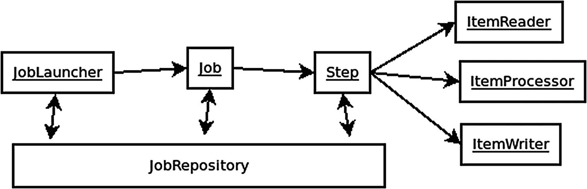

# 十四、SpringBatch

Spring Batch 是一个为企业系统支持长时间运行的数据转换或类似的长时间运行过程的项目。它有大量的特性，其中一些我们将会谈到。

## 特征

Spring Batch 提供了分区和处理大量数据的特性。它还提供了在处理大量记录时必不可少的可重用功能，包括事务管理、作业处理统计、作业重启、重试和跳过、日志记录和跟踪以及资源管理。

## 概观

在大图中，Spring Batch 由 JobLauncher、JobRepository、Jobs、Steps、ItemReaders、ItemProcessors 和 ItemWriters 组成。

JobLauncher 使用给定的作业参数运行作业。每个作业可以有多个步骤。每个步骤通常由一个 ItemReader、ItemProcessor 和 ItemWriter 组成。使用 JobRepository 保存和加载元数据，或关于每个实体状态的信息。



## 这个例子

为了演示 Spring Batch，我们将使用一个示例。在本例中，我们将使用一个简单的课程定义。Spring Batch 将用于加载定义课程的 CSV 文件，转换值，并将新的课程行保存到数据库中。

### 建设

为了简单起见，我们将使用 Spring Boot(这将在下一章更全面地介绍)。首先，我们将使用 spring-batch 定义一个 Gradle 构建，然后我们将讨论 Maven 构建。

#### Gradle Build

创建一个名为`build.` `gradle`的文件，内容如下:

```java
plugins {
  id 'org.springframework.boot' version '2.3.0.RELEASE'                 //1
  id 'io.spring.dependency-management' version '1.0.8.RELEASE'
  id 'java'
}
group = 'com.example'
version = '0.0.1-SNAPSHOT'
sourceCompatibility = '1.8'
repositories {
  mavenCentral()
}
dependencies {
  implementation 'org.springframework.boot:spring-boot-starter-batch' //2
  runtimeOnly 'org.hsqldb:hsqldb'
  testImplementation('org.springframework.boot:spring-boot-starter-test')
  {
    exclude group: 'org.junit.vintage', module: 'junit-vintage-engine'
  }
  testImplementation 'org.springframework.batch:spring-batch-test' //3
}
test {
  useJUnitPlatform() //4
}

```

1.  我们为 Spring Boot 和 Spring 依赖管理应用插件，这允许我们在依赖块中删除版本。

2.  这一行定义了 spring-boot-starter-batch，它引入了 Spring Batch 所需的所有 jar。在下一行，我们包含 hsqldb <sup>[1](#Fn1)</sup> 作为数据库。

3.  还有一个专门用于测试 Spring Batch 的库，spring-batch-test。

4.  这一行告诉 Gradle 使用 JUnit 5 进行测试。

#### Maven 构建

使用以下内容创建一个名为“pom.xml”的文件:

```java
<?xml version="1.0" encoding="UTF-8"?>
<project xmlns:="http://maven.apache.org/POM/4.0.0" xmlns:xsi="http://www.w3.org/2001/XMLSchema-instance"
        xsi:schemaLocation="http://maven.apache.org/POM/4.0.0 https://maven.apache.org/xsd/maven-4.0.0.xsd">
        <modelVersion>4.0.0</modelVersion>
        <parent>
                <groupId>org.springframework.boot</groupId>
                <artifactId>spring-boot-starter-parent</artifactId>
                <version>2.3.0.RELEASE</version>
                <relativePath/>
        </parent>
        <groupId>com.example</groupId>
        <artifactId>batch-processing</artifactId>
        <version>0.0.1-SNAPSHOT</version>
        <name>batch-processing</name>
        <description>Demo project for Spring Boot, Batch</description>

        <properties>
                <java.version>1.8</java.version>
        </properties>

        <dependencies>
                <dependency>
                        <groupId>org.springframework.boot</groupId>
                        <artifactId>spring-boot-starter-batch</artifactId>
                </dependency>
                <dependency>
                        <groupId>org.hsqldb</groupId>
                        <artifactId>hsqldb</artifactId>
                        <scope>runtime</scope>
                </dependency>
                <dependency>
                        <groupId>org.springframework.boot</groupId>
                        <artifactId>spring-boot-starter-test</artifactId>
                        <scope>test</scope>
                        <exclusions>
                                <exclusion>
                            <groupId>org.junit.vintage</groupId>
                            <artifactId>junit-vintage-engine</artifactId>
                                </exclusion>
                        </exclusions>
                </dependency>
                <dependency>
                        <groupId>org.springframework.batch</groupId>
                        <artifactId>spring-batch-test</artifactId>
                        <scope>test</scope>
                </dependency>
        </dependencies>
        <build>
                <plugins>
                        <plugin>
                        <groupId>org.springframework.boot</groupId>
                        <artifactId>spring-boot-maven-plugin</artifactId>
                        </plugin>
                </plugins>
        </build>
</project>

```

除了标准的 Spring Boot Maven 构建，我们还包括 hsqldb(数据库)、spring-boot-starter-batch 和 spring-batch-test。

由于 Spring Batch 通常涉及到与数据库的交互，并且默认情况下将元数据保存到数据库中，因此 Spring Batch 的启动依赖于`spring-boot-starter-jdbc`。

### 计划

由于 spring-boot-starter-jdbc 位于类路径中，并且我们已经包含了一个数据库(hsqldb ),所以初始化我们的数据库唯一需要做的就是在 src/main/resources/下包含一个名为 schema-all.sql 的文件。创建此文件并添加以下内容:

```java
DROP TABLE course IF EXISTS

;

CREATE TABLE course  (
    course_id BIGINT IDENTITY NOT NULL PRIMARY KEY,
    title VARCHAR(200),
    description VARCHAR(250)
);

```

### 课程

我们将课程实体定义为具有标题和描述的典型领域类(POJO ):

```java
public class Course {
        private String title;
        private String description;

        public Course() {
        }
        public Course(String title, String description) {
                this.title = title;
                this.description = description;
        }

        //getters and setters...
        @Override
        public String toString() {
                return "title: " + title + ", description: " + description;
        }
}

```

### 课程处理器

Spring Batch 提供了`ItemProcessor<I,O>`接口(I 代表输入，O 代表输出),用于在需要以某种方式修改或处理实体时实现逻辑。

在这种情况下，我们定义了一个实现`ItemProcessor<I,O>`的`CourseProcessor`，它用一个空格替换任意数量的空格，并修剪任何前导或尾随空格:

1.  我们声明 CourseProcessor 实现了 ItemProcessor 接口，当然，in 和 out 类型是相同的。如果它们不同，第一个声明的类型将声明要处理的参数的类型，第二个类型将是返回类型。

2.  这里，我们在标题和描述中都使用 replaceAll(使用正则表达式\\s+)将任何空格替换为一个空格。我们创建一个新对象，这样处理器就是幂等的——它不应该修改输入对象。

3.  最后，我们从 process 方法返回新的课程实例。

```java
import org.slf4j.Logger;
import org.slf4j.LoggerFactory;
import org.springframework.batch.item.ItemProcessor;

public class CourseProcessor implements ItemProcessor<Course, Course> { //1

  private static final Logger log =
     LoggerFactory.getLogger(CourseProcessor.class);

  @Override
  public Course process(final Course course) throws Exception {
    final String title = course.getTitle()
                               .replaceAll("\\s+", " ").trim(); //2
    final String description = course.getDescription()
                                     .replaceAll("\\s+", " ").trim();
    final Course transformedCourse = new Course(title, description);

    log.info("Converting (" + course + ") into (" + transformedCourse + ")");

    return transformedCourse; //3
  }
}

```

### 批量配置

最后，我们定义了一个@Configuration，它定义了 Spring Batch 将自动运行的步骤和作业。虽然在这种情况下我们有一个作业和一个步骤，但是也可能有多个作业和每个作业的一个或多个步骤。如果存在多个作业，您可以指定哪个或哪些作业作为属性运行(`spring.batch.job.names`)。

1.  @ `EnableBatchProcessing`启用 Spring Batch 的自动配置，提供默认的`JobRepository`、`JobBuilderFactory`、`StepBuilderFactory`等 Spring beans。

2.  我们创建一个`FlatFileItemReader<T>`，它是 Spring Batch 提供的众多助手类之一。这里，我们定义从哪个文件中读取，并使用一个`BeanWrapperFieldSetMapper<T>`，我们定义在`Course`上设置哪些字段(使用 Java Bean 标准)。

3.  我们创建一个`JdbcBatchItemWriter<T>`，它将记录插入到我们的数据库中。

4.  使用`StepBuilderFactory`，我们创建一个步骤，该步骤将分十个过程进行处理(一次十个)。为了提高效率和性能，数据以块的形式进行处理。如果块中发生任何错误，整个块都将回滚。

5.  我们使用 JobBuilderFactory 定义作业。

```java
import org.springframework.batch.core.Step;
import org.springframework.batch.core.configuration.annotation.*;
import org.springframework.batch.core.configuration.annotation.JobBuilderFactory;
import org.springframework.batch.core.configuration.annotation.StepBuilderFactory;
import org.springframework.batch.core.launch.support.RunIdIncrementer;
import org.springframework.batch.item.database.BeanPropertyItemSqlParameterSourceProvider;
import org.springframework.batch.item.database.JdbcBatchItemWriter;
import org.springframework.batch.item.database.builder.JdbcBatchItemWriterBuilder;
import org.springframework.batch.item.file.FlatFileItemReader;
import org.springframework.batch.item.file.builder.FlatFileItemReaderBuilder;
import org.springframework.batch.item.file.mapping.BeanWrapperFieldSetMapper;
import org.springframework.beans.factory.annotation.Autowired;
import org.springframework.context.annotation.Bean;
import org.springframework.context.annotation.Configuration;
import org.springframework.core.io.ClassPathResource;

import javax.sql.DataSource;

@Configuration
@EnableBatchProcessing                  //1
public class BatchConfiguration {

    @Autowired
    public JobBuilderFactory jobBuilderFactory;

    @Autowired
    public StepBuilderFactory stepBuilderFactory;

    @Bean
    public FlatFileItemReader<Course> reader() {            //2
        return new FlatFileItemReaderBuilder<Course>()
               .name("personItemReader")
               .resource(new ClassPathResource("sample-data.csv"))
               .delimited()
               .names(new String[]{"title", "description"})
               .fieldSetMapper(new BeanWrapperFieldSetMapper<Course>() {{
                    setTargetType(Course.class);
               }})
               .build();
    }

    @Bean
    public CourseProcessor processor() {
        return new CourseProcessor();
    }

    @Bean
    public JdbcBatchItemWriter<Course> writer(DataSource dataSource) { //3
        return new JdbcBatchItemWriterBuilder<Course>()
           .itemSqlParameterSourceProvider(new
                  BeanPropertyItemSqlParameterSourceProvider<>())
                .sql("INSERT INTO course (title, description) VALUES" +
                     " (:title, :description)")
                .dataSource(dataSource)
                .build();
    }

    @Bean
    public Step readAndSaveStep(JdbcBatchItemWriter<Course> writer,  //4
                                CourseProcessor processor) {
        return stepBuilderFactory.get("saveStep")
                .<Course, Course>chunk(10)
                .reader(reader())
                .processor(processor)
                .writer(writer)
                .build();
    }

    @Bean
    public Job importCourseJob(JobCompletionListener listener, Step step) {
        return jobBuilderFactory.get("importCourseJob")     //5
                .incrementer(new RunIdIncrementer())
                .listener(listener)
                .flow(step)
                .end()
                .build();
    }
}

Listing 14-1BatchConfiguration.java

```

对于本例，文件 sample-data.csv 可能如下所示(注意将被删除的多余空格):

```java
Java   11,   Java 11 for beginners
Java    Advanced,  Advanced Java course
Spring    ,   Course for Spring Framework

```

### JobExecutionListener

Spring Batch 发布可以使用`JobExecutionListener`监听的事件。例如，下面的类`JobCompletionListener`实现了`afterJob`方法，并仅在作业完成时打印出一条消息:

```java
import org.slf4j.Logger;
import org.slf4j.LoggerFactory;
import org.springframework.batch.core.BatchStatus;
import org.springframework.batch.core.JobExecution;
import org.springframework.batch.core.listener.JobExecutionListenerSupport;

import org.springframework.stereotype.Component;

@Component
public class JobCompletionListener extends JobExecutionListenerSupport {

  private static final Logger log =
          LoggerFactory.getLogger(JobCompletionListener.class);

  @Override
  public void afterJob(JobExecution jobExecution) {
    if (jobExecution.getStatus() == BatchStatus.COMPLETED) {
      log.info("JOB FINISHED!");
    }
  }
}

```

`JobExecutionListenerSupport`类实现了`JobExecutionListener`。这允许我们实现接口，并且只定义`afterJob`方法。

## Spring 批处理元数据

Spring Batch 可以自动存储关于每个批处理执行的*元数据*作为审计记录，并帮助重启或事后分析错误。

Spring 批处理元数据表与用 Java 表示它们的域对象非常匹配。例如，JobInstance、JobExecution、JobParameters 和 StepExecution 分别映射到`BATCH_JOB_INSTANCE`、`BATCH_JOB_EXECUTION`、`BATCH_JOB_EXECUTION_PARAMS`和`BATCH_STEP_EXECUTION`。执行上下文映射到`BATCH_JOB_EXECUTION_CONTEXT`和`BATCH_STEP_EXECUTION_CONTEXT.`

使用 Spring Boot，您可以确保使用以下属性创建该模式(创建表):

`spring.batch.initialize-schema=always`

默认情况下，只有当您使用嵌入式数据库时，它才会创建表。同样，您甚至可以使用

`spring.batch.initialize-schema=never`

## Spring重试

通常，在运行批处理过程时，如果某个操作失败，您可能希望自动*重试*，多次尝试相同的操作。例如，可能会出现暂时的网络故障，或者数据库出现暂时的问题。这是一个普遍期望的特征；Spring 开发了*Spring Retry*<sup>[2](#Fn2)</sup>项目，通过 AOP 或者编程来实现这个横切特性。

要开始使用 spring-retry，首先将其包含在构建中:

<colgroup><col class="tcol1 align-left"> <col class="tcol2 align-left"></colgroup> 
| `Maven` | `<dependency>``<groupId>org.springframework.retry</groupId>``<artifactId>spring-retry</artifactId>``<version>1.3.0</version>``</dependency>` |
| `Gradle` | `implementation 'org.springframework.retry:spring-retry:jar:1.3.0'` |

然后，为了使用声明式/AOP 方法，将`@EnableRetry`注释添加到您的一个 Java 配置类中(这告诉 Spring 扫描@Retryable 注释):

```java
@Configuration
@EnableBatchProcessing
@EnableRetry
public class BatchConfiguration {

```

或者在命令式(编程式)方法中使用 Spring Retry，直接使用 RetryTemplate，例如:

```java
RetryTemplate template = RetryTemplate.builder()
                                .maxAttempts(3)
                                .fixedBackoff(1000)
                                .retryOn(RemoteAccessException.class)
                                .build();

template.execute(ctx -> {
    // ... some code
});

```

在本例中，只有在抛出 RemoteAccessException 时，执行的代码才会重试三次，并且每次都会后退一秒(1000 毫秒)。

### 重试条款

<colgroup><col class="tcol1 align-left"> <col class="tcol2 align-left"></colgroup> 
| 最大尝试次数 | 最大重试次数。 |
| 固定补偿 | 增加重试之间暂停的时间(毫秒)。 |
| 指数后退 | 当有问题的系统由于过饱和而停机时，用于以指数方式增加重试之间的暂停时间(以毫秒为单位)的参数可以更好地解决问题。 |
| 随机后退 | 最好包含随机性(从 0%到 200%的延迟时间)以避免重试的相关性(这样一堆节点就不会同时重试)。 |

### 可重试注释

使用 AOP 方法，您可以用`@Retryable`(在配置类上使用`@EnableRetry`之后)注释 Spring 自省的任何方法(在 Spring bean 的公共方法上)。例如，让我们修改之前的 CourseProcessor，最多重试四次:

```java
@Retryable(maxAttempts = 4, backoff =
        @Backoff(random = true, delay = 100))
@Override
public Course process(final Course course) throws Exception {
  // code...
  return transformedCourse;

}

```

注意我们是如何使用@Backoff 注释设置回退的。

<aside aria-label="Footnotes" class="FootnoteSection" epub:type="footnotes">Footnotes [1](#Fn1_source)

[T2`http://hsqldb.org/`](http://hsqldb.org/)

  [2](#Fn2_source)

[T2`https://github.com/spring-projects/spring-retry`](https://github.com/spring-projects/spring-retry)

 </aside>