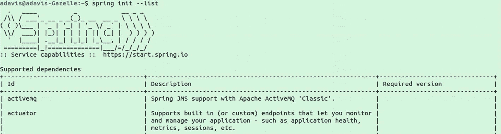
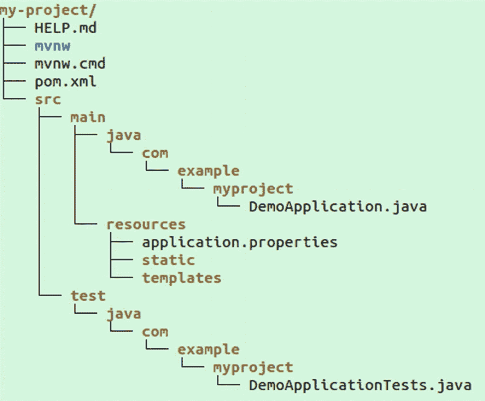

# 十五、Spring Boot

Spring Boot 消除了与构建 Spring 应用相关的大量样板文件，从而提高了开发人员的工作效率。除了注释扫描等普通的 Spring 特性之外，它还使用了约定和“starter”依赖，极大地简化了应用的开发。

同时，它非常灵活，给了开发人员很大的权限来决定包含什么，并且随着时间的推移，您可以根据需要修改配置。

## Spring Boot 简介

Spring Boot 极大地简化了基于 Spring 的应用或微服务的创建。它简化了软件开发人员的生活，通过自动配置一些东西，消除了为每个依赖项指定版本的需要。

使用 Spring Boot，开发人员可以包含许多“起始依赖项”,每个“起始依赖项”本身都包含许多库和项目的自动配置。这极大地改善了启动和添加项目的体验。在许多情况下，Spring Boot 还包括合理的默认配置。随着项目的增长，开发人员可以覆盖默认设置，并以许多不同的方式定制项目。

您可以将 web 项目打包成 WAR 或单个 JAR 文件。如果使用 jar 文件方法(这是推荐的方法)，Spring Boot 将使用一个嵌入式 web 容器，如 Tomcat 或 Jetty，并在 JAR 文件中包含所有的依赖项(称为“胖 JAR”)。

## 创建新项目

启动 Spring Boot 项目有几种方式:

1.  转到 Spring Initializr<sup>[1](#Fn1)</sup>网站，在那里创建一个项目模板。还有像 Spring Tool Suite 这样的工具，它们利用了 IDE 中的 Spring Initializr。

2.  创建自己的基于 Maven 的项目。

3.  创建自己的基于 Gradle 的项目。

4.  使用 Spring Boot 命令行界面。

您可以通过在浏览器中进入 [`https://start.spring.io`](https://start.spring.io) 或者在命令行中使用 Spring Boot CLI，轻松创建一个包含任意数量 Spring Boot 启动器的新项目。它提供了一些选项，比如是使用 Maven 还是 Gradle 构建，使用什么测试框架，使用哪种语言(Java、Groovy 或 Kotlin)等等。然后创建构建文件，主应用类，一个基本 Spring Boot 应用的测试。

### Spring Boot 命令行界面

您可以使用 SDKMAN: <sup>[2](#Fn2)</sup> 轻松安装 Spring Boot CLI

```java
$ sdk install springboot
$ spring --version
Spring Boot v2.3.0.RELEASE

```

首先，使用`spring init --list`查看所有可用的依赖项:



图 15-1

Spring 初始化列表:输出

```java
$ spring init –list

```

然后，一旦您理解了您需要哪些依赖项，您就可以使用`spring init`命令来创建您的项目；例如:



图 15-2

新 Spring Boot 项目文件结构

```java
$ spring init –d actuator,web,data-jpa,security my-project
Using service at https://start.spring.io
Project extracted to '/Users/developer/example/my-project'

```

## 回弹应用

`@SpringBootApplication`注释告诉 Spring 许多事情:

1.  使用自动配置。

2.  使用组件扫描。扫描所有的包(从类的包和所有的子包开始),寻找用 Spring 注释标注的类，比如`@Component`。

3.  这个类是一个基于 Java 的配置类(与`@Configuration`相同)，所以您可以在这里使用返回 bean 的方法上的`@Bean`注释来定义 bean。

4.  它将该类标记为应用的主配置类(与`@SpringBootConfiguration`相同)，并允许 Spring Boot 测试找到它(标记为@ `SpringBootTest`，这将在后面介绍)。

每个应用只能使用一个`@SpringBootApplication`。

<colgroup><col class="tcol1 align-left"> <col class="tcol2 align-left"> <col class="tcol3 align-left"></colgroup> 
| `@Configuration` | 将该类标记为可以定义 beans 的 Java 配置类。 | 可以有任何数字。 |
| `@SpringBootConfiguration` | 与@Configuration 相同，并且可以通过 Spring Boot 测试发现。 | 每个应用只能有一个。 |
| `@SpringBootApplication` | 与`@SpringBootConfiguration`相同，此外它还支持自动配置和组件扫描。 | 每个应用只能有一个。 |

## 自动配置

Spring Boot 自动配置考虑应用的运行时，并根据许多因素(如类路径上的库)自动配置应用。

它遵循的格言是:“如果每个人都必须做，那么为什么每个人都必须做？”

例如，要创建一个典型的 MVC web 应用，您过去需要添加一个配置类和多个依赖项，并配置一个 Tomcat 容器。使用 Spring Boot，您需要添加的只是一个依赖项和一个控制器类，它会自动添加一个嵌入式 Tomcat 实例。

配置文件可以定义为属性文件、yaml 和其他方式。首先，在“src/main/resources”下创建一个名为“application.properties”的文件，并添加以下内容:

```java
server.port=8003
app.name=Humble Code

```

这会将服务器设置为在端口 8003 上运行，并设置一个用户定义的属性 app.name，该属性可以是任何值。

### 启用自动配置

Spring Boot 背后的大部分“魔力”是自动配置——然而，一旦你知道自动配置是如何工作的，你就可以揭开它的神秘面纱。

通过在你的一个`@Configuration`类中包含`@EnableAutoConfiguration`或`@SpringBootApplication`注释，你启动了 Spring 的自动配置。这使得 Spring 能够为您的整个项目自动配置。它可以做从创建嵌入式数据库到启动 Tomcat 实例的事情。

为了定位自动配置类(和其他东西)，Spring Boot 检查您发布的 jar 中是否存在一个`META-INF/spring.factories`文件。该文件应该在`EnableAutoConfiguration`键下列出您的配置类，如下例所示:

```java
org.springframework.boot.autoconfigure.EnableAutoConfiguration=\
com.example.libx.autoconfigure.LibXAutoConfiguration,\
com.example.libx.autoconfigure.LibXWebAutoConfiguration

```

然后，这些自动配置类使用注释来描述它们应用的条件和规则。例如，看看下面名为`MyReactiveRepositoriesAutoConfiguration`的示例类声明:

```java
@Configuration
@ConditionalOnClass({ MyClient.class, ReactiveMyRepository.class })
@ConditionalOnMissingBean({
ReactiveMyRepositoryFactoryBean.class,
ReactiveMyRepositoryConfigurationExtension.class })
@ConditionalOnProperty(
prefix = "spring.data.mydb.reactive-repositories",
name = "enabled", havingValue = "true", matchIfMissing = true)
@Import(MyReactiveRepositoriesAutoConfigureRegistrar.class)
@AutoConfigureAfter(MyReactiveDataAutoConfiguration.class)
public class

MyReactiveRepositoriesAutoConfiguration {

```

我们将一次检查一个注释。

1.  @`Configuration`–声明这个类是一个 Spring 配置类。

2.  @`ConditionalOnClass`–告诉 Spring 仅当这些类在运行时类路径中时才使用这个配置。

3.  @`ConditionalOnMissingBean`–仅当 ApplicationContext 中不存在这些类型的 Beans 时，此配置才有效。

4.  @`ConditionalOnProperty`–属性`spring.data.mydb.reactive-repositories.enabled`必须设置为 true 或 missing ( `matchIfMissing`)才能调用此配置。

5.  @`Import`–导入将由 Spring 处理的另一个配置类。

6.  @`AutoConfigureAfter`–告诉 Spring 只在`MyReactiveDataAutoConfiguration`已经被处理之后才处理这个配置。

### 不包括自动配置

您可以通过使用`EnableAutoConfiguration`注释的 exclude 属性来排除某些自动配置类，例如:

```java
@EnableAutoConfiguration(exclude={DataSourceAutoConfiguration.class})
public class Application {
/* main method */
}

```

这将停止对`DataSourceAutoConfiguration`类的评估，而不管它上面的其他条件。

您还可以通过属性排除自动配置类，例如，在 yaml:

```java
spring:
  autoconfigure.exclude:
    org.springframework.boot.autoconfigure.jdbc.DataSourceAutoConfiguration

```

或者在您的 application.properties 文件中:

```java
spring.autoconfigure.exclude=\org.springframework.boot.autoconfigure.jdbc.DataSourceAutoConfiguration

```

## 应用属性

默认情况下，Spring Boot 将从名为`application.properties`(对于标准属性)或`application.yml`(对于 YAML 格式的属性)的文件，以及那些为每个活动概要文件附加了 **-PROFILE_NAME** 的文件中加载属性。

例如，如果您激活了测试概要文件，Spring 将按照这个顺序加载以下内容(后面的属性可以覆盖前面的属性):

1.  应用.属性

2.  应用程式. yml

3.  应用测试属性

4.  应用测试. yml

### 覆盖属性

环境变量也可以覆盖任何属性。Spring 自动将大写下划线语法转换为属性语法。例如，名为`SPRING_PROFILES_ACTIVE`的环境变量将覆盖属性文件中的`spring.profiles.active`。

优先级顺序是(列表中较早的条目优先于较晚的条目)

1.  命令行参数

2.  来自`SPRING_APPLICATION_JSON`的属性(嵌入在环境变量或系统属性中的内联 JSON)

3.  `web.xml`中的 Servlet 上下文参数

4.  JNDI 属性来自`java:comp/env`

5.  Java 系统属性(来自 System.getProperties())

6.  环境变量

7.  从`application-{profile}.properties`文件或类似的 YAML 文件加载的特定于配置文件的属性

8.  从`application.properties`文件或`application.yml`加载的属性

### 自动 Spring AOP

如果包含在类路径中，Spring AOP 将被自动配置。如果您设置了`spring.aop.auto=false`，配置将不会被激活。

## Spring Boot 执行器

Spring Boot *执行器*是 Spring Boot 的一个子项目，它为应用增加了几个生产级服务，将在下一章介绍。

## Spring Boot 测试

Spring Boot 为测试提供了全面的内置支持。例如，用`@RunWith(SpringRunner.class)`和`@SpringBootTest`注释一个 JUnit 4 测试类，我们可以在整个应用如下运行的情况下运行集成测试:

表 15-1

web 环境枚举

<colgroup><col class="tcol1 align-left"> <col class="tcol2 align-left"></colgroup> 
| `DEFINED_PORT` | 使用配置的任何端口创建 web 应用上下文。 |
| `MOCK (the default)` | 如果 servlet APIs 位于类路径上，则使用模拟 servlet 环境创建 WebApplicationContext，如果 Spring WebFlux 位于类路径上，则创建 ReactiveWebApplicationContext，否则创建常规 ApplicationContext。 |
| `RANDOM_PORT` | 通常与测试中的`@LocalServerPort`注入字段(设置为 Spring 分配的 HTTP 端口)一起使用。 |
| `NONE` | 创建一个 ApplicationContext 并将 spring application . setwebapplicationtype(web applicationtype)设置为`WebApplicationType.NONE`，这对于在没有 web 逻辑的情况下测试服务器端逻辑非常有用。 |

1.  在 JUnit 4 测试中，使用`@RunWith(` `SpringRunner.class` `)`来启用 Spring 测试对测试中自动连接字段的支持(对于 JUnit 5 测试，使用`@ExtendWith(SpringExtension.class)`)。

2.  使用@ `SpringBootTest`告诉 Spring 在当前包或更高的包中查找用@ `SpringBootConfiguration`或@ `SpringBootApplication`注释的类，并从该配置开始启动 ApplicationContext。使用`"webEnvironment = WebEnvironment.RANDOM_PORT"`指定每次运行测试时，Spring Boot 应用应该随机选择一个端口在本地运行。这有助于避免与任何其他正在运行的应用发生冲突。这些是可能的值:

```java
@RunWith(SpringRunner.class)                                \\1
@SpringBootTest(webEnvironment = WebEnvironment.RANDOM_PORT)\\2
public class BootApplicationTests {
  @Autowired
  private TestRestTemplate testRestTemplate;

  @Test
  public void testFreeMarkerTemplate() {
    ResponseEntity<String> entity = testRestTemplate
          .getForEntity("/", String.class);
    assertThat(entity.getStatusCode()).isEqualTo(HttpStatus.OK);
    assertThat(entity.getBody()).contains("Welcome to");
  }
}

Listing 15-1BootApplicationTests.java

```

这个简单的测试启动了我们的 Spring Boot 应用，并验证了根页面返回 HTTP OK (200)状态代码，并且正文包含文本“Welcome to”。

TestRestTemplate 是自动创建的，并被设置为向正在运行的 Spring Boot 应用发出 HTTP 请求。

Spring 还提供了@ `WebMvcTest`注释，用于创建一个只实例化和测试 MVC 控制器的测试。所需的任何其他 beans 都需要通过您提供的配置或者作为使用@ `MockBean`注释的模拟来提供，例如:

1.  为了只测试一个控制器(`CourseController)`)，我们可以使用`@WebMvcTest`并指定一个类(您可以指定多个控制器)。Spring 将自动配置 Spring MVC 基础设施，刚好足以测试这个控制器。实际上没有网络 I/O 发生，所以测试可以非常快速地运行。

2.  自动创建一个 MockMvc 的实例，该实例可用于直接测试任何使用 Spring MVC 的控制器(如第 [7](07.html) 章所述)。

3.  用`@MockBean`标记一个字段告诉 spring-test 基础设施创建该接口的一个模拟实例(使用 mockito)(在本例中为`CourseService`)。

```java
import org.springframework.boot.test.autoconfigure.web.servlet.WebMvcTest;
import org.springframework.boot.test.mock.mockito.MockBean;
import org.springframework.test.web.servlet.MockMvc;

@WebMvcTest(CourseController.class) //1
public class WebMockTest {

        @Autowired
        private MockMvc mockMvc;       //2

        @MockBean
        private CourseService service; //3

        // tests...
}

```

<aside aria-label="Footnotes" class="FootnoteSection" epub:type="footnotes">Footnotes [1](#Fn1_source)

[T2`https://start.spring.io/`](https://start.spring.io/)

  [2](#Fn2_source)

[T2`https://sdkman.io/`](https://sdkman.io/)

 </aside>